# 🚀 Product Hunt Daily Top 10 (2026-04-04)

## 1. [ZooClaw](https://www.producthunt.com/products/zooclaw)
**Votes**: 301 | **도입 난이도**: 하 | **신뢰도**: 중
**Tagline**: Your proactive team of AI specialists in one place
**서비스 링크**: https://www.producthunt.com/r/TGFUHQ2YKUAJXF

**태그**: AI, 자동화, 생산성, 전문가, 자연어처리, Agent, AI Tool, API

### 📌 이 서비스 한눈에 보기
ZooClaw는 AI 전문가 팀에 쉽게 접근하여 자연어 요청을 통해 작업을 자동화하고 최신 모델을 활용할 수 있도록 돕는 서비스입니다.

### 🔑 주요 기능
- 자연어 기반 AI 전문가 팀 연결
- 최신 AI 모델 자동 업데이트 및 오픈소스 모델 폴백
- 간단한 사용법: 설정, 배포, API 키 불필요

### 🙋 사용자에게 어떤 점이 좋은가
AI 전문가 팀을 구성하고 관리하는 번거로움 없이, 즉시 AI 기술을 활용하여 업무 효율성을 높일 수 있습니다. 복잡한 설정 없이 바로 사용할 수 있다는 점이 큰 장점입니다.

### ✅ 지금 바로 써볼 기능
- 자연어로 원하는 작업 요청해보기
- 다양한 AI 에이전트 활용해보기
- 최신 AI 모델 업데이트 확인하기

### ⚠️ 사용 전 확인할 점
- 특정 도메인 지식의 깊이 확인 필요
- 오픈소스 모델 폴백 시 성능 확인 필요

### 🧭 확인이 더 필요한 정보
ZooClaw의 AI 에이전트 팀의 전문성이 어느 수준인지, 그리고 폴백되는 오픈소스 모델의 성능이 어느 정도인지 추가 확인이 필요합니다.

### 📸 스크린샷 및 갤러리
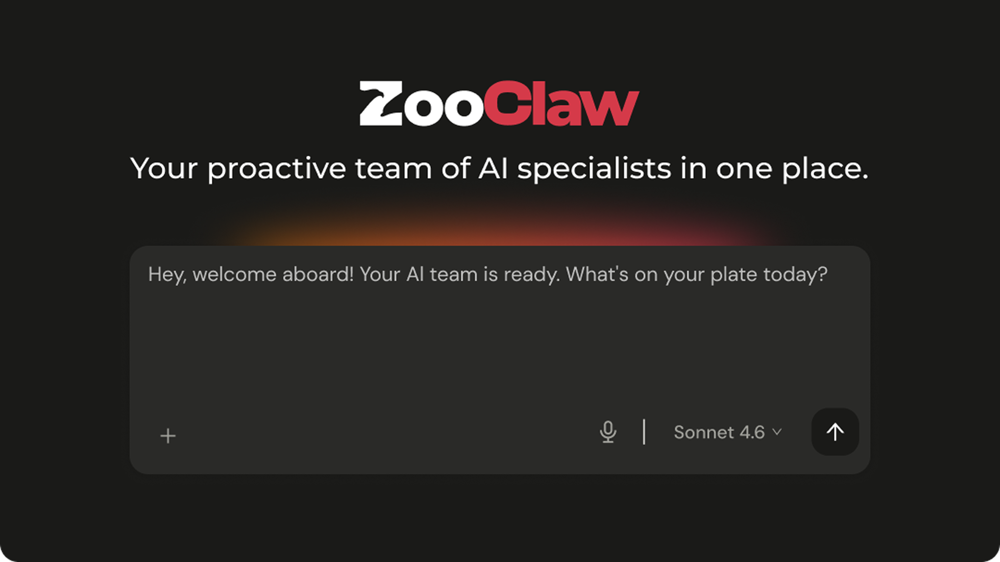
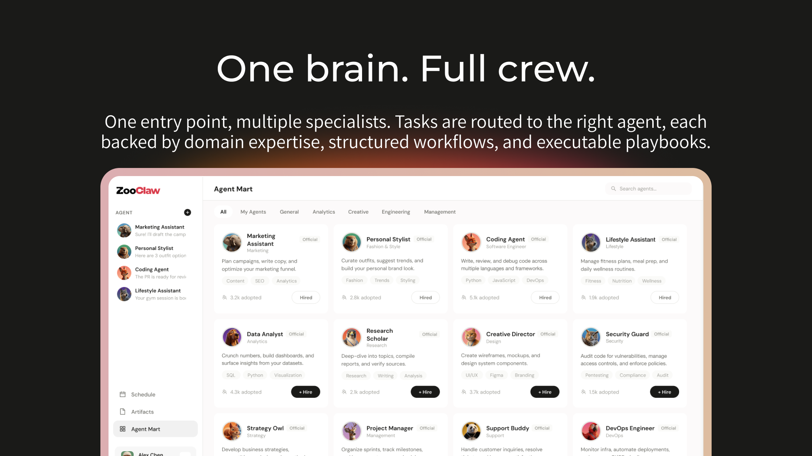
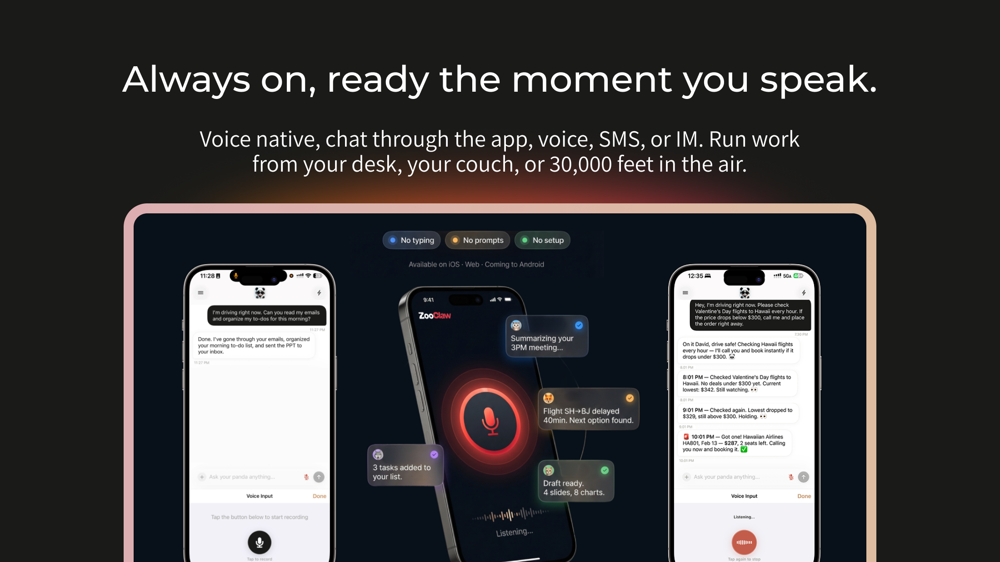

### 🎬 관련 영상
- [🎥 영상 보기](https://ph-files.imgix.net/82f2a21d-c85b-4e01-b601-2b8889dd0654.jpeg?auto=format)

---

## 2. [Google Gemma 4](https://www.producthunt.com/products/google-gemma)
**Votes**: 271 | **도입 난이도**: 중 | **신뢰도**: 중
**Tagline**: Google's most intelligent open models to date
**서비스 링크**: https://www.producthunt.com/r/VLKU6CPQMDWWVY

**태그**: AI, Open Model, Deep Learning, Development, Agent, Automation, AI Tool, DevTool

### 📌 이 서비스 한눈에 보기
Google DeepMind에서 개발한 Gemma 4는 고급 추론, 멀티모달 처리, 에이전트 워크플로우를 지원하는 가장 강력한 오픈 모델로, 개발자가 효율적으로 고성능 AI 앱을 구축할 수 있도록 돕습니다.

### 🔑 주요 기능
- 고급 추론, 멀티모달 처리, 에이전트 워크플로우 지원
- 모바일 기기부터 GPU까지 최적화
- 낮은 컴퓨팅 오버헤드로 고성능 제공

### 🙋 사용자에게 어떤 점이 좋은가
Gemma 4를 통해 개발자는 다양한 환경에서 효율적으로 AI 애플리케이션을 개발하고 배포할 수 있으며, 특히 리소스 제약이 있는 환경에서도 고성능을 유지할 수 있습니다.

### ✅ 지금 바로 써볼 기능
- Gemma 4를 활용하여 새로운 AI 앱 개발 시작
- 기존 앱에 Gemma 4의 기능을 통합하여 성능 향상
- 다양한 하드웨어 환경에서 Gemma 4의 성능 테스트

### ⚠️ 사용 전 확인할 점
- 오픈 모델의 특성상 보안 취약점 존재 가능성 확인 필요
- 특정 작업에 대한 성능은 다른 모델에 비해 낮을 수 있음

### 🧭 확인이 더 필요한 정보
실제 사용 환경에서의 성능 및 리소스 사용량에 대한 추가적인 검증이 필요합니다.

### 📸 스크린샷 및 갤러리
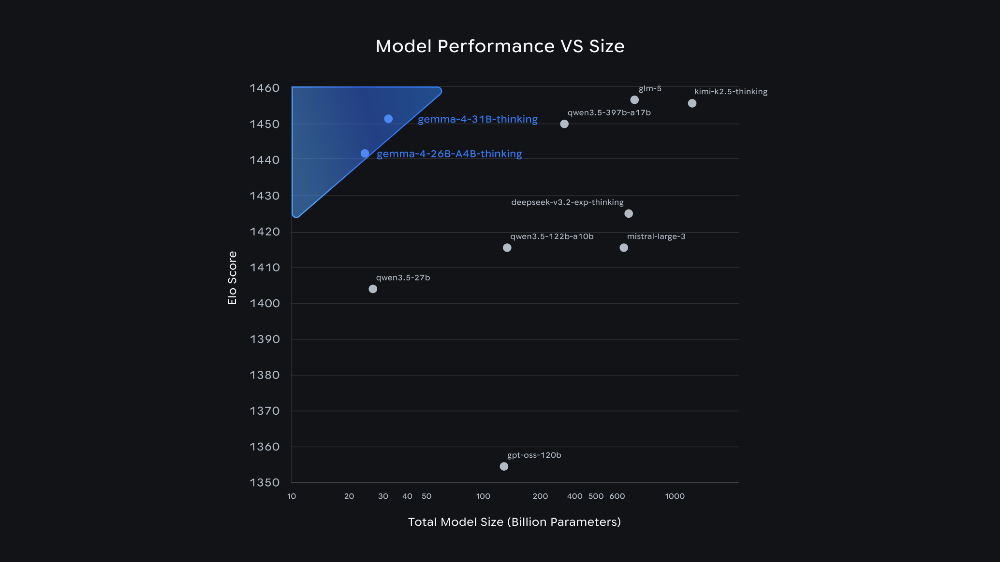
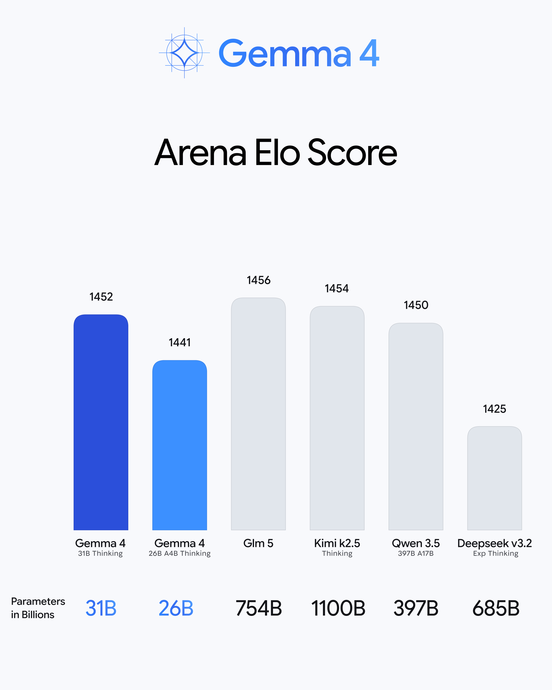
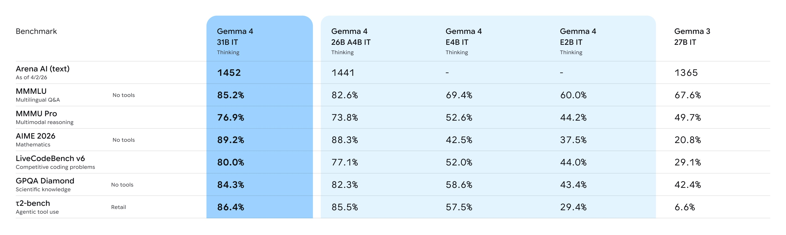

### 🎬 관련 영상
- [🎥 영상 보기](https://ph-files.imgix.net/2af904d8-9394-486f-9ba9-04aca55b4753.jpeg?auto=format)

---

## 3. [Cursor 3](https://www.producthunt.com/products/cursor-3)
**Votes**: 241 | **도입 난이도**: 중 | **신뢰도**: 중
**Tagline**: Unified workspace for parallel local/cloud agents and MCPs
**서비스 링크**: https://www.producthunt.com/r/AKIBWUTAZNLVJ2

**태그**: DevTool, 에이전트, 클라우드, 자동화, Agent

### 📌 이 서비스 한눈에 보기
Cursor 3는 로컬/클라우드 에이전트와 MCP를 활용하여 소프트웨어 개발을 통합적으로 지원하는 작업 공간입니다.

### 🔑 주요 기능
- 에이전트 기반 소프트웨어 개발
- 로컬 및 클라우드 환경 통합
- MCP(Multi-Compute Platform) 지원

### 🙋 사용자에게 어떤 점이 좋은가
Cursor 3를 통해 개발자는 다양한 환경에서 에이전트를 활용하여 더욱 효율적으로 소프트웨어를 구축하고 관리할 수 있습니다.

### ✅ 지금 바로 써볼 기능
- 에이전트 설정 및 연결
- 클라우드 환경 연동
- MCP 기능 탐색

### ⚠️ 사용 전 확인할 점
- 에이전트 호환성 확인 필요
- 클라우드 환경 설정 복잡성 존재

### 🧭 확인이 더 필요한 정보
MCP 기능의 구체적인 사용 사례 및 지원 범위에 대한 추가 정보가 필요합니다.

### 📸 스크린샷 및 갤러리
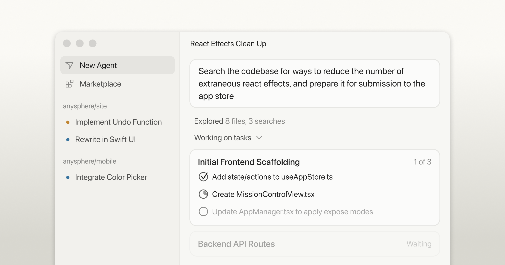
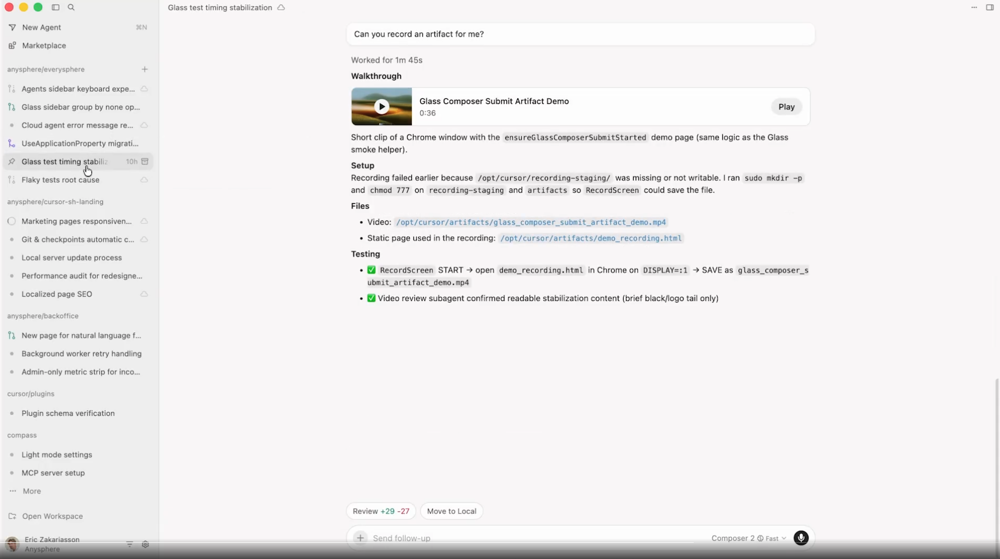
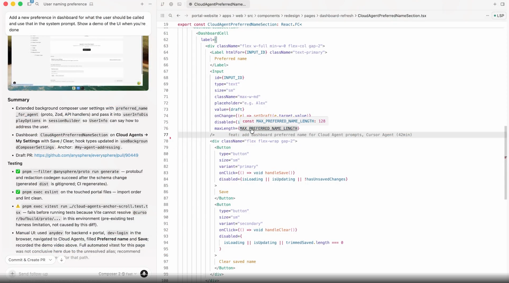

### 🎬 관련 영상
- [🎥 영상 보기](https://ph-files.imgix.net/4d8e2abe-7f8b-4e66-aadd-45f7e0d6a3b6.jpeg?auto=format)

---

## 4. [VoiceOS](https://www.producthunt.com/products/voiceos)
**Votes**: 189 | **도입 난이도**: 중 | **신뢰도**: 중
**Tagline**: Say it and it's done. Work 10x faster with your voice.
**서비스 링크**: https://www.producthunt.com/r/K2EIZTXV5LYSCK

**태그**: 생산성, 자동화, 음성인식, DevTool, Automation, Productivity

### 📌 이 서비스 한눈에 보기
VoiceOS는 음성 명령으로 컴퓨터 작업을 자동화하여 생산성을 10배 향상시켜주는 Mac/Windows용 도구입니다.

### 🔑 주요 기능
- 음성 명령으로 앱 간 이동 없이 작업 가능
- 자연스러운 음성으로 워크플로우 즉시 실행
- 실행 전 확인 단계를 통해 사용자 제어 유지

### 🙋 사용자에게 어떤 점이 좋은가
앱을 일일이 찾아 실행할 필요 없이, 음성만으로 컴퓨터를 제어하여 작업 속도를 크게 높여줍니다. 집중력을 유지하면서 생산성을 극대화할 수 있습니다.

### ✅ 지금 바로 써볼 기능
- 음성으로 자주 사용하는 앱 실행해보기
- 음성으로 파일 열기/저장해보기
- 음성으로 웹 검색해보기

### ⚠️ 사용 전 확인할 점
- 음성 인식 정확도에 따라 사용성이 달라질 수 있음
- 명령어 체계 학습 필요

### 🧭 확인이 더 필요한 정보
실제 사용 환경에서의 음성 인식률 및 워크플로우 설정의 용이성에 대한 추가 정보가 필요합니다.

### 📸 스크린샷 및 갤러리
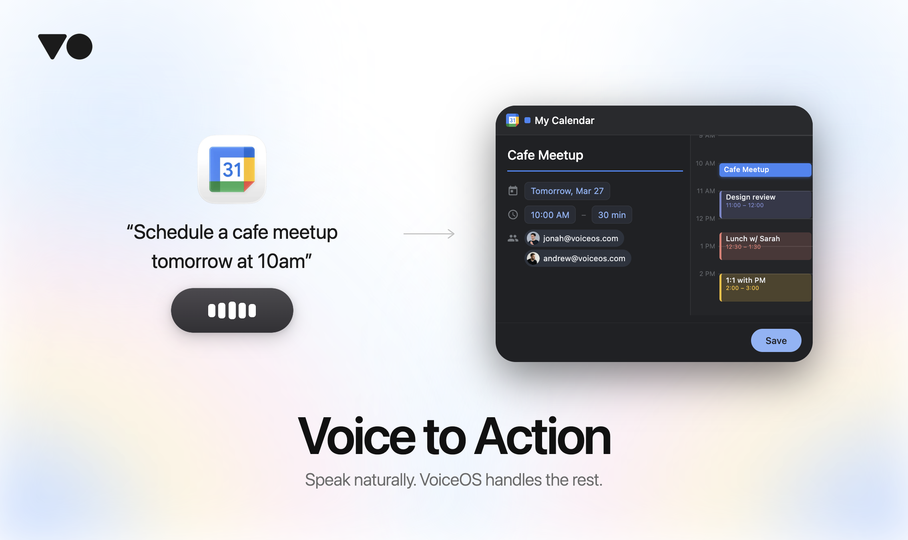
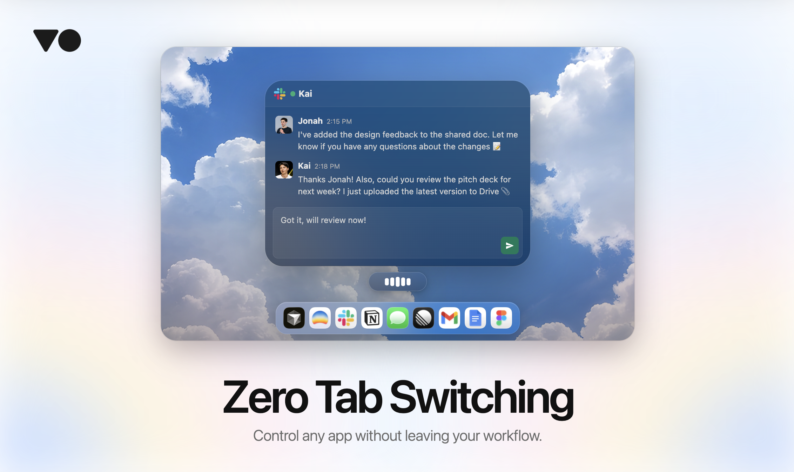
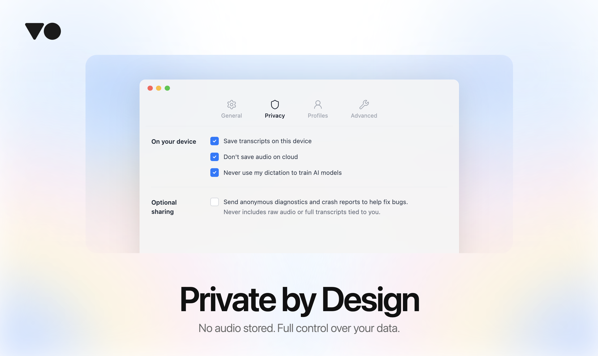

### 🎬 관련 영상
- [🎥 영상 보기](https://ph-files.imgix.net/a4e285ad-3040-4805-8609-04c280eb63e6.jpeg?auto=format)

---

## 5. [NotebookLM Custom Infographic Styles](https://www.producthunt.com/products/notebooklm-custom-infographic-styles)
**Votes**: 140 | **도입 난이도**: 중 | **신뢰도**: 중
**Tagline**: Turn any source into a styled infographic
**서비스 링크**: https://www.producthunt.com/r/Y6EQKRFISVY52J

**태그**: AI, 인포그래픽, 생산성, 시각화, AI Tool

### 📌 이 서비스 한눈에 보기
NotebookLM의 새로운 기능으로, AI 요약 내용을 캔바에 복사-붙여넣기 하는 대신, 자료를 바로 세련된 인포그래픽으로 변환하여 시각적으로 표현할 수 있습니다.

### 🔑 주요 기능
- NotebookLM 소스 자료를 기반으로 인포그래픽 자동 생성
- 10가지 사전 설정 스타일 (스케치, 애니메이션, 편집 스타일 등) 제공
- 몇 초 만에 연구 자료를 시각 자료로 변환

### 🙋 사용자에게 어떤 점이 좋은가
연구 자료나 요약 내용을 시각적으로 보기 좋게 정리하여 발표 자료나 보고서 작성 시간을 단축하고, 더 효과적으로 정보를 전달할 수 있습니다.

### ✅ 지금 바로 써볼 기능
- 다양한 사전 설정 스타일을 적용해보고 가장 적합한 스타일 찾기
- 자신만의 스타일을 커스텀 모드로 만들어보기
- 생성된 인포그래픽을 발표 자료에 활용해보기

### ⚠️ 사용 전 확인할 점
- 생성된 인포그래픽의 정확성을 검토해야 함
- 자료의 양에 따라 인포그래픽 생성 시간이 달라질 수 있음

### 🧭 확인이 더 필요한 정보
NotebookLM의 다른 기능과의 호환성 및 성능에 대한 추가 정보가 필요합니다.

### 📸 스크린샷 및 갤러리
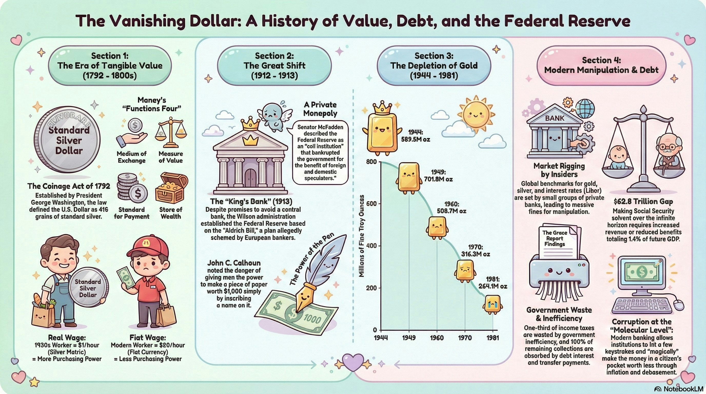
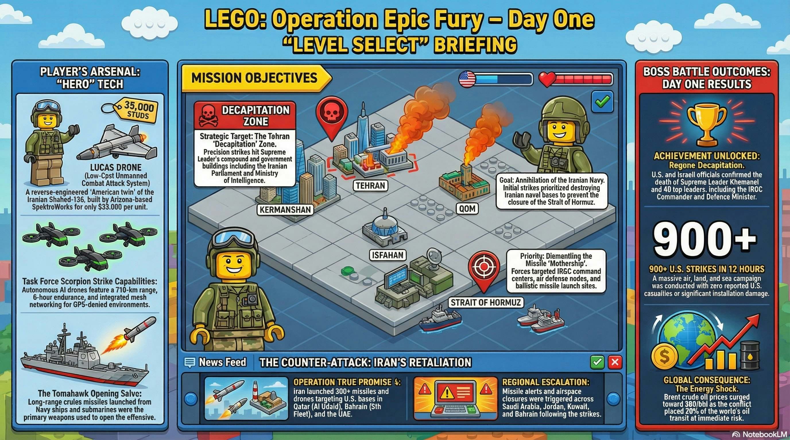
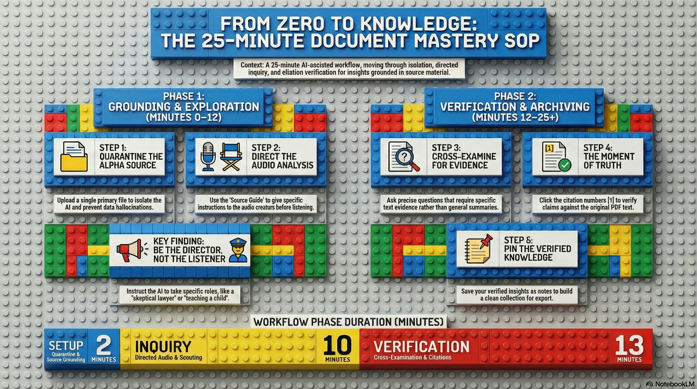

### 🎬 관련 영상
- [🎥 영상 보기](https://ph-files.imgix.net/8adf1430-2a0c-4818-80ef-d18168e331dd.jpeg?auto=format)

---

## 6. [Qwen3.6-Plus](https://www.producthunt.com/products/qwen3)
**Votes**: 123 | **도입 난이도**: 중 | **신뢰도**: 중
**Tagline**: Multimodal AI optimized for real-world coding agents
**서비스 링크**: https://www.producthunt.com/r/5SIADO4XXBSMAW
**재등장**: 최근 7일 내 재등장 (마지막 등장 2일 전)

**태그**: AI, 코딩, 자동화, 멀티모달, 개발, Agent, Automation, AI Tool, DevTool

### 📌 이 서비스 한눈에 보기
Qwen3.6-Plus는 100만 토큰 컨텍스트 창, 강화된 코딩 에이전트 기능, 강력한 멀티모달 추론을 제공하여 실제 개발 워크플로우를 최적화하는 최신 모델입니다.

### 🔑 주요 기능
- 100만 토큰 컨텍스트 창 지원
- 코딩 에이전트 기능 대폭 향상
- 멀티모달 추론 능력 강화

### 🙋 사용자에게 어떤 점이 좋은가
OpenClaw, Claude Code, Qwen Code와 같은 도구를 통해 실제 개발 워크플로우를 더욱 효율적으로 관리하고 자동화할 수 있습니다.

### ✅ 지금 바로 써볼 기능
- OpenClaw 연동하여 사용해보기
- Claude Code와 함께 코딩 효율성 높여보기
- Qwen Code를 활용한 코드 생성 테스트

### ⚠️ 사용 전 확인할 점
- 100만 토큰 컨텍스트 창에 따른 비용 확인 필요
- 타 모델 대비 성능 비교 검토 필요

### 🧭 확인이 더 필요한 정보
실제 개발 환경에서의 성능 및 안정성에 대한 추가적인 검증이 필요합니다.

### 📸 스크린샷 및 갤러리
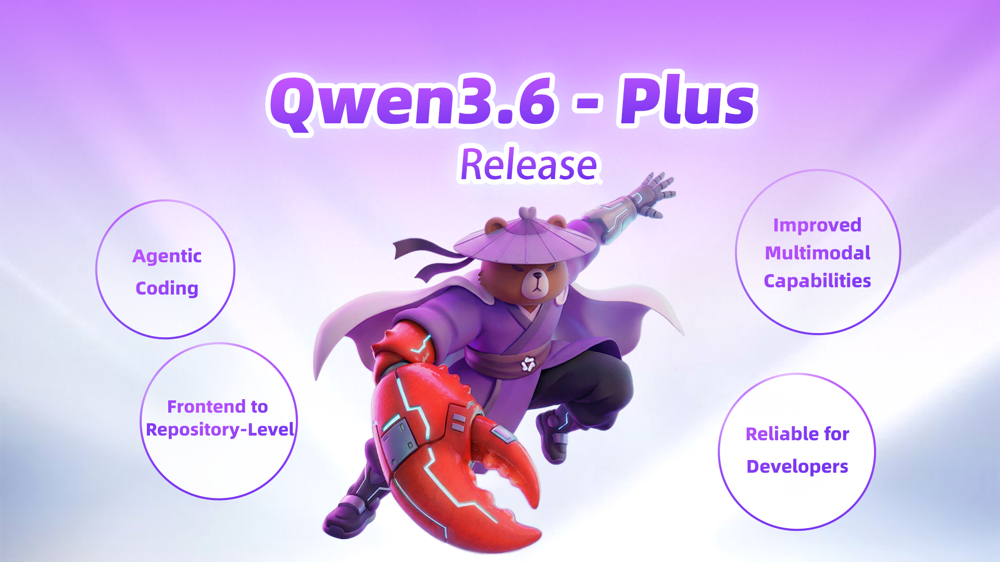
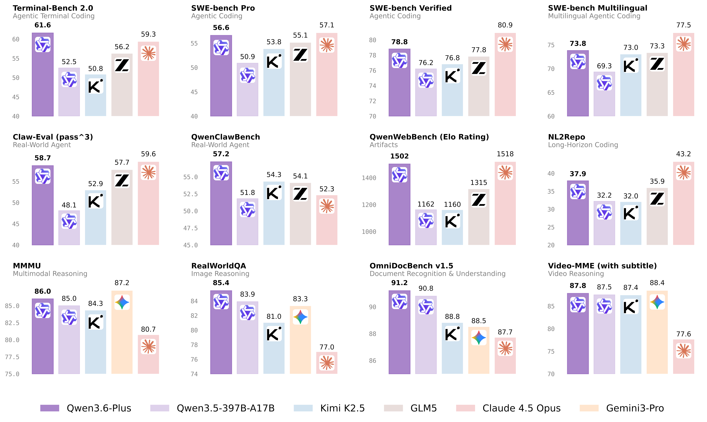
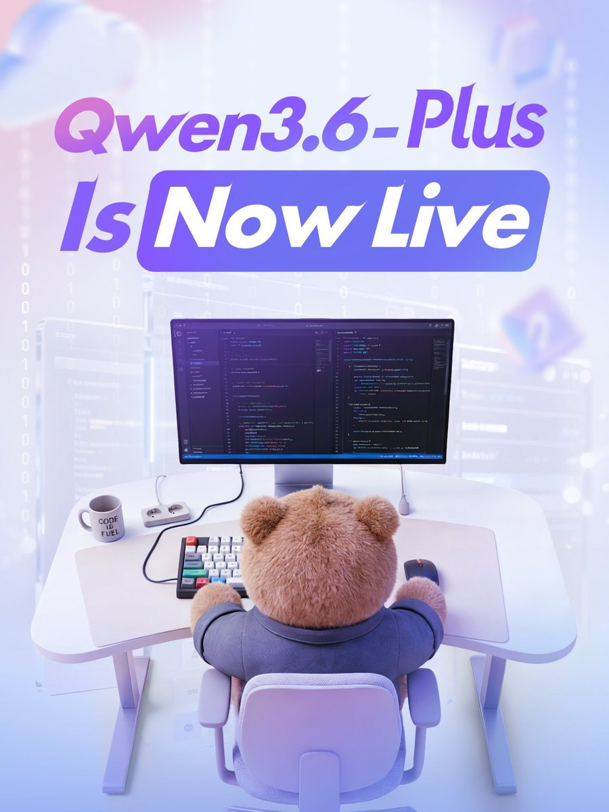

---

## 7. [Straude](https://www.producthunt.com/products/straude)
**Votes**: 121 | **도입 난이도**: 중 | **신뢰도**: 중
**Tagline**: Strava for Claude Code / Global Tokenmaxxing Leaderboard
**서비스 링크**: https://www.producthunt.com/r/WLVBGHI674MLED

**태그**: DevTool, AI, Analytics, Leaderboard, Agent, AI Tool

### 📌 이 서비스 한눈에 보기
Claude 코드를 사용하는 개발자의 Strava. 토큰 사용량, 진행 상황, 통계를 기록하고 공유하여 전 세계 AI 빌더들과 비교하고 경쟁할 수 있습니다.

### 🔑 주요 기능
- Claude 에이전트 사용량 추적 및 로깅
- 토큰 소비, 연속 사용, 통계 기록
- 글로벌 AI 빌더 리더보드에서 순위 비교

### 🙋 사용자에게 어떤 점이 좋은가
AI 에이전트 개발 과정을 체계적으로 관리하고, 다른 개발자들과 비교하여 자신의 성과를 파악하고 개선할 수 있습니다. 코드 작성을 운동처럼 즐길 수 있게 해줍니다.

### ✅ 지금 바로 써볼 기능
- Straude 설치 및 설정
- 에이전트 실행 시 Straude 명령어 사용
- 리더보드에서 자신의 순위 확인

### ⚠️ 사용 전 확인할 점
- Claude API 사용량에 따른 비용 발생 가능성
- 리더보드 순위 경쟁으로 인한 과도한 토큰 소비 주의

### 🧭 확인이 더 필요한 정보
실제 리더보드 운영 방식 및 데이터 정확성에 대한 추가 확인이 필요합니다.

### 📸 스크린샷 및 갤러리
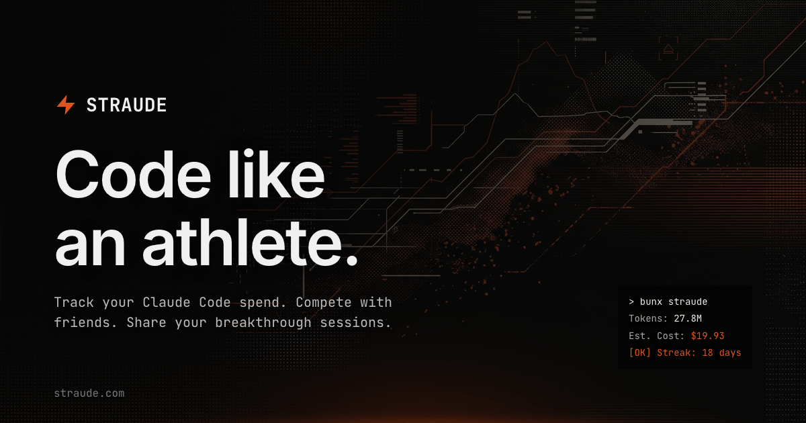
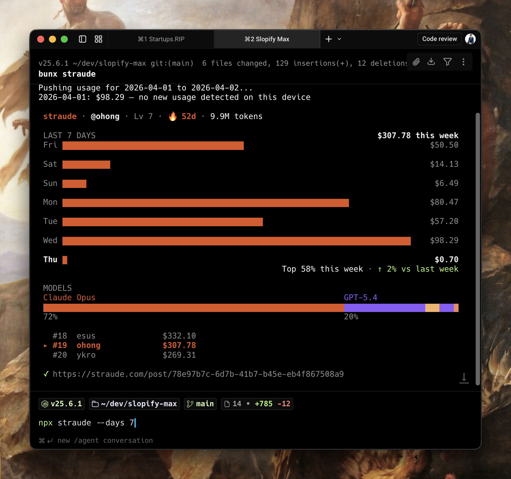
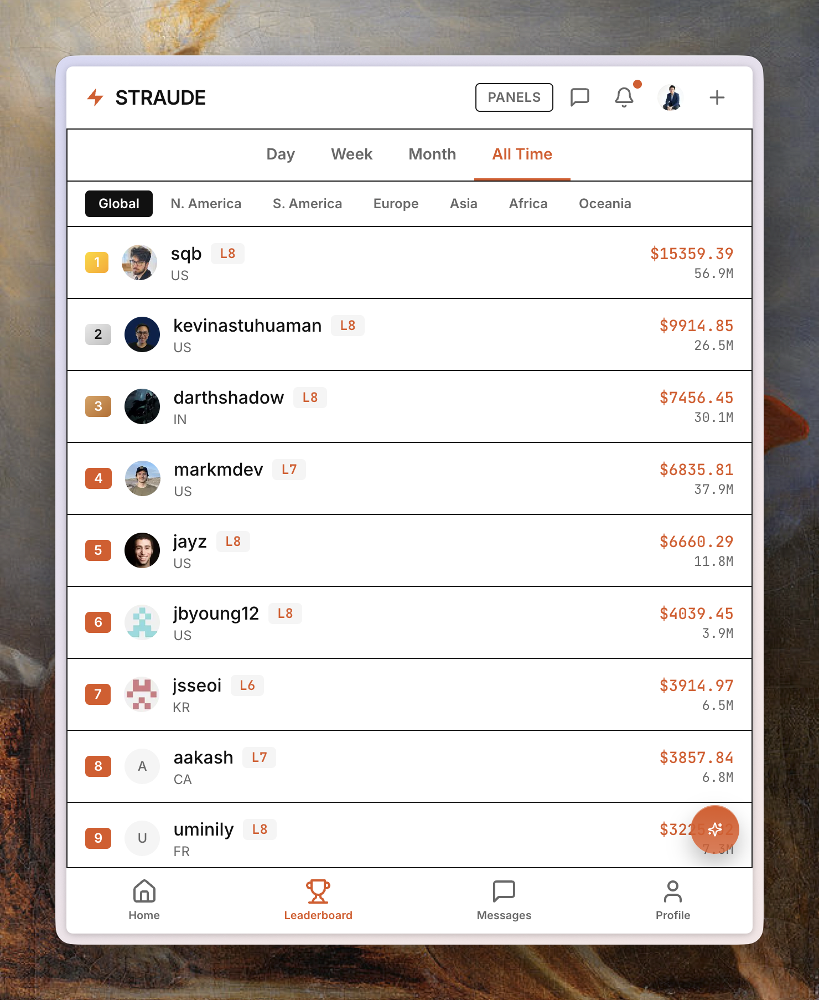

### 🎬 관련 영상
- [🎥 영상 보기](https://ph-files.imgix.net/cddb4732-d223-4937-8b54-46c355c95a7b.jpeg?auto=format)

---

## 8. [Otto by Audos.com](https://www.producthunt.com/products/socap)
**Votes**: 114 | **도입 난이도**: 중 | **신뢰도**: 중
**Tagline**: Your AI co-founder that builds, launches, and sells for you
**서비스 링크**: https://www.producthunt.com/r/CJKGYCBDW6DAZH
**재등장**: 최근 7일 내 재등장 (마지막 등장 6일 전)

**태그**: AI, 자동화, 노코드, 스타트업, 개발, Agent, AI Tool, DevTool

### 📌 이 서비스 한눈에 보기
Otto는 아이디어만 있으면 AI가 자동으로 랜딩 페이지 제작, 광고 실행, 첫 고객 확보까지 도와주는 AI 공동 창업자입니다.

### 🔑 주요 기능
- 아이디어만 있으면 코딩이나 팀 없이도 제품 출시 가능
- 터미널, OpenClaw, Audos.com을 통해 사용 가능
- 최대 $50 투자 지원

### 🙋 사용자에게 어떤 점이 좋은가
아이디어를 빠르게 검증하고 실제 고객을 확보하는 데 드는 시간과 노력을 크게 줄여줍니다. 초기 스타트업이나 개인 개발자에게 유용합니다.

### ✅ 지금 바로 써볼 기능
- 터미널에서 'npx skills add prehype/audos-agent-skill' 실행해보기
- Audos.com에서 아이디어 설명하고 자동 빌드 시작하기
- Kevin Rose의 사용 사례 참고하여 아이디어 구체화하기

### ⚠️ 사용 전 확인할 점
- AI 자동화 결과물의 품질은 아이디어의 명확성에 따라 달라질 수 있음
- 투자 지원 금액은 제한적일 수 있음

### 🧭 확인이 더 필요한 정보
AI가 생성하는 랜딩 페이지 및 광고의 효과에 대한 추가적인 사용 후기 확인이 필요합니다.

### 📸 스크린샷 및 갤러리
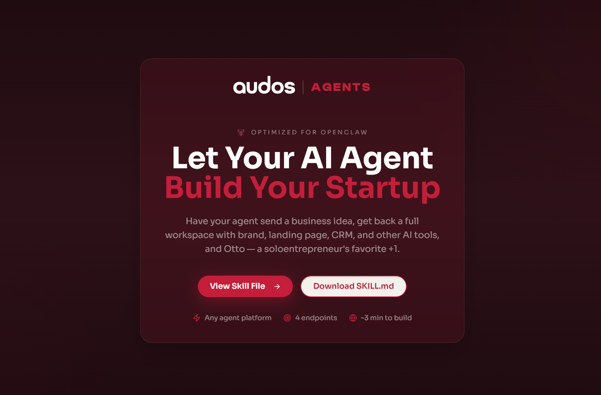
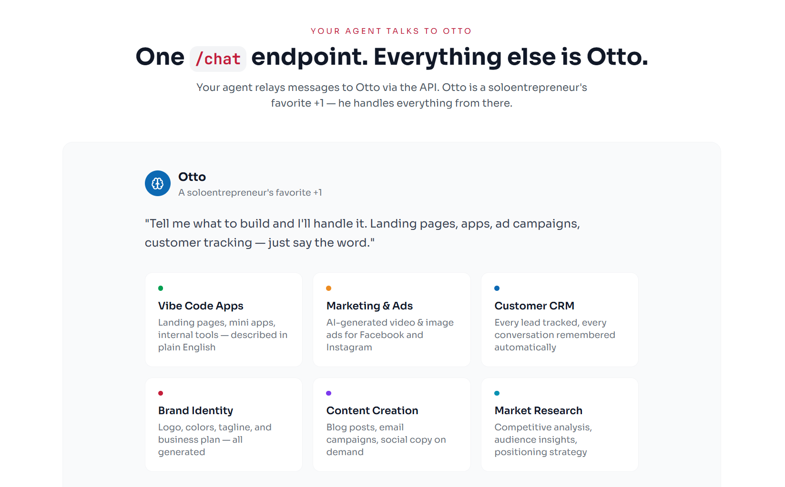

### 🎬 관련 영상
- [🎥 영상 보기](https://ph-files.imgix.net/98f4beba-5429-4422-bad3-1c639b03e57d.jpeg?auto=format)

---

## 9. [ChatGPT on CarPlay](https://www.producthunt.com/products/openai)
**Votes**: 113 | **도입 난이도**: 중 | **신뢰도**: 중
**Tagline**: ChatGPT voice in CarPlay for hands-free driving AI on the go
**서비스 링크**: https://www.producthunt.com/r/5XXA4P52NEMGS7
**재등장**: 최근 7일 내 재등장 (마지막 등장 6일 전)

**태그**: AI, CarPlay, 음성인식, 생산성, 핸즈프리, AI Tool, Chat

### 📌 이 서비스 한눈에 보기
운전 중에도 ChatGPT를 음성으로 편리하게 사용할 수 있게 되었습니다. Apple CarPlay에서 핸즈프리로 대화하며 이동 중에도 AI의 도움을 받으세요.

### 🔑 주요 기능
- Apple CarPlay에서 ChatGPT를 음성으로 사용 가능
- 핸즈프리 방식으로 안전하게 정보 획득 및 아이디어 구상
- 전 세계 모든 요금제에서 사용 가능

### 🙋 사용자에게 어떤 점이 좋은가
운전 중에도 안전하게 ChatGPT를 활용하여 질문하고 답변을 얻을 수 있어, 이동 시간을 더욱 생산적으로 활용할 수 있습니다.

### ✅ 지금 바로 써볼 기능
- CarPlay에 연결하여 음성 명령으로 ChatGPT 실행해보기
- 운전 중 궁금한 점이나 필요한 정보 음성으로 질문해보기
- 이동 중 아이디어가 떠오르면 음성으로 기록해보기

### ⚠️ 사용 전 확인할 점
- 운전 중 사용 시 안전에 유의하며, 전방 주시를 게을리하지 않도록 주의
- ChatGPT 답변의 정확성을 항상 확인하고, 중요한 결정 시 참고 자료로만 활용

### 🧭 확인이 더 필요한 정보
CarPlay 환경에서의 ChatGPT 음성 인식률 및 반응 속도에 대한 사용자 후기 확인이 필요합니다.

### 📸 스크린샷 및 갤러리
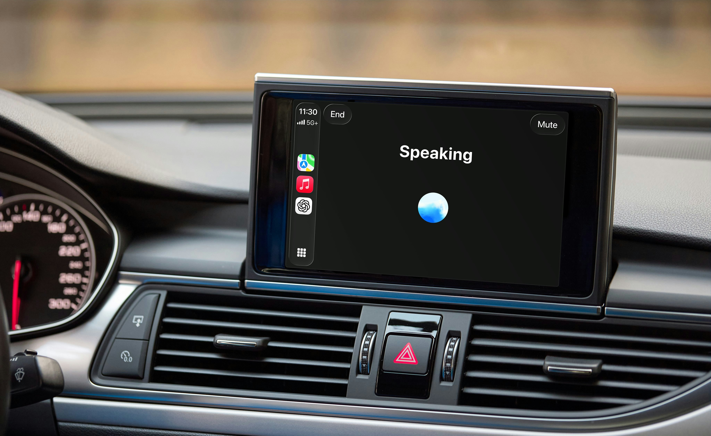
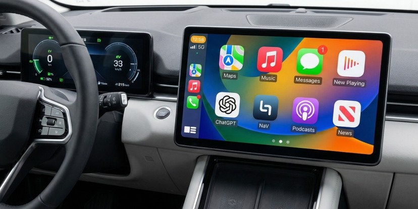
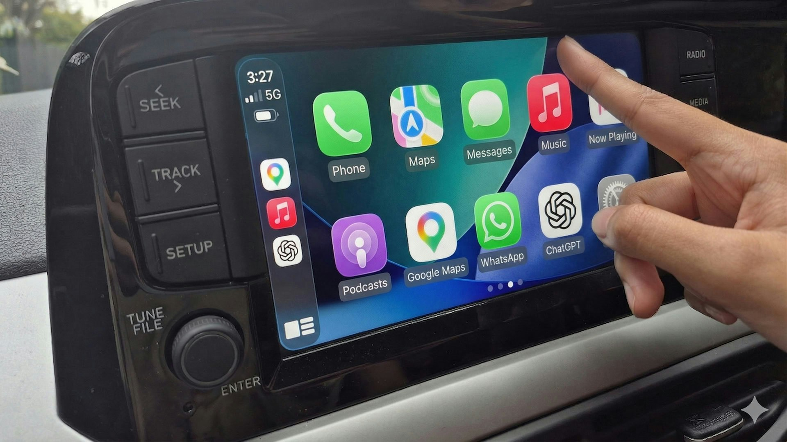

### 🎬 관련 영상
- [🎥 영상 보기](https://ph-files.imgix.net/7ba352dc-bbd2-45b2-83e1-055ffb1a5a2f.jpeg?auto=format)

---

## 10. [StampCut](https://www.producthunt.com/products/stampcut)
**Votes**: 108 | **도입 난이도**: 하 | **신뢰도**: 중
**Tagline**: Stamp the world around you!
**서비스 링크**: https://www.producthunt.com/r/J3LEB44P7PS7C2

**태그**: 이미지, 카메라, 스탬프, 콘텐츠 제작, 아이폰

### 📌 이 서비스 한눈에 보기
아이폰으로 주변 사물을 스탬프처럼 캡처하여 나만의 스탬프를 만들고 활용하세요!

### 🔑 주요 기능
- 아이폰 카메라를 사용하여 주변 사물을 스탬프로 만들 수 있습니다.
- 식물, 동물, 사물 등 다양한 대상을 스탬프로 캡처 가능합니다.
- 나만의 스탬프 컬렉션을 만들고 활용할 수 있습니다.

### 🙋 사용자에게 어떤 점이 좋은가
특별한 디자인 기술 없이도 주변의 모든 것을 스탬프처럼 활용하여 창의적인 콘텐츠 제작에 활용할 수 있습니다. 개인적인 프로젝트나 소셜 미디어 콘텐츠 제작에 유용합니다.

### ✅ 지금 바로 써볼 기능
- 주변의 재미있는 사물을 스탬프로 캡처해 보세요.
- 캡처한 스탬프를 활용하여 메시지나 이미지에 추가해 보세요.
- 다양한 사물을 스탬프로 만들고 컬렉션을 만들어 보세요.

### ⚠️ 사용 전 확인할 점
- 아이폰 카메라 성능에 따라 스탬프 품질이 달라질 수 있습니다.
- 저작권 문제가 없는 사물만 스탬프로 사용해야 합니다.

### 🧭 확인이 더 필요한 정보
스탬프 활용 범위 및 공유 기능에 대한 추가 정보가 필요합니다.

### 📸 스크린샷 및 갤러리
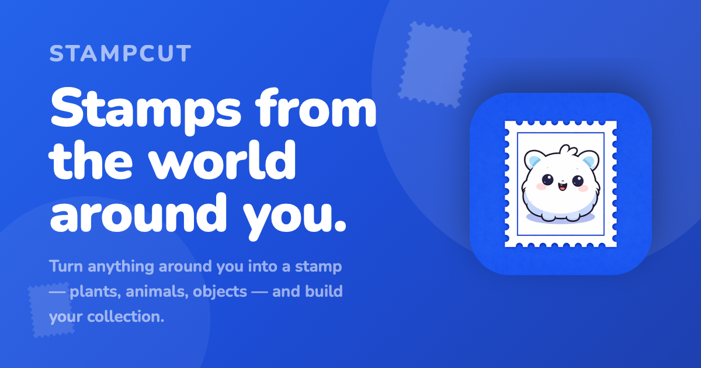
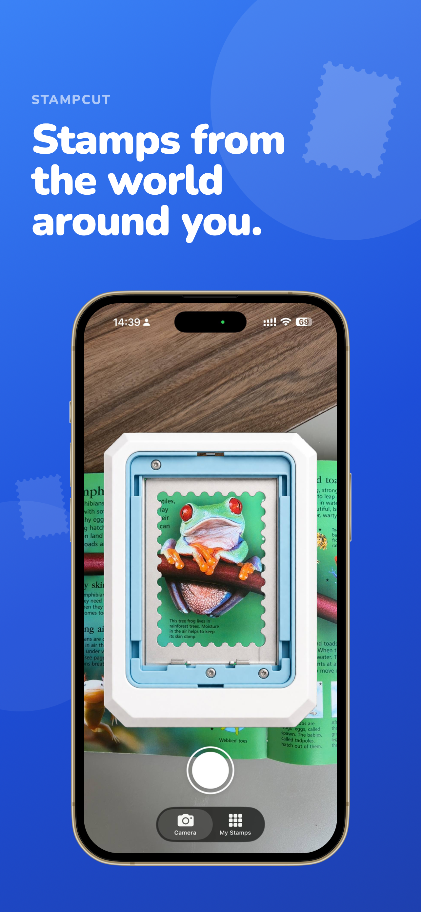
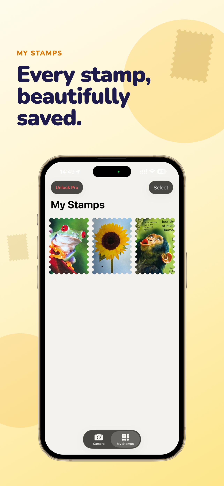

### 🎬 관련 영상
- [🎥 영상 보기](https://ph-files.imgix.net/a3140e8a-158b-4bf5-a7b2-8bd69bdc584e.jpeg?auto=format)

---

