# 🚀 Product Hunt Daily Top 10 (2026-04-05)

## 1. [Google Vids 2.0](https://www.producthunt.com/products/google)
**Votes**: 295 | **도입 난이도**: 중 | **신뢰도**: 중
**Tagline**: Create, edit and share videos at no cost w/ new AI features
**서비스 링크**: https://www.producthunt.com/r/2QYNCQG3J5VAV3

**태그**: AI, 비디오 편집, 콘텐츠 제작, 생산성, 무료, Automation, AI Tool, Video

### 📌 이 서비스 한눈에 보기
Google Vids 2.0은 Lyria 3 및 Veo 3.1 기반의 AI 기능을 통해 무료로 고품질 비디오를 제작, 편집 및 공유할 수 있게 해줍니다.

### 🔑 주요 기능
- 무료로 고품질 비디오 생성 가능
- 맞춤 음악 및 아바타 추가 기능 제공
- Gemini를 통해 Workspace 앱 전반의 워크플로우 간소화

### 🙋 사용자에게 어떤 점이 좋은가
브랜드에 맞는 비디오를 대규모로 제작하고, AI 기반의 다양한 기능을 활용하여 효율적인 비디오 제작 워크플로우를 구축할 수 있습니다.

### ✅ 지금 바로 써볼 기능
- 새로운 AI 기능으로 비디오 생성해보기
- 맞춤 음악 추가 기능 사용해보기
- Gemini 연동을 통한 워크플로우 개선 시도해보기

### ⚠️ 사용 전 확인할 점
- Lyria 3 및 Veo 3.1의 성능 및 안정성 확인 필요
- 생성된 비디오의 품질이 사용 목적에 적합한지 검토 필요

### 🧭 확인이 더 필요한 정보
AI 기반 기능의 성능과 Gemini 연동의 실제 효율성에 대한 추가 정보가 필요합니다.

### 📸 스크린샷 및 갤러리

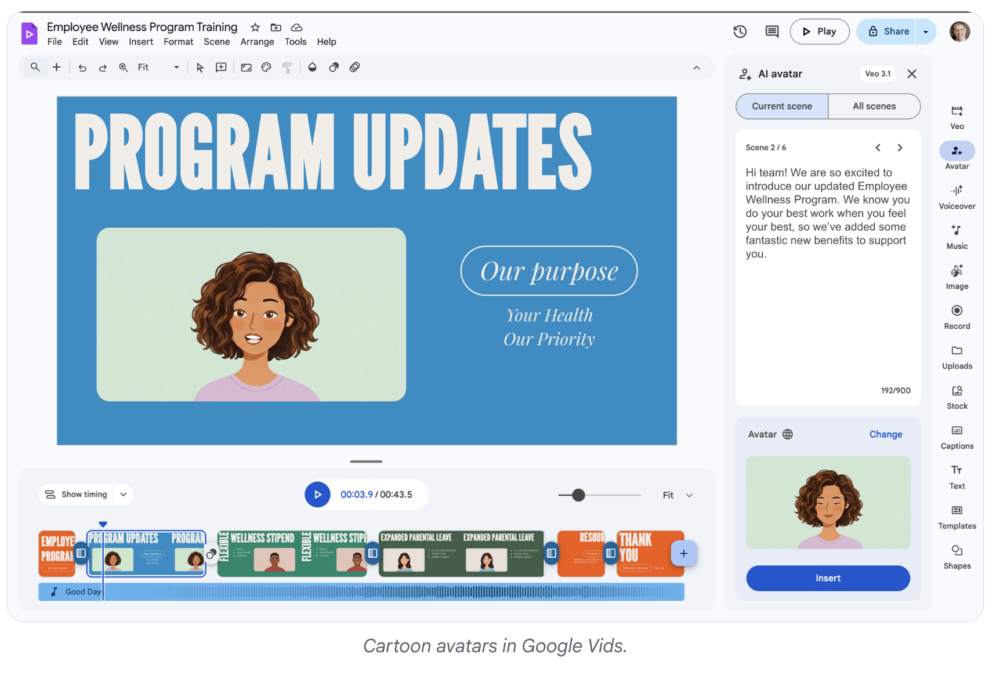
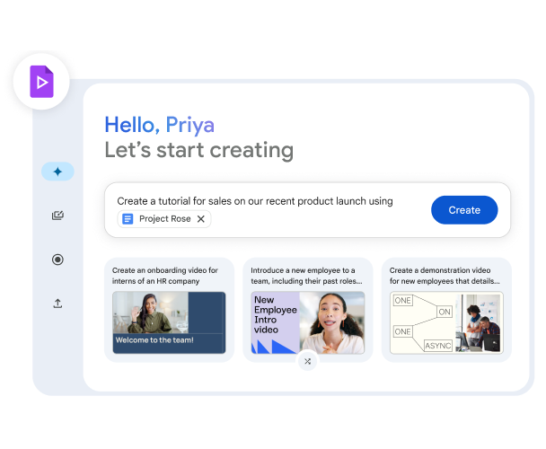

### 🎬 관련 영상
- [🎥 영상 보기](https://ph-files.imgix.net/75ae6403-e78e-4b4e-98bc-2ae870289bfd.jpeg?auto=format)

---

## 2. [Sleek Analytics](https://www.producthunt.com/products/sleek-analytics)
**Votes**: 181 | **도입 난이도**: 하 | **신뢰도**: 중
**Tagline**: See who's on your site. Right now.
**서비스 링크**: https://www.producthunt.com/r/ASEM36CO22BGMN

**태그**: Analytics, Realtime, Website, Simple, DevTool

### 📌 이 서비스 한눈에 보기
Sleek Analytics는 복잡한 설정 없이 웹사이트 방문자 데이터를 실시간으로 간단하게 확인할 수 있게 해줍니다.

### 🔑 주요 기능
- 설치가 간편합니다: 코드 한 줄만 붙여넣으면 됩니다.
- 실시간 방문자 분석: 웹사이트 방문자의 움직임을 실시간으로 볼 수 있습니다.
- 개인 정보 보호: 쿠키 배너 없이 데이터를 수집합니다.

### 🙋 사용자에게 어떤 점이 좋은가
웹사이트 트래픽을 쉽고 빠르게 분석하여 사용자 행동을 파악하고, 마케팅 전략을 개선하는 데 도움이 됩니다. 복잡한 설정 없이 바로 사용할 수 있어 시간과 노력을 절약해줍니다.

### ✅ 지금 바로 써볼 기능
- 웹사이트에 코드 스니펫을 추가하여 실시간 분석 시작하기
- 방문자 흐름을 모니터링하여 인기 페이지 및 이탈 지점 파악하기
- 데이터 기반으로 웹사이트 콘텐츠 및 사용자 경험 개선하기

### ⚠️ 사용 전 확인할 점
- 데이터 보관 정책 및 개인 정보 보호 정책 확인 필요
- 제공되는 분석 기능의 범위가 사용자의 구체적인 요구사항을 충족하는지 확인 필요

### 🧭 확인이 더 필요한 정보
Sleek Analytics의 데이터 정확도 및 타 분석 도구와의 호환성에 대한 추가 정보가 필요합니다.

### 📸 스크린샷 및 갤러리

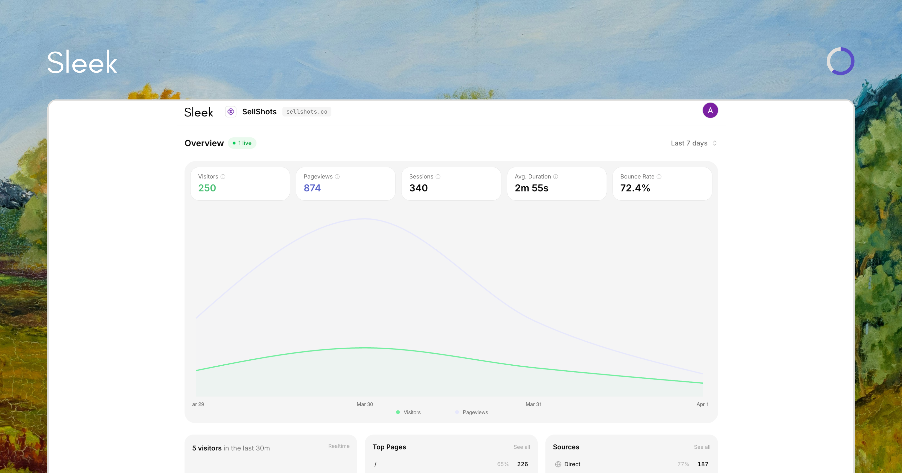
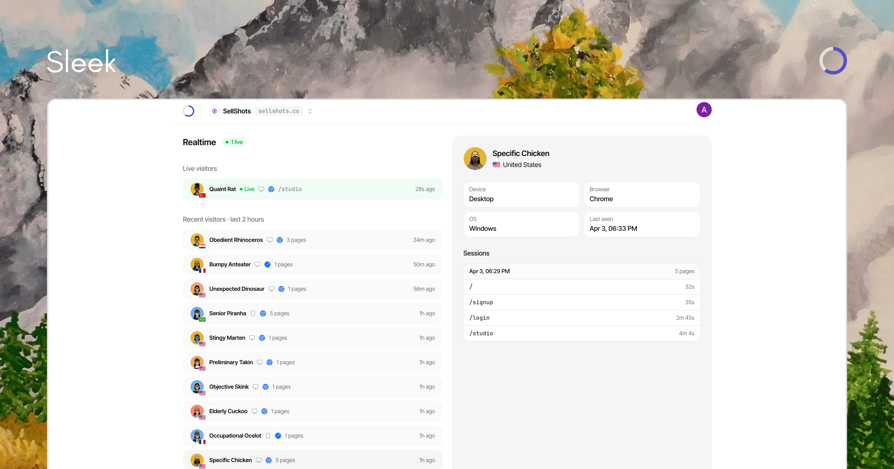

### 🎬 관련 영상
- [🎥 영상 보기](https://ph-files.imgix.net/63d5232e-162c-40fd-9928-bf99cc1af515.jpeg?auto=format)

---

## 3. [Surf Social Websites](https://www.producthunt.com/products/flipboard-surf)
**Votes**: 168 | **도입 난이도**: 중 | **신뢰도**: 중
**Tagline**: Bring together people and content on the social web
**서비스 링크**: https://www.producthunt.com/r/3W7BP7G7SPMVB5

**태그**: 소셜 미디어, 커뮤니티, 콘텐츠 관리, 분산형 플랫폼

### 📌 이 서비스 한눈에 보기
Surf Social Websites는 독립적인 크리에이터와 커뮤니티가 소셜 미디어 콘텐츠를 직접 관리하고 가치를 창출할 수 있도록 지원하는 플랫폼입니다.

### 🔑 주요 기능
- Surf 피드를 기반으로 소셜 웹사이트를 구축 가능
- 콘텐츠 소스, 필터, 관리를 크리에이터가 직접 제어
- 분산형 소셜 미디어 모델로 독립 크리에이터에게 권한 부여

### 🙋 사용자에게 어떤 점이 좋은가
기존 소셜 미디어 플랫폼의 제약에서 벗어나 자신만의 커뮤니티를 구축하고 콘텐츠를 자유롭게 관리하고자 하는 크리에이터에게 유용합니다.

### ✅ 지금 바로 써볼 기능
- 관심 있는 분야의 소셜 웹사이트 검색
- 자신만의 Surf 피드 생성
- 커뮤니티 멤버들과 콘텐츠 공유 및 소통

### ⚠️ 사용 전 확인할 점
- 초기 사용자 확보 및 커뮤니티 활성화 필요
- 콘텐츠 관리 및 필터링 정책 수립의 어려움

### 🧭 확인이 더 필요한 정보
Surf Social Websites의 장기적인 지속 가능성과 사용자 확보 전략에 대한 추가 정보가 필요합니다.

### 📸 스크린샷 및 갤러리
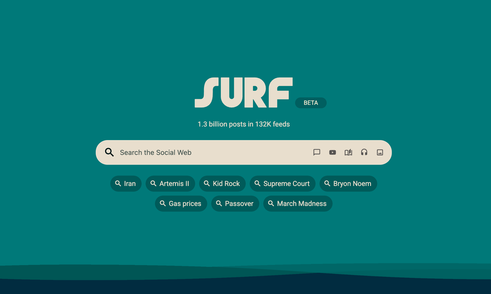
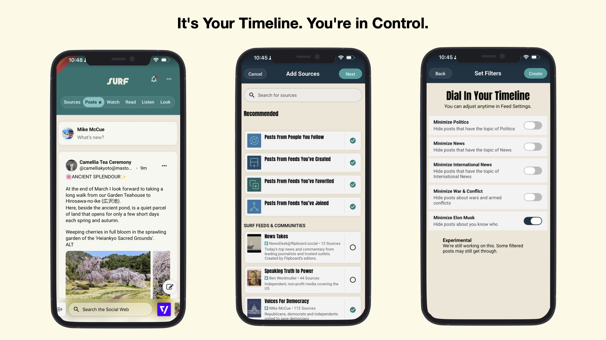
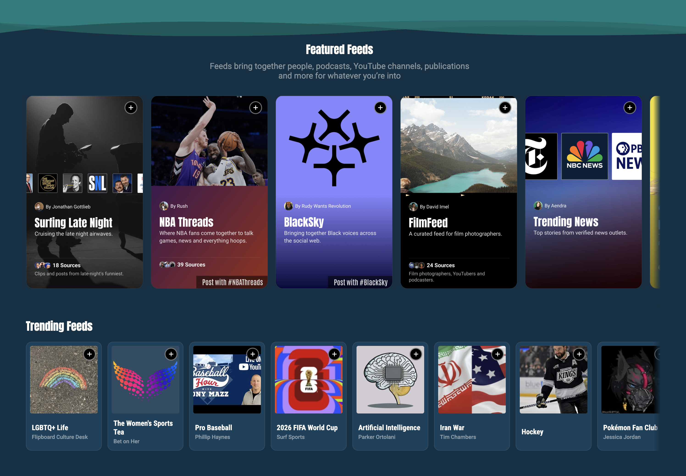

---

## 4. [Mercury Edit 2](https://www.producthunt.com/products/mercury-412)
**Votes**: 129 | **도입 난이도**: 중 | **신뢰도**: 중
**Tagline**: Ultra-fast next-edit prediction for coding
**서비스 링크**: https://www.producthunt.com/r/UZOWQ4W5SJR6BN

**태그**: 코드 편집, LLM, 자동 완성, 개발 도구, DevTool

### 📌 이 서비스 한눈에 보기
Mercury Edit 2는 코드 편집에 특화된 확산 LLM으로, 빠른 속도로 다음 편집 내용을 예측하여 코딩 효율성을 높여줍니다.

### 🔑 주요 기능
- 최근 편집 내용과 코드베이스 컨텍스트 활용
- 일반적인 코드 편집 모델보다 낮은 지연 시간
- 높은 수용도의 다음 변경 사항 제안

### 🙋 사용자에게 어떤 점이 좋은가
코딩 작업 시 다음에 어떤 코드를 작성해야 할지 빠르게 예측하여 시간을 절약하고 생산성을 향상시켜 줍니다. 특히 코드 편집 모델의 느린 속도에 불만을 느꼈던 개발자에게 유용합니다.

### ✅ 지금 바로 써볼 기능
- 최근 편집 내용을 기반으로 다음 코드 변경 사항 예측해보기
- 코드베이스 컨텍스트를 활용한 제안 살펴보기
- 기존 코드 편집 모델과 지연 시간 비교해보기

### ⚠️ 사용 전 확인할 점
- 모델의 예측 정확도는 코드베이스의 복잡성과 데이터 양에 따라 달라질 수 있습니다.
- 특정 프로그래밍 언어 또는 프레임워크에 최적화되어 있을 수 있습니다.

### 🧭 확인이 더 필요한 정보
실제 사용 환경에서의 성능과 다양한 코드 스타일 및 컨텍스트에 대한 적응성은 추가적인 검증이 필요합니다.

### 📸 스크린샷 및 갤러리
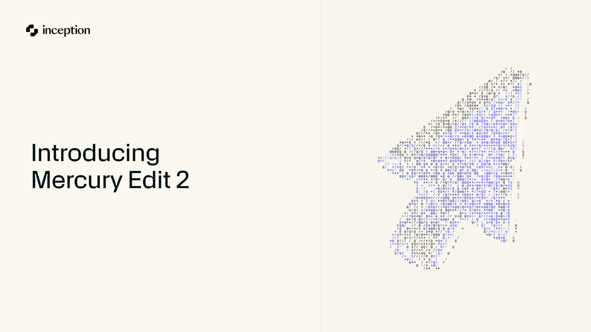
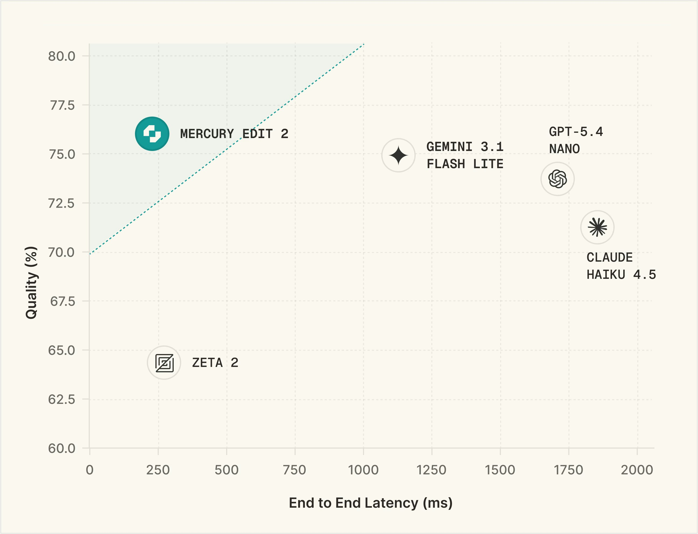
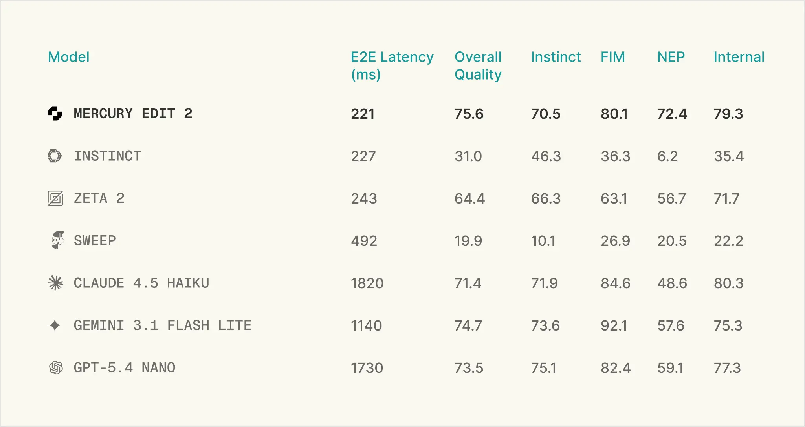

---

## 5. [Faahh](https://www.producthunt.com/products/faahh-app-that-roasts-you-back-to-work)
**Votes**: 119 | **도입 난이도**: 하 | **신뢰도**: 중
**Tagline**: Slap your desk. Unplug distractions. Get back to focus.
**서비스 링크**: https://www.producthunt.com/r/GVWEVFVXXAI4BW

**태그**: 생산성, 집중력, 알림

### 📌 이 서비스 한눈에 보기
Faahh는 집중력을 잃을 때마다 'Faahh' 소리를 내어 즉각적인 인식을 제공하여 사용자가 다시 집중할 수 있도록 돕는 작은 앱입니다.

### 🔑 주요 기능
- 책상을 치거나, 장치를 뽑으면 소리가 납니다.
- 사용자 지정 사운드를 설정할 수 있습니다.
- 차단 기능이나 대시보드 없이 즉각적인 인식을 제공합니다.

### 🙋 사용자에게 어떤 점이 좋은가
집중력이 흐트러질 때 즉시 알림을 받아 빠르게 다시 집중할 수 있으며, 별도의 복잡한 설정 없이 간단하게 사용할 수 있습니다.

### ✅ 지금 바로 써볼 기능
- 책상을 쳐서 Faahh 소리를 들어보세요.
- 원하는 사용자 지정 사운드를 설정해보세요.
- 집중이 필요한 작업 중에 Faahh를 실행해두세요.

### ⚠️ 사용 전 확인할 점
- 시끄러운 소리가 발생할 수 있으니, 공공장소에서는 주의하여 사용하세요.
- 지속적인 소리 알림이 오히려 집중을 방해할 수도 있습니다.

### 🧭 확인이 더 필요한 정보
사용자 지정 사운드 설정의 구체적인 방법 및 지원되는 파일 형식을 확인해야 합니다.

### 📸 스크린샷 및 갤러리
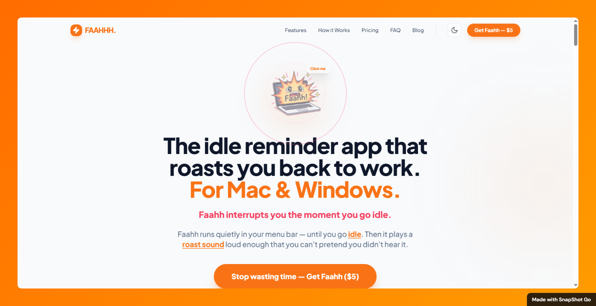
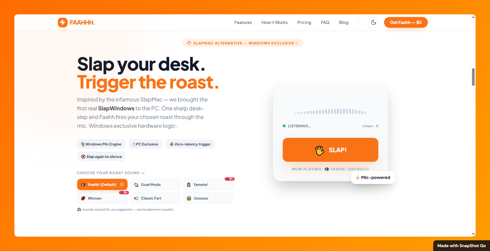
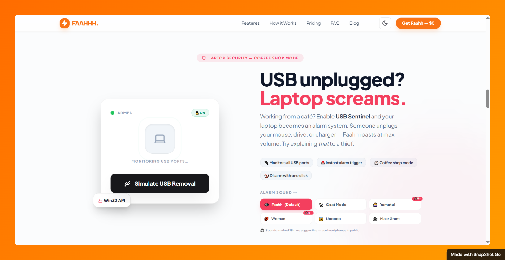

---

## 6. [Donut Browser](https://www.producthunt.com/products/donut-browser)
**Votes**: 111 | **도입 난이도**: 중 | **신뢰도**: 중
**Tagline**: Open Source Anti-Detect Browser with Unlimited Profiles
**서비스 링크**: https://www.producthunt.com/r/GLMGBZLJAH6BPI

**태그**: 오픈소스, 브라우저, 자동화, 개발자 도구, 개인정보보호, Automation

### 📌 이 서비스 한눈에 보기
Donut Browser는 무제한 프로필 생성, 프록시 지원, 브라우저 자동화 기능을 제공하는 오픈 소스 안티 디텍트 브라우저입니다.

### 🔑 주요 기능
- 오픈 소스 안티 디텍트 브라우저
- 무제한 로컬 프로필 생성 가능
- 고유한 지문 및 프록시 지원

### 🙋 사용자에게 어떤 점이 좋은가
각 프로필마다 다른 브라우저 환경을 설정하여 개인 정보 보호를 강화하고, 브라우저 자동화 기능을 통해 반복 작업을 효율적으로 처리할 수 있습니다.

### ✅ 지금 바로 써볼 기능
- 새 프로필 생성 후 지문 설정 변경해보기
- 프록시 설정 추가하여 IP 변경해보기
- 브라우저 자동화 기능 테스트해보기

### ⚠️ 사용 전 확인할 점
- 오픈 소스 프로젝트이므로 보안 업데이트 및 커뮤니티 지원 확인 필요
- 안티 디텍트 기능의 효과는 웹사이트의 감지 기술 수준에 따라 달라질 수 있음

### 🧭 확인이 더 필요한 정보
안티 디텍트 브라우저의 성능이 실제 웹 환경에서 어느 정도 효과적인지 추가적인 테스트가 필요합니다.

### 📸 스크린샷 및 갤러리
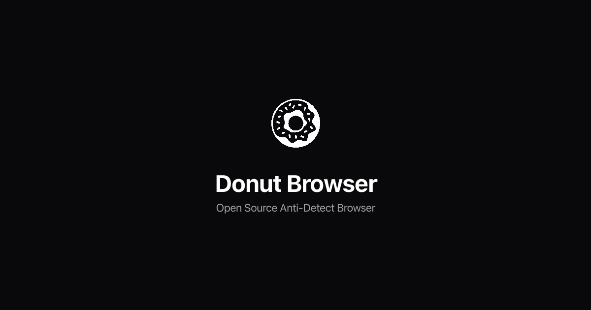
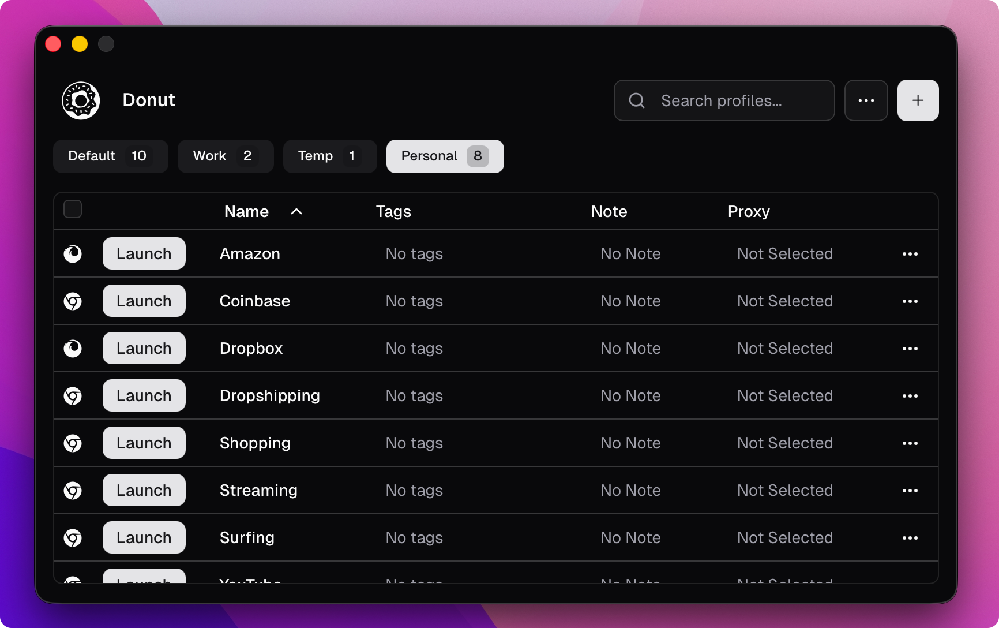

---

## 7. [OpenRouter Model Fusion](https://www.producthunt.com/products/openrouter)
**Votes**: 103 | **도입 난이도**: 중 | **신뢰도**: 중
**Tagline**: Run many models side by side and fuse the best answer
**서비스 링크**: https://www.producthunt.com/r/JXX3QD2KX7LSZT

**태그**: AI, 모델 융합, OpenRouter, 실험적 기능, Prompting

### 📌 이 서비스 한눈에 보기
OpenRouter의 Model Fusion은 여러 모델을 동시에 실행하여 최적의 답변을 융합, 단일하고 우수한 결과물을 제공하는 실험적인 기능입니다.

### 🔑 주요 기능
- 여러 모델을 동시에 실행하여 답변을 분석합니다.
- 사용자 정의 가능한 '판단' 모델을 사용하여 최적의 답변을 융합합니다.
- 단일하고 우수한 응답을 생성합니다.

### 🙋 사용자에게 어떤 점이 좋은가
여러 모델의 장점을 결합하여 더욱 정확하고 유용한 답변을 얻을 수 있으며, 모델 선택에 대한 고민을 줄여줍니다.

### ✅ 지금 바로 써볼 기능
- 다양한 프롬프트를 사용하여 Model Fusion의 성능을 테스트해 보세요.
- 자신에게 맞는 '판단' 모델을 찾아보세요.
- 융합된 답변이 기존 모델의 답변과 어떻게 다른지 비교해 보세요.

### ⚠️ 사용 전 확인할 점
- 융합 과정에서 예상치 못한 결과가 발생할 수 있습니다.
- 각 모델의 성능에 따라 융합 결과의 품질이 달라질 수 있습니다.

### 🧭 확인이 더 필요한 정보
어떤 '판단' 모델이 가장 효과적인지, 그리고 융합 과정에서 발생하는 잠재적 비용에 대한 추가 정보가 필요합니다.

### 📸 스크린샷 및 갤러리

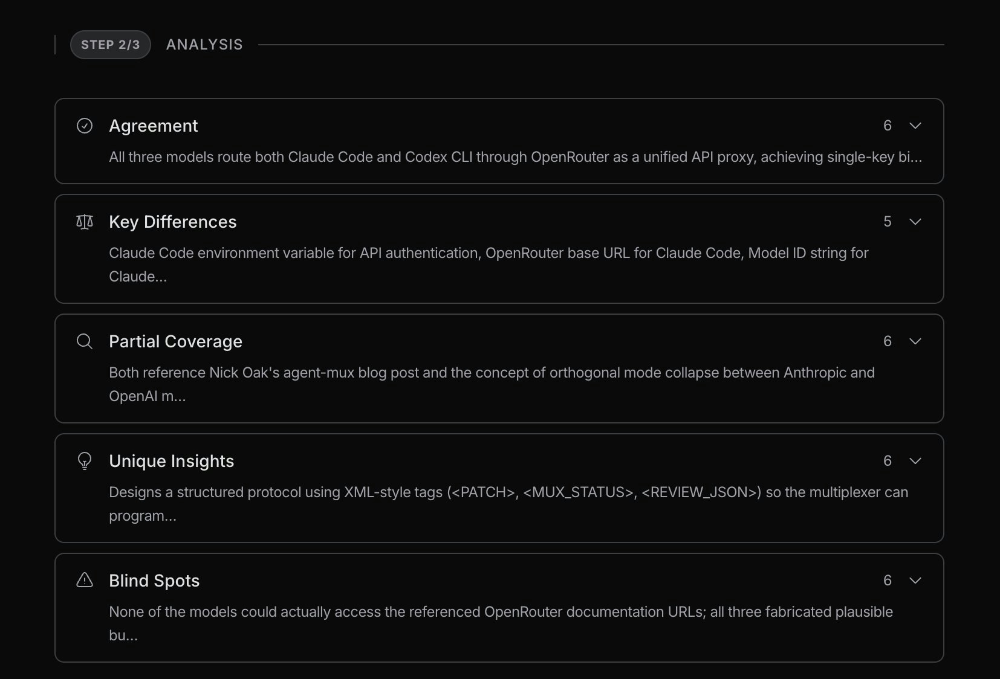
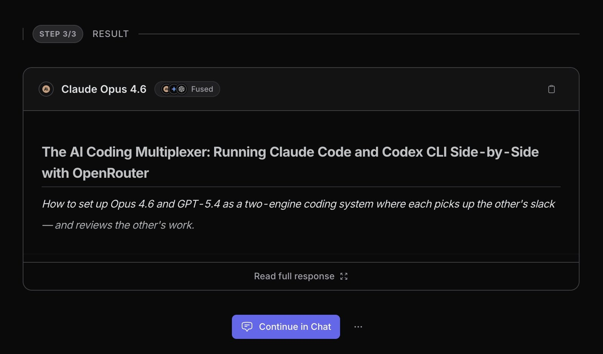

---

## 8. [Open Claude in Chrome](https://www.producthunt.com/products/open-claude-in-chrome)
**Votes**: 98 | **도입 난이도**: 중 | **신뢰도**: 중
**Tagline**: Claude in Chrome, reverse-engineered, Jailbroken
**서비스 링크**: https://www.producthunt.com/r/U2KRJWKDWPLQN6

**태그**: DevTool, Automation, Open Source, AI Tool

### 📌 이 서비스 한눈에 보기
Open Claude in Chrome은 Claude Code의 브라우저 자동화 기능을 크롬에서 사용할 수 있게 해주며, 차단된 도메인 없이 모든 Chromium 브라우저에서 오픈 소스로 사용할 수 있습니다.

### 🔑 주요 기능
- Claude Code의 브라우저 자동화 기능 제공
- 58개 도메인 차단 없이 사용 가능
- 오픈 소스로 모든 Chromium 브라우저 지원

### 🙋 사용자에게 어떤 점이 좋은가
기존 Claude in Chrome의 제한 사항 없이 자유롭게 브라우저 자동화 기능을 활용할 수 있으며, 오픈 소스이므로 투명하게 사용할 수 있습니다.

### ✅ 지금 바로 써볼 기능
- Open Claude in Chrome 설치 및 실행
- 브라우저 자동화 기능 테스트
- 오픈 소스 코드 검토 및 기여

### ⚠️ 사용 전 확인할 점
- Claude Code의 기능 제한 사항은 동일하게 적용될 수 있음
- Chromium 브라우저 호환성 확인 필요

### 🧭 확인이 더 필요한 정보
Claude Code의 성능 및 안정성에 대한 추가적인 검증이 필요합니다.

### 📸 스크린샷 및 갤러리
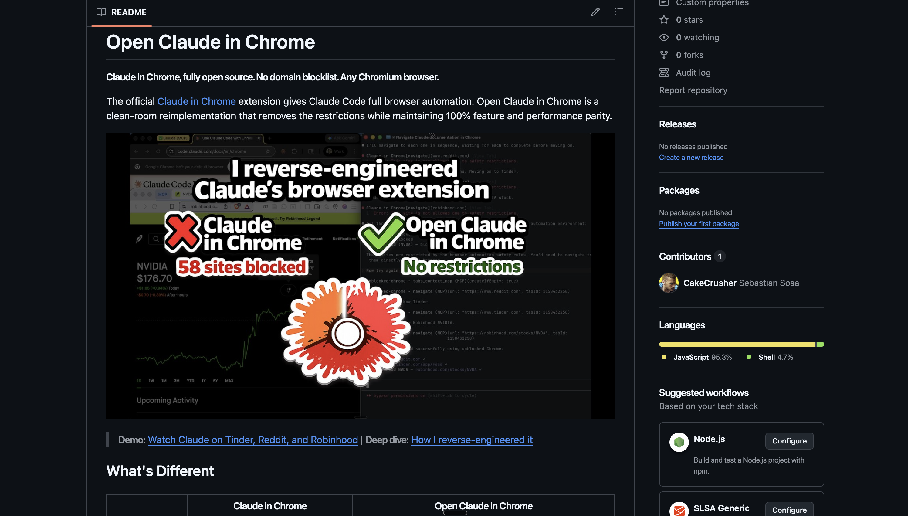
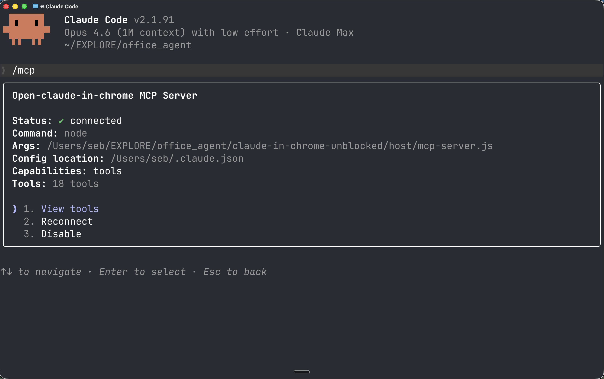
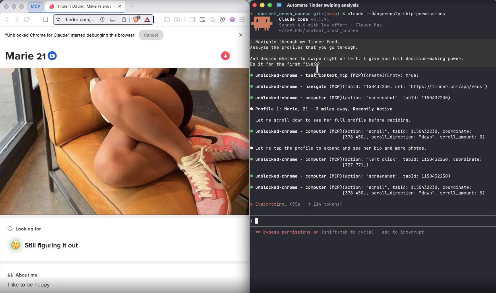

### 🎬 관련 영상
- [🎥 영상 보기](https://ph-files.imgix.net/f928f9ba-6441-4840-8ec1-707283b84b96.jpeg?auto=format)

---

## 9. [Vista](https://www.producthunt.com/products/vista-4)
**Votes**: 96 | **도입 난이도**: 하 | **신뢰도**: 중
**Tagline**: The image viewer macOS should have built.
**서비스 링크**: https://www.producthunt.com/r/BV3QLPODLJQ2UN

**태그**: 이미지 뷰어, macOS, 생산성, 무료, AI Tool, Vision

### 📌 이 서비스 한눈에 보기
macOS 기본 이미지 뷰어의 부족한 점을 채워주는 빠르고 간편한 이미지 뷰어, Vista.

### 🔑 주요 기능
- 폴더 탐색 기능 제공
- 빠른 이미지 로딩 속도
- 심플한 인터페이스와 편리한 단축키 (화살표 키)

### 🙋 사용자에게 어떤 점이 좋은가
macOS에서 이미지 폴더를 빠르게 탐색하고 싶거나, 가볍고 빠른 이미지 뷰어를 찾는 사용자에게 유용합니다.

### ✅ 지금 바로 써볼 기능
- 이미지 폴더를 열어 폴더 탐색 기능 사용해보기
- 화살표 키로 이미지 빠르게 넘겨보기
- 다른 이미지 뷰어와 속도 비교해보기

### ⚠️ 사용 전 확인할 점
- 기본적인 이미지 보기 기능 외 편집 기능은 없음
- macOS에서만 사용 가능

### 🧭 확인이 더 필요한 정보
Vista의 성능이 대용량 이미지 파일에서도 유지되는지 확인이 필요합니다.

### 📸 스크린샷 및 갤러리

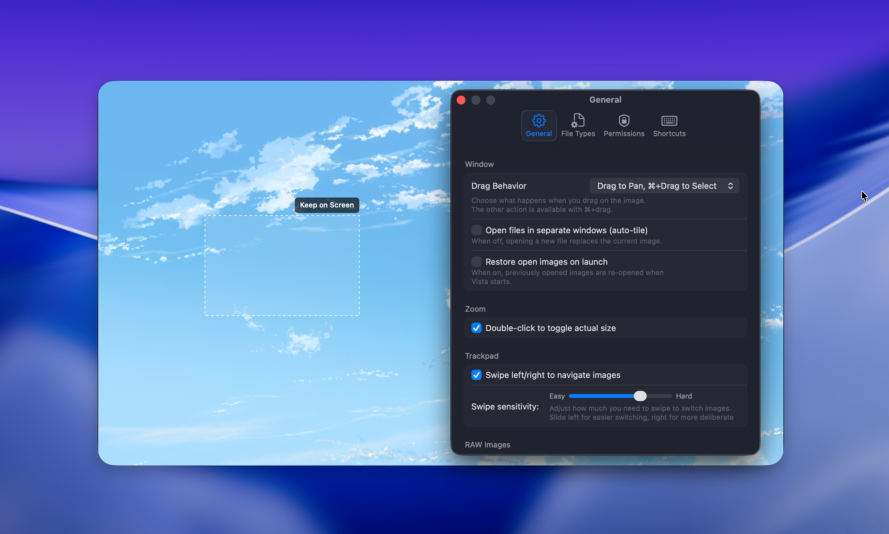

---

## 10. [Klick AI Camera Assistant](https://www.producthunt.com/products/klick-1-ai-camera-assistant)
**Votes**: 94 | **도입 난이도**: 하 | **신뢰도**: 중
**Tagline**: Real-time AI camera that teaches you composition live
**서비스 링크**: https://www.producthunt.com/r/WZNLOHCBAIXTXB

**태그**: AI, 사진, 카메라, 구도, 교육, AI Tool

### 📌 이 서비스 한눈에 보기
Klick AI 카메라 어시스턴트는 실시간 AI로 사진 구도를 코칭하여 초보자도 전문가처럼 멋진 사진을 찍을 수 있게 돕습니다.

### 🔑 주요 기능
- 실시간 구도 가이드 제공
- 즉각적인 피드백으로 실력 향상
- 직관적인 시각 도구 제공

### 🙋 사용자에게 어떤 점이 좋은가
사진 촬영 경험이 없어도 Klick AI 카메라 어시스턴트의 도움을 받아 멋진 사진을 쉽게 찍을 수 있으며, 창작자에게는 새로운 영감을 제공합니다.

### ✅ 지금 바로 써볼 기능
- 다양한 구도 가이드 시험해보기
- 피드백을 참고하여 사진 구도 개선하기
- 제공되는 시각 도구 활용해보기

### ⚠️ 사용 전 확인할 점
- AI 코칭이 모든 사용자의 취향에 맞지 않을 수 있음
- 최적의 결과물을 위해 충분한 연습 필요

### 🧭 확인이 더 필요한 정보
AI 코칭의 정확도 및 다양한 환경에서의 성능 확인이 필요합니다.

### 📸 스크린샷 및 갤러리

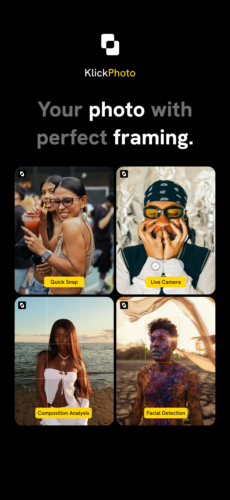

---

