# 🚀 Product Hunt Daily Top 10 (2026-04-06)

## 1. [Influcio](https://www.producthunt.com/products/influcio-2)
**Votes**: 316 | **도입 난이도**: 중 | **신뢰도**: 중
**Tagline**: AI marketing Agent for result-driven influencer campaign
**서비스 링크**: https://www.producthunt.com/r/7LWNCE62V5P6IM

**태그**: AI, 인플루언서 마케팅, 자동화, 마케팅, 캠페인 관리, Agent, AI Tool, Marketing

### 📌 이 서비스 한눈에 보기
Influcio는 AI 기반으로 인플루언서 마케팅 캠페인을 자동화하고 최적화하여, 일회성 캠페인이 아닌 지속적인 성과 향상을 돕는 올인원 플랫폼입니다.

### 🔑 주요 기능
- AI 기반 인플루언서 추천 및 캠페인 자동 실행
- 캠페인 관리 올인원 플랫폼 제공
- 성과 데이터 기반 캠페인 최적화

### 🙋 사용자에게 어떤 점이 좋은가
인플루언서 마케팅 캠페인을 효율적으로 관리하고, AI를 통해 지속적으로 캠페인 성과를 개선할 수 있습니다. 시간과 노력을 절약하면서 더 나은 결과를 얻을 수 있습니다.

### ✅ 지금 바로 써볼 기능
- AI 기반 인플루언서 추천 기능 사용해보기
- 올인원 캠페인 관리 플랫폼 둘러보기
- 성과 데이터 분석 및 최적화 기능 활용해보기

### ⚠️ 사용 전 확인할 점
- AI 추천의 정확도 및 캠페인 성과에 대한 지속적인 검토 필요
- 플랫폼 기능 및 사용법 숙지에 시간 소요 가능성

### 🧭 확인이 더 필요한 정보
Influcio의 AI가 제공하는 추천의 정확도와 실제 캠페인 성과 간의 상관관계에 대한 추가적인 정보가 필요합니다.

### 📸 스크린샷 및 갤러리

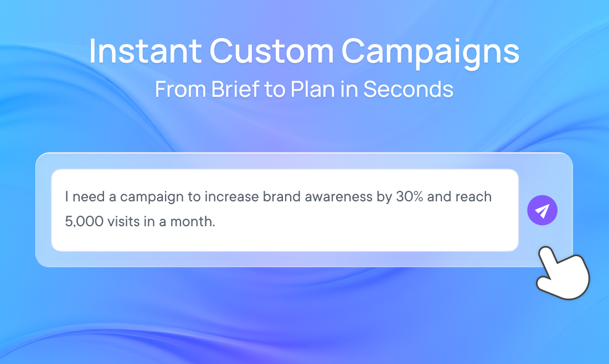
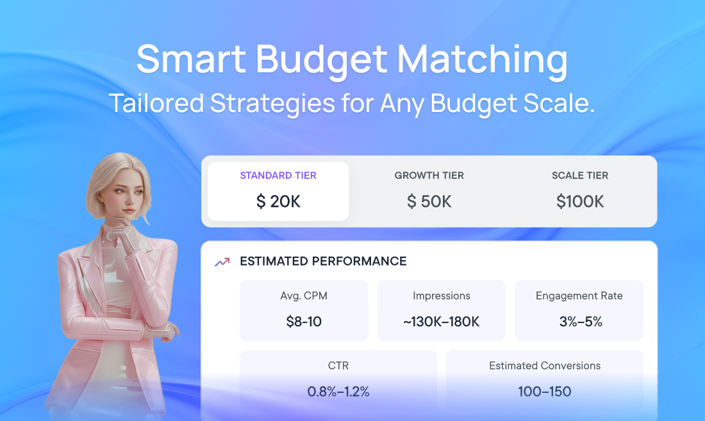

---

## 2. [Panorama](https://www.producthunt.com/products/panorama)
**Votes**: 237 | **도입 난이도**: 중 | **신뢰도**: 중
**Tagline**: AI that finds your team’s workflows and hidden structures
**서비스 링크**: https://www.producthunt.com/r/MXL7VB5VLJTDEB

**태그**: AI, Workflow, Automation, Analytics, AI Tool

### 📌 이 서비스 한눈에 보기
Panorama는 AI를 통해 팀의 워크플로우와 숨겨진 구조를 분석하여 자동화 기회를 찾아주는 도구입니다.

### 🔑 주요 기능
- 팀의 업무 데이터를 분석하여 자동화 가능한 부분을 식별
- 숨겨진 팀 구조와 협업 패턴을 파악
- AI 워크플로우 추천을 통해 팀 생산성 향상

### 🙋 사용자에게 어떤 점이 좋은가
반복적인 업무를 자동화하고 팀의 협업 효율성을 높여, 사용자는 더욱 창의적인 작업에 집중할 수 있습니다.

### ✅ 지금 바로 써볼 기능
- 팀의 데이터 연결 및 분석 시작
- 추천된 AI 워크플로우 검토
- 자동화 가능성이 높은 반복 업무 파악

### ⚠️ 사용 전 확인할 점
- 데이터 분석에 필요한 충분한 양의 데이터 확보 필요
- AI 추천의 정확도는 데이터 품질에 따라 달라질 수 있음

### 🧭 확인이 더 필요한 정보
Panorama가 지원하는 데이터 소스 및 호환성에 대한 추가 확인이 필요합니다.

### 📸 스크린샷 및 갤러리
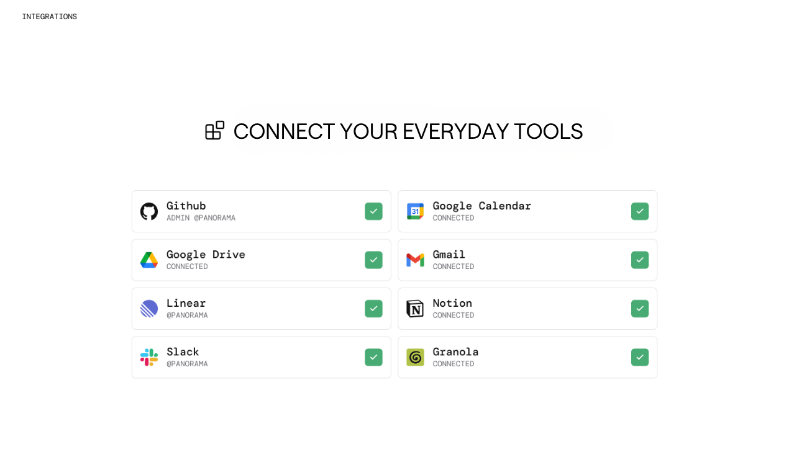
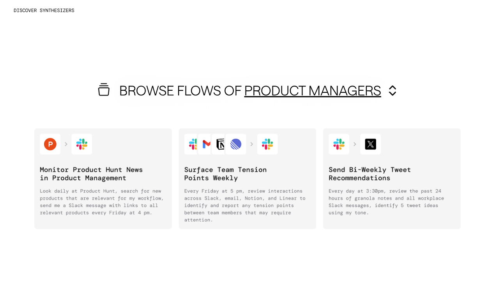
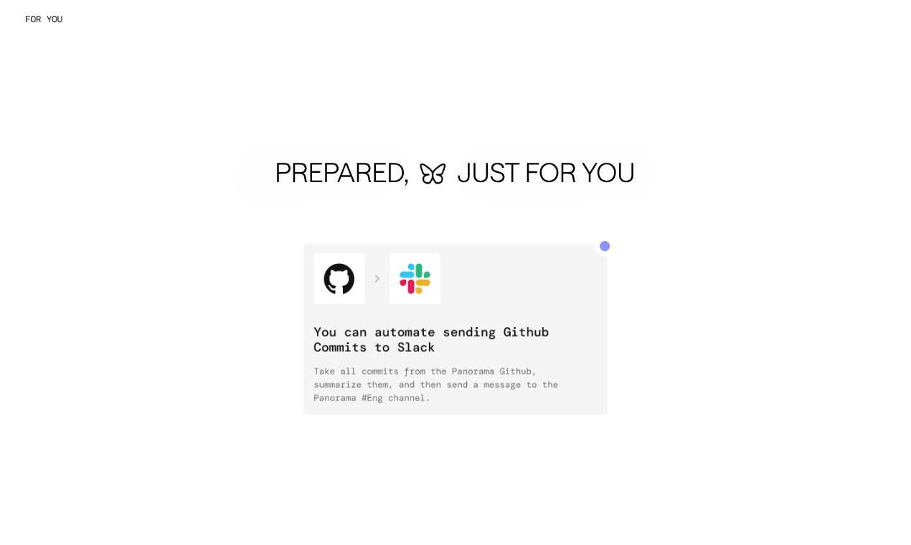

### 🎬 관련 영상
- [🎥 영상 보기](https://ph-files.imgix.net/e14fe205-8cc2-4634-adee-69a73fe0e3a0.jpeg?auto=format)

---

## 3. [Tiny Aya](https://www.producthunt.com/products/cohere-2)
**Votes**: 173 | **도입 난이도**: 중 | **신뢰도**: 중
**Tagline**: Local, open-weight AI designed for real-world languages
**서비스 링크**: https://www.producthunt.com/r/VEQ4W55QX5CCSE
**재등장**: 최근 7일 내 재등장 (마지막 등장 7일 전)

**태그**: AI, Open Source, Multilingual, Local AI, AI Tool, Design

### 📌 이 서비스 한눈에 보기
Tiny Aya는 70개 이상의 언어를 지원하는 Cohere Labs의 33.5억 파라미터 오픈 소스 다국어 모델로, 휴대폰, 교실, 커뮤니티 연구소 등에서 로컬로 사용할 수 있습니다.

### 🔑 주요 기능
- 70개 이상의 언어 지원
- 소외된 지역에 대한 심층적인 지원
- 휴대폰 등에서 로컬 사용 가능

### 🙋 사용자에게 어떤 점이 좋은가
Tiny Aya는 다양한 언어를 지원하며, 특히 소외된 지역에 대한 지원이 강화되어 있어, 해당 지역의 사용자들에게 유용합니다. 또한, 작은 크기로 인해 휴대폰 등에서도 쉽게 사용할 수 있습니다.

### ✅ 지금 바로 써볼 기능
- 지원하는 언어 확인
- 로컬 환경에서 모델 실행
- 다양한 언어 데이터셋으로 테스트

### ⚠️ 사용 전 확인할 점
- 33.5억 파라미터 모델의 성능 한계
- 특정 하드웨어에서 실행 시 성능 저하 가능성

### 🧭 확인이 더 필요한 정보
실제 사용 환경에서의 성능 및 리소스 요구 사항에 대한 추가적인 정보가 필요합니다.

### 📸 스크린샷 및 갤러리

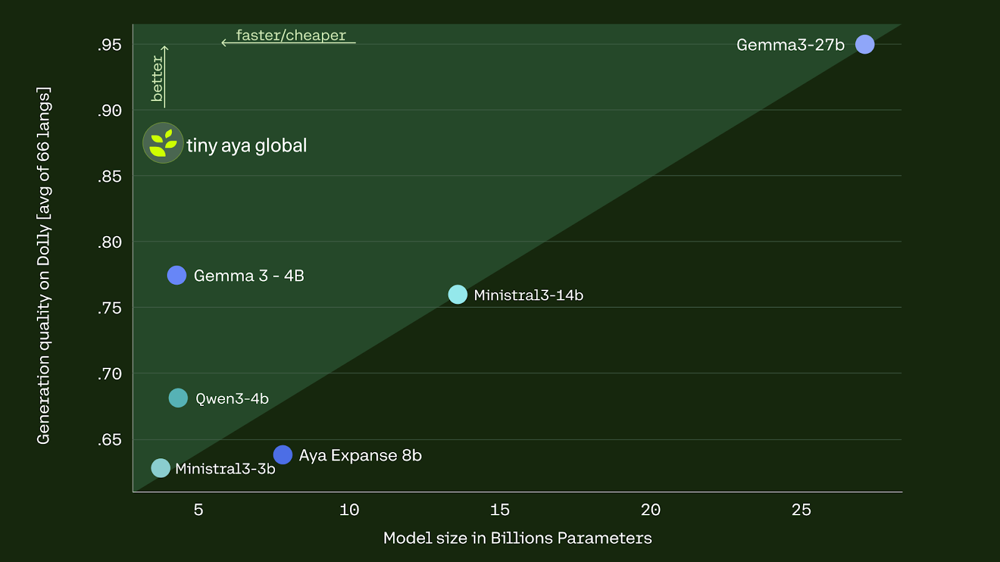
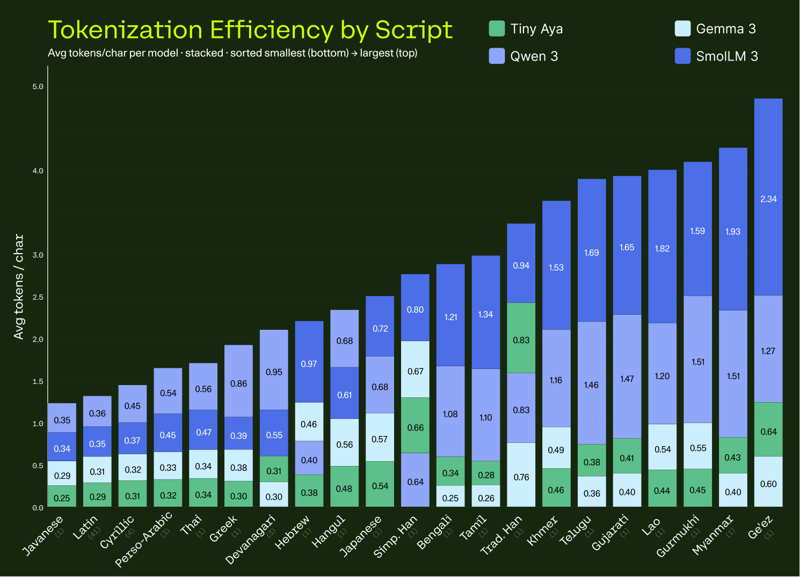

---

## 4. [Shotwell](https://www.producthunt.com/products/shotwell)
**Votes**: 161 | **도입 난이도**: 하 | **신뢰도**: 중
**Tagline**: The screenshot editor for iPhone.
**서비스 링크**: https://www.producthunt.com/r/WJBALPSG6RFTY3

**태그**: 아이폰, 스크린샷, 편집, 디자인, 개발, Design, DevTool

### 📌 이 서비스 한눈에 보기
Shotwell은 아이폰에서 바로 스크린샷에 기기 프레임, 배경, 그림자를 추가하여 개발자, 디자이너, 인디 제작자들이 온라인에서 공유하기 용이하게 해주는 편집기입니다.

### 🔑 주요 기능
- 아이폰에서 바로 스크린샷 편집 가능
- 기기 프레임, 배경, 그림자 추가 기능 제공
- 개발자, 디자이너, 인디 제작자에게 유용

### 🙋 사용자에게 어떤 점이 좋은가
별도의 데스크탑 편집 도구 없이 아이폰에서 바로 스크린샷을 꾸밀 수 있어 작업 시간을 단축하고 공유 과정을 간소화할 수 있습니다.

### ✅ 지금 바로 써볼 기능
- 아이폰 스크린샷 불러오기
- 다양한 프레임 및 배경 적용해보기
- 편집된 스크린샷 공유하기

### ⚠️ 사용 전 확인할 점
- 아이폰에서만 사용 가능
- 제공되는 프레임 및 배경 종류 확인 필요

### 🧭 확인이 더 필요한 정보
Shotwell의 구체적인 편집 기능 및 지원하는 프레임/배경 종류에 대한 추가 정보가 필요합니다.

### 📸 스크린샷 및 갤러리
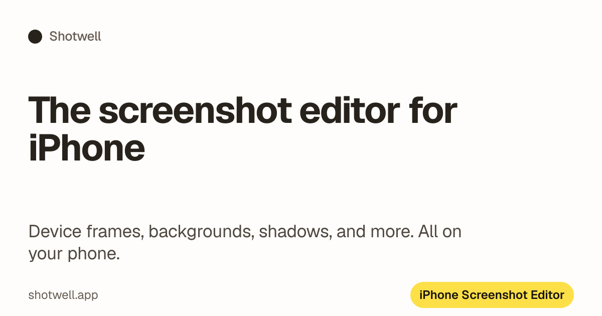

---

## 5. [Ember](https://www.producthunt.com/products/ember-104)
**Votes**: 140 | **도입 난이도**: 중 | **신뢰도**: 중
**Tagline**: Meal scan, macros & AI coach
**서비스 링크**: https://www.producthunt.com/r/4W4Y3U3HB6U5XQ

**태그**: AI, 건강, 영양, 식단관리, 코칭, AI Tool, DevTool

### 📌 이 서비스 한눈에 보기
Ember는 AI 영양 코치를 통해 개인 맞춤형 식단 관리 및 목표 달성을 돕는 앱입니다. 사진 촬영이나 간단한 설명으로 쉽고 빠르게 칼로리와 영양 성분을 추적할 수 있습니다.

### 🔑 주요 기능
- AI 기반 개인 맞춤형 영양 코칭 제공
- 사진 또는 텍스트 설명을 통한 간편한 식단 기록
- 바코드 스캔이나 수동 검색 없이 사용 가능

### 🙋 사용자에게 어떤 점이 좋은가
Ember를 사용하면 번거로운 과정 없이 쉽고 빠르게 식단을 기록하고, AI 코칭을 통해 건강 목표를 효과적으로 달성할 수 있습니다. 체중 감량, 근육 증가, 건강한 식습관 등 개인의 목표에 맞춰 맞춤형 조언을 받을 수 있습니다.

### ✅ 지금 바로 써볼 기능
- 식단 사진을 찍어 칼로리 및 영양 정보 확인하기
- AI 코치에게 식단 관련 조언 요청하기
- 개인 목표 설정하고 맞춤형 식단 계획 세우기

### ⚠️ 사용 전 확인할 점
- AI 코칭의 정확도는 개인의 데이터 입력 및 알고리즘 성능에 따라 달라질 수 있음
- 모든 음식에 대한 정확한 영양 정보 제공을 보장하지 않음

### 🧭 확인이 더 필요한 정보
AI 코칭의 효과는 개인차가 있을 수 있으며, 장기간 사용 시 데이터 사용량에 대한 확인이 필요합니다.

### 📸 스크린샷 및 갤러리
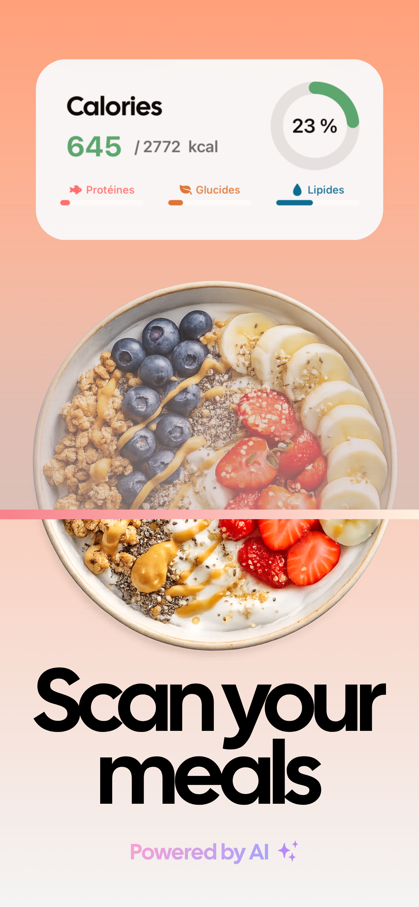
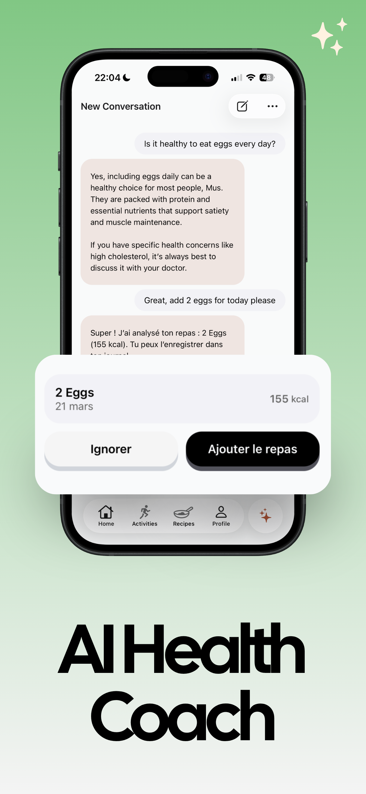
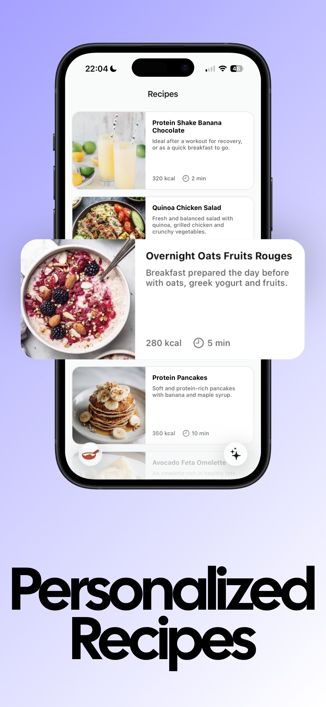

---

## 6. [Handle Extension](https://www.producthunt.com/products/tonkotsu)
**Votes**: 119 | **도입 난이도**: 중 | **신뢰도**: 중
**Tagline**: Refine UI in the browser, feed changes to your coding agent
**서비스 링크**: https://www.producthunt.com/r/5PJ3K5ZJNHBOTW

**태그**: DevTool, UI, Automation, 코딩 에이전트, Agent, Prompting

### 📌 이 서비스 한눈에 보기
Handle Extension은 브라우저에서 직접 UI를 수정하고, 변경 사항을 코딩 에이전트에 반영하여 프롬프트 반복 작업을 줄여주는 도구입니다.

### 🔑 주요 기능
- 브라우저에서 UI를 직접 수정 가능
- Claude Code, Codex, Cursor 등 다양한 코딩 에이전트와 호환
- 반복적인 프롬프트 작업 감소

### 🙋 사용자에게 어떤 점이 좋은가
코딩 에이전트를 사용할 때 UI 수정 과정을 간소화하여 개발 효율성을 높여줍니다. 브라우저에서 바로 수정하고 결과를 확인할 수 있어 시간을 절약할 수 있습니다.

### ✅ 지금 바로 써볼 기능
- 브라우저에 Handle Extension 설치
- UI 수정 후 코딩 에이전트에 변경 사항 적용
- 다양한 코딩 에이전트와의 호환성 테스트

### ⚠️ 사용 전 확인할 점
- 특정 웹사이트 또는 UI 프레임워크와의 호환성 확인 필요
- 코딩 에이전트와의 연동 과정에서 오류 발생 가능성

### 🧭 확인이 더 필요한 정보
실제 코딩 에이전트와의 연동 성능 및 지원 범위를 추가적으로 확인해야 합니다.

### 📸 스크린샷 및 갤러리

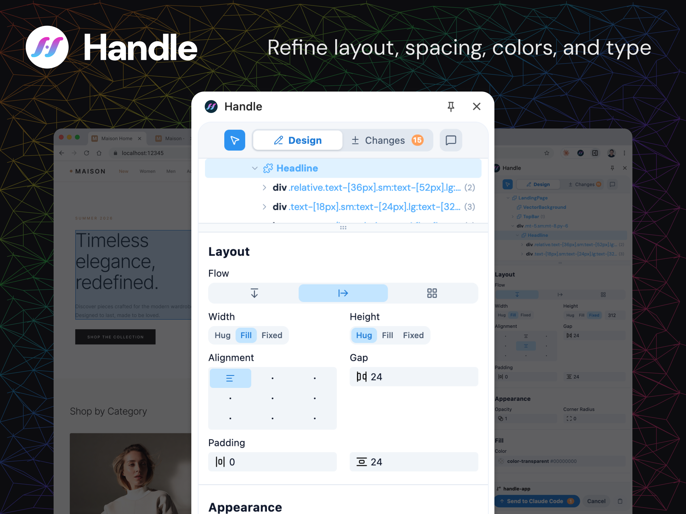
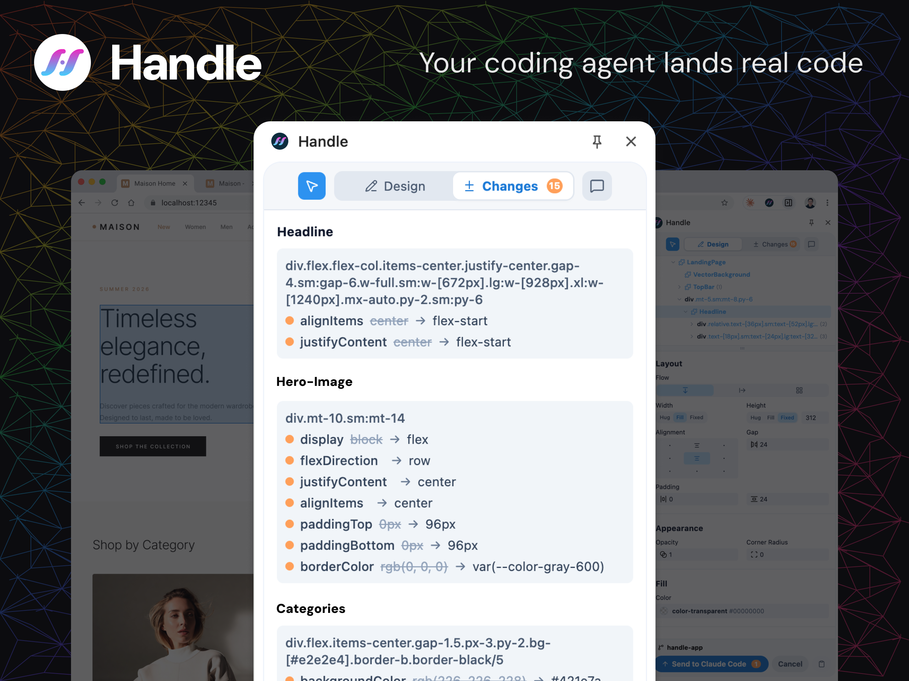

---

## 7. [CatBar](https://www.producthunt.com/products/catbar)
**Votes**: 110 | **도입 난이도**: 하 | **신뢰도**: 중
**Tagline**: RevenueCat stats in your macOS menu bar.
**서비스 링크**: https://www.producthunt.com/r/4KTAFPK472GNUW

**태그**: macOS, RevenueCat, 수익, 메뉴 막대, 지표

### 📌 이 서비스 한눈에 보기
CatBar는 RevenueCat 수익을 macOS 메뉴 막대에서 바로 추적하여 MRR, 구독자, 거래 내역을 한눈에 보여줍니다.

### 🔑 주요 기능
- macOS 메뉴 막대에서 RevenueCat 수익 추적
- MRR, 구독자, 거래 내역을 한눈에 확인
- 간편하게 수익 현황 파악

### 🙋 사용자에게 어떤 점이 좋은가
RevenueCat을 사용하는 개발자나 마케터가 macOS 메뉴 막대에서 빠르게 수익 관련 지표를 확인하고 싶을 때 유용합니다. 별도의 대시보드 접속 없이 간편하게 현황을 파악할 수 있습니다.

### ✅ 지금 바로 써볼 기능
- CatBar 설치 후 RevenueCat 계정 연결
- 메뉴 막대에서 MRR, 구독자 수 확인
- 거래 내역 확인

### ⚠️ 사용 전 확인할 점
- RevenueCat 계정이 필요합니다.
- macOS 환경에서만 사용 가능합니다.

### 🧭 확인이 더 필요한 정보
CatBar의 데이터 업데이트 주기가 실시간인지 확인이 필요합니다.

### 📸 스크린샷 및 갤러리
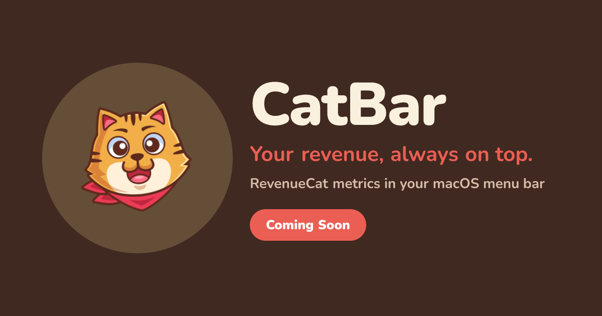
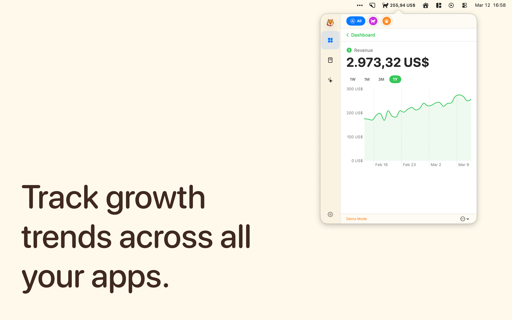

---

## 8. [XP One](https://www.producthunt.com/products/xp-one-the-one-finding-clients-tool)
**Votes**: 23 | **도입 난이도**: 중 | **신뢰도**: 중
**Tagline**: Replace Waalaxy, Lemlist, LGM, Apollo, Hunter & PB → $29/mo
**서비스 링크**: https://www.producthunt.com/r/WHHXSE3QCXS5YT

**태그**: 리드 생성, 자동화, CRM, LinkedIn, 영업, AI Tool, Email

### 📌 이 서비스 한눈에 보기
XP One은 Waalaxy, Lemlist 등 여러 리드 생성 및 자동화 도구를 하나로 통합하여 월 $29에 제공, 비용 절감 및 효율성을 높여줍니다.

### 🔑 주요 기능
- LinkedIn, 이메일, WhatsApp 캠페인 통합 관리
- 내장 AI CRM을 통한 추적 및 분석
- LinkedIn 리드 수집, 이메일 검증, 연락처 정보 획득 기능

### 🙋 사용자에게 어떤 점이 좋은가
여러 도구를 사용할 필요 없이 하나의 플랫폼에서 리드 생성부터 관리까지 효율적으로 처리하여 시간과 비용을 절약할 수 있습니다. 특히 LinkedIn을 적극적으로 활용하는 사용자에게 유용합니다.

### ✅ 지금 바로 써볼 기능
- LinkedIn에서 리드 수집 기능 사용해보기
- 이메일 및 WhatsApp 캠페인 연동해보기
- AI CRM을 활용한 리드 추적 및 분석 기능 사용해보기

### ⚠️ 사용 전 확인할 점
- 기존 사용하던 도구에서 데이터 이전 가능성 확인 필요
- 통합 플랫폼이 제공하는 기능 범위가 개별 도구만큼 상세한지 확인 필요

### 🧭 확인이 더 필요한 정보
XP One이 제공하는 AI CRM의 성능 및 데이터 분석 정확도에 대한 추가 정보가 필요합니다.

### 📸 스크린샷 및 갤러리

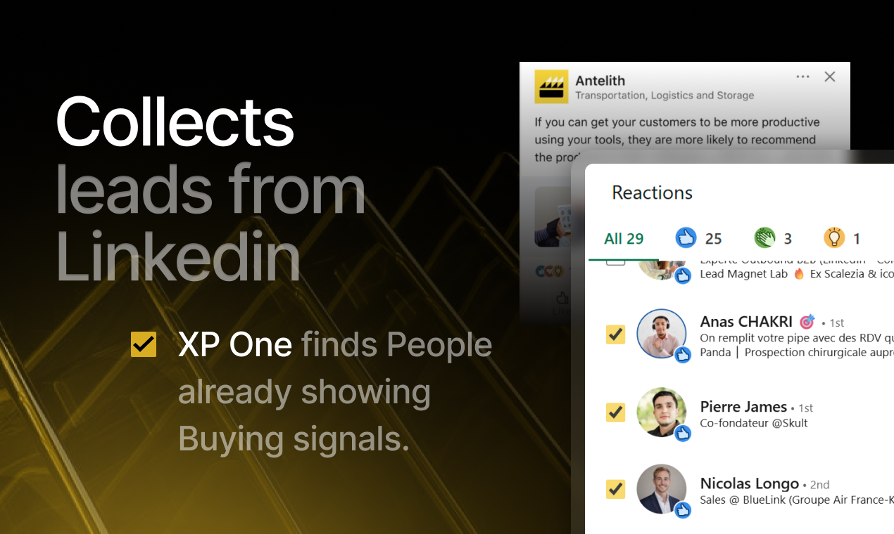

### 🎬 관련 영상
- [🎥 영상 보기](https://ph-files.imgix.net/9f6d4a40-05a6-478b-9ce0-9df35c1a8b78.jpeg?auto=format)

---

## 9. [Guardian IDE](https://www.producthunt.com/products/guardian-ide)
**Votes**: 14 | **도입 난이도**: 중 | **신뢰도**: 중
**Tagline**: Control AI-generated code before it ships.
**서비스 링크**: https://www.producthunt.com/r/6VLIKFOYB5GZEK

**태그**: DevTool, AI, 코드 검토, 자동화, Automation, AI Tool

### 📌 이 서비스 한눈에 보기
Guardian IDE는 AI가 생성한 코드를 배포 전에 제어하여 소규모 엔지니어링 팀이 위험한 변경 사항을 사전에 감지할 수 있도록 돕는 데스크톱 릴리스 게이트입니다.

### 🔑 주요 기능
- AI 생성 코드에 대한 로컬 코드 검토 기능 제공
- 정책 시행 및 릴리스 승인 워크플로우 통합
- 업데이트 준비된 데스크톱 배포 지원

### 🙋 사용자에게 어떤 점이 좋은가
AI 코드를 사용하는 팀이 코드 배포 전 위험을 줄이고, 코드 품질을 유지하는 데 도움이 됩니다. 특히 소규모 팀에게 유용합니다.

### ✅ 지금 바로 써볼 기능
- AI 생성 코드에 대한 코드 리뷰 설정
- 정책 시행 규칙 정의
- 데스크톱 배포 워크플로우 테스트

### ⚠️ 사용 전 확인할 점
- AI 생성 코드 외 일반 코드에 대한 지원 범위 확인 필요
- 기존 CI/CD 파이프라인과의 호환성 검토 필요

### 🧭 확인이 더 필요한 정보
Guardian IDE가 지원하는 AI 모델 및 코드 생성 도구의 범위에 대한 추가 정보가 필요합니다.

### 📸 스크린샷 및 갤러리
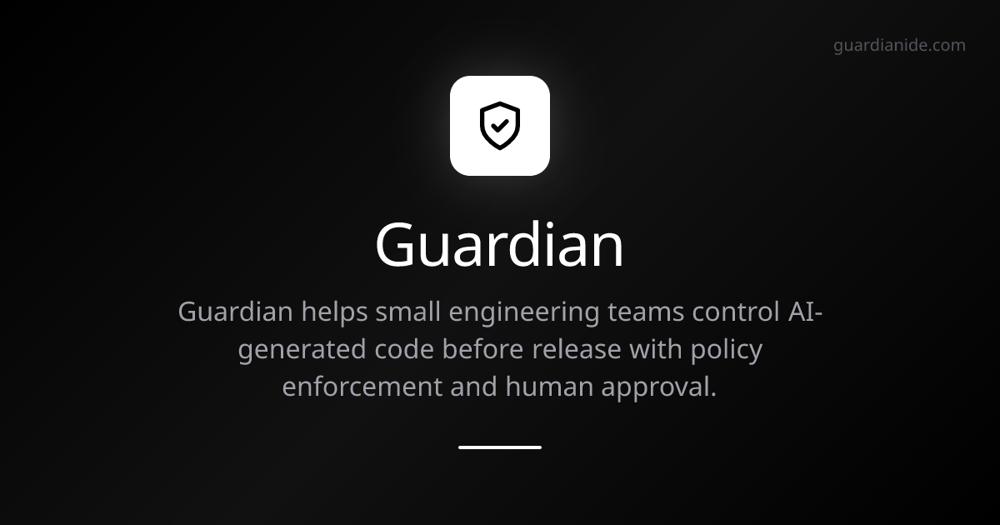
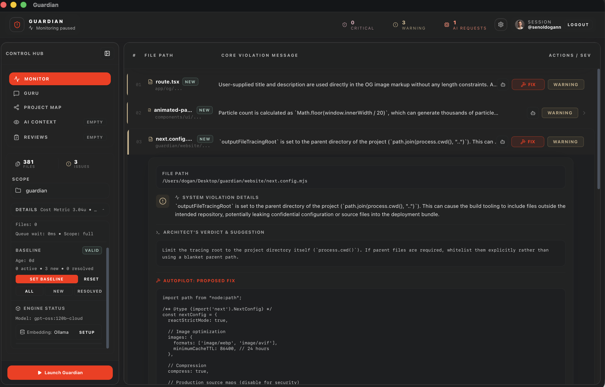
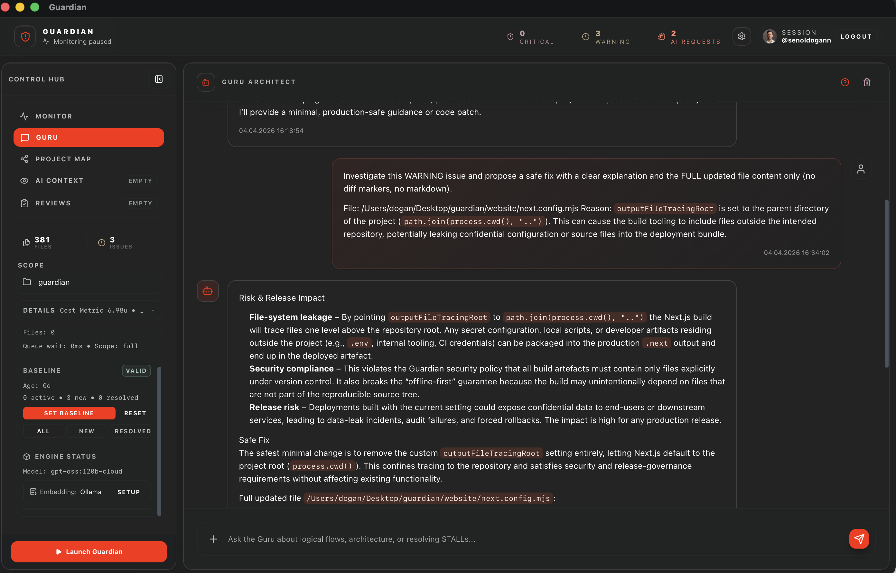

---

## 10. [AppDeploy](https://www.producthunt.com/products/appdeploy-2)
**Votes**: 14 | **도입 난이도**: 하 | **신뢰도**: 중
**Tagline**: Deploy real apps from ChatGPT or Claude in seconds
**서비스 링크**: https://www.producthunt.com/r/WKF4J7YFQEYSCK

**태그**: DevTool, NoCode, AI, 배포자동화, Agent, AI Tool, Chat

### 📌 이 서비스 한눈에 보기
ChatGPT나 Claude와 같은 AI 에이전트에서 설명만으로 실제 앱을 즉시 배포할 수 있게 해주는 노코드 배포 솔루션입니다.

### 🔑 주요 기능
- AI 에이전트 연동으로 자연어 설명 기반 앱 배포
- Git, CLI 없이 즉시 사용 가능한 URL 제공
- 호스팅, 데이터베이스, 인증, 스토리지 등 풀스택 기능 자동 관리

### 🙋 사용자에게 어떤 점이 좋은가
복잡한 개발 과정 없이 아이디어만으로 빠르게 앱을 만들고 배포하여 MVP 테스트나 프로토타입 제작에 유용합니다.

### ✅ 지금 바로 써볼 기능
- ChatGPT 또는 Claude에 연결하여 간단한 앱 설명 입력 후 배포
- 제공되는 URL을 통해 앱 즉시 확인
- 자동으로 관리되는 다양한 풀스택 기능 탐색

### ⚠️ 사용 전 확인할 점
- AI 에이전트의 성능에 따라 결과물의 품질이 달라질 수 있음
- 복잡한 앱보다는 간단한 앱 개발에 적합

### 🧭 확인이 더 필요한 정보
AI 에이전트 연동 시 발생할 수 있는 보안 및 개인 정보 보호 관련 사항 확인이 필요합니다.

### 📸 스크린샷 및 갤러리

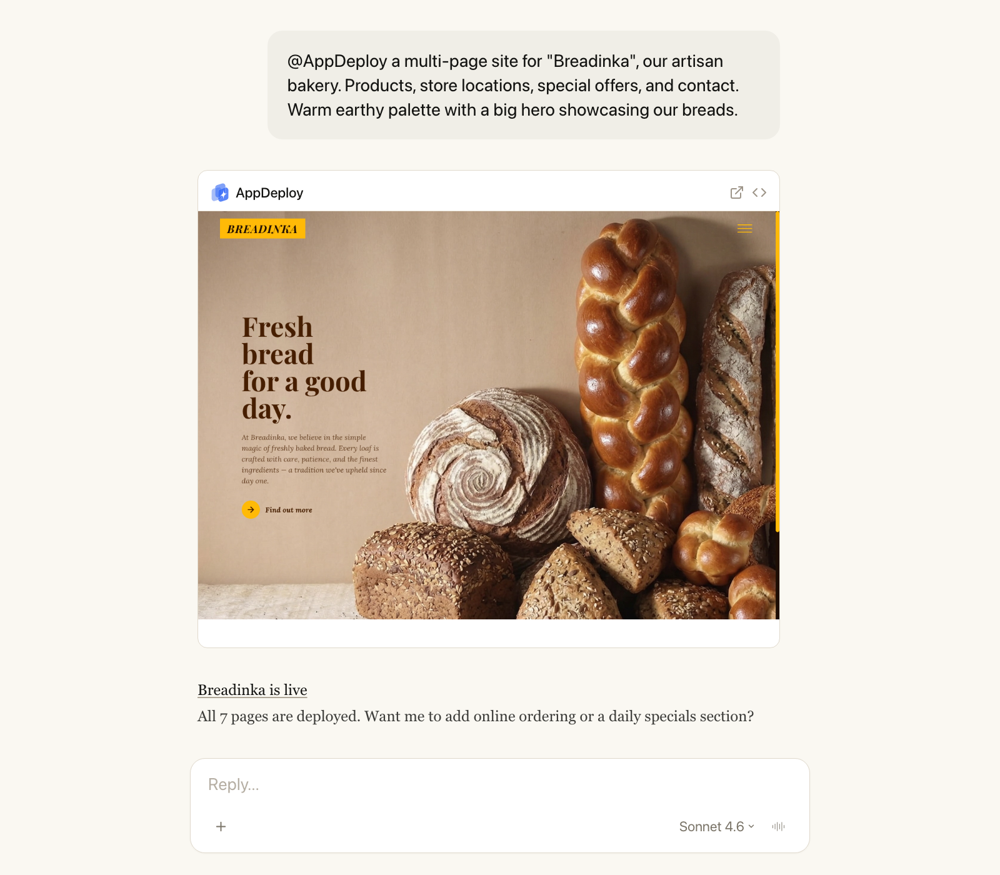
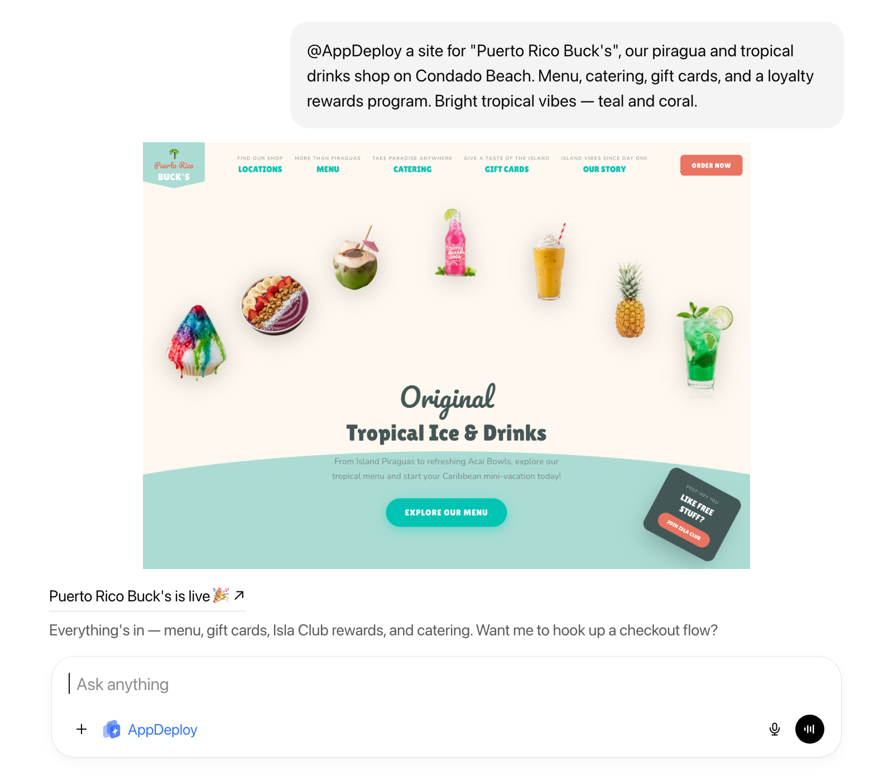

### 🎬 관련 영상
- [🎥 영상 보기](https://ph-files.imgix.net/294a2676-dd60-423a-940f-d5e8a9c6729d.jpeg?auto=format)

---

