# 🚀 Product Hunt Daily Top 10 (2026-04-07)

## 1. [Moonshot ](https://www.producthunt.com/products/moonshot-13)
**Votes**: 309 | **도입 난이도**: 하 | **신뢰도**: 중
**Tagline**: Track the Artemis II mission from your Mac
**서비스 링크**: https://www.producthunt.com/r/GDTDNLE4GZ3EBU

**태그**: macOS, 우주, NASA, 미션 추적, 실시간 정보, AI Tool

### 📌 이 서비스 한눈에 보기
Moonshot은 NASA의 아르테미스 II 미션을 실시간으로 추적하여, Mac 메뉴 막대에서 간편하게 미션 진행 상황, 주요 이벤트 카운트다운, 우주 비행사 정보 등을 확인할 수 있게 해주는 앱입니다.

### 🔑 주요 기능
- macOS 메뉴 막대 앱으로 간편하게 사용
- NASA 아르테미스 II 미션 실시간 추적
- 주요 이벤트 카운트다운 및 미션 정보 제공

### 🙋 사용자에게 어떤 점이 좋은가
우주 탐사에 관심 있는 사용자에게 실시간 미션 정보를 편리하게 제공하여 몰입감을 높여주고, NASA의 공개 데이터를 활용하여 신뢰성 있는 정보를 얻을 수 있습니다.

### ✅ 지금 바로 써볼 기능
- 메뉴 막대에서 실시간 미션 진행 상황 확인
- 주요 이벤트 알림 설정
- 우주 비행사 정보 및 미션 타임라인 확인

### ⚠️ 사용 전 확인할 점
- NASA의 데이터 업데이트에 따라 정보 정확도가 달라질 수 있음
- macOS 환경에서만 사용 가능

### 🧭 확인이 더 필요한 정보
NASA 데이터 업데이트 빈도 및 정확도에 대한 추가 확인이 필요합니다.

### 📸 스크린샷 및 갤러리
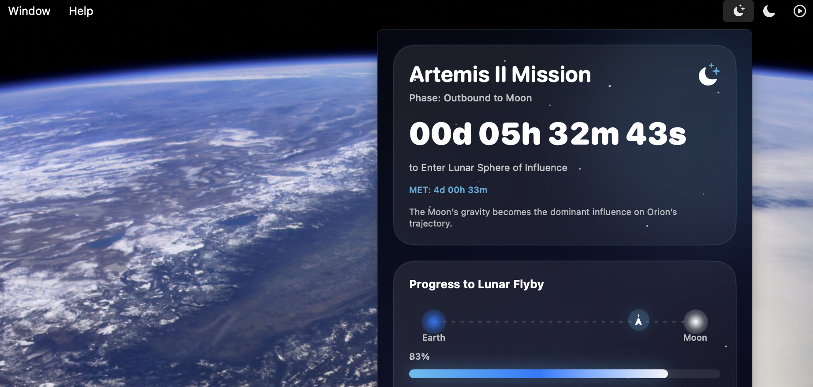
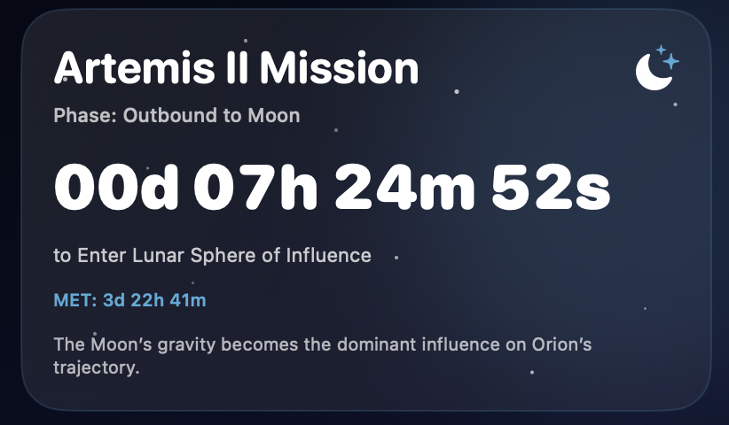
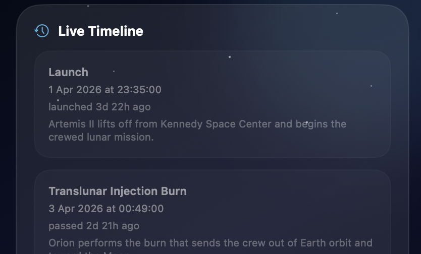

---

## 2. [PixVerse V6](https://www.producthunt.com/products/pixverse)
**Votes**: 245 | **도입 난이도**: 중 | **신뢰도**: 중
**Tagline**: The AI video model that actually feels alive.
**서비스 링크**: https://www.producthunt.com/r/IQKRNCKHESYQHL

**태그**: AI 비디오, 비디오 생성, 콘텐츠 제작, 광고, AI Tool, Video

### 📌 이 서비스 한눈에 보기
PixVerse V6는 생생한 AI 비디오 모델로, 현실적인 텍스처, 자연스러운 물리 효과, 영화 같은 색감을 제공하며, 복잡한 장면과 액션, 변환, 총알 시간 효과를 완벽한 오디오 싱크와 함께 높은 성공률로 구현합니다.

### 🔑 주요 기능
- 현실적인 AI 비디오 생성
- 복잡한 장면 처리 능력 향상
- 팀 협업 및 광고 제작 기능 추가

### 🙋 사용자에게 어떤 점이 좋은가
PixVerse V6를 통해 스튜디오는 공유 크레딧으로 협업하고, 사용자는 간단한 사진을 세련된 비디오 광고로 즉시 전환할 수 있어 효율성을 높일 수 있습니다.

### ✅ 지금 바로 써볼 기능
- 새로운 팀 플랜 사용해보기
- 미니 앱으로 사진을 비디오 광고로 변환해보기
- 액션 장면이나 변환 효과가 들어간 비디오 제작해보기

### ⚠️ 사용 전 확인할 점
- AI 생성 비디오의 현실감은 주관적일 수 있음
- 복잡한 장면의 성공률은 사용 환경에 따라 달라질 수 있음

### 🧭 확인이 더 필요한 정보
PixVerse V6의 실제 사용 후기와 다양한 환경에서의 성능 테스트 결과에 대한 추가적인 정보가 필요합니다.

### 📸 스크린샷 및 갤러리
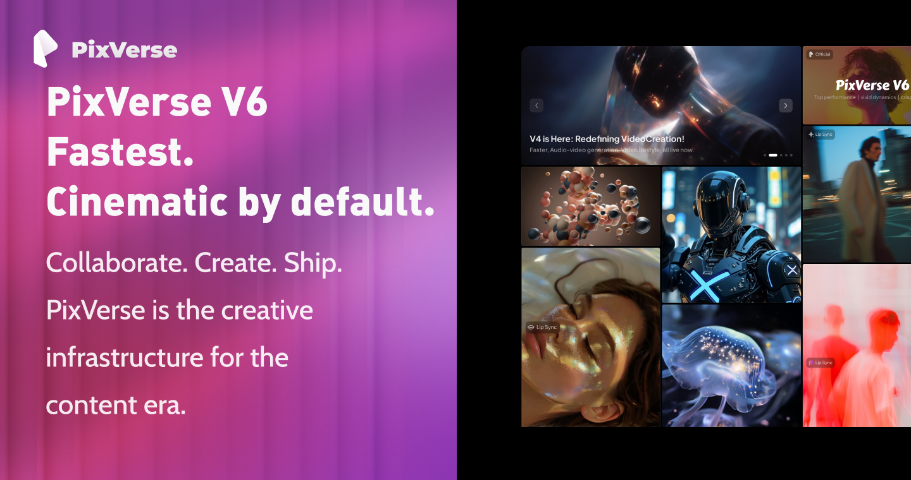
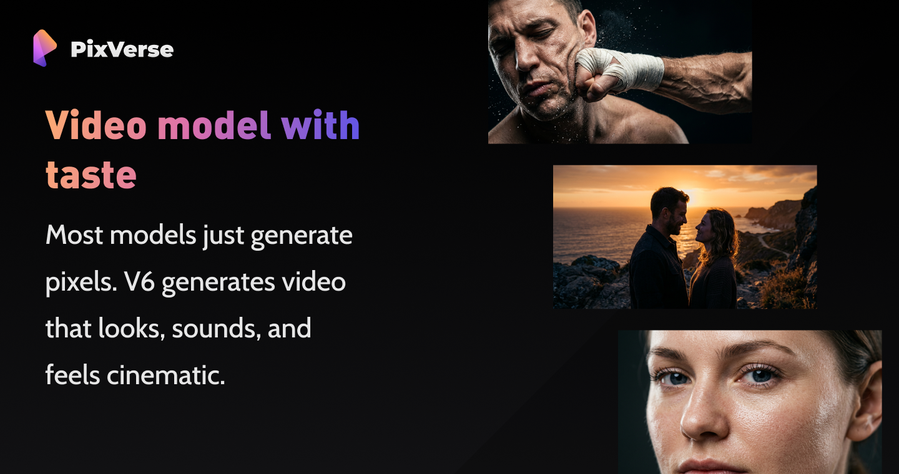
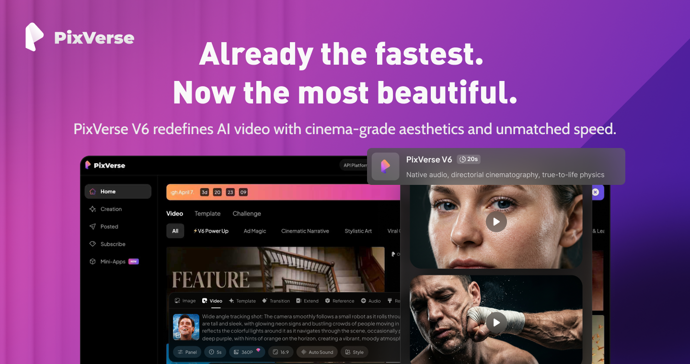

### 🎬 관련 영상
- [🎥 영상 보기](https://ph-files.imgix.net/51bd28cd-1b76-4b3f-9616-8d6a1a14affa.jpeg?auto=format)

---

## 3. [AgentPulse by Rectify](https://www.producthunt.com/products/rectify)
**Votes**: 190 | **도입 난이도**: 중 | **신뢰도**: 중
**Tagline**: Everything in OpenClaw's terminal, you can now do visually
**서비스 링크**: https://www.producthunt.com/r/AA2PMVQIUHDCHQ

**태그**: DevTool, Automation, AI, Monitoring, Team Collaboration, Agent, AI Tool

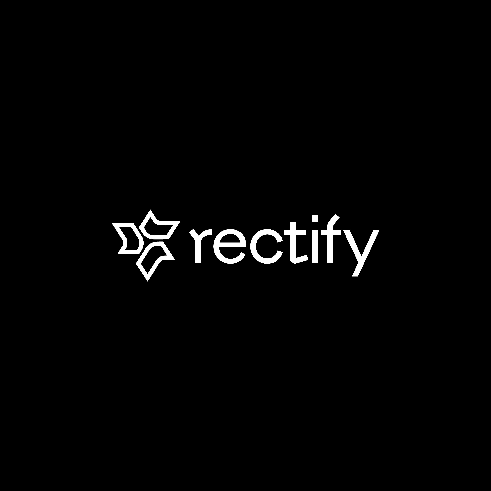

### 📌 이 서비스 한눈에 보기
AgentPulse는 OpenClaw 터미널에서 수행하던 모든 작업을 시각적으로 관리할 수 있게 해주는 명령 센터입니다. SSH나 JSON 설정 없이 팀 협업을 지원합니다.

### 🔑 주요 기능
- OpenClaw 에이전트 모니터링, 세션 관리, cron 작업 실행 등을 시각적으로 수행 가능
- SSH 접속이나 JSON 설정 없이 사용 가능
- 역할 기반 접근 권한 설정으로 팀 협업 효율 증대

### 🙋 사용자에게 어떤 점이 좋은가
터미널 명령에 익숙하지 않은 사용자도 OpenClaw를 쉽게 사용하고 관리할 수 있으며, 팀원 간 협업이 더욱 효율적으로 이루어집니다.

### ✅ 지금 바로 써볼 기능
- 에이전트 상태 시각적으로 모니터링
- 역할 기반 접근 권한 설정하여 팀원 초대
- Quanta AI 에이전트와 대화하며 시스템 이해도 향상

### ⚠️ 사용 전 확인할 점
- OpenClaw와의 호환성 확인 필요
- Quanta AI 에이전트의 답변 정확도 검증 필요

### 🧭 확인이 더 필요한 정보
AgentPulse가 OpenClaw의 모든 기능을 100% 커버하는지 확인이 필요합니다.

### 📸 스크린샷 및 갤러리

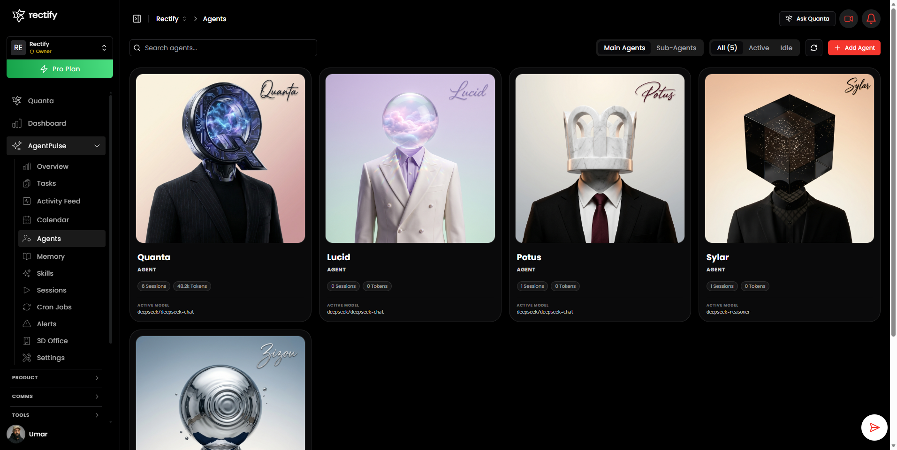
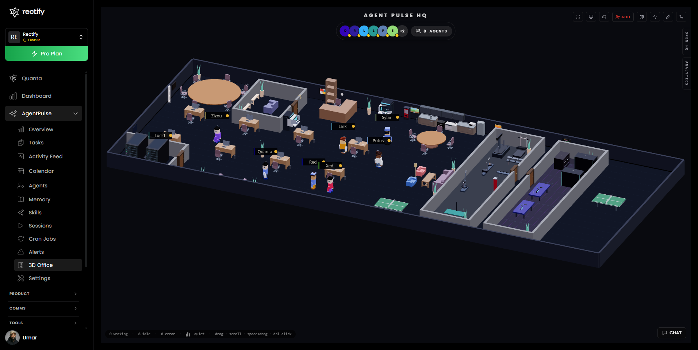

### 🎬 관련 영상
- [🎥 영상 보기](https://ph-files.imgix.net/db19fe6e-d1f1-4937-a922-9fe14dc1d787.jpeg?auto=format)

---

## 4. [KREV](https://www.producthunt.com/products/krev)
**Votes**: 179 | **도입 난이도**: 중 | **신뢰도**: 중
**Tagline**: AI creative agents for ecommerce brands
**서비스 링크**: https://www.producthunt.com/r/FQ7RRJ6JPK6TO2

**태그**: AI, 광고, 이커머스, 자동화, 콘텐츠 생성, Agent, AI Tool, Video, Vision

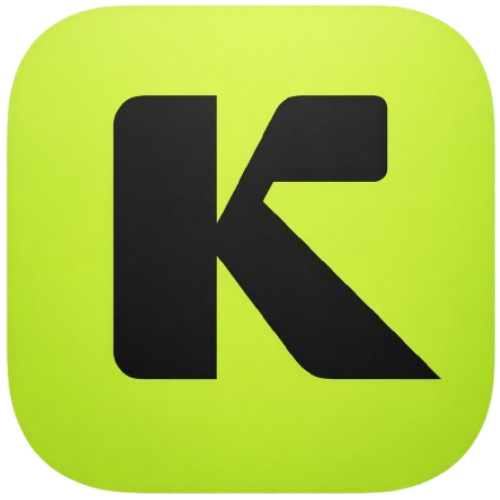

### 📌 이 서비스 한눈에 보기
KREV는 이커머스 브랜드가 제품 이미지 하나로 광고용 사진, 비디오, 런칭 준비된 창작물을 만들 수 있게 돕는 AI 에이전트입니다.

### 🔑 주요 기능
- 단일 제품 이미지를 다양한 광고 소재로 자동 변환
- 실제 광고 데이터와 브랜드 데이터를 기반으로 최적화된 결과물 생성
- 의도적이고 브랜드에 맞는 고품질 콘텐츠 제작

### 🙋 사용자에게 어떤 점이 좋은가
광고 소재 제작에 드는 시간과 비용을 절감하고, 데이터 기반으로 성과를 높일 수 있는 광고를 제작할 수 있습니다.

### ✅ 지금 바로 써볼 기능
- 제품 이미지 업로드 후 광고 소재 자동 생성
- 생성된 광고 소재의 브랜드 일관성 확인
- 다양한 광고 플랫폼에 최적화된 소재 다운로드

### ⚠️ 사용 전 확인할 점
- AI가 생성한 결과물이 브랜드 이미지와 완전히 부합하는지 검토 필요
- 데이터 기반 최적화가 모든 경우에 효과적인지 확인 필요

### 🧭 확인이 더 필요한 정보
KREV가 제공하는 광고 성과 예측의 정확도에 대한 추가적인 정보가 필요합니다.

### 📸 스크린샷 및 갤러리
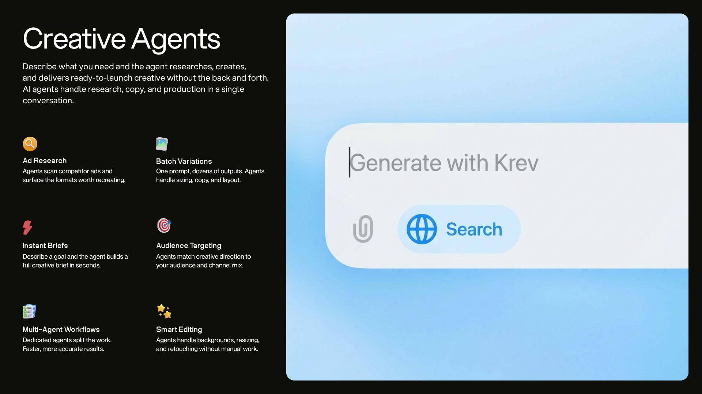
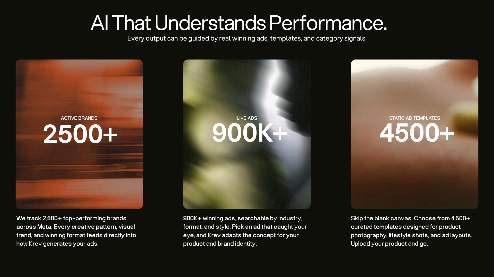
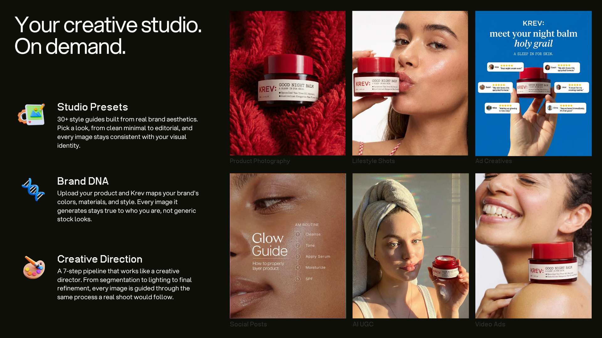

### 🎬 관련 영상
- [🎥 영상 보기](https://ph-files.imgix.net/8419494f-ec0f-4f68-a68d-087de0b00d1f.jpeg?auto=format)

---

## 5. [Predflow AI](https://www.producthunt.com/products/predflow-2)
**Votes**: 158 | **도입 난이도**: 중 | **신뢰도**: 중
**Tagline**: Your AI agent for ad performance
**서비스 링크**: https://www.producthunt.com/r/4ZCK2KRQ763X36

**태그**: 광고, AI, 자동화, 분석, 마케팅, Agent, AI Tool

### 📌 이 서비스 한눈에 보기
Predflow AI는 광고 성과를 분석하고 개선 방안을 제시하는 AI 에이전트로, Meta, Google, Shopify 계정을 연동하여 광고 효율을 높일 수 있습니다.

### 🔑 주요 기능
- 광고 성과에 대한 상세 분석 제공
- 문제 원인 파악 및 해결책 제시
- 크리에이티브, 예산, 기여도 분석을 통한 액션 플랜 제공

### 🙋 사용자에게 어떤 점이 좋은가
광고 성과를 실질적으로 개선할 수 있는 맞춤형 추천을 빠르게 받을 수 있어, 마케터의 의사 결정을 돕고 효율적인 광고 운영을 가능하게 합니다.

### ✅ 지금 바로 써볼 기능
- Meta, Google, Shopify 계정 연동
- AI 분석 기반의 크리에이티브 개선 제안 확인
- 예산 최적화 추천 적용

### ⚠️ 사용 전 확인할 점
- 정확한 분석을 위해 충분한 광고 데이터 확보 필요
- AI 추천은 참고 자료이며, 최종 결정은 사용자가 판단

### 🧭 확인이 더 필요한 정보
제공되는 추천의 정확도 및 실제 광고 성과에 미치는 영향은 추가적인 사용 데이터 확보 후 검증이 필요합니다.

### 📸 스크린샷 및 갤러리
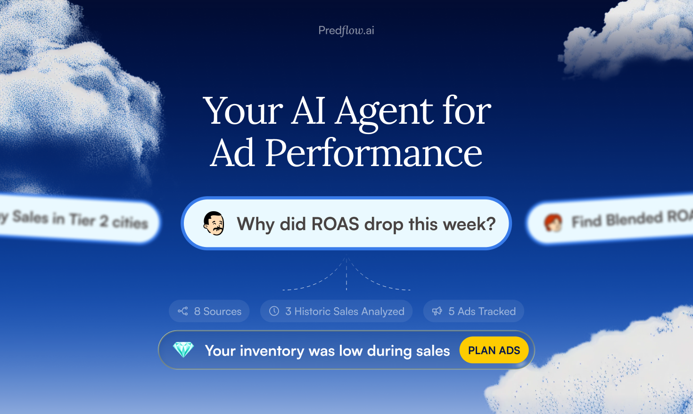
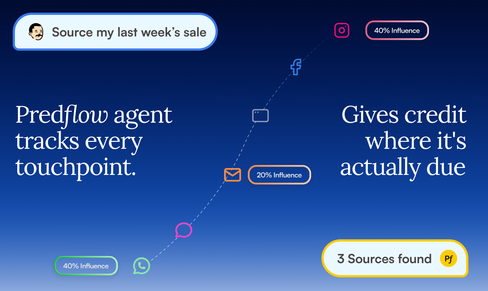
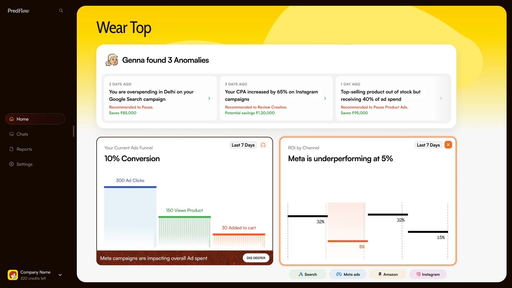

---

## 6. [Walkie](https://www.producthunt.com/products/b150)
**Votes**: 156 | **도입 난이도**: 중 | **신뢰도**: 중
**Tagline**: Free local speech-to-text tool
**서비스 링크**: https://www.producthunt.com/r/7T4OOSQJ4C3L3D

**태그**: 음성인식, 생산성, 무료, 텍스트 변환, AI Tool

### 📌 이 서비스 한눈에 보기
Walkie는 macOS 및 Windows에서 사용할 수 있는 무료 음성-텍스트 변환 도구로, 클라우드 기반의 빠른 모드와 완전한 로컬 모드를 제공하여 사용자의 필요에 따라 선택할 수 있습니다.

### 🔑 주요 기능
- 빠른 모드: 클라우드 기반으로 빠른 속도와 포맷팅 제공
- 로컬 모드: 완전한 온-디바이스 딕테이션으로 개인 정보 보호 강화
- macOS 및 Windows 지원

### 🙋 사용자에게 어떤 점이 좋은가
Walkie를 사용하면 음성을 텍스트로 빠르게 변환하여 문서 작성 시간을 단축하고, 특히 로컬 모드를 통해 민감한 정보도 안전하게 딕테이션할 수 있습니다.

### ✅ 지금 바로 써볼 기능
- 빠른 모드로 긴 문장 딕테이션해보기
- 로컬 모드로 개인적인 메모 작성해보기
- 두 모드의 속도와 정확도 비교해보기

### ⚠️ 사용 전 확인할 점
- 클라우드 기반 빠른 모드는 네트워크 연결 필요
- 로컬 모드는 디바이스 성능에 따라 속도 차이 발생 가능

### 🧭 확인이 더 필요한 정보
클라우드 기반 빠른 모드의 정확도와 로컬 모드의 시스템 자원 사용량에 대한 사용자 피드백을 추가적으로 확인해야 합니다.

### 📸 스크린샷 및 갤러리
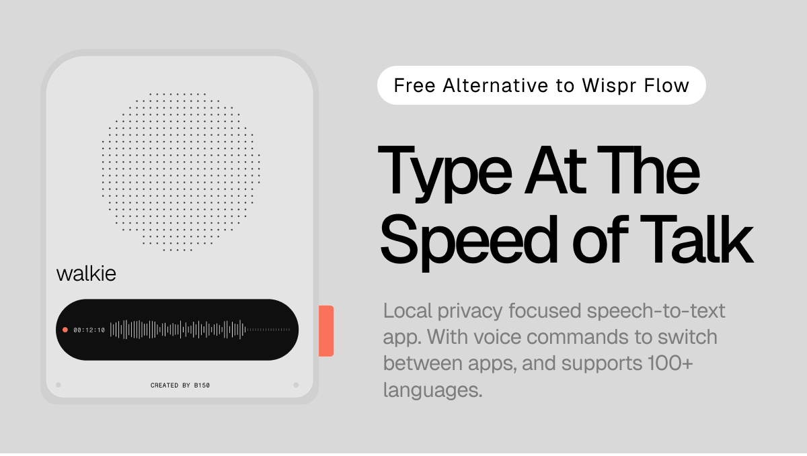
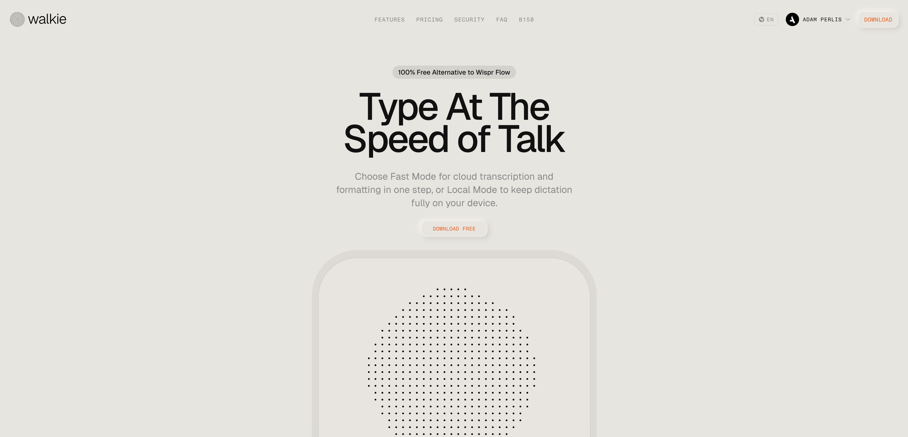
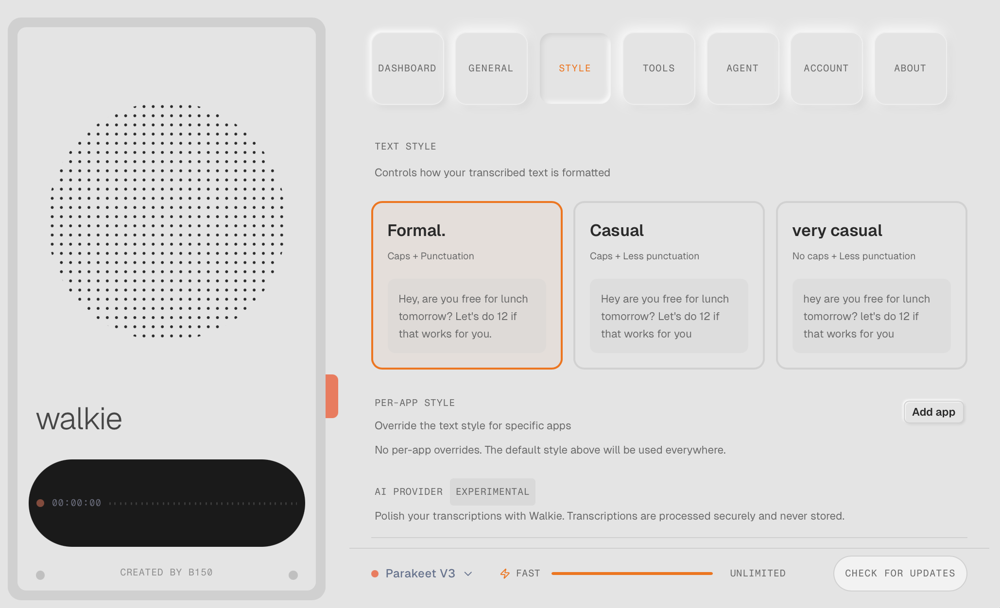

### 🎬 관련 영상
- [🎥 영상 보기](https://ph-files.imgix.net/9340d674-983e-4f68-b740-84a347088112.jpeg?auto=format)

---

## 7. [Metoro](https://www.producthunt.com/products/metoro)
**Votes**: 146 | **도입 난이도**: 중 | **신뢰도**: 중
**Tagline**: AI SRE that detects, root causes & auto-fixes K8s incidents
**서비스 링크**: https://www.producthunt.com/r/NAEAJGSCJBQ6OG

**태그**: DevTool, Kubernetes, SRE, Automation, AI, AI Tool

### 📌 이 서비스 한눈에 보기
Metoro는 Kubernetes 환경에서 발생하는 장애를 실시간으로 감지, 근본 원인을 분석하고 자동으로 수정하는 AI SRE 도구입니다. 별도의 코드 변경 없이 5분 안에 설치하여 사용할 수 있습니다.

### 🔑 주요 기능
- Kubernetes 환경의 장애 자동 감지 및 해결
- eBPF 기반의 telemetry로 코드 변경 불필요
- 5분 내 간편한 설치 (Helm)

### 🙋 사용자에게 어떤 점이 좋은가
Kubernetes 운영 환경에서 발생하는 장애를 자동으로 해결하여 개발 및 운영 효율성을 높여줍니다. 장애 대응 시간을 단축하고, 근본 원인 분석에 드는 노력을 줄여줍니다.

### ✅ 지금 바로 써볼 기능
- Helm을 사용하여 Metoro 설치
- Kubernetes 환경에 Metoro 연동
- 자동으로 생성되는 pull request 확인 및 적용

### ⚠️ 사용 전 확인할 점
- Metoro가 지원하는 Kubernetes 버전을 확인
- eBPF 기반 telemetry가 시스템에 미치는 영향 검토

### 🧭 확인이 더 필요한 정보
Metoro의 AI 기반 장애 해결 정확도 및 지원 범위에 대한 추가 정보 확인이 필요합니다.

### 📸 스크린샷 및 갤러리
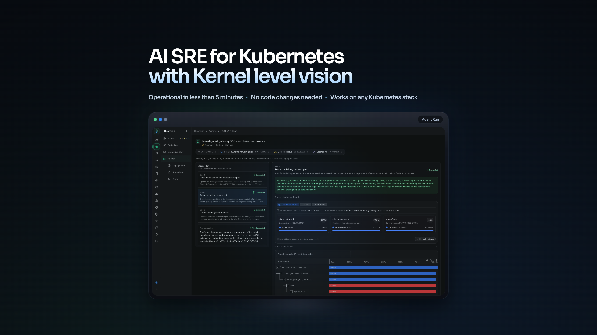
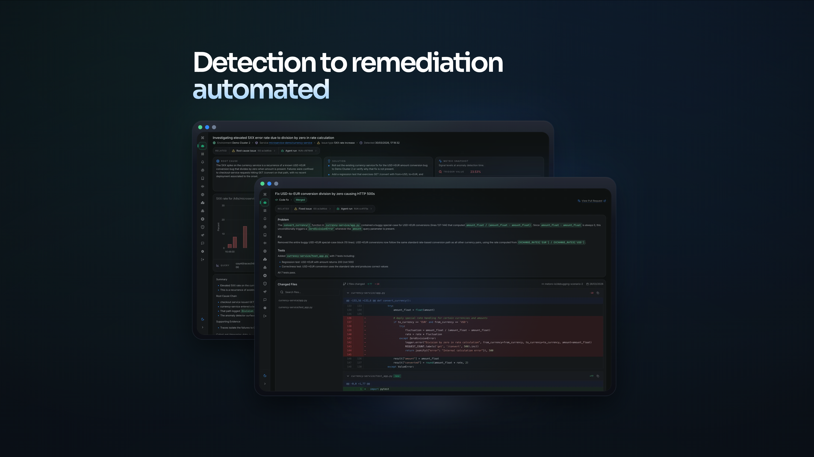
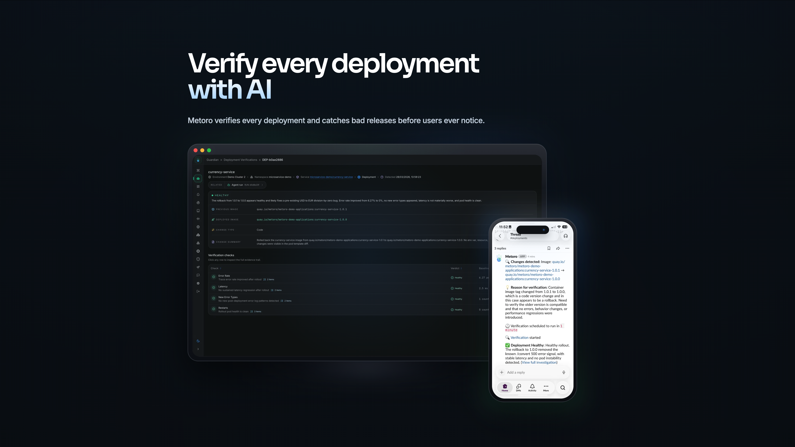

### 🎬 관련 영상
- [🎥 영상 보기](https://ph-files.imgix.net/50880912-71a7-4925-b3e4-f4179dfd19af.jpeg?auto=format)

---

## 8. [Ogoron](https://www.producthunt.com/products/ogoron)
**Votes**: 129 | **도입 난이도**: 중 | **신뢰도**: 중
**Tagline**: Your best QA team — 9x faster, 20х cheaper
**서비스 링크**: https://www.producthunt.com/r/QSRVPZX57V7J67

**태그**: QA, Automation, Testing, DevTool, AI Tool

### 📌 이 서비스 한눈에 보기
Ogoron은 QA 프로세스를 자동화하여 더 빠르고 저렴하게 제품을 릴리스할 수 있도록 도와줍니다. 시스템 분석가, 테스트 분석가, QA 엔지니어를 대체하여 버그를 줄이고 안정적인 릴리스를 가능하게 합니다.

### 🔑 주요 기능
- QA 프로세스 자동화
- 테스트 자동 생성 및 유지 관리
- 지속적인 유효성 검사

### 🙋 사용자에게 어떤 점이 좋은가
제품 출시 속도를 높이면서도 품질을 유지하고, 수동 QA 작업에 드는 시간과 비용을 절약할 수 있습니다.

### ✅ 지금 바로 써볼 기능
- 제품 이해도 테스트
- 자동 테스트 생성 기능 사용
- 변경 사항 유효성 검사

### ⚠️ 사용 전 확인할 점
- 자동화된 테스트의 정확성 검증 필요
- 특정 에지 케이스에 대한 테스트 커버리지 확인 필요

### 🧭 확인이 더 필요한 정보
Ogoron이 특정 제품의 복잡성을 얼마나 잘 처리하는지 추가적인 정보가 필요합니다.

### 📸 스크린샷 및 갤러리
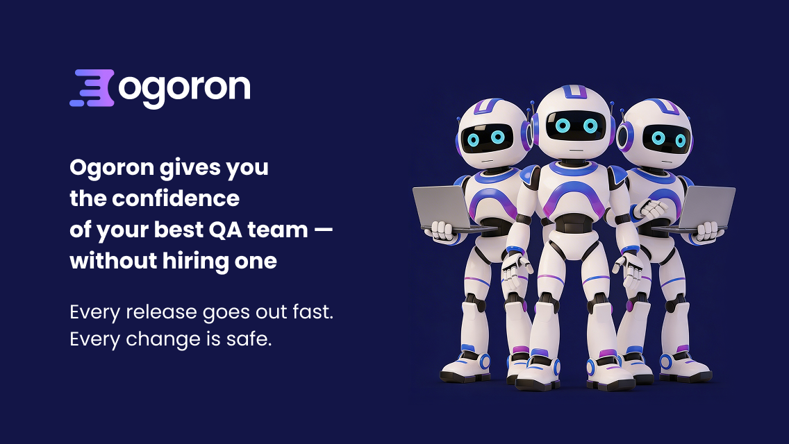
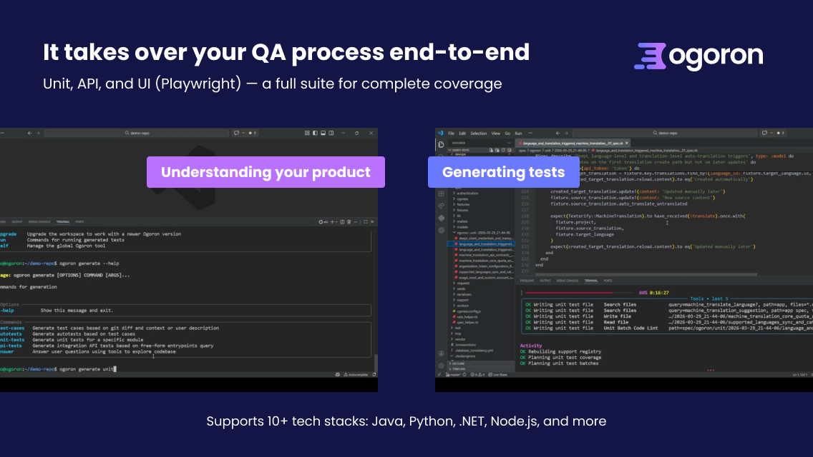
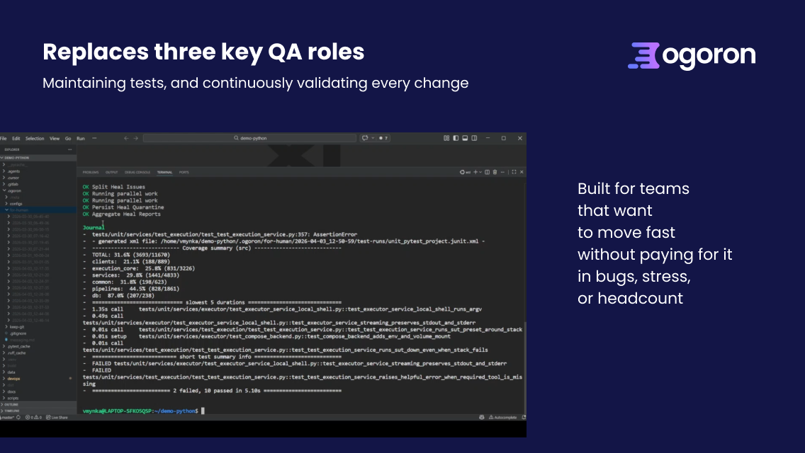

### 🎬 관련 영상
- [🎥 영상 보기](https://ph-files.imgix.net/4701f09a-5c95-4704-826a-45383baa703a.jpeg?auto=format)

---

## 9. [Mailero](https://www.producthunt.com/products/mailero)
**Votes**: 124 | **도입 난이도**: 하 | **신뢰도**: 중
**Tagline**: Turn support emails into tickets 
**서비스 링크**: https://www.producthunt.com/r/YK4QWZXVB3JI4X

**태그**: 고객지원, 이메일, 티켓관리, 헬프데스크, Automation, AI Tool, Email

### 📌 이 서비스 한눈에 보기
Mailero는 복잡한 헬프데스크 시스템 없이 이메일만으로 고객 지원 티켓을 관리할 수 있게 해주는 솔루션입니다.

### 🔑 주요 기능
- 이메일 전달만으로 티켓 시스템 구축 가능
- 복잡한 설정이나 워크플로우 불필요
- EU 호스팅 및 GDPR 준수

### 🙋 사용자에게 어떤 점이 좋은가
혼자 서비스를 운영하는 창업자가 빠르고 간단하게 고객 지원을 제공할 수 있도록 도와줍니다. 별도의 헬프데스크 시스템 구축 없이 기존 이메일을 활용하여 효율적인 고객 응대가 가능합니다.

### ✅ 지금 바로 써볼 기능
- 고객 지원 이메일 주소를 Mailero로 전달하여 티켓 생성 테스트
- 답변 템플릿을 만들어 응답 시간 단축
- 티켓 관리 기능을 활용하여 고객 문의 처리 효율성 향상

### ⚠️ 사용 전 확인할 점
- 기존 헬프데스크 시스템의 고급 기능 (예: 자동화, 분석) 부족
- 대규모 고객 지원에는 적합하지 않을 수 있음

### 🧭 확인이 더 필요한 정보
Mailero의 티켓 관리 기능이 실제 고객 지원 워크플로우에 얼마나 잘 맞는지 확인이 필요합니다.

### 📸 스크린샷 및 갤러리
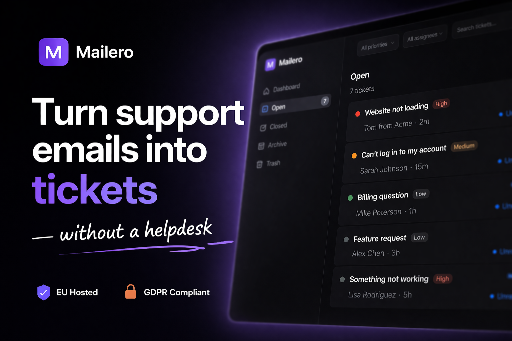
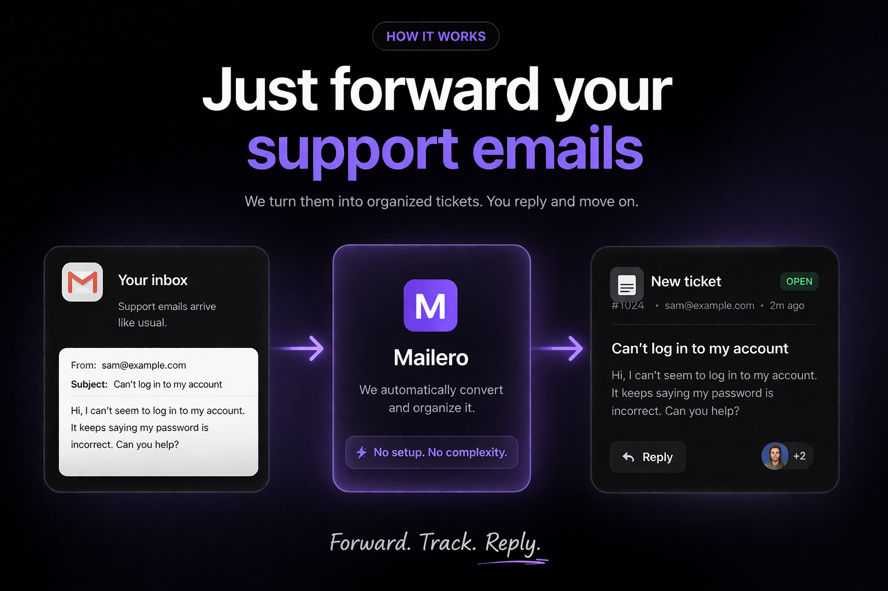
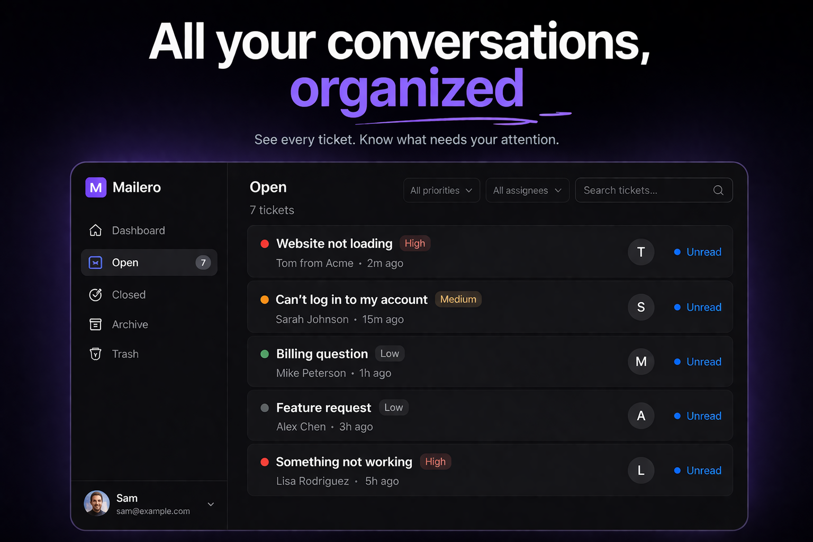

---

## 10. [Adapted](https://www.producthunt.com/products/adapted-health)
**Votes**: 106 | **도입 난이도**: 중 | **신뢰도**: 중
**Tagline**: AI Physical Therapy for Athletes
**서비스 링크**: https://www.producthunt.com/r/R3JEH6WLOZ2DXA

**태그**: AI, 헬스케어, 운동, 재활, 개인화, AI Tool, API

### 📌 이 서비스 한눈에 보기
Adapted은 운동선수를 위한 AI 물리 치료사로, 개인 맞춤형 재활 및 부상 예방 프로그램을 제공하여 운동 능력 향상을 돕습니다.

### 🔑 주요 기능
- 개인별 부상 이력, 운동 종목, 목표에 맞춰 프로그램 제공
- 획일적인 운동이 아닌 개인 맞춤형 운동 제공
- 재활 및 부상 예방, 유연성 향상에 도움

### 🙋 사용자에게 어떤 점이 좋은가
운동선수들이 부상에서 회복하고, 부상을 예방하며, 운동 능력을 향상시키는 데 개인 맞춤형 솔루션을 제공합니다.

### ✅ 지금 바로 써볼 기능
- 자신의 부상 이력과 운동 목표를 입력하여 맞춤형 프로그램 시작하기
- 제공되는 운동 프로그램을 꾸준히 따라하며 몸 상태 변화 관찰하기
- 운동 전후 스트레칭 및 유연성 운동 병행하기

### ⚠️ 사용 전 확인할 점
- AI 기반이므로, 실제 물리 치료사의 진단과 완전히 동일하지 않을 수 있음
- 개인의 노력 정도에 따라 효과가 다를 수 있음

### 🧭 확인이 더 필요한 정보
AI 물리 치료 프로그램의 장기적인 효과 및 실제 물리 치료와의 비교 연구가 필요합니다.

### 📸 스크린샷 및 갤러리
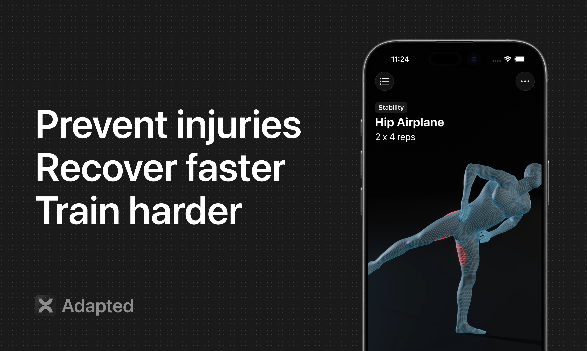
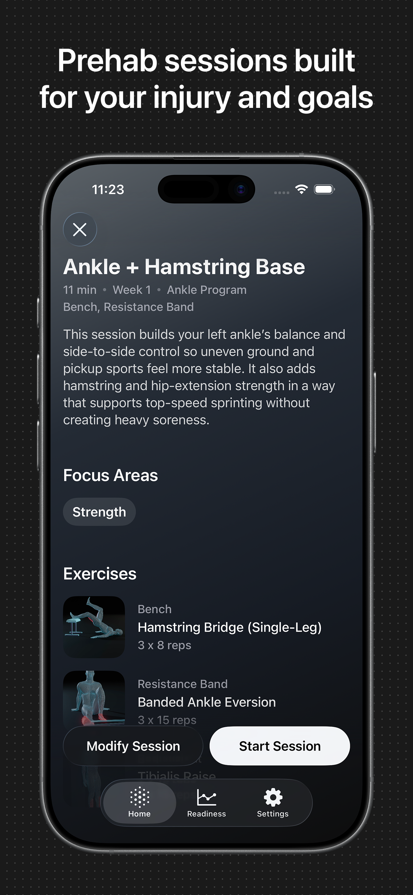
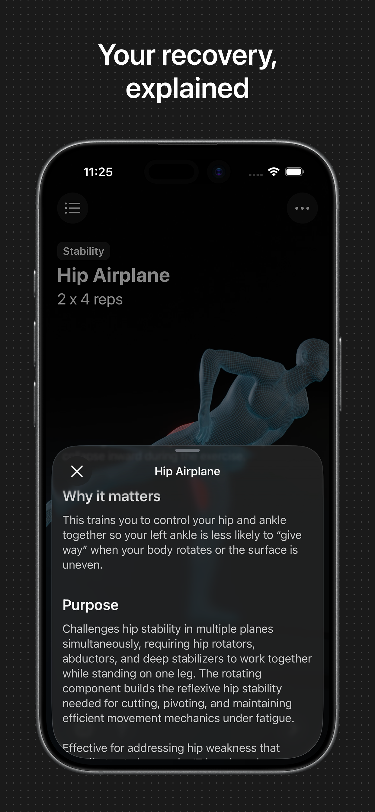

---

