# 🚀 Product Hunt Daily Top 10 (2026-04-08)

## 1. [NovaVoice](https://www.producthunt.com/products/novavoice)
**Votes**: 417 | **도입 난이도**: 중 | **신뢰도**: 중
**Tagline**: Smart dictation, AI assistant, + app control via voice
**서비스 링크**: https://www.producthunt.com/r/K7EU2IVQNJ6SLT

**태그**: 음성인식, AI, 생산성, 자동화, AI Tool

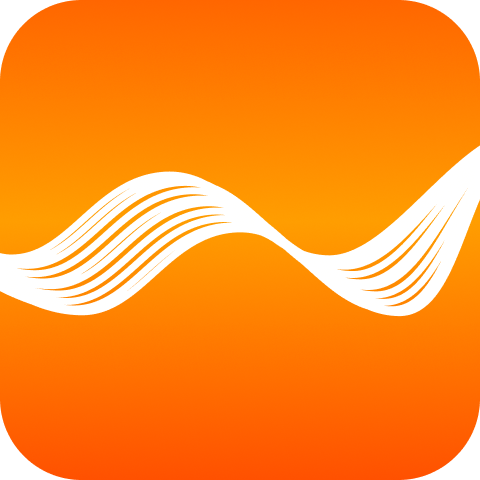

### 📌 이 서비스 한눈에 보기
NovaVoice는 음성으로 200+ wpm 속도로 텍스트를 입력하고, AI 어시스턴트 기능과 앱 제어까지 가능한 음성 OS입니다.

### 🔑 주요 기능
- 음성으로 빠른 텍스트 입력 (200+ wpm)
- AI 어시스턴트를 통한 컨텍스트 기반 정보 제공
- 음성 명령으로 앱 전환 없이 작업 실행

### 🙋 사용자에게 어떤 점이 좋은가
타이핑, 앱 전환, 포맷팅에 소요되는 시간을 줄여 생산성을 극대화하고, 음성만으로 컴퓨터를 제어하여 작업 효율성을 높일 수 있습니다.

### ✅ 지금 바로 써볼 기능
- 핫키를 설정하고 음성으로 질문해보기
- 음성 명령으로 앱 실행해보기
- 연락처, 주소, 링크 등을 등록하고 음성으로 사용해보기

### ⚠️ 사용 전 확인할 점
- 정확한 음성 인식을 위해 조용한 환경에서 사용 권장
- 초기 설정 및 개인화 과정 필요

### 🧭 확인이 더 필요한 정보
AI 어시스턴트의 답변 정확도 및 지원 언어에 대한 추가 정보 확인이 필요합니다.

### 📸 스크린샷 및 갤러리
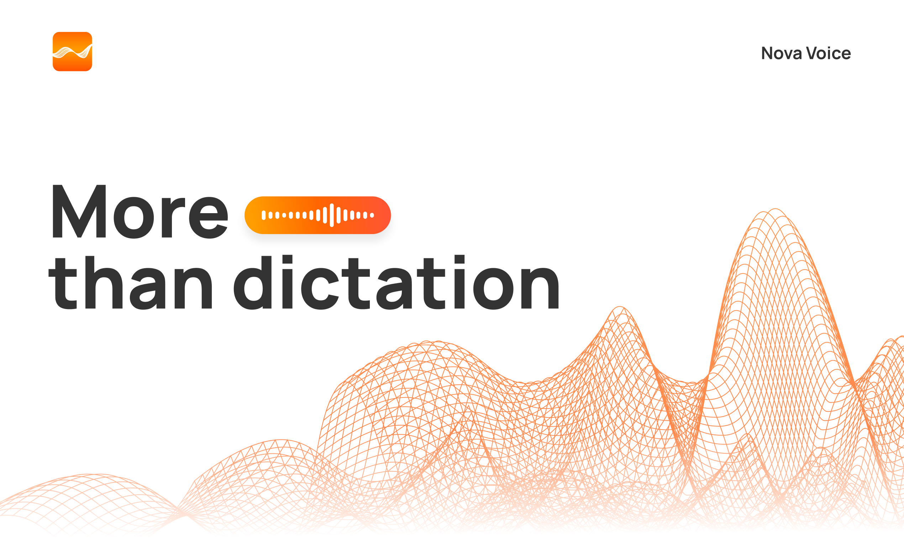
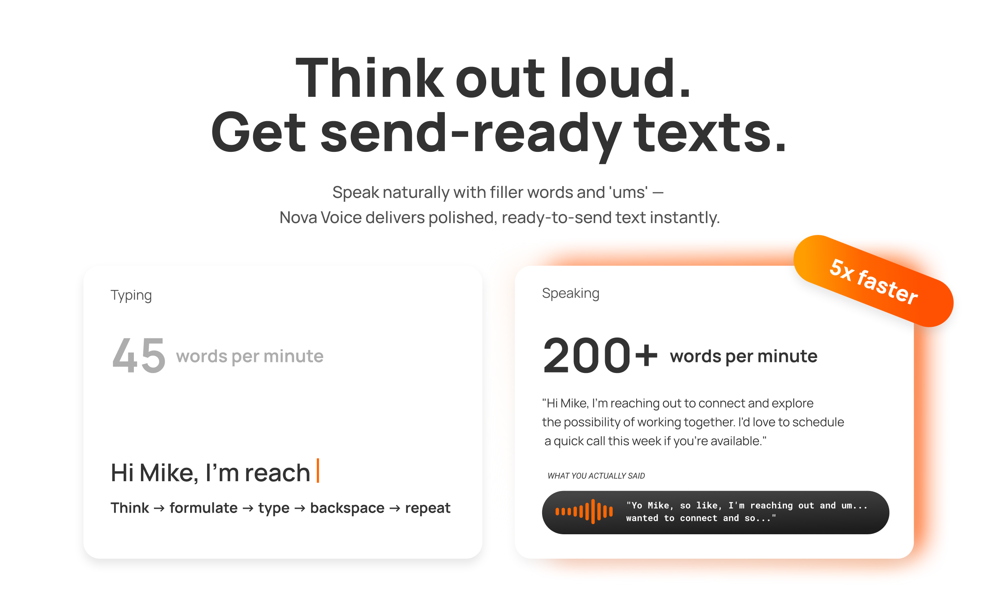
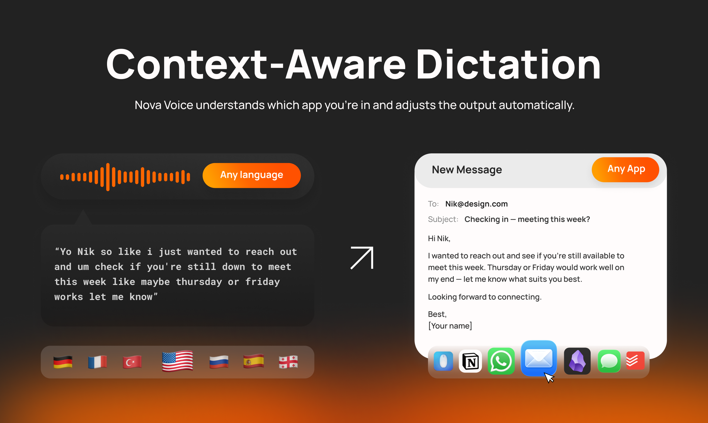

---

## 2. [Lessie AI](https://www.producthunt.com/products/lessie-ai-2)
**Votes**: 276 | **도입 난이도**: 중 | **신뢰도**: 중
**Tagline**: Search, Reach and Connect - Find the perfect fit, 10x faster
**서비스 링크**: https://www.producthunt.com/r/5AFCHL2DEHSNUR

**태그**: AI, 자동화, 영업, 리드 생성, 아웃리치, Agent, AI Tool

### 📌 이 서비스 한눈에 보기
Lessie AI는 AI 에이전트를 통해 필터나 키워드 없이도 원하는 이상적인 대상을 찾고 연결하여 개인화된 아웃리치 및 후속 조치를 자동화합니다.

### 🔑 주요 기능
- AI 기반 타겟 검색 및 연결
- 개인화된 아웃리치 자동화
- 웹 전체에서 고품질 매칭 발견

### 🙋 사용자에게 어떤 점이 좋은가
필터나 키워드 검색 없이 원하는 대상을 설명하는 것만으로도 Lessie AI가 알아서 찾아주고 연결해주어 시간을 절약하고 효율성을 높여줍니다. 특히 개인화된 아웃리치 자동화 기능은 잠재 고객과의 관계 형성에 큰 도움이 됩니다.

### ✅ 지금 바로 써볼 기능
- 타겟 대상 설명으로 검색 시작하기
- 자동화된 아웃리치 설정하기
- 발견된 매칭의 품질 평가하기

### ⚠️ 사용 전 확인할 점
- AI가 제안하는 매칭의 정확성 검토 필요
- 자동화된 아웃리치의 개인화 수준 설정 중요

### 🧭 확인이 더 필요한 정보
Lessie AI의 검색 정확도 및 자동화 기능의 효과에 대한 사용자 후기 추가 확인이 필요합니다.

### 📸 스크린샷 및 갤러리
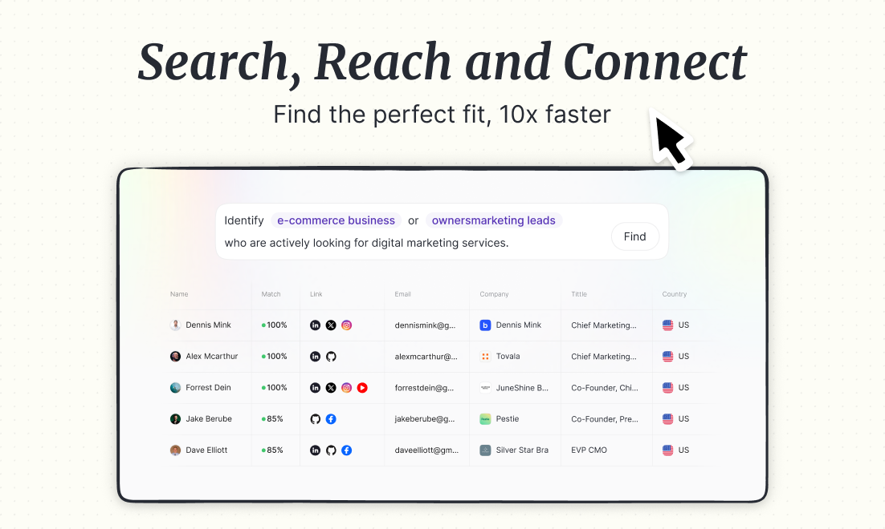
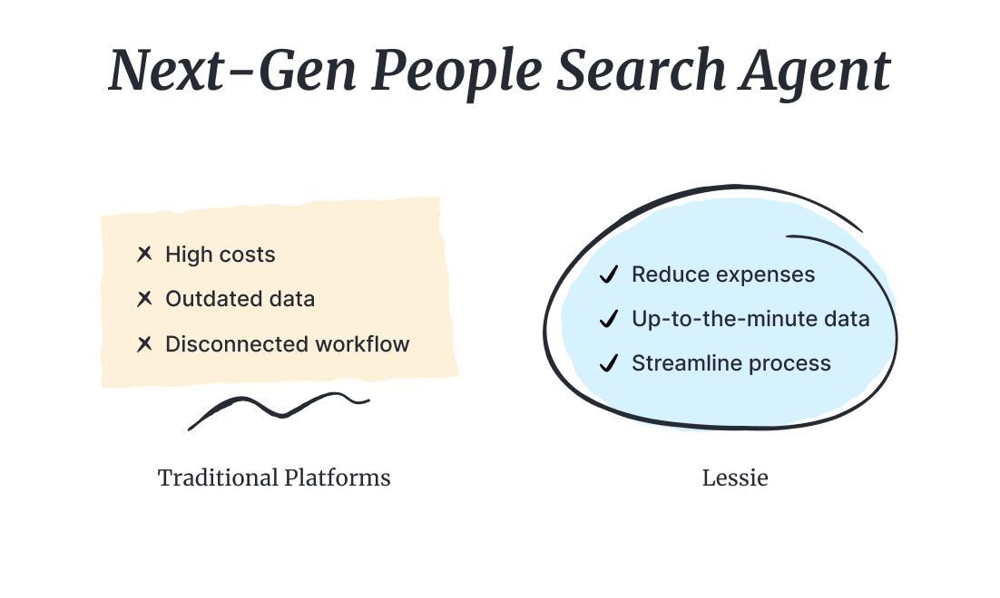
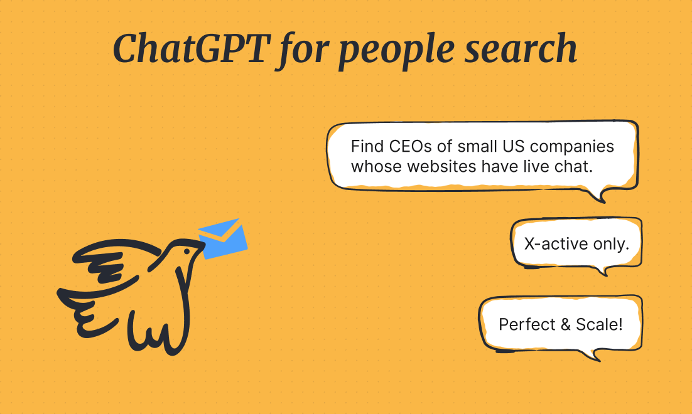

### 🎬 관련 영상
- [🎥 영상 보기](https://ph-files.imgix.net/7ec009d8-9bf7-4c50-884a-f56fc6f3aecb.jpeg?auto=format)

---

## 3. [SuperShrimp](https://www.producthunt.com/products/supershrimp)
**Votes**: 235 | **도입 난이도**: 중 | **신뢰도**: 중
**Tagline**: Fix your terrible posture
**서비스 링크**: https://www.producthunt.com/r/QYI2BQLZLAAHS4

**태그**: 자세 교정, 웹캠, 건강, 생산성, 분석, Analytics

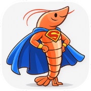

### 📌 이 서비스 한눈에 보기
SuperShrimp는 웹캠을 통해 실시간으로 자세를 분석하고 교정하여 사용자의 건강한 작업 습관을 돕습니다.

### 🔑 주요 기능
- 웹캠 기반 실시간 자세 분석
- 자세 점수, 알림, 분석 제공
- 구부정한 자세 교정

### 🙋 사용자에게 어떤 점이 좋은가
업무 중 자세가 나빠지는 것을 실시간으로 감지하고 교정하여 장시간 작업으로 인한 건강 문제를 예방할 수 있습니다.

### ✅ 지금 바로 써볼 기능
- 웹캠 설정 및 자세 분석 시작
- 자세 점수 확인 및 개선
- 알림 설정 및 자세 교정

### ⚠️ 사용 전 확인할 점
- 웹캠 성능에 따라 정확도 차이 발생 가능
- 개인 정보 보호 정책 확인 필요

### 🧭 확인이 더 필요한 정보
다양한 작업 환경 및 사용자 체형에 따른 자세 분석 정확도에 대한 추가 정보가 필요합니다.

### 📸 스크린샷 및 갤러리
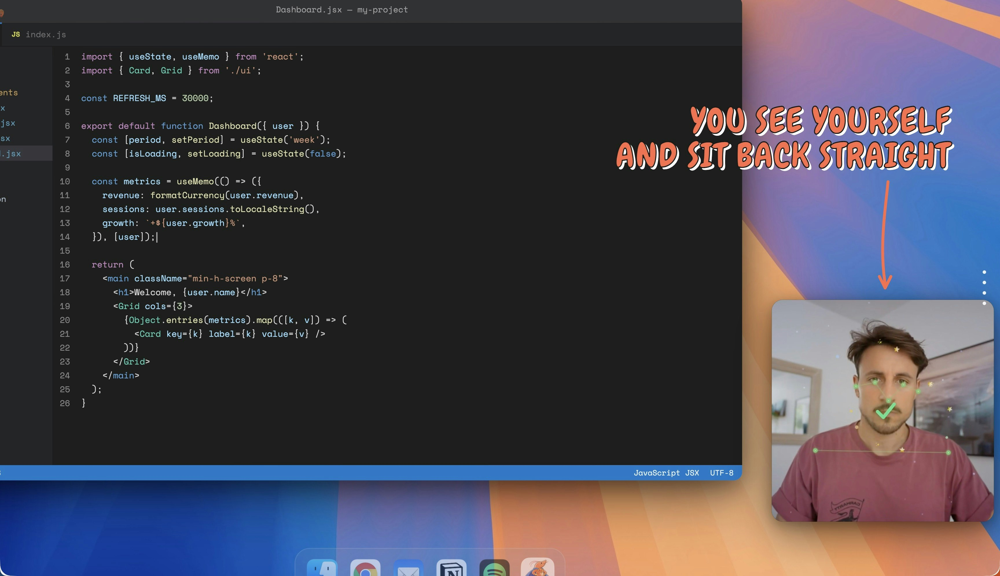
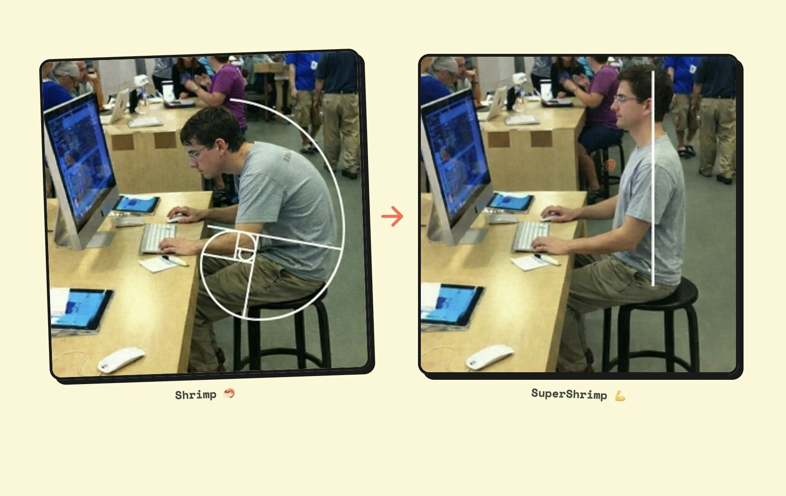

### 🎬 관련 영상
- [🎥 영상 보기](https://ph-files.imgix.net/226a7c2f-f426-49c2-be57-5a942c87ca07.jpeg?auto=format)

---

## 4. [OpenOwl](https://www.producthunt.com/products/openowl)
**Votes**: 200 | **도입 난이도**: 중 | **신뢰도**: 중
**Tagline**: Automate what APIs can't in one prompt done locally
**서비스 링크**: https://www.producthunt.com/r/HXRQVLQJUQMIOU

**태그**: Automation, AI, Productivity, DesktopApp, Agent, AI Tool, Prompting, DevTool, API, CRM

### 📌 이 서비스 한눈에 보기
OpenOwl은 macOS 데스크탑 자동화 에이전트로, API로 처리할 수 없는 작업을 AI 어시스턴트(Claude, Codex 등)를 통해 자동화하여 사용자가 직접 클릭하는 시간을 절약해줍니다.

### 🔑 주요 기능
- API로 자동화하기 어려운 데스크탑 앱 및 브라우저 작업을 자동화
- AI 어시스턴트(Claude, Codex)를 활용하여 화면 인식, 클릭, 입력, 탐색 기능 제공
- LinkedIn prospecting, Shopify 관리, CRM 데이터 입력 등 다양한 작업 자동화 가능

### 🙋 사용자에게 어떤 점이 좋은가
OpenOwl을 사용하면 반복적인 데스크탑 작업을 자동화하여 시간을 절약하고, 사용자는 더 중요한 업무에 집중할 수 있습니다. 특히 API 지원이 미흡한 레거시 시스템이나 특정 앱 환경에서 유용합니다.

### ✅ 지금 바로 써볼 기능
- LinkedIn prospecting 자동화 설정
- Shopify 관리 작업 자동화 설정
- 레거시 CRM 데이터 입력 자동화 설정

### ⚠️ 사용 전 확인할 점
- macOS 환경에서만 사용 가능
- AI 어시스턴트의 성능에 따라 자동화 결과가 달라질 수 있음

### 🧭 확인이 더 필요한 정보
OpenOwl이 지원하는 AI 어시스턴트의 종류와 호환성, 그리고 자동화 성공률에 대한 추가 정보 확인이 필요합니다.

### 📸 스크린샷 및 갤러리
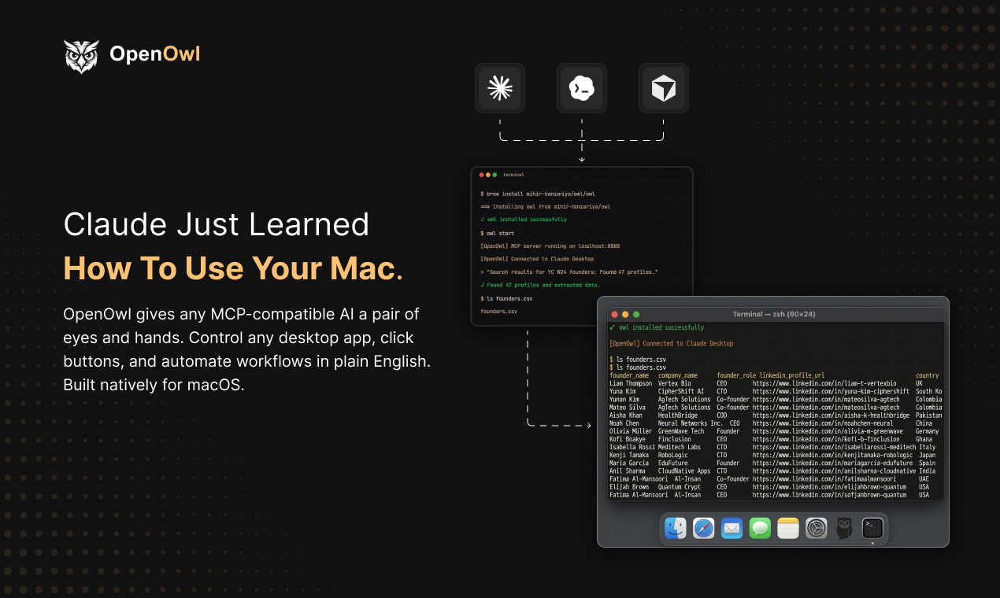
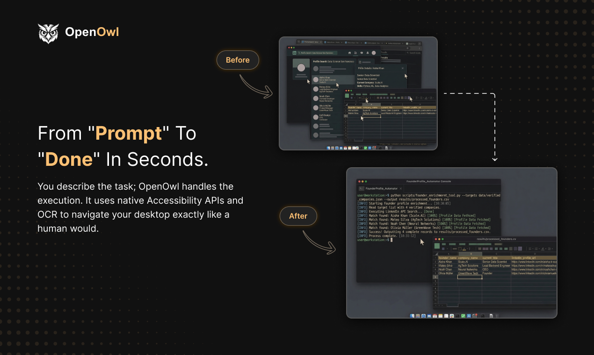
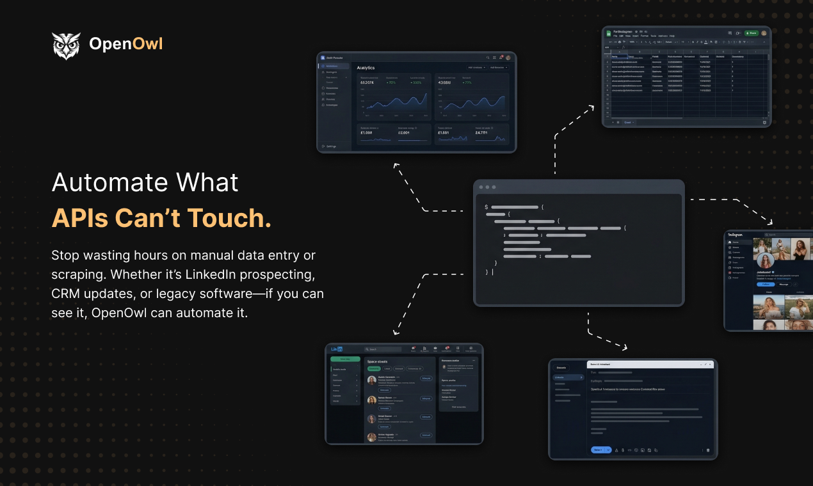

### 🎬 관련 영상
- [🎥 영상 보기](https://ph-files.imgix.net/72dd5b55-e548-4448-b4ff-c89b71efd937.jpeg?auto=format)

---

## 5. [Letterbox](https://www.producthunt.com/products/letterbox-3)
**Votes**: 153 | **도입 난이도**: 하 | **신뢰도**: 중
**Tagline**: Letters made of letters
**서비스 링크**: https://www.producthunt.com/r/4AOB3JS7CYQNL2

**태그**: 디자인, 텍스트, 커스터마이징

### 📌 이 서비스 한눈에 보기
텍스트로 이루어진 특별한 편지를 만들어 보세요. 폰트와 색상을 선택하여 개성 넘치는 편지를 디자인할 수 있습니다.

### 🔑 주요 기능
- 텍스트 기반 편지 디자인
- 다양한 폰트 선택 가능
- 색상 커스터마이징 지원

### 🙋 사용자에게 어떤 점이 좋은가
단순한 텍스트를 넘어 시각적으로 아름다운 편지를 만들 수 있어, 특별한 메시지를 전달하고 싶을 때 유용합니다.

### ✅ 지금 바로 써볼 기능
- 다양한 폰트 스타일을 적용해 보세요
- 원하는 색상 조합으로 편지를 꾸며보세요
- 특별한 문구를 넣어 독창적인 편지를 만들어 보세요

### ⚠️ 사용 전 확인할 점
- 텍스트 기반 디자인이므로 긴 문장보다는 짧고 강렬한 메시지에 적합합니다.
- 폰트 및 색상 선택에 따라 가독성이 떨어질 수 있습니다.

### 🧭 확인이 더 필요한 정보
실제 편지 제작 및 공유 방식에 대한 추가 정보가 필요합니다.

### 📸 스크린샷 및 갤러리
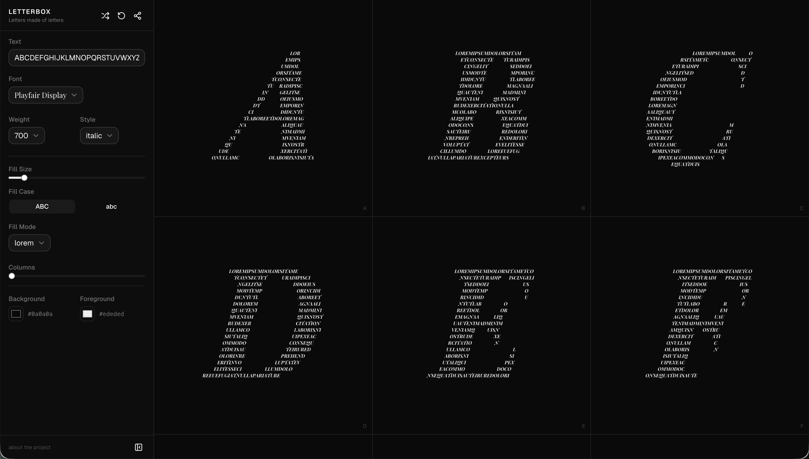
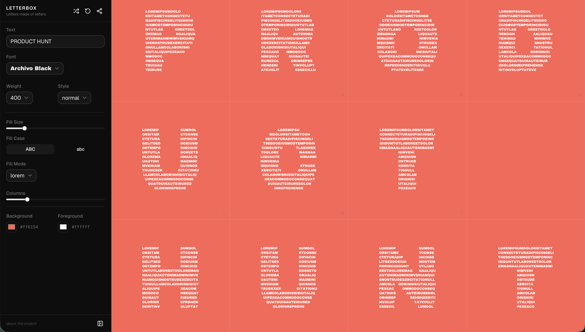

### 🎬 관련 영상
- [🎥 영상 보기](https://ph-files.imgix.net/b77dc503-2981-4b7a-b5e9-7f4cdadc83ab.jpeg?auto=format)

---

## 6. [Google AI Edge Eloquent](https://www.producthunt.com/products/google)
**Votes**: 144 | **도입 난이도**: 하 | **신뢰도**: 중
**Tagline**: Google's offline-first AI dictation, powered by Gemma
**서비스 링크**: https://www.producthunt.com/r/U7ZIXK46VH2WQR
**재등장**: 최근 7일 내 재등장 (마지막 등장 2일 전)

**태그**: AI, 생산성, 받아쓰기, 오프라인, 개인정보보호, AI Tool

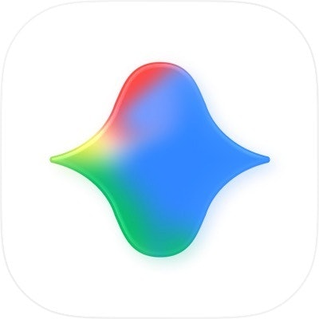

### 📌 이 서비스 한눈에 보기
Google AI Edge Eloquent는 Gemma 모델을 기반으로 오프라인에서도 사용 가능한 무료 받아쓰기 앱으로, 불필요한 단어와 실수를 자동으로 제거하여 더욱 깔끔한 텍스트를 얻을 수 있습니다.

### 🔑 주요 기능
- 오프라인 우선: 인터넷 연결 없이 사용 가능
- Gemma 모델 기반: 온디바이스 AI 처리로 개인 정보 보호
- 자동 정리: 불필요한 단어 및 실수 자동 제거

### 🙋 사용자에게 어떤 점이 좋은가
인터넷 연결 없이도 개인 정보 걱정 없이 고품질의 받아쓰기 기능을 사용할 수 있으며, 특히 현장 업무나 보안이 중요한 환경에서 유용합니다.

### ✅ 지금 바로 써볼 기능
- 오프라인 모드에서 받아쓰기 성능 테스트
- Gemini 클라우드 모드와 비교하여 정리 성능 확인
- 개인 정보 보호 설정 검토

### ⚠️ 사용 전 확인할 점
- 온디바이스 모델 성능은 기기 사양에 따라 다를 수 있음
- Gemini 클라우드 모드 사용 시 개인 정보 처리 방식 확인 필요

### 🧭 확인이 더 필요한 정보
Gemma 모델의 한국어 지원 수준 및 업데이트 계획에 대한 추가 정보가 필요합니다.

### 📸 스크린샷 및 갤러리

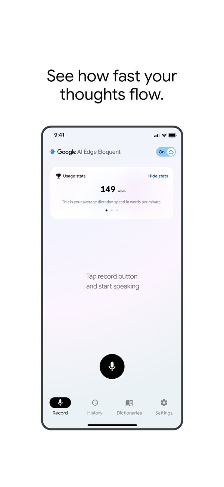
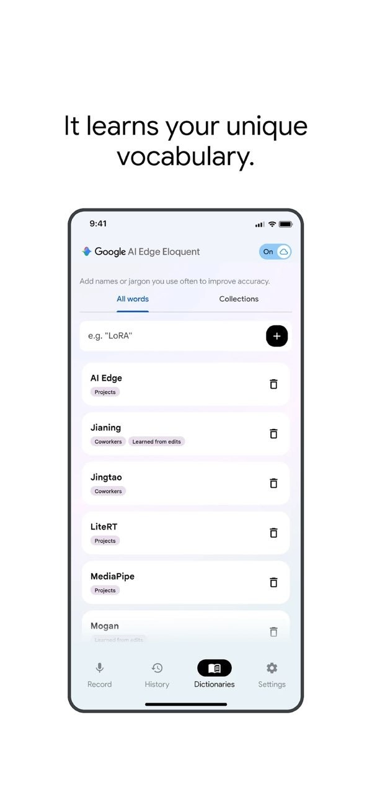

---

## 7. [Caret](https://www.producthunt.com/products/caret-5)
**Votes**: 143 | **도입 난이도**: 중 | **신뢰도**: 중
**Tagline**: Press Tab for AI anywhere you type on Mac
**서비스 링크**: https://www.producthunt.com/r/XM2TKHY6SWITKB

**태그**: AI, 자동완성, 생산성, Mac, 글쓰기, AI Tool

### 📌 이 서비스 한눈에 보기
Caret은 Mac의 모든 앱에서 사용자의 스타일을 학습하여 문장 자동 완성 기능을 제공, Tab 키 하나로 개인화된 AI 제안을 받을 수 있습니다.

### 🔑 주요 기능
- Mac의 모든 앱에서 사용 가능
- 개인 스타일을 학습하여 자연스러운 자동 완성 제공
- Tab 키 하나로 간편하게 사용

### 🙋 사용자에게 어떤 점이 좋은가
Caret은 사용자의 고유한 스타일을 학습하여 자동 완성 기능을 제공하므로, Mac을 사용하는 동안 생산성을 높이고 더 자연스러운 글쓰기를 할 수 있도록 도와줍니다.

### ✅ 지금 바로 써볼 기능
- Caret 설치 후 Mac의 다양한 앱에서 사용해보기
- 자동 완성 제안이 사용자의 스타일에 맞게 조정되는지 확인하기
- Tab 키를 사용하여 자동 완성 기능을 활성화하고 생산성 향상 경험하기

### ⚠️ 사용 전 확인할 점
- 개인 정보 및 데이터 보안 관련 정책 확인 필요
- 자동 완성 정확도는 사용자 데이터 학습량에 따라 달라질 수 있음

### 🧭 확인이 더 필요한 정보
Caret의 개인 정보 처리 방식 및 데이터 사용 정책에 대한 추가 정보 확인이 필요합니다.

### 📸 스크린샷 및 갤러리
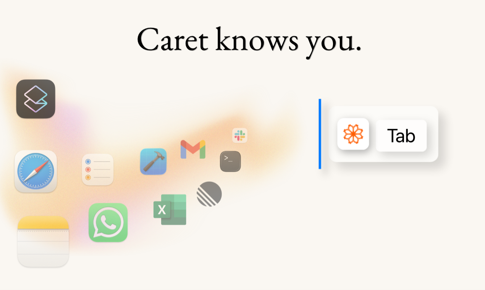
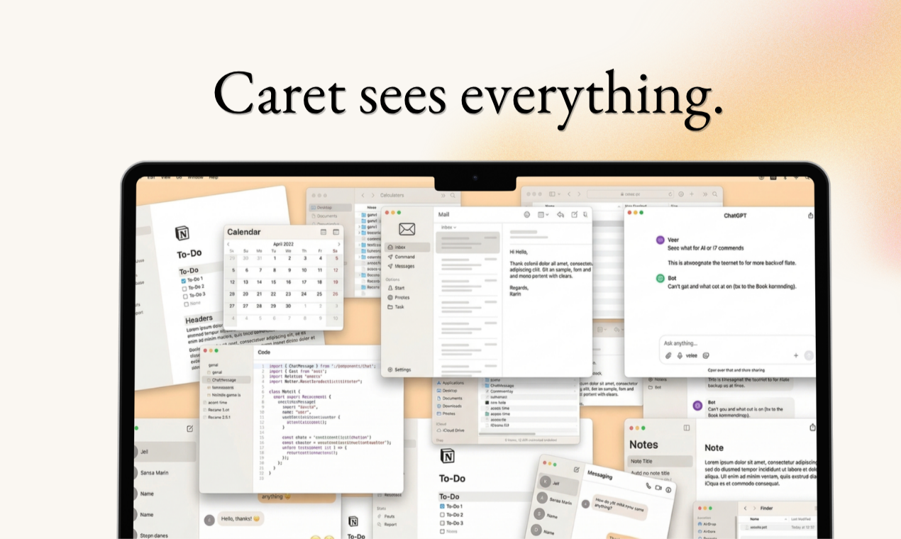
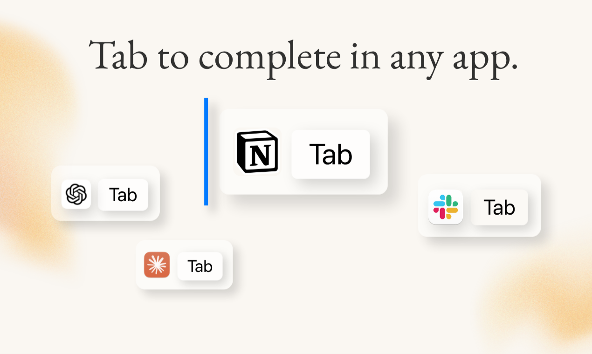

### 🎬 관련 영상
- [🎥 영상 보기](https://ph-files.imgix.net/7513450a-acbe-425b-a2b4-b9e3a34dc957.jpeg?auto=format)

---

## 8. [Bibby AI ](https://www.producthunt.com/products/bibby-ai)
**Votes**: 133 | **도입 난이도**: 중 | **신뢰도**: 중
**Tagline**: The AI co-author for research papers
**서비스 링크**: https://www.producthunt.com/r/D62M64Q67NPDCH

**태그**: AI, 연구, 논문, 자동화, 생산성, AI Tool

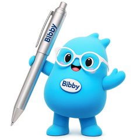

### 📌 이 서비스 한눈에 보기
Bibby AI는 연구자들이 논문 작성에 쏟는 시간을 줄여 연구 자체에 더 집중할 수 있도록 돕는 AI 공동 저술 도구입니다.

### 🔑 주요 기능
- 2억 건 이상의 인용 데이터와 800개 이상의 저널 템플릿 제공
- 논문 초안 작성, 수정 및 인용 자료 검색 기능 제공
- 리뷰어들이 발견하기 전에 오류를 찾아 수정하도록 지원

### 🙋 사용자에게 어떤 점이 좋은가
Bibby AI를 사용하면 논문 작성 시간을 단축하고, 연구의 질을 향상시키며, 리뷰 과정에서 발생할 수 있는 문제점을 사전에 예방할 수 있습니다.

### ✅ 지금 바로 써볼 기능
- 관심 분야의 논문 초안 작성 기능 사용해보기
- 자동 인용 기능 사용해보기
- 저널 템플릿을 활용하여 논문 형식 맞추기

### ⚠️ 사용 전 확인할 점
- AI가 생성한 콘텐츠의 정확성을 반드시 검증해야 함
- 특정 분야에 대한 전문성이 부족할 수 있으므로, 결과물을 맹신하지 않아야 함

### 🧭 확인이 더 필요한 정보
Bibby AI의 성능이 특정 연구 분야나 저널 템플릿에 따라 어떻게 달라지는지 추가적인 정보가 필요합니다.

### 📸 스크린샷 및 갤러리

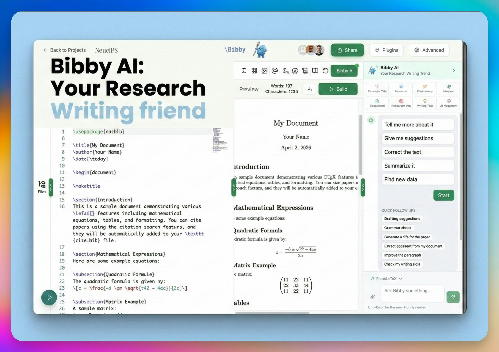

### 🎬 관련 영상
- [🎥 영상 보기](https://ph-files.imgix.net/274a47e0-e037-42aa-854b-84f750b29b24.jpeg?auto=format)

---

## 9. [ChatGPT Ads by Gauge](https://www.producthunt.com/products/gauge)
**Votes**: 132 | **도입 난이도**: 중 | **신뢰도**: 중
**Tagline**: The intelligence layer for ChatGPT Ads
**서비스 링크**: https://www.producthunt.com/r/CLXZA3J5IHRITI

**태그**: 광고, ChatGPT, 경쟁 분석, 자동화, 분석, AI Tool, Chat, Prompting, API

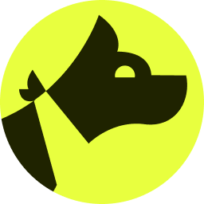

### 📌 이 서비스 한눈에 보기
Gauge는 ChatGPT 광고에 대한 경쟁사 분석 및 캠페인 관리를 위한 통합 솔루션을 제공하여, 광고 효율을 극대화합니다.

### 🔑 주요 기능
- 경쟁사 ChatGPT 광고 카피 및 전략 분석
- ChatGPT 광고 캠페인 통합 관리
- 캠페인 성과 지표(CTR, CPC) 자동 계산 및 시각화

### 🙋 사용자에게 어떤 점이 좋은가
경쟁사 광고 분석을 통해 더 효과적인 광고 전략을 수립하고, 캠페인 관리 자동화를 통해 시간과 노력을 절약할 수 있습니다.

### ✅ 지금 바로 써볼 기능
- 경쟁사 광고 분석을 위한 프롬프트 설정
- ChatGPT API 키 연동을 통한 캠페인 데이터 통합
- 캠페인별 성과 지표 확인 및 최적화

### ⚠️ 사용 전 확인할 점
- ChatGPT 광고 플랫폼 API 변경에 따른 기능 제한 가능성
- 정확한 경쟁사 데이터 확보를 위한 프롬프트 최적화 필요

### 🧭 확인이 더 필요한 정보
Gauge의 데이터 정확도 및 분석 범위에 대한 추가적인 검증이 필요합니다.

### 📸 스크린샷 및 갤러리
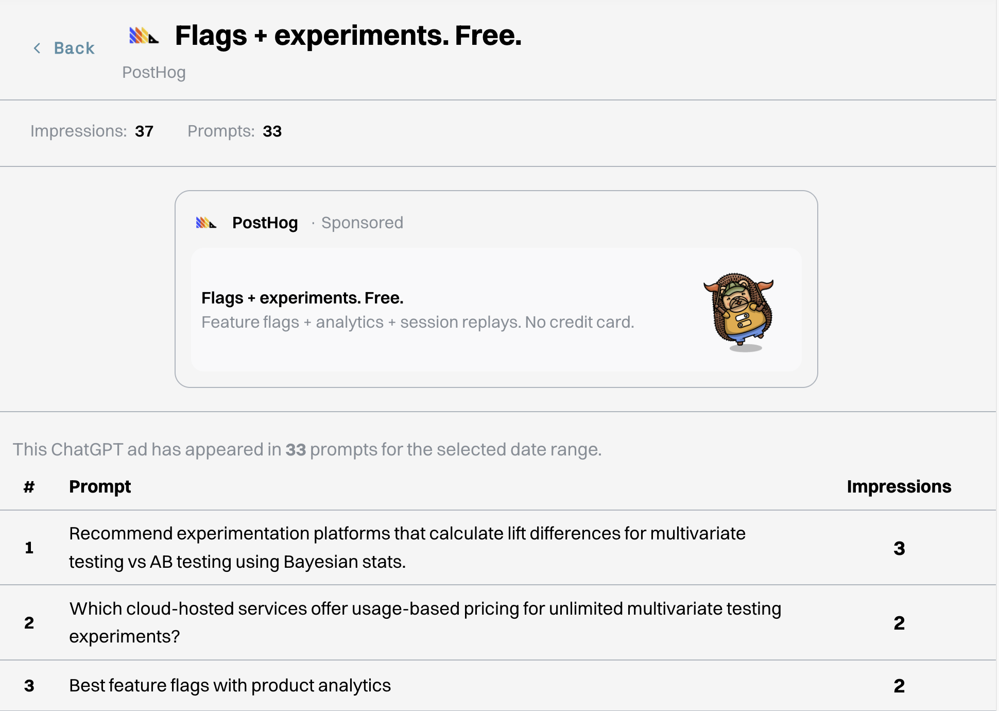
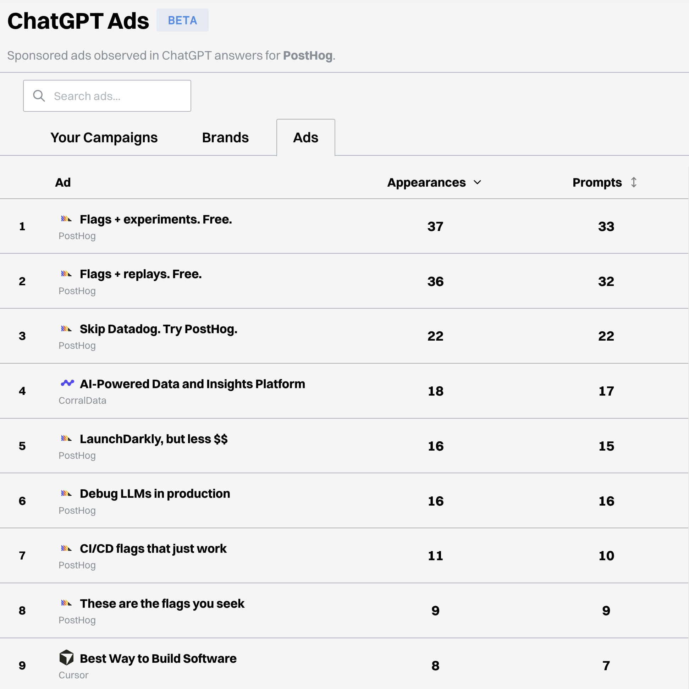
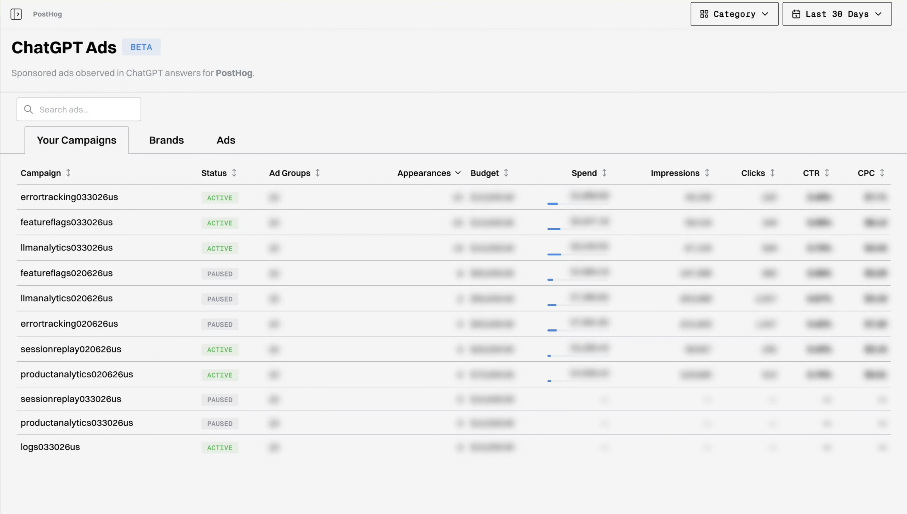

### 🎬 관련 영상
- [🎥 영상 보기](https://ph-files.imgix.net/eb598bd3-804c-42e0-8d20-080faf5356ac.jpeg?auto=format)

---

## 10. [sync-3](https://www.producthunt.com/products/sync-9)
**Votes**: 112 | **도입 난이도**: 중 | **신뢰도**: 중
**Tagline**: Studio-grade AI lip sync and visual dubbing
**서비스 링크**: https://www.producthunt.com/r/JVSYAGLNKYDBXU

**태그**: AI, 립싱크, 더빙, 영상 편집, Adobe Premiere, AI Tool, API

### 📌 이 서비스 한눈에 보기
sync-3는 160억 개의 파라미터를 가진 AI 립싱크 모델로, 감정까지 이해하며 95개 이상의 언어로 4K 해상도까지 지원하여 영상 더빙의 퀄리티를 높여줍니다.

### 🔑 주요 기능
- 16B 파라미터 AI 모델 사용
- 전체 장면을 이해하여 자연스러운 립싱크 생성
- 95개 이상 언어 지원 및 4K 해상도 지원

### 🙋 사용자에게 어떤 점이 좋은가
기존 모델의 한계를 극복하여 클로즈업, 가려짐, 극단적인 각도, 어두운 조명에서도 감정을 살린 고품질 립싱크 및 더빙이 가능합니다. sync.so, API, Adobe Premiere를 통해 바로 사용할 수 있습니다.

### ✅ 지금 바로 써볼 기능
- sync.so에서 직접 사용해보기
- API를 통해 기존 워크플로우에 통합해보기
- Adobe Premiere 플러그인 사용해보기

### ⚠️ 사용 전 확인할 점
- 지원하지 않는 특수한 영상 포맷이 있을 수 있음
- API 사용량에 따른 비용 확인 필요

### 🧭 확인이 더 필요한 정보
실제 사용 환경에서의 립싱크 정확도 및 성능에 대한 추가적인 사용자 리뷰 확인이 필요합니다.

### 📸 스크린샷 및 갤러리
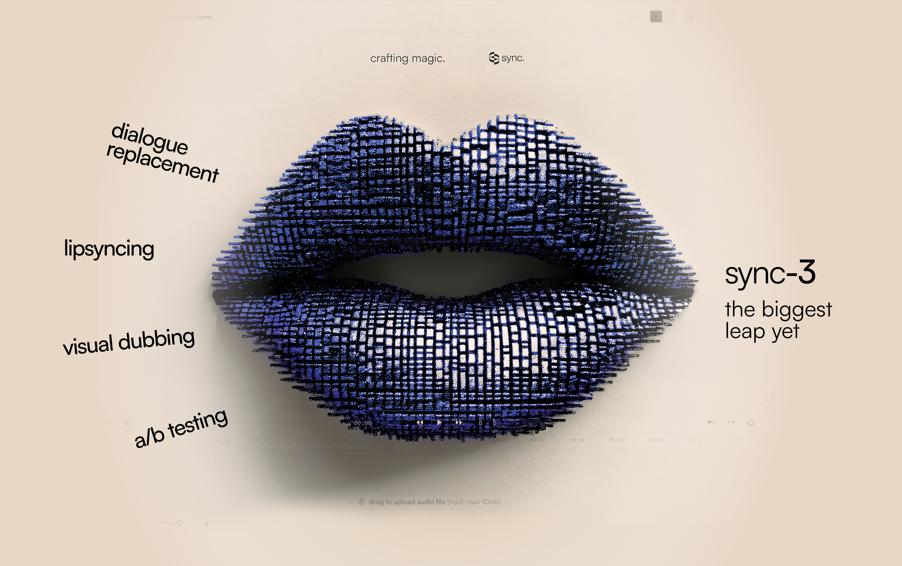

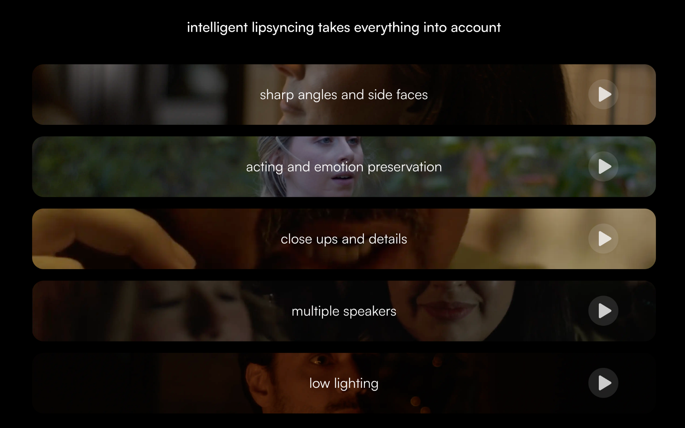

### 🎬 관련 영상
- [🎥 영상 보기](https://ph-files.imgix.net/e0b1cb7b-df26-40f2-8c04-0470984231e4.jpeg?auto=format)

---

