# 🚀 Product Hunt Daily Top 10 (2026-04-09)

## 1. [Velo](https://www.producthunt.com/products/velo-4)
**Votes**: 416 | **도입 난이도**: 중 | **신뢰도**: 중
**Tagline**: Share anything as video messages
**서비스 링크**: https://www.producthunt.com/r/5NXKZ7EKGRZVKR

**태그**: 비디오 편집, AI, 화면 녹화, 생산성, 공유, AI Tool, Video

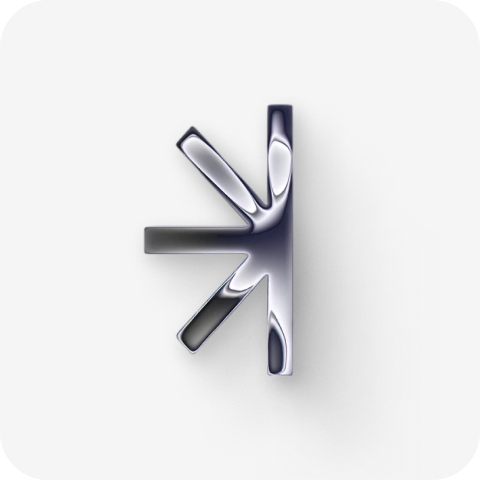

### 📌 이 서비스 한눈에 보기
Velo는 AI를 활용하여 화면 녹화 영상을 공유하기 쉬운 멋진 비디오로 만들어줍니다.

### 🔑 주요 기능
- AI 기반 비디오 편집
- 간편한 화면 녹화 및 공유
- 매력적인 비디오 메시지 생성

### 🙋 사용자에게 어떤 점이 좋은가
Velo를 사용하면 복잡한 편집 과정 없이도 빠르게 멋진 비디오를 만들어 공유할 수 있어, 업무 효율성을 높이고 커뮤니케이션을 효과적으로 할 수 있습니다.

### ✅ 지금 바로 써볼 기능
- 화면 녹화 후 AI 편집 기능 사용해보기
- 다양한 공유 옵션 활용해보기
- 비디오 메시지 템플릿 사용해보기

### ⚠️ 사용 전 확인할 점
- AI 편집 품질은 녹화 상태에 따라 달라질 수 있음
- 지원하는 파일 형식 및 플랫폼 확인 필요

### 🧭 확인이 더 필요한 정보
AI 편집 기능의 정확도 및 사용자 맞춤 설정 옵션에 대한 추가 정보 확인이 필요합니다.

### 📸 스크린샷 및 갤러리

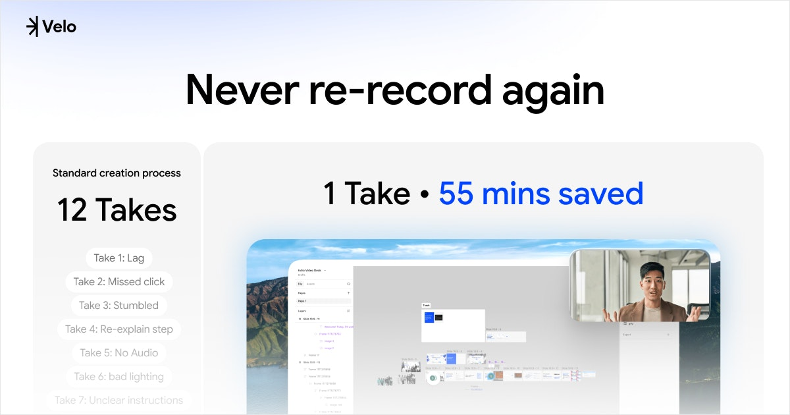

### 🎬 관련 영상
- [🎥 영상 보기](https://ph-files.imgix.net/dd70781b-9532-4bec-bc0e-8e506332ce03.jpeg?auto=format)

---

## 2. [Flint](https://www.producthunt.com/products/flint-6)
**Votes**: 255 | **도입 난이도**: 중 | **신뢰도**: 중
**Tagline**: Launch on-brand pages for every campaign, ad, and prospect.
**서비스 링크**: https://www.producthunt.com/r/4STAMVST7HAZDM

**태그**: 랜딩 페이지, 마케팅 자동화, API, CRM, Automation, AI Tool, DevTool

### 📌 이 서비스 한눈에 보기
Flint는 마케팅 캠페인, 광고, 잠재 고객별로 브랜드에 맞는 랜딩 페이지를 쉽게 제작하고 관리할 수 있도록 도와주는 도구입니다.

### 🔑 주요 기능
- 코드 작업 없이 브랜드 랜딩 페이지를 빠르게 제작 가능
- API 또는 MCP를 통해 다양한 도구와 연동하여 페이지 배포 자동화
- 광고, SEO, ABM 등 다양한 마케팅 캠페인에 활용 가능

### 🙋 사용자에게 어떤 점이 좋은가
마케팅 팀은 엔지니어링 리소스 없이도 일관된 브랜드 경험을 제공하는 랜딩 페이지를 대규모로 제작하고 관리할 수 있어 효율성을 높일 수 있습니다.

### ✅ 지금 바로 써볼 기능
- API 연동을 통해 기존 CRM 시스템과 연동하여 사용
- 다양한 마케팅 캠페인별 랜딩 페이지 제작
- A/B 테스트를 통해 랜딩 페이지 최적화

### ⚠️ 사용 전 확인할 점
- API 연동에 대한 기술적인 이해 필요
- 제공되는 템플릿의 디자인 자유도 확인 필요

### 🧭 확인이 더 필요한 정보
Flint의 API 및 MCP를 통해 어떤 CRM 및 GTM 워크플로우와 호환되는지 확인이 필요합니다.

### 📸 스크린샷 및 갤러리
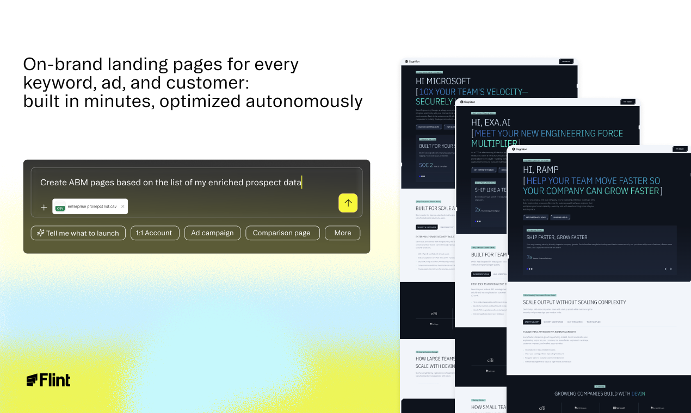
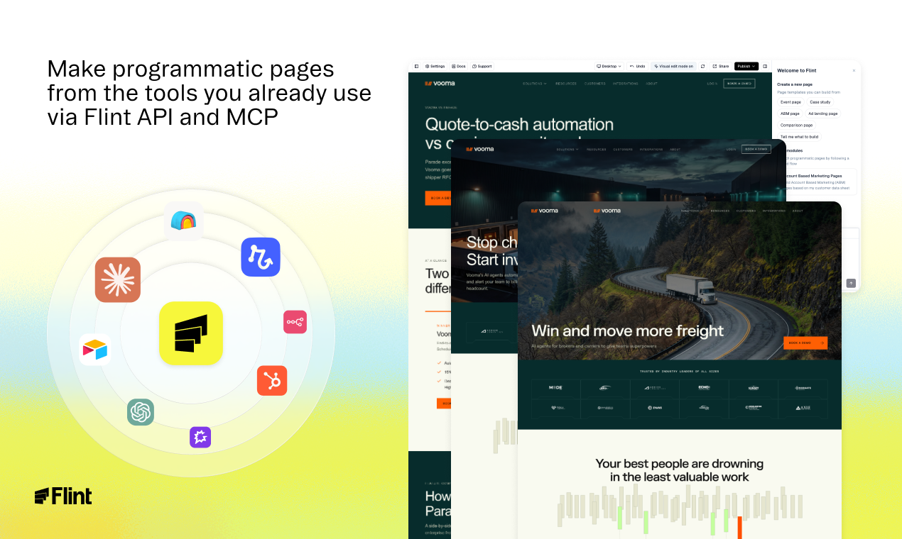

### 🎬 관련 영상
- [🎥 영상 보기](https://ph-files.imgix.net/3ad37dd8-1bd3-46c7-a0a7-0b6f3006e9dd.jpeg?auto=format)

---

## 3. [Google Chrome Vertical Tabs](https://www.producthunt.com/products/google)
**Votes**: 228 | **도입 난이도**: 하 | **신뢰도**: 중
**Tagline**: Chrome now supports vertical tabs and immersive reading mode
**서비스 링크**: https://www.producthunt.com/r/ATI5H6LN6XWRFG
**재등장**: 최근 7일 내 재등장 (마지막 등장 3일 전)

**태그**: Chrome, 생산성, 탭 관리, 읽기 모드, Productivity

### 📌 이 서비스 한눈에 보기
Google Chrome이 세로 탭과 몰입형 읽기 모드를 도입하여 사용자의 멀티태스킹 효율성과 집중력을 향상시킵니다.

### 🔑 주요 기능
- 탭을 세로로 정렬하여 시각적으로 쉽게 관리하고 탐색할 수 있습니다.
- 전체 화면 읽기 모드를 통해 방해 요소를 제거하고 콘텐츠에 집중할 수 있습니다.
- 작업 공간을 깔끔하게 유지하고 생산성을 높일 수 있습니다.

### 🙋 사용자에게 어떤 점이 좋은가
많은 탭을 사용하는 사용자에게 탭 관리를 용이하게 해주고, 콘텐츠 소비 시 집중력을 높여 학습 효율을 향상시킵니다.

### ✅ 지금 바로 써볼 기능
- Chrome 브라우저를 최신 버전으로 업데이트하세요.
- 세로 탭 기능을 활성화하여 탭 관리 방식을 바꿔보세요.
- 읽기 모드를 사용하여 웹 페이지 콘텐츠를 더욱 편안하게 읽어보세요.

### ⚠️ 사용 전 확인할 점
- 세로 탭 기능이 익숙하지 않은 사용자에게는 적응 시간이 필요할 수 있습니다.
- 일부 웹 페이지에서 읽기 모드가 제대로 작동하지 않을 수 있습니다.

### 🧭 확인이 더 필요한 정보
세로 탭 기능이 다양한 화면 크기와 해상도에서 일관된 사용자 경험을 제공하는지 확인이 필요합니다.

### 📸 스크린샷 및 갤러리
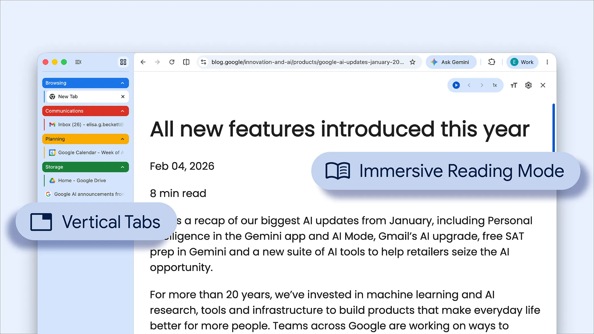
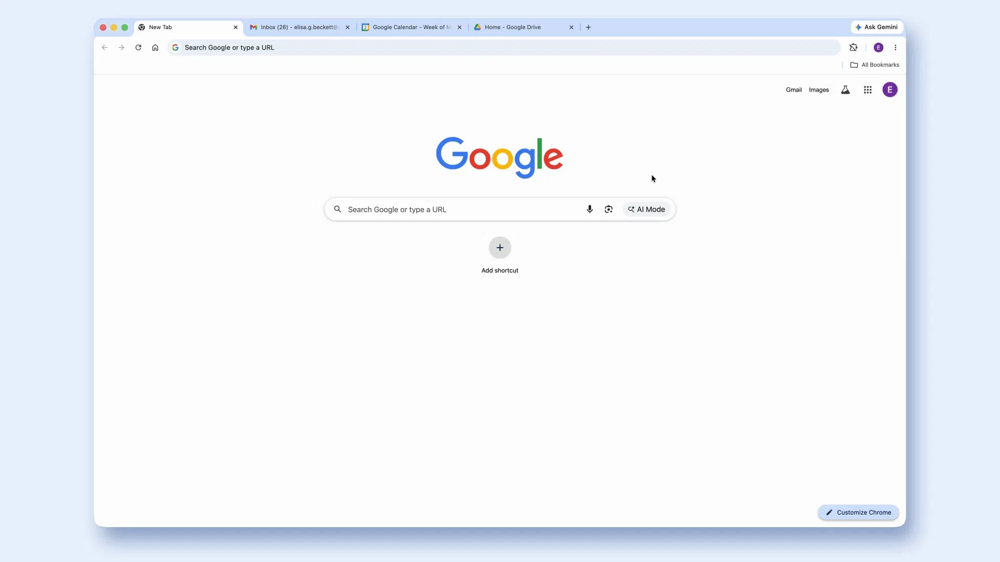

### 🎬 관련 영상
- [🎥 영상 보기](https://ph-files.imgix.net/f610ce34-5110-43c1-aa2b-cbce27d8e7b3.jpeg?auto=format)

---

## 4. [LookAway 2](https://www.producthunt.com/products/lookaway)
**Votes**: 204 | **도입 난이도**: 중 | **신뢰도**: 중
**Tagline**: The Mac app your body thanks you for
**서비스 링크**: https://www.producthunt.com/r/A6NXLH4I5LIPHG

**태그**: 건강, 생산성, Mac, 알림, AI Tool

### 📌 이 서비스 한눈에 보기
LookAway 2는 Mac 사용자의 눈의 피로와 스크린 피로를 줄여주는 스마트 휴식 알림 앱으로, 사용자의 상황을 인지하여 방해 없이 휴식을 취하도록 도와줍니다.

### 🔑 주요 기능
- 눈의 피로 및 스크린 피로 감소
- 휴식, 눈 깜빡임, 자세 알림 기능 제공
- iPhone 동기화를 통해 기기 간 휴식 시간 동기화

### 🙋 사용자에게 어떤 점이 좋은가
장시간 Mac을 사용하는 사용자가 눈 건강을 지키고 생산성을 유지하는 데 도움을 줍니다. 사용자의 작업 흐름을 방해하지 않으면서 적절한 휴식을 유도합니다.

### ✅ 지금 바로 써볼 기능
- 휴식 간격 및 시간 설정
- iPhone 동기화 설정
- 자세 알림 기능 활성화

### ⚠️ 사용 전 확인할 점
- 알림 빈도가 너무 높으면 작업 흐름을 방해할 수 있음
- iPhone 동기화 시 배터리 소모량 증가 가능성

### 🧭 확인이 더 필요한 정보
실제 사용 환경에서 배터리 소모량 및 알림 빈도가 사용자에게 미치는 영향에 대한 추가적인 정보가 필요합니다.

### 📸 스크린샷 및 갤러리
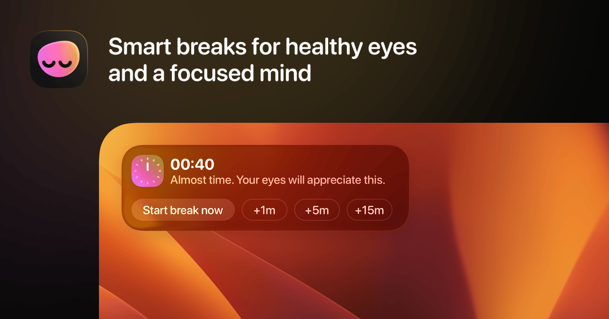

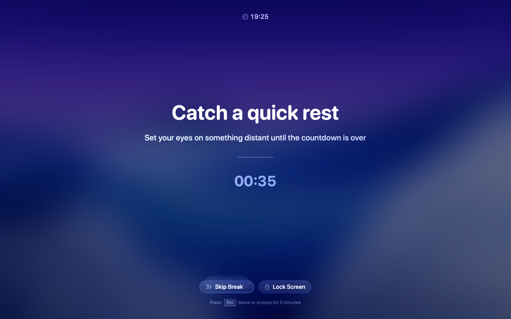

---

## 5. [MindsDB Anton](https://www.producthunt.com/products/mindsdb)
**Votes**: 146 | **도입 난이도**: 중 | **신뢰도**: 중
**Tagline**: Business intelligence that doesn't just answer — it acts.
**서비스 링크**: https://www.producthunt.com/r/LH3TMZMEHOMCNJ

**태그**: BI, 자동화, 분석, 데이터 분석, Security

### 📌 이 서비스 한눈에 보기
MindsDB Anton은 비즈니스 질문에 대해 데이터 발견, 분석 실행, 인사이트 도출, 대시보드 구축, 다음 단계 제안 및 조치 실행까지 전체 분석 프로세스를 자동화하여 실행 가능한 비즈니스 인텔리전스를 제공합니다.

### 🔑 주요 기능
- 비즈니스 질문에 대한 전체 분석 프로세스 자동화
- 데이터 검색, 분석, 인사이트 도출, 대시보드 구축 기능 제공
- 엔터프라이즈 보안 및 거버넌스 준수

### 🙋 사용자에게 어떤 점이 좋은가
Anton을 사용하면 데이터 분석 과정을 자동화하여 시간을 절약하고, 더 나아가 실행 가능한 인사이트를 얻어 비즈니스 의사 결정을 개선할 수 있습니다.

### ✅ 지금 바로 써볼 기능
- 비즈니스 질문을 던져 Anton의 분석 프로세스 경험하기
- Anton이 제안하는 다음 단계 검토하기
- 대시보드 기능을 통해 데이터 시각화하기

### ⚠️ 사용 전 확인할 점
- 엔터프라이즈 보안 및 거버넌스 정책 준수 여부 확인 필요
- 데이터 소스 연결 및 호환성 확인 필요

### 🧭 확인이 더 필요한 정보
Anton이 지원하는 데이터 소스의 종류와 연결 방식에 대한 추가 정보가 필요합니다.

### 📸 스크린샷 및 갤러리
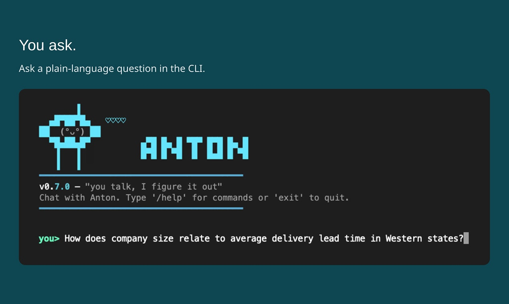
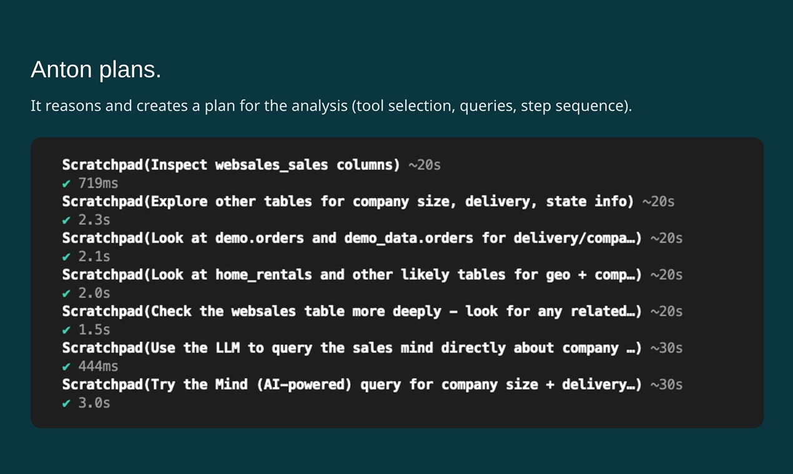
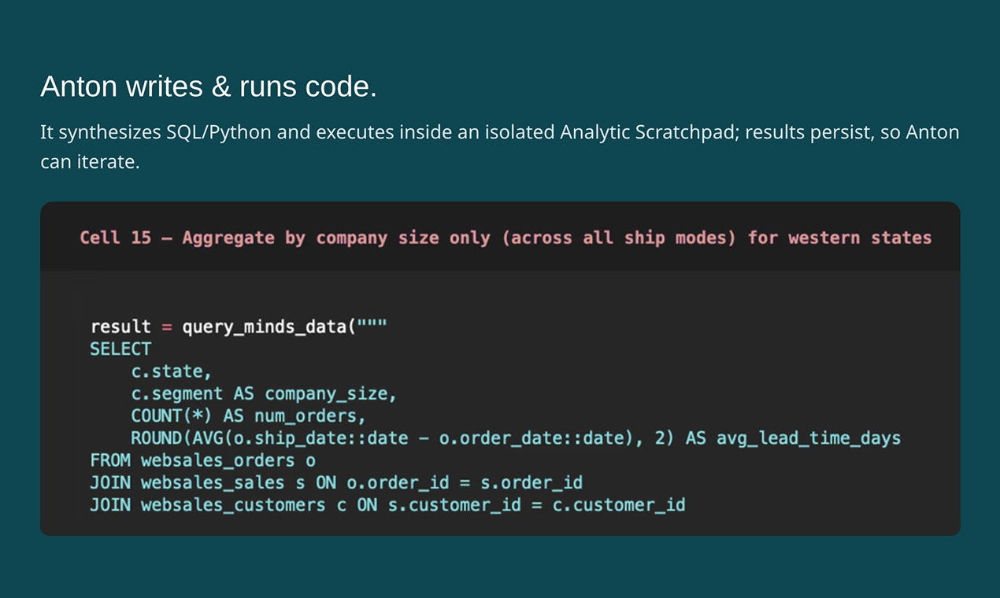

### 🎬 관련 영상
- [🎥 영상 보기](https://ph-files.imgix.net/ed5c224a-779e-4fbf-937a-f73658191191.jpeg?auto=format)

---

## 6. [Browser Arena](https://www.producthunt.com/products/notte)
**Votes**: 143 | **도입 난이도**: 중 | **신뢰도**: 상
**Tagline**: Open-source benchmarks for cloud browser infrastructure
**서비스 링크**: https://www.producthunt.com/r/GVLBEAVNDXWGVB

**태그**: 벤치마크, 클라우드 브라우저, 오픈소스, DevTool, 자동화, AI Tool

### 📌 이 서비스 한눈에 보기
Browser Arena는 클라우드 브라우저 제공업체의 속도, 안정성, 비용을 객관적으로 비교할 수 있는 오픈소스 벤치마크 도구입니다.

### 🔑 주요 기능
- 7개 클라우드 브라우저 제공업체 벤치마킹
- 동일한 테스트 환경 및 EC2 인스턴스 사용
- 모든 결과 및 코드 공개, 재현 가능

### 🙋 사용자에게 어떤 점이 좋은가
클라우드 브라우저 인프라 선택 시 객관적인 데이터를 기반으로 합리적인 의사 결정을 내릴 수 있도록 돕고, 자체적으로 테스트를 수행하여 결과를 검증할 수 있습니다.

### ✅ 지금 바로 써볼 기능
- Railway에 배포하여 직접 테스트 실행
- 제공된 결과 및 코드 검토
- 자체 환경에 맞게 테스트 설정 변경

### ⚠️ 사용 전 확인할 점
- 테스트 환경이 모든 사용 사례를 대표하지 않을 수 있음
- 클라우드 브라우저 제공업체의 정책 변경에 따라 결과가 달라질 수 있음

### 🧭 확인이 더 필요한 정보
제공업체별 상세 설정 및 최적화 방법에 대한 추가 정보가 필요할 수 있습니다.

### 📸 스크린샷 및 갤러리
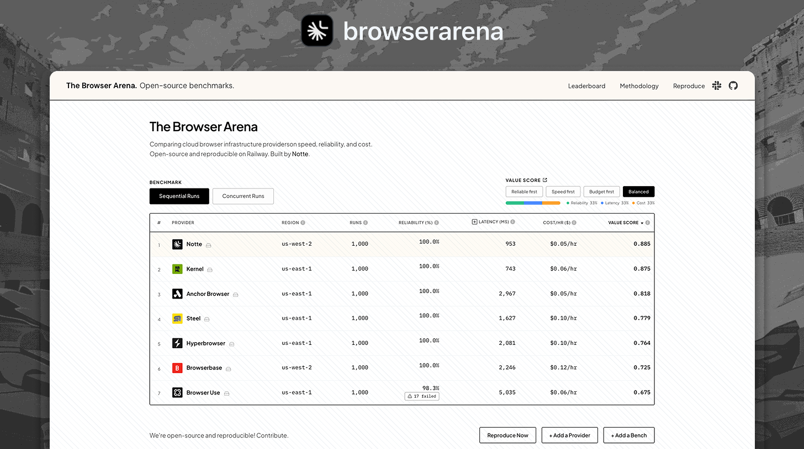
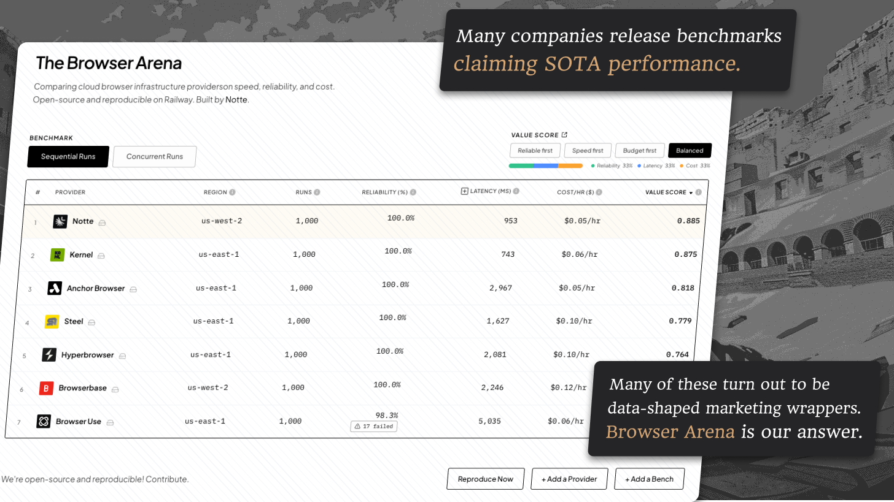
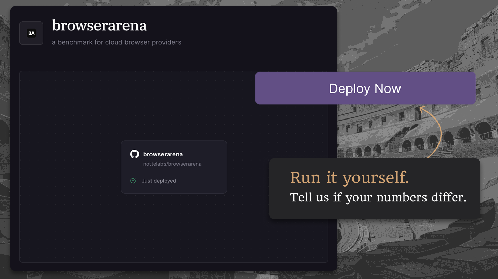

---

## 7. [Career-Ops on Claude](https://www.producthunt.com/products/santifer-io)
**Votes**: 123 | **도입 난이도**: 중 | **신뢰도**: 중
**Tagline**: An AI-powered Job Search System built on Claude Code
**서비스 링크**: https://www.producthunt.com/r/HYDKMKYSMMT5DO

**태그**: AI, 구직, 자동화, 오픈소스, DevTool, AI Tool

### 📌 이 서비스 한눈에 보기
Claude Code를 활용하여 AI 기반의 효율적인 구직 파이프라인을 구축하고, ATS 최적화된 이력서를 생성하여 대량의 채용 공고에 빠르게 지원할 수 있도록 돕는 오픈소스 시스템입니다.

### 🔑 주요 기능
- Claude Code 기반의 AI 구직 시스템
- 12가지 모드와 10가지 평가 기준을 통한 심층 분석
- ATS 최적화 이력서 자동 생성 및 대량 지원 기능

### 🙋 사용자에게 어떤 점이 좋은가
구직 활동에 필요한 시간과 노력을 크게 줄여주며, AI 기반 분석을 통해 더욱 효과적인 구직 전략을 수립할 수 있도록 지원합니다.

### ✅ 지금 바로 써볼 기능
- GitHub에서 프로젝트를 다운로드하여 설치
- 관심 있는 채용 공고 URL을 입력하여 분석 시작
- ATS 최적화 이력서 생성 및 지원 기능 활용

### ⚠️ 사용 전 확인할 점
- Claude Code 사용법 숙지 필요
- AI 분석 결과는 참고용이며, 최종 결정은 사용자가 판단

### 🧭 확인이 더 필요한 정보
AI 분석의 정확도와 실제 채용 성공률 간의 상관관계에 대한 추가적인 검증이 필요합니다.

### 📸 스크린샷 및 갤러리
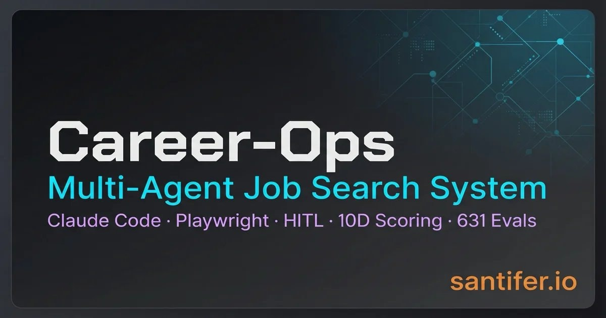
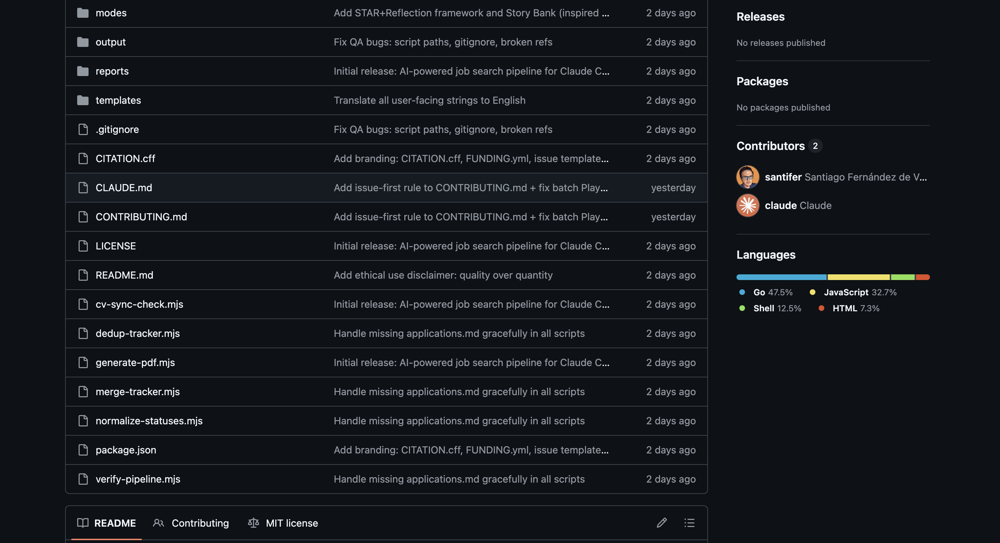
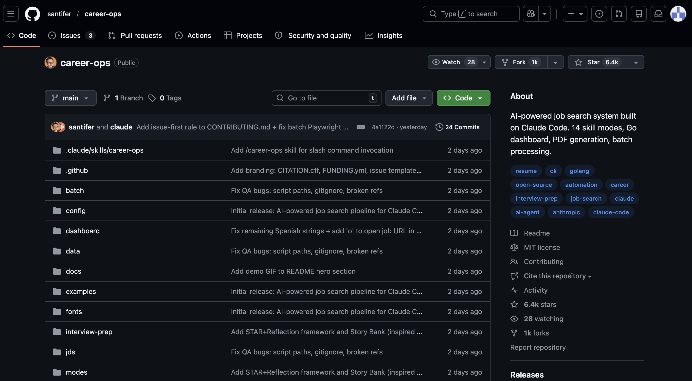

### 🎬 관련 영상
- [🎥 영상 보기](https://ph-files.imgix.net/2a73c106-ce63-467a-95ca-4c01cc7bb91a.jpeg?auto=format)

---

## 8. [Keeby](https://www.producthunt.com/products/keeby)
**Votes**: 115 | **도입 난이도**: 하 | **신뢰도**: 상
**Tagline**: Mechanical keyboard sounds for your Mac
**서비스 링크**: https://www.producthunt.com/r/XKGMPYC5GBZI6V

**태그**: 생산성, 커스터마이징, 사운드, 맥, 유틸리티

### 📌 이 서비스 한눈에 보기
맥북에서 실제 기계식 키보드 타건음을 경험하세요. 다양한 스위치 프로필과 공간 음향, 실시간 비주얼라이저, 톤 컨트롤까지 제공합니다.

### 🔑 주요 기능
- 실제 기계식 키보드 스위치에서 녹음한 고품질 사운드
- Gateron Red, Holy Panda 등 11가지 스위치 프로필 제공
- 공간 음향 및 실시간 반응형 비주얼라이저 지원

### 🙋 사용자에게 어떤 점이 좋은가
맥북 사용자에게 더욱 몰입감 있고 즐거운 타이핑 경험을 제공하며, 개인 취향에 맞는 사운드 커스터마이징이 가능합니다.

### ✅ 지금 바로 써볼 기능
- 다양한 스위치 프로필을 시험해보고 가장 좋아하는 사운드를 찾아보세요
- 공간 음향 설정을 통해 더욱 현실감 있는 사운드를 경험해보세요
- 톤 컨트롤을 사용하여 원하는 타건음 스타일을 설정하세요

### ⚠️ 사용 전 확인할 점
- 맥북에서만 사용 가능합니다
- 오프라인에서만 작동하며, 데이터는 수집되지 않습니다

### 🧭 확인이 더 필요한 정보
다른 운영체제 지원 계획이나 추가 스위치 프로필 업데이트 계획은 아직 알려지지 않았습니다.

### 📸 스크린샷 및 갤러리

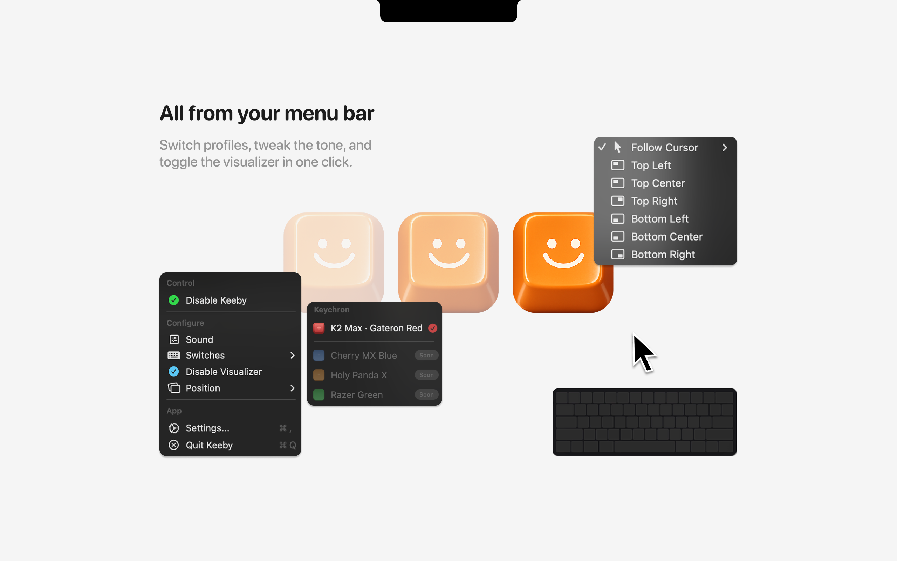
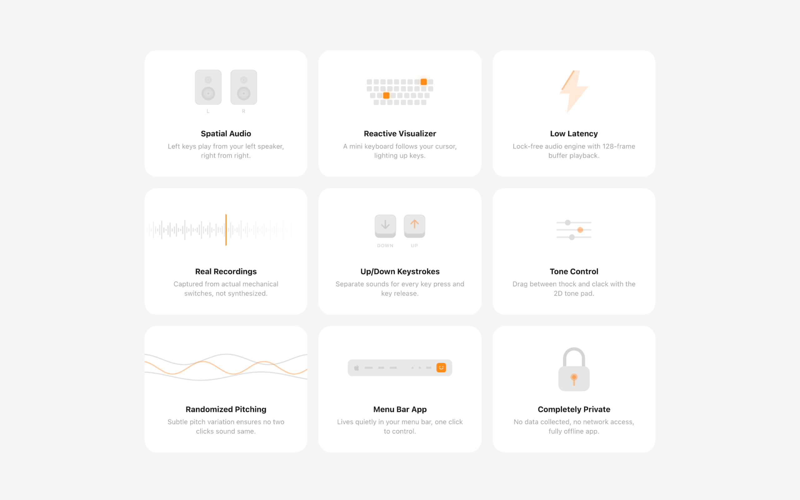

### 🎬 관련 영상
- [🎥 영상 보기](https://ph-files.imgix.net/c3130bbe-959d-4692-af1f-55462e8794c3.jpeg?auto=format)

---

## 9. [FeatDrop](https://www.producthunt.com/products/featdrop)
**Votes**: 98 | **도입 난이도**: 중 | **신뢰도**: 중
**Tagline**: Public changelog for builders to share product updates
**서비스 링크**: https://www.producthunt.com/r/K5ZALE4AS42BPF

**태그**: Product Management, Changelog, Community, Feedback

### 📌 이 서비스 한눈에 보기
FeatDrop은 제품 업데이트를 공유하고 피드백을 받으며 사용자층을 늘릴 수 있는 공개 변경 로그 커뮤니티입니다.

### 🔑 주요 기능
- 제품 업데이트를 공개적으로 공유
- 피드백 수집 및 소통
- 잠재 고객 확보

### 🙋 사용자에게 어떤 점이 좋은가
제품 개발 과정을 투명하게 공개하여 사용자들과 소통하고, 제품 개선에 필요한 피드백을 쉽게 얻을 수 있습니다. 이를 통해 제품의 완성도를 높이고 사용자 기반을 확장할 수 있습니다.

### ✅ 지금 바로 써볼 기능
- 제품 업데이트를 FeatDrop에 공유
- 사용자 피드백에 적극적으로 응답
- 커뮤니티 활동에 참여

### ⚠️ 사용 전 확인할 점
- 공개적인 업데이트 공유에 대한 보안 고려 필요
- 피드백 관리 및 대응에 시간 투자 필요

### 🧭 확인이 더 필요한 정보
FeatDrop의 구체적인 사용자 확보 효과 및 커뮤니티 활성화 정도는 추가 확인이 필요합니다.

### 📸 스크린샷 및 갤러리
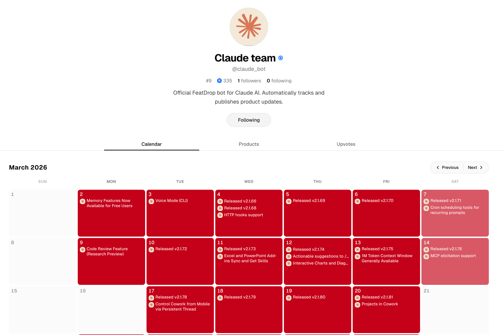
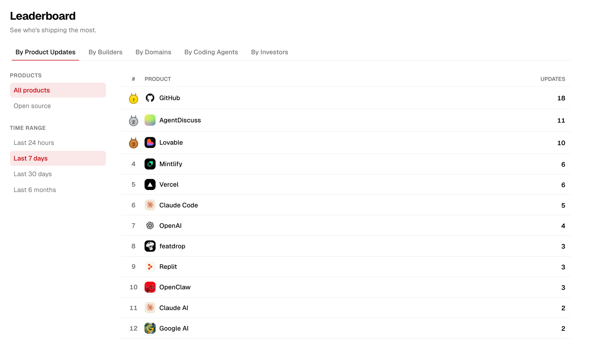
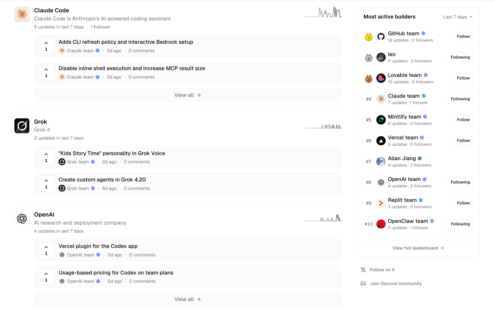

### 🎬 관련 영상
- [🎥 영상 보기](https://ph-files.imgix.net/869c3bf2-0654-4332-86d0-a025b20f39d6.jpeg?auto=format)

---

## 10. [PassportReader](https://www.producthunt.com/products/iris-id-by-passportreader)
**Votes**: 94 | **도입 난이도**: 중 | **신뢰도**: 중
**Tagline**: Verify passports, ID cards, and digital credentials via API
**서비스 링크**: https://www.producthunt.com/r/HCV7PA2LNFXJDG

**태그**: API, 보안, 신분증 검증, 개발자 도구, DevTool

### 📌 이 서비스 한눈에 보기
PassportReader는 API를 통해 여권, 신분증, 디지털 자격 증명을 NFC 및 암호화 검증으로 확실하게 검증하여, 개발자와 신뢰성 있는 검증이 필요한 플랫폼에 복잡한 인프라 구축 없이 안전한 솔루션을 제공합니다.

### 🔑 주요 기능
- NFC 및 암호화 검증을 통한 신분증 진위 확인
- 복잡한 인프라 구축 없이 API로 간편하게 통합
- 여권, 신분증, 디지털 자격 증명 등 다양한 문서 지원

### 🙋 사용자에게 어떤 점이 좋은가
PassportReader를 사용하면 신분증의 진위를 확실하게 검증하여 사기 위험을 줄이고, 사용자 인증 프로세스를 간소화할 수 있습니다. 특히 개발자는 복잡한 로직 구현 없이 API 호출만으로 강력한 보안 기능을 구현할 수 있습니다.

### ✅ 지금 바로 써볼 기능
- API 문서 확인하여 통합 가능성 검토
- 제공되는 샘플 코드 테스트
- 지원하는 신분증 종류 확인

### ⚠️ 사용 전 확인할 점
- NFC 지원 장치 필요
- API 사용량에 따른 비용 발생 가능성
- 지원하는 신분증 종류 및 국가 확인 필요

### 🧭 확인이 더 필요한 정보
PassportReader API의 정확도 및 성능에 대한 사용자 리뷰 또는 벤치마크 데이터가 필요합니다.

### 📸 스크린샷 및 갤러리
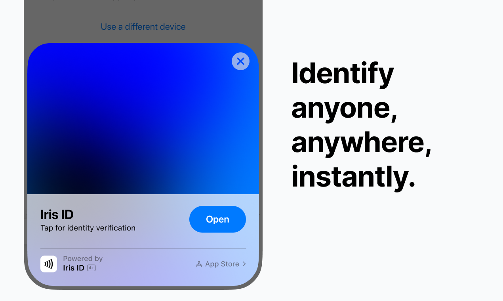
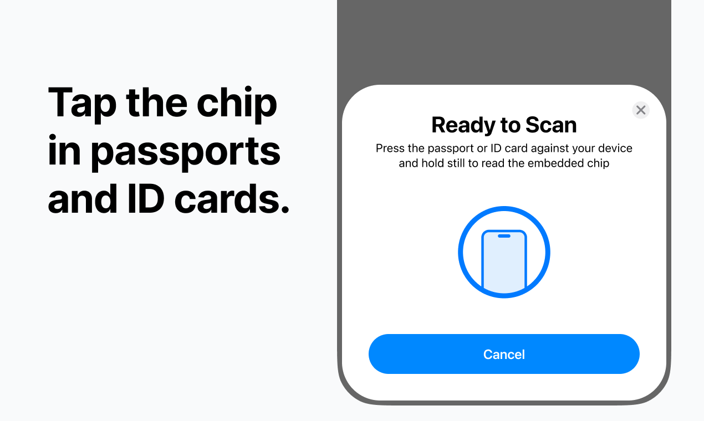

---

