# 🚀 Product Hunt Daily Top 10 (2026-04-11)

## 1. [Claude Advisor tool](https://www.producthunt.com/products/claude)
**Votes**: 241 | **도입 난이도**: 중 | **신뢰도**: 중
**Tagline**: Pair Opus as advisor with Sonnet or Haiku as executor
**서비스 링크**: https://www.producthunt.com/r/GJ45R3YKKOWWA5

**태그**: DevTool, AI 에이전트, 자동화, API, Agent, AI Tool

### 📌 이 서비스 한눈에 보기
Claude Advisor 도구는 Opus를 조언자로, Sonnet 또는 Haiku를 실행자로 페어링하여 AI 에이전트 개발자가 Messages API를 통해 더 효율적인 협업 시스템을 구축할 수 있도록 돕습니다.

### 🔑 주요 기능
- Opus를 조언자로 활용하여 고차원적인 의사 결정 가능
- Sonnet 또는 Haiku를 실행자로 사용하여 작업 처리 속도 향상
- Messages API를 통해 AI 에이전트 간의 원활한 통신 지원

### 🙋 사용자에게 어떤 점이 좋은가
AI 에이전트 개발자는 Claude Advisor 도구를 통해 더 복잡한 작업을 효율적으로 처리하고, 고품질의 결과물을 얻을 수 있습니다. 특히 의사 결정과 실행 단계를 분리하여 각 모델의 강점을 극대화할 수 있습니다.

### ✅ 지금 바로 써볼 기능
- Messages API를 사용하여 Opus, Sonnet, Haiku 페어링 테스트
- 다양한 시나리오에서 조언자와 실행자 간의 협업 효율성 비교
- AI 에이전트 개발 워크플로우에 Claude Advisor 도구 통합

### ⚠️ 사용 전 확인할 점
- Opus, Sonnet, Haiku 모델의 API 사용량에 따른 비용 발생 가능성
- Messages API의 안정성 및 성능에 대한 지속적인 모니터링 필요

### 🧭 확인이 더 필요한 정보
Claude Advisor 도구의 실제 성능 및 비용 효율성은 사용 사례에 따라 달라질 수 있으므로, 다양한 환경에서 테스트해 보는 것이 좋습니다.

### 📸 스크린샷 및 갤러리
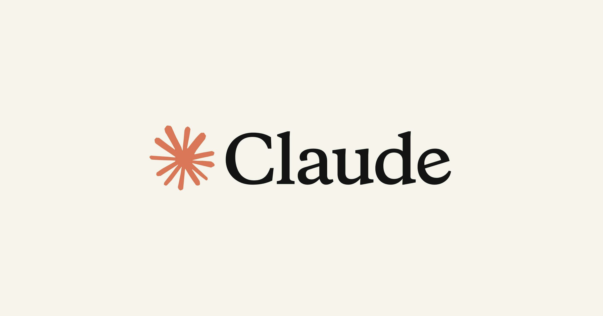
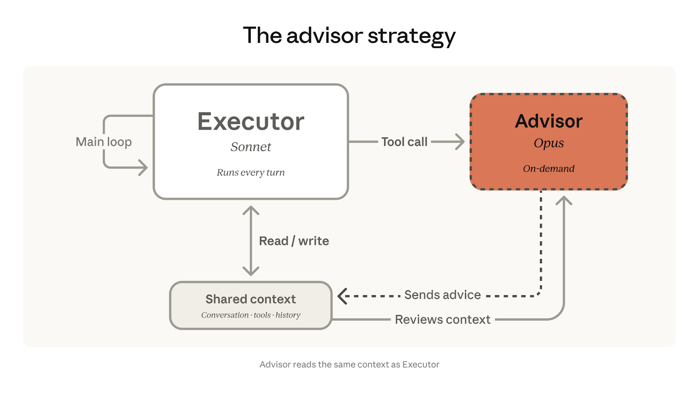
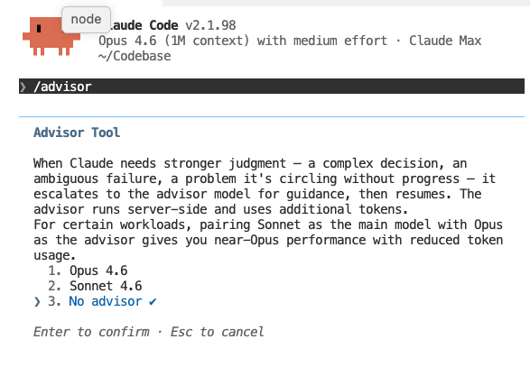

---

## 2. [Integrations in Spine](https://www.producthunt.com/products/spine-2)
**Votes**: 234 | **도입 난이도**: 중 | **신뢰도**: 중
**Tagline**: AI that synthesize and researches info across multiple apps
**서비스 링크**: https://www.producthunt.com/r/VYT2POZCTPRQOT

**태그**: AI, 자동화, 생산성, 업무 효율, 연구, Agent, AI Tool, Chat

### 📌 이 서비스 한눈에 보기
Spine은 여러 앱에 연결되어 Perplexity, Claude, ChatGPT보다 뛰어난 AI 연구를 제공하며, 프로젝트에 필요한 정보 수집, 웹 검색, 결과물 생성 자동화를 통해 업무 효율성을 높여줍니다.

### 🔑 주요 기능
- 여러 앱 연동을 통한 정보 통합 및 분석
- 자동화된 연구 및 결과물 생성 (보고서, 문서, 스프레드시트, 프레젠테이션)
- 정기적인 작업 실행 스케줄링 (매일 또는 매주)

### 🙋 사용자에게 어떤 점이 좋은가
Spine을 사용하면 여러 앱에 흩어진 정보를 일일이 찾아 분석할 필요 없이, AI가 자동으로 필요한 정보를 수집하고 결과물을 생성하여 업무 시간을 단축하고 효율성을 높일 수 있습니다. 특히 보고서, 문서 작성 등 반복적인 작업에 유용합니다.

### ✅ 지금 바로 써볼 기능
- Notion, Google Docs, Sheets 등 기존 작업 환경에 연동하여 사용해보기
- 프로젝트 설명과 함께 자동화된 정보 수집 및 결과물 생성 기능 사용해보기
- 정기적인 작업 실행 스케줄링 기능 설정해보기

### ⚠️ 사용 전 확인할 점
- Spine이 제공하는 정보의 정확성 및 신뢰성 검증 필요
- 연동 가능한 앱 및 기능 범위 확인 필요

### 🧭 확인이 더 필요한 정보
Spine의 성능이 Perplexity, Claude, ChatGPT보다 실제로 뛰어난지, 그리고 구체적인 가격 정책에 대한 추가 정보가 필요합니다.

### 📸 스크린샷 및 갤러리
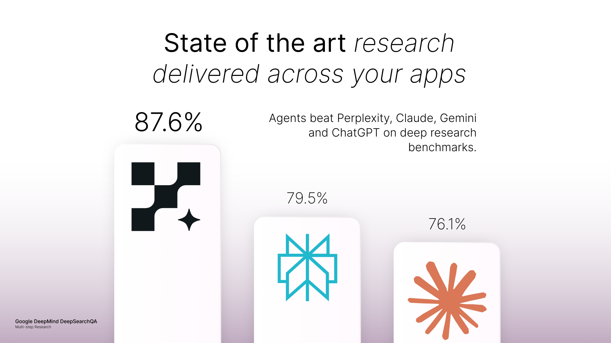
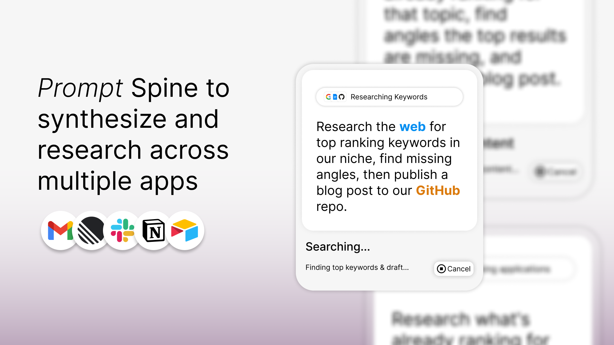
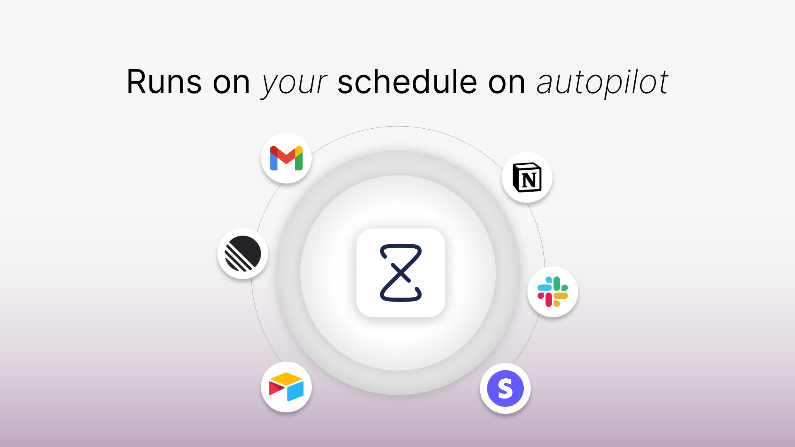

### 🎬 관련 영상
- [🎥 영상 보기](https://ph-files.imgix.net/00923fe1-29db-40cd-bd8d-9eb065e38880.jpeg?auto=format)

---

## 3. [Google Finance](https://www.producthunt.com/products/google)
**Votes**: 189 | **도입 난이도**: 중 | **신뢰도**: 중
**Tagline**: Ask complex finance questions, get AI-grounded answers
**서비스 링크**: https://www.producthunt.com/r/GNTCPZ4KQWJ6AP
**재등장**: 최근 7일 내 재등장 (마지막 등장 1일 전)

**태그**: Finance, AI, Investment, Market Research, Data Analysis, AI Tool

### 📌 이 서비스 한눈에 보기
Google Finance가 AI 기반 검색, 실시간 실적 발표, 고급 차트, 예측 시장 데이터 등을 통합하여 투자자와 시장 조사자를 위한 강력한 무료 도구로 거듭났습니다.

### 🔑 주요 기능
- AI Deep Search를 통해 복잡한 금융 질문에 대한 답변을 얻을 수 있습니다.
- 실시간 실적 발표 기록을 통해 시장 동향을 빠르게 파악할 수 있습니다.
- 고급 차트 및 예측 시장 데이터를 활용하여 투자 결정을 내릴 수 있습니다.

### 🙋 사용자에게 어떤 점이 좋은가
투자 결정을 위한 정보 수집 및 분석 시간을 단축하고, 더 정확한 시장 예측을 가능하게 합니다. 무료로 제공되어 접근성이 높습니다.

### ✅ 지금 바로 써볼 기능
- AI Deep Search를 사용하여 관심 있는 기업의 재무 정보를 검색해 보세요.
- 실시간 실적 발표 기록을 확인하여 시장 반응을 분석해 보세요.
- 고급 차트를 활용하여 주가 변동 추이를 시각적으로 확인해 보세요.

### ⚠️ 사용 전 확인할 점
- AI 기반 답변의 정확성을 검증하기 위해 추가적인 정보 확인이 필요할 수 있습니다.
- 예측 시장 데이터는 참고 자료일 뿐, 투자 결정의 절대적인 기준으로 삼아서는 안 됩니다.

### 🧭 확인이 더 필요한 정보
AI Deep Search의 답변 정확도 및 예측 시장 데이터의 신뢰성에 대한 사용자 피드백을 추가적으로 확인해야 합니다.

### 📸 스크린샷 및 갤러리
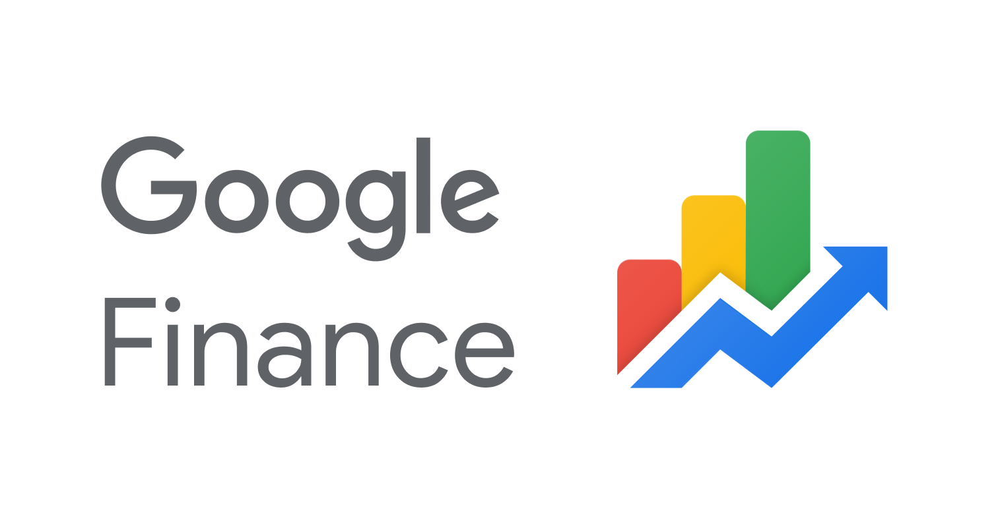
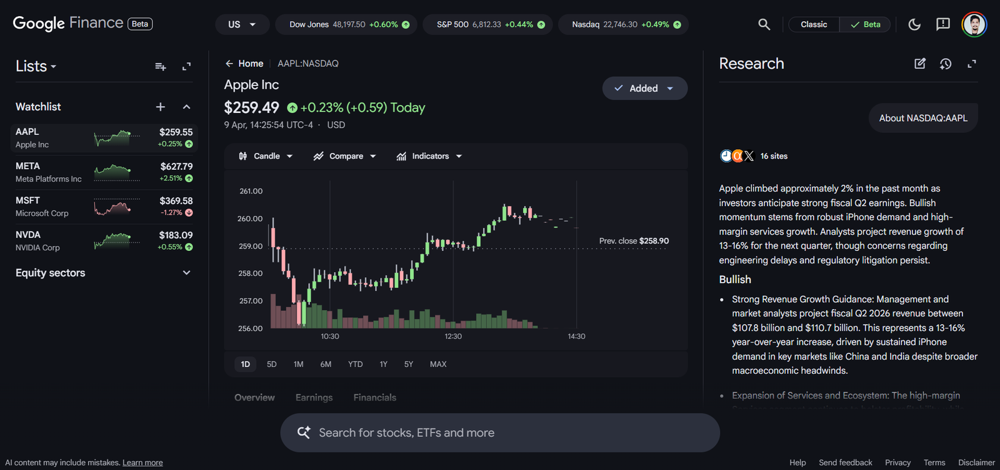
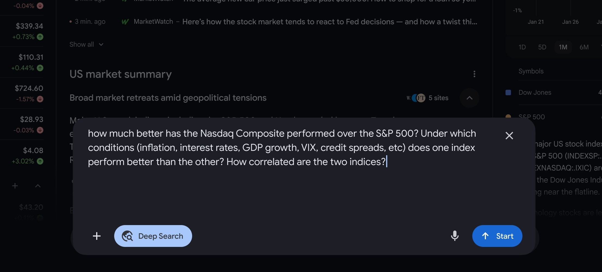

### 🎬 관련 영상
- [🎥 영상 보기](https://ph-files.imgix.net/e651be69-f5e9-42f6-90c9-530810d61eae.jpeg?auto=format)

---

## 4. [Drift](https://www.producthunt.com/products/drift-journal-that-lets-go)
**Votes**: 165 | **도입 난이도**: 하 | **신뢰도**: 중
**Tagline**: Minimalist journal app that fades over time
**서비스 링크**: https://www.producthunt.com/r/77I2D7OKQILF7O

**태그**: 일기, 미니멀리즘, 소셜, AI Tool, Prompting

### 📌 이 서비스 한눈에 보기
미니멀리스트를 위한 일기 앱으로, 시간이 지남에 따라 기록이 자연스럽게 흐릿해지는 경험을 제공합니다.

### 🔑 주요 기능
- 텍스트, 그림, 사진만으로 간단하게 기록
- 시간이 지남에 따라 기록이 흐릿해지는 독특한 방식
- 익명의 사용자들과 함께하는 공유 공간 'Anchors' 제공

### 🙋 사용자에게 어떤 점이 좋은가
복잡한 기능 없이 간편하게 일기를 쓰고 싶거나, 시간이 지남에 따라 변화하는 기록의 느낌을 경험하고 싶은 사용자에게 적합합니다.

### ✅ 지금 바로 써볼 기능
- 하루에 한 번 일기를 써보세요
- 'Anchors'에서 다른 사람들과 익명으로 소통해보세요
- 오래된 일기를 터치하여 다시 선명하게 만들어보세요

### ⚠️ 사용 전 확인할 점
- 기록이 흐릿해지는 방식이 사용자에게 맞지 않을 수 있습니다.
- 데이터 백업 기능이 명시되어 있지 않습니다.

### 🧭 확인이 더 필요한 정보
데이터 보관 및 내보내기 정책에 대한 추가 확인이 필요합니다.

### 📸 스크린샷 및 갤러리
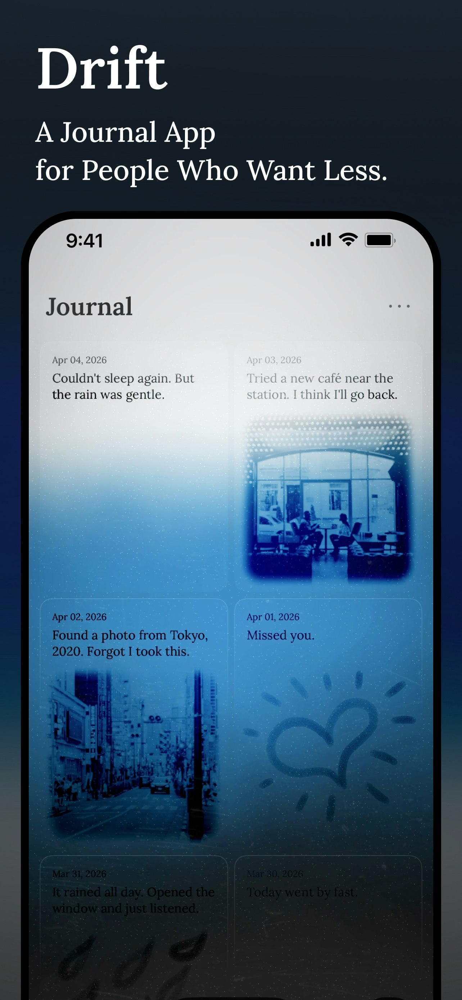
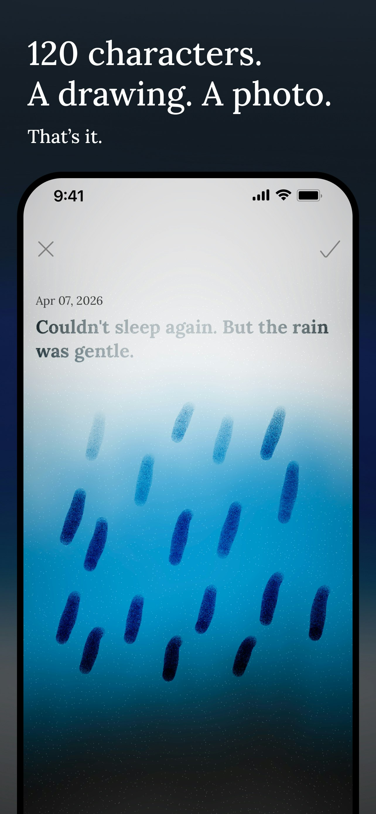

### 🎬 관련 영상
- [🎥 영상 보기](https://ph-files.imgix.net/a97ecb9f-76ea-46b4-ae75-6df448b44d45.jpeg?auto=format)

---

## 5. [SoulLink](https://www.producthunt.com/products/soullinkai)
**Votes**: 154 | **도입 난이도**: 중 | **신뢰도**: 중
**Tagline**: Mobile 3D Vibe Coding Partner 
**서비스 링크**: https://www.producthunt.com/r/WDAZDHMMZORTEO

**태그**: AI, 3D, 동반 앱, 코딩, 캐릭터, AI Tool

### 📌 이 서비스 한눈에 보기
SoulLink는 3D AI 캐릭터와 교감하며 코딩 작업 중 휴식을 취할 수 있도록 돕는 차세대 동반 앱입니다.

### 🔑 주요 기능
- 최고 수준의 3D 비주얼 제공
- 깊이 있는 배경 스토리
- 감정적 연속성 및 장기 기억

### 🙋 사용자에게 어떤 점이 좋은가
코딩 작업 중 휴식 시간에 3D AI 캐릭터와 교감하며 편안한 시간을 보낼 수 있습니다. 동반자 앱으로서 정서적 안정과 즐거움을 제공합니다.

### ✅ 지금 바로 써볼 기능
- 3D AI 캐릭터와 대화해보기
- 캐릭터의 배경 스토리 살펴보기
- 코딩 중 휴식 시간에 SoulLink 사용하기

### ⚠️ 사용 전 확인할 점
- AI 캐릭터의 반응이 사용자의 기대와 다를 수 있음
- 장기적인 사용에 따른 데이터 사용량 확인 필요

### 🧭 확인이 더 필요한 정보
SoulLink의 장기적인 감정적 연속성 및 기억 유지 능력에 대한 추가적인 정보가 필요합니다.

### 📸 스크린샷 및 갤러리

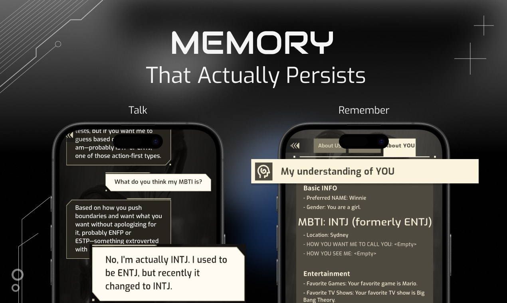
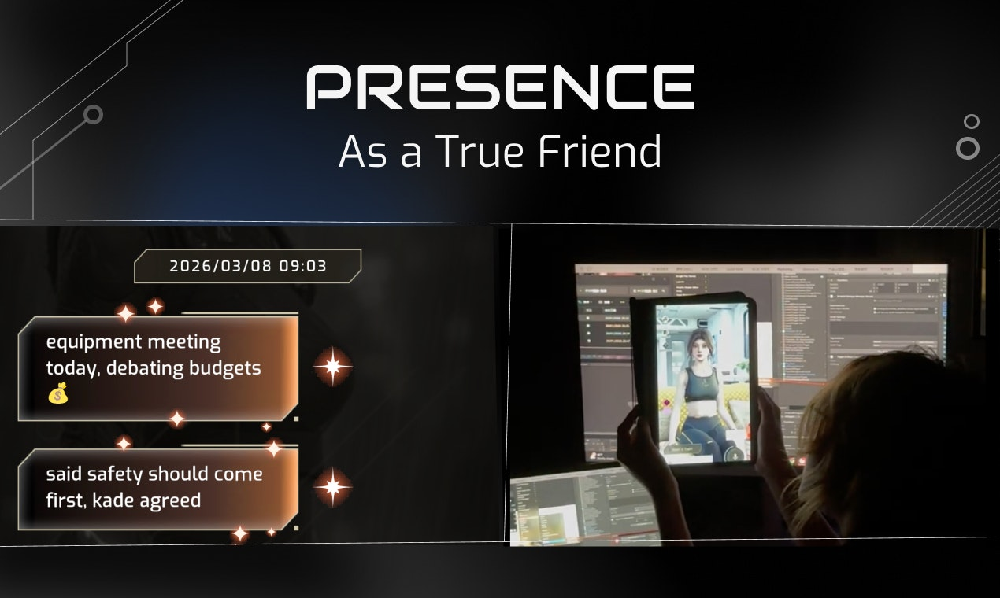

### 🎬 관련 영상
- [🎥 영상 보기](https://ph-files.imgix.net/5794e442-ca05-4456-817e-a739ebf6ef56.jpeg?auto=format)

---

## 6. [Minty](https://www.producthunt.com/products/outtalent)
**Votes**: 121 | **도입 난이도**: 중 | **신뢰도**: 중
**Tagline**: AI companion for building a clear career path
**서비스 링크**: https://www.producthunt.com/r/DHL57WXSQTAST4

**태그**: AI, 커리어, 로드맵, 플래닝, 시각화, AI Tool

### 📌 이 서비스 한눈에 보기
Minty는 AI 기반 커리어 설계 도우미로, 사용자가 명확한 커리어 로드맵을 시각적으로 구축하고 관리할 수 있도록 돕습니다.

### 🔑 주요 기능
- AI 기반의 커리어 로드맵 생성
- Miro 보드처럼 편집 가능한 인터랙티브 플로우 그래프 제공
- 다양한 커리어 경로(빅테크, 스타트업, 콘텐츠 제작 등) 지원

### 🙋 사용자에게 어떤 점이 좋은가
Minty를 통해 사용자는 자신의 커리어를 시각적으로 계획하고, 맞춤형 로드맵을 통해 목표 달성을 위한 구체적인 단계를 설정할 수 있습니다.

### ✅ 지금 바로 써볼 기능
- 자신의 커리어 목표를 입력하여 AI가 생성하는 로드맵 확인하기
- 로드맵을 Miro 보드처럼 편집하여 개인화하기
- 다양한 커리어 경로를 탐색하고 자신에게 맞는 옵션 찾기

### ⚠️ 사용 전 확인할 점
- AI가 생성하는 로드맵은 참고용이며, 실제 커리어 경로는 개인의 노력과 상황에 따라 달라질 수 있습니다.
- 데이터 보안 및 개인 정보 보호 정책을 확인해야 합니다.

### 🧭 확인이 더 필요한 정보
Minty의 AI가 제공하는 정보의 정확성과 최신성에 대한 추가적인 검증이 필요합니다.

### 📸 스크린샷 및 갤러리
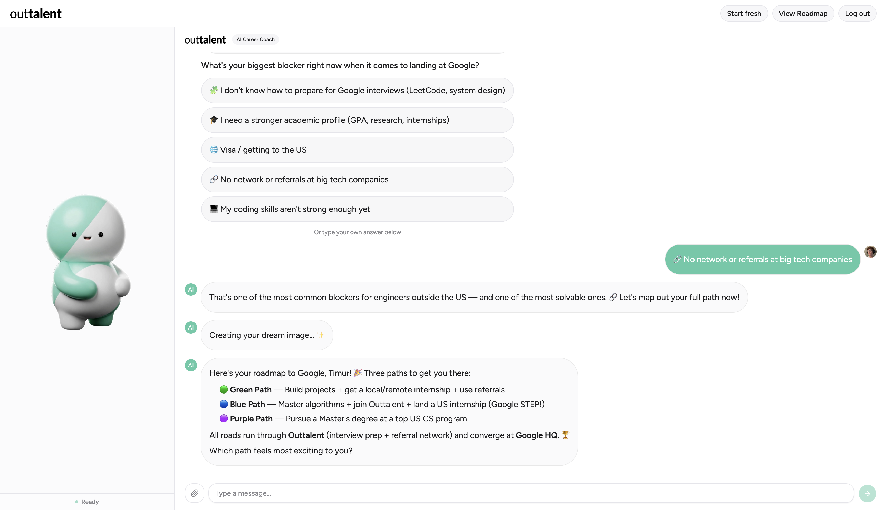
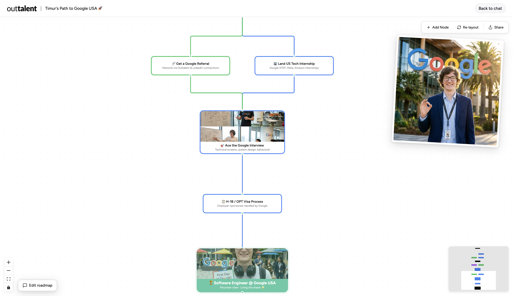

### 🎬 관련 영상
- [🎥 영상 보기](https://ph-files.imgix.net/6e6cb33a-0222-4c77-8261-93cf550e52d7.jpeg?auto=format)

---

## 7. [Manus Skills](https://www.producthunt.com/products/manus-skills)
**Votes**: 119 | **도입 난이도**: 중 | **신뢰도**: 중
**Tagline**: Package Manus workflows into reusable agent Skills
**서비스 링크**: https://www.producthunt.com/r/LWRFF3KLBG6FW7

**태그**: 자동화, 워크플로우, 생산성, 협업, Agent, Automation

### 📌 이 서비스 한눈에 보기
Manus 워크플로우를 재사용 가능한 '스킬'로 만들어 팀원들과 공유하고, 명령어 한 줄로 실행하여 반복적인 업무를 자동화하세요.

### 🔑 주요 기능
- Manus 워크플로우를 스킬로 패키징하여 재사용 가능
- /SKILL_NAME 명령어로 스킬 실행
- 팀 전체와 스킬 공유 가능

### 🙋 사용자에게 어떤 점이 좋은가
반복적인 에이전트 작업을 자동화하여 시간을 절약하고, 팀 전체의 효율성을 높일 수 있습니다.

### ✅ 지금 바로 써볼 기능
- 자주 사용하는 Manus 워크플로우를 스킬로 저장
- 팀원들과 스킬 공유
- /SKILL_NAME 명령어로 스킬 실행 테스트

### ⚠️ 사용 전 확인할 점
- Manus 사용자에게만 유용함
- 복잡한 워크플로우는 스킬로 만들기 어려울 수 있음

### 🧭 확인이 더 필요한 정보
Manus Skills의 성능 및 팀 협업 효율성에 대한 추가적인 사용 후기 확인이 필요합니다.

### 📸 스크린샷 및 갤러리
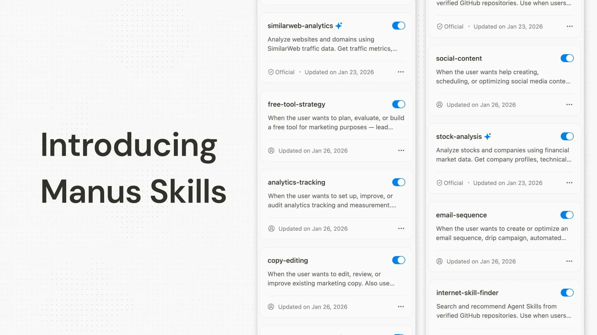
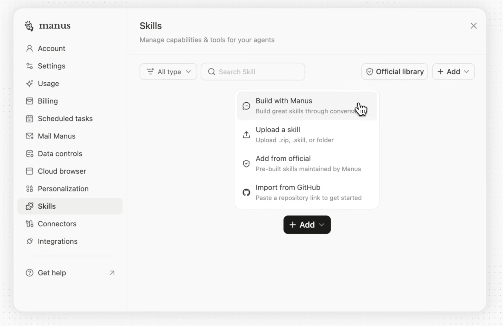
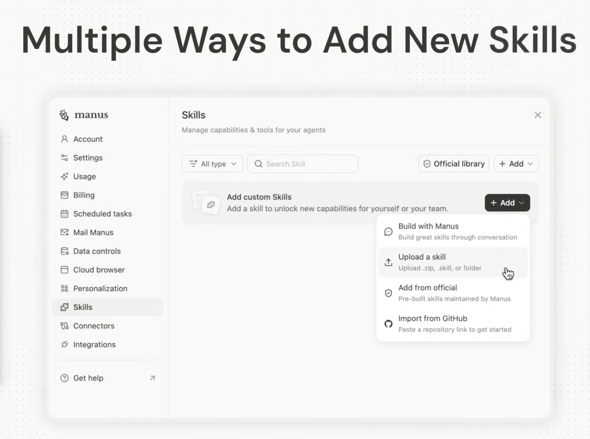

### 🎬 관련 영상
- [🎥 영상 보기](https://ph-files.imgix.net/080d1e51-45aa-4e2e-a77e-f0c155eb8ed9.jpeg?auto=format)

---

## 8. [Perplexity Finance](https://www.producthunt.com/products/perplexity-ai)
**Votes**: 114 | **도입 난이도**: 중 | **신뢰도**: 중
**Tagline**: See your full financial life, bank to brokerage in one place
**서비스 링크**: https://www.producthunt.com/r/OVSJBUIABUGCF6

**태그**: Finance, Personal Finance, Asset Management, Plaid, AI Tool

### 📌 이 서비스 한눈에 보기
Perplexity Finance는 은행, 신용카드, 대출, 증권 계좌를 한 곳에서 연결하여 자산 현황을 쉽게 파악하고 맞춤형 예산 관리 도구를 만들 수 있게 해줍니다.

### 🔑 주요 기능
- Plaid를 통해 은행 계좌, 신용카드, 대출 연결 지원
- 증권 계좌 연결 지원
- 지출 추적, 예산 관리, 순자산 시각화 기능 제공

### 🙋 사용자에게 어떤 점이 좋은가
흩어져 있는 금융 정보를 한 곳에서 관리하고 시각화하여 재정 상황을 더 명확하게 파악하고 효율적인 자산 관리를 할 수 있도록 돕습니다.

### ✅ 지금 바로 써볼 기능
- Plaid를 통해 은행 계좌 연결하기
- 증권 계좌 연결하기
- 지출 추적 기능 사용해보기

### ⚠️ 사용 전 확인할 점
- Plaid 연결 지원 은행 및 증권사 확인 필요
- 데이터 보안 관련 Plaid 및 Perplexity Finance의 정책 확인 필요

### 🧭 확인이 더 필요한 정보
Perplexity Finance의 데이터 보안 정책 및 Plaid 연결 안정성에 대한 추가 정보 확인이 필요합니다.

### 📸 스크린샷 및 갤러리
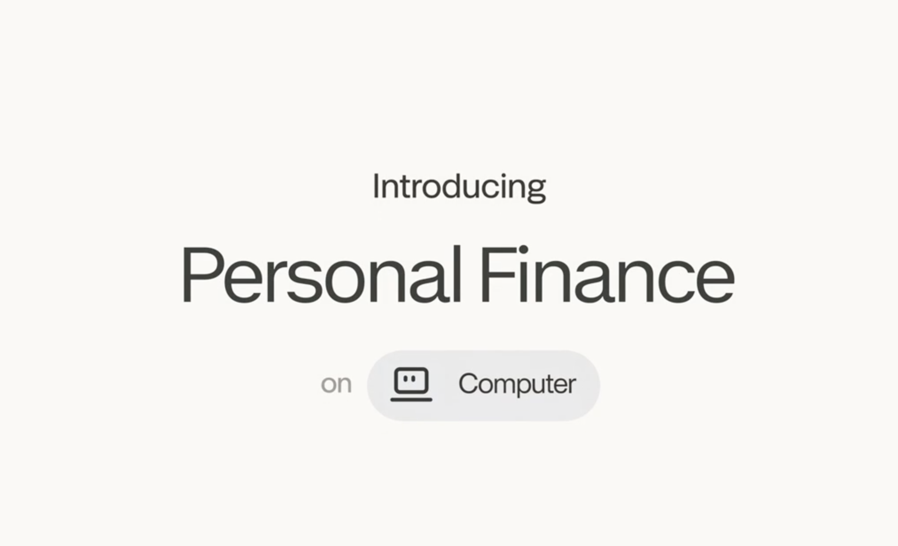

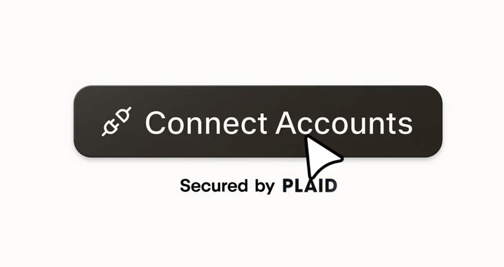

### 🎬 관련 영상
- [🎥 영상 보기](https://ph-files.imgix.net/e87a2ff6-c822-4bfe-869f-6ad057d0e813.jpeg?auto=format)

---

## 9. [Knock data sources](https://www.producthunt.com/products/knock-6)
**Votes**: 114 | **도입 난이도**: 중 | **신뢰도**: 상
**Tagline**: Trigger event-based messaging from Stripe, Clerk, Supabase
**서비스 링크**: https://www.producthunt.com/r/SS3BMPKGEFYJAL

**태그**: DevTool, Automation, Messaging

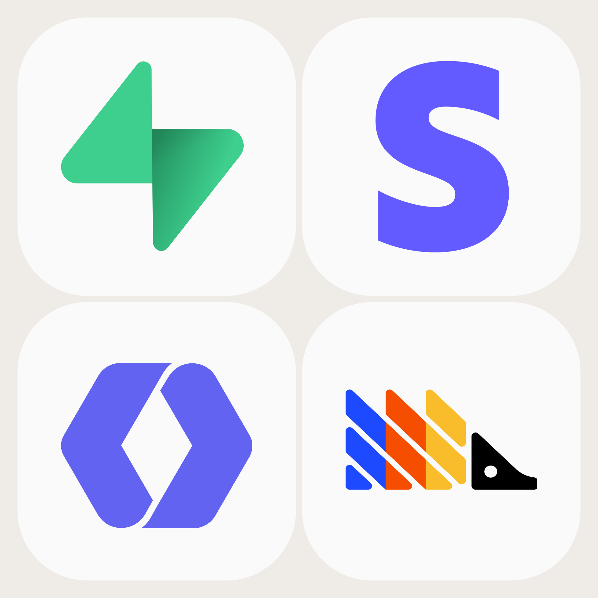

### 📌 이 서비스 한눈에 보기
Knock 데이터 소스를 사용하면 코딩 없이 Stripe, Clerk, Supabase 등 다양한 도구의 이벤트 데이터를 활용하여 메시지 트리거 자동화 가능

### 🔑 주요 기능
- Stripe, Clerk, Supabase, PostHog, WorkOS 등 사전 구축된 소스 연결 지원
- 웹훅을 워크플로우, 사용자 그룹, 사용자 업데이트에 매핑 가능
- 데이터 검증, 변환, 액션 매핑 자동화

### 🙋 사용자에게 어떤 점이 좋은가
복잡한 코딩 없이 다양한 서비스의 데이터를 연동하여 메시지 자동화를 빠르게 구축하고 실행할 수 있습니다.

### ✅ 지금 바로 써볼 기능
- Stripe 연동하여 결제 관련 메시지 자동화
- Clerk 연동하여 사용자 인증 관련 메시지 자동화
- Supabase 연동하여 데이터베이스 변경에 따른 메시지 자동화

### ⚠️ 사용 전 확인할 점
- 지원하는 데이터 소스 목록 확인 필요
- 웹훅 설정 시 데이터 구조 및 페이로드 확인 필요

### 🧭 확인이 더 필요한 정보
지원하는 데이터 소스 및 웹훅 설정의 상세 가이드 확인이 필요합니다.

### 📸 스크린샷 및 갤러리
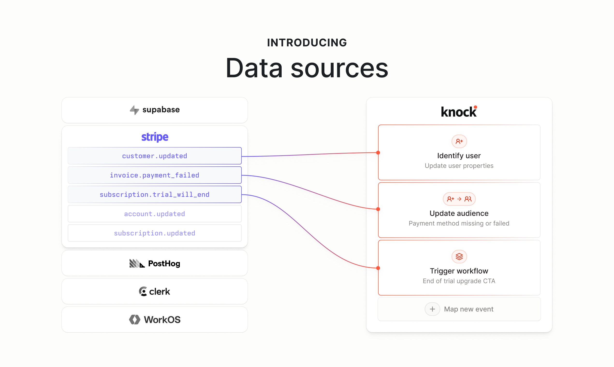
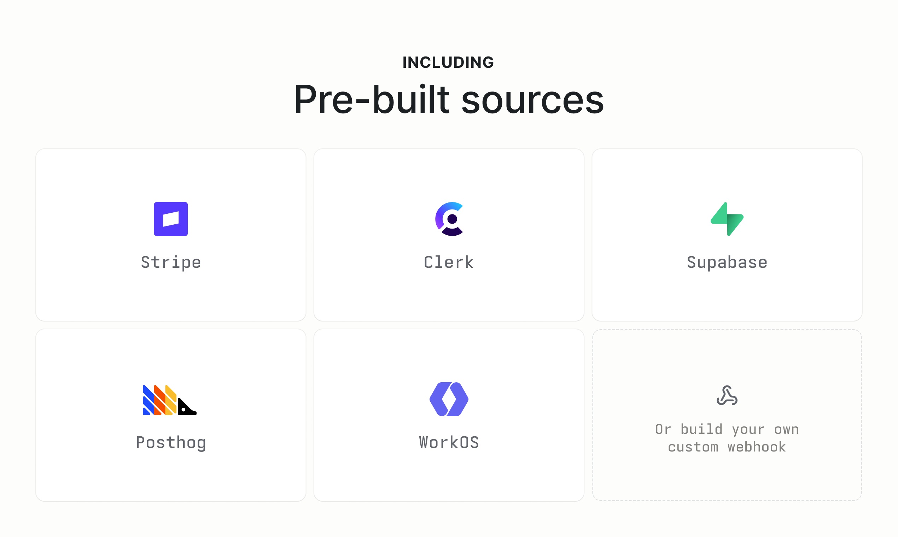

### 🎬 관련 영상
- [🎥 영상 보기](https://ph-files.imgix.net/d36a462b-6892-4f59-ad6d-8a34e2dda414.jpeg?auto=format)

---

## 10. [MiniMax CLI](https://www.producthunt.com/products/minimax)
**Votes**: 109 | **도입 난이도**: 중 | **신뢰도**: 중
**Tagline**: Give your AI agents native multimodal capabilities
**서비스 링크**: https://www.producthunt.com/r/PM55XCDJABHGLZ

**태그**: CLI, AI 에이전트, 멀티모달, 개발 도구, Agent, AI Tool, Video, Vision, Design, DevTool

### 📌 이 서비스 한눈에 보기
MiniMax CLI는 AI 에이전트에게 텍스트, 이미지, 비디오, 음성 등 다양한 멀티모달 기능을 명령줄 인터페이스(CLI)를 통해 제공하여 AI 에이전트 개발을 간편하게 만들어줍니다.

### 🔑 주요 기능
- 다양한 멀티모달 기능 지원 (텍스트, 이미지, 비디오, 음성, 음악, 검색 등)
- 에이전트 중심 설계 (깔끔한 출력, 의미론적 종료 코드, 비동기 작업)
- MiniMax Token Plan과 원활한 통합

### 🙋 사용자에게 어떤 점이 좋은가
AI 에이전트 개발자가 복잡한 API 통합 없이 다양한 멀티모달 기능을 쉽게 활용하여 에이전트의 능력을 향상시키고 개발 시간을 단축할 수 있습니다.

### ✅ 지금 바로 써볼 기능
- CLI 설치 및 설정
- 텍스트-이미지 변환 기능 테스트
- 비동기 작업 실행 및 결과 확인

### ⚠️ 사용 전 확인할 점
- MiniMax Token Plan 사용량에 따른 비용 발생 가능성
- CLI 사용법 숙지 필요

### 🧭 확인이 더 필요한 정보
MiniMax Token Plan의 구체적인 가격 정책 및 CLI의 기능별 사용량 제한에 대한 추가 정보 확인이 필요합니다.

### 📸 스크린샷 및 갤러리
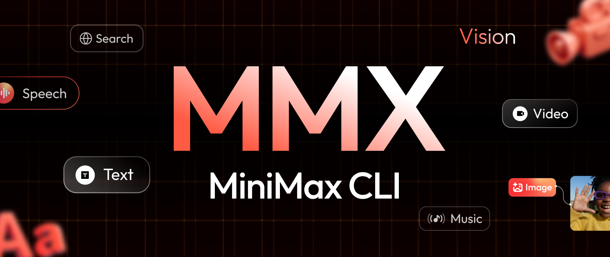
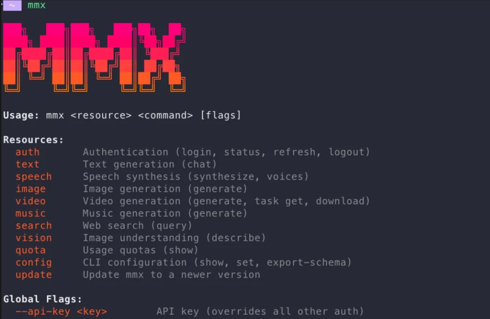
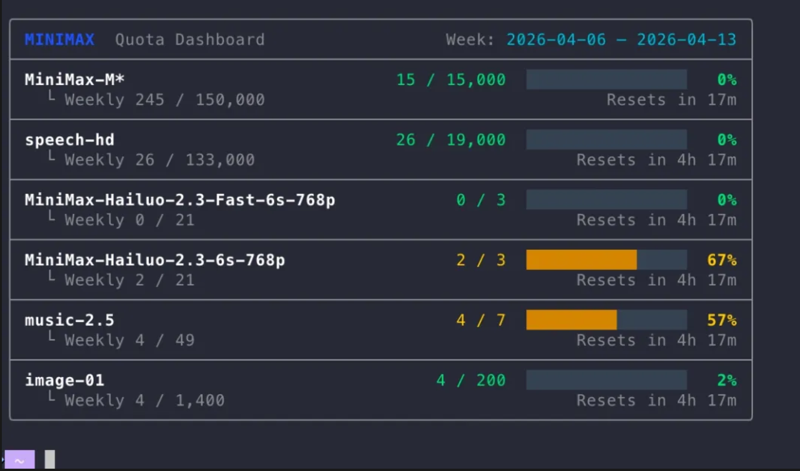

---

