# 🚀 Product Hunt Daily Top 10 (2026-04-13)

## 1. [Interactive Simulations in Gemini](https://www.producthunt.com/products/gemini-6)
**Votes**: 268 | **도입 난이도**: 중 | **신뢰도**: 중
**Tagline**: Gemini now lets you play with the concepts you ask about
**서비스 링크**: https://www.producthunt.com/r/XS63JGHVTSXRSG

**태그**: AI, 시뮬레이션, 3D, 교육, 시각화, Chat

### 📌 이 서비스 한눈에 보기
Gemini가 복잡한 주제를 실시간으로 조작 가능한 3D 시뮬레이션으로 바꿔 보여주어, 텍스트 대신 직접 만져보며 개념을 이해할 수 있습니다.

### 🔑 주요 기능
- Gemini 내에서 바로 3D 시뮬레이션 생성 및 조작 가능
- 복잡한 주제를 시각적으로 이해하도록 도움
- 실시간 인터랙티브 시뮬레이션 제공

### 🙋 사용자에게 어떤 점이 좋은가
더 이상 어려운 개념을 텍스트로만 이해하려 애쓰지 않아도 됩니다. Gemini에게 '보여줘' 또는 '시각화해줘'라고 요청하면 바로 인터랙티브 시뮬레이션을 통해 직관적으로 학습할 수 있습니다.

### ✅ 지금 바로 써볼 기능
- Gemini에게 특정 개념을 '보여줘'라고 요청해보기
- 생성된 3D 시뮬레이션을 직접 조작해보기
- 다양한 복잡한 주제에 대해 시뮬레이션 요청해보기

### ⚠️ 사용 전 확인할 점
- 생성되는 시뮬레이션의 정확도 및 완성도는 Gemini의 성능에 따라 달라질 수 있음
- 모든 주제에 대해 3D 시뮬레이션이 지원되는 것은 아닐 수 있음

### 🧭 확인이 더 필요한 정보
생성되는 시뮬레이션의 활용 범위 및 교육적 효과에 대한 추가적인 사용자 피드백이 필요합니다.

### 📸 스크린샷 및 갤러리
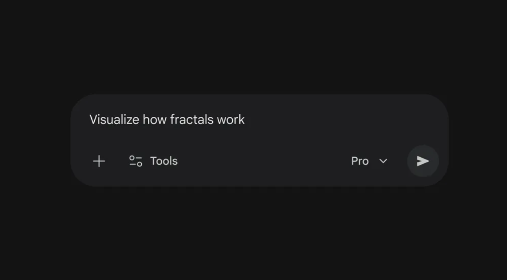
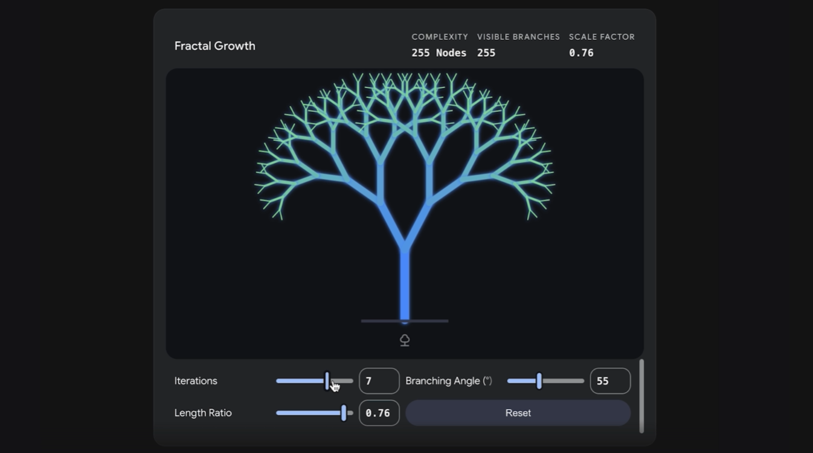
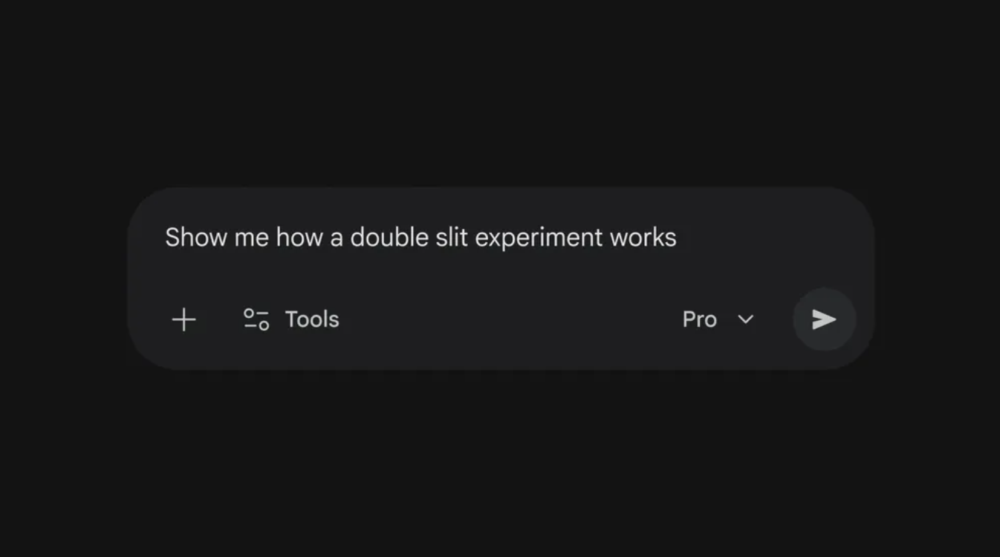

---

## 2. [Music Marketplace by Eleven Labs](https://www.producthunt.com/products/music-marketplace-by-eleven-labs)
**Votes**: 195 | **도입 난이도**: 중 | **신뢰도**: 중
**Tagline**: Create a track. Publish it. Earn when it is used.
**서비스 링크**: https://www.producthunt.com/r/FG6HGARL7HKFLR

**태그**: 음악, 마켓플레이스, 수익화, AI, AI Tool

### 📌 이 서비스 한눈에 보기
Eleven Labs에서 음악 마켓플레이스를 출시하여, 사용자가 직접 만든 트랙을 게시하고 다운로드 또는 리믹스될 때마다 수익을 얻을 수 있도록 합니다.

### 🔑 주요 기능
- 음악 라이선싱의 복잡성을 해결
- 트랙 생성, 게시, 수익 창출의 간편한 과정
- ElevenCreative의 검증된 수익 분배 엔진 활용

### 🙋 사용자에게 어떤 점이 좋은가
음악 창작자는 자신의 창작물을 통해 더 쉽게 수익을 창출하고, 사용자는 더 다양한 음악을 저렴하게 이용할 수 있습니다.

### ✅ 지금 바로 써볼 기능
- 트랙 생성 및 게시
- 수익 분배 설정 확인
- 다른 사용자의 트랙 탐색 및 리믹스

### ⚠️ 사용 전 확인할 점
- 저작권 관련 문제 확인 필요
- 수익 분배 조건 및 수수료 확인 필요

### 🧭 확인이 더 필요한 정보
마켓플레이스의 활성화 정도와 실제 수익 창출 가능성에 대한 추가적인 정보가 필요합니다.

### 📸 스크린샷 및 갤러리
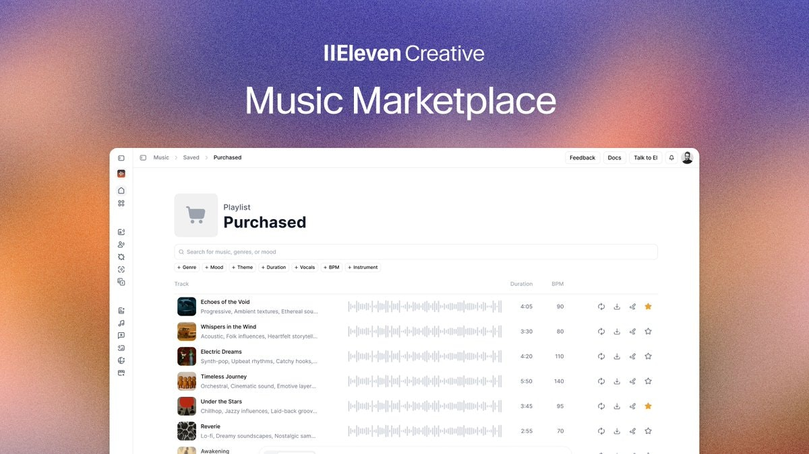
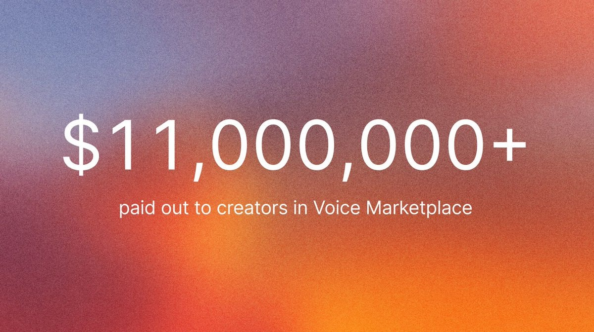

---

## 3. [Ray](https://www.producthunt.com/products/ray-7)
**Votes**: 174 | **도입 난이도**: 중 | **신뢰도**: 중
**Tagline**: Your personal CFO in the terminal
**서비스 링크**: https://www.producthunt.com/r/G3BLEM7JJPJ46U

**태그**: Finance, Terminal, Open Source, CFO, Personal Finance

### 📌 이 서비스 한눈에 보기
Ray는 터미널 기반 개인 CFO로, 실제 거래 내역을 바탕으로 목표를 설정하고 계획을 수립하도록 도와주는 오픈소스 도구입니다.

### 🔑 주요 기능
- 터미널 기반으로 작동하여 개인 정보 보호에 강점
- 실제 거래 데이터를 분석하여 맞춤형 재정 계획 제공
- 오픈 소스이며 무료로 사용 가능

### 🙋 사용자에게 어떤 점이 좋은가
기존 금융 앱들이 차트만 보여주는 것과 달리, Ray는 사용자가 실제로 무엇을 해야 하는지 알려주고 재정 계획을 수립하도록 돕습니다. 개인 데이터를 안전하게 관리하면서 재정 관리를 자동화할 수 있습니다.

### ✅ 지금 바로 써볼 기능
- Ray를 설치하고 개인 금융 계정 연결하기
- 재정 목표 설정하고 Ray의 추천 계획 확인하기
- 오픈 소스 커뮤니티에 참여하여 기능 개선에 기여하기

### ⚠️ 사용 전 확인할 점
- 터미널 환경에 익숙하지 않은 사용자는 사용이 어려울 수 있음
- 초기 설정 및 데이터 연동 과정이 필요함

### 🧭 확인이 더 필요한 정보
Ray가 지원하는 금융 기관 및 데이터 연동 방식에 대한 추가 확인이 필요합니다.

### 📸 스크린샷 및 갤러리
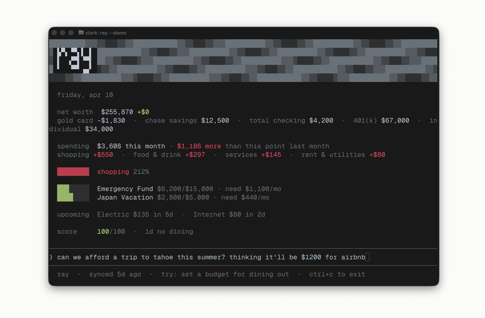

### 🎬 관련 영상
- [🎥 영상 보기](https://ph-files.imgix.net/32659fa6-0496-43e1-97dc-2465e59c841b.jpeg?auto=format)

---

## 4. [R0Y](https://www.producthunt.com/products/r0y-ai-financial-studio)
**Votes**: 162 | **도입 난이도**: 중 | **신뢰도**: 중
**Tagline**: Natural language to Investing dashboards in seconds.
**서비스 링크**: https://www.producthunt.com/r/DSEDKDA63PJNEZ

**태그**: 금융, 데이터 분석, 자동화, 투자, No-code, AI Tool, DevTool

### 📌 이 서비스 한눈에 보기
R0Y는 자연어 기반 금융 스튜디오로, 투자 대시보드를 즉시 구축하여 데이터 분석, 예측, 백테스팅 등을 코딩 없이 가능하게 합니다.

### 🔑 주요 기능
- 자연어 기반으로 투자 대시보드 즉시 생성
- 수억 개의 데이터 포인트를 연결하여 실시간 분석 제공
- 팀 협업 및 대시보드 공유 기능 지원

### 🙋 사용자에게 어떤 점이 좋은가
R0Y를 사용하면 코딩이나 템플릿 없이도 투자 전략 모델링, 거시 경제 분석, 백테스팅 등을 간편하게 수행하고, 팀원들과 결과를 공유하며 협업할 수 있습니다.

### ✅ 지금 바로 써볼 기능
- 자연어로 원하는 투자 분석 요청해보기
- 생성된 대시보드를 팀원과 공유해보기
- 다양한 데이터 포인트를 활용하여 투자 전략 모델링 시도해보기

### ⚠️ 사용 전 확인할 점
- 데이터의 정확성 및 최신성을 확인해야 함
- 자체적인 투자 판단은 지양하고 참고 자료로 활용 권장

### 🧭 확인이 더 필요한 정보
제공되는 데이터의 출처 및 업데이트 주기를 확인하는 것이 중요합니다.

### 📸 스크린샷 및 갤러리
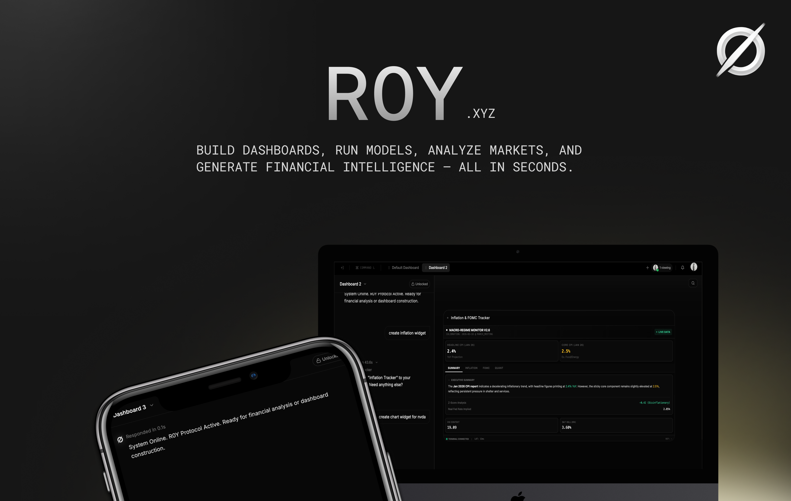
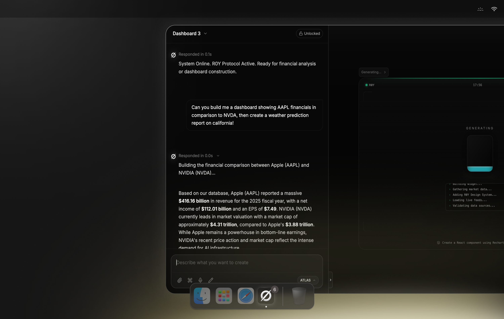
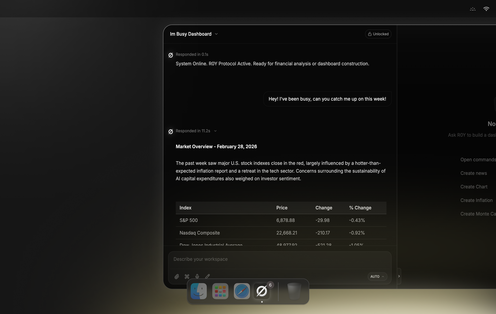

### 🎬 관련 영상
- [🎥 영상 보기](https://ph-files.imgix.net/e07ff959-723c-4618-a9e0-4241e993d730.jpeg?auto=format)

---

## 5. [Layered](https://www.producthunt.com/products/layered-2)
**Votes**: 125 | **도입 난이도**: 중 | **신뢰도**: 중
**Tagline**: Turn your selfies into a personal AI stylist
**서비스 링크**: https://www.producthunt.com/r/JEPNNIS2C3DUQE

**태그**: AI, 패션, 스타일, 옷장관리, AI Tool

### 📌 이 서비스 한눈에 보기
셀카를 기반으로 개인 AI 스타일리스트를 만들어 옷장 관리, 스타일 추천, 여행 짐 싸기까지 도와주는 서비스

### 🔑 주요 기능
- 셀카를 분석하여 옷장을 자동으로 구축
- 소유한 옷을 기반으로 데일리 스타일 추천
- 여행 목적지, 날씨, 짐 크기에 맞는 여행 캡슐 제공

### 🙋 사용자에게 어떤 점이 좋은가
옷장 정리 및 스타일링 고민을 덜어주고, 옷의 활용도를 높여줍니다. 홈 화면 위젯으로 매일 코디를 확인할 수 있어 편리합니다.

### ✅ 지금 바로 써볼 기능
- 셀카를 업로드하여 옷장을 생성
- 데일리 스타일 추천 받기
- 여행 계획을 세우고 여행 캡슐 생성하기

### ⚠️ 사용 전 확인할 점
- 셀카 품질에 따라 옷장 인식 정확도가 달라질 수 있음
- AI 스타일 추천이 개인 취향과 다를 수 있음

### 🧭 확인이 더 필요한 정보
AI 스타일 추천의 정확도 및 사용자 만족도에 대한 추가적인 사용 후기 확인이 필요합니다.

### 📸 스크린샷 및 갤러리

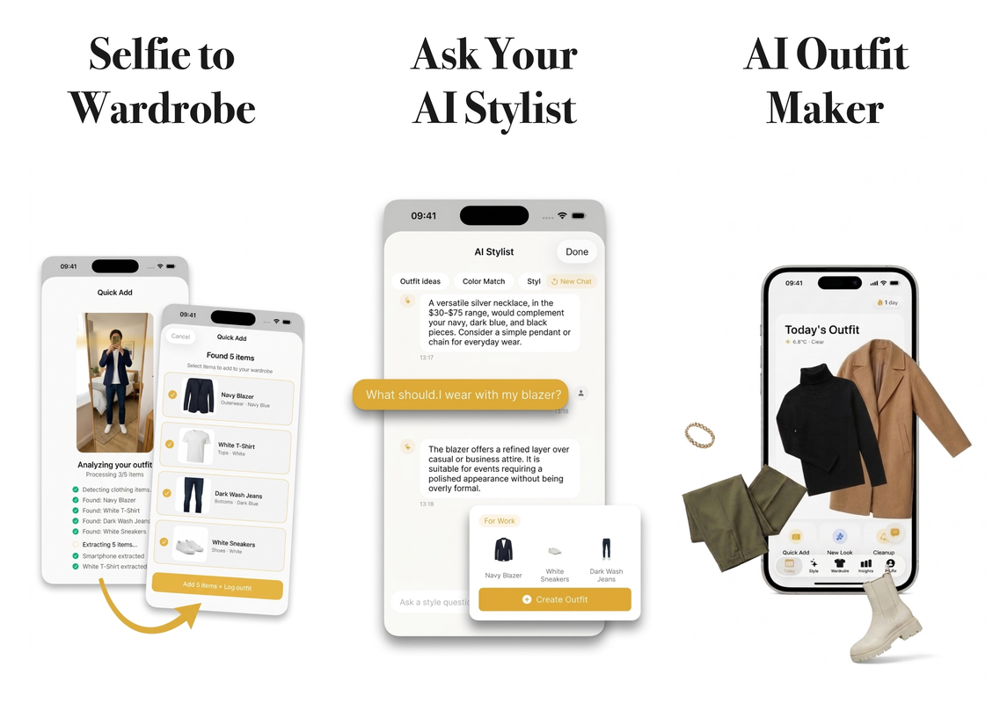
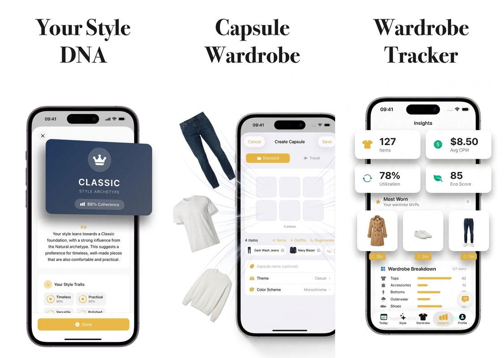

---

## 6. [ClarifierAI for IOS](https://www.producthunt.com/products/clarifierai-rewrite-text-2)
**Votes**: 124 | **도입 난이도**: 하 | **신뢰도**: 중
**Tagline**: Use AI for writing & translating your messages 10x faster
**서비스 링크**: https://www.producthunt.com/r/4F2SD47CRIE4JX

**태그**: AI, 생산성, 번역, 키보드, iOS, AI Tool

### 📌 이 서비스 한눈에 보기
ClarifierAI는 아이폰 키보드 앱으로, AI를 활용해 메시지 작성 및 번역 속도를 10배 향상시켜 생산성을 높여줍니다.

### 🔑 주요 기능
- AI 기반 메시지 명확화 기능
- 113개 언어 번역 지원
- 모든 앱에서 사용 가능한 키보드

### 🙋 사용자에게 어떤 점이 좋은가
Gmail, LinkedIn, iMessage 등 다양한 앱에서 메시지를 더 명확하게 작성하고 번역하여 커뮤니케이션 효율성을 높일 수 있습니다.

### ✅ 지금 바로 써볼 기능
- ClarifierAI 키보드 설치 및 활성화
- 메시지 작성 시 AI 명확화 기능 사용
- 필요한 언어로 번역 기능 활용

### ⚠️ 사용 전 확인할 점
- AI 기능의 정확도 확인 필요
- 개인 정보 처리 방침 확인

### 🧭 확인이 더 필요한 정보
AI 기반 명확화 기능의 성능은 사용자의 문장 스타일과 복잡성에 따라 달라질 수 있습니다.

### 📸 스크린샷 및 갤러리

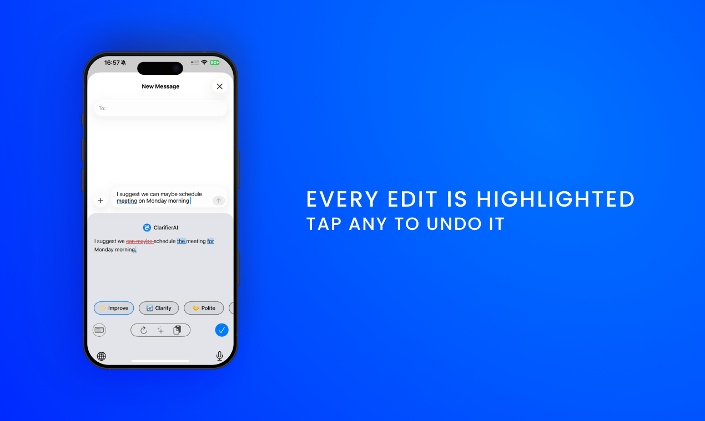

### 🎬 관련 영상
- [🎥 영상 보기](https://ph-files.imgix.net/44973cb3-db03-43e9-9437-41c88a00b154.gif?auto=format)

---

## 7. [Edgee Codex Compressor](https://www.producthunt.com/products/edgee)
**Votes**: 119 | **도입 난이도**: 중 | **신뢰도**: 중
**Tagline**: Use Codex at 35.6% lower costs
**서비스 링크**: https://www.producthunt.com/r/Z556YL2S7RXN7P

**태그**: DevTool, Compression, Codex, CostSaving, Automation, AI Tool

### 📌 이 서비스 한눈에 보기
Edgee Codex Compressor는 Codex 사용 비용을 35.6% 절감시켜주는 솔루션입니다. 입력 토큰 감소, 캐시 적중률 향상 등을 통해 Codex를 더 효율적으로 만들어줍니다.

### 🔑 주요 기능
- Codex 사용 비용 35.6% 절감
- 입력 토큰 49.5% 감소
- 캐시 적중률 76.1%에서 85.4%로 향상

### 🙋 사용자에게 어떤 점이 좋은가
Codex를 사용하는 개발자는 Edgee를 통해 비용을 절감하고 효율성을 높일 수 있습니다. 특히, 토큰 사용량에 민감한 경우 유용합니다.

### ✅ 지금 바로 써볼 기능
- Edgee Codex Compressor 연동 방법 확인
- Codex 사용량 및 비용 분석
- Edgee 적용 전후 성능 비교

### ⚠️ 사용 전 확인할 점
- Edgee 연동 과정에서 발생할 수 있는 호환성 문제 확인
- 압축 과정에서 발생할 수 있는 정보 손실 가능성 검토

### 🧭 확인이 더 필요한 정보
실제 사용 환경에 따른 비용 절감 효과는 달라질 수 있으므로, 자체적인 테스트를 통해 확인하는 것이 좋습니다.

### 📸 스크린샷 및 갤러리

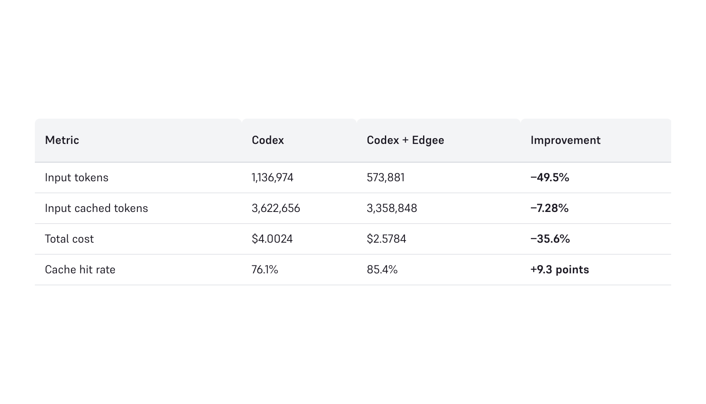

### 🎬 관련 영상
- [🎥 영상 보기](https://ph-files.imgix.net/148b756c-3e61-4daa-9368-92be7de0d90a.jpeg?auto=format)

---

## 8. [Nicelydone MCP](https://www.producthunt.com/products/nicely-done)
**Votes**: 113 | **도입 난이도**: 중 | **신뢰도**: 중
**Tagline**: Design context for AI agents
**서비스 링크**: https://www.producthunt.com/r/UYVNHPGPMLBRIH

**태그**: AI, 디자인, UI, 개발 도구, Agent, AI Tool, Design, DevTool

### 📌 이 서비스 한눈에 보기
Nicelydone MCP는 AI 에이전트가 실제 제품의 UI 디자인 맥락을 이해하도록 돕는 도구로, 14만 개 이상의 실제 화면, 사용자 흐름, UI 컴포넌트 데이터베이스에 접근 권한을 제공하여 AI가 생성하는 페이지의 디자인 품질을 향상시킵니다.

### 🔑 주요 기능
- 14만 개 이상의 실제 제품 UI 데이터베이스 제공
- Claude, Cursor, VS Code 등 다양한 도구와 연동
- AI 에이전트의 디자인 이해도 향상

### 🙋 사용자에게 어떤 점이 좋은가
AI 에이전트가 생성하는 결과물의 디자인이 획일적이지 않고 실제 제품과 유사한 수준으로 향상되어 사용자 경험을 개선하고, 개발 시간을 단축할 수 있습니다.

### ✅ 지금 바로 써볼 기능
- Claude와 연동하여 AI가 생성하는 디자인 개선
- Cursor 또는 VS Code에서 UI 컴포넌트 검색 및 활용
- 제공되는 UI 데이터베이스 탐색

### ⚠️ 사용 전 확인할 점
- 제공되는 UI 데이터베이스의 최신성 확인 필요
- 특정 산업 또는 디자인 트렌드에 편향되었을 가능성 고려

### 🧭 확인이 더 필요한 정보
제공되는 UI 데이터베이스의 업데이트 빈도 및 데이터 수집 기준에 대한 추가 정보가 필요합니다.

### 📸 스크린샷 및 갤러리
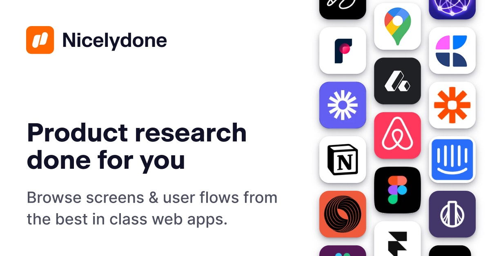
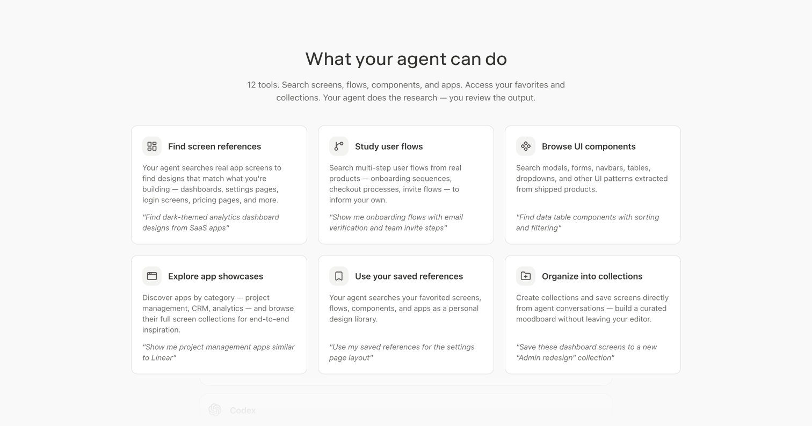
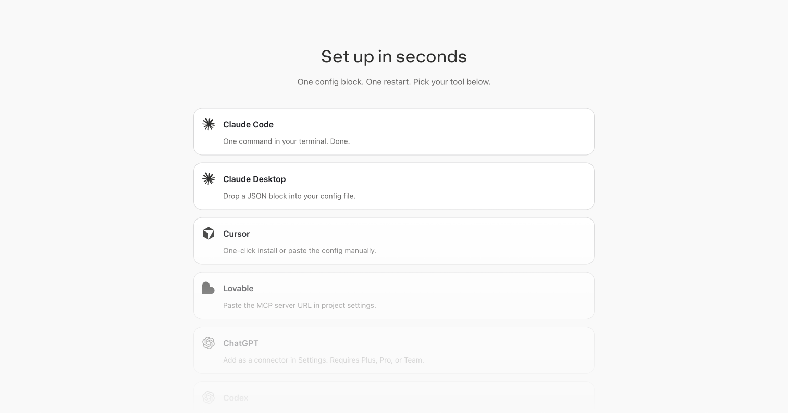

---

## 9. [LLM-Citeops](https://www.producthunt.com/products/llm-citeops)
**Votes**: 13 | **도입 난이도**: 중 | **신뢰도**: 중
**Tagline**: Fix 60% scores of AEO and GEO scores without single penny. 
**서비스 링크**: https://www.producthunt.com/r/HOSO43BGONVKNE

**태그**: DevTool, CLI, SEO, AI, Automation, AI Tool, LLM

### 📌 이 서비스 한눈에 보기
LLM-Citeops는 Node.js 기반 무료 CLI 도구로, 웹 페이지의 AEO(Answer-ready Content) 및 GEO(AI Trust) 점수를 측정하여 콘텐츠 품질을 개선하고 CI 환경에서 점수 하락을 방지합니다.

### 🔑 주요 기능
- 무료 Node.js CLI 도구
- AEO 및 GEO 점수 측정으로 콘텐츠 최적화
- HTML, JSON, CSV 형식으로 결과 출력

### 🙋 사용자에게 어떤 점이 좋은가
웹 페이지 콘텐츠가 AI 검색에 적합한지 평가하고, 신뢰도를 높여 사용자 만족도를 향상시킬 수 있습니다. 특히, 콘텐츠 품질 관리를 자동화하여 지속적인 개선을 가능하게 합니다.

### ✅ 지금 바로 써볼 기능
- CLI 설치 및 간단한 웹 페이지 테스트
- CI 환경에 통합하여 점수 변화 모니터링
- 결과를 바탕으로 콘텐츠 개선

### ⚠️ 사용 전 확인할 점
- Node.js 환경 필요
- AEO/GEO 점수 기준에 대한 이해 필요

### 🧭 확인이 더 필요한 정보
AEO 및 GEO 점수가 실제 사용자 경험과 콘텐츠 품질을 얼마나 정확하게 반영하는지 추가적인 검증이 필요합니다.

### 📸 스크린샷 및 갤러리
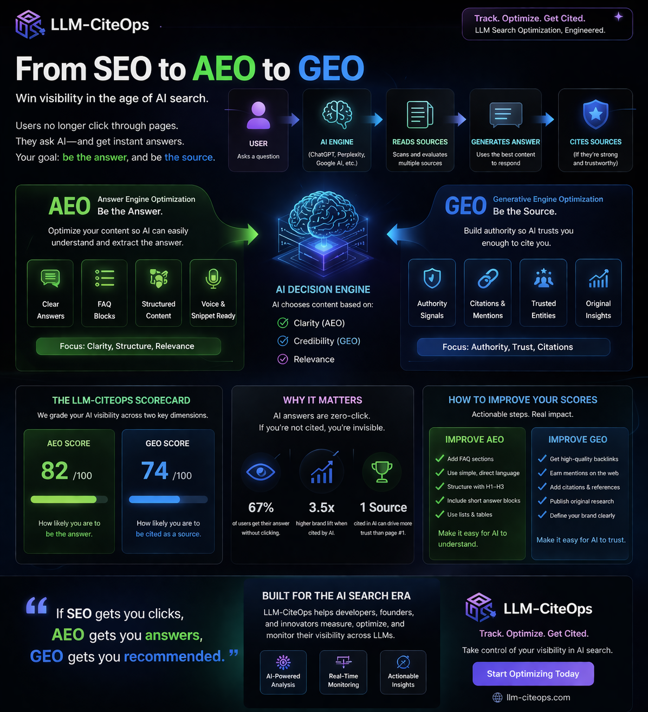
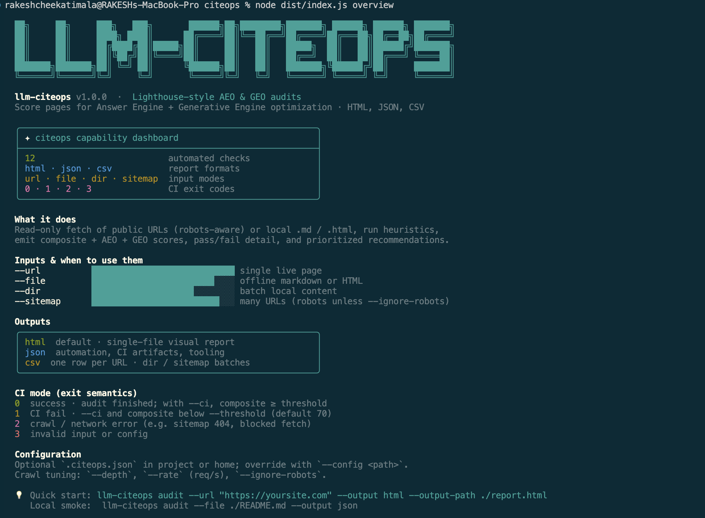
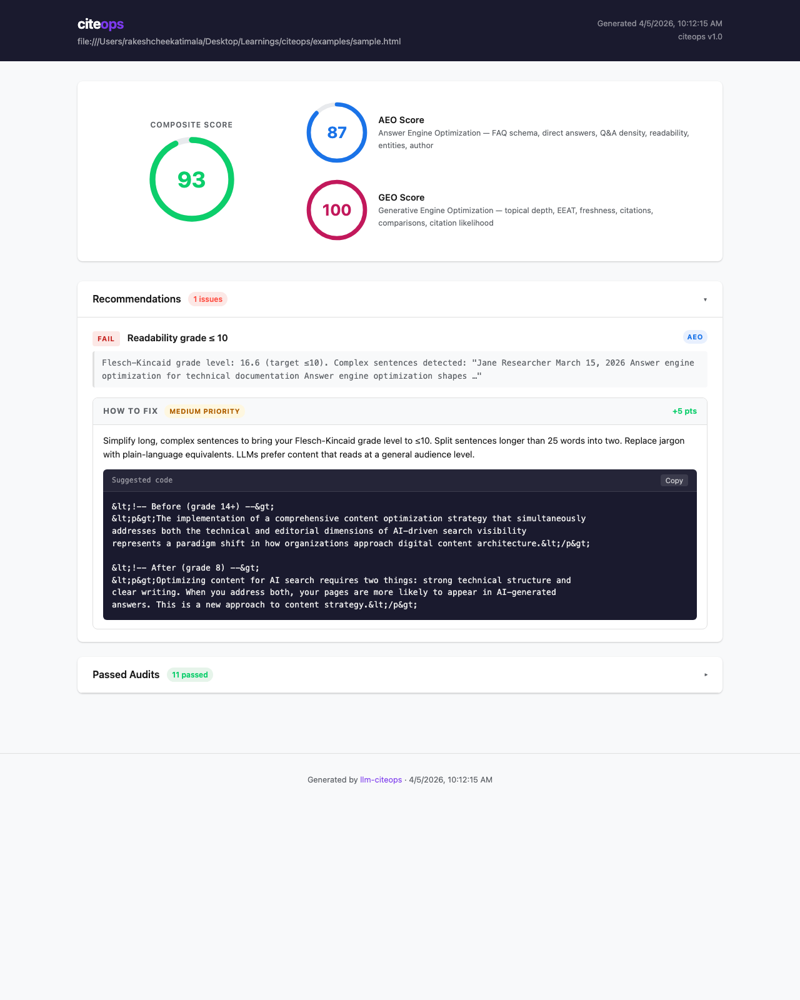

---

## 10. [ARCH](https://www.producthunt.com/products/arch-4)
**Votes**: 9 | **도입 난이도**: 중 | **신뢰도**: 중
**Tagline**: Design production‑grade cloud architecture in your browser
**서비스 링크**: https://www.producthunt.com/r/QXDT6WJ33GVO5O

**태그**: 클라우드, 아키텍처, 다이어그램, 시각화, DevTool, Design

### 📌 이 서비스 한눈에 보기
ARCH는 브라우저에서 클라우드 아키텍처를 설계하고 시각화할 수 있는 로컬 우선 도구로, 다양한 클라우드 공급자의 구성 요소를 드래그 앤 드롭하여 다이어그램을 만들고, JSON, YAML, Terraform 등의 코드를 시각화합니다.

### 🔑 주요 기능
- AWS, Azure, GCP 등 다양한 클라우드 공급자 지원
- JSON, YAML, Terraform 코드 시각화 기능
- 브라우저 기반으로 오프라인 사용 가능 및 데이터 로컬 저장

### 🙋 사용자에게 어떤 점이 좋은가
클라우드 아키텍처를 쉽게 설계하고 시각화하여 협업 및 문서화 효율성을 높일 수 있으며, 코드를 기반으로 아키텍처를 빠르게 이해할 수 있도록 돕습니다.

### ✅ 지금 바로 써볼 기능
- 다양한 클라우드 공급자의 구성 요소를 드래그 앤 드롭하여 아키텍처 다이어그램 생성
- JSON, YAML, Terraform 코드를 업로드하여 시각화된 아키텍처 확인
- 생성된 다이어그램을 PNG, SVG, PDF 형식으로 내보내기

### ⚠️ 사용 전 확인할 점
- 브라우저 기반이므로 지원되는 브라우저 및 IndexedDB 호환성 확인 필요
- 복잡한 아키텍처의 경우 브라우저 성능에 따라 로딩 속도가 느려질 수 있음

### 🧭 확인이 더 필요한 정보
지원하는 클라우드 공급자의 구성 요소 종류 및 업데이트 주기를 확인해야 합니다.

### 📸 스크린샷 및 갤러리
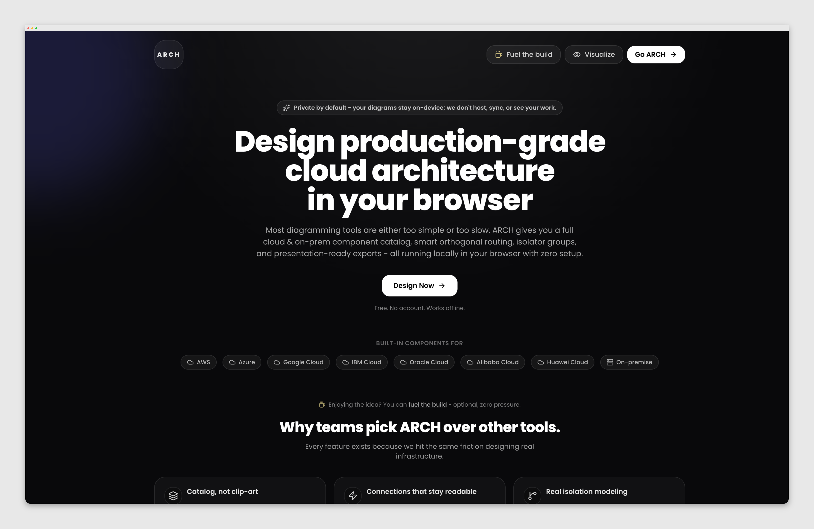

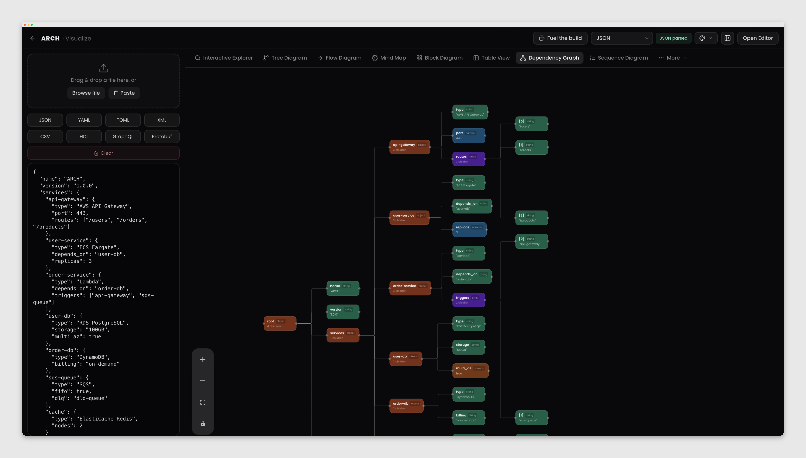

---

