# 🚀 Product Hunt Daily Top 10 (2026-04-14)

## 1. [Krisp Accent Converter for YouTube](https://www.producthunt.com/products/krisp)
**Votes**: 270 | **도입 난이도**: 하 | **신뢰도**: 중
**Tagline**: YouTube, but you clearly understand everyone
**서비스 링크**: https://www.producthunt.com/r/RWA2FSWMDYUCOD

**태그**: Chrome 확장 프로그램, AI, YouTube, 접근성, AI Tool

### 📌 이 서비스 한눈에 보기
YouTube 시청 시 모든 억양을 명확하게 이해할 수 있도록 도와주는 Chrome 확장 프로그램입니다.

### 🔑 주요 기능
- YouTube 억양 조절 기능 추가
- 무료 Chrome 확장 프로그램
- 온디바이스 AI 사용

### 🙋 사용자에게 어떤 점이 좋은가
더 이상 억양 때문에 YouTube 영상을 이해하는 데 어려움을 겪지 않아도 됩니다. 클릭 한 번으로 모든 억양을 쉽게 이해할 수 있습니다.

### ✅ 지금 바로 써볼 기능
- Chrome 확장 프로그램 설치
- YouTube 영상 시청 시 억양 변환 토글 활성화
- 다양한 억양의 영상 시청

### ⚠️ 사용 전 확인할 점
- 온디바이스 AI 성능에 따른 변환 품질 차이
- 지원되는 억양 종류 확인 필요

### 🧭 확인이 더 필요한 정보
어떤 AI 모델을 사용하는지, 지원하는 억양이 무엇인지 추가 정보가 필요합니다.

### 📸 스크린샷 및 갤러리
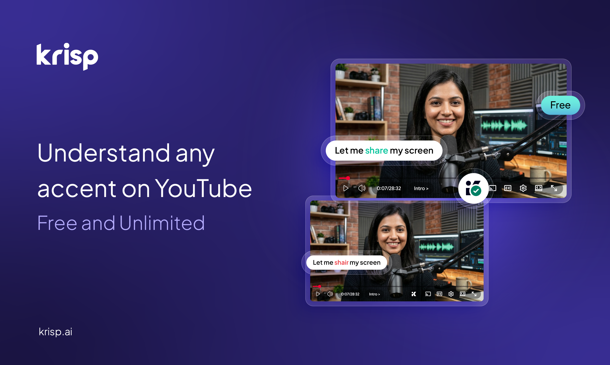
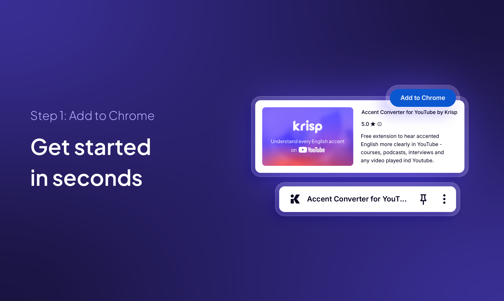

### 🎬 관련 영상
- [🎥 영상 보기](https://ph-files.imgix.net/f764848c-f64b-464c-86c1-c0fce6c489fe.jpeg?auto=format)

---

## 2. [Luma Agents](https://www.producthunt.com/products/luma-agents)
**Votes**: 221 | **도입 난이도**: 중 | **신뢰도**: 중
**Tagline**: Agents that plan, iterate, + refine w/ full creative context
**서비스 링크**: https://www.producthunt.com/r/TXIRNJSUIJ7L2A

**태그**: AI, 콘텐츠 제작, 자동화, 마케팅, 생산성, Agent, AI Tool, Video, Vision

### 📌 이 서비스 한눈에 보기
Luma Agents는 비디오, 이미지, 오디오를 아우르는 AI 에이전트로, 브랜드 캠페인, 제품 시각 자료, 소셜 광고, 비디오 현지화 등 창작 작업 전반을 자동화하여 팀 생산성을 높여줍니다.

### 🔑 주요 기능
- AI 에이전트가 기획, 생성, 반복 작업을 자동 수행
- 비디오, 이미지, 오디오 등 다양한 형식 지원
- 브랜드 캠페인, 제품 시각 자료, 소셜 광고 등에 활용 가능

### 🙋 사용자에게 어떤 점이 좋은가
창작 팀과 에이전시가 콘텐츠 제작 워크플로우를 간소화하고, 일관된 브랜드 경험을 제공하는 데 도움이 됩니다. 반복적인 작업을 자동화하여 창작자들이 더 창의적인 작업에 집중할 수 있도록 지원합니다.

### ✅ 지금 바로 써볼 기능
- 브랜드 캠페인 기획에 활용해보기
- 제품 시각 자료 자동 생성해보기
- 소셜 광고 콘텐츠 제작에 적용해보기

### ⚠️ 사용 전 확인할 점
- AI가 생성한 콘텐츠의 품질을 검토해야 함
- 특정 창작 스타일에 대한 적응이 필요할 수 있음

### 🧭 확인이 더 필요한 정보
AI 에이전트의 창작물 품질과 사용 편의성에 대한 사용자 피드백을 추가적으로 확인해야 합니다.

### 📸 스크린샷 및 갤러리
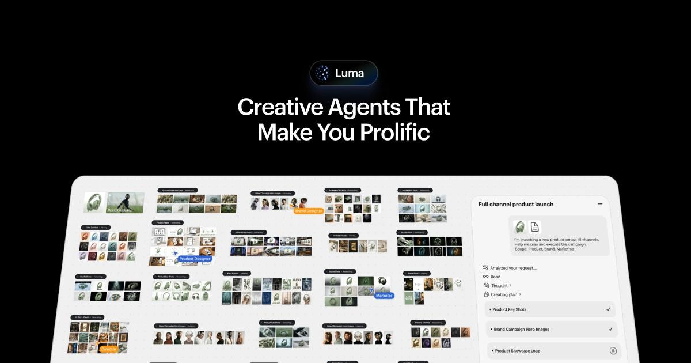
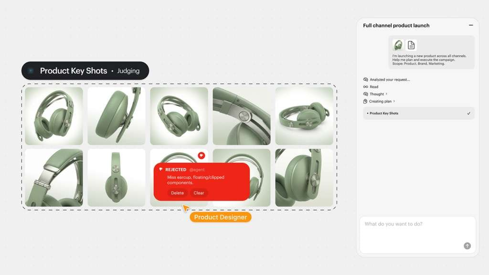
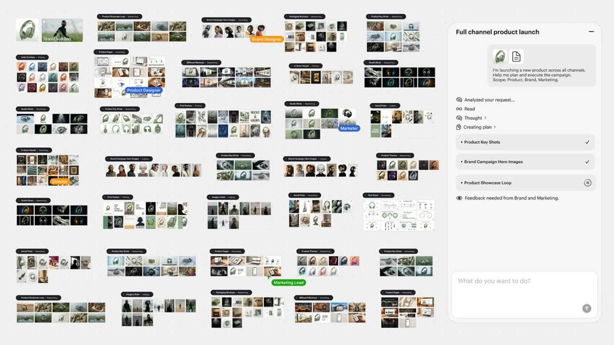

### 🎬 관련 영상
- [🎥 영상 보기](https://ph-files.imgix.net/914a87ec-b349-4c60-8396-513d87094246.jpeg?auto=format)

---

## 3. [Cleo Labs](https://www.producthunt.com/products/cleo-labs)
**Votes**: 202 | **도입 난이도**: 중 | **신뢰도**: 중
**Tagline**: Automate global compliance  for selling physical products
**서비스 링크**: https://www.producthunt.com/r/AHD3EZDTM22CHD

**태그**: 규정 준수, 자동화, AI, 글로벌 판매, 물류, Agent, AI Tool, Chat

### 📌 이 서비스 한눈에 보기
Cleo Labs는 물리적 제품을 전 세계에 판매할 때 발생하는 복잡한 규정 준수 문제를 자동화하여 시간과 비용을 절약해주는 AI 기반 솔루션입니다.

### 🔑 주요 기능
- 106개국 19,000개 이상의 기관 데이터를 스캔하는 AI 파이프라인(MARIA) 활용
- 법률 전문가가 검증한 정확한 규정 준수 정보 제공
- 제품 판매 시 필요한 규제 환경 자동 매핑

### 🙋 사용자에게 어떤 점이 좋은가
국가별로 상이한 규정을 일일이 확인하는 번거로움 없이, Cleo Labs를 통해 규정 준수 여부를 간편하게 확인하고 글로벌 판매를 확대할 수 있습니다.

### ✅ 지금 바로 써볼 기능
- 제품 정보를 입력하여 관련 규정 자동 매핑 시작
- 특정 국가 판매 시 필요한 인증 및 라벨링 정보 확인
- 법률 전문가의 검증된 정보로 규정 준수 리스크 최소화

### ⚠️ 사용 전 확인할 점
- AI 기반이므로, 제공되는 정보의 최신성 및 정확성을 주기적으로 확인 필요
- 특정 산업 분야 또는 매우 복잡한 제품의 경우, 추가적인 법률 자문 필요

### 🧭 확인이 더 필요한 정보
Cleo Labs가 제공하는 정보의 업데이트 주기 및 정확도에 대한 추가적인 정보 확인이 필요합니다.

### 📸 스크린샷 및 갤러리
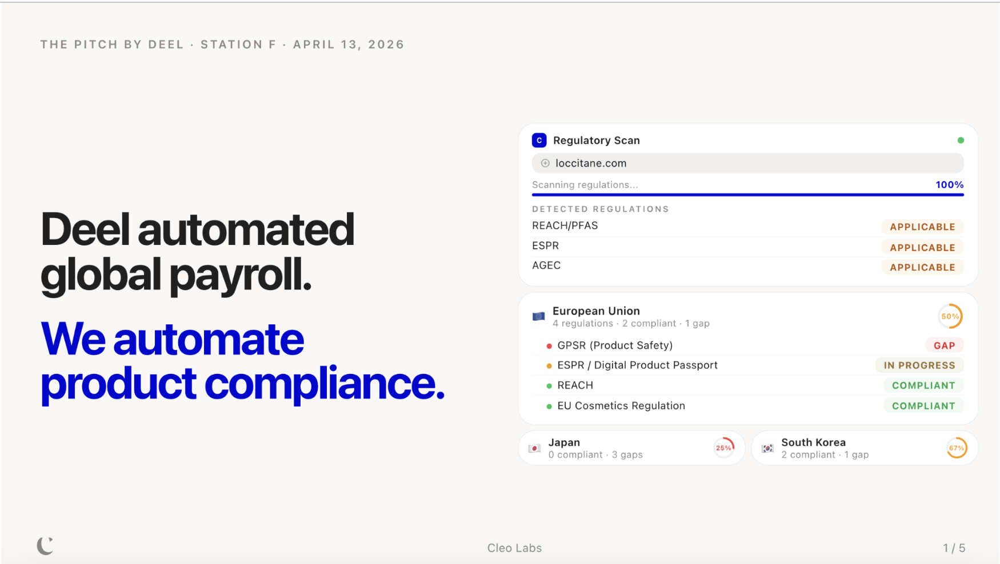
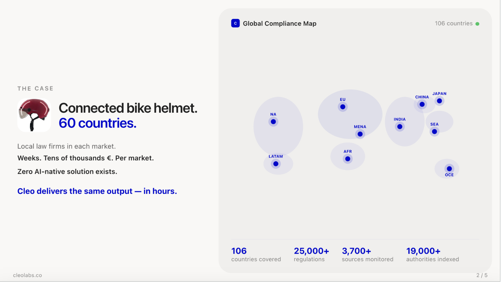
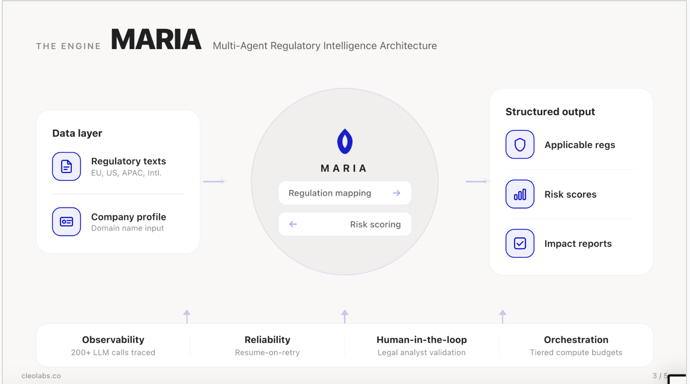

---

## 4. [ContextPool](https://www.producthunt.com/products/contextpool)
**Votes**: 146 | **도입 난이도**: 중 | **신뢰도**: 중
**Tagline**: Persistent memory for AI coding agents
**서비스 링크**: https://www.producthunt.com/r/2GYRK34MXQMSIE

**태그**: DevTool, AI, 자동화, 생산성, Agent, AI Tool, Prompting, Design

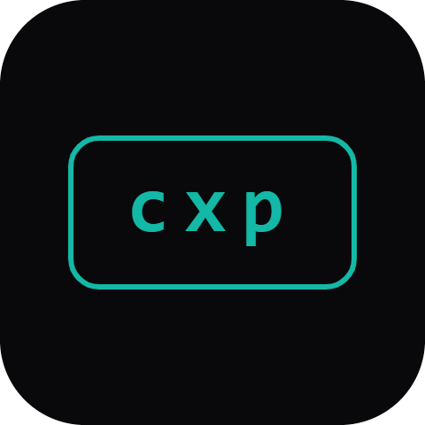

### 📌 이 서비스 한눈에 보기
ContextPool은 AI 코딩 에이전트가 과거 코딩 세션에서 얻은 정보를 기억하고 활용하여 매번 처음부터 시작할 필요 없이 효율적인 코딩을 가능하게 합니다.

### 🔑 주요 기능
- AI 코딩 에이전트에게 지속적인 메모리 제공
- 과거 Cursor 및 Claude Code 세션 스캔 및 엔지니어링 인사이트 추출
- 세션 시작 시 관련 컨텍스트 자동 로드 (프롬프트 불필요)

### 🙋 사용자에게 어떤 점이 좋은가
ContextPool을 사용하면 AI 코딩 에이전트가 과거의 경험을 바탕으로 더 빠르고 정확하게 코딩 작업을 수행할 수 있어 개발 효율성을 높일 수 있습니다. 또한, 동일한 오류를 반복적으로 디버깅하거나 이미 내린 결정을 다시 설명할 필요가 없어 시간을 절약할 수 있습니다.

### ✅ 지금 바로 써볼 기능
- Cursor 또는 Claude Code와 연동하여 사용해보기
- 과거 코딩 세션을 스캔하여 인사이트 추출해보기
- 무료 및 오픈 소스 버전을 사용해보고 팀 협업 기능이 필요하면 유료 버전 고려해보기

### ⚠️ 사용 전 확인할 점
- Claude code, Cursor, Windsurf, Kiro에서만 작동합니다.
- 과거 세션 데이터의 품질에 따라 인사이트 정확도가 달라질 수 있습니다.

### 🧭 확인이 더 필요한 정보
ContextPool이 실제로 코딩 효율성을 얼마나 향상시키는지 사용자 리뷰를 통해 확인하는 것이 좋습니다.

### 📸 스크린샷 및 갤러리
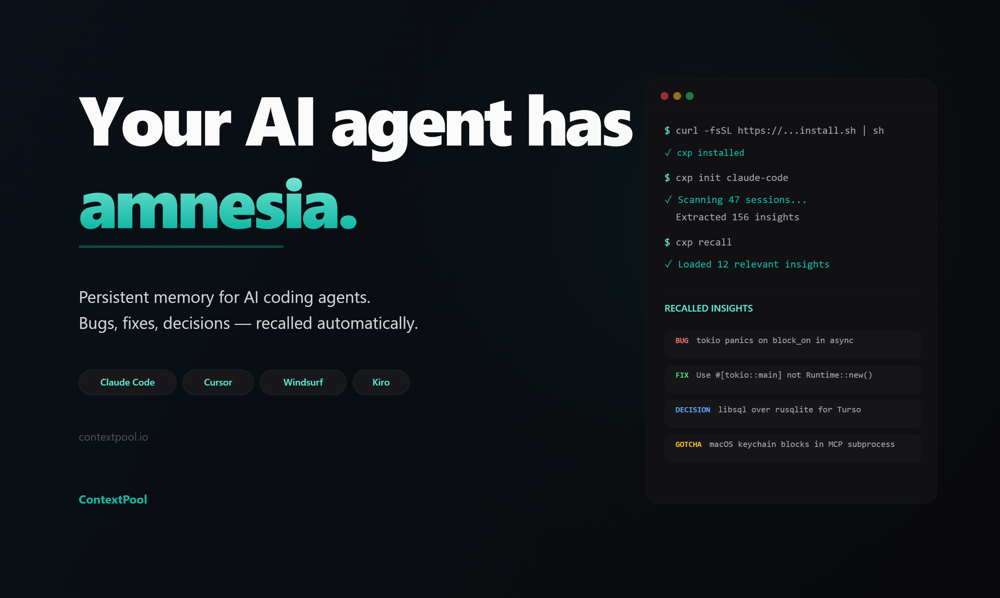
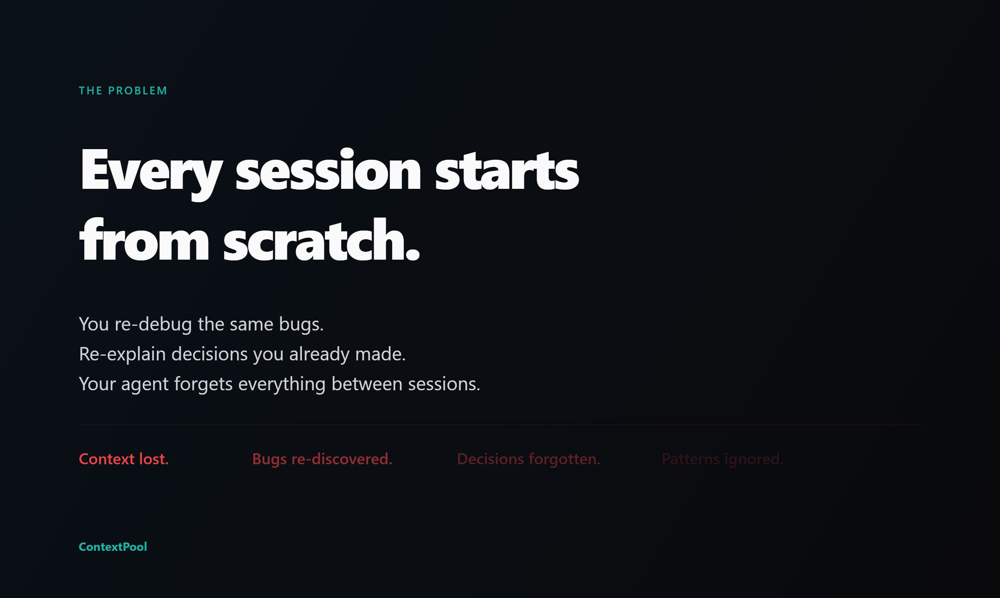
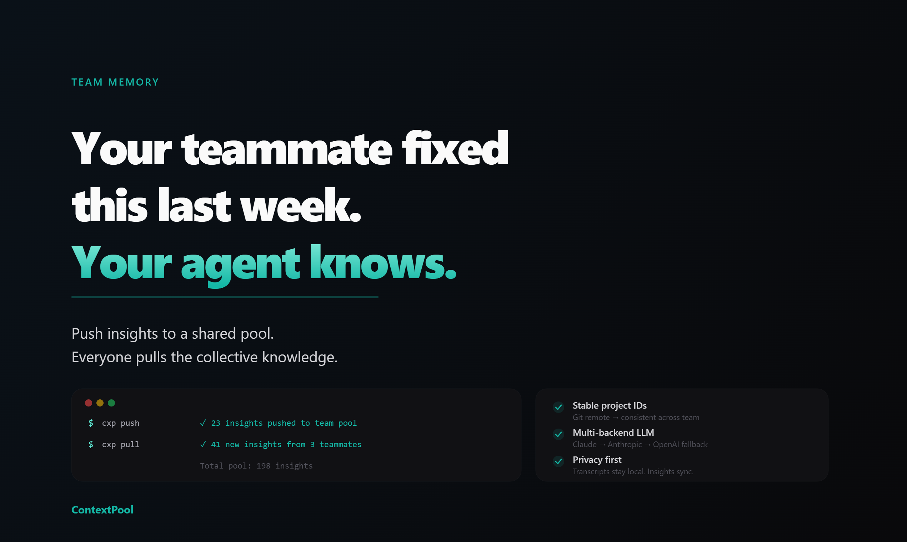

---

## 5. [Skills Janitor](https://www.producthunt.com/products/skills-janitor)
**Votes**: 140 | **도입 난이도**: 중 | **신뢰도**: 중
**Tagline**: Find which Claude Code skills you actually use
**서비스 링크**: https://www.producthunt.com/r/JCQPY7HBWEOUUQ

**태그**: DevTool, Automation, Analytics

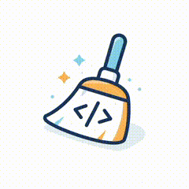

### 📌 이 서비스 한눈에 보기
Skills Janitor는 Claude Code 스킬을 감사, 중복 제거, 정리, 수정 및 추적하여 실제로 사용하는 스킬을 찾아주는 무료 오픈 소스 도구입니다.

### 🔑 주요 기능
- Claude Code 스킬의 문제점, 중복, 미사용 스킬을 파악
- 9가지 명령어를 통해 코드 스킬 관리 자동화
- 무료 및 오픈 소스로 제공

### 🙋 사용자에게 어떤 점이 좋은가
Claude Code 스킬을 효율적으로 관리하고 불필요한 스킬을 제거하여 코드베이스를 깔끔하게 유지할 수 있습니다.

### ✅ 지금 바로 써볼 기능
- 코드 스킬 감사 기능으로 문제점 파악
- 중복 제거 기능으로 코드 정리
- 미사용 스킬 추적 기능으로 불필요한 스킬 제거

### ⚠️ 사용 전 확인할 점
- Claude Code 스킬에 대한 이해도가 필요
- 명령어 사용법 숙지가 필요

### 🧭 확인이 더 필요한 정보
Claude Code 스킬의 종류와 사용량에 따라 효과가 달라질 수 있습니다.

### 📸 스크린샷 및 갤러리
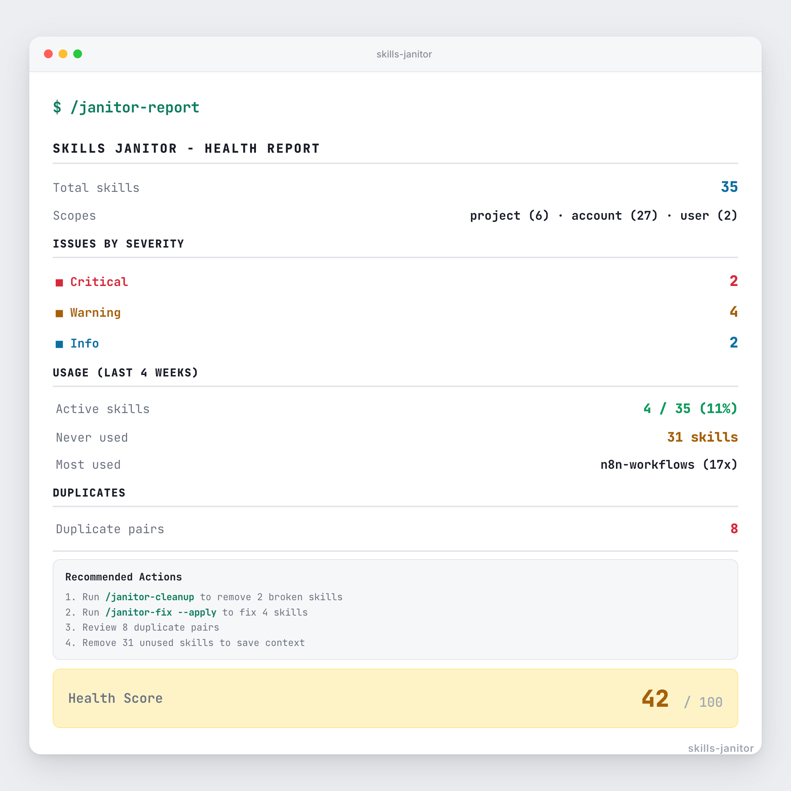
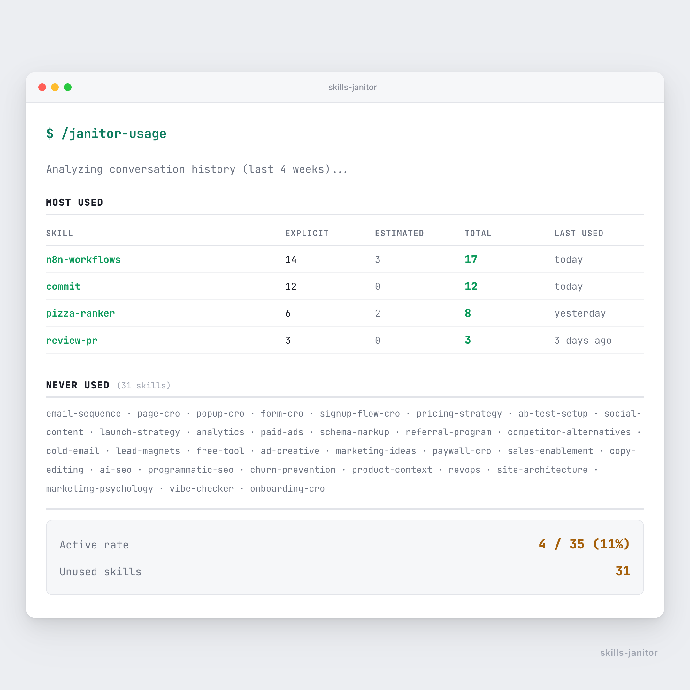
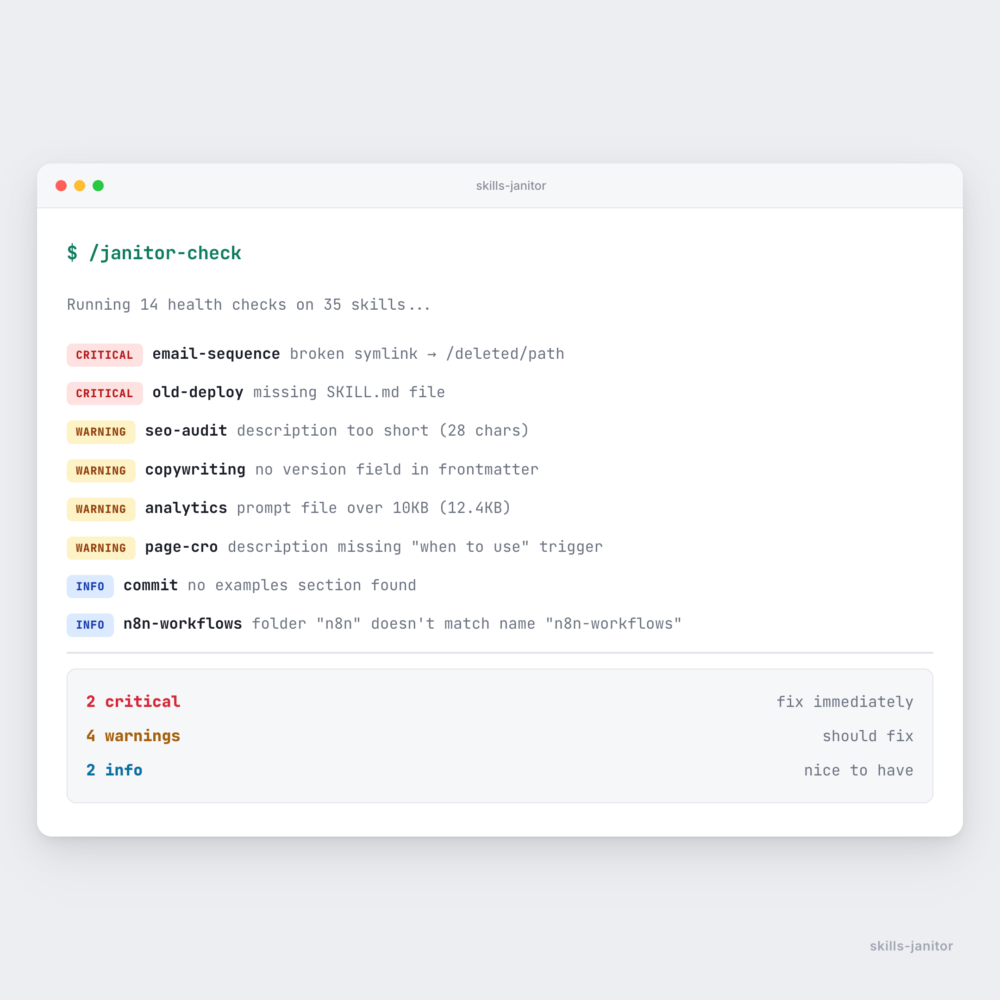

---

## 6. [Clarm](https://www.producthunt.com/products/clarm-ai-technical-support)
**Votes**: 128 | **도입 난이도**: 중 | **신뢰도**: 중
**Tagline**: AI inbound layer to capture, qualify, and route leads
**서비스 링크**: https://www.producthunt.com/r/P2EMEE5GC4442W

**태그**: AI, 자동화, 리드 생성, CRM, 영업, AI Tool, Chat, Email

### 📌 이 서비스 한눈에 보기
Clarm은 AI를 활용하여 웹사이트 방문자를 24시간 내내 리드로 전환하고, 구매 의도를 파악하여 Slack, Discord, GitHub, 이메일 등 다양한 채널로 연결해주는 인바운드 자동화 도구입니다.

### 🔑 주요 기능
- AI 기반 리드 캡처 및 분류
- 다양한 채널 지원 (웹 채팅, Slack, Discord, GitHub, 이메일)
- SOC 2 Type II 및 HIPAA 규정 준수

### 🙋 사용자에게 어떤 점이 좋은가
Clarm을 통해 24시간 자동화된 리드 관리가 가능하며, AI가 구매 의도를 파악하여 영업 효율성을 높일 수 있습니다. 특히 다양한 채널을 통해 고객과의 소통을 강화할 수 있습니다.

### ✅ 지금 바로 써볼 기능
- 웹사이트에 웹 채팅 연동
- Slack 채널 연동
- AI 기반 리드 분류 설정

### ⚠️ 사용 전 확인할 점
- AI 정확도에 따라 분류 결과가 달라질 수 있음
- HIPAA 규정 준수 관련하여 세부 설정 확인 필요

### 🧭 확인이 더 필요한 정보
AI 기반 리드 분류의 정확도 및 실제 전환율에 대한 추가적인 정보가 필요합니다.

### 📸 스크린샷 및 갤러리
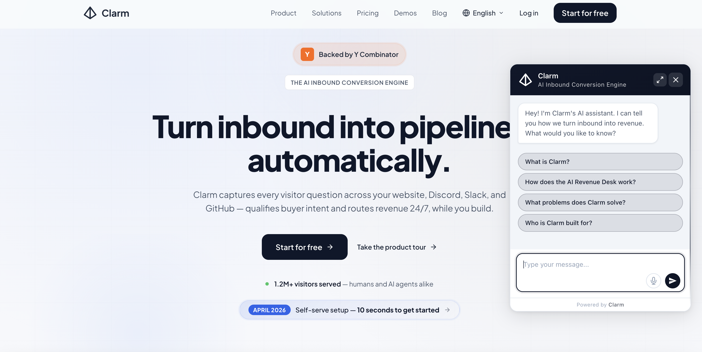
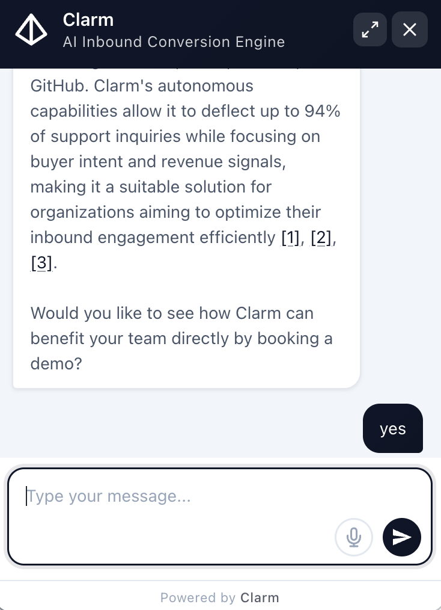
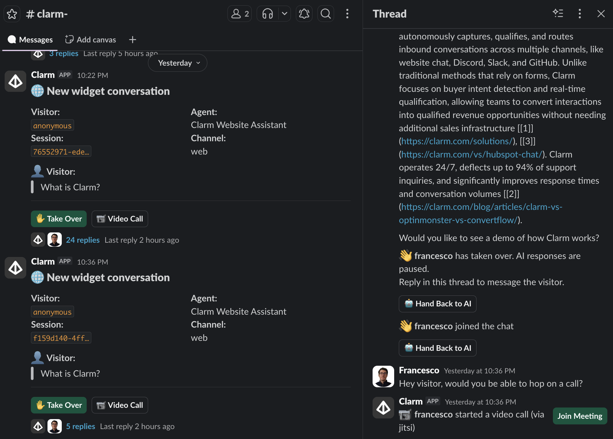

---

## 7. [showmd](https://www.producthunt.com/products/showmd-ai-markdown-quicklook-preview)
**Votes**: 127 | **도입 난이도**: 하 | **신뢰도**: 중
**Tagline**: Markdown was never meant to be previewed plain text
**서비스 링크**: https://www.producthunt.com/r/453EYDNTZHQI7F

**태그**: Markdown, Quick Look, MacOS, 개발 도구, 미리보기, Agent, AI Tool

### 📌 이 서비스 한눈에 보기
showmd는 MacOS에서 Markdown 파일을 아름답게 렌더링하여 보여주는 무료 Quick Look 확장 프로그램입니다. YAML frontmatter 파싱 및 Agentic AI XML 태그 렌더링을 지원합니다.

### 🔑 주요 기능
- MacOS Preview에서 Markdown 파일의 가독성을 향상시킵니다.
- YAML frontmatter를 파싱하여 메타데이터 테이블로 표시합니다.
- Agentic AI XML 태그를 보기 좋게 렌더링합니다.

### 🙋 사용자에게 어떤 점이 좋은가
개발자나 기술 문서 작성자가 MacOS 환경에서 Markdown 파일을 더 편리하게 미리 보고 관리할 수 있도록 도와줍니다.

### ✅ 지금 바로 써볼 기능
- showmd를 설치하고 Markdown 파일을 Quick Look으로 미리보기
- YAML frontmatter가 포함된 Markdown 파일 미리보기
- Agentic AI XML 태그가 포함된 Markdown 파일 미리보기

### ⚠️ 사용 전 확인할 점
- 특정 Markdown 문법이나 확장 기능에 대한 지원 여부 확인 필요
- Quick Look 확장 프로그램과의 호환성 확인 필요

### 🧭 확인이 더 필요한 정보
showmd가 모든 종류의 Markdown 파일 및 Quick Look 환경에서 완벽하게 작동하는지 확인이 필요합니다.

### 📸 스크린샷 및 갤러리
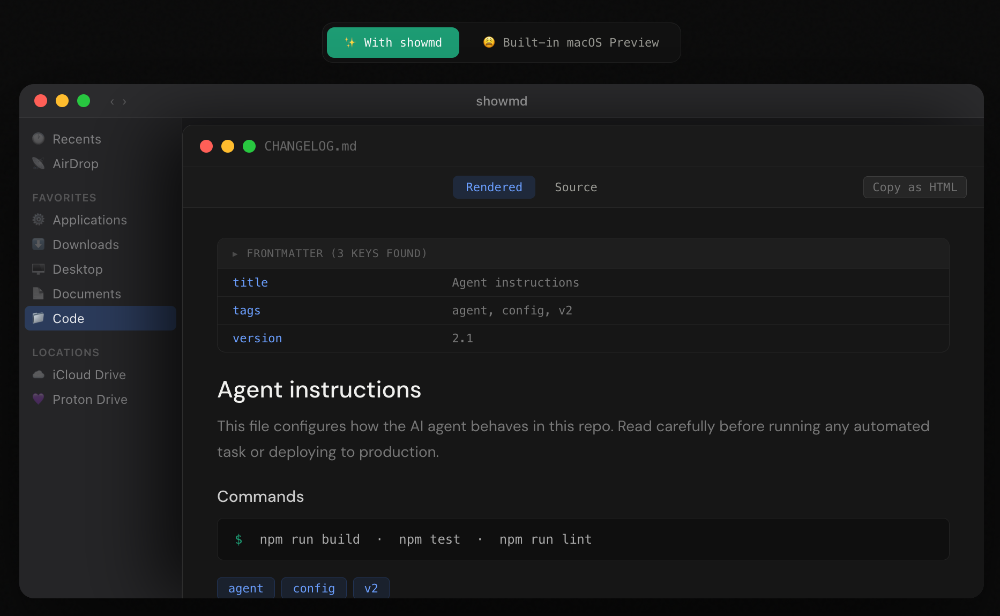
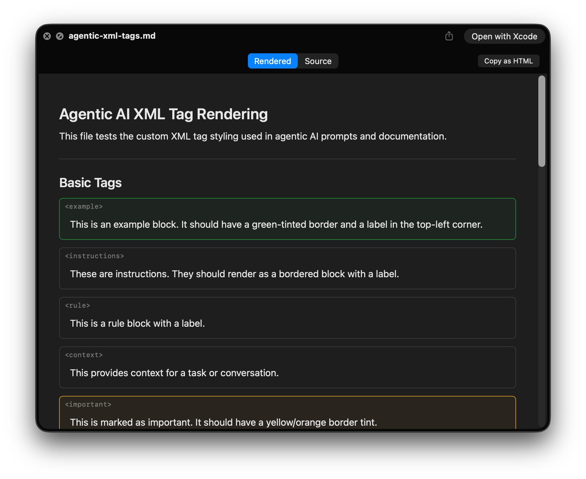
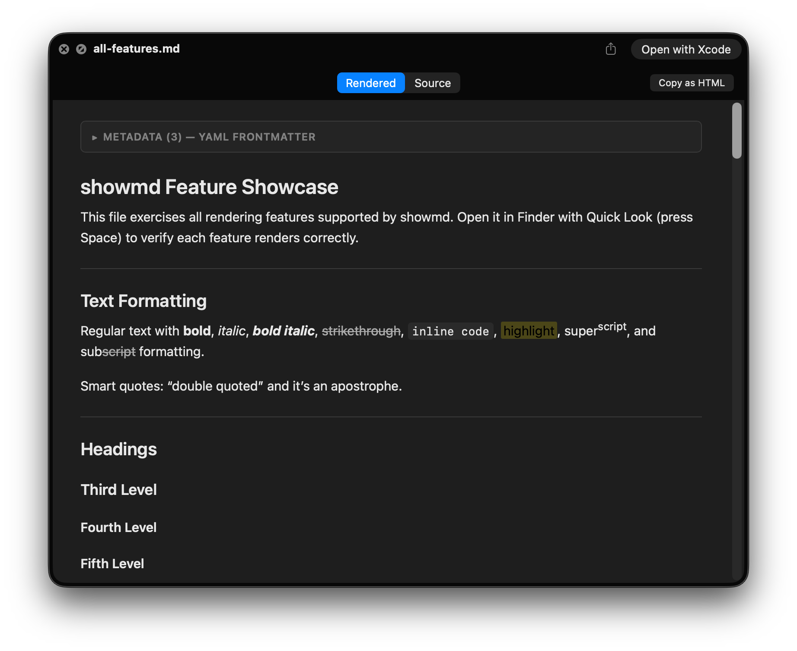

---

## 8. [VoxCPM2](https://www.producthunt.com/products/minicpm-4-0)
**Votes**: 108 | **도입 난이도**: 중 | **신뢰도**: 중
**Tagline**: Open-source 48kHz TTS with voice design and cloning
**서비스 링크**: https://www.producthunt.com/r/HR6OQ2UY4GUL7M

**태그**: TTS, 오픈소스, 음성합성, AI, Automation, Design

### 📌 이 서비스 한눈에 보기
VoxCPM2는 30개 언어를 지원하는 오픈 소스 TTS 모델로, 48kHz 고품질 오디오 출력, 텍스트 기반 음성 디자인, 제어 가능한 음성 복제, 실시간 스트리밍 기능을 제공하여 프로덕션 환경에 적합합니다.

### 🔑 주요 기능
- 오픈 소스 2B TTS 모델
- 30개 언어 지원 및 48kHz 고품질 오디오 출력
- 텍스트 기반 음성 디자인 및 제어 가능한 음성 복제

### 🙋 사용자에게 어떤 점이 좋은가
VoxCPM2를 사용하면 텍스트를 기반으로 다양한 음성을 디자인하고 복제하여 프로덕션 환경에서 실시간으로 사용할 수 있는 고품질 음성 서비스를 구축할 수 있습니다.

### ✅ 지금 바로 써볼 기능
- 텍스트 기반 음성 디자인 기능 사용해보기
- 음성 복제 기능으로 원하는 음성 생성해보기
- 실시간 스트리밍 기능 테스트해보기

### ⚠️ 사용 전 확인할 점
- 오픈 소스 모델이므로 사용 전 라이선스 확인 필요
- 모델의 성능은 사용 환경 및 데이터에 따라 달라질 수 있음

### 🧭 확인이 더 필요한 정보
다양한 언어 및 환경에서의 실제 성능 테스트 결과에 대한 추가 정보가 필요합니다.

### 📸 스크린샷 및 갤러리
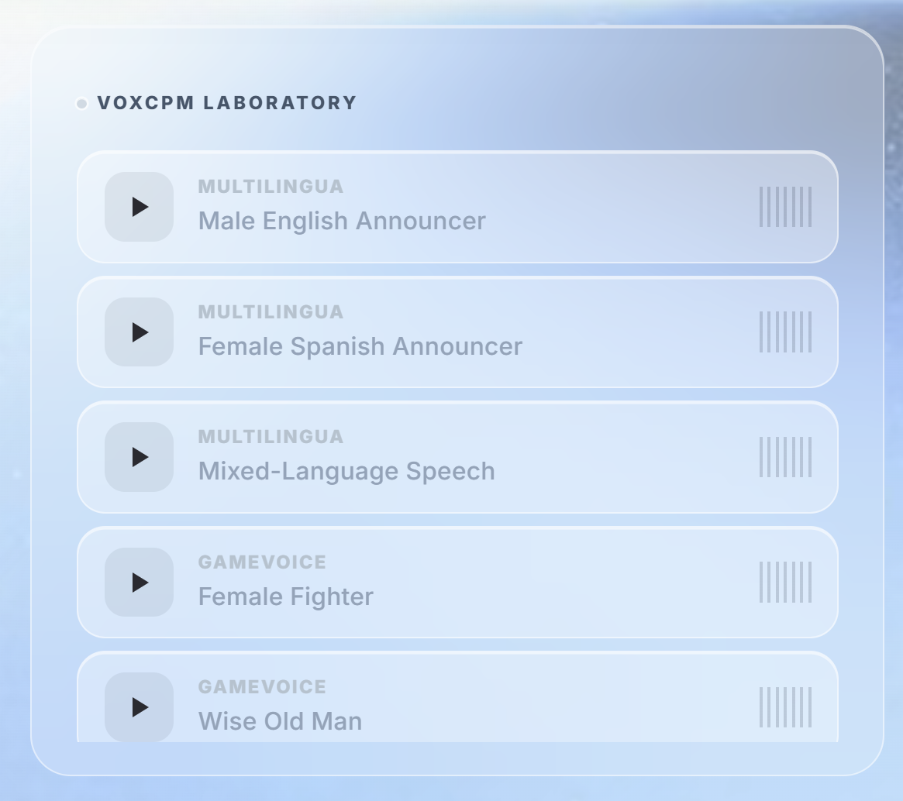
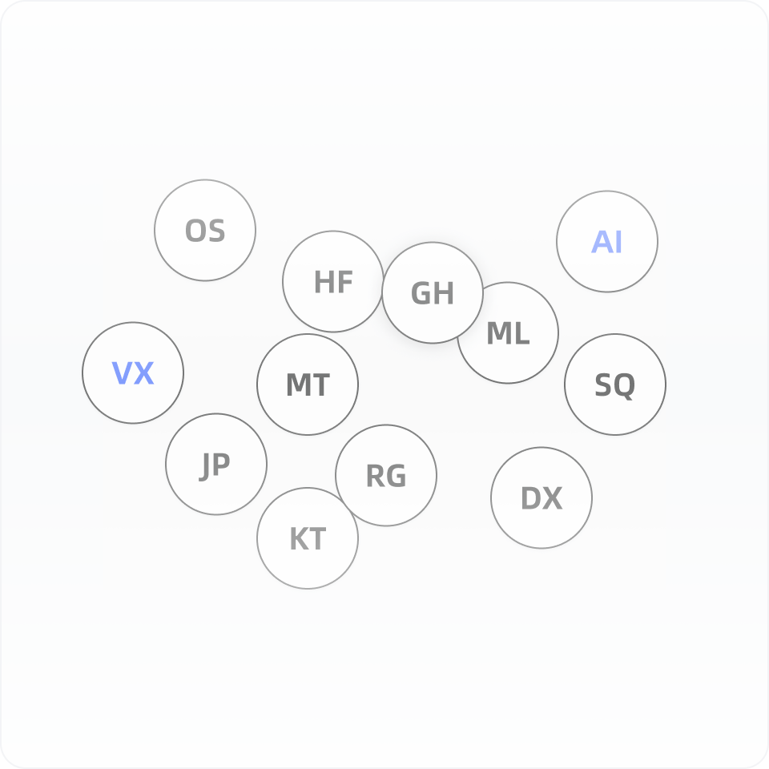
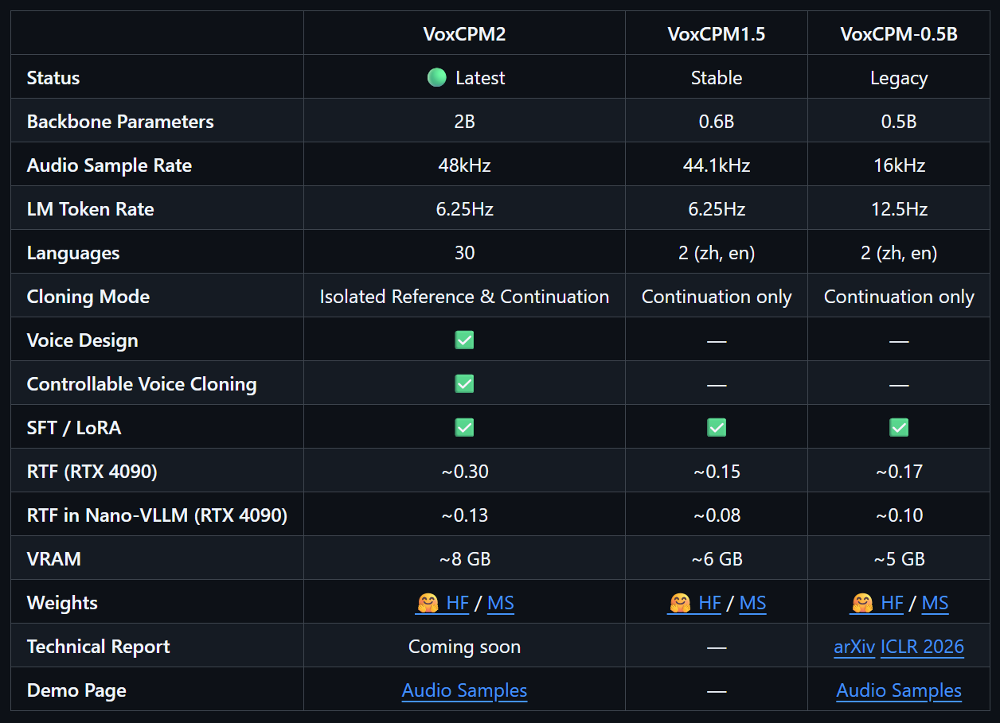

---

## 9. [SigmaMind MCP](https://www.producthunt.com/products/sigma-ai)
**Votes**: 104 | **도입 난이도**: 중 | **신뢰도**: 중
**Tagline**: Build and control voice AI agents via MCP
**서비스 링크**: https://www.producthunt.com/r/QGJKSO45Z6KGQN

**태그**: DevTool, AI, 음성인식, 자동화, Agent, AI Tool, Email

### 📌 이 서비스 한눈에 보기
SigmaMind MCP는 음성 AI 스택을 도구처럼 관리하여 에이전트 구축, 테스트 호출, 디버깅, 배포 자동화를 IDE 내에서 가능하게 해줍니다.

### 🔑 주요 기능
- 전체 음성 AI 스택을 MCP 클라이언트 또는 IDE에서 직접 관리
- 800ms 미만의 짧은 지연 시간, 최첨단 노이즈 제거, VAD, IVR 탐색, 음성 메일 감지 기능 제공
- 에이전트 생성, 테스트 호출 트리거, 인라인 통화 기록으로 디버깅, 배포 자동화 가능

### 🙋 사용자에게 어떤 점이 좋은가
개발자는 IDE를 벗어나지 않고도 음성 AI 에이전트를 구축하고 관리하며, 테스트 및 배포를 자동화하여 개발 효율성을 높일 수 있습니다. 짧은 지연 시간과 다양한 내장 기능으로 고품질의 음성 AI 서비스를 제공할 수 있습니다.

### ✅ 지금 바로 써볼 기능
- MCP 클라이언트를 통해 음성 AI 에이전트 생성
- 테스트 호출을 트리거하여 음성 AI 기능 테스트
- 인라인 통화 기록을 통해 디버깅 수행

### ⚠️ 사용 전 확인할 점
- 제공되는 기능 외에 추가적인 사용자 정의 기능 지원 여부 확인 필요
- 특정 IDE와의 호환성 확인 필요

### 🧭 확인이 더 필요한 정보
제공되는 SOTA 노이즈 제거, VAD, IVR 탐색, 음성 메일 감지 기능의 구체적인 성능 지표 확인이 필요합니다.

### 📸 스크린샷 및 갤러리
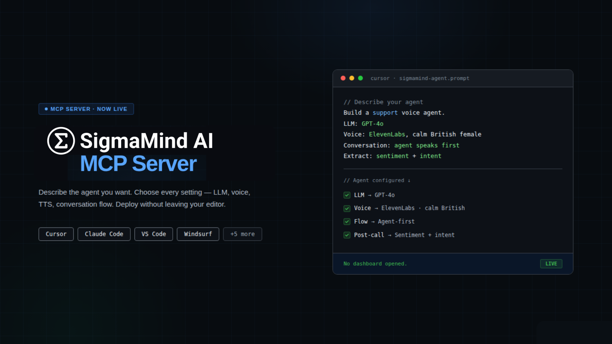
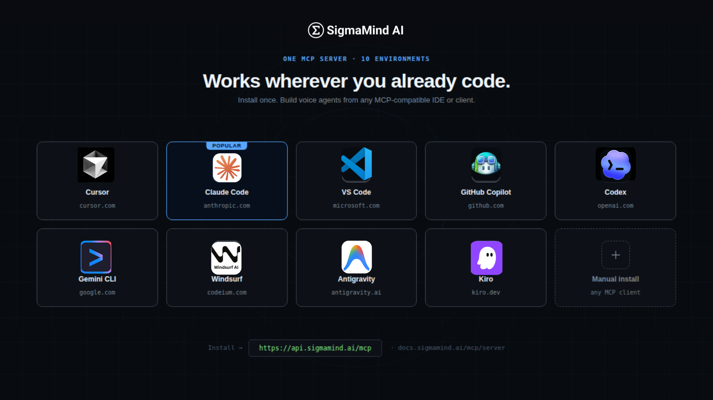
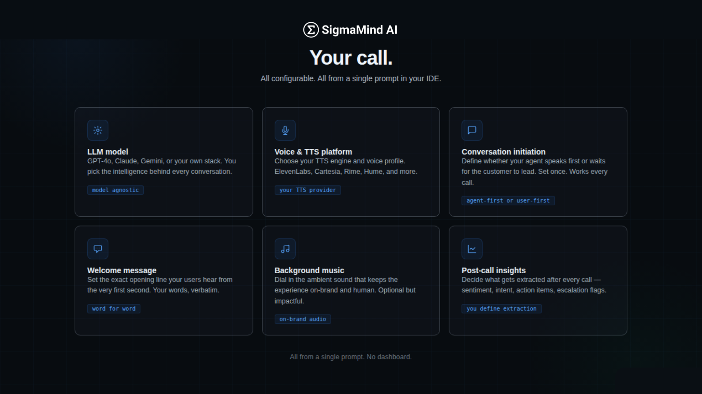

### 🎬 관련 영상
- [🎥 영상 보기](https://ph-files.imgix.net/7a0e84ee-e862-4b87-85dc-d9633be84ca2.jpeg?auto=format)

---

## 10. [Deconflict](https://www.producthunt.com/products/deconflict)
**Votes**: 103 | **도입 난이도**: 중 | **신뢰도**: 중
**Tagline**: Plan your WiFi and see through walls
**서비스 링크**: https://www.producthunt.com/r/BVZBBDAHFICY6R

**태그**: WiFi, 플래너, 시뮬레이션, 오픈소스, 네트워크

### 📌 이 서비스 한눈에 보기
Deconflict는 브라우저에서 실행되는 무료 오픈 소스 WiFi 플래너로, 실제 벽 재질의 RF 감쇠를 고려하여 WiFi 신호 범위를 시각화하고 최적의 AP 배치를 찾아줍니다.

### 🔑 주요 기능
- 브라우저 기반 무료 WiFi 플래너
- 실제 벽 재질에 따른 RF 감쇠 시뮬레이션
- 자동 채널 할당 및 AP 배치 최적화

### 🙋 사용자에게 어떤 점이 좋은가
별도의 설치나 계정 없이 WiFi 네트워크 계획을 시뮬레이션하여 최적의 AP 배치를 찾고, 실제 환경과 유사한 신호 강도를 예측하여 WiFi 성능을 향상시킬 수 있습니다.

### ✅ 지금 바로 써볼 기능
- 평면도 업로드하여 WiFi 환경 디자인
- 실제 AP 모델 선택하여 시뮬레이션
- 자동 채널 할당 및 AP 배치 최적화 기능 사용

### ⚠️ 사용 전 확인할 점
- 시뮬레이션 정확도는 벽 재질 데이터에 따라 달라질 수 있음
- 브라우저 성능에 따라 시뮬레이션 속도가 느려질 수 있음

### 🧭 확인이 더 필요한 정보
실제 환경에서의 WiFi 성능은 시뮬레이션 결과와 차이가 있을 수 있으므로, 실제 측정과 비교하여 보정하는 것이 좋습니다.

### 📸 스크린샷 및 갤러리
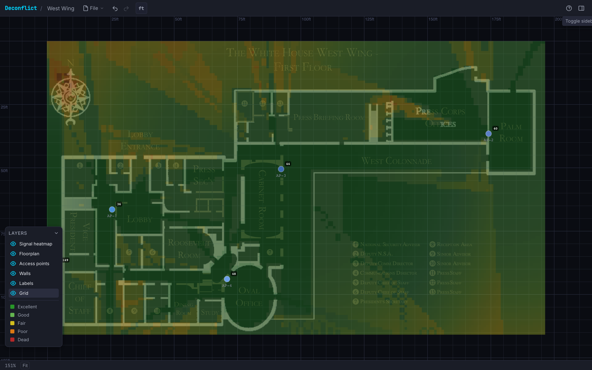
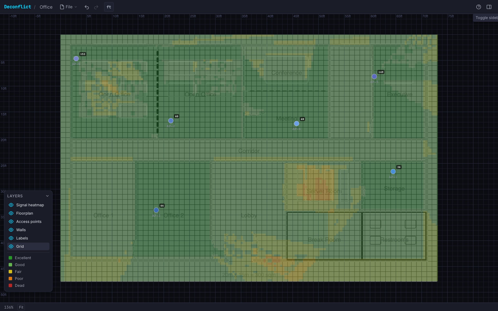
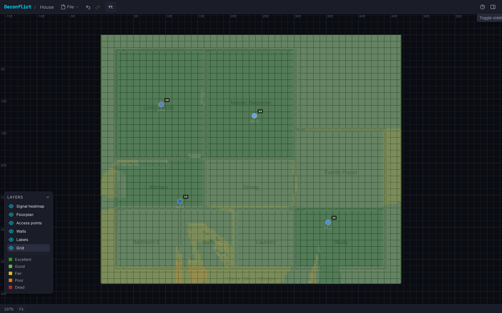

---

