# 🚀 Product Hunt Daily Top 10 (2026-04-15)

## 1. [Figma for Agents](https://www.producthunt.com/products/figma-for-agents)
**Votes**: 362 | **도입 난이도**: 중 | **신뢰도**: 중
**Tagline**: Design with AI agents, connected to your design system
**서비스 링크**: https://www.producthunt.com/r/2Q5KSKQ7UYEPQA

**태그**: AI, 디자인, Figma, 자동화, 협업, Agent, AI Tool, Design, DevTool

### 📌 이 서비스 한눈에 보기
AI 에이전트가 디자인 시스템을 인식하지 못해 브랜드 표준을 벗어나는 문제를 해결, Figma 내에서 디자인 시스템과 연결된 AI 에이전트를 활용하여 디자인 효율성을 높입니다.

### 🔑 주요 기능
- AI 에이전트가 디자인 시스템을 준수하도록 지원
- Figma 환경 내에서 AI 기반 디자인 가능
- 디자인과 코드 간의 연결을 강화

### 🙋 사용자에게 어떤 점이 좋은가
AI 에이전트를 활용한 디자인 과정에서 브랜드 일관성을 유지하고, 디자인 시스템과의 연동을 통해 효율적인 협업이 가능해집니다.

### ✅ 지금 바로 써볼 기능
- Figma에서 use_figma MCP 도구 사용해보기
- AI 에이전트와 디자인 시스템 연동 테스트
- 팀 내 디자인-코드 협업 워크플로우 개선

### ⚠️ 사용 전 확인할 점
- use_figma MCP 도구의 초기 설정 및 학습 필요
- AI 에이전트의 디자인 시스템 인식 정확도 확인 필요

### 🧭 확인이 더 필요한 정보
제공된 정보만으로는 구체적인 기능 및 성능에 대한 추가 검증이 필요합니다.

### 📸 스크린샷 및 갤러리
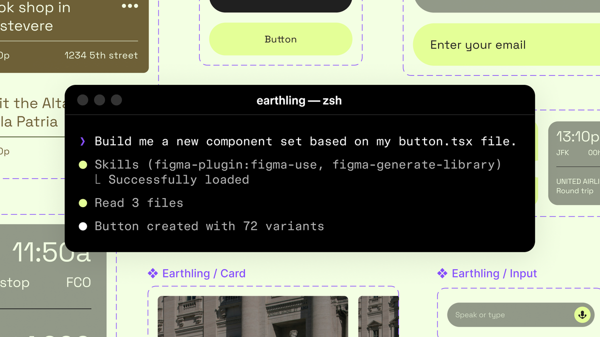
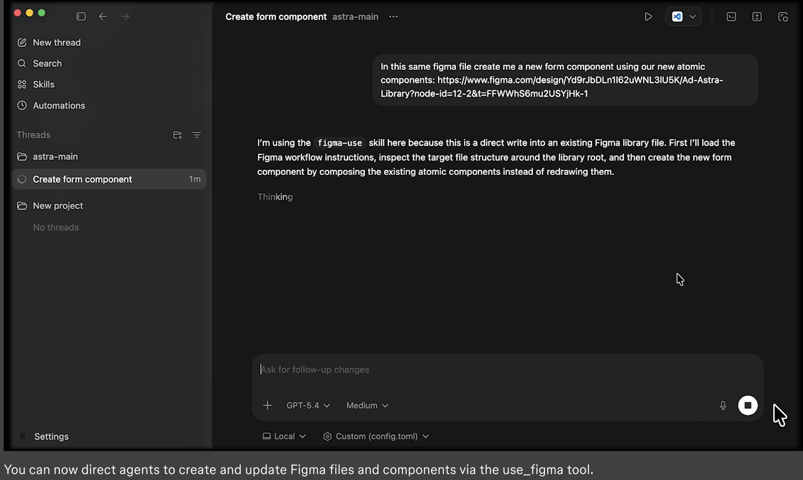
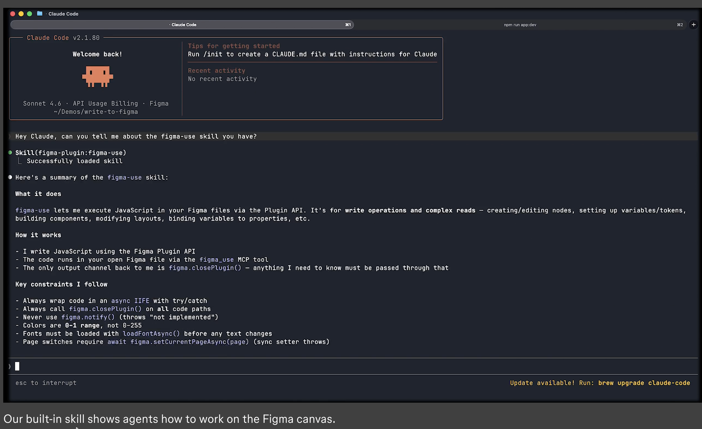

### 🎬 관련 영상
- [🎥 영상 보기](https://ph-files.imgix.net/89dd3687-c40c-4ba6-8866-e1b6ea6da7f7.jpeg?auto=format)

---

## 2. [Softr AI Co-Builder](https://www.producthunt.com/products/softr)
**Votes**: 287 | **도입 난이도**: 중 | **신뢰도**: 중
**Tagline**: Build business apps with AI - that actually work
**서비스 링크**: https://www.producthunt.com/r/KEVPSWSDCIA5TB

**태그**: AI, No-code, App Builder, Automation, AI Tool, Prompting

### 📌 이 서비스 한눈에 보기
Softr AI Co-Builder는 AI를 활용하여 몇 분 만에 맞춤형 포털, 내부 도구 및 운영 시스템을 구축할 수 있게 해줍니다.

### 🔑 주요 기능
- AI 코-빌더가 앱, 데이터베이스 및 비즈니스 로직을 생성
- 프롬프트로 개선하거나 시각적으로 편집하여 제어 가능
- 실제 사용자를 위한 안전한 환경 제공

### 🙋 사용자에게 어떤 점이 좋은가
코딩 없이도 빠르게 비즈니스 앱을 만들고 관리할 수 있어 시간과 노력을 절약하고, 아이디어를 즉시 구현할 수 있습니다.

### ✅ 지금 바로 써볼 기능
- 필요한 앱 설명 입력해보기
- AI가 생성한 앱을 프롬프트로 수정해보기
- 시각적 편집 기능 사용해보기

### ⚠️ 사용 전 확인할 점
- AI가 생성한 앱의 정확성 검토 필요
- 복잡한 비즈니스 로직 구현 가능성 확인 필요

### 🧭 확인이 더 필요한 정보
AI 코-빌더가 지원하는 데이터베이스 종류 및 통합 가능성 확인이 필요합니다.

### 📸 스크린샷 및 갤러리
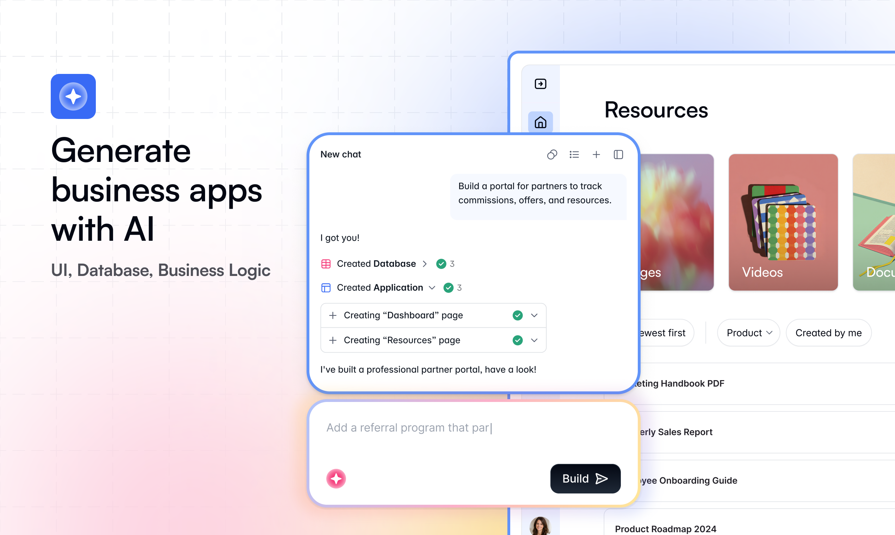
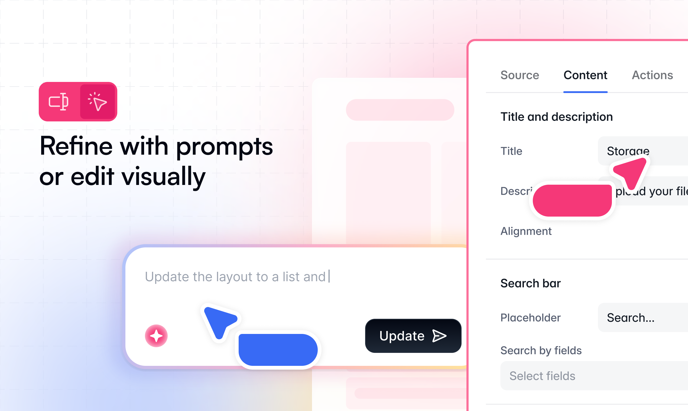
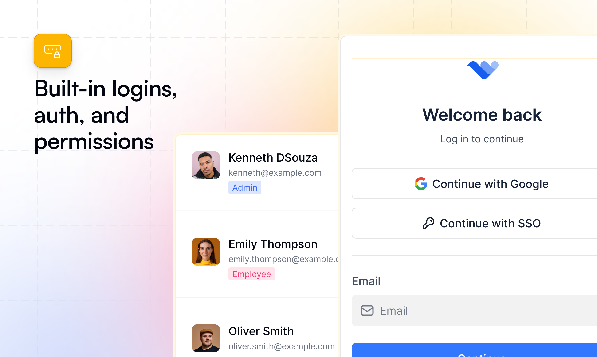

### 🎬 관련 영상
- [🎥 영상 보기](https://ph-files.imgix.net/f502a5ef-60d9-4f50-aed5-55a535658b72.jpeg?auto=format)

---

## 3. [CatDoes v4](https://www.producthunt.com/products/catdoes-2)
**Votes**: 250 | **도입 난이도**: 중 | **신뢰도**: 중
**Tagline**: An AI agent with its own computer builds your apps
**서비스 링크**: https://www.producthunt.com/r/AS6JS7TWSU5PV6

**태그**: No-code, AI, App Builder, Backend, Agent, AI Tool, Design, DevTool

### 📌 이 서비스 한눈에 보기
CatDoes는 AI 에이전트를 통해 코딩 없이 앱을 만들 수 있게 해주는 노코드 앱 빌더입니다. 백엔드 기능까지 포함되어 있어 더욱 빠르게 앱 개발이 가능합니다.

### 🔑 주요 기능
- AI 에이전트 Compose가 코드를 작성, 테스트, 수정까지 자동 수행
- 모바일 앱과 웹사이트 제작 가능
- 데이터베이스, 인증, 스토리지 등 백엔드 기능 포함

### 🙋 사용자에게 어떤 점이 좋은가
코딩 없이도 앱을 만들 수 있어 개발 속도를 높이고, 백엔드 기능까지 제공되어 개발 과정을 간소화합니다.

### ✅ 지금 바로 써볼 기능
- Compose를 사용하여 간단한 웹사이트 제작해보기
- 제공되는 백엔드 기능 (데이터베이스, 인증) 사용해보기
- 모바일 앱 프로토타입 제작해보기

### ⚠️ 사용 전 확인할 점
- AI 에이전트의 성능에 따라 결과물의 품질이 달라질 수 있음
- 복잡한 기능 구현에는 제약이 있을 수 있음

### 🧭 확인이 더 필요한 정보
AI 에이전트의 코드 작성 및 수정 능력에 대한 사용자 후기 확인이 필요합니다.

### 📸 스크린샷 및 갤러리
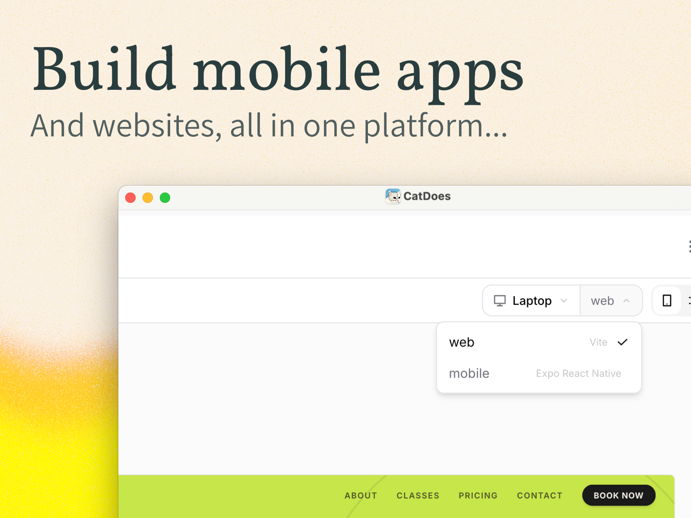
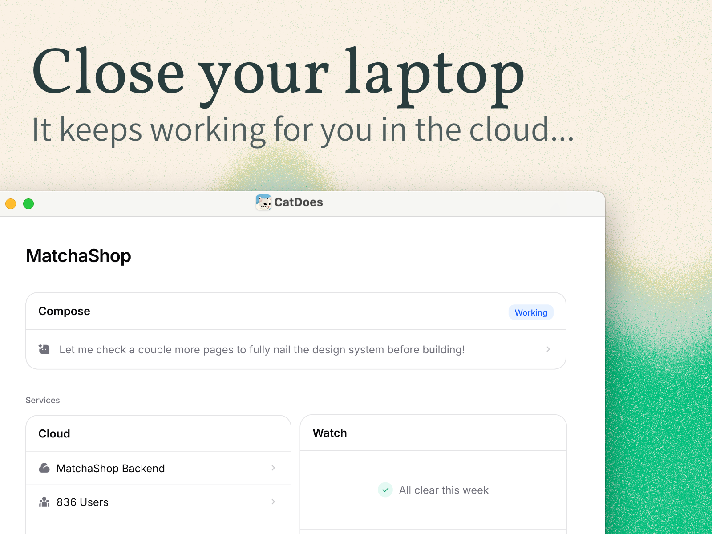
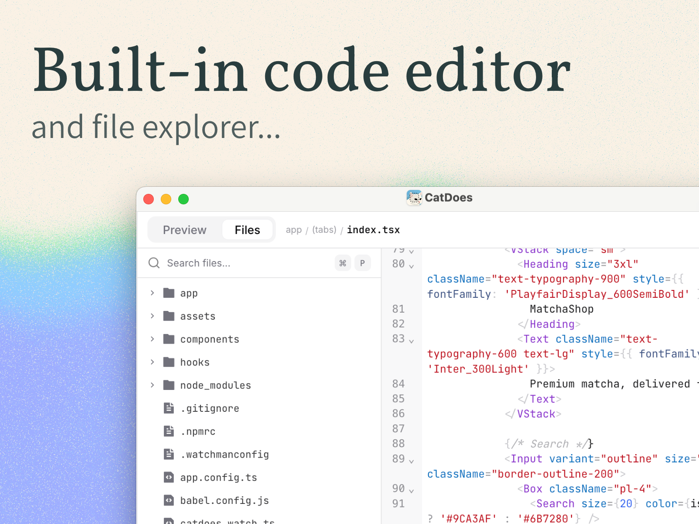

### 🎬 관련 영상
- [🎥 영상 보기](https://ph-files.imgix.net/f3b762c8-bceb-475d-a983-72073cd09dcb.jpeg?auto=format)

---

## 4. [Ovren](https://www.producthunt.com/products/ovren)
**Votes**: 248 | **도입 난이도**: 중 | **신뢰도**: 중
**Tagline**: Your AI engineering department that ships your backlog
**서비스 링크**: https://www.producthunt.com/r/IB3733X3JMRODF

**태그**: DevTool, AI, Automation, 코드 생성, AI Tool

### 📌 이 서비스 한눈에 보기
Ovren은 AI 엔지니어링 부서를 통해 팀의 백로그 작업을 실제 코드베이스 내에서 처리하고, 검토 가능한 코드 업데이트를 제공하여 개발 속도를 향상시켜 줍니다.

### 🔑 주요 기능
- AI 프론트엔드 및 백엔드 엔지니어를 활용하여 백로그 작업 처리
- 실제 코드베이스 내에서 작업 수행
- 검토 가능한 코드 업데이트 제공 및 사용자 승인 후 적용

### 🙋 사용자에게 어떤 점이 좋은가
팀의 백로그 문제를 해결하고, 개발 프로세스를 자동화하여 효율성을 높일 수 있습니다. 사용자는 코드 변경 사항을 직접 검토하고 승인할 수 있어 통제력을 유지할 수 있습니다.

### ✅ 지금 바로 써볼 기능
- 백로그에서 처리하고 싶은 작업 등록
- AI 엔지니어가 생성한 코드 업데이트 검토
- 코드 변경 사항 승인 및 적용

### ⚠️ 사용 전 확인할 점
- AI 엔지니어의 코드 품질 및 정확성 검토 필요
- 코드 변경 사항 적용 전 충분한 테스트 필요

### 🧭 확인이 더 필요한 정보
AI 엔지니어의 작업 처리 속도 및 정확도에 대한 사용자 후기 확인이 필요합니다.

### 📸 스크린샷 및 갤러리
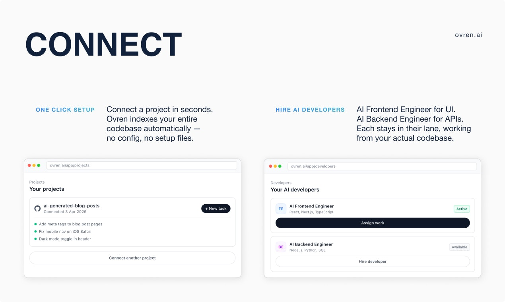
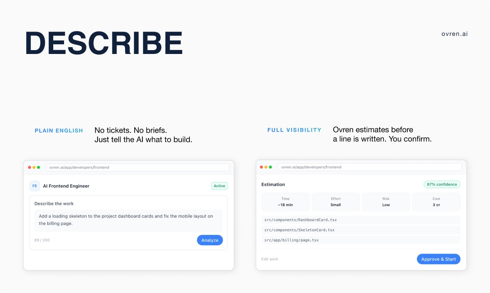
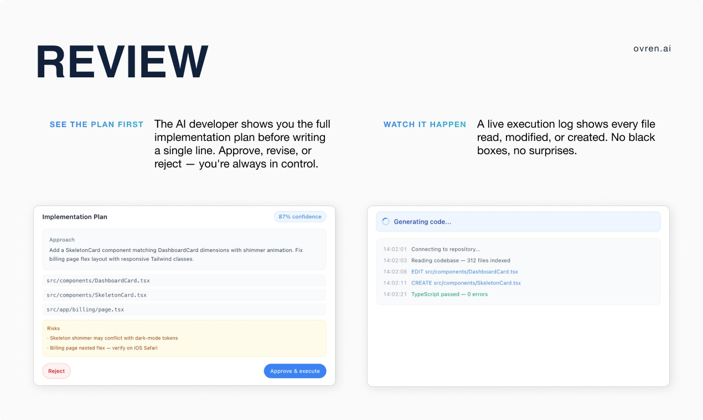

### 🎬 관련 영상
- [🎥 영상 보기](https://ph-files.imgix.net/9c113a92-35a3-4e55-89c5-996679574c0c.jpeg?auto=format)

---

## 5. [FuseAI](https://www.producthunt.com/products/fuseai)
**Votes**: 212 | **도입 난이도**: 중 | **신뢰도**: 중
**Tagline**: Close 10x more revenue with AI agents.
**서비스 링크**: https://www.producthunt.com/r/7A2U5I3Q7TYWZO

**태그**: AI, 영업, 자동화, CRM, 생산성, Agent, Automation, AI Tool, Design, Sales, Email

### 📌 이 서비스 한눈에 보기
FuseAI는 AI 기반으로 영업 효율을 극대화하여 더 많은 수익을 창출할 수 있도록 돕는 올인원 플랫폼입니다.

### 🔑 주요 기능
- AI 기반으로 실시간 신호, 검증된 연락처 데이터, LinkedIn 및 이메일 자동화 등을 제공합니다.
- 다양한 영업 도구를 하나의 플랫폼으로 통합하여 관리 효율성을 높입니다.
- 파이프라인 생성을 간소화하고 영업 팀의 생산성을 향상시킵니다.

### 🙋 사용자에게 어떤 점이 좋은가
FuseAI를 통해 영업 팀은 여러 도구를 사용할 필요 없이 하나의 플랫폼에서 모든 아웃바운드 활동을 관리하고 자동화하여 효율성을 높이고 더 많은 거래를 성사시킬 수 있습니다.

### ✅ 지금 바로 써볼 기능
- 실시간 신호 기능을 활용하여 잠재 고객의 행동을 파악하고 맞춤형 접근을 시도해보세요.
- LinkedIn 자동화 기능을 사용하여 잠재 고객과의 연결을 자동화하고 확장하세요.
- AI 기반 워크플로우를 통해 영업 프로세스를 자동화하고 최적화하세요.

### ⚠️ 사용 전 확인할 점
- 데이터 정확도 및 개인 정보 보호 정책을 확인해야 합니다.
- 자동화 설정 시 과도한 자동화로 인한 스팸성 메시지 발송을 주의해야 합니다.

### 🧭 확인이 더 필요한 정보
FuseAI의 AI 성능 및 데이터 정확도에 대한 사용자 리뷰를 추가적으로 확인하는 것이 좋습니다.

### 📸 스크린샷 및 갤러리
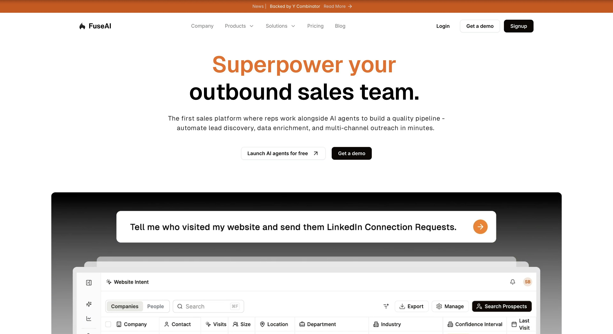
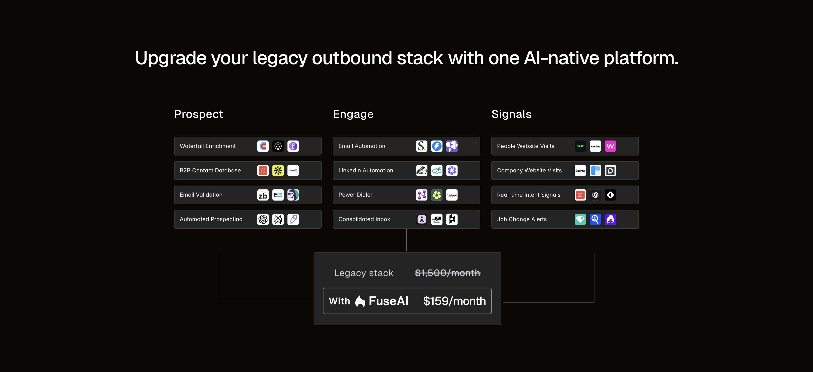
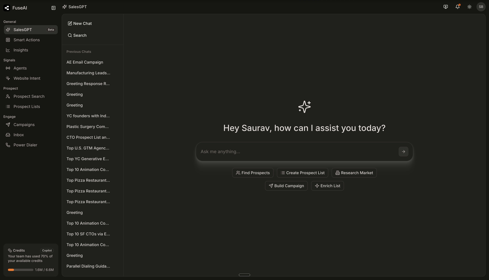

### 🎬 관련 영상
- [🎥 영상 보기](https://ph-files.imgix.net/4f1b9a40-b83b-43cc-a73c-2d5b1b40e13e.gif?auto=format)

---

## 6. [Recall 2.0](https://www.producthunt.com/products/recall-6)
**Votes**: 183 | **도입 난이도**: 중 | **신뢰도**: 중
**Tagline**: Curate an AI that knows what you know. 
**서비스 링크**: https://www.producthunt.com/r/6ZWGLVRX6FQH4Z

**태그**: AI, 지식 관리, 정보 검색, 생산성, AI Tool, API

### 📌 이 서비스 한눈에 보기
Recall 2.0은 사용자의 지식을 기반으로 AI를 활용하여 개인 맞춤형 정보 검색 및 분석을 가능하게 해주는 도구입니다.

### 🔑 주요 기능
- 개인 지식 기반 AI: 사용자가 저장하고 작성한 모든 정보를 AI 학습에 활용
- 다양한 활용: 연구 요약, 비교 분석, 특정 콘텐츠 검색 등 다양한 작업 지원
- 모델 선택 가능: 사용자가 원하는 AI 모델을 선택하여 사용 가능

### 🙋 사용자에게 어떤 점이 좋은가
개인의 지식과 경험을 AI에 접목시켜 정보 활용 능력을 극대화하고, 맞춤형 정보 검색 및 분석을 통해 효율성을 높일 수 있습니다.

### ✅ 지금 바로 써볼 기능
- 연구 자료를 업로드하고 요약 기능 사용해보기
- 과거에 저장했던 팟캐스트에서 특정 클립 검색해보기
- AI 모델을 선택하여 원하는 작업 수행해보기

### ⚠️ 사용 전 확인할 점
- 개인 정보 보호 정책 및 데이터 보안 확인 필요
- AI 모델 성능에 따라 결과 품질이 달라질 수 있음

### 🧭 확인이 더 필요한 정보
사용자가 선택할 수 있는 AI 모델의 종류와 성능에 대한 추가 정보가 필요합니다.

### 📸 스크린샷 및 갤러리
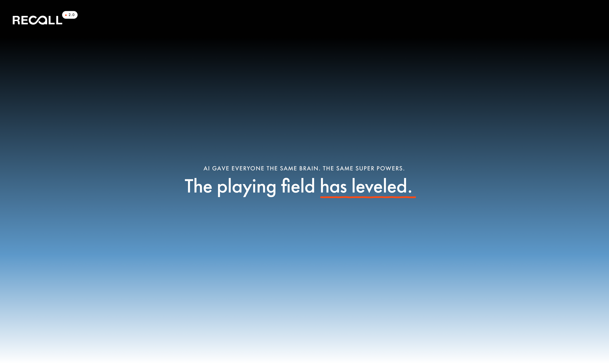
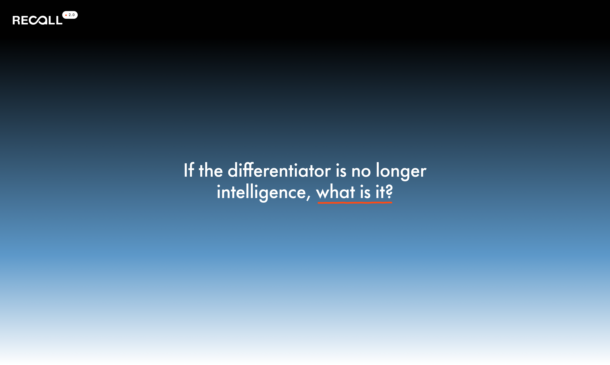
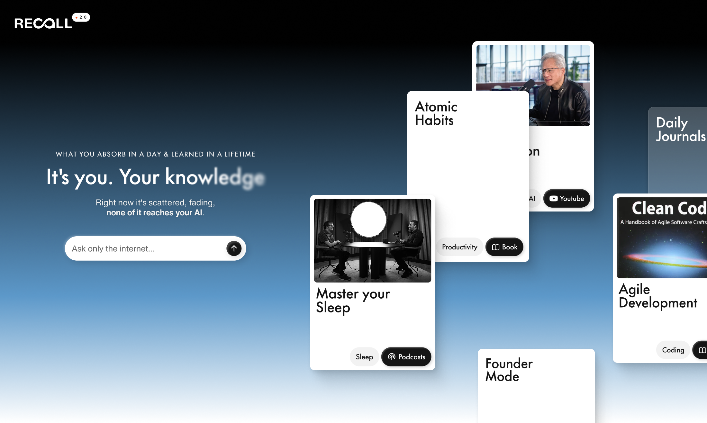

### 🎬 관련 영상
- [🎥 영상 보기](https://ph-files.imgix.net/5c81f8ed-fa6d-461a-82ae-7c51201e9e17.jpeg?auto=format)

---

## 7. [Caveman](https://www.producthunt.com/products/caveman-claude-code-skill-plugin)
**Votes**: 178 | **도입 난이도**: 하 | **신뢰도**: 중
**Tagline**: Why use so many token when few do trick?
**서비스 링크**: https://www.producthunt.com/r/NFANGDJQVMYBRD

**태그**: DevTool, 코드 최적화, Claude, 토큰 절감, 자동화

### 📌 이 서비스 한눈에 보기
Caveman은 Claude의 토큰 사용량을 75%까지 줄여주면서 기술적 정확도는 유지하는 도구입니다. 코드 작성 및 리뷰 프로세스를 간소화하여 효율성을 높입니다.

### 🔑 주요 기능
- Claude의 토큰 사용량 대폭 감소 (~75%)
- 다양한 코드 편집기 및 플랫폼과 호환 (Claude Code, Cursor, Windsurf, Copilot 등)
- 간결한 커밋 메시지 및 PR 리뷰 생성

### 🙋 사용자에게 어떤 점이 좋은가
Claude를 사용하는 개발자가 비용을 절감하고 코드 작업 속도를 향상시킬 수 있습니다. 특히 토큰 사용량에 민감한 프로젝트에 유용합니다.

### ✅ 지금 바로 써볼 기능
- Caveman 설치 후 코드 편집기에 통합
- 다양한 'grunt level'을 실험하여 최적의 압축 수준 찾기
- 커밋 메시지 및 PR 리뷰 생성에 활용

### ⚠️ 사용 전 확인할 점
- 압축 수준에 따라 기술적 정확도에 미미한 영향이 있을 수 있음
- 특정 코드 스타일이나 프로젝트 구조에 따라 최적화 효과가 다를 수 있음

### 🧭 확인이 더 필요한 정보
실제 프로젝트에서 토큰 절감 효과 및 정확도 유지 여부에 대한 추가 검증이 필요합니다.

### 📸 스크린샷 및 갤러리
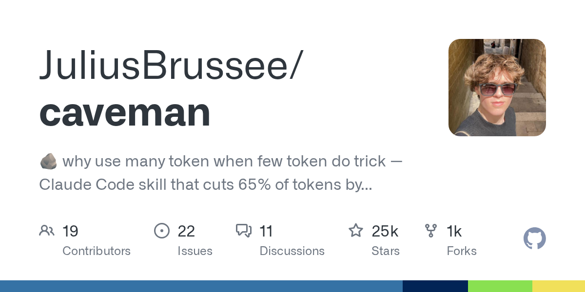
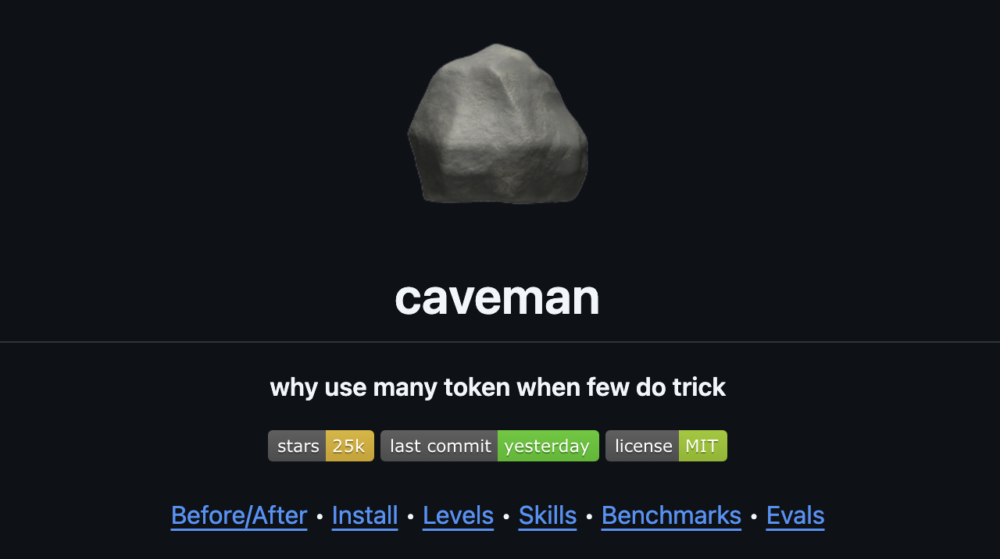
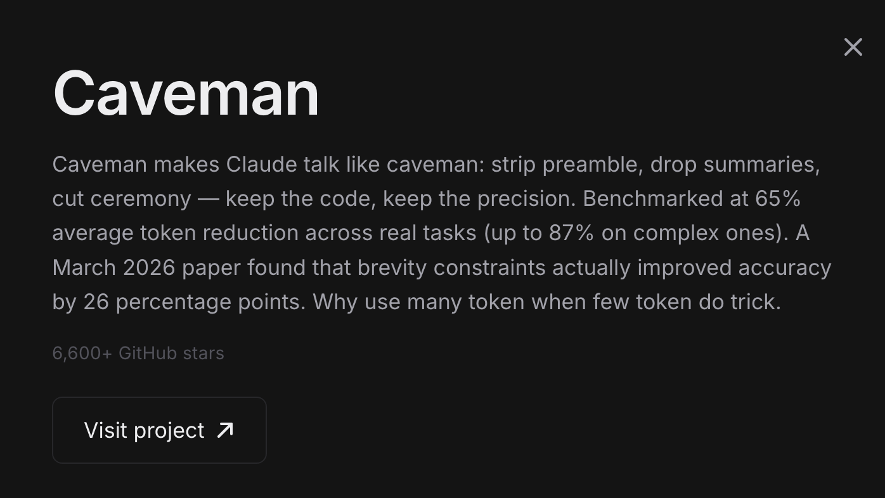

### 🎬 관련 영상
- [🎥 영상 보기](https://ph-files.imgix.net/10355a7c-a2c0-4cfb-bd98-7cb180643570.jpeg?auto=format)

---

## 8. [Ghost Pepper 🌶️](https://www.producthunt.com/products/ghost-pepper)
**Votes**: 155 | **도입 난이도**: 중 | **신뢰도**: 중
**Tagline**: 100% local private AI for text-to-speech & meeting notes
**서비스 링크**: https://www.producthunt.com/r/OJWGY2X7VZXFKY

**태그**: AI, 음성인식, 회의록, macOS, 개인정보보호, AI Tool, API

### 📌 이 서비스 한눈에 보기
Ghost Pepper는 macOS에서 100% 로컬로 작동하는 AI 기반 음성-텍스트 변환 및 회의록 작성 도구로, 클라우드 API 없이 개인 정보를 보호합니다.

### 🔑 주요 기능
- 100% 로컬에서 작동하여 데이터 유출 위험이 없음
- macOS 환경에서 음성-텍스트 변환 및 회의록 작성 지원
- 클라우드 API를 사용하지 않아 개인 정보 보호 강화

### 🙋 사용자에게 어떤 점이 좋은가
민감한 정보를 다루는 사용자나 보안이 중요한 환경에서 클라우드를 거치지 않고 안전하게 음성 데이터를 텍스트로 변환하고 회의록을 작성할 수 있습니다.

### ✅ 지금 바로 써볼 기능
- macOS에 설치 후 음성-텍스트 변환 기능 사용해보기
- 회의록 작성 기능을 활용하여 회의 내용 기록해보기
- 개인 정보 설정 및 데이터 저장 위치 확인하기

### ⚠️ 사용 전 확인할 점
- macOS 환경에서만 사용 가능
- 로컬 환경에서 작동하므로 디바이스 성능에 따라 속도 차이 발생 가능

### 🧭 확인이 더 필요한 정보
Ghost Pepper의 정확도 및 지원 언어에 대한 추가 정보 확인이 필요합니다.

### 📸 스크린샷 및 갤러리
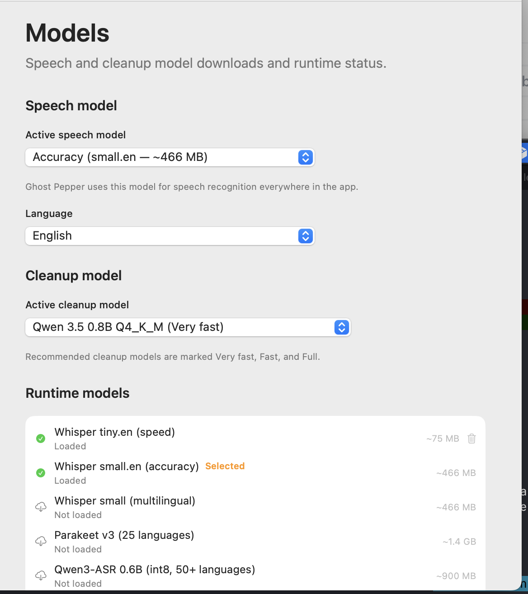
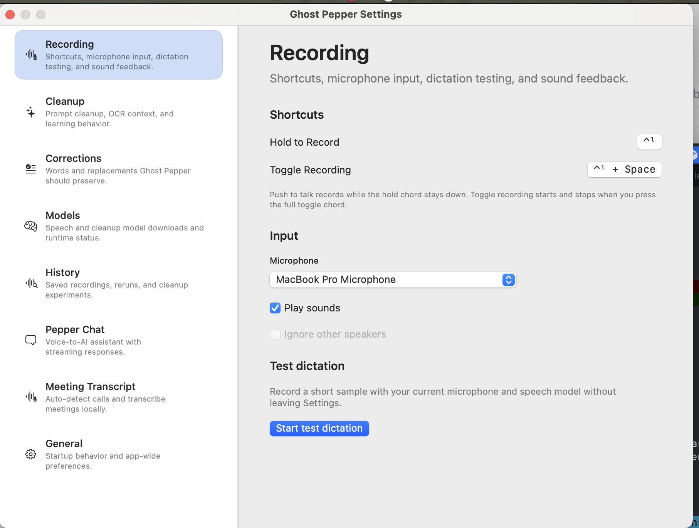

---

## 9. [Open Agents](https://www.producthunt.com/products/open-agents-2)
**Votes**: 133 | **도입 난이도**: 중 | **신뢰도**: 중
**Tagline**: Agents that ship real code
**서비스 링크**: https://www.producthunt.com/r/YN6Q5YCWCCGJQ5

**태그**: DevTool, Automation, Open Source, Vercel, Agent, Prompting

### 📌 이 서비스 한눈에 보기
Open Agents는 백그라운드에서 코딩 에이전트를 구축하고 실행할 수 있도록 지원하는 오픈 소스 레퍼런스 앱으로, 프롬프트에서 실제 코드 변경까지 랩탑 없이 가능하게 해줍니다.

### 🔑 주요 기능
- 오픈 소스 레퍼런스 앱
- Vercel에서 백그라운드 코딩 에이전트 실행 지원
- 웹 UI, 에이전트 런타임, 샌드박스 오케스트레이션, GitHub 연동 포함

### 🙋 사용자에게 어떤 점이 좋은가
프롬프트 기반으로 자동 코드 변경을 수행하여 개발 생산성을 향상시키고, 랩탑 없이도 지속적인 코드 개발이 가능하게 합니다.

### ✅ 지금 바로 써볼 기능
- Vercel에 배포하여 사용해보기
- GitHub 연동하여 코드 변경 자동화 설정해보기
- 제공되는 웹 UI를 통해 에이전트 모니터링 및 관리해보기

### ⚠️ 사용 전 확인할 점
- Vercel 환경에 대한 이해 필요
- GitHub 연동 시 권한 설정 주의

### 🧭 확인이 더 필요한 정보
실제 코드 변경 자동화의 성능 및 안정성에 대한 추가적인 검증이 필요합니다.

### 📸 스크린샷 및 갤러리
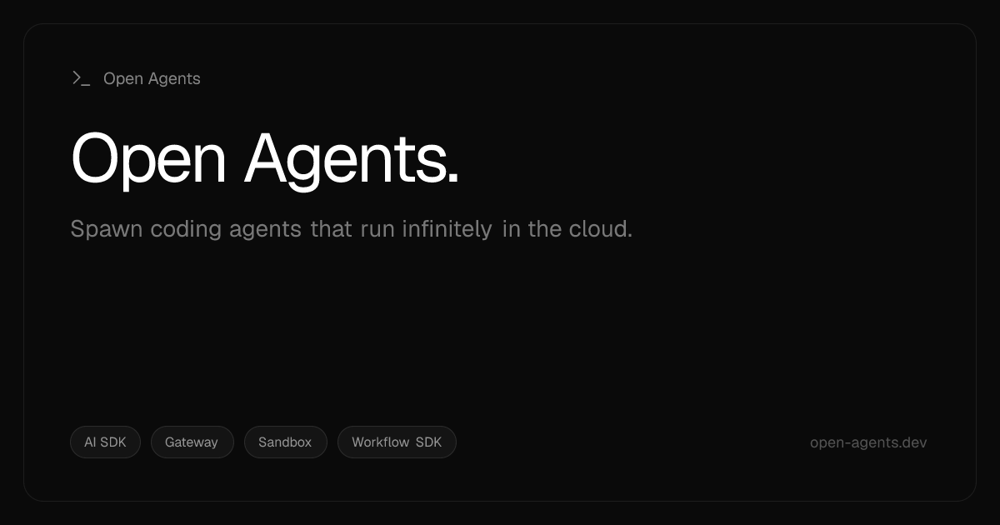
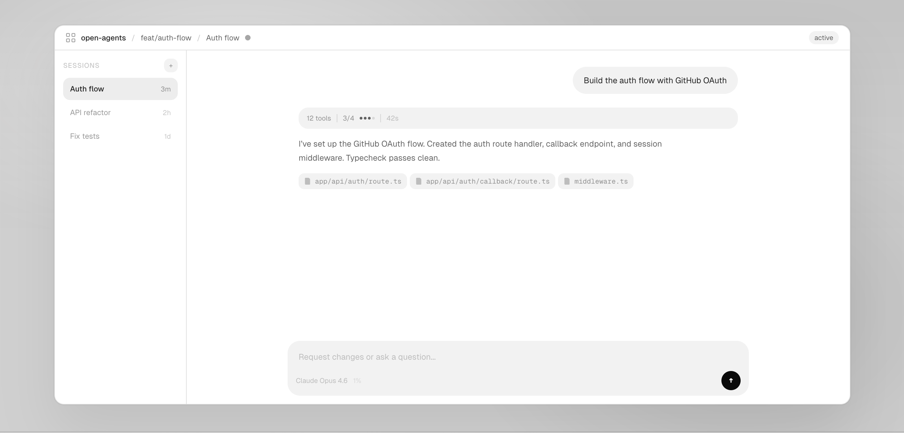
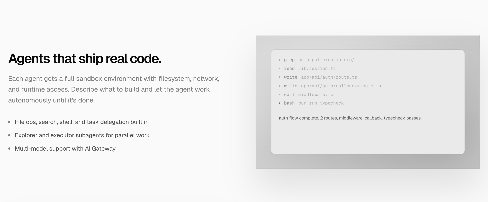

---

## 10. [ElevenAgents Guardrails 2.0](https://www.producthunt.com/products/elevenagents-guardrails-2-0)
**Votes**: 115 | **도입 난이도**: 중 | **신뢰도**: 중
**Tagline**: Configurable safety control for enterprise agent deployment.
**서비스 링크**: https://www.producthunt.com/r/DZDESLW4ERMYGF

**태그**: AI 에이전트, 보안, 정책 관리, 자동화, Agent, AI Tool, Prompting

### 📌 이 서비스 한눈에 보기
ElevenAgents Guardrails 2.0은 기업 환경에서 AI 에이전트가 의도치 않게 작동하거나 악용되는 것을 방지하기 위한 실시간 정책 적용 및 프롬프트 주입 방지 기능을 제공합니다.

### 🔑 주요 기능
- 실시간 정책 시행으로 에이전트의 안전성 확보
- 프롬프트 주입 공격으로부터 에이전트 보호
- 맞춤형 규칙 설정을 통한 브랜드 일관성 유지

### 🙋 사용자에게 어떤 점이 좋은가
기업은 ElevenAgents Guardrails 2.0을 통해 AI 에이전트를 안전하게 대규모로 배포하고 관리할 수 있으며, 에이전트가 기업의 정책과 브랜드 가치를 준수하도록 보장할 수 있습니다.

### ✅ 지금 바로 써볼 기능
- 실시간 정책 시행 기능 활성화
- 프롬프트 주입 방지 규칙 설정
- 브랜드 가이드라인에 따른 맞춤형 규칙 정의

### ⚠️ 사용 전 확인할 점
- 기존 에이전트와의 호환성 확인 필요
- 정책 설정에 따른 에이전트 성능 변화 모니터링 필요

### 🧭 확인이 더 필요한 정보
ElevenAgents Guardrails 2.0의 구체적인 성능 지표 및 기존 시스템과의 통합 용이성은 추가 확인이 필요합니다.

### 📸 스크린샷 및 갤러리
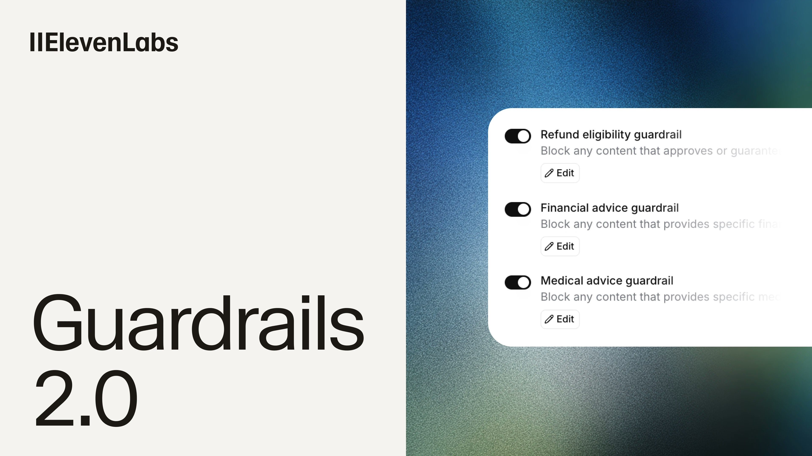
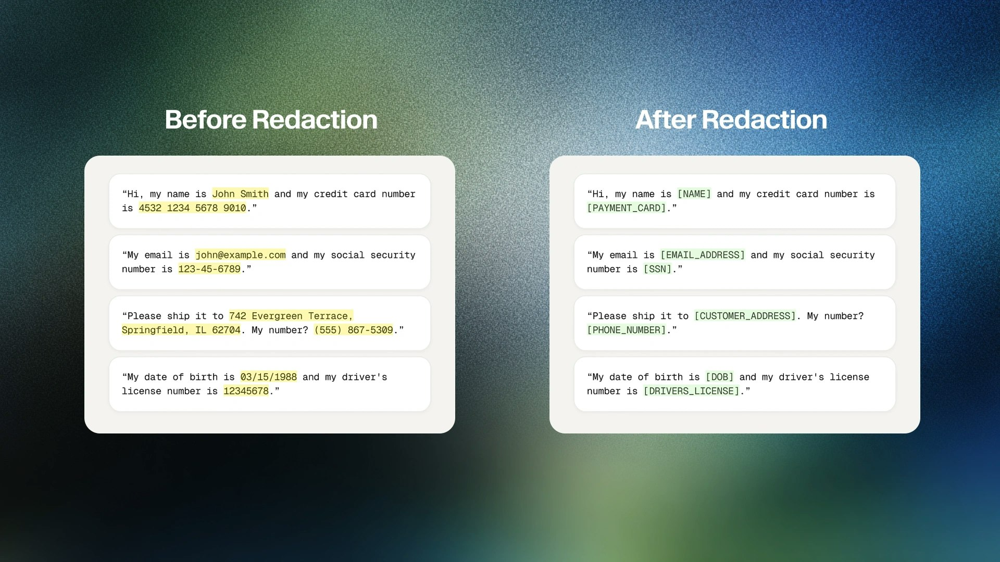
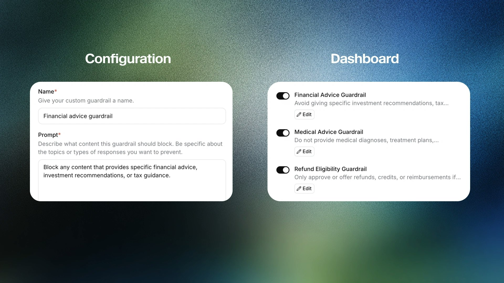

---

