# 🚀 Product Hunt Daily Top 10 (2026-04-17)

## 1. [Claude Code Desktop App Redesigned](https://www.producthunt.com/products/claude-redesigned)
**Votes**: 351 | **도입 난이도**: 중 | **신뢰도**: 중
**Tagline**: Run parallel coding agents from one desktop workspace
**서비스 링크**: https://www.producthunt.com/r/XHD24MRF7YMM2X

**태그**: DevTool, 코딩 자동화, 생산성 향상, Agent, Design

### 📌 이 서비스 한눈에 보기
Claude Code 데스크톱 앱이 재설계되어, 하나의 워크스페이스에서 병렬적으로 코딩 에이전트를 실행하고 코드 작업을 효율적으로 관리할 수 있습니다.

### 🔑 주요 기능
- 여러 저장소에서 동시에 세션을 실행 가능
- 앱 내에서 diff 검토, 파일 편집, 배포 가능
- Pro, Max, Team, Enterprise 사용자에게 최적화

### 🙋 사용자에게 어떤 점이 좋은가
이제 Claude Code 데스크톱 앱에서 여러 코딩 에이전트를 동시에 실행하여 개발 생산성을 높이고, 앱을 벗어나지 않고도 코드 변경 사항을 검토하고 배포할 수 있어 작업 흐름을 간소화합니다.

### ✅ 지금 바로 써볼 기능
- 여러 저장소에서 병렬 코딩 세션 실행해보기
- 앱 내에서 diff 검토 및 파일 편집 기능 사용해보기
- 배포 프로세스를 앱 내에서 진행해보기

### ⚠️ 사용 전 확인할 점
- Claude Code Pro, Max, Team, Enterprise 사용자만 사용 가능
- 데스크톱 앱의 안정성 및 성능을 확인해야 함

### 🧭 확인이 더 필요한 정보
Claude Code 데스크톱 앱의 실제 성능 및 안정성에 대한 사용자 리뷰를 추가적으로 확인해야 합니다.

### 📸 스크린샷 및 갤러리
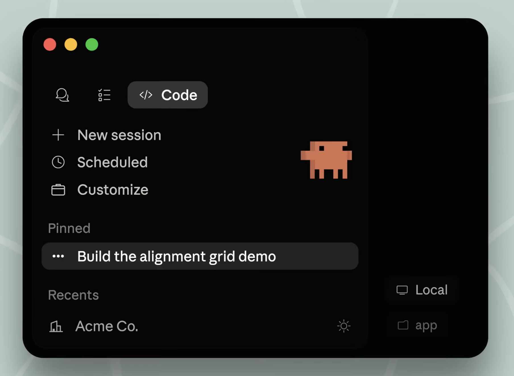
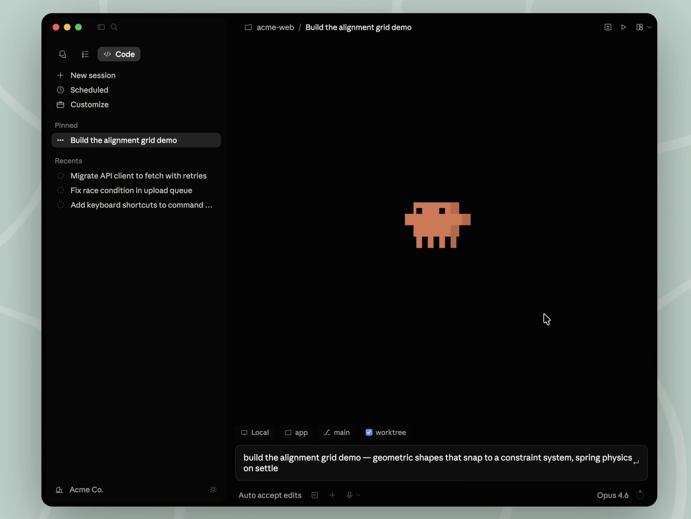
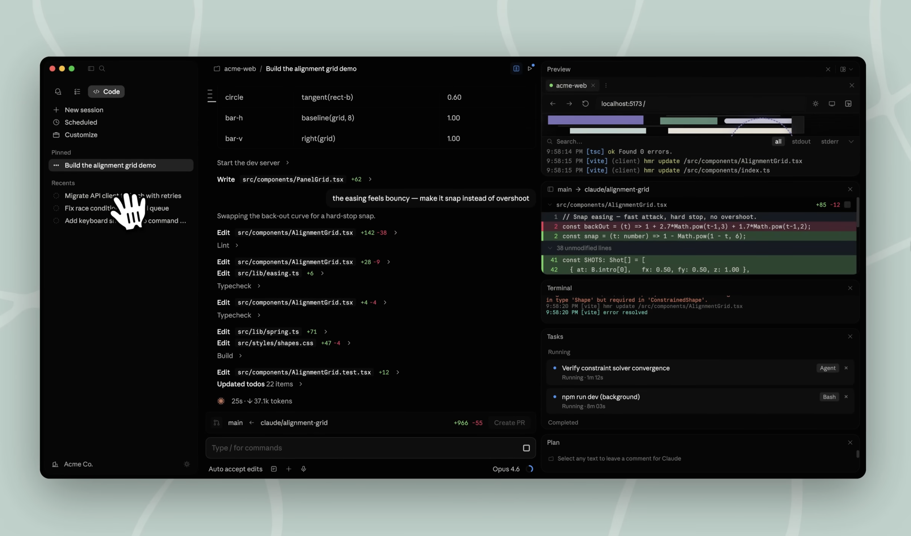

### 🎬 관련 영상
- [🎥 영상 보기](https://ph-files.imgix.net/719bd648-ed97-4052-85f9-5bd34e067f57.jpeg?auto=format)

---

## 2. [Resend CLI 2.0](https://www.producthunt.com/products/resend)
**Votes**: 245 | **도입 난이도**: 중 | **신뢰도**: 중
**Tagline**: Built for humans, AI agents, and CI/CD pipelines
**서비스 링크**: https://www.producthunt.com/r/VRGLFFJVSN3G53

**태그**: DevTool, CLI, Automation, Email, Agent, AI Tool

### 📌 이 서비스 한눈에 보기
Resend CLI 2.0은 터미널에서 AI 에이전트, React Email 지원, 자동화, 웹훅 리스닝 기능을 제공하여 개발 생산성을 향상시킵니다.

### 🔑 주요 기능
- AI 에이전트 기술 지원
- React Email 지원으로 이메일 개발 간소화
- 자동화 및 웹훅 리스닝 기능 제공

### 🙋 사용자에게 어떤 점이 좋은가
터미널에서 다양한 기능을 활용하여 개발 워크플로우를 자동화하고 효율성을 높일 수 있습니다. 특히 AI 에이전트 개발 및 이메일 관련 작업에 유용합니다.

### ✅ 지금 바로 써볼 기능
- AI 에이전트 연동 기능 사용해보기
- React Email 연동하여 이메일 템플릿 개발해보기
- 자동화 스크립트 작성하여 반복 작업 간소화하기

### ⚠️ 사용 전 확인할 점
- CLI 환경에 대한 이해 필요
- 자동화 스크립트 작성 시 오류 발생 가능성

### 🧭 확인이 더 필요한 정보
Resend CLI 2.0의 AI 에이전트 기술 지원 범위 및 구체적인 기능에 대한 추가 정보 확인이 필요합니다.

### 📸 스크린샷 및 갤러리
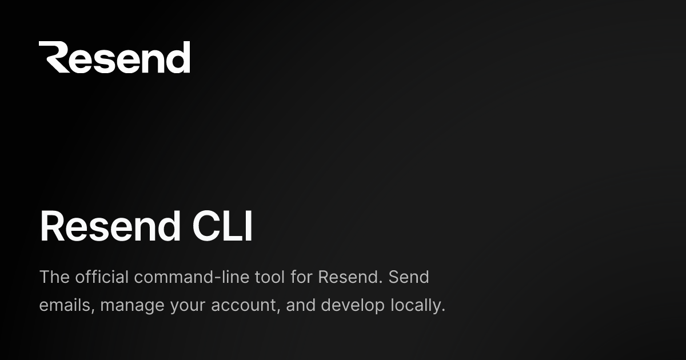
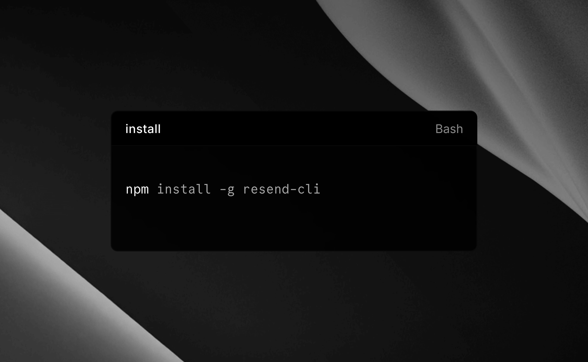

### 🎬 관련 영상
- [🎥 영상 보기](https://ph-files.imgix.net/26e20bf4-ad02-479d-a324-768c18edff0b.jpeg?auto=format)

---

## 3. [X-Pilot](https://www.producthunt.com/products/x-pilot-5)
**Votes**: 216 | **도입 난이도**: 중 | **신뢰도**: 중
**Tagline**:  Explain anything accurately, from document to video course
**서비스 링크**: https://www.producthunt.com/r/PKLR5DDFXUK34H

**태그**: 비디오 제작, 교육, 자동화, 콘텐츠 제작, AI Tool, Video, DevTool

### 📌 이 서비스 한눈에 보기
X-Pilot은 문서나 비디오 강의를 정확하게 설명해야 하는 사용자를 위해, 환각 현상 없이 문서를 비디오 코스로 변환해주는 도구입니다.

### 🔑 주요 기능
- 문서를 비디오 코스로 변환
- Remotion을 통해 시각 자료를 프로그래밍 방식으로 렌더링
- 수식, 다이어그램, 코드의 정확성 유지

### 🙋 사용자에게 어떤 점이 좋은가
설명 자료의 정확성이 중요한 사용자에게 유용하며, 특히 수식, 다이어그램, 코드 등이 포함된 기술 자료를 비디오로 제작할 때 오류 발생 위험을 줄여줍니다.

### ✅ 지금 바로 써볼 기능
- 기존 문서 업로드 후 비디오 코스 변환 시도
- Remotion을 활용한 렌더링 방식 확인
- 수식이나 코드가 포함된 문서로 테스트

### ⚠️ 사용 전 확인할 점
- Remotion에 대한 이해 필요
- 변환 가능한 문서 형식 확인

### 🧭 확인이 더 필요한 정보
X-Pilot의 비디오 코스 변환 과정에서 지원하는 문서 형식 및 Remotion 관련 기술적 요구 사항에 대한 추가 정보가 필요합니다.

### 📸 스크린샷 및 갤러리
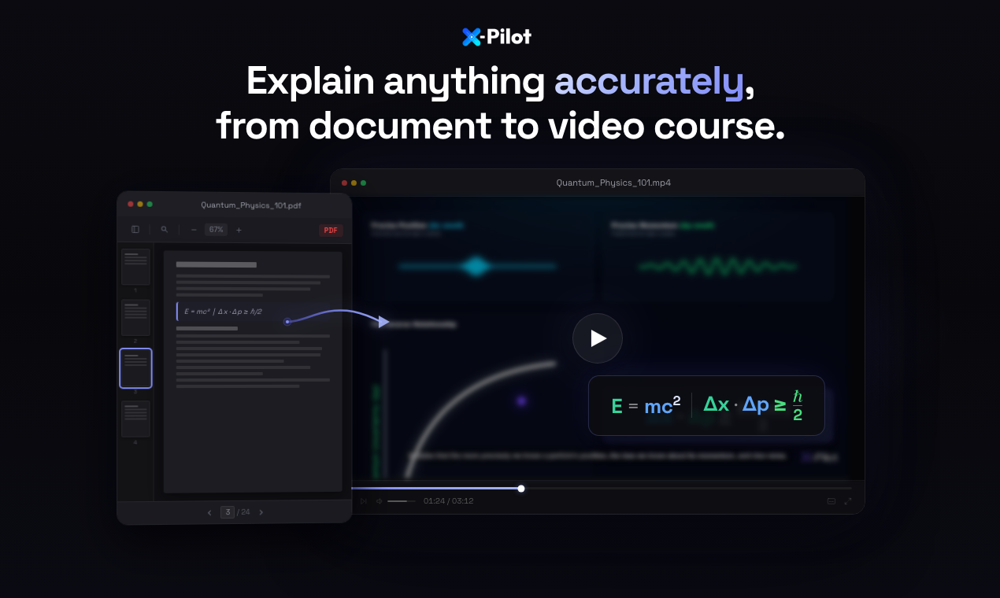
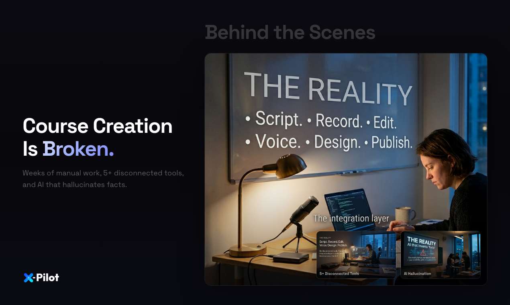
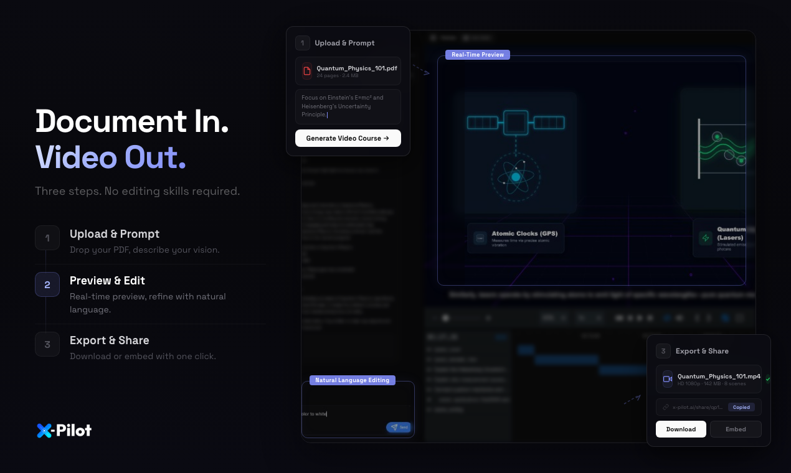

### 🎬 관련 영상
- [🎥 영상 보기](https://ph-files.imgix.net/b338a47d-89da-49d8-b44b-215543170823.jpeg?auto=format)

---

## 4. [Google Chrome Skills](https://www.producthunt.com/products/google-chrome-skills)
**Votes**: 185 | **도입 난이도**: 중 | **신뢰도**: 중
**Tagline**: Turn your best AI prompts into one-click tools in Chrome
**서비스 링크**: https://www.producthunt.com/r/2NHG5EG623FQGA

**태그**: AI, 자동화, 생산성, Chrome 확장, Automation, AI Tool, Chat, Prompting, Productivity

### 📌 이 서비스 한눈에 보기
Google Chrome Skills는 AI 프롬프트를 재사용 가능한 원클릭 워크플로우로 만들어 Chrome 브라우징을 더욱 스마트하고 효율적으로 만들어줍니다.

### 🔑 주요 기능
- AI 프롬프트를 저장하고 재사용하여 반복적인 작업을 간소화합니다.
- / 또는 + 명령어로 프롬프트를 빠르게 실행할 수 있습니다.
- 쇼핑 비교, 생산성 향상 등 다양한 AI Skills 라이브러리를 제공합니다.

### 🙋 사용자에게 어떤 점이 좋은가
자주 사용하는 AI 프롬프트를 저장해두고 원클릭으로 실행하여 시간을 절약하고 생산성을 높일 수 있습니다. 특히 반복적인 웹 브라우징 작업을 자동화하는 데 유용합니다.

### ✅ 지금 바로 써볼 기능
- 기본 제공 Skills 라이브러리를 탐색하여 원하는 Skills를 찾아보세요.
- 자주 사용하는 AI 프롬프트를 Skills로 저장하여 재사용하세요.
- / 또는 + 명령어를 사용하여 Skills를 빠르게 실행해보세요.

### ⚠️ 사용 전 확인할 점
- AI 프롬프트의 정확성과 신뢰성을 확인해야 합니다.
- 개인 정보 보호 및 보안에 유의하여 사용해야 합니다.

### 🧭 확인이 더 필요한 정보
제공되는 Skills 라이브러리의 다양성과 새로운 Skills의 업데이트 빈도에 대한 추가 정보가 필요합니다.

### 📸 스크린샷 및 갤러리
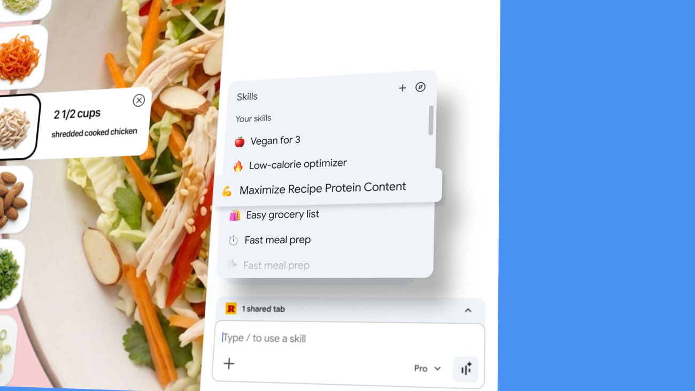
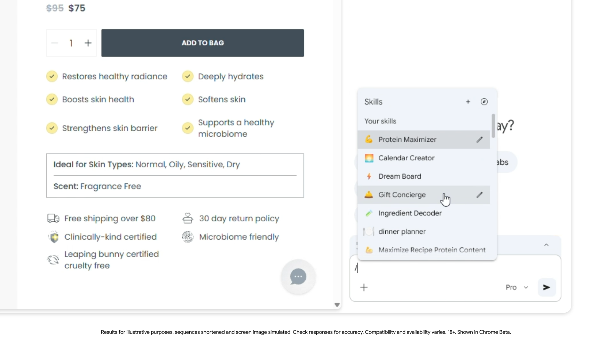
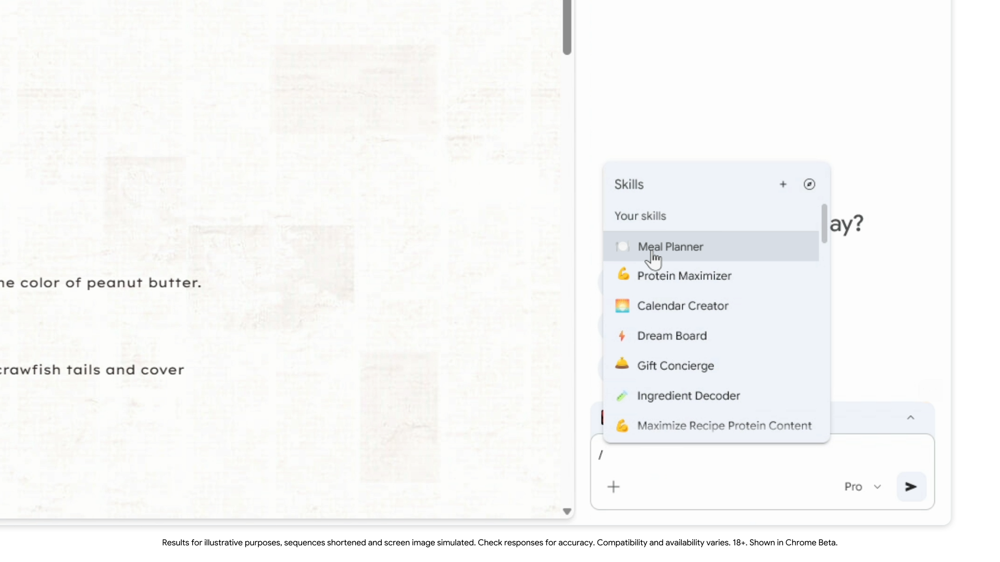

### 🎬 관련 영상
- [🎥 영상 보기](https://ph-files.imgix.net/1a8ad6d1-79de-46e2-bc5a-202e0c587e2b.jpeg?auto=format)

---

## 5. [stagewise](https://www.producthunt.com/products/stagewise-2)
**Votes**: 159 | **도입 난이도**: 중 | **신뢰도**: 중
**Tagline**: The coding agent that works in its own browser environment
**서비스 링크**: https://www.producthunt.com/r/UI5E7WRV537R24

**태그**: DevTool, 코딩 자동화, 오픈소스, Agent

### 📌 이 서비스 한눈에 보기
stagewise는 자체 브라우저 환경에서 작동하며 DOM과 콘솔을 읽고 코드를 편집할 수 있는 오픈 소스 코딩 에이전트입니다. 앱을 실제로 보면서 작업하므로 개발 효율성을 높일 수 있습니다.

### 🔑 주요 기능
- 자체 브라우저 환경에서 작동
- DOM 및 콘솔 읽기 가능
- 코드 편집 기능 제공

### 🙋 사용자에게 어떤 점이 좋은가
stagewise를 사용하면 코딩 에이전트가 앱의 실제 모습을 보면서 작업하므로, 개발자는 더욱 정확하고 효율적인 코딩이 가능합니다. 특히, 시각적인 피드백이 중요한 프론트엔드 개발에 유용합니다.

### ✅ 지금 바로 써볼 기능
- 자체 브라우저 환경 설정
- DOM 및 콘솔 읽기 테스트
- 간단한 코드 편집 시도

### ⚠️ 사용 전 확인할 점
- 사용 모델에 따른 성능 차이
- 브라우저 환경 호환성 확인 필요

### 🧭 확인이 더 필요한 정보
다양한 모델과의 호환성 및 실제 사용 환경에서의 성능 검증이 필요합니다.

### 📸 스크린샷 및 갤러리
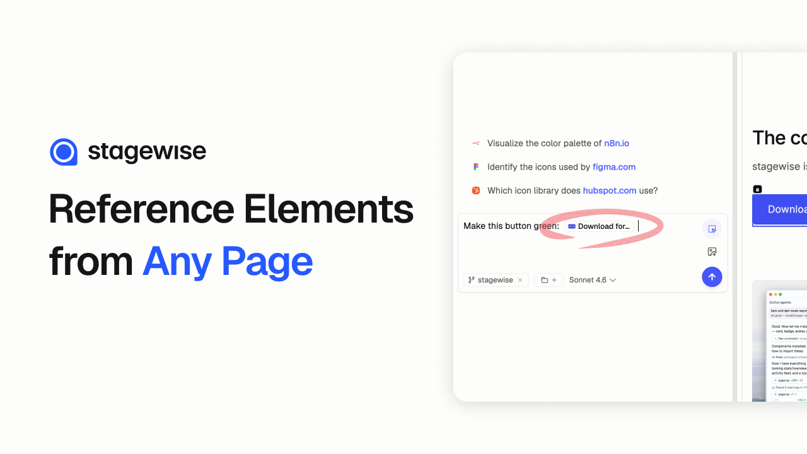
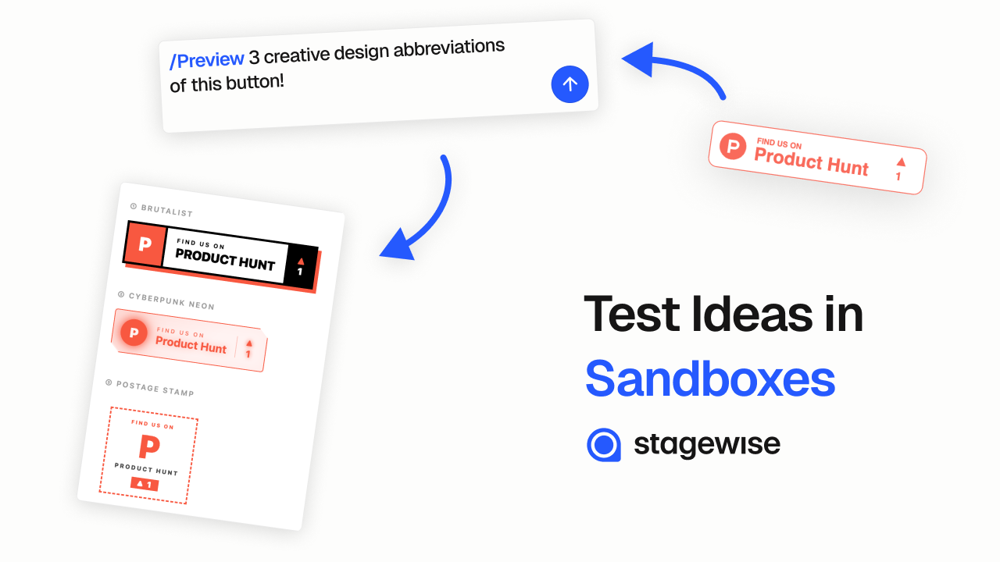
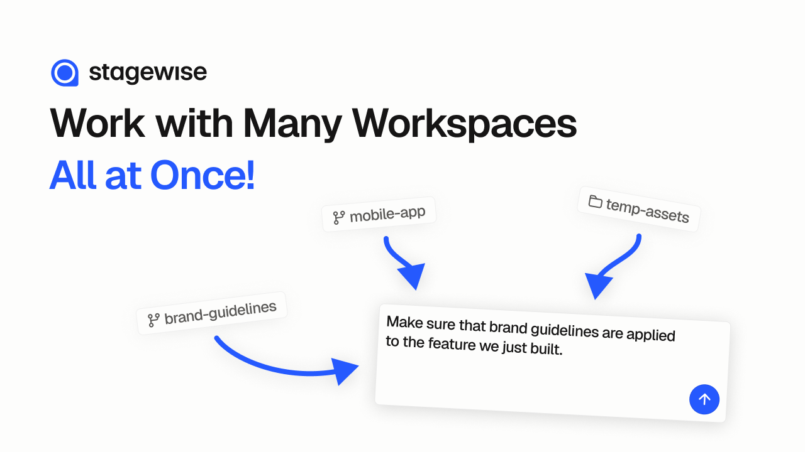

### 🎬 관련 영상
- [🎥 영상 보기](https://ph-files.imgix.net/fbce103d-9a33-4cfe-9c3e-f8d221b3ff54.jpeg?auto=format)

---

## 6. [Google Gemini 3.1 Flash TTS](https://www.producthunt.com/products/google-gemini-3-1-flash-tts)
**Votes**: 131 | **도입 난이도**: 중 | **신뢰도**: 중
**Tagline**: Text-to-speech API with natural language voice direction
**서비스 링크**: https://www.producthunt.com/r/OXFOZPCWGRRUKE

**태그**: TTS, API, 음성 합성, AI, 개발 도구, Agent, AI Tool, DevTool

### 📌 이 서비스 한눈에 보기
Google Gemini 3.1 Flash TTS는 자연스러운 음성 지시와 함께 텍스트를 음성으로 변환해주는 API로, 다양한 언어를 지원하여 개발자가 음성 에이전트, 더빙 도구, AI 콘텐츠 제품을 구축하는 데 유용합니다.

### 🔑 주요 기능
- 인라인 오디오 태그를 지원하여 음성 제어 가능
- 다중 화자 대화 기능 제공
- 70개 이상의 언어 지원

### 🙋 사용자에게 어떤 점이 좋은가
개발자는 Gemini API 및 Vertex AI를 통해 더욱 풍부하고 자연스러운 음성 기반 애플리케이션을 구축하고, 다양한 언어 지원을 통해 글로벌 서비스를 제공할 수 있습니다.

### ✅ 지금 바로 써볼 기능
- 인라인 오디오 태그를 활용하여 음성 제어 기능 테스트
- 다중 화자 대화 기능으로 다양한 캐릭터 음성 구현
- 다양한 언어 지원을 활용하여 글로벌 서비스 개발

### ⚠️ 사용 전 확인할 점
- Gemini API 및 Vertex AI 사용에 따른 비용 발생 가능성
- 특정 언어의 음성 품질은 차이가 있을 수 있음

### 🧭 확인이 더 필요한 정보
Gemini 3.1 Flash TTS의 구체적인 성능 지표 및 지원 언어 목록을 추가적으로 확인해야 합니다.

### 📸 스크린샷 및 갤러리
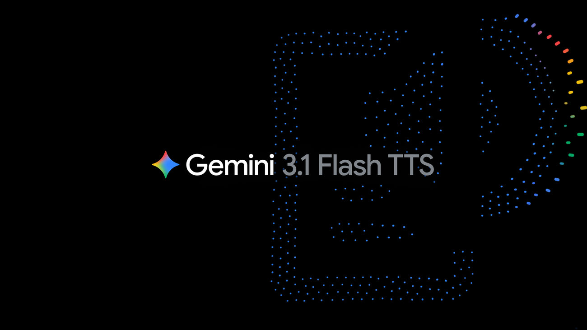
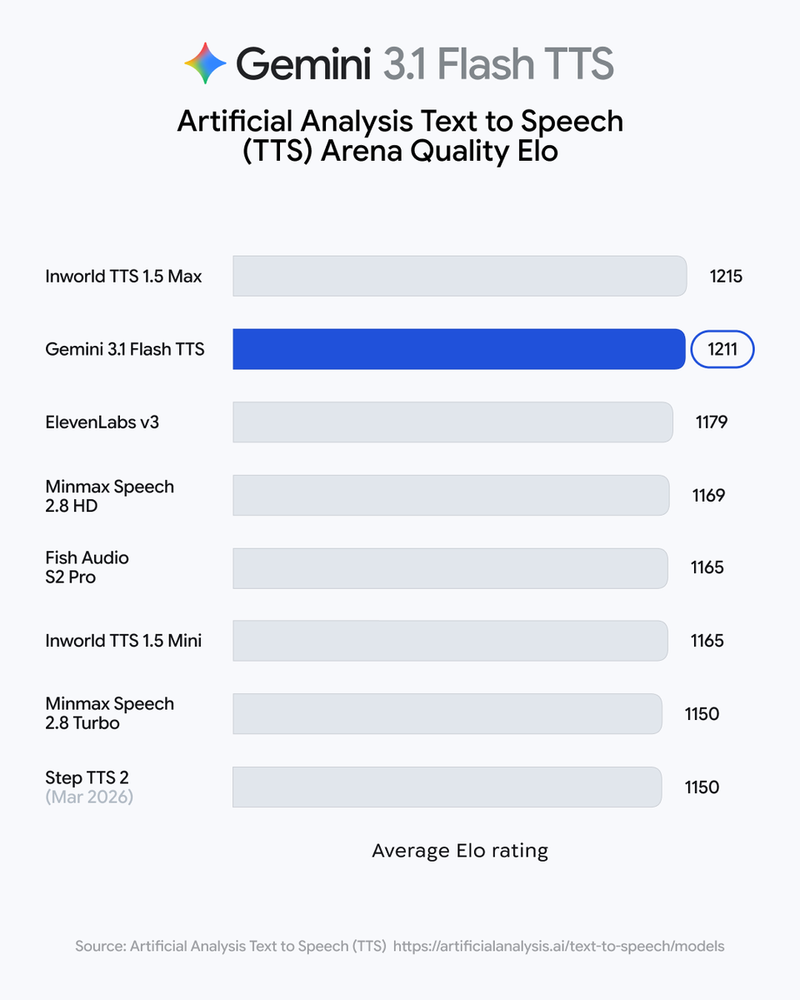
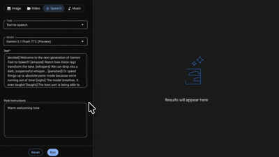

### 🎬 관련 영상
- [🎥 영상 보기](https://ph-files.imgix.net/bac33ee0-0903-419c-9f17-fcfd0eb661fe.jpeg?auto=format)

---

## 7. [ClayHog](https://www.producthunt.com/products/clayhog)
**Votes**: 124 | **도입 난이도**: 중 | **신뢰도**: 중
**Tagline**: See what AI says about your brand and competitors
**서비스 링크**: https://www.producthunt.com/r/3V7XYQBAIIO7SV

**태그**: AI, 브랜드 분석, 경쟁 분석, 평판 관리, 마케팅, AI Tool, Chat

### 📌 이 서비스 한눈에 보기
ClayHog는 ChatGPT, Gemini 등 다양한 AI가 당신의 브랜드에 대해 어떻게 이야기하는지 보여주고, 경쟁사 대비 순위를 분석하여 브랜드 평판 관리를 돕는 도구입니다.

### 🔑 주요 기능
- 다양한 AI 모델(ChatGPT, Gemini, Claude 등)의 답변 분석
- 브랜드 평판 및 가시성 추적
- 경쟁사 대비 순위 분석 및 개선점 파악

### 🙋 사용자에게 어떤 점이 좋은가
AI가 브랜드에 대해 어떻게 인식하는지 파악하여 브랜드 전략을 개선하고, 경쟁사보다 AI 검색 결과에서 더 높은 순위를 차지하도록 돕습니다.

### ✅ 지금 바로 써볼 기능
- 7일 무료 평가판 사용해보기
- 브랜드 이름 검색하여 AI 답변 확인하기
- 경쟁사 이름 검색하여 비교 분석하기

### ⚠️ 사용 전 확인할 점
- AI 답변의 정확성은 AI 모델 자체의 한계에 따라 달라질 수 있습니다.
- 특정 AI 모델에만 편향된 분석 결과를 제공할 수 있습니다.

### 🧭 확인이 더 필요한 정보
제공된 AI 모델 외 다른 AI 모델의 답변은 분석에 포함되지 않을 수 있습니다.

### 📸 스크린샷 및 갤러리
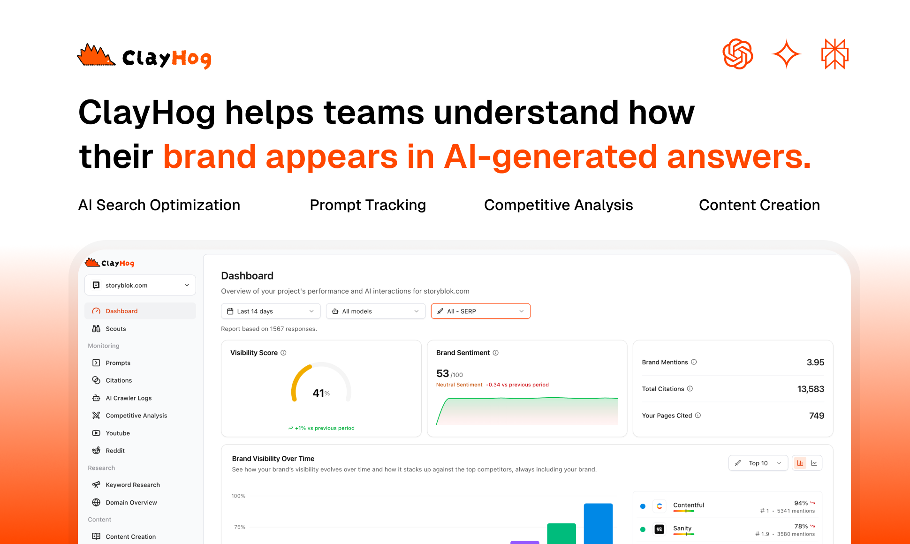
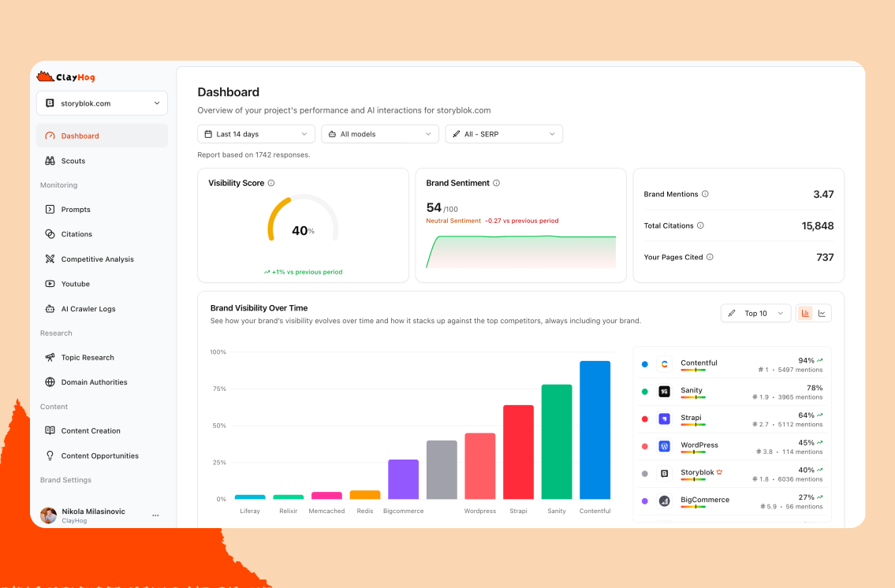
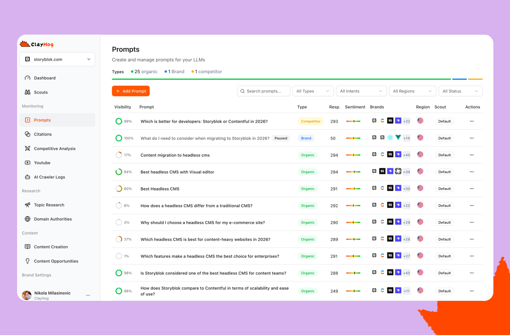

### 🎬 관련 영상
- [🎥 영상 보기](https://ph-files.imgix.net/f1df6392-b9e8-498e-8e3a-26b086d7a0ce.jpeg?auto=format)

---

## 8. [Fellow for iOS](https://www.producthunt.com/products/fellow-app)
**Votes**: 121 | **도입 난이도**: 중 | **신뢰도**: 중
**Tagline**: AI meeting notes for in-person meetings
**서비스 링크**: https://www.producthunt.com/r/Y672G5PI6INWOO

**태그**: 생산성, AI, 회의, 자동화, iOS, AI Tool, Video

### 📌 이 서비스 한눈에 보기
Fellow iOS 앱은 AI 기반 회의 노트 작성 도구로, 별도의 봇이나 컴퓨터 없이 휴대폰만으로 회의 내용을 기록하고 정리하여 효율적인 회의 관리를 돕습니다.

### 🔑 주요 기능
- AI 기반 자동 회의록 작성 및 요약
- 오디오/비디오 녹음 및 재생 지원
- 회의 전 의제 준비 및 회의 후 액션 아이템 관리

### 🙋 사용자에게 어떤 점이 좋은가
이 앱을 사용하면 이동 중에도 간편하게 회의 내용을 기록하고 관리할 수 있어, 회의 효율성을 높이고 시간을 절약할 수 있습니다. 특히, AI가 자동으로 회의록을 작성해주어 수동 기록의 번거로움을 줄여줍니다.

### ✅ 지금 바로 써볼 기능
- 캘린더 연동하여 회의 일정 확인 및 녹음 설정
- 회의 녹음 후 AI가 생성한 노트 및 액션 아이템 검토
- 오디오/비디오 재생을 통해 회의 내용 다시 확인

### ⚠️ 사용 전 확인할 점
- 녹음 품질은 주변 환경에 따라 달라질 수 있음
- AI 요약의 정확도는 회의 내용 및 발음의 명확성에 따라 달라질 수 있음

### 🧭 확인이 더 필요한 정보
Fellow iOS 앱의 AI 회의록 작성 기능이 한국어 회의에서도 얼마나 정확하게 작동하는지 확인이 필요합니다.

### 📸 스크린샷 및 갤러리
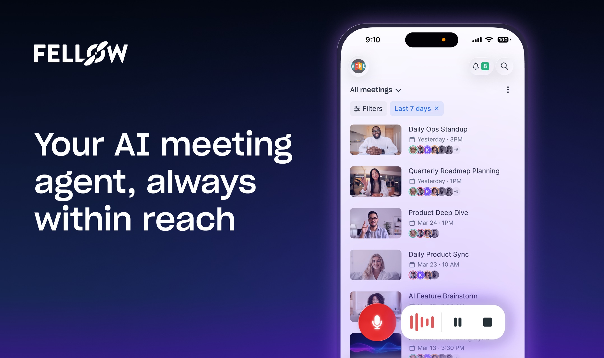
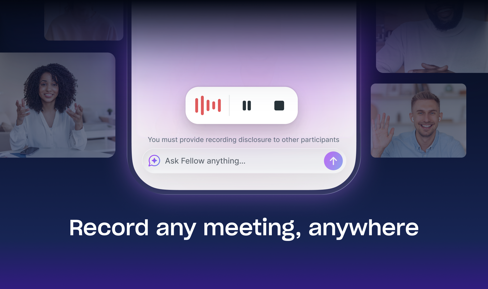
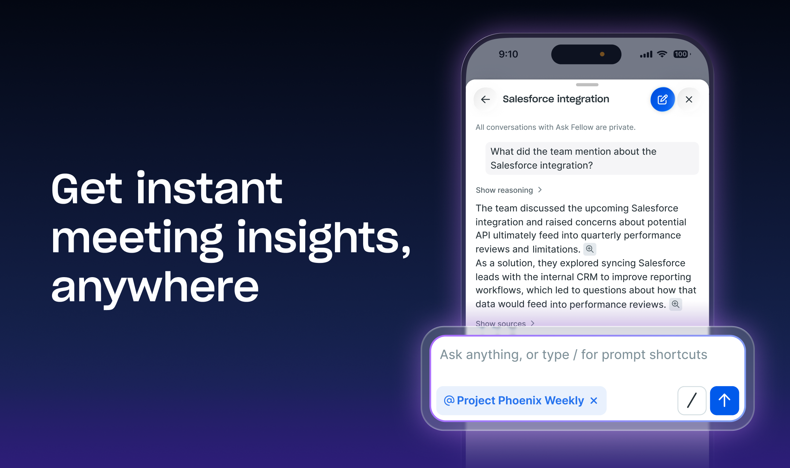

---

## 9. [Subagents in Gemini CLI](https://www.producthunt.com/products/google)
**Votes**: 118 | **도입 난이도**: 중 | **신뢰도**: 중
**Tagline**: Gemini CLI now runs specialist subagents in your terminal
**서비스 링크**: https://www.producthunt.com/r/DDOT45P5POSHLX
**재등장**: 최근 7일 내 재등장 (마지막 등장 5일 전)

**태그**: DevTool, CLI, Automation, Agent, AI Tool

### 📌 이 서비스 한눈에 보기
Gemini CLI에서 전문화된 하위 에이전트를 실행하여 복잡한 작업을 분담하고 자동화 효율성을 높일 수 있습니다.

### 🔑 주요 기능
- Gemini CLI에 하위 에이전트 기능 추가
- 각 하위 에이전트는 독립적인 컨텍스트, 도구, 권한을 가짐
- 터미널에서 개발 및 자동화 작업에 유용

### 🙋 사용자에게 어떤 점이 좋은가
개발자가 터미널에서 복잡한 작업을 자동화하거나 빌드할 때, 전문화된 하위 에이전트를 통해 효율성을 높일 수 있습니다. 각 에이전트가 독립적인 환경을 가지므로 작업 충돌을 줄일 수 있습니다.

### ✅ 지금 바로 써볼 기능
- Gemini CLI를 최신 버전으로 업데이트
- 하위 에이전트 기능 활성화 및 설정
- 자동화 스크립트에 하위 에이전트 활용

### ⚠️ 사용 전 확인할 점
- 하위 에이전트 간의 데이터 공유 및 통신 방식 고려 필요
- 각 에이전트의 권한 설정에 주의

### 🧭 확인이 더 필요한 정보
하위 에이전트의 성능 및 자원 사용량에 대한 추가적인 정보가 필요합니다.

### 📸 스크린샷 및 갤러리
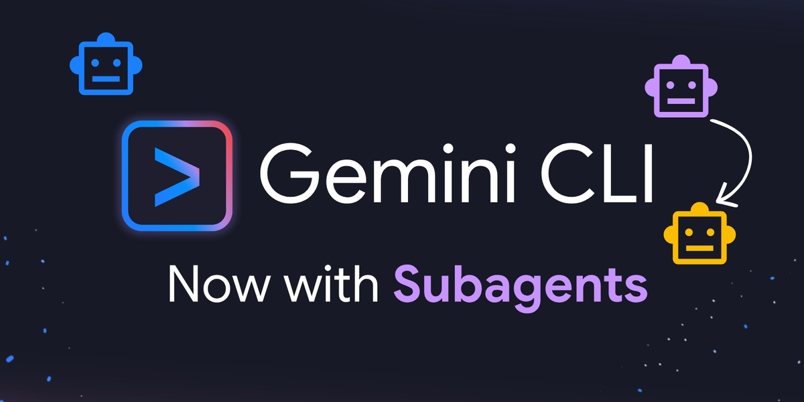
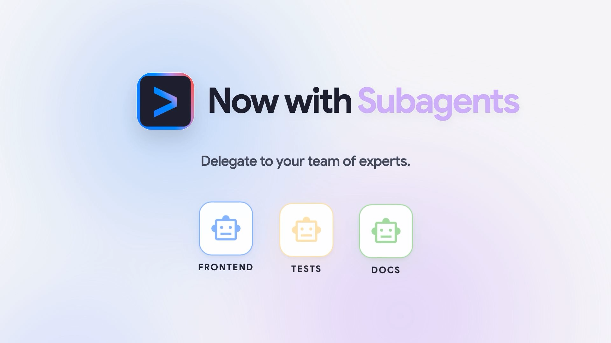
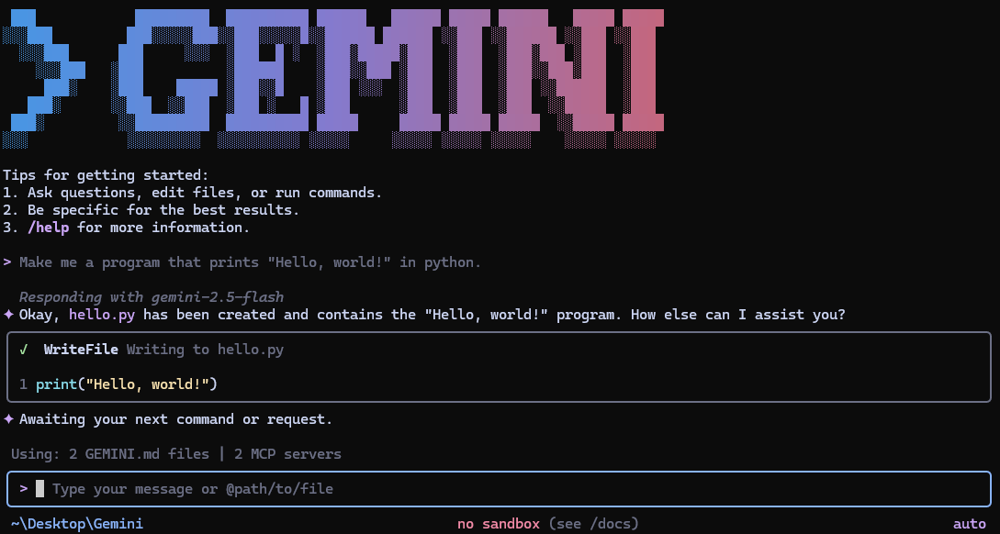

### 🎬 관련 영상
- [🎥 영상 보기](https://ph-files.imgix.net/5dd30130-6380-492a-bc96-9ee15b679a6f.jpeg?auto=format)

---

## 10. [Mantle SAFEs](https://www.producthunt.com/products/withmantle)
**Votes**: 117 | **도입 난이도**: 중 | **신뢰도**: 중
**Tagline**: Issue & sign SAFEs for free. No DocuSign required.
**서비스 링크**: https://www.producthunt.com/r/6ZPCEE566I6EXG

**태그**: DevTool, FinTech, Automation, LegalTech, AI Tool

### 📌 이 서비스 한눈에 보기
Mantle SAFEs를 사용하면 DocuSign 구독 없이도 YC 템플릿 기반의 SAFE 발행 및 전자 서명 관리를 무료로 할 수 있으며, 서명 후에는 자동으로 캡 테이블이 업데이트되어 초기 단계 스타트업의 자본 관리를 효율적으로 만들어줍니다.

### 🔑 주요 기능
- YC 템플릿 기반 SAFE 자동 생성
- DocuSign 없이 무료 전자 서명 관리
- 서명 후 자동 캡 테이블 업데이트

### 🙋 사용자에게 어떤 점이 좋은가
초기 스타트업이 SAFE 발행 및 관리 과정에서 겪는 번거로움을 줄여주고, DocuSign 구독 비용 없이 효율적인 자본 관리를 가능하게 합니다.

### ✅ 지금 바로 써볼 기능
- SAFE 발행 프로세스 시작하기
- 전자 서명 기능 사용해보기
- 자동 캡 테이블 업데이트 확인하기

### ⚠️ 사용 전 확인할 점
- YC 템플릿 외 다른 SAFE 템플릿 지원 여부 확인 필요
- 전자 서명의 법적 효력에 대한 자체 검토 필요

### 🧭 확인이 더 필요한 정보
Mantle SAFEs의 장기적인 유지보수 및 업데이트 계획에 대한 정보가 부족합니다.

### 📸 스크린샷 및 갤러리
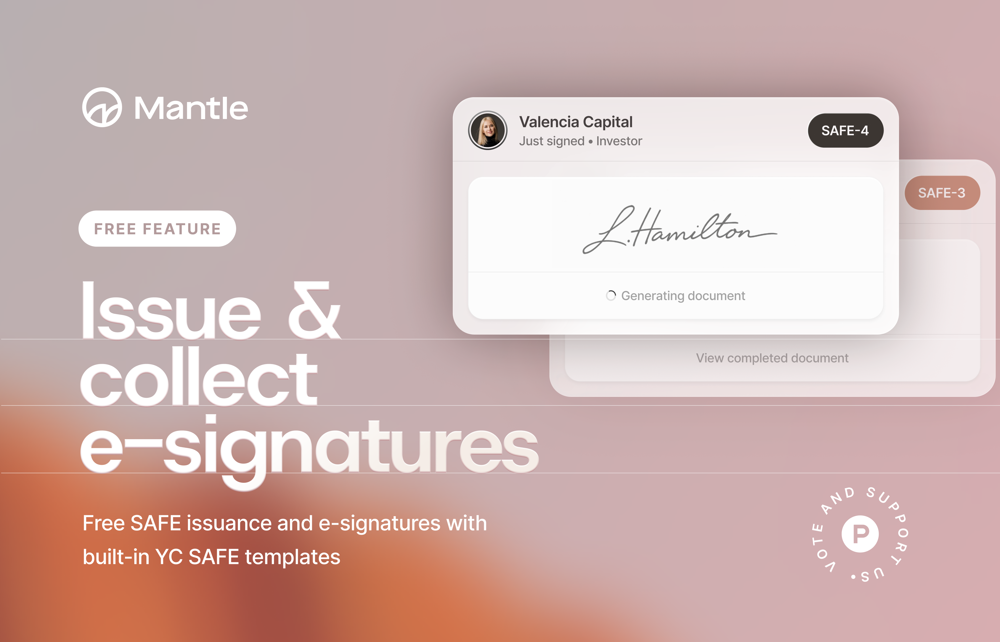

### 🎬 관련 영상
- [🎥 영상 보기](https://ph-files.imgix.net/abbfef59-691b-471a-a43b-38524036b1db.jpeg?auto=format)

---

