# 🚀 Product Hunt Daily Top 10 (2026-04-18)

## 1. [Claude Opus 4.7](https://www.producthunt.com/products/claude-opus-4-7)
**Votes**: 361 | **도입 난이도**: 중 | **신뢰도**: 중
**Tagline**: Claude’s most capable model for reasoning and agentic coding
**서비스 링크**: https://www.producthunt.com/r/ODDUWVTWKOPU45

**태그**: AI, 코딩, 자동화, 연구, 생산성, Agent, Automation, AI Tool

### 📌 이 서비스 한눈에 보기
Claude Opus 4.7은 Anthropic에서 제공하는 가장 강력한 AI 모델로, 복잡한 추론과 에이전트 코딩에 특화되어 장기적인 작업 수행, 정확한 지시 이행, 결과 검증, 고품질 결과 제공에 강점을 가집니다.

### 🔑 주요 기능
- Anthropic의 최첨단 AI 모델
- 복잡한 추론 및 에이전트 코딩에 최적화
- 장기 실행 작업 및 정확한 지시 수행

### 🙋 사용자에게 어떤 점이 좋은가
코딩, 연구, 워크플로우 등 다양한 분야에서 고품질 결과를 얻을 수 있어 생산성을 향상시키고 복잡한 문제를 해결하는 데 도움을 줍니다.

### ✅ 지금 바로 써볼 기능
- 복잡한 코딩 작업에 활용해보기
- 연구 프로젝트의 데이터 분석에 적용해보기
- 자동화 워크플로우 구축에 사용해보기

### ⚠️ 사용 전 확인할 점
- 모델의 복잡성으로 인해 초기 학습 비용이 발생할 수 있음
- 특정 분야에 대한 편향이 존재할 수 있으므로 결과 검증 필수

### 🧭 확인이 더 필요한 정보
실제 사용 환경에서의 성능 및 안정성에 대한 추가적인 검증이 필요합니다.

### 📸 스크린샷 및 갤러리
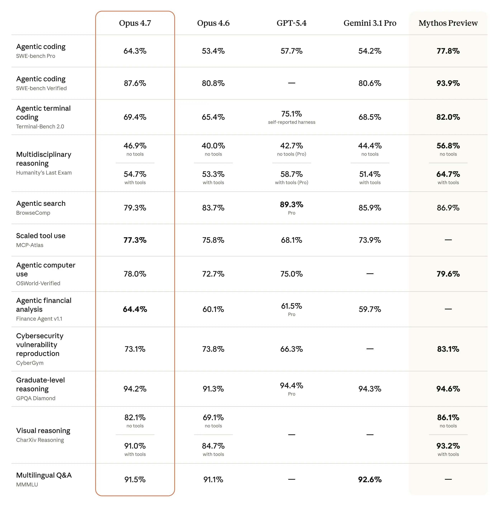
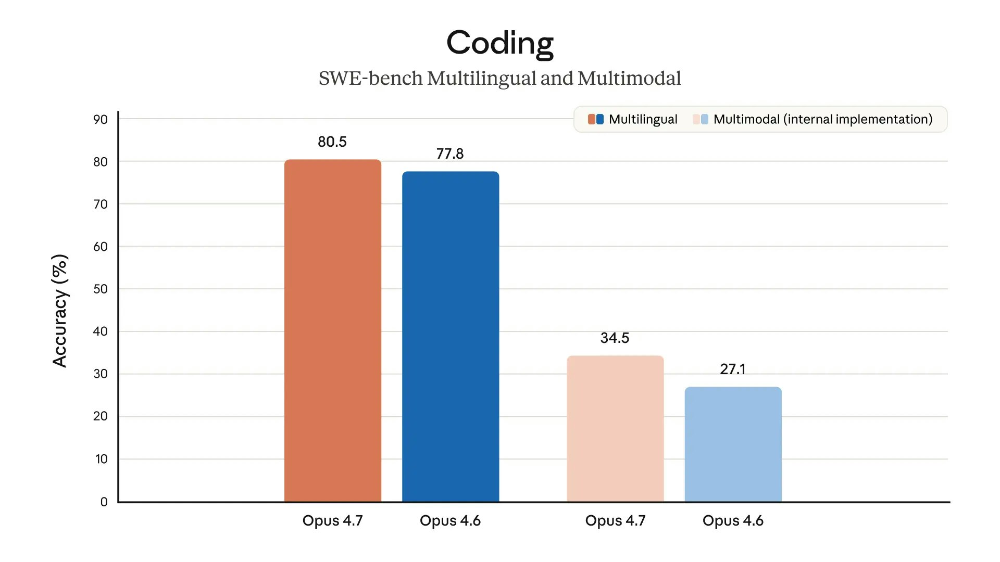
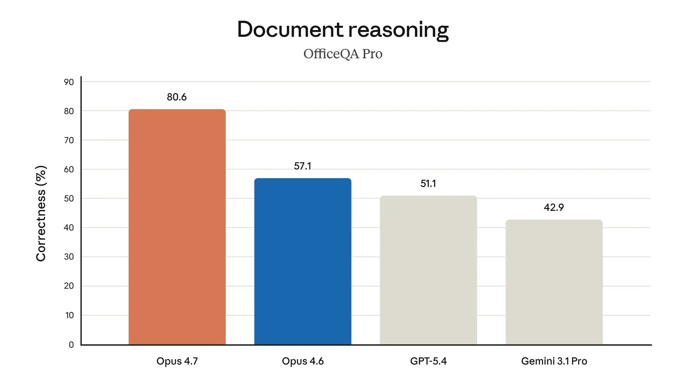

---

## 2. [Build Check (for Outsiders)](https://www.producthunt.com/products/build-check-for-outsiders)
**Votes**: 295 | **도입 난이도**: 하 | **신뢰도**: 중
**Tagline**: Is your app idea actually worth building?
**서비스 링크**: https://www.producthunt.com/r/PAAYARPATBOR7T

**태그**: 아이디어 검증, 앱 개발, 퀴즈, 평가, DevTool

### 📌 이 서비스 한눈에 보기
앱 개발에 들어가기 전에 아이디어가 실제로 가치가 있는지 무료 퀴즈를 통해 6가지 차원에서 평가하여 시간 낭비를 줄여줍니다.

### 🔑 주요 기능
- 앱 아이디어의 가치를 평가
- 6가지 차원 분석 제공
- 개발 전 아이디어 검증

### 🙋 사용자에게 어떤 점이 좋은가
앱 개발에 시간과 노력을 투자하기 전에 아이디어가 실현 가능한지, 시장성이 있는지 빠르게 판단할 수 있도록 도와줍니다.

### ✅ 지금 바로 써볼 기능
- 앱 아이디어 퀴즈 바로 시작하기
- 결과를 바탕으로 아이디어 개선하기
- 다른 아이디어와 비교 분석하기

### ⚠️ 사용 전 확인할 점
- 퀴즈 결과는 참고용이며, 실제 시장 상황과 다를 수 있습니다.
- 아이디어의 성공을 보장하지 않습니다.

### 🧭 확인이 더 필요한 정보
제공된 6가지 차원이 모든 앱 아이디어에 적합한 평가 기준인지 추가적인 검토가 필요합니다.

### 📸 스크린샷 및 갤러리
_media_0.jpg)
_media_1.jpg)
_media_2.jpg)

### 🎬 관련 영상
- [🎥 영상 보기](https://ph-files.imgix.net/e674e508-d76b-442d-a023-d5df29994e65.jpeg?auto=format)

---

## 3. [E.Y.E. by Expert Chase](https://www.producthunt.com/products/expert-chase-deleted-1107920)
**Votes**: 217 | **도입 난이도**: 중 | **신뢰도**: 중
**Tagline**: Where human life runs with AI
**서비스 링크**: https://www.producthunt.com/r/GCQEFP2KEUCOT4

**태그**: AI, 생산성, 개인 비서, 자동화, 트래커, AI Tool

### 📌 이 서비스 한눈에 보기
E.Y.E.는 AI를 활용하여 일상생활의 모든 것을 한 곳에서 관리할 수 있도록 돕는 올인원 앱입니다.

### 🔑 주요 기능
- AI 기반 개인 맞춤형 정보 제공
- 다양한 앱(할 일, 캘린더, 트래커 등) 통합
- 하나의 구독으로 무제한 AI 사용

### 🙋 사용자에게 어떤 점이 좋은가
E.Y.E.를 통해 여러 앱을 사용할 필요 없이, AI가 사용자의 데이터를 기반으로 필요한 정보를 제공하여 시간을 절약하고 효율성을 높일 수 있습니다.

### ✅ 지금 바로 써볼 기능
- AI에게 오늘 할 일 추천 요청
- 식단 및 수면 패턴 기록 시작
- 금융 정보 연동하여 지출 분석

### ⚠️ 사용 전 확인할 점
- 개인 정보 보호 정책 확인 필요
- AI 답변의 정확성 검증 필요

### 🧭 확인이 더 필요한 정보
E.Y.E.의 AI가 제공하는 정보의 신뢰도 및 개인 정보 처리 방식에 대한 추가적인 정보 확인이 필요합니다.

### 📸 스크린샷 및 갤러리
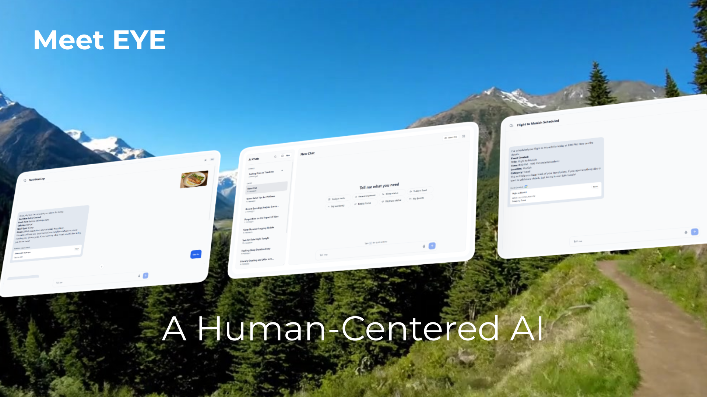
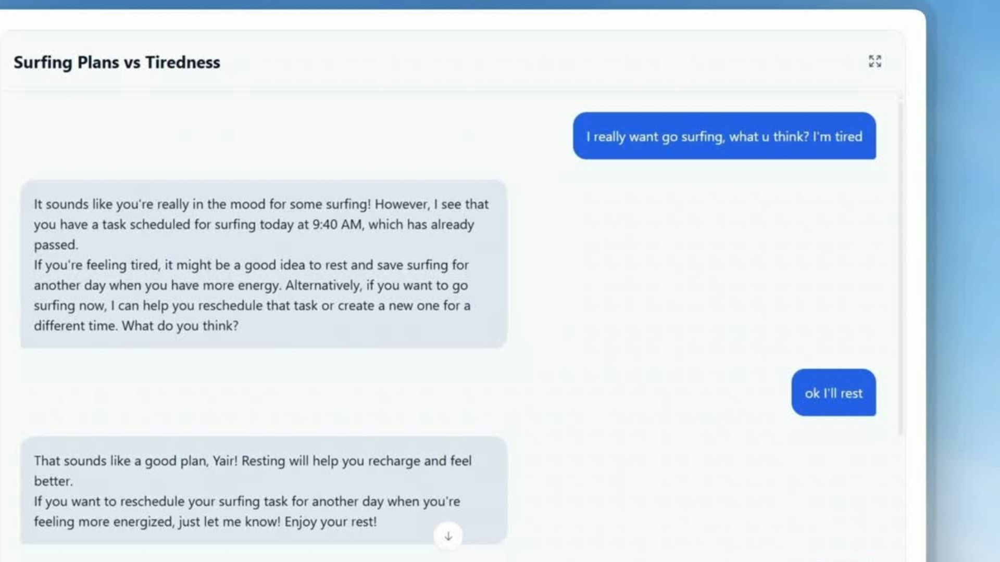
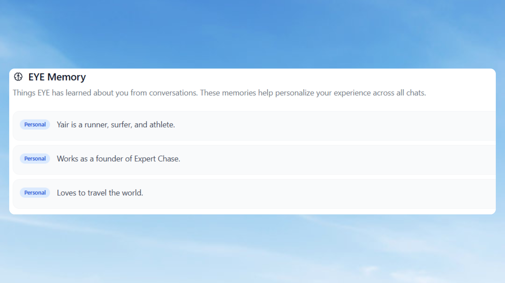

### 🎬 관련 영상
- [🎥 영상 보기](https://ph-files.imgix.net/b23138c5-b8a2-4f6b-957f-70d5595bd7a0.jpeg?auto=format)

---

## 4. [Codex 2.0 by OpenAI](https://www.producthunt.com/products/openai)
**Votes**: 207 | **도입 난이도**: 중 | **신뢰도**: 중
**Tagline**: Codex now runs apps, automates tasks, codes & more
**서비스 링크**: https://www.producthunt.com/r/AO2GMMCVV4OJK2

**태그**: AI, DevTool, Automation, Workflow, AI Tool, Vision

### 📌 이 서비스 한눈에 보기
OpenAI의 Codex가 코딩을 넘어 앱 실행, 작업 자동화, 이미지 생성 등 다양한 기능을 수행하는 AI 기반 작업 동반자로 진화했습니다.

### 🔑 주요 기능
- 컴퓨터 조작, 앱 상호 작용, 이미지 생성 기능 제공
- 90개 이상의 도구와 연동 및 장기 실행 작업 자동화 지원
- 기억, 상황 인식, 백그라운드 실행을 통해 개발 및 협업 효율성 향상

### 🙋 사용자에게 어떤 점이 좋은가
개발자와 팀이 소프트웨어 개발 라이프사이클 전반에 걸쳐 워크플로우를 관리하고, 더 빠르게 반복하며, 업무를 효과적으로 처리할 수 있도록 돕습니다.

### ✅ 지금 바로 써볼 기능
- 앱 실행 기능 사용해보기
- 작업 자동화 기능 활용해보기
- 이미지 생성 기능 테스트해보기

### ⚠️ 사용 전 확인할 점
- 지원하는 앱 및 도구 목록 확인 필요
- 자동화 작업의 정확성 및 예상치 못한 오류 발생 가능성 고려

### 🧭 확인이 더 필요한 정보
Codex의 성능이 실제 개발 환경에서 어느 정도의 효율성을 제공할지 추가적인 검증이 필요합니다.

### 📸 스크린샷 및 갤러리
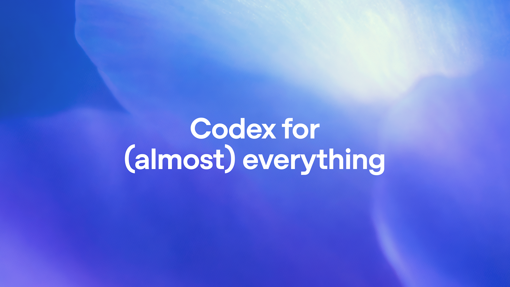
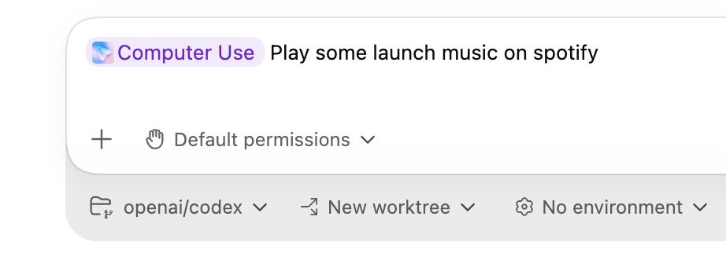

---

## 5. [Submit.DIY](https://www.producthunt.com/products/submit-diy)
**Votes**: 190 | **도입 난이도**: 중 | **신뢰도**: 중
**Tagline**: All-in-one AI launch platform for makers
**서비스 링크**: https://www.producthunt.com/r/FP55QXKMLWV5XP

**태그**: AI, Product Launch, Automation, Marketing, Productivity, AI Tool

### 📌 이 서비스 한눈에 보기
Submit.DIY는 AI 기반의 올인원 제품 출시 플랫폼으로, 제품 출시 계획, 실행, 추적을 한 곳에서 관리하고 AI가 생성해주는 문구로 모든 채널에 쉽게 게시할 수 있습니다.

### 🔑 주요 기능
- AI Sidekick을 통해 모든 채널에 적합한 문구를 자동 생성
- 제품 출시 계획, 실행, 추적을 위한 다양한 기능 통합
- 흩어져 있는 정보들을 한 곳에서 관리하여 효율성 증대

### 🙋 사용자에게 어떤 점이 좋은가
제품 출시 과정을 간소화하고 자동화하여 시간과 노력을 절약해주며, AI가 생성한 문구를 활용하여 마케팅 콘텐츠 제작 부담을 줄여줍니다.

### ✅ 지금 바로 써볼 기능
- AI Sidekick을 사용하여 제품 설명 초안 생성해보기
- 출시 계획 템플릿을 활용하여 전체 출시 일정 구성해보기
- 채널별 맞춤 문구 자동 생성 기능 사용해보기

### ⚠️ 사용 전 확인할 점
- AI가 생성한 문구의 정확성과 적절성을 검토해야 함
- 플랫폼에 대한 의존성이 높아질 수 있음

### 🧭 확인이 더 필요한 정보
AI Sidekick의 문구 생성 품질과 다양한 채널 지원 범위에 대한 추가 정보가 필요합니다.

### 📸 스크린샷 및 갤러리
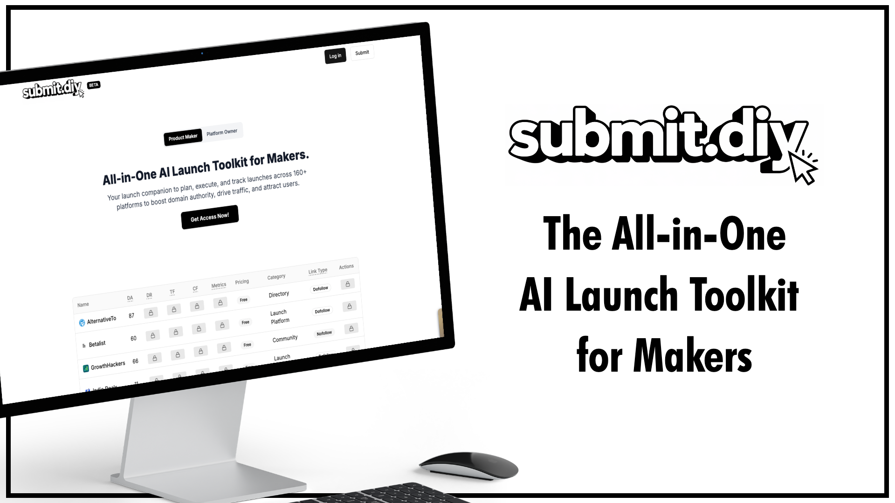
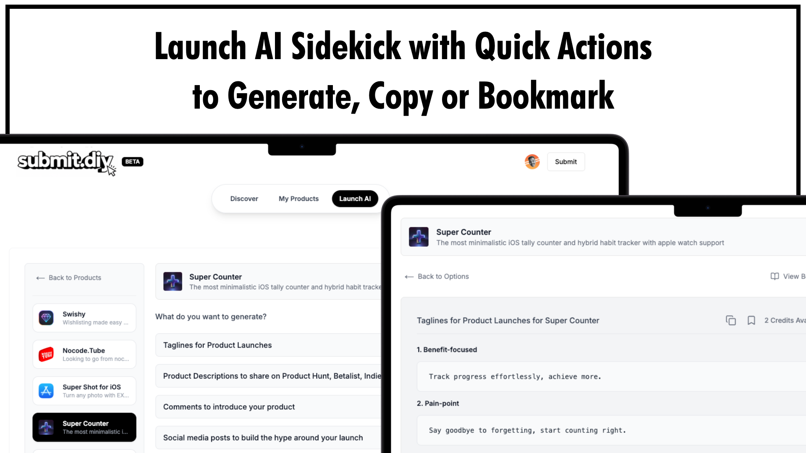
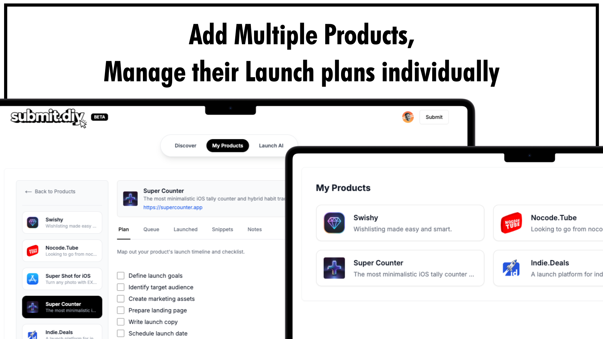

### 🎬 관련 영상
- [🎥 영상 보기](https://ph-files.imgix.net/dc8450b6-6230-4891-8a47-09bd1f066a7f.jpeg?auto=format)

---

## 6. [Canva AI 2.0](https://www.producthunt.com/products/canva)
**Votes**: 137 | **도입 난이도**: 중 | **신뢰도**: 중
**Tagline**: AI that creates with you, and connects to your world
**서비스 링크**: https://www.producthunt.com/r/QO5SBISWZ574XP

**태그**: AI, 디자인, 자동화, 협업, Agent, AI Tool, Prompting, Design

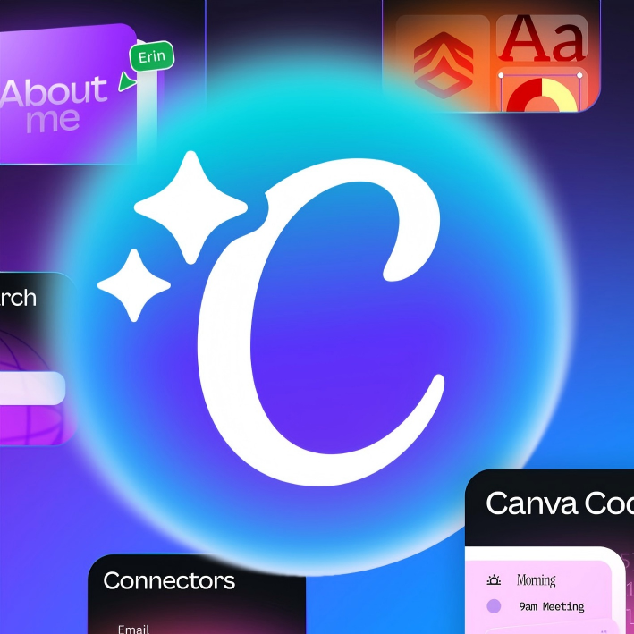

### 📌 이 서비스 한눈에 보기
Canva AI 2.0은 사용자와 소통하며 창작물을 만들고, 다양한 도구와 연결되어 디자인 과정을 획기적으로 단축시켜주는 AI 기반 디자인 플랫폼입니다.

### 🔑 주요 기능
- 프롬프트 기반의 편집 가능한 디자인 생성
- 사용자 스타일 및 브랜드 기억 기능
- 다양한 도구 연동 및 협업 기능 강화

### 🙋 사용자에게 어떤 점이 좋은가
아이디어 구상부터 최종 발행까지 Canva 내에서 한 번에 해결하여 디자인 워크플로우를 간소화하고 생산성을 높일 수 있습니다.

### ✅ 지금 바로 써볼 기능
- 프롬프트를 활용하여 디자인 초안 생성해보기
- 브랜드 스타일을 설정하여 일관성 유지하기
- 팀원과 함께 디자인 협업 기능 사용해보기

### ⚠️ 사용 전 확인할 점
- AI 생성 결과물의 품질은 프롬프트에 따라 달라질 수 있음
- Canva의 디자인 모델에 의존적이므로, 완전히 새로운 스타일 창조에는 한계가 있을 수 있음

### 🧭 확인이 더 필요한 정보
Canva AI 2.0의 다양한 도구 연동 범위 및 구체적인 기능에 대한 추가 정보 확인이 필요합니다.

### 📸 스크린샷 및 갤러리
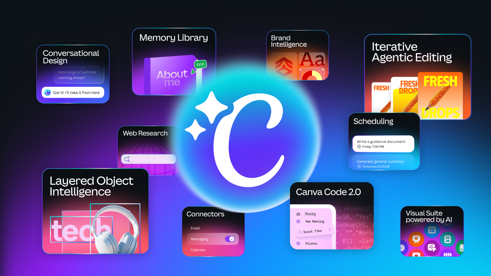
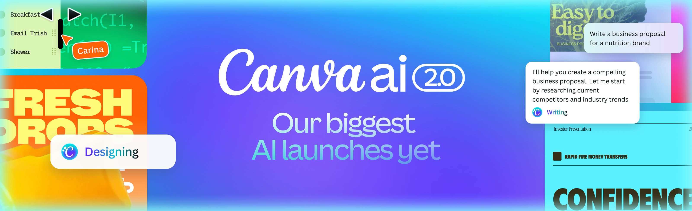
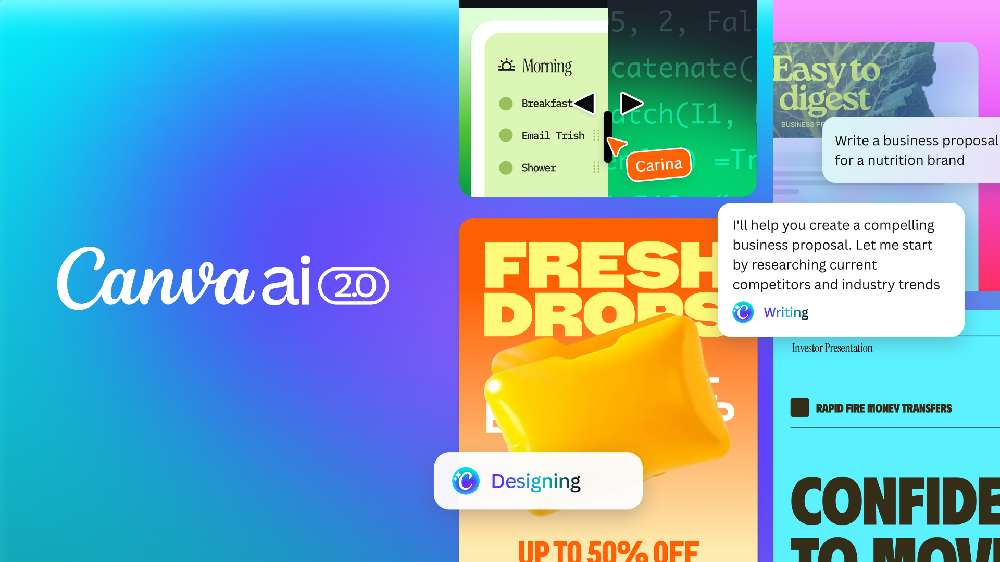

### 🎬 관련 영상
- [🎥 영상 보기](https://ph-files.imgix.net/0ec14897-f187-4cf0-89bb-15b4489c9f85.jpeg?auto=format)

---

## 7. [CalendarPipe](https://www.producthunt.com/products/calendarpipe)
**Votes**: 131 | **도입 난이도**: 중 | **신뢰도**: 중
**Tagline**: Programmable calendar sync for humans and AI agents
**서비스 링크**: https://www.producthunt.com/r/ZSCEQOBWDUCRNL

**태그**: 캘린더, 자동화, AI, 개발 도구, Agent, AI Tool, API

### 📌 이 서비스 한눈에 보기
CalendarPipe는 Google, Outlook, Apple 캘린더를 동기화하고, 이벤트를 필터링, 변환, 라우팅하는 프로그래밍 가능한 파이프를 제공하여 개인 및 AI 에이전트의 캘린더 관리를 자동화합니다.

### 🔑 주요 기능
- 시각적 인터페이스, AI 기반 설명, TypeScript를 통해 파이프라인 구축 가능
- OAuth 없이 실제 초대장 형태로 이벤트 공유
- AI 에이전트를 위한 REST API, CalDAV, MCP 서버 제공

### 🙋 사용자에게 어떤 점이 좋은가
캘린더 동기화 및 이벤트 관리를 자동화하여 시간을 절약하고, AI 에이전트가 자체 캘린더를 생성하고 초대장을 보낼 수 있도록 지원합니다.

### ✅ 지금 바로 써볼 기능
- 시각적 인터페이스를 사용하여 간단한 이벤트 필터링 파이프라인 구축
- AI 기반 설명을 통해 파이프라인 정의
- REST API를 사용하여 AI 에이전트와 캘린더 연동

### ⚠️ 사용 전 확인할 점
- 지원하는 캘린더 서비스 종류 확인 필요
- TypeScript 사용 시 개발 지식 요구

### 🧭 확인이 더 필요한 정보
CalendarPipe의 성능 및 안정성에 대한 사용자 리뷰 확인이 필요합니다.

### 📸 스크린샷 및 갤러리
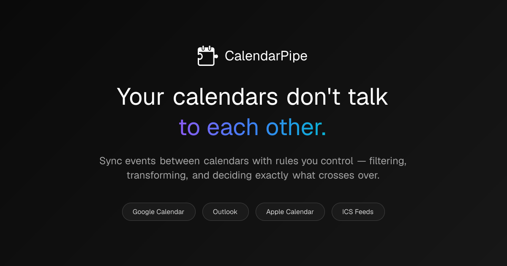
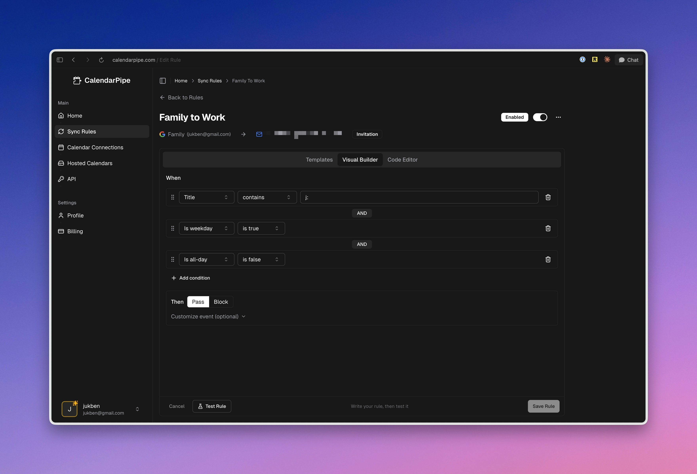
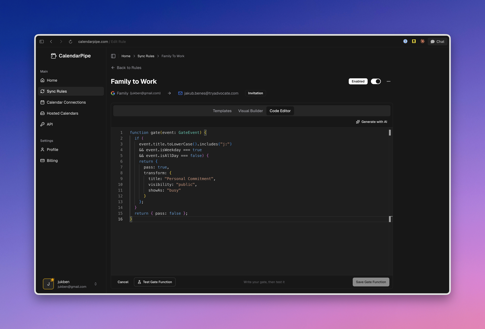

---

## 8. [Cloudflare Email Service](https://www.producthunt.com/products/cloudflare)
**Votes**: 127 | **도입 난이도**: 중 | **신뢰도**: 중
**Tagline**: Turn any email inbox into a native interface for AI agents
**서비스 링크**: https://www.producthunt.com/r/HEMBHSTXPVR4PM

**태그**: AI, 이메일, 자동화, DevTool, Agent, AI Tool, Email

### 📌 이 서비스 한눈에 보기
Cloudflare 이메일 서비스를 통해 AI 에이전트가 이메일 송수신 및 처리를 자동화하여 사용자 편의성을 높일 수 있습니다.

### 🔑 주요 기능
- AI 에이전트가 이메일 인터페이스를 통해 사용자에게 접근 가능
- Cloudflare의 인프라를 활용하여 이메일 송수신 및 처리 간편화
- 에이전트의 멀티 채널 지원 강화

### 🙋 사용자에게 어떤 점이 좋은가
사용자는 AI 에이전트를 통해 이메일 관리를 자동화하고, 더욱 효율적인 업무 처리가 가능해집니다. 특히, 다양한 채널에서 에이전트를 활용하고자 하는 경우 유용합니다.

### ✅ 지금 바로 써볼 기능
- Cloudflare Email Service 베타 버전에 참여하여 기능 체험
- AI 에이전트 연동을 위한 API 및 문서 확인
- 이메일 기반 자동화 워크플로우 구상

### ⚠️ 사용 전 확인할 점
- 베타 버전이므로 안정성 및 기능 제한 존재 가능성
- AI 에이전트 연동을 위한 개발 필요

### 🧭 확인이 더 필요한 정보
Cloudflare Email Service의 구체적인 기능 및 지원 범위에 대한 추가 정보 확인이 필요합니다.

### 📸 스크린샷 및 갤러리
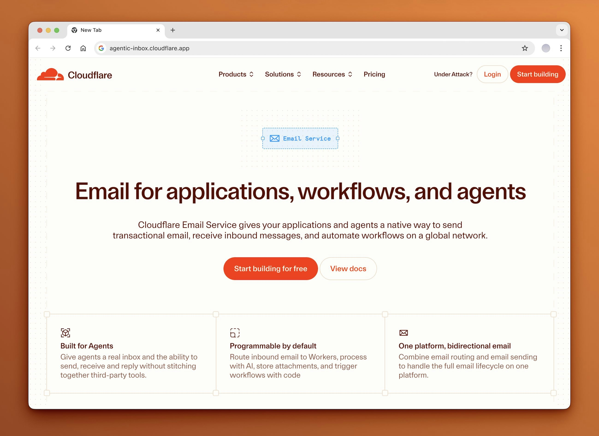
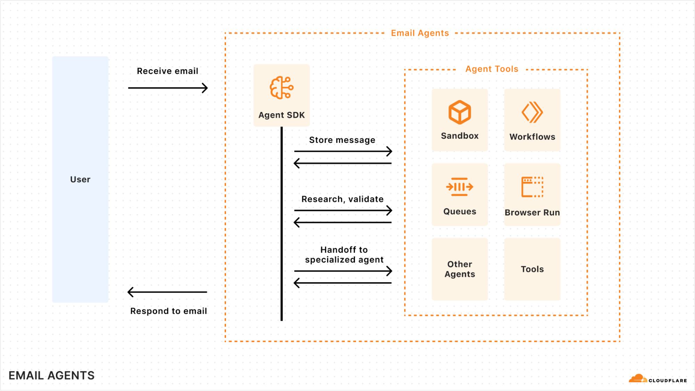
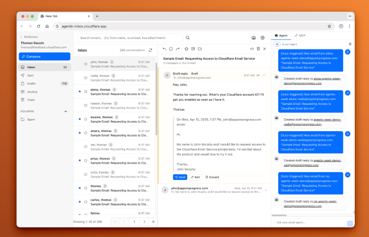

---

## 9. [Hello Aria](https://www.producthunt.com/products/hello-aria-3)
**Votes**: 126 | **도입 난이도**: 중 | **신뢰도**: 중
**Tagline**: Turn chats into tasks, reminders & notes — instantly.
**서비스 링크**: https://www.producthunt.com/r/WPPY4MPSZOBCXS

**태그**: AI, 생산성, 자동화, 업무 관리, 채팅, AI Tool, Chat, Productivity, Email

### 📌 이 서비스 한눈에 보기
Hello Aria는 흩어져 있는 업무 도구를 하나의 채팅 인터페이스로 통합하여 생산성을 높여주는 AI 비서입니다.

### 🔑 주요 기능
- WhatsApp, Telegram, 이메일 등 다양한 플랫폼 지원
- 음성 메모를 텍스트로 변환하여 작업, 노트, 액션 아이템 자동 생성
- Google Calendar, Drive, Meet, Outlook 등과 연동

### 🙋 사용자에게 어떤 점이 좋은가
여러 앱을 번갈아 사용할 필요 없이, 채팅창에서 바로 업무를 관리할 수 있어 시간을 절약하고 집중력을 높일 수 있습니다. 음성 메모를 활용하여 이동 중에도 편리하게 업무를 처리할 수 있습니다.

### ✅ 지금 바로 써볼 기능
- WhatsApp 또는 Telegram에 Aria 연결
- 음성 메모를 사용하여 작업 생성
- Google Calendar 연동하여 일정 관리

### ⚠️ 사용 전 확인할 점
- 지원하는 플랫폼 및 연동 서비스 확인 필요
- AI 기반 기능의 정확도에 대한 사용자 검증 필요

### 🧭 확인이 더 필요한 정보
AI 기능의 한국어 지원 정확도 및 개인 정보 처리 정책에 대한 추가 확인이 필요합니다.

### 📸 스크린샷 및 갤러리

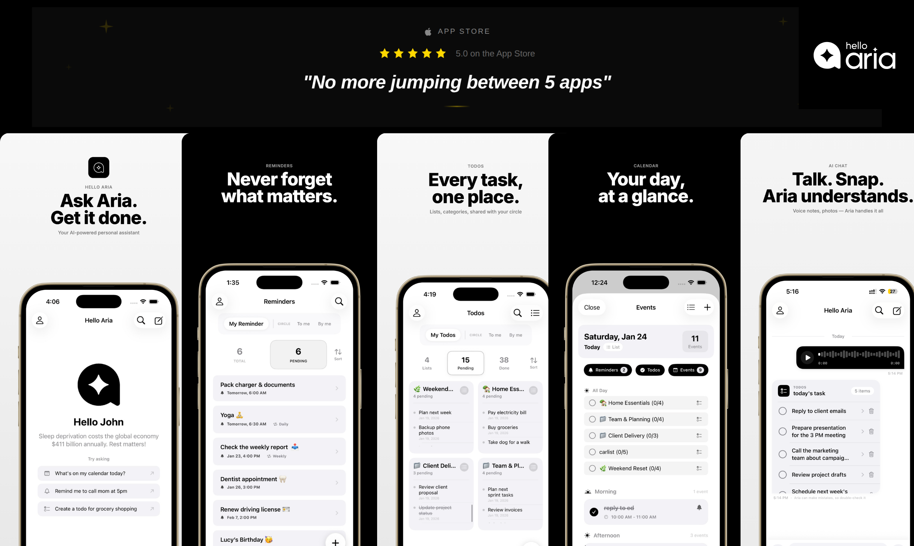
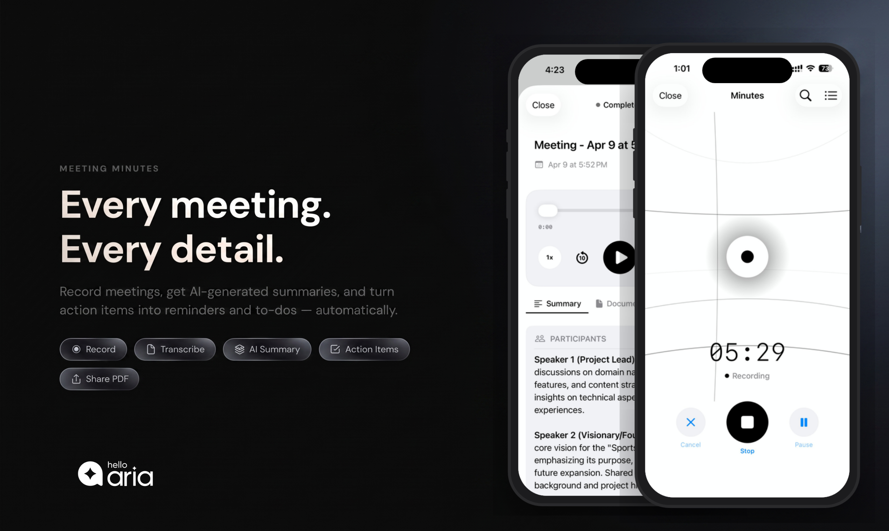

### 🎬 관련 영상
- [🎥 영상 보기](https://ph-files.imgix.net/0567cb46-0125-4bd7-bab9-a6b21d17c5c9.jpeg?auto=format)

---

## 10. [Visual PR Testing with AI](https://www.producthunt.com/products/qa-tech)
**Votes**: 118 | **도입 난이도**: 중 | **신뢰도**: 중
**Tagline**: Validate every PR with AI that runs tests for you
**서비스 링크**: https://www.producthunt.com/r/M6IGM7B54M5TA2

**태그**: DevTool, AI, Automation, Testing, QA, Agent, AI Tool

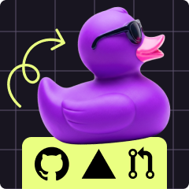

### 📌 이 서비스 한눈에 보기
QA.tech는 AI를 활용하여 PR(Pull Request)에 대한 자동 테스트를 수행, 실제 사용자 흐름 기반 검증을 통해 코드 변경의 안정성을 높이고 디버깅 시간을 단축시켜 줍니다.

### 🔑 주요 기능
- PR 미리보기에 대한 자동 회귀 및 탐색적 테스트 실행
- 실제 브라우저에서 AI 에이전트가 사용자 흐름 검증
- 실패 시 스크린샷, 로그, 네트워크 활동 제공으로 빠른 디버깅 지원

### 🙋 사용자에게 어떤 점이 좋은가
코드 변경 사항을 병합하기 전에 잠재적인 문제를 식별하고, 테스트 자동화를 통해 개발 프로세스 속도를 향상시킵니다. 개발자는 더 안정적인 코드를 제공하고, QA 팀은 테스트 작업 부담을 줄일 수 있습니다.

### ✅ 지금 바로 써볼 기능
- PR 생성 시 자동 테스트 활성화
- 테스트 실패 시 제공되는 로그 및 스크린샷 확인
- 새 커밋 푸시 후 재실행되는 테스트 결과 확인

### ⚠️ 사용 전 확인할 점
- AI 기반 테스트의 정확도 및 커버리지 확인 필요
- 복잡한 사용자 흐름에 대한 테스트 적합성 검토 필요

### 🧭 확인이 더 필요한 정보
AI 에이전트가 지원하는 테스트 케이스의 종류와 범위를 확인해야 합니다.

### 📸 스크린샷 및 갤러리
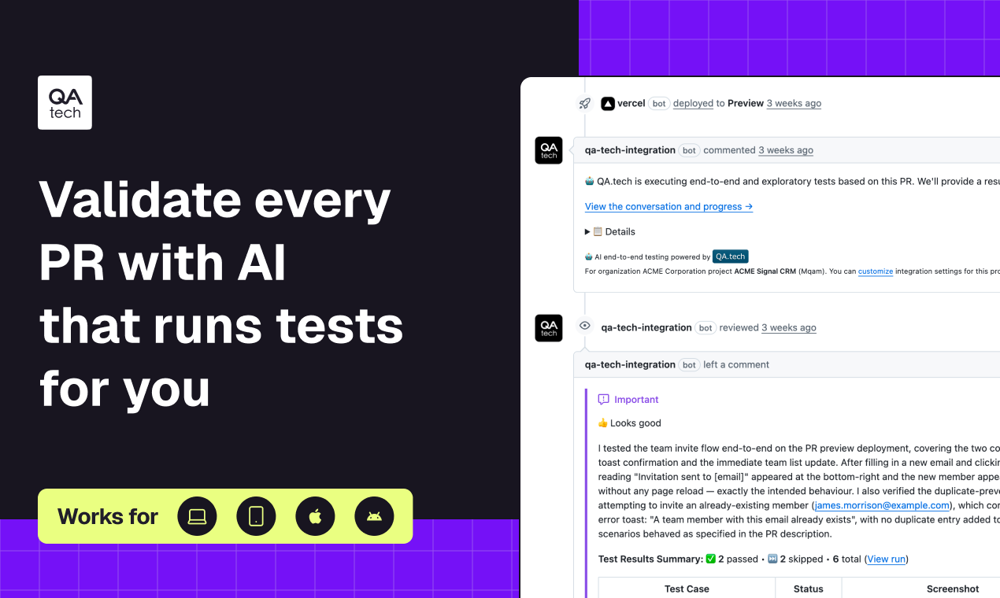
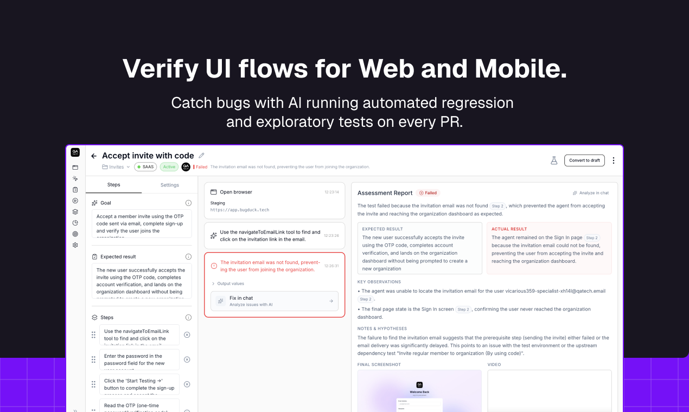
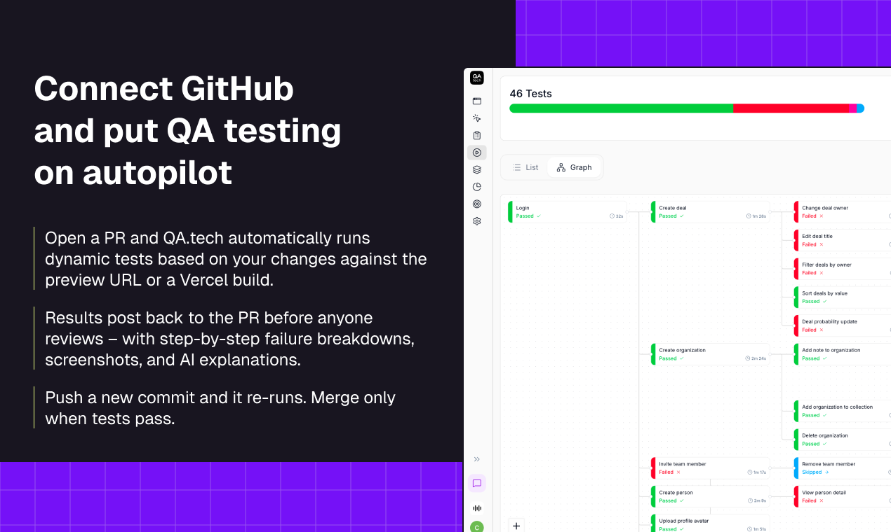

---

