# 🚀 Product Hunt Daily Top 10 (2026-04-19)

## 1. [Claude Design by Anthropic Labs](https://www.producthunt.com/products/claude)
**Votes**: 331 | **도입 난이도**: 중 | **신뢰도**: 상
**Tagline**: Make prototypes, slides & one-pagers by talking to Claude
**서비스 링크**: https://www.producthunt.com/r/SZZJSUNKYCUDEH
**재등장**: 최근 7일 내 재등장 (마지막 등장 2일 전)

**태그**: AI, 디자인, 프로토타입, 자동화, 생산성, Automation, AI Tool, Prompting, Design, Marketing

### 📌 이 서비스 한눈에 보기
Claude Design은 AI를 활용해 아이디어를 시각적으로 구현해주는 디자인 도구로, 간단한 프롬프트만으로 프로토타입, 발표 자료, 마케팅 자료 등을 빠르게 제작하고 수정할 수 있습니다.

### 🔑 주요 기능
- AI 기반 디자인 도구로 아이디어를 시각 자료로 빠르게 전환
- 대화를 통해 디자인을 수정하고 개선 가능
- 프로토타입, 발표 자료, 마케팅 자료 등 다양한 디자인 제작 지원

### 🙋 사용자에게 어떤 점이 좋은가
디자이너, 창업자, 마케터가 아이디어 구상부터 실행까지 걸리는 시간을 단축하고, 브랜드 일관성을 유지하며 효율적인 디자인 워크플로우를 구축할 수 있도록 돕습니다.

### ✅ 지금 바로 써볼 기능
- 프롬프트를 사용하여 프로토타입 디자인 생성해보기
- 기존 디자인을 Claude Design으로 불러와 수정해보기
- 생성된 디자인을 다양한 형식으로 내보내보기

### ⚠️ 사용 전 확인할 점
- AI가 생성하는 디자인의 품질은 프롬프트의 명확성에 따라 달라질 수 있음
- 특정 디자인 요소나 스타일은 완벽하게 구현되지 않을 수 있음

### 🧭 확인이 더 필요한 정보
Claude Design이 지원하는 디자인 형식 및 내보내기 옵션에 대한 추가 정보 확인이 필요합니다.

### 📸 스크린샷 및 갤러리
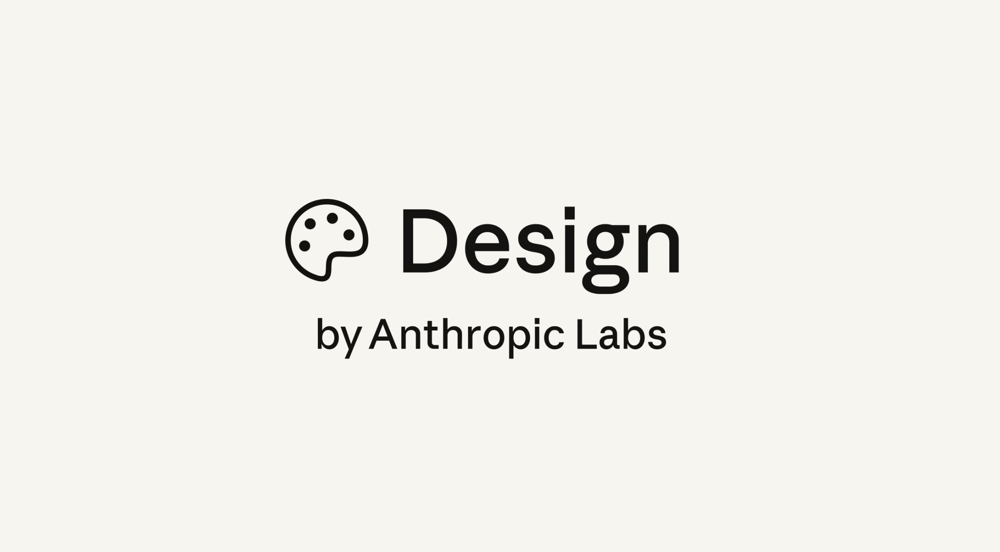
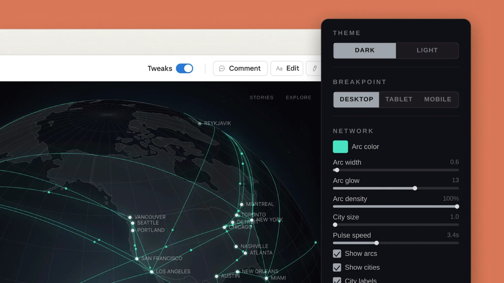
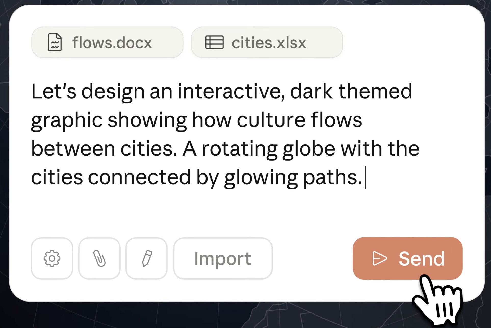

### 🎬 관련 영상
- [🎥 영상 보기](https://ph-files.imgix.net/0812b61a-1a16-4eeb-bbab-ca3c0c0f1baa.jpeg?auto=format)

---

## 2. [Notebooks in Gemini](https://www.producthunt.com/products/google)
**Votes**: 208 | **도입 난이도**: 중 | **신뢰도**: 중
**Tagline**: Keep every project, chat, and file in one focused space
**서비스 링크**: https://www.producthunt.com/r/XZ6FWTP6WVUMEE
**재등장**: 최근 7일 내 재등장 (마지막 등장 1일 전)

**태그**: 생산성, 정리, AI, 협업, Chat

### 📌 이 서비스 한눈에 보기
Gemini 내에서 프로젝트별로 채팅, 파일, PDF를 정리하고 맞춤 지침을 추가하여 NotebookLM과 동기화, 웹 검색과 함께 활용할 수 있는 전용 공간을 제공합니다.

### 🔑 주요 기능
- 프로젝트별 자료 정리 및 관리
- 맞춤 지침 추가 기능
- NotebookLM 동기화 및 웹 검색 연동

### 🙋 사용자에게 어떤 점이 좋은가
Gemini를 사용하여 프로젝트 관련 자료를 체계적으로 관리하고, 맞춤 지침을 통해 작업 효율성을 높이며, NotebookLM 및 웹 검색과의 연동으로 정보 접근성을 향상시킬 수 있습니다.

### ✅ 지금 바로 써볼 기능
- 프로젝트별 노트북 생성 및 자료 정리
- 맞춤 지침 추가하여 Gemini 활용 극대화
- NotebookLM 동기화 및 웹 검색 연동 테스트

### ⚠️ 사용 전 확인할 점
- Ultra, Pro, Plus 사용자에게만 제공
- 자료의 양에 따른 성능 저하 가능성

### 🧭 확인이 더 필요한 정보
정확한 기능별 사용 제한 및 성능 관련 정보는 추가 확인이 필요합니다.

### 📸 스크린샷 및 갤러리

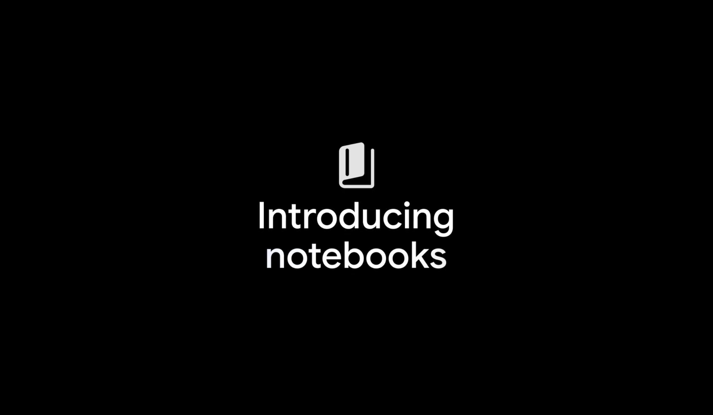
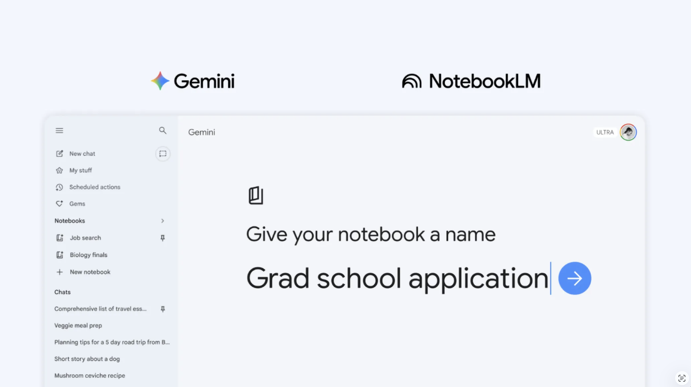

### 🎬 관련 영상
- [🎥 영상 보기](https://ph-files.imgix.net/9bdc13e3-d44a-4b2d-9286-3b28538eec6e.jpeg?auto=format)

---

## 3. [CraftBot](https://www.producthunt.com/products/craftbot)
**Votes**: 192 | **도입 난이도**: 중 | **신뢰도**: 중
**Tagline**: Self-hosted proactive AI assistant that lives locally
**서비스 링크**: https://www.producthunt.com/r/WKRH3BFRV2GAAC

**태그**: AI, Automation, Self-hosted, Assistant, DevTool, Agent, AI Tool, Prompting

### 📌 이 서비스 한눈에 보기
CraftBot은 로컬 환경에서 24시간 작동하며 사용자의 목표 달성을 위해 자율적으로 작업을 계획하고 실행하는 셀프 호스팅 AI 어시스턴트입니다.

### 🔑 주요 기능
- 로컬 환경에서 실행되는 셀프 호스팅 AI 어시스턴트
- 자동으로 작업 해석, 계획, 실행
- 사용자 목표 학습 및 달성을 위한 선제적 지원

### 🙋 사용자에게 어떤 점이 좋은가
CraftBot은 사용자의 일상적인 업무를 자동화하고 목표 달성을 지원하여 생산성을 향상시키는 데 도움을 줍니다. 특히 개인 정보 보호가 중요한 사용자에게 유용합니다.

### ✅ 지금 바로 써볼 기능
- GitHub에서 CraftBot 다운로드 및 설치
- 개인 목표 설정 및 CraftBot에 학습시키기
- MCP, Skills, 외부 앱 연동 테스트

### ⚠️ 사용 전 확인할 점
- 초기 설정 및 사용자 정의 필요
- 오픈 소스 프로젝트이므로 기술 지원이 제한적일 수 있음

### 🧭 확인이 더 필요한 정보
CraftBot의 성능은 사용자의 하드웨어 사양 및 설정에 따라 달라질 수 있습니다.

### 📸 스크린샷 및 갤러리

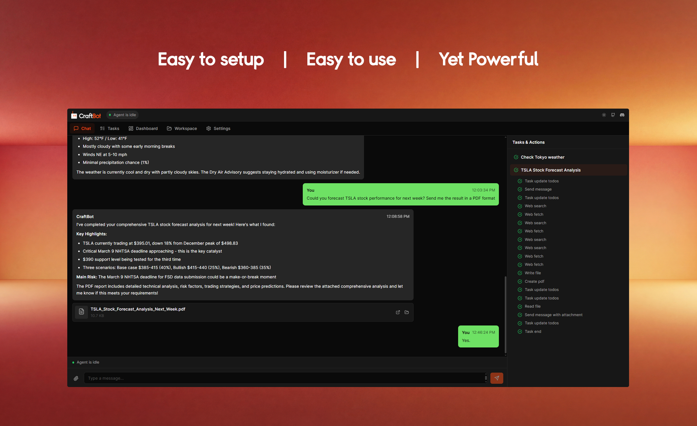
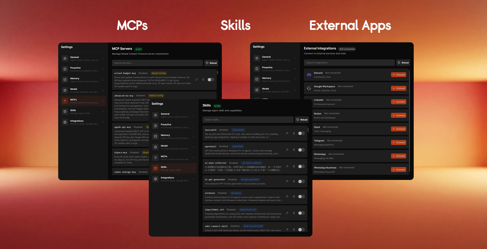

### 🎬 관련 영상
- [🎥 영상 보기](https://ph-files.imgix.net/fdcfa7d0-6c14-4cb1-98ee-3cff45c40386.jpeg?auto=format)

---

## 4. [Is Your Site Agent-Ready? by Cloudflare](https://www.producthunt.com/products/is-your-site-agent-ready)
**Votes**: 182 | **도입 난이도**: 중 | **신뢰도**: 중
**Tagline**: Scan your website to see how ready it is for AI agents. 
**서비스 링크**: https://www.producthunt.com/r/WR3ZH43A3QLPNK

**태그**: AI, 웹사이트 분석, 자동화, Cloudflare, DevTool, Agent, AI Tool

### 📌 이 서비스 한눈에 보기
Cloudflare의 Agent-Ready Scanner로 웹사이트의 AI 에이전트 호환성을 분석하고 개선하여 AI 에이전트가 원활하게 상호 작용하도록 준비하세요.

### 🔑 주요 기능
- robots.txt, MCP, OAuth 등 AI 표준 준수 여부 분석
- AI 에이전트의 웹사이트 검색, 상호 작용, 거래 지원
- 웹사이트의 AI 호환성 문제점 파악 및 개선

### 🙋 사용자에게 어떤 점이 좋은가
웹사이트를 AI 에이전트에 최적화하여 AI 기반 상호 작용을 향상시키고, 잠재적인 비즈니스 기회를 확장할 수 있습니다.

### ✅ 지금 바로 써볼 기능
- Agent-Ready Scanner로 웹사이트 스캔
- 스캔 결과에 따른 개선 사항 적용
- AI 에이전트 프로토콜 지원 기능 활성화

### ⚠️ 사용 전 확인할 점
- 스캔 결과는 웹사이트의 현재 상태를 반영하며, 지속적인 업데이트 필요
- 모든 AI 에이전트와의 완벽한 호환성을 보장하지 않음

### 🧭 확인이 더 필요한 정보
다양한 AI 에이전트의 동작 방식에 대한 이해도를 높이는 것이 중요합니다.

### 📸 스크린샷 및 갤러리
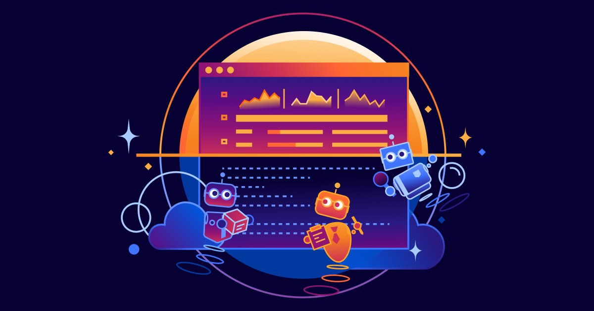
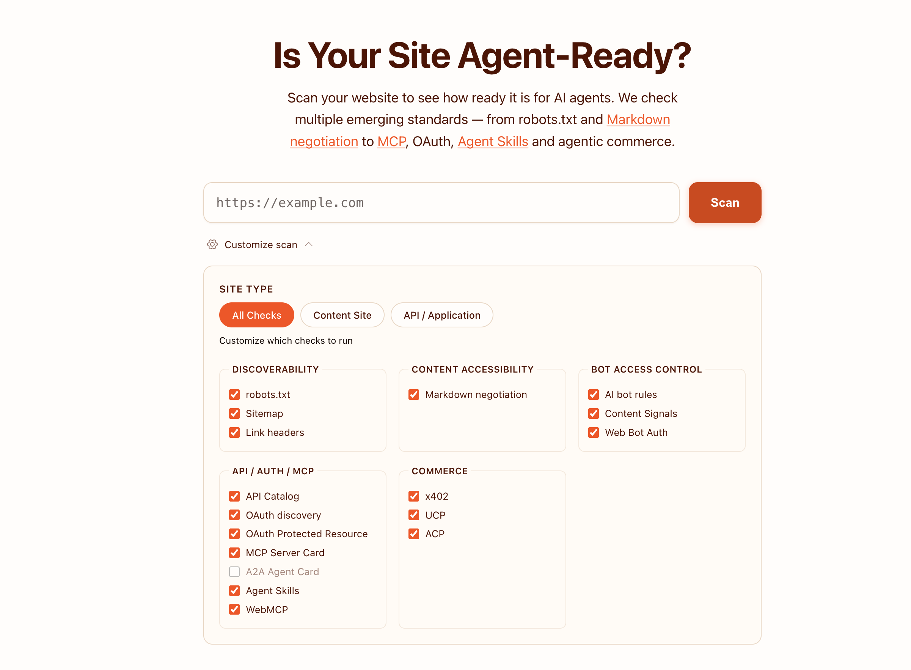
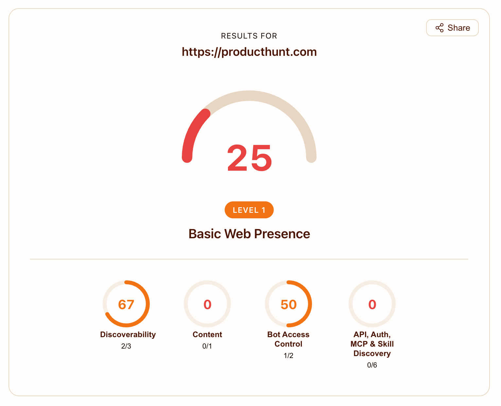

---

## 5. [Vercel Flags](https://www.producthunt.com/products/vercel)
**Votes**: 161 | **도입 난이도**: 중 | **신뢰도**: 중
**Tagline**: Feature flags, targeting rules, rollouts. All from Vercel.
**서비스 링크**: https://www.producthunt.com/r/5ZXXOKRCL2PE2Y

**태그**: DevTool, Feature Flag, A/B Testing, Vercel, AI Tool

### 📌 이 서비스 한눈에 보기
Vercel Flags는 Vercel 플랫폼에 내장된 기능 플래그 제공 서비스로, 별도의 서비스 추가 없이 Vercel 대시보드에서 직접 기능 플래그를 생성, 관리, A/B 테스트까지 수행할 수 있게 해줍니다.

### 🔑 주요 기능
- Vercel 플랫폼 내에서 기능 플래그 관리
- 타겟팅 규칙 정의 및 점진적 롤아웃 지원
- A/B 테스트 기능 제공

### 🙋 사용자에게 어떤 점이 좋은가
Vercel Flags를 사용하면 개발 스택에 새로운 서비스를 추가하지 않고도 기능 플래그를 효율적으로 관리하고, 사용자 경험을 개선하기 위한 A/B 테스트를 간편하게 수행할 수 있습니다.

### ✅ 지금 바로 써볼 기능
- Vercel 대시보드에서 기능 플래그 생성
- 타겟팅 규칙 설정하여 특정 사용자 그룹에 기능 롤아웃
- A/B 테스트를 통해 기능 개선

### ⚠️ 사용 전 확인할 점
- Vercel 플랫폼에 종속됨
- 기능 플래그 관리 복잡도 증가 가능성

### 🧭 확인이 더 필요한 정보
Vercel Flags의 구체적인 가격 정책 및 다른 서비스와의 통합 수준에 대한 추가 정보가 필요합니다.

### 📸 스크린샷 및 갤러리
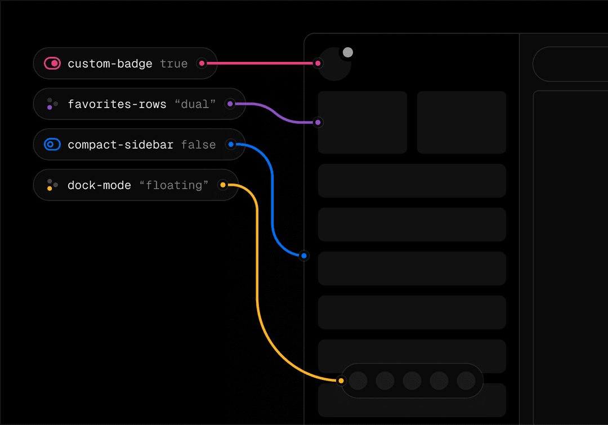
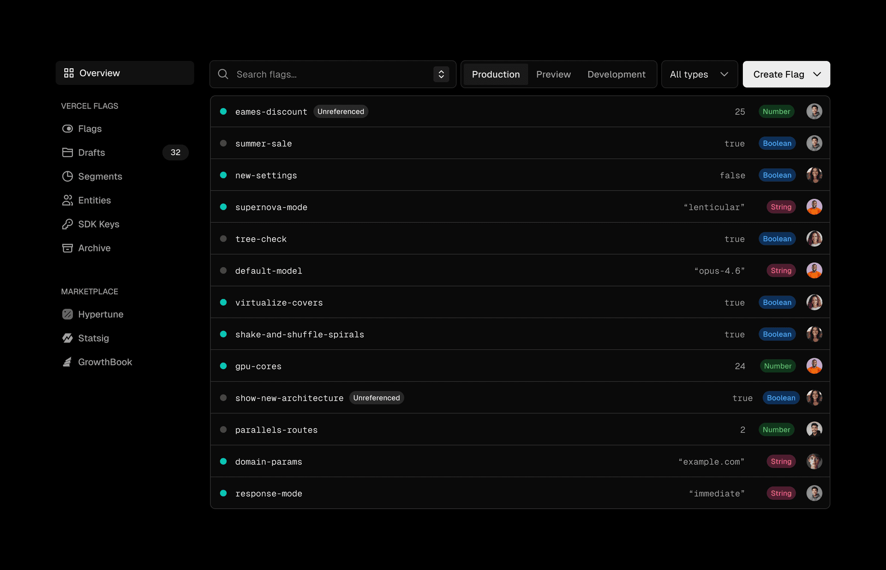

---

## 6. [ChatGPT Shopping](https://www.producthunt.com/products/chatgpt-shopping)
**Votes**: 127 | **도입 난이도**: 하 | **신뢰도**: 중
**Tagline**: Richer, more visually immersive shopping experiences
**서비스 링크**: https://www.producthunt.com/r/UKBY356JUQZQLB

**태그**: 쇼핑, AI, 개인화, 검색, 무료, Agent, Chat, Vision

### 📌 이 서비스 한눈에 보기
ChatGPT에서 Target, Walmart, Sephora, Shopify 등 다양한 쇼핑몰과 연결되어 시각적인 비교, 이미지 검색, 개인 맞춤형 구매 가이드 등 더욱 풍부한 쇼핑 경험을 무료로 제공합니다.

### 🔑 주요 기능
- Agentic Commerce Protocol을 통해 7억 명의 사용자와 연결
- 시각적 비교 및 이미지 검색 기능 제공
- 개인 맞춤형 구매 가이드 제공

### 🙋 사용자에게 어떤 점이 좋은가
ChatGPT를 통해 다양한 쇼핑몰의 상품을 편리하게 비교하고, 이미지 검색으로 원하는 상품을 쉽게 찾을 수 있으며, 개인 맞춤형 가이드로 더욱 만족스러운 쇼핑을 할 수 있습니다.

### ✅ 지금 바로 써볼 기능
- ChatGPT에서 원하는 상품 검색해보기
- 이미지 검색 기능으로 상품 찾아보기
- 개인 맞춤형 구매 가이드 활용해보기

### ⚠️ 사용 전 확인할 점
- Agentic Commerce Protocol 연결된 쇼핑몰 목록 확인 필요
- 개인 맞춤형 가이드의 정확성 검토 필요

### 🧭 확인이 더 필요한 정보
Agentic Commerce Protocol에 연결된 쇼핑몰의 전체 목록과 개인 맞춤형 가이드의 추천 정확도에 대한 추가 정보가 필요합니다.

### 📸 스크린샷 및 갤러리
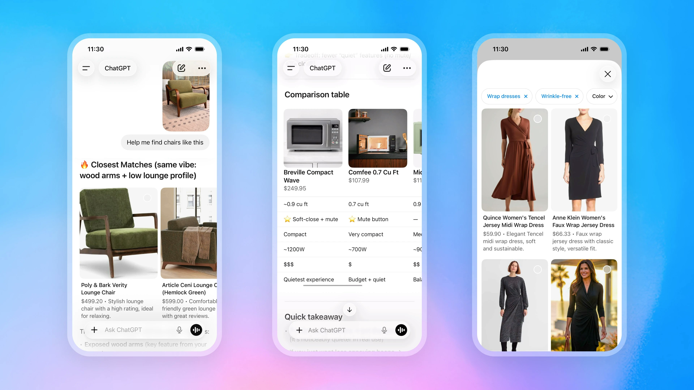
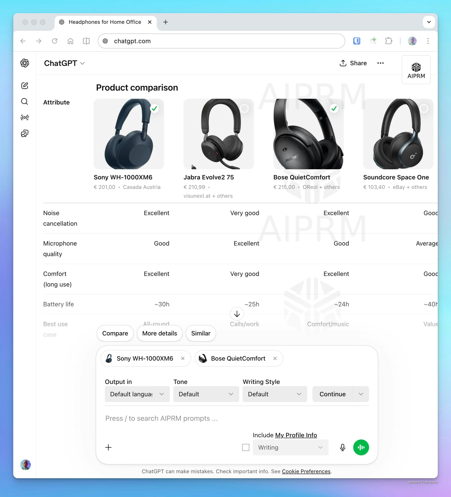
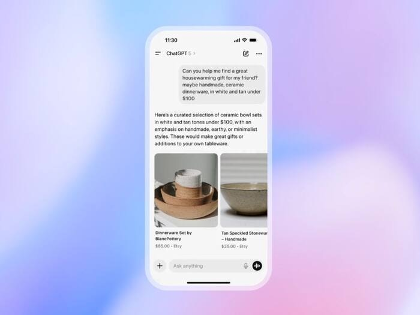

### 🎬 관련 영상
- [🎥 영상 보기](https://ph-files.imgix.net/b174d5f5-fa1f-48af-a733-8f9cf3d2acf8.jpeg?auto=format)

---

## 7. [React Email 6.0 by Resend](https://www.producthunt.com/products/react-email-6-0-resend)
**Votes**: 123 | **도입 난이도**: 중 | **신뢰도**: 중
**Tagline**: Build, customize, and ship emails — all from your own app
**서비스 링크**: https://www.producthunt.com/r/PXX4B6Q66KAXNW

**태그**: 이메일, 개발 도구, 오픈 소스, 템플릿, AI Tool, Email

### 📌 이 서비스 한눈에 보기
React Email 6.0은 앱 내에 내장 가능한 오픈 소스 이메일 에디터와 새로운 템플릿 모음을 제공하여, 사용자가 직접 이메일을 구축, 커스터마이징, 배포할 수 있도록 돕습니다.

### 🔑 주요 기능
- 앱 내 이메일 에디터 내장 가능
- 오픈 소스 기반
- 다양한 템플릿 제공

### 🙋 사용자에게 어떤 점이 좋은가
자체 앱에서 이메일 기능을 완벽하게 제어하고 커스터마이징할 수 있어, 사용자 경험을 향상시키고 브랜드 일관성을 유지하는 데 도움이 됩니다.

### ✅ 지금 바로 써볼 기능
- 새로운 템플릿 컬렉션 확인
- 앱에 이메일 에디터 내장 테스트
- 오픈 소스 커뮤니티 참여

### ⚠️ 사용 전 확인할 점
- 오픈 소스 유지보수 및 업데이트 필요
- 앱과의 통합 과정에서 호환성 문제 발생 가능성

### 🧭 확인이 더 필요한 정보
실제 앱 환경에서의 성능 및 안정성 테스트가 필요합니다.

### 📸 스크린샷 및 갤러리

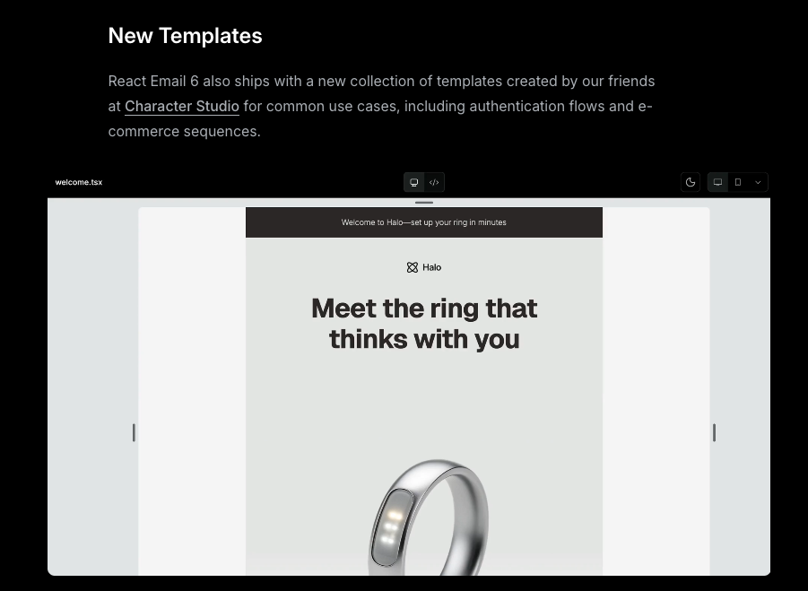
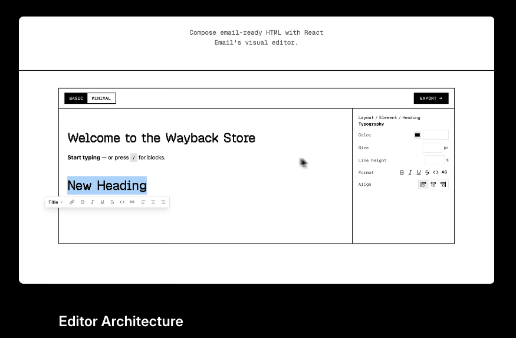

---

## 8. [Claude Code Rendering](https://www.producthunt.com/products/claude-code-no_flicker-mode)
**Votes**: 118 | **도입 난이도**: 중 | **신뢰도**: 중
**Tagline**: Mouse support and flicker-free rendering for Claude Code
**서비스 링크**: https://www.producthunt.com/r/BYB4P5CVVM4VJ6

**태그**: 코드 편집기, 개발 도구, 성능 개선, 렌더링, DevTool

### 📌 이 서비스 한눈에 보기
Claude Code 사용자들을 위한 새로운 렌더러로, 깜빡임 없이 부드러운 코드 편집 경험과 향상된 마우스 지원을 제공하여 개발 효율성을 높여줍니다.

### 🔑 주요 기능
- 가상 뷰포트 기술로 깜빡임 현상 제거
- 마우스 이벤트 지원으로 상호작용성 향상
- 긴 세션에서도 메모리 사용량 안정화

### 🙋 사용자에게 어떤 점이 좋은가
VS Code, tmux, iTerm2 등 다양한 환경에서 Claude Code를 사용하는 개발자들이 더욱 쾌적하고 효율적으로 코딩할 수 있도록 도와줍니다. 특히 장시간 작업 시 발생하는 성능 저하 문제를 해결해줍니다.

### ✅ 지금 바로 써볼 기능
- Claude Code 설정에서 새로운 렌더러 활성화
- VS Code, tmux, iTerm2 등 선호하는 환경에서 사용
- 장시간 코딩 세션에서 성능 향상 체감

### ⚠️ 사용 전 확인할 점
- 새로운 렌더러가 기존 환경과 완벽하게 호환되는지 확인 필요
- 특정 환경에서 예상치 못한 문제가 발생할 수 있음

### 🧭 확인이 더 필요한 정보
새로운 렌더러의 성능 향상 정도가 사용자 환경에 따라 다를 수 있습니다.

### 📸 스크린샷 및 갤러리
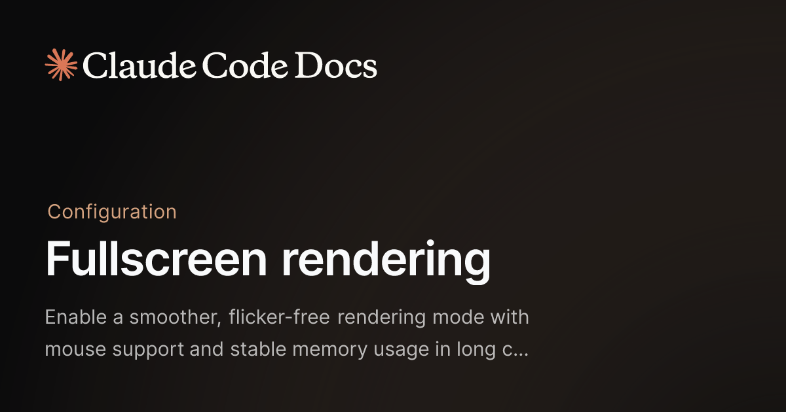
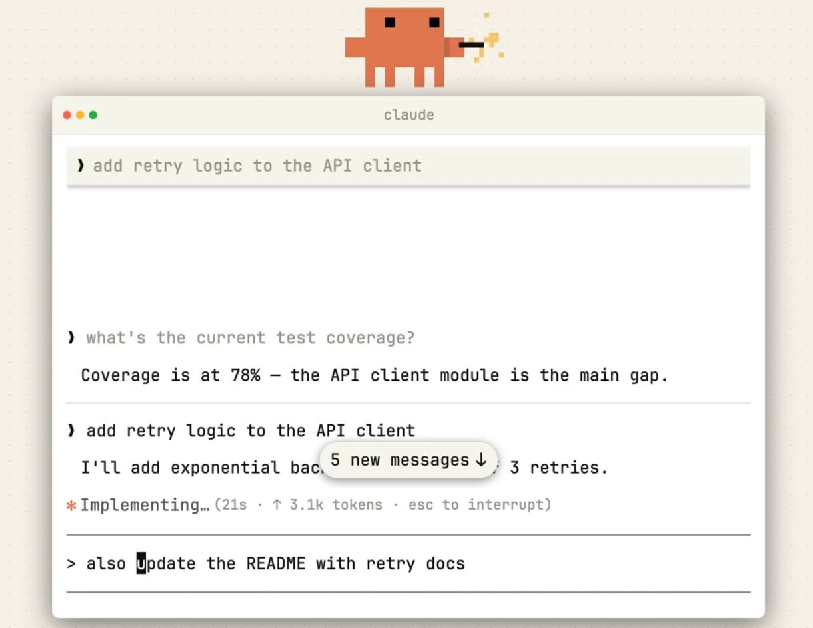
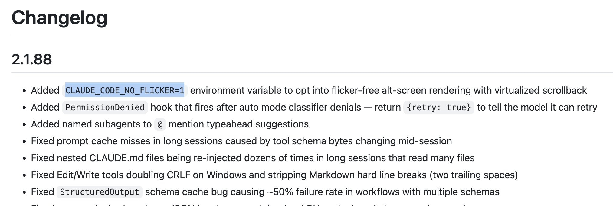

### 🎬 관련 영상
- [🎥 영상 보기](https://ph-files.imgix.net/887ff504-3af9-4049-a488-e67f10ab394e.jpeg?auto=format)

---

## 9. [Android CLI](https://www.producthunt.com/products/android-cli)
**Votes**: 111 | **도입 난이도**: 중 | **신뢰도**: 중
**Tagline**: Build high quality Android apps 3x faster using any agent 
**서비스 링크**: https://www.producthunt.com/r/XRPD4ADPFYB7OL

**태그**: DevTool, Android, CLI, AI Agent, Automation, Agent, AI Tool, API

### 📌 이 서비스 한눈에 보기
Android CLI는 AI 에이전트를 활용하여 Android 앱 개발 속도를 3배 향상시키는 새로운 툴킷입니다.

### 🔑 주요 기능
- CLI 명령, 모듈형 '스킬', 실시간 지식 기반 결합
- AI 에이전트가 모범 사례를 따르도록 가이드
- 빠른 설정, 프로젝트 생성, 테스트 및 배포 지원

### 🙋 사용자에게 어떤 점이 좋은가
터미널에서 직접 Android 앱을 더 빠르고 정확하게 개발할 수 있으며, 토큰 사용량을 줄여 비용 효율성을 높입니다.

### ✅ 지금 바로 써볼 기능
- 터미널에서 Android 프로젝트 생성
- 모듈형 스킬을 활용한 기능 개발
- AI 에이전트의 가이드에 따라 테스트 및 배포

### ⚠️ 사용 전 확인할 점
- AI 에이전트의 정확도 및 최적화 수준 확인 필요
- 기존 개발 환경과의 호환성 점검 필요

### 🧭 확인이 더 필요한 정보
실제 개발 환경에서의 성능 향상 정도에 대한 추가적인 검증이 필요합니다.

### 📸 스크린샷 및 갤러리
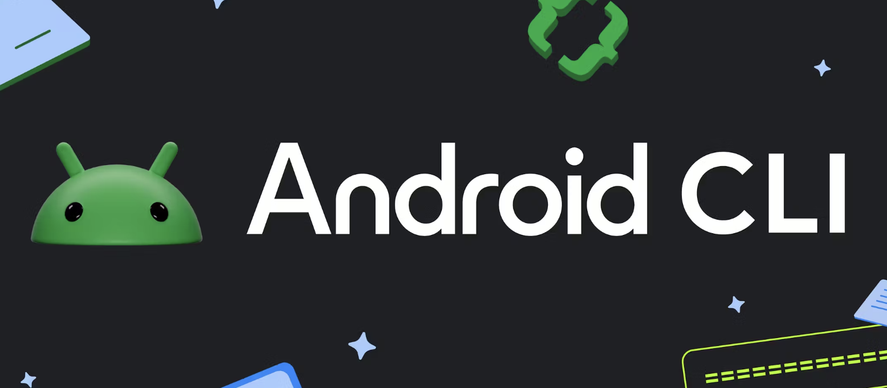
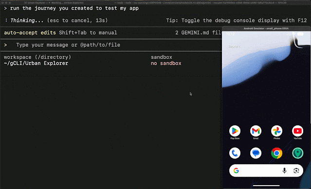
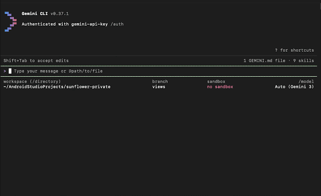

---

## 10. [Grok Voice API](https://www.producthunt.com/products/grok)
**Votes**: 103 | **도입 난이도**: 중 | **신뢰도**: 중
**Tagline**: Fast, accurate STT and TTS APIs at the best price
**서비스 링크**: https://www.producthunt.com/r/N3SPVOAVC7GUSQ

**태그**: API, STT, TTS, 음성인식, 음성합성, DevTool

### 📌 이 서비스 한눈에 보기
Grok에서 개발자를 위한 저렴하고 정확한 STT/TTS API를 제공합니다. 실시간/배치 변환, 화자 분리, 다국어 지원 등 다양한 기능을 제공하며 사용량 기반의 간단한 요금제를 제공합니다.

### 🔑 주요 기능
- 실시간 및 배치 음성 텍스트 변환 지원
- 다중 화자 분리 및 다중 채널 오디오 처리
- 다국어 지원 및 사용량 기반 요금제

### 🙋 사용자에게 어떤 점이 좋은가
개발자는 Grok Voice API를 통해 음성 인식 및 합성 기능을 저렴하고 효율적으로 애플리케이션에 통합할 수 있습니다. 다양한 기능과 유연한 요금제를 통해 개발 편의성을 높였습니다.

### ✅ 지금 바로 써볼 기능
- 실시간 음성 텍스트 변환 기능 사용해보기
- 다국어 지원 기능 테스트해보기
- 사용량 기반 요금제 확인하기

### ⚠️ 사용 전 확인할 점
- 정확도 및 지연 시간은 오디오 품질에 따라 달라질 수 있습니다.
- 지원되는 언어 목록을 확인해야 합니다.

### 🧭 확인이 더 필요한 정보
정확도 및 특정 언어 지원에 대한 자세한 정보는 Grok의 공식 문서를 참고하십시오.

### 📸 스크린샷 및 갤러리
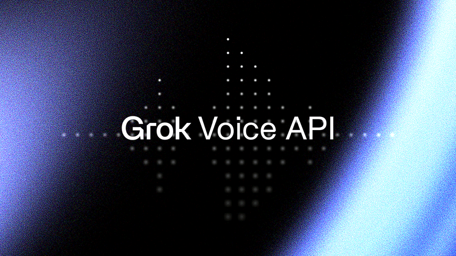
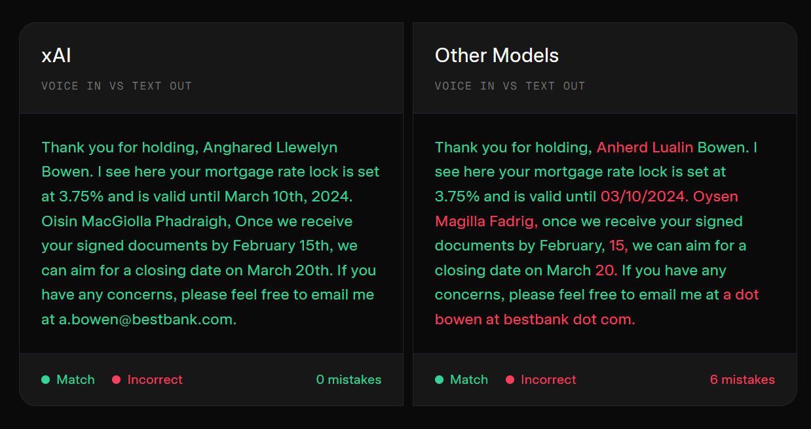
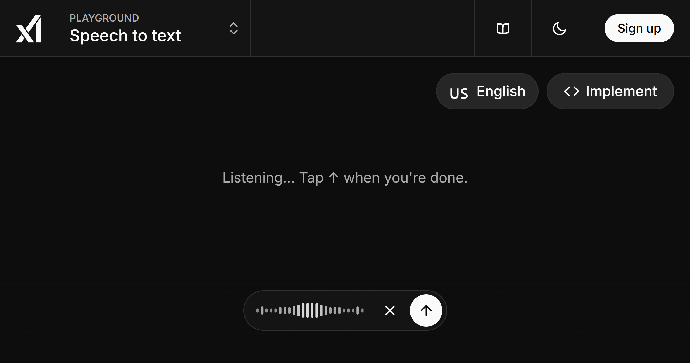

---

