# 🚀 Product Hunt Daily Top 10 (2026-04-20)

## 1. [Vantage in Google Labs](https://www.producthunt.com/products/google)
**Votes**: 208 | **도입 난이도**: 중 | **신뢰도**: 중
**Tagline**: Practice & assess future-ready skills with AI-simulated team
**서비스 링크**: https://www.producthunt.com/r/H37MDVAN5OB4LU
**재등장**: 최근 7일 내 재등장 (마지막 등장 2일 전)

**태그**: AI, 역량 평가, 시뮬레이션, Google Labs, AI Tool

### 📌 이 서비스 한눈에 보기
Vantage는 Google Labs에서 제공하는 AI 기반 팀 협업 시뮬레이션으로, 미래에 필요한 협업, 비판적 사고, 창의성 등의 역량을 평가하고 개인별 스킬 맵을 제공합니다.

### 🔑 주요 기능
- AI 아바타를 통해 실제와 유사한 시나리오 제공
- 수행 능력 평가 및 개인별 스킬 맵 제공
- Google Labs에서 사용 가능

### 🙋 사용자에게 어떤 점이 좋은가
미래에 필요한 역량을 AI 시뮬레이션을 통해 연습하고 평가받아 자신의 강점과 약점을 파악하고 개선할 수 있습니다.

### ✅ 지금 바로 써볼 기능
- Google Labs에서 Vantage 접속
- AI 아바타와 팀 협업 시뮬레이션 체험
- 개인 스킬 맵 확인 및 개선 계획 수립

### ⚠️ 사용 전 확인할 점
- AI 평가는 주관적일 수 있으므로 참고 자료로 활용
- 현재 Google Labs에서 실험적으로 제공되는 서비스

### 🧭 확인이 더 필요한 정보
AI 아바타의 시나리오 및 평가 기준의 구체적인 정보는 추가 확인이 필요합니다.

### 📸 스크린샷 및 갤러리
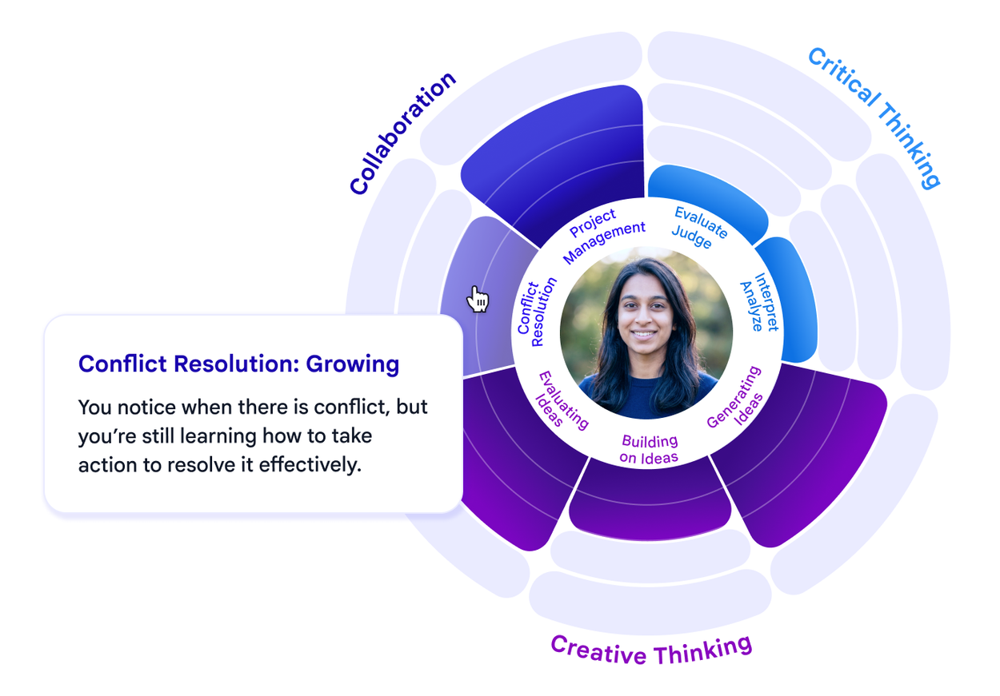
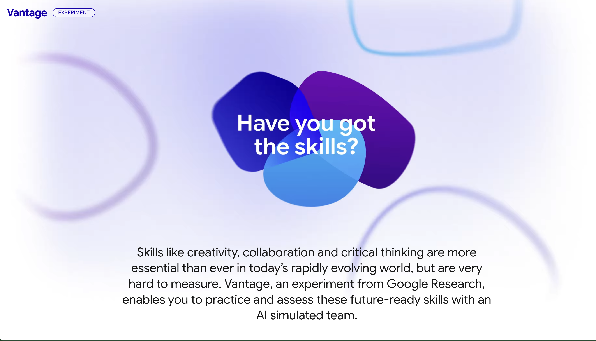
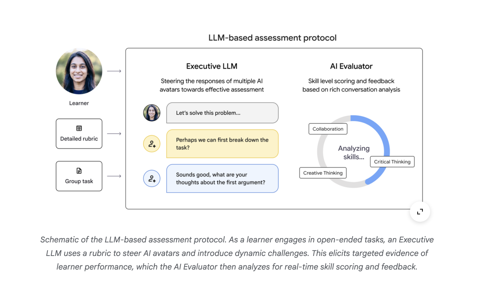

### 🎬 관련 영상
- [🎥 영상 보기](https://ph-files.imgix.net/dfae0ed5-36b1-4ed5-bd7c-95adb91835ea.jpeg?auto=format)

---

## 2. [Gemini app for Mac](https://www.producthunt.com/products/gemini-6)
**Votes**: 191 | **도입 난이도**: 하 | **신뢰도**: 중
**Tagline**: Option + Space and Gemini is right there
**서비스 링크**: https://www.producthunt.com/r/BCWSGWYERAX6G6
**재등장**: 최근 7일 내 재등장 (마지막 등장 6일 전)

**태그**: productivity, AI, macOS, shortcut, file analysis, AI Tool

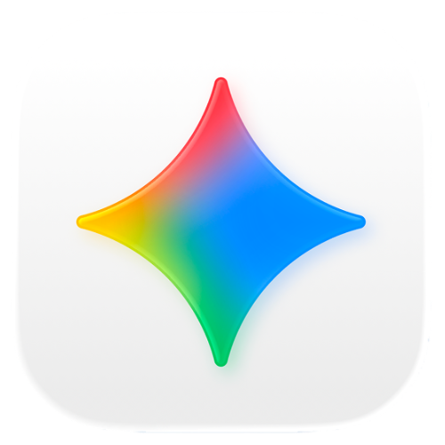

### 📌 이 서비스 한눈에 보기
맥에서 Option + Space 단축키로 Gemini를 즉시 실행하여 탭 전환 없이 컨텍스트 기반 도움, 파일 분석, 콘텐츠 생성이 가능합니다.

### 🔑 주요 기능
- Option + Space 단축키로 즉시 Gemini 앱 실행
- 활성 창 공유를 통한 컨텍스트 기반 도움
- 로컬 파일 분석 및 콘텐츠 생성 기능

### 🙋 사용자에게 어떤 점이 좋은가
맥 사용자들은 탭을 전환하는 번거로움 없이 빠르게 Gemini를 활용하여 작업 효율성을 높일 수 있습니다. 특히, 활성 창 공유 기능은 현재 작업 내용을 기반으로 즉각적인 도움을 받을 수 있게 해줍니다.

### ✅ 지금 바로 써볼 기능
- Option + Space 단축키로 Gemini 실행해보기
- 활성 창을 공유하여 컨텍스트 기반 도움 요청해보기
- 로컬 파일을 분석하여 정보 추출해보기

### ⚠️ 사용 전 확인할 점
- Gemini 앱의 시스템 리소스 사용량 확인 필요
- 파일 분석 시 개인 정보 유출 가능성 검토

### 🧭 확인이 더 필요한 정보
Gemini 앱의 정확한 시스템 요구 사양 및 파일 분석 기능의 지원 파일 형식을 추가적으로 확인해야 합니다.

### 📸 스크린샷 및 갤러리

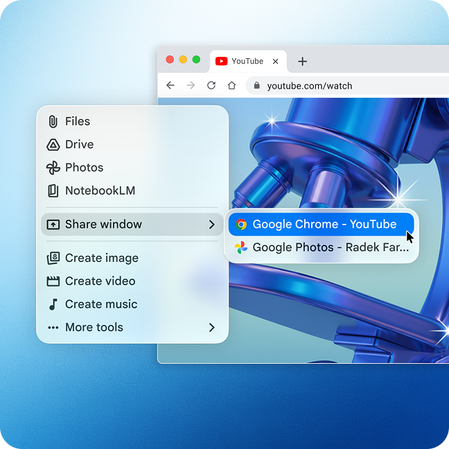
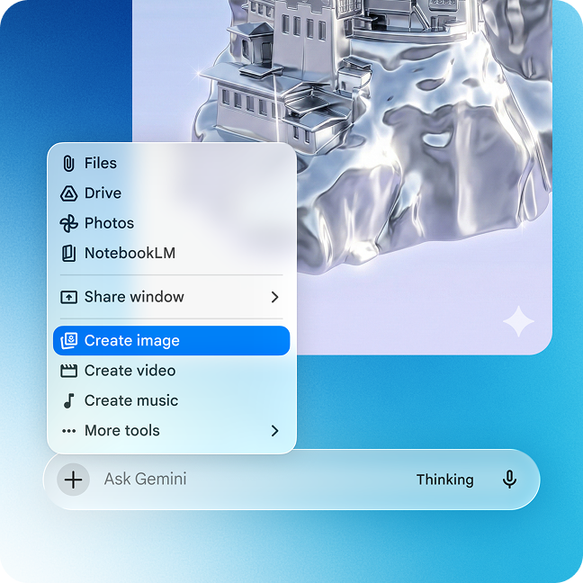

---

## 3. [Verdent 2.0](https://www.producthunt.com/products/verdent-deck)
**Votes**: 169 | **도입 난이도**: 중 | **신뢰도**: 중
**Tagline**: Your AI Technical Cofounder
**서비스 링크**: https://www.producthunt.com/r/BBQ3OP2SS35GG5

**태그**: AI, DevTool, 자동화, 생산성, AI Tool

### 📌 이 서비스 한눈에 보기
Verdent 2.0은 아이디어를 실제 비즈니스로 구현할 수 있도록 돕는 AI 기술 공동 창업자입니다. 프로젝트 맥락을 기억하고, 실행을 주도하며, 제품 개발을 지속적으로 발전시킵니다.

### 🔑 주요 기능
- 아이디어를 설명하면 작업 계획을 수립하고 실행을 주도합니다.
- 프로젝트를 기억하고 시간이 지남에 따라 개선됩니다.
- 오프라인에서도 계속 작동합니다.

### 🙋 사용자에게 어떤 점이 좋은가
Verdent는 아이디어를 실제 제품으로 빠르게 전환하고, 기술적인 어려움을 해결하여 사업 진행 속도를 높여줍니다.

### ✅ 지금 바로 써볼 기능
- 아이디어를 상세하게 설명하고 Verdent가 어떻게 계획을 수립하는지 확인해보세요.
- 기존 프로젝트에 Verdent를 적용하여 개발 속도를 높여보세요.
- 오프라인 환경에서 Verdent의 작동 방식을 테스트해보세요.

### ⚠️ 사용 전 확인할 점
- Verdent는 사용자의 설명에 의존하므로, 명확하고 상세한 설명이 필요합니다.
- 복잡한 프로젝트의 경우, Verdent의 계획이 완벽하지 않을 수 있습니다.

### 🧭 확인이 더 필요한 정보
Verdent가 제공하는 코드의 품질과 실제 비즈니스 적용 가능성에 대한 추가적인 검토가 필요합니다.

### 📸 스크린샷 및 갤러리

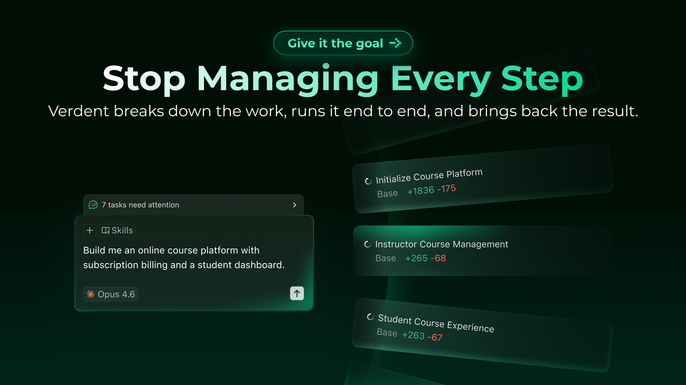
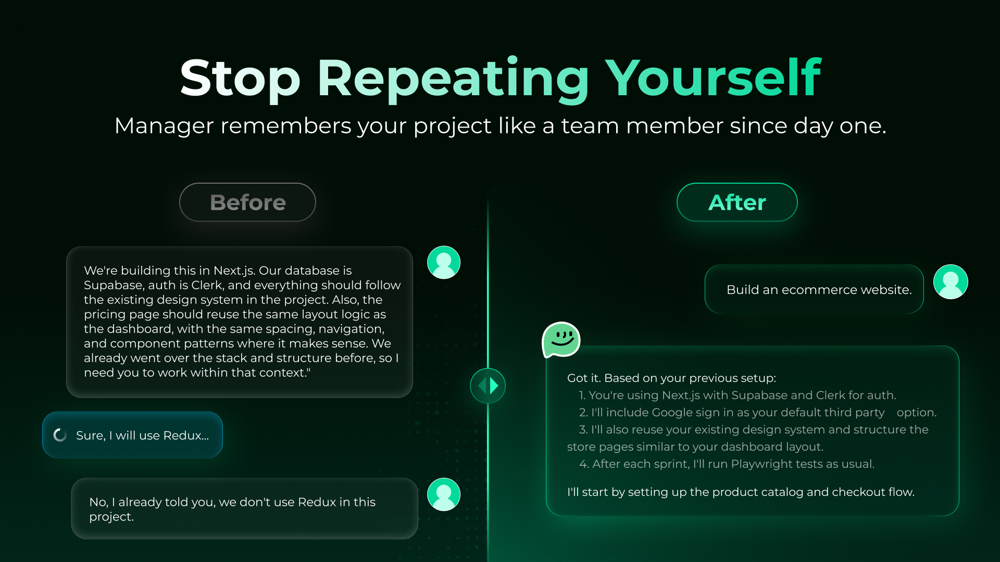

### 🎬 관련 영상
- [🎥 영상 보기](https://ph-files.imgix.net/f4fc937e-d237-471f-a17e-501d1478c779.jpeg?auto=format)

---

## 4. [Perplexity Personal Computer](https://www.producthunt.com/products/perplexity-ai)
**Votes**: 156 | **도입 난이도**: 중 | **신뢰도**: 중
**Tagline**: Local files. Native apps. Voice control. Always on.
**서비스 링크**: https://www.producthunt.com/r/KDSAWWSJ4OSOEQ

**태그**: AI, 자동화, 생산성, 워크플로우, Automation, AI Tool, Productivity

### 📌 이 서비스 한눈에 보기
Perplexity AI의 Personal Computer는 AI를 활용하여 로컬 파일, 앱, 웹을 통합 관리하고 복잡한 작업을 자동화하여 생산성을 향상시키는 시스템입니다.

### 🔑 주요 기능
- 로컬 파일, 네이티브 앱, 웹 연결을 통해 작업 수행
- 데이터 정리 및 복잡한 워크플로우 자동화
- 보안 감사 기능 및 사용자 제어 제공

### 🙋 사용자에게 어떤 점이 좋은가
반복적이고 복잡한 작업을 자동화하여 시간을 절약하고 생산성을 높일 수 있습니다. 로컬 환경과 클라우드 환경을 효율적으로 통합하여 사용할 수 있습니다.

### ✅ 지금 바로 써볼 기능
- 로컬 파일 연결하여 데이터 정리 자동화
- 자주 사용하는 앱 연결하여 워크플로우 구축
- 음성 제어 기능 사용해보기

### ⚠️ 사용 전 확인할 점
- 보안 감사 기능의 신뢰성 검토 필요
- 클라우드 연결 시 개인 정보 보호 정책 확인 필요

### 🧭 확인이 더 필요한 정보
실제 사용 환경에서의 성능 및 보안성에 대한 추가적인 검증이 필요합니다.

### 📸 스크린샷 및 갤러리

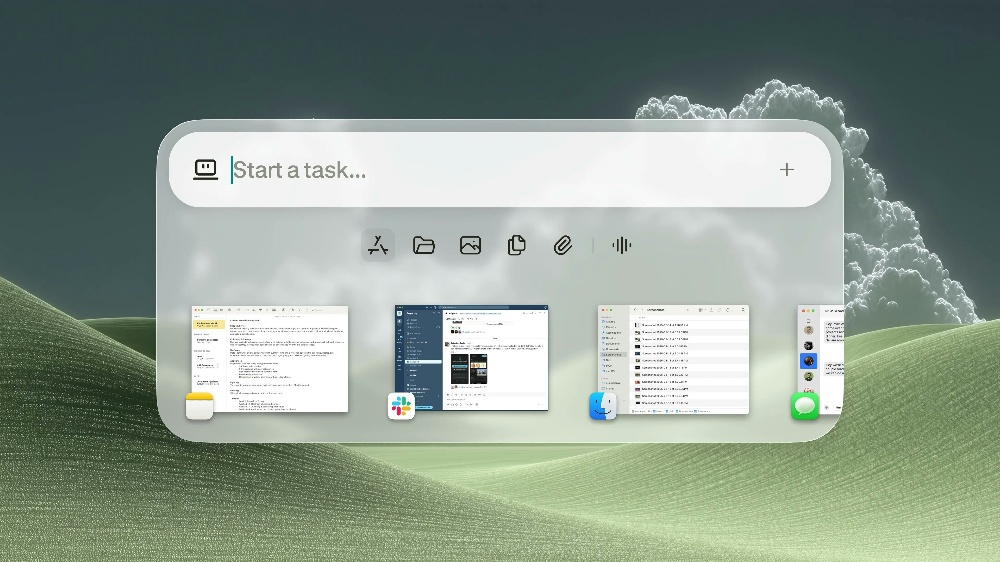

---

## 5. [Avina](https://www.producthunt.com/products/avina-2)
**Votes**: 147 | **도입 난이도**: 중 | **신뢰도**: 중
**Tagline**: GTM Agents to Find and Reach Your Next Customer
**서비스 링크**: https://www.producthunt.com/r/7P5YI2HVI7WADA

**태그**: GTM, AI, 자동화, ABM, 리드 생성, Agent, AI Tool, Email

### 📌 이 서비스 한눈에 보기
Avina는 ICP 정의 및 구매 트리거 설정을 통해 잠재 고객을 찾고, AI 기반 자동화된 이메일 및 ABM 캠페인을 실행하여 고객에게 도달할 수 있도록 돕는 GTM 에이전트입니다.

### 🔑 주요 기능
- 웹, LinkedIn, 채용 공고 등 다양한 채널에서 잠재 고객의 신호를 추적합니다.
- RB2B, Vector, Clearbit 통합을 통해 리드를 자동으로 보강하고 ICP에 따라 점수를 매깁니다.
- 개인화된 AI 이메일 및 ABM 캠페인을 자동 실행하여 잠재 고객에게 도달합니다.

### 🙋 사용자에게 어떤 점이 좋은가
Avina를 사용하면 잠재 고객을 식별하고 타겟팅하는 데 드는 시간과 노력을 줄여 마케팅 및 영업 효율성을 높일 수 있습니다.

### ✅ 지금 바로 써볼 기능
- ICP 정의 및 구매 트리거 설정
- 자동화된 이메일 캠페인 설정
- ABM 캠페인 설정

### ⚠️ 사용 전 확인할 점
- 자동화된 캠페인 설정에 대한 학습 필요
- RB2B, Vector, Clearbit 등 외부 서비스 연동 필요

### 🧭 확인이 더 필요한 정보
Avina의 AI 기반 캠페인 성능에 대한 추가적인 사용 후기가 필요합니다.

### 📸 스크린샷 및 갤러리
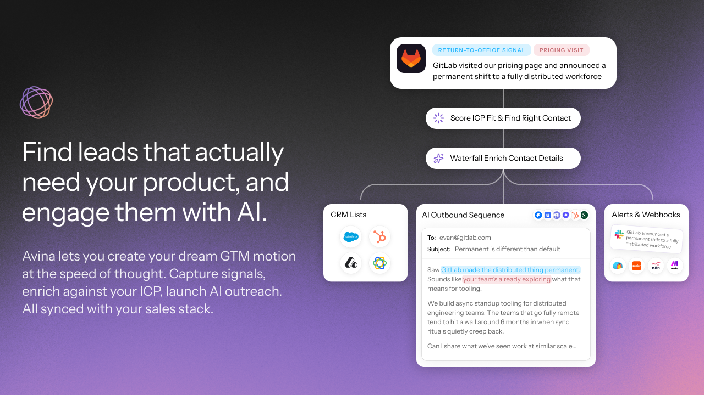
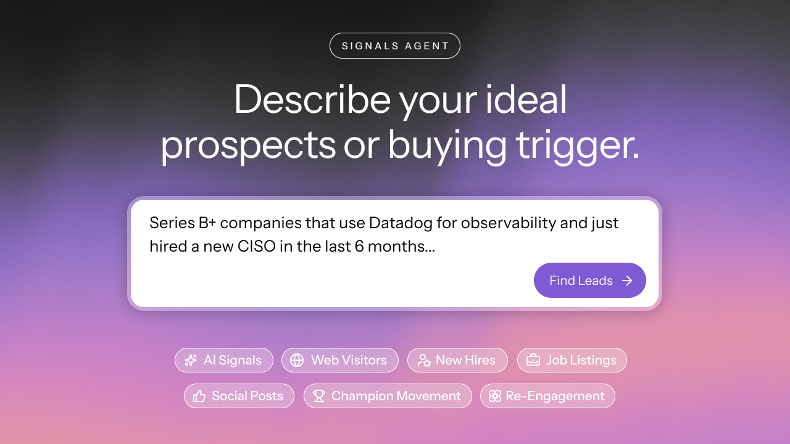
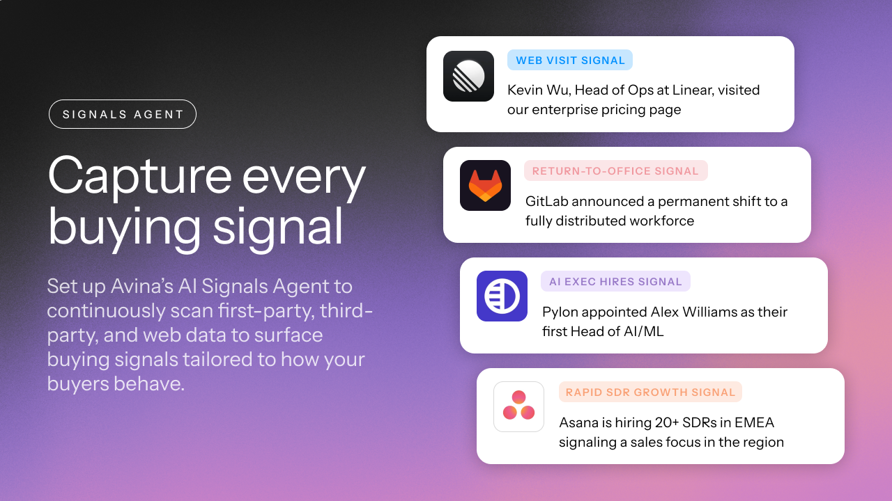

### 🎬 관련 영상
- [🎥 영상 보기](https://ph-files.imgix.net/f6a99843-724b-42bb-831f-b189b8956dbb.jpeg?auto=format)

---

## 6. [Tell](https://www.producthunt.com/products/tell-2)
**Votes**: 99 | **도입 난이도**: 중 | **신뢰도**: 중
**Tagline**: Mac widgets, made fun. 
**서비스 링크**: https://www.producthunt.com/r/KDCFPKYUUCDS7I

**태그**: macOS, 위젯, 시스템 모니터링, 3D, 시각화, Design

### 📌 이 서비스 한눈에 보기
Tell은 맥OS 시스템 정보를 3D 오브젝트로 시각화하여 데스크탑에서 실시간으로 모니터링할 수 있게 해주는 위젯 앱입니다.

### 🔑 주요 기능
- 네트워크 속도, CPU 사용량, 배터리 등 시스템 정보 모니터링
- 부드러운 애니메이션 기반의 3D 오브젝트 시각화
- 빠르고 미니멀한 디자인

### 🙋 사용자에게 어떤 점이 좋은가
기존 위젯보다 직관적이고 재미있게 시스템 상태를 파악하고 데스크탑을 꾸밀 수 있습니다. 시스템 리소스 사용량을 시각적으로 확인하여 맥OS 성능 관리에 도움을 받을 수 있습니다.

### ✅ 지금 바로 써볼 기능
- 데스크탑에 위젯을 추가하여 시스템 정보 확인
- 다양한 3D 오브젝트 컬렉션 탐색
- 애니메이션 효과 확인

### ⚠️ 사용 전 확인할 점
- 지속적인 리소스 사용으로 인한 배터리 소모 가능성
- macOS 버전 호환성 확인 필요

### 🧭 확인이 더 필요한 정보
향후 추가될 시스템 모듈 및 애니메이션 오브젝트에 대한 정보 확인이 필요합니다.

### 📸 스크린샷 및 갤러리
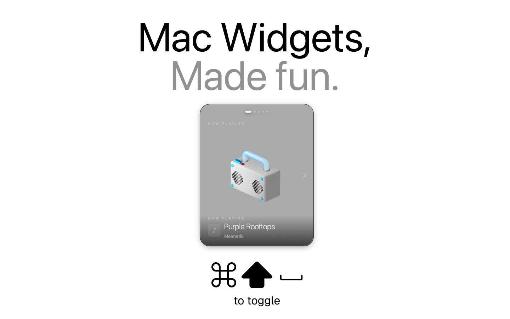

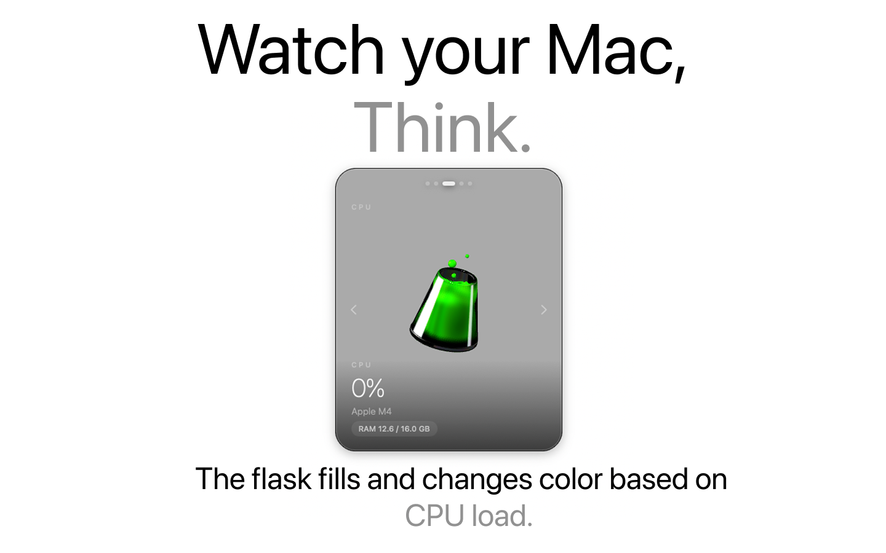

### 🎬 관련 영상
- [🎥 영상 보기](https://ph-files.imgix.net/55a4283b-52ca-4661-a771-0691fd2109c5.jpeg?auto=format)

---

## 7. [Creator OS](https://www.producthunt.com/products/creator-os-3)
**Votes**: 98 | **도입 난이도**: 중 | **신뢰도**: 중
**Tagline**: Stop missing comments on Instagram.
**서비스 링크**: https://www.producthunt.com/r/7JT2HBCSUHYOEX

**태그**: 크리에이터, 자동화, 분석, 소셜 미디어, 콘텐츠 제작, AI Tool, Video, Analytics

### 📌 이 서비스 한눈에 보기
크리에이터 OS는 유튜브, 인스타그램, 트위치 크리에이터를 위한 올인원 플랫폼으로, 댓글 관리, AI 썸네일, 비디오 파이프라인, 브랜드 딜, 분석 등을 제공하여 크리에이터의 작업 효율성을 높여줍니다.

### 🔑 주요 기능
- 인스타그램 댓글 누락 방지 기능 제공
- AI 썸네일 자동 생성 기능
- 유튜브, 인스타그램, 트위치 통합 관리

### 🙋 사용자에게 어떤 점이 좋은가
크리에이터는 이 플랫폼을 통해 콘텐츠 제작, 관리, 수익화에 필요한 다양한 기능을 한 곳에서 이용할 수 있어 시간과 노력을 절약하고 효율성을 높일 수 있습니다.

### ✅ 지금 바로 써볼 기능
- AI 썸네일 생성 기능 사용해보기
- 인스타그램 댓글 관리 기능 설정하기
- 채널 분석 기능으로 성과 측정하기

### ⚠️ 사용 전 확인할 점
- 월 $4.90부터 시작하는 유료 플랜 존재
- 제공하는 기능이 사용자의 니즈와 맞는지 확인 필요

### 🧭 확인이 더 필요한 정보
제공되는 분석 기능의 정확도 및 상세 수준에 대한 추가 정보 확인이 필요합니다.

### 📸 스크린샷 및 갤러리

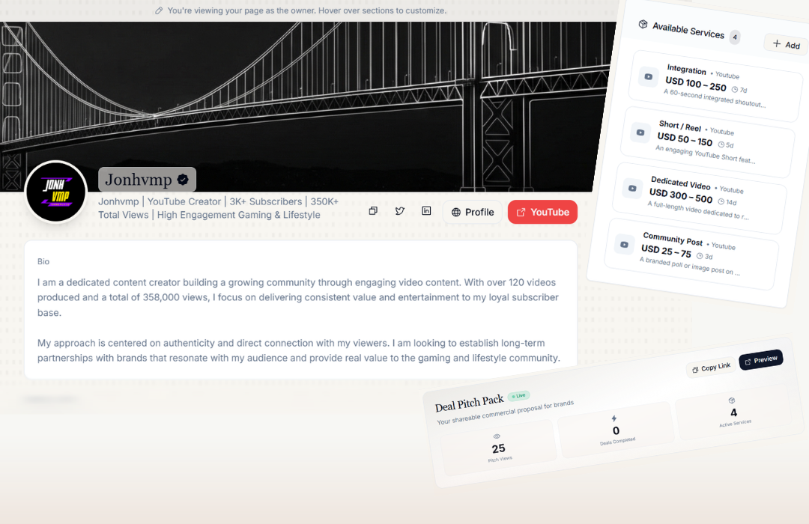

---

## 8. [Paperweight](https://www.producthunt.com/products/paperweight)
**Votes**: 95 | **도입 난이도**: 중 | **신뢰도**: 중
**Tagline**: Cleanup your email and manage your digital footprint
**서비스 링크**: https://www.producthunt.com/r/CKRXU3VVACEVSK

**태그**: 개인정보보호, 보안, 이메일, 자동화, GDPR, AI Tool, Email, Security

### 📌 이 서비스 한눈에 보기
Paperweight는 이메일을 스캔하여 사용자의 디지털 발자국을 파악하고, 잊고 있던 계정을 정리하여 개인 정보 보호 및 보안 위험을 줄여주는 도구입니다.

### 🔑 주요 기능
- 이메일 스캔을 통한 계정 목록 자동 생성
- GDPR 삭제 요청 지원
- 개인 정보 보호 우선 설계 (데이터 로컬 저장)

### 🙋 사용자에게 어떤 점이 좋은가
잊고 지내던 온라인 계정을 쉽게 파악하고 정리하여 개인 정보 유출 위험을 줄이고, 불필요한 이메일 구독을 한 번에 해지할 수 있습니다.

### ✅ 지금 바로 써볼 기능
- 이메일 계정 연결 후 디지털 발자국 스캔
- 계정 목록 확인 및 불필요한 계정 삭제
- 구독 해지 기능 활용

### ⚠️ 사용 전 확인할 점
- 이메일 계정 접근 권한 필요
- 모든 서비스의 GDPR 삭제 요청 지원 여부 확인 필요

### 🧭 확인이 더 필요한 정보
Paperweight가 지원하는 이메일 서비스 제공업체 목록 및 GDPR 삭제 요청 자동화 수준을 확인해야 합니다.

### 📸 스크린샷 및 갤러리
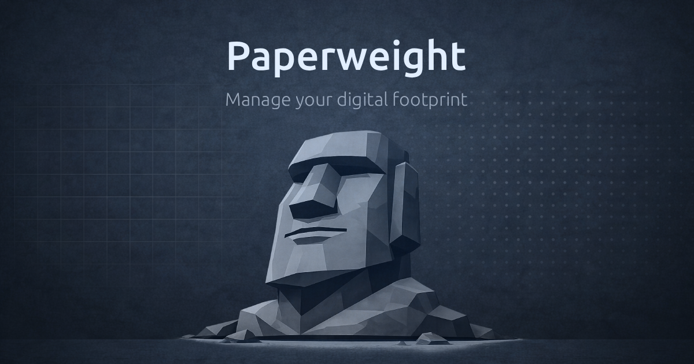
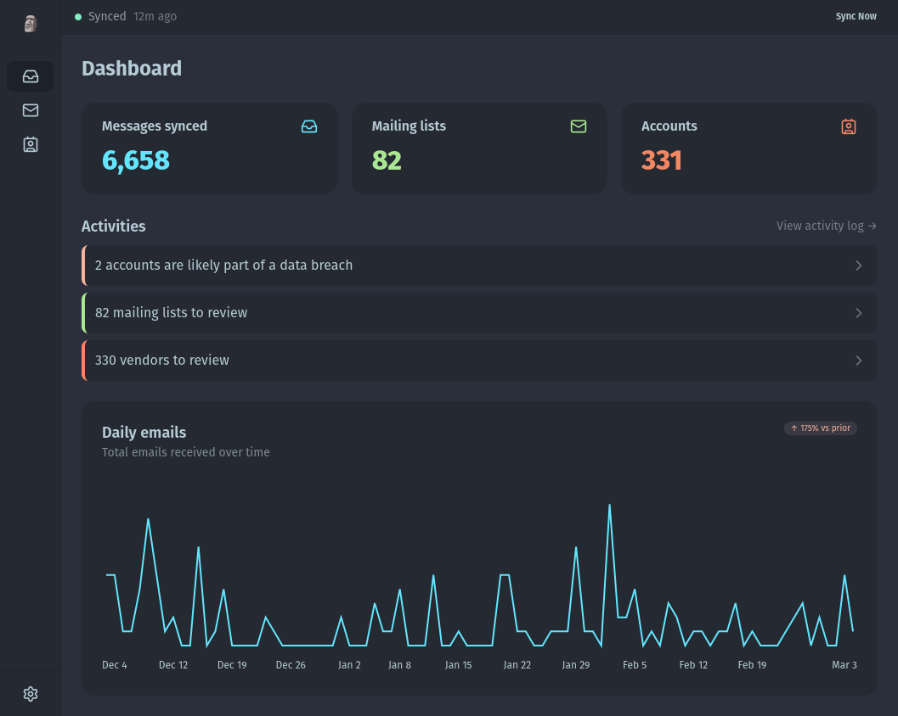
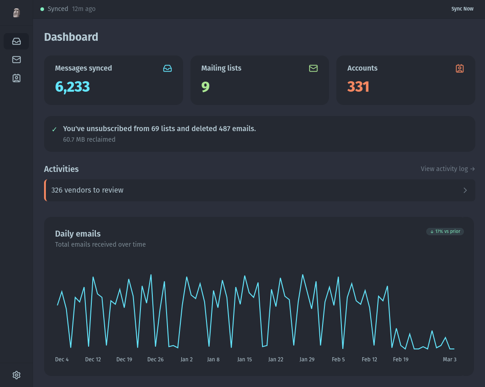

---

## 9. [Wyndo](https://www.producthunt.com/products/wyndo)
**Votes**: 86 | **도입 난이도**: 하 | **신뢰도**: 중
**Tagline**: Weather app that tells you when to walk, bike or eat outside
**서비스 링크**: https://www.producthunt.com/r/SVBS7WLPRZY2GP

**태그**: 날씨, 야외활동, 추천, 생활, AI Tool

### 📌 이 서비스 한눈에 보기
Wyndo는 날씨 앱이 알려주지 않는 '지금 나가도 될까?'라는 질문에 직접적인 답변을 제공하여 야외 활동 결정을 도와줍니다.

### 🔑 주요 기능
- 날씨 확률 대신 '지금 가도 될지'에 대한 명확한 추천 제공
- 걷기, 자전거, 운전, 야외 식사 등 활동별 맞춤 점수 제공
- 시간별 그래프 대신 직관적인 추천 이유 설명

### 🙋 사용자에게 어떤 점이 좋은가
더 이상 날씨 앱의 복잡한 정보에 얽매이지 않고, Wyndo를 통해 야외 활동 여부를 쉽고 빠르게 결정할 수 있습니다.

### ✅ 지금 바로 써볼 기능
- 걷기, 자전거 타기, 야외 식사 등 원하는 활동 선택
- 현재 위치 기반 날씨 정보 확인
- Wyndo의 추천에 따라 야외 활동 계획

### ⚠️ 사용 전 확인할 점
- 정확한 날씨 정보는 지역 및 데이터 제공 업체에 따라 달라질 수 있습니다.
- 개인의 주관적인 날씨 선호도는 고려되지 않을 수 있습니다.

### 🧭 확인이 더 필요한 정보
Wyndo의 추천 정확도 및 다양한 활동 지원 여부에 대한 추가적인 사용 후기 확인이 필요합니다.

### 📸 스크린샷 및 갤러리
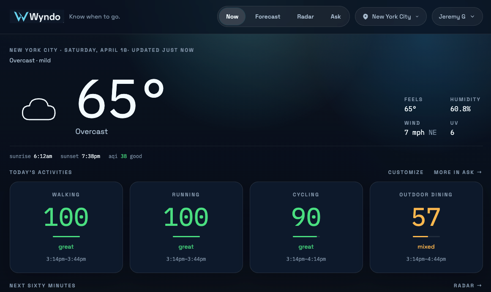
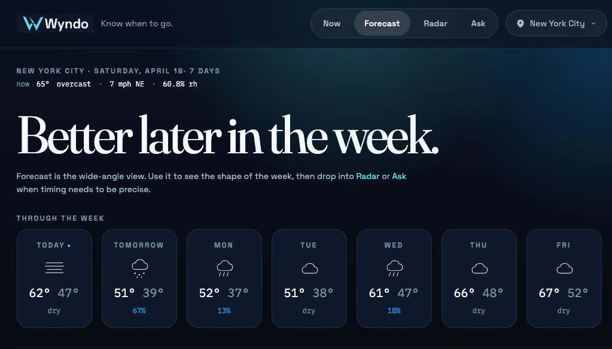

---

## 10. [Fixa.dev](https://www.producthunt.com/products/fixa-dev)
**Votes**: 86 | **도입 난이도**: 중 | **신뢰도**: 중
**Tagline**: A cloud-native AI agent that can build literally anything
**서비스 링크**: https://www.producthunt.com/r/M7JEDPMEZXOHID

**태그**: DevTool, AI, Automation, Backend, Agent, AI Tool

### 📌 이 서비스 한눈에 보기
Fixa.dev는 클라우드 기반 AI 에이전트로, 웹을 탐색하여 필요한 라이브러리를 설치하고, Stripe, Supabase, Clerk, Vercel과 같은 서비스와 통합하여 실제 소프트웨어를 자율적으로 구축할 수 있게 해줍니다.

### 🔑 주요 기능
- 클라우드 기반의 완전한 개발 환경에서 작동하는 자율 AI 에이전트
- 웹 브라우징을 통해 실시간 문서 참조 및 필요한 종속성 자동 설치
- Stripe, Supabase, Clerk, Vercel 등 원클릭 통합 지원

### 🙋 사용자에게 어떤 점이 좋은가
Fixa를 사용하면 개발자가 직접 코딩하고 인프라를 관리하는 데 드는 시간과 노력을 줄여, 더 중요한 기능 개발에 집중할 수 있습니다. 또한, 다양한 서비스와의 간편한 통합을 통해 개발 생산성을 향상시킬 수 있습니다.

### ✅ 지금 바로 써볼 기능
- Stripe 연동을 통한 결제 기능 구현
- Supabase 연동을 통한 백엔드 구축
- Vercel 연동을 통한 배포 자동화

### ⚠️ 사용 전 확인할 점
- AI 에이전트의 자율적인 코드 생성 및 배포 과정에 대한 충분한 검토 필요
- 통합 서비스의 API 변경에 따른 Fixa의 호환성 문제 발생 가능성

### 🧭 확인이 더 필요한 정보
Fixa가 지원하는 모델의 종류와 성능, 그리고 MCP 커넥터의 호환성에 대한 추가 정보가 필요합니다.

### 📸 스크린샷 및 갤러리
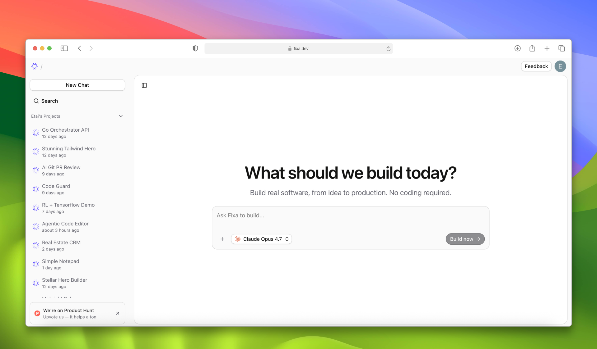
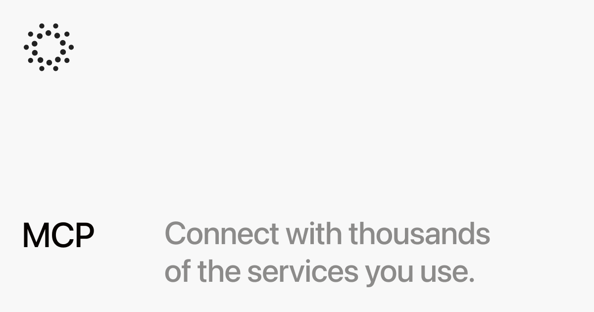

---

