# 🚀 Product Hunt Daily Top 10 (2026-04-21)

## 1. [Dune](https://www.producthunt.com/products/dune-4)
**Votes**: 413 | **도입 난이도**: 중 | **신뢰도**: 상
**Tagline**: Context-aware Mac keypad to automate workflows + meetings
**서비스 링크**: https://www.producthunt.com/r/67NKXLWIKHXRHK

**태그**: DevTool, Automation, Productivity, Mac, AI, Agent, AI Tool

### 📌 이 서비스 한눈에 보기
맥 사용자를 위한 상황 인지형 키패드로, 현재 앱에 맞춰 기능이 자동으로 바뀌어 작업 및 회의 자동화를 돕습니다.

### 🔑 주요 기능
- 현재 실행 중인 앱에 따라 기능이 실시간으로 변하는 맥 전용 키패드
- GitHub, VS Code 등 개발 환경 및 AI 에이전트 사용자의 작업 흐름 자동화
- Zoom, Teams, Google Meet 등 회의 앱에서 반복적인 작업 간소화

### 🙋 사용자에게 어떤 점이 좋은가
이 제품은 사용자가 매번 키보드 단축키를 기억하거나 수동으로 조작할 필요 없이, 현재 작업에 최적화된 기능을 제공하여 시간과 노력을 절약해줍니다. 특히 개발자나 회의가 잦은 사용자에게 생산성 향상에 크게 기여할 수 있습니다.

### ✅ 지금 바로 써볼 기능
- VS Code나 GitHub에서 자주 쓰는 명령어를 키패드에 할당하여 개발 워크플로우 자동화하기
- Zoom, Teams 등 회의 중 음소거/음소거 해제, 화면 공유 등 핵심 기능 설정하여 사용해보기
- AI 에이전트 실행 또는 특정 프롬프트 입력 등 반복적인 AI 관련 작업에 활용해보기

### ⚠️ 사용 전 확인할 점
- 맥 전용 하드웨어이므로 다른 운영체제에서는 사용 불가
- 3개의 키로만 구성되어 있어 매우 복잡한 워크플로우 전체를 자동화하기에는 한계가 있을 수 있음

### 🧭 확인이 더 필요한 정보
제품의 정확한 가격, 물리적 크기, 무선 여부 및 배터리 수명, 그리고 키 커스터마이징의 상세 범위에 대한 정보가 추가로 필요합니다.

### 📸 스크린샷 및 갤러리

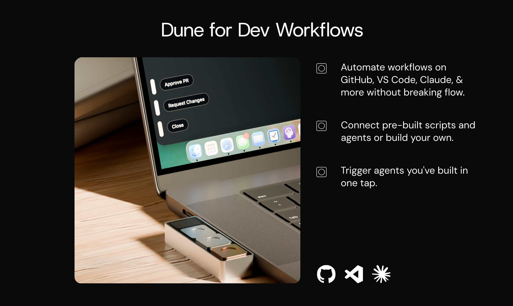

### 🎬 관련 영상
- [🎥 영상 보기](https://ph-files.imgix.net/dbf7afdd-00e1-4b2b-b05d-6deeec379340.jpeg?auto=format)

---

## 2. [The New Waydev](https://www.producthunt.com/products/waydev)
**Votes**: 263 | **도입 난이도**: 중 | **신뢰도**: 상
**Tagline**: Measure the full AI SDLC. From token to production.
**서비스 링크**: https://www.producthunt.com/r/PAI6YKNZIR2IRI

**태그**: DevTool, Analytics, AI, Productivity, Engineering, Agent, AI Tool

### 📌 이 서비스 한눈에 보기
AI 에이전트가 작성한 코드의 실제 배포율과 비용 효율성을 측정하여 AI 개발 생산성을 극대화합니다.

### 🔑 주요 기능
- AI 에이전트가 생성한 코드의 전체 SDLC(개발 주기)를 IDE부터 프로덕션까지 추적합니다.
- 토큰 소비량, PR당 비용, 채택률, 배포 상태 등 AI 코드의 상세 지표를 제공합니다.
- 다양한 AI 코드 생성 도구(Copilot, Cursor 등)의 실제 배포 성과를 비교 분석할 수 있습니다.

### 🙋 사용자에게 어떤 점이 좋은가
개발팀은 AI 에이전트가 생성한 코드 중 실제로 고객에게 도달하는 비율을 정확히 파악하여, 비효율적인 AI 사용을 줄이고 비용 대비 효과를 극대화할 수 있습니다.

### ✅ 지금 바로 써볼 기능
- 현재 사용 중인 AI 에이전트의 PR당 실제 배포 비용 확인하기
- 다양한 AI 코드 생성 도구(Copilot, Cursor 등)의 성과 비교 분석 시작하기
- Waydev Agent에게 팀별/리포별 AI 코드 현황 문의하기

### ⚠️ 사용 전 확인할 점
- 기존 개발 워크플로우에 통합 및 데이터 연동 과정에서 초기 설정 시간과 노력이 필요할 수 있습니다.
- AI 코드 추적 및 지표 측정의 정확성은 시스템 연동 방식과 데이터 수집 범위에 따라 달라질 수 있습니다.

### 🧭 확인이 더 필요한 정보
현재 지원하는 IDE, CI/CD 도구 및 AI 에이전트 벤더의 구체적인 목록과 연동 방식에 대한 추가 정보가 필요합니다.

### 📸 스크린샷 및 갤러리
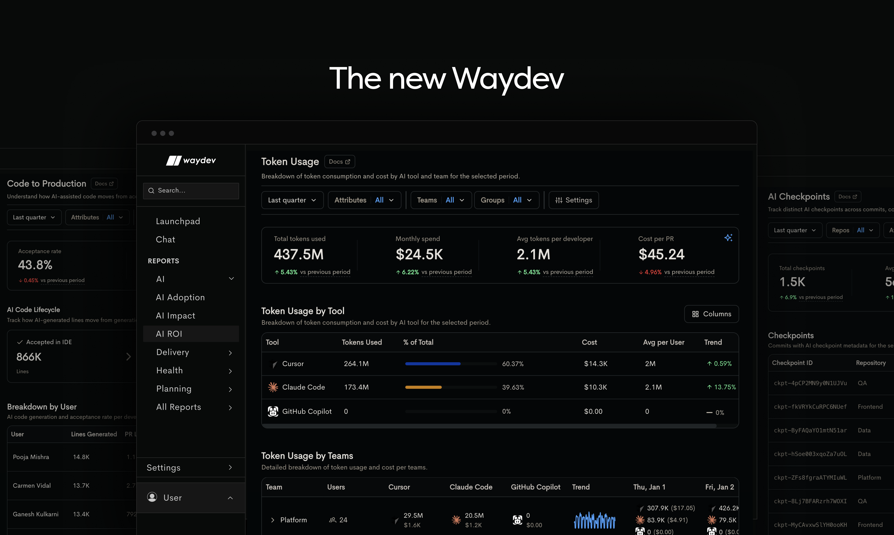
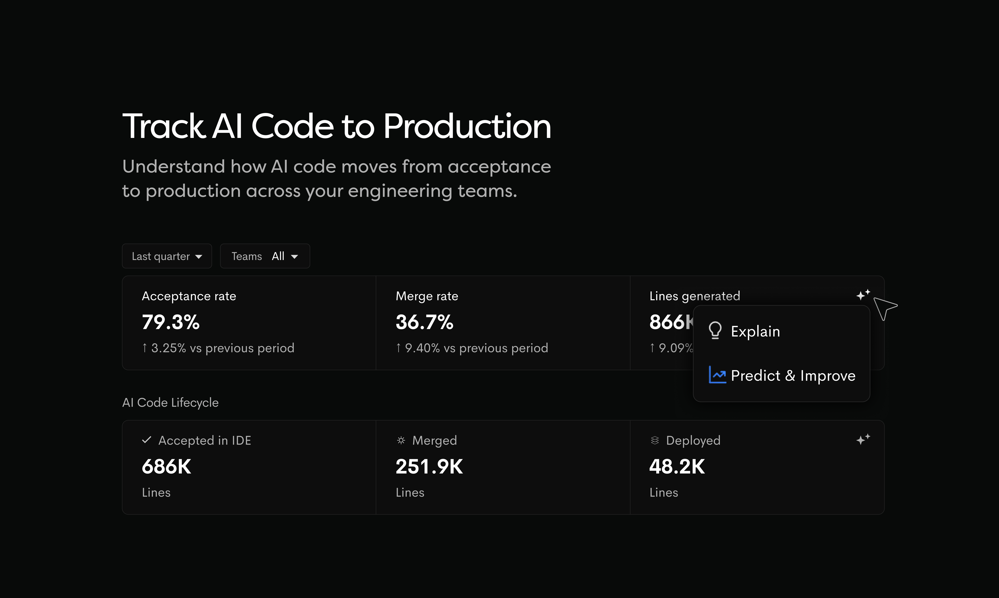
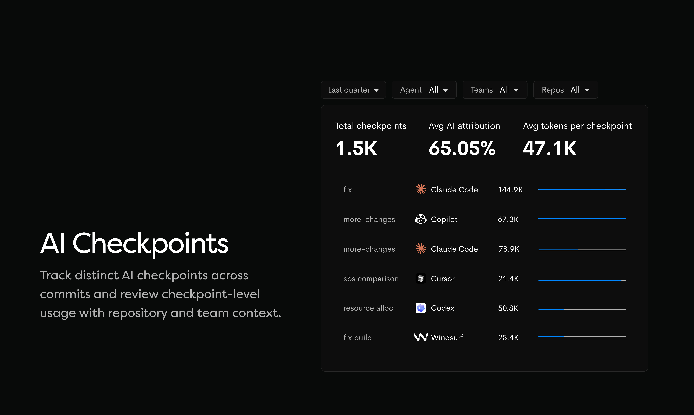

### 🎬 관련 영상
- [🎥 영상 보기](https://ph-files.imgix.net/befd8cf4-0670-4309-8cf7-8beef99869d3.jpeg?auto=format)

---

## 3. [Claude Desktop Buddy](https://www.producthunt.com/products/claude)
**Votes**: 249 | **도입 난이도**: 상 | **신뢰도**: 중
**Tagline**: Bring Claude into the physical world with maker hardware
**서비스 링크**: https://www.producthunt.com/r/5TWF4OB2SOXZ77
**재등장**: 최근 7일 내 재등장 (마지막 등장 1일 전)

**태그**: DevTool, Automation, AI, Hardware, Maker, Prompting, API

### 📌 이 서비스 한눈에 보기
Claude AI를 물리적인 하드웨어와 연결하여 실제 환경에서 더 편리하게 활용할 수 있게 해주는 도구입니다.

### 🔑 주요 기능
- Claude 데스크톱 앱과 ESP32 같은 마이크로컨트롤러를 BLE API로 연동합니다.
- AI의 상태를 물리적 장치에 표시하거나, 프롬프트 승인 등을 하드웨어로 처리할 수 있습니다.
- 개발자 및 메이커들이 Claude AI를 활용한 맞춤형 물리적 인터페이스를 구축할 수 있도록 돕습니다.

### 🙋 사용자에게 어떤 점이 좋은가
개발자나 메이커들이 Claude AI를 물리적인 장치와 연결하여 AI의 상태를 시각적으로 확인하거나 특정 작업을 물리적으로 제어할 수 있어, AI 활용의 폭을 넓힐 수 있습니다.

### ✅ 지금 바로 써볼 기능
- Claude 데스크톱 앱에서 BLE API 활성화 방법을 확인하기
- ESP32 등 마이크로컨트롤러와 연결하여 기본 연동 테스트하기
- AI의 상태 변화를 물리적 디스플레이로 출력하는 간단한 프로젝트 시도하기

### ⚠️ 사용 전 확인할 점
- 하드웨어(ESP32 등) 및 개발 지식이 필요하여 일반 사용자는 접근하기 어려울 수 있습니다.
- BLE API가 제공하는 기능 범위 내에서만 활용 가능하며, Claude의 모든 기능을 물리적으로 제어하기는 어려울 수 있습니다.

### 🧭 확인이 더 필요한 정보
BLE API를 통해 어떤 종류의 Claude AI 기능(예: 특정 명령 실행, 응답 수신 등)까지 물리적으로 제어할 수 있는지 구체적인 정보가 더 필요합니다.

### 📸 스크린샷 및 갤러리
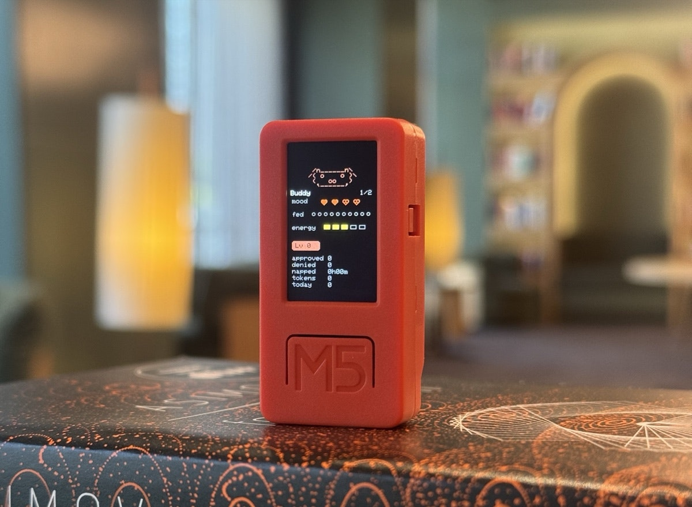
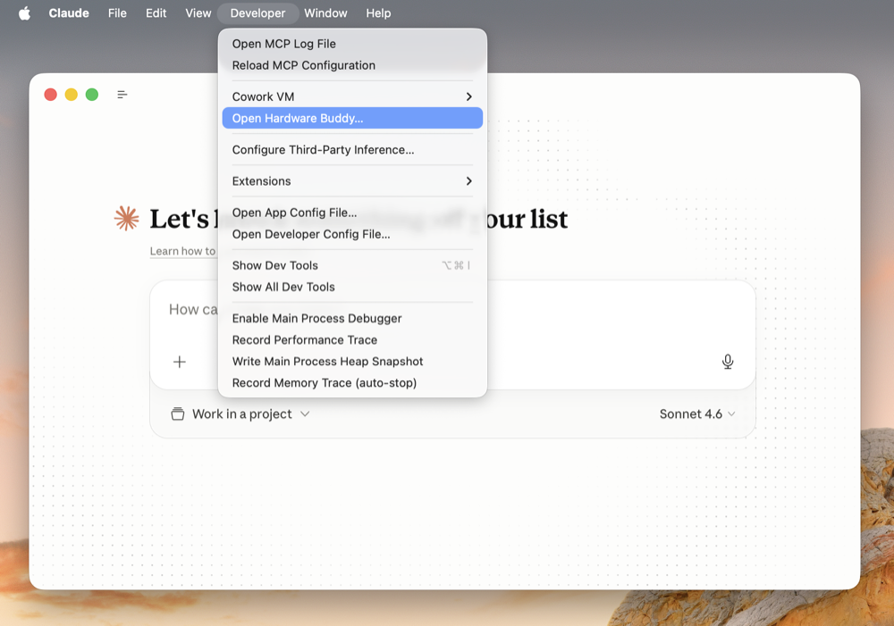
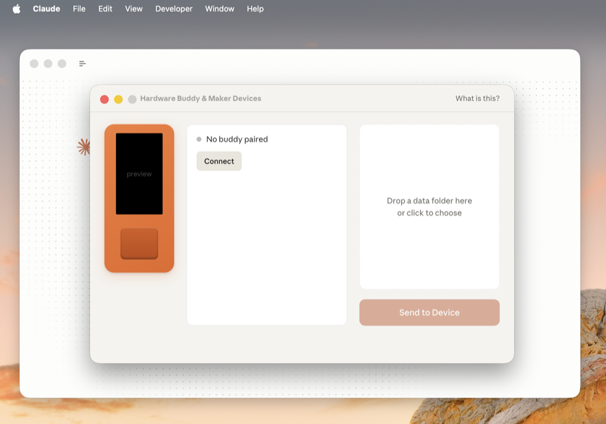

---

## 4. [kaizen](https://www.producthunt.com/products/kaizen-7)
**Votes**: 193 | **도입 난이도**: 중 | **신뢰도**: 중
**Tagline**: Run training that adapts based on the running you do
**서비스 링크**: https://www.producthunt.com/r/CCOJJUWM5A7KOD

**태그**: 러닝, 트레이닝, 개인 맞춤, 자동 조정, 운동, AI Tool

### 📌 이 서비스 한눈에 보기
kaizen은 실제 러닝 기록에 맞춰 훈련 계획을 지속적으로 업데이트하여 목표 달성을 돕는 개인 맞춤형 러닝 트레이닝 앱입니다.

### 🔑 주요 기능
- 실제 러닝 데이터를 기반으로 훈련 계획 자동 조정
- 개인 목표 달성을 위한 맞춤형 트레이닝 제공
- 예상치 못한 상황 발생 시에도 유연하게 계획 변경

### 🙋 사용자에게 어떤 점이 좋은가
예상치 못한 상황으로 훈련 계획을 지키기 어려울 때, kaizen은 자동으로 계획을 조정하여 지속적인 성장을 가능하게 합니다. 개인 맞춤형 트레이닝을 통해 효율적인 러닝 경험을 제공합니다.

### ✅ 지금 바로 써볼 기능
- 앱을 다운로드하고 개인 목표 설정하기
- 러닝 기록 연동하여 맞춤형 훈련 계획 시작하기
- 훈련 진행 상황을 꾸준히 확인하고 피드백 제공하기

### ⚠️ 사용 전 확인할 점
- 정확한 러닝 기록 측정을 위해 GPS 설정 확인 필요
- 개인의 신체 능력과 건강 상태를 고려하여 훈련 강도 조절 필요

### 🧭 확인이 더 필요한 정보
kaizen의 훈련 계획 조정 알고리즘의 정확도 및 개인별 효과에 대한 추가적인 사용자 후기 확인이 필요합니다.

### 📸 스크린샷 및 갤러리
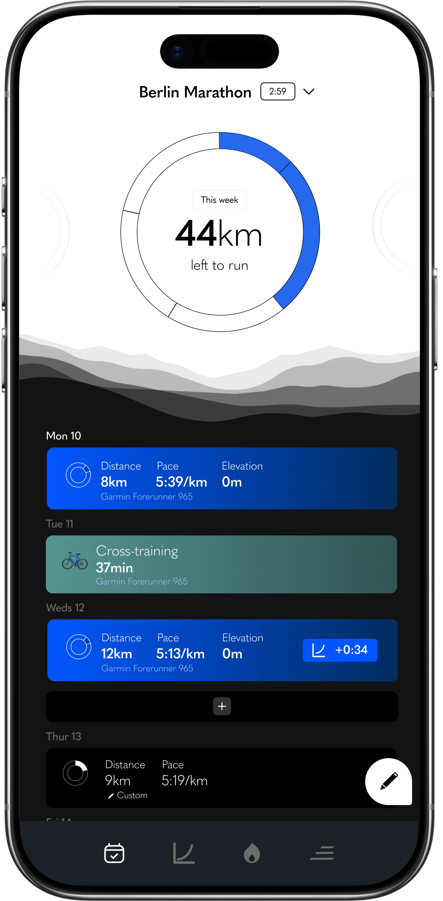

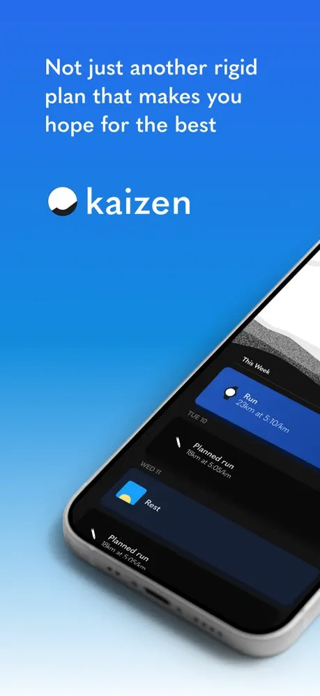

### 🎬 관련 영상
- [🎥 영상 보기](https://ph-files.imgix.net/34a89638-43e7-4901-b8f1-41c0b5856994.gif?auto=format)

---

## 5. [Pegasus 1.5 by TwelveLabs](https://www.producthunt.com/products/twelvelabs)
**Votes**: 170 | **도입 난이도**: 중 | **신뢰도**: 중
**Tagline**: AI model for transforming video into Time-Based Metadata
**서비스 링크**: https://www.producthunt.com/r/5LRNB7ICMLNXGW

**태그**: AI, 비디오 분석, 메타데이터, 검색, 자동화, Agent, AI Tool, Video, Vision, API

### 📌 이 서비스 한눈에 보기
Pegasus 1.5는 비디오를 실시간으로 쿼리 및 연산 가능한 자산으로 변환하여, 사용자가 정의한 스키마에 따라 비디오 내 특정 시점에 나타나는 정보를 쉽게 찾고 활용할 수 있도록 돕습니다.

### 🔑 주요 기능
- 비디오를 시간 기반 메타데이터로 변환
- 사용자 정의 스키마 지원
- 이미지 기반 검색 기능 제공

### 🙋 사용자에게 어떤 점이 좋은가
비디오 라이브러리를 인간과 AI 에이전트 모두가 쿼리할 수 있도록 만들어, 비디오 데이터 활용도를 극대화합니다. 특히, 특정 이미지가 비디오에 나타나는 시점을 쉽게 찾아낼 수 있어 편리합니다.

### ✅ 지금 바로 써볼 기능
- 샘플 비디오를 업로드하여 메타데이터 추출 테스트
- 자체 비디오 데이터에 대한 스키마 정의
- 이미지 검색 기능을 활용하여 특정 장면 검색

### ⚠️ 사용 전 확인할 점
- 최대 2시간 분량의 비디오만 지원
- 정확한 메타데이터 추출을 위해 스키마 정의가 중요

### 🧭 확인이 더 필요한 정보
실제 사용 사례에서 Pegasus 1.5의 성능과 정확도에 대한 추가적인 검증이 필요합니다.

### 📸 스크린샷 및 갤러리
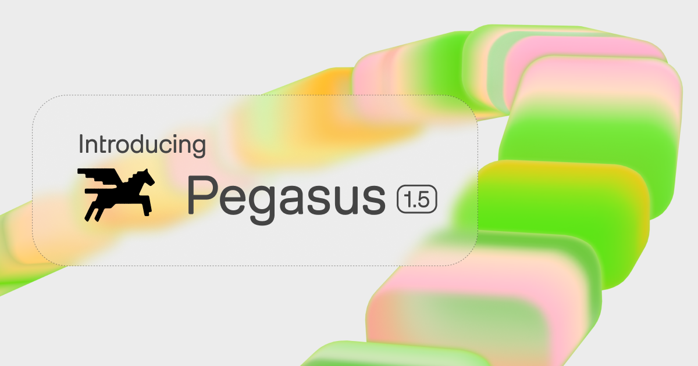
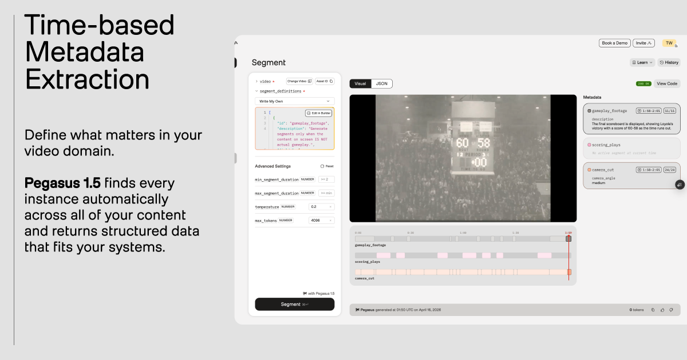
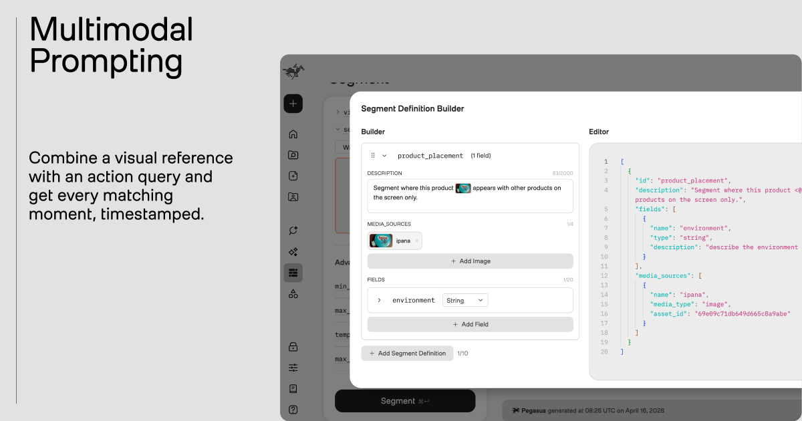

### 🎬 관련 영상
- [🎥 영상 보기](https://ph-files.imgix.net/8bd2bad3-8b62-4303-88de-13b4005c84b6.jpeg?auto=format)

---

## 6. [tasteit](https://www.producthunt.com/products/tasteit)
**Votes**: 144 | **도입 난이도**: 중 | **신뢰도**: 상
**Tagline**: The food social network to meet people over food
**서비스 링크**: https://www.producthunt.com/r/2VGYSX33E7N6XV

**태그**: Social Network, Food, Community, Lifestyle, Dating

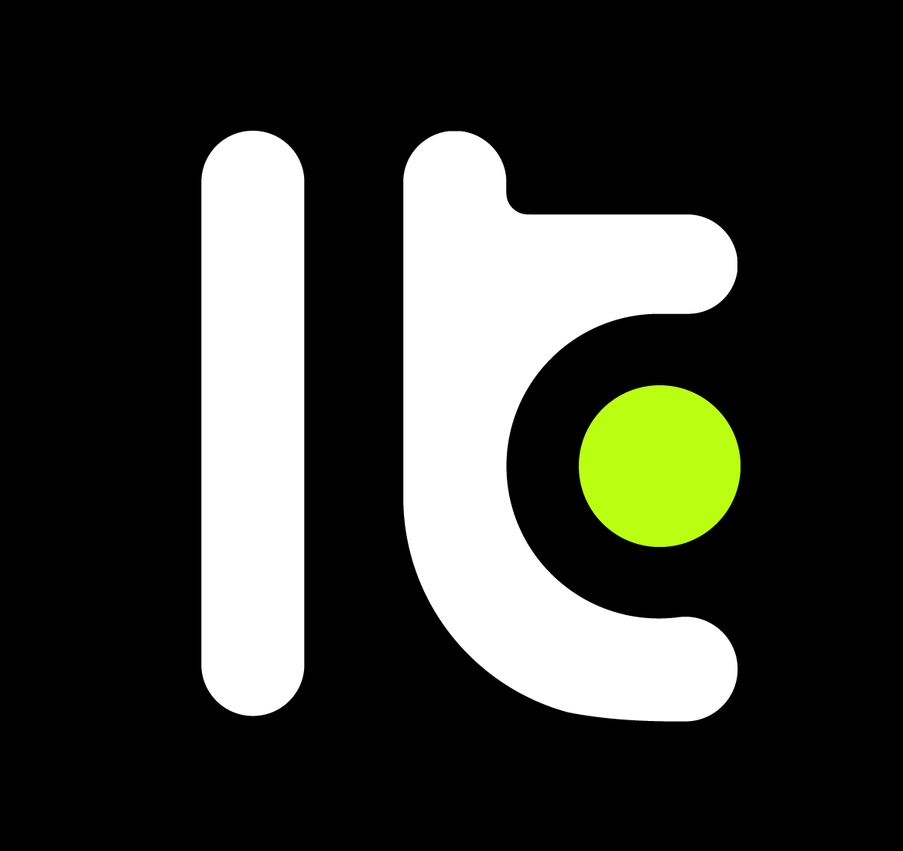

### 📌 이 서비스 한눈에 보기
음식을 매개로 새로운 사람을 만나고 함께 식사할 수 있는 소셜 네트워크입니다.

### 🔑 주요 기능
- 음식 취향을 기반으로 한 새로운 소셜 경험 제공
- 관심 있는 요리를 통해 사람들과 연결 및 교류
- 온라인 만남을 실제 식사로 전환하여 관계 형성 유도

### 🙋 사용자에게 어떤 점이 좋은가
음식 취향이 맞는 사람들과 자연스럽게 교류하며 새로운 인연을 만들고, 함께 식사하는 즐거움을 경험할 수 있습니다.

### ✅ 지금 바로 써볼 기능
- 좋아하는 요리 검색 및 발견
- 관심 있는 요리를 좋아하는 다른 사용자 찾기
- 마음에 맞는 사람과 함께 식사 약속 잡기

### ⚠️ 사용 전 확인할 점
- 초기 사용자 수가 적을 경우 매칭 기회가 제한될 수 있습니다.
- 온라인 만남을 실제 식사로 전환 시 개인 안전에 유의해야 합니다.

### 🧭 확인이 더 필요한 정보
사용자 매칭 알고리즘의 구체적인 작동 방식과 안전 기능에 대한 추가 정보가 필요합니다.

### 📸 스크린샷 및 갤러리

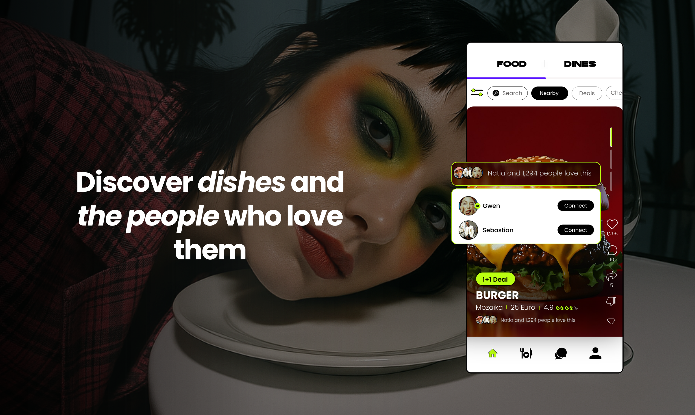
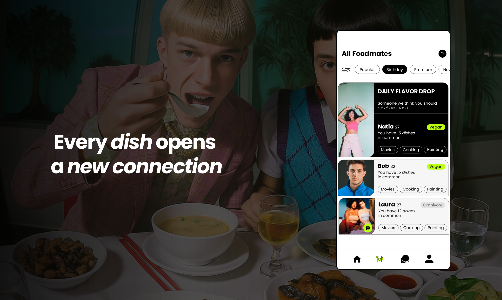

### 🎬 관련 영상
- [🎥 영상 보기](https://ph-files.imgix.net/32d4a028-8a05-4ff4-9cb4-62a46e256e8b.jpeg?auto=format)

---

## 7. [Granter](https://www.producthunt.com/products/granter-ai)
**Votes**: 117 | **도입 난이도**: 중 | **신뢰도**: 중
**Tagline**: Your company's AI Grant Consultant 
**서비스 링크**: https://www.producthunt.com/r/XWA5C7UM7TSYTI

**태그**: AI, 자금 조달, 자동화, 컨설팅, Agent, AI Tool

### 📌 이 서비스 한눈에 보기
Granter는 AI 기반의 보조금 컨설턴트로서, 기업의 자금 조달 라이프사이클 전반을 자동화하여 24시간 내내 관련 기회를 찾고, 고품질 신청서를 작성하며, 승인 후 규정 준수를 처리합니다.

### 🔑 주요 기능
- AI 에이전트가 자금 조달 라이프사이클 전체를 자율적으로 관리
- 24시간 내내 관련 기회 발굴 및 고품질 신청서 작성
- 회사, 산업, 위치에 맞춰 맞춤화된 디지털 직원

### 🙋 사용자에게 어떤 점이 좋은가
Granter를 통해 기업은 자금 조달 프로세스를 효율적으로 관리하고, 시간과 노력을 절약하며, 성공적인 자금 확보 가능성을 높일 수 있습니다.

### ✅ 지금 바로 써볼 기능
- 회사 정보 및 산업 분야 설정
- 자금 조달 목표 및 선호도 설정
- 자동으로 생성되는 신청서 검토 및 수정

### ⚠️ 사용 전 확인할 점
- AI가 생성한 신청서의 정확성 및 완전성 검토 필요
- 보조금 신청 결과에 대한 보장 없음

### 🧭 확인이 더 필요한 정보
Granter의 성능은 회사 정보의 정확성과 최신성에 따라 달라질 수 있습니다.

### 📸 스크린샷 및 갤러리
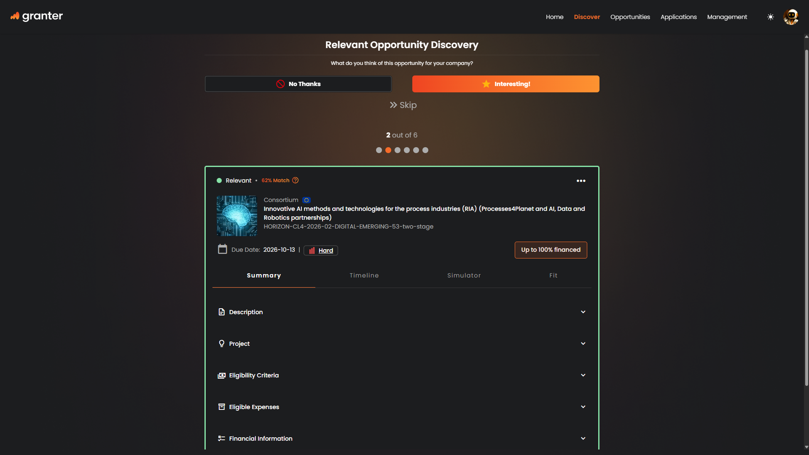
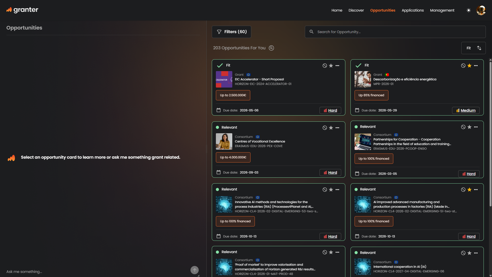

### 🎬 관련 영상
- [🎥 영상 보기](https://ph-files.imgix.net/f4a039e2-4a52-4015-81ad-341112537930.jpeg?auto=format)

---

## 8. [Knowzilla](https://www.producthunt.com/products/knowzilla)
**Votes**: 107 | **도입 난이도**: 중 | **신뢰도**: 중
**Tagline**: Real-time AI for sales that guides every deal
**서비스 링크**: https://www.producthunt.com/r/NKEKLO6C2HEPDS

**태그**: AI, 세일즈, 자동화, 실시간 지원, AI Tool, Sales

### 📌 이 서비스 한눈에 보기
Knowzilla는 실시간 AI 기반 세일즈 지원 도구로, 영업팀이 통화 중 즉각적인 답변을 얻어 계약 성사율을 높이도록 돕습니다.

### 🔑 주요 기능
- 실시간 AI 지원으로 통화 중 즉각적인 답변 제공
- 영업팀이 어려운 질문에 효과적으로 대응하도록 지원
- 플레이북에 묻힌 정보 때문에 계약을 놓치는 상황 방지

### 🙋 사용자에게 어떤 점이 좋은가
영업 담당자는 Knowzilla를 통해 고객과의 통화 중 필요한 정보를 즉시 얻을 수 있어, 더욱 자신감 있게 대처하고 계약 성공률을 높일 수 있습니다.

### ✅ 지금 바로 써볼 기능
- 데모 통화를 통해 실시간 답변 기능 체험
- 영업팀의 플레이북 연동 가능성 확인
- 실제 통화에서 Knowzilla 활용하여 답변 정확도 및 효율성 측정

### ⚠️ 사용 전 확인할 점
- AI 답변의 정확도 및 최신성 검증 필요
- 데이터 보안 및 개인 정보 보호 정책 확인

### 🧭 확인이 더 필요한 정보
Knowzilla의 AI가 지원하는 정보의 범위와 정확도에 대한 추가적인 정보가 필요합니다.

### 📸 스크린샷 및 갤러리
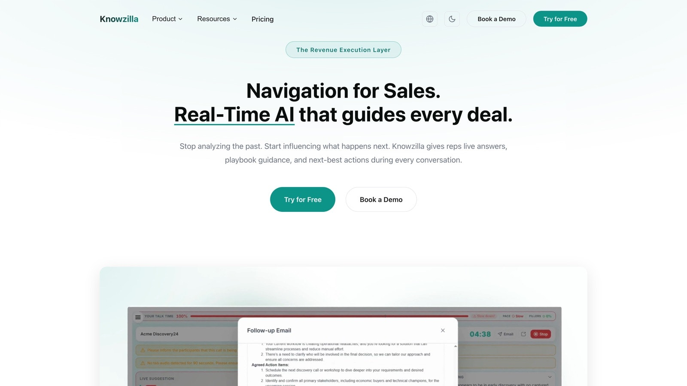
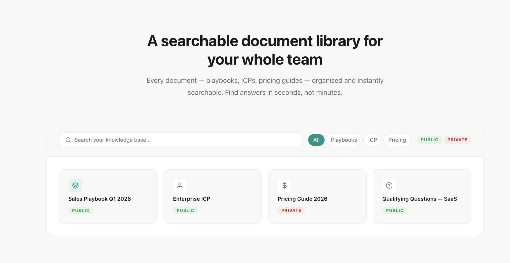
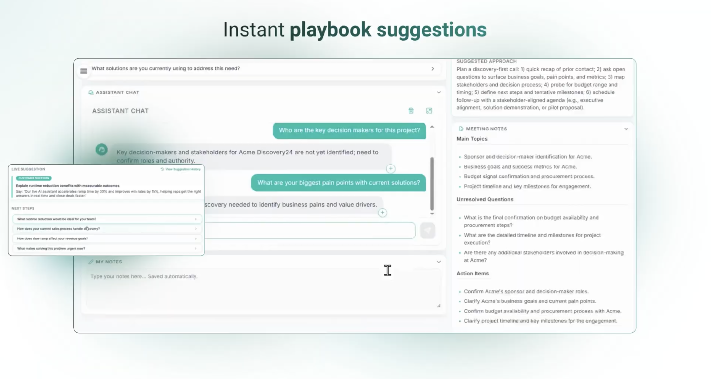

### 🎬 관련 영상
- [🎥 영상 보기](https://ph-files.imgix.net/7757f036-f497-45b6-83b8-a27b527262c9.gif?auto=format)

---

## 9. [Urbned](https://www.producthunt.com/products/urbned-2)
**Votes**: 100 | **도입 난이도**: 중 | **신뢰도**: 상
**Tagline**: Send money like a Text Message. Powered by Stablecoins.
**서비스 링크**: https://www.producthunt.com/r/3EZHYLYDPH6I7X

**태그**: FinTech, Payments, Crypto, Web3, Global, AI Tool

### 📌 이 서비스 한눈에 보기
스테이블코인을 활용하여 문자 메시지처럼 쉽고 빠르게 해외 송금을 할 수 있으며, 가상 USD/EUR 계좌를 제공하는 서비스입니다.

### 🔑 주요 기능
- 복잡한 은행 절차 없이 스테이블코인 기반으로 빠르고 저렴한 해외 송금 가능
- 새로운 은행 계좌 없이 사용자 명의의 가상 USD 및 EUR 계좌 제공
- 메타마스크 및 팬텀 지갑에서 직접 국제 송금 지원

### 🙋 사용자에게 어떤 점이 좋은가
복잡한 은행 절차 없이 해외에 있는 가족이나 비즈니스 파트너에게 빠르고 저렴하게 돈을 보낼 수 있어 시간과 비용을 절약할 수 있습니다.

### ✅ 지금 바로 써볼 기능
- 가상 USD/EUR 계좌를 개설하여 사용해보기
- 메타마스크 또는 팬텀 지갑을 연결하여 소액 해외 송금 시도해보기
- 다양한 통화(페소, 루피 등)로 수취인에게 송금 테스트하기

### ⚠️ 사용 전 확인할 점
- 지원되는 국가 및 통화 목록과 송금 한도를 미리 확인해야 합니다.
- 스테이블코인 환전 시 적용되는 환율 및 수수료 구조를 명확히 파악해야 합니다.

### 🧭 확인이 더 필요한 정보
정확한 수수료 정책, 환율 적용 방식, 그리고 지원되는 국가 및 통화의 전체 목록에 대한 추가 정보가 필요합니다.

### 📸 스크린샷 및 갤러리
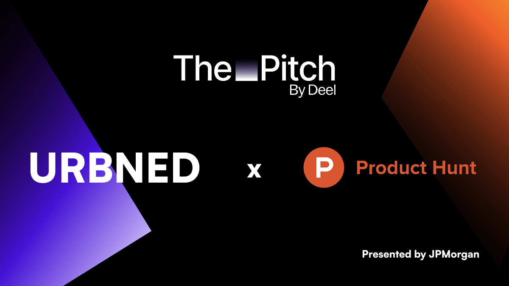
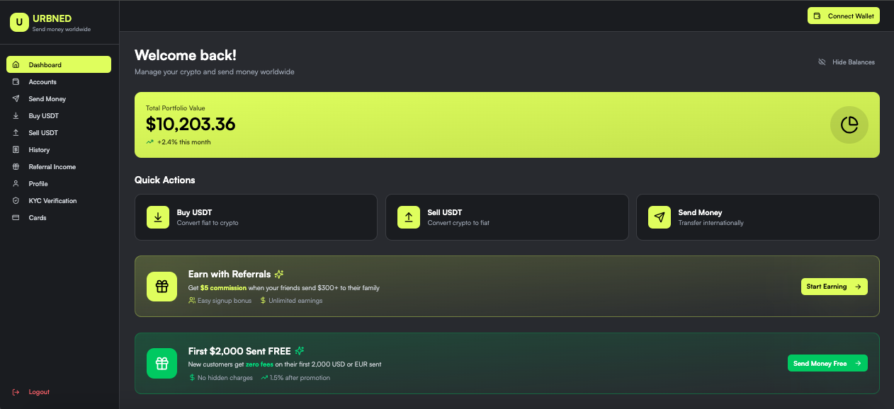
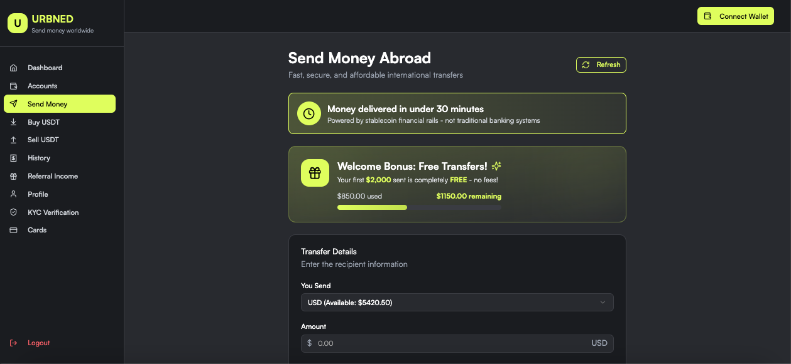

---

## 10. [PangeAI](https://www.producthunt.com/products/pangeai)
**Votes**: 99 | **도입 난이도**: 중 | **신뢰도**: 상
**Tagline**: Instant, agent-driven spatial analysis and decision-making
**서비스 링크**: https://www.producthunt.com/r/TP3QF6OLWQZXID

**태그**: Geospatial, AI, Analytics, Automation, Agent, AI Tool, Vision

### 📌 이 서비스 한눈에 보기
GIS 전문가 없이도 AI가 위성 이미지 등 지리 데이터를 분석해 물리적 세계 질문에 즉시 답을 찾아주는 서비스입니다.

### 🔑 주요 기능
- AI 에이전트 기반의 즉각적인 공간 분석 및 의사 결정 지원
- GIS 전문 팀 없이도 복잡한 지리 데이터 분석 가능
- 수 주 걸리던 분석 작업을 몇 분 만에 완료하여 시간 절약

### 🙋 사용자에게 어떤 점이 좋은가
기업이나 개인이 복잡한 지리 정보 시스템(GIS) 전문 지식 없이도 위성 이미지나 지도 데이터를 활용해 '어떤 지역이 침수되었는지'와 같은 질문에 신속하게 답을 얻을 수 있어 시간과 비용을 크게 절약할 수 있습니다.

### ✅ 지금 바로 써볼 기능
- 내 사업장 중 지난달 침수된 곳이 어디인지와 같은 구체적인 물리적 세계 질문을 던져보기
- 보유한 위성 이미지나 지도 데이터를 업로드하여 분석 요청해보기
- 다양한 물리적 세계 질문을 던져보고 답변 속도와 정확성 확인하기

### ⚠️ 사용 전 확인할 점
- AI 분석 결과의 정확성과 신뢰성 검증 필요
- 지원하는 지리 데이터 형식 및 용량 제한 확인

### 🧭 확인이 더 필요한 정보
서비스의 구체적인 요금 체계, 지원하는 데이터 소스 연동 방식, 그리고 분석 결과의 상세한 검증 방법 등에 대한 추가 정보가 필요합니다.

### 📸 스크린샷 및 갤러리
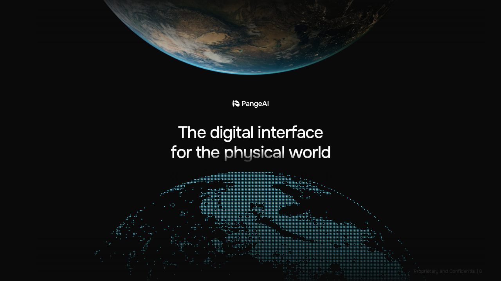
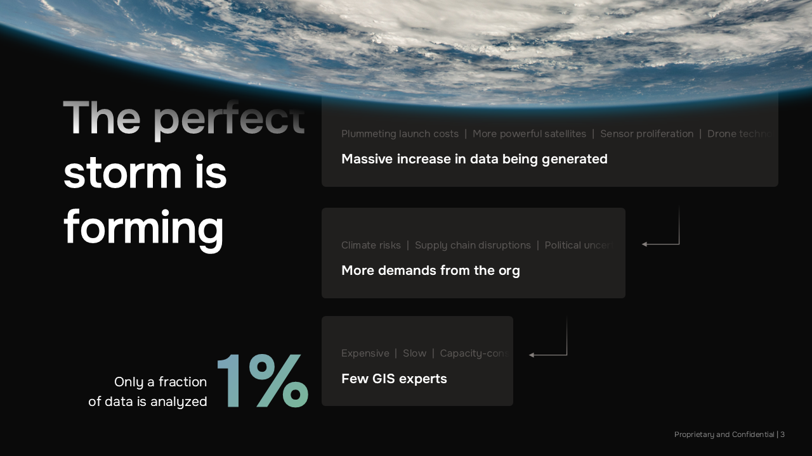
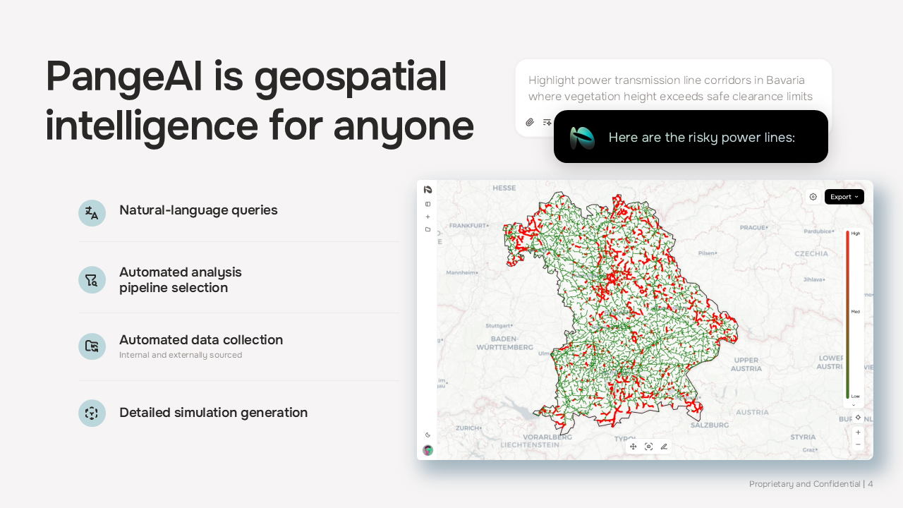

### 🎬 관련 영상
- [🎥 영상 보기](https://ph-files.imgix.net/c5564d26-cba9-48b4-ad95-9c0f1cf97a00.jpeg?auto=format)

---

