# 🚀 Product Hunt Daily Top 10 (2026-04-22)

## 1. [RankAI](https://www.producthunt.com/products/rankai-2)
**Votes**: 331 | **도입 난이도**: 중 | **신뢰도**: 중
**Tagline**: RankAI autonomously gets you buyers from Google & AI Search
**서비스 링크**: https://www.producthunt.com/r/SWCJJYGQH4XRUK

**태그**: SEO, AI, 자동화, 마케팅, 검색엔진, Agent, AI Tool, Chat

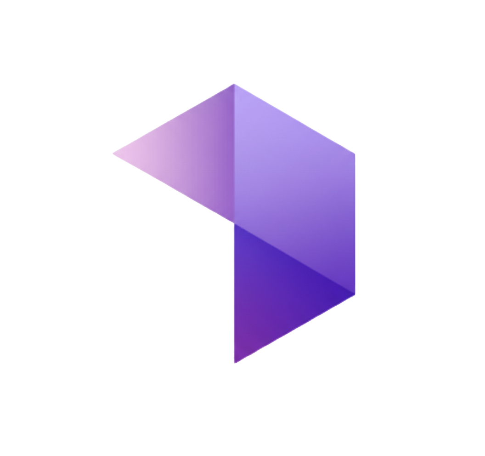

### 📌 이 서비스 한눈에 보기
RankAI는 웹사이트를 넣으면 Google과 AI 검색에서 잠재 고객을 자동으로 유치하는 SEO/GEO 에이전트입니다.

### 🔑 주요 기능
- 웹사이트를 넣으면 RankAI가 알아서 최적화된 페이지를 게시합니다.
- 고객이 Google과 ChatGPT에서 검색하는 의도가 높은 쿼리를 찾아냅니다.
- 페이지 성능을 추적하고 반복적으로 개선하여 방문자를 유치합니다.

### 🙋 사용자에게 어떤 점이 좋은가
SEO 및 콘텐츠 제작에 대한 전문 지식 없이도 Google 및 AI 검색을 통해 잠재 고객을 확보할 수 있습니다. 웹사이트를 넣기만 하면 RankAI가 모든 것을 처리합니다.

### ✅ 지금 바로 써볼 기능
- 웹사이트를 RankAI에 연결하여 자동 SEO를 시작해보세요.
- RankAI가 찾아낸 고가치 쿼리를 확인해보세요.
- RankAI가 생성한 페이지의 성능을 추적해보세요.

### ⚠️ 사용 전 확인할 점
- 자동화된 SEO 결과가 예상과 다를 수 있습니다.
- 특정 키워드에 대한 순위 상승을 보장하지 않습니다.

### 🧭 확인이 더 필요한 정보
RankAI의 알고리즘이 얼마나 효과적인지, 그리고 다양한 산업 분야에서 일관된 결과를 제공하는지 추가적인 검증이 필요합니다.

### 📸 스크린샷 및 갤러리
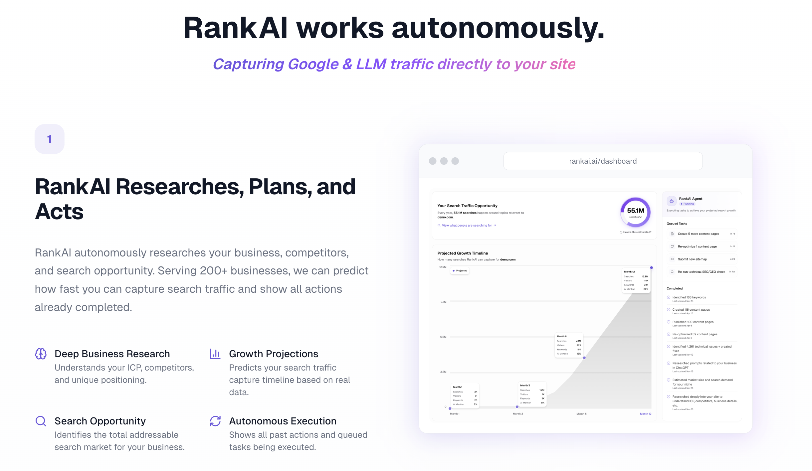
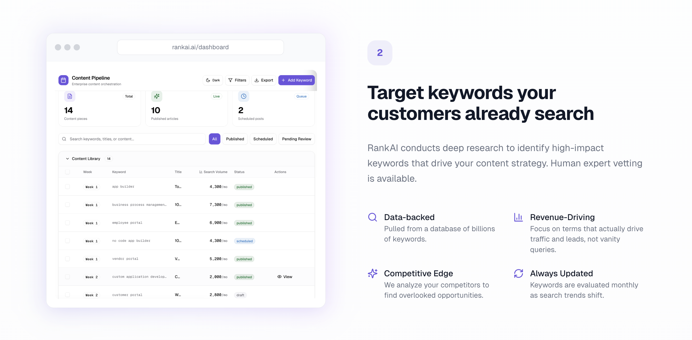
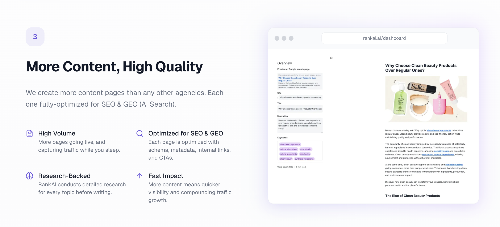

### 🎬 관련 영상
- [🎥 영상 보기](https://ph-files.imgix.net/43265621-583c-437e-b8c4-98e07456b9fd.jpeg?auto=format)

---

## 2. [Twenty 2.0](https://www.producthunt.com/products/twenty-crm)
**Votes**: 236 | **도입 난이도**: 상 | **신뢰도**: 상
**Tagline**: Build your Enterprise CRM at AI Speed
**서비스 링크**: https://www.producthunt.com/r/YQF35MRZD2VPJZ

**태그**: CRM, DevTool, AI, OpenSource, Customization, Agent, Automation, AI Tool

### 📌 이 서비스 한눈에 보기
AI 속도로 엔터프라이즈 CRM을 구축하고, 오픈소스 기반으로 완전히 맞춤 설정 가능한 플랫폼을 만들 수 있는 도구입니다.

### 🔑 주요 기능
- 오픈소스 기반의 엔터프라이즈 CRM 플랫폼을 제공합니다.
- SDK를 통해 데이터 모델, 객체, 워크플로우, 레이아웃 등을 코드로 완벽하게 맞춤 설정할 수 있습니다.
- AI 기능이 내장되어 있으며, 커스텀 에이전트 및 서버리스 함수를 지원합니다.

### 🙋 사용자에게 어떤 점이 좋은가
기업의 고유한 요구사항에 맞춰 AI 기반의 맞춤형 CRM을 직접 구축하여, 기존 개발 흐름에 통합하고 효율성을 극대화할 수 있습니다.

### ✅ 지금 바로 써볼 기능
- SDK를 활용하여 데이터 모델 및 커스텀 객체 정의를 시도해보기
- AI 내장 기능과 커스텀 에이전트의 활용 방안을 모색해보기
- 워크플로우 및 레이아웃을 코드로 커스터마이징하는 방법을 탐색해보기

### ⚠️ 사용 전 확인할 점
- SDK를 활용한 코드 기반 커스터마이징이 필요하므로 개발 역량이 요구됩니다.
- 자체 호스팅(Self-hostable) 시 시스템 유지보수 및 관리에 대한 부담이 있을 수 있습니다.

### 🧭 확인이 더 필요한 정보
구체적인 AI 기능의 범위와 오픈소스 커뮤니티 지원 수준에 대한 추가 확인이 필요합니다.

### 📸 스크린샷 및 갤러리
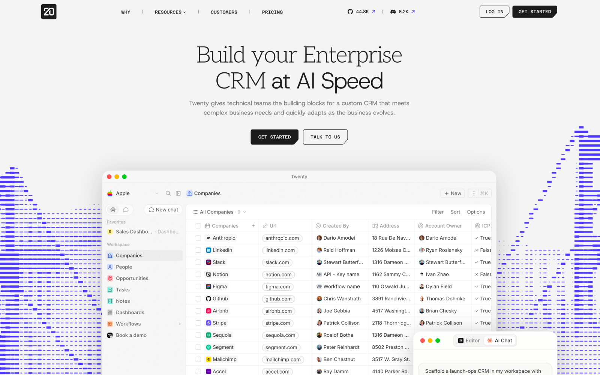
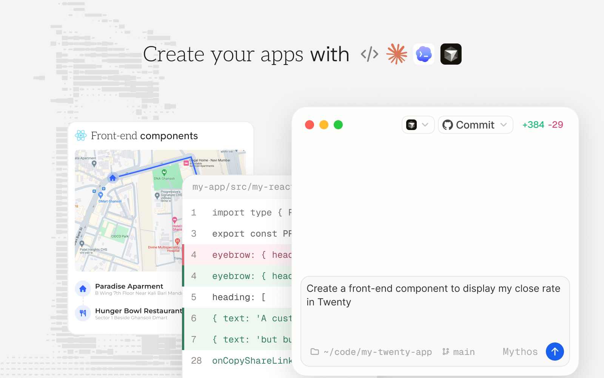
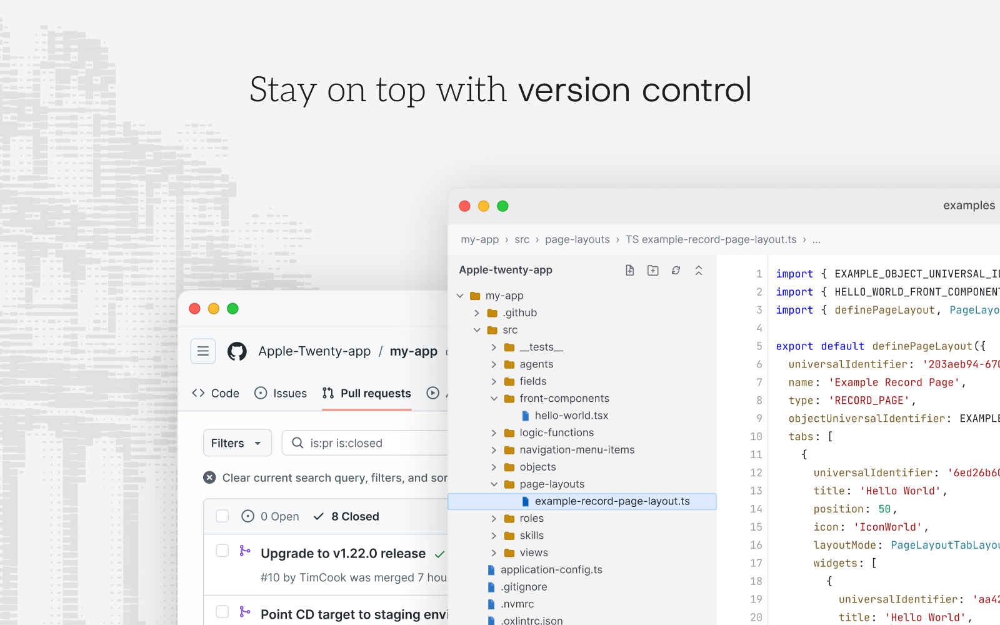

---

## 3. [Kimi K2.6](https://www.producthunt.com/products/kimi-ai-assistant)
**Votes**: 222 | **도입 난이도**: 상 | **신뢰도**: 상
**Tagline**: Open-source SOTA for long-horizon coding and agent swarms
**서비스 링크**: https://www.producthunt.com/r/F7OWHMX4MFKI3R

**태그**: 개발자도구, AI/ML, 자동화, 오픈소스, Agent

### 📌 이 서비스 한눈에 보기
복잡한 코딩과 대규모 에이전트 시스템을 효율적이고 안정적으로 구축할 수 있게 돕는 최신 오픈소스 AI 모델입니다.

### 🔑 주요 기능
- 장기적인 코딩 작업과 에이전트 스웜에 최적화된 오픈소스 최신 모델
- 강력한 엔드투엔드 코딩 능력 제공
- 최대 300개 에이전트 스웜 오케스트레이션 지원 및 안정성 향상

### 🙋 사용자에게 어떤 점이 좋은가
개발자와 AI 연구자들은 이 모델을 통해 복잡한 코딩 프로젝트를 더 효율적으로 수행하고, 대규모 AI 에이전트 시스템을 안정적으로 구축 및 관리할 수 있습니다.

### ✅ 지금 바로 써볼 기능
- 오픈소스 모델을 다운로드하여 복잡한 코딩 프로젝트에 적용해보기
- 다수의 에이전트를 활용한 스웜 오케스트레이션 기능 테스트
- OpenClaw, Hermes 등 기존 에이전트 프레임워크와의 연동 안정성 확인

### ⚠️ 사용 전 확인할 점
- 오픈소스 모델이므로 직접 설치 및 환경 설정이 필요하며, 기술적 지식이 요구될 수 있습니다.
- 특정 사용 사례에서의 실제 성능 및 안정성은 추가적인 테스트를 통해 검증해야 합니다.

### 🧭 확인이 더 필요한 정보
구체적인 시스템 요구사항, 성능 벤치마크, 그리고 커뮤니티 지원 수준에 대한 추가 정보가 필요합니다.

### 📸 스크린샷 및 갤러리
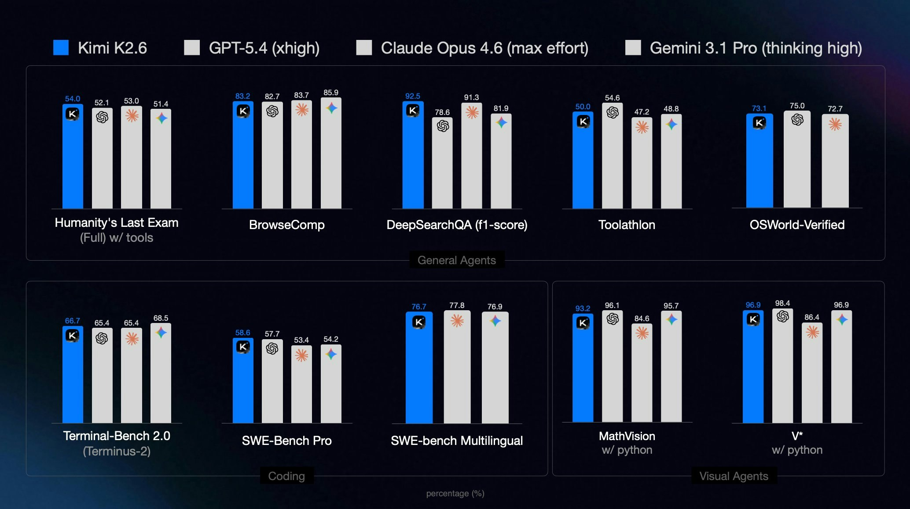
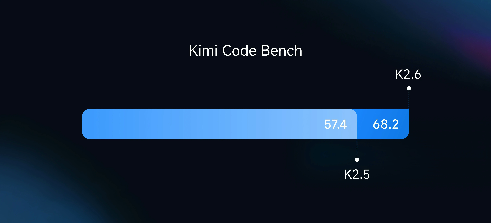
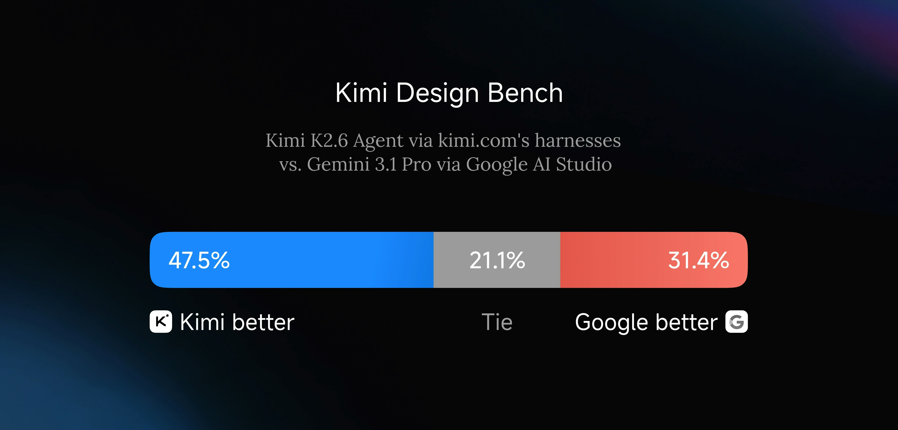

### 🎬 관련 영상
- [🎥 영상 보기](https://ph-files.imgix.net/3a38c359-539c-461b-8848-c6fcd6e85ac3.jpeg?auto=format)

---

## 4. [Dageno AI](https://www.producthunt.com/products/agent-powered-geo-by-dageno)
**Votes**: 175 | **도입 난이도**: 하 | **신뢰도**: 중
**Tagline**: Become the most recommended brand across 7+ major LLMs
**서비스 링크**: https://www.producthunt.com/r/UCJCI4OP3XU2IA

**태그**: AI, Analytics, Marketing, Automation, Growth, Agent, AI Tool, LLM, Prompting

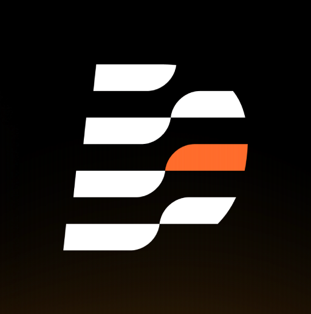

### 📌 이 서비스 한눈에 보기
7개 이상의 주요 LLM에서 브랜드 가시성을 추적하고 개선하여 가장 추천받는 브랜드가 되도록 돕는 AI 솔루션입니다.

### 🔑 주요 기능
- 7개 이상 주요 LLM에서 브랜드 가시성 추적 및 분석
- 웹사이트, 트래픽, 소셜 등 다양한 실제 데이터를 기반으로 가시성 격차 파악
- 발견된 문제점을 개선하고 실행 가능한 액션으로 전환

### 🙋 사용자에게 어떤 점이 좋은가
LLM 시대에 브랜드가 어떻게 노출되고 인식되는지 파악하고, 구체적인 개선 방안을 통해 더 많은 추천을 받을 수 있도록 돕습니다.

### ✅ 지금 바로 써볼 기능
- 무료 체험판을 통해 우리 브랜드의 LLM 가시성 현황 확인하기
- 제공되는 분석 리포트에서 가시성 격차 및 개선 권장 사항 파악하기
- 추천된 액션 플랜이 우리 비즈니스에 어떻게 적용될 수 있을지 검토하기

### ⚠️ 사용 전 확인할 점
- 데이터 수집 방식의 투명성 및 데이터 정확성에 대한 추가 확인 필요
- '에이전트 워크플로우'가 어떤 종류의 액션을 자동화하는지 구체적인 범위 확인 필요

### 🧭 확인이 더 필요한 정보
LLM 가시성 측정의 구체적인 기준과 에이전트 워크플로우의 자동화 범위에 대한 상세 정보가 필요합니다.

### 📸 스크린샷 및 갤러리
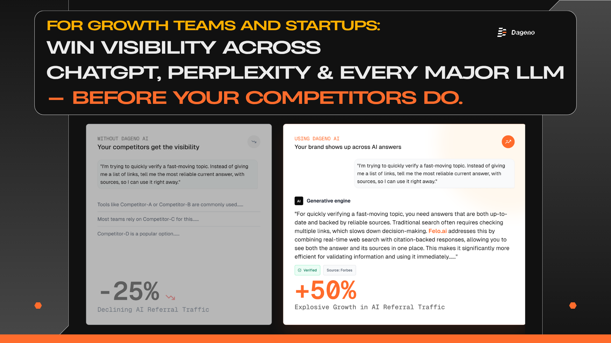
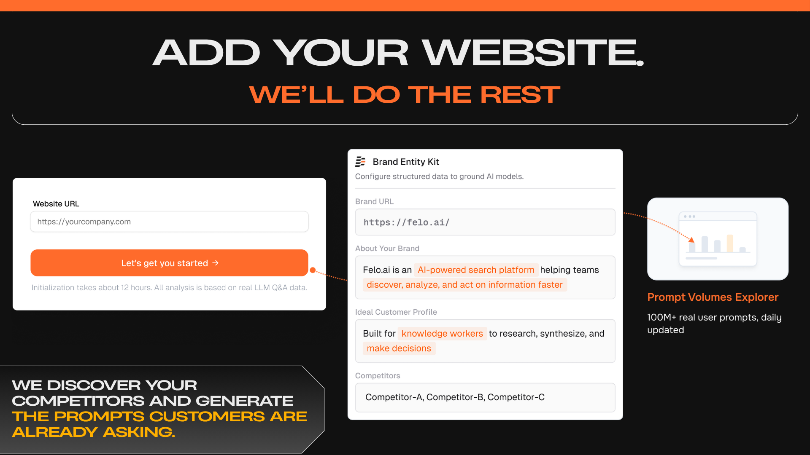
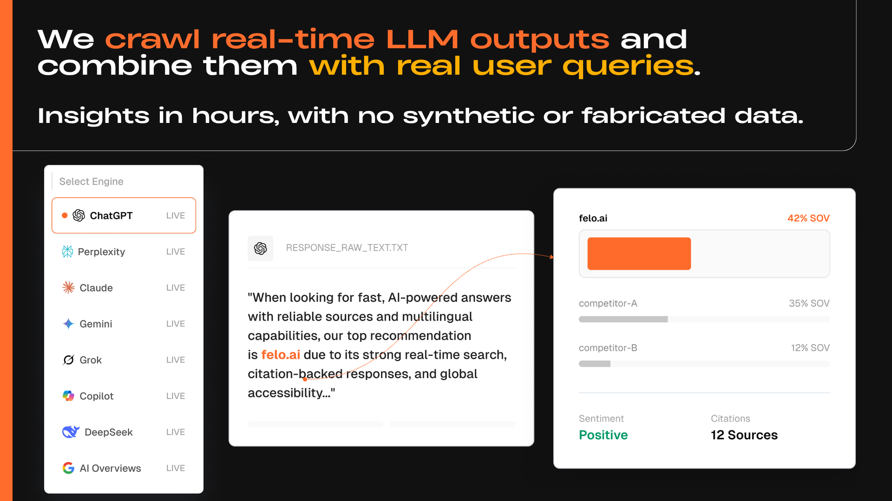

### 🎬 관련 영상
- [🎥 영상 보기](https://ph-files.imgix.net/e29235f7-2357-43aa-9e8f-618fd7e9439d.jpeg?auto=format)

---

## 5. [Devaito](https://www.producthunt.com/products/devaito)
**Votes**: 159 | **도입 난이도**: 중 | **신뢰도**: 중
**Tagline**: Build, launch, and grow your business on autopilot
**서비스 링크**: https://www.producthunt.com/r/IP2723MCZU7E6O

**태그**: AI, 자동화, 웹사이트 빌더, 마케팅, CRM, Agent, Automation, AI Tool, Sales

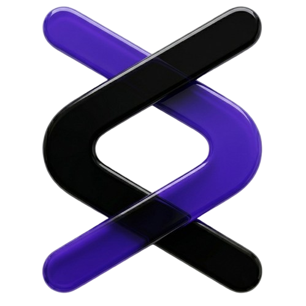

### 📌 이 서비스 한눈에 보기
Devaito는 웹사이트, 스토어, 앱, SEO, 블로그, 소셜 미디어, 고객 지원, 영업 자동화 등 사업에 필요한 모든 것을 자동 실행하여 사업 성장을 돕는 AI 기반 올인원 솔루션입니다.

### 🔑 주요 기능
- 웹사이트, 앱, 스토어 등 사업에 필요한 모든 것을 한번에 구축
- AI 에이전트가 고객 유치, 콘텐츠 생성, 고객 응대 자동화
- 별도 툴 추가 없이 사업 확장 가능

### 🙋 사용자에게 어떤 점이 좋은가
Devaito를 사용하면 사업 초기 설정부터 운영, 고객 관리, 마케팅까지 자동화하여 시간과 비용을 절약하고 사업 성장에 집중할 수 있습니다.

### ✅ 지금 바로 써볼 기능
- Devaito에 사업 아이디어 설명하고 자동 생성되는 웹사이트 확인하기
- AI 에이전트가 제안하는 콘텐츠 마케팅 전략 검토하기
- 자동화된 고객 지원 기능 설정하기

### ⚠️ 사용 전 확인할 점
- AI 자동화 기능이 제공하는 결과물의 품질 확인 필요
- 자동화 범위 및 사용자 정의 옵션 확인 필요

### 🧭 확인이 더 필요한 정보
Devaito의 AI 에이전트가 제공하는 기능의 정확도 및 효율성에 대한 추가 정보가 필요합니다.

### 📸 스크린샷 및 갤러리
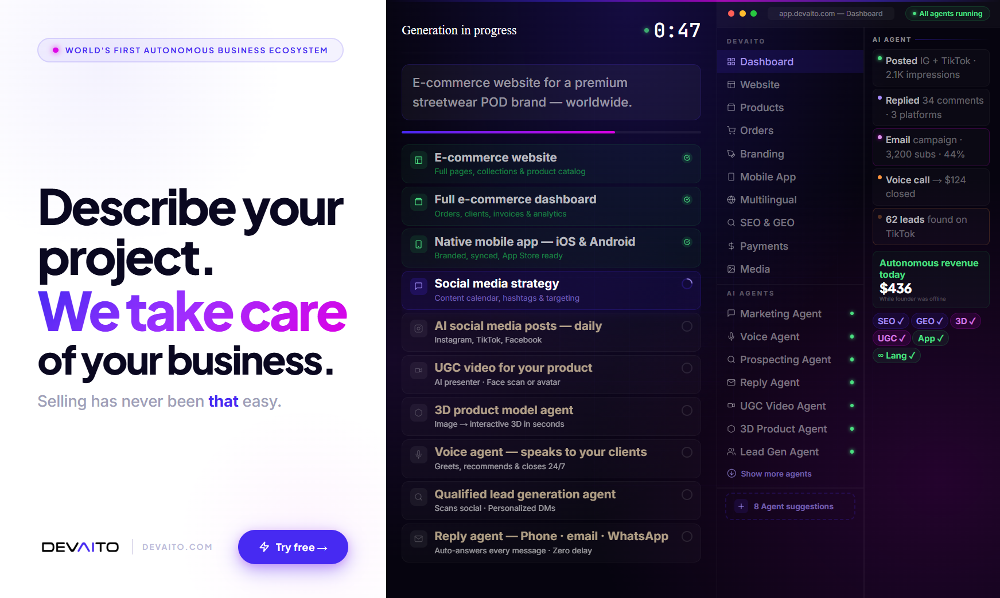
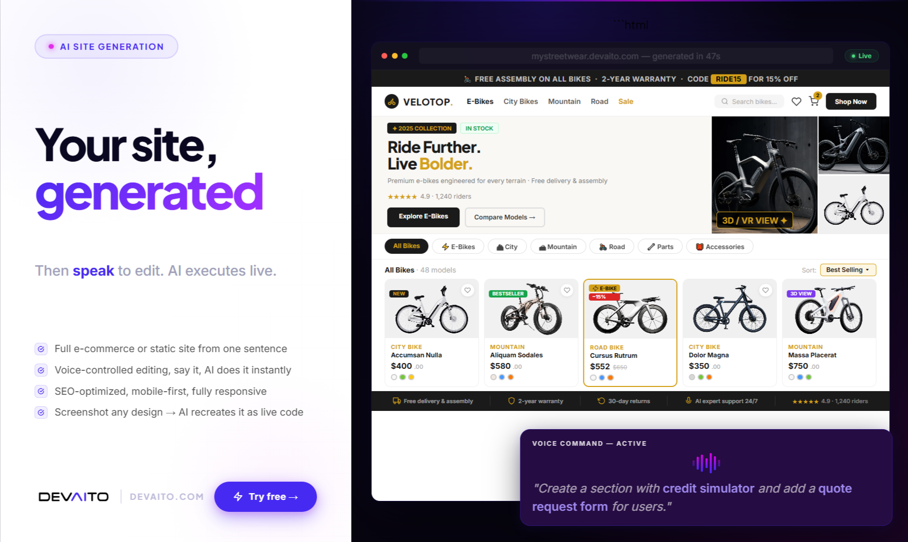
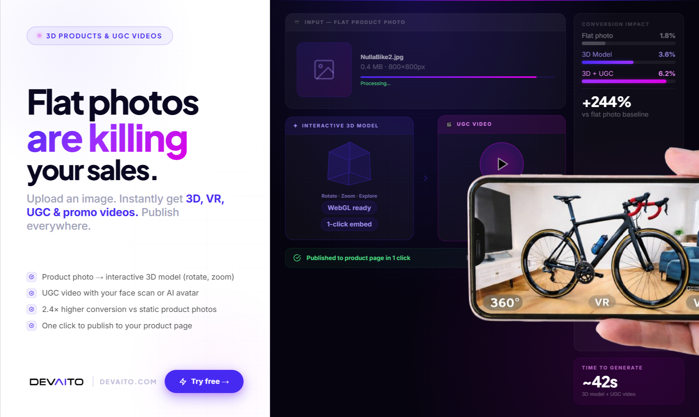

### 🎬 관련 영상
- [🎥 영상 보기](https://ph-files.imgix.net/00a24f82-0b9c-49c6-b9ee-f7b776c5629a.jpeg?auto=format)

---

## 6. [Spectrum](https://www.producthunt.com/products/spectrum-5)
**Votes**: 144 | **도입 난이도**: 중 | **신뢰도**: 중
**Tagline**: Bring agents to all the interfaces people already use
**서비스 링크**: https://www.producthunt.com/r/VMIKXVY6YAWZD6

**태그**: DevTool, 오픈소스, API, 자동화, 메신저, Agent

### 📌 이 서비스 한눈에 보기
Spectrum은 에이전트를 iMessage, Telegram, WhatsApp 등 사용자들이 매일 사용하는 인터페이스에 연결하여, 별도의 앱 다운로드나 웹사이트 방문 없이 에이전트를 활용할 수 있게 해주는 오픈소스 프레임워크입니다.

### 🔑 주요 기능
- 하나의 통합 API로 다양한 인터페이스에 에이전트 연결
- 플랫폼별 로직 자동 처리 및 빠른 메시지 전송 (1초 이내)
- 무료로 시작 가능하며 필요에 따라 Pro 또는 Enterprise로 확장 가능

### 🙋 사용자에게 어떤 점이 좋은가
사용자들은 별도의 앱 설치 없이 기존에 사용하던 메신저 앱을 통해 에이전트와 상호작용할 수 있어 편리하며, 개발자는 하나의 API로 다양한 플랫폼을 지원할 수 있어 개발 효율성을 높일 수 있습니다.

### ✅ 지금 바로 써볼 기능
- Spectrum 오픈소스 프로젝트 살펴보기
- 지원하는 인터페이스 확인하기
- 무료로 시작하여 에이전트 연결 테스트해보기

### ⚠️ 사용 전 확인할 점
- 오픈소스 프로젝트의 유지보수 및 업데이트 주기 확인 필요
- 지원하는 인터페이스 목록 및 기능 제한 사항 확인 필요

### 🧭 확인이 더 필요한 정보
Pro 및 Enterprise 버전의 구체적인 기능과 가격 정보는 추가 확인이 필요합니다.

### 📸 스크린샷 및 갤러리

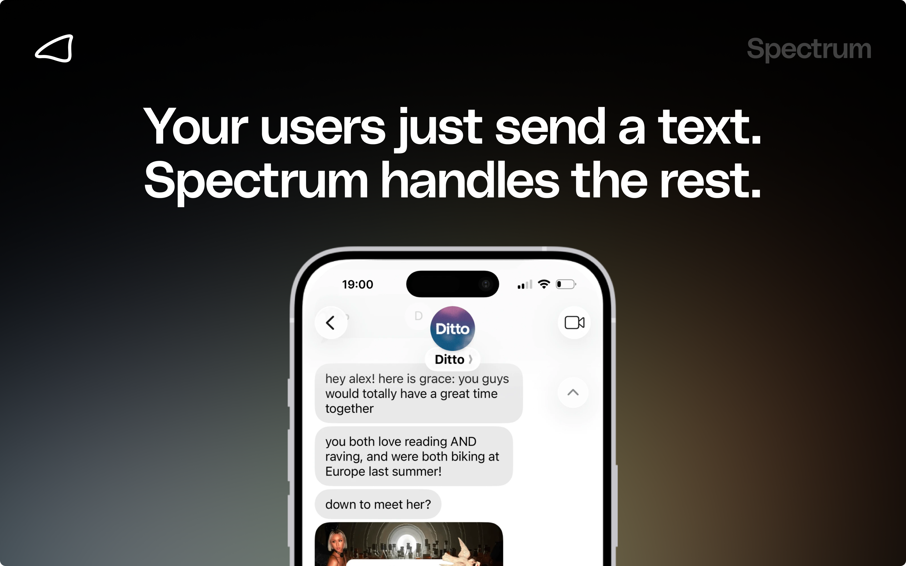

### 🎬 관련 영상
- [🎥 영상 보기](https://ph-files.imgix.net/7e9da0ff-843c-42a1-8bfc-90c36a503d7f.jpeg?auto=format)

---

## 7. [Perplexity Health](https://www.producthunt.com/products/perplexity-ai)
**Votes**: 135 | **도입 난이도**: 중 | **신뢰도**: 중
**Tagline**: Ask health questions across your records, labs, wearables
**서비스 링크**: https://www.producthunt.com/r/NJ734P2CYWCP6U
**재등장**: 최근 7일 내 재등장 (마지막 등장 1일 전)

**태그**: AI, 건강, 개인화, 의료, 데이터 분석, AI Tool

### 📌 이 서비스 한눈에 보기
Perplexity Health는 AI를 통해 개인의 의료 기록, 검사 결과, 웨어러블 데이터를 기반으로 맞춤형 건강 정보를 제공하여 일반적인 정보 검색의 한계를 극복합니다.

### 🔑 주요 기능
- 개인 의료 기록, 검사 결과, 웨어러블 데이터 통합
- AI 기반 맞춤형 건강 정보 제공
- Perplexity Pro 및 Max 사용자 대상 (미국)

### 🙋 사용자에게 어떤 점이 좋은가
개인의 실제 건강 이력을 바탕으로 AI가 답변을 제공하므로, 획일적인 건강 정보가 아닌 나만을 위한 맞춤형 건강 관리가 가능합니다.

### ✅ 지금 바로 써볼 기능
- Perplexity Pro 또는 Max 구독
- 의료 기록, 검사 결과, 웨어러블 데이터 연결
- 건강 관련 질문을 통해 AI 답변 확인

### ⚠️ 사용 전 확인할 점
- 미국 내 Perplexity Pro 및 Max 사용자만 사용 가능
- 개인 정보 보호 정책 및 데이터 보안 관련 사항 확인

### 🧭 확인이 더 필요한 정보
Perplexity Health의 데이터 연결 방식 및 지원되는 의료 기관/웨어러블 기기 종류에 대한 추가 정보 확인이 필요합니다.

### 📸 스크린샷 및 갤러리
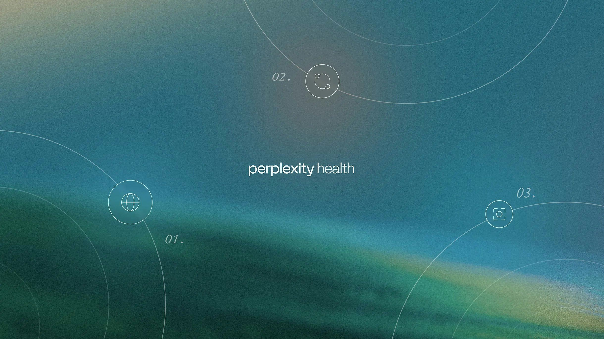
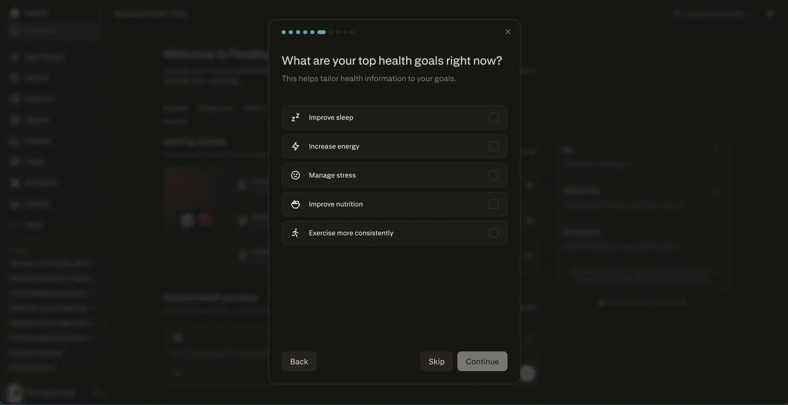
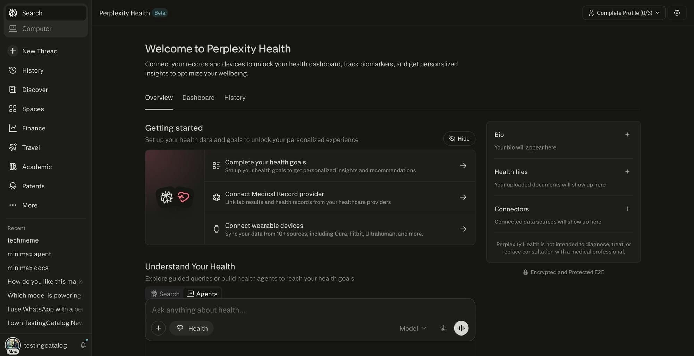

### 🎬 관련 영상
- [🎥 영상 보기](https://ph-files.imgix.net/4ee5248d-6294-4782-a197-a4e8a6359861.jpeg?auto=format)

---

## 8. [Chronicle](https://www.producthunt.com/products/openai)
**Votes**: 122 | **도입 난이도**: 중 | **신뢰도**: 중
**Tagline**: Build Codex memories from recent screen context.
**서비스 링크**: https://www.producthunt.com/r/TK7R7BULLAUNHH
**재등장**: 최근 7일 내 재등장 (마지막 등장 3일 전)

**태그**: 생산성, 지식관리, 자동화, 정보캡처, DevTool

### 📌 이 서비스 한눈에 보기
화면에서 본 내용을 자동으로 기억하고 정리하여 나만의 지식 저장소를 만드는 도구입니다.

### 🔑 주요 기능
- 화면 내용을 기반으로 자동 기억 생성
- 개인화된 지식 저장소(Codex) 구축
- 정보 관리 및 검색 효율성 증대

### 🙋 사용자에게 어떤 점이 좋은가
중요한 정보를 놓치지 않고 자동으로 기록하며, 필요할 때 언제든 쉽게 찾아볼 수 있어 생산성을 높여줍니다.

### ✅ 지금 바로 써볼 기능
- 화면 내용 자동 캡처 및 저장 기능 사용해보기
- 저장된 'Codex 기억' 검색 및 활용해보기
- 특정 화면 컨텍스트를 '기억'으로 만드는 방법 익히기

### ⚠️ 사용 전 확인할 점
- 개인 정보 보호 및 화면 내용 캡처 범위 확인
- 정확한 정보 추출 및 '기억' 생성 방식 이해

### 🧭 확인이 더 필요한 정보
'Codex 기억'이 어떤 형태로 저장되고 어떻게 활용되는지에 대한 구체적인 정보가 필요합니다.

### 📸 스크린샷 및 갤러리
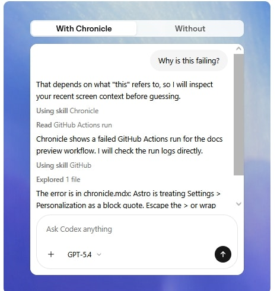
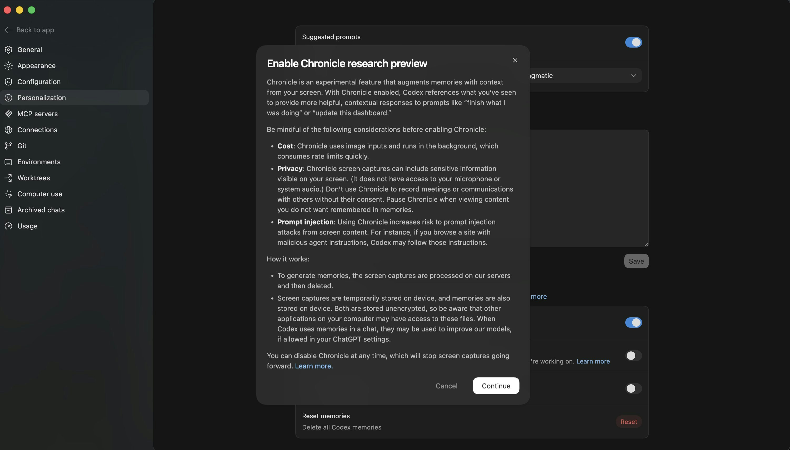
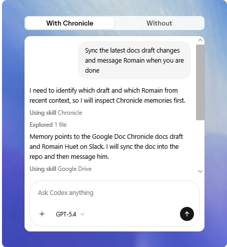

---

## 9. [Cosine Swarm](https://www.producthunt.com/products/cosine)
**Votes**: 118 | **도입 난이도**: 중 | **신뢰도**: 상
**Tagline**: Parallel AI agents for long-horizon, complex software tasks
**서비스 링크**: https://www.producthunt.com/r/3FTVABPNUXG6NJ

**태그**: DevTool, AI, Automation, Software Development, Agent, AI Tool

### 📌 이 서비스 한눈에 보기
복잡한 소프트웨어 개발 작업을 AI 에이전트 팀이 병렬로 처리하여 효율성을 극대화하고, 최종 결과물은 사람이 쉽게 검토할 수 있도록 돕는 AI 소프트웨어 엔지니어링 도구입니다.

### 🔑 주요 기능
- AI 에이전트 팀이 복잡하고 장기적인 소프트웨어 개발 작업을 자동화합니다.
- 'Swarm 모드'로 연구, 구현, QA 등 여러 작업을 병렬로 실행하여 개발 효율을 극대화합니다.
- CLI, 데스크톱, 클라우드 등 다양한 환경에서 일관된 사용 경험을 제공하며, 최종 결과물은 사람이 검토 가능한 PR로 제공됩니다.

### 🙋 사용자에게 어떤 점이 좋은가
엔지니어는 복잡한 리팩토링이나 시스템 마이그레이션 같은 대규모 작업을 AI에 맡겨 생산성을 높이고, 최종 결과물은 직접 검토하며 품질을 관리할 수 있습니다.

### ✅ 지금 바로 써볼 기능
- 작은 규모의 복잡한 리팩토링 작업을 AI 에이전트에게 맡겨보고 결과물을 확인해 보세요.
- 'Swarm 모드'를 활용하여 특정 연구 또는 QA 작업을 병렬로 실행해 보세요.
- AI가 생성한 PR을 검토하며 기존 개발 워크플로우에 어떻게 통합될 수 있을지 평가해 보세요.

### ⚠️ 사용 전 확인할 점
- AI가 생성하는 코드의 품질이나 특정 도메인 지식에 대한 이해도가 기대에 미치지 못할 수 있으니 검토가 필요합니다.
- 복잡한 프로젝트에 적용하기 전, AI 에이전트 팀의 작업 방식과 결과물 검토 프로세스에 대한 이해가 선행되어야 합니다.

### 🧭 확인이 더 필요한 정보
제품의 구체적인 가격 정책, 기존 개발 도구와의 연동성, 그리고 다양한 작업 유형별 성능 벤치마크에 대한 정보는 추가 확인이 필요합니다.

### 📸 스크린샷 및 갤러리
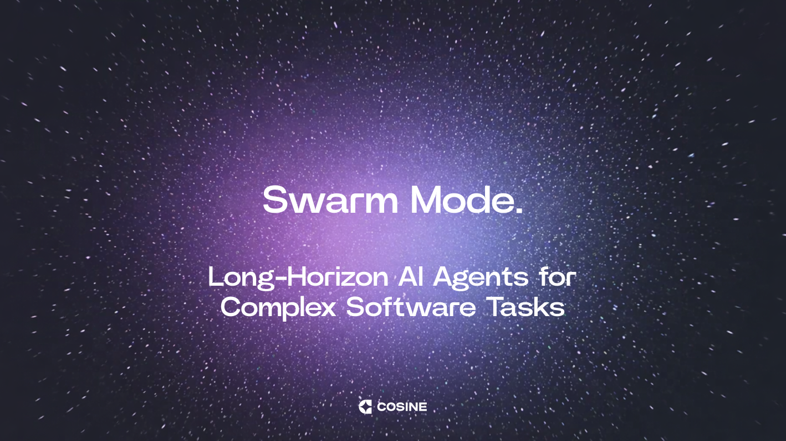
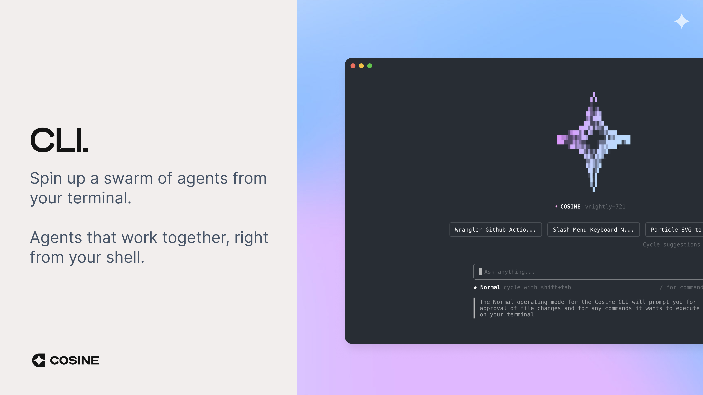
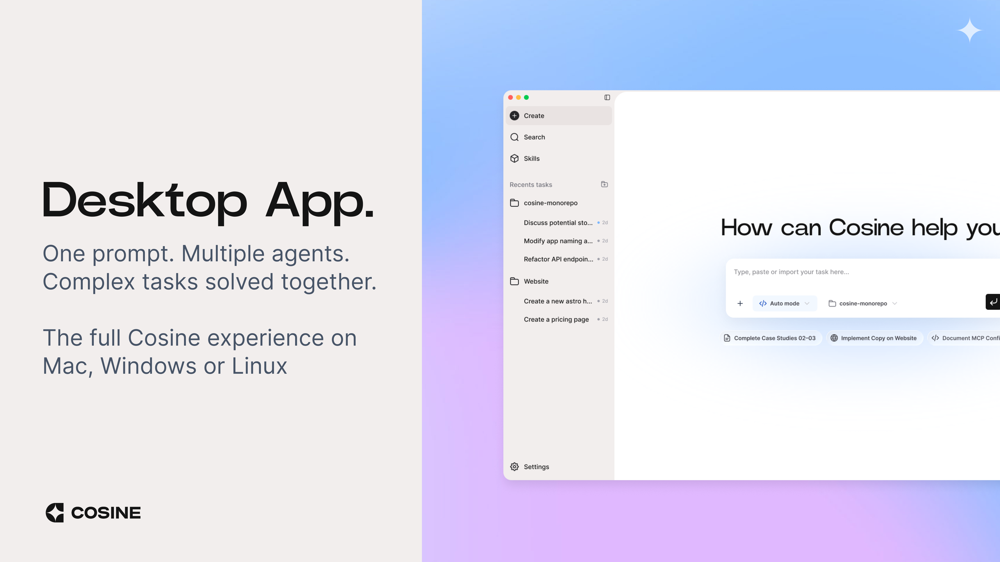

### 🎬 관련 영상
- [🎥 영상 보기](https://ph-files.imgix.net/a74e8f8e-5289-4a2b-9342-e04680e54b5a.jpeg?auto=format)

---

## 10. [LiveDemo](https://www.producthunt.com/products/livedemo)
**Votes**: 117 | **도입 난이도**: 중 | **신뢰도**: 중
**Tagline**: Open-source Interactive product demos
**서비스 링크**: https://www.producthunt.com/r/JCIISXNOMZN6OJ

**태그**: Product Management, Marketing, Customer Engagement, Open Source, Productivity

### 📌 이 서비스 한눈에 보기
제품 주도 성장을 위해 인터랙티브한 제품 데모를 쉽게 만들 수 있는 오픈소스 제품 경험 플랫폼입니다.

### 🔑 주요 기능
- 오픈소스 기반: 투명하고 유연한 개발 및 활용 환경을 제공합니다.
- 인터랙티브 제품 데모: 사용자가 직접 체험하며 제품을 이해할 수 있는 데모를 제작합니다.
- 제품 경험 플랫폼: 제품 온보딩 및 가치 전달을 위한 통합 솔루션을 제공합니다.

### 🙋 사용자에게 어떤 점이 좋은가
잠재 고객에게 제품의 핵심 가치를 효과적으로 전달하고, 온보딩 과정을 개선하여 제품 주도 성장을 가속화하는 데 도움을 줍니다.

### ✅ 지금 바로 써볼 기능
- 첫 인터랙티브 데모 제작: 제품의 주요 기능을 소개하는 데모를 직접 만들어 보세요.
- 온보딩 흐름 개선: 신규 사용자 온보딩 과정에 데모를 활용할 방안을 모색해 보세요.
- 오픈소스 커뮤니티 참여: 다른 사용자들의 활용 사례와 팁을 확인하고 기여해 보세요.

### ⚠️ 사용 전 확인할 점
- 기술적 요구사항 확인: 오픈소스 솔루션이므로 설치 및 유지보수에 필요한 기술 스택과 역량을 미리 확인해야 합니다.
- 커스터마이징 범위 파악: 제공되는 데모 템플릿과 커스터마이징 옵션의 유연성을 검토하여 필요한 수준의 맞춤화가 가능한지 확인해야 합니다.

### 🧭 확인이 더 필요한 정보
구체적인 기능 목록, 지원되는 통합, 그리고 커뮤니티의 활성도에 대한 추가 정보가 필요합니다.

### 📸 스크린샷 및 갤러리

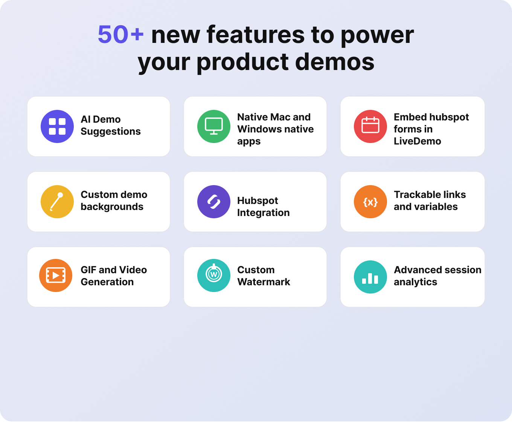

### 🎬 관련 영상
- [🎥 영상 보기](https://ph-files.imgix.net/e0f484f5-18c8-4bf7-9541-06fb0e006ef8.jpeg?auto=format)

---

