# 🚀 Product Hunt Daily Top 10 (2026-04-23)

## 1. [SpeakON](https://www.producthunt.com/products/speakon)
**Votes**: 285 | **도입 난이도**: 하 | **신뢰도**: 중
**Tagline**: A MagSafe AI device for a post-keyboard world
**서비스 링크**: https://www.producthunt.com/r/3CP2XP3LOLBFI7

**태그**: AI, 생산성, 음성인식, iPhone, MagSafe, AI Tool

### 📌 이 서비스 한눈에 보기
SpeakON은 아이폰에 부착하는 MagSafe AI 장치로, 키보드 입력 없이 음성으로 모든 앱에 텍스트를 입력할 수 있어 생산성을 높여줍니다.

### 🔑 주요 기능
- 아이폰에 MagSafe로 간편하게 부착
- 마이크 권한 없이 모든 앱에서 음성 입력 가능
- 아이폰 잠금 상태에서도 작동

### 🙋 사용자에게 어떤 점이 좋은가
타이핑 없이 음성으로 텍스트를 입력하여 시간을 절약하고, 이동 중이나 다른 작업을 하면서도 편리하게 사용할 수 있습니다.

### ✅ 지금 바로 써볼 기능
- 아이폰에 SpeakON을 부착하고 음성 입력 테스트
- 자주 사용하는 앱에서 SpeakON을 활용하여 텍스트 입력 속도 비교
- 잠금 상태에서 SpeakON 작동 여부 확인

### ⚠️ 사용 전 확인할 점
- MagSafe 호환 아이폰 모델 확인 필요
- 주변 소음이 심한 환경에서는 음성 인식률 저하 가능성

### 🧭 확인이 더 필요한 정보
실제 사용 환경에서의 음성 인식 정확도 및 배터리 사용 시간에 대한 추가 정보가 필요합니다.

### 📸 스크린샷 및 갤러리
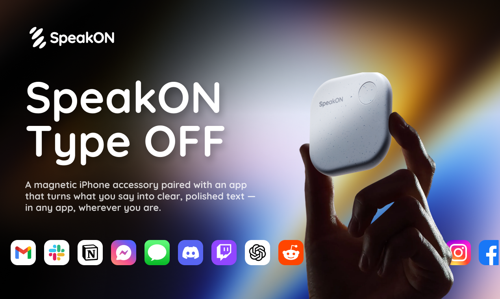
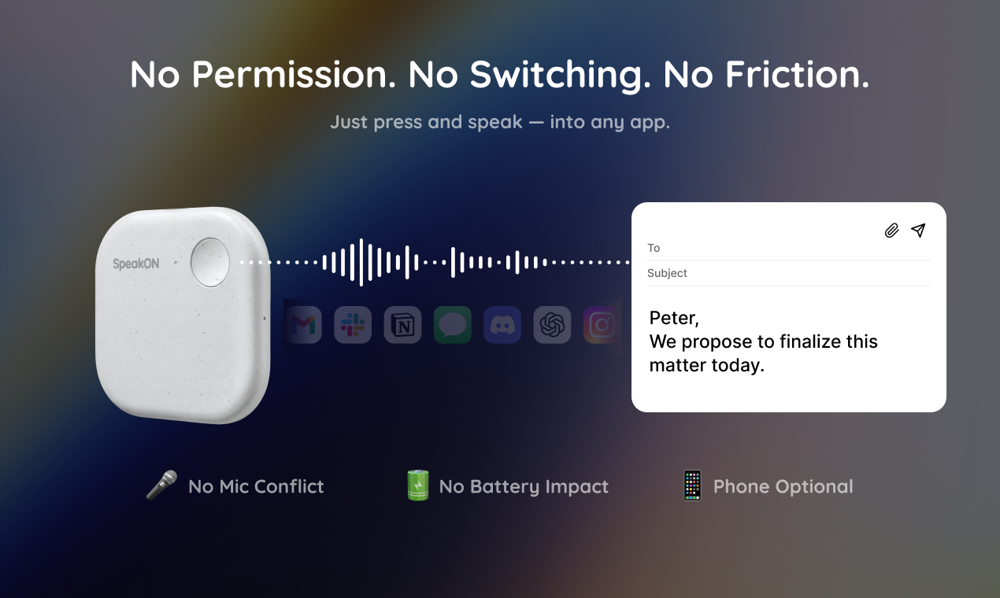
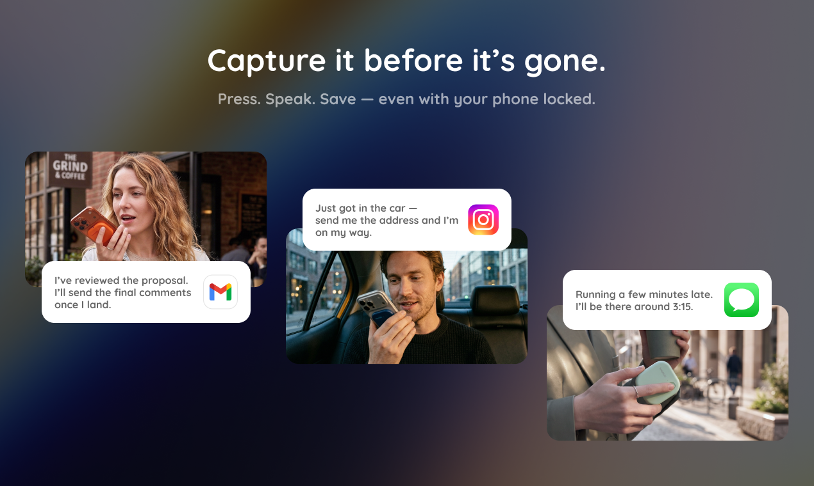

### 🎬 관련 영상
- [🎥 영상 보기](https://ph-files.imgix.net/4ac1a2d4-2875-4366-81f0-f7845fac9c65.jpeg?auto=format)

---

## 2. [Stanley For 𝕏](https://www.producthunt.com/products/stanley-for-x)
**Votes**: 249 | **도입 난이도**: 중 | **신뢰도**: 중
**Tagline**: The world's first AI Head of Content
**서비스 링크**: https://www.producthunt.com/r/XH6QM2ZNCHWY5V

**태그**: AI, 트위터, 콘텐츠 제작, 자동화, 소셜 미디어, AI Tool

### 📌 이 서비스 한눈에 보기
Stanley For 𝕏은 트위터 콘텐츠 제작, 계획, 실행을 돕는 AI 콘텐츠 책임자로, 실제 고스트라이터의 시스템을 기반으로 트위터 계정 성장을 지원합니다.

### 🔑 주요 기능
- 트위터 콘텐츠 제작, 계획, 실행 지원
- 실제 고스트라이터 시스템 기반
- 트위터 계정 성장 지원 (0 to 10k 팔로워)

### 🙋 사용자에게 어떤 점이 좋은가
트위터 콘텐츠 제작에 대한 고민을 덜고, 계정 성장을 위한 전략 수립 및 실행을 효율적으로 할 수 있도록 돕습니다.

### ✅ 지금 바로 써볼 기능
- 콘텐츠 아이디어 생성 기능 사용해보기
- 트윗 작성 기능 사용해보기
- 계정 성장 전략 추천 받기

### ⚠️ 사용 전 확인할 점
- AI가 생성한 콘텐츠의 정확성 검토 필요
- 계정 성장에 대한 보장 없음

### 🧭 확인이 더 필요한 정보
AI가 제공하는 콘텐츠 전략이 실제 사용자 반응과 일치하는지 확인이 필요합니다.

### 📸 스크린샷 및 갤러리

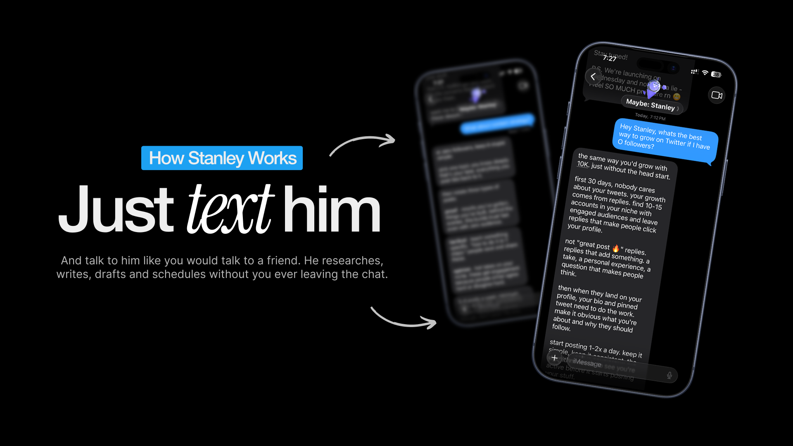
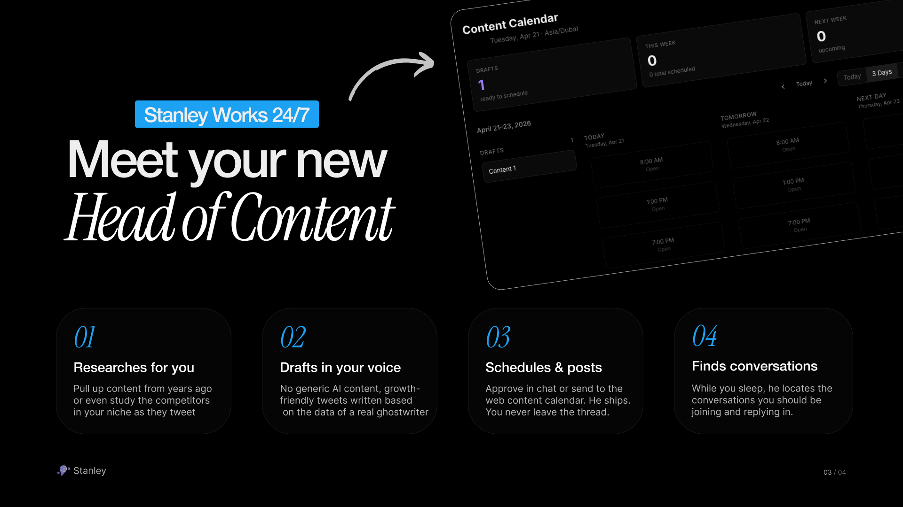

### 🎬 관련 영상
- [🎥 영상 보기](https://ph-files.imgix.net/9c81b0d1-6a9e-4106-8e94-0c93829afe4c.jpeg?auto=format)

---

## 3. [ChatGPT Images 2.0](https://www.producthunt.com/products/chatgpt-images-2-0)
**Votes**: 248 | **도입 난이도**: 중 | **신뢰도**: 중
**Tagline**: First image model with thinking capabilities
**서비스 링크**: https://www.producthunt.com/r/TUNK3IAU2E6MV6

**태그**: AI, 이미지 생성, 생산성, 자동화, AI Tool, Chat, Prompting, Vision

### 📌 이 서비스 한눈에 보기
ChatGPT Images 2.0은 사고 능력을 갖춘 최초의 이미지 모델로, 아이디어에서 바로 제작 가능한 수준의 결과물을 빠르게 얻을 수 있도록 지원합니다.

### 🔑 주요 기능
- 사고 레이어를 갖춘 AI 이미지 생성
- 유연한 화면 비율 지원
- 프롬프트 당 다중 결과물 생성

### 🙋 사용자에게 어떤 점이 좋은가
아이디어를 시각화하고 검증하는 과정을 하나의 흐름으로 통합하여, 이미지 제작 워크플로우를 효율적으로 개선할 수 있습니다.

### ✅ 지금 바로 써볼 기능
- 다양한 화면 비율로 이미지 생성해보기
- 하나의 프롬프트로 여러 결과물 생성해보기
- 생성된 이미지 검증 및 개선해보기

### ⚠️ 사용 전 확인할 점
- AI 이미지 생성 모델의 일반적인 한계 (원치 않는 결과, 편향 등) 고려
- 생성된 이미지의 상업적 이용 시 라이선스 확인 필요

### 🧭 확인이 더 필요한 정보
모델의 사고 능력이 실제로 어느 정도 수준인지 추가적인 정보 확인이 필요합니다.

### 📸 스크린샷 및 갤러리
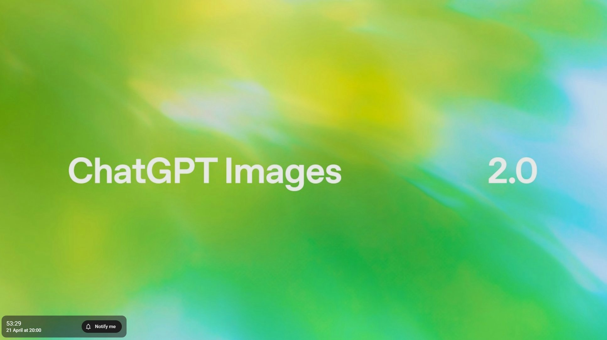
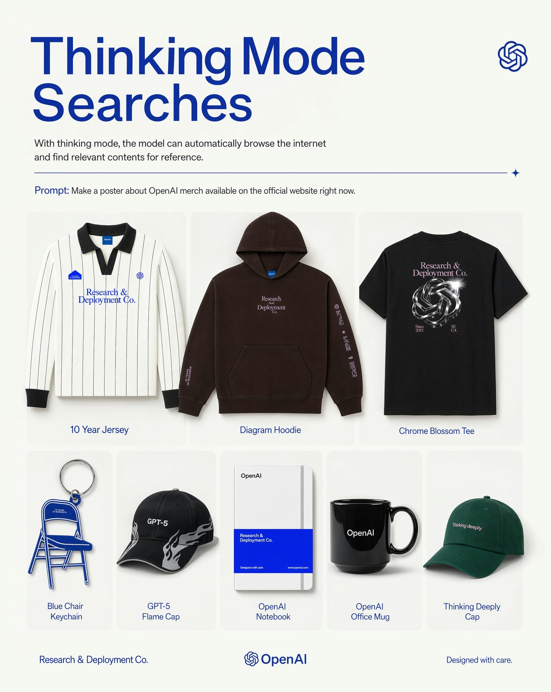
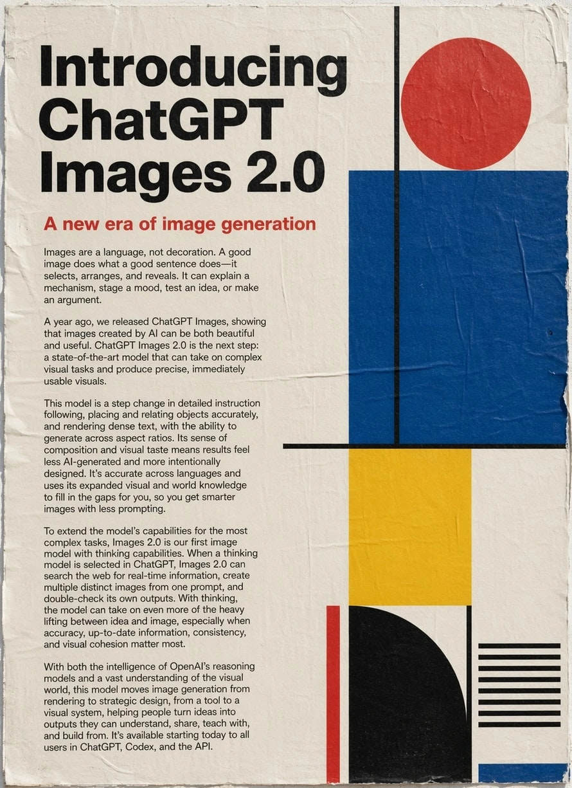

### 🎬 관련 영상
- [🎥 영상 보기](https://ph-files.imgix.net/e37803d5-61d8-4ae1-b829-187d0810bfe2.jpeg?auto=format)

---

## 4. [InstantDB](https://www.producthunt.com/products/instant-db)
**Votes**: 227 | **도입 난이도**: 중 | **신뢰도**: 중
**Tagline**: Complete backend with auth and storage in one prompt
**서비스 링크**: https://www.producthunt.com/r/LGBQZ27NGILOLH

**태그**: DevTool, Backend, AI, Open Source, AI Tool, Prompting

### 📌 이 서비스 한눈에 보기
InstantDB는 AI를 풀스택 앱 빌더로 만들어 인증, 권한, 스토리지 등 앱 개발에 필요한 모든 기능을 한 번에 제공하여 빠르고 쉽게 앱을 만들 수 있도록 돕습니다.

### 🔑 주요 기능
- AI 기반 풀스택 앱 빌더
- 인증, 권한, 스토리지, 실시간 기능 통합 제공
- 무료 오픈 소스

### 🙋 사용자에게 어떤 점이 좋은가
복잡한 백엔드 구축 없이 AI를 활용하여 아이디어를 빠르게 앱으로 구현하고 배포할 수 있습니다. 'npx create-instant-app' 명령어로 즉시 시작하거나, 프롬프트에 'Read getadb.com first'를 추가하여 사용 가능합니다.

### ✅ 지금 바로 써볼 기능
- `npx create-instant-app` 실행해보기
- getadb.com 문서 확인하기
- 프롬프트에 'Read getadb.com first' 추가해보기

### ⚠️ 사용 전 확인할 점
- 오픈 소스 프로젝트의 유지보수 및 커뮤니티 지원 확인 필요
- 특정 AI 모델 또는 플랫폼에 대한 종속성 고려

### 🧭 확인이 더 필요한 정보
다양한 AI 모델 및 사용 사례에서의 성능과 확장성에 대한 추가적인 정보가 필요합니다.

### 📸 스크린샷 및 갤러리
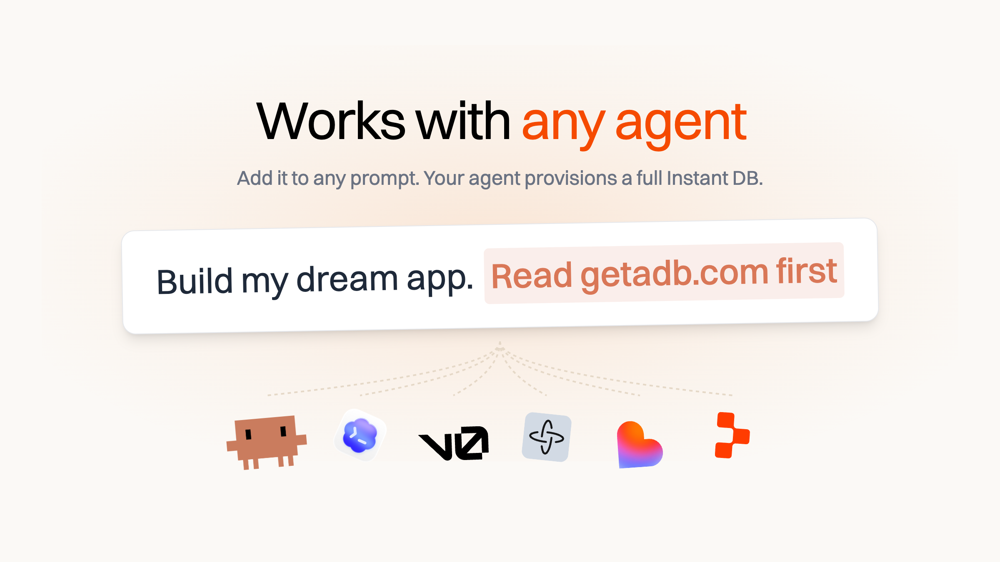
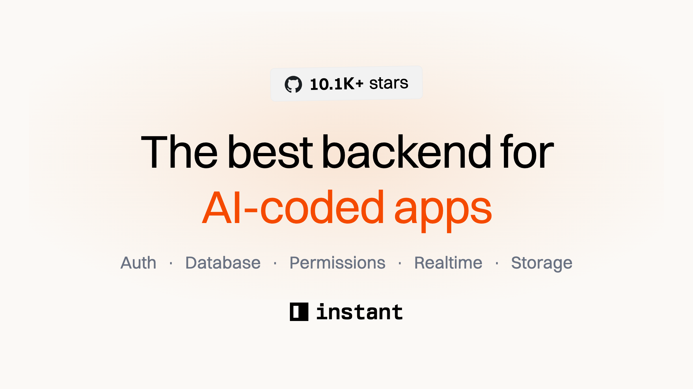
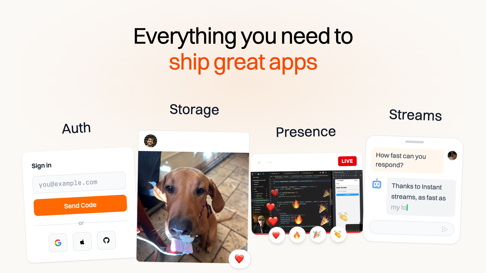

### 🎬 관련 영상
- [🎥 영상 보기](https://ph-files.imgix.net/799b4416-10b3-4374-b174-d8176233373d.jpeg?auto=format)

---

## 5. [Nova Recruiter](https://www.producthunt.com/products/nova-recruiter)
**Votes**: 172 | **도입 난이도**: 중 | **신뢰도**: 중
**Tagline**: Agentic platform to find, contact and recruit top talent
**서비스 링크**: https://www.producthunt.com/r/P5TFYUCSTBZAY3

**태그**: AI, 채용, 자동화, HR, 인재 확보, Agent, Automation, AI Tool

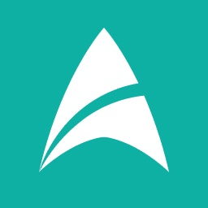

### 📌 이 서비스 한눈에 보기
Nova Recruiter는 AI 에이전트를 활용하여 채용 과정을 자동화하고, 8억 명 이상의 후보자 프로필에서 인재를 검색, 연락, 채용할 수 있도록 돕는 플랫폼입니다.

### 🔑 주요 기능
- AI 에이전트 기반으로 채용 워크플로우 자동화하여 시간 절약 (95% 이상)
- 8억 명 이상의 공개 프로필에서 후보자 검색 및 연락 가능
- 기존 플랫폼 대비 더 나은 필터링 및 높은 응답률 (2-3배)

### 🙋 사용자에게 어떤 점이 좋은가
채용 담당자는 Nova Recruiter를 통해 시간과 비용을 절약하고, 더 효율적으로 우수 인재를 확보할 수 있습니다. 사용량 기반 가격 정책으로 초기 투자 부담을 줄일 수 있습니다.

### ✅ 지금 바로 써볼 기능
- AI 에이전트 설정하여 후보자 소싱 자동화
- 멀티 채널 캠페인 설정하여 응답률 향상
- 필터 기능을 활용하여 원하는 인재 검색

### ⚠️ 사용 전 확인할 점
- AI 에이전트의 정확도 및 편향성 검토 필요
- 개인정보보호 관련 법규 준수 필요

### 🧭 확인이 더 필요한 정보
실제 사용 시 AI 에이전트의 성능과 채용 효율이 얼마나 개선되는지 확인이 필요합니다.

### 📸 스크린샷 및 갤러리
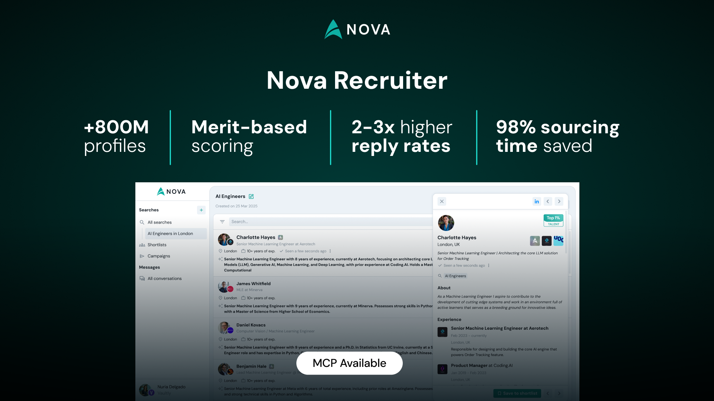
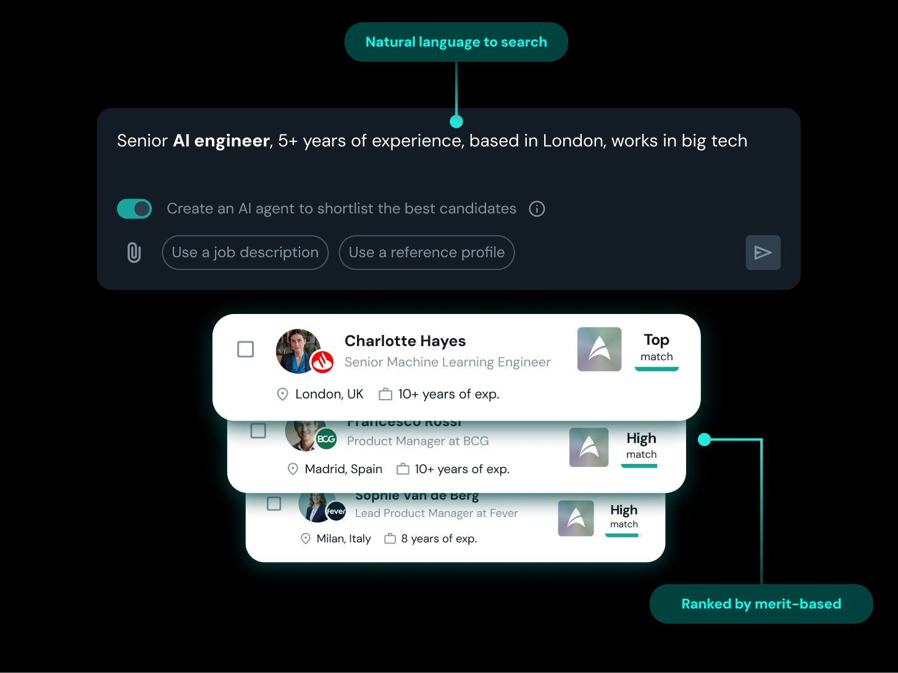
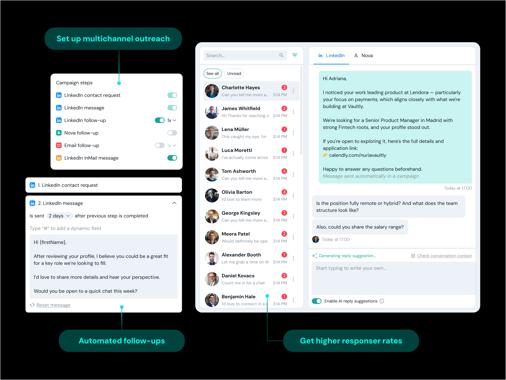

### 🎬 관련 영상
- [🎥 영상 보기](https://ph-files.imgix.net/95e8b185-14bf-4f8d-a1de-c9e64da8c8f8.jpeg?auto=format)

---

## 6. [Zernio Ads API](https://www.producthunt.com/products/zernio)
**Votes**: 168 | **도입 난이도**: 중 | **신뢰도**: 상
**Tagline**: Create, manage & report ads on 6 platforms via one API
**서비스 링크**: https://www.producthunt.com/r/R2XHM47S7LWD2B

**태그**: API, 광고, 자동화, 개발도구, 마케팅, AI Tool, DevTool, Analytics

### 📌 이 서비스 한눈에 보기
여러 광고 플랫폼에 흩어진 광고를 하나의 API로 손쉽게 만들고 관리하며 성과를 분석할 수 있는 솔루션입니다.

### 🔑 주요 기능
- Meta, Google, TikTok 등 6개 주요 광고 플랫폼을 하나의 API로 통합 관리합니다.
- 복잡한 개발 과정(여러 개발자 앱, OAuth, 데이터 모델) 없이 간편하게 연동할 수 있습니다.
- 간단한 인증 방식(Bearer 토큰)과 표준화된 데이터 모델을 제공하여 개발 효율성을 높입니다.

### 🙋 사용자에게 어떤 점이 좋은가
개발 시간과 노력을 획기적으로 줄여주어, 여러 플랫폼에 걸친 광고 캠페인을 효율적으로 운영하고 전략 수립에 집중할 수 있게 돕습니다.

### ✅ 지금 바로 써볼 기능
- Zernio Ads API 문서 확인 및 주요 기능 파악하기
- 가장 많이 사용하는 광고 플랫폼(예: Meta 또는 Google)과의 연동 테스트 진행하기
- 기존 광고 관리 시스템과의 통합 가능성 및 시너지 효과 검토하기

### ⚠️ 사용 전 확인할 점
- Zernio API에 대한 의존성 증가 및 Zernio 서비스 중단 시 발생할 수 있는 영향
- 각 광고 플랫폼의 최신 기능이나 특정 고급 설정이 Zernio API를 통해 완벽하게 지원되지 않을 가능성

### 🧭 확인이 더 필요한 정보
구체적인 요금 정책, 지원하는 광고 형식의 범위, 그리고 각 플랫폼별 고급 기능 지원 여부에 대한 추가 정보가 필요합니다.

### 📸 스크린샷 및 갤러리
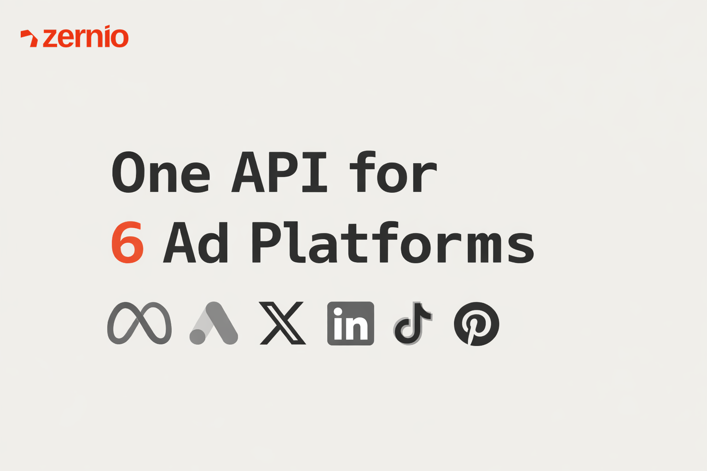
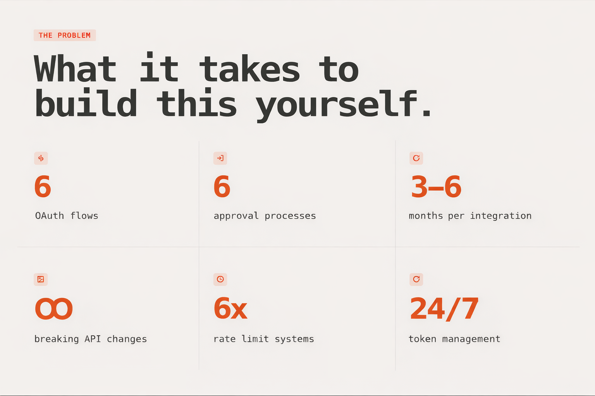
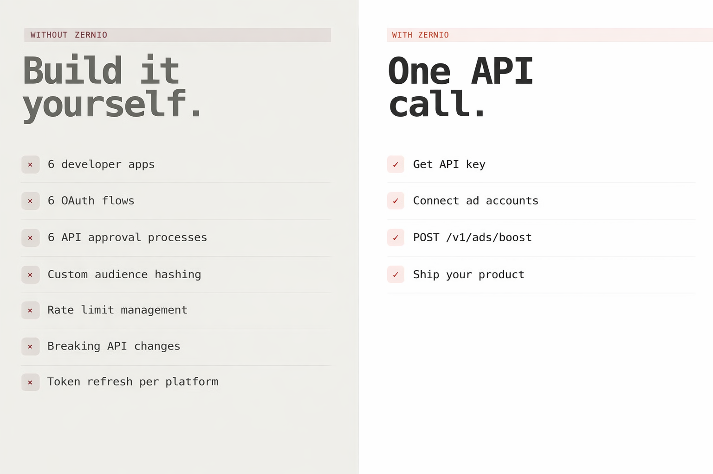

---

## 7. [Cai](https://www.producthunt.com/products/cai-layer)
**Votes**: 129 | **도입 난이도**: 하 | **신뢰도**: 상
**Tagline**: Press ⌥C on anything to run smart actions, locally
**서비스 링크**: https://www.producthunt.com/r/7BUJ2RUWRGBT4O

**태그**: DevTool, Automation, Productivity, AI, Local-first, AI Tool, Prompting

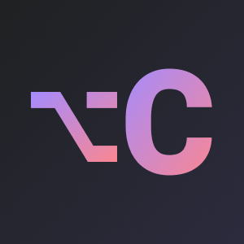

### 📌 이 서비스 한눈에 보기
⌥C 키 하나로 AI 프롬프트, 쉘 스크립트 등 다양한 스마트 액션을 로컬에서 즉시 실행하여 생산성을 높이는 도구입니다.

### 🔑 주요 기능
- ⌥C 단축키로 모든 앱에서 AI 프롬프트, 스크립트, GitHub/Linear 연동 등 스마트 액션 실행
- Ministral 3B 등 로컬 AI 모델을 기본 제공하여 클라우드 없이 AI 기능 활용 가능
- 무료, MIT 라이선스이며 클라우드, 계정, 원격 측정 없이 개인 정보 보호에 강점

### 🙋 사용자에게 어떤 점이 좋은가
반복적인 작업을 단축키 하나로 자동화하여 생산성을 크게 높이고, 민감한 정보도 로컬에서 안전하게 처리할 수 있습니다.

### ✅ 지금 바로 써볼 기능
- ⌥C 단축키로 AI 프롬프트 실행하여 텍스트 요약 또는 번역 시도
- 자주 사용하는 쉘 스크립트를 연결하여 단축키로 실행
- 로컬 AI 모델을 활용하여 클라우드 없이 AI 기능 사용해보기

### ⚠️ 사용 전 확인할 점
- Apple Silicon에 최적화된 MLX 모델 지원 언급으로, 다른 OS(Windows/Linux)에서의 성능 및 호환성 확인 필요
- 로컬 AI 모델 사용 시 초기 설정 및 시스템 리소스(RAM, CPU) 요구사항 확인 필요

### 🧭 확인이 더 필요한 정보
정확한 지원 운영체제(macOS 외) 및 각 액션별 상세 설정 방법과 확장성에 대한 추가 정보가 필요합니다.

### 📸 스크린샷 및 갤러리
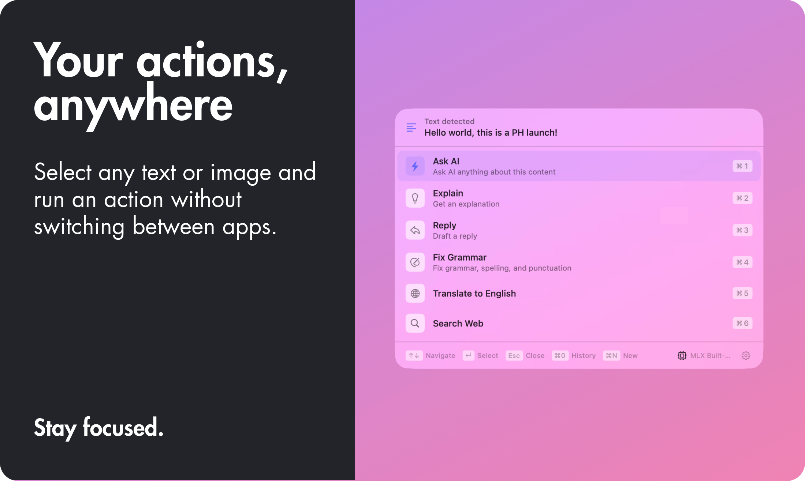
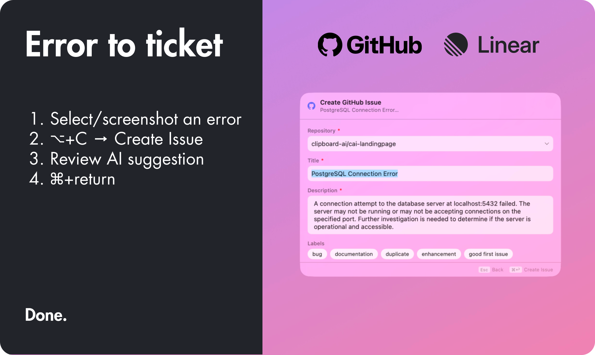
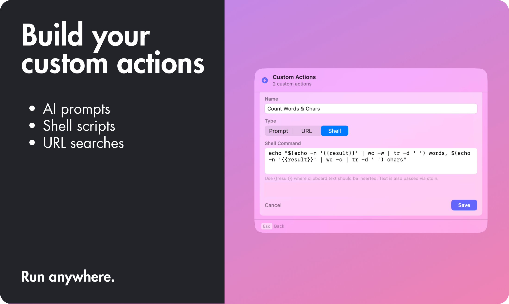

### 🎬 관련 영상
- [🎥 영상 보기](https://ph-files.imgix.net/0a272f41-2c70-4090-a5e1-04f698a875a2.jpeg?auto=format)

---

## 8. [Toki 2.0](https://www.producthunt.com/products/toki-ai)
**Votes**: 120 | **도입 난이도**: 중 | **신뢰도**: 중
**Tagline**: Automatically go from ideas to scheduled plan
**서비스 링크**: https://www.producthunt.com/r/QXDISEHK2IYC3A

**태그**: AI, 스케줄링, 자동화, 생산성, 시간 관리, Agent, AI Tool

### 📌 이 서비스 한눈에 보기
Toki 2.0은 AI 기반 스케줄링 에이전트로, 아이디어를 캡처하고 문맥과 선호도를 기억하여 자동으로 일정을 계획하고 관리해 시간을 효율적으로 사용할 수 있도록 돕습니다.

### 🔑 주요 기능
- AI 기반 자동 스케줄링: 아이디어에서 시작해 자동으로 일정을 계획하고 정리합니다.
- 문맥 및 선호도 기억: 사용자의 습관과 선호도를 학습하여 더욱 최적화된 스케줄을 제공합니다.
- 자동화 트리거: 특정 조건에 따라 자동으로 작업을 실행하여 생산성을 높입니다.

### 🙋 사용자에게 어떤 점이 좋은가
복잡한 일정 관리를 AI에게 맡겨 시간을 절약하고, 중요한 업무에 집중할 수 있도록 도와줍니다. 아이디어를 구체적인 일정으로 빠르게 전환하여 실행력을 높일 수 있습니다.

### ✅ 지금 바로 써볼 기능
- 아이디어를 캡처하여 이벤트로 전환해보기
- 선호도 및 컨텍스트 설정하여 스케줄링 자동화하기
- 자동화 트리거 설정하여 반복 작업 간소화하기

### ⚠️ 사용 전 확인할 점
- AI 스케줄링의 정확도는 사용자의 데이터 입력 및 선호도 설정에 따라 달라질 수 있습니다.
- 개인 정보 보호 정책 및 데이터 사용 방식을 확인해야 합니다.

### 🧭 확인이 더 필요한 정보
Toki 2.0의 AI 스케줄링 알고리즘의 구체적인 작동 방식에 대한 추가 정보가 필요합니다.

### 📸 스크린샷 및 갤러리

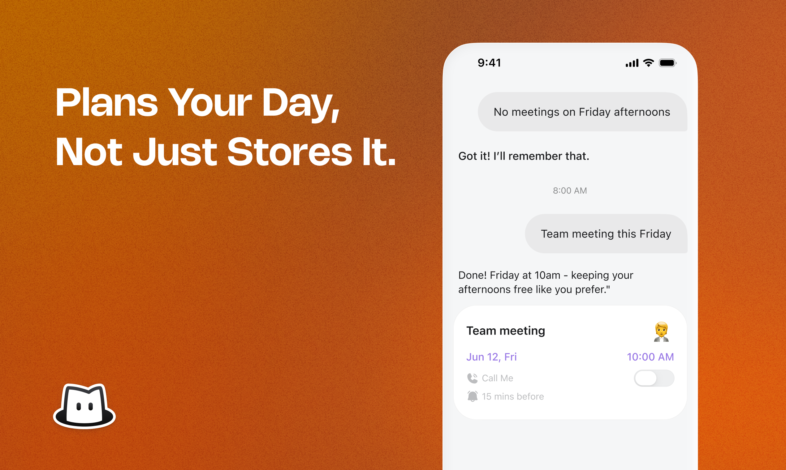

---

## 9. [Tines Story copilot](https://www.producthunt.com/products/tines)
**Votes**: 118 | **도입 난이도**: 중 | **신뢰도**: 중
**Tagline**: A conversational AI interface to build intelligent workflows
**서비스 링크**: https://www.producthunt.com/r/ASY2DFOEH7ZDWS

**태그**: AI, Workflow, Automation, No-code, AI Tool, Chat

### 📌 이 서비스 한눈에 보기
Tines Story copilot은 자연어 기반 대화형 AI 인터페이스를 통해 지능형 워크플로우를 구축하고 최적화하여 자동화 시간을 단축시켜 줍니다.

### 🔑 주요 기능
- 자연어 기반으로 워크플로우 구축 가능
- 워크플로우 효율성 최적화 기능 제공
- 복잡한 워크플로우 이해 및 문제 해결 지원

### 🙋 사용자에게 어떤 점이 좋은가
Tines 사용자는 Story copilot을 통해 워크플로우 구축 시간을 획기적으로 줄이고, 자동화 효율성을 높여 핵심 업무에 집중할 수 있습니다. 또한, 워크플로우 문제 발생 시 원인 파악 및 해결이 용이합니다.

### ✅ 지금 바로 써볼 기능
- Story copilot을 사용하여 간단한 워크플로우 자동화
- 기존 워크플로우를 Story copilot으로 분석 및 최적화
- 액션 실패 원인 분석 기능 활용

### ⚠️ 사용 전 확인할 점
- 자연어 이해도에 따라 워크플로우 구축 결과가 달라질 수 있음
- 복잡한 워크플로우의 경우, Story copilot의 지원 범위 확인 필요

### 🧭 확인이 더 필요한 정보
Story copilot의 자연어 처리 성능 및 지원 가능한 워크플로우 복잡도에 대한 추가 정보 확인이 필요합니다.

### 📸 스크린샷 및 갤러리
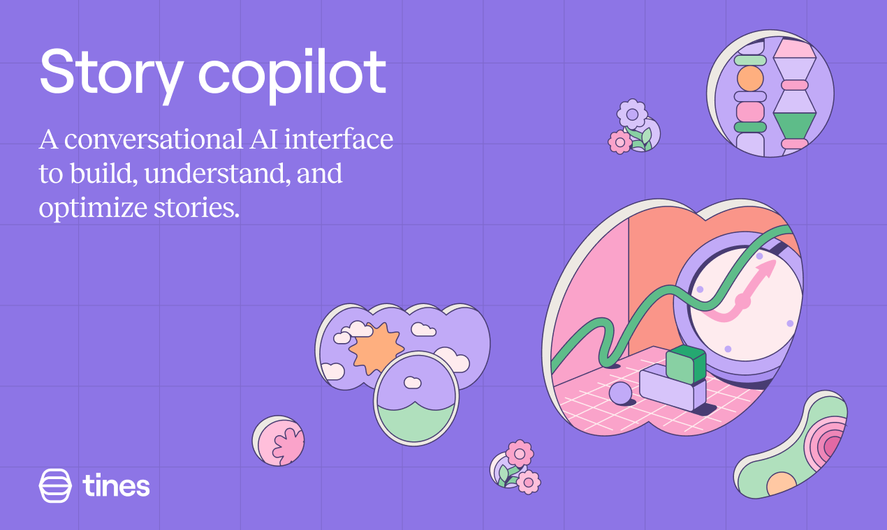
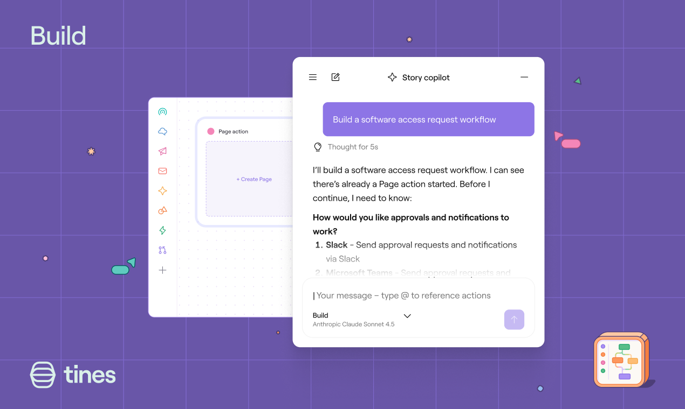
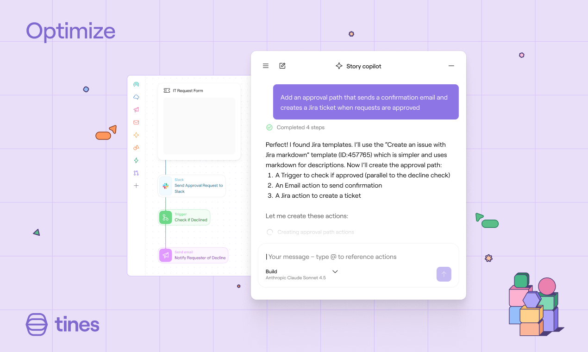

### 🎬 관련 영상
- [🎥 영상 보기](https://ph-files.imgix.net/b387396c-0bb5-48d9-a7a4-bef169d11c2a.jpeg?auto=format)

---

## 10. [Framework Laptop 13 Pro](https://www.producthunt.com/products/framework)
**Votes**: 117 | **도입 난이도**: 중 | **신뢰도**: 중
**Tagline**: A Linux-first laptop with premium ambitions
**서비스 링크**: https://www.producthunt.com/r/T4TEJO5JENQFGS

**태그**: AI Tool

### 📌 이 서비스 한눈에 보기
제품의 상세 기능과 관련 소식은 원문 링크를 통해 확인해 주세요.

### 🔑 주요 기능
- 제품 페이지를 참고해 주세요.

### 🧭 확인이 더 필요한 정보
Product Hunt 설명(태그라인/디스크립션) 기반 정리이므로 실제 기능/가격/정책은 제품 페이지 확인이 필요합니다.

### 📸 스크린샷 및 갤러리

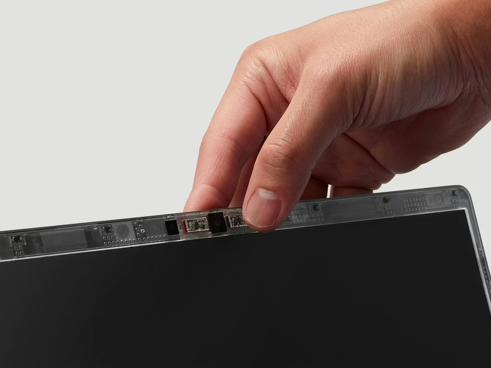

### 🎬 관련 영상
- [🎥 영상 보기](https://ph-files.imgix.net/c9461767-a6bd-4f76-86bc-2a463e748665.jpeg?auto=format)

---

