# 🚀 Product Hunt Daily Top 10 (2026-04-24)

## 1. [FocuSee 2.0](https://www.producthunt.com/products/focusee)
**Votes**: 272 | **도입 난이도**: 하 | **신뢰도**: 상
**Tagline**: Record screen to get polished demos & tutorials
**서비스 링크**: https://www.producthunt.com/r/CQAQYQT3PJXRQM

**태그**: Video Editing, AI, Screen Recording, Productivity, Marketing, AI Tool, Video

### 📌 이 서비스 한눈에 보기
AI 기반으로 전문가 수준의 데모 및 튜토리얼 영상을 빠르고 쉽게 제작할 수 있는 도구입니다.

### 🔑 주요 기능
- AI 기반으로 영상 편집 시간을 대폭 단축
- 모바일 화면 녹화 및 3D 모션 등 다양한 고급 기능 제공
- 전문가 수준의 데모, 튜토리얼, 마케팅 영상 제작에 최적화

### 🙋 사용자에게 어떤 점이 좋은가
복잡한 영상 편집 기술 없이도 AI의 도움을 받아 짧은 시간 안에 고품질의 데모 및 튜토리얼 영상을 만들 수 있어 업무 효율성을 크게 높여줍니다.

### ✅ 지금 바로 써볼 기능
- 모바일 화면 녹화 기능으로 앱 데모 영상 만들기
- AI 자동 자막 및 배경 제거 기능으로 영상 퀄리티 높이기
- 음성 향상 및 불필요한 단어 제거 기능으로 깔끔한 내레이션 만들기

### ⚠️ 사용 전 확인할 점
- AI 기능(자동 자막, 음성 향상 등)의 정확도와 자연스러움 확인
- 생성된 영상의 해상도, 파일 크기, 내보내기 형식 등 최종 결과물 사양 확인

### 🧭 확인이 더 필요한 정보
구체적인 가격 정책, 지원하는 운영체제 및 다른 도구와의 연동 가능 여부는 추가 확인이 필요합니다.

### 📸 스크린샷 및 갤러리

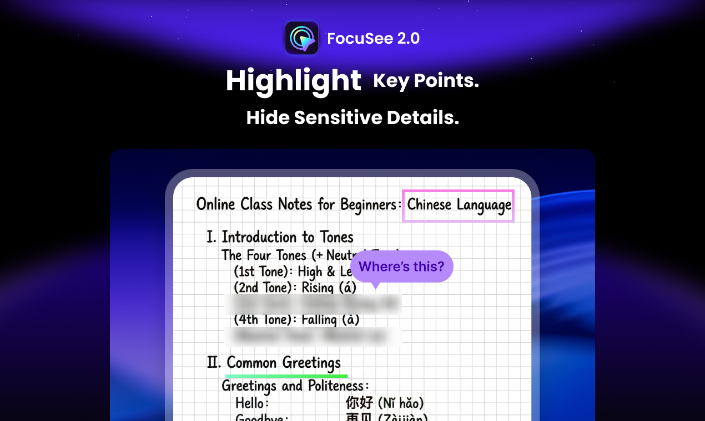

### 🎬 관련 영상
- [🎥 영상 보기](https://ph-files.imgix.net/0edd75ca-8d95-43e6-b098-71703779b5b9.jpeg?auto=format)

---

## 2. [Kollab](https://www.producthunt.com/products/kollab-2)
**Votes**: 235 | **도입 난이도**: 중 | **신뢰도**: 중
**Tagline**: Shared workspace where teams work with agents together
**서비스 링크**: https://www.producthunt.com/r/YTS75TBPL3B6AV

**태그**: AI, 협업, 자동화, 생산성, 워크플로우, Agent, Automation, AI Tool

### 📌 이 서비스 한눈에 보기
Kollab은 AI 에이전트를 팀의 일원으로 활용하여 팀 협업을 증진시키는 공유 작업 공간입니다. 앱 전환 없이 Slack과 같은 IM 내에서 AI 에이전트를 활용하고, 워크플로우 재사용, 기존 도구 연결, 프로젝트 컨텍스트 유지를 통해 생산성을 높입니다.

### 🔑 주요 기능
- AI 에이전트를 팀에 통합하여 협업 효율성 증대
- Slack 등 IM 환경에서 앱 전환 없이 AI 에이전트 활용
- 워크플로우 재사용, 도구 연결, 컨텍스트 유지 기능 제공

### 🙋 사용자에게 어떤 점이 좋은가
팀 협업 시 AI 에이전트를 활용하여 업무 효율성을 높이고, 반복적인 작업을 자동화하여 시간을 절약할 수 있습니다. 특히 여러 도구를 사용하는 환경에서 작업 흐름을 통합하는 데 유용합니다.

### ✅ 지금 바로 써볼 기능
- Slack에 AI 에이전트 연동하여 사용해보기
- 기존 워크플로우를 Skills로 만들어 재사용해보기
- Connectors를 통해 자주 사용하는 도구 연결해보기

### ⚠️ 사용 전 확인할 점
- AI 에이전트의 성능 및 정확도에 대한 검증 필요
- 기존 시스템과의 호환성 확인 필요

### 🧭 확인이 더 필요한 정보
AI 에이전트의 구체적인 기능 및 지원 범위에 대한 추가 정보 확인이 필요합니다.

### 📸 스크린샷 및 갤러리
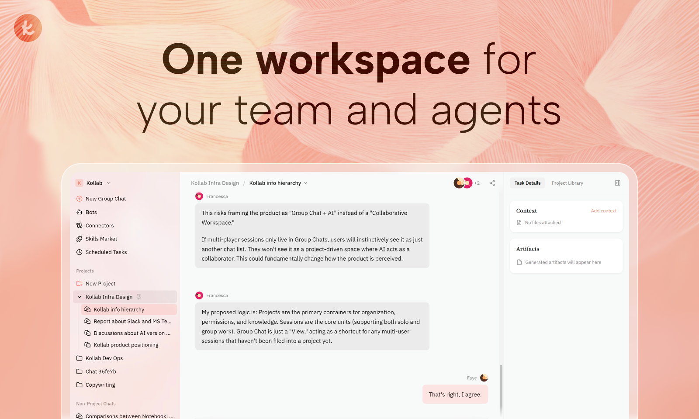
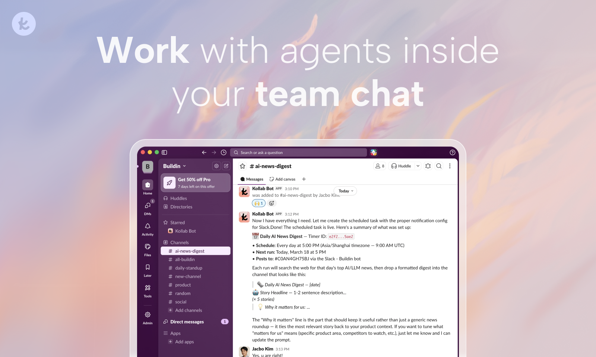
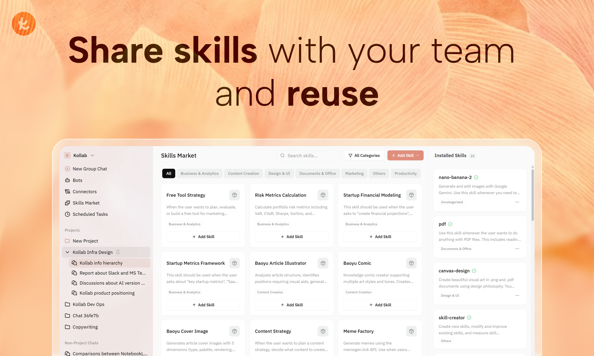

### 🎬 관련 영상
- [🎥 영상 보기](https://ph-files.imgix.net/c34176ac-c182-44be-b58c-dc4ba095a66a.jpeg?auto=format)

---

## 3. [Magic Patterns Agent 2.0](https://www.producthunt.com/products/magicpatterns)
**Votes**: 226 | **도입 난이도**: 중 | **신뢰도**: 상
**Tagline**: The best AI design agent to go from idea to production
**서비스 링크**: https://www.producthunt.com/r/I7BSFMORY72OEB

**태그**: Design Tool, AI, Prototyping, DevTool, Automation, Agent, AI Tool, Design

### 📌 이 서비스 한눈에 보기
AI를 활용하여 아이디어부터 프로덕션까지 디자인 프로세스를 가속화하고, 기존 시스템에 맞춰 프로토타입을 생성하며 개발 효율을 높이는 도구입니다.

### 🔑 주요 기능
- AI 기반 디자인 에이전트로 아이디어 구상부터 실제 개발까지 지원
- 기존 스타일 및 디자인 시스템을 활용하여 일관된 프로토타입 생성
- 엔지니어링 핸드오프를 간소화하여 소프트웨어 개발 속도 향상

### 🙋 사용자에게 어떤 점이 좋은가
디자이너는 기존 시스템에 맞춰 빠르게 프로토타입을 만들고, 개발팀은 효율적인 핸드오프를 통해 소프트웨어 개발 속도를 크게 높일 수 있습니다.

### ✅ 지금 바로 써볼 기능
- 기존 디자인 시스템을 연동하여 프로토타입 생성 기능 사용해보기
- AI가 생성한 디자인 결과물의 수정 및 커스터마이징 용이성 확인
- 엔지니어링 핸드오프 기능이 실제 개발 워크플로우에 얼마나 잘 맞는지 테스트

### ⚠️ 사용 전 확인할 점
- AI가 생성하는 디자인 결과물의 품질과 기존 디자인 가이드라인 준수 여부
- 복잡하거나 독창적인 디자인 요구사항에 대한 AI의 대응 능력

### 🧭 확인이 더 필요한 정보
실제 디자인 결과물의 완성도와 커스터마이징 유연성에 대한 추가적인 검증이 필요합니다.

### 📸 스크린샷 및 갤러리
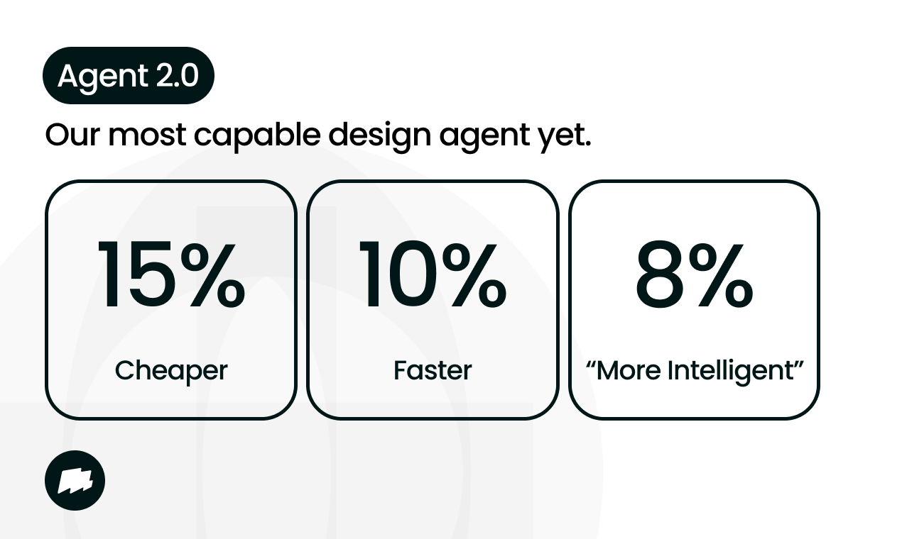
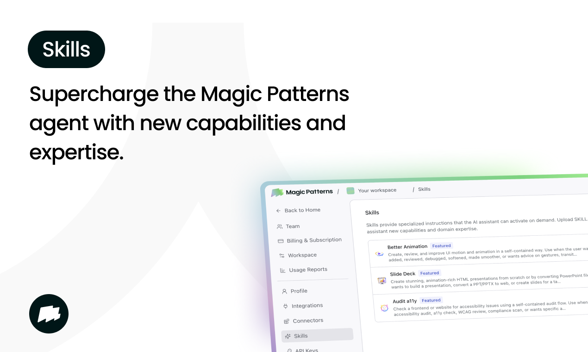
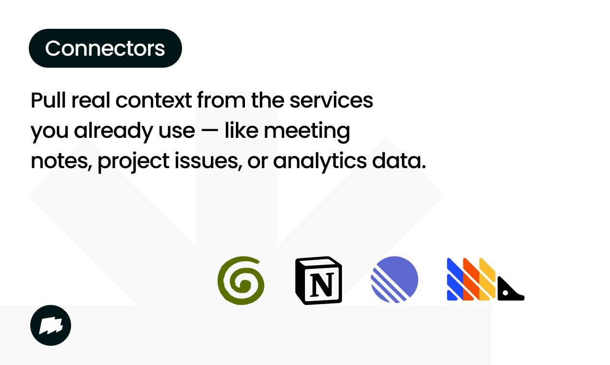

### 🎬 관련 영상
- [🎥 영상 보기](https://ph-files.imgix.net/d116e7a2-aaa1-47da-ac6a-60cc149dfae3.jpeg?auto=format)

---

## 4. [Monid](https://www.producthunt.com/products/monid)
**Votes**: 212 | **도입 난이도**: 중 | **신뢰도**: 중
**Tagline**: One wallet, every paid tool your agent needs
**서비스 링크**: https://www.producthunt.com/r/L7TVXMLTGWYT7X

**태그**: DevTool, 자동화, 분석, 에이전트, 지갑, Agent, AI Tool, API

### 📌 이 서비스 한눈에 보기
Monid는 에이전트가 필요한 다양한 유료 도구를 하나의 지갑으로 관리하고, 구독이나 API 키 없이 소셜 스크래핑, 시장 트렌드 분석, 리드 생성 등 다양한 기능을 사용할 수 있도록 해줍니다.

### 🔑 주요 기능
- 에이전트를 위한 통합 지갑 제공
- 구독 및 API 키 없이 다양한 도구 사용 가능
- 소셜 스크래핑, 시장 트렌드 분석, 리드 생성 등 지원

### 🙋 사용자에게 어떤 점이 좋은가
에이전트가 여러 유료 도구를 효율적으로 관리하고, 하나의 잔액으로 다양한 기능을 활용하여 생산성을 향상시킬 수 있습니다.

### ✅ 지금 바로 써볼 기능
- 에이전트 연결 및 지갑 설정
- 필요한 도구 활성화
- 제공되는 분석 기능 활용

### ⚠️ 사용 전 확인할 점
- 지원하는 도구 목록 확인 필요
- 에이전트 호환성 확인 필요

### 🧭 확인이 더 필요한 정보
Monid가 지원하는 구체적인 도구 목록과 각 도구의 기능에 대한 추가 정보가 필요합니다.

### 📸 스크린샷 및 갤러리

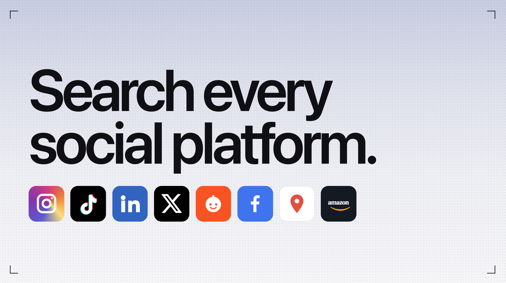
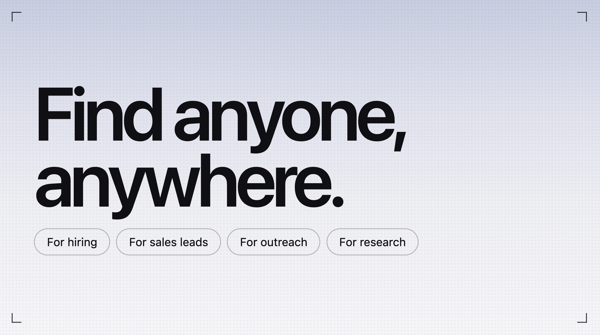

### 🎬 관련 영상
- [🎥 영상 보기](https://ph-files.imgix.net/1185a0af-a959-47df-8c58-ef0cb201449a.jpeg?auto=format)

---

## 5. [Claude Code /ultrareview](https://www.producthunt.com/products/claude-code)
**Votes**: 168 | **도입 난이도**: 중 | **신뢰도**: 중
**Tagline**: Cloud code review using a fleet of parallel agents
**서비스 링크**: https://www.producthunt.com/r/TNCTG4QNPA3ONR

**태그**: DevTool, 코드 리뷰, 자동화, 클라우드, Agent

### 📌 이 서비스 한눈에 보기
클라우드 환경에서 병렬적으로 실행되는 리뷰 에이전트를 통해 코드의 버그를 독립적으로 검증하여 보고해주는 코드 리뷰 도구입니다.

### 🔑 주요 기능
- 병렬 리뷰 에이전트 실행
- 클라우드 기반
- 독립적인 버그 검증

### 🙋 사용자에게 어떤 점이 좋은가
코드 리뷰 과정을 자동화하고, 여러 에이전트가 동시에 검토하여 버그를 더 빠르게 발견하고 수정할 수 있도록 도와줍니다. Claude Code Pro 또는 Max 사용자에게 유용합니다.

### ✅ 지금 바로 써볼 기능
- Pro 또는 Max 플랜 가입
- 브랜치 또는 PR에 Ultrareview 적용
- 리뷰 결과 확인 및 버그 수정

### ⚠️ 사용 전 확인할 점
- Claude Code Pro 또는 Max 플랜 사용자만 사용 가능
- 클라우드 환경에 대한 의존성

### 🧭 확인이 더 필요한 정보
Ultrareview가 지원하는 프로그래밍 언어 및 코드 복잡도 수준에 대한 추가 정보가 필요합니다.

### 📸 스크린샷 및 갤러리
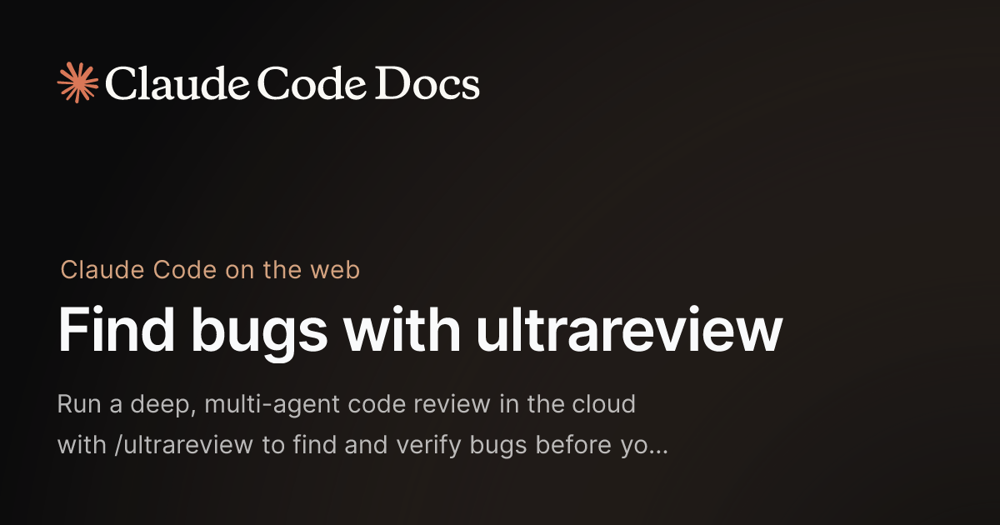
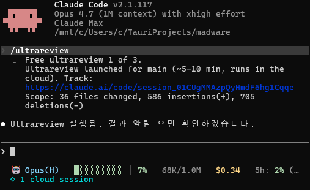
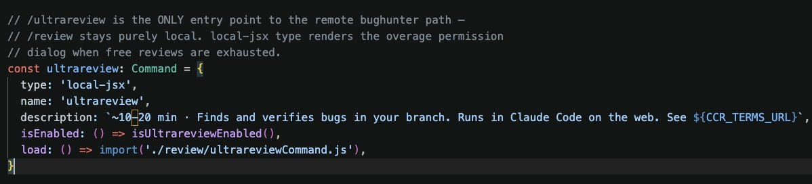

---

## 6. [ASI:One](https://www.producthunt.com/products/asi)
**Votes**: 146 | **도입 난이도**: 중 | **신뢰도**: 상
**Tagline**: A personal AI with memory that plans and acts for you
**서비스 링크**: https://www.producthunt.com/r/YQZHHJUFGCCGK7

**태그**: AI, Personal Assistant, Automation, Productivity, Planning, Agent, AI Tool

### 📌 이 서비스 한눈에 보기
개인의 선호도를 기억하고 다른 AI와 협력하여 복잡한 계획부터 실행까지 자동으로 처리해주는 개인 비서 AI입니다.

### 🔑 주요 기능
- 개인 선호도를 학습하고 기억하여 맞춤형 서비스를 제공하는 AI 비서 기능
- 다른 AI들과 협력하여 그룹 활동 계획 및 조율, 예약 등 실행 지원
- Agentverse를 통해 연구, 계획, 실제 업무 등 다양한 온디맨드 작업 수행 가능

### 🙋 사용자에게 어떤 점이 좋은가
복잡한 일정 조율이나 정보 탐색에 드는 시간을 절약하고, 개인화된 맞춤형 서비스를 통해 삶의 질을 높일 수 있습니다. 특히 그룹 활동 계획 시 번거로움을 크게 줄여줍니다.

### ✅ 지금 바로 써볼 기능
- 개인 선호도를 입력하고 간단한 일정 계획을 요청해보기
- 친구들과의 모임 계획을 ASI:One에 맡겨 조율 및 예약 진행해보기
- 특정 주제에 대한 정보 탐색이나 리서치 작업을 지시해보기

### ⚠️ 사용 전 확인할 점
- AI가 기억하는 개인 정보의 범위와 보안 정책 확인 필요
- 다른 AI와의 협업 및 Agentverse 연동 시 발생할 수 있는 오류나 한계점 파악

### 🧭 확인이 더 필요한 정보
실제 Agentverse를 통한 외부 에이전트 연동의 범위, 비용, 그리고 각 작업의 성공률에 대한 구체적인 정보가 필요합니다.

### 📸 스크린샷 및 갤러리
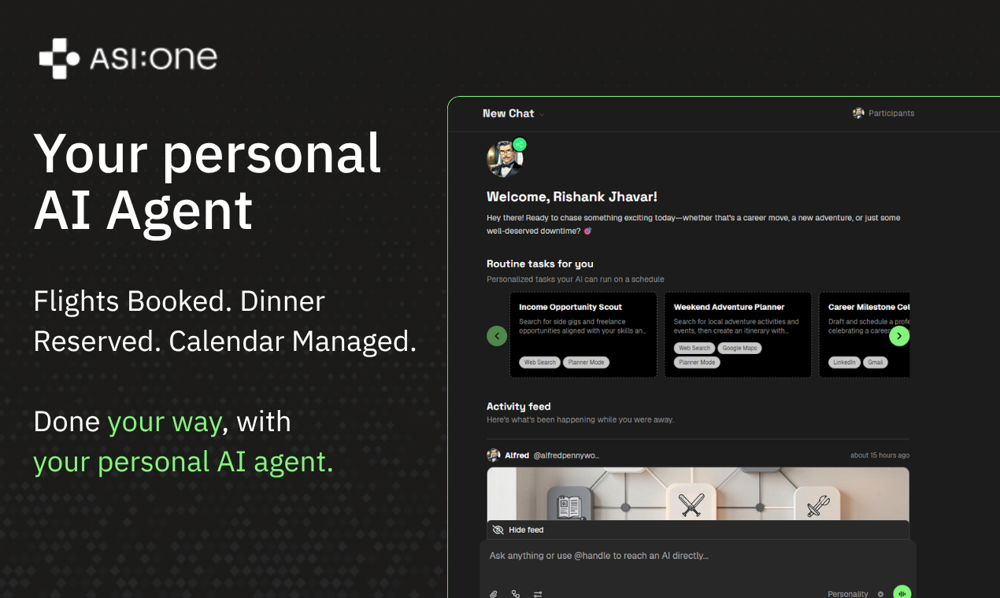
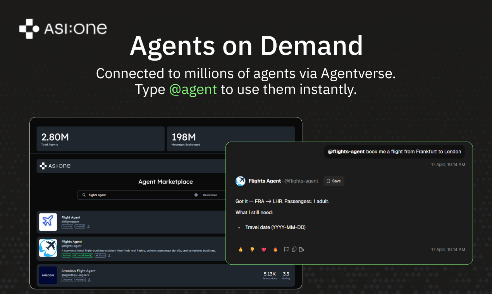
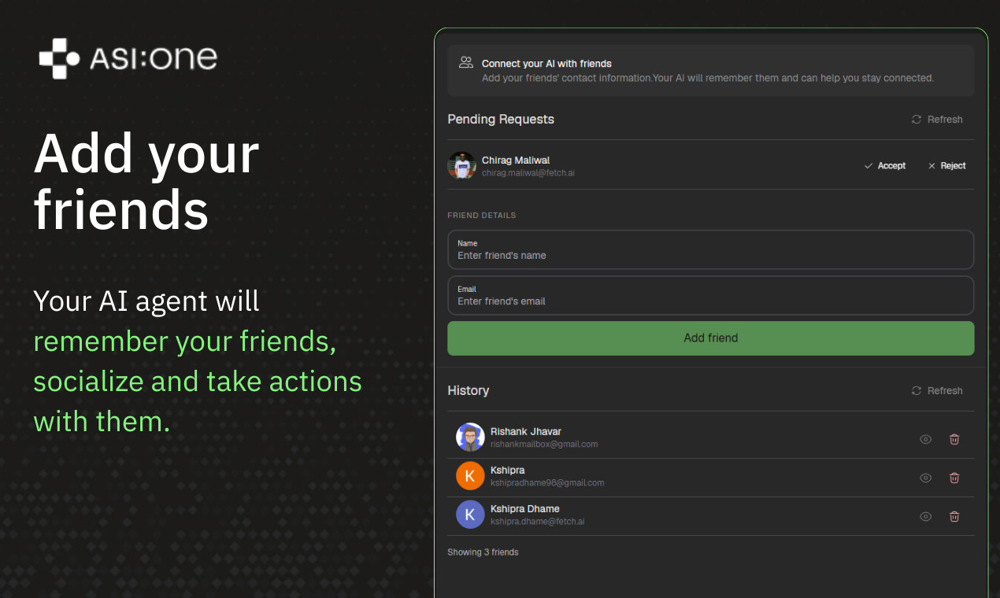

### 🎬 관련 영상
- [🎥 영상 보기](https://ph-files.imgix.net/b3564504-6631-4873-8d1d-b6dbb4f4a4c1.jpeg?auto=format)

---

## 7. [Reloop Animation Studio](https://www.producthunt.com/products/reloop)
**Votes**: 143 | **도입 난이도**: 하 | **신뢰도**: 상
**Tagline**: Turn any video idea into Pixar, Clay or Manga
**서비스 링크**: https://www.producthunt.com/r/QEUAKCAHFDOJA6

**태그**: AI, Video Editing, Marketing, Animation, Content Creation, Agent, AI Tool, Chat, Prompting, Video, Design

### 📌 이 서비스 한눈에 보기
AI로 어떤 아이디어든 픽사, 클레이, 만화 등 원하는 스타일의 애니메이션 마케팅 영상을 쉽고 빠르게 만들 수 있습니다.

### 🔑 주요 기능
- 다양한 애니메이션 스타일(픽사, 클레이, 만화, 초현실적 등) 지원
- 아이디어만으로 AI가 영상 제작 (프롬프트, 디자인, 애니메이터 불필요)
- 마케터와 브랜드가 돋보이는 영상을 몇 분 안에 빠르게 제작 가능

### 🙋 사용자에게 어떤 점이 좋은가
전문 애니메이터나 디자인 기술 없이도 AI를 통해 독창적이고 시선을 사로잡는 마케팅 영상을 빠르고 쉽게 제작할 수 있어 시간과 비용을 절약할 수 있습니다.

### ✅ 지금 바로 써볼 기능
- 자신이 만들고 싶은 영상 아이디어를 AI에게 설명해보기
- 다양한 애니메이션 스타일 중 원하는 분위기를 선택해보기
- 생성된 애니메이션 영상을 마케팅 콘텐츠로 활용해보기

### ⚠️ 사용 전 확인할 점
- AI가 생성하는 영상의 최종 품질과 디테일이 기대치에 부합하는지 확인 필요
- '분위기 선택' 외에 세부적인 커스터마이징 옵션이 얼마나 제공되는지 확인 필요

### 🧭 확인이 더 필요한 정보
서비스의 구체적인 가격 정책, 지원하는 영상 해상도 및 파일 형식, 그리고 다른 마케팅 도구와의 연동 가능성에 대한 정보가 필요합니다.

### 📸 스크린샷 및 갤러리

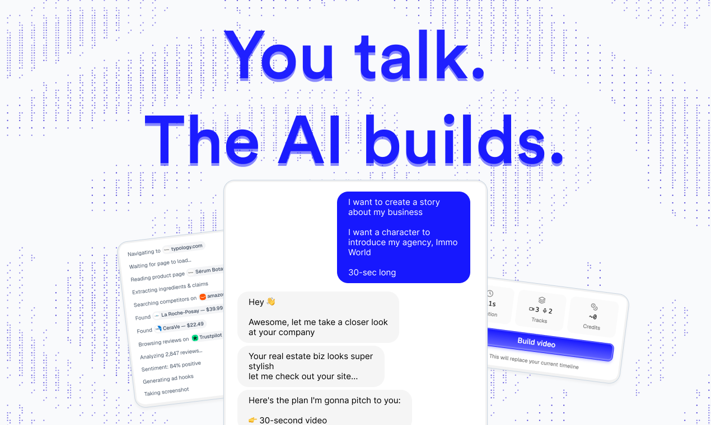
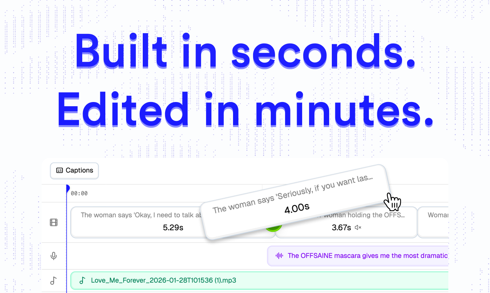

### 🎬 관련 영상
- [🎥 영상 보기](https://ph-files.imgix.net/2f37b915-8bc9-4c28-8a3d-fa2141c92987.jpeg?auto=format)

---

## 8. [Blink AI CFO](https://www.producthunt.com/products/blink-21)
**Votes**: 127 | **도입 난이도**: 중 | **신뢰도**: 중
**Tagline**: AI CFO that autonomously trades stocks and options via Slack
**서비스 링크**: https://www.producthunt.com/r/A6EELXYZTEHDZ7

**태그**: AI, Finance, Automation, Slack, Trading, AI Tool

### 📌 이 서비스 한눈에 보기
Blink AI CFO는 Slack을 통해 주식 및 옵션을 자동 거래하고, 재무 모델을 구축하며, 실시간 P&L 업데이트 및 투자자 자료를 제공하여 24시간 내내 수익을 창출해주는 AI CFO입니다.

### 🔑 주요 기능
- Slack 내에서 24/7 자동 주식 및 옵션 거래
- Alpaca 또는 Robinhood 연동
- 실시간 Stripe 및 QuickBooks 데이터 기반 P&L 업데이트

### 🙋 사용자에게 어떤 점이 좋은가
Blink AI CFO를 통해 재무 관리를 자동화하고, 투자 관련 자료를 쉽게 생성하여 시간과 노력을 절약할 수 있습니다. 특히 Slack을 통해 모든 기능을 사용할 수 있어 편리합니다.

### ✅ 지금 바로 써볼 기능
- Slack에 Blink AI CFO 연동
- Alpaca 또는 Robinhood 계정 연결
- Stripe 및 QuickBooks 데이터 연동하여 P&L 자동 업데이트

### ⚠️ 사용 전 확인할 점
- 자동 거래의 경우 시장 상황에 따라 손실이 발생할 수 있습니다.
- 정확한 재무 모델 및 투자 자료 생성을 위해 데이터 연동의 정확성이 중요합니다.

### 🧭 확인이 더 필요한 정보
제공되는 AI 모델의 성능 및 시장 상황에 따른 실제 수익률 변동 가능성을 확인해야 합니다.

### 📸 스크린샷 및 갤러리
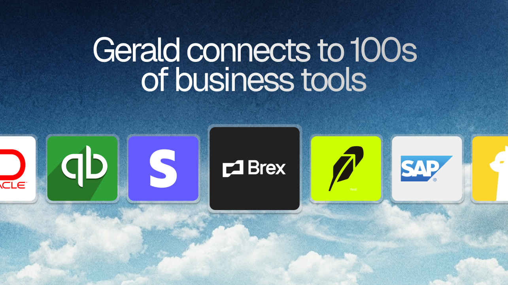
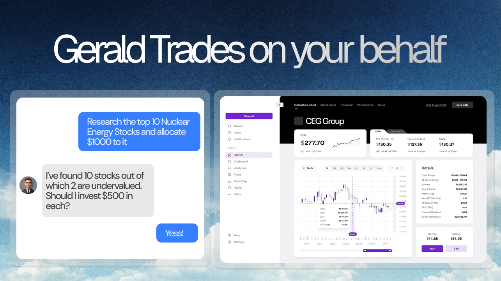
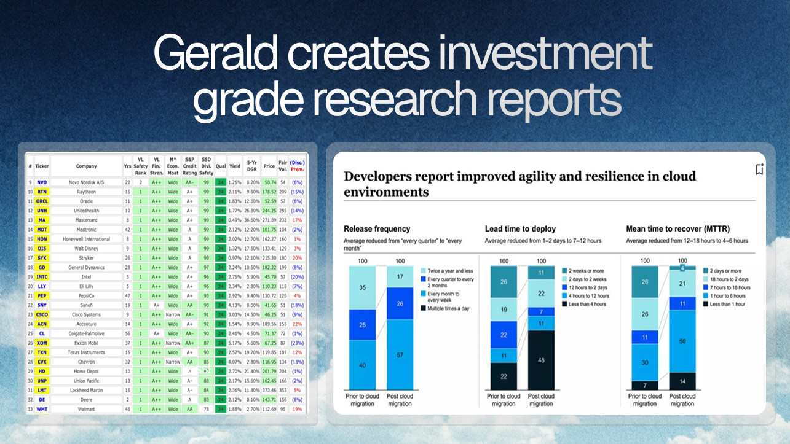

### 🎬 관련 영상
- [🎥 영상 보기](https://ph-files.imgix.net/b98efcc1-05aa-4eb6-a71e-cbd58392fee1.jpeg?auto=format)

---

## 9. [Wellows](https://www.producthunt.com/products/wellows-3)
**Votes**: 123 | **도입 난이도**: 중 | **신뢰도**: 중
**Tagline**: See how AI talks about your brand — and fix it
**서비스 링크**: https://www.producthunt.com/r/RGYNLRAZZTBN6T

**태그**: AI, 브랜드 관리, 마케팅, 분석, 자동화, AI Tool

### 📌 이 서비스 한눈에 보기
Wellows는 AI를 통해 브랜드에 대한 고객의 신뢰를 높이고, 트래픽과 전환율을 개선하도록 돕습니다.

### 🔑 주요 기능
- AI 기반 브랜드 평판 관리
- 고객 유입 및 전환율 향상
- 신뢰도 구축

### 🙋 사용자에게 어떤 점이 좋은가
Wellows를 사용하면 AI가 브랜드에 대해 이야기하는 방식을 파악하고 개선하여 고객이 더 쉽게 브랜드를 찾도록 할 수 있습니다. 이를 통해 브랜드 신뢰도를 높이고 더 많은 트래픽과 전환을 유도할 수 있습니다.

### ✅ 지금 바로 써볼 기능
- 브랜드 관련 AI 분석 시작하기
- AI가 분석한 브랜드 평판 검토하기
- 개선 방안 적용 및 효과 측정하기

### ⚠️ 사용 전 확인할 점
- AI 분석의 정확도에 대한 검증 필요
- 데이터 부족 시 분석 결과의 신뢰성 저하 가능성

### 🧭 확인이 더 필요한 정보
AI가 제공하는 브랜드 평판 분석의 정확도와 실제 고객 반응 간의 상관관계 확인이 필요합니다.

### 📸 스크린샷 및 갤러리
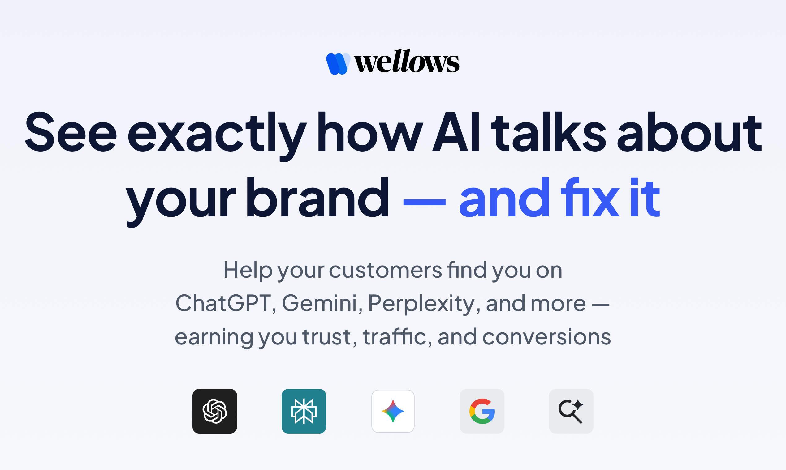
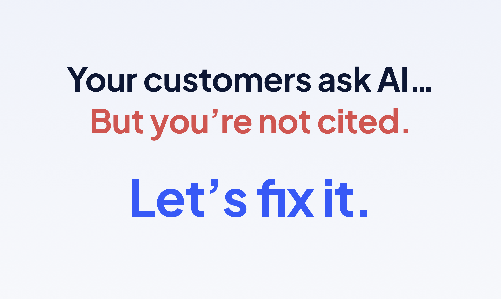
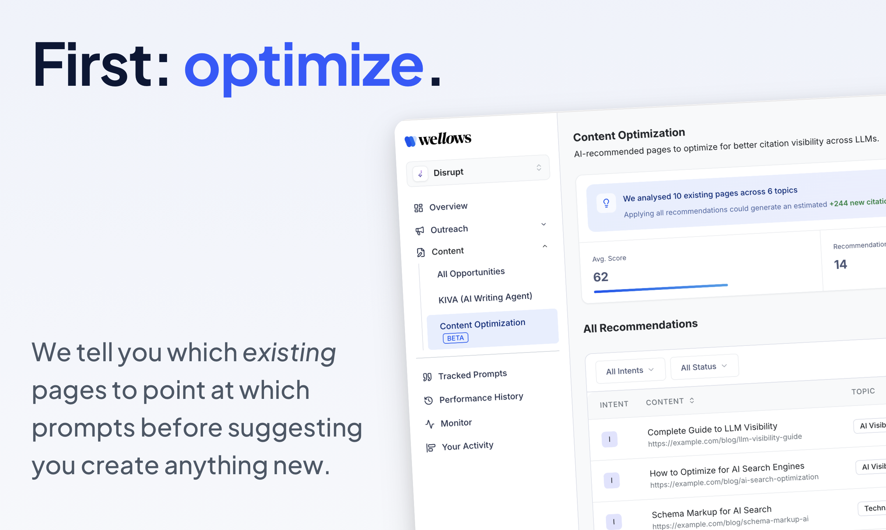

---

## 10. [Typewise AI Customer Service](https://www.producthunt.com/products/typewise)
**Votes**: 116 | **도입 난이도**: 중 | **신뢰도**: 중
**Tagline**: Automate customer support across systems with AI agents
**서비스 링크**: https://www.producthunt.com/r/M72WKX32D3X4KG

**태그**: AI, 고객지원, 자동화, No-code, Agent, Automation, AI Tool, DevTool

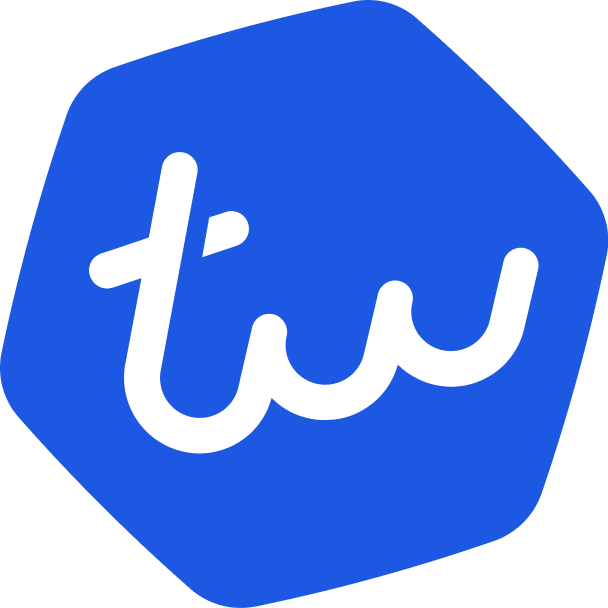

### 📌 이 서비스 한눈에 보기
Typewise AI 고객 서비스는 AI 에이전트를 통해 다양한 시스템에서 고객 지원을 자동화하여, 코딩 없이 자연어로 정의된 자동화를 구축하고 AI와 인간의 협업을 통해 효율적인 고객 응대를 가능하게 합니다.

### 🔑 주요 기능
- 코드 없이 자연어로 자동화 구축
- AI 에이전트가 다양한 시스템 연동하여 end-to-end 처리
- AI-인간 협업 및 정책 제어를 통해 유연한 관리

### 🙋 사용자에게 어떤 점이 좋은가
고객 지원 업무를 자동화하여 효율성을 높이고, 코딩 없이 쉽게 자동화 프로세스를 구축할 수 있어 개발 리소스 없이도 고객 응대 시스템을 개선할 수 있습니다.

### ✅ 지금 바로 써볼 기능
- AI 에이전트 설정 및 워크플로우 정의
- AI-인간 핸드오프 정책 설정
- 자동화 결과 모니터링 및 개선

### ⚠️ 사용 전 확인할 점
- AI 에이전트의 정확도 및 성능 검증 필요
- 기존 시스템과의 연동 호환성 확인 필요

### 🧭 확인이 더 필요한 정보
Typewise AI의 실제 고객 지원 자동화 성공 사례 및 성능 지표에 대한 추가 정보가 필요합니다.

### 📸 스크린샷 및 갤러리
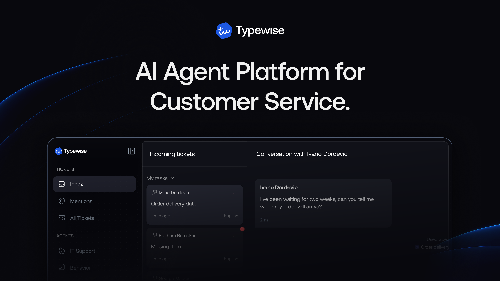
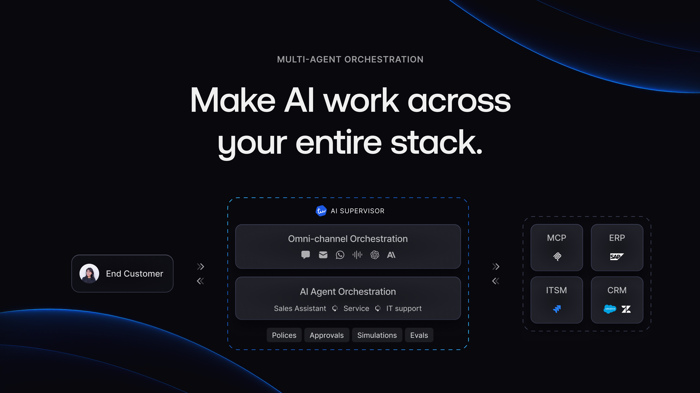
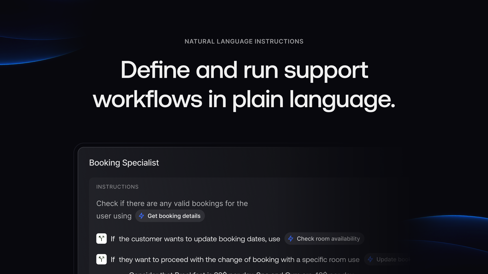

### 🎬 관련 영상
- [🎥 영상 보기](https://ph-files.imgix.net/b081a7f6-f030-40c5-8935-53b85abd4274.jpeg?auto=format)

---

