# 🚀 Product Hunt Daily Top 10 (2026-04-25)

## 1. [Ask Product Hunt AI](https://www.producthunt.com/products/producthunt)
**Votes**: 380 | **도입 난이도**: 중 | **신뢰도**: 중
**Tagline**: Find the right product, just ask
**서비스 링크**: https://www.producthunt.com/r/GI5LL6C432KXQP

**태그**: AI, 제품 검색, Product Hunt, 어시스턴트, AI Tool

### 📌 이 서비스 한눈에 보기
Product Hunt의 방대한 제품 데이터에서 AI 어시스턴트가 질문에 답변하여 필요한 제품을 쉽게 찾고 비교할 수 있도록 도와줍니다.

### 🔑 주요 기능
- Product Hunt 데이터를 기반으로 제품 관련 질문에 답변
- 새로운 도구 선택, 대안 비교, 트렌드 파악에 유용
- 수많은 제품 정보 속에서 필요한 정보를 빠르게 검색

### 🙋 사용자에게 어떤 점이 좋은가
새로운 도구를 찾거나 기존 도구의 대안을 비교할 때 Product Hunt의 방대한 데이터를 활용하여 빠르고 정확하게 정보를 얻을 수 있습니다.

### ✅ 지금 바로 써볼 기능
- 새로운 마케팅 도구 추천 요청
- 경쟁 제품 비교 요청
- 현재 트렌드 제품 정보 요청

### ⚠️ 사용 전 확인할 점
- Product Hunt 데이터에만 의존하므로, 최신 정보가 아닐 수 있음
- AI 답변의 정확성을 검증해야 함

### 🧭 확인이 더 필요한 정보
AI가 제공하는 답변의 정확도와 최신성에 대한 추가 검증이 필요합니다.

### 📸 스크린샷 및 갤러리
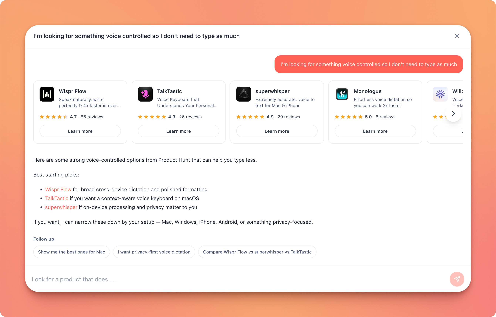
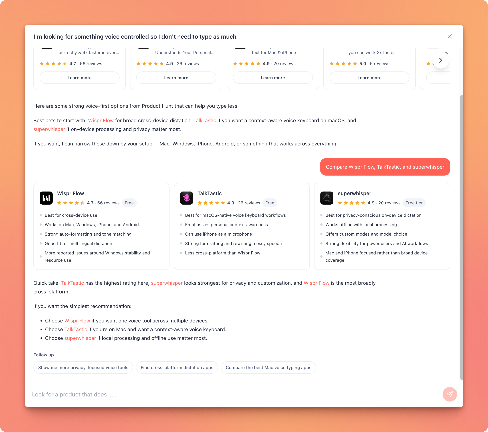

### 🎬 관련 영상
- [🎥 영상 보기](https://ph-files.imgix.net/f81f3bdc-f3fd-4103-abbd-31fd373760a5.gif?auto=format)

---

## 2. [DeepSeek-V4](https://www.producthunt.com/products/deepseek)
**Votes**: 255 | **도입 난이도**: 중 | **신뢰도**: 중
**Tagline**: The open-source era of 1M context intelligence
**서비스 링크**: https://www.producthunt.com/r/LNIDLCQSIWWNBY

**태그**: LLM, MoE, Open-source, Context Window

### 📌 이 서비스 한눈에 보기
DeepSeek-V4는 100만 토큰 컨텍스트를 지원하는 고효율 MoE 언어 모델로, 긴 문맥을 다루는 작업에 적합합니다.

### 🔑 주요 기능
- 100만 토큰 컨텍스트 윈도우 지원
- V4-Pro (1.6T 파라미터) 및 V4-Flash (284B 파라미터) 모델 제공
- 하이브리드 어텐션 아키텍처를 통한 컴퓨팅 및 메모리 비용 절감

### 🙋 사용자에게 어떤 점이 좋은가
방대한 양의 데이터를 처리해야 하는 사용자에게 유용하며, 긴 문맥을 이해해야 하는 작업에서 뛰어난 성능을 보일 수 있습니다.

### ✅ 지금 바로 써볼 기능
- V4-Pro 모델을 사용하여 복잡한 텍스트 분석 시도
- V4-Flash 모델을 사용하여 빠른 응답이 필요한 작업 테스트
- 100만 토큰 컨텍스트 윈도우를 활용하여 긴 문서 요약 실험

### ⚠️ 사용 전 확인할 점
- 모델의 크기가 크므로 고성능 컴퓨팅 환경 필요
- MoE 모델 특성상 추론 비용이 높을 수 있음

### 🧭 확인이 더 필요한 정보
실제 사용 환경에서의 성능 및 리소스 요구 사항에 대한 추가적인 검증이 필요합니다.

### 📸 스크린샷 및 갤러리
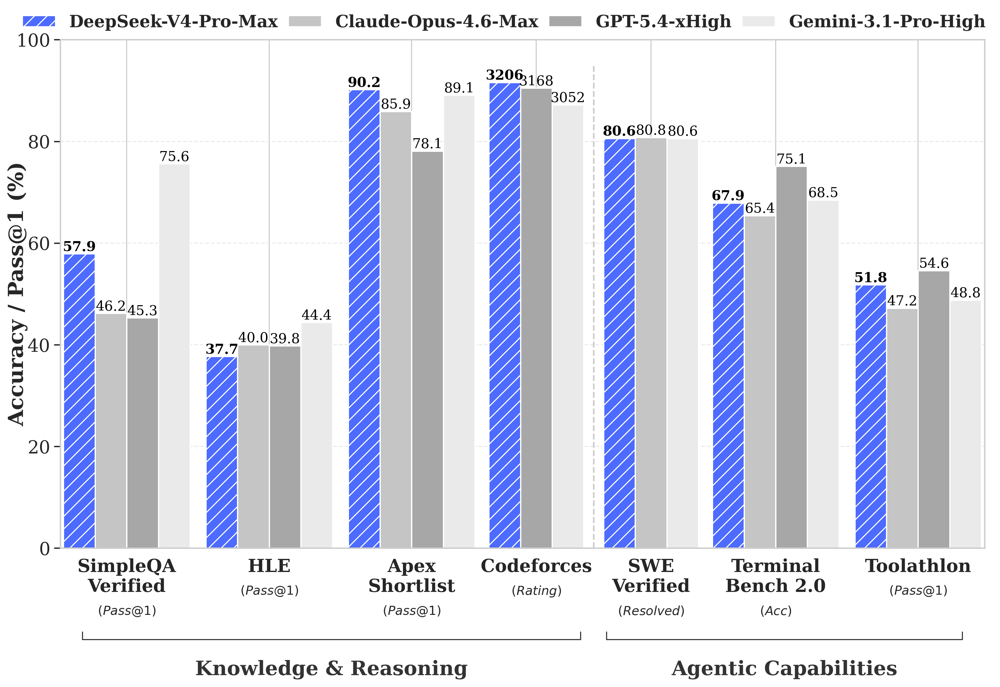
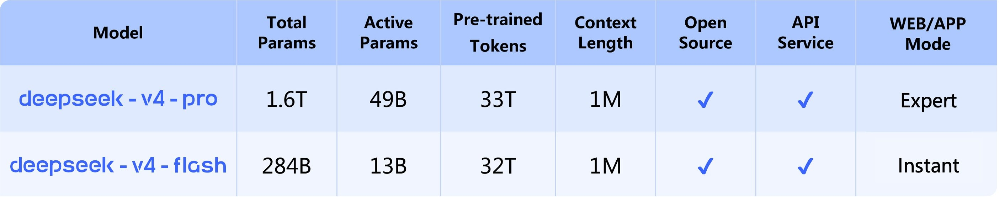
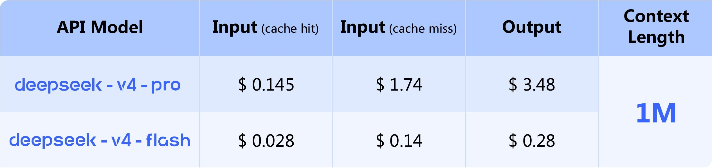

---

## 3. [Beezi AI](https://www.producthunt.com/products/beezi-ai)
**Votes**: 246 | **도입 난이도**: 중 | **신뢰도**: 중
**Tagline**: Make AI development structured, secure, and cost-efficient.
**서비스 링크**: https://www.producthunt.com/r/YN3R4RYHINMUIO

**태그**: DevTool, AI 개발, 자동화, 분석, 비용 관리, AI Tool, Prompting, Analytics

### 📌 이 서비스 한눈에 보기
Beezi AI는 AI 기반 소프트웨어 개발을 구조화하고, 보안을 강화하며, 비용 효율적으로 관리할 수 있도록 돕는 플랫폼입니다.

### 🔑 주요 기능
- AI 개발 티켓 관리 시스템으로 더 나은 프롬프트 생성 및 작업 효율 증대
- 모델 라우팅 최적화로 AI 사용 비용 절감 및 관리
- 온프레미스 또는 프라이빗 클라우드 환경에서 데이터 및 모델에 대한 완전한 제어 가능

### 🙋 사용자에게 어떤 점이 좋은가
AI 개발 팀은 Beezi AI를 통해 AI 사용량과 비용을 실시간으로 추적하고, 재작업을 줄이며, 예측 가능한 결과를 통해 개발을 확장할 수 있습니다.

### ✅ 지금 바로 써볼 기능
- Analytics Hub를 통해 AI 사용량 및 비용 추적 시작
- Smart Ticket System을 사용하여 AI 개발 티켓 구조화
- Model Routing Optimizer를 통해 작업에 적합한 모델 설정

### ⚠️ 사용 전 확인할 점
- 온프레미스 또는 프라이빗 클라우드 환경 설정 및 관리에 대한 기술적 이해 필요
- 기존 AI 개발 워크플로우와의 통합 필요

### 🧭 확인이 더 필요한 정보
제공되는 AI 모델의 종류 및 성능에 대한 추가 정보 확인이 필요합니다.

### 📸 스크린샷 및 갤러리
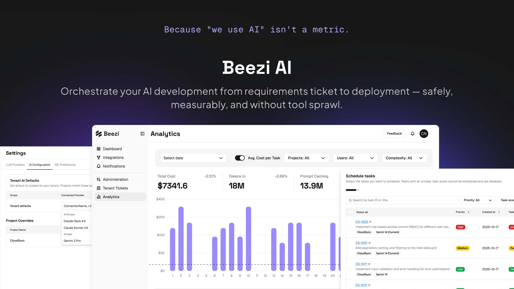
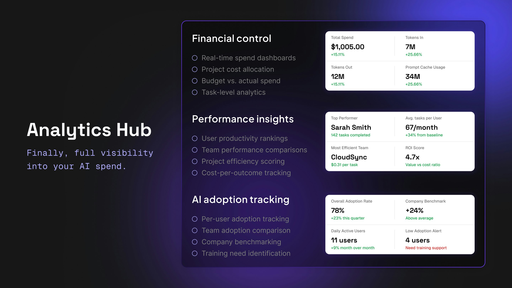
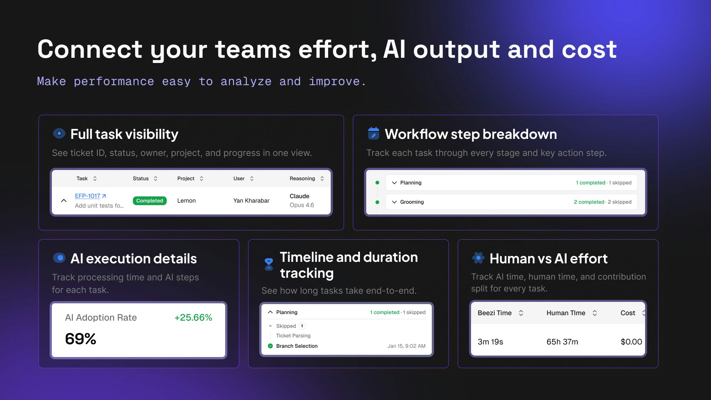

### 🎬 관련 영상
- [🎥 영상 보기](https://ph-files.imgix.net/a4597b40-5ff8-42d9-abd6-01f21ef1abb0.jpeg?auto=format)

---

## 4. [Codex 3.0 by OpenAI](https://www.producthunt.com/products/codex-3-0-by-openai)
**Votes**: 228 | **도입 난이도**: 중 | **신뢰도**: 상
**Tagline**: Codex can now build, test & debug on autopilot
**서비스 링크**: https://www.producthunt.com/r/K4XVK5YID57ZXD

**태그**: DevTool, Automation, AI, Coding, Testing, Agent, AI Tool

### 📌 이 서비스 한눈에 보기
GPT-5.5 기반의 Codex 3.0은 웹 앱 탐색부터 문서 생성, 테스트까지 개발 과정을 스스로 처리하여 개발자가 더 쉽고 빠르게 자동화된 빌드를 만들 수 있도록 돕는 AI 코딩 에이전트입니다.

### 🔑 주요 기능
- GPT-5.5 기반의 강력한 AI 코딩 에이전트
- 웹 브라우저, 오피스, 구글 드라이브 등 다양한 앱에서 자율적으로 작업 수행
- 실제 사용자처럼 빌드, 테스트, 디버깅을 자동화하여 개발 효율 극대화

### 🙋 사용자에게 어떤 점이 좋은가
개발자는 반복적인 코딩 작업과 테스트에 드는 시간과 노력을 크게 절약할 수 있습니다. 이를 통해 더 복잡한 문제 해결과 혁신적인 작업에 집중할 수 있게 됩니다.

### ✅ 지금 바로 써볼 기능
- 자주 사용하는 웹 앱에서 특정 워크플로우를 자동화해보세요.
- Microsoft Office나 Google Drive에서 문서 생성 자동화 기능을 시험해보세요.
- 기존 개발 프로젝트의 테스트 및 디버깅 과정에 Codex를 적용하여 효율성을 평가해보세요.

### ⚠️ 사용 전 확인할 점
- AI의 자율적인 디버깅 및 코드 생성 과정에서 예상치 못한 오류가 발생할 수 있어 지속적인 검토가 필요합니다.
- 복잡하거나 특수한 개발 환경에 대한 초기 설정 및 미세 조정에 상당한 노력이 필요할 수 있습니다.

### 🧭 확인이 더 필요한 정보
다양한 기업용 솔루션과의 연동성 및 특정 환경에서의 맞춤형 기능 지원 범위에 대한 추가적인 정보가 필요합니다.

### 📸 스크린샷 및 갤러리
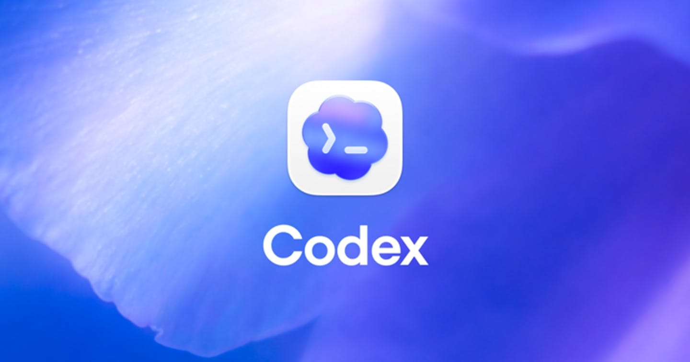
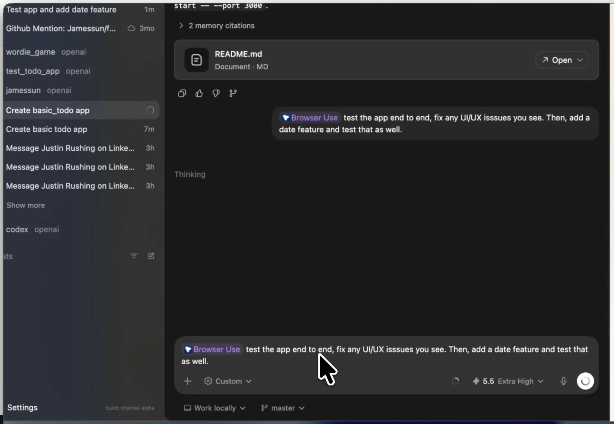
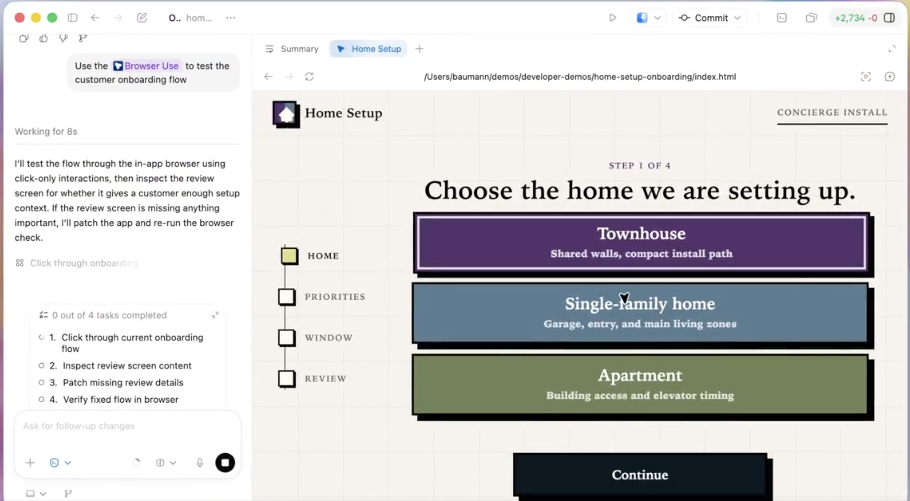

### 🎬 관련 영상
- [🎥 영상 보기](https://ph-files.imgix.net/99dc21b5-c0ad-4282-9928-59de084818bc.jpeg?auto=format)

---

## 5. [Spira AI](https://www.producthunt.com/products/spira-ai)
**Votes**: 197 | **도입 난이도**: 하 | **신뢰도**: 상
**Tagline**: AI Influencer that always on trend, create & grow your brand
**서비스 링크**: https://www.producthunt.com/r/D743QQ3IXGGKG5

**태그**: AI, Marketing, Social Media, Automation, Content Creation, AI Tool, Chat

### 📌 이 서비스 한눈에 보기
24시간 소셜 미디어를 자동으로 운영하며 트렌드를 선점하고 콘텐츠를 생성/게시하여 브랜드 성장을 돕는 AI 인플루언서.

### 🔑 주요 기능
- 24시간 소셜 미디어를 전적으로 운영하는 자율 AI 인플루언서
- 트렌드를 미리 파악하여 사용자 목소리로 콘텐츠를 생성하고 다양한 플랫폼에 게시
- 채팅 앱으로 제어하거나 완전 자율 운영이 가능하며, 10분 내에 시작 가능

### 🙋 사용자에게 어떤 점이 좋은가
소셜 미디어 운영에 드는 시간과 노력을 크게 줄여주며, 항상 최신 트렌드를 반영한 콘텐츠로 브랜드 인지도를 높일 수 있습니다. 특히, 여러 플랫폼에 걸쳐 일관된 메시지와 콘텐츠를 자동으로 관리하고 싶은 개인이나 기업에게 유용합니다.

### ✅ 지금 바로 써볼 기능
- 첫 AI 인플루언서를 생성하여 소셜 미디어 계정에 연결해보기
- 선호하는 채팅 앱을 통해 AI 인플루언서에게 콘텐츠 생성 지시 및 제어 방식 테스트
- AI가 트렌드를 파악하고 콘텐츠를 생성하는 과정을 관찰하고 결과물 확인

### ⚠️ 사용 전 확인할 점
- AI가 생성하는 콘텐츠가 브랜드의 목소리나 가치와 완전히 일치하는지 지속적인 검토 필요
- 완전 자율 운영 시 예상치 못한 콘텐츠가 게시될 위험이 있으므로 초기에는 면밀한 모니터링 권장
- 트렌드 포착 및 콘텐츠 생성의 정확성과 품질에 대한 검증 필요

### 🧭 확인이 더 필요한 정보
서비스의 구체적인 가격 정책, 제공되는 분석 기능, 그리고 콘텐츠 커스터마이징의 세부적인 범위에 대한 정보가 더 필요합니다.

### 📸 스크린샷 및 갤러리

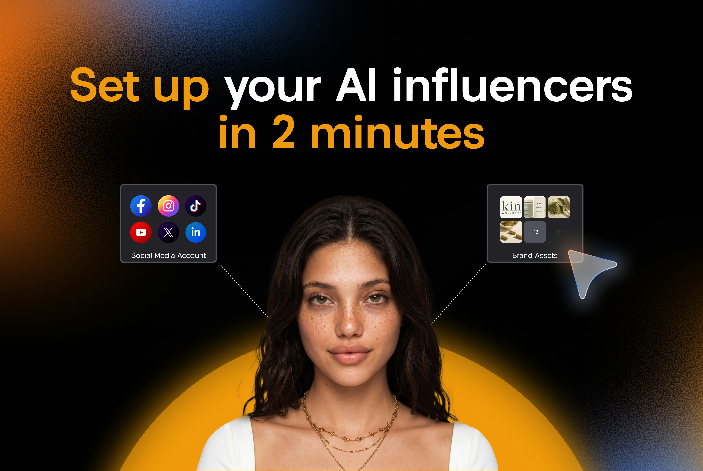
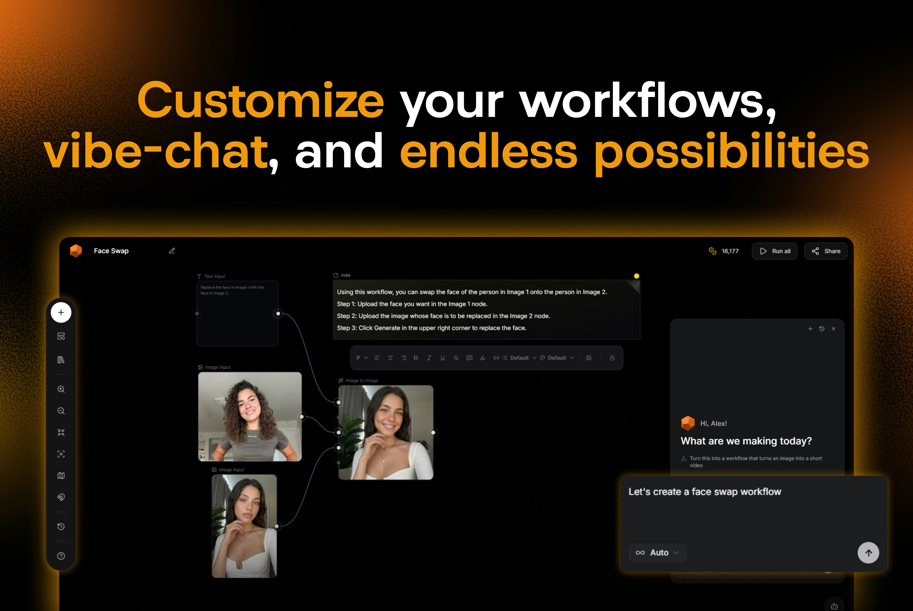

### 🎬 관련 영상
- [🎥 영상 보기](https://ph-files.imgix.net/e7f458d5-8b0e-4c96-984f-89348f39ad02.jpeg?auto=format)

---

## 6. [BAND](https://www.producthunt.com/products/band)
**Votes**: 143 | **도입 난이도**: 중 | **신뢰도**: 상
**Tagline**: Coordinate and govern multi-agent work in a single chat
**서비스 링크**: https://www.producthunt.com/r/CELK3VCRNFQ6LX

**태그**: AI, Collaboration, Productivity, Governance, Agent Management, Agent, AI Tool, Chat

### 📌 이 서비스 한눈에 보기
AI 에이전트와 사람 팀 간의 협업을 하나의 채팅에서 효율적으로 조정하고 관리할 수 있도록 돕는 도구입니다.

### 🔑 주요 기능
- AI 에이전트와 사람 팀의 협업을 위한 단일 채팅 환경 제공.
- 실시간 다자간 협업을 지원하는 공유 상호작용 레이어.
- 내장된 거버넌스 기능으로 에이전트 간 소통을 체계적으로 관리.

### 🙋 사용자에게 어떤 점이 좋은가
복잡한 AI 에이전트와 사람 간의 협업을 하나의 통일된 환경에서 효율적으로 관리하여, 파편화 없이 안정적이고 체계적인 소통을 가능하게 합니다.

### ✅ 지금 바로 써볼 기능
- AI 에이전트와 팀원들을 초대하여 협업 환경 구축해보기.
- 내장된 거버넌스 기능을 활용하여 에이전트 소통 규칙 설정해보기.
- 실시간 다자간 협업 기능을 통해 실제 업무 시나리오 테스트하기.

### ⚠️ 사용 전 확인할 점
- 초기 거버넌스 규칙 설정 및 에이전트 연동에 학습 시간이 필요할 수 있습니다.
- 기존에 사용하던 다양한 에이전트 도구들과의 연동 호환성을 확인해야 합니다.

### 🧭 확인이 더 필요한 정보
구체적인 가격 정책, 지원하는 에이전트 종류 및 외부 서비스 연동 범위에 대한 추가 정보가 필요합니다.

### 📸 스크린샷 및 갤러리
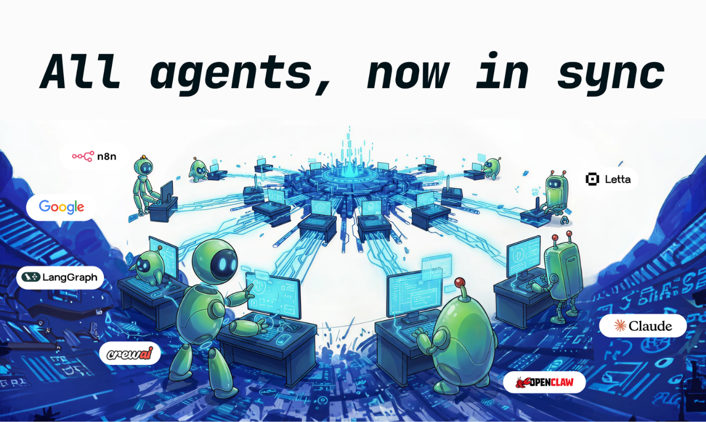
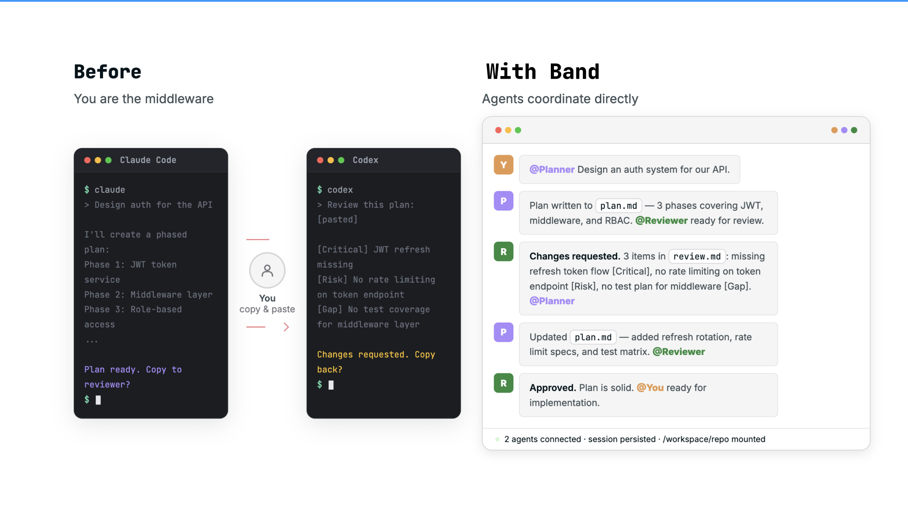
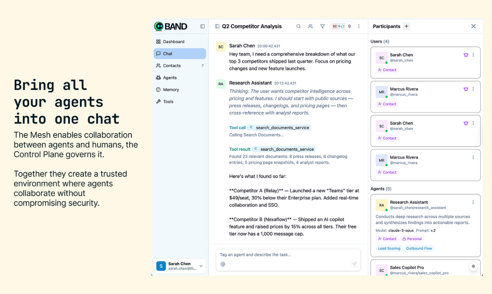

### 🎬 관련 영상
- [🎥 영상 보기](https://ph-files.imgix.net/009a3c07-54e6-42cf-a9da-8f9c056b278a.jpeg?auto=format)

---

## 7. [Google Workspace Intelligence](https://www.producthunt.com/products/google)
**Votes**: 131 | **도입 난이도**: 중 | **신뢰도**: 중
**Tagline**: AI that understands and powers your Workspace
**서비스 링크**: https://www.producthunt.com/r/KVV44MWDJJZ2G2
**재등장**: 최근 7일 내 재등장 (마지막 등장 4일 전)

**태그**: AI, 생산성, 협업, 지식 관리, 자동화, AI Tool

### 📌 이 서비스 한눈에 보기
Google Workspace Intelligence는 AI를 활용하여 Workspace 앱, 프로젝트, 협업자, 조직의 지식 간의 연결을 강화하여 생산성을 높여줍니다.

### 🔑 주요 기능
- Workspace 앱 간의 연동 강화
- 프로젝트 및 협업 효율성 증대
- 조직 내 지식 활용 극대화

### 🙋 사용자에게 어떤 점이 좋은가
Workspace Intelligence는 사용자가 Workspace 앱을 더욱 효율적으로 사용하고, 프로젝트를 원활하게 관리하며, 조직 내 지식을 쉽게 활용할 수 있도록 돕습니다.

### ✅ 지금 바로 써볼 기능
- Workspace 앱 연동 설정 확인
- 프로젝트 관련 정보 연결
- AI 기반 추천 기능 활용

### ⚠️ 사용 전 확인할 점
- AI 정확도에 대한 의존성
- 데이터 보안 및 개인 정보 보호 고려

### 🧭 확인이 더 필요한 정보
AI 기능의 구체적인 작동 방식 및 성능에 대한 추가 정보가 필요합니다.

### 📸 스크린샷 및 갤러리

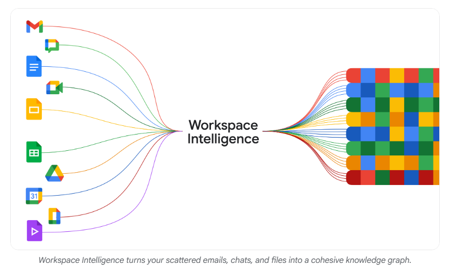
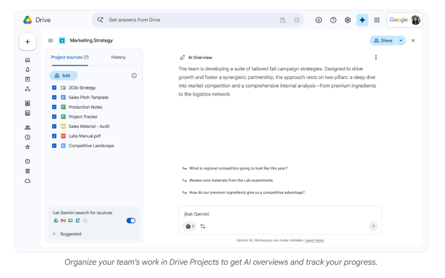

---

## 8. [Mozart Studio 1.0](https://www.producthunt.com/products/mozart-ai)
**Votes**: 129 | **도입 난이도**: 중 | **신뢰도**: 중
**Tagline**: A Generative Audio Workstation with VSTs
**서비스 링크**: https://www.producthunt.com/r/SC7GHDBAR4TZWJ

**태그**: AI, 음악 생성, VST, 오디오 편집, AI Tool

### 📌 이 서비스 한눈에 보기
브라우저에서 VST 플러그인을 연결하여 AI 기반으로 음악을 만들 수 있는 스튜디오입니다.

### 🔑 주요 기능
- AI 기반 음악 생성
- VST 플러그인 연결 지원
- 브라우저 기반

### 🙋 사용자에게 어떤 점이 좋은가
별도의 설치 없이 브라우저에서 AI를 활용하여 기존에 사용하던 VST 플러그인과 사운드를 활용해 음악을 제작할 수 있습니다. 아이디어 구상부터 완성까지 전 과정을 지원합니다.

### ✅ 지금 바로 써볼 기능
- 허밍으로 시작하여 AI가 생성하는 악기 레이어 추가해보기
- VST 플러그인 연결하여 사용해보기
- AI 도구를 활용하여 사운드 디자인 해보기

### ⚠️ 사용 전 확인할 점
- 브라우저 환경에 따른 성능 제약이 있을 수 있습니다.
- AI 생성 결과물의 퀄리티는 사용자의 입력 및 VST 설정에 따라 달라질 수 있습니다.

### 🧭 확인이 더 필요한 정보
AI 음악 생성 품질 및 VST 플러그인 호환성에 대한 사용자 리뷰를 확인해보세요.

### 📸 스크린샷 및 갤러리
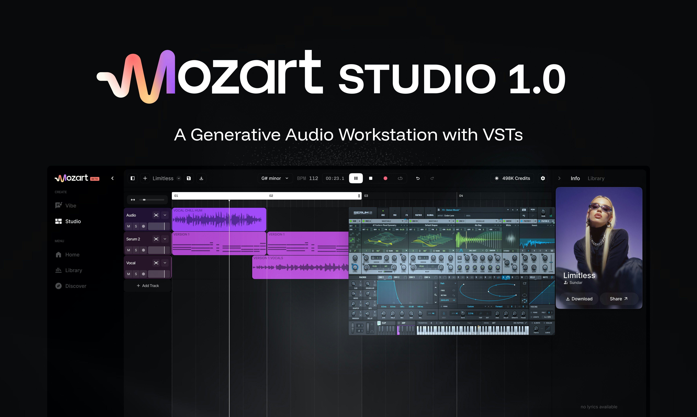
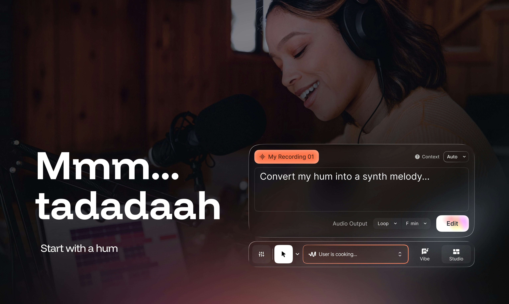
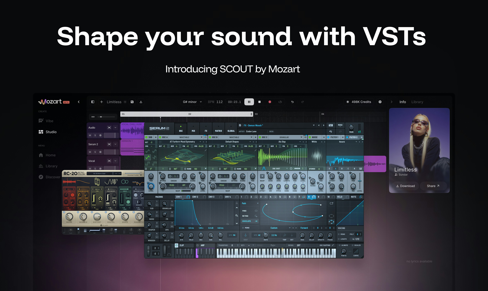

### 🎬 관련 영상
- [🎥 영상 보기](https://ph-files.imgix.net/8635b1f5-54c6-43dc-a682-f0de2309207d.jpeg?auto=format)

---

## 9. [Your Name in Landsat 🛰️](https://www.producthunt.com/products/your-name-in-landsat)
**Votes**: 120 | **도입 난이도**: 하 | **신뢰도**: 중
**Tagline**: The planet can spell your name – literally!
**서비스 링크**: https://www.producthunt.com/r/XFJX4W76G6G2RI

**태그**: 위성 이미지, 탐험, NASA, USGS, Landsat, Vision

### 📌 이 서비스 한눈에 보기
NASA와 USGS Landsat 위성 이미지를 활용하여 지구에서 당신의 이름을 찾아보세요!

### 🔑 주요 기능
- Landsat 위성 이미지를 통해 이름을 시각적으로 표현
- NASA와 USGS의 데이터 사용
- 지구를 탐험하는 새로운 방법 제공

### 🙋 사용자에게 어떤 점이 좋은가
특별한 이미지를 통해 나만의 개성을 표현하고, 지구를 색다른 시각으로 탐험할 수 있습니다.

### ✅ 지금 바로 써볼 기능
- 자신의 이름을 입력하여 위성 이미지로 확인
- 다른 사람의 이름을 검색하여 이미지 공유
- 특정 지역의 위성 이미지 탐색

### ⚠️ 사용 전 확인할 점
- 일부 이름은 완벽하게 표현되지 않을 수 있음
- 이미지 품질은 Landsat 데이터에 따라 달라질 수 있음

### 🧭 확인이 더 필요한 정보
이미지 데이터의 업데이트 빈도 및 정확도에 대한 추가 정보 확인이 필요합니다.

### 📸 스크린샷 및 갤러리
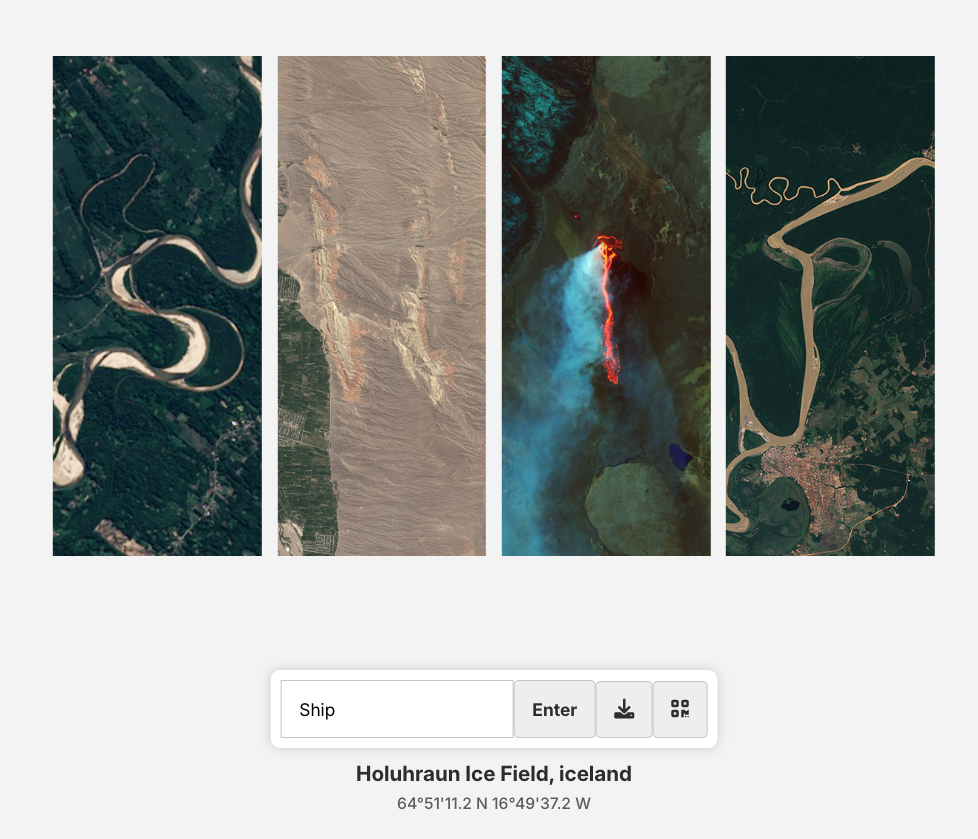
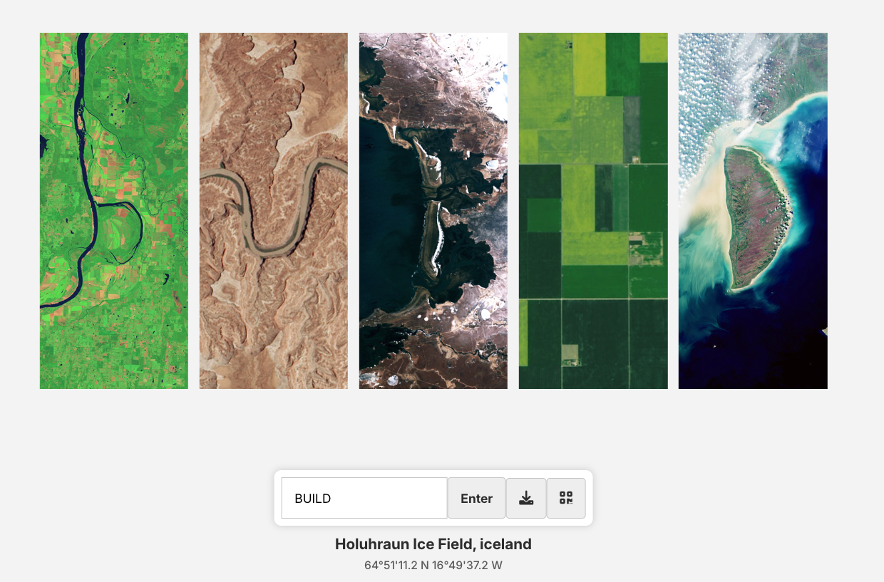
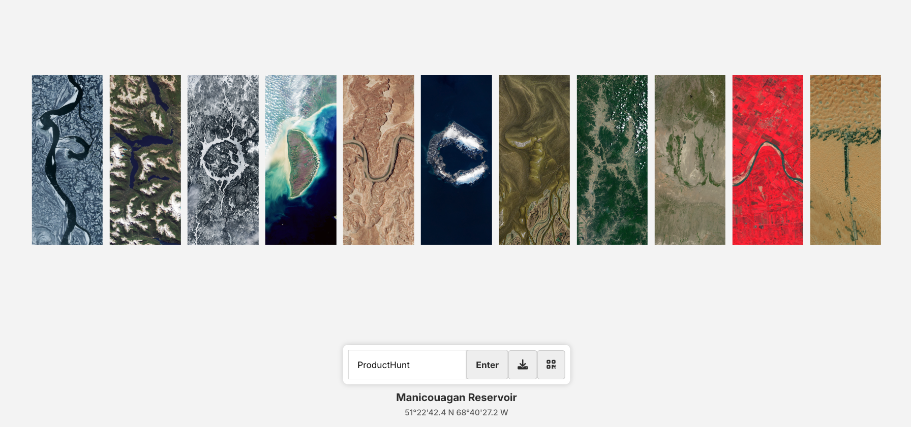

---

## 10. [Bansi AI by Writesonic](https://www.producthunt.com/products/bansi)
**Votes**: 113 | **도입 난이도**: 중 | **신뢰도**: 중
**Tagline**: AI video editor for long-form talking head videos
**서비스 링크**: https://www.producthunt.com/r/RKXS4Z2W6UIQFR

**태그**: AI, 비디오 편집, 자동화, 콘텐츠 제작, AI Tool, Video, Design

### 📌 이 서비스 한눈에 보기
Bansi AI는 Writesonic에서 만든 AI 기반 비디오 편집기로, 긴 형식의 인터뷰나 강연 영상에 전문가 수준의 편집 효과를 자동으로 적용하여 시간을 절약해줍니다.

### 🔑 주요 기능
- AI 기반 자동 비디오 편집
- 펀치 줌, 스마트 B-roll 삽입, 키네틱 텍스트, 사운드 디자인 자동 적용
- 긴 형식의 영상에 최적화

### 🙋 사용자에게 어떤 점이 좋은가
별도의 편집 기술 없이도 전문적인 느낌의 영상을 빠르게 제작할 수 있어, 영상 제작 시간을 단축하고 퀄리티를 높일 수 있습니다.

### ✅ 지금 바로 써볼 기능
- 원시 영상 업로드 후 자동 편집 기능 사용해보기
- 다양한 스타일의 템플릿 적용해보기
- 자동으로 생성된 B-roll 및 텍스트 효과 확인하기

### ⚠️ 사용 전 확인할 점
- AI 편집 품질은 원본 영상의 품질에 따라 달라질 수 있음
- 특정 스타일의 영상에만 최적화되어 있을 수 있음

### 🧭 확인이 더 필요한 정보
Bansi AI의 편집 스타일이 사용자의 선호도와 일치하는지 확인이 필요합니다.

### 📸 스크린샷 및 갤러리
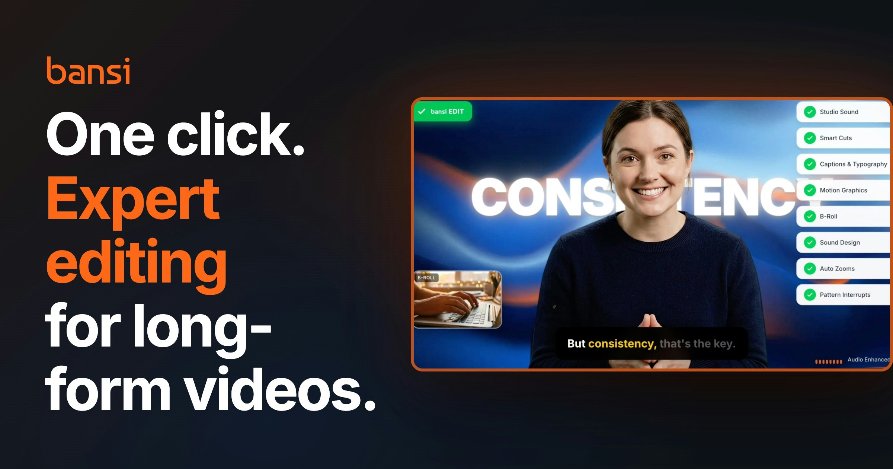

### 🎬 관련 영상
- [🎥 영상 보기](https://ph-files.imgix.net/757a679a-8408-4536-b66a-b41b861e8d02.jpeg?auto=format)

---

