# 🚀 Product Hunt Daily Top 10 (2026-04-27)

## 1. [GPT-5.5 by OpenAI](https://www.producthunt.com/products/openai)
**Votes**: 309 | **도입 난이도**: 중 | **신뢰도**: 중
**Tagline**: OpenAI's smartest and most intuitive to use model yet
**서비스 링크**: https://www.producthunt.com/r/FSHYJG6A5BGZUU
**재등장**: 최근 7일 내 재등장 (마지막 등장 4일 전)

**태그**: DevTool, Automation, Analytics, AI, AI Tool, Design

### 📌 이 서비스 한눈에 보기
OpenAI의 GPT-5.5는 더욱 강력해진 자율성, 속도, 효율성을 제공하여 복잡한 작업 흐름을 간소화하고 생산성을 향상시키는 데 도움을 줍니다.

### 🔑 주요 기능
- 향상된 자율성으로 최소한의 지침만으로도 작업 실행 가능
- 코딩, 연구, 데이터 분석 등 다양한 분야에서 뛰어난 성능
- 복잡한 멀티 스텝 워크플로우에 적합

### 🙋 사용자에게 어떤 점이 좋은가
GPT-5.5는 복잡한 작업을 자동화하고, 데이터 분석을 효율적으로 수행하며, 코딩 작업을 가속화하여 사용자의 생산성을 크게 향상시킬 수 있습니다.

### ✅ 지금 바로 써볼 기능
- 데이터 분석 작업에 활용해 보세요
- 복잡한 코딩 프로젝트에 적용해 보세요
- 자동화 워크플로우를 구축해 보세요

### ⚠️ 사용 전 확인할 점
- 데이터 보안 및 개인 정보 보호에 유의하세요
- 결과물의 정확성을 검증하는 과정을 거치세요

### 🧭 확인이 더 필요한 정보
GPT-5.5의 실제 성능 및 사용 사례에 대한 추가적인 정보 확인이 필요합니다.

### 📸 스크린샷 및 갤러리

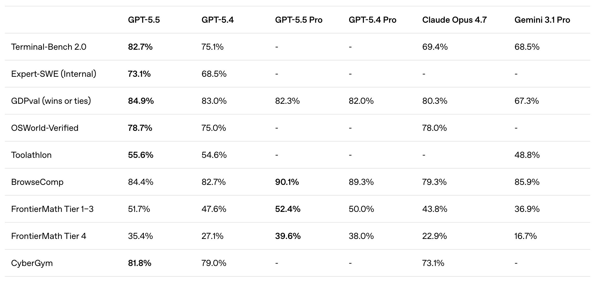
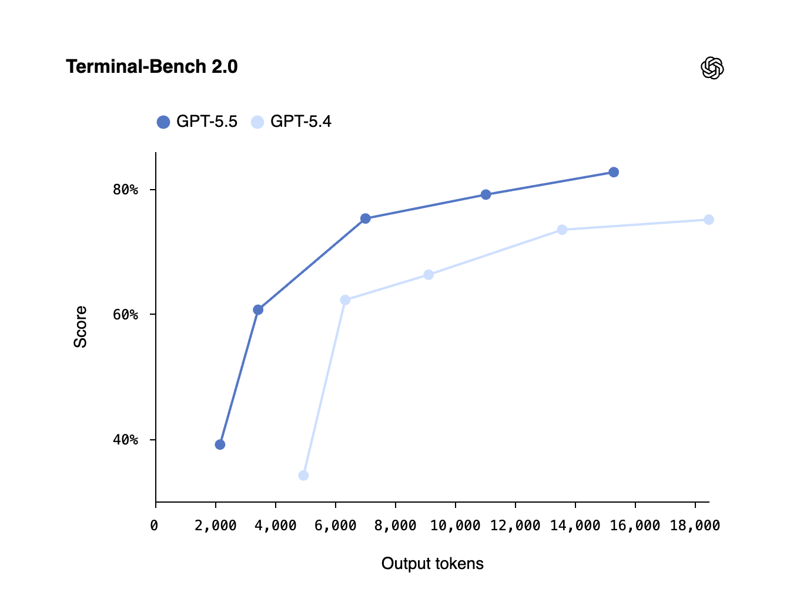

### 🎬 관련 영상
- [🎥 영상 보기](https://ph-files.imgix.net/cab3183e-6ed5-4f9d-811f-16832c8ba0f9.jpeg?auto=format)

---

## 2. [Claude Connectors](https://www.producthunt.com/products/claude-connectors)
**Votes**: 269 | **도입 난이도**: 중 | **신뢰도**: 중
**Tagline**: New connectors in Claude for everyday life
**서비스 링크**: https://www.producthunt.com/r/ZSH4AZJ5NGQ6HT

**태그**: AI, 생산성, 자동화, 앱 통합, AI Tool, Design

### 📌 이 서비스 한눈에 보기
Claude에서 Spotify, Instacart, Uber 등 200개 이상의 앱을 연결하여 대화창 내에서 예약, 주문, 계획을 실행할 수 있습니다.

### 🔑 주요 기능
- Claude가 다양한 앱과 연결되어 작업 효율성을 높여줍니다.
- 여행, 음식, 엔터테인먼트 관련 작업을 지능적으로 제안하고 실행합니다.
- 일상 생활과 업무 모두에 유용합니다.

### 🙋 사용자에게 어떤 점이 좋은가
Claude를 통해 여러 앱을 번갈아 사용할 필요 없이 한 곳에서 모든 것을 처리할 수 있어 시간을 절약하고 효율성을 높일 수 있습니다. 실시간으로 필요한 작업을 제안하고 실행해주어 편리합니다.

### ✅ 지금 바로 써볼 기능
- Spotify 연결하여 음악 재생 목록 관리하기
- Instacart 연결하여 식료품 주문하기
- Uber 연결하여 차량 호출하기

### ⚠️ 사용 전 확인할 점
- 연결 가능한 앱 목록 및 기능 확인 필요
- 개인 정보 보호 정책 및 데이터 사용 방식 확인 필요

### 🧭 확인이 더 필요한 정보
Claude와 연결된 앱들의 성능 및 안정성에 대한 추가적인 사용자 리뷰 확인이 필요합니다.

### 📸 스크린샷 및 갤러리
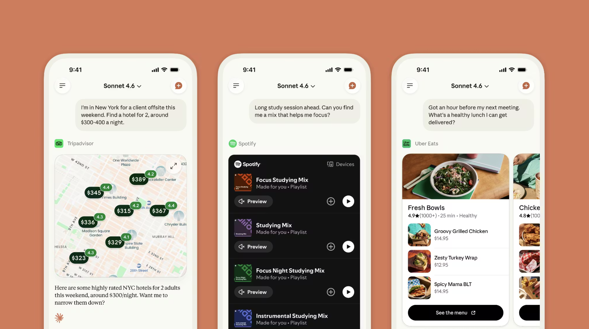
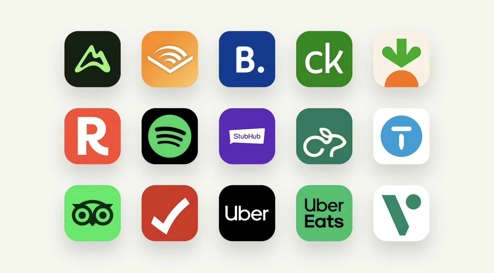
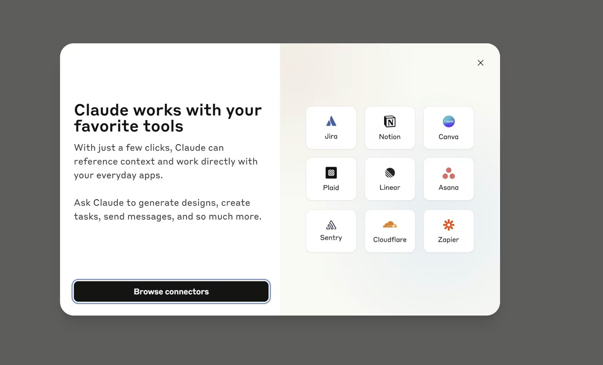

### 🎬 관련 영상
- [🎥 영상 보기](https://ph-files.imgix.net/72c63395-612b-408e-a1b8-3f08b57e7efe.jpeg?auto=format)

---

## 3. [QuickCompare by Trismik](https://www.producthunt.com/products/quickcompare-by-trismik)
**Votes**: 159 | **도입 난이도**: 중 | **신뢰도**: 중
**Tagline**: Compare LLMs on your data, measure, and pick the best.
**서비스 링크**: https://www.producthunt.com/r/QFWJQUQGV3CKNB

**태그**: LLM, 비교, 데이터 분석, 자동화, 생산성

### 📌 이 서비스 한눈에 보기
QuickCompare는 자체 데이터를 사용하여 50개 이상의 LLM을 비교하고, 품질, 비용, 속도를 한눈에 파악하여 최적의 모델을 선택할 수 있도록 도와줍니다.

### 🔑 주요 기능
- 데이터 기반 LLM 비교: 자체 데이터를 업로드하여 LLM 성능을 정확하게 측정합니다.
- 다양한 모델 지원: 50개 이상의 LLM을 비교하여 선택의 폭을 넓힙니다.
- 성능 지표 제공: 품질, 비용, 속도를 시각적으로 비교하여 의사 결정을 지원합니다.

### 🙋 사용자에게 어떤 점이 좋은가
더 이상 추측에 의존하지 않고, 실제 데이터에 기반하여 가장 적합한 LLM을 선택함으로써 시간과 비용을 절약할 수 있습니다.

### ✅ 지금 바로 써볼 기능
- 데이터 업로드 후 LLM 비교 시작
- 품질, 비용, 속도 지표 확인
- 최적의 모델 선택 및 활용

### ⚠️ 사용 전 확인할 점
- 데이터 보안 정책 확인 필요
- 지원하는 LLM 목록 및 업데이트 주기 확인 필요

### 🧭 확인이 더 필요한 정보
제공되는 LLM의 종류와 데이터 호환성에 대한 추가 정보 확인이 필요합니다.

### 📸 스크린샷 및 갤러리

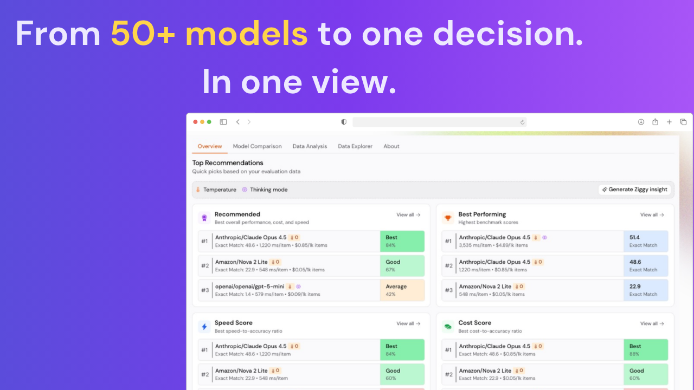
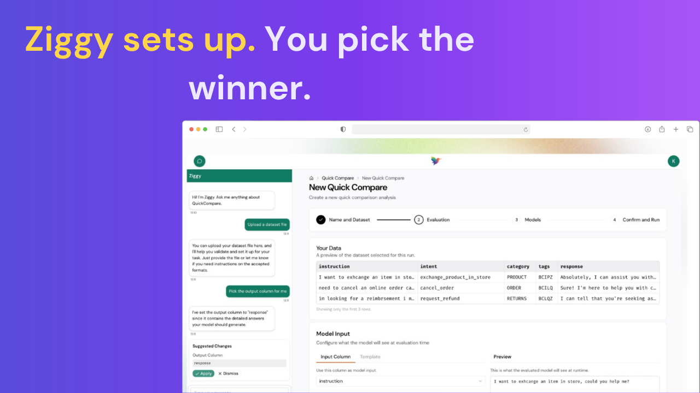

### 🎬 관련 영상
- [🎥 영상 보기](https://ph-files.imgix.net/207da28f-2034-4eea-a6d7-df7adccff589.gif?auto=format)

---

## 4. [Pica](https://www.producthunt.com/products/pica)
**Votes**: 144 | **도입 난이도**: 중 | **신뢰도**: 중
**Tagline**: Fully native app for managing your fonts on MacOS
**서비스 링크**: https://www.producthunt.com/r/O2X24XAQ4VB3CH

**태그**: 폰트 관리, MacOS, 디자인, 생산성

### 📌 이 서비스 한눈에 보기
Pica는 MacOS에서 폰트를 효율적으로 관리할 수 있도록 돕는 네이티브 앱입니다.

### 🔑 주요 기능
- 폰트 컬렉션 구성 및 관리
- 색상 테마 및 로고 테스트 지원
- 폴더 감시 및 설치된 폰트 관리

### 🙋 사용자에게 어떤 점이 좋은가
디자이너나 개발자처럼 폰트를 많이 사용하는 사용자에게 폰트 관리를 간편하게 해줍니다. 폰트 구성을 체계화하고, 디자인 작업 시 다양한 폰트를 쉽게 테스트해 볼 수 있습니다.

### ✅ 지금 바로 써볼 기능
- 폰트 컬렉션을 만들어 폰트 정리하기
- 다양한 색상 테마로 폰트 미리보기
- 특정 폴더를 감시하여 폰트 자동 관리하기

### ⚠️ 사용 전 확인할 점
- MacOS에서만 사용 가능
- 폰트 파일 손상에 주의

### 🧭 확인이 더 필요한 정보
폰트 관리 기능 외 다른 디자인 툴과의 호환성은 확인이 필요합니다.

### 📸 스크린샷 및 갤러리
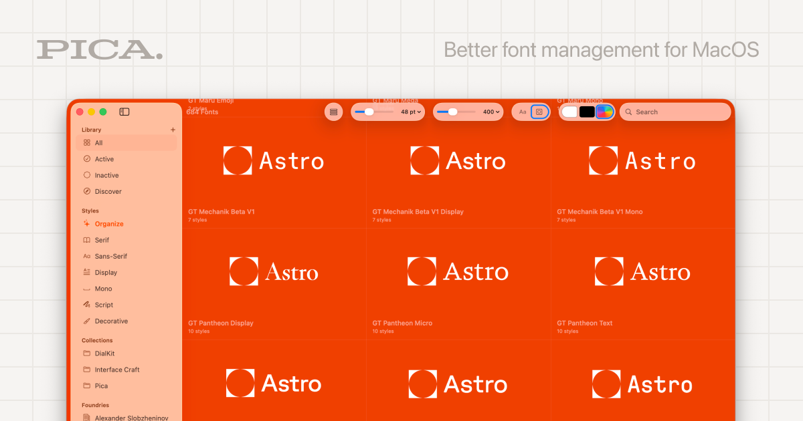

### 🎬 관련 영상
- [🎥 영상 보기](https://ph-files.imgix.net/f0b50f51-4bc9-448a-ac27-87a0d2df3772.jpeg?auto=format)

---

## 5. [Happenstance](https://www.producthunt.com/products/happenstance-2)
**Votes**: 141 | **도입 난이도**: 중 | **신뢰도**: 중
**Tagline**: Search your network with AI
**서비스 링크**: https://www.producthunt.com/r/ON6RTKE5AKXIL7

**태그**: AI, 검색, 네트워킹, 생산성, AI Tool, Sales

### 📌 이 서비스 한눈에 보기
Happenstance는 AI를 활용하여 Gmail, Twitter, Instagram 등 다양한 네트워크에서 자연어 검색을 가능하게 하여, 창업자, 리크루터, 영업팀이 원하는 사람을 쉽게 찾도록 돕습니다.

### 🔑 주요 기능
- 자연어 검색을 통해 네트워크 내 정보 검색
- Gmail, Twitter, Instagram 등 다양한 플랫폼 지원
- 창업자, 리크루터, 영업팀에 특화된 기능

### 🙋 사용자에게 어떤 점이 좋은가
따뜻한 연결을 통해 적합한 사람을 찾는데 드는 시간과 노력을 줄여주고, 더 정확한 검색 결과를 제공하여 효율성을 높여줍니다.

### ✅ 지금 바로 써볼 기능
- Gmail 계정 연동 후 검색해보기
- Twitter 계정 연동 후 특정 키워드로 검색해보기
- 찾고 싶은 사람의 특징을 자연어로 검색해보기

### ⚠️ 사용 전 확인할 점
- 지원하는 플랫폼의 개인 정보 설정 확인 필요
- AI 검색 정확도에 대한 사용자 피드백 필요

### 🧭 확인이 더 필요한 정보
Happenstance의 AI 검색 정확도와 검색 결과의 관련성에 대한 추가적인 정보가 필요합니다.

### 📸 스크린샷 및 갤러리
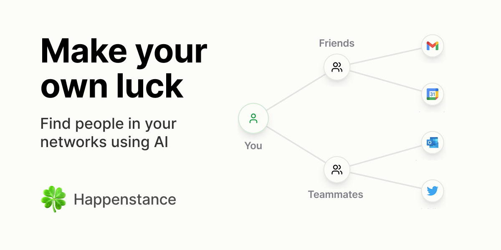
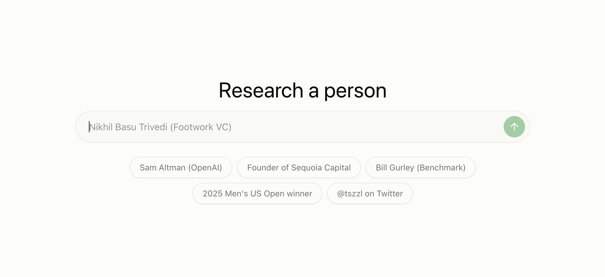

---

## 6. [Edgee Team](https://www.producthunt.com/products/edgee)
**Votes**: 112 | **도입 난이도**: 중 | **신뢰도**: 중
**Tagline**: Strava for your coding assistants
**서비스 링크**: https://www.producthunt.com/r/RSXKLEYYIP66HS

**태그**: DevTool, AI, Analytics, Productivity, Team Collaboration, Agent, AI Tool

### 📌 이 서비스 한눈에 보기
Edgee Team은 코딩 어시스턴트 사용량을 추적, 분석하여 팀 생산성을 높이고 AI 예산 관리를 효율적으로 할 수 있도록 돕는 대시보드입니다.

### 🔑 주요 기능
- 팀원별 코딩 어시스턴트 사용량 및 생산성 비교
- GitHub 연동을 통한 세션 추적 및 분석
- 토큰 소비량 기반 팀 내 랭킹 및 리더보드 제공

### 🙋 사용자에게 어떤 점이 좋은가
팀 전체의 코딩 어시스턴트 활용 현황을 한눈에 파악하고, 누가 어떤 방식으로 가장 효율적으로 사용하는지 분석하여 팀 생산성 향상에 기여합니다. 또한, AI 예산 낭비를 막고 최적화된 사용 전략을 수립하는 데 도움을 줍니다.

### ✅ 지금 바로 써볼 기능
- GitHub 연동하여 팀 초대하기
- 팀원별 코딩 어시스턴트 사용량 비교하기
- 토큰 소비량 리더보드 확인하기

### ⚠️ 사용 전 확인할 점
- Claude Code, Codex 등 특정 코딩 어시스턴트와의 호환성 확인 필요
- GitHub 연동 시 보안 정책 준수 필요

### 🧭 확인이 더 필요한 정보
지원하는 코딩 어시스턴트 종류 및 GitHub 연동 시 데이터 보안 관련 정책을 추가적으로 확인해야 합니다.

### 📸 스크린샷 및 갤러리
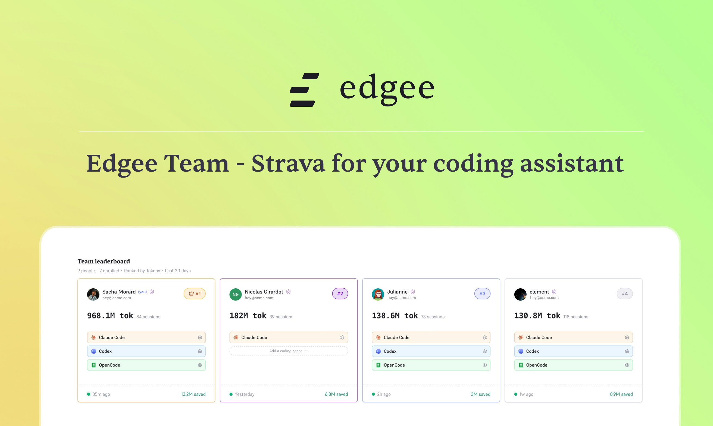
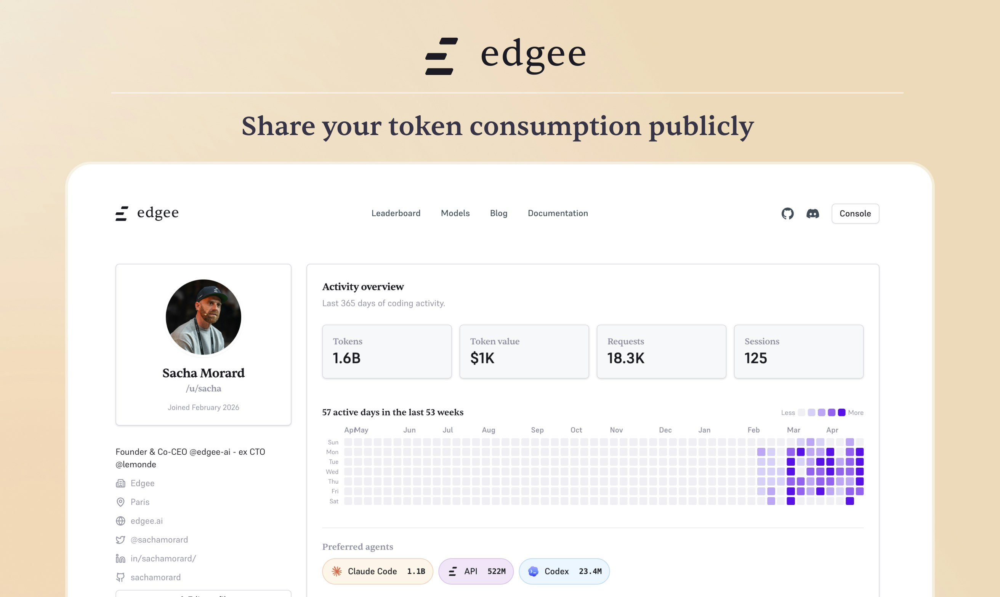

### 🎬 관련 영상
- [🎥 영상 보기](https://ph-files.imgix.net/74994bfd-a1cf-4943-9138-0fe5762756cc.jpeg?auto=format)

---

## 7. [Free chart generator by Embedful](https://www.producthunt.com/products/embedful)
**Votes**: 92 | **도입 난이도**: 하 | **신뢰도**: 중
**Tagline**: Turn CSV & Excel files into charts in seconds
**서비스 링크**: https://www.producthunt.com/r/733N4BVXPFJDFA

**태그**: 차트, 데이터 시각화, 무료, CSV, Excel

### 📌 이 서비스 한눈에 보기
Embedful의 무료 차트 생성기로 CSV나 엑셀 파일을 업로드하여 코딩 없이 간편하게 시각화 자료를 만들고 PNG, SVG, PDF로 내보낼 수 있습니다.

### 🔑 주요 기능
- CSV, 엑셀 파일 기반 차트 생성
- 코딩 없이 사용 가능
- PNG, SVG, PDF 형식으로 내보내기 지원

### 🙋 사용자에게 어떤 점이 좋은가
보고서나 발표 자료에 필요한 차트를 쉽고 빠르게 만들 수 있어 시간과 노력을 절약해줍니다. 복잡한 설정 없이 바로 사용 가능하다는 장점이 있습니다.

### ✅ 지금 바로 써볼 기능
- CSV 파일 업로드 후 차트 생성해보기
- 다양한 차트 스타일 적용해보기
- PDF로 내보내기 기능 사용해보기

### ⚠️ 사용 전 확인할 점
- 지원하는 차트 종류 확인 필요
- 대용량 파일 처리 성능 확인 필요

### 🧭 확인이 더 필요한 정보
무료 버전의 기능 제한 및 유료 버전 존재 여부를 확인해야 합니다.

### 📸 스크린샷 및 갤러리

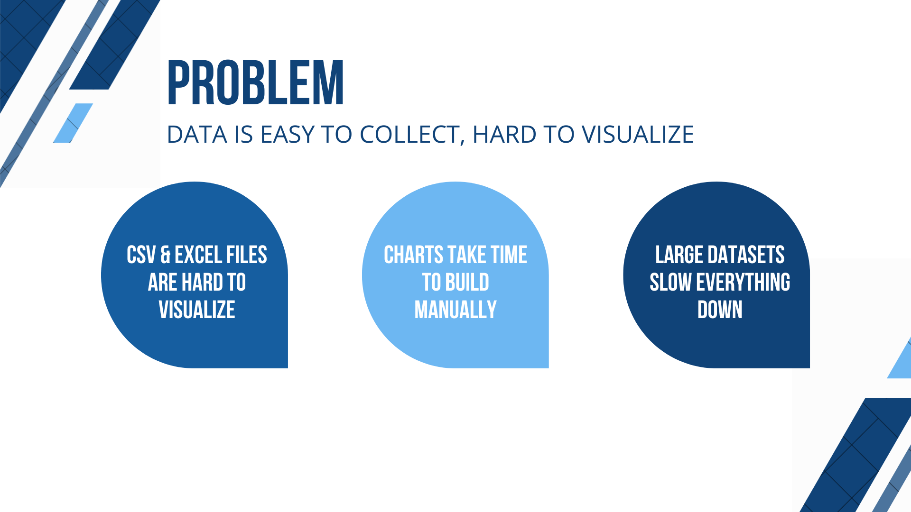
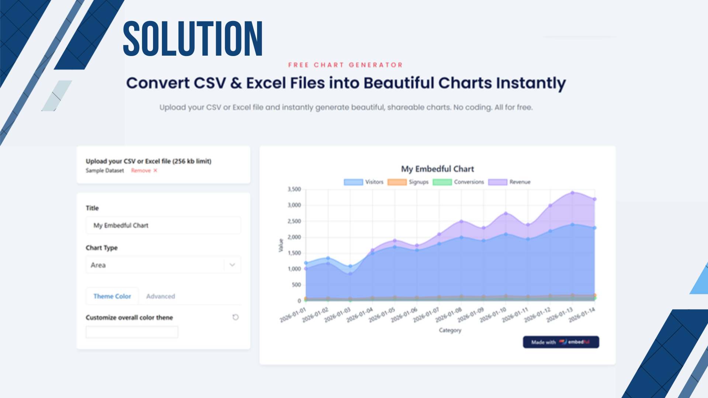

---

## 8. [OpenStartup ](https://www.producthunt.com/products/openstartup)
**Votes**: 24 | **도입 난이도**: 하 | **신뢰도**: 중
**Tagline**: Instant profit & pricing calculator for small businesses
**서비스 링크**: https://www.producthunt.com/r/KHJOCPIK3B6DE5

**태그**: 수익 계산, 가격 설정, 소규모 사업, 무료 도구

### 📌 이 서비스 한눈에 보기
OpenStartup은 복잡한 회계 소프트웨어나 사업 대시보드 없이, 간단하게 원가, 수량 등을 입력하여 즉시 단위당 비용, 판매 가격, 이익을 계산해주는 소규모 사업자를 위한 무료 도구입니다.

### 🔑 주요 기능
- 원가, 재료, 수량을 기반으로 수익 계산
- 적정 판매 가격 설정 지원
- 복잡한 기능 없이 간단하고 빠른 사용법

### 🙋 사용자에게 어떤 점이 좋은가
소규모 사업자는 OpenStartup을 통해 복잡한 회계 지식 없이도 쉽고 빠르게 수익을 계산하고, 적절한 판매 가격을 설정하여 사업 운영에 도움을 받을 수 있습니다.

### ✅ 지금 바로 써볼 기능
- 원가 및 재료 입력하여 단위당 비용 계산
- 판매 가격 설정 후 예상 이익 확인
- 다양한 제품의 수익성 비교 분석

### ⚠️ 사용 전 확인할 점
- 정확한 원가 데이터 입력 필요
- 부가 기능 (재고 관리, 세금 계산 등)은 지원하지 않음

### 🧭 확인이 더 필요한 정보
OpenStartup의 계산 정확도 및 추가 기능 지원 계획에 대한 정보는 추가 확인이 필요합니다.

### 📸 스크린샷 및 갤러리
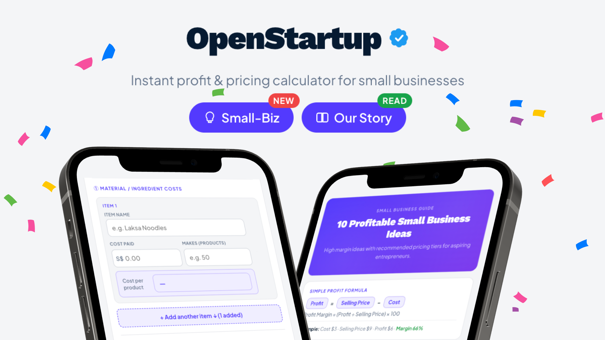

---

## 9. [Life Navigator](https://www.producthunt.com/products/life-navigator)
**Votes**: 10 | **도입 난이도**: 중 | **신뢰도**: 중
**Tagline**: Become The Best Version Of Yourself
**서비스 링크**: https://www.producthunt.com/r/ONFLIBUSUK6W5T

**태그**: 생산성, 자기계발, 일정관리, 저널링, AI Tool

### 📌 이 서비스 한눈에 보기
여러 앱을 오가며 머릿속으로만 일정을 관리하는 대신, Life Navigator 하나로 삶의 모든 측면을 계획하고 정리하여 최고의 자신을 만들어보세요.

### 🔑 주요 기능
- 삶의 명확성을 높여줍니다.
- 일정을 추적하고 최적화합니다.
- 자신을 더 잘 이해하기 위해 생각을 기록합니다.

### 🙋 사용자에게 어떤 점이 좋은가
Life Navigator는 삶의 통제력을 되찾고 원하는 명확성을 얻도록 도와줍니다. 여러 앱을 사용할 필요 없이 한 곳에서 모든 것을 관리할 수 있습니다.

### ✅ 지금 바로 써볼 기능
- 일정 관리 기능을 사용하여 중요한 약속과 마감일을 정리해보세요.
- 저널링 기능을 통해 자신의 생각과 감정을 기록해보세요.
- 목표 설정 기능을 사용하여 삶의 방향을 설정해보세요.

### ⚠️ 사용 전 확인할 점
- 개인 정보 보호 정책을 확인하세요.
- 데이터 백업 방법을 숙지하세요.

### 🧭 확인이 더 필요한 정보
Life Navigator가 실제로 여러 앱을 대체할 만큼 강력한 기능을 제공하는지 사용 후기를 통해 확인해 보세요.

### 📸 스크린샷 및 갤러리
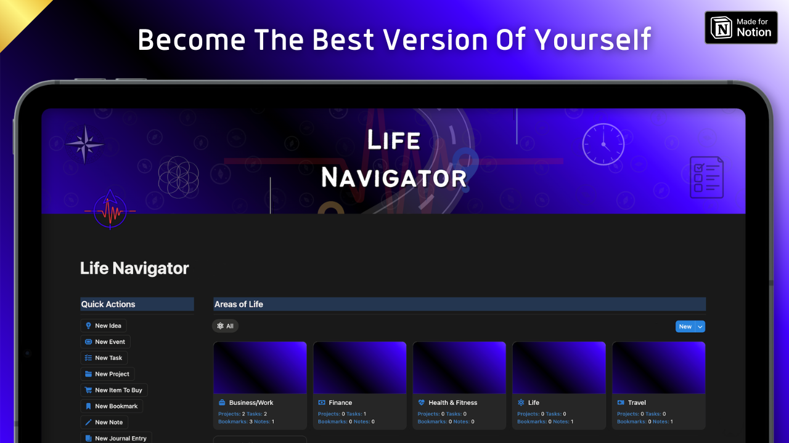
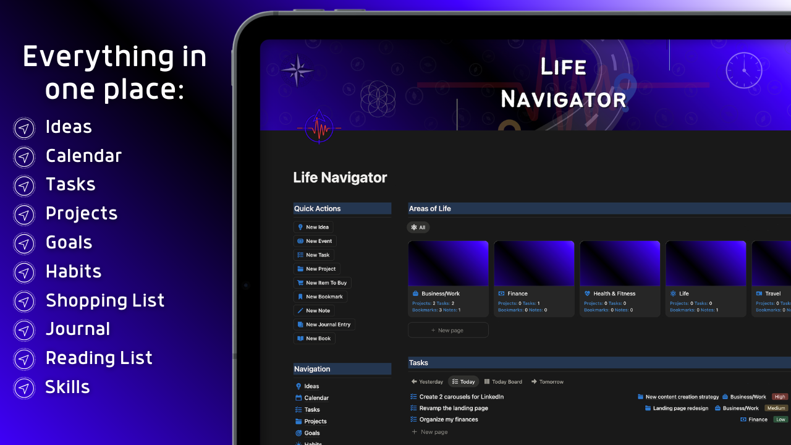
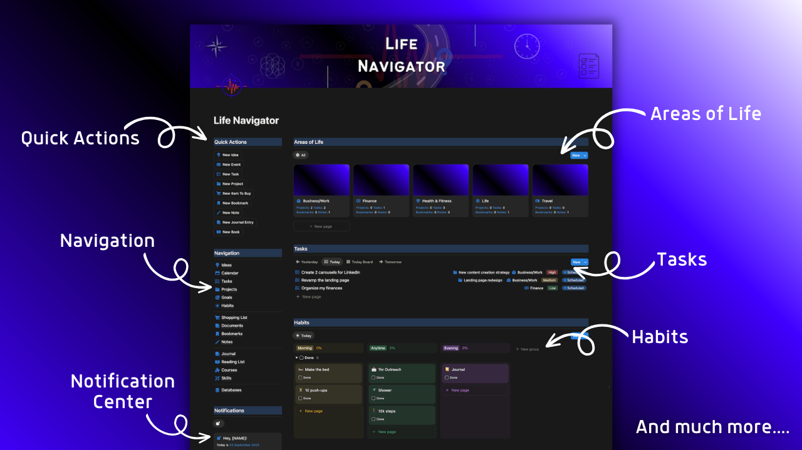

---

## 10. [Layman](https://www.producthunt.com/products/layman)
**Votes**: 10 | **도입 난이도**: 하 | **신뢰도**: 중
**Tagline**: Caveman fork - but much cooler, Now anyone.. ANYONE can code
**서비스 링크**: https://www.producthunt.com/r/SF3NHVXYEPOZP7

**태그**: DevTool, AI, 코드 분석, 자동화, Agent, AI Tool

### 📌 이 서비스 한눈에 보기
Layman은 AI 코딩 에이전트가 생성한 복잡한 코드 변경 사항을 팀이 이해하기 쉬운 간단한 업데이트로 변환하여 코드 검토 및 협업 효율성을 높여줍니다.

### 🔑 주요 기능
- AI 코딩 에이전트 결과물을 사람이 읽기 쉬운 형태로 변환
- 최대 75%까지 토큰을 줄여 응답 속도 향상 및 비용 절감
- 다양한 코딩 도구(Claude Code, Codex, Copilot 등)와 호환

### 🙋 사용자에게 어떤 점이 좋은가
개발팀은 Layman을 통해 AI가 생성한 코드 변경 사항을 빠르게 파악하고 검토할 수 있어, 코드 품질을 유지하면서 개발 속도를 향상시킬 수 있습니다. 또한, 토큰 사용량 감소로 AI 코딩 도구 사용 비용을 절감할 수 있습니다.

### ✅ 지금 바로 써볼 기능
- Layman 설치 후 AI 코딩 에이전트 결과물 분석
- Brief 모드를 사용하여 토큰 사용량 감소 효과 확인
- 팀원들과 함께 Layman을 활용한 코드 검토 프로세스 구축

### ⚠️ 사용 전 확인할 점
- Layman이 완벽하게 모든 코드 변경 사항을 이해하기 쉬운 형태로 변환하지 못할 수 있음
- 특정 코딩 도구와의 호환성 문제가 발생할 수 있음

### 🧭 확인이 더 필요한 정보
Layman의 실제 코드 변경 사항 분석 정확도 및 토큰 감소 효과에 대한 사용자 후기 확인이 필요합니다.

### 📸 스크린샷 및 갤러리
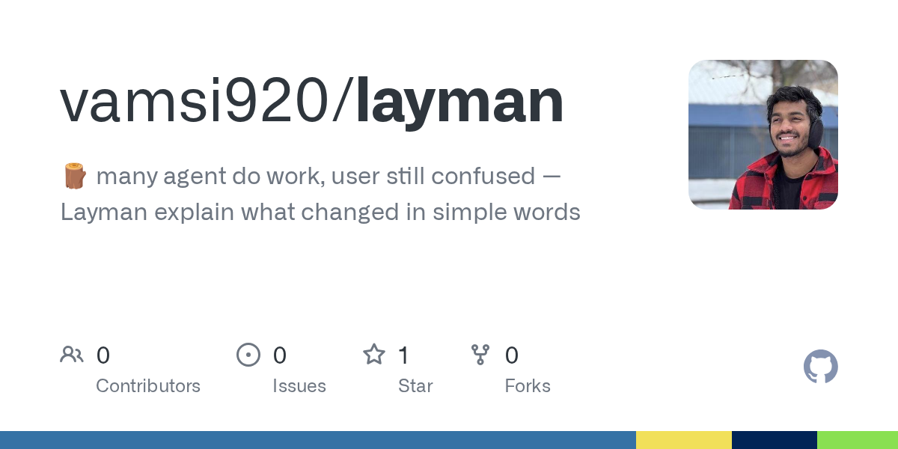

---

