# 🚀 Product Hunt Daily Top 10 (2026-04-28)

## 1. [Orange Slice](https://www.producthunt.com/products/orange-slice)
**Votes**: 323 | **도입 난이도**: 중 | **신뢰도**: 중
**Tagline**: Automate any sales task with AI
**서비스 링크**: https://www.producthunt.com/r/ZAMTQWNV2NKJIN

**태그**: AI, 영업 자동화, GTM, 자동화, Automation, AI Tool, Sales

### 📌 이 서비스 한눈에 보기
Orange Slice는 AI를 활용하여 영업 업무를 자동화하고, 잠재 고객 발굴부터 실행까지 전 과정을 효율적으로 관리할 수 있도록 돕습니다.

### 🔑 주요 기능
- AI 기반 영업 자동화
- 잠재 고객 발굴 및 정보 보강
- GTM 실행 워크플로우 구축

### 🙋 사용자에게 어떤 점이 좋은가
영업 프로세스를 자동화하여 시간과 노력을 절약하고, AI 기반으로 잠재 고객을 효과적으로 발굴하여 영업 성공률을 높일 수 있습니다.

### ✅ 지금 바로 써볼 기능
- AI 기반 잠재 고객 발굴 기능 사용해보기
- GTM 실행 워크플로우 자동화 설정해보기
- 영업 업무 자동화 기능 탐색하기

### ⚠️ 사용 전 확인할 점
- AI 정확도에 따른 결과 검증 필요
- 자동화 설정 시 예외 케이스 고려 필요

### 🧭 확인이 더 필요한 정보
Orange Slice의 AI가 제공하는 정보의 정확도 및 자동화 설정의 유연성에 대한 추가적인 정보 확인이 필요합니다.

### 📸 스크린샷 및 갤러리

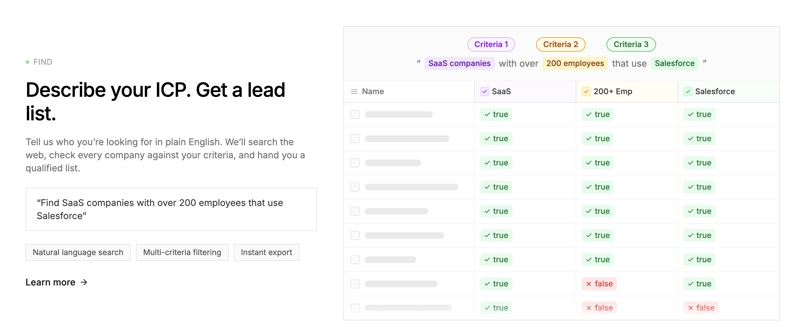
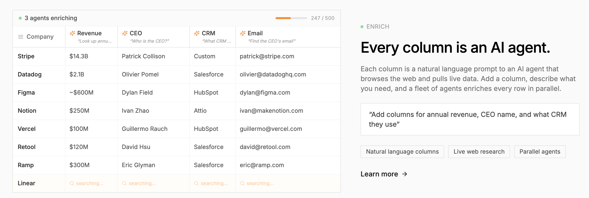

### 🎬 관련 영상
- [🎥 영상 보기](https://ph-files.imgix.net/6514e96f-70f0-444b-8053-75bc543d8d3e.jpeg?auto=format)

---

## 2. [ Jet AI Agents](https://www.producthunt.com/products/jet-admin)
**Votes**: 272 | **도입 난이도**: 하 | **신뢰도**: 상
**Tagline**: Build business AI agents in minutes
**서비스 링크**: https://www.producthunt.com/r/3FWOO35SRXZ3FG

**태그**: AI, Automation, No-Code, Productivity, Business Tools, Agent, AI Tool, DevTool, Marketing, Sales

### 📌 이 서비스 한눈에 보기
코딩 없이 몇 분 만에 비즈니스 AI 에이전트를 구축하여 팀의 업무를 자동화하고 생산성을 높여주는 AI 빌더입니다.

### 🔑 주요 기능
- 200개 이상의 도구와 연동하여 코딩 없이 AI 에이전트 및 비즈니스 앱 구축 가능
- Slack, WhatsApp, Telegram 등 팀이 사용하는 협업 도구에서 AI 에이전트를 팀원처럼 활용
- 마케팅, 영업, 운영, 지원 등 다양한 팀의 워크플로우를 자동화하고 실제 '액션'을 수행

### 🙋 사용자에게 어떤 점이 좋은가
코딩 지식 없이도 누구나 쉽게 AI 에이전트를 만들어 반복적인 업무를 자동화하고, 팀 생산성을 크게 향상시킬 수 있습니다. 데이터를 보여주는 것을 넘어 실제 업무를 처리하는 AI를 팀에 도입할 수 있습니다.

### ✅ 지금 바로 써볼 기능
- 현재 팀에서 반복되는 업무 중 AI 에이전트로 자동화할 수 있는 시나리오 구상
- Slack, WhatsApp, Telegram 등 팀이 주로 사용하는 협업 도구와의 연동 가능성 확인
- 마케팅, 영업, 운영, 지원 등 각 팀에서 Jet AI Agents를 활용할 수 있는 아이디어 논의

### ⚠️ 사용 전 확인할 점
- 200개 이상의 도구 연동이 실제 팀의 모든 핵심 도구를 포함하는지 확인 필요
- AI 에이전트가 '액션'을 취하는 기능의 범위와 신뢰성, 그리고 오류 발생 시의 처리 방안 검증 필요

### 🧭 확인이 더 필요한 정보
제공되는 템플릿이나 사전 구축된 에이전트의 종류, 그리고 커스터마이징의 자유도에 대한 정보가 부족합니다.

### 📸 스크린샷 및 갤러리
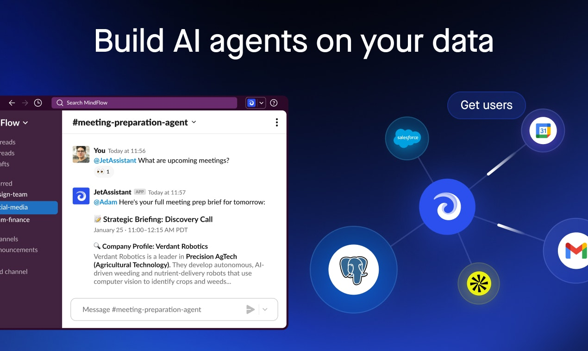
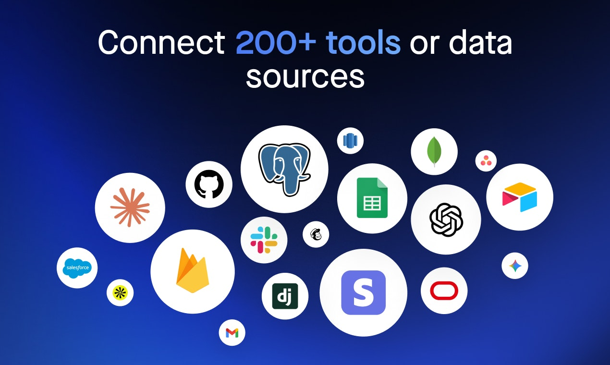
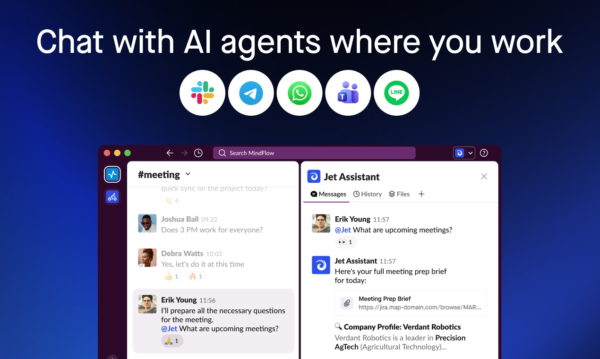

### 🎬 관련 영상
- [🎥 영상 보기](https://ph-files.imgix.net/09b36401-a7ca-4e6b-b443-c5b300b66f99.jpeg?auto=format)

---

## 3. [Logic](https://www.producthunt.com/products/logic-ship-an-agent)
**Votes**: 199 | **도입 난이도**: 중 | **신뢰도**: 중
**Tagline**: Build and operate fleets of agents
**서비스 링크**: https://www.producthunt.com/r/BHVF4YXQZYKB75

**태그**: AI 에이전트, 자동화, 개발 도구, 관찰 기능, Agent, AI Tool, Prompting

### 📌 이 서비스 한눈에 보기
Logic은 AI 에이전트 구축 및 운영을 간소화하여, 복잡한 설정 없이 즉시 사용 가능한 에이전트를 제공함으로써 개발 시간을 단축시켜 줍니다.

### 🔑 주요 기능
- 구조화된 명세 기반의 에이전트 구축
- 평가, 관찰 기능, 모델 라우팅 내장
- 즉시 사용 가능한 완전 관리형 에이전트 제공

### 🙋 사용자에게 어떤 점이 좋은가
AI 에이전트 개발에 필요한 시간과 노력을 줄여주어, 핵심 비즈니스 로직에 집중할 수 있도록 돕습니다. 복잡한 설정 없이 바로 프로덕션 환경에서 사용할 수 있습니다.

### ✅ 지금 바로 써볼 기능
- 구조화된 명세 작성 가이드 확인
- 내장된 평가 기능 사용
- 모델 라우팅 설정 테스트

### ⚠️ 사용 전 확인할 점
- 지원되는 모델 종류 확인
- 명세 작성 방식에 대한 학습 필요

### 🧭 확인이 더 필요한 정보
제공되는 평가 지표 및 관찰 기능의 상세 내용 확인이 필요합니다.

### 📸 스크린샷 및 갤러리

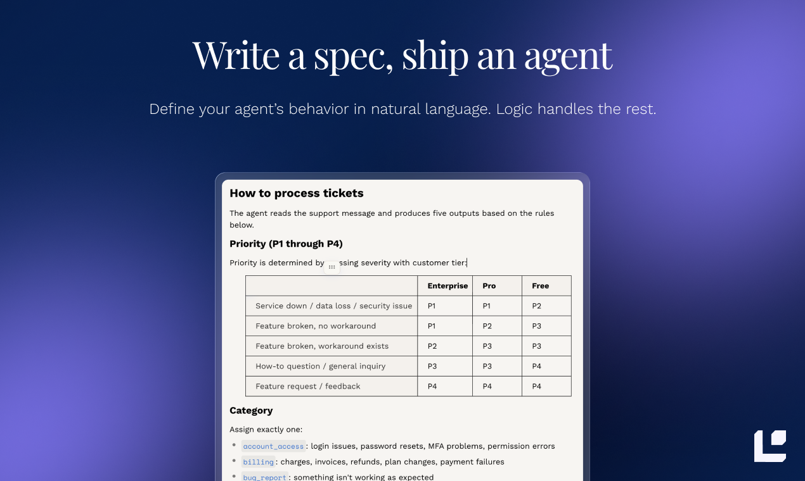
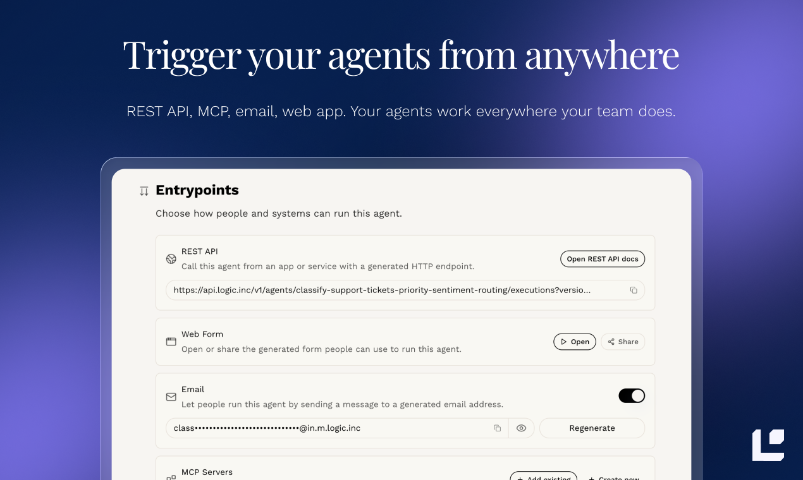

### 🎬 관련 영상
- [🎥 영상 보기](https://ph-files.imgix.net/3a3b5367-a14e-459d-a578-08f3dac58267.jpeg?auto=format)

---

## 4. [Waitlister](https://www.producthunt.com/products/waitlister)
**Votes**: 182 | **도입 난이도**: 하 | **신뢰도**: 중
**Tagline**: The waitlist software to launch your product
**서비스 링크**: https://www.producthunt.com/r/5GOOLU6RCSY5YM

**태그**: 대기자 명단, 랜딩 페이지, 자동화, 노코드, 마케팅, Automation, AI Tool, DevTool, Email

### 📌 이 서비스 한눈에 보기
Waitlister는 코딩 없이 바이럴 대기자 명단을 빠르게 구축하고, 무료 랜딩 페이지, 추천 시스템, 이메일 자동화 기능을 제공하여 제품 출시를 돕는 소프트웨어입니다.

### 🔑 주요 기능
- 몇 분 안에 바이럴 대기자 명단 구축
- 무료 랜딩 페이지 제공
- 추천 시스템 및 이메일 자동화 지원

### 🙋 사용자에게 어떤 점이 좋은가
제품 출시 전 대기자 명단을 효과적으로 관리하고, 바이럴 마케팅을 통해 더 많은 사용자 확보를 가능하게 합니다. 코딩 없이 간편하게 사용할 수 있어 기술적인 부담이 없습니다.

### ✅ 지금 바로 써볼 기능
- 무료 계정으로 랜딩 페이지 디자인 시작
- 추천 시스템 설정하여 바이럴 효과 극대화
- 이메일 자동화 기능으로 대기자 소통

### ⚠️ 사용 전 확인할 점
- 제공되는 템플릿의 디자인 자유도 확인 필요
- 무료 플랜의 기능 제한 사항 확인 필요

### 🧭 확인이 더 필요한 정보
제공되는 이메일 자동화 기능의 상세 설정 및 사용자 정의 옵션 범위 확인이 필요합니다.

### 📸 스크린샷 및 갤러리
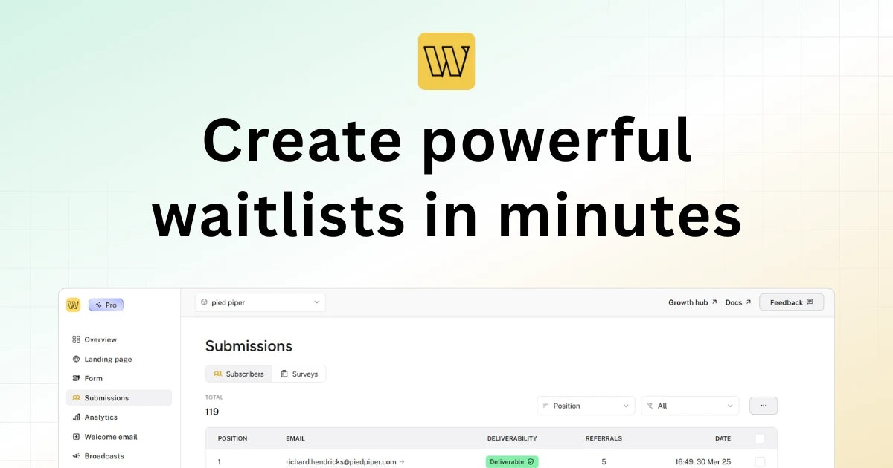

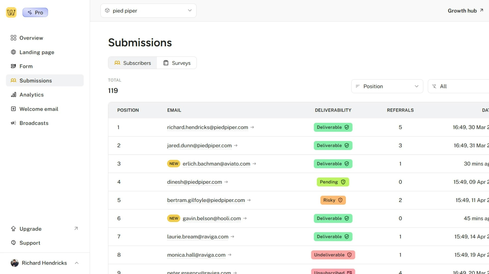

---

## 5. [VIDEO AI ME](https://www.producthunt.com/products/video-ai-me)
**Votes**: 165 | **도입 난이도**: 중 | **신뢰도**: 중
**Tagline**: Create videos with AI actors that sound and look real
**서비스 링크**: https://www.producthunt.com/r/7226TDHR4QPWZ3

**태그**: AI, 비디오 생성, 콘텐츠 제작, 자동화, AI Tool, Prompting, Video

### 📌 이 서비스 한눈에 보기
VIDEO AI ME는 AI 액터를 활용해 광고, 설명 영상, 교육 콘텐츠 등 다양한 비디오를 70개 이상의 언어로 제작할 수 있게 해줍니다.

### 🔑 주요 기능
- 셀카, 프롬프트, 제품 사진, 스크립트 등 다양한 자료를 입력하여 AI 비디오 생성
- 광고, 설명 영상, 짧은 영상, 바이럴 콘텐츠 등 다양한 형식 지원
- 70개 이상의 언어 지원

### 🙋 사용자에게 어떤 점이 좋은가
현실적인 AI 액터를 통해 비디오 제작 비용과 시간을 절약하고, 다양한 언어로 글로벌 콘텐츠를 쉽게 만들 수 있습니다.

### ✅ 지금 바로 써볼 기능
- 셀카를 업로드하여 AI 액터 생성해보기
- 제품 사진을 사용하여 광고 비디오 제작해보기
- 스크립트를 입력하여 설명 영상 만들어보기

### ⚠️ 사용 전 확인할 점
- AI 액터의 현실감이 사용자의 기대에 미치지 못할 수 있음
- 생성된 비디오의 품질이 입력 자료에 따라 달라질 수 있음

### 🧭 확인이 더 필요한 정보
AI 액터의 자연스러움과 비디오 품질에 대한 사용자 후기를 추가적으로 확인해야 합니다.

### 📸 스크린샷 및 갤러리

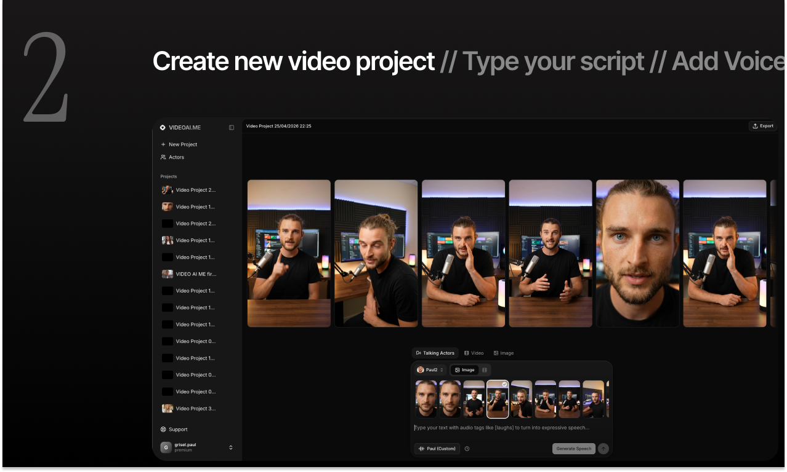
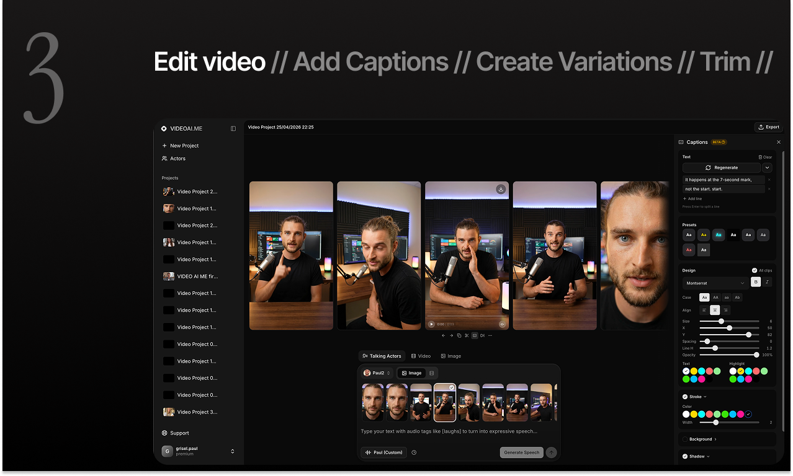

### 🎬 관련 영상
- [🎥 영상 보기](https://ph-files.imgix.net/bc5f920d-437e-4c58-a15b-5809d1d9e7de.jpeg?auto=format)
- [🎥 영상 보기](https://ph-files.imgix.net/d2a2ad97-c642-4cb8-98fa-bfb2fa8f6287.jpeg?auto=format)

---

## 6. [Atech](https://www.producthunt.com/products/atech)
**Votes**: 132 | **도입 난이도**: 하 | **신뢰도**: 중
**Tagline**: Snap-together electronics built from a chat
**서비스 링크**: https://www.producthunt.com/r/YK6JO5TJYLMSY2

**태그**: Hardware, No-code, AI, Prototyping, Developer Tools, Chat

### 📌 이 서비스 한눈에 보기
채팅으로 설명하면 레고처럼 모듈을 조립하여 실제 전자기기를 만들 수 있게 해주는 혁신적인 하드웨어 개발 도구입니다.

### 🔑 주요 기능
- 레고처럼 모듈을 조립하여 하드웨어 제작
- 채팅으로 원하는 기능 설명 시 펌웨어 자동 생성
- 납땜이나 복잡한 데이터시트 없이 몇 분 안에 아이디어를 실제 기기로 구현

### 🙋 사용자에게 어떤 점이 좋은가
복잡한 하드웨어 개발 과정을 간소화하여 누구나 쉽고 빠르게 아이디어를 실제 작동하는 기기로 만들 수 있게 해줍니다.

### ✅ 지금 바로 써볼 기능
- 간단한 모듈 조합으로 원하는 기기 만들어보기
- 채팅 기능을 활용하여 다양한 펌웨어 생성 실험하기
- 제공되는 모듈의 종류와 기능 살펴보기

### ⚠️ 사용 전 확인할 점
- 제공되는 모듈의 종류와 확장성에 따라 만들 수 있는 기기의 복잡도가 제한될 수 있음
- AI가 생성하는 펌웨어의 정확성과 안정성에 대한 검증 필요

### 🧭 확인이 더 필요한 정보
실제 만들 수 있는 전자기기의 범위와 AI 펌웨어 생성의 신뢰성에 대한 추가 정보가 필요합니다.

### 📸 스크린샷 및 갤러리

### 🎬 관련 영상
- [🎥 영상 보기](https://ph-files.imgix.net/757f0702-64bc-4a49-a4d1-ac06a70bd384.jpeg?auto=format)

---

## 7. [Brew Finder](https://www.producthunt.com/products/brew-finder)
**Votes**: 123 | **도입 난이도**: 하 | **신뢰도**: 중
**Tagline**: Discover the best coffee shops to work at around you
**서비스 링크**: https://www.producthunt.com/r/NEOOBMKSSJPIUA

**태그**: 카페, 생산성, 정보, 작업 공간, AI Tool

### 📌 이 서비스 한눈에 보기
Brew Finder는 주변 작업하기 좋은 카페를 실시간 혼잡도, 좌석, 와이파이, 콘센트 정보를 통해 찾아주는 서비스입니다.

### 🔑 주요 기능
- 실시간 혼잡도 확인
- 좌석 및 콘센트 유무 확인
- 와이파이 품질 정보 제공

### 🙋 사용자에게 어떤 점이 좋은가
더 이상 작업할 카페를 찾아 헤매지 않아도 됩니다. Brew Finder를 통해 미리 정보를 확인하고 방문하여 시간을 절약할 수 있습니다.

### ✅ 지금 바로 써볼 기능
- 현재 위치 주변 카페 검색
- 원하는 조건(와이파이, 콘센트 등)으로 필터링
- 실시간 혼잡도 확인 후 방문 결정

### ⚠️ 사용 전 확인할 점
- 정보의 정확도는 사용자들의 참여에 의존적일 수 있습니다.
- 모든 카페의 정보를 제공하지 않을 수 있습니다.

### 🧭 확인이 더 필요한 정보
제공되는 정보의 업데이트 빈도 및 정확도에 대한 추가 확인이 필요합니다.

### 📸 스크린샷 및 갤러리

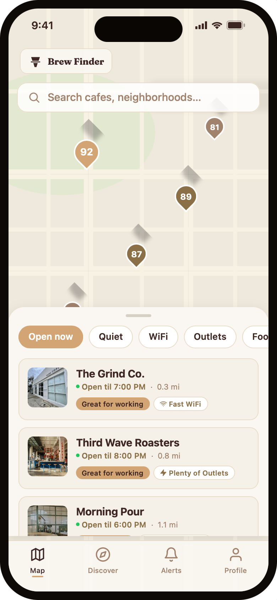

---

## 8. [Odyssey-2 Max](https://www.producthunt.com/products/odyssey-5)
**Votes**: 116 | **도입 난이도**: 상 | **신뢰도**: 중
**Tagline**: Physical accuracy takes a leap in world models
**서비스 링크**: https://www.producthunt.com/r/ODLA4BSYGYFI2C

**태그**: AI, Simulation, Developer Tools, Machine Learning, Virtual Worlds

### 📌 이 서비스 한눈에 보기
사용자 행동에 따라 진화하는 세계에서 실시간으로 더욱 정확하고 안정적인 시뮬레이션을 가능하게 하는 최신 세계 모델입니다.

### 🔑 주요 기능
- 최대 규모의 범용 세계 모델로, 실시간 상호작용 시뮬레이션에 특화되었습니다.
- 자기회귀적 다음 상태 예측을 통해 물리적 정확도와 장기 안정성을 크게 개선했습니다.
- 사용자 행동에 따라 끊임없이 진화하는 개방형 세계를 경험할 수 있습니다.

### 🙋 사용자에게 어떤 점이 좋은가
이 모델을 통해 사용자는 실제와 같은 물리적 정확도와 안정성을 갖춘 시뮬레이션을 구축하거나 경험할 수 있으며, 사용자 행동에 따라 역동적으로 변화하는 세계에서 더욱 몰입감 있는 상호작용이 가능해집니다.

### ✅ 지금 바로 써볼 기능
- 간단한 물리 시뮬레이션 환경을 구축하여 모델의 정확도를 테스트해보기
- 사용자 입력에 따라 변화하는 동적인 세계를 만들어 상호작용 경험하기
- 장기적인 시뮬레이션 안정성을 확인하기 위한 복잡한 시나리오를 실행해보기

### ⚠️ 사용 전 확인할 점
- 대규모 모델이므로 높은 컴퓨팅 자원과 운영 비용이 필요할 수 있습니다.
- 특정 전문 분야의 시뮬레이션에서는 해당 분야에 특화된 모델 대비 성능을 비교해볼 필요가 있습니다.

### 🧭 확인이 더 필요한 정보
실제 성능 벤치마크, 사용 가능한 API/SDK, 그리고 구체적인 가격 정책에 대한 정보가 추가적으로 필요합니다.

### 📸 스크린샷 및 갤러리
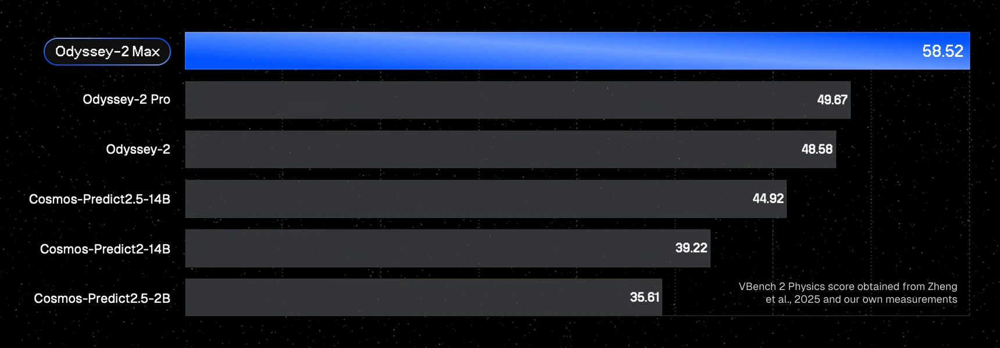

### 🎬 관련 영상
- [🎥 영상 보기](https://ph-files.imgix.net/d76bc724-856c-4ecc-8a7a-ea9a6d8f7c54.jpeg?auto=format)

---

## 9. [SNEWPapers](https://www.producthunt.com/products/snewpapers)
**Votes**: 112 | **도입 난이도**: 하 | **신뢰도**: 상
**Tagline**: The World's First AI Newspaper Archive
**서비스 링크**: https://www.producthunt.com/r/74QRCZZSP3M4N6

**태그**: AI, Research, Archive, Data, News, AI Tool, LLM

### 📌 이 서비스 한눈에 보기
AI로 250년치 신문 기사를 분석하여 검색하고 활용할 수 있는 세계 최초의 아카이브.

### 🔑 주요 기능
- AI가 250년치 신문 기사(600만 건 이상)를 분석하여 제공.
- 의미론적 검색 및 AI 연구 보조 기능을 통해 원하는 기사 탐색.
- 구글이나 다른 LLM에서 찾을 수 없는 독점적인 역사 신문 데이터 보유.

### 🙋 사용자에게 어떤 점이 좋은가
역사 연구자나 언론학도 등 방대한 과거 신문 자료가 필요한 사용자에게 AI 기반의 효율적인 검색과 분석 환경을 제공하여 새로운 통찰을 얻을 수 있도록 돕습니다.

### ✅ 지금 바로 써볼 기능
- 관심 있는 주제로 의미론적 검색을 시도해 보세요.
- AI 연구 보조 기능을 활용하여 특정 정보를 찾아보세요.
- 흥미로운 기사들을 모아 나만의 컬렉션을 만들어 보세요.

### ⚠️ 사용 전 확인할 점
- AI가 추출하고 분류한 정보의 정확성 및 완전성 확인 필요.
- 250년치 데이터의 구체적인 지역, 언어, 신문사 범위 확인 필요.

### 🧭 확인이 더 필요한 정보
250년치 신문 데이터가 어떤 특정 지역이나 언어의 신문들을 포함하는지 추가 확인이 필요합니다.

### 📸 스크린샷 및 갤러리

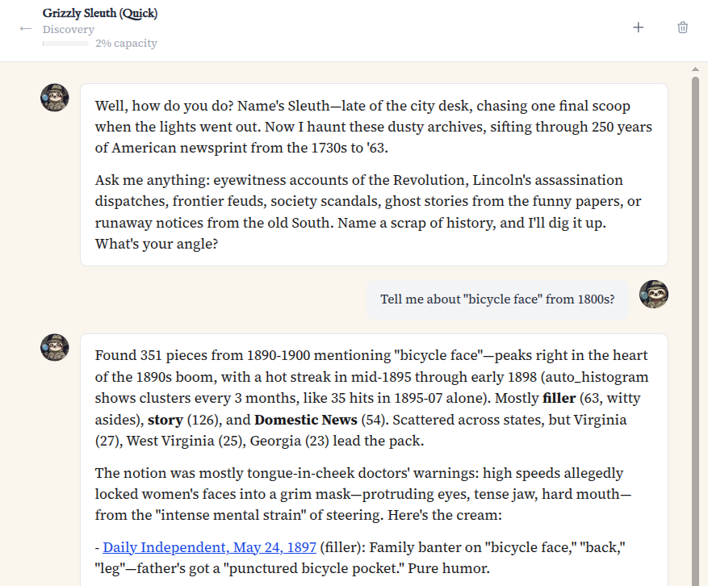

### 🎬 관련 영상
- [🎥 영상 보기](https://ph-files.imgix.net/bd192da2-cfeb-4efd-8a16-f264fc71ace9.jpeg?auto=format)

---

## 10. [GitBar](https://www.producthunt.com/products/gitbar-3)
**Votes**: 108 | **도입 난이도**: 중 | **신뢰도**: 상
**Tagline**: Every pull request, one menubar. GitHub, GitLab & Azure
**서비스 링크**: https://www.producthunt.com/r/ASEXZJ4WEQTBCD

**태그**: DevTool, GitHub, GitLab, Azure DevOps, Pull Request, AI Tool

### 📌 이 서비스 한눈에 보기
GitBar는 macOS 메뉴 막대에서 GitHub, GitLab, Azure DevOps의 모든 풀 리퀘스트를 한눈에 보여주고 빠르게 접근할 수 있도록 도와줍니다.

### 🔑 주요 기능
- GitHub, GitLab, Azure DevOps 연동 지원
- 메뉴 막대에서 풀 리퀘스트 상태 실시간 확인
- React Native로 개발된 macOS 앱

### 🙋 사용자에게 어떤 점이 좋은가
여러 계정의 풀 리퀘스트를 쉽게 관리하고, 리뷰 대기 중인 항목이나 팀의 진행 상황을 빠르게 파악하여 개발 생산성을 높일 수 있습니다.

### ✅ 지금 바로 써볼 기능
- Mac App Store에서 GitBar 다운로드 및 설치
- GitHub, GitLab, Azure DevOps 계정 연결
- 메뉴 막대에서 풀 리퀘스트 상태 확인 및 관리

### ⚠️ 사용 전 확인할 점
- macOS 환경에서만 사용 가능
- 지원하는 저장소 종류 및 기능 확인 필요

### 🧭 확인이 더 필요한 정보
GitBar가 지원하는 모든 기능과 저장소 종류에 대한 자세한 정보는 공식 문서를 참고해야 합니다.

### 📸 스크린샷 및 갤러리
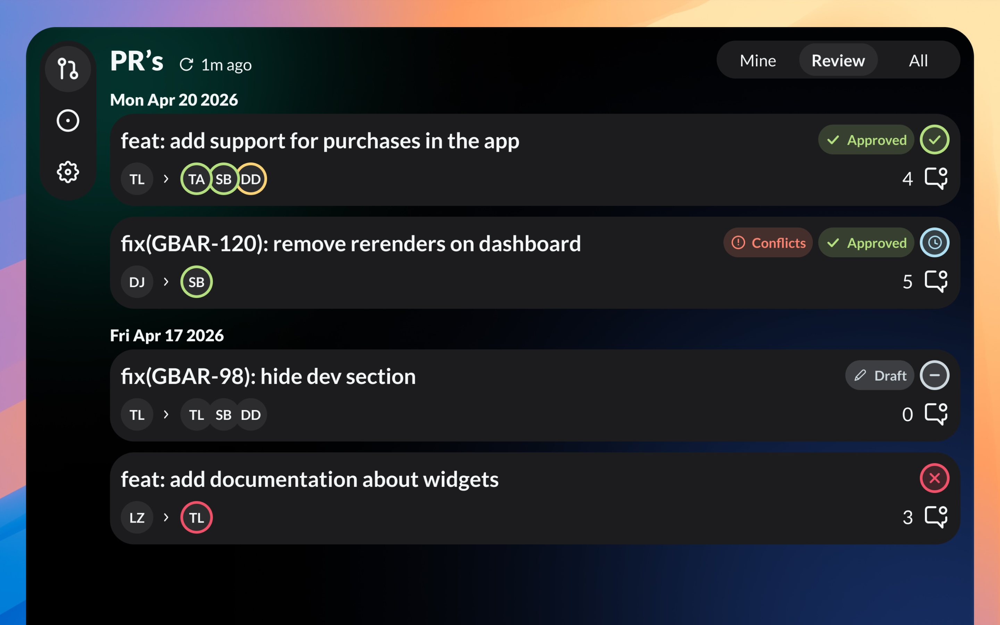
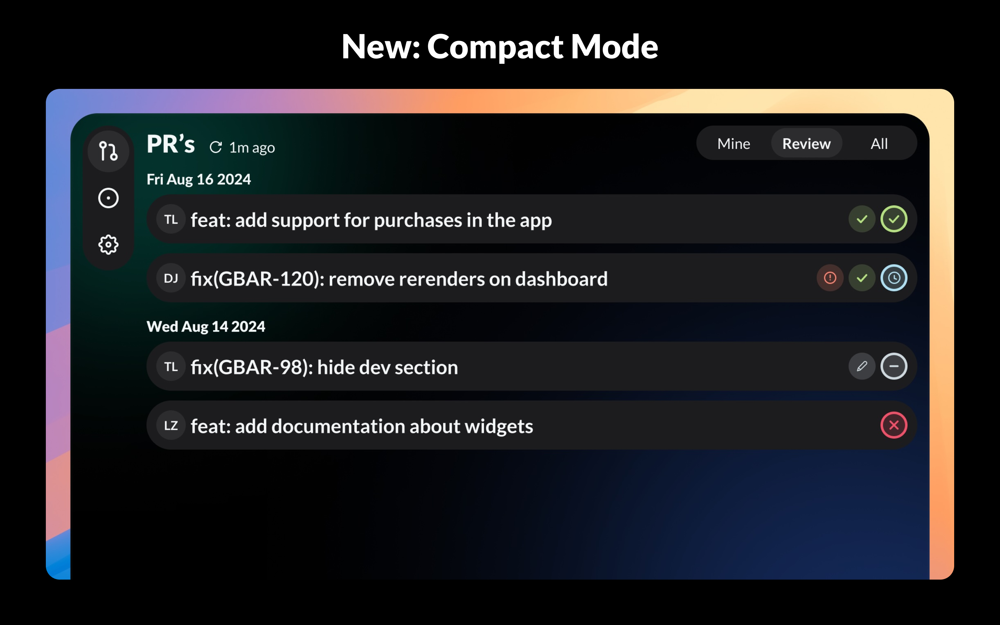
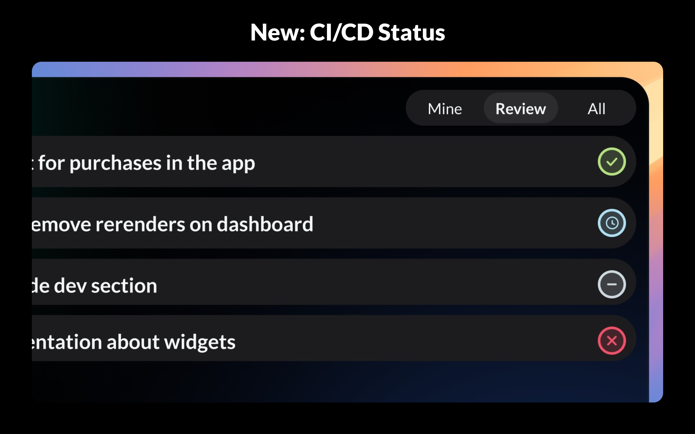

---

