# 🚀 Product Hunt Daily Top 10 (2026-04-29)

## 1. [Clera](https://www.producthunt.com/products/clera)
**Votes**: 314 | **도입 난이도**: 하 | **신뢰도**: 상
**Tagline**: An AI agent matching candidates to the right roles.
**서비스 링크**: https://www.producthunt.com/r/MHJ73XCI7VH4JY

**태그**: AI, Recruitment, Job Search, Automation, Messaging, Agent, AI Tool

### 📌 이 서비스 한눈에 보기
원하는 직무를 찾고 기업에 직접 연결해주는 AI 인재 에이전트

### 🔑 주요 기능
- AI 기반 맞춤형 채용 에이전트
- iMessage 및 WhatsApp을 통한 편리한 소통
- 원하는 직무 추천 및 기업 직접 연결

### 🙋 사용자에게 어떤 점이 좋은가
구직자는 수많은 채용 공고를 일일이 찾아보고 지원하는 시간 낭비 없이, 자신에게 맞는 좋은 기회를 쉽게 발견하고 기업과 연결될 수 있습니다.

### ✅ 지금 바로 써볼 기능
- iMessage 또는 WhatsApp으로 Clera와 대화 시작하기
- 자신이 원하는 직무 및 경력 조건 상세히 알려주기
- Clera가 추천하는 첫 번째 직무 기회 확인하기

### ⚠️ 사용 전 확인할 점
- AI 추천의 정확도 및 개인 정보 보호 정책 확인
- 지원 가능한 직무 분야 및 기업의 범위 파악

### 🧭 확인이 더 필요한 정보
Clera가 지원하는 직무 분야 및 지역적 범위에 대한 추가 정보가 필요합니다.

### 📸 스크린샷 및 갤러리
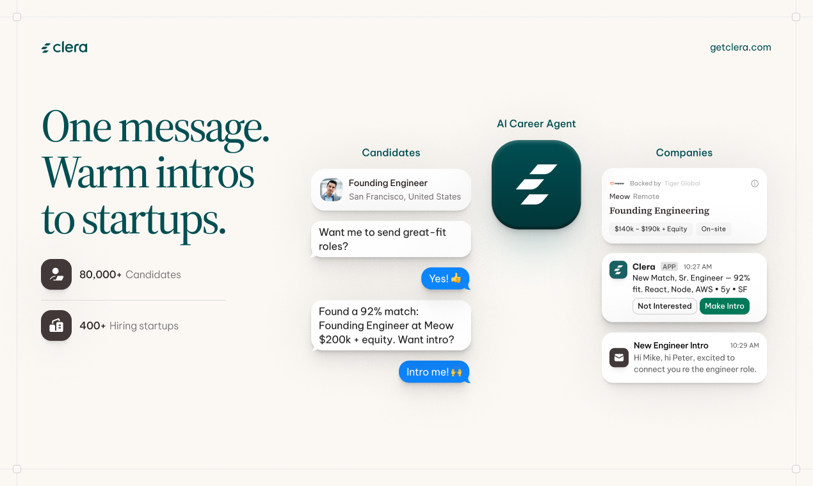
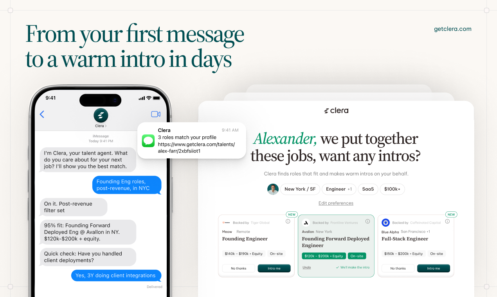
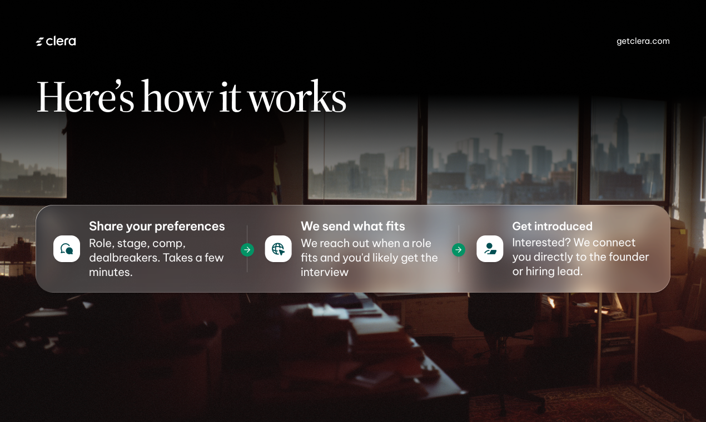

### 🎬 관련 영상
- [🎥 영상 보기](https://ph-files.imgix.net/8c503f40-f6a4-4110-a8cc-0528ac1ef40c.jpeg?auto=format)

---

## 2. [SureThing.io](https://www.producthunt.com/products/surething-io)
**Votes**: 263 | **도입 난이도**: 중 | **신뢰도**: 중
**Tagline**: Autonomous agent that communicates results like a human
**서비스 링크**: https://www.producthunt.com/r/5ZQF23B4KGXMQ3

**태그**: AI, Automation, Business Tools, Productivity, Developer Tools, Agent, AI Tool

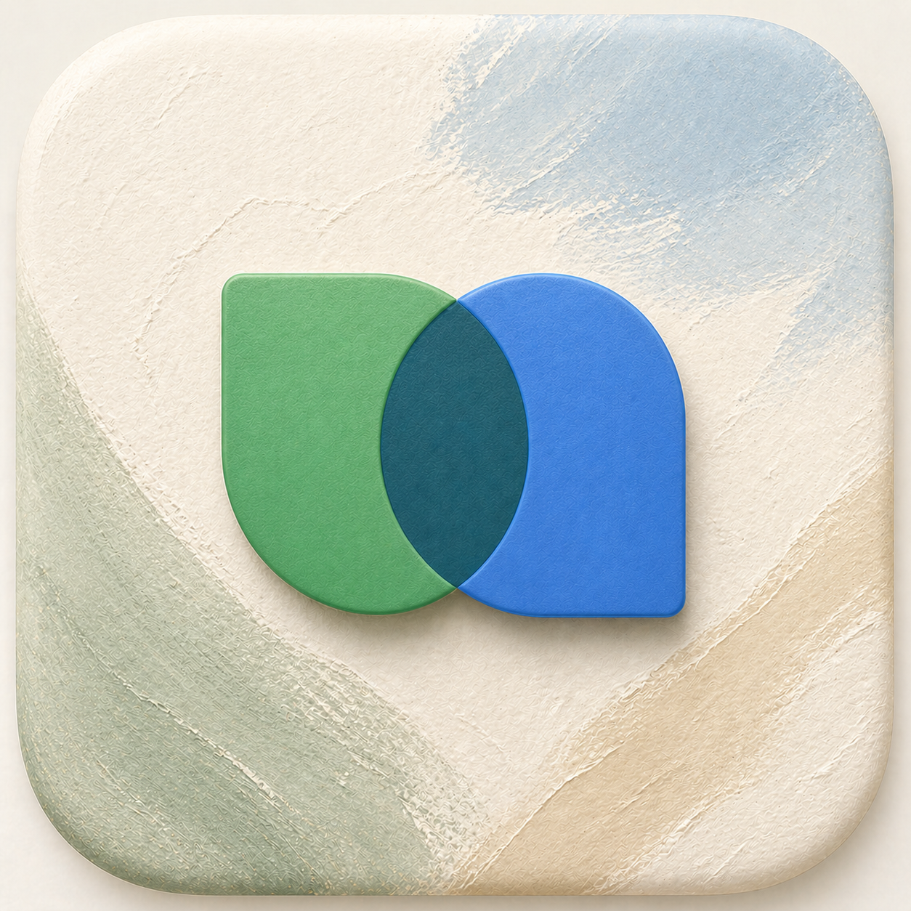

### 📌 이 서비스 한눈에 보기
사람처럼 소통하는 자율 AI 에이전트를 통해 비즈니스 목표 달성을 가속화하고, CEO가 경영에 집중할 수 있도록 돕는 솔루션입니다.

### 🔑 주요 기능
- 사람처럼 소통하며 비즈니스 목표를 달성하는 자율 AI 에이전트 제공
- GitHub 스킬을 AI 팀으로 전환하여 영구적인 기억력으로 협업 가능
- CEO가 AI 디버깅 대신 전략적 경영에 집중할 수 있도록 지원

### 🙋 사용자에게 어떤 점이 좋은가
사용자는 AI 에이전트에게 업무를 위임하여 전략적 업무에 집중할 수 있으며, 이를 통해 AI 운영의 병목 현상을 해소하고 비즈니스 목표를 더 빠르게 달성할 수 있습니다.

### ✅ 지금 바로 써볼 기능
- 기존 GitHub 스킬을 AI 에이전트 팀으로 전환하는 방법을 탐색해 보세요
- AI 에이전트의 사람과 같은 소통 및 보고 기능을 직접 테스트해 보세요
- 특정 비즈니스 목표를 AI 에이전트에게 위임하여 달성 가능성을 확인해 보세요

### ⚠️ 사용 전 확인할 점
- "사람과 같은 소통" 및 "영구적인 기억력"의 실제 구현 수준과 효과에 대한 검증이 필요합니다
- "어떤 GitHub 스킬이든" 통합 가능하다는 범위와 한계가 명확하지 않습니다

### 🧭 확인이 더 필요한 정보
AI 에이전트가 실제 비즈니스 목표를 얼마나 정확하고 자율적으로 달성하는지에 대한 구체적인 사례와 성능 검증이 필요합니다.

### 📸 스크린샷 및 갤러리
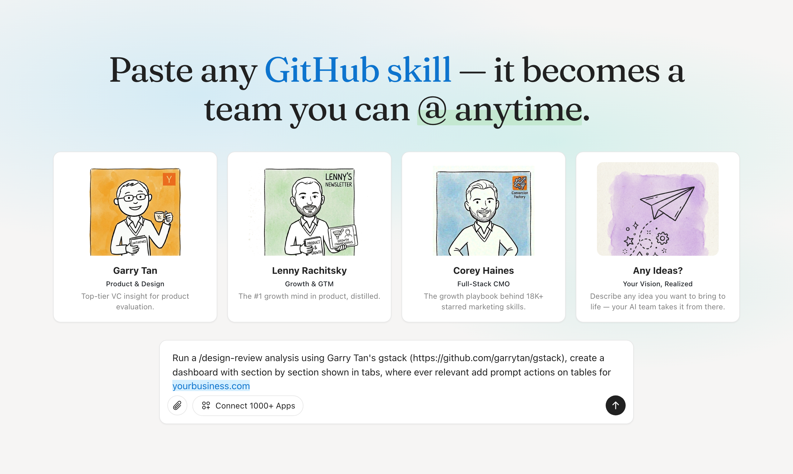
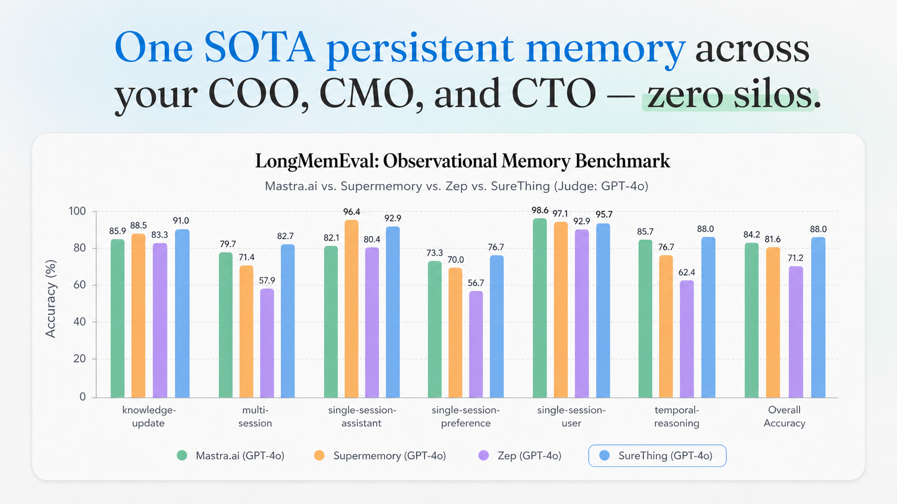
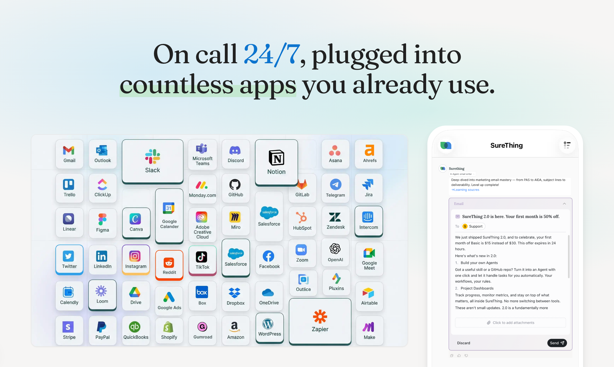

### 🎬 관련 영상
- [🎥 영상 보기](https://ph-files.imgix.net/7816b64d-2c36-40cf-be37-411a17981c1e.jpeg?auto=format)

---

## 3. [Social Fetch](https://www.producthunt.com/products/social-fetch)
**Votes**: 200 | **도입 난이도**: 하 | **신뢰도**: 중
**Tagline**: Pull real-time data from any social platform via API.
**서비스 링크**: https://www.producthunt.com/r/KH6YADQN6DJCL4

**태그**: DevTool, Data, API, Automation, Analytics, Video

### 📌 이 서비스 한눈에 보기
여러 소셜 플랫폼의 공개 데이터를 하나의 API로 실시간 수집할 수 있는 도구입니다.

### 🔑 주요 기능
- 틱톡, 인스타그램, 유튜브 등 주요 소셜 플랫폼의 프로필, 게시물, 댓글, 영상, 스크립트 수집 가능
- 하나의 API로 다양한 소셜 데이터에 접근하여 개발 및 분석 시간 단축
- 100 무료 크레딧 제공, 카드 정보 불필요, 속도 제한 없는 종량제 방식

### 🙋 사용자에게 어떤 점이 좋은가
개발자, 마케터, 연구자 등이 각 플랫폼별 스크래퍼를 구축할 필요 없이 손쉽게 실시간 소셜 데이터를 얻어 분석, 마케팅, 개발 등에 활용할 수 있어 시간과 비용을 절약해줍니다.

### ✅ 지금 바로 써볼 기능
- 100 무료 크레딧을 활용하여 원하는 소셜 플랫폼의 데이터 수집을 시도해보기
- API 문서를 확인하여 어떤 종류의 데이터를 어떤 형식으로 받을 수 있는지 파악하기
- 가장 필요한 특정 플랫폼(예: X(트위터) 게시물)의 데이터를 실제로 호출해보기

### ⚠️ 사용 전 확인할 점
- 데이터 수집 범위가 '공개' 소셜 데이터로 한정됩니다.
- 100 무료 크레딧 소진 후에는 종량제 방식으로 비용이 발생합니다.

### 🧭 확인이 더 필요한 정보
'실시간' 데이터의 정확한 업데이트 주기와 크레딧당 비용 구조에 대한 상세 정보 확인이 필요합니다.

### 📸 스크린샷 및 갤러리
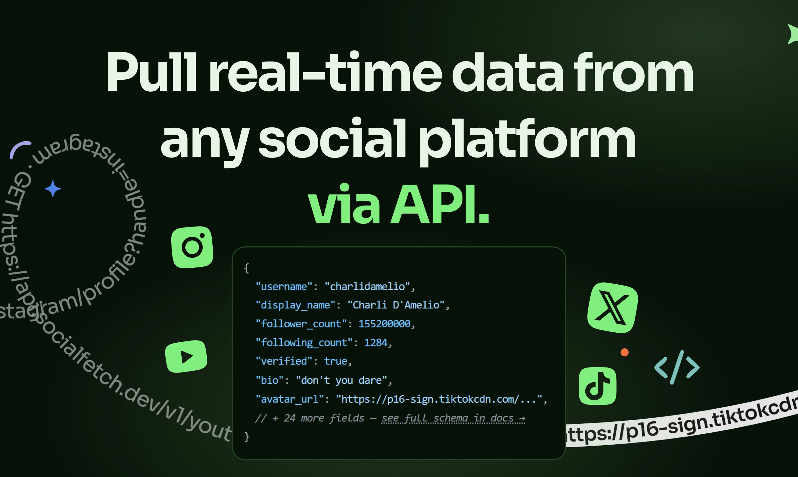
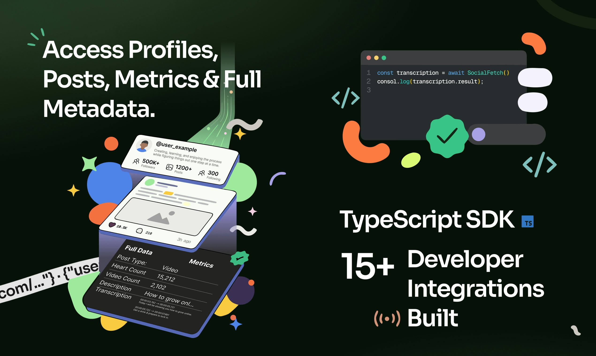
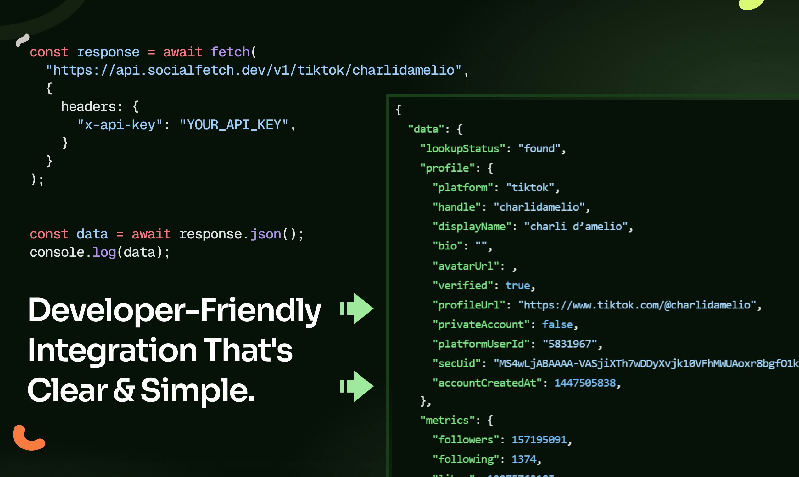

---

## 4. [Lovable mobile app](https://www.producthunt.com/products/lovable)
**Votes**: 167 | **도입 난이도**: 하 | **신뢰도**: 상
**Tagline**: Your ideas don't wait for you to sit down at a desk
**서비스 링크**: https://www.producthunt.com/r/L2Z3JXM2ZQWT7N

**태그**: No-Code, AI, Web Development, Productivity, DevTools, AI Tool, DevTool

### 📌 이 서비스 한눈에 보기
코딩 없이 아이디어를 웹사이트나 웹 앱으로 빠르게 만들어주는 AI 소프트웨어 빌더.

### 🔑 주요 기능
- AI 기반으로 아이디어를 실제 작동하는 웹사이트/웹 앱으로 전환
- 코딩 지식 없이 자연어만으로 앱 개발 가능
- 창업가, 개발자 등 누구나 빠르게 앱을 출시할 수 있도록 지원

### 🙋 사용자에게 어떤 점이 좋은가
아이디어가 떠올랐을 때 코딩 능력 없이도 즉시 웹사이트나 웹 앱으로 구현하여 빠르게 시장에 선보일 수 있습니다. 개발 지식이 부족한 사람도 자신의 아이디어를 현실화할 수 있는 강력한 도구입니다.

### ✅ 지금 바로 써볼 기능
- 간단한 아이디어를 자연어로 입력하여 웹사이트 만들어보기
- 특정 기능을 가진 웹 앱을 구상하여 구현해보기
- 다양한 자연어 명령으로 원하는 결과가 나오는지 테스트하기

### ⚠️ 사용 전 확인할 점
- AI가 생성하는 웹사이트/앱의 복잡성 및 커스터마이징 한계
- 생성된 결과물의 품질, 성능, 보안성 검증 필요

### 🧭 확인이 더 필요한 정보
AI가 생성하는 웹사이트나 웹 앱의 실제 기능 범위와 복잡한 요구사항 처리 능력에 대한 추가 확인이 필요합니다.

### 📸 스크린샷 및 갤러리
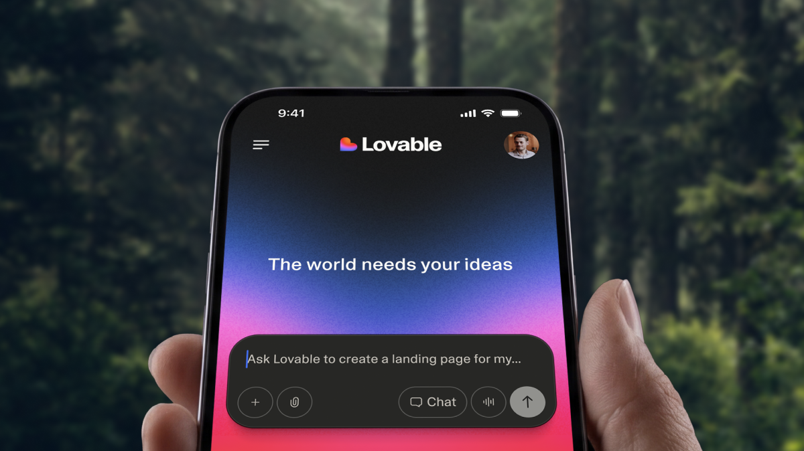
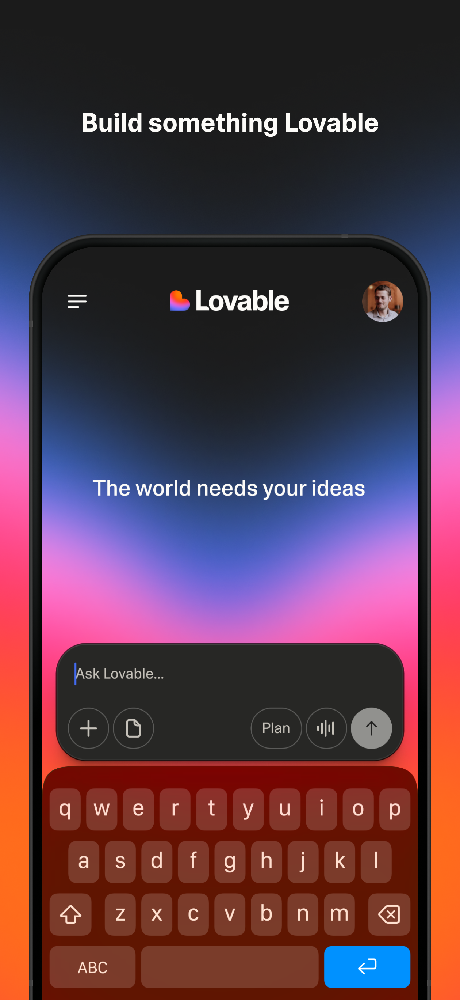
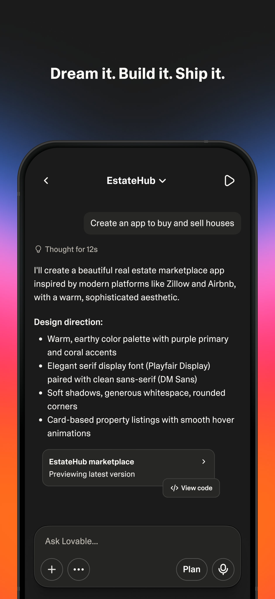

---

## 5. [Actian VectorAI DB](https://www.producthunt.com/products/actian)
**Votes**: 166 | **도입 난이도**: 중 | **신뢰도**: 상
**Tagline**: The portable vector database for AI agents beyond the cloud
**서비스 링크**: https://www.producthunt.com/r/ETGZBRJODF3DDT

**태그**: DevTool, AI, Database, Edge Computing, Agent, AI Tool

### 📌 이 서비스 한눈에 보기
AI 애플리케이션을 클라우드 밖에서도 빠르고 안정적으로 운영할 수 있게 해주는 휴대용 벡터 데이터베이스입니다.

### 🔑 주요 기능
- 클라우드 외부 환경(엣지, 온프레미스 등)을 위한 휴대용 벡터 데이터베이스
- 데이터를 로컬에서 저장, 검색, 추론하여 낮은 지연 시간의 벡터 검색 제공
- Milvus 및 Qdrant 대비 최대 22배 빠른 QPS 성능 (1천만 벡터 기준)

### 🙋 사용자에게 어떤 점이 좋은가
개발자는 클라우드에 얽매이지 않고 엣지, 온프레미스 등 다양한 환경에서 AI 애플리케이션을 빠르고 안정적으로 배포하고 운영할 수 있으며, 데이터 주권을 확보할 수 있습니다.

### ✅ 지금 바로 써볼 기능
- 로컬 환경에서 벡터 데이터 저장 및 검색 기능 테스트
- 자신의 AI 에이전트와 연동하여 실제 환경에서의 지연 시간 확인
- 기존 벡터 데이터베이스(Milvus, Qdrant 등)와 성능 비교 벤치마킹

### ⚠️ 사용 전 확인할 점
- 제시된 벤치마크(1천만 벡터 기준) 외의 대규모 데이터셋이나 복잡한 쿼리에서의 성능 확인 필요
- 기존 시스템과의 통합 용이성 및 지원되는 프로그래밍 언어/프레임워크 확인

### 🧭 확인이 더 필요한 정보
가격 정책, 상세한 기술 스택 지원 여부, 커뮤니티 지원 수준에 대한 추가 정보가 필요합니다.

### 📸 스크린샷 및 갤러리
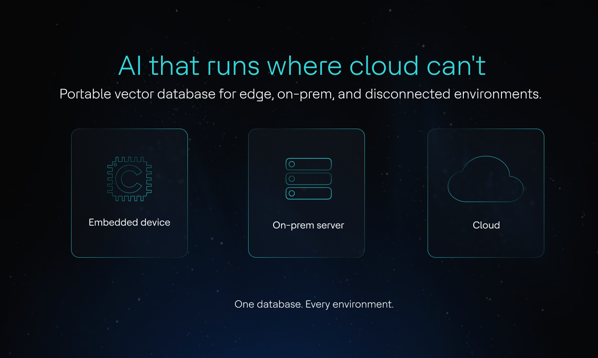
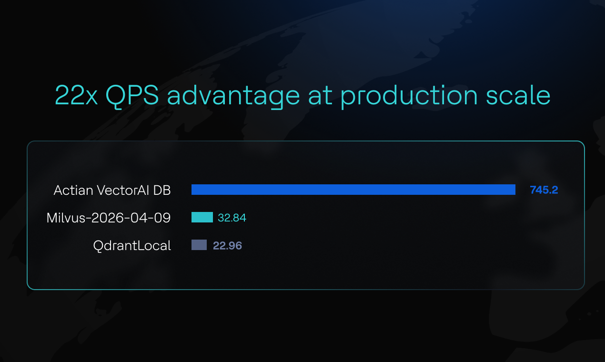
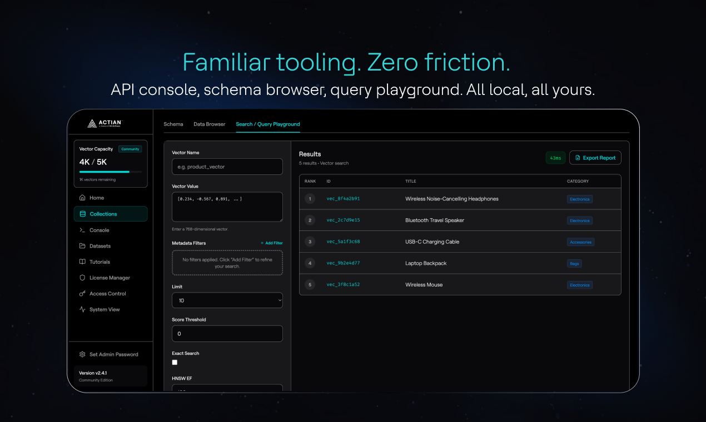

### 🎬 관련 영상
- [🎥 영상 보기](https://ph-files.imgix.net/7257ba48-8a02-4d52-b0c9-10f3f02c33e0.jpeg?auto=format)

---

## 6. [The Agentic Sales Engine by Crono](https://www.producthunt.com/products/crono-4)
**Votes**: 118 | **도입 난이도**: 중 | **신뢰도**: 중
**Tagline**: Where sales teams and AI agents work side by side.
**서비스 링크**: https://www.producthunt.com/r/FUQ6MADHL66QFL

**태그**: Sales, AI, Automation, Analytics, Productivity, Agent, AI Tool

### 📌 이 서비스 한눈에 보기
AI 에이전트와 영업팀이 협력하여 영업 파이프라인 실행을 자동화하고 효율성을 극대화하는 솔루션입니다.

### 🔑 주요 기능
- AI 에이전트와 영업팀의 시너지를 통해 영업 실행력 강화
- 영업 파이프라인 관리에서 실행까지 전 과정을 자동화 및 통합
- 실시간 데이터와 신호를 기반으로 정확하고 빠른 의사결정 지원

### 🙋 사용자에게 어떤 점이 좋은가
영업팀은 수동 작업을 줄이고, 실시간 데이터 기반으로 정확한 영업 활동을 펼쳐 매출 증대로 이어질 수 있습니다.

### ✅ 지금 바로 써볼 기능
- AI 에이전트가 어떤 영업 활동을 자동화하는지 구체적으로 확인하기
- 현재 사용 중인 영업 데이터 및 툴과의 연동 가능성 검토하기
- 잠재 고객 발굴부터 아웃리치까지 특정 영업 워크플로우를 시뮬레이션해보기

### ⚠️ 사용 전 확인할 점
- 기존 영업 시스템 및 데이터와의 통합 과정에서 발생할 수 있는 문제점
- AI 에이전트의 초기 학습 및 최적화에 필요한 시간과 노력

### 🧭 확인이 더 필요한 정보
정확한 가격 정책, 지원하는 CRM/영업 툴 연동 범위, 그리고 실제 매출 증대 효과에 대한 구체적인 사례가 추가로 필요합니다.

### 📸 스크린샷 및 갤러리
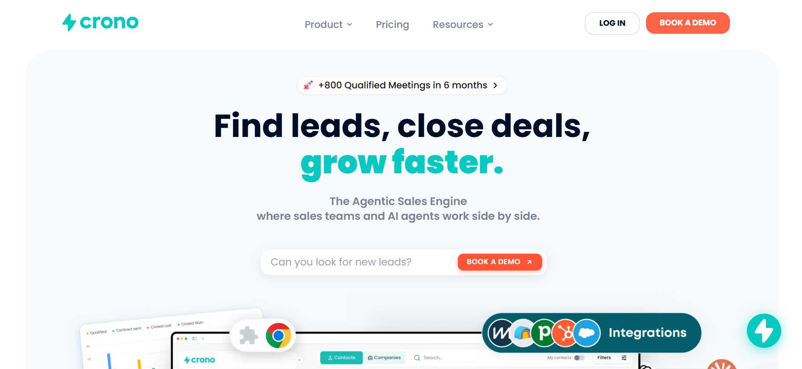
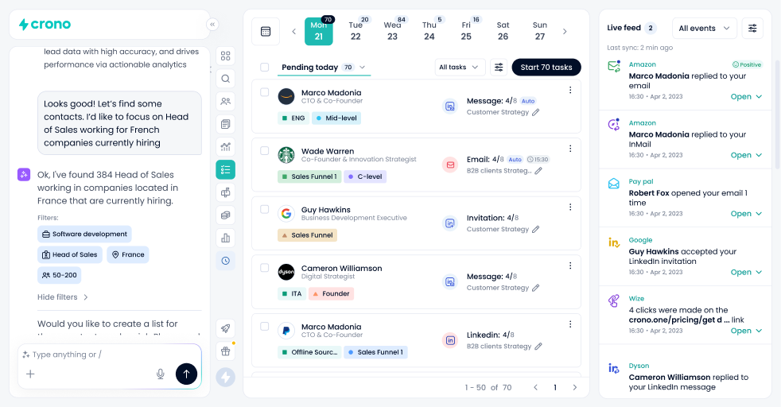
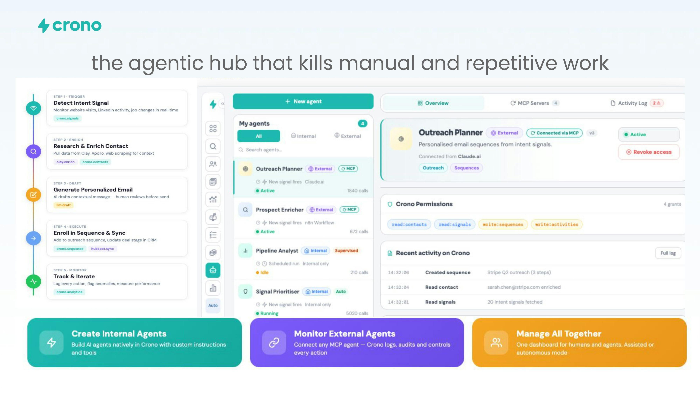

---

## 7. [Famnest](https://www.producthunt.com/products/famnest)
**Votes**: 117 | **도입 난이도**: 하 | **신뢰도**: 상
**Tagline**: Private family hub for schedules, health, and shared bills
**서비스 링크**: https://www.producthunt.com/r/IG23LY7HKJU3JX

**태그**: Family, Productivity, Organizer, Privacy, Health

### 📌 이 서비스 한눈에 보기
가족의 일정, 건강, 공동 경비를 한 곳에서 안전하게 관리하는 프라이빗 가족 허브 앱.

### 🔑 주요 기능
- 프라이버시를 최우선으로 하는 가족 전용 공간
- 가족 일정, 건강 기록, 공동 경비 등 다양한 정보 통합 관리
- 현대 가족의 니즈에 맞춰 설계된 올인원 오거나이저

### 🙋 사용자에게 어떤 점이 좋은가
여러 앱을 오갈 필요 없이 가족의 중요한 정보를 한곳에 모아 관리하여 번거로움을 줄이고, 프라이버시 보호로 안심하고 사용할 수 있습니다.

### ✅ 지금 바로 써볼 기능
- 가족 공동 일정 등록 및 공유
- 가족 구성원의 건강 정보(예: 예방접종, 알레르기) 기록
- 공동으로 지출한 경비 내역 입력 및 정산

### ⚠️ 사용 전 확인할 점
- 정확한 프라이버시 정책 및 데이터 보안 방식 확인
- 가족 구성원 수 제한 또는 특정 기능의 유료 전환 여부

### 🧭 확인이 더 필요한 정보
구체적인 기능 목록, 타 서비스 연동 가능성, 그리고 실제 데이터 암호화 방식 등 상세한 정보 확인이 필요합니다.

### 📸 스크린샷 및 갤러리

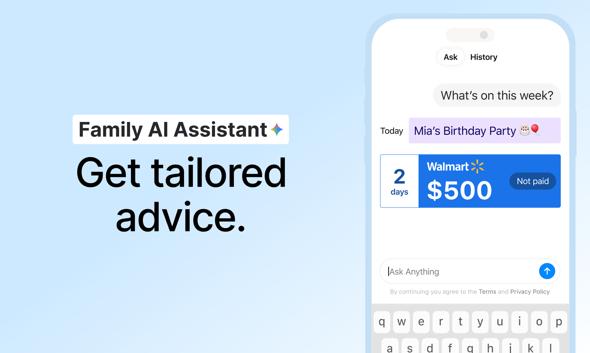

### 🎬 관련 영상
- [🎥 영상 보기](https://ph-files.imgix.net/f5177920-bbba-414c-94bb-c58aaac4ad79.jpeg?auto=format)

---

## 8. [OrcaSheets AI Reports](https://www.producthunt.com/products/orcasheets)
**Votes**: 115 | **도입 난이도**: 중 | **신뢰도**: 상
**Tagline**: Query data to build dashboards and generate detailed reports
**서비스 링크**: https://www.producthunt.com/r/TNLD5JHBAHXYVG

**태그**: Analytics, Automation, AI, Reporting, AI Tool, Prompting

### 📌 이 서비스 한눈에 보기
AI로 데이터를 쿼리하여 대시보드와 상세 보고서를 자동으로 생성해주는 도구로, 수동 보고서 작성 시간을 획기적으로 줄여줍니다.

### 🔑 주요 기능
- AI 기반 데이터 쿼리로 대시보드 및 보고서 자동 생성
- 단 한 번의 프롬프트로 핵심 요약, KPI, 인사이트, 권장사항 제공
- 수동 보고서 작성 시간 절약 및 즉시 공유 가능한 결과물 도출

### 🙋 사용자에게 어떤 점이 좋은가
사용자는 보고서 작성 시간을 획기적으로 줄여 데이터 분석에 더 집중할 수 있으며, 중요한 의사결정을 위한 정보를 빠르게 얻을 수 있습니다.

### ✅ 지금 바로 써볼 기능
- 자신의 데이터를 연결하여 AI 기반 보고서 생성 기능을 시험해보기
- 특정 비즈니스 질문에 대한 임원 요약 보고서를 즉시 생성해보기
- AI가 제안하는 KPI와 인사이트를 기존 분석 결과와 비교 검토해보기

### ⚠️ 사용 전 확인할 점
- AI가 생성하는 보고서와 인사이트의 정확성 및 신뢰성을 반드시 검증해야 합니다.
- 민감한 데이터를 연결할 경우, 서비스의 데이터 보안 및 개인정보 처리 방침을 사전에 확인해야 합니다.

### 🧭 확인이 더 필요한 정보
어떤 데이터 소스를 지원하는지, 그리고 서비스의 구체적인 요금제 정보는 추가 확인이 필요합니다.

### 📸 스크린샷 및 갤러리

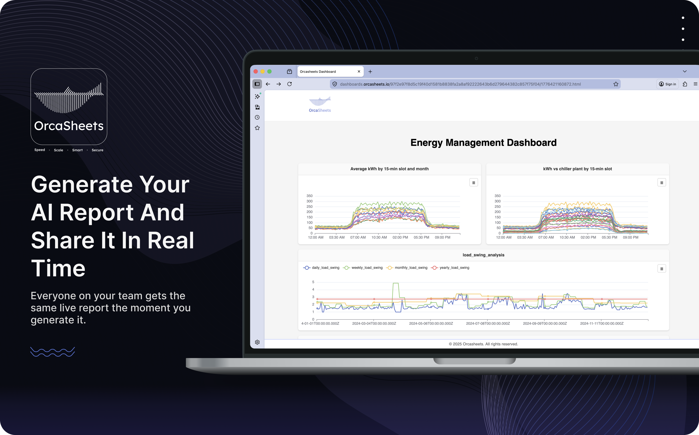

### 🎬 관련 영상
- [🎥 영상 보기](https://ph-files.imgix.net/35275634-e002-48a8-9b3a-fd38a223bc71.jpeg?auto=format)

---

## 9. [SimCam](https://www.producthunt.com/products/simcam-2)
**Votes**: 111 | **도입 난이도**: 하 | **신뢰도**: 상
**Tagline**:  Test camera features directly in the iOS simulator
**서비스 링크**: https://www.producthunt.com/r/UVKROIYUPPE4IP

**태그**: DevTool, iOS, Testing, Automation, MobileDev, Agent, Vision

### 📌 이 서비스 한눈에 보기
iOS 시뮬레이터에서 실제 기기 없이 맥 카메라 스트리밍, 이미지 주입, QR 코드 생성 등 다양한 방식으로 카메라 기능을 테스트할 수 있는 개발 도구입니다.

### 🔑 주요 기능
- 실제 iOS 기기 없이 시뮬레이터에서 카메라 기능 테스트 가능
- 맥 내장/외부 카메라 스트리밍, 이미지 주입, QR 코드 생성 등 다양한 입력 소스 지원
- CLI를 통해 iOS 시뮬레이터 카메라를 제어하고 테스트 자동화 가능

### 🙋 사용자에게 어떤 점이 좋은가
개발자들이 실제 기기 없이도 카메라 관련 기능을 효율적으로 테스트하고 디버깅할 수 있어 개발 시간을 단축하고 생산성을 높일 수 있습니다.

### ✅ 지금 바로 써볼 기능
- 맥 카메라를 연결하여 실시간 스트리밍으로 앱의 카메라 동작 테스트
- 특정 이미지를 주입하여 앱이 해당 이미지를 어떻게 처리하는지 확인
- QR 코드 생성 기능을 활용하여 앱의 QR 스캔 기능 테스트

### ⚠️ 사용 전 확인할 점
- 실제 iOS 기기에서의 카메라 동작과 시뮬레이터 환경의 미묘한 차이점 확인
- 지원하는 iOS 시뮬레이터 버전 및 macOS 환경 호환성 확인

### 🧭 확인이 더 필요한 정보
가격 정책이나 특정 고급 카메라 기능(예: ARKit 통합) 지원 여부는 추가 확인이 필요합니다.

### 📸 스크린샷 및 갤러리
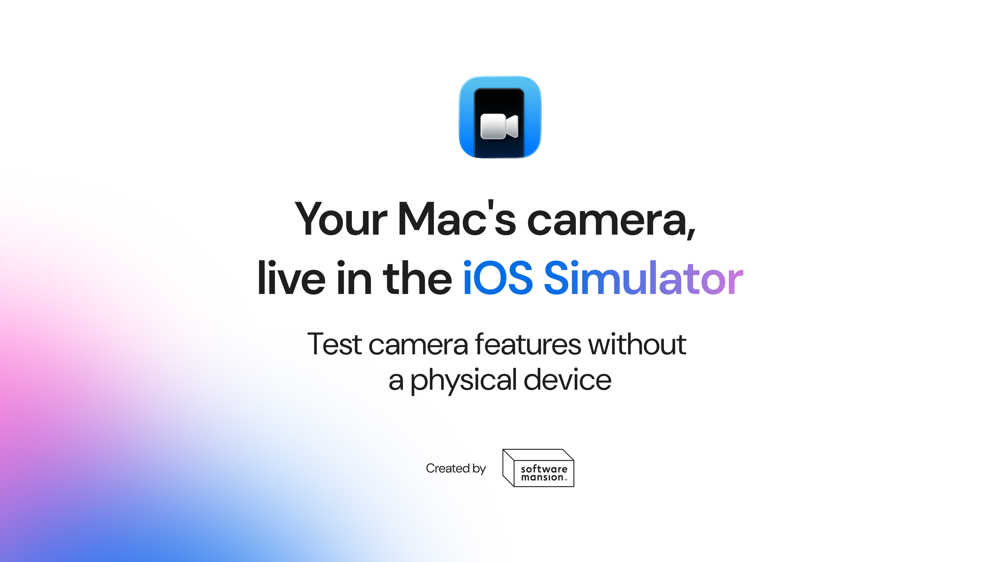
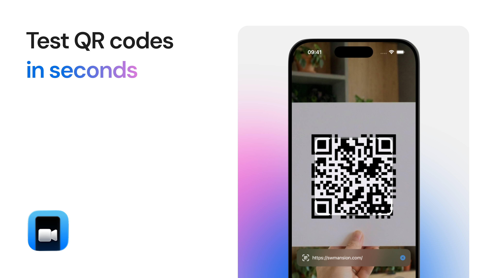
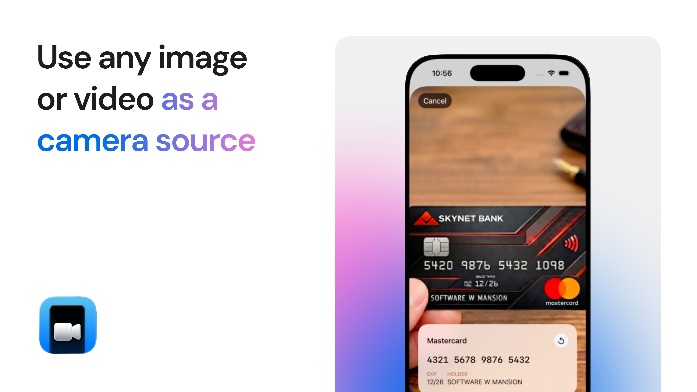

### 🎬 관련 영상
- [🎥 영상 보기](https://ph-files.imgix.net/6673d63b-fdcc-4363-bf6c-5f2700357df7.jpeg?auto=format)

---

## 10. [WUPHF by Nex.ai](https://www.producthunt.com/products/wuphf-2)
**Votes**: 105 | **도입 난이도**: 중 | **신뢰도**: 상
**Tagline**: AI employees who build their own knowledge base
**서비스 링크**: https://www.producthunt.com/r/4C6QQXXCOTMO6R

**태그**: AI, Automation, Developer Tools, Productivity, Open Source, Agent, AI Tool, LLM, Chat, DevTool

### 📌 이 서비스 한눈에 보기
AI 직원들이 스스로 지식 기반을 구축하여 문맥을 잃지 않고 작업을 수행하는 협업 오피스입니다.

### 🔑 주요 기능
- AI 직원들이 자체 지식 기반을 구축하여 작업 문맥을 지속적으로 유지합니다.
- Claude Code, Codex, OpenClaw 등 다양한 AI 에이전트와 로컬 LLM을 지원합니다.
- TUI, 웹, 텔레그램 등 다양한 방식으로 에이전트와 소통 가능하며 오픈소스입니다.

### 🙋 사용자에게 어떤 점이 좋은가
AI 직원들이 과거 대화나 작업 내용을 잊지 않아, 반복적이고 복잡한 업무를 더 정확하고 일관성 있게 처리할 수 있습니다.

### ✅ 지금 바로 써볼 기능
- AI 에이전트에게 특정 작업을 지시하고 문맥 유지 능력을 확인해보세요.
- TUI, 웹, 텔레그램 중 선호하는 인터페이스로 에이전트와 대화를 시작해보세요.
- 오픈소스 코드를 살펴보고 커스터마이징 가능성을 탐색해보세요.

### ⚠️ 사용 전 확인할 점
- 로컬 환경에서 직접 설치 및 운영해야 하므로 초기 설정 및 유지보수 노력이 필요합니다.
- 사용하는 LLM 종류와 로컬 머신의 성능에 따라 AI 에이전트의 응답 속도 및 정확도가 달라질 수 있습니다.

### 🧭 확인이 더 필요한 정보
실제 어떤 종류의 업무에 가장 효과적인지 구체적인 사용 사례가 더 필요합니다.

### 📸 스크린샷 및 갤러리
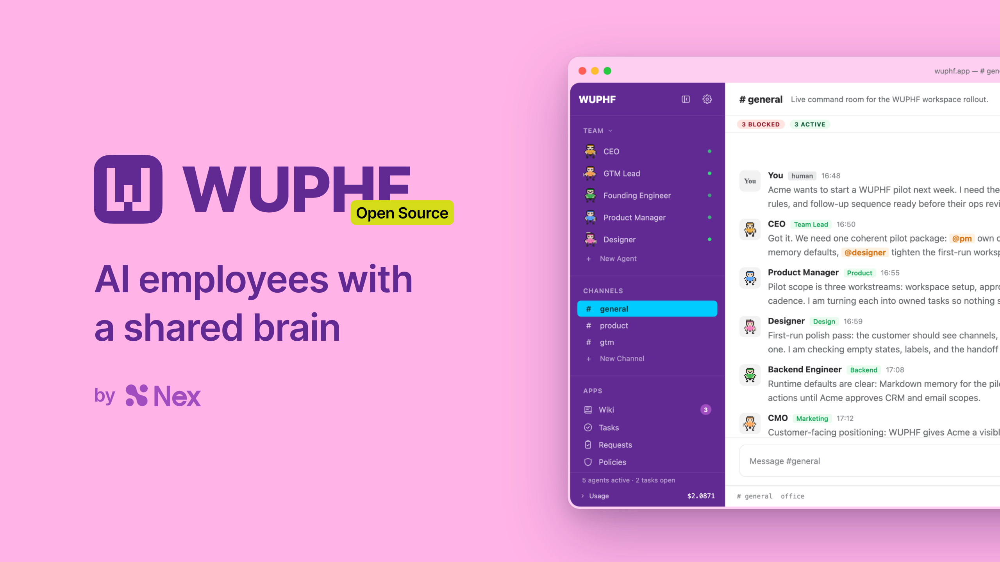
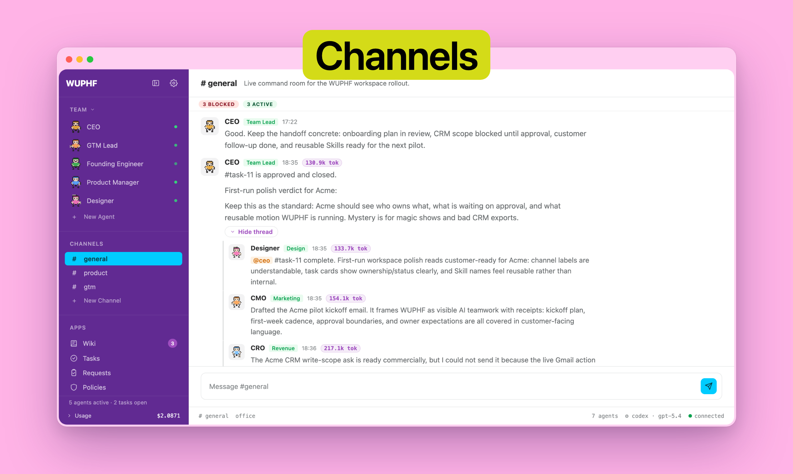
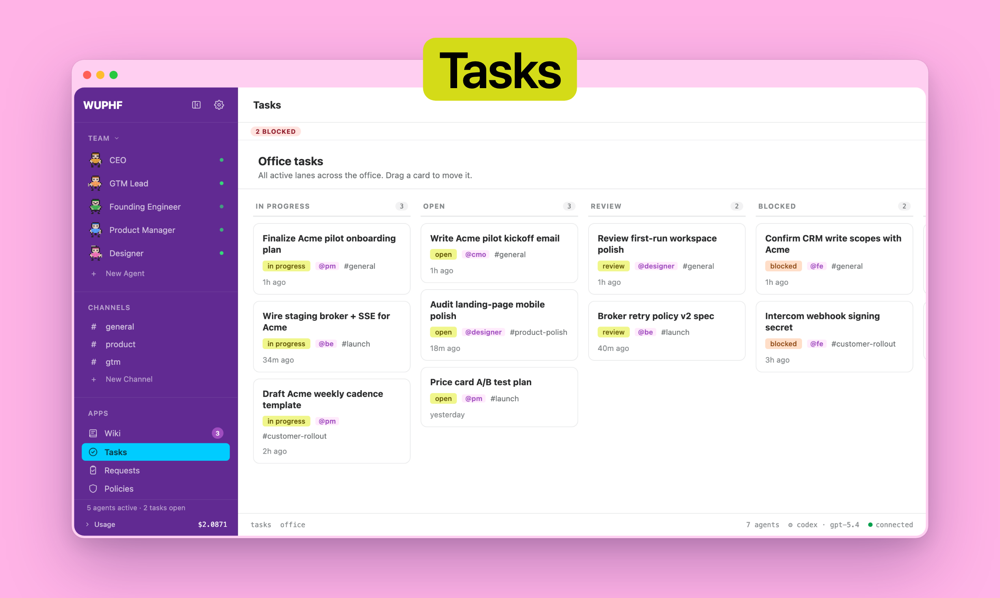

### 🎬 관련 영상
- [🎥 영상 보기](https://ph-files.imgix.net/d66abf0f-1f42-46d2-a7e0-181406c279ea.jpeg?auto=format)

---

