# 🚀 Product Hunt Daily Top 10 (2026-05-01)

## 1. [VideoOS by Jupitrr AI](https://www.producthunt.com/products/jupitrr)
**Votes**: 298 | **도입 난이도**: 하 | **신뢰도**: 상
**Tagline**: Your all-in-one video workflow
**서비스 링크**: https://www.producthunt.com/r/3NTEC76ZWZD3U7

**태그**: Video Marketing, AI, Content Creation, Automation, Social Media, AI Tool, Prompting, Video, Marketing

### 📌 이 서비스 한눈에 보기
아이디어 구상부터 소셜 미디어 게시까지, 영상 제작의 모든 과정을 AI로 빠르고 쉽게 처리해주는 올인원 플랫폼입니다.

### 🔑 주요 기능
- 아이디어 발굴부터 소셜 게시까지 영상 제작 전 과정 통합 지원
- AI 기반 스크립트 작성, 트렌드 분석, 자동 편집 기능 제공
- 자동 점프컷 텔레프롬프터로 촬영 효율성 극대화

### 🙋 사용자에게 어떤 점이 좋은가
여러 앱을 오갈 필요 없이 하나의 플랫폼에서 영상 제작 전 과정을 처리하여 시간과 비용을 절약하고, 마케팅 콘텐츠 생산성을 크게 높일 수 있습니다.

### ✅ 지금 바로 써볼 기능
- AI 스크립트 작성 기능으로 영상 아이디어 구체화하기
- 자동 점프컷 텔레프롬프터로 직접 영상 촬영해보기
- 자동 자막 및 B-roll 편집 기능으로 초안 빠르게 완성하기

### ⚠️ 사용 전 확인할 점
- AI가 생성하는 스크립트 및 B-roll의 품질과 다양성이 비즈니스 요구사항에 부합하는지 확인
- 자동 편집 기능의 세부 조정 옵션과 결과물의 최종 완성도를 검토

### 🧭 확인이 더 필요한 정보
구체적인 요금제, 지원하는 소셜 미디어 플랫폼의 종류, 그리고 외부 서비스 연동 가능 여부에 대한 정보가 필요합니다.

### 📸 스크린샷 및 갤러리
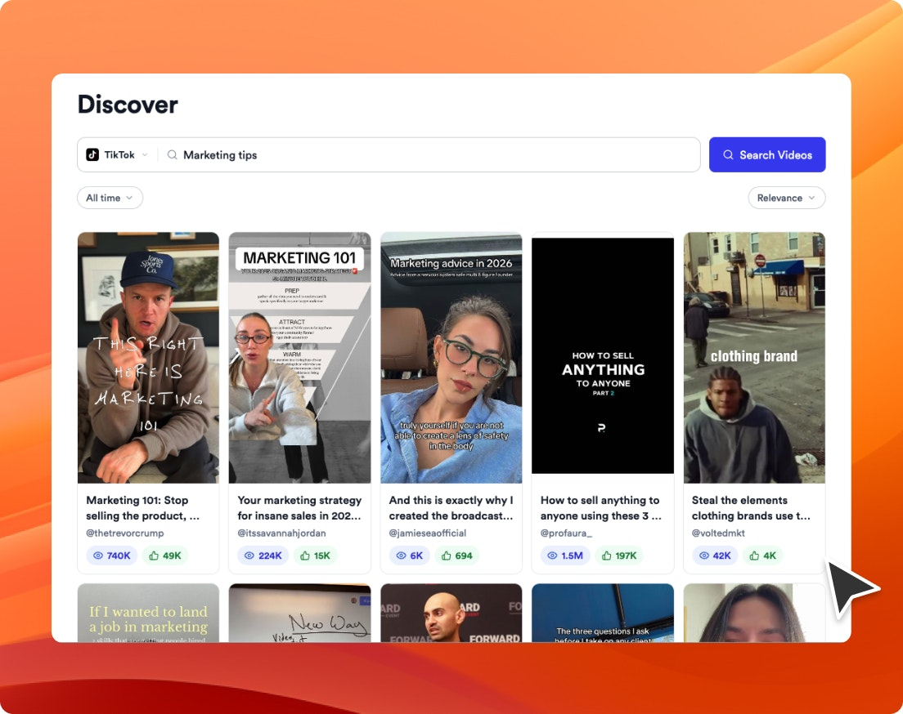
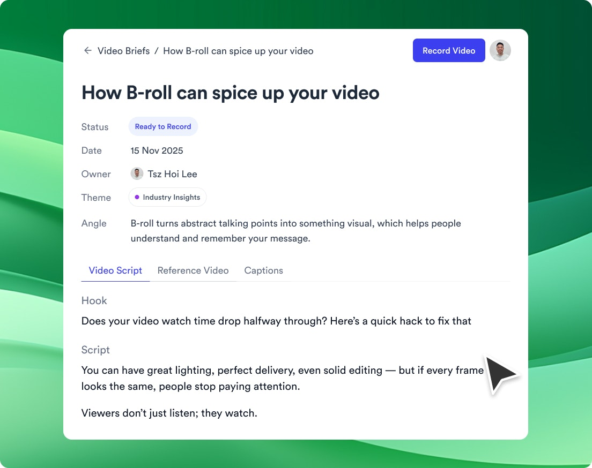

### 🎬 관련 영상
- [🎥 영상 보기](https://ph-files.imgix.net/9bb3f657-8eda-4342-9107-c4fe5230db3d.jpeg?auto=format)

---

## 2. [Mintlify Editor](https://www.producthunt.com/products/mintlify)
**Votes**: 257 | **도입 난이도**: 중 | **신뢰도**: 상
**Tagline**: AI-native collaborative editor
**서비스 링크**: https://www.producthunt.com/r/VTXQDFKI235QP6

**태그**: DevTool, AI, Collaboration, Documentation, Automation, Agent, AI Tool

### 📌 이 서비스 한눈에 보기
AI 기반으로 개발자부터 마케터까지 누구나 쉽게 협업하며 문서를 만들고 관리할 수 있는 에디터입니다.

### 🔑 주요 기능
- AI 기반 문서 작성 및 자동 업데이트 지원
- WYSIWYG 방식의 직관적인 실시간 협업 에디터
- Git과 연동되어 개발 워크플로우에 통합 가능

### 🙋 사용자에게 어떤 점이 좋은가
개발자는 Git을 통해, 마케터는 브라우저에서, 에이전트는 자동으로 문서를 업데이트할 수 있어 팀 전체의 문서 작업 효율성을 크게 높여줍니다. 모든 팀원이 각자의 방식대로 쉽게 기여할 수 있습니다.

### ✅ 지금 바로 써볼 기능
- AI 기반 문서 초안 작성 기능 사용해보기
- 동료와 실시간으로 문서 공동 편집해보기
- Git 저장소와 연동하여 문서 변경 사항 푸시/풀 해보기

### ⚠️ 사용 전 확인할 점
- AI 기능의 정확성 및 생성되는 콘텐츠의 품질 확인 필요
- 기존 문서 관리 시스템과의 연동 호환성 및 마이그레이션 방안 검토

### 🧭 확인이 더 필요한 정보
구체적인 AI 기능의 범위, 지원하는 Git 호스팅 서비스, 그리고 요금제 정보는 추가 확인이 필요합니다.

### 📸 스크린샷 및 갤러리
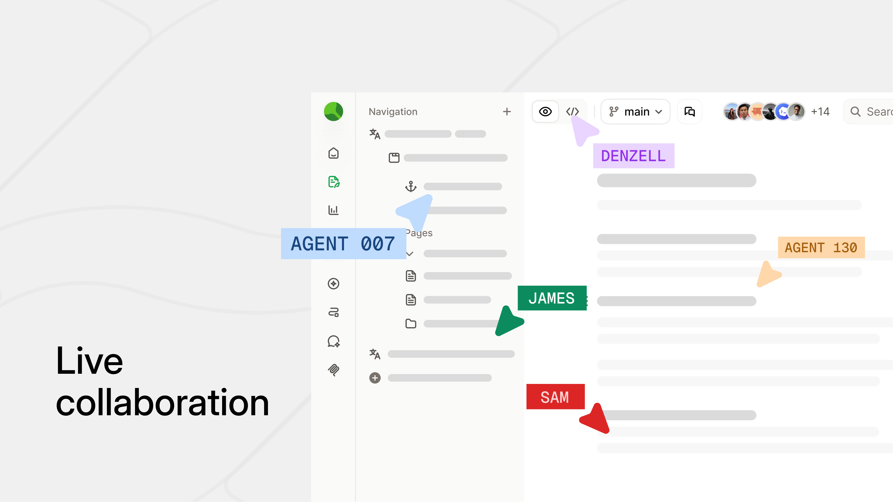
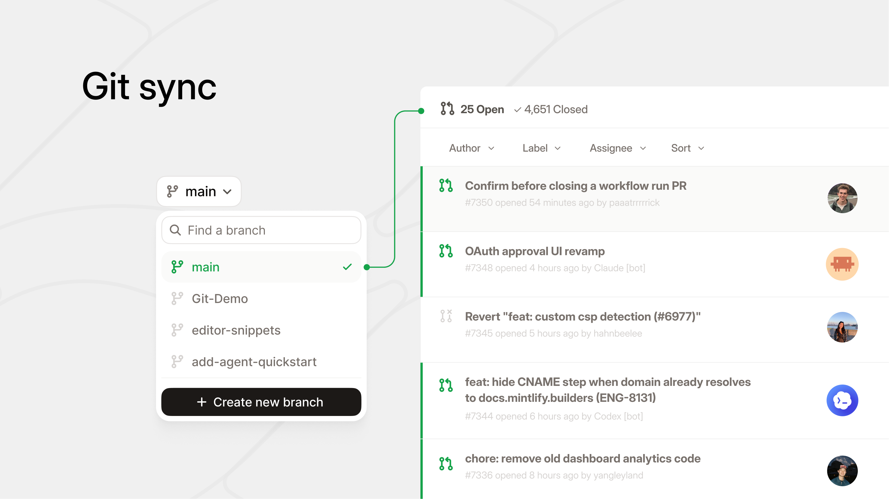
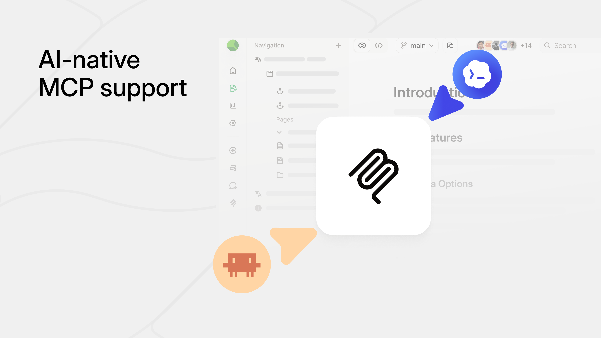

### 🎬 관련 영상
- [🎥 영상 보기](https://ph-files.imgix.net/f5db5e49-7d00-4843-89e2-1ea9e18dc6bc.jpeg?auto=format)

---

## 3. [Wonder](https://www.producthunt.com/products/wonder-public-alpha)
**Votes**: 232 | **도입 난이도**: 중 | **신뢰도**: 중
**Tagline**: The AI design agent that works on your canvas
**서비스 링크**: https://www.producthunt.com/r/KMBHRB52QH7BFG

**태그**: AI, Design Tool, DevTool, Automation, Productivity, Agent, AI Tool, Design

### 📌 이 서비스 한눈에 보기
캔버스 위에서 AI가 디자인을 생성하고 실시간으로 수정하며, 코딩 에이전트와 연동하여 디자인부터 개발까지 원스톱으로 처리하는 AI 디자인 에이전트입니다.

### 🔑 주요 기능
- 캔버스에 직접 탑재된 AI 디자인 에이전트
- UI, 그래픽, 피치덱 등 다양한 디자인 요소 생성 및 실시간 정교화
- 코딩 에이전트(Cursor, Claude Code)와 연동하여 디자인을 바로 코드로 전환 가능

### 🙋 사용자에게 어떤 점이 좋은가
디자이너는 반복적인 작업 시간을 줄여 창의적인 작업에 집중하고, 개발자는 디자인을 코드로 빠르게 전환하여 제품 출시 속도를 획기적으로 높일 수 있습니다.

### ✅ 지금 바로 써볼 기능
- 공개 알파 버전을 직접 사용해보고 AI 디자인 생성 기능 체험하기
- 생성된 디자인 요소를 실시간으로 수정하며 AI의 정교함 확인하기
- 코딩 에이전트 연동을 통해 디자인-개발 워크플로우 효율성 가늠해보기

### ⚠️ 사용 전 확인할 점
- 현재 공개 알파 버전이므로 기능의 안정성이나 완성도가 낮을 수 있습니다.
- AI가 생성하는 디자인의 품질이나 독창성이 사용자의 기대에 미치지 못할 수 있습니다.

### 🧭 확인이 더 필요한 정보
AI가 생성하는 디자인의 실제 활용도와 코딩 에이전트 연동의 매끄러운 정도는 직접 사용해봐야 정확히 알 수 있습니다.

### 📸 스크린샷 및 갤러리
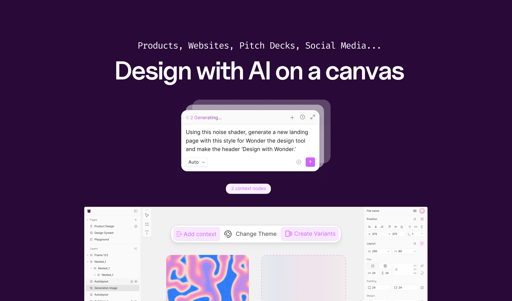
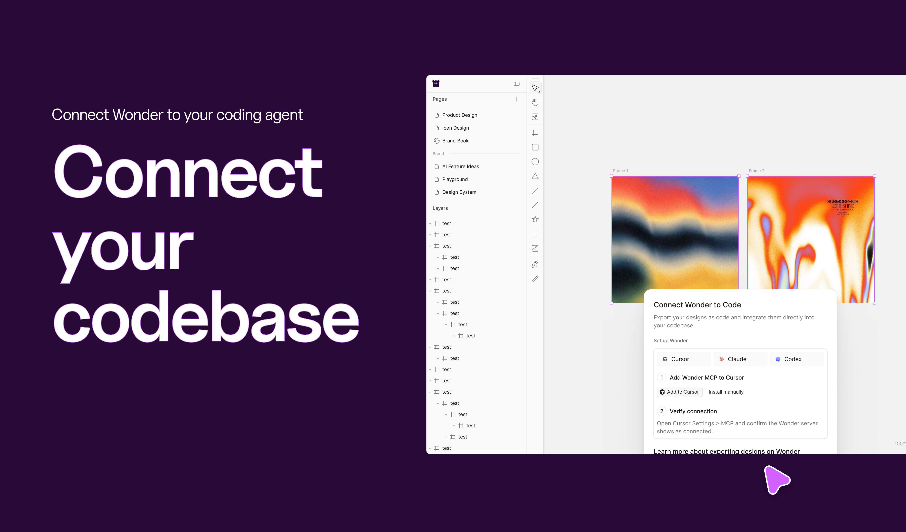

### 🎬 관련 영상
- [🎥 영상 보기](https://ph-files.imgix.net/fabca791-116c-454f-b283-55b39ead28fd.octet-stream?auto=format)

---

## 4. [Hera Launch](https://www.producthunt.com/products/hera-6)
**Votes**: 231 | **도입 난이도**: 하 | **신뢰도**: 상
**Tagline**: Create studio-quality launch videos with AI
**서비스 링크**: https://www.producthunt.com/r/QG2MGKMYCHQGUQ

**태그**: AI, Video Editing, Marketing, Productivity, Automation, AI Tool, Prompting, Video, Design

### 📌 이 서비스 한눈에 보기
AI로 몇 초 만에 스튜디오 품질의 제품 론칭 영상을 만들고, 출시 주기를 단축시켜주는 도구입니다.

### 🔑 주요 기능
- AI 기반으로 스튜디오 품질의 론칭 영상 제작
- 단일 프롬프트로 몇 초 만에 영상 생성
- 전문적인 페이싱, 타이포그래피 등 디자인 요소 자동 결정

### 🙋 사용자에게 어떤 점이 좋은가
영상 제작에 소요되던 시간과 노력을 획기적으로 줄여, 제품 팀이 더 자주, 더 빠르게 신제품을 출시하고 마케팅할 수 있도록 돕습니다. 전문 디자이너 없이도 고품질 영상을 얻을 수 있습니다.

### ✅ 지금 바로 써볼 기능
- 단일 프롬프트를 활용하여 제품 론칭 영상 빠르게 생성해보기
- 다양한 제품 아이디어로 여러 버전의 론칭 영상 시도해보기
- AI가 자동으로 결정하는 디자인 요소(페이싱, 타이포그래피 등)의 결과물 확인하기

### ⚠️ 사용 전 확인할 점
- AI가 결정하는 디자인 요소가 브랜드 가이드라인이나 특정 요구사항과 맞지 않을 수 있습니다.
- 월간 구독 모델이므로, 사용 빈도와 비용 효율성을 고려해야 합니다.

### 🧭 확인이 더 필요한 정보
실제 생성되는 영상의 품질과 커스터마이징 가능 범위에 대한 추가 확인이 필요합니다.

### 📸 스크린샷 및 갤러리
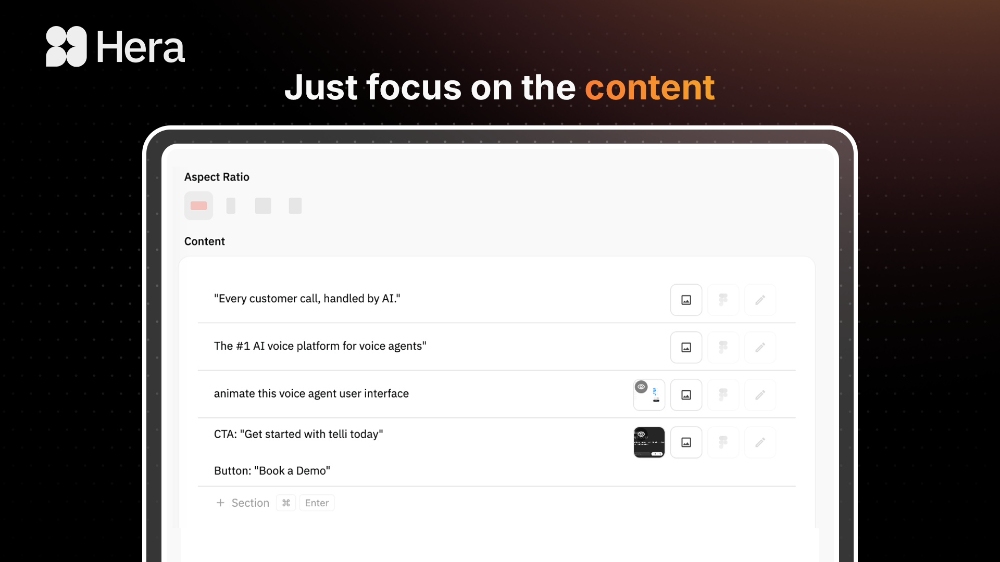
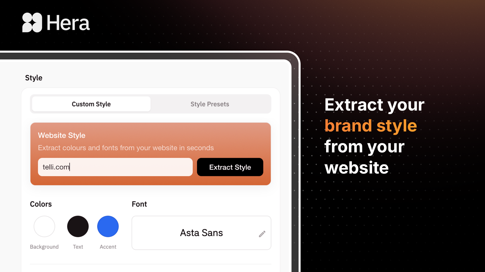
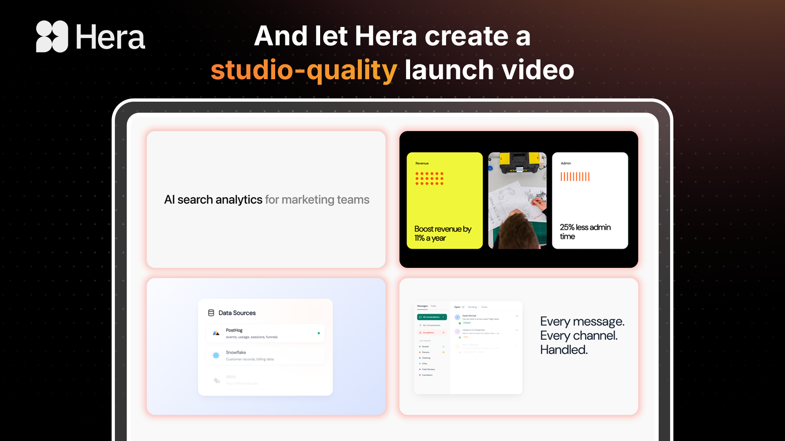

### 🎬 관련 영상
- [🎥 영상 보기](https://ph-files.imgix.net/ba9e0798-4139-490c-b94c-df908a45e79e.jpeg?auto=format)

---

## 5. [Gemini Deep Research Agent](https://www.producthunt.com/products/gemini-deep-research)
**Votes**: 164 | **도입 난이도**: 중 | **신뢰도**: 중
**Tagline**: Web and MCP research agents, now in Gemini API
**서비스 링크**: https://www.producthunt.com/r/NWPUJCSQEF5ED4

**태그**: DevTool, Automation, Analytics, Agent, AI Tool, API

### 📌 이 서비스 한눈에 보기
Gemini API를 통해 웹 및 MCP 데이터를 심층 분석하고 차트까지 생성해주는 AI 연구 에이전트입니다.

### 🔑 주요 기능
- Gemini API 기반의 두 가지 AI 연구 에이전트 제공 (실시간 대화형/심층 비동기 분석).
- 웹 및 MCP(Multi-Cloud Platform) 데이터 소스를 지원합니다.
- 분석 결과에 대한 차트 자동 생성 기능을 내장하고 있습니다.

### 🙋 사용자에게 어떤 점이 좋은가
개발자와 AI 엔지니어는 복잡한 연구 작업을 자동화하고, 다양한 데이터 소스를 활용하여 빠르고 정확한 인사이트를 얻을 수 있습니다. 이를 통해 연구 효율성을 극대화하고 의사결정을 가속화할 수 있습니다.

### ✅ 지금 바로 써볼 기능
- Gemini API를 활용하여 실시간 대화형 연구 워크플로우를 구축해보기.
- Deep Research Max를 이용해 대규모 비동기 데이터 합성 및 분석 시도해보기.
- 분석 결과에 대한 차트 자동 생성 기능을 활용하여 시각화된 보고서 만들어보기.

### ⚠️ 사용 전 확인할 점
- Gemini API 연동 및 개발 역량이 필요하며, 초기 설정에 시간이 소요될 수 있습니다.
- MCP 데이터 소스의 구체적인 범위와 지원 여부를 확인해야 합니다.

### 🧭 확인이 더 필요한 정보
지원하는 MCP 데이터 소스의 종류와 각 에이전트의 구체적인 성능 벤치마크에 대한 추가 정보가 필요합니다.

### 📸 스크린샷 및 갤러리
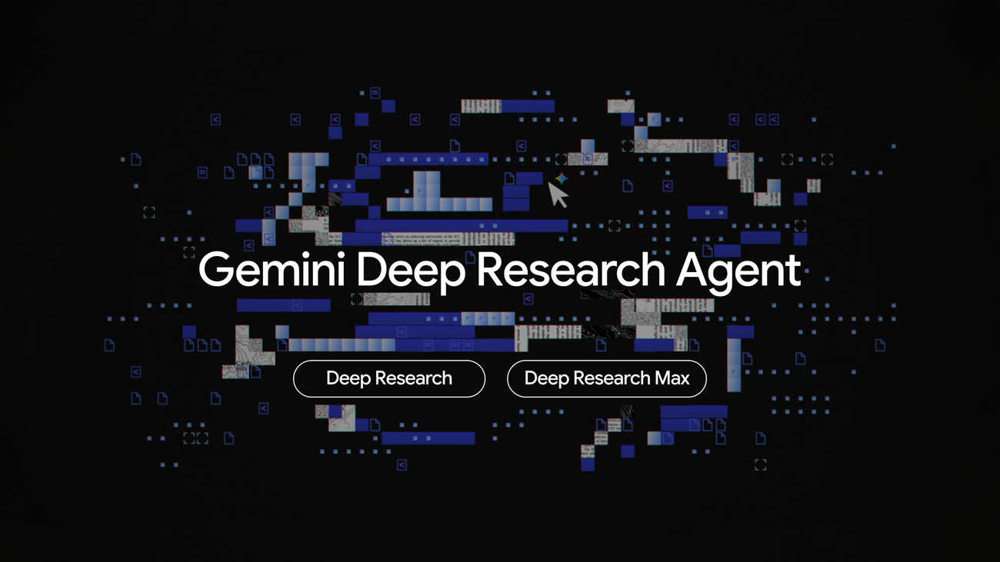
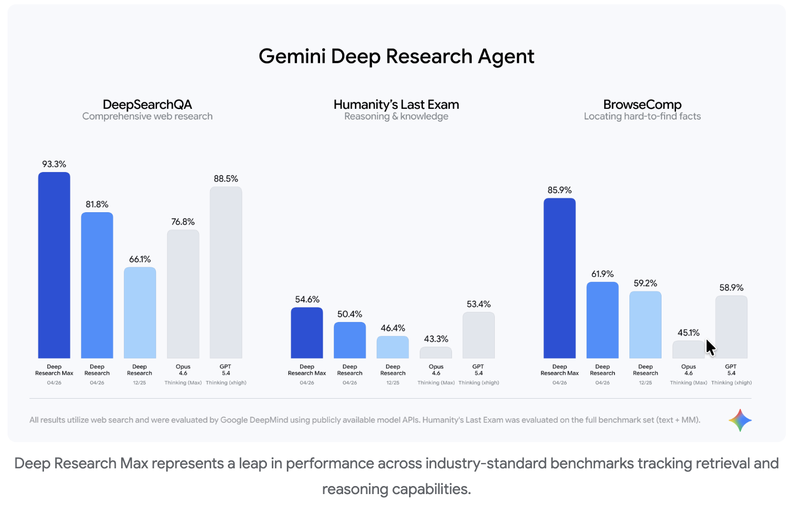
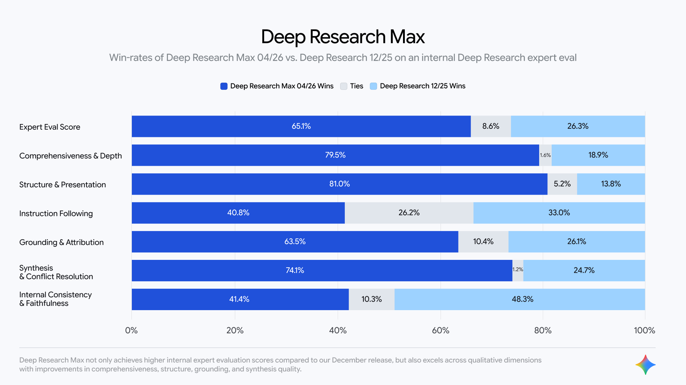

### 🎬 관련 영상
- [🎥 영상 보기](https://ph-files.imgix.net/389453f7-d0f5-419e-aea8-2173e85ca07d.jpeg?auto=format)

---

## 6. [File Generation in Gemini](https://www.producthunt.com/products/gemini-6)
**Votes**: 122 | **도입 난이도**: 하 | **신뢰도**: 상
**Tagline**: Generate production-ready files directly in your chat
**서비스 링크**: https://www.producthunt.com/r/CVW4SIMAWOG26F

**태그**: AI, Productivity, Content Creation, Automation, Chat, Prompting

### 📌 이 서비스 한눈에 보기
Gemini 채팅에서 다양한 형식의 파일을 바로 생성하고 다운로드하여 작업 효율을 극대화합니다.

### 🔑 주요 기능
- Gemini 채팅 내에서 직접 파일 생성 가능
- Google Docs, Sheets, Slides, PDF, Word, Excel 등 다양한 파일 형식 지원
- 복사, 붙여넣기, 재포맷 없이 즉시 사용 가능한 파일 제공

### 🙋 사용자에게 어떤 점이 좋은가
기존에 여러 단계를 거쳐야 했던 문서 작성 및 변환 과정을 Gemini 채팅 하나로 통합하여 시간을 절약하고 번거로움을 줄여줍니다. 즉시 공유 가능한 파일을 얻을 수 있어 업무 흐름이 훨씬 매끄러워집니다.

### ✅ 지금 바로 써볼 기능
- 간단한 보고서 초안을 Gemini에게 요청하고 Google Docs 파일로 받아보기
- 데이터 요약본을 CSV 또는 Excel 파일로 생성하여 분석에 활용하기
- 아이디어 브레인스토밍 결과를 Markdown 파일로 정리하여 공유하기

### ⚠️ 사용 전 확인할 점
- 생성된 파일의 내용 정확성 및 품질은 Gemini의 답변 능력에 따라 달라질 수 있음
- 민감한 정보가 포함된 파일 생성 시 보안 및 개인정보 보호 정책 확인 필요

### 🧭 확인이 더 필요한 정보
각 파일 형식별로 지원되는 기능의 범위나 복잡한 서식 유지 여부에 대한 상세 정보는 추가 확인이 필요합니다.

### 📸 스크린샷 및 갤러리
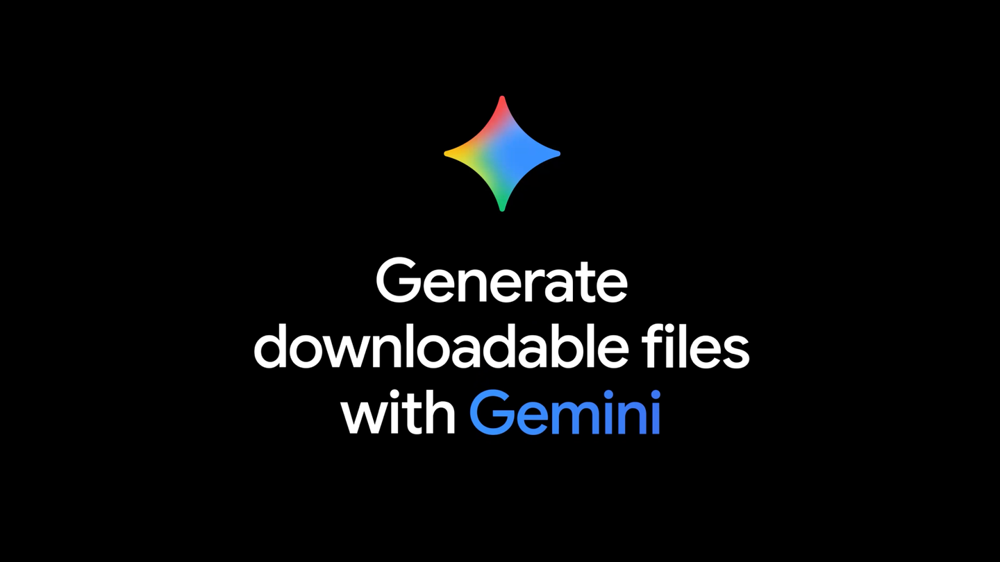
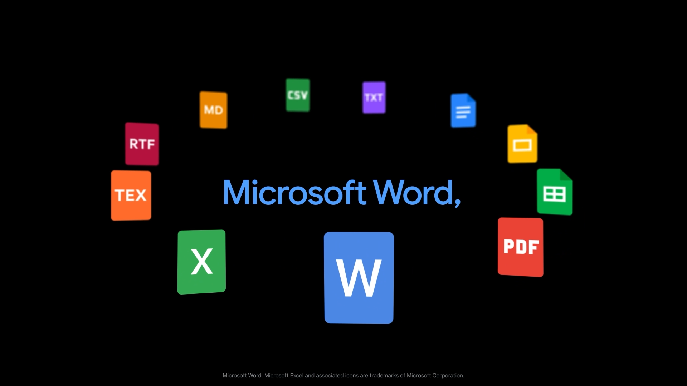
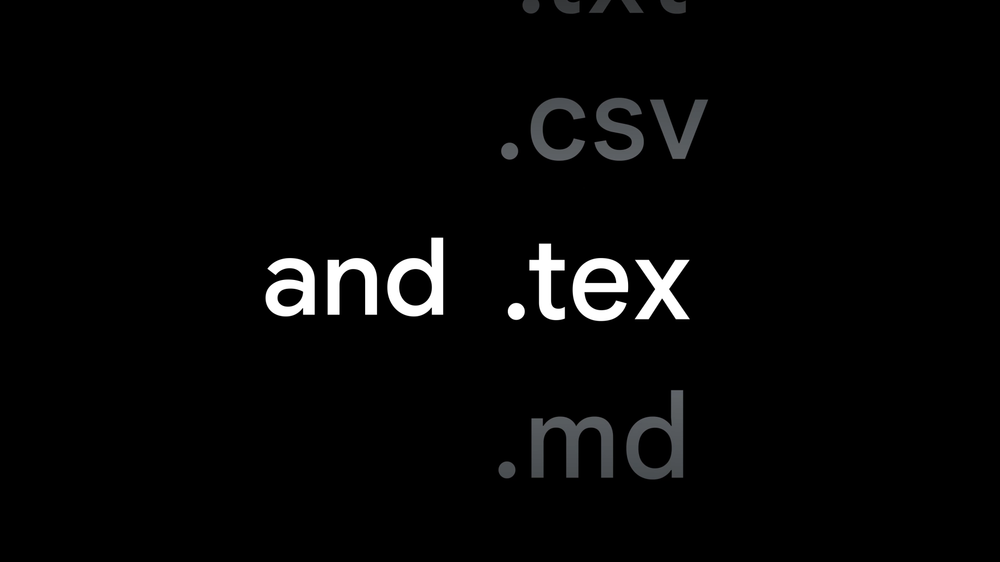

---

## 7. [Quarkdown](https://www.producthunt.com/products/quarkdown)
**Votes**: 114 | **도입 난이도**: 중 | **신뢰도**: 중
**Tagline**: Markdown wit LaTeX in a modern typesetting system
**서비스 링크**: https://www.producthunt.com/r/QB6RTH5OYVGS2X

**태그**: Markdown, LaTeX, 조판, VS Code, 문서 작성, DevTool

### 📌 이 서비스 한눈에 보기
Quarkdown은 Markdown 기반의 현대적인 조판 시스템으로 논문, 발표 자료, 지식 베이스, 웹사이트 제작을 쉽게 만들어줍니다.

### 🔑 주요 기능
- 친숙한 Markdown 문법 사용
- 강력한 확장 기능으로 문서 완벽 제어
- 실시간 미리보기로 작업 효율성 향상

### 🙋 사용자에게 어떤 점이 좋은가
VS Code나 터미널에서 Markdown으로 작성하면서 LaTeX의 강력한 기능을 활용하여 전문적인 문서를 쉽게 만들 수 있습니다.

### ✅ 지금 바로 써볼 기능
- VS Code에서 Quarkdown 설치 후 Markdown 문서 작성 시작
- LaTeX 확장 기능 사용해보기
- 실시간 미리보기 기능 활용하여 작업 속도 향상

### ⚠️ 사용 전 확인할 점
- LaTeX 문법에 대한 기본적인 이해 필요
- VS Code 또는 터미널 환경에 대한 숙지 필요

### 🧭 확인이 더 필요한 정보
Quarkdown의 성능 및 안정성에 대한 사용자 리뷰 확인이 필요합니다.

### 📸 스크린샷 및 갤러리
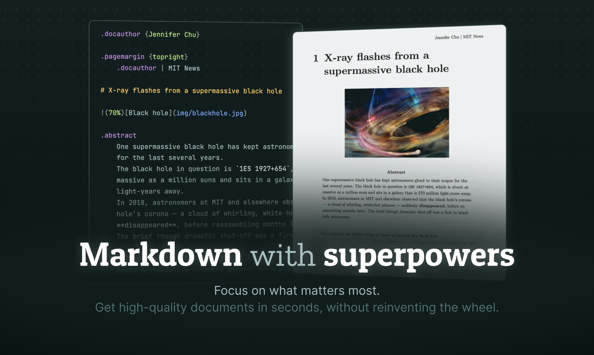
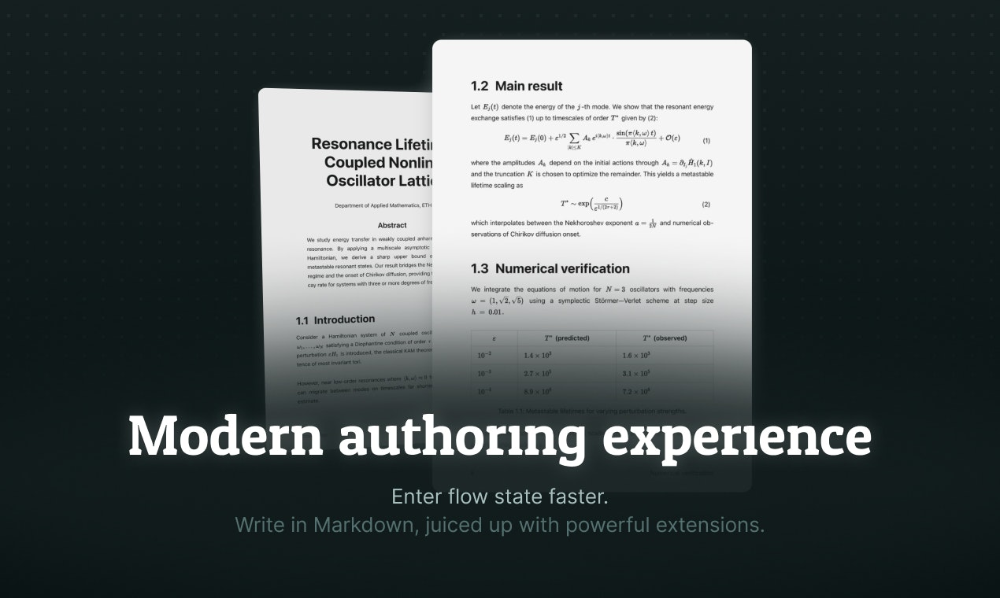
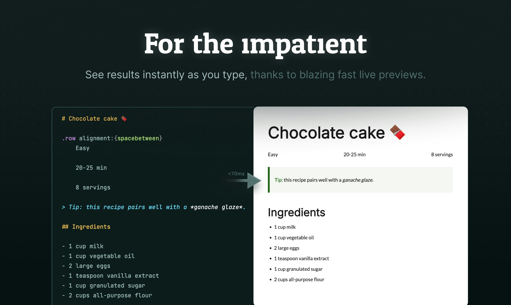

---

## 8. [Tabstack](https://www.producthunt.com/products/tabstack)
**Votes**: 110 | **도입 난이도**: 중 | **신뢰도**: 상
**Tagline**: Extract web data and automate browsers, no scraper required.
**서비스 링크**: https://www.producthunt.com/r/QH3WOZ3COBXHWN

**태그**: DevTool, Automation, Data Extraction, API, Web Analytics, AI Tool

### 📌 이 서비스 한눈에 보기
스크래퍼 구축 없이 웹 데이터 추출 및 브라우저 자동화를 간편하게 처리하고, 신뢰할 수 있는 구조화된 데이터를 JSON으로 받아볼 수 있는 API입니다.

### 🔑 주요 기능
- 스크래퍼 개발 및 유지보수 없이 웹 데이터 추출 및 브라우저 자동화 가능.
- URL과 스키마만으로 항상 일치하는 신뢰할 수 있는 JSON 형식의 구조화된 데이터 획득.
- 인프라 구축 없이 브라우저 자동화 및 지능형 API 호출로 연구 및 분석 수행.

### 🙋 사용자에게 어떤 점이 좋은가
복잡한 스크래퍼 개발 및 유지보수 부담 없이 웹 데이터를 쉽게 얻고 브라우저 작업을 자동화하여 개발 시간과 비용을 절감할 수 있습니다. 항상 일관된 형식의 데이터를 받아볼 수 있어 데이터 활용의 신뢰성을 높여줍니다.

### ✅ 지금 바로 써볼 기능
- 관심 있는 웹사이트 URL과 원하는 데이터 스키마를 정의하여 JSON 데이터 추출을 시도해보기.
- 특정 웹 작업 자동화가 필요한 시나리오에 Tabstack API를 적용하여 브라우저 자동화 기능 테스트.
- 반복적인 웹 기반 연구나 데이터 수집 작업에 Tabstack을 활용하여 효율성 증대 방안 모색.

### ⚠️ 사용 전 확인할 점
- API 기반 서비스이므로 Tabstack 서비스의 안정성과 정책 변화에 의존하게 됩니다.
- 정확한 데이터 추출을 위해서는 사용자가 원하는 데이터의 스키마를 명확하게 정의해야 합니다.

### 🧭 확인이 더 필요한 정보
구체적인 요금 체계, 지원하는 데이터 형식의 다양성, 그리고 대규모 사용 시의 성능 한계에 대한 정보는 추가 확인이 필요합니다.

### 📸 스크린샷 및 갤러리
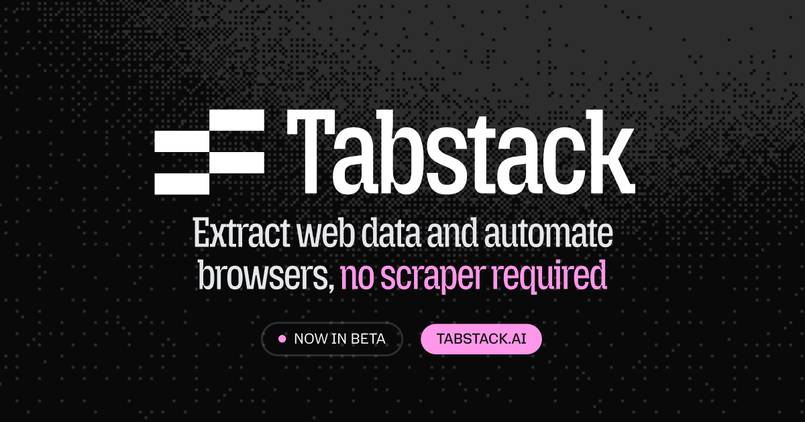
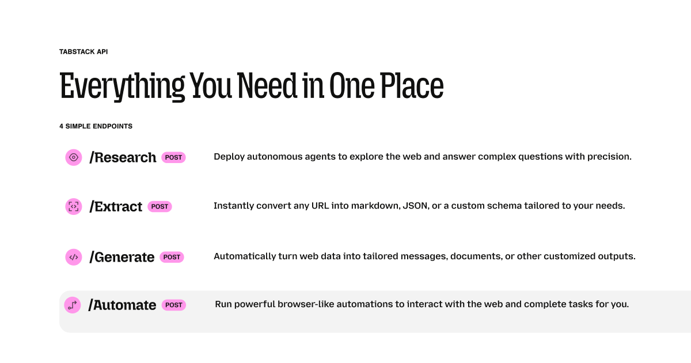
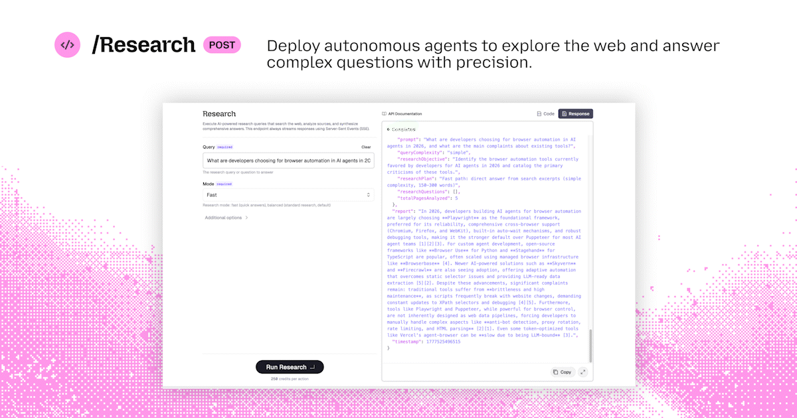

---

## 9. [Invite Only](https://www.producthunt.com/products/invite-only)
**Votes**: 108 | **도입 난이도**: 하 | **신뢰도**: 상
**Tagline**: The event invite that actually gets people to show up
**서비스 링크**: https://www.producthunt.com/r/SJ7XHAL6VV2LOG

**태그**: Event Management, Productivity, WhatsApp, Payments, RSVP, AI Tool, Chat

### 📌 이 서비스 한눈에 보기
WhatsApp 기반 시장을 위한 간편한 이벤트 초대 플랫폼으로, 실제 참석자를 정확히 파악하고 관리할 수 있게 해줍니다.

### 🔑 주요 기능
- WhatsApp에 최적화된 이벤트 초대 및 관리
- 2분 만에 이벤트 페이지 생성 및 간편한 공유
- 앱 설치 없이 OTP로 30초 만에 RSVP 및 UPI 결제 지원

### 🙋 사용자에게 어떤 점이 좋은가
이벤트 주최자는 불확실한 참석 여부로 인한 스트레스를 줄이고, 실제 참석자 명단을 정확히 파악하여 효율적인 행사 준비를 할 수 있습니다. 참석자 또한 앱 설치 없이 빠르고 간편하게 RSVP 및 결제를 완료할 수 있습니다.

### ✅ 지금 바로 써볼 기능
- 나만의 이벤트 페이지를 2분 안에 만들어보기
- 생성된 초대 링크를 WhatsApp으로 공유해보기
- 실제 참석자가 RSVP하는 과정을 직접 체험해보기 (OTP 인증 및 UPI 결제 흐름)

### ⚠️ 사용 전 확인할 점
- 주로 WhatsApp 및 UPI를 사용하는 시장에 특화되어 있어, 다른 지역이나 결제 수단에는 제한적일 수 있습니다.
- 무료/유료 기능 범위, 수수료 등 서비스 이용 정책에 대한 정보가 필요합니다.

### 🧭 확인이 더 필요한 정보
서비스의 정확한 가격 정책, 지원하는 다른 결제 수단, 그리고 대규모 이벤트 관리 기능에 대한 추가 정보가 필요합니다.

### 📸 스크린샷 및 갤러리

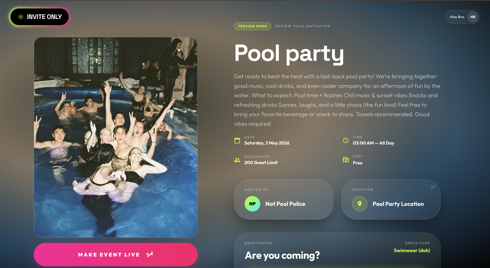
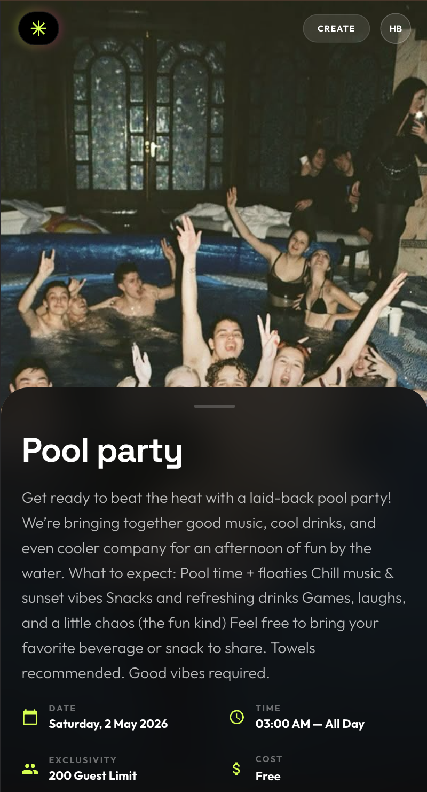

### 🎬 관련 영상
- [🎥 영상 보기](https://ph-files.imgix.net/ea9d9434-b04b-46c3-a093-66fd109f20e7.jpeg?auto=format)

---

## 10. [Rova AI](https://www.producthunt.com/products/rova-ai)
**Votes**: 104 | **도입 난이도**: 중 | **신뢰도**: 중
**Tagline**: Autonomous, goal-driven testing for web & mobile apps
**서비스 링크**: https://www.producthunt.com/r/QC4NXK7LQEK62P

**태그**: DevTool, Automation, Testing, AI, AI Tool

### 📌 이 서비스 한눈에 보기
Rova AI는 웹/모바일 앱의 자동 테스트를 통해 실제 사용자 워크플로우 검증, UI 변경 자동 감지, 명확한 보고서 생성 기능을 제공하여 테스트 스크립트 작성 없이 효율적인 테스트 환경을 구축할 수 있도록 돕습니다.

### 🔑 주요 기능
- 테스트 스크립트 없이 자동 테스트 가능
- 실제 사용자 워크플로우 검증 및 UI 변경 자동 감지
- Jira, Linear 등 이슈 티켓 연동을 통한 피드백 보고

### 🙋 사용자에게 어떤 점이 좋은가
테스트 자동화를 통해 개발자는 테스트 스크립트 작성 부담을 줄이고, 실제 사용자 환경에 가까운 테스트를 수행하여 앱 품질을 향상시킬 수 있습니다. 이슈 티켓 연동으로 테스트 결과 확인 및 피드백이 용이합니다.

### ✅ 지금 바로 써볼 기능
- Jira 또는 Linear와 연동하여 티켓 기반 테스트 자동화 설정
- 웹/모바일 앱의 주요 워크플로우 자동 테스트 설정
- 테스트 결과 보고서 확인 및 개선 사항 반영

### ⚠️ 사용 전 확인할 점
- 자동 테스트의 정확도 및 커버리지 확인 필요
- 특정 UI 요소 또는 워크플로우에 대한 추가 설정 필요 가능성

### 🧭 확인이 더 필요한 정보
Rova AI의 자동 테스트가 모든 유형의 앱 및 워크플로우를 완벽하게 지원하는지 확인이 필요합니다.

### 📸 스크린샷 및 갤러리
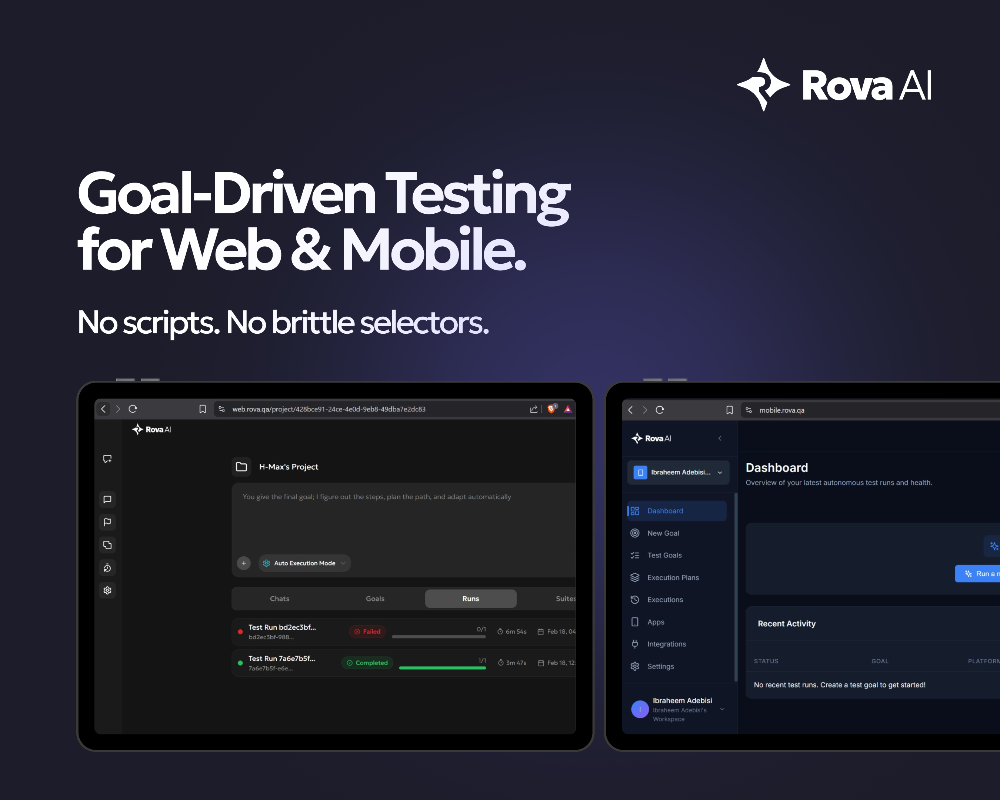
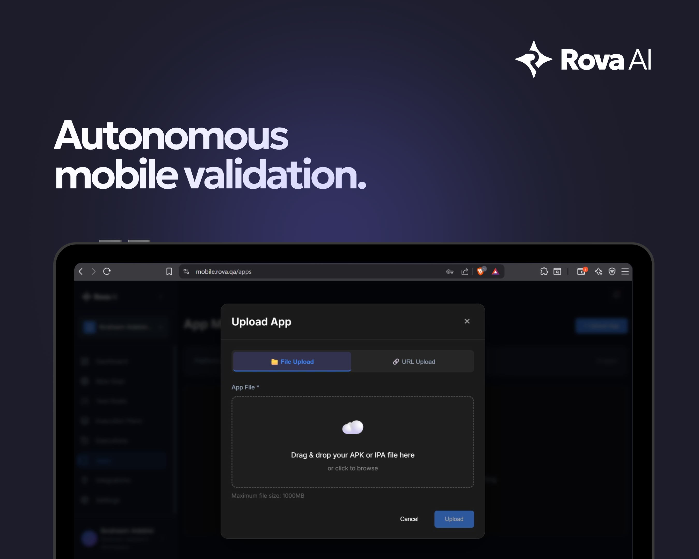
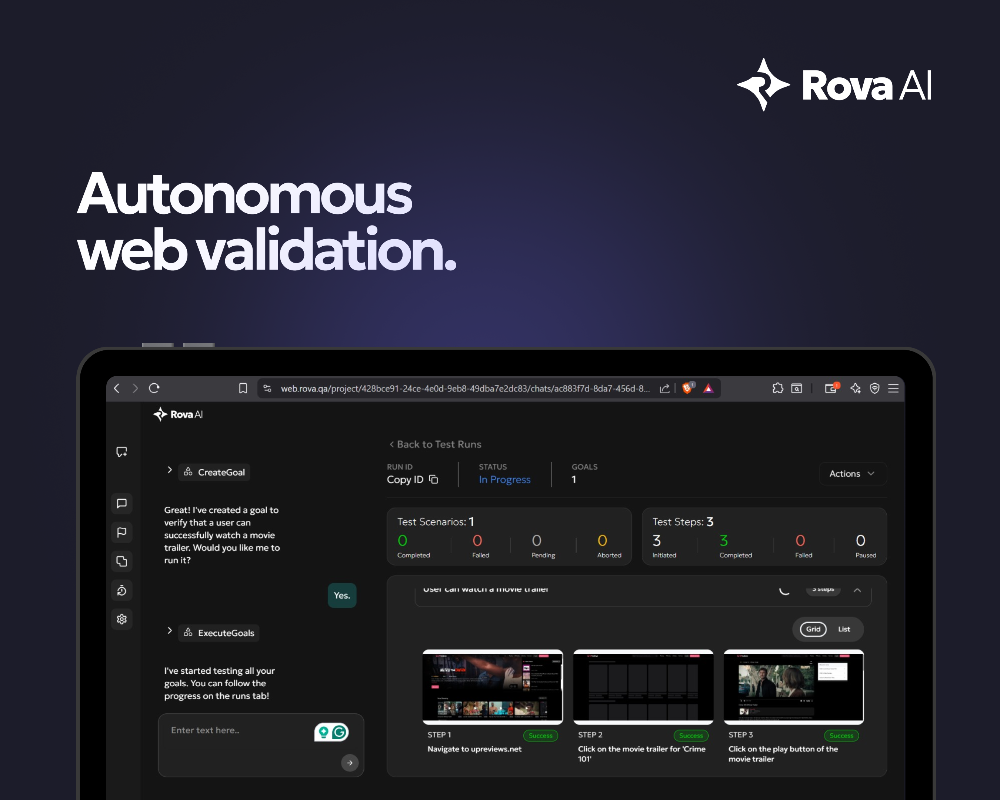

### 🎬 관련 영상
- [🎥 영상 보기](https://ph-files.imgix.net/c7b8c782-5e31-4a2e-8e13-b726068b5740.jpeg?auto=format)

---

