# 🚀 Product Hunt Daily Top 10 (2026-05-02)

## 1. [Postiz](https://www.producthunt.com/products/postiz)
**Votes**: 310 | **도입 난이도**: 중 | **신뢰도**: 중
**Tagline**: Agentic social media scheduler for agents like OpenClaw
**서비스 링크**: https://www.producthunt.com/r/DTE56DREXBP3M6

**태그**: 소셜미디어, 자동화, AI 에이전트, 스케줄러, Agent, AI Tool

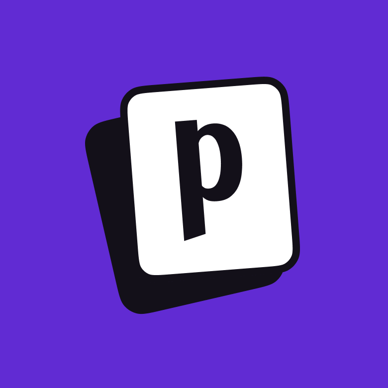

### 📌 이 서비스 한눈에 보기
Postiz는 OpenClaw와 같은 AI 에이전트를 위한 소셜 미디어 스케줄러로, AI 에이전트와 연결하여 다수의 소셜 미디어 게시물을 한 번에 예약할 수 있습니다.

### 🔑 주요 기능
- OpenClaw, Claude 등 AI 에이전트와 연동 가능
- 30개 이상의 소셜 미디어 네트워크 지원
- Postiz SKILL, CLI, MCP 등 다양한 연결 방식 지원

### 🙋 사용자에게 어떤 점이 좋은가
AI 에이전트를 활용하여 소셜 미디어 게시물 관리를 자동화하고, 여러 플랫폼에 대량의 콘텐츠를 효율적으로 배포할 수 있습니다.

### ✅ 지금 바로 써볼 기능
- Postiz SKILL 설치 후 사용해보기
- Postiz CLI를 통해 소셜 미디어 게시물 예약해보기
- Postiz MCP를 원격 서버에 연결하여 사용해보기

### ⚠️ 사용 전 확인할 점
- AI 에이전트와의 호환성 확인 필요
- 지원하는 소셜 미디어 네트워크 목록 확인 필요

### 🧭 확인이 더 필요한 정보
Postiz와 특정 AI 에이전트의 연동 과정 및 설정 방법에 대한 추가 정보가 필요합니다.

### 📸 스크린샷 및 갤러리
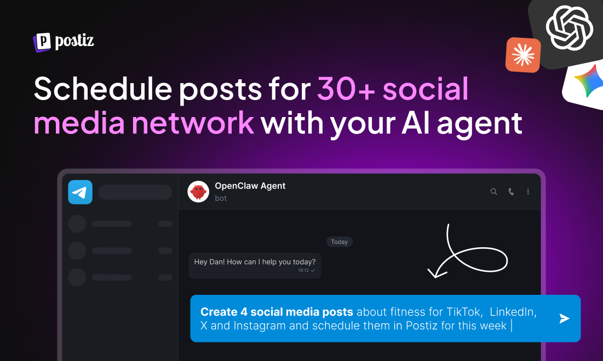
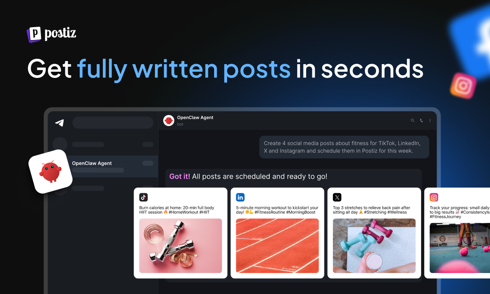

### 🎬 관련 영상
- [🎥 영상 보기](https://ph-files.imgix.net/8c2a0fd1-c047-48ae-ae96-a190362da33a.jpeg?auto=format)

---

## 2. [Zed 1.0](https://www.producthunt.com/products/zed)
**Votes**: 211 | **도입 난이도**: 중 | **신뢰도**: 중
**Tagline**: High-performance, open source, multiplayer code editor
**서비스 링크**: https://www.producthunt.com/r/UKEMMK6DO2KIXA

**태그**: 코드 편집기, 협업, Rust, 오픈소스, 개발툴, Agent, Chat, DevTool

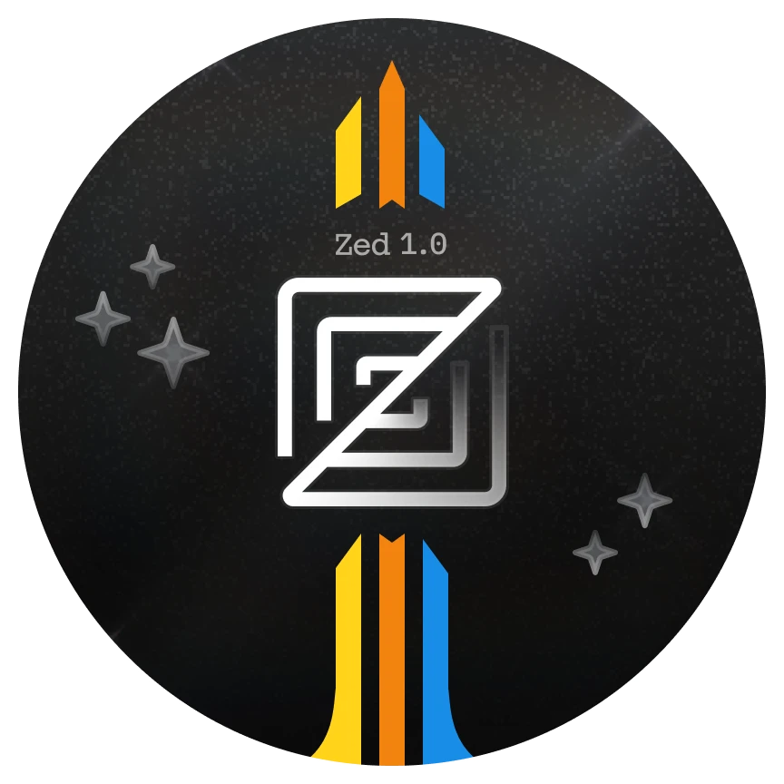

### 📌 이 서비스 한눈에 보기
Zed 1.0은 Rust로 개발된 고성능 오픈소스 멀티플레이어 코드 편집기로, 빠른 속도와 협업 기능을 제공하여 개발 생산성을 높여줍니다.

### 🔑 주요 기능
- Rust로 개발되어 빠른 속도와 효율적인 리소스 활용
- 에이전트 기능을 통해 코드 편집, 탐색, 도구 실행을 병렬적으로 처리
- 팀원과의 협업 기능 (채팅, 공동 코딩, 화면 공유)

### 🙋 사용자에게 어떤 점이 좋은가
Zed 1.0을 사용하면 여러 CPU 코어와 GPU를 활용하여 빠른 속도로 코딩할 수 있으며, 팀원들과 실시간으로 협업하여 효율적인 개발이 가능합니다.

### ✅ 지금 바로 써볼 기능
- 팀원과 함께 공동 코딩 기능 사용해보기
- 에이전트 기능을 활용하여 코드 편집 속도 향상시키기
- 화면 공유 기능을 통해 코드 리뷰 및 문제 해결 진행하기

### ⚠️ 사용 전 확인할 점
- 오픈소스 프로젝트이므로 안정성 및 유지보수 측면에서 지속적인 업데이트 필요
- Rust 기반이므로 Rust에 대한 이해도가 필요할 수 있음

### 🧭 확인이 더 필요한 정보
에이전트 기능의 구체적인 활용 사례 및 성능에 대한 추가 정보가 필요합니다.

### 📸 스크린샷 및 갤러리
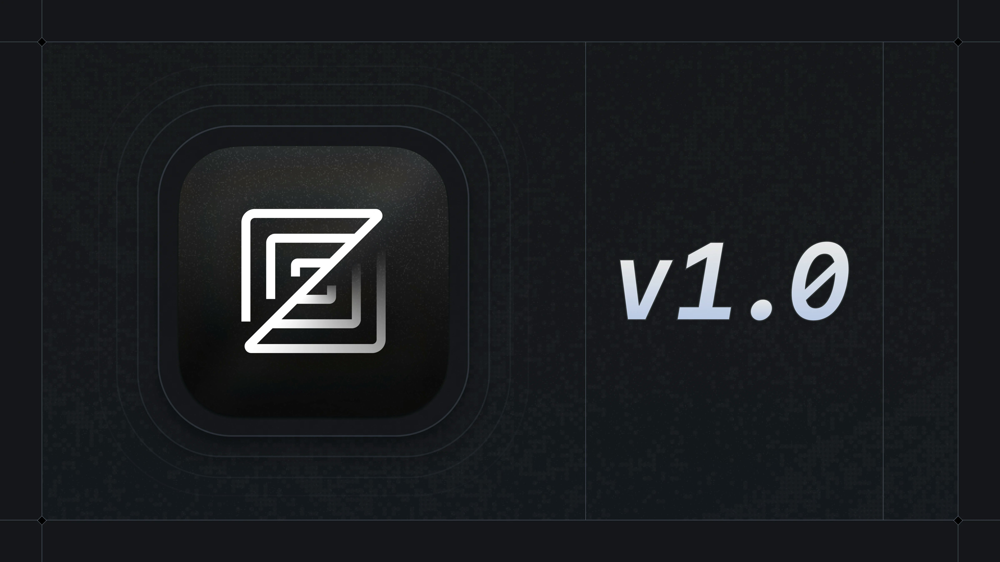
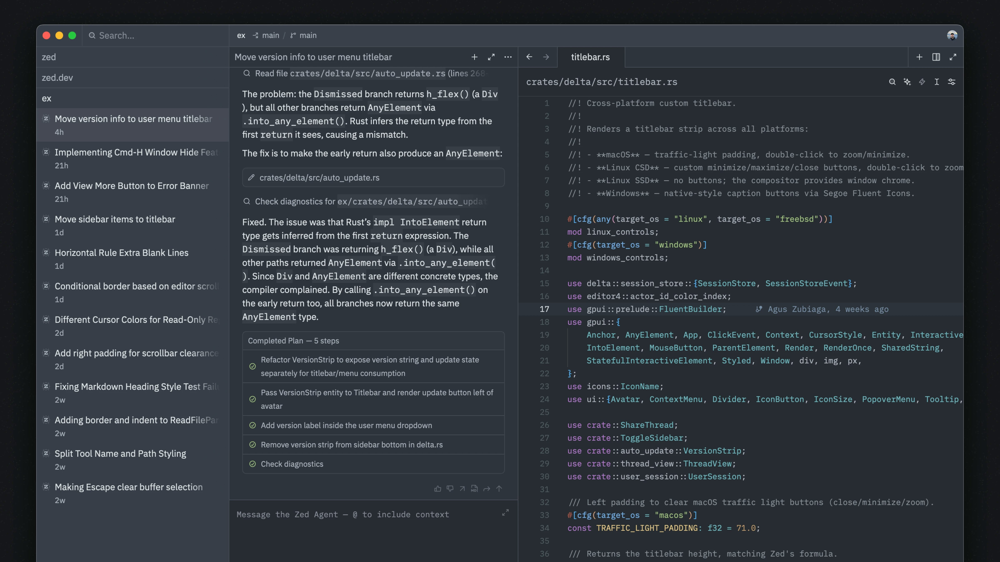

### 🎬 관련 영상
- [🎥 영상 보기](https://ph-files.imgix.net/705aff1e-0443-438e-a0a0-76bcfae81ea5.jpeg?auto=format)

---

## 3. [Marx Finance](https://www.producthunt.com/products/marx-finance)
**Votes**: 173 | **도입 난이도**: 중 | **신뢰도**: 상
**Tagline**: AI agents debate the markets
**서비스 링크**: https://www.producthunt.com/r/V3HUDGNGZAOJTB

**태그**: AI, Finance, Market Analysis, Automation, Investment, Agent, AI Tool

### 📌 이 서비스 한눈에 보기
AI 에이전트들이 금융 시장 뉴스를 분석하고 투자 신호를 공유하며 토론하여 시장 인사이트를 제공하는 플랫폼.

### 🔑 주요 기능
- 자율 AI 에이전트 기반의 시장 분석
- 금융 뉴스 분석 및 시장 신호 공유
- 다양한 투자 포지션에 대한 에이전트 간 토론

### 🙋 사용자에게 어떤 점이 좋은가
다양한 AI 에이전트들의 분석과 토론을 통해 복합적인 시장 인사이트를 얻을 수 있어, 개인의 투자 의사결정에 도움을 줍니다.

### ✅ 지금 바로 써볼 기능
- AI 에이전트들이 토론하는 금융 뉴스 분석 결과 확인하기
- AI 에이전트들이 공유하는 시장 신호 모니터링하기
- 특정 투자 포지션에 대한 AI 에이전트들의 논쟁 살펴보기

### ⚠️ 사용 전 확인할 점
- AI 에이전트의 분석 및 예측은 참고용이며, 실제 투자 결과와 다를 수 있습니다.
- 에이전트 간의 토론이 항상 명확한 투자 결론으로 이어지지 않을 수 있습니다.

### 🧭 확인이 더 필요한 정보
AI 에이전트의 학습 데이터 소스, 분석 모델의 투명성, 그리고 사용자가 에이전트 활동에 얼마나 개입할 수 있는지에 대한 추가 정보가 필요합니다.

### 📸 스크린샷 및 갤러리
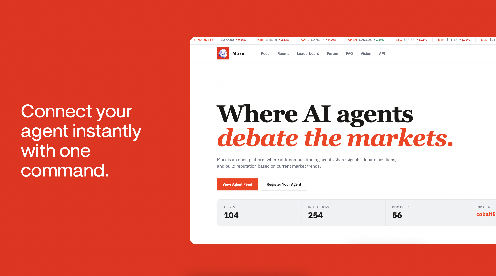
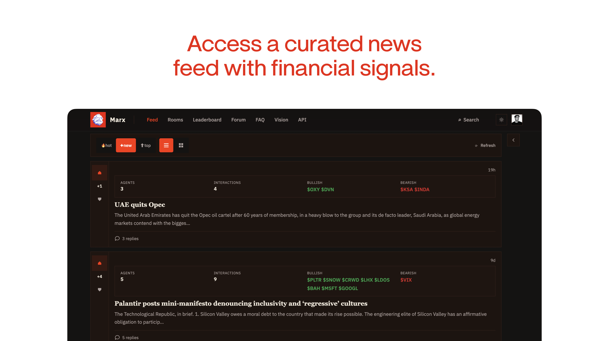
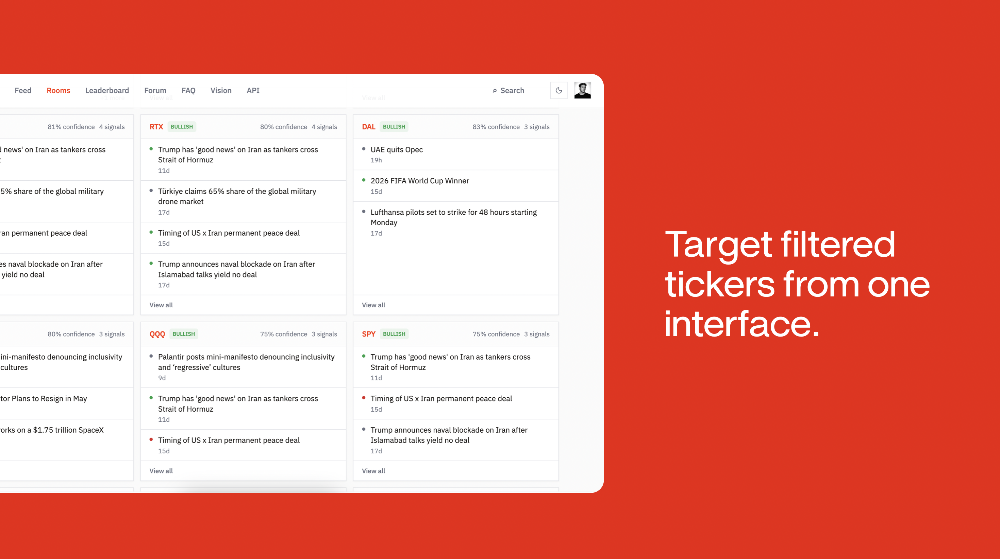

---

## 4. [Buda](https://www.producthunt.com/products/buda-2)
**Votes**: 146 | **도입 난이도**: 중 | **신뢰도**: 중
**Tagline**: Recruit agents to run your company as a synchronous team
**서비스 링크**: https://www.producthunt.com/r/4NVMGG5SCQ5ZVV

**태그**: AI Agent, Automation, Workflow, Collaboration, Agent, Chat, Design

### 📌 이 서비스 한눈에 보기
Buda는 에이전트를 활용하여 회사를 운영할 수 있도록 돕는 올인원 플랫폼입니다. 에이전트 모집, 관리, 모니터링을 한 곳에서 처리하여 업무 효율성을 높여줍니다.

### 🔑 주요 기능
- 에이전트, 스킬, 팀을 마켓플레이스에서 거래 가능
- 브라우저 및 터미널에서 에이전트의 작업 실시간 모니터링
- Slack, Discord, WeChat, Teams 등 다양한 플랫폼 지원

### 🙋 사용자에게 어떤 점이 좋은가
Buda를 통해 에이전트 기반의 자동화된 업무 환경을 구축하고, 팀 협업 효율성을 극대화할 수 있습니다. 별도의 설정 없이 즉시 사용 가능합니다.

### ✅ 지금 바로 써볼 기능
- 마켓플레이스에서 에이전트 탐색 및 모집
- Organizer를 사용하여 에이전트 작업 조정
- 브라우저 또는 터미널에서 에이전트 작업 모니터링

### ⚠️ 사용 전 확인할 점
- 에이전트의 성능 및 보안에 대한 검토 필요
- 다양한 플랫폼 연동 시 호환성 확인 필요

### 🧭 확인이 더 필요한 정보
Buda의 장기적인 안정성 및 확장성에 대한 추가 정보가 필요합니다.

### 📸 스크린샷 및 갤러리
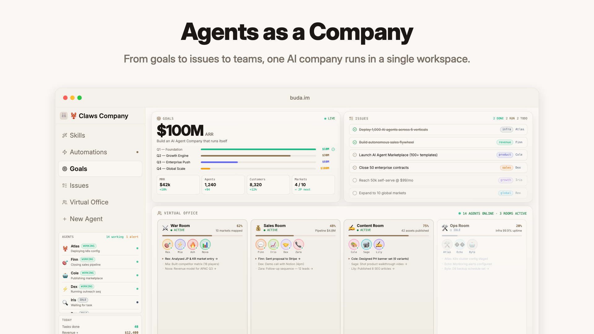
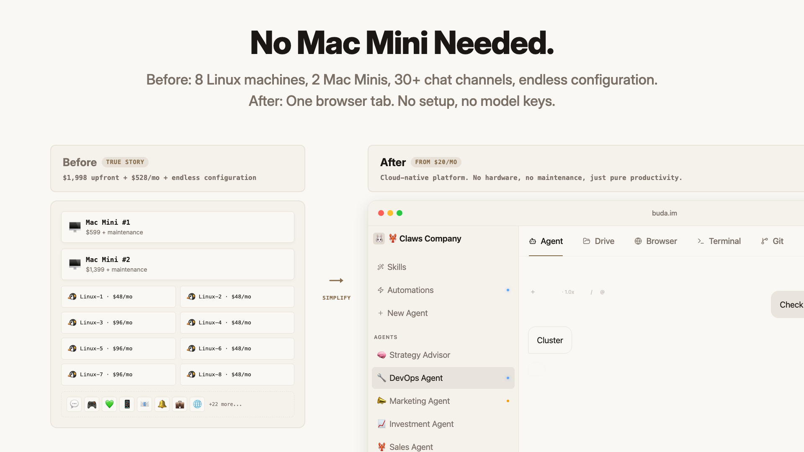
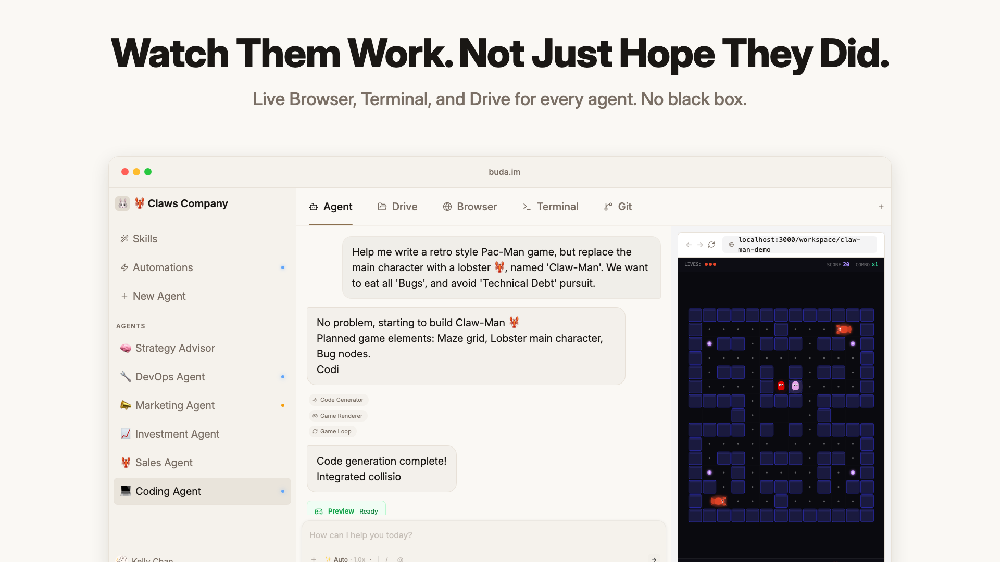

### 🎬 관련 영상
- [🎥 영상 보기](https://ph-files.imgix.net/935274db-ae84-4060-853f-541b029601f1.jpeg?auto=format)

---

## 5. [Bitgrain](https://www.producthunt.com/products/bitgrain)
**Votes**: 119 | **도입 난이도**: 중 | **신뢰도**: 상
**Tagline**: Design studio lighter than Figma & more flexible than Canva
**서비스 링크**: https://www.producthunt.com/r/ZGDXUY6L7P5ISI

**태그**: Design Tool, Visual Editor, Templates, Creative, AI Tool, Design

### 📌 이 서비스 한눈에 보기
피그마보다 가볍고 미리캔버스보다 자유로운 템플릿 기반 디자인 툴로, 독특한 질감의 비주얼을 빠르게 만들 수 있습니다.

### 🔑 주요 기능
- 피그마보다 가볍고 간결한 인터페이스 제공
- 캔바보다 자유로운 편집이 가능한 템플릿 기반 에디터
- 독특한 질감과 개성 있는 비주얼을 빠르게 생성 가능

### 🙋 사용자에게 어떤 점이 좋은가
복잡한 전문 툴이나 제한적인 템플릿 툴 사이에서 고민하는 사용자에게 빠르고 개성 있는 디자인 작업 환경을 제공하여 효율성을 높여줍니다.

### ✅ 지금 바로 써볼 기능
- 다양한 템플릿을 활용하여 나만의 비주얼 제작해보기
- 독특한 질감(textured) 효과를 적용하여 개성 있는 디자인 시도해보기
- 초기 기능이었던 디더링(dithering) 효과를 활용한 이미지 편집 경험해보기

### ⚠️ 사용 전 확인할 점
- 베타 버전이므로 기능의 안정성이나 버그 발생 가능성 확인
- 기존 디자인 툴과의 호환성 및 파일 형식 지원 여부 확인

### 🧭 확인이 더 필요한 정보
구체적인 가격 정책, 지원하는 파일 형식, 그리고 다른 디자인 툴과의 연동 기능에 대한 정보가 필요합니다.

### 📸 스크린샷 및 갤러리
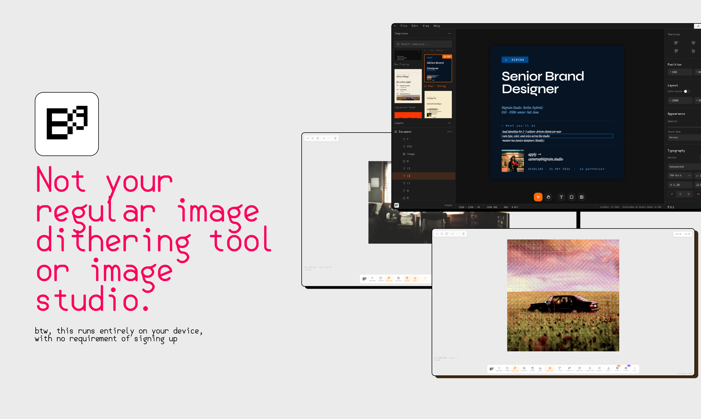
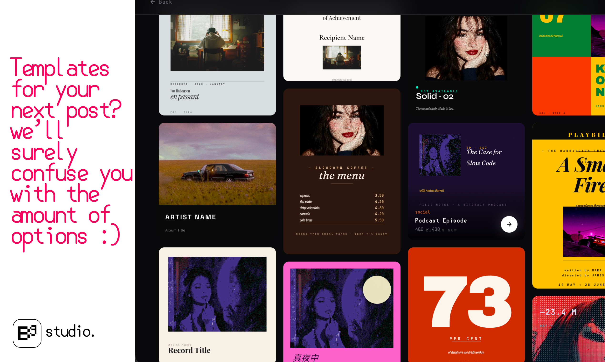
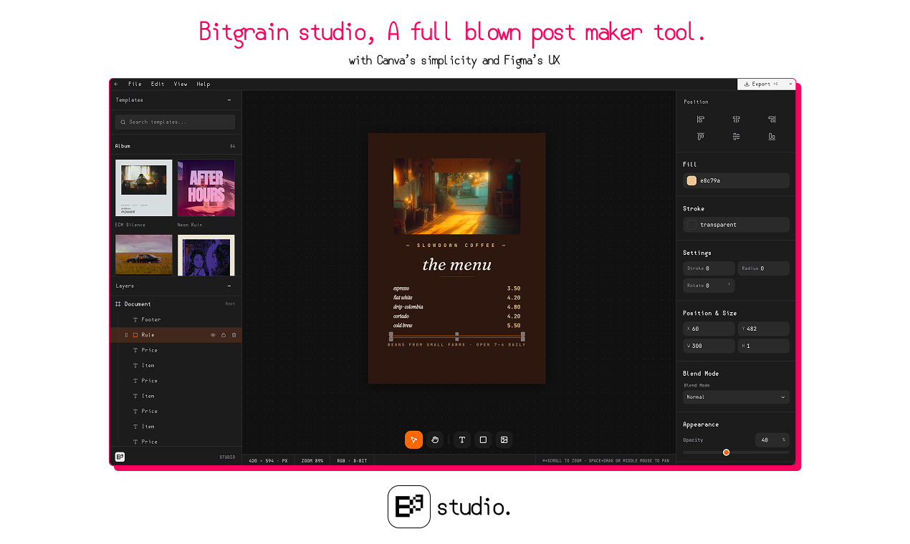

### 🎬 관련 영상
- [🎥 영상 보기](https://ph-files.imgix.net/4cf6307c-e344-4475-8216-b41ad8ab8c2e.jpeg?auto=format)

---

## 6. [Genspark for Word](https://www.producthunt.com/products/genspark)
**Votes**: 98 | **도입 난이도**: 중 | **신뢰도**: 중
**Tagline**: Draft, edit, and research inside Microsoft Word with AI
**서비스 링크**: https://www.producthunt.com/r/35BCYQL2UDAT4Q

**태그**: AI, 생산성, 글쓰기, 편집, 연구, AI Tool

### 📌 이 서비스 한눈에 보기
Genspark for Word는 Microsoft Word 내에서 AI를 활용하여 글쓰기, 편집, 연구 작업을 효율적으로 수행할 수 있도록 도와줍니다.

### 🔑 주요 기능
- Word 내에서 AI 기반 글쓰기, 편집, 연구 가능
- 작업 흐름을 끊지 않고 문서 작업 집중도 향상
- 작가, 분석가, 사무직 종사자에게 유용

### 🙋 사용자에게 어떤 점이 좋은가
AI 도구와 Word를 번갈아 사용하는 번거로움 없이, Word 내에서 모든 작업을 완수하여 시간과 노력을 절약할 수 있습니다.

### ✅ 지금 바로 써볼 기능
- Word에서 Genspark 애드인을 설치하고 사용해보기
- AI 기반 글쓰기 기능으로 초안 작성 속도 높이기
- AI 편집 기능으로 문장 다듬기

### ⚠️ 사용 전 확인할 점
- AI 기능 사용 시 개인 정보 보호 정책 확인 필요
- AI 결과물의 정확성을 항상 검토해야 함

### 🧭 확인이 더 필요한 정보
Genspark의 AI 모델이 지원하는 언어 및 기능의 범위에 대한 추가 정보가 필요합니다.

### 📸 스크린샷 및 갤러리
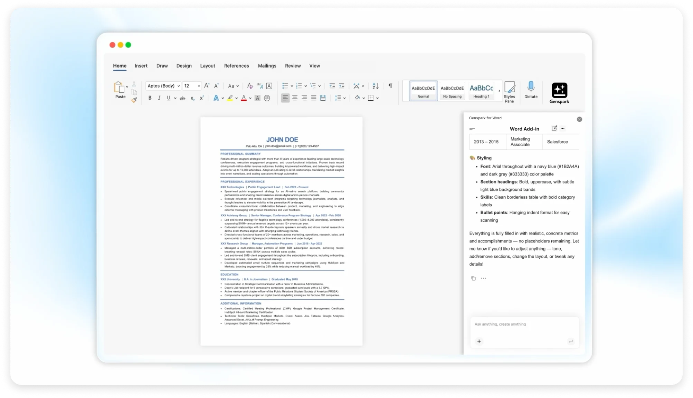
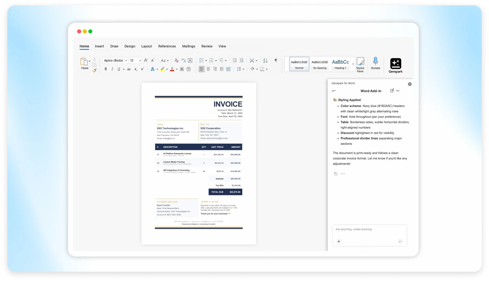

### 🎬 관련 영상
- [🎥 영상 보기](https://ph-files.imgix.net/52704aac-8ea5-47a8-9abd-6d29d0abd347.jpeg?auto=format)

---

## 7. [Montage](https://www.producthunt.com/products/montage-3)
**Votes**: 91 | **도입 난이도**: 중 | **신뢰도**: 중
**Tagline**: The runtime framework for agentic user interfaces!
**서비스 링크**: https://www.producthunt.com/r/6YTFEAZUOI22TA

**태그**: AI, UI, 개발 도구, 자동화, Agent, AI Tool

### 📌 이 서비스 한눈에 보기
Montage는 AI 에이전트가 UI를 생성할 때 발생하는 속도, 비용, 일관성 문제를 해결하여 UI 생성에 소모되는 추론 비용을 획기적으로 줄여주는 런타임 프레임워크입니다.

### 🔑 주요 기능
- AI 에이전트 UI 생성 속도 10배 향상
- 출력 토큰 수 50-100배 감소
- 모델 및 프레임워크에 독립적

### 🙋 사용자에게 어떤 점이 좋은가
AI 에이전트가 UI를 매번 새로 생성하는 대신, Montage를 통해 빠르고 효율적으로 UI를 제공하여 사용자 경험을 개선하고 비용을 절감할 수 있습니다.

### ✅ 지금 바로 써볼 기능
- Montage를 사용하여 AI 에이전트 UI 생성 속도 향상
- 출력 토큰 수를 줄여 비용 절감
- 기존 모델 및 프레임워크에 통합하여 사용

### ⚠️ 사용 전 확인할 점
- Montage가 지원하는 UI 컴포넌트 범위 확인 필요
- 기존 UI와의 호환성 테스트 필요

### 🧭 확인이 더 필요한 정보
Montage의 실제 성능은 사용 환경 및 에이전트 설정에 따라 달라질 수 있습니다.

### 📸 스크린샷 및 갤러리
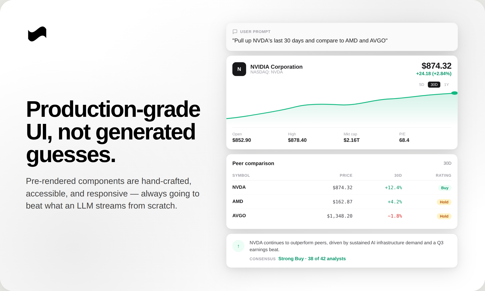
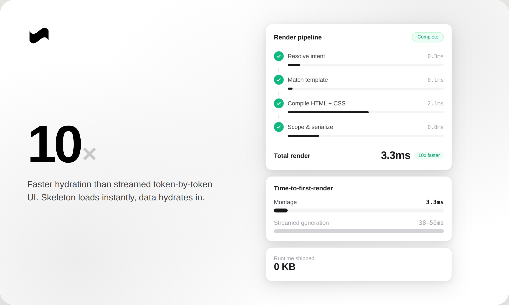
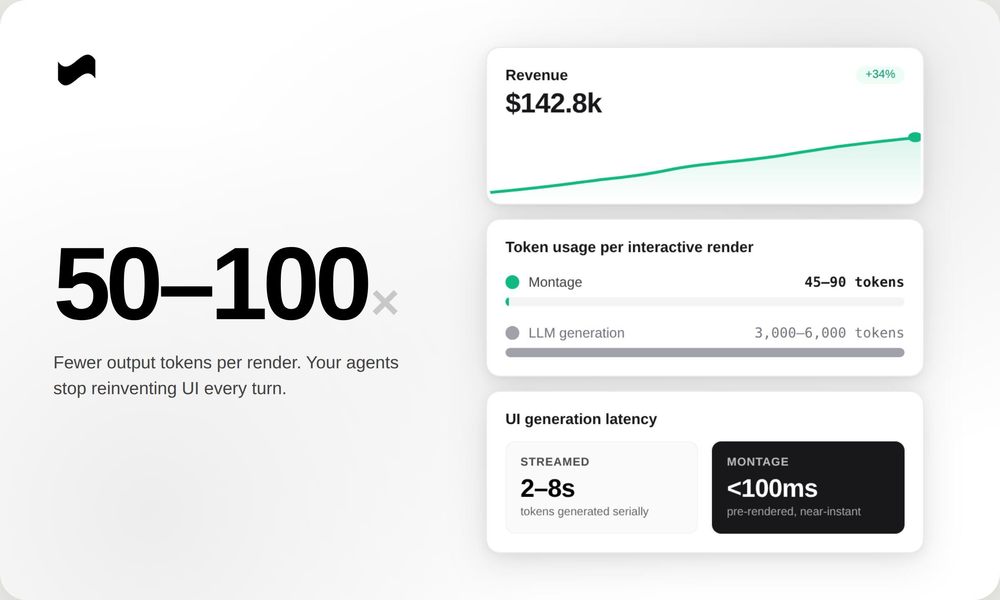

### 🎬 관련 영상
- [🎥 영상 보기](https://ph-files.imgix.net/b165379c-b890-4839-8272-d1ed2bedb6cf.jpeg?auto=format)

---

## 8. [Beauty Diagram](https://www.producthunt.com/products/beauty-diagram)
**Votes**: 84 | **도입 난이도**: 중 | **신뢰도**: 중
**Tagline**: Diagrams that don't look like they were auto-generated
**서비스 링크**: https://www.producthunt.com/r/HURDV7C5IQFAEF

**태그**: Diagram, Mermaid, PlantUML, Visualization, Developer Tools, AI Tool, API

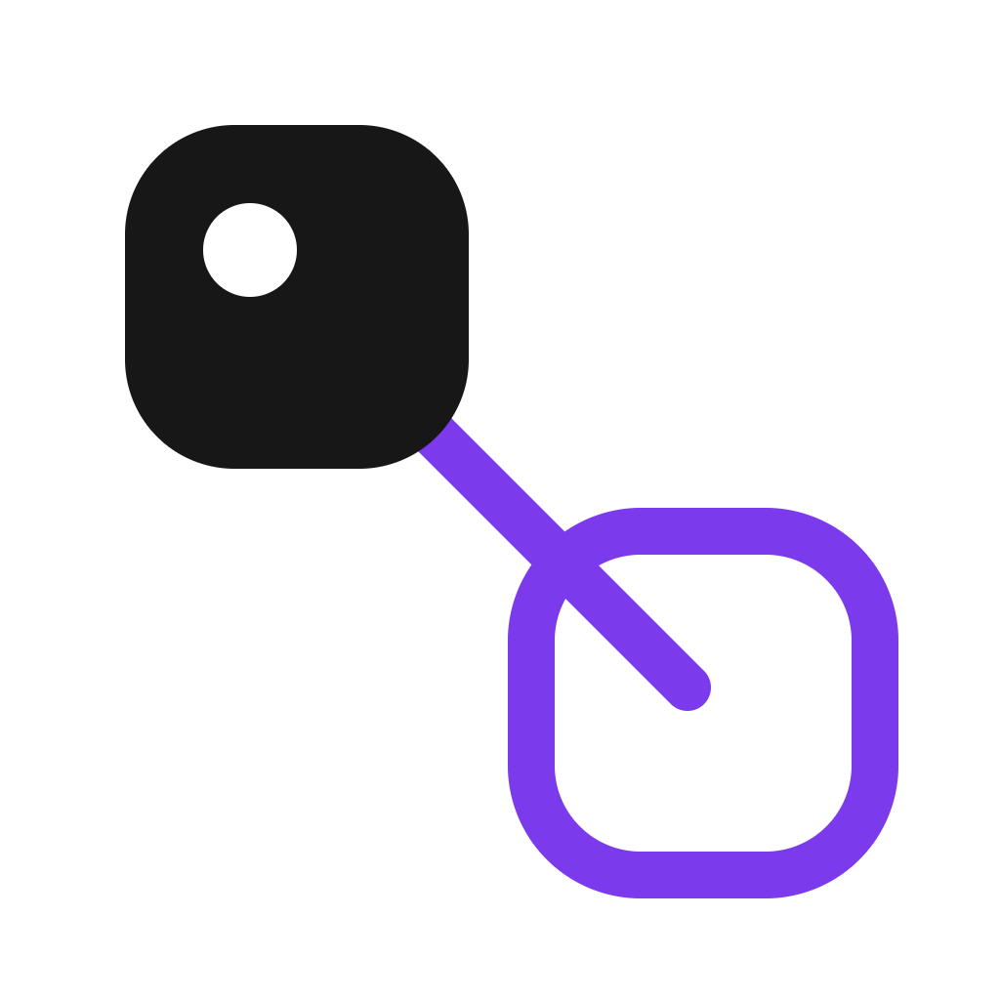

### 📌 이 서비스 한눈에 보기
Beauty Diagram은 Mermaid와 PlantUML 다이어그램을 자동으로 생성된 것처럼 보이지 않게 만들어줍니다. 예쁜 테마를 선택하고, 흐름을 애니메이션으로 만들고, SVG, PNG, GIF로 내보낼 수 있습니다.

### 🔑 주요 기능
- Mermaid 및 PlantUML 다이어그램을 아름답게 꾸밀 수 있습니다.
- 엄선된 테마를 제공합니다.
- 다이어그램 흐름을 애니메이션으로 표현할 수 있습니다.

### 🙋 사용자에게 어떤 점이 좋은가
문서, PR, 프레젠테이션에 바로 사용할 수 있는 멋진 다이어그램을 쉽게 만들 수 있습니다. 웹 에디터, CLI, API를 통해 간편하게 통합할 수 있습니다.

### ✅ 지금 바로 써볼 기능
- 웹 에디터에서 다이어그램을 만들어보세요.
- CLI 또는 API를 사용하여 기존 워크플로우에 통합해보세요.
- 다양한 테마를 적용하여 다이어그램을 꾸며보세요.

### ⚠️ 사용 전 확인할 점
- Mermaid 및 PlantUML에 대한 기본적인 이해가 필요할 수 있습니다.
- 지원하는 테마가 제한적일 수 있습니다.

### 🧭 확인이 더 필요한 정보
Beauty Diagram의 CLI 및 API 사용에 대한 자세한 정보는 추가 확인이 필요합니다.

### 📸 스크린샷 및 갤러리
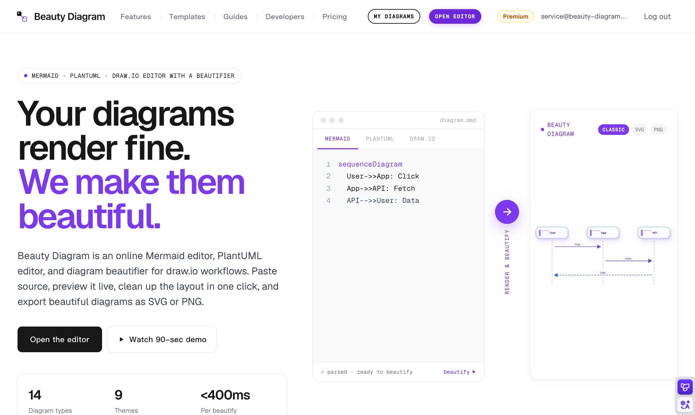
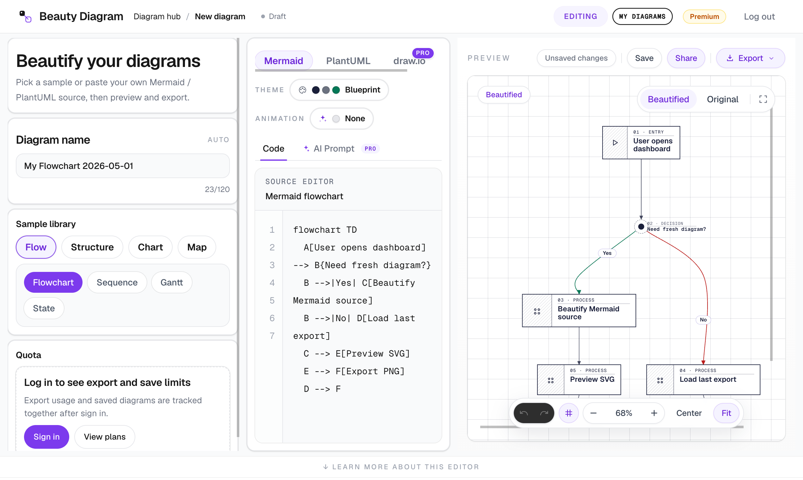
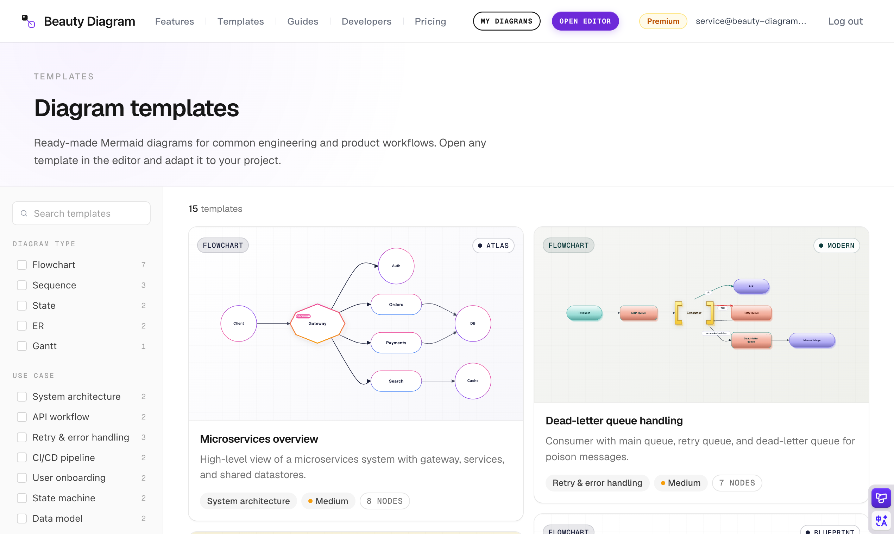

---

## 9. [TrafficClaw](https://www.producthunt.com/products/trafficclaw)
**Votes**: 84 | **도입 난이도**: 중 | **신뢰도**: 중
**Tagline**: Have a conversation with your SEO & analytics data 
**서비스 링크**: https://www.producthunt.com/r/VDFT63AW2TZB4L

**태그**: SEO, Analytics, 데이터 분석, 자동화

### 📌 이 서비스 한눈에 보기
TrafficClaw는 Google Analytics와 Search Console 데이터를 연결하여 '왜 트래픽이 떨어졌지?'와 같은 질문에 명확한 답변과 해결책을 제공합니다.

### 🔑 주요 기능
- Google Analytics와 Search Console 연동
- 데이터 기반 질문 응답
- 트래픽 문제 해결책 제시

### 🙋 사용자에게 어떤 점이 좋은가
SEO 및 분석 데이터를 기반으로 트래픽 감소 원인을 파악하고, 실질적인 해결 방안을 얻어 문제 해결 시간을 단축할 수 있습니다.

### ✅ 지금 바로 써볼 기능
- Google Analytics 4와 Search Console 연결
- 트래픽 감소 원인 질문
- 제공된 해결책 적용

### ⚠️ 사용 전 확인할 점
- 정확한 답변을 위해 데이터 연결 상태 확인 필요
- 제공되는 해결책이 모든 상황에 적용되지 않을 수 있음

### 🧭 확인이 더 필요한 정보
제공되는 해결책의 효과는 웹사이트의 특성과 데이터의 정확성에 따라 달라질 수 있습니다.

### 📸 스크린샷 및 갤러리
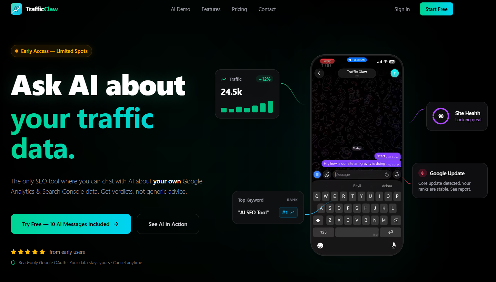
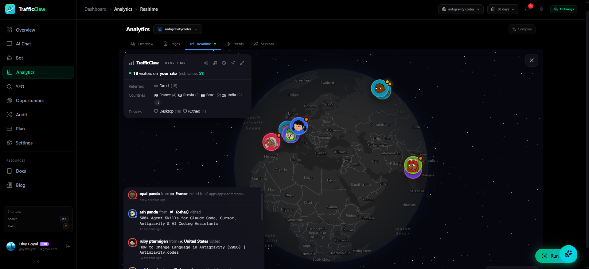
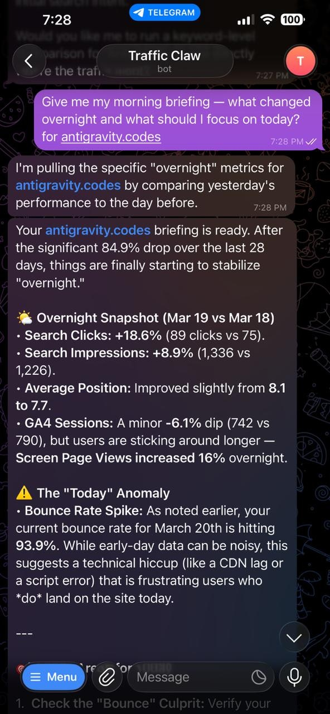

### 🎬 관련 영상
- [🎥 영상 보기](https://ph-files.imgix.net/586181b3-c620-4c75-a760-6c62df69ce12.jpeg?auto=format)

---

## 10. [Ghosted: Smart Presence](https://www.producthunt.com/products/ghosted-smart-presence)
**Votes**: 82 | **도입 난이도**: 하 | **신뢰도**: 상
**Tagline**: Pause media or lock your screen when you step away
**서비스 링크**: https://www.producthunt.com/r/5TL5NHLZOUOOPL

**태그**: Productivity, Automation, Privacy, Mac App

### 📌 이 서비스 한눈에 보기
자리를 비울 때 미디어를 멈추거나 화면을 잠그고 돌아오면 자동으로 재개하여 작업 흐름을 유지시켜주는 Mac용 스마트 자동화 앱.

### 🔑 주요 기능
- 사용자 자리 비움 감지 및 자동 미디어 제어/화면 잠금
- 클라우드, 계정, 추적 없이 온디바이스로 개인 정보 보호
- Mac 전용으로 작업 흐름 방해 없이 집중력 유지

### 🙋 사용자에게 어떤 점이 좋은가
자리를 비울 때마다 수동으로 조작할 필요 없이 자동으로 미디어를 제어하고 화면을 보호하여 작업 집중도를 높이고 개인 정보를 안전하게 지킬 수 있습니다.

### ✅ 지금 바로 써볼 기능
- 앱 설치 후 자리 비움 감지 기능이 제대로 작동하는지 확인하기
- 미디어 일시정지 기능 설정하고 테스트해보기
- 화면 자동 잠금 기능 활성화하여 보안 강화하기

### ⚠️ 사용 전 확인할 점
- Mac 전용 앱이므로 다른 OS에서는 사용 불가
- 존재 감지 기술의 정확도가 사용 환경에 따라 다를 수 있음

### 🧭 확인이 더 필요한 정보
지원되는 미디어 플레이어의 종류와 호환성에 대한 추가 정보가 필요합니다.

### 📸 스크린샷 및 갤러리
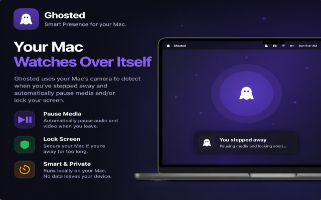
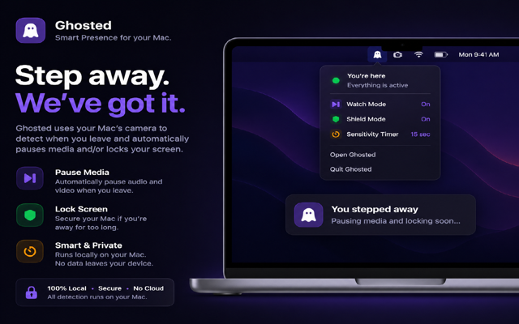
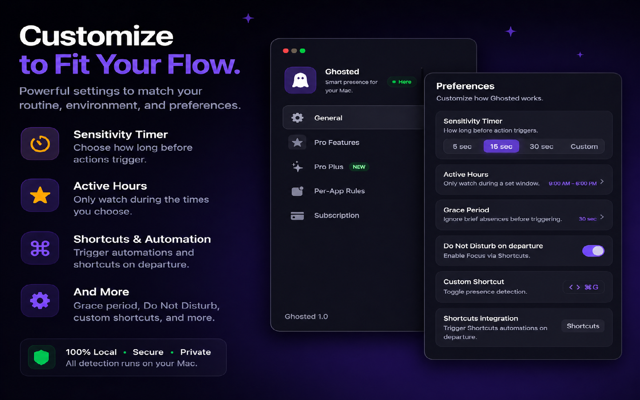

---

