# 🚀 Product Hunt Daily Top 10 (2026-05-03)

## 1. [Scholé](https://www.producthunt.com/products/schole-2)
**Votes**: 212 | **도입 난이도**: 하 | **신뢰도**: 상
**Tagline**: Turn everyday work into personalized AI learning
**서비스 링크**: https://www.producthunt.com/r/VRA3VMKGQGHMOC

**태그**: AI Learning, EdTech, Productivity, Workflow, AI Tool

### 📌 이 서비스 한눈에 보기
업무 흐름을 방해하지 않고 실시간으로 AI 역량을 키워주는 맞춤형 학습 도구

### 🔑 주요 기능
- 업무 프로세스 내에서 즉각적으로 이루어지는 실시간 학습
- 학습 과학과 적응형 AI를 결합한 개인 맞춤형 커리큘럼
- 이론이 아닌 실제 업무 과업 중심의 실용적 스킬 습득

### 🙋 사용자에게 어떤 점이 좋은가
별도의 학습 시간을 내지 않고도 업무를 수행하며 자연스럽게 AI 활용 능력을 높일 수 있습니다.

### ✅ 지금 바로 써볼 기능
- 현재 수행 중인 업무 과업 입력하기
- AI가 제안하는 실시간 학습 가이드 따라하기
- 학습 결과가 실제 업무 성과로 이어지는지 확인하기

### ⚠️ 사용 전 확인할 점
- 업무 흐름 중에 개입하는 방식이 실제 작업 효율에 미치는 영향 확인 필요
- 사용 중인 기존 업무 툴과의 연동성 여부 확인 필요

### 🧭 확인이 더 필요한 정보
구체적인 워크플로우 통합 방식과 지원하는 업무 소프트웨어 범위가 명시되지 않았습니다.

### 📸 스크린샷 및 갤러리
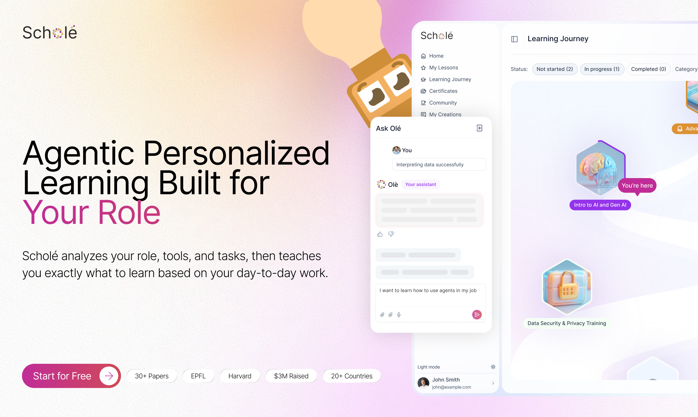
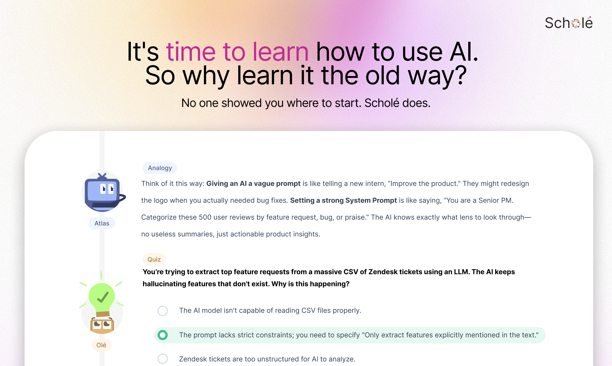
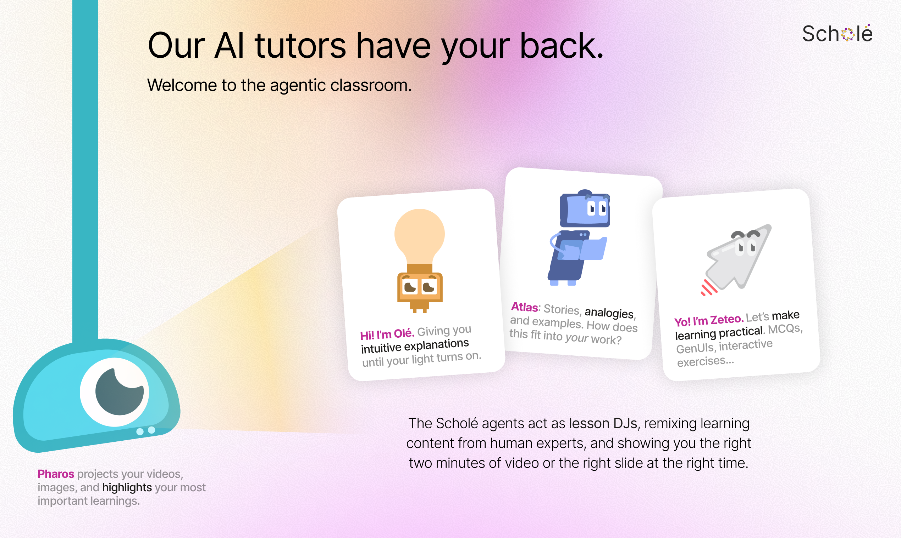

### 🎬 관련 영상
- [🎥 영상 보기](https://ph-files.imgix.net/582db3c3-b928-4e7c-8698-1cf6eddc647f.jpeg?auto=format)

---

## 2. [Cloud Computer by Manus](https://www.producthunt.com/products/manus)
**Votes**: 193 | **도입 난이도**: 하 | **신뢰도**: 상
**Tagline**: A dedicated cloud machine for bots and software
**서비스 링크**: https://www.producthunt.com/r/WDXUVIZTG7AJ7U

**태그**: Automation, Cloud, DevOps, NoCode

### 📌 이 서비스 한눈에 보기
복잡한 서버 설정 없이 자연어로 명령하여 24시간 구동되는 전용 클라우드 머신

### 🔑 주요 기능
- DevOps 및 서버 설정이 필요 없는 간편한 클라우드 환경
- 봇, 파이썬 스크립트, 데이터베이스 등을 위한 지속적인 가동 환경 제공
- 코딩 지식 없이도 원하는 기능을 설명하여 실행 가능한 자동화

### 🙋 사용자에게 어떤 점이 좋은가
서버 관리의 번거로움 없이 아이디어를 즉시 실행하고 24시간 중단 없이 가동할 수 있습니다.

### ✅ 지금 바로 써볼 기능
- 원하는 자동화 작업 설명하기
- 24/7 스케줄링 작업 등록하기
- 파이썬 스크립트 배포 테스트하기

### ⚠️ 사용 전 확인할 점
- 자연어 기반 생성 시 의도와 다른 결과물이 나올 가능성
- 복잡한 커스텀 설정이나 세밀한 인프라 제어의 제한 여부

### 🧭 확인이 더 필요한 정보
사용자가 입력하는 설명(Prompt)이 실제 인프라 구성에 어느 정도의 정밀도로 반영되는지 확인이 필요합니다.

### 📸 스크린샷 및 갤러리
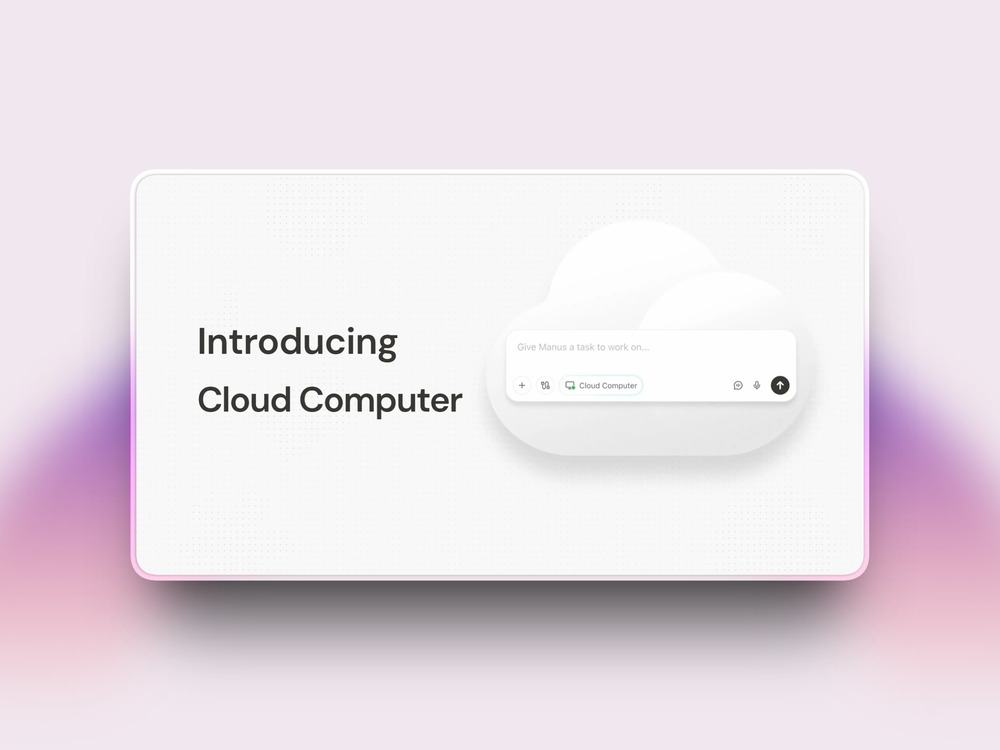
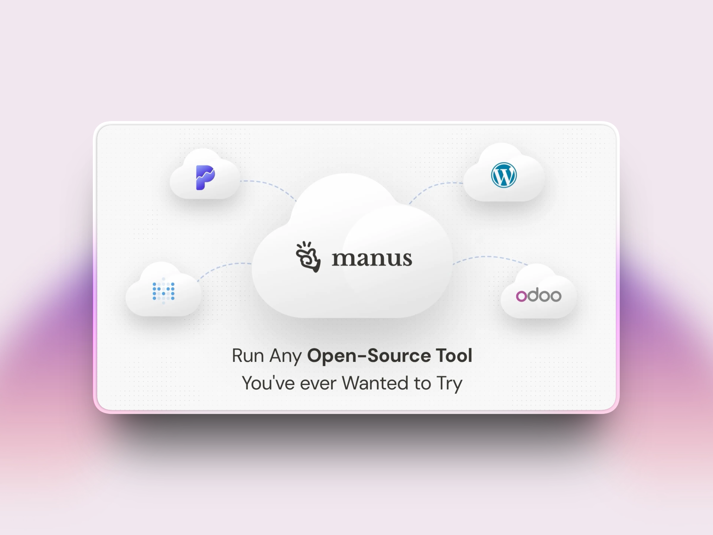
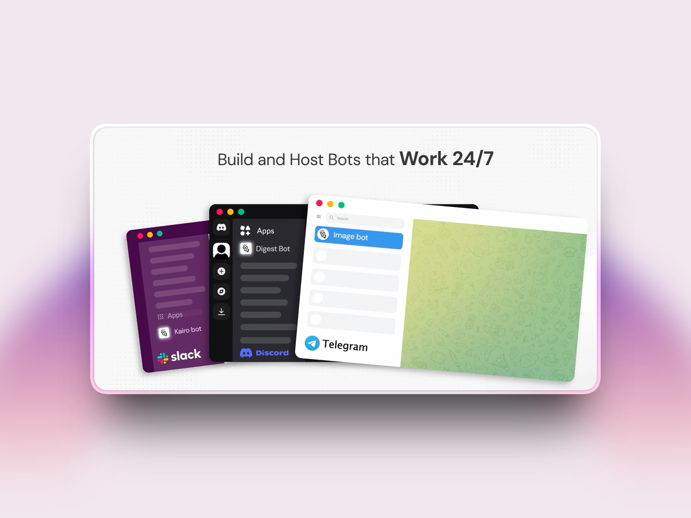

### 🎬 관련 영상
- [🎥 영상 보기](https://ph-files.imgix.net/81c31434-9643-4558-81b6-597aaea2adf2.jpeg?auto=format)

---

## 3. [Feather](https://www.producthunt.com/products/feather-18)
**Votes**: 163 | **도입 난이도**: 하 | **신뢰도**: 상
**Tagline**: Photo editor with local AI
**서비스 링크**: https://www.producthunt.com/r/Q54AKWR62RQYAL

**태그**: Photo Editor, AI, Mac, Privacy, Creative Tool, AI Tool, Design

### 📌 이 서비스 한눈에 보기
개인정보 유출 걱정 없는 Apple Silicon 전용 로컬 AI 사진 편집기

### 🔑 주요 기능
- Apple Silicon Mac 최적화 및 오프라인 AI 프로세싱
- AI 생성형 인필(Infill) 및 스마트 선택 기능 제공
- 한 번 결제로 평생 이용 가능한 합리적인 라이선스 모델

### 🙋 사용자에게 어떤 점이 좋은가
클라우드에 사진을 업로드할 필요가 없어 보안이 뛰어나며, 강력한 AI 편집 기능을 로컬 환경에서 빠르고 안전하게 사용할 수 있습니다.

### ✅ 지금 바로 써볼 기능
- AI 생성형 인필 기능을 통한 배경 채우기 테스트
- 스마트 선택 기능을 활용한 피사체 분리 작업
- 로컬 환경에서의 편집 속도 및 성능 확인

### ⚠️ 사용 전 확인할 점
- Apple Silicon(M 시리즈) Mac 전용이므로 구형 인텔 Mac에서는 사용이 제한될 수 있음
- 로컬 연산 방식이므로 하드웨어 사양에 따라 작업 속도 차이가 발생할 수 있음

### 🧭 확인이 더 필요한 정보
지원하는 최대 이미지 해상도 및 구체적인 하드웨어 최소 사양에 대한 정보가 필요합니다.

### 📸 스크린샷 및 갤러리
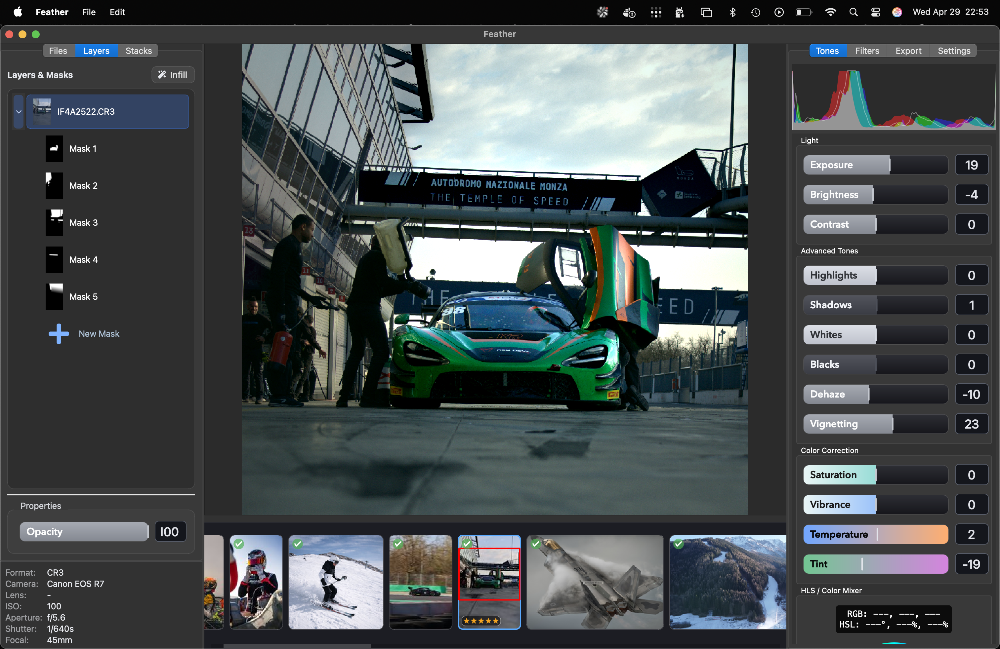
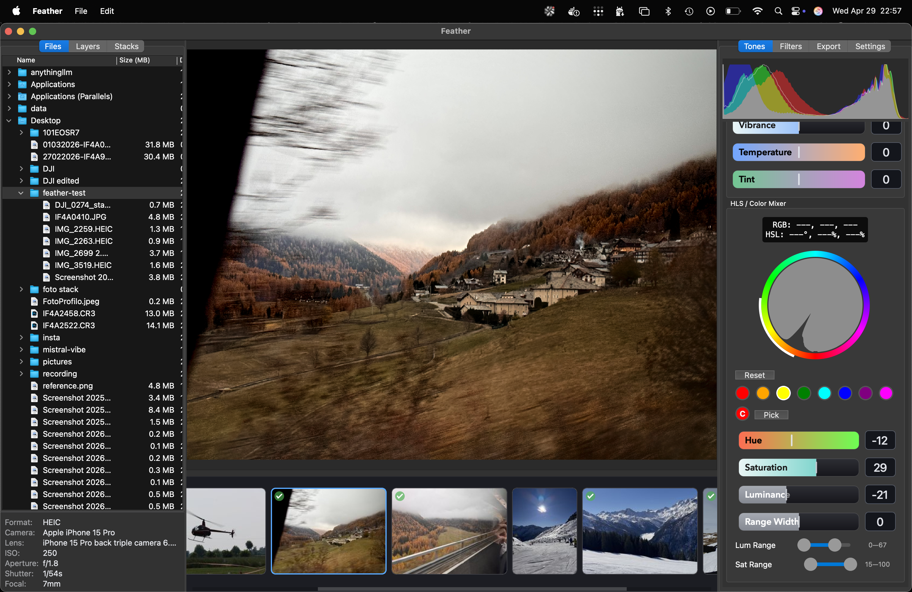
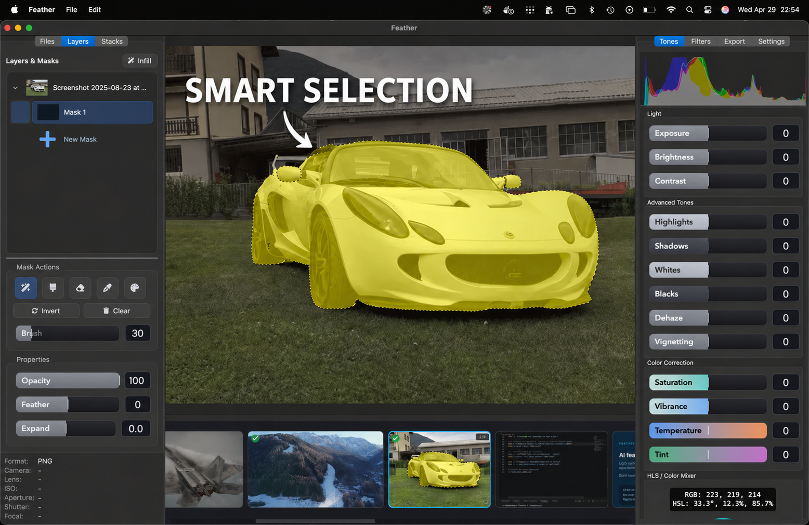

### 🎬 관련 영상
- [🎥 영상 보기](https://ph-files.imgix.net/91d6726c-04d7-4628-9a36-7b67b9d97767.jpeg?auto=format)

---

## 4. [Microsoft Copilot Health](https://www.producthunt.com/products/copilot-health)
**Votes**: 122 | **도입 난이도**: 중 | **신뢰도**: 상
**Tagline**: Dedicated space to bring your personal health data together
**서비스 링크**: https://www.producthunt.com/r/RV27254646S3NQ

**태그**: HealthTech, AI, Data Integration, Personalized Care, AI Tool

### 📌 이 서비스 한눈에 보기
분산된 개인 건강 데이터를 하나로 통합하여 맞춤형 인사이트를 제공하는 AI 건강 관리 공간

### 🔑 주요 기능
- 병원 기록, 웨어러블, 검사 결과 등 흩어진 건강 데이터의 통합 관리
- 5만 개 이상의 미국 의료 시스템 및 50개 이상의 웨어러블 기기 연동 지원
- 의료 AI를 통한 종합적인 데이터 분석 및 신뢰할 수 있는 근거 기반의 인사이트 제공

### 🙋 사용자에게 어떤 점이 좋은가
여러 곳에 흩어져 있어 파악하기 어려웠던 개인 건강 데이터를 한눈에 확인하고, 실질적으로 실천 가능한 건강 관리 가이드를 얻을 수 있습니다.

### ✅ 지금 바로 써볼 기능
- 보유 중인 웨어러블 기기 및 병원 기록 연동하기
- AI가 분석한 종합 건강 리포트 확인하기
- 제공되는 인사이트를 바탕으로 개인 건강 계획 세우기

### ⚠️ 사용 전 확인할 점
- 데이터 연동 시 개인정보 및 민감한 의료 데이터 보안 확인 필요
- AI의 분석 결과는 의학적 진단을 대체할 수 없으므로 전문가 상담 병행 권장

### 🧭 확인이 더 필요한 정보
미국 외 지역에서의 병원 데이터 연동 범위와 데이터 보안 표준 준수 여부에 대한 확인이 필요합니다.

### 📸 스크린샷 및 갤러리

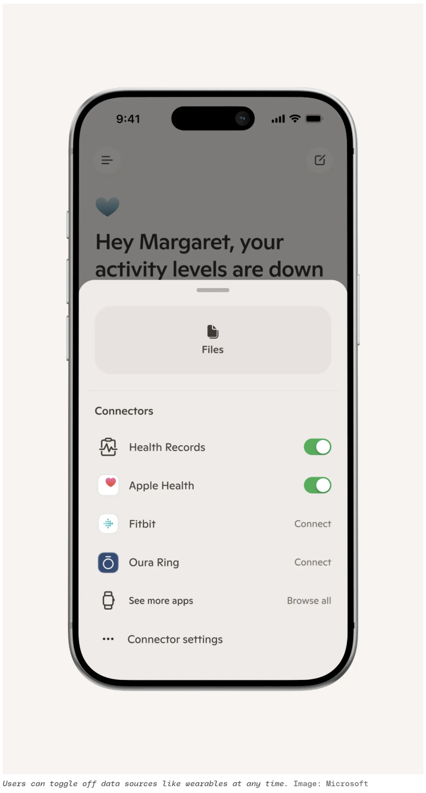
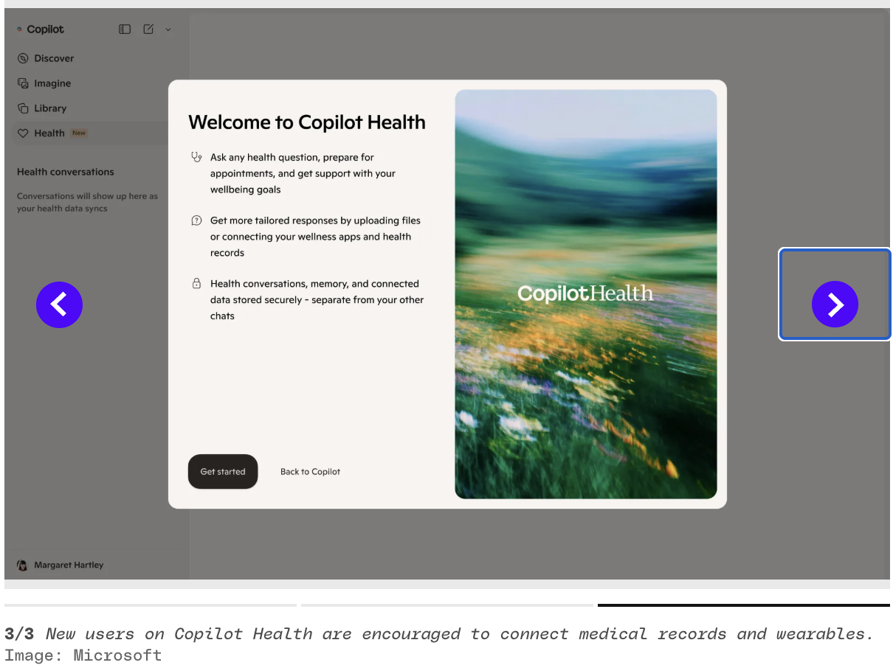

### 🎬 관련 영상
- [🎥 영상 보기](https://ph-files.imgix.net/465f69a3-1bf1-41bb-9516-e1b6fcd25243.jpeg?auto=format)

---

## 5. [YouTube TV Custom Multiview](https://www.producthunt.com/products/google)
**Votes**: 112 | **도입 난이도**: 하 | **신뢰도**: 상
**Tagline**: Mix and match up to 4 live streams at once
**서비스 링크**: https://www.producthunt.com/r/MPC7PMAGNUTKGP
**재등장**: 최근 7일 내 재등장 (마지막 등장 7일 전)

**태그**: Streaming, Entertainment, Customization, YouTubeTV

### 📌 이 서비스 한눈에 보기
사용자가 원하는 4개의 라이브 채널을 한 화면에 직접 구성하는 맞춤형 멀티뷰 기능

### 🔑 주요 기능
- 최대 4개의 라이브 스트림을 한 화면에서 동시 시청 가능
- 스포츠, 뉴스, 영화 등 카테고리별 필터를 통한 맞춤형 채널 조합
- 기본 플랜 및 NFL Sunday Ticket 등 추가 옵션 채널 활용 가능

### 🙋 사용자에게 어떤 점이 좋은가
여러 경기가 동시에 열리거나 다양한 장르를 동시에 보고 싶을 때, 사용자 취향에 맞춰 화면을 구성할 수 있어 시청 경험이 극대화됩니다.

### ✅ 지금 바로 써볼 기능
- 새로운 멀티뷰 빌더를 사용하여 나만의 화면 구성하기
- 스포츠 및 뉴스 필터를 활용해 관심 채널 빠르게 찾기
- NFL Sunday Ticket 등 보유 중인 애드온 채널 포함하기

### ⚠️ 사용 전 확인할 점
- 사용자의 요금제 및 추가 옵션(Add-ons) 보유 여부에 따라 선택 가능한 채널이 제한됨
- 동시 시청 시 네트워크 대역폭 소모가 클 수 있음

### 🧭 확인이 더 필요한 정보
사용자의 현재 구독 플랜에 따른 구체적인 채널 제한 사항은 확인이 필요합니다.

### 📸 스크린샷 및 갤러리

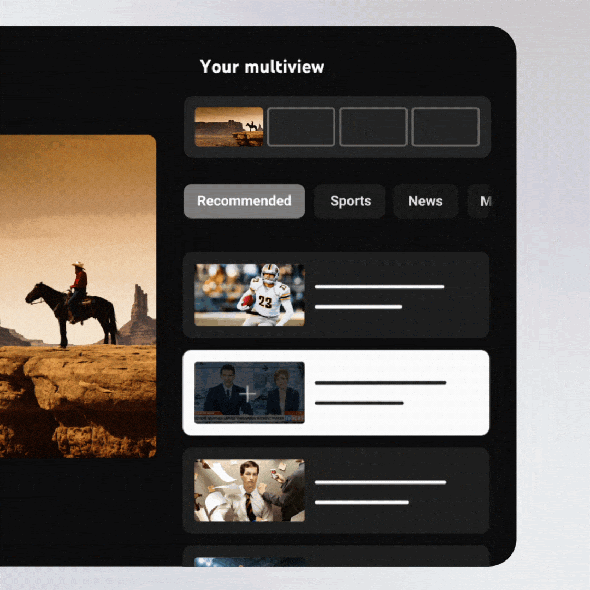

### 🎬 관련 영상
- [🎥 영상 보기](https://ph-files.imgix.net/970a7955-1ded-4b99-877a-6a0697cbd764.jpeg?auto=format)

---

## 6. [Breaks](https://www.producthunt.com/products/breaks)
**Votes**: 104 | **도입 난이도**: 하 | **신뢰도**: 상
**Tagline**: A quiet Pomodoro that lives in your menu bar.
**서비스 링크**: https://www.producthunt.com/r/K3LIUH4TGLI3BI

**태그**: Productivity, macOS, OpenSource, Timer

### 📌 이 서비스 한눈에 보기
맥 메뉴 바에서 간편하게 집중력을 관리하는 오픈소스 포모도로 타이머

### 🔑 주요 기능
- 맥 메뉴 바에 상주하는 미니멀한 디자인
- 집중 기록(Journal) 및 연속 달성(Streaks) 기능 제공
- 글로벌 단축키 및 캘린더 내보내기 지원

### 🙋 사용자에게 어떤 점이 좋은가
별도의 창을 띄울 필요 없이 메뉴 바에서 즉시 타이머를 관리하며 업무 흐름을 유지할 수 있습니다.

### ✅ 지금 바로 써볼 기능
- 메뉴 바에 설치하여 작업 흐름 방해 최소화하기
- 글로벌 단축키 설정으로 빠른 타이머 제어하기
- 집중 기록 기능을 통해 일일 업무 패턴 확인하기

### ⚠️ 사용 전 확인할 점
- macOS 전용 앱이므로 다른 운영체제에서는 사용 불가
- 샌드박스 환경에 따른 시스템 통합 기능의 제한 가능성

### 🧭 확인이 더 필요한 정보
상세한 캘린더 연동 방식 및 데이터 동기화 범위는 추가 확인이 필요합니다.

### 📸 스크린샷 및 갤러리

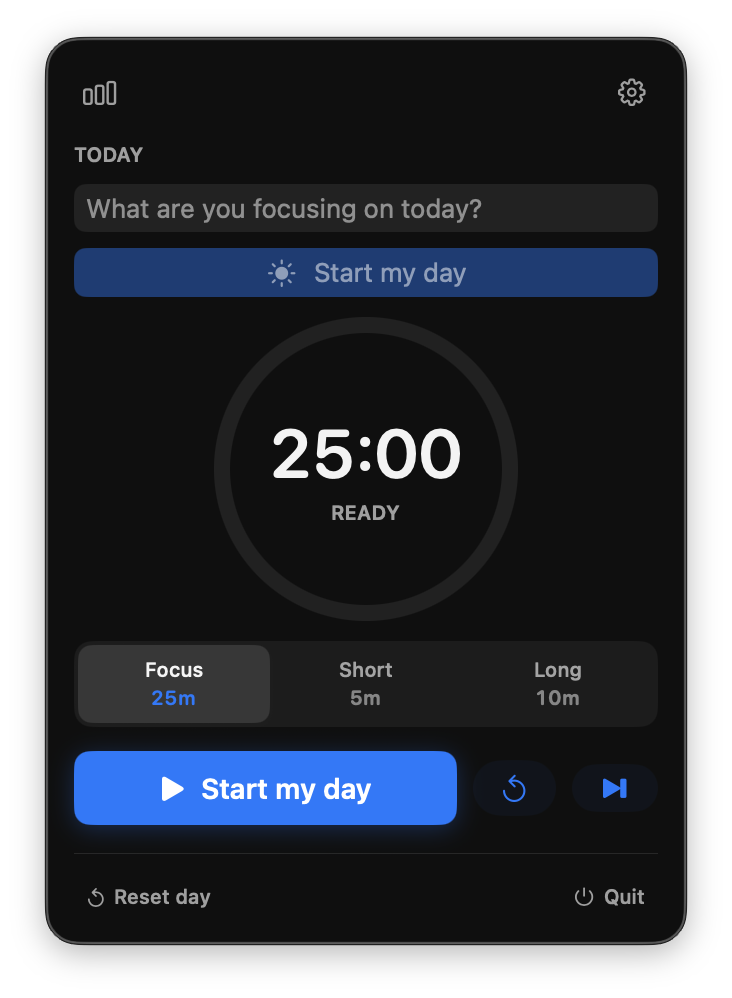

---

## 7. [Filect ](https://www.producthunt.com/products/filect)
**Votes**: 101 | **도입 난이도**: 하 | **신뢰도**: 상
**Tagline**: Organize Your Files With AI
**서비스 링크**: https://www.producthunt.com/r/WWTXCKT74RCVYX

**태그**: Productivity, Automation, AI, FileManagement, AI Tool, Video, Design, DevTool

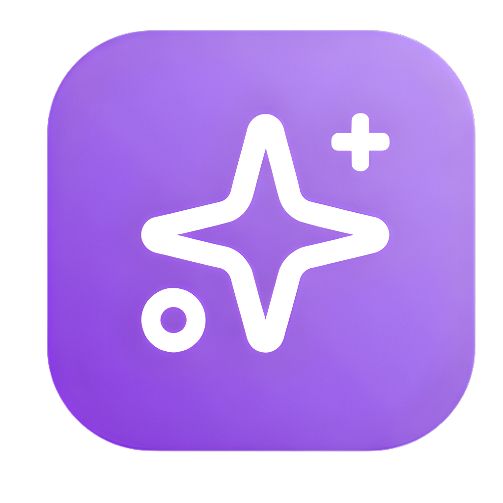

### 📌 이 서비스 한눈에 보기
AI를 활용해 복잡한 파일들을 자동으로 정리하고 자연어로 즉시 찾아주는 파일 관리 도구

### 🔑 주요 기능
- AI 기반의 자동 폴더 구조 생성 및 파일 정리
- 자연어 검색을 통한 직관적인 파일 찾기 기능
- 사용자 정의 규칙 설정 또는 자동 모드 지원

### 🙋 사용자에게 어떤 점이 좋은가
정리되지 않은 데스크탑과 다운로드 폴더를 관리하는 시간을 획기적으로 줄여주며, 필요한 파일을 찾는 번거로움을 없애줍니다.

### ✅ 지금 바로 써볼 기능
- 10일 무료 체험을 통한 자동 정리 기능 테스트
- 자연어 검색 기능으로 특정 파일 찾기 시도
- 사용자 정의 규칙을 설정하여 개인 맞춤형 정리 환경 구축

### ⚠️ 사용 전 확인할 점
- 파일 자동 이동 시 기존 작업 흐름과의 충돌 가능성
- 개인 파일 접근에 따른 보안 및 프라이버시 정책 확인 필요

### 🧭 확인이 더 필요한 정보
파일 정리 방식이 로컬 환경에서만 이루어지는지 혹은 클라우드 서비스와 연동되는지에 대한 정보가 부족합니다.

### 📸 스크린샷 및 갤러리
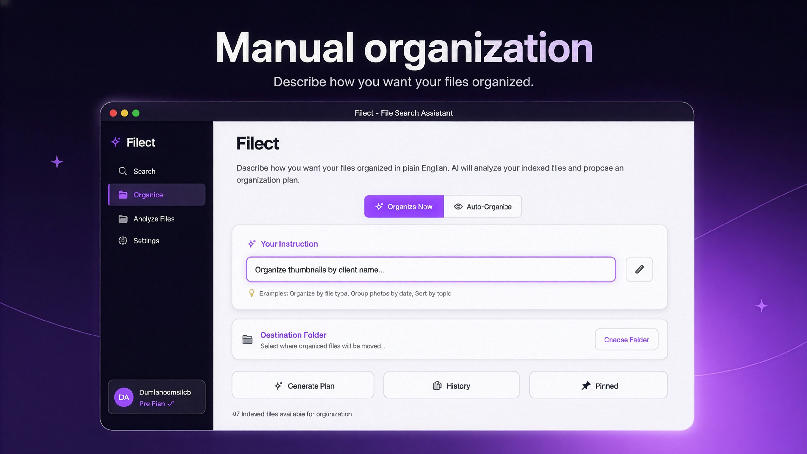
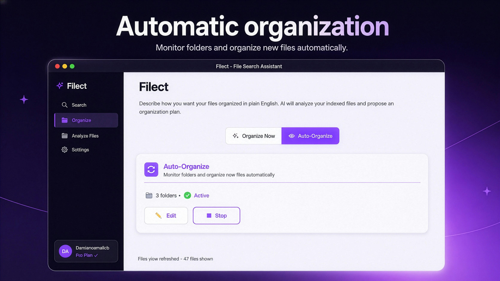
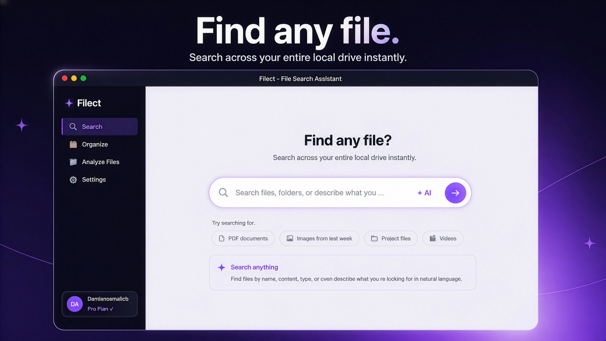

### 🎬 관련 영상
- [🎥 영상 보기](https://ph-files.imgix.net/ee72d9ee-4ef7-45a8-9d51-55070fddc6cc.jpeg?auto=format)

---

## 8. [Ara](https://www.producthunt.com/products/dereference-the-100x-ide)
**Votes**: 101 | **도입 난이도**: 하 | **신뢰도**: 상
**Tagline**: Build an entire business by texting
**서비스 링크**: https://www.producthunt.com/r/XT7WXCE63DLLKF

**태그**: NoCode, WebBuilder, Entrepreneurship, MobileFirst, AI Tool, Vision

### 📌 이 서비스 한눈에 보기
이미지 한 장으로 결제 기능이 포함된 웹사이트와 비즈니스를 즉시 구축하는 모바일 기반 서비스

### 🔑 주요 기능
- 이미지 업로드만으로 웹사이트 자동 생성
- 도메인 및 결제 시스템이 포함된 즉각적인 비즈니스 환경 제공
- 모바일 환경에 최적화된 비즈니스 운영 및 확장 기능

### 🙋 사용자에게 어떤 점이 좋은가
복잡한 개발 과정 없이 아이디어를 즉시 웹사이트로 구현하고, 모바일로 간편하게 비즈니스를 운영할 수 있습니다.

### ✅ 지금 바로 써볼 기능
- 아이디어 스케치 이미지를 업로드하여 웹사이트 생성해보기
- 생성된 사이트의 결제 기능 및 도메인 설정 확인하기
- 모바일 환경에서의 관리 기능 테스트하기

### ⚠️ 사용 전 확인할 점
- 이미지 기반 생성 방식의 디자인 자유도 및 커스텀 한계 확인 필요
- 복잡한 백엔드 로직 구현 시 추가 작업 필요성

### 🧭 확인이 더 필요한 정보
이미지에서 추출되는 기능의 정교함과 백엔드 확장 기능의 구체적인 범위 확인이 필요합니다.

### 📸 스크린샷 및 갤러리

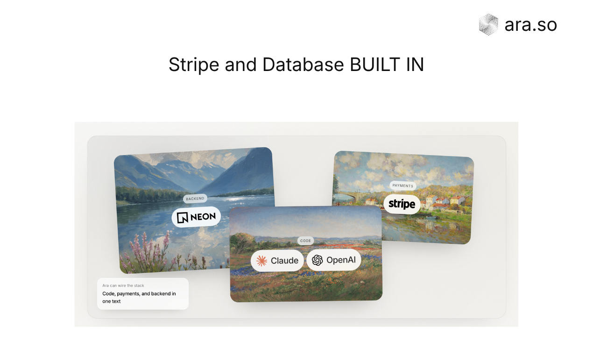
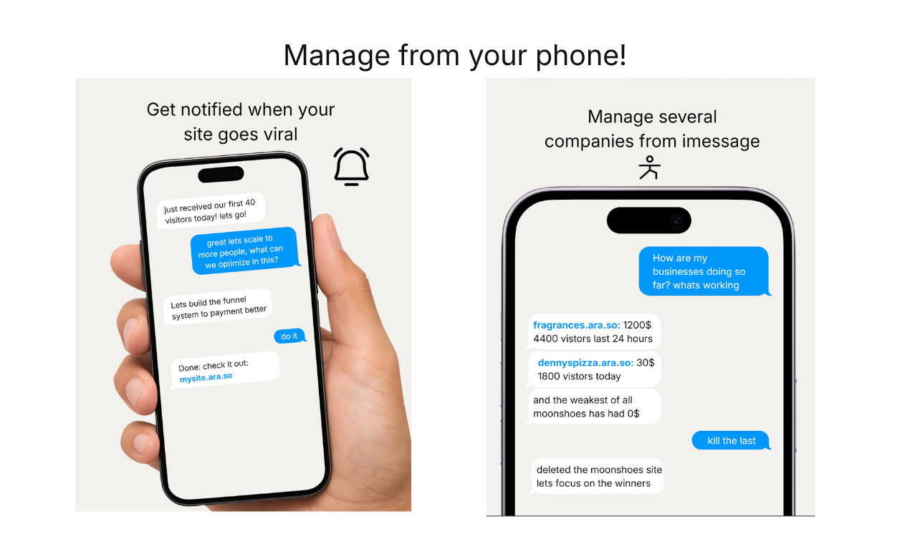

### 🎬 관련 영상
- [🎥 영상 보기](https://ph-files.imgix.net/db981277-116f-4965-9c63-ba51f241de5d.jpeg?auto=format)

---

## 9. [BookstoRead.ai](https://www.producthunt.com/products/bookstoread-ai)
**Votes**: 51 | **도입 난이도**: 하 | **신뢰도**: 상
**Tagline**: Life’s too short for boring books. Let AI find your match
**서비스 링크**: https://www.producthunt.com/r/7EFCLV5HAOEIU2

**태그**: AI, Book Discovery, Personalization, AI Tool

### 📌 이 서비스 한눈에 보기
사용자의 구체적인 의도를 반영하여 딱 맞는 책을 찾아주는 AI 도서 추천 엔진

### 🔑 주요 기능
- 단순 베스트셀러 목록을 넘어선 개인 맞춤형 도서 탐색
- 일상적인 자연어(Plain English)를 통한 정교한 검색 기능
- 사용자의 특정 의도와 목적에 부합하는 도서 매칭

### 🙋 사용자에게 어떤 점이 좋은가
뻔한 추천 리스트에서 벗어나, 내가 지금 읽고 싶은 주제나 분위기에 딱 맞는 책을 쉽고 빠르게 찾을 수 있습니다.

### ✅ 지금 바로 써볼 기능
- 자연어로 원하는 책의 느낌이나 주제 설명해보기
- 기존 베스트셀러 목록과 추천 결과 비교하기

### ⚠️ 사용 전 확인할 점
- AI 모델의 학습 데이터에 따른 도서 데이터베이스의 범위 제한 가능성
- 사용자의 모호한 설명이 정확한 추천으로 이어지는지 확인 필요

### 🧭 확인이 더 필요한 정보
현재 제공되는 도서 데이터베이스의 규모와 지원 언어 범위를 확인할 필요가 있습니다.

### 📸 스크린샷 및 갤러리

---

## 10. [explainx ai](https://www.producthunt.com/products/explainx)
**Votes**: 49 | **도입 난이도**: 하 | **신뢰도**: 상
**Tagline**: discover & monetize ai skills, agents, tools & mcp servers
**서비스 링크**: https://www.producthunt.com/r/DNDZ6ADD5647SS

**태그**: AI, DeveloperTools, Marketplace, Automation, Agent, AI Tool, LLM

### 📌 이 서비스 한눈에 보기
AI 기술, 에이전트, MCP 서버를 탐색하고 직접 배포하여 수익화할 수 있는 AI 허브

### 🔑 주요 기능
- 10만 개 이상의 AI 도구, 에이전트, LLM 및 관련 코스 제공
- 실제 채택률(adoption) 기반의 신뢰할 수 있는 랭킹 시스템
- 직접 개발한 AI 스킬, 에이전트, MCP 서버를 게시하여 사용자에게 노출 가능

### 🙋 사용자에게 어떤 점이 좋은가
AI 개발자와 실무자가 검증된 도구를 빠르게 찾거나, 자신이 만든 결과물을 커뮤니티에 공유하여 영향력을 넓힐 수 있습니다.

### ✅ 지금 바로 써볼 기능
- 실제 채택률 기반의 인기 AI 도구 및 MCP 서버 탐색하기
- 자신이 개발한 AI 스킬이나 에이전트 등록하기
- 최신 AI 뉴스 및 학습 코스 확인하기

### ⚠️ 사용 전 확인할 점
- 랭킹 시스템이 실제 성능을 완벽히 보장하는지 검토 필요
- 직접 게시 시 커뮤니티 가이드라인 준수 여부 확인

### 🧭 확인이 더 필요한 정보
수익화 모델의 구체적인 방식(직접 결제 또는 광고 등)에 대한 상세 정보가 명시되지 않았습니다.

### 📸 스크린샷 및 갤러리
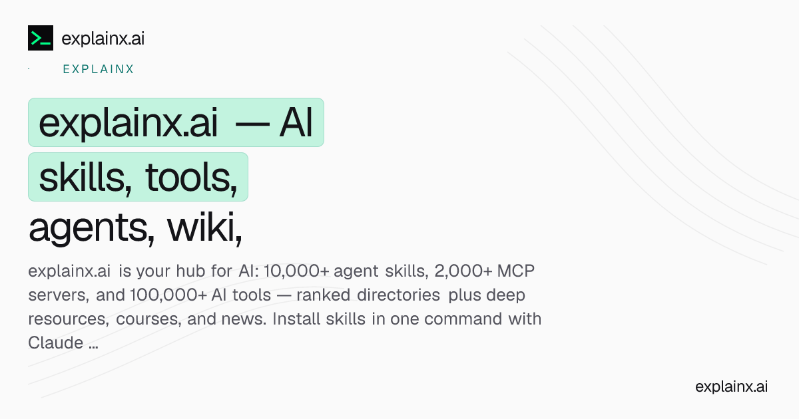
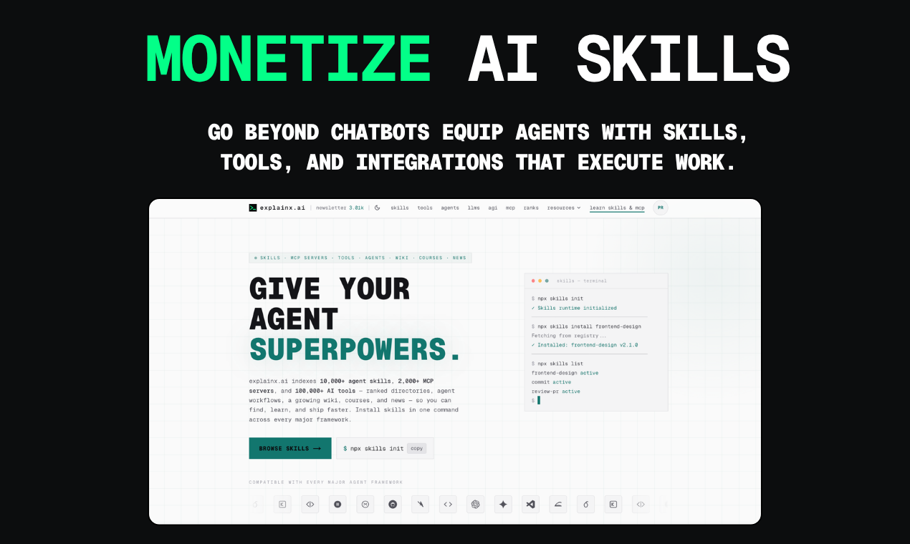
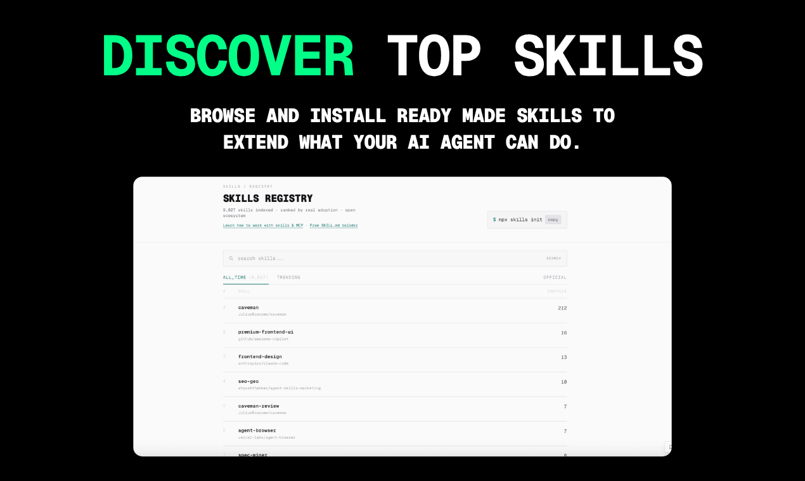

### 🎬 관련 영상
- [🎥 영상 보기](https://ph-files.imgix.net/d4cebe8b-45fb-46d6-93c9-2e78d96bf6cd.jpeg?auto=format)

---

