# 🚀 Product Hunt Daily Top 30 (2026-05-05)

## 오늘의 요약
오늘의 제품들은 단순한 AI 챗봇을 넘어, 복잡한 업무 프로세스를 자동화하거나 데스크톱 환경에 통합되는 등 실질적인 업무 효율을 높이는 에이전트 기술이 주를 이루었습니다. 또한, 사용자 행동 분석이나 규제 전문 지식과 같이 특정 도메인에 특화된 정교한 AI 솔루션들이 주목받았습니다.

### 오늘의 핵심 포인트
- 자연어 지시만으로 팀을 구성하고 업무를 위임하는 AI 에이전트 자동화 솔루션이 등장했습니다.
- 데스크톱 네이티브 환경이나 워크플로우 시각화 도구 등 사용자 경험을 직관적으로 개선하는 도구들이 눈에 띕니다.
- 특정 국가의 금융 규제나 브랜드 가이드라인 준수와 같이 전문적이고 구체적인 목적을 가진 AI 서비스들이 발표되었습니다.

**오늘의 태그**: AI 에이전트, 업무 자동화, 생산성 도구, 데이터 분석

## 1. [Mindra](https://www.producthunt.com/products/mindra)
**Votes**: 278 | **도입 난이도**: 중 | **신뢰도**: 상
**Tagline**: Agent Teams You Can Actually Delegate To
**서비스 링크**: https://www.producthunt.com/r/TKXFPMBGKX7BTI

**태그**: Automation, AI Agents, Workflow, Productivity, Agent, AI Tool, Marketing

### 📌 이 서비스 한눈에 보기
사용자의 지시만으로 최적의 AI 에이전트 팀을 구성하고 운영하는 자동화 커맨드 센터

### 🔑 주요 기능
- 자연어 설명만으로 최적의 에이전트 팀 자동 구성
- 마케팅, 공급망 관리 등 복잡한 업무 프로세스 자동화
- 거버넌스 및 인간 개입(Human Oversight) 기능을 통한 신뢰성 확보

### 🙋 사용자에게 어떤 점이 좋은가
24시간 쉬지 않는 AI 팀을 구축하여 반복적이고 복잡한 업무를 위임함으로써 업무 효율을 극대화할 수 있습니다.

### ✅ 지금 바로 써볼 기능
- 수행하고자 하는 업무 시나리오 설명해보기
- 자동 생성된 에이전트 팀 구성 확인하기
- 기존 워크플로우와의 연동성 테스트하기

### ⚠️ 사용 전 확인할 점
- 에이전트의 자율적 판단에 따른 결과물 검토 필요
- 기존 스택과의 구체적인 통합 범위 확인 필요

### 🧭 확인이 더 필요한 정보
현재 제공되는 에이전트의 구체적인 전문 분야와 기존 툴과의 상세 연동 수준에 대한 정보가 더 필요합니다.

### 📸 스크린샷 및 갤러리

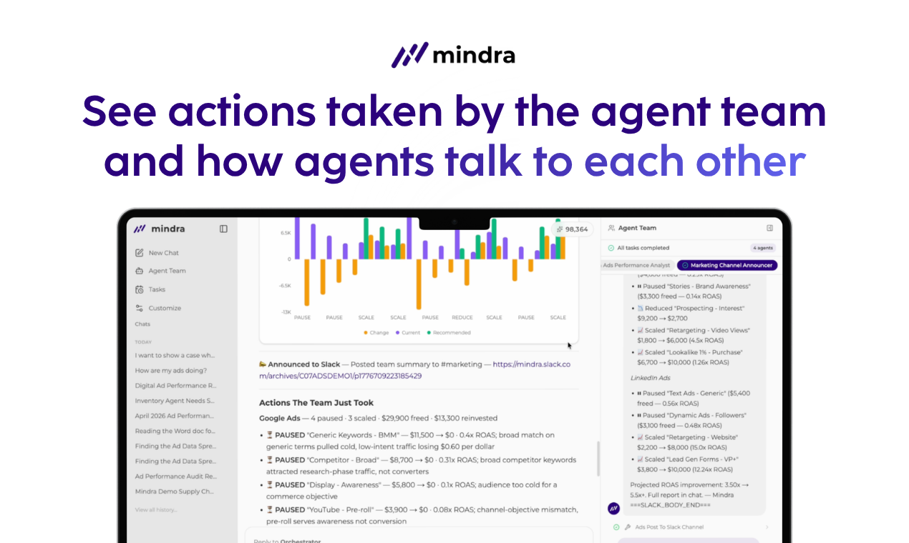

### 🎬 관련 영상
- [🎥 영상 보기](https://ph-files.imgix.net/b9ce7808-a5c5-42ee-9b6d-df34451b5b20.jpeg?auto=format)

---

## 2. [Aaavatar](https://www.producthunt.com/products/aaavatar)
**Votes**: 232 | **도입 난이도**: 하 | **신뢰도**: 상
**Tagline**: Branded team headshots in one drop
**서비스 링크**: https://www.producthunt.com/r/JUKURYVT34QCC5

**태그**: DesignTool, Automation, HRTech, Productivity, AI Tool, Design

### 📌 이 서비스 한눈에 보기
단 한 번의 클릭으로 팀 프로필 사진을 브랜드 스타일로 통일해주는 자동화 도구

### 🔑 주요 기능
- 배경 제거 및 색상 균형 자동 조정
- 부족한 이미지 요소 복원 및 일관된 정렬
- 다양한 포맷의 일괄 내보내기 지원

### 🙋 사용자에게 어떤 점이 좋은가
HR이나 디자인 팀이 팀원들의 프로필 사진을 일관된 브랜드 가이드에 맞춰 일괄 정리할 때 매우 유용합니다.

### ✅ 지금 바로 써볼 기능
- 사진 드롭하여 자동 편집 결과 확인하기
- 브랜드 스타일에 맞춘 배경 및 정렬 적용하기
- 필요한 포맷으로 결과물 내보내기

### ⚠️ 사용 전 확인할 점
- 원본 사진의 품질에 따라 복원 결과가 달라질 수 있음
- 대량 작업 시 브랜드 가이드라인과의 일치 여부 검토 필요

### 🧭 확인이 더 필요한 정보
사용 가능한 파일 형식의 종류와 대량 업로드 시의 처리 속도에 대한 정보가 더 필요합니다.

### 📸 스크린샷 및 갤러리

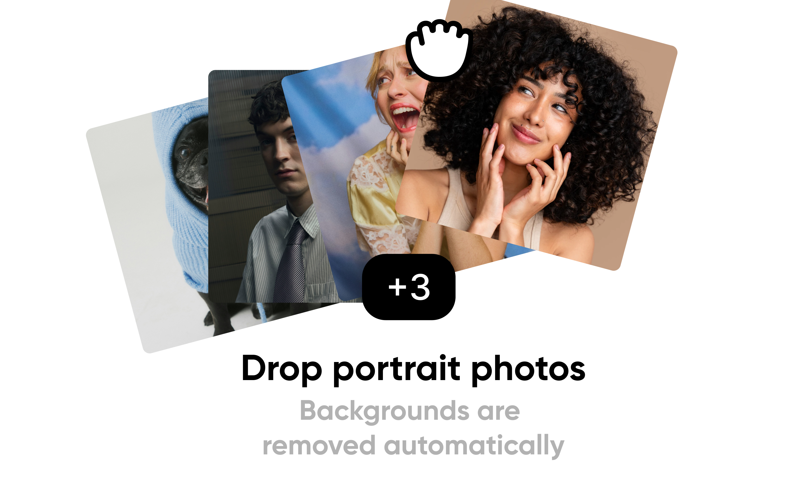

---

## 3. [Codex Pets](https://www.producthunt.com/products/openai)
**Votes**: 230 | **도입 난이도**: 하 | **신뢰도**: 상
**Tagline**: Animated companions for your Codex workflow
**서비스 링크**: https://www.producthunt.com/r/2HWSN7JO4UFU7I

**태그**: DevTool, Productivity, UI/UX, Automation, AI Tool

### 📌 이 서비스 한눈에 보기
Codex 워크플로우의 상태를 시각적으로 알려주는 귀여운 애니메이션 동료

### 🔑 주요 기능
- Codex 작업 상태(실행 중, 대기 중, 검토 대기 등)를 실시간으로 반영하는 플로팅 오버레이
- 사용자 취향에 맞게 커스터마이징 가능한 'hatch-pet' 스킬 제공
- 워크플로우 진행 상황을 직관적으로 확인할 수 있는 시각적 보조 도구

### 🙋 사용자에게 어떤 점이 좋은가
작업의 진행 상태를 별도의 확인 없이도 직관적으로 파악할 수 있어 워크플로우 흐름을 놓치지 않게 도와줍니다.

### ✅ 지금 바로 써볼 기능
- 플로팅 오버레이를 통한 실시간 상태 모니터링
- hatch-pet 스킬을 활용한 반려동물 커스터마이징
- Codex 워크플로우와 연동하여 작업 흐름 확인하기

### ⚠️ 사용 전 확인할 점
- 플로팅 오버레이 방식이므로 작업 화면 일부를 가릴 수 있음
- Codex 환경에 따라 애니메이션 리소스 사용량이 발생할 수 있음

### 🧭 확인이 더 필요한 정보
Codex의 구체적인 워크플로우 환경과 연동 방식에 대한 상세 정보가 필요합니다.

### 📸 스크린샷 및 갤러리
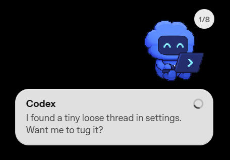
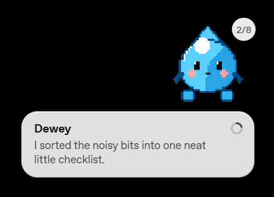

---

## 4. [Flowly](https://www.producthunt.com/products/flowly-6)
**Votes**: 184 | **도입 난이도**: 하 | **신뢰도**: 상
**Tagline**: Your personal AI assistant, native to your desktop
**서비스 링크**: https://www.producthunt.com/r/3RJN7F7R3NET4Q

**태그**: AI Assistant, Productivity, Automation, Desktop App, Agent, AI Tool, Chat

### 📌 이 서비스 한눈에 보기
데스크톱 어디서든 즉시 호출하여 앱과 브라우저를 제어하는 개인용 AI 비서

### 🔑 주요 기능
- macOS, Windows, Linux를 지원하는 네이티브 데스크톱 AI 어시스턴트
- 브라우저 에이전트 및 음성 코칭 기능 탑재
- 종단간 암호화(E2EE)를 통한 강력한 프라이버시 보호

### 🙋 사용자에게 어떤 점이 좋은가
별도의 창 전환 없이 단축키 하나로 AI를 호출하여 작업 흐름을 끊지 않고 앱과 브라우저를 제어할 수 있습니다.

### ✅ 지금 바로 써볼 기능
- 글로벌 단축키를 통한 노치/메뉴바 호출 테스트
- 브라우저 에이전트 기능을 활용한 웹 작업 자동화
- 음성 코칭 기능 사용해보기

### ⚠️ 사용 전 확인할 점
- 무제한 사용을 위해서는 Pro 플랜 구독이 필요함
- 데스크톱 네이티브 앱이므로 시스템 권한 설정이 필요할 수 있음

### 🧭 확인이 더 필요한 정보
Pro 플랜의 구체적인 가격 정책과 무제한 사용의 범위에 대한 정보가 명시되지 않았습니다.

### 📸 스크린샷 및 갤러리
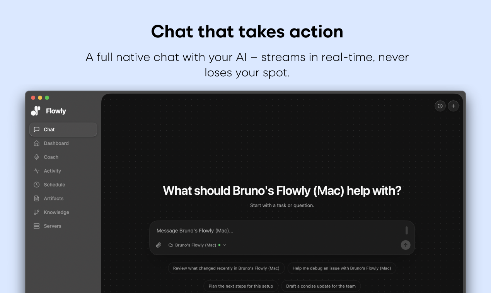
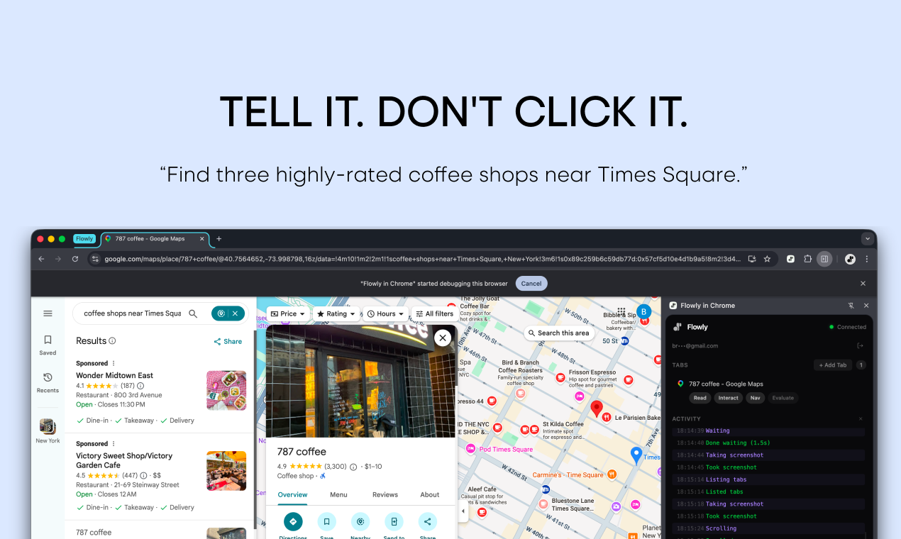
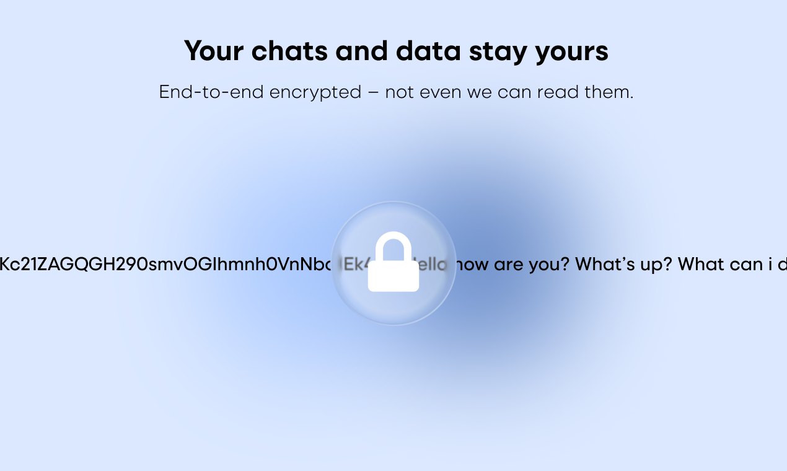

---

## 5. [Claude Code & Codex Usage Trading Cards by Rudel](https://www.producthunt.com/products/rudel)
**Votes**: 160 | **도입 난이도**: 중 | **신뢰도**: 상
**Tagline**: Get your trading card based on your CC & codex usage
**서비스 링크**: https://www.producthunt.com/r/BWWXO2JDNUBIFN

**태그**: DevTool, AI-Analytics, OpenSource

### 📌 이 서비스 한눈에 보기
Claude Code 및 Codex 사용 패턴을 분석하여 나만의 트레이딩 카드를 생성하는 도구

### 🔑 주요 기능
- 사용자의 세션 형태, 토큰 사용량, 모델 조합 등 복합적 데이터 분석
- 사용 패턴에 기반한 고유한 아키타입(Archetype) 트레이딩 카드 생성
- 오픈 소스 기반의 무료 및 셀프 호스팅 지원

### 🙋 사용자에게 어떤 점이 좋은가
자신의 개발 및 AI 활용 패턴을 시각화된 카드로 확인하며 재미와 분석적 통찰을 동시에 얻을 수 있습니다.

### ✅ 지금 바로 써볼 기능
- Claude Code 및 Codex 세션 실행하기
- 생성된 데이터 패턴 확인하기
- 자신의 아키타입 카드 확인 및 공유하기

### ⚠️ 사용 전 확인할 점
- 사용자 데이터(토큰, 코드 패턴 등)를 분석하므로 보안 환경 확인 필요
- 셀프 호스팅 시 기술적 설정 역량 필요

### 🧭 확인이 더 필요한 정보
데이터 분석 방식과 카드 생성 알고리즘의 구체적인 로직은 오픈 소스 코드를 통해 확인이 필요합니다.

### 📸 스크린샷 및 갤러리
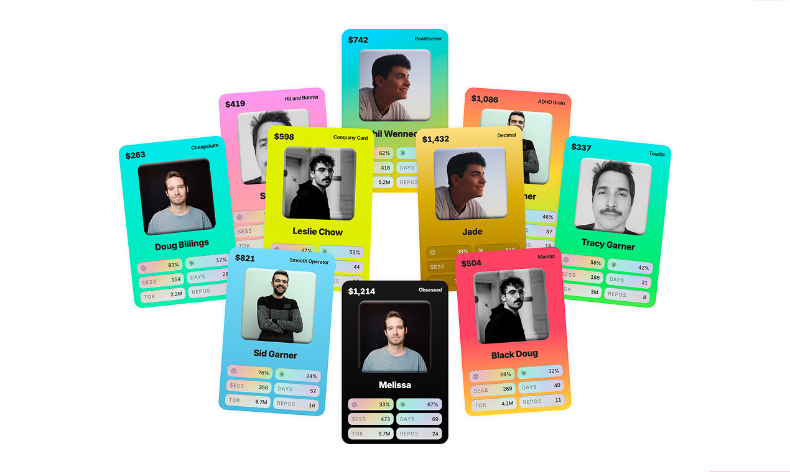
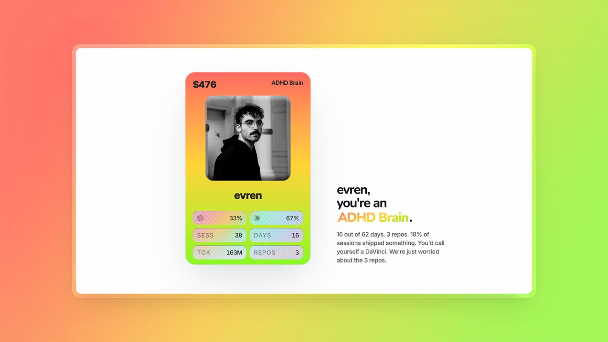
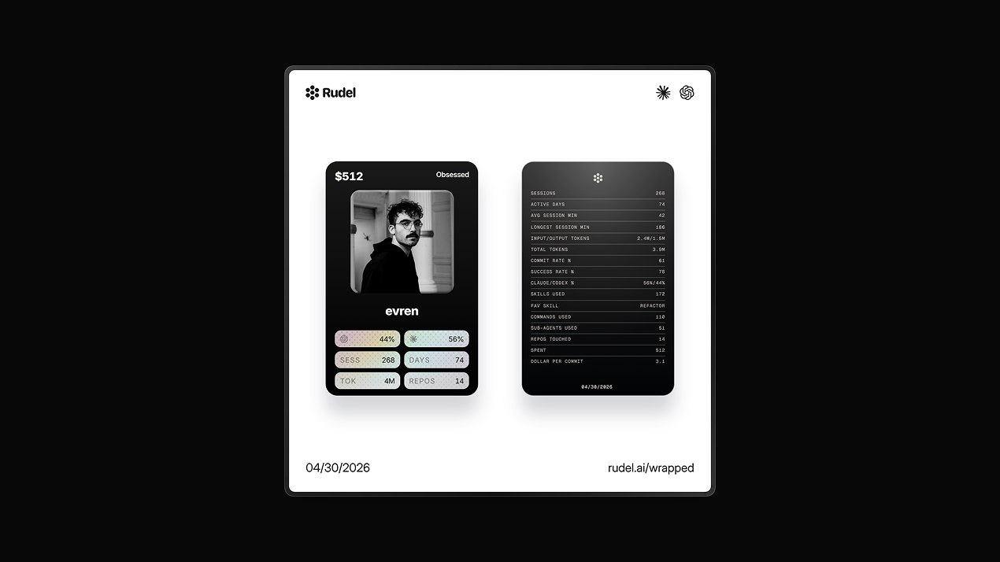

### 🎬 관련 영상
- [🎥 영상 보기](https://ph-files.imgix.net/139d6d63-6366-4af7-a236-905f9114a604.jpeg?auto=format)

---

## 6. [Dropy](https://www.producthunt.com/products/dropy-price-tracker-price-history)
**Votes**: 147 | **도입 난이도**: 하 | **신뢰도**: 상
**Tagline**: Track prices on stores like Amazon, eBay, & AliExpress
**서비스 링크**: https://www.producthunt.com/r/Y4DOLWCP7FGXFN

**태그**: Shopping, Price Tracker, Savings

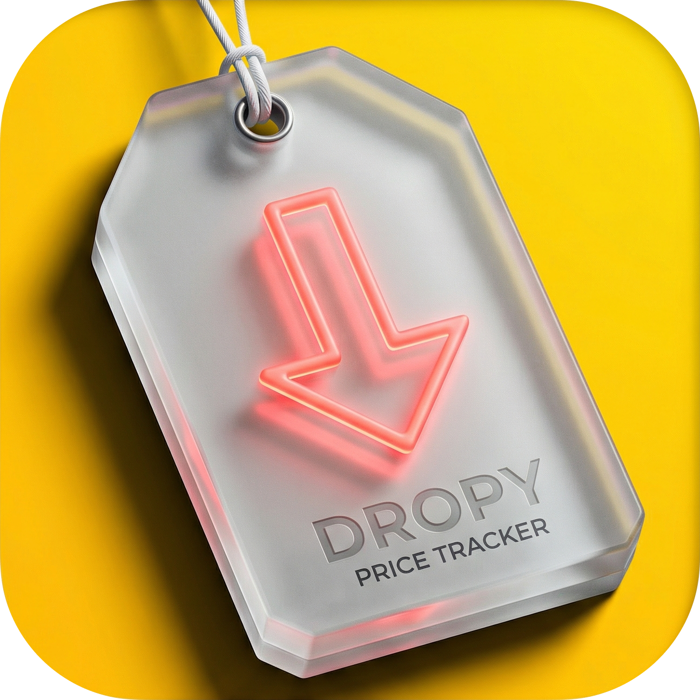

### 📌 이 서비스 한눈에 보기
아마존, 이베이 등 주요 쇼핑몰의 가격 변동을 추적하여 최적의 구매 타이밍을 알려주는 서비스

### 🔑 주요 기능
- 아마존, 이베이, 알리익스프레스 등 다양한 온라인 스토어 지원
- 가격 하락 시 즉각적인 알림 제공
- 과거 가격 변동 추이를 확인할 수 있는 히스토리 차트 제공

### 🙋 사용자에게 어떤 점이 좋은가
원하는 상품의 가격 변화를 실시간으로 모니터링하여, 가장 저렴한 시점에 구매함으로써 불필요한 지출을 방지할 수 있습니다.

### ✅ 지금 바로 써볼 기능
- 관심 있는 상품의 가격 추적 설정하기
- 가격 변동 히스토리 차트 분석하기
- 가격 하락 알림 활성화하기

### ⚠️ 사용 전 확인할 점
- 지원하는 스토어 목록이 설명된 곳 외에 제한적일 수 있음
- 알림 지연 가능성 확인 필요

### 🧭 확인이 더 필요한 정보
지원하는 전체 스토어 범위와 알림 전달 방식(앱 푸시, 이메일 등)에 대한 구체적인 정보가 필요합니다.

### 📸 스크린샷 및 갤러리
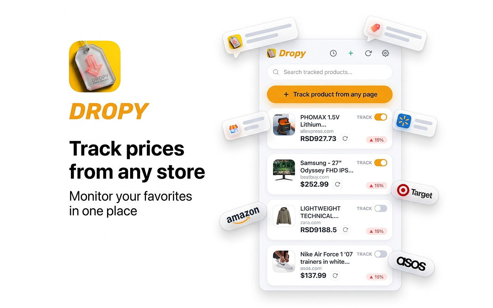
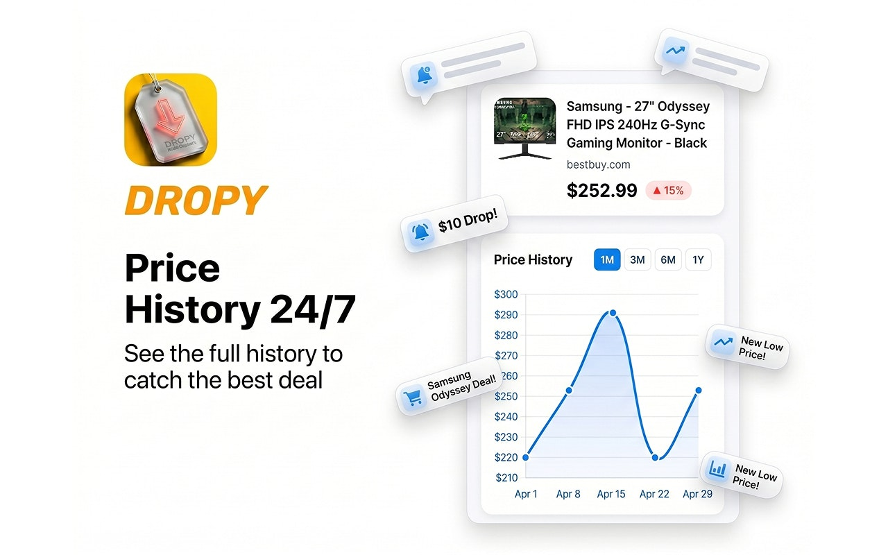
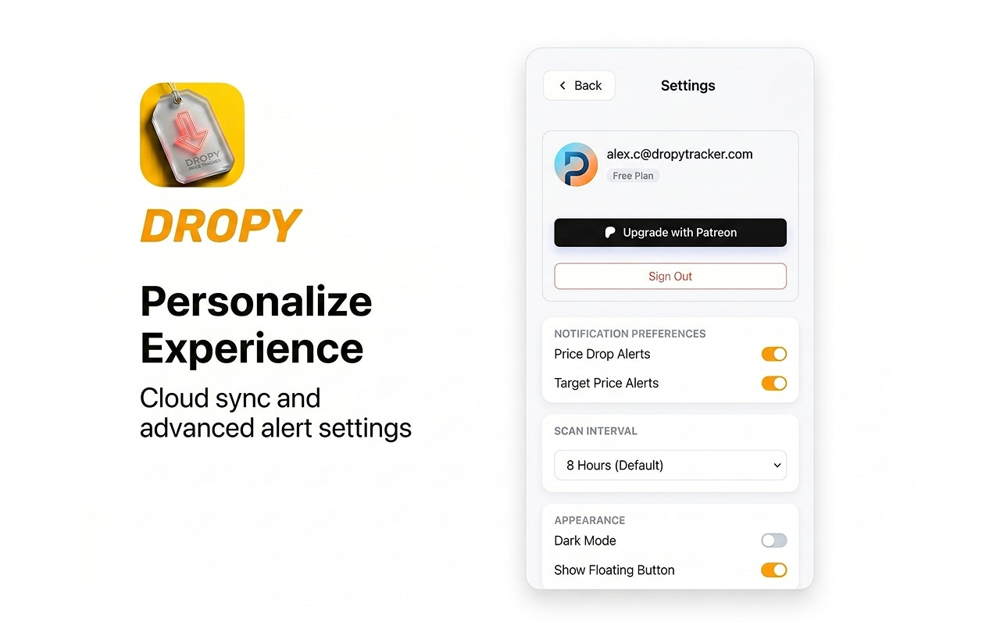

---

## 7. [Visitor profiles and timeline by Croct](https://www.producthunt.com/products/croct)
**Votes**: 136 | **도입 난이도**: 중 | **신뢰도**: 상
**Tagline**: Uncover the story behind every click to optimize your site
**서비스 링크**: https://www.producthunt.com/r/YL7RK4QUIESX5S

**태그**: Analytics, MarketingTech, UX, Optimization

### 📌 이 서비스 한눈에 보기
방문자의 행동 흐름을 타임라인으로 파악하여 개인화된 웹 경험을 설계하는 분석 도구

### 🔑 주요 기능
- 익명 사용자와 식별된 사용자의 데이터를 매끄럽게 연결하는 프로필 기능
- 사용자의 페이지 탐색 및 행동 이력을 보여주는 상세 타임라인 제공
- 실시간 방문자 모니터링 및 정교한 오디언스 세그먼트 생성

### 🙋 사용자에게 어떤 점이 좋은가
사용자의 개별 여정을 시각적으로 추적할 수 있어, 데이터 기반의 A/B 테스트와 맞춤형 전환 최적화 전략을 세우는 데 유용합니다.

### ✅ 지금 바로 써볼 기능
- 사용자 행동 타임라인 분석하기
- 실시간 방문자 모니터링 기능 확인하기
- 세그먼트 기능을 활용한 A/B 테스트 타겟 설정하기

### ⚠️ 사용 전 확인할 점
- 데이터 수집 및 개인정보 보호 정책 준수 여부 확인 필요
- 웹사이트 규모에 따른 데이터 처리 성능 및 비용 구조 확인 필요

### 🧭 확인이 더 필요한 정보
구체적인 데이터 연동 방식 및 타 서비스와의 통합 범위에 대한 정보가 부족합니다.

### 📸 스크린샷 및 갤러리
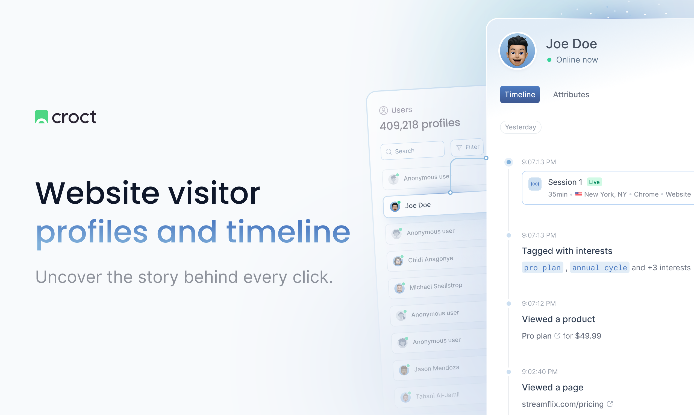
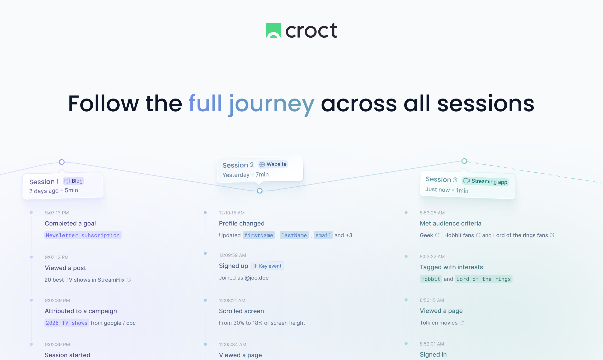
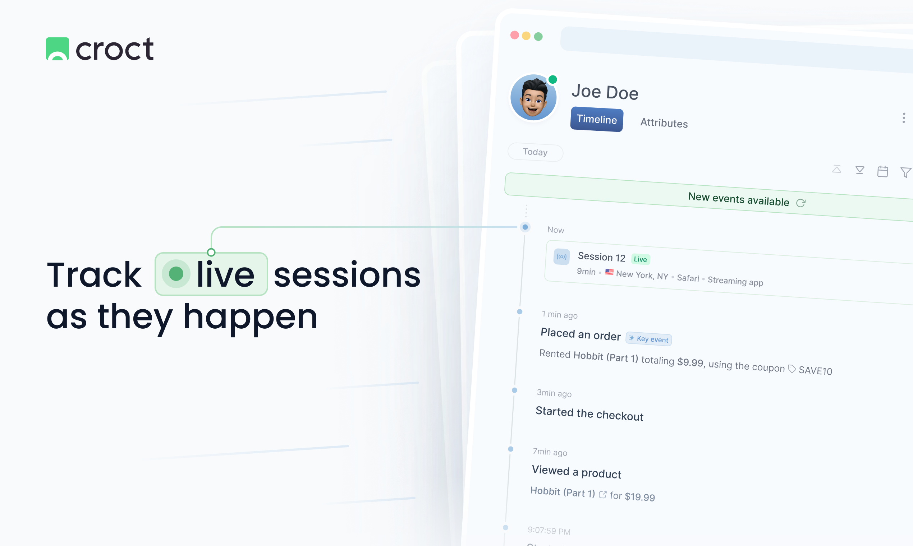

### 🎬 관련 영상
- [🎥 영상 보기](https://ph-files.imgix.net/0f770b70-94ac-442a-814a-0d18b13a40be.jpeg?auto=format)

---

## 8. [Regulus by Cumbuca](https://www.producthunt.com/products/cumbuca)
**Votes**: 115 | **도입 난이도**: 하 | **신뢰도**: 상
**Tagline**: AI chatbot trained on Brazil's Central Bank regulations
**서비스 링크**: https://www.producthunt.com/r/AUJSF7A6M5AEU4

**태그**: FinTech, AI Chatbot, Compliance, Brazil, AI Tool, Chat

### 📌 이 서비스 한눈에 보기
브라질 중앙은행 규정만을 학습하여 정확한 답변과 출처를 제공하는 금융 전문 AI 챗봇

### 🔑 주요 기능
- 브라질 중앙은행의 공식 규정(Open Finance, Pix 등) 및 기술 문서 특화 학습
- 자연어 질문에 대해 원본 출처를 포함한 답변 제공
- 금융 규제 변화에 따른 법률 비용 및 정보 탐색 시간 절감

### 🙋 사용자에게 어떤 점이 좋은가
금융 관련 종사자가 복잡한 브라질 규정 문서를 일일이 찾는 대신, 신뢰할 수 있는 근거와 함께 즉각적인 답변을 얻을 수 있습니다.

### ✅ 지금 바로 써볼 기능
- 자연어로 규제 관련 질문 던져보기
- 제공되는 답변의 원본 출처(Reference) 확인하기
- 실제 업무 시나리오에 적용 가능한지 테스트하기

### ⚠️ 사용 전 확인할 점
- AI 특성상 답변의 법적 책임은 사용자에게 있으므로 최종 검토 필요
- 브라질 금융 규제 외의 일반적인 질문에는 적합하지 않을 수 있음

### 🧭 확인이 더 필요한 정보
현재 무료로 제공되고 있으나, 향후 유료화 계획이나 API 제공 여부는 명시되지 않았습니다.

### 📸 스크린샷 및 갤러리

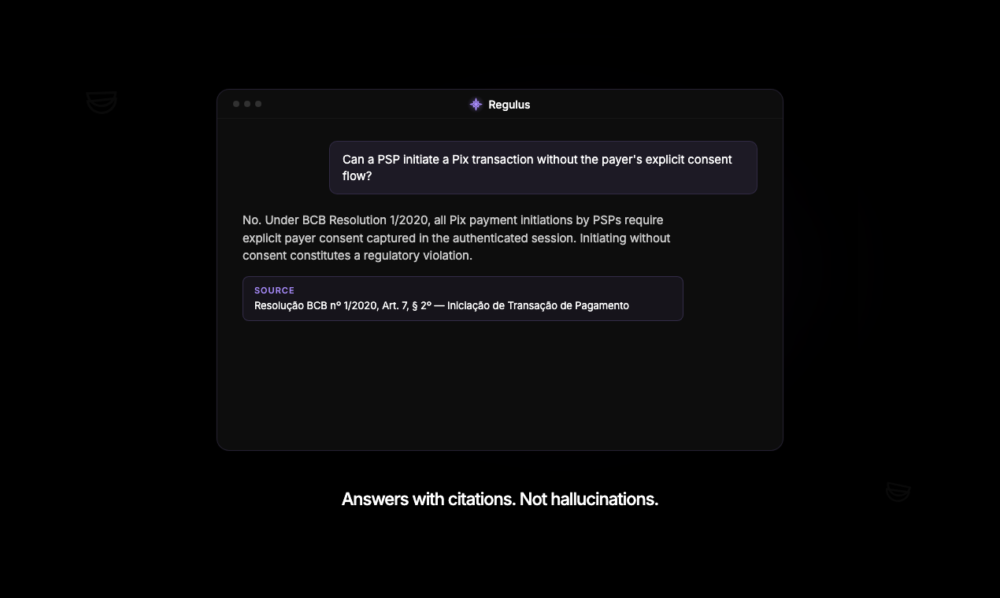
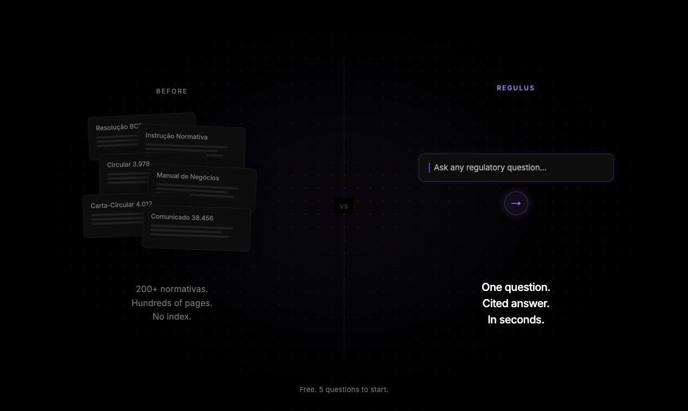

---

## 9. [Sleek Analytics for iOS](https://www.producthunt.com/products/sleek-analytics)
**Votes**: 114 | **도입 난이도**: 하 | **신뢰도**: 상
**Tagline**: Your website analytics in your pocket
**서비스 링크**: https://www.producthunt.com/r/5FCCBUU6APDSDO

**태그**: Analytics, Privacy, Mobile-First, SaaS

### 📌 이 서비스 한눈에 보기
개인정보를 보호하면서 언제 어디서든 웹사이트 통계를 확인할 수 있는 모바일 최적화 분석 도구

### 🔑 주요 기능
- 개인정보 보호를 우선시하는 쿠키 없는(cookieless) 트래킹 방식
- 실시간 웹사이트 데이터 확인이 가능한 빠른 대시보드
- iOS 환경에 최적화된 모바일 중심의 분석 경험

### 🙋 사용자에게 어떤 점이 좋은가
복잡한 구글 애널리틱스 대신, 모바일에서 간편하고 빠르게 웹사이트 방문 현황을 실시간으로 모니터링할 수 있습니다.

### ✅ 지금 바로 써볼 기능
- 실시간 대시보드를 통한 트래픽 변화 모니터링
- 쿠키 없는 트래킹 설정 및 적용
- 모바일 환경에서의 대시보드 사용성 테스트

### ⚠️ 사용 전 확인할 점
- 모바일 중심 서비스이므로 상세한 심층 분석에는 데스크톱 환경보다 제약이 있을 수 있음
- 쿠키를 사용하지 않는 방식이 기존의 정밀한 사용자 행동 추적 기능과 차이가 있을 수 있음

### 🧭 확인이 더 필요한 정보
현재 제공되는 기능 외에 웹사이트에 설치해야 하는 스크립트의 복잡도나 상세 기능 범위는 명시되지 않았습니다.

### 📸 스크린샷 및 갤러리
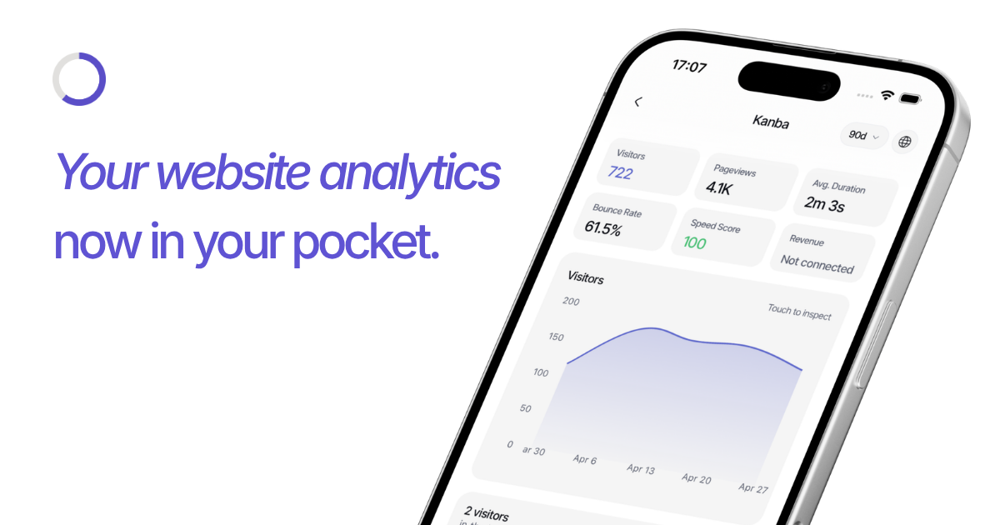
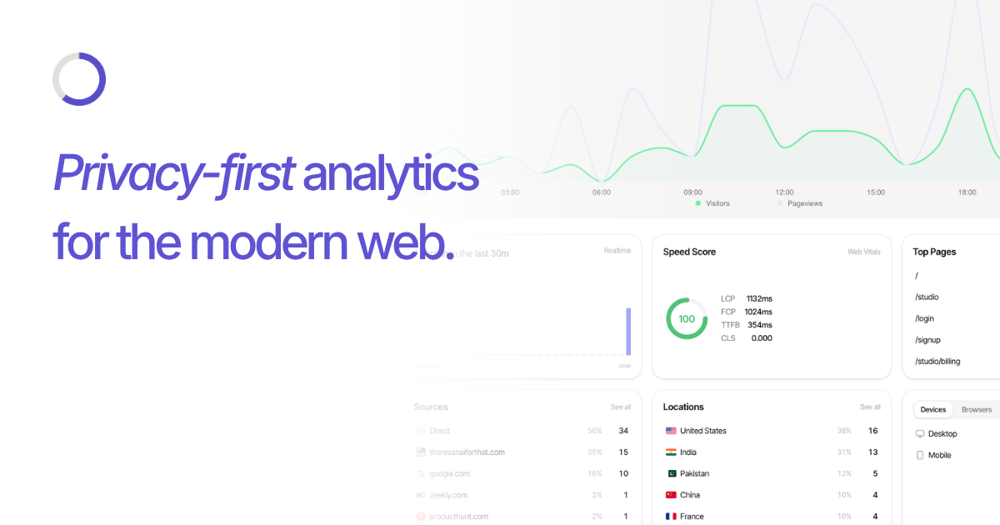

### 🎬 관련 영상
- [🎥 영상 보기](https://ph-files.imgix.net/92daca3b-e9c6-463a-ba38-8624840d1db8.jpeg?auto=format)

---

## 10. [Panels Store](https://www.producthunt.com/products/panels-store)
**Votes**: 112 | **도입 난이도**: 하 | **신뢰도**: 상
**Tagline**: Buy DRM-free comics and read them instantly in Panels
**서비스 링크**: https://www.producthunt.com/r/WZSHBVASFTQGJ5

**태그**: DigitalComics, E-book, Marketplace, DRM-free

### 📌 이 서비스 한눈에 보기
플랫폼 종속 없는 자유로운 독서를 위한 DRM-free 디지털 코믹스 마켓플레이스

### 🔑 주요 기능
- DRM-free 방식으로 구매한 코믹스를 자유롭게 소장 및 이용 가능
- Panels 앱과의 완벽한 연동을 통한 즉각적인 독서 환경 제공
- 창작자와 출판사에게 높은 수익 배분(80%) 및 비독점적 권리 보장

### 🙋 사용자에게 어떤 점이 좋은가
특정 플랫폼에 묶이지 않고 구매한 콘텐츠를 자유롭게 관리하고 싶은 독자들에게 최적의 환경을 제공합니다.

### ✅ 지금 바로 써볼 기능
- Panels 앱 설치 및 연동 확인
- 원하는 코믹스 탐색 및 구매
- 다운로드 후 오프라인 독서 경험하기

### ⚠️ 사용 전 확인할 점
- Panels 앱(iOS/Mac) 사용자에게 최적화된 서비스임
- 콘텐츠 제공 범위가 특정 출판사나 작가에 국한될 수 있음

### 🧭 확인이 더 필요한 정보
Android 등 타 운영체제에서의 지원 여부 및 호환성은 명시되지 않았습니다.

### 📸 스크린샷 및 갤러리

---

## 11. [Manex](https://www.producthunt.com/products/manex)
**Votes**: 110 | **도입 난이도**: 중 | **신뢰도**: 상
**Tagline**: Preserve useful answers, corrections, and context as memory
**서비스 링크**: https://www.producthunt.com/r/NKTEKMOWLTZFE6

**태그**: AI, KnowledgeManagement, Privacy, Collaboration, Productivity, AI Tool

### 📌 이 서비스 한눈에 보기
문서와 팀 지식을 안전하게 저장하고 학습하는 프라이빗 AI 메모리

### 🔑 주요 기능
- 문서 및 팀 지식 기반의 프라이빗 AI 메모리 구축
- 로컬 실행 지원 및 기본 데이터 프라이버시 보호
- 사용자별 과금 없는 팀 공유 지식 베이스 제공

### 🙋 사용자에게 어떤 점이 좋은가
중요한 문서와 대화 맥락을 안전하게 보관하여 팀 전체가 공유하는 '공동의 뇌'로 활용할 수 있습니다.

### ✅ 지금 바로 써볼 기능
- 주요 문서 업로드 및 질문 테스트
- 답변 및 수정 사항을 통한 메모리 축적 기능 확인
- 로컬 실행 환경 설정 및 데이터 보안성 검토

### ⚠️ 사용 전 확인할 점
- 로컬 실행 시 하드웨어 사양에 따른 성능 차이 발생 가능
- 지원되는 환경에 따른 설치 복잡도 존재

### 🧭 확인이 더 필요한 정보
로컬 실행이 지원되는 구체적인 운영체제 및 하드웨어 요구 사양에 대한 확인이 필요합니다.

### 📸 스크린샷 및 갤러리
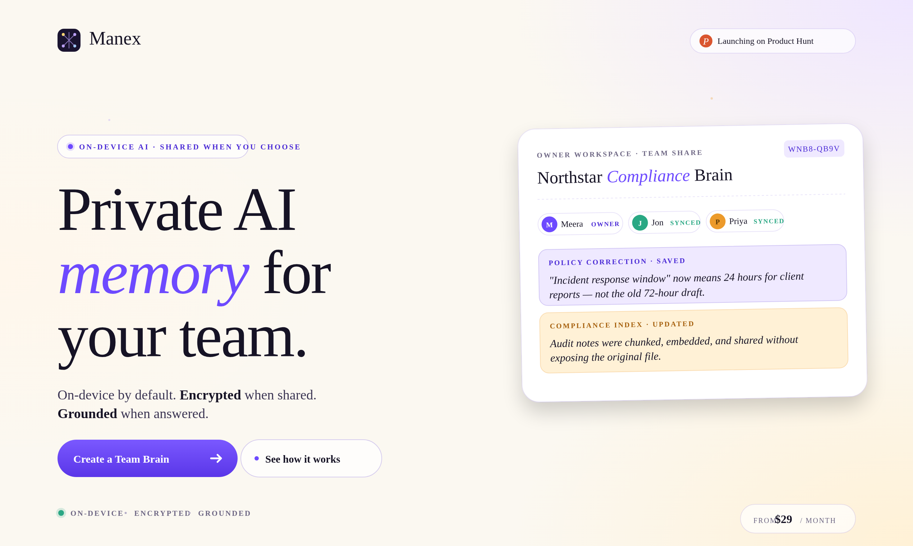
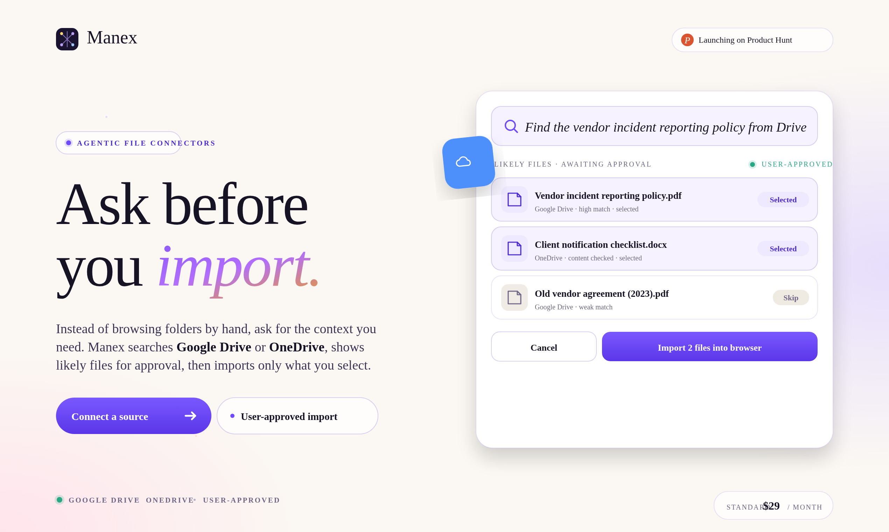
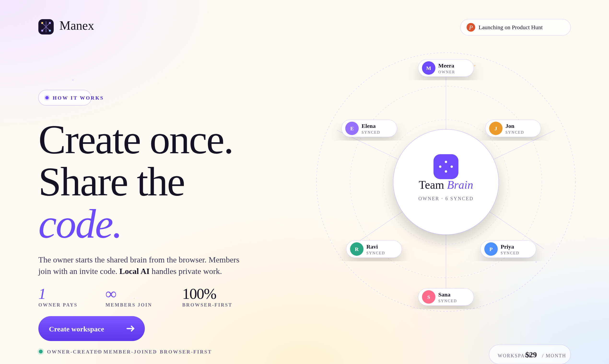

---

## 12. [Replyke V7](https://www.producthunt.com/products/replyke)
**Votes**: 105 | **도입 난이도**: 하 | **신뢰도**: 상
**Tagline**: Pre-Modeled Infra & Client SDKs for User-Powered Products.
**서비스 링크**: https://www.producthunt.com/r/SZDWBAR4DIZRP7

**태그**: DevTool, Backend-as-a-Service, SDK, Productivity, Chat

### 📌 이 서비스 한눈에 보기
댓글, 피드, 채팅 등 사용자 상호작용 기능을 즉시 구현할 수 있는 완성형 인프라 및 SDK

### 🔑 주요 기능
- 댓글, 반응, 피드, 알림, 채팅 등 복잡한 사용자 상호작용 시스템 사전 모델링
- SDK 설치와 프로바이더 설정만으로 1시간 내 기능 배포 가능
- React, React Native, Expo, Node.js를 지원하는 멀티 플랫폼 호환성

### 🙋 사용자에게 어떤 점이 좋은가
반복적인 사용자 인터랙션 기능 개발 시간을 획기적으로 줄여 핵심 비즈니스 로직에 집중할 수 있게 해줍니다.

### ✅ 지금 바로 써볼 기능
- React/Node.js 환경에 SDK 설치하기
- 기존 앱에 댓글 및 반응 기능 연동 테스트
- 프로바이더를 통한 데이터 흐름 확인

### ⚠️ 사용 전 확인할 점
- 제공되는 모델 외의 커스텀 기능 구현 시 제약 사항 확인 필요
- 인프라 의존도 증가에 따른 데이터 관리 정책 검토

### 🧭 확인이 더 필요한 정보
상세한 데이터 보안 정책 및 확장성 한계에 대한 구체적인 정보가 명시되지 않았습니다.

### 📸 스크린샷 및 갤러리
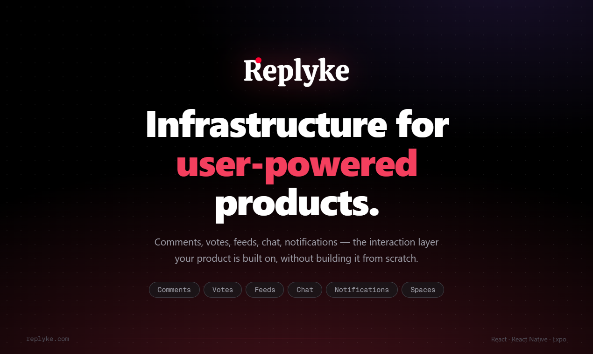
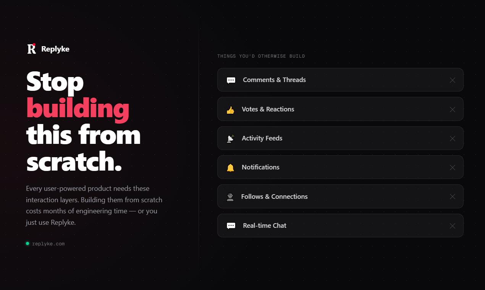
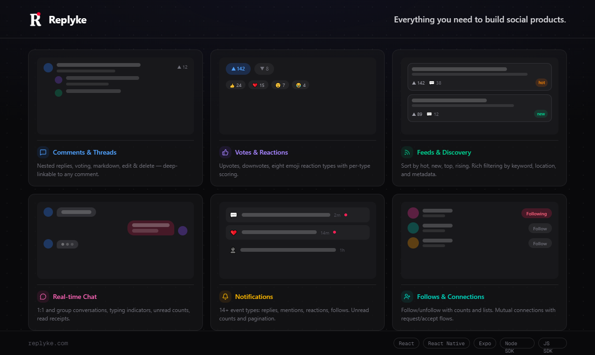

### 🎬 관련 영상
- [🎥 영상 보기](https://ph-files.imgix.net/8860f860-a4ea-4ac4-ac32-766a0b0194b9.jpeg?auto=format)

---

## 13. [Mobilewright](https://www.producthunt.com/products/mobilewright)
**Votes**: 44 | **도입 난이도**: 중 | **신뢰도**: 상
**Tagline**: Playwright for iOS and Android. Free and open source
**서비스 링크**: https://www.producthunt.com/r/WBMA3SWNREXAG6

**태그**: DevTool, Automation, Mobile, OpenSource, Agent, AI Tool, API

### 📌 이 서비스 한눈에 보기
iOS 및 Android 기기 자동화를 위한 오픈소스 Playwright 프레임워크

### 🔑 주요 기능
- 실제 기기, 시뮬레이터, 에뮬레이터를 위한 단일 통합 API 제공
- 결정론적 동작 및 자동 대기(auto-waiting) 기능 지원
- 설정이 필요 없는 제로 컨피그(zero-config) 환경 구축

### 🙋 사용자에게 어떤 점이 좋은가
모바일 환경의 복잡한 자동화 설정을 단순화하여 개발자와 AI 에이전트가 효율적으로 테스트를 수행할 수 있습니다.

### ✅ 지금 바로 써볼 기능
- 단일 API를 통한 모바일 자동화 워크플로우 테스트
- 실제 기기 및 에뮬레이터 연결 테스트
- AI 에이전트와의 연동 실험

### ⚠️ 사용 전 확인할 점
- 오픈소스 프로젝트로서의 커뮤니티 지원 및 안정성 확인 필요
- 특정 모바일 OS 버전과의 호환성 검증 필요

### 🧭 확인이 더 필요한 정보
현재 제공되는 API의 상세 명세와 기존 Playwright와의 호환성 수준에 대한 추가 확인이 필요합니다.

### 📸 스크린샷 및 갤러리
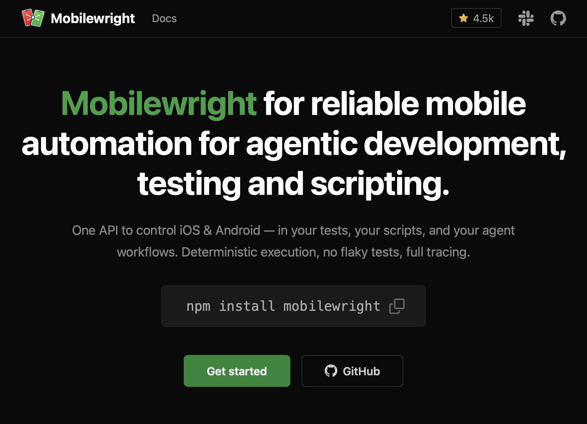
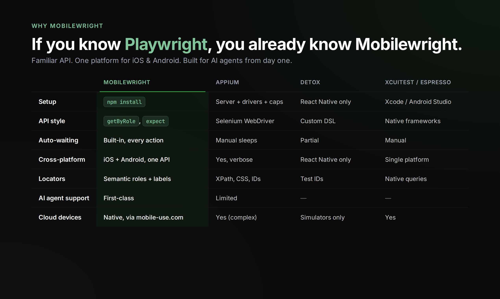
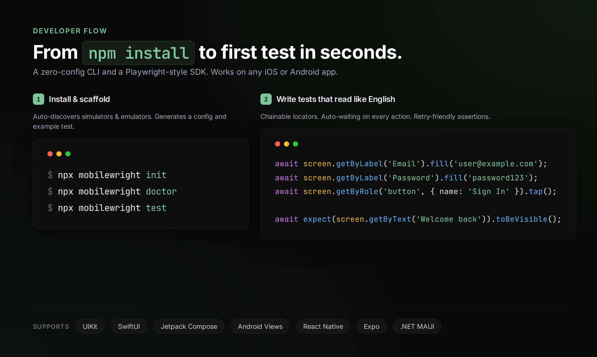

### 🎬 관련 영상
- [🎥 영상 보기](https://ph-files.imgix.net/f8bcc43e-cc15-432b-bbac-e60fcfef28b2.jpeg?auto=format)

---

## 14. [DANCING CATS App](https://www.producthunt.com/products/dancing-cats-app)
**Votes**: 34 | **도입 난이도**: 하 | **신뢰도**: 상
**Tagline**: Hover Here to See PH Kitty Dance 🙀 (Cat Pic to Dance Video)
**서비스 링크**: https://www.producthunt.com/r/MBOYN7RPW5OLKG

**태그**: AI, Video Generation, Pets, Entertainment, AI Tool, Video

### 📌 이 서비스 한눈에 보기
고양이 사진 한 장으로 춤추는 귀여운 영상을 만드는 AI 앱

### 🔑 주요 기능
- 고양이 사진을 10초 분량의 댄스 영상으로 변환
- 살사, 발레, 로봇 등 10가지 다양한 댄스 스타일 제공
- 간편한 촬영 및 생성 프로세스

### 🙋 사용자에게 어떤 점이 좋은가
반려묘의 사진을 활용해 재미있고 독특한 숏폼 콘텐츠를 쉽고 빠르게 제작하여 SNS에 공유할 수 있습니다.

### ✅ 지금 바로 써볼 기능
- 고양이 사진 업로드하기
- 원하는 댄스 스타일 선택하기
- 생성된 영상 친구들에게 공유하기

### ⚠️ 사용 전 확인할 점
- 사진의 구도나 품질에 따라 영상 결과물이 달라질 수 있음
- 10초라는 짧은 영상 길이 제한

### 🧭 확인이 더 필요한 정보
구체적인 요금 체계나 생성 가능한 영상 개수 제한에 대한 정보가 명시되지 않았습니다.

### 📸 스크린샷 및 갤러리

---

## 15. [Doomscroll Calculator (by Habit Doom)](https://www.producthunt.com/products/doomscroll-calculator)
**Votes**: 24 | **도입 난이도**: 하 | **신뢰도**: 상
**Tagline**: How many years will your phone steal from you?
**서비스 링크**: https://www.producthunt.com/r/MVMNTNNHWRK5PG

**태그**: Productivity, DigitalWellbeing, Lifestyle, AI Tool

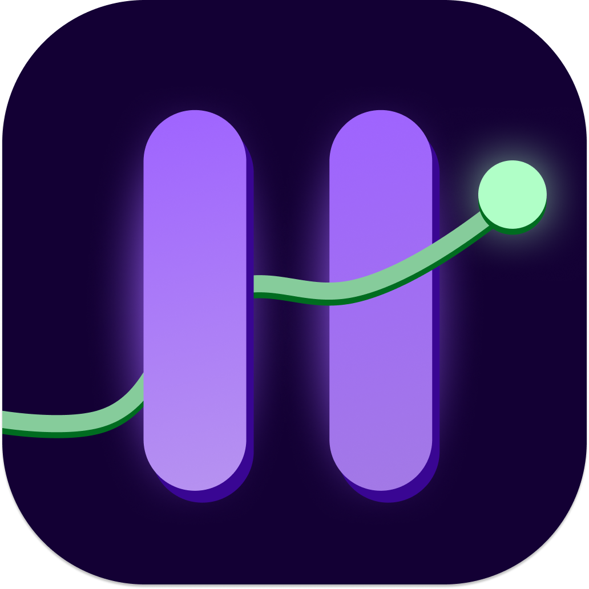

### 📌 이 서비스 한눈에 보기
스마트폰 스크린 타임이 인생에서 앗아가는 시간을 시각화하여 경각심을 주는 도구

### 🔑 주요 기능
- 일일 스크린 타임과 나이를 입력하여 손실되는 수면 외 시간을 계산
- 단순 시간 계산을 넘어 놓치게 될 60가지 구체적인 삶의 가치(독서, 여행 등) 제시
- 별도의 가입이나 비용 없이 즉시 사용 가능한 무료 도구

### 🙋 사용자에게 어떤 점이 좋은가
자신의 스마트폰 사용 습관이 인생에 미치는 영향을 직관적으로 깨닫게 하여 디지털 디톡스를 유도합니다.

### ✅ 지금 바로 써볼 기능
- 현재 나의 일일 스크린 타임 확인하기
- 계산 결과로 나타난 '놓치게 될 60가지 리스트' 살펴보기

### ⚠️ 사용 전 확인할 점
- 계산 방식이 통계적 추정치이므로 실제 삶의 손실과 정확히 일치하지 않을 수 있음
- 단순 계산 도구이므로 실질적인 습관 교정 기능은 포함되어 있지 않음

### 🧭 확인이 더 필요한 정보
계산 알고리즘의 구체적인 수식이나 데이터 산출 근거는 명시되어 있지 않습니다.

### 📸 스크린샷 및 갤러리

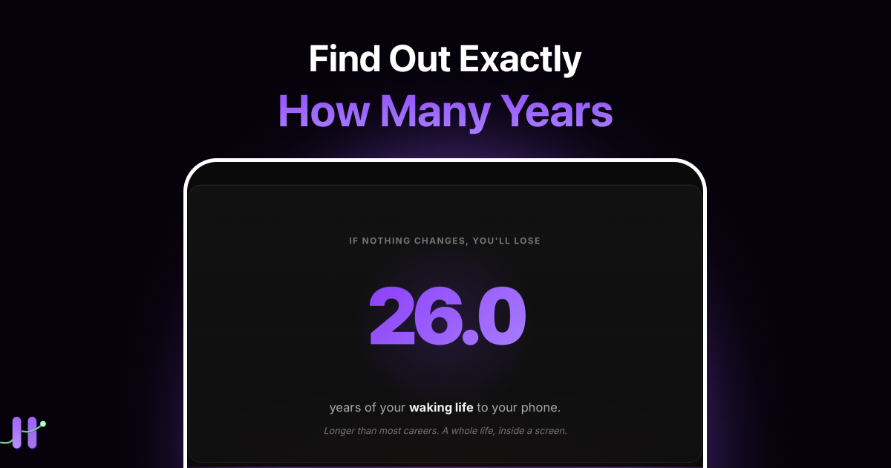
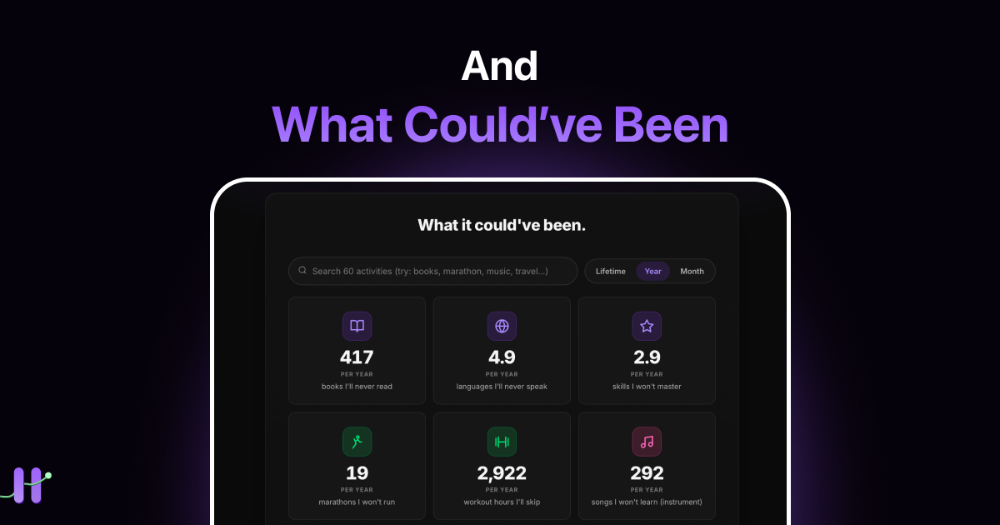

---

## 16. [Anime Tracker](https://www.producthunt.com/products/anime-tracker)
**Votes**: 22 | **도입 난이도**: 하 | **신뢰도**: 상
**Tagline**: Track anime, get smart recs, share with buddies.
**서비스 링크**: https://www.producthunt.com/r/7QOVFFZJOPYJZC

**태그**: Lifestyle, Entertainment, Social, Productivity

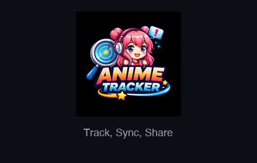

### 📌 이 서비스 한눈에 보기
개인 맞춤형 추천과 친구 공유 기능이 결합된 광고 없는 무료 애니메이션 트래커

### 🔑 주요 기능
- 사용자 취향을 학습하는 스마트 추천 시스템
- 친구와 취향을 공유하는 버디 시스템 및 월간 후속작 알림
- AniList 데이터 가져오기 및 크롬 확장 프로그램 지원

### 🙋 사용자에게 어떤 점이 좋은가
애니메이션 시청 기록을 체계적으로 관리하면서, 광고 방해 없이 개인화된 추천과 친구들과의 소통을 동시에 즐길 수 있습니다.

### ✅ 지금 바로 써볼 기능
- AniList 계정 연동하여 기존 데이터 가져오기
- 취향 학습을 위한 시청 기록 등록하기
- 친구를 초대하여 버디 시스템 시작하기

### ⚠️ 사용 전 확인할 점
- 완전 무료 서비스이므로 향후 서비스 운영 방식 변화 가능성 있음
- 데이터 동기화 시 AniList 데이터 유실 여부 확인 필요

### 🧭 확인이 더 필요한 정보
현재 제공되는 크롬 확장 프로그램의 구체적인 기능 범위는 명시되어 있지 않습니다.

### 📸 스크린샷 및 갤러리

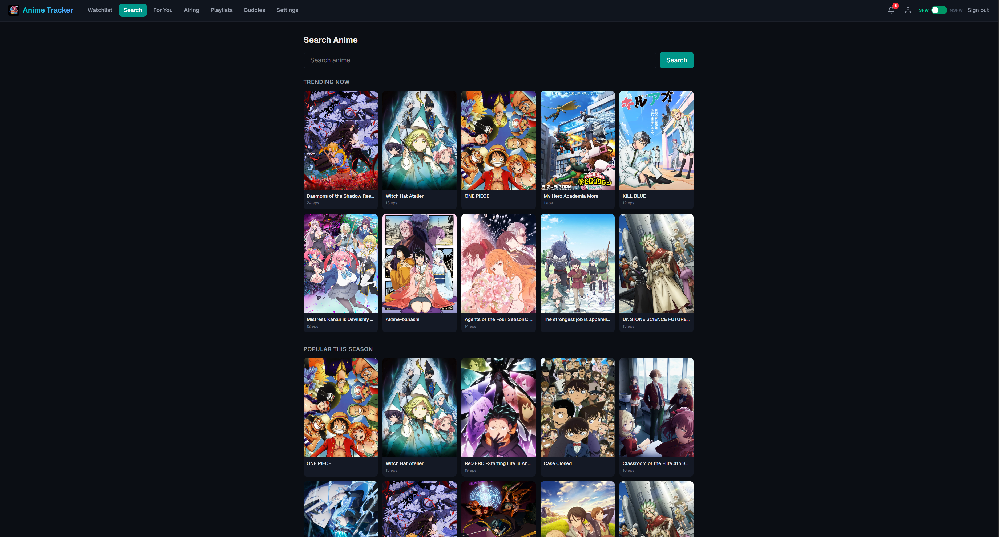

### 🎬 관련 영상
- [🎥 영상 보기](https://ph-files.imgix.net/d883abd3-fac7-4980-8f29-45cac8236ae9.jpeg?auto=format)

---

## 17. [SalaryDuel · Game](https://www.producthunt.com/products/salaryduel-game)
**Votes**: 18 | **도입 난이도**: 하 | **신뢰도**: 상
**Tagline**: Two roles. Who earns more? Real US salary data.
**서비스 링크**: https://www.producthunt.com/r/LXK4DU7HGMYGOV

**태그**: Game, Data, Career, Education, AI Tool, Email

### 📌 이 서비스 한눈에 보기
실제 미국 연봉 데이터를 바탕으로 누가 더 많이 벌지 맞히는 데일리 연봉 예측 게임

### 🔑 주요 기능
- 실제 미국 시장의 직무 및 연봉 데이터 활용
- 매일 10라운드로 진행되는 데일리 모드와 무제한 모드 제공
- 중앙값, 연봉 범위, 주요 채용 기업 등 상세 데이터 피드백

### 🙋 사용자에게 어떤 점이 좋은가
자신의 연봉 감각을 테스트하고 실제 시장의 연봉 분포를 게임처럼 쉽고 재미있게 학습할 수 있습니다.

### ✅ 지금 바로 써볼 기능
- 데일리 모드로 매일 연봉 감각 테스트하기
- 엔들리스 모드로 다양한 직무 연봉 비교하기
- 정답 공개 후 제공되는 상세 시장 데이터 확인하기

### ⚠️ 사용 전 확인할 점
- 미국 시장 데이터에 국한되어 있어 국내 시장과는 차이가 있을 수 있음
- 연봉 계산기가 아닌 시장 감각 교정용 도구임

### 🧭 확인이 더 필요한 정보
데이터의 최신성 및 구체적인 데이터 출처에 대한 정보가 추가로 필요합니다.

### 📸 스크린샷 및 갤러리
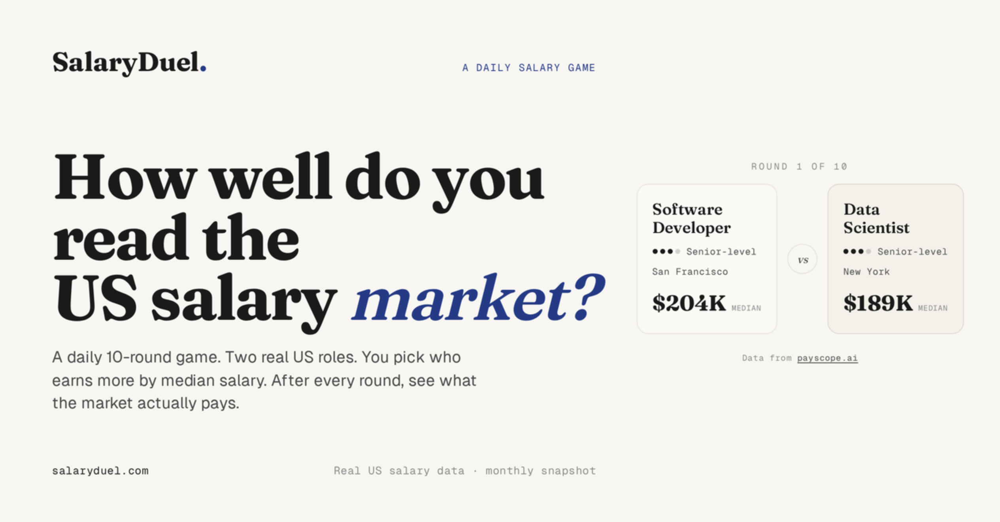
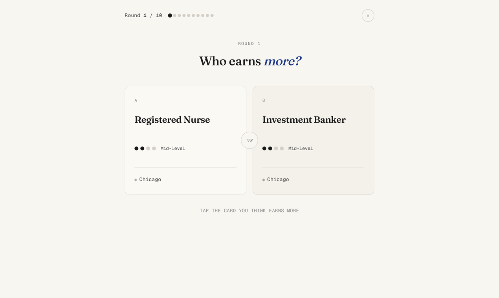
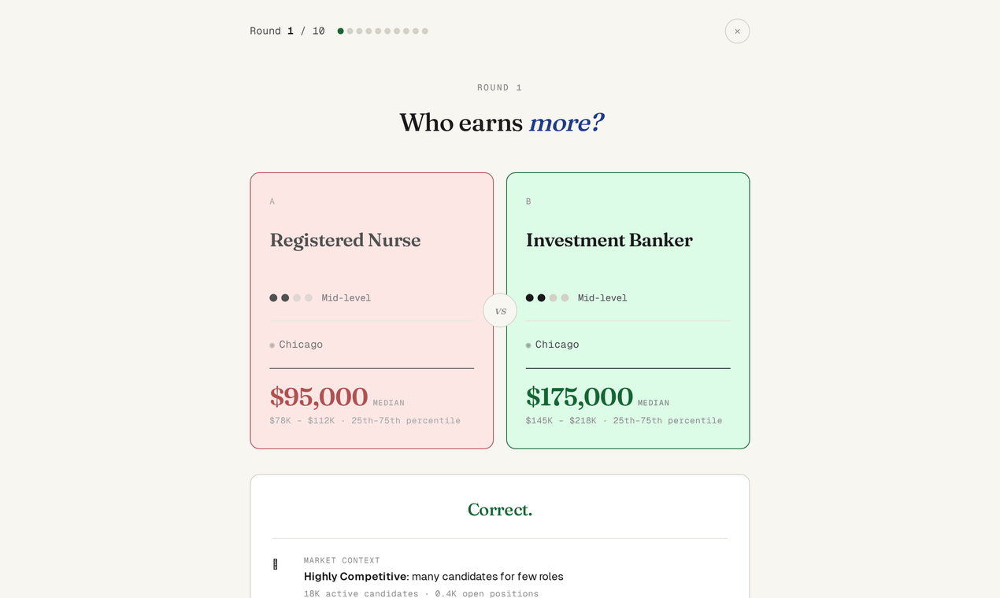

---

## 18. [Highlyt](https://www.producthunt.com/products/highlyt)
**Votes**: 18 | **도입 난이도**: 하 | **신뢰도**: 상
**Tagline**: You highlight. You forget. Highlyt connects the dots.
**서비스 링크**: https://www.producthunt.com/r/O6DUJ6UD4APXUD

**태그**: KnowledgeManagement, ReadingTool, Productivity, SecondBrain, AI Tool, DevTool

### 📌 이 서비스 한눈에 보기
단순한 하이라이트를 넘어, 지식 간의 관계를 연결하여 나만의 지식 그래프를 구축하는 도구

### 🔑 주요 기능
- 의미 기반의 컬러 코딩을 통한 아이디어 분류
- 서로 다른 문서 간의 하이라이트 연결 기능
- 지지, 반박, 확장, 질문 등 관계 유형을 지정하는 지식 그래프 구축

### 🙋 사용자에게 어떤 점이 좋은가
파편화된 독서 기록을 유기적인 지식 체계로 변환하여, 읽기만 하고 잊어버리는 문제를 해결해 줍니다.

### ✅ 지금 바로 써볼 기능
- 기존에 저장해둔 PDF 및 전자책 하이라이트 가져오기
- 의미별 컬러 코딩 적용하기
- 서로 다른 문서 간의 하이라이트 연결 및 관계 설정하기

### ⚠️ 사용 전 확인할 점
- 다양한 외부 전자책/PDF 플랫폼과의 연동 범위 확인 필요
- 데이터 양이 많아질 경우 지식 그래프 시각화의 복잡도 고려

### 🧭 확인이 더 필요한 정보
현재 제공되는 파일 형식 및 외부 독서 앱과의 구체적인 연동 방식에 대한 정보가 부족합니다.

### 📸 스크린샷 및 갤러리
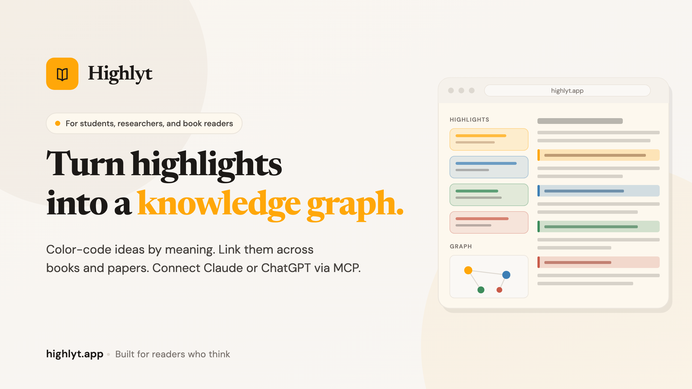
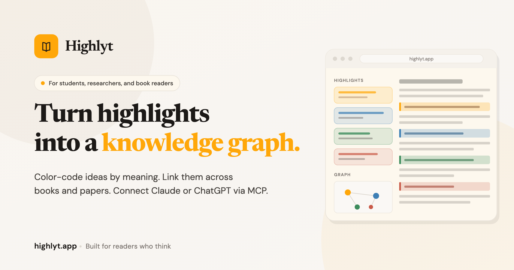

---

## 19. [DecisionBox for Amazon Redshift](https://www.producthunt.com/products/decisionbox)
**Votes**: 16 | **도입 난이도**: 하 | **신뢰도**: 상
**Tagline**: Autonomous AI discovery on Amazon Redshift.
**서비스 링크**: https://www.producthunt.com/r/DAJWLYAC2QSAT7

**태그**: DataAnalytics, AI, Redshift, OpenSource, Automation, Agent, AI Tool

### 📌 이 서비스 한눈에 보기
데이터 웨어하우스 스키마 변경 없이 즉시 실행되는 자율형 AI 데이터 탐색 도구

### 🔑 주요 기능
- Amazon Redshift에 읽기 전용 권한으로 안전하게 연결
- 스키마 마이그레이션이나 데이터 파이프라인 구축이 필요 없는 간편한 구조
- BigQuery, Snowflake, Postgres, Databricks 등 다양한 환경 지원

### 🙋 사용자에게 어떤 점이 좋은가
데이터 엔지니어링 작업 없이 기존 데이터 웨어하우스에서 즉각적으로 AI 기반의 데이터 인사이트를 발견할 수 있습니다.

### ✅ 지금 바로 써볼 기능
- 읽기 전용 IAM 자격 증명을 통한 안전한 연결 테스트
- 기존 Redshift 데이터셋에 대한 자율 AI 탐색 실행
- 타 데이터베이스(Snowflake, BigQuery 등)와의 호환성 확인

### ⚠️ 사용 전 확인할 점
- 읽기 전용 권한 사용 시 데이터 보안 정책 준수 여부 확인 필요
- AGPL v3 라이선스에 따른 오픈소스 활용 제약 사항 검토

### 🧭 확인이 더 필요한 정보
AI 탐색 결과의 정확도 및 데이터 처리량에 따른 성능 제한 사항에 대한 정보가 부족합니다.

### 📸 스크린샷 및 갤러리
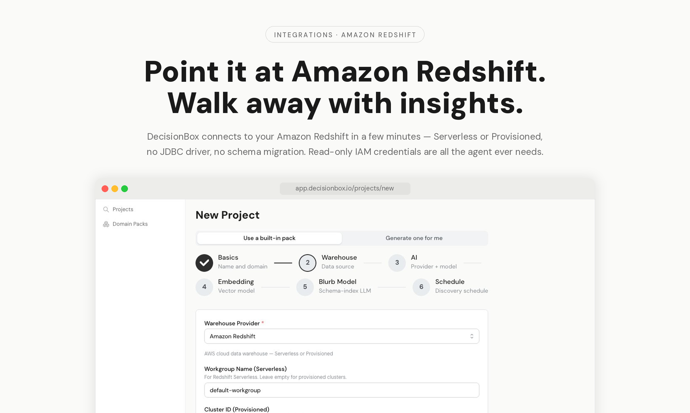
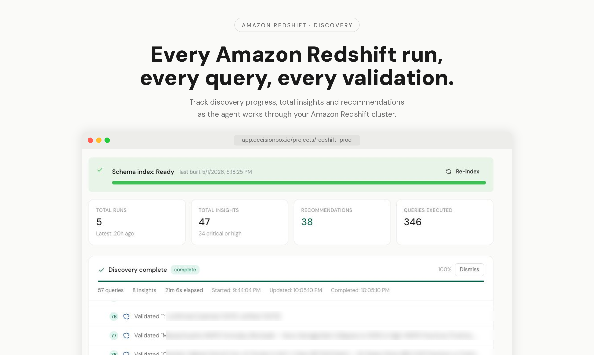
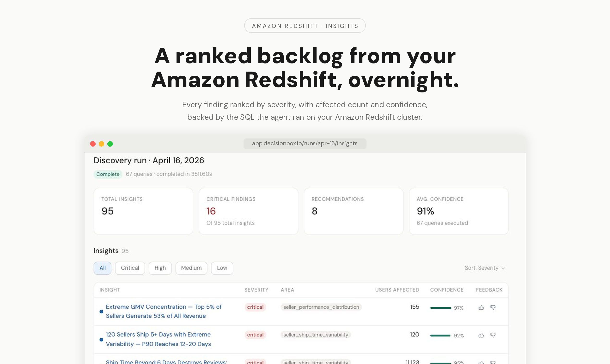

---

## 20. [KundliAI](https://www.producthunt.com/products/kundliai)
**Votes**: 16 | **도입 난이도**: 하 | **신뢰도**: 상
**Tagline**: India's First AI Vedic Astrologer —Free Kundli in 30 seconds
**서비스 링크**: https://www.producthunt.com/r/RNV6MUI7TUGGSQ

**태그**: AI, Astrology, Lifestyle, India, AI Tool

### 📌 이 서비스 한눈에 보기
30초 만에 완성되는 AI 기반 인도 전통 점성술(Vedic Astrology) 서비스

### 🔑 주요 기능
- AI를 활용한 정교한 인도식 점성술 분석
- 출생 차트, 궁합, 일일 운세 및 20년 인생 타임라인 제공
- 회원가입 없이 30초 내 빠른 결과 확인 가능

### 🙋 사용자에게 어떤 점이 좋은가
복잡한 점성술 지식 없이도 개인의 운세와 미래 흐름을 즉각적으로 확인할 수 있습니다.

### ✅ 지금 바로 써볼 기능
- 무료 출생 차트(Kundli) 생성하기
- 20년 인생 타임라인 확인하기
- 상대방과의 궁합(Kundli matching) 테스트하기

### ⚠️ 사용 전 확인할 점
- AI 기반 분석이므로 전통적인 점성술 해석과 차이가 있을 수 있음
- 데이터 저장 없이 결과만 제공하므로 기록 보관이 어려울 수 있음

### 🧭 확인이 더 필요한 정보
사용자의 개인정보(생년월일 등)가 결과 생성 시 어떻게 처리되는지 확인이 필요합니다.

### 📸 스크린샷 및 갤러리

---

## 21. [KundliAI](https://www.producthunt.com/products/kundliai)
**Votes**: 16 | **도입 난이도**: 하 | **신뢰도**: 상
**Tagline**: India's First AI Vedic Astrologer —Free Kundli in 30 seconds
**서비스 링크**: https://www.producthunt.com/r/RNV6MUI7TUGGSQ

**태그**: AI, Astrology, Lifestyle, India, AI Tool

### 📌 이 서비스 한눈에 보기
30초 만에 완성되는 AI 기반 인도 전통 점성술(Vedic Astrology) 서비스

### 🔑 주요 기능
- AI를 활용한 정교한 인도식 점성술 분석
- 출생 차트, 궁합, 일일 운세 및 20년 인생 타임라인 제공
- 회원가입 없이 30초 내 빠른 결과 확인 가능

### 🙋 사용자에게 어떤 점이 좋은가
복잡한 점성술 지식 없이도 개인의 운세와 미래 흐름을 즉각적으로 확인할 수 있습니다.

### ✅ 지금 바로 써볼 기능
- 무료 출생 차트(Kundli) 생성하기
- 20년 인생 타임라인 확인하기
- 상대방과의 궁합(Kundli matching) 테스트하기

### ⚠️ 사용 전 확인할 점
- AI 기반 분석이므로 전통적인 점성술 해석과 차이가 있을 수 있음
- 데이터 저장 없이 결과만 제공하므로 기록 보관이 어려울 수 있음

### 🧭 확인이 더 필요한 정보
사용자의 개인정보(생년월일 등)가 결과 생성 시 어떻게 처리되는지 확인이 필요합니다.

### 📸 스크린샷 및 갤러리

---

## 22. [Waymate](https://www.producthunt.com/products/waymate-step-counter)
**Votes**: 14 | **도입 난이도**: 하 | **신뢰도**: 상
**Tagline**: The step counter for thinkers — capture ideas on the go.
**서비스 링크**: https://www.producthunt.com/r/IA5NOOP3FSNSZ4

**태그**: Productivity, Health, Minimalism, Idea Capture, AI Tool

### 📌 이 서비스 한눈에 보기
아이디어 기록과 걸음 수 측정을 결합한 미니멀리스트 생산성 앱

### 🔑 주요 기능
- 이동 중에도 간편하게 아이디어를 음성이나 텍스트로 기록
- 활동량(걸음 수)과 아이디어 기록 시점을 시각화하여 두뇌 활동 패턴 파악
- 애플 생태계 내 데이터 보관을 통한 강력한 개인정보 보호

### 🙋 사용자에게 어떤 점이 좋은가
산책이나 이동 중에 떠오르는 영감을 놓치지 않고 기록하면서, 동시에 건강 관리까지 직관적으로 수행할 수 있습니다.

### ✅ 지금 바로 써볼 기능
- 음성/텍스트 기능을 활용해 떠오르는 생각 즉시 기록하기
- 그래프를 통해 아이디어가 활발한 시간대 확인하기
- 자신을 투영하는 캐릭터 설정하기

### ⚠️ 사용 전 확인할 점
- 애플 생태계 기반이므로 타 OS(안드로이드 등) 사용자는 활용이 제한될 수 있음
- 단순 기록 중심이므로 복잡한 프로젝트 관리 기능은 부족할 수 있음

### 🧭 확인이 더 필요한 정보
애플 기기 외의 플랫폼 지원 여부와 구체적인 데이터 동기화 방식에 대한 정보가 필요합니다.

### 📸 스크린샷 및 갤러리
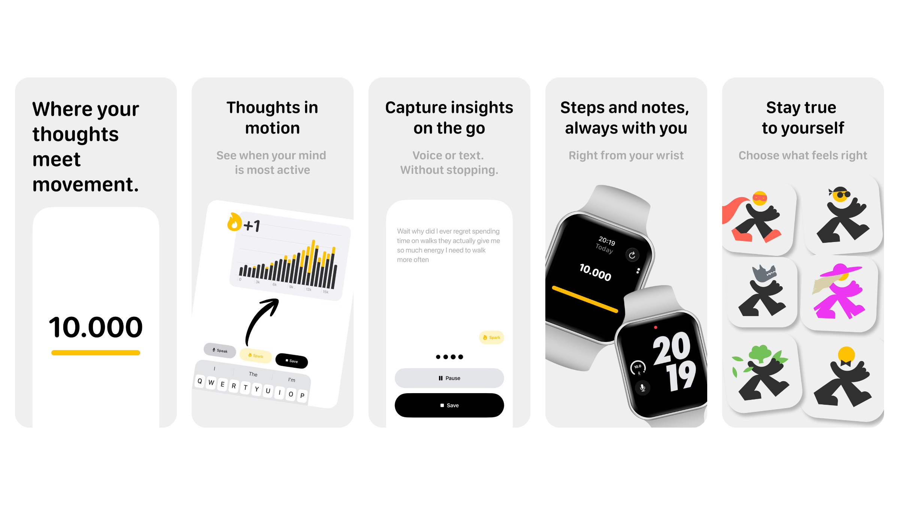

### 🎬 관련 영상
- [🎥 영상 보기](https://ph-files.imgix.net/cda0ac17-e4dd-4a1d-897e-7b4accc1feae.jpeg?auto=format)

---

## 23. [Claude Code Teaches](https://www.producthunt.com/products/claude-code-teaches)
**Votes**: 14 | **도입 난이도**: 중 | **신뢰도**: 상
**Tagline**: 50 AI-Native Coding Curricula for Claude Code & Cursor
**서비스 링크**: https://www.producthunt.com/r/KLALF2YOYNJRUI

**태그**: DevTool, Education, AI-Native, Coding, AI Tool, Prompting, Design

### 📌 이 서비스 한눈에 보기
Claude Code와 Cursor를 활용한 실전 프로젝트 중심의 AI 네이티브 코딩 커리큘럼

### 🔑 주요 기능
- 50개의 구조화된 AI 네이티브 코딩 및 디자인 커리큘럼 제공
- 독특한 튜터 페르소나, 실전 프로젝트, 정교한 프롬프트 포함
- Claude Code를 통한 인터랙티브한 학습 환경 구축

### 🙋 사용자에게 어떤 점이 좋은가
단순 이론이 아닌 실제 소프트웨어를 구축하며 AI 도구 활용 능력을 극대화할 수 있습니다.

### ✅ 지금 바로 써볼 기능
- 제공되는 50개 커리큘럼 중 본인의 관심 분야 선택하기
- Claude Code 환경 설정 및 튜터 페르소나와 상호작용하기
- 실전 프로젝트를 통해 실제 소프트웨어 빌드해보기

### ⚠️ 사용 전 확인할 점
- Claude Code 및 Cursor 등 관련 도구 사용 환경이 갖춰져 있어야 함
- 일회성 결제($147)로 제공되는 콘텐츠의 범위 확인 필요

### 🧭 확인이 더 필요한 정보
학습 도구 외에 별도의 소프트웨어 구독료가 추가로 발생하는지에 대한 정보가 명시되지 않았습니다.

### 📸 스크린샷 및 갤러리

---

## 24. [Postmerge](https://www.producthunt.com/products/postmerge)
**Votes**: 13 | **도입 난이도**: 하 | **신뢰도**: 상
**Tagline**: Personalized mail merge that lives inside Gmail
**서비스 링크**: https://www.producthunt.com/r/I3FNEQSLM2FCVU

**태그**: Productivity, Automation, Gmail, ChromeExtension, AI Tool, Email

### 📌 이 서비스 한눈에 보기
별도의 대시보드 없이 Gmail 안에서 바로 사용하는 개인 맞춤형 메일 머지 도구

### 🔑 주요 기능
- CSV 데이터를 활용한 변수 기반 개인화 이메일 발송
- 별도 서비스 가입이나 중계 서버 없이 개인 Gmail 계정에서 직접 발송
- Chrome 확장 프로그램 형태로 Gmail 작성 창에 통합

### 🙋 사용자에게 어떤 점이 좋은가
복잡한 마케팅 툴을 배우지 않고도 익숙한 Gmail 환경에서 대량의 개인화 메일을 간편하게 보낼 수 있습니다.

### ✅ 지금 바로 써볼 기능
- CSV 파일 준비 및 변수 설정 테스트
- 7일 무료 체험을 통한 Gmail 연동 확인
- 개인화 변수({{firstName}}) 적용 테스트

### ⚠️ 사용 전 확인할 점
- 개인 Gmail 계정을 통한 대량 발송 시 스팸 분류 위험성 고려 필요
- 7일 무료 체험 이후 유료 전환 정책 확인 필요

### 🧭 확인이 더 필요한 정보
대량 발송 시 Gmail 자체의 일일 발송 제한량에 대한 영향 여부를 확인해야 합니다.

### 📸 스크린샷 및 갤러리
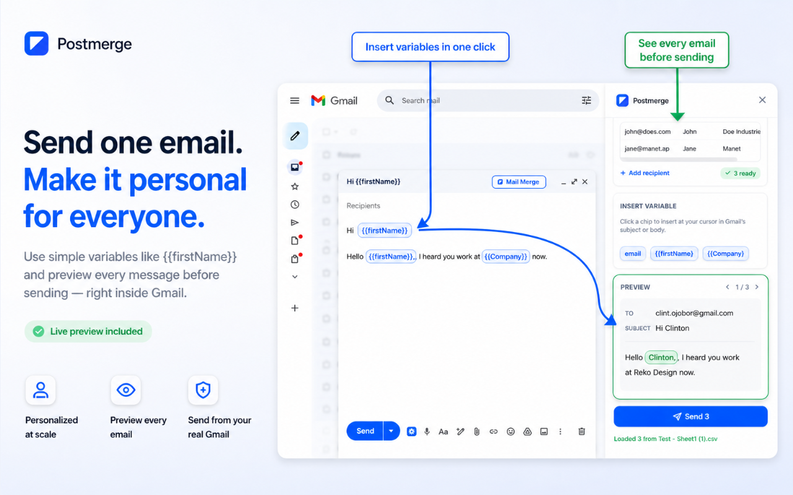

---

## 25. [Any Many More: Birthday Alerts](https://www.producthunt.com/products/any-many-more-birthday-alerts)
**Votes**: 13 | **도입 난이도**: 하 | **신뢰도**: 상
**Tagline**: Birthday reminders, simplified
**서비스 링크**: https://www.producthunt.com/r/TAAHFX5VIQ3ZNH

**태그**: Productivity, iOS, PersonalManagement, AI Tool, Email

### 📌 이 서비스 한눈에 보기
복잡한 절차 없이 연락처와 파일을 통해 생일을 간편하게 관리하는 아이폰 전용 알림 앱

### 🔑 주요 기능
- 연락처 및 다양한 파일 형식(CSV, Excel, Google Sheets)을 통한 간편한 데이터 가져오기
- 태그 지정 및 정렬 기능을 통한 체계적인 생일 목록 관리
- 광고 및 데이터 수집이 없는 프라이버시 중심의 사용자 경험

### 🙋 사용자에게 어떤 점이 좋은가
흩어져 있는 지인들의 생일 정보를 한곳에 모으고, 맞춤형 알림을 통해 소중한 사람들을 잊지 않고 챙길 수 있습니다.

### ✅ 지금 바로 써볼 기능
- 기존 연락처 또는 스프레드시트 데이터 가져오기
- 개별 인물별 맞춤형 알림 설정하기
- 태그를 활용해 그룹별로 생일 목록 정리하기

### ⚠️ 사용 전 확인할 점
- 아이폰 전용 앱이므로 안드로이드 사용자는 사용이 제한됨
- 데이터를 수동으로 관리해야 하므로 초기 데이터 입력 작업이 필요함

### 🧭 확인이 더 필요한 정보
현재 제품 설명에는 구체적인 구독 모델이나 유료 기능 여부가 명시되어 있지 않습니다.

### 📸 스크린샷 및 갤러리
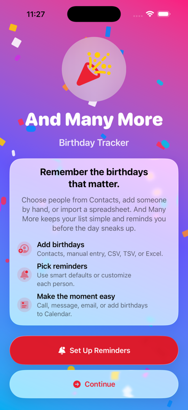
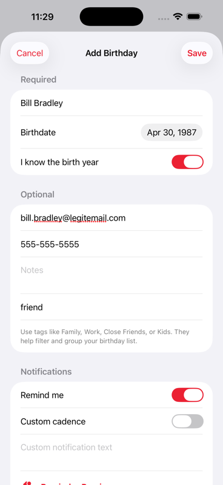
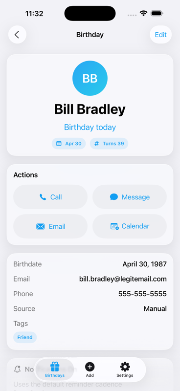

---

## 26. [Nexus](https://www.producthunt.com/products/nexus-11)
**Votes**: 13 | **도입 난이도**: 중 | **신뢰도**: 상
**Tagline**: Context-aware agent monitoring
**서비스 링크**: https://www.producthunt.com/r/GIFDP6FHVOMMT6

**태그**: AI-Ops, Observability, DevTools, Automation, Agent, AI Tool

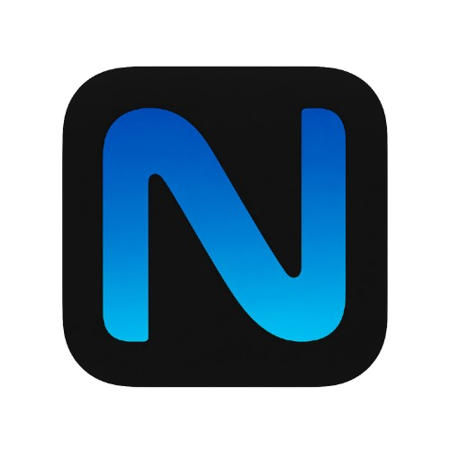

### 📌 이 서비스 한눈에 보기
사용자 불만 접수 전, AI 에이전트의 잠재적 오류를 실시간으로 감지하고 원인을 분석하는 모니터링 솔루션

### 🔑 주요 기능
- 운영 환경 내 AI 에이전트의 무음 오류(Silent Failures) 감지
- 엔지니어링 및 트레이스 컨텍스트를 활용한 자동 문제 식별
- 사용자 경험에 큰 영향을 미치는 핵심 이슈 중심의 근본 원인 분석

### 🙋 사용자에게 어떤 점이 좋은가
AI 에이전트 도입 시 발생할 수 있는 예측 불가능한 오류를 사전에 차단하여 서비스 신뢰도를 높일 수 있습니다.

### ✅ 지금 바로 써볼 기능
- 현재 운영 중인 AI 에이전트의 트레이스 데이터 연동
- 사용자 임팩트 기반의 알림 규칙 설정
- 실제 오류 발생 시 자동 루트 코즈 분석 기능 테스트

### ⚠️ 사용 전 확인할 점
- 기존 엔지니어링 워크플로우 및 트레이싱 시스템과의 호환성 확인 필요
- 모니터링 대상이 되는 데이터 양에 따른 리소스 영향성 검토

### 🧭 확인이 더 필요한 정보
구체적인 데이터 연동 방식과 기존 모니터링 도구와의 차별점에 대한 상세 정보가 필요합니다.

### 📸 스크린샷 및 갤러리
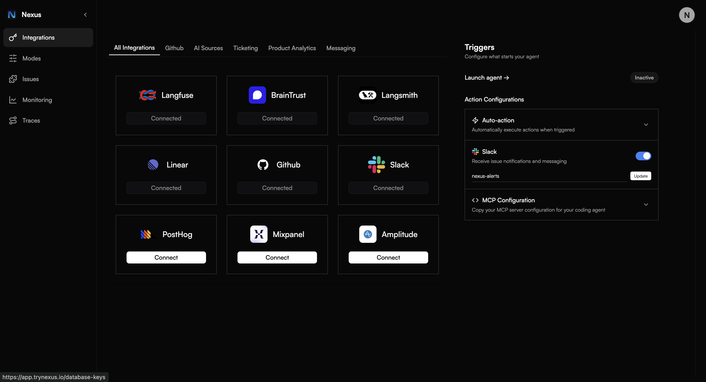
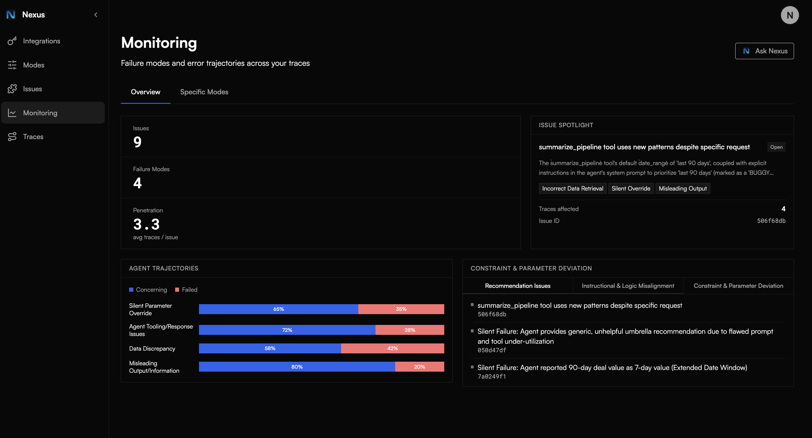
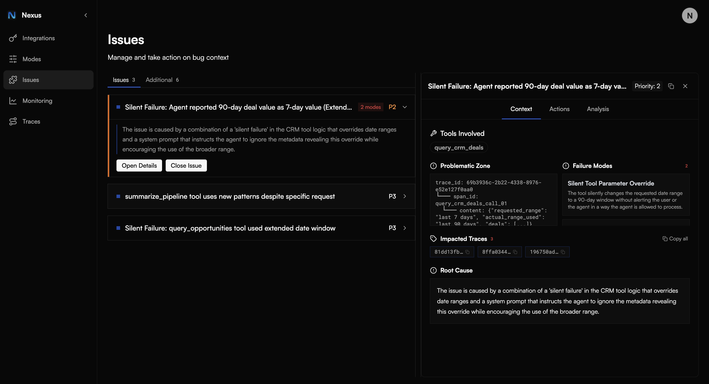

---

## 27. [Fous](https://www.producthunt.com/products/fous)
**Votes**: 12 | **도입 난이도**: 하 | **신뢰도**: 중
**Tagline**: Visual location intelligence for photos
**서비스 링크**: https://www.producthunt.com/r/W5FM62BQ2M3LCF

**태그**: Visual Intelligence, Investigation, Photo Analysis, Location Intelligence, Automation, AI Tool, Vision

### 📌 이 서비스 한눈에 보기
메타데이터 없이 사진 속 시각적 정보만으로 촬영 위치를 추정하는 지능형 위치 분석 도구

### 🔑 주요 기능
- EXIF나 GPS 데이터 없이 이미지 내 장면 분석을 통한 위치 추정
- 신뢰도 점수(Confidence Score)가 포함된 결과 제공
- 조사, 리서치, 신뢰 및 안전(Trust and Safety) 업무를 위한 검증 워크플로우

### 🙋 사용자에게 어떤 점이 좋은가
메타데이터가 삭제된 사진에서도 시각적 단서를 통해 위치를 파악할 수 있어, 조사 업무나 개인 사진 아카이브 관리 시 유용합니다.

### ✅ 지금 바로 써볼 기능
- 사진 업로드 및 위치 추정 결과 확인
- 제공되는 신뢰도 점수 검토
- 지도 리뷰 기능을 통한 위치 검증

### ⚠️ 사용 전 확인할 점
- 현재 샌프란시스코 지역에 특화된 프리뷰 단계임
- 시각적 단서가 부족한 사진은 정확도가 낮을 수 있음

### 🧭 확인이 더 필요한 정보
현재 서비스가 샌프란시스코 외 지역에서 어느 정도의 정확도를 유지하는지 확인이 필요합니다.

### 📸 스크린샷 및 갤러리
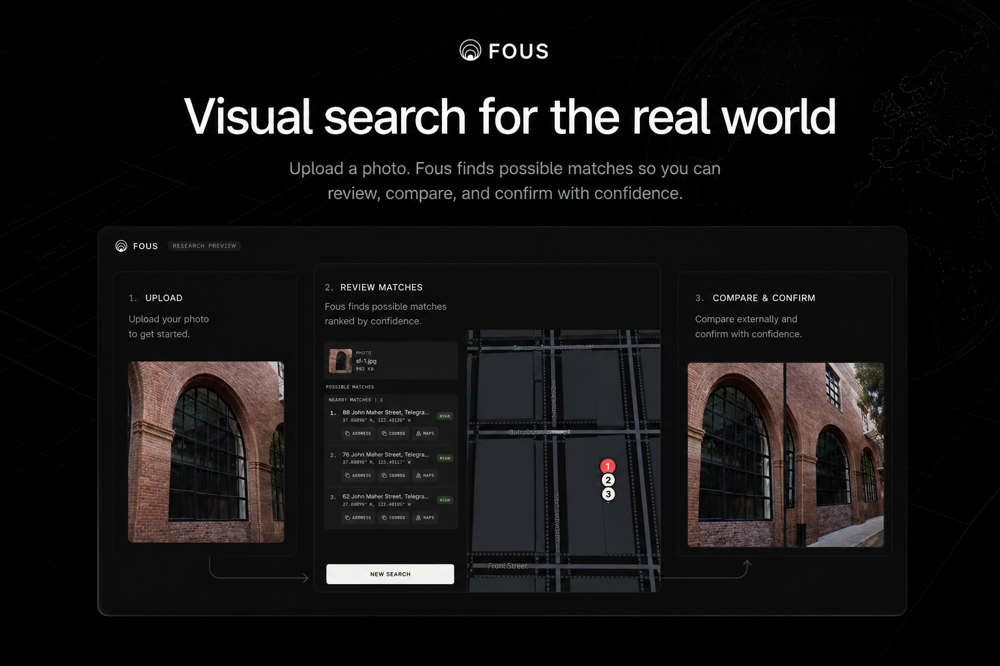

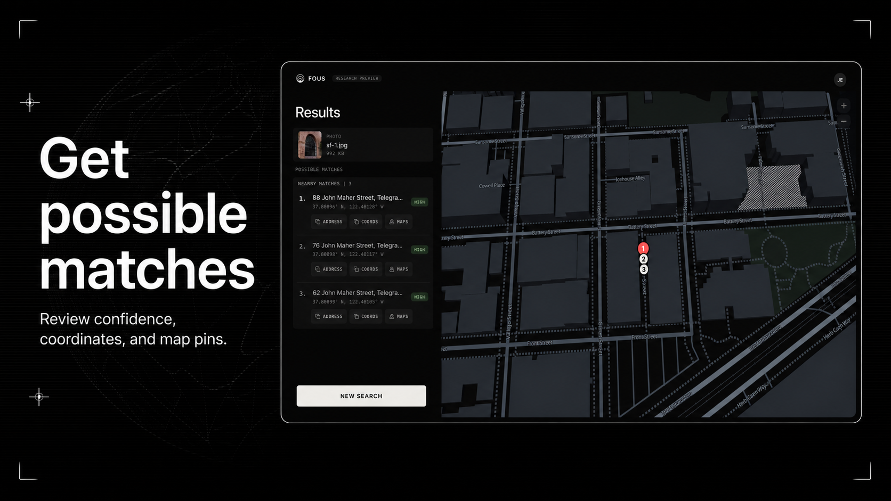

---

## 28. [FUSH](https://www.producthunt.com/products/fush)
**Votes**: 11 | **도입 난이도**: 하 | **신뢰도**: 상
**Tagline**: FUSH — your local gig marketplace
**서비스 링크**: https://www.producthunt.com/r/NQNL7PFYKPXVHL

**태그**: Marketplace, LocalService, GigEconomy, MobileApp

### 📌 이 서비스 한눈에 보기
수수료 없이 지역 내 일거리와 도움을 연결하는 로컬 기그(Gig) 마켓플레이스

### 🔑 주요 기능
- 이사, 청소, 정원 가꾸기 등 일상적인 작업 지원
- 지역 내 구직자와 서비스 수요자 간의 직접 연결
- 중개 수수료가 없는 제로 커미션 모델

### 🙋 사용자에게 어떤 점이 좋은가
수수료 부담 없이 필요한 도움을 받거나, 집 근처에서 간단한 부업을 통해 수익을 창출할 수 있습니다.

### ✅ 지금 바로 써볼 기능
- 모바일 앱 설치하기
- 필요한 서비스 검색 또는 구인 글 등록하기
- 지역 내 작업자 프로필 확인하기

### ⚠️ 사용 전 확인할 점
- 수수료가 없는 만큼 작업 완료 후 대금 지급 및 서비스 품질에 대한 책임은 당사자 간에 있음
- 지역 기반 서비스이므로 사용자의 거주 지역에 따라 매물/일거리 양이 다를 수 있음

### 🧭 확인이 더 필요한 정보
수수료는 없지만 결제 시스템 이용 시 발생하는 별도의 결제 수수료나 보안 정책에 대한 확인이 필요합니다.

### 📸 스크린샷 및 갤러리

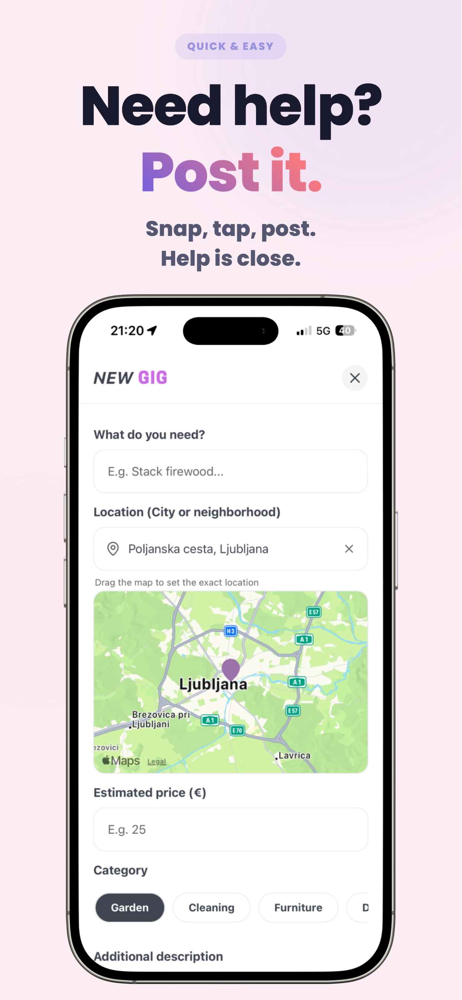
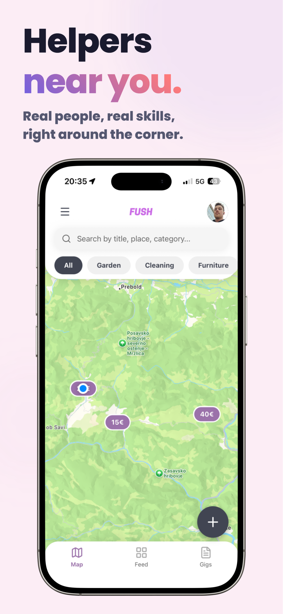

---

## 29. [LKG for Billing](https://www.producthunt.com/products/lkg-for-billing)
**Votes**: 11 | **도입 난이도**: 중 | **신뢰도**: 상
**Tagline**: Billing, hotel, clinic & pharmacy one app, multi-country tax
**서비스 링크**: https://www.producthunt.com/r/V4MPTKPUFOA46F

**태그**: Billing, SaaS, Enterprise, Multi-Industry, Tax-Compliance, AI Tool, Sales

### 📌 이 서비스 한눈에 보기
다양한 산업군과 국가별 세법을 지원하는 올인원 엔터프라이즈급 통합 빌링 플랫폼

### 🔑 주요 기능
- 인도 GST, 영국 VAT, 미국 Sales Tax 등 국가별 맞춤형 세금 계산 지원
- 호텔, 리테일, 클리닉/약국 등 산업별 특화 모듈 제공
- 웹, 데스크톱(Win/Mac/Linux), 셀프 호스팅(Docker) 등 유연한 배포 환경

### 🙋 사용자에게 어떤 점이 좋은가
다양한 업종과 국가를 대상으로 비즈니스를 운영할 때, 복잡한 세금 계산과 청구 프로세스를 하나의 플랫폼에서 통합 관리할 수 있습니다.

### ✅ 지금 바로 써볼 기능
- 30일 무료 체험을 통한 산업별 모듈(클리닉/호텔 등) 적합성 테스트
- 사용 중인 클라우드(Azure/S3/Google Drive)와의 데이터 동기화 설정 확인
- 로컬 설치형(Docker) 또는 클라우드형 중 최적의 배포 방식 결정

### ⚠️ 사용 전 확인할 점
- 산업별 특화 모듈(클리닉, 호텔 등)의 기능 깊이가 비즈니스 요구사항을 충족하는지 확인 필요
- 셀프 호스팅 시 서버 관리 및 데이터 백업 책임이 사용자에게 있음

### 🧭 확인이 더 필요한 정보
특정 국가의 세법 업데이트 대응 속도와 산업별 모듈 간의 데이터 통합 수준에 대한 상세 정보가 필요합니다.

### 📸 스크린샷 및 갤러리
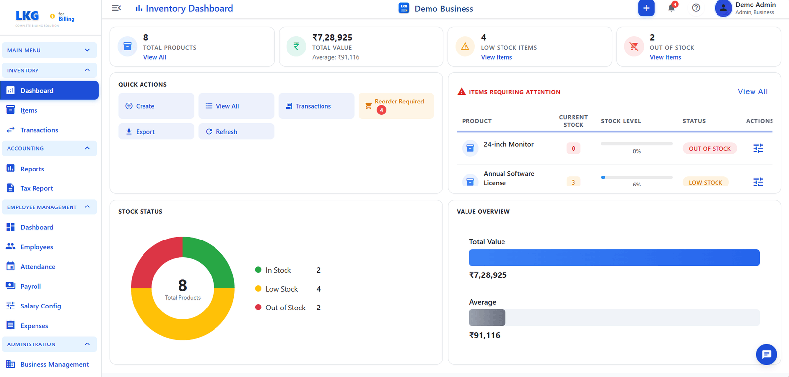
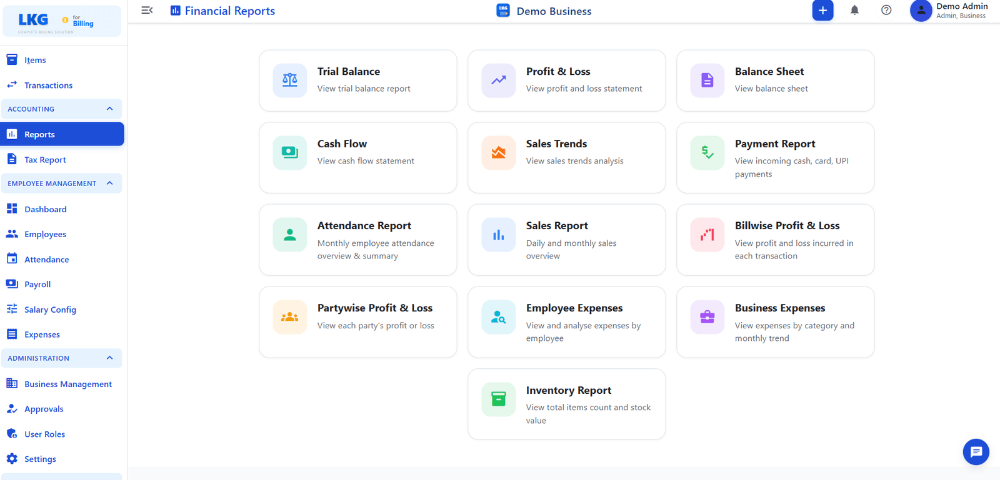
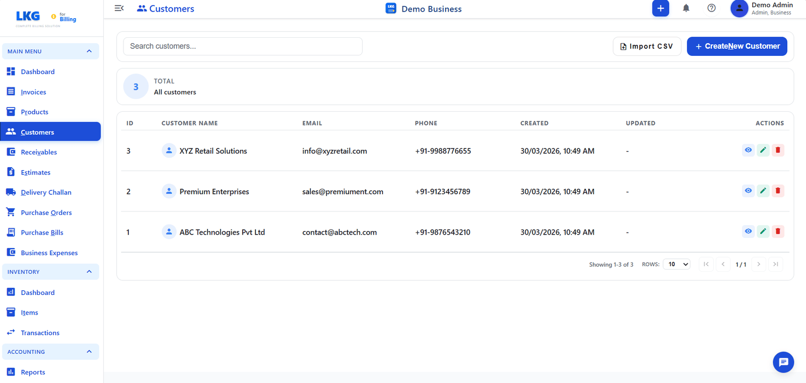

---

## 30. [Rank Monster](https://www.producthunt.com/products/rank-monster)
**Votes**: 11 | **도입 난이도**: 하 | **신뢰도**: 상
**Tagline**: See why AI search ignores you — and fix it
**서비스 링크**: https://www.producthunt.com/r/VQLVQ3YP7FSUIJ

**태그**: AI-SEO, Analytics, Marketing-Tool, AI Tool, LLM

### 📌 이 서비스 한눈에 보기
AI 검색 엔진에서의 브랜드 노출도를 측정하고 최적화하는 도구

### 🔑 주요 기능
- LLM(대규모 언어 모델)의 브랜드 추천 빈도 측정
- AI 검색 엔진 최적화(GEO)를 위한 가시성 점수 제공
- 신용카드 등록 없이 무료로 AI 가시성 점수 확인 가능

### 🙋 사용자에게 어떤 점이 좋은가
AI가 답변을 생성할 때 우리 브랜드가 언급되는지 확인하고, 검색 결과에서 누락되는 원인을 파악하여 개선할 수 있습니다.

### ✅ 지금 바로 써볼 기능
- 무료 AI 가시성 점수 확인하기
- 브랜드 노출 누락 원인 분석하기

### ⚠️ 사용 전 확인할 점
- 제공되는 점수가 실제 검색 엔진의 알고리즘과 완벽히 일치하는지 확인 필요
- 상세 분석 및 개선 가이드의 유료화 여부 확인 필요

### 🧭 확인이 더 필요한 정보
구체적인 분석 방법론과 상세 기능의 유료 플랜 구성에 대한 정보가 부족합니다.

### 📸 스크린샷 및 갤러리
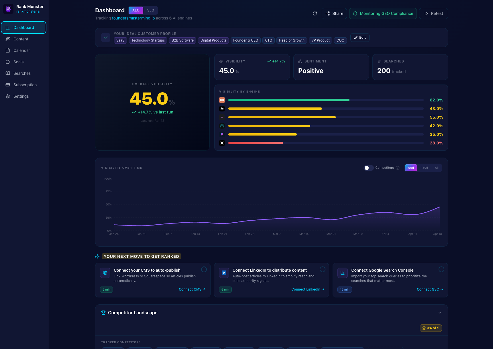
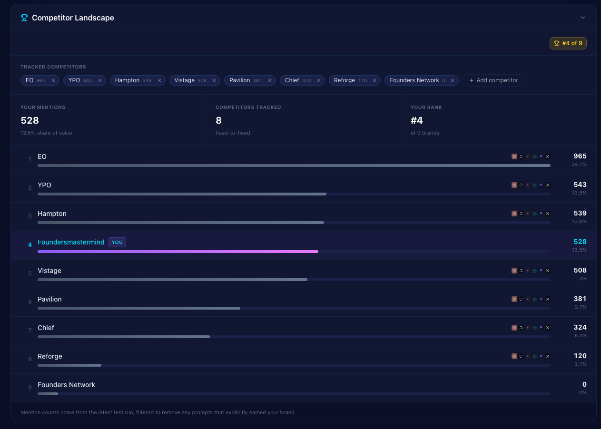
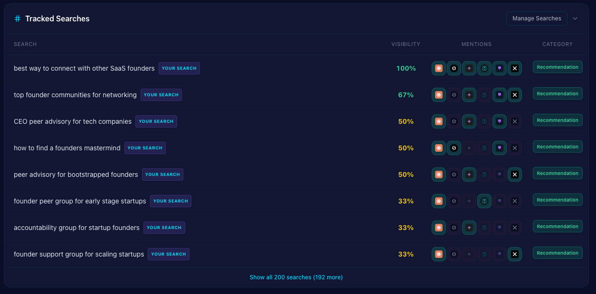

### 🎬 관련 영상
- [🎥 영상 보기](https://ph-files.imgix.net/40cd88cb-b231-47b7-accf-ee201b4030bb.gif?auto=format)

---

