# 🚀 Product Hunt Daily Top 30 (2026-05-07)

## 오늘의 요약
오늘의 트렌드는 AI 에이전트가 단순한 보조를 넘어 스스로 업무를 완결하고 결제까지 수행하는 '자율적 워크플로우'의 구체화로 나타났습니다. 또한, 팀의 지식을 체계화하는 중앙 집중식 브레인 구축과 대규모 에이전트 실행을 위한 인프라 솔루션들이 주목받았습니다.

### 오늘의 핵심 포인트
- 회의 후속 작업이나 API 결제와 같이 인간의 개입 없이 업무를 완결하는 자율형 AI 에이전트 솔루션이 등장했습니다.
- 팀의 파편화된 지식을 통합하여 인간과 AI가 공유하는 중앙 집중식 지식 베이스 구축이 중요해지고 있습니다.
- 대규모 코딩 에이전트 실행을 위한 분산 환경이나 데이터 통합을 위한 노코드 솔루션 등 에이전트 활용을 위한 인프라가 강화되고 있습니다.

**오늘의 태그**: AI 에이전트, 자율 워크플로우, 지식 관리, 오픈소스, 자동화

## 1. [Kanwas](https://www.producthunt.com/products/kanwas)
**Votes**: 359 | **도입 난이도**: 중 | **신뢰도**: 상
**Tagline**: An open-source brain for your team
**서비스 링크**: https://www.producthunt.com/r/B4UPX2JVYGVZFJ

**태그**: OpenSource, KnowledgeManagement, AI-Agent, Collaboration, Productivity, Agent, AI Tool

### 📌 이 서비스 한눈에 보기
팀의 핵심 지식과 데이터를 인간과 AI 에이전트가 즉시 활용 가능한 형태로 관리하는 오픈소스 워크스페이스

### 🔑 주요 기능
- 팀의 결정 사항, 연구 데이터, 노하우를 통합 관리하는 중앙 집중식 브레인
- 단순 저장소를 넘어 인간과 AI 에이전트 모두가 맥락을 파악할 수 있는 작업 공간 제공
- 오픈소스 기반의 협업 및 데이터 활용 환경

### 🙋 사용자에게 어떤 점이 좋은가
팀의 파편화된 지식을 체계화하여, 사람이 업무를 파악하는 시간을 줄이고 AI 에이전트가 정확한 맥락에서 업무를 수행하도록 돕습니다.

### ✅ 지금 바로 써볼 기능
- 팀의 주요 의사결정 및 연구 데이터 업로드
- AI 에이전트와의 연동 테스트
- 워크스페이스 내 맥락 공유 워크플로우 설정

### ⚠️ 사용 전 확인할 점
- 오픈소스 제품이므로 초기 설정 및 유지보수 역량 필요
- 데이터 보안 및 권한 관리 체계 확인 필요

### 🧭 확인이 더 필요한 정보
구체적인 데이터 연동 방식과 AI 에이전트 지원 범위에 대한 상세 기술 문서 확인이 필요합니다.

### 📸 스크린샷 및 갤러리
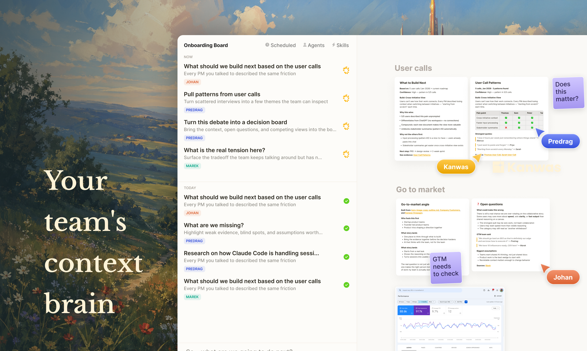
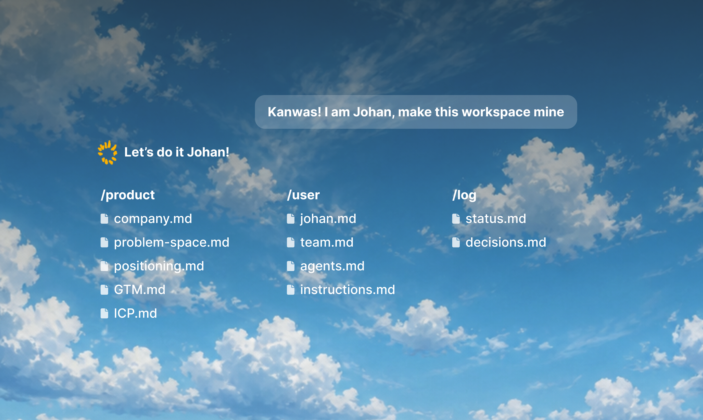
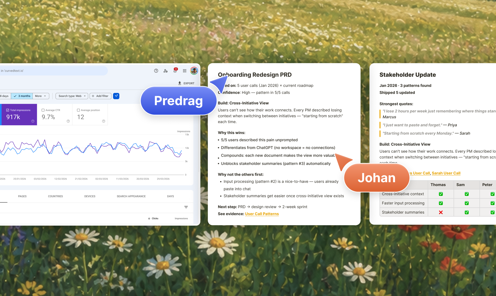

### 🎬 관련 영상
- [🎥 영상 보기](https://ph-files.imgix.net/45fac04d-5d18-4d6e-a619-6cad44a39847.jpeg?auto=format)

---

## 2. [Shadow 2.0](https://www.producthunt.com/products/shadow-6)
**Votes**: 338 | **도입 난이도**: 중 | **신뢰도**: 상
**Tagline**: The work your meetings create, done before they end
**서비스 링크**: https://www.producthunt.com/r/6DYONUBX4ZQVHY

**태그**: Automation, Productivity, AI Agent, Workflow, CRM

### 📌 이 서비스 한눈에 보기
회의 중 발생하는 모든 후속 작업을 실시간으로 자동 처리하는 AI 워크플로우 에이전트

### 🔑 주요 기능
- 회의 내용을 실시간으로 이해하여 할 일 목록 자동 생성
- PDF 생성, 슬라이드 제작, CRM 업데이트 등 즉각적인 작업 실행
- 회의 종료와 동시에 모든 후속 업무가 완료되는 제로 포스트-콜(Zero post-call) 워크플로우

### 🙋 사용자에게 어떤 점이 좋은가
회의가 끝난 뒤 정리와 문서 작업에 쏟는 시간을 획기적으로 줄여주며, 사용자는 오직 대화에만 집중할 수 있게 합니다.

### ✅ 지금 바로 써볼 기능
- 실시간 작업 실행 기능 테스트
- CRM 및 스케줄링 연동 확인
- 회의 중 자동 문서 생성 기능 활용

### ⚠️ 사용 전 확인할 점
- 실시간 자동 실행에 따른 데이터 정확성 검토 필요
- 기존 사용 중인 CRM 및 협업 툴과의 연동 범위 확인

### 🧭 확인이 더 필요한 정보
현재 지원하는 구체적인 화상 회의 플랫폼 및 외부 툴과의 통합 범위가 명시되지 않았습니다.

### 📸 스크린샷 및 갤러리
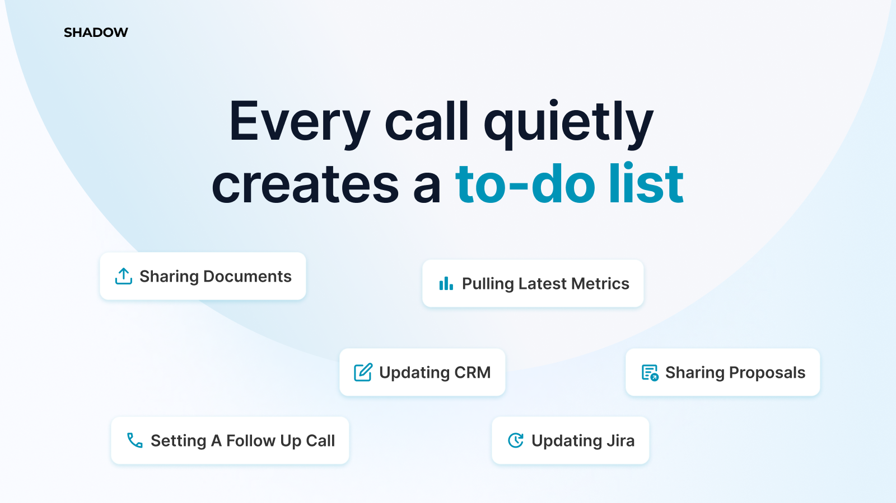
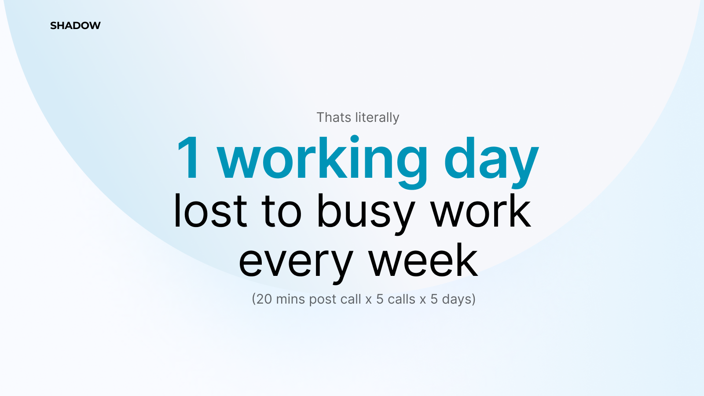
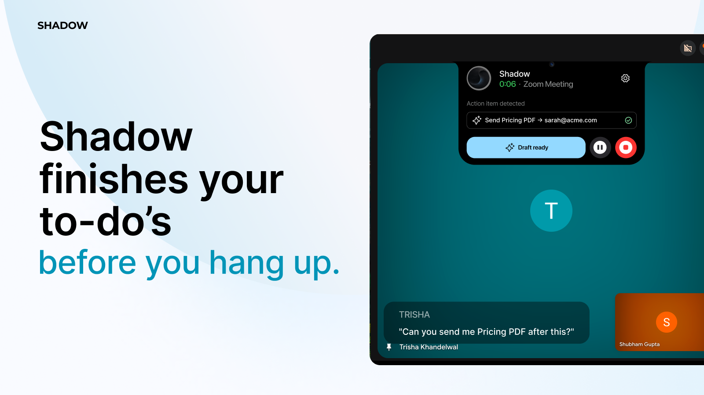

### 🎬 관련 영상
- [🎥 영상 보기](https://ph-files.imgix.net/d3e85b7a-3de4-4fac-9e22-e3c859244a3f.jpeg?auto=format)

---

## 3. [Superset 2.0](https://www.producthunt.com/products/superset-5)
**Votes**: 313 | **도입 난이도**: 중 | **신뢰도**: 상
**Tagline**: Run 100s of coding agents on any machine from anywhere
**서비스 링크**: https://www.producthunt.com/r/DLXL3IV2Y7S2VX

**태그**: DevTool, Automation, AI-Agents, Remote-Workspace, Agent

### 📌 이 서비스 한눈에 보기
어떤 환경에서도 수백 개의 코딩 에이전트를 병렬로 실행하고 협업할 수 있는 원격 워크스페이스 솔루션

### 🔑 주요 기능
- 수백 개의 코딩 에이전트를 병렬로 실행 및 분산 처리 가능
- 원격 워크스페이스 지원을 위한 전면적인 아키텍처 재설계
- 팀원 간 실시간 공유 및 협업 기능 제공

### 🙋 사용자에게 어떤 점이 좋은가
로컬 자원 한계를 넘어 다양한 머신에 에이전트를 분산 배치함으로써 대규모 자동화 작업을 효율적으로 수행할 수 있습니다.

### ✅ 지금 바로 써볼 기능
- 기존 CLI 에이전트와의 호환성 테스트
- 원격 워크스페이스를 통한 팀 협업 워크플로우 설정
- 멀티 머신 분산 실행 환경 구축

### ⚠️ 사용 전 확인할 점
- 다수의 에이전트 실행 시 발생할 수 있는 네트워크 및 리소스 관리 이슈
- 원격 머신 연결 및 보안 설정 필요성

### 🧭 확인이 더 필요한 정보
사용자의 기존 CLI 에이전트가 구체적으로 어떤 환경에서 어떻게 연동되는지에 대한 상세 사양이 필요합니다.

### 📸 스크린샷 및 갤러리
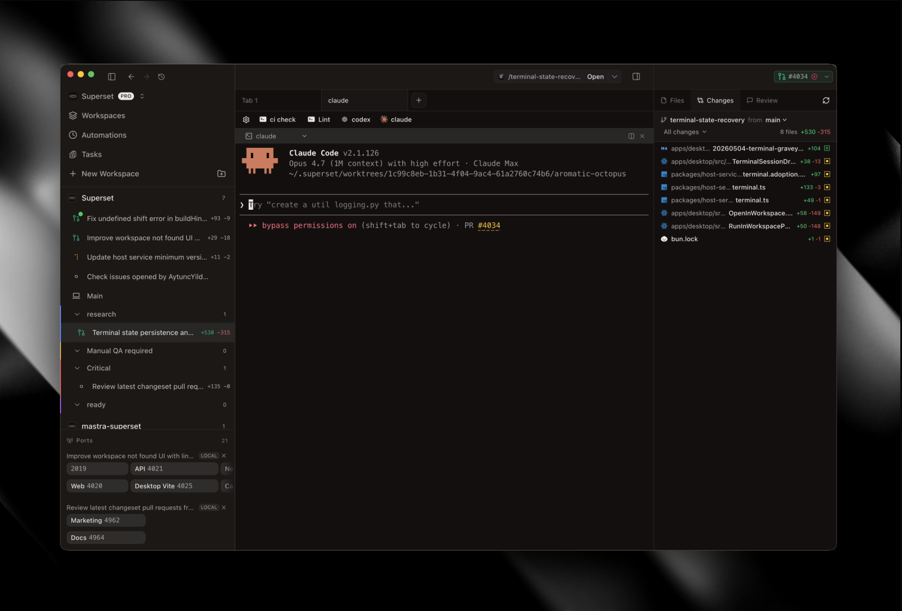
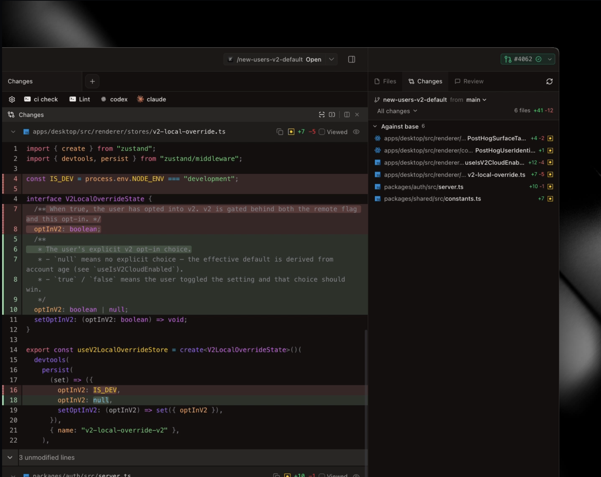
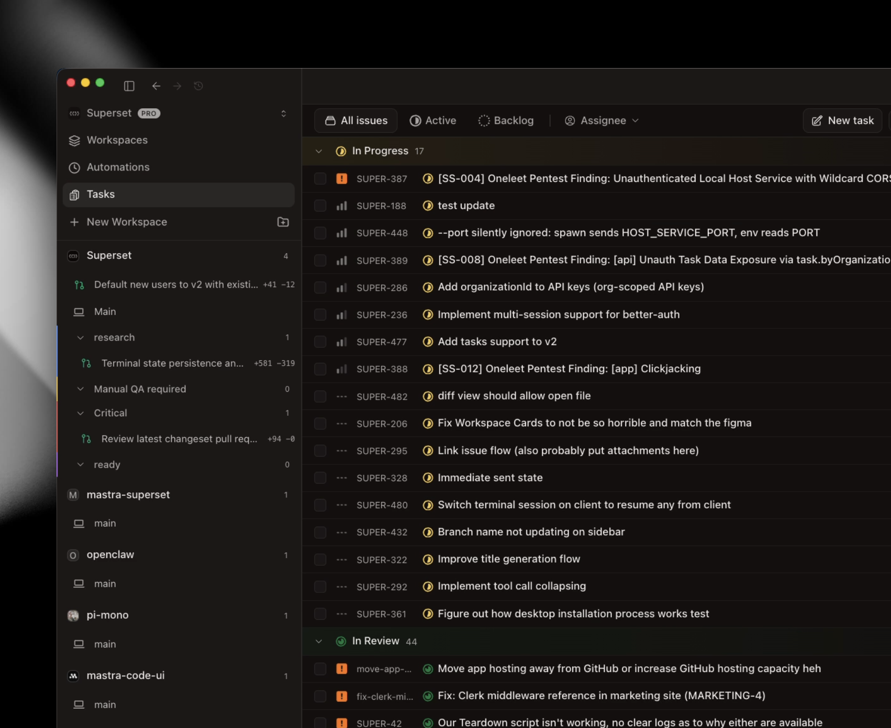

### 🎬 관련 영상
- [🎥 영상 보기](https://ph-files.imgix.net/92a97f95-b197-4367-bec5-aebb53ea6608.jpeg?auto=format)

---

## 4. [pay.sh](https://www.producthunt.com/products/solanafndn)
**Votes**: 241 | **도입 난이도**: 상 | **신뢰도**: 중
**Tagline**: Discover, access, and pay for any API autonomously
**서비스 링크**: https://www.producthunt.com/r/OC7YL7YNUEQWUP

**태그**: AI, DevTool, FinTech, OpenSource, Automation, Agent, AI Tool, API

### 📌 이 서비스 한눈에 보기
AI 에이전트가 스스로 API를 탐색하고 결제까지 수행할 수 있는 오픈소스 실시간 결제 인프라

### 🔑 주요 기능
- AI 에이전트를 위한 자율적 API 탐색 및 접근 기능
- 호출 단위(per call)로 정산 가능한 실시간 결제 인프라
- Google Cloud와 협업하여 구축 중인 오픈소스 프로젝트

### 🙋 사용자에게 어떤 점이 좋은가
AI 에이전트가 인간의 개입 없이도 필요한 외부 API를 즉시 사용하고 비용을 지불할 수 있는 자율성을 제공합니다.

### ✅ 지금 바로 써볼 기능
- 오픈소스 코드베이스 확인 및 로컬 환경 구축
- AI 에이전트 워크플로우에 결제 인프라 통합 테스트
- Google Cloud 환경과의 호환성 검토

### ⚠️ 사용 전 확인할 점
- 에이전트의 자율 결제로 인한 예기치 못한 비용 발생 가능성
- 오픈소스 프로젝트로서의 초기 단계 안정성 및 보안 검토 필요

### 🧭 확인이 더 필요한 정보
현재 개발 단계이므로 구체적인 보안 프로토콜과 에이전트별 결제 한도 설정 기능에 대한 확인이 필요합니다.

### 📸 스크린샷 및 갤러리

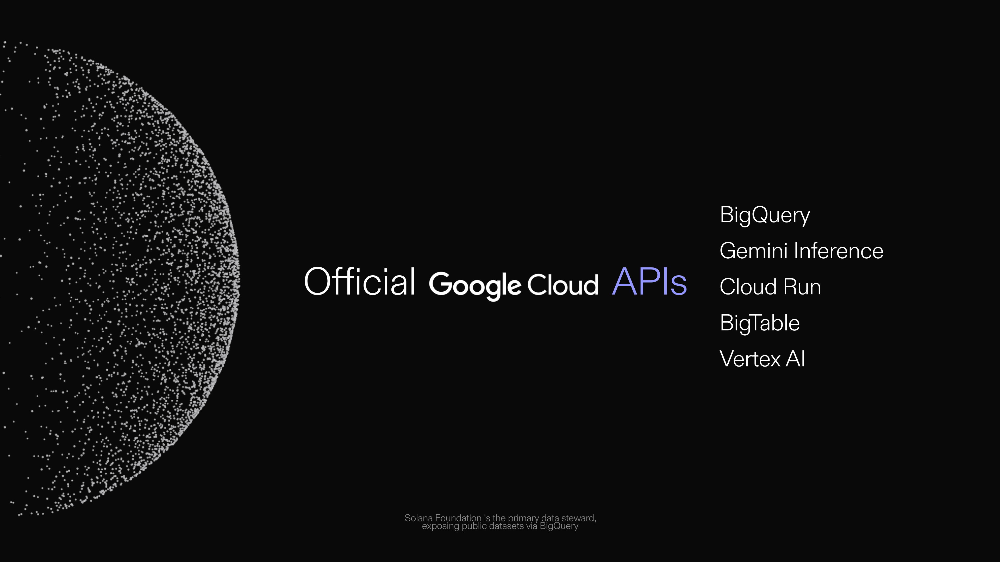
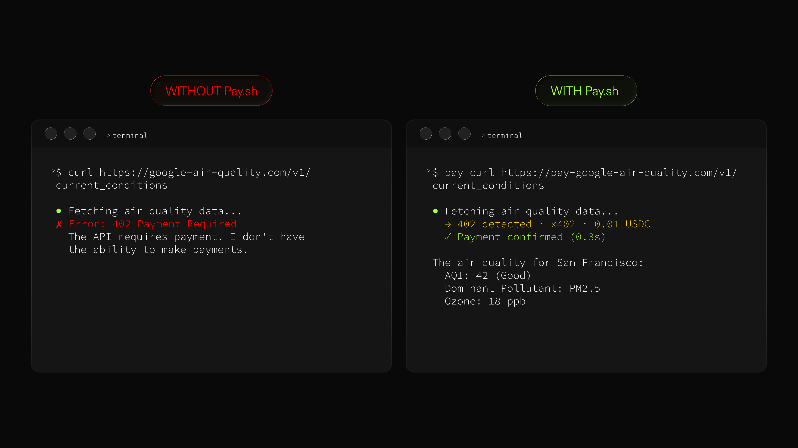

### 🎬 관련 영상
- [🎥 영상 보기](https://ph-files.imgix.net/78f22d67-baa2-4886-9594-b41d0e41e6ae.jpeg?auto=format)

---

## 5. [Gyro Autopilot](https://www.producthunt.com/products/gyro-autopilot)
**Votes**: 194 | **도입 난이도**: 하 | **신뢰도**: 상
**Tagline**: 100s of Dollars Could Be Sitting in Your Inbox 📥
**서비스 링크**: https://www.producthunt.com/r/O3FI3XMXVFLPBR

**태그**: Automation, Travel, Fintech, AI Tool

### 📌 이 서비스 한눈에 보기
항공편 지연 및 취소로 인한 미청구 환급금을 자동으로 찾아주는 서비스

### 🔑 주요 기능
- 이메일 스캔을 통한 미청구 항공 보상금 자동 탐색
- 지연, 취소, 오버부킹 등 다양한 사유의 환급금 대상 식별
- 수수료 기반 모델 (성공 시에만 비용 발생)

### 🙋 사용자에게 어떤 점이 좋은가
사용자가 놓치고 있던 항공사 보상금을 자동으로 찾아주어 번거로운 절차 없이 금전적 이득을 얻을 수 있습니다.

### ✅ 지금 바로 써볼 기능
- 이메일 연동을 통한 미청구 금액 스캔
- 발견된 환급금 청구 프로세스 진행

### ⚠️ 사용 전 확인할 점
- 이메일 접근 권한 부여에 따른 개인정보 보안 검토 필요
- 환급 성공 시 발생하는 수수료 정책 확인 필요

### 🧭 확인이 더 필요한 정보
이메일 스캔 시 개인정보 보호 및 데이터 보안이 어떻게 관리되는지 확인이 필요합니다.

### 📸 스크린샷 및 갤러리

### 🎬 관련 영상
- [🎥 영상 보기](https://ph-files.imgix.net/5705ef18-a207-4531-b3eb-4d83cca4704b.jpeg?auto=format)

---

## 6. [Custom Integrations by Databox](https://www.producthunt.com/products/databox)
**Votes**: 191 | **도입 난이도**: 중 | **신뢰도**: 상
**Tagline**: Bring missing data into Databox without writing code
**서비스 링크**: https://www.producthunt.com/r/RYM7QLUSFPSIEN

**태그**: DataIntegration, Automation, Analytics, NoCode, DevTool, API

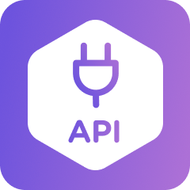

### 📌 이 서비스 한눈에 보기
코딩 없이 모든 API 데이터를 Databox로 가져와 통합 분석하는 기능

### 🔑 주요 기능
- 코드 작성 없이 외부 API를 Databox에 직접 연결
- API 응답 데이터를 구조화된 데이터셋으로 변환
- 기존 데이터 소스와의 통합 분석을 통한 전체적인 성과 파악

### 🙋 사용자에게 어떤 점이 좋은가
데이터 분석을 위해 별도의 개발 작업 없이도 원하는 외부 데이터를 대시보드에 통합하여 통합적인 성과 지표를 확인할 수 있습니다.

### ✅ 지금 바로 써볼 기능
- 사용 중인 주요 API 엔드포인트 준비
- API 응답 구조를 Databox 데이터셋 형식으로 매핑 테스트
- 기존 대시보드 데이터와 신규 API 데이터 결합

### ⚠️ 사용 전 확인할 점
- API 호출 제한(Rate Limit) 및 데이터 호출 비용 발생 가능성
- 복잡한 API 인증 방식이나 특수한 데이터 구조 처리 시 제약 사항 확인 필요

### 🧭 확인이 더 필요한 정보
API의 복잡도에 따른 구체적인 데이터 매핑 방식과 호출 제한 정책에 대한 정보가 추가로 필요합니다.

### 📸 스크린샷 및 갤러리
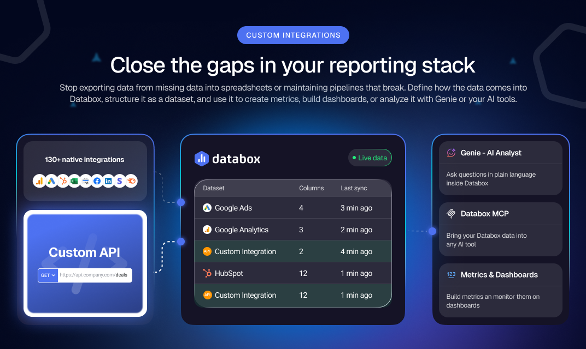
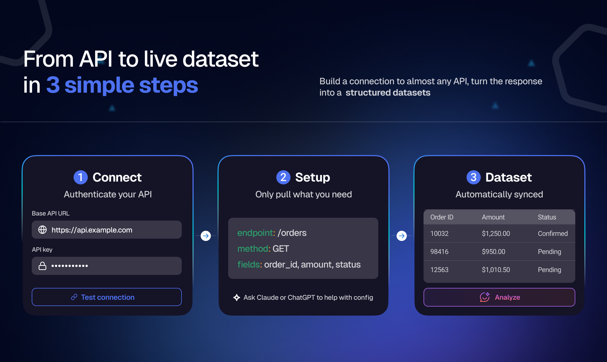
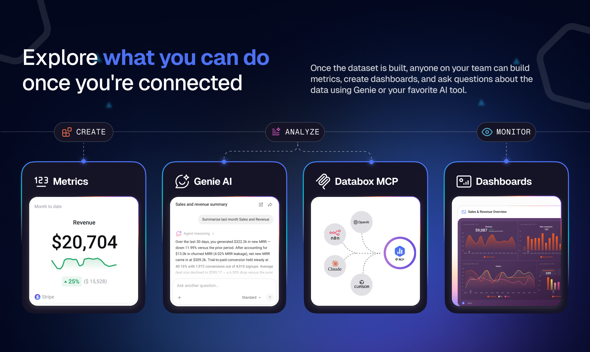

### 🎬 관련 영상
- [🎥 영상 보기](https://ph-files.imgix.net/e74dc906-683c-488a-b8f2-687e7d241c82.jpeg?auto=format)

---

## 7. [Alumni Founder](https://www.producthunt.com/products/alumni-founder)
**Votes**: 166 | **도입 난이도**: 하 | **신뢰도**: 상
**Tagline**: The tool that maps founder networks for any company
**서비스 링크**: https://www.producthunt.com/r/ND23TL2JPB5YK4

**태그**: Networking, Data Visualization, Sales Intelligence, VC Tool, AI Tool, Sales

### 📌 이 서비스 한눈에 보기
특정 기업이나 대학 출신 창업자들의 네트워크와 관계를 시각화하여 보여주는 툴

### 🔑 주요 기능
- 기업 및 대학별 창업자 네트워크 맵 제공
- 창업자 간의 연결 고리 및 관계 강도 시각화
- 창업자들의 투자 유치 규모 데이터 포함

### 🙋 사용자에게 어떤 점이 좋은가
VC는 딜 소싱을, 영업팀은 신뢰할 수 있는 소개(Warm Intro)를, 창업자는 공동 창업자 탐색을 위해 활용할 수 있습니다.

### ✅ 지금 바로 써볼 기능
- 관심 있는 기업/대학 검색하여 네트워크 맵 확인하기
- 창업자 간의 연결 강도 및 관계 구조 분석하기
- 창업자들의 투자 규모를 통한 잠재적 파트너십 기회 포착하기

### ⚠️ 사용 전 확인할 점
- 데이터의 실시간 업데이트 주기 및 정확성 확인 필요
- 특정 네트워크 외의 정보 접근 제한 가능성

### 🧭 확인이 더 필요한 정보
데이터의 최신성 및 구체적인 데이터 소스에 대한 정보가 명시되지 않았습니다.

### 📸 스크린샷 및 갤러리
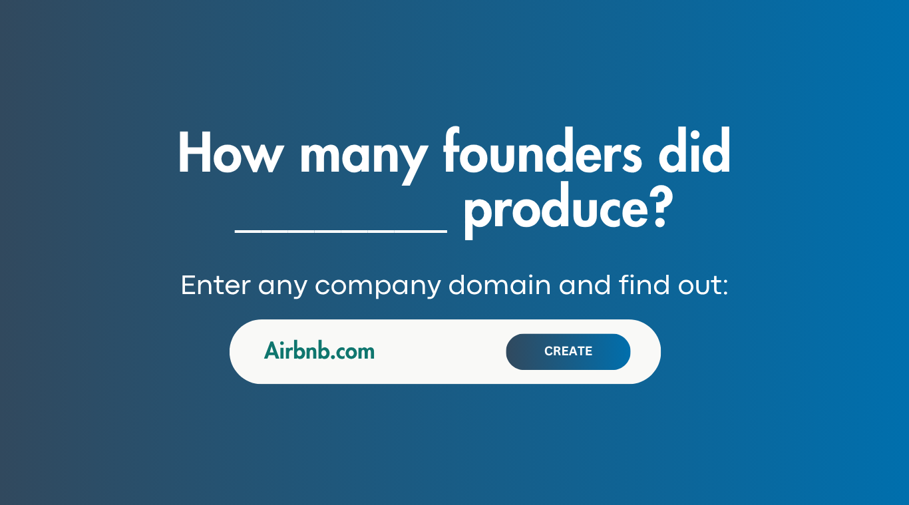
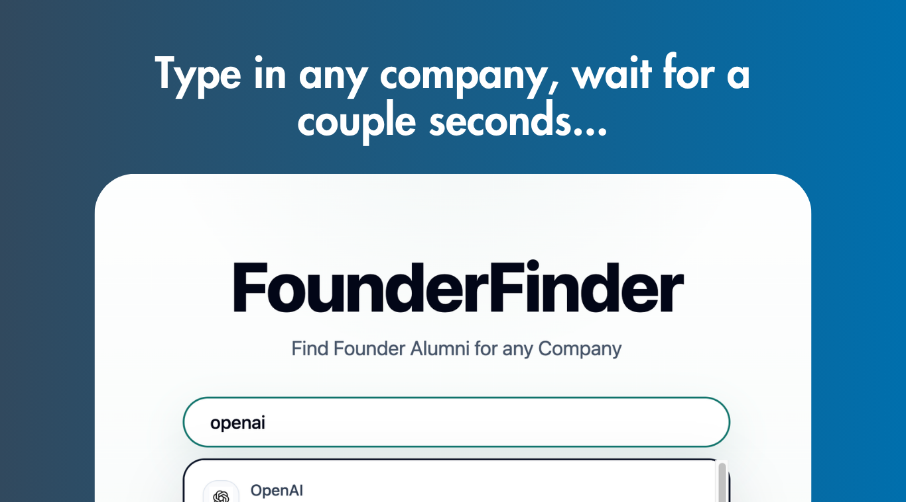
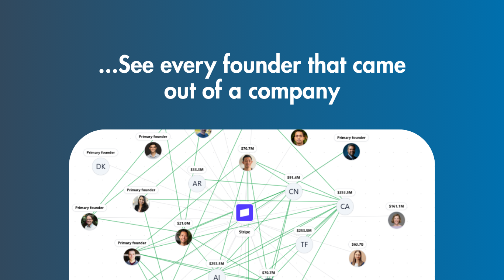

---

## 8. [Ads in ChatGPT](https://www.producthunt.com/products/chatgpt)
**Votes**: 142 | **도입 난이도**: 중 | **신뢰도**: 상
**Tagline**: Create, manage, and measure your ChatGPT ad campaigns
**서비스 링크**: https://www.producthunt.com/r/VYJAW7OMYVFKMS

**태그**: Marketing, Advertising, Analytics, AI, AI Tool, Chat

### 📌 이 서비스 한눈에 보기
ChatGPT 내 광고 캠페인을 직접 생성하고 관리할 수 있는 셀프 서비스 광고 관리자

### 🔑 주요 기능
- 미국 광고주 대상 베타 셀프 서비스 Ads Manager 출시
- CPC 입찰 및 CPM 캠페인 운영 기능 제공
- 전환 측정 및 통합 리포팅 시스템 구축

### 🙋 사용자에게 어떤 점이 좋은가
기업이 ChatGPT 사용자에게 직접적으로 타겟팅된 광고를 노출하고 성과를 측정할 수 있는 새로운 마케팅 채널이 생깁니다.

### ✅ 지금 바로 써볼 기능
- 미국 내 광고주라면 베타 서비스 참여 가능 여부 확인
- CPC/CPM 기반의 캠페인 전략 수립
- 전환 측정 기능을 활용한 광고 성과 최적화

### ⚠️ 사용 전 확인할 점
- 현재 미국 광고주 대상 베타 서비스로 지역적 제한이 있음
- 광고와 답변의 분리 정책에 따른 사용자 경험 변화 가능성

### 🧭 확인이 더 필요한 정보
베타 서비스 종료 후의 정식 출시 일정 및 글로벌 확장 계획은 아직 불분명합니다.

### 📸 스크린샷 및 갤러리

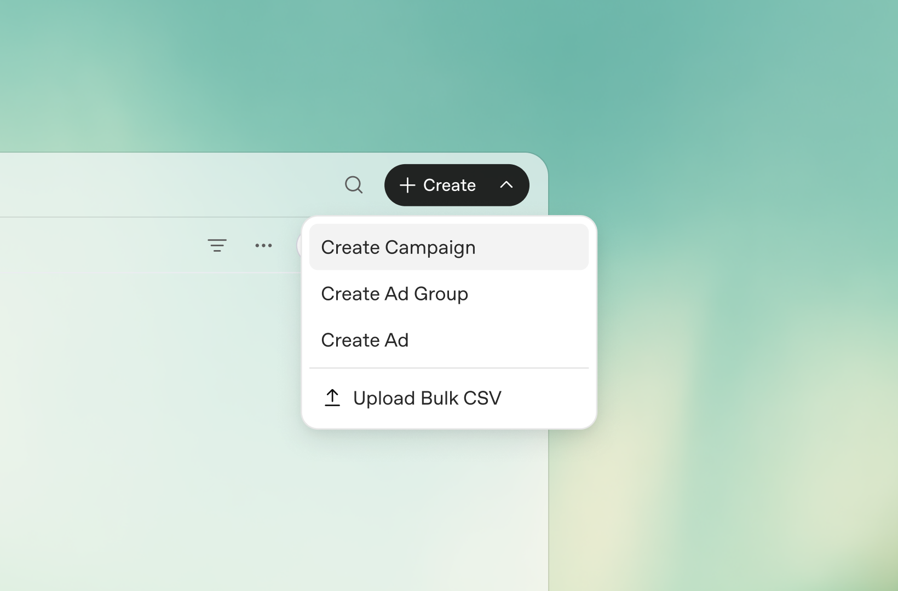
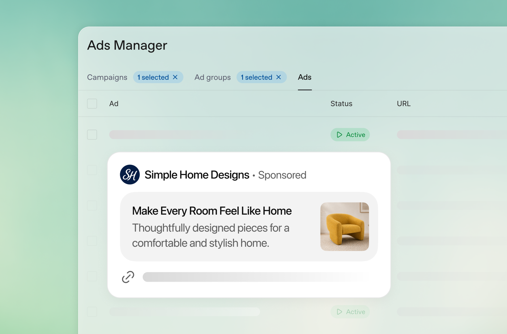

### 🎬 관련 영상
- [🎥 영상 보기](https://ph-files.imgix.net/395f8530-1d4e-439e-a0eb-1ee8fe111ff9.jpeg?auto=format)

---

## 9. [WOZCODE](https://www.producthunt.com/products/wozcode)
**Votes**: 139 | **도입 난이도**: 하 | **신뢰도**: 상
**Tagline**: Cut Claude Code costs by up to 50%
**서비스 링크**: https://www.producthunt.com/r/IVDIEGU2INHVQ7

**태그**: DevTool, AI-Agent, Cost-Optimization, Productivity, Agent, Automation

### 📌 이 서비스 한눈에 보기
Claude Code의 토큰 소모를 줄여 비용을 최대 50% 절감하는 효율화 레이어

### 🔑 주요 기능
- Claude Code 사용 시 발생하는 토큰 비용 절감
- 기존 IDE 및 워크플로우를 유지하며 즉시 적용 가능
- 에이전트 성능 향상 및 작업 완료 속도 개선

### 🙋 사용자에게 어떤 점이 좋은가
개발자가 기존 작업 환경을 바꾸지 않고도 Claude Code의 비용 부담을 줄이면서 더 빠른 작업 수행이 가능합니다.

### ✅ 지금 바로 써볼 기능
- 두 단계의 명령어로 간편 설치하기
- Claude Code 세션에 적용하여 토큰 절감 효과 확인하기

### ⚠️ 사용 전 확인할 점
- 기존 Claude Code 워크플로우와의 호환성 확인 필요
- 비용 절감 수치가 사용자의 구체적인 작업 환경에서도 동일하게 나타나는지 검증 필요

### 🧭 확인이 더 필요한 정보
사용자의 구체적인 개발 환경 및 작업 패턴에 따른 실제 비용 절감 폭은 변동될 수 있습니다.

### 📸 스크린샷 및 갤러리
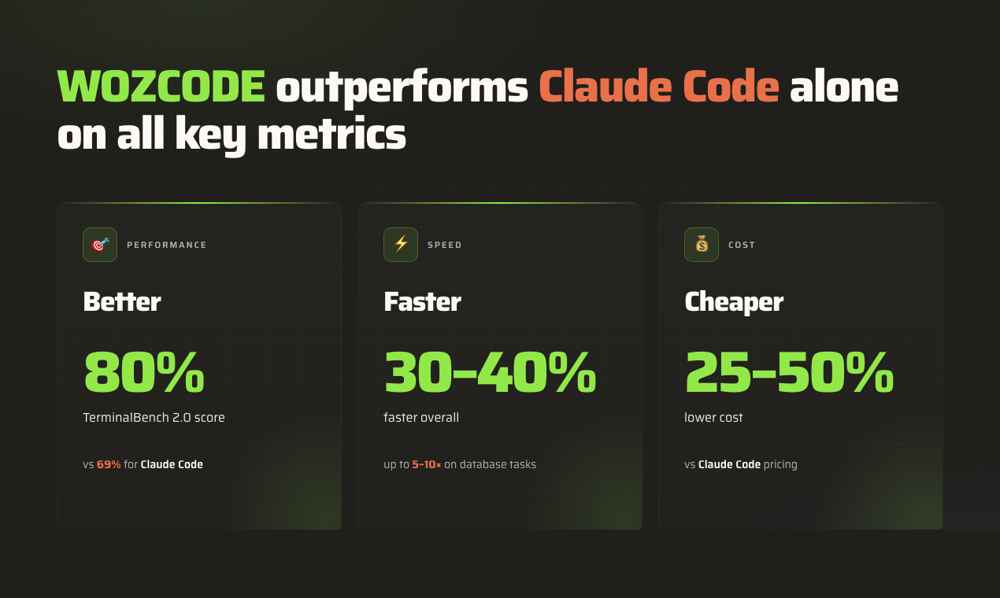
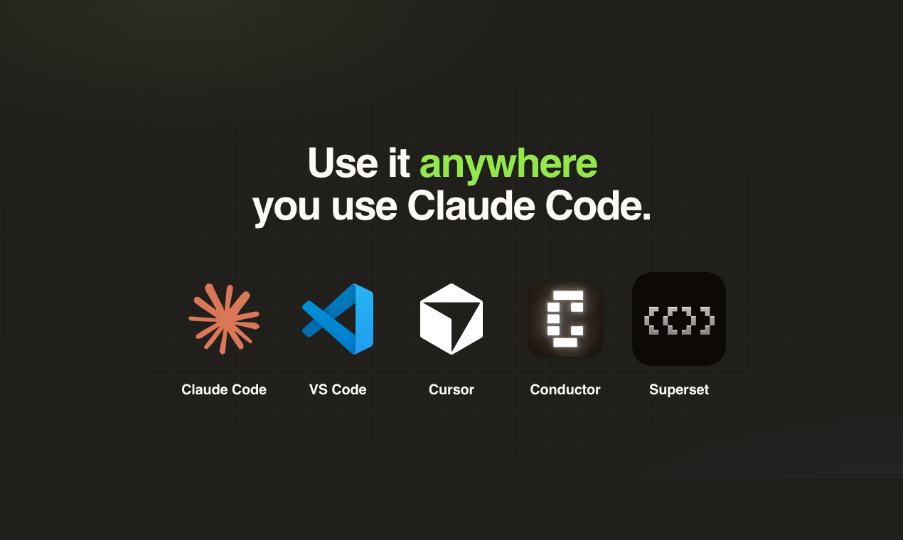
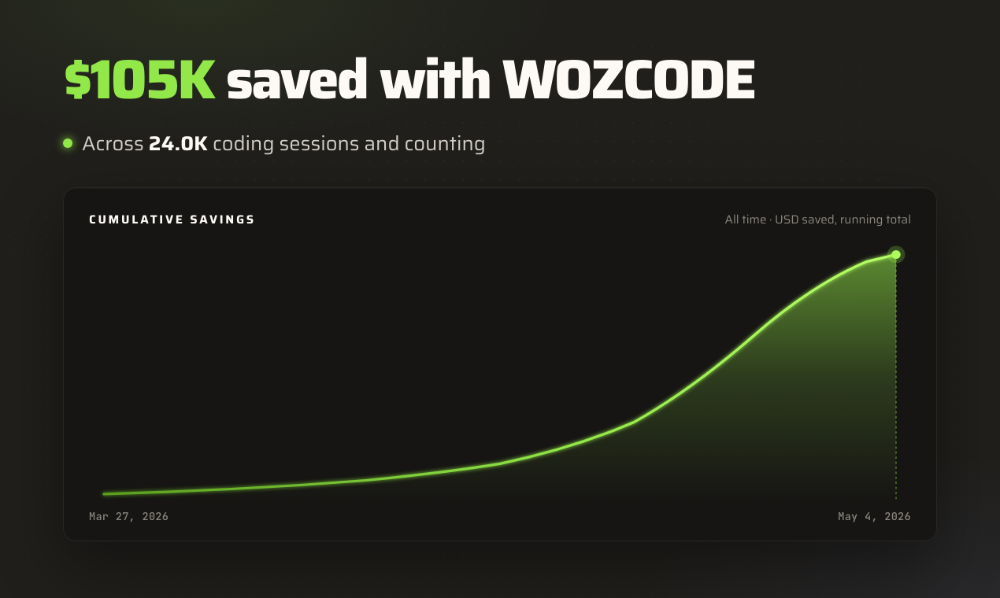

### 🎬 관련 영상
- [🎥 영상 보기](https://ph-files.imgix.net/ef39e2f9-5f69-483c-89de-adf99b6a62fb.jpeg?auto=format)

---

## 10. [Realtime TTS-2](https://www.producthunt.com/products/inworld-ai)
**Votes**: 132 | **도입 난이도**: 하 | **신뢰도**: 상
**Tagline**: Voice AI that feels as good as it sounds
**서비스 링크**: https://www.producthunt.com/r/ACSGGEQ3SYT5RO

**태그**: AI, Voice-AI, Content-Creation, Multilingual, AI Tool, Design

### 📌 이 서비스 한눈에 보기
자연스러운 감정 표현과 텍스트 기반 음성 설계가 가능한 차세대 실시간 AI 음성 합성 서비스

### 🔑 주요 기능
- 자연어 지시를 통한 톤, 감정, 속도, 피치 조절 기능
- 텍스트 설명만으로 새로운 목소리를 만드는 음성 디자인 기능
- 100개 이상의 언어 간 화자 정체성 유지 및 정교한 발음 제어

### 🙋 사용자에게 어떤 점이 좋은가
사용자가 원하는 감정과 스타일을 말로 설명하여 즉각적으로 구현할 수 있어, 콘텐츠 제작 시 별도의 녹음 없이도 생생한 목소리를 생성할 수 있습니다.

### ✅ 지금 바로 써볼 기능
- 자연어 지시를 활용한 감정 표현 테스트
- 텍스트 기반 음성 디자인 기능으로 커스텀 보이스 생성
- 다국어 합성 기능을 통한 언어 간 일관성 확인

### ⚠️ 사용 전 확인할 점
- 실시간 생성 시 컴퓨팅 자원이나 비용 발생 여부 확인 필요
- 복잡한 문장이나 특정 발음에서의 정확도 검증 필요

### 🧭 확인이 더 필요한 정보
상세한 API 연동 방식 및 구체적인 요금 체계에 대한 정보는 제공되지 않았습니다.

### 📸 스크린샷 및 갤러리
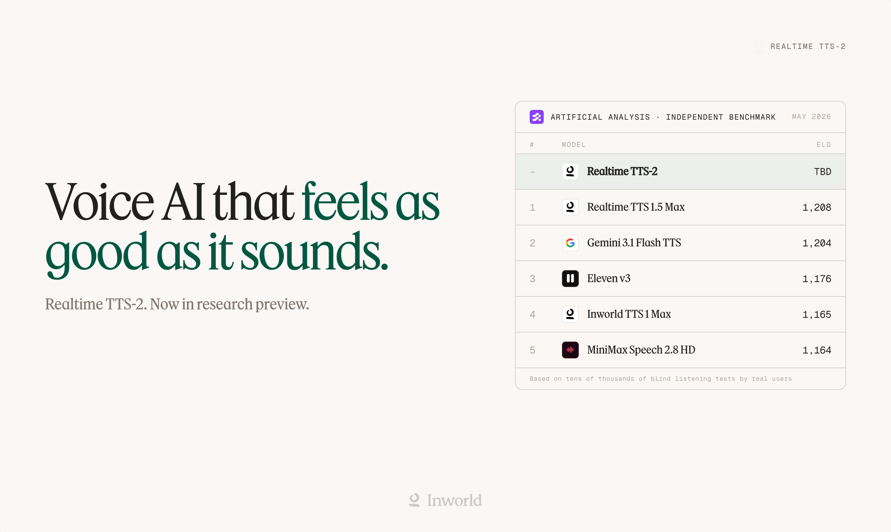
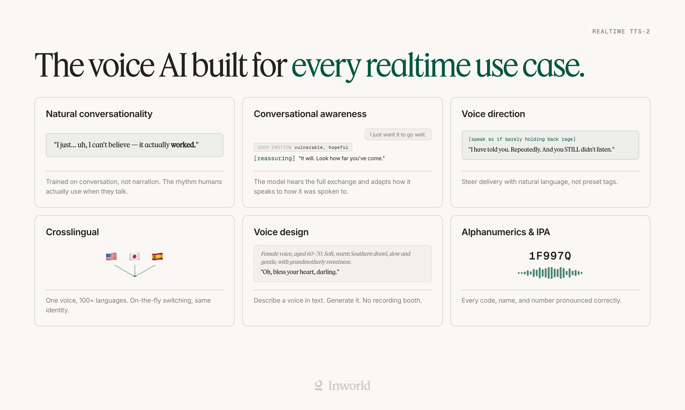
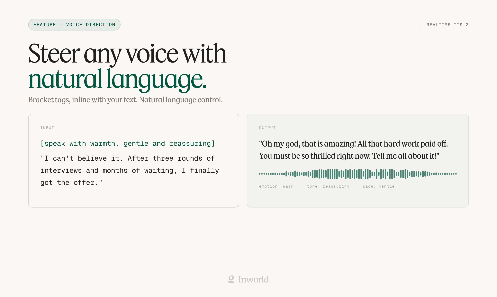

### 🎬 관련 영상
- [🎥 영상 보기](https://ph-files.imgix.net/5542c657-452c-4c8e-8da9-693543a87d0d.jpeg?auto=format)

---

## 11. [Contrario](https://www.producthunt.com/products/contrario)
**Votes**: 130 | **도입 난이도**: 하 | **신뢰도**: 상
**Tagline**: The AI recruiting platform powered by expert recruiters
**서비스 링크**: https://www.producthunt.com/r/JNUH7PXL56W6MY

**태그**: HRTech, AI, Automation, Slack, Recruiting, Agent, AI Tool

### 📌 이 서비스 한눈에 보기
전문 리크루터와 AI 에이전트가 협업하여 채용 프로세스를 자동화하는 슬랙 기반 플랫폼

### 🔑 주요 기능
- 전문 리크루터 네트워크와 AI 에이전트의 결합을 통한 채용 업무 자동화
- 소싱, 스크리닝, 일정 조율, 최종 합격까지 채용 전 과정의 90% 대행
- 슬랙(Slack) 내 자연어 인터페이스를 통한 간편한 채용 관리

### 🙋 사용자에게 어떤 점이 좋은가
채용 담당자의 반복적인 행정 업무를 획기적으로 줄여주며, 슬랙만으로 핵심 채용 업무를 효율적으로 처리할 수 있습니다.

### ✅ 지금 바로 써볼 기능
- 슬랙 연동을 통한 자연어 채용 명령 테스트
- AI 에이전트의 후보자 소싱 및 스크리닝 품질 확인
- 사용자 피드백에 따른 추천 정확도 변화 관찰

### ⚠️ 사용 전 확인할 점
- 채용의 최종 결정권은 여전히 사람에게 있으므로 AI의 판단을 검증해야 함
- 슬랙 기반 인터페이스에 대한 팀 내 적응 필요

### 🧭 확인이 더 필요한 정보
구체적인 서비스 요금 체계와 지원 가능한 채용 채널 범위에 대한 정보가 명시되지 않았습니다.

### 📸 스크린샷 및 갤러리
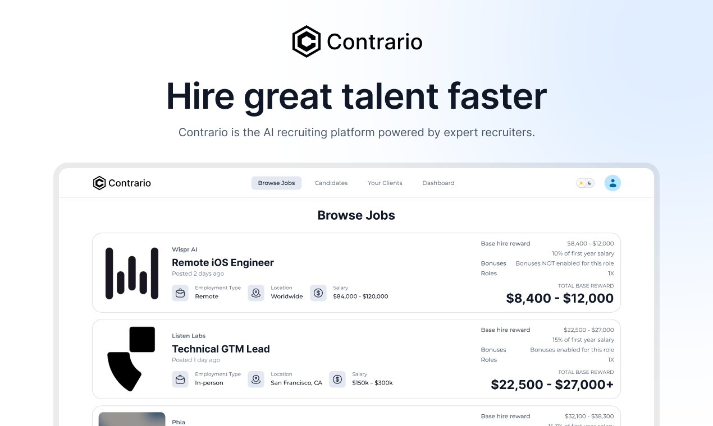
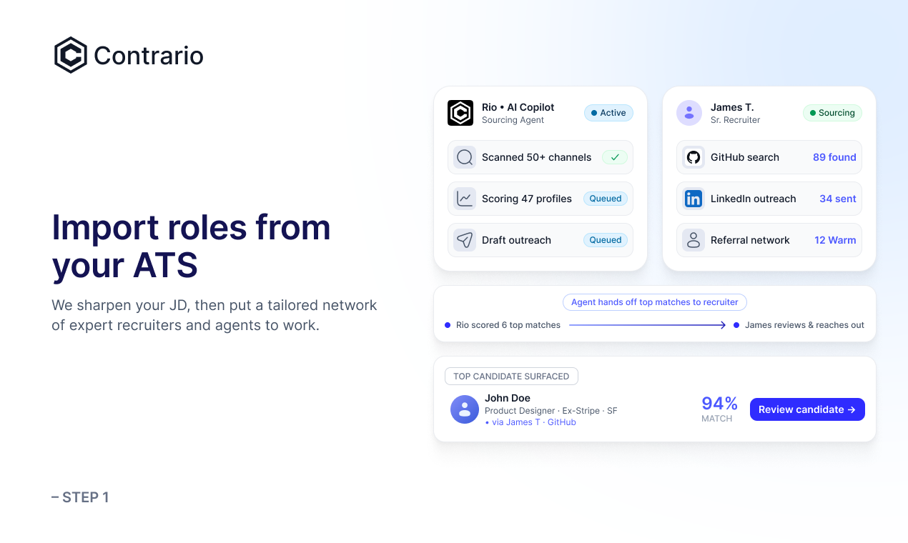
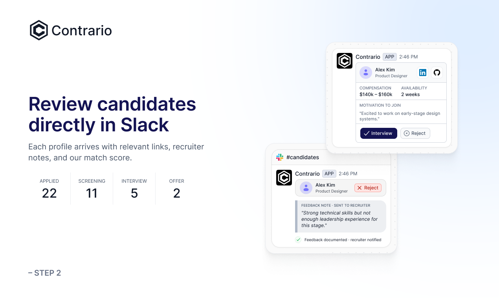

### 🎬 관련 영상
- [🎥 영상 보기](https://ph-files.imgix.net/11494b0c-0f08-4338-b0ca-1013335e357d.jpeg?auto=format)

---

## 12. [damnlines.com](https://www.producthunt.com/products/damnlines-com)
**Votes**: 125 | **도입 난이도**: 하 | **신뢰도**: 상
**Tagline**: No one likes waiting in a damn line. 
**서비스 링크**: https://www.producthunt.com/r/OLQD63EADJSM7B

**태그**: Lifestyle, Real-time, LocalGuide, AI Tool

### 📌 이 서비스 한눈에 보기
뉴욕 맛집과 명소의 실시간 대기 시간을 확인할 수 있는 큐잉 트래커

### 🔑 주요 기능
- 뉴욕 내 주요 레스토랑 및 장소의 실시간 대기 현황 제공
- 실시간 큐 스냅샷을 통한 직관적인 대기 정보 확인
- 대기 시간 신호를 통한 효율적인 방문 타이밍 예측

### 🙋 사용자에게 어떤 점이 좋은가
현지 인기 맛집에 방문하기 전, 헛걸음하지 않도록 실시간 대기 상황을 미리 파악하여 시간을 절약할 수 있습니다.

### ✅ 지금 바로 써볼 기능
- L'Industrie 등 인기 매장의 실시간 대기 시간 확인하기
- 방문 전 큐 스냅샷을 통해 혼잡도 체크하기

### ⚠️ 사용 전 확인할 점
- 뉴욕 지역 중심의 데이터로 서비스 범위가 국한될 수 있음
- 실시간 데이터의 정확도는 현장 상황에 따라 변동될 수 있음

### 🧭 확인이 더 필요한 정보
서비스가 제공하는 데이터의 업데이트 주기와 정확한 커버리지 지역을 확인해야 합니다.

### 📸 스크린샷 및 갤러리
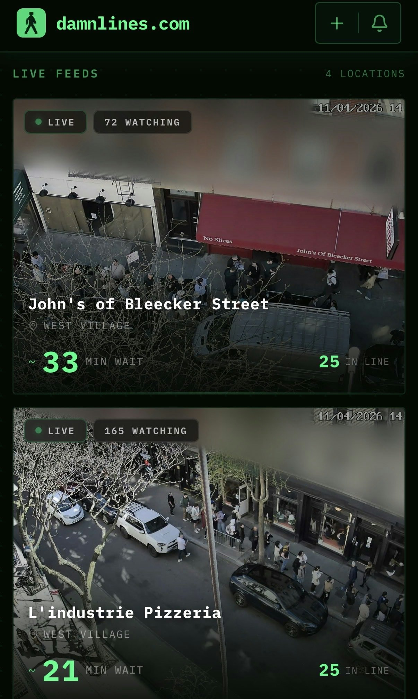
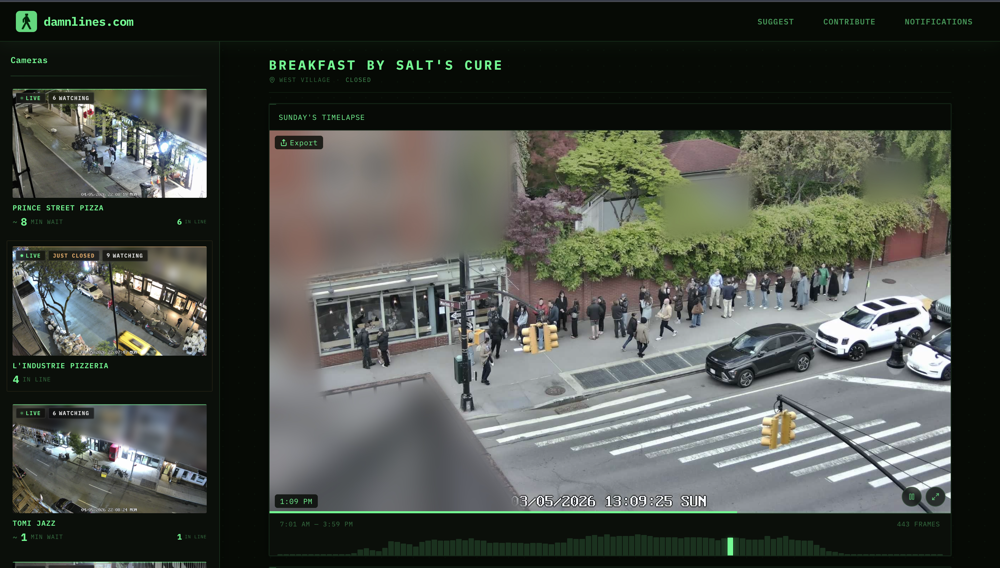
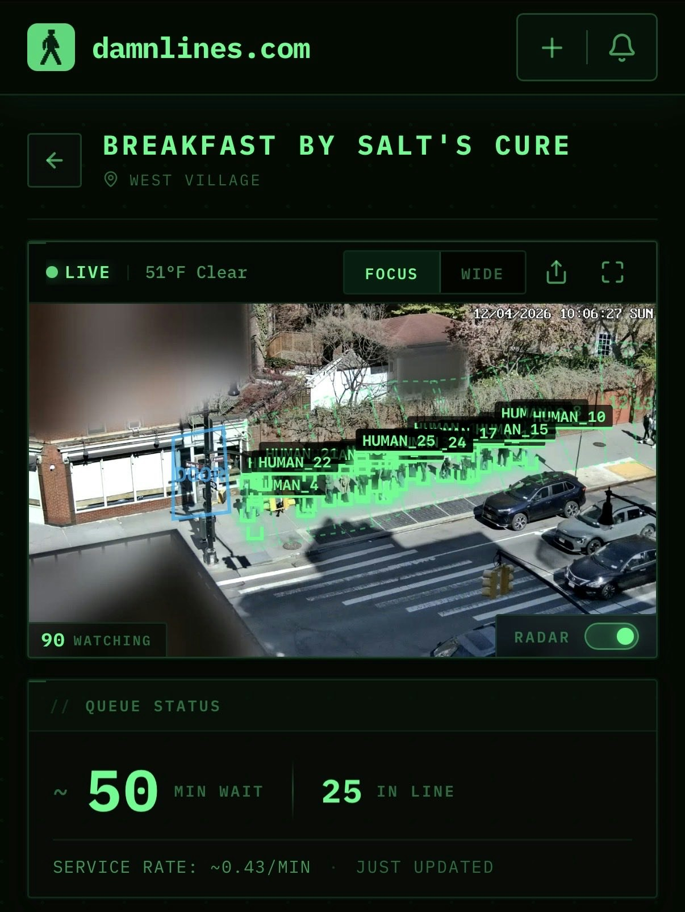

---

## 13. [Magic](https://www.producthunt.com/products/magic-13)
**Votes**: 124 | **도입 난이도**: 하 | **신뢰도**: 상
**Tagline**: Blend your content into real-world locations
**서비스 링크**: https://www.producthunt.com/r/BQ5N3YLTA52PFP

**태그**: VideoAI, MarketingTool, ContentCreation, Video

### 📌 이 서비스 한눈에 보기
실제 촬영된 배경 영상에 브랜드 콘텐츠를 자연스럽게 합성해주는 AI 영상 제작 도구

### 🔑 주요 기능
- 파리, 도쿄 등 전 세계 주요 도시의 실제 촬영 영상 템플릿 350개 이상 제공
- 로고 선명도와 색상 정확도가 높은 일관된 합성 품질
- 영상당 $1부터 시작하는 합리적인 가격 정책

### 🙋 사용자에게 어떤 점이 좋은가
고가의 스튜디오 촬영 없이도 전 세계를 배경으로 한 고퀄리티 브랜드 홍보 영상을 저렴하고 빠르게 제작할 수 있습니다.

### ✅ 지금 바로 써볼 기능
- 350개 이상의 템플릿 탐색하기
- 콘텐츠 업로드 후 실제 배경과 합성 테스트하기
- 브랜드 로고 및 색상 일치도 확인하기

### ⚠️ 사용 전 확인할 점
- 사용자의 콘텐츠가 특정 배경 템플릿과 어울리는지 사전 확인 필요
- 영상당 과금 방식에 따른 총 비용 산출 필요

### 🧭 확인이 더 필요한 정보
사용자의 콘텐츠 길이나 해상도에 따른 추가 비용 체계가 명시되지 않았습니다.

### 📸 스크린샷 및 갤러리

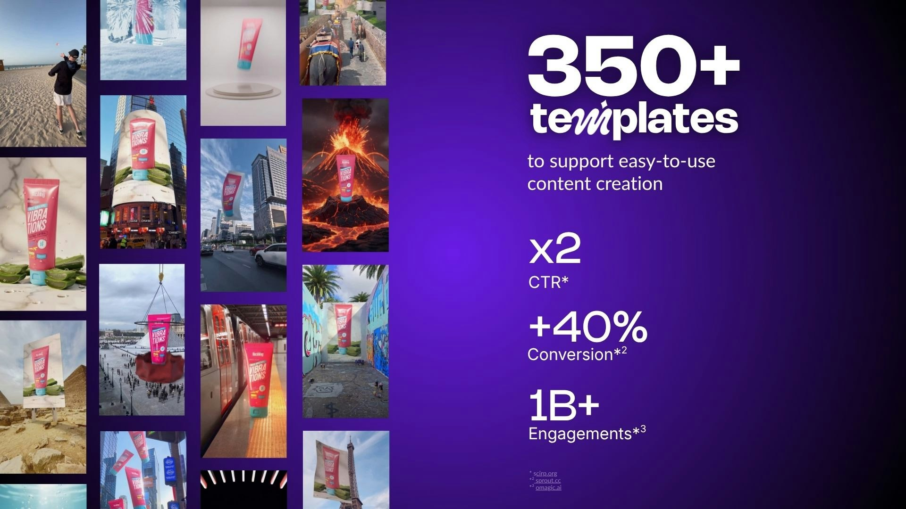

### 🎬 관련 영상
- [🎥 영상 보기](https://ph-files.imgix.net/09419c18-4e04-49c3-b059-7aaecf3c67cc.jpeg?auto=format)

---

## 14. [DevAlly](https://www.producthunt.com/products/devally)
**Votes**: 124 | **도입 난이도**: 하 | **신뢰도**: 상
**Tagline**: AI powered accessibility compliance for teams who ship fast 
**서비스 링크**: https://www.producthunt.com/r/TQHE4CU4Y3RL4X

**태그**: DevTool, Accessibility, Automation, Compliance, AI Tool

### 📌 이 서비스 한눈에 보기
빠른 제품 출시를 지원하는 AI 기반 웹 접근성 자동화 솔루션

### 🔑 주요 기능
- EAA, ADA, Section 508 등 글로벌 접근성 규정 준수 지원
- 제품 팀을 위한 접근성 컴플라이언스 프로세스 자동화
- 확장 가능한 접근성 관리 프로그램 구축 지원

### 🙋 사용자에게 어떤 점이 좋은가
제품 개발 속도를 늦추지 않으면서도 법적 규제에 부합하는 접근성을 확보할 수 있습니다.

### ✅ 지금 바로 써볼 기능
- 현재 제품의 접근성 준수 상태 진단하기
- 글로벌 규정(EAA, ADA 등) 대응 가이드 확인하기
- 팀 내 자동화 워크플로우 적용 가능성 검토하기

### ⚠️ 사용 전 확인할 점
- AI 자동화 도구이므로 완전한 수동 검수와 병행이 필요할 수 있음
- 구체적인 기술 스택과의 통합 방식 확인 필요

### 🧭 확인이 더 필요한 정보
제품의 구체적인 자동화 범위와 기존 개발 워크플로우(CI/CD) 통합 방식에 대한 정보가 더 필요합니다.

### 📸 스크린샷 및 갤러리
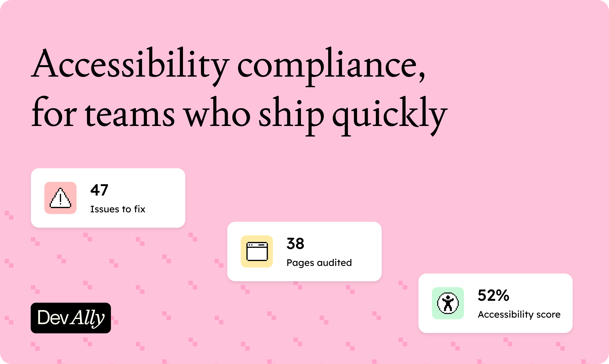
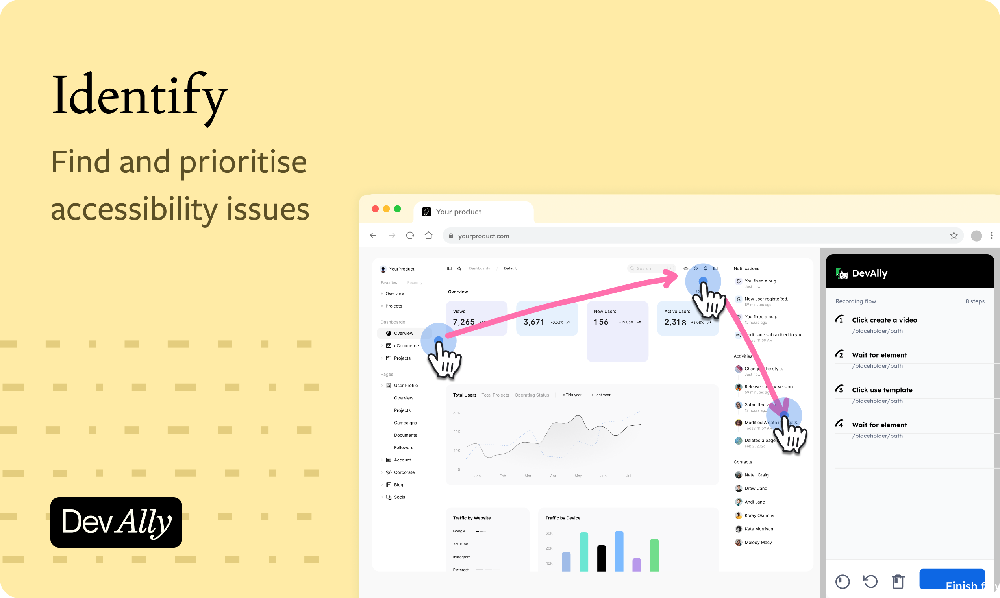
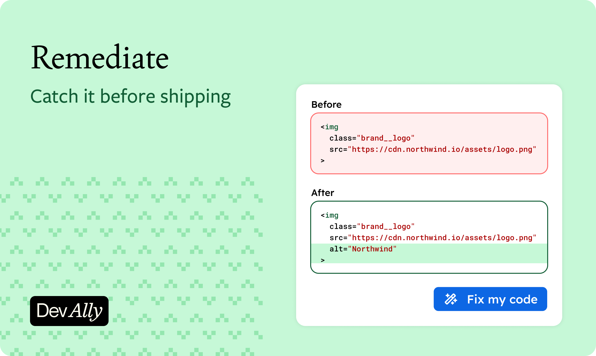

---

## 15. [Gas City 1.0](https://www.producthunt.com/products/gas-city)
**Votes**: 116 | **도입 난이도**: 상 | **신뢰도**: 중
**Tagline**: build your own software factory
**서비스 링크**: https://www.producthunt.com/r/3GSEG4IY2YGR73

**태그**: DevOps, AI-Agent, Automation, OSS, Agent, AI Tool, DevTool

### 📌 이 서비스 한눈에 보기
AI 코딩 에이전트를 활용해 소프트웨어 개발부터 운영까지 자동화하는 오픈소스 소프트웨어 팩토리 플랫폼

### 🔑 주요 기능
- Claude Code, Gemini 등 다양한 CLI 코딩 에이전트 오케스트레이션
- 비결정적 AI 출력을 제품 수준의 솔루션으로 변환하는 워크플로우 구축
- 소프트웨어의 빌드, 배포, 운영, 유지보수를 통합 관리하는 자동화 환경 제공

### 🙋 사용자에게 어떤 점이 좋은가
개발자가 선호하는 AI 도구들을 하나의 자동화된 파이프라인으로 묶어, 단순 코딩을 넘어 제품 전체의 생명주기를 관리할 수 있습니다.

### ✅ 지금 바로 써볼 기능
- 사용 중인 CLI 코딩 에이전트와 연동 테스트
- 자신만의 소프트웨어 팩토리 워크플로우 설계
- AI 출력물의 품질 검증 프로세스 구축

### ⚠️ 사용 전 확인할 점
- AI 에이전트의 비결정적 출력으로 인한 결과물 품질 변동 가능성
- 플랫폼 구축 및 운영을 위한 초기 설정 복잡도

### 🧭 확인이 더 필요한 정보
오픈소스 플랫폼으로서의 구체적인 설치 방법과 기존 CI/CD 도구와의 통합 수준에 대한 정보가 더 필요합니다.

### 📸 스크린샷 및 갤러리

---

## 16. [Magic Studio by Once UI](https://www.producthunt.com/products/magic-studio-by-once-ui)
**Votes**: 98 | **도입 난이도**: 중 | **신뢰도**: 상
**Tagline**: Turn Once UI into a $10k agency
**서비스 링크**: https://www.producthunt.com/r/SJ3TB6LQZ55VKQ

**태그**: Frontend, AgencyTool, DesignSystem, SaaS, DevTool

### 📌 이 서비스 한눈에 보기
Once UI 기반의 화이트라벨 프론트엔드 시스템으로 고단가 에이전시 비즈니스를 구축할 수 있는 도구

### 🔑 주요 기능
- Once UI를 기반으로 설계된 완성도 높은 화이트라벨 프론트엔드 시스템
- 랜딩 페이지, 대시보드, 문서, 스튜디오 사이트 등 다양한 프로젝트 템플릿 제공
- 프리랜서와 에이전시를 위한 일관된 디자인 시스템 및 커스텀 환경 제공

### 🙋 사용자에게 어떤 점이 좋은가
처음부터 디자인과 개발을 시작할 필요 없이, 검증된 시스템을 활용해 프리미엄 프론트엔드 프로젝트를 빠르게 제작하고 판매할 수 있습니다.

### ✅ 지금 바로 써볼 기능
- 제공되는 템플릿의 디자인 일관성 확인하기
- 사용자 요구사항에 맞춘 커스텀 가능 범위 테스트하기
- 에이전시 비즈니스 모델에 적합한 워크플로우 설계하기

### ⚠️ 사용 전 확인할 점
- Once UI에 대한 사전 지식이나 프론트엔드 개발 역량이 필요할 수 있음
- 화이트라벨링을 위한 커스텀 작업 시 기술적 숙련도 요구

### 🧭 확인이 더 필요한 정보
구체적인 기술 스택(React, Next.js 등)과 커스텀 자유도에 대한 상세 정보가 필요합니다.

### 📸 스크린샷 및 갤러리
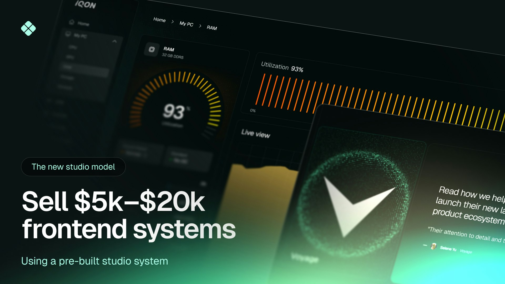
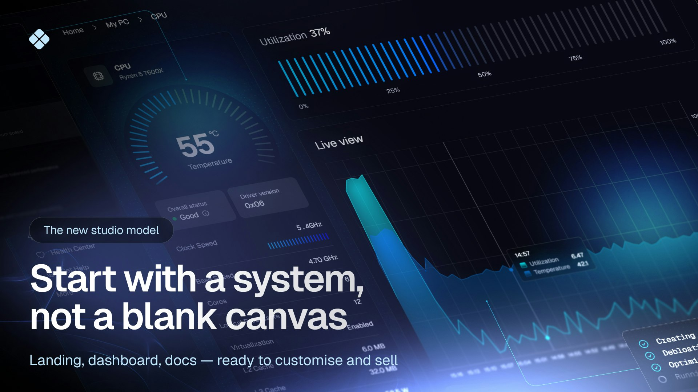
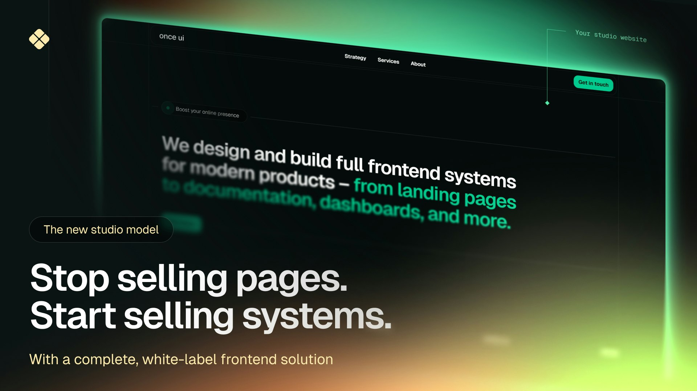

---

## 17. [Spotit](https://www.producthunt.com/products/spotit-3)
**Votes**: 96 | **도입 난이도**: 하 | **신뢰도**: 상
**Tagline**: Your cursor's tutor. For every Mac app. 
**서비스 링크**: https://www.producthunt.com/r/MFTAI7UTOMPM4J

**태그**: Productivity, Mac, Tutorial, Learning

### 📌 이 서비스 한눈에 보기
맥(Mac) 앱 사용법을 실시간 클릭 가이드로 알려주는 인터랙티브 튜터

### 🔑 주요 기능
- 질문을 던지면 다음 클릭해야 할 위치를 직접 하이라이트
- 사용자가 직접 클릭하며 배우는 실습 중심의 학습 방식
- 모든 Mac 애플리케이션에서 작동하는 범용성

### 🙋 사용자에게 어떤 점이 좋은가
복잡한 소프트웨어의 기능을 매뉴얼 없이도 직관적으로 익힐 수 있어 학습 시간을 단축해 줍니다.

### ✅ 지금 바로 써볼 기능
- 자주 사용하는 Mac 앱에서 단축키 실행해보기
- 특정 작업(예: 레이어 마스킹) 질문하고 가이드 따라가기
- 가이드 없이 스스로 작업할 수 있는지 확인하기

### ⚠️ 사용 전 확인할 점
- 모든 앱의 모든 기능을 완벽하게 지원하는지 확인 필요
- 가이드 실행 시 작업 중인 화면 흐름이 끊길 수 있음

### 🧭 확인이 더 필요한 정보
모든 Mac 앱에서 동일한 수준의 가이드가 제공되는지, 그리고 시스템 리소스 점유율은 어느 정도인지 확인이 필요합니다.

### 📸 스크린샷 및 갤러리
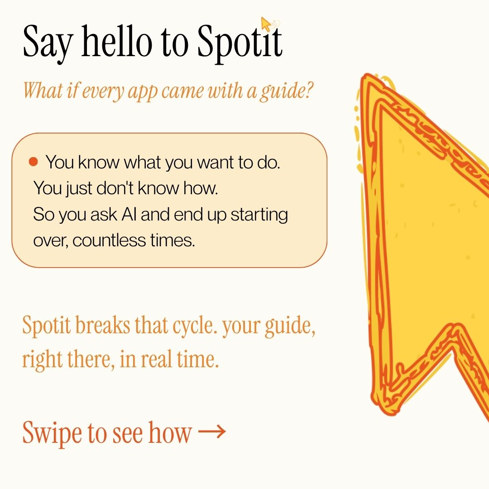
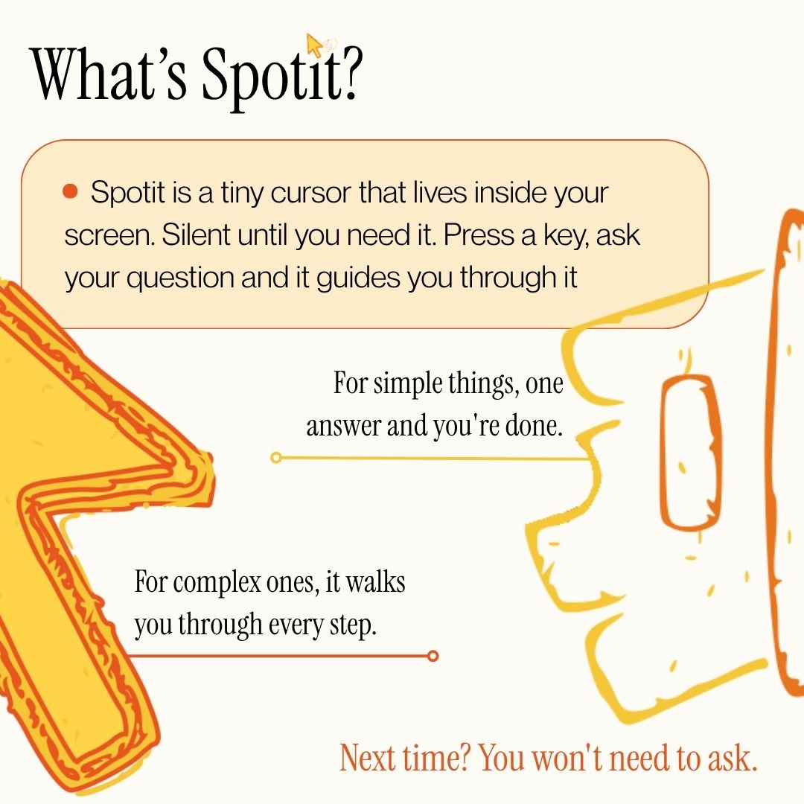
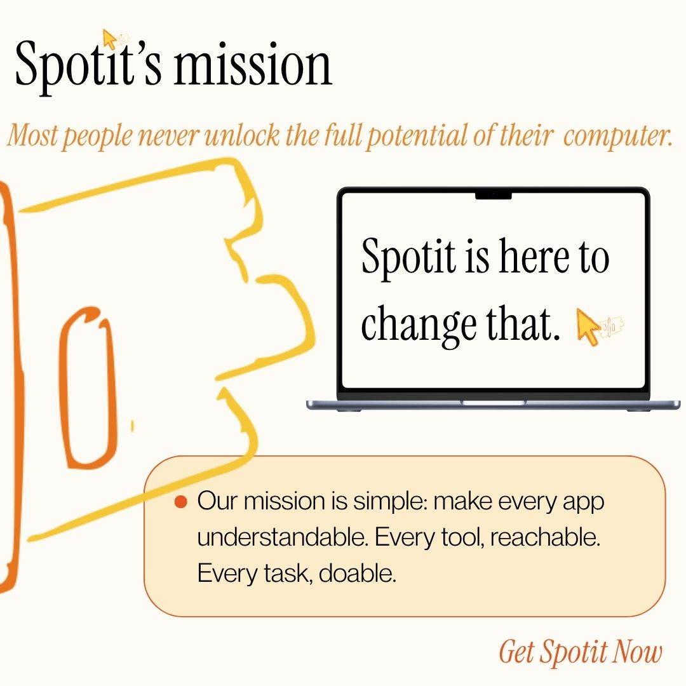

### 🎬 관련 영상
- [🎥 영상 보기](https://ph-files.imgix.net/0ccf23ba-58f9-44a2-b634-176b10ddf13b.jpeg?auto=format)

---

## 18. [GetDynasty](https://www.producthunt.com/products/getdynasty)
**Votes**: 92 | **도입 난이도**: 중 | **신뢰도**: 상
**Tagline**: Exit tax-free using Trusts. For startup founders.
**서비스 링크**: https://www.producthunt.com/r/6N2A4XQ2YDIM3J

**태그**: FinTech, TaxStrategy, Startup, WealthManagement, AI Tool

### 📌 이 서비스 한눈에 보기
스타트업 창업자를 위한 QSBS 스태킹 기반의 절세 및 자산 보호 솔루션

### 🔑 주요 기능
- 초고액 자산가들이 사용하는 QSBS 스태킹 전략을 일반 창업자도 이용 가능하도록 제품화
- 엑싯(Exit) 시 발생하는 막대한 세금 부담을 최소화하는 전략 제공
- 기존 패밀리 오피스 대비 저렴한 비용으로 전문적인 세무 전략 접근 가능

### 🙋 사용자에게 어떤 점이 좋은가
창업자가 기업 매각 시 겪게 되는 높은 세율 문제를 해결하여 실질적인 순자산 확보를 극대화할 수 있습니다.

### ✅ 지금 바로 써볼 기능
- 현재 보유한 지분 구조와 QSBS 적용 가능 여부 검토
- 전통적인 세무 컨설팅 대비 비용 효율성 확인
- 신탁(Trust) 구조를 통한 자산 보호 전략 상담

### ⚠️ 사용 전 확인할 점
- 개별 창업자의 상황에 따라 세법 적용 결과가 다를 수 있음
- 복잡한 법적/세무적 절차가 포함되므로 전문가의 최종 검토 필수

### 🧭 확인이 더 필요한 정보
구체적인 서비스 이용 요금 체계와 법적 책임 소재에 대한 정보가 명시되지 않았습니다.

### 📸 스크린샷 및 갤러리
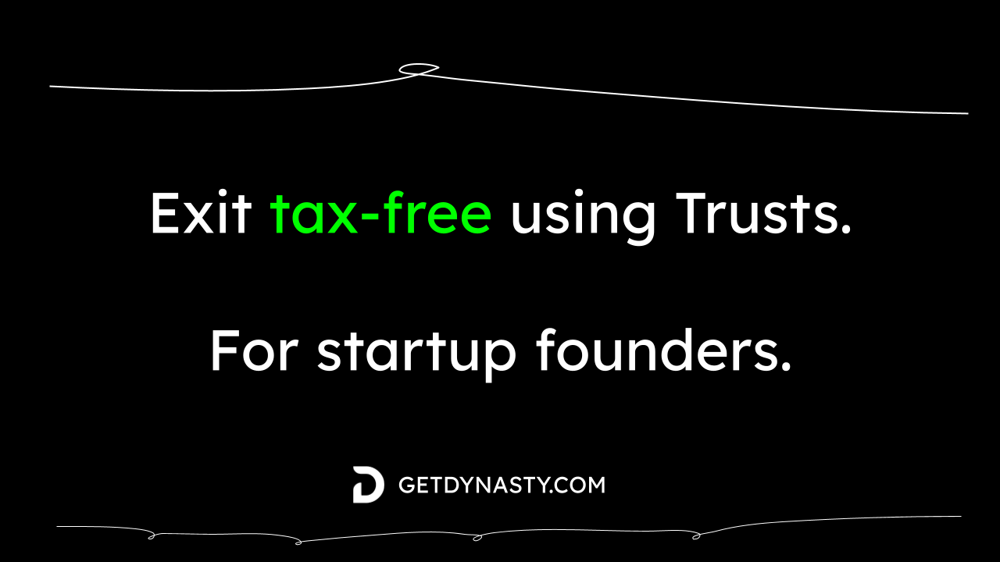

### 🎬 관련 영상
- [🎥 영상 보기](https://ph-files.imgix.net/45d68032-3865-4560-8e47-45c5f2a1e230.jpeg?auto=format)

---

## 19. [moar](https://www.producthunt.com/products/moar-2)
**Votes**: 90 | **도입 난이도**: 하 | **신뢰도**: 상
**Tagline**: Your documents. AI ready. 
**서비스 링크**: https://www.producthunt.com/r/PWVQ2GX7VV3VRV

**태그**: AI-Tool, Productivity, Data-Processing, Privacy, AI Tool, Chat

### 📌 이 서비스 한눈에 보기
문서 구조를 유지하며 AI 최적화된 마크다운/CSV로 변환해주는 프라이빗 문서 처리 도구

### 🔑 주요 기능
- 문서 내 구조를 추출하여 AI 활용에 최적화된 Markdown 및 CSV 형식 제공
- 최대 95%의 토큰 절감 효과와 의미 손실 없는 데이터 정제
- 로컬 기반 처리로 문서가 기기를 떠나지 않는 100% 프라이버시 보장

### 🙋 사용자에게 어떤 점이 좋은가
대용량 문서를 AI에 입력할 때 발생하는 토큰 낭비와 용량 제한 문제를 해결하여, ChatGPT나 Claude 등에서 더 효율적이고 정확한 답변을 얻을 수 있습니다.

### ✅ 지금 바로 써볼 기능
- 복잡한 PDF 문서를 마크다운으로 변환하여 AI에 입력해보기
- 데이터가 포함된 스프레드시트를 AI용 CSV로 변환하기
- 개인정보가 포함된 문서를 프라이버시 걱정 없이 처리하기

### ⚠️ 사용 전 확인할 점
- 파일당 최대 용량이 50MB로 제한되어 있음
- 지원되는 9가지 형식 외의 파일은 처리가 불가능함

### 🧭 확인이 더 필요한 정보
사용자의 기기 사양에 따른 처리 속도 및 구체적인 로컬 처리 방식에 대한 정보가 필요합니다.

### 📸 스크린샷 및 갤러리
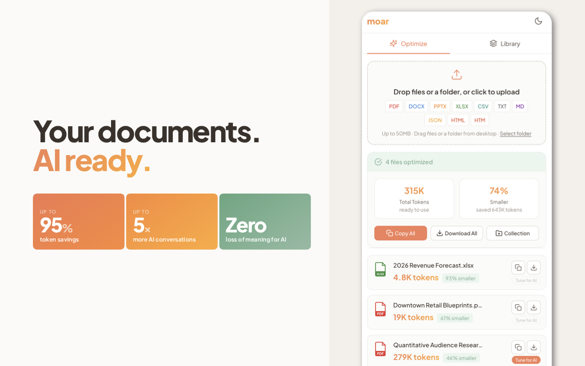
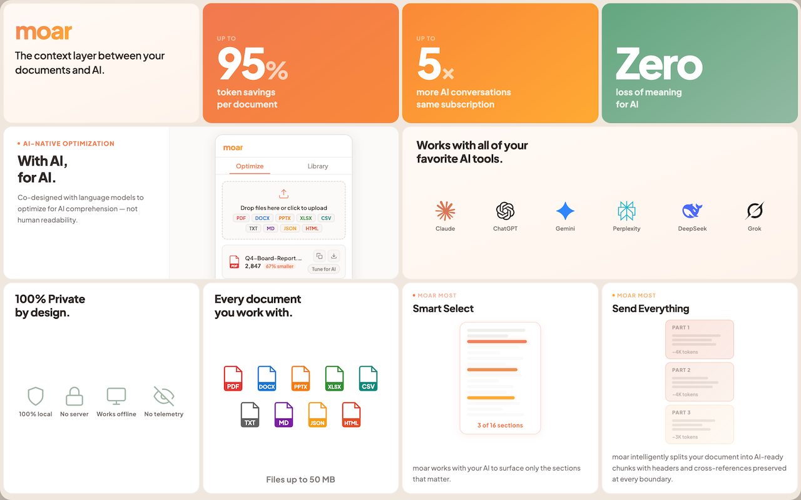

---

## 20. [Open Finance MCP](https://www.producthunt.com/products/open-finance-mcp)
**Votes**: 87 | **도입 난이도**: 하 | **신뢰도**: 상
**Tagline**: Access your bank data in ChatGPT & Claude via Open Finance
**서비스 링크**: https://www.producthunt.com/r/U5FLZTKBN4GM32

**태그**: FinTech, AI, Data-Analysis, Automation, AI Tool, Chat

### 📌 이 서비스 한눈에 보기
브라질 오픈 파이낸스를 통해 ChatGPT와 Claude에서 실시간 은행 데이터를 분석하는 AI 도구

### 🔑 주요 기능
- 브라질 오픈 파이낸스 기반의 은행 데이터와 AI(ChatGPT, Claude 등) 연결
- 자연어를 통한 지출 내역 질문, 요약 및 패턴 분석 기능
- 별도 계정 생성 없이 CPF와 은행 인증을 통한 간편한 연결

### 🙋 사용자에게 어떤 점이 좋은가
복잡한 뱅킹 앱을 뒤질 필요 없이, AI 채팅창에서 자연어로 자신의 소비 패턴을 즉시 분석하고 관리할 수 있습니다.

### ✅ 지금 바로 써볼 기능
- 자연어로 최근 지출 내역 요약 요청하기
- 특정 카테고리별 소비 패턴 분석하기
- AI를 통한 개인 맞춤형 예산 관리 질문하기

### ⚠️ 사용 전 확인할 점
- 브라질 오픈 파이낸스 규정을 따르므로 해당 지역 사용자에게 국한됨
- 민감한 금융 데이터가 AI 모델로 전송됨에 따른 보안 정책 숙지 필요

### 🧭 확인이 더 필요한 정보
현재 서비스가 브라질 외 지역의 은행 데이터와도 연동 가능한지 여부가 명시되지 않았습니다.

### 📸 스크린샷 및 갤러리
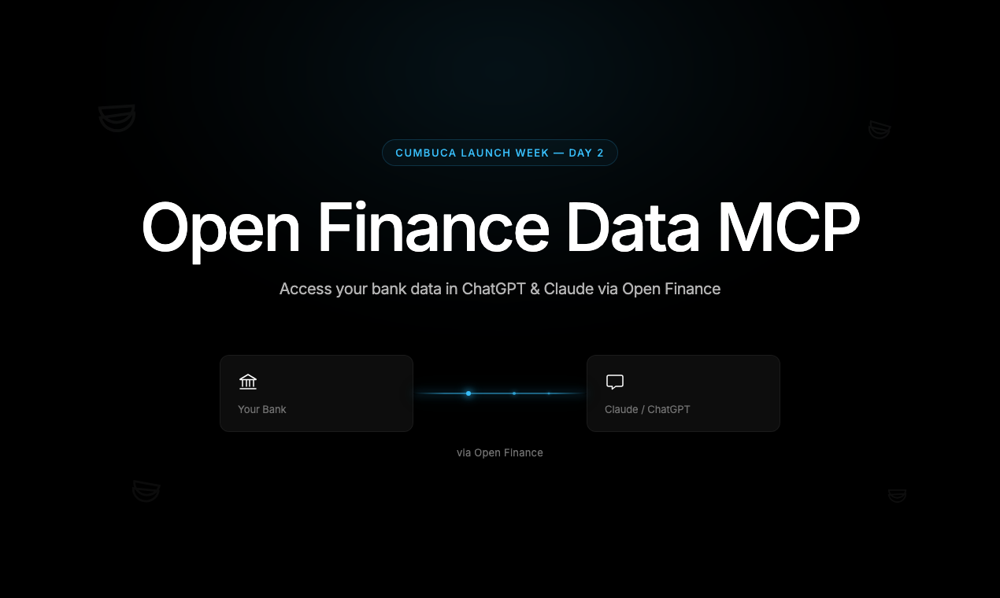
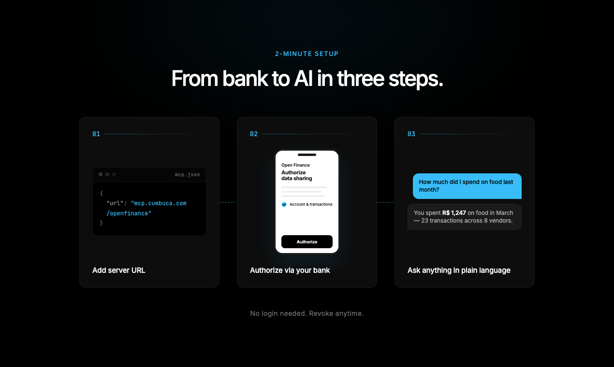
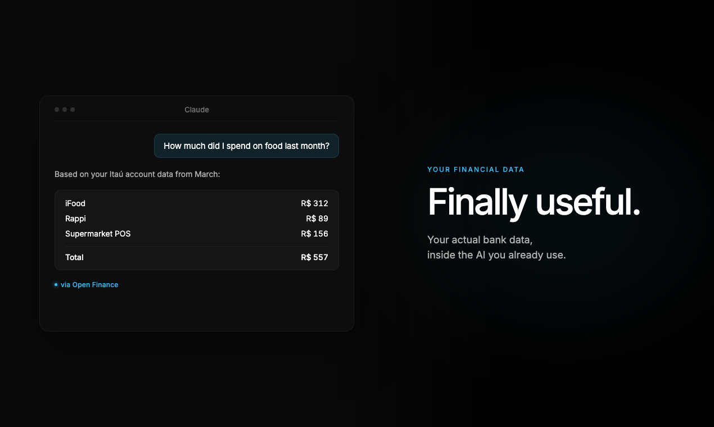

---

## 21. [Knowly 1.0](https://www.producthunt.com/products/knowly-ai)
**Votes**: 85 | **도입 난이도**: 하 | **신뢰도**: 상
**Tagline**: LLM Wiki + NotebookLM, in one closed-loop Proactive AI
**서비스 링크**: https://www.producthunt.com/r/PMMMRYLHJYMNVM

**태그**: AI, Knowledge Management, Learning Tool, Productivity, AI Tool, LLM

### 📌 이 서비스 한눈에 보기
수집한 정보를 자동으로 정리하고 개인 맞춤형 학습 흐름을 제공하는 지능형 AI 위키 및 노트

### 🔑 주요 기능
- 저장된 모든 소스에 대한 자동 조직화 및 이해 구축
- NotebookLM과 Karpathy의 LLM Wiki를 결합한 형태의 폐쇄 루프(Closed-loop) AI
- 사용자 맞춤형 학습 흐름(Learning Flow) 제공

### 🙋 사용자에게 어떤 점이 좋은가
정보를 단순히 저장하는 것을 넘어, AI가 내용을 구조화하고 학습을 가이드해주므로 지식 습득 시간을 획기적으로 단축할 수 있습니다.

### ✅ 지금 바로 써볼 기능
- 학습할 자료(문서, 링크 등)를 Knowly에 저장하기
- AI가 생성한 자동 정리 및 요약 내용 확인하기
- 제공되는 개인화된 학습 흐름 따라가기

### ⚠️ 사용 전 확인할 점
- 자동 정리 과정에서 정보의 맥락이 왜곡될 가능성 확인 필요
- 개인 학습 데이터가 AI 모델 학습에 어떻게 활용되는지 보안 정책 확인 필요

### 🧭 확인이 더 필요한 정보
현재 제품 설명만으로는 지원하는 파일 형식이나 외부 서비스와의 연동 범위를 알 수 없습니다.

### 📸 스크린샷 및 갤러리
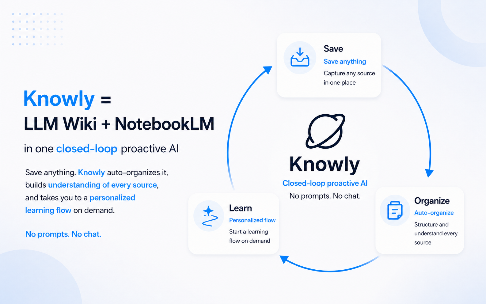
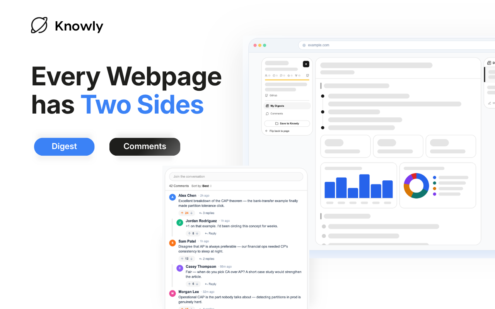
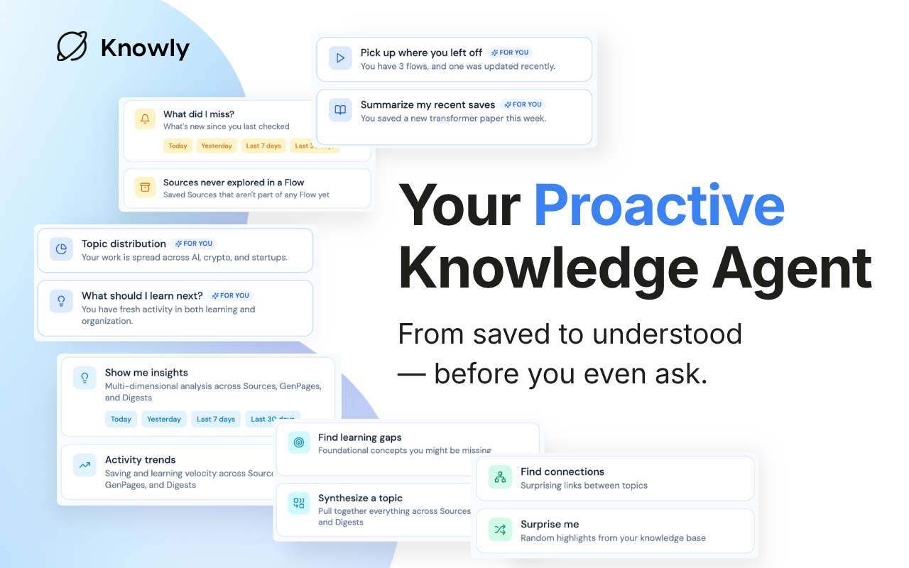

### 🎬 관련 영상
- [🎥 영상 보기](https://ph-files.imgix.net/b2fb50dc-49ae-46ae-9c1a-4eb9dee8a7d0.jpeg?auto=format)

---

## 22. [Ajelix AI Agent for Work](https://www.producthunt.com/products/ajelix-ai-excel-tools)
**Votes**: 84 | **도입 난이도**: 하 | **신뢰도**: 상
**Tagline**: The first truly agentic AI sidebar for Google Workspace™
**서비스 링크**: https://www.producthunt.com/r/27HRI2UZJ5PWXZ

**태그**: Productivity, Automation, GoogleWorkspace, AI-Agent, Agent, AI Tool, Design

### 📌 이 서비스 한눈에 보기
구글 워크스페이스 내에서 직접 업무를 수행하는 에이전트형 AI 사이드바

### 🔑 주요 기능
- Google Sheets, Docs, Slides, Forms 내에서 직접 작동하는 AI 에이전트
- 웹 리서치, 앱스 스크립트 작성/실행, 데이터 시각화 등 복합 작업 수행
- 단순 초안 작성을 넘어 결과물을 완성하는 에이전트 방식의 워크플로우

### 🙋 사용자에게 어떤 점이 좋은가
별도의 창 이동 없이 구글 문서 도구 안에서 데이터 분석부터 프레젠테이션 제작까지 자동화하여 업무 생산성을 극대화할 수 있습니다.

### ✅ 지금 바로 써볼 기능
- 데이터 분석 및 차트 자동 생성 기능 테스트
- Google Apps Script 자동 작성 및 실행 기능 활용
- 문서 초안 작성 및 프레젠테이션 디자인 자동화

### ⚠️ 사용 전 확인할 점
- 에이전트가 생성한 스크립트나 데이터 결과물의 정확성 검토 필요
- 구글 워크스페이스 계정 권한 및 보안 정책 확인 필요

### 🧭 확인이 더 필요한 정보
에이전트가 수행하는 작업의 복잡도에 따른 비용 체계나 사용량 제한에 대한 정보가 명시되지 않았습니다.

### 📸 스크린샷 및 갤러리
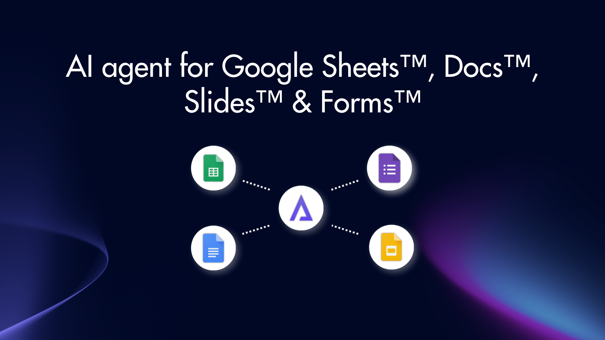
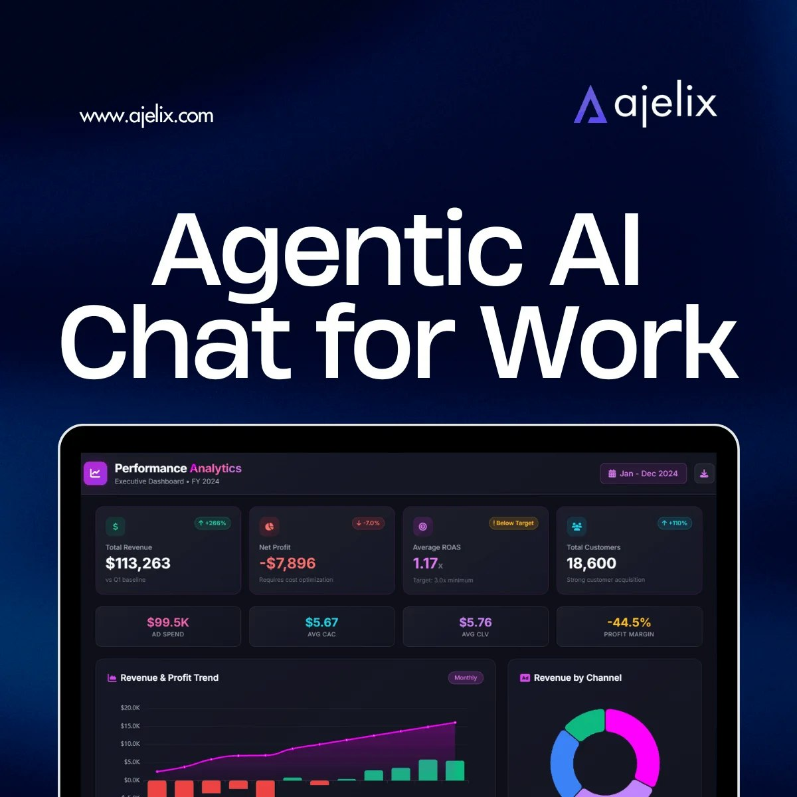
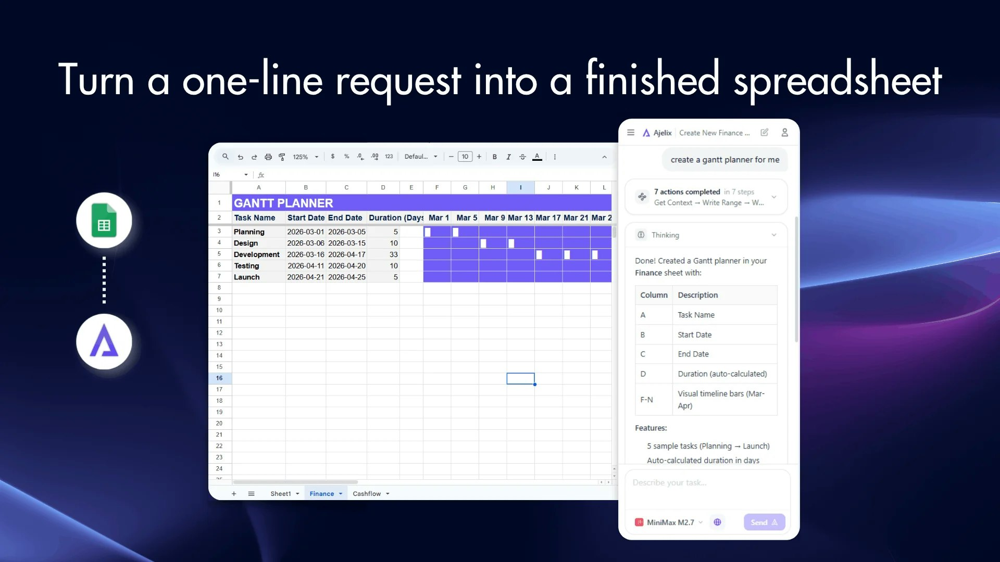

### 🎬 관련 영상
- [🎥 영상 보기](https://ph-files.imgix.net/0a4bab88-727f-4242-89ee-1397beeec041.jpeg?auto=format)

---

## 23. [Pattern.io](https://www.producthunt.com/products/pattern-io)
**Votes**: 36 | **도입 난이도**: 하 | **신뢰도**: 상
**Tagline**: Your personal AI content strategist for short-form video
**서비스 링크**: https://www.producthunt.com/r/J4L32UVNRZ7KYU

**태그**: AI, ContentCreation, ShortForm, Analytics, AI Tool, Video

### 📌 이 서비스 한눈에 보기
숏폼 크리에이터를 위한 맞춤형 AI 콘텐츠 전략가

### 🔑 주요 기능
- 크리에이터 개인의 정체성을 학습하는 맞춤형 AI 모델
- 다각도 영상 분석을 통한 심층적인 데이터 제공
- 개인화된 분석 결과 및 새로운 콘텐츠 아이디어 제안

### 🙋 사용자에게 어떤 점이 좋은가
단순한 데이터 통계를 넘어, 크리에이터의 개성을 반영한 구체적인 콘텐츠 방향성을 제시해 줍니다.

### ✅ 지금 바로 써볼 기능
- 기존 영상 업로드 및 분석 기능 테스트
- AI가 제안하는 새로운 콘텐츠 아이디어 확인
- 개인화된 전략 리포트 검토

### ⚠️ 사용 전 확인할 점
- 분석 결과가 실제 영상 제작 시 창의성을 제한할 가능성
- 데이터 분석의 정확도가 크리에이터의 주관적 판단과 다를 수 있음

### 🧭 확인이 더 필요한 정보
지원하는 영상 플랫폼의 종류와 데이터 연동 방식에 대한 구체적인 정보가 필요합니다.

### 📸 스크린샷 및 갤러리
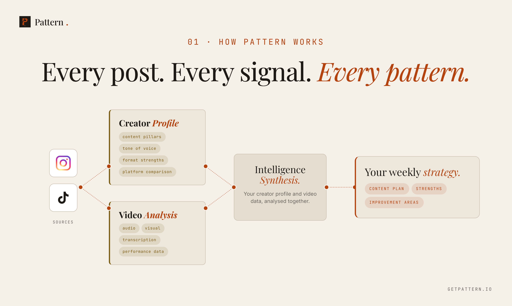
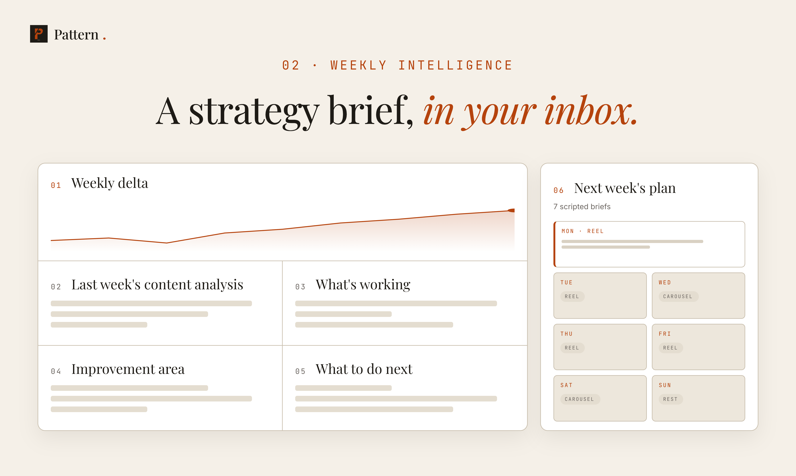
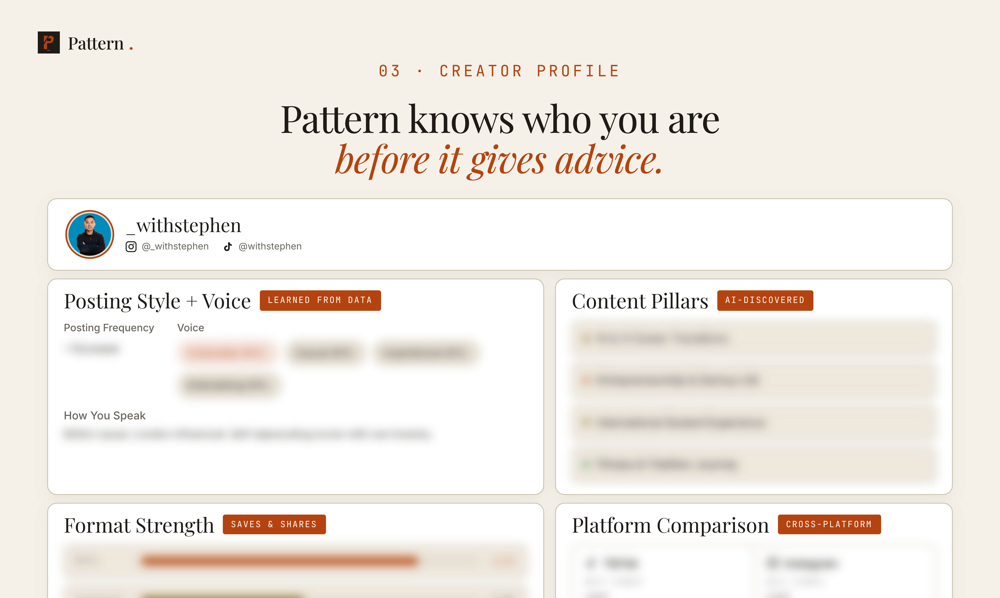

### 🎬 관련 영상
- [🎥 영상 보기](https://ph-files.imgix.net/8889a07e-eed5-42a6-9893-72a6c215912f.jpeg?auto=format)

---

## 24. [Threelane](https://www.producthunt.com/products/threelane)
**Votes**: 32 | **도입 난이도**: 하 | **신뢰도**: 상
**Tagline**: Open-source screen + multi-cam recorder & editor
**서비스 링크**: https://www.producthunt.com/r/WMWNS6JYDKCBIN

**태그**: OpenSource, VideoEditor, ScreenRecorder, ProductDemo, AI Tool

### 📌 이 서비스 한눈에 보기
멀티캠 녹화와 편집을 간편하게 해결하는 오픈소스 로컬 영상 편집 도구

### 🔑 주요 기능
- 화면, 웹캠, 스마트폰을 활용한 멀티캠 녹화 지원
- 커서 추적 줌 레인 및 자동 트리밍 기능이 포함된 멀티트랙 편집기
- 클라우드나 계정 없이 로컬에서 실행되는 완전 무료 오픈소스 소프트웨어

### 🙋 사용자에게 어떤 점이 좋은가
유료 툴 없이도 고품질의 데모 영상을 만들 수 있으며, 개인정보 유출 걱정 없이 로컬 환경에서 안전하게 작업할 수 있습니다.

### ✅ 지금 바로 써볼 기능
- 스마트폰을 보조 카메라로 연결하여 멀티캠 환경 구축하기
- 커서 추적 줌 레인 기능을 활용해 역동적인 데모 영상 만들기
- 다양한 레이아웃(세로/가로/정사각형) 설정으로 플랫폼별 영상 제작하기

### ⚠️ 사용 전 확인할 점
- 로컬 실행 방식이므로 하드웨어 사양에 따라 편집 성능이 좌우될 수 있음
- 클라우드 기반 툴에 비해 협업 기능이나 자동 동기화 기능이 제한적일 수 있음

### 🧭 확인이 더 필요한 정보
사용자의 하드웨어 사양에 따른 최적의 녹화/편집 퍼포먼스 확인이 필요합니다.

### 📸 스크린샷 및 갤러리
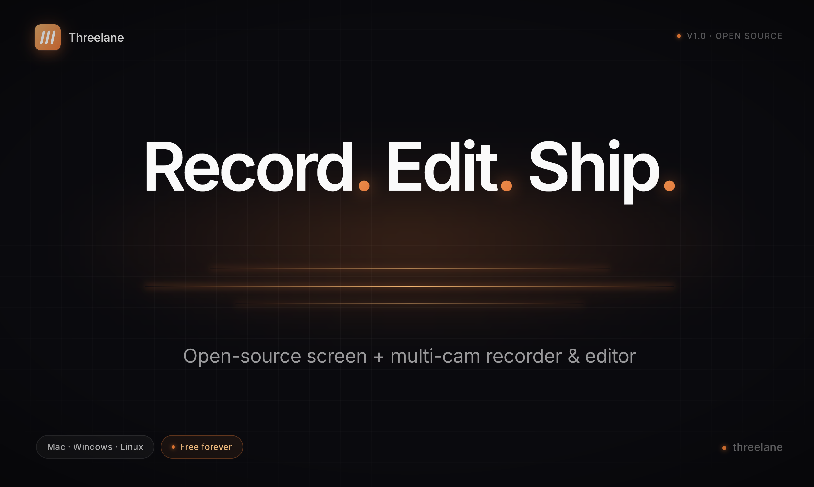
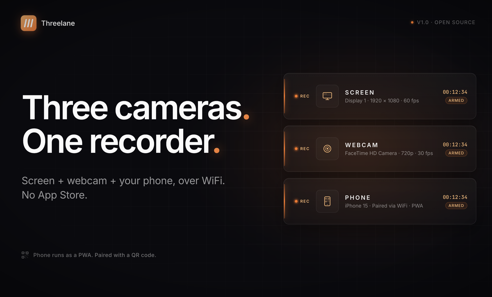
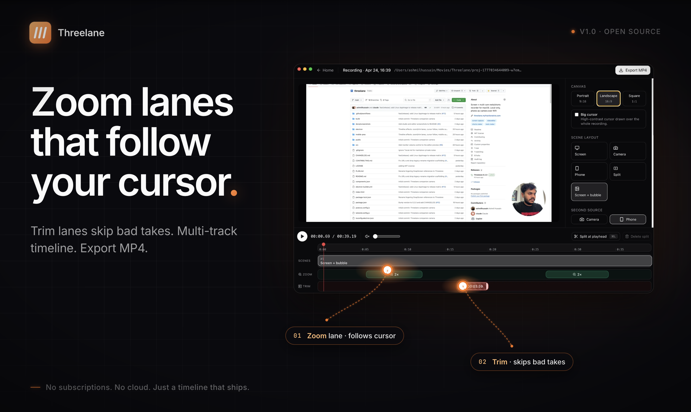

### 🎬 관련 영상
- [🎥 영상 보기](https://ph-files.imgix.net/df888d83-1aed-49ba-8156-23bf071028ae.jpeg?auto=format)

---

## 25. [TogetherLetters](https://www.producthunt.com/products/togetherletters)
**Votes**: 29 | **도입 난이도**: 하 | **신뢰도**: 상
**Tagline**: Updates without social media.
**서비스 링크**: https://www.producthunt.com/r/5HKAARYLFOLJPI

**태그**: Productivity, Communication, Privacy, Newsletter, AI Tool, API, Email

### 📌 이 서비스 한눈에 보기
소셜 미디어의 알고리즘 없이 이메일 뉴스레터로 그룹의 소식을 정기적으로 공유하는 프라이빗 커뮤니케이션 도구

### 🔑 주요 기능
- 정해진 일정에 맞춰 그룹 구성원들에게 업데이트를 요청하는 자동 알림 기능
- 개별 업데이트가 하나의 뉴스레터로 취합되어 전달되는 간결한 구조
- 검색 엔진 노출이나 피드 없이 이메일 기반의 완전한 프라이빗 환경 제공

### 🙋 사용자에게 어떤 점이 좋은가
소셜 미디어의 피로감에서 벗어나, 소규모 그룹이 꼭 필요한 소식만을 정기적이고 프라이빗하게 주고받을 수 있습니다.

### ✅ 지금 바로 써볼 기능
- 10인 이하 소규모 그룹을 위한 무료 플랜 활용하기
- 정기적인 업데이트를 위한 스케줄 설정하기
- 뉴스레터 내 개별 링크를 통한 1:1 대화 시도하기

### ⚠️ 사용 전 확인할 점
- 10명 초과 그룹의 경우 유료 전환 여부 및 비용 확인 필요
- 이메일 기반이므로 실시간 채팅과 같은 즉각적인 상호작용에는 한계가 있음

### 🧭 확인이 더 필요한 정보
10명 초과 그룹을 위한 구체적인 가격 정책과 기능 제한 범위가 명시되지 않았습니다.

### 📸 스크린샷 및 갤러리
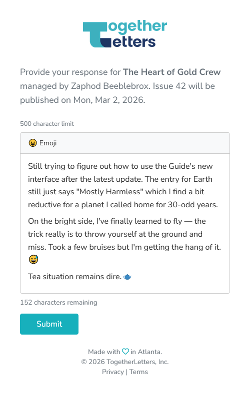
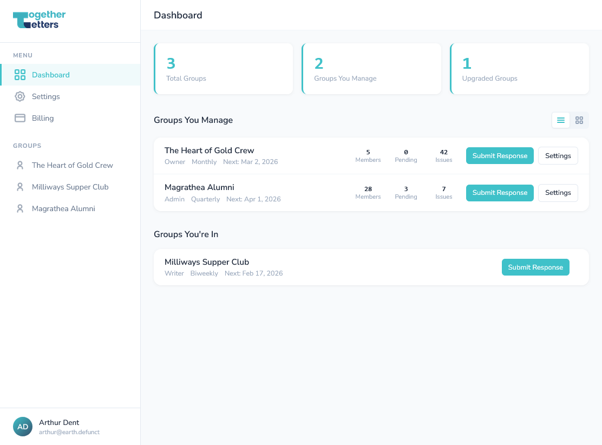
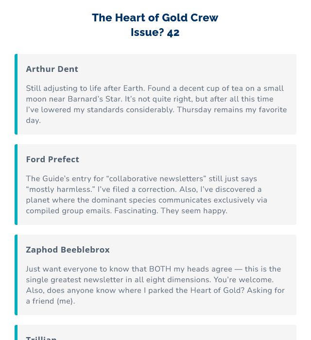

---

## 26. [Kaneo](https://www.producthunt.com/products/kaneo)
**Votes**: 23 | **도입 난이도**: 중 | **신뢰도**: 상
**Tagline**: All you need. Nothing you don't.
**서비스 링크**: https://www.producthunt.com/r/TNPQYRUYNVH4HY

**태그**: ProjectManagement, OpenSource, DevOps, Minimalism, Agent, Automation, AI Tool

### 📌 이 서비스 한눈에 보기
불필요한 기능을 걷어내고 핵심 작업에만 집중할 수 있는 미니멀리즘 프로젝트 관리 도구

### 🔑 주요 기능
- 보드, 리스트, 간트 차트를 동일한 데이터로 통합 관리
- GitHub/Gitea 연동 및 MCP 서버를 통한 AI 에이전트 지원
- 오픈 소스(MIT 라이선스) 기반의 셀프 호스팅 및 클라우드 선택 가능

### 🙋 사용자에게 어떤 점이 좋은가
복잡한 기능 과잉으로 인한 업무 방해 없이, 팀이 실제 제품 배포와 핵심 업무에만 집중할 수 있는 환경을 제공합니다.

### ✅ 지금 바로 써볼 기능
- 보드/리스트/간트 차트 통합 뷰 확인
- GitHub/Gitea 연동 설정
- MCP 서버를 활용한 AI 에이전트 연동 테스트

### ⚠️ 사용 전 확인할 점
- 기능 최소화 전략으로 인해 복잡한 엔터프라이즈 워크플로우에는 부족할 수 있음
- 셀프 호스팅 시 인프라 관리 책임이 사용자에게 있음

### 🧭 확인이 더 필요한 정보
사용자 규모에 따른 클라우드 버전의 상세 기능 차이와 비용 정책 확인이 필요합니다.

### 📸 스크린샷 및 갤러리
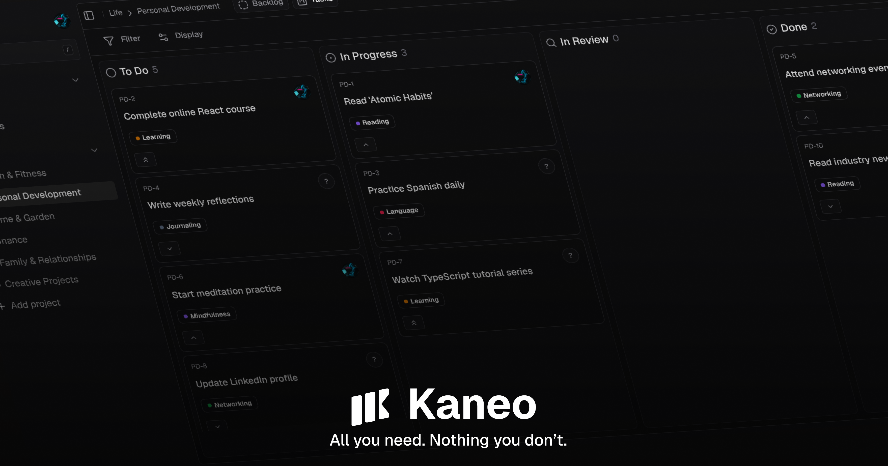
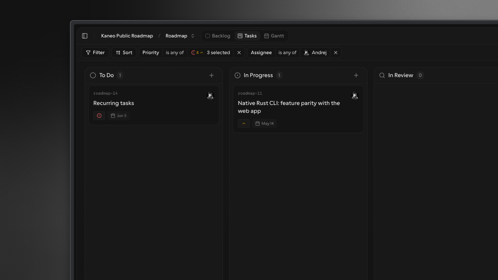
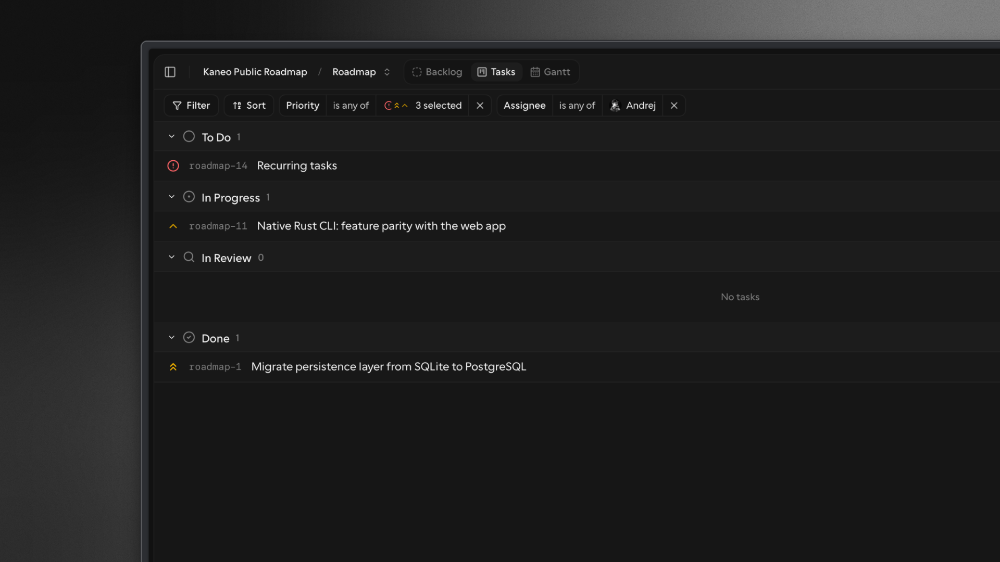

---

## 27. [ToDo Alarm](https://www.producthunt.com/products/todo-alarm)
**Votes**: 16 | **도입 난이도**: 하 | **신뢰도**: 상
**Tagline**: Never miss a critical task 
**서비스 링크**: https://www.producthunt.com/r/RMMXHGOXQCROFM

**태그**: Productivity, Task Management, iOS

### 📌 이 서비스 한눈에 보기
할 일을 놓치지 않도록 강력한 알람으로 깨워주는 스마트 투두 리스트

### 🔑 주요 기능
- 할 일을 알람 기능과 결합하여 실행력 강화
- Apple AlarmKit 기반의 스마트하고 지속적인 알람
- 미루기 방지를 위해 설계된 강력한 알람 시스템

### 🙋 사용자에게 어떤 점이 좋은가
중요한 업무나 일정을 단순히 적어두는 것에 그치지 않고, 알람을 통해 즉각적인 행동을 유도하여 실행력을 높여줍니다.

### ✅ 지금 바로 써볼 기능
- 가장 중요한 아침 루틴 설정하기
- 미루기 어려운 강력한 알람 시간 지정하기
- Apple 기기와의 연동성 확인하기

### ⚠️ 사용 전 확인할 점
- 강력한 알람이 일상생활에 방해가 될 수 있음
- Apple 기기 환경에 특화된 기능일 가능성

### 🧭 확인이 더 필요한 정보
Apple AlarmKit 외에 타 플랫폼(Android 등) 지원 여부는 명시되지 않았습니다.

### 📸 스크린샷 및 갤러리
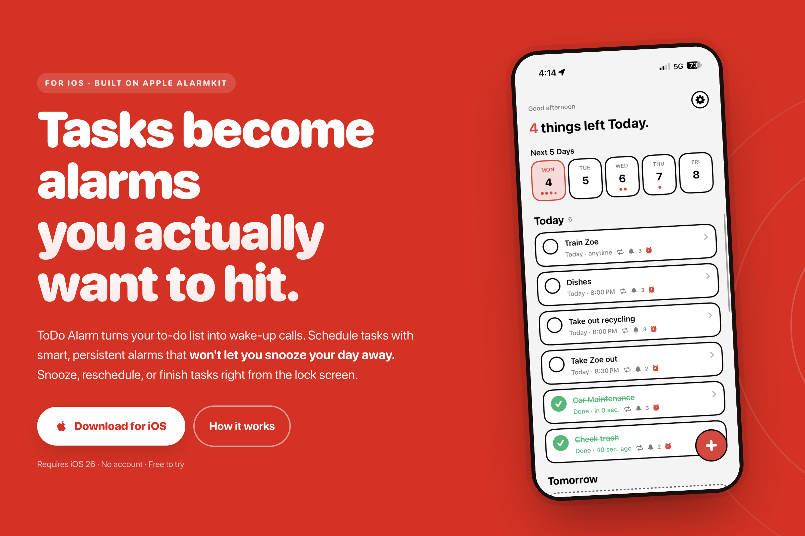
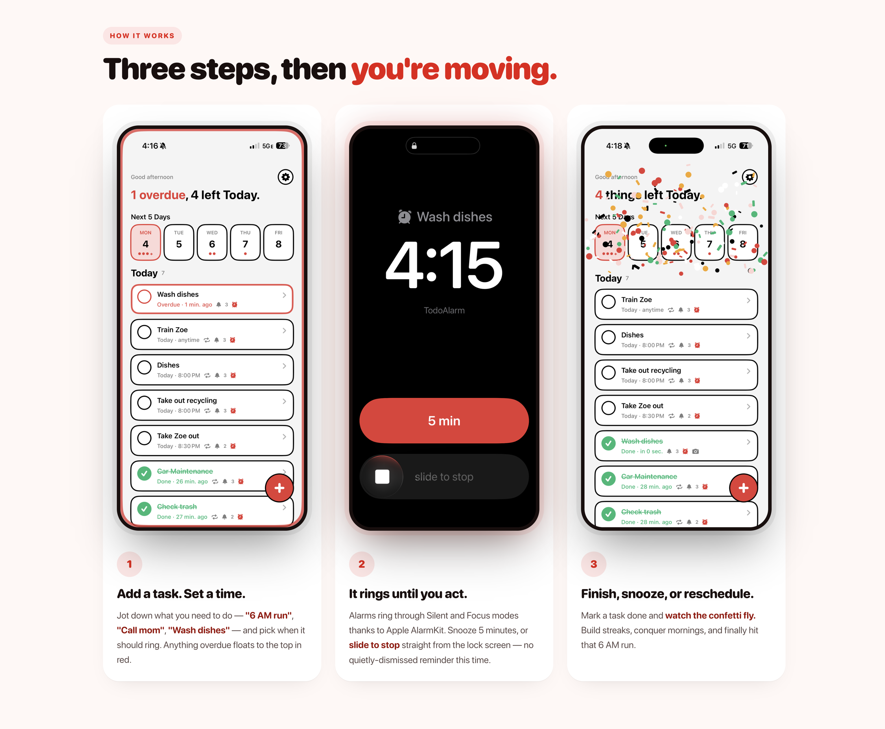
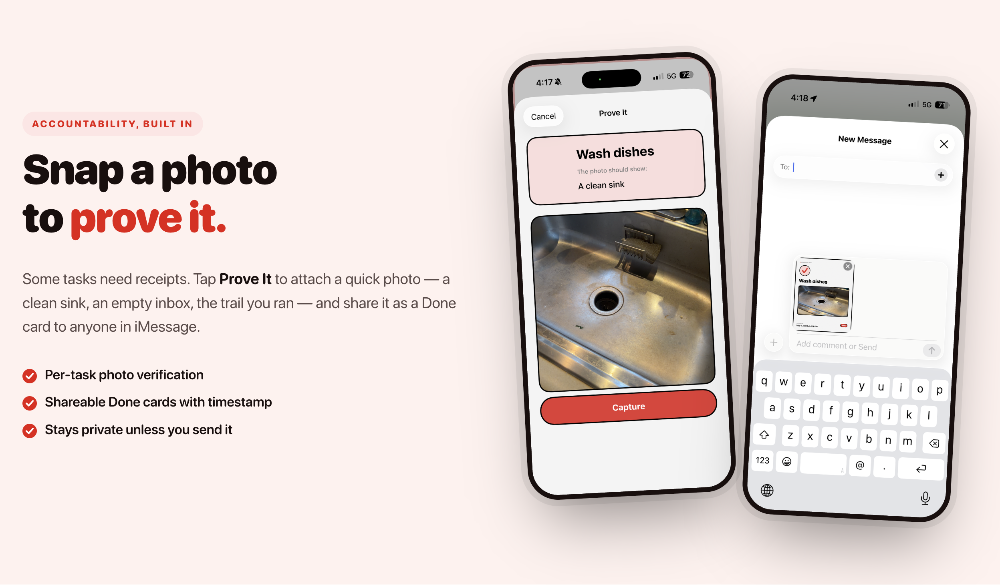

---

## 28. [Impulse AI](https://www.producthunt.com/products/impulse-ai-2)
**Votes**: 16 | **도입 난이도**: 하 | **신뢰도**: 상
**Tagline**: From plain English to deployed ML model in an hour
**서비스 링크**: https://www.producthunt.com/r/2KQHK5FAJ5IBU7

**태그**: MLOps, AutoML, AI-Agent, NoCode, Automation, Agent, AI Tool, Prompting, DevTool, API

### 📌 이 서비스 한눈에 보기
자연어 설명만으로 데이터 준비부터 모델 배포까지 자동 수행하는 AI 머신러닝 엔지니어

### 🔑 주요 기능
- 자연어 기반의 문제 정의 및 데이터 연결 기능
- 데이터 정제, 피처 엔지니어링, 모델 선택, 배포, 모니터링까지 전체 워크플로우 자동화
- Kaggle 상위 2.5% 성적을 기록한 검증된 에이전트 성능

### 🙋 사용자에게 어떤 점이 좋은가
복잡한 설정이나 코딩 없이도 전문적인 머신러닝 모델을 단 한 시간 만에 API 형태로 배포하여 즉시 서비스에 적용할 수 있습니다.

### ✅ 지금 바로 써볼 기능
- 자연어로 예측 문제 정의해보기
- 보유한 데이터셋 연결 및 자동 학습 실행
- 생성된 모델 API 연동 테스트

### ⚠️ 사용 전 확인할 점
- 자동화된 과정에서의 데이터 보안 및 프라이버시 정책 확인 필요
- 복잡한 커스텀 로직이나 특수한 도메인 지식이 필요한 모델의 경우 성능 검증 필요

### 🧭 확인이 더 필요한 정보
데이터 규모에 따른 처리 속도 및 비용 구조에 대한 정보가 명시되지 않았습니다.

### 📸 스크린샷 및 갤러리
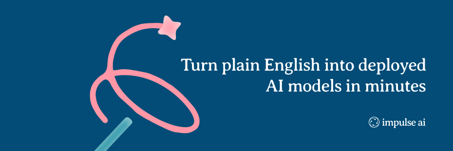

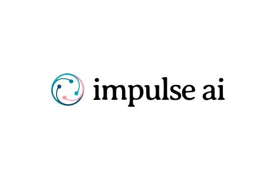

### 🎬 관련 영상
- [🎥 영상 보기](https://ph-files.imgix.net/852abba9-26b1-4a3a-8590-b3a853e7eb41.jpeg?auto=format)

---

## 29. [Clipo AI — One Video, 20 Content Pieces](https://www.producthunt.com/products/clipo-ai-2)
**Votes**: 16 | **도입 난이도**: 하 | **신뢰도**: 상
**Tagline**: One video → clips, carousels, personalized posts, img & more
**서비스 링크**: https://www.producthunt.com/r/X3JSAKMNHBKOFS

**태그**: AI, ContentCreation, Automation, VideoEditing, SocialMedia, AI Tool, Video, Vision

### 📌 이 서비스 한눈에 보기
영상 하나만 업로드하면 20개의 다양한 소셜 콘텐츠로 자동 변환해주는 AI 콘텐츠 제작 도구

### 🔑 주요 기능
- 단일 영상 업로드로 클립, 캐러셀, 포스트 등 20종의 콘텐츠 자동 생성
- 타임라인 없는 문서 편집 방식의 직관적인 영상 편집 인터페이스
- 바이럴 점수 제공 및 키워드/비주얼 검색을 통한 최적의 순간 포착

### 🙋 사용자에게 어떤 점이 좋은가
콘텐츠 재가공에 드는 막대한 시간을 획기적으로 줄여주며, 하나의 소스로 여러 플랫폼에 최적화된 결과물을 즉시 얻을 수 있습니다.

### ✅ 지금 바로 써볼 기능
- 긴 영상 업로드하여 20종 콘텐츠 자동 생성 테스트하기
- AI가 제안하는 바이럴 클립 및 썸네일 확인하기
- 텍스트 기반 편집 기능을 통한 영상 편집 경험해보기

### ⚠️ 사용 전 확인할 점
- AI 생성 콘텐츠의 품질이 사용자의 의도와 일치하는지 검토 필요
- 무료 플랜의 경우 생성 가능한 콘텐츠 수나 기능에 제한이 있을 수 있음

### 🧭 확인이 더 필요한 정보
무료로 시작할 수 있으나, 유료 플랜 전환 시 구체적인 과금 체계와 기능 차이에 대한 확인이 필요합니다.

### 📸 스크린샷 및 갤러리
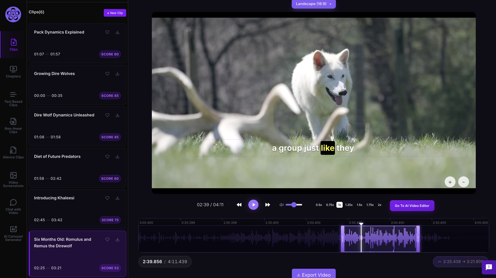
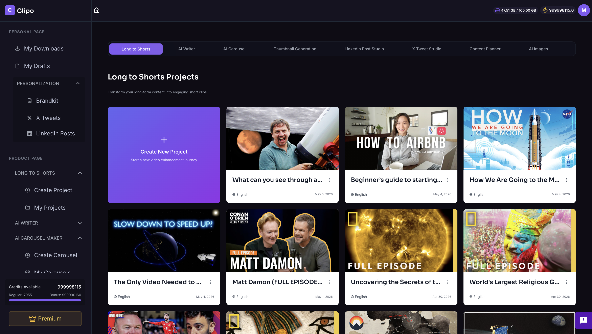
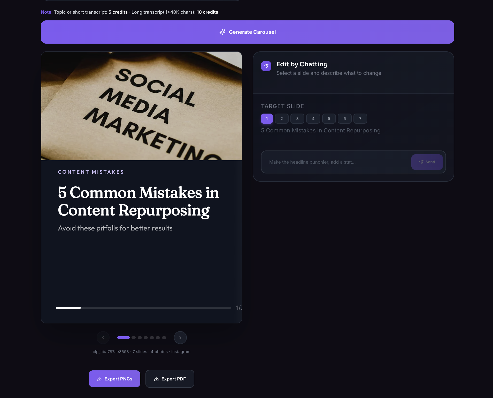

### 🎬 관련 영상
- [🎥 영상 보기](https://ph-files.imgix.net/72062a07-8748-49d7-a662-c07c67b9d70c.jpeg?auto=format)

---

## 30. [Troubleshooting Agent by Pluno](https://www.producthunt.com/products/pluno)
**Votes**: 15 | **도입 난이도**: 중 | **신뢰도**: 상
**Tagline**: Debugs customer issues before engineers do
**서비스 링크**: https://www.producthunt.com/r/H432RAYZXNRO7J

**태그**: DevTool, AI, Automation, CustomerSupport, Debugging, Agent

### 📌 이 서비스 한눈에 보기
엔지니어의 개입 없이 고객 이슈의 근본 원인을 자동으로 분석하고 해결책을 제안하는 AI 트러블슈팅 에이전트

### 🔑 주요 기능
- 코드베이스, DB, Sentry, 로그 등 3,000개 이상의 도구와 연동하여 엔드 투 엔드 추적
- 복잡한 고객 이슈의 근본 원인 파악 및 증거 수집 자동화
- 엔지니어가 직접 디버깅하는 대신 제안된 해결책을 검토하는 워크플로우 제공

### 🙋 사용자에게 어떤 점이 좋은가
개발자가 단순 이슈 조사에 쏟는 시간을 획기적으로 줄여 제품 개발에 집중할 수 있게 합니다.

### ✅ 지금 바로 써볼 기능
- 기존 사용 중인 모니터링 도구(Sentry 등)와의 연동 테스트
- 실제 발생했던 복잡한 고객 이슈를 입력하여 분석 정확도 검증
- 워크플로우 내 에스컬레이션 프로세스 최적화

### ⚠️ 사용 전 확인할 점
- 코드베이스 및 데이터베이스 접근 권한 설정에 따른 보안 검토 필요
- AI가 제안한 해결책의 정확성을 검증하는 엔지니어의 최종 리뷰 필수

### 🧭 확인이 더 필요한 정보
3,000개 이상의 도구 연동 시 데이터 보안 및 프라이버시 정책에 대한 상세 확인이 필요합니다.

### 📸 스크린샷 및 갤러리
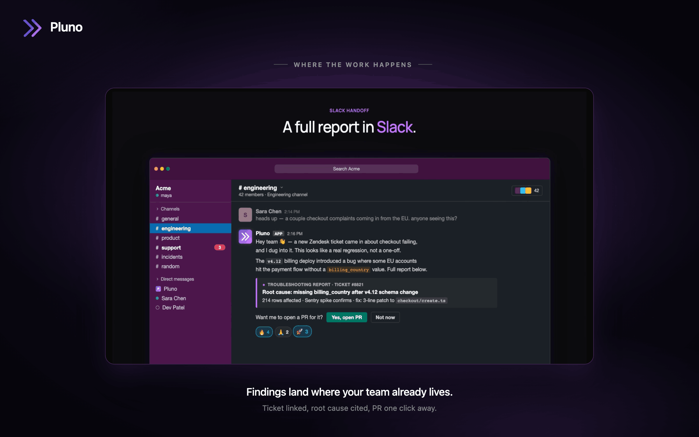
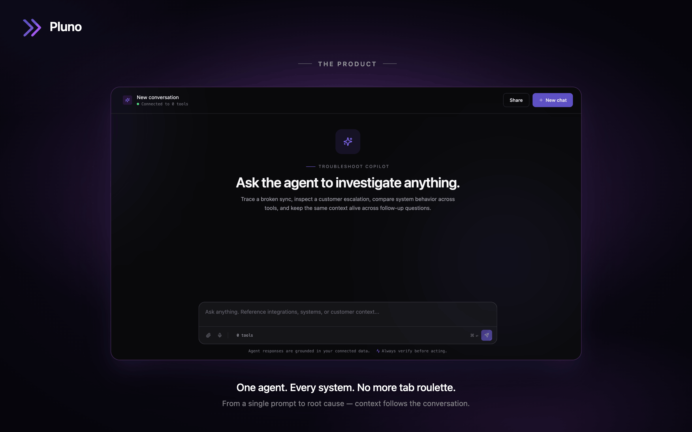
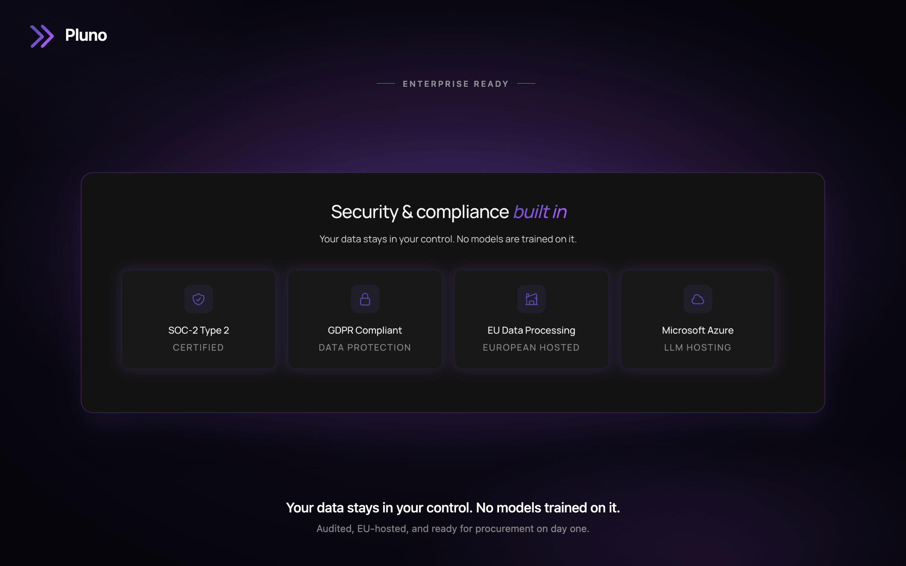

### 🎬 관련 영상
- [🎥 영상 보기](https://ph-files.imgix.net/c5a7f2e0-4dd9-4149-80d7-5a0853814097.jpeg?auto=format)

---

