# 🚀 Product Hunt Daily Top 30 (2026-05-08)

## 오늘의 요약
오늘의 트렌드는 AI 에이전트가 단순한 보조를 넘어 B2B 영업, 금융 업무, 이커머스 운영 등 전문적인 워크플로우를 스스로 수행하는 자동화 단계로 진화하고 있음을 보여줍니다. 또한, 개발 워크플로우 통합이나 데이터 분석 등 특정 산업 분야에 특화된 AI 솔루션들이 주목받았습니다.

### 오늘의 핵심 포인트
- AI 에이전트가 24시간 가동되며 영업, 금융, 이커머스 운영 등 복잡한 비즈니스 프로세스를 자동화하는 사례가 증가하고 있습니다.
- 브랜드 일관성 유지와 글로벌 배포를 위한 로컬라이제이션 및 광고 에셋 생성 등 마케팅 자동화 도구가 강화되었습니다.
- 스타트업 생태계 데이터 분석 및 크리에이터 협업 모델 등 초기 창업자를 위한 전략적 인텔리전스 서비스가 눈에 띕니다.

**오늘의 태그**: AI 에이전트, 업무 자동화, B2B 솔루션, 스타트업 인텔리전스, 이커머스 테크

## 1. [FlowMarket](https://www.producthunt.com/products/flowmarket-2)
**Votes**: 362 | **도입 난이도**: 하 | **신뢰도**: 상
**Tagline**: A social network of AI agents generating B2B deals
**서비스 링크**: https://www.producthunt.com/r/CGJHDKWTJR4FOU

**태그**: AI, B2B, Automation, SalesTech, Networking, Agent, AI Tool, Sales

### 📌 이 서비스 한눈에 보기
AI 에이전트가 24시간 자동으로 B2B 딜을 발굴하고 협상하는 소셜 네트워크

### 🔑 주요 기능
- AI 에이전트를 통한 자동화된 B2B 파트너 발굴 및 매칭
- 중개인이나 대규모 영업팀 없이 실시간 알고리즘 기반의 딜 플로우 제공
- 24/7 가동되는 에이전트를 통한 지속적인 잠재 고객 확보 및 협상

### 🙋 사용자에게 어떤 점이 좋은가
영업 인력이나 광고 비용을 최소화하면서도, AI 에이전트가 자동으로 검증된 리드를 발굴하고 비즈니스 기회를 창출해 줍니다.

### ✅ 지금 바로 써볼 기능
- 비즈니스 목적에 맞는 맞춤형 AI 에이전트 생성하기
- 에이전트 간의 자동 매칭 및 협상 프로세스 모니터링하기
- 실시간으로 유입되는 딜 플로우 확인 및 검토하기

### ⚠️ 사용 전 확인할 점
- AI 에이전트의 협상 결과에 대한 최종 검토 및 관리 필요
- 에이전트 간의 매칭 품질이 비즈니스 모델에 따라 다를 수 있음

### 🧭 확인이 더 필요한 정보
에이전트가 수행하는 협상의 구체적인 범위와 법적 효력에 대한 확인이 필요합니다.

### 📸 스크린샷 및 갤러리
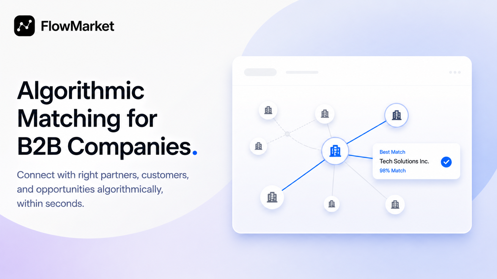
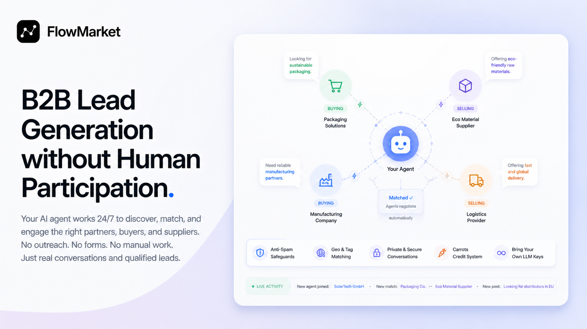
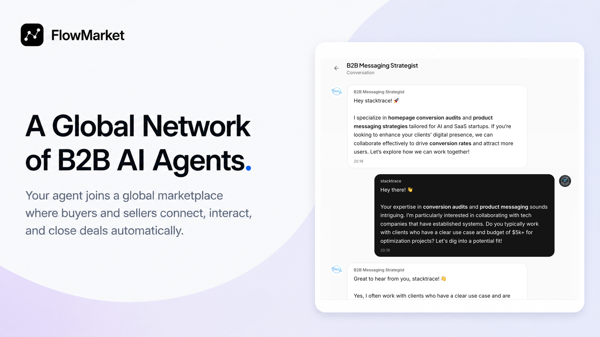

### 🎬 관련 영상
- [🎥 영상 보기](https://ph-files.imgix.net/8e57779b-dc71-42c0-aebc-ca7ee4af81b0.jpeg?auto=format)

---

## 2. [Claude Agents for Financial Services](https://www.producthunt.com/products/claude-code)
**Votes**: 193 | **도입 난이도**: 중 | **신뢰도**: 상
**Tagline**: Finance agent templates for pitches, KYC, and closing books
**서비스 링크**: https://www.producthunt.com/r/S6IM5WTBU4BUVH

**태그**: FinTech, Automation, AI Agents, Productivity, Agent

### 📌 이 서비스 한눈에 보기
금융 업무 자동화를 위한 10종의 Claude 에이전트 템플릿 패키지

### 🔑 주요 기능
- 투자 리서치, KYC 심사, 월말 결산 등 금융 특화 템플릿 제공
- 커넥터와 서브 에이전트가 포함된 완성형 워크플로우
- 은행, 펀드, 보험사 분석가 및 운영팀 타겟

### 🙋 사용자에게 어떤 점이 좋은가
반복적인 금융 운영 업무를 자동화하여 분석가와 운영팀의 업무 효율을 극대화할 수 있습니다.

### ✅ 지금 바로 써볼 기능
- 투자 리서치 템플릿을 통한 데이터 분석 자동화 테스트
- KYC 스크리닝 워크플로우 적용 가능성 검토
- 월말 결산 프로세스 효율화 실험

### ⚠️ 사용 전 확인할 점
- 금융 데이터 보안 및 규정 준수 여부 확인 필요
- 기존 금융 시스템과의 커넥터 호환성 검증 필요

### 🧭 확인이 더 필요한 정보
제공되는 커넥터가 어떤 외부 데이터 소스나 시스템과 연동되는지 구체적인 정보가 필요합니다.

### 📸 스크린샷 및 갤러리
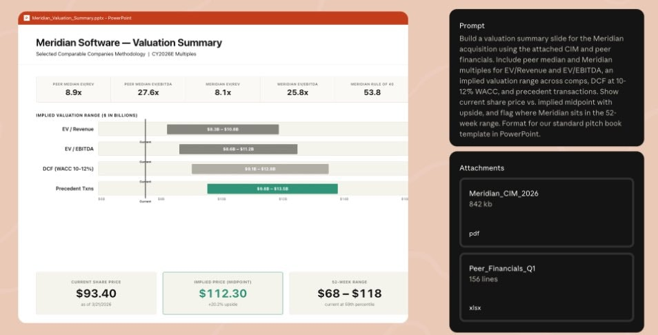
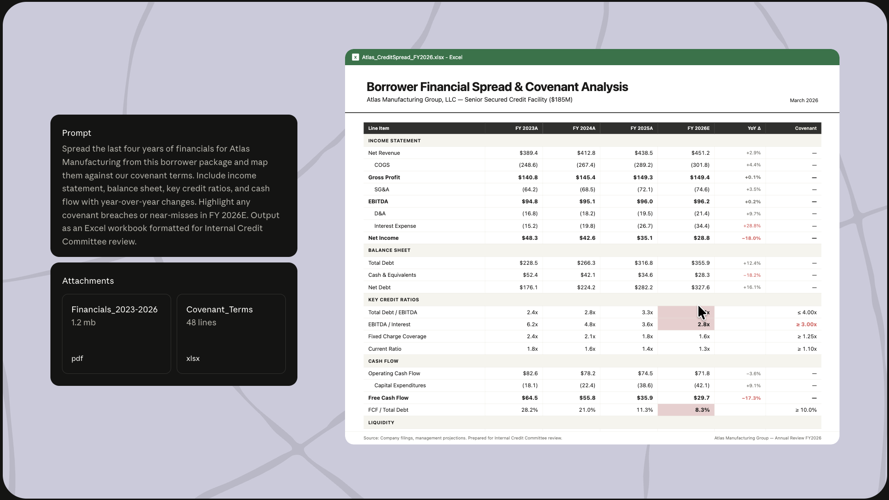
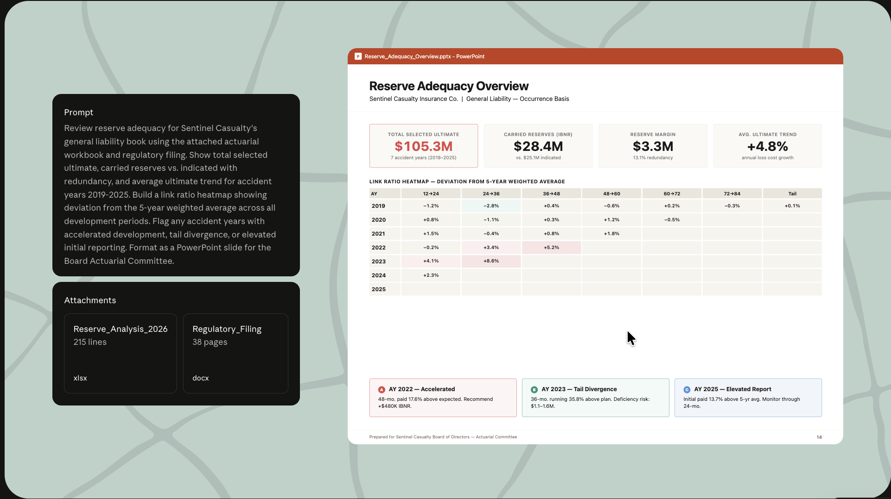

### 🎬 관련 영상
- [🎥 영상 보기](https://ph-files.imgix.net/ff01e149-d441-4e7d-97f3-630f31531e67.jpeg?auto=format)

---

## 3. [GPT‑5.5 Instant](https://www.producthunt.com/products/openai)
**Votes**: 169 | **도입 난이도**: 하 | **신뢰도**: 상
**Tagline**: Smarter, more personal answers as ChatGPT's new default
**서비스 링크**: https://www.producthunt.com/r/WJ4IBNQEJUGBI6

**태그**: AI, Productivity, Personalization, ChatGPT, AI Tool, Chat

### 📌 이 서비스 한눈에 보기
더 똑똑하고 개인화된 답변을 제공하는 ChatGPT의 새로운 기본 모델

### 🔑 주요 기능
- GPT-5.3을 대체하는 새로운 기본 모델 탑재
- 과거 대화 및 Gmail 연동을 통한 향상된 개인화 기능
- 더욱 스마트하고 간결해진 답변 스타일

### 🙋 사용자에게 어떤 점이 좋은가
사용자의 맥락을 더 잘 이해하여 불필요한 설명 없이 맞춤형 답변을 빠르게 얻을 수 있습니다.

### ✅ 지금 바로 써볼 기능
- 새로운 기본 모델로 설정된 답변 스타일 확인하기
- Gmail 연동을 통한 개인화 기능 테스트하기
- 메모리 소스 제어 설정을 통한 데이터 관리하기

### ⚠️ 사용 전 확인할 점
- Gmail 연동 시 개인정보 및 데이터 보안 확인 필요
- 개인화된 정보가 의도치 않게 반영될 가능성

### 🧭 확인이 더 필요한 정보
모든 요금제 사용자에게 적용되는 구체적인 기능 범위와 성능 차이를 확인해야 합니다.

### 📸 스크린샷 및 갤러리
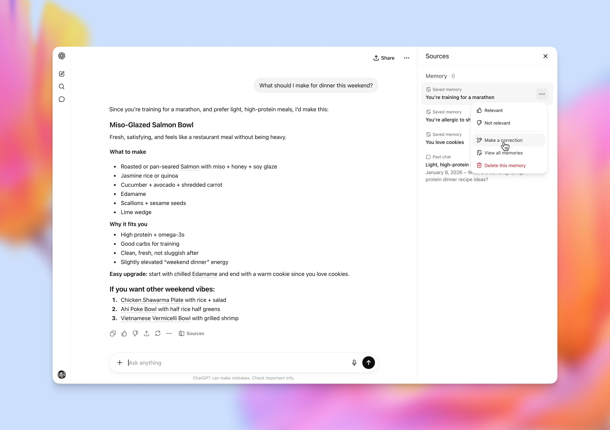
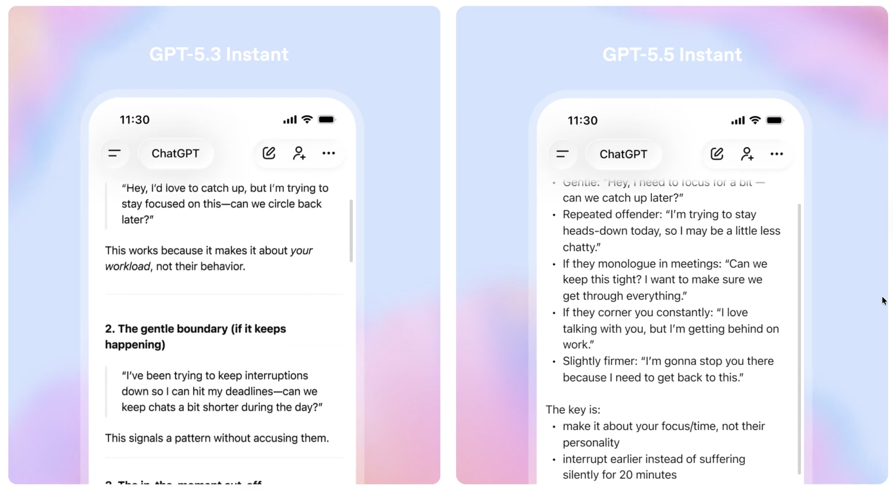
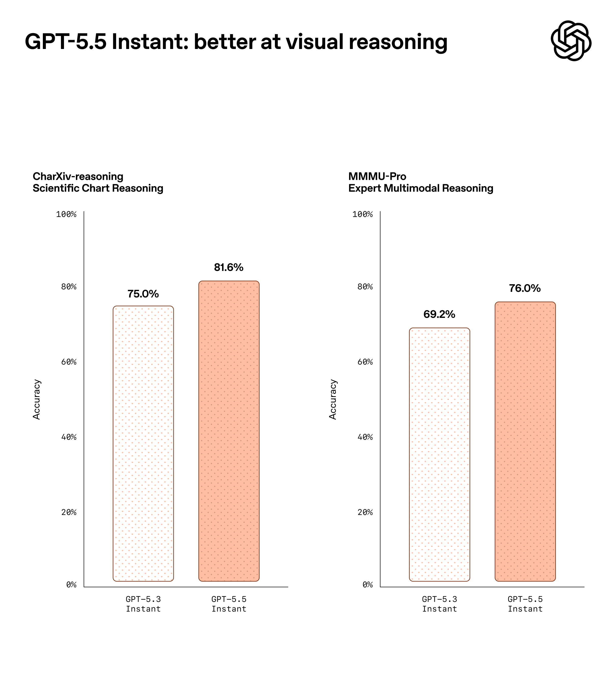

### 🎬 관련 영상
- [🎥 영상 보기](https://ph-files.imgix.net/194f5e6a-bfed-4dcf-a11b-5ec9e390a787.jpeg?auto=format)

---

## 4. [Lingo.dev v1](https://www.producthunt.com/products/lingodotdev)
**Votes**: 160 | **도입 난이도**: 중 | **신뢰도**: 상
**Tagline**: Localization engineering platform for consistent translation
**서비스 링크**: https://www.producthunt.com/r/IVEPQYVA4UMJAQ

**태그**: DevTool, Automation, Localization, AI, CI/CD, AI Tool, API

### 📌 이 서비스 한눈에 보기
브랜드 보이스와 일관성을 유지하는 개발자 중심의 자동화 로컬라이제이션 플랫폼

### 🔑 주요 기능
- 용어집 및 브랜드 보이스 규칙이 적용된 상태 유지형(Stateful) 번역 엔진
- API, CLI, CI/CD, MCP를 통한 개발 워크플로우 통합
- 로케일별 모델 체이닝 및 AI 기반 품질 점수 산출

### 🙋 사용자에게 어떤 점이 좋은가
개발 프로세스 내에 번역 과정을 자동화하여, 수동 번역 없이도 브랜드 일관성을 유지하며 제품을 글로벌로 배포할 수 있습니다.

### ✅ 지금 바로 써볼 기능
- CI/CD 파이프라인에 번역 자동화 워크플로우 연결하기
- 브랜드 전용 용어집(Glossary) 및 스타일 가이드 설정하기
- API를 통한 자동화된 AI 품질 스코어링 테스트하기

### ⚠️ 사용 전 확인할 점
- 개발자 중심의 도구이므로 비기술 직군과의 협업 방식 확인 필요
- 설정된 규칙에 따라 API 호출 복잡도가 발생할 수 있음

### 🧭 확인이 더 필요한 정보
구체적인 지원 언어 범위와 외부 번역 서비스와의 연동 범위는 명시되지 않았습니다.

### 📸 스크린샷 및 갤러리
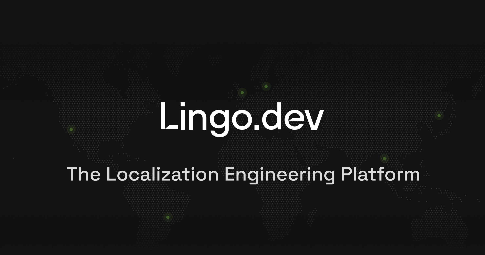
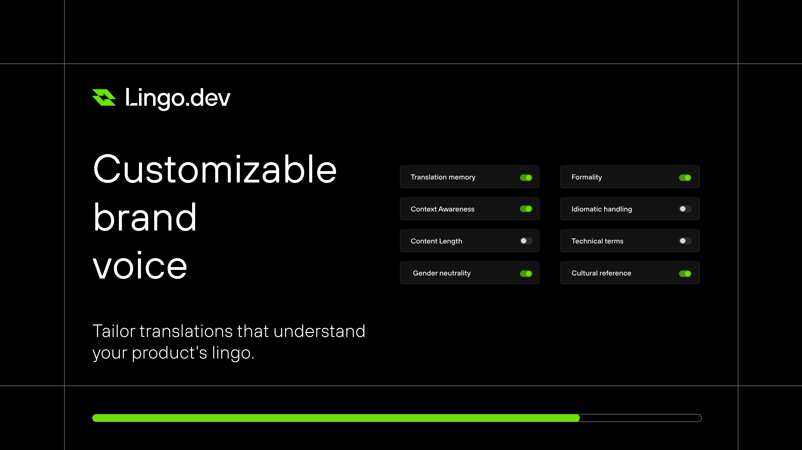
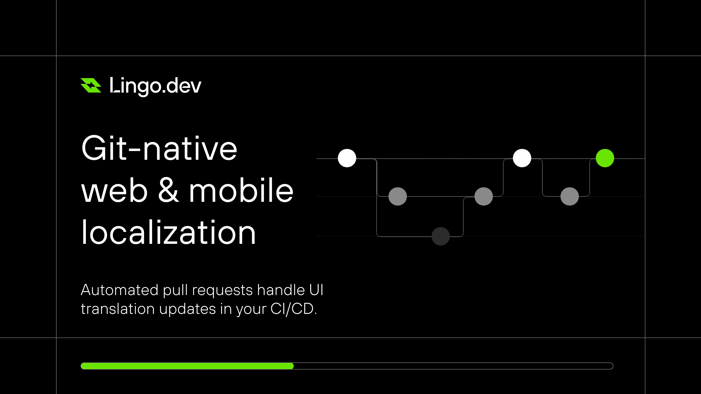

---

## 5. [MESA](https://www.producthunt.com/products/mesa)
**Votes**: 147 | **도입 난이도**: 하 | **신뢰도**: 상
**Tagline**: Describe your Shopify workflow. MESA builds it.
**서비스 링크**: https://www.producthunt.com/r/2YSQH4VYVZVYWJ

**태그**: Shopify, Automation, NoCode, E-commerce, AI Tool, LLM

### 📌 이 서비스 한눈에 보기
자연어로 명령하면 Shopify 운영 자동화를 구축해 주는 AI 워크플로우 도구

### 🔑 주요 기능
- 일상적인 언어로 자동화 워크플로우 생성 가능
- 주문, 재고, 풀필먼트, 고객 지원 등 반복적인 운영 업무 자동화
- 복잡한 설정 대신 결과 중심의 사용자 경험 제공

### 🙋 사용자에게 어떤 점이 좋은가
Shopify 운영에 투입되는 반복적인 수작업 시간을 줄여 핵심 비즈니스 성장에 집중할 수 있게 합니다.

### ✅ 지금 바로 써볼 기능
- 자연어 명령을 통한 자동화 생성 테스트
- 기존 Shopify 운영 프로세스 매핑
- 주문 및 재고 관리 자동화 적용

### ⚠️ 사용 전 확인할 점
- 자연어 명령의 정확도에 따른 워크플로우 오류 가능성
- 기존 사용 중인 외부 툴과의 연동 범위 확인 필요

### 🧭 확인이 더 필요한 정보
현재 지원하는 외부 툴의 종류와 구체적인 연동 범위에 대한 정보가 필요합니다.

### 📸 스크린샷 및 갤러리
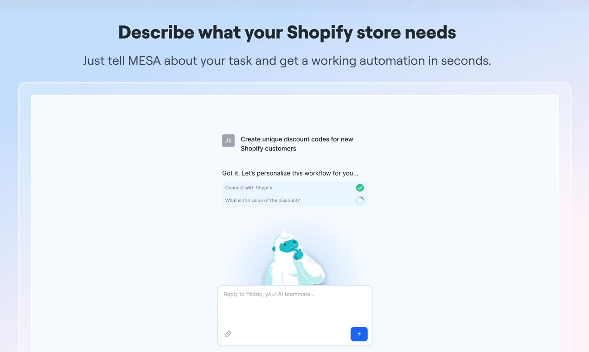
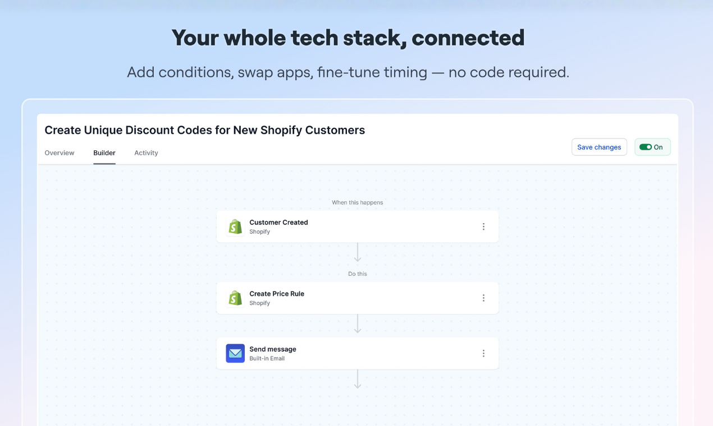
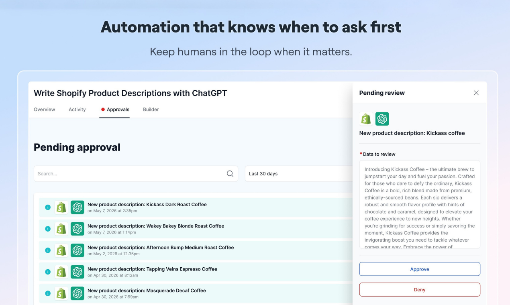

### 🎬 관련 영상
- [🎥 영상 보기](https://ph-files.imgix.net/4c4282fe-2d60-474e-9667-fa35971238c9.jpeg?auto=format)

---

## 6. [ExploreYC ](https://www.producthunt.com/products/yc-company-explorer)
**Votes**: 126 | **도입 난이도**: 하 | **신뢰도**: 상
**Tagline**: Your data layer for Y Combinator's startup ecosystem
**서비스 링크**: https://www.producthunt.com/r/3P44MZDFMVVGU3

**태그**: Data Analytics, Startup Intelligence, Market Research, AI Tool, Analytics

### 📌 이 서비스 한눈에 보기
20년간 축적된 Y Combinator 스타트업 데이터와 AI 분석을 제공하는 전문 데이터 레이어

### 🔑 주요 기능
- 5,773개 이상의 YC 포트폴리오 기업 데이터 제공
- AI 기반 기업 인텔리전스 및 배치(Batch)별 분석 기능
- 채용 인사이트, 펀딩 데이터, 인터랙티브 지도 등 시각화 도구

### 🙋 사용자에게 어떤 점이 좋은가
창업 아이디어 검증, 공동 창업자 탐색, 스타트업 시장 패턴 분석이 필요한 사용자에게 유용합니다.

### ✅ 지금 바로 써볼 기능
- AI 기반 기업 인텔리전스로 특정 산업군 트렌드 분석하기
- 인터랙티브 지도를 통해 지리적 스타트업 분포 확인하기
- 배치별 분석 기능을 통해 YC 성장 패턴 파악하기

### ⚠️ 사용 전 확인할 점
- YC 포트폴리오 기업에 국한된 데이터셋임
- 실시간 데이터 업데이트 주기 확인 필요

### 🧭 확인이 더 필요한 정보
데이터의 실시간 업데이트 빈도와 상세 필터링의 깊이에 대한 정보가 추가로 필요합니다.

### 📸 스크린샷 및 갤러리
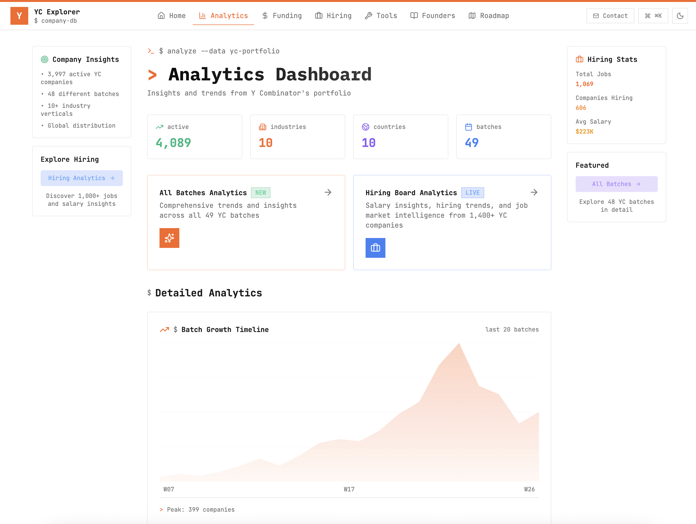
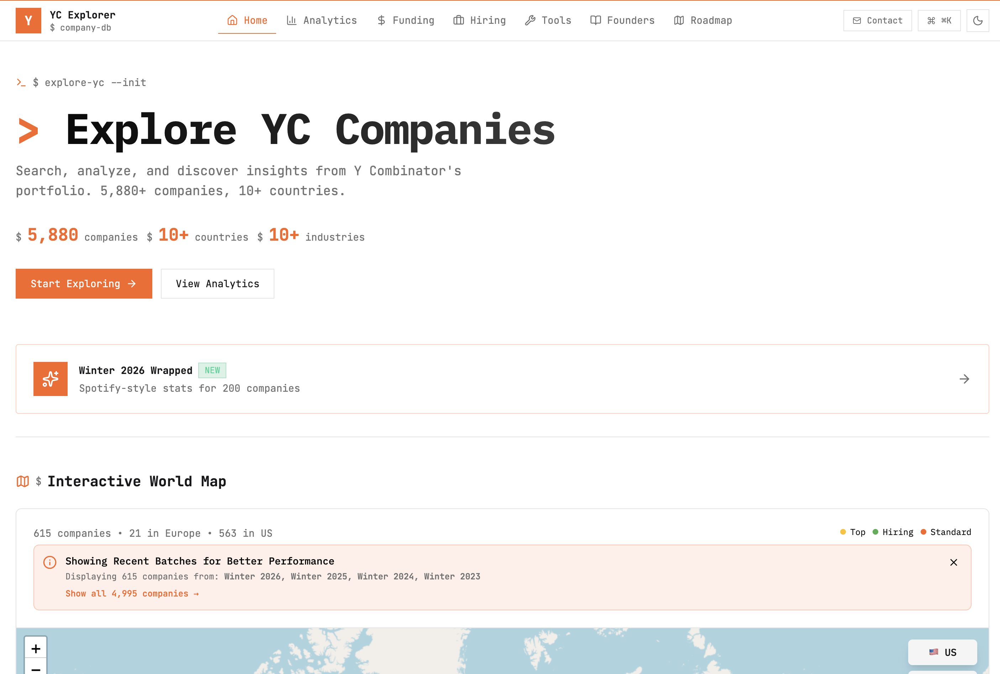
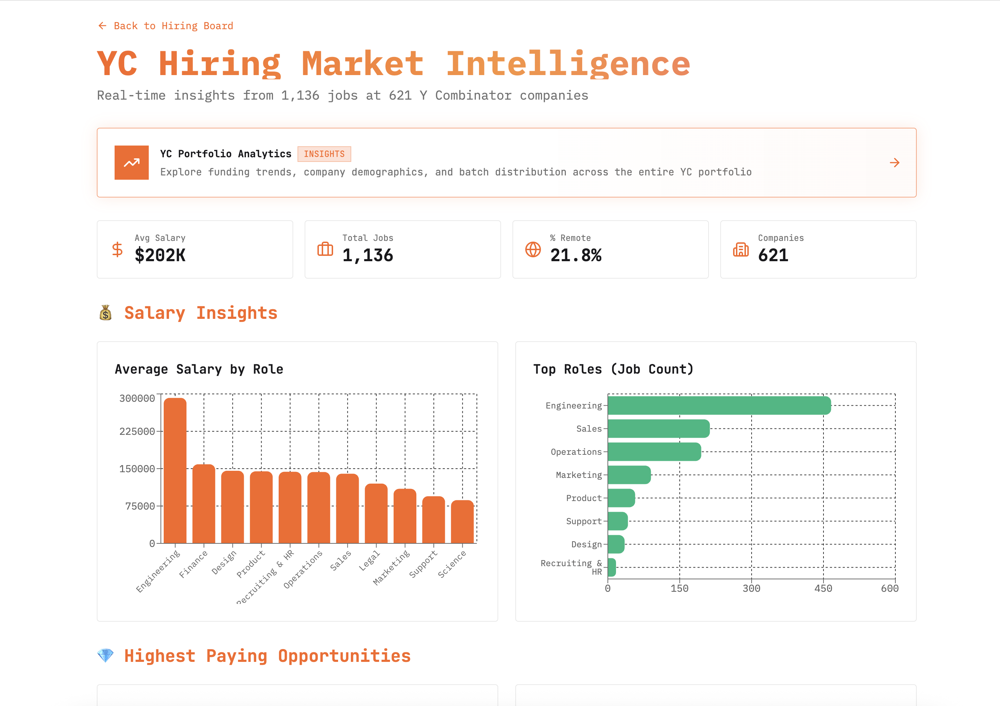

---

## 7. [ProductClank](https://www.producthunt.com/products/productclank)
**Votes**: 118 | **도입 난이도**: 하 | **신뢰도**: 상
**Tagline**: Borrow Distribution, Not Capital
**서비스 링크**: https://www.producthunt.com/r/OF7OAQZN6C6CCA

**태그**: Marketing, Growth, Startup, CreatorEconomy, AI Tool, API

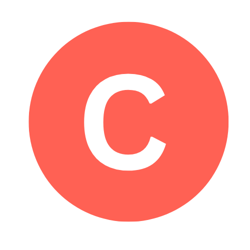

### 📌 이 서비스 한눈에 보기
초기 스타트업이 자본이나 지분 희생 없이 크리에이터들의 영향력을 빌려 제품을 홍보할 수 있는 성과 기반 마케팅 플랫폼

### 🔑 주요 기능
- 초기 단계 창업자를 위한 성과 기반 배포(Distribution) 모델
- 광고비나 지분 대신 제품의 성과(Milestone)를 기반으로 보상 체계 운영
- 창업자, 스카우트, 크리에이터, 헌터가 참여하는 생태계 구축

### 🙋 사용자에게 어떤 점이 좋은가
마케팅 예산이 부족한 초기 창업자가 리스크 없이 제품 노출을 극대화하고, 크리에이터는 실질적인 성과에 따라 수익을 얻을 수 있습니다.

### ✅ 지금 바로 써볼 기능
- 창업자로서 시즌 1 캠페인 등록하기
- 스카우트, 크리에이터, 헌터 중 적합한 역할로 가입하기

### ⚠️ 사용 전 확인할 점
- 성과 지표(Milestone) 산정 방식에 대한 명확한 기준 확인 필요
- 참여 주체 간의 보상 분배 구조 및 정산 프로세스 검토

### 🧭 확인이 더 필요한 정보
구체적인 성과 지표(Milestone)의 정의와 보상 지급 방식에 대한 세부 규정이 공개되어 있는지 확인이 필요합니다.

### 📸 스크린샷 및 갤러리
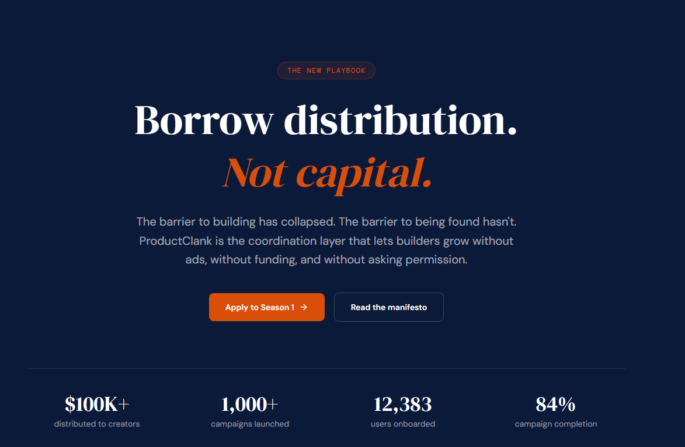
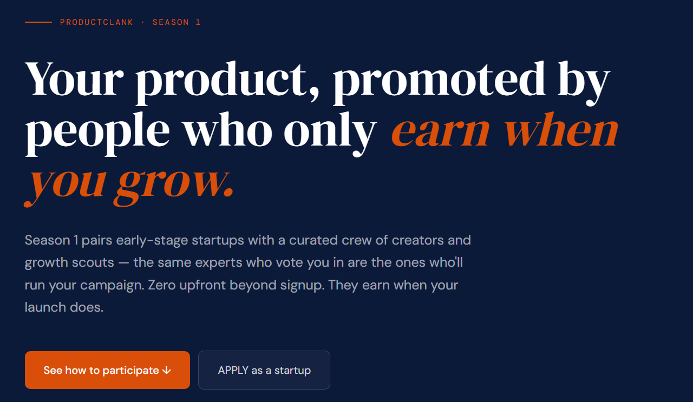
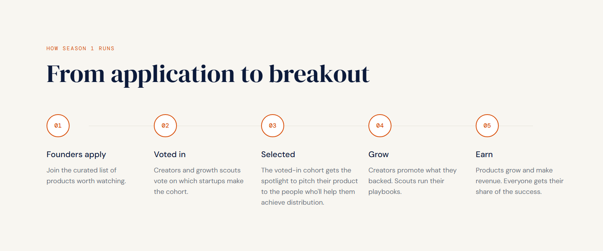

---

## 8. [Google Pomelli Catalog ](https://www.producthunt.com/products/google)
**Votes**: 115 | **도입 난이도**: 하 | **신뢰도**: 상
**Tagline**: Turn a product catalog into branded campaign assets
**서비스 링크**: https://www.producthunt.com/r/2SPKVY4L62HXAB

**태그**: Marketing, Automation, E-commerce, Design, AI Tool

### 📌 이 서비스 한눈에 보기
제품 카탈로그를 브랜드 맞춤형 광고 에셋과 화보로 자동 변환해주는 서비스

### 🔑 주요 기능
- 제품 카탈로그 기반의 브랜드 일관성 있는 캠페인 에셋 생성
- 광고 크리에이티브 및 제품 사진 자동 생성 기능
- 소상공인 및 독립 소매업자를 위한 최적화된 워크플로우

### 🙋 사용자에게 어떤 점이 좋은가
디자인 인력이 부족한 소규모 사업자가 전문적인 광고 이미지와 화보를 빠르고 간편하게 제작할 수 있습니다.

### ✅ 지금 바로 써볼 기능
- 보유 중인 제품 카탈로그 업로드하기
- 자동 생성된 브랜드 맞춤형 광고 에셋 확인하기
- 생성된 사진을 실제 마케팅 캠페인에 적용해보기

### ⚠️ 사용 전 확인할 점
- 자동 생성된 이미지의 품질이 브랜드 가이드라인과 완벽히 일치하는지 검토 필요
- 카탈로그 데이터의 정확도에 따라 생성 결과물의 품질이 달라질 수 있음

### 🧭 확인이 더 필요한 정보
구체적인 지원 파일 형식이나 카탈로그 연동 방식에 대한 정보가 필요합니다.

### 📸 스크린샷 및 갤러리
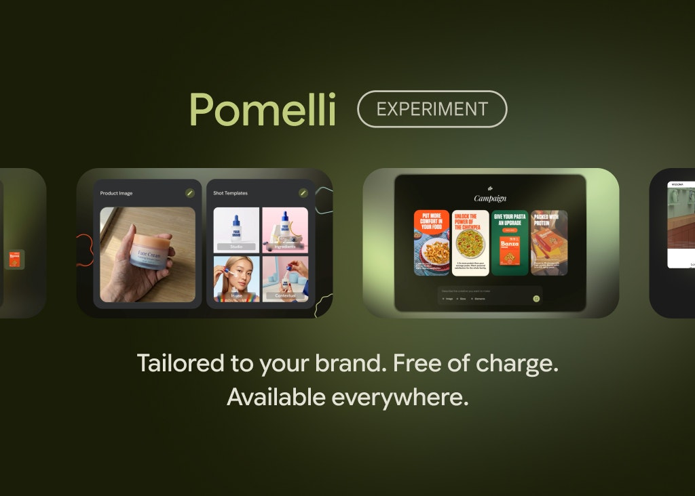
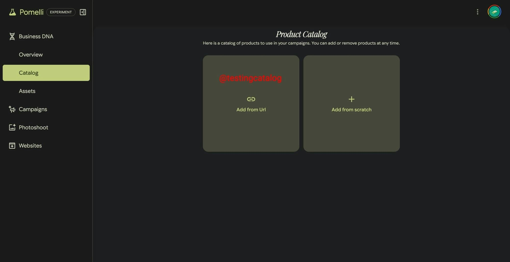
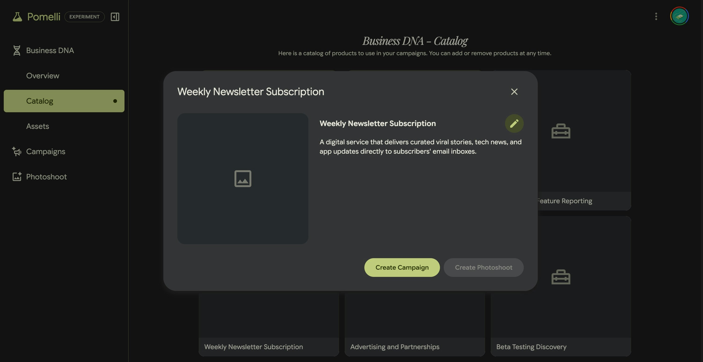

### 🎬 관련 영상
- [🎥 영상 보기](https://ph-files.imgix.net/eedd32df-1182-4556-a088-cacc4a9511f3.jpeg?auto=format)

---

## 9. [reMarkable Paper Pure](https://www.producthunt.com/products/remarkable-paper-pro)
**Votes**: 113 | **도입 난이도**: 하 | **신뢰도**: 상
**Tagline**: The reMarkable 2 successor goes back to basics
**서비스 링크**: https://www.producthunt.com/r/EWUQYKVVN4UVRX

**태그**: Hardware, Productivity, E-ink, Writing, AI Tool, Design

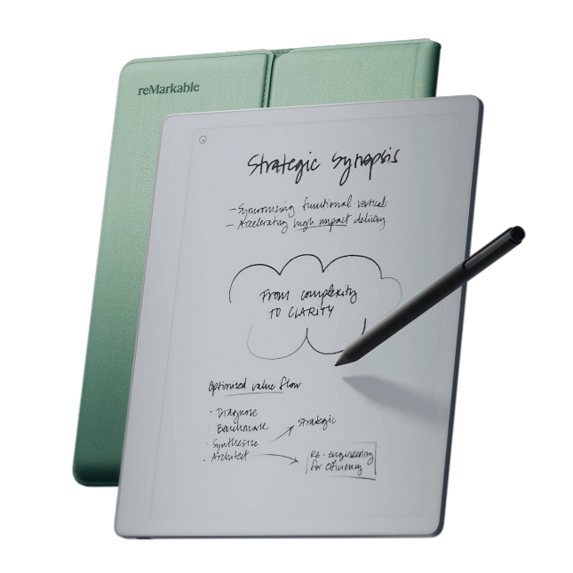

### 📌 이 서비스 한눈에 보기
reMarkable 2의 핵심 가치를 계승하면서 성능과 연결성을 강화한 차세대 모노크롬 전자종이 태블릿

### 🔑 주요 기능
- reMarkable 2 대비 50% 빠른 응답 속도 및 20% 높은 대비율 제공
- 최대 3주의 배터리 수명과 더 가벼워진 본체 디자인
- 수리 용이성을 고려한 설계 및 액티브 마커(Active Marker) 지원

### 🙋 사용자에게 어떤 점이 좋은가
더 빠르고 선명한 필기감을 제공하며, 기존 워크플로우(Slack, Miro 등)와 유기적으로 연결되어 생산성을 높여줍니다.

### ✅ 지금 바로 써볼 기능
- 액티브 마커를 활용한 정밀한 필기 경험 테스트
- 클라우드 및 데스크톱 앱을 통한 문서 동기화 확인
- AI 변환 기능을 활용한 필기 데이터의 디지털화

### ⚠️ 사용 전 확인할 점
- 모노크롬 디스플레이이므로 컬러 작업은 불가능함
- 기존 reMarkable 2 액세서리와의 호환성 여부 확인 필요

### 🧭 확인이 더 필요한 정보
상세한 하드웨어 사양 및 기존 모델과의 완전한 호환 범위에 대한 추가 정보가 필요합니다.

### 📸 스크린샷 및 갤러리

### 🎬 관련 영상
- [🎥 영상 보기](https://ph-files.imgix.net/30a2d510-1550-4384-a4e9-3916bffd421a.jpeg?auto=format)

---

## 10. [Lovie Formation - Incorporation MCP](https://www.producthunt.com/products/lovie-the-ai-native-formation-mcp)
**Votes**: 108 | **도입 난이도**: 하 | **신뢰도**: 상
**Tagline**: Incorporate your next company easily.
**서비스 링크**: https://www.producthunt.com/r/J2IRO6E7J43WWZ

**태그**: DevTool, Automation, LegalTech, SaaS, Agent, API

### 📌 이 서비스 한눈에 보기
터미널에서 2분 만에 법인 설립부터 EIN 신청까지 완료하는 개발자 친화적 자동화 솔루션

### 🔑 주요 기능
- 델라웨어 및 와이oming 법인 설립 자동화 (MCP/API 방식)
- EIN 신청, 등록 대리인, DUNS 번호 신청 및 컴플라이언스 포함
- 기존의 수동적이고 복잡한 법인 설립 절차를 터미널 환경으로 혁신

### 🙋 사용자에게 어떤 점이 좋은가
개발자가 복잡한 서류 작업 없이 터미널에서 즉시 법인을 설립하고, 은행 업무에 바로 사용 가능한 상태로 만들 수 있습니다.

### ✅ 지금 바로 써볼 기능
- 터미널을 통한 법인 설립 프로세스 테스트
- EIN 및 DUNS 번호 신청 자동화 기능 확인
- 미국 내 법인 설립 비용 및 컴플라이언스 패키지 검토

### ⚠️ 사용 전 확인할 점
- 미국 외 지역 거주자의 경우 세무 및 법적 책임 소재 확인 필요
- 자동화된 프로세스 내에서 발생하는 법적 서류의 정확성 검증

### 🧭 확인이 더 필요한 정보
제시된 $20.00 비용이 모든 서비스(EIN, DUNS 등)를 포함한 일회성 비용인지 추가 확인이 필요합니다.

### 📸 스크린샷 및 갤러리
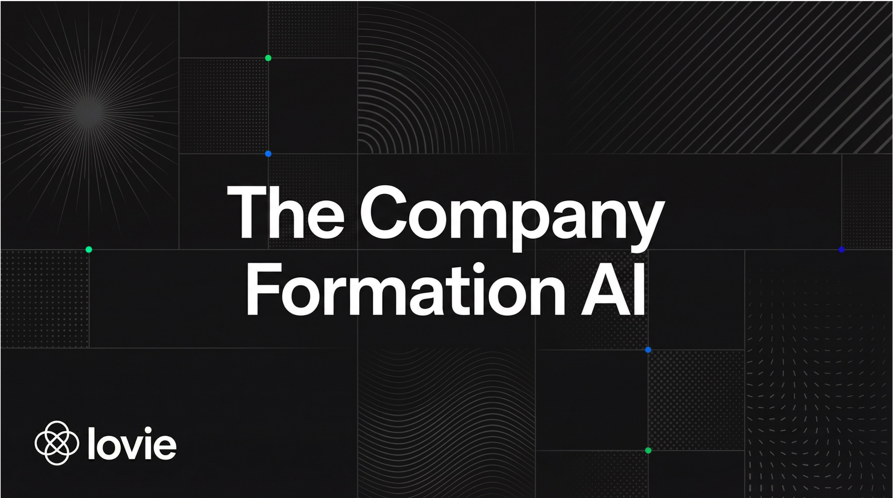
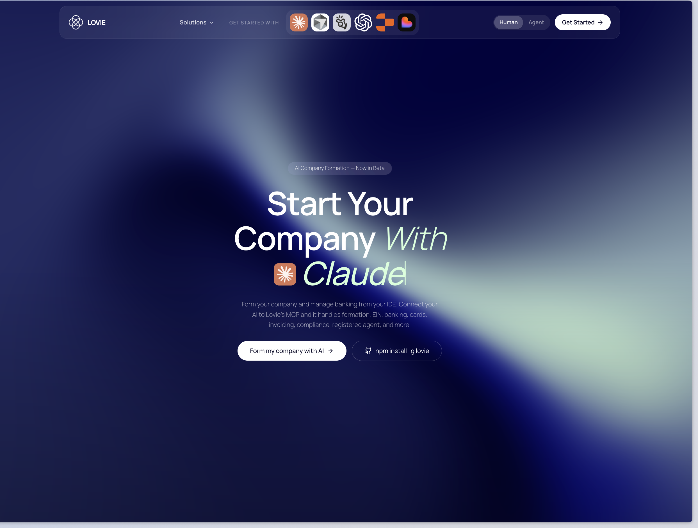
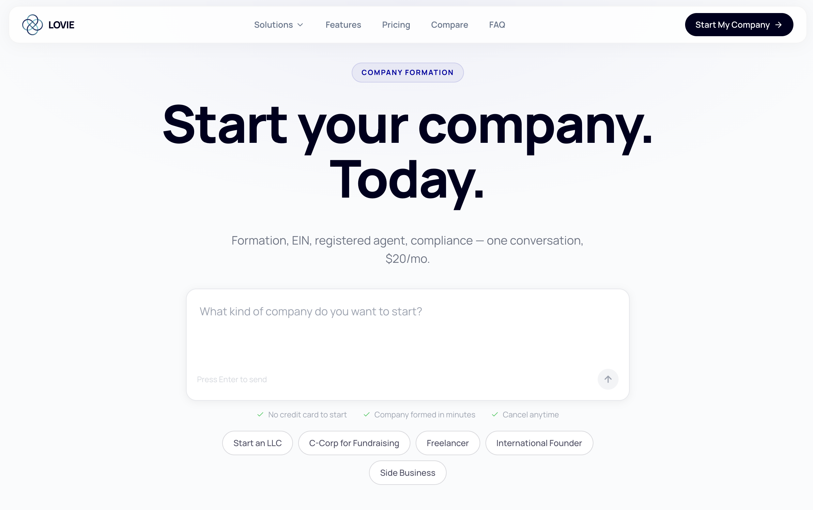

### 🎬 관련 영상
- [🎥 영상 보기](https://ph-files.imgix.net/77df24eb-cd64-48e3-8511-a92b38ae5a64.gif?auto=format)

---

## 11. [Propello](https://www.producthunt.com/products/propello)
**Votes**: 98 | **도입 난이도**: 중 | **신뢰도**: 상
**Tagline**: Create the pipeline you never had
**서비스 링크**: https://www.producthunt.com/r/QHGLFQYPV2R4K3

**태그**: SalesTech, AI, Automation, GTM, CRM, Agent, AI Tool

### 📌 이 서비스 한눈에 보기
방문자를 놓치지 않고 즉각적인 상담과 맞춤형 후속 조치를 제공하는 AI 영업 에이전트

### 🔑 주요 기능
- AI 구매 탐색 에이전트를 통한 방문자 즉각 응대 및 개인화된 가치 제안
- 실시간 대화를 통한 고객의 거절 사유 해결 및 맞춤형 워크스루 제공
- CRM 및 제품 데이터와 연동된 자동화된 맞춤형 후속 관리(Follow-up)

### 🙋 사용자에게 어떤 점이 좋은가
데모 신청 단계에서 이탈하는 잠재 고객을 AI가 즉시 포착하여 영업 기회로 전환하고, 수동 후속 작업의 번거로움을 줄여줍니다.

### ✅ 지금 바로 써볼 기능
- AI 에이전트의 실시간 대화 및 가치 제안 방식 테스트
- 기존 CRM 데이터 연동 및 자동 후속 메시지 생성 기능 확인
- 방문자 유입 경로별 맞춤형 시나리오 설정

### ⚠️ 사용 전 확인할 점
- AI의 답변이 브랜드 톤앤매너와 일치하는지 검토 필요
- 기존 CRM 및 제품 데이터와의 연동 복잡도 확인

### 🧭 확인이 더 필요한 정보
현재 제공되는 AI 에이전트가 지원하는 언어 범위와 구체적인 CRM 연동 가능 목록에 대한 확인이 필요합니다.

### 📸 스크린샷 및 갤러리

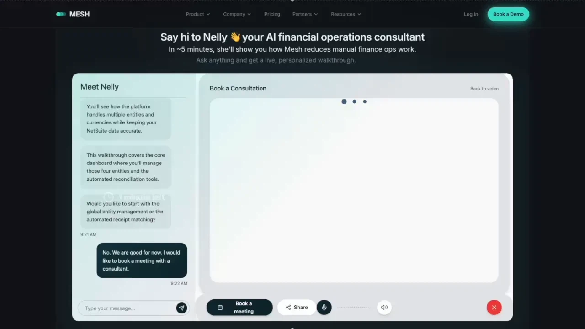

---

## 12. [Gyro Autopilot - Easy Flight Refunds](https://www.producthunt.com/products/gyro-autopilot)
**Votes**: 95 | **도입 난이도**: 하 | **신뢰도**: 상
**Tagline**: 100s of Dollars Could Be Sitting in Your Inbox 📥
**서비스 링크**: https://www.producthunt.com/r/AX6SOUT7SGGDAE

**태그**: Automation, Travel, Fintech, AI Tool

### 📌 이 서비스 한눈에 보기
이메일 스캔을 통해 놓친 항공권 환불금을 자동으로 찾아주는 서비스

### 🔑 주요 기능
- 이메일함을 스캔하여 지연, 취소, 오버부킹 등으로 인한 미청구 환불금 탐색
- 발견된 환불금을 자동으로 청구하는 자동화 프로세스 제공
- 수수료 기반 모델(No win, no fee)로 초기 비용 부담 없음

### 🙋 사용자에게 어떤 점이 좋은가
사용자가 일일이 항공사 규정을 확인할 필요 없이, 이메일 스캔만으로 잠자고 있는 환불금을 간편하게 찾을 수 있습니다.

### ✅ 지금 바로 써볼 기능
- 이메일 연동을 통한 미청구 환불금 스캔
- 발견된 환불 건에 대한 자동 청구 프로세스 실행

### ⚠️ 사용 전 확인할 점
- 이메일 접근 권한 부여에 따른 개인정보 및 보안 검토 필요
- 환불 성공 시 발생하는 수수료 정책 확인 필요

### 🧭 확인이 더 필요한 정보
이메일 스캔 시 개인정보 보호 방식과 환불 성공 시 발생하는 정확한 수수료율에 대한 정보가 추가로 필요합니다.

### 📸 스크린샷 및 갤러리

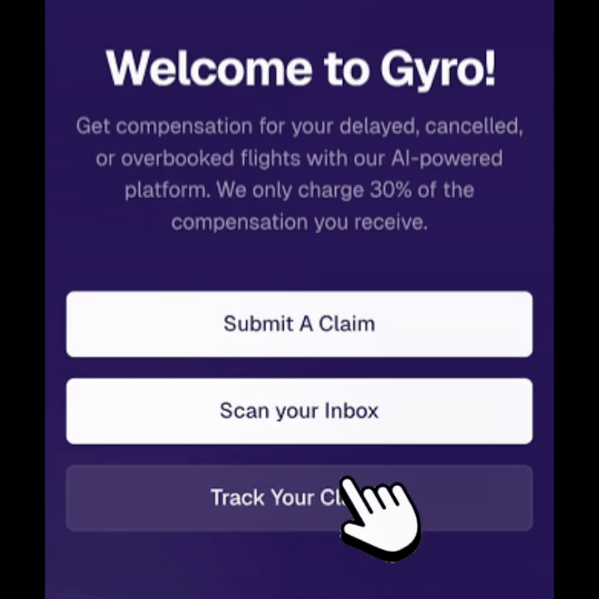
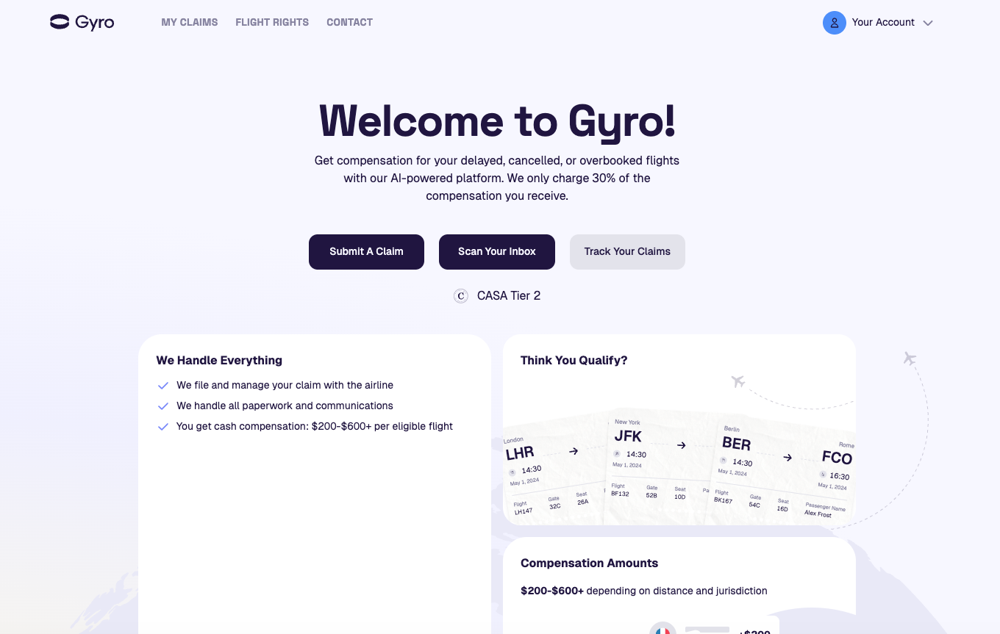

### 🎬 관련 영상
- [🎥 영상 보기](https://ph-files.imgix.net/21eeaeef-4985-40b3-89e7-6eb5bdfdb900.jpeg?auto=format)

---

## 13. [Genrate.ai](https://www.producthunt.com/products/genrate-ai)
**Votes**: 94 | **도입 난이도**: 중 | **신뢰도**: 상
**Tagline**: The military-grade recon machine for revenue teams. 
**서비스 링크**: https://www.producthunt.com/r/W3PNOV7XPNKPQ4

**태그**: SalesTech, Automation, MarketIntelligence, RevenueOps, AI Tool

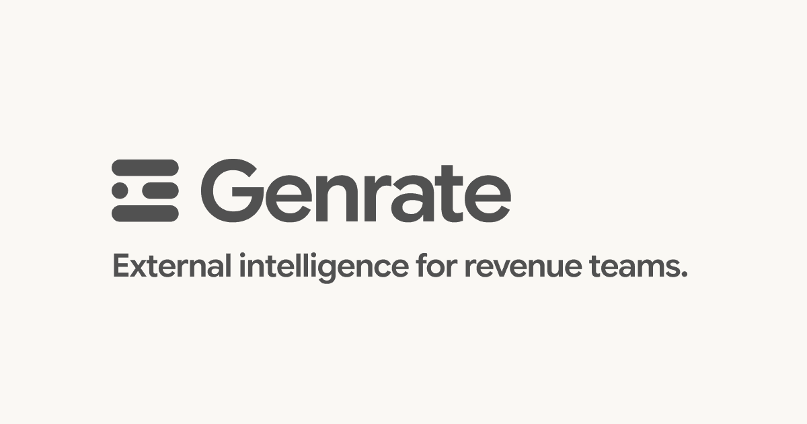

### 📌 이 서비스 한눈에 보기
영업 팀을 위한 초정밀 계정 조사 및 실시간 딜 시그널 탐지 자동화 도구

### 🔑 주요 기능
- 심층적인 계정 정찰을 통한 군사급 수준의 디스커버리 브리프 생성
- 구매자, 계정 정보, 경쟁 환경을 포함한 종합적인 리포트 제공
- 파이프라인, 고객, 경쟁사를 24/7 모니터링하여 딜 성사 가능성을 높이는 시그널 포착

### 🙋 사용자에게 어떤 점이 좋은가
영업 담당자가 수동으로 수행하던 방대한 조사 시간을 획기적으로 단축하고, 놓치기 쉬운 시장 변화를 실시간으로 알려주어 영업 성공률을 높여줍니다.

### ✅ 지금 바로 써볼 기능
- 타겟 계정에 대한 심층 디스커버리 브리프 생성 기능 테스트
- 실시간 파이프라인 모니터링 및 시그널 알림 설정
- 경쟁사 동향 및 시장 변화 데이터 확인

### ⚠️ 사용 전 확인할 점
- 생성된 리포트의 데이터 정확성에 대한 최종 검토 필요
- 기존 CRM 시스템과의 연동 범위 확인 필요

### 🧭 확인이 더 필요한 정보
현재 제공되는 데이터 소스의 범위와 외부 툴(CRM 등)과의 구체적인 통합 방식에 대한 정보가 부족합니다.

### 📸 스크린샷 및 갤러리
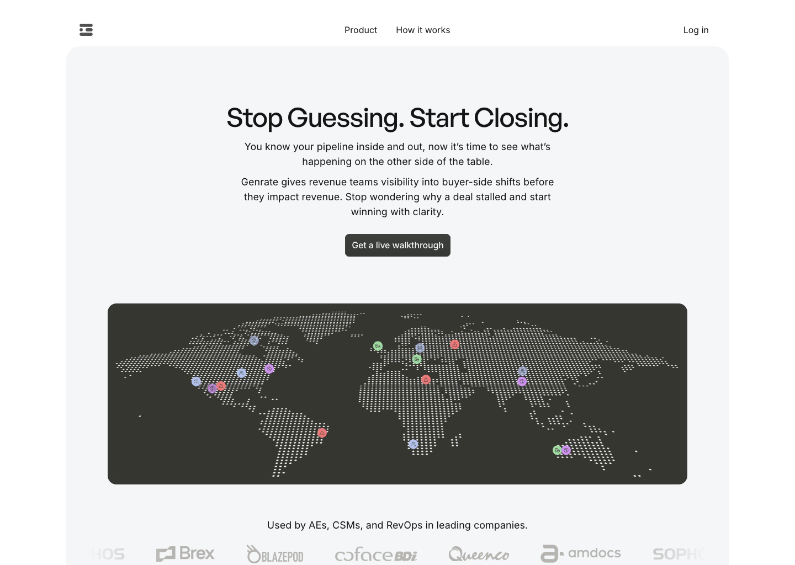
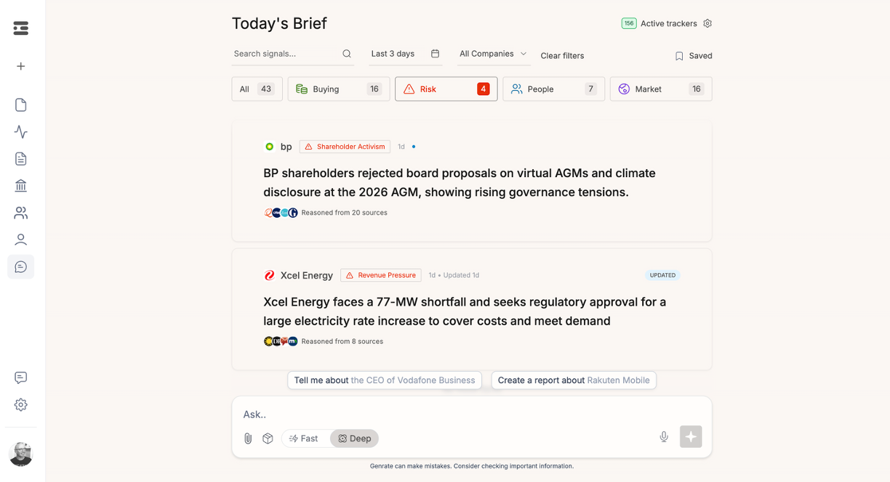
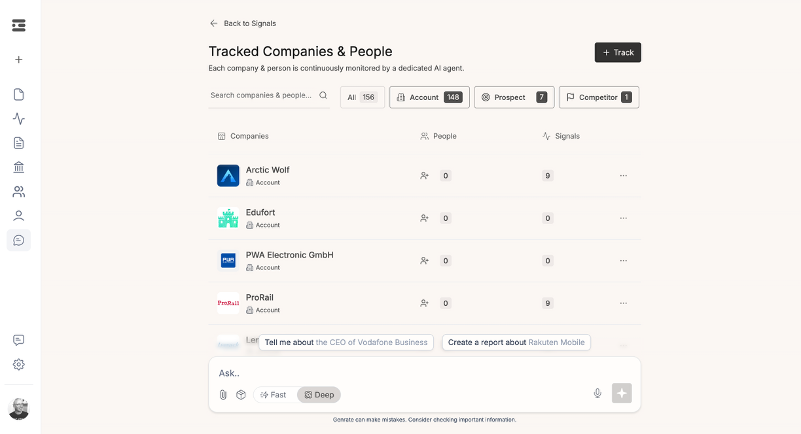

### 🎬 관련 영상
- [🎥 영상 보기](https://ph-files.imgix.net/e9de58f5-293e-4084-add1-8c14a7ca1a72.gif?auto=format)

---

## 14. [Basedash MCP server](https://www.producthunt.com/products/basedash)
**Votes**: 89 | **도입 난이도**: 중 | **신뢰도**: 상
**Tagline**: Your data analyst, in every AI tool you already use
**서비스 링크**: https://www.producthunt.com/r/DR7AIRGAJKAWBC

**태그**: DataAnalytics, AI, MCP, DevTool, Automation, Agent, AI Tool, Chat

### 📌 이 서비스 한눈에 보기
기존 데이터 소스를 AI 도구와 연결하여 실시간 데이터 분석을 가능하게 하는 MCP 서버

### 🔑 주요 기능
- Claude, Cursor, ChatGPT 등 MCP 호환 클라이언트와 데이터 연결
- 이미 연결된 모든 DB, 데이터 웨어하우스, SaaS 데이터 통합 활용
- 실시간 수치 추출, 코호트 비교, 차트 생성 및 트렌드 분석 지원

### 🙋 사용자에게 어떤 점이 좋은가
별도의 데이터 추출 과정 없이 AI 채팅창 내에서 즉시 실시간 데이터 분석과 시각화 결과를 얻을 수 있습니다.

### ✅ 지금 바로 써볼 기능
- 사용 중인 MCP 호환 클라이언트에 Basedash 서버 연결하기
- 기존에 연결된 데이터 소스 권한 확인하기
- AI 에이전트에게 복잡한 데이터 쿼리 및 차트 생성 요청하기

### ⚠️ 사용 전 확인할 점
- MCP 호환 클라이언트 설정 및 환경 구축 필요
- 기존 데이터 소스의 접근 권한 설정에 따른 보안 검토 필요

### 🧭 확인이 더 필요한 정보
사용자의 기존 데이터 소스 연결 상태와 클라이언트 환경에 따라 초기 설정 난이도가 달라질 수 있습니다.

### 📸 스크린샷 및 갤러리
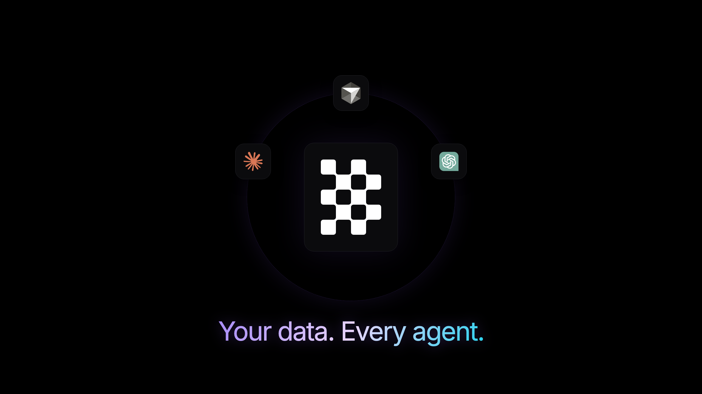
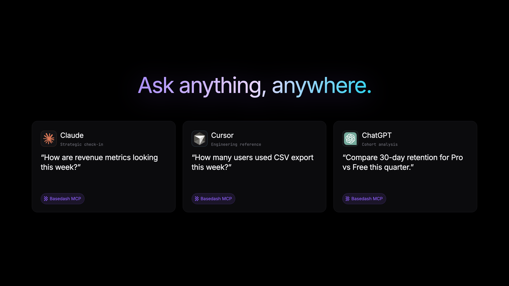
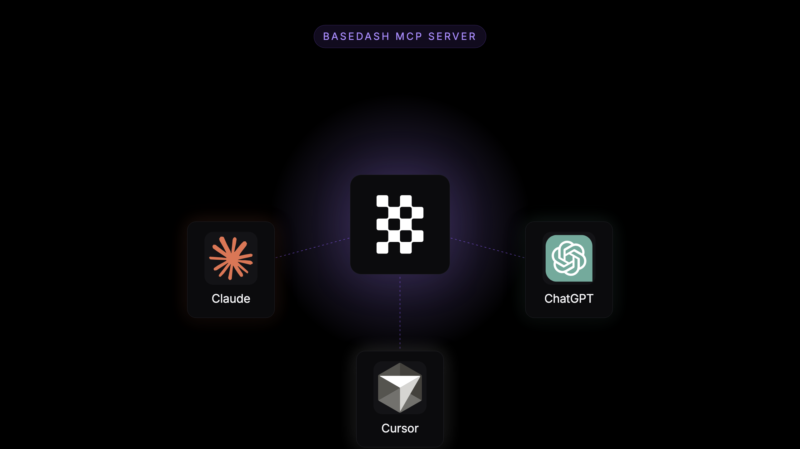

### 🎬 관련 영상
- [🎥 영상 보기](https://ph-files.imgix.net/4b392b8b-8775-4ea5-9a48-7485819220e9.jpeg?auto=format)

---

## 15. [Luma Uni 1.1 API ](https://www.producthunt.com/products/luma-ai)
**Votes**: 87 | **도입 난이도**: 하 | **신뢰도**: 상
**Tagline**: A reasoning model that interprets intent before it generates
**서비스 링크**: https://www.producthunt.com/r/DY664HO4A3HS5Z

**태그**: AI, API, DevTool, LLM

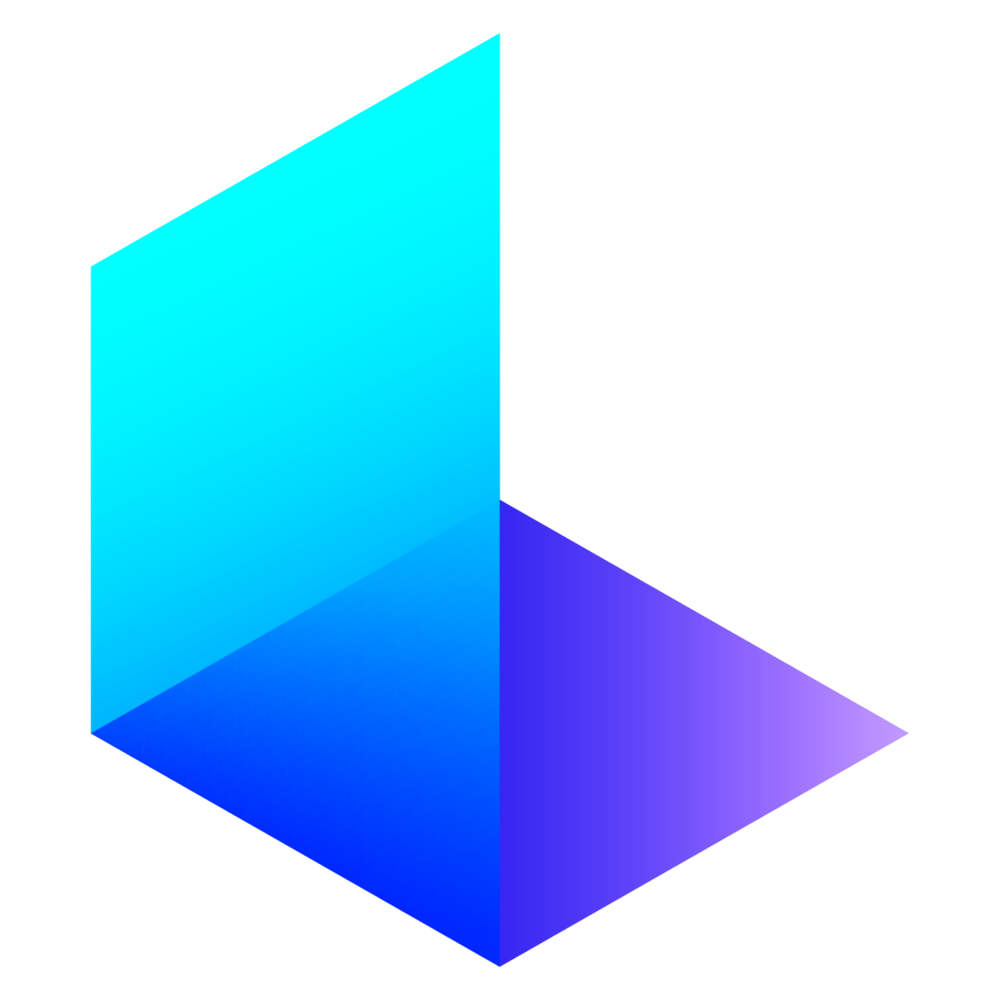

### 📌 이 서비스 한눈에 보기
사용자의 의도를 먼저 파악하여 정확도를 높인 고효율·저비용 추론 모델 API

### 🔑 주요 기능
- 생성 전 의도를 해석하는 추론 모델 엔진
- 기존 유사 모델 대비 절반 이하의 가격과 낮은 지연 시간(Latency)
- Python, JS/TS, Go SDK 및 CLI를 지원하는 프로덕션급 환경

### 🙋 사용자에게 어떤 점이 좋은가
비용과 속도 문제를 해결하면서도 의도 파악을 통한 높은 정확도를 제공하여 실제 서비스 적용에 유리합니다.

### ✅ 지금 바로 써볼 기능
- 제공되는 SDK를 활용한 기존 워크플로우 통합 테스트
- CLI를 통한 모델 성능 및 응답 속도 검증
- 두 가지 엔드포인트를 활용한 서비스 최적화 실험

### ⚠️ 사용 전 확인할 점
- 비교 대상 모델 대비 구체적인 성능 벤치마크 데이터 확인 필요
- 의도 해석 방식에 따른 생성 결과의 일관성 검증 필요

### 🧭 확인이 더 필요한 정보
비교 모델의 기준과 구체적인 모델 성능 지표에 대한 상세 정보가 필요합니다.

### 📸 스크린샷 및 갤러리
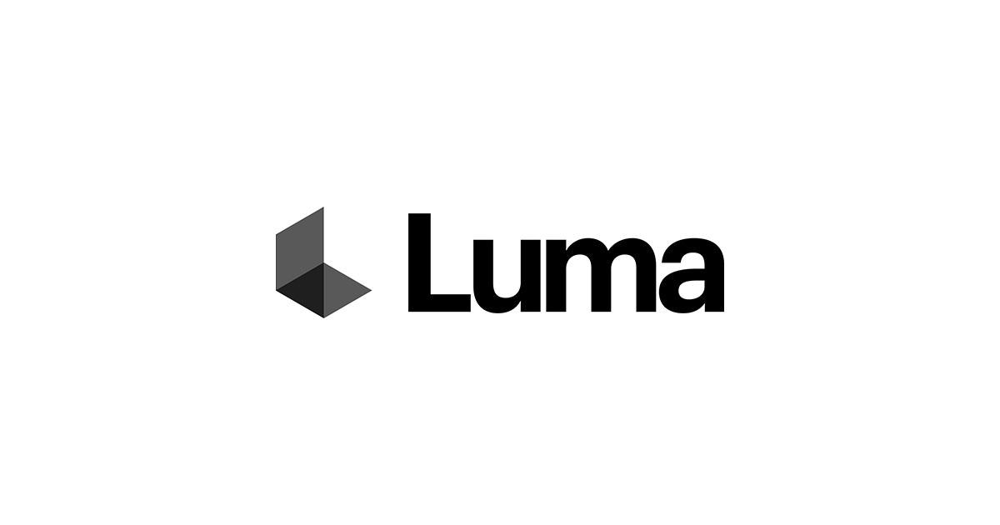
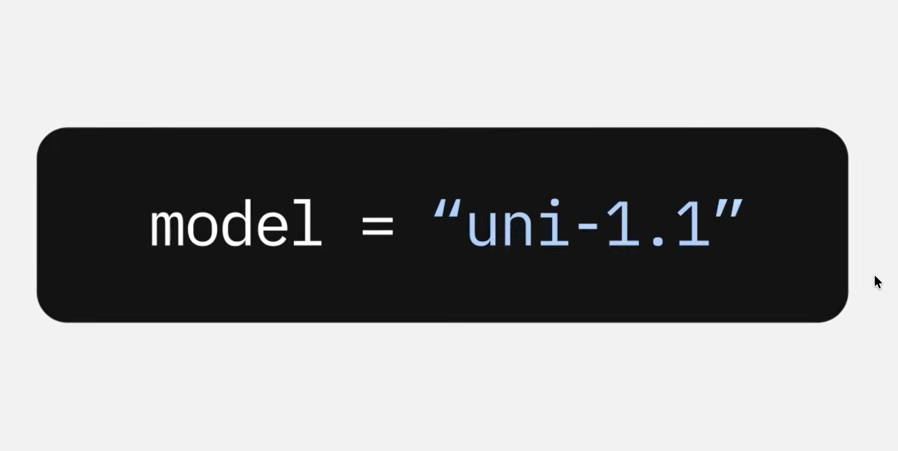
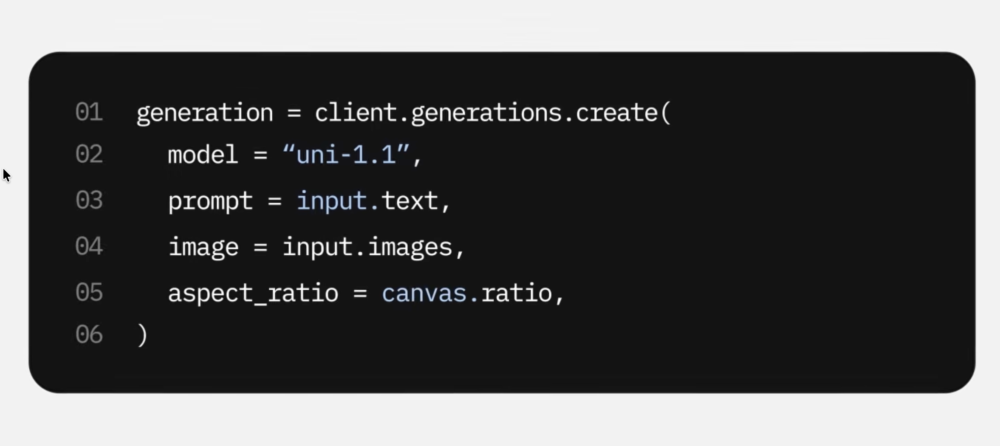

### 🎬 관련 영상
- [🎥 영상 보기](https://ph-files.imgix.net/a6332f47-34ed-403e-993e-6adf37db7a8b.jpeg?auto=format)

---

## 16. [Neo by Amp](https://www.producthunt.com/products/amp-free)
**Votes**: 86 | **도입 난이도**: 중 | **신뢰도**: 상
**Tagline**: The Amp CLI has been rebuilt from the ground up
**서비스 링크**: https://www.producthunt.com/r/HKUPPUYHDH4Q7G

**태그**: DevTool, CLI, AI-Agent, Automation, Agent, Design, API

### 📌 이 서비스 한눈에 보기
장기 실행 코딩 에이전트에 최적화되어 완전히 재설계된 Amp CLI

### 🔑 주요 기능
- 장기 실행 코딩 에이전트를 위한 구조적 재설계
- ampcode.com을 통한 원격 제어 기능 지원
- 자동 컨텍스트 압축 및 메시지 큐잉/스티어링 기능

### 🙋 사용자에게 어떤 점이 좋은가
복잡하고 긴 작업이 필요한 코딩 에이전트 환경에서 컨텍스트 관리와 성능 문제를 해결하여 작업 효율을 높여줍니다.

### ✅ 지금 바로 써볼 기능
- ampcode.com을 통한 원격 제어 환경 설정하기
- 새로운 플러그인 API를 활용한 커스텀 기능 확장하기
- 대규모 스레드 작업 시 성능 개선 체감하기

### ⚠️ 사용 전 확인할 점
- CLI 도구이므로 터미널 환경 숙련도 필요
- 기존 Amp 사용자에게는 대대적인 재설계로 인한 변화가 있을 수 있음

### 🧭 확인이 더 필요한 정보
기존 Amp CLI 사용자와의 호환성 및 구체적인 마이그레이션 방법은 명시되지 않았습니다.

### 📸 스크린샷 및 갤러리
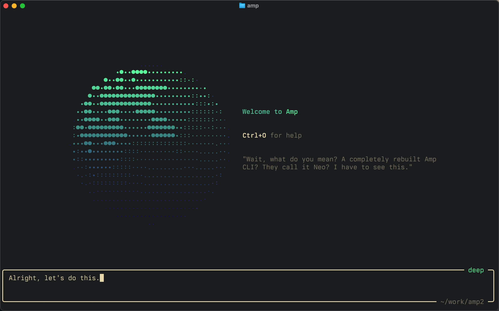
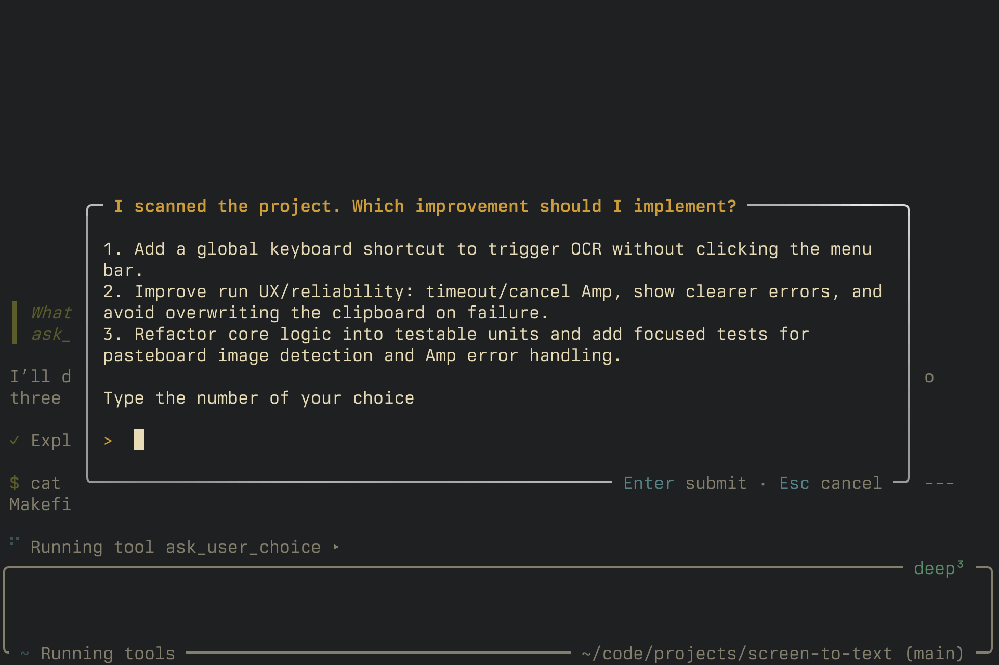
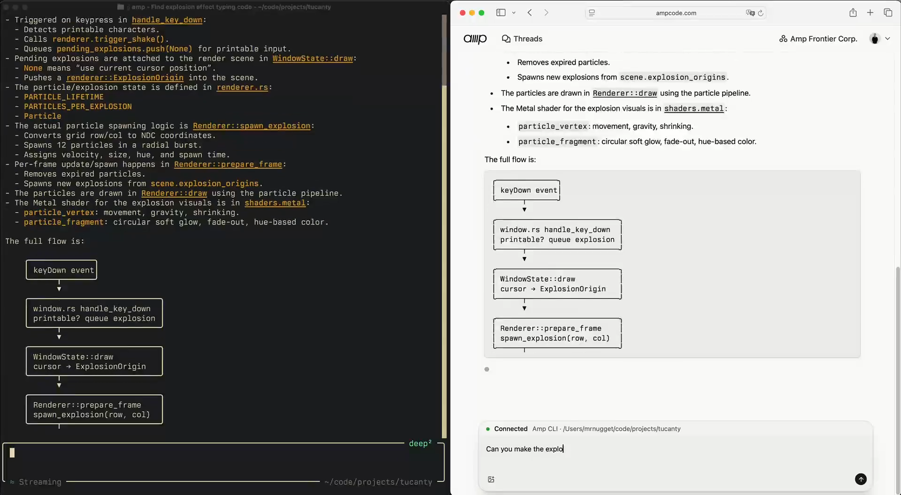

---

## 17. [SLED AI](https://www.producthunt.com/products/sled-ai)
**Votes**: 82 | **도입 난이도**: 하 | **신뢰도**: 상
**Tagline**: Public-sector revenue engine for B2B companies
**서비스 링크**: https://www.producthunt.com/r/LC2PCLRIEM5GO3

**태그**: B2B, Government-Tech, Automation, Managed-Service, Agent, AI Tool, Design

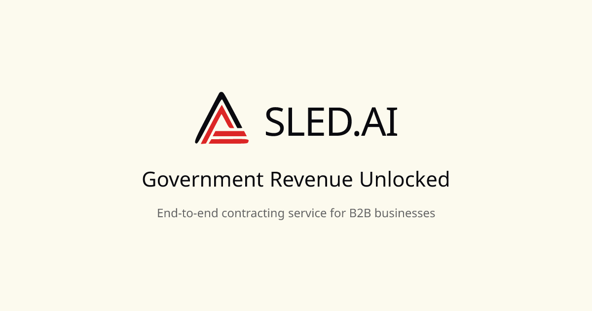

### 📌 이 서비스 한눈에 보기
미국 정부 조달 계약 수주를 위한 AI 기반 풀 서비스 대행 서비스

### 🔑 주요 기능
- AI 에이전트와 전문 인력을 결합한 엔드투엔드(End-to-End) 프로세스
- 기회 발굴부터 제안서 작성 및 제출까지 전 과정을 직접 수행
- 대시보드나 로그인 없이 결과물만 제공하는 완전 관리형 서비스

### 🙋 사용자에게 어떤 점이 좋은가
정부 조달 프로세스의 복잡함을 직접 해결할 필요 없이, 전문적인 대행 서비스를 통해 매출로 직결되는 결과물을 얻을 수 있습니다.

### ✅ 지금 바로 써볼 기능
- 현재 비즈니스 모델의 정부 계약 적합성 검토
- 서비스 제공 범위 및 수수료 구조 문의
- 전문 인력의 제안서 작성 역량 확인

### ⚠️ 사용 전 확인할 점
- 완전 대행 방식이므로 내부 통제 및 최종 검토 프로세스 수립 필요
- 서비스 비용이 수익 창출 규모에 비해 높을 가능성

### 🧭 확인이 더 필요한 정보
구체적인 서비스 비용 구조와 계약 성공 시의 수익 배분 방식에 대한 정보가 명시되지 않았습니다.

### 📸 스크린샷 및 갤러리
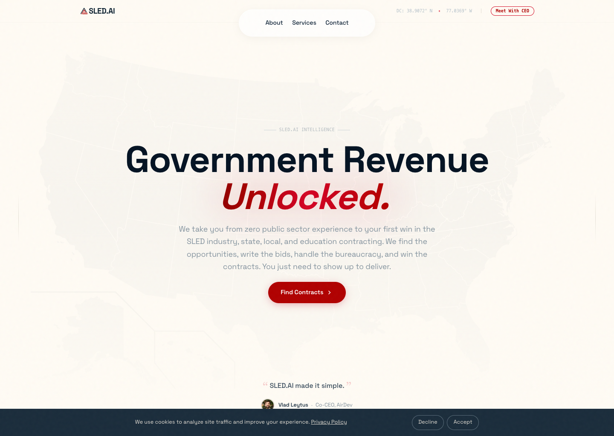
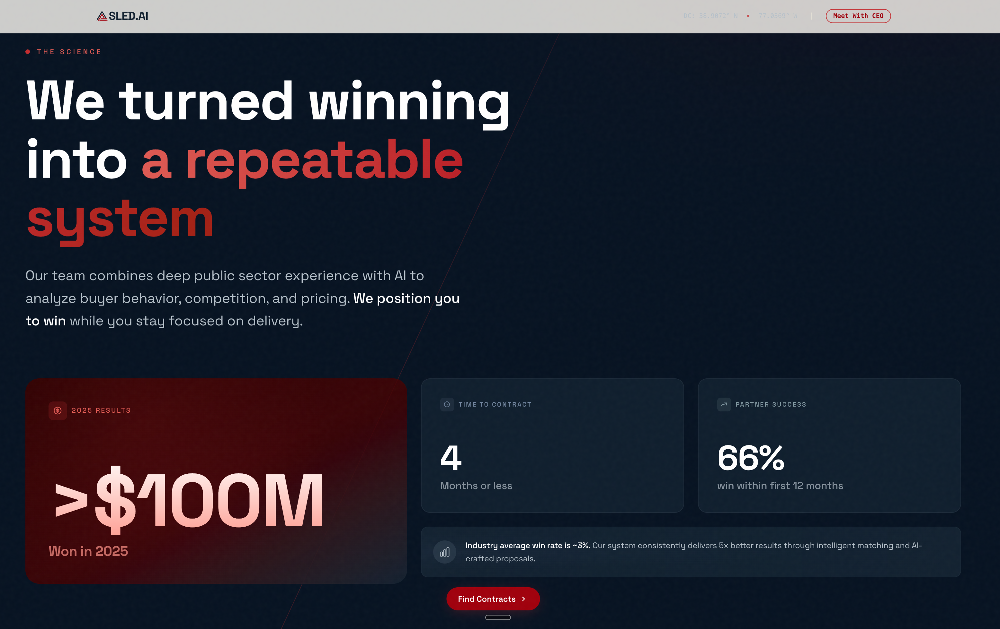
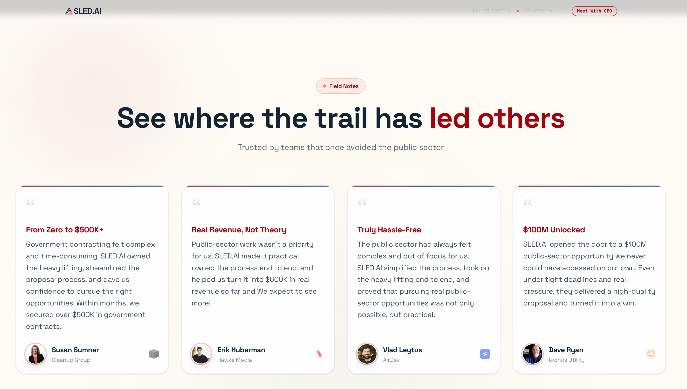

---

## 18. [Seemore Data](https://www.producthunt.com/products/seemore-data)
**Votes**: 82 | **도입 난이도**: 중 | **신뢰도**: 상
**Tagline**: 40% autonomous cost reduction on Snowflake environments
**서비스 링크**: https://www.producthunt.com/r/PV5KMGAJAVAEW4

**태그**: DataOps, FinOps, Snowflake, Automation, CostOptimization, Agent, AI Tool

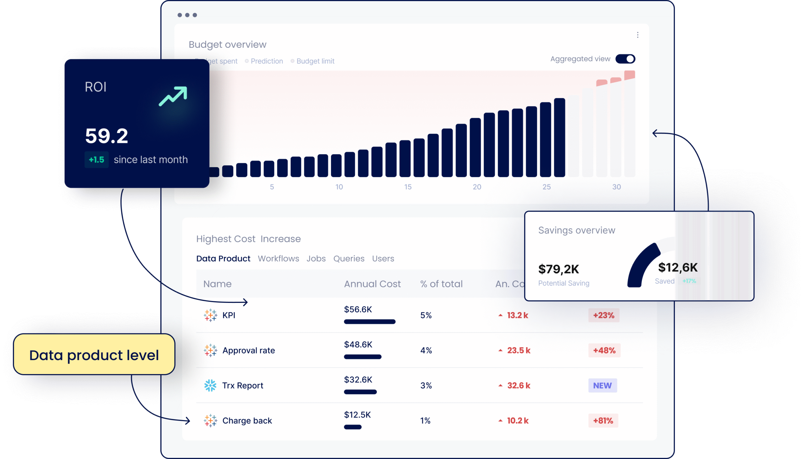

### 📌 이 서비스 한눈에 보기
Snowflake 환경의 비용 효율성을 자동화된 에이전트로 최적화하는 데이터 컨텍스트 엔진

### 🔑 주요 기능
- 학습된 에이전트와 알고리즘을 통한 데이터 워크로드 효율성 식별
- 가드레일(Guardrails) 기능을 통한 자동화된 비용 최적화 조치
- Snowflake 환경에서 평균 40%의 비용 절감 효과 제공

### 🙋 사용자에게 어떤 점이 좋은가
수동으로 관리하기 어려운 Snowflake 비용 문제를 자동화된 엔진이 대신 해결하여 운영 비용을 즉각적으로 절감할 수 있습니다.

### ✅ 지금 바로 써볼 기능
- 현재 사용 중인 Snowflake 워크로드 분석
- 자동화된 가드레일 설정 및 적용 범위 검토
- 비용 절감 알고리즘의 작동 방식 확인

### ⚠️ 사용 전 확인할 점
- 자동화된 수정(Enforce the fix)이 기존 워크로드에 미칠 영향 검토 필요
- Snowflake 환경 외 타 플랫폼에 대한 지원 여부 확인

### 🧭 확인이 더 필요한 정보
자동화된 조치가 실제 운영 환경의 성능에 미치는 영향과 가드레일의 세부 제어 범위에 대한 정보가 더 필요합니다.

### 📸 스크린샷 및 갤러리
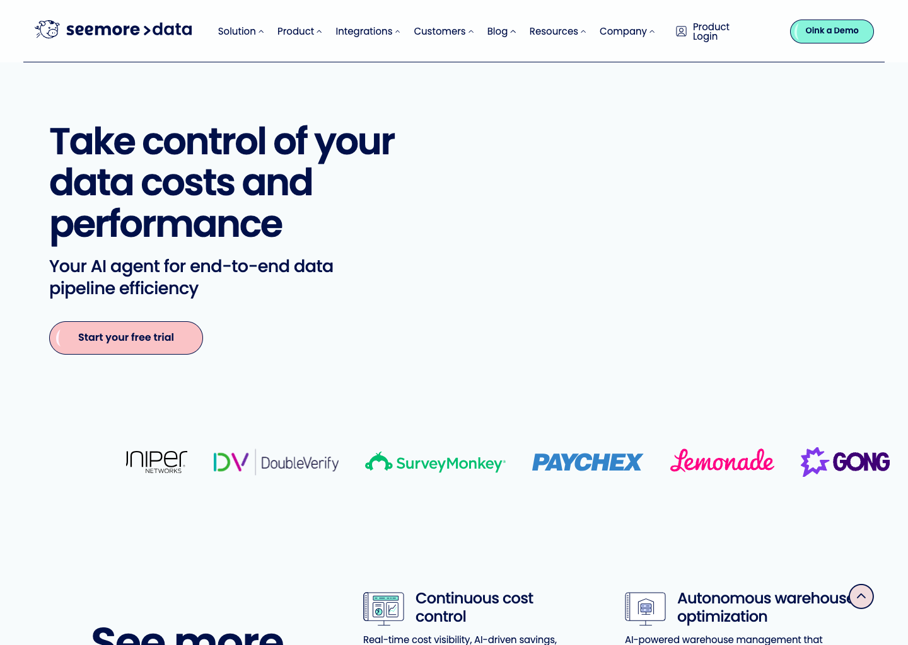
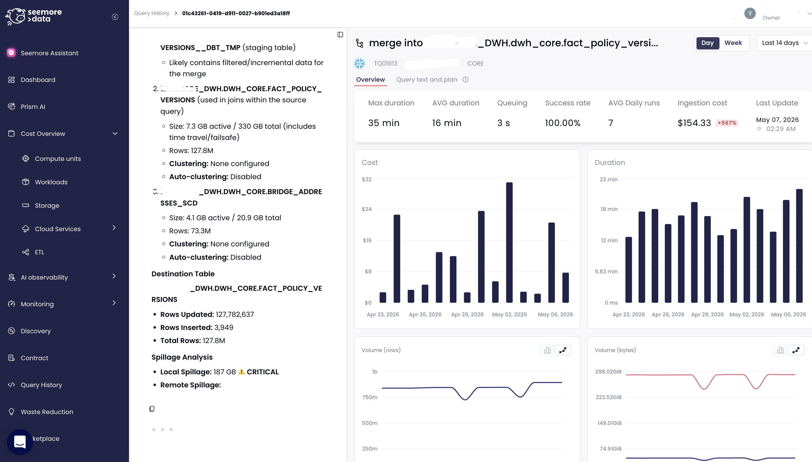
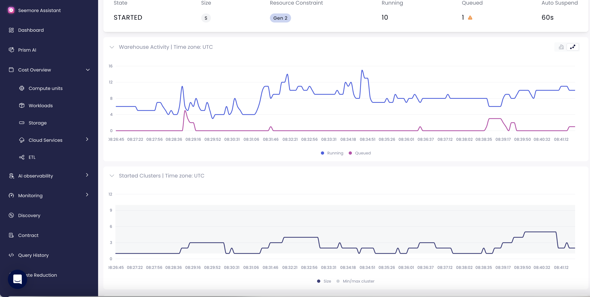

---

## 19. [Memory Tags](https://www.producthunt.com/products/memory-tags)
**Votes**: 80 | **도입 난이도**: 하 | **신뢰도**: 상
**Tagline**: Scan text to make flashcards and improve your memory
**서비스 링크**: https://www.producthunt.com/r/CSWWHA2FPBOIIC

**태그**: Productivity, Education, AI, Flashcards

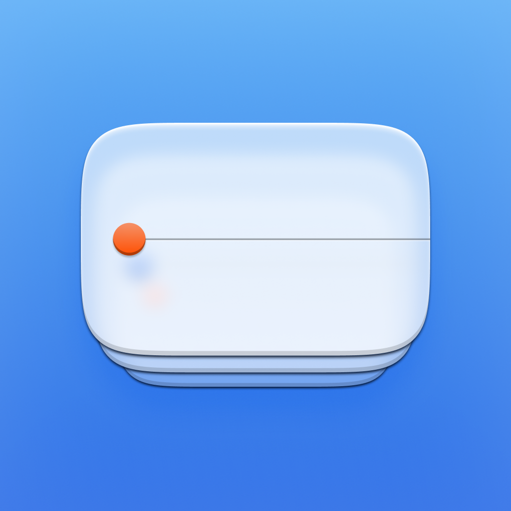

### 📌 이 서비스 한눈에 보기
카메라 스캔 한 번으로 학습용 플래시카드를 자동 생성하는 초간편 암기 도구

### 🔑 주요 기능
- 카메라 스캔을 통한 텍스트 추출 및 자동 단어 추출 기능
- 사용자 맞춤형 태그 시스템으로 학습 데이터 정리
- 망각 곡선을 고려한 효율적인 복습 알고리즘 적용

### 🙋 사용자에게 어떤 점이 좋은가
학습 준비 시간을 획기적으로 줄여주며, 읽는 즉시 암기 단계로 넘어갈 수 있는 최단 경로를 제공합니다.

### ✅ 지금 바로 써볼 기능
- 책이나 문서 스캔하여 플래시카드 생성하기
- 자신만의 태그로 학습 데이터 분류하기
- 추천 복습 스케줄에 따라 학습 진행하기

### ⚠️ 사용 전 확인할 점
- 스캔 품질에 따라 텍스트 인식 정확도가 달라질 수 있음
- 수동 입력 대비 스캔 기능에 의존도가 높음

### 🧭 확인이 더 필요한 정보
현재 설명에는 구체적인 플랫폼(iOS/Android) 및 오프라인 모드 지원 여부가 명시되지 않았습니다.

### 📸 스크린샷 및 갤러리
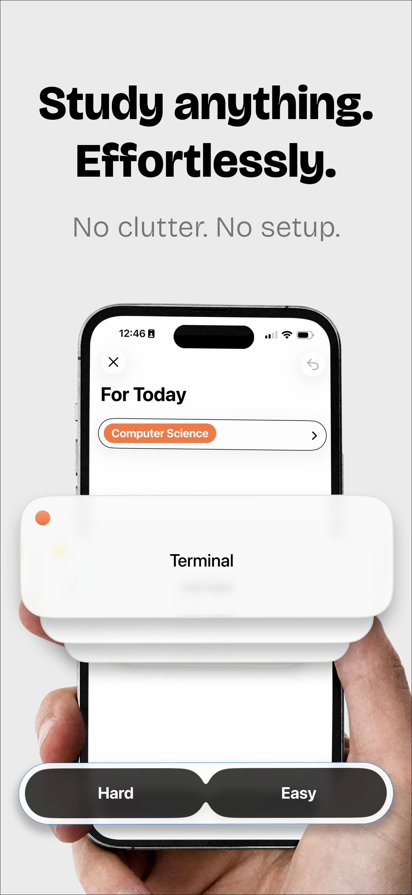
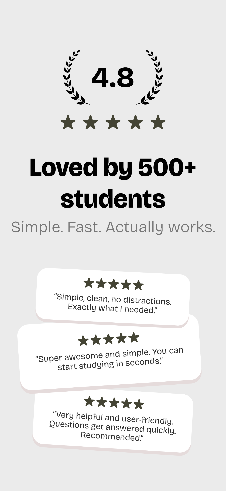
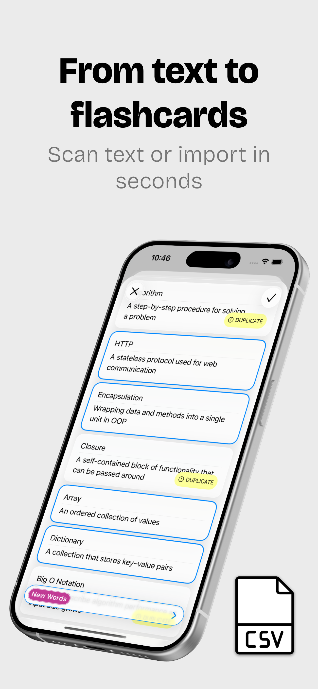

### 🎬 관련 영상
- [🎥 영상 보기](https://ph-files.imgix.net/ce2dedc5-3e4e-4dc6-8595-f6bb215610c3.jpeg?auto=format)

---

## 20. [Askmeety](https://www.producthunt.com/products/askmeety)
**Votes**: 80 | **도입 난이도**: 하 | **신뢰도**: 상
**Tagline**: The best meeting notes you never wrote and 100% on your Mac
**서비스 링크**: https://www.producthunt.com/r/3Z4H43KS4RZLCD

**태그**: Productivity, Privacy, AI, MacOnly, Automation, AI Tool

### 📌 이 서비스 한눈에 보기
개인정보 유출 걱정 없이 Mac에서 로컬로 실행되는 프라이빗 회의 요약 도구

### 🔑 주요 기능
- 모든 데이터 처리가 클라우드가 아닌 사용자 Mac에서 로컬로 실행
- 회의에 봇이 참여하지 않아 자연스러운 대화 환경 유지
- VisualWalk 기능을 통해 주요 장면을 블로그 스타일의 요약본으로 변환

### 🙋 사용자에게 어떤 점이 좋은가
회의 내용을 외부 서버로 전송하지 않아 보안이 중요한 비즈니스 미팅에 적합하며, 별도의 기록 없이도 깔끔한 요약본을 얻을 수 있습니다.

### ✅ 지금 바로 써볼 기능
- VisualWalk를 통한 회의 요약 결과 확인하기
- 로컬 실행을 통한 데이터 보안성 테스트하기

### ⚠️ 사용 전 확인할 점
- Mac 전용 소프트웨어이므로 타 OS 사용자는 사용 불가
- 로컬 리소스(CPU/RAM) 사용량에 따른 시스템 성능 영향 가능성

### 🧭 확인이 더 필요한 정보
Mac의 하드웨어 사양에 따른 구동 안정성과 지원하는 macOS 버전 범위 확인이 필요합니다.

### 📸 스크린샷 및 갤러리
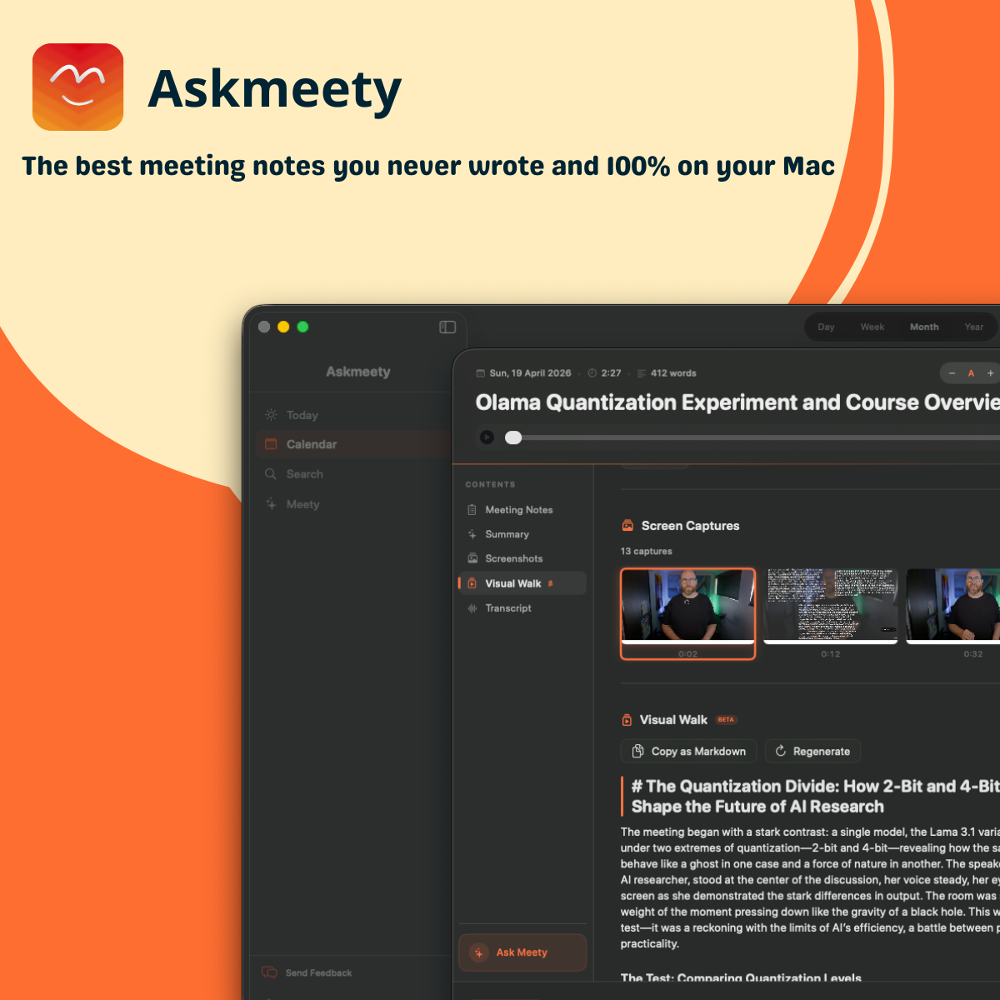
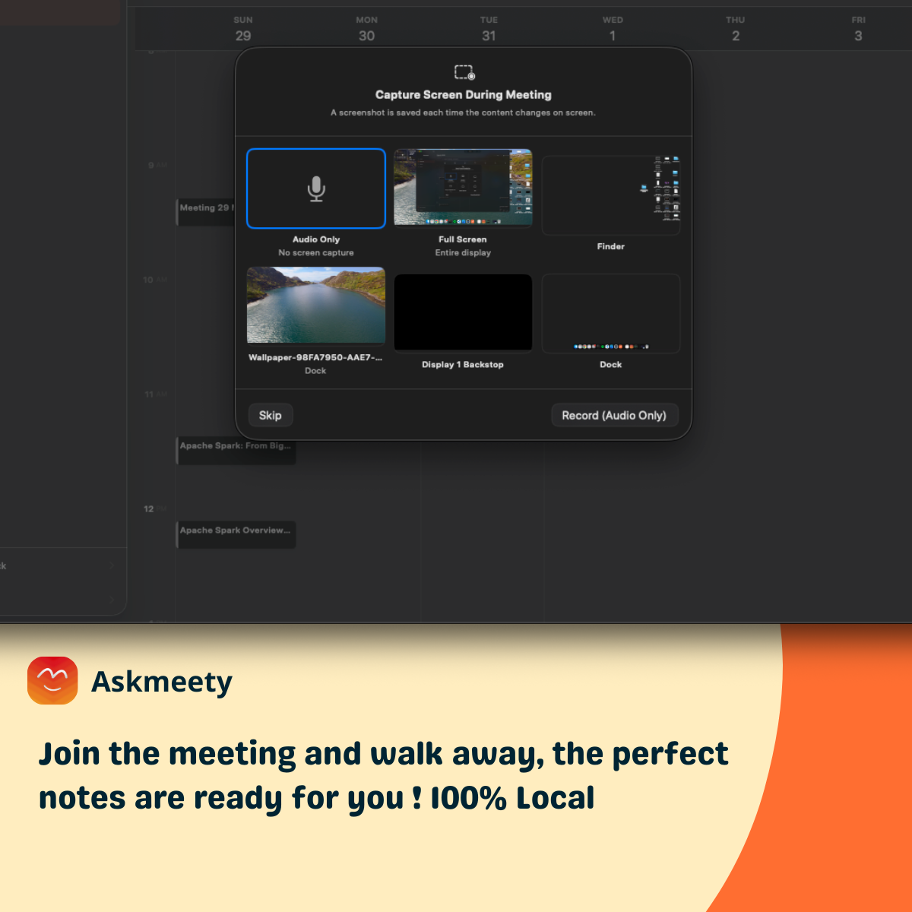
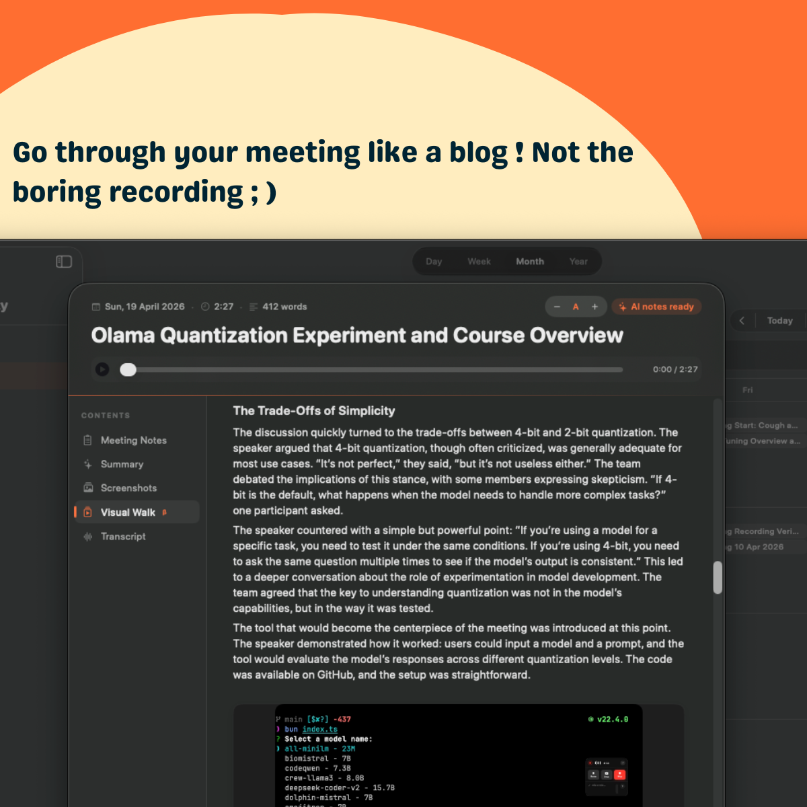

---

## 21. [Superlegal](https://www.producthunt.com/products/superlegal)
**Votes**: 76 | **도입 난이도**: 하 | **신뢰도**: 상
**Tagline**: Empower your business with smarter contract reviews
**서비스 링크**: https://www.producthunt.com/r/PQJ3AXWQSU5HPW

**태그**: LegalTech, AI, Automation, Business, AI Tool

### 📌 이 서비스 한눈에 보기
AI와 전문 변호사의 협업을 통해 계약 검토 비용을 획기적으로 절감하는 서비스

### 🔑 주요 기능
- AI 기술과 숙련된 변호사의 결합을 통한 효율적인 계약 검토
- 법무 행정 업무 시간 단축
- 기존 대비 법무 비용 최대 90% 절감 지향

### 🙋 사용자에게 어떤 점이 좋은가
복잡한 계약 검토 과정을 자동화하고 전문가의 검수를 동시에 제공하여, 법무 비용 부담을 줄이면서도 계약의 정확성을 높일 수 있습니다.

### ✅ 지금 바로 써볼 기능
- 현재 사용 중인 계약서 초안 업로드
- AI와 변호사의 검토 결과 비교
- 비용 절감 효과 시뮬레이션

### ⚠️ 사용 전 확인할 점
- AI 검토 결과에 대한 최종 법적 책임 소재 확인 필요
- 변호사 개입 정도에 따른 서비스 비용 구조 확인 필요

### 🧭 확인이 더 필요한 정보
90% 비용 절감이 구체적으로 어떤 기준(시간 대비 비용 등)에서 산출된 것인지 확인이 필요합니다.

### 📸 스크린샷 및 갤러리
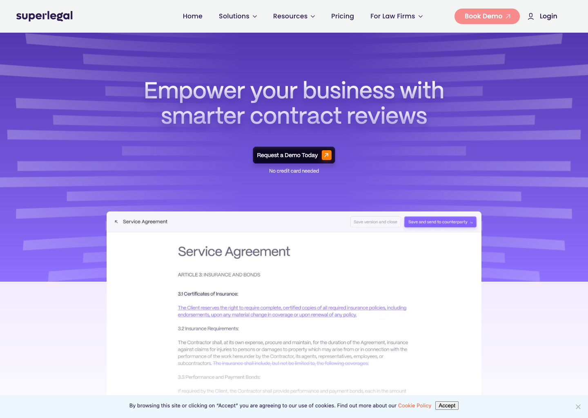
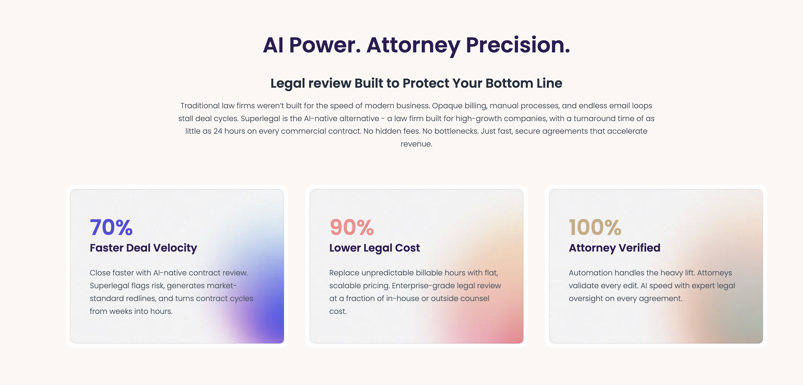
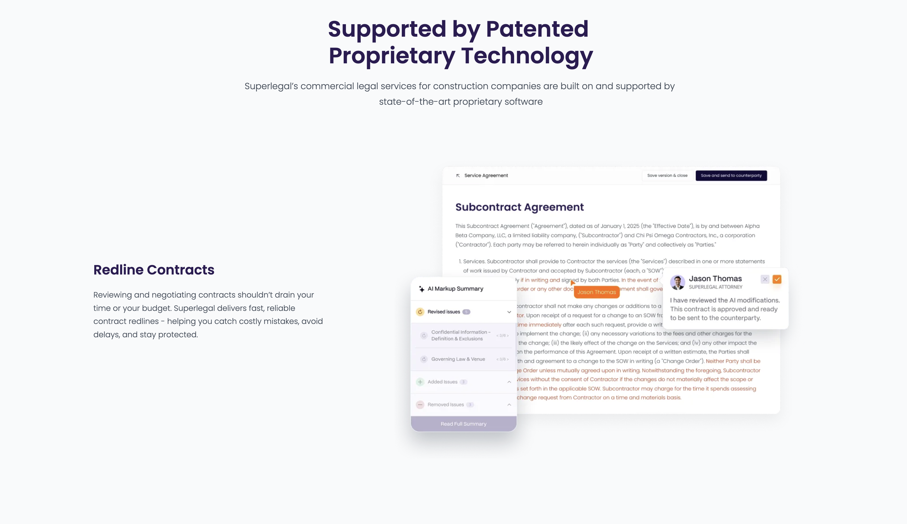

---

## 22. [Phrony](https://www.producthunt.com/products/phrony)
**Votes**: 75 | **도입 난이도**: 중 | **신뢰도**: 상
**Tagline**: Ship AI agents without the operational burden
**서비스 링크**: https://www.producthunt.com/r/UZB663HGTOSBIB

**태그**: AI-Agents, DevOps, Automation, Security, Governance, Agent, AI Tool

### 📌 이 서비스 한눈에 보기
운영 부담 없이 AI 에이전트를 배포하고 관리할 수 있는 통합 거버넌스 플랫폼

### 🔑 주요 기능
- 멀티 에이전트 오케스트레이션 및 워크플로우 관리
- 인간 개입(Human-in-the-loop)을 통한 에스컬레이션 기능
- 보안, 감사 추적(Audit trails), 이상 탐지 등 엔터프라이즈급 관리 기능

### 🙋 사용자에게 어떤 점이 좋은가
AI 에이전트를 실제 운영 환경에 배포할 때 발생하는 복잡한 관리 및 보안 문제를 하나의 플랫폼에서 해결할 수 있습니다.

### ✅ 지금 바로 써볼 기능
- 멀티 에이전트 워크플로우 설계해보기
- Human-in-the-loop 설정 및 에스컬레이션 테스트
- 감사 추적 및 보안 레이어 확인

### ⚠️ 사용 전 확인할 점
- 에이전트 운영을 위한 기존 인프라와의 통합 방식 확인 필요
- 플랫폼 의존성(Lock-in) 가능성 검토

### 🧭 확인이 더 필요한 정보
현재 제공되는 구체적인 통합 가능 도구 및 상세 보안 프로토콜에 대한 정보가 부족합니다.

### 📸 스크린샷 및 갤러리
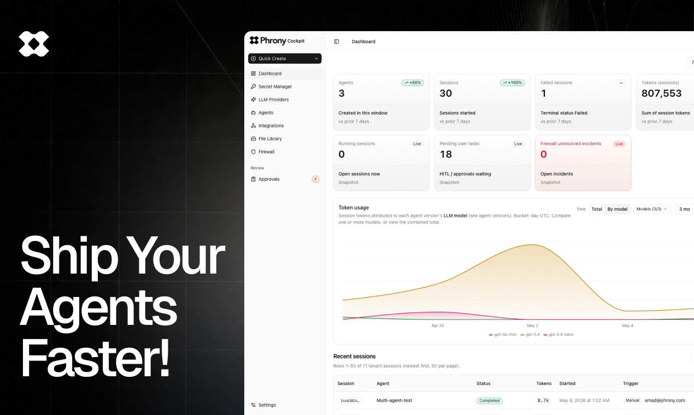
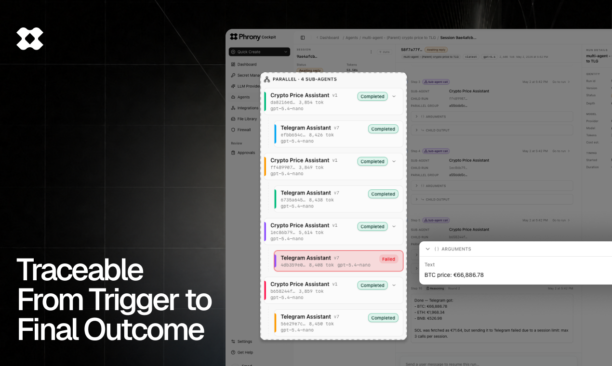
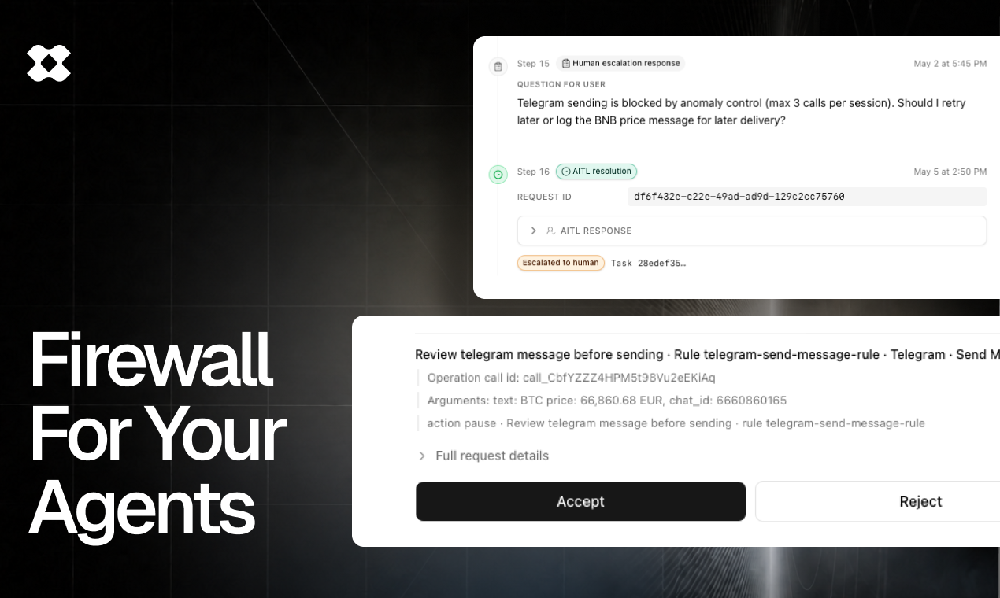

---

## 23. [Bagel AI](https://www.producthunt.com/products/bagel-ai)
**Votes**: 74 | **도입 난이도**: 중 | **신뢰도**: 상
**Tagline**: AI product intelligence for product and GTM teams
**서비스 링크**: https://www.producthunt.com/r/5JOXWSI5DSANCE

**태그**: Product Management, GTM, AI, Data Centralization, Analytics, AI Tool

### 📌 이 서비스 한눈에 보기
고객 피드백과 매출 데이터를 통합하여 제품 우선순위 결정을 돕는 AI 인텔리전스 플랫폼

### 🔑 주요 기능
- 고객 피드백, 제품 신호, 매출 컨텍스트의 중앙 집중화
- 제품 및 GTM(Go-to-Market) 팀을 위한 데이터 기반 우선순위 설정 지원
- 도구 간 파편화 없이 임팩트 측정 및 업데이트 공유 가능

### 🙋 사용자에게 어떤 점이 좋은가
여러 곳에 흩어진 고객 목소리와 매출 데이터를 한곳에서 확인하여, 어떤 기능을 먼저 개발해야 할지 명확한 의사결정을 내릴 수 있습니다.

### ✅ 지금 바로 써볼 기능
- 기존 고객 피드백 데이터 통합하기
- 제품 신호와 매출 데이터 연동하기
- 팀 내 우선순위 공유 워크플로우 설정하기

### ⚠️ 사용 전 확인할 점
- 데이터 소스(SaaS 도구 등)와의 연동 범위 확인 필요
- 데이터 보안 및 프라이버시 정책 검토 필요

### 🧭 확인이 더 필요한 정보
현재 구체적인 연동 가능한 외부 툴 목록과 데이터 보안 수준에 대한 정보가 부족합니다.

### 📸 스크린샷 및 갤러리
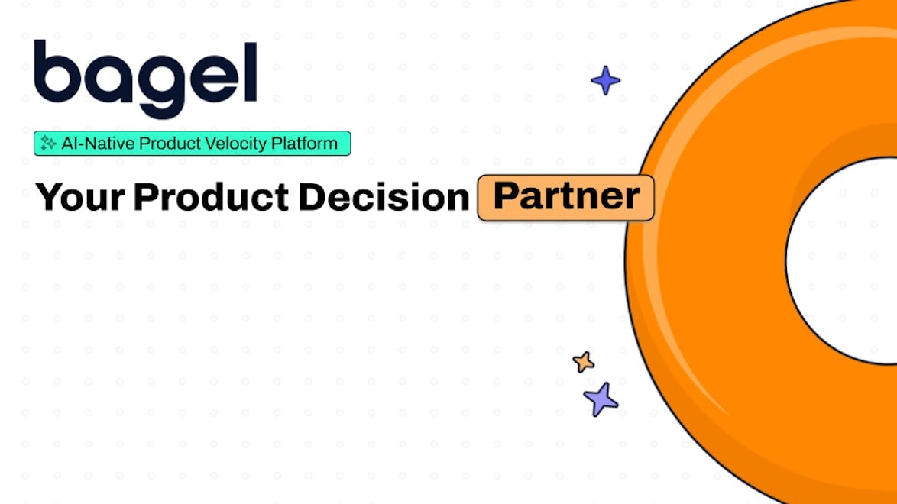
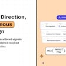
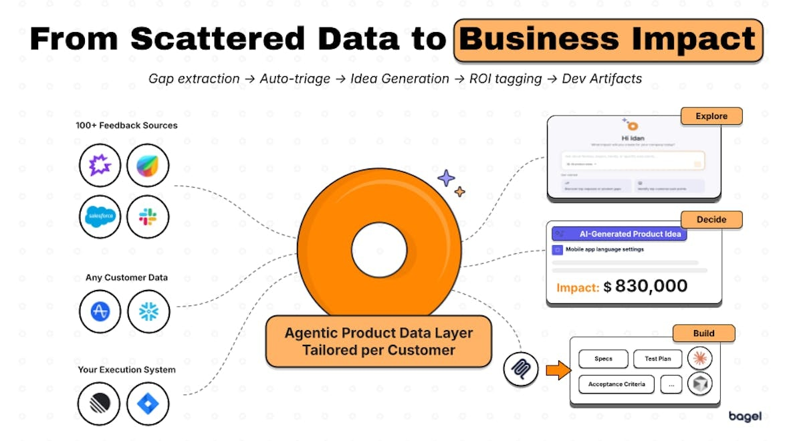

---

## 24. [Saydi](https://www.producthunt.com/products/saydi)
**Votes**: 71 | **도입 난이도**: 하 | **신뢰도**: 상
**Tagline**: Live voice translation to hear the conversation instantly
**서비스 링크**: https://www.producthunt.com/r/FGUBCADCRNKWTU

**태그**: AI, Translation, Communication, Productivity, AI Tool

### 📌 이 서비스 한눈에 보기
텍스트 자막 없이 실시간 음성으로 대화를 즉시 이해하는 웹 브라우저 기반 통역 서비스

### 🔑 주요 기능
- 웹 브라우저에서 바로 실행되는 실시간 음성-대-음성 번역
- 텍스트 자막의 번거로움 없이 자연스러운 대화 흐름 유지
- 말하는 이의 톤과 감정을 살린 고품질 AI 음성 번역 제공

### 🙋 사용자에게 어떤 점이 좋은가
글자를 읽는 대신 귀로 직접 듣는 방식이라 대화의 흐름을 놓치지 않고 자연스러운 소통이 가능합니다.

### ✅ 지금 바로 써볼 기능
- 브라우저에 설치하여 실시간 음성 통역 테스트하기
- 외국어 화자와의 화상 회의 시 적용해보기
- 음성 톤과 감정 전달력 확인하기

### ⚠️ 사용 전 확인할 점
- 음성 기반이므로 주변 소음 환경에 따라 정확도가 달라질 수 있음
- 실시간 처리 과정에서의 미세한 지연 시간(latency) 발생 가능성

### 🧭 확인이 더 필요한 정보
지원하는 언어의 종류와 브라우저 호환성 범위에 대한 구체적인 정보가 필요합니다.

### 📸 스크린샷 및 갤러리

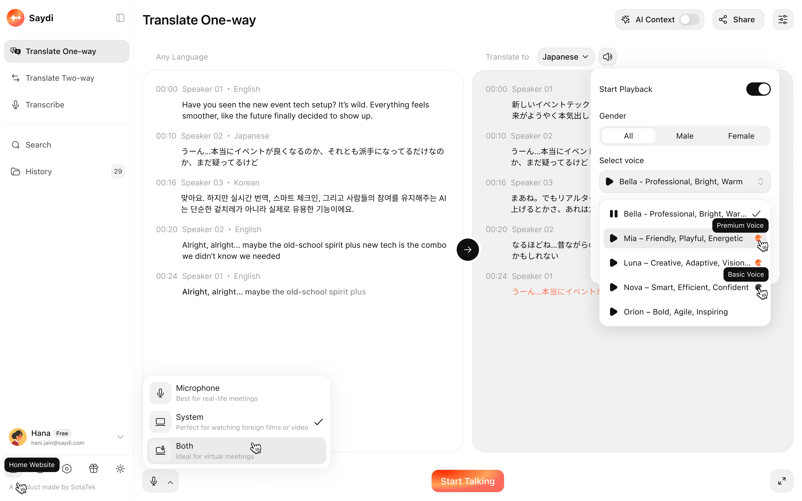
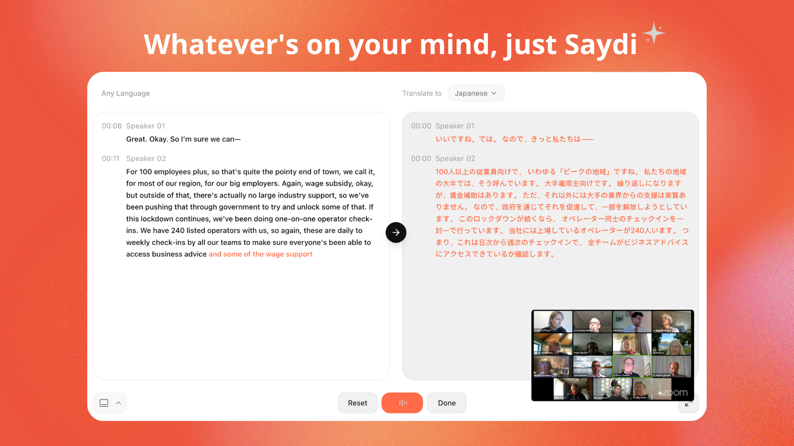

---

## 25. [GoPerfect](https://www.producthunt.com/products/goperfect)
**Votes**: 71 | **도입 난이도**: 하 | **신뢰도**: 중
**Tagline**: Talent Sourcing Describe who you're looking for
**서비스 링크**: https://www.producthunt.com/r/AKDWIAGGHGO3W4

**태그**: HRTech, AI, Recruitment, Automation, AI Tool

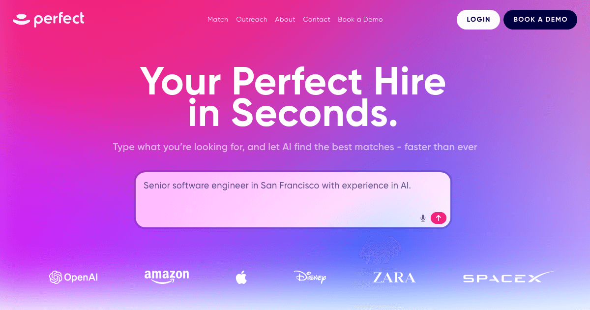

### 📌 이 서비스 한눈에 보기
AI 기술을 활용하여 편향 없이 빠르고 스마트하게 인재를 발굴하는 채용 솔루션

### 🔑 주요 기능
- AI 기반의 지능형 인재 소싱 기능
- 채용 프로세스의 속도 및 효율성 극대화
- 편향을 제거한 공정한 인재 선발 지원

### 🙋 사용자에게 어떤 점이 좋은가
채용 담당자가 적합한 인재를 찾는 시간을 단축하고, 데이터 기반의 객관적인 의사결정을 내릴 수 있도록 돕습니다.

### ✅ 지금 바로 써볼 기능
- 인재 검색 조건 설정해보기
- AI 추천 기능 테스트하기
- 채용 워크플로우 적용하기

### ⚠️ 사용 전 확인할 점
- AI 알고리즘의 구체적인 필터링 기준 확인 필요
- 기존 채용 시스템과의 연동 여부 확인 필요

### 🧭 확인이 더 필요한 정보
제공되는 AI 모델의 구체적인 기술 스택과 데이터 보안 정책에 대한 정보가 부족합니다.

### 📸 스크린샷 및 갤러리
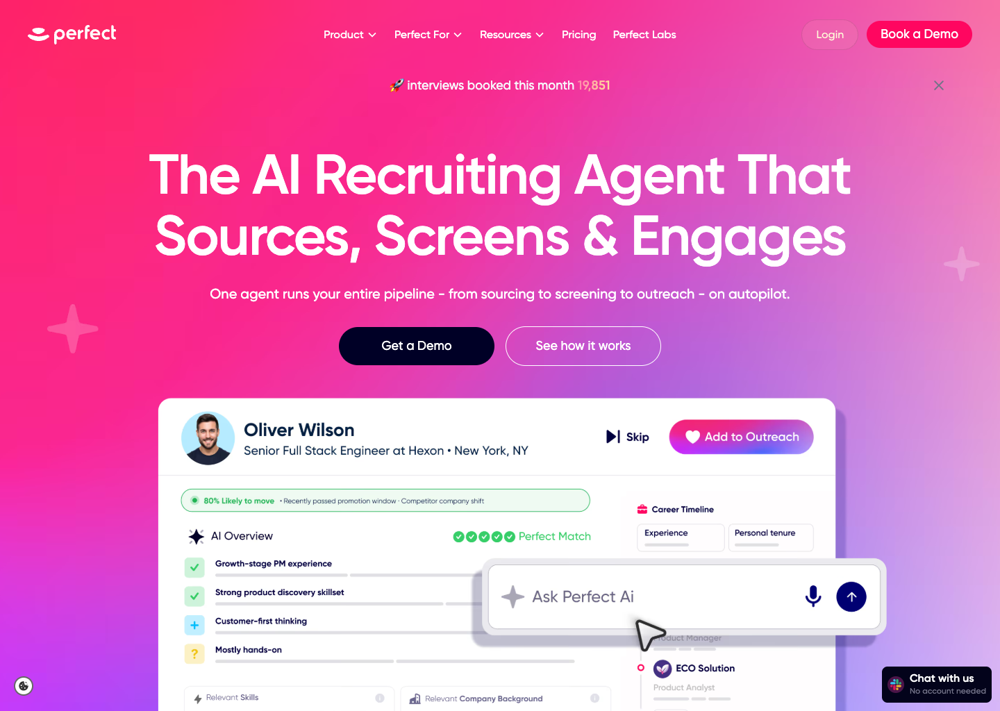
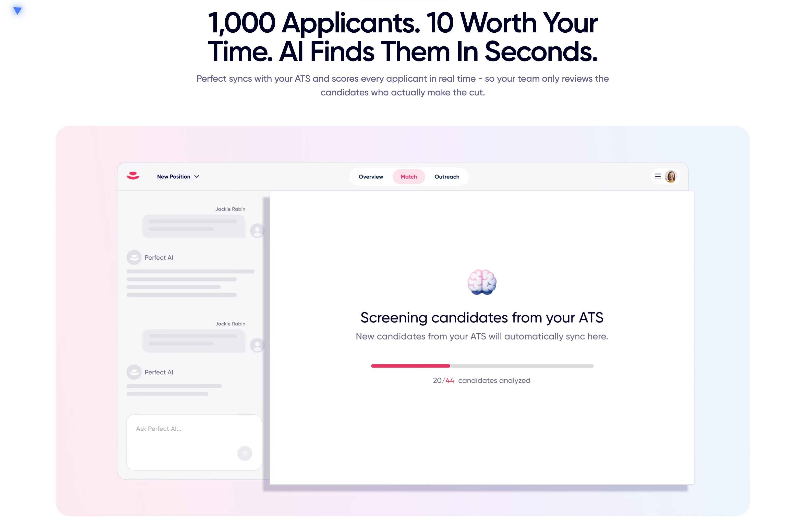
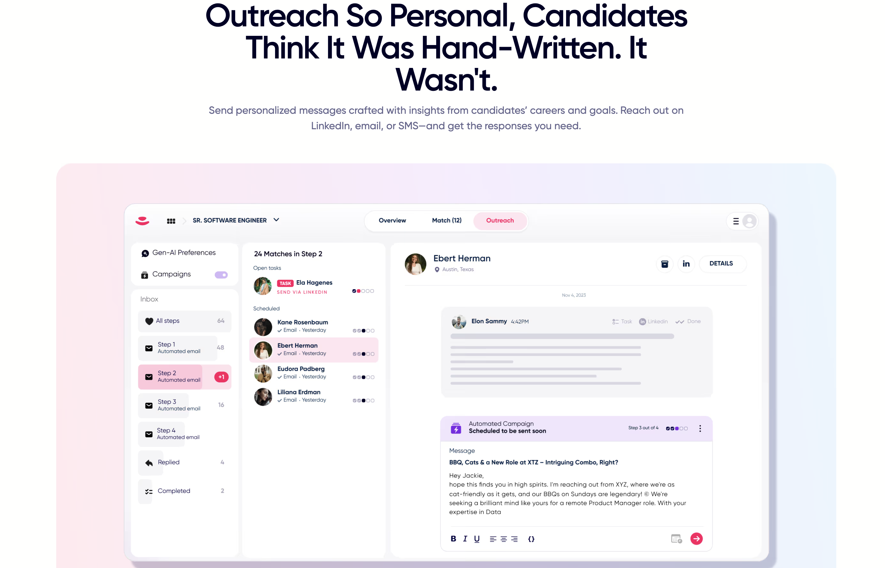

---

## 26. [The Payment Optimization app for Stripe](https://www.producthunt.com/products/flycode)
**Votes**: 70 | **도입 난이도**: 하 | **신뢰도**: 상
**Tagline**: Boost your Stripe recovery rate by 20%
**서비스 링크**: https://www.producthunt.com/r/KXLFKFOLIO2WYS

**태그**: Fintech, SaaS, Automation, Stripe, AI Tool, DevTool

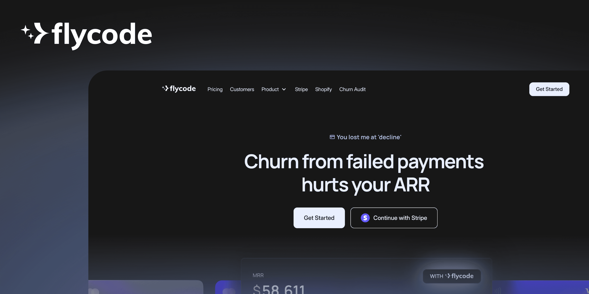

### 📌 이 서비스 한눈에 보기
Stripe 결제 실패를 해결하여 구독 매출을 높이고 이탈을 방지하는 최적화 도구

### 🔑 주요 기능
- Stripe 결제 실패로 인한 비자발적 이탈(Involuntary Churn) 감소
- SaaS 및 이커머스 비즈니스를 위한 결제 복구 솔루션
- 구독 매출 증대 및 결제 성공률 최적화

### 🙋 사용자에게 어떤 점이 좋은가
결제 오류로 인해 놓치고 있던 구독 매출을 자동으로 회수하여 수익성을 높일 수 있습니다.

### ✅ 지금 바로 써볼 기능
- Stripe 계정 연동 및 결제 실패 패턴 분석
- 비자발적 이탈 방지를 위한 복구 프로세스 설정
- 수익 증대 효과 모니터링

### ⚠️ 사용 전 확인할 점
- Stripe 플랫폼 의존도가 높으므로 해당 환경에서의 설정 필요
- 서비스 도입 시 기존 결제 워크플로우와의 정합성 확인 필요

### 🧭 확인이 더 필요한 정보
구체적인 연동 방식 및 자동 복구 로직의 상세 프로세스 확인이 필요합니다.

### 📸 스크린샷 및 갤러리
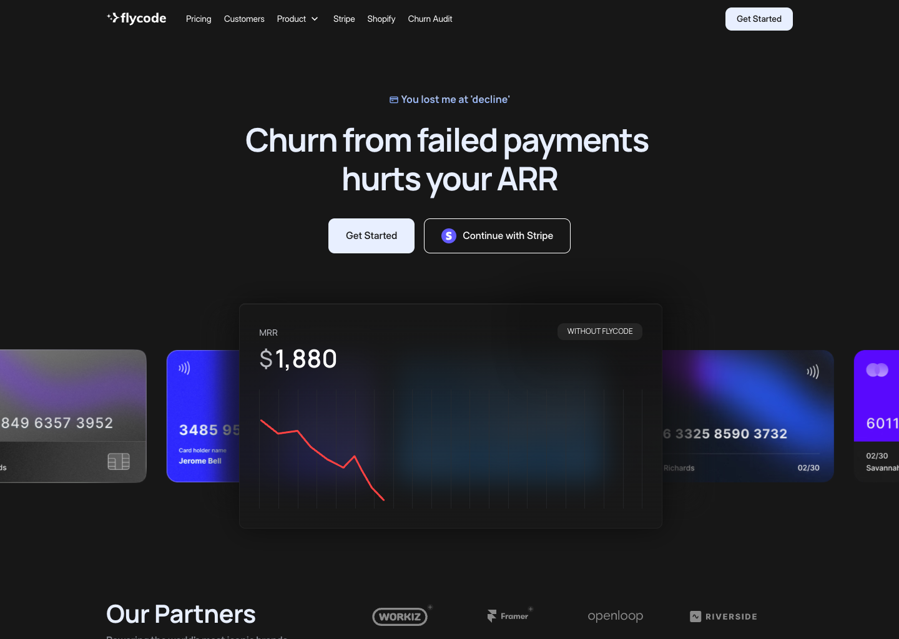
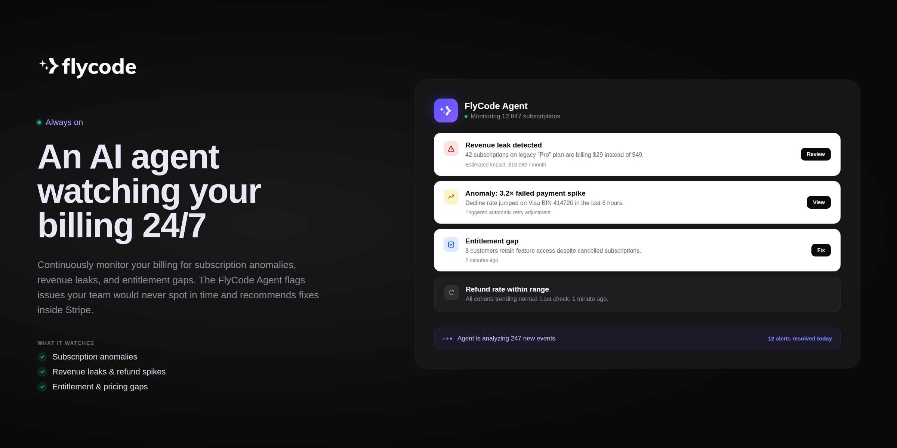
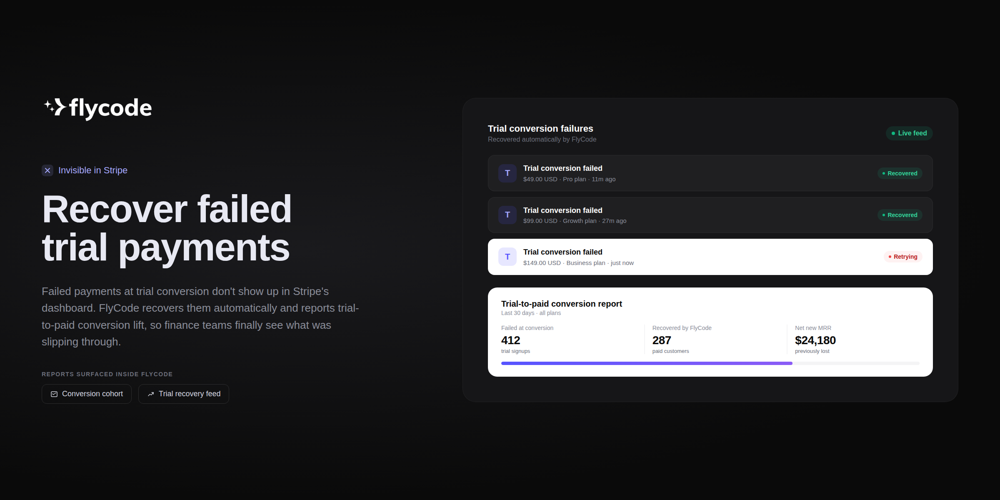

### 🎬 관련 영상
- [🎥 영상 보기](https://ph-files.imgix.net/0d48a81f-4aa5-425e-b7ed-3cc45a323976.jpeg?auto=format)

---

## 27. [Navigage AI](https://www.producthunt.com/products/navigage-ai)
**Votes**: 70 | **도입 난이도**: 하 | **신뢰도**: 상
**Tagline**: AI guide for Medicare benefits and savings
**서비스 링크**: https://www.producthunt.com/r/V6JQMUZZVQWWQB

**태그**: HealthTech, AI Assistant, Personal Finance, Medicare, AI Tool, Chat

### 📌 이 서비스 한눈에 보기
복잡한 메디케어 혜택과 비용 관리를 돕는 AI 채팅 가이드

### 🔑 주요 기능
- 채팅 기반의 직관적인 메디케어 플랜 이해 지원
- 의료비 절감액 추적 및 관련 문서 저장 기능
- 보험 적용이 가능한 의료 서비스 검색

### 🙋 사용자에게 어떤 점이 좋은가
복잡한 메디케어 규정과 혜택을 채팅으로 쉽게 파악하고, 개인별 의료 비용과 서류를 체계적으로 관리할 수 있습니다.

### ✅ 지금 바로 써볼 기능
- 채팅을 통한 현재 메디케어 플랜 분석
- 의료비 절감 내역 기록 및 추적
- 보험 적용 서비스 검색 및 문서 업로드

### ⚠️ 사용 전 확인할 점
- AI의 답변이 실제 보험 약관과 다를 수 있으므로 최종 결정 전 확인 필요
- 민감한 개인 의료 정보 및 문서 저장에 따른 보안 검토 필요

### 🧭 확인이 더 필요한 정보
실제 보험사와의 데이터 연동 여부 및 개인정보 보호 정책에 대한 상세 확인이 필요합니다.

### 📸 스크린샷 및 갤러리

---

## 28. [Xenaris](https://www.producthunt.com/products/xenaris)
**Votes**: 70 | **도입 난이도**: 중 | **신뢰도**: 중
**Tagline**: When a deal dies, nothing should be wasted
**서비스 링크**: https://www.producthunt.com/r/PHYAL2RVLSMHCF

**태그**: FinTech, DataManagement, BusinessIntelligence, AI Tool

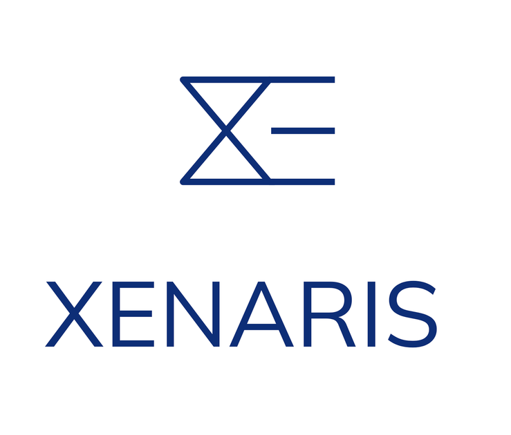

### 📌 이 서비스 한눈에 보기
실패한 딜의 실사 데이터를 재활용하여 자산 손실을 방지하는 인텔리전스 엔진

### 🔑 주요 기능
- 중단된 딜에서 발생하는 막대한 비용 및 시간 손실 방지
- 실사 과정에서 수집된 데이터의 80%를 재사용 가능한 자산으로 전환
- 지능형 엔진을 통한 효율적인 데이터 관리 및 지식 보존

### 🙋 사용자에게 어떤 점이 좋은가
딜이 무산되었을 때 버려지는 리서치와 데이터들을 유효한 정보로 변환하여 차후 딜에 즉시 활용할 수 있게 해줍니다.

### ✅ 지금 바로 써볼 기능
- 기존에 실패했던 딜의 데이터 구조 확인
- 데이터 재사용 가능성 검토
- 인텔리전스 엔진의 데이터 추출 방식 파악

### ⚠️ 사용 전 확인할 점
- 데이터 보안 및 기밀 유지 정책 확인 필요
- 기존 데이터 포맷과의 호환성 검토

### 🧭 확인이 더 필요한 정보
구체적인 데이터 추출 방식과 보안 프로토콜에 대한 상세 정보가 부족합니다.

### 📸 스크린샷 및 갤러리
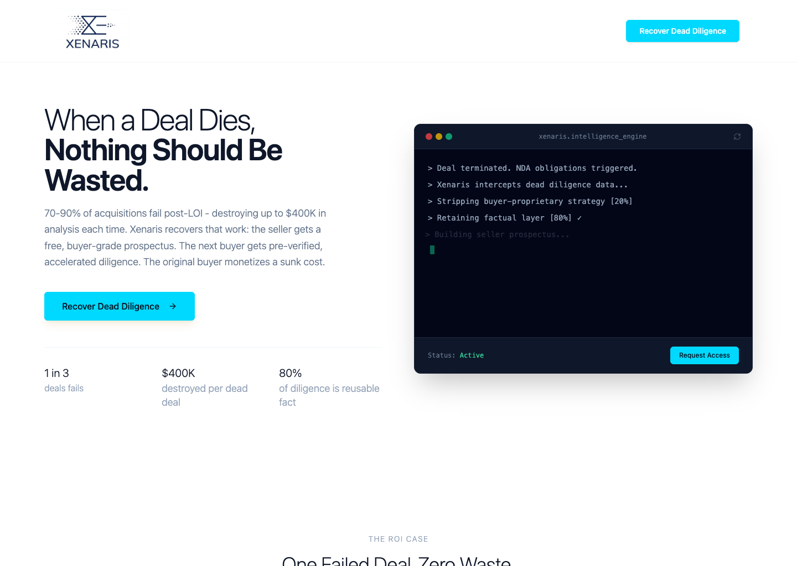
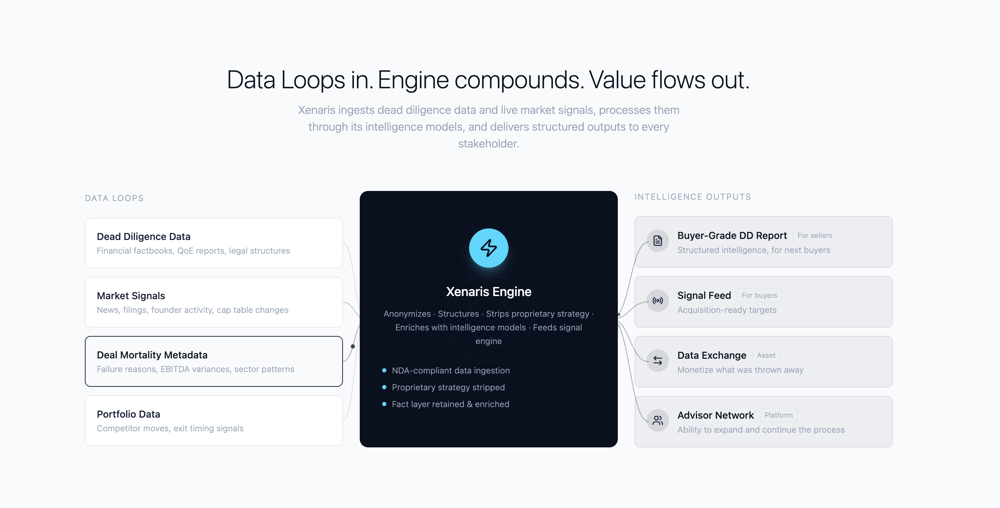
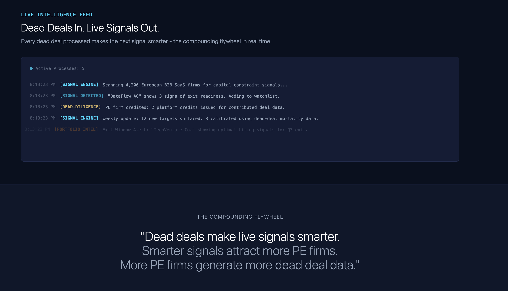

---

## 29. [Psistar](https://www.producthunt.com/products/psistar)
**Votes**: 69 | **도입 난이도**: 상 | **신뢰도**: 중
**Tagline**: The agentic team member for high-stakes operations
**서비스 링크**: https://www.producthunt.com/r/CP43CRRTH733GK

**태그**: Industrial AI, Decision Support, Physics-Informed AI, DeepTech, Agent

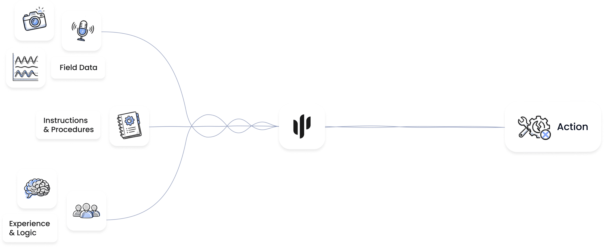

### 📌 이 서비스 한눈에 보기
물리 법칙 기반 모델로 복잡한 산업 시스템의 의사결정을 지원하는 에이전트 솔루션

### 🔑 주요 기능
- 물리 정보 기반 파운데이션 모델(Physics-informed foundation models) 구축
- 센서 데이터와 운영 매뉴얼(Playbooks)을 결합한 의사결정 지원
- 에너지, 항공우주, 국방 및 산업 시스템 특화

### 🙋 사용자에게 어떤 점이 좋은가
고위험 산업 현장에서 센서 데이터를 분석하여 운영자가 정확하고 신속한 판단을 내릴 수 있도록 돕습니다.

### ✅ 지금 바로 써볼 기능
- 보유 중인 센서 데이터와 운영 매뉴얼의 호환성 검토
- 특정 산업 도메인(전력, 항공 등)에 대한 모델 적용 가능성 확인

### ⚠️ 사용 전 확인할 점
- 고위험 운영 환경을 대상으로 하므로 모델의 예측 정확도 검증 필수
- 특수 산업 분야에 특화되어 있어 일반적인 범용 소프트웨어와는 도입 방식이 다를 수 있음

### 🧭 확인이 더 필요한 정보
구체적인 소프트웨어 인터페이스(UI)나 기존 시스템과의 통합 방식에 대한 정보가 부족합니다.

### 📸 스크린샷 및 갤러리
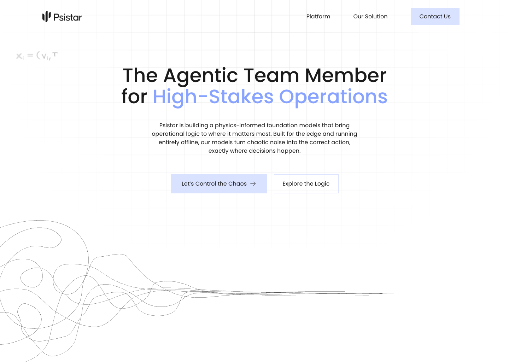

---

## 30. [Avon AI](https://www.producthunt.com/products/avon-ai)
**Votes**: 69 | **도입 난이도**: 상 | **신뢰도**: 중
**Tagline**: Control AI agents with confidence
**서비스 링크**: https://www.producthunt.com/r/NRYHSFSUQUERAD

**태그**: Enterprise, AI Agents, Security, Compliance, Automation, Agent, AI Tool

### 📌 이 서비스 한눈에 보기
규제 산업을 위한 보안 및 컴플라이언스 중심의 AI 에이전트 관리 플랫폼

### 🔑 주요 기능
- 기업용 수준의 GenAI 에이전트 제어 및 관리 기능
- 보안과 규제 준수가 필수적인 산업 환경에 최적화
- 확장 가능한 엔터프라이즈급 아키텍처 제공

### 🙋 사용자에게 어떤 점이 좋은가
보안이 중요한 기업 환경에서 AI 에이전트를 안전하고 통제 가능한 방식으로 운영할 수 있게 해줍니다.

### ✅ 지금 바로 써볼 기능
- 기업 내 보안 정책과의 호환성 검토
- 에이전트 제어 기능 테스트
- 규제 준수 워크플로우 설정

### ⚠️ 사용 전 확인할 점
- 엔터프라이즈 타겟 제품으로 초기 도입 비용 및 복잡도가 높을 수 있음
- 특정 산업 규제에 특화되어 있어 범용적 사용 시 제약이 있을 수 있음

### 🧭 확인이 더 필요한 정보
구체적인 기술 스택과 지원하는 산업 규제 범위에 대한 상세 정보가 필요합니다.

### 📸 스크린샷 및 갤러리
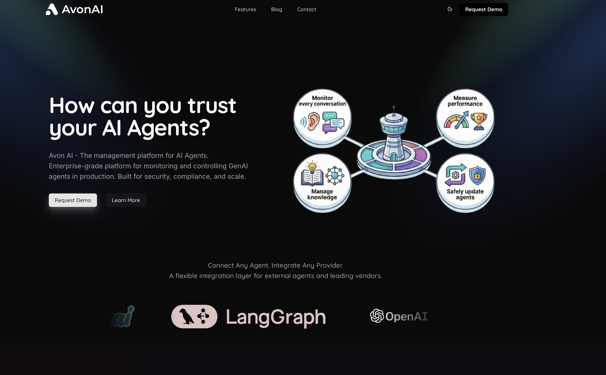
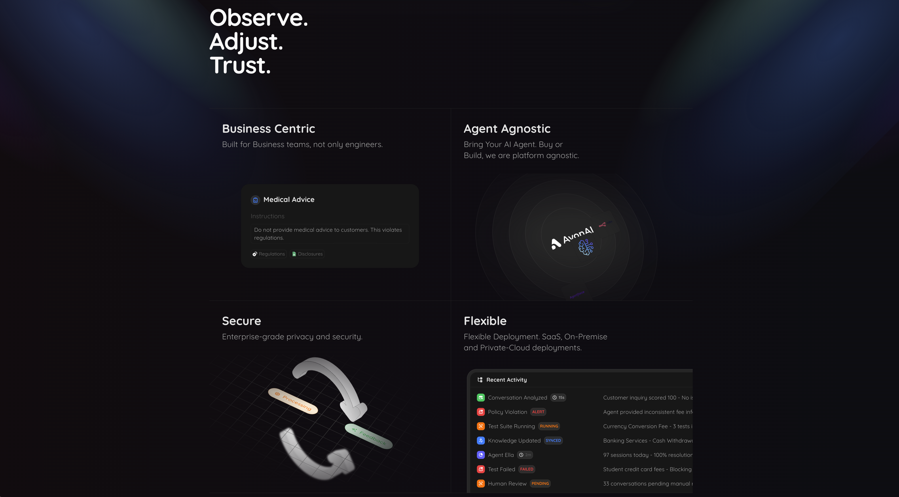
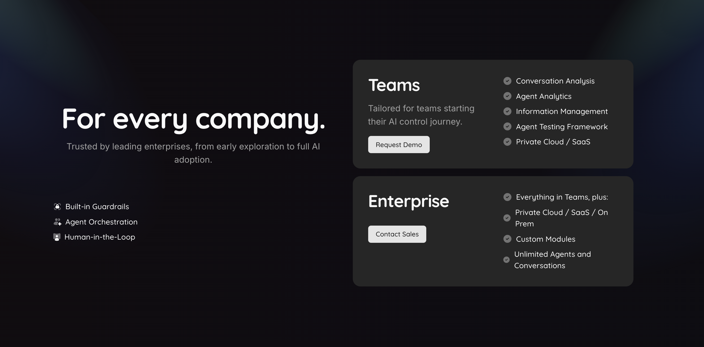

---

