# 🚀 Product Hunt Daily Top 30 (2026-05-09)

## 오늘의 요약
오늘의 트렌드는 AI 에이전트의 운영 효율성을 높이는 관리 도구와 보안 테스트, 그리고 자동화된 콘텐츠 생성 및 채용 솔루션이 주를 이루었습니다. 단순한 AI 활용을 넘어 에이전트의 작업 복구, 도구 통합, 취약점 탐지 등 에이전트 생태계의 안정성과 확장성을 확보하려는 시도가 돋보였습니다.

### 오늘의 핵심 포인트
- 에이전트의 작업 관리, 자동 복구 및 보안 취약점 탐지를 위한 전문적인 미션 컨트롤과 테스트 도구들이 등장했습니다.
- AI를 활용한 자동화된 블로그 포스팅, 제품 홍보 영상 제작, 실력 기반 엔지니어 매칭 등 실무 생산성을 극대화하는 솔루션이 주목받았습니다.
- 데이터 주권을 보장하는 로컬 기반 지식 관리와 새로운 방식의 소셜 인터랙션 등 개인화된 사용자 경험을 제공하는 서비스들이 제안되었습니다.

**오늘의 태그**: AI 에이전트, 업무 자동화, AI 보안, 생산성 도구, 오픈소스

## 1. [RankSpot](https://www.producthunt.com/products/rankspot)
**Votes**: 421 | **도입 난이도**: 하 | **신뢰도**: 상
**Tagline**: AI SEO Blog driven by deep competitor intelligence
**서비스 링크**: https://www.producthunt.com/r/6OTRNXDGVGQLGN

**태그**: AI, SEO, Automation, ContentMarketing, Agent, AI Tool

### 📌 이 서비스 한눈에 보기
경쟁사 분석 기반의 자동화된 AI SEO 블로그 포스팅 에이전트

### 🔑 주요 기능
- 경쟁사 인텔리전스를 활용한 심층적인 SEO 리서치
- 매일 자동으로 콘텐츠를 작성하고 블로그에 게시하는 자동화 워크플로우
- AI 답변 엔진 및 구글 검색 결과 최적화 타겟팅

### 🙋 사용자에게 어떤 점이 좋은가
콘텐츠 제작과 게시 과정을 자동화하여 검색 엔진 노출과 AI 답변 인용 가능성을 높여줍니다.

### ✅ 지금 바로 써볼 기능
- 자동화된 블로그 게시 설정하기
- 경쟁사 데이터 기반의 키워드 전략 확인하기
- AI 답변 최적화 상태 모니터링하기

### ⚠️ 사용 전 확인할 점
- 완전 자동화로 인한 콘텐츠 품질 및 브랜드 톤앤매너 일치 여부 확인 필요
- 검색 엔진 알고리즘 변화에 따른 자동 생성 콘텐츠의 노출 변동성

### 🧭 확인이 더 필요한 정보
지원하는 블로그 플랫폼(CMS)의 종류와 구체적인 자동화 범위에 대한 정보가 추가로 필요합니다.

### 📸 스크린샷 및 갤러리
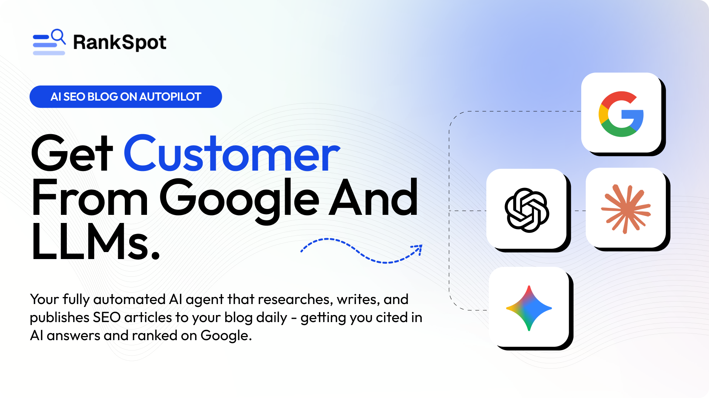

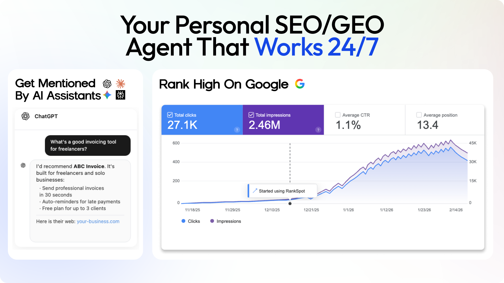

### 🎬 관련 영상
- [🎥 영상 보기](https://ph-files.imgix.net/ba6678f6-8dc4-4789-a8b4-e8abe0c66da2.jpeg?auto=format)

---

## 2. [Monid 2.0](https://www.producthunt.com/products/monid)
**Votes**: 329 | **도입 난이도**: 하 | **신뢰도**: 상
**Tagline**: OpenRouter for agent tools
**서비스 링크**: https://www.producthunt.com/r/RGRECF5QMV23LX

**태그**: AI-Agent, API-Aggregator, Automation, DevTool, Agent, API

### 📌 이 서비스 한눈에 보기
에이전트가 필요한 모든 도구를 하나의 인터페이스로 연결하는 통합 툴 허브

### 🔑 주요 기능
- 200개 이상의 다양한 도구(스크래퍼, 검색 API, 이커머스 데이터 등)를 단일 연결로 사용 가능
- 에이전트가 필요한 기능을 실시간으로 탐색, 비교 및 결제할 수 있는 환경 제공
- 복잡한 개별 API 연동 과정을 단순화한 'OpenRouter' 방식의 접근

### 🙋 사용자에게 어떤 점이 좋은가
에이전트 개발 시 매번 새로운 API를 연동할 필요 없이, Monid를 통해 다양한 외부 도구를 즉각적으로 확장하여 사용할 수 있습니다.

### ✅ 지금 바로 써볼 기능
- 200개 이상의 제공 도구 카탈로그 탐색
- 에이전트 워크플로우에 Monid API 연동 테스트
- 필요한 기능별 도구 비교 및 선택

### ⚠️ 사용 전 확인할 점
- 다양한 도구 사용 시 발생하는 통합 비용 및 결제 구조 확인 필요
- 외부 도구 의존도에 따른 에이전트 성능 변동 가능성

### 🧭 확인이 더 필요한 정보
200개 이상의 도구에 대한 구체적인 비용 체계와 에이전트 호출 시의 지연 시간(latency) 정보가 필요합니다.

### 📸 스크린샷 및 갤러리
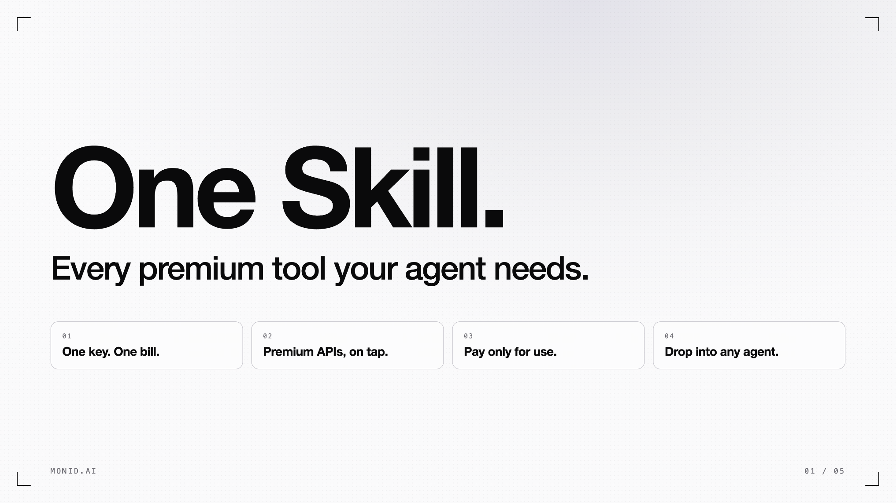
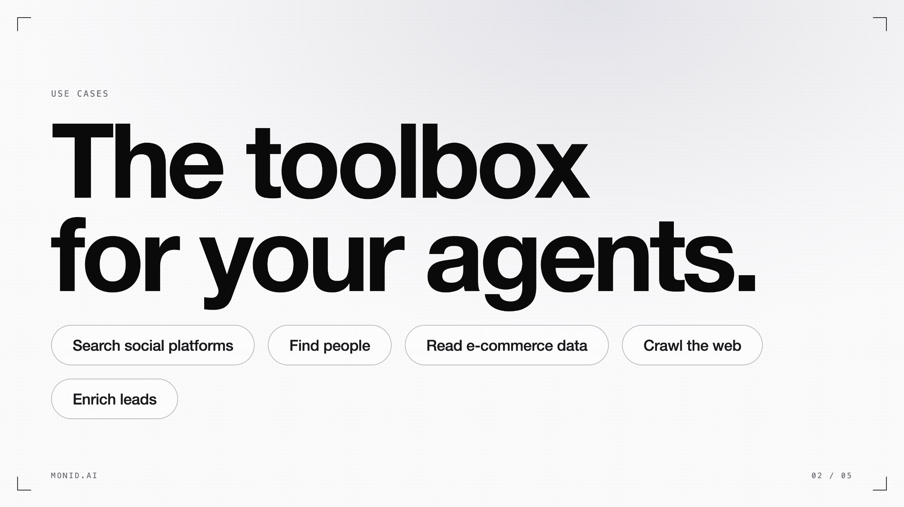
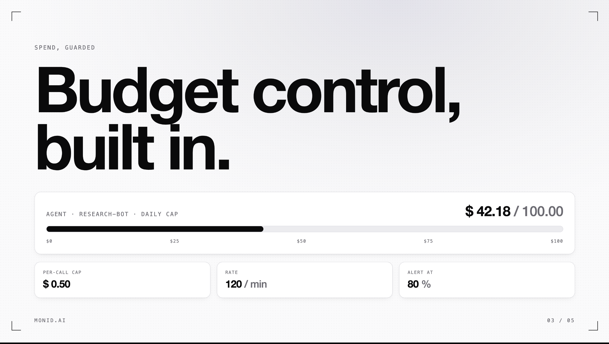

### 🎬 관련 영상
- [🎥 영상 보기](https://ph-files.imgix.net/66a75c2c-3c3d-413d-a2c1-f938ed9f126e.jpeg?auto=format)

---

## 3. [Minions](https://www.producthunt.com/products/minions)
**Votes**: 244 | **도입 난이도**: 하 | **신뢰도**: 상
**Tagline**: Open source mission control for Hermes agent
**서비스 링크**: https://www.producthunt.com/r/AW7QWKE3MQG5QD

**태그**: DevTool, Automation, AgenticWorkflow, OpenSource, Agent, AI Tool

### 📌 이 서비스 한눈에 보기
Hermes Agent의 다중 작업을 효율적으로 관리하고 자동 복구하는 오픈소스 미션 컨트롤 보드

### 🔑 주요 기능
- 여러 개의 에이전트 작업을 한눈에 관리할 수 있는 통합 태스크 보드 제공
- 주기적인 체크인 및 작업 중단 시 자동 재시도(Retry) 기능
- 대안이 없을 때만 사용자에게 알림을 보내는 스마트한 에스컬레이션 시스템

### 🙋 사용자에게 어떤 점이 좋은가
에이전트 작업이 늘어날 때 발생하는 관리 혼선과 작업 실패 문제를 자동화된 모니터링과 복구 프로세스로 해결해 줍니다.

### ✅ 지금 바로 써볼 기능
- 현재 사용 중인 Hermes Agent와 연동하기
- 다중 작업 실행 후 태스크 보드 모니터링하기
- 에이전트 실패 시 자동 재시도 로직 테스트하기

### ⚠️ 사용 전 확인할 점
- 현재는 Hermes Agent에 최적화되어 있으며 다른 런타임 지원은 예정 단계임
- 에이전트 작업의 복잡도에 따라 자동 재시도 로직이 예상과 다르게 동작할 수 있음

### 🧭 확인이 더 필요한 정보
다른 런타임(Runtime) 지원 계획 및 구체적인 확장 로드맵에 대한 정보가 필요합니다.

### 📸 스크린샷 및 갤러리
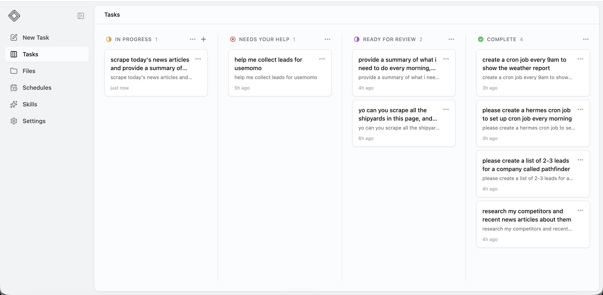
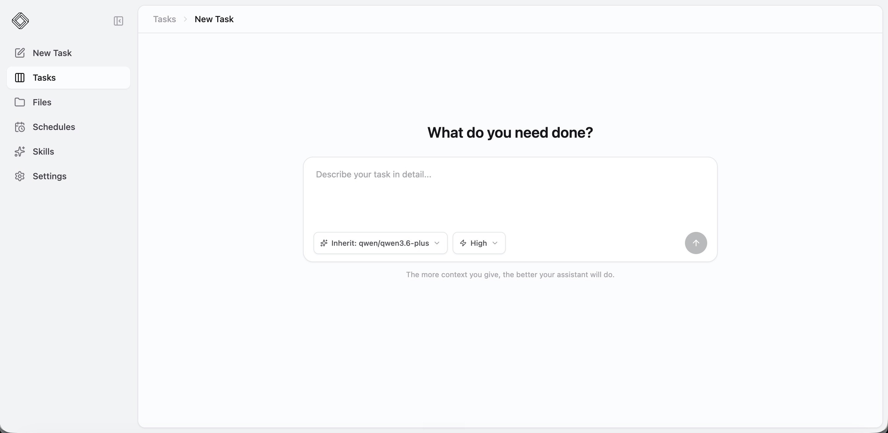
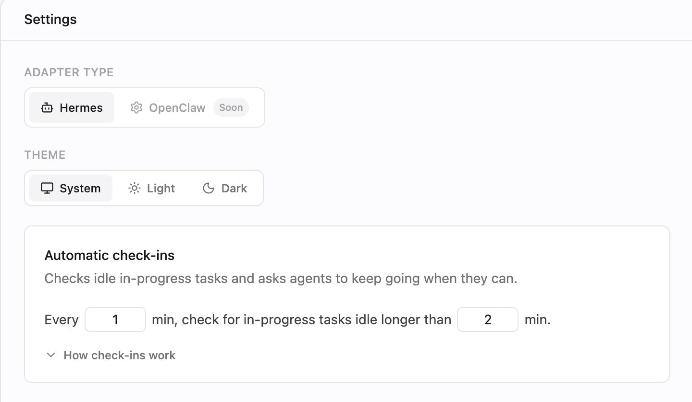

### 🎬 관련 영상
- [🎥 영상 보기](https://ph-files.imgix.net/c32b0a60-a228-4624-9faa-717c7e82ae9b.gif?auto=format)

---

## 4. [Flare](https://www.producthunt.com/products/flare-9)
**Votes**: 204 | **도입 난이도**: 하 | **신뢰도**: 상
**Tagline**: AI-native voice-first social app for GenZ
**서비스 링크**: https://www.producthunt.com/r/FLBPXYPO7MDZP3

**태그**: Social, AI, GenZ, Voice-First, Agent, AI Tool, Video

### 📌 이 서비스 한눈에 보기
스크롤 대신 대화로 소통하는 GenZ를 위한 AI 기반 보이스 퍼스트 소셜 앱

### 🔑 주요 기능
- AI Orb 에이전트를 통한 일상(사진, 영상, 무드)의 맥락화
- 좋아요, 팔로워, 댓글 없는 새로운 방식의 소셜 인터랙션
- 스크롤링이 아닌 듣고 대화하는 사용자 경험 중심 설계

### 🙋 사용자에게 어떤 점이 좋은가
끊임없는 스크롤과 타인의 시선에서 벗어나, 친구들과의 소중한 순간을 AI와 함께 의미 있는 기억으로 기록할 수 있습니다.

### ✅ 지금 바로 써볼 기능
- 일상의 순간을 사진이나 영상으로 캡처하기
- AI Orb가 생성하는 개인화된 맥락 확인하기
- 친구들과의 대화형 소셜 경험 시작하기

### ⚠️ 사용 전 확인할 점
- 기존 SNS와 다른 인터페이스로 인한 초기 적응 필요
- 개인적인 일상을 AI 에이전트에게 공유하는 것에 대한 프라이버시 고려

### 🧭 확인이 더 필요한 정보
AI Orb가 구체적으로 어떤 방식으로 대화를 유도하고 친구 관계를 형성하는지에 대한 상세 메커니즘 확인이 필요합니다.

### 📸 스크린샷 및 갤러리
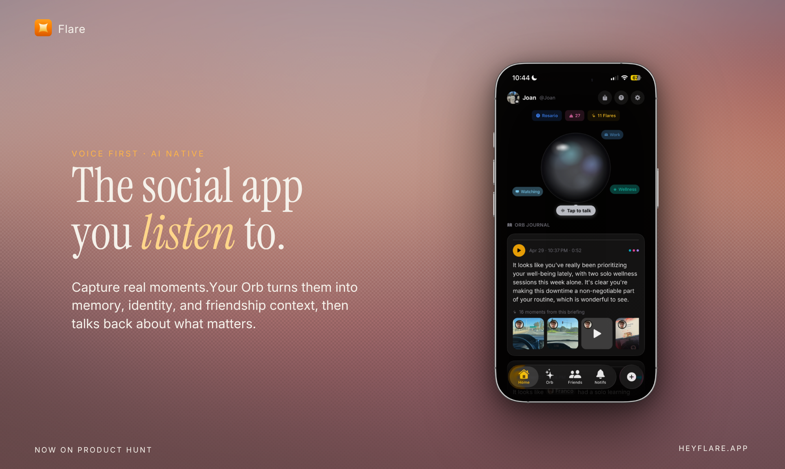

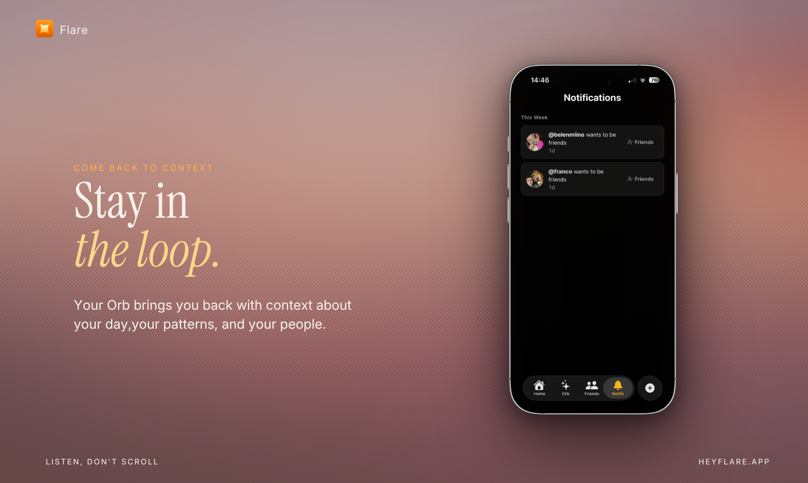

### 🎬 관련 영상
- [🎥 영상 보기](https://ph-files.imgix.net/ba3507dc-857b-4f39-b9b5-cf68be1c415c.jpeg?auto=format)

---

## 5. [Kuku: open source](https://www.producthunt.com/products/kuku)
**Votes**: 177 | **도입 난이도**: 중 | **신뢰도**: 상
**Tagline**: Your open-source, local second brain for every AI
**서비스 링크**: https://www.producthunt.com/r/S4FEM3RNRHIADW

**태그**: OpenSource, KnowledgeManagement, AI, Markdown, Productivity, AI Tool, Chat

### 📌 이 서비스 한눈에 보기
데이터 주권을 지키며 AI와 협업할 수 있는 오픈소스 로컬 제2의 뇌

### 🔑 주요 기능
- 로컬 우선(Local-first) 방식의 마크다운 기반 지식 관리
- 위키링크, 백링크, 그래프 뷰를 통한 지식 구조화
- AI를 활용한 편집 및 검토 가능한 차이점(diff) 제공

### 🙋 사용자에게 어떤 점이 좋은가
사용자의 지식을 마크다운 파일로 안전하게 보관하면서, AI를 통해 개인화된 컨텍스트를 손쉽게 생성하고 활용할 수 있습니다.

### ✅ 지금 바로 써볼 기능
- 기존 마크다운 메모 파일을 Kuku 보관함으로 가져오기
- 그래프 뷰와 백링크를 활용한 지식 연결 구조 확인하기
- AI 편집 기능을 통해 메모 수정 및 diff 검토해보기

### ⚠️ 사용 전 확인할 점
- 로컬 기반이므로 데이터 백업 및 동기화 전략을 직접 관리해야 함
- 오픈소스 프로젝트 특성상 기능 업데이트 및 안정성이 변동될 수 있음

### 🧭 확인이 더 필요한 정보
현재 제공되는 AI 모델과의 구체적인 연동 방식 및 클라우드 서비스와의 차이점에 대한 상세 정보가 필요합니다.

### 📸 스크린샷 및 갤러리
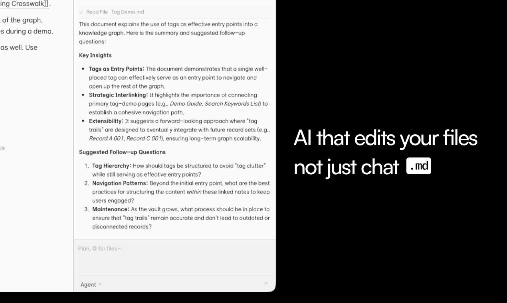
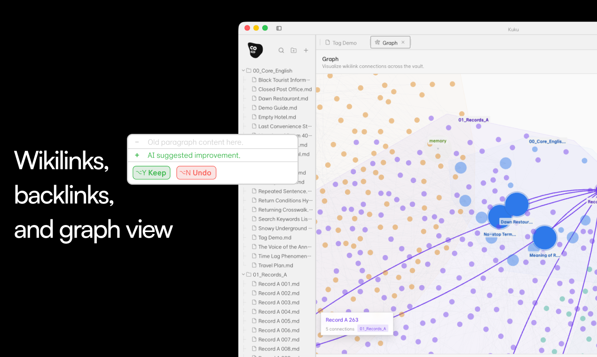
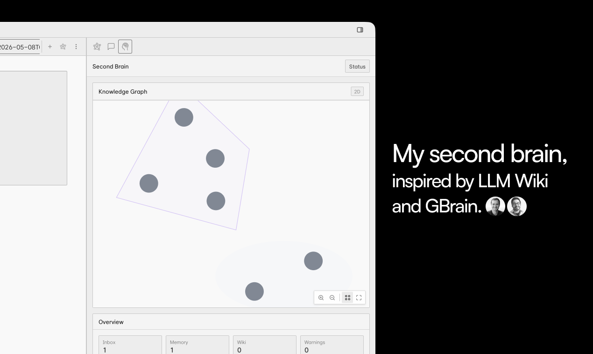

### 🎬 관련 영상
- [🎥 영상 보기](https://ph-files.imgix.net/8de2ff0e-c0b4-4714-bf41-4d395e91f7df.jpeg?auto=format)

---

## 6. [GitHired](https://www.producthunt.com/products/githired-2)
**Votes**: 173 | **도입 난이도**: 하 | **신뢰도**: 상
**Tagline**: Find 100x engineers by proof of work, not resume keywords
**서비스 링크**: https://www.producthunt.com/r/WYPKITACC4AEM6

**태그**: Recruitment, DevTool, Automation, Sourcing

### 📌 이 서비스 한눈에 보기
이력서 키워드가 아닌 실제 코드 실력 기반의 검증된 엔지니어를 즉시 매칭해주는 채용 자동화 도구

### 🔑 주요 기능
- 코드 복잡도 및 프로젝트 깊이를 분석한 1만 명 이상의 검증된 엔지니어 풀 제공
- 자연어 설명을 통한 맞춤형 엔지니어 랭킹 리스트 자동 생성
- 내장된 GitHub 및 LinkedIn 스크래퍼를 통한 외부 오픈소스 개발자 소싱 기능

### 🙋 사용자에게 어떤 점이 좋은가
단순 키워드 매칭에서 벗어나 실제 개발 역량이 뛰어난 인재를 빠르게 식별하여 채용 실패 비용을 줄여줍니다.

### ✅ 지금 바로 써볼 기능
- 구축 중인 프로젝트 요구사항 입력하여 랭킹 리스트 확인하기
- 내장 스크래퍼를 활용해 특정 기술 스택의 오픈소스 기여자 검색하기
- 제공되는 프로필의 코드 분석 데이터 검토하기

### ⚠️ 사용 전 확인할 점
- 프라이빗 저장소 접근 권한 설정에 따른 데이터 정확도 및 보안 정책 확인 필요
- 스캐닝된 데이터가 실제 협업 역량까지 완벽히 대변하는지 검증 필요

### 🧭 확인이 더 필요한 정보
현재 제공되는 1만 명 이상의 프로필 풀의 구체적인 기술 스택 분포와 스크래핑 데이터의 최신성 확인이 필요합니다.

### 📸 스크린샷 및 갤러리
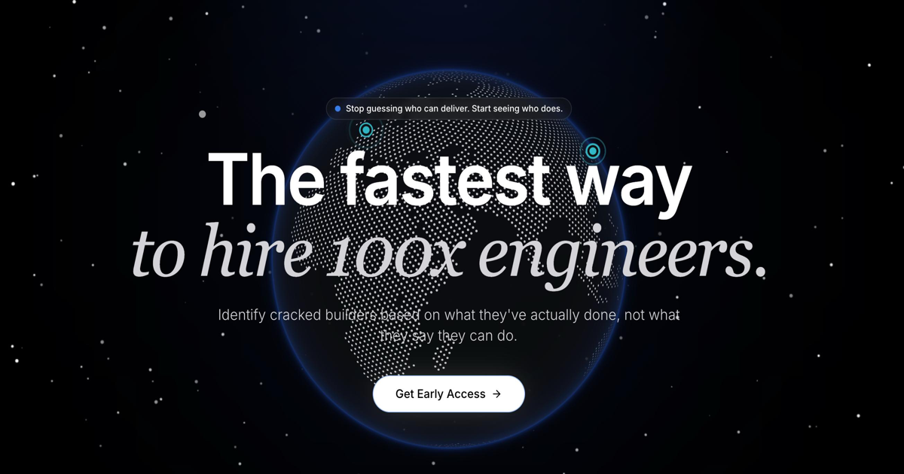
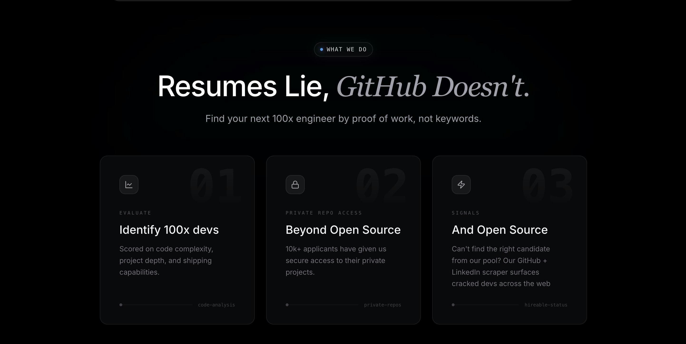
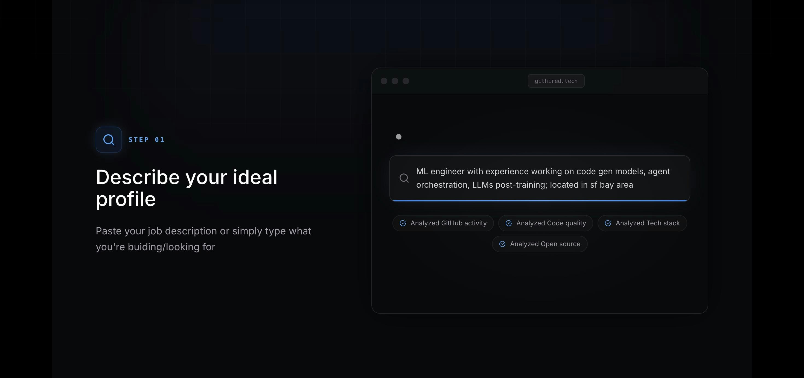

### 🎬 관련 영상
- [🎥 영상 보기](https://ph-files.imgix.net/d4a47738-a33f-48a5-a5c7-ae30bf3f53cd.jpeg?auto=format)

---

## 7. [Fluent Frame](https://www.producthunt.com/products/fluent-frame)
**Votes**: 134 | **도입 난이도**: 하 | **신뢰도**: 상
**Tagline**: Ship polished product videos as fast as you ship features
**서비스 링크**: https://www.producthunt.com/r/47S4PJPGLSQZ7B

**태그**: VideoAI, MarketingTool, ProductLaunch, Automation, AI Tool, Prompting, Video, Marketing

### 📌 이 서비스 한눈에 보기
텍스트 프롬프트만으로 고퀄리티 제품 홍보 영상을 빠르게 제작하는 AI 툴

### 🔑 주요 기능
- 텍스트 프롬프트를 통한 간편한 영상 생성
- 제품 업데이트 및 기능 출시용 영상 제작 최적화
- 에이전시 대비 압도적인 비용 및 시간 절감

### 🙋 사용자에게 어떤 점이 좋은가
잦은 제품 업데이트를 진행하는 창업자와 마케팅 팀이 고비용의 영상 제작 과정 없이 즉각적으로 홍보 영상을 만들 수 있습니다.

### ✅ 지금 바로 써볼 기능
- 텍스트 프롬프트로 첫 번째 제품 설명 영상 생성하기
- 기존 제품 업데이트 내용을 바탕으로 런칭 영상 만들기

### ⚠️ 사용 전 확인할 점
- 텍스트 기반 생성 방식이므로 복잡한 연출이나 정교한 편집에는 한계가 있을 수 있음
- 생성된 영상의 스타일이 브랜드 가이드라인과 일치하는지 확인 필요

### 🧭 확인이 더 필요한 정보
구체적인 영상 길이, 해상도 및 편집 자유도에 대한 상세 정보가 명시되지 않았습니다.

### 📸 스크린샷 및 갤러리
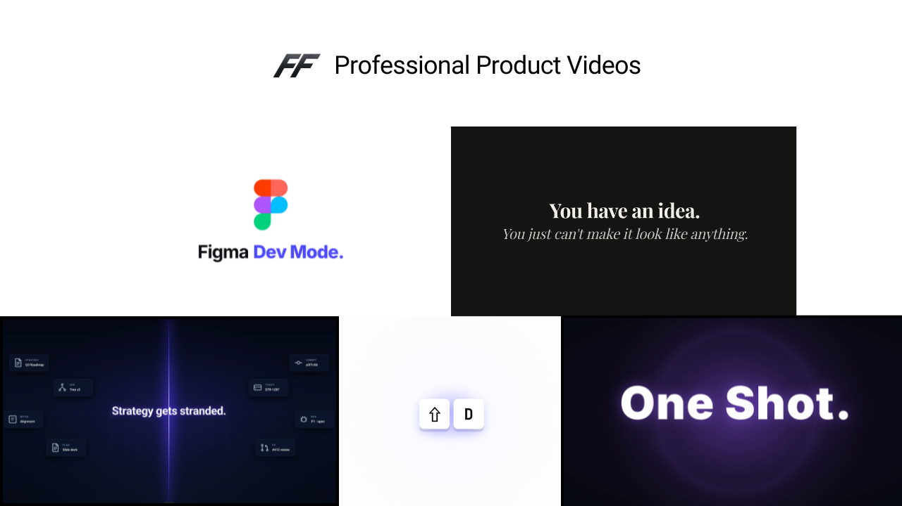
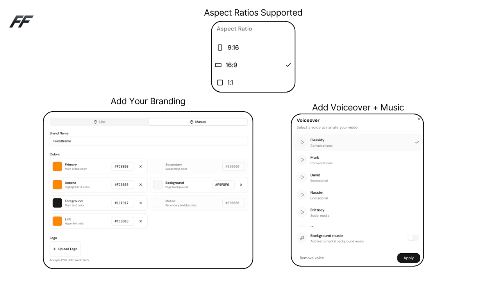
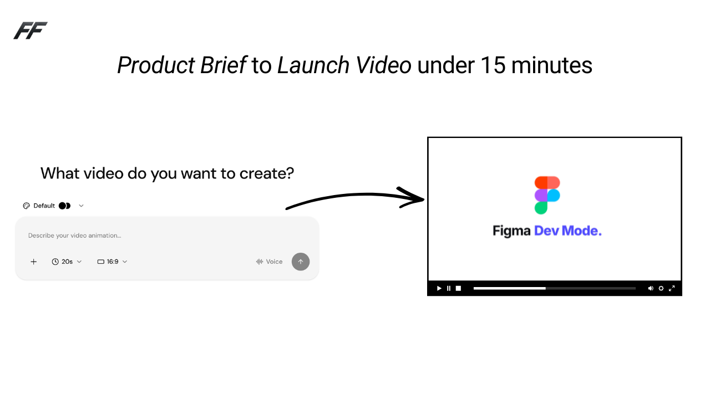

### 🎬 관련 영상
- [🎥 영상 보기](https://ph-files.imgix.net/e32833b1-98c9-458b-9337-cfe949590fc1.jpeg?auto=format)

---

## 8. [Fabraix](https://www.producthunt.com/products/nyx-4)
**Votes**: 116 | **도입 난이도**: 하 | **신뢰도**: 상
**Tagline**: Find gaps in your AI agents before users do
**서비스 링크**: https://www.producthunt.com/r/343V4QSMXHGFIP

**태그**: AI-Security, DevTool, Testing, QA, AI-Agents, Agent, AI Tool

### 📌 이 서비스 한눈에 보기
AI 에이전트의 취약점을 사전에 발견하는 블랙박스 방식의 적대적 테스트 도구

### 🔑 주요 기능
- AI 에이전트 및 멀티 에이전트 시스템 전용 보안/안정성 테스트
- 1,000개 이상의 적응형 공격 전략을 통한 실시간 취약점 탐지
- 별도의 통합이 필요 없는 순수 블랙박스 테스트 방식

### 🙋 사용자에게 어떤 점이 좋은가
사용자가 직접 겪기 전에 AI 에이전트의 예기치 못한 오류나 보안 허점을 미리 찾아내어 시스템의 신뢰성을 높일 수 있습니다.

### ✅ 지금 바로 써볼 기능
- 현재 개발 중인 AI 에이전트 대상 테스트 실행
- 멀티 에이전트 시스템의 상호작용 취약점 점검
- 적응형 공격 전략을 통한 시스템 한계 테스트

### ⚠️ 사용 전 확인할 점
- 블랙박스 방식이므로 내부 로직에 대한 심층적인 디버깅 정보는 제한적일 수 있음
- 테스트 과정에서 발생할 수 있는 에이전트의 비정상 동작에 대한 대비 필요

### 🧭 확인이 더 필요한 정보
테스트 결과가 실제 운영 환경의 성능에 미치는 영향과 구체적인 리포트 제공 범위에 대한 정보가 더 필요합니다.

### 📸 스크린샷 및 갤러리
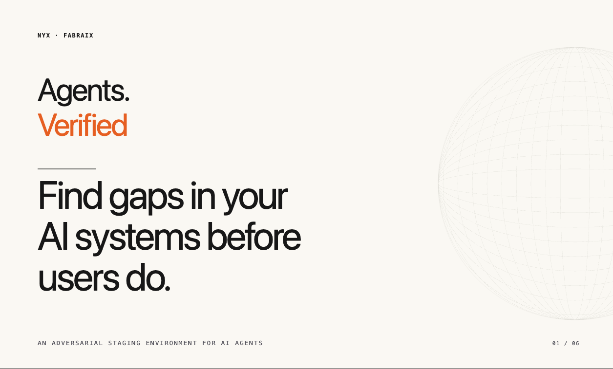
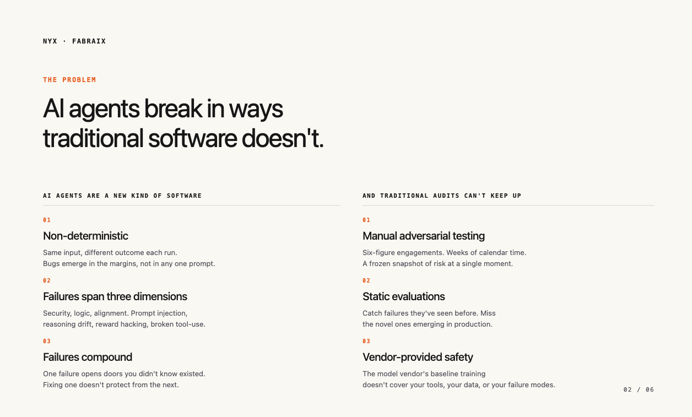
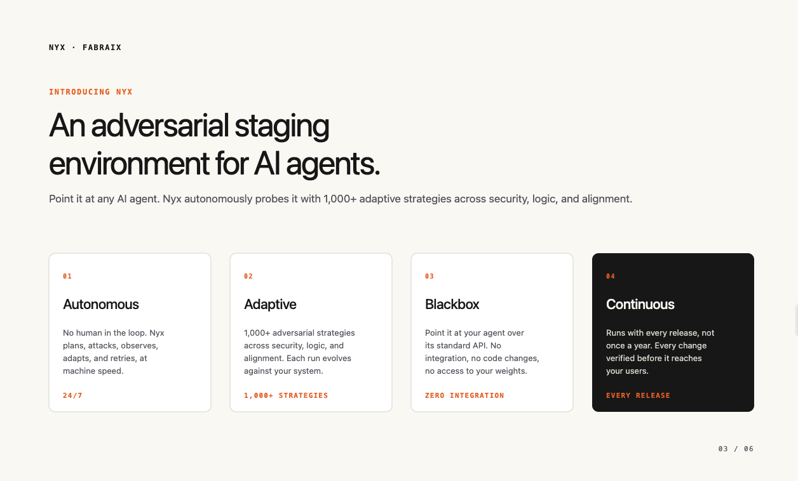

### 🎬 관련 영상
- [🎥 영상 보기](https://ph-files.imgix.net/3a399be2-4264-41ee-b9c2-058beba668f5.jpeg?auto=format)

---

## 9. [Ara](https://www.producthunt.com/products/dereference-the-100x-ide)
**Votes**: 115 | **도입 난이도**: 중 | **신뢰도**: 상
**Tagline**: Agentic Wispr flow computer-use-agent living in your notch
**서비스 링크**: https://www.producthunt.com/r/PM5CB7RBPREHJU

**태그**: Automation, AI Agent, Productivity, DevTool, Agent, LLM

### 📌 이 서비스 한눈에 보기
사용자의 LLM을 활용해 컴퓨터 작업을 자동화하는 에이전트 기반 워크플로우 도구

### 🔑 주요 기능
- 자체 LLM 제공자(Bring your own LLM)를 연결하여 사용 가능
- 컴퓨터 사용(Computer use) 기능을 통해 자동화된 작업 수행
- 자율적으로 작동하는 여러 에이전트 활용 가능

### 🙋 사용자에게 어떤 점이 좋은가
사용자가 선호하는 AI 모델을 직접 연결하여 비용 효율적으로 복잡한 컴퓨터 작업을 자동화할 수 있습니다.

### ✅ 지금 바로 써볼 기능
- 사용 중인 LLM API 키 연결하기
- Codex 앱을 통한 자동화 워크플로우 설정하기
- 에이전트의 자율 작업 기능 테스트하기

### ⚠️ 사용 전 확인할 점
- 사용자 개인 LLM API 비용이 별도로 발생할 수 있음
- 에이전트의 자율 작업 시 의도치 않은 동작 가능성

### 🧭 확인이 더 필요한 정보
사용자의 LLM 모델에 따른 최적의 성능 및 보안 수준을 확인해야 합니다.

### 📸 스크린샷 및 갤러리

### 🎬 관련 영상
- [🎥 영상 보기](https://ph-files.imgix.net/04e640de-04f4-47ed-9115-bf6087775844.jpeg?auto=format)

---

## 10. [Contral](https://www.producthunt.com/products/contral)
**Votes**: 114 | **도입 난이도**: 하 | **신뢰도**: 상
**Tagline**: The agent which teaches while you build
**서비스 링크**: https://www.producthunt.com/r/WJUVYO4AMA4GMC

**태그**: DevTool, AI-Agent, Learning, Productivity, Agent

### 📌 이 서비스 한눈에 보기
개발 환경 내에서 실시간 코딩과 학습을 동시에 지원하는 AI 에이전트

### 🔑 주요 기능
- 기존 개발 환경(IDE) 내에서 작동하여 별도의 도구 전환이 필요 없음
- Build Mode: 실제 코드 작성 시 맥락을 반영한 지능형 어시스턴트 제공
- Learn Mode: 실시간 설명을 통해 작업 과정에서 자연스러운 학습 유도

### 🙋 사용자에게 어떤 점이 좋은가
이론적인 튜토리얼 대신 실제 프로젝트 코드를 다루며 실무 역량을 즉각적으로 높일 수 있습니다.

### ✅ 지금 바로 써볼 기능
- Build Mode를 통한 실시간 코드 작성 지원 경험하기
- Learn Mode를 활용한 작업 중 개념 학습하기
- 기존 개발 환경에 설치 및 연동하기

### ⚠️ 사용 전 확인할 점
- 사용 중인 특정 IDE나 언어 환경에 대한 지원 범위 확인 필요
- AI의 제안이 사용자의 사고를 대체하지 않도록 적절한 활용 주의

### 🧭 확인이 더 필요한 정보
현재 지원하는 IDE 종류와 프로그래밍 언어의 범위가 명시되지 않았습니다.

### 📸 스크린샷 및 갤러리
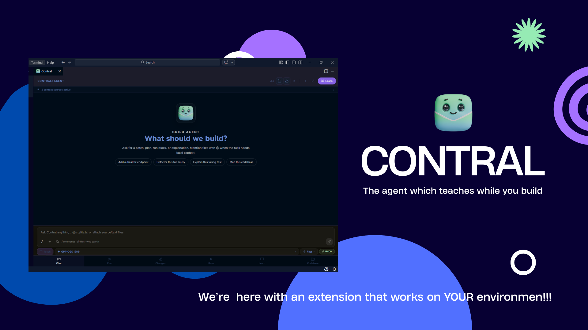
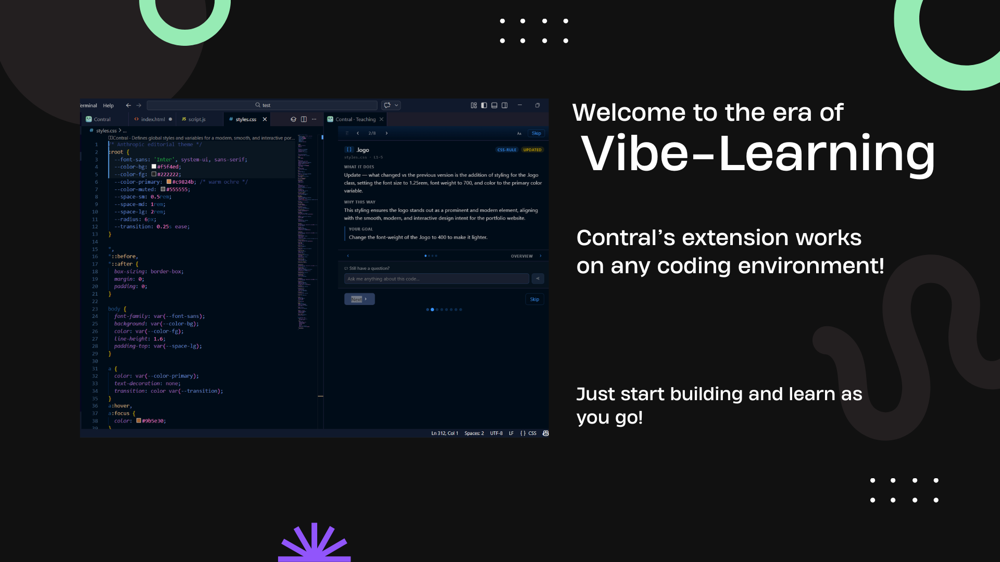
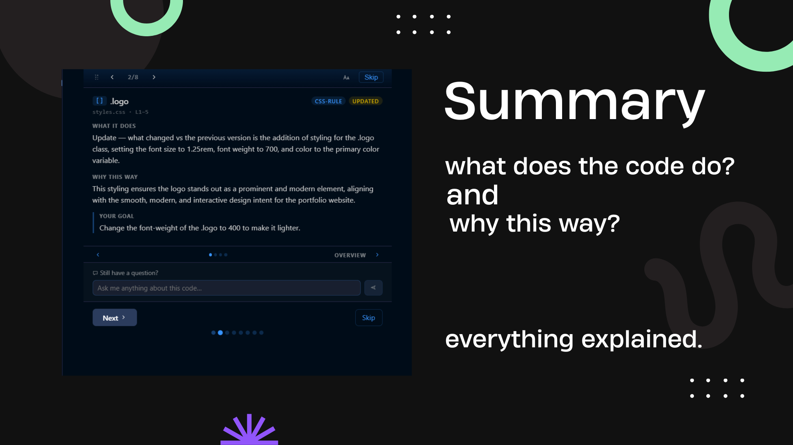

### 🎬 관련 영상
- [🎥 영상 보기](https://ph-files.imgix.net/e8da2b29-62d7-46dc-aecc-f893fada9dfb.jpeg?auto=format)

---

## 11. [APIEval-20](https://www.producthunt.com/products/kushoai)
**Votes**: 110 | **도입 난이도**: 하 | **신뢰도**: 상
**Tagline**: An open benchmark for AI agents that test APIs
**서비스 링크**: https://www.producthunt.com/r/2TRFRBM47FAVUV

**태그**: DevTool, AI-Agent, Testing, Benchmark, Agent, AI Tool, LLM, API

### 📌 이 서비스 한눈에 보기
AI 에이전트의 API 테스트 능력을 객관적으로 검증하는 오픈 벤치마크

### 🔑 주요 기능
- JSON 스키마와 샘플 페이로드만으로 테스트 스위트를 생성하는 블랙박스 테스트 방식
- LLM 주관적 평가가 아닌, 실제 버그 탐지 여부를 통한 객관적 스코어링
- 인증, 에러 처리, 페이지네이션, 멀티스텝 흐름 등 실무적인 테스트 시나리오 포함

### 🙋 사용자에게 어떤 점이 좋은가
AI 에이전트가 실제 API 환경에서 얼마나 정확하고 효율적으로 버그를 찾아내는지 정량적으로 확인할 수 있습니다.

### ✅ 지금 바로 써볼 기능
- Hugging Face에서 APIEval-20 벤치마크 데이터셋 확인하기
- 자체 개발 중인 AI 에이전트의 테스트 성능과 비교해보기

### ⚠️ 사용 전 확인할 점
- 실제 운영 환경이 아닌 버그가 심어진 참조용 API 환경에서의 결과임을 인지해야 함
- 에이전트의 성능이 특정 시나리오에 과적합(Overfitting)될 가능성 고려

### 🧭 확인이 더 필요한 정보
벤치마크 결과가 실제 복잡한 프로덕션 환경의 API를 얼마나 완벽하게 대변할 수 있는지에 대한 추가 검증이 필요합니다.

### 📸 스크린샷 및 갤러리
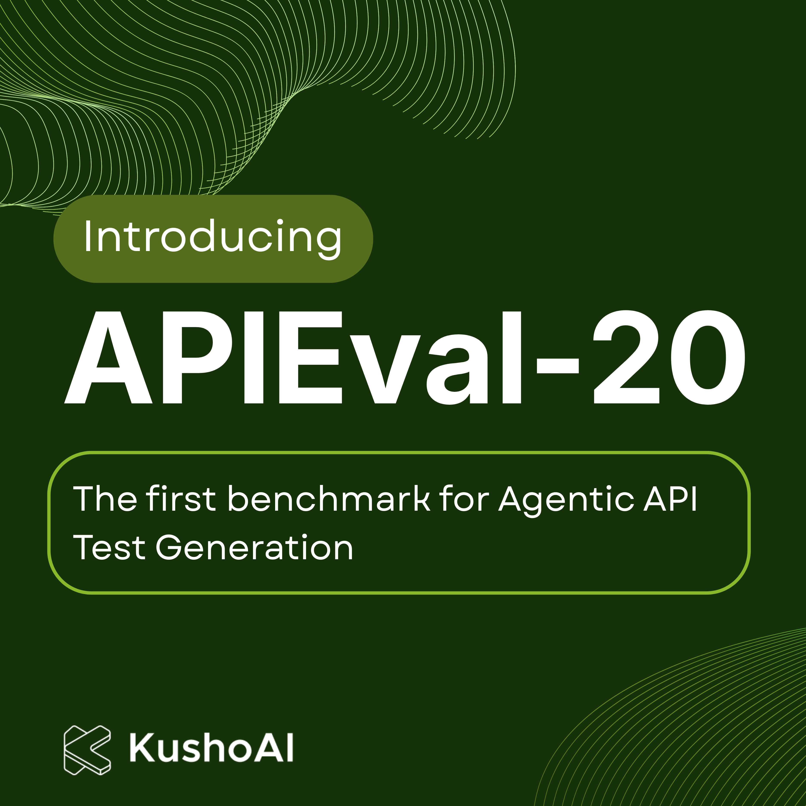
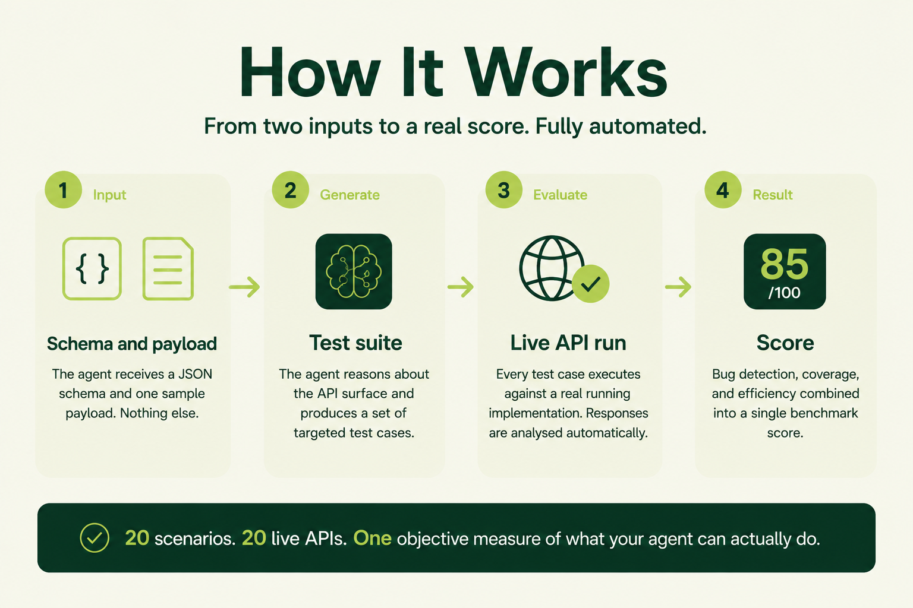
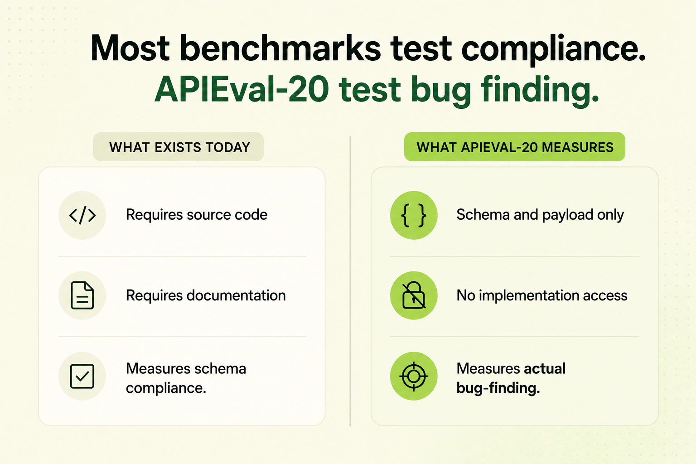

### 🎬 관련 영상
- [🎥 영상 보기](https://ph-files.imgix.net/647a2dfd-0e09-4364-9f5f-6f3f2fdd296e.jpeg?auto=format)

---

## 12. [Google Health](https://www.producthunt.com/products/google)
**Votes**: 107 | **도입 난이도**: 하 | **신뢰도**: 상
**Tagline**: A new relationship with your health
**서비스 링크**: https://www.producthunt.com/r/WUZSMG6ZNNEBUL

**태그**: HealthTech, AI, Personalized, Wellness

### 📌 이 서비스 한눈에 보기
Gemini AI 기반의 개인 맞춤형 건강 코칭 및 데이터 트래킹 서비스

### 🔑 주요 기능
- Gemini AI를 활용한 개인 맞춤형 건강 코칭 제공
- 운동, 수면, 건강 데이터 통합 트래킹
- 사용자의 변화에 맞춰 진화하는 가이드라인

### 🙋 사용자에게 어떤 점이 좋은가
개인 건강 데이터를 단순히 기록하는 것을 넘어, AI의 분석을 통해 실질적인 생활 습관 개선 가이드를 받을 수 있습니다.

### ✅ 지금 바로 써볼 기능
- 수면 및 활동 데이터 연동하기
- AI 코칭 가이드 확인하기
- 개인별 건강 목표 설정하기

### ⚠️ 사용 전 확인할 점
- AI의 조언이 의학적 진단을 대체할 수 없음을 유의
- 정확한 코칭을 위한 지속적인 데이터 입력 필요

### 🧭 확인이 더 필요한 정보
Gemini 모델이 구체적으로 어떤 건강 지표를 분석하고 어떤 방식의 코칭을 제공하는지에 대한 상세 정보가 필요합니다.

### 📸 스크린샷 및 갤러리
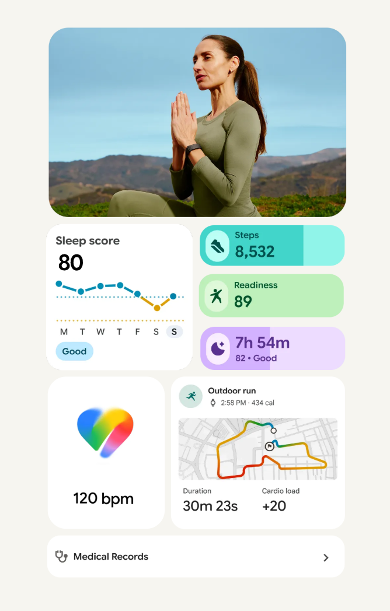
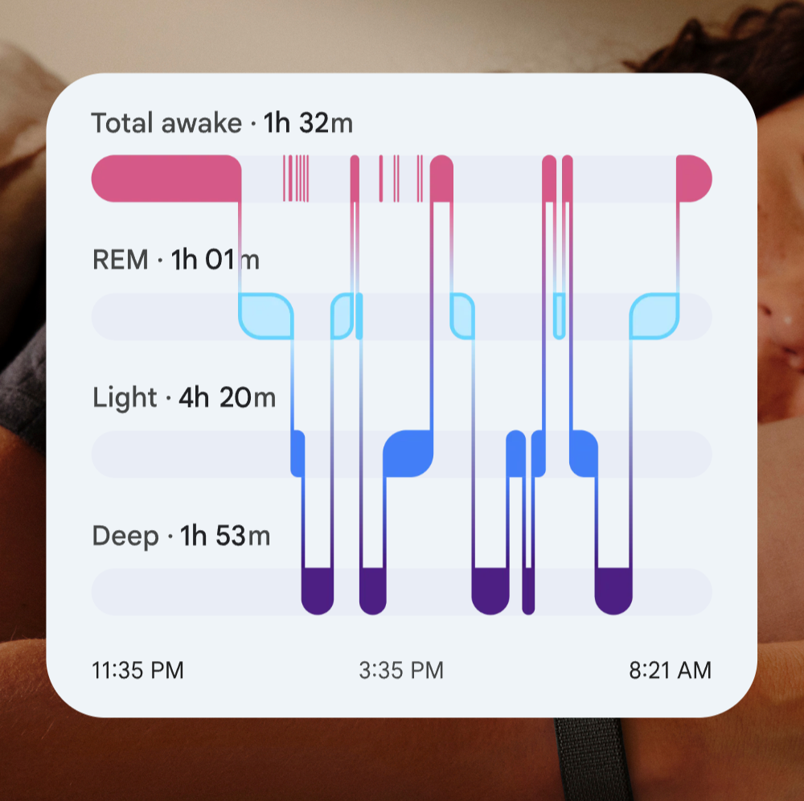
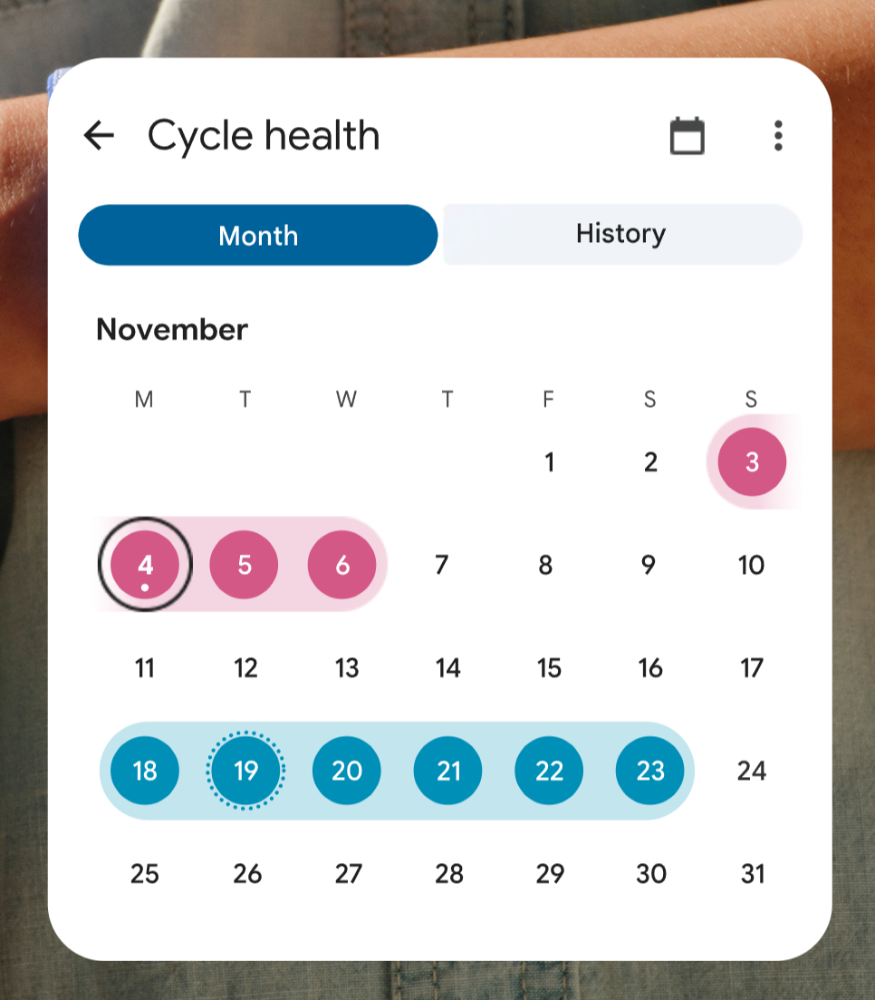

### 🎬 관련 영상
- [🎥 영상 보기](https://ph-files.imgix.net/9721dd38-6de2-4d3e-af7d-55998c99888f.jpeg?auto=format)

---

## 13. [Sutra](https://www.producthunt.com/products/sutra-4)
**Votes**: 99 | **도입 난이도**: 상 | **신뢰도**: 중
**Tagline**: Decision Intelligence for hardware teams
**서비스 링크**: https://www.producthunt.com/r/66NPWZJ3LAIEA6

**태그**: Hardware, DecisionIntelligence, Automation, Manufacturing, DataIntegration, AI Tool, Email

### 📌 이 서비스 한눈에 보기
하드웨어 팀을 위한 데이터 통합 기반 의사결정 지능 솔루션

### 🔑 주요 기능
- ERP, PLM, MES 등 분산된 하드웨어 데이터 통합 분석
- 엔지니어링 질문에 대한 즉각적인 답변 및 시뮬레이션
- 변경 사항에 따른 하류 공정 영향 분석 및 자동 후속 작업 실행

### 🙋 사용자에게 어떤 점이 좋은가
파편화된 제조/설계 데이터를 하나로 연결하여, 설계 변경이 생산이나 공급망에 미칠 영향을 즉시 파악하고 업무 자동화를 실현할 수 있습니다.

### ✅ 지금 바로 써볼 기능
- 기존 ERP/PLM 데이터 연동 가능 여부 확인
- 설계 변경 시뮬레이션 정확도 테스트
- 워크플로우 자동화 규칙 설정

### ⚠️ 사용 전 확인할 점
- 기업 내부 핵심 데이터(ERP, PLM 등) 접근에 따른 보안 검토 필요
- 기존 레거시 시스템과의 통합 난이도

### 🧭 확인이 더 필요한 정보
데이터 연동 방식과 보안 프로토콜, 그리고 구체적인 자동화 실행 범위에 대한 정보가 추가로 필요합니다.

### 📸 스크린샷 및 갤러리
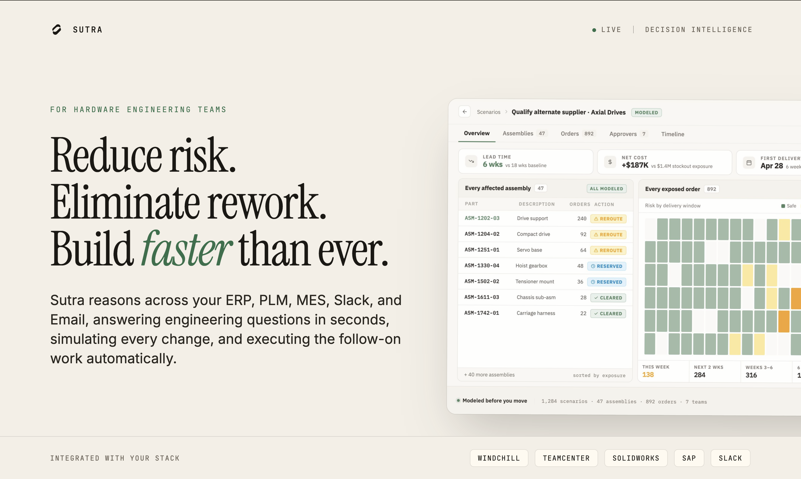
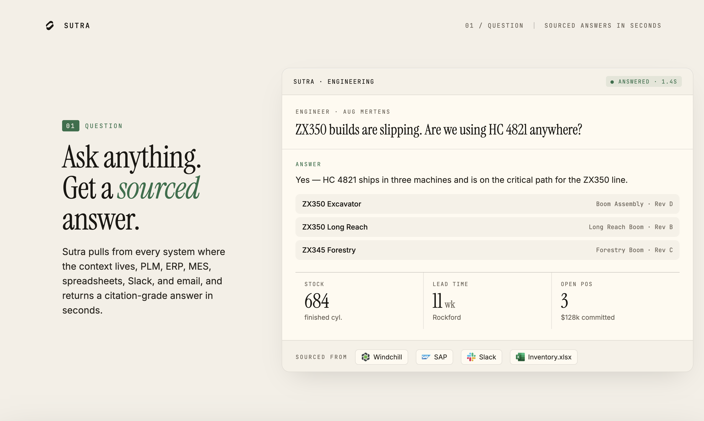
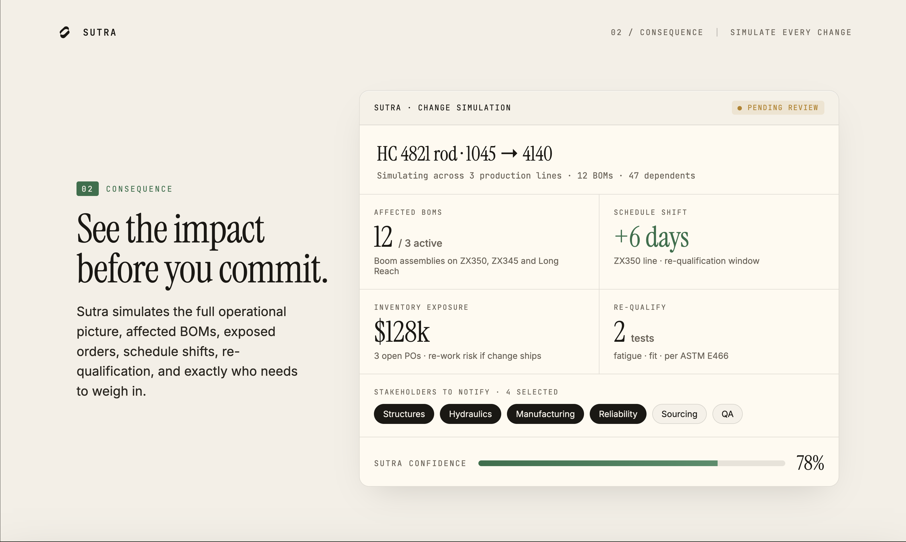

### 🎬 관련 영상
- [🎥 영상 보기](https://ph-files.imgix.net/644e1ad8-5812-4163-ab10-8eb8af45a333.jpeg?auto=format)

---

## 14. [SuperIsland](https://www.producthunt.com/products/superisland)
**Votes**: 95 | **도입 난이도**: 하 | **신뢰도**: 상
**Tagline**: Dynamic Island for macOS with Extensions
**서비스 링크**: https://www.producthunt.com/r/THF5YQ43SZJDKA

**태그**: Productivity, macOS, Utility, DeveloperTool, Agent, AI Tool, Prompting

### 📌 이 서비스 한눈에 보기
macOS 노치 영역에서 실시간 알림과 활동을 관리하는 다이내믹 아일랜드 스타일의 확장 프로그램

### 🔑 주요 기능
- iOS 스타일의 다이내믹 아일랜드를 macOS 환경에 구현
- 음악, 배터리, 캘린더 등 다양한 라이브 액티비티 제공
- 개발자를 위한 SDK를 통한 커스텀 확장 기능 개발 가능

### 🙋 사용자에게 어떤 점이 좋은가
화면 상단 노치 영역을 활용해 앱을 일일이 열지 않고도 중요한 정보를 실시간으로 확인할 수 있어 작업 흐름이 끊기지 않습니다.

### ✅ 지금 바로 써볼 기능
- 기본 제공되는 음악 및 배터리 위젯 사용해보기
- 스토어에 등록된 WhatsApp 및 Linear 확장 기능 설치하기
- 개발자라면 SDK를 활용해 나만의 확장 기능 제작해보기

### ⚠️ 사용 전 확인할 점
- macOS 버전 및 하드웨어(노치 유무)에 따른 시각적 차이 발생 가능
- 다양한 확장 프로그램 동시 실행 시 시스템 리소스 사용량 확인 필요

### 🧭 확인이 더 필요한 정보
현재 제공되는 확장 프로그램 외에 사용자가 직접 만든 기능의 안정성 및 시스템 최적화 수준을 확인해야 합니다.

### 📸 스크린샷 및 갤러리
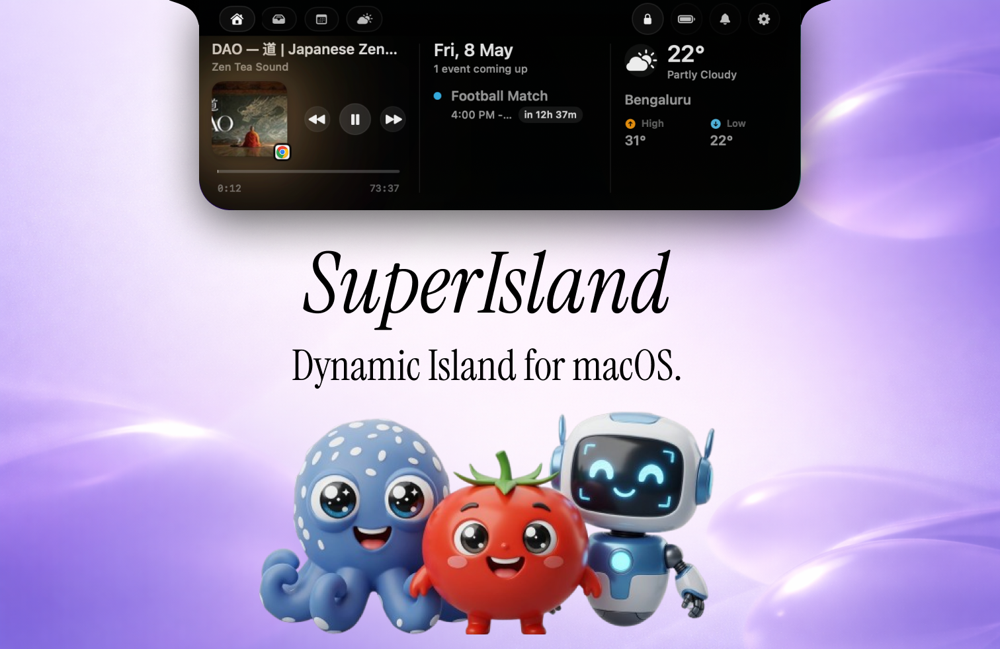
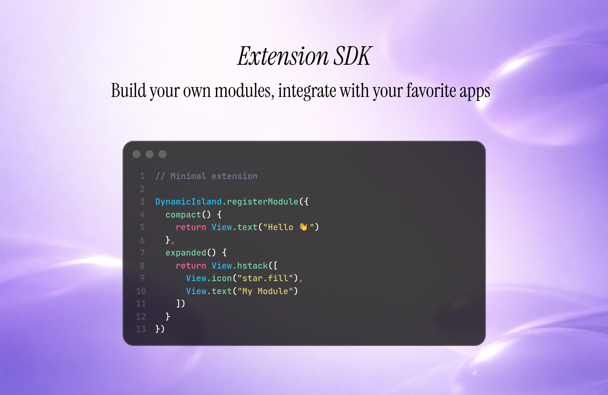
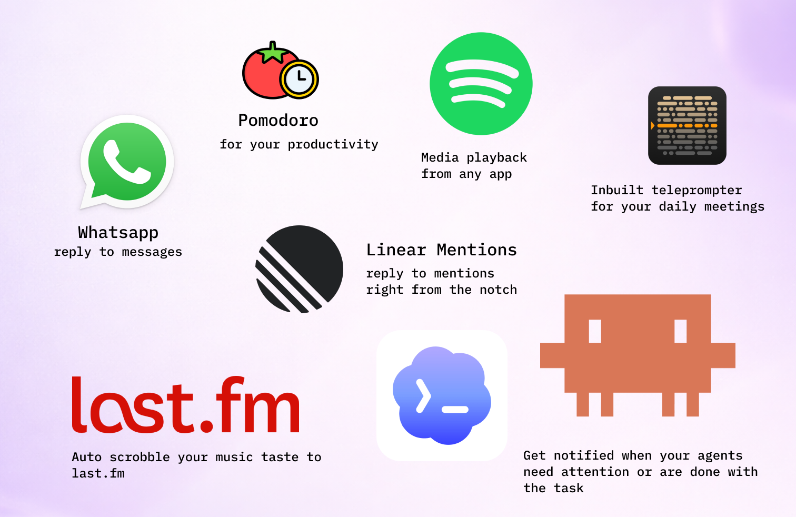

### 🎬 관련 영상
- [🎥 영상 보기](https://ph-files.imgix.net/91a8875a-3e73-48af-b4f5-9a7f56cfa1d1.jpeg?auto=format)

---

## 15. [Kipps.AI Inbox](https://www.producthunt.com/products/kipps-ai)
**Votes**: 93 | **도입 난이도**: 하 | **신뢰도**: 상
**Tagline**: Stop juggling apps. Start closing leads.
**서비스 링크**: https://www.producthunt.com/r/5ULLEJTMTX62MU

**태그**: CRM, CustomerSupport, AI, Automation, Communication, AI Tool, Chat, Analytics

### 📌 이 서비스 한눈에 보기
모든 채널의 고객 메시지를 하나로 통합하고 AI로 리드 전환을 극대화하는 통합 인박스

### 🔑 주요 기능
- WhatsApp, 전화, 웹 채팅 등 분산된 모든 채널을 하나의 인박스로 통합
- AI를 통한 24/7 자동 응대와 팀원 간 실시간 협업 지원
- 전체 대화 이력 관리 및 성과 측정을 위한 분석 기능 제공

### 🙋 사용자에게 어떤 점이 좋은가
여러 앱을 번갈아 확인하며 놓치던 고객 메시지를 한곳에서 관리하여 리드 유실을 방지하고 업무 효율을 높일 수 있습니다.

### ✅ 지금 바로 써볼 기능
- 모든 채널 연결 및 통합 인박스 설정
- AI 자동 응대 시나리오 구축
- 팀 협업 및 대화 이력 관리 기능 테스트

### ⚠️ 사용 전 확인할 점
- 연결 가능한 외부 채널(WhatsApp 등)의 구체적인 연동 범위 확인 필요
- AI 자동 응대가 실제 상담 품질에 미치는 영향 모니터링 필요

### 🧭 확인이 더 필요한 정보
현재 지원되는 구체적인 채널 목록과 AI의 자동화 수준에 대한 상세 정보가 필요합니다.

### 📸 스크린샷 및 갤러리
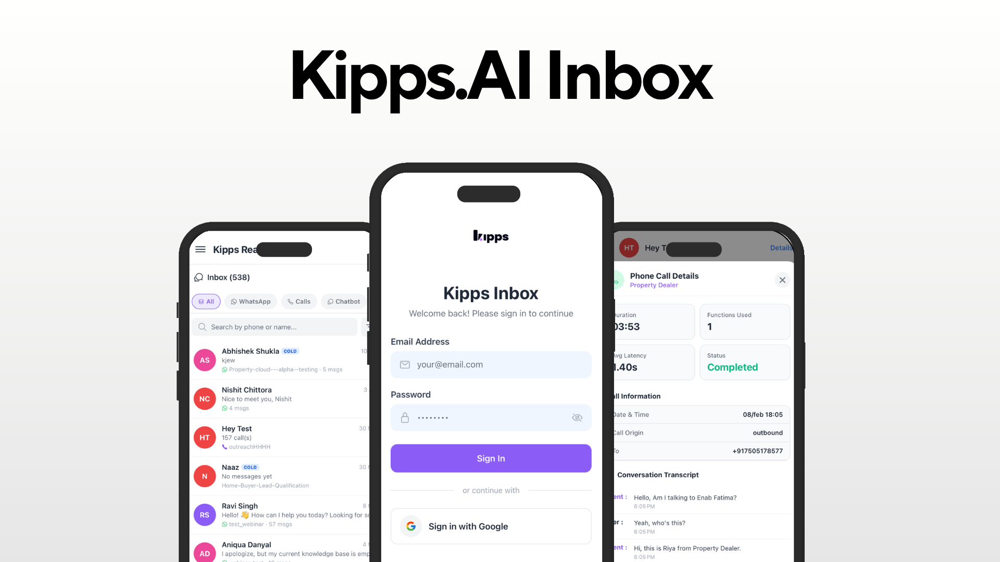
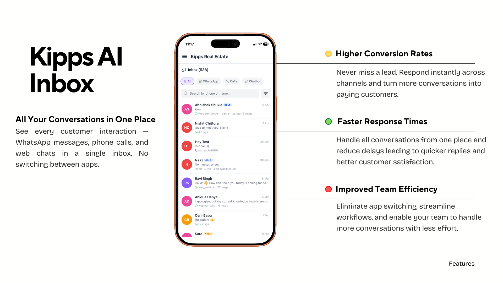
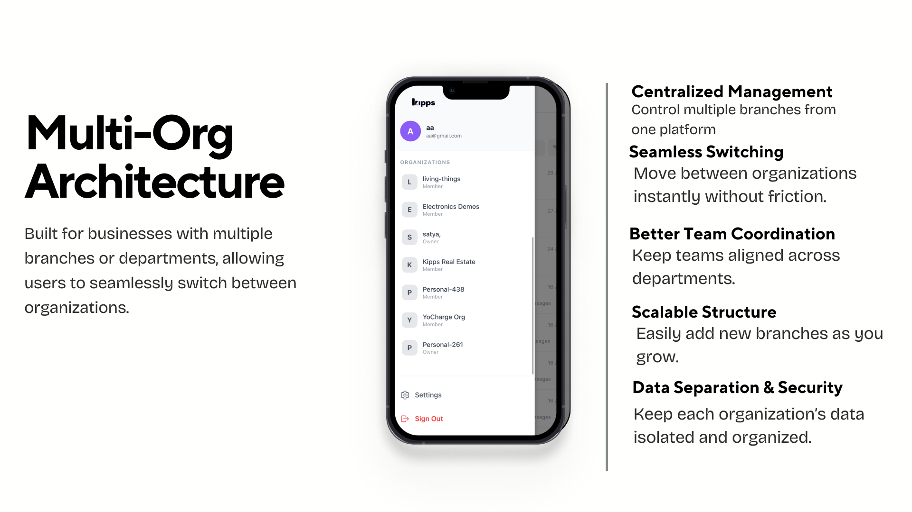

---

## 16. [Donely Knowledge Layer](https://www.producthunt.com/products/donely)
**Votes**: 92 | **도입 난이도**: 상 | **신뢰도**: 상
**Tagline**: Queryable company knowledge base + Closed-loop AI employees
**서비스 링크**: https://www.producthunt.com/r/VGBKYOXWPRYDGX

**태그**: AI_Agents, Knowledge_Base, Automation, Enterprise_SaaS, Agent, AI Tool, Chat, DevTool

### 📌 이 서비스 한눈에 보기
기업 내부 데이터를 학습하여 자율적으로 업무를 수행하는 AI 에이전트용 지식 엔진

### 🔑 주요 기능
- 회의록, 문서, 채팅, 코드베이스 등 전사적 데이터를 통합한 쿼리 가능한 지식 베이스 구축
- 단순 작업 수행을 넘어 맥락을 이해하고 결과에 따라 다음 행동을 결정하는 폐쇄 루프(Closed-loop) 워크플로우
- 맥락 부재로 인한 AI의 한계를 극복하고 실질적인 업무 연속성 제공

### 🙋 사용자에게 어떤 점이 좋은가
기업의 파편화된 정보를 AI가 실시간으로 파악하여, 사람이 개입하지 않아도 업무의 흐름을 이해하고 스스로 다음 단계를 수행할 수 있습니다.

### ✅ 지금 바로 써볼 기능
- 기존 사내 데이터(문서, 코드 등) 연동 테스트
- 특정 반복 업무에 대한 AI 에이전트 워크플로우 설계
- 데이터 보안 및 권한 관리 설정 확인

### ⚠️ 사용 전 확인할 점
- 사내 민감 데이터(코드, 채팅 등)가 외부 AI 모델로 전송될 때의 보안 정책 검토 필요
- 데이터 소스의 품질에 따라 AI 에이전트의 판단 정확도가 크게 좌우될 수 있음

### 🧭 확인이 더 필요한 정보
현재 제공되는 구체적인 데이터 커넥터 종류와 보안 프로토콜에 대한 상세 정보가 필요합니다.

### 📸 스크린샷 및 갤러리
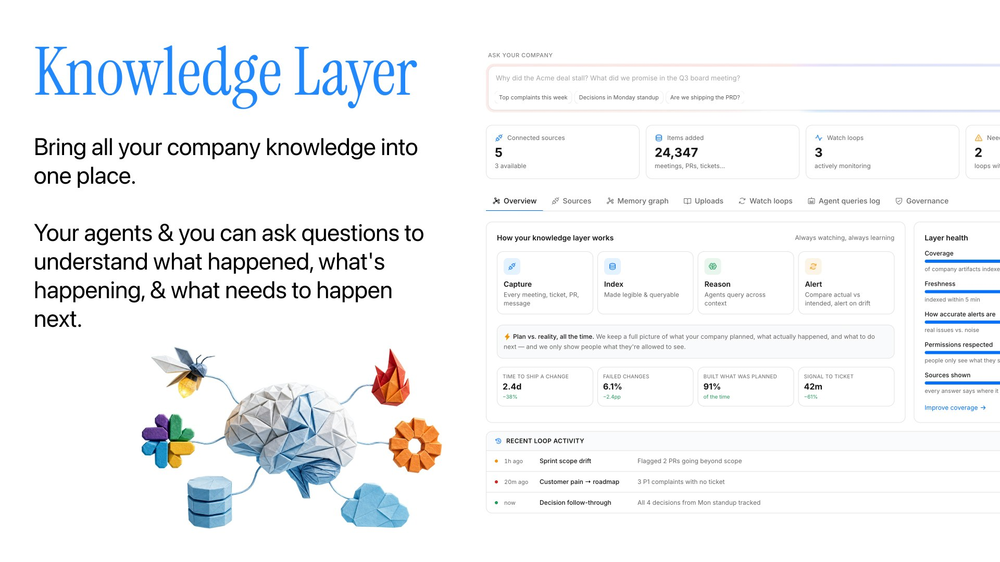
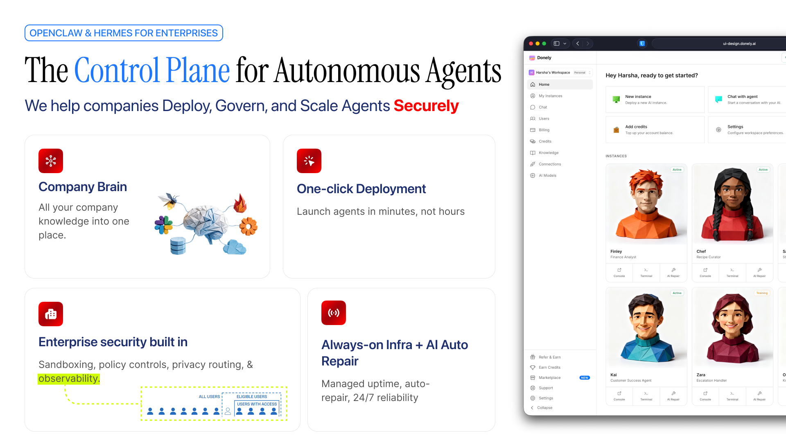
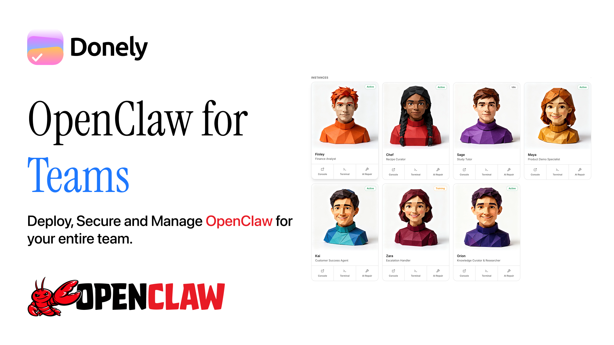

### 🎬 관련 영상
- [🎥 영상 보기](https://ph-files.imgix.net/56776031-83f5-40cc-8bd0-da859baa44d5.jpeg?auto=format)

---

## 17. [Operations](https://www.producthunt.com/products/operations)
**Votes**: 90 | **도입 난이도**: 하 | **신뢰도**: 상
**Tagline**: Turn every new tab into your personal dashboard
**서비스 링크**: https://www.producthunt.com/r/HVEIDFHTHHOXHI

**태그**: Productivity, BrowserExtension, Workflow

### 📌 이 서비스 한눈에 보기
새 탭을 개인 맞춤형 업무 대시보드로 변환하는 브라우저 확장 프로그램

### 🔑 주요 기능
- 프로젝트 관리, 북마크, 코드 스니펫 보관함 등 업무 중심 기능 제공
- 뽀모도로 타이머 및 수분 섭취 추적 등 생산성 도구 통합
- 모든 데이터가 서버가 아닌 브라우저에만 저장되는 프라이버시 중심 설계

### 🙋 사용자에게 어떤 점이 좋은가
단순한 정보 확인을 넘어 업무에 필요한 도구들을 새 탭에 모아둠으로써 작업 전환 비용을 줄이고 집중력을 높여줍니다.

### ✅ 지금 바로 써볼 기능
- 자신의 업무 흐름에 맞는 프로젝트 카드 구성하기
- 자주 사용하는 코드나 토큰을 스니펫 보관함에 저장하기
- 기본 제공되는 테마를 적용하여 대시보드 커스텀하기

### ⚠️ 사용 전 확인할 점
- 브라우저 데이터 삭제 시 저장된 정보가 유실될 수 있으므로 백업 방식 확인 필요
- 브라우저 확장 프로그램 특성상 브라우저 종료 시 환경 변화 가능성

### 🧭 확인이 더 필요한 정보
데이터가 로컬에만 저장되므로 기기 간 동기화 기능 제공 여부가 불분명합니다.

### 📸 스크린샷 및 갤러리
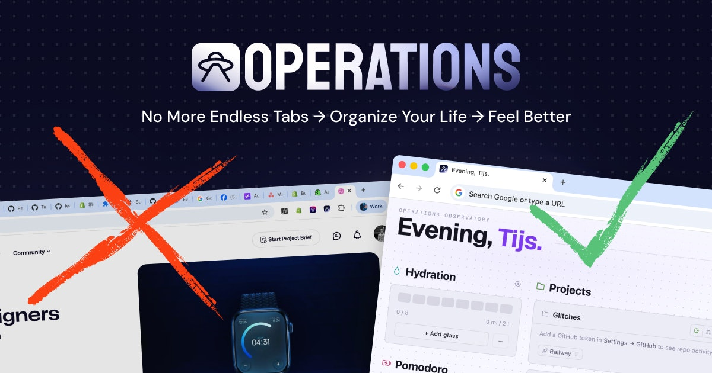
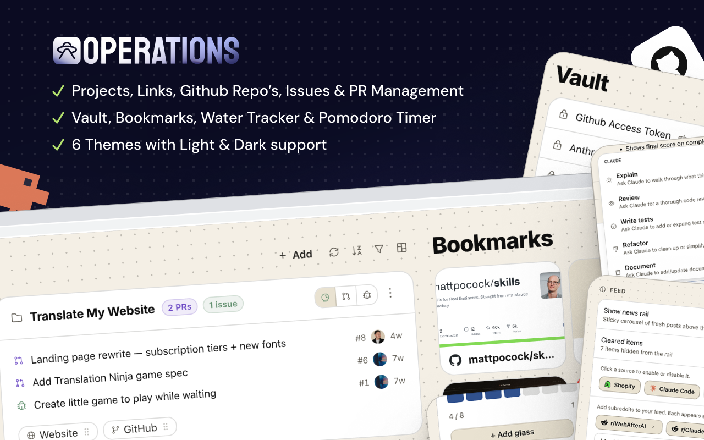
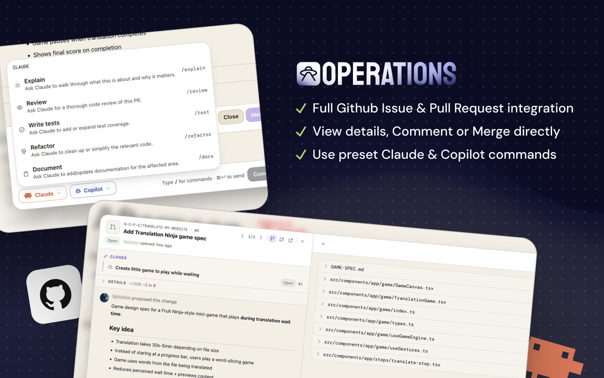

### 🎬 관련 영상
- [🎥 영상 보기](https://ph-files.imgix.net/ee9e630b-71a6-4479-b535-9370e6156326.jpeg?auto=format)

---

## 18. [Socrati](https://www.producthunt.com/products/socrati-learn-with-ai)
**Votes**: 85 | **도입 난이도**: 하 | **신뢰도**: 상
**Tagline**: Your personal knowledge podcast from any source
**서비스 링크**: https://www.producthunt.com/r/GBLADBJC4NSVVA

**태그**: EdTech, AI, Productivity, Audio-Learning, Mobile, AI Tool, Video

### 📌 이 서비스 한눈에 보기
어떤 자료든 나만의 맞춤형 오디오 학습 코스로 바꿔주는 개인용 지식 팟캐스트 서비스

### 🔑 주요 기능
- PDF, 유튜브, 사진, 텍스트 등 다양한 소스를 학습 콘텐츠로 변환
- 음성 강의, 퀴즈, 플래시카드 등 체계적인 학습 커리큘럼 제공
- 망각 곡선을 고려한 간격 반복(Spaced Repetition) 학습 시스템

### 🙋 사용자에게 어떤 점이 좋은가
책상 앞에 앉아 있을 시간 없는 직장인이나 학생이 이동 중에도 효율적으로 새로운 지식을 습득하고 복습할 수 있습니다.

### ✅ 지금 바로 써볼 기능
- 학습하고 싶은 PDF나 유튜브 링크 업로드하기
- 생성된 오디오 레슨 듣기
- 퀴즈와 플래시카드로 학습 내용 점검하기

### ⚠️ 사용 전 확인할 점
- 오디오 중심이므로 시각적 자료가 중요한 복잡한 도표나 수식 학습에는 한계가 있을 수 있음
- 모바일 앱(iOS/Android) 환경에 최적화되어 있어 데스크톱 작업과는 성격이 다름

### 🧭 확인이 더 필요한 정보
구체적인 유료 구독 모델이나 무료 사용량 제한에 대한 정보가 명시되지 않았습니다.

### 📸 스크린샷 및 갤러리
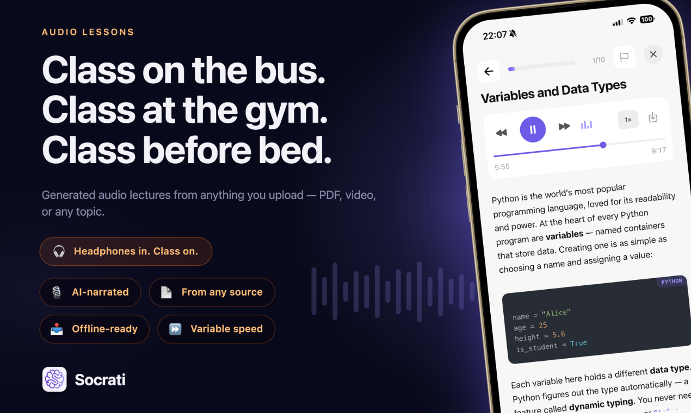
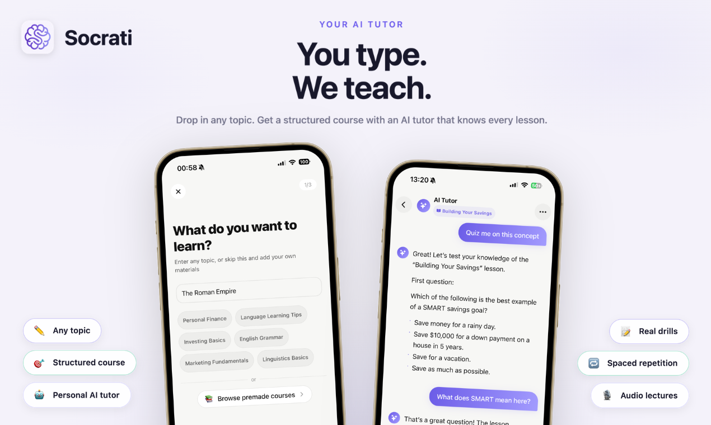
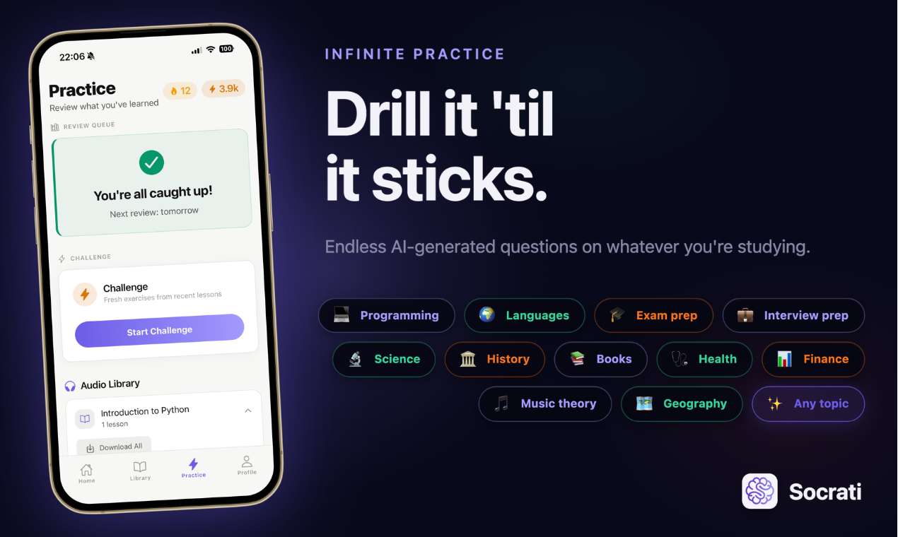

### 🎬 관련 영상
- [🎥 영상 보기](https://ph-files.imgix.net/b2e5135d-e2d1-48a5-8ac5-ff8aa252ed2f.jpeg?auto=format)

---

## 19. [MediaOptim](https://www.producthunt.com/products/compress-anything-upload-nothing)
**Votes**: 83 | **도입 난이도**: 하 | **신뢰도**: 상
**Tagline**: Compress images, video & audio locally and save storage
**서비스 링크**: https://www.producthunt.com/r/LE3OA6N3TYO6UR

**태그**: Productivity, Media, Mac, Privacy, Video, Vision

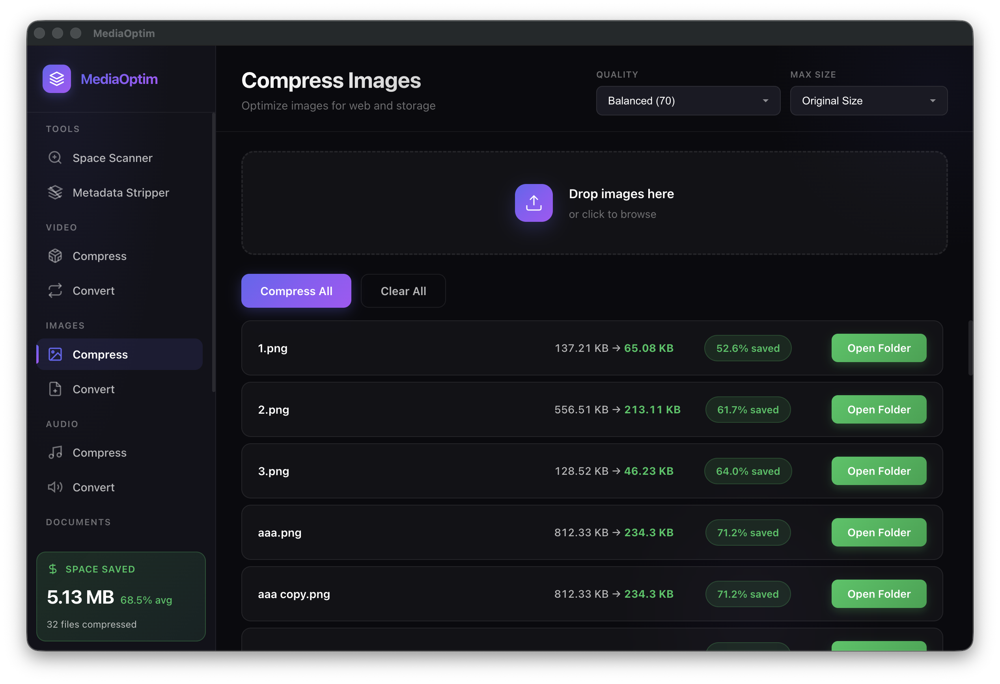

### 📌 이 서비스 한눈에 보기
개인정보 유출 걱정 없이 맥(Mac)에서 로컬로 실행되는 고성능 미디어 압축 도구

### 🔑 주요 기능
- 애플 네이티브 프레임워크를 활용한 로컬 압축 (파일 업로드 불필요)
- 이미지, 비디오, 오디오 등 다양한 포맷 지원 및 폴더 단위 일괄 처리
- 단순 퍼센트가 아닌 목표 품질 설정을 통한 정밀한 압축

### 🙋 사용자에게 어떤 점이 좋은가
파일을 서버에 올릴 필요가 없어 보안이 중요한 작업에 적합하며, 오프라인에서도 빠르게 대용량 미디어를 관리할 수 있습니다.

### ✅ 지금 바로 써볼 기능
- 다양한 포맷(HEIC, WebP, MP4 등)의 일괄 압축 테스트
- 목표 품질 설정 기능을 통한 최적의 압축률 찾기
- 오프라인 환경에서의 작업 속도 확인

### ⚠️ 사용 전 확인할 점
- Mac 전용 소프트웨어이므로 다른 OS에서는 사용 불가
- 로컬 리소스를 사용하므로 대용량 작업 시 시스템 성능에 영향을 줄 수 있음

### 🧭 확인이 더 필요한 정보
구체적인 가격 정책(유료 여부) 및 지원하는 최대 파일 용량에 대한 정보가 명시되지 않았습니다.

### 📸 스크린샷 및 갤러리
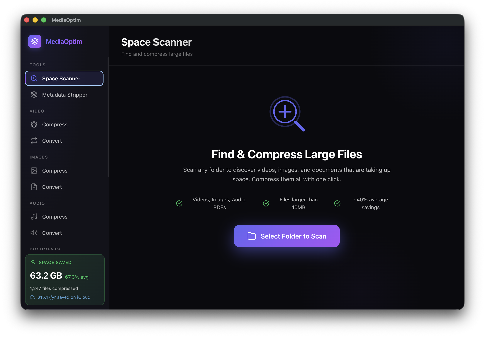
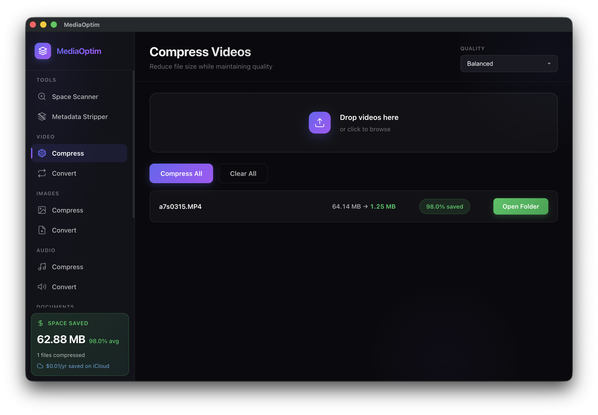

---

## 20. [KodHau](https://www.producthunt.com/products/kodhau-senior-context-for-ai-agents)
**Votes**: 82 | **도입 난이도**: 중 | **신뢰도**: 상
**Tagline**: Stop your AI from breaking prod-give it your team decisions
**서비스 링크**: https://www.producthunt.com/r/42WKJRLXVPT7P4

**태그**: DevTool, AI-Agent, Software-Engineering, Agent, AI Tool, Design

### 📌 이 서비스 한눈에 보기
팀의 히스토리와 의사결정 맥락을 AI에게 학습시켜 운영 사고를 방지하는 도구

### 🔑 주요 기능
- 팀 내에만 존재하는 암묵적 지식(Tribal Knowledge)을 AI에게 전달
- PR 이력, 디자인 결정 사항, 리뷰 코멘트 등 문서화되지 않은 맥락 활용
- AI 에이전트가 팀의 개발 규칙을 준수하도록 유도

### 🙋 사용자에게 어떤 점이 좋은가
시니어 엔지니어의 판단 기준을 AI가 이해하게 함으로써, AI가 생성한 코드가 운영 환경에서 문제를 일으킬 위험을 줄여줍니다.

### ✅ 지금 바로 써볼 기능
- MCP(Model Context Protocol)를 통한 기존 AI 에이전트 연동
- 과거 PR 및 리뷰 데이터 연동을 통한 맥락 학습
- 팀의 개발 워크플로우에 적용하여 코드 품질 검증

### ⚠️ 사용 전 확인할 점
- 기존 코드 저장소 및 커뮤니케이션 데이터에 대한 접근 권한 필요
- 데이터 보안 및 프라이버시 정책 확인 필요

### 🧭 확인이 더 필요한 정보
구체적인 데이터 보안 방식과 기존 개발 워크플로우와의 통합 방식에 대한 상세 정보가 필요합니다.

### 📸 스크린샷 및 갤러리
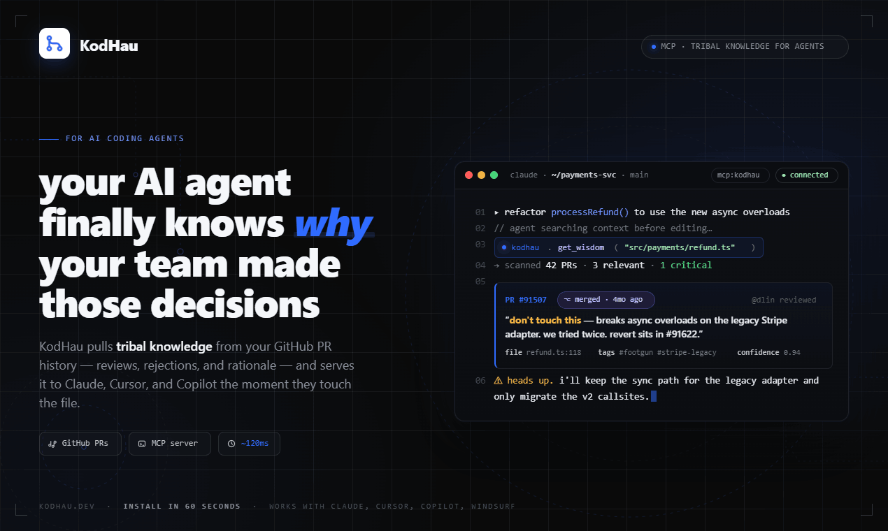

### 🎬 관련 영상
- [🎥 영상 보기](https://ph-files.imgix.net/fc024623-ec68-4d06-9a9d-c54bd82a470c.jpeg?auto=format)

---

## 21. [Photobomb](https://www.producthunt.com/products/photobomb)
**Votes**: 79 | **도입 난이도**: 하 | **신뢰도**: 상
**Tagline**: Card against humanity but for your camera roll
**서비스 링크**: https://www.producthunt.com/r/VCTKSPU5ECJ3Z6

**태그**: Social, Game, PartyGame, AI Tool

### 📌 이 서비스 한눈에 보기
내 사진첩을 활용해 친구들과 함께 즐기는 스크린 공유 사진 맞히기 게임

### 🔑 주요 기능
- 카드의 게임 방식을 사진 맞히기 게임으로 재해석
- 친구들과 화면을 공유하며 실시간으로 즐기는 멀티플레이
- 개인 사진첩을 게임 콘텐츠로 활용하는 독특한 방식

### 🙋 사용자에게 어떤 점이 좋은가
친구들과 모였을 때 별도의 준비물 없이 스마트폰 사진첩만으로 즉석에서 웃고 즐길 수 있는 파티 게임입니다.

### ✅ 지금 바로 써볼 기능
- 친구들과 화면 공유 기능 테스트하기
- 게임에 쓸 재미있는 사진 미리 준비하기
- 함께 플레이할 인원 모으기

### ⚠️ 사용 전 확인할 점
- 개인적인 사진을 공유해야 하므로 프라이버시 노출 주의 필요
- 화면 공유 시 의도치 않은 사진이 노출될 수 있음

### 🧭 확인이 더 필요한 정보
정확한 플레이 인원 제한 및 멀티 디바이스 연결 방식에 대한 정보가 부족합니다.

### 📸 스크린샷 및 갤러리
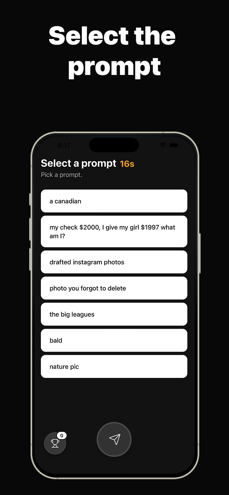

---

## 22. [ElevenCreative Flows](https://www.producthunt.com/products/elevencreative-flows)
**Votes**: 79 | **도입 난이도**: 중 | **신뢰도**: 상
**Tagline**: Node-based creative pipelines, now with real-time collab 
**서비스 링크**: https://www.producthunt.com/r/QT2IKFD4M2ZC66

**태그**: AI, CreativeTools, Collaboration, Automation, Workflow, AI Tool, Video, Vision

### 📌 이 서비스 한눈에 보기
실시간 협업이 가능한 노드 기반 멀티모달 AI 워크플로우 빌더

### 🔑 주요 기능
- 노드 기반 캔버스를 통한 직관적인 AI 파이프라인 구축
- 이미지, 비디오, 음성, 음악을 아우르는 멀티모달 기능 지원
- 실시간 커서 공유 및 동시 실행을 통한 팀 협업 환경 제공

### 🙋 사용자에게 어떤 점이 좋은가
창의적인 팀이 하나의 워크플로우를 동시에 편집하고 실행할 수 있어, 복잡한 AI 콘텐츠 제작 과정을 효율적으로 자동화하고 검토할 수 있습니다.

### ✅ 지금 바로 써볼 기능
- 노드 기반 인터페이스를 통한 AI 파이프라인 설계
- 팀원 초대 후 실시간 커서 공유 및 협업 테스트
- 멀티모달 노드를 조합한 통합 콘텐츠 생성 실험

### ⚠️ 사용 전 확인할 점
- 노드 기반 방식에 대한 숙련도 필요
- 실시간 협업 시 네트워크 환경 및 동시 편집 충돌 여부 확인 필요

### 🧭 확인이 더 필요한 정보
구체적인 노드별 비용 체계나 외부 서비스와의 연동 범위는 명시되지 않았습니다.

### 📸 스크린샷 및 갤러리

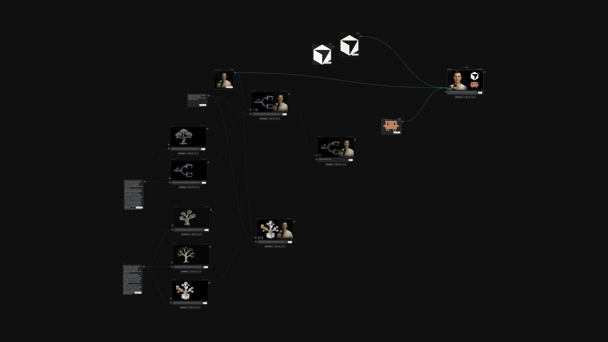
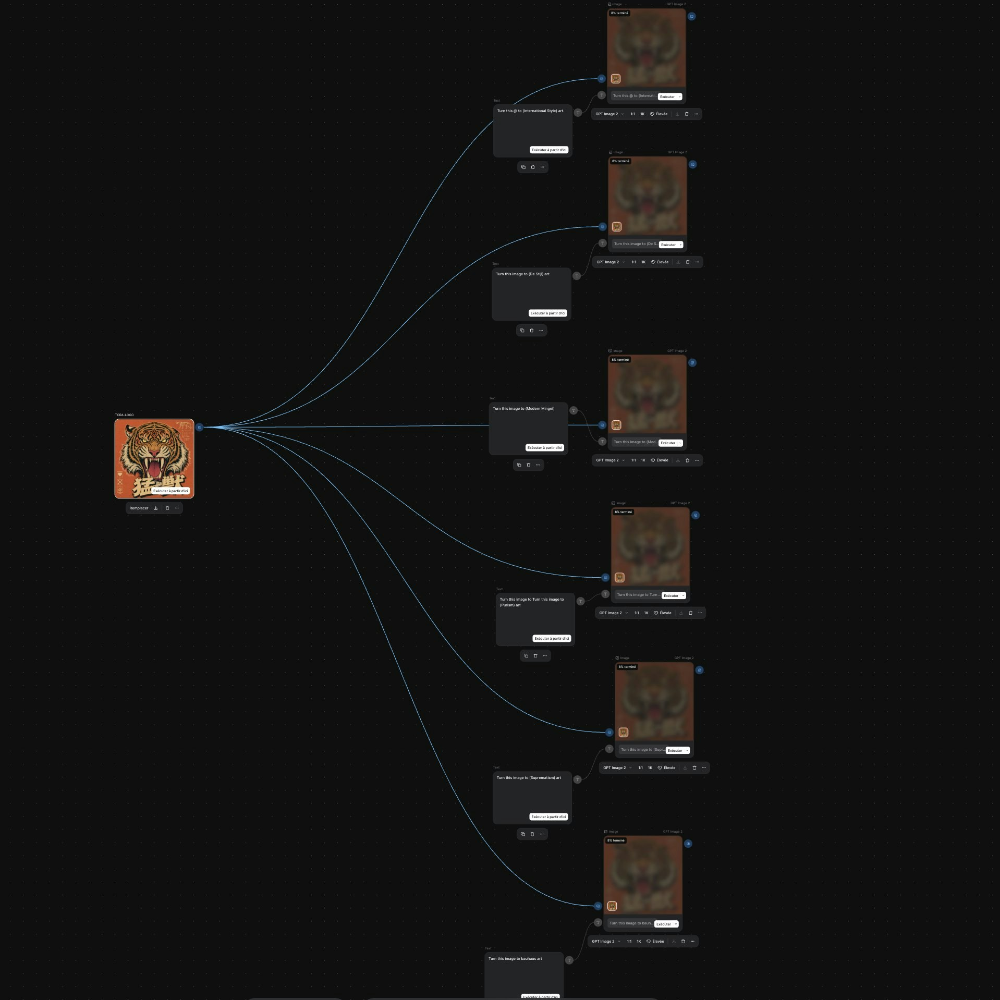

### 🎬 관련 영상
- [🎥 영상 보기](https://ph-files.imgix.net/5128ec58-de0e-4530-9bb8-db4a90c7d3ab.jpeg?auto=format)

---

## 23. [Smart FAQs](https://www.producthunt.com/products/smart-faqs)
**Votes**: 77 | **도입 난이도**: 하 | **신뢰도**: 상
**Tagline**: Smarter AI answers from your own content + customer context
**서비스 링크**: https://www.producthunt.com/r/CCNXKY77MIVA5F

**태그**: AI, CustomerSupport, SaaS, Shopify, Automation, AI Tool, Chat

### 📌 이 서비스 한눈에 보기
제공된 지식 베이스를 바탕으로 고객 질문에 즉각적인 답변을 제공하는 AI FAQ 위젯 빌더

### 🔑 주요 기능
- 사용자가 제공한 데이터만을 기반으로 답변하는 신뢰할 수 있는 AI 검색 및 챗봇
- CSV 대량 가져오기 및 수동 생성 기능을 통한 간편한 지식 베이스 구축
- 커스텀 테마, CSS 스타일링 및 Shopify 앱 연동을 통한 높은 디자인 자유도

### 🙋 사용자에게 어떤 점이 좋은가
반복되는 고객 문의를 자동화하여 운영 효율을 높이고, 브랜드 스타일에 맞춘 위젯으로 사용자 경험을 개선할 수 있습니다.

### ✅ 지금 바로 써볼 기능
- 기존 FAQ 데이터를 CSV로 준비하여 대량 임포트하기
- 브랜드 가이드에 맞춰 커스텀 CSS로 위젯 스타일링하기
- Shopify 스토어에 앱 블록을 사용하여 즉시 설치하기

### ⚠️ 사용 전 확인할 점
- 제공된 데이터가 부족하거나 부정확할 경우 AI 답변의 품질이 저하될 수 있음
- Shopify 외의 타 플랫폼에서의 설치 및 연동 방식 확인 필요

### 🧭 확인이 더 필요한 정보
데이터 양에 따른 요금 체계나 API 호출 제한 등 구체적인 사용량 제한 정책이 명시되지 않았습니다.

### 📸 스크린샷 및 갤러리
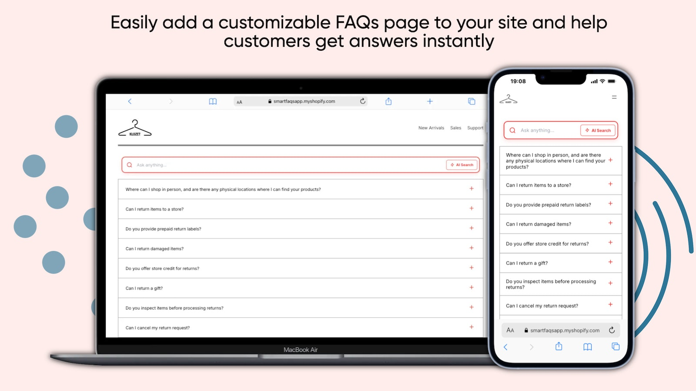
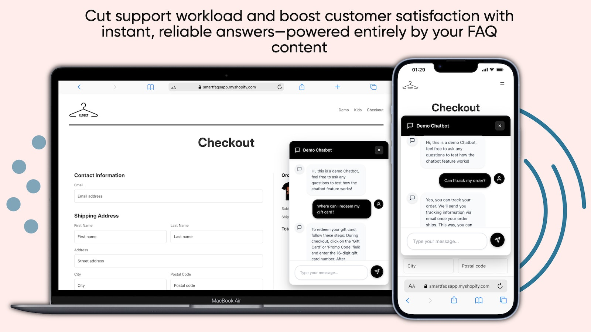
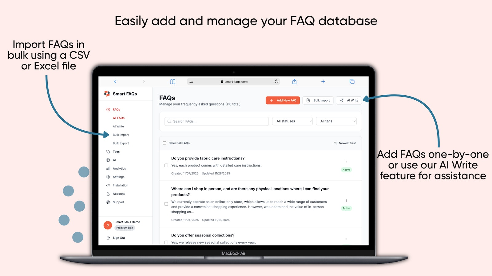

---

## 24. [cursor party](https://www.producthunt.com/products/cursor-party)
**Votes**: 76 | **도입 난이도**: 하 | **신뢰도**: 상
**Tagline**: Live multiplayer cursors & chat on any URL
**서비스 링크**: https://www.producthunt.com/r/C3ON7ZBSMIRSH4

**태그**: Browser Extension, Social, Productivity, Chat

### 📌 이 서비스 한눈에 보기
웹 서핑을 실시간 공유 경험으로 바꿔주는 멀티플레이어 커서 및 채팅 크롬 확장 프로그램

### 🔑 주요 기능
- 동일한 페이지를 읽고 있는 다른 사용자들을 실시간 커서로 확인
- 슬랙이나 디스코드보다 가볍고 자연스러운 앰비언트(Ambient) 소셜 경험 제공
- 위키피디아, 문서, 블로그 등 모든 웹 페이지에서 즉각적인 연결 가능

### 🙋 사용자에게 어떤 점이 좋은가
혼자 하는 웹 서핑을 마치 같은 공간에 있는 것처럼 생동감 있게 만들어주며, 별도의 초대 없이도 실시간 연결감을 제공합니다.

### ✅ 지금 바로 써볼 기능
- 크롬 확장 프로그램 설치하기
- 동일한 문서를 읽는 다른 사용자들의 커서 확인하기
- 실시간 채팅 기능 활용해보기

### ⚠️ 사용 전 확인할 점
- 개인정보 보호를 위해 브라우징 활동 노출 범위 확인 필요
- 사용자가 적은 페이지에서는 기능적 재미가 반감될 수 있음

### 🧭 확인이 더 필요한 정보
사용자 간의 익명성 보장 범위와 데이터 수집 정책에 대한 구체적인 정보가 필요합니다.

### 📸 스크린샷 및 갤러리
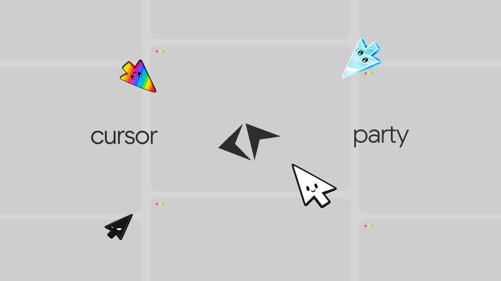
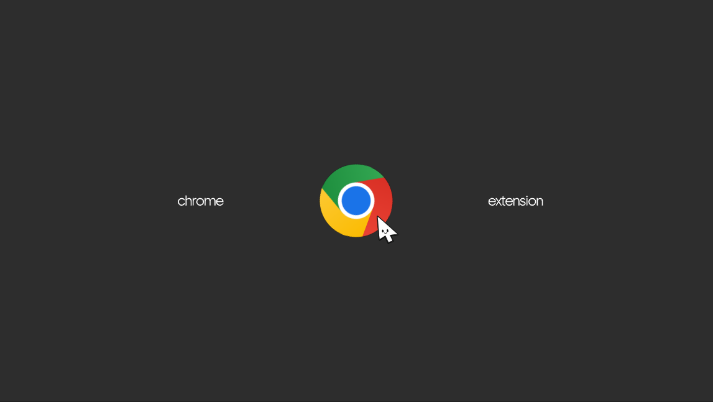

### 🎬 관련 영상
- [🎥 영상 보기](https://ph-files.imgix.net/cdae9c6b-44bb-4721-85cf-6c756648144c.jpeg?auto=format)

---

## 25. [Transition](https://www.producthunt.com/products/transition)
**Votes**: 75 | **도입 난이도**: 하 | **신뢰도**: 상
**Tagline**: AI coach to help you train smarter and race faster
**서비스 링크**: https://www.producthunt.com/r/FE2XBZCYPJUHJ7

**태그**: Fitness, AI Coach, Endurance, Training, AI Tool, Design

### 📌 이 서비스 한눈에 보기
개인 맞춤형 AI 코칭을 통해 더 스마트하게 훈련하고 기록을 단축하는 적응형 트레이닝 솔루션

### 🔑 주요 기능
- 사용자의 상태에 따라 실시간으로 변화하는 적응형 워크아웃 제공
- 수영, 사이클, 러닝, 근력 운동을 아우르는 종합적인 엔듀런스 트레이닝
- 5k부터 아이언맨, 마라톤까지 다양한 목표에 맞춘 전문적인 프로그램

### 🙋 사용자에게 어떤 점이 좋은가
훈련 방식에 대한 고민 없이 AI가 제안하는 맞춤형 플랜을 통해 효율적으로 체력과 레이스 성적을 향상시킬 수 있습니다.

### ✅ 지금 바로 써볼 기능
- 자신의 목표 종목(예: 마라톤, 철인 3종) 설정하기
- AI가 생성하는 맞춤형 운동 루틴 확인하기
- 종목별(수영, 사이클, 러닝, 근력) 통합 트레이닝 수행하기

### ⚠️ 사용 전 확인할 점
- 사용자의 실제 신체 상태나 부상 여부에 대한 정밀한 피드백 반영 여부 확인 필요
- 특정 종목에 치우치지 않는 균형 잡힌 훈련이 가능한지 검토 필요

### 🧭 확인이 더 필요한 정보
사용자의 웨어러블 기기 데이터와 얼마나 정밀하게 연동되어 실시간으로 적응하는지에 대한 정보가 더 필요합니다.

### 📸 스크린샷 및 갤러리
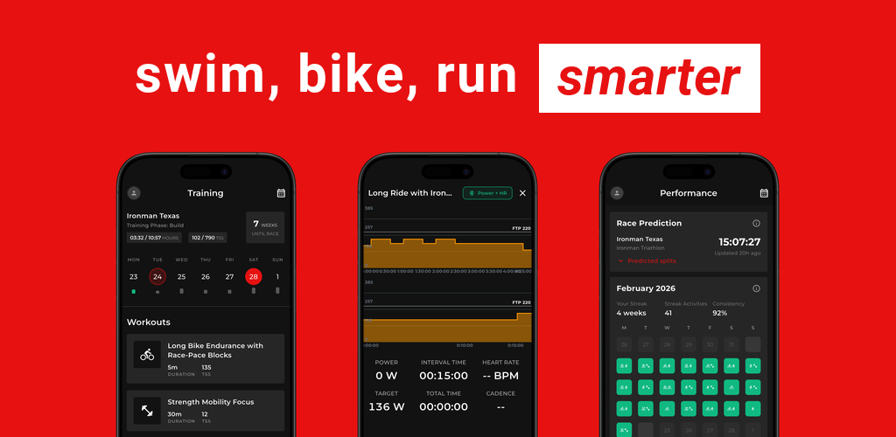
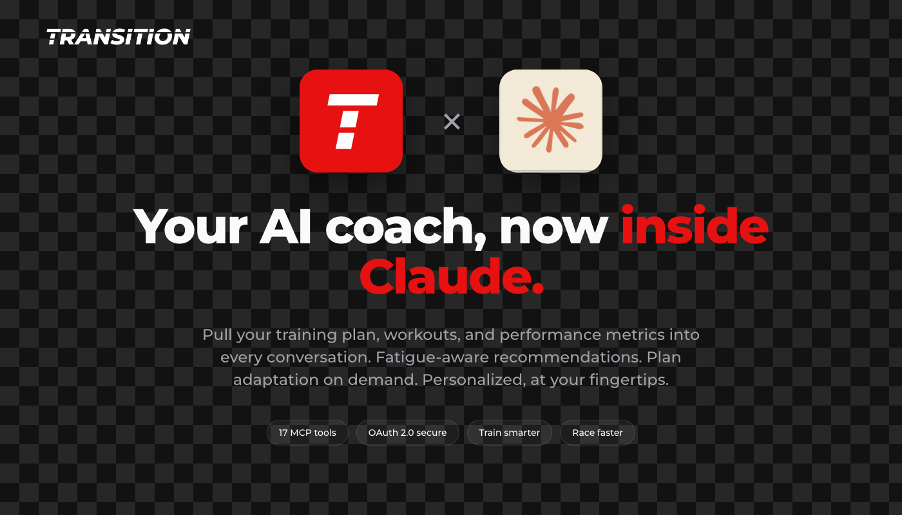

### 🎬 관련 영상
- [🎥 영상 보기](https://ph-files.imgix.net/8936e5d0-6012-4b21-9b9f-380a6c8465c7.gif?auto=format)

---

## 26. [MiniMax Hub](https://www.producthunt.com/products/minimax)
**Votes**: 75 | **도입 난이도**: 중 | **신뢰도**: 상
**Tagline**: Desktop AI workstation with agent-driven visual canvas
**서비스 링크**: https://www.producthunt.com/r/ZDCERLG2A75JL2

**태그**: AI-Agent, Creative-Tool, Automation, Multimodal, Workflow, Agent, AI Tool, Video, Vision

### 📌 이 서비스 한눈에 보기
AI 에이전트와 시각적 캔버스를 결합한 데스크톱 기반 올인원 크리에이티브 워크스테이션

### 🔑 주요 기능
- AI 에이전트 기반의 시각적 캔버스 및 워크플로우 자동화
- 텍스트, 이미지, 비디오, 오디오를 아우르는 멀티모달 생성 및 편집
- 로컬 파일 연동 및 재사용 가능한 스킬(Skills) 기능 제공

### 🙋 사용자에게 어떤 점이 좋은가
복잡한 창작 과정을 자연어 명령과 시각적 워크플로우로 통합하여 작업 시간을 단축하고 창의적인 실험을 쉽게 할 수 있습니다.

### ✅ 지금 바로 써볼 기능
- 자연어 명령을 통한 멀티모달 콘텐츠 생성 테스트
- 시각적 캔버스를 활용한 워크플로우 설계
- 로컬 파일과의 연동 및 스킬 활용도 확인

### ⚠️ 사용 전 확인할 점
- 데스크톱 설치형 소프트웨어로서의 시스템 리소스 요구량 확인 필요
- 복잡한 워크플로우 설정 시 초기 학습 곡선 존재 가능성

### 🧭 확인이 더 필요한 정보
로컬 파일 처리 방식 및 하드웨어 사양 요구사항에 대한 구체적인 정보가 필요합니다.

### 📸 스크린샷 및 갤러리
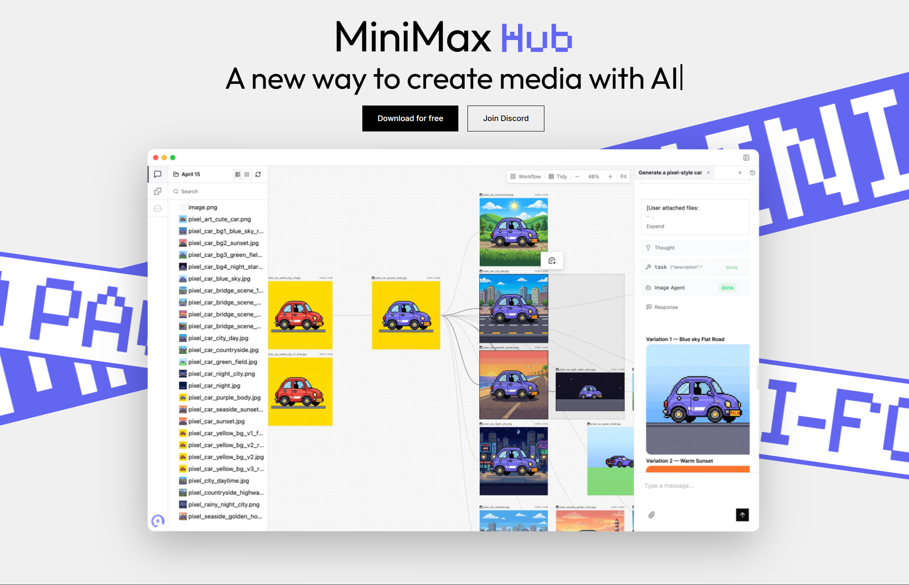
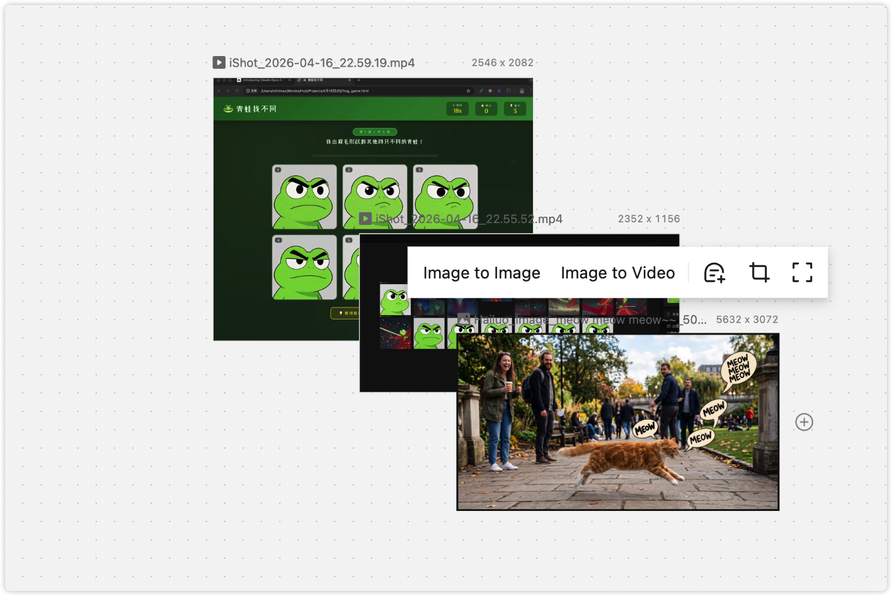
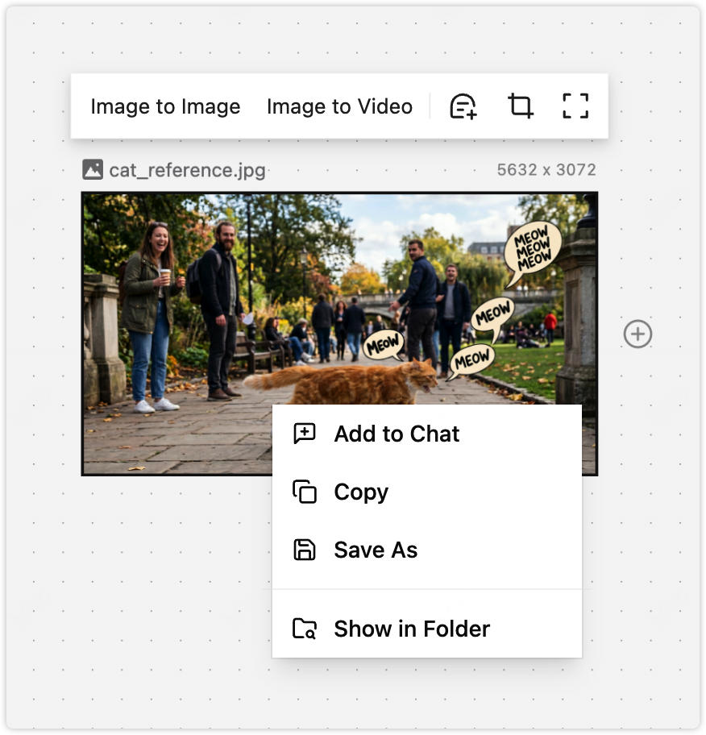

---

## 27. [Noteweave](https://www.producthunt.com/products/noteweave)
**Votes**: 75 | **도입 난이도**: 중 | **신뢰도**: 중
**Tagline**: Go from research to executable production plans in hours
**서비스 링크**: https://www.producthunt.com/r/L7HRFZACALU2ZB

**태그**: DevTool, Automation, RnD, Productivity, AI Tool

### 📌 이 서비스 한눈에 보기
연구 데이터를 실행 가능한 생산 계획으로 빠르게 전환하는 자동화 R&D 랩

### 🔑 주요 기능
- 고도화된 E3 엔진을 통한 과학적 연구 데이터의 기술적 결함 검증
- 사용자 도메인에 최적화된 연구 결과물 심층 분석
- 연구 내용을 바탕으로 한 즉각적인 제품 생산 계획 수립

### 🙋 사용자에게 어떤 점이 좋은가
연구 단계에서 생산 단계로 넘어가는 시간을 획기적으로 단축하며, IDE 내에서 작업 흐름을 끊지 않고 기술적 검증과 계획 수립이 가능합니다.

### ✅ 지금 바로 써볼 기능
- E3 엔진을 활용한 기존 연구 데이터의 기술적 결함 테스트
- 도메인 맞춤형 연구 분석 기능 실행
- 분석된 데이터를 바탕으로 한 생산 계획 생성

### ⚠️ 사용 전 확인할 점
- 제시된 벤치마크 수치(Claude Opus 4.6, GPT 5.4 등)가 실제 환경에서 동일하게 구현되는지 확인 필요
- 연구 데이터의 보안 및 IDE 연동 시 데이터 유출 주의

### 🧭 확인이 더 필요한 정보
언급된 모델 버전(GPT 5.4 등)이 현재 시장에 존재하지 않는 미래 지향적 명칭이므로 실제 성능 기준을 확인해야 합니다.

### 📸 스크린샷 및 갤러리

### 🎬 관련 영상
- [🎥 영상 보기](https://ph-files.imgix.net/20523150-f60a-42da-9851-8c4a8bf1e263.jpeg?auto=format)

---

## 28. [Espa](https://www.producthunt.com/products/espa)
**Votes**: 73 | **도입 난이도**: 하 | **신뢰도**: 상
**Tagline**: AI executive assistant for your to-do's, scheduling, & email
**서비스 링크**: https://www.producthunt.com/r/HECYQNJCCKMRGR

**태그**: AI Assistant, Productivity, Automation, Scheduling, AI Tool, LLM, Email

### 📌 이 서비스 한눈에 보기
텍스트와 음성만으로 일정, 할 일, 이메일을 관리하는 AI 개인 비서

### 🔑 주요 기능
- 텍스트 및 음성 메시지를 통한 직관적인 일정 예약 및 리마인더 설정
- 사용자의 말투를 반영한 이메일 답장 초안 작성 및 그룹 스레드 관리
- 은행급 암호화 및 데이터 미학습 정책을 통한 강력한 개인정보 보호

### 🙋 사용자에게 어떤 점이 좋은가
복잡한 일정 조율과 이메일 업무를 대화하듯 간편하게 처리하여 생산성을 높일 수 있습니다.

### ✅ 지금 바로 써볼 기능
- 음성 메모로 즉시 일정 예약해보기
- 나의 말투를 학습시킨 이메일 답장 초안 생성하기
- 흩어진 할 일과 이벤트를 한곳에 모아 관리하기

### ⚠️ 사용 전 확인할 점
- AI가 생성한 이메일 내용이 의도와 맞는지 최종 확인 필요
- 외부 캘린더 및 이메일 서비스와의 연동 범위 확인 필요

### 🧭 확인이 더 필요한 정보
현재 지원하는 외부 서비스(Google, Outlook 등)와의 구체적인 연동 범위는 명시되지 않았습니다.

### 📸 스크린샷 및 갤러리

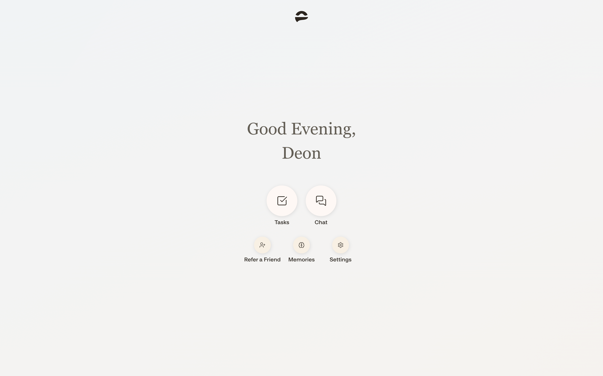
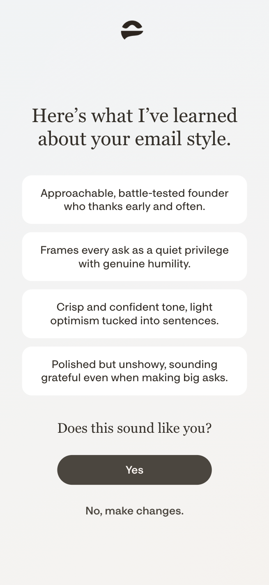

### 🎬 관련 영상
- [🎥 영상 보기](https://ph-files.imgix.net/8d208de7-e3d5-43ea-b8c4-0f975fe02520.jpeg?auto=format)

---

## 29. [Finlingo](https://www.producthunt.com/products/finlingo)
**Votes**: 71 | **도입 난이도**: 중 | **신뢰도**: 상
**Tagline**: Your own AI CFO, watching your money on autopilot
**서비스 링크**: https://www.producthunt.com/r/6L2ZPDRSWHNBWE

**태그**: FinTech, AI, PersonalFinance, Automation, AI Tool, Chat

### 📌 이 서비스 한눈에 보기
은행 및 투자 계좌를 실시간 모니터링하여 자산 관리를 자동화하는 AI CFO 서비스

### 🔑 주요 기능
- 은행, 신용카드, 투자 계좌의 실시간 데이터 통합 관리
- 지출 급증, 숨겨진 수수료, 구독료 등 이상 징후 자동 알림
- 음성 및 채팅 기반의 AI 비서 'Finny'를 통한 데이터 분석 및 의사결정 지원

### 🙋 사용자에게 어떤 점이 좋은가
개인이 일일이 확인하기 어려운 자산 변동과 지출 패턴을 AI가 대신 감시하여, 재정적 실수를 방지하고 데이터 기반의 의사결정을 돕습니다.

### ✅ 지금 바로 써볼 기능
- 계좌 연동을 통한 실시간 자산 트래킹 시작하기
- AI 비서 'Finny'에게 현재 소비 패턴 질문하기
- 지출 크립(spending creep) 및 수수료 알림 설정하기

### ⚠️ 사용 전 확인할 점
- 금융 데이터 접근 권한 부여에 따른 보안 및 개인정보 보호 검토 필요
- 계좌 연동 방식에 따른 데이터 업데이트 주기 차이 가능성

### 🧭 확인이 더 필요한 정보
현재 제공되는 보안 프로토콜과 구체적인 금융 기관 연동 범위에 대한 확인이 필요합니다.

### 📸 스크린샷 및 갤러리

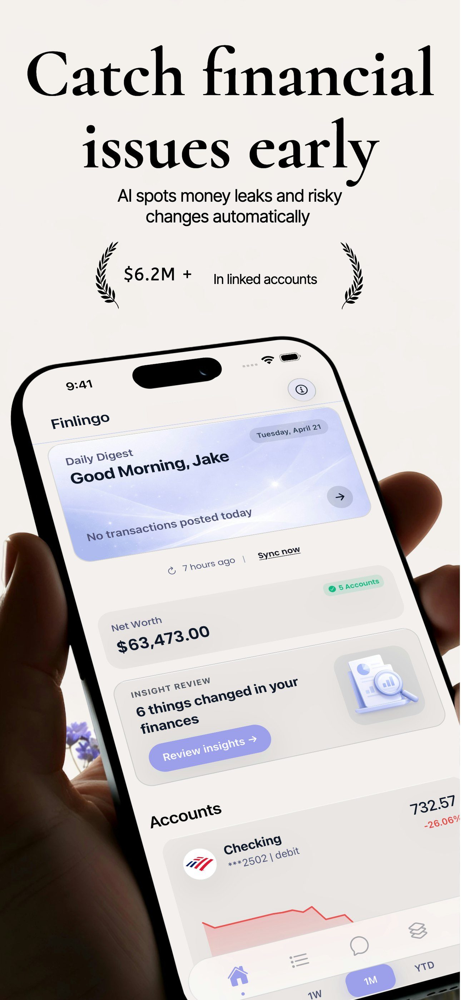
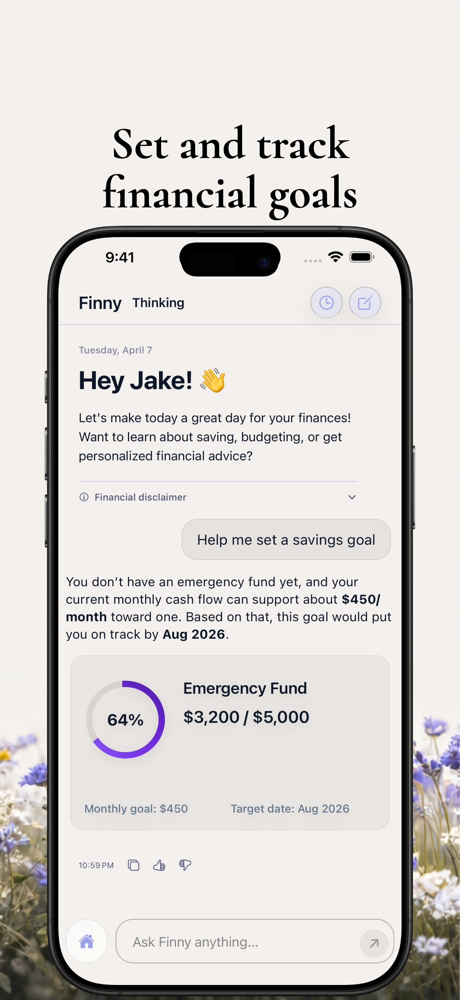

### 🎬 관련 영상
- [🎥 영상 보기](https://ph-files.imgix.net/df23dc3e-8038-4d0b-a701-e6c9a96fd54b.jpeg?auto=format)

---

## 30. [Maia Executives](https://www.producthunt.com/products/maia-your-ai-co-worker)
**Votes**: 70 | **도입 난이도**: 상 | **신뢰도**: 중
**Tagline**: Meet AI Executives running business operations end-to-end.
**서비스 링크**: https://www.producthunt.com/r/YTDIEFHOXB5JC3

**태그**: AI Agents, Automation, Business Operations, Workflow, AI Tool

### 📌 이 서비스 한눈에 보기
단순 보조를 넘어 비즈니스 운영 전반을 자율적으로 수행하는 AI 임원진 솔루션

### 🔑 주요 기능
- 단순 작업 수행이 아닌 결과(Outcome)를 책임지는 자율형 AI 에이전트
- 워크플로 네이티브 아키텍처를 통한 일관되고 반복 가능한 업무 시스템 구축
- 장기 기억(Long-term memory)과 도구 통합을 통한 맥락 유지 및 실행력

### 🙋 사용자에게 어떤 점이 좋은가
단순 반복 업무를 넘어 특정 비즈니스 기능 전체를 AI에게 맡겨 운영 효율성을 극대화할 수 있습니다.

### ✅ 지금 바로 써볼 기능
- 특정 비즈니스 기능(예: 마케팅, 운영 등)의 워크플로 설계
- 기존 업무 도구와의 연동 테스트
- AI 에이전트의 자율적 의사결정 범위 설정

### ⚠️ 사용 전 확인할 점
- 자율적 실행 과정에서 발생할 수 있는 예기치 못한 오류 및 결과값 검증 필요
- 기존 업무 프로세스와의 복잡한 통합 과정 및 초기 설정 난이도

### 🧭 확인이 더 필요한 정보
구체적인 지원 비즈니스 기능 범위와 기존 SaaS 도구들과의 상세 연동 수준을 확인해야 합니다.

### 📸 스크린샷 및 갤러리

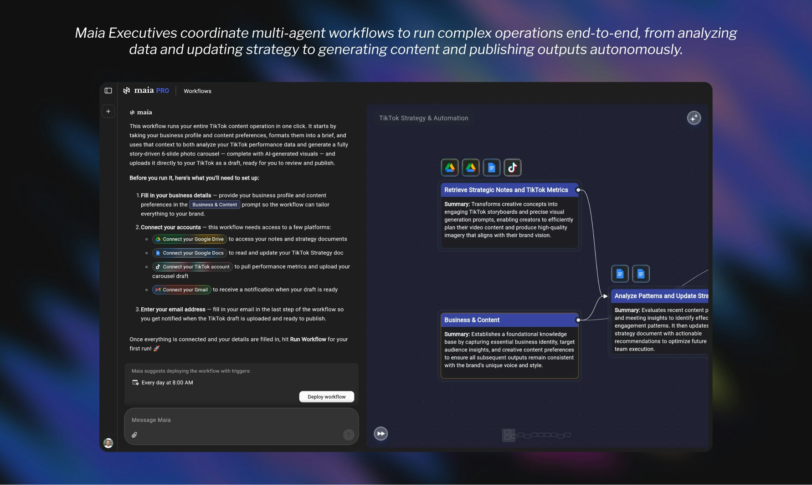
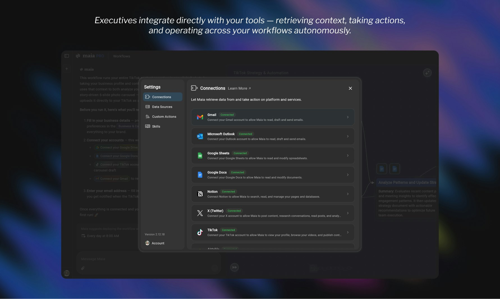

---

