# 🚀 Product Hunt Daily Top 30 (2026-05-11)

## 오늘의 요약
오늘의 트렌드는 AI 기술을 활용하면서도 데이터 보안과 개인정보 보호를 최우선으로 하는 '로컬 퍼스트(Local-first)' 및 '프라이버시 중심' 솔루션이 주를 이루었습니다. 또한, 개발 워크플로우를 자동화하거나 디자인과 코드 간의 간극을 줄이는 생산성 도구들이 높은 관심을 받았습니다.

### 오늘의 핵심 포인트
- 데이터 유출 방지를 위해 클라우드가 아닌 사용자 로컬 환경에서 작동하는 오프라인 AI 및 보안 도구들이 주목받았습니다.
- AI 에이전트의 작업 과정을 모니터링하거나 디자인-코드 간의 일관성을 유지하는 등 실무 워크플로우 최적화 도구들이 등장했습니다.
- 사용자의 데이터 주권을 보장하기 위해 대화 기록을 로컬 파일로 저장하거나 개인 인프라를 활용하는 방식이 핵심 경쟁력으로 나타났습니다.

**오늘의 태그**: AI 보안, 로컬 AI, 생산성 도구, 오픈소스, 데이터 프라이버시

## 1. [Tailgrids 3.0](https://www.producthunt.com/products/tailgrids)
**Votes**: 244 | **도입 난이도**: 중 | **신뢰도**: 상
**Tagline**: Open-source React UI library for Tailwind and AI Workflow
**서비스 링크**: https://www.producthunt.com/r/SRA36BX2QALQPN

**태그**: React, TailwindCSS, DesignSystem, AI-Workflow, OpenSource, Automation, AI Tool, Design, DevTool, Marketing

### 📌 이 서비스 한눈에 보기
React, Tailwind, Figma를 하나로 통합하여 개발 속도를 극대화하는 오픈소스 UI 라이브러리

### 🔑 주요 기능
- 600개 이상의 대규모 컴포넌트, 블록 및 템플릿 제공 (SaaS, AI, 이커머스 등)
- Figma 디자인 키트와 코드베이스가 1:1로 일치하는 정밀한 디자인 시스템
- CLI 설치, 디자인 토큰, AI 워크플로우를 위한 MCP 서버 지원

### 🙋 사용자에게 어떤 점이 좋은가
디자인과 개발 사이의 간극을 줄여주며, AI 워크플로우와 결합되어 복잡한 웹 프로젝트를 빠르게 구축할 수 있습니다.

### ✅ 지금 바로 써볼 기능
- CLI를 통한 빠른 환경 구축 및 컴포넌트 설치
- Figma 키트를 활용한 디자인-코드 동기화 테스트
- MCP 서버를 이용한 AI 기반 개발 워크플로우 적용

### ⚠️ 사용 전 확인할 점
- React 및 Tailwind CSS에 대한 숙련도 필요
- 대규모 컴포넌트 라이브러리 도입에 따른 프로젝트 초기 설정 복잡도

### 🧭 확인이 더 필요한 정보
오픈소스 라이브러리로서의 라이선스 범위와 유지보수 지속성에 대한 확인이 필요합니다.

### 📸 스크린샷 및 갤러리
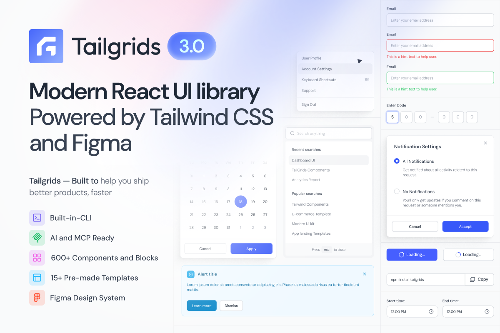
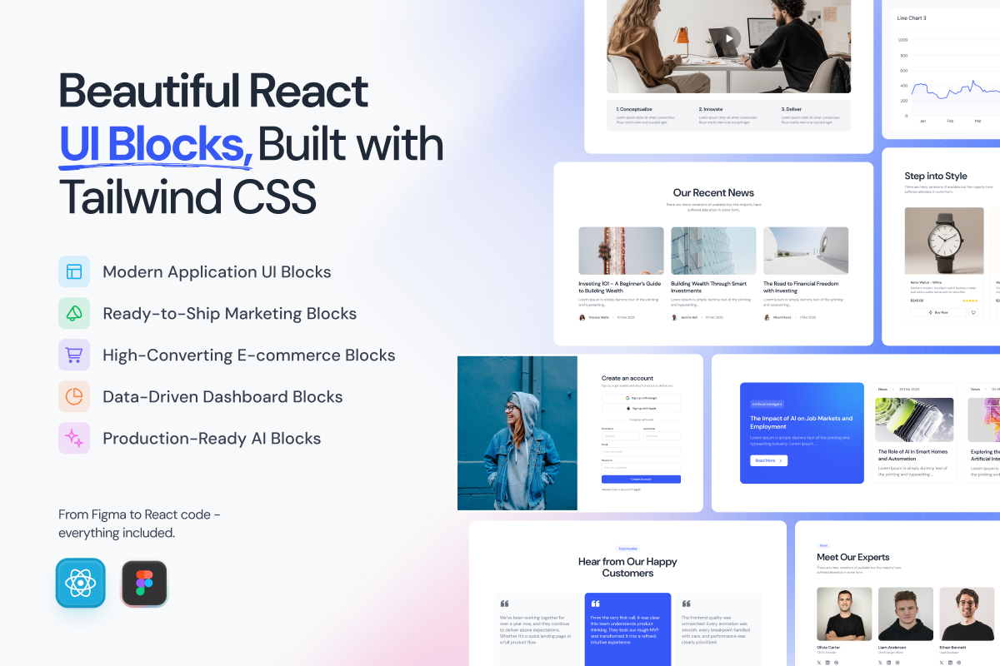
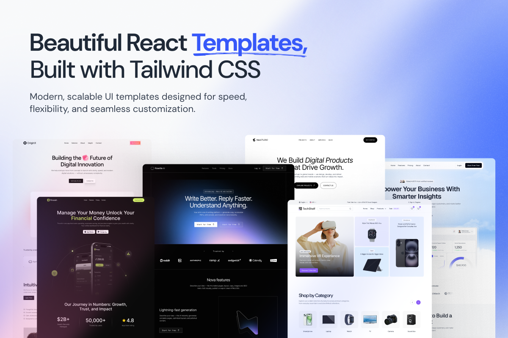

### 🎬 관련 영상
- [🎥 영상 보기](https://ph-files.imgix.net/b8e16d63-ba54-4fde-9bf3-21a20c8a70cb.jpeg?auto=format)

---

## 2. [InvestorFinder](https://www.producthunt.com/products/investorfinder)
**Votes**: 195 | **도입 난이도**: 하 | **신뢰도**: 상
**Tagline**: Find investors who've backed founders just like you
**서비스 링크**: https://www.producthunt.com/r/RYYTMN5NZ76UMA

**태그**: Startup, Networking, Investment, Data-Driven

### 📌 이 서비스 한눈에 보기
나와 가장 잘 맞는 VC 파트너를 데이터 기반으로 찾아주는 매칭 서비스

### 🔑 주요 기능
- VC 파트너별 실제 투자 이력 데이터 제공
- 창업자 배경, 출신 대학, 이전 직장 등 상세 프로필 분석
- 사용자 프로필 기반의 초고속 매칭 기능

### 🙋 사용자에게 어떤 점이 좋은가
자신의 배경과 유사한 이력을 가진 투자자를 빠르게 식별하여 IR 성공 확률을 높일 수 있습니다.

### ✅ 지금 바로 써볼 기능
- 자신의 프로필 데이터 준비하기
- 프로필 붙여넣기를 통한 매칭 결과 확인하기
- 추천된 VC 파트너 리스트 검토하기

### ⚠️ 사용 전 확인할 점
- 제공되는 데이터의 최신성 및 정확도 확인 필요
- 매칭 결과가 실제 투자 결정과 반드시 일치하지 않을 수 있음

### 🧭 확인이 더 필요한 정보
데이터의 업데이트 주기와 상세 프로필 분석 알고리즘의 구체적인 작동 방식에 대한 정보가 더 필요합니다.

### 📸 스크린샷 및 갤러리
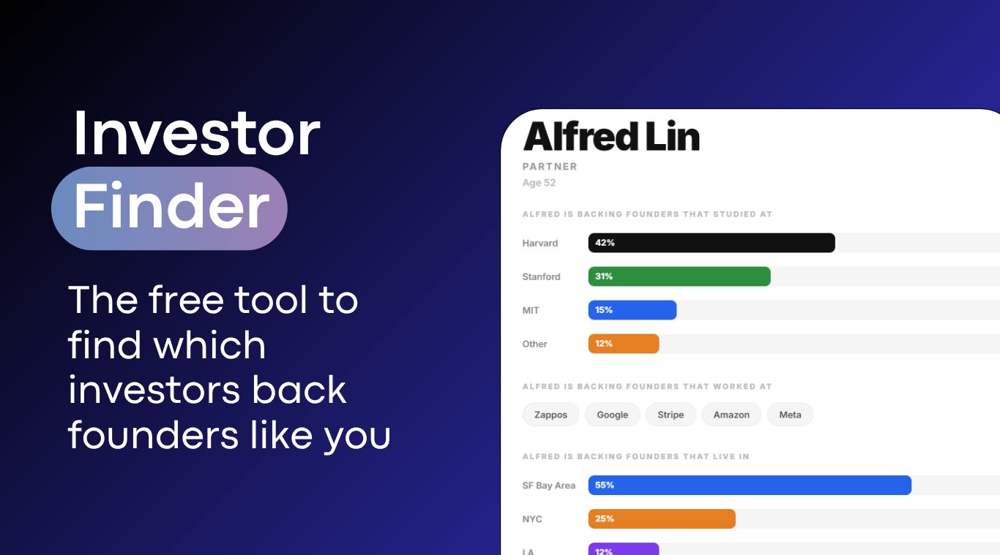

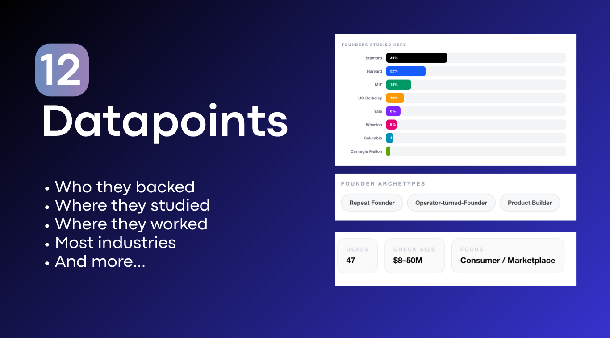

---

## 3. [deepsec](https://www.producthunt.com/products/vercel)
**Votes**: 183 | **도입 난이도**: 중 | **신뢰도**: 상
**Tagline**: Open-source coding security harness
**서비스 링크**: https://www.producthunt.com/r/T5UPS2CJT3MEUS

**태그**: DevTool, Security, OpenSource, AI, AI Tool

### 📌 이 서비스 한눈에 보기
사용자 인프라 내에서 코드를 안전하게 검사하는 오픈소스 AI 보안 도구

### 🔑 주요 기능
- Vercel에서 공개한 오픈소스 AI 보안 하네스
- 사용자 자체 인프라 및 API 키를 활용한 보안 환경 구축
- 코드 베이스를 대상으로 하는 AI 기반 보안 검사

### 🙋 사용자에게 어떤 점이 좋은가
데이터가 외부로 유출될 걱정 없이, 자신의 인프라 내에서 안전하게 AI 보안 검사를 수행할 수 있습니다.

### ✅ 지금 바로 써볼 기능
- 오픈소스 저장소 클론 및 로컬 환경 설치
- 자체 인프라와의 호환성 테스트
- 기존 코드 베이스에 대한 보안 스캔 실행

### ⚠️ 사용 전 확인할 점
- 사용자 인프라에 직접 설치하므로 초기 설정 및 유지보수 필요
- 자체 키와 인프라를 사용함에 따른 관리 책임

### 🧭 확인이 더 필요한 정보
상세한 스캔 범위와 지원하는 프로그래밍 언어에 대한 구체적인 정보가 추가로 필요합니다.

### 📸 스크린샷 및 갤러리
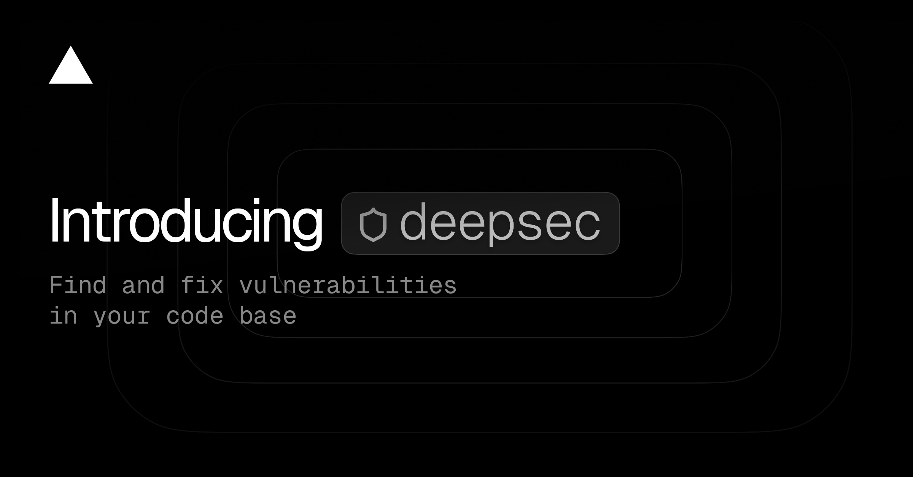

---

## 4. [Adject 2.0](https://www.producthunt.com/products/adject)
**Votes**: 149 | **도입 난이도**: 중 | **신뢰도**: 상
**Tagline**: Create hyperrealistic product visuals with AI
**서비스 링크**: https://www.producthunt.com/r/BPB5EVZOROWIVC

**태그**: AI Design, Creative Workflow, Branding, Product Photography, Agent, Automation, AI Tool, Prompting, Video

### 📌 이 서비스 한눈에 보기
끊김 없는 워크플로우로 브랜드 비주얼 캠페인을 완성하는 AI 제품 스튜디오

### 🔑 주요 기능
- 단순 생성을 넘어 제품, 모델, 에셋이 연결된 프로젝트 기반 워크플로우
- 한 번의 업로드로 맥락을 유지하며 지속적인 편집 및 반복 작업 가능
- 파편화된 툴 없이 하나의 환경에서 제품 비주얼부터 캠페인 제작까지 완결

### 🙋 사용자에게 어떤 점이 좋은가
매번 새로운 프롬프트를 입력할 필요 없이, 기존 작업물을 바탕으로 일관성 있는 브랜드 이미지를 빠르게 확장할 수 있습니다.

### ✅ 지금 바로 써볼 기능
- 제품 이미지 업로드 및 컨텍스트 생성 테스트
- 프로젝트 내 에셋 간 연결 및 반복 편집 기능 확인
- 일관된 스타일로 캠페인 에셋 생성 시도

### ⚠️ 사용 전 확인할 점
- 에이전트 기반 워크플로우의 복잡도로 인한 초기 학습 곡선 존재 가능성
- 고도화된 편집 기능 사용 시 요구되는 컴퓨팅 자원이나 비용 구조 확인 필요

### 🧭 확인이 더 필요한 정보
구체적인 영상 생성 기능의 품질과 편집 자유도에 대한 상세 정보가 필요합니다.

### 📸 스크린샷 및 갤러리
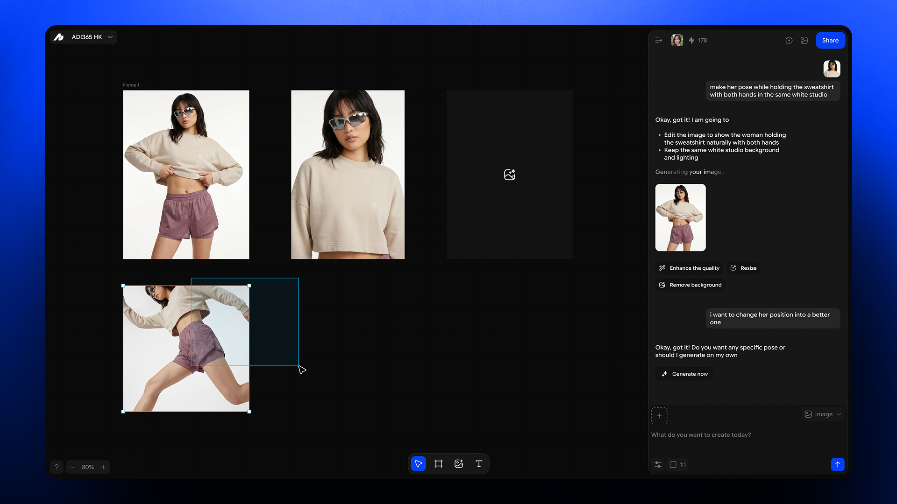
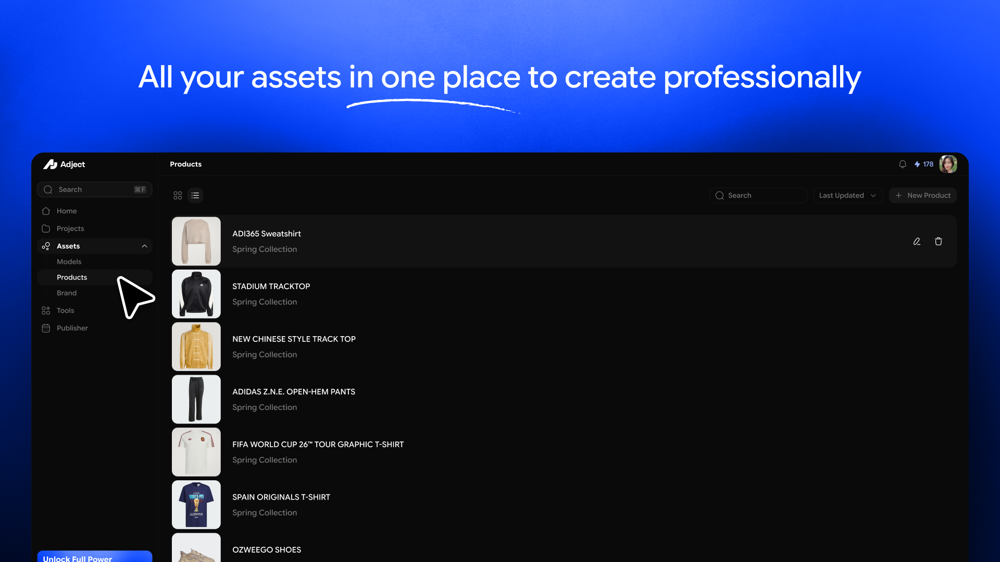

### 🎬 관련 영상
- [🎥 영상 보기](https://ph-files.imgix.net/761bf10d-81cb-4bdd-bf1a-a4435a999604.gif?auto=format)

---

## 5. [Notion 3.4](https://www.producthunt.com/products/notion-3-4)
**Votes**: 134 | **도입 난이도**: 하 | **신뢰도**: 상
**Tagline**: New dashboards, connectors, sidebar & smarter AI agents
**서비스 링크**: https://www.producthunt.com/r/EG2MLTEVHABTRD

**태그**: Productivity, AI, Collaboration, Workflow, Agent, AI Tool, Vision

### 📌 이 서비스 한눈에 보기
대시보드와 AI 에이전트 강화로 업무 워크플로우를 하나로 통합한 Notion 업데이트

### 🔑 주요 기능
- 워크스페이스 내 이미지 생성 및 대시보드 구축 기능 추가
- 문서 프레젠테이션 기능 및 사이드바 개선
- 운영자 및 PM을 위한 10개 이상의 AI 기반 기능 업데이트

### 🙋 사용자에게 어떤 점이 좋은가
별도의 도구 이동 없이 Notion 안에서 데이터 시각화와 문서 발표를 모두 해결할 수 있어 업무 효율이 높아집니다.

### ✅ 지금 바로 써볼 기능
- 새로운 대시보드 레이아웃 구성해보기
- AI 에이전트를 활용한 문서 자동화 테스트
- 개선된 사이드바를 통한 워크스페이스 정리

### ⚠️ 사용 전 확인할 점
- AI 생성 기능의 결과물 정확도 검토 필요
- 기존 워크스페이스 구조에 따른 대시보드 적용 차이

### 🧭 확인이 더 필요한 정보
구체적인 AI 에이전트의 기능 범위와 기존 유료 플랜과의 연동 방식은 추가 확인이 필요합니다.

### 📸 스크린샷 및 갤러리
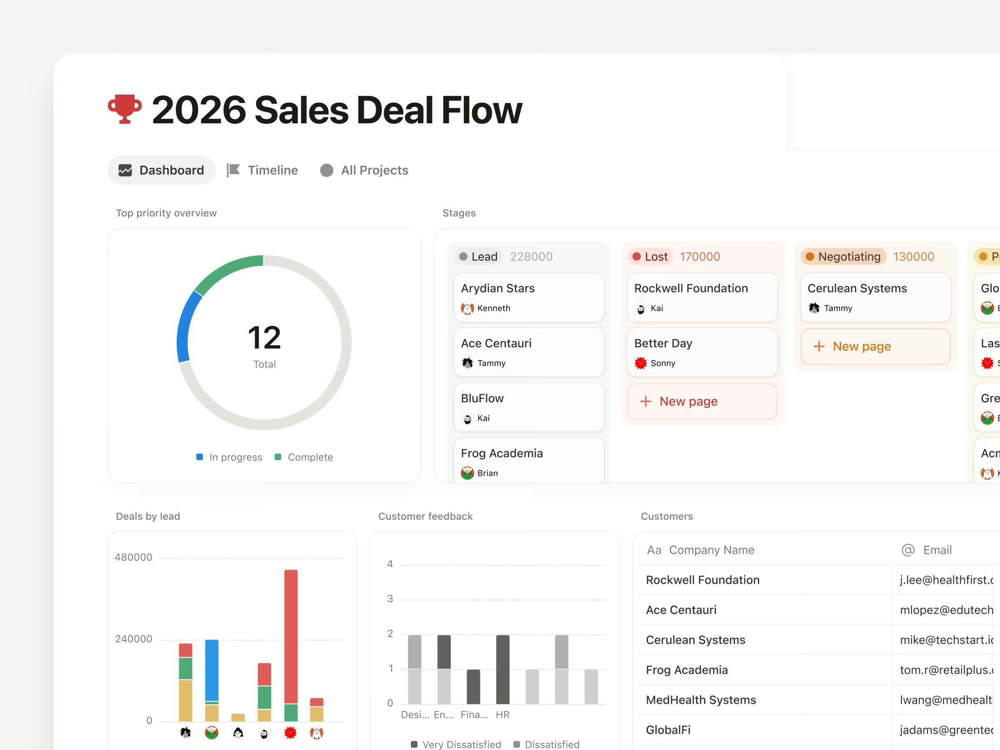
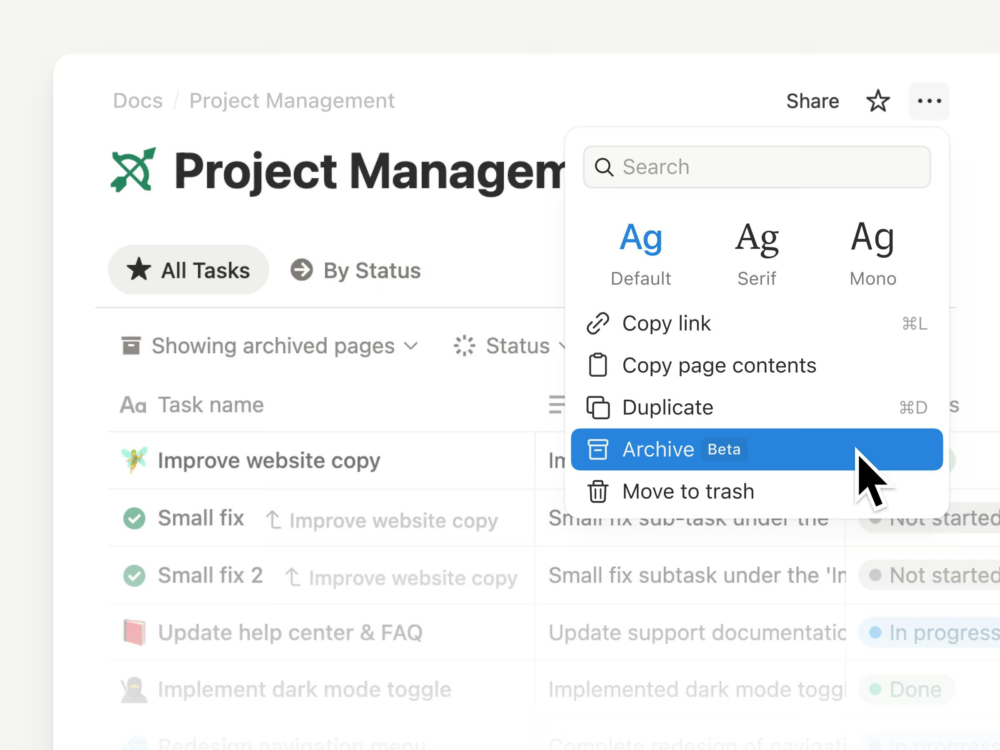
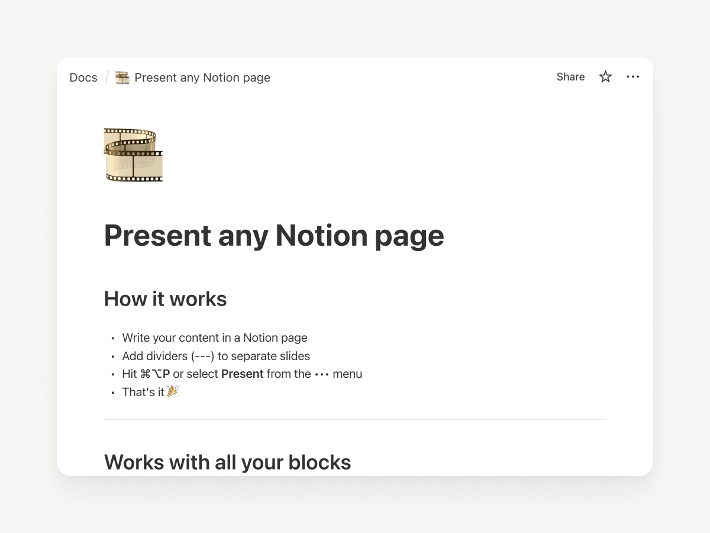

### 🎬 관련 영상
- [🎥 영상 보기](https://ph-files.imgix.net/38057e4f-66f5-43be-a19c-3482de8d2c42.jpeg?auto=format)

---

## 6. [AgentPeek](https://www.producthunt.com/products/agentpeek)
**Votes**: 121 | **도입 난이도**: 하 | **신뢰도**: 상
**Tagline**: Claude Code and Codex in your Mac notch
**서비스 링크**: https://www.producthunt.com/r/I5VUUCMKZ6ZLDB

**태그**: DevTool, AI-Agent, Productivity, Mac, Agent

### 📌 이 서비스 한눈에 보기
Mac 노치에서 Claude Code와 Codex의 작업 현황을 실시간으로 모니터링하는 개발자용 대시보드

### 🔑 주요 기능
- Mac 노치를 활용한 직관적인 세션 및 권한 모니터링
- 토큰 사용량 및 로컬 개발 서버 상태 확인 기능
- 모든 세션 데이터의 로컬 저장으로 보안성 확보

### 🙋 사용자에게 어떤 점이 좋은가
AI 코딩 에이전트의 작업 과정을 화면 구석에서 간편하게 확인하며, 토큰 소모량과 권한을 실시간으로 제어할 수 있습니다.

### ✅ 지금 바로 써볼 기능
- Mac 노치 위젯을 통한 실시간 세션 모니터링
- AI 에이전트의 토큰 사용량 추적
- 로컬 개발 서버 상태 확인

### ⚠️ 사용 전 확인할 점
- Mac 노치 디자인에 최적화되어 있어 특정 디스플레이 환경에서는 시각적 제약이 있을 수 있음
- Claude Code 및 Codex 환경 설정 필요

### 🧭 확인이 더 필요한 정보
지원하는 구체적인 AI 에이전트 도구의 종류와 OS 버전 호환성을 확인해야 합니다.

### 📸 스크린샷 및 갤러리
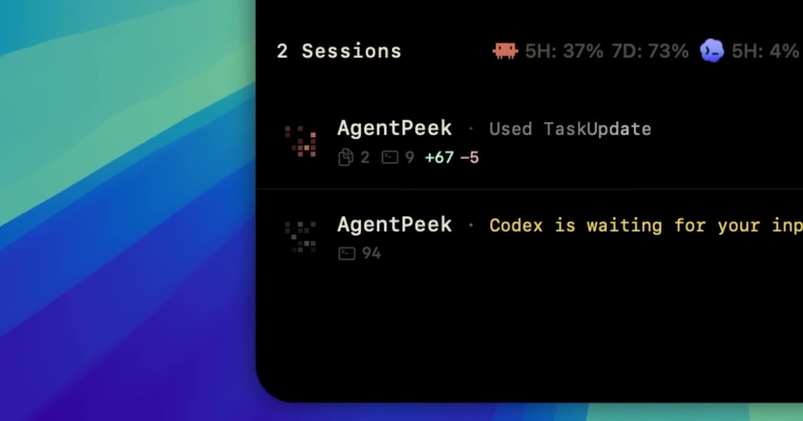

### 🎬 관련 영상
- [🎥 영상 보기](https://ph-files.imgix.net/7af2990b-fe51-41b3-8ce7-3daac6fb5877.jpeg?auto=format)

---

## 7. [LumiChats Offline(free)](https://www.producthunt.com/products/lumichats-offline)
**Votes**: 107 | **도입 난이도**: 중 | **신뢰도**: 상
**Tagline**: Your AI, fully offline with Zero data collection & 100% free
**서비스 링크**: https://www.producthunt.com/r/D2CFOVK7DPCEEE

**태그**: AI, Privacy, OpenSource, DesktopApp, LocalLLM, AI Tool, Chat

### 📌 이 서비스 한눈에 보기
데이터 유출 걱정 없이 내 컴퓨터에서 직접 실행하는 완전 무료 오프라인 AI 채팅 앱

### 🔑 주요 기능
- 인터넷 연결 없이 작동하는 완전 오프라인 환경 및 개인정보 보호
- Mistral, LLaMA, Qwen, DeepSeek 등 다양한 오픈소스 모델 지원
- LocalDocs 기능을 통한 개인 문서(PDF 등) 기반의 로컬 채팅 가능

### 🙋 사용자에게 어떤 점이 좋은가
클라우드 AI에 민감한 개인정보나 기업 문서를 외부 유출 걱정 없이 안전하게 분석하고 대화할 수 있습니다.

### ✅ 지금 바로 써볼 기능
- 자신의 OS(Windows, Linux, macOS)에 맞는 설치 파일 다운로드
- LocalDocs 기능을 활용한 개인 문서 업로드 및 질의응답 테스트
- 사용 중인 하드웨어 사양에 맞는 최적의 모델(Mistral, LLaMA 등) 선택

### ⚠️ 사용 전 확인할 점
- GPU 없이 구동 가능하다고 명시되어 있으나, 모델 크기에 따라 하드웨어 성능에 따른 속도 차이가 발생할 수 있음
- 오프라인 구동 특성상 실시간 웹 검색 기능 사용 불가

### 🧭 확인이 더 필요한 정보
사용자의 하드웨어 사양에 따른 구체적인 모델 구동 속도와 최적화 수준을 확인해야 합니다.

### 📸 스크린샷 및 갤러리
_media_0.jpg)
_media_1.jpg)
_media_2.jpg)

### 🎬 관련 영상
- [🎥 영상 보기](https://ph-files.imgix.net/df9fe6e1-dbda-4c94-8e35-013966235f24.jpeg?auto=format)

---

## 8. [Keel](https://www.producthunt.com/products/keel-3)
**Votes**: 106 | **도입 난이도**: 중 | **신뢰도**: 상
**Tagline**: An AI assistant whose memory belongs to you
**서비스 링크**: https://www.producthunt.com/r/MHKCZ5OJ47MKOE

**태그**: AI, Productivity, OpenSource, Privacy, DesktopApp, AI Tool

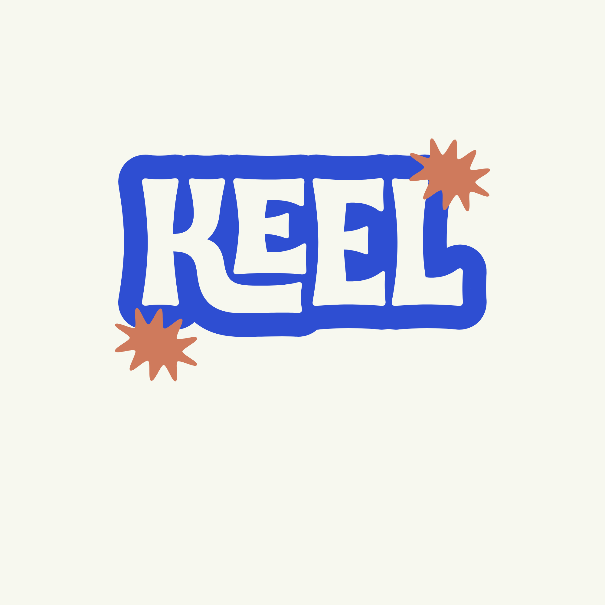

### 📌 이 서비스 한눈에 보기
사용자의 대화 내용을 로컬 마크다운 파일로 저장하여 데이터 주권을 보장하는 AI 비서

### 🔑 주요 기능
- 로컬 퍼스트 방식의 macOS 및 Windows 데스크톱 앱
- 대화 중 중요한 내용을 로컬 마크다운 파일로 자동 기록
- 사용자 개인 모델(Claude, GPT, Ollama 등) 연결 가능

### 🙋 사용자에게 어떤 점이 좋은가
대화 데이터가 외부 서버가 아닌 사용자 기기에 직접 저장되므로, 개인정보 유출 걱정 없이 AI를 활용해 지식 베이스를 구축할 수 있습니다.

### ✅ 지금 바로 써볼 기능
- 자신이 선호하는 LLM(Claude, GPT 등) 연결하기
- 로컬 마크다운 파일 저장 경로 설정하기
- Ollama를 통한 완전 로컬 환경 구축해보기

### ⚠️ 사용 전 확인할 점
- 사용자가 직접 모델을 설정해야 하므로 초기 세팅이 필요함
- 로컬 저장 방식이므로 기기 분실이나 하드웨어 고장 시 데이터 관리 책임이 사용자에게 있음

### 🧭 확인이 더 필요한 정보
사용자가 직접 모델을 연결하는 방식이므로, 각 모델 API 비용이나 로컬 리소스 점유율에 대한 구체적인 정보는 확인이 필요합니다.

### 📸 스크린샷 및 갤러리
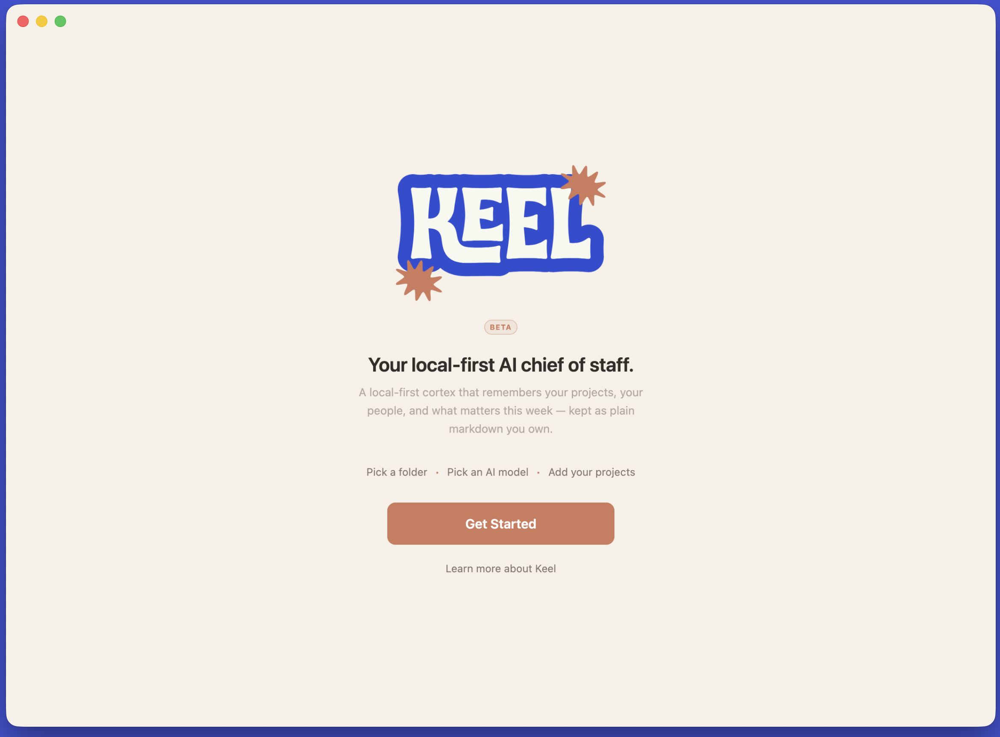
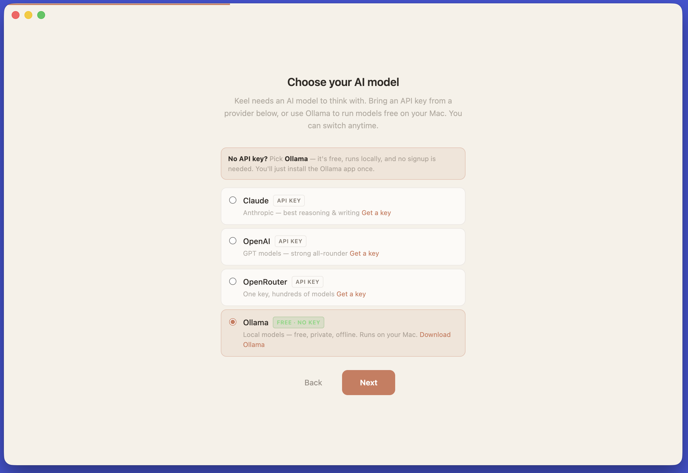
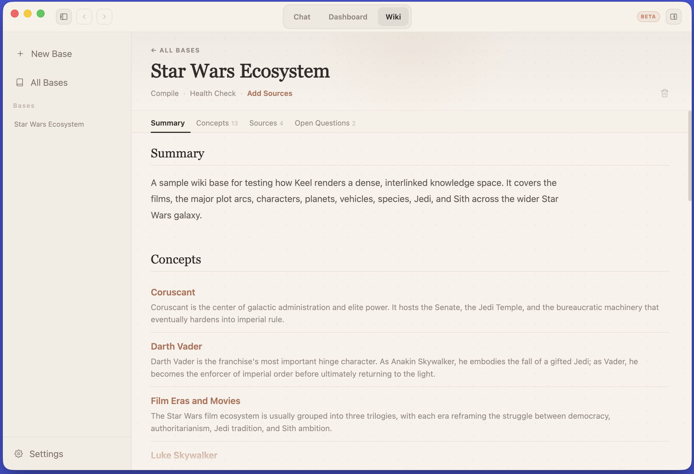

---

## 9. [ReelFluent Web](https://www.producthunt.com/products/reelfluent)
**Votes**: 14 | **도입 난이도**: 하 | **신뢰도**: 상
**Tagline**: Reels, but for language learning
**서비스 링크**: https://www.producthunt.com/r/BQ3F4BEXN574E3

**태그**: LanguageLearning, EdTech, AI, VideoContent, AI Tool

### 📌 이 서비스 한눈에 보기
드라마 시청을 실전 언어 학습으로 바꿔주는 숏폼 기반 언어 학습 플랫폼

### 🔑 주요 기능
- 몰입감 넘치는 미니 드라마 콘텐츠 제공
- 탭 한 번으로 가능한 즉각적인 번역 기능
- AI를 활용한 학습 지원 및 장면별 실전 연습

### 🙋 사용자에게 어떤 점이 좋은가
단순한 영상 시청을 학습 시간으로 전환하여, 즐거움과 실력 향상을 동시에 잡을 수 있습니다.

### ✅ 지금 바로 써볼 기능
- 탭 투 트랜스레이트(Tap-to-translate) 기능 사용해보기
- AI 도움말 기능을 통한 문맥 파악하기
- 인-씬(In-scene) 연습 기능으로 발화 연습하기

### ⚠️ 사용 전 확인할 점
- 콘텐츠의 양과 학습 커리큘럼의 체계성 확인 필요
- 웹 버전의 경우 모바일 환경과의 사용성 차이 고려

### 🧭 확인이 더 필요한 정보
지원하는 언어의 종류와 구체적인 학습 커리큘럼 구성에 대한 정보가 더 필요합니다.

### 📸 스크린샷 및 갤러리

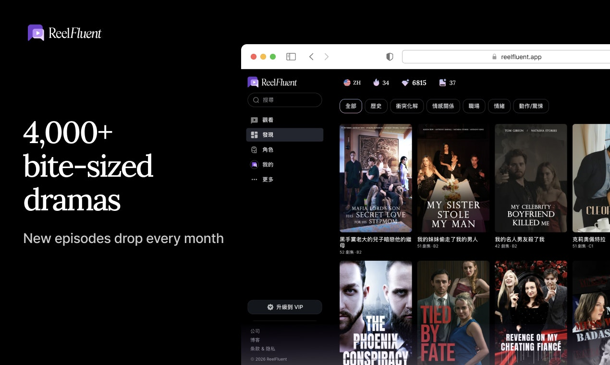
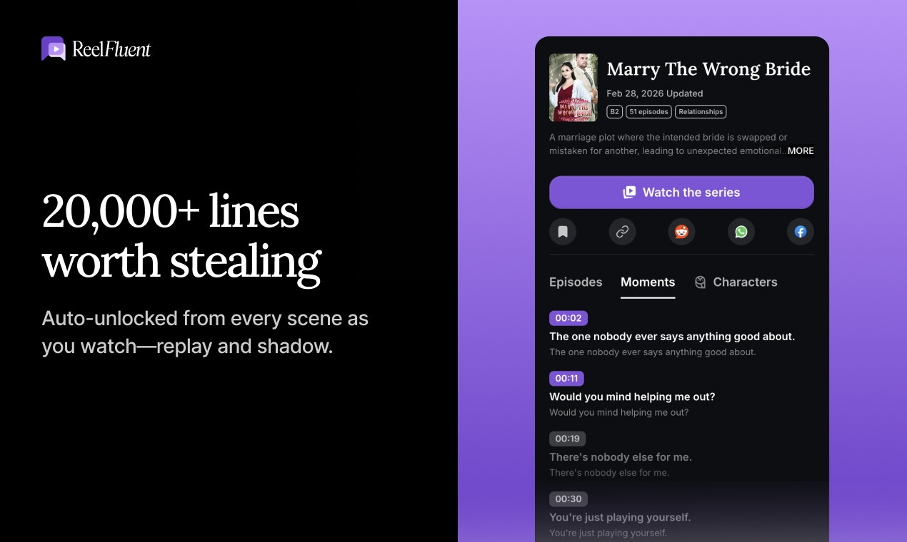

### 🎬 관련 영상
- [🎥 영상 보기](https://ph-files.imgix.net/2ba8ea16-96f2-47fe-9d38-9030c26544a4.jpeg?auto=format)

---

## 10. [TheStatsAPI](https://www.producthunt.com/products/thestatsapi)
**Votes**: 9 | **도입 난이도**: 하 | **신뢰도**: 상
**Tagline**: The Football Stats API Built for Speed
**서비스 링크**: https://www.producthunt.com/r/3FVRAZ4X6B4YKZ

**태그**: DevTool, DataAPI, SportsAnalytics, Football, AI Tool, API

### 📌 이 서비스 한눈에 보기
80개 이상의 리그 데이터를 즉각적으로 제공하는 고성능 축구 통계 API

### 🔑 주요 기능
- 80개 이상의 축구 대회 데이터 즉시 제공
- 경기 데이터, 선수 통계, 일정 등 포괄적인 데이터셋
- 빠르고 간편한 개발 환경 및 높은 신뢰성

### 🙋 사용자에게 어떤 점이 좋은가
개발자가 복잡한 데이터 수집 과정 없이 몇 분 만에 축구 관련 애플리케이션이나 분석 도구를 구축할 수 있습니다.

### ✅ 지금 바로 써볼 기능
- API 문서 확인 및 연동 테스트
- 필요한 특정 리그 데이터 포함 여부 확인
- 데이터 호출 속도 및 안정성 검증

### ⚠️ 사용 전 확인할 점
- 요청 시 제공 가능한 리그 수(최대 1,196개)에 대한 상세 조건 확인 필요
- 실시간 데이터 업데이트 주기 확인 필요

### 🧭 확인이 더 필요한 정보
사용자 요청에 따라 제공되는 리그 수의 구체적인 기준과 데이터 업데이트 빈도를 확인해야 합니다.

### 📸 스크린샷 및 갤러리
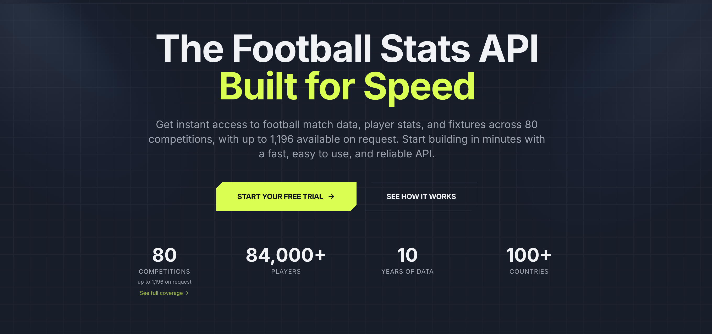
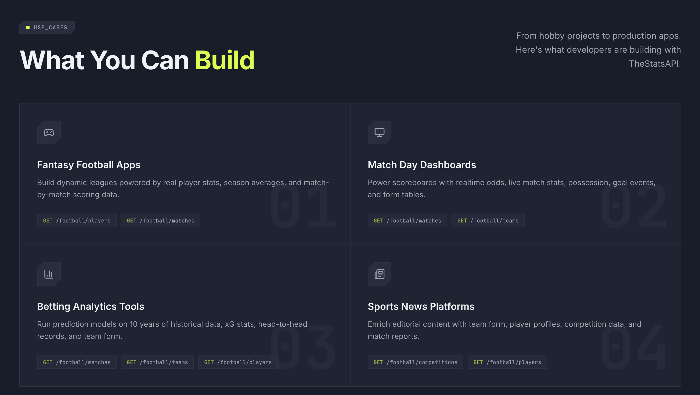
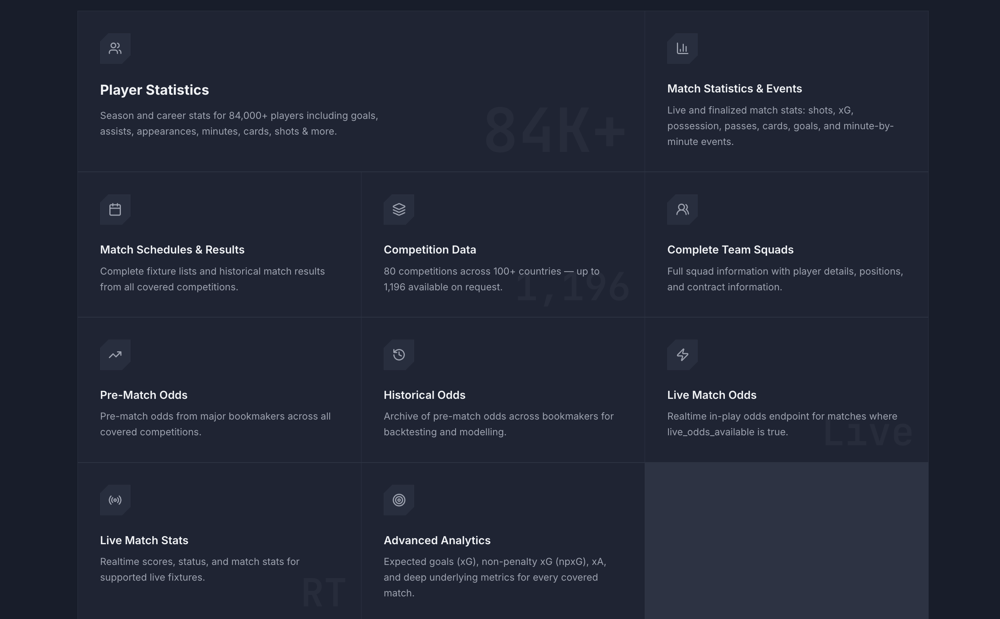

---

## 11. [Atlasly](https://www.producthunt.com/products/atlasly)
**Votes**: 8 | **도입 난이도**: 하 | **신뢰도**: 상
**Tagline**: AI agents for architecture
**서비스 링크**: https://www.producthunt.com/r/4S3L3JHOWVOKXT

**태그**: Architecture, AI Agents, Automation, Design Tool, Agent, AI Tool, Design

### 📌 이 서비스 한눈에 보기
주소 입력만으로 수주간의 설계 전 조사 업무를 몇 분 만에 해결하는 건축용 AI 에이전트

### 🔑 주요 기능
- 주소 입력 시 자동화된 사전 설계 조사 수행
- 2~4주 분량의 리서치 업무를 몇 분 내로 단축
- 전문적인 설계 결과물(Deliverables) 생성

### 🙋 사용자에게 어떤 점이 좋은가
건축 설계 초기 단계의 반복적이고 소모적인 리서치 업무를 자동화하여 설계자의 작업 시간을 획기적으로 줄여줍니다.

### ✅ 지금 바로 써볼 기능
- 특정 주소를 입력하여 리서치 자동화 테스트하기
- 생성된 결과물의 전문성 및 데이터 정확도 검토하기

### ⚠️ 사용 전 확인할 점
- AI가 생성한 결과물의 법적/기술적 정밀도 검증 필요
- 지역별 건축 법규 및 상세 데이터 반영 여부 확인 필요

### 🧭 확인이 더 필요한 정보
생성되는 결과물의 구체적인 포맷(도면, 보고서 등)과 데이터의 최신성 확인이 필요합니다.

### 📸 스크린샷 및 갤러리

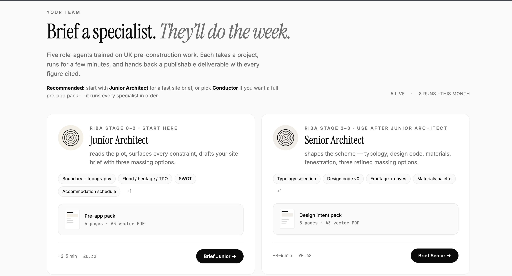

### 🎬 관련 영상
- [🎥 영상 보기](https://ph-files.imgix.net/b5dce898-63e3-4b02-96aa-808af3aeeb49.jpeg?auto=format)

---

## 12. [iGreet](https://www.producthunt.com/products/igreet)
**Votes**: 8 | **도입 난이도**: 하 | **신뢰도**: 상
**Tagline**: Personalized video greeting cards that come alive
**서비스 링크**: https://www.producthunt.com/r/HWS63QUCONCNOO

**태그**: Personalization, DigitalCard, AR, Gift, Video

### 📌 이 서비스 한눈에 보기
메시지, 사진, 영상을 담아 AR로 생동감을 더하는 개인 맞춤형 디지털/실물 카드 서비스

### 🔑 주요 기능
- 사진, 영상, 기프트 카드를 포함한 맞춤형 카드 제작
- 링크를 통한 즉각적인 디지털 전송 및 실물 인쇄 주문 가능
- 증강 현실(AR) 기술을 활용한 몰입형 메시지 경험 제공

### 🙋 사용자에게 어떤 점이 좋은가
소중한 순간을 단순한 텍스트를 넘어 시각적이고 입체적인 경험으로 전달하여 특별한 감동을 줄 수 있습니다.

### ✅ 지금 바로 써볼 기능
- 나만의 메시지와 사진으로 디지털 카드 만들기
- AR 기능을 활용해 영상 메시지 구현해보기
- 특별한 날을 위한 실물 인쇄 버전 주문하기

### ⚠️ 사용 전 확인할 점
- 실물 카드 주문 시 배송 기간 및 비용 확인 필요
- AR 기능 사용을 위한 스마트폰 호환성 확인

### 🧭 확인이 더 필요한 정보
실물 카드 제작 및 배송 서비스의 지원 국가와 구체적인 제작 비용에 대한 정보가 명시되지 않았습니다.

### 📸 스크린샷 및 갤러리

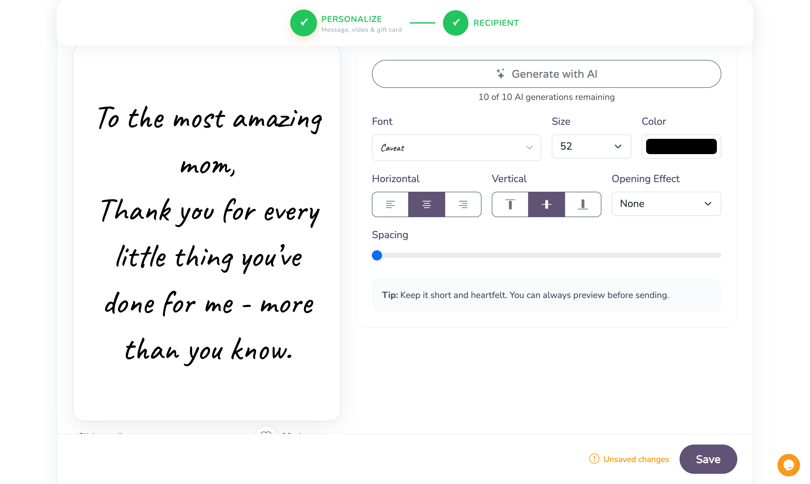

### 🎬 관련 영상
- [🎥 영상 보기](https://ph-files.imgix.net/74b5e7b0-d913-43be-ab7d-c7c10fa11c1a.jpeg?auto=format)

---

## 13. [Cohesivity](https://www.producthunt.com/products/cohesivity)
**Votes**: 8 | **도입 난이도**: 하 | **신뢰도**: 상
**Tagline**: Backend Infra for AI agents
**서비스 링크**: https://www.producthunt.com/r/HCVAEPEVF7MMTA

**태그**: AI-Agent, Backend-as-a-Service, Automation, DevOps, Agent, AI Tool, Chat, Prompting, API

### 📌 이 서비스 한눈에 보기
AI 에이전트가 채팅창을 벗어나지 않고 즉시 프로덕션 환경을 구축할 수 있게 돕는 백엔드 인프라

### 🔑 주요 기능
- 단일 API를 통한 데이터베이스, 호스팅, 인증, 스토리지 통합 제공
- 프롬프트 입력만으로 인프라 프로비저닝이 가능한 'Prompt-to-Prod' 워크플로우
- AI 에이전트의 개발 및 배포 과정을 자동화하는 백엔드 인프라

### 🙋 사용자에게 어떤 점이 좋은가
AI 에이전트 개발자가 복잡한 서버 설정 없이 프롬프트만으로 즉시 실행 가능한 서비스를 배포할 수 있어 개발 속도를 극대화합니다.

### ✅ 지금 바로 써볼 기능
- 프롬프트에 'build and host it using cohesivity.ai' 문구 추가하기
- 에이전트 기반의 프로토타입 배포 테스트하기

### ⚠️ 사용 전 확인할 점
- 프롬프트 기반 자동 배포 시 인프라 구성의 세부 제어 가능 여부 확인 필요
- 서비스 규모 확장에 따른 비용 및 관리 체계 검토 필요

### 🧭 확인이 더 필요한 정보
프롬프트 명령만으로 생성된 인프라의 보안 설정 및 상세 구성 변경 방법이 명시되지 않았습니다.

### 📸 스크린샷 및 갤러리
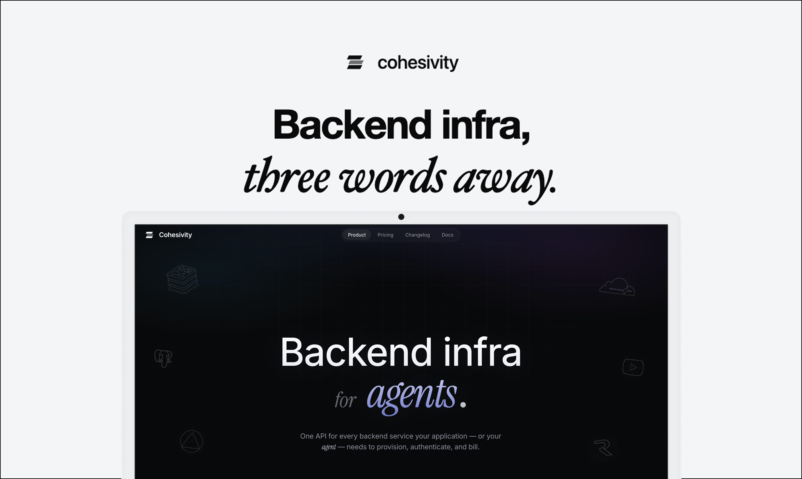
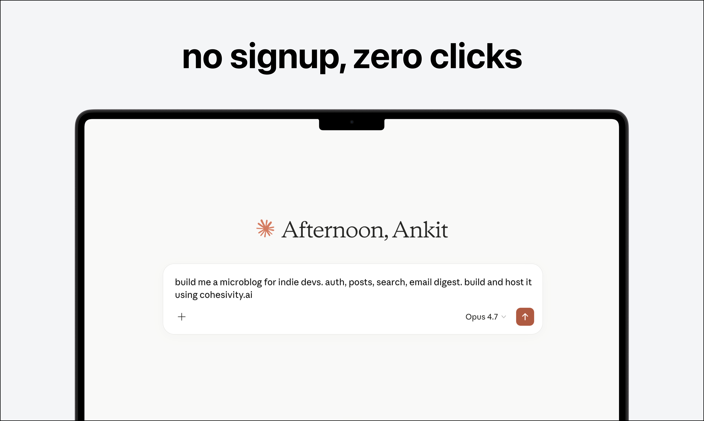
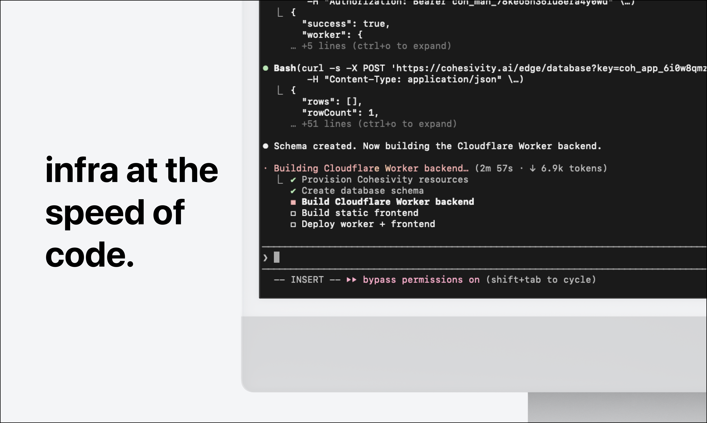

---

## 14. [PrimeCompass.ai](https://www.producthunt.com/products/primecompass-ai)
**Votes**: 7 | **도입 난이도**: 중 | **신뢰도**: 상
**Tagline**: AI-Powered quality intelligence from live application
**서비스 링크**: https://www.producthunt.com/r/2OVHTXDKWAVDCH

**태그**: QA, Automation, Playwright, DevOps, AI Tool, LLM

### 📌 이 서비스 한눈에 보기
실제 애플리케이션 동작을 관찰하여 신뢰할 수 있는 Playwright 테스트 스크립트를 자동 생성하는 AI 품질 지능 솔루션

### 🔑 주요 기능
- 실시간 애플리케이션 실행 관찰을 통한 테스트 시나리오 자동 발견
- LLM 환각(Hallucination) 없는 DOM 이벤트 기반의 실행 가능한 Playwright 스크립트 생성
- 릴리스 간 드리프트 감지 및 데이터셋 기반 테스트 데이터 관리 기능

### 🙋 사용자에게 어떤 점이 좋은가
수동 기록이나 AI의 허구적 생성 없이 실제 동작을 바탕으로 테스트를 구축하므로, 유지보수가 용이하고 신뢰도 높은 자동화 스크립트를 확보할 수 있습니다.

### ✅ 지금 바로 써볼 기능
- 실제 운영 중인 애플리케이션에 연결하여 시나리오 자동 발견 기능 테스트
- 생성된 Playwright 스크립트의 실행 정확도 검증
- 기존 테스트 코드와의 통합 및 드리프트 감지 기능 확인

### ⚠️ 사용 전 확인할 점
- 실제 애플리케이션 실행 환경(DOM 이벤트)에 대한 접근 권한 및 보안 정책 확인 필요
- 기존에 구축된 테스트 프레임워크와의 호환성 검토

### 🧭 확인이 더 필요한 정보
지원하는 애플리케이션 프레임워크의 범위와 기존 CI/CD 파이프라인과의 구체적인 통합 방식에 대한 정보가 더 필요합니다.

### 📸 스크린샷 및 갤러리
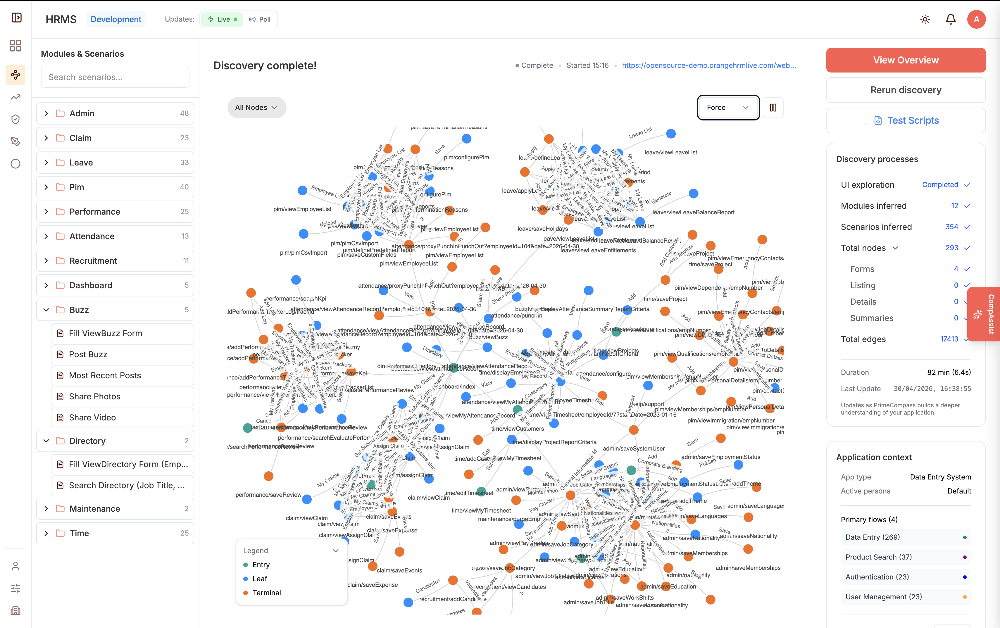
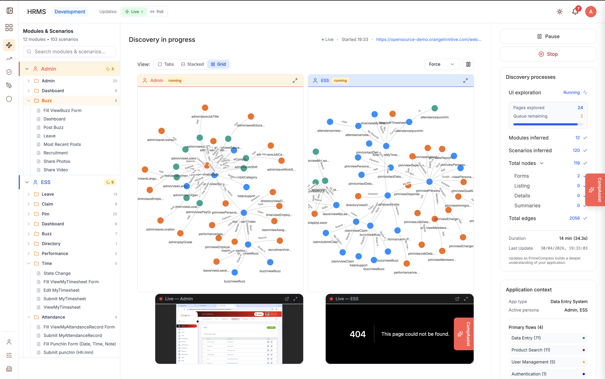
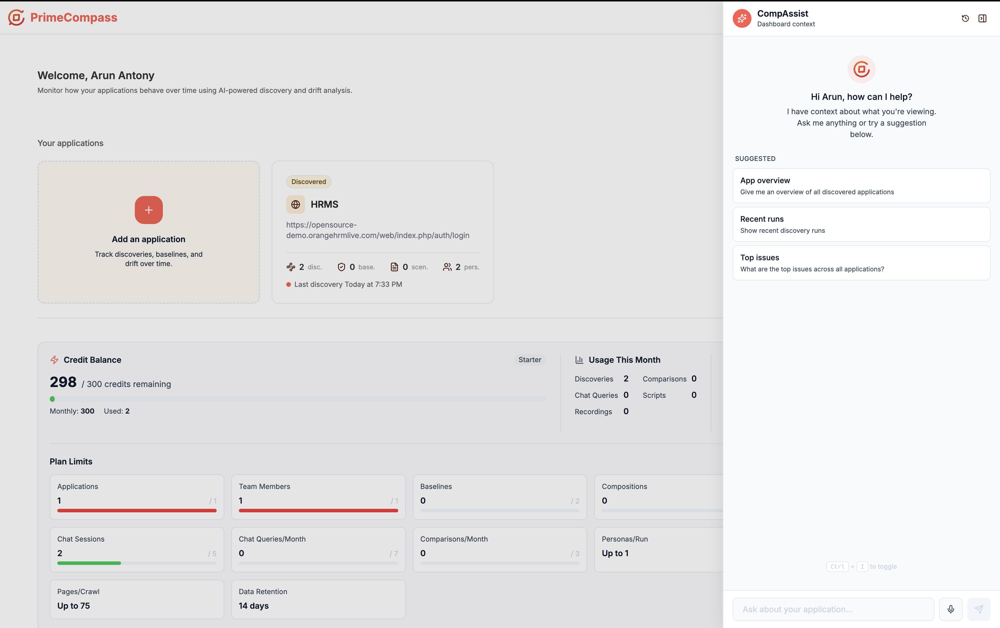

### 🎬 관련 영상
- [🎥 영상 보기](https://ph-files.imgix.net/a6f8f9b4-f3ab-46c5-9d23-eda14dce56d5.jpeg?auto=format)

---

## 15. [Screen Bolt](https://www.producthunt.com/products/screen-bolt)
**Votes**: 7 | **도입 난이도**: 하 | **신뢰도**: 상
**Tagline**: Record. Edit. Ship
**서비스 링크**: https://www.producthunt.com/r/5QDSQKVXQRMWSX

**태그**: VideoTool, macOS, Productivity, ContentCreation

### 📌 이 서비스 한눈에 보기
자동 줌과 디바이스 프레임 기능을 갖춘 macOS 전용 고품질 화면 녹화 및 편집 도구

### 🔑 주요 기능
- 자동 줌 및 디바이스 프레임 적용 기능
- 내장 타임라인 에디터를 통한 간편한 편집
- macOS 네이티브 앱의 최적화된 환경

### 🙋 사용자에게 어떤 점이 좋은가
별도의 복잡한 편집 프로그램 없이도 튜토리얼이나 데모 영상을 전문적인 수준으로 빠르게 제작할 수 있습니다.

### ✅ 지금 바로 써볼 기능
- 자동 줌 기능으로 시각적 강조 효과 테스트하기
- 디바이스 프레임을 적용하여 세련된 데모 영상 만들기
- 내장 에디터로 녹화 직후 즉시 편집해보기

### ⚠️ 사용 전 확인할 점
- macOS 전용 앱이므로 Windows/Linux 사용자는 사용 불가
- 고해상도 영상 내보내기 시 시스템 리소스 점유율 확인 필요

### 🧭 확인이 더 필요한 정보
상세한 가격 정책 및 클라우드 저장/공유 기능 포함 여부는 명시되지 않았습니다.

### 📸 스크린샷 및 갤러리
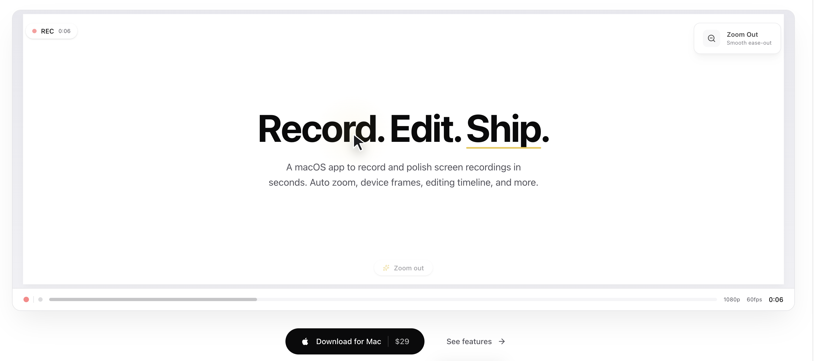

### 🎬 관련 영상
- [🎥 영상 보기](https://ph-files.imgix.net/6c617ab2-844f-4dc3-94ab-7c7e7b9e893d.jpeg?auto=format)

---

## 16. [GoHighLevel Downloader](https://www.producthunt.com/products/gohighlevel-downloader)
**Votes**: 6 | **도입 난이도**: 하 | **신뢰도**: 상
**Tagline**: Save GoHighLevel course videos offline
**서비스 링크**: https://www.producthunt.com/r/CK5LEO3L6K7FPC

**태그**: Browser Extension, Video Downloader, Productivity, Education, AI Tool, Video, DevTool

### 📌 이 서비스 한눈에 보기
GoHighLevel 강의 영상을 복잡한 과정 없이 간편하게 MP4로 저장하는 브라우저 확장 프로그램

### 🔑 주요 기능
- GoHighLevel 내 지원되는 강의 영상 자동 감지
- 개발자 도구나 별도 소프트웨어 없이 원클릭 저장 가능
- 학습 및 백업을 위한 MP4 파일 내보내기 지원

### 🙋 사용자에게 어떤 점이 좋은가
인터넷 연결이 어려운 환경에서도 학습을 이어갈 수 있도록 강의 영상을 오프라인용으로 소장할 수 있게 해줍니다.

### ✅ 지금 바로 써볼 기능
- 브라우저에 확장 프로그램 설치하기
- GoHighLevel 코스 페이지 접속하여 영상 감지 확인하기
- MP4 파일로 내보내어 오프라인 저장하기

### ⚠️ 사용 전 확인할 점
- 저작권이 있는 콘텐츠의 무단 배포는 법적 문제가 될 수 있음
- 모든 영상 형식이 완벽하게 지원되는지 확인 필요

### 🧭 확인이 더 필요한 정보
모든 GoHighLevel 임베디드 플레이어 환경에서 완벽하게 작동하는지 확인이 필요합니다.

### 📸 스크린샷 및 갤러리

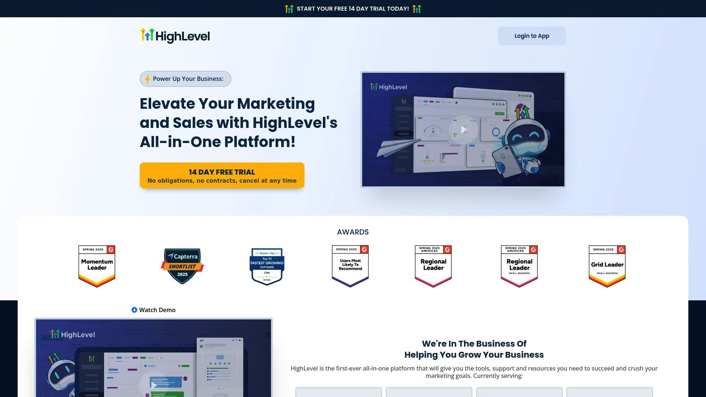

### 🎬 관련 영상
- [🎥 영상 보기](https://ph-files.imgix.net/45dda508-4cc0-47b6-b0f9-5b9433d5b6a9.jpeg?auto=format)

---

## 17. [GoKollab Downloader](https://www.producthunt.com/products/gokollab-downloader)
**Votes**: 6 | **도입 난이도**: 하 | **신뢰도**: 상
**Tagline**: Save GoKollab course videos offline
**서비스 링크**: https://www.producthunt.com/r/753KU3RLBB3LFV

**태그**: Browser Extension, Video Downloader, Productivity, Education, AI Tool, Video, DevTool

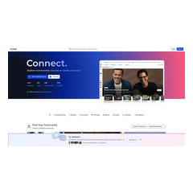

### 📌 이 서비스 한눈에 보기
복잡한 과정 없이 GoKollab 강의 영상을 간편하게 MP4로 저장하는 브라우저 확장 프로그램

### 🔑 주요 기능
- GoKollab 강의 및 임베디드 플레이어 영상 감지
- 별도의 개발자 도구나 명령줄 도구 없이 MP4 파일로 즉시 내보내기
- 오프라인 학습, 복습, 개인 아카이브를 위한 간편한 저장 기능

### 🙋 사용자에게 어떤 점이 좋은가
인터넷 연결이 어려운 환경에서도 학습을 이어갈 수 있도록 강의 영상을 개인 기기에 안전하게 보관할 수 있습니다.

### ✅ 지금 바로 써볼 기능
- 브라우저에 확장 프로그램 설치하기
- GoKollab 강의 페이지 접속하여 영상 감지 확인하기
- MP4 파일로 내보내어 오프라인 저장하기

### ⚠️ 사용 전 확인할 점
- 저장된 영상의 저작권 및 개인적 용도 외 사용 주의
- 지원되는 영상 포맷 및 보안 정책에 따른 제한 가능성

### 🧭 확인이 더 필요한 정보
모든 GoKollab 영상 형식이 완벽하게 지원되는지, 저작권 보호 기술(DRM)이 적용된 영상의 다운로드 가능 여부는 확인이 필요합니다.

### 📸 스크린샷 및 갤러리

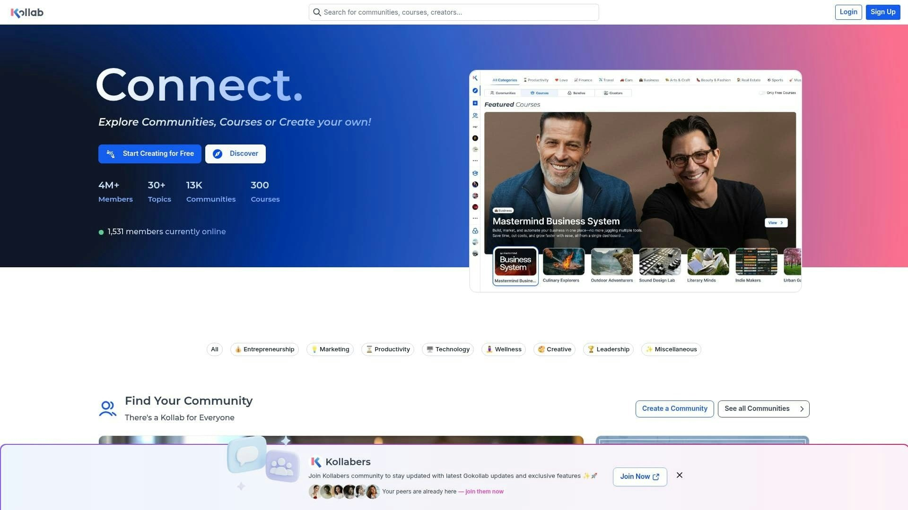
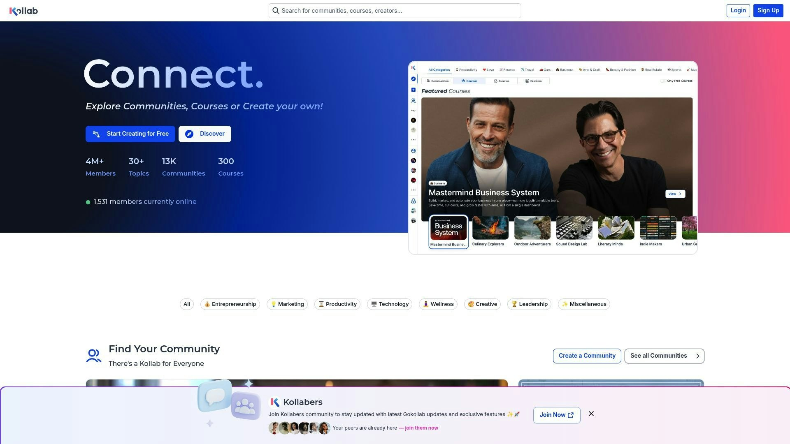

### 🎬 관련 영상
- [🎥 영상 보기](https://ph-files.imgix.net/cac266ac-dfc0-4d32-9d90-77a0e80131be.jpeg?auto=format)

---

## 18. [Pro Thumbnail Inspirations](https://www.producthunt.com/products/thumblifyai)
**Votes**: 5 | **도입 난이도**: 하 | **신뢰도**: 상
**Tagline**: Viral thumbnail ideas from your niche
**서비스 링크**: https://www.producthunt.com/r/OOEV3JLRJBVUKK

**태그**: ContentCreation, YouTube, Marketing, DesignInspiration, AI Tool

### 📌 이 서비스 한눈에 보기
내 분야의 인기 크리에이터를 분석하여 검증된 썸네일 아이디어를 제공하는 도구

### 🔑 주요 기능
- 사용자 니치(Niche) 및 선호 크리에이터 기반 맞춤형 아이디어 제공
- 유튜브 실시간 트렌드를 스캔하여 현재 성과가 좋은 썸네일 탐색
- 막연한 추측 대신 데이터 기반의 클릭 유도 전략 수립 가능

### 🙋 사용자에게 어떤 점이 좋은가
콘텐츠 제작자가 썸네일 기획 단계에서 겪는 시행착오를 줄이고, 클릭률(CTR)을 높일 수 있는 실질적인 영감을 제공합니다.

### ✅ 지금 바로 써볼 기능
- 자신의 채널 카테고리에 맞는 벤치마킹 대상 설정하기
- 현재 트렌드 중 내 콘텐츠에 적용 가능한 시각적 요소 추출하기
- 성공적인 썸네일 패턴을 분석하여 제작 가이드라인 만들기

### ⚠️ 사용 전 확인할 점
- 제공되는 아이디어가 타인의 저작권을 침해하지 않도록 주의 필요
- 단순 모방이 아닌 창의적인 재해석 과정이 동반되어야 함

### 🧭 확인이 더 필요한 정보
구체적인 스캔 범위나 데이터 업데이트 주기, 유료 플랜 여부에 대한 정보가 명시되지 않았습니다.

### 📸 스크린샷 및 갤러리

---

## 19. [Skipwait.me BETA](https://www.producthunt.com/products/repherrel)
**Votes**: 4 | **도입 난이도**: 하 | **신뢰도**: 상
**Tagline**: making it easier for referrers to help job seekers get hired
**서비스 링크**: https://www.producthunt.com/r/SHHO6ZA4WXH2Z6

**태그**: Recruitment, Networking, Career, AI Tool

### 📌 이 서비스 한눈에 보기
지인 추천 프로세스를 체계화하여 구직자와 추천인 모두의 성공을 돕는 플랫폼

### 🔑 주요 기능
- 레이오프 시장의 현실을 반영한 효율적인 추천 시스템
- 누락되기 쉬운 지인 추천 과정을 체계적으로 관리
- 추천 보상 시스템의 확장성을 고려한 설계

### 🙋 사용자에게 어떤 점이 좋은가
구직자는 신뢰할 수 있는 추천 경로를 확보하고, 추천인은 복잡한 과정 없이 간편하게 인재를 추천할 수 있습니다.

### ✅ 지금 바로 써볼 기능
- 플랫폼의 추천 프로세스 흐름 확인하기
- 보상 시스템 작동 방식 파악하기
- 베타 버전 피드백 참여하기

### ⚠️ 사용 전 확인할 점
- 현재 베타 버전이므로 기능의 완성도가 낮을 수 있음
- 구체적인 보상 체계나 정책이 명시되지 않음

### 🧭 확인이 더 필요한 정보
현재 베타 단계로, 실제 보상 지급 방식과 구체적인 서비스 운영 정책에 대한 확인이 필요합니다.

### 📸 스크린샷 및 갤러리

---

## 20. [Monkmod](https://www.producthunt.com/products/monkmod)
**Votes**: 4 | **도입 난이도**: 하 | **신뢰도**: 상
**Tagline**: A task manager built for people who want to ship, not manage
**서비스 링크**: https://www.producthunt.com/r/MZHR2QDH7HTX75

**태그**: Productivity, Task Management, Minimalism, DeepWork, DevTool

### 📌 이 서비스 한눈에 보기
관리보다 실행에 집중할 수 있도록 설계된 미니멀 태스크 매니저

### 🔑 주요 기능
- 창업자, 크리에이터, 개발자를 위한 딥 워크(Deep Work) 최적화 환경
- 복잡한 관리 기능을 덜어낸 미니멀한 인터페이스
- 프로젝트 관리와 빠른 실행(Shipping)에 초점을 맞춘 워크플로우

### 🙋 사용자에게 어떤 점이 좋은가
불필요한 관리 업무에 시간을 뺏기지 않고, 실제 결과물을 만들어내는 데 집중하고 싶은 생산성 중시 사용자에게 유용합니다.

### ✅ 지금 바로 써볼 기능
- 현재 진행 중인 프로젝트 등록하기
- 가장 중요한 핵심 작업(Task) 설정하기
- 미니멀한 UI가 본인의 작업 방식과 맞는지 확인하기

### ⚠️ 사용 전 확인할 점
- 기능이 최소화되어 있어 복잡한 협업이나 상세한 프로젝트 관리가 필요한 경우 부족할 수 있음
- 기존의 무거운 생산성 도구에 익숙한 사용자에게는 기능적 제약으로 느껴질 수 있음

### 🧭 확인이 더 필요한 정보
구체적인 협업 기능 지원 여부와 플랫폼 간 연동 범위에 대한 정보가 부족합니다.

### 📸 스크린샷 및 갤러리
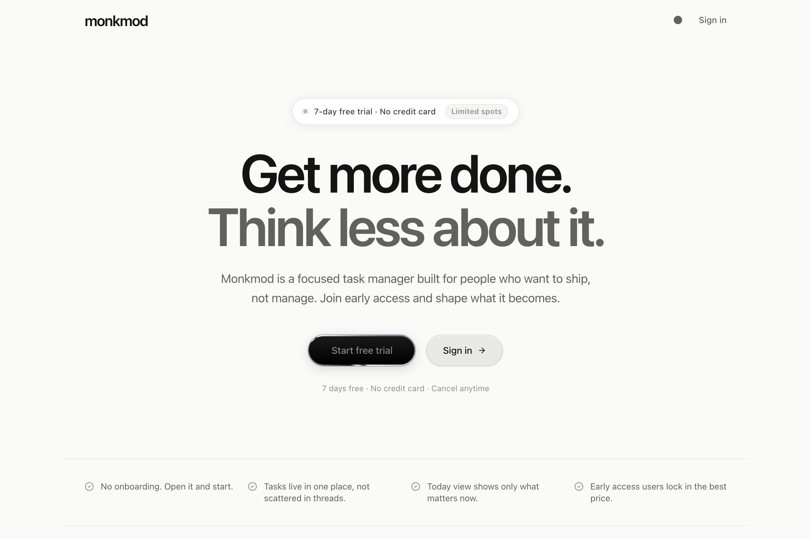

---

## 21. [DESIGN.MD by Parallect](https://www.producthunt.com/products/design-md-by-parallect)
**Votes**: 3 | **도입 난이도**: 하 | **신뢰도**: 상
**Tagline**: Generate DESIGN.md from any website URL
**서비스 링크**: https://www.producthunt.com/r/PQ4A4UCHVTBNV3

**태그**: DesignSystem, Automation, DevTool, Productivity, Design

### 📌 이 서비스 한눈에 보기
웹사이트 URL만 입력하면 디자인 시스템 가이드를 즉시 생성해주는 자동화 도구

### 🔑 주요 기능
- URL 입력만으로 디자인 토큰, 타이포그래피, 간격 정보 추출
- 컴포넌트 패턴을 포함한 프로덕션 수준의 DESIGN.md 파일 생성
- 수동 작업 없이 몇 초 만에 디자인 명세서 구축

### 🙋 사용자에게 어떤 점이 좋은가
기존 웹사이트의 디자인 시스템을 문서화하는 시간을 획기적으로 단축하여 개발 및 디자인 협업 효율을 높여줍니다.

### ✅ 지금 바로 써볼 기능
- 참조하고 싶은 웹사이트 URL 입력하기
- 생성된 DESIGN.md 파일의 디자인 토큰 확인하기
- 팀의 디자인 가이드라인에 결과물 적용하기

### ⚠️ 사용 전 확인할 점
- 복잡한 인터랙션이나 동적 요소의 완전한 추출 여부 확인 필요
- 추출된 데이터가 실제 코드와 일치하는지 검토 필요

### 🧭 확인이 더 필요한 정보
웹사이트의 구조적 복잡도에 따라 생성되는 디자인 토큰의 정확도가 달라질 수 있습니다.

### 📸 스크린샷 및 갤러리
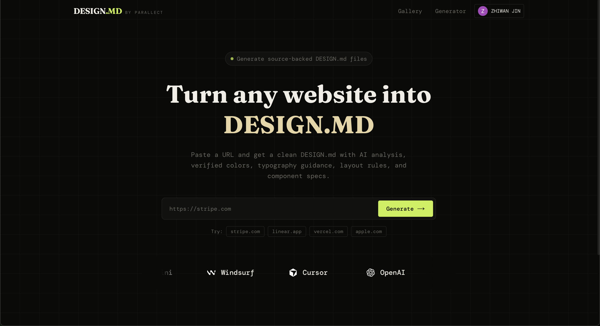
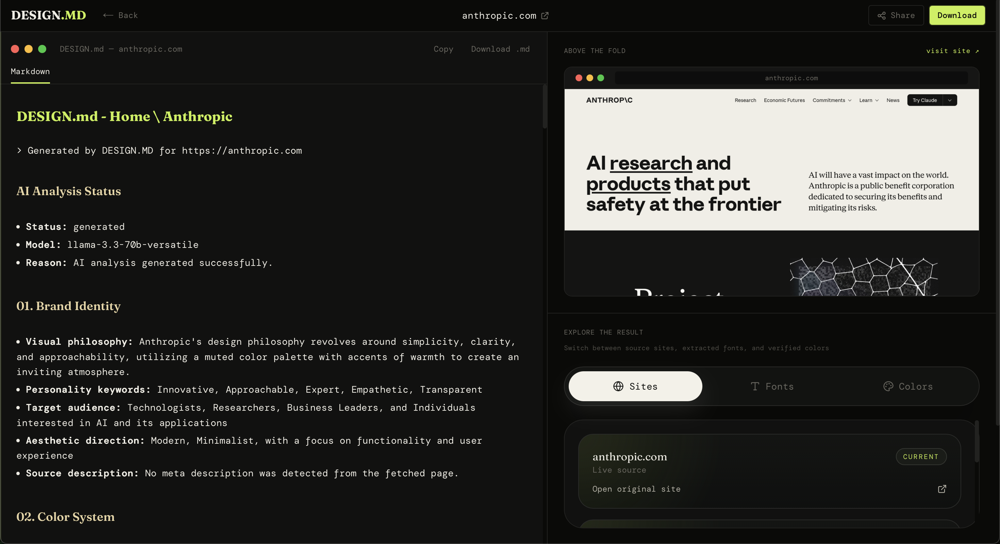
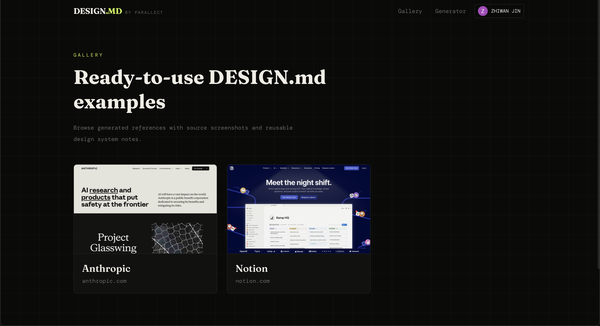

### 🎬 관련 영상
- [🎥 영상 보기](https://ph-files.imgix.net/cc6146d7-3f82-4e1e-8f9a-8b36831db587.jpeg?auto=format)

---

## 22. [Blipstr](https://www.producthunt.com/products/blipstr)
**Votes**: 3 | **도입 난이도**: 하 | **신뢰도**: 상
**Tagline**: Make any page the workflow - prospecting without tab hell
**서비스 링크**: https://www.producthunt.com/r/2GHU3B6ZADBPQZ

**태그**: SalesTech, LeadGeneration, CRM, Productivity, Automation, AI Tool, Sales, Email

### 📌 이 서비스 한눈에 보기
브라우저 탭을 옮겨 다닐 필요 없이 웹 페이지에서 즉시 잠재 고객 정보를 수집하고 CRM에 동기화하는 워크플로우 도구

### 🔑 주요 기능
- 웹 페이지 내에서 이메일 및 미국 전화번호 즉시 탐색
- 클릭 한 번으로 리스트에 추가하거나 정보를 수정하는 직관적 UI
- Salesforce 및 HubSpot과의 간편한 데이터 동기화

### 🙋 사용자에게 어떤 점이 좋은가
여러 탭을 오가는 번거로움 없이 웹 서핑 중 발견한 잠재 고객 정보를 즉시 정리하고 CRM에 반영할 수 있어 영업 생산성이 높아집니다.

### ✅ 지금 바로 써볼 기능
- 레이더 기능을 실행하여 페이지 내 연락처 정보 탐색하기
- 수집된 정보를 클릭하여 리스트에 추가하거나 편집하기
- 준비된 데이터를 Salesforce 또는 HubSpot으로 동기화하기

### ⚠️ 사용 전 확인할 점
- 미국 전화번호 위주의 데이터 탐색에 특화되어 있음
- CRM 동기화 시 기존 데이터와의 중복 여부 확인 필요

### 🧭 확인이 더 필요한 정보
제공되는 데이터의 정확도와 한국 지역 데이터 지원 여부에 대한 정보가 부족합니다.

### 📸 스크린샷 및 갤러리
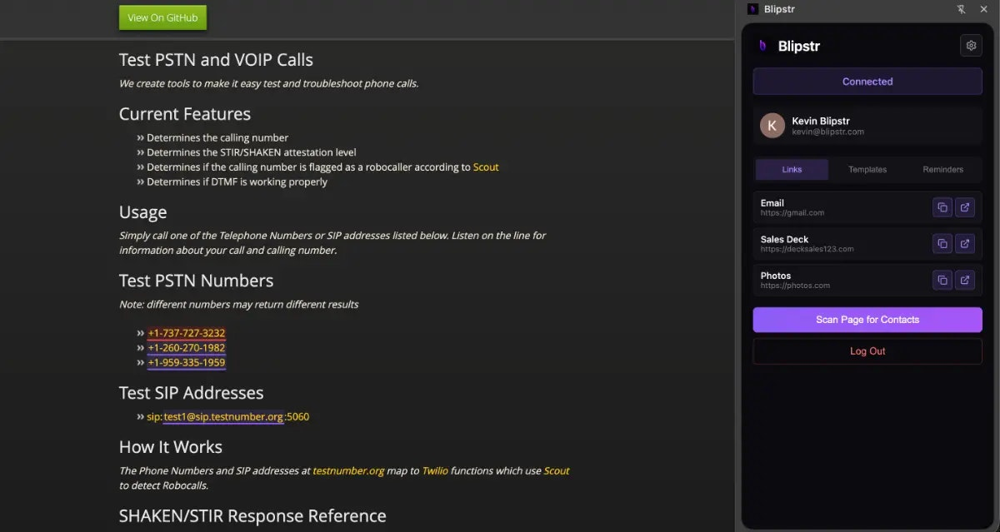
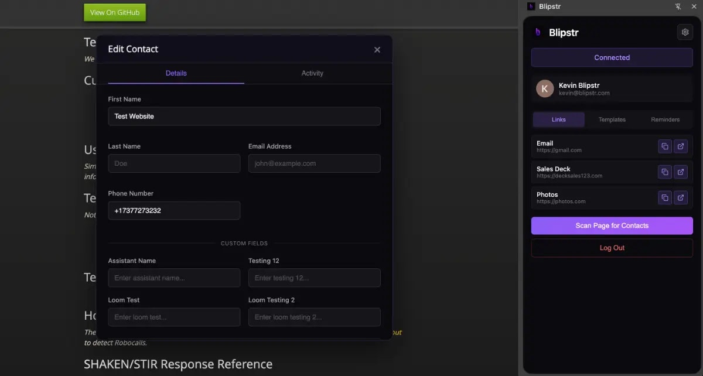
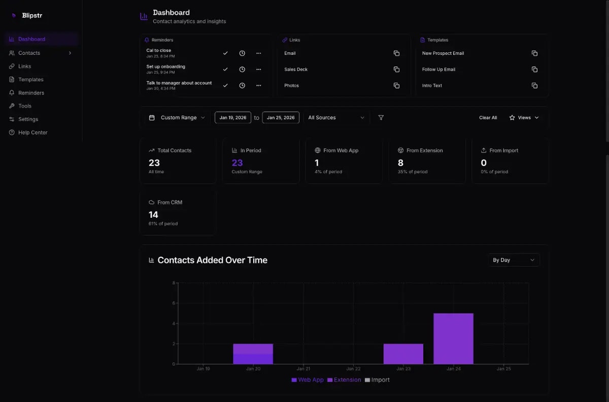

---

## 23. [Agent Memory System](https://www.producthunt.com/products/agent-memory-system)
**Votes**: 3 | **도입 난이도**: 중 | **신뢰도**: 상
**Tagline**: Open Source Context Infrastructure for AI Agents
**서비스 링크**: https://www.producthunt.com/r/PNICN5XAVDLNGA

**태그**: DevTool, AI-Agent, OpenSource, Context-Management, Agent, AI Tool

### 📌 이 서비스 한눈에 보기
AI 에이전트가 코드베이스의 맥락을 지속적으로 유지할 수 있도록 돕는 오픈소스 메모리 인프라

### 🔑 주요 기능
- 코드베이스 스캔을 통한 구조화된 마크다운(Markdown) 메모리 생성
- 기계 판독이 가능한 토픽 인덱스를 통한 효율적인 컨텍스트 관리
- 도구 간 이동(Cursor, Claude 등) 시에도 유지되는 영속적인 컨텍스트 레이어 제공

### 🙋 사용자에게 어떤 점이 좋은가
에이전트가 작업할 때마다 코드를 다시 분석할 필요 없이, 저장된 메모리를 통해 즉각적이고 정확한 맥락 파악이 가능해집니다.

### ✅ 지금 바로 써볼 기능
- 기존 코드 저장소에 메모리 레이어 적용해보기
- 생성된 마크다운 메모리 구조 확인하기
- 사용 중인 AI 에이전트(Cursor, Claude 등)와 연동 테스트하기

### ⚠️ 사용 전 확인할 점
- 코드베이스 규모에 따른 인덱싱 및 스캔 시간 소요 가능성
- 메모리 업데이트 시 발생하는 구조적 변경 추적의 정확도 확인 필요

### 🧭 확인이 더 필요한 정보
다양한 에이전트 도구들과의 구체적인 연동 방식 및 자동 동기화 수준에 대한 추가 정보가 필요합니다.

### 📸 스크린샷 및 갤러리
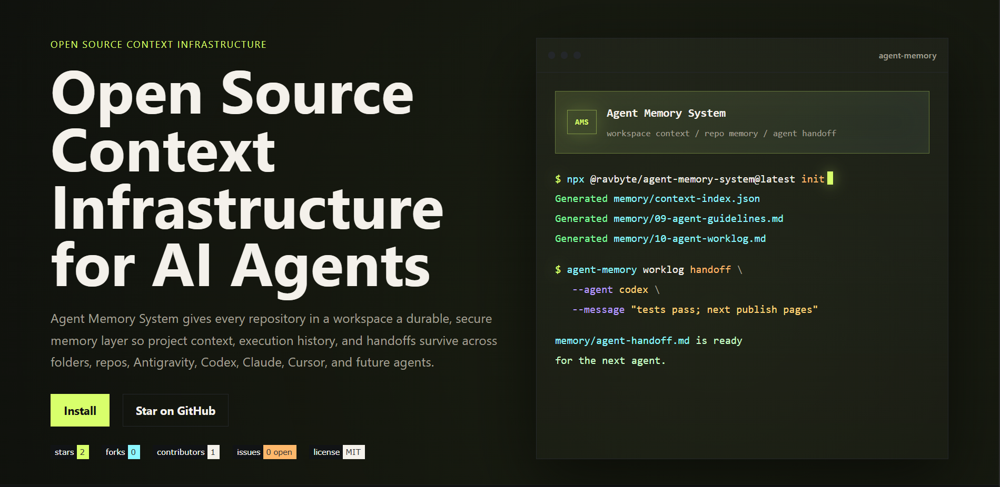

---

## 24. [Getg](https://www.producthunt.com/products/getg)
**Votes**: 3 | **도입 난이도**: 중 | **신뢰도**: 상
**Tagline**: Interactive HTML simulations @ Sales, Onboarding, Training.
**서비스 링크**: https://www.producthunt.com/r/WNT4PLT7T3AIYN

**태그**: SalesTech, EdTech, ProductDemo, Onboarding, Automation, AI Tool, Video, DevTool, Sales

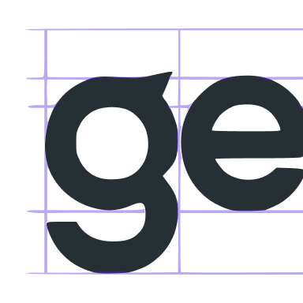

### 📌 이 서비스 한눈에 보기
복잡한 소프트웨어 워크플로우를 실제 코드 기반의 인터랙티브 시뮬레이션으로 구현하는 도구

### 🔑 주요 기능
- 영상 대신 실제 코드를 활용한 인터랙티브 시뮬레이션 제공
- 영업용 Sales Room과 교육용 Private Academy 기능 지원
- 실제 데이터 손상 위험 없이 안전한 제품 체험 환경 구축

### 🙋 사용자에게 어떤 점이 좋은가
제품 설명에 드는 시간을 줄이고, 잠재 고객이나 신입 사원이 직접 제품을 만져보며 빠르게 숙달할 수 있게 돕습니다.

### ✅ 지금 바로 써볼 기능
- 5개의 무료 시뮬레이션 생성해보기
- 영업용 Sales Room 환경 구축하기
- 사내 교육용 Private Academy 설정하기

### ⚠️ 사용 전 확인할 점
- 실제 코드 기반이므로 시뮬레이션 구축에 초기 리소스가 필요할 수 있음
- 무료 플랜(5개 시뮬레이션) 이후 유료 전환 고려 필요

### 🧭 확인이 더 필요한 정보
시뮬레이션 구축을 위한 기술적 난이도와 지원 가능한 소프트웨어 종류에 대한 구체적 정보가 필요합니다.

### 📸 스크린샷 및 갤러리
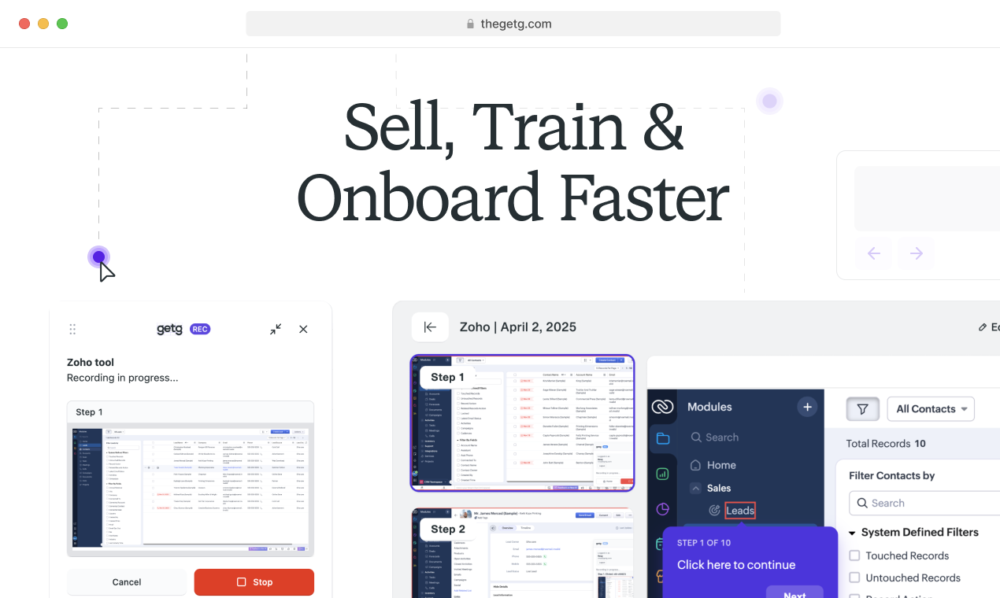
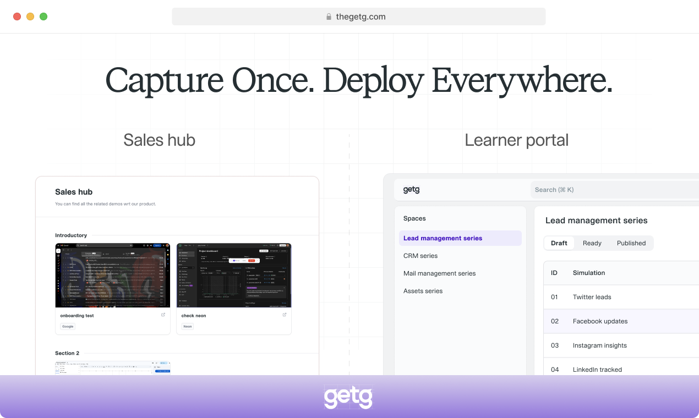
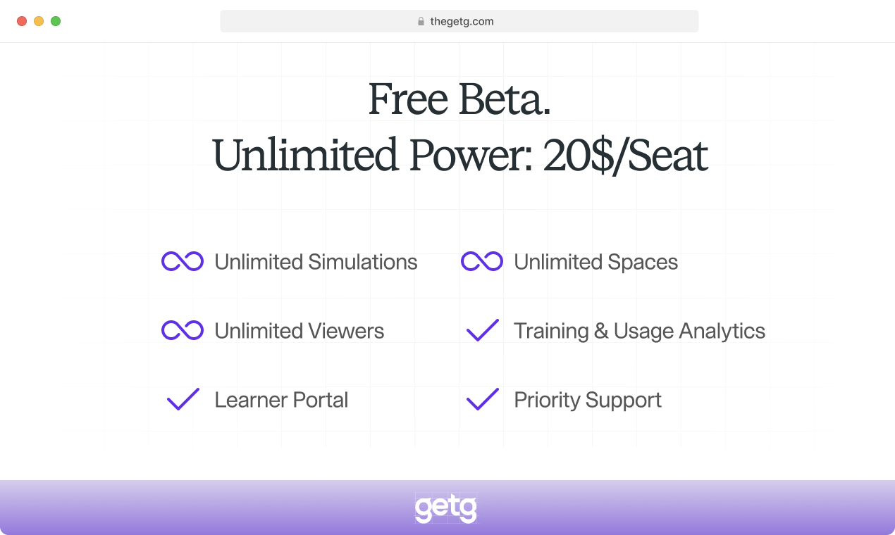

---

## 25. [Stage Coach: Real Estate Listing Prep](https://www.producthunt.com/products/stage-coach)
**Votes**: 3 | **도입 난이도**: 하 | **신뢰도**: 상
**Tagline**: Get Every Listing Game-Day Ready.
**서비스 링크**: https://www.producthunt.com/r/7ISESMRCO5DDUU

**태그**: Real Estate, Collaboration, Project Management, Agent, AI Tool

### 📌 이 서비스 한눈에 보기
부동산 매물 준비 과정을 체계적으로 관리하여 최상의 계약 결과를 이끌어내는 협업 플랫폼

### 🔑 주요 기능
- 매물 준비를 위한 단계별 게임 플랜(Playbook) 제공
- 집주인, 스테이저, 사진작가 등 협업 팀원 간의 업무 정렬 및 책임 부여
- 디테일한 업무 실행을 통한 매물 경쟁력 강화

### 🙋 사용자에게 어떤 점이 좋은가
부동산 중개인이 매물 준비 과정에서 발생하는 복잡한 업무들을 팀원들과 효율적으로 분담하고 관리할 수 있습니다.

### ✅ 지금 바로 써볼 기능
- 매물 준비를 위한 체크리스트 생성하기
- 협업 팀원(사진작가, 스테이저 등) 초대 및 역할 할당하기
- 매물별 진행 상황 모니터링하기

### ⚠️ 사용 전 확인할 점
- 협업 인원들이 플랫폼에 직접 참여해야 효과를 볼 수 있음
- 구체적인 업무 관리 템플릿의 다양성 확인 필요

### 🧭 확인이 더 필요한 정보
플랫폼 내에서 제공하는 구체적인 협업 툴(채팅, 일정 관리 등)의 기능 범위는 명시되지 않았습니다.

### 📸 스크린샷 및 갤러리
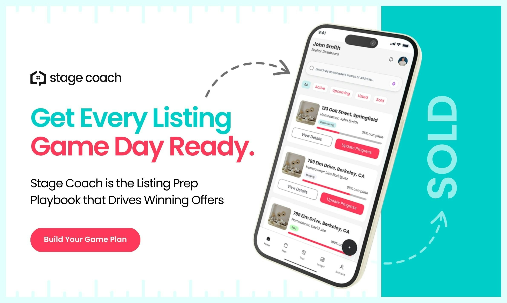
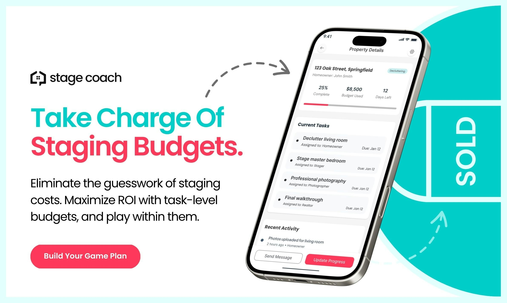
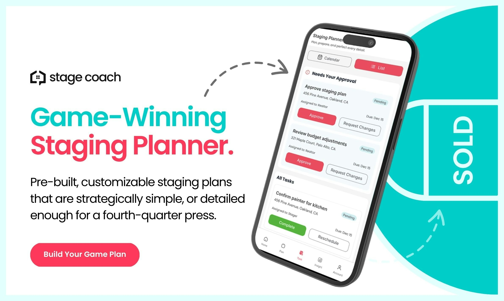

---

## 26. [Nova3D](https://www.producthunt.com/products/nova3d)
**Votes**: 3 | **도입 난이도**: 중 | **신뢰도**: 상
**Tagline**: 3D generation with editable parts, not solid blobs
**서비스 링크**: https://www.producthunt.com/r/GCNNR5YTCIXZC7

**태그**: 3D Generation, AI, OpenSource, DesignTool, AI Tool, Vision

### 📌 이 서비스 한눈에 보기
수정이 가능한 개별 부품 단위로 3D 모델을 생성하는 AI 도구

### 🔑 주요 기능
- 단순한 덩어리가 아닌 편집 가능한 개별 부품 구조로 3D 생성
- 텍스트 및 이미지 입력을 통한 모델 생성 지원
- GitHub를 통해 오픈 소스 클라이언트 무료 제공

### 🙋 사용자에게 어떤 점이 좋은가
기존 AI 3D 생성물의 한계인 '수정 불가능한 통짜 구조' 문제를 해결하여, 생성 후에도 세부 편집이 용이합니다.

### ✅ 지금 바로 써볼 기능
- GitHub에서 오픈 소스 클라이언트 설치 및 실행
- 텍스트 프롬프트를 활용한 3D 오브젝트 생성 테스트
- 이미지 업로드를 통한 3D 모델 변환 시도

### ⚠️ 사용 전 확인할 점
- 오픈 소스 클라이언트 사용 시 로컬 환경 설정 필요
- 생성된 부품 간의 정밀한 결합도나 품질 확인 필요

### 🧭 확인이 더 필요한 정보
오픈 소스 클라이언트의 하드웨어 요구 사양과 상세 기능 범위에 대한 추가 확인이 필요합니다.

### 📸 스크린샷 및 갤러리

### 🎬 관련 영상
- [🎥 영상 보기](https://ph-files.imgix.net/3a10198c-2b2e-409c-852c-778fa18cc790.jpeg?auto=format)

---

## 27. [AndalibAI](https://www.producthunt.com/products/andalibai)
**Votes**: 3 | **도입 난이도**: 하 | **신뢰도**: 상
**Tagline**: Turn missed calls to Money
**서비스 링크**: https://www.producthunt.com/r/RFUNY3MSJLKEV5

**태그**: Automation, CustomerSupport, SaaS, Productivity, AI Tool

### 📌 이 서비스 한눈에 보기
놓친 전화를 수익으로 전환하는 올인원 자동 고객 응대 시스템

### 🔑 주요 기능
- 부재중 전화 및 고객 문의에 대한 자동 응대 솔루션
- 고객 문제 해결 및 지원 프로세스 자동화
- 업무 시간 절약 및 고객 서비스 품질 향상

### 🙋 사용자에게 어떤 점이 좋은가
비즈니스 운영 중 발생하는 고객 문의를 놓치지 않고 자동 처리하여 매출 손실을 방지하고 운영 효율을 높일 수 있습니다.

### ✅ 지금 바로 써볼 기능
- 자동 응대 시나리오 설정하기
- 고객 지원 워크플로우 구축하기
- 서비스 자동화 범위 테스트하기

### ⚠️ 사용 전 확인할 점
- 자동 응대 시 발생할 수 있는 오답이나 맥락 오해 가능성
- 복잡한 고객 요구사항에 대한 수동 개입 필요성

### 🧭 확인이 더 필요한 정보
구체적인 자동화 채널(전화, 채팅 등)과 연동 가능한 플랫폼 범위에 대한 정보가 필요합니다.

### 📸 스크린샷 및 갤러리

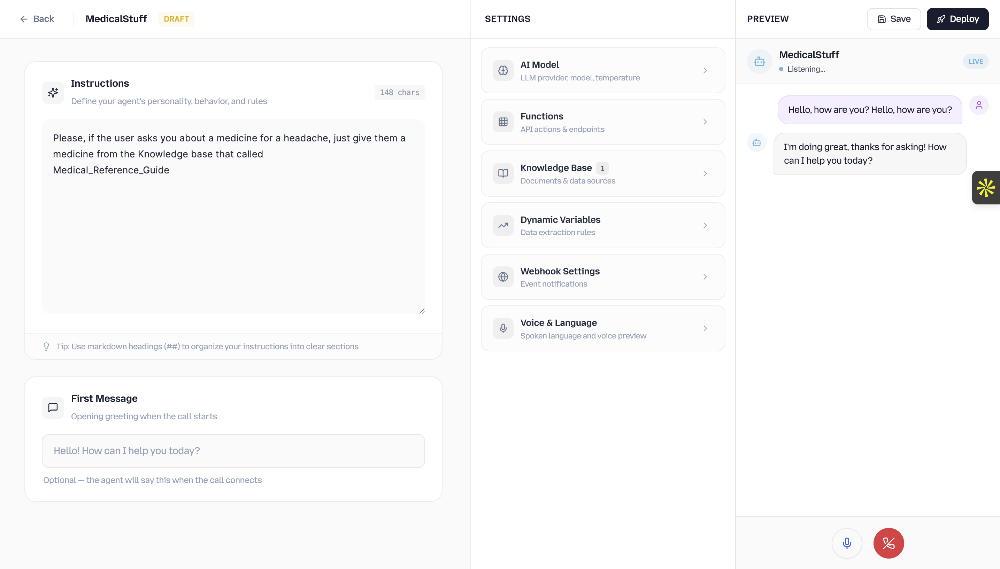
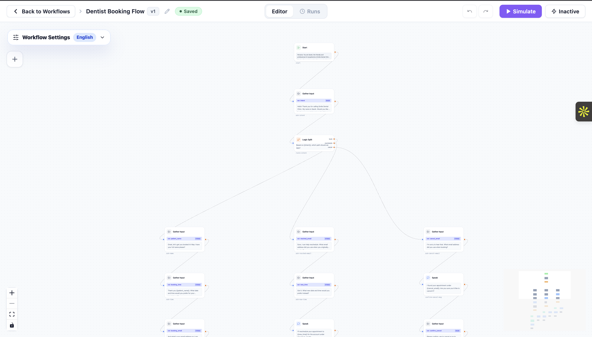

---

## 28. [OneThing — ProcrastinationTerminator](https://www.producthunt.com/products/onething-procrastinationterminator)
**Votes**: 3 | **도입 난이도**: 하 | **신뢰도**: 상
**Tagline**: Finish one task. Then you get your phone back.
**서비스 링크**: https://www.producthunt.com/r/JYMQO2ZN6LLGHT

**태그**: Productivity, Focus, Anti-Procrastination, MobileApp

### 📌 이 서비스 한눈에 보기
할 일을 끝내기 전까지 스마트폰 앱 사용을 원천 차단하는 강력한 집중력 도구

### 🔑 주요 기능
- 할 일을 완료해야만 SNS 등 다른 앱이 잠금 해제되는 시스템
- 타이머나 동기부여 방식이 아닌 행동 기반의 강제적 제어
- 딴짓을 하려 할 때 할 일을 다시 보여주는 직관적인 인터페이스

### 🙋 사용자에게 어떤 점이 좋은가
스마트폰 중독으로 인해 할 일을 미루는 사용자에게 강력한 실행력을 제공합니다.

### ✅ 지금 바로 써볼 기능
- 가장 미루고 싶은 핵심 작업 하나 등록하기
- 스마트폰 앱 잠금 기능 설정 확인하기
- 작업 완료 후 보상(앱 해제) 프로세스 경험하기

### ⚠️ 사용 전 확인할 점
- 할 일을 완료하지 못할 경우 스마트폰 사용이 완전히 제한될 수 있음
- 긴급한 연락이 필요한 상황을 고려한 예외 설정 여부 확인 필요

### 🧭 확인이 더 필요한 정보
구체적인 플랫폼(iOS/Android) 지원 범위와 앱 잠금 방식에 대한 상세 정보가 필요합니다.

### 📸 스크린샷 및 갤러리
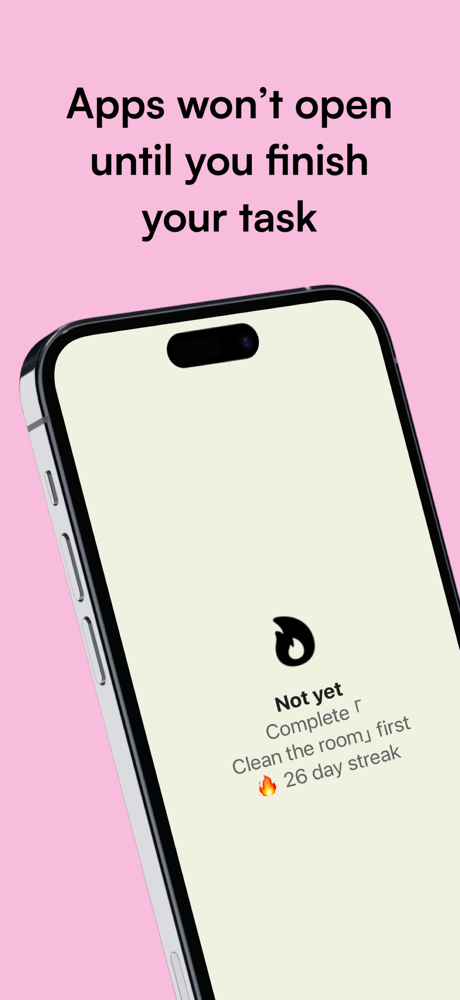
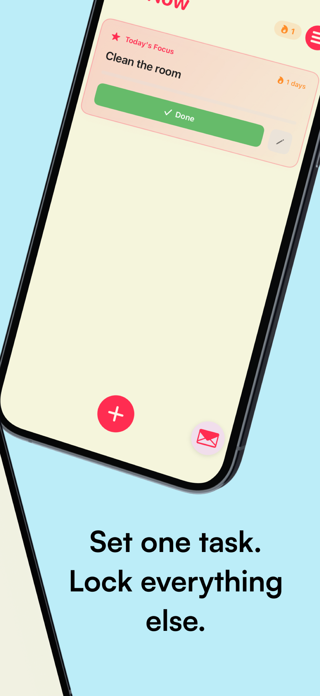
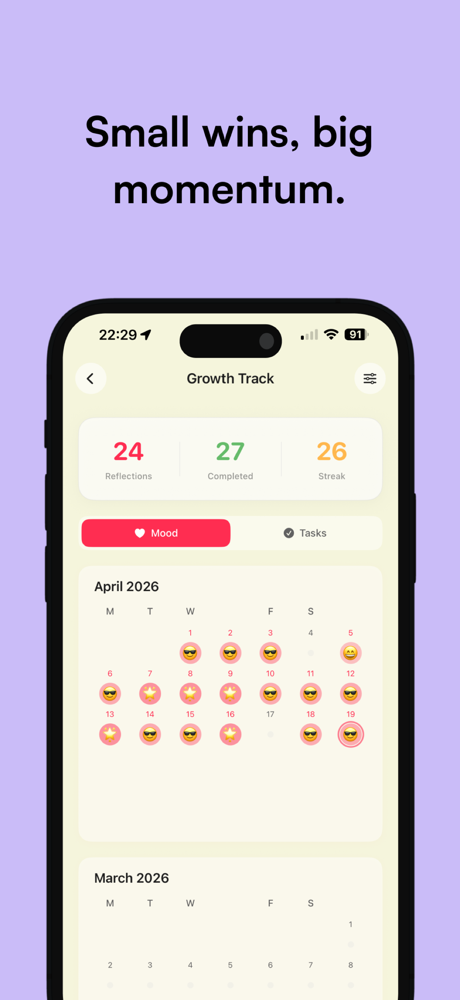

---

## 29. [MakerLoft](https://www.producthunt.com/products/makerloft)
**Votes**: 3 | **도입 난이도**: 중 | **신뢰도**: 상
**Tagline**: AI app builder. Backend included.
**서비스 링크**: https://www.producthunt.com/r/TCVWKGAZWIFJYM

**태그**: AI-App-Builder, Fullstack, DevOps, NoLockIn, AI Tool, Chat, DevTool

### 📌 이 서비스 한눈에 보기
채팅만으로 Laravel 백엔드와 서버 구축까지 완료하는 AI 앱 빌더

### 🔑 주요 기능
- Laravel + MySQL 기반의 실제 작동하는 백엔드 자동 생성
- DigitalOcean 서버 배포 및 GitHub 코드 푸시 지원
- 오류 발생 시 AI가 스스로 수정하는 셀프 힐링 기능

### 🙋 사용자에게 어떤 점이 좋은가
단순한 프로토타입을 넘어 실제 운영 가능한 수준의 풀스택 앱을 빠르게 배포하고 관리할 수 있습니다.

### ✅ 지금 바로 써볼 기능
- 자신의 AI API 키(Anthropic, OpenAI 등) 연결하기
- 채팅을 통한 초기 앱 구조 생성 테스트
- GitHub 연동을 통한 코드 소유권 확인

### ⚠️ 사용 전 확인할 점
- 사용자 개인의 API 키를 사용하므로 API 호출 비용이 발생함
- 자동화된 서버 설정 및 코드 생성에 따른 인프라 관리 이해도 필요

### 🧭 확인이 더 필요한 정보
Laravel 13 버전 등 최신 스택의 안정성과 복잡한 로직 구현 시의 정밀도는 추가 검증이 필요합니다.

### 📸 스크린샷 및 갤러리
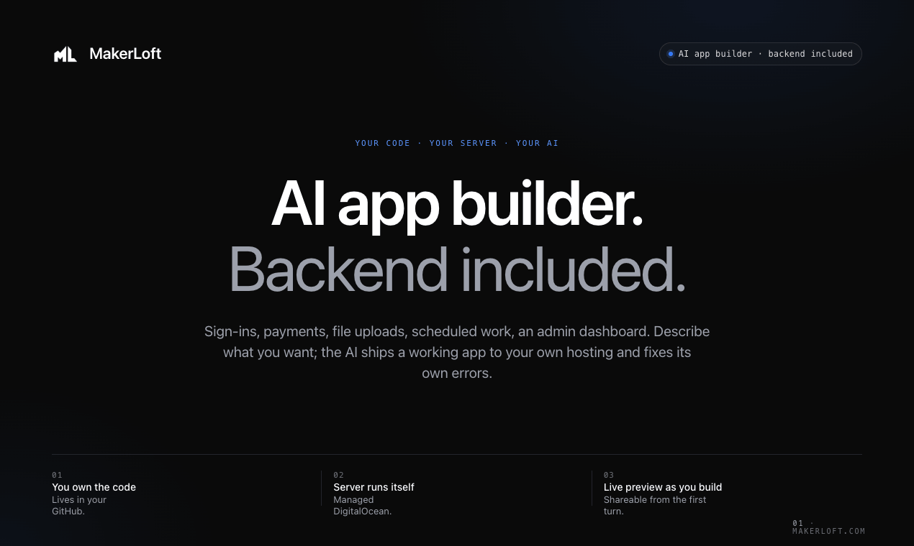
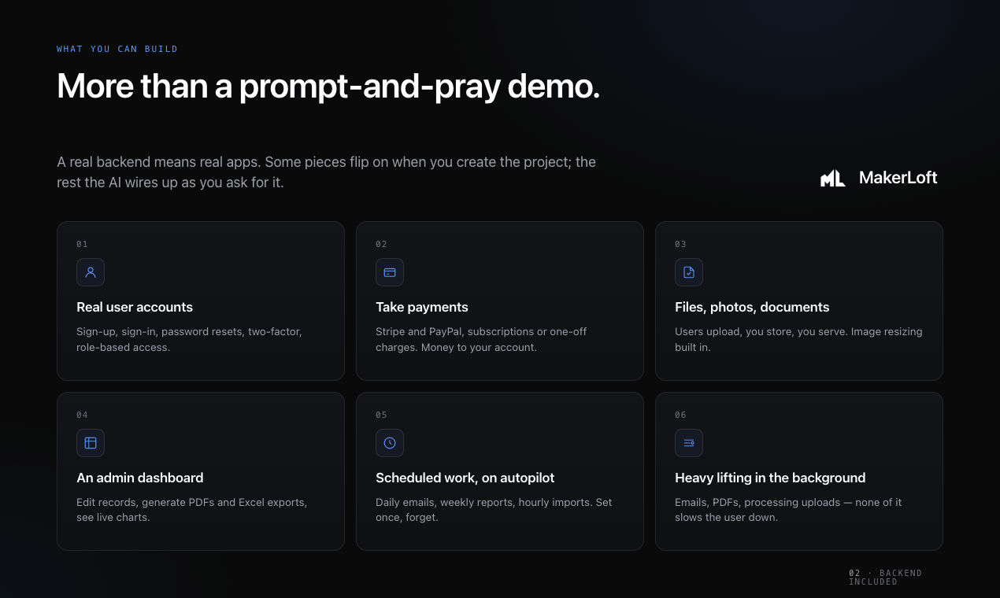
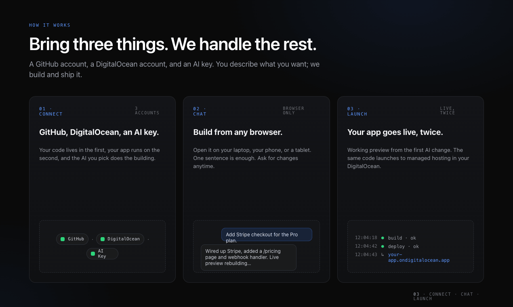

---

## 30. [PDFree — Free PDF Tools, No Limits](https://www.producthunt.com/products/pdfree-free-pdf-tools-no-limits)
**Votes**: 3 | **도입 난이도**: 하 | **신뢰도**: 상
**Tagline**: Your PDFs. Your device. No exceptions.
**서비스 링크**: https://www.producthunt.com/r/OEONRLNZRLRP5V

**태그**: Productivity, PDF, Privacy, FreeTool

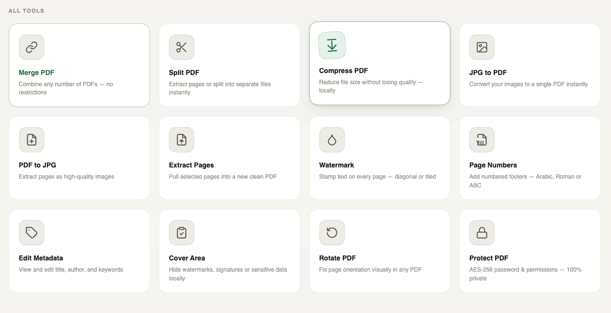

### 📌 이 서비스 한눈에 보기
개인정보 유출 걱정 없이 브라우저에서 즉시 실행되는 무제한 무료 PDF 편집 도구

### 🔑 주요 기능
- 로컬 브라우저 처리 방식으로 파일이 서버에 업로드되지 않는 강력한 보안
- 가입이나 결제 없이 모든 기능을 제한 없이 사용 가능
- 병합, 분할, 압축, 워터마크 등 필수 PDF 편집 기능 제공

### 🙋 사용자에게 어떤 점이 좋은가
민감한 문서를 외부 서버에 올리기 불안할 때, 별도의 설치나 가입 없이 안전하고 빠르게 문서를 편집할 수 있습니다.

### ✅ 지금 바로 써볼 기능
- PDF 파일 병합 및 분할 테스트
- 문서 압축 및 워터마크 삽입
- 메타데이터 편집 기능 확인

### ⚠️ 사용 전 확인할 점
- 브라우저 기반이므로 대용량 파일 처리 시 기기 성능에 영향을 받을 수 있음
- 인터넷 연결이 끊기면 브라우저 내 작업 환경이 불안정할 수 있음

### 🧭 확인이 더 필요한 정보
브라우저 메모리 한계로 인해 처리 가능한 최대 파일 크기에 대한 명시적 제한이 있는지 확인이 필요합니다.

### 📸 스크린샷 및 갤러리

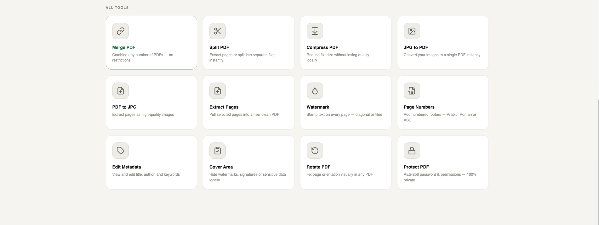
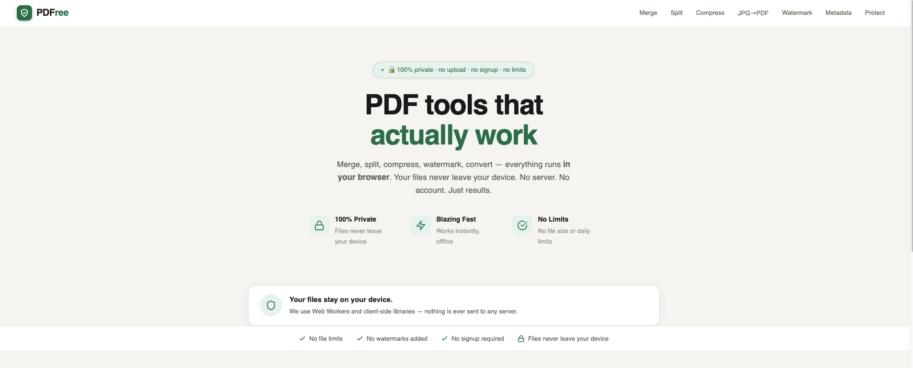

---

