# 🚀 Product Hunt Daily Top 30 (2026-05-12)

## 오늘의 요약
오늘의 트렌드는 단순한 AI 도구를 넘어, 업무 프로세스 전반을 자율적으로 수행하는 'AI 에이전트'와 그에 따른 '보안 및 컨텍스트 관리'가 핵심이었습니다. 채용, 개발, 제조 등 전문 영역에서 인간의 개입을 최소화하는 자동화 솔루션과 AI 에이전트의 신뢰성을 높이기 위한 인프라 성격의 제품들이 주목받았습니다.

### 오늘의 핵심 포인트
- 채용부터 코딩, 제조까지 업무 전 과정을 자동화하여 인간이 고차원적 의사결정에만 집중하게 만드는 에이전트 기술이 두드러졌습니다.
- AI 에이전트의 보안 취약점 방어와 실시간 업무 맥락(Context) 제공을 위한 전문적인 보안 및 데이터 통합 솔루션이 등장했습니다.
- 디자인을 코드로 즉시 변환하거나 아이디어를 실물 제품으로 연결하는 등 가상과 현실의 경계를 좁히는 생산성 도구들이 눈에 띄었습니다.

**오늘의 태그**: AI 에이전트, 업무 자동화, AI 보안, 생산성 도구, 에이전틱 워크플로우

## 1. [articuler.ai](https://www.producthunt.com/products/articuler-ai)
**Votes**: 303 | **도입 난이도**: 하 | **신뢰도**: 상
**Tagline**: Describe your goal. Meet the right professional.
**서비스 링크**: https://www.producthunt.com/r/ZTPLA6JAPDGMNV

**태그**: Networking, AI, SalesTech, Recruitment, AI Tool, DevTool, Email

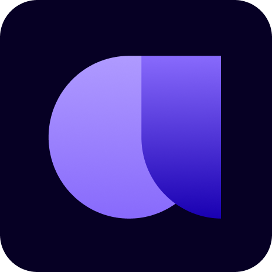

### 📌 이 서비스 한눈에 보기
목표 기반 매칭과 데이터 분석을 통해 최적의 비즈니스 파트너를 찾아주는 AI 네트워킹 솔루션

### 🔑 주요 기능
- 9억 8천만 개의 공개 프로필 기반 정밀 매칭
- 상대방의 공개 데이터를 분석하여 핵심 정보를 파악하는 플레이북 기능
- 높은 회신율을 목표로 하는 AI 기반 콜드 이메일 작성

### 🙋 사용자에게 어떤 점이 좋은가
단순 키워드 검색이 아닌 구체적인 비즈니스 목적(투자, 채용, 파트너십)에 맞는 인물을 빠르게 찾고, 효과적인 첫 메시지를 작성할 수 있습니다.

### ✅ 지금 바로 써볼 기능
- 구체적인 비즈니스 목표(Intent) 입력해보기
- 특정 조건(예: 특정 분기 투자자)을 설정하여 매칭 범위 좁히기
- AI가 생성한 콜드 이메일 초안 검토 및 발송하기

### ⚠️ 사용 전 확인할 점
- 공개된 프로필 데이터에 의존하므로 최신 정보 반영 여부 확인 필요
- AI가 생성한 이메일이 개인의 톤앤매너와 맞는지 검토 필수

### 🧭 확인이 더 필요한 정보
980M 프로필 데이터의 실시간 업데이트 주기와 개인정보 보호 정책에 대한 확인이 필요합니다.

### 📸 스크린샷 및 갤러리
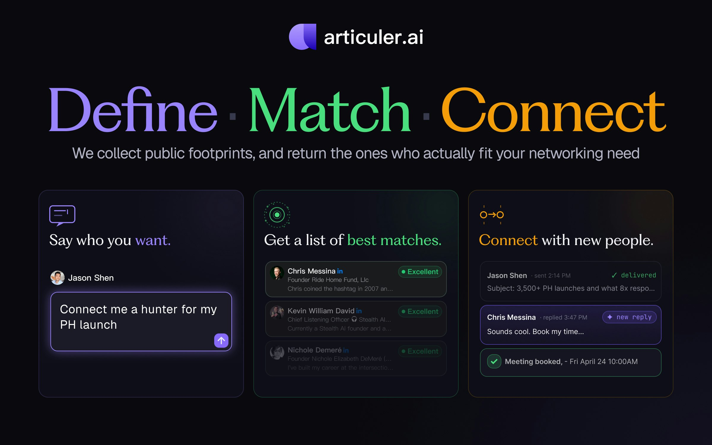
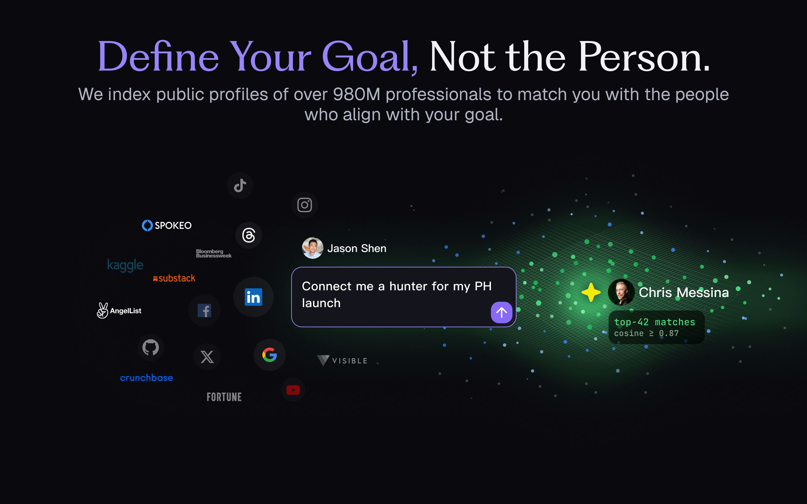
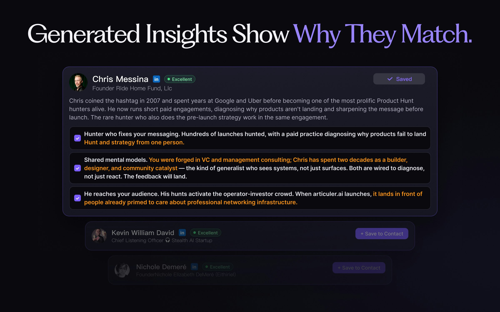

---

## 2. [OpenJobs AI](https://www.producthunt.com/products/openjobs-ai)
**Votes**: 258 | **도입 난이도**: 하 | **신뢰도**: 상
**Tagline**: End-to-End Autonomous AI Recruiter
**서비스 링크**: https://www.producthunt.com/r/DZIBWQICPJ7Z4E

**태그**: HRTech, Automation, AI, Recruitment, AI Tool

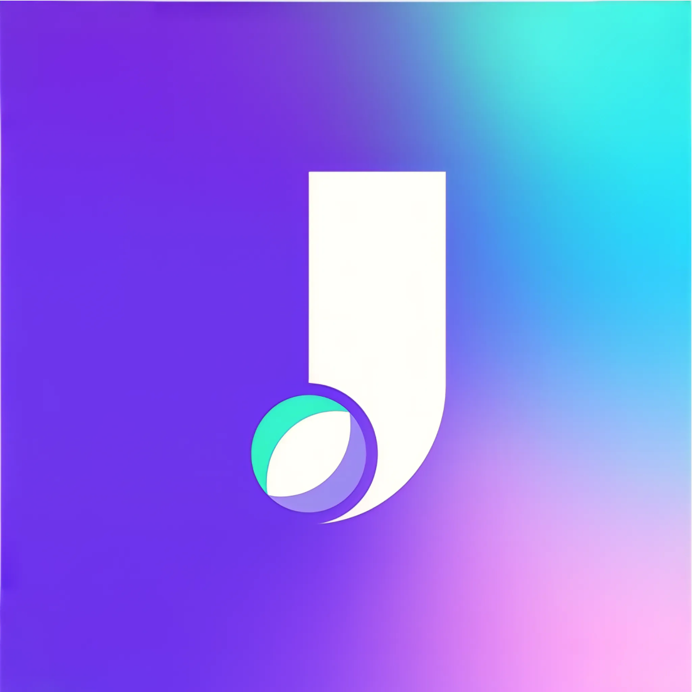

### 📌 이 서비스 한눈에 보기
채용 공고 작성부터 면접 예약까지 전 과정을 자동화하는 AI 채용 담당자

### 🔑 주요 기능
- 채용 요구사항 기반의 자동 후보자 소싱
- 자격 요건 검증 및 개인화된 아웃리치 자동 발송
- 답장 추적 및 캘린더 연동을 통한 면접 예약 자동화

### 🙋 사용자에게 어떤 점이 좋은가
채용 담당자가 반복적인 서칭과 연락 업무에서 벗어나 면접과 최종 결정에만 집중할 수 있도록 돕습니다.

### ✅ 지금 바로 써볼 기능
- 채용할 직무 정보 입력하기
- AI가 제안하는 후보자 리스트 확인하기
- 자동화된 아웃리치 메시지 검토하기

### ⚠️ 사용 전 확인할 점
- AI의 스크리닝 결과가 실제 인재 적합성과 일치하는지 검증 필요
- 자동 발송되는 메시지의 톤앤매너가 브랜드 이미지와 맞는지 확인 필요

### 🧭 확인이 더 필요한 정보
현재 지원하는 채용 플랫폼(LinkedIn 등)과의 직접적인 연동 범위와 데이터 보안 정책 확인이 필요합니다.

### 📸 스크린샷 및 갤러리
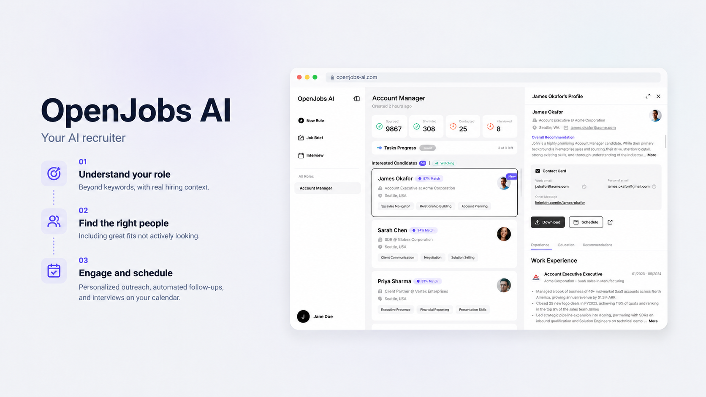
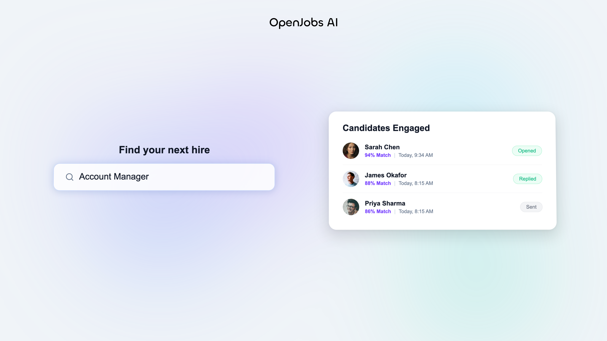
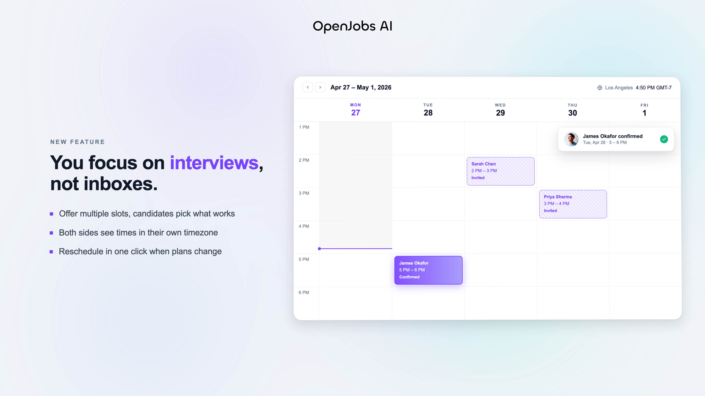

### 🎬 관련 영상
- [🎥 영상 보기](https://ph-files.imgix.net/93f27a3a-0ebe-470c-bb83-37d2f8ae8b4c.jpeg?auto=format)

---

## 3. [Graphbit PRFlow](https://www.producthunt.com/products/graphbit)
**Votes**: 258 | **도입 난이도**: 하 | **신뢰도**: 상
**Tagline**: AI code reviewer that catches what others miss
**서비스 링크**: https://www.producthunt.com/r/K4W36ZSYF7WPLV

**태그**: DevTool, AI, Security, Automation, AI Tool

### 📌 이 서비스 한눈에 보기
기존 도구가 놓치는 보안 취약점까지 잡아내는 AI 코드 리뷰 파트너

### 🔑 주요 기능
- 실제 프로젝트 검증을 통해 입증된 높은 보안 이슈 탐지 능력
- 팀의 코딩 표준을 학습하여 점진적으로 정교해지는 리뷰 시스템
- 사용자 수 기준이 아닌 리뷰 건수 기반의 합리적인 과금 방식

### 🙋 사용자에게 어떤 점이 좋은가
코드 리뷰 자동화를 통해 배포 전 보안 리스크를 최소화하고, 팀의 개발 표준을 일관되게 유지할 수 있습니다.

### ✅ 지금 바로 써볼 기능
- 현재 진행 중인 프로젝트의 PR에 적용하여 보안 이슈 탐지 테스트하기
- 팀의 코딩 스타일을 학습시키기 위한 초기 데이터 입력하기
- 리뷰 건수 기반 과금 모델이 팀 예산에 적합한지 검토하기

### ⚠️ 사용 전 확인할 점
- 학습 데이터 축적 전까지는 팀 표준 반영의 정확도가 낮을 수 있음
- 리뷰 건수 기반 과금 방식이 대규모 프로젝트에서 비용 부담이 될 가능성

### 🧭 확인이 더 필요한 정보
구체적인 과금 체계(리뷰당 단가)와 지원하는 프로그래밍 언어 범위에 대한 정보가 필요합니다.

### 📸 스크린샷 및 갤러리
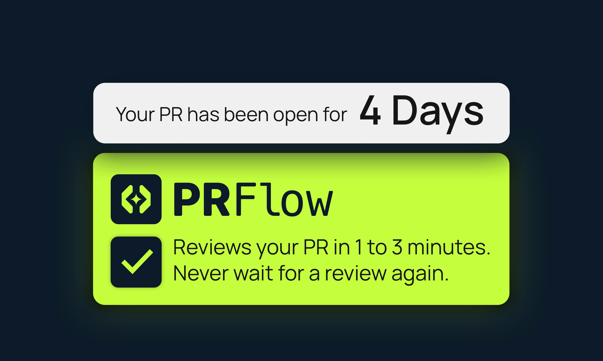
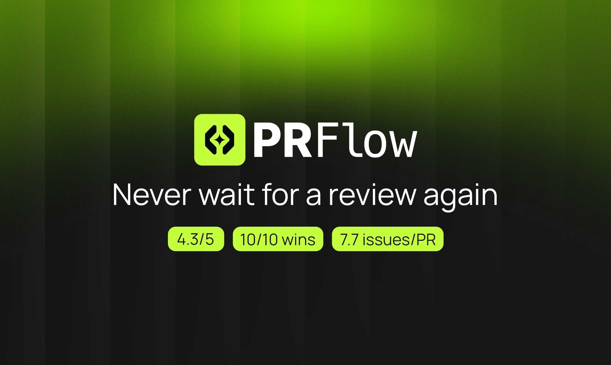
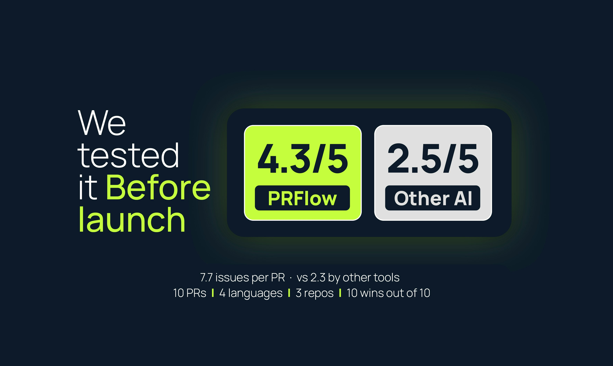

### 🎬 관련 영상
- [🎥 영상 보기](https://ph-files.imgix.net/9b1ebb10-b900-4624-b21b-4b841a0f37d3.jpeg?auto=format)

---

## 4. [Genpire](https://www.producthunt.com/products/genpire-ai)
**Votes**: 235 | **도입 난이도**: 중 | **신뢰도**: 상
**Tagline**: Make Real Products with AI, literally.
**서비스 링크**: https://www.producthunt.com/r/SBMCMSDZBENDWN

**태그**: Manufacturing, AI-Agent, Product-Design, E-commerce, Agent, Automation, AI Tool, Prompting

### 📌 이 서비스 한눈에 보기
아이디어와 스케치만으로 실제 제품 설계부터 공장 생산까지 연결하는 AI 제조 플랫폼

### 🔑 주요 기능
- 프롬프트와 스케치를 기반으로 제품 디자인 및 공장용 사양 자동 생성
- 제품 컬렉션 기획부터 샘플 제작, 대량 생산까지 이어지는 통합 워크플로우
- 검증된 제조 네트워크를 통한 즉각적인 견적 및 생산 프로세스 제공

### 🙋 사용자에게 어떤 점이 좋은가
아이디어를 실물 제품으로 구현하는 과정에서의 복잡한 설계 및 제조 공정 허들을 획기적으로 낮춰줍니다.

### ✅ 지금 바로 써볼 기능
- 아이디어 스케치를 업로드하여 제품 사양 생성 테스트하기
- 제조 네트워크를 통한 견적 및 샘플링 프로세스 확인하기

### ⚠️ 사용 전 확인할 점
- 실제 물리적 제품의 품질이 AI 생성 사양과 일치하는지 검증 필요
- 제조 네트워크 이용 시 물류 및 품질 관리 책임 소재 확인 필요

### 🧭 확인이 더 필요한 정보
특정 카테고리의 소비재에 특화되어 있는지, 혹은 모든 제조 분야를 포괄하는지 확인이 필요합니다.

### 📸 스크린샷 및 갤러리
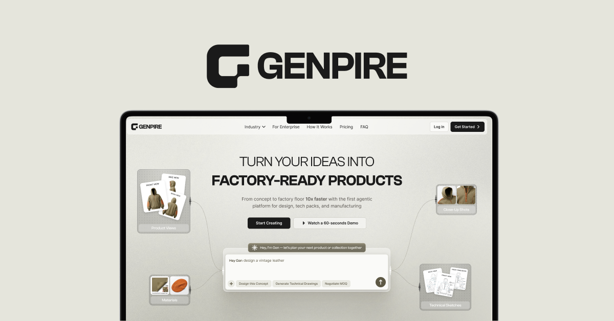
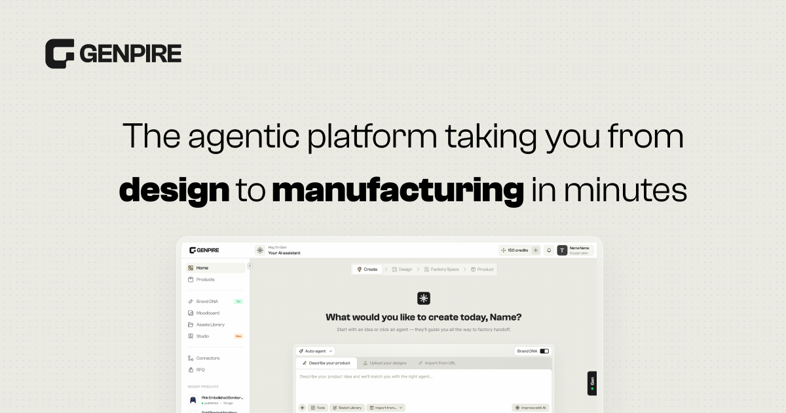
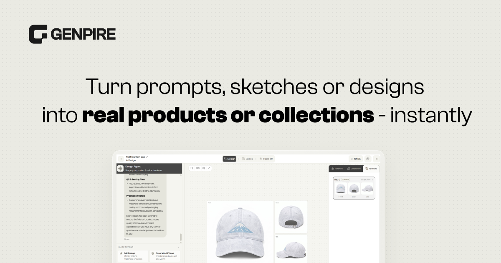

### 🎬 관련 영상
- [🎥 영상 보기](https://ph-files.imgix.net/18ae16a6-f42f-4c84-9fee-c7a0a936c644.jpeg?auto=format)

---

## 5. [ClawSecure](https://www.producthunt.com/products/clawsecure)
**Votes**: 180 | **도입 난이도**: 하 | **신뢰도**: 상
**Tagline**: The AI-Powered Antivirus for AI Agents
**서비스 링크**: https://www.producthunt.com/r/CBB34LD6UL5TT2

**태그**: AI, Security, DevTool, Automation, Agent, AI Tool, API

### 📌 이 서비스 한눈에 보기
AI 에이전트의 보안 위협을 실시간으로 방어하는 AI 기반 안티바이러스 솔루션

### 🔑 주요 기능
- 사전 설치 스캐닝 및 실시간 런타임 모니터링 제공
- 에이전트 전용 보안 컴패니언 및 200ms 미만의 초고속 검증 API
- OWASP ASI(AI Security Interface) 가이드라인 10/10 완전 충족

### 🙋 사용자에게 어떤 점이 좋은가
AI 에이전트 도입 시 발생할 수 있는 보안 취약점을 자동화된 방식으로 해결하여 안전한 에이전트 운용을 돕습니다.

### ✅ 지금 바로 써볼 기능
- clawsecure.ai 접속하여 무료 서비스 이용하기
- 에이전트 워크플로우에 Verification API 통합 테스트하기
- 보안 컴패니언 에이전트 기능 확인하기

### ⚠️ 사용 전 확인할 점
- 실시간 모니터링이 에이전트의 응답 속도에 미치는 영향 확인 필요
- 특정 에이전트 프레임워크와의 호환성 검토 필요

### 🧭 확인이 더 필요한 정보
제공되는 보안 기능이 모든 종류의 AI 에이전트 아키텍처에 동일하게 적용되는지 확인이 필요합니다.

### 📸 스크린샷 및 갤러리
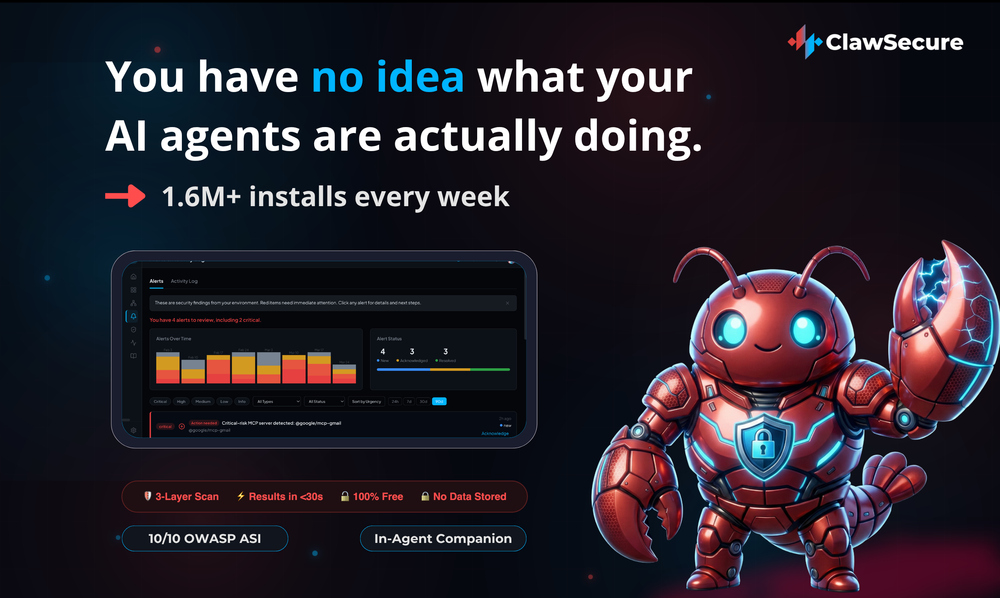
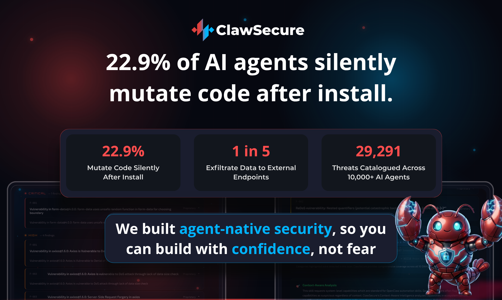
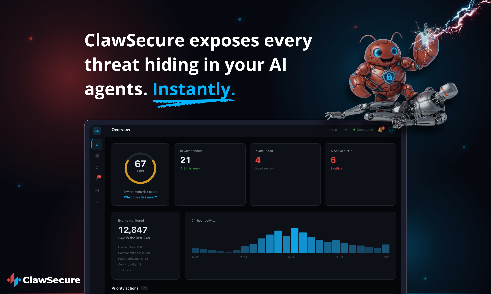

---

## 6. [Warp Open-Source](https://www.producthunt.com/products/warp)
**Votes**: 155 | **도입 난이도**: 중 | **신뢰도**: 상
**Tagline**: Agentic development environment built with the community
**서비스 링크**: https://www.producthunt.com/r/RXPBBH5AYSU33A

**태그**: DevTool, OpenSource, AI-Agent, Automation, Agent

### 📌 이 서비스 한눈에 보기
커뮤니티 협업과 AI 에이전트 기술이 결합된 차세대 오픈소스 개발 환경

### 🔑 주요 기능
- 에이전트 기반의 자동화된 코딩, 계획, 테스트 기능 제공
- 사용자가 아이디어와 검증에 집중할 수 있도록 설계된 워크플로우
- 커뮤니티 주도형 오픈소스 모델로 빠른 성장세 기록

### 🙋 사용자에게 어떤 점이 좋은가
반복적인 코딩 및 테스트 작업을 AI 에이전트에게 맡기고, 개발자는 설계와 최종 검증 등 고차원적인 의사결정에만 집중할 수 있습니다.

### ✅ 지금 바로 써볼 기능
- Oz-managed 에이전트를 활용한 자동 코딩 작업 테스트
- 커뮤니티 기여를 통한 프로젝트 방향성 참여
- 에이전트가 생성한 코드의 검증 및 디렉션 설정

### ⚠️ 사용 전 확인할 점
- 에이전트가 수행하는 작업에 대한 최종 검증 책임은 사용자에게 있음
- 오픈소스 프로젝트 특성상 초기 단계의 불안정성 가능성

### 🧭 확인이 더 필요한 정보
에이전트가 수행하는 작업의 구체적인 범위와 기술적 아키텍처에 대한 상세 정보가 필요합니다.

### 📸 스크린샷 및 갤러리
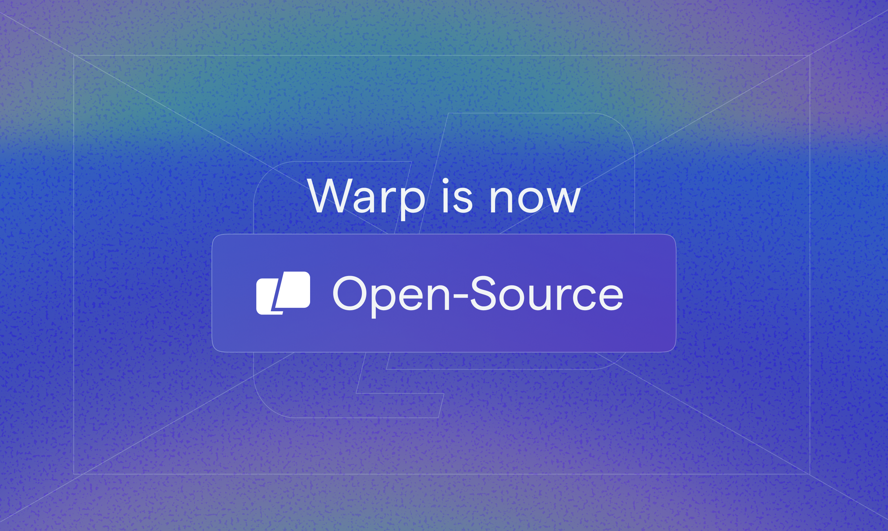
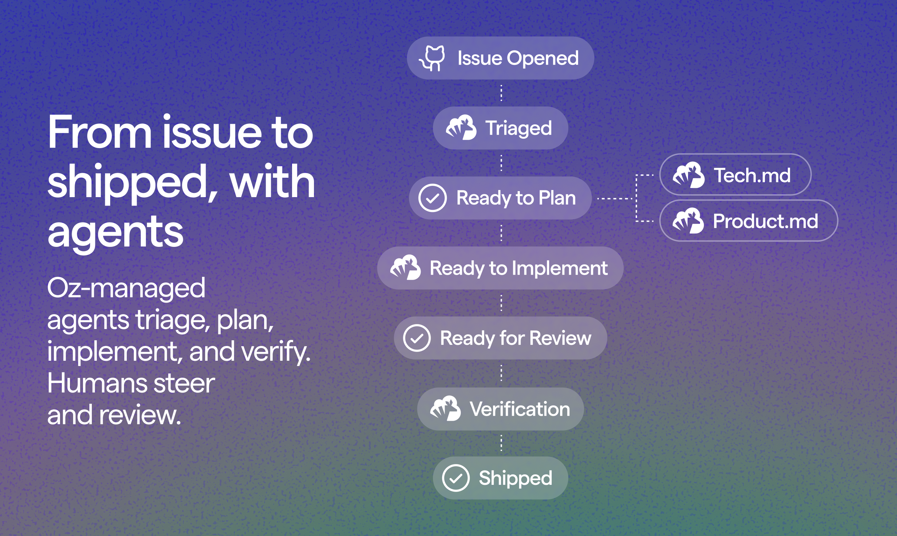
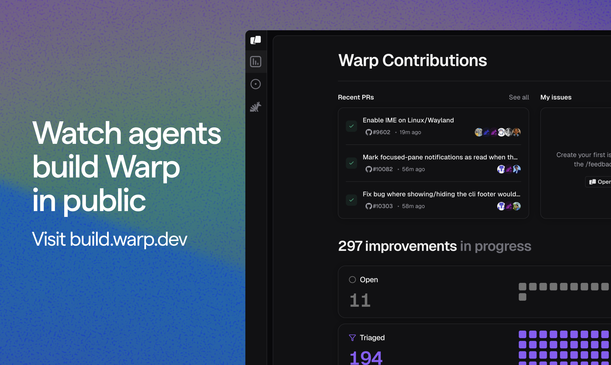

### 🎬 관련 영상
- [🎥 영상 보기](https://ph-files.imgix.net/20f200b5-0d1e-40bb-9af5-41b2571744d6.jpeg?auto=format)

---

## 7. [Weavable](https://www.producthunt.com/products/weavable)
**Votes**: 151 | **도입 난이도**: 중 | **신뢰도**: 상
**Tagline**: Give every AI agent persistent work context
**서비스 링크**: https://www.producthunt.com/r/33OUNMSCT7MK3F

**태그**: AI-Agent, Workflow-Automation, Data-Integration, DevTool, Agent, Automation, AI Tool

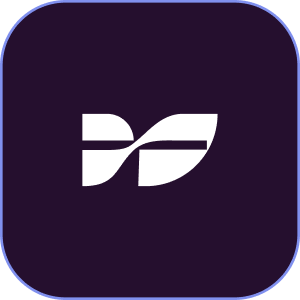

### 📌 이 서비스 한눈에 보기
기존 업무 도구의 데이터를 실시간 맥락으로 변환하여 AI 에이전트에게 제공하는 통합 컨텍스트 레이어

### 🔑 주요 기능
- 단일 MCP 엔드포인트를 통한 분산된 업무 데이터의 통합
- 실시간 업무 맥락 제공으로 AI 에이전트의 추론 정확도 향상
- 데이터 재입력 최소화를 통한 토큰 사용량 절감 및 비용 효율화

### 🙋 사용자에게 어떤 점이 좋은가
AI 에이전트가 매번 방대한 데이터를 다시 학습할 필요 없이, 업무 도구의 최신 상태를 즉각 반영하여 더 정확하고 신뢰할 수 있는 결과물을 만들어냅니다.

### ✅ 지금 바로 써볼 기능
- 현재 사용 중인 업무 도구와 MCP 엔드포인트 연동 테스트
- 에이전트의 작업 워크플로우에 Weavable 컨텍스트 레이어 적용
- 데이터 동기화 방식 및 실시간성 확인

### ⚠️ 사용 전 확인할 점
- 기존 업무 도구의 데이터 보안 및 접근 권한 설정 필요
- 연동된 도구의 데이터 구조 변화에 따른 컨텍스트 정확도 영향

### 🧭 확인이 더 필요한 정보
지원하는 구체적인 업무 도구 목록과 MCP 엔드포인트의 기술적 요구사항 확인이 필요합니다.

### 📸 스크린샷 및 갤러리
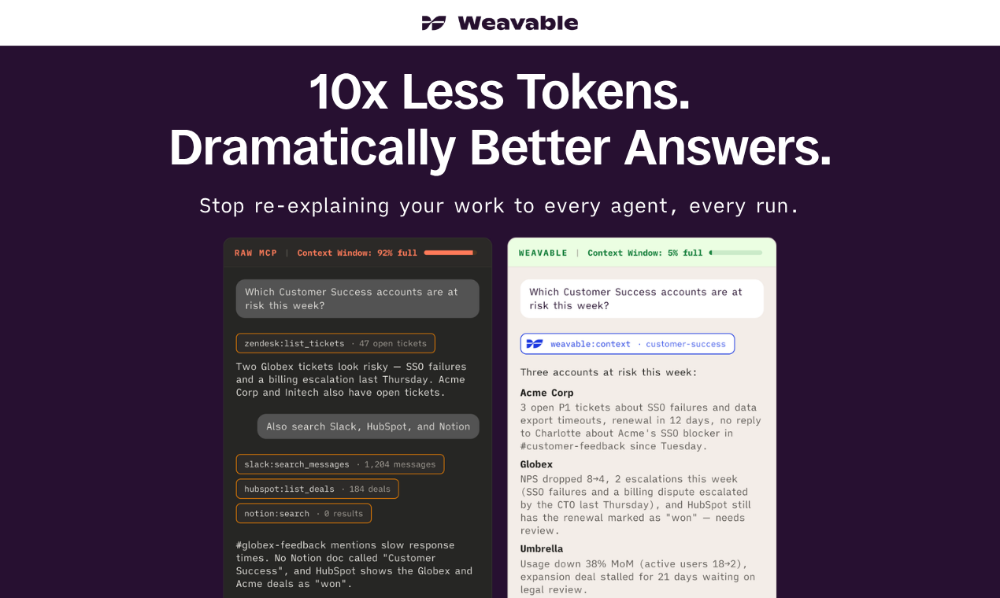
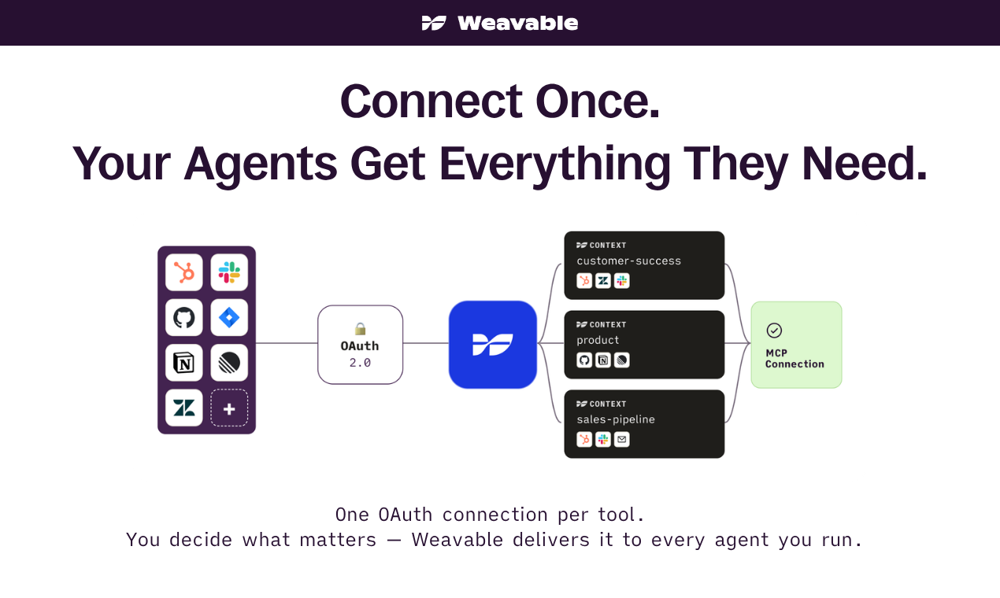
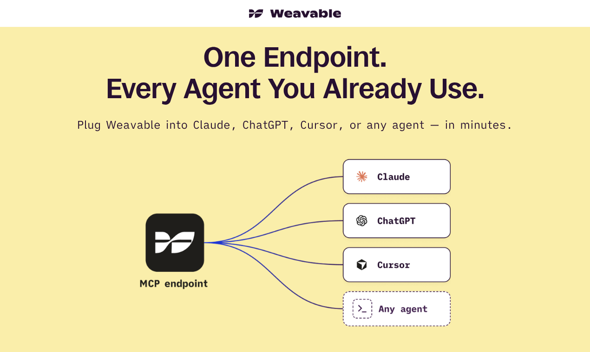

### 🎬 관련 영상
- [🎥 영상 보기](https://ph-files.imgix.net/a2df1e4f-00c2-420d-bc47-68604362608d.jpeg?auto=format)

---

## 8. [MiroMiro v2](https://www.producthunt.com/products/miromiro)
**Votes**: 149 | **도입 난이도**: 하 | **신뢰도**: 상
**Tagline**: Inspect, edit, and export any website's design
**서비스 링크**: https://www.producthunt.com/r/FZXHZAPXMQHI2M

**태그**: DevTool, DesignToCode, Frontend, Tailwind, AI Tool, Vision, Design

### 📌 이 서비스 한눈에 보기
웹사이트의 디자인을 실시간으로 편집하고 깨끗한 코드로 즉시 추출하는 디자인-투-코드 도구

### 🔑 주요 기능
- Figma처럼 웹사이트의 색상, 폰트, 간격 등을 실시간으로 수정 및 확인 가능
- Tailwind CSS 또는 HTML/CSS 형식으로 디자인 섹션 내보내기 지원
- 디자인 토큰(색상, 간격, 그림자 등) 및 SVG, Lottie 애니메이션 추출 기능

### 🙋 사용자에게 어떤 점이 좋은가
영감을 받은 웹사이트의 디자인 요소를 일일이 코드로 옮길 필요 없이, 즉시 사용 가능한 수준의 코드로 변환하여 개발 시간을 획기적으로 단축해 줍니다.

### ✅ 지금 바로 써볼 기능
- 좋아하는 웹사이트에서 디자인 요소(색상, 폰트) 추출하기
- 웹사이트 레이아웃을 Tailwind 코드로 내보내기
- 텍스트의 WCAG 접근성 대비 확인하기

### ⚠️ 사용 전 확인할 점
- 복잡한 인터랙션이나 동적 요소는 코드로 완벽하게 변환되지 않을 수 있음
- 추출된 코드가 기존 프로젝트의 스타일 가이드와 충돌할 가능성

### 🧭 확인이 더 필요한 정보
브라우저 확장 프로그램 형태인지 별도의 데스크톱 앱인지에 대한 설치 방식이 명시되지 않았습니다.

### 📸 스크린샷 및 갤러리
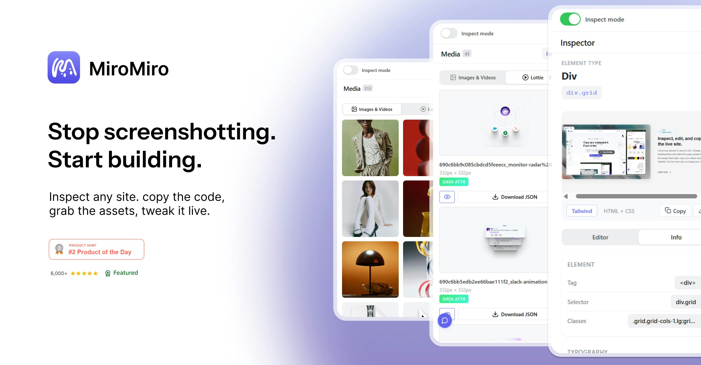
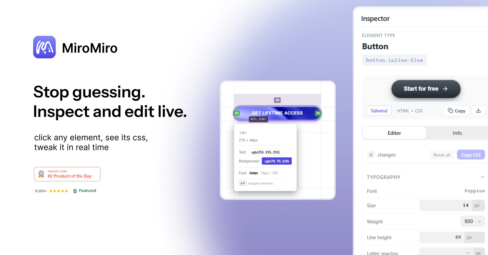
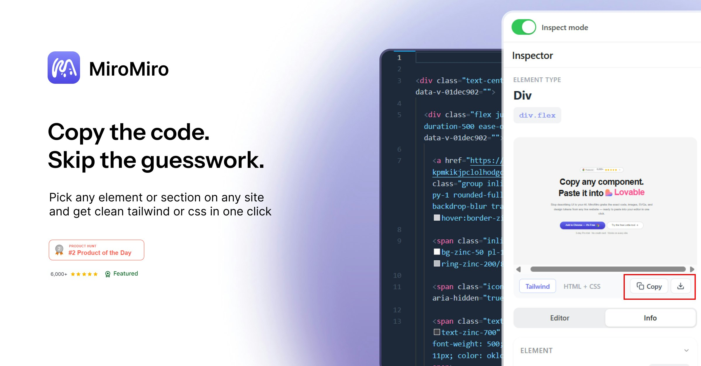

---

## 9. [Snapseed 4.0](https://www.producthunt.com/products/google)
**Votes**: 136 | **도입 난이도**: 하 | **신뢰도**: 상
**Tagline**: Google’s best photo editor just got seriously better
**서비스 링크**: https://www.producthunt.com/r/5RY2SNBA24SS6Y
**재등장**: 최근 7일 내 재등장 (마지막 등장 2일 전)

**태그**: Photo Editor, Mobile App, Creative Tool, Google, Automation

### 📌 이 서비스 한눈에 보기
필름 룩과 스마트 마스킹을 더해 더욱 강력해진 구글의 무료 사진 편집 도구

### 🔑 주요 기능
- 필름 스타일 및 스마트 마스킹 기능 도입
- 일괄 편집(Batch edits) 및 RAW 파일 지원
- 광고, 워터마크, 구독료 없는 완전 무료 서비스

### 🙋 사용자에게 어떤 점이 좋은가
전문적인 편집 기능(RAW 지원, 마스킹)을 비용 부담 없이 모바일에서 즉시 활용할 수 있습니다.

### ✅ 지금 바로 써볼 기능
- 스마트 마스킹으로 정교한 부분 보정하기
- 일괄 편집 기능을 통한 사진 톤 통일하기
- 필름 룩 필터를 활용한 감성적인 사진 만들기

### ⚠️ 사용 전 확인할 점
- 무료 서비스이므로 고급 기능의 세부 제약 사항 확인 필요
- 기존 버전과의 인터페이스 변화 적응 필요

### 🧭 확인이 더 필요한 정보
구체적인 기기 호환성 및 RAW 파일 처리 성능에 대한 상세 정보는 확인이 필요합니다.

### 📸 스크린샷 및 갤러리

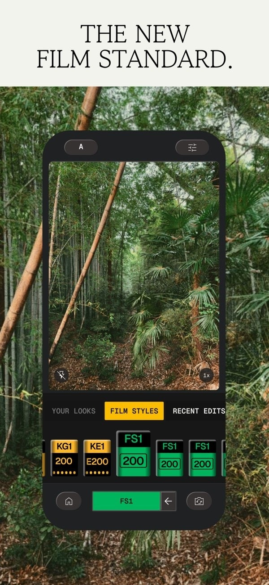

### 🎬 관련 영상
- [🎥 영상 보기](https://ph-files.imgix.net/3d6a2c68-cced-451c-a16d-e92a32460ac0.jpeg?auto=format)

---

## 10. [ChatGPT for Google Sheets](https://www.producthunt.com/products/chatgpt-for-google-sheets)
**Votes**: 99 | **도입 난이도**: 하 | **신뢰도**: 상
**Tagline**:  Chat with your spreadsheet, edit cell with natural language
**서비스 링크**: https://www.producthunt.com/r/XBVQBUBSD7SPHT

**태그**: Productivity, Automation, Analytics, AI, AI Tool, Chat

### 📌 이 서비스 한눈에 보기
자연어로 스프레드시트 수식 작성부터 데이터 정리까지 해결하는 AI 사이드바

### 🔑 주요 기능
- 자연어 명령을 통한 복잡한 스프레드시트 수식 자동 생성
- 데이터 정제 및 모델 구축 프로세스 간소화
- 엑셀 및 구글 시트 사이드바 형태의 편리한 작업 환경

### 🙋 사용자에게 어떤 점이 좋은가
데이터 분석가와 운영팀이 복잡한 함수를 외울 필요 없이 대화하듯 업무를 처리할 수 있어 작업 속도가 획기적으로 향상됩니다.

### ✅ 지금 바로 써볼 기능
- 자연어로 복잡한 수식 생성 요청하기
- 지저분한 데이터셋 정제 작업 시켜보기
- 사이드바를 통한 데이터 분석 모델 구축 시도하기

### ⚠️ 사용 전 확인할 점
- AI가 생성한 수식이나 데이터 결과값이 정확한지 반드시 검증 필요
- 데이터 보안 및 개인정보 보호 정책 확인 필요

### 🧭 확인이 더 필요한 정보
구체적인 요금 체계와 데이터 처리 용량 제한에 대한 정보가 명시되지 않았습니다.

### 📸 스크린샷 및 갤러리
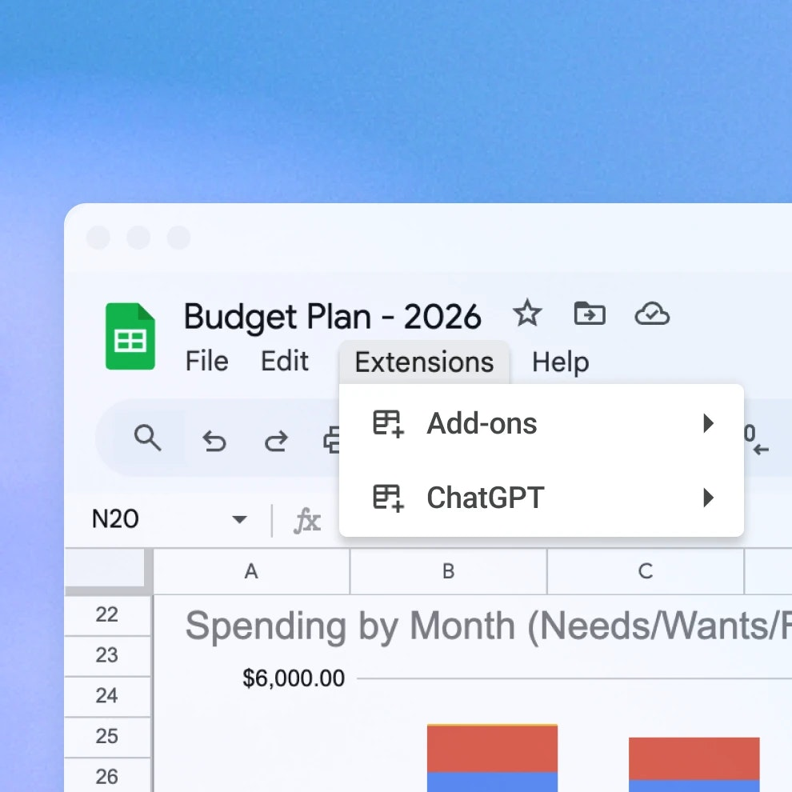

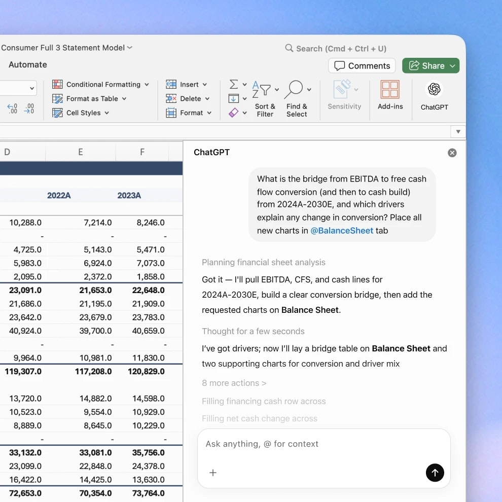

### 🎬 관련 영상
- [🎥 영상 보기](https://ph-files.imgix.net/609481b7-6939-4316-bfc6-3b37c0b0c35a.jpeg?auto=format)

---

## 11. [Web Speed](https://www.producthunt.com/products/web-speed)
**Votes**: 96 | **도입 난이도**: 중 | **신뢰도**: 상
**Tagline**: Kill the 'Token Tax.' 90% cheaper agents.
**서비스 링크**: https://www.producthunt.com/r/EORFJWPOR7CX6S

**태그**: AI-Agent, Automation, DevTool, Cost-Optimization, Agent, AI Tool

### 📌 이 서비스 한눈에 보기
웹 에이전트를 위한 고효율 매핑 엔진: 토큰 비용을 최대 90% 절감하는 로직 레이어

### 🔑 주요 기능
- 웹사이트를 AI 에이전트용 고정밀 머신 맵으로 변환
- 결정론적 매핑 엔진을 통한 빠른 속도와 신뢰성 확보
- 에이전트 운영 시 발생하는 토큰 비용 70%~90% 절감

### 🙋 사용자에게 어떤 점이 좋은가
웹 기반 AI 에이전트를 개발하거나 운영할 때 발생하는 막대한 토큰 비용을 획기적으로 줄이고 작업 속도를 높일 수 있습니다.

### ✅ 지금 바로 써볼 기능
- 기존 웹 에이전트 워크플로우에 Web Speed 매핑 엔진 적용 테스트
- 현재 사용 중인 토큰 소모량과 Web Speed 도입 시 절감액 비교
- 복잡한 웹 구조에서의 매핑 정확도 검증

### ⚠️ 사용 전 확인할 점
- 에이전트가 사용하는 특정 프레임워크와의 호환성 확인 필요
- 매핑 엔진의 결정론적 방식이 동적 웹 요소에 어떻게 대응하는지 확인 필요

### 🧭 확인이 더 필요한 정보
구체적인 API 연동 방식 및 기존 에이전트 프레임워크와의 통합 난이도에 대한 정보가 더 필요합니다.

### 📸 스크린샷 및 갤러리

### 🎬 관련 영상
- [🎥 영상 보기](https://ph-files.imgix.net/e0ce0834-8225-4aa7-8b9c-1e4f0e03ea47.jpeg?auto=format)

---

## 12. [Grok Connectors](https://www.producthunt.com/products/grok)
**Votes**: 85 | **도입 난이도**: 중 | **신뢰도**: 상
**Tagline**: Bring your daily apps into Grok
**서비스 링크**: https://www.producthunt.com/r/QAHXOFLHYKAOJT

**태그**: AI, Automation, Productivity, Integration, AI Tool

### 📌 이 서비스 한눈에 보기
사용 중인 업무용 앱들을 Grok AI와 연결하여 자동화된 워크플로우를 구축하는 통합 레이어

### 🔑 주요 기능
- AI 어시스턴트와 워크스페이스 앱 간의 데이터 읽기/쓰기 지원
- 다양한 도구 간의 작업 실행을 통한 업무 자동화
- 사용자 정의 MCP(Model Context Protocol) 서버 지원

### 🙋 사용자에게 어떤 점이 좋은가
여러 앱을 일일이 오갈 필요 없이 Grok 내에서 직접 업무를 처리하고 데이터를 관리할 수 있어 생산성이 향상됩니다.

### ✅ 지금 바로 써볼 기능
- 주요 업무용 앱 연동 테스트
- 커스텀 MCP 서버를 통한 맞춤형 기능 확장
- AI를 통한 자동화 작업 워크플로우 설계

### ⚠️ 사용 전 확인할 점
- 외부 앱에 대한 읽기/쓰기 권한 부여 시 보안 및 데이터 프라이버시 검토 필요
- 연동된 앱의 API 상태나 정책에 따라 기능 제한이 발생할 수 있음

### 🧭 확인이 더 필요한 정보
지원되는 구체적인 외부 앱 목록과 보안 프로토콜에 대한 상세 정보가 필요합니다.

### 📸 스크린샷 및 갤러리
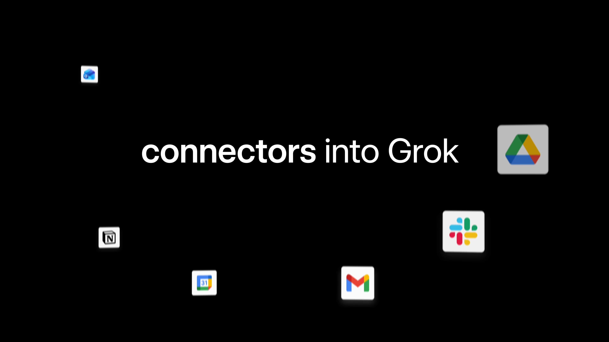
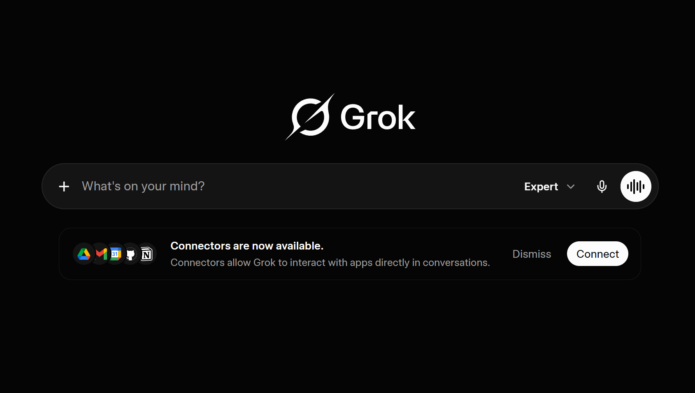
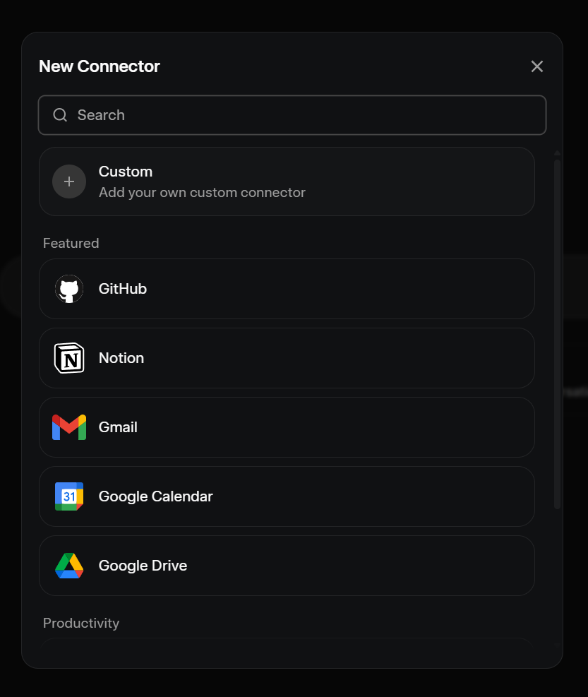

---

## 13. [Suprbox](https://www.producthunt.com/products/suprbox)
**Votes**: 84 | **도입 난이도**: 중 | **신뢰도**: 상
**Tagline**: Box for AI agents to secure enterprise data storage
**서비스 링크**: https://www.producthunt.com/r/IGTQIGCZCG2J7H

**태그**: AI-Security, Data-Privacy, DevTool, Automation, Agent, AI Tool, Prompting

### 📌 이 서비스 한눈에 보기
AI 에이전트에게 데이터 접근 권한을 안전하게 제어하고 기록하는 정책 기반 보안 금고

### 🔑 주요 기능
- 데이터 원본 대신 정책이 적용된 스코프(Scoped) 키를 통한 안전한 접근 제어
- 민감도, 시간, 속도 제한 및 인간 승인 등 세부 정책 기반의 데이터 보호
- 프롬프트 가드레일을 넘어 데이터 자체를 보호하며 모든 접근을 불변의 감사 로그로 기록

### 🙋 사용자에게 어떤 점이 좋은가
AI 에이전트에게 전체 데이터 접근 권한을 주는 위험 없이, 필요한 데이터만 안전하게 읽게 하여 데이터 유출 사고를 방지할 수 있습니다.

### ✅ 지금 바로 써볼 기능
- 기존 S3나 Drive 대신 Suprbox 스코프 키를 사용하는 워크플로우 테스트
- 데이터 민감도에 따른 세부 접근 정책(Policy) 설정
- 에이전트의 데이터 접근 기록 및 감사 로그 확인

### ⚠️ 사용 전 확인할 점
- 에이전트의 데이터 읽기 성능에 미칠 수 있는 오버헤드 확인 필요
- 기존 클라우드 스토리지(S3, Drive 등)와의 연동 방식 및 데이터 복제 여부 확인

### 🧭 확인이 더 필요한 정보
현재 제공되는 구체적인 연동 가능한 스토리지 서비스 목록과 API 지원 범위에 대한 정보가 부족합니다.

### 📸 스크린샷 및 갤러리
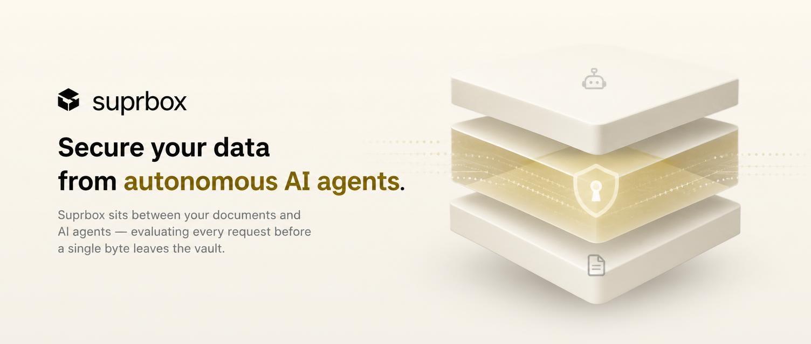
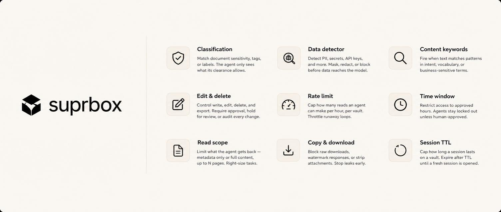

---

## 14. [Plouton AI](https://www.producthunt.com/products/plouton-ai)
**Votes**: 83 | **도입 난이도**: 하 | **신뢰도**: 상
**Tagline**: Computer-Use AI agents for FinOps workflows
**서비스 링크**: https://www.producthunt.com/r/QXCQOBYV5RWPNM

**태그**: FinOps, Automation, AI-Agent, ERP, Agent, AI Tool, API

### 📌 이 서비스 한눈에 보기
API 연동 없이 브라우저 기반 AI 에이전트로 복잡한 재무 업무를 자동화하는 솔루션

### 🔑 주요 기능
- 브라우저 기반 AI 에이전트를 통한 업무 자동화
- SAP, NetSuite, QuickBooks 등 기존 ERP/회계 툴 직접 제어
- API 개발 없이도 미결제 대금 관리 및 결산 워크플로우 실행 가능

### 🙋 사용자에게 어떤 점이 좋은가
별도의 시스템 통합 작업 없이 기존에 사용하던 회계 소프트웨어 내에서 반복적인 재무 업무를 자동화하여 업무 효율을 높일 수 있습니다.

### ✅ 지금 바로 써볼 기능
- 기존 회계 툴(SAP, NetSuite 등)과의 호환성 확인
- 반복적인 미결제 대금(AP) 및 대조(Reconciliation) 작업 테스트
- 브라우저 기반 자동화의 보안 및 권한 설정 검토

### ⚠️ 사용 전 확인할 점
- API가 아닌 브라우저 제어 방식이므로 UI 변경 시 자동화가 중단될 가능성
- 민감한 재무 데이터 처리에 따른 보안 및 접근 권한 관리 필요

### 🧭 확인이 더 필요한 정보
브라우저 기반 에이전트의 보안 프로토콜과 데이터 처리 방식에 대한 상세 정보 확인이 필요합니다.

### 📸 스크린샷 및 갤러리
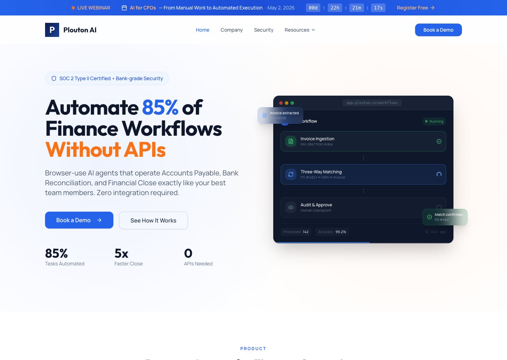

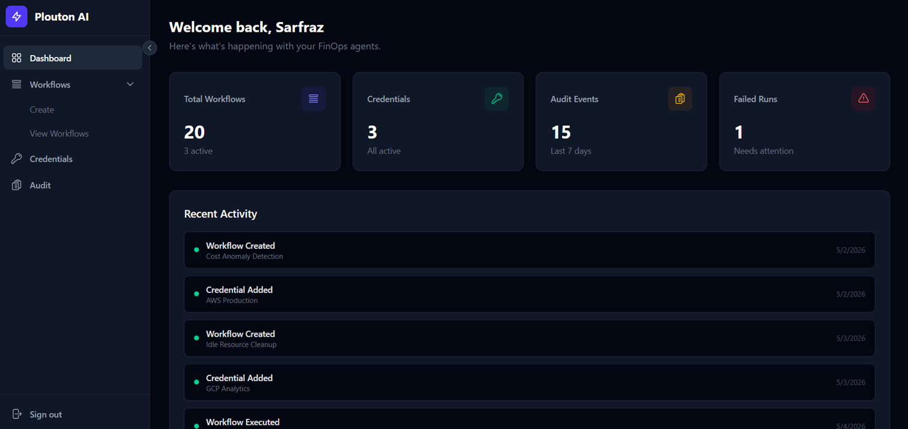

### 🎬 관련 영상
- [🎥 영상 보기](https://ph-files.imgix.net/6b0b5cb6-65e6-46b3-9f02-5a95afbf703d.jpeg?auto=format)

---

## 15. [Scroll Launch](https://www.producthunt.com/products/scroll-launch)
**Votes**: 83 | **도입 난이도**: 하 | **신뢰도**: 상
**Tagline**: Launch your product and get discovered by other makers
**서비스 링크**: https://www.producthunt.com/r/GZA6EWJLCDJJW2

**태그**: SaaS, Marketing, Launchpad, SEO

### 📌 이 서비스 한눈에 보기
인디 메이커와 SaaS 창업자를 위한 제품 런칭 및 초기 사용자 확보 플랫폼

### 🔑 주요 기능
- 제품 런칭 및 주간 랭킹 시스템 제공
- 고권위(High-DR) 백링크 확보를 통한 SEO 효과
- 수천 명의 초기 수용자(Early Adopters) 노출 기회

### 🙋 사용자에게 어떤 점이 좋은가
신규 제품을 출시하는 창업자가 초기 트래픽을 확보하고 검색 엔진 최적화에 도움을 받을 수 있습니다.

### ✅ 지금 바로 써볼 기능
- 제품 프로필 등록하기
- 주간 랭킹 진입 시도하기
- 백링크 활용 전략 세우기

### ⚠️ 사용 전 확인할 점
- 플랫폼 내 경쟁 심화로 인한 노출 제한 가능성
- 랭킹 시스템의 구체적인 알고리즘 미공개

### 🧭 확인이 더 필요한 정보
플랫폼의 구체적인 트래픽 규모와 실제 백링크의 품질에 대한 검증이 필요합니다.

### 📸 스크린샷 및 갤러리
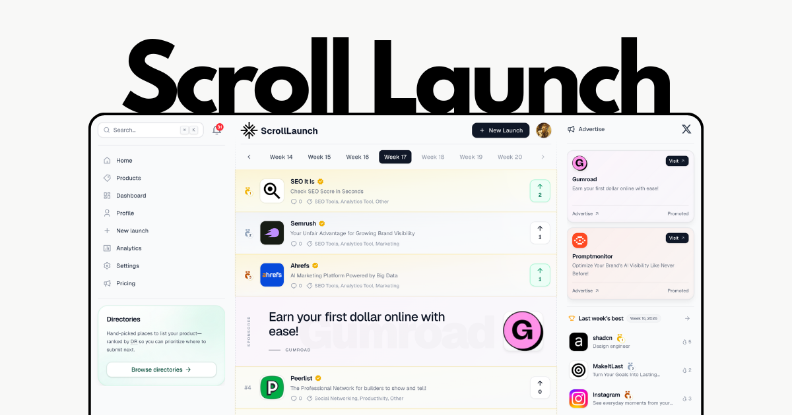
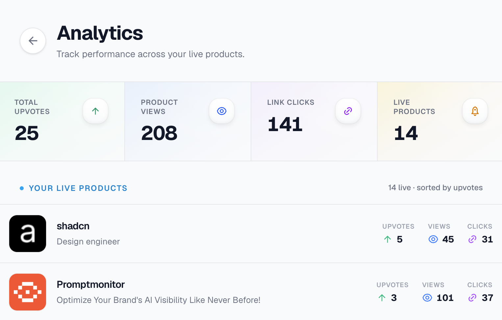
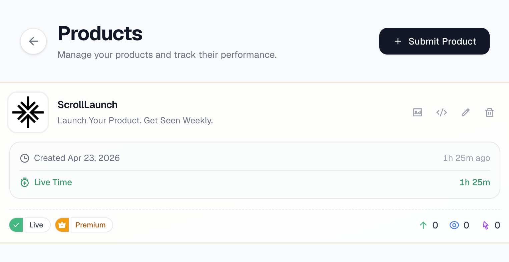

---

## 16. [onBeacon](https://www.producthunt.com/products/onbeacon)
**Votes**: 80 | **도입 난이도**: 하 | **신뢰도**: 상
**Tagline**: Your AI Growth PM, on call 24/7
**서비스 링크**: https://www.producthunt.com/r/RJL6755GM2XZSW

**태그**: GrowthTool, AI, ProductManagement, ABTesting, BehavioralScience, AI Tool

### 📌 이 서비스 한눈에 보기
행동 과학 원칙을 기반으로 제품 개선안과 A/B 테스트 변형을 즉시 제안하는 AI 성장 PM

### 🔑 주요 기능
- 230개 이상의 행동 과학 원칙을 적용한 제품 플로우 분석
- 사용자 이탈 방지 및 참여도 향상을 위한 구체적인 개선 가이드 제공
- 수주가 아닌 몇 분 만에 준비되는 A/B 테스트용 변형 시안 생성

### 🙋 사용자에게 어떤 점이 좋은가
데이터 분석과 전략 수립에 드는 시간을 획기적으로 줄여주며, 즉시 실행 가능한 실험 아이디어를 제공하여 제품 성장 속도를 높여줍니다.

### ✅ 지금 바로 써볼 기능
- 현재 제품의 사용자 플로우 분석하기
- 제안된 행동 과학 기반 개선안 검토하기
- 생성된 A/B 테스트 변형 시안 적용해보기

### ⚠️ 사용 전 확인할 점
- AI가 제안하는 실험안이 실제 제품의 맥락이나 브랜드 가이드라인과 일치하는지 확인 필요
- 제안된 변경 사항을 실제 제품에 반영하기 위한 개발 리소스 고려 필요

### 🧭 확인이 더 필요한 정보
분석을 위해 필요한 데이터 연동 방식 및 보안 정책에 대한 정보가 추가로 필요합니다.

### 📸 스크린샷 및 갤러리
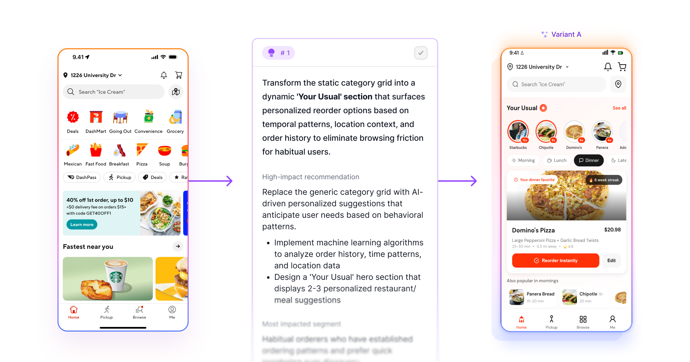
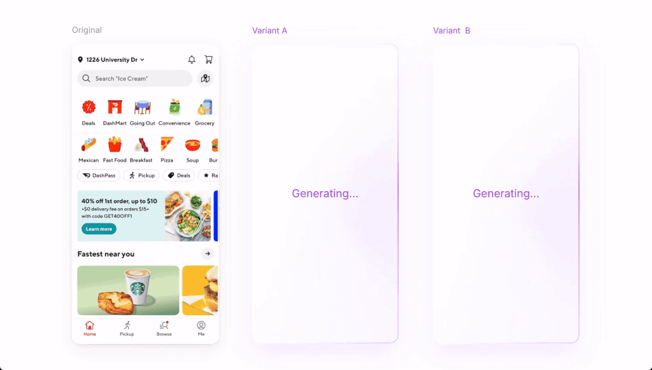
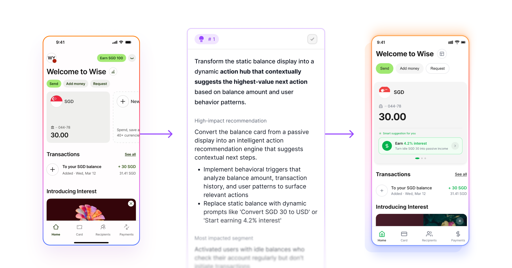

### 🎬 관련 영상
- [🎥 영상 보기](https://ph-files.imgix.net/ce808c42-b967-40f2-b9c4-32b4ed016b0c.gif?auto=format)

---

## 17. [Hoogly.ai](https://www.producthunt.com/products/hoogly)
**Votes**: 79 | **도입 난이도**: 하 | **신뢰도**: 상
**Tagline**: Turn employee voice into meaningful action using AI
**서비스 링크**: https://www.producthunt.com/r/TB5MXR4Q76PYGH

**태그**: HRTech, AI, EmployeeEngagement, Leadership, AI Tool

### 📌 이 서비스 한눈에 보기
AI 대화를 통해 직원의 목소리를 실질적인 리더십 액션으로 전환하는 인사 관리 솔루션

### 🔑 주요 기능
- 기존 설문조사의 느리고 형식적인 한계 극복
- 익명성이 보장된 AI 기반의 심층 대화 기능
- 수집된 인사이트를 리더를 위한 코칭 및 실행 계획으로 변환

### 🙋 사용자에게 어떤 점이 좋은가
단순한 데이터 수집을 넘어, 조직 내 문제를 실질적으로 해결할 수 있는 구체적인 가이드를 제공받을 수 있습니다.

### ✅ 지금 바로 써볼 기능
- AI 대화 인터페이스 체험하기
- 인사이트 리포트 생성 기능 확인하기
- 리더용 코칭 가이드 활용해보기

### ⚠️ 사용 전 확인할 점
- 익명성 보장 방식에 대한 기술적 신뢰도 확인 필요
- 조직 문화에 따른 AI 대화 수용도 차이

### 🧭 확인이 더 필요한 정보
구체적인 데이터 보안 프로토콜과 조직 규모별 확장성에 대한 정보가 추가로 필요합니다.

### 📸 스크린샷 및 갤러리

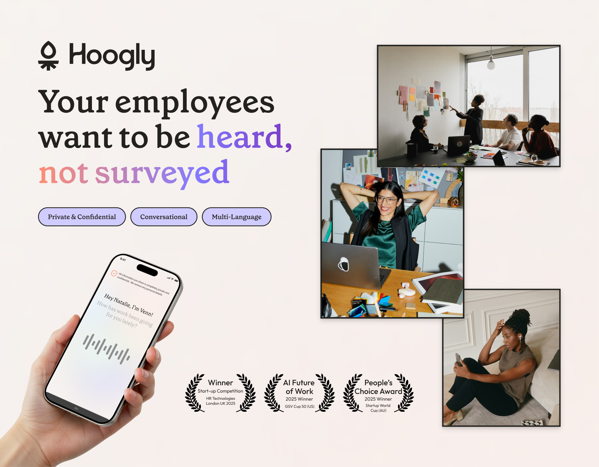
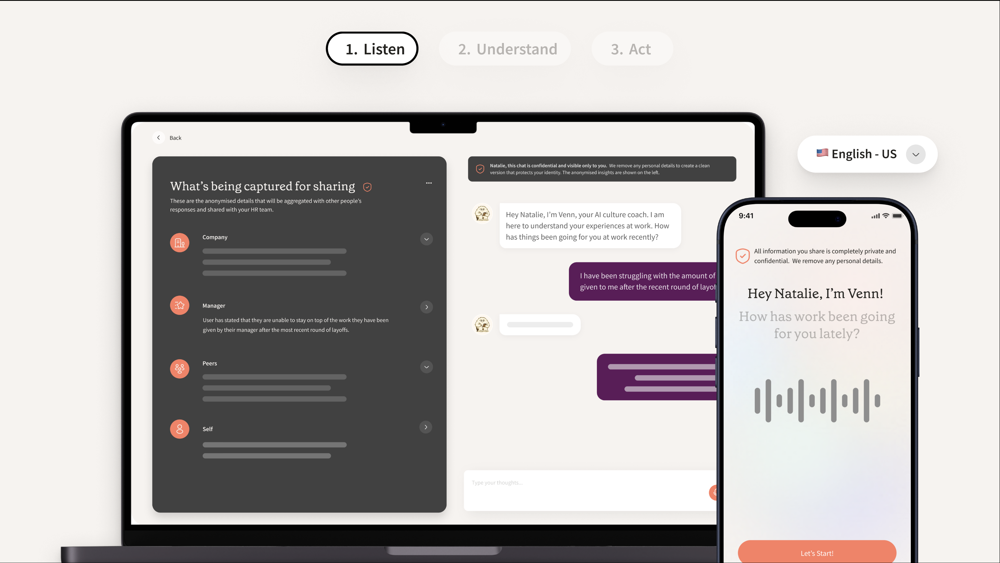

### 🎬 관련 영상
- [🎥 영상 보기](https://ph-files.imgix.net/52f93c11-e410-49cb-9b31-4dd78dbf8b37.jpeg?auto=format)

---

## 18. [Needle AI, Inc.](https://www.producthunt.com/products/needle-ai-inc)
**Votes**: 79 | **도입 난이도**: 중 | **신뢰도**: 상
**Tagline**: AI marketing team for ecommerce brands
**서비스 링크**: https://www.producthunt.com/r/YKPEZG4HOZN3FM

**태그**: Ecommerce, MarketingAutomation, AI, GrowthHacking, AI Tool, Marketing, Email

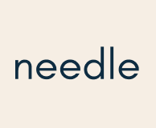

### 📌 이 서비스 한눈에 보기
AI와 전문가 검수를 결합하여 이커머스 브랜드의 마케팅 캠페인을 자동화하는 가상 마케팅 팀

### 🔑 주요 기능
- AI와 인간의 검수 프로세스를 결합한 하이브리드 운영 방식
- 캠페인 기획부터 광고 및 이메일 에셋 제작까지 통합 관리
- 대행사를 고용하는 것과 유사한 수준의 성장 워크플로우 제공

### 🙋 사용자에게 어떤 점이 좋은가
대행사를 고용하기에는 비용이 부담스럽지만 전문적인 마케팅 성과가 필요한 이커머스 운영자에게 효율적인 대안이 됩니다.

### ✅ 지금 바로 써볼 기능
- 브랜드 캠페인 기획 기능 테스트
- 광고 및 이메일 에셋 생성 기능 확인
- 워크플로우 자동화 수준 검토

### ⚠️ 사용 전 확인할 점
- AI와 인간 검수 프로세스 간의 작업 속도 및 품질 편차 확인 필요
- 브랜드 고유의 톤앤매너가 충분히 반영되는지 검증 필요

### 🧭 확인이 더 필요한 정보
구체적인 서비스 비용 체계와 인간 검수 인력의 개입 범위에 대한 정보가 필요합니다.

### 📸 스크린샷 및 갤러리
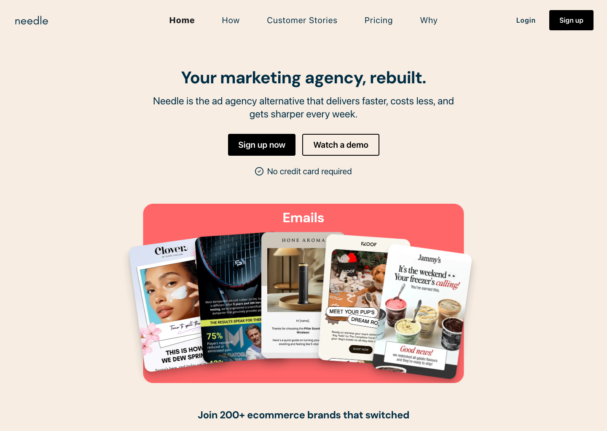

---

## 19. [Known Agents](https://www.producthunt.com/products/known-agents)
**Votes**: 79 | **도입 난이도**: 하 | **신뢰도**: 상
**Tagline**: Track the bots and AI agents crawling your website
**서비스 링크**: https://www.producthunt.com/r/K56IE2TRUY7CJD

**태그**: Analytics, AI, Bot-Detection, Web-Monitoring, Agent, AI Tool

### 📌 이 서비스 한눈에 보기
웹사이트를 방문하는 AI 에이전트와 봇의 활동을 실시간으로 추적하는 분석 도구

### 🔑 주요 기능
- 웹사이트 트래픽 중 상당수를 차지하는 AI 에이전트 및 스크래퍼 식별
- 봇이 주로 방문하는 페이지와 유입 경로에 대한 실시간 가시성 제공
- 봇이 어떤 인간 사용자를 통해 유입되었는지에 대한 관계 파악

### 🙋 사용자에게 어떤 점이 좋은가
AI 에이전트가 비즈니스 프로세스(구매, 문서 탐색 등)에 미치는 영향을 데이터로 확인하여 전략적인 대응이 가능합니다.

### ✅ 지금 바로 써볼 기능
- 현재 웹사이트 트래픽 중 봇의 비중 확인하기
- 주요 페이지에 대한 봇의 관심도 분석하기
- 봇의 유입 경로 및 참조 소스 파악하기

### ⚠️ 사용 전 확인할 점
- 봇의 활동이 실제 매출이나 비즈니스 성과로 이어지는지에 대한 직접적인 인과관계는 별도 분석 필요
- 실시간 데이터 제공 방식에 따른 서버 부하 여부 확인 필요

### 🧭 확인이 더 필요한 정보
구체적인 설치 방법(SDK, 스크립트 삽입 등)과 데이터 수집 방식에 대한 상세 정보가 필요합니다.

### 📸 스크린샷 및 갤러리
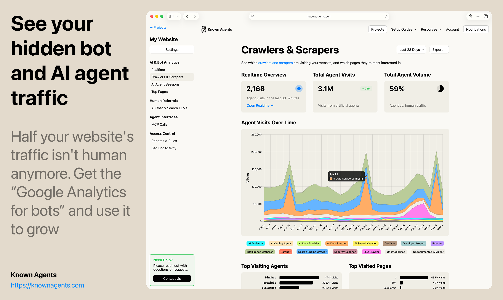
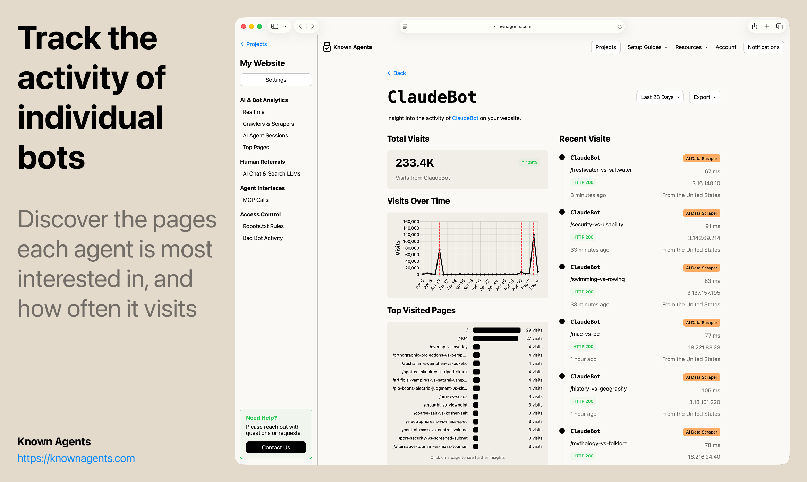
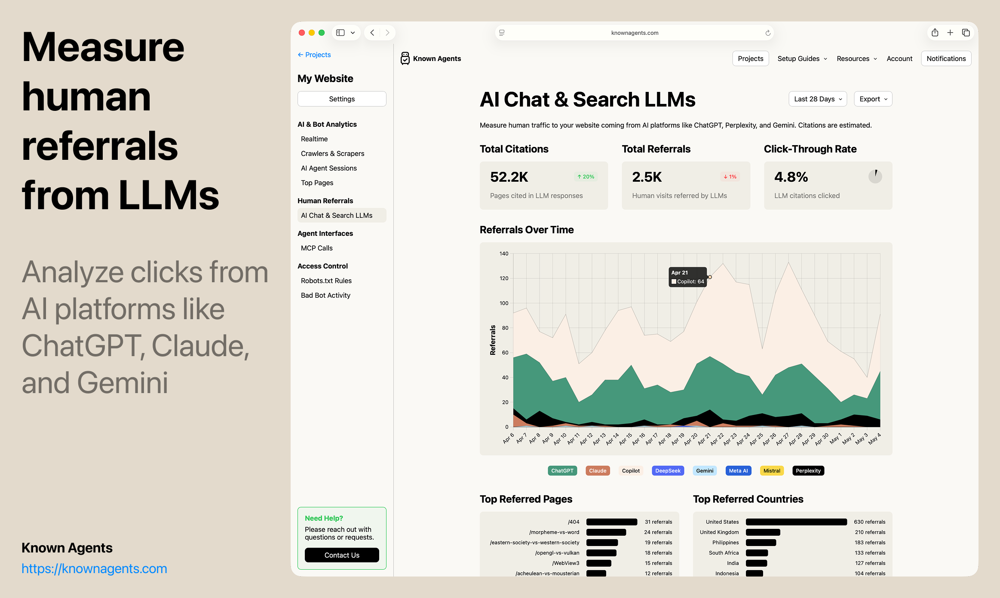

---

## 20. [Lexarius](https://www.producthunt.com/products/lexarius)
**Votes**: 78 | **도입 난이도**: 중 | **신뢰도**: 상
**Tagline**: AI roleplays for corporate learning teams
**서비스 링크**: https://www.producthunt.com/r/YTZAWRXSG3MQVX

**태그**: EdTech, AI Roleplay, Corporate Training, Skill Assessment, AI Tool, Sales

### 📌 이 서비스 한눈에 보기
실제 상황 같은 AI 시뮬레이션을 통해 영업 및 리더십 역량을 키우는 기업용 학습 플랫폼

### 🔑 주요 기능
- INSEAD 및 SC Ventures와 공동 개발된 전문적인 교육 커리큘럼 기반
- 영업, 리더십, 변화 관리 등 다양한 비즈니스 시나리오를 지원하는 다국어 AI 역할극
- 실시간 피드백, 즉각적인 스킬 점수 및 역량 기반 평가 제공

### 🙋 사용자에게 어떤 점이 좋은가
실제 업무 환경과 유사한 안전한 환경에서 실패에 대한 두려움 없이 대화 기술을 연습하고 객관적인 성과 지표를 확인할 수 있습니다.

### ✅ 지금 바로 써볼 기능
- 다양한 비즈니스 시나리오 테스트
- 실시간 피드백 및 스코어링 기능 확인
- 다국어 지원 수준 검토

### ⚠️ 사용 전 확인할 점
- 기업용 솔루션이므로 개별 사용자보다는 팀/조직 단위의 도입이 주 목적일 수 있음
- 시나리오의 현실성이 특정 산업군에 국한될 수 있는지 확인 필요

### 🧭 확인이 더 필요한 정보
구체적인 기업용 커스터마이징 범위와 도입 비용 체계에 대한 정보가 필요합니다.

### 📸 스크린샷 및 갤러리
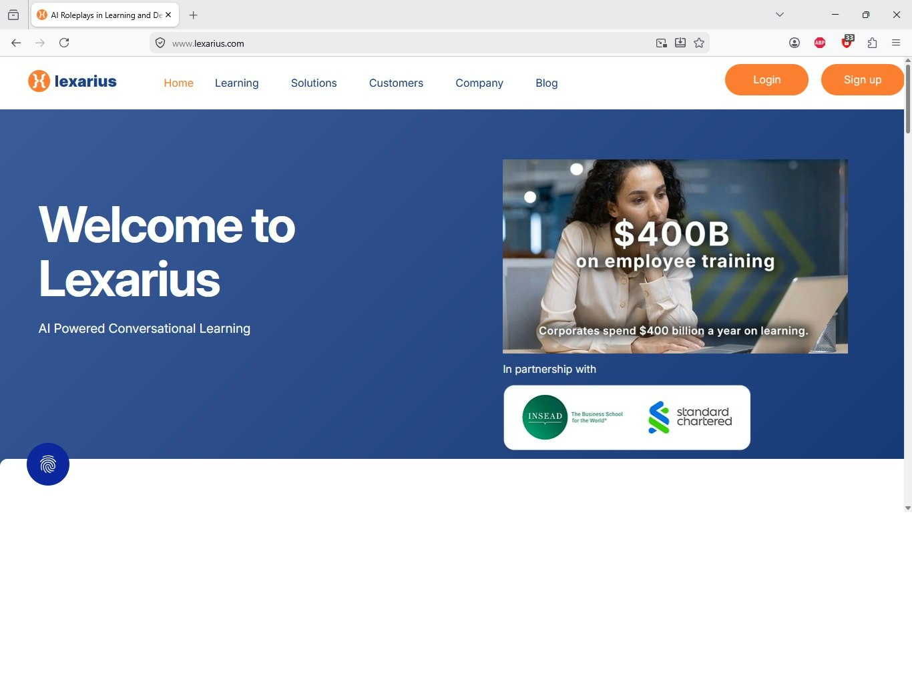
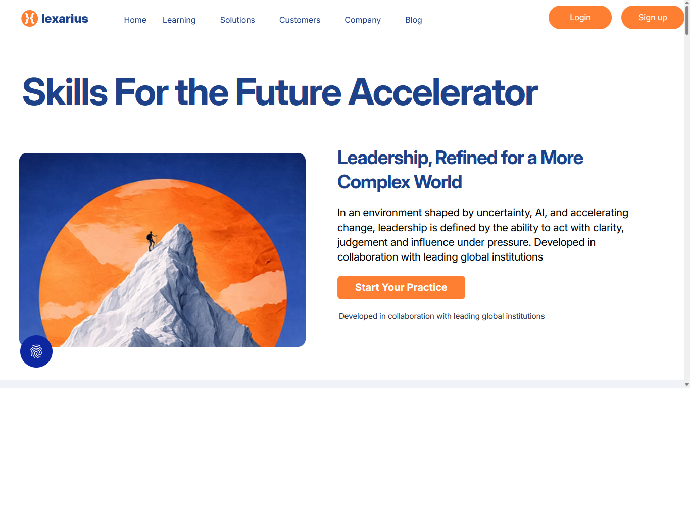
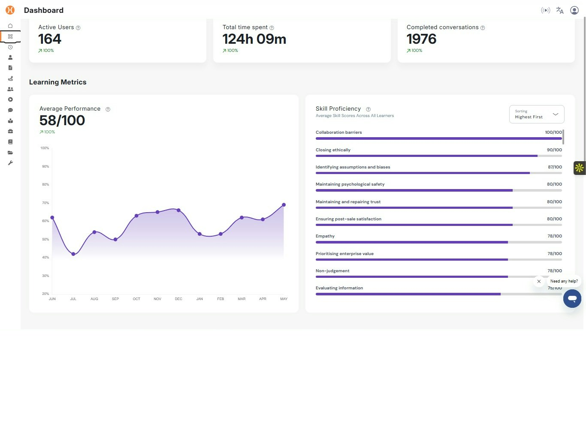

### 🎬 관련 영상
- [🎥 영상 보기](https://ph-files.imgix.net/5a137bad-8d46-42a5-b16e-7fc868818130.jpeg?auto=format)

---

## 21. [Belli](https://www.producthunt.com/products/belli)
**Votes**: 76 | **도입 난이도**: 상 | **신뢰도**: 상
**Tagline**: Cargo management software for airlines
**서비스 링크**: https://www.producthunt.com/r/GNQL2JG6XEZJ6A

**태그**: Logistics, Aviation, SaaS, Cloud-Native, Operations, Automation, AI Tool, API

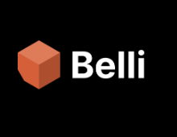

### 📌 이 서비스 한눈에 보기
항공사 화물 운영 전반을 디지털화하는 클라우드 기반 통합 관리 솔루션

### 🔑 주요 기능
- 적재 계획(Load Planning)부터 ULD 관리까지 화물 운영 전 과정 지원
- API 우선(API-first) 설계로 기존 시스템과의 유연한 연동 가능
- 항공 화물 업무(AWB, 통관, 결제 등)를 아우르는 클라우드 네이티브 소프트웨어

### 🙋 사용자에게 어떤 점이 좋은가
복잡한 항공 화물 워크플로우를 하나의 플랫폼에서 관리하여 운영 효율성을 높이고 현장 업무의 디지털 전환을 돕습니다.

### ✅ 지금 바로 써볼 기능
- 항공사 운영 워크플로우와 소프트웨어 기능 매칭 확인
- 기존 시스템과의 API 연동 가능성 검토
- 현장 운영팀을 위한 UI/UX 적합성 테스트

### ⚠️ 사용 전 확인할 점
- 항공 산업 특유의 복잡한 현장 프로세스 반영 여부 확인 필요
- 기존 레거시 시스템과의 통합 및 데이터 마이그레이션 난이도

### 🧭 확인이 더 필요한 정보
구체적인 온사이트(On-site) 구현 방식과 기존 시스템과의 통합 방식에 대한 상세 정보가 필요합니다.

### 📸 스크린샷 및 갤러리
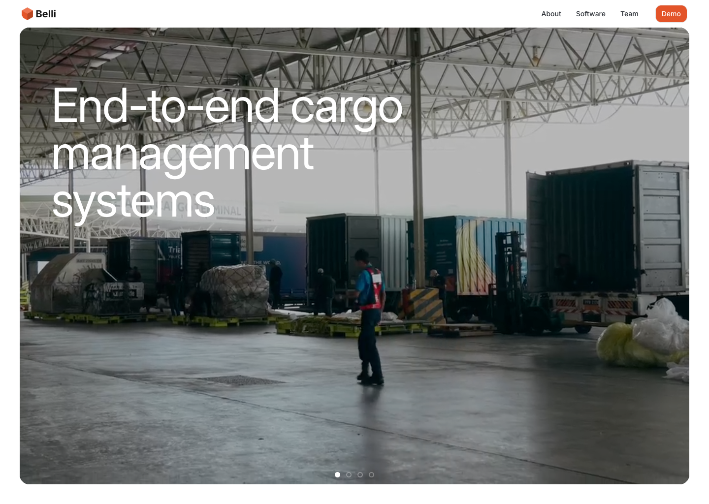

---

## 22. [Yeta AI](https://www.producthunt.com/products/yeta-ai)
**Votes**: 76 | **도입 난이도**: 하 | **신뢰도**: 상
**Tagline**: Real-time AI dubbing for any YouTube video
**서비스 링크**: https://www.producthunt.com/r/Q5Z5BIO3BYKFSK

**태그**: AI, Video, Productivity, Translation, AI Tool

### 📌 이 서비스 한눈에 보기
유튜브 링크만으로 실시간 AI 더빙을 제공하는 간편한 도구

### 🔑 주요 기능
- 유튜브 링크 입력만으로 즉시 더빙 생성
- 별도의 파일 업로드나 대기 시간 없는 실시간 처리
- 10개 이상의 언어를 지원하는 자연스러운 AI 음성

### 🙋 사용자에게 어떤 점이 좋은가
언어 장벽 없이 해외 유튜브 콘텐츠를 실시간으로 시청할 수 있어 정보 습득 속도를 높여줍니다.

### ✅ 지금 바로 써볼 기능
- 관심 있는 유튜브 영상 링크 복사하기
- 원하는 언어 선택하여 실시간 더빙 체험하기
- 무료 버전으로 음성 품질 테스트하기

### ⚠️ 사용 전 확인할 점
- 실시간 처리 방식에 따른 네트워크 환경 영향 가능성
- 무료 사용 범위 및 유료 전환 시 기능 제한 확인 필요

### 🧭 확인이 더 필요한 정보
무료 제공 범위와 유료 플랜의 구체적인 차이점에 대한 정보가 명시되지 않았습니다.

### 📸 스크린샷 및 갤러리

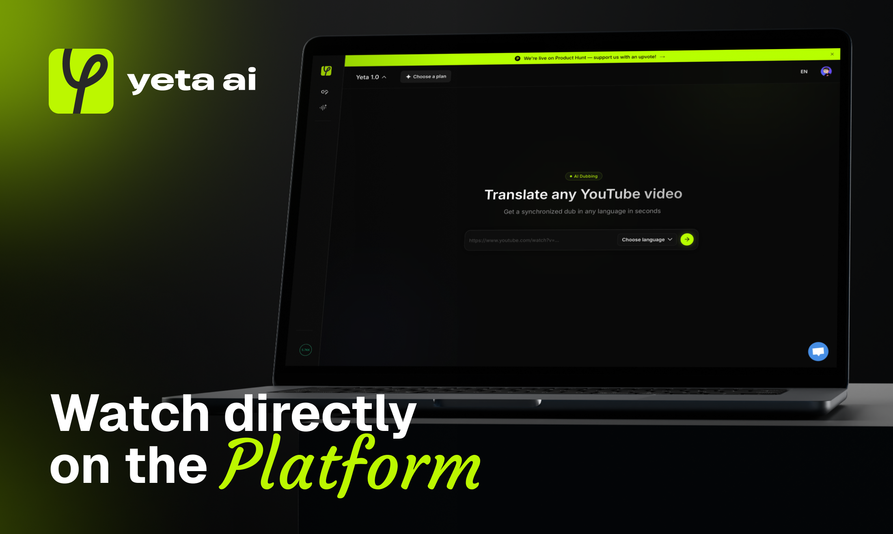

### 🎬 관련 영상
- [🎥 영상 보기](https://ph-files.imgix.net/bd27a762-573f-479e-bee3-de6555300569.jpeg?auto=format)

---

## 23. [LinCal](https://www.producthunt.com/products/lincal)
**Votes**: 74 | **도입 난이도**: 하 | **신뢰도**: 상
**Tagline**: See your team's work on a Linear-like calendar
**서비스 링크**: https://www.producthunt.com/r/4U6RHAOTKCL7TY

**태그**: Productivity, Project Management, Calendar, Teamwork, AI Tool

### 📌 이 서비스 한눈에 보기
Linear 스타일의 직관적인 캘린더로 팀의 업무 일정을 한눈에 관리하세요.

### 🔑 주요 기능
- 날짜 기반의 시각적인 업무 레이아웃 제공
- 드래그 앤 드롭을 통한 간편한 일정 재조정
- 필터 기능을 통한 개인별/목적별 뷰 최적화

### 🙋 사용자에게 어떤 점이 좋은가
팀의 전체 업무 흐름을 타임라인 형태로 파악할 수 있어 일정 충돌을 방지하고 업무 우선순위를 조정하기 쉽습니다.

### ✅ 지금 바로 써볼 기능
- 드래그 기능을 이용해 일정 변경해보기
- 필터 기능을 활용해 내 업무만 모아보기
- 팀원들에게 공유 뷰로 일정 확인하기

### ⚠️ 사용 전 확인할 점
- 기존 협업 툴(Linear 등)과의 연동 여부 확인 필요
- 단순 뷰어 기능인지 직접적인 작업 관리 기능인지 확인 필요

### 🧭 확인이 더 필요한 정보
현재 제공되는 기능이 단순 시각화 도구인지, 아니면 기존 워크플로우를 대체할 수 있는 관리 도구인지 확인이 필요합니다.

### 📸 스크린샷 및 갤러리
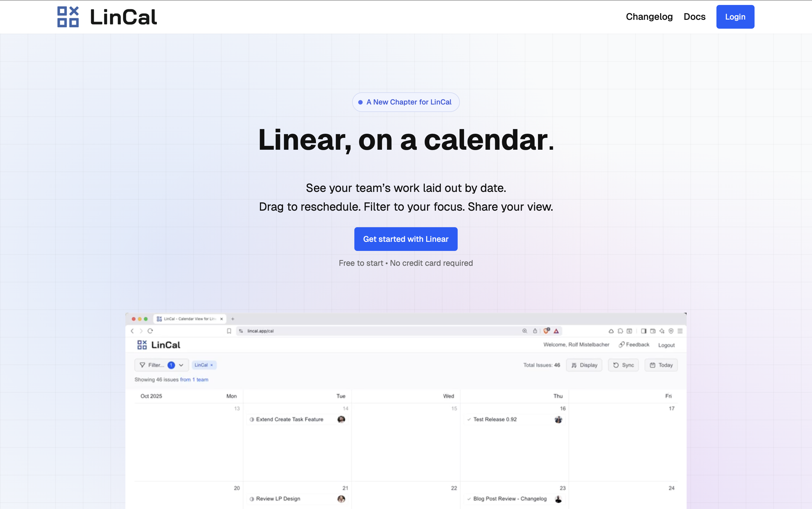
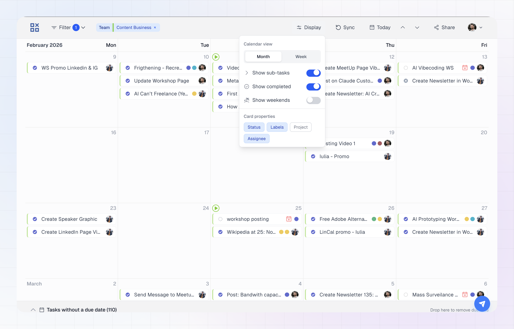
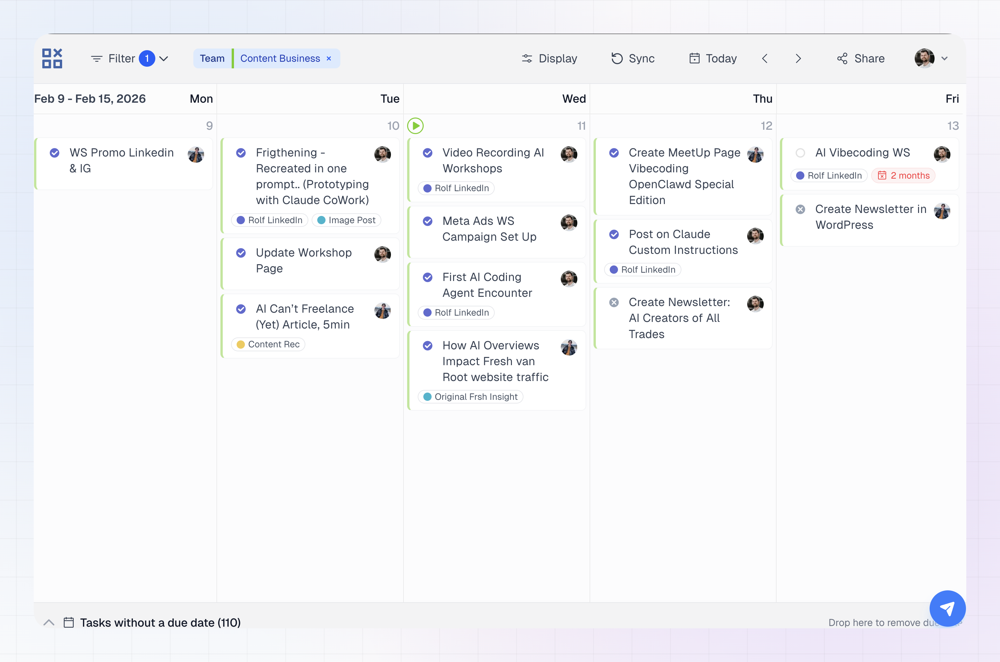

---

## 24. [Spacely AI](https://www.producthunt.com/products/spacely-ai)
**Votes**: 73 | **도입 난이도**: 하 | **신뢰도**: 상
**Tagline**: AI room rendering for interior design teams
**서비스 링크**: https://www.producthunt.com/r/7QDGL3HXSU2LKA

**태그**: Design, AI, Interior, Visualization, AI Tool

### 📌 이 서비스 한눈에 보기
스케치와 사진을 실사급 인테리어 렌더링으로 변환하는 AI 디자인 도구

### 🔑 주요 기능
- 스케치, 사진, 3D 컨셉을 고해상도 실사 이미지로 변환
- 레이아웃, 조명, 가구 배치를 몇 분 만에 신속하게 수정 가능
- 인테리어 디자인 팀의 작업 시간을 단축하는 워크플로우 제공

### 🙋 사용자에게 어떤 점이 좋은가
디자인 초기 단계에서 아이디어를 시각화하는 시간을 획기적으로 줄여주며, 고객에게 빠른 피드백을 제공할 수 있습니다.

### ✅ 지금 바로 써볼 기능
- 기존 스케치를 업로드하여 실사 렌더링 결과 확인하기
- 방 사진을 활용해 가구 및 조명 스타일 변경해보기
- 3D 컨셉 이미지를 고퀄리티 렌더링으로 변환하기

### ⚠️ 사용 전 확인할 점
- AI 생성 이미지 특성상 실제 시공 가능 여부나 정확한 치수 확인 필요
- 복잡한 구조의 공간에서는 렌더링 정확도가 달라질 수 있음

### 🧭 확인이 더 필요한 정보
구체적인 렌더링 해상도 및 정밀한 치수 제어 기능 포함 여부는 추가 확인이 필요합니다.

### 📸 스크린샷 및 갤러리
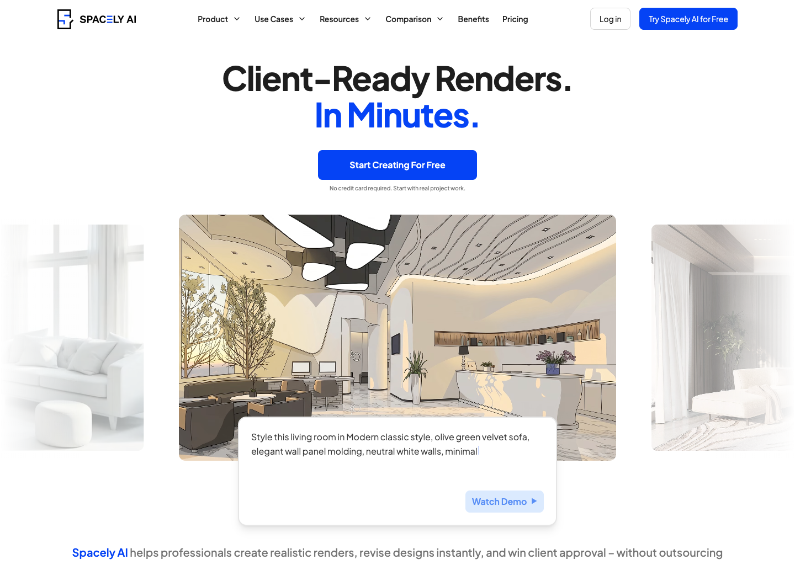

---

## 25. [Connector.wtf](https://www.producthunt.com/products/connector-wtf)
**Votes**: 69 | **도입 난이도**: 하 | **신뢰도**: 상
**Tagline**: Plug Google Ads, Meta & LinkedIn into your AI chat. Free
**서비스 링크**: https://www.producthunt.com/r/MOIAXLLVMOYEF7

**태그**: AI-Integration, Marketing-Automation, Data-Analytics, MCP, AI Tool, Chat

### 📌 이 서비스 한눈에 보기
광고 계정 데이터를 AI 채팅창에 직접 연결하여 CSV 추출 없이 즉시 분석하는 MCP 서버

### 🔑 주요 기능
- Google, Meta, LinkedIn 광고 데이터를 ChatGPT 및 Claude와 직접 연동
- MCP(Model Context Protocol) 서버 방식으로 데이터 읽기 전용 연결 제공
- 번거로운 CSV 파일 내보내기 및 업로드 과정 생략

### 🙋 사용자에게 어떤 점이 좋은가
광고 성과 데이터를 일일이 다운로드하여 AI에 업로드할 필요 없이, 채팅창 내에서 즉각적인 데이터 분석과 인사이트 도출이 가능합니다.

### ✅ 지금 바로 써볼 기능
- Claude 또는 ChatGPT에 MCP 서버 설정하기
- 연결된 광고 계정 데이터로 성과 분석 질문하기
- 추가될 새로운 광고 플랫폼 커넥터 확인하기

### ⚠️ 사용 전 확인할 점
- 읽기 전용(Read-only) 서버이므로 AI를 통한 광고 설정 변경은 불가함
- 현재 지원되는 플랫폼(Google, Meta, LinkedIn) 외에는 기능 제한적

### 🧭 확인이 더 필요한 정보
사용자의 개인정보 및 광고 데이터 보안 정책에 대한 상세 내용을 확인해야 합니다.

### 📸 스크린샷 및 갤러리
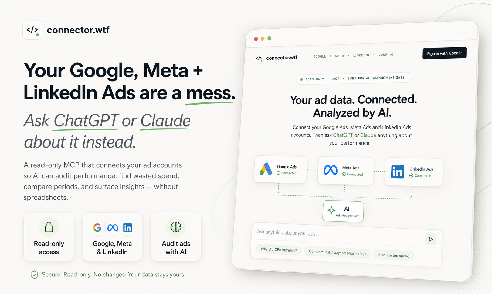
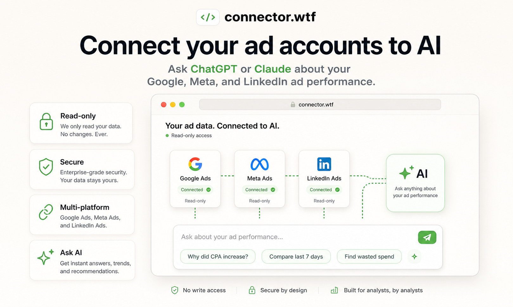
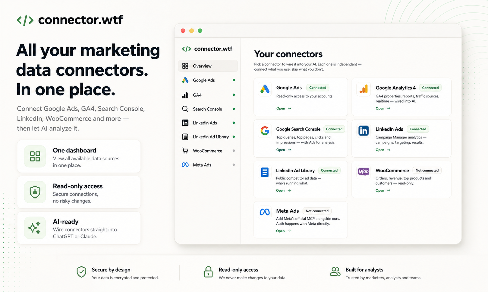

---

## 26. [Ailytics](https://www.producthunt.com/products/ailyssa)
**Votes**: 69 | **도입 난이도**: 중 | **신뢰도**: 상
**Tagline**: Vision Intelligence For Heavy Industries
**서비스 링크**: https://www.producthunt.com/r/4AQEG72LJIANJX

**태그**: AI, ComputerVision, IndustrialTech, Safety, Analytics, AI Tool, Productivity

### 📌 이 서비스 한눈에 보기
기존 카메라 인프라를 활용해 중공업 현장의 안전과 생산성을 높이는 AI 비전 지능 플랫폼

### 🔑 주요 기능
- 기존 카메라 인프라를 지능형 AI 시스템으로 전환
- 중공업 분야에 특화된 실시간 시각 데이터 분석
- 현장 안전 및 운영 효율성 향상을 위한 인사이트 제공

### 🙋 사용자에게 어떤 점이 좋은가
새로운 장비 도입 없이 기존 카메라를 활용해 현장의 위험 요소를 감지하고 운영 효율을 즉각적으로 개선할 수 있습니다.

### ✅ 지금 바로 써볼 기능
- 현재 보유 중인 카메라 인프라 호환성 확인
- 현장별 맞춤형 AI 분석 시나리오 설정
- 실시간 알림 및 대시보드 연동 테스트

### ⚠️ 사용 전 확인할 점
- 기존 카메라의 화질 및 설치 위치에 따른 분석 정확도 차이
- 현장 네트워크 환경에 따른 실시간 데이터 전송 안정성

### 🧭 확인이 더 필요한 정보
구체적인 하드웨어 호환성 범위와 산업별 특화 알고리즘의 종류에 대한 확인이 필요합니다.

### 📸 스크린샷 및 갤러리
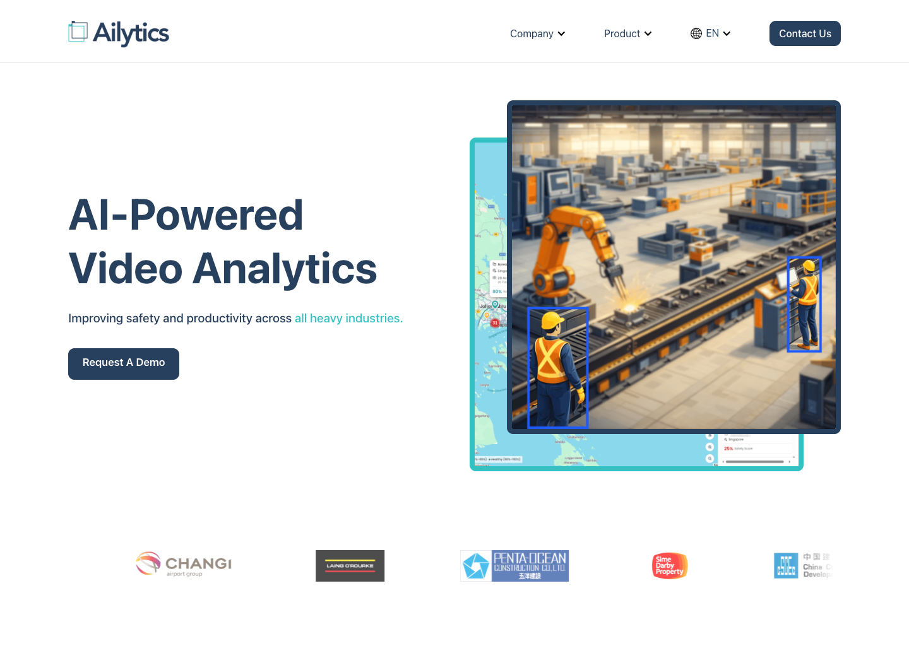
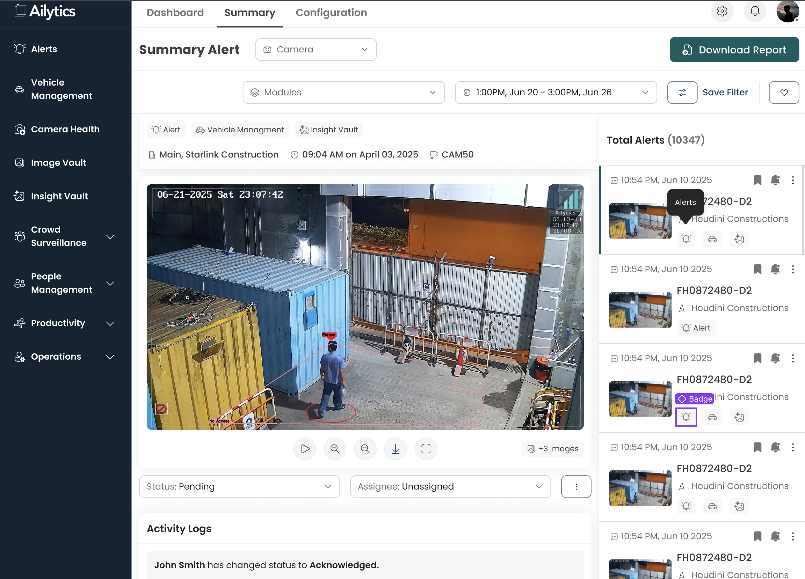
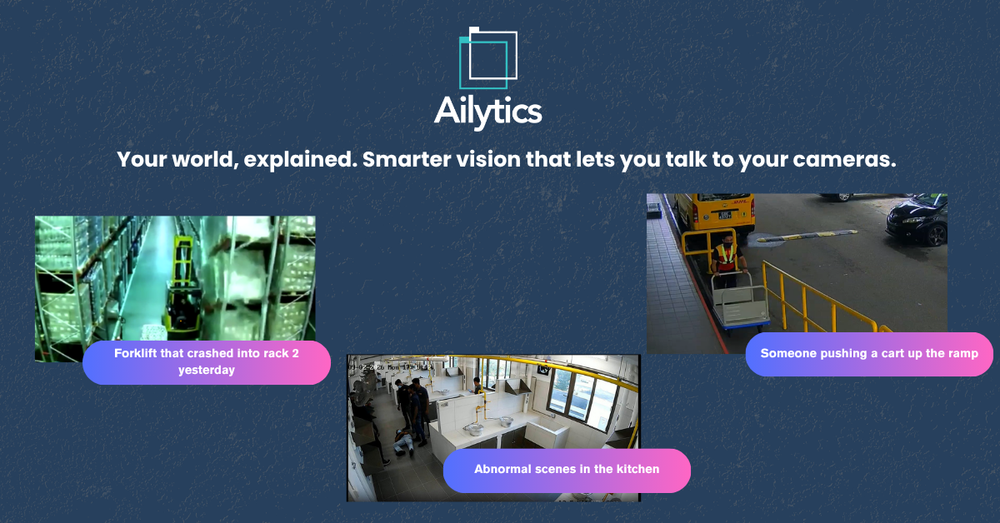

### 🎬 관련 영상
- [🎥 영상 보기](https://ph-files.imgix.net/5257a86b-9430-48d8-b974-d53a03c4eb32.jpeg?auto=format)

---

## 27. [Infiuss Health](https://www.producthunt.com/products/infiuss-health)
**Votes**: 68 | **도입 난이도**: 상 | **신뢰도**: 중
**Tagline**: Digital patient twins for clinical research
**서비스 링크**: https://www.producthunt.com/r/VTAOYAGHVF5GPF

**태그**: HealthTech, DigitalTwin, ClinicalResearch, PrecisionMedicine, DataAnalytics, Automation

### 📌 이 서비스 한눈에 보기
디지털 트윈 기술을 활용해 임상 시험 결과를 시뮬레이션하고 정밀 의료를 지원하는 데이터 플랫폼

### 🔑 주요 기능
- 디지털 환자 트윈 모델링을 통한 임상 결과 시뮬레이션
- 분산된 건강 데이터의 통합 관리
- 임상 연구 계획 및 정밀 의료 워크플로우 지원

### 🙋 사용자에게 어떤 점이 좋은가
임상 연구 설계 단계에서 발생할 수 있는 변수를 미리 예측하여 연구의 효율성을 높이고 데이터 기반의 의사결정을 돕습니다.

### ✅ 지금 바로 써볼 기능
- 디지털 트윈 시뮬레이션 모델링 기능 확인
- 데이터 통합 및 정합성 검증
- 연구 계획 수립 워크플로우 적용

### ⚠️ 사용 전 확인할 점
- 시뮬레이션 결과의 실제 임상 적용 시 정확도 검증 필요
- 민감한 의료 데이터 취급에 따른 보안 및 규제 준수 여부 확인

### 🧭 확인이 더 필요한 정보
실제 임상 현장에서의 데이터 보안 규정 준수 여부와 시뮬레이션 모델의 정확도 지표에 대한 추가 정보가 필요합니다.

### 📸 스크린샷 및 갤러리
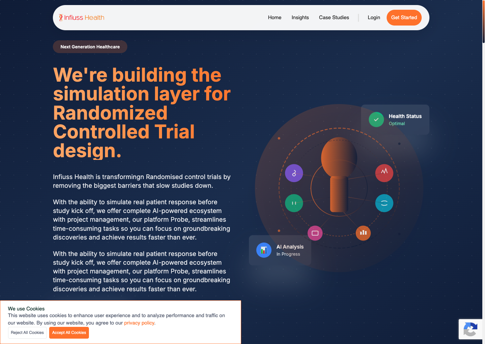

---

## 28. [Zeya Health](https://www.producthunt.com/products/zeya-health)
**Votes**: 67 | **도입 난이도**: 중 | **신뢰도**: 상
**Tagline**: AI clinic admin for WhatsApp and EMR
**서비스 링크**: https://www.producthunt.com/r/VSBI2GTNRVE6YN

**태그**: HealthTech, Automation, AI, SaaS, AI Tool

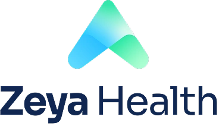

### 📌 이 서비스 한눈에 보기
WhatsApp과 EMR을 연동하여 병원 행정 업무를 자동화하는 AI 클리닉 어드민

### 🔑 주요 기능
- WhatsApp과 기존 EMR 시스템 간의 원활한 데이터 연동
- 예약, 변경, 리마인더, 사후 관리 등 반복적인 행정 업무 자동화
- 기존 워크플로우를 유지하면서 프런트 데스크 업무량 감소 및 매출 공백 방지

### 🙋 사용자에게 어떤 점이 좋은가
병원 직원이 수동으로 처리하던 예약 및 고객 응대 업무를 자동화하여 업무 효율을 높이고, 예약 취소로 인한 손실을 최소화할 수 있습니다.

### ✅ 지금 바로 써볼 기능
- 현재 사용 중인 EMR과의 연동 가능 여부 확인
- WhatsApp 자동 응답 시나리오 설정
- 예약 관리 및 리마인더 자동화 기능 테스트

### ⚠️ 사용 전 확인할 점
- 기존 EMR 시스템과의 기술적 호환성 확인 필요
- 환자의 개인정보 및 의료 데이터 보안 규정 준수 여부 검토

### 🧭 확인이 더 필요한 정보
현재 사용 중인 특정 EMR 시스템과의 구체적인 연동 방식과 보안 인증 수준에 대한 정보가 필요합니다.

### 📸 스크린샷 및 갤러리
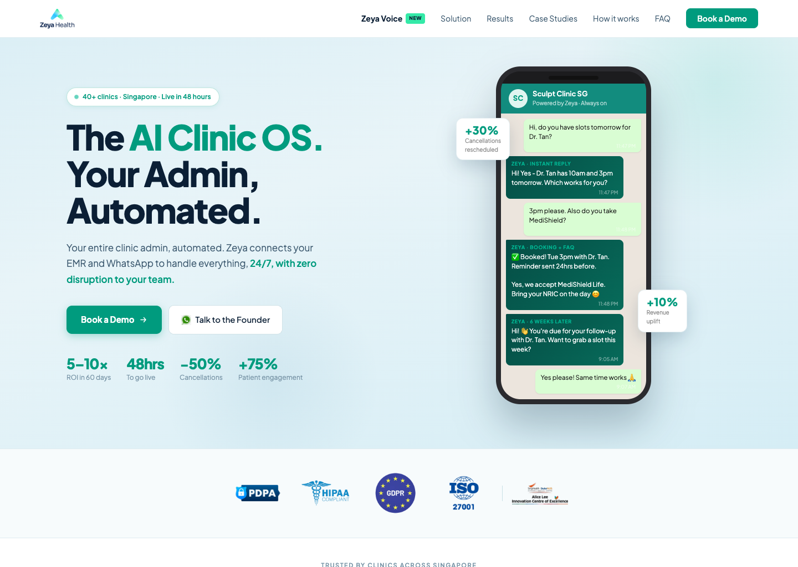

---

## 29. [Betterteem](https://www.producthunt.com/products/betterteem)
**Votes**: 67 | **도입 난이도**: 중 | **신뢰도**: 상
**Tagline**: AI attrition forecasting for workforce teams
**서비스 링크**: https://www.producthunt.com/r/PXQO356PU7Q7QF

**태그**: HRTech, AI, Analytics, WorkforceManagement, AI Tool

### 📌 이 서비스 한눈에 보기
AI 기반 퇴사 예측을 통해 인력 손실 리스크를 관리하고 조직 안정성을 높이는 솔루션

### 🔑 주요 기능
- AI를 활용한 직원 퇴사 위험 예측
- 퇴사로 인한 재무적 손실 규모 수치화
- 인재 유지 및 운영 안정을 위한 맞춤형 개입 방안 제안

### 🙋 사용자에게 어떤 점이 좋은가
대규모 조직에서 인력 이탈로 인한 비용과 운영 차질을 사전에 방지하고 전략적인 인재 관리 계획을 세울 수 있습니다.

### ✅ 지금 바로 써볼 기능
- 퇴사 위험 예측 모델 테스트
- 재무적 노출도(Financial Exposure) 분석
- 권장 개입 전략 검토

### ⚠️ 사용 전 확인할 점
- AI 예측의 정확도 및 데이터 편향성 확인 필요
- 민감한 인사 데이터 보안 및 개인정보 보호 정책 검토

### 🧭 확인이 더 필요한 정보
구체적인 데이터 연동 방식과 예측 모델의 알고리즘 신뢰도에 대한 정보가 추가로 필요합니다.

### 📸 스크린샷 및 갤러리
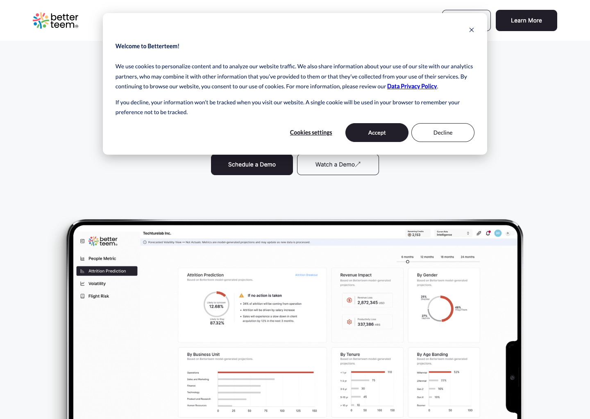

---

## 30. [Hyarks](https://www.producthunt.com/products/hyarks)
**Votes**: 67 | **도입 난이도**: 상 | **신뢰도**: 중
**Tagline**: The Ocean Marketplace for Commercial Fishing
**서비스 링크**: https://www.producthunt.com/r/3XIIZ4AX57R2U5

**태그**: MaritimeTech, Robotics, AgTech, Marketplace, AI Tool

### 📌 이 서비스 한눈에 보기
로봇 선박 기술을 통해 어업의 탐색 비용을 혁신적으로 절감하는 해양 마켓플레이스

### 🔑 주요 기능
- 다중 도메인 로봇 선박을 활용한 효율적인 어군 탐색
- 탐색 비용을 최소화하여 어업 효율성 극대화
- 탐색부터 판매까지 연결되는 통합 해양 마켓플레이스 구축

### 🙋 사용자에게 어떤 점이 좋은가
어업 종사자가 불필요한 연료 소모와 탐색 시간을 줄이고, 실제 어획에만 집중할 수 있도록 돕습니다.

### ✅ 지금 바로 써볼 기능
- 로봇 선박의 탐색 정확도 및 효율성 데이터 확인
- 기존 어선과의 연동 및 운영 방식 검토
- 마켓플레이스 내 판매 프로세스 이해

### ⚠️ 사용 전 확인할 점
- 하드웨어(로봇 선박) 기반 서비스로 초기 도입 비용 및 운영 복잡성 존재
- 실제 해상 환경에서의 로봇 운용 안정성 확인 필요

### 🧭 확인이 더 필요한 정보
로봇 선박의 구체적인 사양과 실제 어업 현장 적용 사례에 대한 정보가 더 필요합니다.

### 📸 스크린샷 및 갤러리
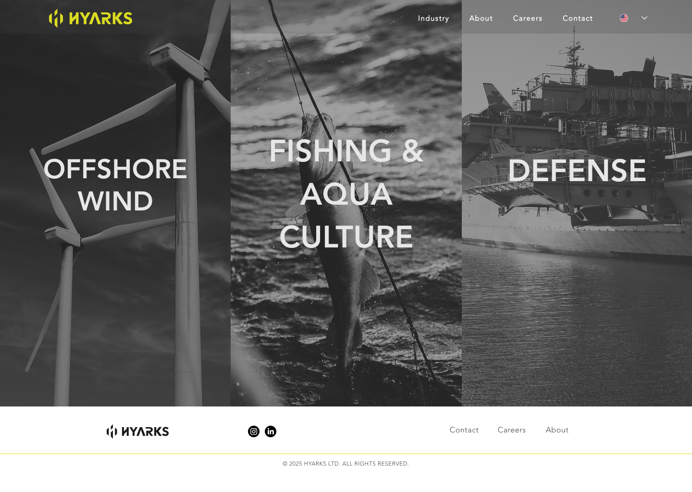
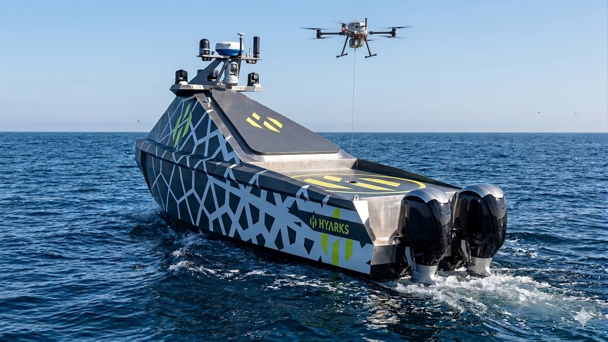

---

