# 🚀 Product Hunt Daily Top 30 (2026-05-13)

## 오늘의 요약
오늘의 트렌드는 AI 에이전트를 활용한 개발 및 업무 자동화, 그리고 AI 검색 엔진 시대에 맞춘 새로운 SEO와 웹 구축 방식이 주를 이루었습니다. 특히 기존의 복잡한 프로세스를 단순화하거나, AI와 협업하여 결과물을 즉시 배포하고 관리하는 실용적인 도구들이 주목받았습니다.

### 오늘의 핵심 포인트
- AI 에이전트를 활용해 실제 SaaS를 구축하거나 폼을 생성하는 등 개발 및 업무 생산성을 극대화하는 도구들이 등장했습니다.
- 결제 시스템의 종속성을 탈피하거나 보안 인증을 결합한 배포 환경을 제공하는 등 운영 효율성과 보안을 동시에 잡는 솔루션이 눈에 띕니다.
- 기존의 검색 엔진 최적화를 넘어 AI 답변 엔진에 최적화된 새로운 방식의 SEO와 디자인 복제형 웹 빌더가 주목받고 있습니다.

**오늘의 태그**: AI 에이전트, SaaS 빌더, 자동화, AI SEO, 결제 솔루션

## 1. [Kelviq](https://www.producthunt.com/products/kelviq)
**Votes**: 370 | **도입 난이도**: 중 | **신뢰도**: 상
**Tagline**: Payments, tax, and billing for SaaS & AI companies
**서비스 링크**: https://www.producthunt.com/r/F6U3WKKQYBLXSI

**태그**: SaaS, Fintech, Billing, AI-Tools, Automation, AI Tool

### 📌 이 서비스 한눈에 보기
SaaS 및 AI 기업을 위한 결제, 세금, 구독 관리를 통합 제공하는 올인원 수익화 플랫폼

### 🔑 주요 기능
- 결제, 글로벌 세금, 구독 및 사용량 기반 과금 통합 관리
- 디지털 제품 전달 및 라이선스 키 관리 기능 포함
- 트랜잭션당 3.5% + 40¢의 수수료 체계

### 🙋 사용자에게 어떤 점이 좋은가
복잡한 글로벌 결제와 세금 문제를 하나의 플랫폼에서 해결하여 운영 효율성을 높이고 규제 준수 부담을 줄여줍니다.

### ✅ 지금 바로 써볼 기능
- 사용량 기반 과금(Usage-based billing) 설정 테스트
- 글로벌 세금 및 컴플라이언스 기능 확인
- 디지털 라이선스 키 발급 프로세스 검토

### ⚠️ 사용 전 확인할 점
- 트랜잭션당 발생하는 수수료율이 비즈니스 모델에 적합한지 검토 필요
- 기존 결제 게이트웨이(PG)와의 연동 방식 확인 필요

### 🧭 확인이 더 필요한 정보
현재 제공되는 구체적인 통합 가능 서비스 목록과 지역별 세금 지원 범위에 대한 확인이 필요합니다.

### 📸 스크린샷 및 갤러리
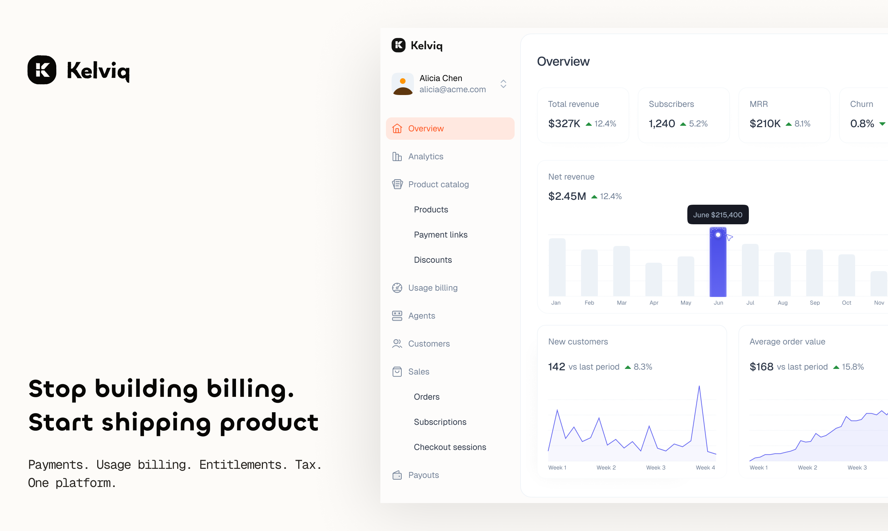
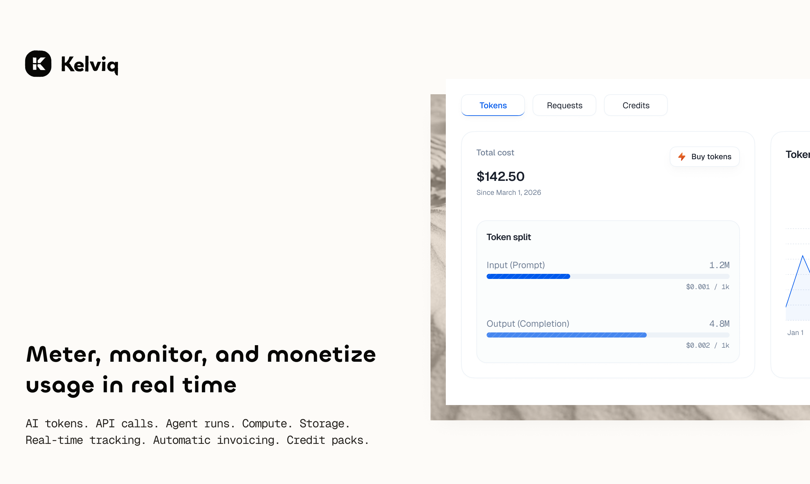

### 🎬 관련 영상
- [🎥 영상 보기](https://ph-files.imgix.net/37fc6879-5210-42b5-a987-dfb26a4d79d8.jpeg?auto=format)

---

## 2. [Open Vibe](https://www.producthunt.com/products/open-vibe)
**Votes**: 209 | **도입 난이도**: 중 | **신뢰도**: 상
**Tagline**: Ship your SaaS with AI, without getting stuck
**서비스 링크**: https://www.producthunt.com/r/74MX3XTFNJVI5S

**태그**: DevTool, AI, SaaS, Learning, Agent, AI Tool

### 📌 이 서비스 한눈에 보기
AI 에이전트를 활용해 실제 SaaS를 구축하며 프로 개발자의 기술을 습득하는 학습형 빌더 도구

### 🔑 주요 기능
- Claude Code 등 AI 에이전트를 SaaS 개발 튜터로 변환
- 단순 코딩을 넘어 실무적인 개발 개념 학습 병행
- 실제 작동하는 SaaS 애플리케이션 구축 경험 제공

### 🙋 사용자에게 어떤 점이 좋은가
단순히 코드를 복사하는 것이 아니라, AI와 함께 협업하며 실질적인 개발 역량을 키우면서 동시에 결과물을 만들어낼 수 있습니다.

### ✅ 지금 바로 써볼 기능
- AI 에이전트(Claude Code 등) 연동 설정하기
- 만들고 싶은 SaaS 아이디어 구체화하기
- 학습 모드를 활용해 코드 구조 이해하기

### ⚠️ 사용 전 확인할 점
- AI 에이전트 사용에 따른 별도의 API 비용 발생 가능성
- 학습과 개발 사이의 균형 조절 필요

### 🧭 확인이 더 필요한 정보
지원하는 AI 에이전트의 종류와 구체적인 학습 커리큘럼 방식에 대한 상세 정보가 필요합니다.

### 📸 스크린샷 및 갤러리
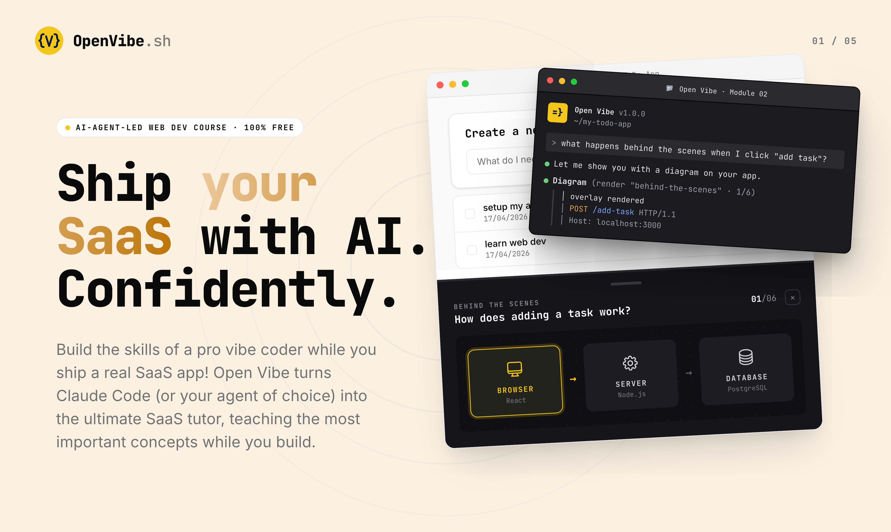
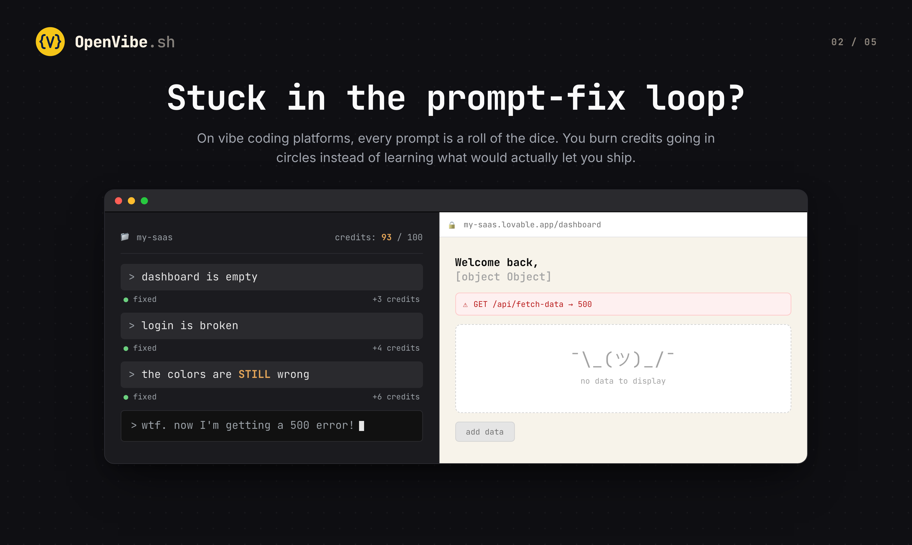
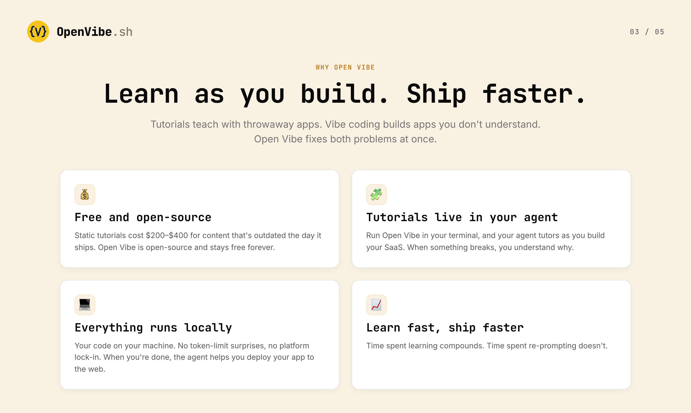

### 🎬 관련 영상
- [🎥 영상 보기](https://ph-files.imgix.net/a4d6f0f3-20aa-4136-be0b-e3d6ad1e7581.jpeg?auto=format)

---

## 3. [Hyperswitch Prism](https://www.producthunt.com/products/hyperswitch-2)
**Votes**: 170 | **도입 난이도**: 하 | **신뢰도**: 상
**Tagline**: Library to plug-n-switch payment processors
**서비스 링크**: https://www.producthunt.com/r/2U7NQ3R7UBKMGD

**태그**: DevTool, Fintech, Backend, SDK, AI Tool

### 📌 이 서비스 한눈에 보기
코드 몇 줄로 결제 대행사(PSP)를 자유롭게 교체하고 관리할 수 있는 무상태 결제 라이브러리

### 🔑 주요 기능
- 한 번의 통합으로 여러 결제 프로세서를 선택 및 전환 가능
- 장애 대비를 위한 폴백(Fallback) 및 라우팅 규칙 설정 지원
- 별도의 가입이나 인프라 구축 없이 즉시 사용 가능한 라이브러리

### 🙋 사용자에게 어떤 점이 좋은가
결제 시스템의 종속성을 제거하여, 특정 결제 대행사의 장애나 정책 변화에 유연하게 대응할 수 있습니다.

### ✅ 지금 바로 써볼 기능
- Node, Python, Java, Rust 중 사용 중인 언어의 SDK 설치
- 기존 결제 로직에 Prism 라이브러리 통합 테스트
- 다중 프로세서 라우팅 및 폴백 규칙 설정

### ⚠️ 사용 전 확인할 점
- 라이브러리 방식이므로 각 결제 프로세서의 API 규격 준수 여부를 직접 확인해야 함
- 상태를 저장하지 않는(Stateless) 방식이므로 복잡한 트랜잭션 관리 시 설계 주의 필요

### 🧭 확인이 더 필요한 정보
각 언어별 SDK의 상세 기능 범위와 특정 결제 프로세서와의 호환성 수준을 확인해야 합니다.

### 📸 스크린샷 및 갤러리
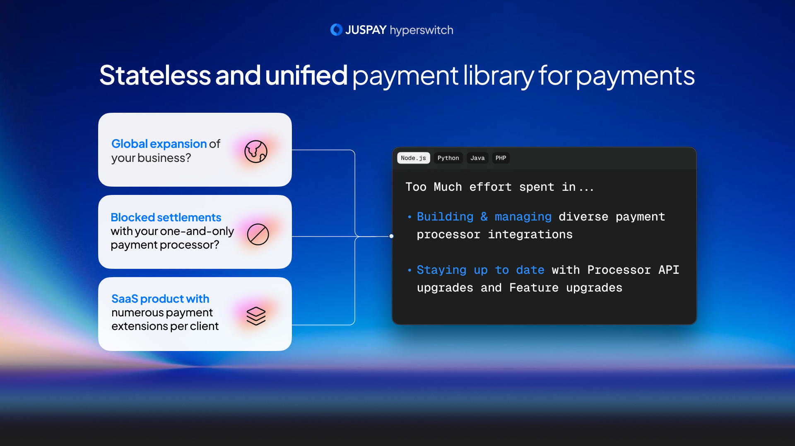
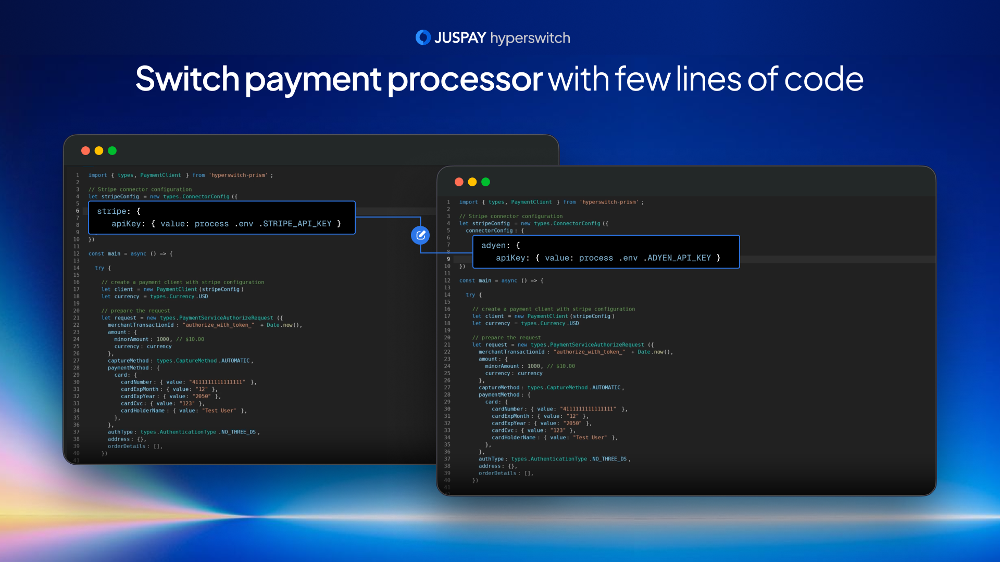
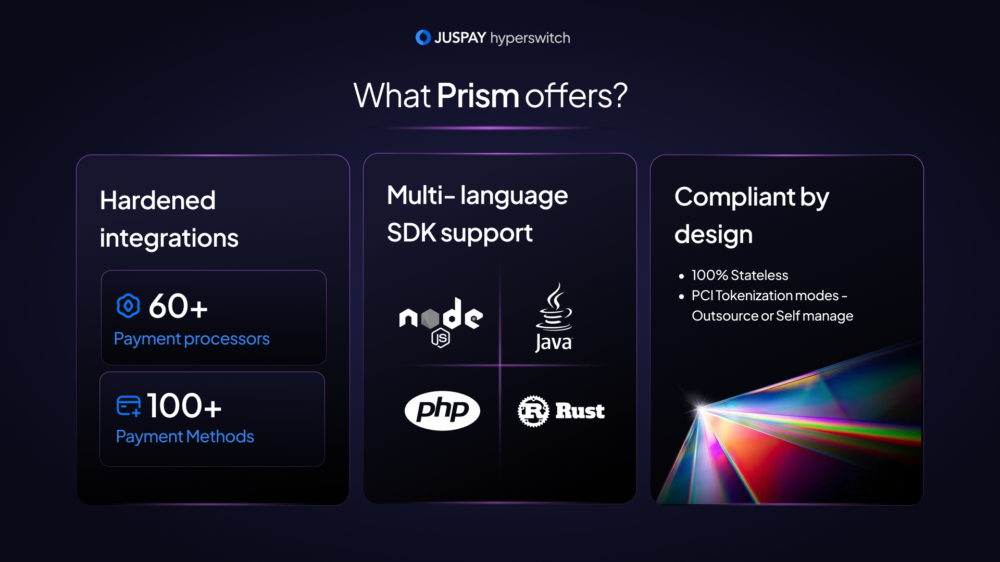

### 🎬 관련 영상
- [🎥 영상 보기](https://ph-files.imgix.net/64cb2739-7363-4f21-a0a6-68a7ed64dfe2.jpeg?auto=format)

---

## 4. [Jotform Claude App](https://www.producthunt.com/products/jotform)
**Votes**: 143 | **도입 난이도**: 하 | **신뢰도**: 상
**Tagline**: Build, edit, and analyze forms directly in Claude
**서비스 링크**: https://www.producthunt.com/r/DJ3HA5PIVDFYRP

**태그**: AI, Productivity, NoCode, Automation

### 📌 이 서비스 한눈에 보기
Claude 대화창 안에서 폼 제작부터 데이터 분석까지 한 번에 해결하는 AI 도구

### 🔑 주요 기능
- 대화형 인터페이스를 통한 간편한 폼 생성 및 편집
- 별도의 도구 전환 없이 Claude 내에서 로직 설정 및 필드 수정 가능
- 제출된 데이터 검색 및 인사이트 도출 기능 제공

### 🙋 사용자에게 어떤 점이 좋은가
도구를 오가는 번거로움 없이 자연어로 명령하여 폼을 만들고 분석할 수 있어 작업 흐름이 매우 효율적입니다.

### ✅ 지금 바로 써볼 기능
- 원하는 질문 항목을 말하여 즉석에서 폼 생성하기
- 생성된 폼의 필드 수정 및 로직 추가 요청하기
- 수집된 응답 데이터에 대한 요약 및 인사이트 분석 요청하기

### ⚠️ 사용 전 확인할 점
- Claude 인터페이스 내에서의 기능 제한 여부 확인 필요
- 복잡한 조건부 로직 구현 시 정확도 검증 필요

### 🧭 확인이 더 필요한 정보
Jotform 계정과의 연동 방식 및 데이터 동기화 범위에 대한 상세 정보가 필요합니다.

### 📸 스크린샷 및 갤러리
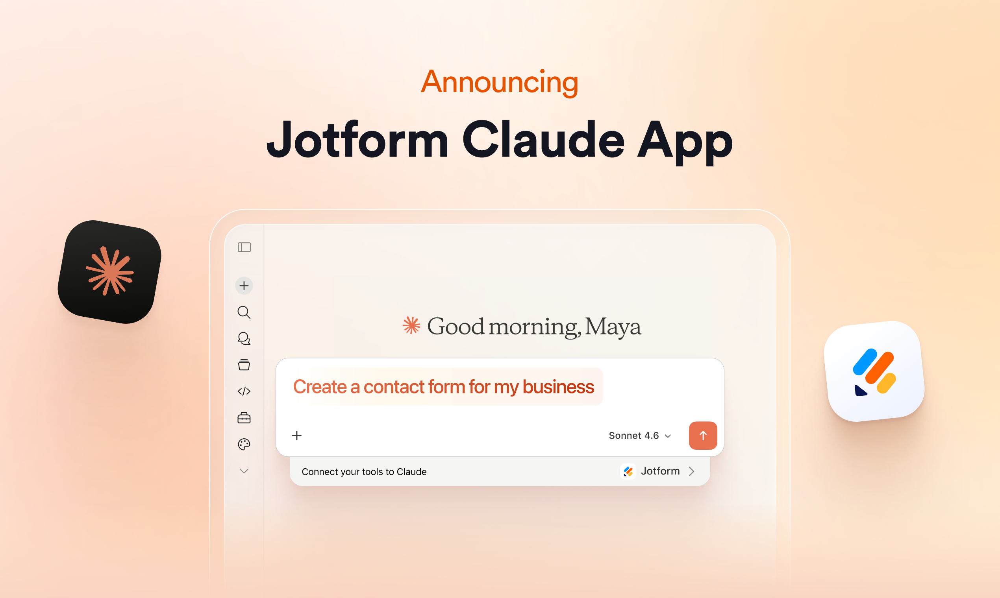
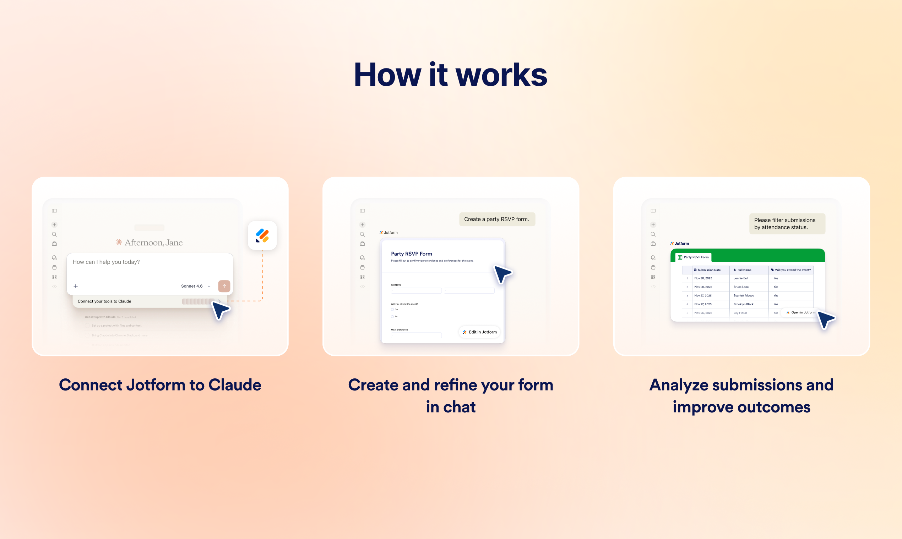
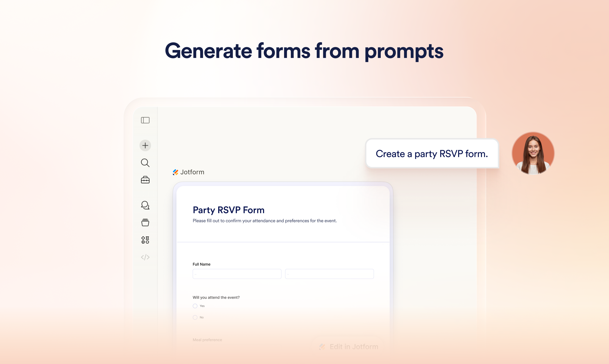

### 🎬 관련 영상
- [🎥 영상 보기](https://ph-files.imgix.net/3c42d484-e16c-44b8-ba8f-c0aa87691613.jpeg?auto=format)

---

## 5. [display.dev](https://www.producthunt.com/products/display-dev)
**Votes**: 130 | **도입 난이도**: 하 | **신뢰도**: 상
**Tagline**: Publish agent-generated HTML behind company auth
**서비스 링크**: https://www.producthunt.com/r/BBOJCGGDUUYHRO

**태그**: DevTool, AI-Workflow, Collaboration, Security, Agent

### 📌 이 서비스 한눈에 보기
AI 에이전트가 생성한 결과물을 기업 보안 인증 환경에서 즉시 공유하고 협업할 수 있는 도구

### 🔑 주요 기능
- 명령어 한 줄로 HTML 및 Markdown 파일을 영구적인 URL로 배포
- OTP, Google, Microsoft SSO를 통한 안전한 기업용 인증 지원
- 인라인 댓글 기능을 통한 팀원 간의 빠른 피드백 및 반복 작업

### 🙋 사용자에게 어떤 점이 좋은가
AI가 만든 결과물을 별도의 복잡한 서버 설정 없이 안전하게 팀원들에게 공유하고, 보안 걱정 없이 즉각적인 피드백을 주고받을 수 있습니다.

### ✅ 지금 바로 써볼 기능
- 명령어로 HTML/Markdown 파일 배포해보기
- SSO를 통한 보안 접속 테스트하기
- 인라인 댓글로 피드백 주고받기

### ⚠️ 사용 전 확인할 점
- 에이전트 생성 결과물 외의 복잡한 웹 애플리케이션 호스팅 가능 여부 확인 필요
- 기업 보안 정책에 따른 SSO 연동 범위 확인 필요

### 🧭 확인이 더 필요한 정보
정적 파일 배포 외에 동적 데이터 처리나 데이터베이스 연동 기능이 포함되어 있는지 확인이 필요합니다.

### 📸 스크린샷 및 갤러리
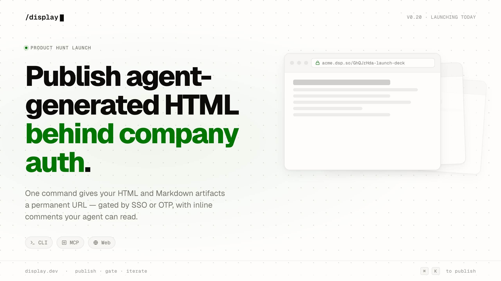
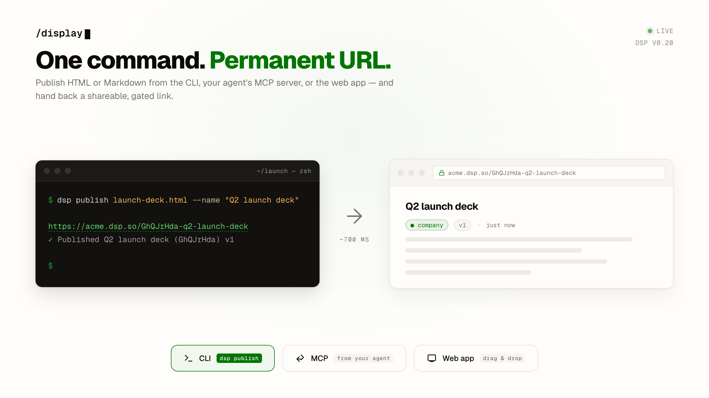
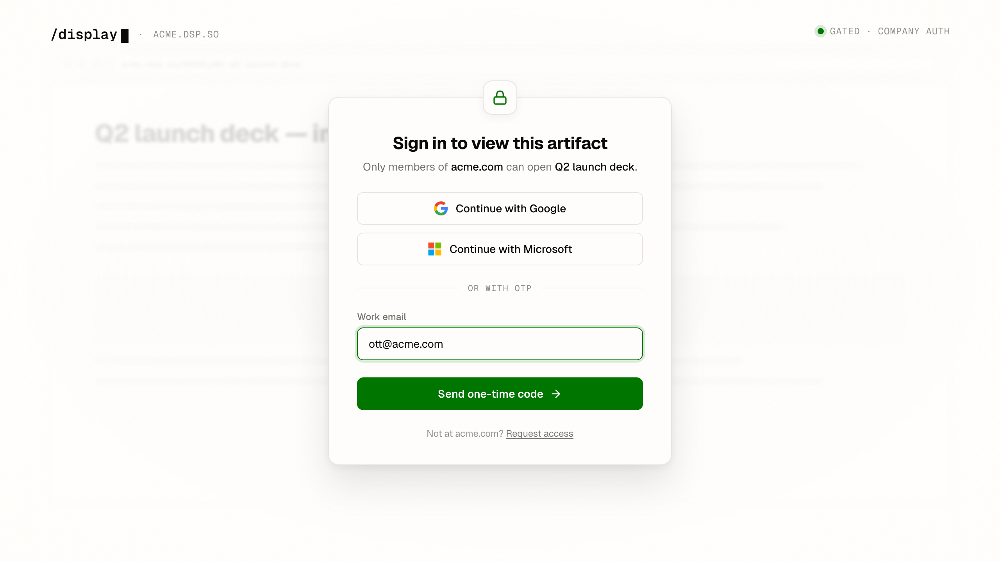

### 🎬 관련 영상
- [🎥 영상 보기](https://ph-files.imgix.net/099adc9d-817d-4936-afa8-c3b82aed347c.jpeg?auto=format)

---

## 6. [Free AI SEO Auditor](https://www.producthunt.com/products/free-ai-seo-auditor)
**Votes**: 122 | **도입 난이도**: 하 | **신뢰도**: 상
**Tagline**: Audit your site for the AI search era. 100% Open Source
**서비스 링크**: https://www.producthunt.com/r/33PH5UXSNNRJ7G

**태그**: SEO, AI, OpenSource, DevTool, AI Tool, Chat, Prompting

### 📌 이 서비스 한눈에 보기
AI 검색 엔진(ChatGPT, Claude 등) 최적화를 위한 오픈소스 SEO 감사 도구

### 🔑 주요 기능
- AI 검색 엔진(ChatGPT, Claude, Perplexity) 관점의 가시성 점수 제공
- URL 입력만으로 30초 내에 분석 결과 도출
- Cursor나 Claude Code에 바로 사용할 수 있는 수정 프롬프트 제공

### 🙋 사용자에게 어떤 점이 좋은가
기존 Google 중심의 SEO를 넘어, AI 답변 엔진에 내 사이트가 어떻게 노출되는지 즉각적으로 확인하고 수정 가이드를 얻을 수 있습니다.

### ✅ 지금 바로 써볼 기능
- 분석할 웹사이트 URL 입력하기
- AI 가시성 점수 확인하기
- 제공된 수정 프롬프트를 AI 코딩 도구에 적용하기

### ⚠️ 사용 전 확인할 점
- 단순 URL 분석 방식이므로 사이트 전체 구조를 완벽히 반영하지 못할 수 있음
- 오픈소스 도구 특성상 데이터 보안 및 개인정보 정책 확인 필요

### 🧭 확인이 더 필요한 정보
제공되는 점수 산출 알고리즘의 구체적인 로직은 명시되어 있지 않습니다.

### 📸 스크린샷 및 갤러리
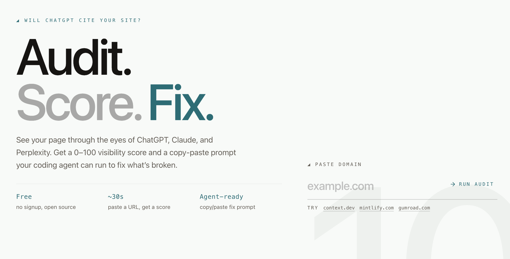
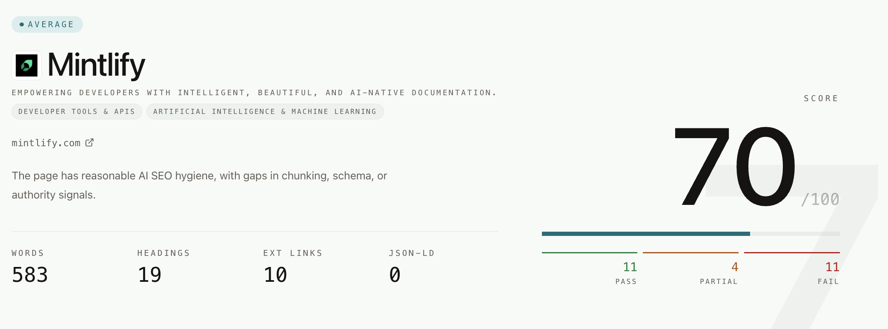
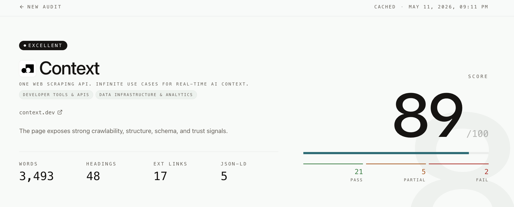

---

## 7. [Whale Starts](https://www.producthunt.com/products/whale-starts)
**Votes**: 109 | **도입 난이도**: 하 | **신뢰도**: 상
**Tagline**: The website builder that can copy any design on the web
**서비스 링크**: https://www.producthunt.com/r/RZLH2GNVFC3VHF

**태그**: NoCode, WebBuilder, DesignTool, Productivity, Design

### 📌 이 서비스 한눈에 보기
원하는 웹사이트 디자인을 URL 하나로 즉시 복제하여 편집할 수 있는 강력한 웹 빌더

### 🔑 주요 기능
- URL 입력만으로 기존 웹사이트 디자인을 즉시 복제 및 가져오기 기능
- 시각적 편집 도구를 통한 직관적인 디자인 수정
- 실시간 협업 기능을 통한 팀 단위 작업 지원

### 🙋 사용자에게 어떤 점이 좋은가
디자인 영감을 얻은 사이트를 처음부터 만들 필요 없이, 기존 레이아웃을 기반으로 빠르게 웹사이트를 구축하고 배포할 수 있습니다.

### ✅ 지금 바로 써볼 기능
- 참고하고 싶은 웹사이트의 URL 입력해보기
- 가져온 템플릿의 시각적 편집 기능 테스트하기
- 팀원 초대하여 실시간 협업 기능 확인하기

### ⚠️ 사용 전 확인할 점
- 복제된 디자인의 저작권 및 라이선스 준수 여부 확인 필요
- 복제된 코드의 구조적 완성도 및 커스텀 기능의 한계 확인 필요

### 🧭 확인이 더 필요한 정보
복제된 디자인이 복잡한 기능(백엔드, DB 등)까지 완벽하게 구현하는지에 대한 정보가 부족합니다.

### 📸 스크린샷 및 갤러리
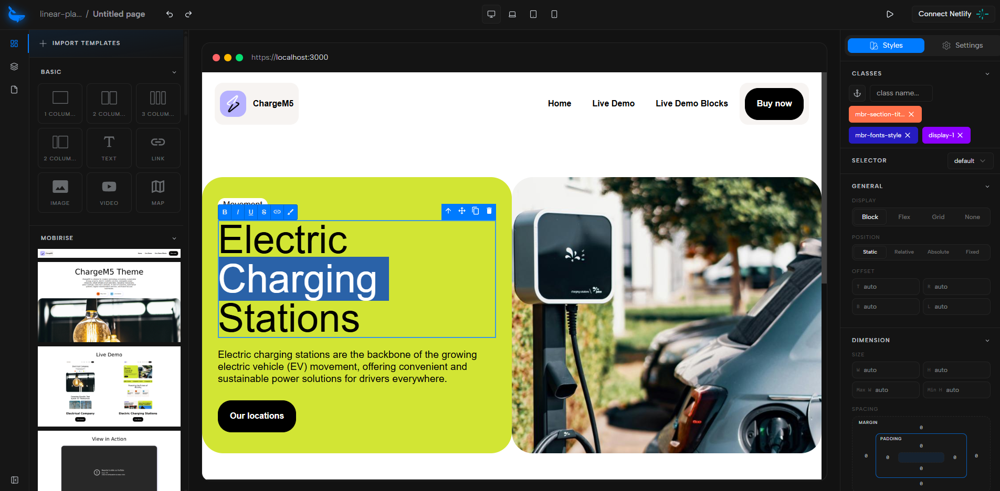
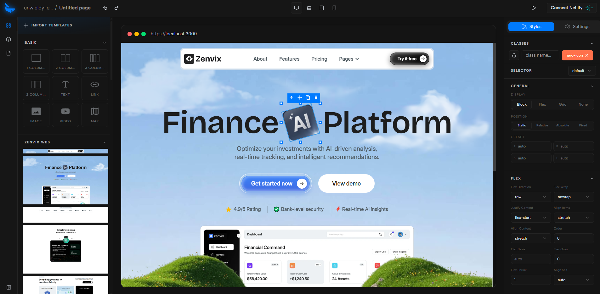
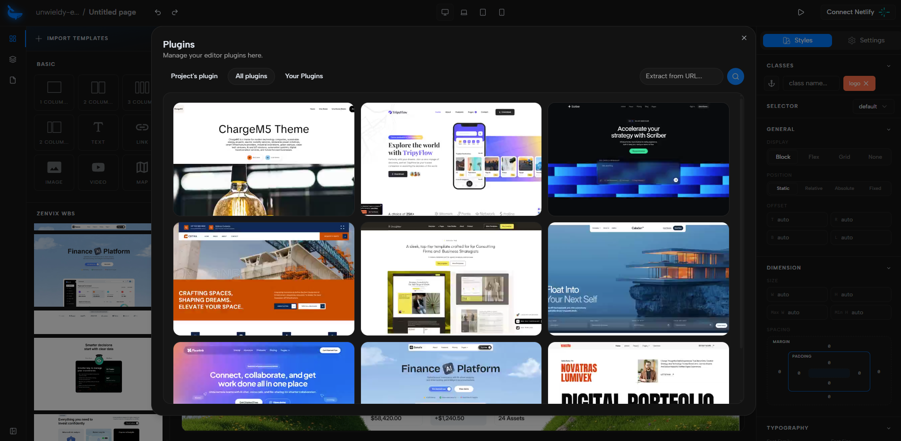

---

## 8. [TrackTalent](https://www.producthunt.com/products/outtalent)
**Votes**: 99 | **도입 난이도**: 하 | **신뢰도**: 상
**Tagline**: Track jobs, get matched, and land offers faster
**서비스 링크**: https://www.producthunt.com/r/AXDXZOZXRSLSMH

**태그**: JobSearch, Career, Engineering, Productivity

### 📌 이 서비스 한눈에 보기
엔지니어를 위한 효율적인 채용 프로세스 관리 및 매칭 플랫폼

### 🔑 주요 기능
- 체계적인 지원 현황 트래킹 파이프라인 제공
- 커뮤니티 기반의 고품질 채용 기회 발굴
- 지능형 매칭을 통한 빠른 오퍼 도달 지원

### 🙋 사용자에게 어떤 점이 좋은가
여러 곳에 지원하는 엔지니어가 지원 과정을 체계적으로 관리하고, 자신에게 맞는 직무를 빠르게 찾아 합격 확률을 높일 수 있습니다.

### ✅ 지금 바로 써볼 기능
- 지원 프로세스 파이프라인 설정하기
- 커뮤니티 소싱 기회 탐색하기
- 지능형 매칭 기능 활용하기

### ⚠️ 사용 전 확인할 점
- 엔지니어 직군에 특화되어 있어 타 직군에는 적합하지 않을 수 있음
- 커뮤니티 기반 정보의 신뢰도 확인 필요

### 🧭 확인이 더 필요한 정보
구체적인 매칭 알고리즘의 작동 방식과 커뮤니티의 규모는 명시되지 않았습니다.

### 📸 스크린샷 및 갤러리

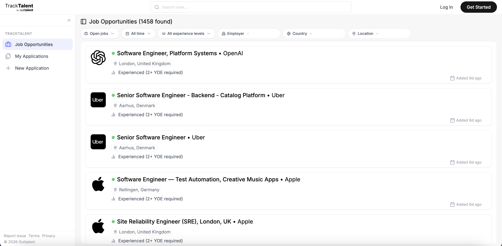

---

## 9. [HeyNews](https://www.producthunt.com/products/heynews)
**Votes**: 99 | **도입 난이도**: 하 | **신뢰도**: 상
**Tagline**: Your newsletter, your voice, ready to publish in 5 minutes
**서비스 링크**: https://www.producthunt.com/r/YPKKHONMNXULCE

**태그**: AI, Newsletter, Automation, ContentCreation

### 📌 이 서비스 한눈에 보기
기존 뉴스레터 스타일을 학습하여 5분 만에 초안을 완성하는 AI 뉴스레터 자동화 도구

### 🔑 주요 기능
- 사용자의 기존 뉴스레터 아카이브를 학습하여 고유한 문체 재현
- 뉴스 소스 모니터링 및 발행 가능한 수준의 초안 자동 생성
- Substack 등 기존 뉴스레터 아카이브 가져오기 지원 및 Beehiiv/Kit 연동

### 🙋 사용자에게 어떤 점이 좋은가
뉴스레터 작성 시간을 획기적으로 단축하면서도 본인만의 목소리를 유지할 수 있어 콘텐츠 제작 효율이 극대화됩니다.

### ✅ 지금 바로 써볼 기능
- 기존 뉴스레터 아카이브 임포트하기
- AI가 생성한 초안의 문체 확인하기
- 14일 무료 체험을 통한 워크플로우 검증하기

### ⚠️ 사용 전 확인할 점
- 월 $99부터 시작하는 높은 초기 비용
- AI 생성 초안의 최종 검수 및 편집 필요성

### 🧭 확인이 더 필요한 정보
Substack 외의 다른 플랫폼 아카이브 임포트 시의 호환성 범위 확인이 필요합니다.

### 📸 스크린샷 및 갤러리
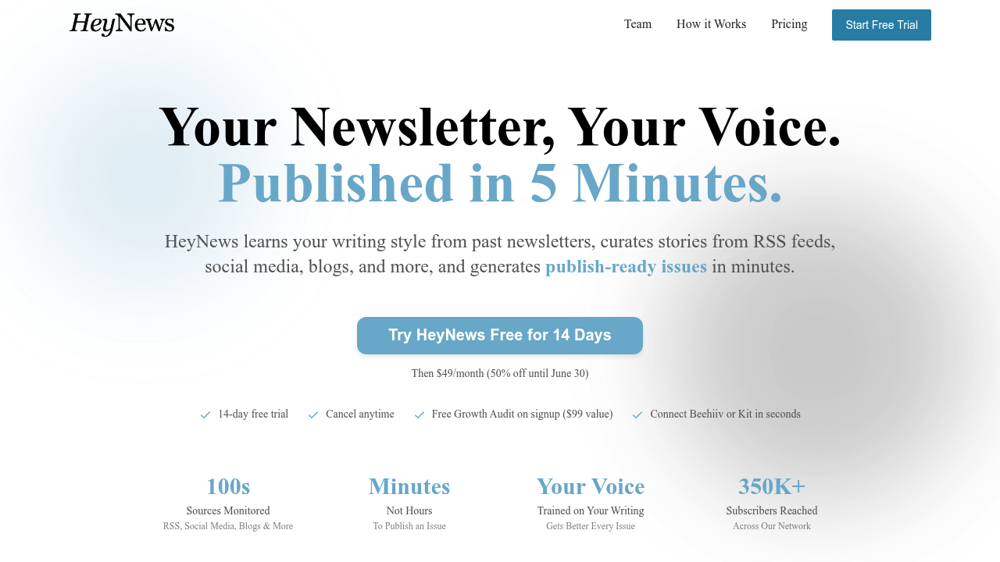
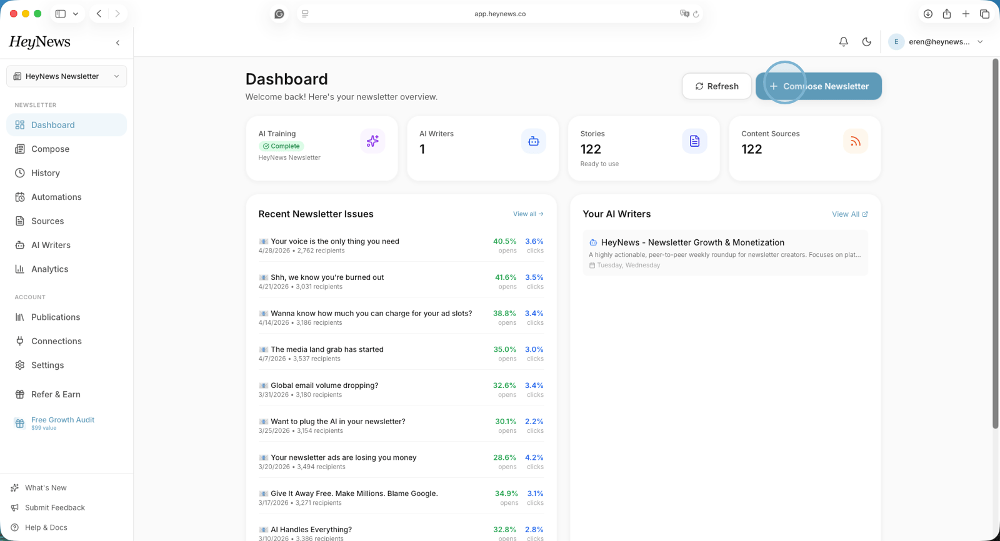
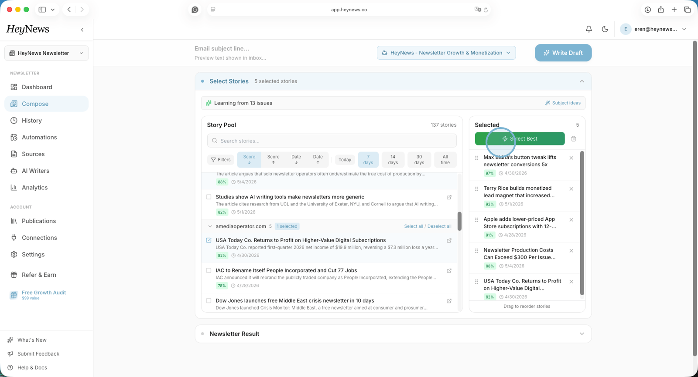

### 🎬 관련 영상
- [🎥 영상 보기](https://ph-files.imgix.net/1a365923-6a4b-4114-86b3-ccb56955cfee.jpeg?auto=format)

---

## 10. [FileFlan](https://www.producthunt.com/products/fileflan)
**Votes**: 93 | **도입 난이도**: 하 | **신뢰도**: 상
**Tagline**: Instant private universal file sharing
**서비스 링크**: https://www.producthunt.com/r/EZV4ALQI2A44AI

**태그**: Productivity, Privacy, FileSharing, P2P, CrossPlatform

### 📌 이 서비스 한눈에 보기
로그인 없이 브라우저만 있으면 어디서든 파일을 주고받는 보안 P2P 공유 서비스

### 🔑 주요 기능
- 브라우저 및 CLI 지원을 통한 기기 간 경계 없는 파일 전송
- P2P 및 종단간 암호화(E2EE)를 통한 강력한 프라이버시 보호
- 계정 생성이나 쿠키 저장 없이 즉시 사용 가능한 간편함

### 🙋 사용자에게 어떤 점이 좋은가
OS나 기기 종류에 상관없이 브라우저만 있으면 복잡한 설정 없이 즉각적으로 파일을 안전하게 전달할 수 있습니다.

### ✅ 지금 바로 써볼 기능
- 브라우저를 통한 즉각적인 파일 전송 테스트
- CLI 환경에서의 파일 전송 기능 확인
- 기기 간 P2P 연결 안정성 테스트

### ⚠️ 사용 전 확인할 점
- 로그인 기반이 아니므로 브라우저 세션 종료 시 전송 중인 작업이 유실될 수 있음
- P2P 방식 특성상 네트워크 환경에 따라 전송 속도 차이가 발생할 수 있음

### 🧭 확인이 더 필요한 정보
대용량 파일 전송 시의 속도 제한이나 네트워크 환경에 따른 연결 유지 범위에 대한 정보가 필요합니다.

### 📸 스크린샷 및 갤러리

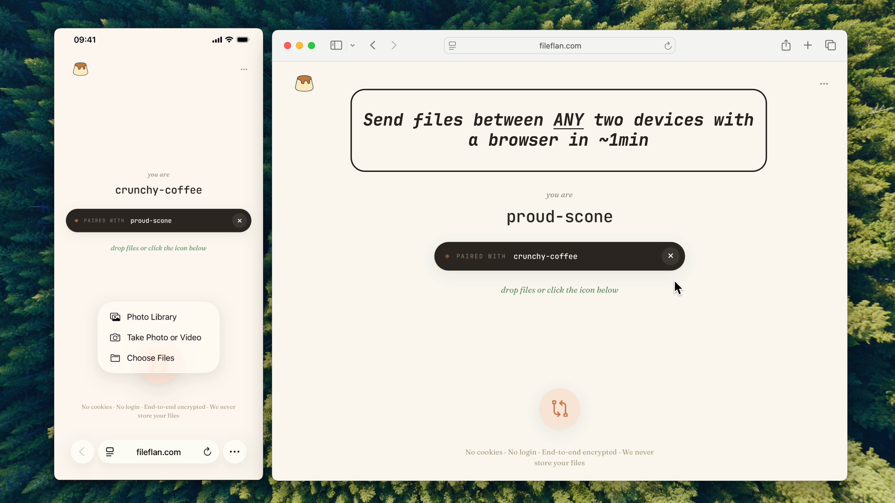
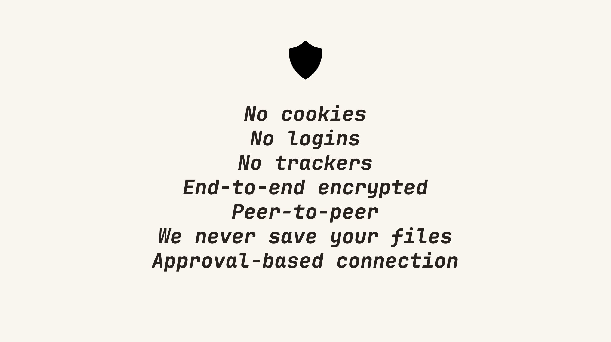

### 🎬 관련 영상
- [🎥 영상 보기](https://ph-files.imgix.net/345dd6c9-23c2-4a55-804d-2ac7c5bd1379.jpeg?auto=format)

---

## 11. [Habitvs](https://www.producthunt.com/products/habitvs)
**Votes**: 88 | **도입 난이도**: 하 | **신뢰도**: 상
**Tagline**: An Apple Health companion that grows with your habits
**서비스 링크**: https://www.producthunt.com/r/S7572PLDTD4T4E

**태그**: Health, Lifestyle, Gamification, iOS

### 📌 이 서비스 한눈에 보기
애플 건강 데이터를 기반으로 성장하는 가상 반려 캐릭터 'Kova'와의 상호작용 경험

### 🔑 주요 기능
- 애플 건강(Apple Health) 데이터 연동을 통한 자동 데이터 수집
- 수면, 회복, 활동, 마음챙김 상태가 반영되는 가상 캐릭터 Kova
- 사용자의 건강 습관에 따라 매일 변화하는 캐릭터의 감정과 반응

### 🙋 사용자에게 어떤 점이 좋은가
자신의 건강 데이터를 단순한 숫자가 아닌 캐릭터의 상태로 시각화하여, 건강한 습관 형성을 더욱 재미있게 유도합니다.

### ✅ 지금 바로 써볼 기능
- 애플 건강 데이터 연동하기
- Kova의 상태 변화 관찰하기
- 매일의 건강 습관 기록하기

### ⚠️ 사용 전 확인할 점
- 애플 건강 데이터가 풍부할수록 캐릭터의 반응이 정확해짐
- 캐릭터의 반응이 사용자의 실제 건강 상태를 완벽히 대변하지는 않음

### 🧭 확인이 더 필요한 정보
캐릭터의 구체적인 상호작용 방식이나 게임 요소의 깊이는 추가 확인이 필요합니다.

### 📸 스크린샷 및 갤러리
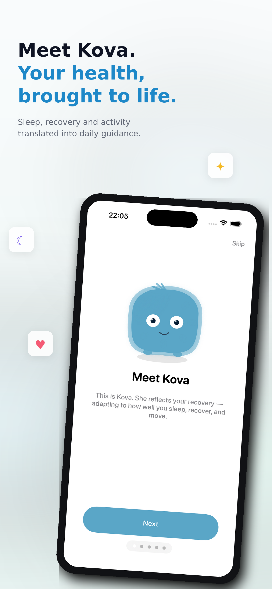
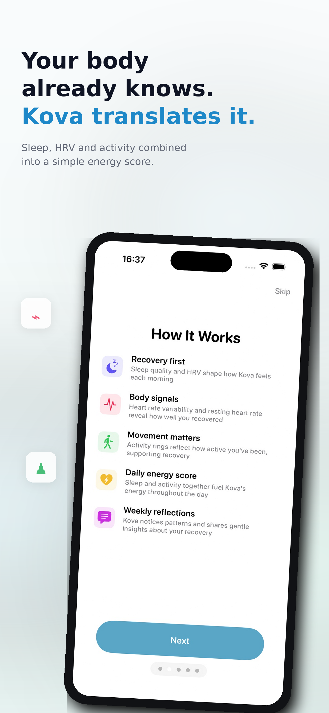
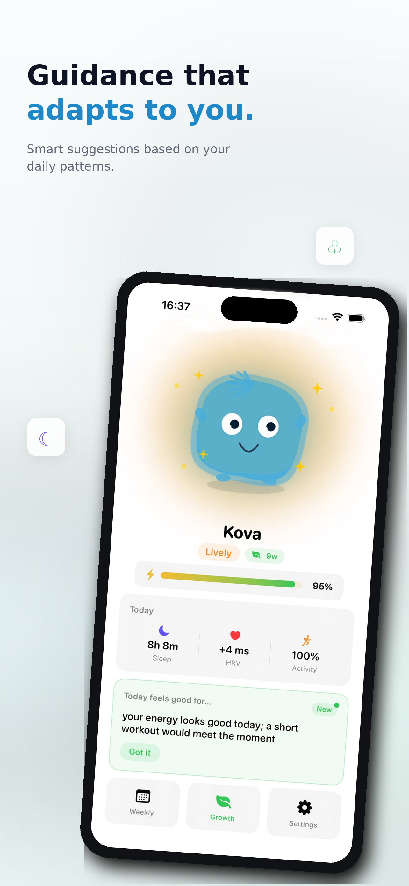

---

## 12. [DeepFrame](https://www.producthunt.com/products/deepframe)
**Votes**: 87 | **도입 난이도**: 상 | **신뢰도**: 중
**Tagline**: Serious security before public exposure
**서비스 링크**: https://www.producthunt.com/r/FBQEWECCZG4SKZ

**태그**: Security, Pentesting, WebDev, Cybersecurity

### 📌 이 서비스 한눈에 보기
빠르게 성장하는 웹 애플리케이션을 위한 전문적인 심층 보안 침투 테스트 서비스

### 🔑 주요 기능
- 전문적인 보안 스튜디오의 권한 기반 심층 침투 테스트 제공
- 빠른 개발 속도를 가진 웹 앱에 최적화된 보안 검증
- 심도 있는 분석, 명확한 결과 보고 및 재테스트 프로세스

### 🙋 사용자에게 어떤 점이 좋은가
서비스 출시 전 잠재적인 보안 취약점을 전문적인 방식으로 미리 발견하고 해결할 수 있습니다.

### ✅ 지금 바로 써볼 기능
- 보안 점검이 필요한 웹 애플리케이션 준비
- 서비스 제공자와의 권한 부여 및 테스트 범위 협의
- 발견된 취약점에 대한 수정 및 재테스트 프로세스 진행

### ⚠️ 사용 전 확인할 점
- 전문적인 침투 테스트이므로 사전 협의되지 않은 테스트는 법적 문제가 될 수 있음
- 수동 분석이 포함될 경우 테스트 기간이 소요될 수 있음

### 🧭 확인이 더 필요한 정보
구체적인 테스트 방법론, 비용 구조 및 자동화 도구 활용 범위에 대한 정보가 부족합니다.

### 📸 스크린샷 및 갤러리

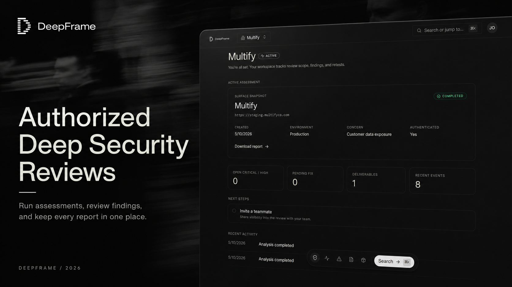
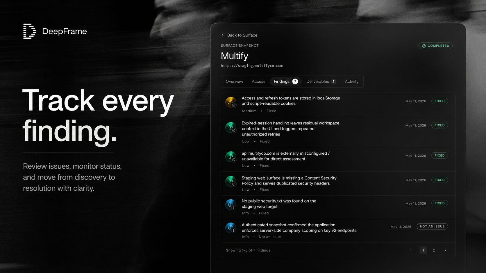

---

## 13. [MiniCPM-V 4.6](https://www.producthunt.com/products/minicpm-4-0)
**Votes**: 86 | **도입 난이도**: 중 | **신뢰도**: 상
**Tagline**: Ultra-efficient 1.3B vision-language model for mobile
**서비스 링크**: https://www.producthunt.com/r/5BVGOYMSA4SYFW

**태그**: AI, Mobile, ComputerVision, OpenSource, LLM, Video, Vision

### 📌 이 서비스 한눈에 보기
모바일 기기에서도 강력한 이미지·비디오 이해 기능을 제공하는 초경량 시각-언어 모델

### 🔑 주요 기능
- 1.3B 파라미터 규모의 초효율적 멀티모달 모델
- 4x/16x 시각 토큰 압축 기술로 모바일 환경 최적화
- iOS, Android, HarmonyOS 등 다양한 모바일 OS 지원

### 🙋 사용자에게 어떤 점이 좋은가
스마트폰이나 저사양 소비자용 하드웨어에서도 고성능 이미지 및 비디오 분석 기능을 가볍게 실행할 수 있습니다.

### ✅ 지금 바로 써볼 기능
- 모바일 환경(iOS/Android) 데모 실행해보기
- vLLM, llama.cpp 등을 통한 로컬 배포 테스트
- 시각 토큰 압축 기술의 효율성 확인

### ⚠️ 사용 전 확인할 점
- 모델 크기가 작아 복잡한 추론 시 성능 제약이 있을 수 있음
- 하드웨어 사양에 따른 구동 안정성 확인 필요

### 🧭 확인이 더 필요한 정보
특정 모바일 기기에서의 구체적인 프레임 속도(FPS)나 배터리 소모량은 명시되지 않았습니다.

### 📸 스크린샷 및 갤러리
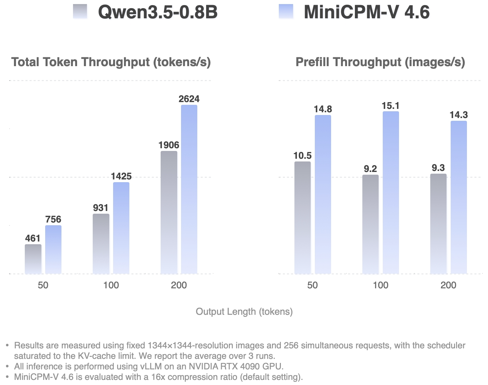
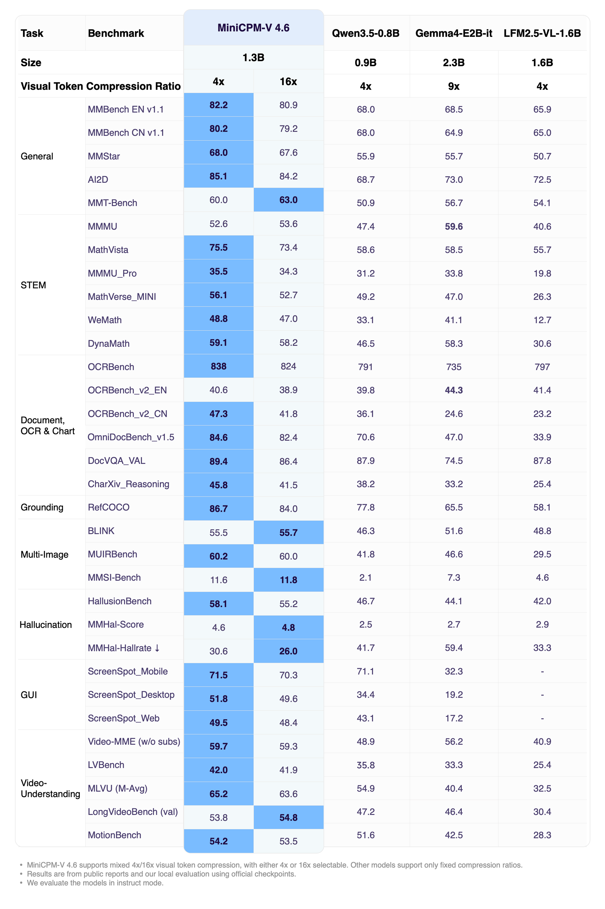
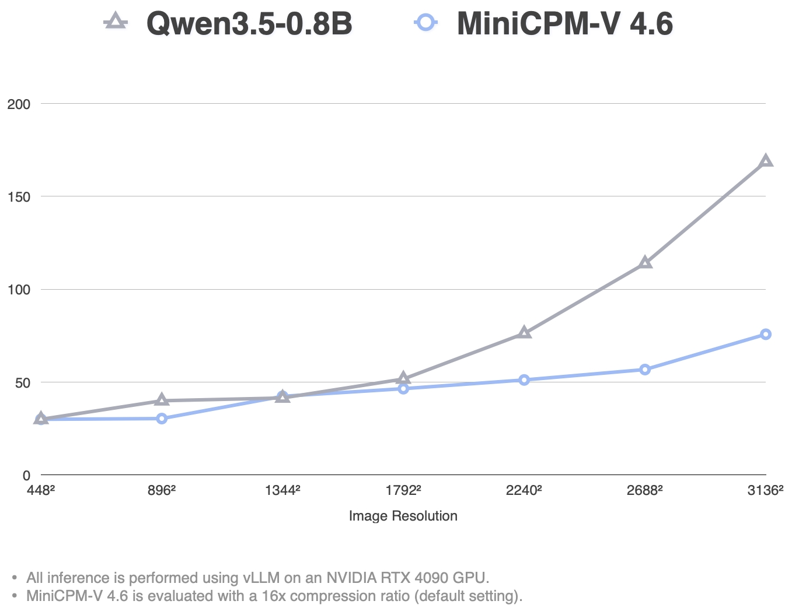

### 🎬 관련 영상
- [🎥 영상 보기](https://ph-files.imgix.net/eb3bec98-b69f-40d4-a141-0f66e8dfa5c6.jpeg?auto=format)

---

## 14. [knooth](https://www.producthunt.com/products/knooth)
**Votes**: 86 | **도입 난이도**: 하 | **신뢰도**: 상
**Tagline**: Screen recording with AI-powered editing for Mac
**서비스 링크**: https://www.producthunt.com/r/K5JADMCX7VIB5I

**태그**: Video Editing, Screen Recording, AI, macOS, Privacy, AI Tool, Video, Vision

### 📌 이 서비스 한눈에 보기
AI 편집 기능이 내장된 개인정보 보호 중심의 Mac 전용 화면 녹화 및 영상 편집 도구

### 🔑 주요 기능
- Mac 환경에 최적화된 화면, 카메라, 마이크 및 iOS 기기 화면 녹화 기능
- AI 기반 캡션 생성, 불필요한 단어 제거, 오디오 클린업 등 스마트 편집 기능
- 모든 데이터가 클라우드 업로드 없이 로컬에서 처리되는 강력한 프라이버시

### 🙋 사용자에게 어떤 점이 좋은가
별도의 클라우드 업로드 없이 Mac에서 즉시 고품질 영상을 제작할 수 있어 보안이 중요한 업무나 빠른 콘텐츠 제작에 유용합니다.

### ✅ 지금 바로 써볼 기능
- AI 캡션 및 불필요한 단어 제거 기능 테스트
- 커서 자동 줌 및 애니메이션 효과 적용해보기
- 로컬 환경에서의 편집 속도 및 내보내기 성능 확인

### ⚠️ 사용 전 확인할 점
- macOS 전용 앱이므로 Windows 등 타 OS 사용 불가
- 로컬 리소스를 사용하므로 고사양 작업 시 Mac의 하드웨어 성능에 의존

### 🧭 확인이 더 필요한 정보
구체적인 시스템 요구 사양 및 유료 플랜의 상세 기능 제한 여부는 확인이 필요합니다.

### 📸 스크린샷 및 갤러리
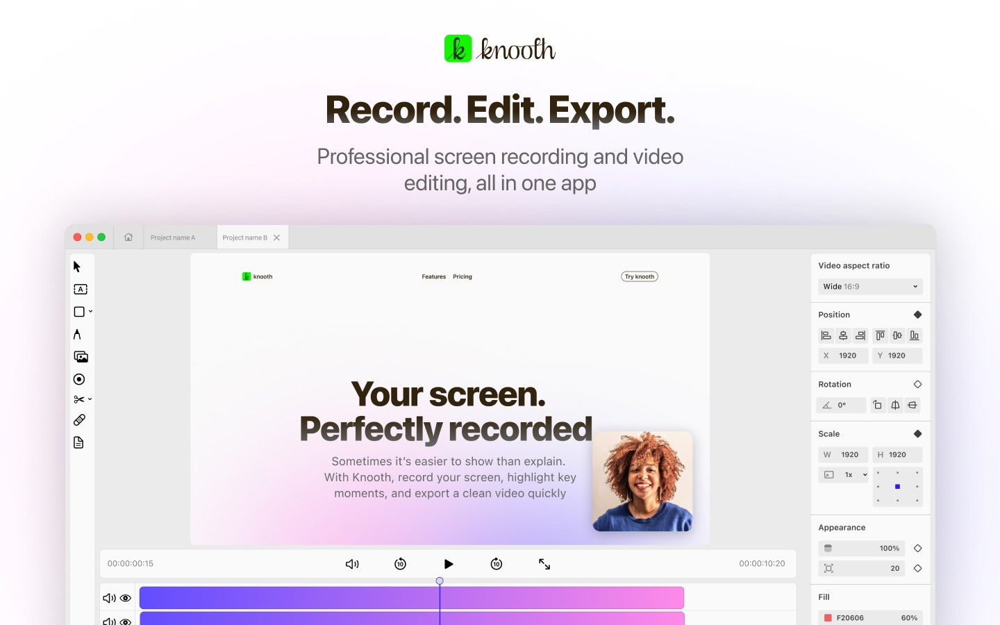

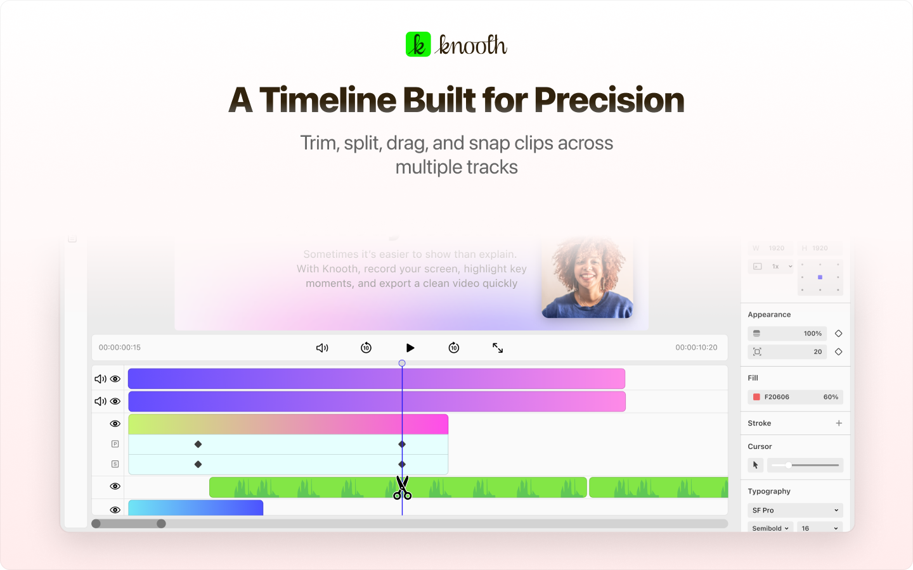

### 🎬 관련 영상
- [🎥 영상 보기](https://ph-files.imgix.net/4a65b0b5-633b-4904-86a5-e6952fd86d21.jpeg?auto=format)

---

## 15. [Keeby for Windows](https://www.producthunt.com/products/keeby)
**Votes**: 84 | **도입 난이도**: 하 | **신뢰도**: 상
**Tagline**: Satisfying mechanical keyboard sounds, now on Windows
**서비스 링크**: https://www.producthunt.com/r/SA6PGJ6UHFKM5H

**태그**: Productivity, Audio, Customization

### 📌 이 서비스 한눈에 보기
윈도우 환경에서도 기계식 키보드의 타건감을 즐길 수 있는 공간 음향 소프트웨어

### 🔑 주요 기능
- 윈도우용 기계식 키보드 사운드 시뮬레이션
- 몰입감을 높여주는 공간 오디오 기술 적용
- 반응형 비주얼라이저 및 커스텀 스위치 프로필 제공

### 🙋 사용자에게 어떤 점이 좋은가
물리적인 키보드 교체 없이도 소프트웨어를 통해 만족스러운 타건 사운드와 시각적 피드백을 경험할 수 있습니다.

### ✅ 지금 바로 써볼 기능
- 사용자 취향에 맞는 스위치 프로필 설정하기
- 공간 오디오를 통한 입체적인 사운드 경험하기
- 타이핑에 반응하는 비주얼라이저 확인하기

### ⚠️ 사용 전 확인할 점
- 실제 물리적 키보드 타건감과는 차이가 있음
- 사운드 재생을 위한 백그라운드 리소스 사용 가능성

### 🧭 확인이 더 필요한 정보
기존 Mac용 버전과 비교하여 윈도우 환경에서의 최적화 수준 및 시스템 리소스 점유율 확인이 필요합니다.

### 📸 스크린샷 및 갤러리
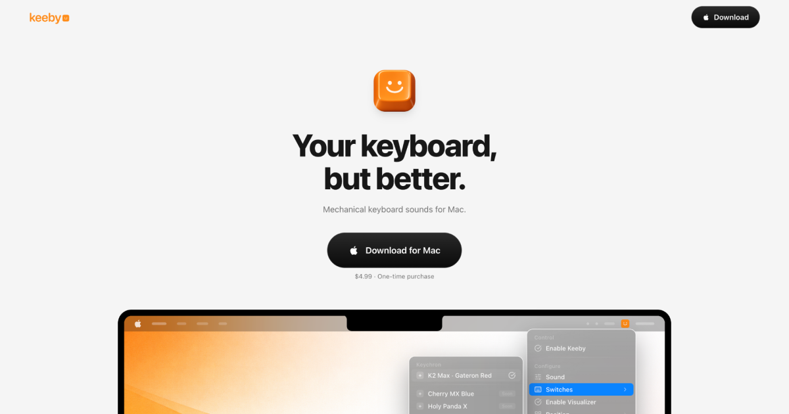

### 🎬 관련 영상
- [🎥 영상 보기](https://ph-files.imgix.net/72bb5447-fbda-49a5-9a31-b9dfd241f482.jpeg?auto=format)

---

## 16. [Hopper](https://www.producthunt.com/products/hopper-4)
**Votes**: 79 | **도입 난이도**: 중 | **신뢰도**: 상
**Tagline**: First agentic development environment for mainframe/COBOL
**서비스 링크**: https://www.producthunt.com/r/DIQWATFSGWJZWB

**태그**: DevTool, Mainframe, AI-Agent, Automation, Agent, AI Tool

### 📌 이 서비스 한눈에 보기
메인프레임 개발자를 위한 AI 에이전트 기반 통합 개발 환경

### 🔑 주요 기능
- TN3270 터미널과 데이터셋/Job 관리 패널이 통합된 올인원 환경
- z/OS 워크플로우 전반을 수행하는 AI 에이전트 탑재
- JCL 작성, 작업 제출, JES 출력 분석 및 디버깅 자동화

### 🙋 사용자에게 어떤 점이 좋은가
복잡한 메인프레임 워크플로우를 AI가 대신 수행하여 개발자의 디버깅 및 작업 시간을 획기적으로 단축합니다.

### ✅ 지금 바로 써볼 기능
- AI 에이전트를 통한 JCL 자동 생성 및 작업 제출 테스트
- JES 출력 분석 및 오류 원인 파악 기능 활용
- 기존 PDS 멤버 편집 및 데이터셋 관리 워크플로우 적용

### ⚠️ 사용 전 확인할 점
- AI 에이전트가 생성한 JCL이나 코드의 정확성에 대한 검증 필요
- 기업 내부 보안 정책에 따른 메인프레임 접속 및 데이터 처리 허용 여부 확인

### 🧭 확인이 더 필요한 정보
현재 제공되는 AI 에이전트의 보안 수준과 기업용 보안 프로토콜 준수 여부에 대한 상세 정보가 필요합니다.

### 📸 스크린샷 및 갤러리
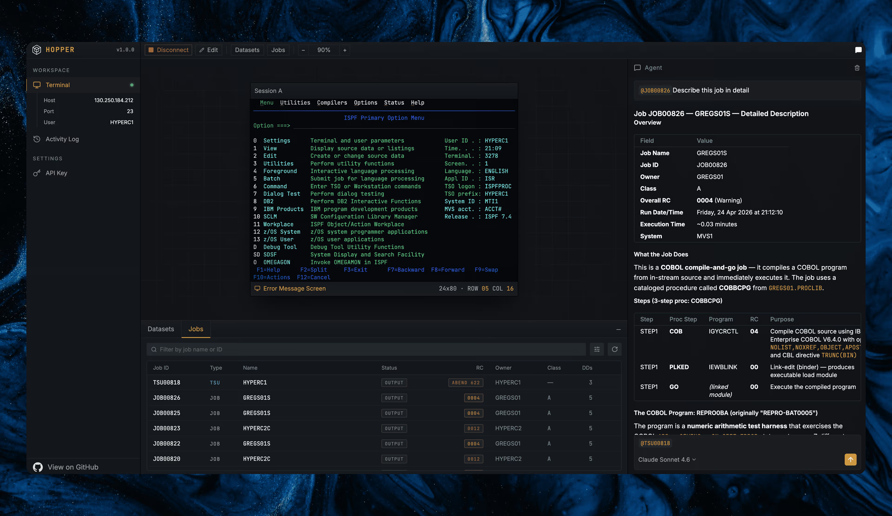
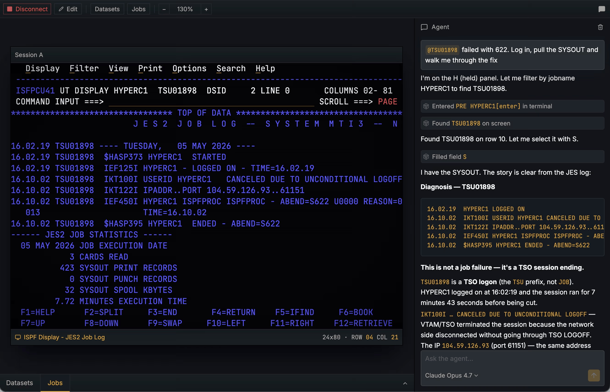
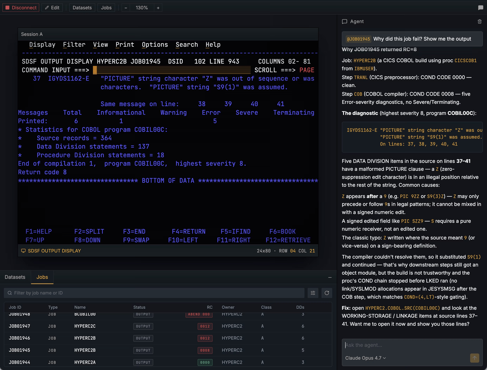

### 🎬 관련 영상
- [🎥 영상 보기](https://ph-files.imgix.net/f4060544-df63-455c-a3b2-b3524e9931ff.jpeg?auto=format)

---

## 17. [ContentPilots](https://www.producthunt.com/products/contentpilots)
**Votes**: 78 | **도입 난이도**: 하 | **신뢰도**: 상
**Tagline**: Turn any video into endless Shorts & Reels with AI
**서비스 링크**: https://www.producthunt.com/r/N4KUQBHLIL3YM6

**태그**: AI, VideoEditing, Automation, SocialMedia, ContentCreation, AI Tool, Video

### 📌 이 서비스 한눈에 보기
긴 영상을 클릭 한 번으로 바이럴 숏폼 콘텐츠로 자동 변환 및 배포하는 AI 도구

### 🔑 주요 기능
- 단일 영상 업로드를 통한 다수의 숏폼(Shorts, Reels, TikTok) 자동 생성
- 제목, 태그, 캡션 등 텍스트 콘텐츠 자동 작성
- 유튜브, 틱톡, 인스타그램, 링크드인 등 주요 플랫폼 원클릭 스케줄링

### 🙋 사용자에게 어떤 점이 좋은가
콘텐츠 제작 시간을 획기적으로 단축하고, 하나의 원본 소스로 여러 플랫폼에 최적화된 숏폼을 동시에 배포할 수 있습니다.

### ✅ 지금 바로 써볼 기능
- 원본 영상 업로드 및 AI 자동 편집 기능 테스트
- 생성된 제목 및 캡션의 톤앤매너 확인
- 플랫폼별 자동 스케줄링 기능 설정

### ⚠️ 사용 전 확인할 점
- AI가 생성한 편집 결과물의 창의성이나 맥락이 의도와 다를 수 있음
- 플랫폼별 가이드라인에 맞는 자동 편집 품질 확인 필요

### 🧭 확인이 더 필요한 정보
영상 편집의 정교함(컷 편집 스타일 등)과 지원하는 영상 포맷에 대한 상세 정보가 필요합니다.

### 📸 스크린샷 및 갤러리
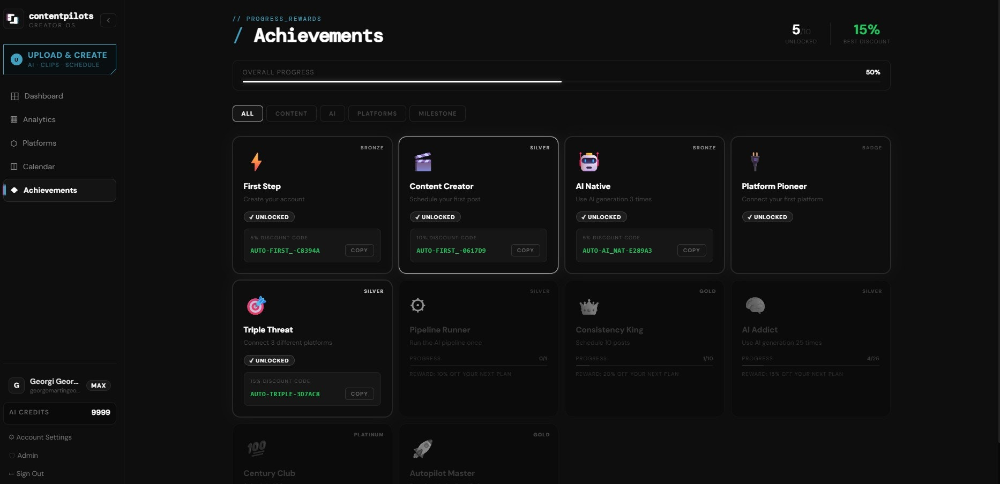
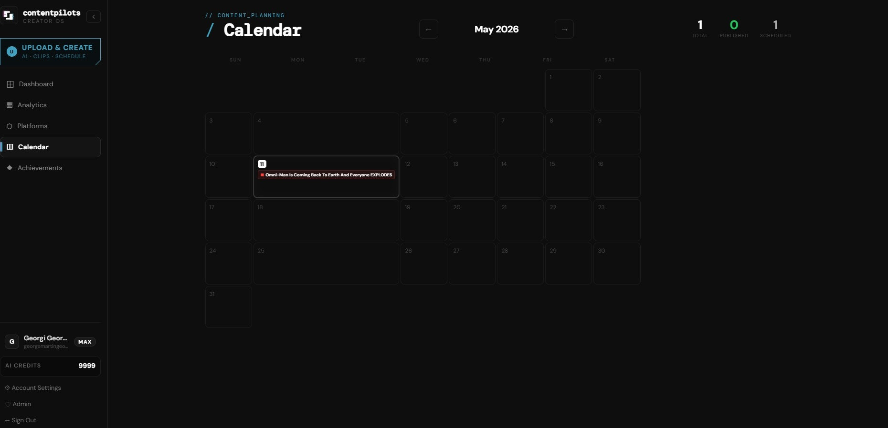
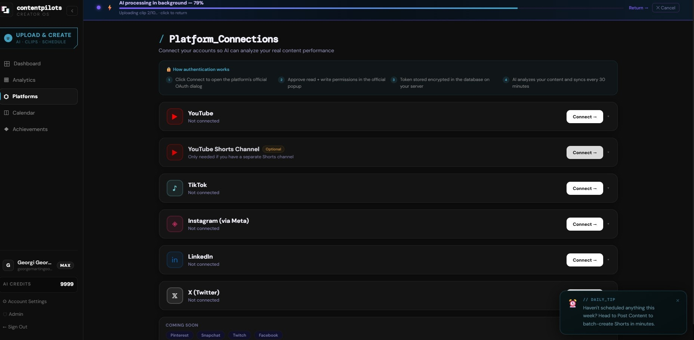

---

## 18. [Vexilo](https://www.producthunt.com/products/vexilo-a-field-guide-to-claude-code)
**Votes**: 77 | **도입 난이도**: 중 | **신뢰도**: 상
**Tagline**: Claude Code planner w/ 31 agents, 92 commands, + 121 skills
**서비스 링크**: https://www.producthunt.com/r/GC45JEMSS53VS7

**태그**: DevTool, AI-Agent, Productivity, ClaudeCode, Agent, Automation, AI Tool

### 📌 이 서비스 한눈에 보기
Claude Code의 잠재력을 극대화하는 31종의 에이전트와 92가지 명령어를 갖춘 전문 개발 워크플로우 도구

### 🔑 주요 기능
- 31종의 전문 에이전트(코드 리뷰어, TDD 가이드 등)와 121가지 도메인별 스킬 제공
- 토큰 낭비를 줄이고 컨텍스트 활용을 최적화하는 체계적인 명령어 구조
- CLAUDE.md 자동 생성 및 ECC Superpowers 워크플로우 지원

### 🙋 사용자에게 어떤 점이 좋은가
Claude Code 사용 시 발생하는 토큰 낭비를 방지하고, 전문화된 에이전트를 통해 개발 생산성을 비약적으로 높일 수 있습니다.

### ✅ 지금 바로 써볼 기능
- 사용 중인 프로젝트에 CLAUDE.md 자동 생성 기능 적용하기
- 도메인별(Frontend, Backend, DevOps 등) 121가지 스킬 탐색하기
- 특정 목적에 맞는 31종의 전문 에이전트 활용해보기

### ⚠️ 사용 전 확인할 점
- Claude Code 환경에 대한 사전 지식이 필요할 수 있음
- 일회성 결제 모델에 대한 상세 정책 확인 필요

### 🧭 확인이 더 필요한 정보
구체적인 일회성 결제 금액과 시스템 요구 사양에 대한 정보가 명시되지 않았습니다.

### 📸 스크린샷 및 갤러리

### 🎬 관련 영상
- [🎥 영상 보기](https://ph-files.imgix.net/1b05a156-ea25-47d1-bf0b-e377f7f408db.jpeg?auto=format)

---

## 19. [Whirr](https://www.producthunt.com/products/whirr-2)
**Votes**: 76 | **도입 난이도**: 하 | **신뢰도**: 상
**Tagline**: Ambient agent activity in your notch
**서비스 링크**: https://www.producthunt.com/r/DSKBMPE4FTZ2HO

**태그**: AI, Productivity, Utility, macOS, Agent, AI Tool

### 📌 이 서비스 한눈에 보기
창 전환 없이 맥북 노치에서 AI 에이전트의 상태를 실시간으로 확인하는 도구

### 🔑 주요 기능
- 노치 영역을 활용한 앰비언트(Ambient) 상태 표시
- AI 에이전트의 작업 현황 실시간 모니터링
- 창 전환 번거로움 해소

### 🙋 사용자에게 어떤 점이 좋은가
AI 에이전트가 백그라운드에서 무엇을 하고 있는지 별도의 창을 열지 않고도 직관적으로 파악할 수 있습니다.

### ✅ 지금 바로 써볼 기능
- 노치 영역의 실시간 상태 변화 확인하기
- AI 에이전트와 함께 사용하며 작업 흐름 유지하기

### ⚠️ 사용 전 확인할 점
- 노치가 없는 디스플레이 환경에서의 사용성 제한
- 백그라운드 실행 시 시스템 리소스 점유 여부

### 🧭 확인이 더 필요한 정보
지원하는 AI 에이전트의 종류와 구체적인 연동 방식에 대한 정보가 더 필요합니다.

### 📸 스크린샷 및 갤러리
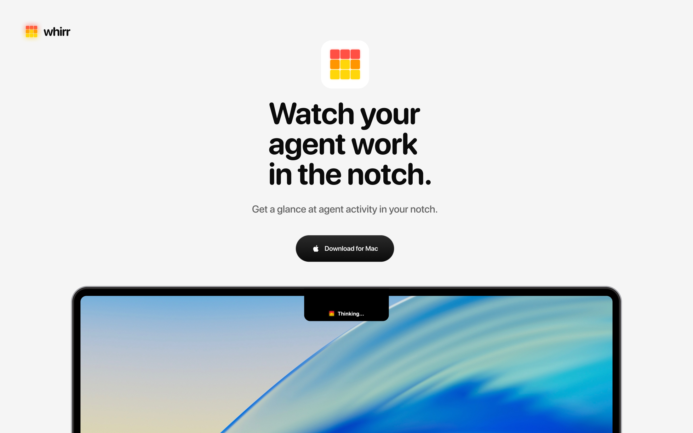

### 🎬 관련 영상
- [🎥 영상 보기](https://ph-files.imgix.net/fb1aba3c-6485-4a95-bb42-afee0ca5473b.jpeg?auto=format)

---

## 20. [Seer Platform](https://www.producthunt.com/products/seer-platform)
**Votes**: 75 | **도입 난이도**: 중 | **신뢰도**: 상
**Tagline**: The fastest way to go from idea to physical product
**서비스 링크**: https://www.producthunt.com/r/6NXNKPIDPZC7A2

**태그**: ProductDesign, AI, Hardware, Prototyping, Manufacturing, Agent, AI Tool, Design

### 📌 이 서비스 한눈에 보기
아이디어 구상부터 제조 가능한 프로토타입 제작까지 지원하는 AI 기반 물리적 제품 개발 플랫폼

### 🔑 주요 기능
- 3D 모델링, 도면 생성, 펌웨어 작성 등 제품 설계 전 과정을 지원하는 AI 프레임워크
- 창의적·공학적 지능을 결합하여 아이디어를 완성하는 'Invent' 모드 제공
- 시장 및 특허 조사부터 3D 프린팅 주문까지 통합된 워크플로우

### 🙋 사용자에게 어떤 점이 좋은가
발명가와 제품 설계자가 복잡한 엔지니어링 과정을 단축하고, 아이디어를 실제 제조 가능한 수준으로 빠르게 구체화할 수 있습니다.

### ✅ 지금 바로 써볼 기능
- Invent 모드를 통한 아이디어 구체화 테스트
- AI 생성 3D 모델 및 도면의 정밀도 검증
- 플랫폼 내 3D 프린팅 서비스를 통한 프로토타입 주문

### ⚠️ 사용 전 확인할 점
- AI 생성 결과물이 실제 제조 공정의 정밀한 규격을 완벽히 충족하는지 검토 필요
- 복잡한 하드웨어 설계 시 전문 엔지니어의 최종 검수 필수

### 🧭 확인이 더 필요한 정보
AI가 생성한 설계 데이터의 제조 공정별 호환성 및 실제 제작 품질에 대한 구체적인 정보가 필요합니다.

### 📸 스크린샷 및 갤러리
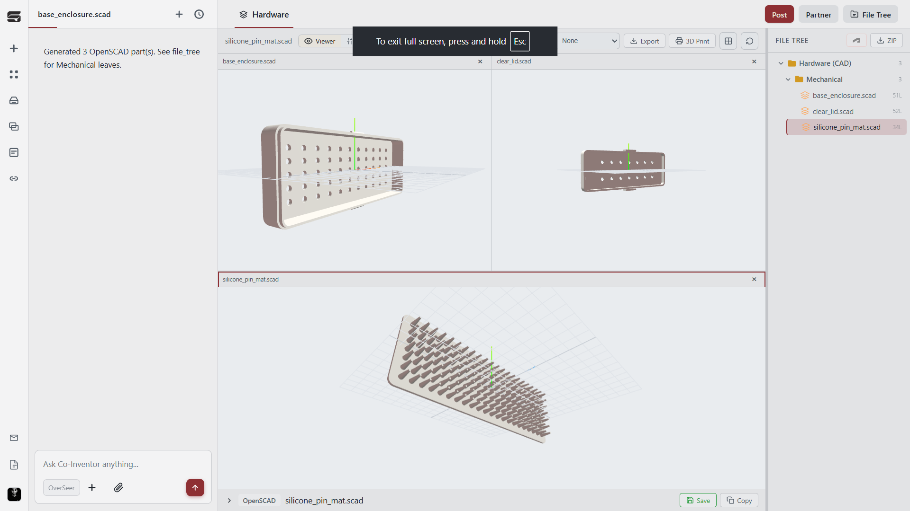
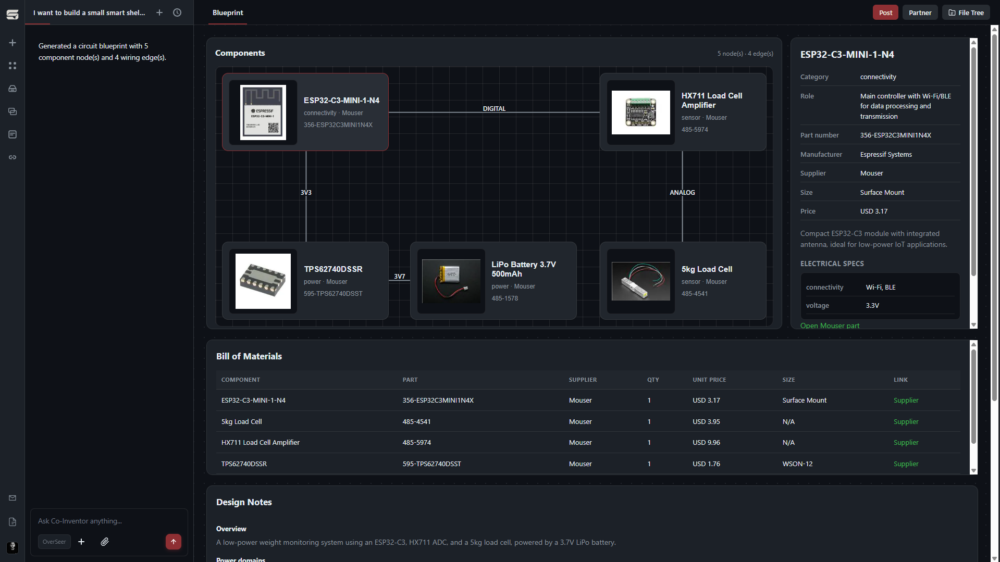
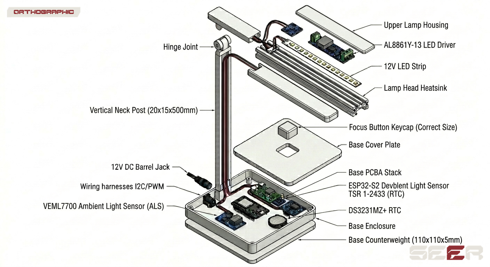

---

## 21. [zubhai](https://www.producthunt.com/products/zubhai)
**Votes**: 75 | **도입 난이도**: 하 | **신뢰도**: 상
**Tagline**:  LeetCode for AI Skills
**서비스 링크**: https://www.producthunt.com/r/LNFDDTPKOG4FBE

**태그**: AI, EdTech, Skill-Building, Gamification, AI Tool, Video, DevTool

### 📌 이 서비스 한눈에 보기
실전 AI 프로젝트를 통해 실력을 검증하고 성장하는 게임형 학습 플랫폼

### 🔑 주요 기능
- 단순 시청이 아닌 직접 구축하는 실전형 AI 챌린지 제공
- 사용자의 작업물을 검증하는 체계적인 피드백 시스템
- 게임 요소를 도입하여 학습 동기를 부여하는 보상 체계

### 🙋 사용자에게 어떤 점이 좋은가
이론 공부에 머물지 않고 실제 결과물을 만드는 과정을 통해 실무적인 AI 개발 역량을 빠르게 쌓을 수 있습니다.

### ✅ 지금 바로 써볼 기능
- 개인 맞춤형 AI 챌린지 시작하기
- 제출한 작업물에 대한 검증 결과 확인하기
- 학습 진행도에 따른 보상 시스템 경험하기

### ⚠️ 사용 전 확인할 점
- 실제 개발 환경과의 차이가 있을 수 있음
- 챌린지 난이도에 따른 개인별 학습 격차 발생 가능성

### 🧭 확인이 더 필요한 정보
제공되는 챌린지의 구체적인 기술 스택과 검증 방식에 대한 상세 정보가 필요합니다.

### 📸 스크린샷 및 갤러리
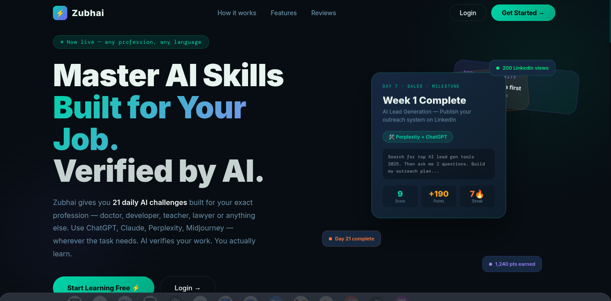
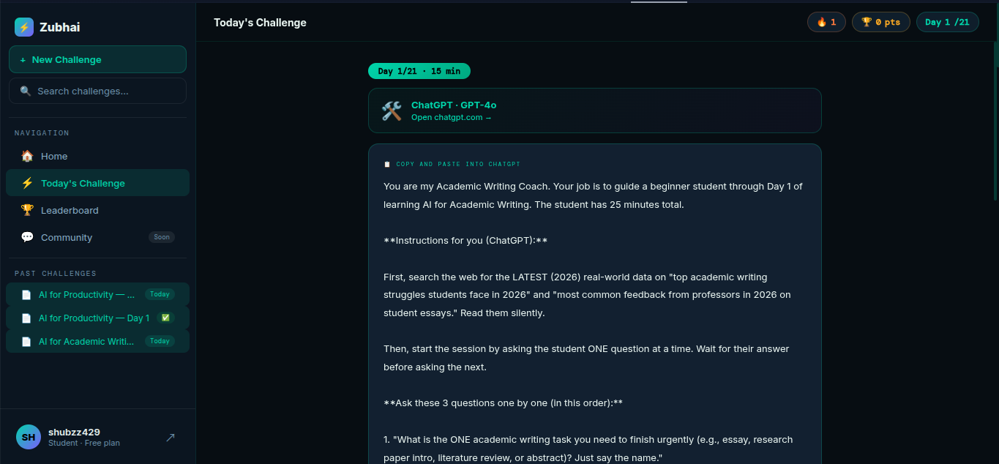

---

## 22. [hackerDen](https://www.producthunt.com/products/hackerden)
**Votes**: 73 | **도입 난이도**: 하 | **신뢰도**: 상
**Tagline**: Collaborative hackathon workspace with visible contributions
**서비스 링크**: https://www.producthunt.com/r/YGWP63NMVOBZ4L

**태그**: Collaboration, Hackathon, Productivity, DevTool, AI Tool, Chat

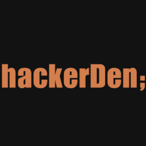

### 📌 이 서비스 한눈에 보기
해커톤 팀의 생산성을 극대화하는 올인원 협업 워크스페이스

### 🔑 주요 기능
- 채팅, 작업 관리, 문서, 기획을 한 곳에서 처리하는 통합 환경
- 컨텍스트 스위칭(Context Switching) 최소화를 통한 몰입 유지
- 팀원 간의 기여도를 투명하게 확인할 수 있는 가시성 제공

### 🙋 사용자에게 어떤 점이 좋은가
여러 도구를 오가는 번거로움을 줄여 팀의 개발 흐름을 유지하고, 공정한 성과 평가를 돕습니다.

### ✅ 지금 바로 써볼 기능
- 팀 프로젝트 생성 및 워크스페이스 설정
- 채팅 및 작업 관리 기능 활용
- 기여도 시각화 기능 확인

### ⚠️ 사용 전 확인할 점
- 기존에 사용하던 Slack, Trello 등 외부 도구와의 연동 범위 확인 필요
- 해커톤 외 일반적인 장기 프로젝트에서의 활용 적합성 검토

### 🧭 확인이 더 필요한 정보
현재 제공되는 구체적인 기능 목록과 외부 도구와의 통합 수준에 대한 정보가 부족합니다.

### 📸 스크린샷 및 갤러리
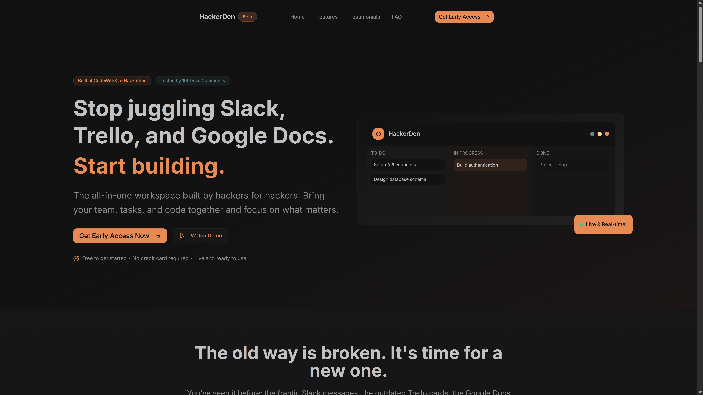
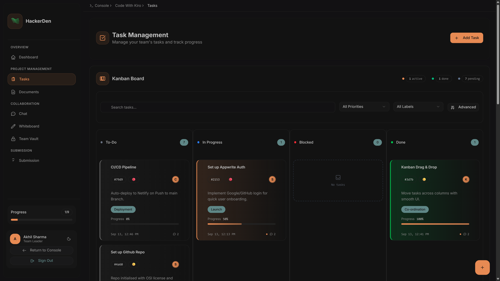
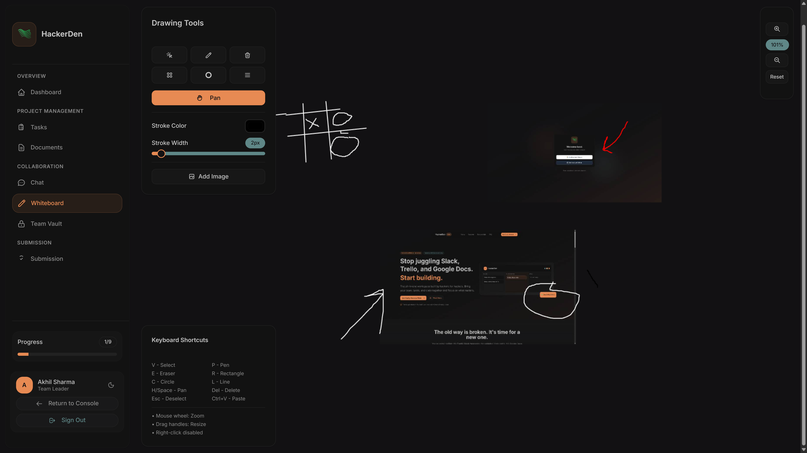

### 🎬 관련 영상
- [🎥 영상 보기](https://ph-files.imgix.net/5d088a8e-a854-498b-bcf4-2fac6710a141.jpeg?auto=format)

---

## 23. [VKO1](https://www.producthunt.com/products/vko1-for-ios-macos)
**Votes**: 72 | **도입 난이도**: 하 | **신뢰도**: 상
**Tagline**: A pad-based visual performance instrument for Apple products
**서비스 링크**: https://www.producthunt.com/r/FMSIEDZCKI4NF4

**태그**: Music, Visualizer, Performance, Apple

### 📌 이 서비스 한눈에 보기
Apple 기기에서 즐기는 직관적인 패드 기반 비주얼 퍼포먼스 악기

### 🔑 주요 기능
- iPhone, iPad, Apple Silicon Mac를 지원하는 멀티 플랫폼 앱
- 53종의 실시간 이펙트와 25종의 GPU 비주얼라이저 탑재
- AutoMix, MIDI, Ableton Link를 통한 강력한 연동성

### 🙋 사용자에게 어떤 점이 좋은가
직관적인 패드 조작과 화려한 시각 효과를 통해 어디서든 즉각적인 음악 퍼포먼스가 가능합니다.

### ✅ 지금 바로 써볼 기능
- 53가지 실시간 이펙트로 나만의 사운드 만들기
- GPU 비주얼라이저를 활용한 시각적 퍼포먼스 연출
- Ableton Link를 이용한 다른 기기와의 동기화

### ⚠️ 사용 전 확인할 점
- GPU 비주얼라이저 사용 시 기기 발열 및 배터리 소모 확인 필요
- Apple Silicon Mac 환경에서의 최적화 상태 확인 필요

### 🧭 확인이 더 필요한 정보
상세한 가격 정책 및 유료 기능 포함 여부는 명시되어 있지 않습니다.

### 📸 스크린샷 및 갤러리
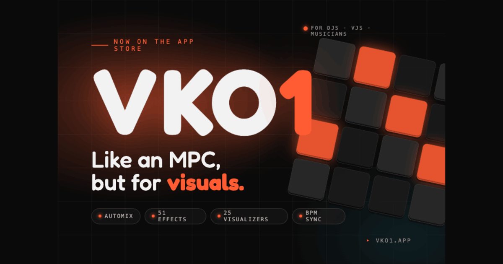
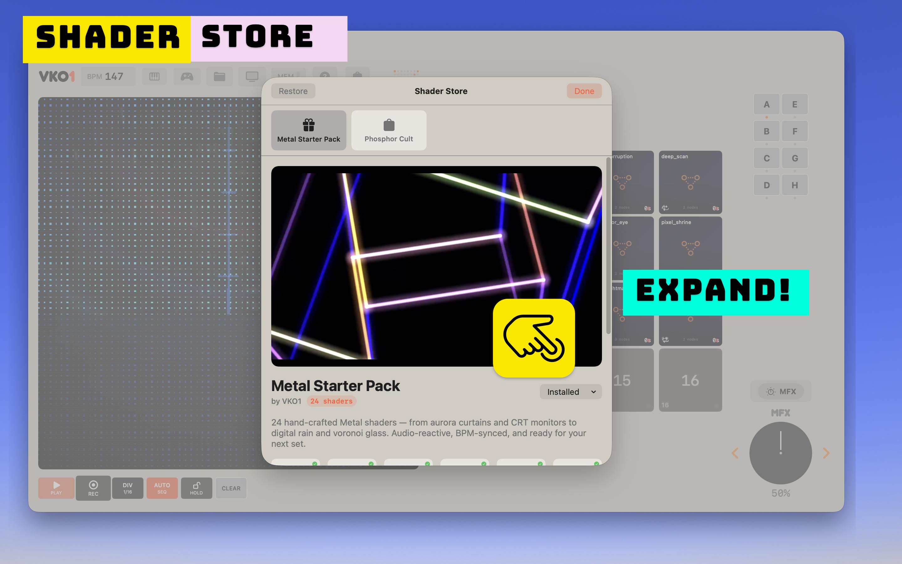
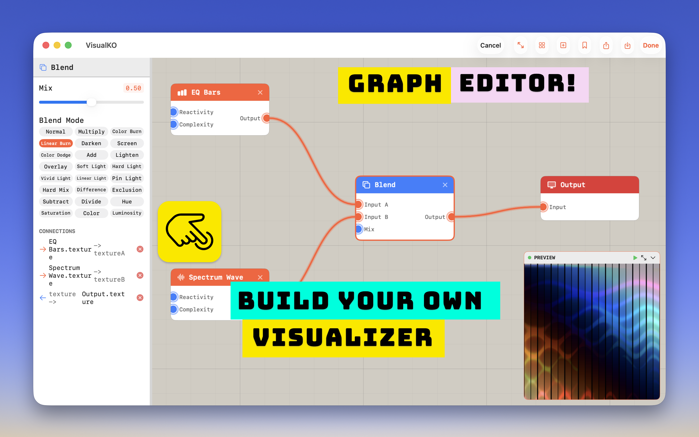

### 🎬 관련 영상
- [🎥 영상 보기](https://ph-files.imgix.net/0feb5a35-2ae2-45d6-88bb-b26e39d020ae.jpeg?auto=format)

---

## 24. [TabGroup Vault](https://www.producthunt.com/products/tabgroup-vault)
**Votes**: 72 | **도입 난이도**: 하 | **신뢰도**: 상
**Tagline**: Keep your tab groups safe, searchable, and restorable
**서비스 링크**: https://www.producthunt.com/r/JDSPPXSYWBKCHU

**태그**: Productivity, Browser Extension, Workflow

### 📌 이 서비스 한눈에 보기
중요한 크롬 탭 그룹을 안전하게 저장하고 언제든 쉽게 복구할 수 있는 세션 관리 도구

### 🔑 주요 기능
- 크롬 탭 그룹의 안전한 저장 및 검색 기능 제공
- Pro 버전 사용 시 멀티윈도우 세션 복구 및 자동 저장 지원
- 클라우드 동기화 및 무제한 스냅샷 기능 제공

### 🙋 사용자에게 어떤 점이 좋은가
수많은 탭을 열어두어 브라우저가 무거워지거나 작업 흐름이 끊기는 문제를 방지하고, 작업 환경을 즉시 복구할 수 있습니다.

### ✅ 지금 바로 써볼 기능
- 무료 확장 프로그램을 설치하여 기본 저장 기능 테스트하기
- 자주 사용하는 탭 그룹을 스냅샷으로 저장해보기
- Pro 기능(클라우드 동기화 등)의 필요성 검토하기

### ⚠️ 사용 전 확인할 점
- Pro 기능(자동 저장, 클라우드 동기화 등)은 유료 업그레이드가 필요함
- 무료 버전에서는 기능 제한이 있을 수 있음

### 🧭 확인이 더 필요한 정보
무료 버전과 Pro 버전 간의 구체적인 기능 차이와 가격 정책에 대한 상세 정보가 필요합니다.

### 📸 스크린샷 및 갤러리
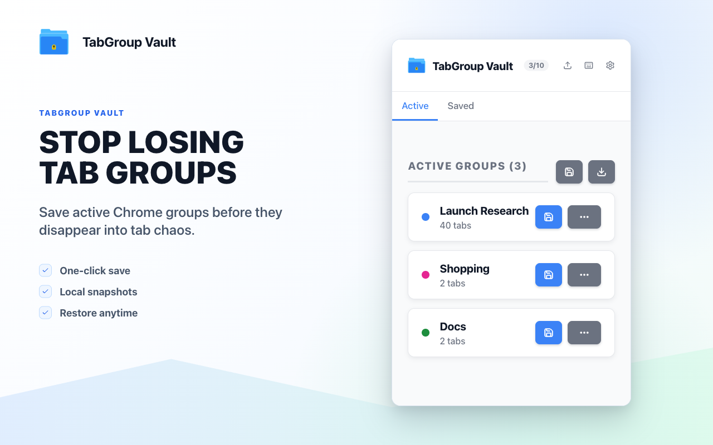
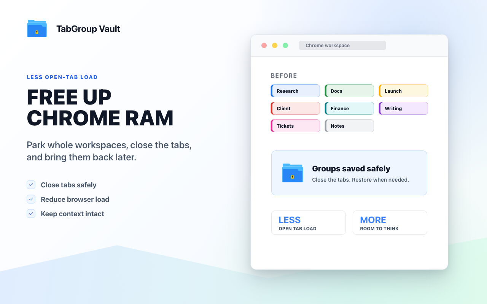
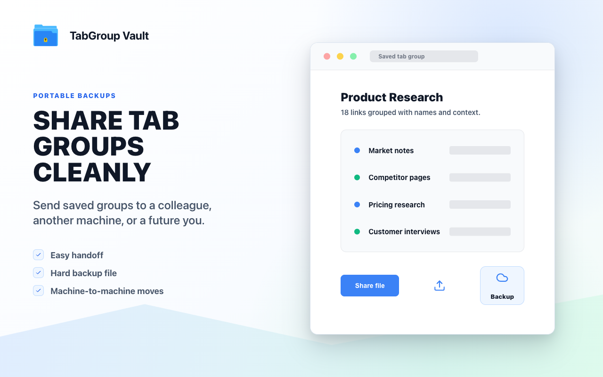

---

## 25. [EmailTemple](https://www.producthunt.com/products/emailtemple)
**Votes**: 71 | **도입 난이도**: 하 | **신뢰도**: 상
**Tagline**: The AI studio for creating high conversion, on-brand emails
**서비스 링크**: https://www.producthunt.com/r/I553LUD5XCIPOA

**태그**: MarketingTool, AI, Design, EmailMarketing, Productivity, AI Tool, Chat, Email

### 📌 이 서비스 한눈에 보기
브랜드 가이드가 적용된 ESP 네이티브 이메일 템플릿을 즉시 생성하는 AI 스튜디오

### 🔑 주요 기능
- Mailchimp, ActiveCampaign 등 주요 ESP 전용 편집 가능한 블록 생성
- 브랜드 키트가 내장되어 일관된 디자인 유지
- 다크 모드 최적화 및 실시간 미리보기 지원

### 🙋 사용자에게 어떤 점이 좋은가
단순 HTML 생성을 넘어 실제 이메일 서비스(ESP)에서 바로 편집 가능한 결과물을 제공하므로, 디자인 수정 시간을 획기적으로 줄여줍니다.

### ✅ 지금 바로 써볼 기능
- 사용 중인 이메일 서비스(Mailchimp 등)에 맞춘 템플릿 생성 테스트
- 브랜드 키트 설정 및 디자인 일관성 확인
- 다크 모드 대응 및 실시간 미리보기 기능 검증

### ⚠️ 사용 전 확인할 점
- 지원하는 ESP(이메일 서비스 제공업체) 목록 확인 필요
- 복잡한 커스텀 레이아웃의 경우 ESP 편집 기능과의 호환성 체크 필요

### 🧭 확인이 더 필요한 정보
현재 지원하는 구체적인 ESP 플랫폼 목록과 브랜드 키트 업로드 방식에 대한 상세 정보가 필요합니다.

### 📸 스크린샷 및 갤러리
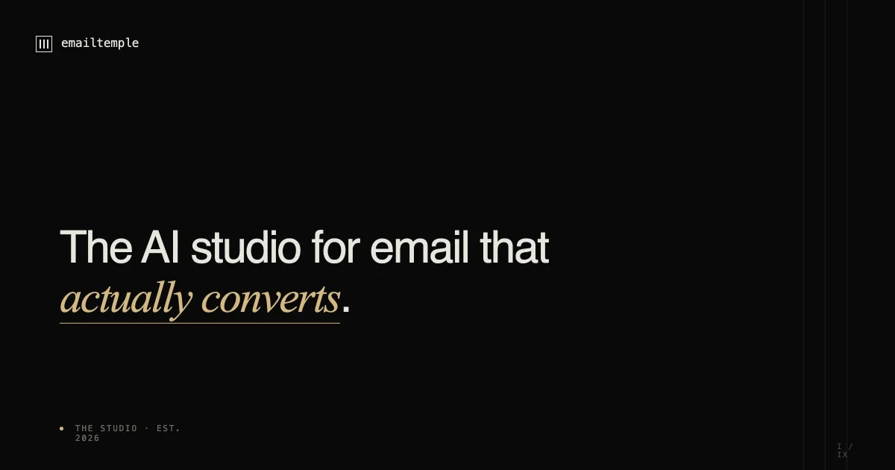

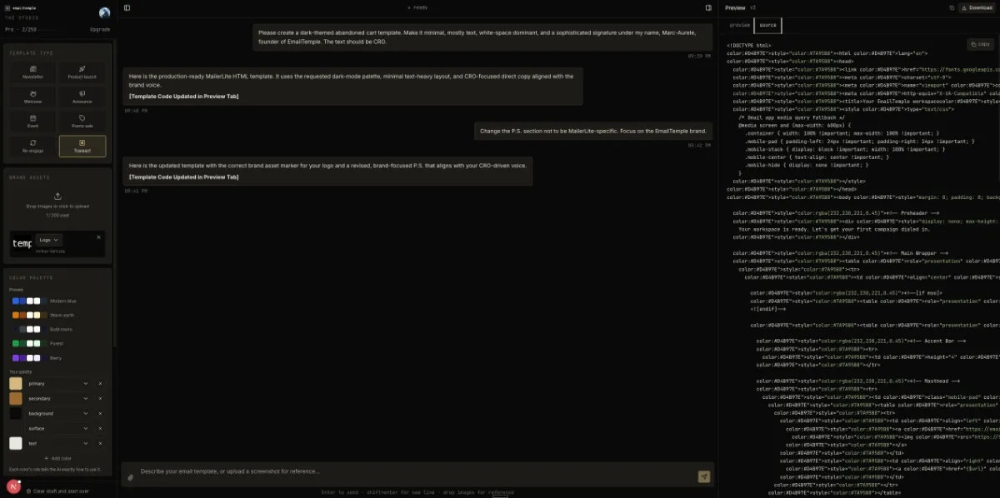

---

## 26. [Long Horizon](https://www.producthunt.com/products/long-horizon)
**Votes**: 70 | **도입 난이도**: 중 | **신뢰도**: 상
**Tagline**: Your coding agent writes the feature and runs the tests
**서비스 링크**: https://www.producthunt.com/r/3GZ7FRH6EJBMFP

**태그**: DevTool, AI Agent, Automation, Testing, Agent, AI Tool

### 📌 이 서비스 한눈에 보기
코드 작성부터 브라우저 테스트 및 결과 보고까지 자동화하는 AI 코딩 에이전트

### 🔑 주요 기능
- 기능 구현과 테스트 자동화 통합
- 실제 브라우저 환경에서의 테스트 실행
- 로그, 스크린샷, 네트워크 상세 정보가 포함된 공유 가능한 실행 보고서 제공

### 🙋 사용자에게 어떤 점이 좋은가
개발자가 코드를 작성한 후 수동으로 테스트하는 번거로움을 줄여주며, 결과 리포트를 통해 기능 구현의 신뢰도를 즉각 확인할 수 있습니다.

### ✅ 지금 바로 써볼 기능
- 에이전트가 작성한 코드의 테스트 실행 기능 확인
- 생성된 실행 보고서의 상세도(로그, 스크린샷 등) 검토
- 기존 워크플로우와의 연동 가능성 테스트

### ⚠️ 사용 전 확인할 점
- 에이전트가 작성한 테스트 코드가 실제 비즈니스 로직을 완벽히 검증하는지 확인 필요
- 브라우저 기반 테스트 실행 시 발생할 수 있는 환경 설정 이슈

### 🧭 확인이 더 필요한 정보
지원하는 프로그래밍 언어 및 프레임워크의 범위에 대한 정보가 명시되지 않았습니다.

### 📸 스크린샷 및 갤러리
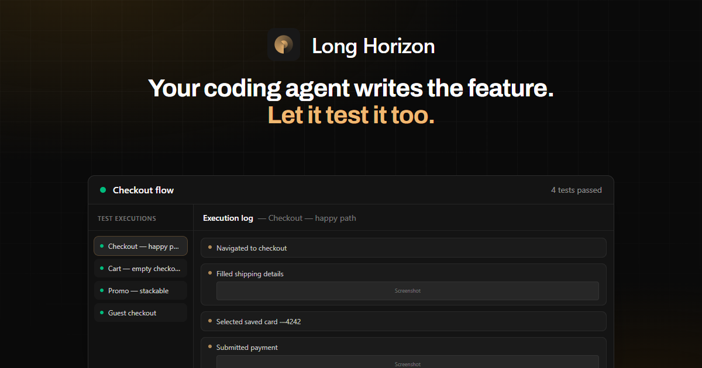
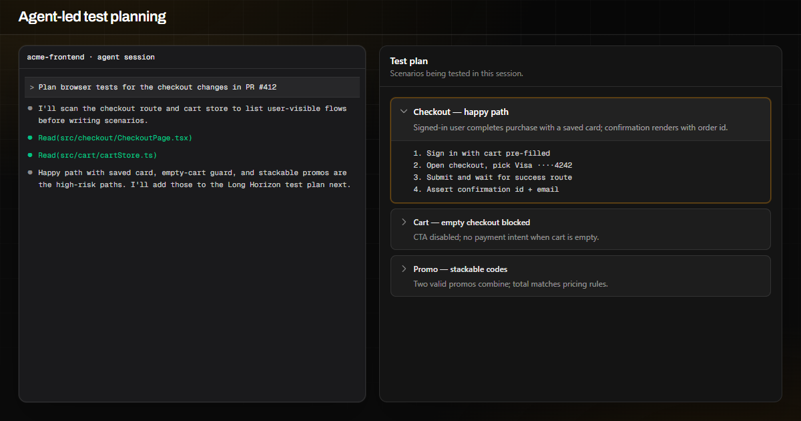
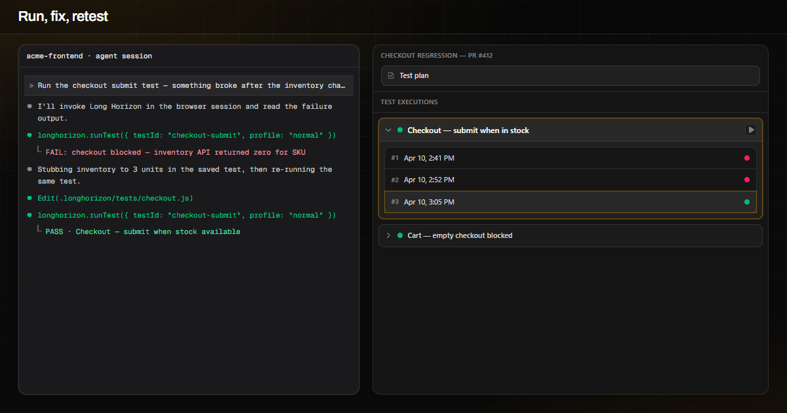

### 🎬 관련 영상
- [🎥 영상 보기](https://ph-files.imgix.net/2474d64f-c2d9-4629-b63d-a585310a4bca.jpeg?auto=format)

---

## 27. [MusicMinutes](https://www.producthunt.com/products/musicminutes)
**Votes**: 69 | **도입 난이도**: 하 | **신뢰도**: 상
**Tagline**: Connecting small music artists to Spotify curators
**서비스 링크**: https://www.producthunt.com/r/BFRCJNZAOIUANI

**태그**: Music, ArtistTools, Marketing, Networking, AI Tool

### 📌 이 서비스 한눈에 보기
24,000개의 검증된 스포티파이 플레이리스트 연락처를 통해 독립 아티스트의 곡을 직접 피칭할 수 있는 서비스

### 🔑 주요 기능
- 24,000개의 검증된 스포티파이 플레이리스트 연락처 디렉토리 제공
- 아티스트가 직접 피칭할 수 있는 직접적인 네트워크 구축 지원
- 플레이리스트의 가치 판단을 위한 데이터 지표 및 데일리 봇 체크를 통한 안전성 확보

### 🙋 사용자에게 어떤 점이 좋은가
중소 규모 독립 아티스트가 중간 단계 없이 플레이리스트 큐레이터에게 직접 곡을 전달하여 홍보 기회를 얻을 수 있습니다.

### ✅ 지금 바로 써볼 기능
- 제공되는 플레이리스트 디렉토리 탐색
- 곡의 스타일과 맞는 플레이리스트 매칭 및 지표 확인
- 큐레이터에게 직접 피칭 및 네트워크 구축

### ⚠️ 사용 전 확인할 점
- 플레이리스트의 품질과 실제 영향력은 아티스트가 직접 판단해야 함
- 직접 피칭 방식이므로 아티스트의 적극적인 커뮤니케이션 역량이 필요함

### 🧭 확인이 더 필요한 정보
구체적인 구독 모델이나 연락처 접근 권한에 대한 비용 체계가 명시되지 않았습니다.

### 📸 스크린샷 및 갤러리
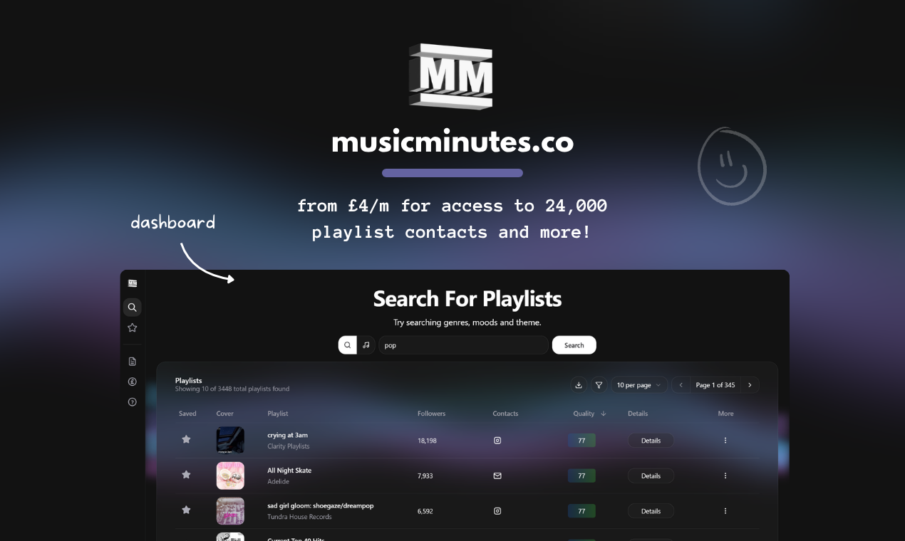
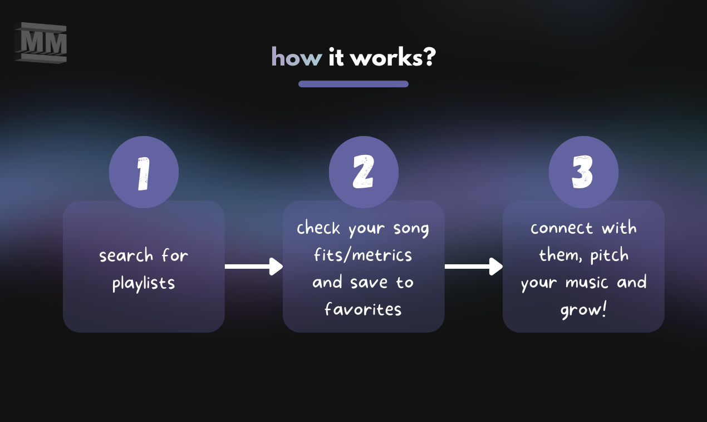
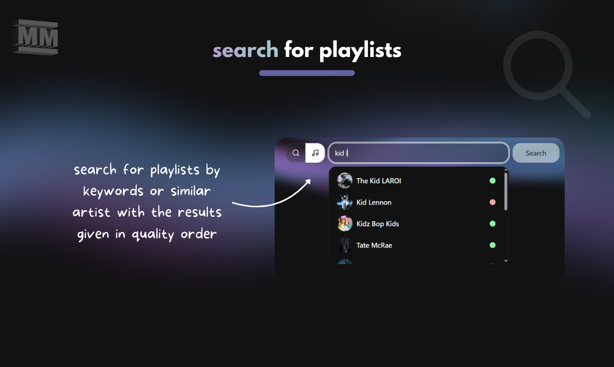

### 🎬 관련 영상
- [🎥 영상 보기](https://ph-files.imgix.net/ea501564-8120-4626-a444-d9ca9aaa0c21.jpeg?auto=format)

---

## 28. [Pixcode](https://www.producthunt.com/products/pixcode)
**Votes**: 68 | **도입 난이도**: 상 | **신뢰도**: 상
**Tagline**: A self-hosted control room for AI coding agents
**서비스 링크**: https://www.producthunt.com/r/24VRJADRX6NYD5

**태그**: DevTool, AI-Agent, Automation, Self-Hosted, Agent, AI Tool, API

### 📌 이 서비스 한눈에 보기
다양한 AI 코딩 에이전트를 한곳에서 관리하고 제어할 수 있는 셀프 호스팅 컨트롤 룸

### 🔑 주요 기능
- Claude Code, Cursor CLI 등 다양한 AI 코딩 에이전트 통합 지원
- 멀티 에이전트 오케스트레이션 및 파일/쉘/Git 관리 기능
- Telegram 알림, MCP, 플러그인 등 확장 가능한 제어 환경 제공

### 🙋 사용자에게 어떤 점이 좋은가
여러 AI 코딩 도구를 개별적으로 실행할 필요 없이 하나의 인터페이스에서 통합 관리하여 개발 워크플로우를 효율화할 수 있습니다.

### ✅ 지금 바로 써볼 기능
- 자신이 사용하는 CLI 에이전트와 연동 테스트
- 셀프 호스팅 환경 구축 및 보안 설정 확인
- 멀티 에이전트 협업 워크플로우 구성

### ⚠️ 사용 전 확인할 점
- 셀프 호스팅 방식이므로 서버 관리 및 보안 책임이 사용자에게 있음
- 다양한 도구 통합에 따른 초기 설정 복잡도 존재

### 🧭 확인이 더 필요한 정보
사용자의 로컬 환경이나 서버 환경에 따른 설치 난이도와 리소스 요구 사양을 확인해야 합니다.

### 📸 스크린샷 및 갤러리
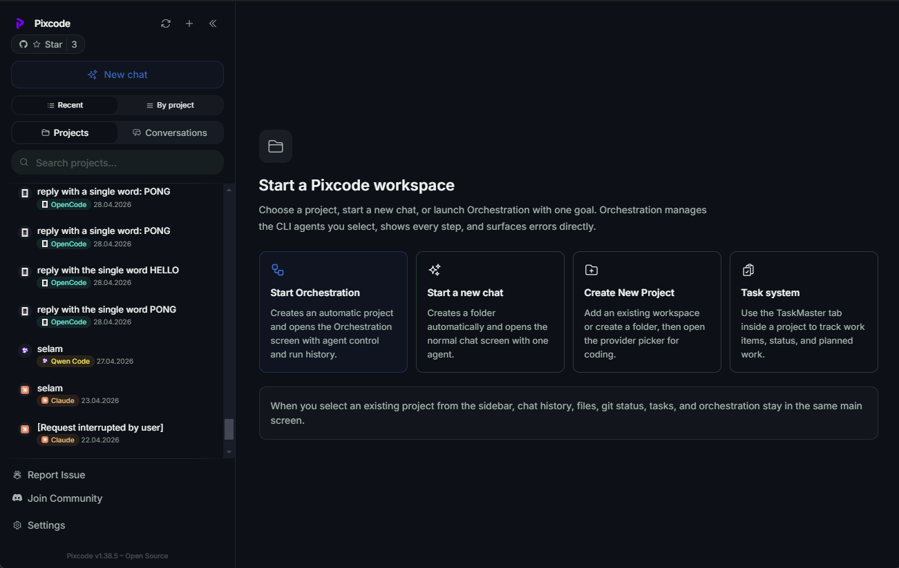
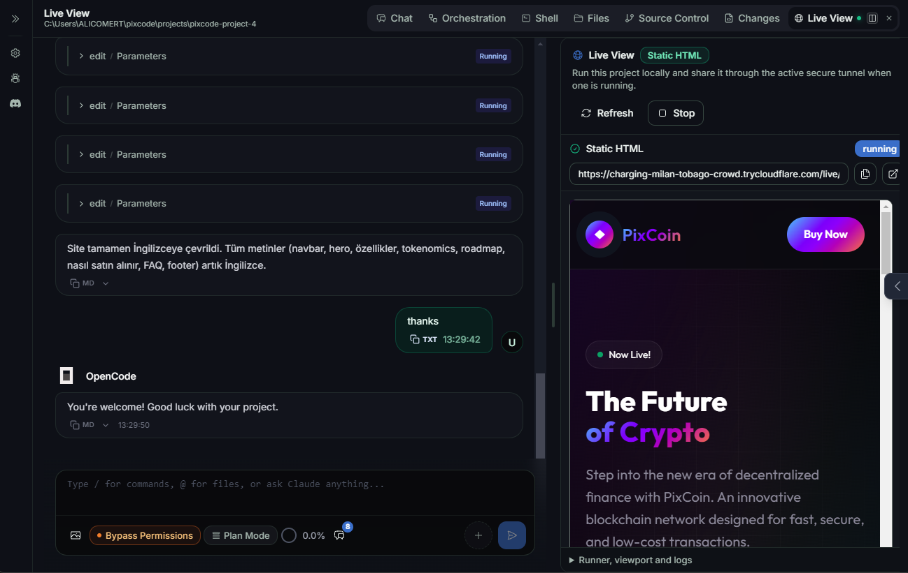
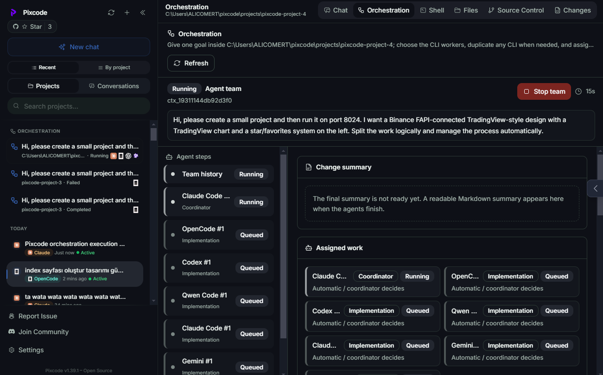

---

## 29. [Synci](https://www.producthunt.com/products/synci)
**Votes**: 68 | **도입 난이도**: 하 | **신뢰도**: 상
**Tagline**: AI soundtrack platform with full licensing
**서비스 링크**: https://www.producthunt.com/r/PFP7Y2G6FHO6P4

**태그**: ContentCreation, AI, Music, Productivity, Automation, AI Tool, DevTool

### 📌 이 서비스 한눈에 보기
검색, AI 생성, 라이선스 해결을 하나로 합친 올인원 AI 사운드트랙 플랫폼

### 🔑 주요 기능
- 4만 곡 이상의 큐레이션된 시네마틱 트랙 카탈로그 제공
- 고급 AI 모델을 활용한 음악 및 효과음 생성 기능
- 저작권 걱정 없는 완전한 라이선스 권한 부여

### 🙋 사용자에게 어떤 점이 좋은가
여러 도구를 번거롭게 오갈 필요 없이 검색부터 생성, 저작권 해결까지 한 곳에서 끝낼 수 있어 콘텐츠 제작 시간을 단축해 줍니다.

### ✅ 지금 바로 써볼 기능
- 4만 곡 이상의 카탈로그에서 원하는 스타일 검색하기
- AI 모델을 사용하여 독창적인 사운드 효과 생성하기
- 크롬 확장 프로그램을 설치하여 작업 흐름에 통합하기

### ⚠️ 사용 전 확인할 점
- 제공되는 라이선스의 구체적인 사용 범위(상업적 이용 범위 등) 확인 필요
- AI 생성물의 저작권 귀속 주체에 대한 약관 검토 필요

### 🧭 확인이 더 필요한 정보
AI로 생성된 음악의 저작권 보호 범위와 라이선스 정책의 세부 사항을 확인해야 합니다.

### 📸 스크린샷 및 갤러리
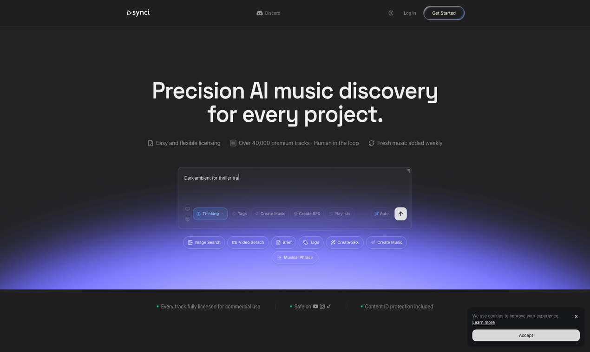
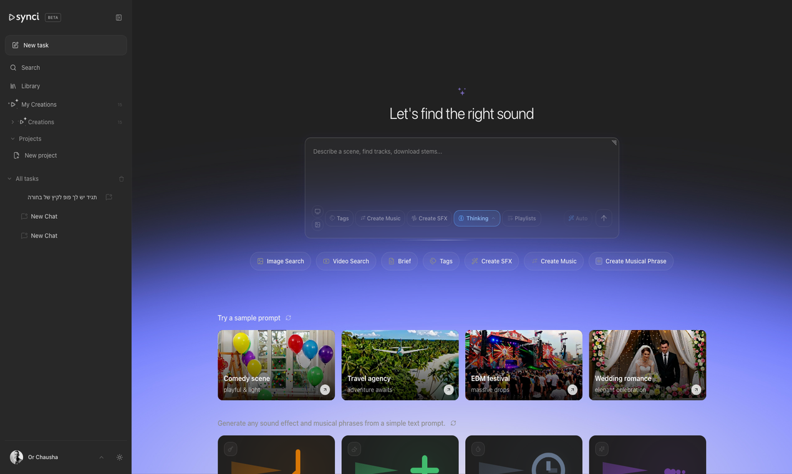
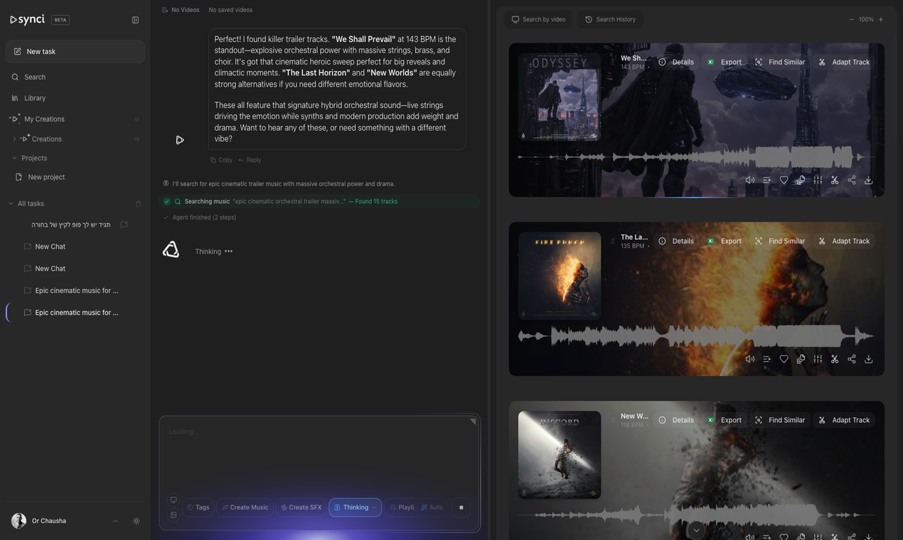

### 🎬 관련 영상
- [🎥 영상 보기](https://ph-files.imgix.net/b858b3c9-ff78-4e4e-b623-af111c969f4d.jpeg?auto=format)

---

## 30. [ARKAD Wallet](https://www.producthunt.com/products/arkad-wallet)
**Votes**: 68 | **도입 난이도**: 하 | **신뢰도**: 상
**Tagline**: The budgeting app you’ll actually use.
**서비스 링크**: https://www.producthunt.com/r/75V4HX26PAKCBM

**태그**: Finance, Budgeting, Productivity, Voice-Input

### 📌 이 서비스 한눈에 보기
음성 입력으로 복잡함 없이 빠르고 간편하게 관리하는 실전형 가계부

### 🔑 주요 기능
- 음성 명령을 통한 간편한 지출 기록
- 카테고리별 예산 설정 및 목표 추적 기능
- 은행 연동 없이 직접 관리하는 깔끔한 UI

### 🙋 사용자에게 어떤 점이 좋은가
복잡한 금융 앱에 지친 사용자가 별도의 계좌 연동 없이 즉각적이고 직관적으로 지출을 기록하고 관리할 수 있습니다.

### ✅ 지금 바로 써볼 기능
- 음성 입력 기능 테스트하기
- 카테고리별 예산 설정해보기
- 순자산(Net worth) 현황 확인하기

### ⚠️ 사용 전 확인할 점
- 은행 자동 연동이 지원되지 않아 수동 입력이 필요함
- 무제한 음성 입력을 위해서는 프리미엄 결제가 필요함

### 🧭 확인이 더 필요한 정보
무료 버전에서 제공되는 음성 입력의 횟수 제한 범위가 명시되지 않았습니다.

### 📸 스크린샷 및 갤러리
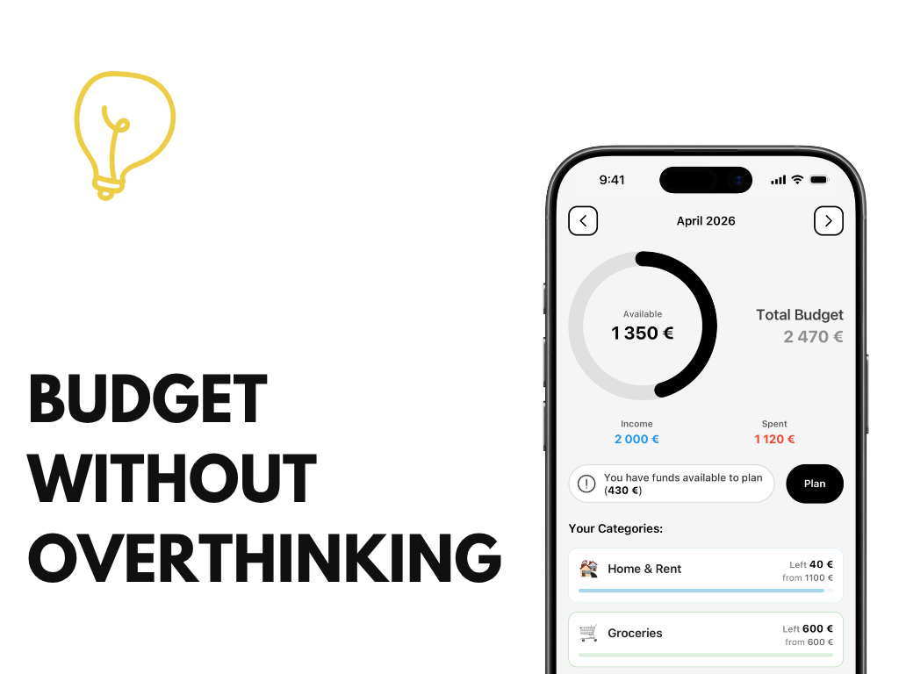
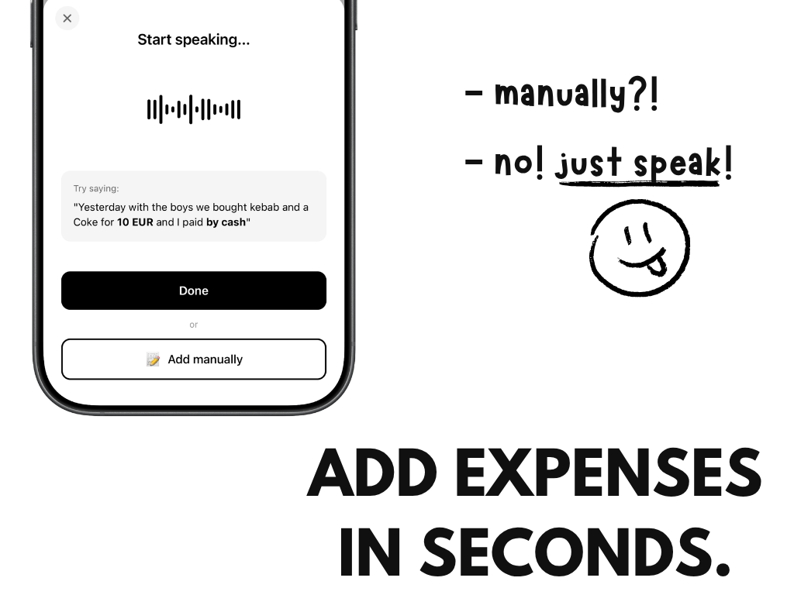

### 🎬 관련 영상
- [🎥 영상 보기](https://ph-files.imgix.net/87030911-39db-45f6-a5c5-9113686a8ba2.jpeg?auto=format)

---

