# 🚀 Product Hunt Daily Top 30 (2026-05-14)

## 오늘의 요약
오늘의 트렌드는 AI가 단순한 보조 도구를 넘어, 사용자의 일상과 업무 프로세스에 깊숙이 개입하여 스스로 진화하거나 운영을 자동화하는 '에이전트 중심'의 서비스가 주를 이루었습니다. 특히 하드웨어와 소프트웨어의 경계를 허무는 웨어러블, 실시간으로 변화하는 UI, 그리고 기업 데이터를 안전하게 연결하는 인프라 기술이 주목받았습니다.

### 오늘의 핵심 포인트
- AI 에이전트가 직접 업무를 수행하거나 UI를 스스로 구축하는 자율형 소프트웨어 솔루션이 등장했습니다.
- 개별 앱에 흩어진 데이터를 통합하여 AI의 지식 저장소로 활용하거나, 실시간 데이터 접근을 가능하게 하는 인프라 기술이 강조되었습니다.
- 음성 기록, 마케팅 자동화, 고객 응대 등 특정 비즈니스 도메인에 특화된 AI 운영 관리 도구들이 대거 출시되었습니다.

**오늘의 태그**: AI Agent, Automation, Productivity, SaaS, Future of Work

## 1. [Memoket Gem](https://www.producthunt.com/products/memoket-gem)
**Votes**: 297 | **도입 난이도**: 중 | **신뢰도**: 상
**Tagline**: An AI wearable that remembers your conversations all day
**서비스 링크**: https://www.producthunt.com/r/UIMN4URVUICVGJ

**태그**: AI, Wearable, Productivity, Automation, AI Tool, Chat

### 📌 이 서비스 한눈에 보기
하루 종일 대화를 기록하고 업무로 자동 변환해주는 AI 웨어러블 디바이스

### 🔑 주요 기능
- 미팅, 통화, 일상 대화 등 모든 음성 대화를 실시간 캡처
- 대화 내용 요약 및 맥락 연결을 통한 핵심 순간 추출
- 기록된 내용을 작업(Task), 노트, 후속 조치로 자동 변환

### 🙋 사용자에게 어떤 점이 좋은가
직접 메모할 필요 없이 대화의 맥락을 놓치지 않고 기록하며, 대화 내용을 즉시 업무용 툴로 연동하여 생산성을 높일 수 있습니다.

### ✅ 지금 바로 써볼 기능
- 파운딩 멤버 프로그램 신청을 통한 초기 사용자 참여
- 기존 업무 툴과의 연동성 확인
- 실제 대화 환경에서의 녹음 품질 테스트

### ⚠️ 사용 전 확인할 점
- 웨어러블 기기 특성상 배터리 지속 시간 및 착용감 확인 필요
- 개인정보 및 대화 보안/프라이버시 관리 정책 확인 필요

### 🧭 확인이 더 필요한 정보
현재 파운딩 멤버를 모집 중이므로 구체적인 하드웨어 스펙과 가격 정책은 미정입니다.

### 📸 스크린샷 및 갤러리
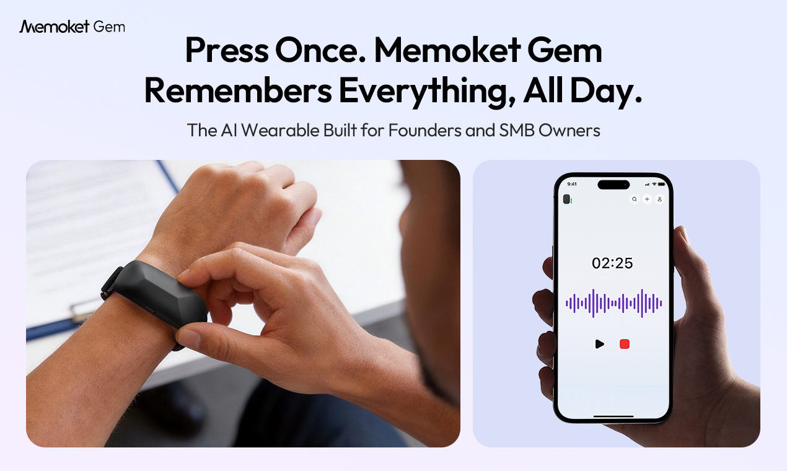

---

## 2. [Latitude for Claude Code](https://www.producthunt.com/products/latitude-4)
**Votes**: 252 | **도입 난이도**: 하 | **신뢰도**: 상
**Tagline**: See where Claude Code burns tokens. Hit your limits less.
**서비스 링크**: https://www.producthunt.com/r/SQUMMFO54D7IZ2

**태그**: DevTool, AI-Agent, Analytics, Cost-Management, Agent, Prompting

### 📌 이 서비스 한눈에 보기
Claude Code의 토큰 사용량과 작업 과정을 투명하게 추적하여 비용과 제한을 관리하는 분석 도구

### 🔑 주요 기능
- Claude Code 세션의 전체 시스템 프롬프트 및 도구 호출 내역 추적
- 서브 에이전트 활동 및 턴당 토큰 비용 상세 분석
- 간편한 설치와 주간 통계 리포트 제공

### 🙋 사용자에게 어떤 점이 좋은가
Claude Code 사용 시 발생하는 비용과 토큰 소모 패턴을 시각화하여, 할당량 제한에 걸리지 않도록 효율적인 워크플로우를 설계할 수 있습니다.

### ✅ 지금 바로 써볼 기능
- 한 줄 명령어로 도구 설치하기
- 세션별 토큰 소모량 및 시스템 프롬프트 확인하기
- 주간 리포트를 통해 사용 패턴 분석하기

### ⚠️ 사용 전 확인할 점
- 사용자 계정에 데이터가 저장되므로 보안 및 개인정보 정책 확인 필요
- Claude Code 환경과의 호환성 확인

### 🧭 확인이 더 필요한 정보
데이터가 저장되는 '계정'의 구체적인 보안 수준과 데이터 보관 정책에 대한 정보가 명시되지 않았습니다.

### 📸 스크린샷 및 갤러리
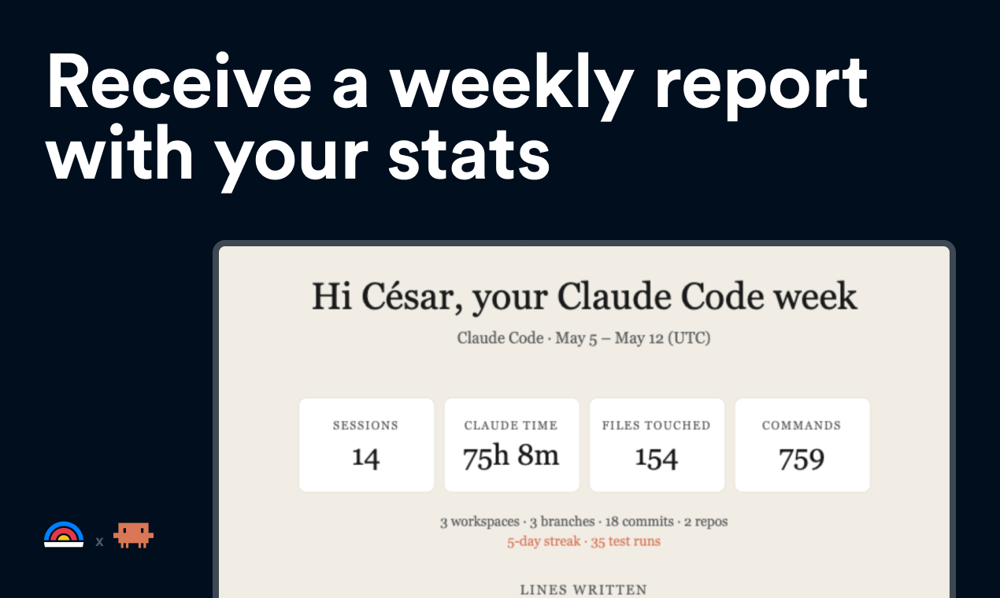
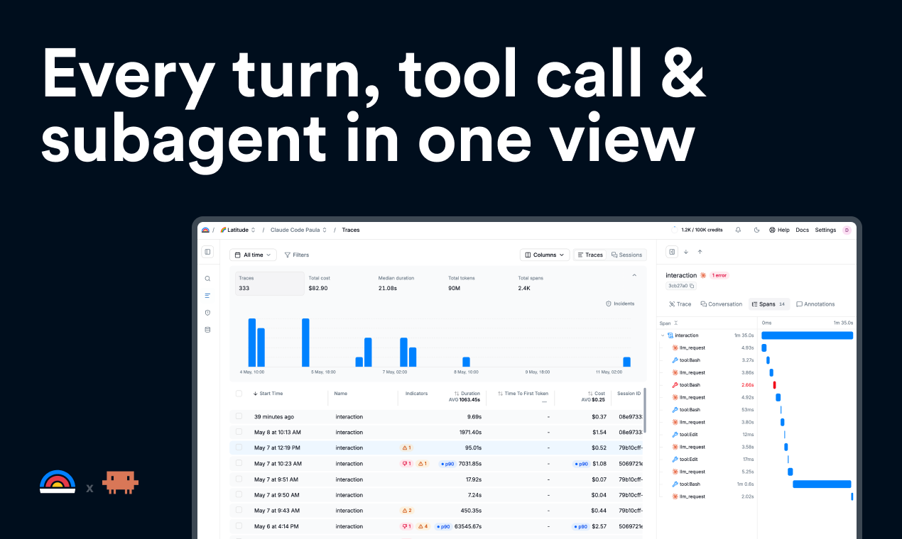
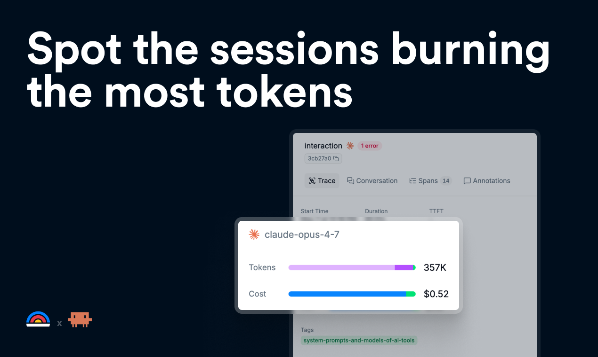

### 🎬 관련 영상
- [🎥 영상 보기](https://ph-files.imgix.net/b97b7457-c77c-4ee1-8ee5-1bfde880c266.jpeg?auto=format)

---

## 3. [CraftBot with Living UI](https://www.producthunt.com/products/craftbot)
**Votes**: 200 | **도입 난이도**: 중 | **신뢰도**: 상
**Tagline**: Grow your own software that is alive.
**서비스 링크**: https://www.producthunt.com/r/KD55BIO53WF7SJ

**태그**: AI Agent, LowCode, Productivity, Dynamic UI, Agent, AI Tool, Design

### 📌 이 서비스 한눈에 보기
사용자의 요구에 맞춰 스스로 진화하고 변화하는 AI 기반 맞춤형 소프트웨어 제작 시스템

### 🔑 주요 기능
- AI 에이전트가 직접 앱과 대시보드를 구축하고 관리하는 Living UI 시스템
- 사용자의 필요에 따라 기능을 추가하거나 디자인을 변경하며 지속적으로 진화하는 UI
- AI가 UI의 상태를 실시간으로 인지하여 읽기, 쓰기 및 직접적인 액션 수행 가능

### 🙋 사용자에게 어떤 점이 좋은가
고정된 소프트웨어를 사용하는 대신, 사용자의 업무 흐름에 맞춰 실시간으로 변화하는 맞춤형 도구를 가질 수 있습니다.

### ✅ 지금 바로 써볼 기능
- 기존 업무 프로세스를 위한 맞춤형 대시보드 생성 요청하기
- 사용 중인 UI에 새로운 기능 추가 및 디자인 변경 요청하기
- AI 에이전트와 UI 간의 상호작용 테스트하기

### ⚠️ 사용 전 확인할 점
- UI가 지속적으로 변하므로 사용자의 숙련도나 인터페이스 적응이 필요할 수 있음
- AI가 생성하는 코드나 UI의 안정성 및 보안성 확인 필요

### 🧭 확인이 더 필요한 정보
Living UI가 생성하는 애플리케이션의 기술 스택과 데이터 보안 정책에 대한 구체적인 정보가 필요합니다.

### 📸 스크린샷 및 갤러리
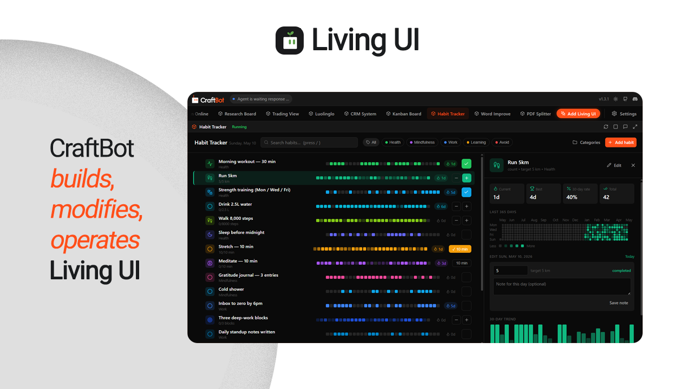
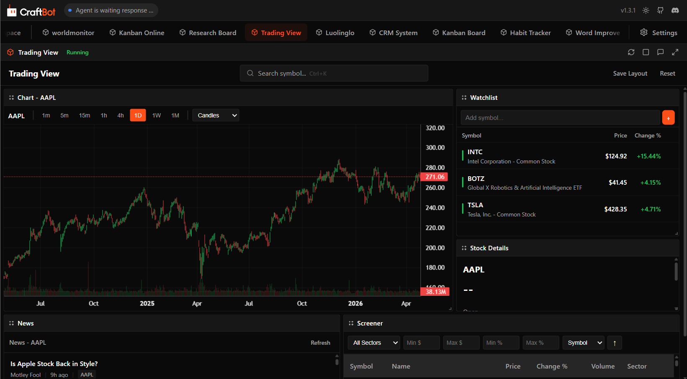
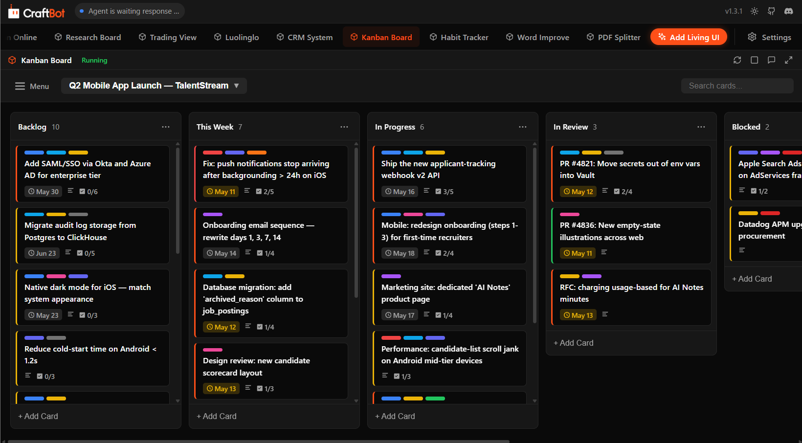

### 🎬 관련 영상
- [🎥 영상 보기](https://ph-files.imgix.net/9e8d1d78-420a-4105-940a-6be91fb6ddae.jpeg?auto=format)

---

## 4. [Frontdesk AI](https://www.producthunt.com/products/frontdesk-ai)
**Votes**: 179 | **도입 난이도**: 하 | **신뢰도**: 상
**Tagline**: AI COO to run your business like a Fortune 500 enterprise
**서비스 링크**: https://www.producthunt.com/r/IBL3TVYYV5RNA7

**태그**: Automation, AI Agent, CRM, SaaS, Business Operations, Agent, AI Tool, Email

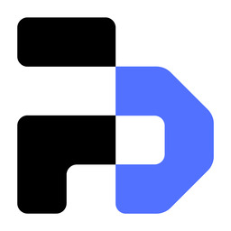

### 📌 이 서비스 한눈에 보기
웹사이트 주소만으로 고객 응대부터 운영까지 자동화하는 AI 비즈니스 운영 관리자

### 🔑 주요 기능
- 웹사이트 입력만으로 맞춤형 AI 에이전트 자동 생성
- 전화, 문자, 이메일을 통한 24/7 고객 커뮤니케이션 자동화
- CRM, 티켓팅 시스템, 웹사이트 빌더를 통합한 올인원 운영 솔루션

### 🙋 사용자에게 어떤 점이 좋은가
별도의 복잡한 설정 없이도 AI가 고객 응대와 운영 업무를 대신 처리하여 비즈니스 규모를 효율적으로 확장할 수 있습니다.

### ✅ 지금 바로 써볼 기능
- 자사 웹사이트 입력하여 AI 에이전트 생성하기
- 자동화된 고객 응대(전화/문자/이메일) 시나리오 테스트
- 통합된 CRM 및 티켓팅 시스템 기능 확인

### ⚠️ 사용 전 확인할 점
- AI 에이전트의 답변 정확도 및 브랜드 톤앤매너 일치 여부 확인 필요
- 복잡한 비즈니스 로직이 필요한 경우 커스텀 설정 가능 범위 확인 필요

### 🧭 확인이 더 필요한 정보
웹사이트 입력만으로 생성되는 AI 에이전트의 구체적인 커스텀 기능과 기존 툴과의 연동 범위는 추가 확인이 필요합니다.

### 📸 스크린샷 및 갤러리
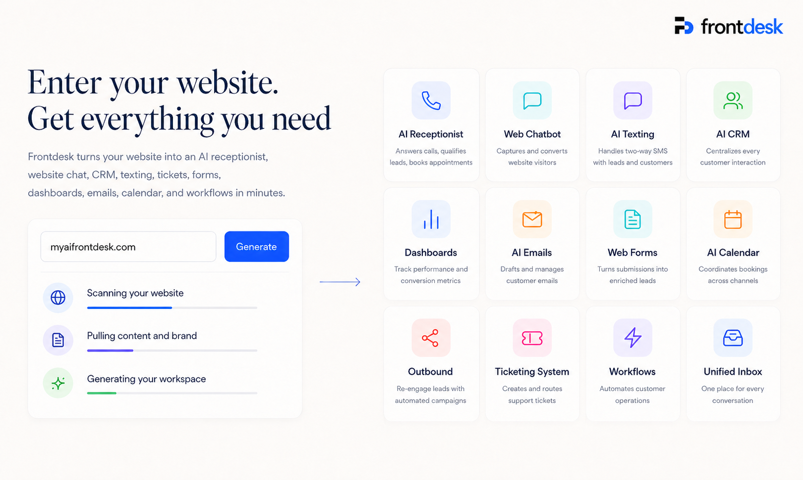
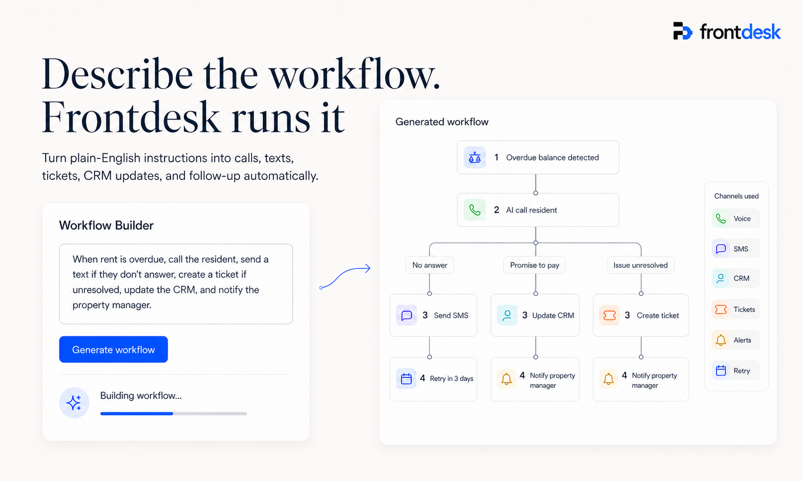
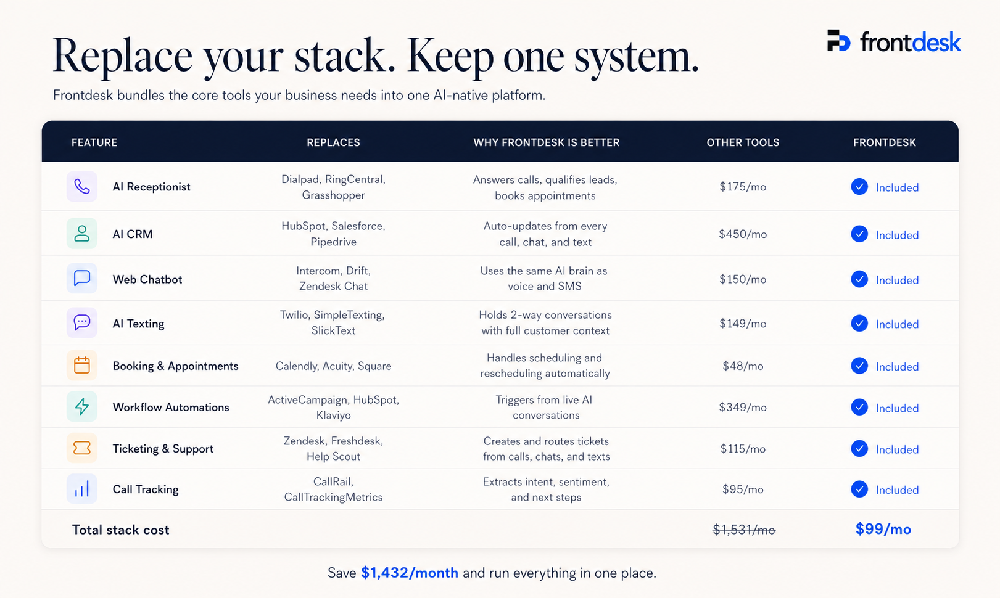

### 🎬 관련 영상
- [🎥 영상 보기](https://ph-files.imgix.net/4159af09-ccf9-42aa-8346-06cd1d47beb5.jpeg?auto=format)

---

## 5. [Googlebook](https://www.producthunt.com/products/googlebook-2)
**Votes**: 172 | **도입 난이도**: 하 | **신뢰도**: 중
**Tagline**: A new kind of laptop designed for Gemini Intelligence
**서비스 링크**: https://www.producthunt.com/r/KNMETG3IF3WYDV

**태그**: Hardware, AI, Productivity, Design

### 📌 이 서비스 한눈에 보기
Gemini AI를 위해 설계된 차세대 지능형 노트북

### 🔑 주요 기능
- Gemini AI 엔진에 최적화된 하드웨어 설계
- 맥락 기반 제안을 제공하는 '매직 포인터(Magic Pointer)' 탑재
- 작업 효율을 높여주는 맞춤형 위젯 기능

### 🙋 사용자에게 어떤 점이 좋은가
AI 중심의 작업 환경을 원하는 사용자에게 최적화된 인터페이스와 도구를 제공하여 생산성을 높여줍니다.

### ✅ 지금 바로 써볼 기능
- googlebook.com 방문하여 업데이트 확인
- 올가을 출시 일정 체크
- Gemini AI 활용 시나리오 구상

### ⚠️ 사용 전 확인할 점
- 아직 출시 전인 제품으로 실제 하드웨어 사양 미확정
- AI 기능의 구체적인 작동 방식 및 개인정보 보호 정책 확인 필요

### 🧭 확인이 더 필요한 정보
제품의 정확한 출시일과 상세 하드웨어 스펙은 공식 발표를 기다려야 합니다.

### 📸 스크린샷 및 갤러리
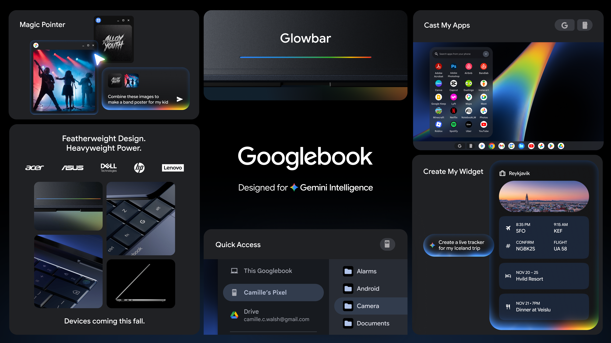

### 🎬 관련 영상
- [🎥 영상 보기](https://ph-files.imgix.net/d80e28ed-27bc-4df7-8368-2adffdcaa47b.jpeg?auto=format)

---

## 6. [Blaze 2.0](https://www.producthunt.com/products/blaze-5)
**Votes**: 167 | **도입 난이도**: 하 | **신뢰도**: 상
**Tagline**: AI marketer for SMBs complete w/ strategy, content, and ads
**서비스 링크**: https://www.producthunt.com/r/EUMWADF264GGP2

**태그**: Marketing, AI, Automation, SMB, AI Tool

### 📌 이 서비스 한눈에 보기
비즈니스 학습을 통해 전략부터 콘텐츠, 광고까지 자동 관리하는 AI 마케팅 팀

### 🔑 주요 기능
- 비즈니스 모델, 타겟 고객, 브랜드 보이스 자동 학습
- 콘텐츠 전략 수립부터 실행까지 전 과정 자동화
- 마케팅 인력 채용 비용 절감 효과

### 🙋 사용자에게 어떤 점이 좋은가
마케팅에 투입할 시간과 전문 인력이 부족한 소상공인 및 중소기업이 효율적으로 브랜드 노출을 관리할 수 있습니다.

### ✅ 지금 바로 써볼 기능
- 브랜드 보이스 학습 기능 테스트
- 자동 생성된 콘텐츠 전략 검토
- 타겟 오디언스 설정 및 광고 자동화 확인

### ⚠️ 사용 전 확인할 점
- AI가 생성한 콘텐츠의 브랜드 적합성 검수 필요
- 자동화된 광고 집행 시 예산 관리 주의

### 🧭 확인이 더 필요한 정보
구체적인 광고 플랫폼 연동 범위와 자동화된 예산 관리 방식에 대한 정보가 부족합니다.

### 📸 스크린샷 및 갤러리

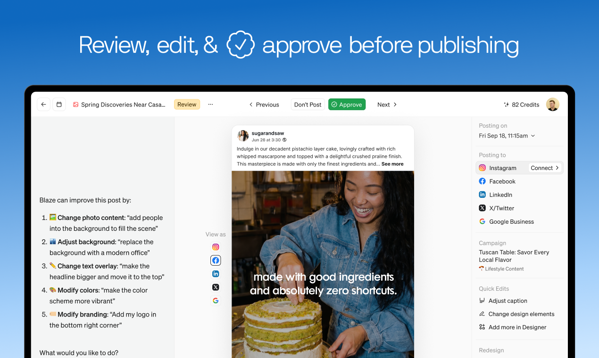
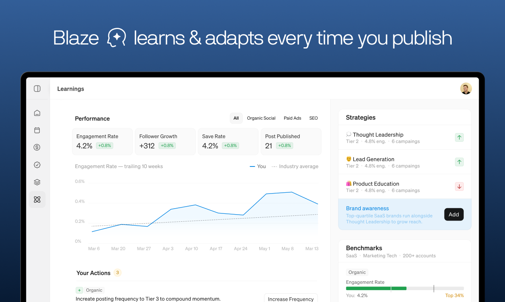

### 🎬 관련 영상
- [🎥 영상 보기](https://ph-files.imgix.net/9f800766-f853-4299-803c-bb52d2d5c750.jpeg?auto=format)

---

## 7. [Apideck MCP Server](https://www.producthunt.com/products/apideck)
**Votes**: 143 | **도입 난이도**: 중 | **신뢰도**: 상
**Tagline**: Give AI agents access to real-time data across 200+ apps
**서비스 링크**: https://www.producthunt.com/r/Z5X3A5K7TNZXED

**태그**: AI-Agent, SaaS-Integration, DevTool, Automation, Security, Agent, AI Tool, API, CRM

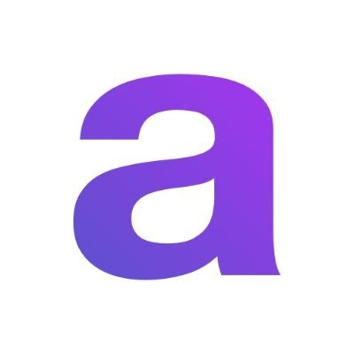

### 📌 이 서비스 한눈에 보기
200개 이상의 SaaS 앱 데이터를 AI 에이전트에게 안전하고 통합된 방식으로 제공하는 MCP 서버

### 🔑 주요 기능
- 200개 이상의 다양한 앱(CRM, HRIS, 회계 등)을 단일 엔드포인트로 연결
- 필드 단위 데이터 마스킹 및 권한 제어를 통한 보안 강화
- Claude, Cursor, LangChain 등 다양한 MCP 클라이언트 및 에이전트 런타임과 호환

### 🙋 사용자에게 어떤 점이 좋은가
복잡한 API 연동 작업 없이 하나의 서버로 AI 에이전트가 실시간 기업 데이터에 안전하게 접근할 수 있게 해줍니다.

### ✅ 지금 바로 써볼 기능
- 사용 중인 MCP 클라이언트(Claude, Cursor 등)에 서버 연결하기
- 필드 레벨 데이터 레드액션(Redaction) 설정 테스트하기
- 에이전트 권한 범위(Scoped permissions) 구성하기

### ⚠️ 사용 전 확인할 점
- 각 개별 앱의 API 권한 및 데이터 동기화 정책 확인 필요
- 에이전트가 데이터에 직접 접근하므로 보안 설정 오류 시 데이터 노출 위험

### 🧭 확인이 더 필요한 정보
200개 이상의 앱에 대한 구체적인 목록과 각 앱별 지원 기능 범위는 별도 확인이 필요합니다.

### 📸 스크린샷 및 갤러리
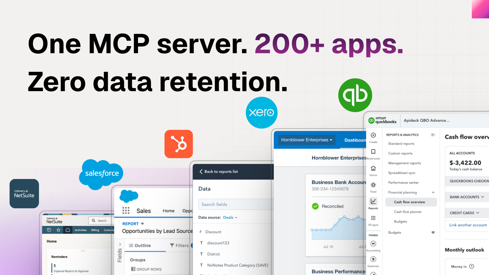
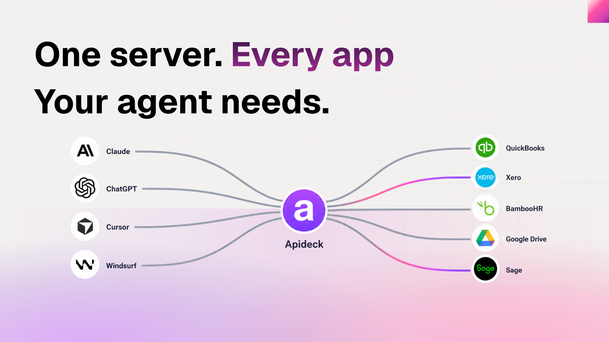
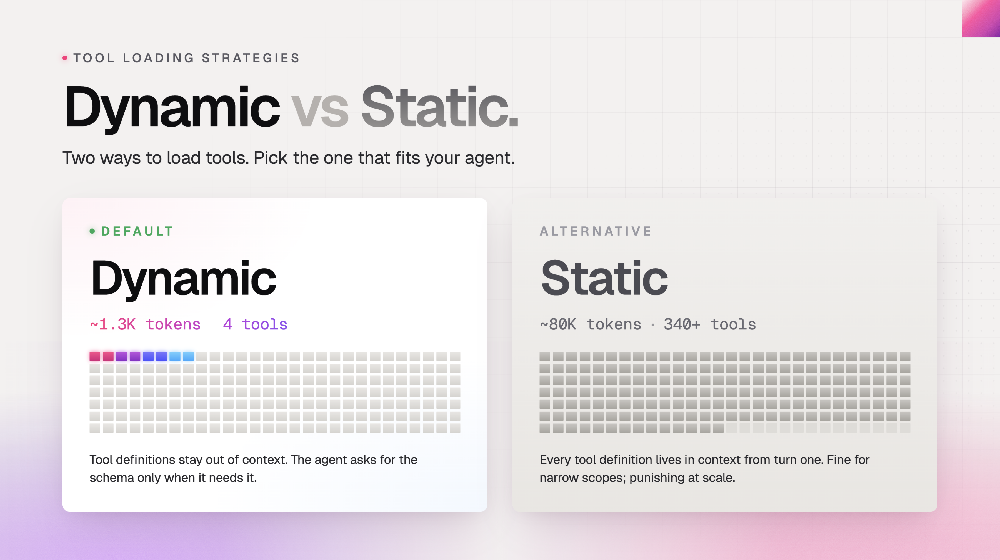

---

## 8. [Liminary](https://www.producthunt.com/products/liminary)
**Votes**: 135 | **도입 난이도**: 하 | **신뢰도**: 상
**Tagline**: Ground your AI in saved knowledge as you work
**서비스 링크**: https://www.producthunt.com/r/UU6DOBAREHKV5L

**태그**: KnowledgeManagement, AI, Productivity, Research, AI Tool, Chat

### 📌 이 서비스 한눈에 보기
저장된 모든 지식을 AI의 공유 작업 기억 장치로 변환하는 지식 관리 솔루션

### 🔑 주요 기능
- 개별 툴에 흩어진 저장된 정보를 하나의 통합된 AI 메모리로 활용
- 작업 중 맥락에 맞는 관련 정보를 자동으로 탐색 및 제공
- 출처가 명시된 근거 기반의 결과물 생성 지원

### 🙋 사용자에게 어떤 점이 좋은가
사용자가 매번 자료를 찾는 번거로움 없이, 과거의 연구와 기록을 바탕으로 즉시 고품질의 결과물을 작성할 수 있습니다.

### ✅ 지금 바로 써볼 기능
- 기존에 저장해둔 자료들을 Liminary에 동기화하기
- 작업 중 자동으로 제안되는 맥락 정보 확인하기
- 생성된 결과물의 인용 출처 검증하기

### ⚠️ 사용 전 확인할 점
- 저장된 데이터의 양과 질에 따라 AI의 답변 정확도가 달라질 수 있음
- 개인적/기업적 지식 데이터의 보안 및 프라이버시 정책 확인 필요

### 🧭 확인이 더 필요한 정보
현재 구체적인 데이터 소스 연동 범위(Notion, Slack 등)와 보안 프로토콜에 대한 정보가 부족합니다.

### 📸 스크린샷 및 갤러리
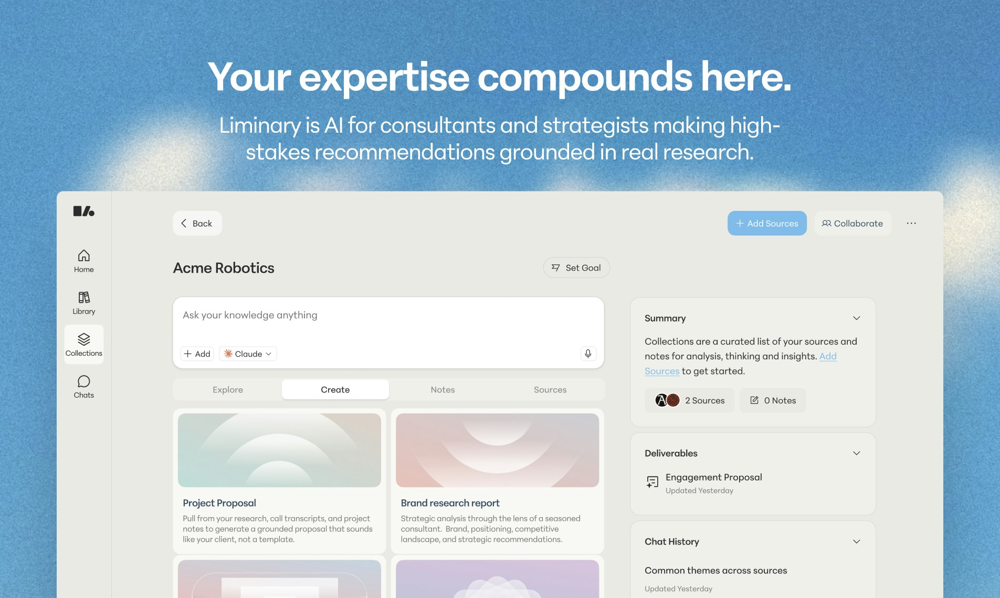
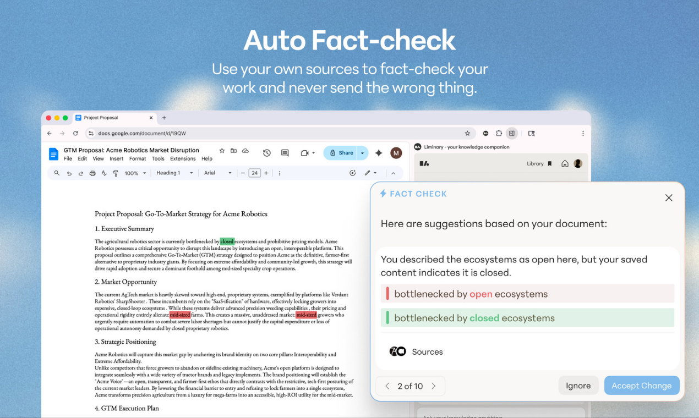

### 🎬 관련 영상
- [🎥 영상 보기](https://ph-files.imgix.net/9c1ab2dc-6778-4bfc-9224-053bfc92b17c.jpeg?auto=format)

---

## 9. [Claudy](https://www.producthunt.com/products/claudy)
**Votes**: 118 | **도입 난이도**: 하 | **신뢰도**: 상
**Tagline**: A proper home for Claude Code — multi-session, multi-account
**서비스 링크**: https://www.producthunt.com/r/W6BLCVXARYZZA4

**태그**: DevTool, macOS, Productivity, AI-Agent

### 📌 이 서비스 한눈에 보기
Claude Code를 macOS 네이티브 환경에서 효율적으로 관리할 수 있는 멀티 세션 워크스페이스

### 🔑 주요 기능
- macOS 네이티브 앱을 통한 직관적인 멀티 세션 및 멀티 계정 관리
- 사용량 제한 시 자동 계정 전환 기능 제공
- 작업 중간 저장 및 복구가 가능한 Draft Commits 기능

### 🙋 사용자에게 어떤 점이 좋은가
터미널 환경의 복잡함을 해결하여 여러 프로젝트와 계정을 동시에 다루는 개발자의 작업 흐름을 체계적으로 관리해 줍니다.

### ✅ 지금 바로 써볼 기능
- 멀티 세션 기능을 통한 프로젝트별 작업 분리
- Draft Commits를 활용한 작업 중간 지점 저장
- 마켓플레이스에서 필요한 Skill 및 MCP 설치

### ⚠️ 사용 전 확인할 점
- macOS 전용 앱이므로 타 OS 사용자는 사용 불가
- Claude Code CLI 도구에 대한 사전 이해 필요

### 🧭 확인이 더 필요한 정보
Claude Code CLI와의 연동 방식 및 계정 전환 시의 데이터 동기화 상세 로직에 대한 추가 확인이 필요합니다.

### 📸 스크린샷 및 갤러리
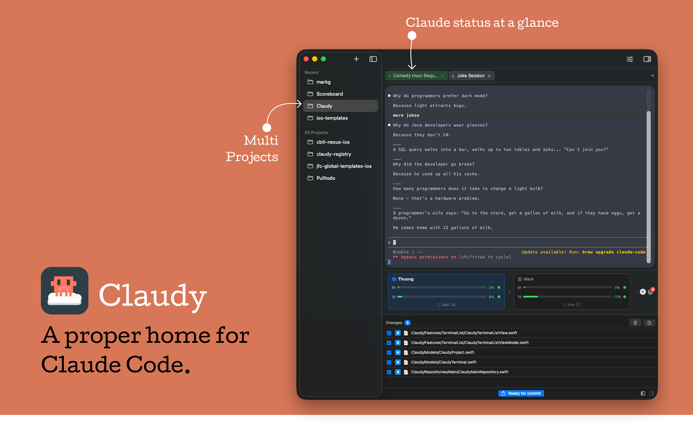
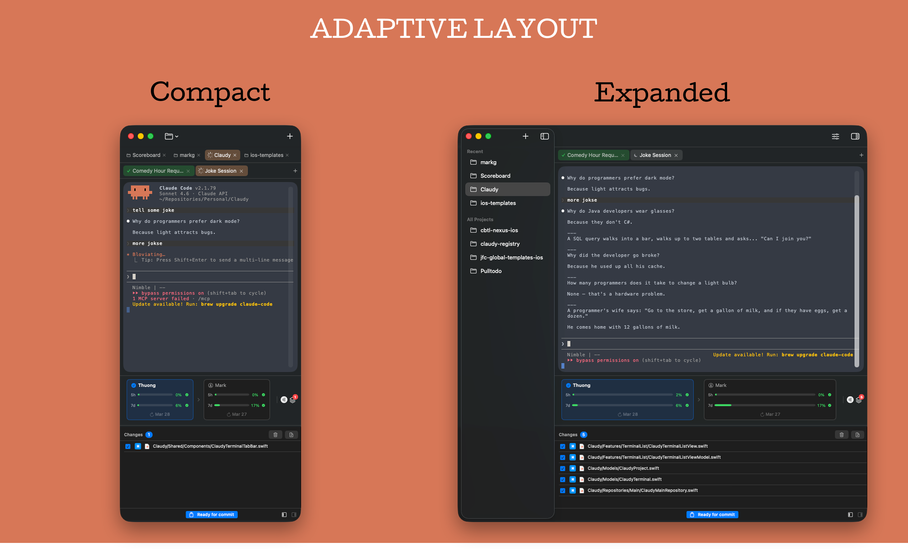
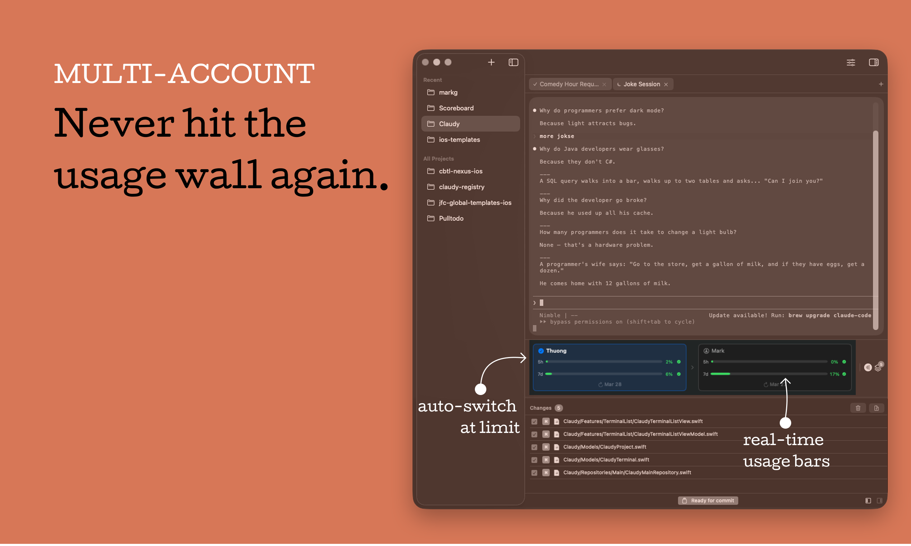

---

## 10. [SideNotes](https://www.producthunt.com/products/sidenotes-3)
**Votes**: 107 | **도입 난이도**: 하 | **신뢰도**: 상
**Tagline**: Take notes on your screen side
**서비스 링크**: https://www.producthunt.com/r/FOAUZ65V6BPWBO

**태그**: Productivity, Note-taking, Minimalism, Workflow

### 📌 이 서비스 한눈에 보기
화면 옆에 상주하며 언제든 꺼내 쓰는 직관적인 사이드바 메모 앱

### 🔑 주요 기능
- 화면 측면에 표시 및 숨기기가 가능한 사이드바 방식
- 마크다운, 작업(Tasks), 이미지, 폴더 등 강력한 정리 기능
- 집중력을 유지할 수 있는 깔끔하고 미니멀한 디자인

### 🙋 사용자에게 어떤 점이 좋은가
작업 중 창을 전환하는 번거로움 없이, 필요한 메모를 항상 화면 옆에 두어 업무 흐름을 끊지 않고 관리할 수 있습니다.

### ✅ 지금 바로 써볼 기능
- 마크다운 문법을 활용한 빠른 메모 작성
- 폴더 기능을 이용한 주제별 노트 정리
- 할 일(Tasks) 기능을 통한 간단한 체크리스트 관리

### ⚠️ 사용 전 확인할 점
- 화면 공간을 일부 점유하므로 모니터 해상도에 따른 가독성 확인 필요
- 모바일 기기와의 동기화 여부 확인 필요

### 🧭 확인이 더 필요한 정보
설명에 명시되지 않은 플랫폼 지원 범위(macOS/Windows 등)와 데이터 동기화 방식에 대한 확인이 필요합니다.

### 📸 스크린샷 및 갤러리
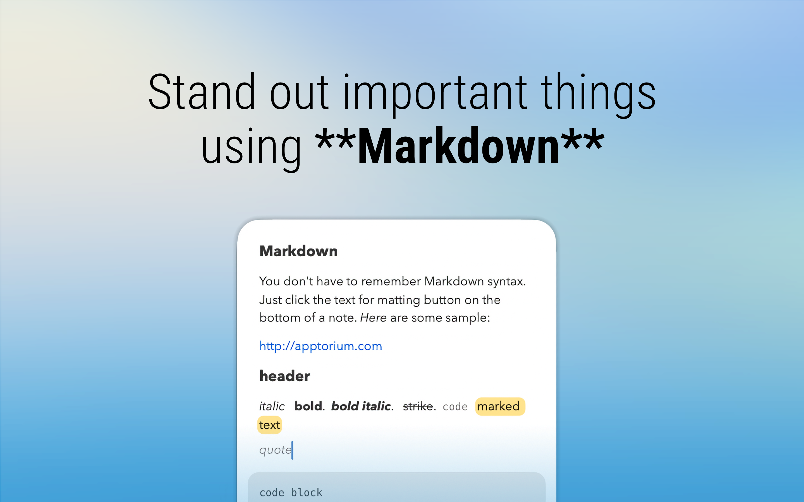
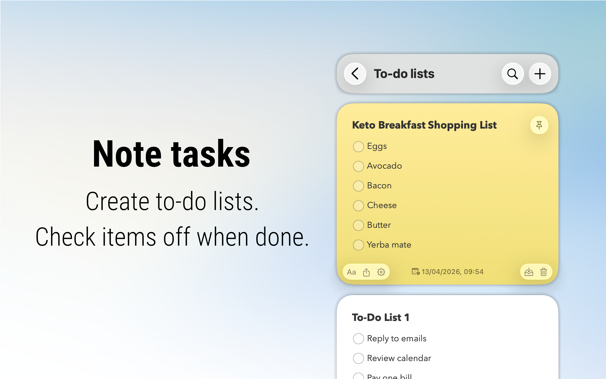
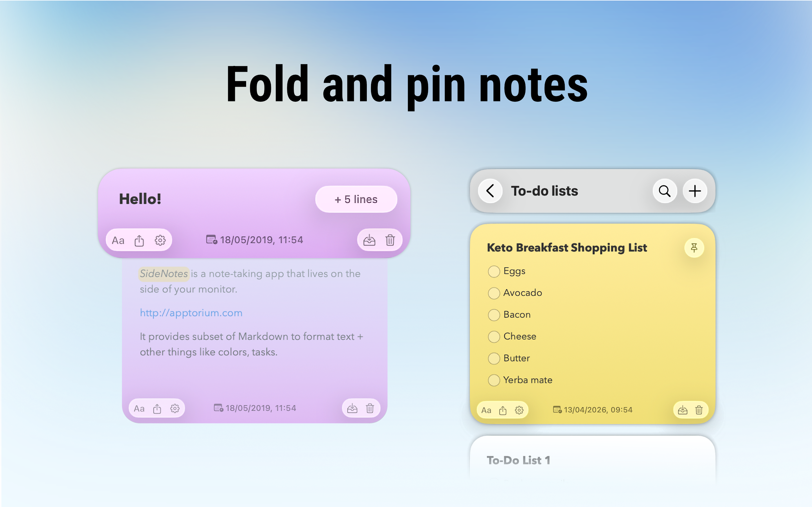

### 🎬 관련 영상
- [🎥 영상 보기](https://ph-files.imgix.net/8df035af-821e-4c02-9cff-a28dfbb82f5e.jpeg?auto=format)

---

## 11. [Pipali](https://www.producthunt.com/products/pipali)
**Votes**: 106 | **도입 난이도**: 중 | **신뢰도**: 상
**Tagline**: An AI coworker for any computer work
**서비스 링크**: https://www.producthunt.com/r/AAXVA27QHLNZGX

**태그**: AI Agent, Automation, Productivity, Workflow, AI Tool

### 📌 이 서비스 한눈에 보기
사용자의 파일, 브라우저, 앱을 직접 제어하여 실무를 수행하는 AI 동료

### 🔑 주요 기능
- 파일 및 브라우저와 상호작용하며 실질적인 업무 수행
- Skills(워크플로우 학습) 및 Routines(반복 작업) 기능 제공
- Linear, Slack, GitHub 등 주요 앱과 MCP를 통한 통합 지원

### 🙋 사용자에게 어떤 점이 좋은가
단순 답변을 넘어 리서치, 문서 작성, 루틴 업무 등 실제 컴퓨터 작업 과정을 자동화하여 업무 시간을 단축할 수 있습니다.

### ✅ 지금 바로 써볼 기능
- Skills 기능을 통한 개인 맞춤형 워크플로우 학습시키기
- Routines 기능을 활용한 반복적인 업무 자동화 설정하기
- MCP를 통해 기존 업무용 앱(Slack, GitHub 등)과 연동하기

### ⚠️ 사용 전 확인할 점
- 사용자의 파일과 브라우저에 직접 접근하므로 보안 및 개인정보 보호 설정 확인 필요
- 복잡한 워크플로우 학습 시 초기 설정에 시간이 소요될 수 있음

### 🧭 확인이 더 필요한 정보
사용자의 로컬 환경에 대한 접근 권한 범위와 보안 프로토콜에 대한 구체적인 정보가 필요합니다.

### 📸 스크린샷 및 갤러리
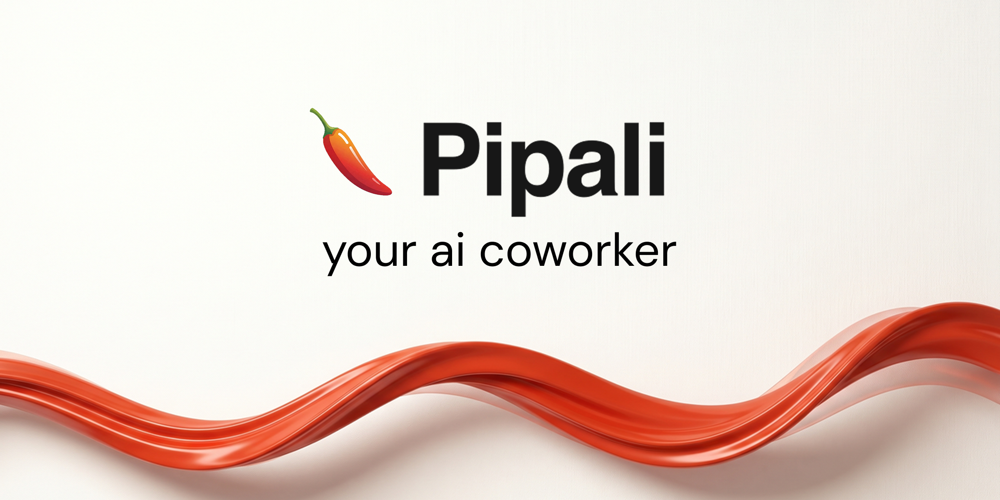
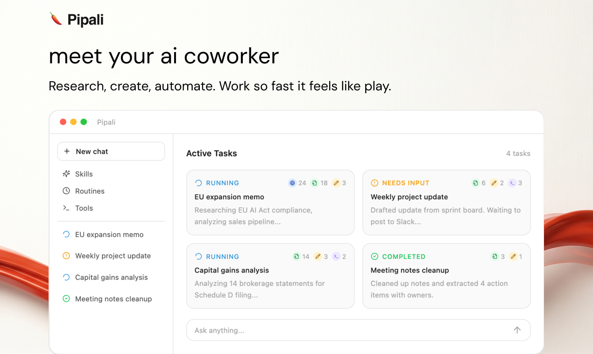
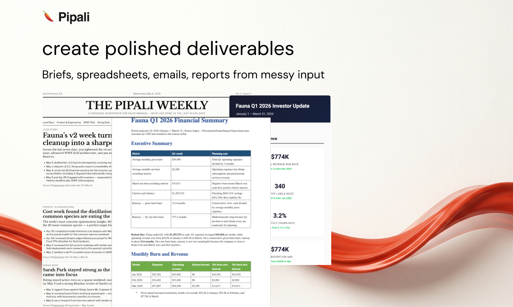

### 🎬 관련 영상
- [🎥 영상 보기](https://ph-files.imgix.net/5459373e-e993-4fbb-8025-d15846e0403f.jpeg?auto=format)

---

## 12. [LayerProof Matte 2.0](https://www.producthunt.com/products/layerproof-social-content-generation)
**Votes**: 103 | **도입 난이도**: 하 | **신뢰도**: 상
**Tagline**: Create high-quality social content at the speed of trends
**서비스 링크**: https://www.producthunt.com/r/VIM3UEBR4QTKQE

**태그**: AI, SocialMedia, ContentCreation, DesignTool, AI Tool

### 📌 이 서비스 한눈에 보기
최신 AI 모델을 활용해 트렌디한 소셜 미디어 콘텐츠를 빠르게 제작하는 워크스페이스

### 🔑 주요 기능
- 스크롤을 멈추게 하는 고품질 캐러셀 제작 기능
- 다양한 플랫폼 규격에 맞춘 즉각적인 사이즈 변환
- 최신 AI 모델을 활용한 트렌드 중심의 콘텐츠 생성

### 🙋 사용자에게 어떤 점이 좋은가
콘텐츠 제작 시간을 단축하면서도 트렌드에 민감한 고품질 소셜 미디어 게시물을 손쉽게 만들 수 있습니다.

### ✅ 지금 바로 써볼 기능
- AI 모델을 활용한 캐러셀 디자인 생성해보기
- 플랫폼별 사이즈 자동 변환 기능 테스트하기
- 브랜드 스타일 가이드 적용해보기

### ⚠️ 사용 전 확인할 점
- AI 생성 콘텐츠의 저작권 및 독창성 검토 필요
- 특정 플랫폼 최적화 수준 확인 필요

### 🧭 확인이 더 필요한 정보
지원하는 구체적인 AI 모델 종류와 플랫폼별 자동 리사이징의 정밀도를 확인할 필요가 있습니다.

### 📸 스크린샷 및 갤러리

### 🎬 관련 영상
- [🎥 영상 보기](https://ph-files.imgix.net/fab111a2-df18-4d39-9108-11c30ad3a60c.jpeg?auto=format)

---

## 13. [AI meeting notes by Snaply](https://www.producthunt.com/products/ai-dication-by-snaply)
**Votes**: 102 | **도입 난이도**: 하 | **신뢰도**: 상
**Tagline**: Free & Private AI meeting notes for you Mac
**서비스 링크**: https://www.producthunt.com/r/QXATYQ22QGFRVD

**태그**: Productivity, AI, Mac, Privacy, Automation, AI Tool, Chat, Email

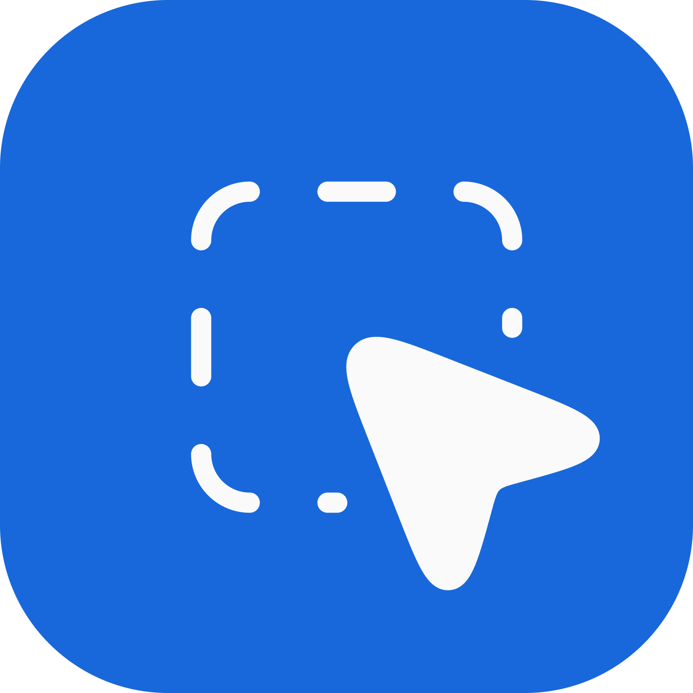

### 📌 이 서비스 한눈에 보기
데이터 유출 걱정 없는 맥 전용 로컬 AI 회의 기록 및 요약 도구

### 🔑 주요 기능
- 로컬 기록 방식: 모든 데이터가 기기를 떠나지 않는 프라이버시 중심 설계
- 자동화 워크플로우: 회의 녹음, 전사, 요약, 액션 아이템 생성 기능 제공
- 대화형 노트: 작성된 노트를 바탕으로 채팅 및 후속 이메일 초안 작성 가능

### 🙋 사용자에게 어떤 점이 좋은가
계정 생성이나 봇 참여 없이 맥에서 즉시 사용할 수 있어 보안이 중요한 비즈니스 미팅에 최적화되어 있습니다.

### ✅ 지금 바로 써볼 기능
- 로컬 녹음 및 자동 전사 기능 테스트
- 생성된 요약본과 액션 아이템 검토
- 노트 기반 AI 채팅 및 이메일 초안 작성 기능 활용

### ⚠️ 사용 전 확인할 점
- 맥(macOS) 전용 소프트웨어로 타 운영체제 사용 불가
- 로컬 리소스 사용에 따른 기기 성능 영향 가능성

### 🧭 확인이 더 필요한 정보
로컬 처리 방식이 기기 사양에 따라 처리 속도에 어떤 영향을 미치는지 확인이 필요합니다.

### 📸 스크린샷 및 갤러리
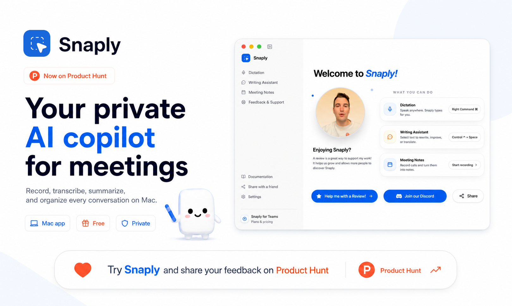
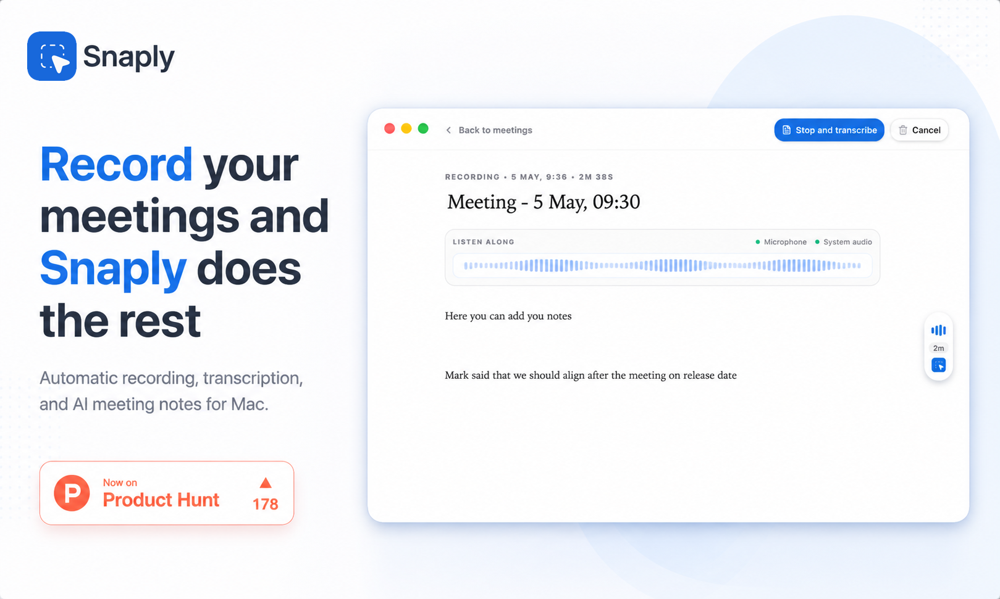
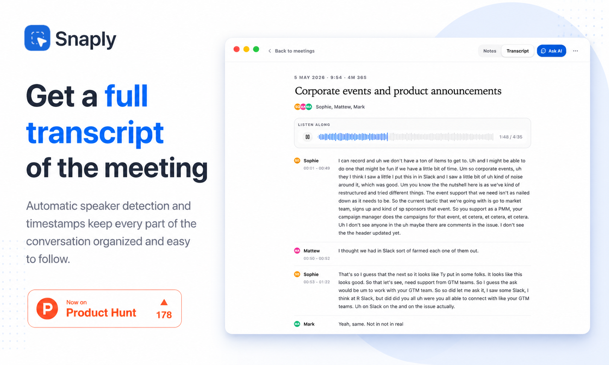

### 🎬 관련 영상
- [🎥 영상 보기](https://ph-files.imgix.net/4499dcf9-b1b5-495a-85f8-5fa51b340796.jpeg?auto=format)

---

## 14. [Plate](https://www.producthunt.com/products/plate-4)
**Votes**: 95 | **도입 난이도**: 하 | **신뢰도**: 상
**Tagline**: Minimal project management for small teams
**서비스 링크**: https://www.producthunt.com/r/VAT775GWH2KXK2

**태그**: Project Management, Collaboration, Productivity, Minimalism

### 📌 이 서비스 한눈에 보기
복잡함을 걷어내고 협업에만 집중할 수 있는 소규모 팀용 미니멀 프로젝트 관리 도구

### 🔑 주요 기능
- 프로젝트, 섹션, 태스크 중심의 직관적인 구조
- 담당자 지정, 상태 관리, 댓글 기능을 통한 실시간 협업
- 기존 PM 도구의 복잡함을 제거한 가벼운 사용자 경험

### 🙋 사용자에게 어떤 점이 좋은가
기존 프로젝트 관리 도구의 과도한 기능 때문에 피로감을 느끼는 소규모 팀이 빠르게 업무를 정리하고 소통하기에 적합합니다.

### ✅ 지금 바로 써볼 기능
- 팀의 업무 흐름에 맞는 섹션 구성해보기
- 태스크 생성 및 담당자 지정 기능 테스트
- 실시간 댓글을 통한 팀원 간 피드백 주고받기

### ⚠️ 사용 전 확인할 점
- 기능이 최소화되어 있어 복잡한 워크플로우나 대규모 프로젝트 관리에는 한계가 있을 수 있음
- 고도화된 자동화나 외부 툴 연동 기능 포함 여부 확인 필요

### 🧭 확인이 더 필요한 정보
상세한 기능 목록과 외부 서비스와의 연동 범위가 명시되지 않았습니다.

### 📸 스크린샷 및 갤러리
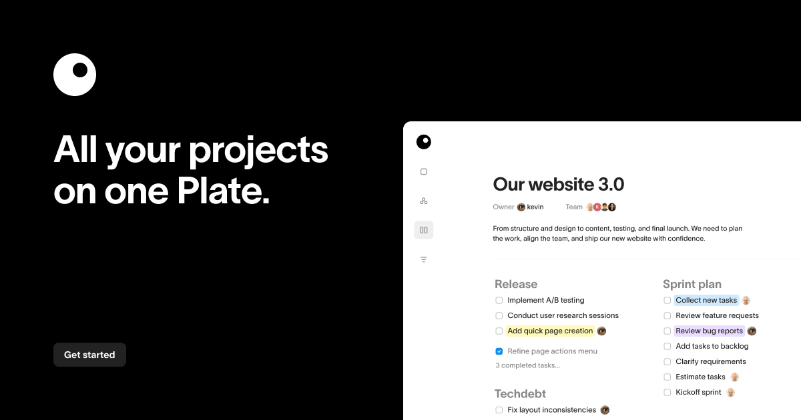
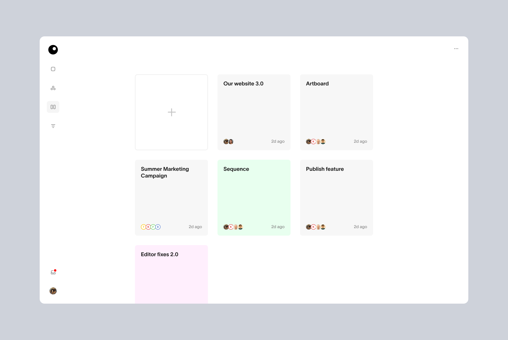
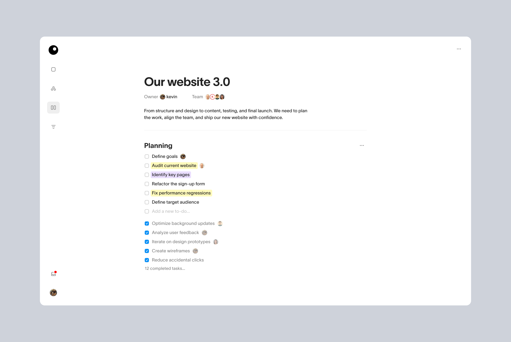

---

## 15. [Whisper Internet Infra AI Context](https://www.producthunt.com/products/whisper-internet-infra-ai-context)
**Votes**: 95 | **도입 난이도**: 하 | **신뢰도**: 상
**Tagline**: Free MCP for security AI: live BGP, DNS, threat graph
**서비스 링크**: https://www.producthunt.com/r/YG26DRBCNPUIK3

**태그**: DevTool, AI-Agent, Cybersecurity, Networking, Agent, AI Tool, LLM, Security

### 📌 이 서비스 한눈에 보기
LLM에 실시간 네트워크 및 보안 컨텍스트를 즉시 제공하는 MCP 서버

### 🔑 주요 기능
- BGP, DNS, WHOIS, Threat-graph 등 실시간 인터넷 인프라 데이터 제공
- Claude, Cursor 등 주요 LLM에 2분 내 빠른 연동 가능
- 전직 RIPE NCC 및 ICANN 엔지니어들이 개발한 전문성 있는 데이터

### 🙋 사용자에게 어떤 점이 좋은가
AI 에이전트가 실시간 네트워크 상태와 보안 위협 정보를 바탕으로 더 정확하고 전문적인 의사결정을 내릴 수 있도록 돕습니다.

### ✅ 지금 바로 써볼 기능
- Claude 또는 Cursor에 MCP 서버 연동하기
- 실시간 BGP 및 DNS 데이터 쿼리 테스트하기
- 보안 분석을 위한 Threat-graph 컨텍스트 활용하기

### ⚠️ 사용 전 확인할 점
- 무료 티어 사용 시 데이터 호출 제한 확인 필요
- 실시간 데이터의 정확도 및 최신성 검증 필요

### 🧭 확인이 더 필요한 정보
무료 티어의 구체적인 호출 한도와 유료 플랜의 상세 기능에 대한 정보가 명시되지 않았습니다.

### 📸 스크린샷 및 갤러리
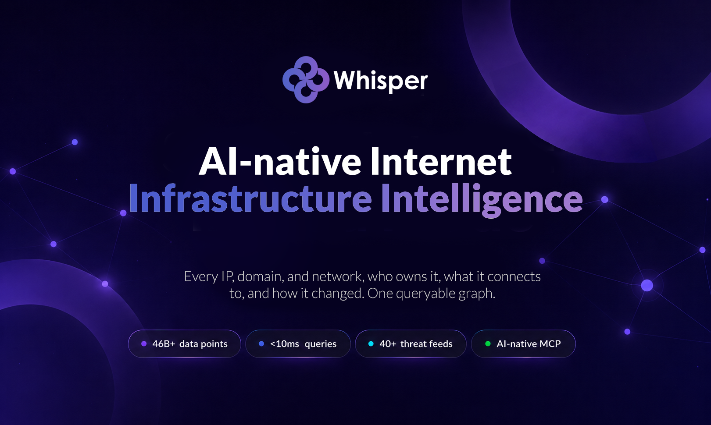
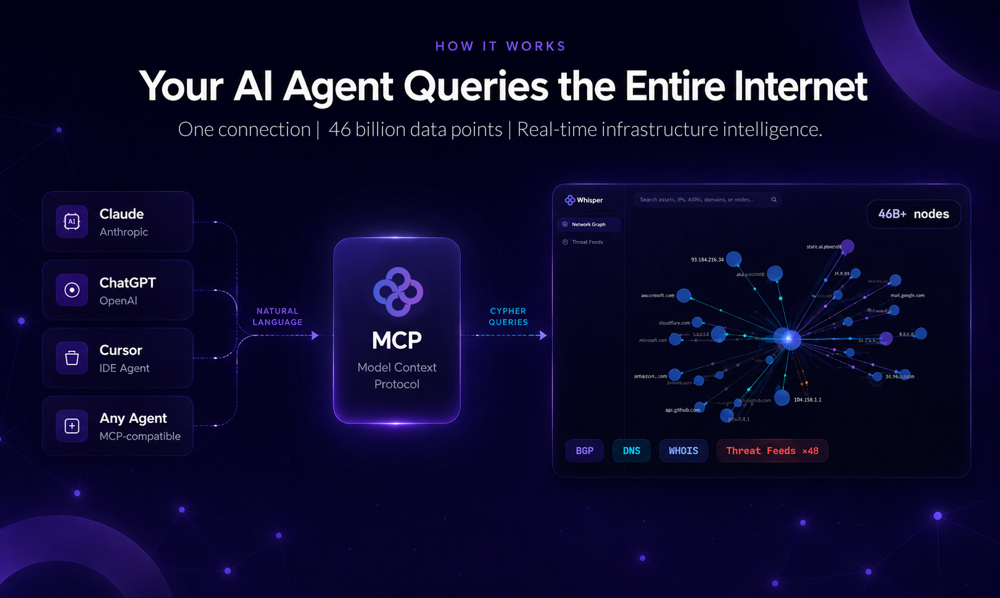
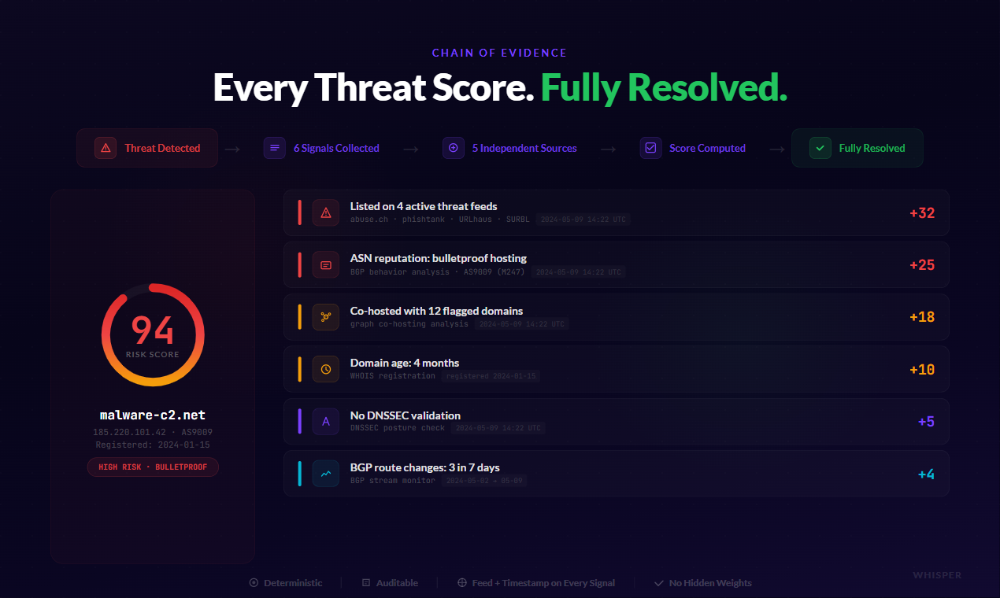

### 🎬 관련 영상
- [🎥 영상 보기](https://ph-files.imgix.net/2fd72000-7e53-47ed-a8c4-a14ce423ce30.jpeg?auto=format)

---

## 16. [TipTap](https://www.producthunt.com/products/tiptap-2)
**Votes**: 91 | **도입 난이도**: 하 | **신뢰도**: 상
**Tagline**: Customers tip support agents that help them the most
**서비스 링크**: https://www.producthunt.com/r/HJUTK6ZSOIUDKI

**태그**: CustomerSupport, SaaS, EmployeeRetention, Fintech, Agent, AI Tool

### 📌 이 서비스 한눈에 보기
고객이 상담원에게 직접 팁을 전달하여 우수 직원의 동기부여와 보상을 돕는 서비스

### 🔑 주요 기능
- Zendesk, Intercom 등 기존 헬프데스크 시스템과 연동 가능
- 티켓 해결 후 고객이 즉시 팁을 보낼 수 있는 플로우 제공
- 기업의 비용 부담이나 급여 구조 변경 없이 에이전트의 추가 수익 창출

### 🙋 사용자에게 어떤 점이 좋은가
고객 만족도가 높은 상담원에게 직접적인 보상을 제공함으로써 우수 인력을 유지하고 서비스 품질을 높일 수 있습니다.

### ✅ 지금 바로 써볼 기능
- 현재 사용 중인 헬프데스크(Zendesk, Intercom 등)와의 연동성 확인
- 티켓 종료 시 팁 결제 플로우 테스트
- 사내 보상 정책과의 부합 여부 검토

### ⚠️ 사용 전 확인할 점
- 팁 결제 시 발생하는 수수료 및 정산 방식 확인 필요
- 기업의 기존 급여 체계 및 내부 규정과의 충돌 가능성

### 🧭 확인이 더 필요한 정보
구체적인 연동 가능한 헬프데스크 목록과 결제 시스템 연동 방식에 대한 상세 정보가 필요합니다.

### 📸 스크린샷 및 갤러리
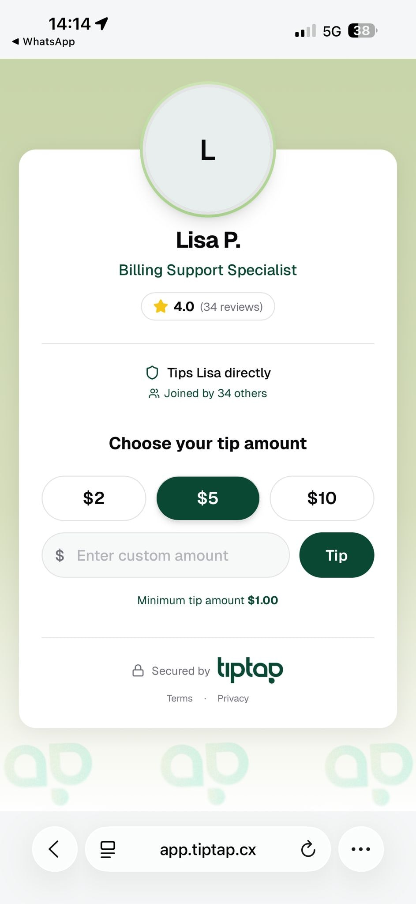
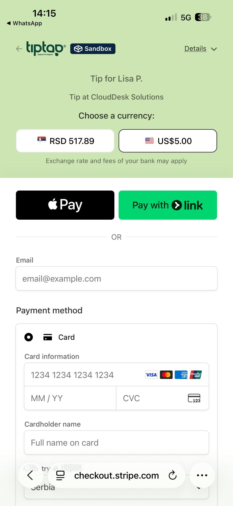
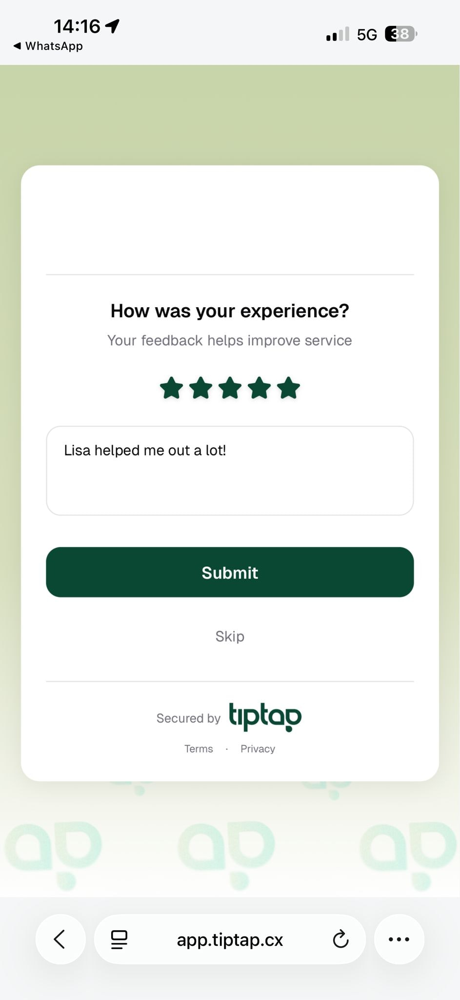

### 🎬 관련 영상
- [🎥 영상 보기](https://ph-files.imgix.net/a3bbbb3d-a10e-4b91-8578-0524dc05eac6.jpeg?auto=format)

---

## 17. [WhoAmILookingFor](https://www.producthunt.com/products/whoamilookingfor)
**Votes**: 89 | **도입 난이도**: 하 | **신뢰도**: 상
**Tagline**: Find the right person in your LinkedIn network
**서비스 링크**: https://www.producthunt.com/r/2S3WY4ALG3A3SV

**태그**: Networking, Productivity, Search, Automation, AI Tool, Email

### 📌 이 서비스 한눈에 보기
내 링크드인 인맥을 대상으로 하는 개인용 시맨틱 검색 엔진

### 🔑 주요 기능
- 링크드인 연결 목록(CSV)을 활용한 프라이빗 검색 엔진 구축
- 자연어 질문을 통한 최적의 인물 검색 및 순위 산정
- 매칭 이유, 연락 전략, 이메일 등 맞춤형 아웃리치 정보 제공

### 🙋 사용자에게 어떤 점이 좋은가
방대한 링크드인 인맥 속에서 내가 원하는 조건의 사람을 일일이 찾을 필요 없이, 자연어 질문만으로 적합한 인물을 빠르게 필터링할 수 있습니다.

### ✅ 지금 바로 써볼 기능
- 링크드인 연결 데이터 CSV 추출 및 업로드
- 필요한 인물 유형을 자연어로 질문하기
- 제공된 매칭 이유와 아웃리치 각도를 활용해 연락 시도하기

### ⚠️ 사용 전 확인할 점
- 업로드하는 CSV 데이터의 최신성 및 정확도에 의존함
- 개인정보가 포함된 데이터의 보안 및 프라이버시 관리 확인 필요

### 🧭 확인이 더 필요한 정보
데이터 보안 정책 및 개인정보 처리 방식에 대한 구체적인 정보가 명시되지 않았습니다.

### 📸 스크린샷 및 갤러리
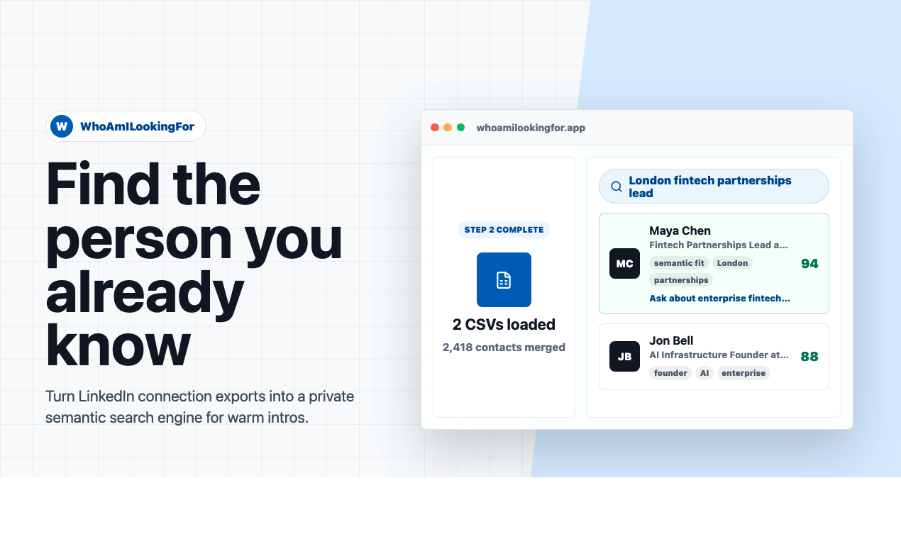
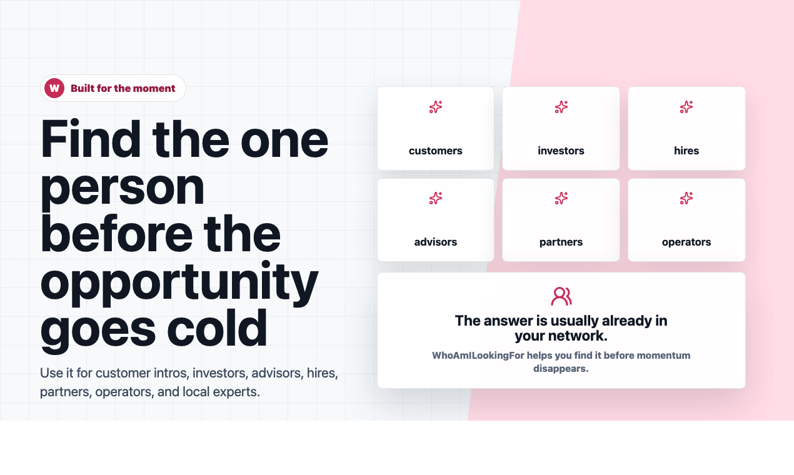
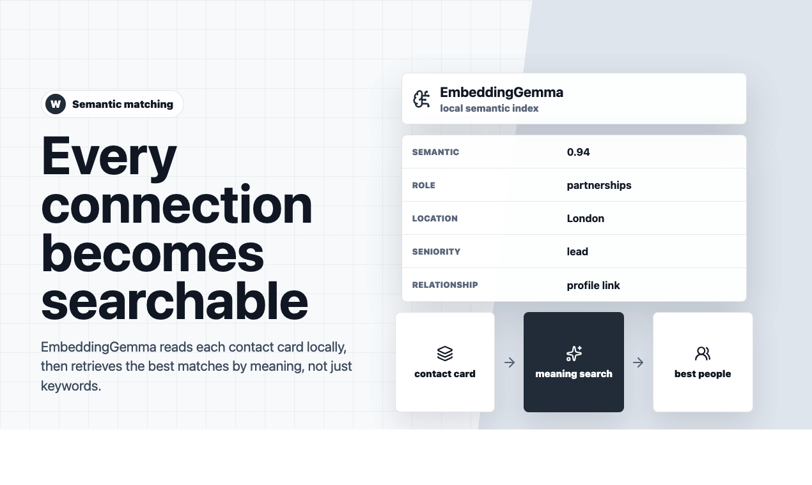

---

## 18. [Crade AI](https://www.producthunt.com/products/crade)
**Votes**: 87 | **도입 난이도**: 하 | **신뢰도**: 상
**Tagline**: Like ChatGPT, but it sees your screen
**서비스 링크**: https://www.producthunt.com/r/V3FGJ36BLQCAWJ

**태그**: AI Assistant, Productivity, Desktop App, AI Tool, Chat

### 📌 이 서비스 한눈에 보기
화면 캡처나 복사 없이 현재 작업 중인 화면을 즉시 인식하는 데스크톱 AI 어시스턴트

### 🔑 주요 기능
- Mac 및 Windows용 데스크톱 네이티브 앱
- 스크린샷 업로드나 복사-붙여넣기 없는 실시간 화면 인식
- 작업 중인 화면 위에 바로 나타나는 오버레이 방식의 답변 제공

### 🙋 사용자에게 어떤 점이 좋은가
코드 오류, 엑셀 수식, 외국어 문서 등 화면에 보이는 모든 문제에 대해 별도의 창 전환 없이 즉각적인 도움을 받을 수 있습니다.

### ✅ 지금 바로 써볼 기능
- 무료 티어(일일 200 크레딧)로 화면 인식 기능 테스트하기
- 복잡한 작업 시 Pro 플랜의 고성능 AI 성능 비교해보기

### ⚠️ 사용 전 확인할 점
- 화면을 실시간으로 공유하므로 개인정보 및 보안 민감 데이터 노출 주의
- 무료 사용 시 일일 크레딧 제한(200회) 확인 필요

### 🧭 확인이 더 필요한 정보
사용자의 화면 데이터를 서버로 전송하는 방식에 대한 구체적인 보안 정책 확인이 필요합니다.

### 📸 스크린샷 및 갤러리
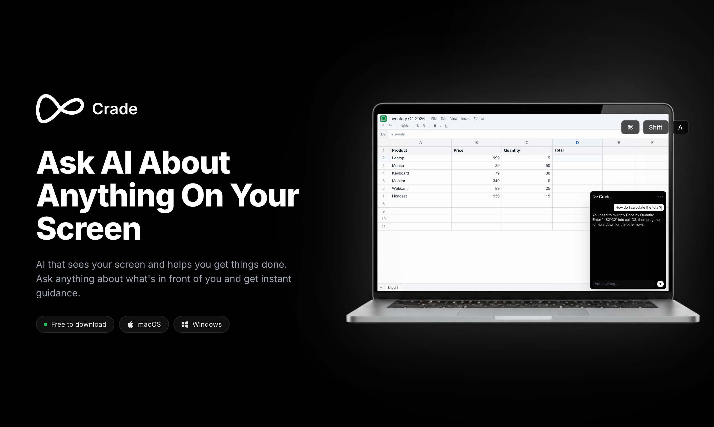
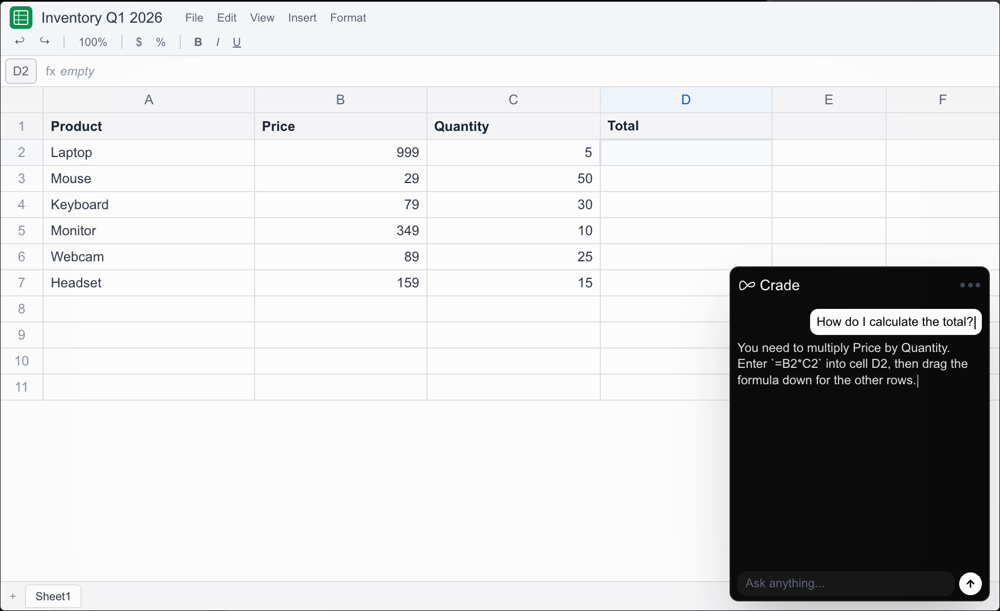
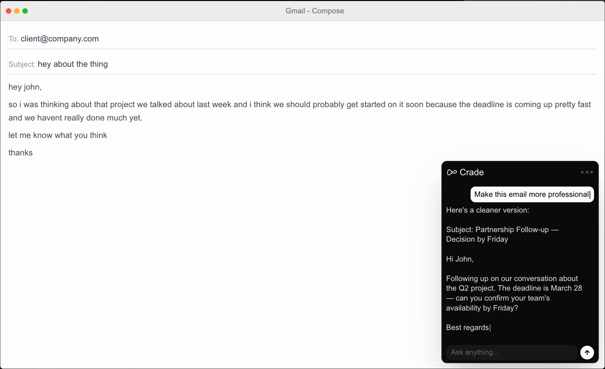

---

## 19. [tapcut](https://www.producthunt.com/products/tapcut-the-analogue-shortcut)
**Votes**: 86 | **도입 난이도**: 하 | **신뢰도**: 상
**Tagline**: The analogue shortcut
**서비스 링크**: https://www.producthunt.com/r/RPPEQQ3RMNEEVT

**태그**: Automation, macOS, Productivity, Utility

### 📌 이 서비스 한눈에 보기
맥북 팜레스트를 탭하는 것만으로 단축키를 대신하는 직관적인 제스처 자동화 도구

### 🔑 주요 기능
- 내장 가속도계를 활용한 팜레스트 탭 제스처 인식
- 2~4번의 탭 횟수에 따라 서로 다른 동작 실행 가능
- 앱 실행, macOS 단축어 실행, 특정 서비스(Claude 등) 호출 지원

### 🙋 사용자에게 어떤 점이 좋은가
복잡한 키보드 단축키를 외울 필요 없이 손끝의 가벼운 움직임만으로 반복적인 작업을 즉시 실행할 수 있습니다.

### ✅ 지금 바로 써볼 기능
- 자주 사용하는 앱을 탭 횟수에 매핑하기
- macOS 단축어(Shortcuts)와 연동하여 복합 작업 자동화하기
- 3일 무료 체험을 통해 본인의 타이핑 습관과 간섭 여부 확인하기

### ⚠️ 사용 전 확인할 점
- Apple Silicon 기반의 macOS 14 이상 환경에서만 작동
- 타이핑 중 의도치 않은 탭이 발생할 가능성

### 🧭 확인이 더 필요한 정보
사용자의 타이핑 습관에 따른 오작동 방지 기능이나 감도 조절 범위에 대한 상세 정보가 필요합니다.

### 📸 스크린샷 및 갤러리

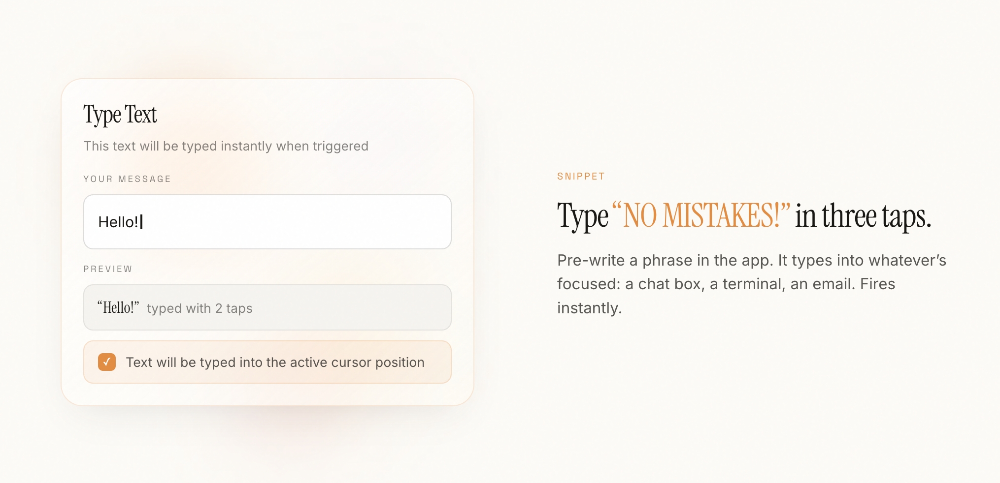
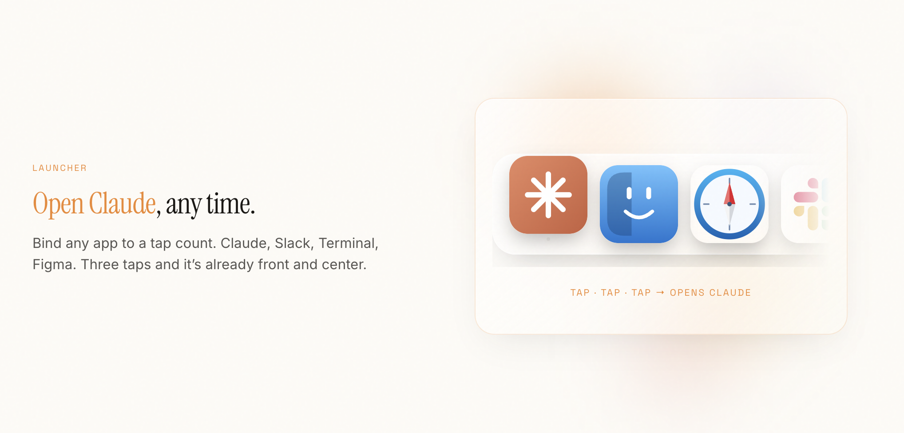

### 🎬 관련 영상
- [🎥 영상 보기](https://ph-files.imgix.net/79b8a034-8f17-4507-926d-c92568a50476.jpeg?auto=format)

---

## 20. [Gretl](https://www.producthunt.com/products/gretl-control-panel-for-your-localhost)
**Votes**: 86 | **도입 난이도**: 하 | **신뢰도**: 상
**Tagline**: Visual control pannel for localhosts
**서비스 링크**: https://www.producthunt.com/r/X7SZ3MPEC6K5LX

**태그**: DevTool, Productivity, Workflow

### 📌 이 서비스 한눈에 보기
로컬 호스트 포트 관리와 팀 협업을 위한 시각적 포트 매니저

### 🔑 주요 기능
- 메뉴 바에서 모든 포트 상태를 한눈에 확인하고 관리하는 시각적 컨트롤 패널
- 포트 이름 지정, 그룹화, 시작/중지 및 공유 기능 제공
- CLI, SDK(Python/Ruby/Node), gr.toml 설정을 통한 개발 환경 자동화

### 🙋 사용자에게 어떤 점이 좋은가
어떤 서비스가 어떤 포트에서 실행 중인지 찾는 번거로움을 없애주고, 설정 파일을 통해 팀원들과 동일한 로컬 개발 환경을 즉시 구축할 수 있습니다.

### ✅ 지금 바로 써볼 기능
- 메뉴 바에 설치하여 현재 실행 중인 포트 목록 확인하기
- gr.toml 파일을 작성하여 팀 프로젝트에 커밋하기
- CLI 명령어를 통해 터미널 환경에서 포트 제어해보기

### ⚠️ 사용 전 확인할 점
- 기존에 사용 중인 포트 관리 도구와의 충돌 여부 확인 필요
- 로컬 환경의 보안 정책에 따른 권한 설정 확인

### 🧭 확인이 더 필요한 정보
현재 제공되는 SDK와 CLI가 모든 운영체제 환경을 완벽히 지원하는지 확인이 필요합니다.

### 📸 스크린샷 및 갤러리

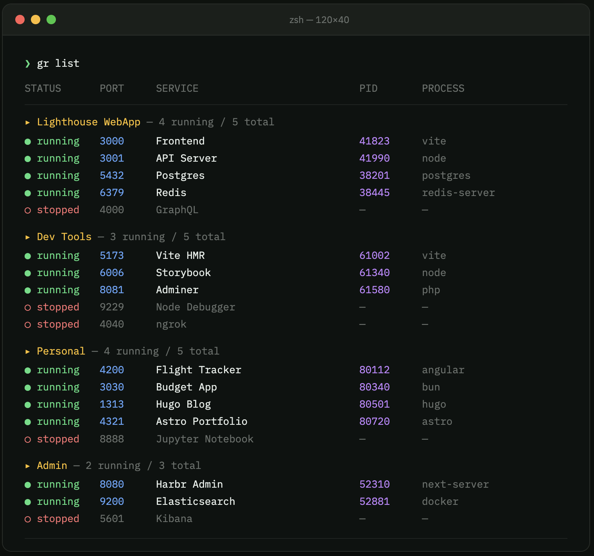
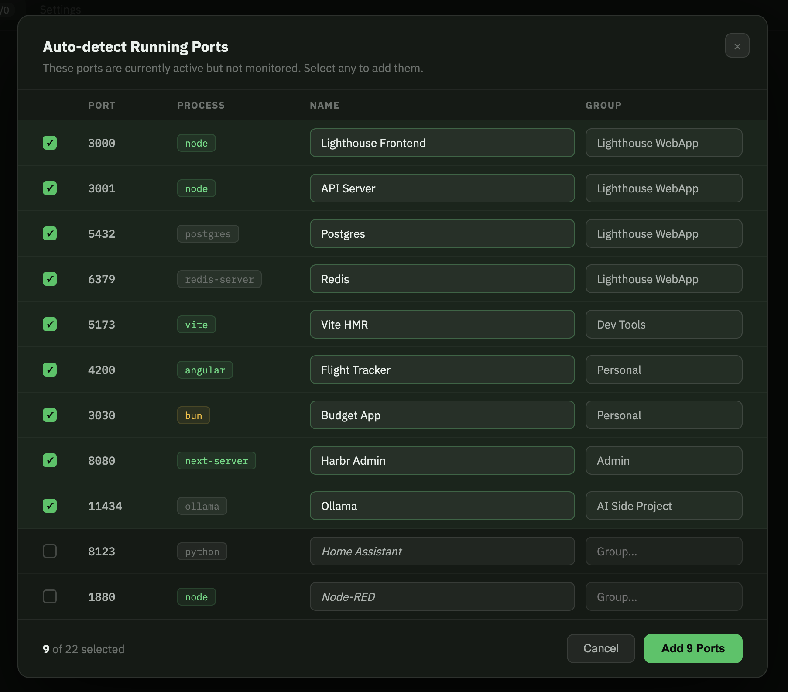

---

## 21. [PitchDrop.ai](https://www.producthunt.com/products/pitchdrop-ai)
**Votes**: 84 | **도입 난이도**: 하 | **신뢰도**: 상
**Tagline**: Turn your pitch into a live, branded URL that wins deals
**서비스 링크**: https://www.producthunt.com/r/6BQMI3ZKLSRQEI

**태그**: AI, Pitching, Branding, WebDesign, SalesTool, AI Tool, Design

### 📌 이 서비스 한눈에 보기
정적인 발표 자료를 설득력 있는 브랜드 웹페이지로 변환해주는 AI 기반 피치 빌더

### 🔑 주요 기능
- PDF/PPTX 형식을 넘어선 독자적인 URL 기반의 모션 리치 웹페이지 생성
- 브랜드 가이드(URL 또는 design.md)를 통한 60초 내 브랜드 맞춤형 디자인 적용
- 사용자의 맥락을 학습하며 피칭을 돕는 AI 어드바이저 기능

### 🙋 사용자에게 어떤 점이 좋은가
전통적인 문서 전달 방식에서 벗어나, 상대방에게 전문적이고 인터랙티브한 첫인상을 남길 수 있는 디지털 브랜딩 도구입니다.

### ✅ 지금 바로 써볼 기능
- 기존 피치 자료를 업로드하여 웹페이지로 변환해보기
- 브랜드 디자인 가이드를 적용하여 맞춤형 테마 생성하기
- 비밀번호 보호 기능을 활용하여 안전한 자료 공유하기

### ⚠️ 사용 전 확인할 점
- 웹 기반 형식이므로 오프라인 발표 환경에서의 호환성 확인 필요
- AI가 생성한 콘텐츠의 논리적 흐름과 브랜드 일치성 검토 필요

### 🧭 확인이 더 필요한 정보
현재 구체적인 가격 정책 및 협업 기능(공동 편집 등)에 대한 정보가 명시되지 않았습니다.

### 📸 스크린샷 및 갤러리
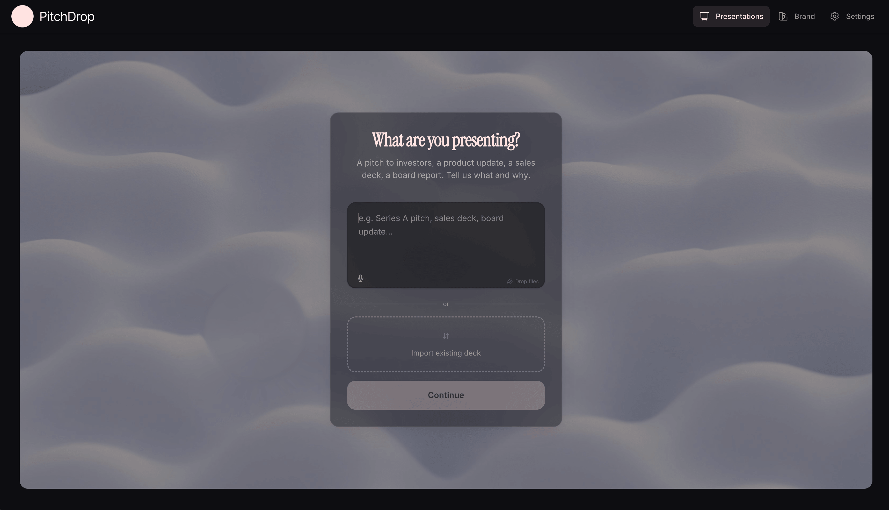
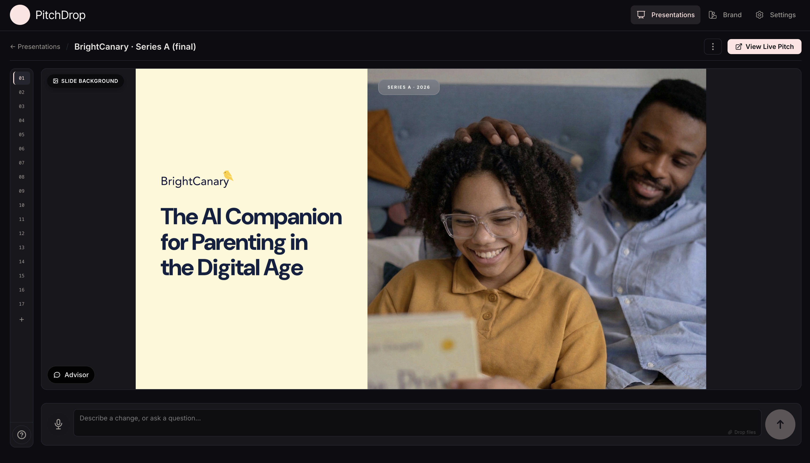

---

## 22. [IndexedAI](https://www.producthunt.com/products/indexedai)
**Votes**: 84 | **도입 난이도**: 하 | **신뢰도**: 상
**Tagline**: Your site scores X/100 for AI agents with next steps
**서비스 링크**: https://www.producthunt.com/r/P46UQ7MHY37JMW

**태그**: AI-Optimization, DevTool, SEO, Analytics, Agent, AI Tool, LLM, Email

### 📌 이 서비스 한눈에 보기
내 웹사이트가 AI 에이전트에게 얼마나 최적화되어 있는지 진단하고 개선 가이드를 제공하는 도구

### 🔑 주요 기능
- AI 에이전트 친화도를 측정하는 5가지 축 기반의 Readiness Score 제공
- 점수를 낮추는 구체적인 원인 분석 및 개선 방법 제시
- 60초 만에 생성되는 llms.txt 및 llms-full.txt 파일 지원

### 🙋 사용자에게 어떤 점이 좋은가
AI 에이전트가 정보를 쉽게 읽고 활용할 수 있도록 웹사이트 구조를 최적화하여 검색 및 상호작용 효율을 높일 수 있습니다.

### ✅ 지금 바로 써볼 기능
- 자사 웹사이트 URL 입력하여 Readiness Score 확인하기
- 점수를 낮추는 구체적인 원인 분석 결과 검토하기
- 제공되는 llms.txt 파일을 활용하여 AI 최적화 적용하기

### ⚠️ 사용 전 확인할 점
- 점수가 낮게 나올 경우 실제 사이트 구조 변경에 따른 작업 시간이 필요할 수 있음
- 이메일 주소 입력이 필요함

### 🧭 확인이 더 필요한 정보
점수 개선을 위한 구체적인 기술적 가이드가 얼마나 상세하게 제공되는지 확인이 필요합니다.

### 📸 스크린샷 및 갤러리
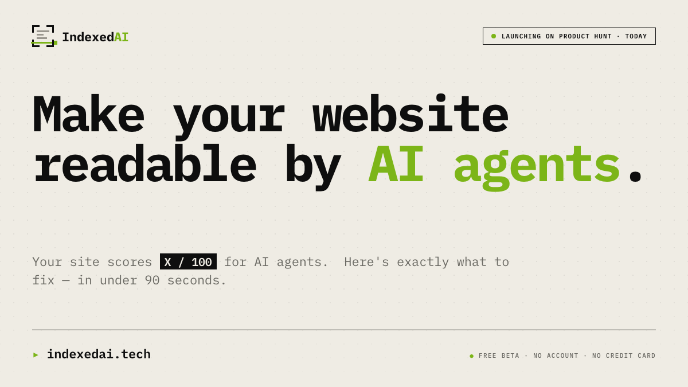
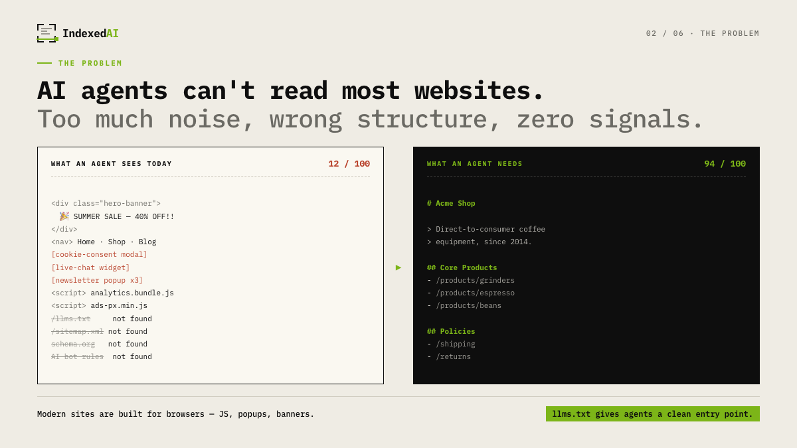
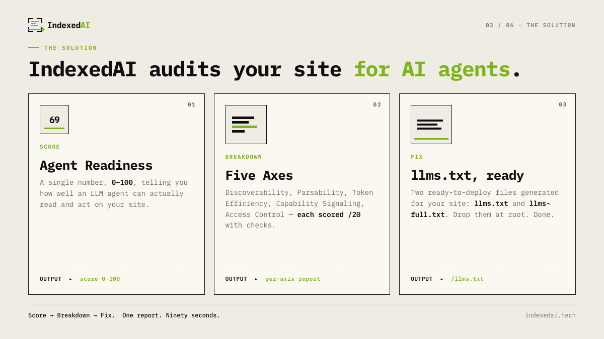

---

## 23. [Fide Shopify App](https://www.producthunt.com/products/shoppable-videos-ugc)
**Votes**: 81 | **도입 난이도**: 하 | **신뢰도**: 상
**Tagline**: Show shoppable UGC videos on your Shopify store
**서비스 링크**: https://www.producthunt.com/r/KWKEHFXLSIWWOB

**태그**: E-commerce, UGC, Video Marketing, Shopify, Video, Design, Analytics

### 📌 이 서비스 한눈에 보기
고객 생성 영상(UGC)을 쇼핑 가능한 형태로 스토어에 바로 노출하여 구매 전환을 높이는 앱

### 🔑 주요 기능
- 캐러셀, 그리드, 스토리 스타일 등 다양한 레이아웃의 영상 디스플레이 지원
- 영상 시청 중 즉시 장바구니에 담을 수 있는 퀵 애드 투 카트(Quick Add-to-Cart) 기능
- 영상 리뷰 및 UGC 관리, 컬렉션 설정, 분석 기능을 포함한 통합 관리 인터페이스

### 🙋 사용자에게 어떤 점이 좋은가
고객의 생생한 영상 리뷰를 쇼핑 경험과 직접 연결하여, 고객의 신뢰를 높이고 구매 결정 과정을 단축할 수 있습니다.

### ✅ 지금 바로 써볼 기능
- 스토리 스타일 레이아웃으로 트렌디한 영상 피드 구성하기
- 영상 내 제품 링크를 통한 퀵 애드 투 카트 기능 활성화하기
- 제공되는 분석 도구를 통해 영상 콘텐츠의 성과 확인하기

### ⚠️ 사용 전 확인할 점
- 영상 콘텐츠가 많아질 경우 스토어 로딩 속도에 미치는 영향 확인 필요
- 사용 중인 쇼피파이 테마와의 디자인 일관성 검토

### 🧭 확인이 더 필요한 정보
영상 파일의 용량 제한이나 스트리밍 방식에 따른 성능 영향에 대한 정보가 명시되지 않았습니다.

### 📸 스크린샷 및 갤러리

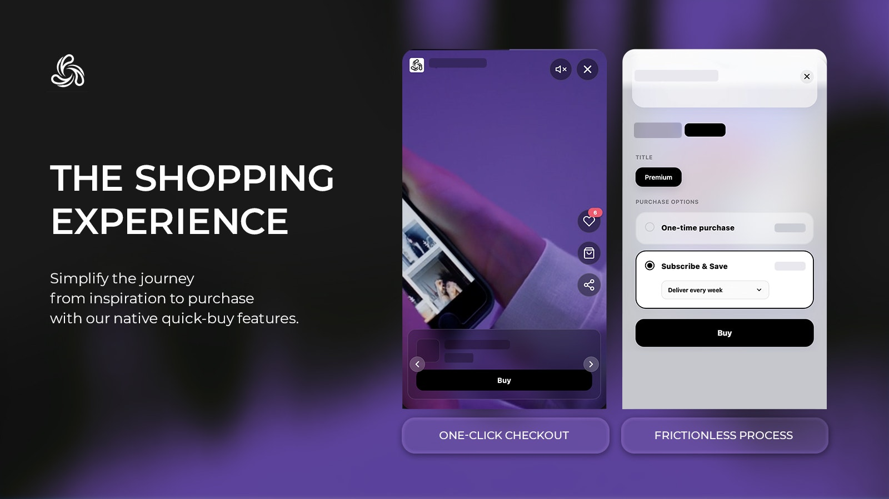
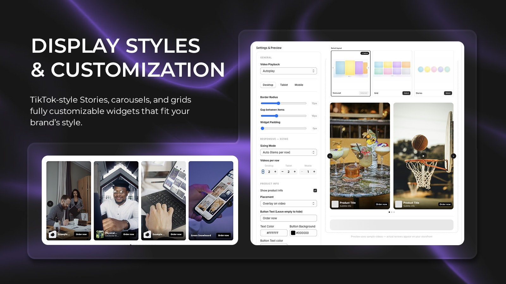

---

## 24. [Fileloom](https://www.producthunt.com/products/fileloom-file-viewer)
**Votes**: 81 | **도입 난이도**: 하 | **신뢰도**: 상
**Tagline**: A free, ad-free Android viewer for all your files
**서비스 링크**: https://www.producthunt.com/r/5GP27G537CJYNI

**태그**: Productivity, Android, FileViewer, Utility, Video, Vision, DevTool

### 📌 이 서비스 한눈에 보기
광고 없이 모든 문서를 한곳에서 관리하는 안드로이드 통합 파일 뷰어

### 🔑 주요 기능
- 광고 없는 쾌적한 무료 파일 뷰잉 환경 제공
- 로컬 파일 및 구글 드라이브 연동 지원
- 문서(PDF, EPUB, Office, HWP), 코드, 미디어 등 다양한 포맷 지원

### 🙋 사용자에게 어떤 점이 좋은가
여러 개의 앱을 번갈아 쓸 필요 없이 하나의 앱으로 다양한 문서와 미디어를 깔끔하게 확인할 수 있습니다.

### ✅ 지금 바로 써볼 기능
- 구글 드라이브 연동하여 클라우드 파일 열기
- 즐겨찾기 및 북마크 기능으로 자주 보는 문서 관리하기
- 읽기 진행 상태 확인하며 문서 탐색하기

### ⚠️ 사용 전 확인할 점
- 안드로이드 전용 앱이므로 iOS 환경에서는 사용 불가
- 다양한 포맷을 지원하지만 특정 특수 포맷의 레이아웃 깨짐 가능성

### 🧭 확인이 더 필요한 정보
모든 파일 포맷에 대해 완벽한 렌더링 품질을 보장하는지 확인이 필요합니다.

### 📸 스크린샷 및 갤러리
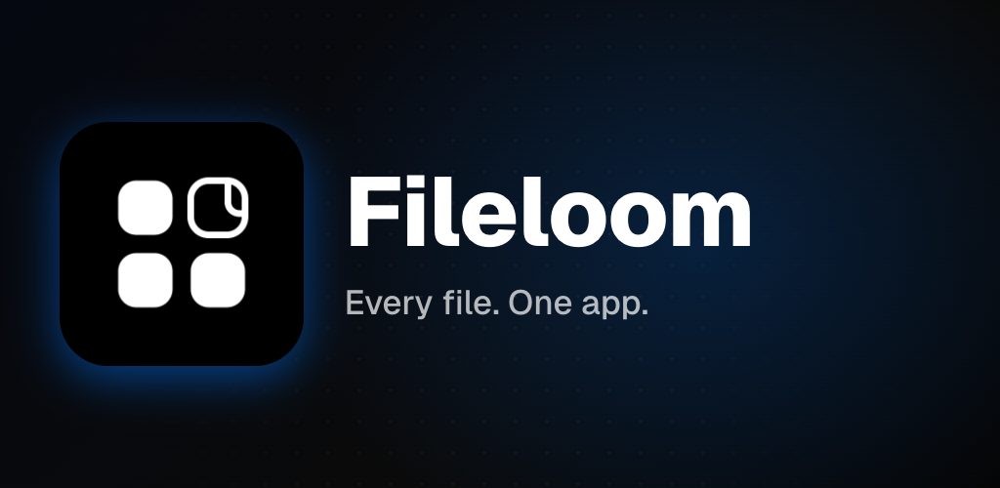
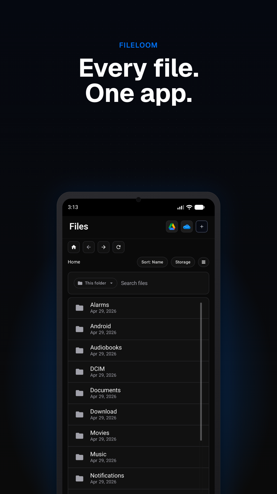
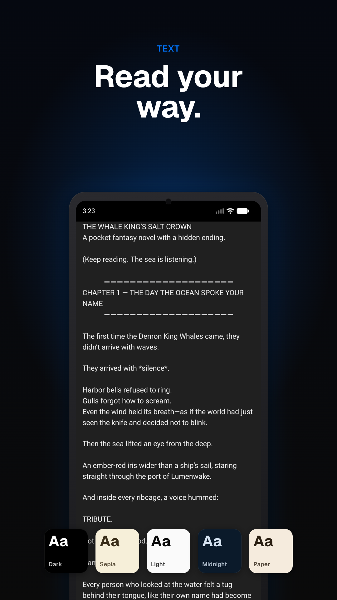

### 🎬 관련 영상
- [🎥 영상 보기](https://ph-files.imgix.net/a3dae1de-d3a2-4088-a4b7-b675d98f5ad3.jpeg?auto=format)

---

## 25. [Polygram](https://www.producthunt.com/products/polygram-4)
**Votes**: 80 | **도입 난이도**: 중 | **신뢰도**: 상
**Tagline**: AI-native design and coding app to build mobile & web apps
**서비스 링크**: https://www.producthunt.com/r/HBR3WS2POH43WR

**태그**: AI-Native, NoCode/LowCode, DesignTool, AppDevelopment, AI Tool, Prompting, Design

### 📌 이 서비스 한눈에 보기
아이디어 구상부터 디자인, 코드 생성까지 한 번에 해결하는 AI 네이티브 앱 빌더

### 🔑 주요 기능
- 단순 프롬프트 입력을 넘어 아이디어를 구체적인 제품 계획으로 확장
- 무한 AI 캔버스를 활용한 직관적인 앱 화면 디자인
- 디자인을 즉시 프로덕션 수준의 코드로 변환하여 앱 구축

### 🙋 사용자에게 어떤 점이 좋은가
기획부터 개발까지의 과정을 통합하여 개발 속도를 높이고, 무분별한 프롬프트 생성으로 인한 토큰 낭비를 줄여줍니다.

### ✅ 지금 바로 써볼 기능
- 아이디어 구체화를 위한 제품 플랜 생성 기능 테스트
- AI 캔버스를 활용한 앱 화면 디자인 작업
- 생성된 디자인의 프로덕션 코드 변환 결과 확인

### ⚠️ 사용 전 확인할 점
- 생성된 코드가 특정 프레임워크나 환경에 얼마나 최적화되어 있는지 확인 필요
- 복잡한 비즈니스 로직 구현 시 수동 수정 범위 검토

### 🧭 확인이 더 필요한 정보
생성된 코드의 기술 스택(언어, 프레임워크)과 배포 편의성에 대한 구체적인 정보가 필요합니다.

### 📸 스크린샷 및 갤러리

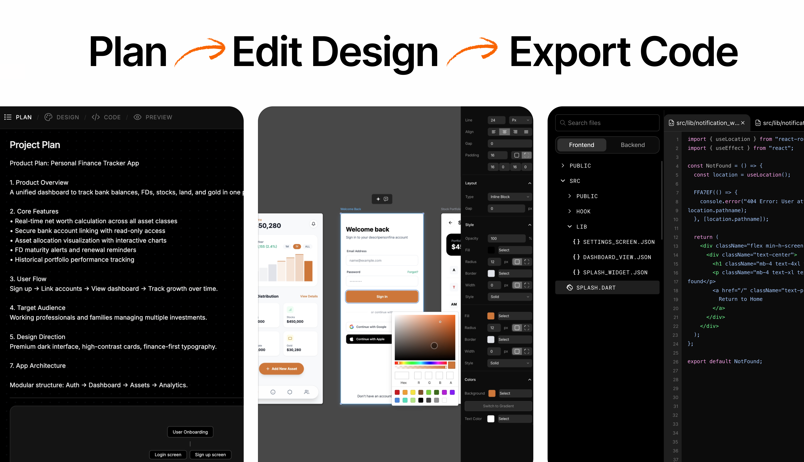
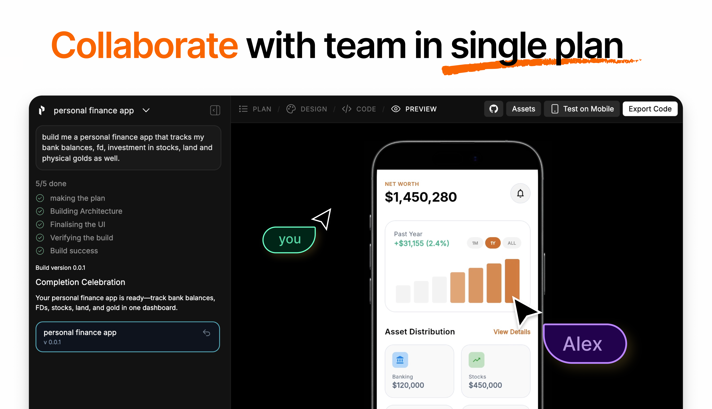

### 🎬 관련 영상
- [🎥 영상 보기](https://ph-files.imgix.net/50592e36-53a6-44dd-9104-3b9df568d319.jpeg?auto=format)

---

## 26. [claude-share](https://www.producthunt.com/products/claude-share)
**Votes**: 79 | **도입 난이도**: 하 | **신뢰도**: 상
**Tagline**: Securely share your Claude Code with your friends
**서비스 링크**: https://www.producthunt.com/r/PMVMVKL7HAETMT

**태그**: DevTool, CLI, AccountSharing

### 📌 이 서비스 한눈에 보기
Claude Code 구독을 친구들과 안전하게 공유할 수 있는 초경량 CLI 도구

### 🔑 주요 기능
- Claude Code 구독 공유를 위한 전용 CLI 도구
- 사용자가 직접 제어 가능한 보안 중심의 공유 방식
- 간편한 설치 및 사용이 가능한 가벼운 툴

### 🙋 사용자에게 어떤 점이 좋은가
구독 비용을 절감하기 위해 지인과 계정을 공유할 때, 보안을 유지하면서도 편리하게 사용할 수 있습니다.

### ✅ 지금 바로 써볼 기능
- CLI 설치 및 환경 설정
- 공유 대상 친구 초대 및 권한 설정
- 보안 제어 기능 테스트

### ⚠️ 사용 전 확인할 점
- 공유 방식이 서비스 이용 약관(ToS)에 위배되지 않는지 확인 필요
- 공유 시 개인 계정 정보 노출 위험성 검토

### 🧭 확인이 더 필요한 정보
구체적인 보안 메커니즘과 계정 탈취 방지 기술에 대한 상세 정보가 부족합니다.

### 📸 스크린샷 및 갤러리
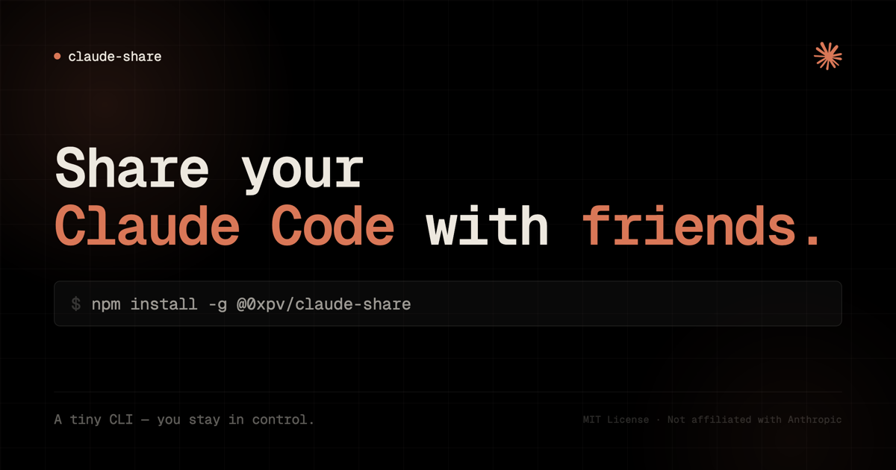
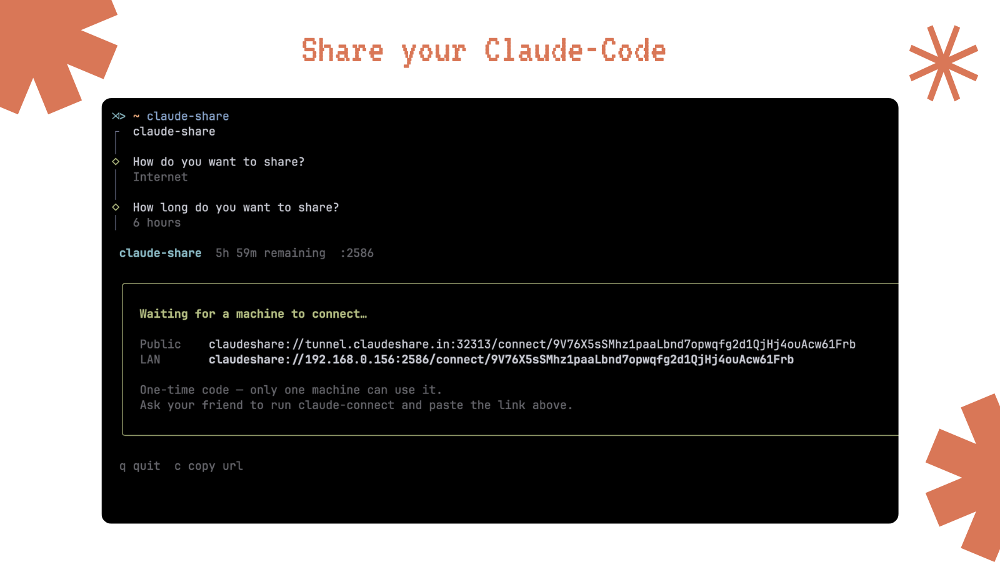
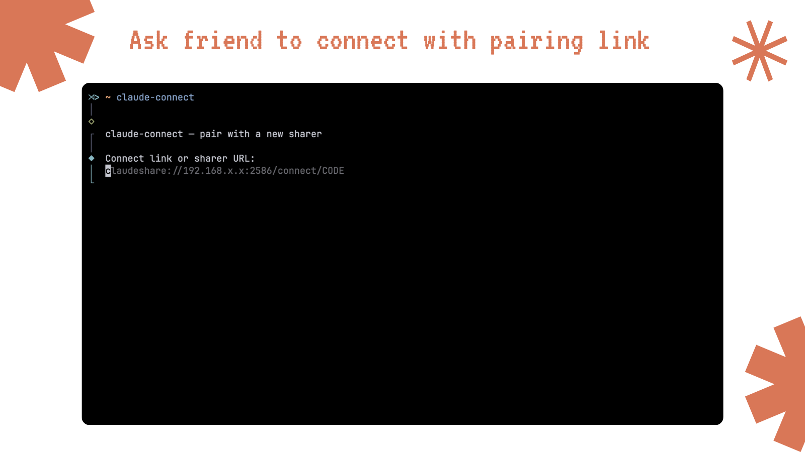

### 🎬 관련 영상
- [🎥 영상 보기](https://ph-files.imgix.net/d7079263-ef98-4e2d-a03e-831b58cbf25d.jpeg?auto=format)

---

## 27. [Vibespace](https://www.producthunt.com/products/vibespace)
**Votes**: 79 | **도입 난이도**: 하 | **신뢰도**: 상
**Tagline**: Workspace for multi-agent collaboration
**서비스 링크**: https://www.producthunt.com/r/SQIU4EXDS4WCCL

**태그**: AI-Agents, Automation, Productivity, DevTool, Mac, Agent, AI Tool

### 📌 이 서비스 한눈에 보기
사용자의 Mac 환경에서 AI 에이전트 팀이 실시간으로 협업하며 업무를 수행하는 워크스페이스

### 🔑 주요 기능
- 멀티 에이전트 간의 실시간 협업 및 사용자 참여형 워크플로우
- DM과 채널을 통한 직관적인 UI로 비기술적 사용자도 관리 가능
- 샌드박스 런타임 환경에서 앱, 자동화, 프리뷰 결과물 생성

### 🙋 사용자에게 어떤 점이 좋은가
복잡한 코딩 없이도 AI 팀이 계획부터 실행까지 업무를 대행하며, 기존 Claude Code 및 Codex 구독을 활용해 즉시 업무 자동화를 구현할 수 있습니다.

### ✅ 지금 바로 써볼 기능
- 개인용 AI 팀 구성 및 채널 설정하기
- 샌드박스 환경에서 자동화 및 앱 생성 테스트하기
- 기존 Claude/Codex 구독 연동 확인하기

### ⚠️ 사용 전 확인할 점
- Mac 전용 앱이므로 타 OS 사용 시 제약이 있을 수 있음
- 기존 AI 구독 서비스(Claude Code, Codex)가 필요함

### 🧭 확인이 더 필요한 정보
샌드박스 환경 내에서 생성된 결과물의 외부 배포 및 실제 운영 환경으로의 이전 방식에 대한 상세 정보가 필요합니다.

### 📸 스크린샷 및 갤러리

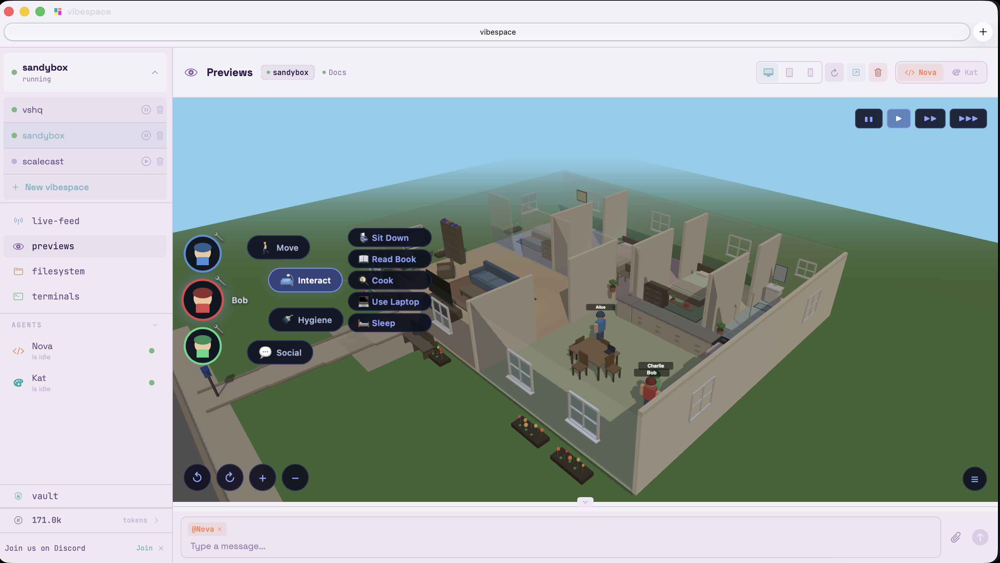
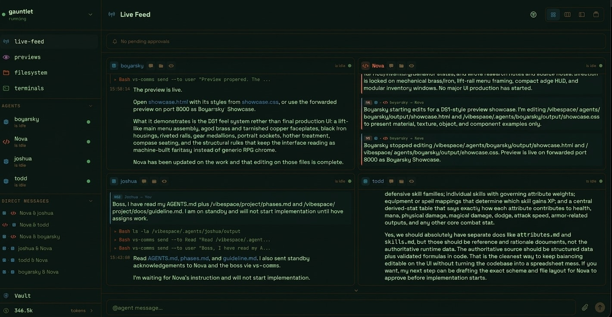

### 🎬 관련 영상
- [🎥 영상 보기](https://ph-files.imgix.net/bbf00df5-932c-4f2b-9717-e7993fff42a1.jpeg?auto=format)

---

## 28. [Flowsnip](https://www.producthunt.com/products/flowsnip)
**Votes**: 77 | **도입 난이도**: 하 | **신뢰도**: 상
**Tagline**: n8n extension to save and reuse workflow snippets in-canvas
**서비스 링크**: https://www.producthunt.com/r/DQ5KU3Y7LAF77A

**태그**: Automation, Productivity, n8n, DevTool

### 📌 이 서비스 한눈에 보기
n8n 작업 환경 내에서 워크플로우 조각을 즉시 저장하고 재사용할 수 있는 생산성 확장 도구

### 🔑 주요 기능
- n8n 캔버스 내에 직접 통합되는 개인용 스니펫 라이브러리 제공
- 자주 사용하는 워크플로우 요소를 캡처하고 체계적으로 정리 가능
- 에디터를 벗어나지 않고 작업 흐름을 유지하며 반복 작업 효율화

### 🙋 사용자에게 어떤 점이 좋은가
자주 사용하는 노드 구성이나 복잡한 로직을 스니펫으로 저장해 두면, 새로운 워크플로우를 만들 때 처음부터 다시 설계할 필요 없이 빠르게 조립할 수 있습니다.

### ✅ 지금 바로 써볼 기능
- 자주 사용하는 노드 조합을 스니펫으로 저장하기
- 라이브러리에 카테고리별로 워크플로우 조각 정리하기
- 새로운 프로젝트 시작 시 저장된 스니펫 불러와서 적용하기

### ⚠️ 사용 전 확인할 점
- n8n 환경 내에서만 작동하는 확장 기능이므로 외부 도구와의 연동 범위 확인 필요
- 스니펫 저장 시 데이터 보안 및 개인정보 포함 여부 주의

### 🧭 확인이 더 필요한 정보
n8n의 특정 버전이나 환경(Self-hosted vs Cloud)에서의 호환성 여부를 확인해야 합니다.

### 📸 스크린샷 및 갤러리
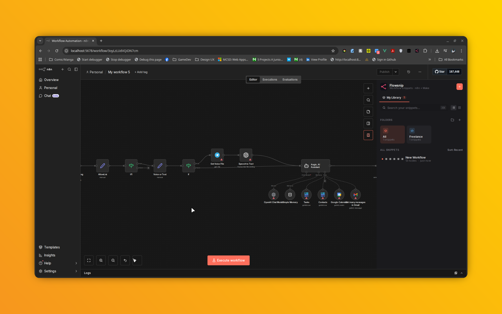
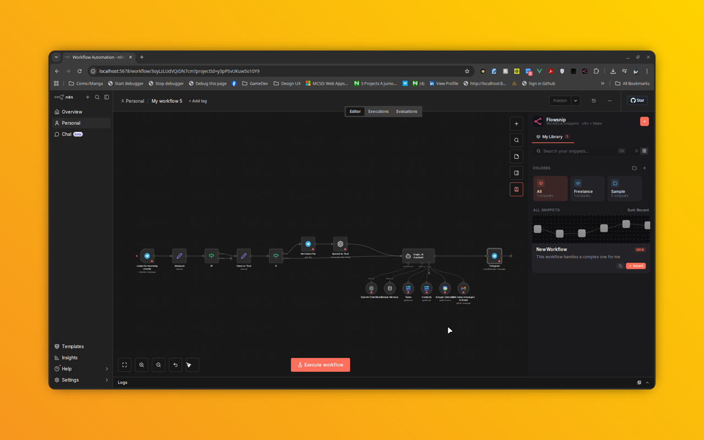
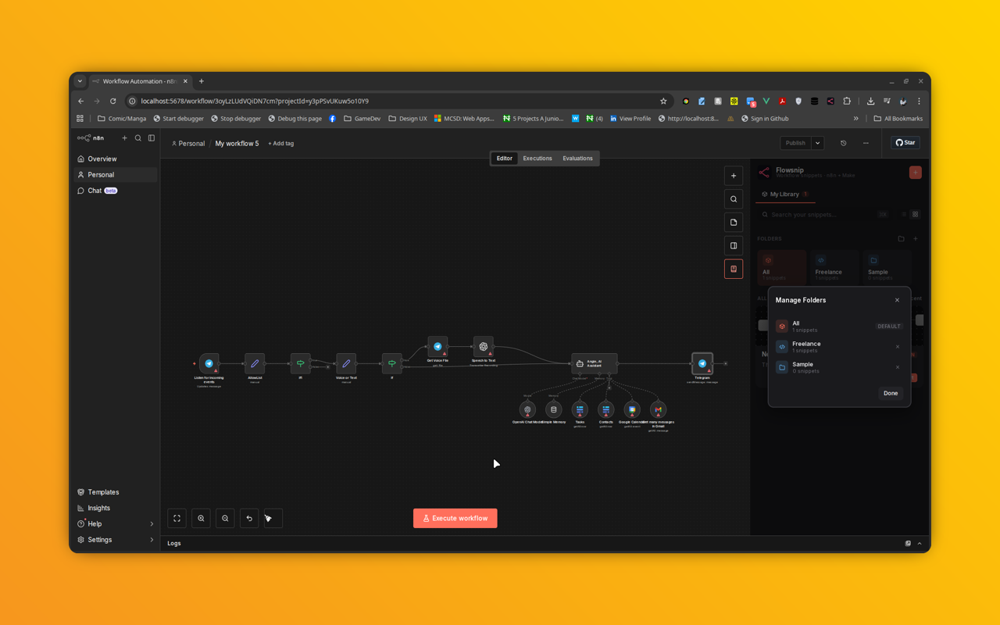

### 🎬 관련 영상
- [🎥 영상 보기](https://ph-files.imgix.net/1a28b272-24af-4550-b154-e316f354a038.jpeg?auto=format)

---

## 29. [Zen Reports](https://www.producthunt.com/products/zen-reports)
**Votes**: 76 | **도입 난이도**: 하 | **신뢰도**: 상
**Tagline**: See how much traffic your website gets from ChatGPT
**서비스 링크**: https://www.producthunt.com/r/WXSQDKUQNNQOMV

**태그**: Analytics, AI-Optimization, Marketing-Tool, SaaS, AI Tool, Chat

### 📌 이 서비스 한눈에 보기
ChatGPT, Gemini 등 AI 모델을 통한 웹사이트 유입 트래픽을 실시간으로 분석하는 도구

### 🔑 주요 기능
- Google Analytics 연동을 통한 AI 유입 트래픽 추적
- ChatGPT, Gemini, Claude, Perplexity, Copilot 등 주요 AI 소스별 데이터 제공
- 페이지별 유입, 사용자 참여도 및 트렌드 분석 기능

### 🙋 사용자에게 어떤 점이 좋은가
AI 검색 엔진 최적화(GEO) 성과를 데이터로 확인하여, AI를 통한 잠재 고객 유입 전략을 수립할 수 있습니다.

### ✅ 지금 바로 써볼 기능
- Google Analytics 계정 연결하기
- AI 소스별 유입 트래픽 대시보드 확인하기
- 특정 페이지의 AI 유입 트렌드 분석하기

### ⚠️ 사용 전 확인할 점
- 데이터 읽기 전용 권한만 사용하므로 기존 GA 데이터와 일치하는지 확인 필요
- AI 모델의 유입 방식 변화에 따라 데이터 정확도가 변동될 수 있음

### 🧭 확인이 더 필요한 정보
구체적인 데이터 업데이트 주기와 상세 분석 지표의 범위는 제품 사용 시 확인이 필요합니다.

### 📸 스크린샷 및 갤러리
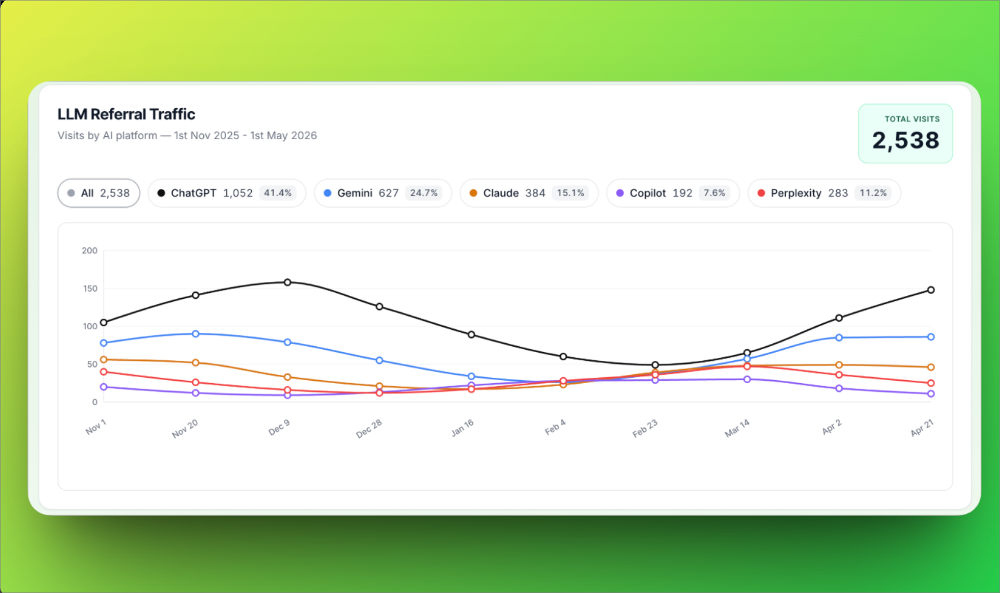
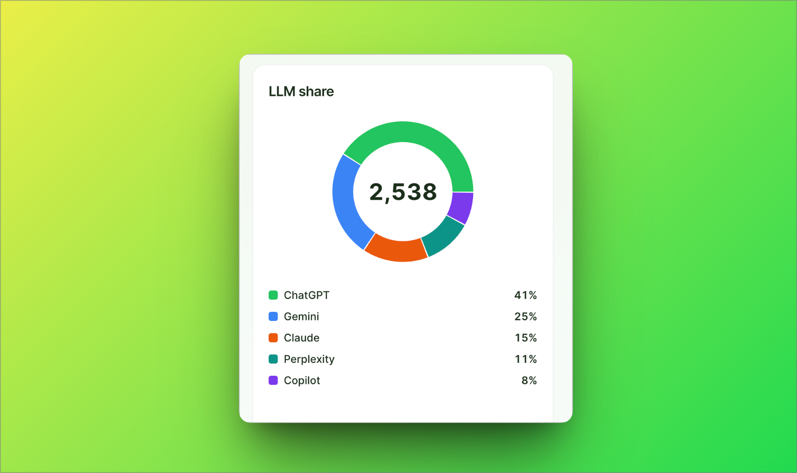
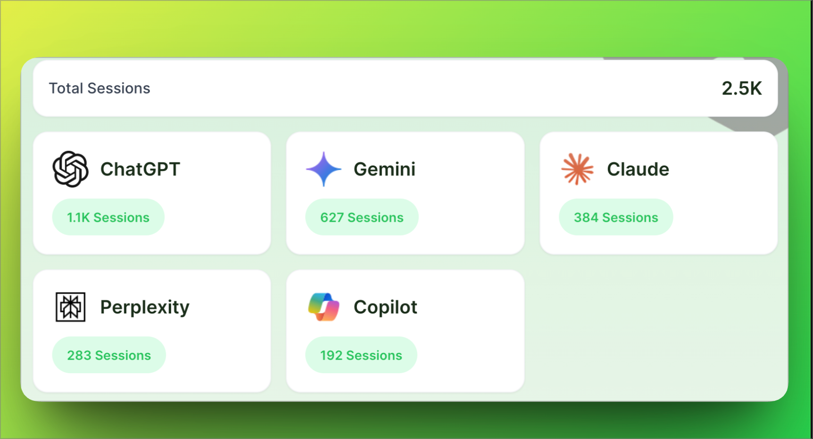

---

## 30. [Blurto](https://www.producthunt.com/products/blurto)
**Votes**: 76 | **도입 난이도**: 하 | **신뢰도**: 상
**Tagline**: Sorts your thoughts into tasks, notes, ideas, etc
**서비스 링크**: https://www.producthunt.com/r/XCALL2M5V2B2LR

**태그**: Productivity, AI, ADHD, Automation, Voice-First, AI Tool

### 📌 이 서비스 한눈에 보기
생각을 말하거나 적기만 하면 AI가 알아서 분류해주는 ADHD 맞춤형 초간편 플래너

### 🔑 주요 기능
- 음성, 텍스트, 사진을 통한 즉각적인 생각 기록 기능
- AI를 활용한 자동 카테고리 분류 (할 일, 아이디어, 메모 등)
- 폴더나 태그 설정이 필요 없는 제로 세팅(Zero-setup) 워크플로우

### 🙋 사용자에게 어떤 점이 좋은가
생각이 떠오를 때 정리하는 번거로움 없이 즉시 기록하고, AI가 알아서 정리해주므로 생산성 앱 이탈 문제를 해결합니다.

### ✅ 지금 바로 써볼 기능
- 떠오르는 생각을 음성으로 즉시 뱉어보기
- 사진을 찍어 AI가 어떻게 분류하는지 확인하기
- 자동 분류된 결과가 의도대로 되었는지 검토하기

### ⚠️ 사용 전 확인할 점
- AI 자동 분류의 정확도에 따라 수동 수정이 필요할 수 있음
- 음성/사진 입력 시 데이터 보안 및 개인정보 관리 확인 필요

### 🧭 확인이 더 필요한 정보
현재 구체적인 플랫폼 지원 범위(모바일 앱, 웹 등)와 데이터 동기화 방식에 대한 정보가 부족합니다.

### 📸 스크린샷 및 갤러리
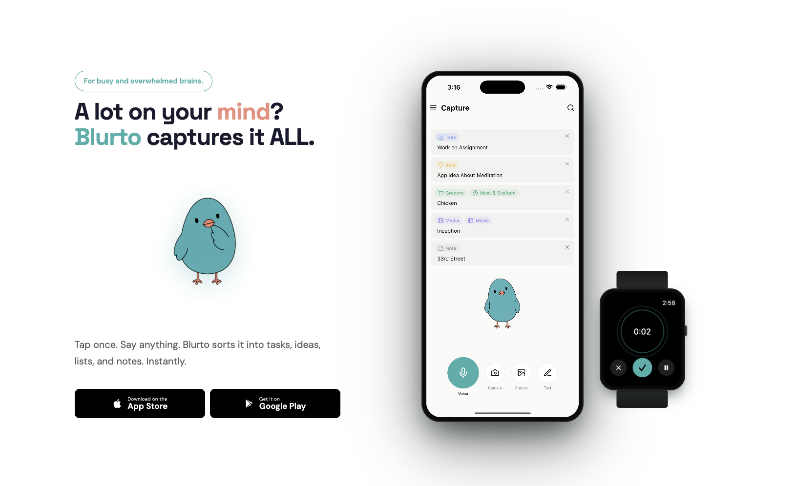
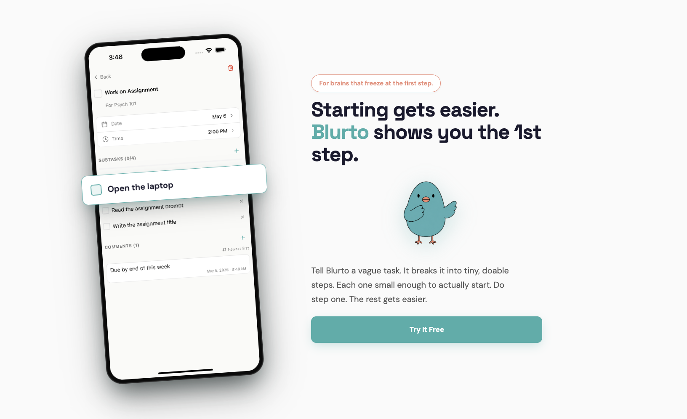
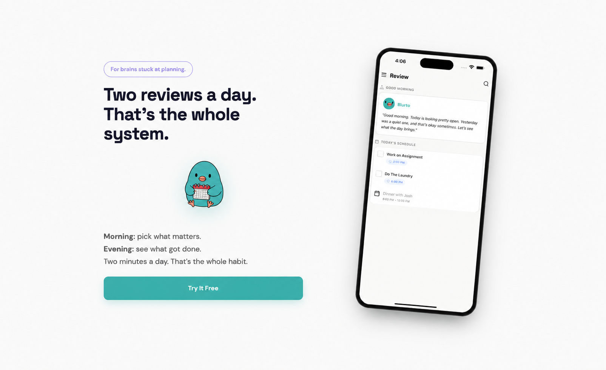

### 🎬 관련 영상
- [🎥 영상 보기](https://ph-files.imgix.net/d5f8386f-1cf8-43ff-895a-afe7164cb449.jpeg?auto=format)

---

