# 🚀 Product Hunt Daily Top 30 (2026-05-19)

## 오늘의 요약
오늘의 트렌드는 단순한 챗봇을 넘어 목표를 스스로 달성하는 AI 에이전트와 복잡한 작업을 자동화하는 인터페이스 기술이 주를 이루었습니다. 또한, 개발 생산성을 높이는 노코드/로우코드 도구와 사용자 경험을 극대화하는 시각적/개인화된 솔루션들이 주목받았습니다.

### 오늘의 핵심 포인트
- 목표 설정만으로 팀을 구성하고 실행하는 멀티 에이전트 및 자동화 워크플로우 기술이 부상했습니다.
- AI가 화면과 음성을 인식하여 복잡한 업무를 처리하거나 UI를 생성하는 등 인간의 작업 방식을 보조하는 도구들이 등장했습니다.
- 데이터 추출, 광고 관리, 앱 개발 등 전문적인 영역을 노코드나 대화형 인터페이스로 간소화하려는 시도가 돋보였습니다.

**오늘의 태그**: AI 에이전트, 업무 자동화, 노코드, 생산성 도구, 차세대 UI

## 1. [SocLeads 3.0](https://www.producthunt.com/products/socleads)
**Votes**: 330 | **도입 난이도**: 하 | **신뢰도**: 상
**Tagline**: Scrape emails from socials and maps by location
**서비스 링크**: https://www.producthunt.com/r/ALZHOD7ZH2TWYV

**태그**: LeadGeneration, Automation, DataScraping, MarketingTool, AI Tool, DevTool, Email

### 📌 이 서비스 한눈에 보기
소셜 미디어와 구글 맵에서 특정 지역의 이메일을 자동으로 수집하는 노코드 데이터 추출 도구

### 🔑 주요 기능
- Instagram, Facebook, LinkedIn, YouTube, Google Maps 대상 데이터 스크래핑
- 국가 단위 및 지리적 필터링을 통한 타겟팅 기능
- 코딩 지식 없이 사용 가능한 노코드(No-code) 환경

### 🙋 사용자에게 어떤 점이 좋은가
특정 지역 기반의 잠재 고객 리스트를 빠르게 확보하여 마케팅 및 영업 리드 발굴에 활용할 수 있습니다.

### ✅ 지금 바로 써볼 기능
- 타겟 국가 및 지역 설정 테스트
- 주요 소셜 플랫폼별 데이터 추출 정확도 확인
- 필터 기능을 활용한 타겟 리스트 생성

### ⚠️ 사용 전 확인할 점
- 플랫폼별 스크래핑 정책 및 개인정보 보호 규정 준수 여부 확인 필요
- 수집된 데이터의 최신성 및 유효성 검증 필요

### 🧭 확인이 더 필요한 정보
플랫폼별 데이터 추출 한도 및 상세 가격 정책에 대한 정보가 명시되지 않았습니다.

### 📸 스크린샷 및 갤러리
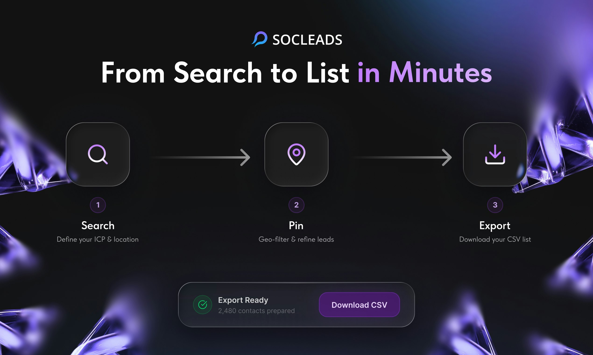
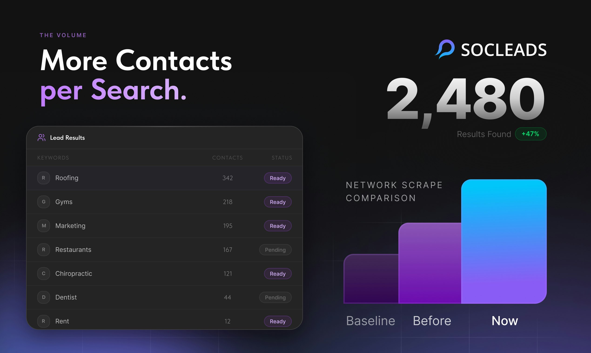
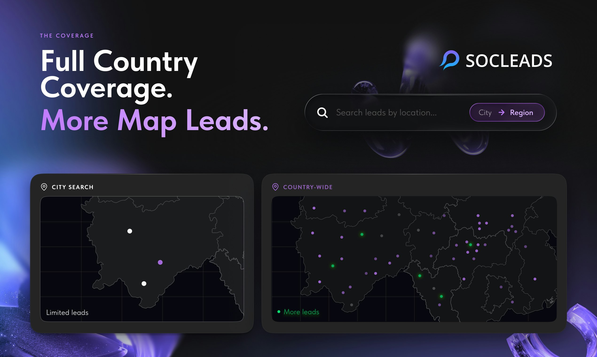

---

## 2. [LobeHub](https://www.producthunt.com/products/lobehub)
**Votes**: 250 | **도입 난이도**: 중 | **신뢰도**: 상
**Tagline**: Your Chief Agent Operator for multi-agent work
**서비스 링크**: https://www.producthunt.com/r/GDRCLPANDCILEI

**태그**: AI Agents, Automation, Workflow, Productivity, Agent, AI Tool

### 📌 이 서비스 한눈에 보기
목표 설정만으로 AI 에이전트 팀을 구축하고 운영하는 자동화 워크플로우 관리자

### 🔑 주요 기능
- 목표 기반의 멀티 에이전트 자동 팀 구성 및 실행
- 클라우드 기반 병렬 작업 처리 및 모델 간 워크로드 라우팅
- Slack, Discord 등 기존 메시징 채널을 통한 결과 보고

### 🙋 사용자에게 어떤 점이 좋은가
복잡한 작업 과정을 일일이 지시할 필요 없이 목표만 전달하면 AI가 알아서 팀을 꾸려 결과를 가져오므로 업무 생산성이 극대화됩니다.

### ✅ 지금 바로 써볼 기능
- 목표(Goal)를 구체적으로 기술하여 에이전트 팀 생성해보기
- 사용 중인 메신저(Slack/Discord 등) 연동 설정하기
- 병렬로 실행되는 클라우드 작업 결과 모니터링하기

### ⚠️ 사용 전 확인할 점
- 에이전트가 자율적으로 판단하는 과정에서 발생할 수 있는 예기치 못한 결과 확인 필요
- 메시징 채널 연동 시 보안 및 데이터 프라이버시 검토 필요

### 🧭 확인이 더 필요한 정보
구체적인 비용 구조나 사용 가능한 모델의 종류 및 제한 사항에 대한 정보가 명시되지 않았습니다.

### 📸 스크린샷 및 갤러리
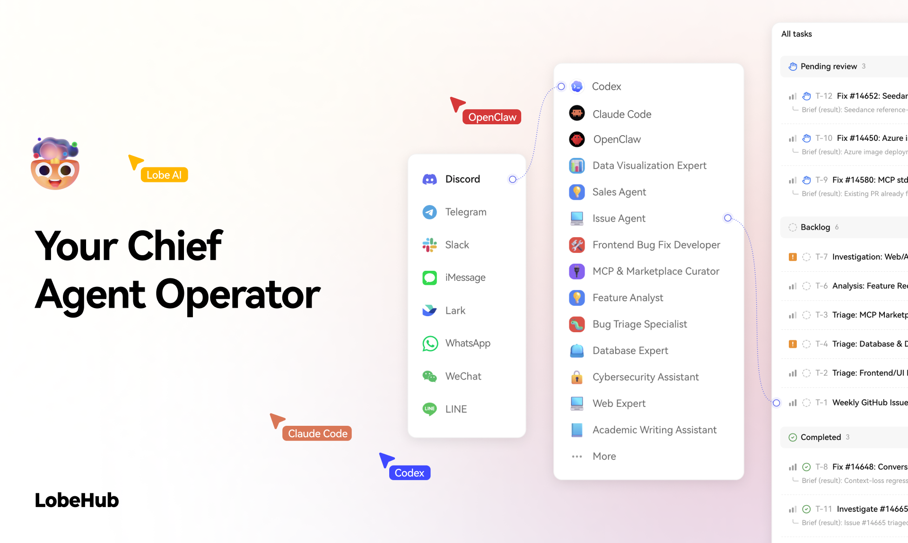
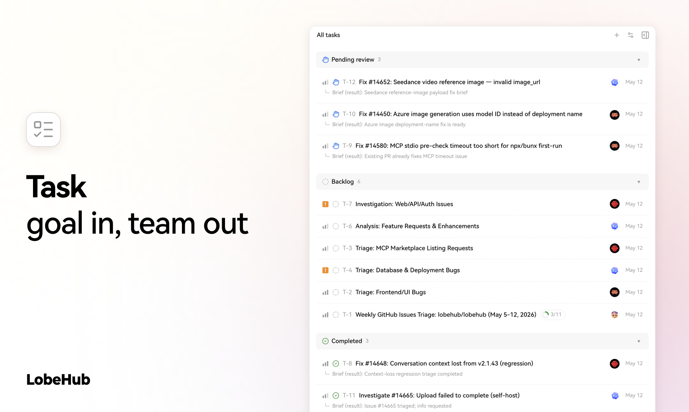
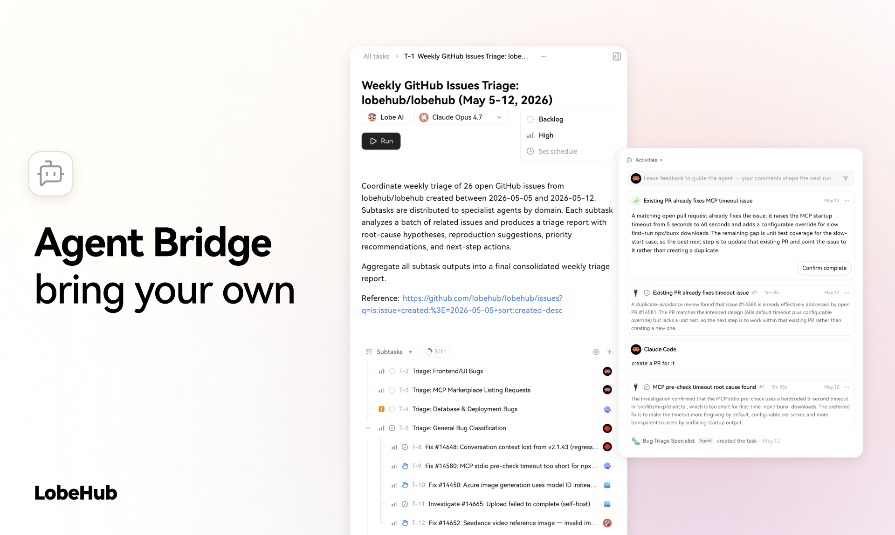

### 🎬 관련 영상
- [🎥 영상 보기](https://ph-files.imgix.net/312a69c4-9d7c-43d0-8d43-b31157f0cddd.jpeg?auto=format)

---

## 3. [ReactVision Studio](https://www.producthunt.com/products/reactvision-studio)
**Votes**: 188 | **도입 난이도**: 중 | **신뢰도**: 상
**Tagline**: Build AR/VR Apps in React Native + ship directly to devices
**서비스 링크**: https://www.producthunt.com/r/NULQJX32QZRBB6

**태그**: DevTool, AR/VR, React Native, LowCode, AI Tool

### 📌 이 서비스 한눈에 보기
React Native 기반으로 AR/VR 앱을 시각적으로 설계하고 기기에 즉시 배포하는 개발 도구

### 🔑 주요 기능
- 브라우저 기반의 드래그 앤 드롭 3D 장면 편집기 제공
- AI를 활용한 3D 에셋 생성 기능 탑재
- iOS, Android, Meta Quest를 지원하는 단일 React Native 코드베이스

### 🙋 사용자에게 어떤 점이 좋은가
복잡한 3D 코딩 없이도 시각적 편집과 AI를 통해 빠르게 AR/VR 콘텐츠를 제작하고 모바일 및 VR 기기에 배포할 수 있습니다.

### ✅ 지금 바로 써볼 기능
- 브라우저 편집기에서 3D 오브젝트 드래그 앤 드롭 테스트
- AI 에셋 생성 기능으로 3D 모델 제작 시도
- Expo 환경에서의 렌더러 호환성 확인

### ⚠️ 사용 전 확인할 점
- React Native 및 Expo 환경에 대한 사전 지식 필요
- 복잡한 인터랙션 구현 시 코드 레벨의 추가 작업 가능성

### 🧭 확인이 더 필요한 정보
오픈 소스 렌더러의 성능 최적화 수준과 실제 기기 배포 시의 워크플로우 상세 과정 확인이 필요합니다.

### 📸 스크린샷 및 갤러리
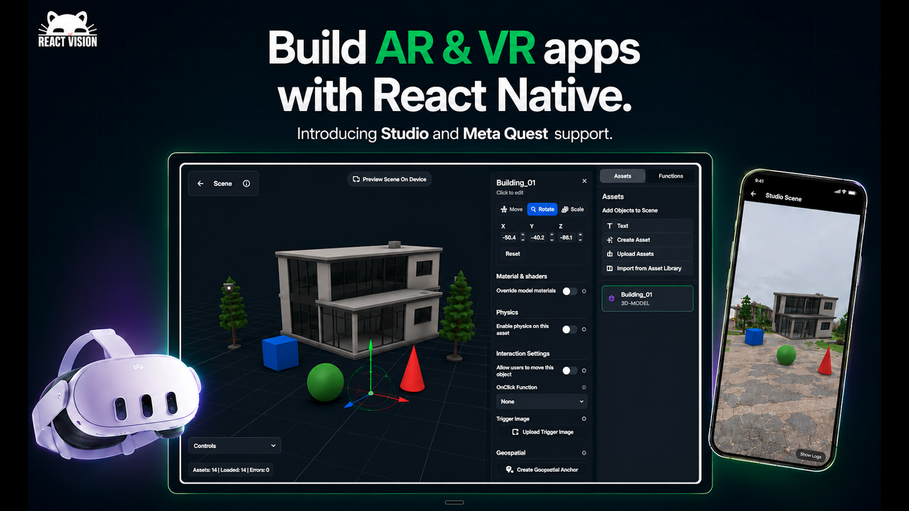
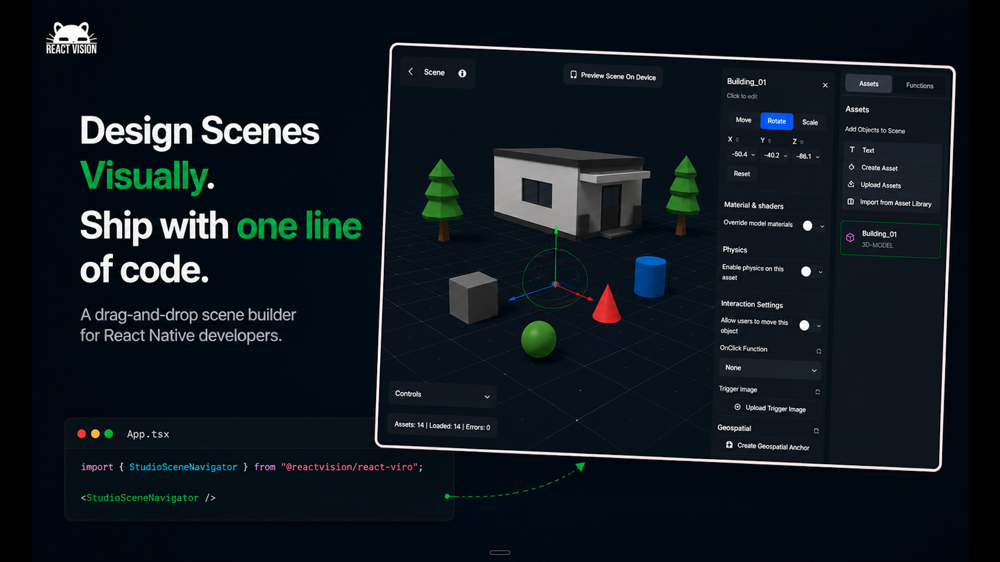
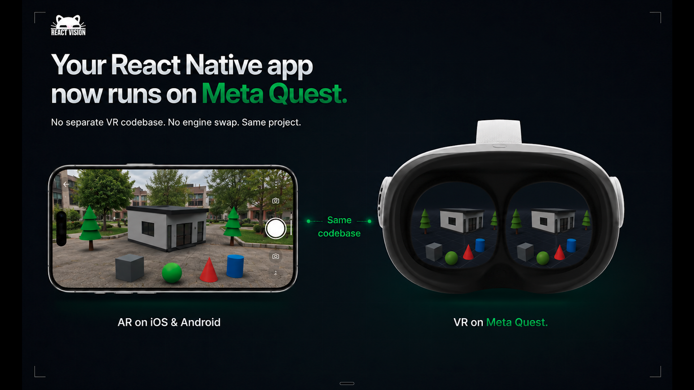

### 🎬 관련 영상
- [🎥 영상 보기](https://ph-files.imgix.net/e657ec9e-d5ab-4daa-8e86-4f9b3a4681bc.jpeg?auto=format)

---

## 4. [Shadow](https://www.producthunt.com/products/shadow-4)
**Votes**: 150 | **도입 난이도**: 중 | **신뢰도**: 상
**Tagline**: AI computer screen and voice control with custom automation
**서비스 링크**: https://www.producthunt.com/r/RTMG35ETHSLUIL

**태그**: AI, Automation, Productivity, Mac, Workflow, AI Tool, Prompting, Email

### 📌 이 서비스 한눈에 보기
화면과 음성을 인식하여 복잡한 작업을 자동화하는 Mac 전용 AI 인터페이스

### 🔑 주요 기능
- 화면 내용과 음성을 실시간으로 인식하는 AI 인터페이스
- 이메일 초안 작성, 음성 타이핑, 회의록 정리 등 맞춤형 'Skill' 제공
- 사용자가 직접 프롬프트와 컨텍스트를 설정하여 커스텀 자동화 구축 가능

### 🙋 사용자에게 어떤 점이 좋은가
반복적인 문서 작업이나 회의 정리 업무를 AI가 대신 처리하여 업무 흐름을 끊김 없이 유지할 수 있습니다.

### ✅ 지금 바로 써볼 기능
- Quick Reply로 이메일 초안 작성해보기
- Meeting Skills로 회의 직후 요약본 생성하기
- 나만의 커스텀 Skill 구축하기

### ⚠️ 사용 전 확인할 점
- 화면과 음성을 지속적으로 모니터링하므로 개인정보 및 보안 설정 확인 필요
- Mac 전용 환경으로 타 OS에서의 사용 제한

### 🧭 확인이 더 필요한 정보
사용자 정의 Skill의 복잡도에 따른 시스템 리소스 점유율과 보안 정책에 대한 상세 정보가 필요합니다.

### 📸 스크린샷 및 갤러리
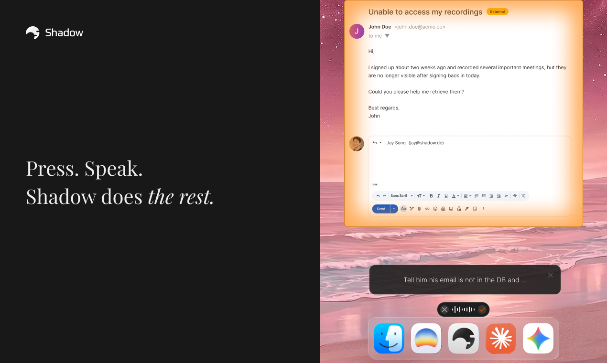
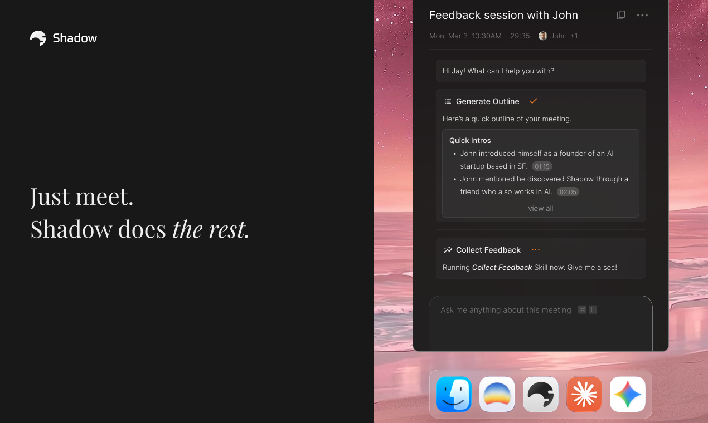
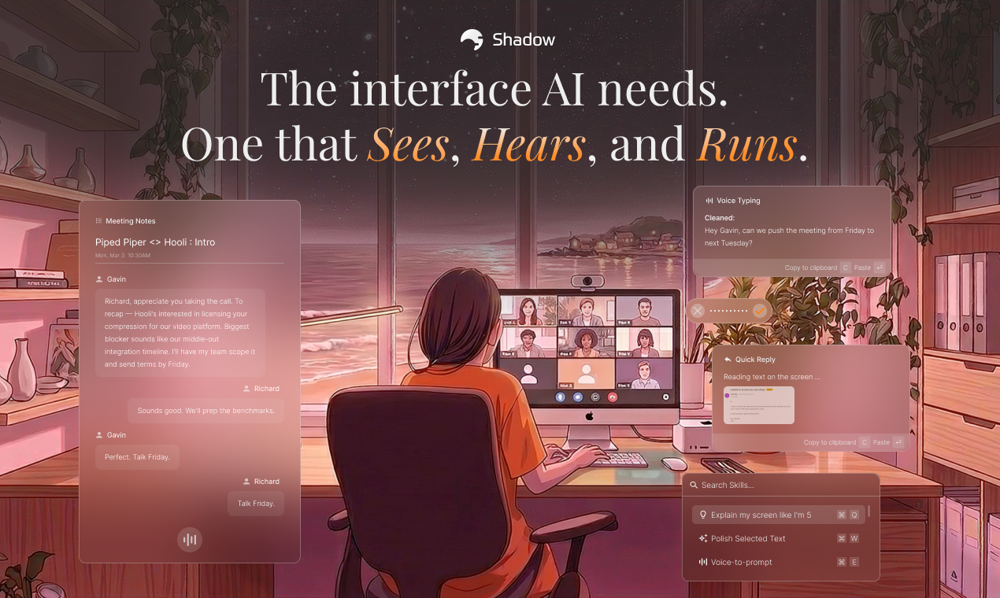

### 🎬 관련 영상
- [🎥 영상 보기](https://ph-files.imgix.net/de217d65-a236-4cc7-9b49-2a9f99ca7da3.jpeg?auto=format)

---

## 5. [Searchad.ai](https://www.producthunt.com/products/searchad-ai)
**Votes**: 129 | **도입 난이도**: 하 | **신뢰도**: 상
**Tagline**: Run Apple Search Ads by Chatting with AI
**서비스 링크**: https://www.producthunt.com/r/5QMQT3477EYHCQ

**태그**: MarketingAutomation, AI, AppleSearchAds, Analytics, AI Tool, Chat

### 📌 이 서비스 한눈에 보기
채팅만으로 전 세계 Apple Search Ads 캠페인을 관리하고 최적화하는 AI 도구

### 🔑 주요 기능
- 대화형 인터페이스를 통한 간편한 광고 캠페인 운영
- 사용자의 명시적 승인 없이는 광고 집행이나 비용이 발생하지 않는 안전한 AI 모드
- 전 세계 모든 Apple Ads 지원 국가 대상 캠페인 관리 및 ROAS 확인

### 🙋 사용자에게 어떤 점이 좋은가
복잡한 광고 관리자 화면 대신 채팅만으로 캠페인을 관리할 수 있어 운영 효율성이 극대화됩니다.

### ✅ 지금 바로 써볼 기능
- 채팅을 통한 캠페인 생성 및 설정 테스트
- 실시간 ROAS 데이터 확인 및 분석
- 글로벌 캠페인 관리 기능 탐색

### ⚠️ 사용 전 확인할 점
- AI의 제안이 실제 광고 성과로 이어지는지 검증 필요
- 사용자의 승인 절차를 누락할 경우 의도치 않은 운영 지연 가능성

### 🧭 확인이 더 필요한 정보
AI가 제안하는 최적화 전략의 구체적인 알고리즘과 실제 자동화 범위에 대한 확인이 필요합니다.

### 📸 스크린샷 및 갤러리
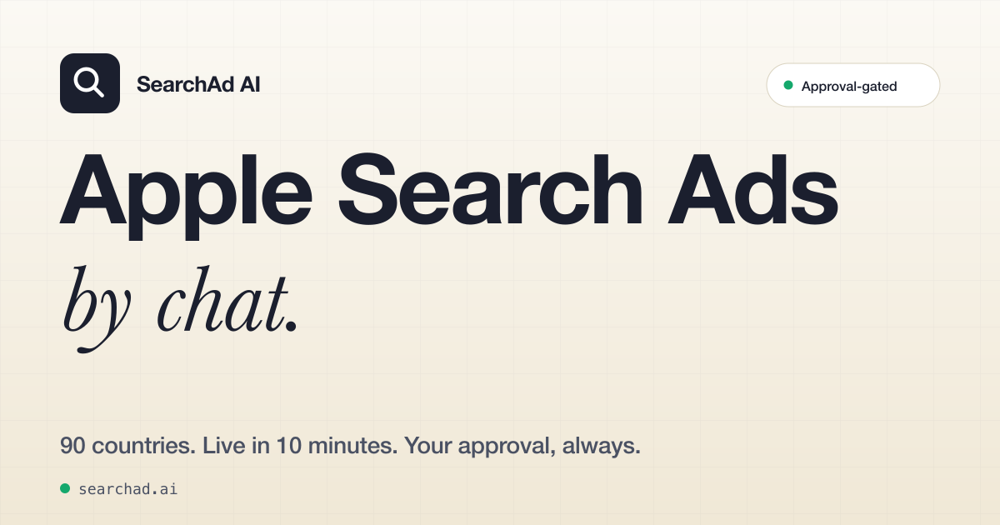
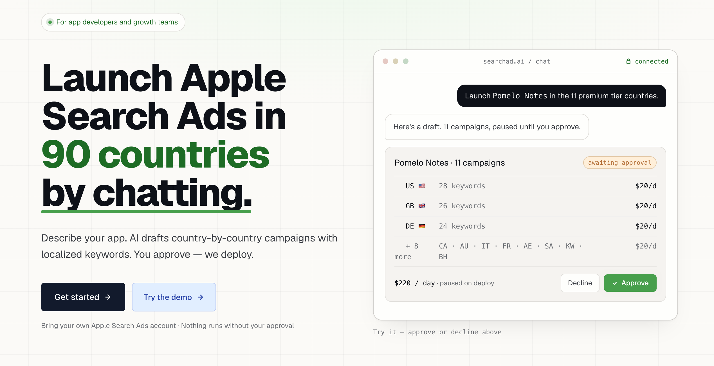
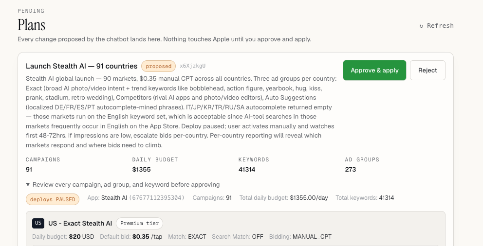

---

## 6. [M1 by Montage](https://www.producthunt.com/products/montage-3)
**Votes**: 117 | **도입 난이도**: 중 | **신뢰도**: 상
**Tagline**: Agentic UI that scales on demand
**서비스 링크**: https://www.producthunt.com/r/VUCSAOSHPZW43W

**태그**: AI, DevTool, UI/UX, Automation, Agent, AI Tool, API

### 📌 이 서비스 한눈에 보기
AI 에이전트의 UI 생성 비용과 속도 문제를 해결하는 서버 사이드 컴포넌트 렌더링 솔루션

### 🔑 주요 기능
- 의도 스키마(Intent Schema) 기반의 서버 사이드 UI 컴파일
- 토큰 사용량 50~100배 절감 및 10배 빠른 렌더링 속도
- 브랜드 스타일 적용 및 상태 유지가 가능한 인터랙티브 UI 제공

### 🙋 사용자에게 어떤 점이 좋은가
AI 에이전트가 매번 UI를 새로 생성할 때 발생하는 막대한 비용과 지연 시간을 획기적으로 줄여줍니다.

### ✅ 지금 바로 써볼 기능
- 기존 AI 에이전트 워크플로우에 M1 API 연동 테스트
- 의도 스키마를 통한 UI 컴포넌트 생성 효율성 검증
- 브랜드 스타일 가이드 적용 및 인터랙티브 기능 확인

### ⚠️ 사용 전 확인할 점
- 기존 프론트엔드 프레임워크와의 호환성 확인 필요
- 복잡한 사용자 인터랙션에 대한 서버 사이드 제어 한계 확인

### 🧭 확인이 더 필요한 정보
지원하는 구체적인 프론트엔드 프레임워크와 라이브러리 목록이 명시되지 않았습니다.

### 📸 스크린샷 및 갤러리
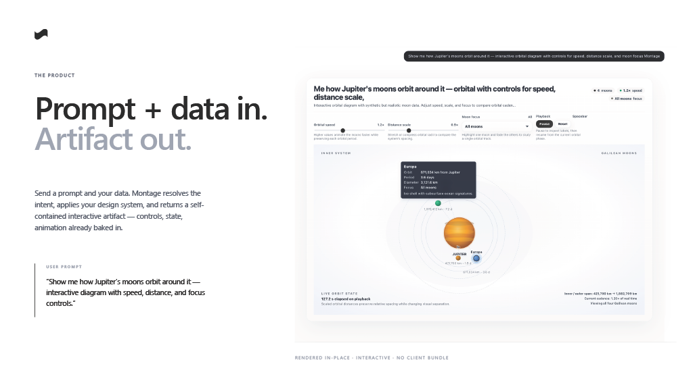
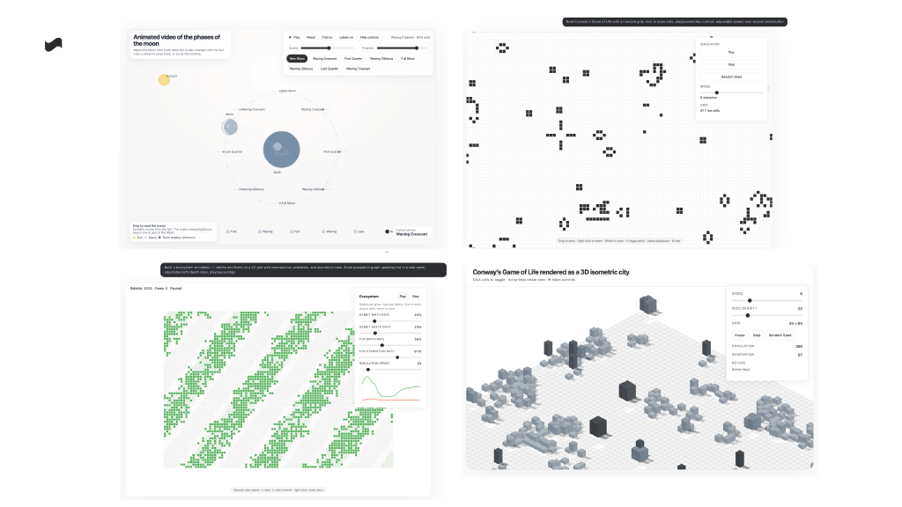

### 🎬 관련 영상
- [🎥 영상 보기](https://ph-files.imgix.net/7cb44227-ff34-4850-bb31-1a401ad7a4d1.jpeg?auto=format)

---

## 7. [Origio](https://www.producthunt.com/products/origio)
**Votes**: 115 | **도입 난이도**: 하 | **신뢰도**: 상
**Tagline**: A personalized way to discover where to live
**서비스 링크**: https://www.producthunt.com/r/4KAC32EMMI672O

**태그**: Relocation, Lifestyle, Personalization

### 📌 이 서비스 한눈에 보기
개인 맞춤형 조건 분석을 통해 최적의 이주 국가를 추천해주는 서비스

### 🔑 주요 기능
- 직업, 국적, 예산 등 8가지 질문 기반의 개인 맞춤형 국가 스코어링
- 세후 급여, 비자 난이도, 생활비, 삶의 질 등 다각도 분석 제공
- 구독 없이 한 번의 결제로 모든 기능을 사용하는 합리적 모델

### 🙋 사용자에게 어떤 점이 좋은가
단순한 도시 비교를 넘어 사용자의 국적과 경제적 상황을 반영한 실질적인 이주 후보지를 빠르게 찾을 수 있습니다.

### ✅ 지금 바로 써볼 기능
- 8가지 질문에 답변하여 무료로 상위 3개 추천 국가 확인하기
- Pro 버전을 통해 전체 25개 국가 리스트와 상세 비교 기능 검토하기

### ⚠️ 사용 전 확인할 점
- 무료 버전은 상위 3개 매칭 결과만 제공됨
- 비자 및 세금 정보는 정책 변화에 따라 실제와 다를 수 있음

### 🧭 확인이 더 필요한 정보
제공되는 25개 국가 리스트가 사용자의 특정 직업군이나 국적을 충분히 포괄하는지 확인이 필요합니다.

### 📸 스크린샷 및 갤러리
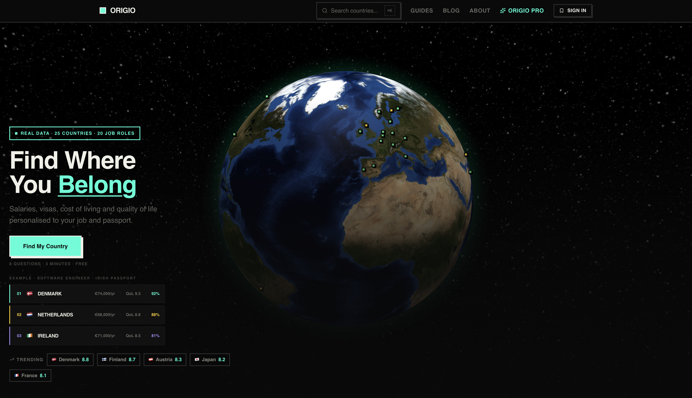
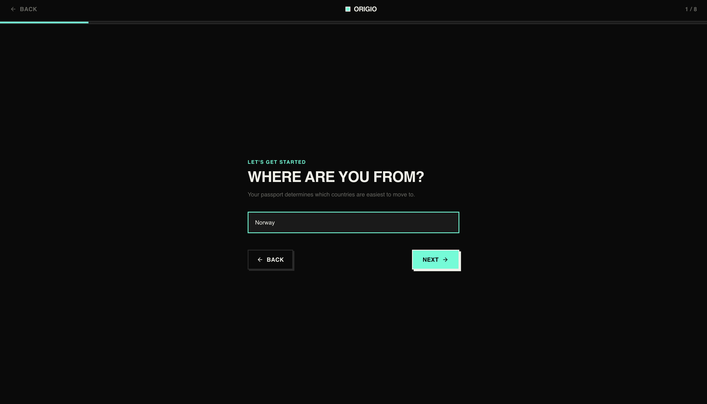
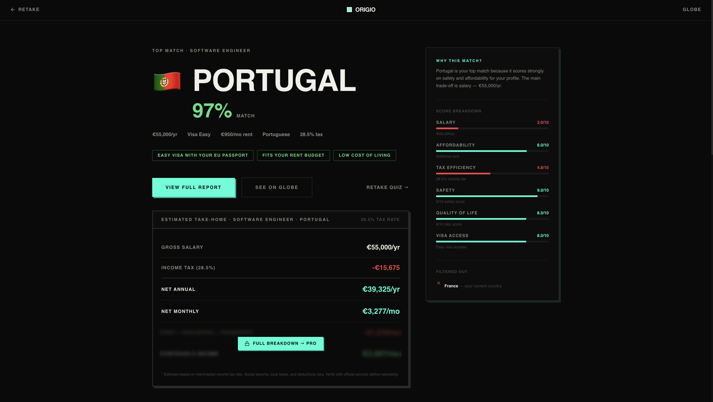

---

## 8. [Moody](https://www.producthunt.com/products/moody-music-synced-album-wallpaper)
**Votes**: 106 | **도입 난이도**: 하 | **신뢰도**: 상
**Tagline**: Your Mac wallpaper that listens to your music & weather
**서비스 링크**: https://www.producthunt.com/r/L6ZHX2NQKSS2BU

**태그**: Productivity, Customization, macOS, Design

### 📌 이 서비스 한눈에 보기
음악, 날씨, 시간에 맞춰 실시간으로 변화하는 스마트 Mac 배경화면

### 🔑 주요 기능
- 음악 및 날씨와 연동되는 반응형 4K 배경화면
- 사용자의 기분과 시간대에 맞춘 6가지 스마트 모드
- 멀티 모니터 지원 및 macOS 14.6 이상 최적화

### 🙋 사용자에게 어떤 점이 좋은가
데스크탑 환경을 단순한 배경이 아닌 사용자 상태에 반응하는 살아있는 공간으로 만들어 업무 몰입도나 감성을 높여줍니다.

### ✅ 지금 바로 써볼 기능
- 6가지 스마트 모드 테스트하기
- 4K 고화질 배경화면 적용하기
- 멀티 모니터 환경 설정하기

### ⚠️ 사용 전 확인할 점
- macOS 14.6 이상의 운영체제 버전 필요
- 실시간 반응형 기능 사용 시 시스템 리소스 점유 가능성

### 🧭 확인이 더 필요한 정보
구체적인 시스템 리소스 사용량 및 유료 구독 모델 여부는 명시되지 않았습니다.

### 📸 스크린샷 및 갤러리
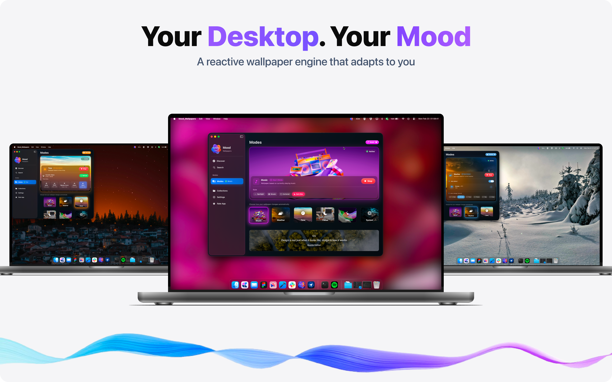

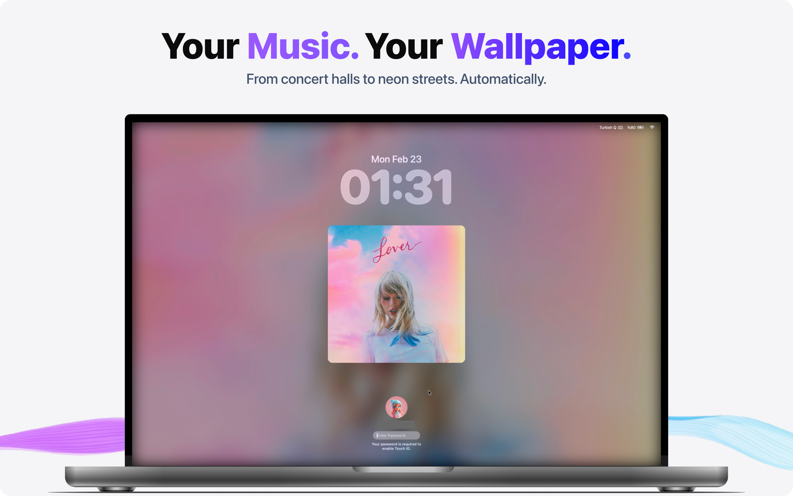

### 🎬 관련 영상
- [🎥 영상 보기](https://ph-files.imgix.net/65677214-bfde-4bab-8935-9cde35711470.jpeg?auto=format)

---

## 9. [Krea 2](https://www.producthunt.com/products/krea)
**Votes**: 103 | **도입 난이도**: 하 | **신뢰도**: 상
**Tagline**: An image model built for style control and moodboards
**서비스 링크**: https://www.producthunt.com/r/5K3FWTBN3F54S5

**태그**: AI Image Generation, Design Tool, Creative Workflow, Automation, AI Tool, Vision

### 📌 이 서비스 한눈에 보기
스타일 제어와 무드보드 제작에 최적화된 고감도 AI 이미지 생성 모델

### 🔑 주요 기능
- Krea AI 자체 개발 파운데이션 모델 기반
- 미적 다양성과 정교한 스타일 제어 기능
- 무드보드 및 창의적 워크플로우 최적화

### 🙋 사용자에게 어떤 점이 좋은가
단순한 이미지 생성을 넘어, 사용자가 원하는 특정 스타일과 분위기를 정교하게 구현할 수 있어 디자인 작업의 효율을 높여줍니다.

### ✅ 지금 바로 써볼 기능
- 원하는 스타일의 무드보드 생성해보기
- 스타일 제어 기능을 활용한 이미지 변형 테스트
- 창의적 워크플로우에 모델 적용해보기

### ⚠️ 사용 전 확인할 점
- 모델의 구체적인 학습 데이터셋 및 저작권 정책 확인 필요
- 사용자 의도에 따른 스타일 제어의 정밀도 차이 발생 가능성

### 🧭 확인이 더 필요한 정보
모델의 구체적인 기술적 사양 및 기존 Krea AI 서비스와의 통합 방식에 대한 상세 정보가 필요합니다.

### 📸 스크린샷 및 갤러리

### 🎬 관련 영상
- [🎥 영상 보기](https://ph-files.imgix.net/dcd6d01e-d919-4305-803c-9fcc8e5bc18b.jpeg?auto=format)

---

## 10. [LandingHero AI](https://www.producthunt.com/products/landinghero-ai-2)
**Votes**: 100 | **도입 난이도**: 하 | **신뢰도**: 상
**Tagline**: 24/7 Salesperson on Your Website
**서비스 링크**: https://www.producthunt.com/r/5WBKEBHZW64JNX

**태그**: AI, Sales, Automation, CustomerSupport, AI Tool

### 📌 이 서비스 한눈에 보기
웹사이트 방문자에게 실시간 음성 응대를 제공하여 리드를 확보하는 AI 영업 사원

### 🔑 주요 기능
- 방문자의 질문에 실시간 음성으로 답변하는 AI 에이전트
- 사용자 언어에 맞춘 다국어 지원 및 사이트 가이드 기능
- URL 입력만으로 간편하게 설치 가능한 자동화 프로세스

### 🙋 사용자에게 어떤 점이 좋은가
방문자가 이탈하기 전 즉각적인 응대를 통해 고객 문의를 놓치지 않고 잠재 고객(Lead)을 확보할 수 있습니다.

### ✅ 지금 바로 써볼 기능
- 자사 웹사이트 URL 입력 및 AI 페르소나 설정
- 음성 응대 및 다국어 지원 기능 테스트
- 방문자 리드 캡처 및 가이드 기능 확인

### ⚠️ 사용 전 확인할 점
- 음성 응대 시 발생할 수 있는 AI의 답변 정확도 검증 필요
- 웹사이트 트래픽 증가 시 서비스 안정성 및 비용 구조 확인 필요

### 🧭 확인이 더 필요한 정보
구체적인 설치 방법과 기존 웹사이트 프레임워크와의 호환성 범위에 대한 정보가 더 필요합니다.

### 📸 스크린샷 및 갤러리

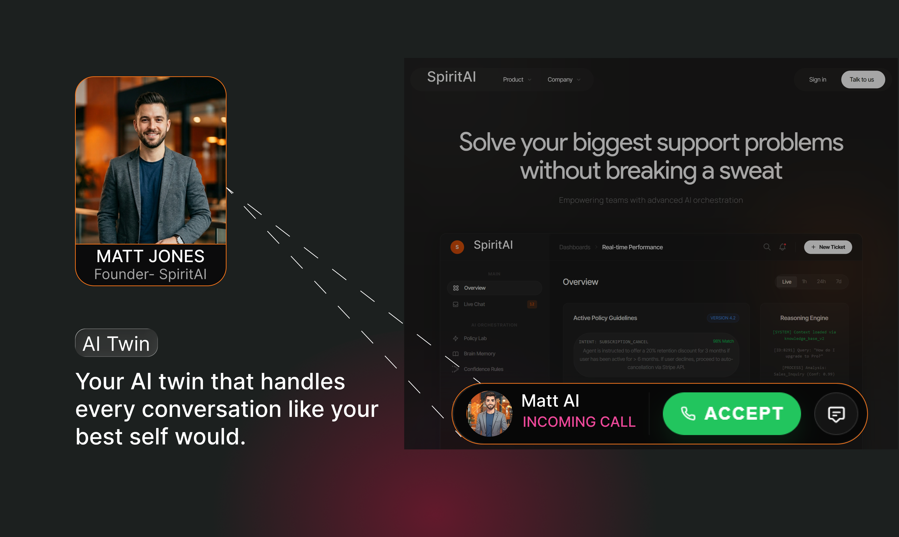

### 🎬 관련 영상
- [🎥 영상 보기](https://ph-files.imgix.net/3fc75889-958a-43af-bde9-930ba94bb032.jpeg?auto=format)

---

## 11. [Triggered Agents by Adaptive](https://www.producthunt.com/products/triggered-agents-by-adaptive)
**Votes**: 98 | **도입 난이도**: 중 | **신뢰도**: 상
**Tagline**: AI agents that run automatically on business events
**서비스 링크**: https://www.producthunt.com/r/7SJYKI7DMRLEJH

**태그**: Automation, AI Agents, Workflow, Productivity, Agent, AI Tool

### 📌 이 서비스 한눈에 보기
비즈니스 도구 내 이벤트 발생 시 AI 에이전트가 자동으로 업무를 수행하는 자동화 워크플로우 도구

### 🔑 주요 기능
- 비즈니스 툴 내 특정 이벤트와 AI 에이전트 간의 트리거 연결
- 수동 개입 없이 자동 실행되는 AI 기반 워크플로우 구축
- 창업자 및 운영자를 위한 멀티 툴 워크플로우 최적화

### 🙋 사용자에게 어떤 점이 좋은가
반복적인 운영 업무를 AI 에이전트에게 맡겨 업무 흐름을 자동화하고 운영 효율을 높일 수 있습니다.

### ✅ 지금 바로 써볼 기능
- 사용 중인 비즈니스 툴의 이벤트 트리거 확인
- 특정 이벤트 발생 시 수행할 AI 에이전트 작업 정의
- 자동화 워크플로우 테스트 및 실행

### ⚠️ 사용 전 확인할 점
- 트리거 설정 시 의도치 않은 자동 실행 가능성
- 연동되는 비즈니스 툴의 API 및 이벤트 지원 여부 확인 필요

### 🧭 확인이 더 필요한 정보
현재 지원되는 구체적인 비즈니스 툴 목록과 연동 범위에 대한 정보가 부족합니다.

### 📸 스크린샷 및 갤러리

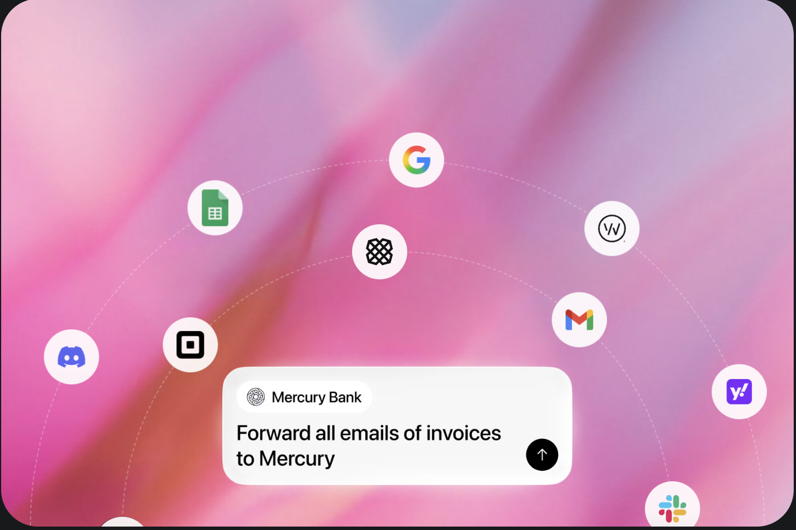
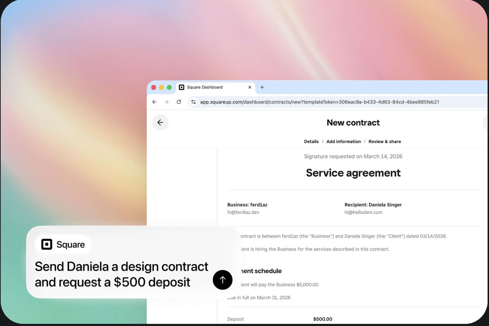

---

## 12. [Polarity](https://www.producthunt.com/products/polarity-2)
**Votes**: 95 | **도입 난이도**: 중 | **신뢰도**: 상
**Tagline**: The Self-Improvement Stack For agents
**서비스 링크**: https://www.producthunt.com/r/MBSEB3EEIR42ZC

**태그**: AI-Agents, Observability, DevTools, MLOps, Agent, AI Tool

### 📌 이 서비스 한눈에 보기
AI 에이전트의 의사결정을 모니터링하고 실패 패턴을 분석하여 신뢰성을 높이는 자동 개선 스택

### 🔑 주요 기능
- 실제 운영 환경에서의 모든 에이전트 의사결정 모니터링
- 사용자가 문제를 인지하기 전 실패 패턴 사전 탐지
- 에이전트의 실행 경로를 평가 데이터(evals)로 변환하여 지속적 성능 개선

### 🙋 사용자에게 어떤 점이 좋은가
에이전트가 실무에서 예기치 못한 오류를 범하는 것을 방지하고, 반복적인 테스트를 통해 에이전트의 신뢰도를 체계적으로 높일 수 있습니다.

### ✅ 지금 바로 써볼 기능
- 운영 중인 에이전트의 의사결정 로그 연결하기
- 탐지된 실패 패턴 분석 및 리포트 확인하기
- 수집된 트래젝토리를 활용한 평가 세트 구축하기

### ⚠️ 사용 전 확인할 점
- 실제 운영 데이터(Production data)를 다루므로 보안 및 개인정보 보호 정책 확인 필요
- 에이전트의 복잡도에 따라 실패 패턴 탐지의 정확도가 달라질 수 있음

### 🧭 확인이 더 필요한 정보
현재 제공되는 모니터링 기능이 어떤 프레임워크나 언어 환경을 지원하는지에 대한 구체적인 정보가 필요합니다.

### 📸 스크린샷 및 갤러리

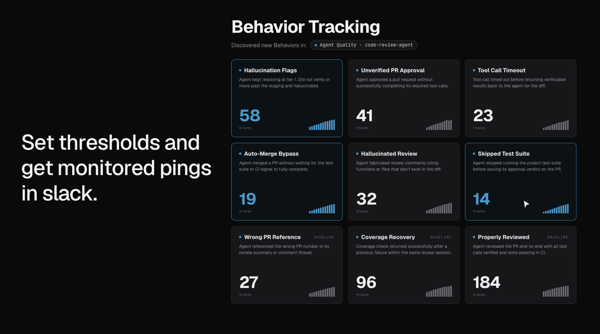
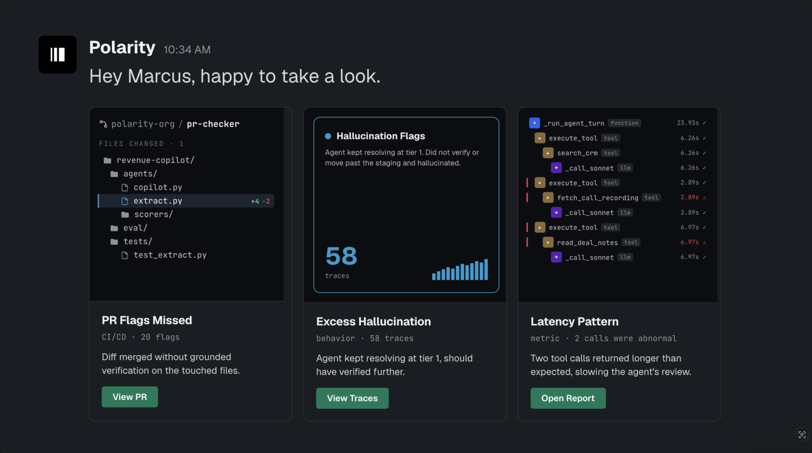

### 🎬 관련 영상
- [🎥 영상 보기](https://ph-files.imgix.net/7fe31022-46d4-473f-9088-e36203628369.jpeg?auto=format)

---

## 13. [Draft](https://www.producthunt.com/products/draft-12)
**Votes**: 94 | **도입 난이도**: 하 | **신뢰도**: 상
**Tagline**: Capture AI chats into your knowledge base
**서비스 링크**: https://www.producthunt.com/r/EQGJGHML3A6QDZ

**태그**: AI, Productivity, KnowledgeBase, Note-taking, AI Tool, Chat

### 📌 이 서비스 한눈에 보기
AI 채팅 답변을 편집 가능한 지식 베이스로 즉시 변환하는 노트 도구

### 🔑 주요 기능
- ChatGPT, Gemini, DeepSeek 등 다양한 AI 채팅 내용 캡처
- 서식 유지 및 검색 가능한 노트로 자동 변환
- 텍스트 음성 변환(TTS) 및 오프라인 저장 지원

### 🙋 사용자에게 어떤 점이 좋은가
AI와 대화하며 얻은 유용한 정보를 일일이 복사 붙여넣기 할 필요 없이, 체계적인 지식 자산으로 빠르게 정리할 수 있습니다.

### ✅ 지금 바로 써볼 기능
- 주요 AI 채팅 답변 캡처해보기
- 저장된 노트의 서식 및 가독성 확인하기
- 텍스트 음성 변환(TTS) 기능 테스트하기

### ⚠️ 사용 전 확인할 점
- 현재 베타 버전이므로 기능의 안정성 확인 필요
- 베타 종료 후 유료화 정책 변경 가능성

### 🧭 확인이 더 필요한 정보
베타 기간 종료 후의 정확한 요금 체계와 서비스 유지 계획이 명시되지 않았습니다.

### 📸 스크린샷 및 갤러리
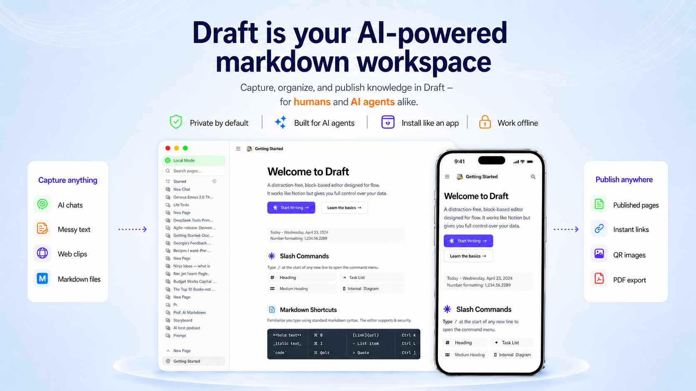
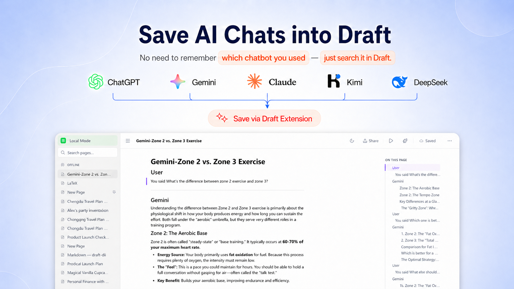
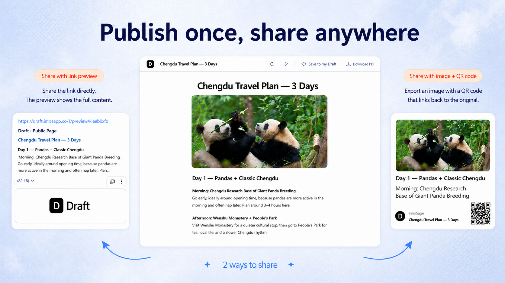

### 🎬 관련 영상
- [🎥 영상 보기](https://ph-files.imgix.net/1d7de51e-5cd6-41e9-a3f3-614bab49ff58.jpeg?auto=format)

---

## 14. [pixserp](https://www.producthunt.com/products/pixserp)
**Votes**: 91 | **도입 난이도**: 하 | **신뢰도**: 상
**Tagline**: Your LLM on the live web. One endpoint, ten answer shapes.
**서비스 링크**: https://www.producthunt.com/r/GFZC3DIHHFZ2DD

**태그**: DevTool, AI, SearchAPI, LLM, AI Tool, Vision

### 📌 이 서비스 한눈에 보기
실시간 웹 데이터를 다양한 형태로 제공하는 개발자용 AI 검색 엔진

### 🔑 주요 기능
- 하나의 엔드포인트로 뉴스, 이미지, 쇼핑, 항공 등 10가지 형태의 답변 제공
- 실시간 웹 정보를 기반으로 하며 모든 답변에 출처(citation) 포함
- OpenAI SDK와 호환되는 드롭인(Drop-in) 방식의 간편한 통합

### 🙋 사용자에게 어떤 점이 좋은가
LLM 애플리케이션 개발 시 별도의 웹 크롤링이나 검색 로직 구현 없이 실시간 데이터를 즉시 활용할 수 있습니다.

### ✅ 지금 바로 써볼 기능
- OpenAI SDK를 통한 연동 테스트
- 필요한 데이터 형태(뉴스, 쇼핑 등)에 따른 응답 정확도 확인
- 1,000건당 $1.50 비용 모델 기반의 예산 시뮬레이션

### ⚠️ 사용 전 확인할 점
- 실시간 데이터의 정확성 및 출처 신뢰도 검증 필요
- 사용량 증가에 따른 비용 관리 필요

### 🧭 확인이 더 필요한 정보
제공되는 10가지 답변 형태의 구체적인 스키마와 데이터 업데이트 주기에 대한 상세 정보가 필요합니다.

### 📸 스크린샷 및 갤러리
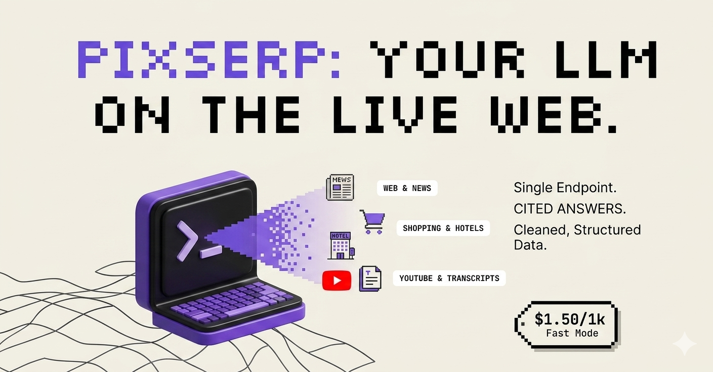

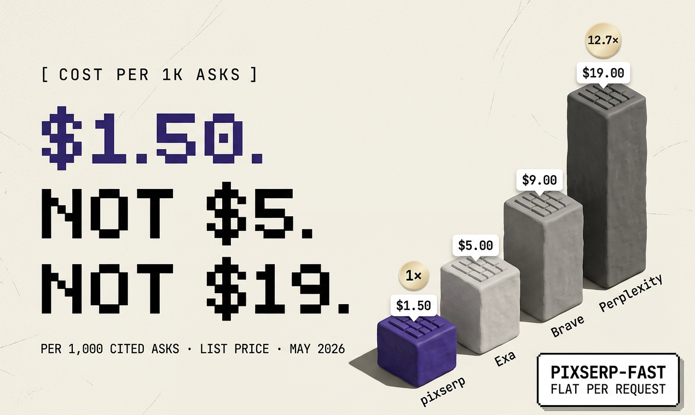

---

## 15. [SizzleAir](https://www.producthunt.com/products/sizzleair)
**Votes**: 91 | **도입 난이도**: 하 | **신뢰도**: 상
**Tagline**: Thermal assistant for fanless MacBook Airs
**서비스 링크**: https://www.producthunt.com/r/6SU6NJWGJI4YKT

**태그**: Utility, macOS, Hardware, Productivity, AI Tool

### 📌 이 서비스 한눈에 보기
팬리스 맥북 에어를 위한 직관적인 발열 상태 및 원인 분석 도구

### 🔑 주요 기능
- 복잡한 센서 데이터 대신 실질적인 발열 원인과 해결책 제공
- 작업 부하, 외부 디스플레이 연결 상태, CPU 사용량 등을 종합한 상태 요약
- 팬 제어나 가짜 냉각 기능 없이 오직 정보 제공에 집중한 미니멀한 설계

### 🙋 사용자에게 어떤 점이 좋은가
맥북 에어의 발열 원인을 명확히 파악하여, 현재 작업 환경에서 어떤 조치가 필요한지 즉각적인 가이드를 제공합니다.

### ✅ 지금 바로 써볼 기능
- 현재 맥북의 발열 원인 파악하기
- 작업 환경(클램쉘 모드 등)에 따른 상태 확인하기
- 제안된 실질적 해결 단계 실행하기

### ⚠️ 사용 전 확인할 점
- 하드웨어 냉각 기능이 아닌 정보 제공용 소프트웨어임
- 팬이 없는 모델 전용이므로 다른 맥 모델에서는 활용도가 낮을 수 있음

### 🧭 확인이 더 필요한 정보
구체적인 시스템 리소스 점유율이나 UI 디자인에 대한 상세 정보는 명시되지 않았습니다.

### 📸 스크린샷 및 갤러리

---

## 16. [Voiser AI](https://www.producthunt.com/products/voiser-ai-text-to-speech)
**Votes**: 89 | **도입 난이도**: 하 | **신뢰도**: 상
**Tagline**:  Human-like AI voiceovers in 140+ languages
**서비스 링크**: https://www.producthunt.com/r/2DF26ZQOW5BWRA

**태그**: AI-Voice, Content-Creation, Localization, Productivity, AI Tool, Video

### 📌 이 서비스 한눈에 보기
140개 이상의 언어와 감정 표현이 가능한 고품질 AI 성우 서비스

### 🔑 주요 기능
- 140개 이상의 다양한 언어 및 1,000개 이상의 목소리 지원
- 감정 스타일 및 커스텀 지시를 통한 자연스러운 음성 생성
- 영상, 광고, 팟캐스트 등 다양한 용도에 최적화된 빠른 생성 속도

### 🙋 사용자에게 어떤 점이 좋은가
글로벌 콘텐츠 제작 시 별도의 성우 섭외 없이도 현지 언어로 자연스러운 내레이션을 즉시 제작할 수 있습니다.

### ✅ 지금 바로 써볼 기능
- 원하는 감정 스타일 적용해보기
- 다국어 텍스트를 음성으로 변환해보기
- 커스텀 지시 기능을 통한 목소리 톤 조절하기

### ⚠️ 사용 전 확인할 점
- 감정 표현의 자연스러움은 텍스트 내용에 따라 차이가 있을 수 있음
- 대량 생성 시 생성 속도 및 비용 효율성 확인 필요

### 🧭 확인이 더 필요한 정보
구체적인 요금제 체계와 API 연동 가능 여부는 별도 확인이 필요합니다.

### 📸 스크린샷 및 갤러리

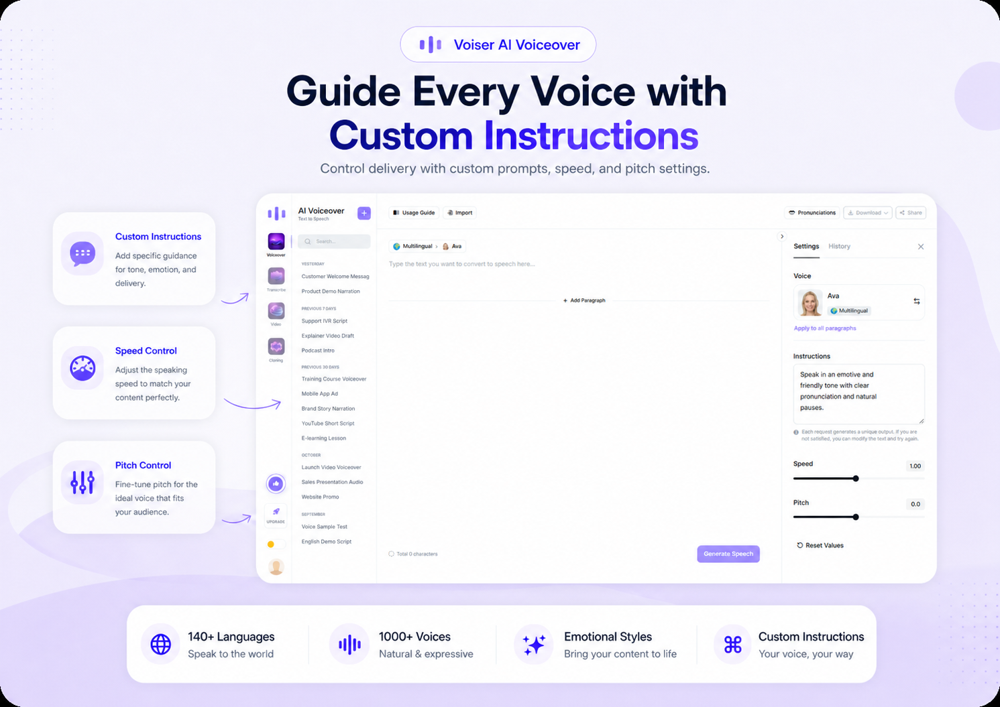
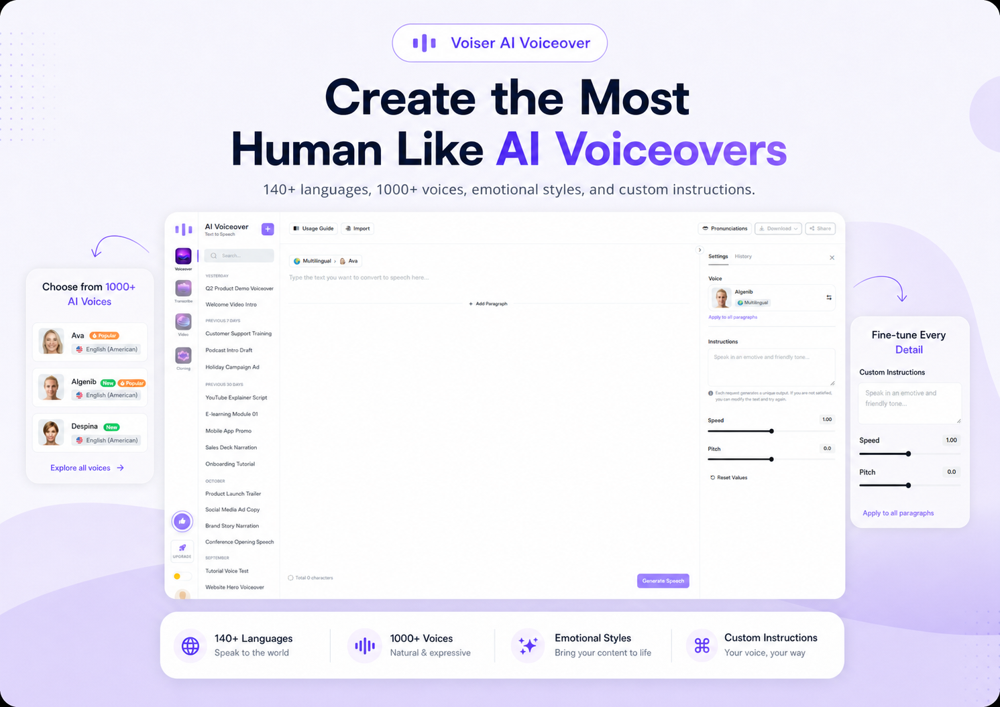

---

## 17. [Agentspan](https://www.producthunt.com/products/agentspan)
**Votes**: 89 | **도입 난이도**: 중 | **신뢰도**: 상
**Tagline**: Open-source runtime for durable AI agents
**서비스 링크**: https://www.producthunt.com/r/FLEF3RIJCWMSSO

**태그**: DevTool, AI, OpenSource, Automation, Agent, AI Tool, LLM

### 📌 이 서비스 한눈에 보기
AI 에이전트의 실행 안정성과 관찰 가능성을 보장하는 오픈소스 워크플로우 런타임

### 🔑 주요 기능
- 에이전트 실행을 지속 가능한 워크플로우로 변환하는 서버 및 SDK 제공
- 장애 복구(Crash Recovery) 및 인간 개입(Human-in-the-loop) 기능 지원
- 실행 상태 검사, 가드레일, 도구 사용 이력 등 강력한 관찰성 제공

### 🙋 사용자에게 어떤 점이 좋은가
기존 LLM 프레임워크를 유지하면서도 에이전트의 실행 중단이나 오류에 대한 복구 능력을 높이고, 작업 과정을 투명하게 관리할 수 있습니다.

### ✅ 지금 바로 써볼 기능
- 기존 에이전트 워크플로우를 SDK로 정의하여 서버에 배포하기
- UI를 통해 에이전트의 실행 상태 및 도구 호출 이력 모니터링하기
- 중요한 작업 단계에 인간 승인(Human-in-the-loop) 프로세스 적용하기

### ⚠️ 사용 전 확인할 점
- 오픈소스 프로젝트이므로 운영 환경 적용 전 안정성 검증 필요
- 기존 프레임워크와의 통합 방식에 따른 학습 곡선 존재

### 🧭 확인이 더 필요한 정보
현재 제공되는 SDK가 지원하는 구체적인 언어 및 기존 프레임워크와의 호환성 범위 확인이 필요합니다.

### 📸 스크린샷 및 갤러리
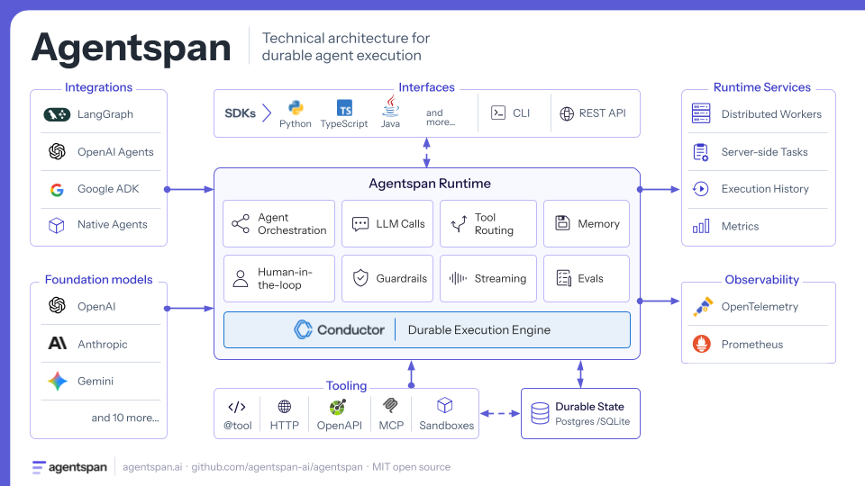
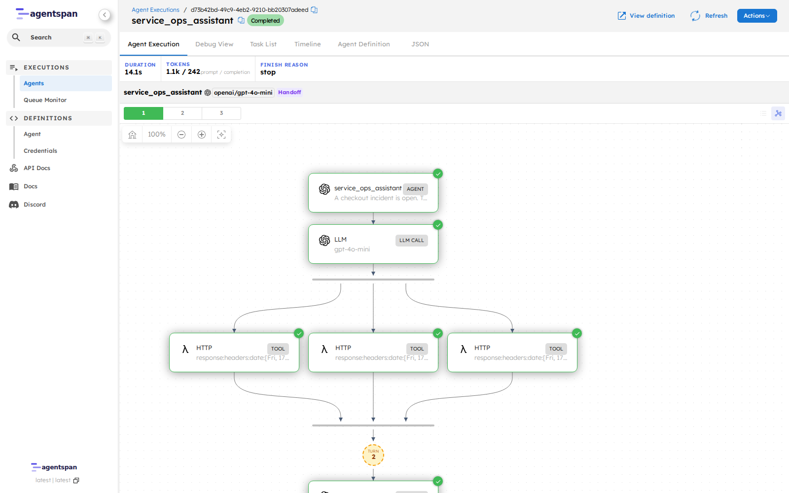
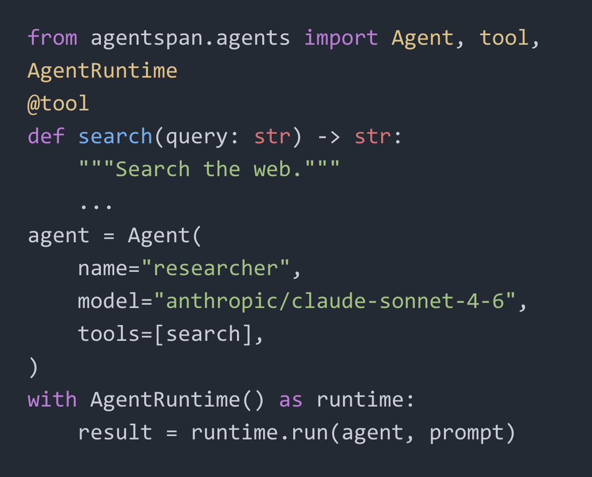

### 🎬 관련 영상
- [🎥 영상 보기](https://ph-files.imgix.net/15909dfb-cf1b-4401-bc9c-a293b9423473.jpeg?auto=format)

---

## 18. [QuickRight](https://www.producthunt.com/products/capture-6)
**Votes**: 88 | **도입 난이도**: 하 | **신뢰도**: 상
**Tagline**: The missing right-click features for macOS Finder
**서비스 링크**: https://www.producthunt.com/r/UTG2RFDKH4WTW6

**태그**: Productivity, macOS, Utility, Workflow, Vision

### 📌 이 서비스 한눈에 보기
macOS Finder의 기능을 확장하여 파일 관리 효율을 극대화하는 우클릭 메뉴 확장 도구

### 🔑 주요 기능
- Finder 컨텍스트 메뉴 내 파일 생성 및 이동 기능 강화
- 터미널(Terminal/Warp) 즉시 실행 및 파일 경로 복사 지원
- 이미지 압축, 색상 추출, 해시 체크 등 유용한 부가 기능 제공

### 🙋 사용자에게 어떤 점이 좋은가
파일 작업이 빈번한 사용자에게 별도의 앱을 열지 않고 Finder 내에서 즉시 작업을 완료할 수 있는 워크플로우를 제공합니다.

### ✅ 지금 바로 써볼 기능
- 터미널/Warp 연동을 통한 빠른 경로 접근
- 진정한 Cut & Paste 기능을 통한 파일 이동
- 이미지 압축 및 색상 추출 기능 활용

### ⚠️ 사용 전 확인할 점
- 시스템 컨텍스트 메뉴를 수정하므로 macOS 버전과의 호환성 확인 필요
- 파일 관리 권한 관련 보안 설정 확인 필요

### 🧭 확인이 더 필요한 정보
구체적인 가격 정책 및 macOS 최신 OS 버전과의 완벽한 호환 여부는 확인이 필요합니다.

### 📸 스크린샷 및 갤러리
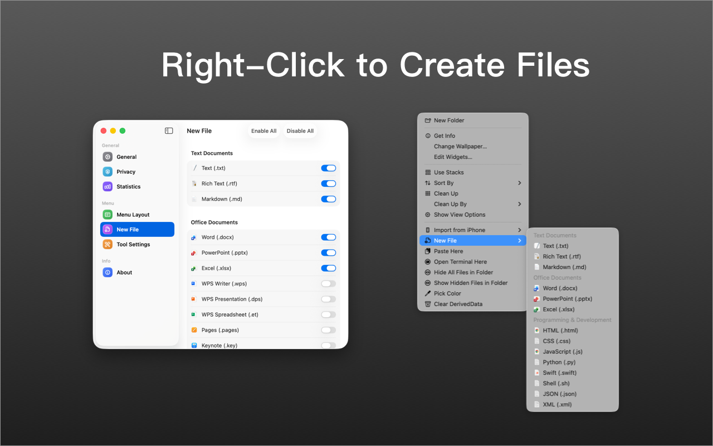
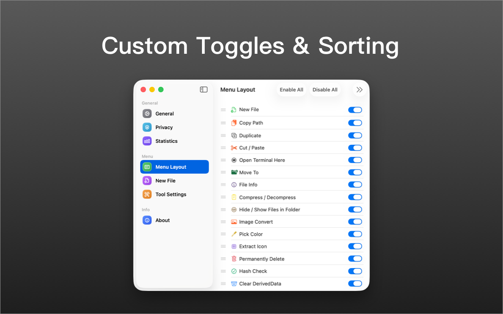
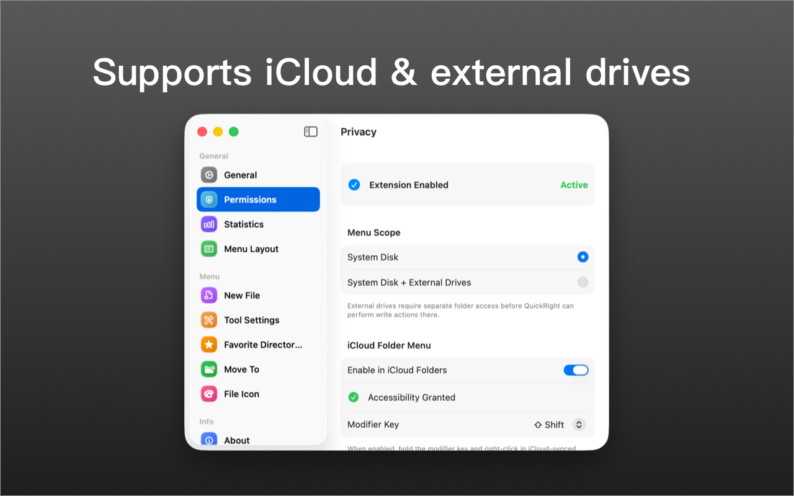

---

## 19. [AnyFrame](https://www.producthunt.com/products/anyframe-2)
**Votes**: 88 | **도입 난이도**: 중 | **신뢰도**: 상
**Tagline**: Sandboxes for your AI agents
**서비스 링크**: https://www.producthunt.com/r/CZYRMFHHRL5TNS

**태그**: DevTool, AI, Automation, Sandbox, Agent, AI Tool

### 📌 이 서비스 한눈에 보기
AI 에이전트를 위한 통합 샌드박스 제어 플랫폼

### 🔑 주요 기능
- 에이전트별 개별 샌드박스 구축 번거로움 해결
- 한 번의 정의로 즉각적인 세션 부팅 가능
- 웹 UI와 Python SDK를 통한 유연한 제어 채널 제공

### 🙋 사용자에게 어떤 점이 좋은가
에이전트 개발 및 테스트를 위한 환경 구축 시간을 획기적으로 단축하고, 다양한 인터페이스를 통해 일관된 제어 환경을 제공합니다.

### ✅ 지금 바로 써볼 기능
- 에이전트 정의 및 세션 부팅 테스트
- Python SDK를 활용한 자동화 워크플로우 구축
- 웹 UI를 통한 실시간 에이전트 드라이빙

### ⚠️ 사용 전 확인할 점
- 샌드박스 환경의 보안 및 격리 수준 확인 필요
- 에이전트 종류에 따른 환경 호환성 검토

### 🧭 확인이 더 필요한 정보
제공되는 샌드박스의 구체적인 리소스 사양과 격리 기술에 대한 정보가 부족합니다.

### 📸 스크린샷 및 갤러리
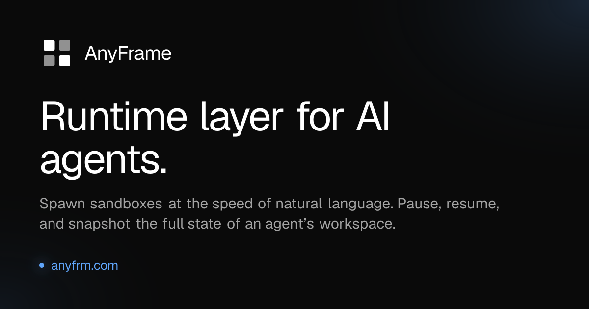
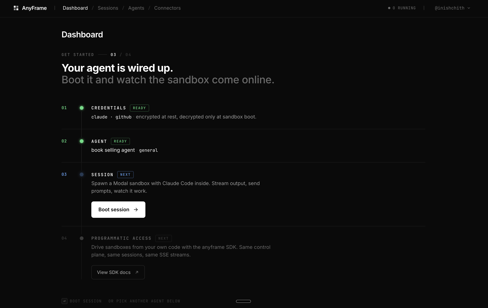
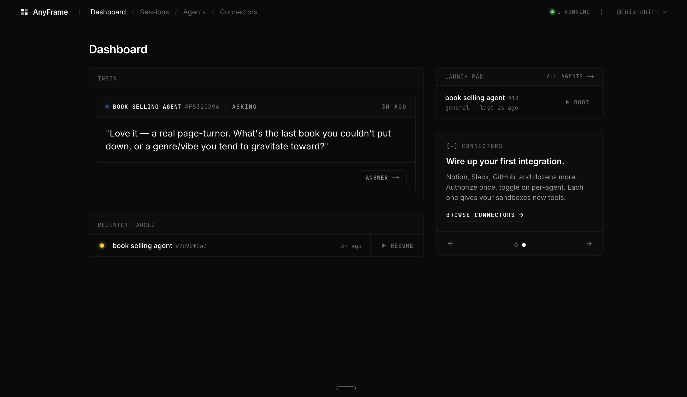

### 🎬 관련 영상
- [🎥 영상 보기](https://ph-files.imgix.net/a7bdc480-02e3-46a7-a8a3-6052019a705f.gif?auto=format)

---

## 20. [The Claude Code Daily](https://www.producthunt.com/products/the-claude-code-daily)
**Votes**: 52 | **도입 난이도**: 하 | **신뢰도**: 상
**Tagline**: Claude Code news. Curated Daily.
**서비스 링크**: https://www.producthunt.com/r/GHNWQIPQVVUSOY

**태그**: Newsletter, DevTool, Productivity, AI, Automation, AI Tool

### 📌 이 서비스 한눈에 보기
매일 아침 X(트위터)의 흩어진 Claude Code 정보를 2분 만에 요약해 전달하는 뉴스레터 서비스

### 🔑 주요 기능
- X(트위터)에 산재된 Claude Code 관련 최신 정보를 큐레이션
- 매일 아침 이메일로 전달되는 2분 분량의 짧은 요약
- 새로운 릴리스, 커뮤니티 팁, 워크플로우 정보 제공

### 🙋 사용자에게 어떤 점이 좋은가
Claude Code의 빠른 업데이트를 따라잡기 위해 매번 SNS를 뒤지는 시간을 절약하고 핵심 정보만 빠르게 습득할 수 있습니다.

### ✅ 지금 바로 써볼 기능
- 뉴스레터 구독 신청하기
- 매일 아침 이메일 확인하기

### ⚠️ 사용 전 확인할 점
- 정보의 출처가 SNS 기반이므로 정보의 정확성이나 깊이가 다를 수 있음
- 이메일 수신함이 복잡해질 수 있음

### 🧭 확인이 더 필요한 정보
구독 방식(무료/유료 여부) 및 뉴스레터 발송 시간대에 대한 구체적인 정보가 명시되지 않았습니다.

### 📸 스크린샷 및 갤러리
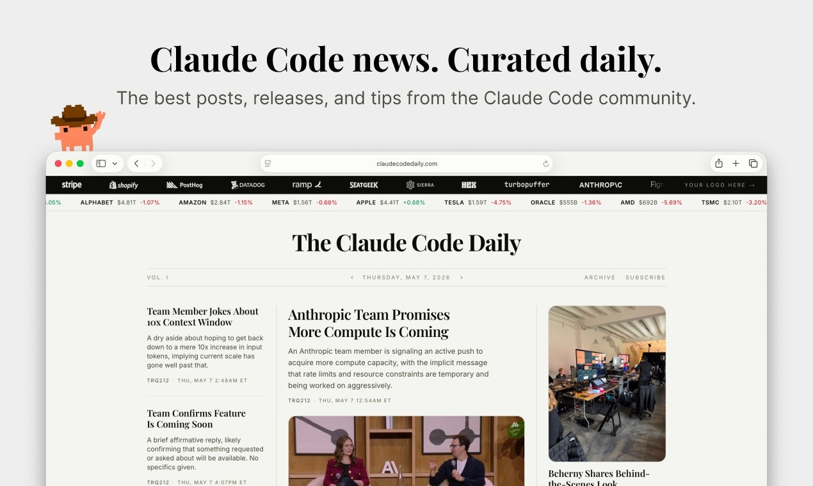
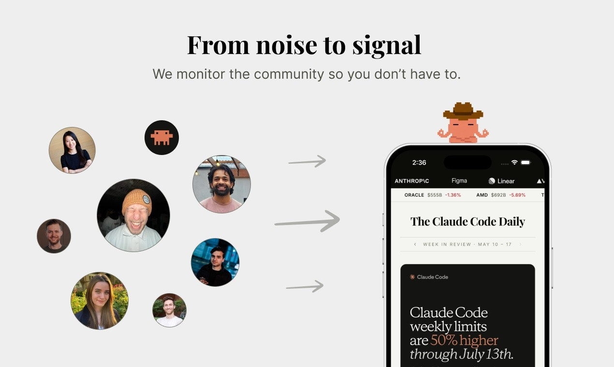
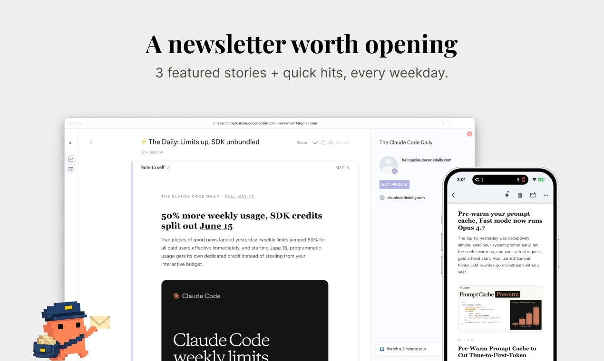

---

## 21. [BeyondComments](https://www.producthunt.com/products/beyondcomments)
**Votes**: 23 | **도입 난이도**: 하 | **신뢰도**: 상
**Tagline**: Turn YouTube comments into channel growth, in 45 seconds!
**서비스 링크**: https://www.producthunt.com/r/HHBO43FZETVD5P

**태그**: YouTube, AI, ContentCreator, Analytics, Automation, AI Tool, Video

### 📌 이 서비스 한눈에 보기
유튜브 댓글을 분석하여 채널 성장을 위한 인사이트로 바꿔주는 AI 브리핑 도구

### 🔑 주요 기능
- 유튜브 댓글 분석을 통한 감성 분석 및 콘텐츠 아이디어 추출
- 스폰서십 기회 및 고관여 팬 식별 기능
- URL 입력만으로 45초 만에 생성되는 AI 요약 리포트

### 🙋 사용자에게 어떤 점이 좋은가
댓글을 일일이 읽을 필요 없이 데이터 기반의 채널 운영 전략과 비즈니스 기회를 빠르게 파악할 수 있습니다.

### ✅ 지금 바로 써볼 기능
- 분석하고 싶은 유튜브 영상 URL 붙여넣기
- 생성된 AI 브리핑을 통한 콘텐츠 아이디어 도출
- 바이럴 점수 및 팬 반응 확인하기

### ⚠️ 사용 전 확인할 점
- AI 분석 결과이므로 실제 댓글 맥락과 차이가 있을 수 있음
- 분석 결과의 정확도는 댓글의 양과 질에 의존함

### 🧭 확인이 더 필요한 정보
구체적인 요금 체계나 분석 가능한 영상의 길이/댓글 수 제한에 대한 정보가 명시되지 않았습니다.

### 📸 스크린샷 및 갤러리
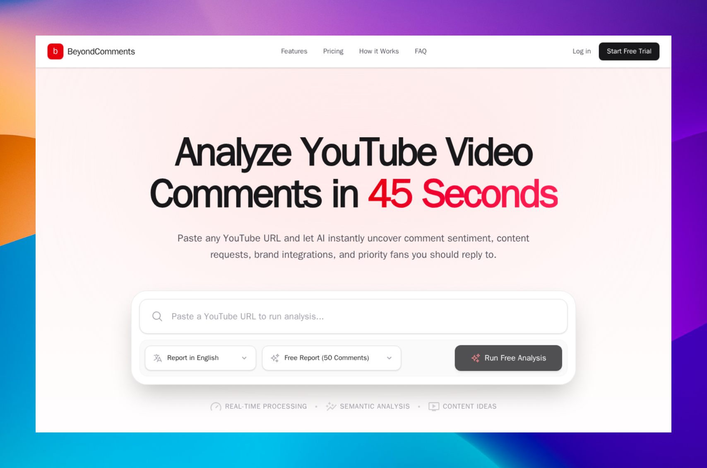
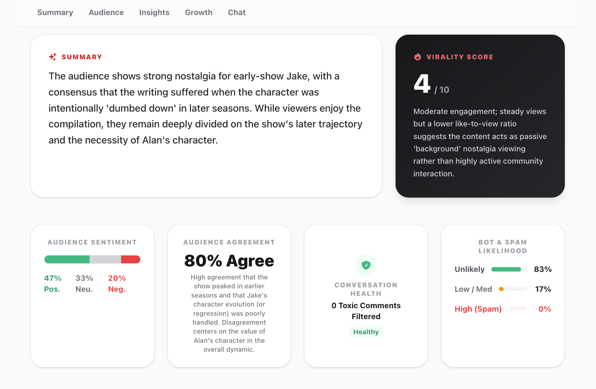
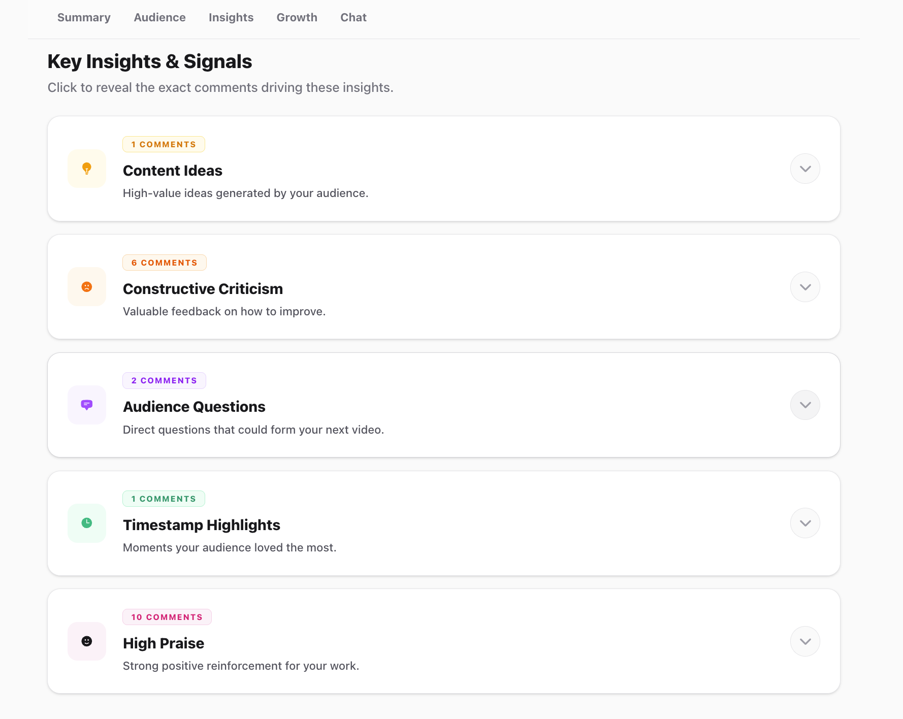

---

## 22. [Perceptron Mk1](https://www.producthunt.com/products/perceptron-mk1)
**Votes**: 20 | **도입 난이도**: 중 | **신뢰도**: 상
**Tagline**: Frontier video reasoning for the physical world
**서비스 링크**: https://www.producthunt.com/r/IPZFNLHEEJU3UA

**태그**: AI, Video-AI, API, Computer-Vision, Automation, Video

### 📌 이 서비스 한눈에 보기
물리적 세계의 복잡한 움직임을 이해하고 구조화된 데이터로 변환하는 고성능 비디오 추론 API

### 🔑 주요 기능
- 시간적 맥락을 파악하는 정교한 비디오 추론 및 시각적 데이터 구조화
- 32K 규모의 대용량 멀티모달 컨텍스트 지원
- 대규모 물리적 작업 처리에 최적화된 API 및 가격 정책

### 🙋 사용자에게 어떤 점이 좋은가
비디오 데이터에서 필요한 정보를 구조화된 형태로 추출하여 자동화된 물리적 작업이나 모니터링 시스템에 즉시 적용할 수 있습니다.

### ✅ 지금 바로 써볼 기능
- 32K 컨텍스트를 활용한 긴 비디오 분석 테스트
- 비디오 내 객체 및 동작의 구조화된 출력 검증
- 대량의 비디오 데이터 처리 시 비용 효율성 확인

### ⚠️ 사용 전 확인할 점
- 물리적 세계의 복잡한 변수에 따른 추론 정확도 차이 확인 필요
- 고용량 비디오 처리에 따른 API 지연 시간(Latency) 검토

### 🧭 확인이 더 필요한 정보
구체적인 API 엔드포인트 사양과 실시간 처리 성능에 대한 상세 정보가 필요합니다.

### 📸 스크린샷 및 갤러리
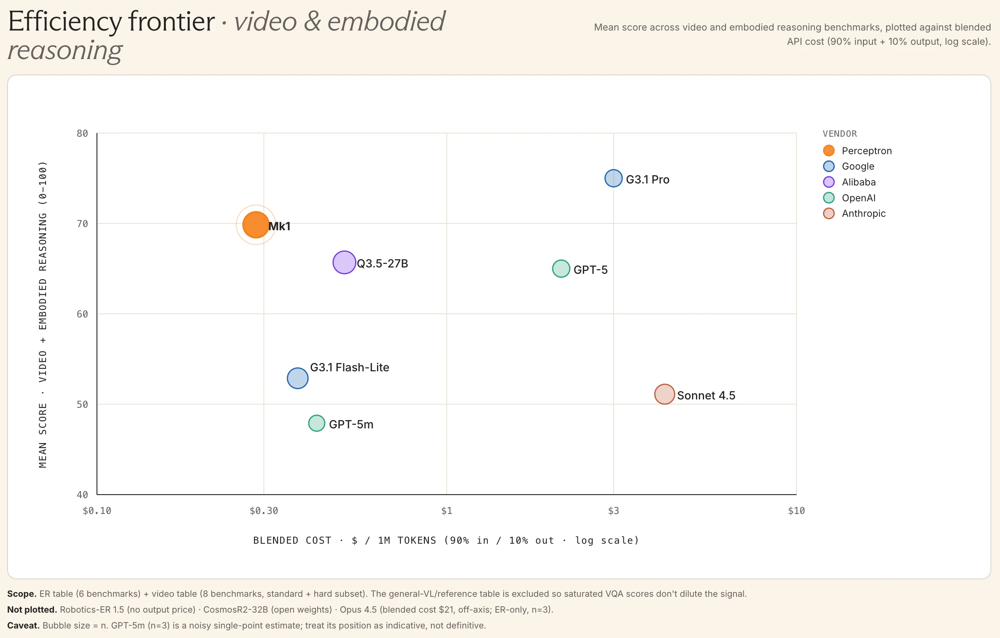
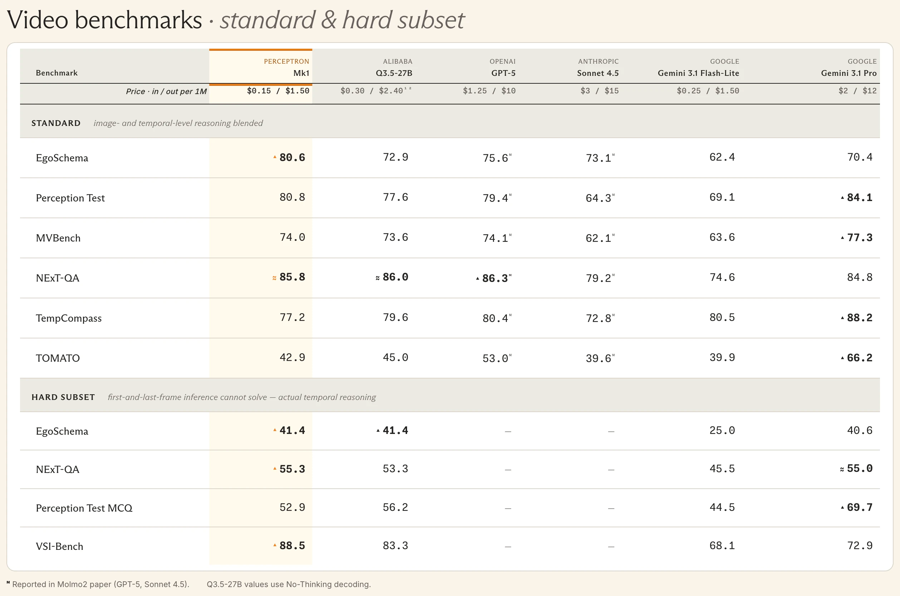

### 🎬 관련 영상
- [🎥 영상 보기](https://ph-files.imgix.net/46fdf429-0846-4aa5-8411-76a430402c75.jpeg?auto=format)

---

## 23. [NonBioS.ai](https://www.producthunt.com/products/nonbios-ai)
**Votes**: 18 | **도입 난이도**: 중 | **신뢰도**: 상
**Tagline**: The AI Software Dev with its own Computer
**서비스 링크**: https://www.producthunt.com/r/6ATODFANX3K6QG

**태그**: AI-Agent, DevOps, Software-Engineering, Automation, Agent, AI Tool, DevTool

### 📌 이 서비스 한눈에 보기
전용 리눅스 환경을 갖춘 자율형 AI 소프트웨어 엔지니어

### 🔑 주요 기능
- 사용자별 독립적인 리눅스 머신(4GB RAM, 공인 IP, Root 권한) 제공
- 복잡한 코드베이스와 장기 과업 수행을 위한 'Strategic Forgetting' 아키텍처 적용
- 실시간 작업 스트리밍 및 사용자 개입(중단/재지시) 기능 지원

### 🙋 사용자에게 어떤 점이 좋은가
단순 코드 생성을 넘어 실제 서버 환경에서 직접 설치, 실행, 배포까지 수행하는 완전한 개발 자동화를 경험할 수 있습니다.

### ✅ 지금 바로 써볼 기능
- 전용 리눅스 환경에서의 배포 및 실행 테스트
- 복잡한 코드베이스에 대한 'Strategic Forgetting' 성능 검증
- 실시간 작업 스트리밍을 통한 작업 흐름 모니터링

### ⚠️ 사용 전 확인할 점
- 4GB RAM 환경에서의 대규모 프로젝트 처리 한계 가능성
- 에이전트의 Root 권한 사용에 따른 보안 및 관리 책임

### 🧭 확인이 더 필요한 정보
제공되는 리눅스 머신의 구체적인 스토리지 용량과 네트워크 대역폭에 대한 정보가 필요합니다.

### 📸 스크린샷 및 갤러리
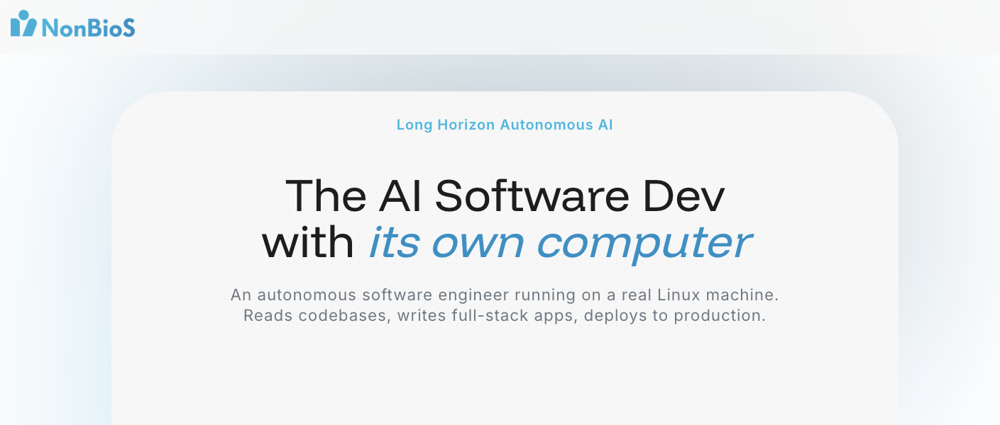
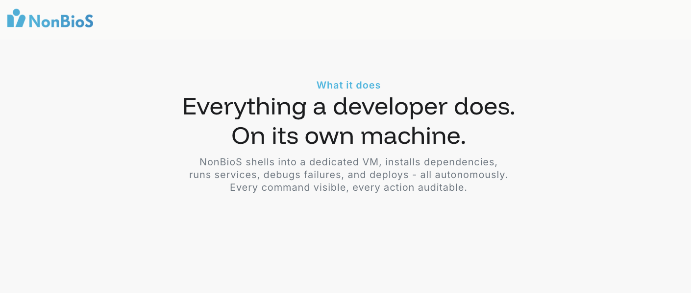
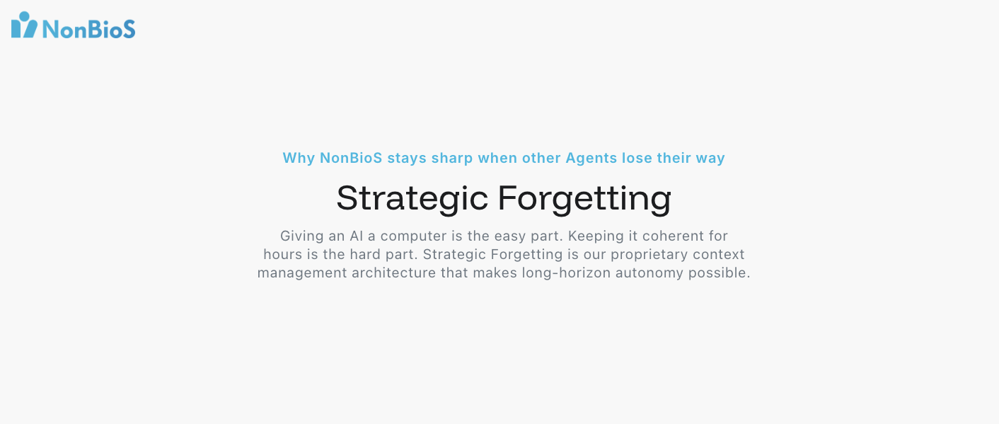

### 🎬 관련 영상
- [🎥 영상 보기](https://ph-files.imgix.net/5295d3d2-c96d-4335-aa7e-479dc7c636a4.jpeg?auto=format)

---

## 24. [Elmo](https://www.producthunt.com/products/elmo)
**Votes**: 18 | **도입 난이도**: 중 | **신뢰도**: 상
**Tagline**: Open Source AEO
**서비스 링크**: https://www.producthunt.com/r/7UCE4H4JIYVNE4

**태그**: AEO, OpenSource, Analytics, MarketingTech, AI Tool, LLM, Prompting

### 📌 이 서비스 한눈에 보기
고가의 AI 검색 최적화 도구를 대체할 수 있는 오픈소스 AEO 분석 플랫폼

### 🔑 주요 기능
- 다양한 AI 검색 엔진 및 LLM의 프롬프트 결과 추적
- 경쟁사 대비 AI 가시성 비교 분석 기능
- AI 답변에 인용된 웹사이트 및 커뮤니티(Reddit 등) 출처 분석

### 🙋 사용자에게 어떤 점이 좋은가
고가의 유료 솔루션 없이도 자사 브랜드가 AI 답변에 어떻게 노출되는지 파악하고, 데이터 보안을 유지하며 직접 관리할 수 있습니다.

### ✅ 지금 바로 써볼 기능
- Docker Compose를 이용한 로컬 환경 설치
- 주요 키워드별 AI 검색 결과 모니터링 설정
- 경쟁사 브랜드 키워드 비교 분석

### ⚠️ 사용 전 확인할 점
- 셀프 호스팅 시 서버 리소스 및 유지보수 관리 필요
- 오픈소스 특성상 상용 서비스 대비 UI/UX 편의성이 낮을 수 있음

### 🧭 확인이 더 필요한 정보
현재 제공되는 구체적인 분석 리포트의 깊이와 데이터 업데이트 주기에 대한 정보가 부족합니다.

### 📸 스크린샷 및 갤러리
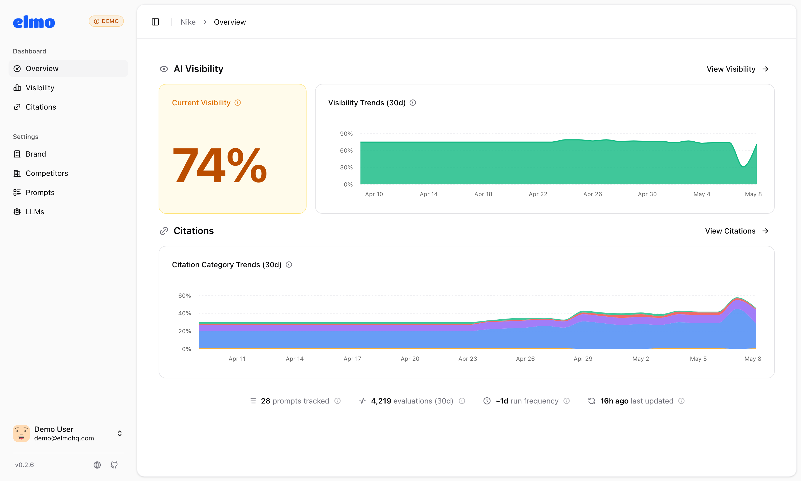
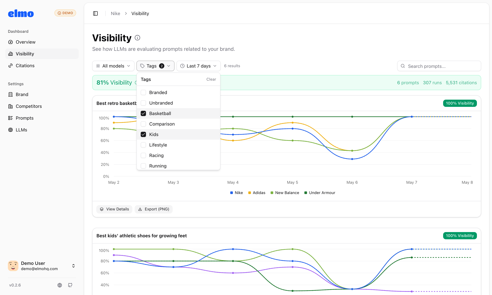
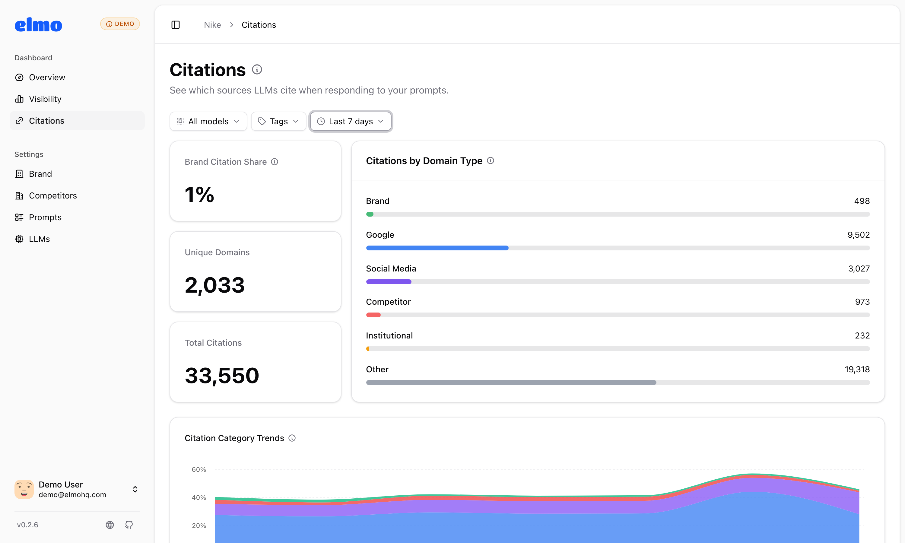

### 🎬 관련 영상
- [🎥 영상 보기](https://ph-files.imgix.net/77eee590-e472-4966-982f-2d149bedf4e3.jpeg?auto=format)

---

## 25. [Dovilo](https://www.producthunt.com/products/dovilo)
**Votes**: 16 | **도입 난이도**: 중 | **신뢰도**: 상
**Tagline**: The first agent-native, gamified task manager and focus app.
**서비스 링크**: https://www.producthunt.com/r/5TC6ASYC57TZKS

**태그**: Productivity, Gamification, AI-Agent, Automation, DevTool, Agent, AI Tool

### 📌 이 서비스 한눈에 보기
할 일 완료를 통해 나만의 도시를 건설하는 게임 요소와 AI 에이전트 연동 기능을 결합한 생산성 앱

### 🔑 주요 기능
- 할 일 완료 및 집중(Pomodoro)을 통해 성장하는 아이소메트릭 도시 건설 게임 요소
- MCP(Model Context Protocol) 서버 내장으로 Claude Code, Cursor 등 AI 에이전트와 직접 연동
- 웹훅(Webhook)을 통한 사용자 정의 에이전트 워크플로우 구축 가능

### 🙋 사용자에게 어떤 점이 좋은가
단순한 할 일 관리를 넘어 게임처럼 즐겁게 생산성을 높일 수 있으며, 개발자나 AI 헤비 유저가 자신의 AI 에이전트 워크플로우에 작업 목록을 자동화하여 연결하기 좋습니다.

### ✅ 지금 바로 써볼 기능
- 할 일 완료를 통한 도시 성장 경험하기
- Pomodoro 타이머로 집중 모드 활용하기
- MCP 클라이언트를 통한 AI 에이전트 작업 자동화 설정하기

### ⚠️ 사용 전 확인할 점
- 게임 요소가 오히려 집중을 방해할 가능성 있음
- 에이전트 연동 및 웹훅 설정 시 기술적 이해도 필요

### 🧭 확인이 더 필요한 정보
5월 18일 출시 예정이므로 상세 기능의 완성도와 플랫폼별 최적화 상태를 확인해야 합니다.

### 📸 스크린샷 및 갤러리
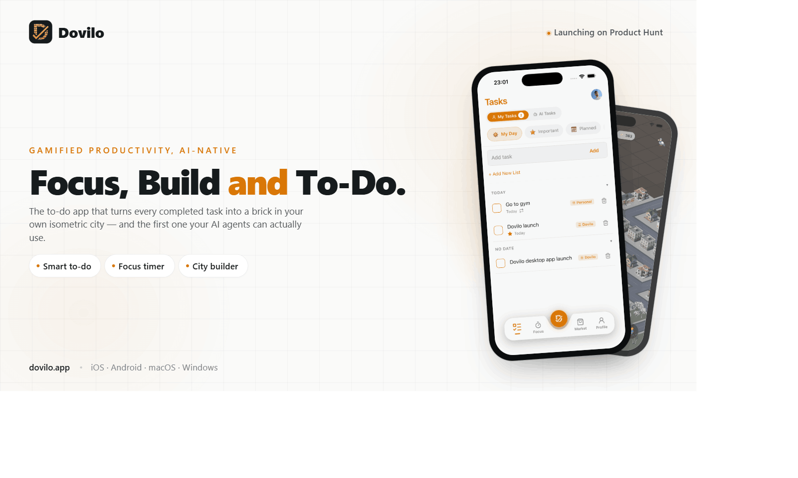
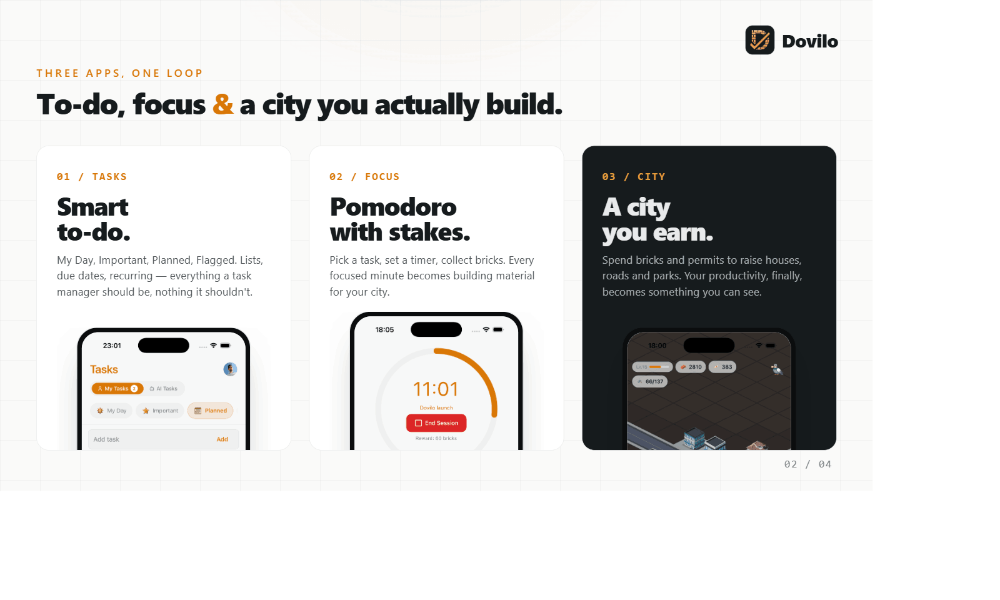
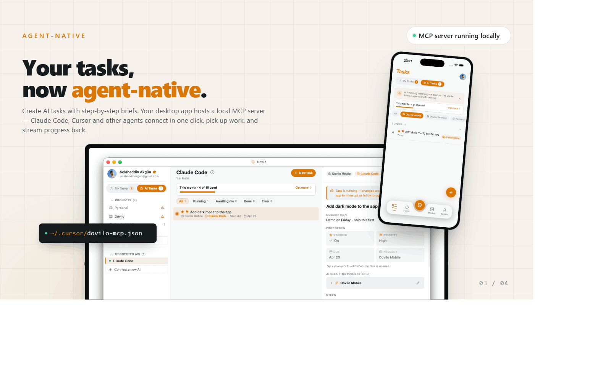

### 🎬 관련 영상
- [🎥 영상 보기](https://ph-files.imgix.net/59869704-9a83-4787-b99c-80a69c3b2699.jpeg?auto=format)

---

## 26. [CaseOdds.ai](https://www.producthunt.com/products/caseodds-ai)
**Votes**: 15 | **도입 난이도**: 하 | **신뢰도**: 상
**Tagline**: AI analyzes your legal case and predicts the odds of success
**서비스 링크**: https://www.producthunt.com/r/H4IMY42IRQJ2XU

**태그**: LegalTech, AI, Analytics, AI Tool

### 📌 이 서비스 한눈에 보기
AI를 통해 법적 사건의 승소 확률을 분석하고 예측하는 서비스

### 🔑 주요 기능
- AI 기반의 법적 상황 분석 기능
- 재판 결과에 대한 승소 확률 예측
- 무료로 제공되는 분석 서비스

### 🙋 사용자에게 어떤 점이 좋은가
자신의 법적 상황을 객관적인 데이터로 미리 파악하여 향로 대응 전략을 세우는 데 도움을 줍니다.

### ✅ 지금 바로 써볼 기능
- 현재 진행 중이거나 예정된 법적 상황 입력하기
- AI가 분석한 승소 확률 확인하기

### ⚠️ 사용 전 확인할 점
- AI의 예측은 법적 조언이 아니므로 실제 결과와 다를 수 있음
- 입력하는 정보의 민감도 및 보안 정책 확인 필요

### 🧭 확인이 더 필요한 정보
분석에 사용되는 구체적인 데이터 범위와 법적 책임 소재에 대한 확인이 필요합니다.

### 📸 스크린샷 및 갤러리
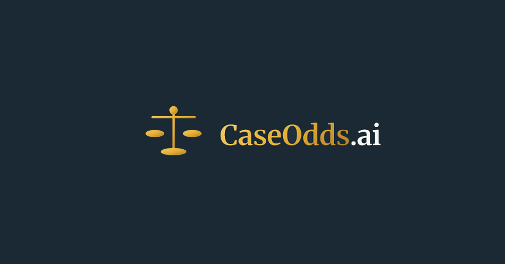
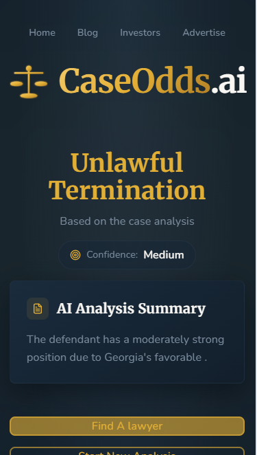
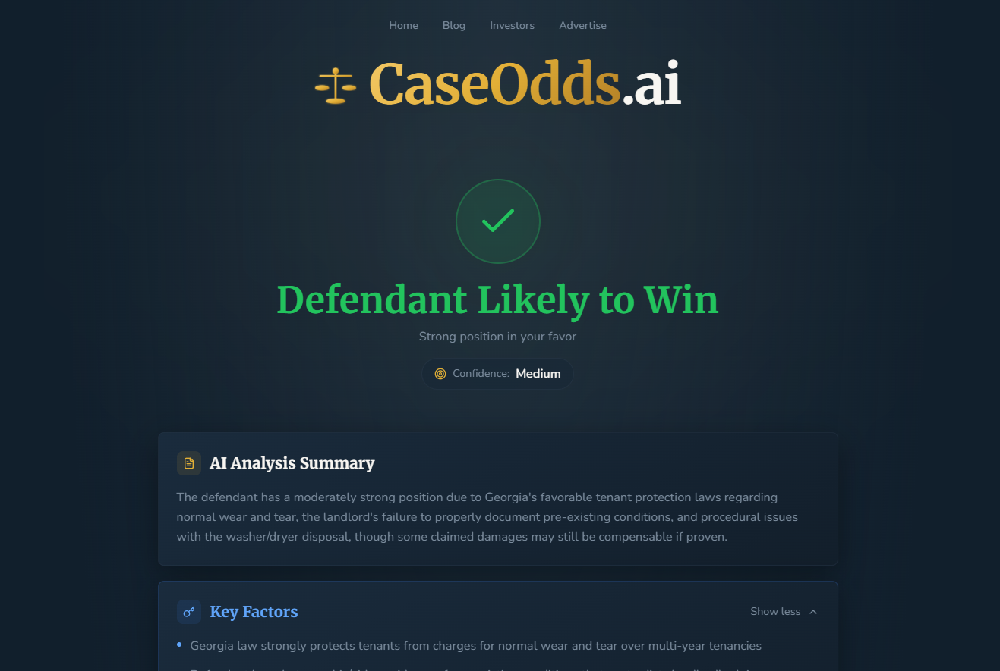

---

## 27. [Finbooks](https://www.producthunt.com/products/finbooks-ai)
**Votes**: 13 | **도입 난이도**: 하 | **신뢰도**: 상
**Tagline**: Stop doing your books. Start running your business.
**서비스 링크**: https://www.producthunt.com/r/R3X7O4QPVZWGZJ

**태그**: FinTech, Automation, AI, Accounting, SaaS, AI Tool

### 📌 이 서비스 한눈에 보기
AI를 통해 복잡한 회계 및 세무 업무를 자동화하여 경영에만 집중하게 돕는 솔루션

### 🔑 주요 기능
- GST, 급여 관리, 세무 신고 등 복잡한 회계 업무 자동화
- 기존 레거시 장부 시스템을 AI로 즉시 업그레이드
- 인도 스타트업 및 중소기업(SMB) 환경에 최적화된 현대적 금융 관리

### 🙋 사용자에게 어떤 점이 좋은가
수동 스프레드시트 작업 시간을 획기적으로 줄여 창업자가 핵심 비즈니스 운영에 더 많은 시간을 할애할 수 있게 합니다.

### ✅ 지금 바로 써볼 기능
- 무료 체험을 통한 자동화 프로세스 테스트
- 기존 회계 데이터의 자동 전환 기능 확인
- GST 및 급여 관리 자동화 설정

### ⚠️ 사용 전 확인할 점
- 인도 세무 및 규제(GST 등)에 특화되어 있어 타 국가 사용자에게는 적합하지 않을 수 있음
- 기존 레거시 데이터의 원활한 마이그레이션 가능 여부 확인 필요

### 🧭 확인이 더 필요한 정보
현재 서비스가 인도 시장 외의 글로벌 규제 환경을 지원하는지에 대한 정보가 부족합니다.

### 📸 스크린샷 및 갤러리
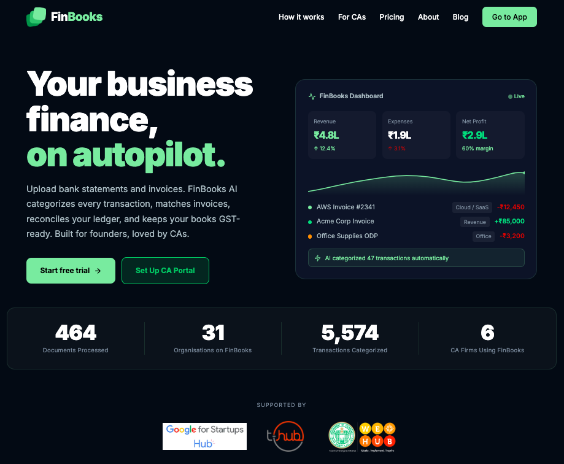
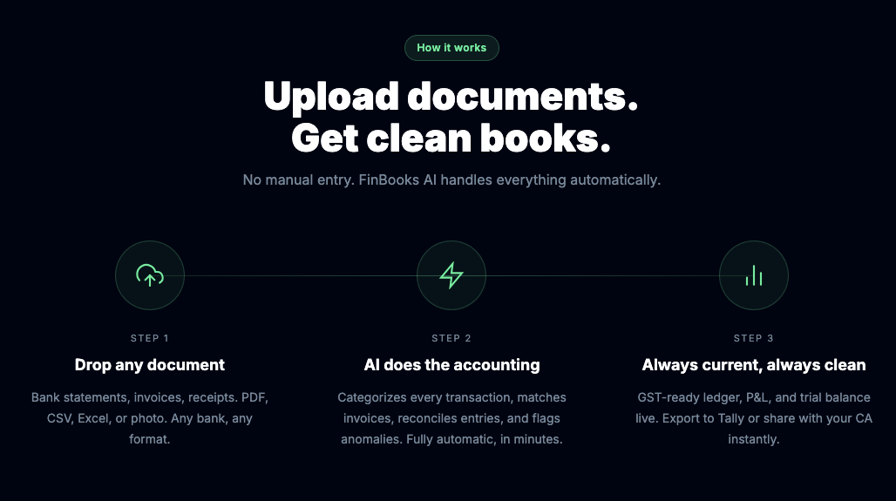
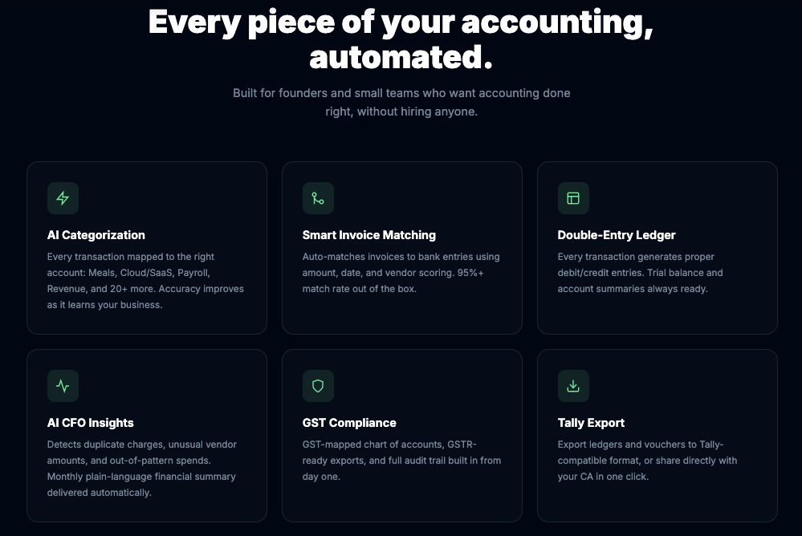

### 🎬 관련 영상
- [🎥 영상 보기](https://ph-files.imgix.net/e8732c56-5830-4bad-970a-4091d966405a.jpeg?auto=format)

---

## 28. [ZunoScroll](https://www.producthunt.com/products/zunoscroll)
**Votes**: 13 | **도입 난이도**: 하 | **신뢰도**: 상
**Tagline**: AI Micro-Learning & Personalized RSS feeds
**서비스 링크**: https://www.producthunt.com/r/V4FK5LT2F4PAAR

**태그**: AI, EdTech, Productivity, Microlearning, AI Tool

### 📌 이 서비스 한눈에 보기
무의미한 스크롤 시간을 개인 맞춤형 학습 시간으로 바꿔주는 AI 마이크로 러닝 앱

### 🔑 주요 기능
- 학습 주제별 맞춤형 스트림 생성 기능
- 개인화된 러닝 그래프 기반의 짧은 학습 콘텐츠 제공
- 블로그, 뉴스 등 실시간 인사이트를 포함한 탐색 피드

### 🙋 사용자에게 어떤 점이 좋은가
습관적인 스크롤 시간을 활용해 원하는 분야의 지식을 쉽고 빠르게 습득할 수 있습니다.

### ✅ 지금 바로 써볼 기능
- 관심 있는 학습 주제로 첫 번째 스트림 만들기
- 생성된 마이크로 러닝 콘텐츠 스크롤하며 읽기
- 탐색 피드를 통해 관련 뉴스 및 블로그 확인하기

### ⚠️ 사용 전 확인할 점
- AI가 생성한 콘텐츠의 정보 정확성 검증 필요
- 학습 깊이가 얕을 수 있어 심화 학습 시 보조 도구로 활용 권장

### 🧭 확인이 더 필요한 정보
콘텐츠 생성 알고리즘의 구체적인 출처와 정보 업데이트 주기에 대한 확인이 필요합니다.

### 📸 스크린샷 및 갤러리
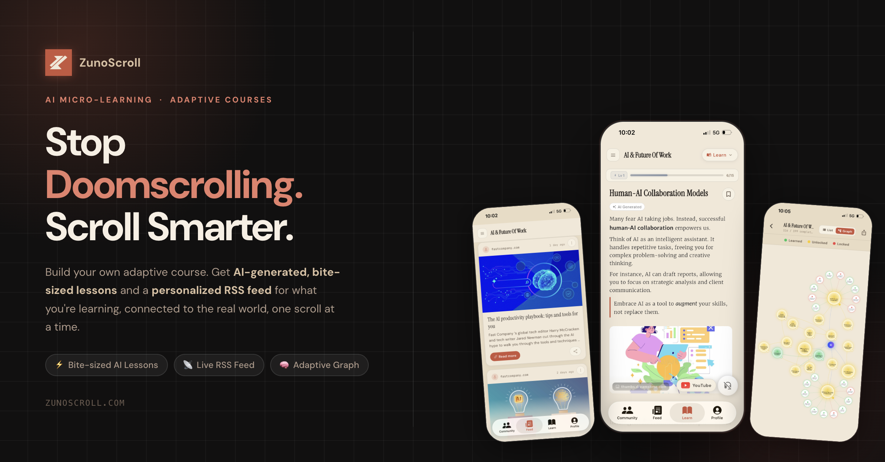

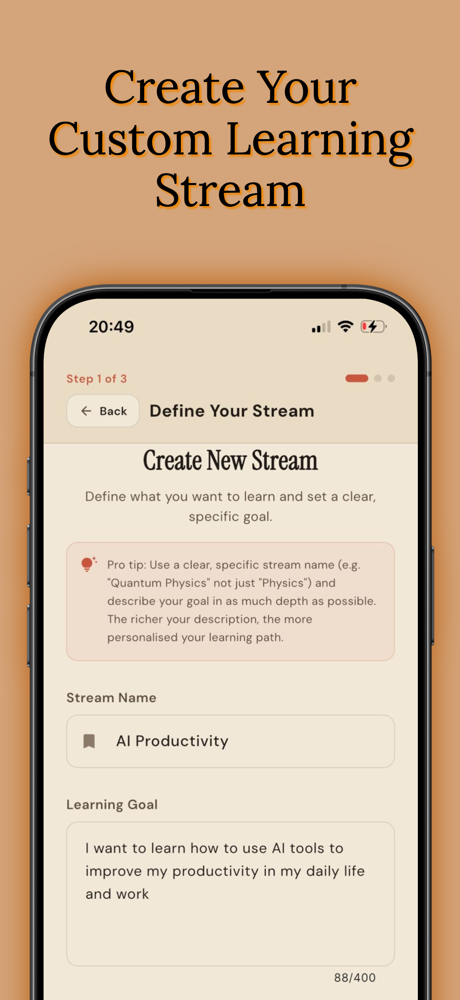

### 🎬 관련 영상
- [🎥 영상 보기](https://ph-files.imgix.net/2d32ce6d-f6c6-4507-b0f7-5b6364300160.jpeg?auto=format)

---

## 29. [Abodex Space](https://www.producthunt.com/products/abodex-space)
**Votes**: 13 | **도입 난이도**: 하 | **신뢰도**: 상
**Tagline**: AI property search for Bangalore. No calls, no spam.
**서비스 링크**: https://www.producthunt.com/r/STT4QVRKK4YZZD

**태그**: PropTech, AI, RealEstate, Privacy, Agent, AI Tool, Chat

### 📌 이 서비스 한눈에 보기
개인정보 유출과 스팸 전화 없는 방글로르 전용 AI 부동산 검색 서비스

### 🔑 주요 기능
- 개인 연락처 공유 없는 프라이빗한 부동산 리서치
- 사용자의 예산과 라이프스타일을 이해하는 AI 채팅
- 출퇴근 시간, 가격, 건설사, 지역 특성 등 데이터 기반 정보 제공

### 🙋 사용자에게 어떤 점이 좋은가
부동산 중개인에게 번호가 팔려 스팸 전화에 시달리는 문제 없이, 개인화된 조건으로 조용히 집을 찾을 수 있습니다.

### ✅ 지금 바로 써볼 기능
- 사용자 프로필 생성 및 라이프스타일 설정
- AI 채팅을 통한 맞춤형 매물 탐색
- 지역별/출퇴근 데이터 기반 매물 분석

### ⚠️ 사용 전 확인할 점
- 방글로르 지역에 특화된 서비스로 타 지역 사용 시 활용도 제한
- 현재 얼리 액세스 단계로 서비스 범위가 제한적일 수 있음

### 🧭 확인이 더 필요한 정보
현재 얼리 액세스 단계이므로 실제 매물 데이터의 양과 업데이트 빈도를 확인해야 합니다.

### 📸 스크린샷 및 갤러리
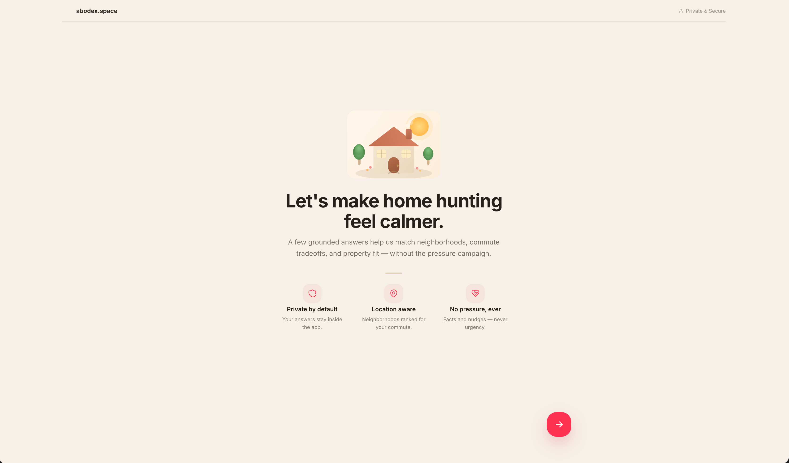
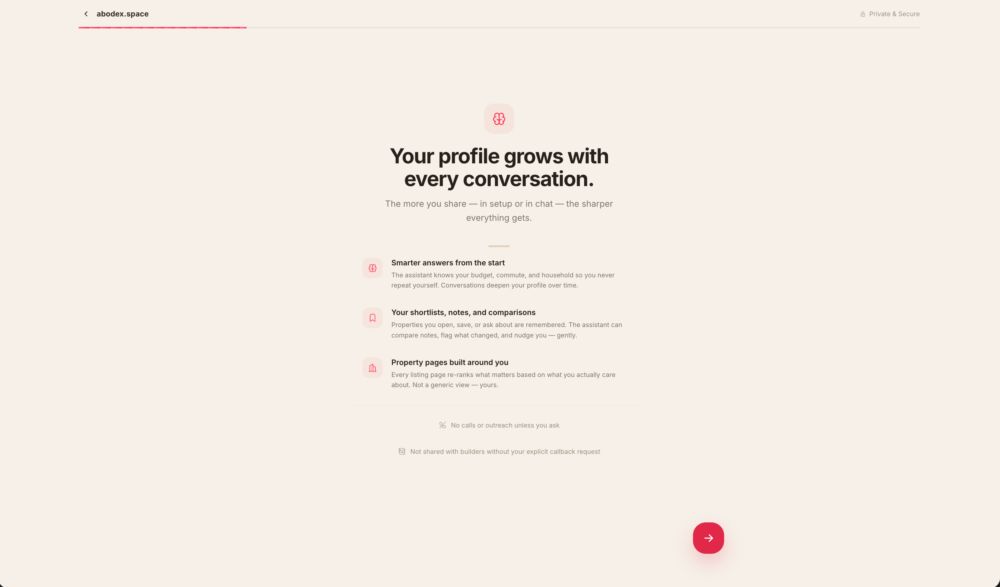
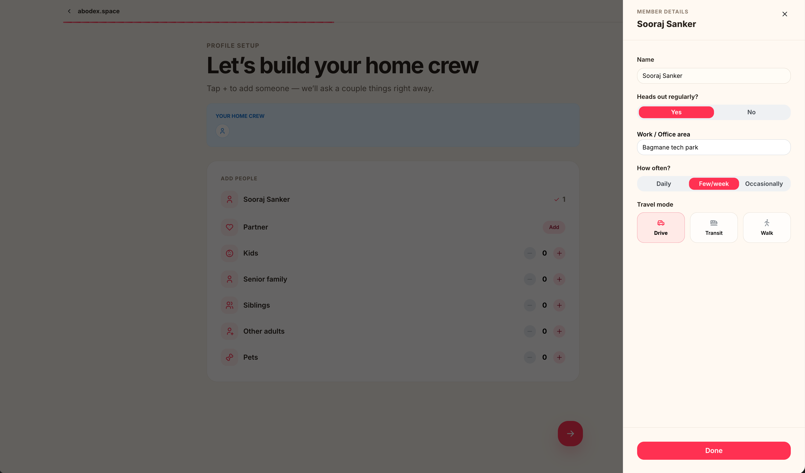

### 🎬 관련 영상
- [🎥 영상 보기](https://ph-files.imgix.net/cd39299d-dd42-4db6-84a9-a1aa67460c9a.jpeg?auto=format)

---

## 30. [Orlume](https://www.producthunt.com/products/orlume)
**Votes**: 12 | **도입 난이도**: 하 | **신뢰도**: 상
**Tagline**: AI that builds websites that looks crafted by top designers.
**서비스 링크**: https://www.producthunt.com/r/GM24SMMWOA3LSQ

**태그**: AI, WebDesign, NoCode, StartupTools, AI Tool, Design

### 📌 이 서비스 한눈에 보기
디자이너의 감각을 담은 고퀄리티 웹사이트를 즉시 생성하는 AI 빌더

### 🔑 주요 기능
- 템플릿 방식이 아닌 독창적인 레이아웃과 구조 생성
- 전문 디자이너가 작업한 듯한 세련되고 정교한 디자인
- 창업자와 크리에이터를 위한 빠르고 직관적인 제작 프로세스

### 🙋 사용자에게 어떤 점이 좋은가
단순한 복사-붙여넣기 식의 결과물이 아닌, 브랜드의 가치를 높여주는 수준 높은 웹사이트를 빠르게 구축할 수 있습니다.

### ✅ 지금 바로 써볼 기능
- 아이디어 설명 입력하기
- 생성된 레이아웃 확인하기
- 브랜드 스타일에 맞춘 결과물 검토하기

### ⚠️ 사용 전 확인할 점
- 세부적인 커스텀 편집 기능의 범위 확인 필요
- 생성된 디자인의 독창성이 사용자 요구사항과 일치하는지 확인

### 🧭 확인이 더 필요한 정보
구체적인 편집 도구의 자유도와 호스팅/도메인 연결 기능에 대한 정보가 부족합니다.

### 📸 스크린샷 및 갤러리
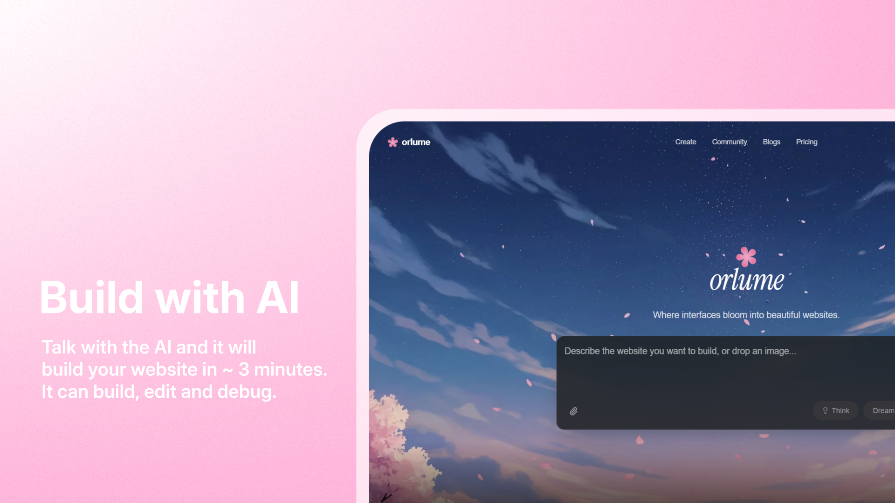
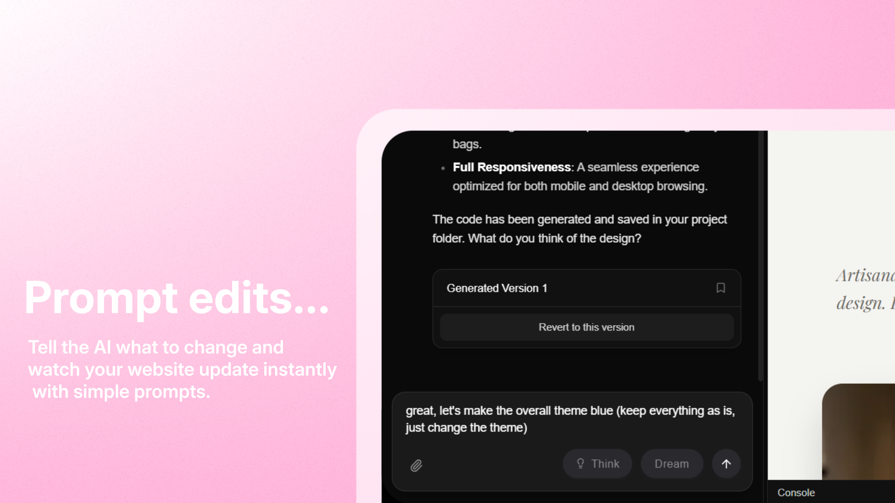
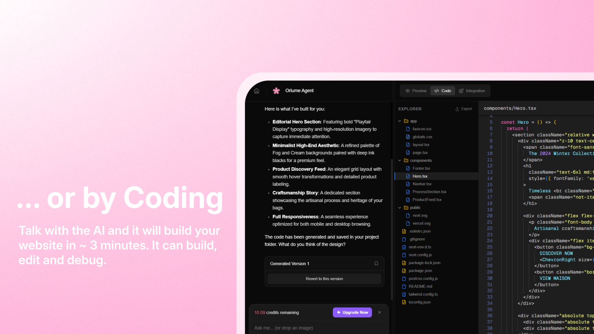

### 🎬 관련 영상
- [🎥 영상 보기](https://ph-files.imgix.net/d5317a8c-7eb7-4f8a-81cc-99fb4d0a00e3.jpeg?auto=format)

---

