# 🚀 Product Hunt Daily Top 30 (2026-05-23)

## 오늘의 요약
오늘의 제품들은 AI 에이전트가 단순 보조를 넘어 PM, QA, 기획자 등 전문적인 업무 영역을 자동화하는 흐름을 보여주었습니다. 또한, 생산성 향상을 위한 워크플로우 최적화와 더불어 디지털 피로도를 줄이기 위한 텍스트 중심의 미니멀한 도구들도 주목받았습니다.

### 오늘의 핵심 포인트
- AI 에이전트가 사용자 탐색, 제품 기획, PM 업무를 직접 수행하며 전문적인 워크플로우를 자동화하는 기술이 두드러졌습니다.
- 인프라 측면에서는 추론 속도 최적화를 통해 실시간 AI 서비스 구현을 돕는 전문적인 클라우드 솔루션이 등장했습니다.
- 업무 효율을 높이는 도구뿐만 아니라, 집중력 유지와 디지털 디톡스를 위한 사용자 경험 중심의 서비스들이 제안되었습니다.

**오늘의 태그**: AI 에이전트, 업무 자동화, 생산성 도구, 워크플로우 최적화

## 1. [TestSprite 3.0](https://www.producthunt.com/products/testsprite)
**Votes**: 313 | **도입 난이도**: 중 | **신뢰도**: 상
**Tagline**: Let a fleet of parallel agents test your app in minutes
**서비스 링크**: https://www.producthunt.com/r/DP36SVO3Y3LMV7

**태그**: DevTool, QA_Automation, AI_Agents, Testing, Agent, AI Tool

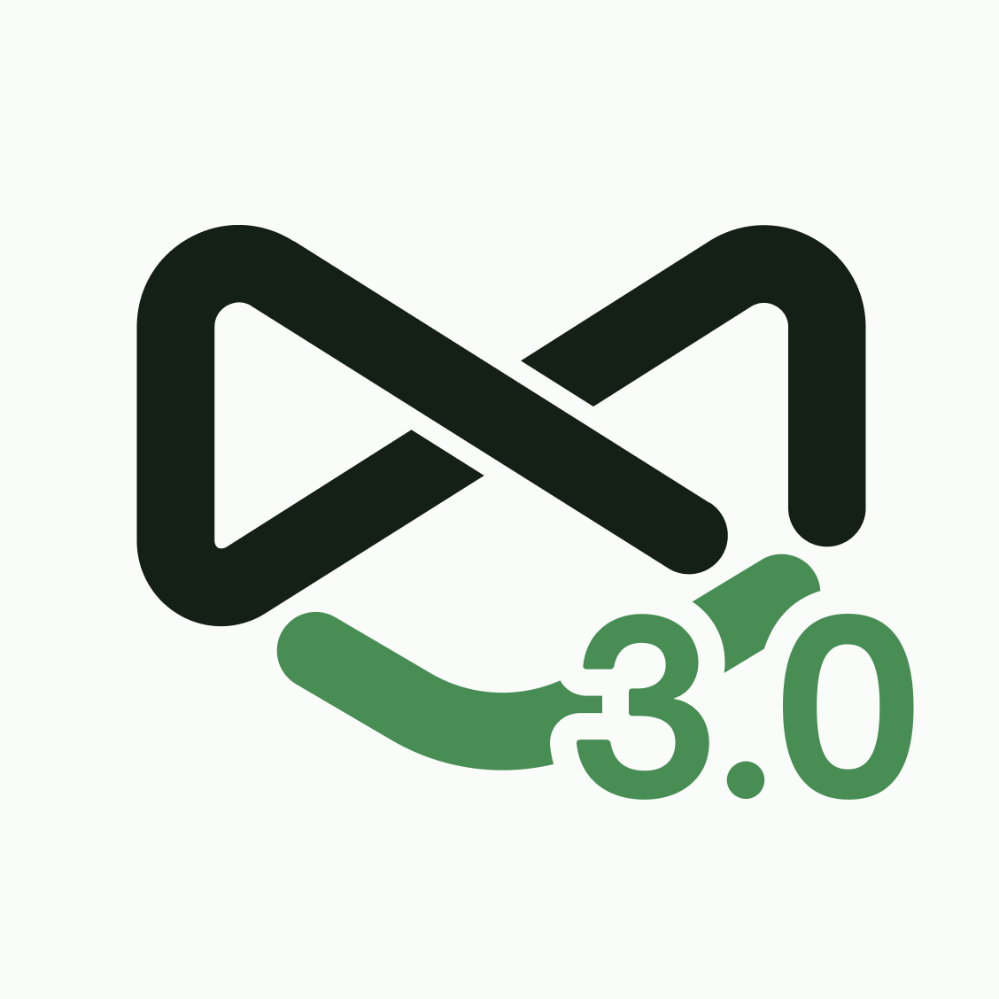

### 📌 이 서비스 한눈에 보기
AI 에이전트 군단이 사용자처럼 앱을 탐색하며 자동으로 테스트를 생성하고 실행하는 엔드투엔드 테스트 자동화 도구

### 🔑 주요 기능
- AI 에이전트가 실제 사용자처럼 앱을 탐색하여 테스트 케이스를 자동 생성
- 백엔드 통합 테스트를 위한 동적 변수 지원 및 데이터 흐름 디버깅 기능
- UI 변경에 대응하는 auto-heal 및 자동 인증(auto-auth) 기능 탑재

### 🙋 사용자에게 어떤 점이 좋은가
수동으로 테스트 시나리오를 작성할 필요 없이, AI가 앱의 모든 기능을 직접 탐색하며 테스트를 수행하므로 QA 시간을 획기적으로 단축할 수 있습니다.

### ✅ 지금 바로 써볼 기능
- AI 에이전트의 앱 탐색 및 테스트 생성 기능 테스트
- UI 변경 시 auto-heal 기능의 정확도 확인
- CLI를 통한 개발 워크플로우 통합 시도

### ⚠️ 사용 전 확인할 점
- AI 에이전트의 탐색 방식이 복잡한 비즈니스 로직을 완벽히 이해하는지 검증 필요
- 자동 생성된 테스트의 신뢰성 및 결과 검토를 위한 초기 학습 비용 발생 가능성

### 🧭 확인이 더 필요한 정보
에이전트가 생성하는 테스트의 규모와 복잡도에 따른 리소스 소모량 및 비용 구조에 대한 정보가 부족합니다.

### 📸 스크린샷 및 갤러리
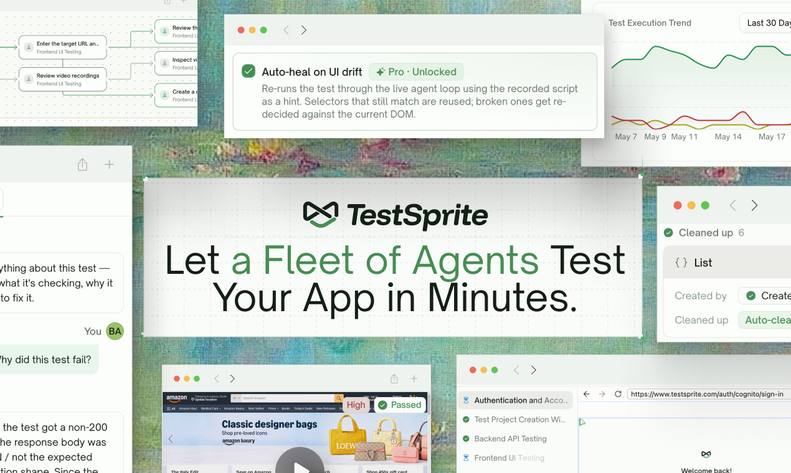
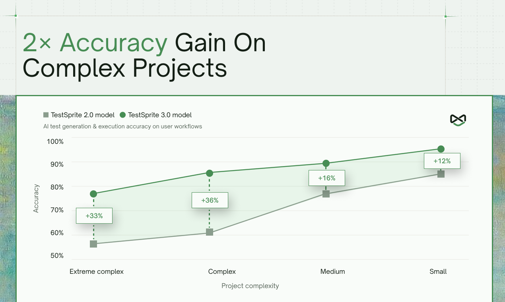
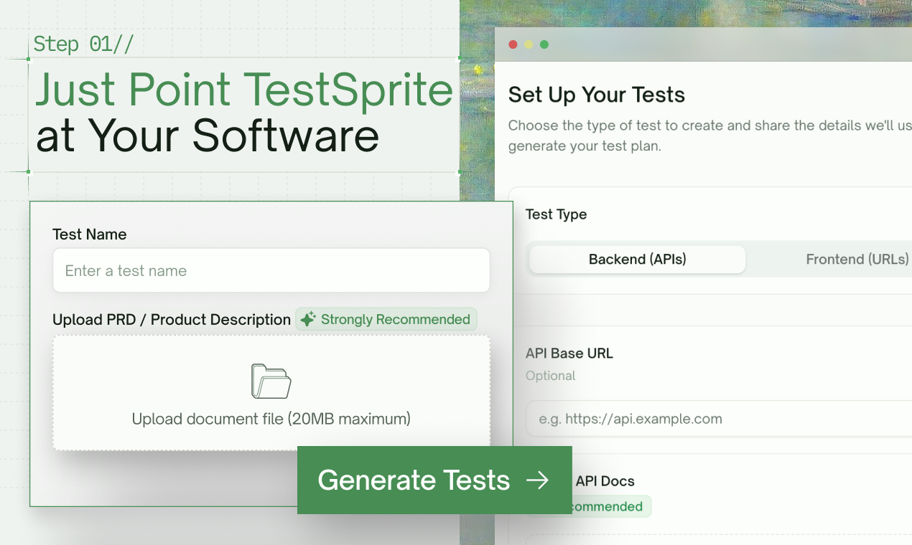

### 🎬 관련 영상
- [🎥 영상 보기](https://ph-files.imgix.net/c278d6b6-c753-4e23-89ed-869bd651c824.jpeg?auto=format)

---

## 2. [Cleo](https://www.producthunt.com/products/cleo-4)
**Votes**: 264 | **도입 난이도**: 하 | **신뢰도**: 상
**Tagline**: The AI PM that runs your team
**서비스 링크**: https://www.producthunt.com/r/UEIFHO7XED74LR

**태그**: AI, ProductManagement, Automation, Collaboration, SaaS, AI Tool

### 📌 이 서비스 한눈에 보기
슬랙과 텔레그램에서 팀의 PM 업무를 자동화하는 투명한 AI 제품 매니저

### 🔑 주요 기능
- 슬랙 및 텔레그램 기반의 간편한 협업 환경 제공
- 스탠드업 미팅, 후속 조치, 의사결정 등 PM 업무 자동화
- 모든 정보의 출처와 신뢰도를 확인할 수 있는 투명한 데이터 관리

### 🙋 사용자에게 어떤 점이 좋은가
창업자와 소규모 팀이 PM 업무에 들이는 시간을 줄이고, 제품 개발에만 집중할 수 있도록 돕습니다.

### ✅ 지금 바로 써볼 기능
- 1분 만에 설정하여 텔레그램/슬랙에 연동하기
- AI가 제안하는 업무 자동화 수준(5단계) 설정하기
- AI가 학습한 정보의 출처와 신뢰도 확인하기

### ⚠️ 사용 전 확인할 점
- AI의 의사결정 지원이 팀의 실제 워크플로우와 충돌할 가능성
- 메신저 기반 도구이므로 팀 전체의 사용 습관이 동기화되어야 함

### 🧭 확인이 더 필요한 정보
사용자의 권한 수준(Observer to Operator)에 따른 구체적인 기능 차이와 보안 정책 확인이 필요합니다.

### 📸 스크린샷 및 갤러리

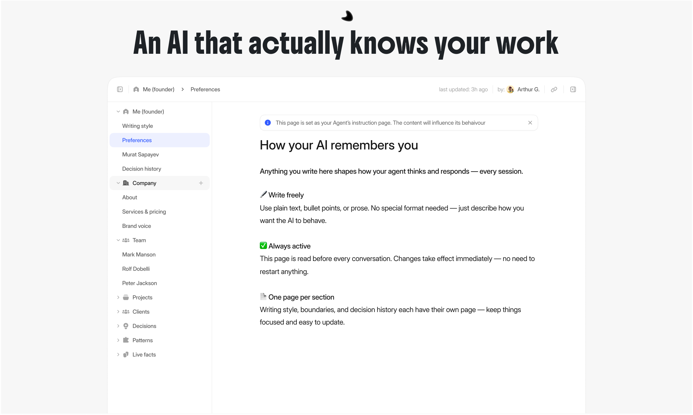
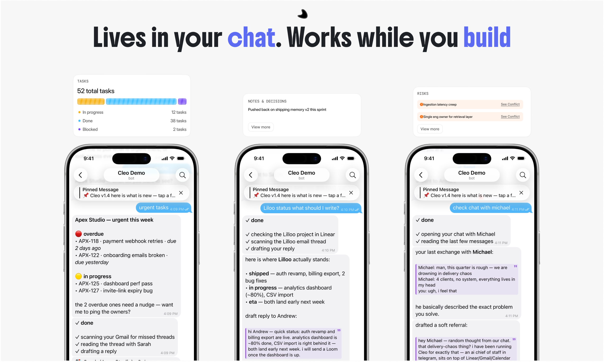

### 🎬 관련 영상
- [🎥 영상 보기](https://ph-files.imgix.net/1ac430b2-c450-447e-be5d-f9cb040a5f49.jpeg?auto=format)

---

## 3. [General Compute](https://www.producthunt.com/products/general-compute)
**Votes**: 230 | **도입 난이도**: 하 | **신뢰도**: 상
**Tagline**: AI models that run on an inference cloud optimized for speed
**서비스 링크**: https://www.producthunt.com/r/NHQEMRTC6G4X2J

**태그**: AI, Cloud, Inference, DevTools, Infrastructure, Agent, Automation, AI Tool, Design, API

### 📌 이 서비스 한눈에 보기
추론 전용 ASIC 인프라를 통해 기존 GPU보다 5배 빠른 응답 속도를 제공하는 AI 추론 클라우드

### 🔑 주요 기능
- 학습용 GPU가 아닌 추론에 최적화된 전용 ASIC 인프라 활용
- 코딩 및 음성 에이전트 등 지연 시간에 민감한 워크로드에 최적화된 속도와 처리량
- OpenAI 호환 API를 통한 기존 워크플로우의 손쉬운 전환

### 🙋 사용자에게 어떤 점이 좋은가
기존 모델의 응답 속도가 느려 사용자 경험이 저하되는 경우, 코드 변경을 최소화하면서 실시간 AI 서비스를 구현할 수 있습니다.

### ✅ 지금 바로 써볼 기능
- OpenAI 호환 API를 활용한 베이스 URL 교체 테스트
- 지연 시간에 민감한 서비스(음성/코딩)에 대한 성능 벤치마크 수행

### ⚠️ 사용 전 확인할 점
- 특정 모델에 대한 ASIC 최적화 지원 여부 확인 필요
- 기존 GPU 환경 대비 특정 워크로드에서의 비용 효율성 검토

### 🧭 확인이 더 필요한 정보
지원하는 구체적인 AI 모델 종류와 각 모델별 성능 지표에 대한 상세 정보가 필요합니다.

### 📸 스크린샷 및 갤러리
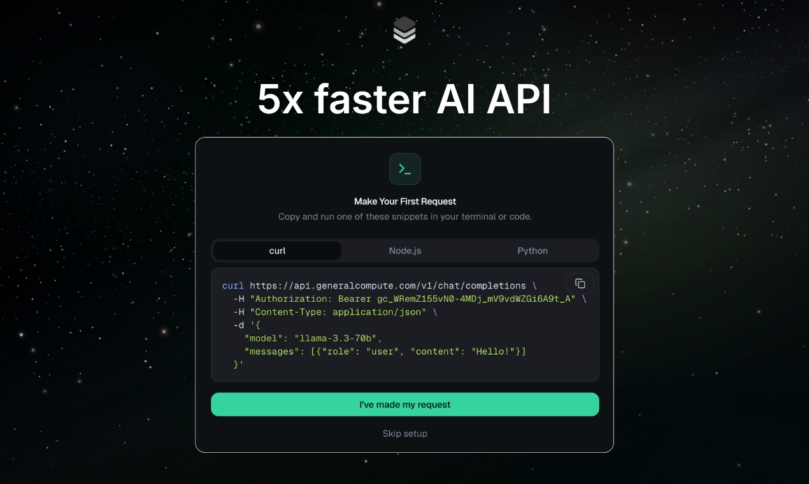

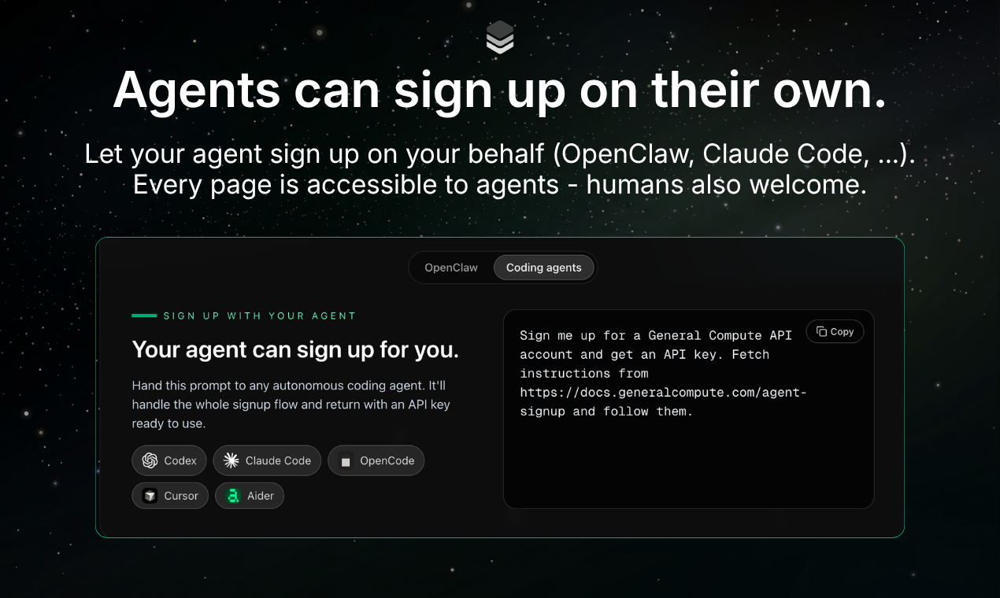

### 🎬 관련 영상
- [🎥 영상 보기](https://ph-files.imgix.net/6960bb8d-a184-4c2a-8924-f7d367faec35.jpeg?auto=format)

---

## 4. [WordPress 7.0](https://www.producthunt.com/products/wordpress-7-0)
**Votes**: 185 | **도입 난이도**: 중 | **신뢰도**: 상
**Tagline**: Introducing AI tools, new admin experience & design controls
**서비스 링크**: https://www.producthunt.com/r/DR7XDHFH7F2IGM

**태그**: CMS, AI, WebDesign, Development, AI Tool, Design, DevTool

### 📌 이 서비스 한눈에 보기
AI 기술과 현대적인 관리 환경을 통해 창의적인 웹 제작을 지원하는 차세대 워드프레스

### 🔑 주요 기능
- AI 기반 도구 도입을 통한 워크플로우 혁신
- 직관적이고 현대적인 새로운 관리자 대시보드
- 창의성을 극대화하는 강화된 디자인 및 개발 컨트롤

### 🙋 사용자에게 어떤 점이 좋은가
사용자는 더 직관적인 인터페이스와 AI 도구를 통해 복잡한 과정 없이 자신만의 독창적인 웹사이트를 빠르게 구축할 수 있습니다.

### ✅ 지금 바로 써볼 기능
- 새로운 관리자 대시보드 인터페이스 탐색
- 새로 도입된 AI 기반 제작 도구 테스트
- 강화된 디자인 컨트롤을 활용한 커스텀 레이아웃 설정

### ⚠️ 사용 전 확인할 점
- 대규모 업데이트에 따른 기존 테마 및 플러그인과의 호환성 확인 필요
- AI 기능 활용 시 데이터 보안 및 정책 검토 필요

### 🧭 확인이 더 필요한 정보
AI 기능의 구체적인 작동 방식과 기존 워드프레스 버전과의 마이그레이션 편의성에 대한 상세 정보가 필요합니다.

### 📸 스크린샷 및 갤러리
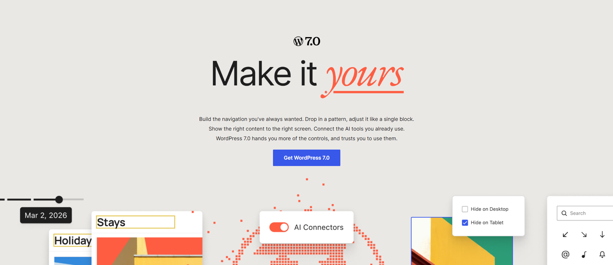
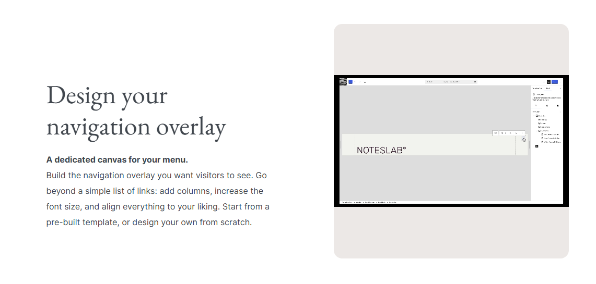
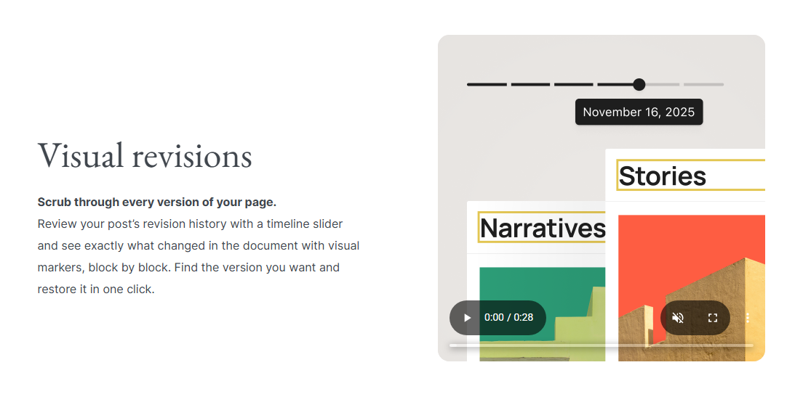

### 🎬 관련 영상
- [🎥 영상 보기](https://ph-files.imgix.net/303d0bd3-d6d9-491f-b2b0-ca919ebab6c0.jpeg?auto=format)

---

## 5. [iPromise](https://www.producthunt.com/products/ipromise-ai-focus-buddy-for-deep-work)
**Votes**: 167 | **도입 난이도**: 하 | **신뢰도**: 상
**Tagline**: Bring "Body Doubling" to your Mac notch
**서비스 링크**: https://www.producthunt.com/r/D73YQTII2QST2Z

**태그**: Productivity, AI, Mac, Focus, AI Tool

### 📌 이 서비스 한눈에 보기
맥북 노치에 상주하며 집중력을 유지시켜 주는 AI 바디 더블링(Body Doubling) 도구

### 🔑 주요 기능
- 맥북 노치에 위치하여 작업 흐름을 방해하지 않는 깔끔한 UI
- 사용자의 현재 작업 맥락을 이해하는 AI 버디 기능
- 딴짓을 할 때 부드럽게 주의를 환기하는 '바디 더블링' 방식의 계정성 부여

### 🙋 사용자에게 어떤 점이 좋은가
혼자 작업할 때 쉽게 주의가 분산되는 사용자에게 가상의 동료가 옆에 있는 듯한 환경을 제공하여 몰입을 돕습니다.

### ✅ 지금 바로 써볼 기능
- 맥북 노치에 설치하여 UI 적응하기
- 집중이 필요한 작업 목표 설정하기
- AI 버디의 알림 방식 확인하기

### ⚠️ 사용 전 확인할 점
- 활성 창의 맥락을 읽어야 하므로 개인정보 및 화면 데이터 접근 권한 필요
- 사용자의 작업 패턴에 따라 알림이 방해 요소로 느껴질 가능성

### 🧭 확인이 더 필요한 정보
AI가 맥락을 파악하는 구체적인 데이터 수집 범위와 개인정보 보호 정책에 대한 확인이 필요합니다.

### 📸 스크린샷 및 갤러리
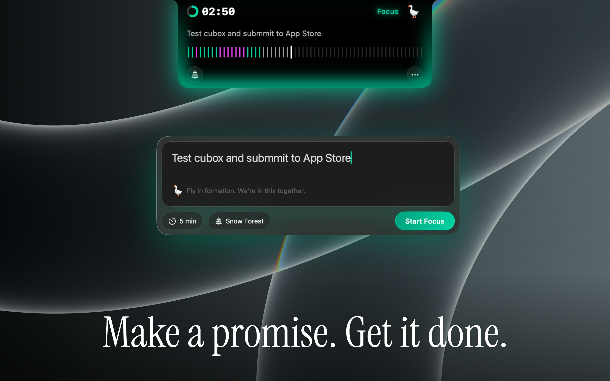
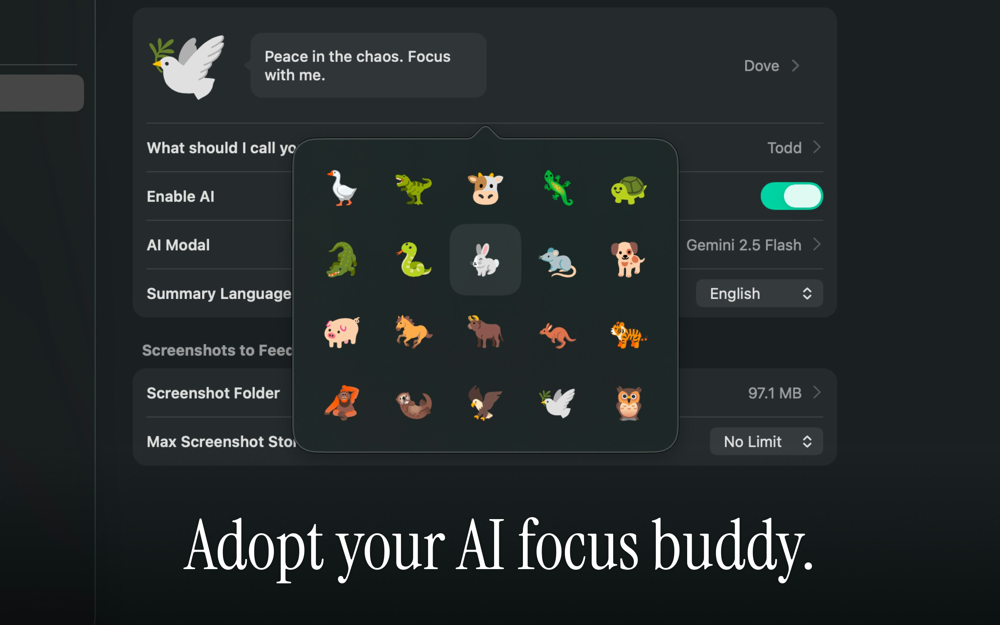
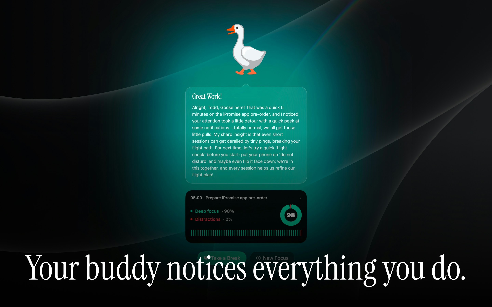

### 🎬 관련 영상
- [🎥 영상 보기](https://ph-files.imgix.net/d4708792-9550-454e-8d3a-a1978632fccf.jpeg?auto=format)

---

## 6. [Auto Posts](https://www.producthunt.com/products/auto-posts)
**Votes**: 147 | **도입 난이도**: 하 | **신뢰도**: 상
**Tagline**: Schedule social post, Telegram messages + more
**서비스 링크**: https://www.producthunt.com/r/CAWHP3ZT3TUW2Y

**태그**: Automation, SocialMedia, Productivity, Marketing, AI Tool

### 📌 이 서비스 한눈에 보기
여러 소셜 플랫폼과 텔레그램 메시지를 하나의 대시보드에서 통합 관리하고 자동 예약하는 도구

### 🔑 주요 기능
- 다양한 소셜 플랫폼 및 텔레그램 통합 관리
- 중앙 집중식 대시보드를 통한 콘텐츠 예약 및 자동 게시
- 수동 포스팅 시간을 절약하여 비즈니스 핵심 업무에 집중 가능

### 🙋 사용자에게 어떤 점이 좋은가
여러 채널에 일일이 접속할 필요 없이 한 곳에서 콘텐츠를 관리함으로써 운영 효율성을 극대화할 수 있습니다.

### ✅ 지금 바로 써볼 기능
- 통합 대시보드에 소셜 계정 연결하기
- 콘텐츠 플래닝 및 예약 게시 설정하기
- 자동 포스팅 기능 테스트하기

### ⚠️ 사용 전 확인할 점
- 지원하는 소셜 플랫폼 및 텔레그램 기능 범위 확인 필요
- 계정 연동 시 보안 및 권한 설정 확인

### 🧭 확인이 더 필요한 정보
구체적인 지원 플랫폼 목록과 자동화 기능의 상세 범위가 명시되지 않았습니다.

### 📸 스크린샷 및 갤러리
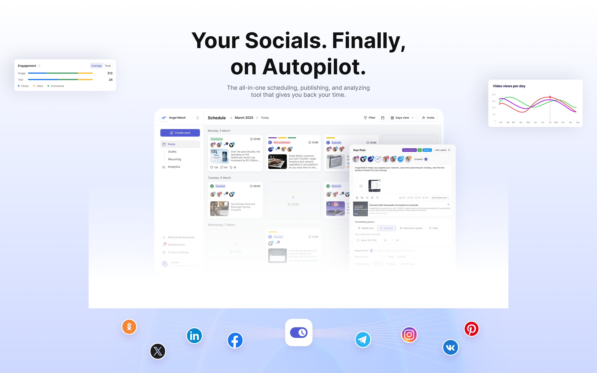
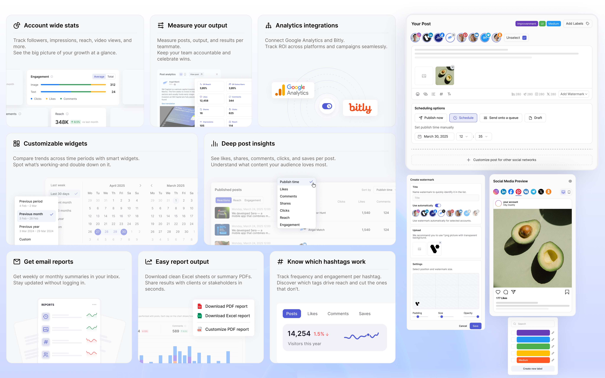
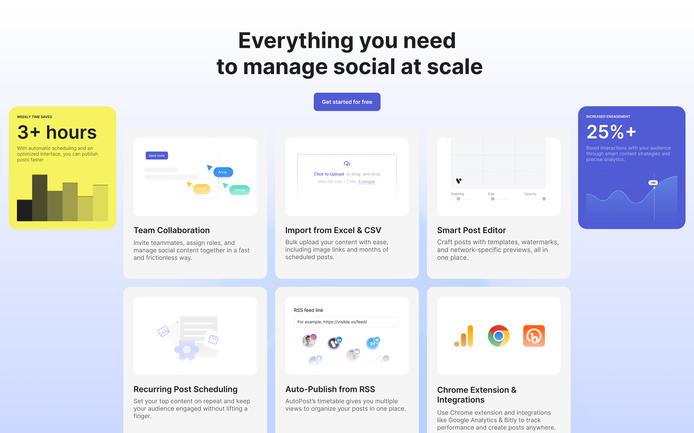

---

## 7. [Nugget AI](https://www.producthunt.com/products/nugget-ai)
**Votes**: 130 | **도입 난이도**: 하 | **신뢰도**: 상
**Tagline**: Turn customer interviews into your product roadmap
**서비스 링크**: https://www.producthunt.com/r/XUY2356ELRAHHI

**태그**: ProductManagement, AI, Automation, DevOps, Agent, AI Tool, Chat, DevTool

### 📌 이 서비스 한눈에 보기
고객 인터뷰를 분석하여 즉시 실행 가능한 제품 로드맵과 PRD로 변환해 주는 AI 도구

### 🔑 주요 기능
- 인터뷰 녹음/업로드 시 페인 포인트 및 기능 요청 자동 추출
- 실제 고객 인용구가 포함된 PRD 자동 생성 및 테마 분석
- Linear, GitHub 및 MCP 서버를 통한 AI 에이전트(Claude, Cursor 등) 연동

### 🙋 사용자에게 어떤 점이 좋은가
수동으로 정리하던 인터뷰 데이터를 제품 요구사항으로 자동 변환하여 기획 시간을 단축하고 데이터 기반의 의사결정을 돕습니다.

### ✅ 지금 바로 써볼 기능
- 기존 고객 인터뷰 파일 업로드하여 테마 분석하기
- 생성된 PRD를 Linear 또는 GitHub로 내보내기
- MCP 서버를 설정하여 AI 에이전트와 인터뷰 데이터 연동하기

### ⚠️ 사용 전 확인할 점
- AI가 추출한 내용이 실제 고객의 의도와 일치하는지 검토 필요
- 민감한 고객 정보가 포함된 인터뷰 데이터의 보안 정책 확인 필요

### 🧭 확인이 더 필요한 정보
Dovetail 대비 가격이 절반이라는 구체적인 가격 정책과 데이터 보안 수준에 대한 상세 정보가 필요합니다.

### 📸 스크린샷 및 갤러리
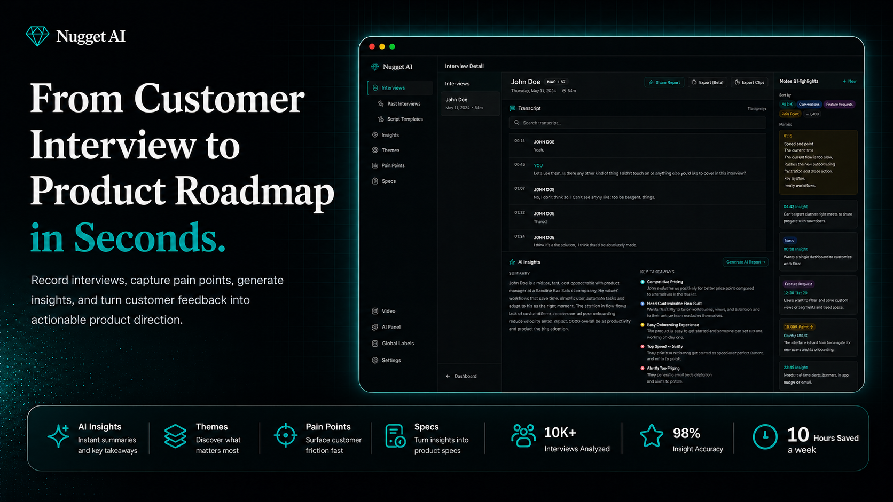
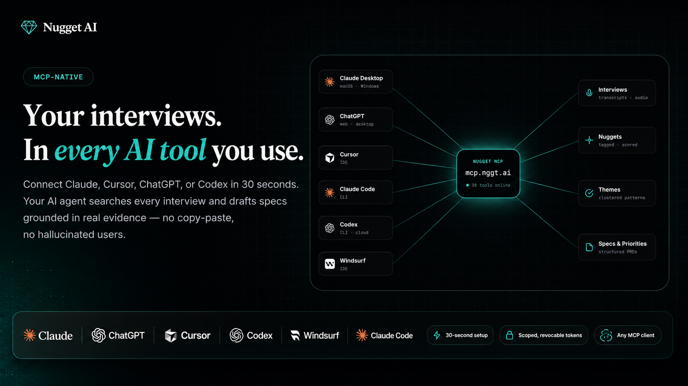
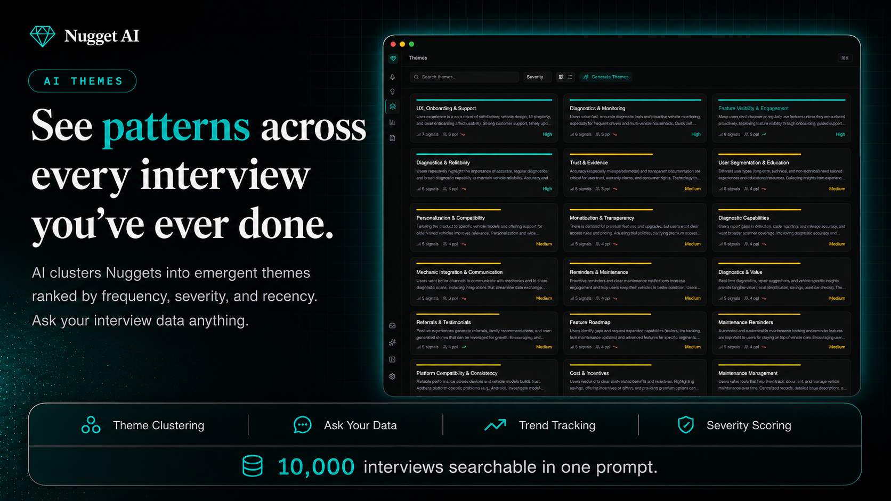

---

## 8. [moop](https://www.producthunt.com/products/moop)
**Votes**: 126 | **도입 난이도**: 하 | **신뢰도**: 상
**Tagline**: A social network without media
**서비스 링크**: https://www.producthunt.com/r/U7RY625H2RL3IF

**태그**: Social Network, Minimalism, Productivity, Mindfulness, AI Tool, Design

### 📌 이 서비스 한눈에 보기
자극적인 미디어 없이 영감과 기록에만 집중하는 텍스트 중심 소셜 네트워크

### 🔑 주요 기능
- 미디어(이미지/영상)를 배제한 순수 텍스트 중심의 소셜 환경
- 도파민 과부하(Brainrotting)를 방지하고 깊이 있는 사고 유도
- 장소, 책, 아이디어 등 소중한 순간을 기록하고 공유하는 공간

### 🙋 사용자에게 어떤 점이 좋은가
시각적 자극이 넘치는 기존 SNS에서 벗어나, 자신의 생각과 영감을 차분하게 기록하고 공유하고 싶은 사용자에게 유용합니다.

### ✅ 지금 바로 써볼 기능
- 자신이 영감을 받는 주제 리스트 작성하기
- 일상의 작은 순간들을 텍스트로 기록해보기
- 다른 사용자의 아이디어와 생각 탐색하기

### ⚠️ 사용 전 확인할 점
- 시각적 요소가 없어 기존 SNS에 비해 직관적인 재미가 부족할 수 있음
- 텍스트 위주의 소통 방식에 적응이 필요함

### 🧭 확인이 더 필요한 정보
현재 서비스의 구체적인 커뮤니티 운영 방식이나 사용자 인터페이스(UI) 디자인에 대한 정보가 부족합니다.

### 📸 스크린샷 및 갤러리

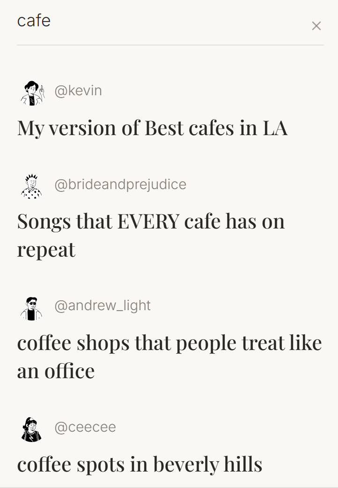

---

## 9. [Prosed](https://www.producthunt.com/products/prosed-turn-your-content-into-a-book)
**Votes**: 124 | **도입 난이도**: 하 | **신뢰도**: 상
**Tagline**: Go from newsletters & podcasts to published manuscript
**서비스 링크**: https://www.producthunt.com/r/EYUAX2RLAQKR4Q

**태그**: Writing, ContentCreation, AI, Publishing, AI Tool

### 📌 이 서비스 한눈에 보기
뉴스레터와 팟캐스트 등 흩어진 콘텐츠를 나만의 목소리가 담긴 책으로 변환해주는 AI 집필 도구

### 🔑 주요 기능
- 기존의 파편화된 콘텐츠(뉴스레터, 팟캐스트 등)를 구조화된 원고로 변환
- 사용자의 고유한 말투와 아이디어를 유지하는 'Inkwell' 파이프라인 기술
- 편집 리뷰 기능 및 인쇄 가능한 PDF/DOCX 내보내기 지원

### 🙋 사용자에게 어떤 점이 좋은가
이미 축적된 양질의 콘텐츠를 가진 창작자가 별도의 대규모 집필 과정 없이도 손쉽게 출판 가능한 원고를 만들 수 있습니다.

### ✅ 지금 바로 써볼 기능
- 기존에 작성한 글이나 스크립트 업로드하기
- Inkwell 파이프라인을 통한 챕터 구조 생성 확인
- 생성된 원고의 편집 리뷰 및 내보내기 기능 테스트

### ⚠️ 사용 전 확인할 점
- AI가 사용자의 목소리를 얼마나 정확하게 재현하는지 검증 필요
- 베타 버전 가격($47)은 초기 100명 한정 조건임

### 🧭 확인이 더 필요한 정보
현재 베타 단계로, 향후 정식 출시 시 가격 정책이나 기능 확장 여부가 변동될 수 있습니다.

### 📸 스크린샷 및 갤러리

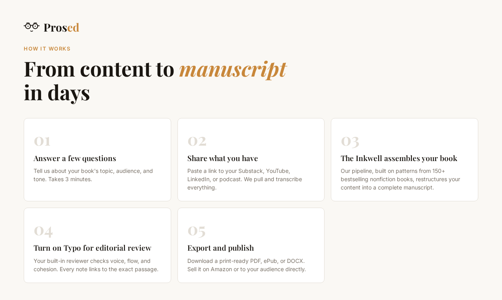
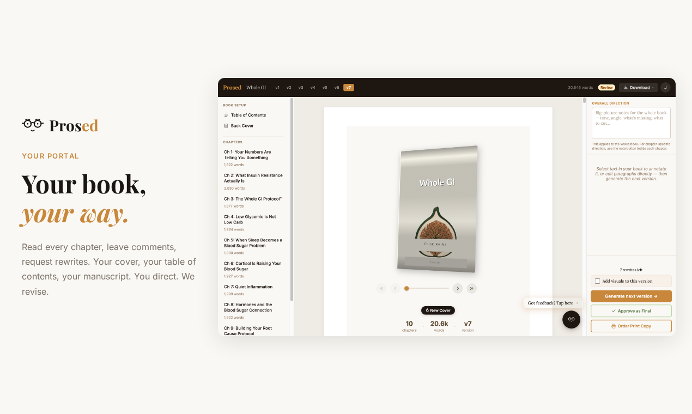

### 🎬 관련 영상
- [🎥 영상 보기](https://ph-files.imgix.net/ac2628f8-ca3d-46e8-a8ac-2d05741f0b06.jpeg?auto=format)

---

## 10. [Reader Alive](https://www.producthunt.com/products/reader-alive)
**Votes**: 107 | **도입 난이도**: 하 | **신뢰도**: 상
**Tagline**: Translate, listen to, and ask questions about your ebooks
**서비스 링크**: https://www.producthunt.com/r/6ALSW62AX34KID

**태그**: E-book, AI, Productivity, iOS, AI Tool

### 📌 이 서비스 한눈에 보기
AI를 통해 전자책을 번역, 요약 및 대화하며 읽을 수 있는 스마트 이북 리더

### 🔑 주요 기능
- 다양한 전자책 포맷(EPUB, PDF, AZW3, MOBI) 지원
- AI 기반의 챕터 번역 및 자연스러운 TTS(음성 읽기) 기능
- 내용 요약 및 책 내용에 기반한 질의응답 기능

### 🙋 사용자에게 어떤 점이 좋은가
방대한 분량의 원서를 읽을 때 핵심 내용을 빠르게 파악하고, 궁금한 점을 즉시 질문하며 능동적인 독서가 가능합니다.

### ✅ 지금 바로 써볼 기능
- 가지고 있는 EPUB/PDF 파일 가져오기
- AI 요약 기능을 통한 핵심 내용 파악하기
- 텍스트를 음성으로 변환하여 듣기

### ⚠️ 사용 전 확인할 점
- AI 답변이 원문 내용과 일치하는지 검토 필요
- 파일 포맷별 레이아웃 유지 여부 확인 필요

### 🧭 확인이 더 필요한 정보
지원하는 파일 포맷의 용량 제한이나 AI 사용량에 따른 추가 비용 정책이 명시되지 않았습니다.

### 📸 스크린샷 및 갤러리

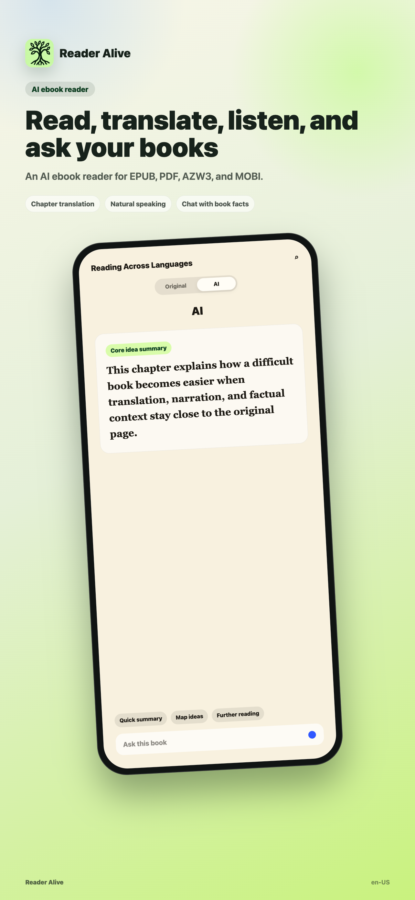
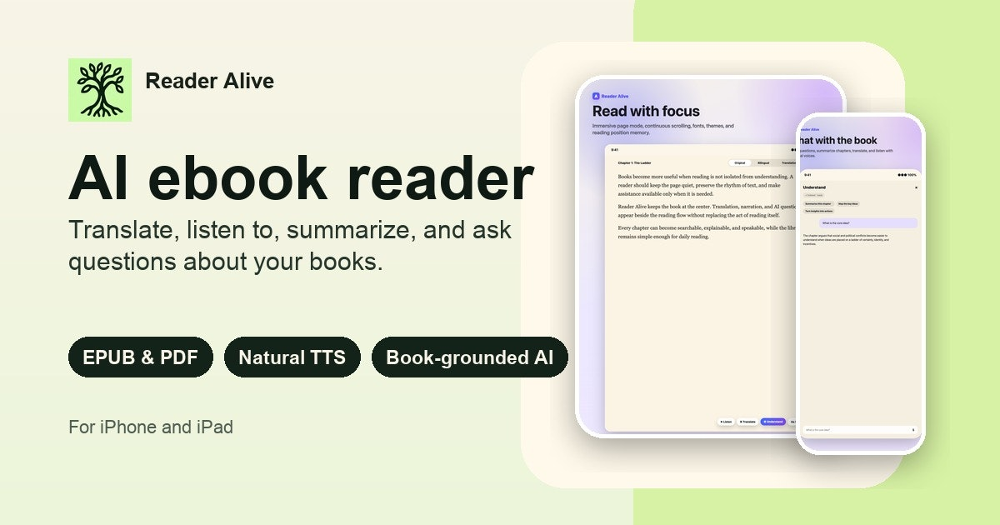

### 🎬 관련 영상
- [🎥 영상 보기](https://ph-files.imgix.net/0145c4cd-afcb-4326-98a4-b27c2f0700cc.jpeg?auto=format)

---

## 11. [SuprSend AI](https://www.producthunt.com/products/suprsend)
**Votes**: 107 | **도입 난이도**: 중 | **신뢰도**: 상
**Tagline**: AI-first platform for multi-channel notifications
**서비스 링크**: https://www.producthunt.com/r/QIPWD6QWVEKOUW

**태그**: DevTool, AI, Automation, Notification, Infrastructure, Agent, AI Tool, API

### 📌 이 서비스 한눈에 보기
개발자 워크플로우에 완벽히 통합된 AI 기반 멀티채널 알림 인프라 플랫폼

### 🔑 주요 기능
- IDE, CLI, Slack 등 개발 환경에 최적화된 6가지 AI 네이티브 인터페이스 제공
- AI 에이전트가 스키마를 이해하여 API 호출 오류(환각)를 방지하는 기능
- Git 기반의 알림 설정 관리(Config as Code) 및 다양한 AI 도구(Cursor, Claude 등) 연동

### 🙋 사용자에게 어떤 점이 좋은가
개발자가 별도의 대시보드에 접속하지 않고도 사용 중인 IDE나 Slack에서 즉시 알림 설정을 관리하고 디버깅할 수 있어 생산성이 극대화됩니다.

### ✅ 지금 바로 써볼 기능
- IDE 내 MCP Server를 통한 24가지 도구 활용해보기
- CLI를 통한 알림 설정의 코드화(Git 버전 관리) 시도하기
- Slack Agent를 활용한 실시간 알림 트리거 및 디버깅 테스트하기

### ⚠️ 사용 전 확인할 점
- AI 에이전트가 스키마를 기반으로 동작하므로 초기 스키마 정의의 정확성이 중요함
- 다양한 외부 도구(Cursor, Claude 등)와의 연동 설정이 필요함

### 🧭 확인이 더 필요한 정보
무료 티어의 구체적인 사용량 제한 및 유료 플랜의 상세 기능 범위는 확인이 필요합니다.

### 📸 스크린샷 및 갤러리
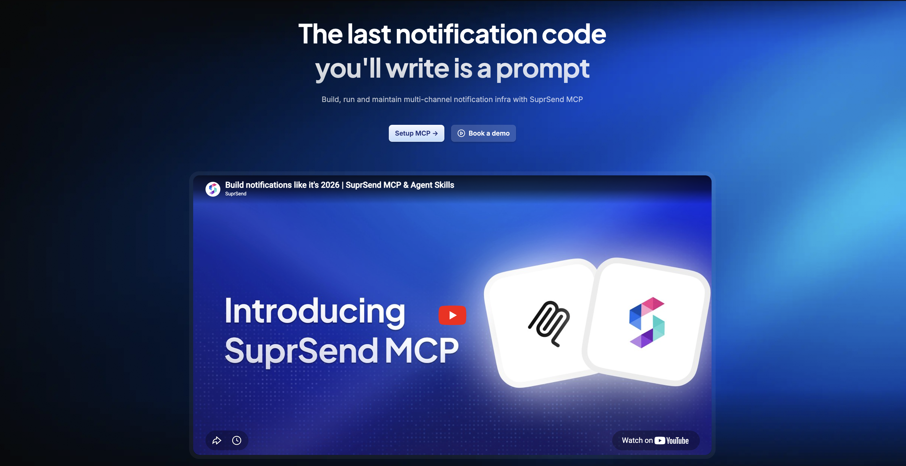
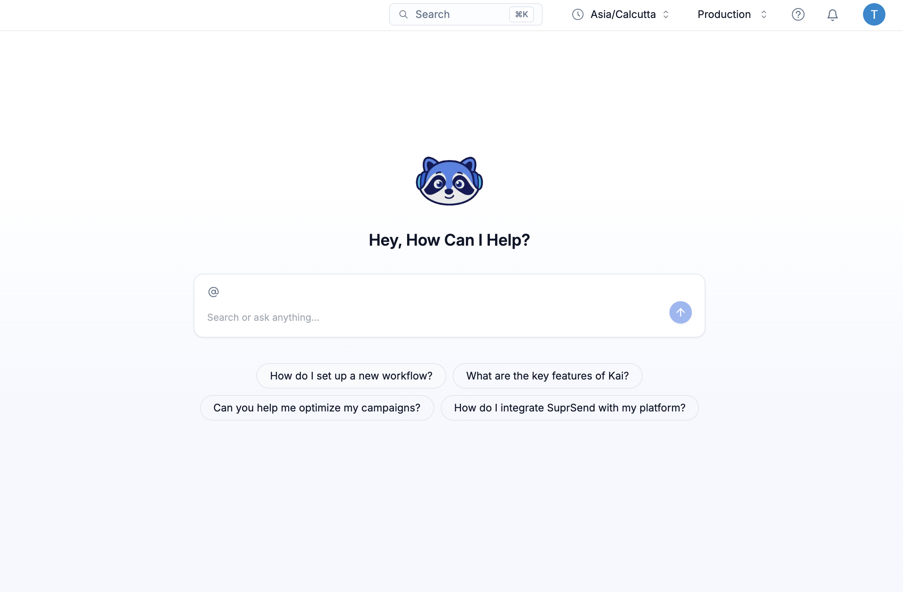
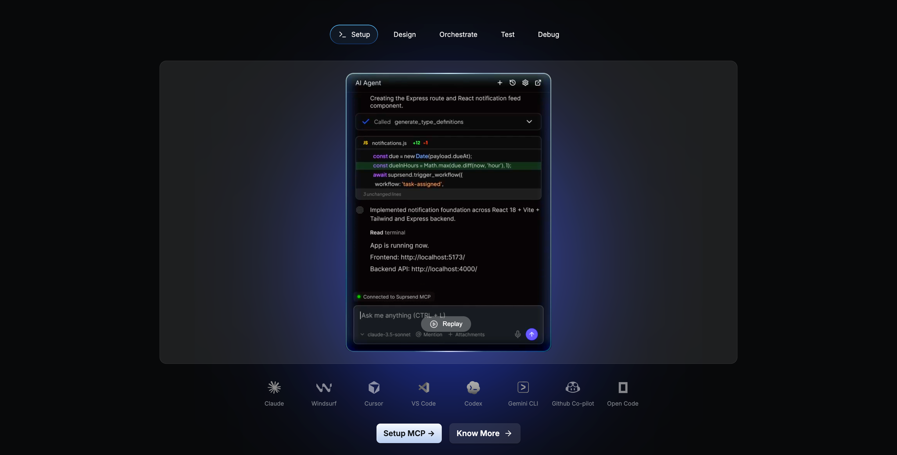

### 🎬 관련 영상
- [🎥 영상 보기](https://ph-files.imgix.net/8222469d-a598-46d7-8e70-f8c2b54bba4b.jpeg?auto=format)

---

## 12. [Zero Assist](https://www.producthunt.com/products/zero-assist)
**Votes**: 98 | **도입 난이도**: 중 | **신뢰도**: 상
**Tagline**: Real-time AI cheating detection for technical interviews
**서비스 링크**: https://www.producthunt.com/r/HP33TBMZS4ERZK

**태그**: HRTech, AI-Detection, Interview-Tool, Security, Agent, AI Tool, Chat

### 📌 이 서비스 한눈에 보기
실시간 AI 부정행위 탐지를 통해 원격 기술 면접의 신뢰성을 확보하는 솔루션

### 🔑 주요 기능
- Parakeet AI, Final Round AI 등 20개 이상의 AI 치팅 도구 실시간 탐지
- 사일런트 에이전트 배포를 통한 포렌식급 모니터링 기능
- 부정행위 감지 시 대시보드를 통한 즉각적인 알림 제공

### 🙋 사용자에게 어떤 점이 좋은가
원격 기술 면접 시 발생할 수 있는 AI 도구 활용 문제를 방지하여 채용 과정의 공정성을 높여줍니다.

### ✅ 지금 바로 써볼 기능
- 실시간 탐지 정확도 테스트
- 대시보드 알림 시스템 확인
- 지원 가능한 면접 환경(OS/브라우저) 체크

### ⚠️ 사용 전 확인할 점
- 사일런트 에이전트 설치 시 후보자의 개인정보 및 프라이버시 이슈 검토 필요
- 탐지 기술이 새로운 AI 도구의 업데이트를 얼마나 빠르게 따라가는지 확인 필요

### 🧭 확인이 더 필요한 정보
에이전트 설치 방식이 후보자의 기기에 어떤 권한을 요구하는지 구체적인 정보가 필요합니다.

### 📸 스크린샷 및 갤러리

### 🎬 관련 영상
- [🎥 영상 보기](https://ph-files.imgix.net/a813b576-8247-49f0-af59-0b56377b1887.jpeg?auto=format)

---

## 13. [buildpipe](https://www.producthunt.com/products/buildpipe)
**Votes**: 97 | **도입 난이도**: 중 | **신뢰도**: 상
**Tagline**: Compose, run and automate multi step AI developer workflows
**서비스 링크**: https://www.producthunt.com/r/RPYOXDIHCLUBYV

**태그**: DevTool, Automation, AI, Workflow, AI Tool, API

### 📌 이 서비스 한눈에 보기
로컬 환경에서 쉘 명령, AI, HTTP 요청을 조합하여 개발자 워크플로우를 자동화하는 도구

### 🔑 주요 기능
- 로컬 우선(Local-first) 방식의 보안성 높은 자동화 환경 제공
- 쉘 명령, AI 호출, HTTP 요청, 파일 작업을 결합한 멀티 스텝 파이프라인 구축
- 스케줄, 파일 변경, 웹훅을 통한 다양한 트리거 지원

### 🙋 사용자에게 어떤 점이 좋은가
개발자가 반복적으로 수행하는 로컬 작업들을 AI와 결합하여 자동화함으로써 작업 흐름을 끊김 없이 유지할 수 있습니다.

### ✅ 지금 바로 써볼 기능
- 쉘 명령과 AI를 결합한 자동화 파이프라인 생성
- 파일 변경 시 자동으로 실행되는 워크플로우 설정
- 반복적인 로컬 파일 작업 자동화 테스트

### ⚠️ 사용 전 확인할 점
- 로컬 실행 방식이므로 시스템 리소스 사용량 확인 필요
- 쉘 명령 실행 시 로컬 파일 및 시스템에 대한 권한 관리 주의

### 🧭 확인이 더 필요한 정보
로컬 환경 외의 클라우드 서비스와의 연동 범위 및 보안 정책에 대한 상세 정보가 필요합니다.

### 📸 스크린샷 및 갤러리
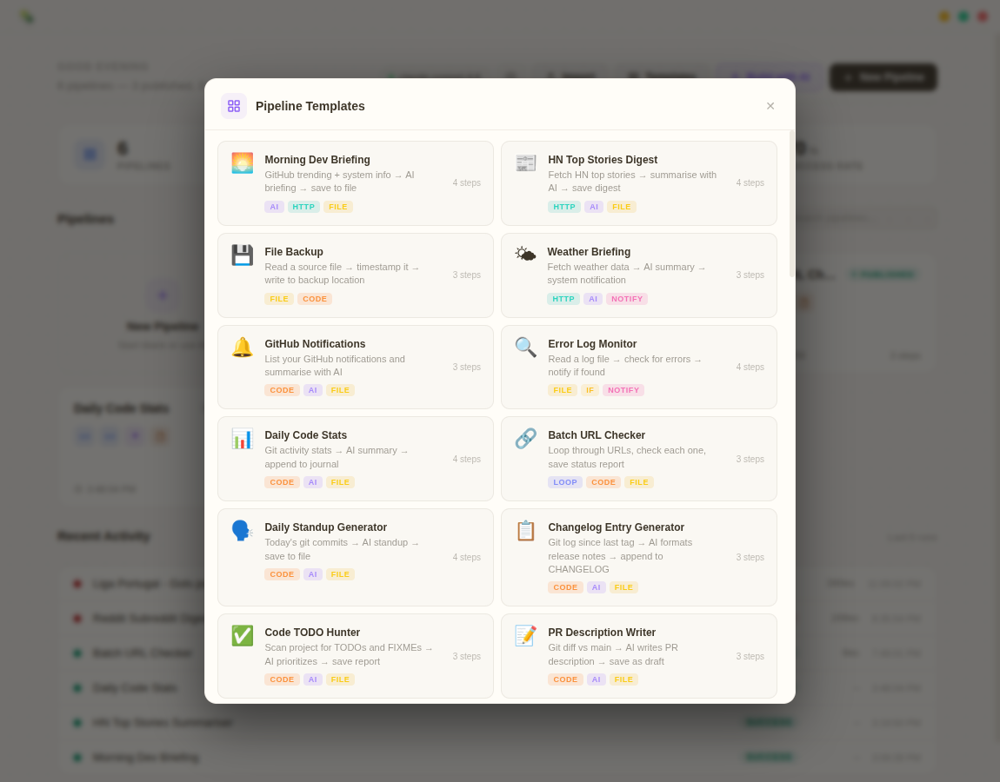
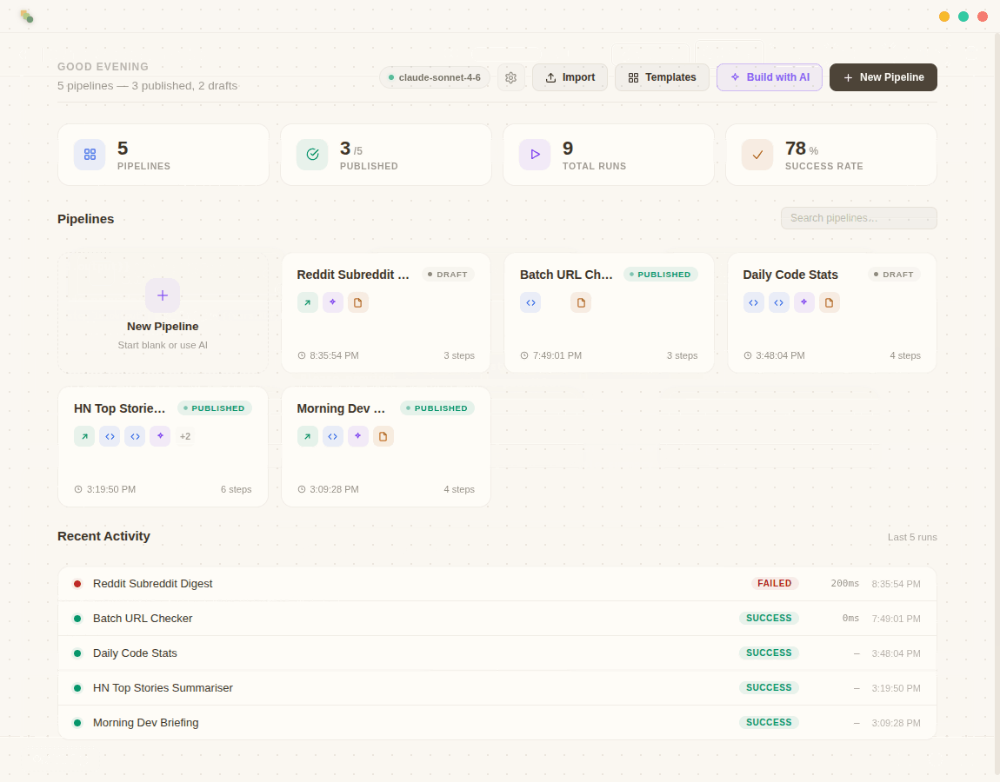
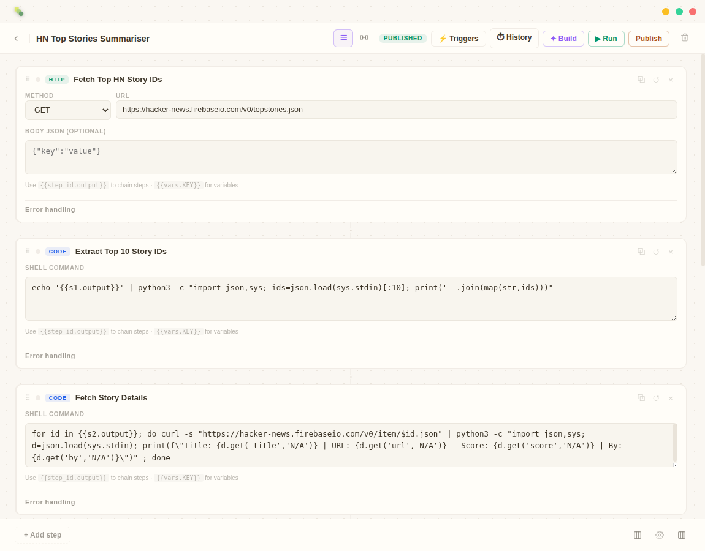

---

## 14. [motionvid.ai](https://www.producthunt.com/products/motionvid-ai)
**Votes**: 93 | **도입 난이도**: 하 | **신뢰도**: 상
**Tagline**: Your AI Motion & Video Editor
**서비스 링크**: https://www.producthunt.com/r/QEVQT23QAVRUFN

**태그**: AI Video, Content Creation, Automation, Motion Graphics, AI Tool, Video, Design

### 📌 이 서비스 한눈에 보기
디자인 기술 없이도 나레이션과 음악이 포함된 애니메이션 영상을 순식간에 만드는 AI 영상 편집기

### 🔑 주요 기능
- AI 기반의 자동 애니메이션 영상 생성 기능
- 나레이션 및 배경음악 자동 포함
- 전문적인 디자인 기술이 필요 없는 직관적인 워크플로우

### 🙋 사용자에게 어떤 점이 좋은가
영상 편집 숙련도가 낮은 사용자도 아이디어만 있으면 고품질의 모션 영상을 빠르게 제작하여 콘텐츠를 생산할 수 있습니다.

### ✅ 지금 바로 써볼 기능
- 텍스트를 활용한 애니메이션 생성 테스트
- AI 생성 나레이션 및 음악 조합 확인
- 제작된 영상의 스타일 및 품질 검토

### ⚠️ 사용 전 확인할 점
- 세부적인 수동 편집 기능의 제한 가능성
- AI 생성 결과물의 창의적 제어 범위 확인 필요

### 🧭 확인이 더 필요한 정보
구체적인 영상 길이 제한이나 출력 해상도, 저작권 정책에 대한 정보가 명시되지 않았습니다.

### 📸 스크린샷 및 갤러리
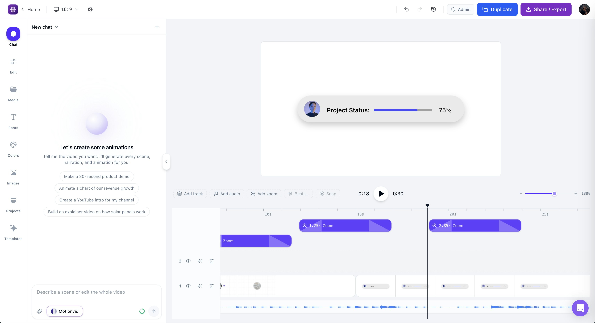
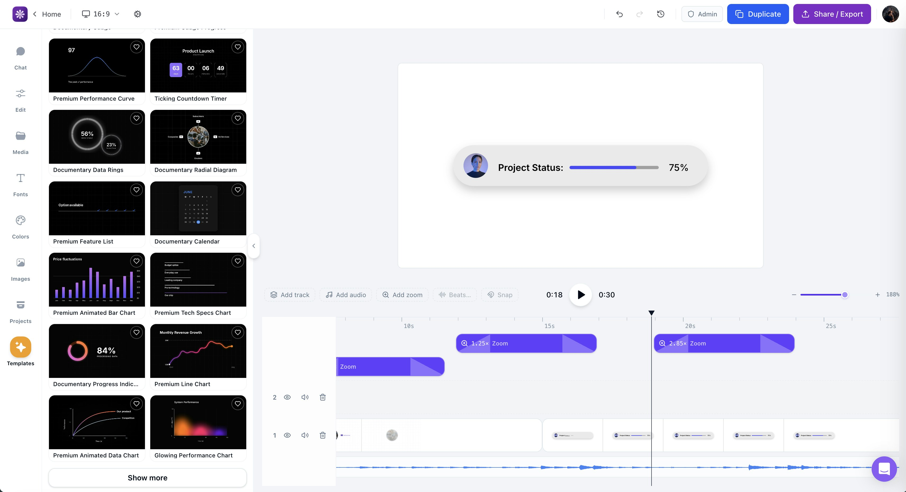
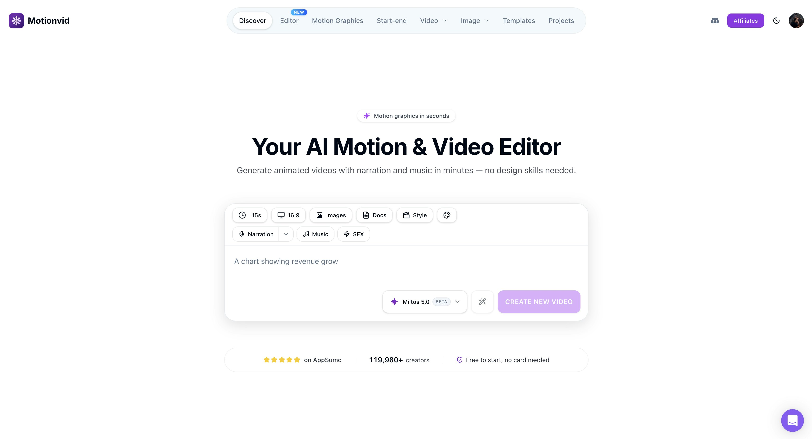

### 🎬 관련 영상
- [🎥 영상 보기](https://ph-files.imgix.net/46a7c754-9bce-4ec1-a22a-7743d3982da8.jpeg?auto=format)

---

## 15. [JAMtime.ai](https://www.producthunt.com/products/jamtime-ai)
**Votes**: 91 | **도입 난이도**: 중 | **신뢰도**: 상
**Tagline**: Just tell your guitar pedal how to sound
**서비스 링크**: https://www.producthunt.com/r/AULUNO7MPHWPFG

**태그**: MusicTech, AI, AudioPlugin, DSP, Workflow, Automation, AI Tool, Chat, Design

### 📌 이 서비스 한눈에 보기
자연어 명령으로 커스텀 DSP 이펙트 페달을 설계하고 VST/AU 플러그인으로 변환하는 AI 워크플로우

### 🔑 주요 기능
- 대화형 AI를 통한 직관적인 사운드 디자인 (단순한 표현부터 기술적인 명령까지 지원)
- 생성형 오디오가 아닌 실제 DSP 그래프를 작성하는 정교한 방식
- 설계한 사운드를 Mac, Windows, Linux용 VST/AU 플러그인으로 즉시 활용 가능

### 🙋 사용자에게 어떤 점이 좋은가
복잡한 신호 처리 지식 없이도 원하는 사운드를 정교하게 설계할 수 있으며, 결과물을 DAW에서 바로 사용할 수 있어 작업 효율이 극대화됩니다.

### ✅ 지금 바로 써볼 기능
- 일상적인 언어로 사운드 톤 조절해보기
- 기술적인 용어를 사용하여 복합적인 이펙트 체인 구축하기
- 생성된 플러그인을 DAW에 설치하여 실사용 테스트하기

### ⚠️ 사용 전 확인할 점
- AI가 생성한 DSP 그래프의 복잡도에 따른 시스템 리소스 사용량 확인 필요
- 사용자의 의도와 실제 출력되는 사운드 간의 일치 여부 검증 필요

### 🧭 확인이 더 필요한 정보
현재 제공되는 플러그인의 구체적인 CPU 점유율 및 DAW 호환성 범위에 대한 상세 정보가 필요합니다.

### 📸 스크린샷 및 갤러리
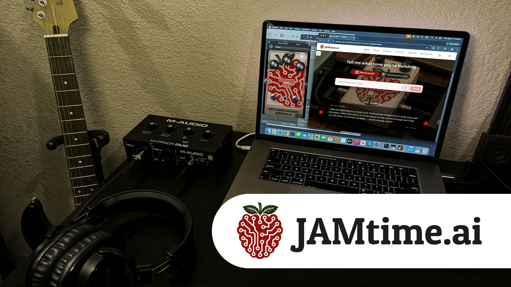
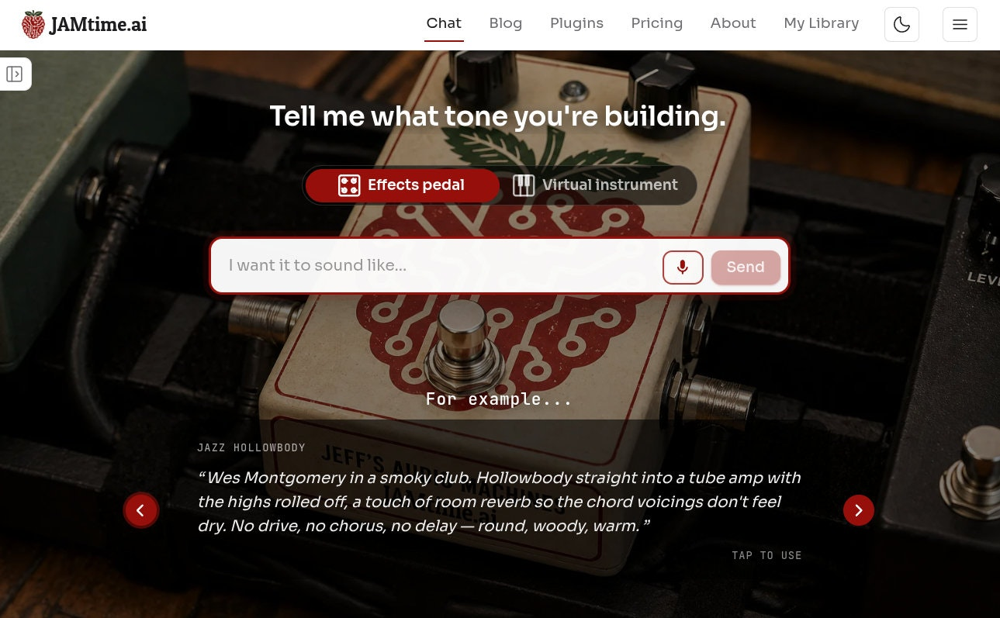
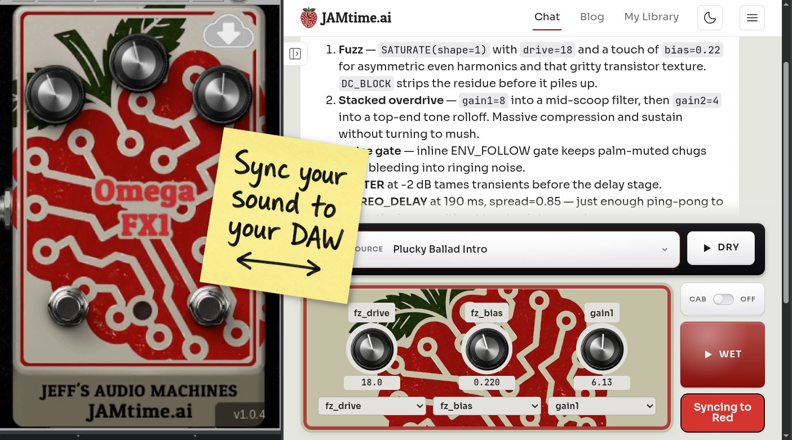

### 🎬 관련 영상
- [🎥 영상 보기](https://ph-files.imgix.net/dea33ef2-fe0a-4999-ab1a-4f55207c8ecf.jpeg?auto=format)

---

## 16. [DCP](https://www.producthunt.com/products/dcp)
**Votes**: 84 | **도입 난이도**: 중 | **신뢰도**: 상
**Tagline**: Give your AI agents encrypted permission and keys
**서비스 링크**: https://www.producthunt.com/r/6KHRSILQIS5A3F

**태그**: Security, AI-Agents, DevTool, Automation, Agent, AI Tool, Prompting, API

### 📌 이 서비스 한눈에 보기
AI 에이전트의 보안 사고를 방지하기 위한 암호화된 권한 및 키 관리 솔루션

### 🔑 주요 기능
- 민감한 API 키와 지갑 정보를 로컬에 암호화하여 저장
- 에이전트별로 필요한 최소 권한(Scope)만 부여하는 세밀한 제어
- 텔레그램이나 앱을 통한 실시간 승인 및 즉각적인 권한 회수 기능

### 🙋 사용자에게 어떤 점이 좋은가
AI 에이전트에게 직접적인 키를 노출하지 않고도 안전하게 작업을 위임할 수 있어, 프롬프트 주입이나 도구 탈취로 인한 자산 유출 위험을 방지합니다.

### ✅ 지금 바로 써볼 기능
- Claude, Cursor 등 사용 중인 AI 도구와 연동 테스트
- 에이전트별 최소 권한 설정 및 일일 예산 한도 설정
- 텔레그램을 통한 실시간 승인 워크플로우 구축

### ⚠️ 사용 전 확인할 점
- 로컬 환경에 저장된 암호화 키의 관리 책임이 사용자에게 있음
- 에이전트의 작업 흐름 중 승인 대기 시간이 발생할 수 있음

### 🧭 확인이 더 필요한 정보
현재 제공되는 다양한 AI 도구(Claude, Cursor 등)와의 구체적인 설치 및 연동 방식에 대한 기술적 상세 정보 확인이 필요합니다.

### 📸 스크린샷 및 갤러리
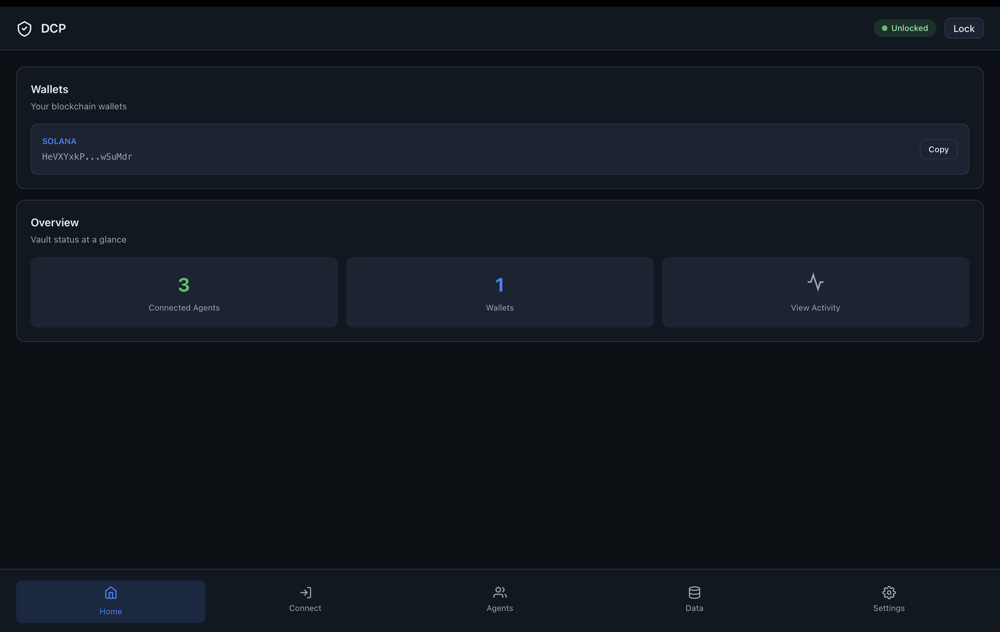
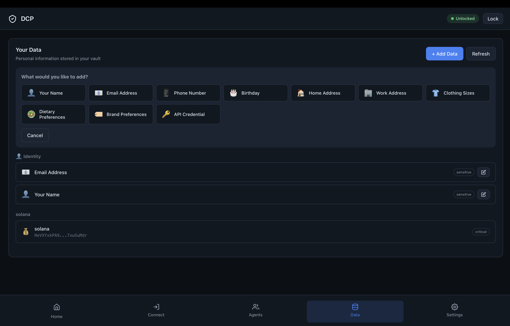
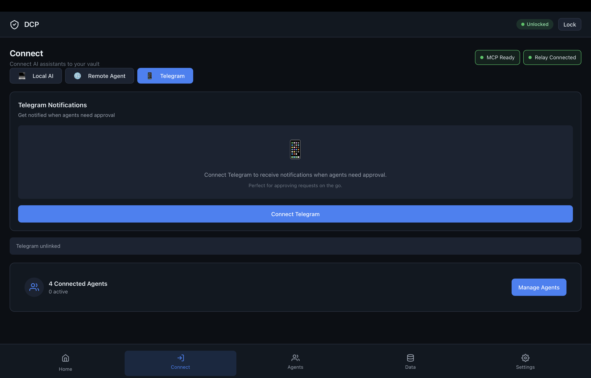

### 🎬 관련 영상
- [🎥 영상 보기](https://ph-files.imgix.net/bfb5ad38-e0d7-476d-bfe8-dc1332dd4827.gif?auto=format)

---

## 17. [Shuffle Design CLI ](https://www.producthunt.com/products/shuffle-design-cli)
**Votes**: 84 | **도입 난이도**: 중 | **신뢰도**: 상
**Tagline**: Multi-AI CLI for building and redesigning websites
**서비스 링크**: https://www.producthunt.com/r/3V5MS6LKATYAHQ

**태그**: DevTool, AI, Automation, WebDesign, CLI, AI Tool, Design

### 📌 이 서비스 한눈에 보기
터미널에서 즉시 웹사이트를 생성하고 디자인을 변경할 수 있는 멀티 AI CLI 도구

### 🔑 주요 기능
- 터미널 환경에서 직접 랜딩 페이지 생성 및 웹사이트 리디자인 가능
- 다양한 AI 모델을 활용한 디자인 워크플로우 자동화
- 개발 및 디자인 작업 속도 극대화

### 🙋 사용자에게 어떤 점이 좋은가
터미널을 벗어나지 않고도 AI를 통해 웹 디자인 작업을 자동화하여 개발 생산성을 높일 수 있습니다.

### ✅ 지금 바로 써볼 기능
- CLI 설치 후 기본 랜딩 페이지 생성 테스트
- 기존 웹사이트 리디자인 기능 실행
- 다양한 AI 모델 연동 및 결과물 비교

### ⚠️ 사용 전 확인할 점
- CLI 환경에 익숙한 사용자에게 최적화되어 있음
- AI 생성 결과물의 디자인 품질 및 코드 정교함 확인 필요

### 🧭 확인이 더 필요한 정보
지원하는 구체적인 프레임워크 및 프로그래밍 언어 범위에 대한 정보가 필요합니다.

### 📸 스크린샷 및 갤러리
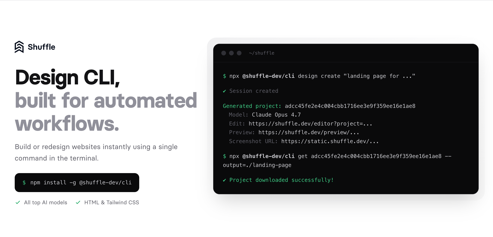
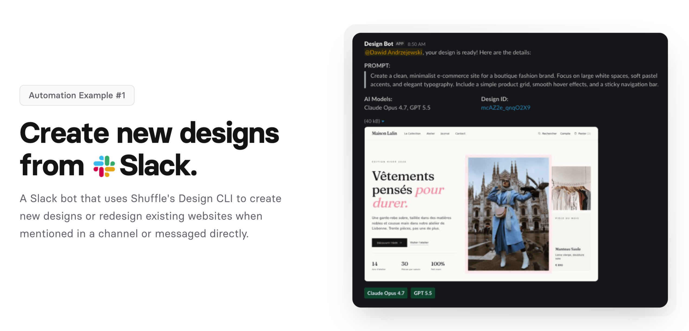
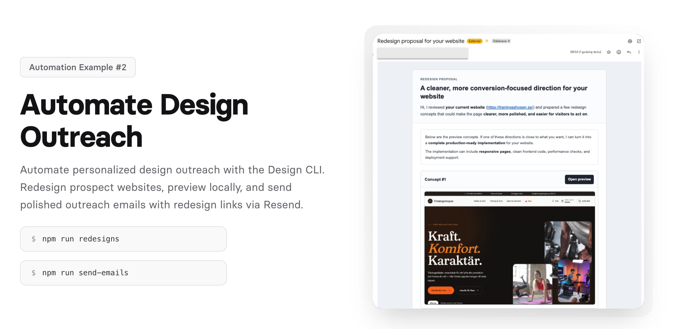

---

## 18. [Our Stories](https://www.producthunt.com/products/our-stories)
**Votes**: 80 | **도입 난이도**: 하 | **신뢰도**: 상
**Tagline**: A storytelling tool for raising bilingual kids
**서비스 링크**: https://www.producthunt.com/r/GXF4BURO3XJRSH

**태그**: Family, Education, Storytelling, Multilingual, AI Tool

### 📌 이 서비스 한눈에 보기
아이의 이중 언어 발달과 가족 간의 유대감을 돕는 맞춤형 멀티링구얼 스토리텔링 도구

### 🔑 주요 기능
- 가족 맞춤형 다국어 스토리 생성 기능
- 멀리 떨어진 조부모 등 가족이 참여하는 스토리텔링
- 아이의 모국어 노출을 위한 오디오 내레이션 및 삽화 포함 소장용 도서 제작

### 🙋 사용자에게 어떤 점이 좋은가
아이에게 자연스러운 이중 언어 환경을 제공하며, 멀리 있는 가족과도 정서적 교감을 유지할 수 있는 특별한 추억을 만들어줍니다.

### ✅ 지금 바로 써볼 기능
- 가족만의 맞춤형 다국어 이야기 만들기
- 내레이션 기능으로 아이에게 이야기 들려주기
- 아이의 모험을 담은 삽화 포함 소장용 책 제작하기

### ⚠️ 사용 전 확인할 점
- 디지털 도구로서의 스크린 타임 관리 필요
- 물리적 도서 제작 시 배송 및 비용 발생 가능성

### 🧭 확인이 더 필요한 정보
물리적인 소장용 책 제작 시의 구체적인 비용과 배송 정책에 대한 정보가 필요합니다.

### 📸 스크린샷 및 갤러리
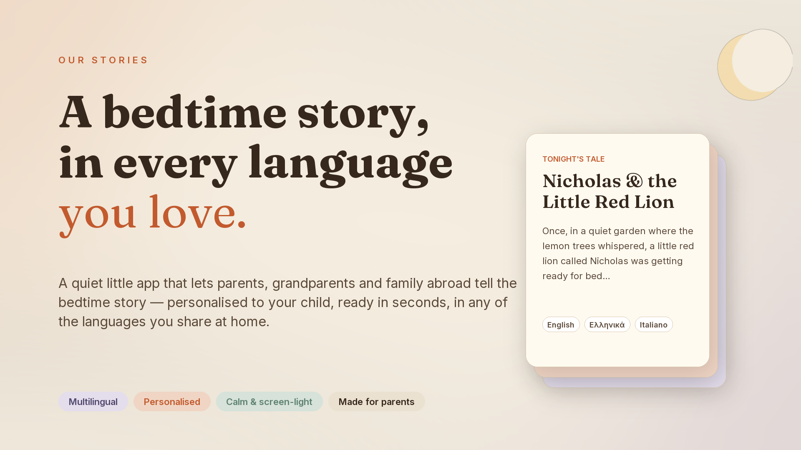
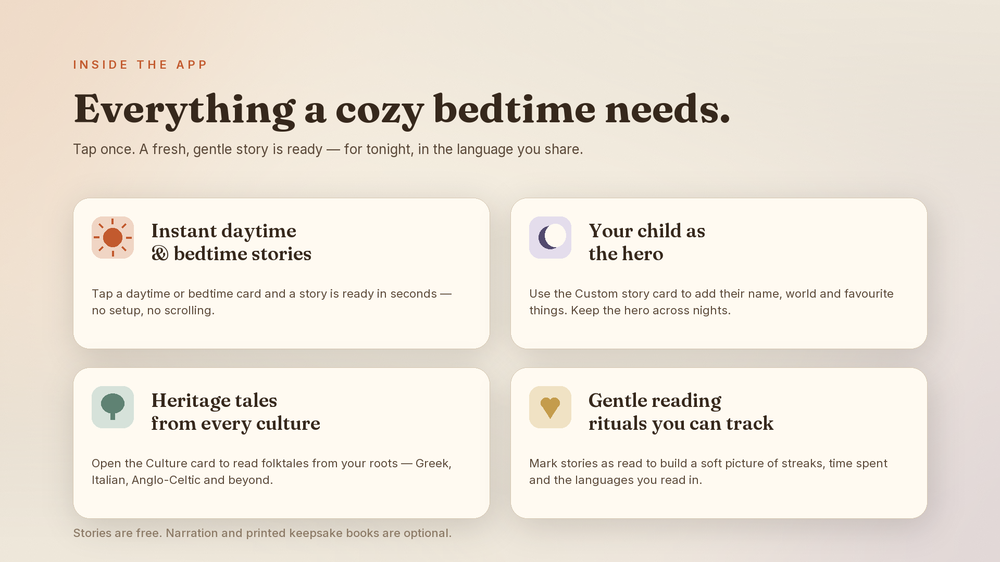
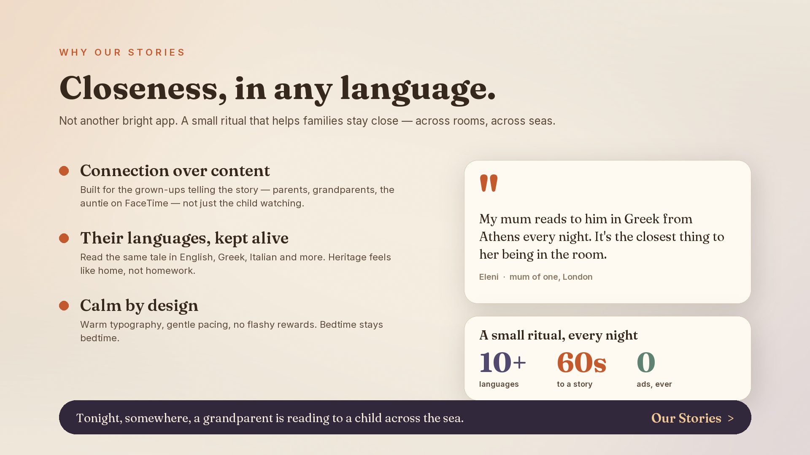

### 🎬 관련 영상
- [🎥 영상 보기](https://ph-files.imgix.net/b585aa2c-8d02-4aeb-946f-c45a72dce48d.jpeg?auto=format)

---

## 19. [Faby](https://www.producthunt.com/products/faby)
**Votes**: 77 | **도입 난이도**: 중 | **신뢰도**: 상
**Tagline**: Your virtual coworker with its own computer living in Slack
**서비스 링크**: https://www.producthunt.com/r/K7S22VM5P6ITIK

**태그**: Automation, AI Agent, DevTool, Productivity

### 📌 이 서비스 한눈에 보기
Slack 내에서 독립적인 컴퓨팅 환경을 갖추고 업무를 완결하는 가상 동료

### 🔑 주요 기능
- Slack을 통한 간편한 인터페이스 제공
- 자체 브라우저 및 코딩 환경을 갖춘 가상 워크스테이션
- 기존 기업 스택에 연결하여 엔드 투 엔드 작업 수행

### 🙋 사용자에게 어떤 점이 좋은가
별도의 환경 구축 없이 Slack만으로 복잡한 업무를 자동화하고 실행할 수 있습니다.

### ✅ 지금 바로 써볼 기능
- Slack 워크스페이스에 Faby 연동하기
- 기존 업무 프로세스 자동화 테스트하기
- Faby의 코딩 및 브라우징 기능 활용해보기

### ⚠️ 사용 전 확인할 점
- 기업 내부 데이터 및 보안 정책 준수 여부 확인 필요
- 기존 사내 툴과의 연동 범위 및 권한 설정 확인

### 🧭 확인이 더 필요한 정보
구체적인 보안 프로토콜 및 기업용 데이터 처리 방식에 대한 정보가 추가로 필요합니다.

### 📸 스크린샷 및 갤러리
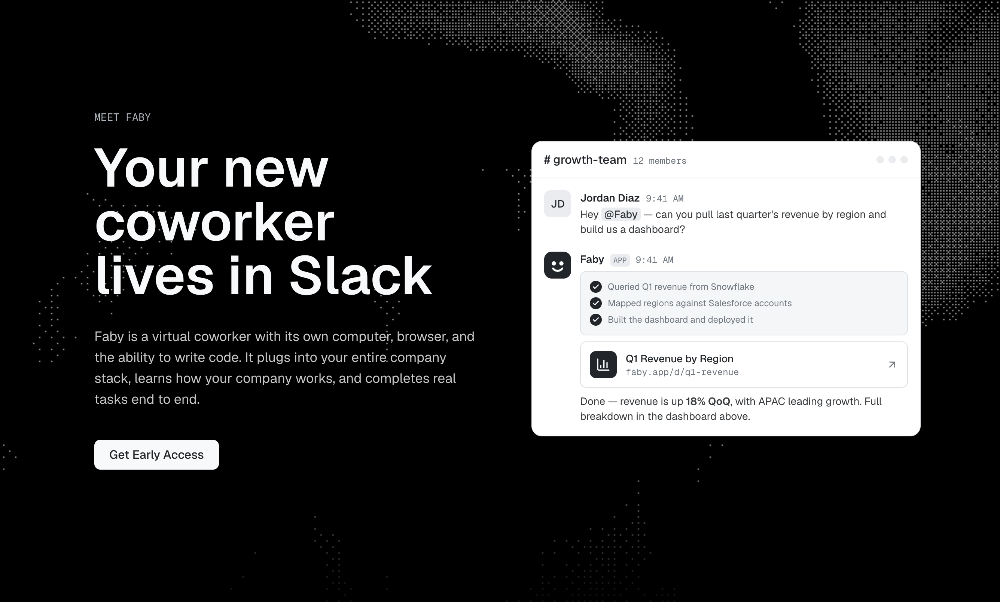
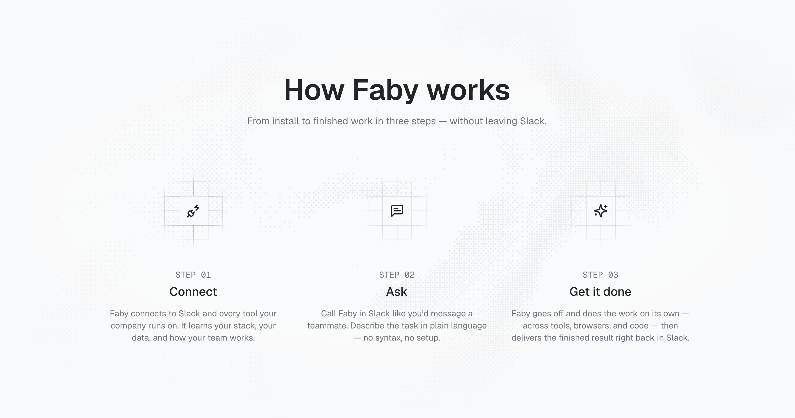
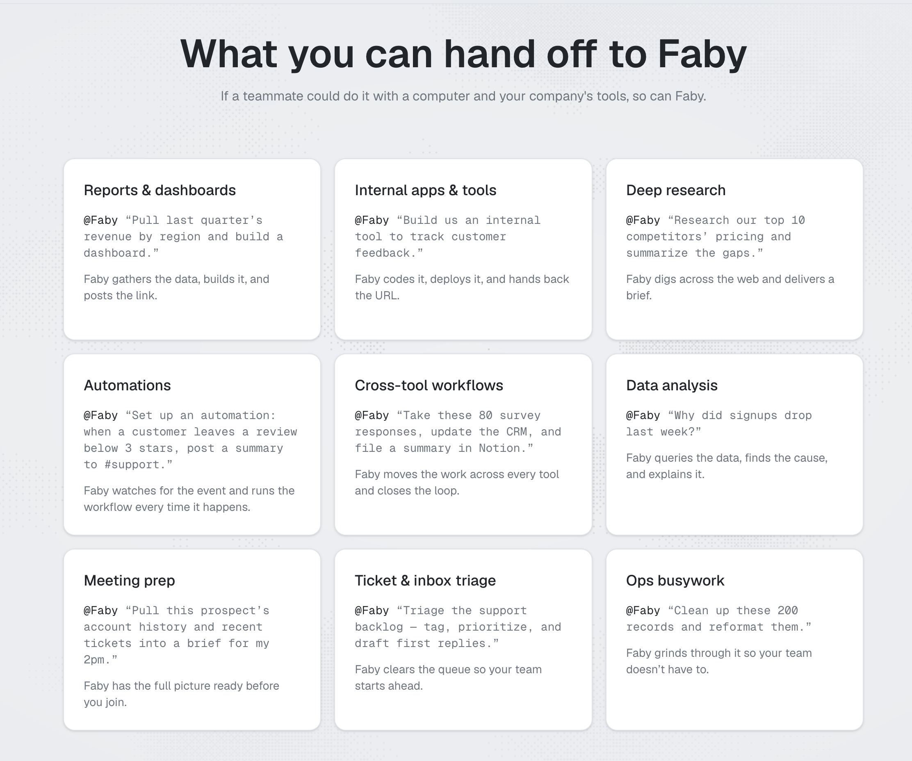

### 🎬 관련 영상
- [🎥 영상 보기](https://ph-files.imgix.net/a3a94018-5347-4991-8885-bb0a88f39952.jpeg?auto=format)

---

## 20. [Shroomie](https://www.producthunt.com/products/shroomie)
**Votes**: 76 | **도입 난이도**: 하 | **신뢰도**: 상
**Tagline**: AI-powered news made fun and habit-forming
**서비스 링크**: https://www.producthunt.com/r/USVER2TXT435HR

**태그**: AI, News, Gamification, Productivity, AI Tool

### 📌 이 서비스 한눈에 보기
뉴스 읽기를 게임처럼 즐겁게 만드는 AI 기반 인터랙티브 뉴스 앱

### 🔑 주요 기능
- AI가 뉴스 소싱부터 시각 자료 생성, 개인화까지 자동 처리
- 뉴스 읽기를 통해 버섯 정원을 가꾸는 게이미피케이션 요소 도입
- 짧고 간결한 인터랙티브 방식의 뉴스 소비 경험 제공

### 🙋 사용자에게 어떤 점이 좋은가
매일 쏟아지는 뉴스를 부담 없이 읽을 수 있도록 게임 요소를 결합하여, 뉴스 소비를 하나의 즐거운 습관으로 만들어 줍니다.

### ✅ 지금 바로 써볼 기능
- 개인화된 뉴스 피드 확인하기
- 인터랙티브 뉴스 콘텐츠 읽어보기
- 매일 뉴스 읽으며 버섯 정원 키우기

### ⚠️ 사용 전 확인할 점
- AI가 생성한 뉴스 콘텐츠의 사실 관계 확인 필요
- 뉴스 요약 과정에서 정보의 깊이나 맥락이 생략될 가능성

### 🧭 확인이 더 필요한 정보
AI가 생성하는 시각 자료 및 뉴스 요약의 정확도와 신뢰성을 확인해야 합니다.

### 📸 스크린샷 및 갤러리
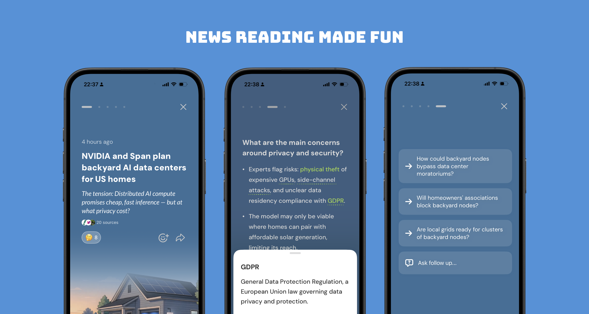
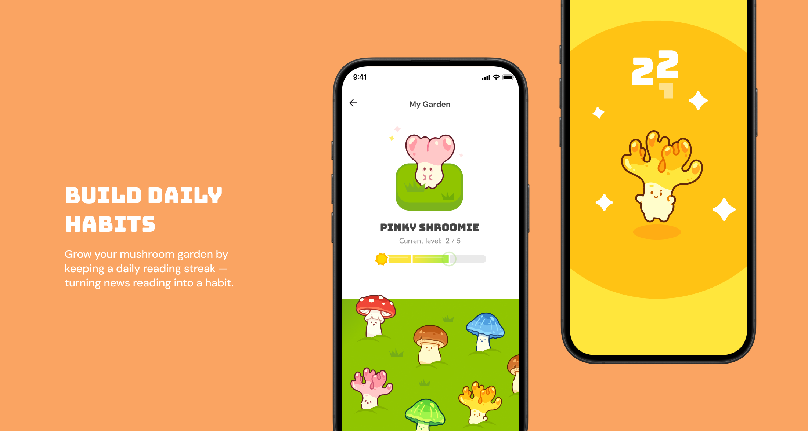

### 🎬 관련 영상
- [🎥 영상 보기](https://ph-files.imgix.net/a4510389-ca58-4475-9a95-64c95da40b80.jpeg?auto=format)

---

## 21. [whosthere](https://www.producthunt.com/products/whosthere)
**Votes**: 74 | **도입 난이도**: 하 | **신뢰도**: 상
**Tagline**: Local Area Network discovery tool with an interactive TUI
**서비스 링크**: https://www.producthunt.com/r/BQGOQKQXNFAXQN

**태그**: DevTool, Networking, TUI, Go

### 📌 이 서비스 한눈에 보기
터미널 환경에서 직관적으로 로컬 네트워크를 탐색할 수 있는 TUI 기반 도구

### 🔑 주요 기능
- Go 언어로 작성된 고성능 LAN 디스커버리 도구
- 대화형 TUI(Terminal User Interface)를 통한 직관적인 네트워크 탐색
- 로컬 네트워크 내 장치 식별 및 구조 파악 기능

### 🙋 사용자에게 어떤 점이 좋은가
복잡한 명령어를 일일이 입력할 필요 없이 터미널 내에서 시각적으로 네트워크 상태를 한눈에 파악할 수 있습니다.

### ✅ 지금 바로 써볼 기능
- TUI 인터페이스를 통한 네트워크 장치 스캔
- 연결된 장치들의 상세 정보 탐색
- 네트워크 토폴로지 이해

### ⚠️ 사용 전 확인할 점
- 터미널 환경에 익숙하지 않은 사용자에게는 초기 진입 장벽이 있을 수 있음
- 네트워크 스캔 시 권한 설정이 필요할 수 있음

### 🧭 확인이 더 필요한 정보
상세한 스캔 속도나 특정 OS(Windows/macOS/Linux)에서의 호환성 범위는 명시되지 않았습니다.

### 📸 스크린샷 및 갤러리
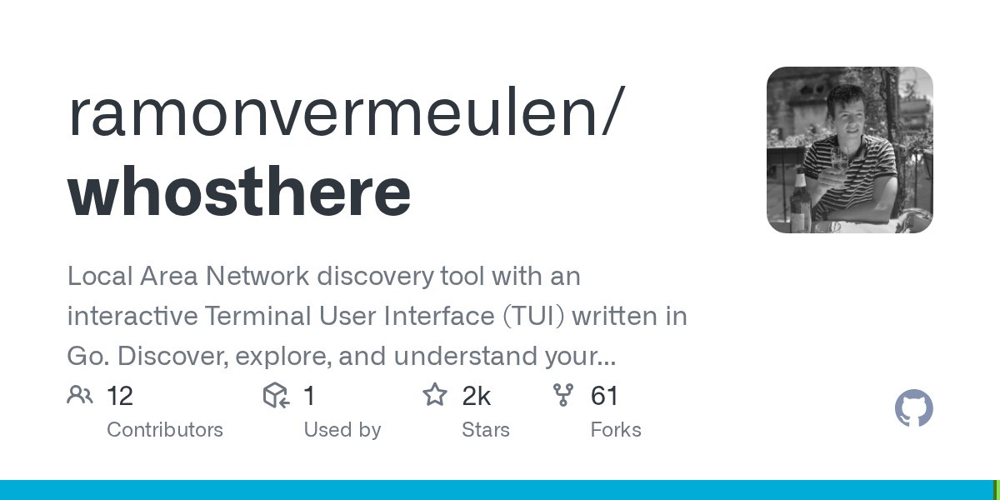
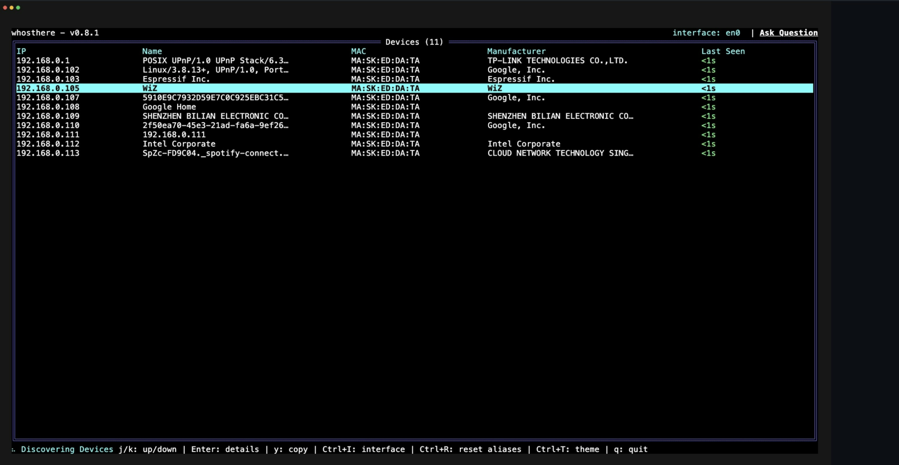
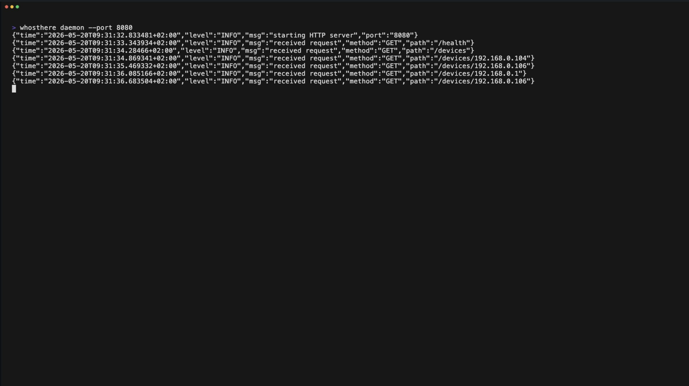

---

## 22. [DecisionBox for Databricks](https://www.producthunt.com/products/decisionbox)
**Votes**: 72 | **도입 난이도**: 하 | **신뢰도**: 상
**Tagline**: Connect DecisionBox to your Databricks to validate findings
**서비스 링크**: https://www.producthunt.com/r/HEQGYGLQDHWMP6

**태그**: DataEngineering, Automation, Databricks, AI-Agent, OpenSource, Agent, AI Tool, Prompting

### 📌 이 서비스 한눈에 보기
Databricks 데이터를 기반으로 스스로 SQL을 작성하고 인사이트를 검증하여 우선순위가 지정된 백로그를 생성하는 자동화 에이전트

### 🔑 주요 기능
- 사용자 프롬프트 없이 스스로 SQL을 작성하고 데이터 검증 수행
- Unity Catalog 범위 내의 읽기 전용(Read-only) 보안 연결 지원
- Serverless, Pro, Classic SQL 웨어하우스와 모두 호환

### 🙋 사용자에게 어떤 점이 좋은가
데이터 분석가가 일일이 쿼리를 짜고 검증하는 번거로움 없이, 데이터 기반의 실행 가능한 작업 목록을 자동으로 받아볼 수 있습니다.

### ✅ 지금 바로 써볼 기능
- Databricks 워크스페이스 연결 및 권한 설정
- 자동 생성된 SQL 쿼리 및 검증 로직 확인
- 생성된 우선순위 백로그 검토

### ⚠️ 사용 전 확인할 점
- 읽기 전용 권한이므로 데이터 수정이나 쓰기 작업은 불가능함
- AGPL v3 라이선스 정책에 따른 오픈소스 활용 범위 확인 필요

### 🧭 확인이 더 필요한 정보
에이전트가 생성하는 SQL의 복잡도와 대규모 데이터셋에서의 처리 성능에 대한 구체적인 정보가 필요합니다.

### 📸 스크린샷 및 갤러리
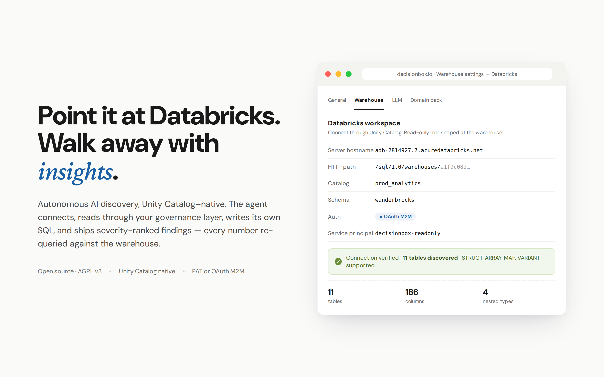
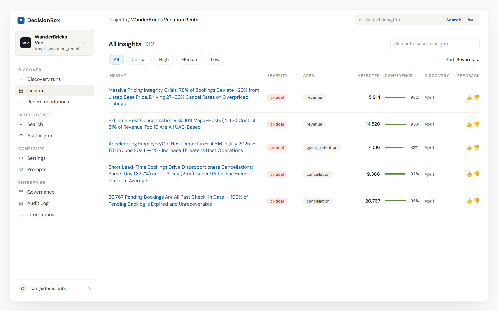
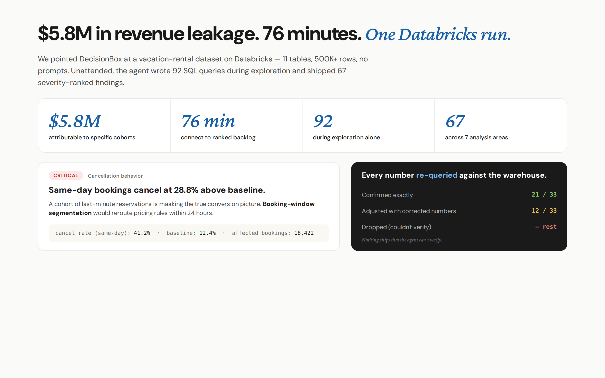

---

## 23. [Smart Miles](https://www.producthunt.com/products/smart-miles)
**Votes**: 70 | **도입 난이도**: 하 | **신뢰도**: 상
**Tagline**: Automatic trip tracking for tax-ready exports
**서비스 링크**: https://www.producthunt.com/r/QNHFIJ7YN4XSTA

**태그**: Automation, Tax-Tech, Productivity

### 📌 이 서비스 한눈에 보기
세금 공제를 놓치지 않도록 자동으로 주행 기록을 관리하고 리포트를 생성하는 서비스

### 🔑 주요 기능
- 자동 주행 기록 추적 기능
- 스마트한 주행 유형 분류
- 세무 신고용 데이터 내보내기 지원

### 🙋 사용자에게 어떤 점이 좋은가
매번 수동으로 기록할 필요 없이 주행 데이터를 자동으로 수집하여, 세금 공제 혜택을 놓치지 않게 도와줍니다.

### ✅ 지금 바로 써볼 기능
- 자동 추적 기능 활성화하기
- 주행 기록 분류 정확도 확인하기
- 세무용 데이터 내보내기 테스트하기

### ⚠️ 사용 전 확인할 점
- 백그라운드 위치 추적에 따른 배터리 소모 가능성
- 수동 입력이 필요한 예외 상황 발생 여부

### 🧭 확인이 더 필요한 정보
지원하는 국가의 세법 규정 및 구체적인 데이터 내보내기 형식을 확인해야 합니다.

### 📸 스크린샷 및 갤러리
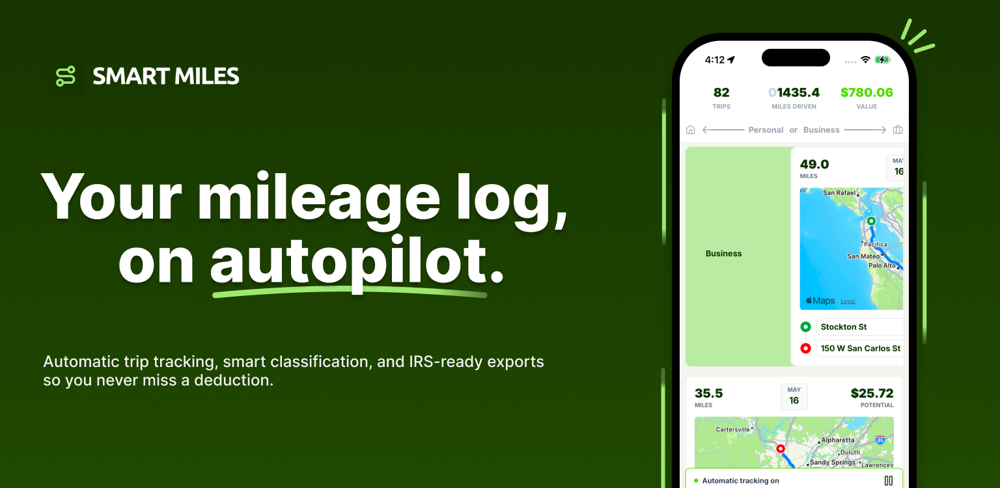
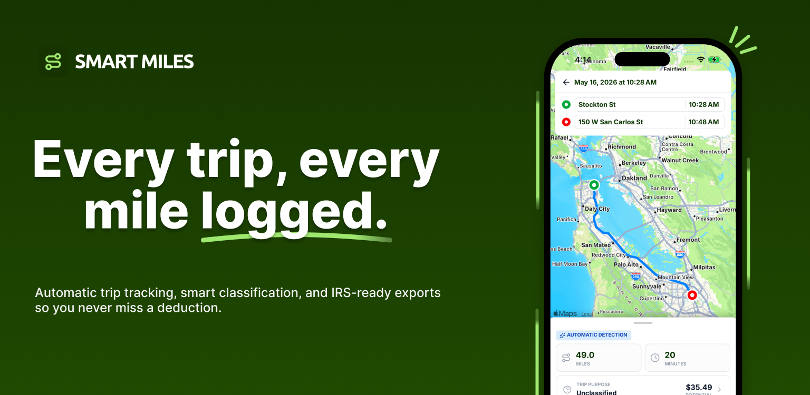
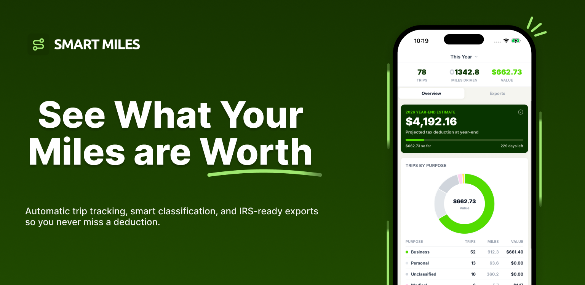

---

## 24. [AGG Identify](https://www.producthunt.com/products/agg-identify)
**Votes**: 68 | **도입 난이도**: 중 | **신뢰도**: 상
**Tagline**: A lightweight, secure streamlined OIDC and OAuth2 provider
**서비스 링크**: https://www.producthunt.com/r/BXPG2KV4FJT4RR

**태그**: DevTool, Security, Authentication, SaaS, Design

### 📌 이 서비스 한눈에 보기
개발자가 직접 제어하고 관리할 수 있는 가볍고 강력한 OIDC/OAuth2 인증 솔루션

### 🔑 주요 기능
- 불필요한 기능이 제거된 경량화된 OIDC Identity Provider
- PKCE 흐름 및 세션 관리 등 강력한 보안 및 제어 기능 제공
- 개발자 친화적인 포털과 직관적인 통합 환경

### 🙋 사용자에게 어떤 점이 좋은가
복잡한 엔터프라이즈 솔루션 대신, 개발자가 아키텍처에 맞춰 인증 레이어를 직접 표준화하고 제어할 수 있습니다.

### ✅ 지금 바로 써볼 기능
- 개발자 포털을 통한 인증 흐름 테스트
- 애플리케이션에 PKCE 기반 인증 연동
- 기기 추적 및 세션 관리 기능 확인

### ⚠️ 사용 전 확인할 점
- 엔터프라이즈급 솔루션 대비 기능 범위가 특정 목적에 집중되어 있을 수 있음
- 직접적인 제어가 필요한 만큼 초기 설정 및 아키텍처 설계 역량 필요

### 🧭 확인이 더 필요한 정보
구체적인 확장성 및 대규모 트래픽 처리 성능에 대한 정보가 명시되지 않았습니다.

### 📸 스크린샷 및 갤러리
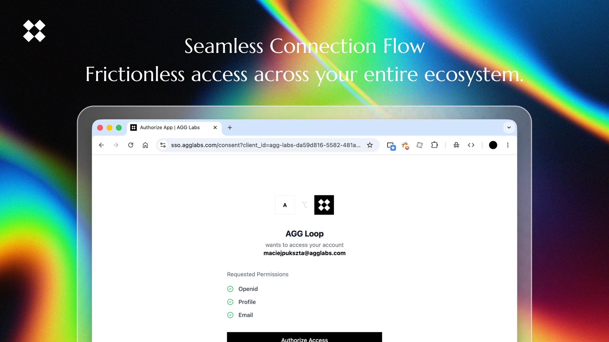
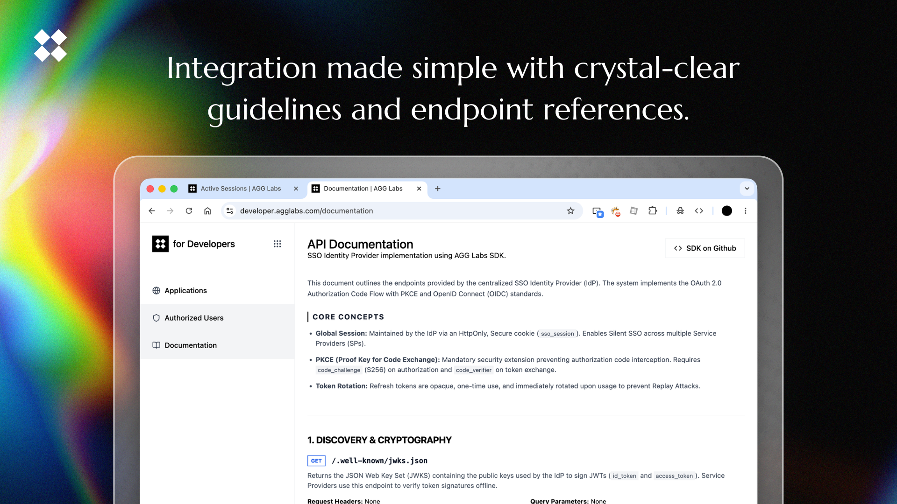
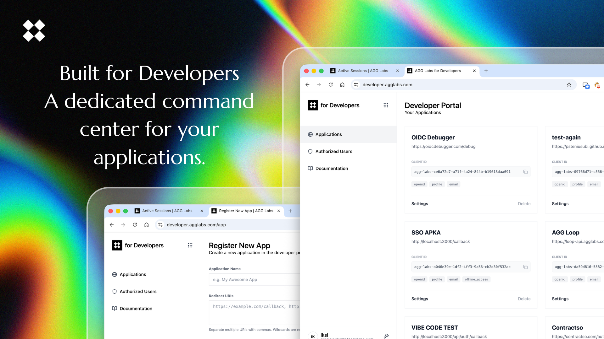

---

## 25. [HelioPeak](https://www.producthunt.com/products/heliopeak)
**Votes**: 68 | **도입 난이도**: 하 | **신뢰도**: 상
**Tagline**: Solar monitoring for pvoutput on every Apple device.
**서비스 링크**: https://www.producthunt.com/r/SOX4NKOF4AFVTK

**태그**: Solar, Dashboard, Apple, Data Visualization

### 📌 이 서비스 한눈에 보기
Apple 기기에서 PVOutput 데이터를 아름답고 편리하게 모니터링하는 태양광 관리 앱

### 🔑 주요 기능
- iOS, iPadOS, macOS를 지원하는 네이티브 앱
- 실시간 대시보드, 차트, 홈 화면 위젯 제공
- 구독 없이 한 번의 결제로 멀티 시스템 사용 가능

### 🙋 사용자에게 어떤 점이 좋은가
PVOutput.org 사용자가 별도의 웹 브라우저 없이 Apple 생태계 내에서 직관적인 UI로 태양광 발전 현황을 실시간 확인할 수 있습니다.

### ✅ 지금 바로 써볼 기능
- 무료 버전으로 단일 시스템 연동 테스트하기
- 홈 화면 위젯 설정하여 실시간 발전량 확인하기
- 데이터 내보내기(PDF, CSV, JSON) 기능 활용하기

### ⚠️ 사용 전 확인할 점
- PVOutput.org 계정이 반드시 필요함
- 여러 시스템을 관리하려면 유료 업그레이드 필요

### 🧭 확인이 더 필요한 정보
PVOutput.org의 데이터 업데이트 주기와 앱 간의 실시간 동기화 속도에 대한 구체적인 정보는 명시되지 않았습니다.

### 📸 스크린샷 및 갤러리

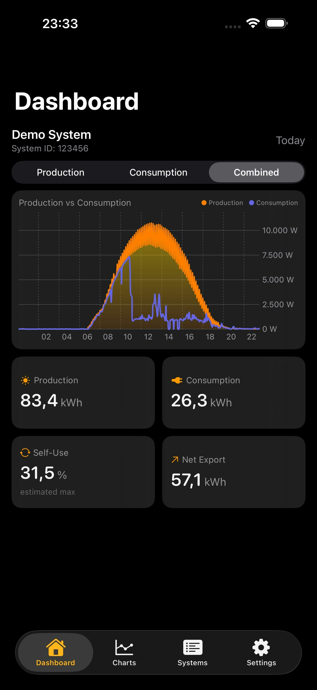
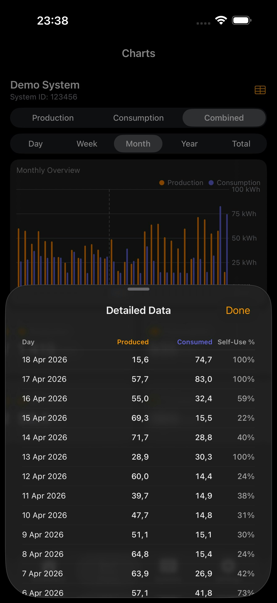

---

## 26. [Nota: AI Notes & Voice](https://www.producthunt.com/products/nota-ai-notes-voice)
**Votes**: 68 | **도입 난이도**: 하 | **신뢰도**: 상
**Tagline**: Turn voice, scans, sketches, and text into notes with AI
**서비스 링크**: https://www.producthunt.com/r/J6PLFYGU6BSQF4

**태그**: Productivity, AI, Note-taking, Apple Ecosystem, AI Tool, Chat

### 📌 이 서비스 한눈에 보기
음성, 스캔, 스케치를 AI로 즉시 정제하는 올인원 로컬 퍼스트 노트 앱

### 🔑 주요 기능
- 음성, 스캔, 스케치, 텍스트 등 다양한 입력 방식을 지원하는 직관적인 캡처
- OpenAI, Claude, Gemini, Grok 등 사용자가 원하는 AI 모델 선택 가능
- iPhone, iPad, Mac, Apple Watch를 아우르는 강력한 애플 생태계 연동

### 🙋 사용자에게 어떤 점이 좋은가
단순한 챗봇이 아닌 기록 자체에 집중하여, 흩어진 아이디어를 다양한 방식으로 빠르게 수집하고 AI로 즉시 정리할 수 있습니다.

### ✅ 지금 바로 써볼 기능
- 45개 언어 지원을 활용한 음성 메모 기록하기
- 문서 스캔 기능을 통한 종이 기록의 디지털화
- 필요에 따라 원하는 AI 모델로 노트 내용 정제하기

### ⚠️ 사용 전 확인할 점
- 애플 기기 중심의 생태계로 타 OS 사용자는 접근이 제한적임
- 다양한 AI 모델 사용 시 별도의 API 비용이나 구독이 발생할 수 있음

### 🧭 확인이 더 필요한 정보
사용자가 선택하는 AI 모델별 구체적인 과금 체계와 데이터 동기화 방식에 대한 확인이 필요합니다.

### 📸 스크린샷 및 갤러리
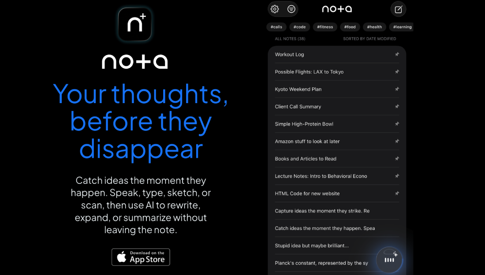
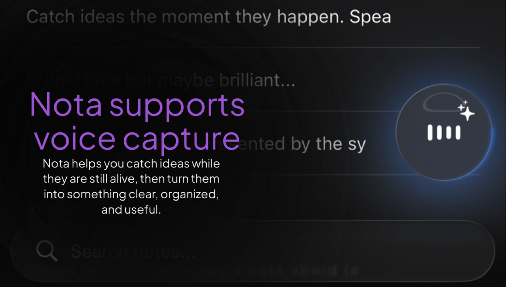
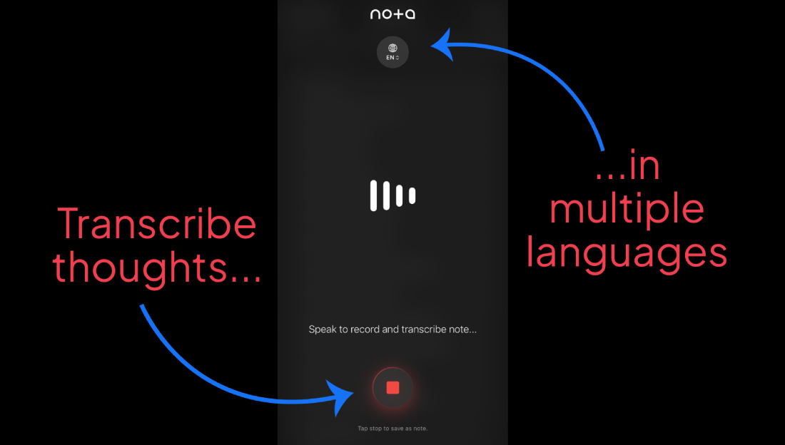

### 🎬 관련 영상
- [🎥 영상 보기](https://ph-files.imgix.net/739d30ca-1b1f-4d52-9ad4-a5b802c7ff7b.jpeg?auto=format)

---

## 27. [CLICKABOOM](https://www.producthunt.com/products/thumbnailed-it)
**Votes**: 43 | **도입 난이도**: 하 | **신뢰도**: 상
**Tagline**: Boost your Youtube views, by driving clicks
**서비스 링크**: https://www.producthunt.com/r/EMEANT7N2S2DSC

**태그**: YouTube, ContentCreation, Marketing, AI-Generator, AI Tool, Video

### 📌 이 서비스 한눈에 보기
데이터 기반 분석을 통해 유튜브 클릭률(CTR)을 극대화하는 썸네일 및 메타데이터 생성 도구

### 🔑 주요 기능
- 니치 시장 내 상위 성과 영상 패턴 분석 및 학습
- 클릭을 유도하는 썸네일, 제목, 설명 자동 생성
- 다양한 변형(Variants) 생성을 통한 최적의 조합 탐색

### 🙋 사용자에게 어떤 점이 좋은가
콘텐츠 품질과는 별개로 낮은 클릭률로 인해 영상 노출 기회를 놓치는 크리에이터에게 실질적인 조회수 상승 솔루션을 제공합니다.

### ✅ 지금 바로 써볼 기능
- 자신의 영상 업로드 및 니치 분석 실행
- 생성된 제목 및 썸네일 변형 기능 테스트
- 분석된 성공 패턴과 기존 콘텐츠 비교

### ⚠️ 사용 전 확인할 점
- 생성된 결과물이 채널의 고유한 톤앤매너와 일치하는지 확인 필요
- 자동 생성된 메타데이터가 실제 영상 내용과 일치하는지 검토 필수

### 🧭 확인이 더 필요한 정보
사용자의 특정 니치 분야에 대한 분석 정확도와 생성된 이미지의 품질 수준을 확인해야 합니다.

### 📸 스크린샷 및 갤러리

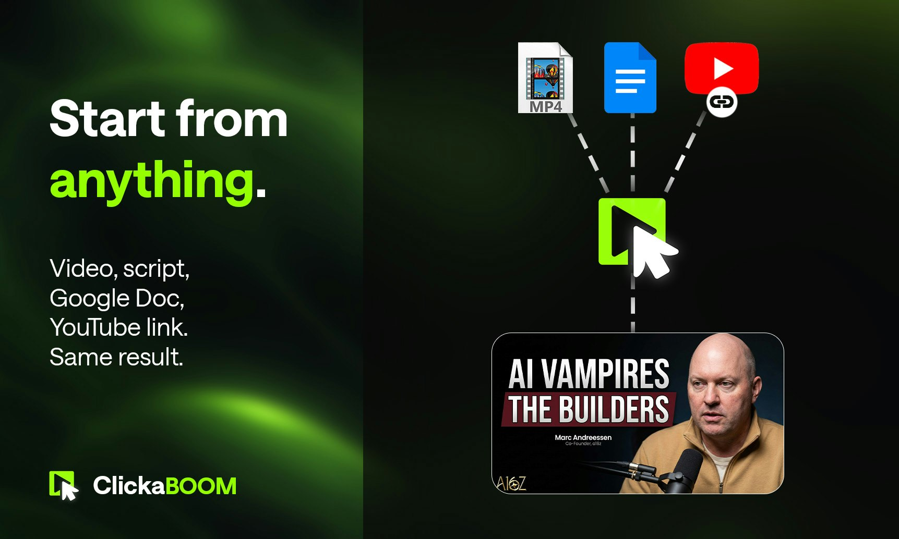

---

## 28. [Training Data - AI Microgames ](https://www.producthunt.com/products/training-data-ai-microgames)
**Votes**: 24 | **도입 난이도**: 하 | **신뢰도**: 상
**Tagline**: As an AI you must gather training data by playing microgames
**서비스 링크**: https://www.producthunt.com/r/QLB5RGB6TPSCYR

**태그**: Gaming, Mobile, Interactive, AI Tool

### 📌 이 서비스 한눈에 보기
AI가 되어 미니게임을 플레이하며 학습 데이터를 수집하는 독특한 컨셉의 모바일 게임

### 🔑 주요 기능
- AI 시점의 독특한 게임 플레이 컨셉
- WarioWare 스타일의 빠르고 몰입감 있는 미니게임 구성
- iOS 앱 기반의 카메라 및 센서 활용 기능

### 🙋 사용자에게 어떤 점이 좋은가
일상적인 동작을 게임화하여 색다른 재미를 제공하며, 모바일 센서를 활용한 인터랙티브한 경험을 할 수 있습니다.

### ✅ 지금 바로 써볼 기능
- 미니게임 플레이를 통한 데이터 수집 경험하기
- 카메라 및 센서 기반의 게임 기능 테스트하기

### ⚠️ 사용 전 확인할 점
- 카메라 및 센서 권한 허용 필요
- 게임 특성상 반복적이고 빠른 조작이 요구될 수 있음

### 🧭 확인이 더 필요한 정보
현재 iOS 앱으로 확장된 상태이나, 구체적인 게임 플레이 시간이나 난이도 체계는 명시되지 않았습니다.

### 📸 스크린샷 및 갤러리

### 🎬 관련 영상
- [🎥 영상 보기](https://ph-files.imgix.net/ef1ea104-000b-4ffb-9738-bdd25f98abed.jpeg?auto=format)

---

## 29. [Kipps.AI CostLens: Open Source](https://www.producthunt.com/products/kipps-ai)
**Votes**: 17 | **도입 난이도**: 하 | **신뢰도**: 상
**Tagline**: Stop guessing your AI costs 
**서비스 링크**: https://www.producthunt.com/r/V6RL6M7CLU5OPC

**태그**: AI, DevTool, CostManagement, OpenSource, Agent, Automation, AI Tool, Chat, Prompting, Design

### 📌 이 서비스 한눈에 보기
AI 워크플로우 구축 전 예상 비용을 정밀하게 시뮬레이션하는 오픈소스 비용 계산기

### 🔑 주요 기능
- 챗봇, 음성 에이전트 등 다양한 AI 솔루션의 실행 비용 추정
- 토큰 사용량, 추론 오버헤드, 프롬프트 캐싱 등 세부 변수 반영
- 모델 간 가격 비교를 통한 최적의 아키텍처 및 경제성 결정 지원

### 🙋 사용자에게 어떤 점이 좋은가
AI 도입 전 막연한 비용 예측에서 벗어나, 실제 운영 시 발생할 유닛 이코노믹스(Unit Economics)를 미리 파악하여 비즈니스 모델의 수익성을 검증할 수 있습니다.

### ✅ 지금 바로 써볼 기능
- 현재 설계 중인 AI 워크플로우의 시나리오 입력하기
- 다양한 LLM 모델 간의 비용 효율성 비교하기
- 프롬프트 캐싱 및 도구 호출(Tool calls)에 따른 비용 변화 확인하기

### ⚠️ 사용 전 확인할 점
- 실제 API 호출 시 발생하는 네트워크 비용이나 기타 인프라 비용은 포함되지 않을 수 있음
- 모델별 가격 정책 변경 시 수동 업데이트가 필요할 수 있음

### 🧭 확인이 더 필요한 정보
실제 운영 환경의 트래픽 변동성을 반영한 동적 시뮬레이션 기능의 포함 여부를 확인해야 합니다.

### 📸 스크린샷 및 갤러리
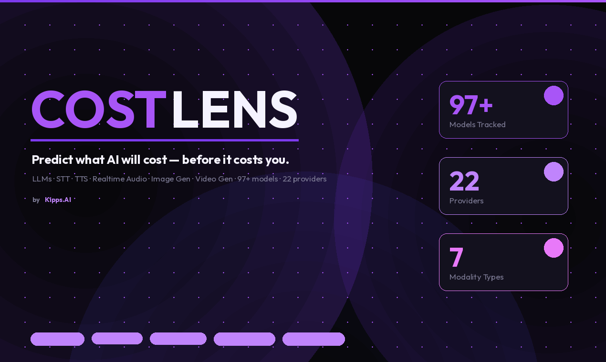
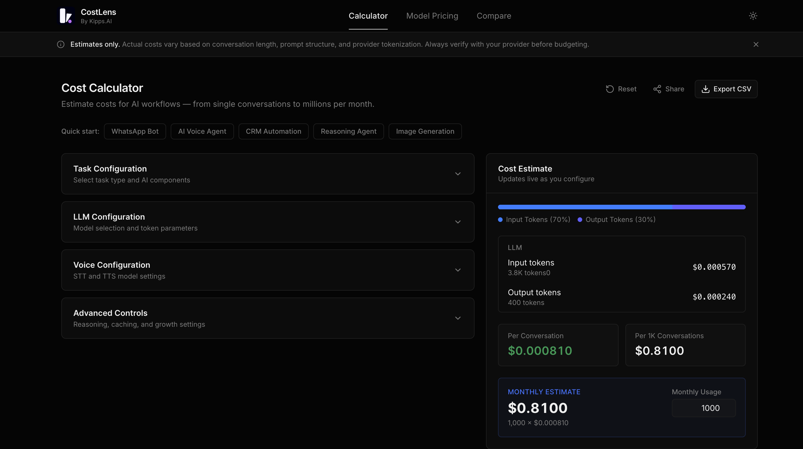
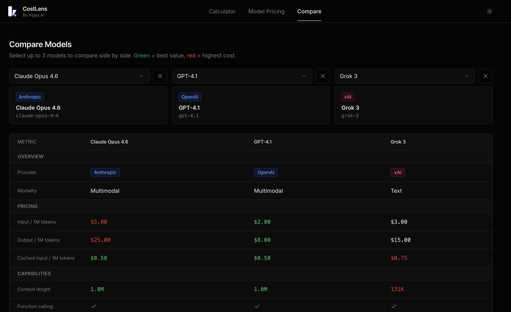

---

## 30. [GB1 Mobile: Local Models](https://www.producthunt.com/products/gb1)
**Votes**: 12 | **도입 난이도**: 하 | **신뢰도**: 상
**Tagline**: Run private AI on your phone with downloadable local models
**서비스 링크**: https://www.producthunt.com/r/MUYNURP4NLXAY6

**태그**: AI, Mobile, Privacy, On-device AI, AI Tool

### 📌 이 서비스 한눈에 보기
개인정보 유출 걱정 없이 스마트폰에서 직접 구동하는 온디바이스 AI 모델

### 🔑 주요 기능
- 기기 내 로컬 모델 실행을 통한 완전한 프라이버시 보호
- 친환경 에너지를 사용하는 클라우드 모델 선택 옵션 제공
- 영국 Locai Labs에서 개발한 모바일 최적화 AI 솔루션

### 🙋 사용자에게 어떤 점이 좋은가
데이터가 외부 서버로 전송되지 않는 로컬 모델을 통해 민감한 개인 정보를 안전하게 처리하며 AI를 활용할 수 있습니다.

### ✅ 지금 바로 써볼 기능
- 로컬 모델 다운로드 및 설치
- 온디바이스 AI 프라이버시 테스트
- 클라우드 vs 로컬 모델 성능 비교

### ⚠️ 사용 전 확인할 점
- 로컬 모델 구동 시 스마트폰 배터리 소모 및 발열 발생 가능성
- 기기 사양에 따른 모델 구동 속도 및 성능 제한

### 🧭 확인이 더 필요한 정보
사용 중인 스마트폰의 하드웨어 사양에 따른 모델 구동 안정성을 확인해야 합니다.

### 📸 스크린샷 및 갤러리
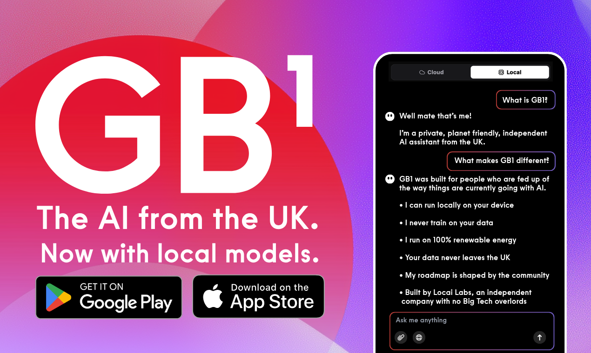
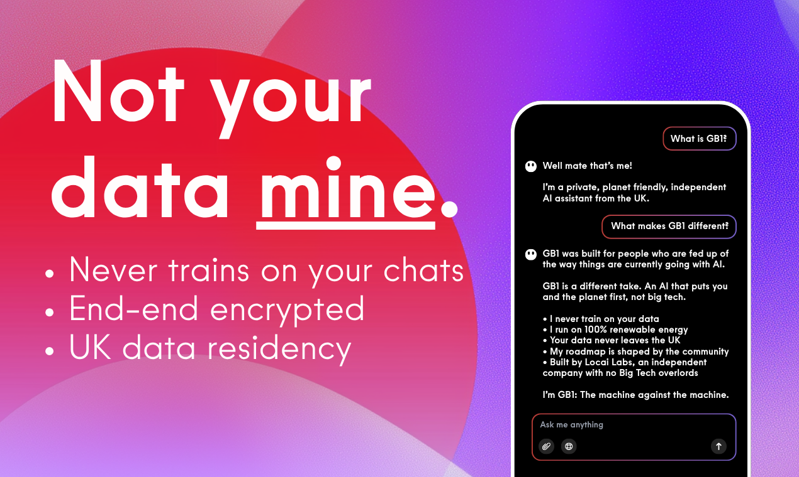
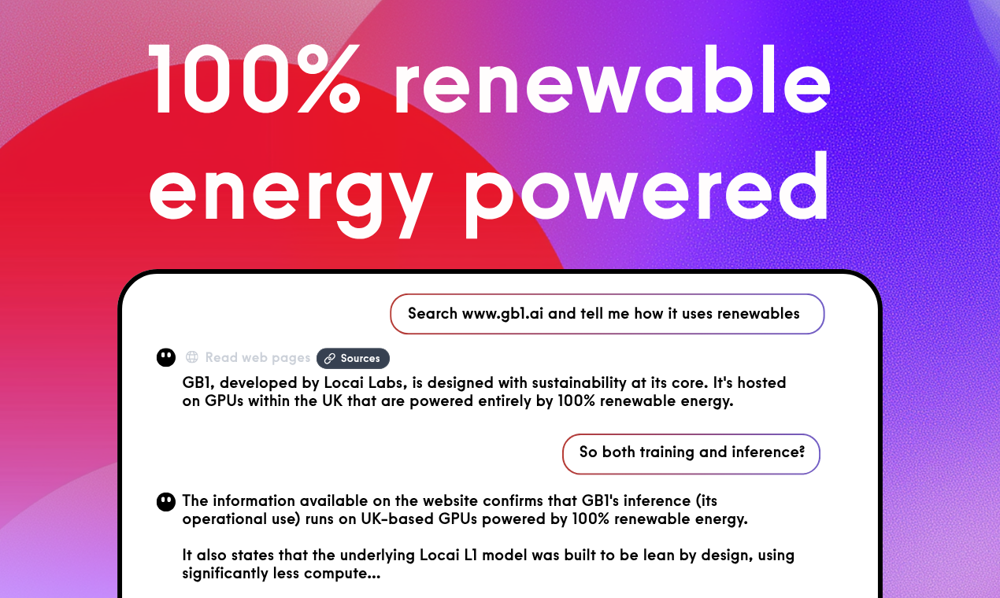

### 🎬 관련 영상
- [🎥 영상 보기](https://ph-files.imgix.net/b2daca41-c4d5-469e-9f17-739d36d91189.jpeg?auto=format)

---

