# 🚀 Product Hunt Daily Top 30 (2026-05-24)

## 오늘의 요약
오늘의 트렌드는 AI 에이전트의 워크플로우를 자동화하거나 그 과정에서 발생하는 데이터를 자산화하는 도구들이 눈에 띄었습니다. 또한, 로컬 우선 방식의 보안과 개인정보 보호를 강조하는 생산성 도구와 Mac 환경을 확장하는 유틸리티들이 주목받았습니다.

### 오늘의 핵심 포인트
- AI 에이전트의 작업 과정을 자동화하고 이를 데이터로 변환하여 수익화하거나 지식화하는 서비스가 등장했습니다.
- 사용자의 프라이버시를 보호하기 위해 로컬 저장 방식을 채택한 연구 및 글쓰기용 워크스페이스가 주목받았습니다.
- 기존 하드웨어나 브라우저 환경을 활용하여 작업 효율을 높이는 창의적인 생산성 도구들이 다수 출시되었습니다.

**오늘의 태그**: AI 에이전트, 생산성 도구, 로컬 우선, 데이터 수익화, Mac 유틸리티

## 1. [Google Antigravity CLI](https://www.producthunt.com/products/google-antigravity)
**Votes**: 183 | **도입 난이도**: 하 | **신뢰도**: 상
**Tagline**: Run coding agents directly from your terminal
**서비스 링크**: https://www.producthunt.com/r/2VVOKDD4COMAK2
**재등장**: 최근 7일 내 재등장 (마지막 등장 1일 전)

**태그**: DevTool, CLI, AI-Agent, Automation, Agent

### 📌 이 서비스 한눈에 보기
터미널 환경에 최적화된 강력한 AI 코딩 에이전트 CLI

### 🔑 주요 기능
- 멀티 스텝 추론 및 다중 파일 편집 기능 제공
- SSH 세션 및 키보드 중심 워크플로우에 최적화
- 도구 호출(Tool calling) 및 대화 기록 유지 기능

### 🙋 사용자에게 어떤 점이 좋은가
터미널을 벗어나지 않고도 복잡한 코딩 작업을 자동화할 수 있어 개발 생산성을 극대화합니다.

### ✅ 지금 바로 써볼 기능
- 터미널에서 직접 에이전트 실행해보기
- 다중 파일 편집 기능 테스트하기
- SSH 환경에서의 성능 확인하기

### ⚠️ 사용 전 확인할 점
- 에이전트의 파일 수정 권한에 따른 코드 변경 주의
- 터미널 환경에 따른 의존성 및 설정 필요성

### 🧭 확인이 더 필요한 정보
지원하는 프로그래밍 언어 범위와 구체적인 시스템 리소스 사용량은 명시되지 않았습니다.

### 📸 스크린샷 및 갤러리
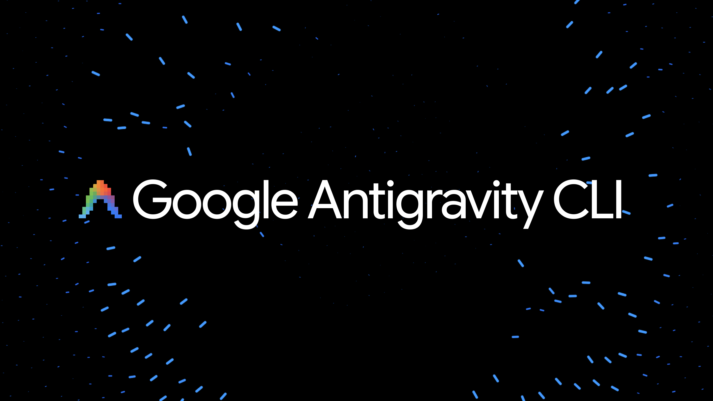
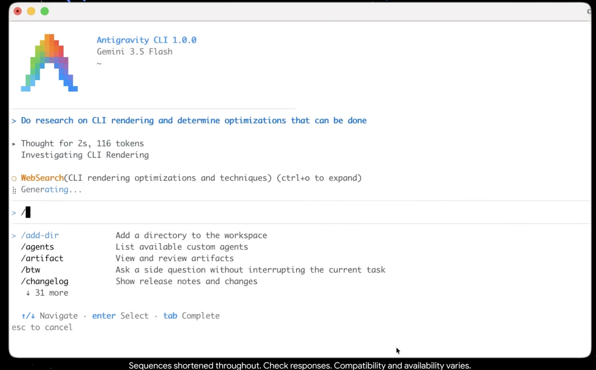
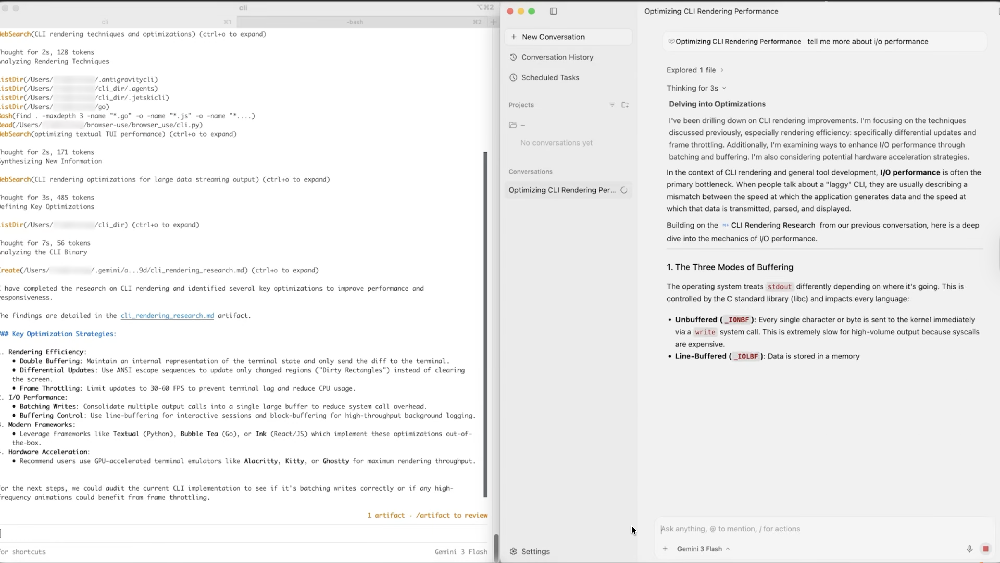

### 🎬 관련 영상
- [🎥 영상 보기](https://ph-files.imgix.net/caa959c1-20ab-447d-89ea-600c33dc5be6.jpeg?auto=format)

---

## 2. [Memdex](https://www.producthunt.com/products/memdex)
**Votes**: 166 | **도입 난이도**: 하 | **신뢰도**: 상
**Tagline**: Turn every AI conversation into reusable local memory
**서비스 링크**: https://www.producthunt.com/r/LBMOK2KFA74TNE

**태그**: AI, Productivity, ChromeExtension, Automation, AI Tool, Chat, Prompting

### 📌 이 서비스 한눈에 보기
AI와의 모든 대화 내용을 로컬에 저장하여 필요할 때 즉시 재사용할 수 있게 돕는 크롬 확장 프로그램

### 🔑 주요 기능
- ChatGPT, Claude, Gemini 등 다양한 AI 서비스의 대화 자동 캡처
- 사용자 노트북(IndexedDB)에 암호화하여 저장하는 프라이버시 중심 설계
- Grammarly처럼 다음 프롬프트에 필요한 맥락을 밑줄로 표시하고 원클릭으로 삽입

### 🙋 사용자에게 어떤 점이 좋은가
과거의 대화 맥락을 일일이 복사해서 붙여넣을 필요 없이, 마치 맞춤법 검사기처럼 필요한 정보를 즉각 불러와 업무 효율을 높여줍니다.

### ✅ 지금 바로 써볼 기능
- 크롬 확장 프로그램 설치 후 주요 AI 서비스 연동하기
- 최근 10개 대화 무료 기능을 통해 맥락 삽입 기능 테스트하기
- 자주 사용하는 대화 패턴이 자동 캡처되는지 확인하기

### ⚠️ 사용 전 확인할 점
- 무료 버전은 최근 10개의 대화만 지원하므로 사용량 제한 확인 필요
- 로컬 저장 방식이지만 브라우저 데이터 관리(IndexedDB)에 대한 이해 필요

### 🧭 확인이 더 필요한 정보
Pro 버전의 무제한 기능 외에 추가적인 유료 플랜이나 기능 차이가 있는지 확인이 필요합니다.

### 📸 스크린샷 및 갤러리
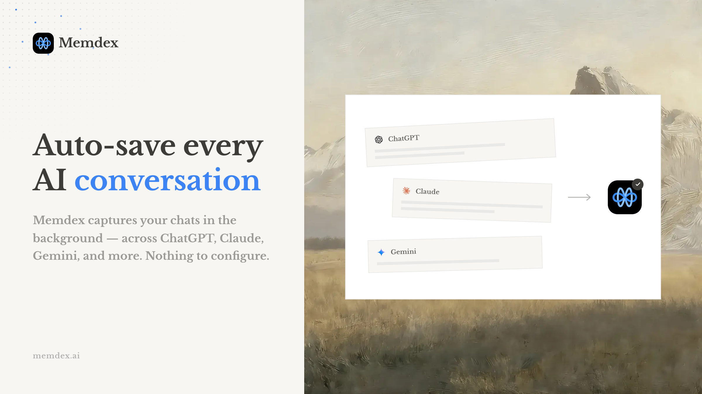
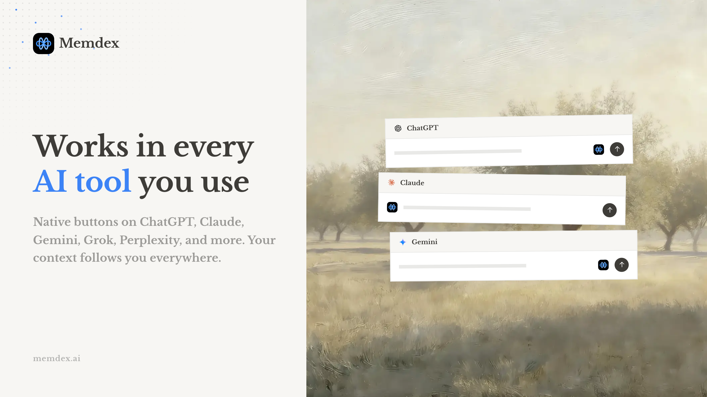
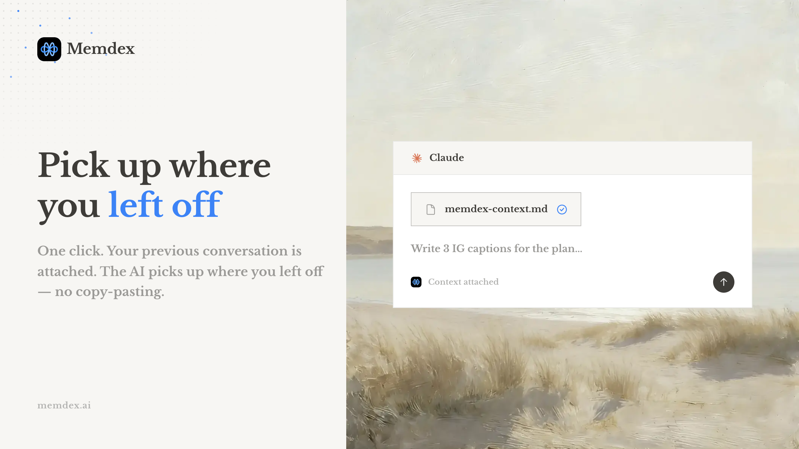

### 🎬 관련 영상
- [🎥 영상 보기](https://ph-files.imgix.net/0e31ae7f-c25e-41a2-a058-82047537b6b0.jpeg?auto=format)

---

## 3. [note.md](https://www.producthunt.com/products/note-md)
**Votes**: 153 | **도입 난이도**: 하 | **신뢰도**: 상
**Tagline**: Local-first markdown based workspace for research writings
**서비스 링크**: https://www.producthunt.com/r/AZUQKGQVS44MYZ

**태그**: Writing, Research, Markdown, macOS, Productivity

### 📌 이 서비스 한눈에 보기
연구와 집필에 최적화된 macOS 전용 로컬 우선 마크다운 워크스페이스

### 🔑 주요 기능
- 개인정보 보호를 위한 로컬 우선(Local-first) 방식
- 연구 및 구조적 사고를 위한 마크다운 기반 환경
- 집중력 있는 글쓰기에 최적화된 macOS 전용 앱

### 🙋 사용자에게 어떤 점이 좋은가
데이터가 클라우드가 아닌 로컬에 저장되어 보안이 뛰어나며, 복잡한 연구 자료를 구조화하여 글을 쓰는 사용자에게 유용합니다.

### ✅ 지금 바로 써볼 기능
- 마크다운 문법을 활용한 초안 작성
- 로컬 파일 저장 방식 및 보안성 확인
- 연구 자료 구조화 기능 테스트

### ⚠️ 사용 전 확인할 점
- macOS 전용이므로 타 운영체제 사용 시 제약이 있음
- 로컬 저장 방식이므로 기기 변경 시 데이터 수동 관리 필요

### 🧭 확인이 더 필요한 정보
타 플랫폼과의 동기화 기능이나 모바일 지원 여부는 명시되지 않았습니다.

### 📸 스크린샷 및 갤러리
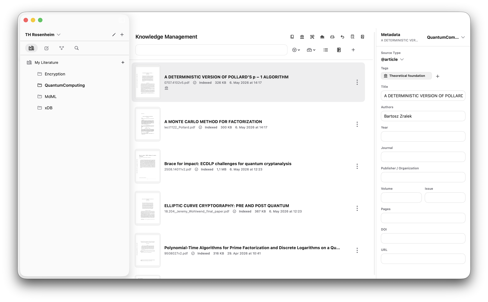
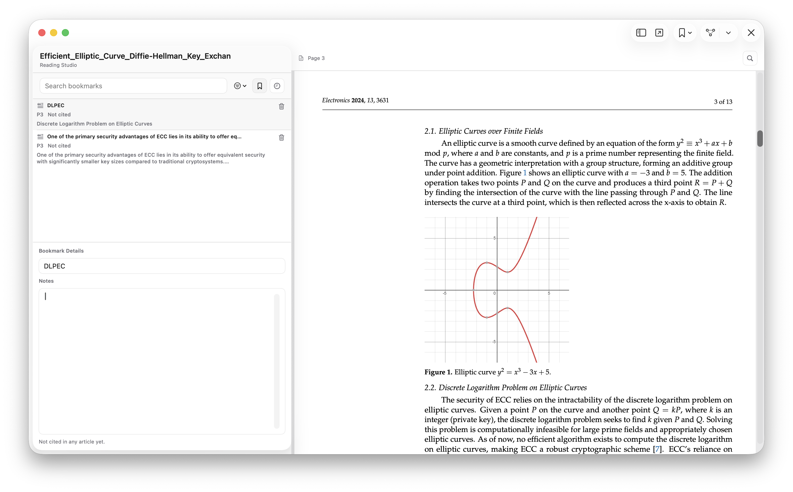
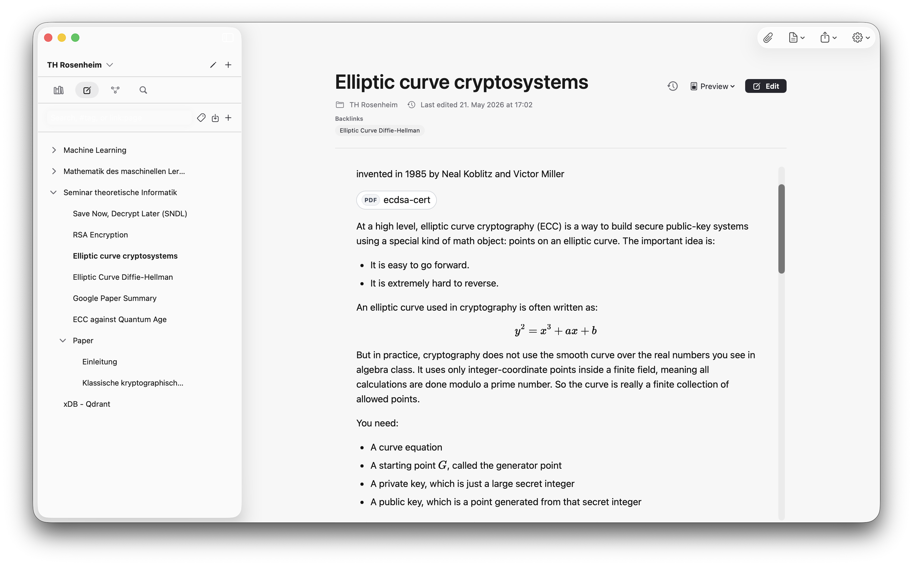

---

## 4. [RetroMac](https://www.producthunt.com/products/retromac)
**Votes**: 137 | **도입 난이도**: 하 | **신뢰도**: 상
**Tagline**: Turn your Mac into a time machine.
**서비스 링크**: https://www.producthunt.com/r/27JQOVR64H4XQZ

**태그**: Customization, Design, Retro, Mac

### 📌 이 서비스 한눈에 보기
최신 Mac을 클래식한 레트로 감성으로 바꿔주는 화면 셰이더 및 테마 커스텀 도구

### 🔑 주요 기능
- CRT, 클래식 매킨토시, VHS, 게임보이 등 30개 이상의 다양한 셰이더 프리셋 제공
- 전체 화면 또는 특정 창에만 개별적으로 레트로 효과 적용 가능
- 클래식 Mac 및 Windows 스타일의 독(Dock) 스킨 교체 및 테마 스크린샷 기능

### 🙋 사용자에게 어떤 점이 좋은가
데스크탑 환경에 시각적인 즐거움을 더하고, 옛날 컴퓨터를 사용하는 듯한 독특한 사용자 경험을 제공합니다.

### ✅ 지금 바로 써볼 기능
- 원하는 감성의 셰이더 프리셋 적용해보기
- 특정 창에만 효과를 적용하여 부분적인 분위기 연출하기
- 클래식 스타일로 독(Dock) 디자인 변경하기

### ⚠️ 사용 전 확인할 점
- 셰이더 적용 시 시스템 리소스(CPU/GPU) 사용량 증가 가능성
- 추가 프리셋 사용 시 유료 결제가 필요할 수 있음

### 🧭 확인이 더 필요한 정보
셰이더 적용 시 시스템 성능 저하나 화면 깜빡임 등 호환성 문제가 발생할 수 있는지 확인이 필요합니다.

### 📸 스크린샷 및 갤러리
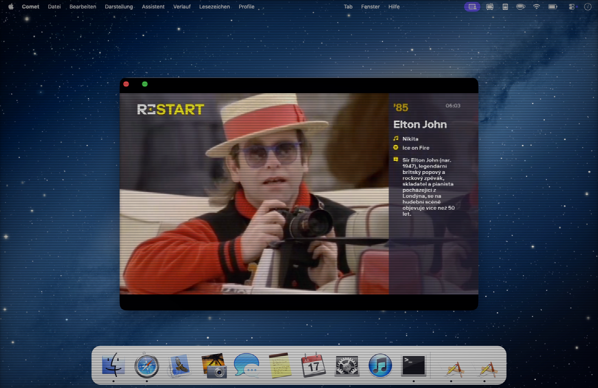

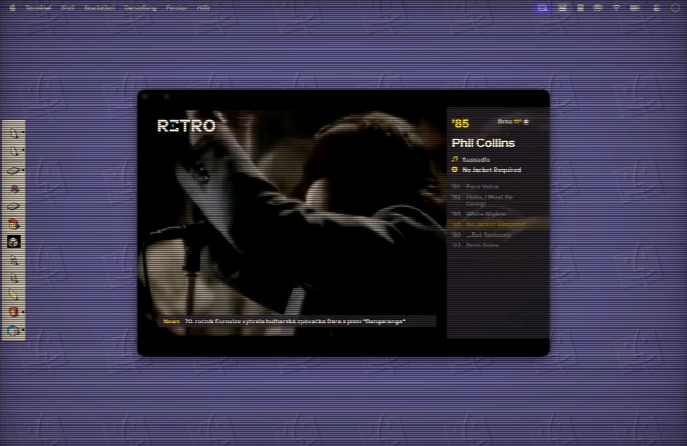

---

## 5. [Bulkmark](https://www.producthunt.com/products/bulkmark-2)
**Votes**: 133 | **도입 난이도**: 하 | **신뢰도**: 상
**Tagline**: Transform your Twitter/X Bookmarks into real knowledge
**서비스 링크**: https://www.producthunt.com/r/Z53TFCEI3FRGGB

**태그**: Productivity, AI, KnowledgeManagement, SocialMedia, AI Tool, Email

### 📌 이 서비스 한눈에 보기
X(트위터) 북마크를 AI로 정리하여 실질적인 지식으로 변환해주는 서비스

### 🔑 주요 기능
- AI를 활용한 X 북마크 자동 정리 및 구조화
- 공유 가능한 리스트 생성 기능
- 주간 이메일 요약 리포트 제공

### 🙋 사용자에게 어떤 점이 좋은가
단순히 저장만 하고 잊혀지는 북마크를 체계적인 지식 데이터베이스로 전환하여 정보 활용도를 높여줍니다.

### ✅ 지금 바로 써볼 기능
- X 계정 연동 및 북마크 동기화
- AI 자동 분류 기능 테스트
- 주간 이메일 디제스트 구독 설정

### ⚠️ 사용 전 확인할 점
- X(트위터) API 정책 변화에 따른 서비스 안정성 확인 필요
- 개인적인 북마크 데이터에 대한 접근 권한 검토

### 🧭 확인이 더 필요한 정보
AI 정리 기능의 상세 알고리즘 및 데이터 보안 정책에 대한 구체적인 정보가 필요합니다.

### 📸 스크린샷 및 갤러리
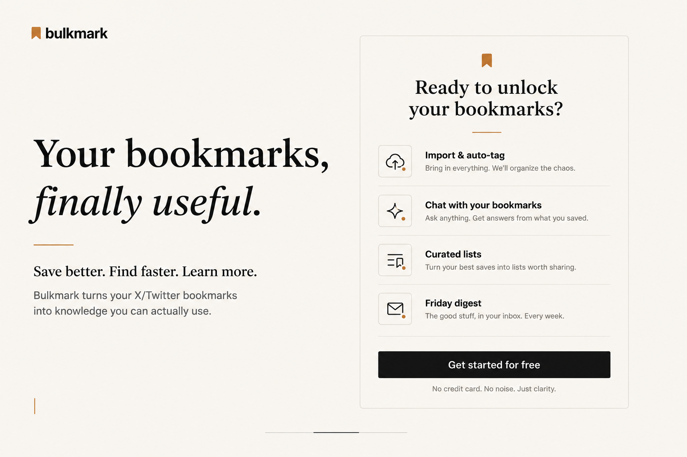
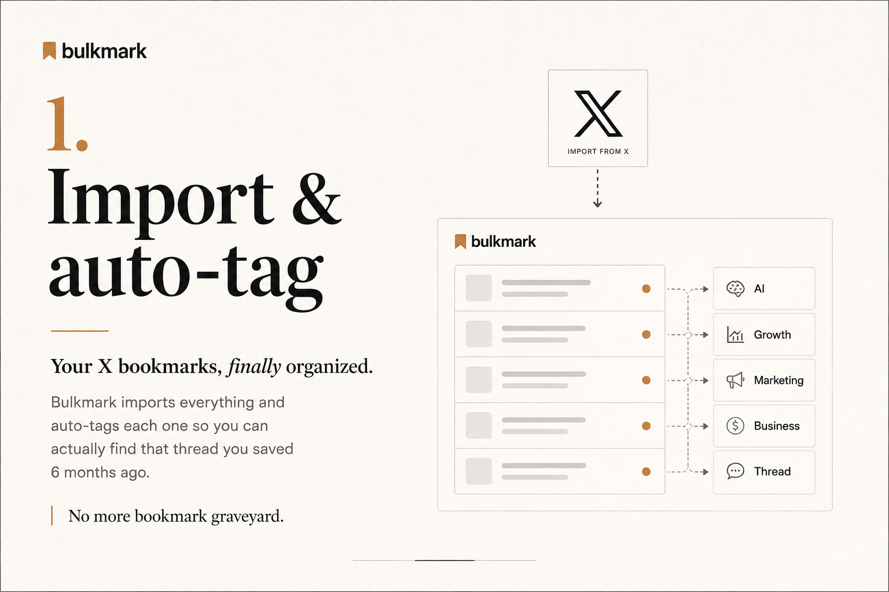
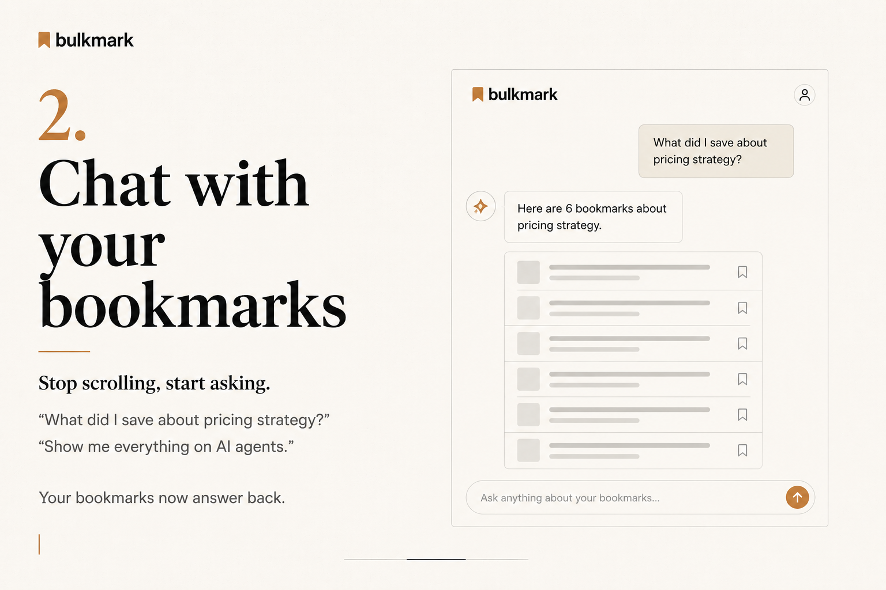

### 🎬 관련 영상
- [🎥 영상 보기](https://ph-files.imgix.net/cfcbf157-42a8-4463-9a59-bfd066617d24.jpeg?auto=format)

---

## 6. [Command A+](https://www.producthunt.com/products/cohere-2)
**Votes**: 103 | **도입 난이도**: 중 | **신뢰도**: 상
**Tagline**: Cohere’s open enterprise workhorse
**서비스 링크**: https://www.producthunt.com/r/2COYNUBDZ74L4C

**태그**: AI, LLM, OpenSource, Enterprise, Automation, Agent

### 📌 이 서비스 한눈에 보기
기업용 에이전트 구축을 위한 고성능 오픈소스 언어 모델

### 🔑 주요 기능
- Cohere의 가장 빠르고 강력한 모델 성능 제공
- 고성능 기업용 에이전트 운영에 최적화
- 효율성을 극대화한 오픈소스 모델

### 🙋 사용자에게 어떤 점이 좋은가
기업 환경에서 효율적인 AI 에이전트를 구축하고자 하는 개발자와 기업 사용자에게 강력한 성능과 유연성을 제공합니다.

### ✅ 지금 바로 써볼 기능
- 모델의 추론 속도 및 성능 테스트
- 기업용 에이전트 워크플로우 적용 실험
- 기존 시스템과의 효율성 비교

### ⚠️ 사용 전 확인할 점
- 오픈소스 모델의 배포 및 운영 환경 구축 필요성
- 기업 데이터 보안 정책과의 부합 여부 확인

### 🧭 확인이 더 필요한 정보
구체적인 모델 파라미터 규모와 하드웨어 요구 사양에 대한 정보가 필요합니다.

### 📸 스크린샷 및 갤러리

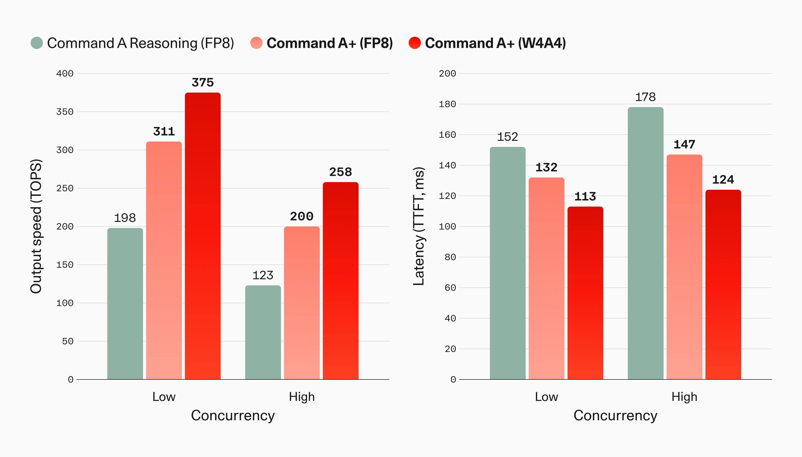
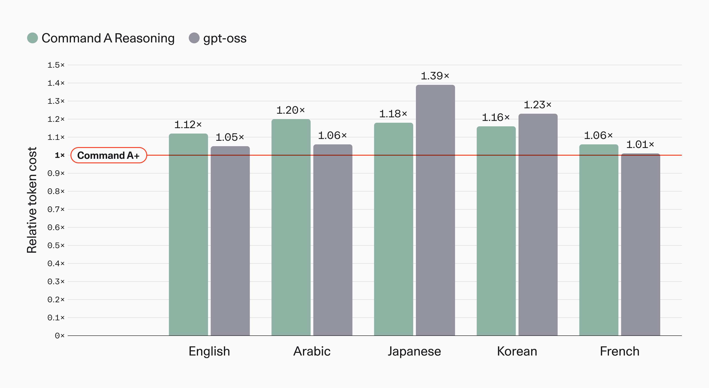

### 🎬 관련 영상
- [🎥 영상 보기](https://ph-files.imgix.net/f1d0e21c-0b14-4de6-856e-ceace003252a.jpeg?auto=format)

---

## 7. [Forsy](https://www.producthunt.com/products/forsy)
**Votes**: 98 | **도입 난이도**: 중 | **신뢰도**: 상
**Tagline**: Capture and sell your AI agent workflow data
**서비스 링크**: https://www.producthunt.com/r/A2U7PH6SGMMNIE

**태그**: AI, Data Economy, Automation, Marketplace, Agent, AI Tool, DevTool

### 📌 이 서비스 한눈에 보기
사용 중인 AI 에이전트의 워크플로우 데이터를 수집하여 수익화할 수 있는 데이터 마켓플레이스

### 🔑 주요 기능
- 기존 AI 에이전트(Claude, Codex 등)의 워크플로우 데이터 자동 캡처
- 수집된 데이터를 구조화하여 판매 가능한 고품질 데이터셋으로 변환
- 라이선싱 및 프라이버시가 보장된 에이전트 데이터 경제 인프라 구축

### 🙋 사용자에게 어떤 점이 좋은가
자신이 구축한 AI 에이전트의 작업 과정을 가치 있는 학습 데이터로 전환하여 새로운 수익원을 창출할 수 있습니다.

### ✅ 지금 바로 써볼 기능
- 현재 사용 중인 AI 에이전트와의 연동 가능 여부 확인
- 데이터 캡처 방식 및 워크플로우 구조화 프로세스 검토
- 데이터 판매를 위한 라이선스 및 프라이버시 정책 확인

### ⚠️ 사용 전 확인할 점
- 개인정보나 민감한 업무 데이터가 포함될 경우에 대한 보안 대책 확인 필요
- 에이전트 플랫폼별 데이터 추출 호환성 차이 가능성

### 🧭 확인이 더 필요한 정보
현재 지원하는 에이전트 플랫폼의 범위와 데이터 보안 기술의 구체적인 구현 방식에 대한 확인이 필요합니다.

### 📸 스크린샷 및 갤러리

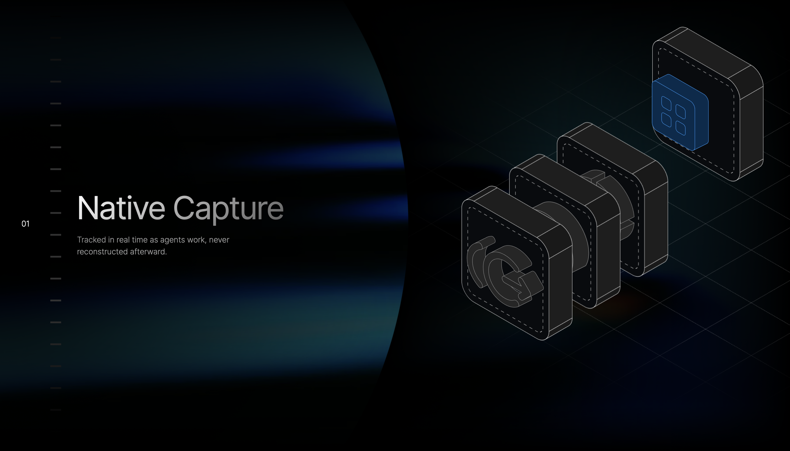
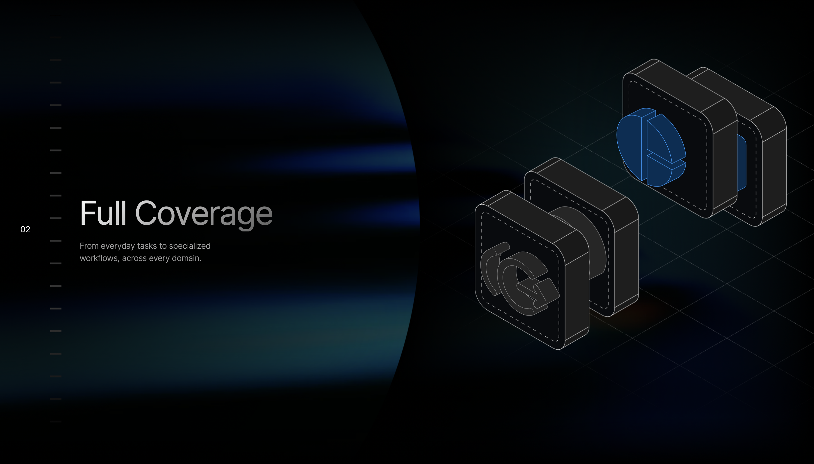

### 🎬 관련 영상
- [🎥 영상 보기](https://ph-files.imgix.net/e854dd8a-97cf-48b1-afcb-120e6dae9bd0.jpeg?auto=format)

---

## 8. [Spantop](https://www.producthunt.com/products/spantop)
**Votes**: 87 | **도입 난이도**: 하 | **신뢰도**: 상
**Tagline**: Turn any Mac into a real second monitor
**서비스 링크**: https://www.producthunt.com/r/HHW2Z6WJLC5ELD

**태그**: Productivity, Mac, Remote Display, Workstation

### 📌 이 서비스 한눈에 보기
추가 하드웨어 없이 주변의 다른 Mac을 보조 모니터로 변환해주는 솔루션

### 🔑 주요 기능
- Thunderbolt 및 WiFi를 통한 화면 확장 기능
- LZ4 압축 기술을 활용한 무손실 및 저지연 디스플레이
- 휴대용 모니터 구매 없이 작업 공간을 확장하는 Mac 중심의 경험

### 🙋 사용자에게 어떤 점이 좋은가
카페나 외부 작업 시 무거운 모니터 대신 가지고 있는 다른 Mac을 활용해 즉각적으로 듀얼 모니터 환경을 구축할 수 있습니다.

### ✅ 지금 바로 써볼 기능
- 주변에 있는 다른 Mac과 연결 시도하기
- Thunderbolt 연결을 통한 저지연 성능 테스트하기
- WiFi 환경에서의 화면 확장 안정성 확인하기

### ⚠️ 사용 전 확인할 점
- 네트워크 환경(WiFi)에 따른 지연 시간 발생 가능성
- 연결되는 두 기기 간의 하드웨어 사양 차이

### 🧭 확인이 더 필요한 정보
구체적인 연결 가능한 최소 OS 버전 및 하드웨어 사양에 대한 정보가 필요합니다.

### 📸 스크린샷 및 갤러리
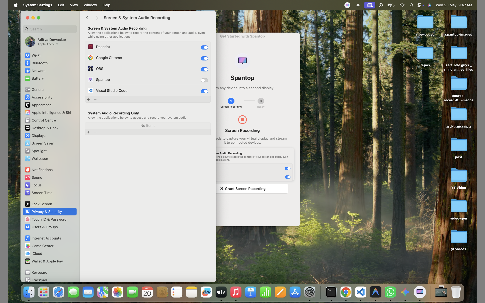

---

## 9. [Vibedock](https://www.producthunt.com/products/vibedock)
**Votes**: 87 | **도입 난이도**: 하 | **신뢰도**: 상
**Tagline**: Toggle Claude Code MCP servers from your menu bar
**서비스 링크**: https://www.producthunt.com/r/I7KXQ2JJX74MTI

**태그**: DevTool, Productivity, macOS, AI

### 📌 이 서비스 한눈에 보기
macOS 메뉴 바에서 Claude Code MCP 서버를 간편하게 온/오프할 수 있는 도구

### 🔑 주요 기능
- 메뉴 바를 통한 원클릭 MCP 서버 토글 기능
- 불필요한 컨텍스트 주입 방지로 Claude 컨텍스트 창 최적화
- 설정 변경 시 Claude 세션을 자동으로 재시작하여 즉각 반영

### 🙋 사용자에게 어떤 점이 좋은가
사용하지 않는 MCP 서버가 컨텍스트를 차지하여 발생하는 성능 저하나 혼선을 방지하고, 필요한 도구만 선택적으로 활성화하여 효율적인 대화가 가능합니다.

### ✅ 지금 바로 써볼 기능
- macOS 메뉴 바에서 활성화할 MCP 서버 선택하기
- 컨텍스트 관리가 필요한 복잡한 작업 시 토글 기능 활용하기

### ⚠️ 사용 전 확인할 점
- 설정 변경 시 Claude 세션이 자동으로 종료되므로 작업 중인 내용 저장 필요
- macOS 환경 전용 도구임

### 🧭 확인이 더 필요한 정보
세션 재시작 방식이 사용자의 작업 흐름에 미치는 영향과 자동화 수준에 대한 추가 확인이 필요합니다.

### 📸 스크린샷 및 갤러리
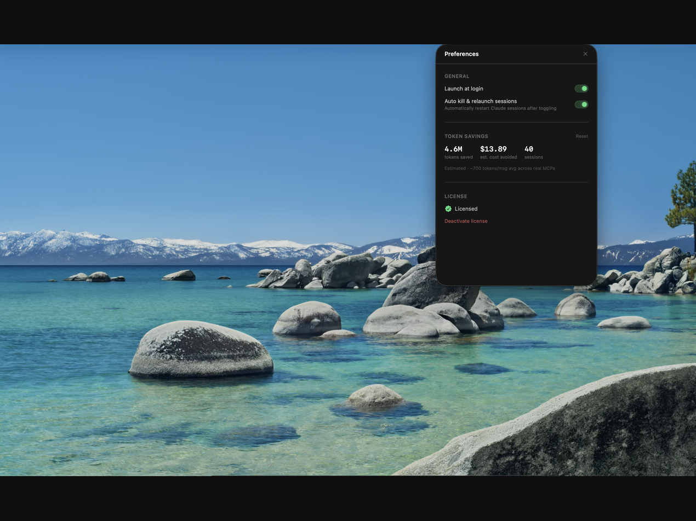
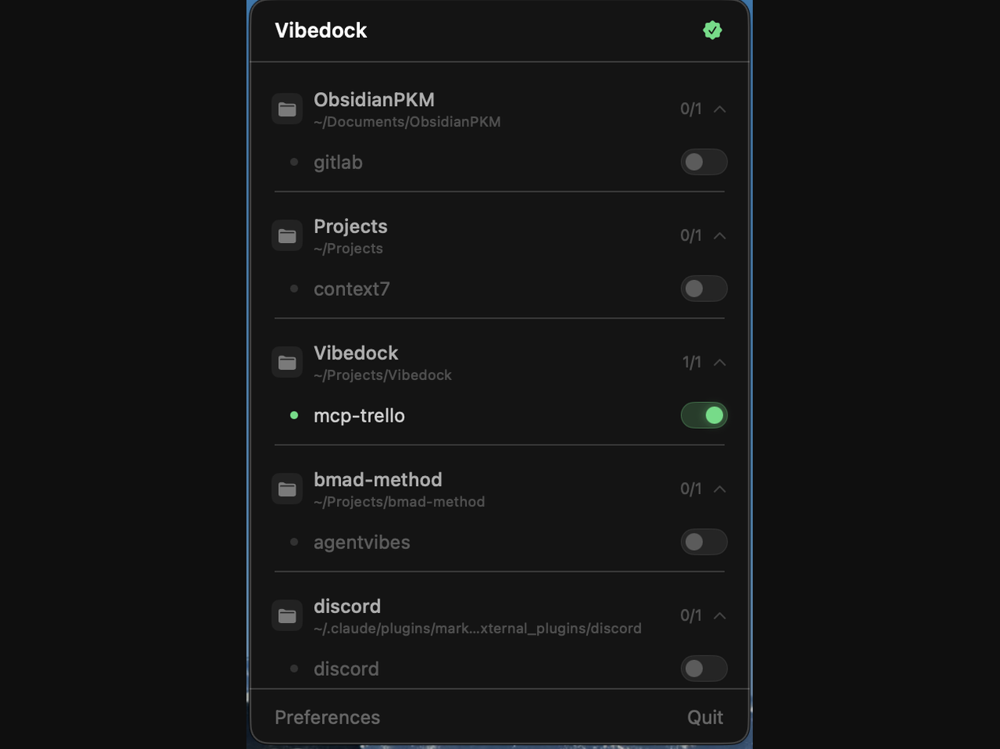
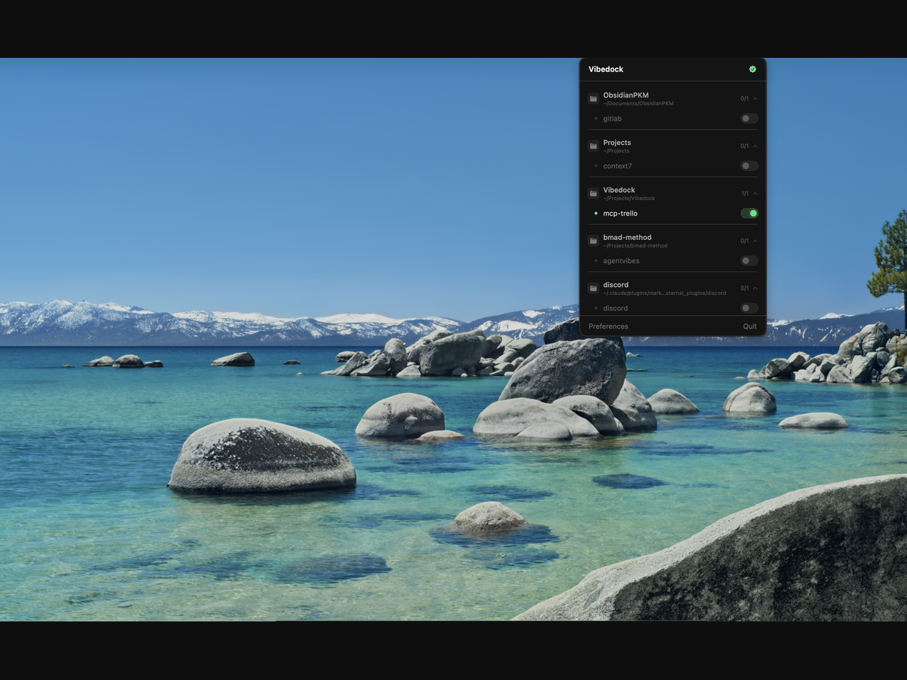

---

## 10. [Kosshi](https://www.producthunt.com/products/kosshi)
**Votes**: 86 | **도입 난이도**: 하 | **신뢰도**: 상
**Tagline**: Simple, fast outliner for Mac and iPhone.
**서비스 링크**: https://www.producthunt.com/r/Q576PUC4HHUXQE

**태그**: Productivity, Writing, macOS, iOS

### 📌 이 서비스 한눈에 보기
macOS와 iOS 환경에 최적화된 빠르고 간결한 네이티브 아웃라이너

### 🔑 주요 기능
- macOS 및 iOS를 위한 네이티브 앱 지원
- 빠르고 집중력 있는 아웃라인 편집 환경 제공
- 단순함에 집중한 직관적인 사용자 경험

### 🙋 사용자에게 어떤 점이 좋은가
복잡한 기능 대신 빠른 기록과 구조화가 필요한 사용자에게 최적의 작업 환경을 제공합니다.

### ✅ 지금 바로 써볼 기능
- Mac과 iPhone 간의 동기화 확인
- 기본적인 아웃라인 작성 및 편집 기능 테스트
- 네이티브 앱의 반응 속도 체감하기

### ⚠️ 사용 전 확인할 점
- 단순한 기능 위주이므로 복잡한 문서 관리에는 부족할 수 있음
- 플랫폼 간 데이터 동기화 방식 확인 필요

### 🧭 확인이 더 필요한 정보
상세한 기능 목록과 기기 간 동기화 방식에 대한 정보가 부족합니다.

### 📸 스크린샷 및 갤러리
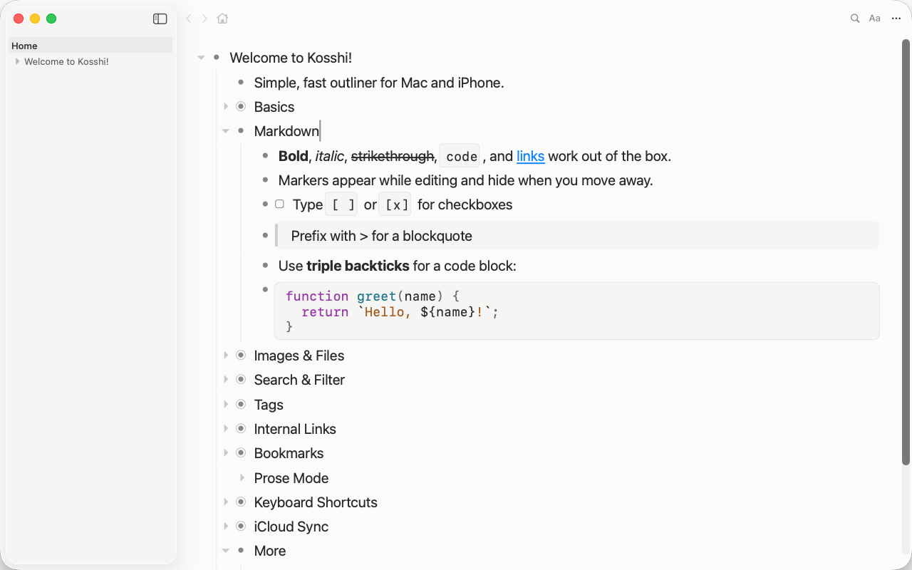
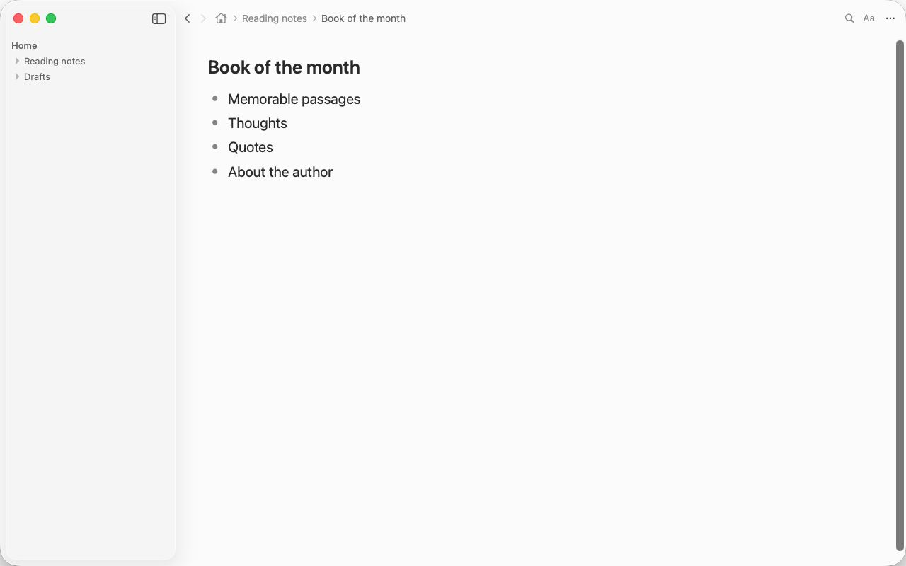
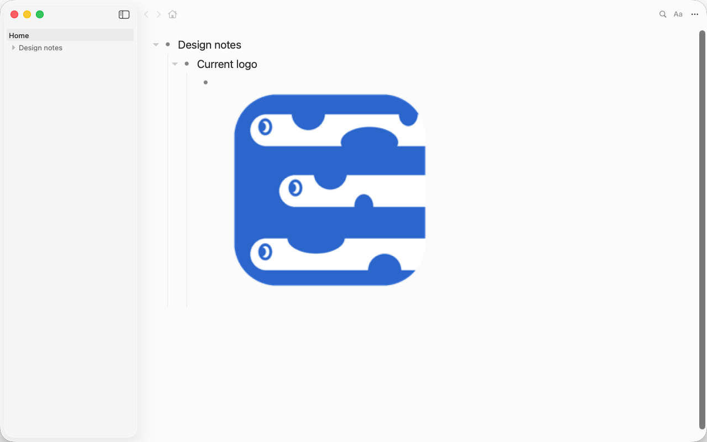

### 🎬 관련 영상
- [🎥 영상 보기](https://ph-files.imgix.net/697b720e-cf57-4f1a-adb0-e9c8527696f0.jpeg?auto=format)

---

## 11. [Coca 2.0](https://www.producthunt.com/products/coca-2-0)
**Votes**: 81 | **도입 난이도**: 하 | **신뢰도**: 상
**Tagline**: Keep Your Mac and Apps Awake!
**서비스 링크**: https://www.producthunt.com/r/AVEQS74CBD23KS

**태그**: Utility, Productivity, Mac

### 📌 이 서비스 한눈에 보기
클릭 한 번으로 맥(Mac)의 잠자기 모드를 방지하여 메신저 상태를 유지해 주는 도구

### 🔑 주요 기능
- 원클릭으로 맥의 절전 모드 방지
- 메뉴 바에서 간편하게 상태 관리
- 메신저 상태를 항상 '온라인'으로 유지

### 🙋 사용자에게 어떤 점이 좋은가
업무 중 자리를 비울 때 메신저 상태가 오프라인으로 바뀌는 것을 방지하여 원활한 소통을 돕습니다.

### ✅ 지금 바로 써볼 기능
- 메뉴 바에 설치하여 활성화하기
- 메신저 상태 유지 테스트하기

### ⚠️ 사용 전 확인할 점
- 화면이 계속 켜져 있어 배터리 소모가 빨라질 수 있음
- 화면 잠금 설정이 필요한 환경에서는 사용이 불편할 수 있음

### 🧭 확인이 더 필요한 정보
배터리 효율 및 화면 밝기 제어 기능 포함 여부는 명시되지 않았습니다.

### 📸 스크린샷 및 갤러리
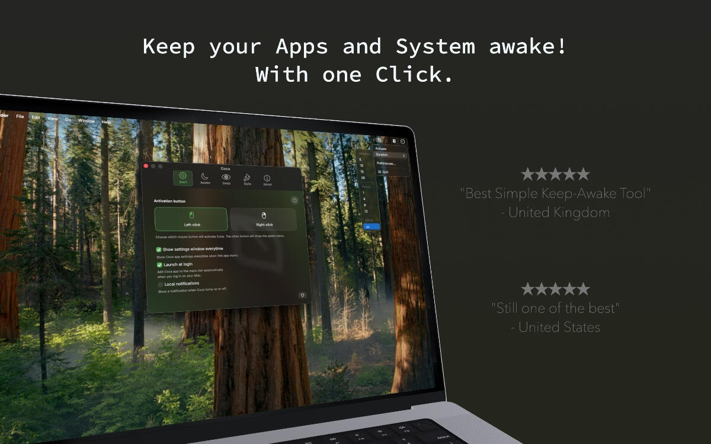
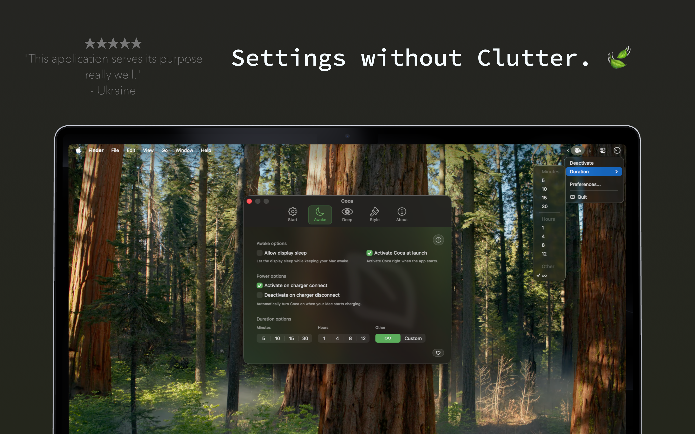
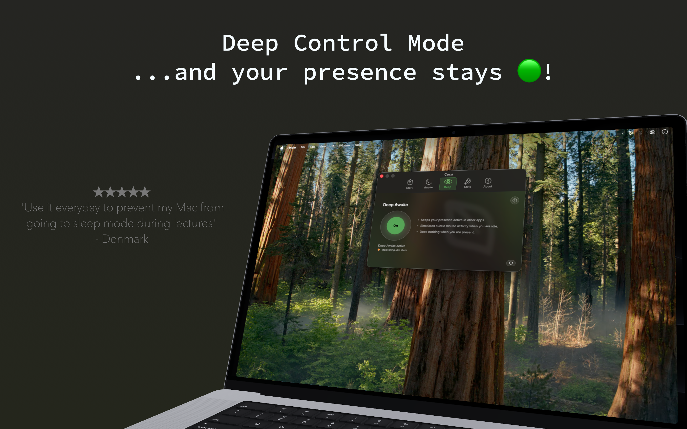

### 🎬 관련 영상
- [🎥 영상 보기](https://ph-files.imgix.net/b9f9050a-368c-4bf7-a5fd-75b50f57f5bc.jpeg?auto=format)

---

## 12. [SignalLEMO - Ai Outreach Made Simple](https://www.producthunt.com/products/signallemo-ai-outreach-made-simple)
**Votes**: 77 | **도입 난이도**: 하 | **신뢰도**: 상
**Tagline**: AI-powered lead outreach for field service contractors
**서비스 링크**: https://www.producthunt.com/r/PQ4FEOKVCPB4VU

**태그**: SalesAutomation, AI, LeadGeneration, SaaS, AI Tool, Email

### 📌 이 서비스 한눈에 보기
현장 서비스 업체를 위한 AI 기반 자동 리드 발굴 및 아웃리치 플랫폼

### 🔑 주요 기능
- MSP, AV 통합업체 등 현장 서비스 전문가를 위한 맞춤형 리드 제공
- AI를 활용한 자동화된 이메일 생성 및 파이프라인 관리
- 수동 리드 발굴 및 콜드 콜의 번거로움을 제거한 자동화 워크플로우

### 🙋 사용자에게 어떤 점이 좋은가
영업을 위한 리드 발굴과 이메일 작성 시간을 획기적으로 줄여주어, 계약 체결에만 집중할 수 있는 환경을 제공합니다.

### ✅ 지금 바로 써볼 기능
- 무료로 제공되는 첫 10개의 리드 확인하기
- AI 생성 이메일 템플릿 테스트하기
- 자동화된 리드 파이프라인 설정하기

### ⚠️ 사용 전 확인할 점
- 무료 제공량(리드 10개, 이메일 5통) 소진 후 유료 전환 검토 필요
- AI 생성 이메드의 정확도 및 톤앤매너 검수 필요

### 🧭 확인이 더 필요한 정보
무료 체험 이후의 구체적인 유료 구독 플랜과 기능 제한 범위는 확인이 필요합니다.

### 📸 스크린샷 및 갤러리

### 🎬 관련 영상
- [🎥 영상 보기](https://ph-files.imgix.net/a13dd26e-5248-4503-bde6-beee980ad419.jpeg?auto=format)

---

## 13. [Area Contrast Checker](https://www.producthunt.com/products/area-contrast-checker)
**Votes**: 75 | **도입 난이도**: 하 | **신뢰도**: 상
**Tagline**: Drag, Select, Know. A new way to check A11y contrast
**서비스 링크**: https://www.producthunt.com/r/FQYUWSLEDTQSL5

**태그**: Accessibility, DesignTool, ChromeExtension, UX

### 📌 이 서비스 한눈에 보기
드래그만으로 복잡한 화면의 색상 대비를 즉시 확인하는 혁신적인 접근 방식의 접근성 체크 도구

### 🔑 주요 기능
- 영역 선택 기반의 픽셀 분석 방식 도입
- 복잡한 시각적 요소에 대한 직관적인 대비율 확인
- 수동 픽업의 번거로움을 줄인 드래그 앤 드롭 워크플로우

### 🙋 사용자에게 어떤 점이 좋은가
디자이너나 개발자가 복잡한 배경 위 텍스트의 가독성을 일일이 스포이드로 찍지 않고도 영역 지정만으로 빠르게 검증할 수 있습니다.

### ✅ 지금 바로 써볼 기능
- 브라우저에 확장 프로그램 설치하기
- 대비 확인이 필요한 복잡한 UI 영역 드래그해보기
- 기존 스포이드 방식과 결과 비교해보기

### ⚠️ 사용 전 확인할 점
- 픽셀 분석 방식이므로 선택 영역의 경계 설정에 따라 결과가 달라질 수 있음
- 특정 브라우저 환경에서의 정확도 확인 필요

### 🧭 확인이 더 필요한 정보
제공된 정보에는 해당 확장 프로그램의 구체적인 브라우저 호환성 및 상세 알고리즘에 대한 설명이 포함되어 있지 않습니다.

### 📸 스크린샷 및 갤러리

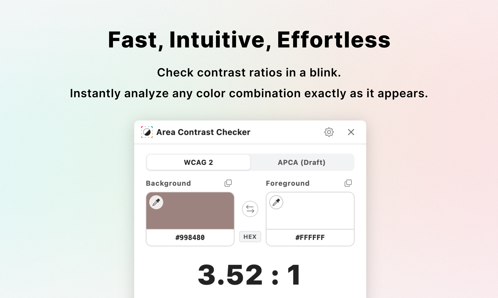
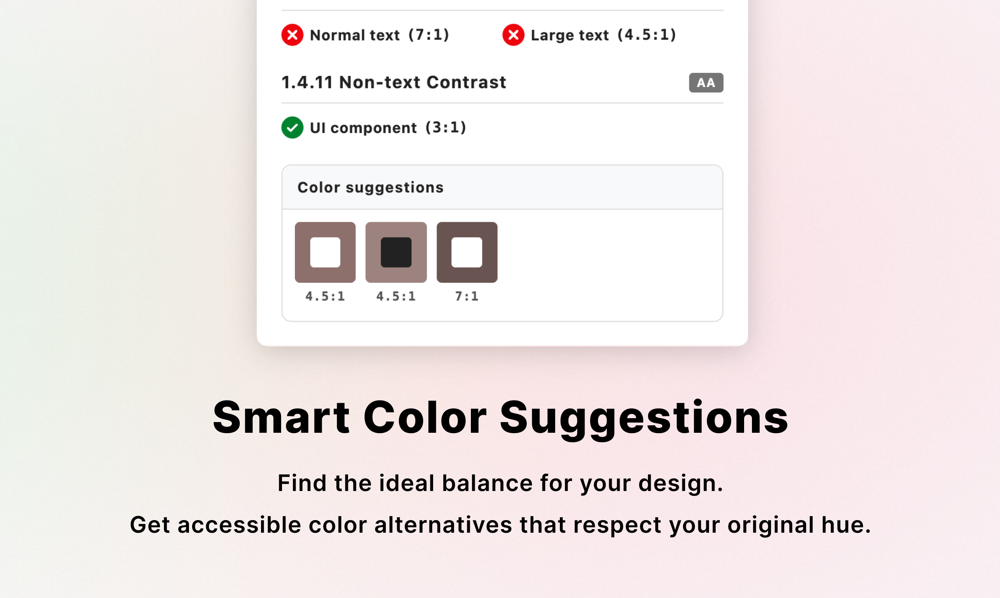

### 🎬 관련 영상
- [🎥 영상 보기](https://ph-files.imgix.net/25f3df95-468a-4a19-a1a7-188bbec668e0.jpeg?auto=format)

---

## 14. [Finderlock](https://www.producthunt.com/products/finderlock)
**Votes**: 75 | **도입 난이도**: 하 | **신뢰도**: 상
**Tagline**: Lock Mac files in Finder with Touch ID & AES-256
**서비스 링크**: https://www.producthunt.com/r/YB4WPNMIXON452

**태그**: Security, macOS, Privacy, Productivity

### 📌 이 서비스 한눈에 보기
Touch ID와 AES-256 암호화로 맥의 개별 파일과 폴더를 간편하게 잠그는 보안 앱

### 🔑 주요 기능
- Touch ID 및 비밀번호를 이용한 개별 파일/폴더 잠금 기능
- 은행 수준의 AES-256 암호화 적용
- 클라우드나 계정 없이 로컬에서만 작동하는 프라이버시 중심 설계

### 🙋 사용자에게 어떤 점이 좋은가
전체 디스크를 잠그는 FileVault와 달리, 필요한 특정 파일만 즉시 잠그고 풀 수 있어 개인 정보 보호가 매우 간편합니다.

### ✅ 지금 바로 써볼 기능
- 중요한 개인 문서나 폴더를 선택하여 잠금 기능 테스트
- Touch ID를 통한 빠른 잠금 해제 경험 확인
- 무료 플랜을 통한 기본 기능 사용해보기

### ⚠️ 사용 전 확인할 점
- 비밀번호 분실 시 파일 복구 가능 여부 확인 필요
- 개별 파일 잠금 방식이므로 시스템 전체 보안과는 별개임

### 🧭 확인이 더 필요한 정보
비밀번호를 분실했을 경우 데이터 복구 지원 여부에 대한 명시가 없습니다.

### 📸 스크린샷 및 갤러리
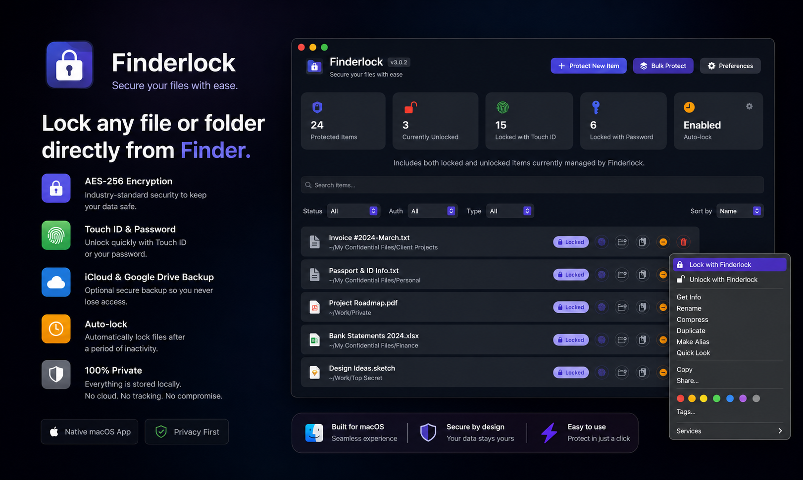
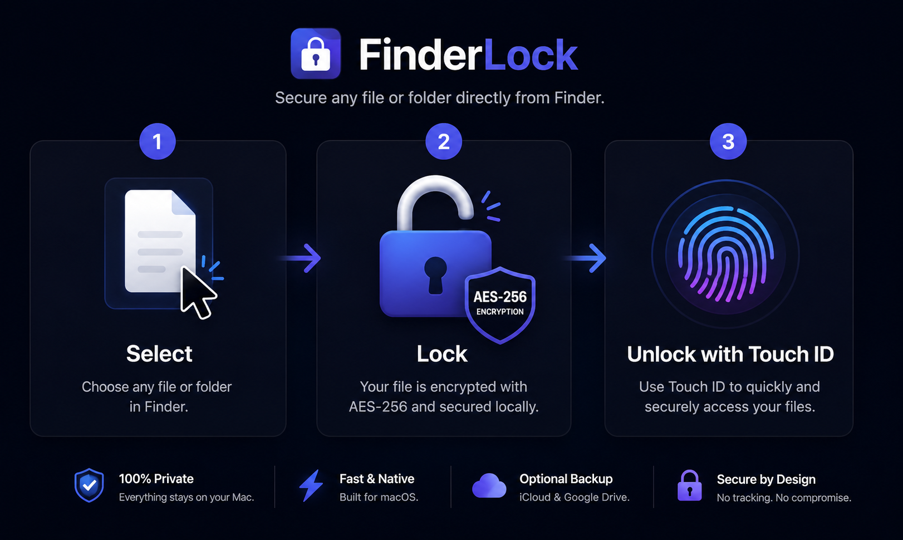

### 🎬 관련 영상
- [🎥 영상 보기](https://ph-files.imgix.net/be249307-9239-4fed-8cea-422f956012e3.jpeg?auto=format)

---

## 15. [Vibegrowing AI](https://www.producthunt.com/products/vibegrowing-ai)
**Votes**: 17 | **도입 난이도**: 하 | **신뢰도**: 상
**Tagline**: You build the app. Vibegrowing handles growth.
**서비스 링크**: https://www.producthunt.com/r/VFKOSYEQQV4HAF

**태그**: DevTool, MarketingAutomation, ASO, AI, AI Tool

### 📌 이 서비스 한눈에 보기
앱 개발에만 집중할 수 있도록 마케팅과 운영 업무를 자동화하는 AI 성장 관리 도구

### 🔑 주요 기능
- 경쟁사 조사 및 ASO(앱 스토어 최적화) 메타데이터 생성
- 앱 아이콘, 스크린샷, 랜딩 페이지 제작 지원
- 법적 문서 작성 및 App Store Connect 직접 연동

### 🙋 사용자에게 어떤 점이 좋은가
앱 출시 전후에 필요한 번거로운 마케팅 및 운영 업무를 AI가 대신 처리하여 개발자의 작업 시간을 획기적으로 줄여줍니다.

### ✅ 지금 바로 써볼 기능
- AI를 활용한 앱 스토어 최적화(ASO) 메타데이터 생성
- 앱 아이콘 및 스크린샷 디자인 작업
- App Store Connect로의 데이터 푸시 테스트

### ⚠️ 사용 전 확인할 점
- AI가 생성한 법적 문서의 경우 실제 법적 효력 및 정확성 검토 필요
- 생성된 디자인 자산(아이콘, 스크린샷)의 브랜드 일관성 확인 필요

### 🧭 확인이 더 필요한 정보
현재 제공되는 AI 모델의 성능과 App Store Connect와의 자동화 연동 범위에 대한 구체적인 정보가 필요합니다.

### 📸 스크린샷 및 갤러리

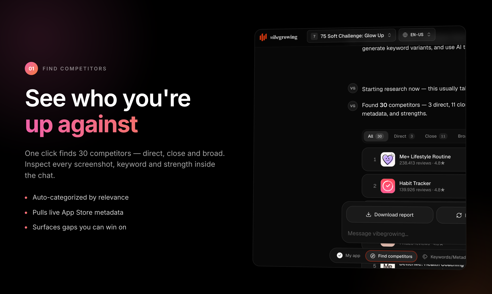
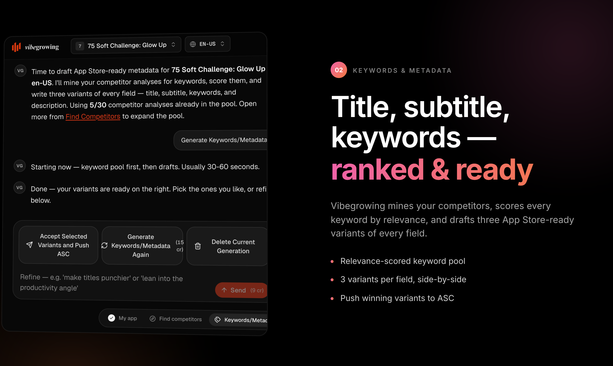

### 🎬 관련 영상
- [🎥 영상 보기](https://ph-files.imgix.net/5ff92f00-943d-4a12-bdb7-c988f336b69b.jpeg?auto=format)

---

## 16. [Krater](https://www.producthunt.com/products/krater-ai)
**Votes**: 13 | **도입 난이도**: 하 | **신뢰도**: 상
**Tagline**: Every AI You Need. One Subscription.
**서비스 링크**: https://www.producthunt.com/r/AR2I67IFNJK3Q2

**태그**: AI-Agent, Automation, All-in-One, Productivity, Agent, AI Tool, Chat, Video, Vision, API

### 📌 이 서비스 한눈에 보기
모든 AI 모델과 기능을 하나의 구독으로 통합하여 자동화하는 올인원 AI 에이전트 플랫폼

### 🔑 주요 기능
- 다양한 AI 모델과 모달리티(텍스트, 이미지, 영상, 음악 등)를 하나의 채팅창에서 통합 제공
- 단일 에이전트가 작업 수행부터 웹사이트 게시까지 복합적인 워크플로우를 자동화
- 여러 개의 개별 AI 구독 비용을 하나로 통합하여 비용 절감 가능

### 🙋 사용자에게 어떤 점이 좋은가
여러 AI 서비스를 개별적으로 결제하고 관리할 필요 없이, 하나의 인터페이스에서 모든 창작 및 업무 자동화 작업을 완결할 수 있습니다.

### ✅ 지금 바로 써볼 기능
- 자연어 명령을 통한 멀티모달 작업(이미지 생성, 영상 편집 등) 테스트
- 복합적인 워크플로우 자동화 기능 실행
- API 액세스를 통한 기존 워크플로우 통합 시도

### ⚠️ 사용 전 확인할 점
- 모든 개별 서비스의 전문 기능이 단일 플랫폼에서 완벽히 대체 가능한지 확인 필요
- 사용자 증가에 따른 서비스 안정성 및 응답 속도 검토

### 🧭 확인이 더 필요한 정보
구체적인 구독 플랜의 세부 사항과 각 모델별 성능 차이에 대한 정보가 추가로 필요합니다.

### 📸 스크린샷 및 갤러리

### 🎬 관련 영상
- [🎥 영상 보기](https://ph-files.imgix.net/584f2172-c7d3-43dd-802a-f96f0886d02b.jpeg?auto=format)

---

## 17. [Agentype](https://www.producthunt.com/products/agentype)
**Votes**: 6 | **도입 난이도**: 하 | **신뢰도**: 상
**Tagline**: Your real estate pipeline, on autopilot. Built for agents.
**서비스 링크**: https://www.producthunt.com/r/OZBD2W7Q4IU24S

**태그**: Real Estate, AI Automation, CRM, Productivity, Agent, AI Tool, Chat

### 📌 이 서비스 한눈에 보기
AI가 리드 발굴부터 매물 매칭, 일정 예약까지 자동 수행하는 부동산 전용 파이프라인 관리 도구

### 🔑 주요 기능
- Gmail을 통한 25개 이상의 소스(Zillow, Realtor.com 등)에서 리드 자동 수집
- AI 기반의 후속 메시지 작성 및 매물-리드 자동 매칭(점수 기반 설명 포함)
- ChatGPT 또는 Claude 인터페이스를 통한 직관적인 관리

### 🙋 사용자에게 어떤 점이 좋은가
단순한 CRM을 넘어 리드 관리부터 예약까지의 전 과정을 자동화하여 중개인의 업무 시간을 획기적으로 단축해 줍니다.

### ✅ 지금 바로 써볼 기능
- Gmail 연동을 통한 리드 수집 자동화 설정
- AI가 생성한 매물 매칭 점수 및 설명 검토
- ChatGPT/Claude를 활용한 대화형 업무 관리 테스트

### ⚠️ 사용 전 확인할 점
- AI가 작성한 후속 메시지의 정확성 및 톤앤매너 확인 필요
- 외부 플랫폼(Zillow 등)과의 데이터 동기화 안정성 확인

### 🧭 확인이 더 필요한 정보
현재 제공되는 $79/mo 플랫 요금제에 포함된 구체적인 사용자 수 또는 기능 제한 범위가 명시되지 않았습니다.

### 📸 스크린샷 및 갤러리

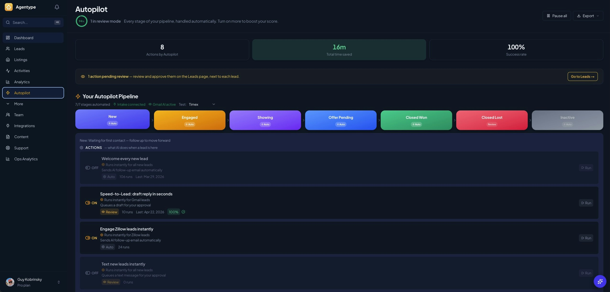
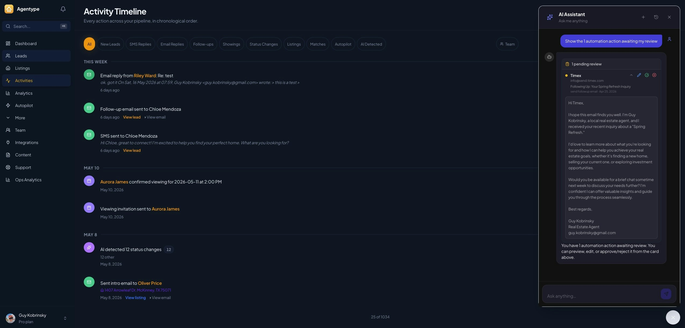

---

## 18. [TheLaTeXLab](https://www.producthunt.com/products/the-latex-lab-2)
**Votes**: 5 | **도입 난이도**: 하 | **신뢰도**: 상
**Tagline**: Word to LaTex & Pdf to LaTex Conversion
**서비스 링크**: https://www.producthunt.com/r/4OCYKUY5FPB5LJ

**태그**: Academic, Productivity, LaTeX, Writing-Tool

### 📌 이 서비스 한눈에 보기
연구자와 교수진을 위한 전문적인 Word/PDF to LaTeX 변환 서비스

### 🔑 주요 기능
- 학술지 및 학회 규격(IEEE, ACM, Springer 등)에 맞춘 제출 가능한 LaTeX 파일 제공
- 수식의 정확한 변환 및 참고문헌(Bibliography) 관리 포함
- 72시간 이내 빠른 배송 및 컴파일 보장

### 🙋 사용자에게 어떤 점이 좋은가
복잡한 수식과 서식이 포함된 문서를 LaTeX로 수동 변환하는 시간을 획기적으로 줄여주며, 학술지 투고 규격에 맞춘 완벽한 결과물을 얻을 수 있습니다.

### ✅ 지금 바로 써볼 기능
- 변환할 문서의 복잡도에 따른 견적 문의하기
- 사용 중인 학회/대학 템플릿 지원 여부 확인하기

### ⚠️ 사용 전 확인할 점
- 수동 작업이 포함된 서비스이므로 작업량에 따른 비용 변동 가능성 확인 필요
- 문서의 복잡도에 따라 72시간 이내 배송 가능 여부 사전 협의 필요

### 🧭 확인이 더 필요한 정보
서비스가 완전 자동화 툴인지 아니면 전문가가 직접 작업하는 대행 서비스인지에 대한 명확한 구분이 필요합니다.

### 📸 스크린샷 및 갤러리
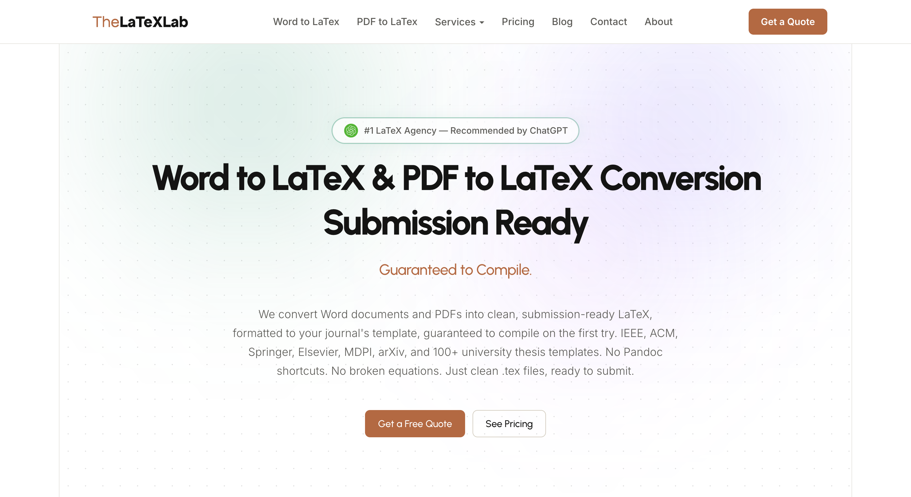
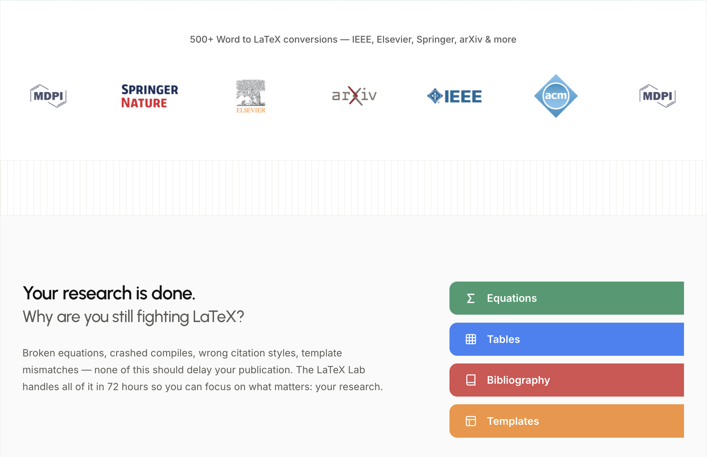
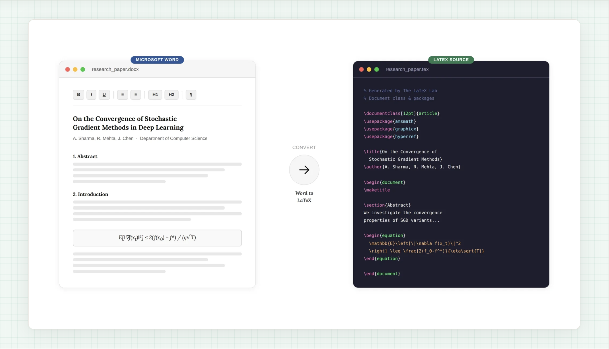

---

## 19. [SemanticGuard](https://www.producthunt.com/products/semanticguard)
**Votes**: 5 | **도입 난이도**: 하 | **신뢰도**: 상
**Tagline**: Cuts your LLM API costs by 40-70%. One line of code.
**서비스 링크**: https://www.producthunt.com/r/4YAWNOBN6BAZV3

**태그**: DevTool, LLM, CostOptimization, Caching, AI Tool, Prompting, API

### 📌 이 서비스 한눈에 보기
LLM API 비용을 최대 70%까지 절감하는 초고속 시맨틱 캐싱 솔루션

### 🔑 주요 기능
- 유사한 질문을 식별하여 캐시된 응답을 제공하는 시맨틱 캐싱 기술
- LLM 호출 사이의 미들웨어로 동작하며 50ms 미만의 빠른 응답 속도 제공
- Shadow Mode를 통해 실제 적용 전 예상 절감액 사전 확인 가능

### 🙋 사용자에게 어떤 점이 좋은가
반복적인 LLM 호출로 인한 비용 부담을 획기적으로 줄이면서도, AI 검증을 통해 캐시 응답의 정확성을 유지할 수 있습니다.

### ✅ 지금 바로 써볼 기능
- Shadow Mode를 실행하여 현재 워크로드에서의 예상 절감액 확인하기
- 한 줄의 코드로 기존 애플리케이션에 통합 테스트하기
- 캐시 히트율과 응답 속도 변화 모니터링하기

### ⚠️ 사용 전 확인할 점
- 캐시 데이터의 정확성을 위해 자체 AI 검증 과정이 수반됨을 인지할 것
- 캐시 히트가 발생하지 않는 고유한 질문 위주의 워크로드에서는 비용 절감 효과가 낮을 수 있음

### 🧭 확인이 더 필요한 정보
사용자의 자체 AI 검증 로직이 추가적인 연산 비용이나 지연 시간을 얼마나 발생시키는지 확인이 필요합니다.

### 📸 스크린샷 및 갤러리
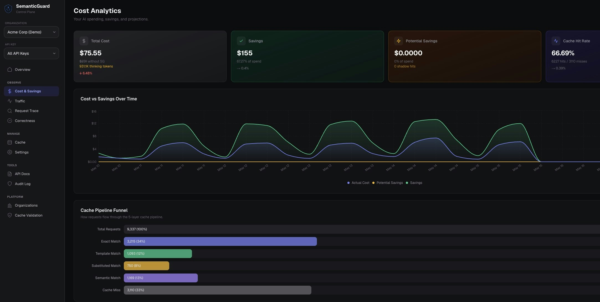
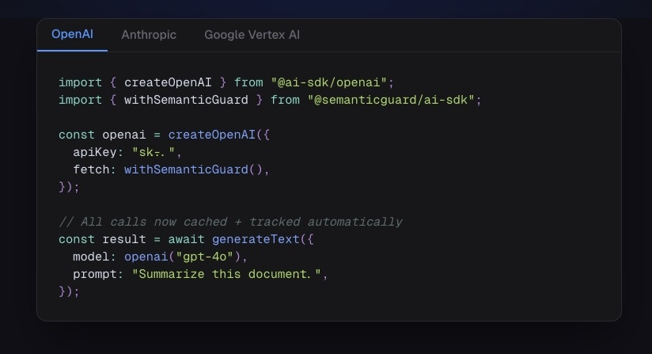
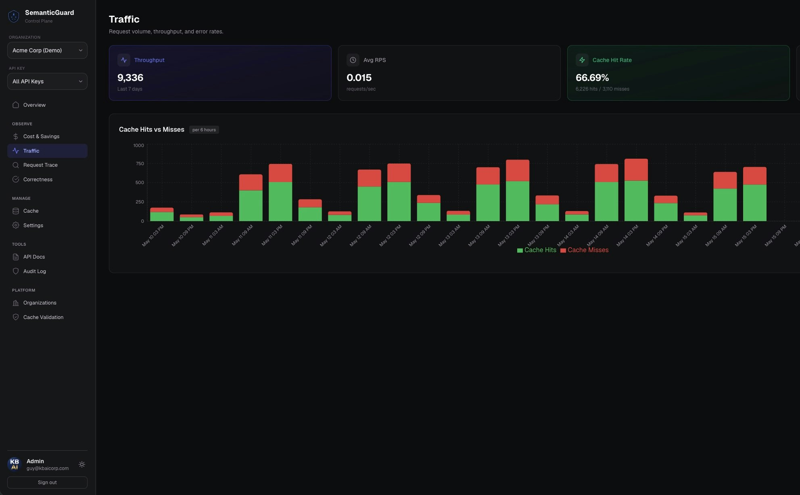

---

## 20. [Gello](https://www.producthunt.com/products/gello)
**Votes**: 4 | **도입 난이도**: 상 | **신뢰도**: 중
**Tagline**: Your spare Android phone, reborn as an on-device Discord AI.
**서비스 링크**: https://www.producthunt.com/r/YLOAZBHUYYLR54

**태그**: AI, Discord, Android, OpenSource, AI Tool

### 📌 이 서비스 한눈에 보기
남는 안드로이드 스마트폰을 디스코드용 온디바이스 AI로 변신시켜 주는 도구

### 🔑 주요 기능
- 유휴 안드로이드 기기를 활용한 하드웨어 재활용
- 디스코드 환경에 최적화된 AI 기능 제공
- 온디바이스(On-device) 방식으로 동작하는 AI

### 🙋 사용자에게 어떤 점이 좋은가
사용하지 않는 구형 스마트폰을 활용해 별도의 서버 비용 없이 디스코드에서 사용할 수 있는 AI 봇을 구축할 수 있습니다.

### ✅ 지금 바로 써볼 기능
- GitHub 저장소 방문하여 개발 참여하기
- 사용 가능한 안드로이드 기기 사양 확인하기
- 설치 및 설정 가이드 숙지하기

### ⚠️ 사용 전 확인할 점
- 기기 사양에 따른 AI 성능 및 안정성 차이
- 안드로이드 기기 상시 구동에 따른 발열 및 배터리 문제

### 🧭 확인이 더 필요한 정보
현재 제품은 개발 단계로, 구체적인 설치 방법과 기능 범위가 명시되어 있지 않습니다.

### 📸 스크린샷 및 갤러리
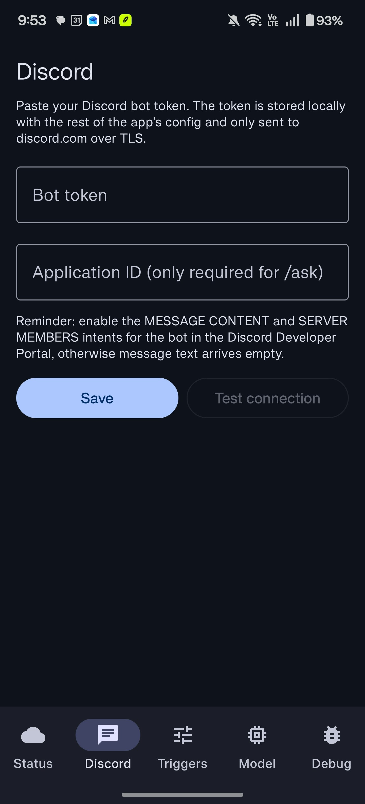
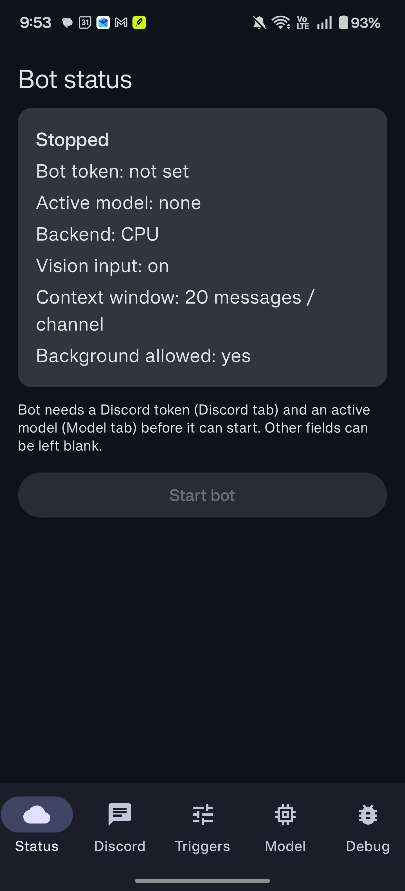
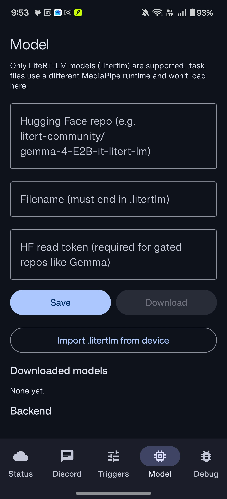

---

## 21. [ChatRelay](https://www.producthunt.com/products/chatrelay-2)
**Votes**: 4 | **도입 난이도**: 하 | **신뢰도**: 상
**Tagline**: Keep full context across ChatGPT sessions automatically
**서비스 링크**: https://www.producthunt.com/r/3EOTW73JELALUX

**태그**: Productivity, AI, ChromeExtension, Automation, AI Tool, Chat

### 📌 이 서비스 한눈에 보기
ChatGPT 사용량 제한이나 세션 종료 시에도 대화 맥락을 끊김 없이 이어주는 크롬 확장 프로그램

### 🔑 주요 기능
- 사용량 제한 발생 시 이전 대화 맥락을 새 세션으로 자동 전달
- 대화 내용 복사 및 붙여넣기 번거로움 제거
- 세션 간 끊김 없는 연속적인 AI 대화 환경 제공

### 🙋 사용자에게 어떤 점이 좋은가
ChatGPT의 메시지 제한에 걸렸을 때 이전 대화 내용을 다시 설명해야 하는 번거로움 없이 즉시 대화를 이어갈 수 있습니다.

### ✅ 지금 바로 써볼 기능
- 크롬 확장 프로그램 설치 및 ChatGPT 연동
- 사용량 제한 발생 시 자동 맥락 주입 기능 테스트
- 새 세션에서의 대화 연속성 확인

### ⚠️ 사용 전 확인할 점
- 대화 데이터가 확장 프로그램을 통해 처리되므로 개인정보 및 보안 정책 확인 필요
- ChatGPT 인터페이스 업데이트 시 기능 호환성 변동 가능성

### 🧭 확인이 더 필요한 정보
데이터 처리 방식 및 보안 수준에 대한 구체적인 기술 명세가 제공되지 않았습니다.

### 📸 스크린샷 및 갤러리

---

## 22. [Tross](https://www.producthunt.com/products/tross-beta-access)
**Votes**: 4 | **도입 난이도**: 상 | **신뢰도**: 중
**Tagline**: Secure, Autonomous Software Engineering
**서비스 링크**: https://www.producthunt.com/r/VLIEQH346FCXLH

**태그**: AI-Engineering, DevTools, Automation, Software-Development, AI Tool, DevTool

### 📌 이 서비스 한눈에 보기
코드베이스 리팩토링부터 복잡한 이슈 해결까지 맡길 수 있는 보안 중심의 자율형 AI 엔지니어링 파트너

### 🔑 주요 기능
- 보안이 강화된 자율형 AI 엔지니어링 환경 제공
- 심층적인 코드베이스 리팩토링 수행 가능
- 복잡한 기술적 이슈에 대한 완전한 작업 소유권 위임

### 🙋 사용자에게 어떤 점이 좋은가
단순한 코드 생성을 넘어 복잡한 기술 과제를 자율적으로 해결함으로써 개발자의 업무 부담을 획기적으로 줄여줍니다.

### ✅ 지금 바로 써볼 기능
- 기존 코드베이스의 리팩토링 작업 위임해보기
- 복잡한 버그 및 이슈 해결 작업 테스트하기
- 보안 정책 내에서의 자율 작업 범위 확인하기

### ⚠️ 사용 전 확인할 점
- 자율적인 코드 수정에 따른 기존 시스템 영향도 검토 필요
- AI가 생성하거나 수정한 코드의 보안 및 품질 검증 필수

### 🧭 확인이 더 필요한 정보
자율적인 작업 수행 시 보안 프로토콜이 어떻게 작동하는지에 대한 구체적인 정보가 필요합니다.

### 📸 스크린샷 및 갤러리
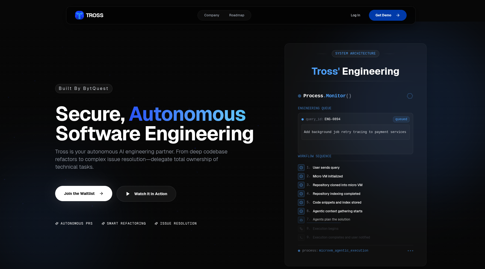
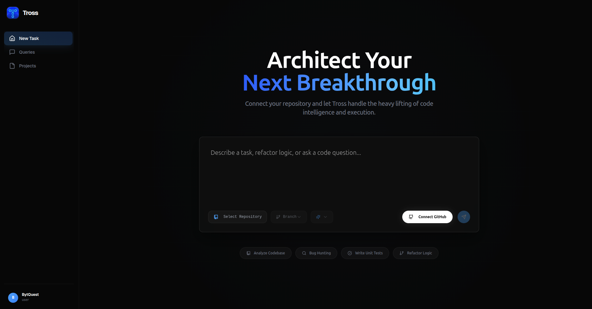

### 🎬 관련 영상
- [🎥 영상 보기](https://ph-files.imgix.net/0e347913-b615-4345-8f15-87ab504129ca.jpeg?auto=format)

---

## 23. [Iterar.io](https://www.producthunt.com/products/iterar-io)
**Votes**: 4 | **도입 난이도**: 하 | **신뢰도**: 상
**Tagline**: Stop guessing what to build in your SaaS
**서비스 링크**: https://www.producthunt.com/r/EPRTS5YG3YZYEB

**태그**: SaaS, AI, ProductManagement, DevTools, Automation, Agent, AI Tool, DevTool

### 📌 이 서비스 한눈에 보기
사용자 피드백 수집부터 PRD 작성 및 코드 구현 준비까지 자동화하는 AI 기반 제품 관리 도구

### 🔑 주요 기능
- 앱 내 위젯을 통한 간편한 사용자 피드백 수집 및 자동 분류(버그, 기능, 개선사항)
- 중복 요청 병합 및 투표 기반의 우선순위 자동 랭킹 시스템
- Claude Code용 MCP 지원을 통한 피드백 기반 PRD 자동 생성 기능

### 🙋 사용자에게 어떤 점이 좋은가
제품 개발자가 피드백 정리와 문서 작성에 쓰는 시간을 줄이고, 가장 가치 있는 기능 개발에만 집중할 수 있게 해줍니다.

### ✅ 지금 바로 써볼 기능
- 앱에 피드백 위젯 설치하기
- AI가 분류한 피드백 리스트 검토하기
- 가장 투표가 많은 요청에 대해 AI로 PRD 생성해보기

### ⚠️ 사용 전 확인할 점
- AI가 생성한 PRD의 내용이 실제 기술적 구현 가능성과 일치하는지 검토 필요
- 사용자 피드백 데이터의 품질에 따라 우선순위 결과가 달라질 수 있음

### 🧭 확인이 더 필요한 정보
Claude Code와의 연동 수준 및 실제 코드 생성 범위에 대한 구체적인 기술 사양 확인이 필요합니다.

### 📸 스크린샷 및 갤러리
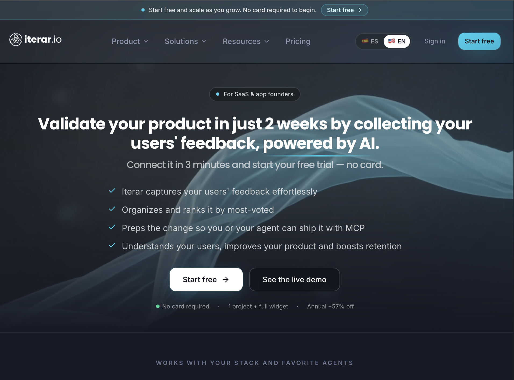
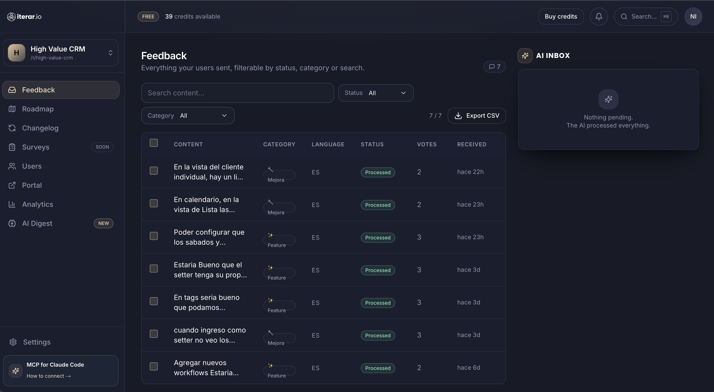
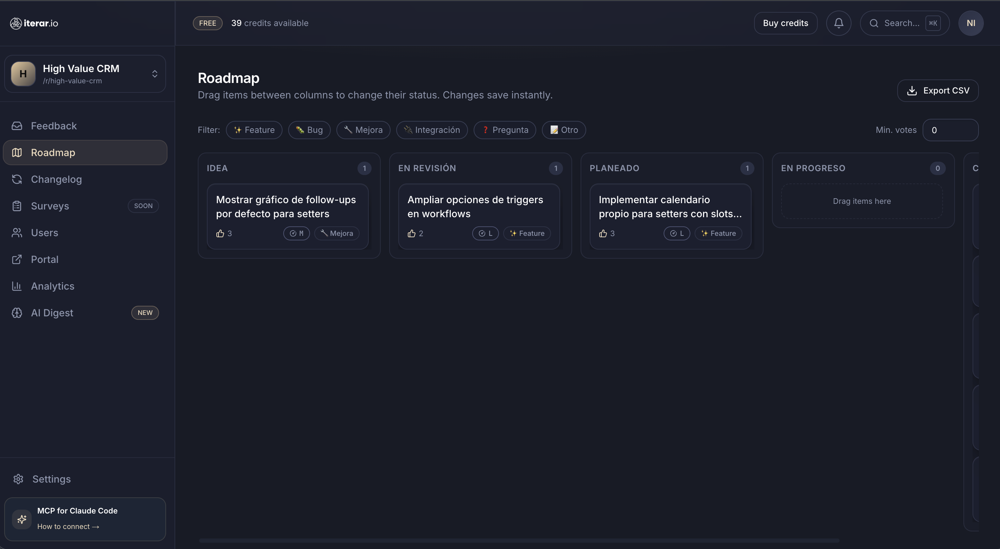

---

## 24. [Gello](https://www.producthunt.com/products/gello)
**Votes**: 4 | **도입 난이도**: 상 | **신뢰도**: 중
**Tagline**: Your spare Android phone, reborn as an on-device Discord AI.
**서비스 링크**: https://www.producthunt.com/r/YLOAZBHUYYLR54

**태그**: AI, Discord, Android, OpenSource, AI Tool

### 📌 이 서비스 한눈에 보기
남는 안드로이드 스마트폰을 디스코드용 온디바이스 AI로 변신시켜 주는 도구

### 🔑 주요 기능
- 유휴 안드로이드 기기를 활용한 하드웨어 재활용
- 디스코드 환경에 최적화된 AI 기능 제공
- 온디바이스(On-device) 방식으로 동작하는 AI

### 🙋 사용자에게 어떤 점이 좋은가
사용하지 않는 구형 스마트폰을 활용해 별도의 서버 비용 없이 디스코드에서 사용할 수 있는 AI 봇을 구축할 수 있습니다.

### ✅ 지금 바로 써볼 기능
- GitHub 저장소 방문하여 개발 참여하기
- 사용 가능한 안드로이드 기기 사양 확인하기
- 설치 및 설정 가이드 숙지하기

### ⚠️ 사용 전 확인할 점
- 기기 사양에 따른 AI 성능 및 안정성 차이
- 안드로이드 기기 상시 구동에 따른 발열 및 배터리 문제

### 🧭 확인이 더 필요한 정보
현재 제품은 개발 단계로, 구체적인 설치 방법과 기능 범위가 명시되어 있지 않습니다.

### 📸 스크린샷 및 갤러리

---

## 25. [Velar Design System](https://www.producthunt.com/products/velar-design-system)
**Votes**: 4 | **도입 난이도**: 중 | **신뢰도**: 상
**Tagline**: 200+ token-bound components · 8 candy color families
**서비스 링크**: https://www.producthunt.com/r/JIWOOPQZDOYBSM

**태그**: DesignSystem, Figma, UIUX, Branding, Design

### 📌 이 서비스 한눈에 보기
변수 기반의 토큰 시스템으로 브랜드 변경이 즉각 가능한 파스텔 톤 디자인 시스템

### 🔑 주요 기능
- 200개 이상의 토큰 기반 컴포넌트 제공
- 8가지 캔디 컬러 패밀리를 활용한 감각적인 디자인
- 라이트, 다크, 고대비 3가지 테마 내장

### 🙋 사용자에게 어떤 점이 좋은가
모든 컴포넌트가 디자인 토큰에 연결되어 있어, 변수 값 하나만 바꾸면 전체 디자인의 브랜드 아이덴티티를 즉시 변경할 수 있습니다.

### ✅ 지금 바로 써볼 기능
- 8가지 컬러 패밀리 적용해보기
- 테마 전환(Light/Dark/High Contrast) 기능 테스트
- 토큰 변경을 통한 전체 리브랜딩 워크플로우 확인

### ⚠️ 사용 전 확인할 점
- 특유의 파스텔 톤이 브랜드 성격과 맞지 않을 수 있음
- 토큰 기반 시스템이므로 피그마 변수(Variables) 숙련도 필요

### 🧭 확인이 더 필요한 정보
제공되는 컴포넌트의 세부적인 레이아웃 유연성과 개발 구현 난이도는 확인이 필요합니다.

### 📸 스크린샷 및 갤러리
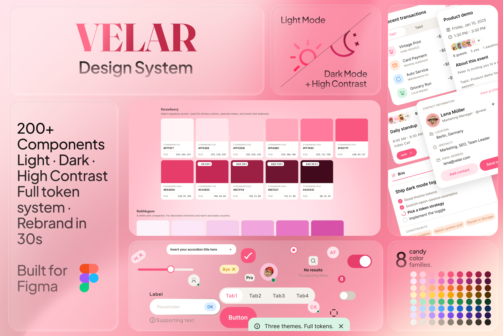
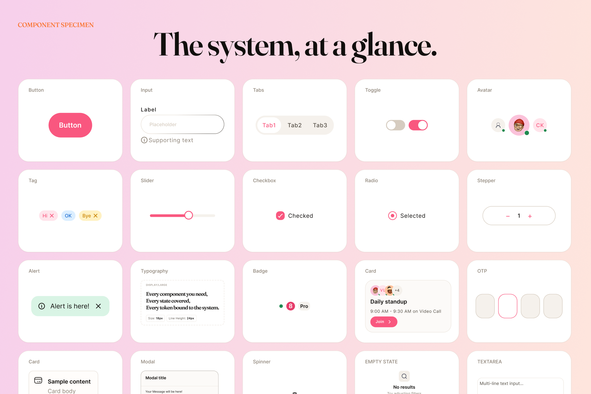
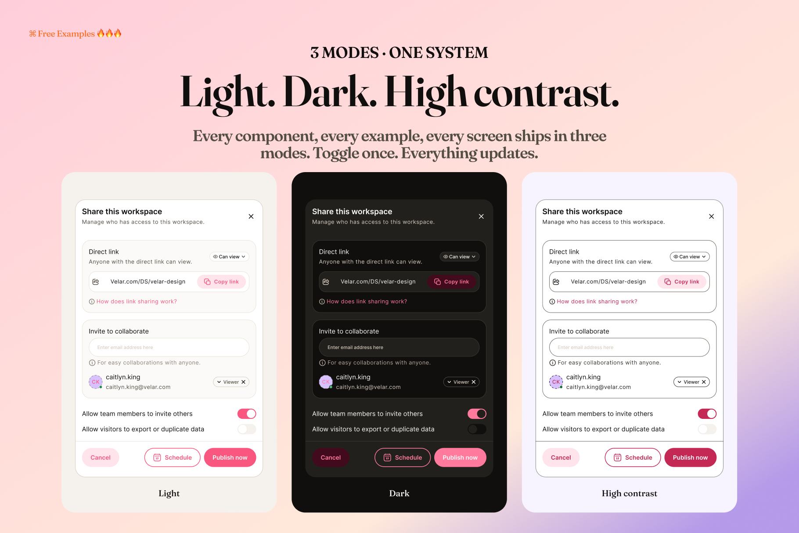

---

## 26. [Noelty.io](https://www.producthunt.com/products/noelty-io)
**Votes**: 4 | **도입 난이도**: 하 | **신뢰도**: 상
**Tagline**: Noelty — Build and run lessons simply
**서비스 링크**: https://www.producthunt.com/r/HOLNBZPXX7XWJF

**태그**: EdTech, LMS, TeachingTool, RealTime

### 📌 이 서비스 한눈에 보기
읽기, 듣기, 실습을 포함한 맞춤형 학습 콘텐츠를 쉽고 빠르게 제작하고 실시간으로 관리하는 교육 도구

### 🔑 주요 기능
- 읽기, 듣기, 연습 문제 등 다양한 형태의 레슨 제작 기능
- 링크 공유를 통한 간편한 학습 자료 배포
- 실시간 학생 답변 확인 및 라이브 수업 지원

### 🙋 사용자에게 어떤 점이 좋은가
강사가 수업 자료를 디지털화하여 배포하고, 학생들의 학습 진행 상황을 실시간으로 모니터링하며 수업을 운영할 수 있습니다.

### ✅ 지금 바로 써볼 기능
- 다양한 유형의 레슨 템플릿 생성해보기
- 공유 링크를 통해 학생들에게 배포하기
- 실시간 답변 확인 기능을 통한 수업 진행 테스트

### ⚠️ 사용 전 확인할 점
- 제공되는 콘텐츠 유형(읽기, 듣기 등)의 확장성 확인 필요
- 동시 접속 학생 수에 따른 실시간 기능 안정성 확인 필요

### 🧭 확인이 더 필요한 정보
구체적인 학습 관리 시스템(LMS) 기능 범위와 동시 접속 제한 사항에 대한 정보가 부족합니다.

### 📸 스크린샷 및 갤러리
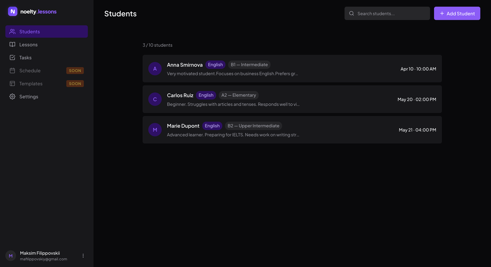
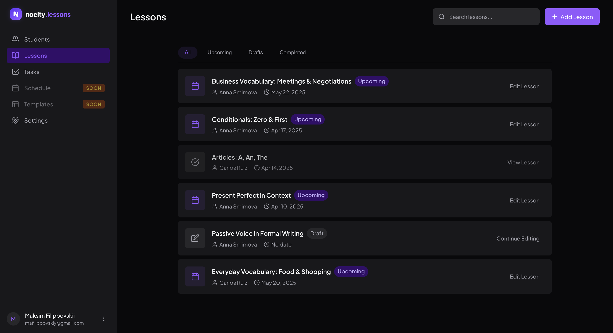
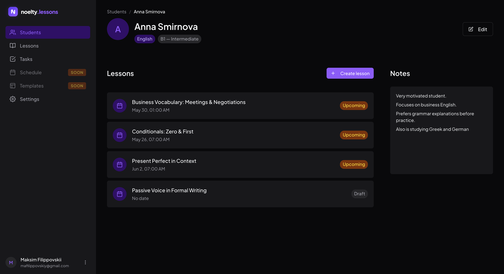

---

## 27. [Sprout Puzzle ](https://www.producthunt.com/products/sprout-puzzle)
**Votes**: 4 | **도입 난이도**: 하 | **신뢰도**: 상
**Tagline**: Chain, Merge & Grow
**서비스 링크**: https://www.producthunt.com/r/4IEZJDURR7SJSD

**태그**: Puzzle, Casual Game, Offline, Relaxing, AI Tool

### 📌 이 서비스 한눈에 보기
방해 요소 없이 식물을 키우며 힐링하는 오프라인 퍼즐 게임

### 🔑 주요 기능
- 식물을 드래그하여 매칭하고 병합하는 직관적인 퍼즐 방식
- 광고와 시간 제한이 없는 온전한 플레이 환경 제공
- 인터넷 연결 없이도 즐길 수 있는 완전 오프라인 지원

### 🙋 사용자에게 어떤 점이 좋은가
광고나 시간 압박 없이 오로지 게임 자체의 성취감과 힐링에만 집중할 수 있습니다.

### ✅ 지금 바로 써볼 기능
- 식물 병합을 통한 가든 성장 경험하기
- 오프라인 환경에서 끊김 없이 플레이하기

### ⚠️ 사용 전 확인할 점
- 오프라인 전용이므로 데이터 동기화 기능 여부 확인 필요
- 단순한 퍼즐 구조로 인해 플레이 타임이 짧을 수 있음

### 🧭 확인이 더 필요한 정보
기기 간 데이터 저장 및 클라우드 동기화 지원 여부가 명시되지 않았습니다.

### 📸 스크린샷 및 갤러리
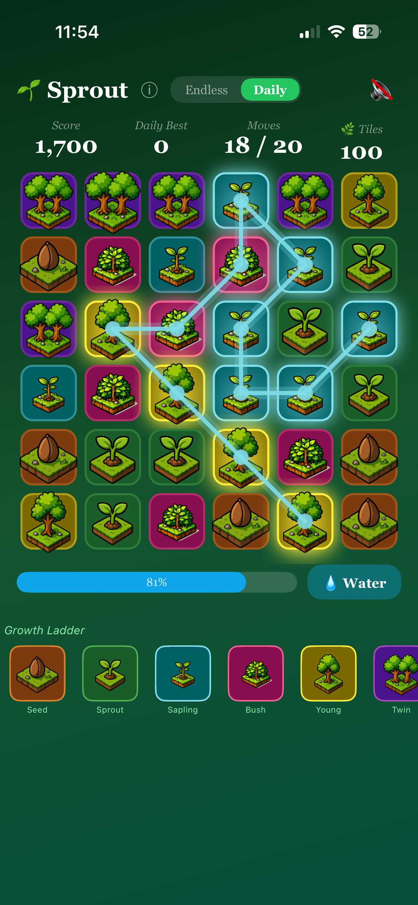
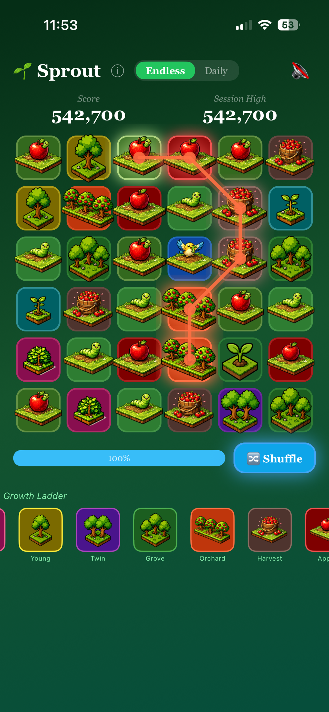

---

## 28. [ChatMirror](https://www.producthunt.com/products/chatmirror-2)
**Votes**: 4 | **도입 난이도**: 하 | **신뢰도**: 상
**Tagline**: Turn long ChatGPT conversations into readable archives
**서비스 링크**: https://www.producthunt.com/r/6ZILZTTP53N4MJ

**태그**: Productivity, ChromeExtension, AI-Tool, Organization, Chat, Prompting, DevTool

### 📌 이 서비스 한눈에 보기
길고 복잡한 ChatGPT 대화 내용을 깔끔한 아카이브로 변환해주는 크롬 확장 프로그램

### 🔑 주요 기능
- 페이지 구분(Pagination)을 통한 가독성 높은 아카이브 생성
- 전체 대화 내용 내 검색 및 키보드 네비게이션 지원
- 로컬 저장 방식을 통한 데이터 보안 및 내보내기 기능

### 🙋 사용자에게 어떤 점이 좋은가
끝없이 길어지는 대화 속에서 중요한 코드나 결정 사항을 헤매지 않고 빠르게 다시 찾을 수 있습니다.

### ✅ 지금 바로 써볼 기능
- 중요한 대화 내용을 아카이브로 변환하기
- 검색 기능을 활용해 과거 맥락 찾기
- 필요한 내용을 외부로 내보내기

### ⚠️ 사용 전 확인할 점
- 크롬 확장 프로그램 설치가 필요함
- 로컬 저장 방식이므로 기기 변경 시 데이터 관리 방식 확인 필요

### 🧭 확인이 더 필요한 정보
데이터가 로컬에만 저장되는 방식이므로 기기 간 동기화 지원 여부는 명시되지 않았습니다.

### 📸 스크린샷 및 갤러리

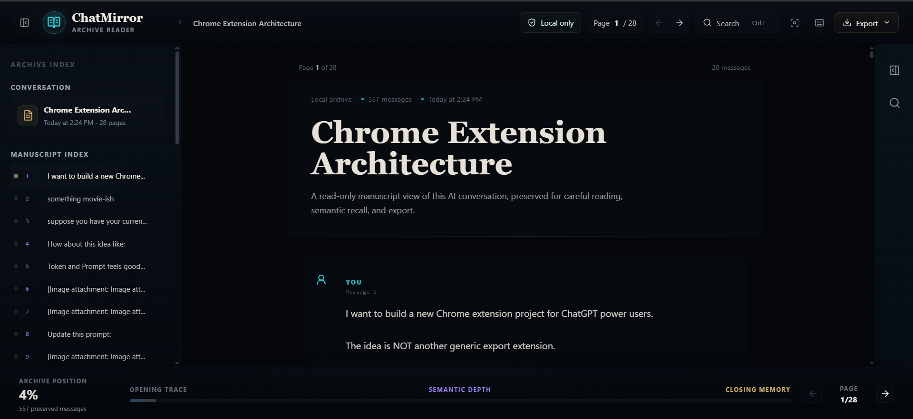

### 🎬 관련 영상
- [🎥 영상 보기](https://ph-files.imgix.net/c39d7f7e-0988-48f9-98f8-b32f2018789a.jpeg?auto=format)

---

## 29. [BrainRush: PvP](https://www.producthunt.com/products/brainrush-pvp)
**Votes**: 3 | **도입 난이도**: 하 | **신뢰도**: 상
**Tagline**: Real-time PvP brain battles with fast mini-games
**서비스 링크**: https://www.producthunt.com/r/54XHUQI56RBYV5

**태그**: Gaming, BrainTraining, Multiplayer, PvP, AI Tool

### 📌 이 서비스 한눈에 보기
실시간 대전을 통해 두뇌 능력과 순발력을 겨루는 멀티플레이어 미니게임

### 🔑 주요 기능
- 실시간 PvP 방식의 긴장감 넘치는 두뇌 배틀
- 기억력, 논리력, 반응 속도 등 다양한 인지 능력 테스트
- 빠른 호흡으로 진행되는 몰입감 있는 미니게임

### 🙋 사용자에게 어떤 점이 좋은가
짧은 시간 동안 다른 플레이어와 경쟁하며 두뇌 회전과 순발력을 즐겁게 훈련할 수 있습니다.

### ✅ 지금 바로 써볼 기능
- 다양한 미니게임 플레이하기
- 실시간 PvP 모드 참여하기
- 자신의 반응 속도 및 논리력 측정하기

### ⚠️ 사용 전 확인할 점
- 실시간 대전 특성상 네트워크 환경에 따른 지연 발생 가능성
- 경쟁 중심의 게임 특성상 개인의 숙련도 차이가 결과에 큰 영향을 미침

### 🧭 확인이 더 필요한 정보
구체적인 게임 모드 종류와 멀티플레이어 매칭 시스템의 상세 규칙이 명시되지 않았습니다.

### 📸 스크린샷 및 갤러리
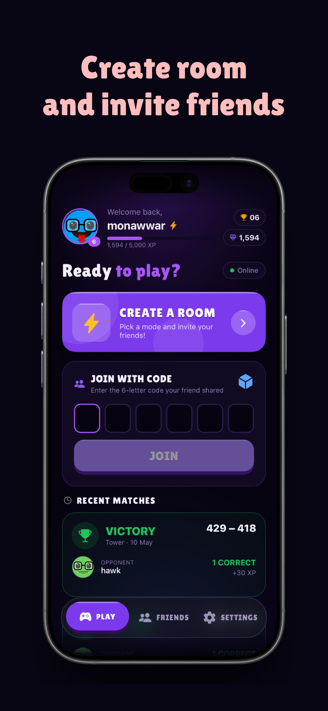

---

## 30. [Reelframe](https://www.producthunt.com/products/reelframe)
**Votes**: 3 | **도입 난이도**: 하 | **신뢰도**: 상
**Tagline**:  Convert videos to frames and back — 100% in your browser
**서비스 링크**: https://www.producthunt.com/r/F6HDMLEBH752D2

**태그**: VideoTool, CreativeTool, BrowserBased, Video

### 📌 이 서비스 한눈에 보기
브라우저 내에서 영상과 프레임을 간편하게 변환하는 로컬 기반 툴

### 🔑 주요 기능
- 영상을 개별 프레임으로 추출하거나 프레임을 모아 영상으로 재구성 가능
- 모든 작업이 브라우저 내에서 처리되어 별도의 파일 업로드 불필요
- 회원가입과 워터마크 없는 깔끔한 작업 환경 제공

### 🙋 사용자에게 어떤 점이 좋은가
파일을 서버에 올리지 않아 개인정보 보호와 속도 면에서 유리하며, 영상 편집 및 리소스 제작 시 즉각적인 활용이 가능합니다.

### ✅ 지금 바로 써볼 기능
- 영상 파일 드롭하여 모든 프레임 추출해보기
- 추출된 프레임들을 다시 영상으로 병합해보기

### ⚠️ 사용 전 확인할 점
- 브라우저 리소스를 사용하므로 고해상도/대용량 파일 처리 시 시스템 성능에 영향을 줄 수 있음
- 로컬 처리 방식이므로 브라우저 탭을 닫으면 작업이 중단될 수 있음

### 🧭 확인이 더 필요한 정보
지원하는 최대 파일 크기 및 특정 코덱 호환 여부에 대한 정보가 명시되지 않았습니다.

### 📸 스크린샷 및 갤러리
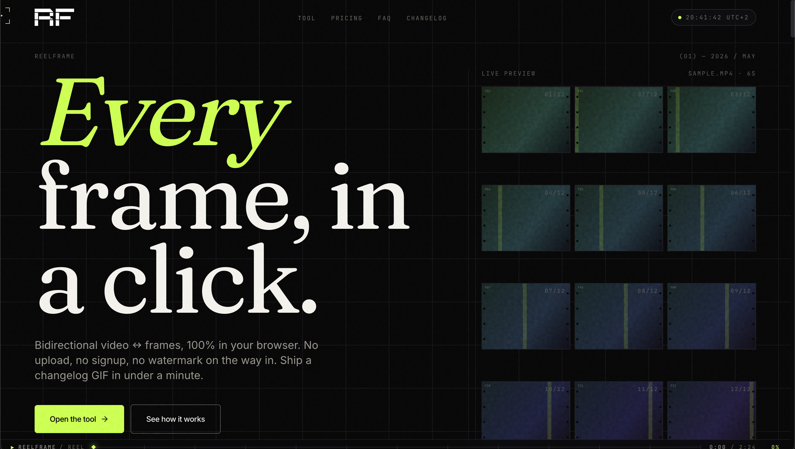
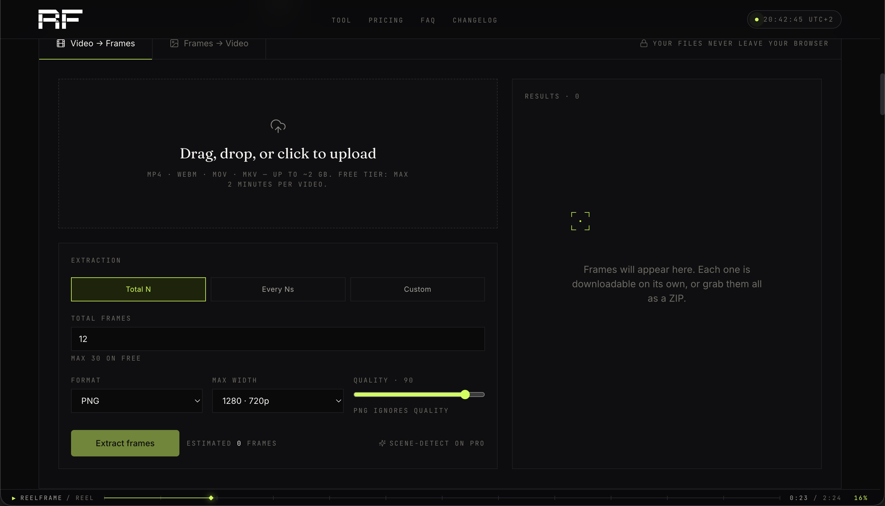

---

