# 🚀 Product Hunt Daily Top 30 (2026-05-26)

## 오늘의 요약
오늘의 트렌드는 AI가 단순한 보조 도구를 넘어 사용자의 업무 맥락을 이해하고, 반복적인 업무를 스스로 소프트웨어로 전환하거나 데이터를 정제하는 '에이전트형 자동화'에 집중되었습니다. 또한, 복잡한 과정을 생략하고 특정 목적(이력서, 데이터 분석, 음악 생성 등)에 최적화된 미니멀하고 전문적인 도구들이 주목받았습니다.

### 오늘의 핵심 포인트
- 사용자의 업무 패턴과 맥락을 학습하여 스스로 워크플로우를 구축하는 지능형 자동화 솔루션이 등장했습니다.
- 데이터 추출, 마크다운 변환, 자연어 분석 등 AI 에이전트와 LLM 활용을 최적화하기 위한 데이터 정제 도구들이 눈에 띕니다.
- 복잡한 설정 없이 즉각적인 결과물을 제공하거나, 사용자가 직접 커스텀할 수 있는 미니멀한 인터페이스의 서비스들이 강세를 보였습니다.

**오늘의 태그**: AI Agent, Workflow Automation, Data Intelligence, Productivity

## 1. [Unabyss](https://www.producthunt.com/products/unabyss)
**Votes**: 408 | **도입 난이도**: 중 | **신뢰도**: 상
**Tagline**: MCP-native self-updating context layer for your AI
**서비스 링크**: https://www.producthunt.com/r/3EY2VAEXSWTXAR

**태그**: AI, Automation, Productivity, MCP, DevTool, AI Tool

### 📌 이 서비스 한눈에 보기
매번 설명할 필요 없이 AI에게 나의 작업 맥락을 자동으로 전달하는 MCP 기반 컨텍스트 레이어

### 🔑 주요 기능
- 사용 중인 앱의 데이터를 자동으로 추출 및 구조화하여 실시간 컨텍스트 유지
- MCP(Model Context Protocol)를 통한 다양한 AI 도구와의 간편한 공유
- 각 AI 도구별로 데이터 접근 범위를 설정할 수 있는 세밀한 제어 기능

### 🙋 사용자에게 어떤 점이 좋은가
AI에게 반복적인 배경 설명이나 데이터 입력을 할 필요가 없어 작업 흐름이 끊기지 않습니다.

### ✅ 지금 바로 써볼 기능
- 주로 사용하는 앱 연결하기
- AI 도구별 데이터 접근 권한 설정하기
- 자동 업데이트되는 컨텍스트 확인하기

### ⚠️ 사용 전 확인할 점
- 개인정보 및 민감 데이터가 포함된 앱 연결 시 보안 설정 주의 필요
- 연결된 앱의 데이터 구조에 따른 자동 추출 정확도 차이 가능성

### 🧭 확인이 더 필요한 정보
지원하는 외부 앱의 종류와 MCP 프로토콜 외의 호환성 범위에 대한 구체적인 정보가 필요합니다.

### 📸 스크린샷 및 갤러리

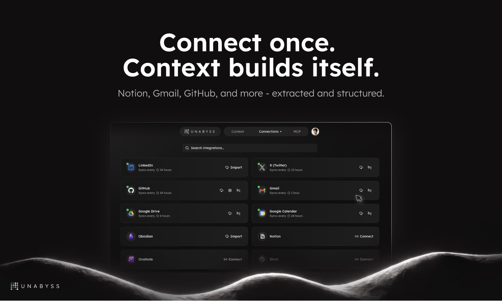
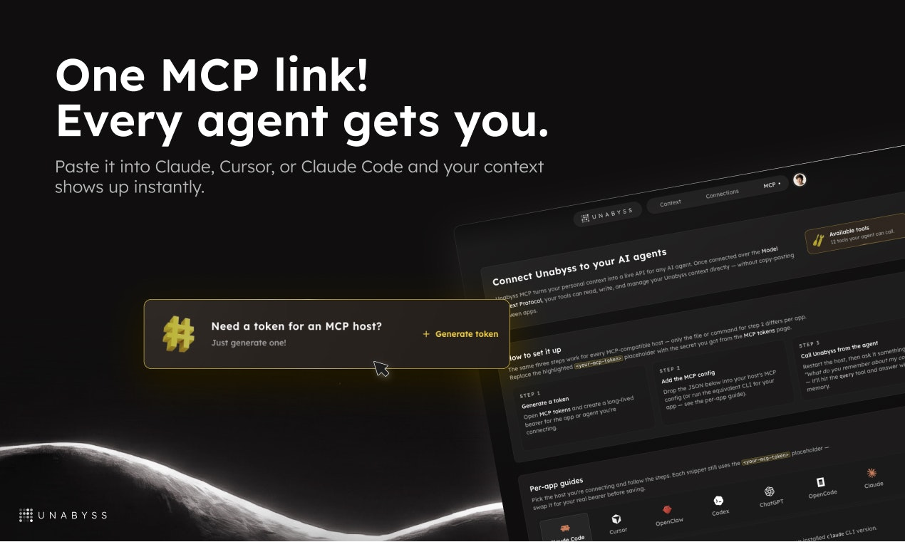

### 🎬 관련 영상
- [🎥 영상 보기](https://ph-files.imgix.net/00398add-1346-4877-b3b2-5c7f76e7f54f.jpeg?auto=format)

---

## 2. [own.page](https://www.producthunt.com/products/own-page)
**Votes**: 379 | **도입 난이도**: 하 | **신뢰도**: 상
**Tagline**: Make your own personal website with bento tiles
**서비스 링크**: https://www.producthunt.com/r/MG5MNTMYZSEPJI

**태그**: NoCode, PersonalBranding, CreatorTools, Design

### 📌 이 서비스 한눈에 보기
벤토 타일 스타일로 나만의 개성 있는 개인 웹사이트를 1분 만에 구축하는 링크 인 바이오 서비스

### 🔑 주요 기능
- 단순 링크 목록을 넘어선 생동감 있는 개인 웹사이트 레이아웃 제공
- 벤토 타일 디자인을 활용한 쉽고 빠른 페이지 빌딩
- 다양한 위젯과 통합 기능을 통한 커스터마이징 및 방문자 분석

### 🙋 사용자에게 어떤 점이 좋은가
크리에이터와 창업자가 복잡한 개발 과정 없이도 세련된 개인 프로필 페이지를 만들어 팬들과 소통하고 영향력을 확장할 수 있습니다.

### ✅ 지금 바로 써볼 기능
- 벤토 타일 레이아웃으로 페이지 디자인하기
- 필요한 위젯 및 외부 서비스 연동하기
- 방문자 분석 데이터 확인하기

### ⚠️ 사용 전 확인할 점
- 제공되는 위젯 외의 복잡한 기능 구현에는 한계가 있을 수 있음
- 자유로운 커스터마이징 범위가 템플릿 구조 내로 제한될 수 있음

### 🧭 확인이 더 필요한 정보
구체적인 위젯 종류와 외부 서비스 연동 가능한 목록은 제품 내부에서 확인이 필요합니다.

### 📸 스크린샷 및 갤러리
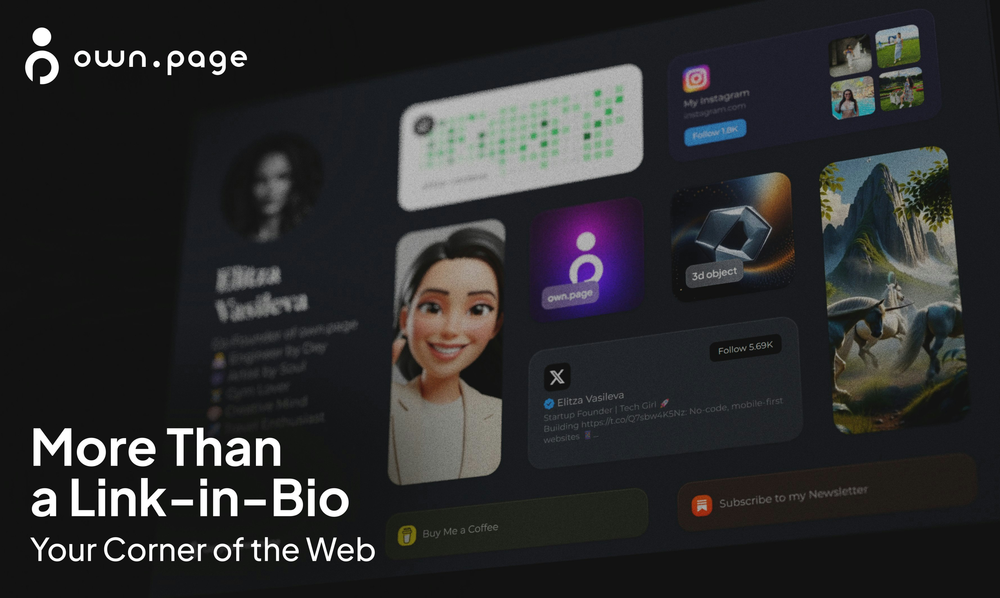

### 🎬 관련 영상
- [🎥 영상 보기](https://ph-files.imgix.net/8702d7fb-9f56-4a83-8a99-040d383a5b32.jpeg?auto=format)

---

## 3. [Yansu](https://www.producthunt.com/products/yansu)
**Votes**: 277 | **도입 난이도**: 하 | **신뢰도**: 상
**Tagline**: AI that learns how you work and turns it into software
**서비스 링크**: https://www.producthunt.com/r/YAPEOVBKBZUMNZ

**태그**: AI, Automation, NoCode, Productivity, AI Tool, DevTool

### 📌 이 서비스 한눈에 보기
사용자의 반복적인 업무 패턴을 학습하여 자동으로 소프트웨어와 자동화 도구를 생성하는 AI

### 🔑 주요 기능
- 기존 업무 방식(파일, 메시지, 워크플로우)에서 반복 패턴 자동 감지
- 별도의 프로세스 매핑 없이 일상적인 루틴을 앱과 자동화로 변환
- 코딩 없이 가벼운 내부 도구 및 운영 자동화 구축 가능

### 🙋 사용자에게 어떤 점이 좋은가
복잡한 설계 과정 없이도 반복되는 업무를 시스템화하여 운영 효율을 높이고 수동 작업을 줄일 수 있습니다.

### ✅ 지금 바로 써볼 기능
- 현재 수행 중인 반복적인 업무 데이터 제공하기
- AI가 제안하는 자동화 패턴 검토하기
- 생성된 가벼운 내부 도구 실무에 적용하기

### ⚠️ 사용 전 확인할 점
- 학습 데이터(메시지, 파일 등)에 포함된 민감 정보 보안 확인 필요
- 복잡한 비즈니스 로직이 포함된 업무의 경우 자동 생성 결과의 정확도 검증 필요

### 🧭 확인이 더 필요한 정보
학습 데이터의 보안 처리 방식과 외부 서비스와의 구체적인 연동 범위에 대한 정보가 더 필요합니다.

### 📸 스크린샷 및 갤러리
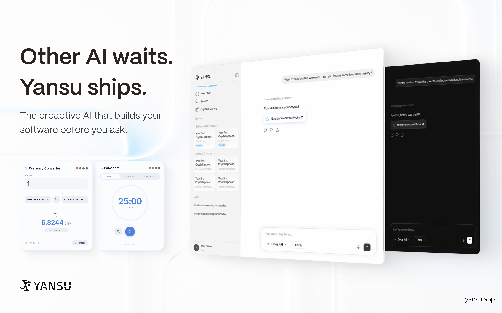
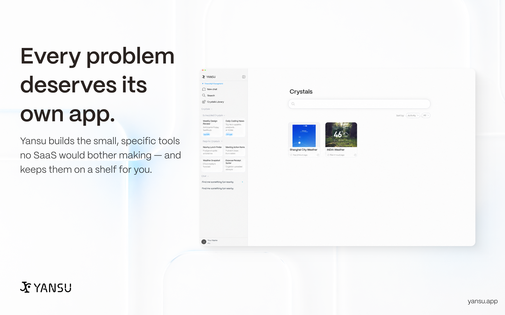
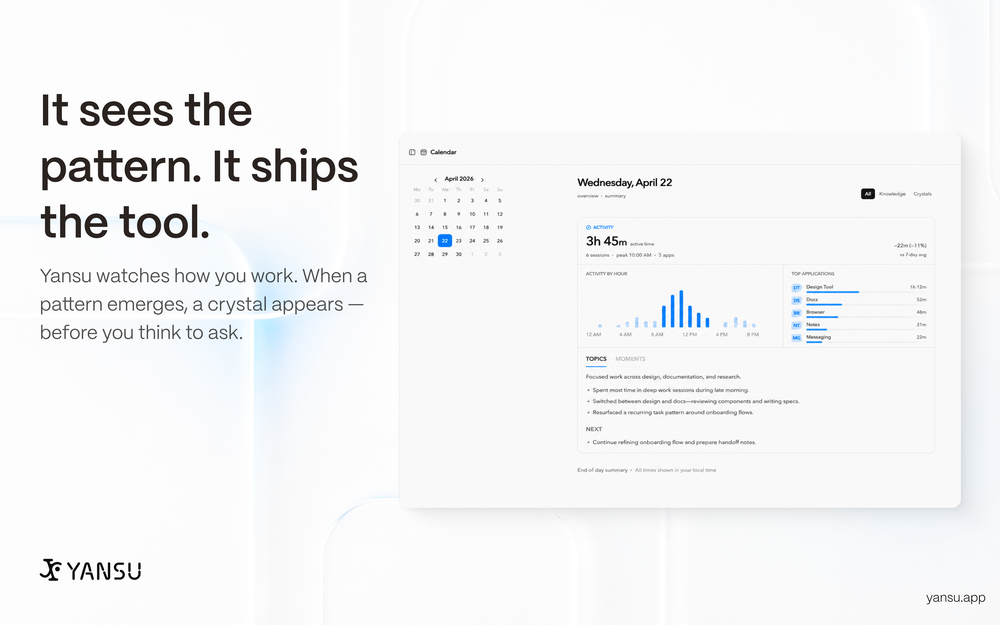

### 🎬 관련 영상
- [🎥 영상 보기](https://ph-files.imgix.net/77d496d1-bfba-4b46-a2df-5c7097eef2e2.jpeg?auto=format)

---

## 4. [Supaboard 3.0](https://www.producthunt.com/products/supaboard-ai)
**Votes**: 243 | **도입 난이도**: 하 | **신뢰도**: 상
**Tagline**: AI data analysts that understand your business
**서비스 링크**: https://www.producthunt.com/r/AV6HLWXM6B3HLF

**태그**: AI, Data Analytics, Business Intelligence, Automation, AI Tool

### 📌 이 서비스 한눈에 보기
SQL이나 복잡한 대시보드 작업 없이 자연어로 비즈니스 데이터를 분석하고 시각화하는 AI 데이터 분석가

### 🔑 주요 기능
- 자연어 질의를 통한 데이터 분석 (Plain English)
- SQL 작성 및 대시보드 구축 시간 단축
- 데이터 기반 의사결정 속도 향상

### 🙋 사용자에게 어떤 점이 좋은가
데이터 분석 전문가가 아니더라도 일상 언어로 질문하여 즉각적인 비즈니스 인사이트와 시각화된 리포트를 얻을 수 있습니다.

### ✅ 지금 바로 써볼 기능
- 자연어로 비즈니스 질문 던져보기
- 질문 결과로 대시보드 자동 생성하기
- 기존 데이터 소스 연결 테스트하기

### ⚠️ 사용 전 확인할 점
- 복잡한 비즈니스 로직이 포함된 질문의 정확도 확인 필요
- 데이터 소스 보안 및 권한 설정 확인

### 🧭 확인이 더 필요한 정보
지원 가능한 데이터 소스의 종류와 데이터 보안 정책에 대한 구체적인 정보가 필요합니다.

### 📸 스크린샷 및 갤러리
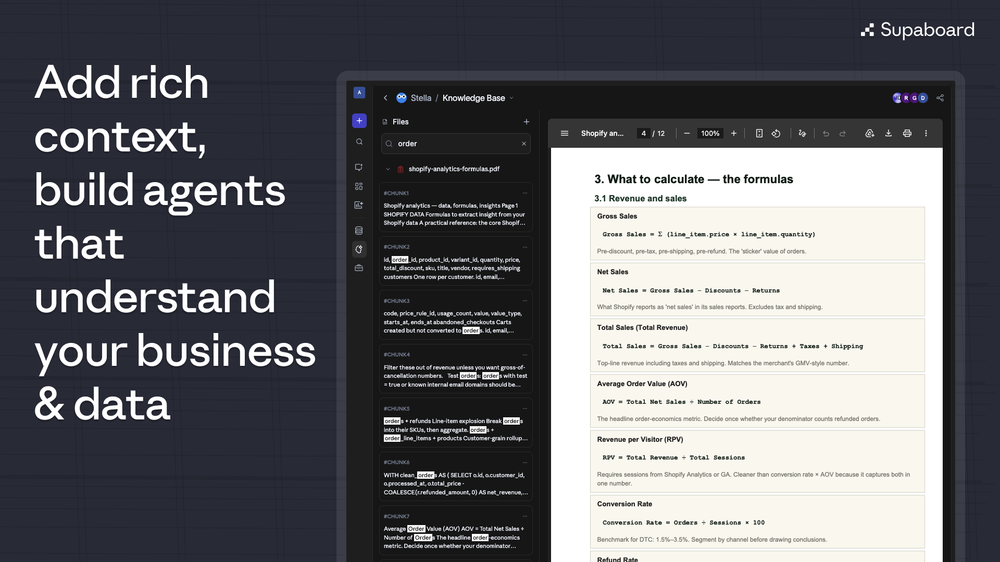
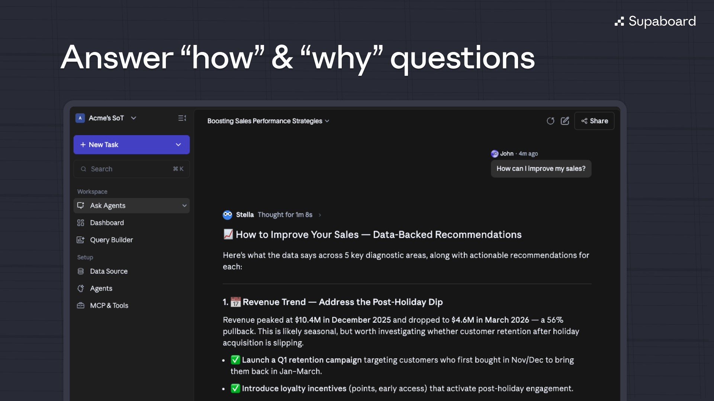
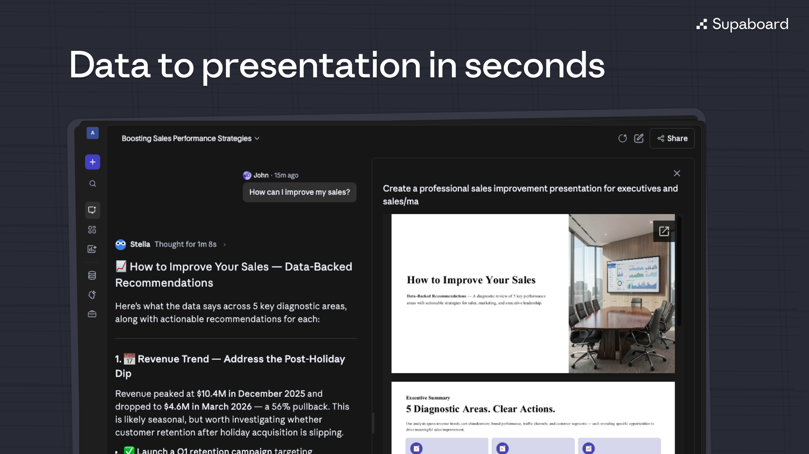

### 🎬 관련 영상
- [🎥 영상 보기](https://ph-files.imgix.net/a31ca958-926b-415d-be2d-f35aafb379be.jpeg?auto=format)

---

## 5. [tweet.md](https://www.producthunt.com/products/tweet-md)
**Votes**: 191 | **도입 난이도**: 하 | **신뢰도**: 상
**Tagline**: X posts as clean Markdown
**서비스 링크**: https://www.producthunt.com/r/UYSS5SCMYBD75O

**태그**: AI-Ready, Data-Extraction, Automation, Markdown, Agent, LLM, API

### 📌 이 서비스 한눈에 보기
X(트위터) 포스트와 스레드를 LLM 및 에이전트용 클린 마크다운 형식으로 즉시 변환해주는 도구

### 🔑 주요 기능
- X 포스트 및 스레드를 깨끗한 마크다운 형식으로 추출
- URL의 x.com을 tweet.md로 교체하여 간편하게 변환
- LLM, AI 에이전트, 데이터 연구를 위한 최적화된 데이터 포맷 제공

### 🙋 사용자에게 어떤 점이 좋은가
SNS 데이터를 AI 학습이나 분석용 데이터셋으로 만들 때 발생하는 노이즈를 제거하는 번거로움을 획기적으로 줄여줍니다.

### ✅ 지금 바로 써볼 기능
- 관심 있는 X 스레드 URL의 도메인을 tweet.md로 바꿔서 변환해보기
- 추출된 마크다운 데이터를 LLM 프롬프트에 입력하여 요약해보기
- API를 활용한 자동화 워크플로우 구축 검토하기

### ⚠️ 사용 전 확인할 점
- X의 정책 변화에 따른 서비스 안정성 확인 필요
- API 사용 시 호출 제한이나 비용 발생 여부 확인 필요

### 🧭 확인이 더 필요한 정보
API의 구체적인 가격 정책과 호출 제한(Rate Limit)에 대한 정보가 명시되지 않았습니다.

### 📸 스크린샷 및 갤러리
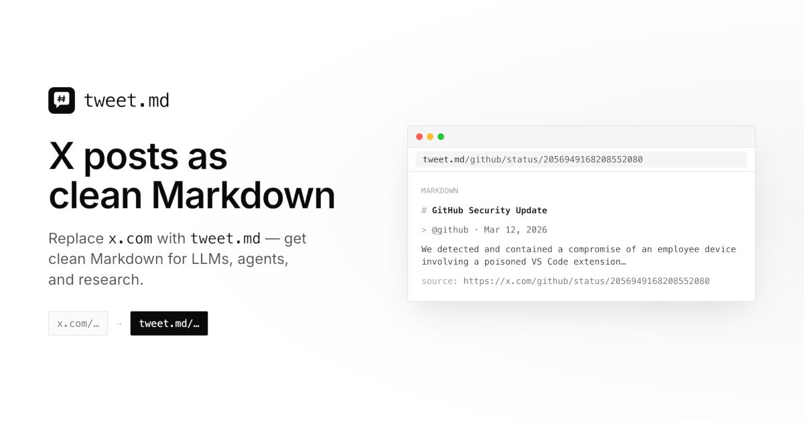

### 🎬 관련 영상
- [🎥 영상 보기](https://ph-files.imgix.net/632fd214-dbab-4505-8686-9becf915ca0e.jpeg?auto=format)

---

## 6. [Tiny CV](https://www.producthunt.com/products/tiny-cv)
**Votes**: 154 | **도입 난이도**: 하 | **신뢰도**: 상
**Tagline**: Resume builder that fits on one page
**서비스 링크**: https://www.producthunt.com/r/G3B2VM2ALKU6JE

**태그**: Productivity, Automation, Markdown, AI-Agent, Agent, AI Tool

### 📌 이 서비스 한눈에 보기
마크다운 기반으로 깔끔한 한 페이지 이력서를 자동 생성하는 도구

### 🔑 주요 기능
- 마크다운 형식을 활용한 간결한 한 페이지 이력서 제작
- PDF 출력 및 웹 링크 공유에 최적화된 템플릿 제공
- AI 에이전트가 스스로 이력서를 작성하고 관리할 수 있는 자동화 지원

### 🙋 사용자에게 어떤 점이 좋은가
복잡한 디자인 작업 없이 텍스트만으로 전문적인 이력서를 만들 수 있으며, AI 에이전트와의 연동으로 자동화된 이력서 관리가 가능합니다.

### ✅ 지금 바로 써볼 기능
- 마크다운으로 기본 이력서 데이터 작성하기
- 역할별 맞춤형 버전 생성 및 미리보기 확인
- tiny.cv URL을 통한 깔끔한 이력서 공유

### ⚠️ 사용 전 확인할 점
- 마크다운 문법에 익숙하지 않을 경우 초기 작성 시 어려움이 있을 수 있음
- 한 페이지 제한으로 인해 경력이 매우 많은 사용자는 내용 조절이 필요함

### 🧭 확인이 더 필요한 정보
X402 및 MPP 지원이 구체적으로 어떤 기술적 환경을 의미하는지 추가 확인이 필요합니다.

### 📸 스크린샷 및 갤러리
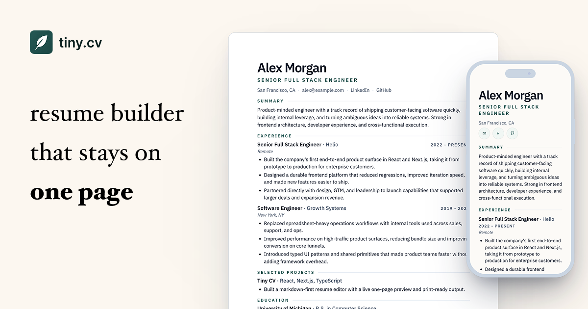
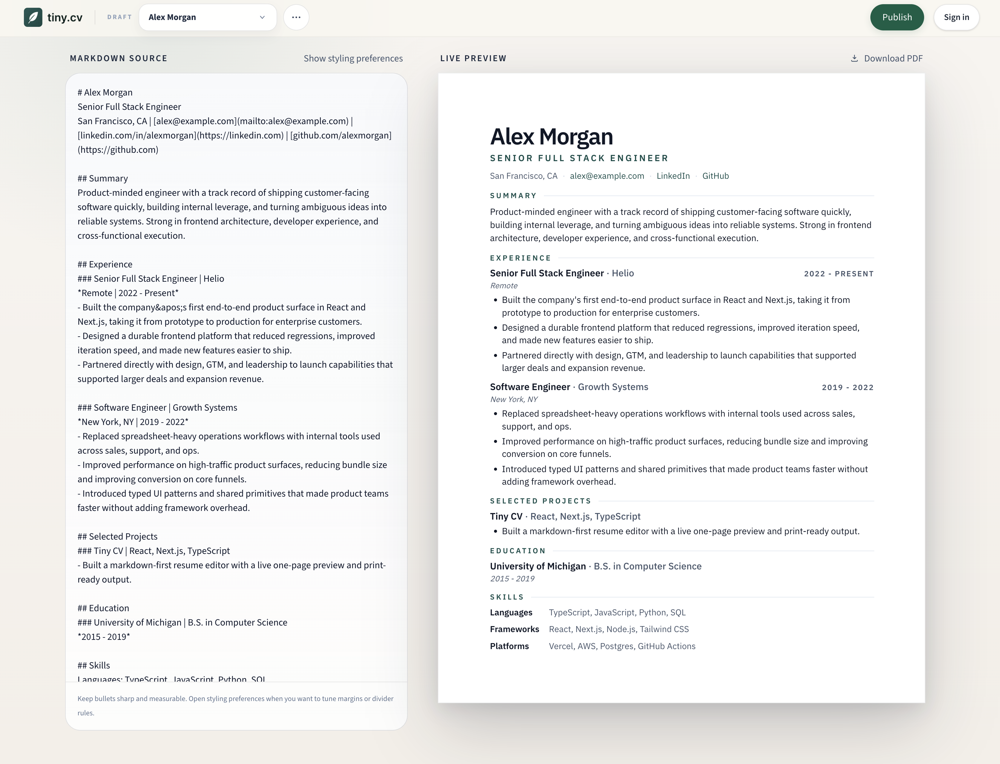
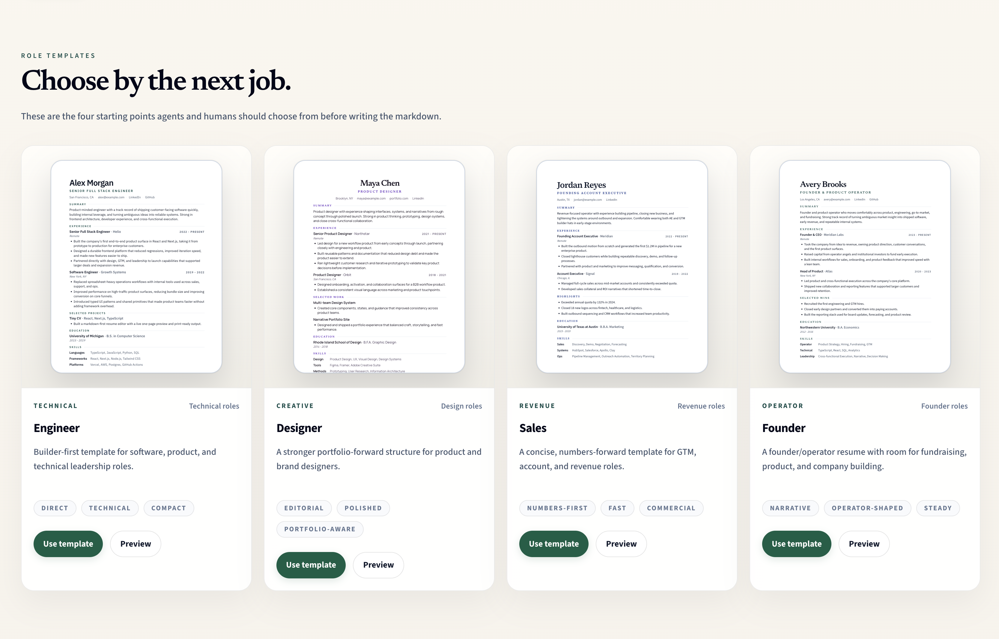

### 🎬 관련 영상
- [🎥 영상 보기](https://ph-files.imgix.net/38422bcb-7866-4a0b-b199-fa8ecfd0c092.jpeg?auto=format)

---

## 7. [Pi Coding Agent](https://www.producthunt.com/products/pi-coding-agent-3)
**Votes**: 136 | **도입 난이도**: 중 | **신뢰도**: 상
**Tagline**: The coding-agent harness you can make your own
**서비스 링크**: https://www.producthunt.com/r/4RD3VQNVER7FMF

**태그**: DevTool, Terminal, Automation, Customizable, Agent, Prompting

### 📌 이 서비스 한눈에 보기
사용자의 워크플로우에 맞춰 커스텀 가능한 미니멀 터미널 코딩 에이전트

### 🔑 주요 기능
- 확장 기능, 스킬, 프롬프트 템플릿을 통한 높은 커스터마이징 자유도
- 사용자 정의 패키지(Pi packages)를 통한 npm 또는 git 공유 기능
- 불필요한 기능을 덜어낸 미니멀하고 강력한 기본 설정

### 🙋 사용자에게 어떤 점이 좋은가
기존 도구의 복잡한 기능에 맞추는 대신, 자신의 개발 방식에 맞춰 에이전트를 직접 설계하고 팀원과 공유할 수 있습니다.

### ✅ 지금 바로 써볼 기능
- 기본 터미널 환경에 Pi 설치하기
- 자신만의 프롬프트 템플릿 및 스킬 설정하기
- 자주 쓰는 워크플로우를 패키지로 만들어 공유하기

### ⚠️ 사용 전 확인할 점
- 서브 에이전트나 플랜 모드 같은 고도화된 기능이 기본적으로 제외되어 있음
- 사용자가 직접 환경을 구축해야 하므로 초기 설정에 노력이 필요할 수 있음

### 🧭 확인이 더 필요한 정보
사용자의 숙련도에 따라 커스터마이징 과정의 난이도가 달라질 수 있습니다.

### 📸 스크린샷 및 갤러리

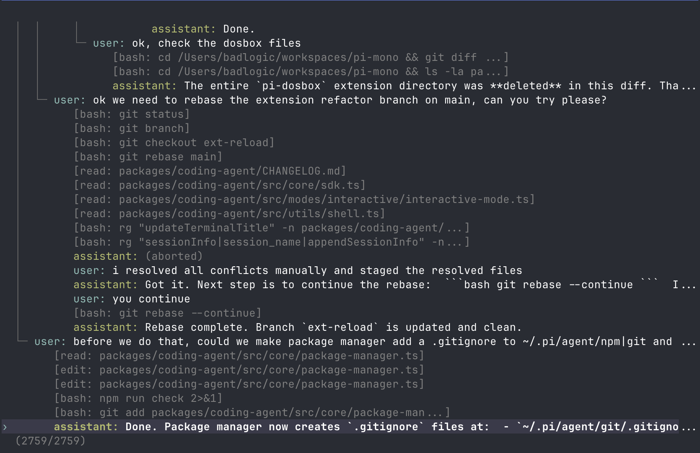
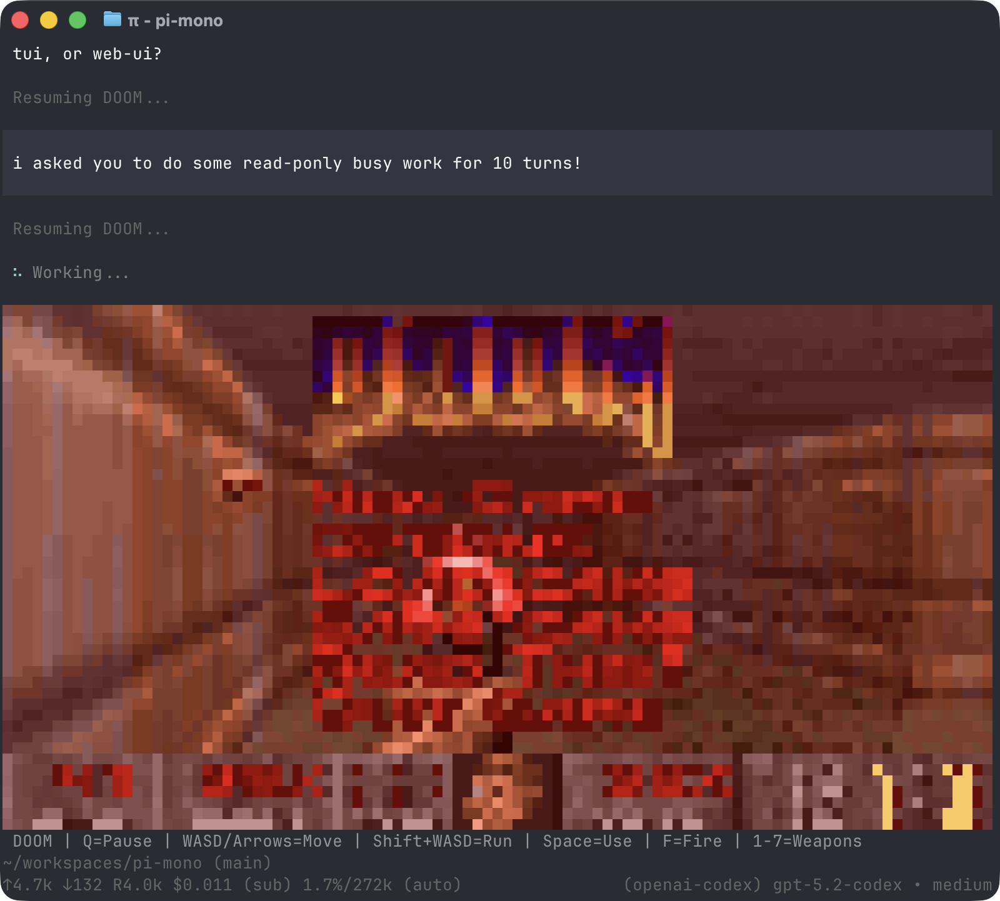

### 🎬 관련 영상
- [🎥 영상 보기](https://ph-files.imgix.net/4dc4bd6b-ece2-42fb-a5f3-a41dba71933f.jpeg?auto=format)

---

## 8. [Orchestria](https://www.producthunt.com/products/orchestria)
**Votes**: 104 | **도입 난이도**: 하 | **신뢰도**: 상
**Tagline**: AI music engine with granular stem control
**서비스 링크**: https://www.producthunt.com/r/7LPYC7KRXCTWU3

**태그**: AI-Music, Creative-Tools, Audio-Production, Agent, AI Tool

### 📌 이 서비스 한눈에 보기
개별 악기 트랙 제어가 가능한 AI 기반 스튜디오급 음악 생성 엔진

### 🔑 주요 기능
- 개별 악기(Stem) 분리 생성 및 정밀 편집 기능
- 자연어 명령을 통한 에이전트 방식의 사운드 수정
- 24-bit/44.1kHz 고음질 WAV 출력 및 저작권 완전 소유

### 🙋 사용자에게 어떤 점이 좋은가
음악 전체를 다시 만들 필요 없이 특정 악기만 수정할 수 있어 작업 효율이 높으며, 생성된 곡의 저작권을 온전히 가질 수 있습니다.

### ✅ 지금 바로 써볼 기능
- 자연어 명령으로 악기 질감 변경해보기
- 분리된 스템(Stem) 파일을 다운로드하여 DAW에서 편집하기
- Sync Player를 통한 시각화 기능 확인하기

### ⚠️ 사용 전 확인할 점
- 자연어 명령의 정밀도가 사용자의 의도와 일치하는지 확인 필요
- 복잡한 멀티트랙 믹싱 작업 시 별도의 DAW 활용이 필요할 수 있음

### 🧭 확인이 더 필요한 정보
구체적인 생성 시간이나 동시 작업 가능한 트랙 수에 대한 정보는 명시되지 않았습니다.

### 📸 스크린샷 및 갤러리
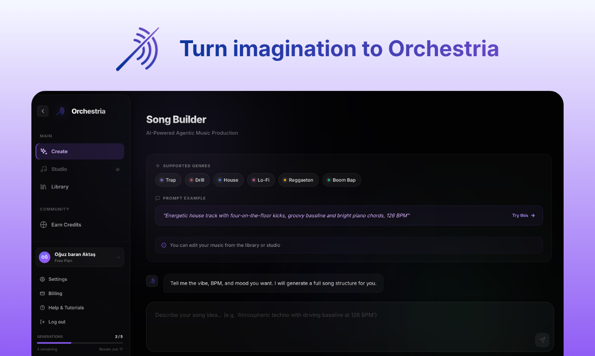
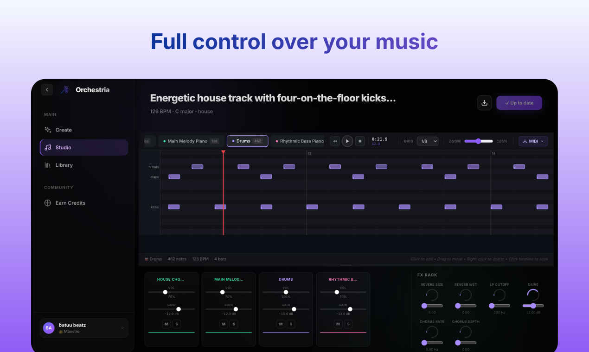
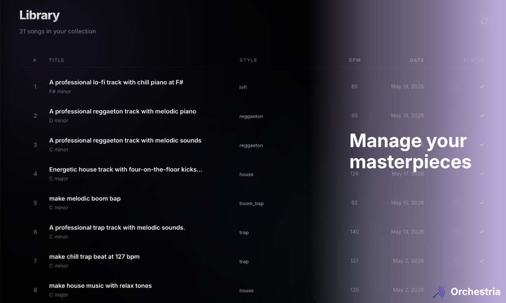

### 🎬 관련 영상
- [🎥 영상 보기](https://ph-files.imgix.net/3f5f79ec-49ab-4847-97d6-6e70c0a50aaf.jpeg?auto=format)

---

## 9. [LLMTest](https://www.producthunt.com/products/llmtest-2)
**Votes**: 103 | **도입 난이도**: 하 | **신뢰도**: 상
**Tagline**: Use the right LLMs in your apps. Setup fallbacks. Be happy.
**서비스 링크**: https://www.producthunt.com/r/ZTTNKFQU3IGYRA

**태그**: DevTool, LLM, Automation, Reliability, AI Tool, API

### 📌 이 서비스 한눈에 보기
최적의 LLM 선택과 자동 장애 복구(Fallback)를 하나의 API로 해결하는 개발자용 도구

### 🔑 주요 기능
- 비용, 속도, 성능을 고려한 최적의 모델 자동 선택
- API 장애나 출력 형식 오류 발생 시 자동 폴백(Fallback) 기능 제공
- 단일 API 및 MCP 함수를 통한 간편한 통합 및 AI 에이전트 최적화

### 🙋 사용자에게 어떤 점이 좋은가
개발자가 모델별 성능 차이나 API 불안정성을 직접 관리할 필요 없이, 서비스 안정성과 비용 효율성을 자동으로 확보할 수 있습니다.

### ✅ 지금 바로 써볼 기능
- 단일 API를 통한 기존 LLM 워크플로우 통합 테스트
- API 장애 상황을 가정한 자동 폴백 기능 검증
- Claude나 Codex 등 AI 에이전트에 MCP 함수로 연결하여 최적화 시도

### ⚠️ 사용 전 확인할 점
- OpenRouter 등 외부 서비스 의존도에 따른 잠재적 지연 시간
- 자동 선택 로직이 서비스의 특정 요구사항(예: 엄격한 데이터 보안)을 충족하는지 확인 필요

### 🧭 확인이 더 필요한 정보
구체적인 API 호출 비용 구조와 모델 선택 알고리즘의 세부 로직에 대한 정보가 부족합니다.

### 📸 스크린샷 및 갤러리
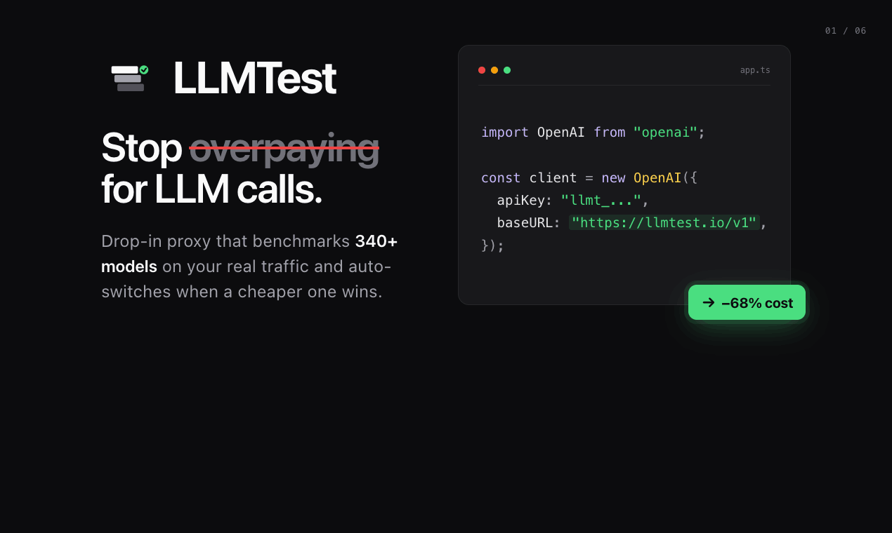
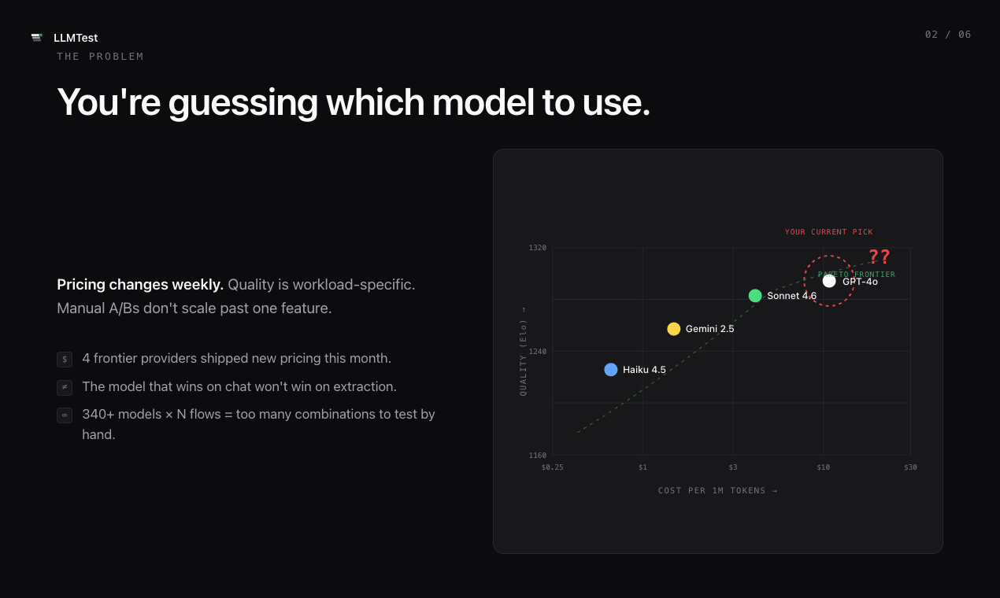
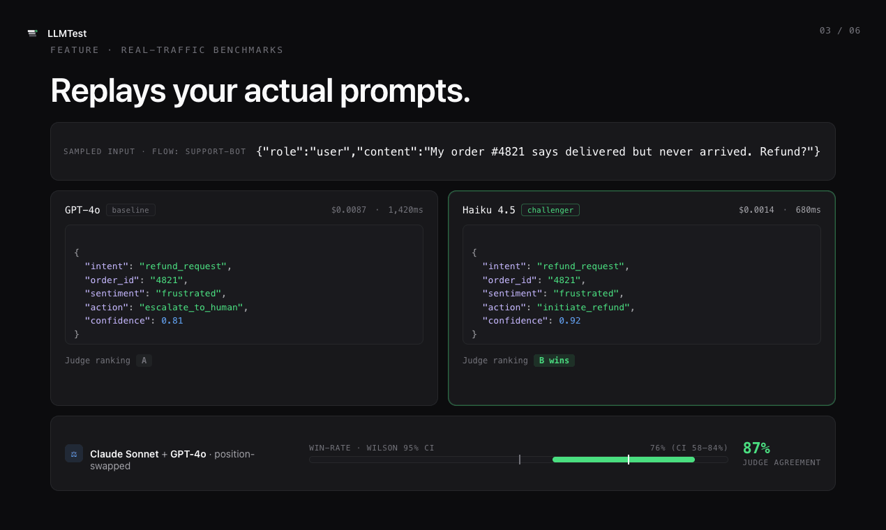

---

## 10. [Databerry](https://www.producthunt.com/products/databerry)
**Votes**: 99 | **도입 난이도**: 하 | **신뢰도**: 상
**Tagline**: Track all your business data in a single dashboard
**서비스 링크**: https://www.producthunt.com/r/RNGRKZCSUD2SWD

**태그**: Analytics, Dashboard, SaaS, BusinessIntelligence

### 📌 이 서비스 한눈에 보기
Stripe, PostHog 등 다양한 비즈니스 도구의 데이터를 하나의 대시보드에 통합하여 관리하는 솔루션

### 🔑 주요 기능
- 매출, 분석, 미팅 등 분산된 비즈니스 데이터 통합 관리
- Stripe, PostHog, Calendly 등 주요 도구와의 간편한 연동
- 단일 대시보드를 통한 실시간 비즈니스 지표 모니터링

### 🙋 사용자에게 어떤 점이 좋은가
여러 서비스에 흩어져 있는 데이터를 일일이 확인하는 번거로움을 줄이고, 비즈니스 현황을 한눈에 파악할 수 있습니다.

### ✅ 지금 바로 써볼 기능
- 사용 중인 주요 툴(Stripe, Calendly 등) 연동하기
- 통합 대시보드 구성 및 데이터 시각화 확인하기
- 비즈니스 핵심 지표(KPI) 설정하기

### ⚠️ 사용 전 확인할 점
- 연동 가능한 외부 서비스 목록 확인 필요
- 데이터 보안 및 권한 관리 정책 검토 필요

### 🧭 확인이 더 필요한 정보
제공되는 데이터의 실시간 업데이트 주기와 상세 커스텀 기능 범위에 대한 정보가 부족합니다.

### 📸 스크린샷 및 갤러리
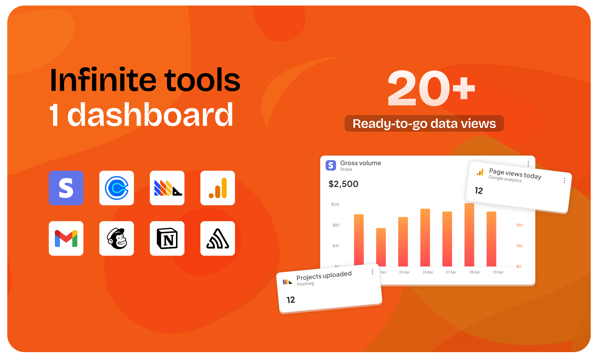
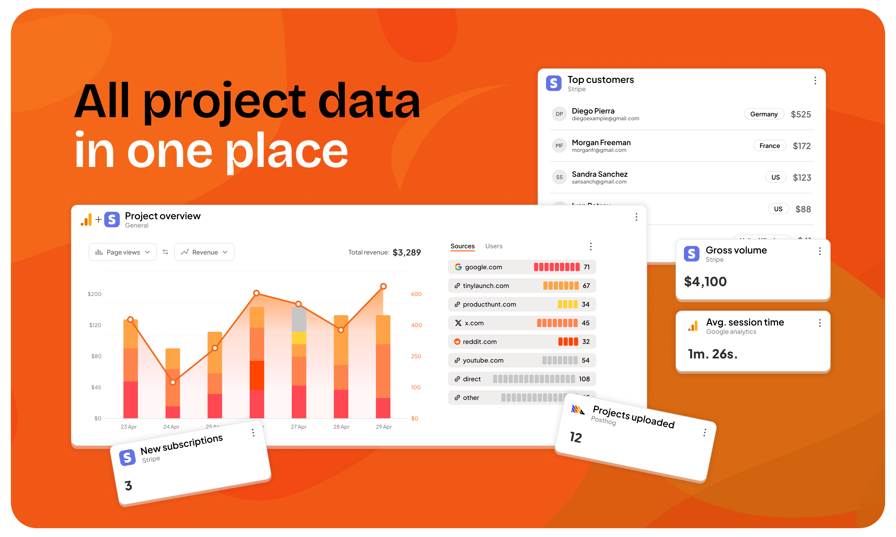
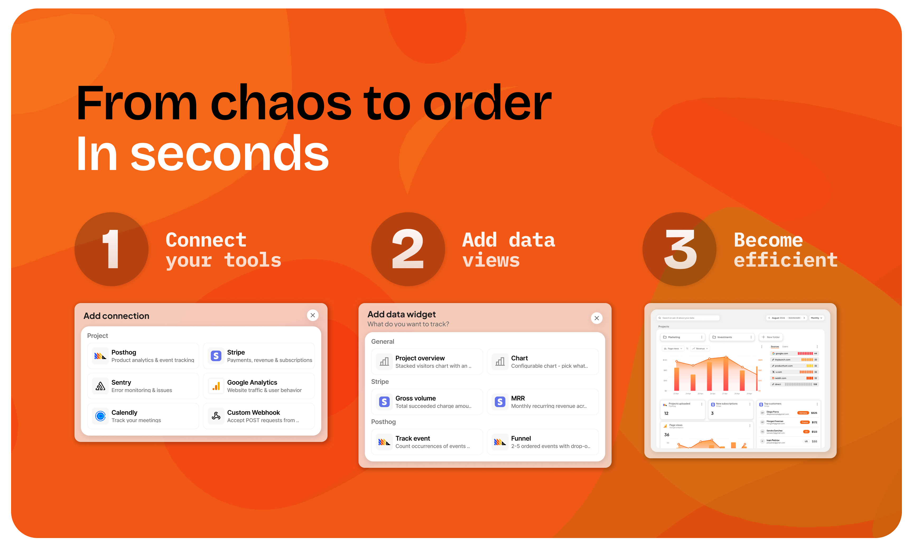

### 🎬 관련 영상
- [🎥 영상 보기](https://ph-files.imgix.net/d8797f81-b44a-4644-a6cb-7ab59ff9d78b.jpeg?auto=format)

---

## 11. [The Incident Challenge](https://www.producthunt.com/products/the-incident-challenge)
**Votes**: 96 | **도입 난이도**: 하 | **신뢰도**: 상
**Tagline**: Production Debugging Games for Software Engineers
**서비스 링크**: https://www.producthunt.com/r/HWTVXAT7IM6D4O

**태그**: DevTool, Gamification, Engineering

### 📌 이 서비스 한눈에 보기
실제 장애 상황을 해결하며 실력을 키우는 소프트웨어 엔지니어용 디버깅 게임

### 🔑 주요 기능
- 현실적인 인시던트(장애) 시뮬레이션 환경 제공
- 근본 원인 파악 및 시스템 복구 중심의 게임 플레이
- 리더보드를 통한 엔지니어 간 경쟁 요소

### 🙋 사용자에게 어떤 점이 좋은가
실제 운영 환경과 유사한 문제를 해결하는 경험을 통해 실전 디버깅 역량을 재미있게 향상시킬 수 있습니다.

### ✅ 지금 바로 써볼 기능
- 시뮬레이션 시나리오 시작하기
- 문제 원인 분석 및 해결 시도
- 리더보드 순위 확인 및 경쟁

### ⚠️ 사용 전 확인할 점
- 게임 환경과 실제 운영 환경 간의 차이 존재 가능성
- 시나리오의 다양성 및 난이도 구성 확인 필요

### 🧭 확인이 더 필요한 정보
구체적인 기술 스택이나 시뮬레이션되는 시스템 환경에 대한 정보가 부족합니다.

### 📸 스크린샷 및 갤러리
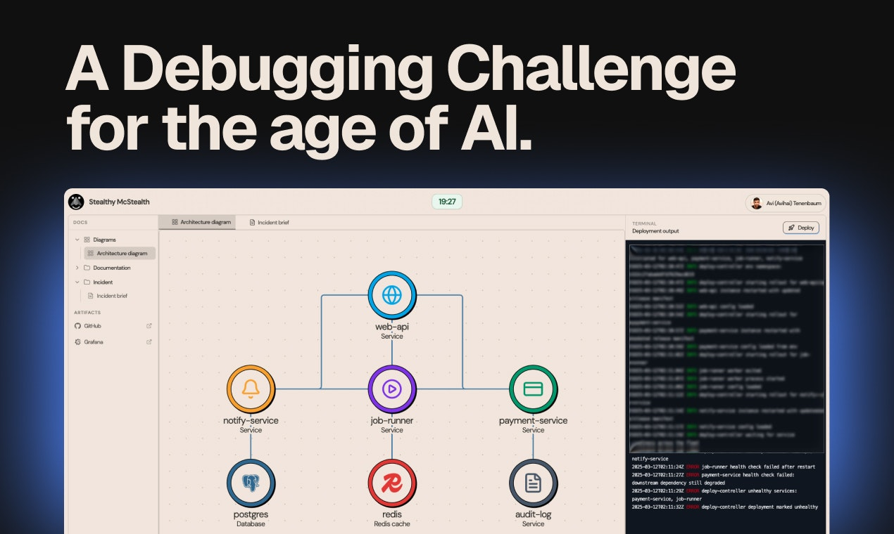
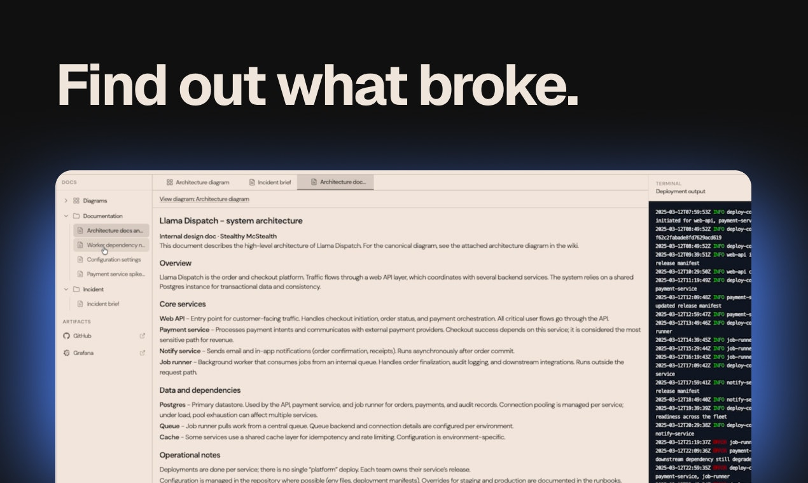
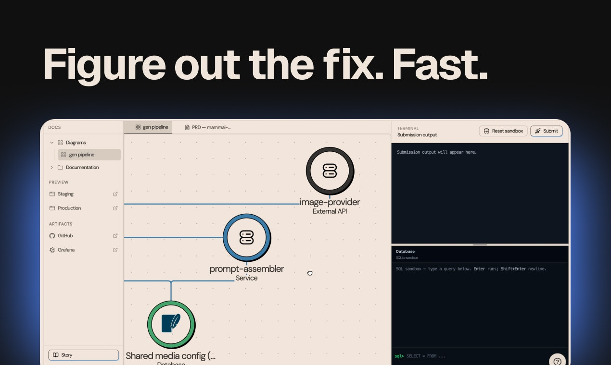

### 🎬 관련 영상
- [🎥 영상 보기](https://ph-files.imgix.net/3b669baa-fe8c-4d30-87a1-2b7979a628ec.jpeg?auto=format)

---

## 12. [MashuPack](https://www.producthunt.com/products/mashupack)
**Votes**: 92 | **도입 난이도**: 하 | **신뢰도**: 상
**Tagline**: Turn codebases into a clean file for Claude and ChatGPT
**서비스 링크**: https://www.producthunt.com/r/ADBNFD4PLUJQ6E

**태그**: DevTool, AI-Workflow, Productivity, Automation, AI Tool, Chat

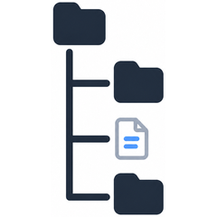

### 📌 이 서비스 한눈에 보기
코드 저장소에서 필요한 부분만 골라 AI용 단일 텍스트 파일로 변환해주는 도구

### 🔑 주요 기능
- 저장소 내 특정 코드 섹션만 선택하여 컴파일 가능
- AI 모델의 파일 개수 제한 및 업로드 번거로움 해결
- 브라우저 기반 AI 워크플로우에 최적화된 컨텍스트 제공

### 🙋 사용자에게 어떤 점이 좋은가
복잡한 코드 구조를 일일이 복사할 필요 없이, AI가 이해하기 쉬운 정돈된 컨텍스트를 즉시 생성하여 작업 효율을 높여줍니다.

### ✅ 지금 바로 써볼 기능
- 필요한 코드 파일 선택하기
- 하나의 클린 텍스트 파일로 병합하기
- 생성된 파일을 Claude나 ChatGPT에 업로드하기

### ⚠️ 사용 전 확인할 점
- 선택한 코드의 보안 및 개인정보 포함 여부 확인 필요
- 대규모 코드베이스의 경우 파일 크기 제한 확인 필요

### 🧭 확인이 더 필요한 정보
브라우저 기반 도구로서 로컬 파일 접근 방식이나 보안 처리 방식에 대한 상세 정보가 필요합니다.

### 📸 스크린샷 및 갤러리
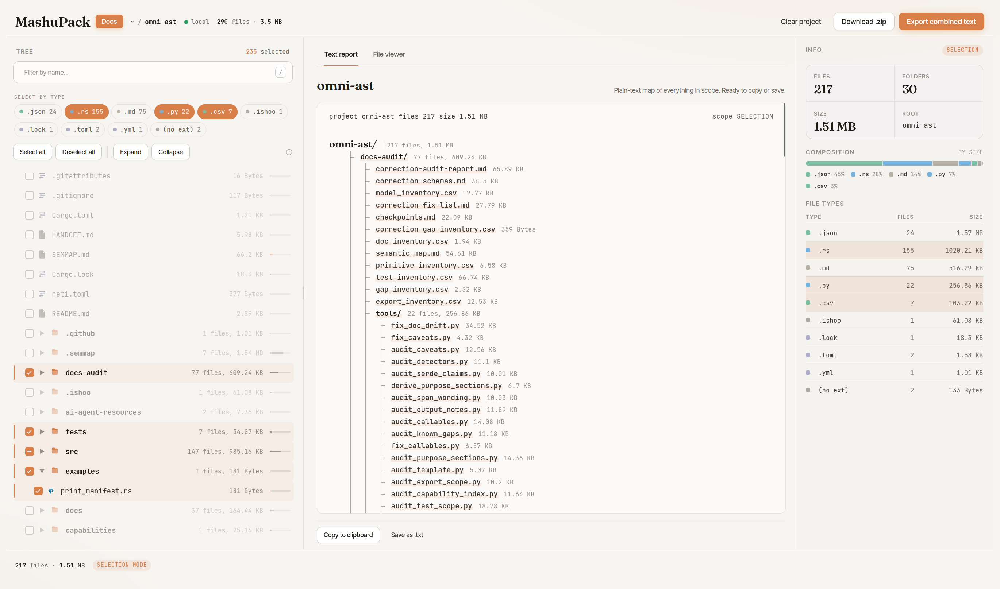
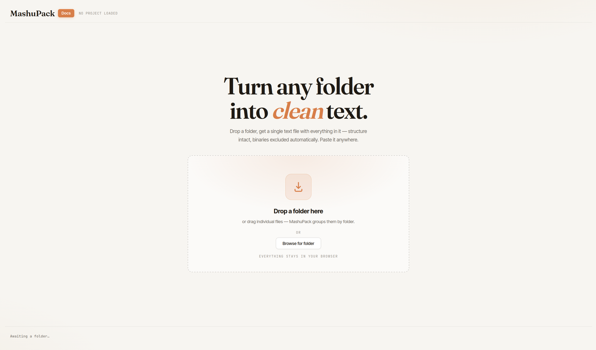
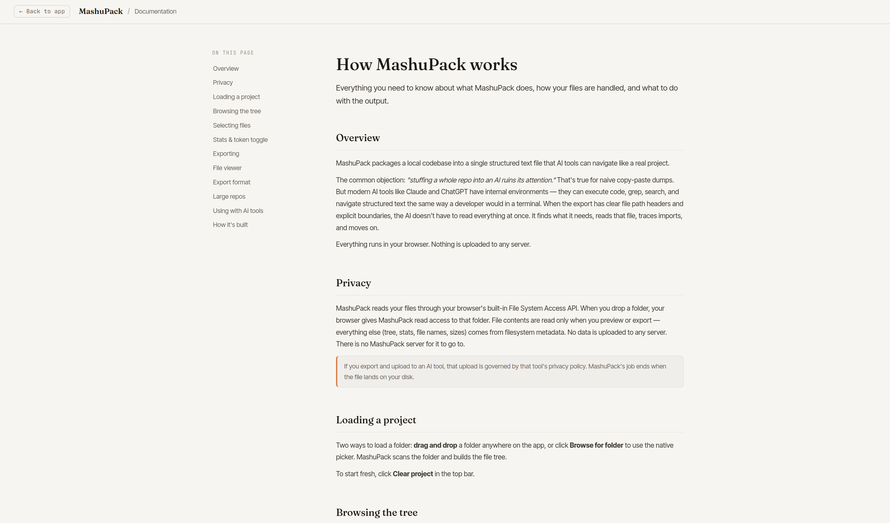

### 🎬 관련 영상
- [🎥 영상 보기](https://ph-files.imgix.net/ca549d3d-1492-476b-8d0f-a0089ab6f548.jpeg?auto=format)

---

## 13. [tldx](https://www.producthunt.com/products/tldx)
**Votes**: 92 | **도입 난이도**: 하 | **신뢰도**: 상
**Tagline**: Fast CLI to bulk-check domains via RDAP & MCP
**서비스 링크**: https://www.producthunt.com/r/DS4AB4SQPQV6QL

**태그**: DevTool, Automation, CLI, AI-Integration, Agent, AI Tool

### 📌 이 서비스 한눈에 보기
RDAP 기반의 초고속 도메인 대량 조회 및 AI 에이전트 연동 CLI 도구

### 🔑 주요 기능
- RDAP를 활용한 빠르고 효율적인 도메인 가용성 대량 체크
- 키워드, 접두사/접미사, 정규표현식을 조합한 유연한 도메인 생성
- MCP 서버 지원으로 Claude 등 AI 에이전트와 연동 가능

### 🙋 사용자에게 어떤 점이 좋은가
도메인 브랜딩 작업 시 수동 조회의 번거로움을 줄이고, AI를 활용해 아이디어 구상부터 검증까지 자동화할 수 있습니다.

### ✅ 지금 바로 써볼 기능
- Homebrew를 통한 빠른 설치 (brew install tldx)
- 정규표현식을 활용한 맞춤형 도메인 리스트 생성
- MCP 서버를 통한 AI 에이전트 연동 테스트

### ⚠️ 사용 전 확인할 점
- CLI 기반 도구이므로 터미널 환경 숙련도 필요
- 대량 조회 시 네트워크 환경 및 RDAP 서버 상태에 따른 영향 가능성

### 🧭 확인이 더 필요한 정보
특정 도메인 등록 대행사(Registrar)의 정책에 따른 조회 제한 여부는 별도 확인이 필요합니다.

### 📸 스크린샷 및 갤러리
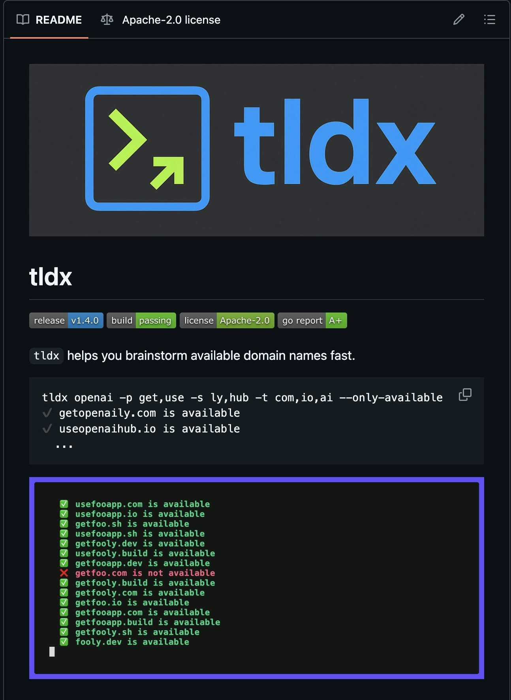

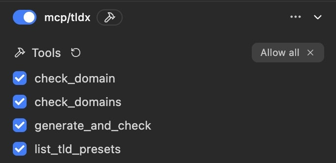

---

## 14. [Fred](https://www.producthunt.com/products/fred-the-uxr-shepherd)
**Votes**: 90 | **도입 난이도**: 중 | **신뢰도**: 상
**Tagline**: AI-orchestrated UX research with behavioural tracking
**서비스 링크**: https://www.producthunt.com/r/X5VZNU6BM2B4CL

**태그**: UXResearch, AI, Automation, Analytics, ProductDesign, AI Tool

### 📌 이 서비스 한눈에 보기
AI 기반 자동화로 기획부터 분석까지 UX 리서치 전 과정을 통합 관리하는 워크플로우 솔루션

### 🔑 주요 기능
- 연구 계획, 참가자 모집, 테스트 실행, 분석, 보고서 작성을 하나의 플랫폼에서 수행
- AI 오케스트레이션을 통한 리서치 워크플로우 자동화
- 실시간 및 재생 기반 시선 추적(Eye tracking) 및 히트맵 기능 제공

### 🙋 사용자에게 어떤 점이 좋은가
리서치 프로세스의 각 단계를 통합하여 작업 시간을 단축하고, AI와 시선 추적 데이터를 통해 더 빠르고 객관적인 사용자 인사이트를 확보할 수 있습니다.

### ✅ 지금 바로 써볼 기능
- AI 자동화 워크플로우를 통한 리서치 계획 수립
- 시선 추적 및 히트맵 기능을 활용한 사용자 행동 분석
- 자동 생성된 분석 리포트 검토

### ⚠️ 사용 전 확인할 점
- AI 자동화 과정에서 방법론적 통제력을 유지하기 위한 전문가의 검토 필요
- 시선 추적 기능 사용 시 하드웨어/브라우저 호환성 확인 필요

### 🧭 확인이 더 필요한 정보
AI가 생성한 분석 결과의 정확도와 방법론적 신뢰도에 대한 구체적인 검증 데이터가 필요합니다.

### 📸 스크린샷 및 갤러리
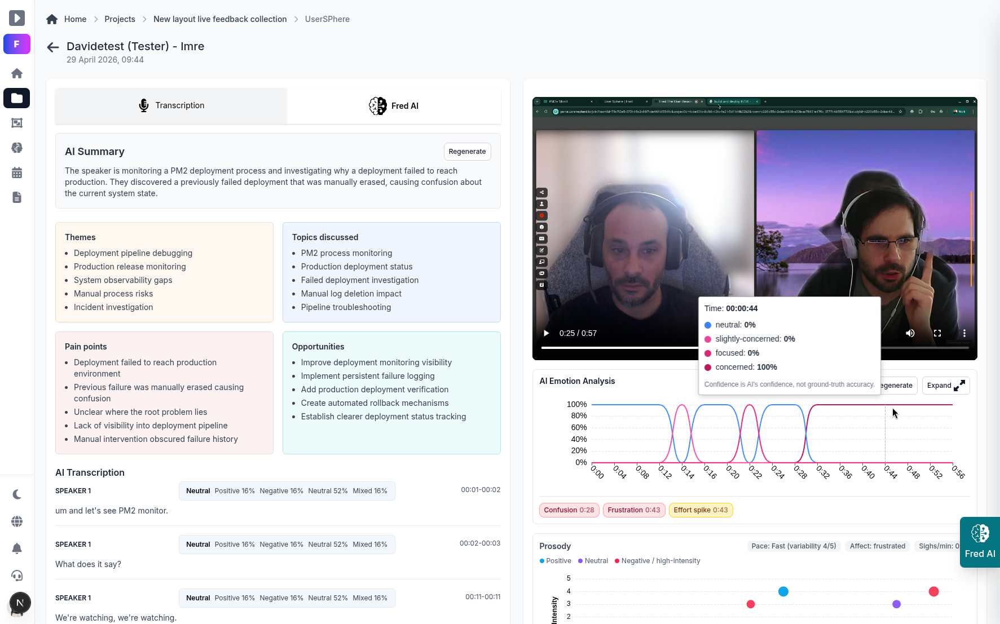
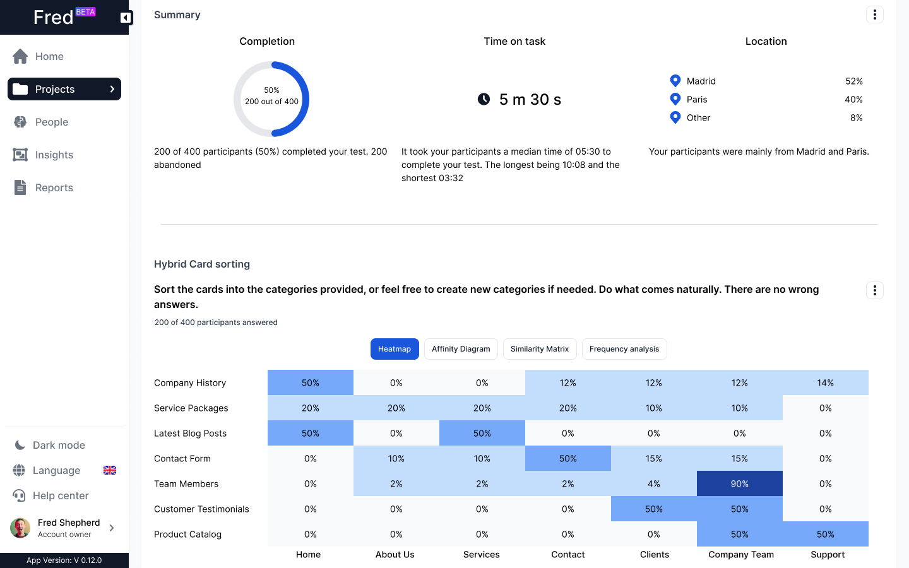
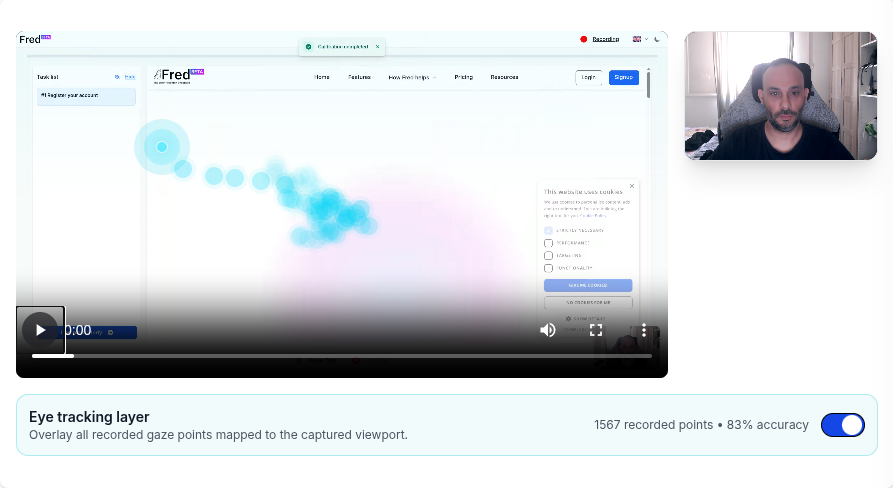

---

## 15. [Rixx](https://www.producthunt.com/products/rixx)
**Votes**: 87 | **도입 난이도**: 하 | **신뢰도**: 상
**Tagline**: The Perplexity alternative that organizes your research
**서비스 링크**: https://www.producthunt.com/r/RCNSWHNL7VWHV6

**태그**: AI Search, Research Tool, Data Visualization, Productivity, AI Tool, Vision

### 📌 이 서비스 한눈에 보기
검증 가능한 출처와 시각적 자료를 통해 연구 과정을 체계화하는 AI 검색 엔진

### 🔑 주요 기능
- 실제 인용구를 통한 답변 검증 및 신뢰성 확보
- 차트, 그래프, 이미지 등 시각적 데이터 제공
- PDF, 문서, 링크를 활용한 컨텍스트 기반 멀티모달 검색

### 🙋 사용자에게 어떤 점이 좋은가
단순 답변을 넘어 근거 확인과 데이터 시각화가 필요한 전문적인 리서치 업무의 효율을 높여줍니다.

### ✅ 지금 바로 써볼 기능
- 검색 결과의 인용구를 클릭하여 원문 데이터 확인하기
- 관련 문서를 업로드하여 나만의 맞춤형 컨텍스트로 활용하기
- 수집된 정보를 Insights 폴더에 정리하여 연구 흐름 관리하기

### ⚠️ 사용 전 확인할 점
- AI 모델의 특성상 인용된 원문 내용과 요약된 답변 간의 차이가 있을 수 있음
- 복잡한 데이터 시각화의 정확도는 원본 데이터의 품질에 의존함

### 🧭 확인이 더 필요한 정보
현재 구체적인 요금제 체계나 API 제공 여부에 대한 정보가 명시되지 않았습니다.

### 📸 스크린샷 및 갤러리
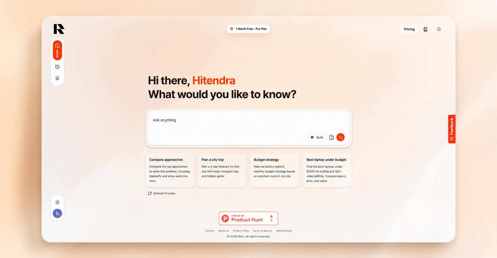
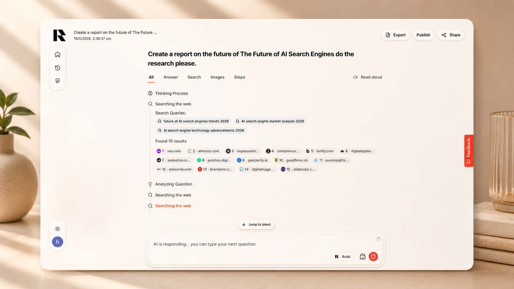
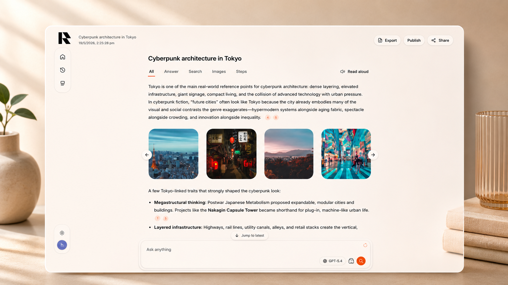

---

## 16. [Forum](https://www.producthunt.com/products/meta)
**Votes**: 85 | **도입 난이도**: 하 | **신뢰도**: 상
**Tagline**: Dedicated space for Facebook groups
**서비스 링크**: https://www.producthunt.com/r/QBAQEZYP4PLE62

**태그**: Community, Social, AI, Management, AI Tool

### 📌 이 서비스 한눈에 보기
페이스북 그룹의 대화를 더 깊고 체계적으로 관리할 수 있는 전용 커뮤니티 공간

### 🔑 주요 기능
- 페이스북 그룹과 실시간 동기화되는 독립형 앱
- 닉네임을 활용한 자유로운 게시글 작성 기능
- AI Ask 기능 및 그룹 관리자를 위한 전용 관리 도구 제공

### 🙋 사용자에게 어떤 점이 좋은가
기존 페이스북 그룹의 산만한 대화 환경을 정돈된 포럼 형식으로 전환하여 심도 있는 토론과 커뮤니티 관리를 가능하게 합니다.

### ✅ 지금 바로 써볼 기능
- 페이스북 그룹 연동하기
- 닉네임 설정하여 게시글 작성해보기
- AI Ask 기능을 통한 정보 검색 활용하기

### ⚠️ 사용 전 확인할 점
- 페이스북 계정 연동에 따른 개인정보 및 데이터 동기화 범위 확인 필요
- 독립형 앱으로서 기존 페이스북 인터페이스와의 사용성 차이 적응 필요

### 🧭 확인이 더 필요한 정보
페이스북 그룹과의 데이터 동기화 방식 및 관리 도구의 상세 기능 범위에 대한 추가 확인이 필요합니다.

### 📸 스크린샷 및 갤러리

---

## 17. [PhoneDiffusion](https://www.producthunt.com/products/phonediffusion)
**Votes**: 26 | **도입 난이도**: 하 | **신뢰도**: 상
**Tagline**: #1 Local iOS AI Image Generator: Free, Unlimited & Offline
**서비스 링크**: https://www.producthunt.com/r/SCM6S2HYTANNNU

**태그**: AI, ImageGeneration, Privacy, iOS, Automation, AI Tool, Prompting, Vision

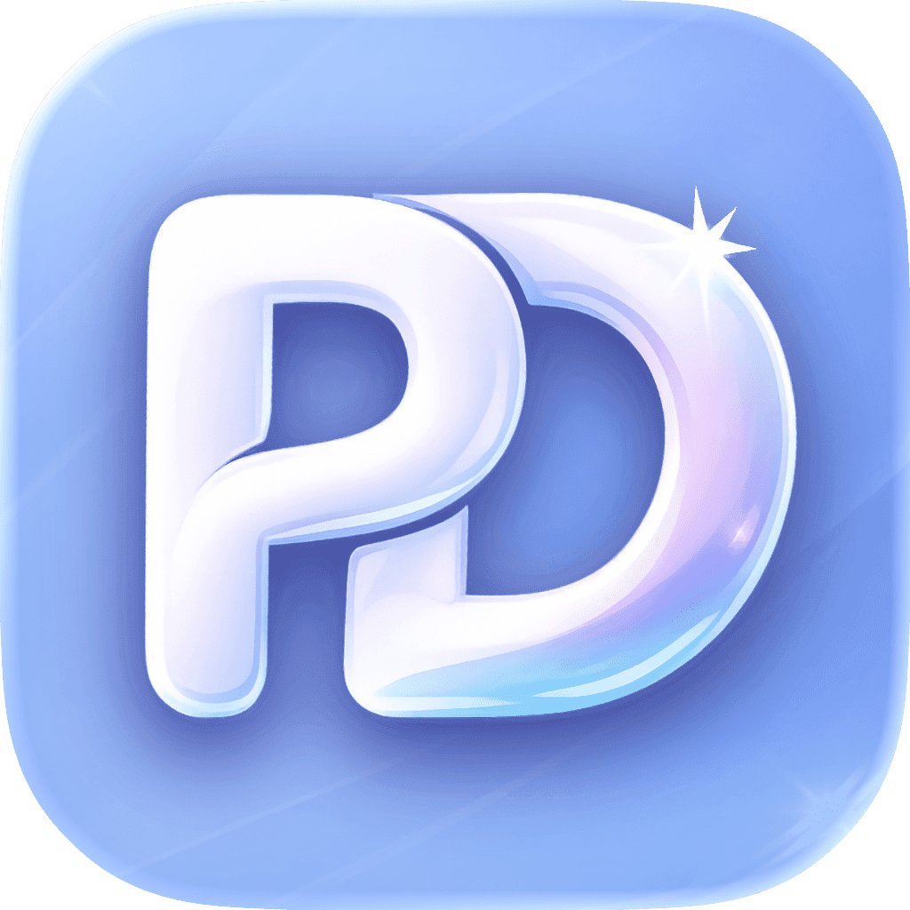

### 📌 이 서비스 한눈에 보기
클라우드 없이 아이폰에서 직접 이미지를 생성하는 프라이빗 로컬 AI 이미지 생성기

### 🔑 주요 기능
- 기기 내 로컬 생성 방식으로 프라이버시 및 보안 강화
- SD 1.5 및 SDXL 모델을 활용한 고품질 이미지 생성
- 클라우드 워크플로우가 필요 없는 오프라인 환경 지원

### 🙋 사용자에게 어떤 점이 좋은가
개인적인 프롬프트와 생성 결과물이 외부 서버에 남지 않아 보안이 뛰어나며, 인터넷 연결 없이도 언제 어디서든 이미지를 만들 수 있습니다.

### ✅ 지금 바로 써볼 기능
- 기본 제공되는 SD 1.5/SDXL 모델로 이미지 생성 테스트
- 로컬 갤러리 기능으로 생성 결과물 관리
- Pro 버전의 고급 제어 기능(CFG, Step, Batch) 검토

### ⚠️ 사용 전 확인할 점
- 로컬 연산 방식이므로 기기 사양(지원 모델 여부)에 따른 성능 차이 존재
- 고성능 모델 사용 시 배터리 소모 및 발열 발생 가능성

### 🧭 확인이 더 필요한 정보
사용자의 아이폰 모델이 로컬 연산을 지원하는 구체적인 사양인지 확인이 필요합니다.

### 📸 스크린샷 및 갤러리
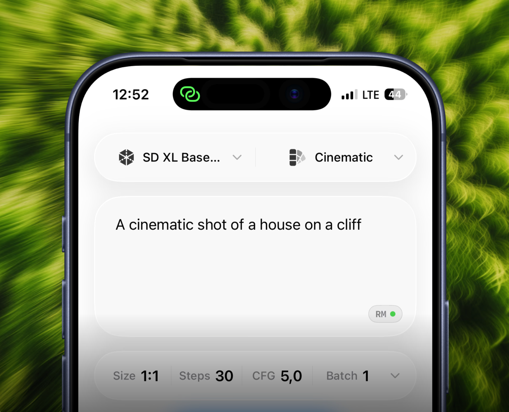
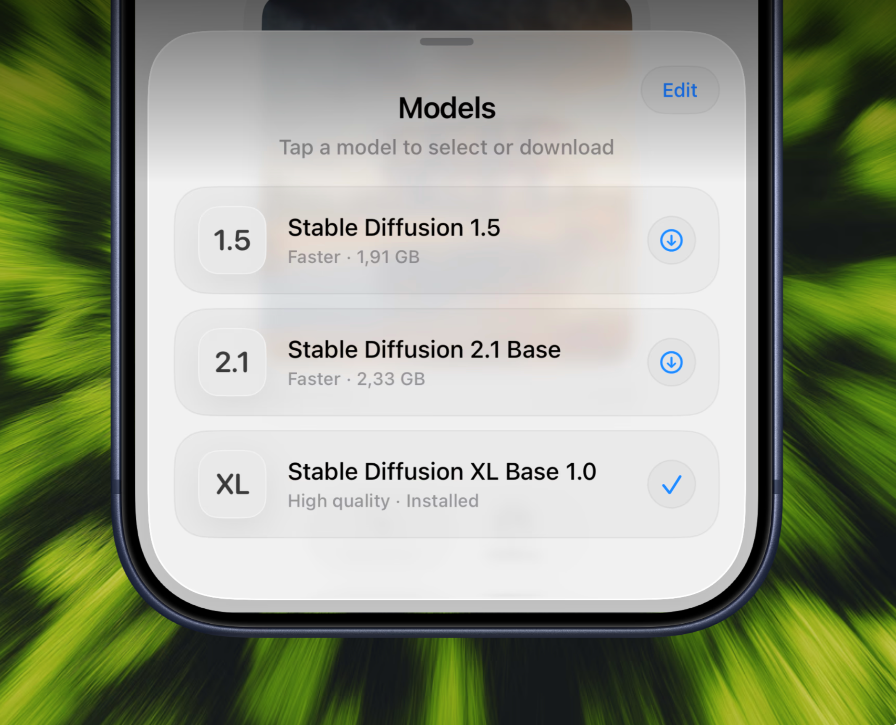

### 🎬 관련 영상
- [🎥 영상 보기](https://ph-files.imgix.net/2eba5208-ae4a-40c1-8e5f-c989cf8ab9d9.jpeg?auto=format)

---

## 18. [CookiePolicy Generator by CookieYes](https://www.producthunt.com/products/cookie-policy-generator-by-cookieyes)
**Votes**: 22 | **도입 난이도**: 하 | **신뢰도**: 상
**Tagline**: A cookie policy that keeps up with your site
**서비스 링크**: https://www.producthunt.com/r/HSUYYCUIVMLDGA

**태그**: Automation, Compliance, SaaS, LegalTech

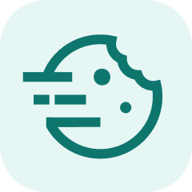

### 📌 이 서비스 한눈에 보기
사이트 내 실제 사용 중인 쿠키를 자동 감지하여 법적 효력을 갖춘 정책을 생성하는 자동화 도구

### 🔑 주요 기능
- 사이트 스캔을 통한 실제 사용 중인 쿠키 자동 감지
- 임베드 스크립트를 통한 실시간 정책 동기화
- 예약 스캔 기능을 통한 자동 업데이트 지원

### 🙋 사용자에게 어떤 점이 좋은가
수동으로 정책을 작성하거나 템플릿을 복사할 필요 없이, 사이트 변경 사항이 정책에 즉각 반영되어 법적 리스크를 줄여줍니다.

### ✅ 지금 바로 써볼 기능
- 사이트 스캔 기능 실행하기
- 생성된 정책 임베드 스크립트 적용하기
- 예약 스캔 설정 확인하기

### ⚠️ 사용 전 확인할 점
- 자동 생성된 정책이 특정 국가의 세부 법규를 완벽히 충족하는지 확인 필요
- 스캔 방식이 사이트의 모든 쿠키를 누락 없이 감지하는지 검토 필요

### 🧭 확인이 더 필요한 정보
구체적인 요금 체계와 지원되는 언어 범위에 대한 정보가 명시되지 않았습니다.

### 📸 스크린샷 및 갤러리
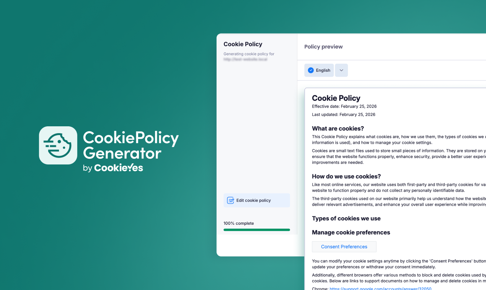
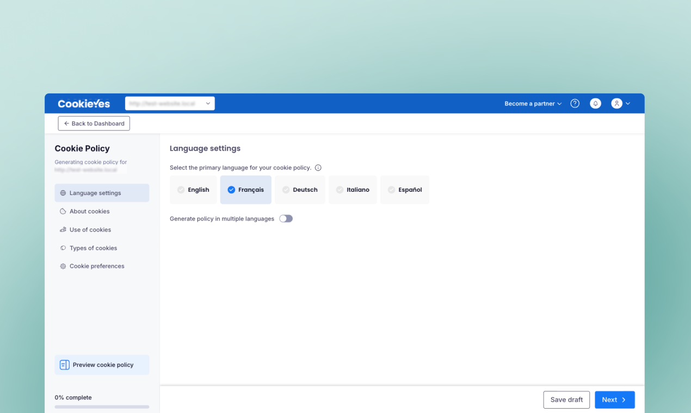
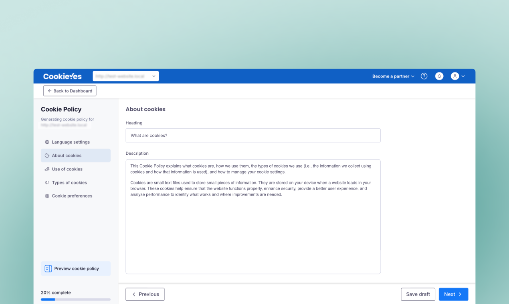

### 🎬 관련 영상
- [🎥 영상 보기](https://ph-files.imgix.net/b49b4e69-c119-4a9c-9f69-ec0cd369a2ee.jpeg?auto=format)

---

## 19. [Knock Knock](https://www.producthunt.com/products/knock-knock-3)
**Votes**: 12 | **도입 난이도**: 중 | **신뢰도**: 상
**Tagline**:  One AI sales brain. Website. Phones. CRM. All of it.
**서비스 링크**: https://www.producthunt.com/r/37VXJPQOZUVQWQ

**태그**: SalesTech, AI, Automation, CRM, AI Tool, Chat, Sales

### 📌 이 서비스 한눈에 보기
웹사이트, 전화, CRM을 하나로 통합하여 영업 프로세스를 자동화하는 AI 세일즈 레이어

### 🔑 주요 기능
- NOX 엔진을 통한 통합 AI 세일즈 브레인 구축
- 웹사이트 채팅, 전화, 인바운드/아웃바운드 업무 통합 관리
- 실시간 CRM 연동 및 잠재 고객 자동 분류 및 미팅 예약

### 🙋 사용자에게 어떤 점이 좋은가
영업 담당자가 일일이 대응하지 않아도 AI가 고객을 식별하고 미팅을 예약하여, 검증된 리드만 영업팀에 전달해 업무 효율을 극대화합니다.

### ✅ 지금 바로 써볼 기능
- AI의 고객 식별 및 미팅 예약 기능 테스트
- 기존 CRM과의 실시간 데이터 연동 확인
- 아침 브리핑(Morning Brief) 기능 활용

### ⚠️ 사용 전 확인할 점
- 기존에 사용 중인 CRM 시스템과의 호환성 확인 필요
- AI의 자동 응대(전화/채팅) 품질 및 브랜드 톤앤매너 일치 여부 검토

### 🧭 확인이 더 필요한 정보
현재 제공되는 구체적인 CRM 연동 목록과 전화/채팅 자동화의 상세 기능 범위에 대한 확인이 필요합니다.

### 📸 스크린샷 및 갤러리

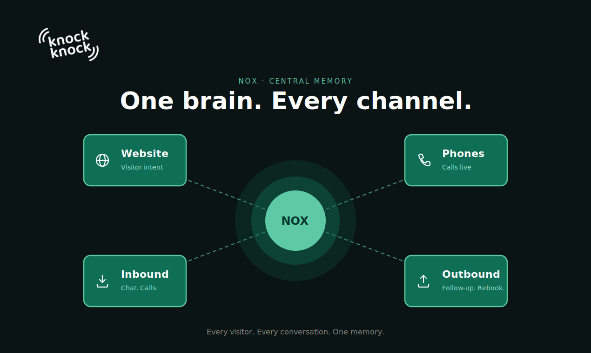
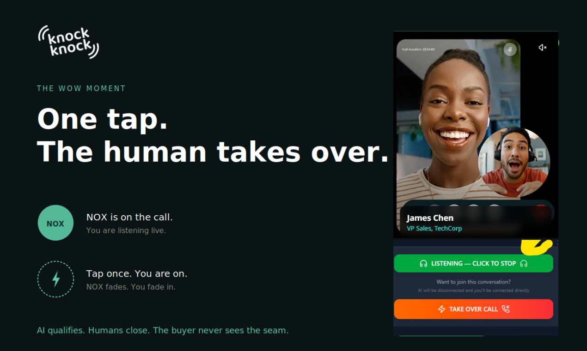

### 🎬 관련 영상
- [🎥 영상 보기](https://ph-files.imgix.net/06622f0a-1126-454f-865e-3d9baa40e7b9.jpeg?auto=format)

---

## 20. [Klaris](https://www.producthunt.com/products/klaris-2)
**Votes**: 12 | **도입 난이도**: 중 | **신뢰도**: 상
**Tagline**: Stop being the company’s data help desk
**서비스 링크**: https://www.producthunt.com/r/QTR5DBX2VMZZXF

**태그**: Analytics, Data Governance, Business Intelligence, Self-Service, AI Tool, Email

### 📌 이 서비스 한눈에 보기
데이터 팀의 업무 과부하를 줄이고 경영진이 직접 데이터에 접근할 수 있는 셀프 서비스 분석 환경

### 🔑 주요 기능
- 경영진이 데이터 팀의 도움 없이 직접 비즈니스 질문에 대한 답을 탐색 가능
- Snowflake, Postgres, HubSpot 등 다양한 데이터 소스 통합 지원
- 데이터 팀의 거버넌스, 정의 및 승인 제어 기능 유지

### 🙋 사용자에게 어떤 점이 좋은가
데이터 팀은 반복적인 단순 추출 업무에서 벗어나 고부가가치 업무에 집중할 수 있고, 경영진은 필요한 정보를 즉각적으로 확인할 수 있습니다.

### ✅ 지금 바로 써볼 기능
- 기존 데이터 소스(Snowflake, HubSpot 등) 연결 테스트
- 데이터 팀의 거버넌스 정책 설정 및 승인 워크플로우 구성
- 경영진을 위한 직관적인 데이터 탐색 환경 구축

### ⚠️ 사용 전 확인할 점
- 데이터 팀이 설정한 거버넌스 규칙이 사용자에게 충분히 직관적인지 확인 필요
- 다양한 소스 연결 시 데이터 정합성 및 보안 설정 검토 필요

### 🧭 확인이 더 필요한 정보
데이터 소스 간의 복잡한 관계를 정의하는 방식과 사용자 권한 관리의 세부 기능에 대한 정보가 더 필요합니다.

### 📸 스크린샷 및 갤러리
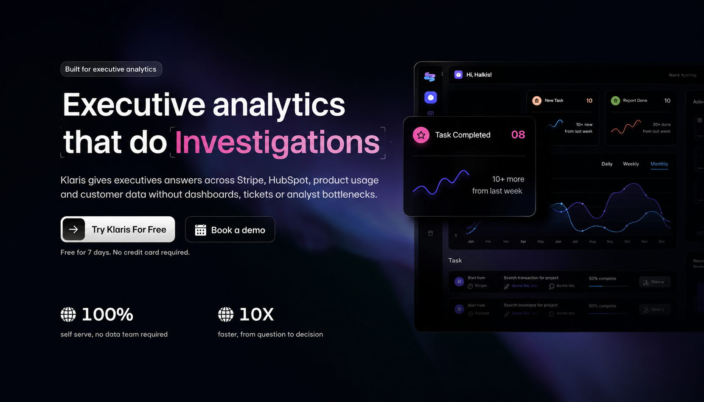
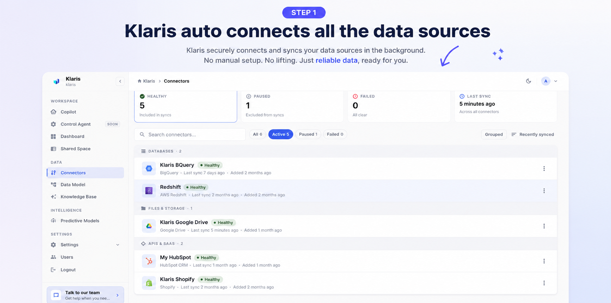
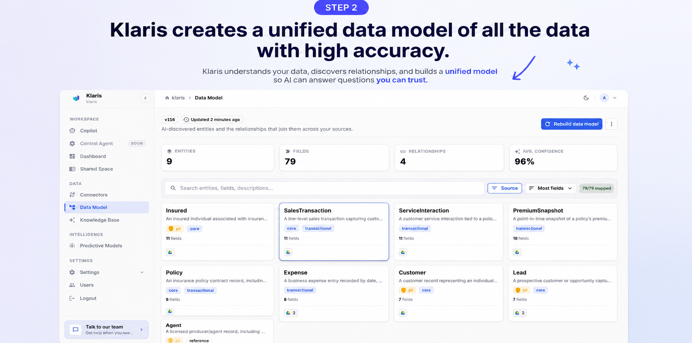

### 🎬 관련 영상
- [🎥 영상 보기](https://ph-files.imgix.net/8ea30b80-b40d-4f81-b4e1-db93b5314f2c.jpeg?auto=format)

---

## 21. [Atomic Fast](https://www.producthunt.com/products/atomic-fast)
**Votes**: 11 | **도입 난이도**: 하 | **신뢰도**: 상
**Tagline**: Fasting tracker with AI meal logging and metabolic insights
**서비스 링크**: https://www.producthunt.com/r/JCWQSHY22VWOXD

**태그**: Health, AI, Productivity, Lifestyle, AI Tool

### 📌 이 서비스 한눈에 보기
AI 식단 기록과 대사 분석을 통해 지속 가능한 단식 습관을 돕는 스마트 트래커

### 🔑 주요 기능
- AI를 활용한 간편한 식사 기록 기능
- 단식 및 수분 섭취 추적 기능
- 대사 상태를 파악할 수 있는 일일 인사이트 제공

### 🙋 사용자에게 어떤 점이 좋은가
복잡한 수동 입력 없이 AI로 식단을 기록하며 건강한 단식 습관을 체계적으로 관리할 수 있습니다.

### ✅ 지금 바로 써볼 기능
- AI 식단 기록 기능 테스트하기
- 단식 타이머 설정 및 기록하기
- 제공되는 대사 인사이트 확인하기

### ⚠️ 사용 전 확인할 점
- AI 식단 기록의 정확도 확인 필요
- 의학적 진단이 아닌 건강 관리 보조 도구로 활용해야 함

### 🧭 확인이 더 필요한 정보
AI 식단 인식의 정밀도와 구체적인 대사 분석 알고리즘에 대한 정보가 더 필요합니다.

### 📸 스크린샷 및 갤러리
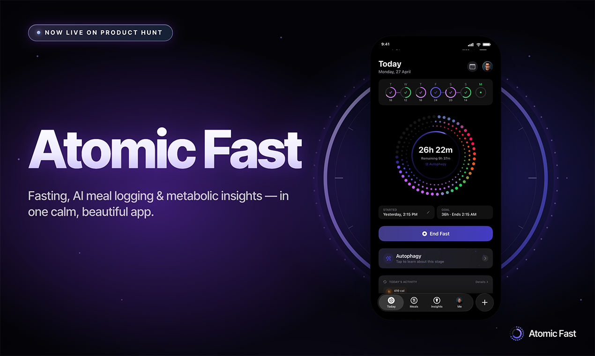
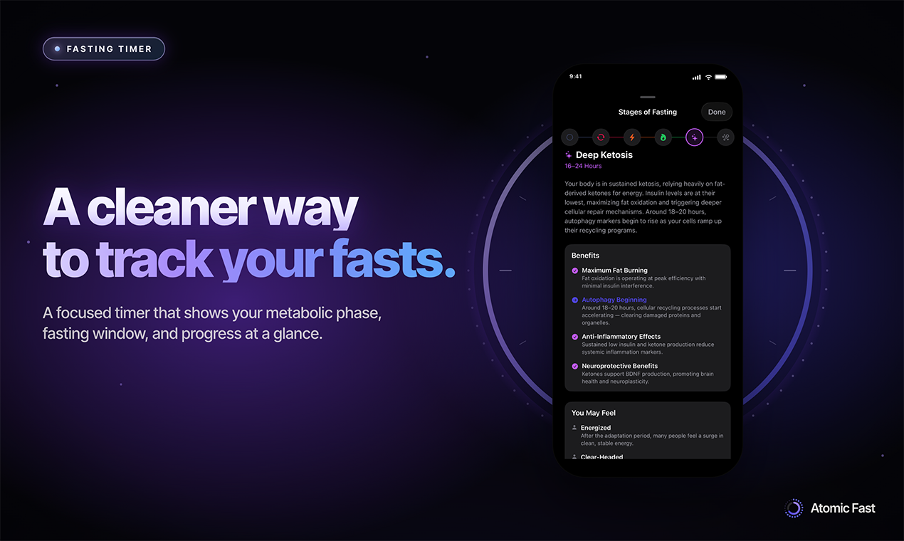
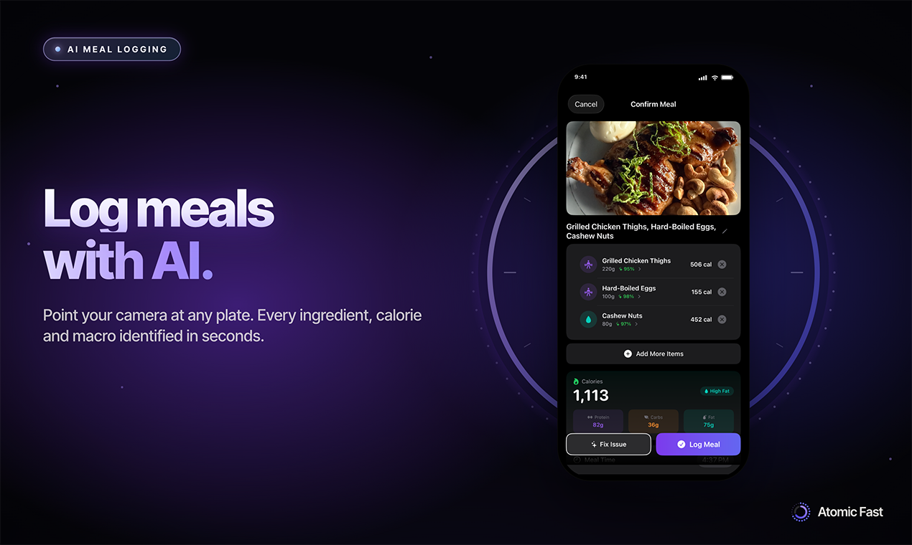

---

## 22. [UnBullet](https://www.producthunt.com/products/unbullet)
**Votes**: 11 | **도입 난이도**: 하 | **신뢰도**: 상
**Tagline**: AI recruitment that reads stories, not bullet points
**서비스 링크**: https://www.producthunt.com/r/JZ33CYJ7FPE5YV

**태그**: AI, Recruitment, Automation, HR-Tech, AI Tool

### 📌 이 서비스 한눈에 보기
불완전한 이력서 대신 개인의 커리어 스토리를 기반으로 최적의 직무를 매칭하는 AI 채용 솔루션

### 🔑 주요 기능
- 단순 나열식 불렛 포인트가 아닌 서사 중심의 커리어 스토리 작성
- AI를 통한 자동 직무 매칭 및 우선순위 기반 후보자 리스트 제공
- 채용 담당자의 스크리닝 호출 및 HR 병목 현상 제거

### 🙋 사용자에게 어떤 점이 좋은가
구직자는 한 번의 스토리 작성으로 적합한 공고를 추천받고, 채용 담당자는 번거로운 초기 면접 없이 검증된 후보자 목록을 즉시 확보할 수 있습니다.

### ✅ 지금 바로 써볼 기능
- 자신의 커리어 스토리를 상세히 작성하기
- AI가 생성한 후보자 순위 및 매칭 근거 확인하기
- AI 인터뷰 기능을 통한 사전 스크리닝 프로세스 경험하기

### ⚠️ 사용 전 확인할 점
- 서사 중심의 데이터가 기존 정형화된 채용 시스템과 호환되는지 확인 필요
- AI의 매칭 정확도가 개인의 실제 역량을 충분히 반영하는지 검증 필요

### 🧭 확인이 더 필요한 정보
현재 서비스가 구직자용인지 채용 담당자용인지, 혹은 양방향 플랫폼인지에 대한 구체적인 인터페이스 정보가 부족합니다.

### 📸 스크린샷 및 갤러리
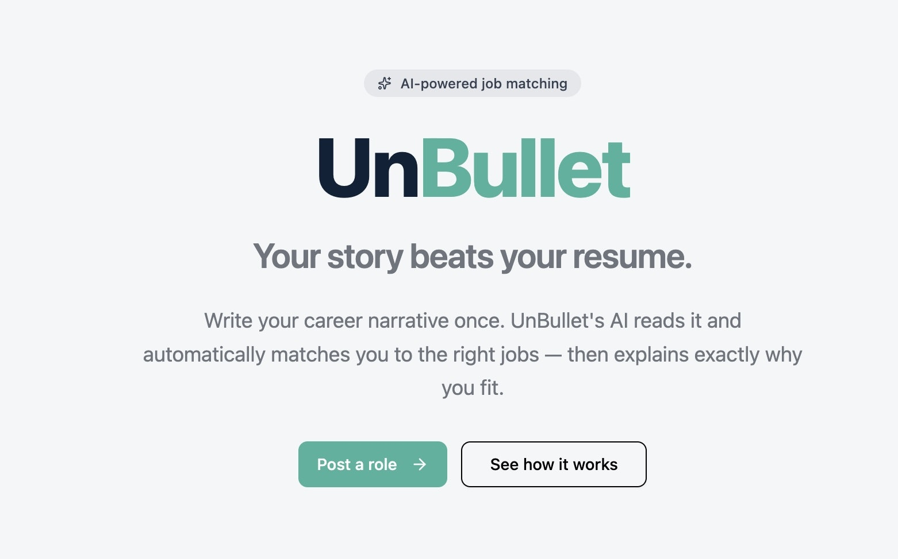
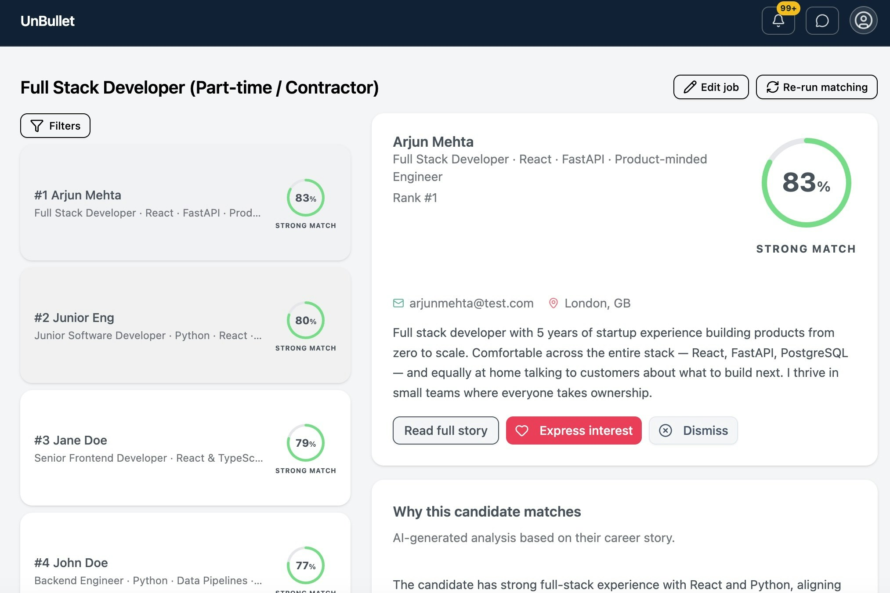
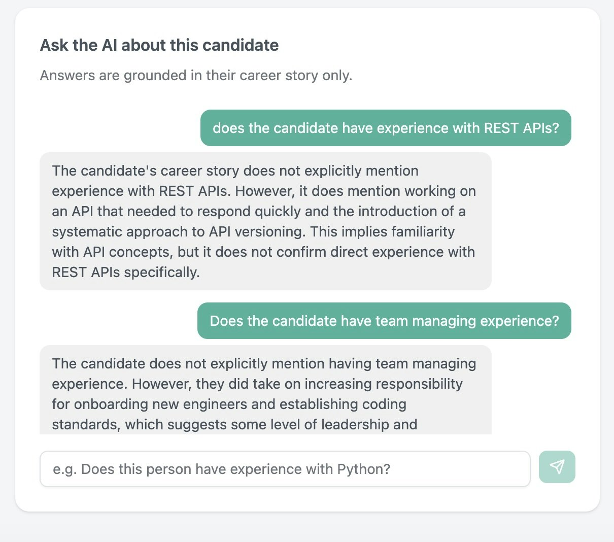

---

## 23. [Elsy](https://www.producthunt.com/products/elsy)
**Votes**: 11 | **도입 난이도**: 중 | **신뢰도**: 상
**Tagline**: AI voice companion for aging parents
**서비스 링크**: https://www.producthunt.com/r/E4N5THU2ERGWFF

**태그**: AI Companion, Elderly Care, HealthTech, Voice AI, AI Tool, Design

### 📌 이 서비스 한눈에 보기
인지 저하를 겪는 부모님을 위한 AI 음성 동반자 및 안부 확인 서비스

### 🔑 주요 기능
- 치매 초기 단계 부모님을 위한 일상 대화 및 기억 지원
- 주간 웰빙 요약(기분, 참여도, 혼란도 등)을 통한 상태 모니터링
- 대화 내용이 아닌 트렌드만 공유하는 프라이버시 중심 설계

### 🙋 사용자에게 어떤 점이 좋은가
부모님과 떨어져 있어도 대화 패턴을 통해 건강 상태를 간접적으로 확인하고, 정서적 교감을 유지할 수 있습니다.

### ✅ 지금 바로 써볼 기능
- 부모님 스마트폰에 앱 설치 및 언어 설정
- 매일 정해진 시간에 대화하도록 가이드하기
- 주간 요약 리포트 확인을 통한 상태 변화 관찰

### ⚠️ 사용 전 확인할 점
- 의료 기기가 아니므로 질병의 진단이나 치료 목적으로 사용할 수 없음
- 부모님의 기술 수용도(스마트폰 사용 숙련도)에 따라 사용이 어려울 수 있음

### 🧭 확인이 더 필요한 정보
부모님이 별도의 조작 없이 대화를 시작할 수 있는 하드웨어 연동 여부가 명확하지 않습니다.

### 📸 스크린샷 및 갤러리

---

## 24. [PromptLib](https://www.producthunt.com/products/promptlib)
**Votes**: 9 | **도입 난이도**: 하 | **신뢰도**: 상
**Tagline**: Pinterest for Image Prompts
**서비스 링크**: https://www.producthunt.com/r/4HVZE72YFPSSAX

**태그**: AI, DesignTool, Creativity, PromptEngineering, Prompting, Vision, Design

### 📌 이 서비스 한눈에 보기
이미지 생성 AI를 위한 핀터레스트 스타일의 프롬프트 큐레이션 플랫폼

### 🔑 주요 기능
- 미적으로 설계된 고품질 프롬프트 컬렉션 제공
- 복사 및 붙여넣기가 가능한 즉시 사용 가능한 프롬프트
- 이미지 영감을 쉽게 찾고 공유할 수 있는 UI

### 🙋 사용자에게 어떤 점이 좋은가
원하는 이미지를 얻기 위해 프롬프트를 고민하는 시간을 획기적으로 줄여주며, 검증된 프롬프트를 통해 일관된 결과물을 얻을 수 있습니다.

### ✅ 지금 바로 써볼 기능
- 컬렉션에서 마음에 드는 프롬프트 복사하기
- 자신만의 프롬프트 저장 및 큐레이션하기
- 이미지 생성 도구에 바로 적용해보기

### ⚠️ 사용 전 확인할 점
- 제공되는 프롬프트가 특정 AI 모델(Midjourney, DALL-E 등)에 최적화되어 있을 수 있음
- 사용자의 의도와 결과물이 다를 경우 직접 수정이 필요할 수 있음

### 🧭 확인이 더 필요한 정보
지원하는 특정 AI 모델의 종류와 프롬프트의 범용성 여부를 확인해야 합니다.

### 📸 스크린샷 및 갤러리

### 🎬 관련 영상
- [🎥 영상 보기](https://ph-files.imgix.net/201924ee-9fcb-433d-a712-1c95742b822d.jpeg?auto=format)

---

## 25. [htmlhost.co](https://www.producthunt.com/products/htmlhost-co)
**Votes**: 9 | **도입 난이도**: 하 | **신뢰도**: 상
**Tagline**: Paste HTML. Get a link.
**서비스 링크**: https://www.producthunt.com/r/V5Q263G25GYYKU

**태그**: DevTool, WebHosting, Prototyping

### 📌 이 서비스 한눈에 보기
단 하나의 HTML 파일을 즉시 웹에 게시할 수 있는 초간편 호스팅 서비스

### 🔑 주요 기능
- HTML 코드를 붙여넣기만 하면 즉시 URL 생성
- 단일 파일 호스팅에 최적화된 단순한 워크플로우
- 프로토타입 및 데모 제작을 위한 빠른 배포 환경

### 🙋 사용자에게 어떤 점이 좋은가
복잡한 설정 없이 아이디어를 즉시 웹 링크로 공유해야 하는 개발자나 디자이너에게 매우 유용합니다.

### ✅ 지금 바로 써볼 기능
- 작성한 HTML 코드 붙여넣기
- 생성된 공유 URL 확인하기
- 데모 페이지 접속 테스트하기

### ⚠️ 사용 전 확인할 점
- 단일 HTML 파일만 지원하므로 복잡한 프로젝트에는 부적합할 수 있음
- 정적 파일 외의 서버 사이드 기능은 작동하지 않음

### 🧭 확인이 더 필요한 정보
파일 저장 기간, 트래픽 제한 및 도메인 커스텀 가능 여부에 대한 정보가 명시되지 않았습니다.

### 📸 스크린샷 및 갤러리
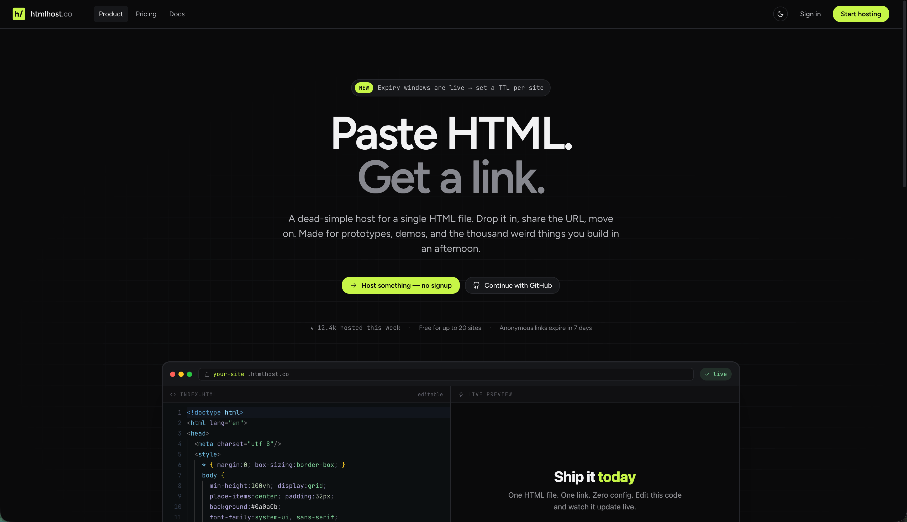
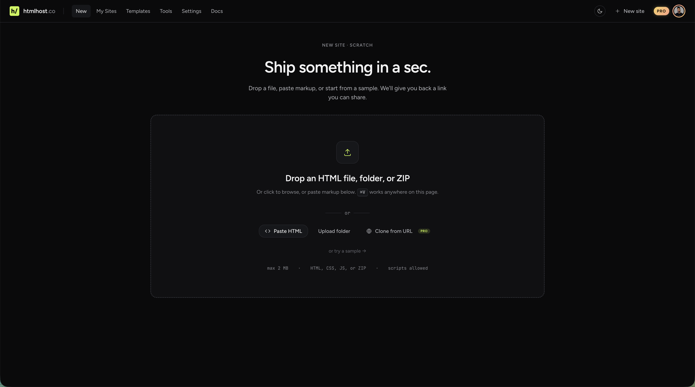

---

## 26. [Parkese ALPR](https://www.producthunt.com/products/parkese-alpr)
**Votes**: 8 | **도입 난이도**: 하 | **신뢰도**: 상
**Tagline**: Read any Indian license plate in under 500ms
**서비스 링크**: https://www.producthunt.com/r/XFRXRL2BLGYY33

**태그**: DevTool, AI, API, Automation, AI Tool

### 📌 이 서비스 한눈에 보기
인도 번호판 특화 초고속 ALPR(자동 번호판 인식) API

### 🔑 주요 기능
- 인도 특유의 데바나가리 문자 및 BH 시리즈 형식 완벽 지원
- 영어, 힌디어, 마라티어 스크립트 자동 감지 및 파싱
- 500ms 미만의 빠른 응답 속도 및 MoRTH 규정 기반 검증

### 🙋 사용자에게 어떤 점이 좋은가
기존 글로벌 API가 인식하지 못하는 인도 현지 번호판을 정확하게 처리할 수 있어, 인도 시장 대상 서비스 개발 시 즉각적인 도입이 가능합니다.

### ✅ 지금 바로 써볼 기능
- Curl 명령어를 통한 즉각적인 API 테스트
- 2,500회 무료 스캔 기능을 활용한 인식 정확도 검증

### ⚠️ 사용 전 확인할 점
- 무료 스캔 횟수 제한 확인 필요
- 인도 외 지역(US/EU 등) 번호판에 대한 성능 미확인

### 🧭 확인이 더 필요한 정보
무료 스캔 이후의 구체적인 과금 체계와 API 호출 제한 정책이 명시되지 않았습니다.

### 📸 스크린샷 및 갤러리
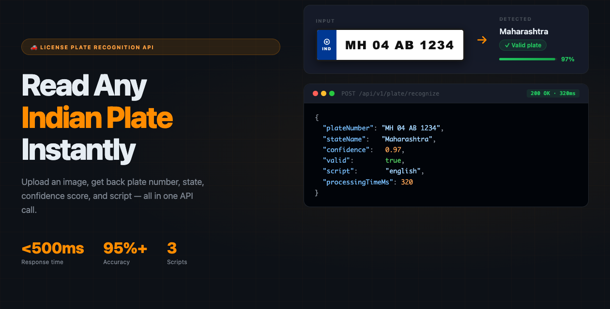
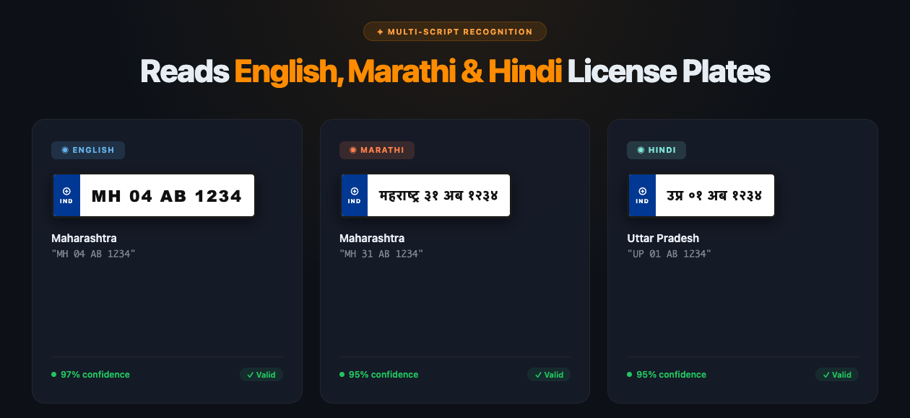
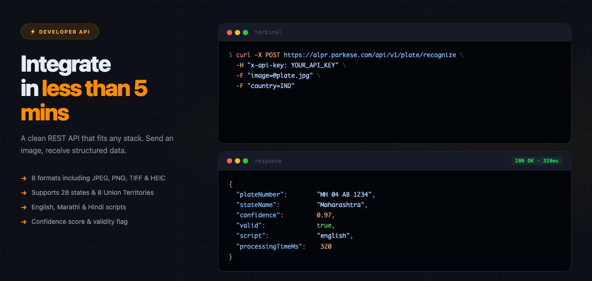

---

## 27. [Songbrain](https://www.producthunt.com/products/songbrain)
**Votes**: 8 | **도입 난이도**: 하 | **신뢰도**: 상
**Tagline**: Find your viral moment — AI music analysis for artists
**서비스 링크**: https://www.producthunt.com/r/4T34CVP7LX4I2Q

**태그**: AI, Music, Marketing, Analytics, AI Tool

### 📌 이 서비스 한눈에 보기
AI 분석을 통해 곡의 바이럴 요소를 찾고 플레이리스트 배포까지 돕는 아티스트용 툴

### 🔑 주요 기능
- AI 기반 바이럴 점수 및 곡 내 하이라이트 구간 분석
- 숏폼 콘텐츠 제작을 위한 릴스 역설계(Reverse-Engineering) 기능
- 37개의 큐레이션된 스포티파이 플레이리스트 자동 피칭

### 🙋 사용자에게 어떤 점이 좋은가
자신의 곡 중 어떤 부분이 대중에게 먹힐지 데이터로 확인하고, 홍보 전략을 세우는 데 유용합니다.

### ✅ 지금 바로 써볼 기능
- 곡 업로드 후 바이럴 점수 확인하기
- 분석된 베스트 모먼트 구간 확인하기
- 무료 크레딧으로 스포티파이 플레이리스트 피칭 시도하기

### ⚠️ 사용 전 확인할 점
- 무료 크레딧 소진 시 추가 비용 발생 가능성
- AI 분석 결과가 실제 시장 반응과 항상 일치하지 않을 수 있음

### 🧭 확인이 더 필요한 정보
무료 크레딧 사용 이후의 구체적인 유료 플랜 체계에 대한 정보가 필요합니다.

### 📸 스크린샷 및 갤러리

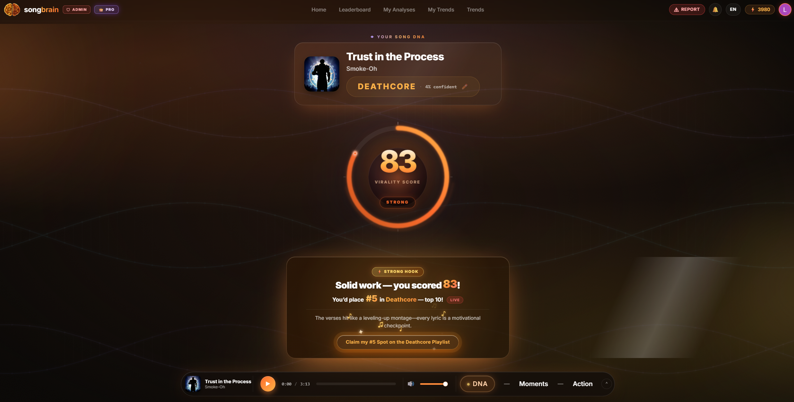
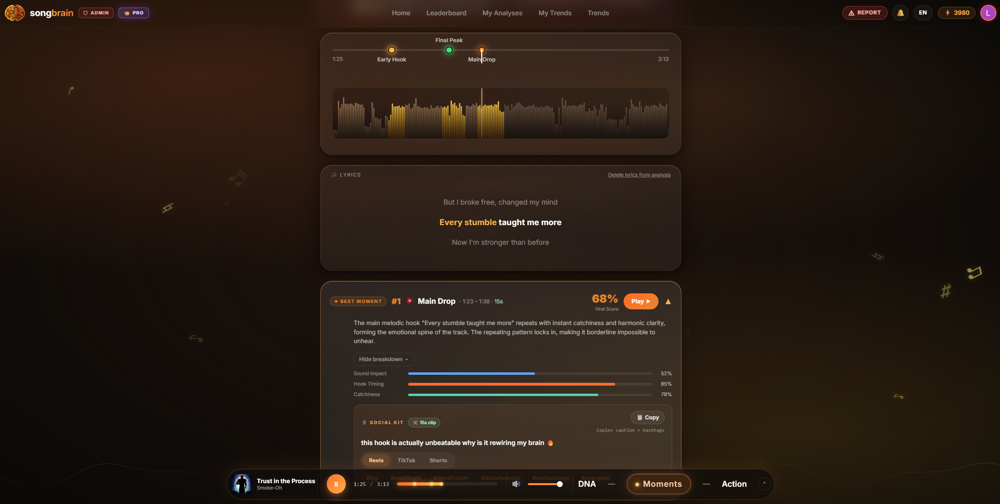

---

## 28. [Ninja Miles](https://www.producthunt.com/products/ninja-miles)
**Votes**: 8 | **도입 난이도**: 하 | **신뢰도**: 상
**Tagline**: The keyboard that rewards your everyday typing
**서비스 링크**: https://www.producthunt.com/r/ERJ4WPN5ML4TDT

**태그**: Productivity, Mobile, Rewards

### 📌 이 서비스 한눈에 보기
일상적인 타이핑만으로 포인트를 쌓는 보상형 스마트폰 키보드

### 🔑 주요 기능
- 평소처럼 타이핑하는 것만으로 포인트 적립
- 추가 작업이나 강제 광고 없는 수동적 보상 방식
- 스마트폰 키보드 기반의 간편한 사용성

### 🙋 사용자에게 어떤 점이 좋은가
별도의 노력 없이 일상적인 스마트폰 사용 과정에서 자연스럽게 혜택을 얻을 수 있습니다.

### ✅ 지금 바로 써볼 기능
- 키보드 설치 및 기본 설정
- 일상적인 메시지/검색 시 포인트 적립 확인
- 적립된 포인트의 사용처 및 전환 방식 확인

### ⚠️ 사용 전 확인할 점
- 키보드 앱 특성상 입력 데이터의 개인정보 보호 및 보안 정책 확인 필요
- 포인트 적립률 및 실제 현금화 가치 확인 필요

### 🧭 확인이 더 필요한 정보
데이터 수집 방식과 개인정보 보안 수준에 대한 구체적인 정보가 필요합니다.

### 📸 스크린샷 및 갤러리

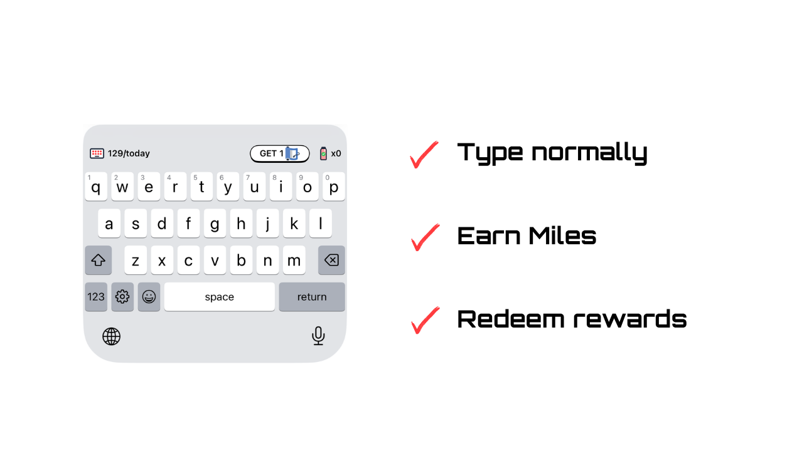
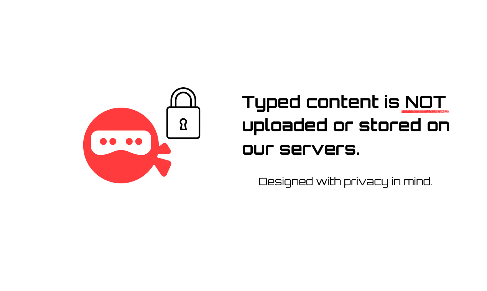

### 🎬 관련 영상
- [🎥 영상 보기](https://ph-files.imgix.net/639ac689-138d-4e15-9e1d-f189b13f50d7.jpeg?auto=format)

---

## 29. [Lyba: The client review layer for Framer](https://www.producthunt.com/products/lyba-the-client-review-layer-for-framer)
**Votes**: 7 | **도입 난이도**: 하 | **신뢰도**: 상
**Tagline**: Client approval for Framer sites — without the email chain.
**서비스 링크**: https://www.producthunt.com/r/EWL5C4AVLXOQ7B

**태그**: Framer, DesignTool, Collaboration, Workflow, AI Tool, Email

### 📌 이 서비스 한눈에 보기
Framer 프로젝트를 위한 실시간 클라이언트 피드백 및 승인 관리 레이어

### 🔑 주요 기능
- Framer 사이트 위에 직접 핀을 꽂는 방식의 직관적인 댓글 기능
- 이메일이나 메신저를 벗어난 통합된 리뷰 워크플로우 제공
- 프로젝트 최종 승인을 위한 타임스탬프 기반의 사인오프 기능

### 🙋 사용자에게 어떤 점이 좋은가
파편화된 피드백 채널(카톡, 이메일 등)을 하나로 통합하여 커뮤니케이션 비용을 줄이고 작업 이력을 명확히 관리할 수 있습니다.

### ✅ 지금 바로 써볼 기능
- 전용 리뷰 링크 생성하여 클라이언트에게 공유하기
- 라이브 사이트 위에서 직접 피드백 핀 기능 테스트하기
- 최종 결과물에 대한 타임스탬프 승인 절차 진행하기

### ⚠️ 사용 전 확인할 점
- Framer 플러그인으로서 Framer 환경 내에서의 호환성 확인 필요
- 클라이언트가 별도의 계정 생성이나 복잡한 절차를 거쳐야 하는지 여부 확인

### 🧭 확인이 더 필요한 정보
구체적인 요금제 체계와 클라이언트 측의 접근 권한 범위에 대한 정보가 명시되지 않았습니다.

### 📸 스크린샷 및 갤러리
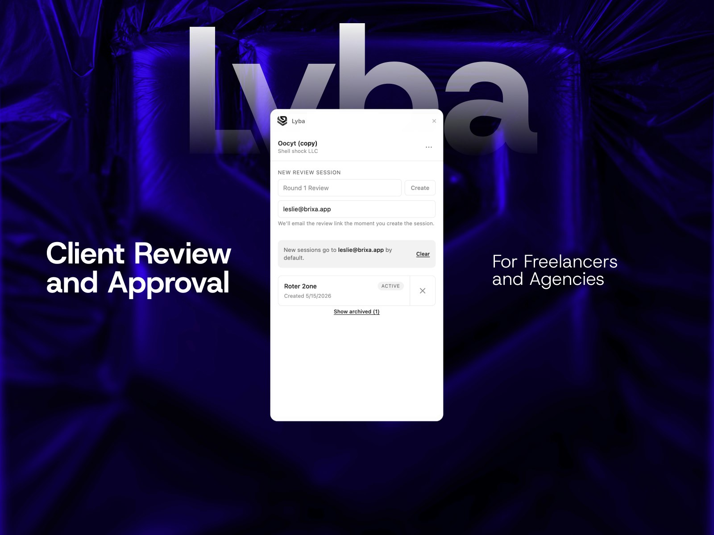
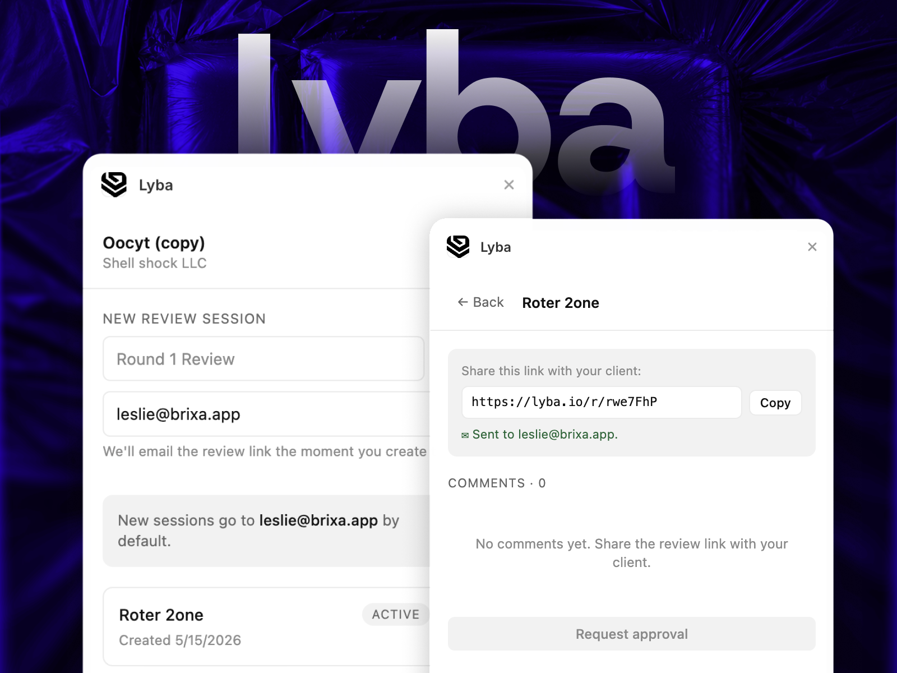

### 🎬 관련 영상
- [🎥 영상 보기](https://ph-files.imgix.net/ba088474-b8b7-4138-8ce2-5d0584f378fc.jpeg?auto=format)

---

## 30. [Reseed](https://www.producthunt.com/products/reseed-2)
**Votes**: 7 | **도입 난이도**: 하 | **신뢰도**: 상
**Tagline**: Stop your AI editor from generating UI slop.
**서비스 링크**: https://www.producthunt.com/r/VS2KROJCDUSMV3

**태그**: DevTool, DesignSystem, AI-Assisted, CLI, AI Tool, Prompting, Design

### 📌 이 서비스 한눈에 보기
웹사이트의 디자인 시스템을 추출하여 AI 에디터가 일관된 UI를 생성하도록 돕는 CLI 도구

### 🔑 주요 기능
- URL에서 색상, 타이포그래피, 간격, 모션 등 디자인 시스템 자동 추출
- 추출된 디자인 데이터를 로컬 저장소에 즉시 반영
- Cursor, Claude Code 등 AI 에디터와 연동하여 UI 생성 품질 향상

### 🙋 사용자에게 어떤 점이 좋은가
AI가 생성하는 정형화된 'AI 스타일' UI 대신, 기존 프로젝트의 디자인 가이드를 준수하는 일관된 결과물을 얻을 수 있습니다.

### ✅ 지금 바로 써볼 기능
- 참조할 디자인이 있는 웹사이트 URL 입력하기
- 추출된 디자인 시스템 파일을 프로젝트 저장소에 저장하기
- AI 에디터(Cursor 등)에 해당 파일을 컨텍스트로 제공하기

### ⚠️ 사용 전 확인할 점
- 추출된 디자인 데이터가 실제 프로젝트의 코드 구조와 완벽히 호환되지 않을 수 있음
- 복잡한 인터랙션이나 동적 요소의 완벽한 재현 여부 확인 필요

### 🧭 확인이 더 필요한 정보
추출된 데이터가 어떤 파일 형식(JSON, CSS 등)으로 제공되는지 명시되지 않았습니다.

### 📸 스크린샷 및 갤러리

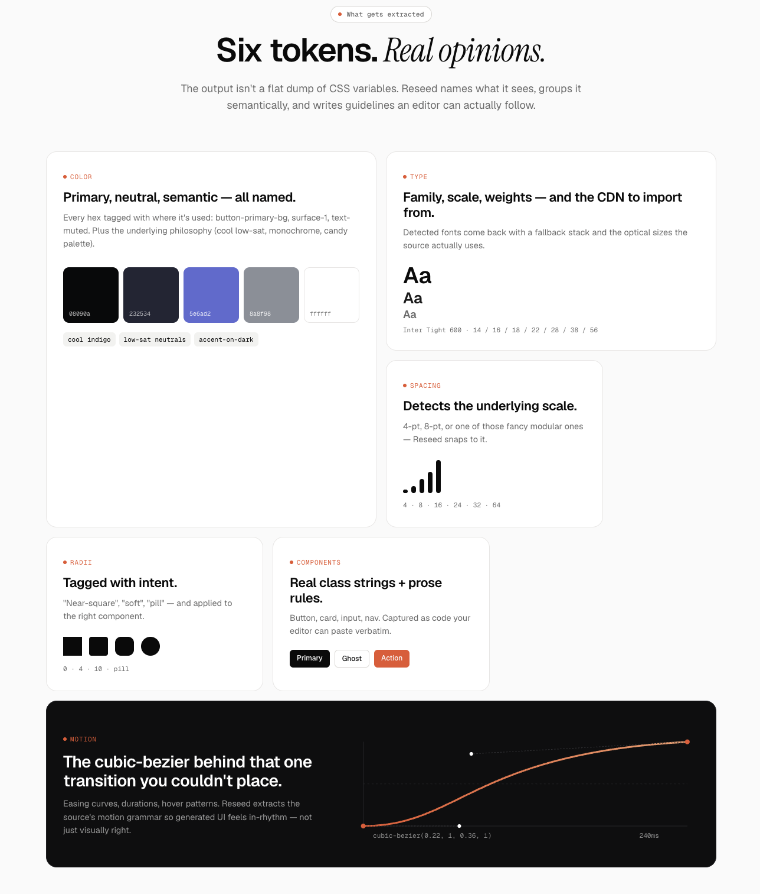
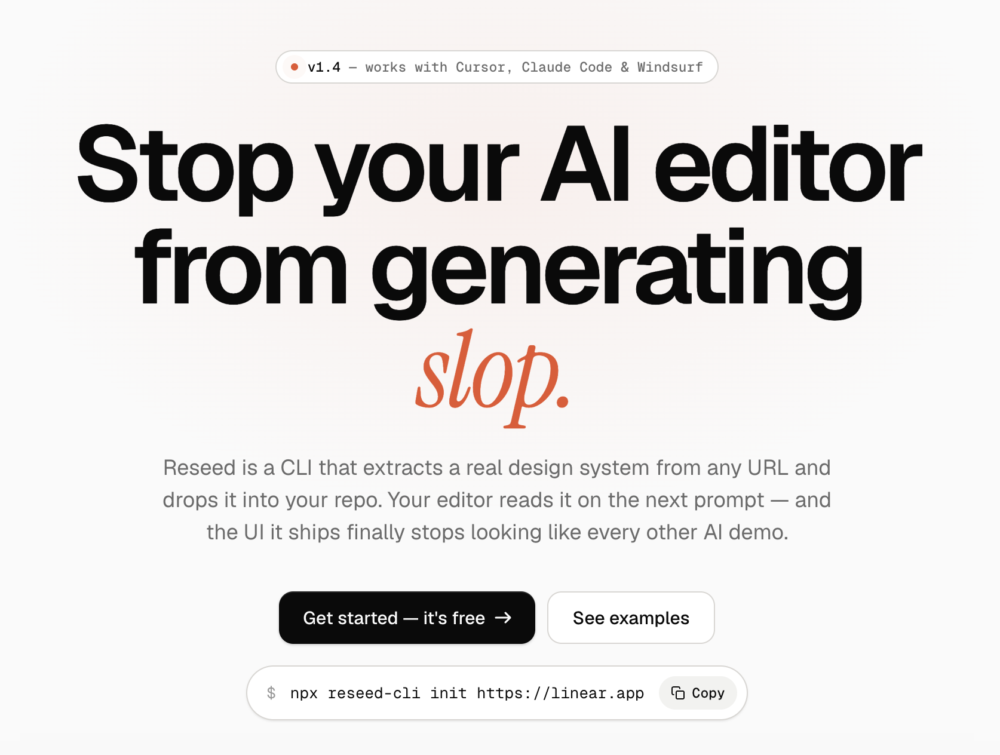

---

