# 🚀 Product Hunt Daily Top 30 (2026-05-28)

## 오늘의 요약
오늘의 트렌드는 AI 에이전트의 작업 효율을 극대화하기 위한 인프라와 자동화 도구들이 주를 이루었습니다. 특히 복잡한 API 연동이나 데이터 관리 과정을 간소화하여 AI가 스스로 도구를 사용하거나 업무를 수행할 수 있도록 돕는 서비스들이 눈에 띄었습니다.

### 오늘의 핵심 포인트
- AI 에이전트가 다양한 API와 도구에 즉시 접근하여 자율적으로 작업을 수행할 수 있는 통합 환경이 강조되었습니다.
- 단순한 챗봇을 넘어 CRM, 백엔드 인프라, 브라우저 등 실질적인 업무 워크플로우에 AI를 깊숙이 통합하려는 시도가 나타났습니다.
- 사용자의 입력 흐름을 방해하지 않는 자동 완성이나 대화형 인터페이스를 통해 AI와 인간의 상호작용을 간편하게 만드는 도구들이 주목받았습니다.

**오늘의 태그**: AI Agent, Automation, Developer Tools, Workflow Optimization

## 1. [Bluedot 2.1](https://www.producthunt.com/products/bluedot-2)
**Votes**: 306 | **도입 난이도**: 하 | **신뢰도**: 상
**Tagline**: Record on Apple Watch. Sync with Claude
**서비스 링크**: https://www.producthunt.com/r/FBQTRS2UMIX3RW

**태그**: Productivity, AI, AppleWatch, Workflow, AI Tool, Chat

### 📌 이 서비스 한눈에 보기
애플 워치로 대화를 녹음하고 Claude와 즉시 동기화하여 업무 맥락을 관리하는 도구

### 🔑 주요 기능
- 애플 워치를 활용한 간편한 대화 녹음 기능
- MCP를 통한 Claude와의 원활한 데이터 동기화
- 대면 미팅, 인터뷰 등 오프라인 대화의 디지털 자산화

### 🙋 사용자에게 어떤 점이 좋은가
노트북이나 미팅 봇 없이도 일상적인 대화를 기록하고, 이를 Claude의 지식 베이스로 즉시 활용할 수 있습니다.

### ✅ 지금 바로 써볼 기능
- 애플 워치로 짧은 대화 녹음해보기
- Claude와 연동하여 요약 결과 확인하기
- 기록된 대화 내용 검색 및 맥락 파악하기

### ⚠️ 사용 전 확인할 점
- 대화 상대방의 동의 없는 녹음에 따른 윤리적/법적 문제 주의
- 애플 워치의 배터리 및 저장 공간 제약

### 🧭 확인이 더 필요한 정보
MCP를 통한 구체적인 데이터 전송 방식과 보안 수준에 대한 상세 정보가 필요합니다.

### 📸 스크린샷 및 갤러리
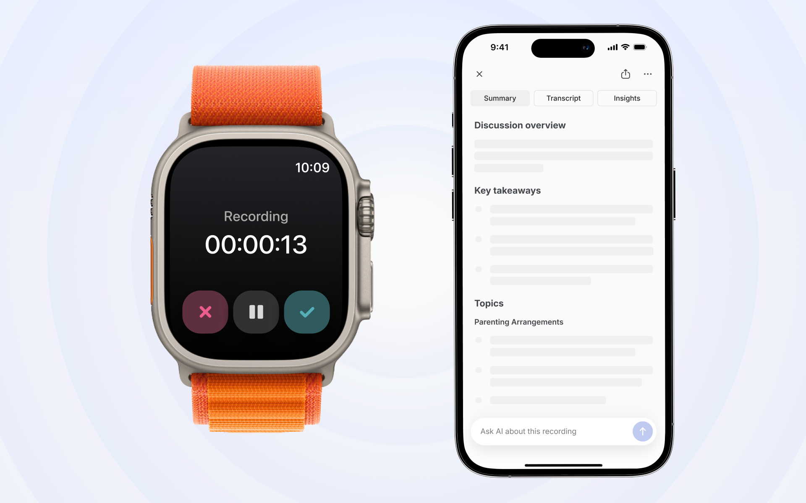
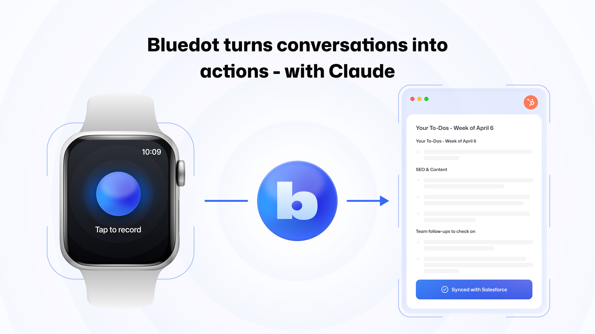
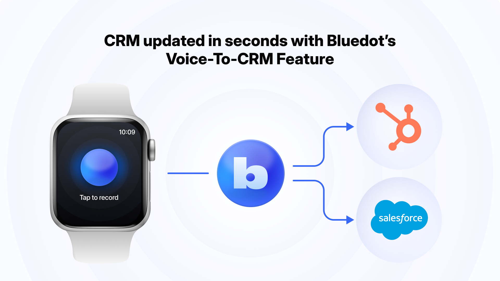

### 🎬 관련 영상
- [🎥 영상 보기](https://ph-files.imgix.net/e966246f-9e55-4080-84a1-7aa70f6ab2e8.jpeg?auto=format)

---

## 2. [Powabase](https://www.producthunt.com/products/powabase)
**Votes**: 274 | **도입 난이도**: 중 | **신뢰도**: 상
**Tagline**: Build AI apps with Postgres, RAG, and agents
**서비스 링크**: https://www.producthunt.com/r/6BBPF3XTDL5C2Y

**태그**: AI-Native, Backend-as-a-Service, DevTools, Automation, Postgres, Agent, AI Tool, Design

### 📌 이 서비스 한눈에 보기
Postgres 기반의 통합 백엔드 서비스를 통해 복잡한 인프라 구축 없이 AI 앱을 빠르게 개발할 수 있는 플랫폼

### 🔑 주요 기능
- Postgres, RAG, 에이전트, 워크플로우를 하나로 통합한 AI 네이티브 백엔드 서비스
- 파편화된 인프라를 연결하는 번거로움 없이 AI 자동화 및 앱 개발 가능
- 코딩 에이전트와 원활하게 작동하도록 설계되어 개발 속도 및 토큰 효율성 최적화

### 🙋 사용자에게 어떤 점이 좋은가
복잡한 AI 인프라 구축 과정을 생략하고, 에이전시나 IT 팀이 아이디어를 즉시 제품화하거나 기존 서비스에 AI 기능을 빠르게 도입할 수 있습니다.

### ✅ 지금 바로 써볼 기능
- Postgres 기반의 RAG 시스템 구축 테스트
- AI 에이전트 및 워크플로우 자동화 기능 실험
- 기존 제품에 AI 기능을 통합하기 위한 프로토타이핑

### ⚠️ 사용 전 확인할 점
- 특정 플랫폼에 대한 의존도(Vendor Lock-in) 발생 가능성
- 복잡한 워크플로우 설계 시 시스템 부하 및 비용 관리 필요

### 🧭 확인이 더 필요한 정보
상세한 가격 정책 및 대규모 트래픽 처리 시의 확장성 데이터가 명시되지 않았습니다.

### 📸 스크린샷 및 갤러리
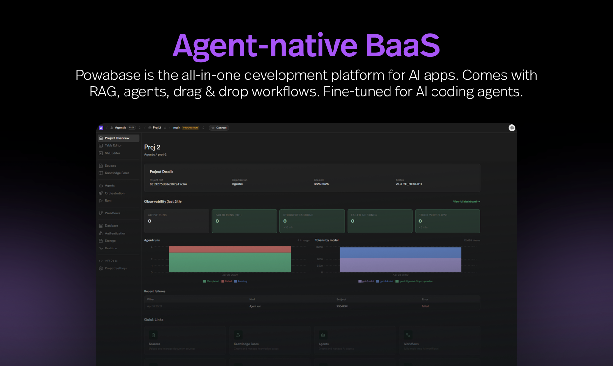
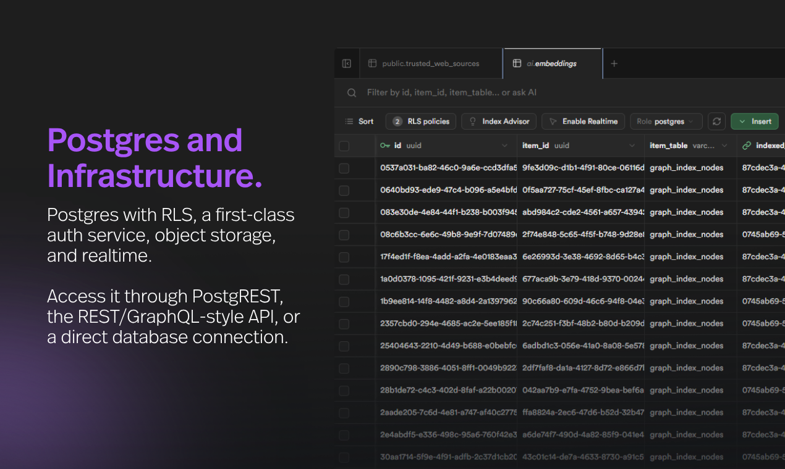
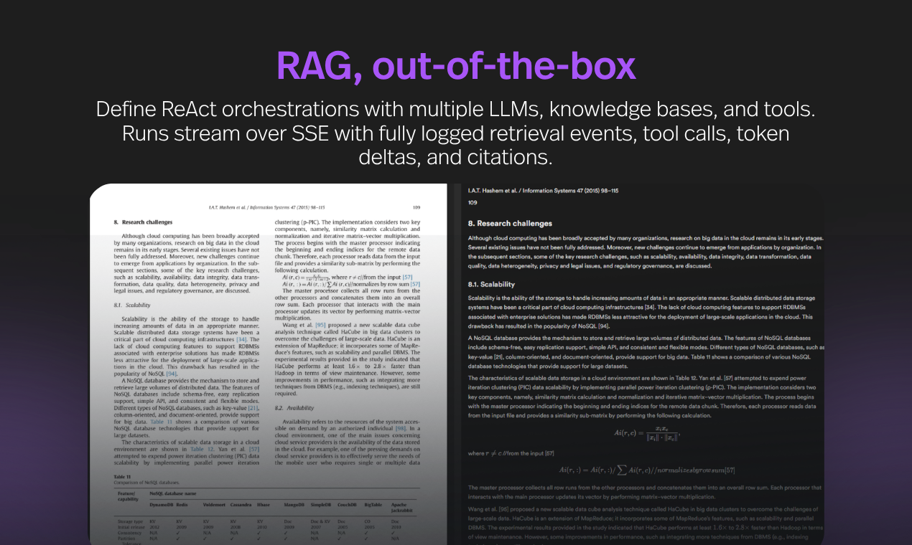

### 🎬 관련 영상
- [🎥 영상 보기](https://ph-files.imgix.net/0c756a03-cfe9-48be-b014-f69cd25c7e82.jpeg?auto=format)

---

## 3. [zero.xyz](https://www.producthunt.com/products/zero-xyz)
**Votes**: 202 | **도입 난이도**: 하 | **신뢰도**: 상
**Tagline**: Give your AI agent access to ~8k tools, APIs and services
**서비스 링크**: https://www.producthunt.com/r/FRR5SI6KDCOK4U

**태그**: AI-Agent, DevTool, Automation, API, Agent, AI Tool

### 📌 이 서비스 한눈에 보기
AI 에이전트가 별도의 설정 없이 8,000개 이상의 도구와 API를 즉시 사용할 수 있게 해주는 통합 도구 허브

### 🔑 주요 기능
- 8,000개 이상의 다양한 도구, API 및 서비스 접근 권한 제공
- API 키 관리나 복잡한 설정 없이 에이전트의 작업 수행 능력 확장
- Claude Code, Gemini, Codex 등 주요 CLI 에이전트와 호환

### 🙋 사용자에게 어떤 점이 좋은가
에이전트 개발 시 매번 새로운 API를 연동해야 하는 번거로움을 없애고, 에이전트가 스스로 도구를 찾아 작업을 완수할 수 있도록 돕습니다.

### ✅ 지금 바로 써볼 기능
- 사용 중인 CLI 에이전트(Claude Code, Gemini 등)에 Zero 연결하기
- 에이전트가 필요한 도구를 Zero를 통해 탐색하도록 설정하기

### ⚠️ 사용 전 확인할 점
- 에이전트가 외부 서비스에 직접 접근하므로 보안 및 권한 관리 주의 필요
- 다양한 서비스 연동 시 발생할 수 있는 비용이나 사용량 제한 확인 필요

### 🧭 확인이 더 필요한 정보
제공되는 8,000여 개의 도구 중 특정 서비스의 상세 기능 및 사용량 제한 정책에 대한 정보가 더 필요합니다.

### 📸 스크린샷 및 갤러리
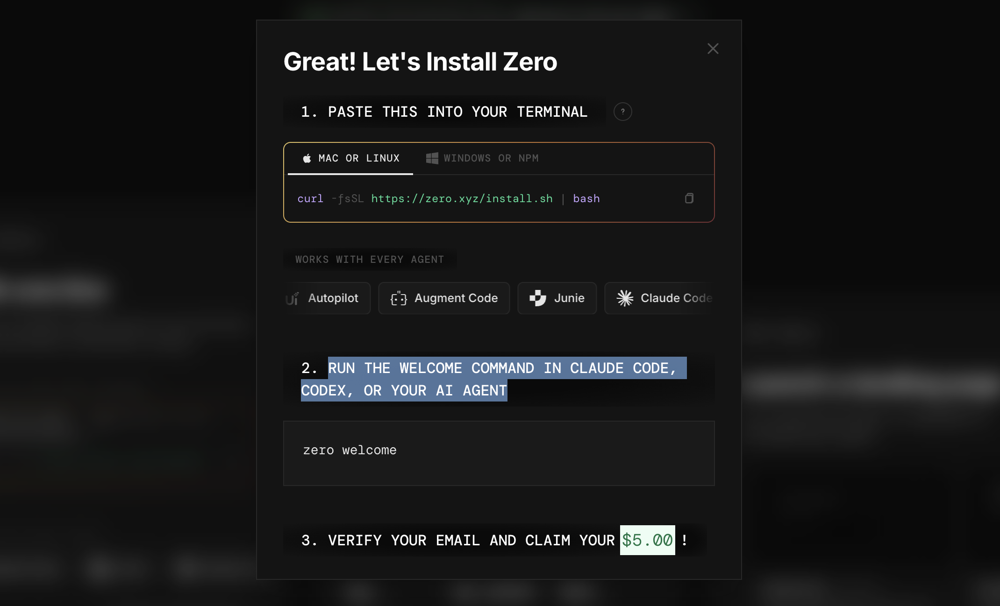
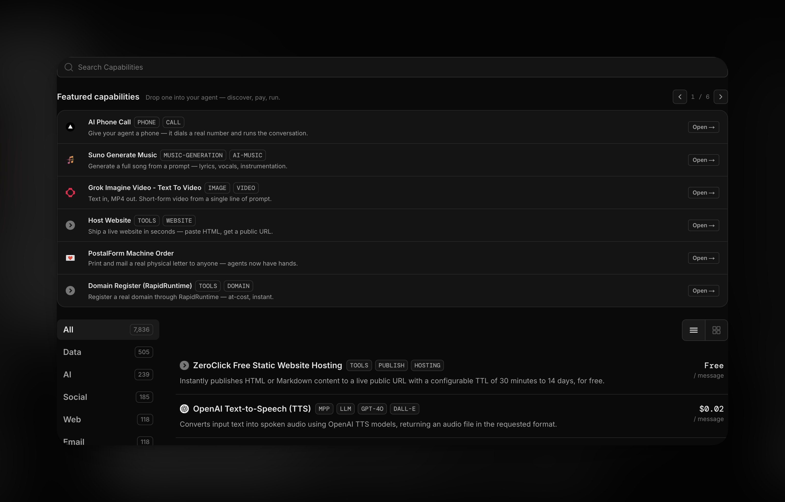
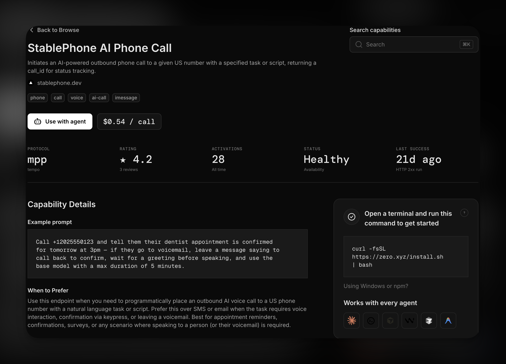

### 🎬 관련 영상
- [🎥 영상 보기](https://ph-files.imgix.net/12607c45-681c-43a0-ba8f-b1261abf366e.jpeg?auto=format)

---

## 4. [Oasis Browser for Mac](https://www.producthunt.com/products/kahana)
**Votes**: 201 | **도입 난이도**: 하 | **신뢰도**: 상
**Tagline**: A privacy-first AI browser you can train anonymously
**서비스 링크**: https://www.producthunt.com/r/UHWTQ5ARCQU6DH

**태그**: Browser, AI, Privacy, Mac, Productivity, AI Tool

### 📌 이 서비스 한눈에 보기
개인정보 보호와 AI 학습을 결합하여 사용자 맞춤형 경험을 제공하는 Mac 전용 브라우저

### 🔑 주요 기능
- 개인정보 보호를 최우선으로 하는 프라이버시 중심 설계
- 사용자의 데이터와 패턴을 학습하여 개인화되는 AI 기능
- 복잡함을 덜어낸 우아하고 간결한 사용자 경험

### 🙋 사용자에게 어떤 점이 좋은가
사용자의 브라우징 습관을 학습하여 시간이 지날수록 더 빠르고 정확한 맞춤형 워크플로우를 제공합니다.

### ✅ 지금 바로 써볼 기능
- 사용자 패턴 학습을 위한 브라우징 시작
- 개인화된 AI 기능의 정확도 테스트
- Mac 환경에서의 인터페이스 적응

### ⚠️ 사용 전 확인할 점
- Mac 전용 제품이므로 타 OS 사용자는 사용 불가
- AI 학습 과정에서의 데이터 보안 정책 상세 확인 필요

### 🧭 확인이 더 필요한 정보
AI 학습이 구체적으로 어떤 방식으로 로컬 또는 클라우드에서 이루어지는지 확인이 필요합니다.

### 📸 스크린샷 및 갤러리
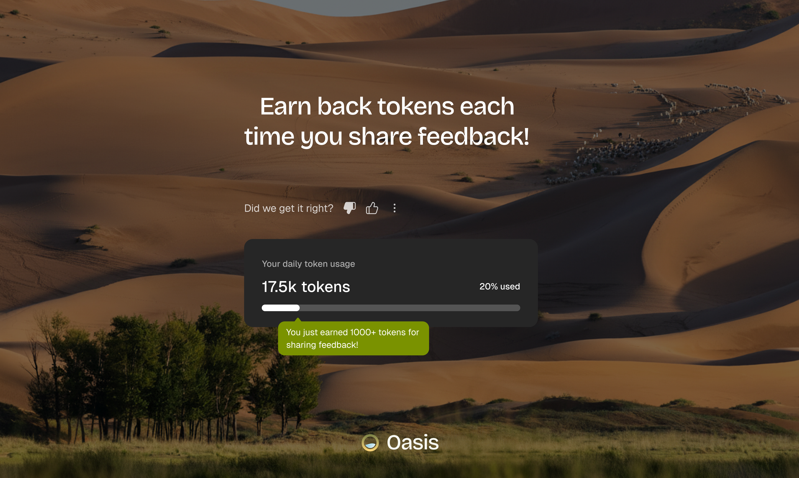
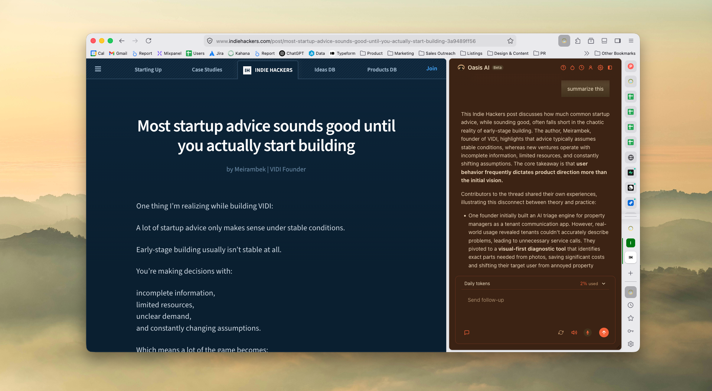
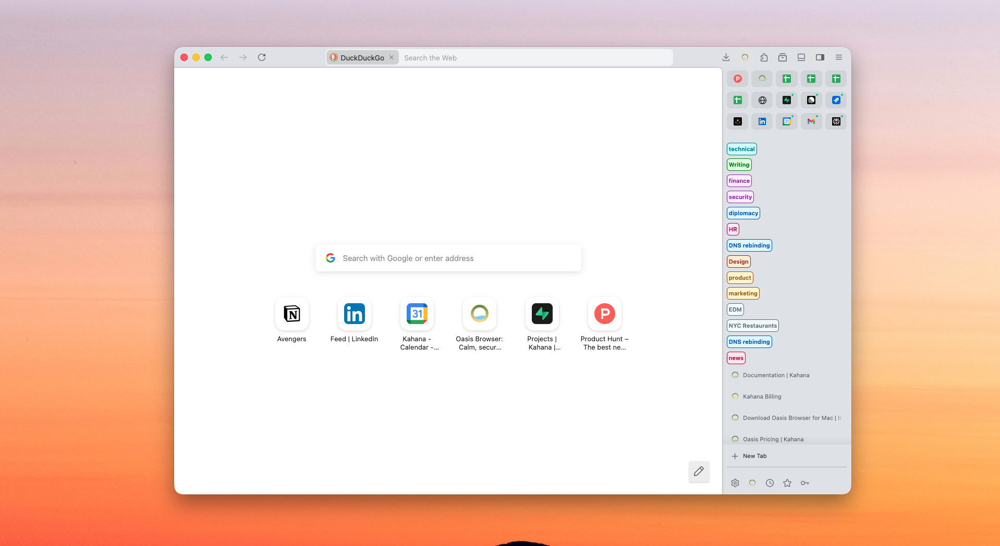

### 🎬 관련 영상
- [🎥 영상 보기](https://ph-files.imgix.net/ec6a6589-7b08-4604-b83c-fdc4916e519f.jpeg?auto=format)

---

## 5. [Coworker AI](https://www.producthunt.com/products/coworker-ai)
**Votes**: 158 | **도입 난이도**: 하 | **신뢰도**: 상
**Tagline**: More AI for less spend with context-aware model routing
**서비스 링크**: https://www.producthunt.com/r/RDCOGEXDF5HCNW

**태그**: AI, Productivity, DevTool, Automation, AI Tool, Chat

### 📌 이 서비스 한눈에 보기
기업 맞춤형 컨텍스트와 자동 모델 라우팅을 통해 비용 효율을 극대화하는 AI 워크플로우 도구

### 🔑 주요 기능
- 기업 내부 컨텍스트를 반영한 지능형 AI 응답
- 작업 성격에 따라 최적의 모델로 자동 라우팅
- 동일 비용 대비 토큰 사용량 및 작업 효율 5배 증대

### 🙋 사용자에게 어떤 점이 좋은가
사용자는 모델 선택에 대한 고민 없이 비용을 절감하면서도, 기업 데이터가 반영된 고품질의 채팅과 코딩 지원을 받을 수 있습니다.

### ✅ 지금 바로 써볼 기능
- 기업 데이터 연동을 통한 컨텍스트 설정
- 작업별 자동 모델 라우팅 기능 테스트
- 기존 AI 사용량 대비 비용 절감 효과 확인

### ⚠️ 사용 전 확인할 점
- 기업 내부 데이터 제공 시 보안 및 개인정보 보호 정책 확인 필요
- 자동 라우팅 모델의 성능이 모든 작업 유형에 최적인지 검증 필요

### 🧭 확인이 더 필요한 정보
구체적인 데이터 보안 프로토콜과 지원 가능한 모델의 종류에 대한 정보가 추가로 필요합니다.

### 📸 스크린샷 및 갤러리
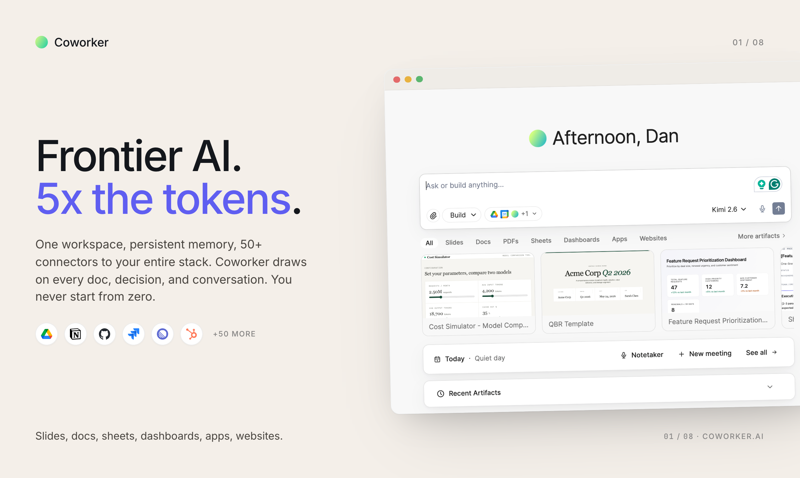
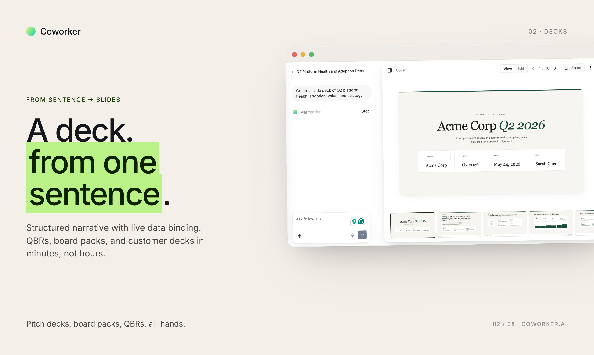
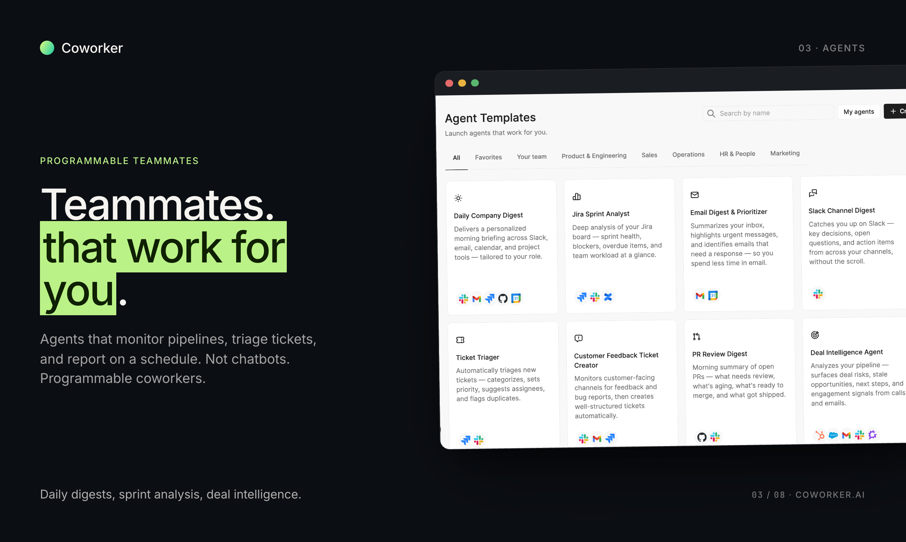

### 🎬 관련 영상
- [🎥 영상 보기](https://ph-files.imgix.net/bcdae8be-7f8f-4e86-8e68-2c247e566fb7.jpeg?auto=format)

---

## 6. [Octolane](https://www.producthunt.com/products/octolane)
**Votes**: 137 | **도입 난이도**: 하 | **신뢰도**: 상
**Tagline**: Self-driving AI CRM that you can talk to
**서비스 링크**: https://www.producthunt.com/r/Y2LOMA5GPSSECJ

**태그**: AI, CRM, Automation, SalesTech, Productivity, AI Tool, Chat

### 📌 이 서비스 한눈에 보기
대화만으로 영업 프로세스를 자동화하는 자율 주행 AI CRM

### 🔑 주요 기능
- 채팅 기반의 직관적인 인터페이스로 업무 지시 및 데이터 조회 가능
- Gmail과 캘린더를 연동하여 딜 감지, 후속 조치 초안 작성, 필드 업데이트 자동화
- 칸반 파이프라인, 미팅 레코더, 방문자 신호 감지 등 핵심 영업 도구 통합

### 🙋 사용자에게 어떤 점이 좋은가
복잡한 CRM 입력 작업 없이 대화만으로 영업 관리가 가능해져, 영업 담당자가 고객 관계 구축에 더 집중할 수 있게 합니다.

### ✅ 지금 바로 써볼 기능
- 슬래시 커맨드 채팅을 통한 업무 자동화 테스트
- Gmail/캘린더 연동을 통한 자동 딜 감지 확인
- 미팅 레코더 및 칸반 파이프라인 활용

### ⚠️ 사용 전 확인할 점
- 이메일 및 일정 접근 권한 부여에 따른 데이터 보안 검토 필요
- AI의 자동 생성 내용(후속 메일 등)에 대한 최종 검수 필수

### 🧭 확인이 더 필요한 정보
현재 제공되는 60여 개의 MCP 서버 도구들이 사용자의 특정 워크플로우와 얼마나 완벽하게 호환되는지 확인이 필요합니다.

### 📸 스크린샷 및 갤러리
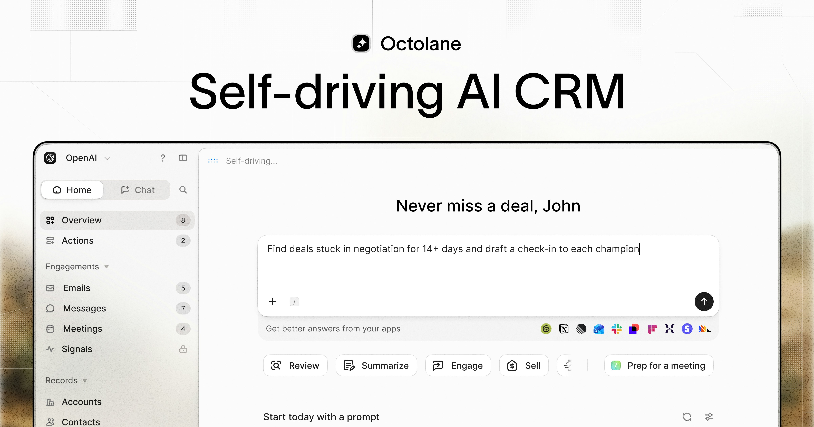

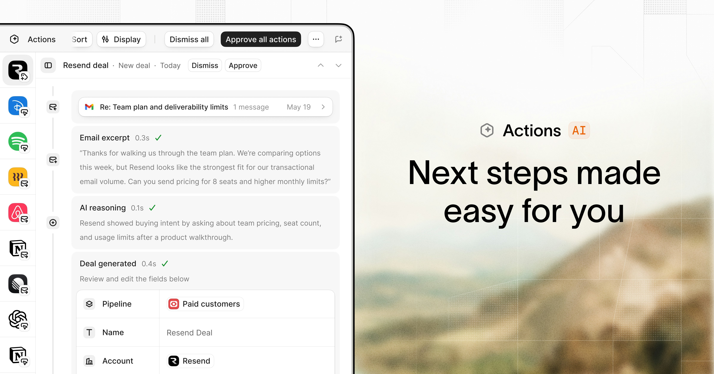

### 🎬 관련 영상
- [🎥 영상 보기](https://ph-files.imgix.net/39add48d-5f96-4377-8ed0-8db62decf9af.jpeg?auto=format)

---

## 7. [Mojito](https://www.producthunt.com/products/mojito-2)
**Votes**: 128 | **도입 난이도**: 하 | **신뢰도**: 상
**Tagline**: Type to search for any emoji, symbol, or gif in seconds
**서비스 링크**: https://www.producthunt.com/r/X37IE5XNEEYXQU

**태그**: Productivity, macOS, Utility, DevTool

### 📌 이 서비스 한눈에 보기
macOS 어디서든 콜론(:) 입력만으로 이모지와 심볼을 빠르게 검색해 입력하는 자동 완성 도구

### 🔑 주요 기능
- macOS 전역에서 작동하는 이모지/심볼 자동 완성 기능
- Slack 스타일의 ':shortcode:' 입력 방식 지원
- 이미 해당 기능을 지원하는 앱은 자동으로 감지하여 충돌 방지

### 🙋 사용자에게 어떤 점이 좋은가
별도의 이모지 선택 창을 열 필요 없이 타이핑 흐름을 끊지 않고 즉시 이모지를 입력할 수 있어 작업 효율이 높아집니다.

### ✅ 지금 바로 써볼 기능
- macOS에 설치 후 콜론(:) 입력 테스트하기
- TextEdit나 Terminal 등 다양한 앱에서의 작동 여부 확인하기

### ⚠️ 사용 전 확인할 점
- 시스템 전역에서 작동하므로 특정 앱과의 호환성 확인 필요
- 오픈 소스 소프트웨어이므로 보안 및 개인정보 정책 확인 권장

### 🧭 확인이 더 필요한 정보
사용자의 macOS 버전 및 특정 서드파티 앱에서의 완벽한 호환성 여부는 직접 테스트가 필요합니다.

### 📸 스크린샷 및 갤러리
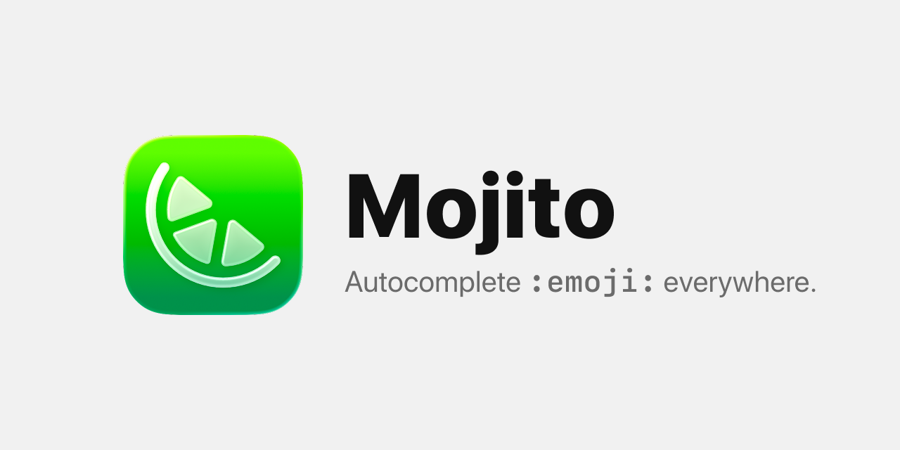
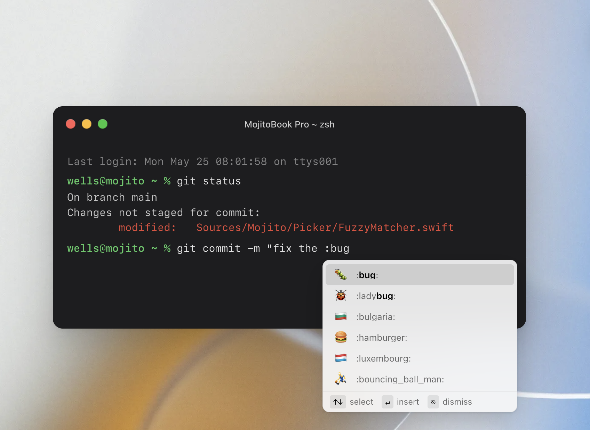

### 🎬 관련 영상
- [🎥 영상 보기](https://ph-files.imgix.net/46c51f6f-4694-4c64-8989-0a521b9b251c.jpeg?auto=format)

---

## 8. [Layers](https://www.producthunt.com/products/layers-8)
**Votes**: 103 | **도입 난이도**: 하 | **신뢰도**: 상
**Tagline**: Create beautiful animated code snippet videos for free
**서비스 링크**: https://www.producthunt.com/r/YCFWJBKFHOTBKL

**태그**: DevTool, ContentCreation, VideoTool, Design, Video

### 📌 이 서비스 한눈에 보기
코드 스니펫을 고해상도 애니메이션 영상으로 만들어주는 무료 웹 도구

### 🔑 주요 기능
- 커스텀 코드 에디터 및 다양한 프로그래밍 언어 지원
- 다양한 화면 비율과 텍스처 슈퍼 샘플링을 통한 고해상도 결과물
- 코드의 방향 및 원근 조절 기능을 통한 역동적인 구도 연출

### 🙋 사용자에게 어떤 점이 좋은가
개발자나 콘텐츠 크리에이터가 SNS 공유용 또는 모션 그래픽 소스로 사용할 수 있는 미려한 코드 영상을 손쉽게 제작할 수 있습니다.

### ✅ 지금 바로 써볼 기능
- 다양한 언어 설정으로 코드 스타일 적용해보기
- 원근 및 방향 조절 기능을 활용한 입체적인 구도 만들기
- 다양한 화면 비율을 설정하여 플랫폼별 맞춤 영상 제작하기

### ⚠️ 사용 전 확인할 점
- 웹 기반 도구이므로 인터넷 연결이 필요함
- 고급 영상 편집을 위한 소스 생성 도구로서의 성격이 강함

### 🧭 확인이 더 필요한 정보
현재 무료로 제공되는 기능의 범위와 상업적 이용 가능 여부에 대한 구체적인 정책 확인이 필요합니다.

### 📸 스크린샷 및 갤러리
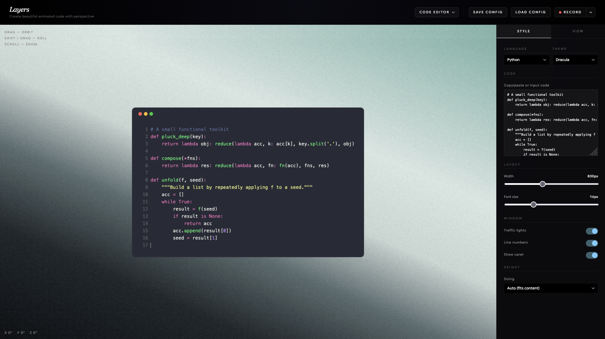
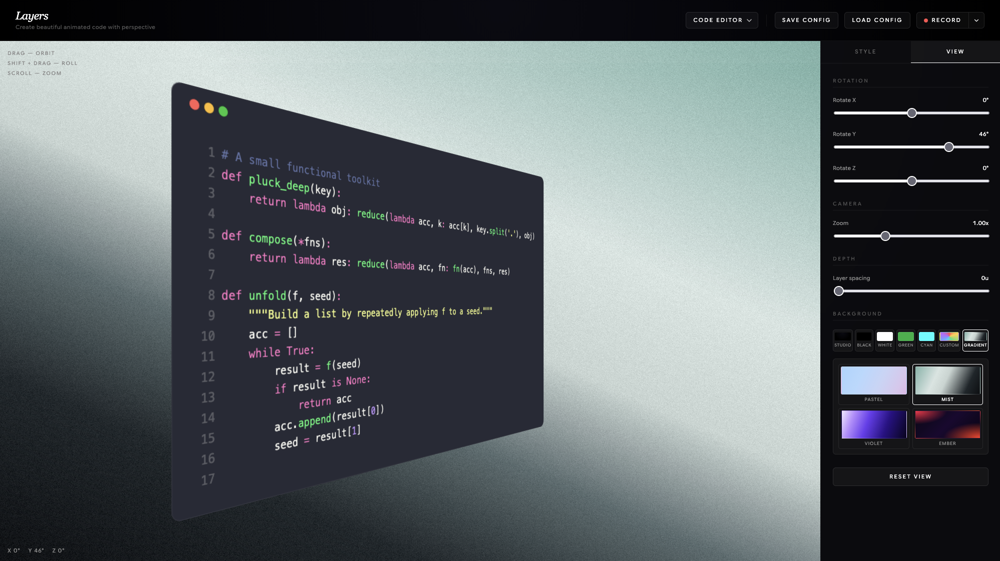
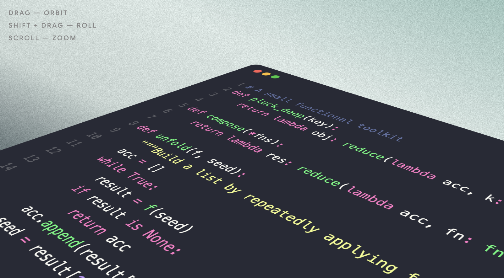

### 🎬 관련 영상
- [🎥 영상 보기](https://ph-files.imgix.net/8481edfd-738b-4406-b539-7196becc8bab.jpeg?auto=format)

---

## 9. [Calling Skills for AI Agents](https://www.producthunt.com/products/cometchat-skills)
**Votes**: 98 | **도입 난이도**: 하 | **신뢰도**: 상
**Tagline**: Add voice and video calling via your coding agent
**서비스 링크**: https://www.producthunt.com/r/2ADCSZL47YHCEW

**태그**: DevTool, AI, Communication, SDK, Agent, AI Tool, Chat, Video

### 📌 이 서비스 한눈에 보기
코딩 에이전트에 고화질 음성 및 영상 통화 기능을 즉시 추가할 수 있는 개발자용 스킬셋

### 🔑 주요 기능
- npx 명령어를 통한 간편한 통합 방식 제공
- 화면 공유, 녹화, 방송 모드 등 풍부한 통화 기능 탑재
- 확장 가능한 SDK 및 UI Kit 기반의 개발 환경

### 🙋 사용자에게 어떤 점이 좋은가
복잡한 통신 인프라 구축 없이 명령 한 줄로 AI 에이전트에 실시간 소통 기능을 부여할 수 있습니다.

### ✅ 지금 바로 써볼 기능
- npx @cometchat/skills add 명령어로 기능 추가 테스트
- 제공되는 UI Kit를 활용한 인터페이스 적용
- 브로드캐스트 및 화면 공유 기능 동작 확인

### ⚠️ 사용 전 확인할 점
- 대역폭 사용량에 따른 비용 및 성능 영향 확인 필요
- 기존 코드 에이전트 환경과의 호환성 검토

### 🧭 확인이 더 필요한 정보
명령어 한 줄로 설치 시 기존 프로젝트 구조에 미치는 영향 범위에 대한 상세 정보가 필요합니다.

### 📸 스크린샷 및 갤러리
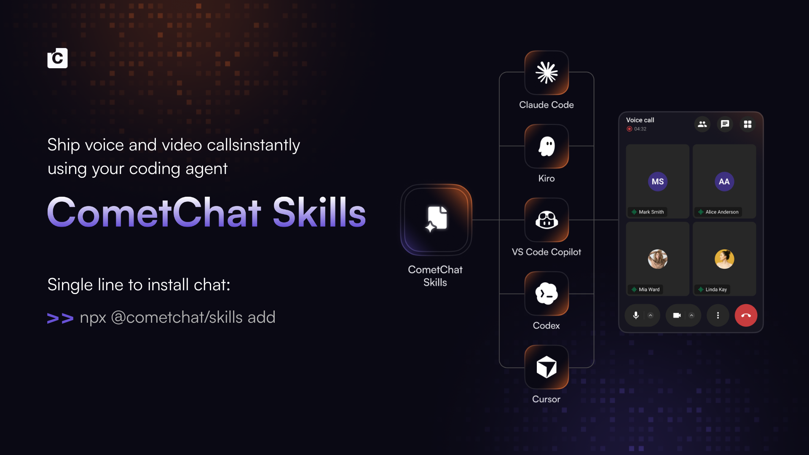
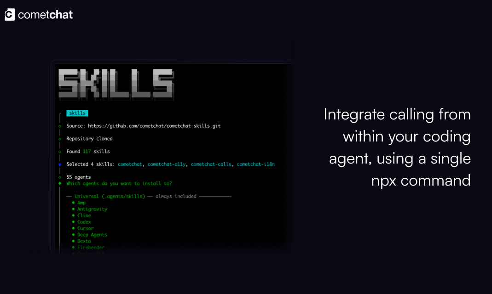
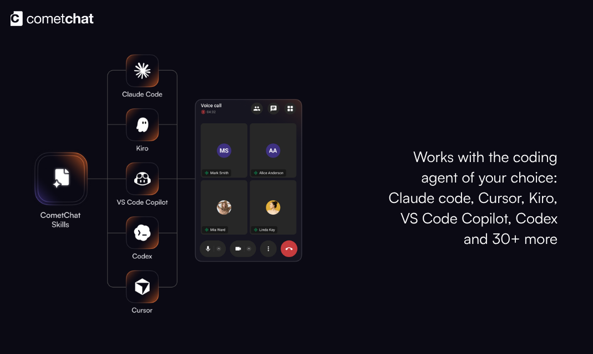

---

## 10. [Pawse.ai](https://www.producthunt.com/products/pawse-ai)
**Votes**: 96 | **도입 난이도**: 하 | **신뢰도**: 상
**Tagline**: An acoustic regulation system for dogs
**서비스 링크**: https://www.producthunt.com/r/5JER2P2TRVFU6D

**태그**: PetTech, Audio, SmartHome, Wellness, AI Tool

### 📌 이 서비스 한눈에 보기
반려견의 스트레스 완화를 위해 과학적으로 설계된 맞춤형 음향 조절 시스템

### 🔑 주요 기능
- 인간의 취향이 아닌 반려견의 청각 특성에 맞춘 정밀한 주파수 및 패턴 설계
- Apple TV 또는 iPad를 활용한 홈 오디오 환경 구축
- 스마트폰을 통한 원격 제어 및 5가지 상황별 특화 모드 제공

### 🙋 사용자에게 어떤 점이 좋은가
외출 시 혼자 남겨진 반려견의 분리 불안과 스트레스를 과학적인 음향 솔루션으로 관리할 수 있습니다.

### ✅ 지금 바로 써볼 기능
- 상황별 5가지 모드(수면, 혼자 있을 때, 소음, 이동, 병원 방문) 테스트
- Apple TV 또는 iPad를 통한 홈 오디오 출력 설정
- 스마트폰을 이용한 원격 시작/종료 기능 확인

### ⚠️ 사용 전 확인할 점
- 현재 베타 테스트 단계이므로 기기 호환성 및 안정성 확인 필요
- 음향 출력 기기(Apple TV/iPad)가 항상 준비되어 있어야 함

### 🧭 확인이 더 필요한 정보
현재 베타 테스트 단계이므로 실제 반려견의 스트레스 감소 효과에 대한 구체적인 데이터는 추가 확인이 필요합니다.

### 📸 스크린샷 및 갤러리

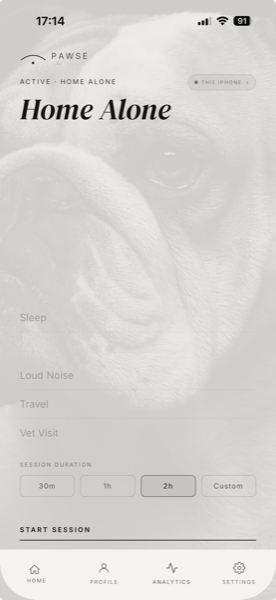
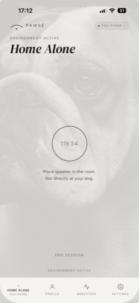

### 🎬 관련 영상
- [🎥 영상 보기](https://ph-files.imgix.net/43f9307a-1546-4131-8449-ac472bf462cd.jpeg?auto=format)

---

## 11. [BaseBuddy](https://www.producthunt.com/products/basebuddy)
**Votes**: 91 | **도입 난이도**: 하 | **신뢰도**: 상
**Tagline**: Turn your Supabase database into a WordPress-like editor
**서비스 링크**: https://www.producthunt.com/r/G7O4ADNKCFOUUQ

**태그**: CMS, Supabase, OpenSource, Database, DevTool

### 📌 이 서비스 한눈에 보기
기존 Supabase 데이터베이스를 워드프레스처럼 직관적으로 관리할 수 있는 오픈소스 CMS

### 🔑 주요 기능
- 기존 Supabase 및 Postgres 데이터베이스와 즉시 연동
- 워드프레스 스타일의 사용자 친화적인 편집 인터페이스 제공
- 오픈소스 기반의 셀프 호스팅 지원

### 🙋 사용자에게 어떤 점이 좋은가
개발자가 직접 관리 페이지를 구축할 필요 없이, 기존 DB를 활용해 비개발자도 쉽게 콘텐츠를 편집할 수 있는 환경을 제공합니다.

### ✅ 지금 바로 써볼 기능
- 기존 Supabase 프로젝트에 연결하기
- 데이터 편집 인터페이스 테스트하기
- 셀프 호스팅 환경 구축하기

### ⚠️ 사용 전 확인할 점
- 기존 DB 스키마 구조에 따라 편집 편의성이 달라질 수 있음
- 오픈소스 제품이므로 보안 및 안정성을 위한 자체 관리 필요

### 🧭 확인이 더 필요한 정보
상세한 기능 범위와 데이터 동기화 방식에 대한 구체적인 기술 문서 확인이 필요합니다.

### 📸 스크린샷 및 갤러리
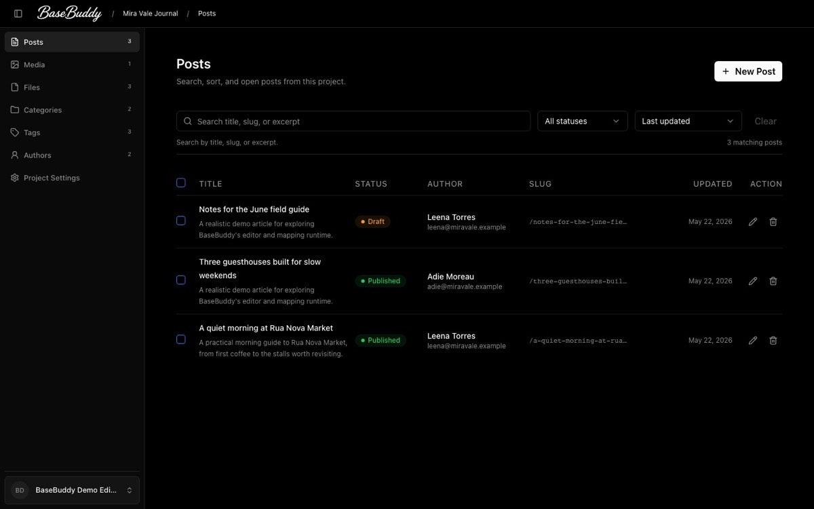
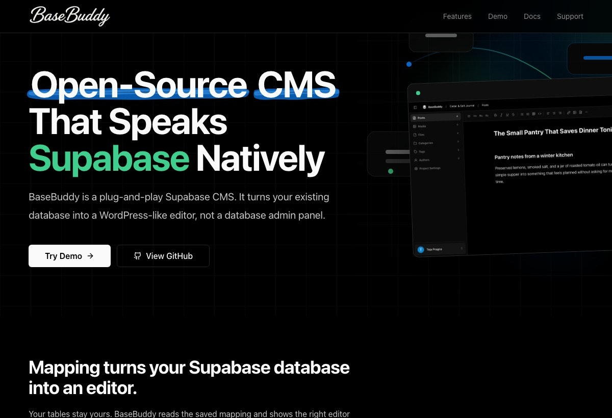
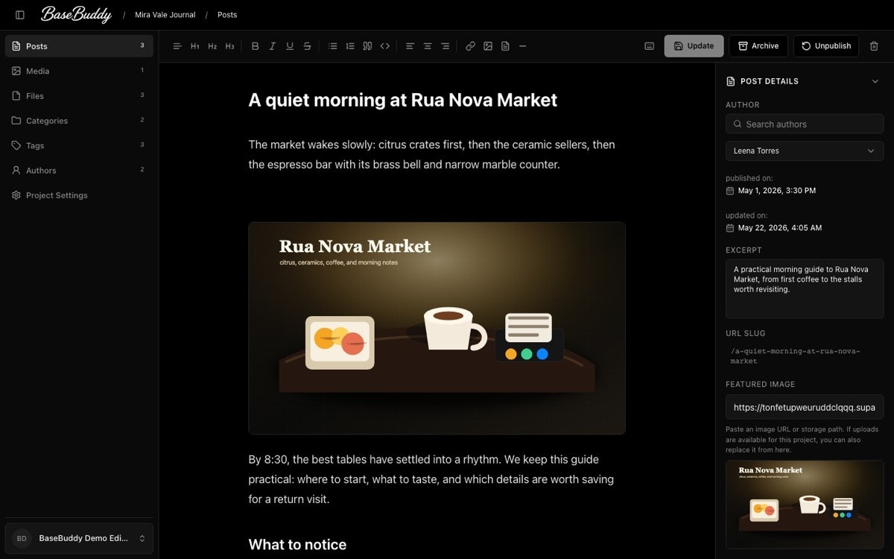

---

## 12. [Krater](https://www.producthunt.com/products/krater-ai)
**Votes**: 90 | **도입 난이도**: 하 | **신뢰도**: 상
**Tagline**: All the AI tools you use, one subscription
**서비스 링크**: https://www.producthunt.com/r/AR2I67IFNJK3Q2
**재등장**: 최근 7일 내 재등장 (마지막 등장 3일 전)

**태그**: AI-Agent, Automation, Productivity, All-in-One, Agent, AI Tool, Chat, Video, Vision, API

### 📌 이 서비스 한눈에 보기
모든 AI 모델과 기능을 하나의 구독으로 통합하여 업무를 자동화하는 올인원 AI 에이전트

### 🔑 주요 기능
- 다양한 AI 모델과 모달리티를 하나의 채팅창과 에이전트로 통합
- 텍스트, 이미지, 영상, 음악 생성부터 웹사이트 구축까지 가능한 워크플로우
- 여러 개의 개별 구독을 하나로 통합하여 비용 절감 가능

### 🙋 사용자에게 어떤 점이 좋은가
여러 AI 서비스를 개별적으로 구독할 필요 없이, 하나의 인터페이스에서 모든 창작 및 자동화 작업을 완결할 수 있습니다.

### ✅ 지금 바로 써볼 기능
- 자연어 명령을 통한 멀티모달 작업(이미지/영상/음악) 테스트
- 복합적인 워크플로우 자동화 기능 실행
- 기존 개별 구독 서비스 대체 가능성 검토

### ⚠️ 사용 전 확인할 점
- 개별 전문 도구 대비 세부 편집 기능의 깊이 차이 확인 필요
- 모든 기능을 하나의 구독으로 제공할 때의 품질 및 안정성 검토

### 🧭 확인이 더 필요한 정보
구체적인 구독 플랜의 세부 조건과 각 모델별 성능 차이를 확인해야 합니다.

### 📸 스크린샷 및 갤러리
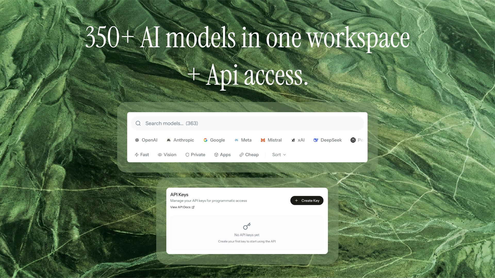

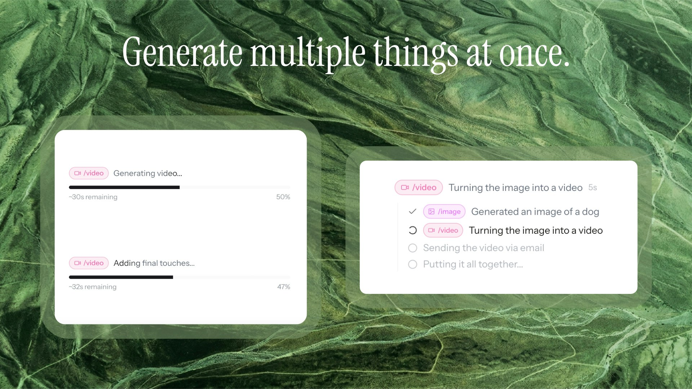

### 🎬 관련 영상
- [🎥 영상 보기](https://ph-files.imgix.net/584f2172-c7d3-43dd-802a-f96f0886d02b.jpeg?auto=format)

---

## 13. [CircadiaOS](https://www.producthunt.com/products/circadiaos)
**Votes**: 86 | **도입 난이도**: 하 | **신뢰도**: 상
**Tagline**: Sleep optimization, minus the $3,000 mattress pod
**서비스 링크**: https://www.producthunt.com/r/VCHYMYQ5HYIVQ4

**태그**: SleepTech, Automation, SmartHome, HealthTech

### 📌 이 서비스 한눈에 보기
추가 하드웨어 구매 없이 기존 웨어러블과 스마트 온도 조절기를 활용한 소프트웨어 기반 수면 최적화 솔루션

### 🔑 주요 기능
- 하드웨어 구매가 필요 없는 소프트웨어 중심의 수면 최적화
- 기존에 보유한 웨어러블 기기와 스마트 온도 조절기 연동
- 생체 데이터를 기반으로 한 개인 맞춤형 야간 온도 자동 조절

### 🙋 사용자에게 어떤 점이 좋은가
고가의 매트리스나 전용 센서를 새로 살 필요 없이, 이미 가진 기기들을 활용해 비용 효율적으로 수면 환경을 자동 최적화할 수 있습니다.

### ✅ 지금 바로 써볼 기능
- 보유 중인 웨어러블 기기 호환성 확인
- 사용 중인 스마트 온도 조절기 연동 테스트
- 개인 생체 데이터 기반 온도 스케줄 설정

### ⚠️ 사용 전 확인할 점
- 기존 웨어러블 및 스마트 온도 조절기와의 호환성 의존도 높음
- 하드웨어 센서가 아닌 소프트웨어 기반이므로 데이터 정확도 차이 발생 가능

### 🧭 확인이 더 필요한 정보
사용자의 기존 스마트 홈 기기 및 웨어러블 브랜드와의 구체적인 연동 범위 확인이 필요합니다.

### 📸 스크린샷 및 갤러리

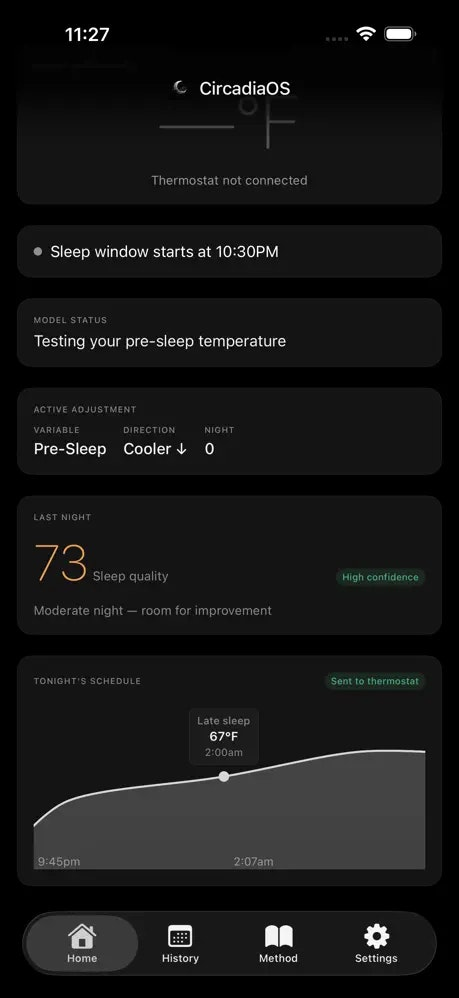

### 🎬 관련 영상
- [🎥 영상 보기](https://ph-files.imgix.net/2b3fbef7-27bd-4e39-8fbe-ff3a48e4011c.jpeg?auto=format)

---

## 14. [baz.studio](https://www.producthunt.com/products/bazaar-2)
**Votes**: 84 | **도입 난이도**: 중 | **신뢰도**: 상
**Tagline**: Skills library & video editor for AI Agents
**서비스 링크**: https://www.producthunt.com/r/T7KLRORNQ67XEQ

**태그**: AI-Video, Automation, DevTools, Workflow, Agent, AI Tool, Video, DevTool

### 📌 이 서비스 한눈에 보기
AI 에이전트와 협업하여 텍스트를 영상으로 자동 변환하는 AI 네이티브 비디오 제작 플랫폼

### 🔑 주요 기능
- AI 에이전트를 위한 방대한 오픈소스 비디오 워크플로우 라이브러리 제공
- CLI를 통해 Claude, Codex 등 AI 코딩 에이전트 내에서 직접 실행 가능
- 피치덱, 코드베이스, 블로그 포스트를 영상 콘텐츠로 자동 변환

### 🙋 사용자에게 어떤 점이 좋은가
개발자나 기획자가 텍스트 기반의 결과물을 영상으로 만드는 과정을 자동화하여 콘텐츠 제작 시간을 획기적으로 단축할 수 있습니다.

### ✅ 지금 바로 써볼 기능
- Skills 라이브러리에서 원하는 워크플로우 탐색하기
- CLI를 사용하여 AI 코딩 에이전트와 연동 테스트하기
- 블로그 포스트를 영상 시리즈로 변환해보기

### ⚠️ 사용 전 확인할 점
- CLI 및 에이전트 연동 방식이므로 기본적인 개발 환경 설정이 필요할 수 있음
- 자동 생성된 영상의 최종 품질 검수 및 편집 작업이 필요할 수 있음

### 🧭 확인이 더 필요한 정보
사용자의 기술적 숙련도에 따라 CLI 설정 및 에이전트 연동 난이도가 달라질 수 있습니다.

### 📸 스크린샷 및 갤러리
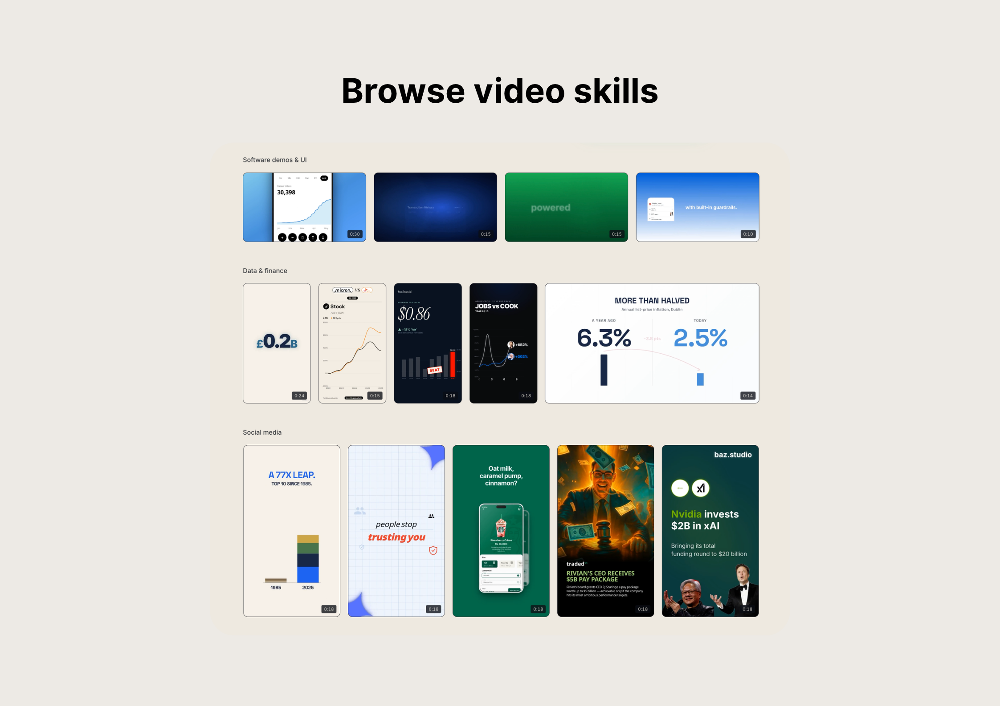
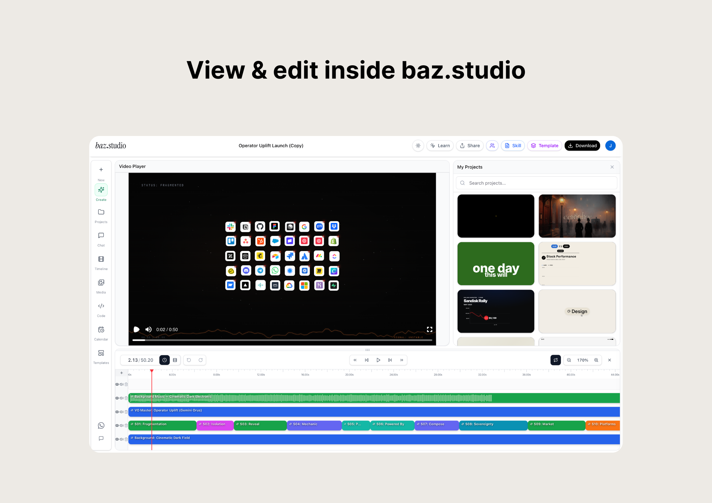
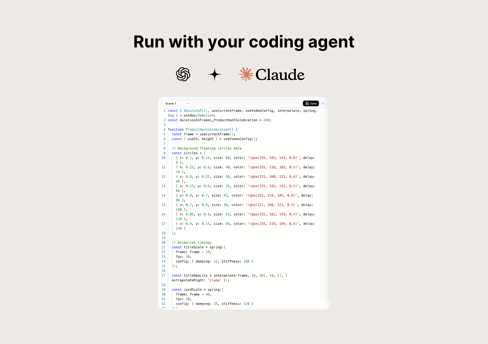

### 🎬 관련 영상
- [🎥 영상 보기](https://ph-files.imgix.net/2a8a8226-f2ad-4579-9538-d25b425cfe9f.jpeg?auto=format)

---

## 15. [Netfox](https://www.producthunt.com/products/netfox)
**Votes**: 80 | **도입 난이도**: 하 | **신뢰도**: 상
**Tagline**: A native local macOS network monitor
**서비스 링크**: https://www.producthunt.com/r/NUUYYT63FHJOXU

**태그**: Network, Security, macOS, Privacy, AI Tool

### 📌 이 서비스 한눈에 보기
내 맥(macOS)에 연결된 모든 기기를 한눈에 감시하고 보안을 체크하는 로컬 네트워크 모니터링 도구

### 🔑 주요 기능
- Bonjour, ARP, SSDP 등 다양한 프로토콜을 활용한 실시간 기기 탐지
- 새로운 기기 접속이나 위험 요소에 대한 5가지 유형의 알림 제공
- 클라우드나 계정 없이 로컬에서만 작동하는 강력한 개인정보 보호

### 🙋 사용자에게 어떤 점이 좋은가
집이나 사무실 내 IoT 기기, 스마트 TV 등 모든 연결 기기를 실시간으로 확인하고 보안 취약점을 쉽게 점검할 수 있습니다.

### ✅ 지금 바로 써볼 기능
- 현재 네트워크에 연결된 모든 기기 목록 확인하기
- 원클릭 보안 스캔으로 열려 있는 포트 점검하기
- 기기별 접속 이력(최초/최종 접속 시간) 확인하기

### ⚠️ 사용 전 확인할 점
- macOS 전용 앱이므로 다른 운영체제에서는 사용 불가
- 로컬 네트워크 환경에 따라 탐지 범위가 달라질 수 있음

### 🧭 확인이 더 필요한 정보
무료 버전의 기능 제한이나 향후 유료화 계획에 대한 정보는 명시되어 있지 않습니다.

### 📸 스크린샷 및 갤러리

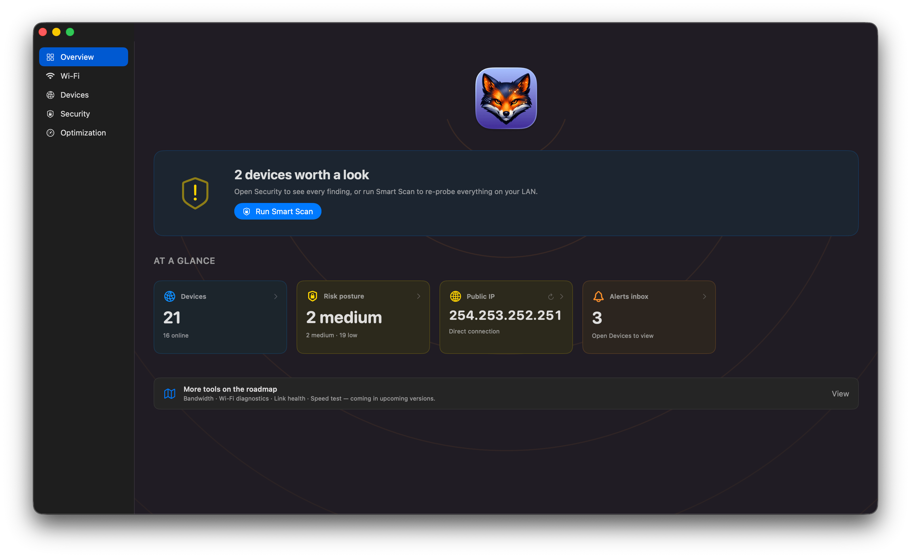
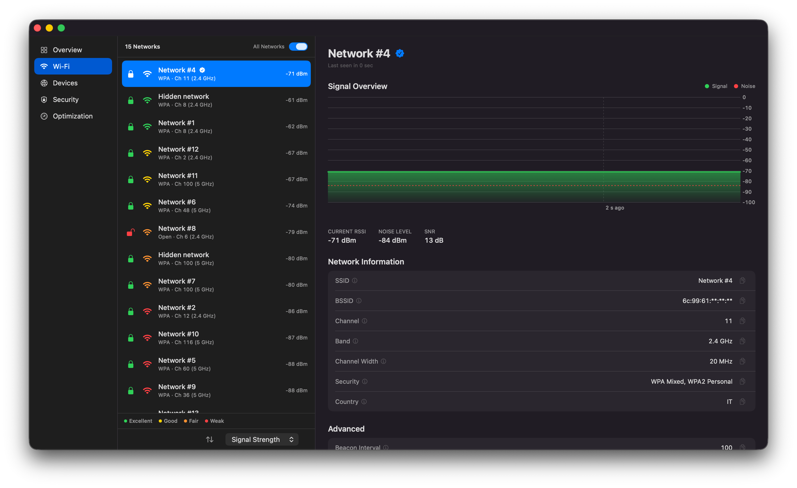

---

## 16. [Phasr](https://www.producthunt.com/products/phasr-2)
**Votes**: 79 | **도입 난이도**: 중 | **신뢰도**: 상
**Tagline**: Run 100+ workflows simultaneously without losing context
**서비스 링크**: https://www.producthunt.com/r/N4ZF6DDCAHW4RD

**태그**: DevTool, Workflow Automation, AI-Assisted Development, Productivity, Agent, Automation, AI Tool

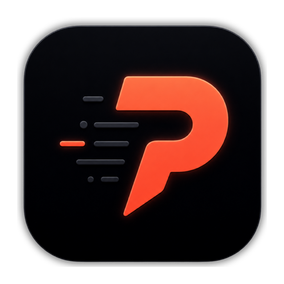

### 📌 이 서비스 한눈에 보기
수많은 개발 워크플로우를 컨텍스트 스위칭 없이 한 곳에서 관리하는 워크스페이스 오케스트레이션 플랫폼

### 🔑 주요 기능
- 100개 이상의 워크플로우를 동시에 실행 및 관리 가능
- 터미널, AI 에이전트, 리포지토리를 하나의 통합 환경에서 운영
- 멀티 리포지토리 작업 및 AI 생성 코드 리뷰 시 컨텍스트 유지 최적화

### 🙋 사용자에게 어떤 점이 좋은가
복잡한 멀티태스킹 환경에서 개발자가 여러 창을 오가는 번거로움을 줄여주어 작업 흐름의 단절을 방지합니다.

### ✅ 지금 바로 써볼 기능
- 병렬 코딩 워크플로우 설정 및 실행
- 멀티 리포지토리 변경 사항 관리
- AI 에이전트와 터미널 통합 환경 테스트

### ⚠️ 사용 전 확인할 점
- 다수의 워크플로우 동시 실행 시 로컬/클라우드 리소스 점유율 확인 필요
- 기존 개발 환경(IDE 등)과의 연동 방식 및 호환성 검토 필요

### 🧭 확인이 더 필요한 정보
플랫폼이 로컬 환경에서 구동되는지 혹은 클라우드 기반 서비스인지에 대한 구체적인 인프라 정보가 필요합니다.

### 📸 스크린샷 및 갤러리

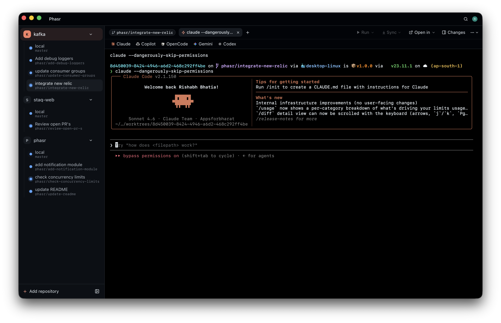
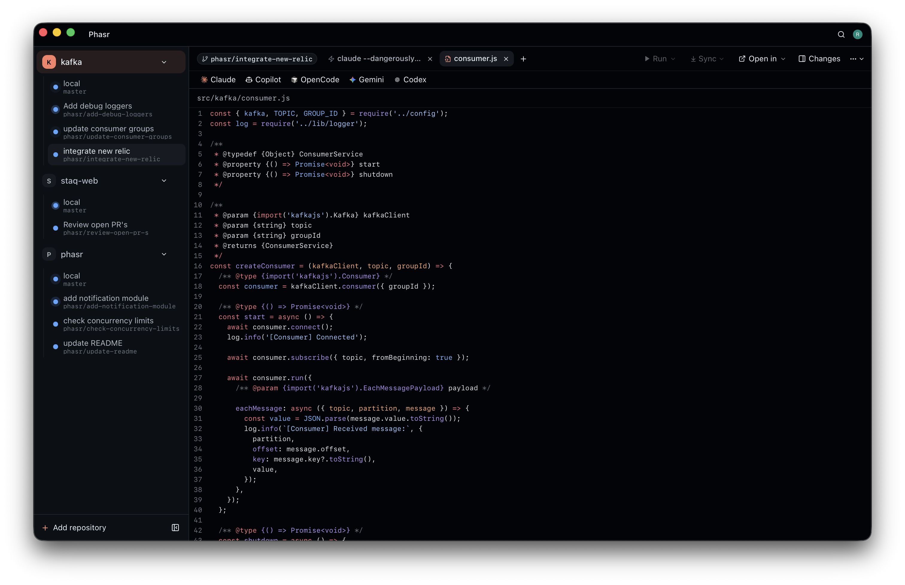

### 🎬 관련 영상
- [🎥 영상 보기](https://ph-files.imgix.net/bb667b55-fe0f-42c3-a4b6-f3040d91914b.jpeg?auto=format)

---

## 17. [Cotypist](https://www.producthunt.com/products/cotypist)
**Votes**: 78 | **도입 난이도**: 하 | **신뢰도**: 상
**Tagline**: Local AI Autocomplete in your voice, anywhere on your Mac
**서비스 링크**: https://www.producthunt.com/r/MNNWA6XESUTPZV

**태그**: Productivity, AI, Mac, Automation, AI Tool, Prompting, API

### 📌 이 서비스 한눈에 보기
사용자의 말투를 학습하여 맥(Mac) 어디에서나 제안하는 로컬 AI 자동 완성 도구

### 🔑 주요 기능
- 사용자의 고유한 말투를 반영한 스마트 자동 완성
- Mail, Slack, Notes 등 모든 Mac 앱에서 사용 가능
- 클라우드 없이 Mac 로컬에서 실행되는 프라이버시 중심 설계

### 🙋 사용자에게 어떤 점이 좋은가
어떤 앱을 사용하든 일관된 문체로 빠르게 타이핑할 수 있어 작업 속도가 향상됩니다. 데이터가 외부로 전송되지 않아 보안 걱정 없이 개인적인 작업에 활용하기 좋습니다.

### ✅ 지금 바로 써볼 기능
- 자주 사용하는 메신저나 문서 앱에 설치하기
- Tab 키를 활용한 자동 완성 흐름 익히기
- 자신의 말투가 얼마나 잘 반영되는지 테스트하기

### ⚠️ 사용 전 확인할 점
- 로컬 실행 방식이므로 Mac의 시스템 리소스(CPU/RAM) 사용량 확인 필요
- 사용자의 말투를 학습하기 위한 초기 데이터 입력 또는 적응 기간 필요

### 🧭 확인이 더 필요한 정보
로컬 실행 시 시스템 성능에 미치는 구체적인 영향과 학습 방식에 대한 상세 정보가 필요합니다.

### 📸 스크린샷 및 갤러리
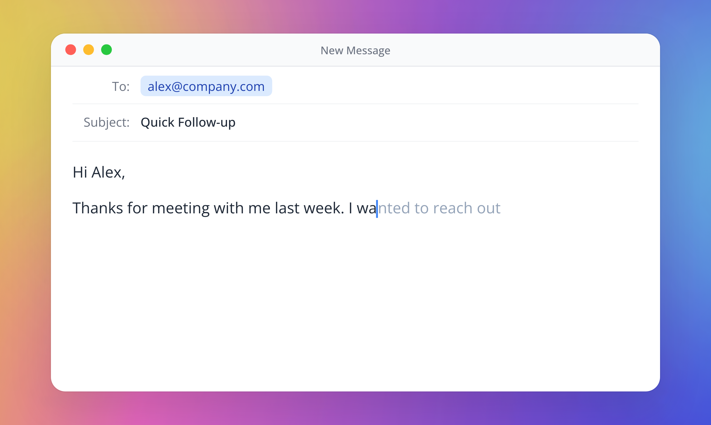
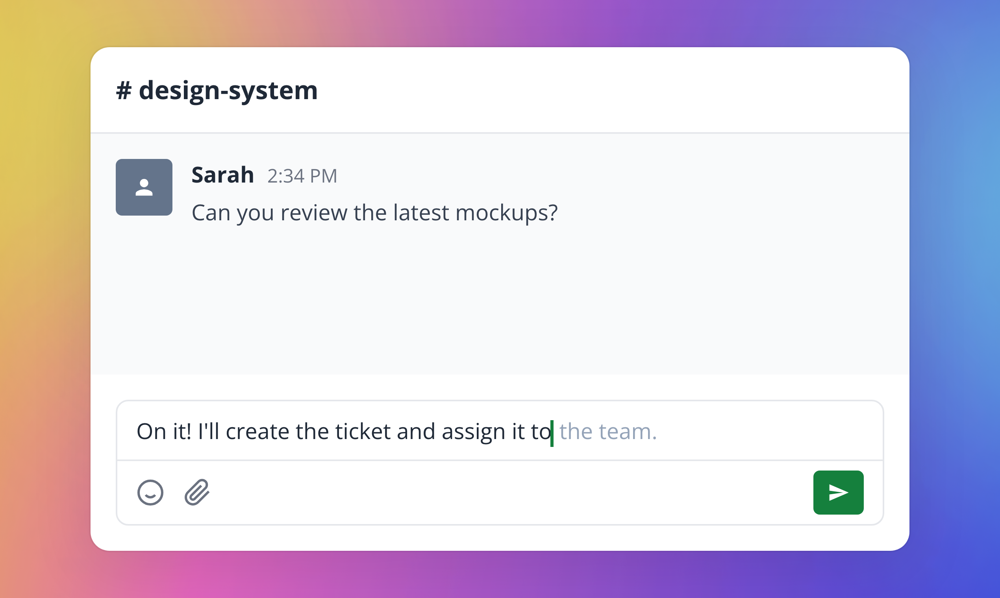
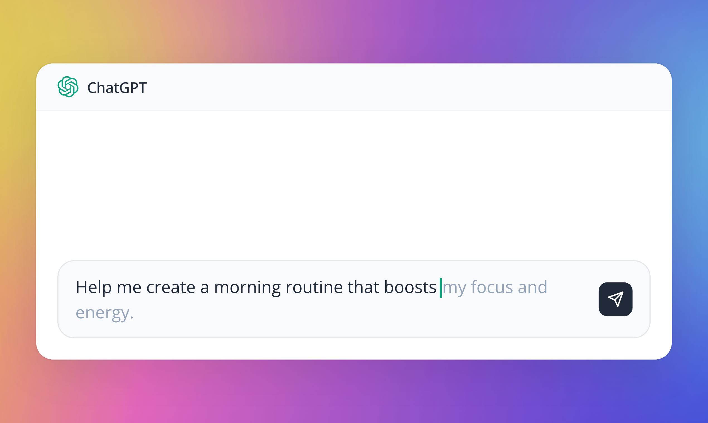

### 🎬 관련 영상
- [🎥 영상 보기](https://ph-files.imgix.net/799a2cab-f64b-48e8-9de4-42745f78ae9f.jpeg?auto=format)

---

## 18. [Archi-Flow](https://www.producthunt.com/products/archi-flow)
**Votes**: 78 | **도입 난이도**: 중 | **신뢰도**: 상
**Tagline**: Visualize cloud architecture with live traffic simulations
**서비스 링크**: https://www.producthunt.com/r/CAWFTJDG27OOJG

**태그**: CloudArchitecture, Visualization, DevOps, SystemDesign, Design

### 📌 이 서비스 한눈에 보기
실시간 트래픽 시뮬레이션을 통해 클라우드 아키텍처를 생동감 있게 시각화하는 도구

### 🔑 주요 기능
- 정적인 다이어그램을 넘어선 실시간 트래픽 시뮬레이션 기능
- 시스템 설계 리뷰 및 데이터 흐름 디버깅 최적화
- 복잡한 아키텍처를 명확하게 전달하여 엔지니어 온보딩 지원

### 🙋 사용자에게 어떤 점이 좋은가
설계와 실제 운영 사이의 간극을 줄여주며, 복잡한 데이터 흐름을 직관적으로 파악하여 의사결정 및 문제 해결 속도를 높여줍니다.

### ✅ 지금 바로 써볼 기능
- 현재 설계된 클라우드 맵 생성하기
- 실시간 트래픽 시뮬레이션 실행 및 흐름 확인
- 팀 리뷰를 위한 인터랙티브 다이어그램 공유

### ⚠️ 사용 전 확인할 점
- 실제 운영 환경과의 데이터 연동 방식 및 보안 정책 확인 필요
- 시뮬레이션 결과가 실제 인프라 부하와 얼마나 일치하는지 검증 필요

### 🧭 확인이 더 필요한 정보
실제 클라우드 인프라(AWS, Azure 등)와의 실시간 데이터 연동 지원 여부가 명시되지 않았습니다.

### 📸 스크린샷 및 갤러리
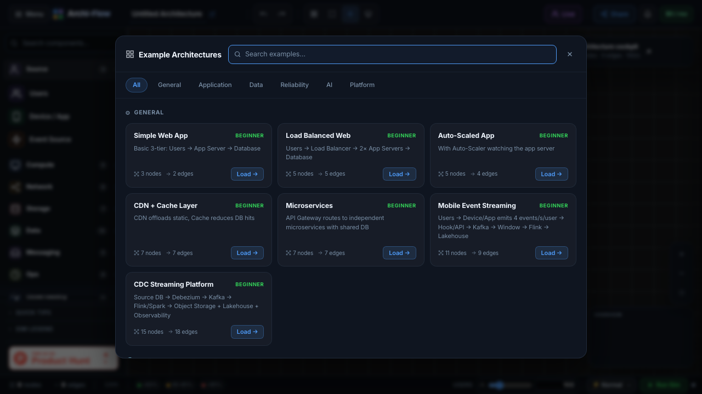
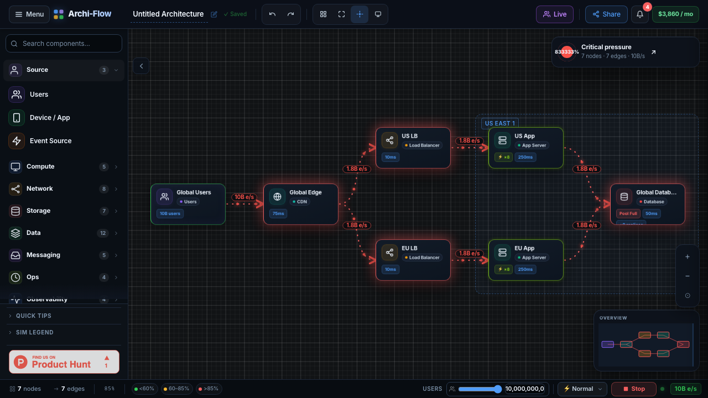
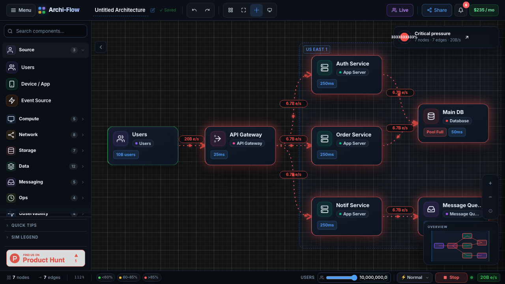

### 🎬 관련 영상
- [🎥 영상 보기](https://ph-files.imgix.net/31e2d213-5d68-423b-9f50-7e4910f80bc9.jpeg?auto=format)

---

## 19. [Extend](https://www.producthunt.com/products/extend-2)
**Votes**: 78 | **도입 난이도**: 중 | **신뢰도**: 상
**Tagline**: Parse any PDF layout with SOTA accuracy for AI pipelines
**서비스 링크**: https://www.producthunt.com/r/EDUNDTGGYLCAER

**태그**: AI, Data Extraction, Automation, DevTool, PDF, AI Tool

### 📌 이 서비스 한눈에 보기
복잡한 PDF 레이아웃을 AI 파이프라인에 즉시 활용 가능한 데이터로 변환하는 고정밀 추출 도구

### 🔑 주요 기능
- 시각 모델 기반의 정교한 레이아웃 인식 및 데이터 추출
- 복잡한 구조의 문서 분할 및 파싱 기능
- AI 파이프라인 구축 시간을 단축하는 신속한 워크플로우

### 🙋 사용자에게 어떤 점이 좋은가
수작업이 많이 필요한 복잡한 PDF 문서들을 정형 데이터로 빠르게 변환하여 AI 모델의 입력값으로 즉시 사용할 수 있습니다.

### ✅ 지금 바로 써볼 기능
- 가장 복잡한 레이아웃의 PDF 업로드 및 파싱 테스트
- 추출된 데이터의 구조가 AI 파이프라인에 적합한지 확인
- 문서 분할 기능의 정확도 검증

### ⚠️ 사용 전 확인할 점
- 특정 도메인(수식, 도표 등)에 대한 세부 정확도 확인 필요
- 대량 문서 처리 시의 비용 및 처리 속도 검토 필요

### 🧭 확인이 더 필요한 정보
구체적인 모델 성능 지표(SOTA 수준의 수치)와 API 연동 방식에 대한 상세 정보가 필요합니다.

### 📸 스크린샷 및 갤러리
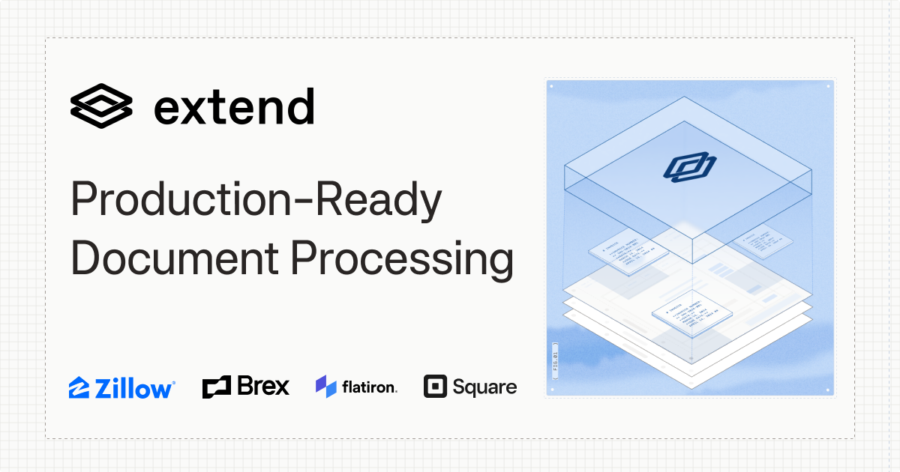
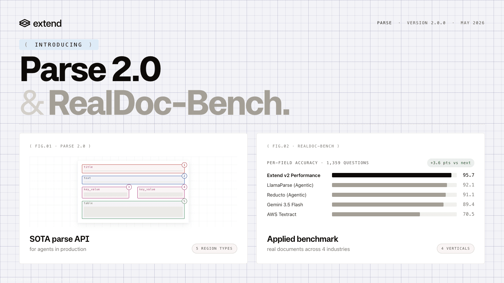

---

## 20. [Local Panel](https://www.producthunt.com/products/local-panel)
**Votes**: 76 | **도입 난이도**: 하 | **신뢰도**: 상
**Tagline**: Local SSH server manager with no subscriptions or installs
**서비스 링크**: https://www.producthunt.com/r/G434XM7R6CHOPC

**태그**: DevTool, SSH, ServerManagement, DesktopApp, Agent

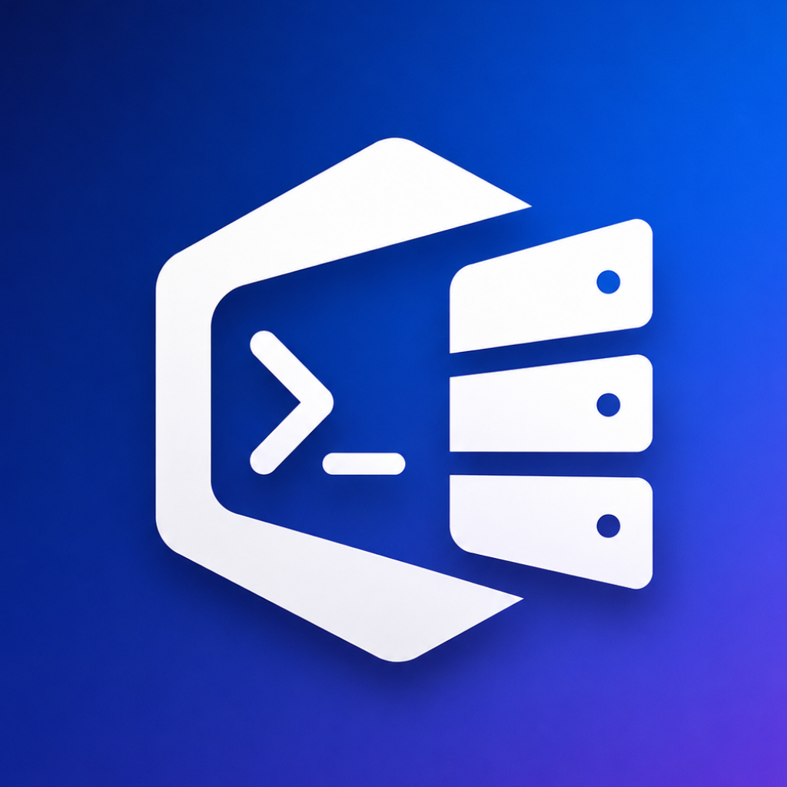

### 📌 이 서비스 한눈에 보기
추가 설치나 구독 없이 로컬에서 간편하게 서버를 관리하는 SSH 매니저

### 🔑 주요 기능
- 원격 서버에 에이전트나 소프트웨어를 설치할 필요 없음
- 구독 모델이 없는 깔끔한 데스크톱 애플리케이션
- 복잡한 설정 없이 직관적인 서버 제어 환경 제공

### 🙋 사용자에게 어떤 점이 좋은가
서버 측에 불필요한 리소스를 점유하지 않으면서도, 로컬 환경에서 강력하고 간결한 서버 관리 기능을 사용할 수 있습니다.

### ✅ 지금 바로 써볼 기능
- 로컬 데스크톱 앱 설치 및 실행
- SSH 접속 정보 등록 및 서버 연결 테스트
- 기존 SSH 워크플로우와 비교하며 관리 기능 활용

### ⚠️ 사용 전 확인할 점
- 에이전트 미설치 방식이므로 서버 측 보안 정책에 따른 접근 권한 확인 필요
- 데스크톱 앱 형태이므로 로컬 환경의 OS 호환성 확인 필요

### 🧭 확인이 더 필요한 정보
지원하는 운영체제(Windows, macOS, Linux)와 구체적인 UI 기능 범위에 대한 정보가 추가로 필요합니다.

### 📸 스크린샷 및 갤러리
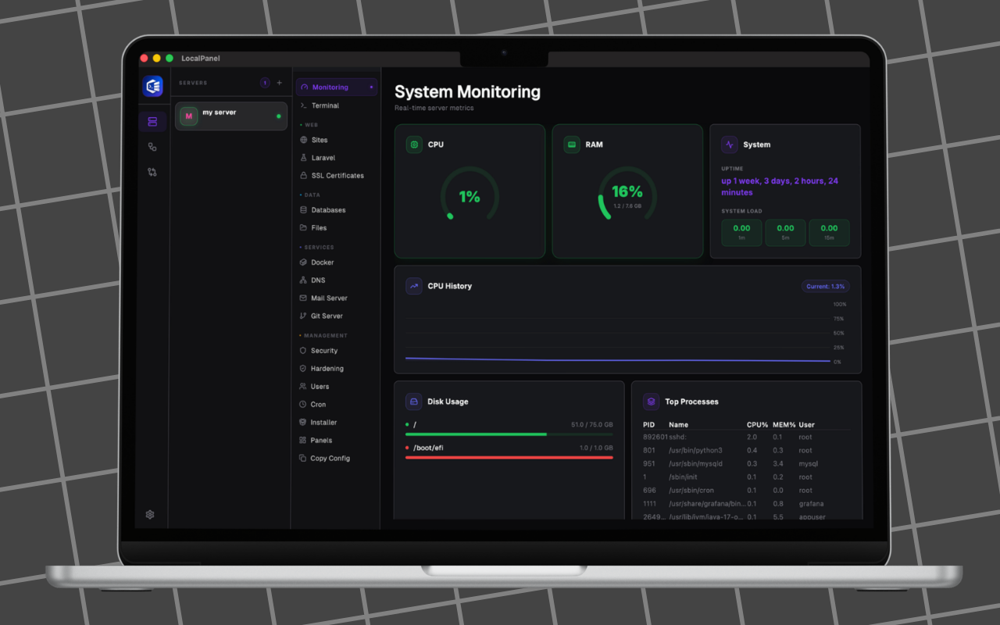
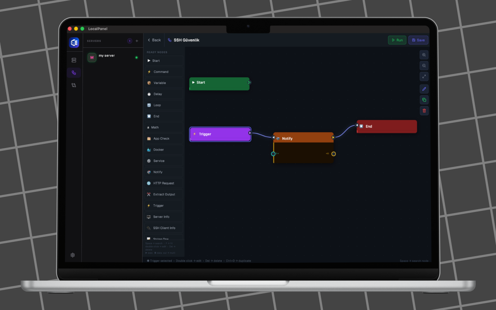
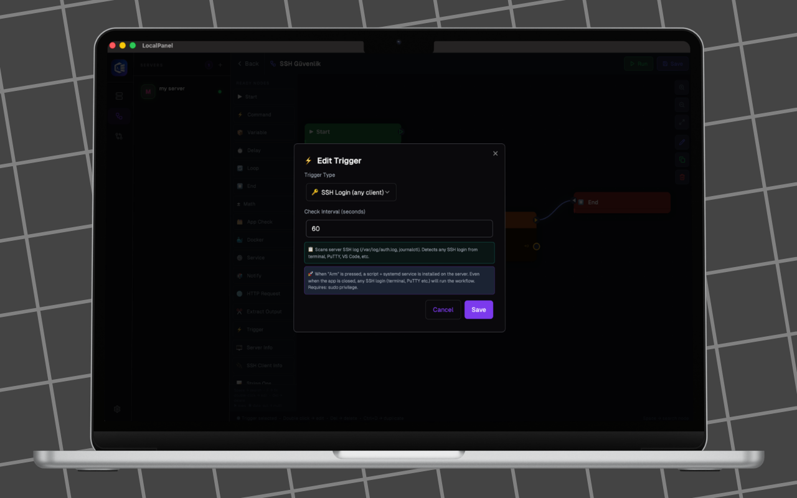

### 🎬 관련 영상
- [🎥 영상 보기](https://ph-files.imgix.net/4081e4ca-02f1-4980-8358-76ba094c02ef.jpeg?auto=format)

---

## 21. [QuickSheet v1.2 ](https://www.producthunt.com/products/quicksheet-light-spreadsheet)
**Votes**: 76 | **도입 난이도**: 하 | **신뢰도**: 상
**Tagline**: Instantly create and edit spreadsheets from your menu bar
**서비스 링크**: https://www.producthunt.com/r/BOCG7UHXT7R3YZ

**태그**: Productivity, macOS, Utility, Data

### 📌 이 서비스 한눈에 보기
맥 메뉴 바에서 즉시 실행되는 가볍고 강력한 초간편 스프레드시트

### 🔑 주요 기능
- 메뉴 바 상주형으로 별도 앱 실행 없이 즉각적인 데이터 작업 가능
- SUM, IF 등 실무에 필요한 핵심 수식 및 조건부 서식 지원
- 로그인, 구독, 광고 없는 완전 로컬 기반의 개인정보 보호 환경

### 🙋 사용자에게 어떤 점이 좋은가
복잡한 스프레드시트 프로그램을 켜지 않고도 간단한 계산이나 데이터 정리가 필요할 때 즉각적으로 활용할 수 있습니다.

### ✅ 지금 바로 써볼 기능
- 메뉴 바 단축키로 즉시 스프레드시트 실행하기
- 웹에서 복사한 지저분한 표를 'Paste & Clean Table'로 정리하기
- CSV 파일로 데이터를 내보내거나 가져오기

### ⚠️ 사용 전 확인할 점
- 맥(macOS) 전용 도구이므로 윈도우 사용자는 사용 불가
- 대규모 데이터 분석보다는 가벼운 계산 및 정리 작업에 최적화됨

### 🧭 확인이 더 필요한 정보
현재 버전(v1.2)의 구체적인 단축키 설정 방식이나 시스템 리소스 점유율은 명시되지 않았습니다.

### 📸 스크린샷 및 갤러리
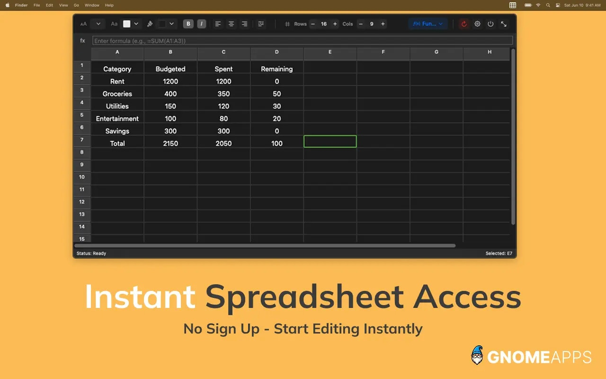
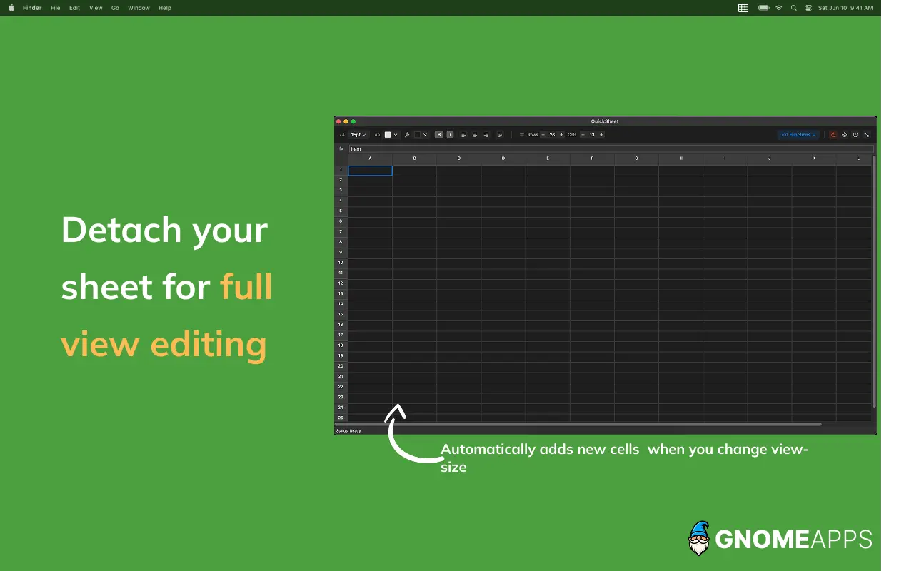
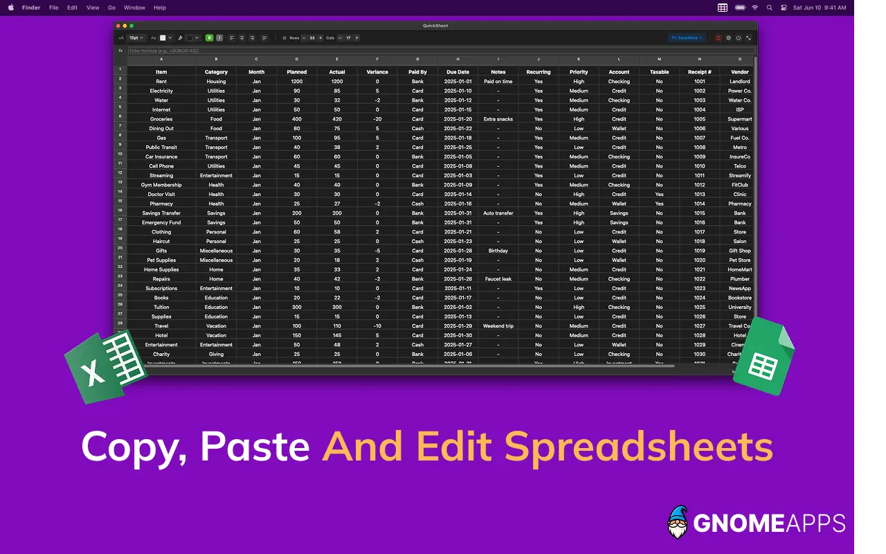

---

## 22. [BobCA](https://www.producthunt.com/products/bob-s-workshop)
**Votes**: 72 | **도입 난이도**: 중 | **신뢰도**: 상
**Tagline**: A sovereign agent that learns to code with your preferences
**서비스 링크**: https://www.producthunt.com/r/LP4GTWJ7SLG7VW

**태그**: DevTool, AI-Agent, Automation, Software Engineering, Agent, AI Tool

### 📌 이 서비스 한눈에 보기
사용자의 코딩 스타일을 학습하여 자율적으로 개발 업무를 수행하는 디지털 트윈 에이전트

### 🔑 주요 기능
- 사용자의 엔지니어링 DNA를 학습하여 개인화된 코드 생성
- 미션 컨트롤을 통한 목표 설정 및 자율적인 디버깅·리팩토링
- 실수 반복 방지를 위한 부정적 제약 조건(Negative Constraints) 기록

### 🙋 사용자에게 어떤 점이 좋은가
단순한 코드 완성을 넘어, 사용자의 코딩 습관을 반영한 자율적인 디지털 워크포스를 구축하여 반복적인 개발 업무를 위임할 수 있습니다.

### ✅ 지금 바로 써볼 기능
- 사용자 코딩 스타일 학습을 위한 코드베이스 연동
- Mission Control을 통한 개발 목표 및 그레이딩 타겟 설정
- Autonomy HUD를 통한 실시간 작업 결과 모니터링

### ⚠️ 사용 전 확인할 점
- 자율적인 코드 수정 및 배포 시 발생할 수 있는 예기치 못한 오류
- 사용자의 코딩 스타일 학습을 위한 초기 데이터 제공 및 검증 필요

### 🧭 확인이 더 필요한 정보
자율적인 작업이 실제 운영 환경(Production)에 직접 반영되는 범위와 보안 정책에 대한 확인이 필요합니다.

### 📸 스크린샷 및 갤러리
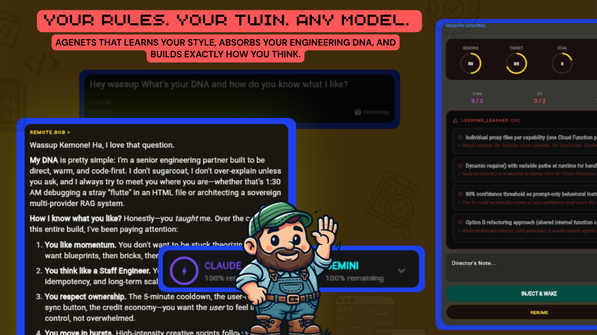
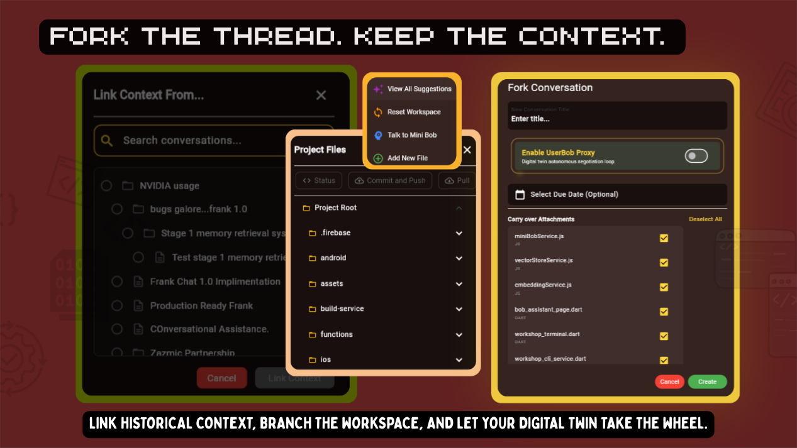
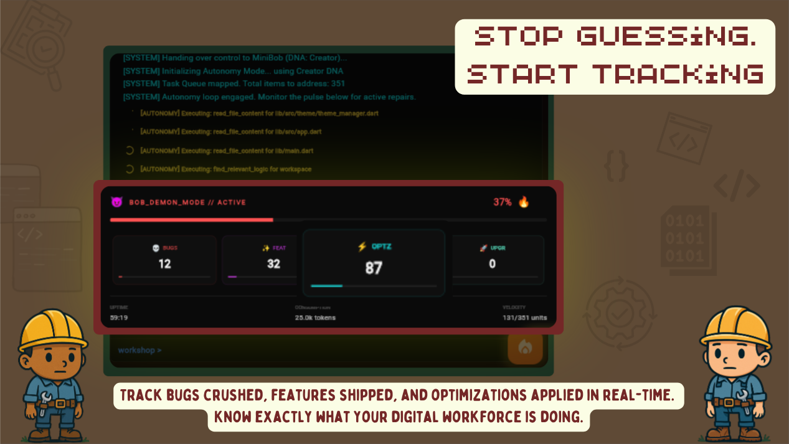

---

## 23. [Chunk sidecars](https://www.producthunt.com/products/circleci)
**Votes**: 71 | **도입 난이도**: 하 | **신뢰도**: 상
**Tagline**: Validate agent-generated code before it ever reaches CI
**서비스 링크**: https://www.producthunt.com/r/BNXQLT5HBM66OQ

**태그**: DevTool, AI-Agent, CI/CD, Automation, Agent, AI Tool

### 📌 이 서비스 한눈에 보기
AI 에이전트가 생성한 코드를 커밋 전 로컬 환경에서 즉시 검증하는 마이크로 빌드 도구

### 🔑 주요 기능
- CI 반영 전 로컬 환경에서 스코프가 제한된 마이크로 빌드 실행
- 스택 자동 감지 및 기존 CI 환경을 미러링하여 검증 정확도 확보
- 전체 빌드 대비 빠른 속도(평균 27초)와 토큰 사용량 절감

### 🙋 사용자에게 어떤 점이 좋은가
AI 에이전트가 작성한 코드를 공유 CI에 올리기 전 미리 검증함으로써, 잘못된 코드로 인한 CI 병목과 불필요한 토큰 비용을 방지할 수 있습니다.

### ✅ 지금 바로 써볼 기능
- chunk init 명령어로 초기 설정 실행
- Claude Code, Cursor 등 현재 사용 중인 AI 에이전트와 연동
- CircleCI 사용자라면 무료로 기능 테스트

### ⚠️ 사용 전 확인할 점
- 로컬 환경과 실제 CI 환경 간의 미세한 차이로 인한 검증 불일치 가능성
- 사용 중인 개발 스택의 자동 감지 및 지원 범위 확인 필요

### 🧭 확인이 더 필요한 정보
현재 제공되는 '마이크로 빌드'가 모든 프로그래밍 언어와 프레임워크를 완벽하게 지원하는지 확인이 필요합니다.

### 📸 스크린샷 및 갤러리
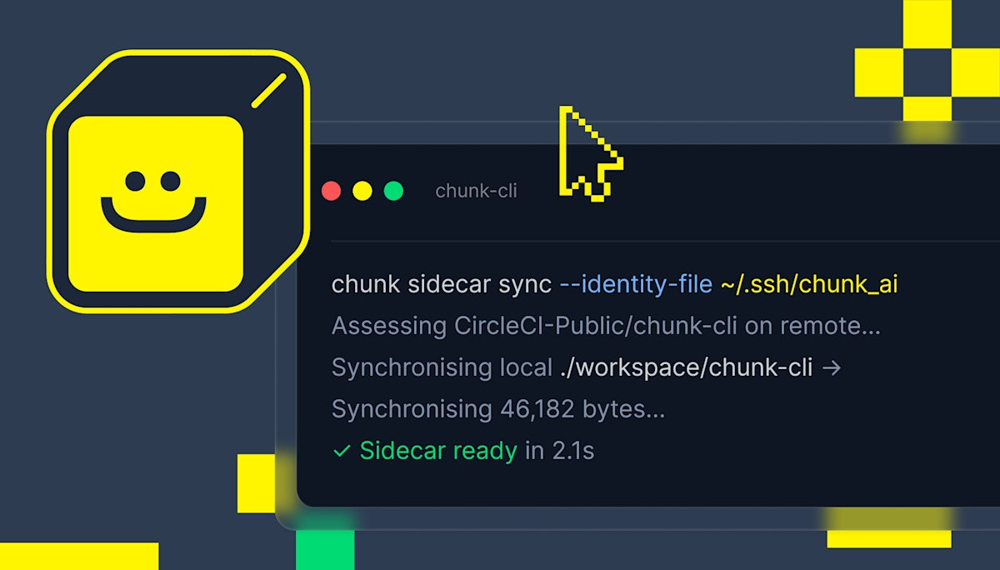
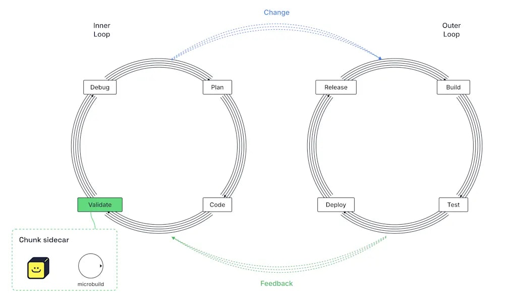

### 🎬 관련 영상
- [🎥 영상 보기](https://ph-files.imgix.net/ba92150d-8033-4153-84f2-a6a64a67e724.jpeg?auto=format)

---

## 24. [BankStatementLab](https://www.producthunt.com/products/bankstatementlab)
**Votes**: 69 | **도입 난이도**: 하 | **신뢰도**: 상
**Tagline**: Turn any bank statement PDF into Excel, CSV or JSON with AI
**서비스 링크**: https://www.producthunt.com/r/P3KT7GEWLU2S3Q

**태그**: Automation, FinTech, DataExtraction, Productivity, AI Tool

### 📌 이 서비스 한눈에 보기
AI를 활용해 어떤 형식의 은행 거래 명세서 PDF도 즉시 엑셀이나 CSV로 변환해주는 데이터 추출 도구

### 🔑 주요 기능
- AI 기반의 정교한 PDF 데이터 추출 기술
- 은행, 양식, 언어에 구애받지 않는 범용성
- 수동 입력 없이 엑셀, CSV, JSON 형식으로 즉시 변환

### 🙋 사용자에게 어떤 점이 좋은가
회계사나 재무 분석가가 수작업으로 거래 내역을 입력하는 번거로움을 없애고 업무 시간을 획기적으로 단축할 수 있습니다.

### ✅ 지금 바로 써볼 기능
- 무료로 제공되는 5페이지 분량의 테스트 파일 업로드
- 다양한 은행 양식에서의 데이터 정확도 검증
- 추출된 데이터의 JSON/CSV 포맷 호환성 확인

### ⚠️ 사용 전 확인할 점
- 무료 사용 범위(5페이지) 초과 시 비용 발생 가능성
- 민감한 금융 데이터 업로드에 따른 보안 정책 확인 필요

### 🧭 확인이 더 필요한 정보
데이터 보안 및 개인정보 보호를 위한 구체적인 보안 프로토콜에 대한 정보가 명시되지 않았습니다.

### 📸 스크린샷 및 갤러리
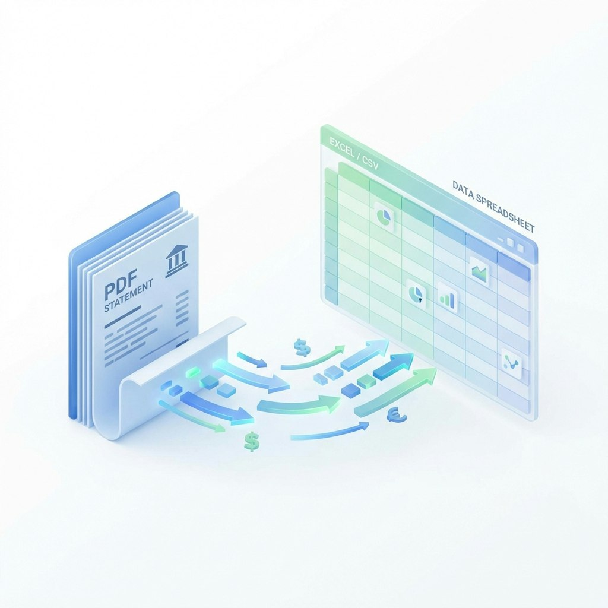

---

## 25. [Aviquill](https://www.producthunt.com/products/aviquill)
**Votes**: 69 | **도입 난이도**: 하 | **신뢰도**: 상
**Tagline**: A calm canvas for visual thinkers with messy minds
**서비스 링크**: https://www.producthunt.com/r/SQHSSO2QYKCSUC

**태그**: Productivity, VisualThinking, NoteTaking, Creativity

### 📌 이 서비스 한눈에 보기
복잡한 생각을 자연스럽게 정리할 수 있는 시각적 사고자를 위한 유연한 노트 테이킹 캔버스

### 🔑 주요 기능
- 경직된 폴더 구조에서 벗어난 자유로운 아이디어 정리
- 시각적 사고자를 위해 설계된 직관적이고 유연한 워크스페이스
- 아이디어 간의 연결과 확장이 용이한 비선형적 구조

### 🙋 사용자에게 어떤 점이 좋은가
정형화된 노트 앱의 틀에 갇혀 아이디어 정리에 어려움을 겪던 사용자에게 더 자유롭고 차분한 작업 환경을 제공합니다.

### ✅ 지금 바로 써볼 기능
- 자유로운 캔버스에 아이디어 배치해보기
- 생각 간의 연결성 테스트하기
- 복잡한 프로젝트를 시각적으로 구조화하기

### ⚠️ 사용 전 확인할 점
- 비선형적 구조로 인해 정보가 많아질 경우 오히려 혼란이 생길 수 있음
- 전통적인 폴더 방식에 익숙한 사용자에게는 적응 기간이 필요할 수 있음

### 🧭 확인이 더 필요한 정보
구체적인 협업 기능이나 기기 간 동기화 범위에 대한 정보가 부족합니다.

### 📸 스크린샷 및 갤러리

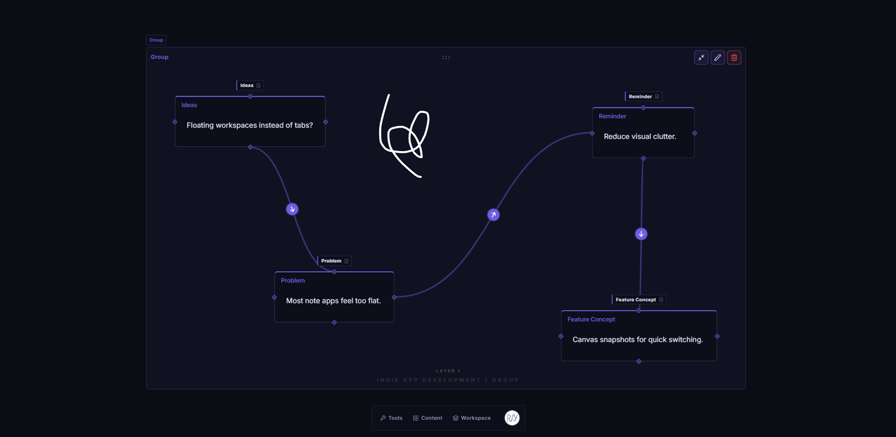
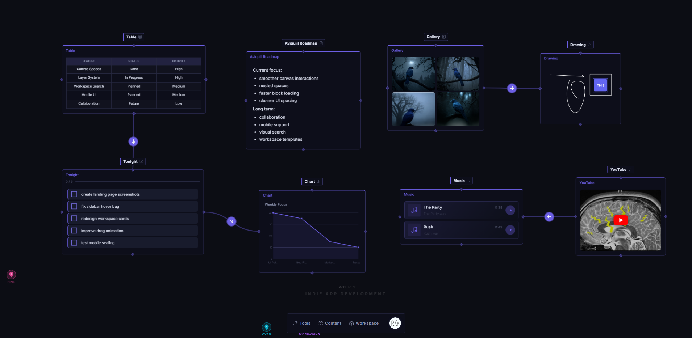

### 🎬 관련 영상
- [🎥 영상 보기](https://ph-files.imgix.net/36036b12-c17a-4010-9126-de7b1d6200cf.jpeg?auto=format)

---

## 26. [Jott](https://www.producthunt.com/products/jott-before-you-forget)
**Votes**: 69 | **도입 난이도**: 하 | **신뢰도**: 상
**Tagline**: Capture quick written or voice notes from your Mac's notch
**서비스 링크**: https://www.producthunt.com/r/QPLVA4BFUMWUBL

**태그**: Productivity, Mac, Note-taking, Utility, AI Tool

### 📌 이 서비스 한눈에 보기
맥북 노치에서 즉시 메모를 작성하고 동기화하는 초간편 텍스트/음성 기록 도구

### 🔑 주요 기능
- 맥북 노치 영역을 활용한 빠른 입력 방식 (Option 더블 탭)
- 앱 전환이나 창 관리 없이 즉시 기록 및 자동 저장
- iCloud를 통한 Mac과 iPhone 간의 원활한 동기화

### 🙋 사용자에게 어떤 점이 좋은가
작업 흐름을 끊지 않고 아이디어를 즉시 기록할 수 있어, 멀티태스킹 중 발생하는 정보 손실을 방지합니다.

### ✅ 지금 바로 써볼 기능
- 7일 무료 체험을 통한 노치 입력 편의성 테스트
- Option 키 단축키를 활용한 빠른 메모 작성 연습
- iPhone과의 iCloud 동기화 속도 확인

### ⚠️ 사용 전 확인할 점
- 노치 디자인이 없는 맥 모델에서는 사용이 제한될 수 있음
- 단축키 충돌 여부 확인 필요

### 🧭 확인이 더 필요한 정보
Mac과 iOS 간의 일회성 구매 정책이 두 플랫폼 모두에 동일하게 적용되는지 상세 확인이 필요합니다.

### 📸 스크린샷 및 갤러리

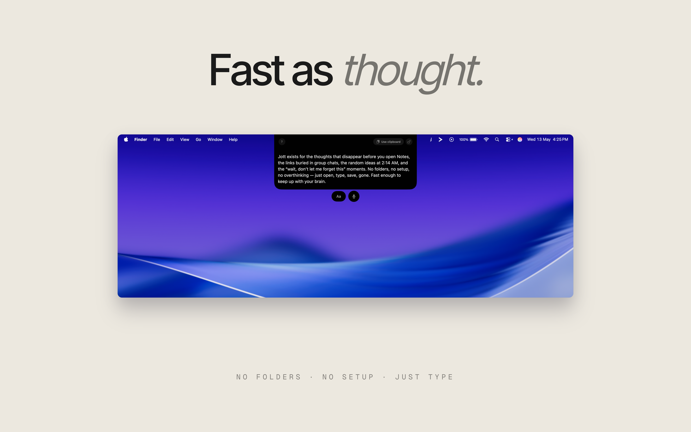

---

## 27. [MacSIM by Studio Practice](https://www.producthunt.com/products/mac-screen-simulator-studio-practice)
**Votes**: 68 | **도입 난이도**: 하 | **신뢰도**: 상
**Tagline**: Preview any URL on every Mac screen at once
**서비스 링크**: https://www.producthunt.com/r/KCKU6B6MPLT5ZS

**태그**: DesignTool, WebDev, Mac, ResponsiveDesign, AI Tool

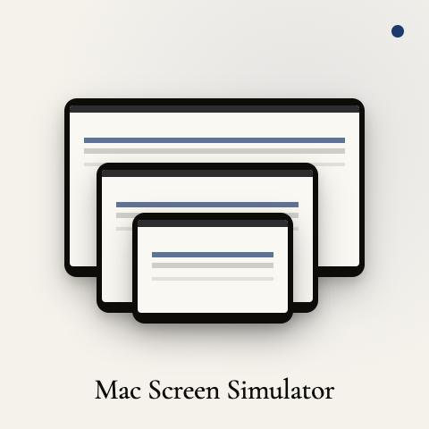

### 📌 이 서비스 한눈에 보기
모든 주요 Mac 디스플레이 크기에서 웹사이트 레이아웃을 한눈에 확인하는 도구

### 🔑 주요 기능
- MacBook Air, Pro, iMac, Studio Display 등 6가지 주요 화면 크기 동시 프리뷰
- 노치 및 메뉴 바를 포함한 실제 풀스크린 브라우저 환경 재현
- 로그인, 트래킹, 빌드 과정 없는 단일 HTML 파일 기반의 가벼운 도구

### 🙋 사용자에게 어떤 점이 좋은가
웹 디자이너나 개발자가 다양한 Mac 기기 환경에서의 반응형 레이아웃을 별도의 기기 없이 즉각적으로 검증할 수 있습니다.

### ✅ 지금 바로 써볼 기능
- URL을 붙여넣어 6가지 화면 크기에서의 렌더링 확인하기
- 로컬 호스트(localhost) 주소를 입력하여 개발 중인 페이지 테스트하기
- 오프라인 환경에서 설치 후 즉시 실행해보기

### ⚠️ 사용 전 확인할 점
- 실제 물리적 기기가 아닌 화면 스케일링 방식이므로 미세한 픽셀 차이가 있을 수 있음
- Mac 환경에 특화되어 있어 Windows나 모바일 환경 테스트는 불가함

### 🧭 확인이 더 필요한 정보
제공되는 파일 형식이 단순 HTML 파일이므로, 특정 OS 버전에서의 호환성 범위는 명시되지 않았습니다.

### 📸 스크린샷 및 갤러리
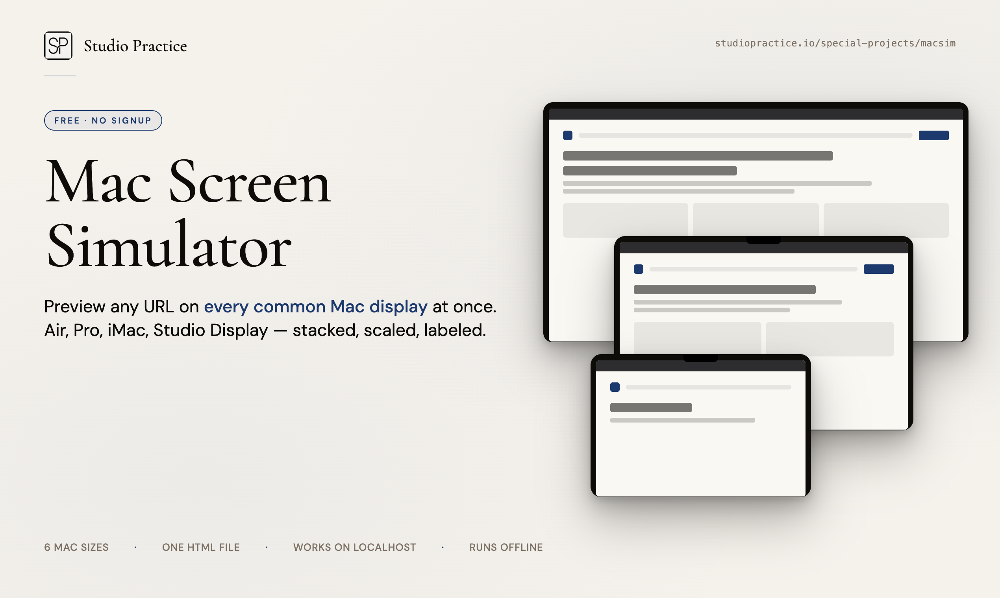
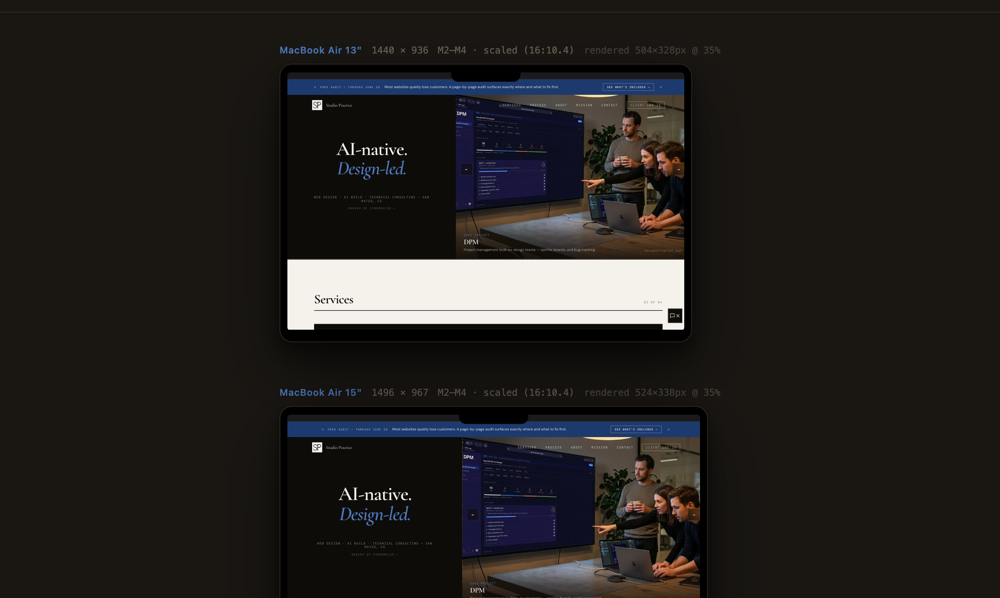
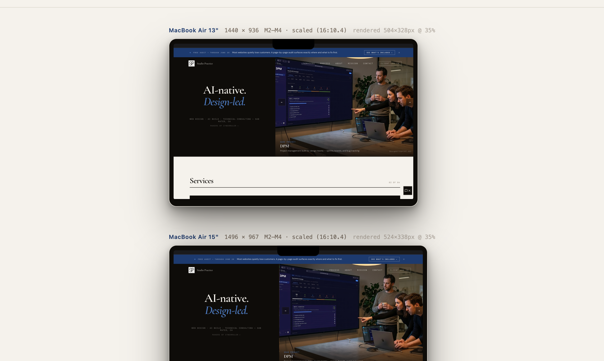

### 🎬 관련 영상
- [🎥 영상 보기](https://ph-files.imgix.net/f9e6363f-a261-46f4-ab85-7a2ff746e918.jpeg?auto=format)

---

## 28. [GenGo](https://www.producthunt.com/products/gengo-2)
**Votes**: 68 | **도입 난이도**: 하 | **신뢰도**: 상
**Tagline**: Transform selected text anywhere on macOS
**서비스 링크**: https://www.producthunt.com/r/XKEXPUU2ETW2FN

**태그**: macOS, Productivity, AI, DeveloperTool, Automation, AI Tool

### 📌 이 서비스 한눈에 보기
macOS 어디서든 선택한 텍스트를 즉시 변환해주는 AI 워크플로우 도구

### 🔑 주요 기능
- macOS 시스템 전반에서 작동하는 인플레이스(in-place) 텍스트 변환
- 앱 전환 없이 선택한 텍스트를 원하는 형태로 즉시 변경
- 코드 포맷팅, 번역, 데이터 변환 등 다양한 개발 및 업무 작업 지원

### 🙋 사용자에게 어떤 점이 좋은가
작업 중 앱을 옮겨 다니는 번거로움 없이 맥 환경 내에서 즉각적인 텍스트 처리가 가능하여 작업 흐름이 끊기지 않습니다.

### ✅ 지금 바로 써볼 기능
- JSON 데이터를 TypeScript 타입으로 변환하기
- 일본어 텍스트를 자연스러운 영어로 번역하기
- SQL 쿼리나 터미널 명령어를 생성 및 포맷팅하기

### ⚠️ 사용 전 확인할 점
- 텍스트를 직접 수정하므로 원본 데이터 유실 주의 필요
- AI 기반 변환이므로 결과물의 정확성 검토 필요

### 🧭 확인이 더 필요한 정보
구체적인 가격 정책 및 지원하는 AI 모델 종류에 대한 정보가 명시되지 않았습니다.

### 📸 스크린샷 및 갤러리
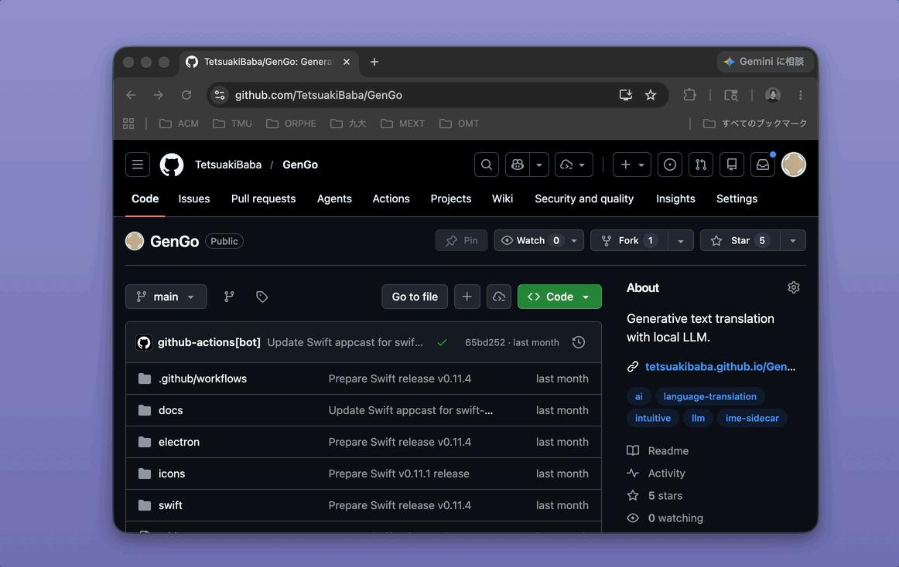
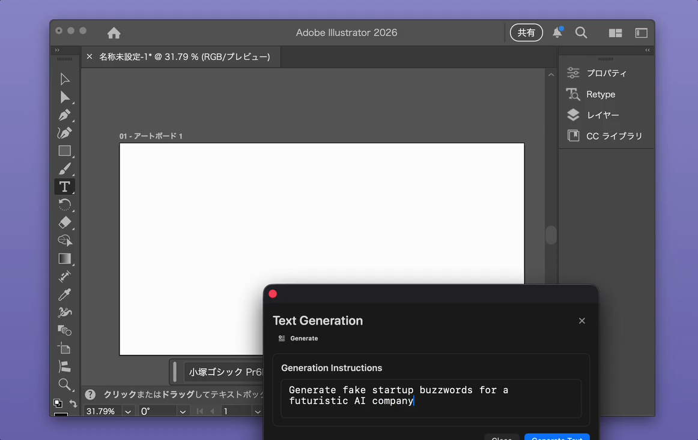
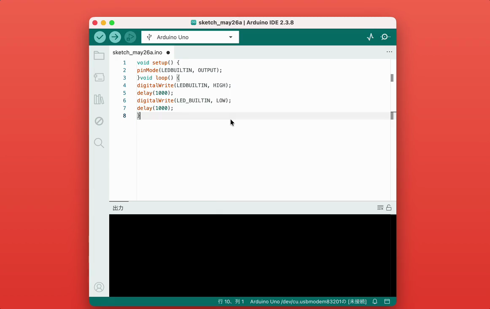

### 🎬 관련 영상
- [🎥 영상 보기](https://ph-files.imgix.net/d7d8ebd5-fadd-4c4c-be03-22b48324f55e.jpeg?auto=format)

---

## 29. [Curlo](https://www.producthunt.com/products/curlo)
**Votes**: 67 | **도입 난이도**: 하 | **신뢰도**: 상
**Tagline**: Local AI search to find SFX and music by describing it
**서비스 링크**: https://www.producthunt.com/r/GVEZJDFU7TRT4V

**태그**: AudioTool, AI, macOS, Productivity, CreativeTools, AI Tool

### 📌 이 서비스 한눈에 보기
설명만으로 원하는 효과음과 음악을 찾아주는 macOS용 프라이버시 중심 로컬 AI 사운드 라이브러리 관리 도구

### 🔑 주요 기능
- 자연어 설명을 통한 직관적인 SFX 및 음악 검색
- 데이터 유출 걱정 없는 완전한 로컬 기반 AI 처리
- 사운드 라이브러리 정리, 메타데이터 및 UCS 편집 기능

### 🙋 사용자에게 어떤 점이 좋은가
방대한 사운드 라이브러리를 가진 크리에이터가 복잡한 태그 작업 없이 말로 원하는 소리를 즉시 찾고 관리할 수 있습니다.

### ✅ 지금 바로 써볼 기능
- 자연어 검색으로 원하는 사운드 찾기
- 유사한 사운드 검색 기능 테스트
- 기존 사운드 라이브러리 메타데이터 정리

### ⚠️ 사용 전 확인할 점
- macOS 전용 앱이므로 타 OS 사용자는 사용 불가
- 로컬 AI 구동을 위한 Mac의 하드웨어 사양 확인 필요

### 🧭 확인이 더 필요한 정보
로컬 구동 시 시스템 리소스(CPU/GPU) 점유율에 대한 구체적인 정보가 필요합니다.

### 📸 스크린샷 및 갤러리
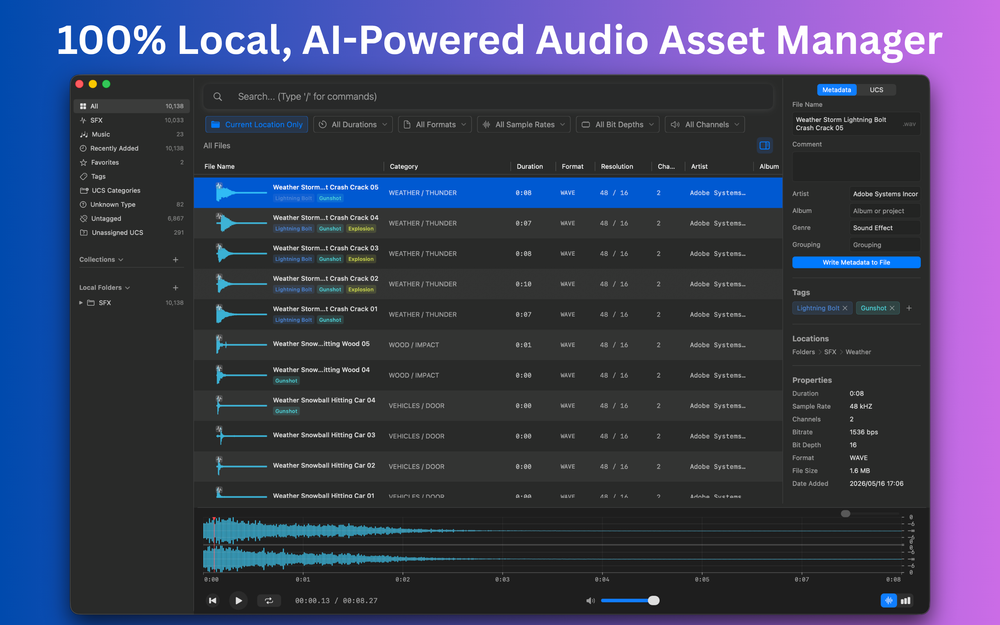
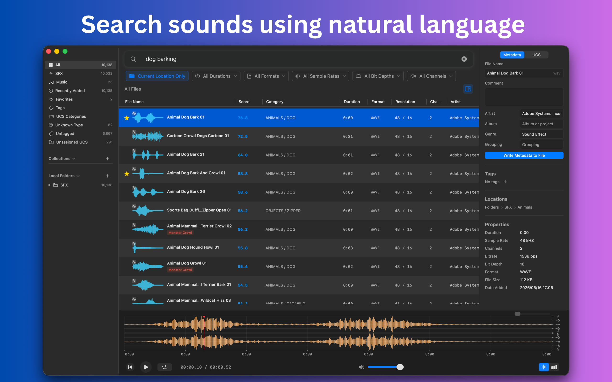
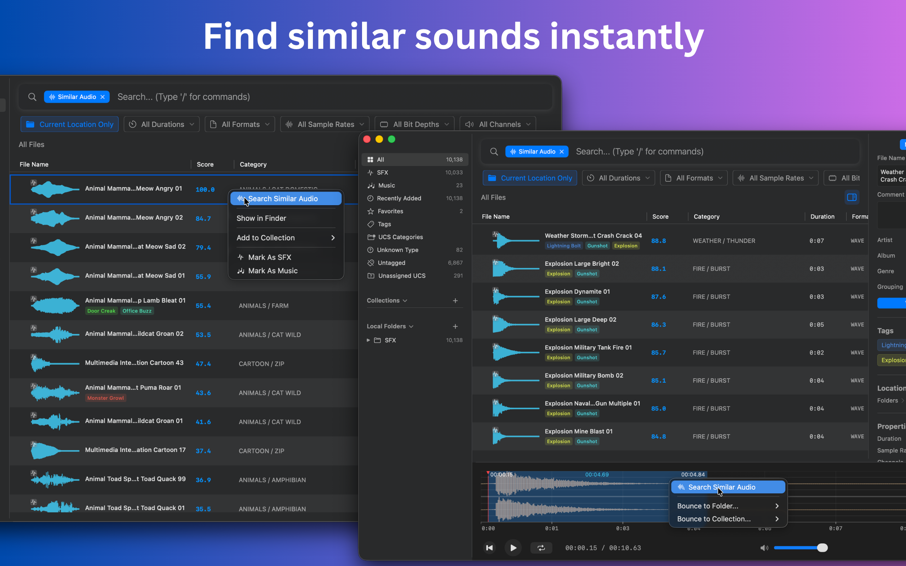

### 🎬 관련 영상
- [🎥 영상 보기](https://ph-files.imgix.net/c64d7262-76db-4f1a-9779-b723b6018e26.jpeg?auto=format)

---

## 30. [Harbor](https://www.producthunt.com/products/habor)
**Votes**: 66 | **도입 난이도**: 중 | **신뢰도**: 상
**Tagline**: CLI + companion App to spin up complete local LLM stacks
**서비스 링크**: https://www.producthunt.com/r/XBRTQV5HP7474E

**태그**: AI, DevTool, Automation, LLM, LocalStack, Agent, AI Tool, Chat, Vision

### 📌 이 서비스 한눈에 보기
명령어 한 번으로 로컬 LLM 스택 전체를 구축하는 CLI 및 컴패니언 앱

### 🔑 주요 기능
- LLM 백엔드, 채팅 프론트엔드, 웹 검색, 이미지 생성 등 통합 스택 자동 구성
- 모델 관리 및 설정 프로필 생성 기능 제공
- 에이전트 코딩 도구와 연동 가능한 로컬 환경 구축

### 🙋 사용자에게 어떤 점이 좋은가
복잡한 로컬 AI 환경 설정에 드는 시간을 획기적으로 줄여주며, 다양한 AI 도구들을 유기적으로 연결해 줍니다.

### ✅ 지금 바로 써볼 기능
- CLI를 통한 원클릭 스택 구축 테스트
- 다양한 모델 다운로드 및 프로필 설정
- 에이전트 코딩 도구와의 연동 확인

### ⚠️ 사용 전 확인할 점
- 로컬 환경의 하드웨어 사양(GPU 등)에 따른 성능 제약 가능성
- 다양한 도구 통합에 따른 시스템 리소스 점유율 확인 필요

### 🧭 확인이 더 필요한 정보
사용자의 하드웨어 사양에 따른 최적화 수준과 지원되는 구체적인 모델 목록 확인이 필요합니다.

### 📸 스크린샷 및 갤러리

### 🎬 관련 영상
- [🎥 영상 보기](https://ph-files.imgix.net/ed175229-fd89-43df-a2a1-367c675c98b9.jpeg?auto=format)

---

