# 🚀 Product Hunt Daily Top 30 (2026-05-30)

## 오늘의 요약
오늘의 트렌드는 단순한 챗봇을 넘어 특정 직무를 자율적으로 수행하는 'AI 에이전트'의 실무 적용이 핵심이었습니다. 영업, 마케팅, 개발 등 전문 영역에서 반복 업무를 자동화하고 데이터 기반의 의사결정을 돕는 도구들이 주를 이루었습니다. 또한, AI 에이전트의 효율성을 높이기 위한 API 연동 및 데이터 모니터링 기술도 눈에 띄었습니다.

### 오늘의 핵심 포인트
- 영업 및 마케팅 분야에서 리드 발굴부터 콘텐츠 생성까지 전 과정을 자동화하는 자율형 AI 에이전트가 주목받았습니다.
- AI 에이전트가 실시간 데이터에 즉각 반응하고 외부 시스템과 원활하게 상호작용할 수 있도록 돕는 인프라 도구들이 등장했습니다.
- 기존의 워크플로우(코드 리뷰, 영업 코칭 등)에 AI를 깊숙이 통합하여 업무 효율을 극대화하는 솔루션들이 강세를 보였습니다.

**오늘의 태그**: AI 에이전트, 업무 자동화, 세일즈테크, 마케팅 자동화, 개발 생산성

## 1. [Ava 2.0](https://www.producthunt.com/products/artisan-3)
**Votes**: 275 | **도입 난이도**: 중 | **신뢰도**: 상
**Tagline**: Your AI BDR that runs outbound sales autonomously
**서비스 링크**: https://www.producthunt.com/r/HMYIC7WZZM3MNU

**태그**: Sales Automation, AI BDR, Lead Generation, Outbound Sales, AI Tool, Sales

### 📌 이 서비스 한눈에 보기
2억 5천만 명의 잠재 고객 발굴부터 미팅 예약까지 자동으로 수행하는 AI 영업 담당자

### 🔑 주요 기능
- 2억 5천만 명 이상의 전문가 데이터베이스 기반 리드 소싱
- 멀티 채널 아웃리치 자동화
- 자율적인 미팅 예약 프로세스

### 🙋 사용자에게 어떤 점이 좋은가
영업 담당자가 반복적인 리드 발굴과 초기 컨택 업무에서 벗어나, 실제 미팅과 계약 체결에만 집중할 수 있게 해줍니다.

### ✅ 지금 바로 써볼 기능
- 타겟 프로필 설정 및 리드 소싱 기능 테스트
- 멀티 채널 자동 메시지 발송 설정
- 미팅 예약 자동화 워크플로우 확인

### ⚠️ 사용 전 확인할 점
- 완전 자동화로 인한 메시지 품질 및 브랜드 이미지 관리 필요
- 리드 데이터의 정확성 및 타겟팅 정교함 확인 필요

### 🧭 확인이 더 필요한 정보
사용되는 멀티 채널의 구체적인 종류(이메일, LinkedIn 등)와 메시지 개인화 수준에 대한 정보가 더 필요합니다.

### 📸 스크린샷 및 갤러리
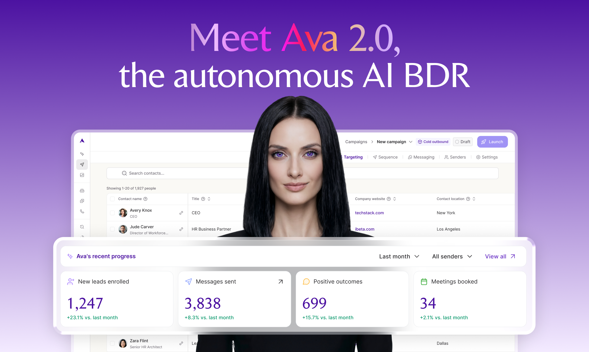
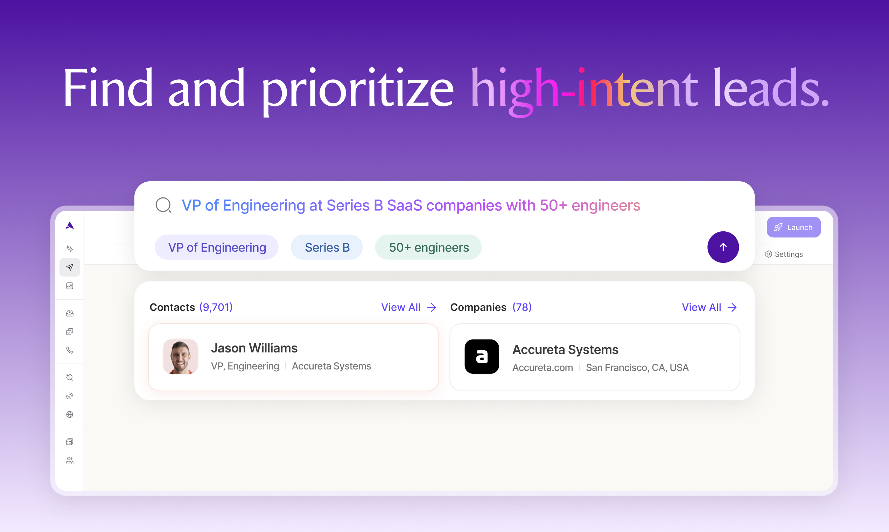
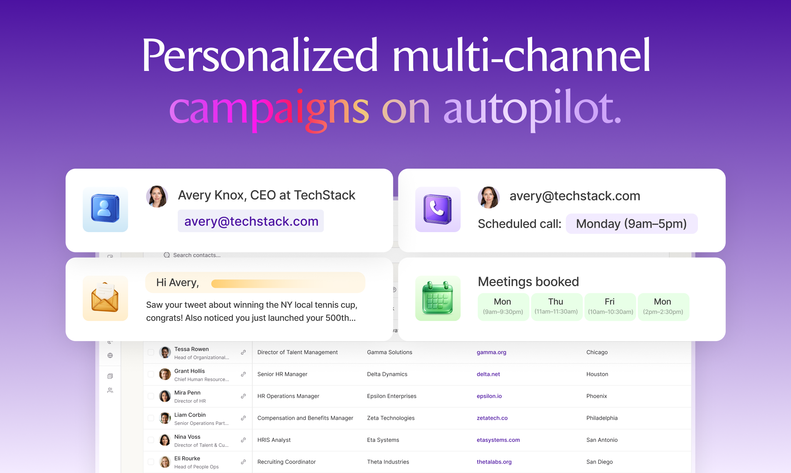

### 🎬 관련 영상
- [🎥 영상 보기](https://ph-files.imgix.net/646cc137-eabb-4d84-8e11-42acb0ccbeb0.jpeg?auto=format)

---

## 2. [/monitor by Firecrawl](https://www.producthunt.com/products/extract-by-firecrawl)
**Votes**: 241 | **도입 난이도**: 하 | **신뢰도**: 상
**Tagline**: Notify your AI agent when the web changes
**서비스 링크**: https://www.producthunt.com/r/RYV3RTT7QJJVGO

**태그**: AI, Automation, WebScraping, DevTool, Agent, AI Tool, LLM

### 📌 이 서비스 한눈에 보기
웹 페이지 변경 사항을 실시간 감지하여 AI 에이전트에게 알림을 보내는 모니터링 도구

### 🔑 주요 기능
- 웹 페이지 또는 사이트의 변경 사항을 즉시 웹훅(Webhook)으로 알림
- 변경된 데이터만 추출하여 LLM 토큰 사용량 최대 90% 절감
- AI 에이전트의 데이터 처리 효율성 극대화

### 🙋 사용자에게 어떤 점이 좋은가
웹 데이터의 변화를 실시간으로 감지하여 AI 에이전트가 불필요한 데이터 재처리를 하지 않도록 비용과 시간을 아껴줍니다.

### ✅ 지금 바로 써볼 기능
- 웹훅 연동을 통한 실시간 알림 설정
- 특정 페이지의 변경 사항 감지 테스트
- 기존 LLM 워크플로우에 데이터 필터링 적용

### ⚠️ 사용 전 확인할 점
- 웹훅 수신을 위한 별도의 서버 또는 엔드포인트 필요
- 감지 대상 사이트의 구조 변경 시 설정 재확인 필요

### 🧭 확인이 더 필요한 정보
구체적인 모니터링 주기 및 동시 감지 가능한 페이지 수에 대한 정보가 명시되지 않았습니다.

### 📸 스크린샷 및 갤러리
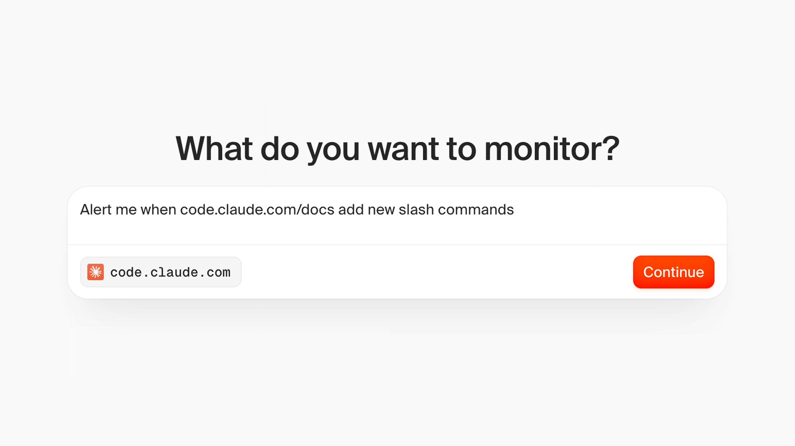
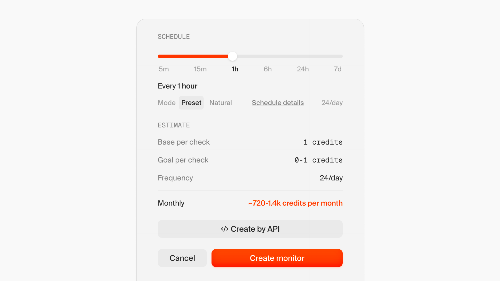
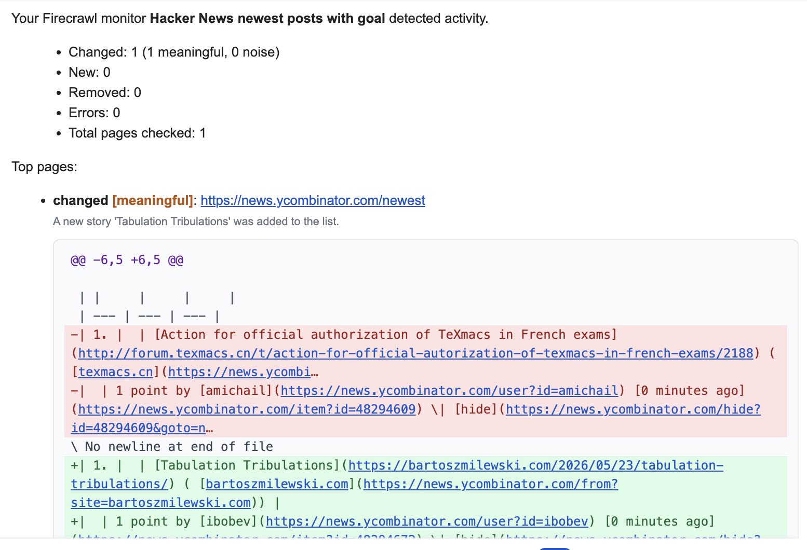

### 🎬 관련 영상
- [🎥 영상 보기](https://ph-files.imgix.net/310e71c2-0d61-4c26-aad4-b34077851b2a.jpeg?auto=format)

---

## 3. [Agent A by Ahrefs](https://www.producthunt.com/products/ahrefs)
**Votes**: 190 | **도입 난이도**: 중 | **신뢰도**: 상
**Tagline**: The AI Marketing Agent Powered by Ahrefs Data
**서비스 링크**: https://www.producthunt.com/r/OMSNAOYVI76G2G

**태그**: Marketing, AI Agent, Automation, Analytics, Ahrefs, Agent, AI Tool

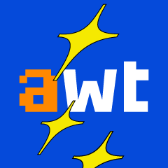

### 📌 이 서비스 한눈에 보기
Ahrefs의 방대한 데이터를 기반으로 마케팅 인사이트 분석부터 실행까지 수행하는 AI 에이전트

### 🔑 주요 기능
- 170조 개 이상의 인덱스 페이지를 보유한 Ahrefs 데이터셋 기반
- 단순 분석을 넘어 마케팅 인사이트를 구축하고 실행하는 에이전트 기능
- 반복적인 분석 업무를 자동화하여 전략 수립에 집중할 수 있는 환경 제공

### 🙋 사용자에게 어떤 점이 좋은가
방대한 데이터 분석과 실행 업무를 AI가 대신 처리해주므로, 마케터는 데이터 수집 대신 고차원적인 전략 기획에 더 많은 시간을 할애할 수 있습니다.

### ✅ 지금 바로 써볼 기능
- Ahrefs 데이터 기반의 마케팅 인사이트 도출 테스트
- 자동화된 마케팅 액션 플랜 생성 기능 확인
- 기존 마케팅 전략과의 정렬 및 실행 가능성 검토

### ⚠️ 사용 전 확인할 점
- AI가 생성한 인사이트의 실제 실행 전 검증 필요
- Ahrefs 데이터 활용 범위에 따른 결과값의 제약 가능성

### 🧭 확인이 더 필요한 정보
구체적인 실행(Act) 기능의 범위와 기존 Ahrefs 도구들과의 연동 방식에 대한 상세 정보가 필요합니다.

### 📸 스크린샷 및 갤러리
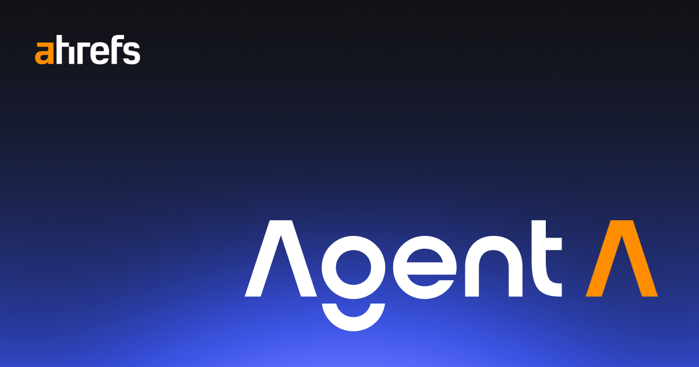
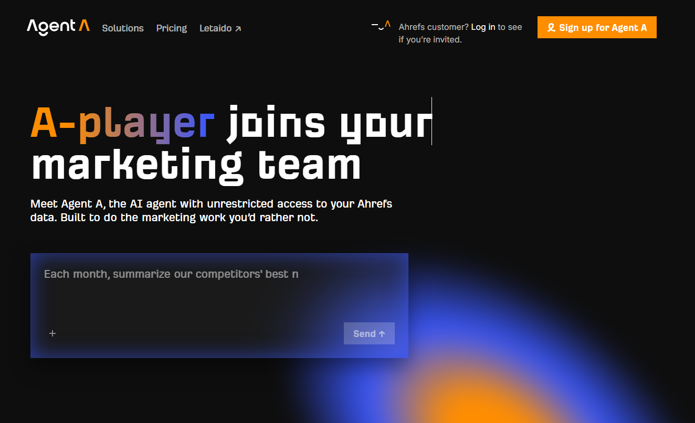
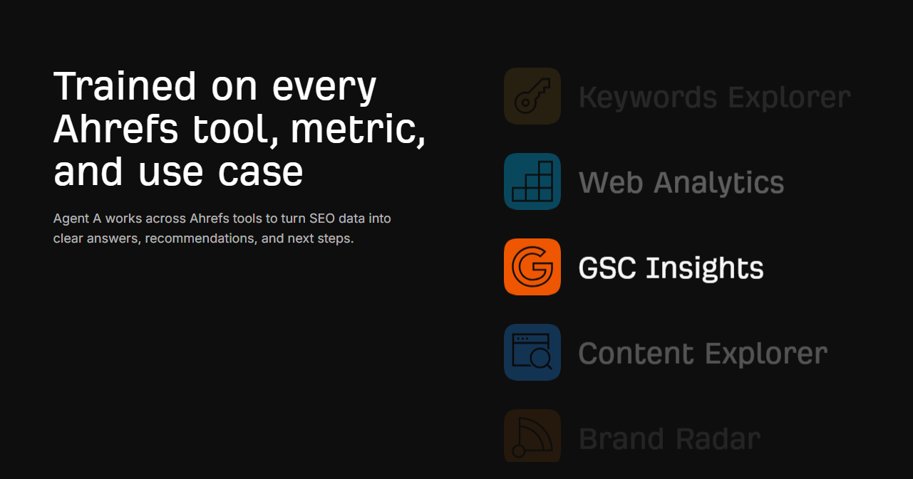

### 🎬 관련 영상
- [🎥 영상 보기](https://ph-files.imgix.net/0b80c370-fd0c-4693-bc2f-4df2c696e219.jpeg?auto=format)

---

## 4. [Ava Studio](https://www.producthunt.com/products/ava-studio)
**Votes**: 188 | **도입 난이도**: 하 | **신뢰도**: 상
**Tagline**: Your AI creative team for video ads
**서비스 링크**: https://www.producthunt.com/r/ZPLOYKYABNIPYB

**태그**: AI Video, Marketing Automation, Content Creation, Short-form, AI Tool, Video

### 📌 이 서비스 한눈에 보기
제품 조사부터 광고 소재 생성까지 한 번에 해결하는 AI 영상 광고 제작 팀

### 🔑 주요 기능
- 제품 분석을 통한 맞춤형 훅(Hook) 및 크리에이티브 전략 수립
- 틱톡, 릴스 등 숏폼 플랫폼에 최적화된 50개 이상의 광고 변형 버전 생성
- 편집 가능한 형태의 결과물 제공으로 빠른 배포 가능

### 🙋 사용자에게 어떤 점이 좋은가
광고 기획과 영상 제작에 드는 시간을 획기적으로 줄여주며, 다양한 플랫폼용 소재를 대량으로 빠르게 확보할 수 있습니다.

### ✅ 지금 바로 써볼 기능
- 제품 정보 입력 및 AI 분석 기능 테스트
- 생성된 50여 개의 광고 변형 소재 확인
- 플랫폼별(TikTok, Reels 등) 최적화 결과물 검토

### ⚠️ 사용 전 확인할 점
- 생성된 영상의 브랜드 톤앤매너 일치 여부 확인 필요
- 편집 가능한 범위와 최종 결과물의 퀄리티 검증 필요

### 🧭 확인이 더 필요한 정보
사용자가 직접 편집할 수 있는 툴의 상세 기능과 편집 범위에 대한 정보가 더 필요합니다.

### 📸 스크린샷 및 갤러리
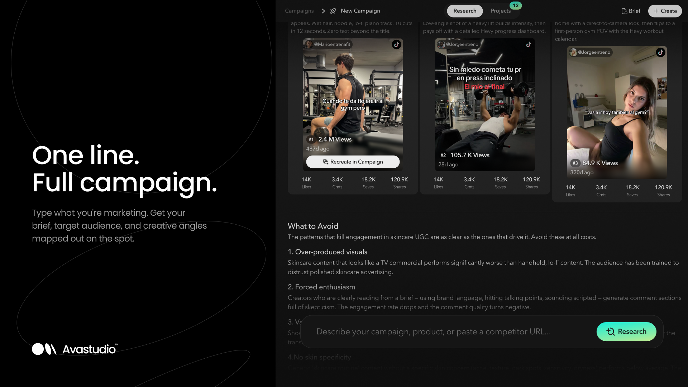
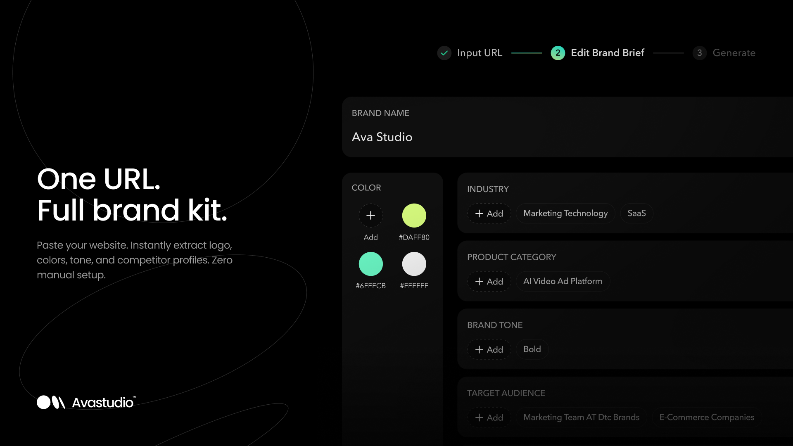
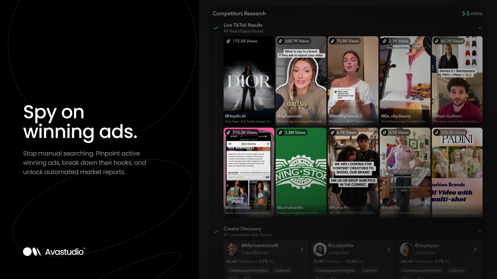

### 🎬 관련 영상
- [🎥 영상 보기](https://ph-files.imgix.net/edebf983-8cf8-4b30-b3aa-a1f472239cfc.jpeg?auto=format)

---

## 5. [Firecoach AI](https://www.producthunt.com/products/firecoach)
**Votes**: 169 | **도입 난이도**: 중 | **신뢰도**: 상
**Tagline**: AI roleplays that turn reps into top performers
**서비스 링크**: https://www.producthunt.com/r/L4JCIXK6NC4GII

**태그**: SalesTech, AI, Coaching, Training, Automation, AI Tool, Sales

### 📌 이 서비스 한눈에 보기
영업 팀의 플레이북을 학습한 AI 봇을 통해 실전 같은 롤플레이와 피드백을 제공하는 코칭 솔루션

### 🔑 주요 기능
- 기업 고유의 영업 방법론을 학습한 맞춤형 AI 세일즈 봇 구축
- 실시간 롤플레이를 통한 영업 사원 역량 강화 및 스케일러블한 코칭
- 데이터 기반의 점수 산정 및 피드백을 통한 코칭 공백 사전 식별

### 🙋 사용자에게 어떤 점이 좋은가
관리자가 일일이 붙어있지 않아도 팀원들이 실전처럼 연습하며 실력을 키울 수 있고, 실제 계약 실패로 이어지기 전에 문제점을 파악할 수 있습니다.

### ✅ 지금 바로 써볼 기능
- 자사 영업 플레이북을 기반으로 커스텀 AI 봇 생성하기
- AI 봇과 실전 롤플레이 시뮬레이션 진행하기
- 제공되는 스코어링 피드백을 통한 개인별 코칭 포인트 확인하기

### ⚠️ 사용 전 확인할 점
- AI 피드백이 실제 고객의 복잡한 맥락을 완벽히 반영하는지 검증 필요
- 기존 영업 방식과 AI 피드백 간의 정렬(Alignment) 작업 필요

### 🧭 확인이 더 필요한 정보
현재 제공되는 피드백의 구체적인 평가 지표와 데이터 분석 방식에 대한 상세 정보가 필요합니다.

### 📸 스크린샷 및 갤러리
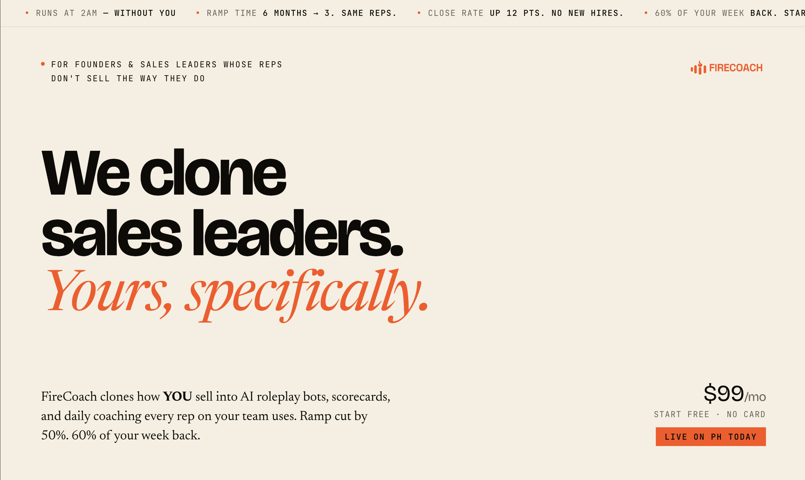
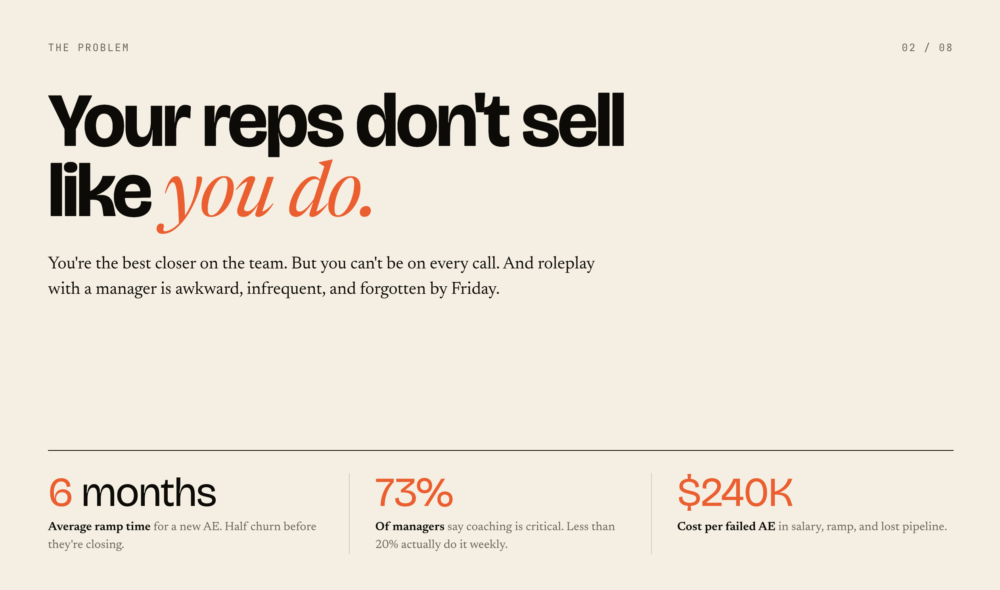
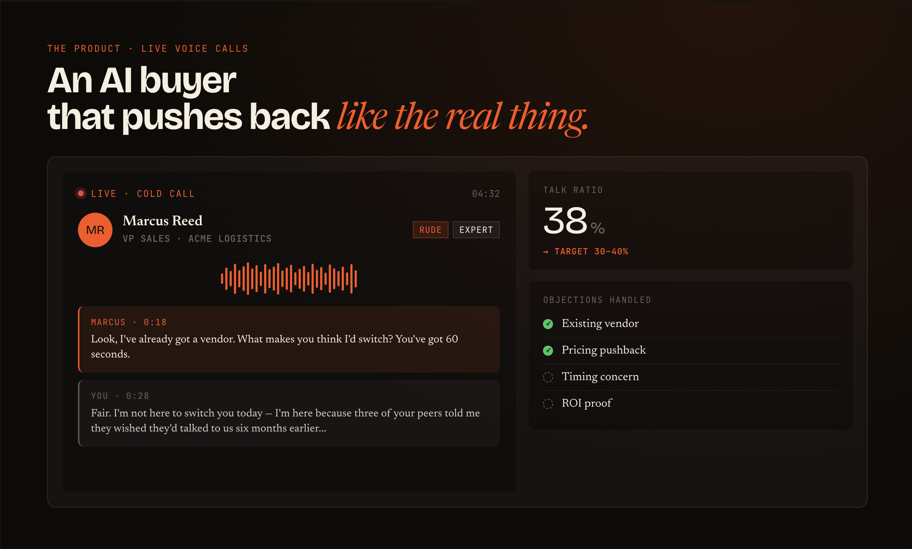

### 🎬 관련 영상
- [🎥 영상 보기](https://ph-files.imgix.net/e85233f4-7d25-4e5d-bf21-ab9a62cda860.jpeg?auto=format)

---

## 6. [MCP Bridge by Appfactor](https://www.producthunt.com/products/mcp-bridge-by-appfactor)
**Votes**: 168 | **도입 난이도**: 하 | **신뢰도**: 상
**Tagline**: Connect any API to any AI agent
**서비스 링크**: https://www.producthunt.com/r/WGVXQYBLFVKRIK

**태그**: DevTool, AI-Agent, API, Automation, Agent, AI Tool, LLM

### 📌 이 서비스 한눈에 보기
모든 종류의 API를 AI 에이전트용 도구로 즉시 변환해주는 MCP 브릿지

### 🔑 주요 기능
- REST, GraphQL, SOAP, gRPC 등 다양한 API 프로토콜 지원
- 스키마, 인증, 속도 제한 등을 포함한 MCP 도구 정의 자동 생성
- 기업용 API를 표준화된 인터페이스로 LLM 에이전트에 연결

### 🙋 사용자에게 어떤 점이 좋은가
복잡한 API 연동 과정을 자동화하여, 개발자가 수동으로 도구를 정의할 필요 없이 AI 에이전트가 기업 데이터와 기능에 즉시 접근할 수 있게 합니다.

### ✅ 지금 바로 써볼 기능
- 기존에 사용 중인 REST API를 MCP로 연결해보기
- 자동 생성된 스키마의 정확도 확인하기
- AI 에이전트와 API 간의 통신 테스트하기

### ⚠️ 사용 전 확인할 점
- API 보안 및 인증 설정이 올바르게 반영되었는지 확인 필요
- 복잡한 비즈니스 로직이 포함된 API의 경우 응답 처리 검증 필요

### 🧭 확인이 더 필요한 정보
지원하는 구체적인 인증 방식(OAuth 등)과 보안 프로토콜의 상세 구현 범위에 대한 확인이 필요합니다.

### 📸 스크린샷 및 갤러리
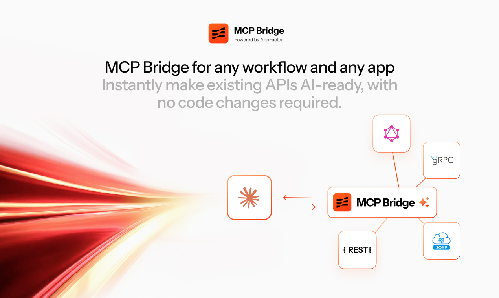
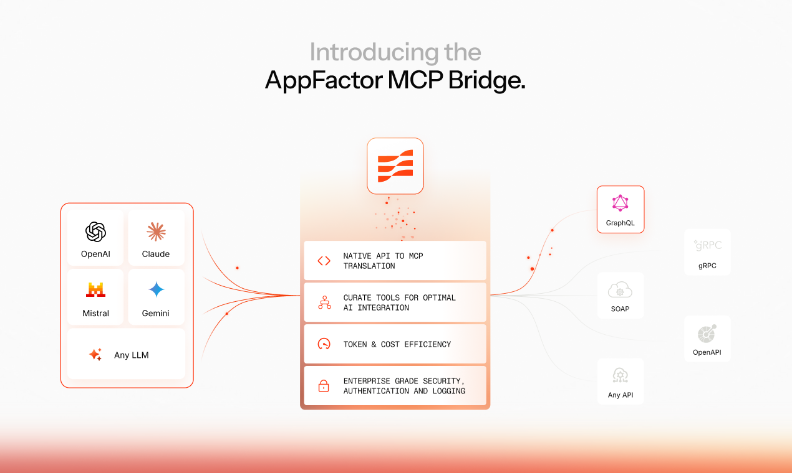
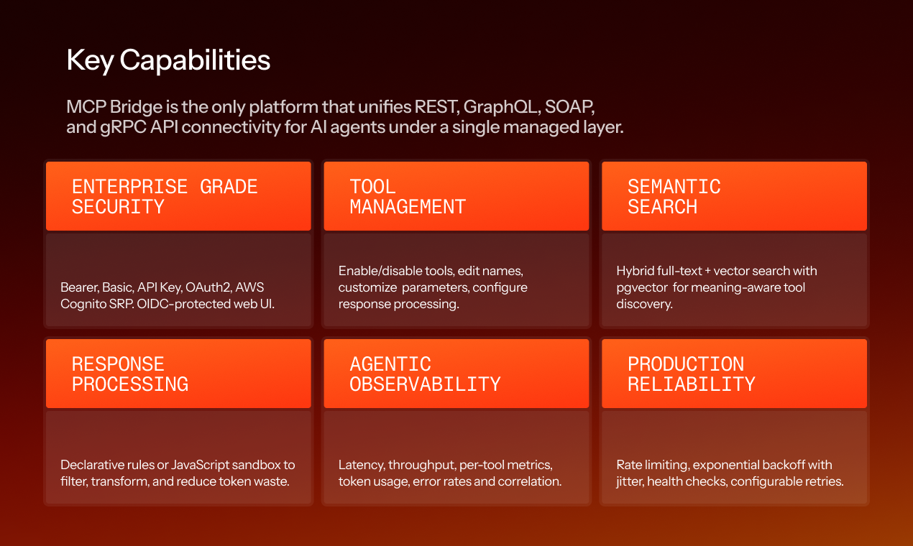

### 🎬 관련 영상
- [🎥 영상 보기](https://ph-files.imgix.net/1e6bd1f5-8182-41a9-af26-eb3aa823e1cf.jpeg?auto=format)

---

## 7. [Integuru](https://www.producthunt.com/products/integuru)
**Votes**: 144 | **도입 난이도**: 중 | **신뢰도**: 상
**Tagline**: Generate fast, reliable APIs for any platform. No browsers
**서비스 링크**: https://www.producthunt.com/r/BHYPI3BVUU7MB3

**태그**: DevTool, Automation, API, Backend, Agent, AI Tool

### 📌 이 서비스 한눈에 보기
브라우저 자동화 없이 백엔드 직접 연결을 통해 초고속 API를 생성하는 솔루션

### 🔑 주요 기능
- 브라우저나 RPA 없이 백엔드에 직접 연결하여 속도와 안정성 확보
- 3초 내외의 빠른 응답 속도와 99.9% 이상의 높은 성공률 제공
- 자동 치유(Auto-healing), API 문서화, 24/7 유지보수 팀 지원

### 🙋 사용자에게 어떤 점이 좋은가
기존의 느리고 불안정한 브라우저 기반 자동화 대신, 빠르고 견고한 API를 즉시 구축하여 워크플로우를 안정화할 수 있습니다.

### ✅ 지금 바로 써볼 기능
- 기존 브라우저 자동화 워크플로우를 Integuru로 전환 테스트
- API 생성 속도 및 안정성 벤치마크 수행
- 자동 생성된 API 문서 및 유지보수 기능 검토

### ⚠️ 사용 전 확인할 점
- 브라우저를 거치지 않는 방식이 모든 웹 서비스의 백엔드 구조에 적용 가능한지 확인 필요
- 인증 및 엣지 케이스 처리의 완결성 검증 필요

### 🧭 확인이 더 필요한 정보
모든 플랫폼과 서비스 유형에 대해 브라우저 없이 백엔드 직접 연결이 가능한지에 대한 기술적 범위 확인이 필요합니다.

### 📸 스크린샷 및 갤러리
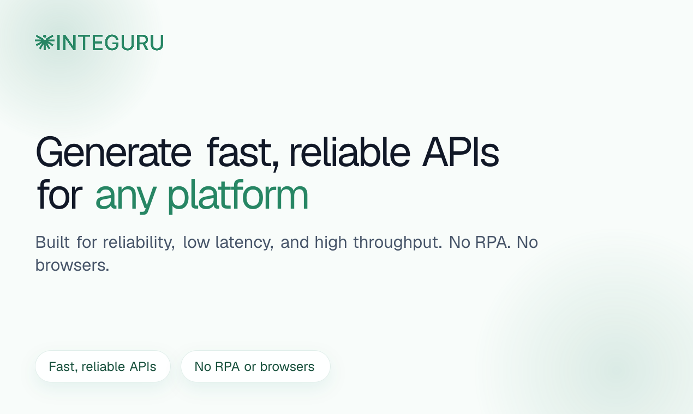
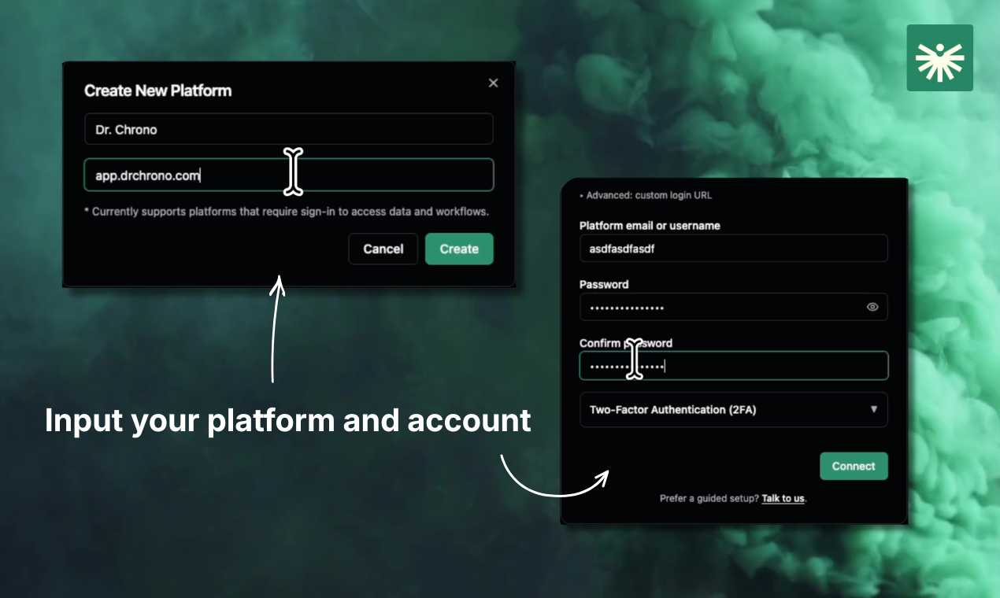
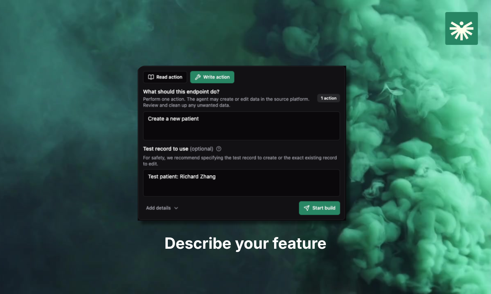

### 🎬 관련 영상
- [🎥 영상 보기](https://ph-files.imgix.net/79c1e3cb-be28-4ef2-a8a6-548400ab1b83.jpeg?auto=format)

---

## 8. [Linear Diffs](https://www.producthunt.com/products/linear)
**Votes**: 131 | **도입 난이도**: 하 | **신뢰도**: 상
**Tagline**: A new way to review PRs, directly inside Linear
**서비스 링크**: https://www.producthunt.com/r/GNHHT754GPCT47

**태그**: DevTool, Workflow, Productivity, AI, Agent, AI Tool

### 📌 이 서비스 한눈에 보기
Linear 내에서 코드 리뷰부터 배포까지 한 번에 해결하는 워크플로우 통합 도구

### 🔑 주요 기능
- Linear 이슈 내에서 직접 코드 diff 확인 및 리뷰 가능
- AI 에이전트를 활용한 코드 수정 및 반복 작업 지원
- Linear에서의 리뷰 내용이 GitHub와 실시간 동기화

### 🙋 사용자에게 어떤 점이 좋은가
개발자가 GitHub와 Linear 사이를 오가는 컨텍스트 스위칭을 줄여주어 코드 리뷰 속도를 높일 수 있습니다.

### ✅ 지금 바로 써볼 기능
- Linear 이슈 내에서 PR diff 확인하기
- 에이전트를 활용해 코드 변경 사항 제안받기
- Linear에서 작업한 리뷰 내용이 GitHub에 잘 반영되는지 확인하기

### ⚠️ 사용 전 확인할 점
- GitHub와의 동기화 과정에서 발생할 수 있는 충돌 여부 확인 필요
- 에이전트 기능 사용 시 코드 보안 정책 준수 여부 검토

### 🧭 확인이 더 필요한 정보
에이전트를 통한 코드 수정 및 배포 기능의 구체적인 보안 및 권한 관리 방식에 대한 정보가 더 필요합니다.

### 📸 스크린샷 및 갤러리

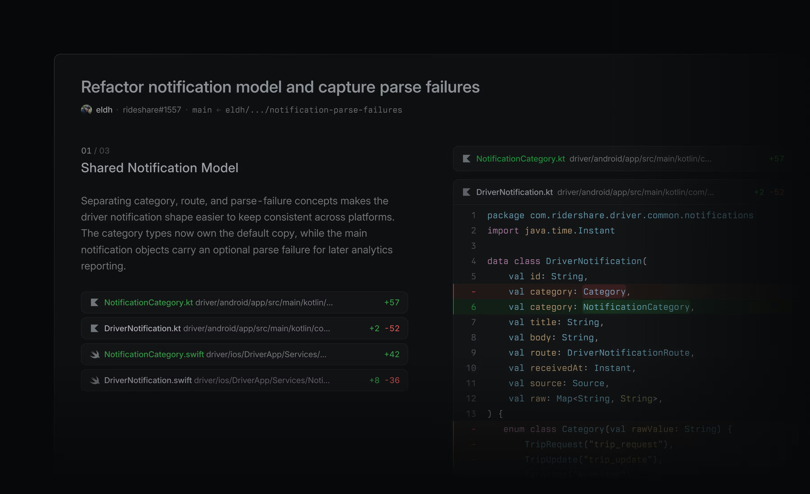
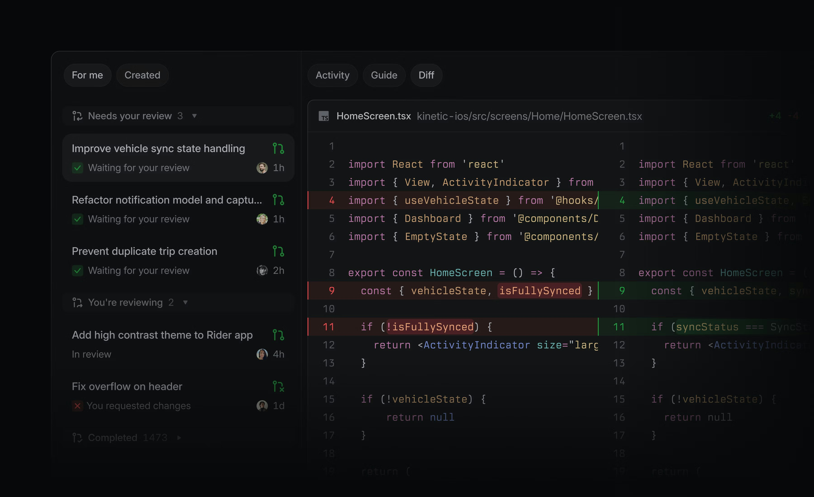

### 🎬 관련 영상
- [🎥 영상 보기](https://ph-files.imgix.net/56f5e0c0-5171-4a73-afe8-d7b1d62fd572.jpeg?auto=format)

---

## 9. [Sinalytica](https://www.producthunt.com/products/sinalytica)
**Votes**: 113 | **도입 난이도**: 하 | **신뢰도**: 중
**Tagline**: Travel back to 1998 and use Lovable on Windows 98
**서비스 링크**: https://www.producthunt.com/r/II6OIBE55EGIL6

**태그**: RetroUI, DevTool, UX, AI Tool

### 📌 이 서비스 한눈에 보기
Windows 98 환경에서 Lovable을 사용할 수 있는 레트로 스타일의 개발 환경 경험

### 🔑 주요 기능
- 1998년 윈도우 98 테마의 레트로 UI/UX 제공
- 소프트웨어 및 ML 엔지니어의 기술력을 바탕으로 한 프로젝트
- 현대적인 Lovable 기능을 과거 운영체제 환경에서 구현

### 🙋 사용자에게 어떤 점이 좋은가
과거의 향수를 느끼며 독특한 사용자 경험을 원하는 개발자나 디자인 애호가에게 색다른 작업 환경을 제공합니다.

### ✅ 지금 바로 써볼 기능
- Windows 98 테마의 UI 인터페이스 탐색
- Lovable 기능이 레트로 환경에서 어떻게 작동하는지 확인

### ⚠️ 사용 전 확인할 점
- 실제 Windows 98 운영체제가 아닌 시각적/경험적 테마일 가능성이 높음
- 현대적인 작업 효율성보다는 경험적 가치에 집중된 프로젝트임

### 🧭 확인이 더 필요한 정보
실제 구형 OS 환경에서의 구동 여부와 현대적 기능과의 호환성 범위가 명확하지 않습니다.

### 📸 스크린샷 및 갤러리

### 🎬 관련 영상
- [🎥 영상 보기](https://ph-files.imgix.net/73641ff0-1c3e-4242-8f36-3564bd0da279.jpeg?auto=format)

---

## 10. [Basedash: Embedded Analytics](https://www.producthunt.com/products/basedash)
**Votes**: 98 | **도입 난이도**: 하 | **신뢰도**: 상
**Tagline**: Give customers AI analytics inside your product.
**서비스 링크**: https://www.producthunt.com/r/YSZZJB5DIGHUUT
**재등장**: 최근 7일 내 재등장 (마지막 등장 7일 전)

**태그**: EmbeddedAnalytics, AI, SaaS, DevTool, Agent, AI Tool, Chat, Analytics, Security

### 📌 이 서비스 한눈에 보기
자사 서비스 내에 AI 분석 대시보드를 간편하게 임베딩할 수 있는 솔루션

### 🔑 주요 기능
- iframe과 JWT를 이용한 간편한 임베딩 방식
- 사용자가 직접 대시보드를 구축하고 AI 에이전트와 대화할 수 있는 기능 제공
- 행 단위 보안(Row-level security)을 통한 고객별 데이터 격리

### 🙋 사용자에게 어떤 점이 좋은가
별도의 분석 기능을 직접 개발할 필요 없이, 기존 제품 내에 강력한 데이터 분석 환경을 즉시 구축할 수 있습니다.

### ✅ 지금 바로 써볼 기능
- iframe 임베딩 테스트
- JWT를 활용한 보안 설정 확인
- 사용자별 데이터 격리(Row-level security) 검증

### ⚠️ 사용 전 확인할 점
- 임베딩 시 기존 제품의 UI/UX와 조화로운지 확인 필요
- 데이터 보안 정책이 자사 서비스의 보안 표준을 충족하는지 검토 필요

### 🧭 확인이 더 필요한 정보
상세한 커스텀 UI 제어 범위와 데이터 연동 방식에 대한 구체적인 기술 문서 확인이 필요합니다.

### 📸 스크린샷 및 갤러리
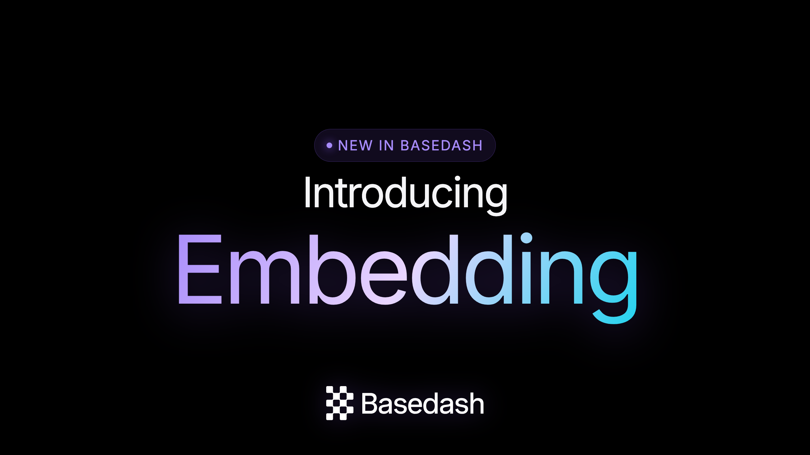
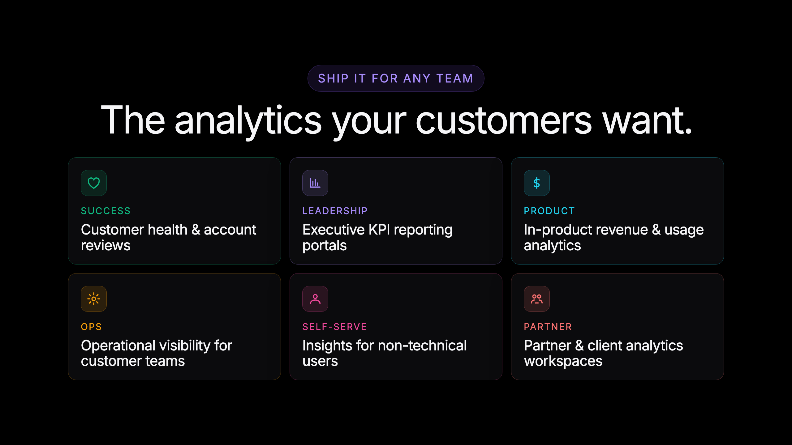
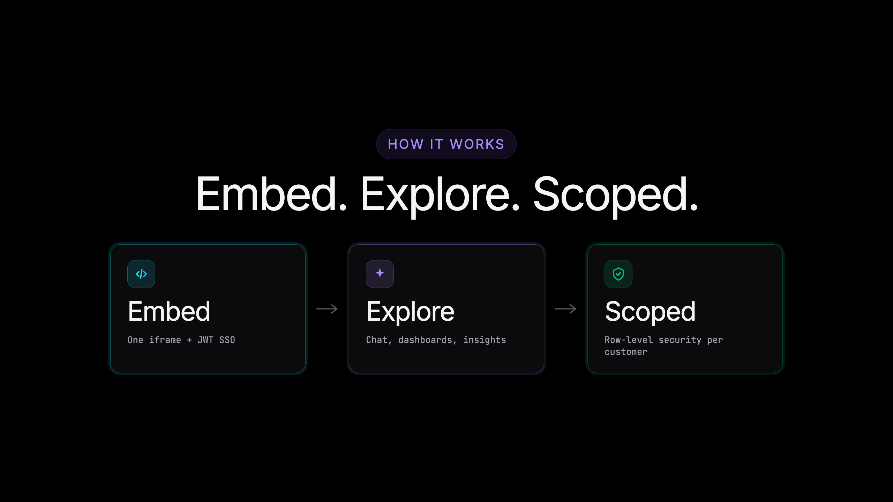

### 🎬 관련 영상
- [🎥 영상 보기](https://ph-files.imgix.net/9232cbfd-6a5c-4a91-994b-73e943b91b16.jpeg?auto=format)

---

## 11. [Screen Ruler](https://www.producthunt.com/products/screen-ruler)
**Votes**: 97 | **도입 난이도**: 하 | **신뢰도**: 상
**Tagline**: The go-to ruler for designers and developers
**서비스 링크**: https://www.producthunt.com/r/TAVA6CJ7J4ACNZ

**태그**: DesignTool, DeveloperTool, Frontend, UI/UX, Tailwind, Automation, AI Tool, Design, DevTool

### 📌 이 서비스 한눈에 보기
디자인 워크플로우에 최적화된 개발자 및 디자이너용 올인원 스크린 룰러

### 🔑 주요 기능
- Flexbox 및 Grid 레이아웃 시각적 분석 기능
- 컬러 스탑을 포함한 그라데이션 정밀 검사
- CSS를 Tailwind 클래스로 즉시 변환하는 기능

### 🙋 사용자에게 어떤 점이 좋은가
단순한 수치 측정을 넘어 레이아웃 구조 분석과 스타일 변환을 지원하여 디자인 구현 시간을 단축해 줍니다.

### ✅ 지금 바로 써볼 기능
- Flexbox/Grid 레이아웃 구조 분석해보기
- CSS 코드를 Tailwind로 변환해보기
- 페이지 탭에서 SEO 및 소셜 미리보기 확인하기

### ⚠️ 사용 전 확인할 점
- 브라우저 확장 프로그램 형태일 경우 브라우저 리소스 사용량 확인 필요
- 특정 프레임워크 환경에서의 호환성 확인 필요

### 🧭 확인이 더 필요한 정보
제품의 구체적인 설치 방식(확장 프로그램 또는 웹 앱)과 가격 정책에 대한 정보가 명시되지 않았습니다.

### 📸 스크린샷 및 갤러리
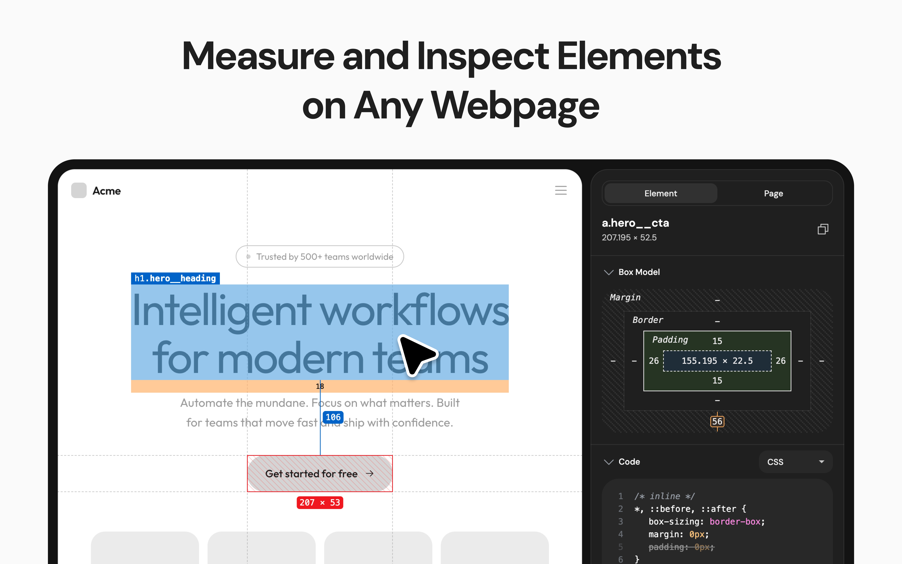
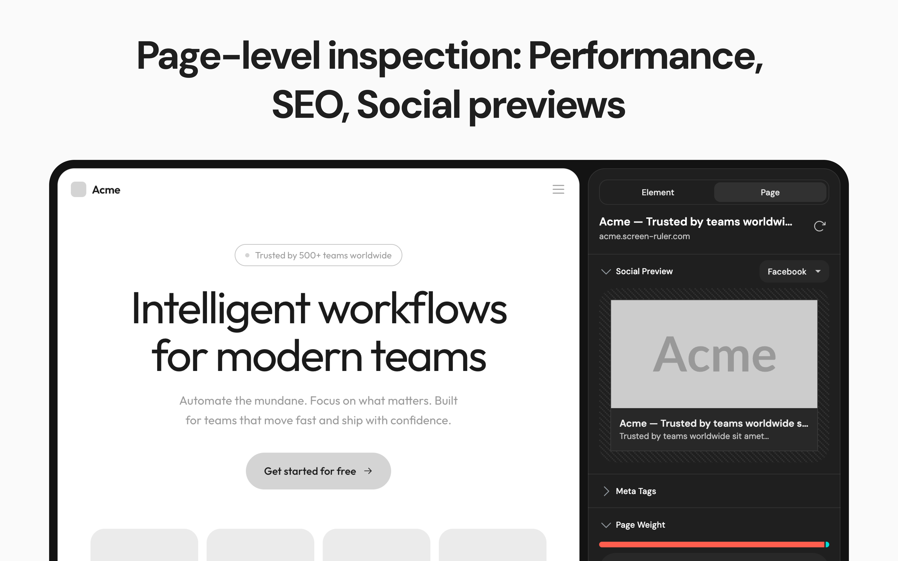
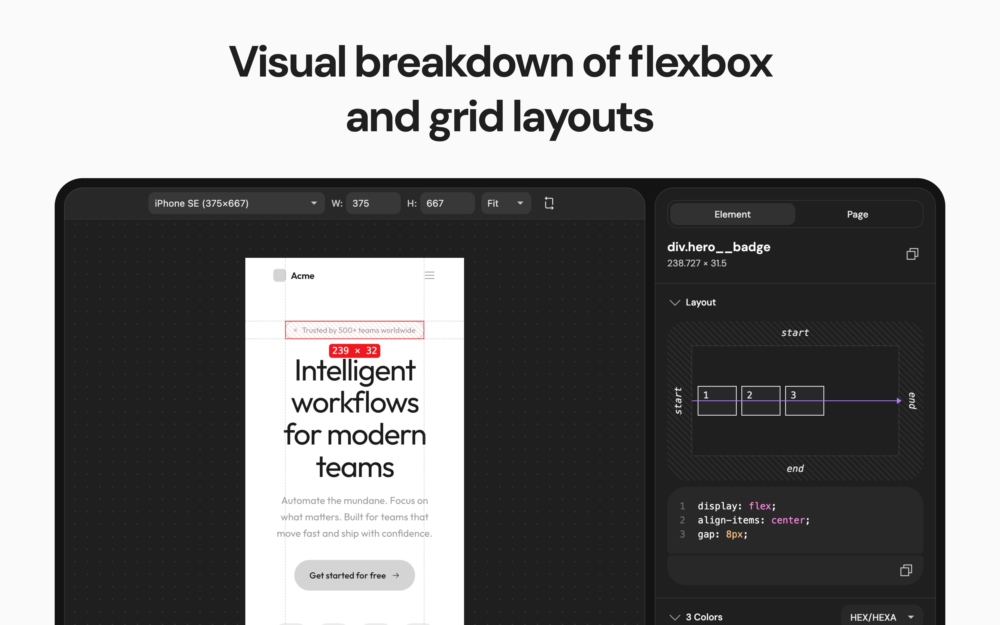

---

## 12. [Coffee Piano](https://www.producthunt.com/products/coffee-piano-harmony-lab)
**Votes**: 90 | **도입 난이도**: 하 | **신뢰도**: 상
**Tagline**: Browser music and piano studio with visual harmony tools
**서비스 링크**: https://www.producthunt.com/r/VNYWNJ3RKHQYIV

**태그**: MusicProduction, Education, WebTool, Composition, AI Tool

### 📌 이 서비스 한눈에 보기
시각적 화성 엔진을 탑재하여 작곡과 화성학 학습을 돕는 브라우저 기반 피아노 스튜디오

### 🔑 주요 기능
- 피아노 및 Rhodes 샘플, MIDI, 서스테인 페달을 지원하는 전문적인 브라우저 피아노 스튜디오
- 스케일과 코드를 원형 지도로 보여주는 시각적 화성 엔진(Orbit visuals) 제공
- 보이스 리딩과 코드 기능을 보여주는 화성 맵 및 원클릭 리하모니제이션 기능

### 🙋 사용자에게 어떤 점이 좋은가
이론적인 화성학을 시각적으로 직관적이게 풀어내어, 작곡가나 음악 학습자가 복잡한 코드 진행을 쉽고 빠르게 설계할 수 있도록 돕습니다.

### ✅ 지금 바로 써볼 기능
- Orbit visuals를 통해 스케일과 코드의 관계 시각화해보기
- 원클릭 리하모니제이션 기능으로 코드 진행 변형해보기
- 동기화된 기타 다이어그램을 통해 코드 폼 확인하기

### ⚠️ 사용 전 확인할 점
- 브라우저 기반 도구이므로 네트워크 환경이나 브라우저 성능에 따라 레이턴시가 발생할 수 있음
- 설치형 DAW에 비해 전문적인 오디오 편집 기능은 제한적일 수 있음

### 🧭 확인이 더 필요한 정보
사용자의 오디오 인터페이스나 MIDI 컨트롤러와의 호환성 수준에 대한 정보가 추가로 필요합니다.

### 📸 스크린샷 및 갤러리
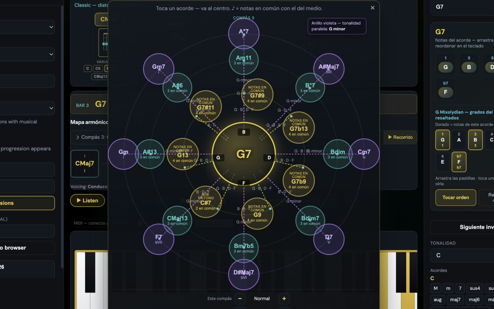
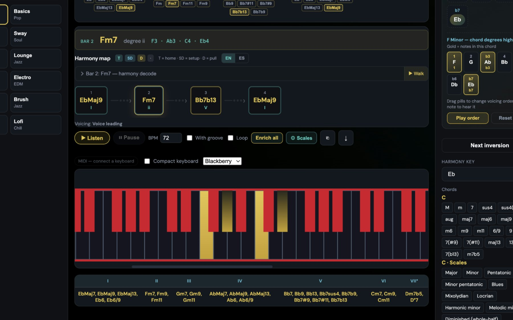
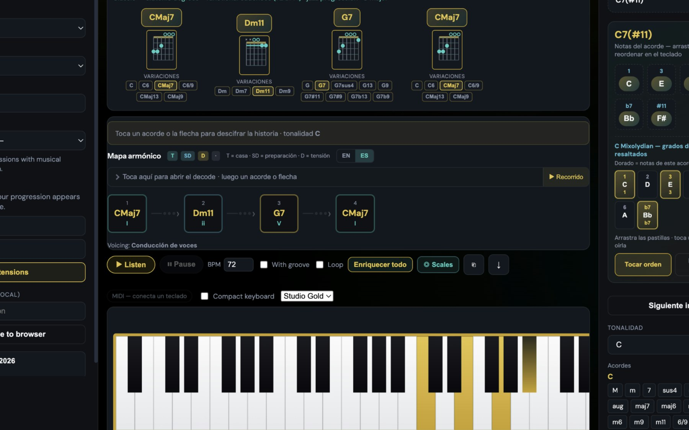

### 🎬 관련 영상
- [🎥 영상 보기](https://ph-files.imgix.net/7645548b-7c63-44c5-8b97-418ca360c303.jpeg?auto=format)

---

## 13. [Notchy](https://www.producthunt.com/products/notchy)
**Votes**: 88 | **도입 난이도**: 하 | **신뢰도**: 상
**Tagline**: Mac dynamic island with music, timers, clipboard, file drops
**서비스 링크**: https://www.producthunt.com/r/HNJQGKEDLX3EZ3

**태그**: macOS, Productivity, Utility

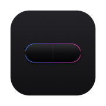

### 📌 이 서비스 한눈에 보기
맥북 노치를 활용해 음악, 타이머, 클립보드 등을 직관적으로 관리하는 다이내믹 아일랜드 스타일 앱

### 🔑 주요 기능
- 맥북 노치 영역을 활용한 유동적인 다이내믹 아일랜드 인터페이스 제공
- 음악 재생 컨트롤, 타이머, 클립보드 관리 등 실용적인 기능 통합
- 파일 드롭 및 HUD(Heads-up Display) 기능을 통한 작업 효율성 증대

### 🙋 사용자에게 어떤 점이 좋은가
화면 공간을 효율적으로 활용하면서도 작업 흐름을 방해하지 않고 주요 알림과 컨트롤을 한눈에 확인할 수 있습니다.

### ✅ 지금 바로 써볼 기능
- 음악 컨트롤러로 노치 활용해보기
- 타이머 및 클립보드 기능 테스트하기
- 파일 드롭 기능으로 작업 흐름 확인하기

### ⚠️ 사용 전 확인할 점
- 노치 디자인이 없는 맥북 모델에서는 사용이 제한될 수 있음
- 화면 상단 영역을 점유하므로 시각적 간섭이 발생할 수 있음

### 🧭 확인이 더 필요한 정보
애플 실리콘(M 시리즈) 외 인텔 맥에서의 최적화 수준 및 시스템 리소스 점유율 확인이 필요합니다.

### 📸 스크린샷 및 갤러리
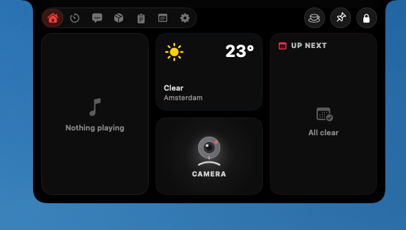
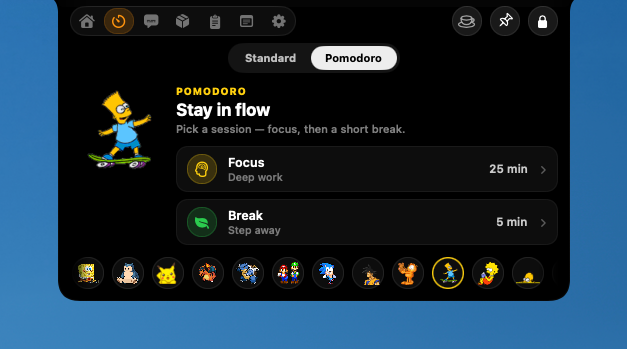
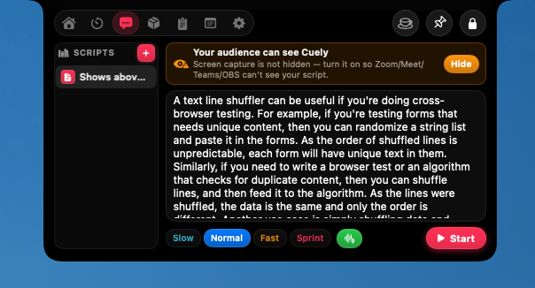

---

## 14. [MoDev](https://www.producthunt.com/products/modev)
**Votes**: 84 | **도입 난이도**: 중 | **신뢰도**: 상
**Tagline**: The AI dev environment built for your phone.
**서비스 링크**: https://www.producthunt.com/r/CO2WCLE7DBRGJA

**태그**: DevTool, AI, MobileDev, Automation, AI Tool, Chat, API, Email

### 📌 이 서비스 한눈에 보기
모바일에서 코드 배포부터 데이터베이스 관리까지 가능한 AI 개발 환경

### 🔑 주요 기능
- GitHub, Vercel, Supabase 등 주요 개발 도구와 연동되는 모바일 최적화 환경
- 자연어 채팅을 통한 코드 배포, PR 생성, 데이터베이스 쿼리 실행
- 이메일 및 캘린더 관리 등 업무 자동화 기능 통합

### 🙋 사용자에게 어떤 점이 좋은가
장소에 구애받지 않고 스마트폰만으로 개발 워크플로우를 관리하고 즉시 배포할 수 있습니다.

### ✅ 지금 바로 써볼 기능
- GitHub 저장소 연결 및 코드 읽기
- 자연어 채팅을 통한 데이터베이스 쿼리 실행
- 모바일 환경에서의 코드 배포 테스트

### ⚠️ 사용 전 확인할 점
- 모바일 환경 특성상 복잡한 코딩 작업에는 제약이 있을 수 있음
- BYOK(Bring Your Own Key) 정책 및 플랜별 AI 모델 제공 범위 확인 필요

### 🧭 확인이 더 필요한 정보
모바일 환경에서의 실제 코드 편집 및 디버깅 편의성에 대한 구체적인 정보가 필요합니다.

### 📸 스크린샷 및 갤러리
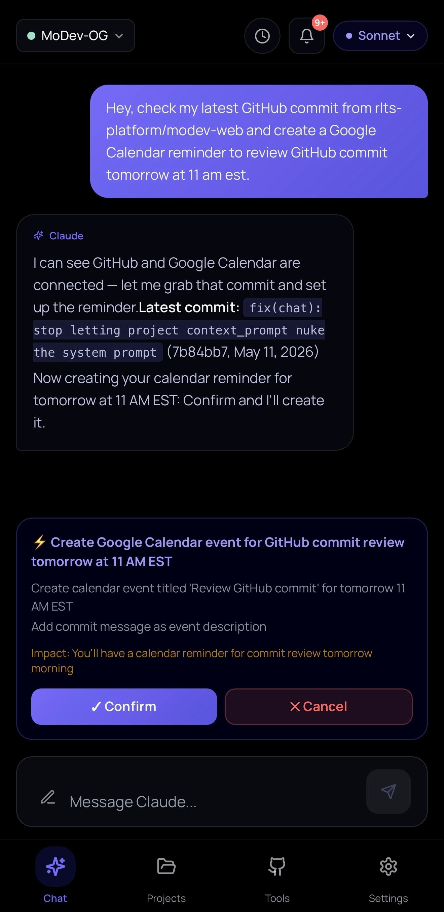
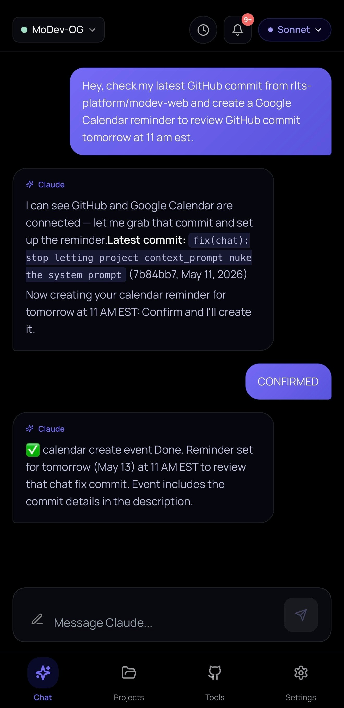
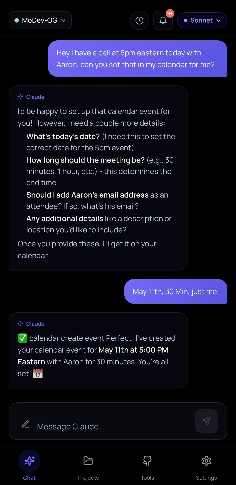

---

## 15. [TrackNotch](https://www.producthunt.com/products/tracknotch)
**Votes**: 82 | **도입 난이도**: 하 | **신뢰도**: 상
**Tagline**: LLM usage tracking that lives in your Mac's notch
**서비스 링크**: https://www.producthunt.com/r/XANUFDAFFQUI3Y

**태그**: DevTool, Productivity, macOS, OpenSource, AI, AI Tool, LLM

### 📌 이 서비스 한눈에 보기
맥북 노치에서 실시간으로 LLM 사용량을 확인하는 오픈소스 트래커

### 🔑 주요 기능
- Claude, OpenAI, Cursor 등 주요 LLM 사용량 실시간 모니터링
- 맥북 노치 영역을 활용한 직관적인 UI 제공
- 로컬 기반 동작으로 프라이버시 및 보안 강화 (No telemetry)

### 🙋 사용자에게 어떤 점이 좋은가
LLM 사용량을 별도 창 없이 노치에서 즉시 확인하여 작업 흐름을 방해받지 않고 예산과 사용량을 관리할 수 있습니다.

### ✅ 지금 바로 써볼 기능
- 주요 LLM 서비스 연동 및 사용량 확인
- 노치 UI를 통한 실시간 컨텍스트 아크 모니터링
- 설정된 예산 내에서의 사용량 추적

### ⚠️ 사용 전 확인할 점
- macOS 전용 앱이므로 다른 OS에서는 사용 불가
- 노치 디자인이 없는 맥 모델에서는 UI 활용도가 낮을 수 있음

### 🧭 확인이 더 필요한 정보
각 LLM 서비스의 API 연동 방식 및 구체적인 설치 과정에 대한 정보가 추가로 필요합니다.

### 📸 스크린샷 및 갤러리

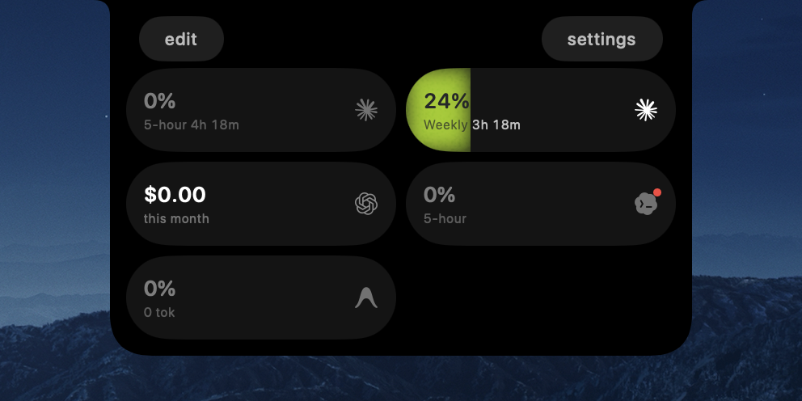

---

## 16. [RabbitTravel](https://www.producthunt.com/products/rabbittravel)
**Votes**: 79 | **도입 난이도**: 하 | **신뢰도**: 상
**Tagline**: Smart travel planning made effortless
**서비스 링크**: https://www.producthunt.com/r/WT3IMGE7DCR64G

**태그**: AI, Travel, Planning, Optimization, AI Tool

### 📌 이 서비스 한눈에 보기
AI 기반의 지능형 경로 최적화로 복잡한 여행 계획을 간편하게 해결하는 플랫폼

### 🔑 주요 기능
- 전 세계 모든 목적지를 대상으로 하는 AI 기반 맞춤형 일정 생성
- 거리, 시간, 개인 취향을 고려한 동적 스케줄 조정 기능
- 실시간 교통 정보와 지능형 경로 최적화 결합

### 🙋 사용자에게 어떤 점이 좋은가
복잡한 여행 동선과 이동 시간을 일일이 계산할 필요 없이, 최적화된 효율적인 여행 일정을 즉시 얻을 수 있습니다.

### ✅ 지금 바로 써볼 기능
- 목적지 설정 후 AI 자동 일정 생성 기능 테스트
- 개인 취향 반영을 통한 맞춤형 추천 확인
- 실시간 교통 상황에 따른 일정 변경 기능 확인

### ⚠️ 사용 전 확인할 점
- 실시간 교통 데이터의 정확도 및 현지 상황 반영 여부 확인 필요
- 개인별 선호도가 반영된 결과가 실제 여행 동선과 일치하는지 검토 필요

### 🧭 확인이 더 필요한 정보
실시간 교통 정보 연동의 구체적인 범위와 예약 시스템과의 직접적인 연동 여부가 명시되지 않았습니다.

### 📸 스크린샷 및 갤러리
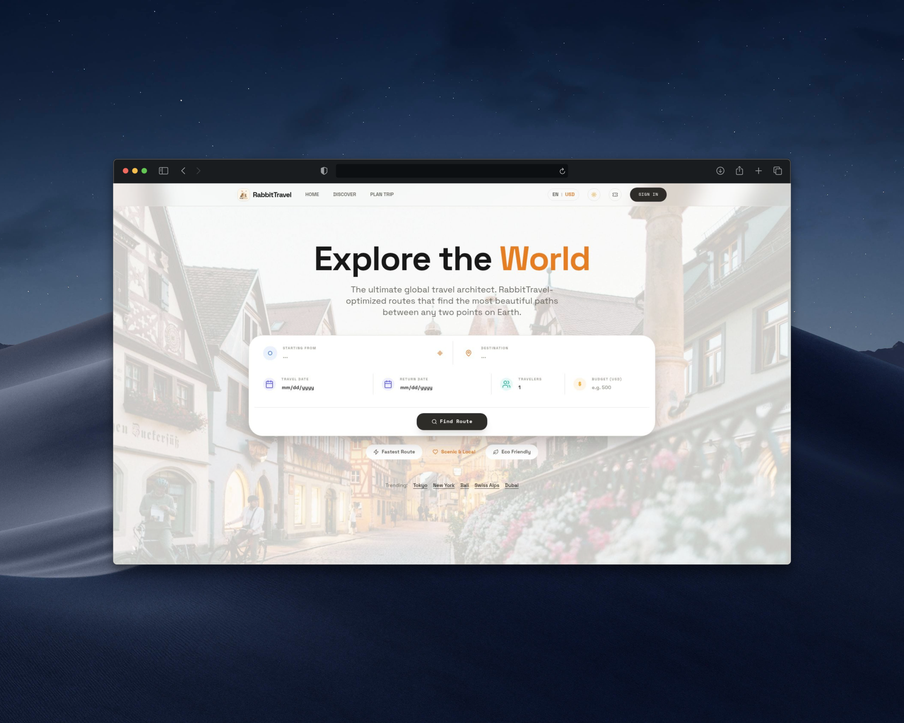
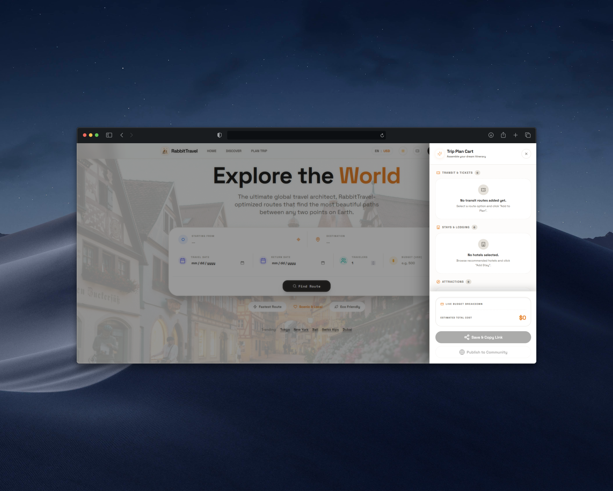
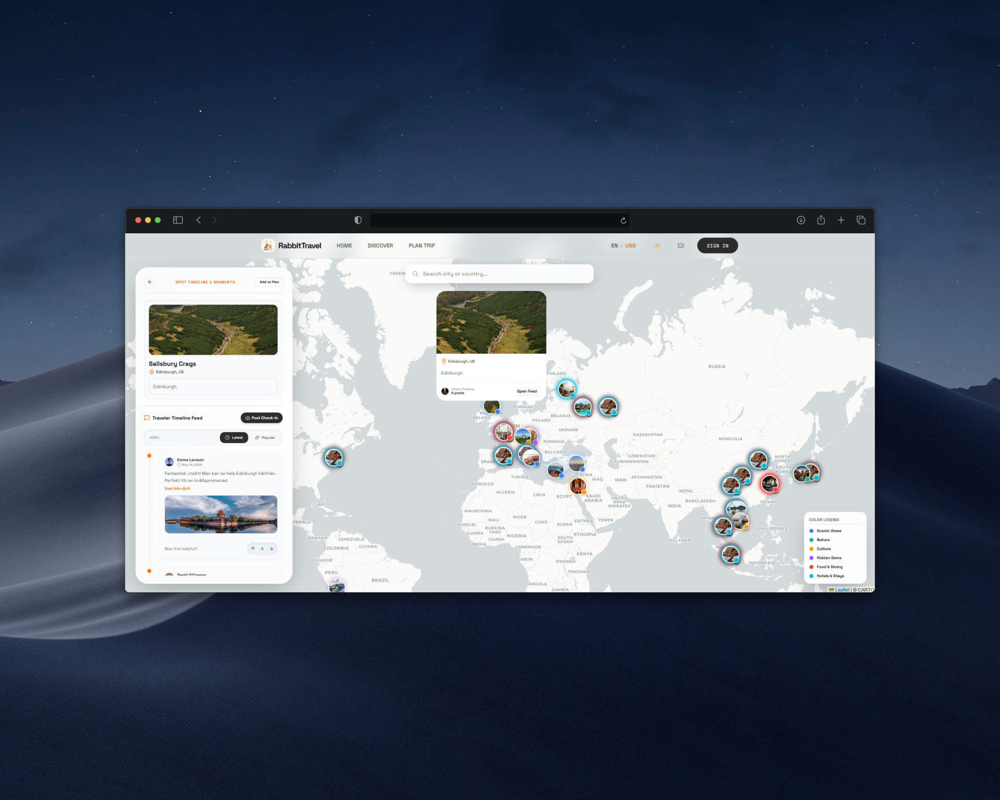

---

## 17. [Clipline](https://www.producthunt.com/products/clipline-2)
**Votes**: 79 | **도입 난이도**: 하 | **신뢰도**: 상
**Tagline**: AI Video Cutter for viral Shorts, Reels, TikTok in Telegram
**서비스 링크**: https://www.producthunt.com/r/VB3DSQOCEOASRL

**태그**: AI, VideoEditing, Automation, TelegramBot, ContentCreation, AI Tool, Video

### 📌 이 서비스 한눈에 보기
텔레그램에서 긴 영상을 90초 만에 숏폼 콘텐츠로 변환해주는 AI 클리핑 봇

### 🔑 주요 기능
- Gemini AI 기반의 스마트 클리핑 (문맥 끊김 방지)
- 텔레그램 내에서 공유만으로 즉시 작업 가능한 간편한 워크플로우
- 자막 커스텀, 워터마크 삽입 및 영어 자동 번역 기능 지원

### 🙋 사용자에게 어떤 점이 좋은가
콘텐츠 제작자가 별도의 편집 프로그램 없이 텔레그램 내에서 빠르게 숏폼 소스를 생성하고 배포할 수 있습니다.

### ✅ 지금 바로 써볼 기능
- 유튜브 링크를 텔레그램으로 공유하여 90초 클리핑 테스트하기
- 자동 번역 기능을 활용해 글로벌 타겟용 자막 생성해보기
- 커스텀 자막과 워터마크를 적용해 브랜드 스타일 입히기

### ⚠️ 사용 전 확인할 점
- AI 자동 편집이므로 최종 결과물의 편집 완성도는 수동 작업보다 낮을 수 있음
- 파일 자동 삭제 정책(3시간)으로 인해 작업 결과물을 즉시 백업해야 함

### 🧭 확인이 더 필요한 정보
사용량 기반 결제 방식의 구체적인 단가와 크레딧 정책 확인이 필요합니다.

### 📸 스크린샷 및 갤러리

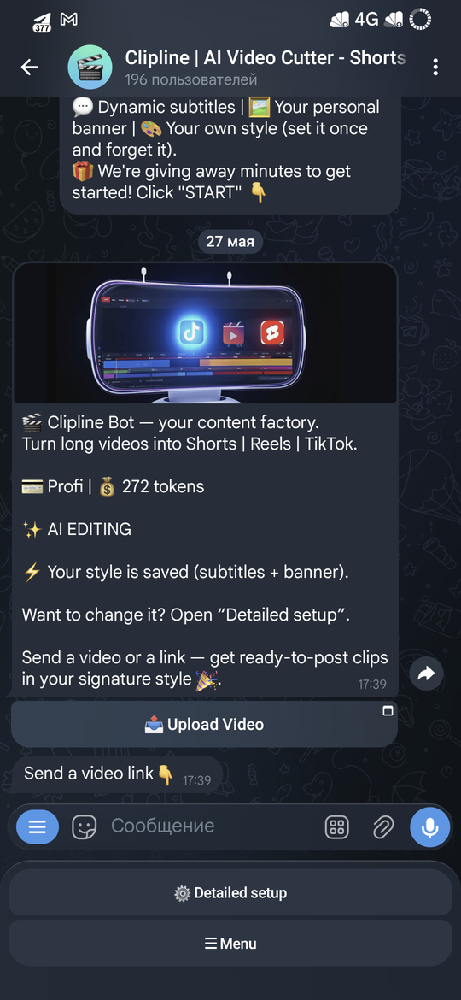
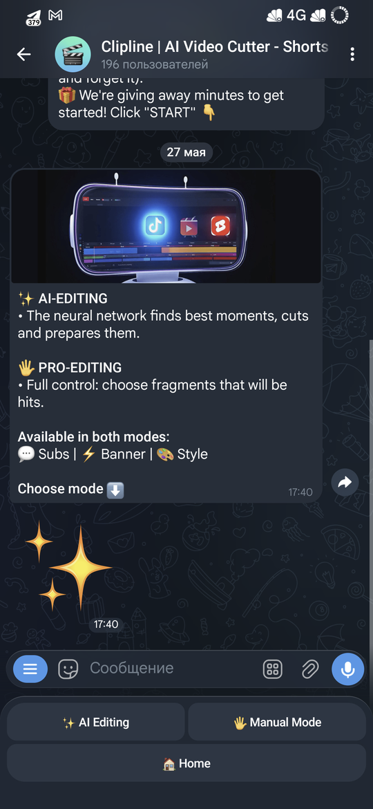

### 🎬 관련 영상
- [🎥 영상 보기](https://ph-files.imgix.net/b71effe5-0dba-4ef5-9c85-ab4efa129959.jpeg?auto=format)

---

## 18. [PromptLayer](https://www.producthunt.com/products/promptlayer-2)
**Votes**: 75 | **도입 난이도**: 중 | **신뢰도**: 상
**Tagline**: Trace AI requests, workflows, and costs in one timeline
**서비스 링크**: https://www.producthunt.com/r/FYLHI3GLE3KTDH

**태그**: DevTool, AI, Observability, Analytics, Automation, AI Tool, Prompting

### 📌 이 서비스 한눈에 보기
AI 애플리케이션의 요청, 워크플로우, 비용을 한눈에 추적하는 개발자용 옵저버빌리티 도구

### 🔑 주요 기능
- 단일 타임라인 및 워터폴 뷰를 통한 AI 요청 및 워크플로우 추적
- 토큰 사용량, 지연 시간(Latency), 비용 및 실패 지점 시각화
- 멀티 스텝 AI 시스템의 전체 실행 경로 추적 및 디버깅 지원

### 🙋 사용자에게 어떤 점이 좋은가
복잡한 AI 워크플로우 내에서 어디서 병목이 발생하는지, 비용이 어디서 발생하는지 즉각적으로 파악하여 애플리케이션을 최적화할 수 있습니다.

### ✅ 지금 바로 써볼 기능
- 타임라인 뷰를 통한 워크플로우 실행 경로 확인
- 실패한 요청의 상세 로그 및 디버깅
- 토큰 사용량 및 비용 분석

### ⚠️ 사용 전 확인할 점
- 데이터 보안 및 프라이버시 정책 확인 필요
- 기존 시스템과의 통합 방식 및 연동 난이도 검토

### 🧭 확인이 더 필요한 정보
구체적인 가격 정책과 기존 개발 스택과의 통합 편의성에 대한 정보가 명시되지 않았습니다.

### 📸 스크린샷 및 갤러리
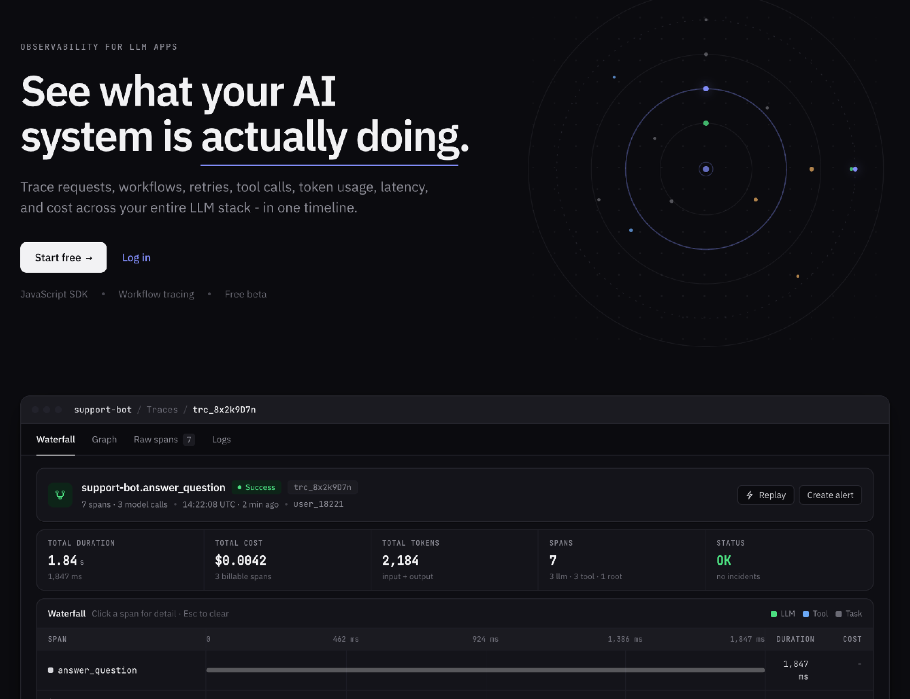
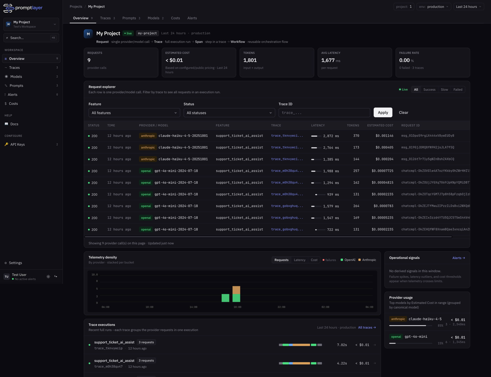
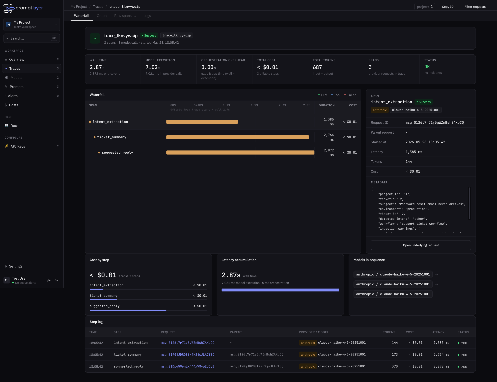

---

## 19. [GPS](https://www.producthunt.com/products/gps-2)
**Votes**: 73 | **도입 난이도**: 하 | **신뢰도**: 상
**Tagline**: Memory layer for LLMs that stores repo rules + past lessons
**서비스 링크**: https://www.producthunt.com/r/VWVFWSTQX5JNSD

**태그**: DevTool, AI-Agent, Productivity, CLI, Agent, AI Tool, LLM

### 📌 이 서비스 한눈에 보기
코딩 에이전트의 반복적인 실수를 방지하고 프로젝트 규칙을 기억하는 지능형 메모리 레이어

### 🔑 주요 기능
- 코드 저장소의 규칙, 결정 사항, 테스트 명령 등을 학습하여 에이전트에게 제공
- 세션이 종료되어도 사라지지 않는 영구적인 컨텍스트 유지
- 파일 및 심볼 기반의 정밀한 메모리 관리로 불필요한 컨텍스트 낭비 방지

### 🙋 사용자에게 어떤 점이 좋은가
매번 같은 코딩 규칙을 다시 설명하거나 에이전트의 반복적인 실수를 수정해야 하는 번거로움을 획기적으로 줄여줍니다.

### ✅ 지금 바로 써볼 기능
- 현재 사용 중인 IDE(Cursor 등) 또는 CLI 환경에 설치
- 프로젝트의 핵심 규칙과 테스트 명령어를 GPS에 학습시키기
- 에이전트가 학습한 내용을 바탕으로 코드를 수정하는 과정 테스트

### ⚠️ 사용 전 확인할 점
- 로컬 우선(Local-first) 방식이므로 팀 단위 공유 시 동기화 방식 확인 필요
- 에이전트가 잘못된 정보를 학습할 경우 잘못된 코드가 반복 생성될 위험

### 🧭 확인이 더 필요한 정보
다양한 에이전트 도구들과의 구체적인 통합 방식 및 팀 협업을 위한 동기화 기능에 대한 상세 정보가 필요합니다.

### 📸 스크린샷 및 갤러리

---

## 20. [Vibeocus Lens](https://www.producthunt.com/products/vibeocus-lens)
**Votes**: 72 | **도입 난이도**: 중 | **신뢰도**: 상
**Tagline**: Bridge your live frontend directly to your AI agent.
**서비스 링크**: https://www.producthunt.com/r/37YMIBT3A3L35K

**태그**: DevTool, AI-Agent, Frontend, Automation, Agent, AI Tool

### 📌 이 서비스 한눈에 보기
브라우저의 DOM과 시각적 상태를 AI 에이전트로 즉시 전달하는 프론트엔드 디버깅 도구

### 🔑 주요 기능
- DOM 노드 및 시각적 상태의 정밀한 캡처
- MCP(Model Context Protocol)를 통한 로컬 워크스페이스로의 실시간 스트리밍
- 수동 스크린샷 및 HTML 복사 작업의 자동화

### 🙋 사용자에게 어떤 점이 좋은가
프론트엔드 버그 수정 시 코드를 일일이 복사할 필요 없이, AI 에이전트가 실제 브라우저 상태를 즉각 파악하여 해결책을 제시할 수 있습니다.

### ✅ 지금 바로 써볼 기능
- 브라우저 확장 프로그램 설치 및 MCP 설정
- 특정 DOM 노드 캡처 및 AI 에이전트 연동 테스트
- 실제 프론트엔드 버그 상황에서의 데이터 전송 정확도 확인

### ⚠️ 사용 전 확인할 점
- 로컬 워크스페이스와 브라우저 간의 보안 및 데이터 권한 설정 필요
- MCP 환경 구축에 따른 초기 설정 복잡도

### 🧭 확인이 더 필요한 정보
MCP를 통한 데이터 스트리밍 시 로컬 환경과의 구체적인 연결 방식과 보안 프로토콜에 대한 상세 정보가 필요합니다.

### 📸 스크린샷 및 갤러리
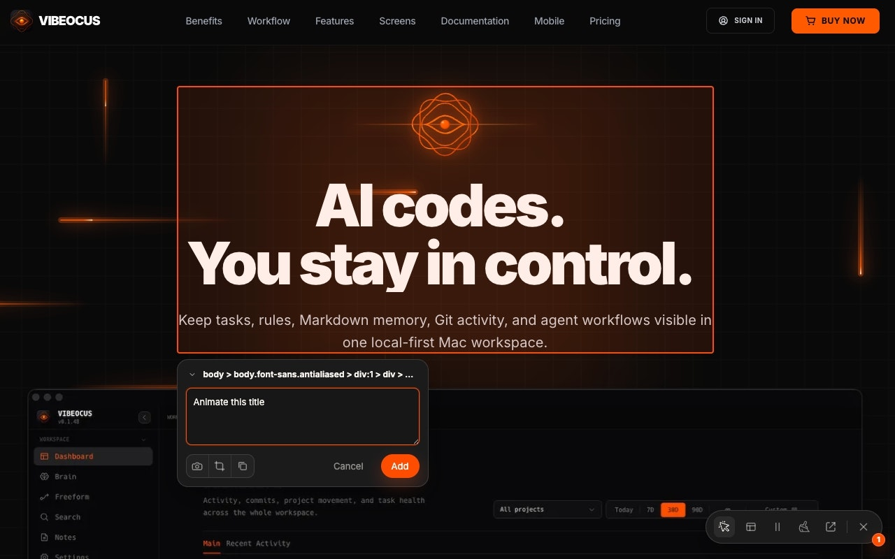
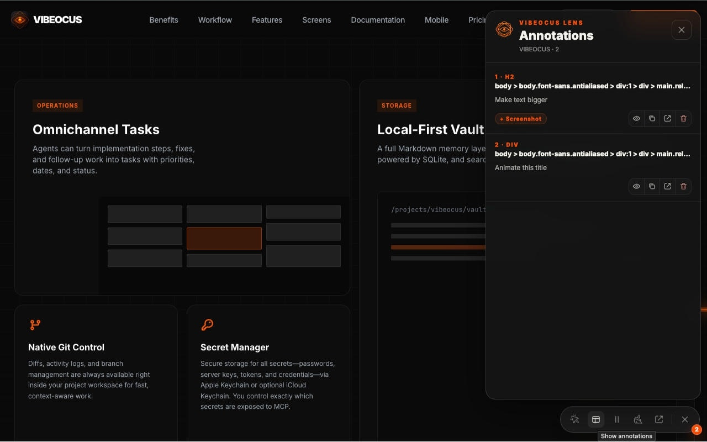
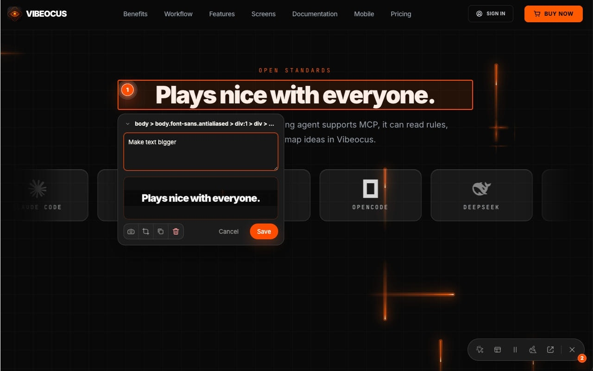

### 🎬 관련 영상
- [🎥 영상 보기](https://ph-files.imgix.net/0262b9ad-a465-4fed-bc72-51a3b317b447.jpeg?auto=format)

---

## 21. [Vibeocus Lens](https://www.producthunt.com/products/vibeocus-lens)
**Votes**: 72 | **도입 난이도**: 중 | **신뢰도**: 상
**Tagline**: Bridge your live frontend directly to your AI agent.
**서비스 링크**: https://www.producthunt.com/r/37YMIBT3A3L35K

**태그**: DevTool, AI-Agent, Frontend, Automation, Agent, AI Tool

### 📌 이 서비스 한눈에 보기
브라우저의 DOM과 시각적 상태를 AI 에이전트로 즉시 전달하는 프론트엔드 디버깅 도구

### 🔑 주요 기능
- DOM 노드 및 시각적 상태의 정밀한 캡처
- MCP(Model Context Protocol)를 통한 로컬 워크스페이스로의 실시간 스트리밍
- 수동 스크린샷 및 HTML 복사 작업의 자동화

### 🙋 사용자에게 어떤 점이 좋은가
프론트엔드 버그 수정 시 코드를 일일이 복사할 필요 없이, AI 에이전트가 실제 브라우저 상태를 즉각 파악하여 해결책을 제시할 수 있습니다.

### ✅ 지금 바로 써볼 기능
- 브라우저 확장 프로그램 설치 및 MCP 설정
- 특정 DOM 노드 캡처 및 AI 에이전트 연동 테스트
- 실제 프론트엔드 버그 상황에서의 데이터 전송 정확도 확인

### ⚠️ 사용 전 확인할 점
- 로컬 워크스페이스와 브라우저 간의 보안 및 데이터 권한 설정 필요
- MCP 환경 구축에 따른 초기 설정 복잡도

### 🧭 확인이 더 필요한 정보
MCP를 통한 데이터 스트리밍 시 로컬 환경과의 구체적인 연결 방식과 보안 프로토콜에 대한 상세 정보가 필요합니다.

### 📸 스크린샷 및 갤러리

### 🎬 관련 영상
- [🎥 영상 보기](https://ph-files.imgix.net/0262b9ad-a465-4fed-bc72-51a3b317b447.jpeg?auto=format)

---

## 22. [Hyper](https://www.producthunt.com/products/hyper-11)
**Votes**: 65 | **도입 난이도**: 중 | **신뢰도**: 상
**Tagline**: Self-driving company brain that plugs into your AI agents
**서비스 링크**: https://www.producthunt.com/r/4MEGWCIGI2SVAD

**태그**: AI, Automation, KnowledgeManagement, Productivity, Agent, AI Tool, Email

### 📌 이 서비스 한눈에 보기
사내 모든 데이터를 학습하여 AI 에이전트를 숙련된 전문가로 변모시키는 기업용 지식 엔진

### 🔑 주요 기능
- Slack, 이메일, 문서 등 사내 전반의 데이터를 학습하는 '기업용 브레인' 역할
- 학습된 지식을 바탕으로 AI 에이전트의 업무 수행 능력 극대화
- 이메일 초안 작성, 계약서 검토, 티켓 분류 등 실무 자동화 지원

### 🙋 사용자에게 어떤 점이 좋은가
회사의 모든 맥락을 이해하는 AI를 통해 단순 반복 업무를 넘어 실제 업무를 수행할 수 있는 수준의 자동화를 구현할 수 있습니다.

### ✅ 지금 바로 써볼 기능
- 사내 주요 데이터 소스(Slack, Docs 등) 연동하기
- 특정 업무(이메일 작성, 티켓 분류 등)를 위한 AI 에이전트 설정하기
- AI가 생성한 결과물의 정확도 및 톤앤매너 검증하기

### ⚠️ 사용 전 확인할 점
- 민감한 사내 데이터(계약서, 개인정보 등)가 외부 AI 모델로 전송되는 것에 대한 보안 검토 필요
- 데이터 소스 연동 시 권한 설정 및 데이터 접근 범위 관리 필요

### 🧭 확인이 더 필요한 정보
데이터 보안 및 프라이버시 보호를 위한 구체적인 보안 프로토콜과 데이터 격리 방식에 대한 확인이 필요합니다.

### 📸 스크린샷 및 갤러리

---

## 23. [Drafted](https://www.producthunt.com/products/drafted-4)
**Votes**: 65 | **도입 난이도**: 하 | **신뢰도**: 상
**Tagline**: Design a home instantly with AI
**서비스 링크**: https://www.producthunt.com/r/ZMOC66MD2EBJAO

**태그**: AI Design, Architecture, 3D Modeling, Home Design, AI Tool, Design

### 📌 이 서비스 한눈에 보기
AI를 활용해 아이디어 스케치만으로 즉시 완성되는 3D 홈 디자인 솔루션

### 🔑 주요 기능
- 사용자가 그린 평면도를 기반으로 평면도, 입면도, 3D 디자인 자동 생성
- 레이아웃 커스터마이징 및 CAD/PDF 파일 내보내기 지원
- 한 달간 12만 명 이상의 사용자가 참여한 높은 검증도와 빠른 생성 속도

### 🙋 사용자에게 어떤 점이 좋은가
복잡한 설계 소프트웨어 숙련도 없이도 누구나 쉽고 빠르게 꿈꾸던 집의 구조를 시각화하고 구체화할 수 있습니다.

### ✅ 지금 바로 써볼 기능
- 원하는 집의 평면도(Footprint) 그려보기
- 생성된 3D 디자인 및 레이아웃 커스터마이징
- 결과물을 CAD 또는 PDF 파일로 내보내기

### ⚠️ 사용 전 확인할 점
- AI 생성 결과물이 실제 건축 법규나 구조적 안정성을 완벽히 반영하는지 확인 필요
- 전문적인 건축 설계로 넘어가기 전 아이디어 구상 단계의 도구로 활용 권장

### 🧭 확인이 더 필요한 정보
상세한 유료 플랜 정책 및 전문 설계 소프트웨어와의 호환성 수준에 대한 정보가 추가로 필요합니다.

### 📸 스크린샷 및 갤러리
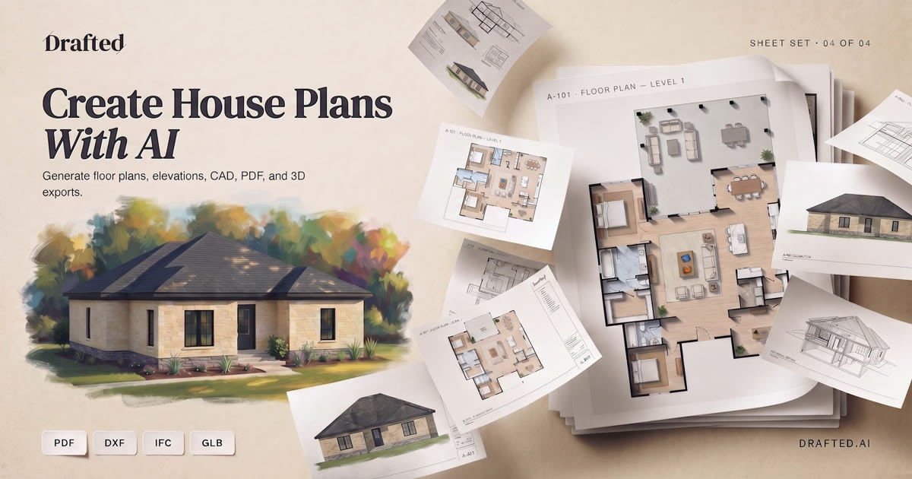
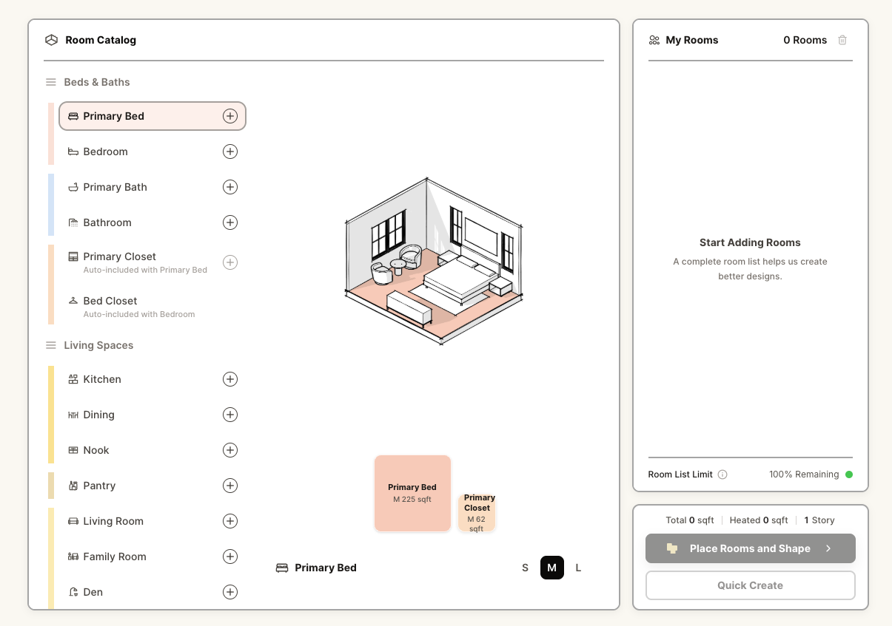
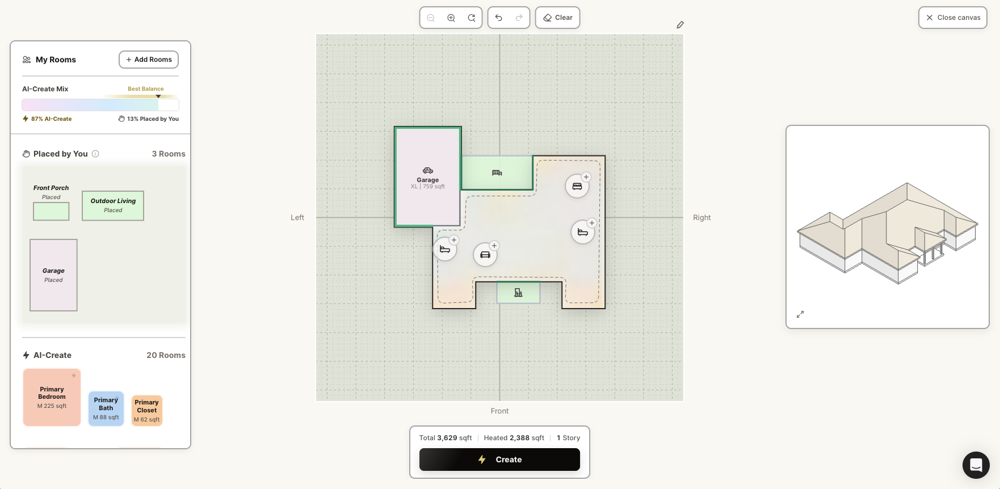

### 🎬 관련 영상
- [🎥 영상 보기](https://ph-files.imgix.net/a37dba25-8baf-4a0c-a52f-207f198063cc.jpeg?auto=format)

---

## 24. [KeptWell](https://www.producthunt.com/products/keptwell)
**Votes**: 29 | **도입 난이도**: 하 | **신뢰도**: 상
**Tagline**: Your family's medical binder, replaced.
**서비스 링크**: https://www.producthunt.com/r/KT5WZSYVZMV37Q

**태그**: HealthTech, AI, FamilyCare, DataManagement, AI Tool, Design

### 📌 이 서비스 한눈에 보기
가족의 복잡한 의료 기록을 AI로 통합 관리하는 스마트 의료 바인더

### 🔑 주요 기능
- 검사 결과, 진단서, 진료 녹음 등 다양한 의료 데이터 자동 정리
- AI 기반의 타임라인 생성 및 데이터 통합 관리
- 가족 구성원 간의 실시간 정보 공유 및 협업

### 🙋 사용자에게 어떤 점이 좋은가
중증 질환이나 노부모 간병 시 발생하는 방대한 의료 기록을 한곳에 모아 가족 모두가 상황을 쉽게 파악할 수 있습니다.

### ✅ 지금 바로 써볼 기능
- 기존 의료 문서 및 검사 결과 업로드하기
- AI가 생성한 통합 타임라인 확인하기
- 가족 구성원 초대하여 정보 공유하기

### ⚠️ 사용 전 확인할 점
- 민감한 의료 데이터가 포함되므로 보안 및 개인정보 보호 정책 확인 필요
- AI의 데이터 해석이 의학적 진단을 대체할 수 없음을 유의

### 🧭 확인이 더 필요한 정보
데이터 보안 방식과 구체적인 개인정보 보호 기술에 대한 상세 정보 확인이 필요합니다.

### 📸 스크린샷 및 갤러리
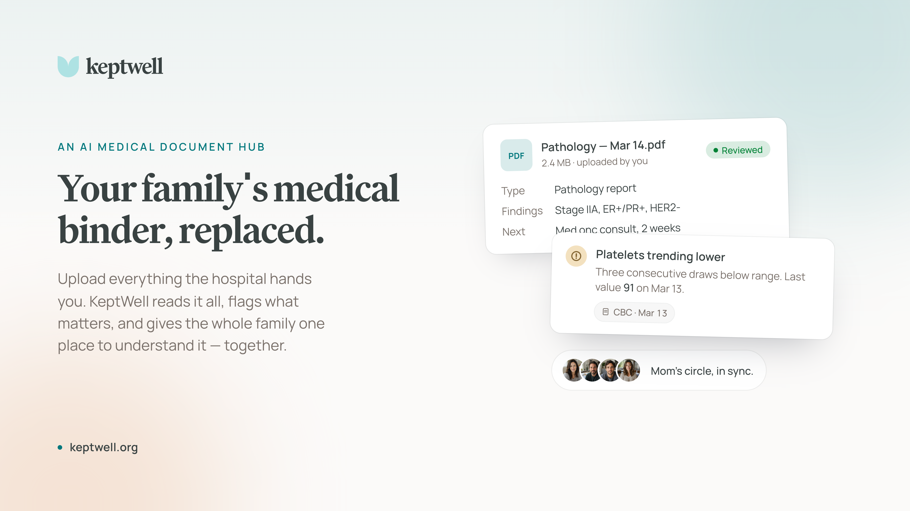
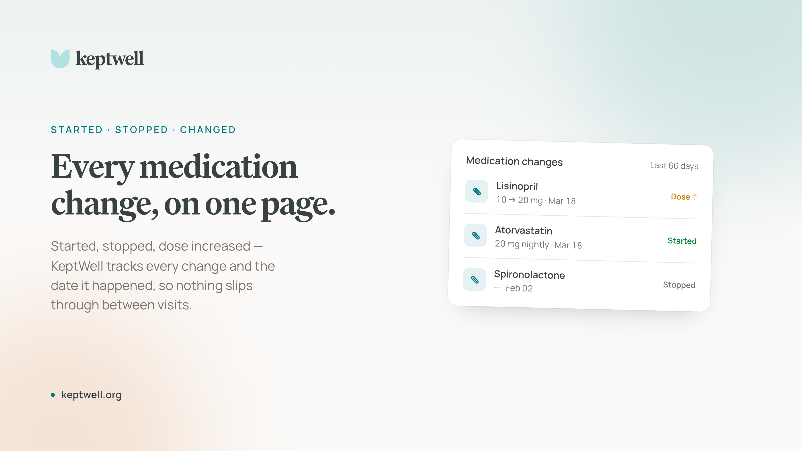
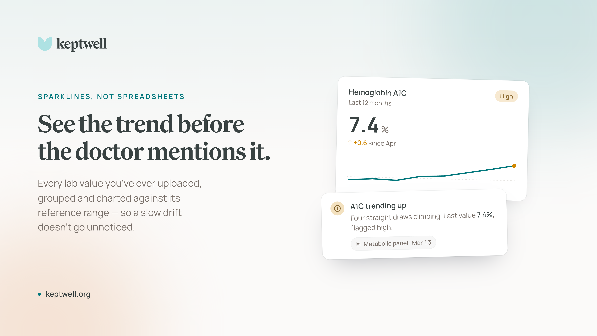

---

## 25. [bot4U](https://www.producthunt.com/products/bot4u)
**Votes**: 27 | **도입 난이도**: 하 | **신뢰도**: 상
**Tagline**: Build custom AI chatbots for your business in 3 easy Steps
**서비스 링크**: https://www.producthunt.com/r/DZ24FD55OWNXQE

**태그**: AI, NoCode, Chatbot, SaaS, Automation, AI Tool, Chat, DevTool

### 📌 이 서비스 한눈에 보기
코딩 없이 단 3단계로 비즈니스용 맞춤형 AI 챗봇을 구축하는 서비스

### 🔑 주요 기능
- 노코드(No-code) 기반의 간편한 챗봇 생성 프로세스
- 웹사이트에 즉시 도입 가능한 Chatbot-as-a-Service 모델
- 복잡한 개발 과정 없이 몇 분 만에 개인용/비즈니스용 AI 어시스턴트 구축 가능

### 🙋 사용자에게 어떤 점이 좋은가
직접 AI를 개발할 기술적 역량이 없어도 비즈니스에 필요한 자동 응답 시스템을 빠르게 도입할 수 있습니다.

### ✅ 지금 바로 써볼 기능
- 3단계 설정 프로세스 테스트
- 웹사이트 연동 기능 확인
- 맞춤형 챗봇 응답 품질 테스트

### ⚠️ 사용 전 확인할 점
- 코딩 없이 구축되므로 복잡한 커스텀 기능 구현에는 한계가 있을 수 있음
- 제공되는 템플릿 외의 고도화된 기능 지원 여부 확인 필요

### 🧭 확인이 더 필요한 정보
구체적인 기능 범위와 외부 서비스와의 연동 가능 여부에 대한 정보가 부족합니다.

### 📸 스크린샷 및 갤러리
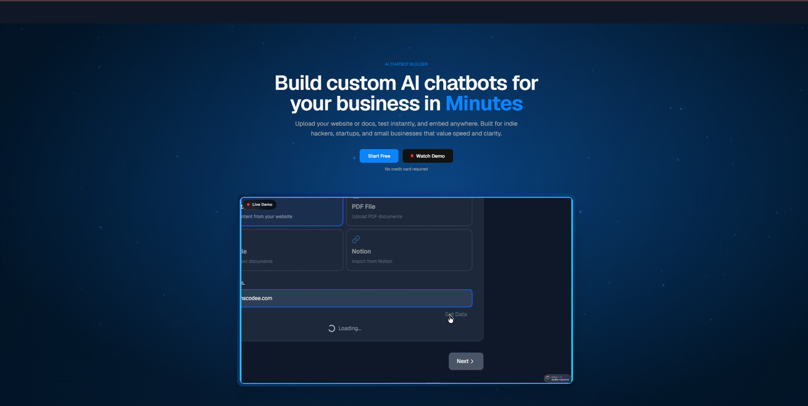
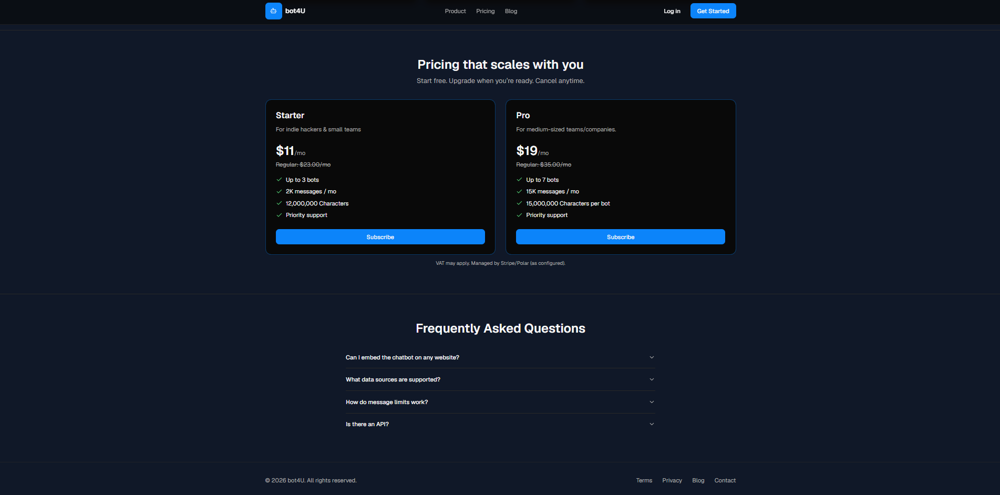
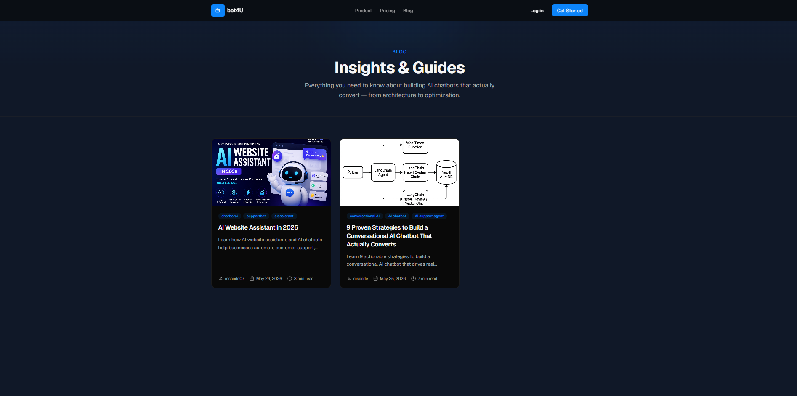

---

## 26. [FixMyCWV](https://www.producthunt.com/products/fixmycwv)
**Votes**: 22 | **도입 난이도**: 하 | **신뢰도**: 상
**Tagline**: Deep PageSpeed audit with GTM Inspector. Code fixes included
**서비스 링크**: https://www.producthunt.com/r/GHXGIMNMCODI3K

**태그**: DevTool, Performance, GTM, WebAudit

### 📌 이 서비스 한눈에 보기
GTM 이슈를 포함한 웹 성능 문제를 구체적인 코드 수정안과 함께 제공하는 전문적인 페이지스피드 감사 도구

### 🔑 주요 기능
- GTM(Google Tag Manager) 태그, 트리거, 변수를 분석하는 독보적인 인스펙터 기능 탑재
- 단순 문제 지적을 넘어 수정할 파일, 전/후 코드, 예상 작업 시간 등 구체적인 가이드 제공
- 봇 보호가 적용된 사이트에서도 작동하며, 전문가 수준의 감사 리포트를 저렴한 비용으로 제공

### 🙋 사용자에게 어떤 점이 좋은가
개발자에게 무엇을 고쳐야 할지 일일이 설명할 필요 없이, 즉시 적용 가능한 코드 수정안을 전달하여 작업 효율을 극대화할 수 있습니다.

### ✅ 지금 바로 써볼 기능
- 무료 첫 감사 리포트 생성해보기
- GTM 설정으로 인한 성능 저하 여부 확인하기
- 제공되는 코드 수정 가이드 검토하기

### ⚠️ 사용 전 확인할 점
- 유료 리포트 비용($9/report) 발생
- 제공된 코드 수정안을 실제 환경에 적용하기 전 사전 테스트 필수

### 🧭 확인이 더 필요한 정보
특정 CMS나 프레임워크 환경에서의 호환성 및 자동화된 코드 적용 범위에 대한 추가 확인이 필요합니다.

### 📸 스크린샷 및 갤러리
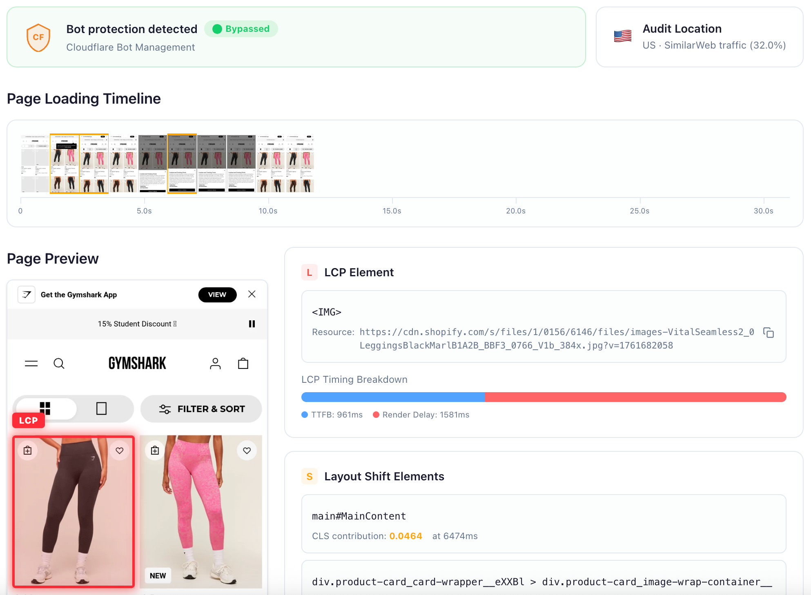
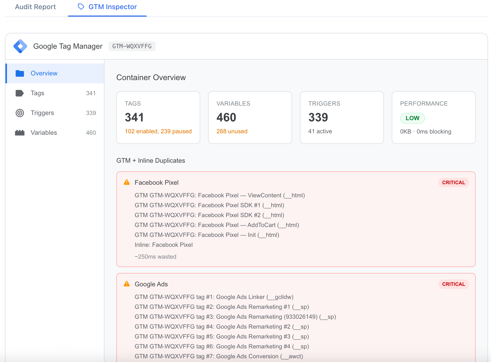
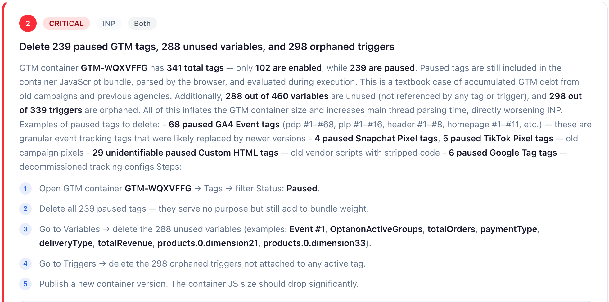

---

## 27. [AgentVet.ai](https://www.producthunt.com/products/agentvet-ai)
**Votes**: 12 | **도입 난이도**: 하 | **신뢰도**: 상
**Tagline**: AI agent reviews, benchmarks & live token pricing
**서비스 링크**: https://www.producthunt.com/r/2O2QOYMKKYYBKD

**태그**: AI, Agent, Review, Comparison, Analytics, AI Tool

### 📌 이 서비스 한눈에 보기
AI 에이전트의 성능 검증부터 가격 비교까지 한 번에 해결하는 통합 리뷰 플랫폼

### 🔑 주요 기능
- AI 에이전트 탐색 및 커뮤니티 리뷰 제공
- 에이전트 간 성능 비교를 위한 벤치마크 테스트
- 실시간 토큰 가격 정보를 통한 비용 효율성 확인

### 🙋 사용자에게 어떤 점이 좋은가
수많은 AI 에이전트 중 실제 업무에 적합한 도구를 검증된 데이터와 리뷰를 통해 빠르게 선별할 수 있습니다.

### ✅ 지금 바로 써볼 기능
- 관심 있는 AI 에이전트의 벤치마크 점수 확인하기
- 사용자 리뷰를 통한 실제 성능 검증하기
- 에이전트별 실시간 토큰 가격 비교하기

### ⚠️ 사용 전 확인할 점
- 벤치마크 결과가 실제 개별 사용자의 워크플로우와 완벽히 일치하지 않을 수 있음
- 커뮤니티 리뷰의 주관성이 포함될 수 있음

### 🧭 확인이 더 필요한 정보
제공되는 벤치마크의 구체적인 테스트 방법론과 데이터 업데이트 주기에 대한 확인이 필요합니다.

### 📸 스크린샷 및 갤러리
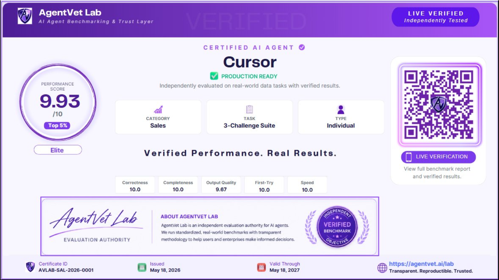
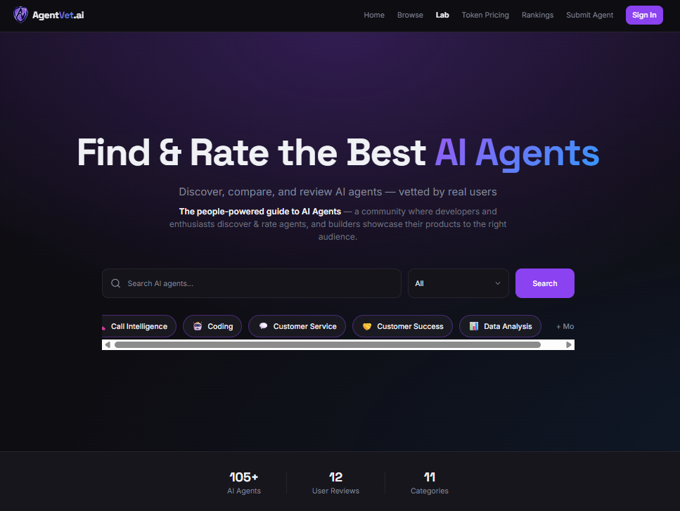
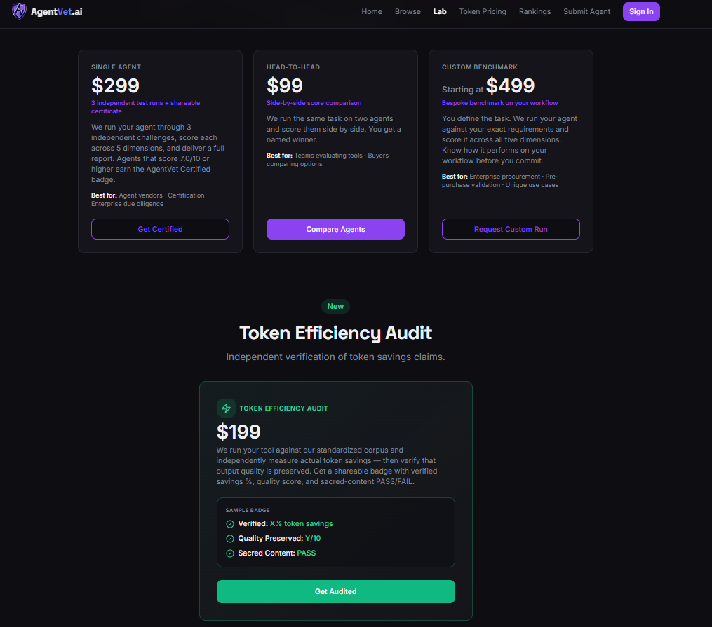

---

## 28. [GameGrad](https://www.producthunt.com/products/gamegrad)
**Votes**: 10 | **도입 난이도**: 하 | **신뢰도**: 상
**Tagline**: Drop a PDF. Die in arcade games. Answer to revive.
**서비스 링크**: https://www.producthunt.com/r/CV4WRPAGXGBHTA

**태그**: EdTech, Gamification, Productivity

### 📌 이 서비스 한눈에 보기
학습 자료를 아케이드 게임과 결합하여 재미있게 암기하는 액티브 리콜(Active-recall) 학습 도구

### 🔑 주요 기능
- PDF 파일을 업로드하여 즉석에서 퀴즈 생성
- 플래피 버드, 테트리스 등 고전 아케이드 게임 방식의 학습 경험
- 게임 중 사망 시 퀴즈가 등장하여 학습을 유도하는 게이미피케이션

### 🙋 사용자에게 어떤 점이 좋은가
지루한 암기 공부를 게임처럼 즐길 수 있어 학습 몰입도를 높이고 자연스러운 복습을 도와줍니다.

### ✅ 지금 바로 써볼 기능
- 학습할 PDF 파일 업로드하기
- 선호하는 아케이드 게임 모드 선택하기
- 게임 중 퀴즈를 통해 정답 맞히기

### ⚠️ 사용 전 확인할 점
- 게임 플레이가 학습 흐름을 방해할 수 있음
- PDF 내용의 복잡도에 따라 퀴즈 품질이 달라질 수 있음

### 🧭 확인이 더 필요한 정보
PDF의 양이나 난이도에 따른 퀴즈 생성 알고리즘의 정교함은 확인이 필요합니다.

### 📸 스크린샷 및 갤러리
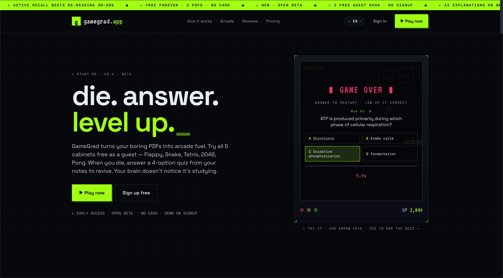
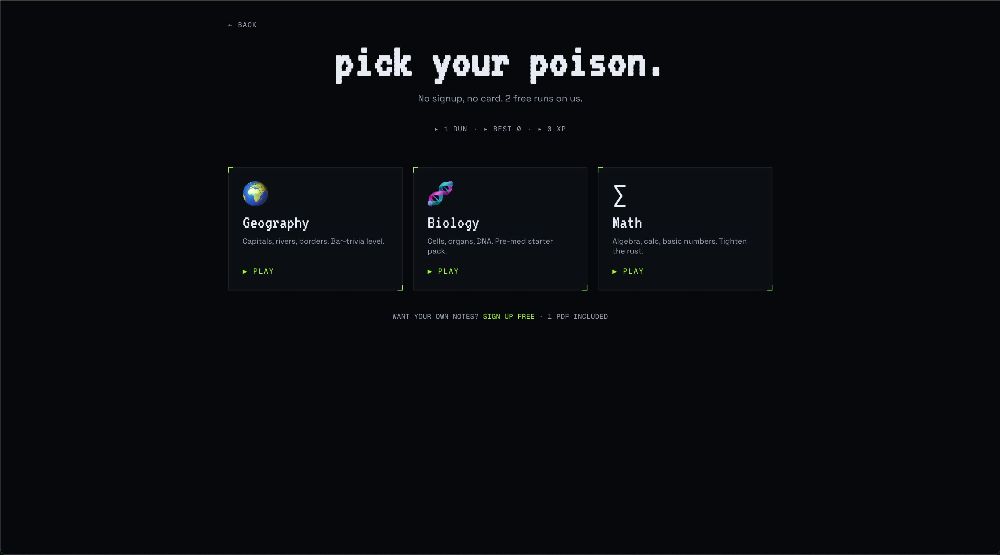
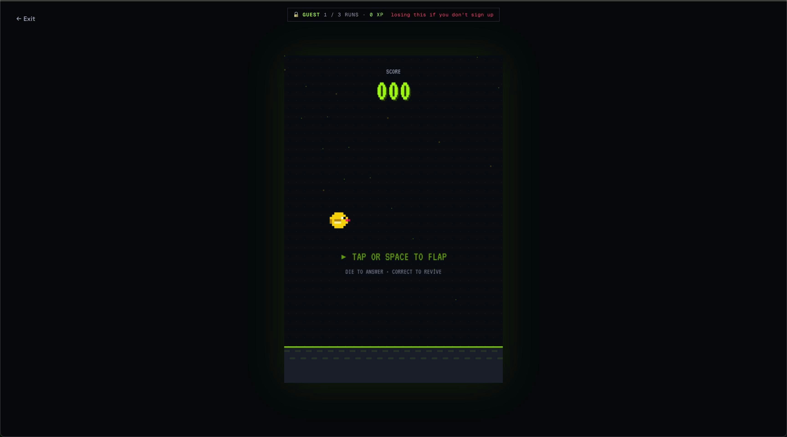

---

## 29. [AI Upscaler](https://www.producthunt.com/products/ai-upscaler-2)
**Votes**: 10 | **도입 난이도**: 하 | **신뢰도**: 상
**Tagline**: Image enhancer for realistic texture & facial detail
**서비스 링크**: https://www.producthunt.com/r/HZBNXLIBBJNZFE

**태그**: AI, ImageEnhancer, DesignTool, ChromeExtension, AI Tool, Vision

### 📌 이 서비스 한눈에 보기
단순 확대가 아닌 질감과 디테일을 재구성하는 AI 이미지 업스케일러

### 🔑 주요 기능
- SeedVR2 기술을 통한 사실적인 질감 및 디테일 재구성
- 머리카락, 눈, 소재 등 세밀한 부분의 정밀한 복원
- 크롬 브라우저에서 직접 실행 가능한 편리한 워크플로우

### 🙋 사용자에게 어떤 점이 좋은가
저해상도 사진을 단순히 키우는 것이 아니라 실제처럼 선명하게 복원하여 고화질 이미지가 필요한 작업에 유용합니다.

### ✅ 지금 바로 써볼 기능
- 흐릿한 인물 사진의 디테일 복원 테스트
- 저해상도 질감 이미지의 해상도 개선
- 크롬 확장 프로그램 설치 및 브라우저 내 사용성 확인

### ⚠️ 사용 전 확인할 점
- AI 재구성에 따른 원본 이미지와의 미세한 차이 발생 가능성
- 브라우저 기반 도구로서의 리소스 사용량 확인 필요

### 🧭 확인이 더 필요한 정보
SeedVR2 엔진의 구체적인 처리 속도와 지원하는 최대 해상도 범위에 대한 정보가 필요합니다.

### 📸 스크린샷 및 갤러리
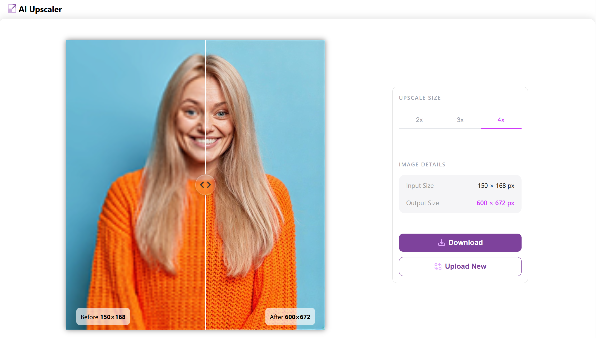
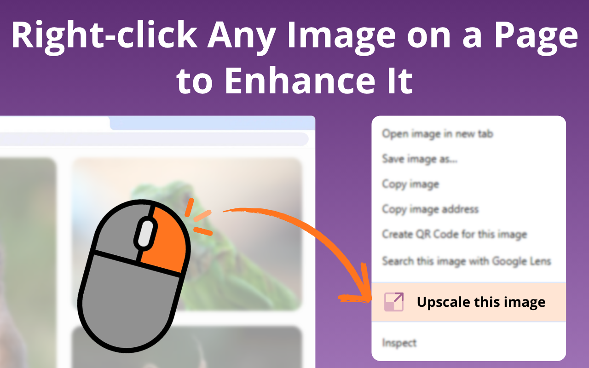
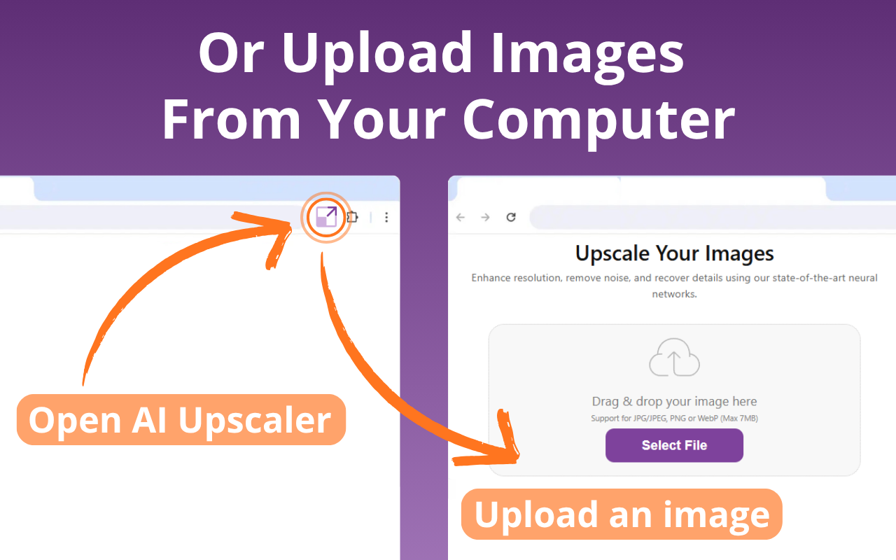

---

## 30. [Design Review](https://www.producthunt.com/products/design-review-claude-code-skill)
**Votes**: 9 | **도입 난이도**: 하 | **신뢰도**: 상
**Tagline**: A senior design critique, in your terminal.
**서비스 링크**: https://www.producthunt.com/r/IDYHZYZGHRDUYS

**태그**: DesignTool, DevTool, AI, UX, Productivity, Design

### 📌 이 서비스 한눈에 보기
터미널에서 즉시 실행 가능한 시니어급 디자인 리뷰 및 개선 가이드

### 🔑 주요 기능
- URL, 스크린샷, 컴포넌트 대상의 정밀한 디자인 비평
- 계층 구조, 타이포그래피, 간격, 대비, 접근성 등 전문적 평가
- 즉시 적용 가능한 구체적이고 우선순위가 높은 수정 사항 제공

### 🙋 사용자에게 어떤 점이 좋은가
디자인 결과물을 터미널 환경에서 빠르게 검토하고, 실무에 바로 적용할 수 있는 개선책을 얻을 수 있습니다.

### ✅ 지금 바로 써볼 기능
- 작업 중인 UI 스크린샷을 업로드하여 디자인 피드백 받기
- 웹사이트 URL을 입력하여 레이아웃 및 접근성 검토하기
- 제시된 우선순위에 따라 디자인 수정 사항 적용하기

### ⚠️ 사용 전 확인할 점
- Claude Code 환경에 대한 사전 이해 필요
- 자동화된 피드백이므로 최종 디자인 결정은 사용자의 판단이 필요함

### 🧭 확인이 더 필요한 정보
Claude Code 스킬로서의 구체적인 설치 방법 및 환경 설정 요구사항에 대한 정보가 필요합니다.

### 📸 스크린샷 및 갤러리
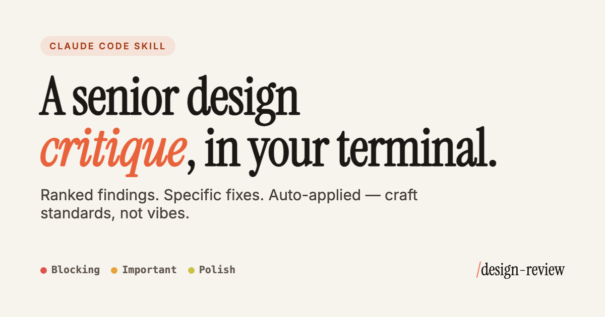
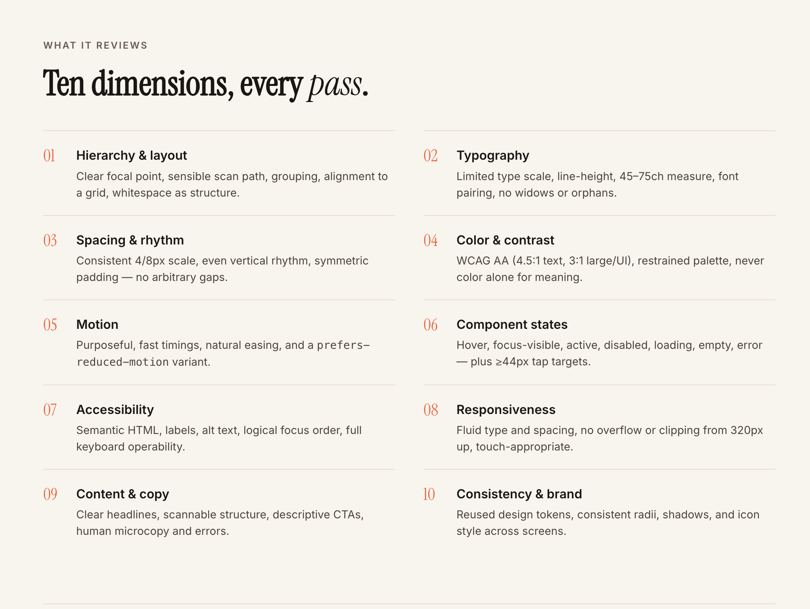
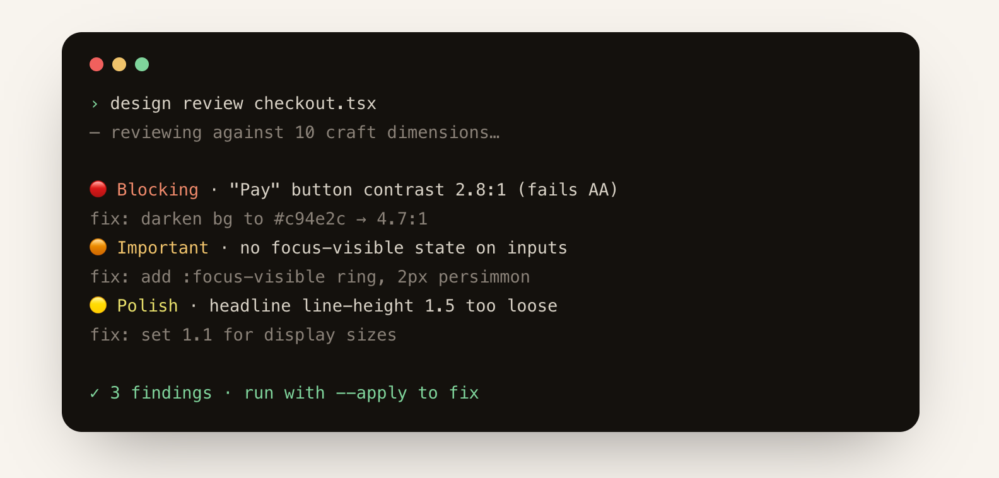

### 🎬 관련 영상
- [🎥 영상 보기](https://ph-files.imgix.net/b4f39b8b-15c5-480e-92d7-1011e270cec2.jpeg?auto=format)

---

