# 🚀 Product Hunt Daily Top 30 (2026-05-31)

## 오늘의 요약
오늘의 트렌드는 단순한 챗봇을 넘어 시각 인지와 도구 활용 능력을 갖춘 고성능 AI 에이전트와 자동화 도구들이 주를 이루었습니다. 또한, 코딩 없이 앱을 구축하거나 복잡한 데이터 분석을 자동화하는 노코드(No-code) 기반의 생산성 도구들이 높은 관심을 받았습니다.

### 오늘의 핵심 포인트
- 자연어 설명만으로 앱을 생성하거나 풀스택 웹 서비스를 구축하는 AI 기반 노코드 개발 환경이 주목받았습니다.
- 실시간 데이터 모니터링, 시각 인지, SEO 자동화 등 특정 목적에 특화된 지능형 AI 에이전트 모델이 등장했습니다.
- 데이터 분석, 프로토콜 검증, 프라이버시 보호 등 전문적인 기술 영역에서의 효율성을 높여주는 도구들이 소개되었습니다.

**오늘의 태그**: AI 에이전트, 노코드, 자동화, 생산성 도구, 풀스택 빌더

## 1. [Wandesk](https://www.producthunt.com/products/wandesk-ai)
**Votes**: 313 | **도입 난이도**: 하 | **신뢰도**: 상
**Tagline**: Build Your Own AI Desktop 
**서비스 링크**: https://www.producthunt.com/r/5A3ODZHHI5HVA6

**태그**: AI, Productivity, LowCode, LocalFirst, DevTool, AI Tool

### 📌 이 서비스 한눈에 보기
자연어 설명만으로 나만의 AI 앱을 구축하는 로컬 기반 AI 데스크톱 환경

### 🔑 주요 기능
- 설명만으로 필요한 앱을 즉시 생성하는 AI 데스크톱
- Claude, OpenAI, DeepSeek 등 다양한 OpenAI 호환 모델 지원
- 앱 간 컨텍스트 공유 및 개인화된 AI 메모리 기능

### 🙋 사용자에게 어떤 점이 좋은가
사용자가 복잡한 코딩 없이도 자신에게 필요한 맞춤형 도구를 즉석에서 만들어 업무 효율을 극대화할 수 있습니다.

### ✅ 지금 바로 써볼 기능
- 자신이 자주 사용하는 워크플로우를 설명하여 맞춤형 앱 생성하기
- 보유 중인 다양한 AI API 키를 연결하여 모델 테스트하기
- 앱 간 데이터 공유 기능을 활용해 연속성 있는 작업 환경 구축하기

### ⚠️ 사용 전 확인할 점
- 로컬 실행 환경의 하드웨어 리소스 점유율 확인 필요
- 사용하는 AI 모델의 API 비용 발생 가능성

### 🧭 확인이 더 필요한 정보
로컬 실행 시 하드웨어 요구 사양과 데이터 보안 수준에 대한 구체적인 정보 확인이 필요합니다.

### 📸 스크린샷 및 갤러리
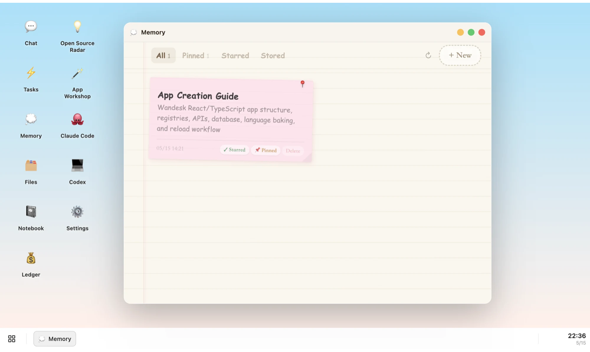
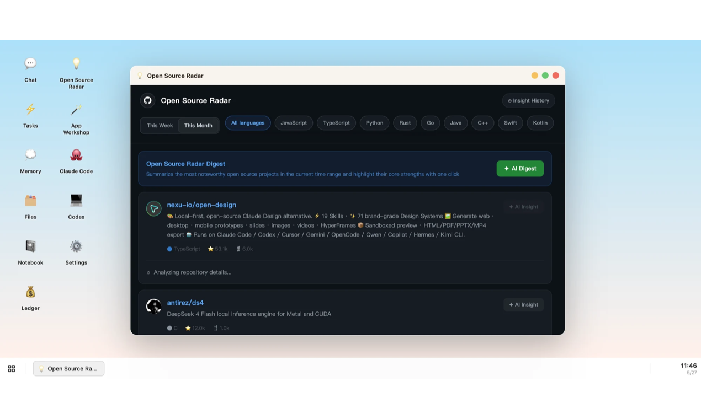
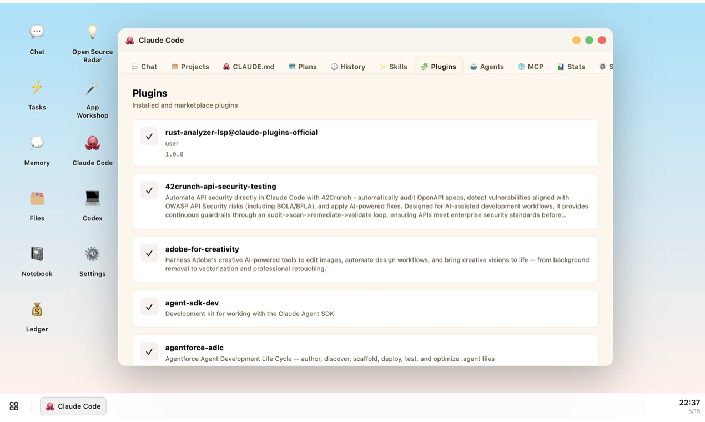

### 🎬 관련 영상
- [🎥 영상 보기](https://ph-files.imgix.net/631caa30-a6e8-47fa-8645-e55e16d986d2.jpeg?auto=format)

---

## 2. [Wingbits AI](https://www.producthunt.com/products/wingbits-ai)
**Votes**: 188 | **도입 난이도**: 하 | **신뢰도**: 상
**Tagline**: AI agents for real-time aircraft monitoring and alerts
**서비스 링크**: https://www.producthunt.com/r/YHETQGWHA4NYM6

**태그**: AI, Automation, Aviation, Real-time, No-code, Agent, AI Tool, DevTool

### 📌 이 서비스 한눈에 보기
전 세계 항공 데이터를 실시간으로 감시하고 맞춤형 알림을 제공하는 AI 에이전트 서비스

### 🔑 주요 기능
- 5,600개 이상의 독자적인 안테나 네트워크를 통한 전 세계 실시간 항공 데이터 수집
- 특정 항공기, 군용기, GPS 교란 등 특정 상황에 대한 맞춤형 AI 에이전트 생성 가능
- 코딩이나 데이터 엔지니어링 없이 사용할 수 있는 노코드(No-code) 환경

### 🙋 사용자에게 어떤 점이 좋은가
복잡한 항공 데이터 처리 과정 없이 자연어로 질문하거나 설정한 조건에 따라 즉각적인 항공 관련 알림을 받을 수 있습니다.

### ✅ 지금 바로 써볼 기능
- 특정 지역의 항공 활동 모니터링 에이전트 생성하기
- 관심 있는 항공기 식별 및 실시간 알림 설정하기
- 자연어 질의를 통한 실시간 비행 정보 확인하기

### ⚠️ 사용 전 확인할 점
- 데이터의 정확도 및 실시간 지연 시간 확인 필요
- 특정 지역이나 특정 기종에 대한 데이터 커버리지 범위 확인

### 🧭 확인이 더 필요한 정보
사용자별 맞춤형 알림의 세부 설정 범위와 데이터 업데이트 주기에 대한 구체적인 정보가 필요합니다.

### 📸 스크린샷 및 갤러리

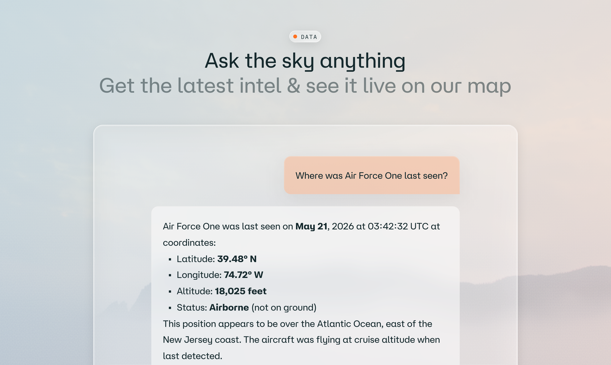
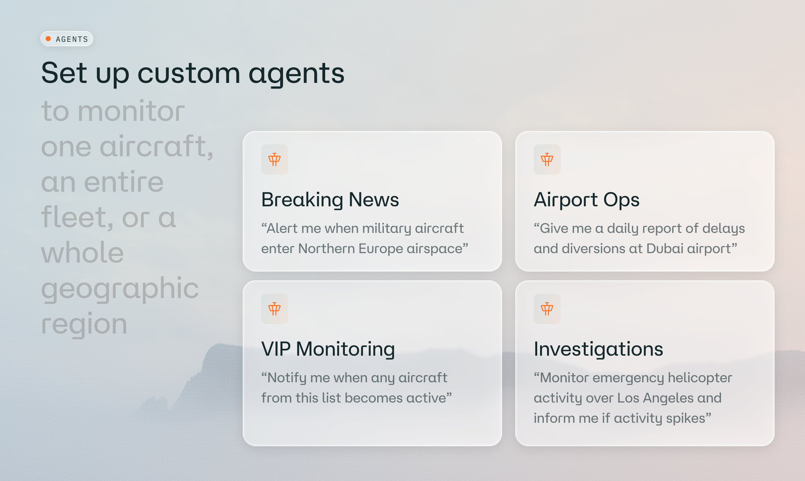

### 🎬 관련 영상
- [🎥 영상 보기](https://ph-files.imgix.net/3367a826-3ba2-44fd-a96c-e7f5d9bab5c9.jpeg?auto=format)

---

## 3. [Openstatus MCP Health Checker   ](https://www.producthunt.com/products/openstatus-2)
**Votes**: 165 | **도입 난이도**: 하 | **신뢰도**: 상
**Tagline**: Test MCP servers like a real AI client, not just a ping
**서비스 링크**: https://www.producthunt.com/r/JMCEEBGQ3PMHF4

**태그**: DevTool, MCP, Protocol, Testing, AI Tool

### 📌 이 서비스 한눈에 보기
단순 핑을 넘어 실제 AI 클라이언트처럼 MCP 서버의 프로토콜 동작을 검증하는 헬스 체크 도구

### 🔑 주요 기능
- 단순 HTTP 응답 확인이 아닌 실제 JSON-RPC 핸드셰이크 수행
- 초기화(initialize), 핑, 도구 목록 조회 등 전체 프로토콜 시퀀스 검증
- RFC 9728 기반의 스마트 인증 오류 분석 및 페이로드 가시성 제공

### 🙋 사용자에게 어떤 점이 좋은가
MCP 서버 개발 시 단순 연결 여부를 넘어, 실제 AI 클라이언트와 통신할 때 발생할 수 있는 프로토콜 수준의 오류를 사전에 방지할 수 있습니다.

### ✅ 지금 바로 써볼 기능
- 전체 핸드셰이크 시퀀스 테스트
- JSON-RPC 페이로드 상세 검사
- 401 오류 시 인증 헤더 요구사항 확인

### ⚠️ 사용 전 확인할 점
- 실제 운영 환경의 트래픽 패턴과 테스트 시나리오 간의 차이 고려 필요
- 특정 커스텀 프로토콜 구현체와의 호환성 확인 필요

### 🧭 확인이 더 필요한 정보
현재 제공되는 도구가 특정 프로그래밍 언어나 환경에 종속적인지 여부는 명시되어 있지 않습니다.

### 📸 스크린샷 및 갤러리
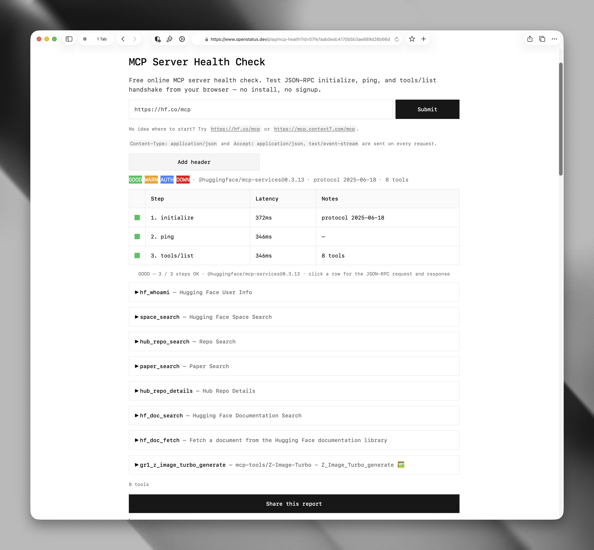
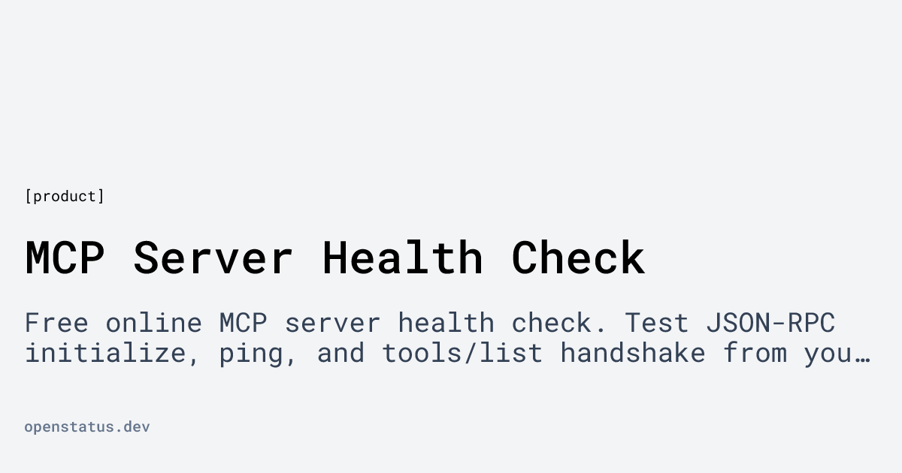
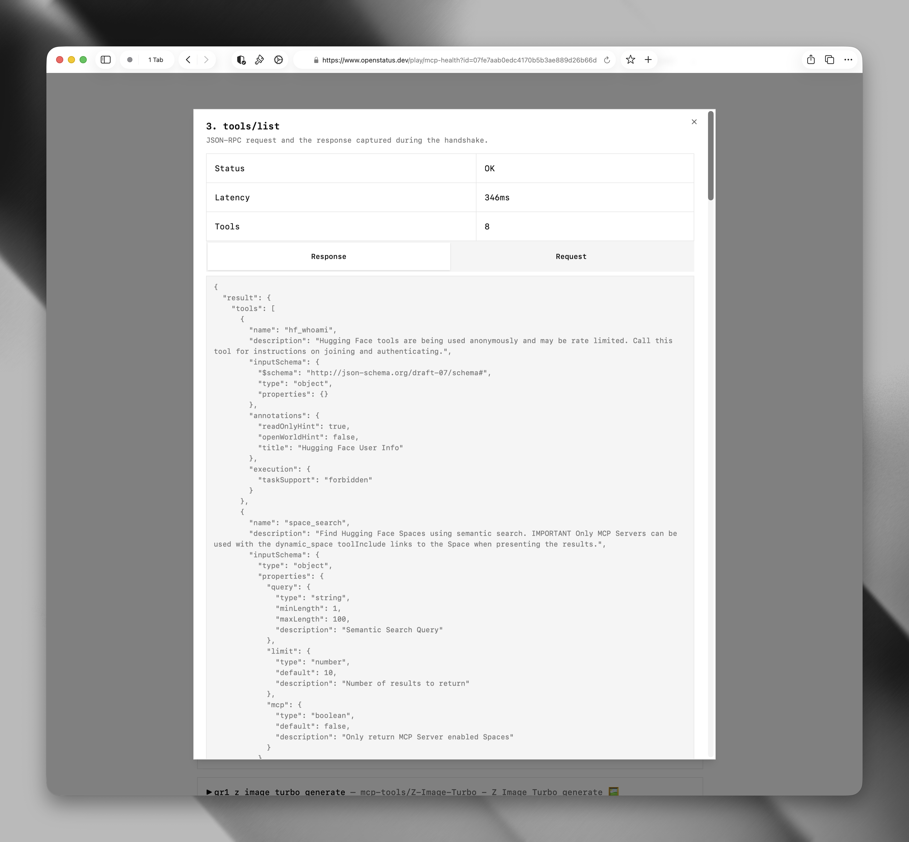

---

## 4. [Exstats](https://www.producthunt.com/products/exstats)
**Votes**: 157 | **도입 난이도**: 하 | **신뢰도**: 상
**Tagline**: Track your browser extensions and competitors in one place
**서비스 링크**: https://www.producthunt.com/r/NFCC7LFF4BSTGX

**태그**: Analytics, Market Research, Browser Extension, Competitor Intelligence, AI Tool

### 📌 이 서비스 한눈에 보기
브라우저 확장 프로그램의 성과와 경쟁사 동향을 한눈에 파악하는 통합 분석 플랫폼

### 🔑 주요 기능
- Chrome, Edge, Firefox 등 주요 브라우저의 확장 프로그램 데이터 통합 관리
- 자사 제품 및 경쟁사의 순위, 리뷰, 키워드, 스토어 트렌드 추적
- 일간 업데이트, 히스토리 기록, 데이터 내보내기 및 알림 기능 제공

### 🙋 사용자에게 어떤 점이 좋은가
확장 프로그램 개발자나 마케터가 시장 변화와 경쟁사 움직임을 실시간으로 모니터링하여 전략을 수립하는 데 유용합니다.

### ✅ 지금 바로 써볼 기능
- 자사 제품의 순위 및 키워드 변화 추적하기
- 경쟁사 리뷰 및 스토어 트렌드 분석하기
- 주요 지표 변화에 대한 알림 설정하기

### ⚠️ 사용 전 확인할 점
- 브라우저 스토어의 데이터 제공 범위에 따라 분석의 정확도가 달라질 수 있음
- 데이터 업데이트 주기에 따른 실시간성 차이 확인 필요

### 🧭 확인이 더 필요한 정보
구체적인 데이터 수집 방식과 유료 플랜의 기능 차이에 대한 정보가 명시되지 않았습니다.

### 📸 스크린샷 및 갤러리

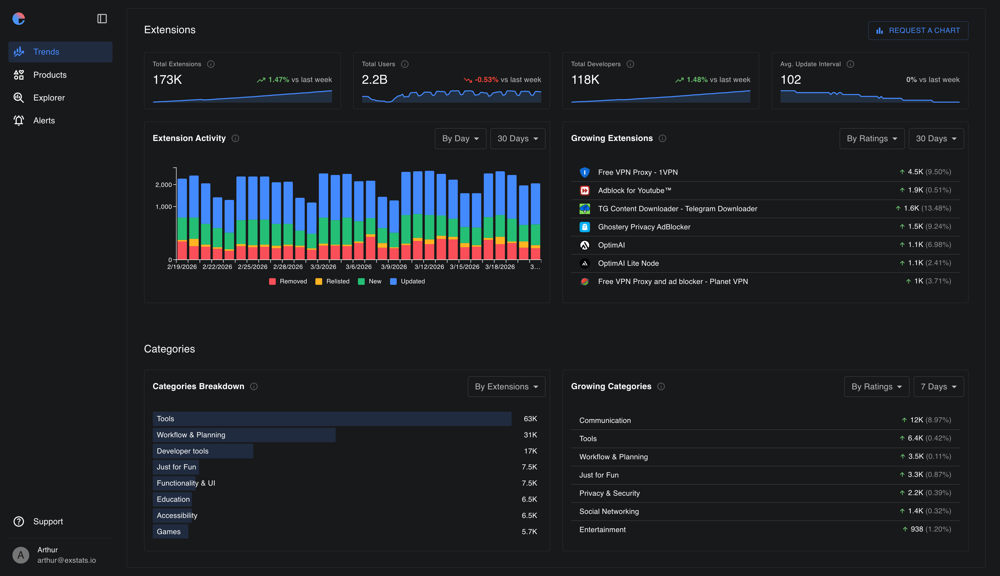
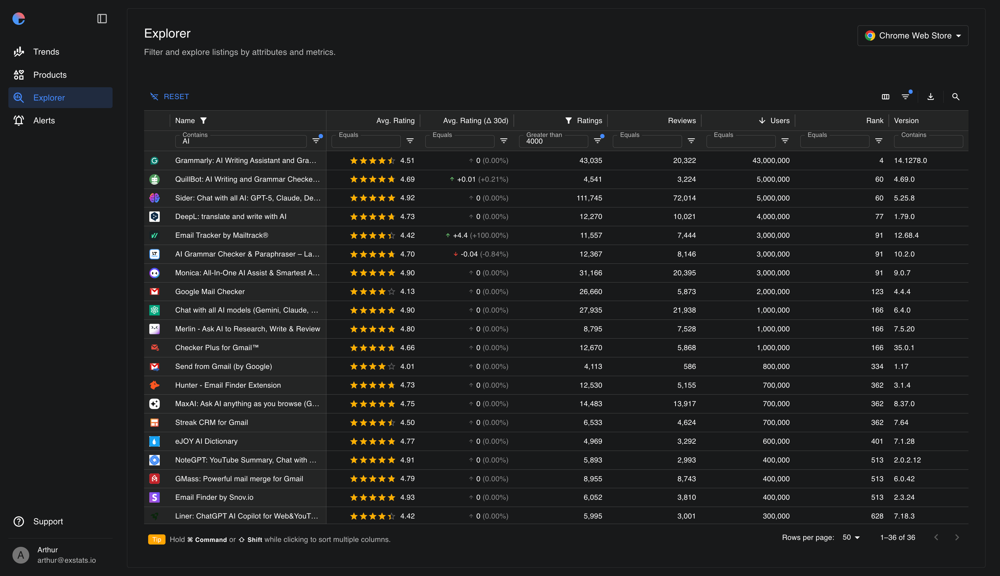

---

## 5. [Step 3.7 Flash](https://www.producthunt.com/products/step-3-5-flash)
**Votes**: 146 | **도입 난이도**: 중 | **신뢰도**: 상
**Tagline**: Flash-speed agents model that can see and act
**서비스 링크**: https://www.producthunt.com/r/VAWQFMEA3FMTG3

**태그**: AI Agent, OpenSource, Automation, LLM, Agent

### 📌 이 서비스 한눈에 보기
시각 인지와 도구 활용 능력을 갖춘 초고속 오픈 웨이트 에이전트 모델

### 🔑 주요 기능
- 최대 400 TPS의 압도적인 추론 속도와 256K의 대규모 컨텍스트 창 제공
- 시각(Vision), 코딩, 검색, 도구 사용 능력이 통합된 에이전트 특화 모델
- 약 11B의 활성 파라미터를 가진 효율적인 Apache 2.0 오픈 웨이트 모델

### 🙋 사용자에게 어떤 점이 좋은가
매우 빠른 응답 속도와 시각/도구 활용 능력을 통해 실시간 자동화 에이전트를 구축하는 데 최적화되어 있습니다.

### ✅ 지금 바로 써볼 기능
- 고속 응답이 필요한 실시간 에이전트 워크플로우 테스트
- 시각 데이터와 코딩 작업이 결합된 복합 태스크 수행
- 256K 컨텍스트를 활용한 대규모 문서 및 데이터 분석

### ⚠️ 사용 전 확인할 점
- 오픈 웨이트 모델로서 하드웨어 사양에 따른 실제 구동 성능 차이 확인 필요
- 에이전트의 도구 사용 시 발생할 수 있는 예외 상황에 대한 검증 필요

### 🧭 확인이 더 필요한 정보
실제 하드웨어 환경에서의 구체적인 추론 효율성과 도구 호출의 정확도 확인이 필요합니다.

### 📸 스크린샷 및 갤러리
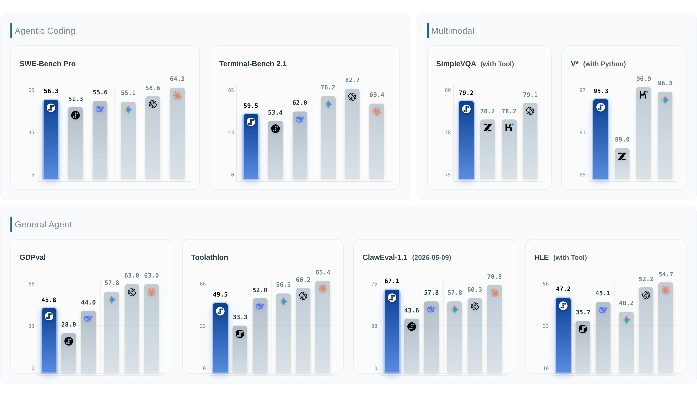
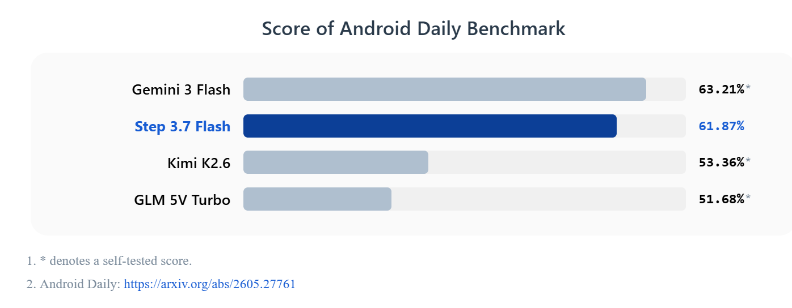
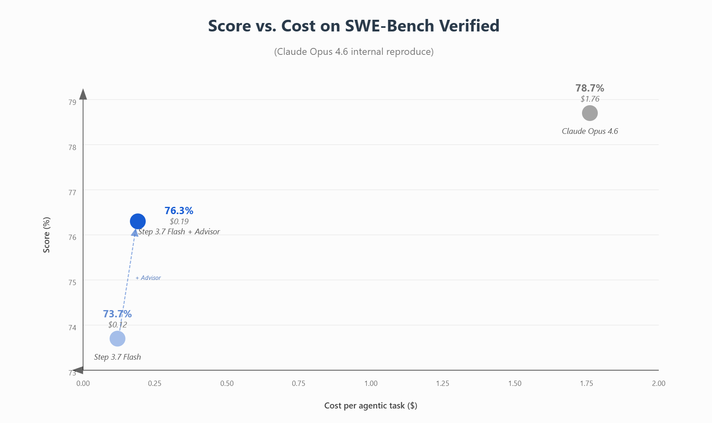

---

## 6. [99xDev](https://www.producthunt.com/products/99xdev)
**Votes**: 16 | **도입 난이도**: 하 | **신뢰도**: 상
**Tagline**: Build Fullstack Web Apps using AI
**서비스 링크**: https://www.producthunt.com/r/RZA77D56MKYYNR

**태그**: AI, Fullstack, WebDev, NoCode, DevTool, AI Tool

### 📌 이 서비스 한눈에 보기
AI를 활용해 데이터베이스부터 배포까지 한 번에 해결하는 풀스택 웹 앱 빌더

### 🔑 주요 기능
- AI 기반의 풀스택 웹 애플리케이션 자동 생성
- 데이터베이스 및 스토리지 기능 내장
- 커스텀 도메인 지원 및 다운로드 가능한 소스 코드 제공

### 🙋 사용자에게 어떤 점이 좋은가
아이디어를 빠르게 프로토타입으로 구현할 수 있으며, 생성된 코드를 직접 다운로드하여 셀프 호스팅이 가능해 확장성이 높습니다.

### ✅ 지금 바로 써볼 기능
- AI 프롬프트를 통한 기본 앱 구조 생성
- 내장된 데이터베이스 및 스토리지 설정
- 생성된 코드 다운로드 및 로컬 환경 테스트

### ⚠️ 사용 전 확인할 점
- AI 생성 코드의 품질 및 보안 검토 필요
- 복잡한 비즈니스 로직 구현 시 수동 수정 작업 발생 가능성

### 🧭 확인이 더 필요한 정보
제공되는 소스 코드의 언어 및 프레임워크 스택에 대한 상세 정보가 필요합니다.

### 📸 스크린샷 및 갤러리
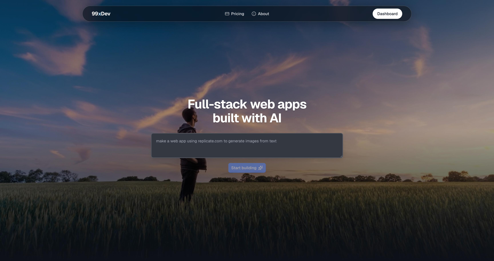
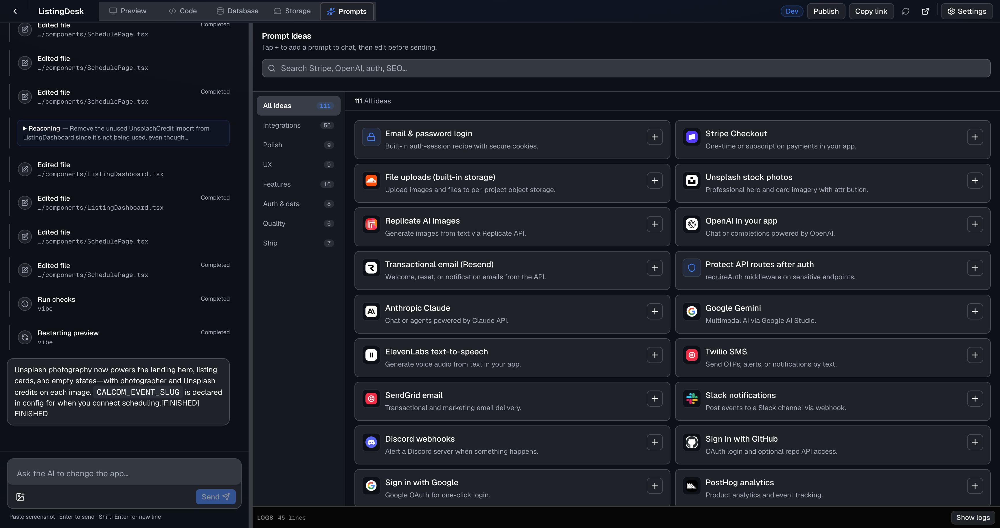
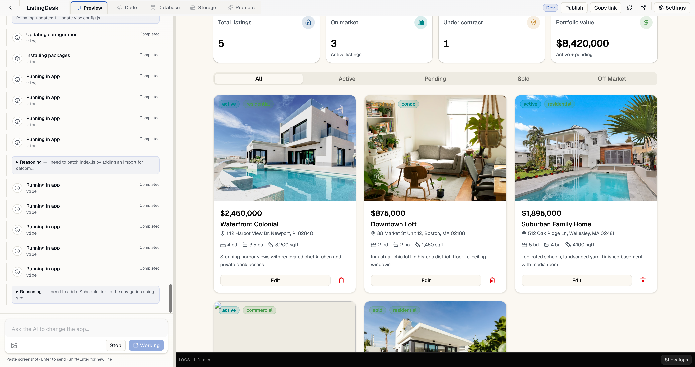

### 🎬 관련 영상
- [🎥 영상 보기](https://ph-files.imgix.net/290005b1-bd77-49ed-aa2a-93b427eafdee.jpeg?auto=format)

---

## 7. [Sleek Analytics](https://www.producthunt.com/products/sleek-analytics-2)
**Votes**: 15 | **도입 난이도**: 하 | **신뢰도**: 상
**Tagline**: Privacy-first Google Analytics alternative for modern web
**서비스 링크**: https://www.producthunt.com/r/QMZ67YPNZEMDIX

**태그**: Analytics, Privacy, SaaS

### 📌 이 서비스 한눈에 보기
개인정보 보호를 최우선으로 하는 실시간 웹 분석 솔루션

### 🔑 주요 기능
- 쿠키를 사용하지 않는 프라이버시 중심의 트래킹
- 실시간 웹사이트 방문자 데이터 제공
- 빠르고 직관적인 대시보드 인터페이스

### 🙋 사용자에게 어떤 점이 좋은가
쿠키 수집에 대한 사용자 부담 없이 웹사이트 방문 데이터를 안전하고 빠르게 확인할 수 있습니다.

### ✅ 지금 바로 써볼 기능
- 실시간 대시보드 확인하기
- 쿠키리스 트래킹 적용해보기
- 웹사이트 데이터 시각화 살펴보기

### ⚠️ 사용 전 확인할 점
- 쿠키를 사용하지 않으므로 기존 GA의 정밀한 사용자 식별 기능과는 차이가 있을 수 있음
- 데이터 수집 범위 및 상세 분석 기능의 한계 확인 필요

### 🧭 확인이 더 필요한 정보
상세한 데이터 보관 기간 및 타 서비스와의 연동 기능에 대한 정보가 부족합니다.

### 📸 스크린샷 및 갤러리

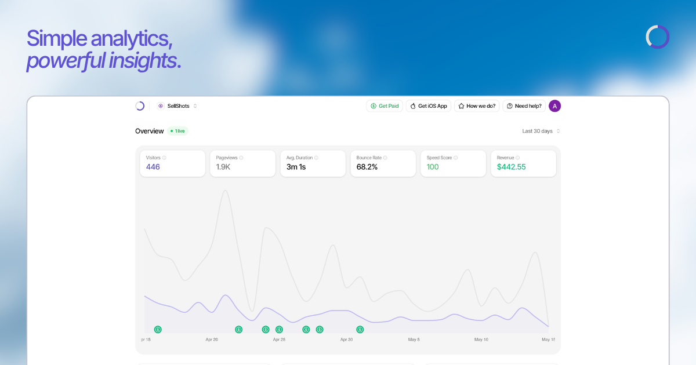
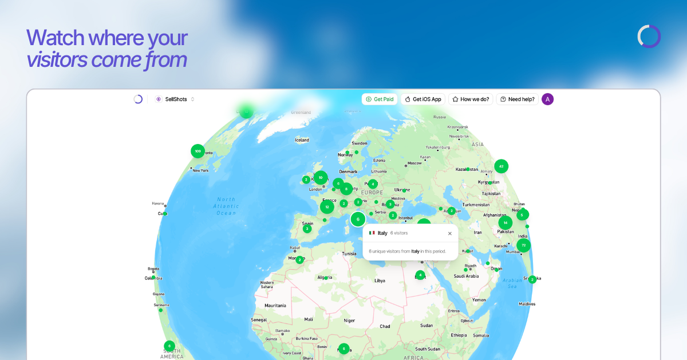

### 🎬 관련 영상
- [🎥 영상 보기](https://ph-files.imgix.net/708edb2f-7b85-4869-ac72-3373249c310b.jpeg?auto=format)

---

## 8. [InkieAI](https://www.producthunt.com/products/inkieai)
**Votes**: 11 | **도입 난이도**: 하 | **신뢰도**: 상
**Tagline**: AI SEO Agent on Autopilot
**서비스 링크**: https://www.producthunt.com/r/EGMIJR7WAUO4D6

**태그**: SEO, Automation, ContentCreation, AI, Agent, AI Tool

### 📌 이 서비스 한눈에 보기
키워드 조사부터 콘텐츠 발행까지 자동화하는 올인원 AI SEO 에이전트

### 🔑 주요 기능
- 키워드 리서치 자동화
- SEO 최적화 블로그 글 생성
- 콘텐츠 자동 발행 기능

### 🙋 사용자에게 어떤 점이 좋은가
SEO 전문가나 블로거가 수동으로 반복하던 리서치와 포스팅 작업을 자동화하여 운영 시간을 획기적으로 단축할 수 있습니다.

### ✅ 지금 바로 써볼 기능
- 자동 키워드 리서치 기능 테스트
- AI 생성 SEO 콘텐츠 품질 확인
- 콘텐츠 자동 발행 워크플로우 설정

### ⚠️ 사용 전 확인할 점
- AI 생성 콘텐츠의 검색 엔진 최적화 품질 검증 필요
- 자동 발행 시 발생할 수 있는 콘텐츠 정확성 문제

### 🧭 확인이 더 필요한 정보
지원하는 플랫폼(CMS) 종류와 구체적인 자동화 범위에 대한 정보가 추가로 필요합니다.

### 📸 스크린샷 및 갤러리
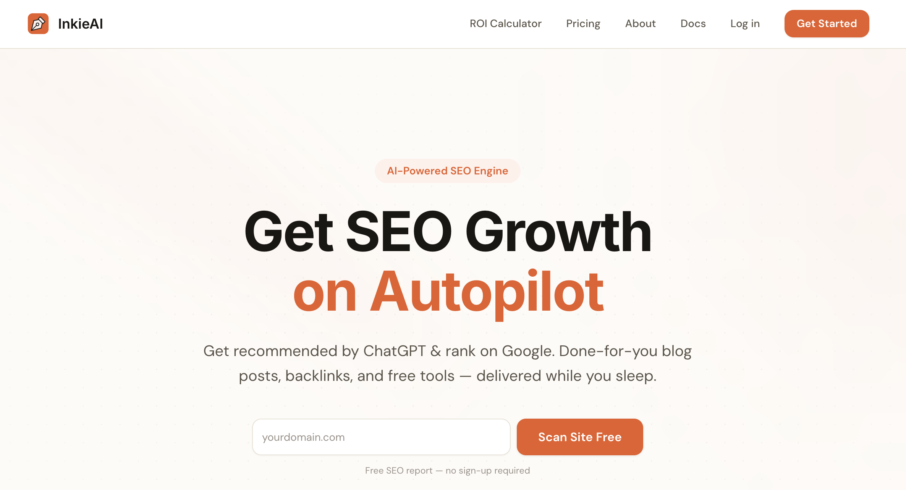

---

## 9. [Boyfriendtv Video Downloader](https://www.producthunt.com/products/boyfriendtv-downloader)
**Votes**: 11 | **도입 난이도**: 하 | **신뢰도**: 상
**Tagline**: Save Boyfriendtv videos offline
**서비스 링크**: https://www.producthunt.com/r/ZDHYIVR3ELNK5M

**태그**: Browser Extension, Video Downloader, Productivity, Video

### 📌 이 서비스 한눈에 보기
Boyfriendtv 영상을 간편하게 MP4로 저장할 수 있는 브라우저 확장 프로그램

### 🔑 주요 기능
- Boyfriendtv 페이지 자동 감지 및 다운로드 컨트롤 제공
- 별도의 데스크톱 소프트웨어 설치 없이 브라우저 내에서 즉시 저장
- 복잡한 추출 과정 없이 MP4 파일로 직관적인 다운로드 지원

### 🙋 사용자에게 어떤 점이 좋은가
외부 다운로드 사이트나 복잡한 도구를 거치지 않고 브라우저에서 바로 영상을 저장할 수 있어 매우 편리합니다.

### ✅ 지금 바로 써볼 기능
- 브라우저 확장 프로그램 설치 및 활성화
- Boyfriendtv 페이지 접속 후 다운로드 버튼 확인
- MP4 파일 저장 및 오프라인 재생 테스트

### ⚠️ 사용 전 확인할 점
- Boyfriendtv 사이트 외의 다른 플랫폼에서는 작동하지 않을 수 있음
- 저장된 영상의 저작권 및 개인적 용도 사용에 대한 주의 필요

### 🧭 확인이 더 필요한 정보
지원하는 브라우저 종류(Chrome, Edge 등)와 구체적인 영상 화질 선택 가능 여부는 명시되지 않았습니다.

### 📸 스크린샷 및 갤러리

---

## 10. [Veenew](https://www.producthunt.com/products/veenew)
**Votes**: 11 | **도입 난이도**: 하 | **신뢰도**: 상
**Tagline**: A naked microblogging built on open standards
**서비스 링크**: https://www.producthunt.com/r/KN2WVA7A5SBK4A

**태그**: Writing, OpenSource, Minimalism, PersonalWebsite, AI Tool

### 📌 이 서비스 한눈에 보기
광고와 알고리즘 없이 글쓰기에만 집중할 수 있는 오픈 표준 기반의 미니멀 마이크로블로깅 플랫폼

### 🔑 주요 기능
- ActivityPub 및 RSS 지원을 통한 개방형 표준 준수
- 광고, 좋아요, 댓글, AI, 알고리즘이 없는 클린한 환경
- 단순한 마이크로블로깅부터 개인 웹사이트까지 가능한 유연성

### 🙋 사용자에게 어떤 점이 좋은가
알고리즘의 간섭 없이 오직 자신의 생각과 글을 기록하고 공유하며, 개인 웹사이트로서의 정체성을 유지할 수 있습니다.

### ✅ 지금 바로 써볼 기능
- 자신의 생각을 담은 첫 번째 글 작성하기
- RSS 피드를 통해 프로필 생성 및 배포하기
- ActivityPub을 통한 외부 네트워크 연결 확인하기

### ⚠️ 사용 전 확인할 점
- 상호작용(좋아요, 댓글) 기능이 없어 커뮤니티 형성 방식이 기존 SNS와 다를 수 있음
- 알고리즘 기반의 추천 기능이 없으므로 사용자 유입이 제한적일 수 있음

### 🧭 확인이 더 필요한 정보
플랫폼의 확장성 및 향후 기능 업데이트 계획에 대한 구체적인 정보가 부족합니다.

### 📸 스크린샷 및 갤러리

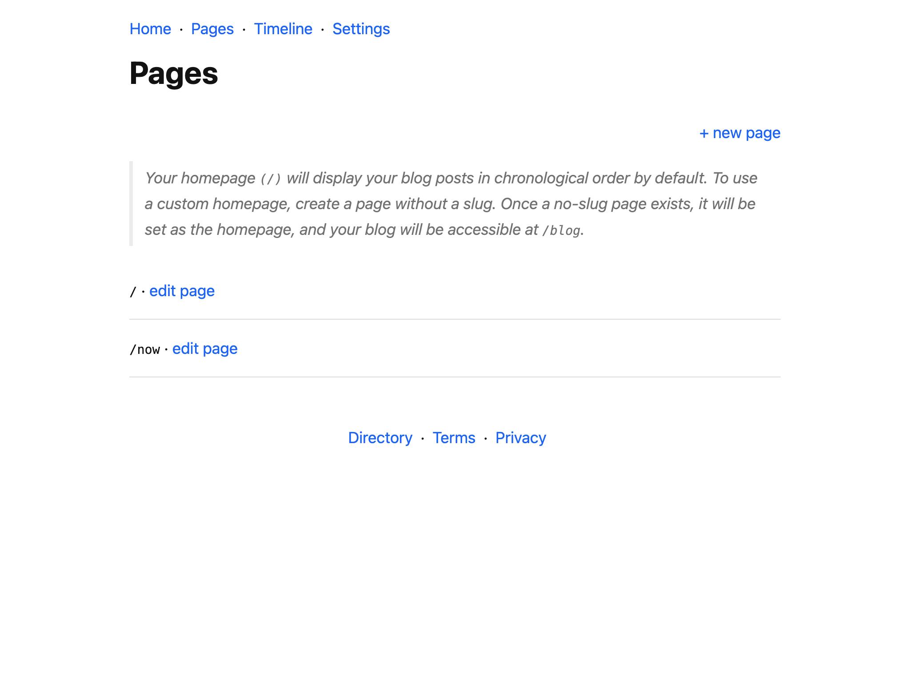
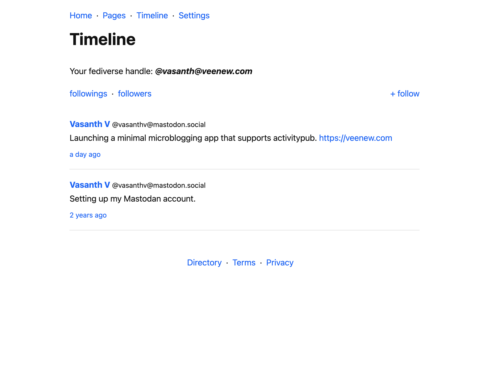

---

## 11. [SnapZoom -  AI Auto-Zoom on Click](https://www.producthunt.com/products/snapzoom)
**Votes**: 10 | **도입 난이도**: 하 | **신뢰도**: 상
**Tagline**: AI auto-zoom screen recorder for Chrome. No editing.
**서비스 링크**: https://www.producthunt.com/r/FONVXR54JQSYNI

**태그**: Productivity, VideoTool, ChromeExtension, AI, AI Tool

### 📌 이 서비스 한눈에 보기
클릭 한 번으로 시네마틱한 줌 효과를 제공하는 AI 기반 크롬 화면 녹화 도구

### 🔑 주요 기능
- 클릭 시 자동으로 화면을 확대하는 AI 시네마틱 오토 줌 기능
- 편집 과정 없이 즉시 사용 가능한 빠른 내보내기 속도
- 웹캠 오버레이 및 로컬 저장 방식을 통한 프라이버시 보호

### 🙋 사용자에게 어떤 점이 좋은가
별도의 영상 편집 기술 없이도 제품 데모나 튜토리얼 영상을 전문적인 품질로 빠르게 제작할 수 있습니다.

### ✅ 지금 바로 써볼 기능
- 클릭 시 자동 줌 기능 테스트
- 웹캠 오버레이 레이아웃 설정
- 빠른 내보내기 속도 확인

### ⚠️ 사용 전 확인할 점
- 크롬 확장 프로그램 설치 및 권한 허용 필요
- 자동 줌 기능이 특정 화면 구성에서 의도와 다르게 작동할 가능성

### 🧭 확인이 더 필요한 정보
무료 버전의 기능 제한 범위나 저장 용량 제한에 대한 구체적인 정보가 명시되지 않았습니다.

### 📸 스크린샷 및 갤러리
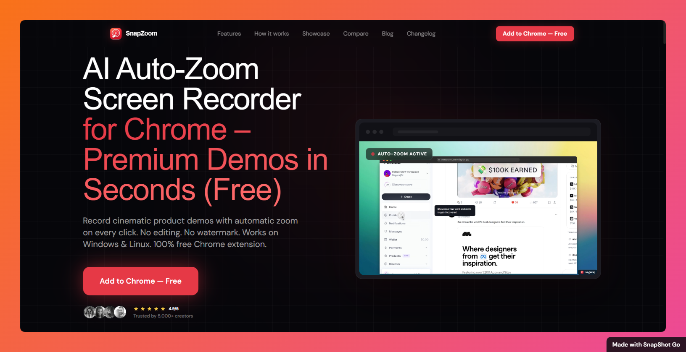
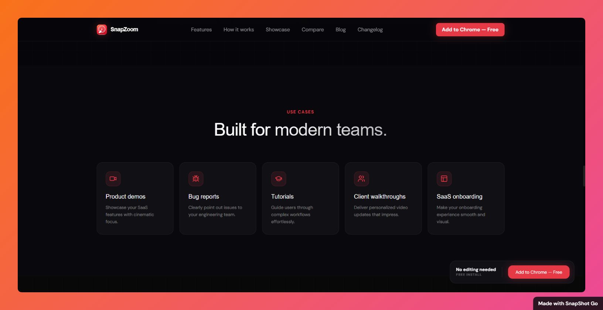
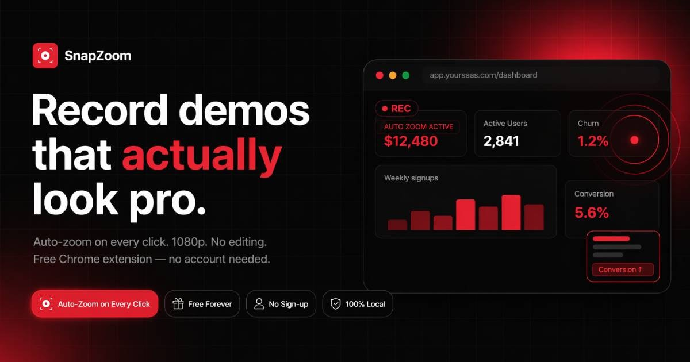

---

## 12. [Outbound Rewriter that gets replies](https://www.producthunt.com/products/outbound-rewriter-that-gets-replies)
**Votes**: 9 | **도입 난이도**: 하 | **신뢰도**: 상
**Tagline**: Paste your pitch, get 5 scored variants + follow-up cadence
**서비스 링크**: https://www.producthunt.com/r/D6OCPP6EHKDYIZ

**태그**: SalesTech, AI, Outreach, Productivity, AI Tool, Sales

### 📌 이 서비스 한눈에 보기
콜드 아웃리치 메시지를 심리학적 프레임워크 기반의 고효율 개인화 메시지로 변환해주는 AI 도구

### 🔑 주요 기능
- 프로스펙트 프로필 분석을 통한 맞춤형 메시지 생성
- 심리학적 프레임워크를 적용한 5가지 스코어링된 변형 문구 제공
- 스팸 방지 체크 및 컴플라이언스 점수 관리 기능

### 🙋 사용자에게 어떤 점이 좋은가
영업 담당자와 창업자가 단순 반복적인 메시지 작성 시간을 줄이고, 응답률을 높일 수 있는 고품질의 개인화된 메시지를 즉시 확보할 수 있습니다.

### ✅ 지금 바로 써볼 기능
- 기존에 사용하던 콜드 메일 초안 붙여넣기
- 링크드인 프로필을 활용한 타겟 맞춤형 메시지 생성
- 제공되는 5가지 변형 문구 중 최적의 옵션 선택

### ⚠️ 사용 전 확인할 점
- AI가 생성한 메시지의 최종 검토 및 인간적인 톤 조절 필요
- 사용자의 실제 영업 스타일(Voice matching)과의 일치 여부 확인 필요

### 🧭 확인이 더 필요한 정보
구체적인 가격 정책 및 외부 CRM과의 연동 범위에 대한 정보가 명시되지 않았습니다.

### 📸 스크린샷 및 갤러리
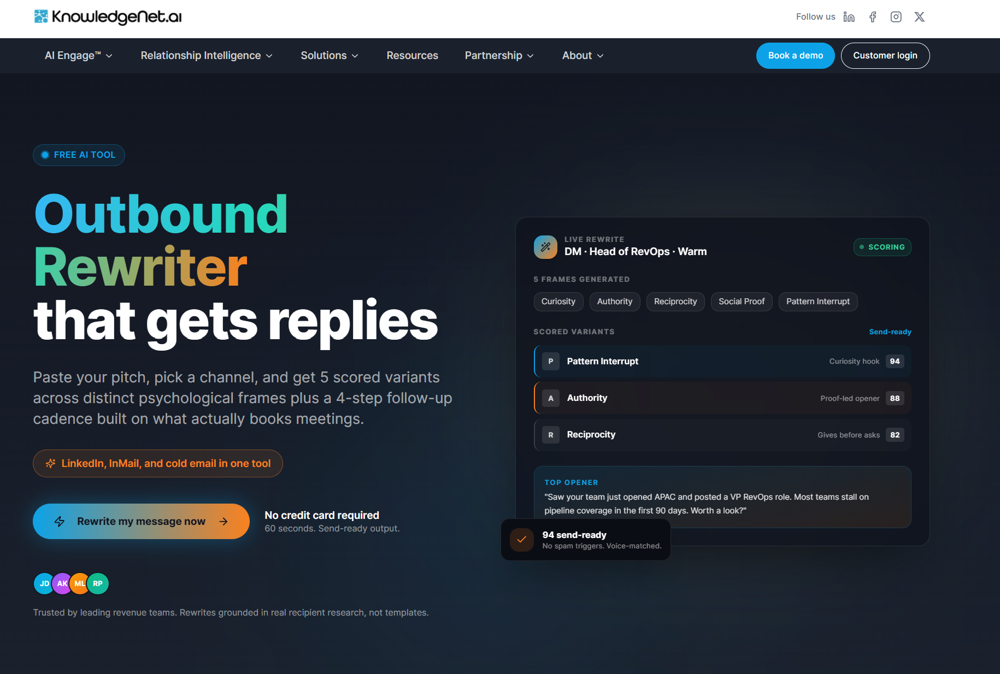
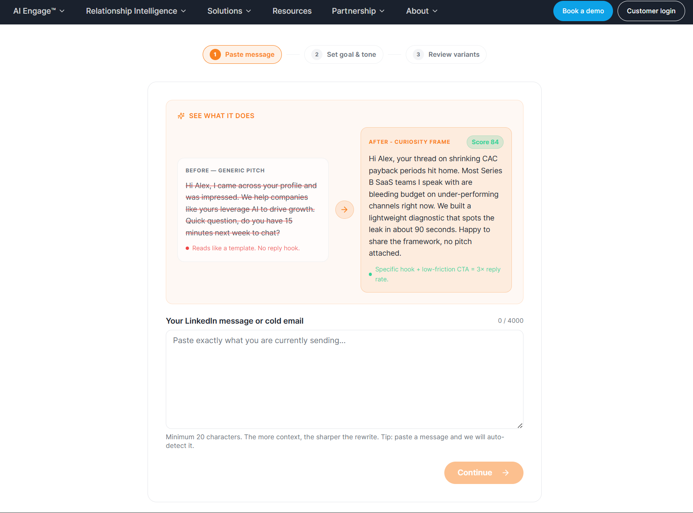
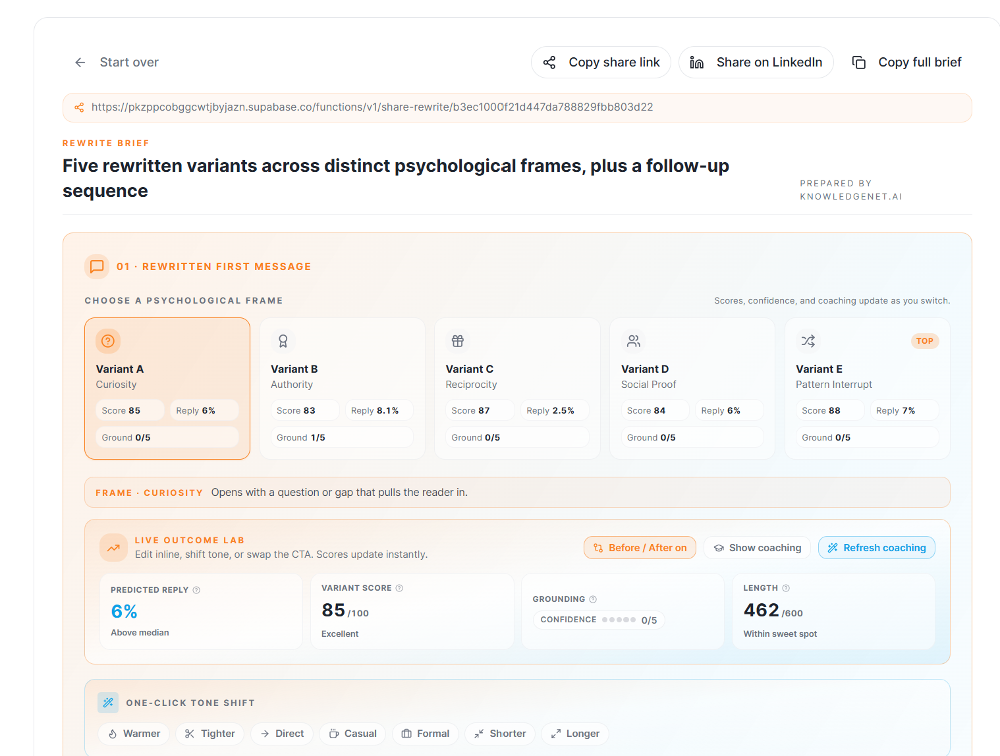

---

## 13. [Niyam AI](https://www.producthunt.com/products/niyam-ai)
**Votes**: 9 | **도입 난이도**: 하 | **신뢰도**: 상
**Tagline**: Build Discipline - Get Direction - Attain Consistency.
**서비스 링크**: https://www.producthunt.com/r/NK722MXUHBKXOS

**태그**: Productivity, Slack, AI, TimeTracking, Automation, AI Tool

### 📌 이 서비스 한눈에 보기
슬랙 메시지만으로 번거로운 기록 없이 업무 시간을 자동 추적하는 AI 도구

### 🔑 주요 기능
- 슬랙 내에서 대화하듯 자연스럽게 업무 내용 입력
- AI가 메시지에서 작업 내용과 소요 시간을 자동으로 추출
- 별도의 타이머나 양식 입력 없이 컨텍스트 스위칭 최소화

### 🙋 사용자에게 어떤 점이 좋은가
기존 타임 트래킹 도구의 번거로운 입력 과정을 없애 업무 흐름을 방해하지 않으면서도 정확한 기록이 가능합니다.

### ✅ 지금 바로 써볼 기능
- 슬랙에 Niyam AI 설치하기
- 자연어로 현재 작업 내용 메시지 보내기
- 자동 추출된 작업 및 시간 데이터 확인하기

### ⚠️ 사용 전 확인할 점
- 슬랙 메시지 기반이므로 대화 내용이 정확히 작업 시간으로 인식되는지 확인 필요
- 복잡한 프로젝트 구조나 세부 항목 관리에 한계가 있을 수 있음

### 🧭 확인이 더 필요한 정보
현재 제공되는 기능 외에 외부 프로젝트 관리 도구(Jira, Notion 등)와의 연동 범위는 명시되지 않았습니다.

### 📸 스크린샷 및 갤러리
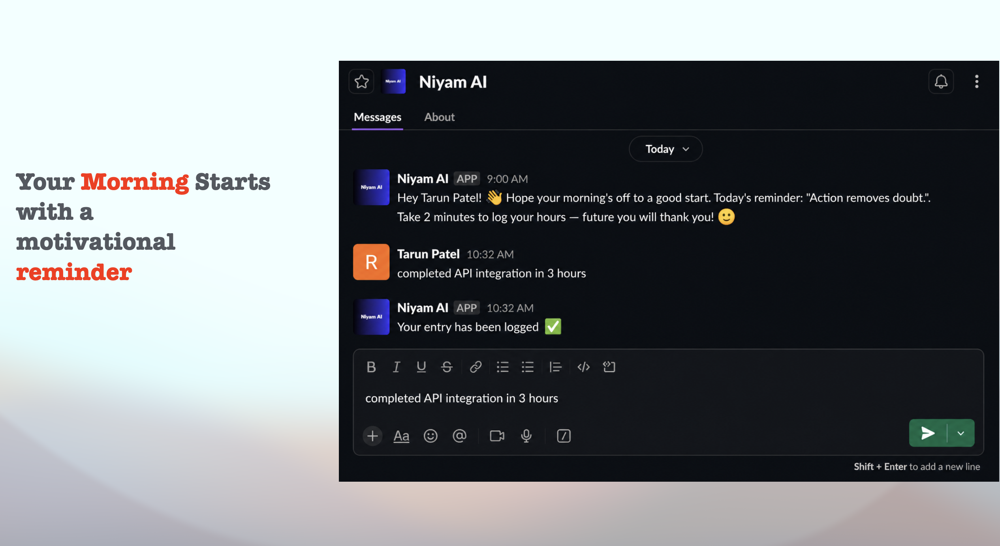
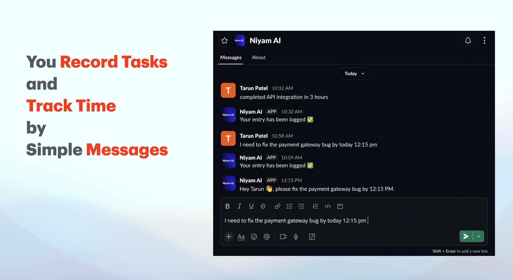
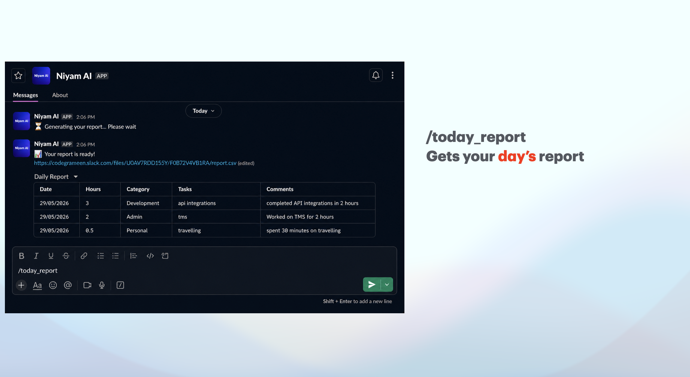

### 🎬 관련 영상
- [🎥 영상 보기](https://ph-files.imgix.net/5c740d9a-3565-4b5f-938e-0d9ef68c61fd.jpeg?auto=format)

---

## 14. [SnapHire](https://www.producthunt.com/products/snaphire-2)
**Votes**: 8 | **도입 난이도**: 하 | **신뢰도**: 상
**Tagline**: Show what a CV can't. ⭐
**서비스 링크**: https://www.producthunt.com/r/MGNV4TIAQA2RCZ

**태그**: Career, Networking, Portfolio, Video-First, Video

### 📌 이 서비스 한눈에 보기
글로만 된 이력서를 넘어 영상과 포트폴리오로 실력을 증명하는 비디오 중심 커리어 네트워크

### 🔑 주요 기능
- 영상 기반의 직무 역량 및 프로젝트 시각화
- 전통적인 CV의 한계를 극복하는 콘텐츠 중심 프로필
- 실제 작업물을 통한 자연스러운 네트워킹 및 채용 기회 창출

### 🙋 사용자에게 어떤 점이 좋은가
자신의 실력을 말이나 글로만 설명하기 어려웠던 전문가들이 작업물을 직접 보여주며 강력한 퍼스널 브랜딩을 구축할 수 있습니다.

### ✅ 지금 바로 써볼 기능
- 자신의 핵심 프로젝트를 보여주는 짧은 소개 영상 업로드
- 포트폴리오와 연동된 공개 프로필 구축
- 관심 분야 전문가들과의 네트워킹 시작

### ⚠️ 사용 전 확인할 점
- 영상 콘텐츠 제작에 따른 시간과 노력 소요
- 전통적인 채용 시장(텍스트 기반)과의 호환성 여부

### 🧭 확인이 더 필요한 정보
구체적인 채용 연계 방식이나 기업용 관리 기능에 대한 정보가 부족합니다.

### 📸 스크린샷 및 갤러리

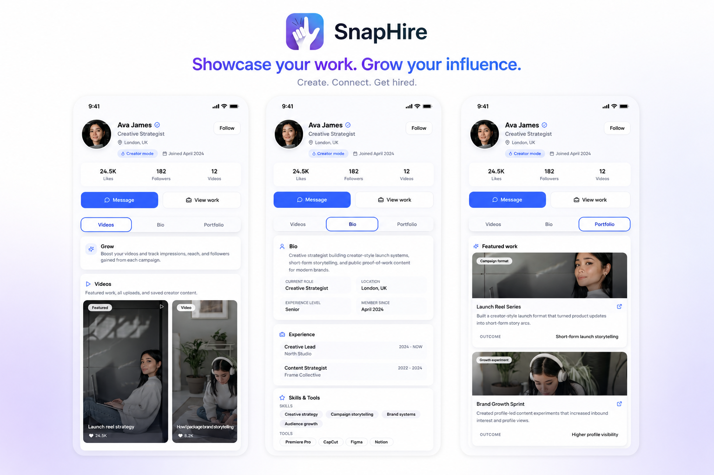

### 🎬 관련 영상
- [🎥 영상 보기](https://ph-files.imgix.net/84891207-3359-48bb-9b42-77cdc13736c9.jpeg?auto=format)

---

## 15. [Sunny Days Ahead](https://www.producthunt.com/products/sunny-days-ahead)
**Votes**: 8 | **도입 난이도**: 하 | **신뢰도**: 상
**Tagline**: Find the sunniest places around the world
**서비스 링크**: https://www.producthunt.com/r/BSFVJHLBI4JHNJ

**태그**: Travel, Data-Driven, Planning

### 📌 이 서비스 한눈에 보기
100년 이상의 기상 데이터를 기반으로 최적의 여행지를 추천받는 서비스

### 🔑 주요 기능
- 100년 이상의 방대한 역사적 기상 데이터 활용
- 월별로 가장 맑은 여행지 탐색 기능
- 데이터 기반의 신뢰할 수 있는 여행 계획 수립

### 🙋 사용자에게 어떤 점이 좋은가
날씨 걱정 없는 완벽한 여행지를 찾고 싶은 사용자에게 데이터에 기반한 확신을 제공합니다.

### ✅ 지금 바로 써볼 기능
- 가고 싶은 여행지의 월별 일조량 확인하기
- 여행 시기에 맞는 최적의 목적지 검색하기
- 과거 데이터를 통한 날씨 패턴 분석하기

### ⚠️ 사용 전 확인할 점
- 과거 데이터 기반이므로 미래의 기후 변화나 돌발 기상 현상은 반영되지 않을 수 있음
- 단순히 '맑은 날씨' 외의 강수량, 기온, 습도 등 상세 기상 조건 확인 필요

### 🧭 확인이 더 필요한 정보
데이터가 제공하는 구체적인 기상 지표(일조 시간, 구름 양 등)의 종류를 확인해야 합니다.

### 📸 스크린샷 및 갤러리

---

## 16. [Dayli](https://www.producthunt.com/products/dayli)
**Votes**: 8 | **도입 난이도**: 하 | **신뢰도**: 상
**Tagline**: Lock your apps until you earn the time.
**서비스 링크**: https://www.producthunt.com/r/IMIWKBJV5LJUZY

**태그**: Productivity, Self-Improvement, AI, Mobile App, AI Tool

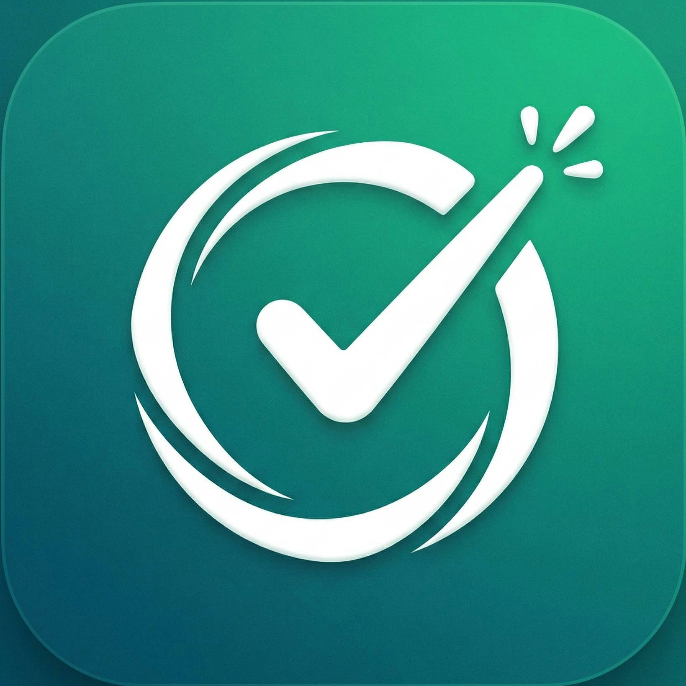

### 📌 이 서비스 한눈에 보기
목표 달성을 통해 앱 사용 시간을 보상받는 AI 기반 습관 형성 앱

### 🔑 주요 기능
- 운동, 독서 등 실질적인 목표 달성 시에만 앱 잠금 해제
- AI 사진 인증을 통한 즉각적인 노력 검증 및 시간 적립
- 적립된 시간을 '타임 뱅크'에 모아 SNS 사용 가능

### 🙋 사용자에게 어떤 점이 좋은가
단순한 차단을 넘어 생산적인 활동을 보상으로 연결하여 자기계발과 스마트폰 사용 사이의 균형을 잡도록 도와줍니다.

### ✅ 지금 바로 써볼 기능
- 데모 페이지(dayli.live/demo)에서 작동 방식 확인하기
- 자신의 일상 루틴에 맞는 목표 설정해보기
- iOS 또는 Android 기기에 설치하여 사용해보기

### ⚠️ 사용 전 확인할 점
- AI 사진 인증의 정확도에 따라 보상 체계가 달라질 수 있음
- 목표를 달성하지 못할 경우 앱 사용이 제한될 수 있음

### 🧭 확인이 더 필요한 정보
AI 검증 방식의 구체적인 기준과 목표 설정의 자유도에 대한 상세 정보가 필요합니다.

### 📸 스크린샷 및 갤러리
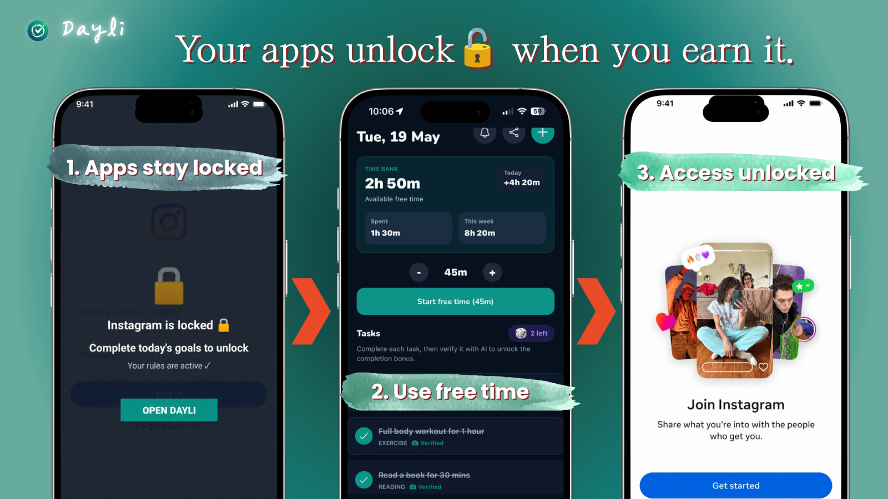
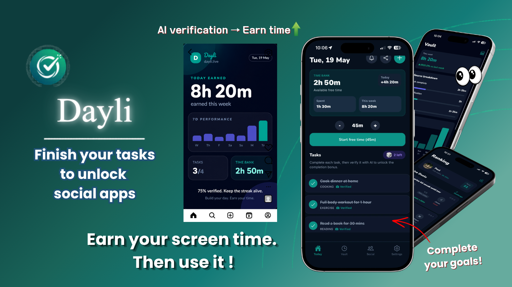
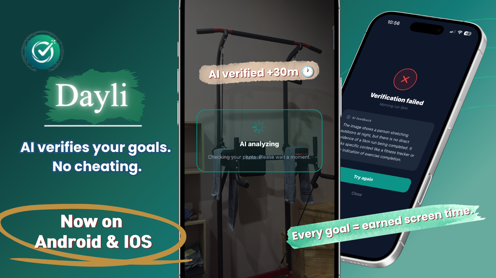

### 🎬 관련 영상
- [🎥 영상 보기](https://ph-files.imgix.net/85b7e617-3f1c-42f4-a5bf-c7a38ea09424.jpeg?auto=format)

---

## 17. [LLMTrace](https://www.producthunt.com/products/llmtrace)
**Votes**: 7 | **도입 난이도**: 하 | **신뢰도**: 상
**Tagline**: Know which commit blew up your LLM bill
**서비스 링크**: https://www.producthunt.com/r/EQMLO7CC2QCLPM

**태그**: DevTool, LLMOps, Observability, Self-Hosted, AI Tool, LLM

### 📌 이 서비스 한눈에 보기
배포 커밋 단위로 LLM 비용 급증 원인을 추적하는 셀프 호스팅 프록시

### 🔑 주요 기능
- 배포 SHA를 기록하여 비용 상승을 유발한 특정 커밋을 즉시 식별 가능
- Anthropic/OpenAI 호출을 중계하며 비용, 사용자, 배포 정보를 Postgres에 저장
- 데이터가 외부로 유출되지 않는 보안 중심의 셀프 호스팅 방식

### 🙋 사용자에게 어떤 점이 좋은가
LLM 비용이 갑자기 늘어났을 때 어떤 코드 변경이 원인인지 즉각적으로 파악하여 대응 시간을 단축할 수 있습니다.

### ✅ 지금 바로 써볼 기능
- docker-compose를 이용한 5분 내 빠른 설치 및 환경 구축
- 기존 LLM API 호출 경로에 프록시 설정 적용
- Postgres 데이터베이스 연동을 통한 로그 기록 확인

### ⚠️ 사용 전 확인할 점
- 프록시 서버가 중단될 경우 LLM API 호출 전체에 장애가 발생할 수 있음
- 직접 호스팅하므로 서버 인프라 관리 및 데이터 백업 책임이 사용자에게 있음

### 🧭 확인이 더 필요한 정보
사용자의 트래픽 규모에 따른 프록시 서버의 성능 부하 및 지연 시간(latency) 영향도를 확인해야 합니다.

### 📸 스크린샷 및 갤러리
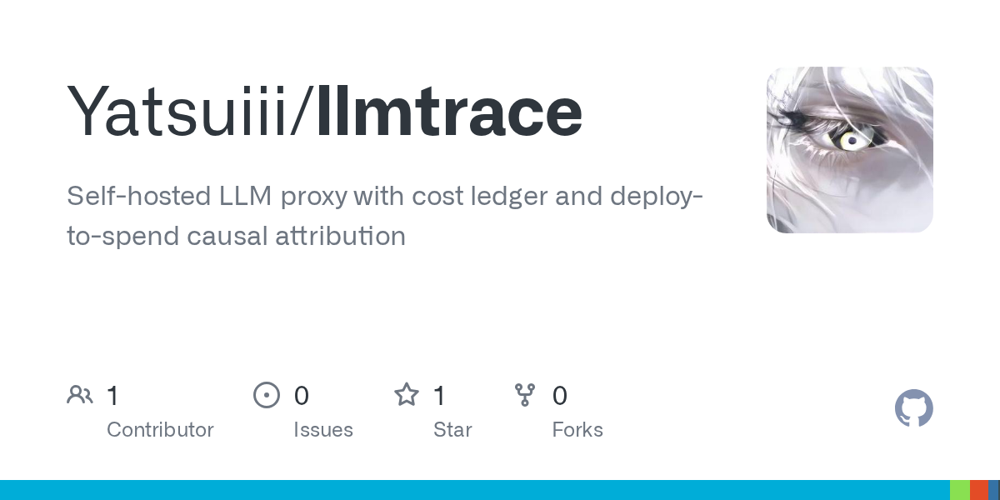
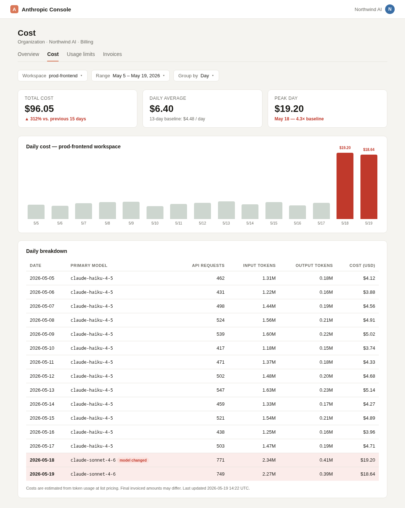
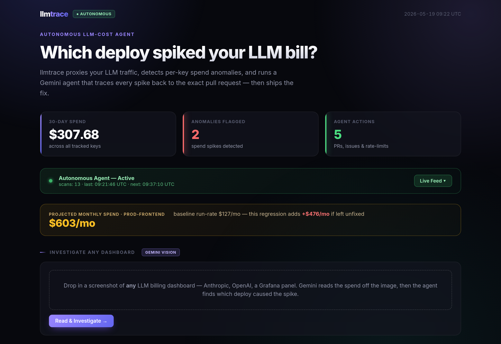

---

## 18. [Authentic Loops](https://www.producthunt.com/products/authentic-loops)
**Votes**: 7 | **도입 난이도**: 하 | **신뢰도**: 상
**Tagline**: Rate any company's interview process
**서비스 링크**: https://www.producthunt.com/r/KZJOLQPEVGRCFL

**태그**: Career, Interview, Transparency, Community

### 📌 이 서비스 한눈에 보기
기업별 면접 과정을 투명하게 공유하고 평가하는 면접 경험 리뷰 플랫폼

### 🔑 주요 기능
- 면접 단계별 상세 프로세스 및 평점 기록 가능
- 기업의 면접 방식에 대한 투명성 확보 및 책임감 부여
- 우수한 면접 경험을 제공하는 기업을 발굴하고 공유

### 🙋 사용자에게 어떤 점이 좋은가
구직자가 면접 준비 시 기업의 실제 채용 절차를 미리 파악하여 전략을 세울 수 있도록 돕습니다.

### ✅ 지금 바로 써볼 기능
- 본인이 경험한 면접 과정 상세 리뷰 작성하기
- 지원하려는 기업의 면접 단계별 평점 확인하기
- 기업별 면접 경험 데이터 비교 분석하기

### ⚠️ 사용 전 확인할 점
- 리뷰 데이터의 객관성 및 신뢰도 검증 필요
- 특정 기업에 대한 편향된 정보가 포함될 가능성

### 🧭 확인이 더 필요한 정보
사용자 리뷰의 익명성 보장 범위와 데이터 검증 방식에 대한 정보가 추가로 필요합니다.

### 📸 스크린샷 및 갤러리
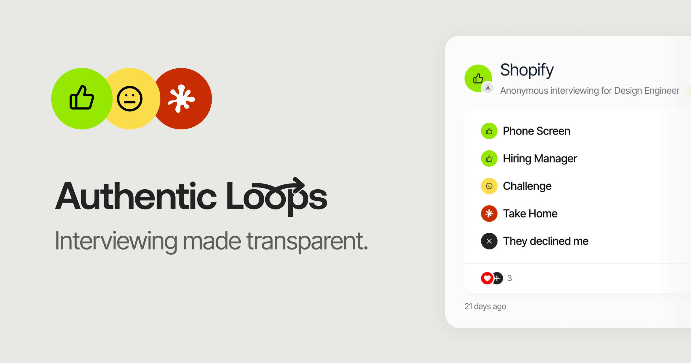
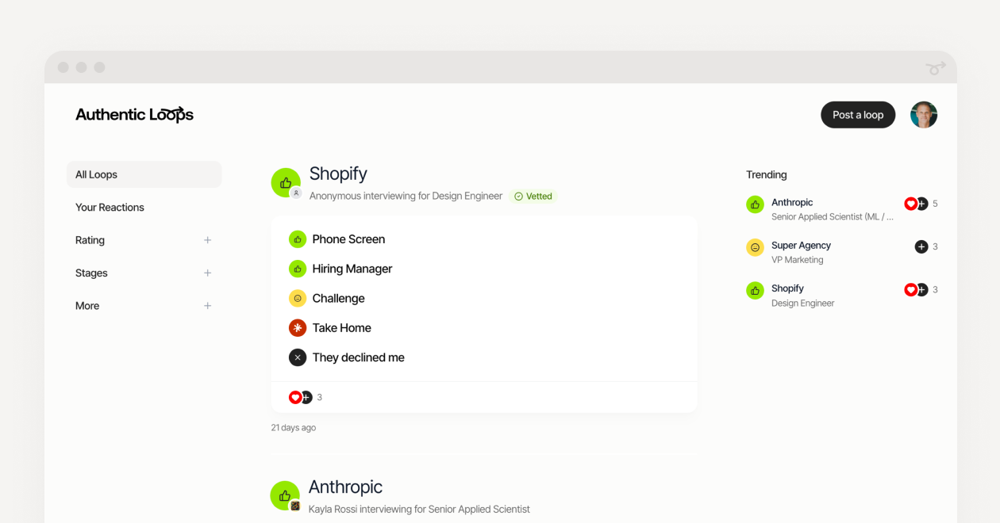
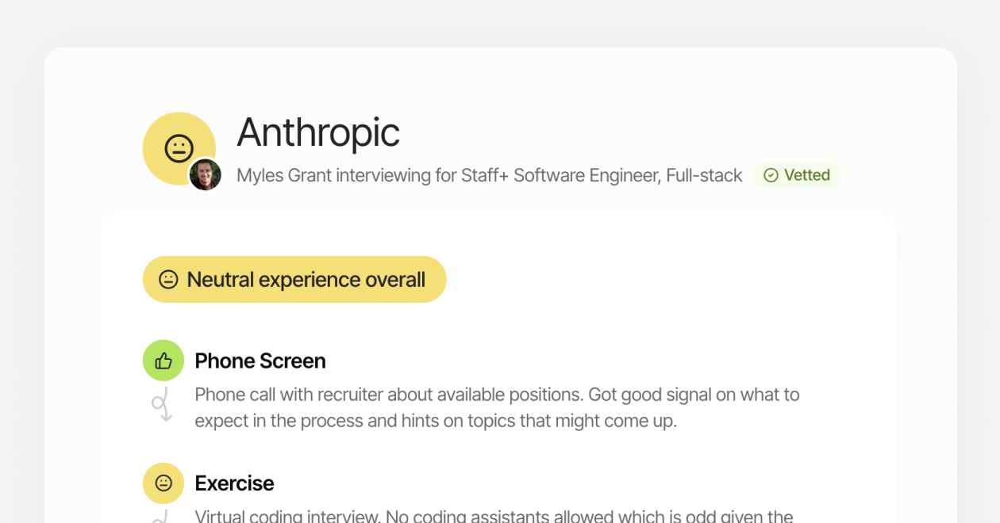

---

## 19. [swain.](https://www.producthunt.com/products/swain)
**Votes**: 6 | **도입 난이도**: 하 | **신뢰도**: 상
**Tagline**: your open source local AI security lead. one command.
**서비스 링크**: https://www.producthunt.com/r/NGAIGB2XXRLCGB

**태그**: DevTool, Security, AI, Automation, OpenSource, AI Tool

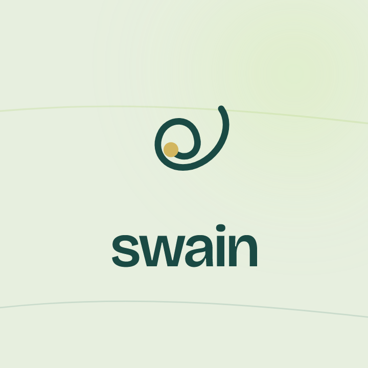

### 📌 이 서비스 한눈에 보기
기존 CLI 도구를 활용해 배포 전 보안 취약점을 즉시 점검하는 로컬 AI 보안 리뷰어

### 🔑 주요 기능
- Claude 및 Codex CLI를 활용한 로컬 기반 AI 보안 리뷰
- 인증 오류, 결제 우회, 하드코딩된 비밀값, SQL 인젝션, XSS 등 주요 취약점 탐지
- 별도의 계정 생성이나 SaaS 대시보드 없이 터미널 환경에서 즉시 실행

### 🙋 사용자에게 어떤 점이 좋은가
코드 배포 직전 단 한 번의 명령으로 보안 문제를 확인하고, 문제 해결을 위한 정확한 수정 명령까지 제공받을 수 있습니다.

### ✅ 지금 바로 써볼 기능
- 기존에 사용 중인 Claude/Codex CLI 환경 설정 확인
- 배포 직전 보안 검토를 위한 단일 명령 실행
- 제시된 수정 명령을 통한 취약점 즉시 패치

### ⚠️ 사용 전 확인할 점
- 사용자의 로컬 CLI 환경(Claude, Codex)에 대한 의존도 높음
- AI 기반 분석이므로 탐지되지 않는 보안 허점이 존재할 수 있음

### 🧭 확인이 더 필요한 정보
사용자의 로컬 환경에 설치해야 하는 구체적인 설치 방법과 지원하는 언어 범위가 명시되지 않았습니다.

### 📸 스크린샷 및 갤러리
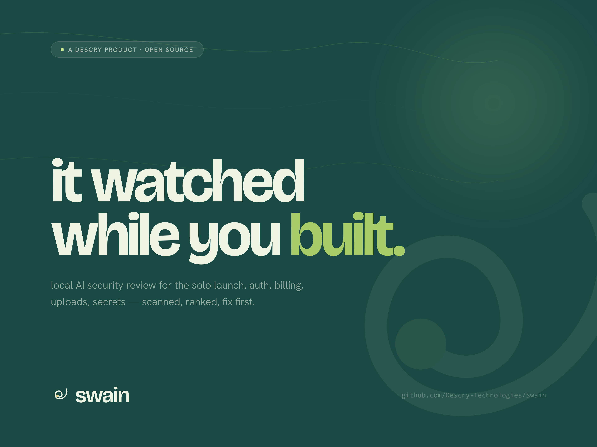
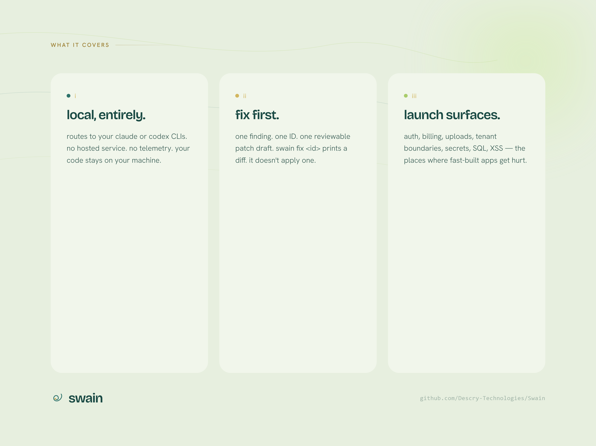
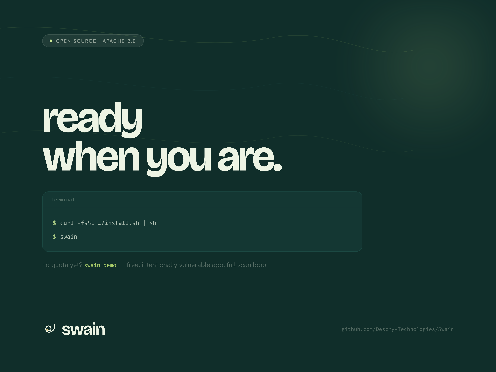

---

## 20. [Demoflow](https://www.producthunt.com/products/demoflow)
**Votes**: 6 | **도입 난이도**: 하 | **신뢰도**: 상
**Tagline**: AI that creates product demos for your SAAS
**서비스 링크**: https://www.producthunt.com/r/KQUJQCAD4T7YU3

**태그**: SaaS, VideoAutomation, AI, ProductMarketing, AI Tool, Prompting, Video

### 📌 이 서비스 한눈에 보기
URL과 프롬프트만으로 고퀄리티 제품 데모 영상을 자동 생성하는 AI 도구

### 🔑 주요 기능
- URL과 텍스트 프롬프트를 통한 자동 브라우저 액션 실행
- 커서 트래킹, 모션 블러, 시네마틱 줌 등 자동 편집 기능
- 수동 화면 녹화 및 편집 시간의 획기적 단축

### 🙋 사용자에게 어떤 점이 좋은가
SaaS 제품 홍보를 위해 매번 화면을 녹화하고 편집해야 하는 번거로움을 없애고, 전문적인 데모 영상을 빠르게 제작할 수 있습니다.

### ✅ 지금 바로 써볼 기능
- 서비스 URL 입력하여 자동 워크플로우 테스트하기
- 프롬프트를 활용한 다양한 연출 스타일 적용해보기
- 생성된 고해상도 영상의 편집 디테일 확인하기

### ⚠️ 사용 전 확인할 점
- 복잡한 사용자 인터랙션이나 특수 기능의 완벽한 재현 여부 확인 필요
- 자동 생성된 영상의 시나리오가 의도와 다를 경우의 수정 편의성

### 🧭 확인이 더 필요한 정보
사용자의 실제 브라우저 환경과 AI가 생성하는 가상 환경 간의 일치 여부를 확인해야 합니다.

### 📸 스크린샷 및 갤러리
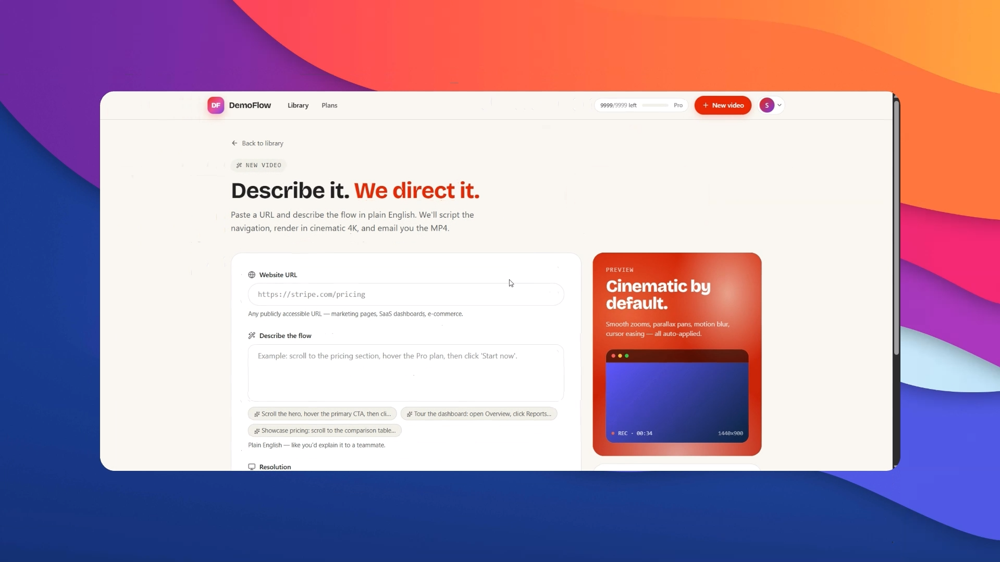
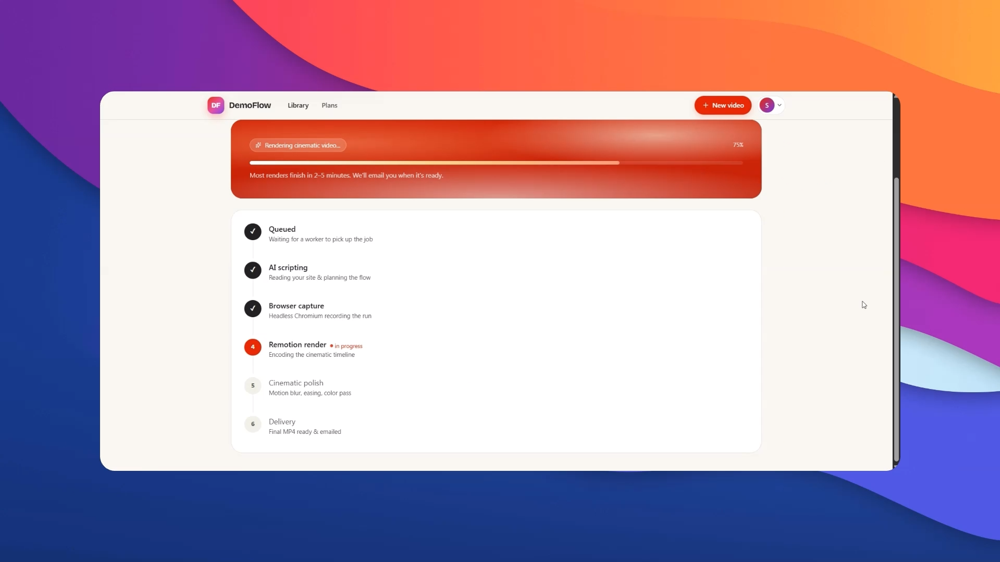

### 🎬 관련 영상
- [🎥 영상 보기](https://ph-files.imgix.net/7281fa16-f090-43aa-97dd-443e3b142aae.jpeg?auto=format)

---

## 21. [Vantage](https://www.producthunt.com/products/vantage-4)
**Votes**: 6 | **도입 난이도**: 하 | **신뢰도**: 상
**Tagline**: Notes to diagrams in 10 seconds
**서비스 링크**: https://www.producthunt.com/r/MDZWJUNUFEYDVJ

**태그**: Automation, Productivity, Diagramming, Workflow

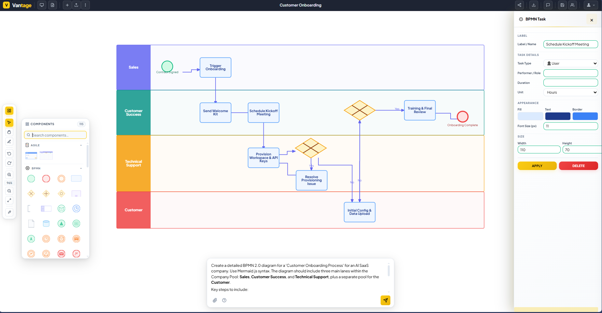

### 📌 이 서비스 한눈에 보기
텍스트 설명만으로 10초 만에 전문적인 다이어그램을 생성하는 자동화 도구

### 🔑 주요 기능
- 워크플로우 설명을 BPMN, VSM, 플로우차트로 즉시 변환
- 수동으로 다시 그릴 필요 없는 빠른 생성 속도
- 언어 제약 없이 다양한 언어로 작업 가능

### 🙋 사용자에게 어떤 점이 좋은가
복잡한 다이어그램을 직접 그리는 시간을 획기적으로 줄여주며, 아이디어를 시각화하는 과정을 단순화합니다.

### ✅ 지금 바로 써볼 기능
- 현재 진행 중인 업무 프로세스 텍스트 입력해보기
- 생성된 BPMN/VSM 결과물 검토하기
- 다양한 언어로 입력하여 정확도 테스트하기

### ⚠️ 사용 전 확인할 점
- 텍스트 설명의 구체성에 따라 다이어그램 품질이 달라질 수 있음
- 무료 플랜의 상세 기능 제한 범위 확인 필요

### 🧭 확인이 더 필요한 정보
무료로 시작 가능한 범위와 유료 플랜의 기능 차이에 대한 정보가 명시되지 않았습니다.

### 📸 스크린샷 및 갤러리
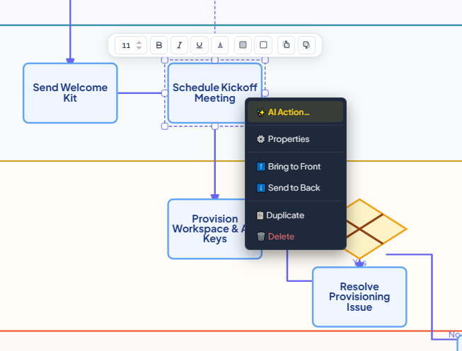
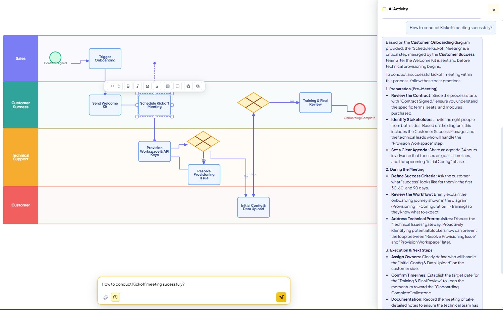
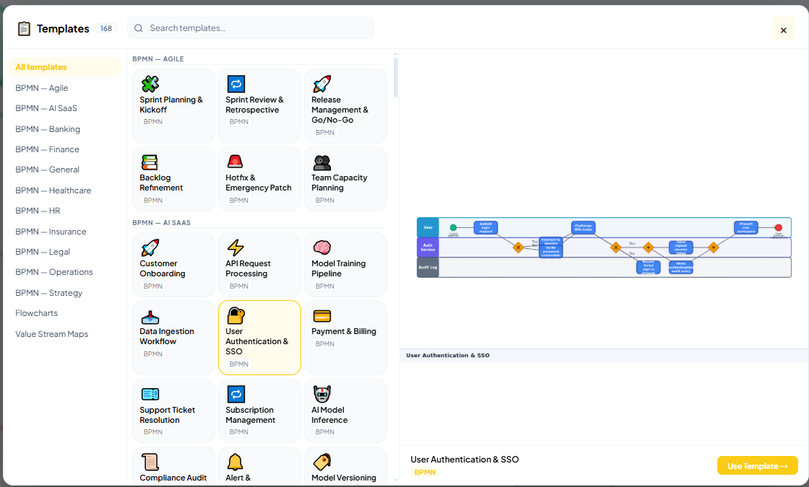

### 🎬 관련 영상
- [🎥 영상 보기](https://ph-files.imgix.net/6f4e7ba5-299b-43af-b164-919acd05cab5.jpeg?auto=format)

---

## 22. [TagJournal](https://www.producthunt.com/products/tagjournal)
**Votes**: 6 | **도입 난이도**: 하 | **신뢰도**: 상
**Tagline**: Track everything, in one app
**서비스 링크**: https://www.producthunt.com/r/QYYMUV7UQT7MYS

**태그**: Productivity, Journaling, Data Tracking, LifeLog, AI Tool, Design

### 📌 이 서비스 한눈에 보기
태그 기반의 간편한 기록으로 일상의 모든 데이터를 추적하는 스마트 저널

### 🔑 주요 기능
- 태그 중심의 빠르고 유연한 기록 방식
- 시간, 금액, 감정 등 데이터가 포함된 '리치 태그' 기능
- 웹과 iOS를 지원하는 멀티 플랫폼 환경

### 🙋 사용자에게 어떤 점이 좋은가
복잡한 일기 작성 대신 태그만으로 일상의 활동과 수치를 기록하여 데이터 기반의 통찰을 얻을 수 있습니다.

### ✅ 지금 바로 써볼 기능
- 오늘 한 일들을 태그로 간단히 기록해보기
- 시간이나 비용을 포함한 리치 태그 활용하기
- 감정 태그를 통해 하루의 기분 변화 추적하기

### ⚠️ 사용 전 확인할 점
- 데이터 입력 방식이 태그 중심이므로 자유로운 서술형 기록을 선호하는 사용자에게는 생소할 수 있음
- 웹과 iOS 외의 다른 플랫폼 지원 여부 확인 필요

### 🧭 확인이 더 필요한 정보
데이터 시각화 및 분석 리포트가 어떤 형태로 제공되는지에 대한 구체적인 정보가 부족합니다.

### 📸 스크린샷 및 갤러리
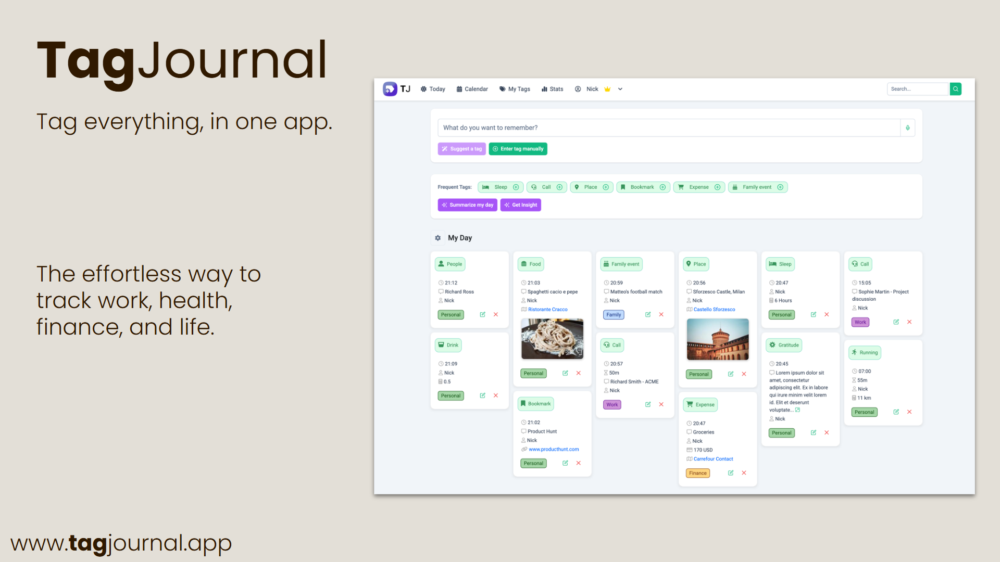
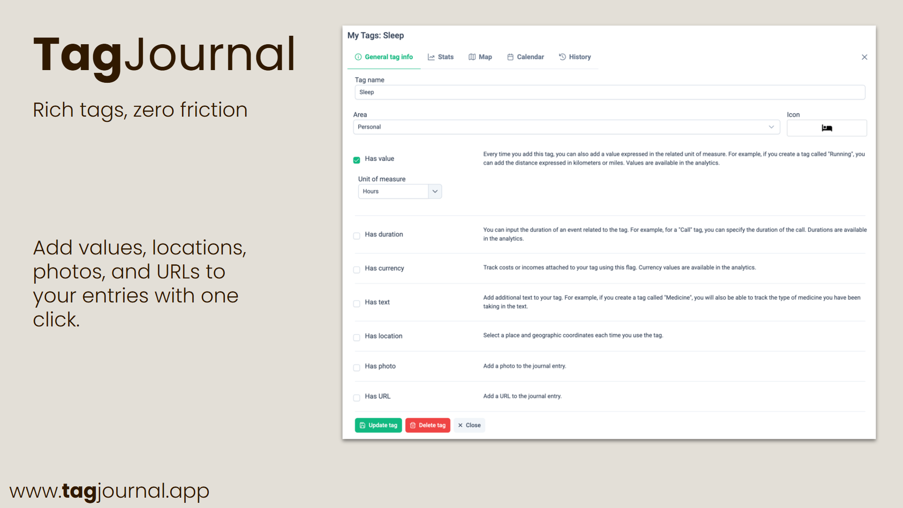
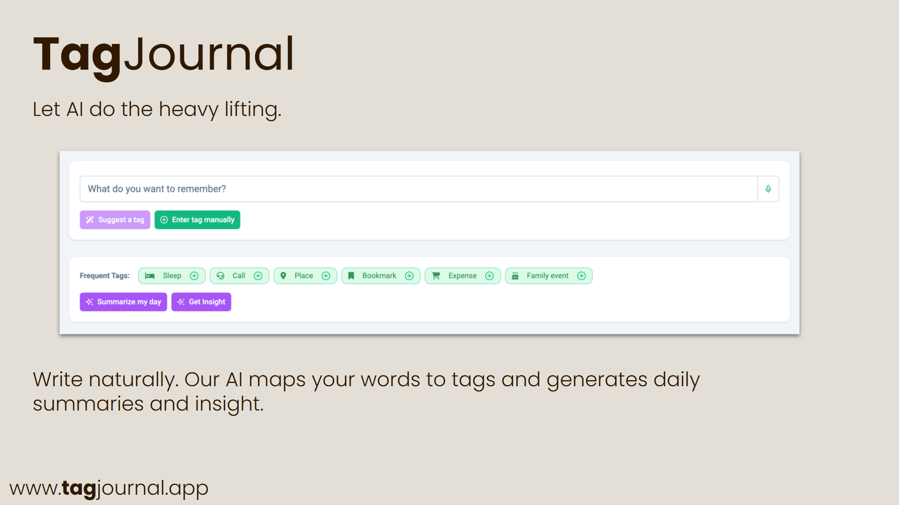

---

## 23. [Smart365Guide](https://www.producthunt.com/products/smart365guide)
**Votes**: 5 | **도입 난이도**: 중 | **신뢰도**: 상
**Tagline**: AI guidance layer for complex SaaS workflows
**서비스 링크**: https://www.producthunt.com/r/LQGUB72IKNNWOR

**태그**: SaaS, AI, Workflow, Productivity, UserOnboarding, Automation, AI Tool

### 📌 이 서비스 한눈에 보기
복잡한 SaaS 및 ERP 워크플로우를 실시간으로 가이드하는 AI 지능형 레이어

### 🔑 주요 기능
- 제품 컨텍스트와 사용자 의도를 이해하는 지능형 가이드 제공
- 정적인 튜토리얼을 넘어 실시간 워크플로우 단계별 안내
- 복잡한 화면 설명 및 안전한 작업 완료 지원

### 🙋 사용자에게 어떤 점이 좋은가
새로운 소프트웨어를 배울 때 발생하는 학습 비용을 줄이고, 복잡한 업무 프로세스 중 실수 없이 작업을 완수할 수 있도록 돕습니다.

### ✅ 지금 바로 써볼 기능
- 복잡한 ERP 화면에서의 가이드 작동 확인
- 단계별 워크플로우 가이드 기능 테스트
- 사용자 의도 파악 정확도 검증

### ⚠️ 사용 전 확인할 점
- 기존 SaaS 제품과의 기술적 호환성 및 설치 방식 확인 필요
- 사용자 데이터 및 워크플로우 데이터 보안 정책 검토

### 🧭 확인이 더 필요한 정보
제품이 기존 소프트웨어에 어떤 방식으로 임베디드되거나 레이어로 얹어지는지에 대한 기술적 구현 방식 확인이 필요합니다.

### 📸 스크린샷 및 갤러리

---

## 24. [DefenceCore](https://www.producthunt.com/products/defencecore)
**Votes**: 5 | **도입 난이도**: 하 | **신뢰도**: 상
**Tagline**: Phone number intelligence — automated.
**서비스 링크**: https://www.producthunt.com/r/PXGQ7KS6APOKD7

**태그**: Security, Automation, FraudDetection, Intelligence

### 📌 이 서비스 한눈에 보기
전화번호 하나로 실시간 보안 및 신원 정보를 자동 수집하는 인텔리전스 도구

### 🔑 주요 기능
- 수동 조사 과정을 자동화하여 통신사 데이터, 유출 기록, 위치 신호 등을 즉시 제공
- 보안 연구원, 사기 분석가, 실사(Due Diligence) 팀을 위한 전문적인 데이터 통합
- 웹 전반의 데이터를 실시간으로 수집하여 리스크 신호 및 연결된 계정 식별

### 🙋 사용자에게 어떤 점이 좋은가
복잡한 전화번호 조사 과정을 단 몇 초 만에 자동화하여 조사 시간을 단축하고 데이터 누락을 방지할 수 있습니다.

### ✅ 지금 바로 써볼 기능
- 단일 번호 입력을 통한 전체 인텔리전스 리포트 생성 테스트
- 통신사 데이터 및 라인 타입(Line type) 정확도 확인
- 데이터베이스 유출 및 리스크 신호 탐지 기능 검증

### ⚠️ 사용 전 확인할 점
- 수집된 데이터의 법적 활용 가능성 및 개인정보 보호 규정 준수 여부 확인 필요
- 실시간 데이터 수집의 정확도와 데이터 소스의 신뢰성 검증 필요

### 🧭 확인이 더 필요한 정보
구체적인 데이터 소스의 범위와 API 연동 가능 여부는 명시되어 있지 않습니다.

### 📸 스크린샷 및 갤러리
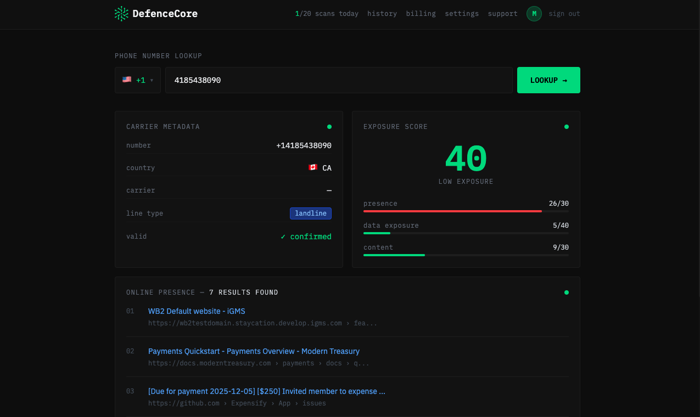

---

## 25. [ReasoningBank by Google](https://www.producthunt.com/products/reasoning-bank)
**Votes**: 5 | **도입 난이도**: 상 | **신뢰도**: 상
**Tagline**: Open-source memory framework for self-evolving agents
**서비스 링크**: https://www.producthunt.com/r/J7YV52PA5CFNRS

**태그**: AI, Agent, OpenSource, MLOps, AI Tool

### 📌 이 서비스 한눈에 보기
에이전트의 성공과 실패 경험을 학습하여 스스로 진화하는 오픈소스 메모리 프레임워크

### 🔑 주요 기능
- 성공 및 실패 사례에서 추론 패턴을 추출하는 메모리 프레임워크
- 배포 후에도 에이전트가 지속적으로 개선될 수 있는 환경 제공
- AI 연구자 및 에이전트 개발자를 위한 오픈소스 솔루션

### 🙋 사용자에게 어떤 점이 좋은가
에이전트가 과거의 시행착오를 바탕으로 스스로 학습하게 함으로써, 별도의 대규모 재학습 없이도 작업 수행 능력을 점진적으로 향상시킬 수 있습니다.

### ✅ 지금 바로 써볼 기능
- 오픈소스 코드베이스 검토 및 로컬 환경 구축
- 기존 에이전트 워크플로우에 추론 패턴 추출 로직 통합 테스트
- 실패 사례 데이터셋을 활용한 에이전트 개선 효과 검증

### ⚠️ 사용 전 확인할 점
- 에이전트의 자가 학습 과정에서 발생할 수 있는 잘못된 추론 패턴 고착화 위험
- 메모리 데이터 축적에 따른 시스템 복잡도 및 리소스 관리 필요성

### 🧭 확인이 더 필요한 정보
구체적인 프레임워크 아키텍처와 기존 LLM 프레임워크와의 호환성 수준에 대한 상세 정보가 필요합니다.

### 📸 스크린샷 및 갤러리

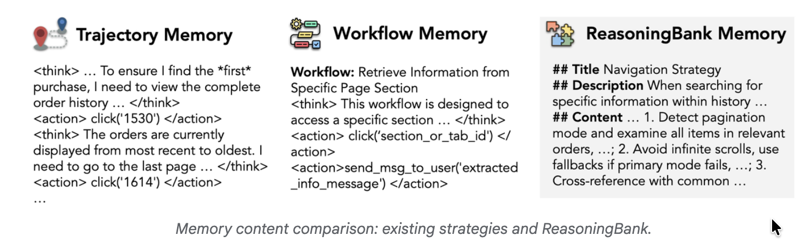
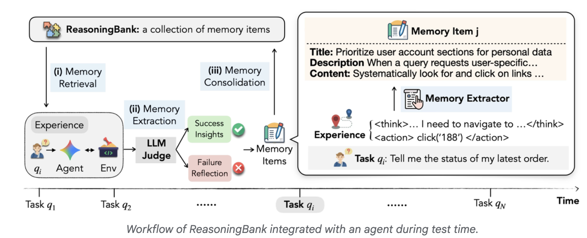

---

## 26. [LetterStack](https://www.producthunt.com/products/letterstack)
**Votes**: 5 | **도입 난이도**: 하 | **신뢰도**: 상
**Tagline**: Templates, sending, and logs - without the $20/month markup
**서비스 링크**: https://www.producthunt.com/r/2UHUHQTUM3XUET

**태그**: DevTool, Email, API, Automation, AI Tool

### 📌 이 서비스 한눈에 보기
기존 SMTP를 활용하여 비용 부담 없이 템플릿 관리와 발송 로그를 제공하는 개발자용 이메일 레이어

### 🔑 주요 기능
- 사용 중인 SMTP(Gmail, SES, Zoho 등)를 그대로 활용하여 발송량 제한 없이 사용 가능
- Handlebars 템플릿, 단일 REST API 엔드포인트, 발송 로그 기능 제공
- 월 $20 이상의 고가 서비스 대비 저렴한 비용 구조 ($1/mo부터 시작)

### 🙋 사용자에게 어떤 점이 좋은가
이미 보유한 SMTP 인프라를 활용하면서도 개발 편의성(API, 템플릿)만 가져올 수 있어 비용 효율적입니다.

### ✅ 지금 바로 써볼 기능
- 기존 SMTP 서비스(SES, Zoho 등) 연결 테스트
- Handlebars를 이용한 이메일 템플릿 제작
- 단일 API 엔드포인트를 통한 발송 워크플로우 구축

### ⚠️ 사용 전 확인할 점
- 사용자의 SMTP 서버 평판에 의존하므로, 서버 문제 시 발송 실패 가능성 있음
- 자체 SMTP 서버를 사용하므로 인프라 관리 책임이 사용자에게 있음

### 🧭 확인이 더 필요한 정보
연결 가능한 SMTP 프로토콜의 상세 사양과 보안 인증 방식에 대한 추가 확인이 필요합니다.

### 📸 스크린샷 및 갤러리
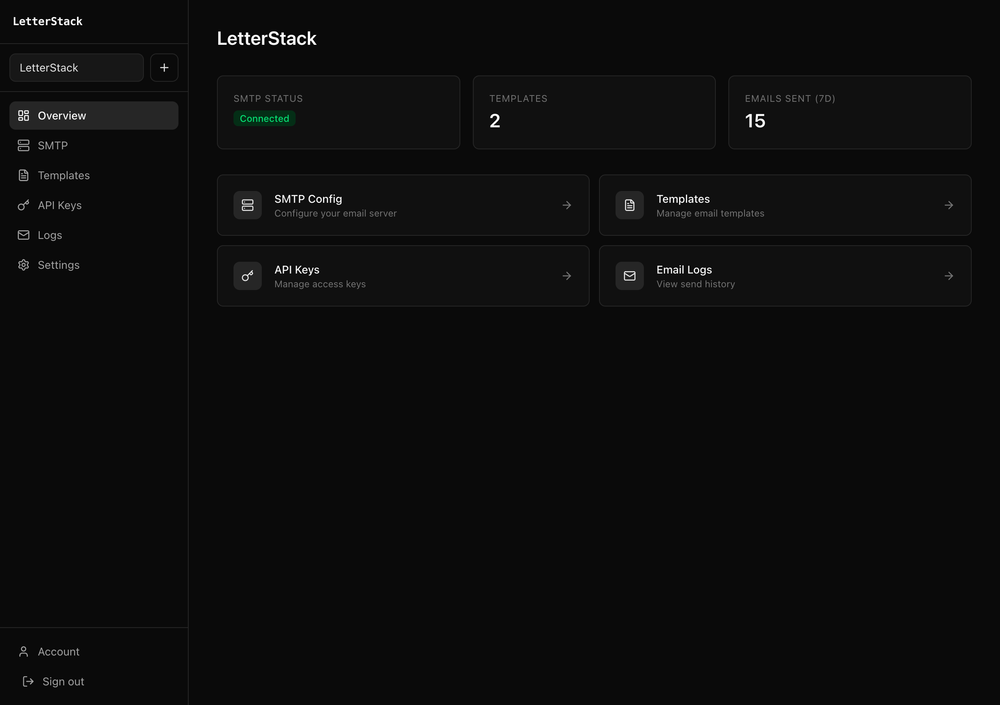
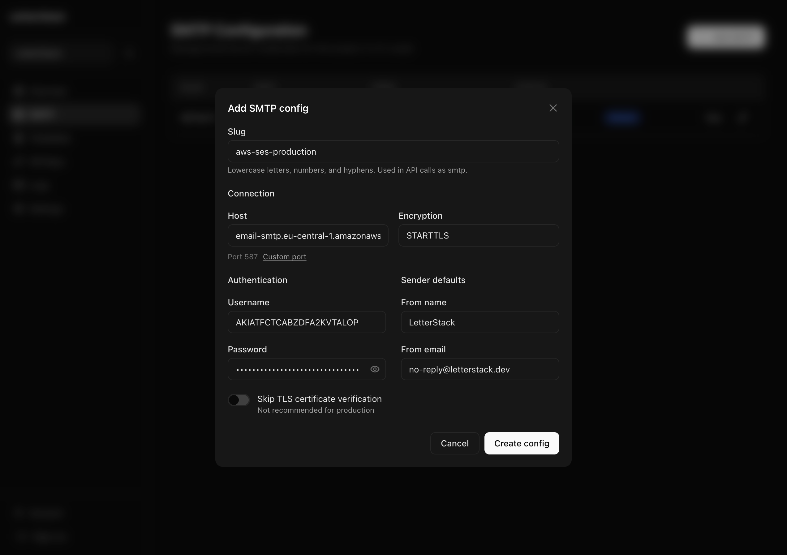
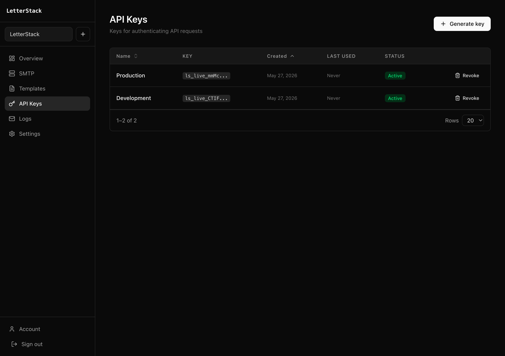

---

## 27. [Ctrl Deck](https://www.producthunt.com/products/ctrl-deck)
**Votes**: 5 | **도입 난이도**: 하 | **신뢰도**: 상
**Tagline**: A visual shortcut panel for faster Windows workflows
**서비스 링크**: https://www.producthunt.com/r/D52JMMPPS7WZUS

**태그**: Productivity, Windows, Workflow, Utility, Automation, Design

### 📌 이 서비스 한눈에 보기
윈도우 작업 효율을 극대화하는 시각적 바로가기 패널

### 🔑 주요 기능
- 앱, 파일, 폴더, URL 등을 한곳에서 실행하는 통합 인터페이스
- 명령어 및 특정 윈도우 동작을 지원하는 워크플로우 최적화
- 깔끔하고 반응성이 뛰어난 데스크톱 디자인

### 🙋 사용자에게 어떤 점이 좋은가
복잡한 탐색 과정 없이 자주 쓰는 항목을 시각적으로 배치하여 작업 전환 속도를 획기적으로 높여줍니다.

### ✅ 지금 바로 써볼 기능
- 자주 사용하는 앱과 폴더를 패널에 등록하기
- 자주 방문하는 웹사이트 URL 바로가기 설정하기
- 반복적인 윈도우 명령어를 단축 버튼으로 만들기

### ⚠️ 사용 전 확인할 점
- 데스크톱 화면 공간을 차지할 수 있음
- 사용자 환경에 따른 디자인 적응 필요

### 🧭 확인이 더 필요한 정보
시스템 리소스 점유율 및 상세한 커스텀 기능 범위에 대한 정보가 부족합니다.

### 📸 스크린샷 및 갤러리
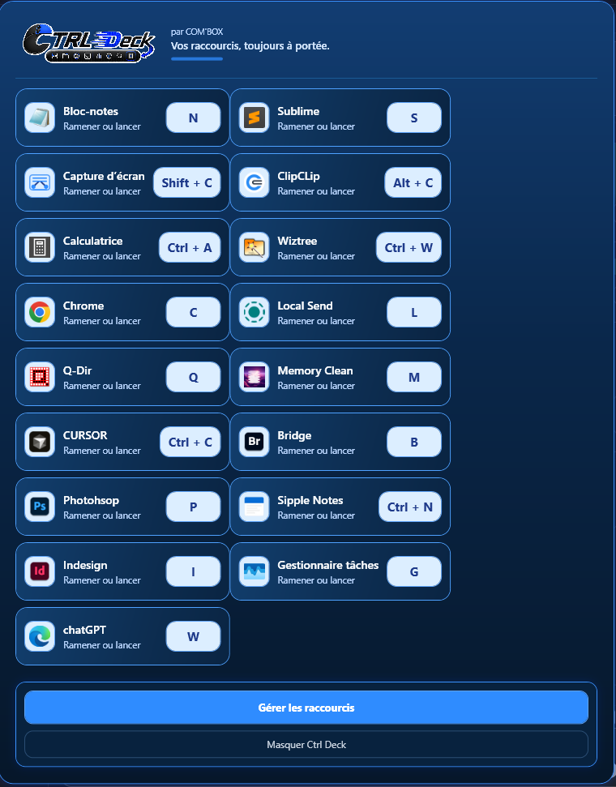
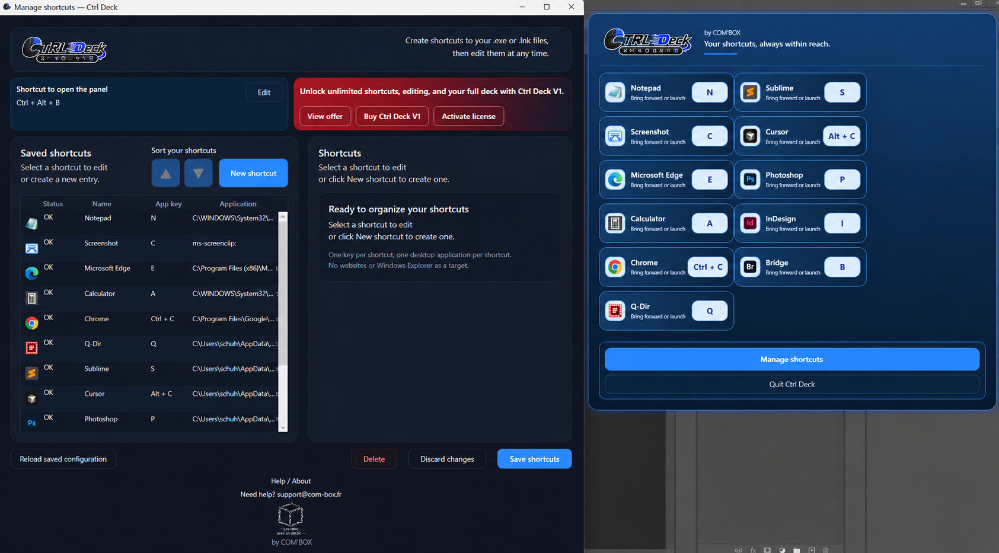
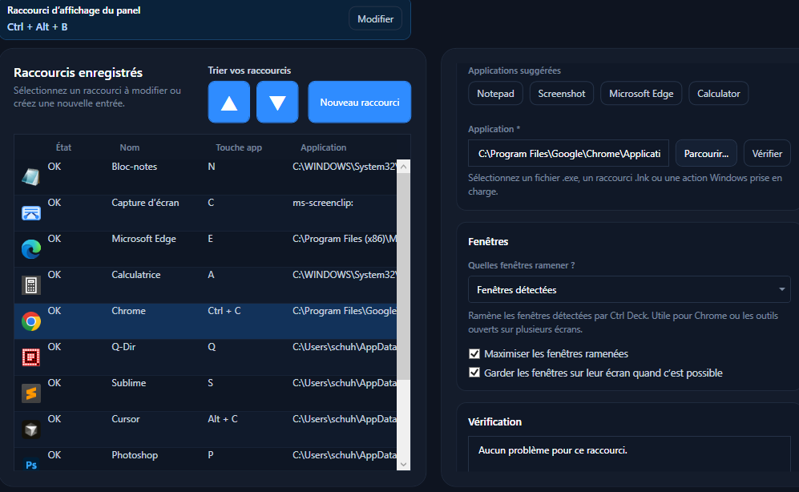

### 🎬 관련 영상
- [🎥 영상 보기](https://ph-files.imgix.net/3c33221b-6dfc-4526-a54b-25c29717331c.jpeg?auto=format)

---

## 28. [Splix](https://www.producthunt.com/products/splix-2)
**Votes**: 5 | **도입 난이도**: 하 | **신뢰도**: 상
**Tagline**: Track shared group expenses and balances without friction
**서비스 링크**: https://www.producthunt.com/r/WKCEBLC75ALU2G

**태그**: Fintech, Productivity, Utility, AI Tool, Design

### 📌 이 서비스 한눈에 보기
복잡한 기능 없이 깔끔하게 정산과 잔액을 관리하는 일회성 결제 기반의 그룹 비용 장부

### 🔑 주요 기능
- 구독료 없는 일회성 결제 방식 (Pay once, own it forever)
- 데이터 수집이나 알고리즘 없이 정산 본연의 기능에 집중한 인터페이스
- 전화번호를 통한 간편한 친구 초대 및 그룹 연결

### 🙋 사용자에게 어떤 점이 좋은가
복잡한 기능이나 월간 구독료에 지친 사용자들에게 군더더기 없는 깔끔한 비용 정산 환경을 제공합니다.

### ✅ 지금 바로 써볼 기능
- 전화번호로 친구 초대하여 그룹 생성하기
- 공동 비용 및 개인별 잔액 기록하기
- 일회성 결제로 영구 소유권 확보하기

### ⚠️ 사용 전 확인할 점
- 일회성 결제 방식에 대한 구체적인 가격 정책 확인 필요
- 실제 결제 기능(송금 등)이 포함되어 있는지 혹은 기록용인지 확인 필요

### 🧭 확인이 더 필요한 정보
정확한 일회성 결제 금액과 실제 현금 송금 기능의 연동 여부가 명시되지 않았습니다.

### 📸 스크린샷 및 갤러리

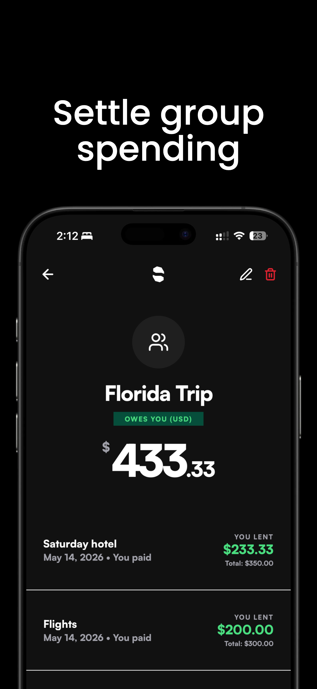
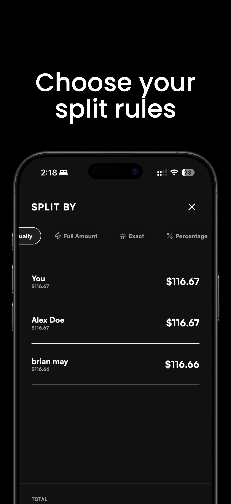

---

## 29. [ProductDesk](https://www.producthunt.com/products/productdesk)
**Votes**: 5 | **도입 난이도**: 하 | **신뢰도**: 상
**Tagline**: Feedback, roadmap, and changelog - from $1/mo, not $79
**서비스 링크**: https://www.producthunt.com/r/LUTPVVN5OWBBDH

**태그**: SaaS, ProductManagement, CustomerFeedback, Roadmap, AI Tool, Email

### 📌 이 서비스 한눈에 보기
합리적인 가격으로 제품 피드백, 로드맵, 변경 사항을 관리하는 통합 고객 허브

### 🔑 주요 기능
- 피드백, 로드맵, 웨이트리스트 등 SaaS 운영에 필요한 고객 접점 도구 통합
- 하나의 고정된 URL(subdomain)로 지속적인 기능 확장 가능
- 월 $1부터 시작하는 매우 경제적인 가격 정책

### 🙋 사용자에게 어떤 점이 좋은가
매번 새로운 제품을 출시할 때마다 고객용 페이지를 새로 만들 필요 없이, 하나의 URL로 모든 고객 소통 채널을 관리할 수 있습니다.

### ✅ 지금 바로 써볼 기능
- 피드백 수집 기능 활성화
- 제품 로드맵 공개
- 이메일 기반 투표 기능 활용

### ⚠️ 사용 전 확인할 점
- 현재 피드백과 로드맵 기능 위주이며, Changelog와 Docs는 향후 업데이트 예정
- 기능 확장이 로드맵에 따라 순차적으로 진행됨

### 🧭 확인이 더 필요한 정보
Changelog, Waitlist, Docs 기능의 정확한 출시 일정은 공개된 로드맵을 확인해야 합니다.

### 📸 스크린샷 및 갤러리
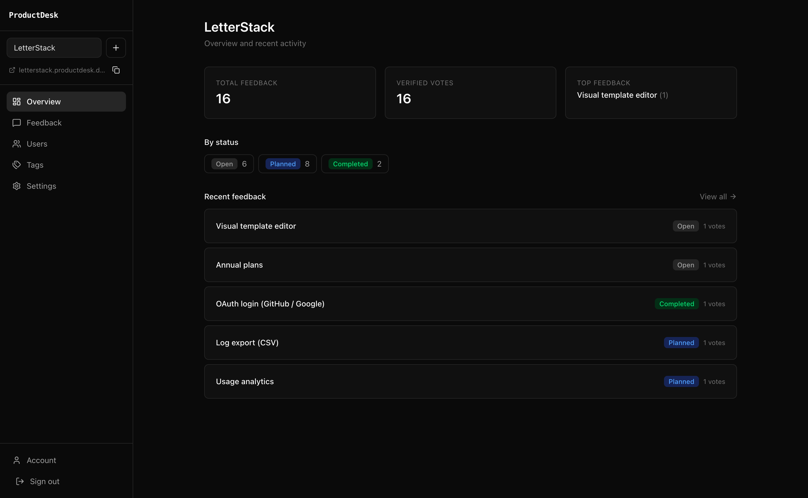
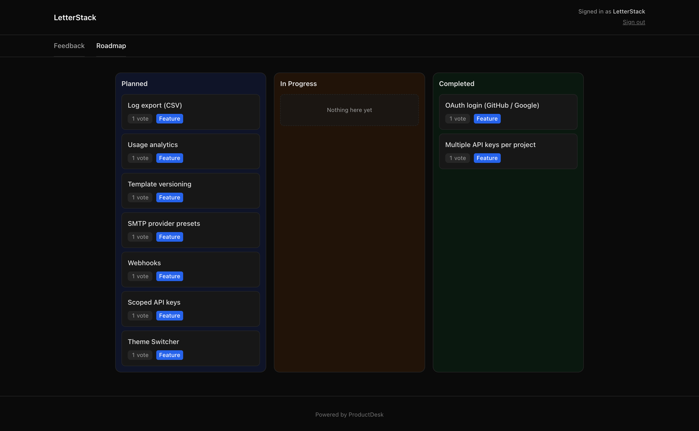
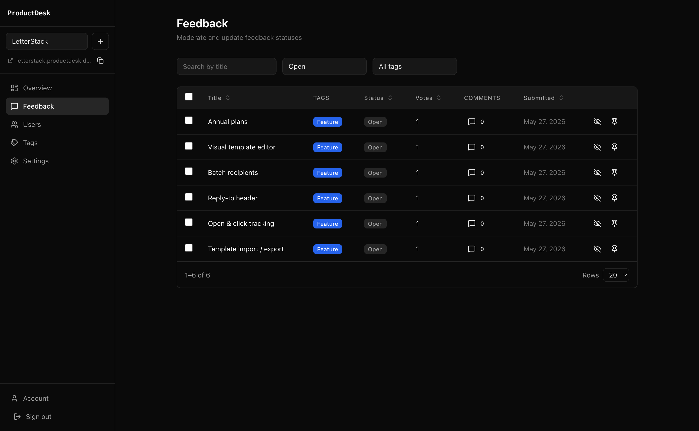

---

## 30. [Asset Quadrant](https://www.producthunt.com/products/asset-quadrant)
**Votes**: 5 | **도입 난이도**: 하 | **신뢰도**: 상
**Tagline**: Track stocks, ETFs, crypto & metals — with an AI digest
**서비스 링크**: https://www.producthunt.com/r/K3YPOBEKLQ4YPS

**태그**: FinTech, Portfolio Management, AI, Asset Tracking, AI Tool

### 📌 이 서비스 한눈에 보기
주식, 코인, 금 등 모든 자산을 한눈에 관리하고 AI로 포트폴리오 변동 원인을 분석하는 대시보드

### 🔑 주요 기능
- 주식, ETF, 암호화폐, 귀금속 등 다양한 자산의 통합 순자산 관리
- 실제 취득 원가, 실현/미실현 손익, 자산 배분 및 실시간 시세 추적
- AI 기반의 포트폴리오 요약: 자산 변동 원인을 쉬운 언어로 설명

### 🙋 사용자에게 어떤 점이 좋은가
여러 곳에 흩어진 투자 자산을 하나의 대시보드에서 통합 관리할 수 있으며, AI가 복잡한 변동 원인을 쉽게 설명해 주어 직관적인 자산 관리가 가능합니다.

### ✅ 지금 바로 써볼 기능
- 모든 투자 계좌의 자산 데이터 입력하기
- AI 포트폴리오 요약 기능으로 변동 원인 파악하기
- 자산 배분 현황 및 실시간 손익 확인하기

### ⚠️ 사용 전 확인할 점
- 금융 조언이 아닌 정보 제공용 도구임을 인지해야 함
- 현재 무료 공개 베타 단계로 기능 업데이트가 빈번할 수 있음

### 🧭 확인이 더 필요한 정보
현재 베타 단계이므로 향후 자동화된 계좌 연동 범위와 AI 기능의 고도화 수준을 확인해야 합니다.

### 📸 스크린샷 및 갤러리

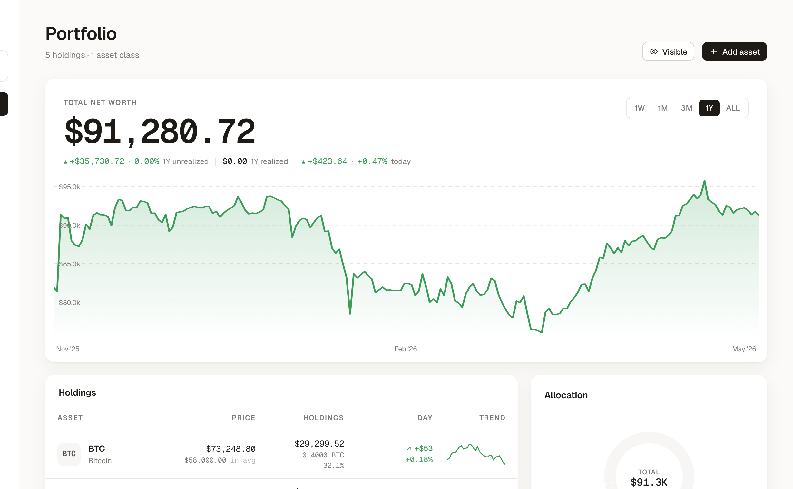

---

