# 🚀 Product Hunt Daily Top 30 (2026-06-01)

## 오늘의 요약
오늘의 트렌드는 데이터 보안과 프라이버시를 최우선으로 하는 로컬 기반 AI 도구와 개인화된 AI 메모리 솔루션이 주를 이루었습니다. 사용자의 데이터를 클라우드에 올리지 않으면서도 강력한 검색과 자동화 기능을 제공하는 서비스들이 높은 관심을 받았습니다.

### 오늘의 핵심 포인트
- 데이터 유출 걱정 없는 로컬 환경 및 브라우저 기반의 프라이버시 중심 툴이 주목받았습니다.
- AI가 사용자의 맥락을 기억하거나 정보를 자동 분류하는 지능형 개인 비서 기능이 강화되었습니다.
- 복잡한 편집 과정 없이 AI와 자동화 기술을 활용해 생산성을 높이는 워크플로우 도구들이 등장했습니다.

**오늘의 태그**: AI_Productivity, Privacy_First, Local_AI, Automation

## 1. [Clipto](https://www.producthunt.com/products/clipto-ai)
**Votes**: 286 | **도입 난이도**: 중 | **신뢰도**: 상
**Tagline**: Fully local, natural language search over terabytes of media
**서비스 링크**: https://www.producthunt.com/r/Y5E7U6HB2KB5NG

**태그**: AI, Media, Search, Privacy, Local-First, Video

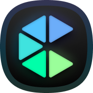

### 📌 이 서비스 한눈에 보기
클라우드 업로드 없이 대용량 미디어 파일을 자연어로 검색할 수 있는 로컬 기반 AI 검색 엔진

### 🔑 주요 기능
- 데이터를 클라우드에 올리지 않는 완전한 로컬 환경 제공
- 인물, 대화, 장면 자동 태깅을 통한 자연어 검색 기능
- 대규모 데이터(2TB)를 빠르게 처리하는 고성능 인덱싱

### 🙋 사용자에게 어떤 점이 좋은가
개인정보 유출 걱정 없이 수 테라바이트의 영상과 음성 파일 속에서 원하는 순간을 즉시 찾아낼 수 있습니다.

### ✅ 지금 바로 써볼 기능
- 로컬 하드 드라이브의 미디어 파일 인덱싱 테스트
- 자연어 검색을 통한 특정 장면/대화 찾기 기능 활용

### ⚠️ 사용 전 확인할 점
- 로컬 리소스(CPU/GPU) 사용량에 따른 시스템 부하 가능성
- 하드웨어 사양에 따른 인덱싱 속도 차이

### 🧭 확인이 더 필요한 정보
사용자의 하드웨어 사양에 따른 구체적인 성능 최적화 범위와 지원 파일 포맷 확인이 필요합니다.

### 📸 스크린샷 및 갤러리
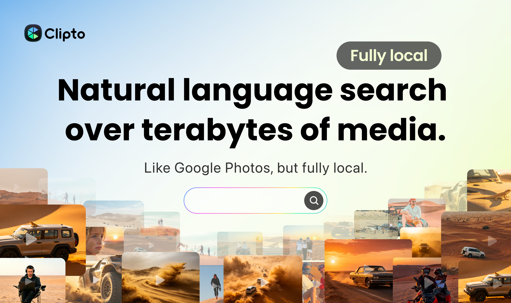
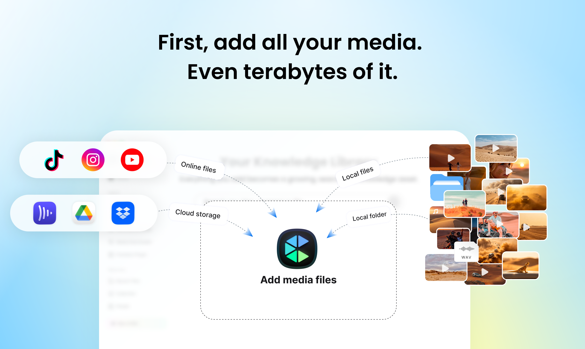
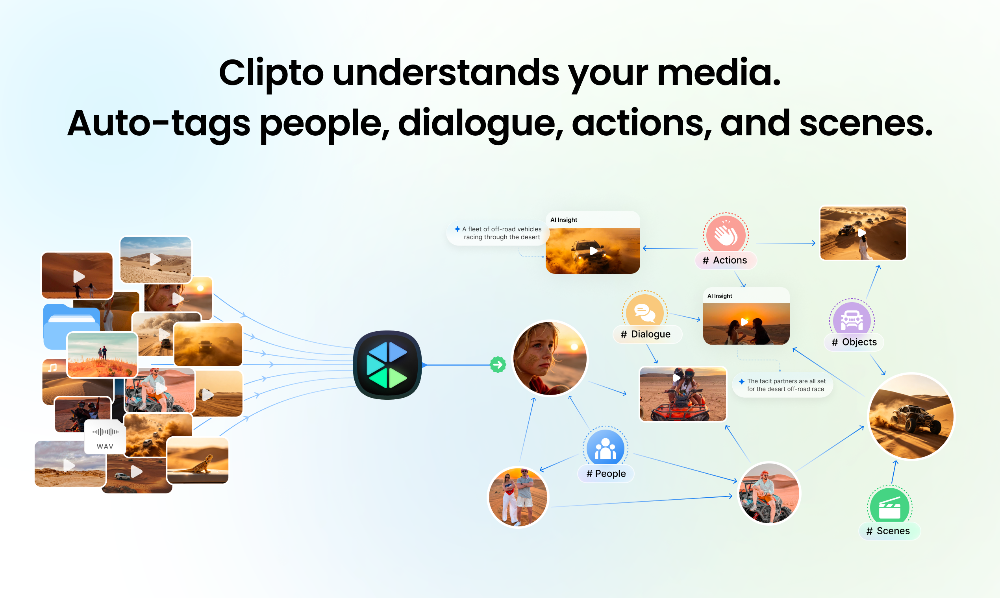

### 🎬 관련 영상
- [🎥 영상 보기](https://ph-files.imgix.net/463437b5-0465-4b4c-b8ab-0c2c8a709062.jpeg?auto=format)

---

## 2. [Oura Ring 5](https://www.producthunt.com/products/oura)
**Votes**: 229 | **도입 난이도**: 하 | **신뢰도**: 상
**Tagline**: The world’s smallest smart ring, now even better
**서비스 링크**: https://www.producthunt.com/r/EHY7QRSUF2SXN4

**태그**: Wearable, Health, SmartRing, Design

### 📌 이 서비스 한눈에 보기
더 작고 강력해진 티타늄 디자인의 차세대 스마트 링

### 🔑 주요 기능
- 기존 대비 40% 작아진 컴팩트한 디자인
- 최대 9일간 지속되는 강력한 배터리 수명
- 수면, 활동, 스트레스, 심장 건강 및 회복 관리 기능

### 🙋 사용자에게 어떤 점이 좋은가
작고 가벼운 티타늄 디자인으로 착용감이 개선되었으며, 한 번의 충전으로 일주일 이상 건강 데이터를 연속적으로 추적할 수 있습니다.

### ✅ 지금 바로 써볼 기능
- 수면 및 회복 데이터 모니터링
- 일일 활동량 및 스트레스 지수 확인
- 심장 건강 상태 추적

### ⚠️ 사용 전 확인할 점
- 제품의 정확한 크기 및 착용감 확인 필요
- 기능별 배터리 소모량 차이 고려

### 🧭 확인이 더 필요한 정보
상세한 센서 사양 및 이전 모델과의 데이터 호환성 여부는 추가 확인이 필요합니다.

### 📸 스크린샷 및 갤러리

### 🎬 관련 영상
- [🎥 영상 보기](https://ph-files.imgix.net/ef6173e8-cea4-4914-9e79-5f0a84ae1b69.jpeg?auto=format)

---

## 3. [Second Brain for AI](https://www.producthunt.com/products/second-brain-cloudflare)
**Votes**: 192 | **도입 난이도**: 중 | **신뢰도**: 상
**Tagline**: Persistent memory for Claude, ChatGPT & Cursor. Free.
**서비스 링크**: https://www.producthunt.com/r/DHJEGKLQBKHAGY

**태그**: AI, Productivity, DevTool, KnowledgeManagement, AI Tool, Chat

### 📌 이 서비스 한눈에 보기
AI 모델이 대화가 끝나도 사용자의 맥락을 기억하게 만드는 개인용 메모리 레이어

### 🔑 주요 기능
- Claude, ChatGPT, Cursor 등 다양한 AI 클라이언트와 연동 가능한 메모리 계층
- 키워드가 아닌 의미 기반의 시맨틱 검색 및 중복 감지 기능 제공
- 사용자 데이터 소유권을 보장하는 셀프 호스팅 방식 및 MIT 라이선스

### 🙋 사용자에게 어떤 점이 좋은가
매번 새로운 채팅창에서 프로젝트 배경을 다시 설명해야 하는 번거로움을 없애고, 일관된 맥락을 AI에게 즉시 제공할 수 있습니다.

### ✅ 지금 바로 써볼 기능
- 자주 사용하는 프로젝트 맥락 저장하기
- 시맨틱 검색을 통한 과거 결정 사항 호출하기
- 사용 중인 AI 클라이언트(Cursor 등)와 연동 설정하기

### ⚠️ 사용 전 확인할 점
- 셀프 호스팅 방식이므로 초기 설정 및 서버 관리 역량이 필요할 수 있음
- 연동하려는 특정 AI 클라이언트와의 호환성 확인 필요

### 🧭 확인이 더 필요한 정보
사용자의 기술적 숙련도에 따라 셀프 호스팅 환경 구축 난이도가 다를 수 있습니다.

### 📸 스크린샷 및 갤러리
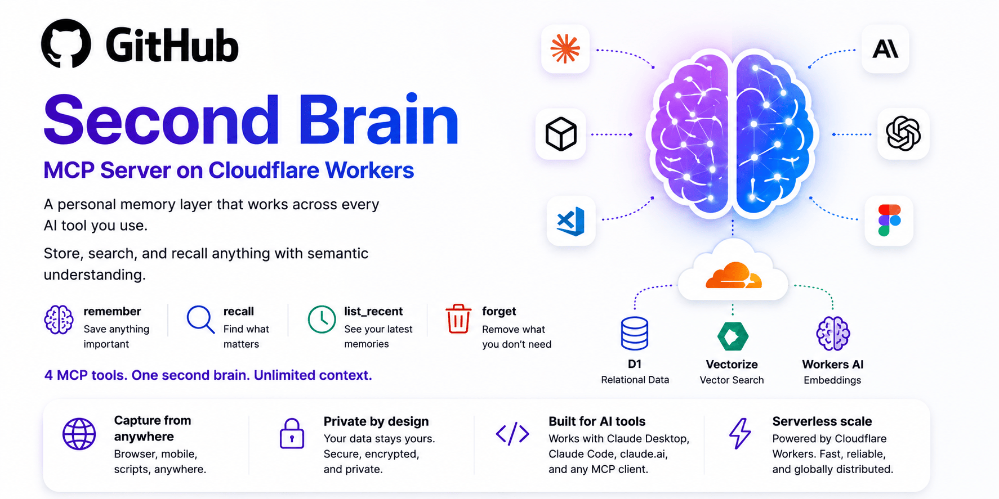

### 🎬 관련 영상
- [🎥 영상 보기](https://ph-files.imgix.net/2a68fbf4-74aa-40b3-975e-c6300a070cf3.jpeg?auto=format)

---

## 4. [TabTasker](https://www.producthunt.com/products/tabtasker)
**Votes**: 183 | **도입 난이도**: 하 | **신뢰도**: 상
**Tagline**: Zero servers. Total privacy. Your new favorite toolbox.
**서비스 링크**: https://www.producthunt.com/r/S6D5ZCV6OE5UPW

**태그**: Productivity, Privacy, WebTool, Utility, Vision

### 📌 이 서비스 한눈에 보기
파일 업로드 없이 브라우저 내에서 모든 작업이 완료되는 프라이버시 중심의 올인원 웹 툴박스

### 🔑 주요 기능
- 서버를 거치지 않는 100% 오프라인 브라우저 기반 동작
- PDF 편집, 이미지 처리, 오디오 전사 등 50개 이상의 유틸리티 제공
- 데이터 유출 걱정 없는 강력한 개인정보 보호

### 🙋 사용자에게 어떤 점이 좋은가
민감한 개인 파일이나 업무 문서를 외부 서버에 업로드할 필요가 없어 보안이 중요한 작업에 매우 유용합니다.

### ✅ 지금 바로 써볼 기능
- PDF 편집 기능 테스트
- 이미지 처리 도구 활용
- 오디오 파일 전사 기능 확인

### ⚠️ 사용 전 확인할 점
- 브라우저 리소스 사용량에 따른 성능 제한 가능성
- 오프라인 환경에서의 기능 작동 여부 확인 필요

### 🧭 확인이 더 필요한 정보
50개 이상의 유틸리티가 모든 브라우저 환경에서 동일한 성능을 보장하는지 확인이 필요합니다.

### 📸 스크린샷 및 갤러리
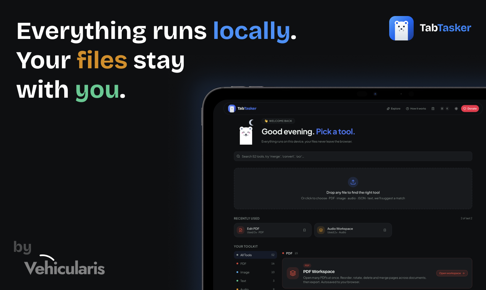
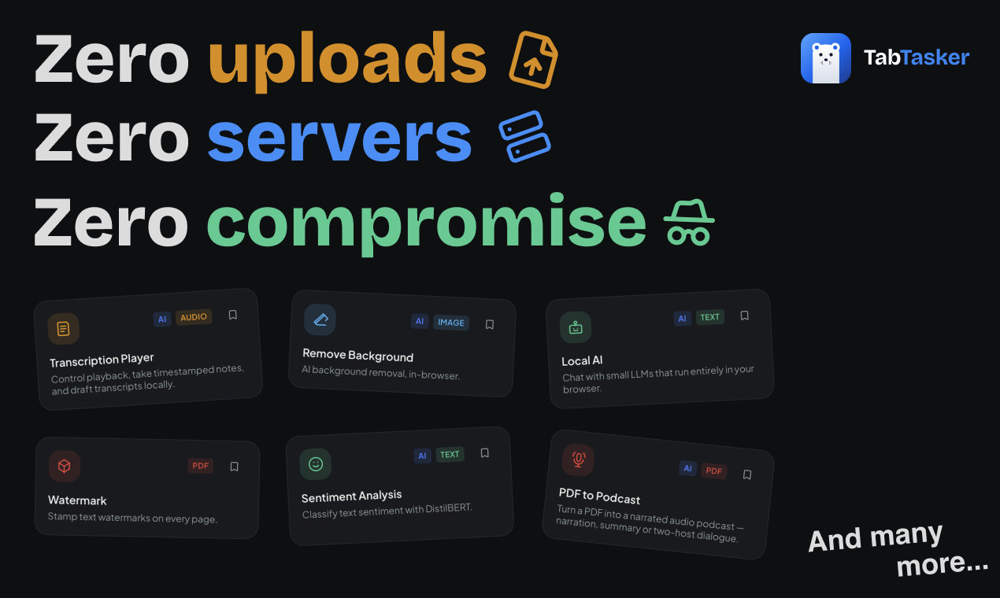
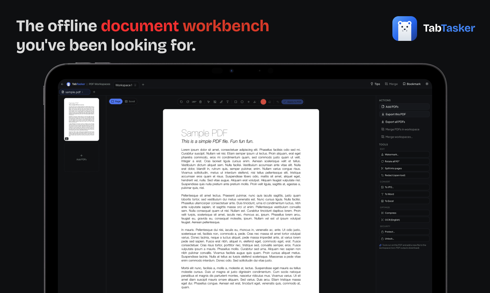

---

## 5. [Marqly 5.0](https://www.producthunt.com/products/marqly)
**Votes**: 149 | **도입 난이도**: 하 | **신뢰도**: 상
**Tagline**: Your AI-powered bookmark manager
**서비스 링크**: https://www.producthunt.com/r/S663NU4CVUKEEA

**태그**: Productivity, AI, KnowledgeManagement, Organization, AI Tool, Video

### 📌 이 서비스 한눈에 보기
수동 정리 없이 AI가 자동으로 분류하고 검색해 주는 지능형 북마크 관리 도구

### 🔑 주요 기능
- AI 기반 자동 태깅 및 카테고리 분류 기능
- 폴더 대신 자연어로 찾는 시맨틱 검색 시스템
- 요약, 리더 모드, 크로스 플랫폼 동기화 지원

### 🙋 사용자에게 어떤 점이 좋은가
수많은 링크를 일일이 폴더에 정리할 필요 없이, 저장만 하면 AI가 알아서 지식 라이브러리를 구축해 줍니다.

### ✅ 지금 바로 써볼 기능
- 관심 있는 웹사이트나 아티클 저장해보기
- 자연어 검색으로 저장된 링크 찾아보기
- AI 요약 기능으로 핵심 내용 빠르게 파악하기

### ⚠️ 사용 전 확인할 점
- AI 자동 분류의 정확도 확인 필요
- 오프라인 액세스 시 동기화 범위 확인

### 🧭 확인이 더 필요한 정보
구체적인 플랫폼 지원 범위와 오프라인 모드의 상세 기능에 대한 정보가 추가로 필요합니다.

### 📸 스크린샷 및 갤러리
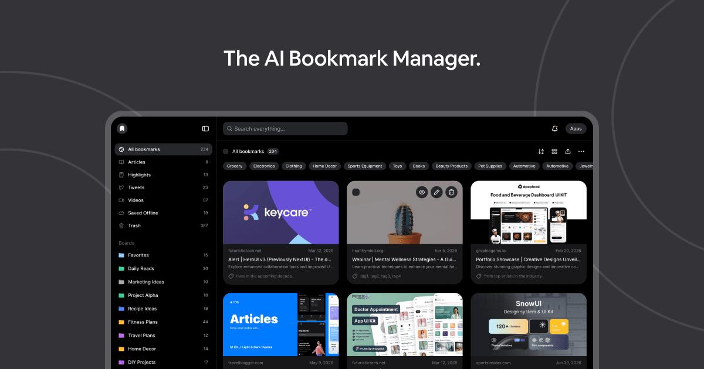
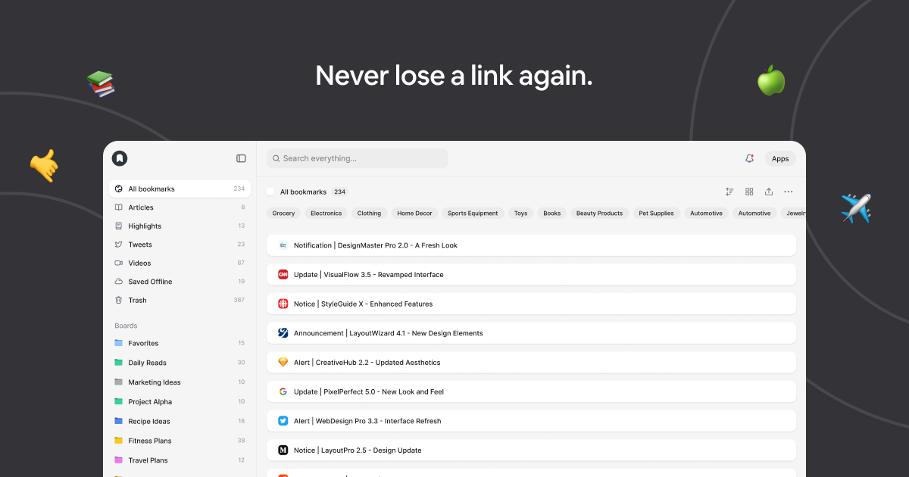
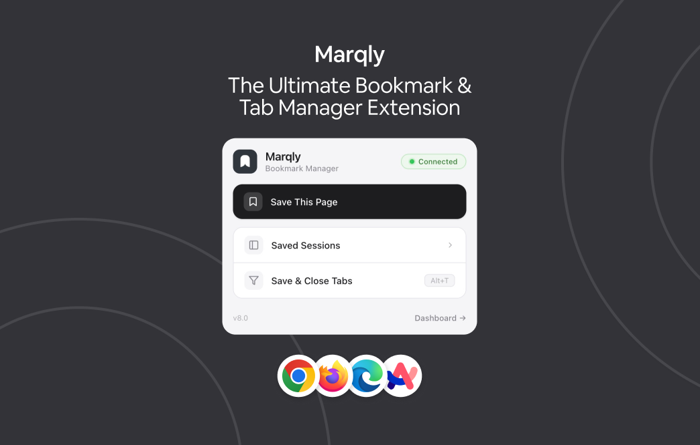

---

## 6. [Web Clipper for NotebookLM](https://www.producthunt.com/products/web-clipper-for-notebooklm)
**Votes**: 109 | **도입 난이도**: 하 | **신뢰도**: 상
**Tagline**: Your ultimate NotebookLM's Chrome Extension
**서비스 링크**: https://www.producthunt.com/r/ADVROJUYQ6XJHX

**태그**: Productivity, Browser Extension, AI Tool, Workflow Automation, Chat, Video

### 📌 이 서비스 한눈에 보기
웹 콘텐츠를 NotebookLM으로 간편하게 수집하고, 결과물을 다양한 생산성 도구로 내보내는 통합 워크플로우 확장 프로그램

### 🔑 주요 기능
- 웹 페이지, PDF, 유튜브, SNS 스레드 등을 클릭 한 번으로 NotebookLM에 저장
- NotebookLM의 결과물을 Anki, Obsidian, Word, Markdown 등으로 손쉽게 내보내기
- Google Drive 소스 자동 새로고침 및 Google 스타일의 직관적인 UI 제공

### 🙋 사용자에게 어떤 점이 좋은가
정보 수집부터 학습 및 정리까지 이어지는 NotebookLM의 워크플로우를 끊김 없이 연결하여 생산성을 극대화합니다.

### ✅ 지금 바로 써볼 기능
- 유튜브 영상이나 웹 아티클을 클릭 한 번으로 NotebookLM에 클리핑하기
- 생성된 플래시카드를 Anki로 내보내어 학습에 활용하기
- 마인드맵을 Obsidian으로 내보내어 개인 지식 베이스 구축하기

### ⚠️ 사용 전 확인할 점
- 클리핑 시 사용자가 선택한 범위(예: 유튜브 채널 내 특정 영상)에 따라 데이터 품질이 달라질 수 있음
- 외부 도구(Anki, Obsidian 등)와의 연동은 각 서비스의 포맷 호환성에 의존함

### 🧭 확인이 더 필요한 정보
NotebookLM의 API 업데이트나 정책 변화에 따라 기능의 안정성이 영향을 받을 수 있습니다.

### 📸 스크린샷 및 갤러리
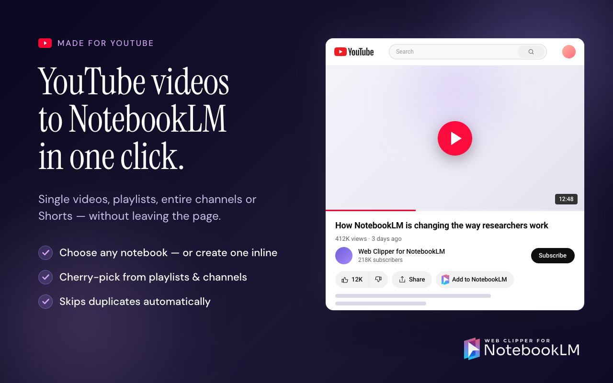
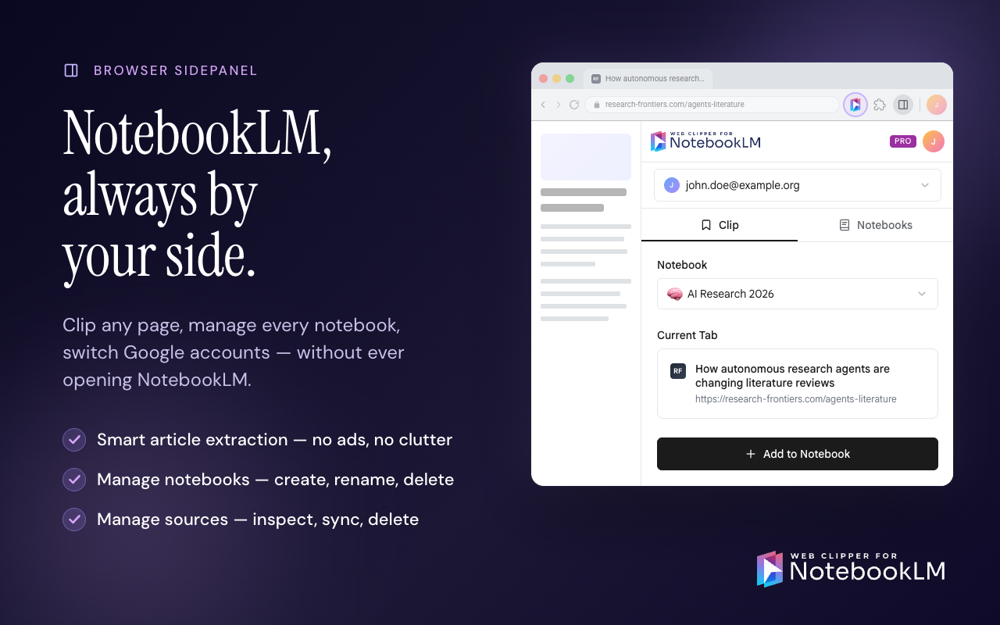
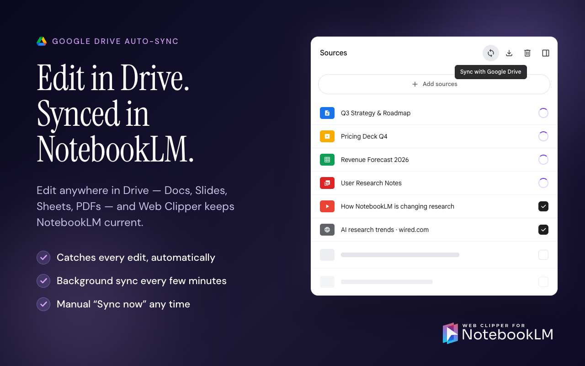

---

## 7. [Copycat Cafe](https://www.producthunt.com/products/copycat-cafe)
**Votes**: 37 | **도입 난이도**: 하 | **신뢰도**: 상
**Tagline**: Learn your next language by copying native speakers
**서비스 링크**: https://www.producthunt.com/r/X32YBYNCD2HE73

**태그**: LanguageLearning, AI, EdTech, Speaking, AI Tool, Chat, Email

### 📌 이 서비스 한눈에 보기
원어민의 목소리를 따라 하며 실전 회화 실력을 키우는 AI 언어 학습 서비스

### 🔑 주요 기능
- 원어민 목소리 클로닝 기술을 활용한 실감 나는 대화 시청
- AI 기반의 정교한 발음 점수(0-100%) 피드백 제공
- 판단에 대한 부담 없이 자유롭게 대화할 수 있는 AI 채팅 기능

### 🙋 사용자에게 어떤 점이 좋은가
단순 단어 암기를 넘어 실제 말하기 능력을 키우고 싶어 하는 학습자에게 효과적입니다. 하루 15분 투자로 실전 감각을 익힐 수 있습니다.

### ✅ 지금 바로 써볼 기능
- 원어민 대화 영상 시청하기
- AI 발음 스코어링 기능 테스트하기
- AI와 자유 대화하며 교정 받기

### ⚠️ 사용 전 확인할 점
- 현재 프랑스어와 스페인어만 지원됨
- 학습 목적에 따라 AI 피드백의 정확도 차이가 있을 수 있음

### 🧭 확인이 더 필요한 정보
향후 추가될 언어 라인업과 구체적인 구독 요금 체계에 대한 정보가 필요합니다.

### 📸 스크린샷 및 갤러리
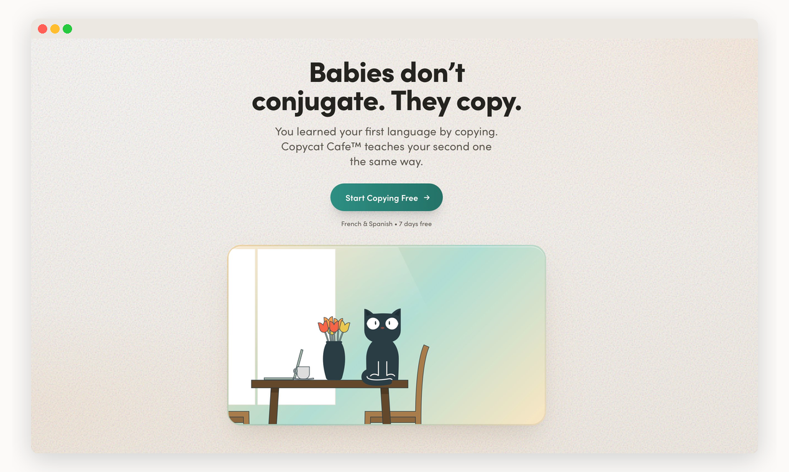
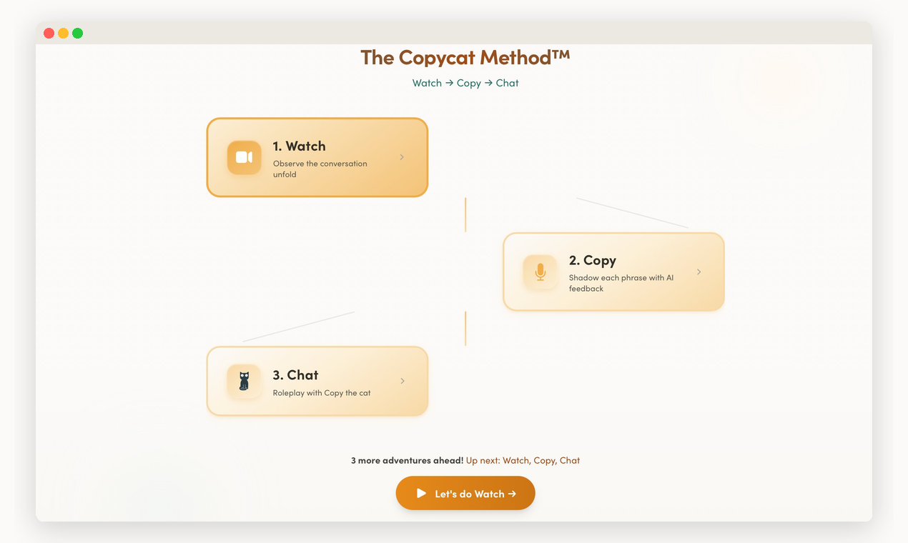
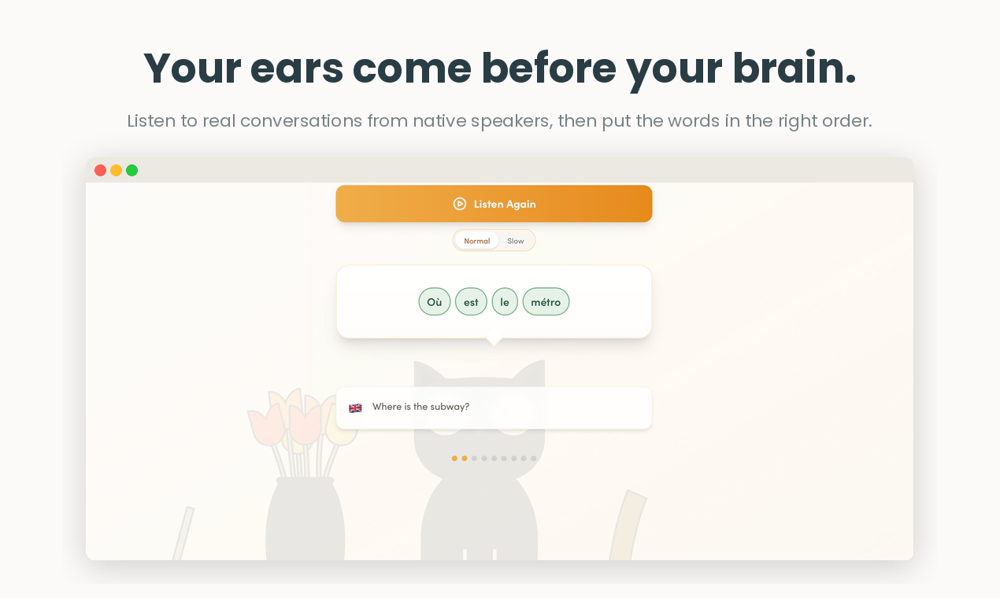

---

## 8. [Zoomix](https://www.producthunt.com/products/zoomix)
**Votes**: 14 | **도입 난이도**: 하 | **신뢰도**: 상
**Tagline**: Create beautiful product demos with smooth zoom effects.
**서비스 링크**: https://www.producthunt.com/r/EISRRIOGWQGZ6L

**태그**: VideoTool, ProductDemo, NoCode, ContentCreation, AI Tool

### 📌 이 서비스 한눈에 보기
별도의 편집 없이 브라우저에서 바로 매력적인 제품 데모 영상을 만드는 도구

### 🔑 주요 기능
- 브라우저 기반의 간편한 화면 녹화 기능
- 스마트 줌 효과 및 커서 트래킹 자동 적용
- 깔끔한 배경 처리를 통한 전문적인 영상미 제공

### 🙋 사용자에게 어떤 점이 좋은가
복잡한 영상 편집 과정 없이도 클릭 몇 번으로 시청자의 시선을 사로잡는 고품질 데모 영상을 제작할 수 있습니다.

### ✅ 지금 바로 써볼 기능
- 브라우저에서 바로 녹화 시작하기
- 자동 적용되는 스마트 줌 효과 확인하기
- 깔끔한 배경 설정 적용해보기

### ⚠️ 사용 전 확인할 점
- 브라우저 기반이므로 시스템 전체 화면 녹화 기능 제한 가능성
- 자동화된 효과 외의 세밀한 수동 편집 기능 여부 확인 필요

### 🧭 확인이 더 필요한 정보
브라우저 외 환경(데스크톱 앱 등)에서의 녹화 지원 여부와 상세 편집 기능 범위가 명시되지 않았습니다.

### 📸 스크린샷 및 갤러리

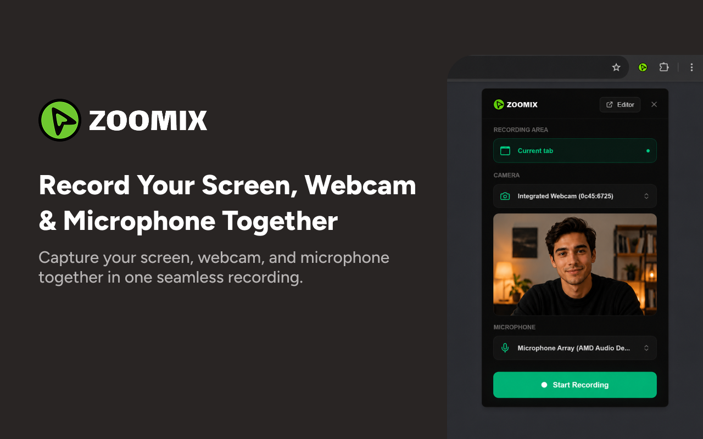

### 🎬 관련 영상
- [🎥 영상 보기](https://ph-files.imgix.net/f2f19139-31fb-4e0a-8450-82d326b0a540.jpeg?auto=format)

---

## 9. [Harness Starter Kit](https://www.producthunt.com/products/harness-starter-kit)
**Votes**: 11 | **도입 난이도**: 하 | **신뢰도**: 상
**Tagline**: Repo guardrails for reliable AI coding agents
**서비스 링크**: https://www.producthunt.com/r/G23EUZKIVDMV2U

**태그**: DevTool, AI-Agent, Automation, Workflow, Agent, AI Tool, Prompting

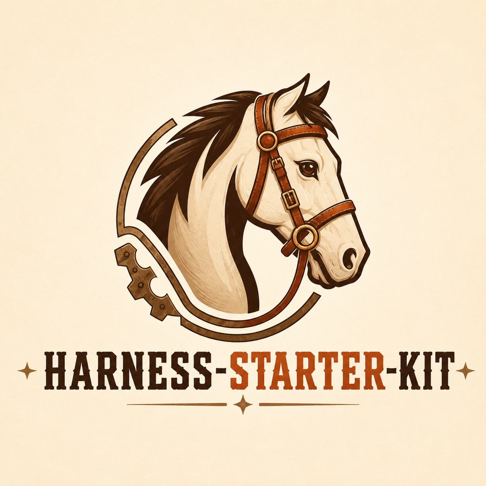

### 📌 이 서비스 한눈에 보기
AI 코딩 에이전트의 불안정한 동작을 방지하고 안정적인 협업 환경을 구축하는 저장소 가드레일 도구

### 🔑 주요 기능
- AGENTS.md를 통한 명확한 에이전트 규칙 설정
- 코드 드리프트 체크 및 실패 기록(Failure Memory) 관리
- 스택 프로필 및 도입 보고서를 통한 에이전트 협업 최적화

### 🙋 사용자에게 어떤 점이 좋은가
AI 에이전트가 코드를 수정할 때 발생할 수 있는 예기치 못한 오류를 방지하고, 팀의 코드 베이스를 안전하게 유지할 수 있습니다.

### ✅ 지금 바로 써볼 기능
- AGENTS.md를 작성하여 에이전트용 규칙 설정하기
- 드리프트 체크 기능을 통해 코드 변경 사항 검증하기
- 실패 메모리 기능을 활용해 에이전트의 반복적 실수 방지하기

### ⚠️ 사용 전 확인할 점
- 에이전트의 자율성과 가드레일 사이의 균형 조절 필요
- 기존 워크플로우에 규칙을 적용할 때 발생하는 초기 설정 비용

### 🧭 확인이 더 필요한 정보
현재 제공되는 가드레일 기능이 특정 IDE나 특정 AI 에이전트 모델에 국한되는지 확인이 필요합니다.

### 📸 스크린샷 및 갤러리

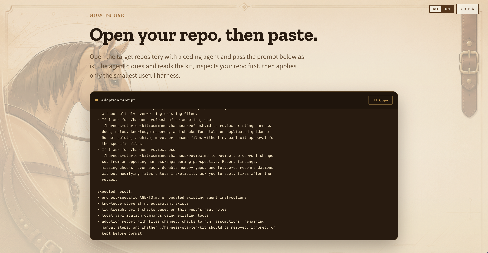

---

## 10. [Hum](https://www.producthunt.com/products/hum-5)
**Votes**: 10 | **도입 난이도**: 하 | **신뢰도**: 상
**Tagline**: Make your website feel alive with realtime visitor presence
**서비스 링크**: https://www.producthunt.com/r/XRAMZ7CMUCN4BA

**태그**: Design, WebTool, Analytics, SocialProof, DevTool

### 📌 이 서비스 한눈에 보기
세련된 디자인으로 웹사이트에 생동감을 더하는 실시간 방문자 현황 위젯

### 🔑 주요 기능
- 현대적인 디자인 중심의 실시간 방문자 배지 및 라이브 프레젠스 위젯 제공
- 웹사이트 디자인에 자연스럽게 녹아드는 20개 이상의 커스텀 템플릿
- 개발자를 위한 간편한 통합 방식과 비즈니스를 위한 가벼운 분석 기능

### 🙋 사용자에게 어떤 점이 좋은가
기존의 투박한 방문자 카운터 대신, 사이트의 미관을 해치지 않으면서도 방문자들에게 실시간 활성 상태를 보여주어 신뢰도를 높일 수 있습니다.

### ✅ 지금 바로 써볼 기능
- 20개 이상의 템플릿 중 사이트 컨셉에 맞는 디자인 탐색
- 간편한 통합 방식을 통한 실시간 위젯 설치 테스트
- 가벼운 분석 대시보드를 통한 방문자 데이터 확인

### ⚠️ 사용 전 확인할 점
- 디자인 중심의 도구이므로 복잡하고 심층적인 데이터 분석에는 한계가 있을 수 있음
- 위젯 설치 시 웹사이트 로딩 속도에 미치는 영향 확인 필요

### 🧭 확인이 더 필요한 정보
구체적인 가격 정책 및 대규모 트래픽 환경에서의 성능 최적화 여부는 명시되지 않았습니다.

### 📸 스크린샷 및 갤러리
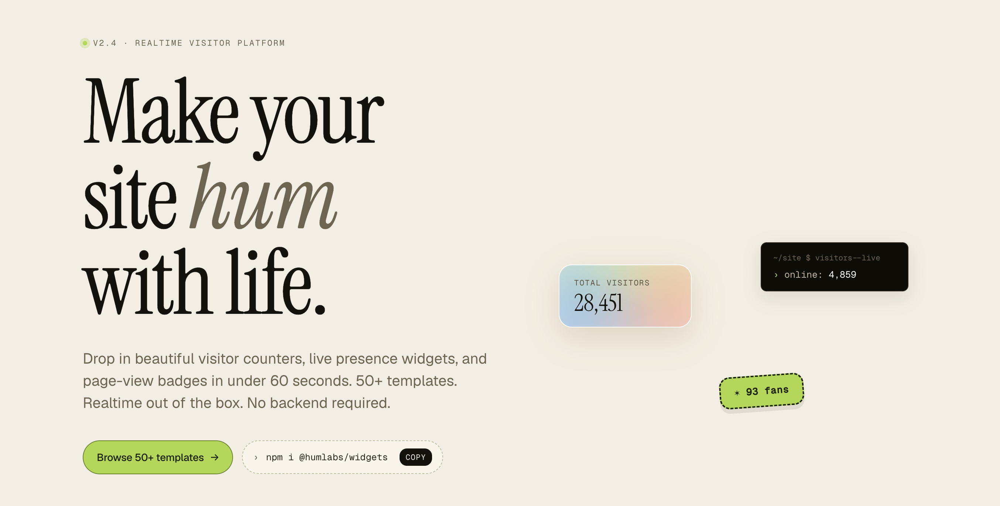
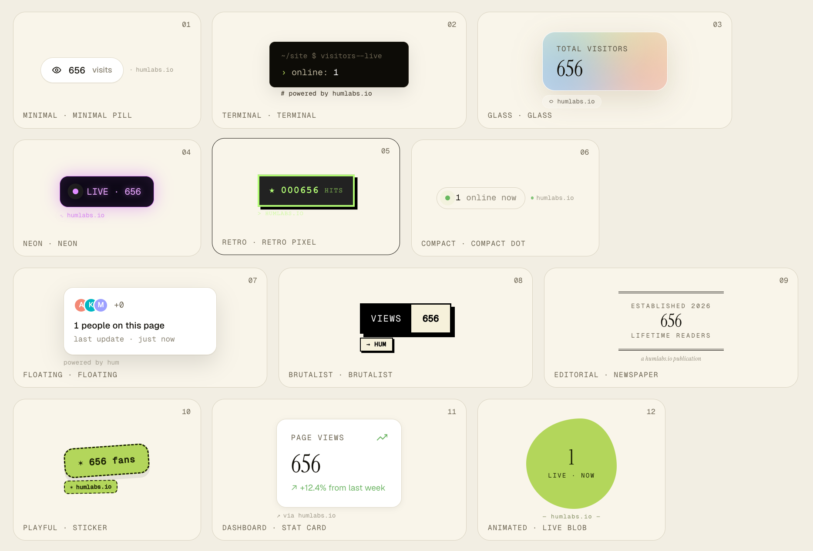
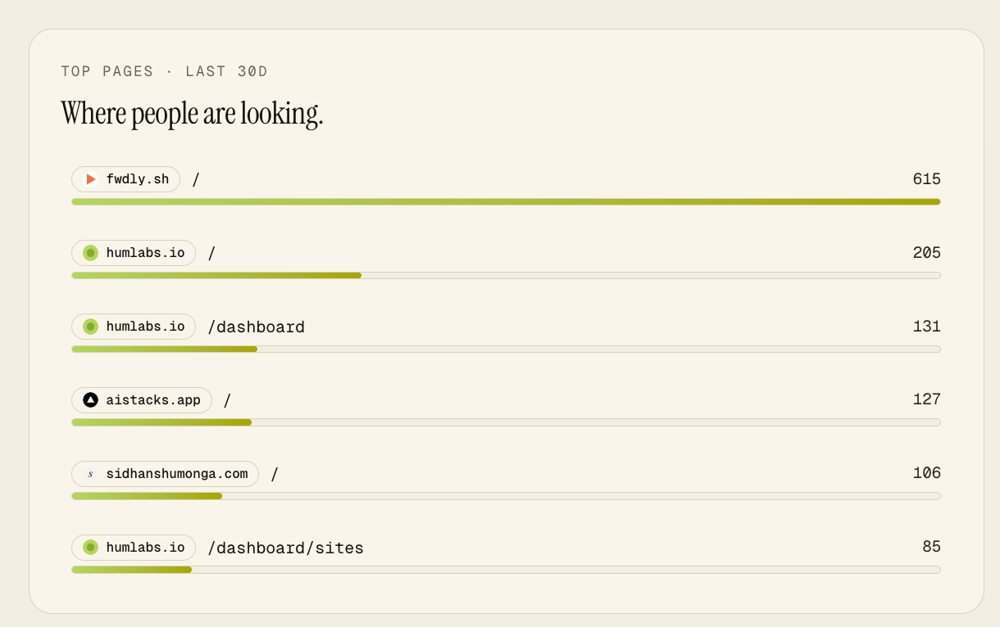

---

## 11. [ColorCraft](https://www.producthunt.com/products/colorcraft-2)
**Votes**: 9 | **도입 난이도**: 하 | **신뢰도**: 상
**Tagline**: Batch-recolor 500+ sprites in seconds
**서비스 링크**: https://www.producthunt.com/r/ALVPZNMORHLVWO

**태그**: GameDev, PixelArt, Automation, Aseprite, Workflow

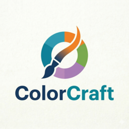

### 📌 이 서비스 한눈에 보기
Aseprite와 연동하여 수백 개의 픽셀 아트 스프라이트를 순식간에 재색상화하는 자동화 엔진

### 🔑 주요 기능
- Aseprite Live-Link를 통한 실시간 작업 반영
- 4가지 지각적 색상 매칭 알고리즘 탑재
- 500개 이상의 스프라이트를 초고속으로 처리하는 산업 규모의 배치 프로세싱

### 🙋 사용자에게 어떤 점이 좋은가
캐릭터 변형이나 바이옴별 에셋 제작 시 반복되는 색상 변경 작업을 자동화하여 개발 시간을 획기적으로 단축할 수 있습니다.

### ✅ 지금 바로 써볼 기능
- Aseprite 파일 연결 및 팔레트 설정
- 실시간 라이브 링크 기능 테스트
- 대량의 스프라이트 배치 리컬러링 실행

### ⚠️ 사용 전 확인할 점
- Aseprite 사용 환경에 따른 호환성 확인 필요
- 복잡한 아트 스타일에서의 알고리즘 결과물 검토 필요

### 🧭 확인이 더 필요한 정보
지원하는 파일 형식의 범위와 구체적인 시스템 요구 사양에 대한 정보가 추가로 필요합니다.

### 📸 스크린샷 및 갤러리
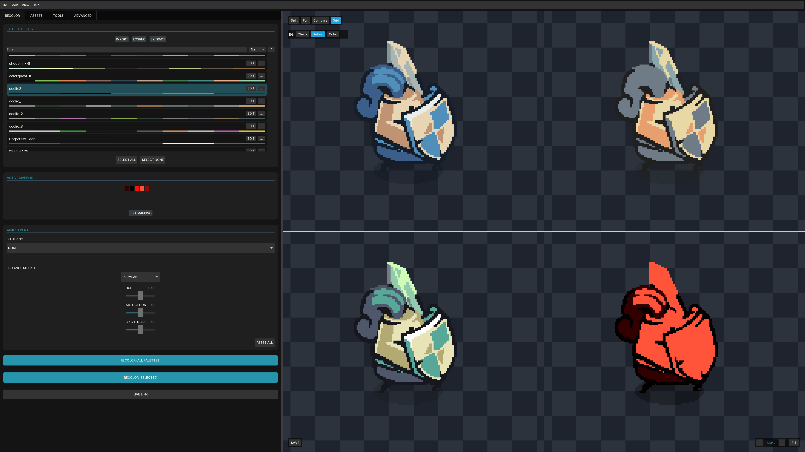
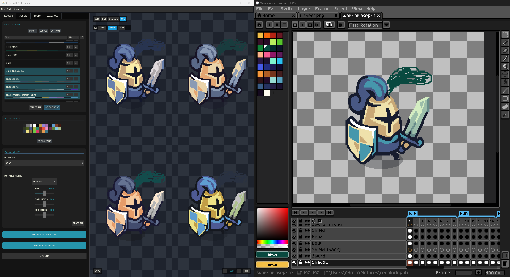
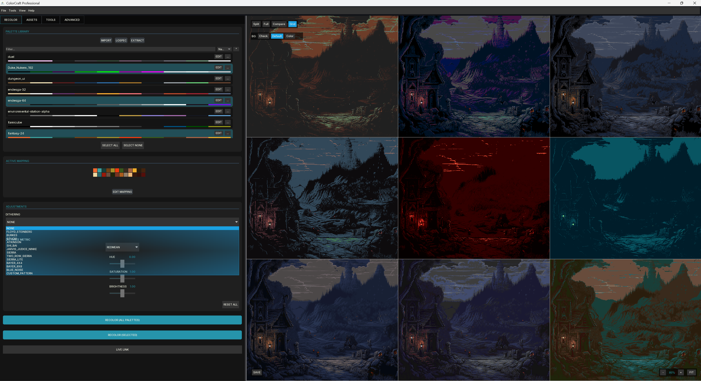

### 🎬 관련 영상
- [🎥 영상 보기](https://ph-files.imgix.net/97ca8cd8-e302-4a88-945b-3e3ffef4e32a.jpeg?auto=format)

---

## 12. [CoffeePomodoro](https://www.producthunt.com/products/coffeepomodoro)
**Votes**: 8 | **도입 난이도**: 하 | **신뢰도**: 상
**Tagline**: Brew your productivity, one Pomodoro at a time
**서비스 링크**: https://www.producthunt.com/r/OCQX3HJIU7AQME

**태그**: Productivity, Gamification, Timer, Focus, AI Tool

### 📌 이 서비스 한눈에 보기
커피 테마의 게이미피케이션을 통해 집중력을 높여주는 포모도로 타이머

### 🔑 주요 기능
- 커피 등급 시스템(Babyccino to Coffee Conqueror)을 통한 성취감 부여
- 21가지 집중용 사운드와 아늑한 애니메이션 제공
- Dynamic Island 및 홈 화면 위젯 지원으로 높은 접근성 제공

### 🙋 사용자에게 어떤 점이 좋은가
단순한 타이머를 넘어 게임 요소를 결합하여 반복적인 집중 훈련을 즐겁게 만들어 줍니다.

### ✅ 지금 바로 써볼 기능
- 자신에게 맞는 집중 사운드 탐색하기
- 위젯을 설정하여 홈 화면에서 바로 타이머 시작하기
- 연속 집중 기록(Streak)을 통한 동기부여 확인하기

### ⚠️ 사용 전 확인할 점
- 게임 요소가 오히려 집중을 방해할 가능성 있음
- 모바일 전용 앱이므로 데스크톱 작업 환경과의 연동성 확인 필요

### 🧭 확인이 더 필요한 정보
구체적인 유료 구독 모델이나 인앱 결제 여부는 명시되지 않았습니다.

### 📸 스크린샷 및 갤러리

### 🎬 관련 영상
- [🎥 영상 보기](https://ph-files.imgix.net/43f271c8-609e-42ee-b64b-fbf9a9bb9839.jpeg?auto=format)

---

## 13. [Skipper Study](https://www.producthunt.com/products/skipper-study)
**Votes**: 7 | **도입 난이도**: 하 | **신뢰도**: 상
**Tagline**: Day Skipper theory practice, one round at a time
**서비스 링크**: https://www.producthunt.com/r/PPQ2MS52IPXO7R

**태그**: Education, Certification, Maritime, Quiz, AI Tool

### 📌 이 서비스 한눈에 보기
Day Skipper 자격증 이론을 짧고 집중적인 퀴즈로 학습하는 전문 교육 도구

### 🔑 주요 기능
- 부표, 등대, 조석, 해도법, VHF, 도법 등 핵심 모듈별 학습 지원
- 짧고 집중적인 라운드 방식의 퀴즈 시스템
- 명확한 영어 설명과 출처 참조를 통한 오답 리뷰

### 🙋 사용자에게 어떤 점이 좋은가
자격증 시험 준비를 위해 두꺼운 이론서를 매번 펼칠 필요 없이, 틈틈이 퀴즈를 풀며 핵심 개념을 체계적으로 익힐 수 있습니다.

### ✅ 지금 바로 써볼 기능
- 자신에게 필요한 특정 모듈 선택하기
- 퀴즈 라운드 완료 후 상세 설명 확인하기
- 출처 참조를 통해 이론 근거 검토하기

### ⚠️ 사용 전 확인할 점
- 실제 항해 실습이 아닌 이론 중심의 학습 도구임
- 특정 국가/지역의 자격증 규정에 맞는지 확인 필요

### 🧭 확인이 더 필요한 정보
학습 콘텐츠가 특정 국가의 Day Skipper 시험 규정에 완벽히 부합하는지 확인이 필요합니다.

### 📸 스크린샷 및 갤러리

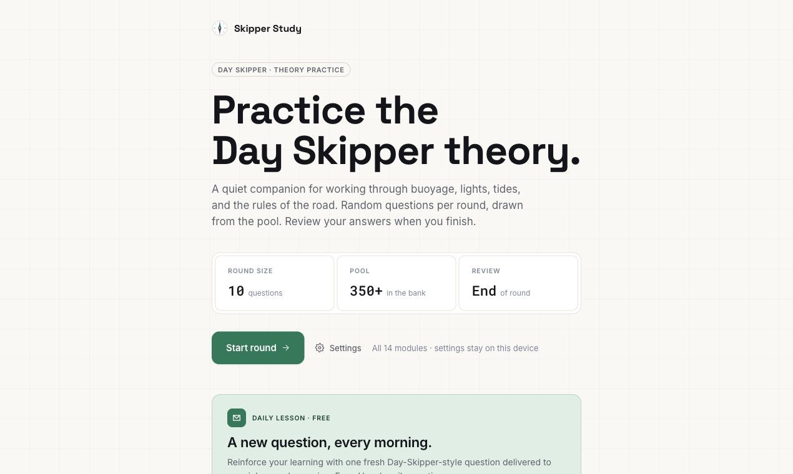
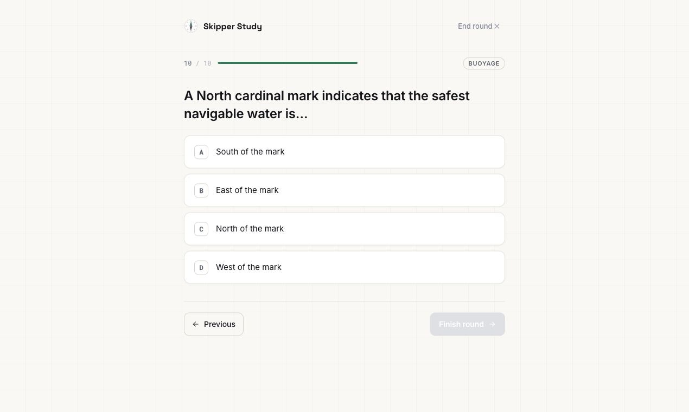

### 🎬 관련 영상
- [🎥 영상 보기](https://ph-files.imgix.net/46849809-03de-4e67-886e-0a8886786673.jpeg?auto=format)

---

## 14. [AnyFrame](https://www.producthunt.com/products/anyframe-2)
**Votes**: 7 | **도입 난이도**: 중 | **신뢰도**: 상
**Tagline**: Platform for every agent your team builds
**서비스 링크**: https://www.producthunt.com/r/5TIN5TV3EG6TT7

**태그**: AI Agents, Automation, DevTools, Workflow, Agent

### 📌 이 서비스 한눈에 보기
팀이 구축한 모든 AI 에이전트를 즉시 배포하고 운영할 수 있는 통합 플랫폼

### 🔑 주요 기능
- 수 분 내에 에이전트 군집(Swarms) 구축 가능
- 내부 도구부터 고객용 제품까지 다양한 환경에 적용 가능
- 어떤 하네스(Harness) 환경에서도 유연한 배포 지원

### 🙋 사용자에게 어떤 점이 좋은가
에이전트 개발부터 실제 서비스 적용까지의 과정을 단축하여 비즈니스 아이디어를 빠르게 제품화할 수 있습니다.

### ✅ 지금 바로 써볼 기능
- 에이전트 스웜(Swarms) 생성 테스트
- 기존 워크플로우와의 통합 가능성 검토
- 내부 도구용 프로토타입 배포

### ⚠️ 사용 전 확인할 점
- 구체적인 지원 프레임워크 및 기술 스택 확인 필요
- 에이전트 규모 확장에 따른 운영 비용 및 복잡도 검토

### 🧭 확인이 더 필요한 정보
지원하는 구체적인 기술 스택과 기존 시스템과의 통합 방식에 대한 상세 정보가 부족합니다.

### 📸 스크린샷 및 갤러리
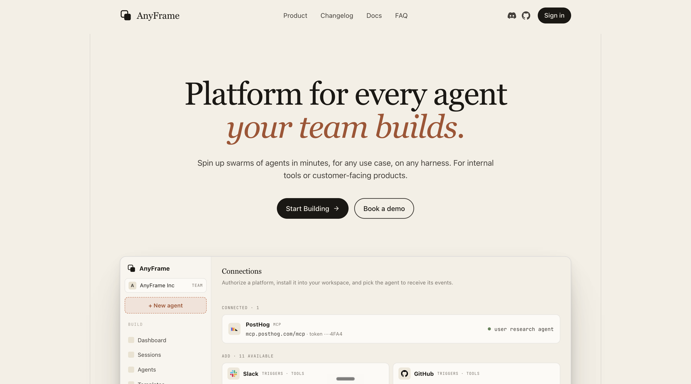
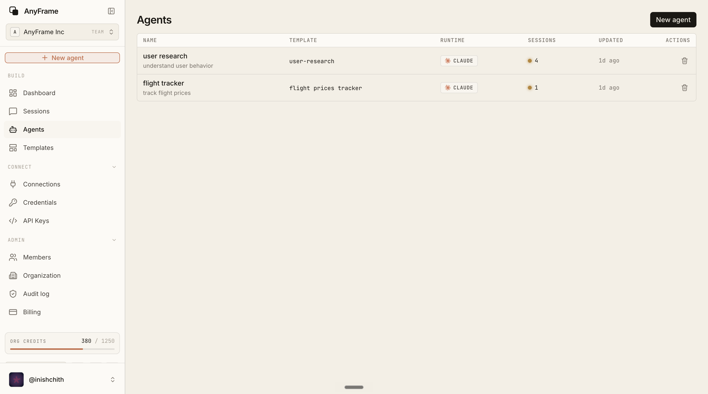
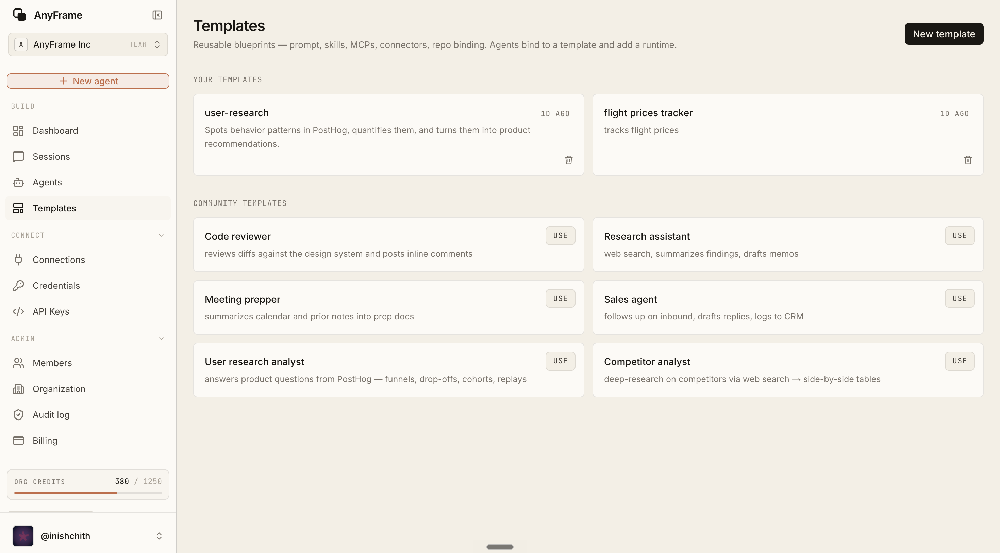

### 🎬 관련 영상
- [🎥 영상 보기](https://ph-files.imgix.net/d6217702-c76e-46f2-91ca-0f18f2ddb660.gif?auto=format)

---

## 15. [Launci](https://www.producthunt.com/products/launci)
**Votes**: 7 | **도입 난이도**: 중 | **신뢰도**: 상
**Tagline**: the go-to-market agent 
**서비스 링크**: https://www.producthunt.com/r/D5IR75ZOSMCL2H

**태그**: AI, Sales Automation, GTM, SaaS, FounderTools, Agent, AI Tool, DevTool, Email

### 📌 이 서비스 한눈에 보기
코드 개발에 집중하고 싶은 창업자를 위한 AI 기반 자동 GTM(Go-to-Market) 에이전트

### 🔑 주요 기능
- 목표 설정 시 잠재 고객 조사부터 아웃리치까지 자동 수행
- 이메일, LinkedIn, X, Reddit 등 다양한 채널을 통한 개인화된 메시지 발송
- 사용자의 실제 인박스를 활용한 발송 및 후속 조치 관리

### 🙋 사용자에게 어떤 점이 좋은가
영업과 DM 발송에 드는 시간을 획기적으로 줄여주어, 창업자가 제품 개발에만 전념할 수 있도록 돕습니다.

### ✅ 지금 바로 써볼 기능
- 목표(Goal) 설정 및 자동화 워크플로우 테스트
- 개인화된 아웃리치 메시지 초안 검토
- 연동된 소셜 미디어 및 이메일 채널 확인

### ⚠️ 사용 전 확인할 점
- 사용자 인박스 직접 발송에 따른 계정 스팸 리스크 관리 필요
- AI가 생성한 메시지의 톤앤매너가 브랜드 이미지와 일치하는지 확인 필요

### 🧭 확인이 더 필요한 정보
사용자의 실제 이메일 및 소셜 계정 연동 시 보안 및 계정 정지 방지 정책에 대한 상세 정보가 필요합니다.

### 📸 스크린샷 및 갤러리
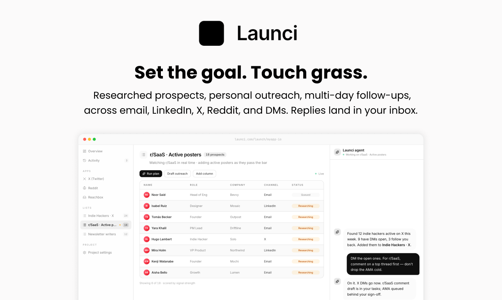
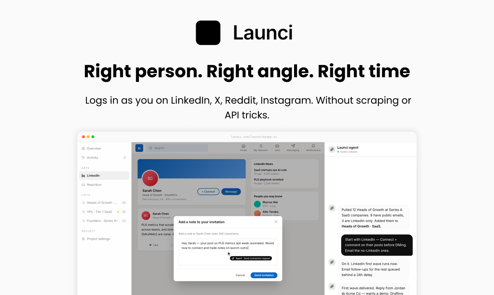
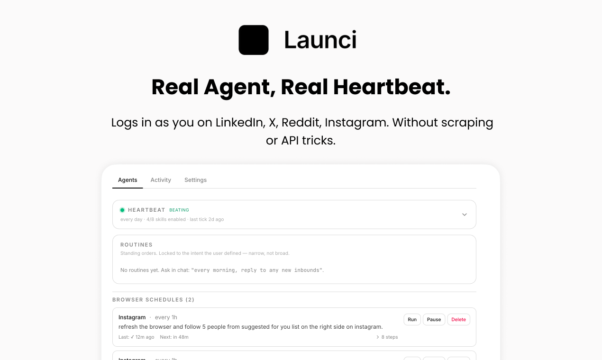

---

## 16. [Open Source Alternative Finder](https://www.producthunt.com/products/open-source-alternative-finder)
**Votes**: 6 | **도입 난이도**: 중 | **신뢰도**: 상
**Tagline**: Free replacements for Slack, Notion, Figma & 60+ paid tools
**서비스 링크**: https://www.producthunt.com/r/UUJW2SY55KMO42

**태그**: OpenSource, SaaS, CostOptimization, DevOps, AI Tool, DevTool

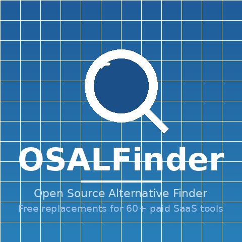

### 📌 이 서비스 한눈에 보기
유료 SaaS를 대체할 수 있는 60개 이상의 오픈소스 도구 비교 및 마이그레이션 가이드

### 🔑 주요 기능
- Slack, Notion, Figma 등 주요 유료 툴의 무료 오픈소스 대안 제공
- 가격 비교, 셀프 호스팅 난이도, 단계별 마이그레이션 가이드 포함
- 매일 업데이트되는 최신 오픈소스 소프트웨어 데이터베이스

### 🙋 사용자에게 어떤 점이 좋은가
비싼 구독료가 부담스러운 개인 개발자나 팀이 비용을 절감하면서도 강력한 기능을 갖춘 오픈소스 생태계로 전환할 수 있도록 돕습니다.

### ✅ 지금 바로 써볼 기능
- 사용 중인 유료 툴의 오픈소스 대안 검색하기
- 셀프 호스팅 난이도 확인 후 적합한 도구 선정하기
- 제공되는 마이그레이션 가이드를 통한 데이터 이전 계획 세우기

### ⚠️ 사용 전 확인할 점
- 오픈소스 특성상 직접 호스팅 시 서버 관리 및 보안 책임이 발생함
- 유료 서비스 대비 기능의 완성도나 사용자 편의성이 다를 수 있음

### 🧭 확인이 더 필요한 정보
제시된 오픈소스 도구들의 실제 운영 안정성과 데이터 보안 수준은 사용자가 직접 검증해야 합니다.

### 📸 스크린샷 및 갤러리
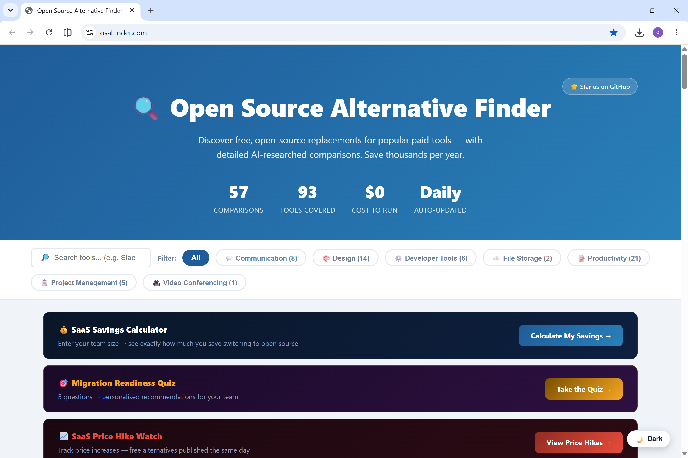
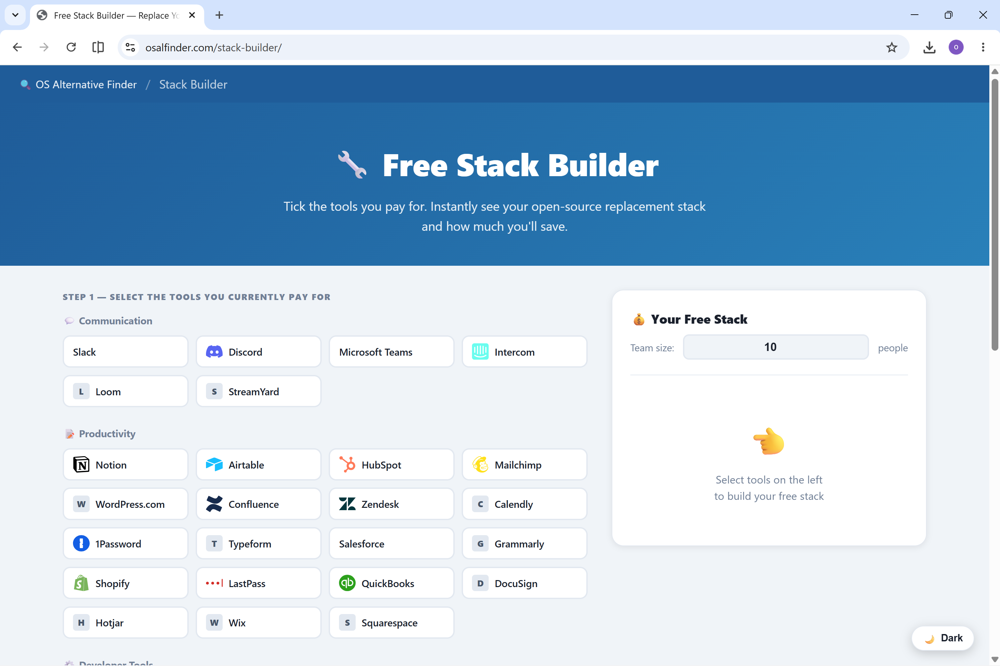
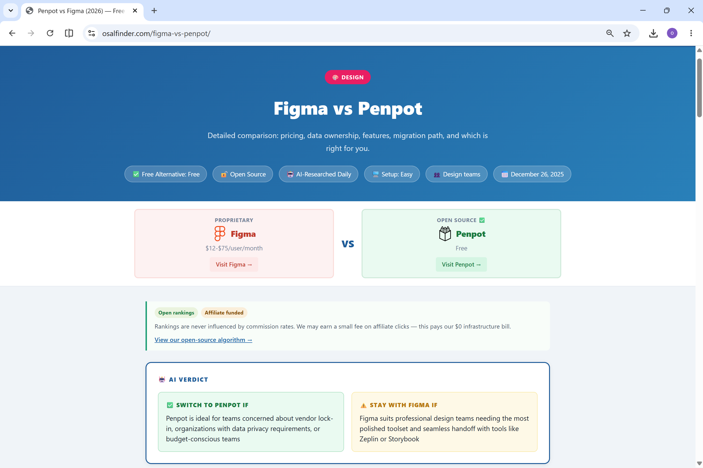

---

## 17. [imperfectly](https://www.producthunt.com/products/imperfectly)
**Votes**: 6 | **도입 난이도**: 하 | **신뢰도**: 상
**Tagline**: Perfect sounds fake, write imperfectly
**서비스 링크**: https://www.producthunt.com/r/CLS7RF3I6FBJWA

**태그**: WritingTool, AI, Creativity, Personalization, AI Tool

### 📌 이 서비스 한눈에 보기
AI 특유의 매끄러운 말투를 벗어나 사용자만의 개성과 인간적인 불완전함을 더해주는 글쓰기 도구

### 🔑 주요 기능
- AI 특유의 지나치게 정제된 말투를 제거하고 인간적인 글쓰기 리듬 복원
- 문장 파편, 생략, 미세한 오타 등 개인 고유의 글쓰기 스타일 반영
- 불완전함의 정도를 조절하거나 특정 감정(Mood)을 텍스트에 주입하는 기능

### 🙋 사용자에게 어떤 점이 좋은가
AI가 쓴 듯한 딱딱한 글에서 벗어나 독자에게 진정성 있고 인간적인 느낌을 전달할 수 있습니다.

### ✅ 지금 바로 써볼 기능
- 작성한 글의 '불완전함' 강도 조절해보기
- 특정 감정(Mood) 설정을 통해 글의 분위기 변화시키기
- 자신의 원래 글쓰기 스타일과 비교하며 미세 조정하기

### ⚠️ 사용 전 확인할 점
- 의도적인 오타나 문법 오류가 전문적인 비즈니스 문서에서는 부적절할 수 있음
- 개인 고유의 스타일을 유지하는 것이 목적이므로 지나친 설정은 가독성을 해칠 수 있음

### 🧭 확인이 더 필요한 정보
구체적인 인터페이스 방식이나 지원하는 언어 범위에 대한 정보가 명시되지 않았습니다.

### 📸 스크린샷 및 갤러리

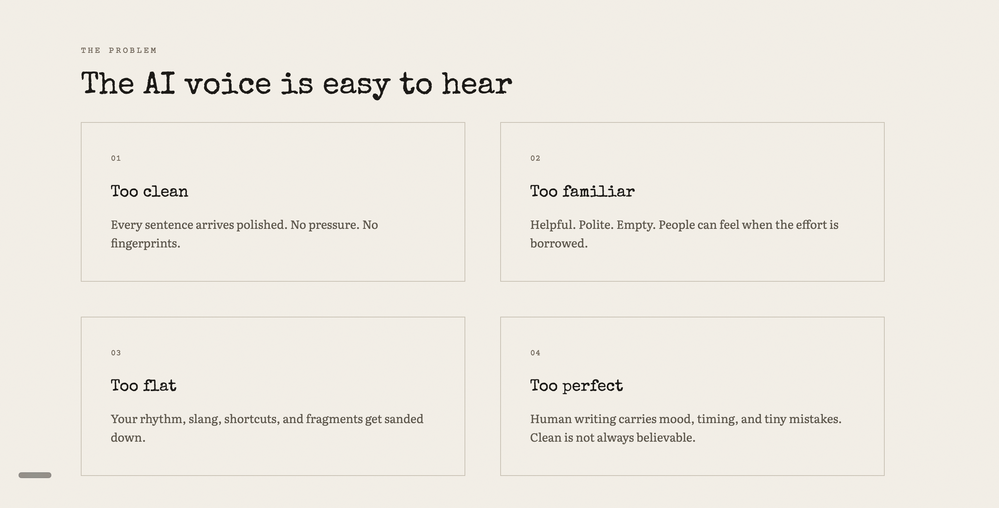
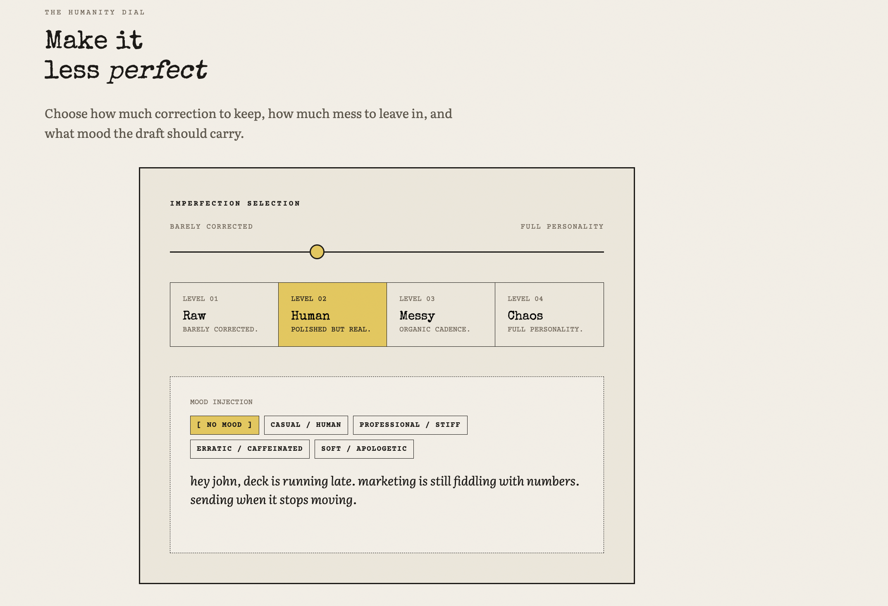

### 🎬 관련 영상
- [🎥 영상 보기](https://ph-files.imgix.net/6f841058-6854-4685-b1a4-4e635ab62182.jpeg?auto=format)

---

## 18. [CollectMonial](https://www.producthunt.com/products/collectmonial)
**Votes**: 6 | **도입 난이도**: 하 | **신뢰도**: 상
**Tagline**: Custom testimonial walls that match your brand and convert
**서비스 링크**: https://www.producthunt.com/r/R4UN3JX72T7DVP

**태그**: SaaS, Marketing, Testimonial, NoCode, Video

### 📌 이 서비스 한눈에 보기
브랜드 맞춤형 디자인이 가능한 간편한 고객 후기 수집 및 전시 솔루션

### 🔑 주요 기능
- 단일 링크를 통한 간편한 영상 및 텍스트 후기 수집
- 브랜드 아이덴티티를 반영할 수 있는 커스텀 디자인 기능
- 스크립트 태그 하나로 웹사이트에 즉시 적용 가능한 위젯

### 🙋 사용자에게 어떤 점이 좋은가
SaaS 창업자와 1인 기업이 별도의 개발 없이도 신뢰도를 높이는 전문적인 후기 페이지를 구축할 수 있습니다.

### ✅ 지금 바로 써볼 기능
- 고객에게 전달할 수집용 링크 생성하기
- 브랜드 색상 및 레이아웃 커스텀 설정하기
- 웹사이트에 임베드 스크립트 적용하기

### ⚠️ 사용 전 확인할 점
- 브랜드 맞춤형 디자인의 세부 커스텀 범위 확인 필요
- 영상/텍스트 데이터 저장 용량 및 관리 정책 확인 필요

### 🧭 확인이 더 필요한 정보
구체적인 요금제 체계와 데이터 저장 용량 제한에 대한 정보가 명시되지 않았습니다.

### 📸 스크린샷 및 갤러리
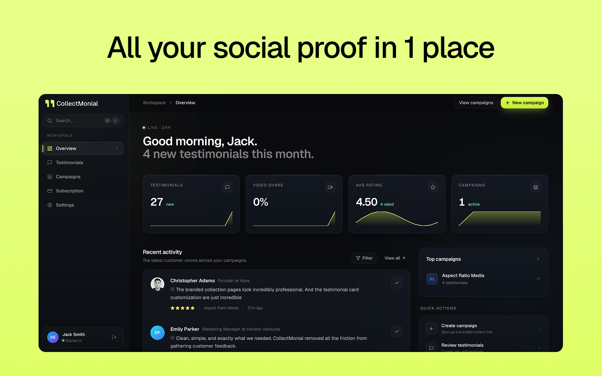
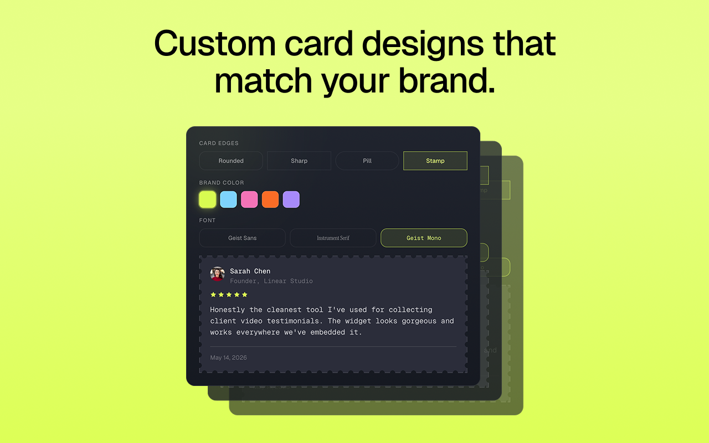
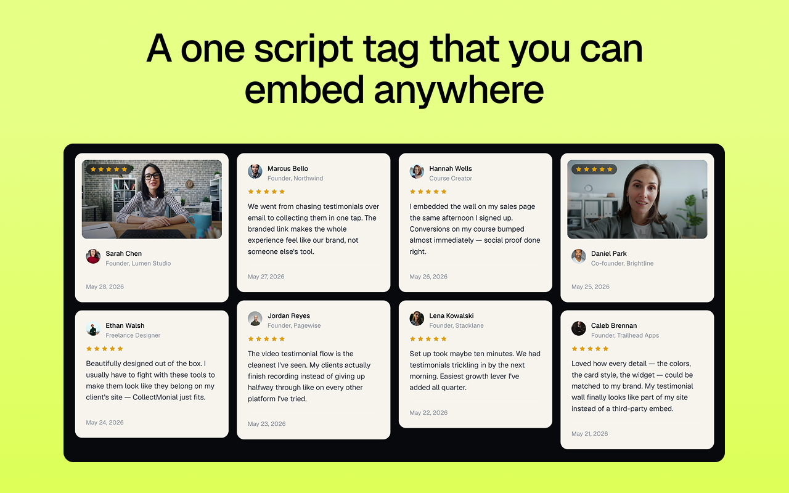

---

## 19. [Samata Health](https://www.producthunt.com/products/samata-health)
**Votes**: 6 | **도입 난이도**: 하 | **신뢰도**: 상
**Tagline**: Personalized mental health benefits for growing teams.
**서비스 링크**: https://www.producthunt.com/r/4XNU7M44I3DMCY

**태그**: Mental Health, HR Tech, Employee Benefits, Wellness, API

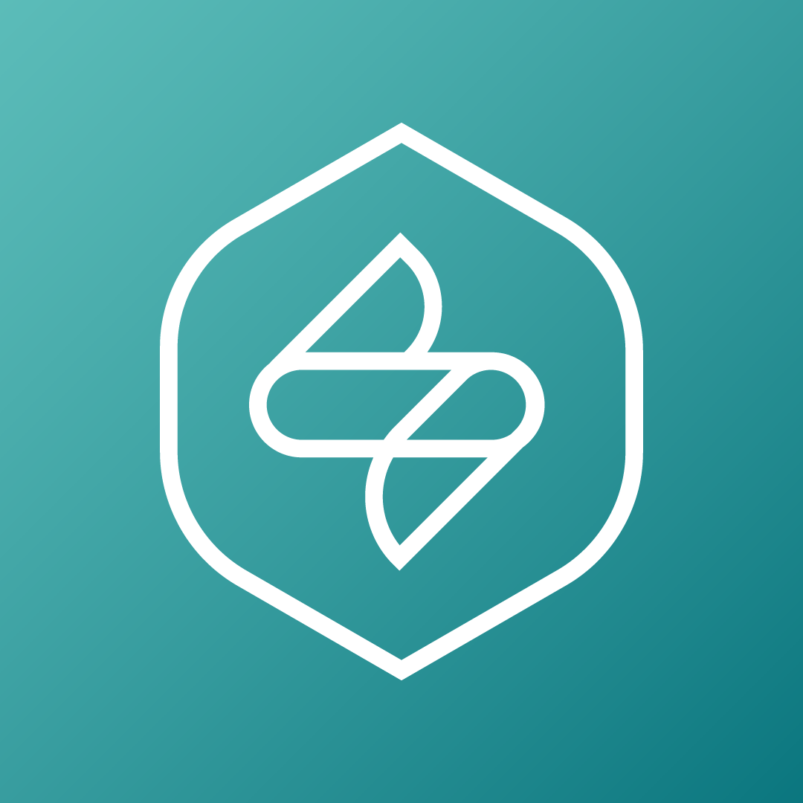

### 📌 이 서비스 한눈에 보기
성장하는 팀을 위한 맞춤형 상담 중심 정신 건강 복지 솔루션

### 🔑 주요 기능
- 면허를 보유한 전문가의 상담 서비스 제공
- 직원이 직접 선택할 수 있는 자율성 보장
- 사용량 기반의 합리적인 가격 정책

### 🙋 사용자에게 어떤 점이 좋은가
팀 규모가 커짐에 따라 발생하는 정신 건강 관리 부담을 전문적인 상담 서비스와 유연한 비용 구조로 해결할 수 있습니다.

### ✅ 지금 바로 써볼 기능
- 제공되는 상담 전문가 리스트 확인
- 팀 규모별 사용량 기반 요금제 검토
- 직원 선택권 범위 확인

### ⚠️ 사용 전 확인할 점
- 상담 전문가의 전문 분야가 팀의 요구사항과 일치하는지 확인 필요
- 사용량 기반 과금 방식이 예산 예측에 미칠 영향 검토

### 🧭 확인이 더 필요한 정보
구체적인 상담 가능 시간대와 서비스 지역에 대한 정보가 추가로 필요합니다.

### 📸 스크린샷 및 갤러리
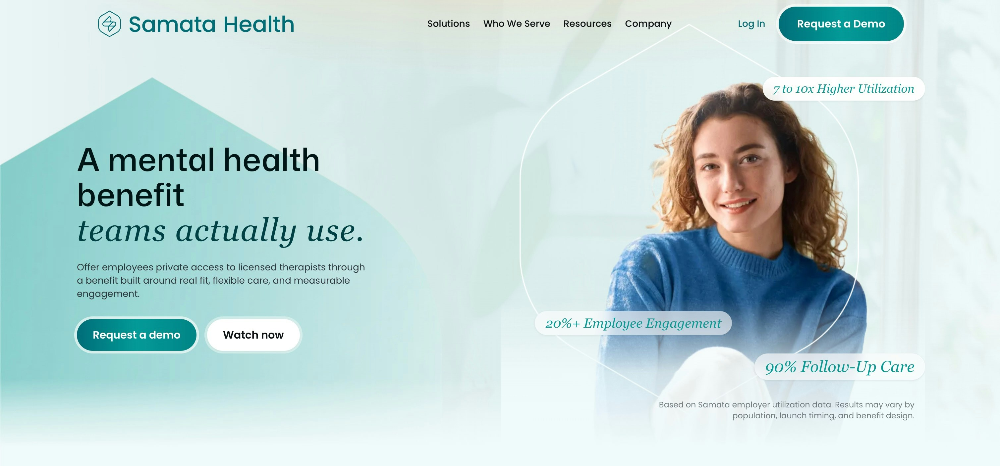

---

## 20. [JSON Kit](https://www.producthunt.com/products/json-kit)
**Votes**: 6 | **도입 난이도**: 하 | **신뢰도**: 상
**Tagline**: Fix broken AI JSON and 6 more JSON tools, all in-browser
**서비스 링크**: https://www.producthunt.com/r/OB63U6DN43TAW5

**태그**: DevTool, AI, Productivity, JSON, AI Tool, LLM, Chat

### 📌 이 서비스 한눈에 보기
AI가 생성한 깨진 JSON 형식을 브라우저에서 즉시 수정하고 검증하는 도구 모음

### 🔑 주요 기능
- LLM이 생성한 잘못된 JSON(쉼표, 따옴표, 마크다운 등)을 즉시 유효한 형식으로 복구
- 모든 작업이 브라우저 사이드에서 실행되어 데이터 보안 및 프라이버시 보장
- 오류 원인을 명확하게 라벨링하여 문제 해결 과정 지원

### 🙋 사용자에게 어떤 점이 좋은가
AI 모델을 활용한 개발 시 발생하는 JSON 파싱 오류를 수동 작업 없이 빠르게 해결하여 개발 생산성을 높여줍니다.

### ✅ 지금 바로 써볼 기능
- LLM이 생성한 깨진 JSON을 'Fix LLM JSON' 기능에 붙여넣기
- 수정된 JSON의 오류 원인 라벨 확인하기
- 브라우저 기반의 보안 환경에서 데이터 처리하기

### ⚠️ 사용 전 확인할 점
- 브라우저 기반 도구이므로 매우 거대한 용량의 JSON 파일 처리 시 성능 저하 가능성 있음
- 데이터가 서버로 전송되지는 않으나 브라우저 메모리 사용량 확인 필요

### 🧭 확인이 더 필요한 정보
제공되는 '6개 이상의 추가 JSON 도구'의 구체적인 기능 목록은 명시되지 않았습니다.

### 📸 스크린샷 및 갤러리
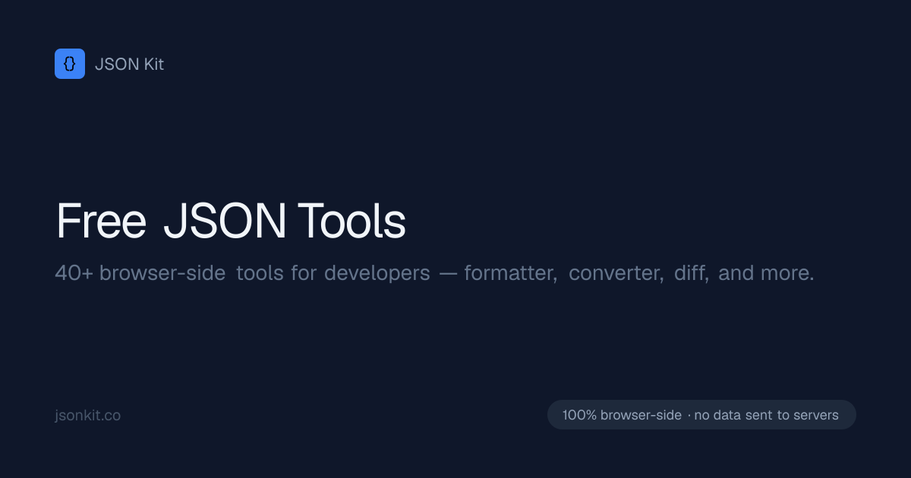

---

## 21. [Mixstream](https://www.producthunt.com/products/mixstream)
**Votes**: 6 | **도입 난이도**: 중 | **신뢰도**: 상
**Tagline**: Rebuilding Music and Digital Economy
**서비스 링크**: https://www.producthunt.com/r/63QWRYLJDGZOWW

**태그**: MusicTech, CreatorEconomy, Distribution, FinTech, AI Tool

### 📌 이 서비스 한눈에 보기
아티스트가 마스터 권한과 수익 정산의 투명성을 직접 통제하는 차세대 음악 경제 플랫폼

### 🔑 주요 기능
- 모든 DSP(음원 스트리밍 서비스) 대상 음원 발매 및 유통 지원
- 싱크 라이선싱을 통한 카탈로그 수익화 기능 제공
- 스트림 단위까지 추적 가능한 투명한 로열티 정산 시스템

### 🙋 사용자에게 어떤 점이 좋은가
음원 유통 과정에서의 불투명한 정산 문제를 해결하고, 아티스트가 자신의 저작물에 대한 완전한 권리와 수익을 직접 관리할 수 있습니다.

### ✅ 지금 바로 써볼 기능
- 음원 유통 및 배급 프로세스 확인
- 싱크 라이선싱 수익 모델 검토
- 정산 리포트의 투명성 및 상세 내역 확인

### ⚠️ 사용 전 확인할 점
- 플랫폼의 유통망 규모 및 각 DSP와의 연동 안정성 확인 필요
- 기존 유통사와의 계약 관계 및 음원 이전 가능 여부 검토

### 🧭 확인이 더 필요한 정보
구체적인 수수료율이나 서비스 이용료, 그리고 각 국가별 저작권법 준수 여부에 대한 정보가 추가로 필요합니다.

### 📸 스크린샷 및 갤러리

---

## 22. [Uindow](https://www.producthunt.com/products/uindow)
**Votes**: 6 | **도입 난이도**: 중 | **신뢰도**: 상
**Tagline**: The programmable browser with trusted interactions
**서비스 링크**: https://www.producthunt.com/r/N2WUV57X6U6KEW

**태그**: Automation, DevTool, Browser, JavaScript

### 📌 이 서비스 한눈에 보기
자바스크립트 코딩과 레코더를 결합하여 실생활 웹 작업을 자동화하는 프로그래밍 가능 브라우저

### 🔑 주요 기능
- 사용자 동작을 기록하는 세계적 수준의 레코더 제공
- 기록된 자동화 시나리오를 순수 자바스크립트로 편집 가능
- 실제 웹 환경에서의 복잡한 자동화 작업에 최적화

### 🙋 사용자에게 어떤 점이 좋은가
반복적인 웹 업무를 녹화 후 코드로 정교하게 제어할 수 있어, 단순 반복 작업 시간을 획기적으로 줄여줍니다.

### ✅ 지금 바로 써볼 기능
- 레코더를 사용하여 반복적인 웹 동작 기록하기
- 기록된 스크립트를 자바스크립트로 수정하여 로직 고도화하기
- 복잡한 웹 워크플로우 자동화 시나리오 구축하기

### ⚠️ 사용 전 확인할 점
- 자바스크립트 편집 기능이 포함되어 있어 기본적인 코딩 지식 필요
- 웹사이트 구조 변경 시 자동화 스크립트가 작동하지 않을 수 있음

### 🧭 확인이 더 필요한 정보
구체적인 브라우저 엔진 기반 및 보안 정책에 대한 상세 정보가 필요합니다.

### 📸 스크린샷 및 갤러리
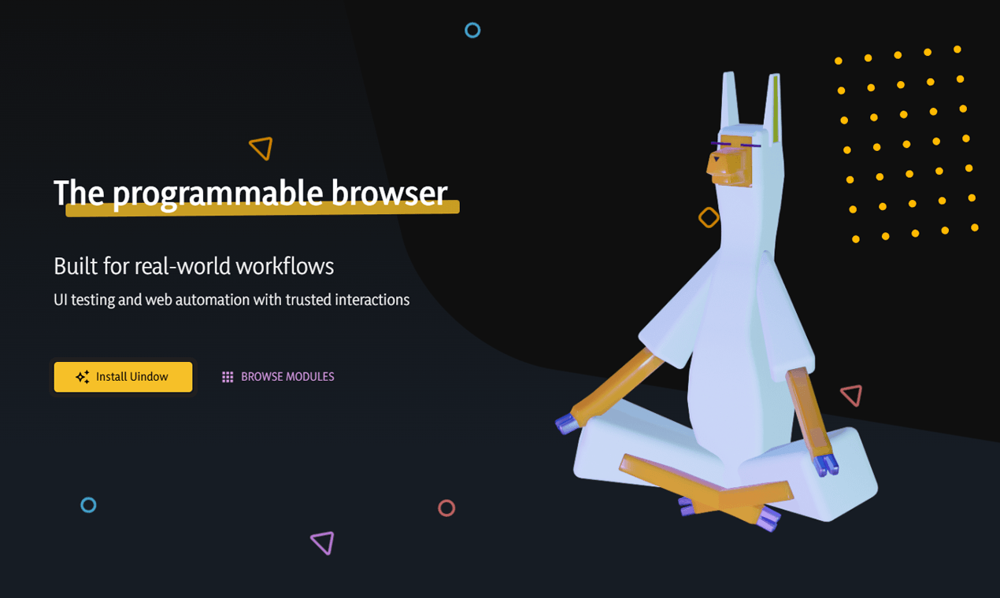
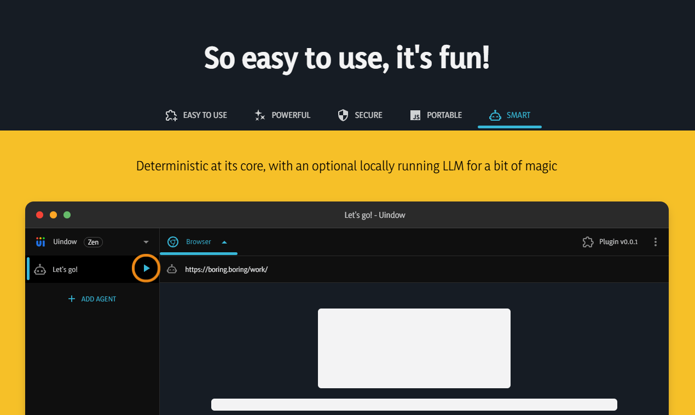
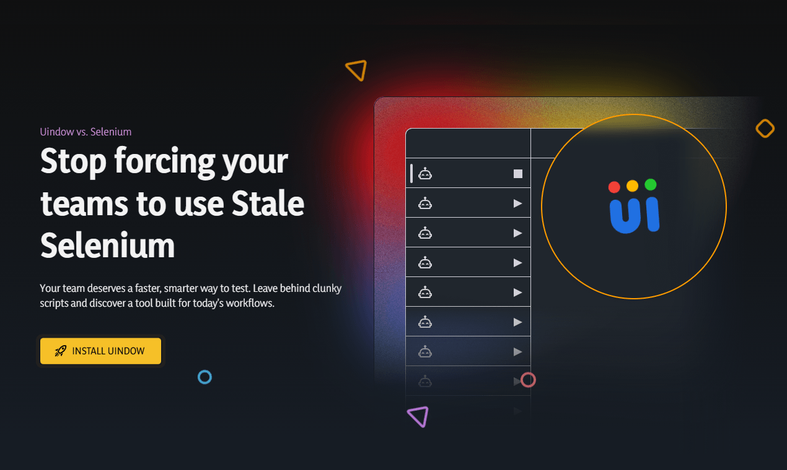

---

## 23. [Open Source Alternative Finder](https://www.producthunt.com/products/open-source-alternative-finder)
**Votes**: 6 | **도입 난이도**: 중 | **신뢰도**: 상
**Tagline**: Free replacements for Slack, Notion, Figma & 60+ paid tools
**서비스 링크**: https://www.producthunt.com/r/UUJW2SY55KMO42

**태그**: OpenSource, SaaS, CostOptimization, DevOps, AI Tool, DevTool

### 📌 이 서비스 한눈에 보기
유료 SaaS를 대체할 수 있는 60개 이상의 오픈소스 도구 비교 및 마이그레이션 가이드

### 🔑 주요 기능
- Slack, Notion, Figma 등 주요 유료 툴의 무료 오픈소스 대안 제공
- 가격 비교, 셀프 호스팅 난이도, 단계별 마이그레이션 가이드 포함
- 매일 업데이트되는 최신 오픈소스 소프트웨어 데이터베이스

### 🙋 사용자에게 어떤 점이 좋은가
비싼 구독료가 부담스러운 개인 개발자나 팀이 비용을 절감하면서도 강력한 기능을 갖춘 오픈소스 생태계로 전환할 수 있도록 돕습니다.

### ✅ 지금 바로 써볼 기능
- 사용 중인 유료 툴의 오픈소스 대안 검색하기
- 셀프 호스팅 난이도 확인 후 적합한 도구 선정하기
- 제공되는 마이그레이션 가이드를 통한 데이터 이전 계획 세우기

### ⚠️ 사용 전 확인할 점
- 오픈소스 특성상 직접 호스팅 시 서버 관리 및 보안 책임이 발생함
- 유료 서비스 대비 기능의 완성도나 사용자 편의성이 다를 수 있음

### 🧭 확인이 더 필요한 정보
제시된 오픈소스 도구들의 실제 운영 안정성과 데이터 보안 수준은 사용자가 직접 검증해야 합니다.

### 📸 스크린샷 및 갤러리

---

## 24. [Samata Health](https://www.producthunt.com/products/samata-health)
**Votes**: 6 | **도입 난이도**: 하 | **신뢰도**: 상
**Tagline**: Personalized mental health benefits for growing teams.
**서비스 링크**: https://www.producthunt.com/r/4XNU7M44I3DMCY

**태그**: Mental Health, HR Tech, Employee Benefits, Wellness, API

### 📌 이 서비스 한눈에 보기
성장하는 팀을 위한 맞춤형 상담 중심 정신 건강 복지 솔루션

### 🔑 주요 기능
- 면허를 보유한 전문가의 상담 서비스 제공
- 직원이 직접 선택할 수 있는 자율성 보장
- 사용량 기반의 합리적인 가격 정책

### 🙋 사용자에게 어떤 점이 좋은가
팀 규모가 커짐에 따라 발생하는 정신 건강 관리 부담을 전문적인 상담 서비스와 유연한 비용 구조로 해결할 수 있습니다.

### ✅ 지금 바로 써볼 기능
- 제공되는 상담 전문가 리스트 확인
- 팀 규모별 사용량 기반 요금제 검토
- 직원 선택권 범위 확인

### ⚠️ 사용 전 확인할 점
- 상담 전문가의 전문 분야가 팀의 요구사항과 일치하는지 확인 필요
- 사용량 기반 과금 방식이 예산 예측에 미칠 영향 검토

### 🧭 확인이 더 필요한 정보
구체적인 상담 가능 시간대와 서비스 지역에 대한 정보가 추가로 필요합니다.

### 📸 스크린샷 및 갤러리

---

## 25. [WearvueAI](https://www.producthunt.com/products/wearvueai)
**Votes**: 6 | **도입 난이도**: 하 | **신뢰도**: 상
**Tagline**: Find outfits tailored for you for any occasion.
**서비스 링크**: https://www.producthunt.com/r/D3I6VHB3PBPH7R

**태그**: AI, Fashion, Lifestyle, Personalization, AI Tool

### 📌 이 서비스 한눈에 보기
개인별 스타일과 상황에 맞춘 AI 맞춤형 코디 추천 서비스

### 🔑 주요 기능
- 사용자의 체형, 스타일, 선호도를 반영한 맞춤형 의상 추천
- 학교, 데이트, 파티, 직장 등 다양한 상황별 코디 제안
- 단 몇 초 만에 제공되는 빠르고 실용적인 스타일 아이디어

### 🙋 사용자에게 어떤 점이 좋은가
매일 아침 무엇을 입을지 고민하는 시간을 줄여주며, 상황에 적합한 스타일링 가이드를 즉각적으로 얻을 수 있습니다.

### ✅ 지금 바로 써볼 기능
- 자신의 체형과 스타일 정보 입력하기
- 특정 상황(데이트, 출근 등)에 맞는 코디 생성해보기
- 제안된 아이디어를 바탕으로 옷장 조합해보기

### ⚠️ 사용 전 확인할 점
- 실제 보유 중인 의류와의 매칭 여부는 별도 확인 필요
- AI 추천이 사용자의 실제 취향과 다를 수 있음

### 🧭 확인이 더 필요한 정보
실제 의류 구매 링크 연결이나 개인 옷장 업로드 기능 포함 여부는 명시되지 않았습니다.

### 📸 스크린샷 및 갤러리
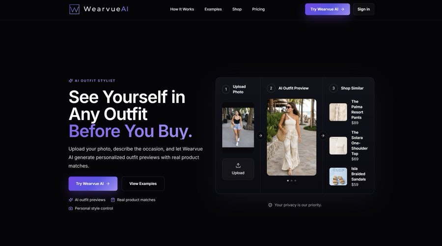
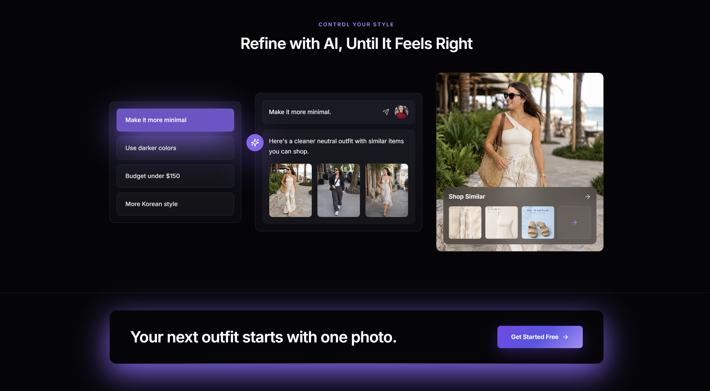

---

## 26. [Skillier.ai](https://www.producthunt.com/products/skillier-ai)
**Votes**: 5 | **도입 난이도**: 하 | **신뢰도**: 상
**Tagline**: Route automatically your AI to the best skills for any task
**서비스 링크**: https://www.producthunt.com/r/MKRPKMSSHCRHDJ

**태그**: AI-Agent, DevTool, Automation, Productivity, AI Tool, Prompting

### 📌 이 서비스 한눈에 보기
4,000개 이상의 검증된 스킬 중 작업에 가장 적합한 것을 자동으로 찾아 AI에 연결해 주는 라우팅 도구

### 🔑 주요 기능
- 4,000개 이상의 큐레이션된 전문가 스킬 인덱스 제공
- Claude, Cursor, Windsurf 등 주요 AI 개발 도구와 호환
- 중복 제거 및 프롬프트 인젝션 스캔을 거친 고품질 스킬 데이터베이스

### 🙋 사용자에게 어떤 점이 좋은가
사용자가 일일이 프롬프트를 작성하거나 도구를 찾을 필요 없이, 작업에 최적화된 스킬을 AI에 즉시 로드하여 생산성을 높일 수 있습니다.

### ✅ 지금 바로 써볼 기능
- 주로 사용하는 AI IDE(Cursor, Windsurf 등)에 연결해 보기
- 특정 작업에 대한 스킬 라우팅 정확도 테스트하기
- 보안이 중요한 작업을 위해 Lite 버전 설치 및 오프라인 실행해 보기

### ⚠️ 사용 전 확인할 점
- 스킬 인덱스의 품질이 작업의 복잡도에 따라 달라질 수 있음
- 클라우드 버전 사용 시 데이터 보안 정책 확인 필요

### 🧭 확인이 더 필요한 정보
현재 제공되는 4,000개의 스킬이 사용자의 구체적인 워크플로우를 얼마나 완벽하게 커버하는지 확인이 필요합니다.

### 📸 스크린샷 및 갤러리
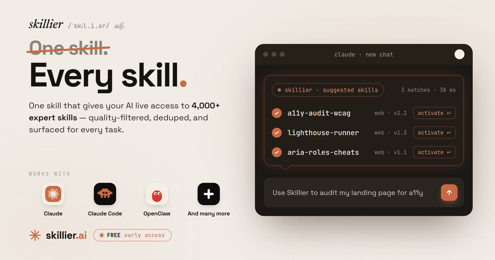
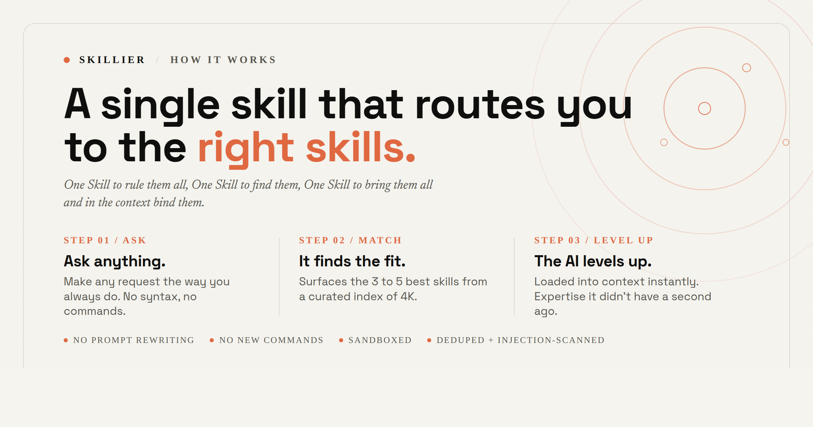
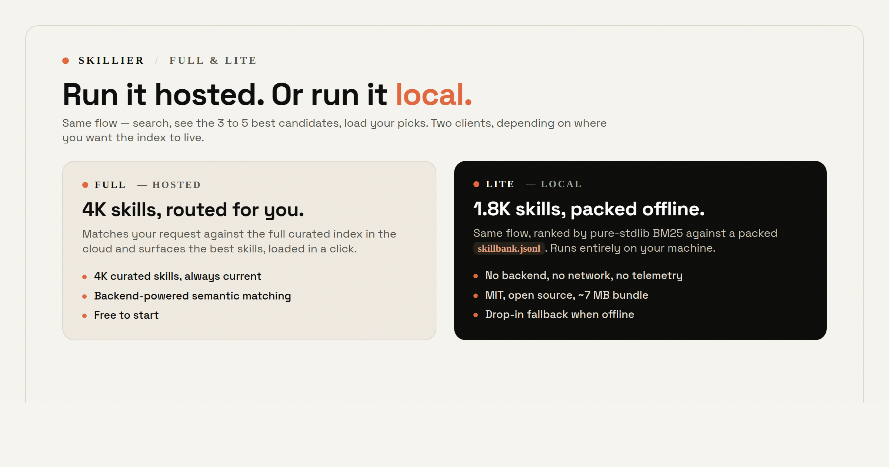

---

## 27. [BestSpots](https://www.producthunt.com/products/bestspots)
**Votes**: 5 | **도입 난이도**: 하 | **신뢰도**: 상
**Tagline**: A real-time searchable marketplace for any desired info
**서비스 링크**: https://www.producthunt.com/r/5F7QLUE5ABO7M2

**태그**: Marketplace, LocalSearch, Community

### 📌 이 서비스 한눈에 보기
장소에 대한 유용한 정보를 실시간으로 검색하고 공유하는 정보 마켓플레이스

### 🔑 주요 기능
- 장소별 특화된 고유 정보 제공 및 검색 기능
- 사용자 참여를 통한 정보 생성 및 검증 시스템
- 향후 정보 기여에 따른 수익 창출 모델 도입 예정

### 🙋 사용자에게 어떤 점이 좋은가
기존 검색 엔진에서 찾기 힘든 장소별 세부 정보를 효율적으로 탐색하고, 직접 검증된 정보를 공유할 수 있습니다.

### ✅ 지금 바로 써볼 기능
- 관심 있는 장소의 정보 검색해보기
- 직접 알고 있는 장소 정보 등록하기
- 제공된 정보의 정확성 검증 참여하기

### ⚠️ 사용 전 확인할 점
- 사용자 생성 콘텐츠 기반이므로 정보의 정확성 확인 필요
- 수익 창출 기능은 향후 도입 예정 사항임

### 🧭 확인이 더 필요한 정보
수익 창출 모델의 구체적인 방식과 정보 검증의 신뢰도 확보 방안에 대한 확인이 필요합니다.

### 📸 스크린샷 및 갤러리
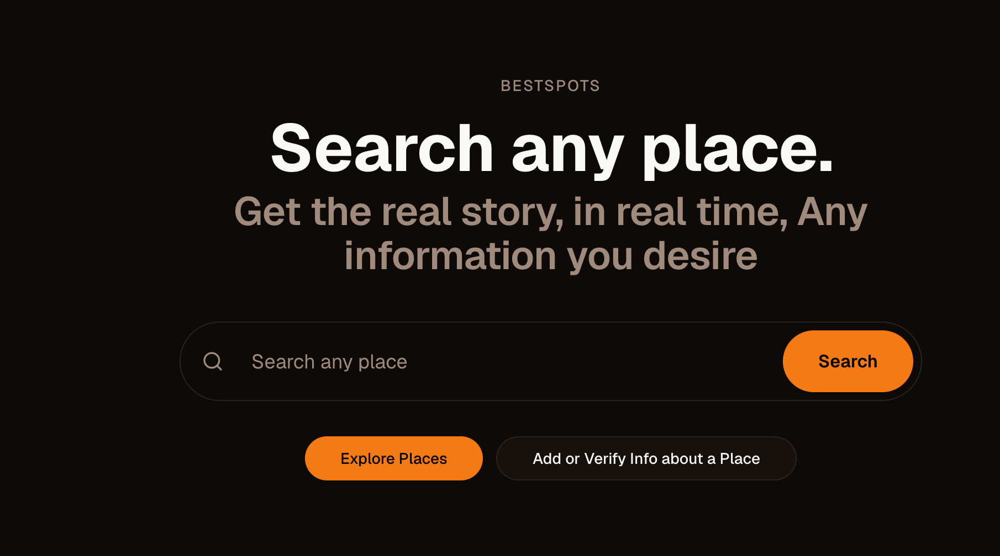
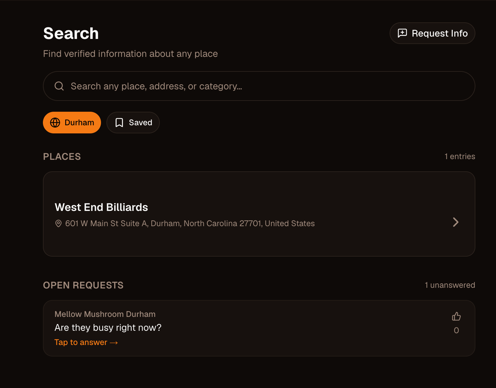
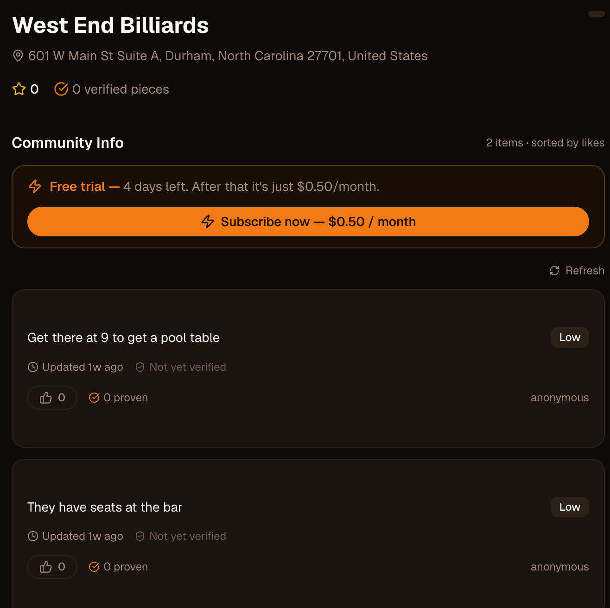

### 🎬 관련 영상
- [🎥 영상 보기](https://ph-files.imgix.net/d21c7a1b-0835-4374-86d9-d9520e5db90a.gif?auto=format)

---

## 28. [Tinyship](https://www.producthunt.com/products/tinyship)
**Votes**: 4 | **도입 난이도**: 하 | **신뢰도**: 상
**Tagline**: Deploy frontend apps from your terminal
**서비스 링크**: https://www.producthunt.com/r/DULT5DXQP6SOXL

**태그**: DevTool, Frontend, CLI, Deployment, Automation

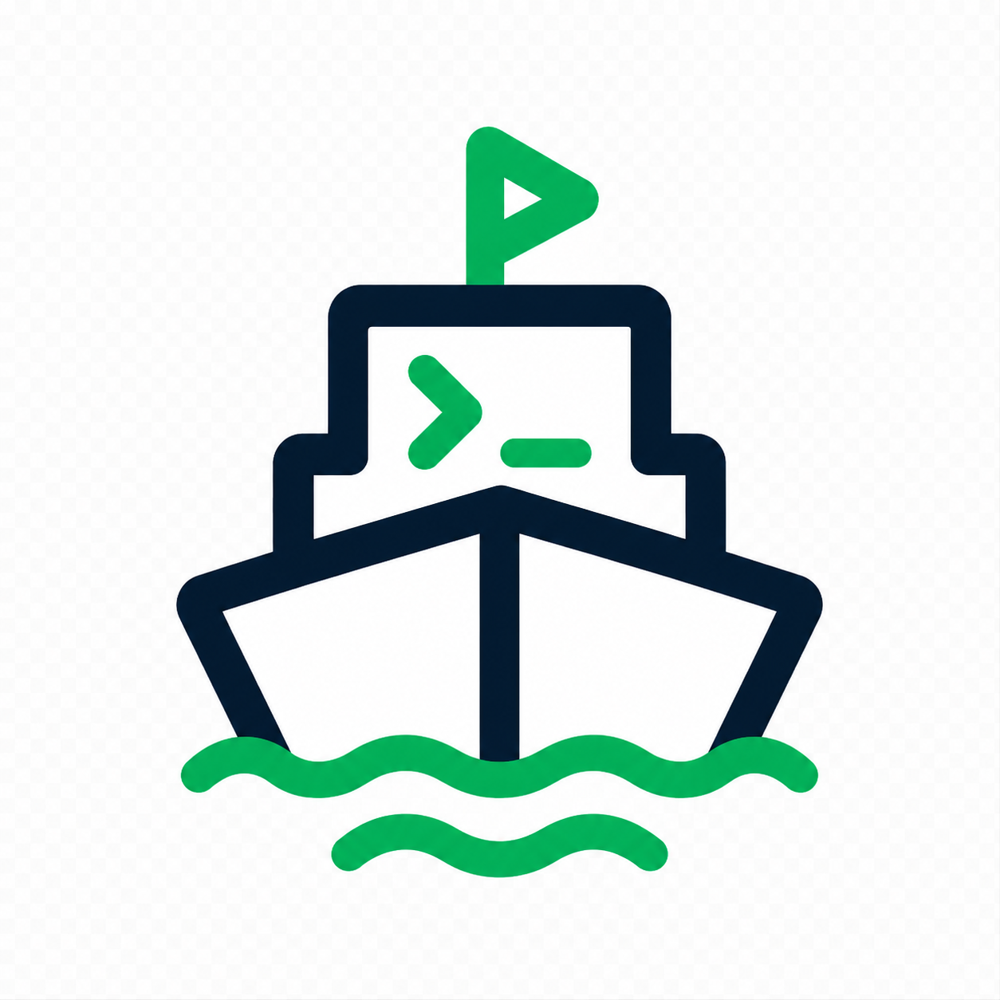

### 📌 이 서비스 한눈에 보기
터미널 명령 한 번으로 프론트엔드 앱을 즉시 배포하는 CLI 중심 플랫폼

### 🔑 주요 기능
- npx 명령어를 통한 간편한 배포 프로세스
- 프레임워크 자동 감지 및 빌드/업로드 자동화
- Vite, React, Vue, Astro, SvelteKit 등 다양한 프레임워크 지원

### 🙋 사용자에게 어떤 점이 좋은가
대시보드 설정 없이 터미널에서 즉시 배포가 가능하여, 개발 흐름을 끊지 않고 빠르게 결과물을 공유할 수 있습니다.

### ✅ 지금 바로 써볼 기능
- npx tinyship deploy 명령어로 배포 테스트하기
- 현재 사용 중인 프레임워크와의 호환성 확인하기

### ⚠️ 사용 전 확인할 점
- 정적 프론트엔드 앱에 특화되어 있어 백엔드 서버 기능은 제한적일 수 있음
- CLI 환경에 익숙하지 않은 사용자에게는 초기 진입 장벽이 있을 수 있음

### 🧭 확인이 더 필요한 정보
지원하는 프레임워크 외의 커스텀 빌드 환경에서의 동작 여부는 추가 확인이 필요합니다.

### 📸 스크린샷 및 갤러리
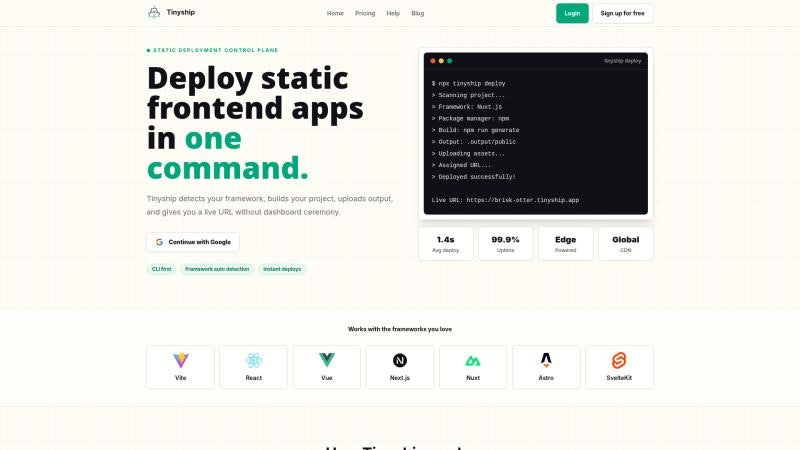

---

## 29. [TigerMindLabs](https://www.producthunt.com/products/tigermindlabs)
**Votes**: 4 | **도입 난이도**: 하 | **신뢰도**: 상
**Tagline**: Small product worlds, built by a curious team.
**서비스 링크**: https://www.producthunt.com/r/ZDGTUOE5N6GQDA

**태그**: Lifestyle, Experimental, ProductStudio

### 📌 이 서비스 한눈에 보기
피트니스, 스포츠, 로컬 탐색 등 다양한 분야의 유용한 소프트웨어를 실험적으로 제작하는 크리에이티브 팀

### 🔑 주요 기능
- 다양한 라이프스타일 카테고리의 실험적 소프트웨어 제공
- 실제 사용 사례를 바탕으로 한 실용적인 도구 지향
- 제품 개발 과정에서의 학습과 경험 공유

### 🙋 사용자에게 어떤 점이 좋은가
일상의 다양한 영역(운동, 계획, 탐색 등)에서 활용 가능한 작지만 알찬 도구들을 경험할 수 있습니다.

### ✅ 지금 바로 써볼 기능
- 팀이 출시하는 개별 제품 라인업 확인하기
- 실험적 소프트웨어의 초기 사용자로서 피드백 제공하기
- 공유되는 개발 인사이트 읽어보기

### ⚠️ 사용 전 확인할 점
- 실험적 성격의 제품이므로 기능의 완성도가 가변적일 수 있음
- 특정 분야에 국한된 개별 제품 위주의 구성

### 🧭 확인이 더 필요한 정보
현재 구체적인 개별 제품 목록과 서비스 범위가 명시되지 않았습니다.

### 📸 스크린샷 및 갤러리
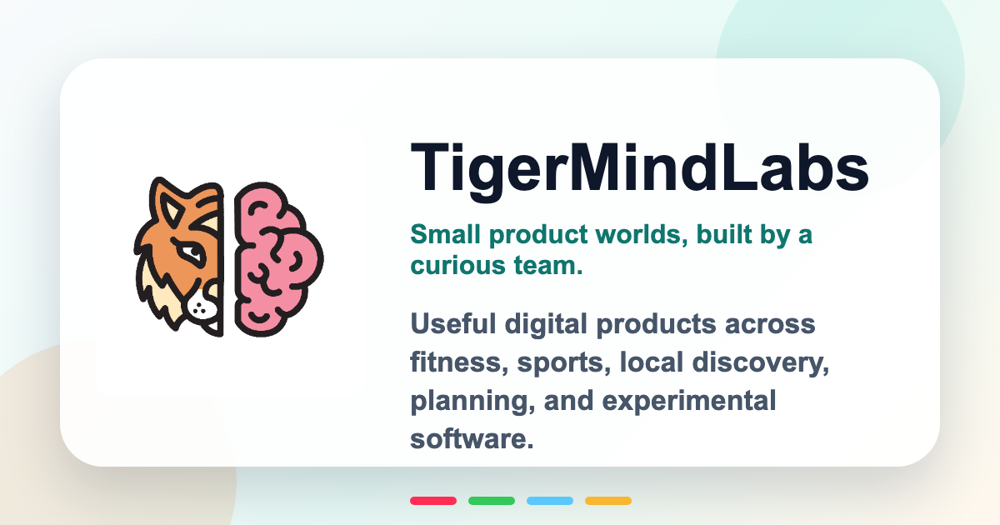

---

## 30. [Let Me Cook It](https://www.producthunt.com/products/let-me-cook-it)
**Votes**: 4 | **도입 난이도**: 하 | **신뢰도**: 상
**Tagline**: Your first sale in 30 days, or your money back
**서비스 링크**: https://www.producthunt.com/r/AMBZWRPHG4ZHRO

**태그**: SideHustle, DigitalProducts, Entrepreneurship, Education, AI Tool, Prompting

### 📌 이 서비스 한눈에 보기
30일 안에 첫 디지털 상품 판매를 실현해 주는 실전 창업 가이드

### 🔑 주요 기능
- 아이디어 구상부터 실제 판매까지 30일 완성 커리큘럼
- TikTok 및 Reddit 타겟의 디지털 상품(템플릿, 전자책 등) 판매 특화
- 30일 내 첫 판매 미달성 시 100% 환불 보장

### 🙋 사용자에게 어떤 점이 좋은가
구독료 부담 없이 단 한 번의 결제로 디지털 상품 판매의 전 과정을 빠르게 학습하고 수익화할 수 있습니다.

### ✅ 지금 바로 써볼 기능
- 판매할 디지털 상품 아이디어 구상하기
- TikTok 및 Reddit 계정 준비하기
- 30일 완성 커리큘럼 확인하기

### ⚠️ 사용 전 확인할 점
- 판매 성과가 개인의 노력과 상품 품질에 따라 달라질 수 있음
- 환불 조건에 대한 세부 약관 확인 필요

### 🧭 확인이 더 필요한 정보
구체적인 교육 커리큘럼의 구성 방식과 환불 절차에 대한 상세 정보가 필요합니다.

### 📸 스크린샷 및 갤러리
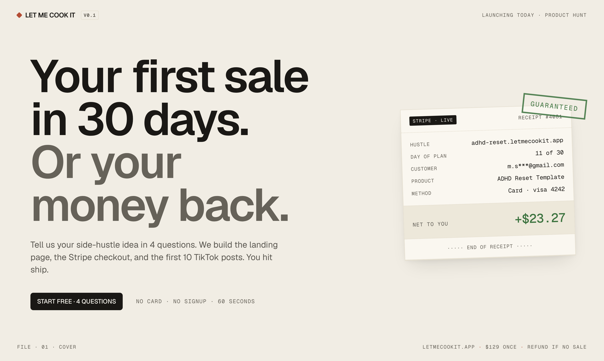
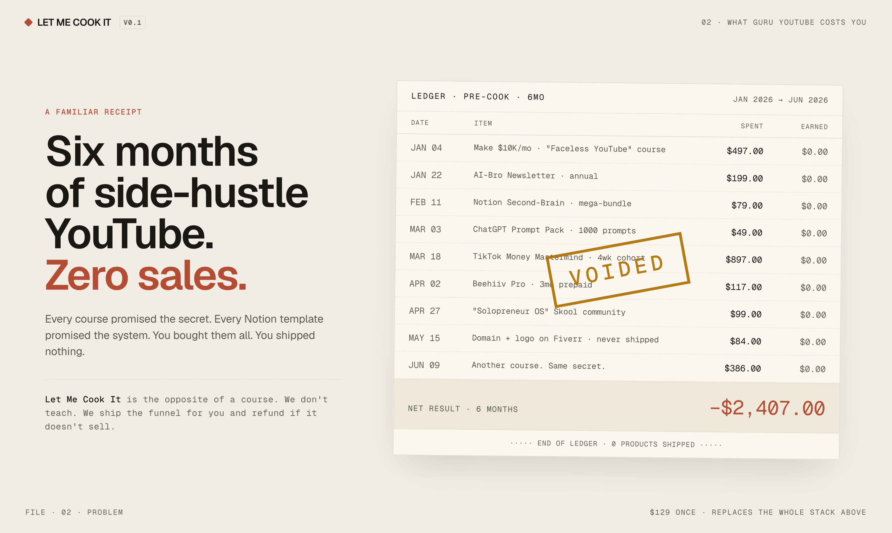
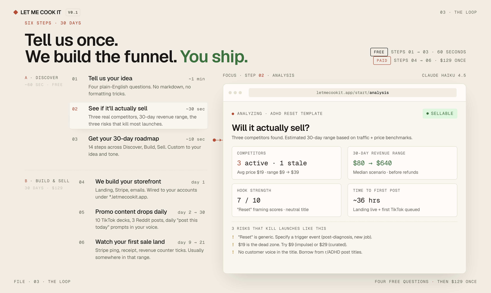

### 🎬 관련 영상
- [🎥 영상 보기](https://ph-files.imgix.net/6c71f619-a945-4e3f-9ae8-9102766a8eb0.jpeg?auto=format)

---

