# 🚀 Product Hunt Daily Top 30 (2026-06-02)

## 오늘의 요약
오늘의 제품들은 기존의 워크플로우에 자연스럽게 녹아들어 실시간으로 작업을 수행하는 '에이전트형 AI'와 '맥(Mac) 환경 최적화 도구'가 주를 이루었습니다. 단순한 정보 제공을 넘어 사용자의 맥락을 이해하고 즉각적인 실행을 돕는 지능형 자동화 서비스가 핵심 트렌드로 나타났습니다.

### 오늘의 핵심 포인트
- 채팅창이나 키패드 등 사용자가 머무는 환경 내에서 즉각적인 작업 수행이 가능한 AI 비서 서비스가 주목받았습니다.
- 기존의 업무 도구(Mac, 메시징 앱, 화상 회의 등)와 완벽하게 호환되며 작업 흐름을 방해하지 않는 통합형 솔루션이 강세를 보였습니다.
- 기업 데이터나 소셜 미디어 관리 등 복잡한 비즈니스 데이터를 AI가 직접 다루며 운영 효율을 극대화하는 도구들이 등장했습니다.

**오늘의 태그**: AI 에이전트, 워크플로우 자동화, 생산성 도구, 맥 OS, 협업 솔루션

## 1. [Mina Meeting Assistant](https://www.producthunt.com/products/mina-meeting-assistant)
**Votes**: 340 | **도입 난이도**: 중 | **신뢰도**: 상
**Tagline**: Your AI Teammate now responds and executes during your calls
**서비스 링크**: https://www.producthunt.com/r/BPRGIOPD7QOOVH

**태그**: AI Assistant, Productivity, Automation, Collaboration, AI Tool, Sales

### 📌 이 서비스 한눈에 보기
회의 중 실시간 응답과 작업 실행이 가능한 능동형 AI 팀원

### 🔑 주요 기능
- 단순 기록을 넘어 회의 중 실시간 대화 및 개입 가능
- 외부 툴의 컨텍스트를 활용한 지능적인 업무 지원
- 영업, 인터뷰, 스탠드업 등 다양한 워크플로우 최적화

### 🙋 사용자에게 어떤 점이 좋은가
회의가 끝난 뒤 정리하는 번거로움 없이, 회의가 진행되는 동안 즉각적인 결과물을 생성하고 업무를 진척시킬 수 있습니다.

### ✅ 지금 바로 써볼 기능
- 실시간 대화 참여 기능 테스트
- 외부 툴 연동을 통한 컨텍스트 활용 확인
- 회의 목적별(영업/인터뷰 등) 스킬 활용

### ⚠️ 사용 전 확인할 점
- AI의 실시간 개입으로 인한 회의 흐름 방해 가능성
- 외부 툴 연동 시 데이터 보안 및 권한 설정 확인 필요

### 🧭 확인이 더 필요한 정보
사용 가능한 외부 툴의 종류와 구체적인 연동 범위에 대한 정보가 추가로 필요합니다.

### 📸 스크린샷 및 갤러리
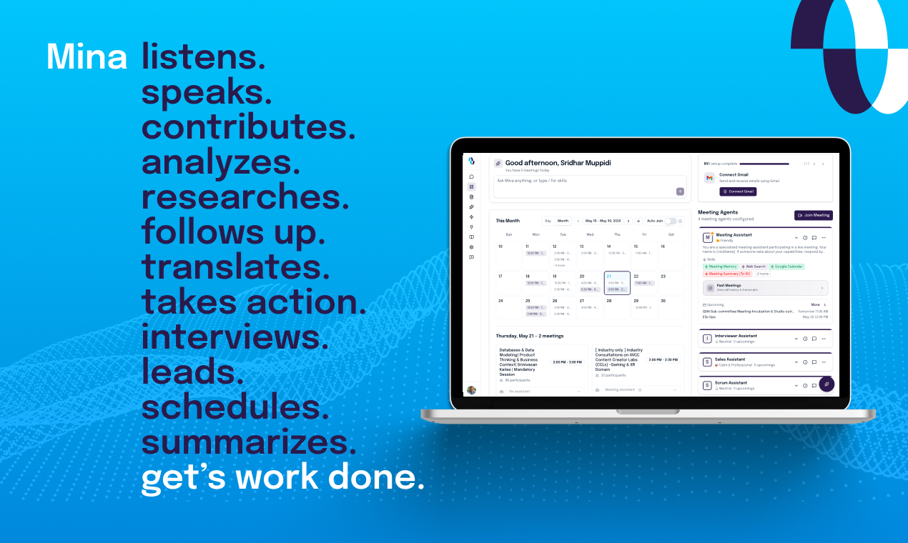
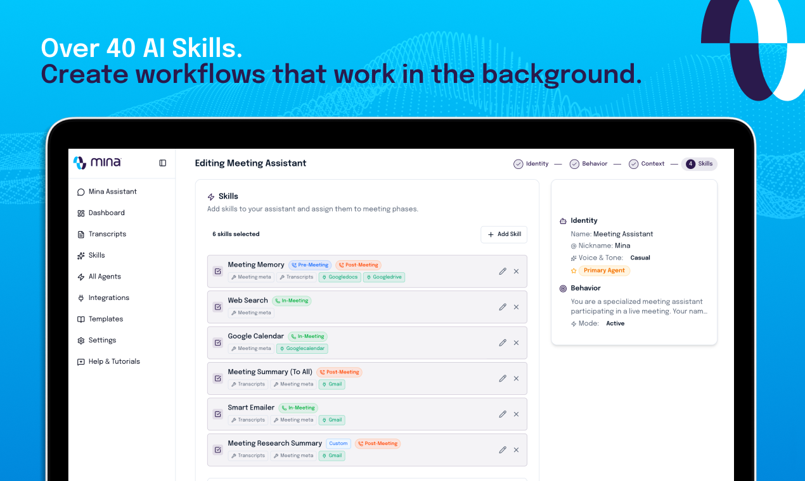
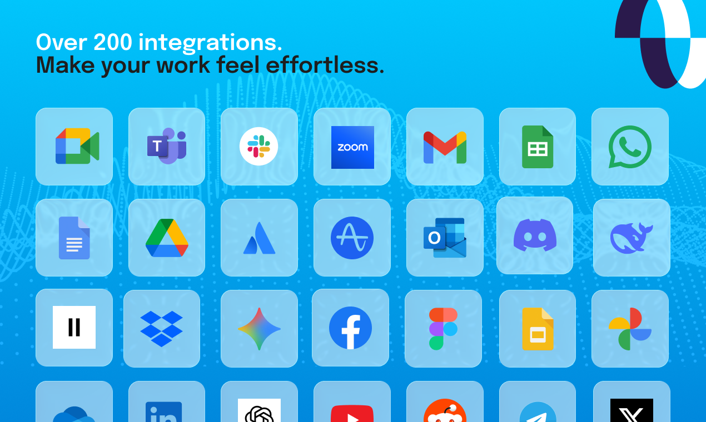

### 🎬 관련 영상
- [🎥 영상 보기](https://ph-files.imgix.net/2bf631bc-16da-4618-bef6-1ae3dac38df7.jpeg?auto=format)

---

## 2. [SocialEcho 2.0](https://www.producthunt.com/products/socialecho)
**Votes**: 277 | **도입 난이도**: 중 | **신뢰도**: 상
**Tagline**: AI social media copilot for teams and agents
**서비스 링크**: https://www.producthunt.com/r/CRXS4B2XRMZLD2

**태그**: SocialMedia, AI, Automation, MarketingTool, SaaS, Agent, AI Tool, API

### 📌 이 서비스 한눈에 보기
여러 브랜드의 소셜 미디어 캠페인을 통합 관리하고 AI 자동화로 운영 효율을 극대화하는 코파일럿

### 🔑 주요 기능
- 멀티 브랜드 및 채널 통합 관리 워크스페이스 제공
- 트렌드 분석, 콘텐츠 생성 및 플랫폼별 최적화 기능
- 공식 API 기반의 안전한 AI 에이전트 및 자동화 연동

### 🙋 사용자에게 어떤 점이 좋은가
여러 계정을 운영하는 팀이나 에이전시가 스크래핑 위험 없이 안전하게 AI를 활용하여 콘텐츠 제작부터 게시, 대화 관리까지 자동화할 수 있습니다.

### ✅ 지금 바로 써볼 기능
- 멀티 채널 통합 워크스페이스 설정하기
- AI를 활용한 플랫폼별 맞춤형 콘텐츠 생성 테스트
- 외부 AI 에이전트(OpenClaw, Hermes 등)와의 연동 확인

### ⚠️ 사용 전 확인할 점
- AI 자동화 설정 시 브랜드 톤앤매너 검수 필요
- 연동 가능한 외부 AI 에이전트 및 자동화 도구의 호환성 확인

### 🧭 확인이 더 필요한 정보
지원하는 구체적인 소셜 미디어 플랫폼 목록과 외부 에이전트와의 상세 연동 방식에 대한 정보가 추가로 필요합니다.

### 📸 스크린샷 및 갤러리
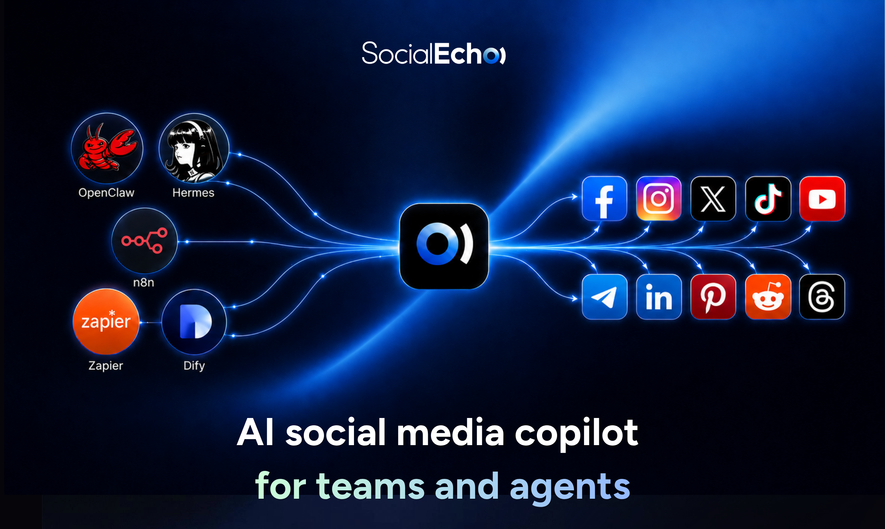
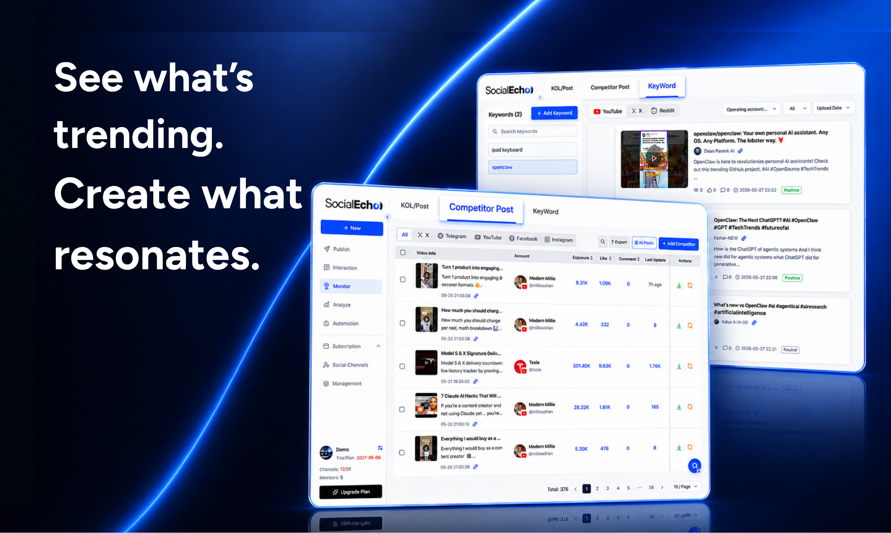
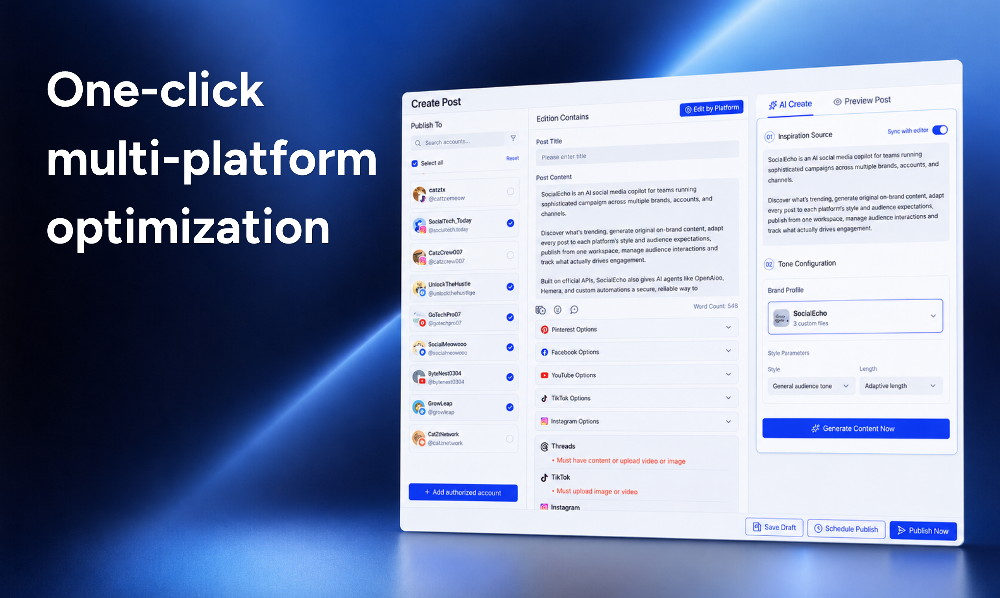

---

## 3. [Databox MCP](https://www.producthunt.com/products/databox)
**Votes**: 253 | **도입 난이도**: 중 | **신뢰도**: 상
**Tagline**: Chat with your business data inside Claude, ChatGPT and more
**서비스 링크**: https://www.producthunt.com/r/QOQ2YENIDC56TM

**태그**: AI, Data Analytics, Automation, Business Intelligence, AI Tool, Chat

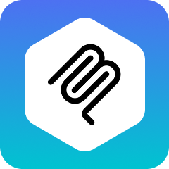

### 📌 이 서비스 한눈에 보기
Claude나 ChatGPT 같은 AI 채팅창에서 기업 데이터를 직접 조회하고 분석할 수 있는 도구

### 🔑 주요 기능
- LLM(Claude, ChatGPT, Cursor 등)과 비즈니스 데이터 간의 직접적인 연결
- 자연어를 통한 매출, 캠페인, 파이프라인 데이터 질의응답
- 실제 비즈니스 지표와 컨텍스트에 기반한 정확한 답변 제공

### 🙋 사용자에게 어떤 점이 좋은가
복잡한 대시보드를 일일이 확인하지 않고도, 채팅창에서 질문만으로 실시간 비즈니스 지표를 즉시 파악할 수 있습니다.

### ✅ 지금 바로 써볼 기능
- 사용 중인 AI 채팅 도구에 MCP 연결 설정하기
- 자연어로 비즈니스 지표 질문 던져보기
- n8n 등 자동화 워크플로우와 연동 테스트하기

### ⚠️ 사용 전 확인할 점
- AI 모델에 민감한 비즈니스 데이터가 노출될 수 있으므로 보안 정책 확인 필요
- 데이터 소스 연결 설정 및 권한 관리에 대한 사전 지식 필요

### 🧭 확인이 더 필요한 정보
지원하는 구체적인 데이터 소스(DB, SaaS 등)의 종류와 보안 프로토콜에 대한 상세 정보가 필요합니다.

### 📸 스크린샷 및 갤러리

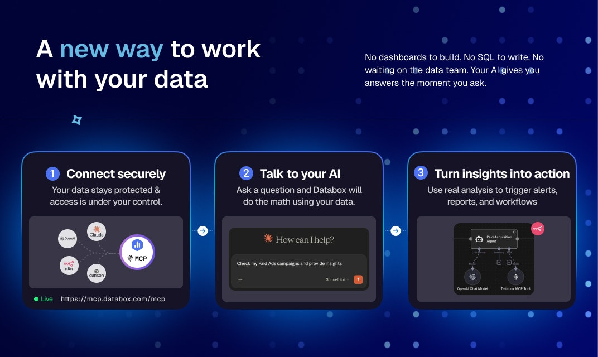
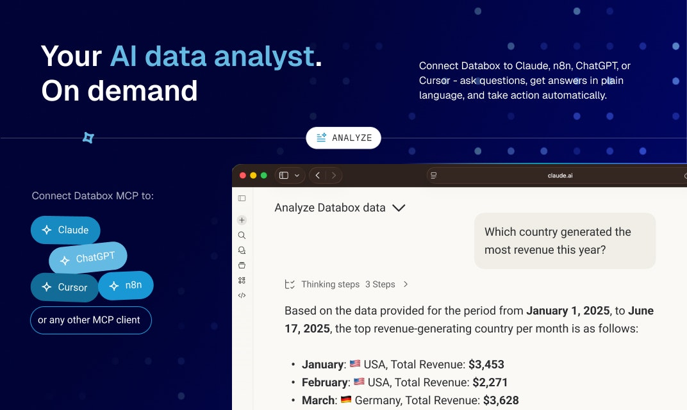

### 🎬 관련 영상
- [🎥 영상 보기](https://ph-files.imgix.net/281845a8-1367-4381-b16e-1cfc31821492.jpeg?auto=format)

---

## 4. [Dune Keypad](https://www.producthunt.com/products/dune-4)
**Votes**: 246 | **도입 난이도**: 하 | **신뢰도**: 상
**Tagline**: Context-aware Mac keypad, w/ Claude + community extensions 
**서비스 링크**: https://www.producthunt.com/r/7TXQTNQWP6ELW7

**태그**: Productivity, Automation, AI, Mac, Workflow

### 📌 이 서비스 한눈에 보기
Claude AI와 연동하여 맥(Mac) 환경의 워크플로우를 자동화하는 컨텍스트 인식형 키패드

### 🔑 주요 기능
- Claude AI를 통한 대화형 단축키 생성 기능
- 커뮤니티 스크립트 마켓플레이스 제공
- 사용 중인 앱에 맞춰 즉각적으로 변하는 3개의 컨텍스트 키

### 🙋 사용자에게 어떤 점이 좋은가
사용 중인 앱의 맥락을 파악하여 필요한 동작을 단축키 하나로 실행할 수 있어 작업 전환 속도를 높여줍니다.

### ✅ 지금 바로 써볼 기능
- Claude를 활용한 맞춤형 단축키 생성해보기
- 마켓플레이스에서 커뮤니티 스크립트 탐색하기
- 자주 사용하는 앱에 3개의 키 할당하기

### ⚠️ 사용 전 확인할 점
- 3개의 키로 제한된 물리적 인터페이스의 활용도 고려 필요
- Claude 등 외부 AI 서비스 의존성

### 🧭 확인이 더 필요한 정보
하드웨어 제품인지 소프트웨어 전용 솔루션인지에 대한 구체적인 형태가 명시되지 않았습니다.

### 📸 스크린샷 및 갤러리

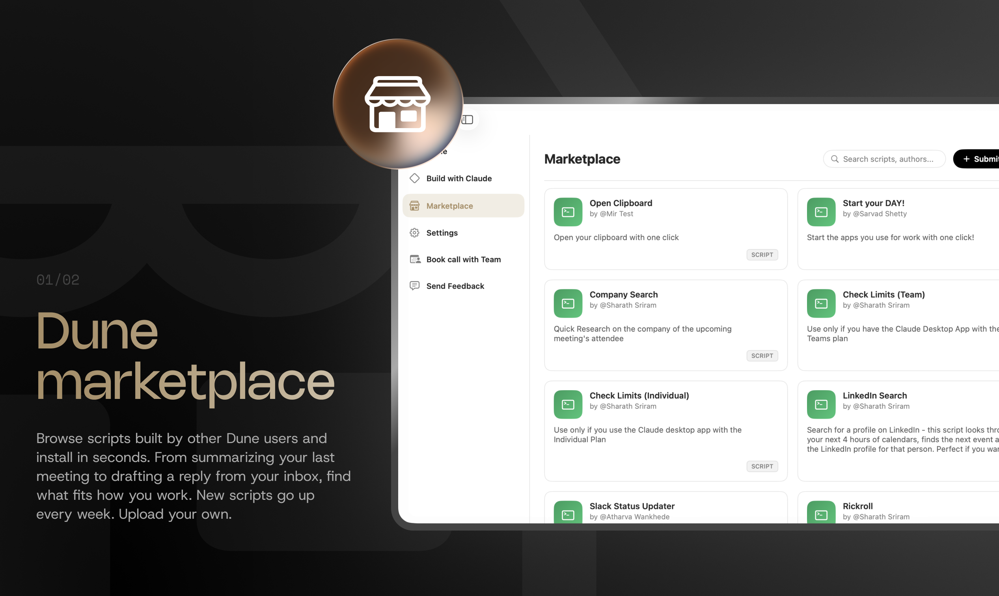
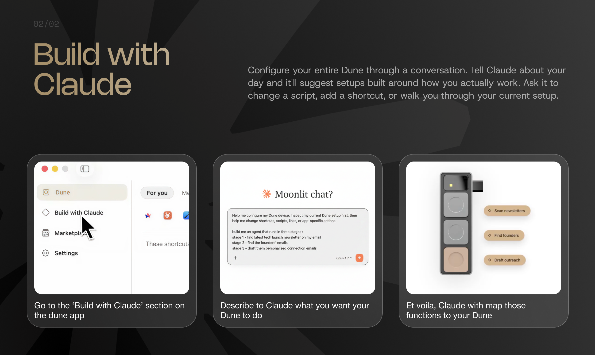

### 🎬 관련 영상
- [🎥 영상 보기](https://ph-files.imgix.net/1c2c9421-95a5-42f6-865b-4d328a023de9.jpeg?auto=format)

---

## 5. [folk](https://www.producthunt.com/products/folk-3)
**Votes**: 230 | **도입 난이도**: 하 | **신뢰도**: 상
**Tagline**: the AI in your texts that gets stuff done
**서비스 링크**: https://www.producthunt.com/r/UH6J63SRBAI3YO

**태그**: AI Assistant, Productivity, Messaging, Automation, AI Tool

### 📌 이 서비스 한눈에 보기
메시징 앱 내에서 대화하며 일상과 업무를 돕는 멀티플레이어 AI 비서

### 🔑 주요 기능
- iMessage, Telegram, Discord 등 기존 메시징 앱 내에서 바로 사용 가능
- 회의 참여, 일정 계획, 위치 파악 등 실질적인 작업 수행
- 사용자와의 대화가 쌓일수록 개인화되는 지능형 서비스

### 🙋 사용자에게 어떤 점이 좋은가
별도의 앱을 새로 설치할 필요 없이 평소 쓰는 채팅창에서 바로 AI의 도움을 받아 일상과 협업을 효율적으로 관리할 수 있습니다.

### ✅ 지금 바로 써볼 기능
- 주로 사용하는 메시징 앱에 연동하기
- AI에게 일정 계획이나 미팅 참여 요청해보기
- 친구들을 초대하여 멀티플레이어 기능 테스트하기

### ⚠️ 사용 전 확인할 점
- 대화 내용 기반의 개인화로 인한 프라이버시 및 데이터 보안 검토 필요
- 메시징 앱 권한 접근에 따른 데이터 노출 가능성

### 🧭 확인이 더 필요한 정보
사용자의 위치 정보 및 개인적인 대화 데이터가 어떻게 저장되고 보호되는지에 대한 구체적인 보안 정책 확인이 필요합니다.

### 📸 스크린샷 및 갤러리

### 🎬 관련 영상
- [🎥 영상 보기](https://ph-files.imgix.net/656ba812-9fd6-436f-8042-bea3f922848d.jpeg?auto=format)

---

## 6. [Typeahead](https://www.producthunt.com/products/typeahead)
**Votes**: 196 | **도입 난이도**: 하 | **신뢰도**: 상
**Tagline**: AI autocomplete for every app on your Mac
**서비스 링크**: https://www.producthunt.com/r/G2V2YZAFH5VK2F

**태그**: Productivity, AI, Mac, WritingAssistant, AI Tool

### 📌 이 서비스 한눈에 보기
Mac의 모든 앱에서 실시간으로 글쓰기를 도와주는 로컬 AI 자동 완성 도구

### 🔑 주요 기능
- Mac 내 모든 텍스트 입력창에서 작동하는 범용성
- 글을 쓰는 흐름을 방해하지 않는 인라인 자동 완성 기능
- 로컬 AI 모델 기반의 오프라인 작동 및 강력한 개인정보 보호

### 🙋 사용자에게 어떤 점이 좋은가
별도의 앱을 열 필요 없이 평소 사용하는 모든 앱에서 즉각적인 타이핑 보조를 받을 수 있어 작업 속도가 향상됩니다.

### ✅ 지금 바로 써볼 기능
- Mac의 모든 텍스트 필드에 설치하여 반응성 확인하기
- 오프라인 상태에서 자동 완성 기능 테스트하기
- 인라인 제안이 글쓰기 흐름에 얼마나 자연스러운지 경험하기

### ⚠️ 사용 전 확인할 점
- 로컬 모델 구동에 따른 Mac 시스템 리소스(CPU/RAM) 점유율 확인 필요
- 특정 앱의 입력 방식에 따라 인라인 제안 표시가 제한될 가능성

### 🧭 확인이 더 필요한 정보
로컬 모델의 성능이 사용자의 Mac 사양에 따라 어떻게 달라질지 확인이 필요합니다.

### 📸 스크린샷 및 갤러리
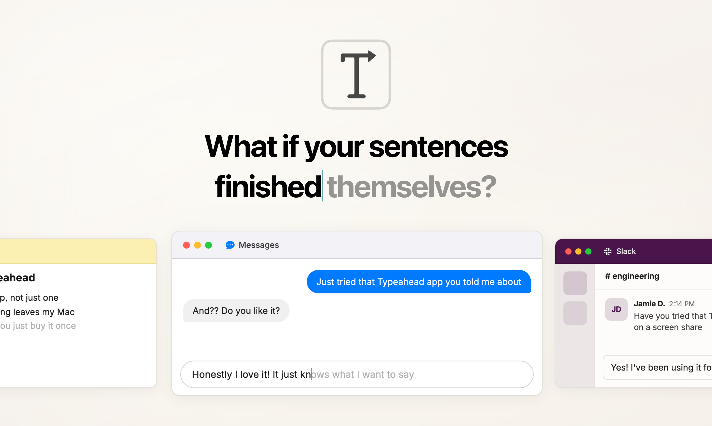
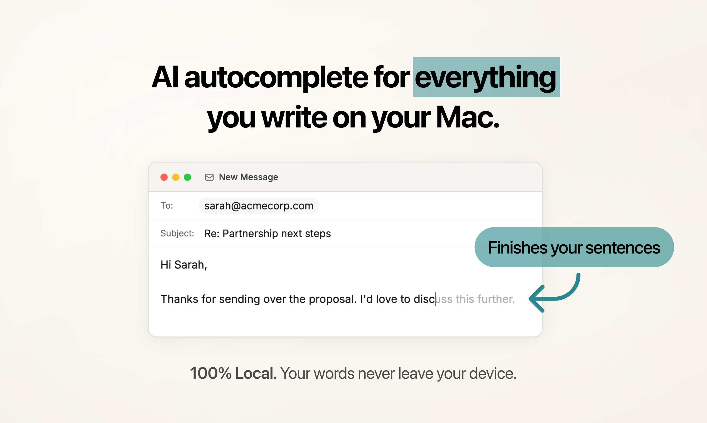
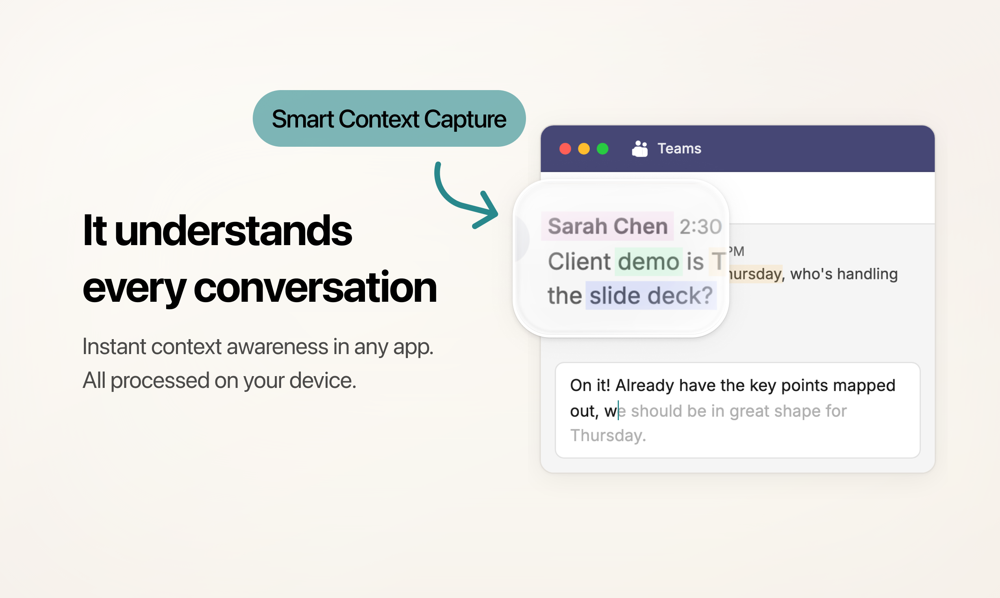

### 🎬 관련 영상
- [🎥 영상 보기](https://ph-files.imgix.net/94cd4a39-18a5-4488-92b2-c3e780311cf4.jpeg?auto=format)

---

## 7. [Presentify](https://www.producthunt.com/products/presentify)
**Votes**: 168 | **도입 난이도**: 하 | **신뢰도**: 상
**Tagline**: Take your presentation skills to the next level
**서비스 링크**: https://www.producthunt.com/r/EFSDTB5TONMOBP

**태그**: Productivity, macOS, Presentation, RemoteWork, Video

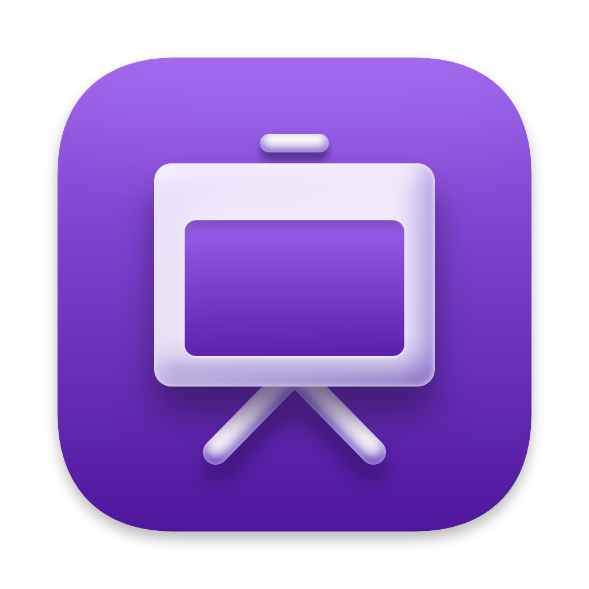

### 📌 이 서비스 한눈에 보기
어떤 발표 도구와도 완벽하게 호환되는 macOS용 화면 주석 및 강조 도구

### 🔑 주요 기능
- 화면 주석 작성, 커서 하이라이트, 특정 영역 스포트라이트 기능 제공
- 화면 확대(Zoom) 기능을 통한 세밀한 시각적 전달 가능
- Keynote, Google Slides, Zoom, Teams 등 모든 발표 및 화상 회의 앱과 호환

### 🙋 사용자에게 어떤 점이 좋은가
별도의 발표 도구를 바꿀 필요 없이 기존에 사용하던 앱 위에서 즉시 시각적 효과를 더해 전달력을 높일 수 있습니다.

### ✅ 지금 바로 써볼 기능
- 커서 하이라이트로 시선 집중시키기
- 중요 영역 스포트라이트 기능 활용하기
- 화면 확대 기능을 통한 디테일한 설명하기

### ⚠️ 사용 전 확인할 점
- macOS 전용 앱이므로 Windows 환경에서는 사용 불가
- 화면 공유 시 시스템 리소스 사용량 확인 필요

### 🧭 확인이 더 필요한 정보
macOS 버전별 호환성 및 시스템 권한 설정 요구 사항에 대한 확인이 필요합니다.

### 📸 스크린샷 및 갤러리
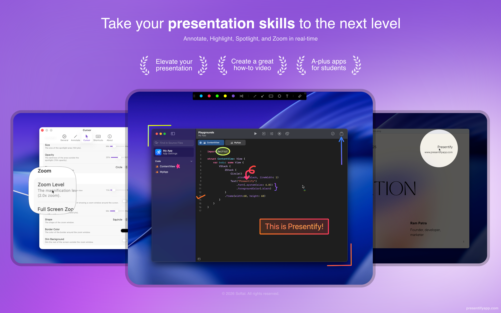
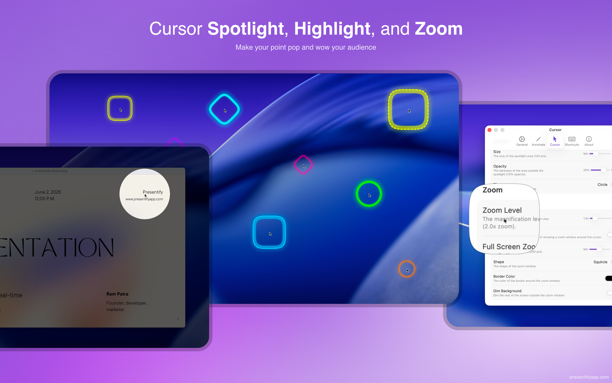
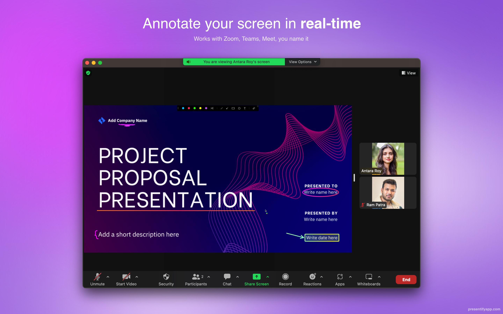

### 🎬 관련 영상
- [🎥 영상 보기](https://ph-files.imgix.net/4c850ed0-80c8-4845-85e3-8192d351d3e4.jpeg?auto=format)

---

## 8. [Trippple Club](https://www.producthunt.com/products/trippple-club)
**Votes**: 130 | **도입 난이도**: 중 | **신뢰도**: 상
**Tagline**: Advertise together on Meta Ads and pay 3x less
**서비스 링크**: https://www.producthunt.com/r/5ADGADBENO7VBT

**태그**: Marketing, Advertising, Small Business, Meta Ads

### 📌 이 서비스 한눈에 보기
비경쟁 업체 간 광고 예산을 통합하여 Meta 광고 효율을 극대화하는 공동 광고 플랫폼

### 🔑 주요 기능
- 비경쟁 업체 간 예산 풀링을 통한 대형 광고주 효과 창출
- 알고리즘 최적화 가속화 및 광고 집행 비용 절감
- 광고 소재 제작 서비스 포함

### 🙋 사용자에게 어떤 점이 좋은가
적은 예산으로 인해 Meta 광고 최적화에 어려움을 겪는 소상공인이 대형 광고주 수준의 데이터 학습과 노출 효율을 누릴 수 있습니다.

### ✅ 지금 바로 써볼 기능
- 비경쟁 업체 그룹 구성 방식 확인
- 광고 소재 제작 서비스 범위 검토
- 예산 통합 시 운영 방식 및 정산 프로세스 파악

### ⚠️ 사용 전 확인할 점
- 그룹 내 업체 간 타겟 중복 시 발생할 수 있는 효율 저하 가능성
- 공동 광고 집행 시 개별 브랜드의 통제권 범위 확인 필요

### 🧭 확인이 더 필요한 정보
구체적인 비용 절감 비율과 광고 소재 제작의 상세 범위에 대한 정보가 필요합니다.

### 📸 스크린샷 및 갤러리

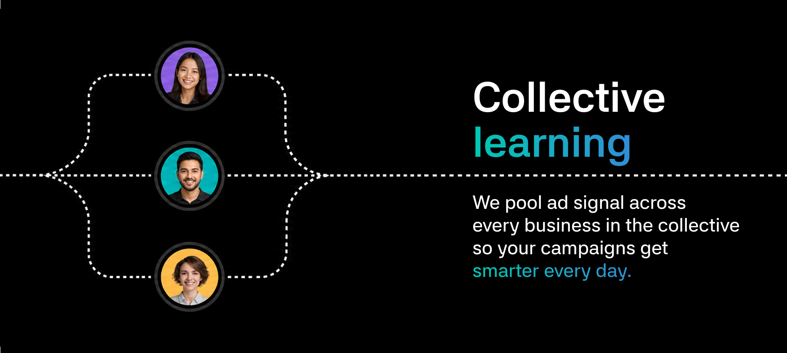
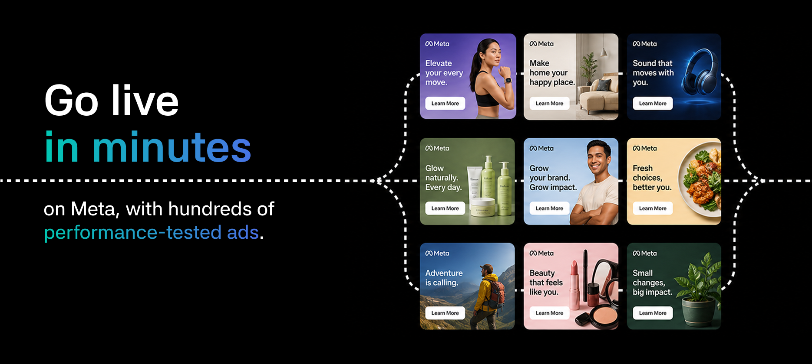

### 🎬 관련 영상
- [🎥 영상 보기](https://ph-files.imgix.net/e5b354af-863b-4da6-b263-25ad2b2763e0.jpeg?auto=format)

---

## 9. [Open Caffeine](https://www.producthunt.com/products/open-caffeine)
**Votes**: 122 | **도입 난이도**: 하 | **신뢰도**: 상
**Tagline**: Keep your Mac awake
**서비스 링크**: https://www.producthunt.com/r/33DIGF6JTFR3M3

**태그**: macOS, Utility, Productivity, Marketing

### 📌 이 서비스 한눈에 보기
원하는 시간 동안 맥(Mac)의 잠자기 모드를 간편하게 방지하는 네이티브 메뉴 바 앱

### 🔑 주요 기능
- 사용자 지정 타이머 및 프리셋 제공
- 메뉴 바 카운트다운 및 글로벌 단축키 지원
- 배터리 부족 시 자동 중단 기능 및 Apple Silicon 네이티브 지원

### 🙋 사용자에게 어떤 점이 좋은가
불필요한 기능 없이 맥의 잠자기 모드를 제어하고 싶을 때, 가볍고 현대적인 인터페이스로 즉각적인 생산성 유지가 가능합니다.

### ✅ 지금 바로 써볼 기능
- 원하는 시간만큼 타이머 설정하기
- 메뉴 바에서 남은 시간 확인하기
- 글로벌 단축키 설정하여 빠르게 제어하기

### ⚠️ 사용 전 확인할 점
- 화면 잠자기 방지 기능 사용 시 배터리 소모가 빨라질 수 있음
- 애플 실리콘 최적화는 되어 있으나 구형 인텔 맥에서의 동작 확인 필요

### 🧭 확인이 더 필요한 정보
배터리 저전력 임계값 설정에 대한 세부 수치 조절 가능 여부는 명시되지 않았습니다.

### 📸 스크린샷 및 갤러리
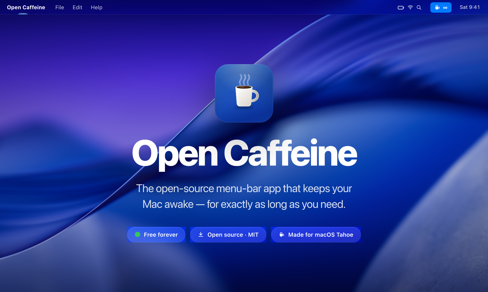
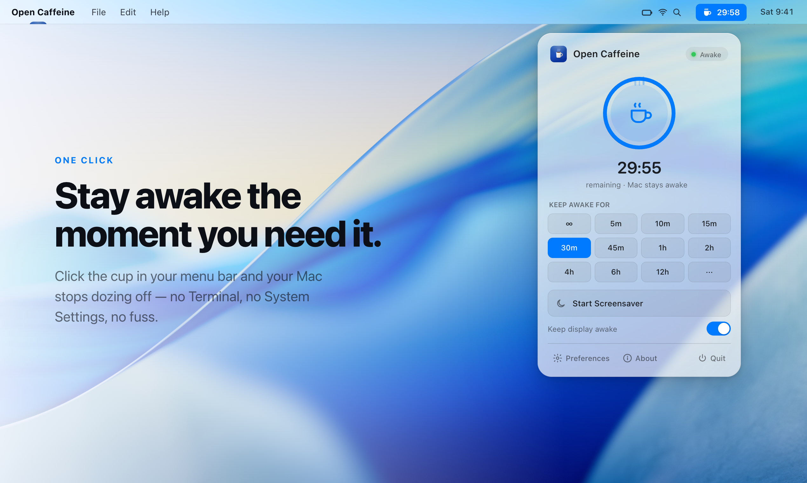
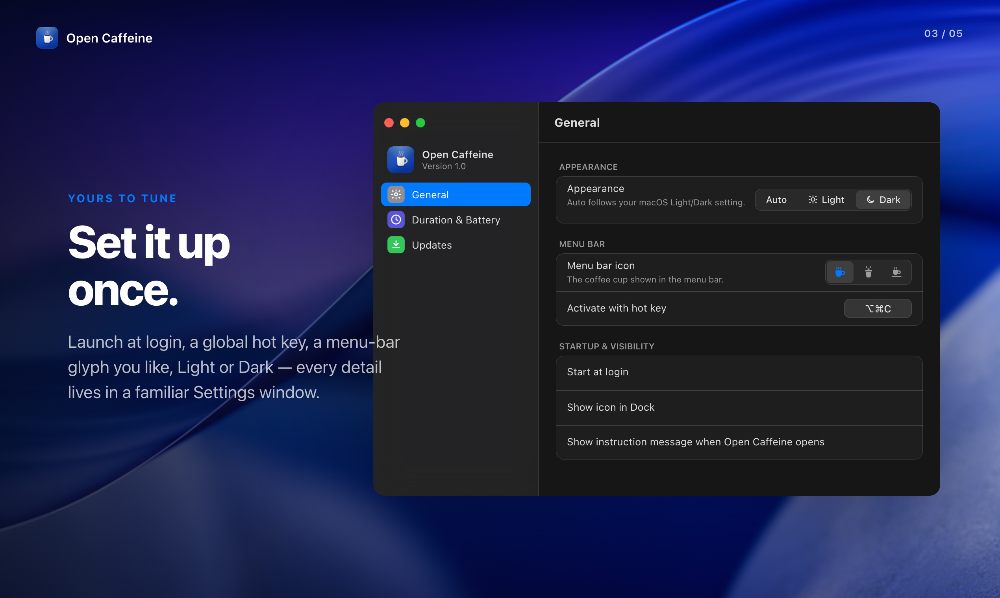

---

## 10. [Tabstack Web Research](https://www.producthunt.com/products/tabstack)
**Votes**: 113 | **도입 난이도**: 하 | **신뢰도**: 상
**Tagline**: Run a research agent with cited answers in a single API call
**서비스 링크**: https://www.producthunt.com/r/4FS257I67YYFZE

**태그**: DevTool, AI Agent, Web Scraping, API, Agent, AI Tool

### 📌 이 서비스 한눈에 보기
실시간 웹 검색과 출처 인용이 포함된 리서치 에이전트 API

### 🔑 주요 기능
- 단일 API 호출로 실시간 웹 데이터 검색 및 답변 생성
- 모든 답변에 검증 가능한 소스 URL(출처) 제공
- 정보의 신뢰성이 중요한 법률, 금융, 경쟁사 분석에 최적화

### 🙋 사용자에게 어떤 점이 좋은가
복잡한 웹 크롤링 및 정보 요약 로직을 직접 구현할 필요 없이, 신뢰할 수 있는 리서치 기능을 앱에 즉시 통합할 수 있습니다.

### ✅ 지금 바로 써볼 기능
- API를 통한 실시간 정보 검색 테스트
- 제공되는 출처(Source URL)의 정확도 검증
- 무료 체험 기능을 통한 서비스 통합 가능성 확인

### ⚠️ 사용 전 확인할 점
- 실시간 웹 데이터를 사용하므로 검색 시점의 웹 상태에 따라 결과가 달라질 수 있음
- 정확한 비용 체계(API 호출당 비용 등)에 대한 추가 확인 필요

### 🧭 확인이 더 필요한 정보
구체적인 API 호출 비용 및 사용량 제한에 대한 정보가 명시되지 않았습니다.

### 📸 스크린샷 및 갤러리

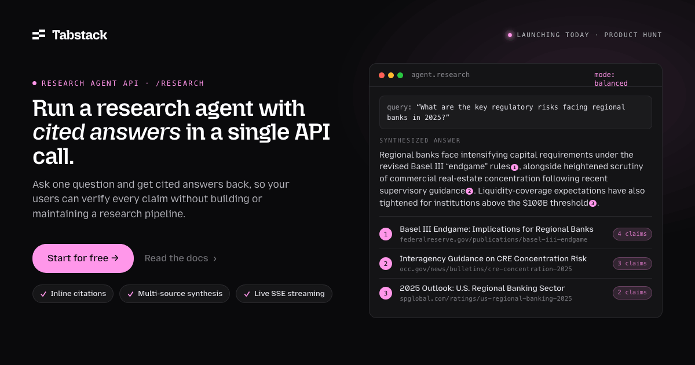
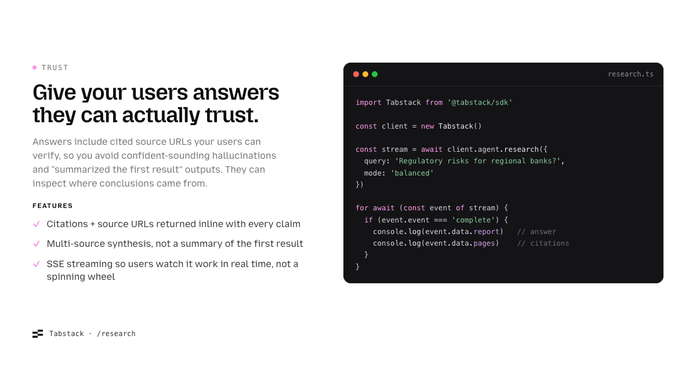

### 🎬 관련 영상
- [🎥 영상 보기](https://ph-files.imgix.net/d7419605-44e8-423c-b363-79cb9967123b.jpeg?auto=format)

---

## 11. [Mistral Vibe](https://www.producthunt.com/products/mistral-7b)
**Votes**: 112 | **도입 난이도**: 중 | **신뢰도**: 상
**Tagline**: I agent for long-running, multi-step work and coding
**서비스 링크**: https://www.producthunt.com/r/3IEP3NNQHZCXSG

**태그**: AI Agent, DevTool, Automation, Productivity, Agent

### 📌 이 서비스 한눈에 보기
복잡한 업무와 코딩 작업을 자동화하는 장기 실행형 AI 에이전트

### 🔑 주요 기능
- 장기적인 작업 흐름을 처리하는 통합 AI 에이전트
- 업무용(Work) 및 코딩용(Code) 특화 모드 제공
- VS Code 확장 프로그램을 통한 개발 환경 통합

### 🙋 사용자에게 어떤 점이 좋은가
단순 질의응답을 넘어 복잡하고 단계가 많은 업무나 코딩 작업을 스스로 수행하여 생산성을 높여줍니다.

### ✅ 지금 바로 써볼 기능
- Work 모드를 활용한 업무 자동화 테스트
- Code 모드를 통한 프로그래밍 작업 수행
- Vibe VS Code 확장 프로그램 설치 및 연동

### ⚠️ 사용 전 확인할 점
- 장기 실행 작업 시 예상치 못한 리소스 소모나 오류 발생 가능성
- 에이전트의 자율적 작업에 따른 결과물 검토 필요

### 🧭 확인이 더 필요한 정보
구체적인 작업 수행 능력의 한계와 지원되는 프로그래밍 언어 범위에 대한 확인이 필요합니다.

### 📸 스크린샷 및 갤러리

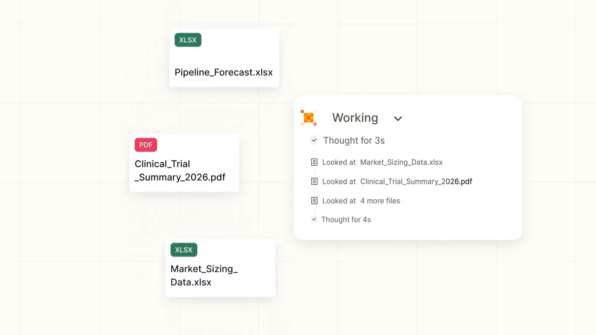
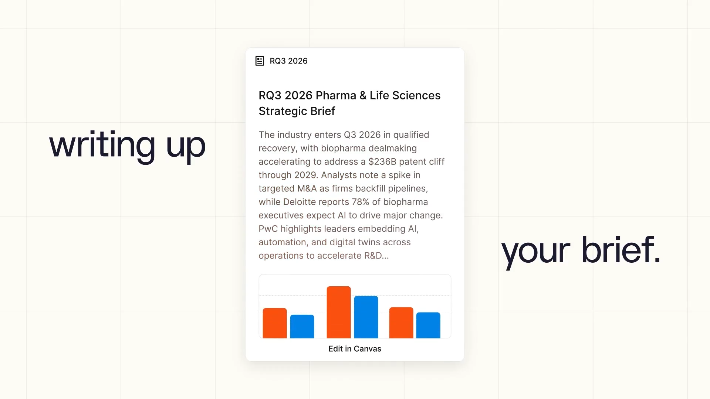

---

## 12. [Tokenwise](https://www.producthunt.com/products/tokenwise)
**Votes**: 104 | **도입 난이도**: 하 | **신뢰도**: 상
**Tagline**: A smart LLM proxy that shows where you're overpaying
**서비스 링크**: https://www.producthunt.com/r/NZCYBSG4NREZXK

**태그**: DevTool, LLM, CostOptimization, Analytics, AI Tool

### 📌 이 서비스 한눈에 보기
실제 사용 트래픽 기반으로 LLM 비용 과다 지출을 찾아내고 즉시 최적화하는 스마트 프록시

### 🔑 주요 기능
- OpenAI 호환 baseURL을 통한 간편한 원라인 프록시 설정
- 공개 벤치마크가 아닌 실제 요청 데이터를 통한 정확한 비용 분석
- 클릭 한 번으로 비용 절감 솔루션을 적용하고 실질적인 절감액 검증

### 🙋 사용자에게 어떤 점이 좋은가
LLM을 사용하는 개발자와 소규모 팀이 실제 운영 환경에서 발생하는 불필요한 비용을 데이터 기반으로 정확히 파악하고 즉각 줄일 수 있습니다.

### ✅ 지금 바로 써볼 기능
- 기존 LLM API 엔드포인트를 Tokenwise 프록시로 교체하기
- 실제 트래픽 분석을 통한 비용 과다 지출 구간 확인하기
- 제안된 최적화 설정을 적용하여 실시간 비용 절감 효과 확인하기

### ⚠️ 사용 전 확인할 점
- 프록시를 거치는 과정에서 발생할 수 있는 지연 시간(Latency) 확인 필요
- 데이터 보안 및 프라이버시 정책 검토 필요

### 🧭 확인이 더 필요한 정보
프록시를 통한 데이터 처리 시 보안 및 성능에 미치는 구체적인 영향에 대한 정보가 필요합니다.

### 📸 스크린샷 및 갤러리
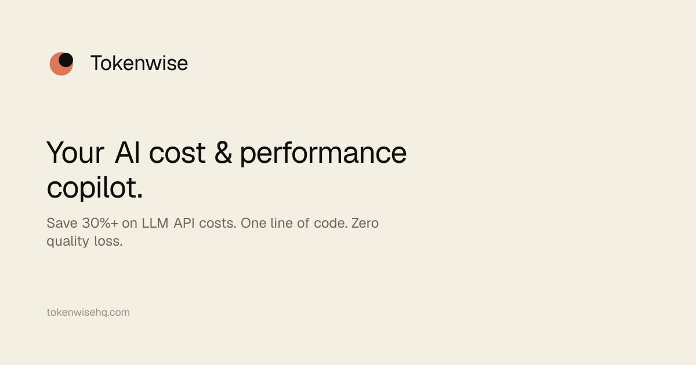
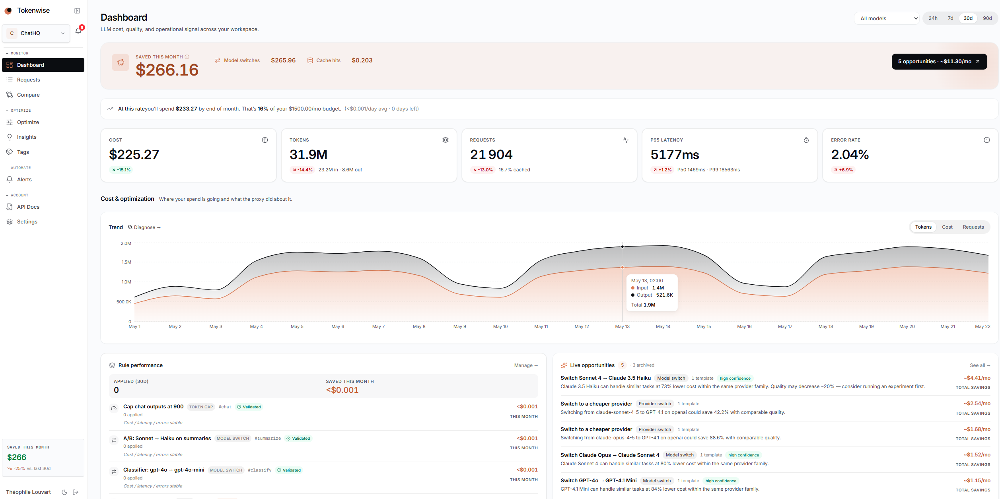
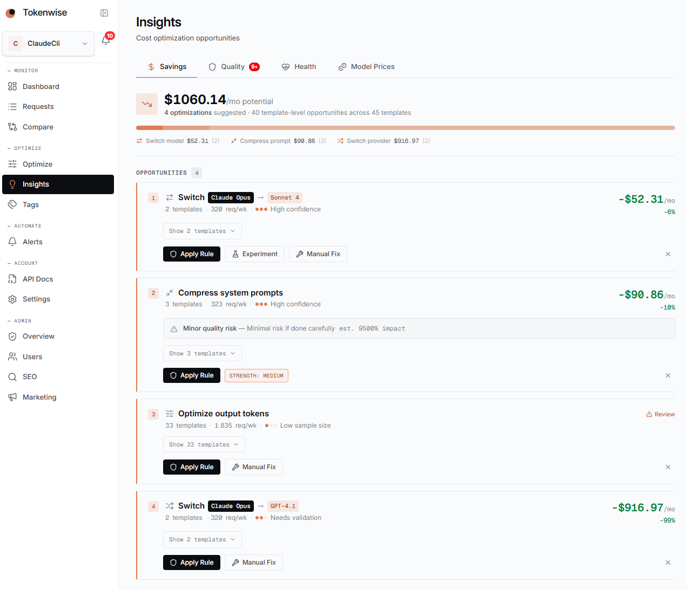

### 🎬 관련 영상
- [🎥 영상 보기](https://ph-files.imgix.net/77d63fc6-58bb-49af-885c-788e2776281b.jpeg?auto=format)

---

## 13. [Skylive](https://www.producthunt.com/products/skylive)
**Votes**: 98 | **도입 난이도**: 하 | **신뢰도**: 상
**Tagline**: Never miss a celestial event, anywhere on Earth
**서비스 링크**: https://www.producthunt.com/r/ASJ3XTKW7ZTYL5

**태그**: Astronomy, LiveStreaming, Community, Space

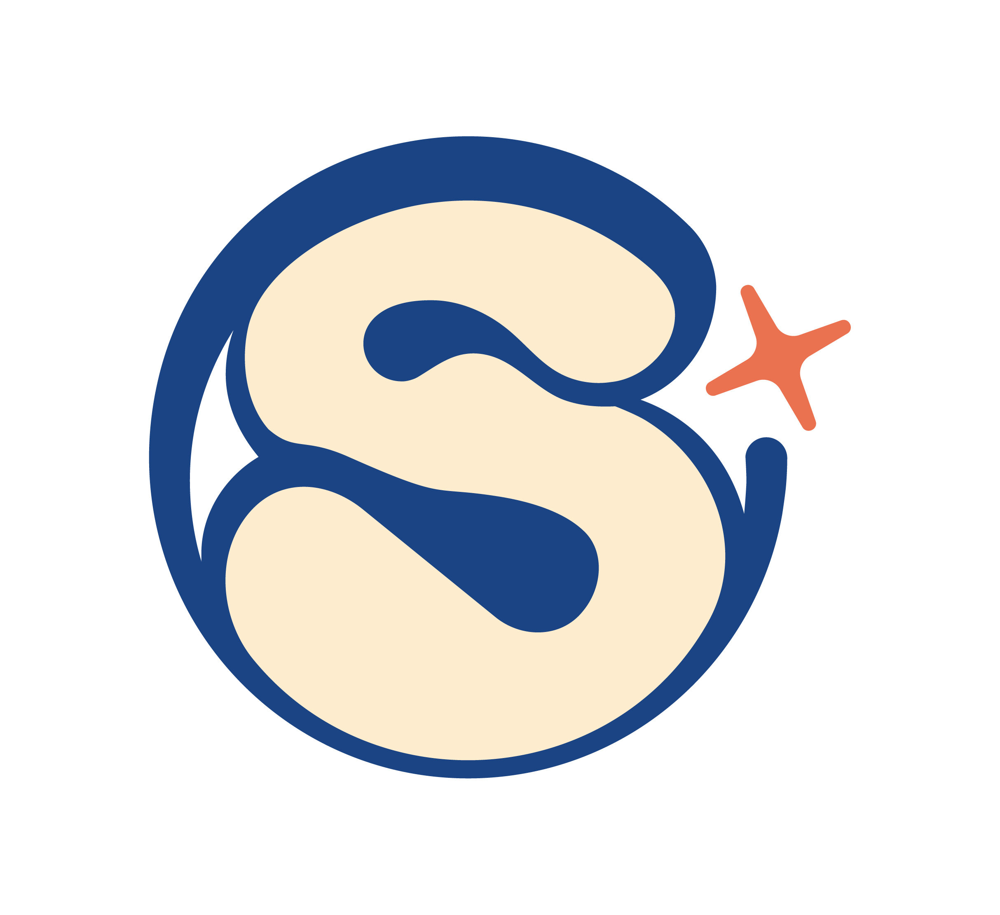

### 📌 이 서비스 한눈에 보기
전 세계 하늘 카메라 네트워크를 통해 언제 어디서든 실시간 천체 이벤트를 관측할 수 있는 서비스

### 🔑 주요 기능
- 전 세계에 배치된 커뮤니티 기반 스카이 카메라 네트워크
- 날씨, 위치, 시간대의 제약 없는 실시간 천체 이벤트 스트리밍
- 천체 이벤트 추적 및 글로벌 커버리지 제공

### 🙋 사용자에게 어떤 점이 좋은가
사용자는 자신이 있는 곳의 날씨나 낮/밤 여부와 상관없이 전 세계 어디서든 발생하는 우주 현상을 실시간으로 관찰할 수 있습니다.

### ✅ 지금 바로 써볼 기능
- 실시간 스트리밍 서비스 접속
- 다가오는 천체 이벤트 일정 확인
- 글로벌 카메라 네트워크 탐색

### ⚠️ 사용 전 확인할 점
- 네트워크 상태에 따른 스트리밍 품질 차이 가능성
- 카메라 설치 지역의 현지 기상 상황에 따른 관측 제한

### 🧭 확인이 더 필요한 정보
현재 카메라 네트워크의 구체적인 설치 규모와 커뮤니티 참여 방식에 대한 상세 정보가 필요합니다.

### 📸 스크린샷 및 갤러리
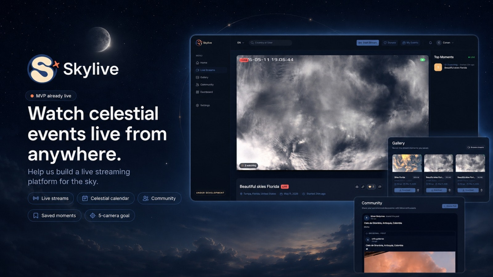
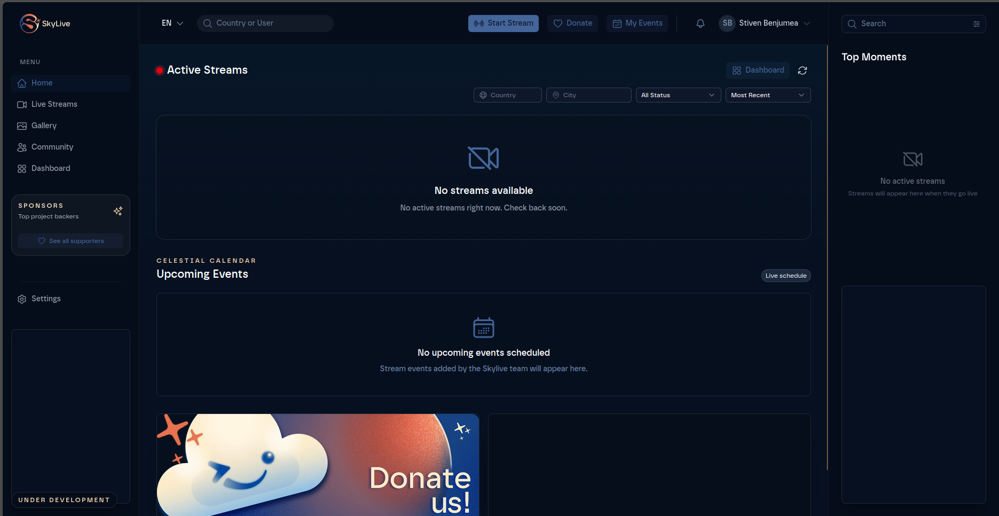
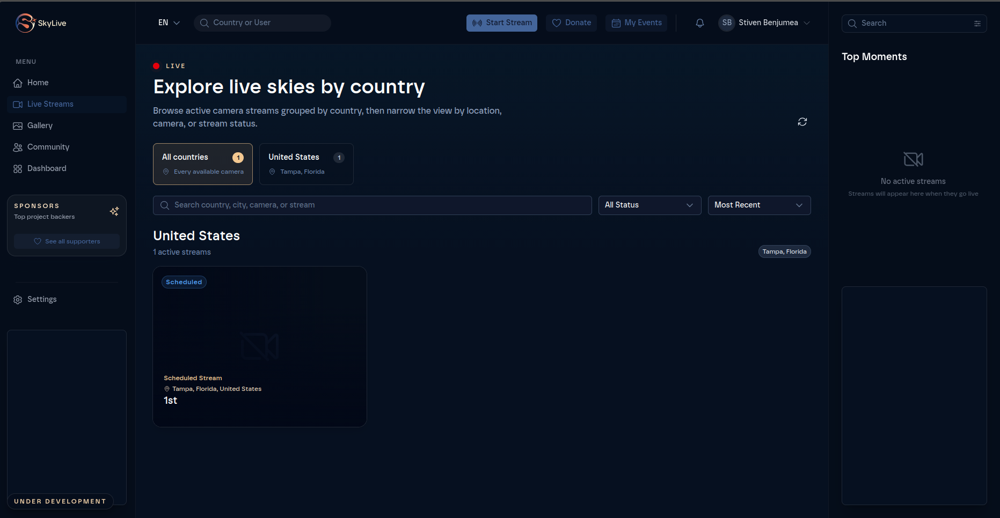

---

## 14. [Sentinel](https://www.producthunt.com/products/sentinel-10)
**Votes**: 94 | **도입 난이도**: 중 | **신뢰도**: 상
**Tagline**: Control your robots from anywhere in the world
**서비스 링크**: https://www.producthunt.com/r/4OZUKKV3C7STES

**태그**: Robotics, Remote Control, Automation, Teleoperation

### 📌 이 서비스 한눈에 보기
전 세계 어디서든 로봇을 즉각 제어할 수 있는 초고속 원격 텔레오퍼레이션 소프트웨어

### 🔑 주요 기능
- 시장 최고 수준의 빠른 원격 제어 속도 제공
- 자율 주행 오류 발생 시 즉각적인 개입 가능
- 로봇 가동 시간(Uptime) 극대화

### 🙋 사용자에게 어떤 점이 좋은가
로봇의 자율 주행이 중단되었을 때 현장에 가지 않고도 원격으로 문제를 해결하여 운영 효율을 높일 수 있습니다.

### ✅ 지금 바로 써볼 기능
- 원격 제어 지연 시간(Latency) 테스트
- 기존 로봇 시스템과의 연동성 확인
- 자율 주행 실패 시 개입 워크플로우 설정

### ⚠️ 사용 전 확인할 점
- 안정적인 네트워크 연결 환경 필수
- 로봇 하드웨어와의 호환성 확인 필요

### 🧭 확인이 더 필요한 정보
지원 가능한 로봇 하드웨어 종류와 구체적인 연결 프로토콜에 대한 정보가 필요합니다.

### 📸 스크린샷 및 갤러리

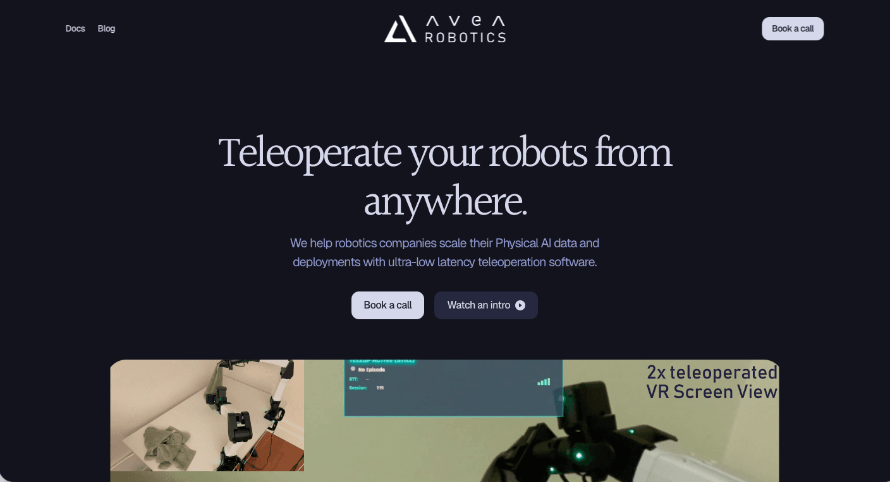

### 🎬 관련 영상
- [🎥 영상 보기](https://ph-files.imgix.net/60e2fb14-95ab-46c4-a629-9e09653d0e39.jpeg?auto=format)

---

## 15. [Stella](https://www.producthunt.com/products/stella-4)
**Votes**: 94 | **도입 난이도**: 하 | **신뢰도**: 상
**Tagline**: Local natural language search across all your files
**서비스 링크**: https://www.producthunt.com/r/ETSDIDNJ324KGZ

**태그**: Productivity, macOS, Search, Utility, AI Tool

### 📌 이 서비스 한눈에 보기
자연어 검색으로 맥(Mac) 내 모든 파일을 즉시 찾아주는 개인정보 보호 중심의 파일 검색 도구

### 🔑 주요 기능
- 자연어 기반의 직관적인 파일 검색 기능
- 파일 이름이 불분명해도 맥락을 통해 파일 식별 가능
- 계정 생성이나 복잡한 설정이 필요 없는 프라이버시 중심 설계

### 🙋 사용자에게 어떤 점이 좋은가
Spotlight로 찾기 힘든 파일을 일상적인 대화체로 검색하여 작업 흐름을 끊김 없이 유지할 수 있습니다.

### ✅ 지금 바로 써볼 기능
- 자연어로 파일 검색해보기
- 검색된 파일을 드래그 앤 드롭으로 활용하기
- 맥 전용 단축키로 빠른 접근 시도하기

### ⚠️ 사용 전 확인할 점
- 맥(macOS) 전용 도구이므로 타 OS에서는 사용 불가
- 로컬 검색 성능이 파일 양이나 시스템 사양에 따라 다를 수 있음

### 🧭 확인이 더 필요한 정보
로컬 환경에서의 구체적인 리소스 점유율이나 검색 정확도에 대한 벤치마크 정보가 부족합니다.

### 📸 스크린샷 및 갤러리
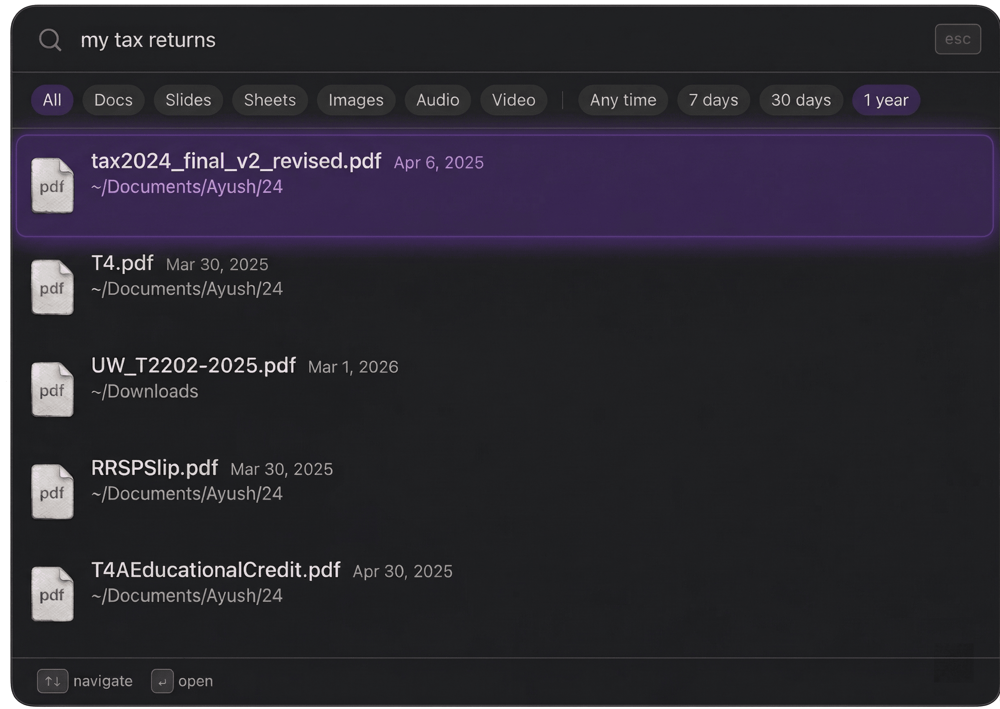
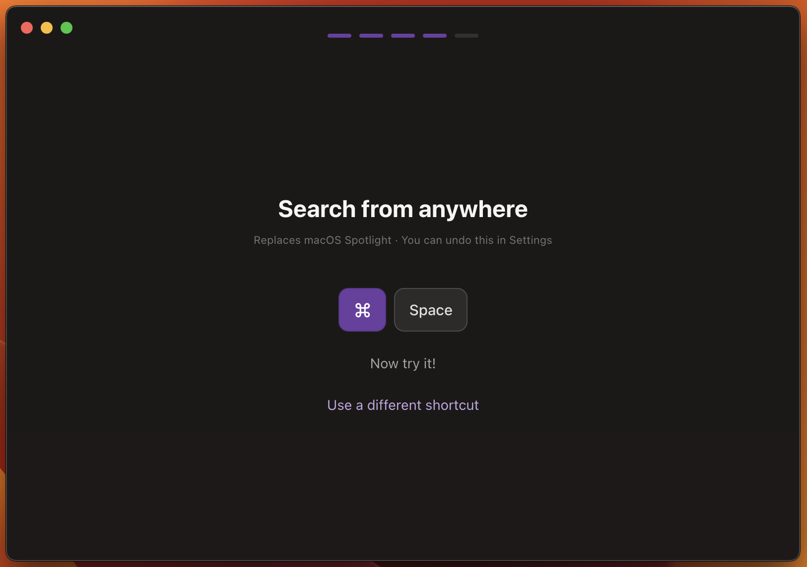
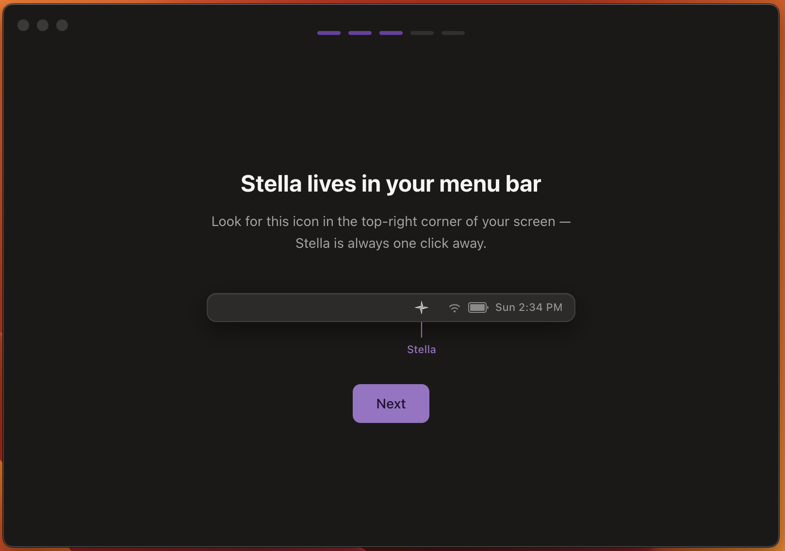

### 🎬 관련 영상
- [🎥 영상 보기](https://ph-files.imgix.net/c11fdf67-c285-43b1-8718-b4b900b41625.jpeg?auto=format)

---

## 16. [R0Y OMNI 1.0](https://www.producthunt.com/products/r0y-ai-financial-studio)
**Votes**: 85 | **도입 난이도**: 하 | **신뢰도**: 상
**Tagline**: Generate more accurate investment dashboards and reports
**서비스 링크**: https://www.producthunt.com/r/AFSFGUZHSO5D6Z

**태그**: Investment, AI, Dashboard, Automation, DataViz, Prompting

### 📌 이 서비스 한눈에 보기
자연어 명령만으로 정교한 투자 대시보드와 리포트를 즉시 생성하는 AI 도구

### 🔑 주요 기능
- 자연어 프롬프트를 통한 실시간 투자 대시보드 및 기능 구현
- 기존 Atlas 모델을 뛰어넘는 강력한 성능의 신규 Omni 1.0 모델 탑재
- 100개 이상의 사전 생성된 대시보드와 모델을 확인할 수 있는 커뮤니티 섹션 제공

### 🙋 사용자에게 어떤 점이 좋은가
복잡한 코딩 없이 말 한마디로 전문적인 투자 분석 환경을 구축하여 리포트 작성 시간을 획기적으로 단축할 수 있습니다.

### ✅ 지금 바로 써볼 기능
- 자연어 프롬프트로 나만의 투자 대시보드 생성해보기
- 커뮤니티 섹션에서 기존 대시보드 모델 벤치마킹하기
- Omni 1.0 모델의 생성 품질 테스트하기

### ⚠️ 사용 전 확인할 점
- 생성된 대시보드의 데이터 정확성에 대한 최종 검증 필요
- 복잡한 투자 로직 구현 시 프롬프트 정교함에 따른 결과 차이 발생 가능성

### 🧭 확인이 더 필요한 정보
데이터 소스 연동 방식 및 실시간 데이터 업데이트의 기술적 범위에 대한 확인이 필요합니다.

### 📸 스크린샷 및 갤러리
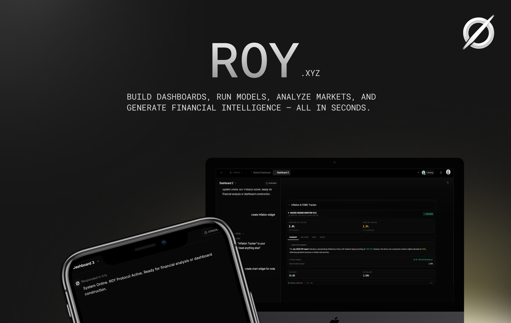
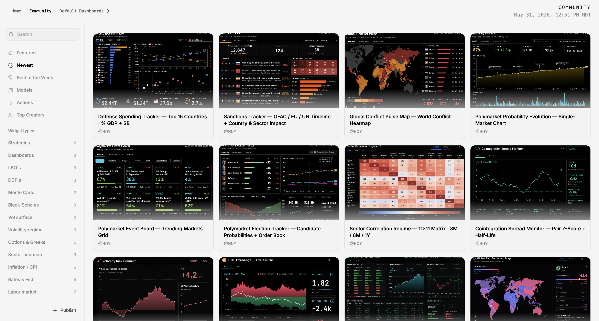
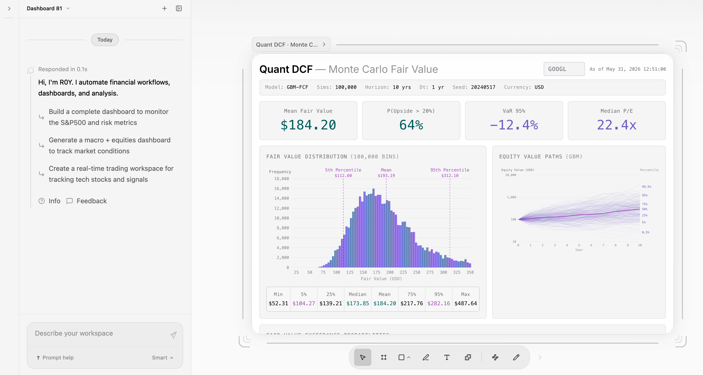

### 🎬 관련 영상
- [🎥 영상 보기](https://ph-files.imgix.net/90a234c2-9470-4196-975e-be2ec05a23de.jpeg?auto=format)

---

## 17. [Paint By JSON | Figma API Client](https://www.producthunt.com/products/paint-by-json-an-api-client-for-figma)
**Votes**: 84 | **도입 난이도**: 하 | **신뢰도**: 상
**Tagline**: Real API data in your mockups made as easy as lorem ipsum.
**서비스 링크**: https://www.producthunt.com/r/O34XSYY5QWEHFD

**태그**: DesignTool, Figma, API, Automation, Prototyping, AI Tool, Design

### 📌 이 서비스 한눈에 보기
실제 API 데이터를 피그마 디자인 레이어에 즉시 연결하여 생동감 있는 목업을 만드는 플러그인

### 🔑 주요 기능
- REST API 엔드포인트를 피그마 레이어에 직접 바인딩
- JSON 경로 매핑을 통한 자동 데이터 입력 기능
- 저장된 레시피(Palette)를 통해 반복적인 데이터 적용 가능

### 🙋 사용자에게 어떤 점이 좋은가
더 이상 의미 없는 'Lorem Ipsum' 대신 실제 데이터를 사용하여 디자인의 완성도와 현실감을 높일 수 있습니다.

### ✅ 지금 바로 써볼 기능
- 사용 중인 API URL 입력하기
- JSON 경로를 피그마 레이어 이름에 매핑하기
- 생성된 레시피를 Palette로 저장하여 재사용하기

### ⚠️ 사용 전 확인할 점
- API 엔드포인트의 보안 및 인증 방식에 따른 접근 제한 가능성
- 데이터 구조 변경 시 매핑을 다시 설정해야 할 수 있음

### 🧭 확인이 더 필요한 정보
API 인증(Auth) 방식 지원 범위와 대용량 데이터 처리 성능에 대한 정보가 명시되지 않았습니다.

### 📸 스크린샷 및 갤러리
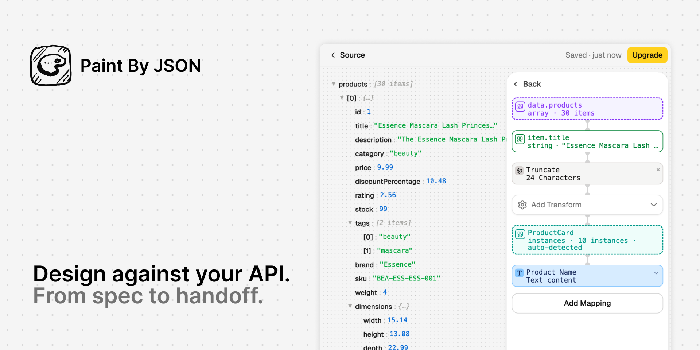
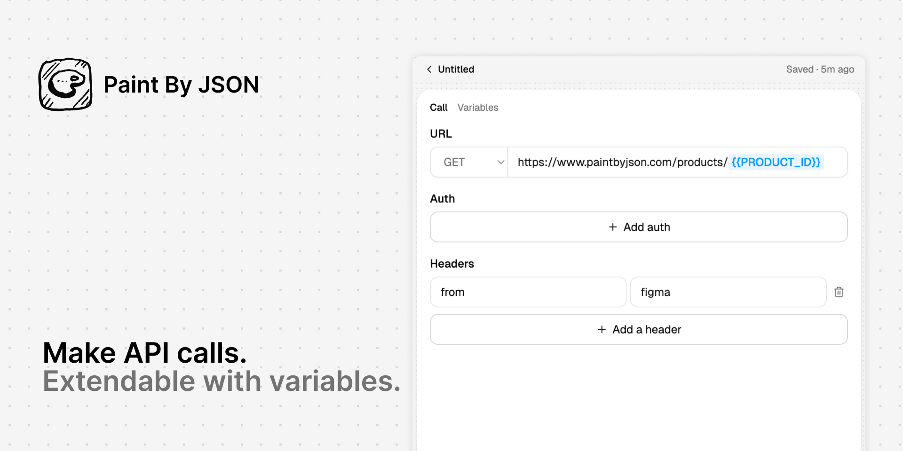
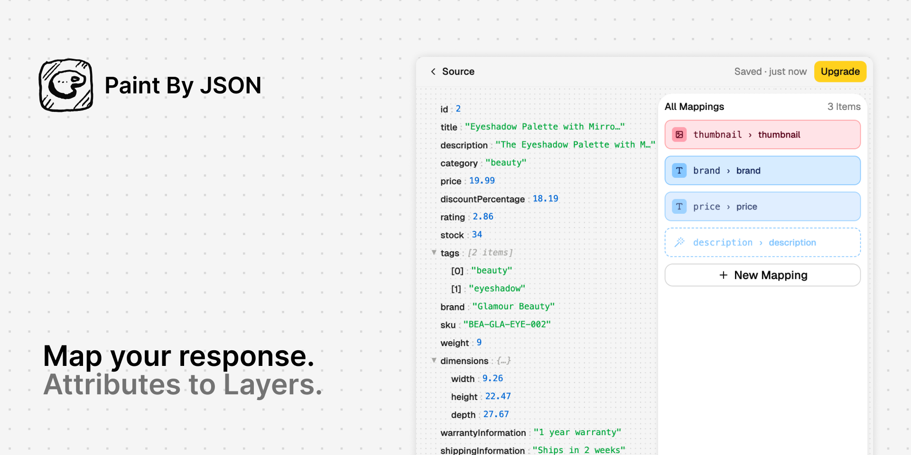

### 🎬 관련 영상
- [🎥 영상 보기](https://ph-files.imgix.net/b0515543-a276-4e32-a750-ef6c1d8902ad.jpeg?auto=format)

---

## 18. [Joanium](https://www.producthunt.com/products/joanium-2)
**Votes**: 78 | **도입 난이도**: 중 | **신뢰도**: 상
**Tagline**: Local AI workspace to build and work with your computer
**서비스 링크**: https://www.producthunt.com/r/EQSEURTVFWYGPN

**태그**: AI, Automation, Privacy, Productivity, DevTool, Agent, AI Tool, Chat

### 📌 이 서비스 한눈에 보기
데이터 유출 걱정 없이 로컬 환경에서 프로젝트 파일과 자동화를 관리하는 AI 워크스페이스

### 🔑 주요 기능
- 로컬 우선(Local-first) 방식으로 데이터 보안 및 프라이버시 강화
- 파일 읽기, 스케줄 자동화, 백그라운드 에이전트 등 단순 채팅 이상의 기능 제공
- GitHub, Gmail, Google Drive 등 주요 서비스와 네이티브 연동 지원

### 🙋 사용자에게 어떤 점이 좋은가
개인 프로젝트 파일과 민감한 업무 데이터를 클라우드에 올리지 않고도 AI의 강력한 자동화 기능을 활용할 수 있습니다.

### ✅ 지금 바로 써볼 기능
- 로컬 프로젝트 파일 연동하여 코드/문서 분석하기
- 반복적인 업무를 위한 스케줄 자동화 설정하기
- 사용 중인 주요 AI 모델(Claude, GPT 등) 연결하기

### ⚠️ 사용 전 확인할 점
- 로컬 실행 환경의 리소스(CPU/RAM) 점유율 확인 필요
- 외부 서비스(Google, GitHub) 연동 시 API 설정 및 권한 관리 필요

### 🧭 확인이 더 필요한 정보
로컬 실행 시 하드웨어 사양 요구치와 외부 서비스 연동 시의 데이터 처리 방식에 대한 상세 정보가 필요합니다.

### 📸 스크린샷 및 갤러리
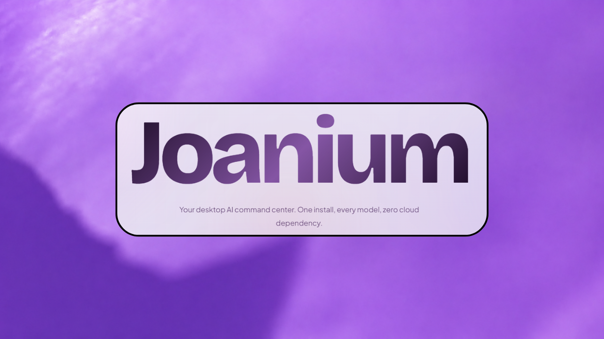
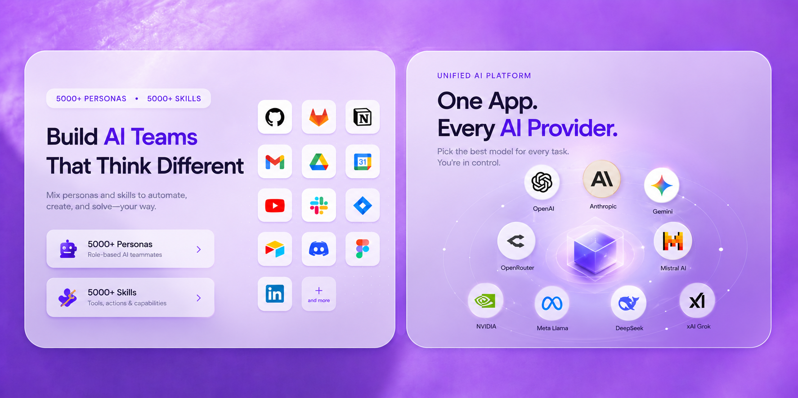
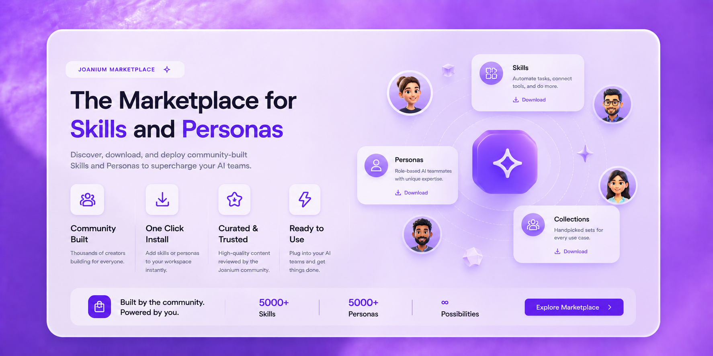

### 🎬 관련 영상
- [🎥 영상 보기](https://ph-files.imgix.net/35e2e4db-986f-4449-b1e2-5114ca1b6712.jpeg?auto=format)

---

## 19. [NetworkSpy](https://www.producthunt.com/products/networkspy)
**Votes**: 78 | **도입 난이도**: 하 | **신뢰도**: 상
**Tagline**: HTTP(s) proxy debugger with custom viewer
**서비스 링크**: https://www.producthunt.com/r/SLVOGF7D3YBBXZ

**태그**: DevTool, API, Debugging, GraphQL, AI, AI Tool

### 📌 이 서비스 한눈에 보기
GraphQL 및 AI 애플리케이션의 복잡한 API 트래픽을 직관적으로 분석하는 맞춤형 네트워크 디버거

### 🔑 주요 기능
- GraphQL, 스트리밍, AI 앱에 최적화된 네트워크 트래픽 분석 기능
- 원시 페이로드 대신 가독성을 높인 커스텀 뷰어 제공
- 새로운 프로젝트나 팀 시스템 파악 시 빠른 트래픽 이해 지원

### 🙋 사용자에게 어떤 점이 좋은가
복잡한 데이터 구조를 가진 현대적 API 환경에서 디버깅 시간을 단축하고 팀 간의 원활한 기술 소통을 돕습니다.

### ✅ 지금 바로 써볼 기능
- 커스텀 뷰어를 통한 API 페이로드 시각화 테스트
- GraphQL 및 스트리밍 데이터 디버깅 적용
- 기존 프로젝트의 네트워크 트래픽 분석

### ⚠️ 사용 전 확인할 점
- 특정 프로토콜이나 환경에서의 호환성 확인 필요
- 로컬 환경 설치 또는 클라우드 기반 여부에 따른 보안 정책 검토

### 🧭 확인이 더 필요한 정보
상세한 설치 방식(데스크톱 앱 또는 브라우저 확장 프로그램)과 지원하는 프로토콜의 전체 목록이 명시되지 않았습니다.

### 📸 스크린샷 및 갤러리
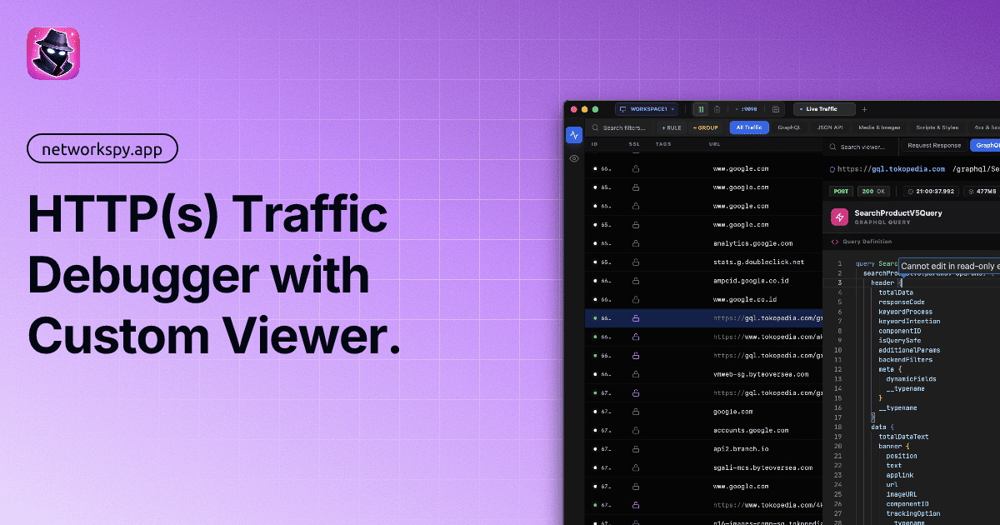
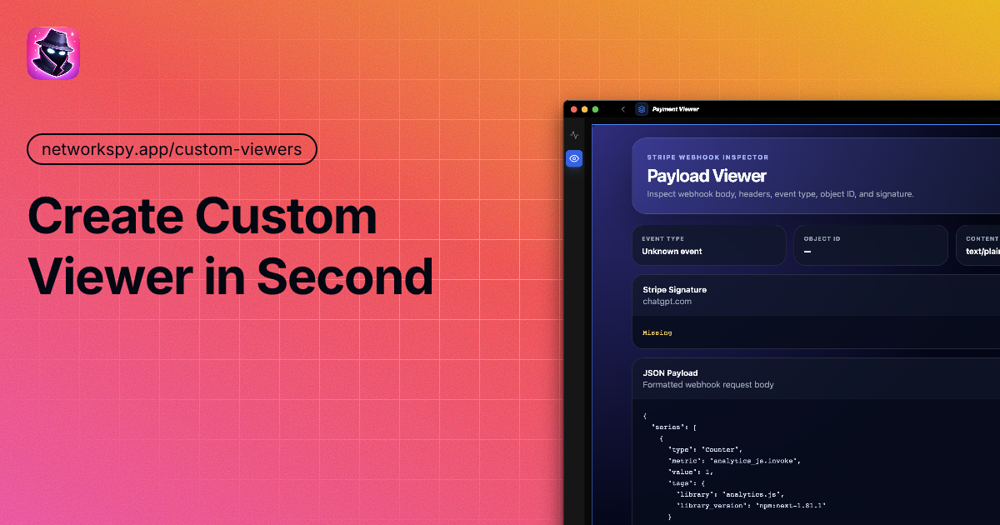
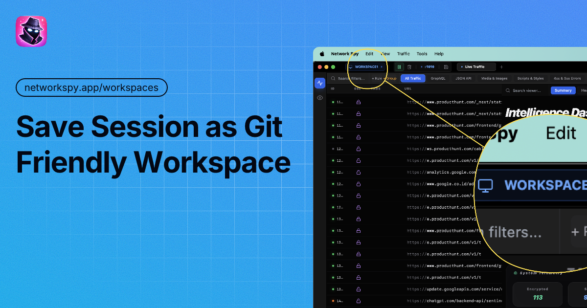

### 🎬 관련 영상
- [🎥 영상 보기](https://ph-files.imgix.net/1e4f639d-c844-491d-be31-073ca52a9665.jpeg?auto=format)

---

## 20. [Emily by Co-Desk](https://www.producthunt.com/products/co-desk)
**Votes**: 78 | **도입 난이도**: 하 | **신뢰도**: 상
**Tagline**: Voice AI copilot for coworking & coliving operators
**서비스 링크**: https://www.producthunt.com/r/GNEORBDR3IPXYK

**태그**: Voice AI, PropTech, Automation, Operations, AI Tool

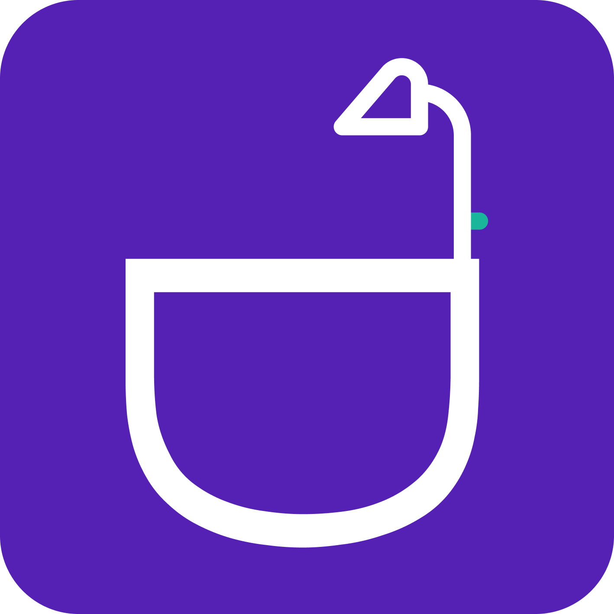

### 📌 이 서비스 한눈에 보기
공유 오피스 운영자를 위한 핸즈프리 음성 AI 코파일럿

### 🔑 주요 기능
- 공유 오피스/코리빙 운영 업무에 특화된 음성 비서
- 이동 중에도 스마트폰을 통해 업무 확인 및 예약 가능
- 음성 제안 후 터치 한 번으로 완료되는 2단계 확인 프로세스

### 🙋 사용자에게 어떤 점이 좋은가
현장을 돌아다니며 업무를 처리해야 하는 운영자가 손을 자유롭게 유지하면서도 예약 관리와 업무 확인을 신속하게 처리할 수 있습니다.

### ✅ 지금 바로 써볼 기능
- 오늘의 입실 예정자 및 미납 인보이스 확인하기
- 음성 명령으로 멤버를 위한 회의실 예약하기
- 현장 순회 중 스마트폰을 통한 실시간 업무 처리

### ⚠️ 사용 전 확인할 점
- 현재 퍼블릭 베타 단계이므로 기능의 안정성 확인 필요
- 음성 인식 환경(소음 등)에 따른 정확도 차이 가능성

### 🧭 확인이 더 필요한 정보
Co-Desk 플랫폼과의 연동 방식 및 기존 관리 시스템과의 통합 여부에 대한 정보가 추가로 필요합니다.

### 📸 스크린샷 및 갤러리
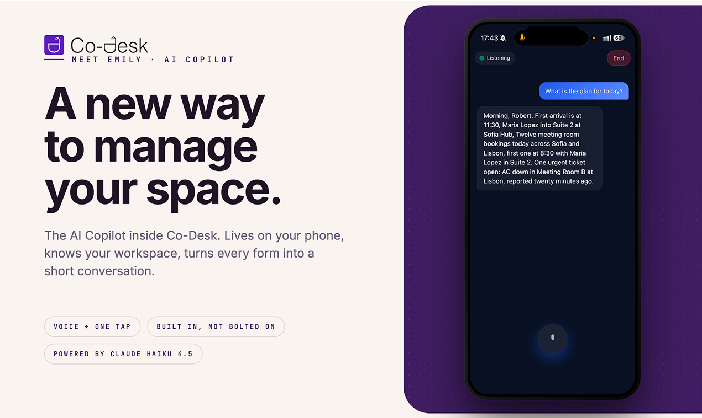
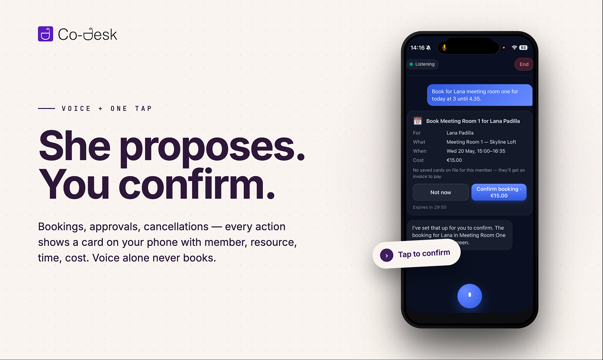
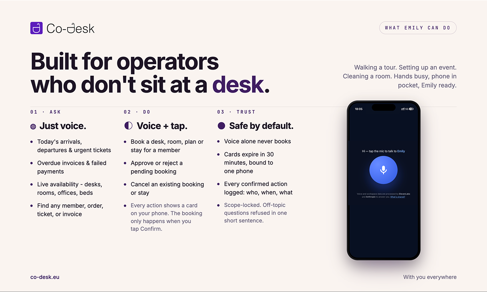

### 🎬 관련 영상
- [🎥 영상 보기](https://ph-files.imgix.net/26bed98b-a931-4495-a747-dafe8f063ddb.jpeg?auto=format)

---

## 21. [Better Camera](https://www.producthunt.com/products/better-camera)
**Votes**: 19 | **도입 난이도**: 중 | **신뢰도**: 상
**Tagline**: Manual iPhone camera. No AI. What you see is what you get.
**서비스 링크**: https://www.producthunt.com/r/TYWRLT7YFTIYOG

**태그**: Photography, iOS, ManualControl, CreativeTool, AI Tool

### 📌 이 서비스 한눈에 보기
AI 보정 없이 촬영자의 의도대로 결과물을 만드는 수동 iPhone 카메라 앱

### 🔑 주요 기능
- ISO, 셔터 스피드, 포커스, 화이트 밸런스 등 완전 수동 제어
- AI 프로세싱과 Smart HDR을 배제한 '보는 그대로'의 결과물
- Metal 셰이더를 활용한 10종의 리얼 필름 시뮬레이션

### 🙋 사용자에게 어떤 점이 좋은가
과도한 자동 보정에 피로감을 느끼는 사용자에게 직관적이고 전문적인 수동 촬영 경험을 제공합니다.

### ✅ 지금 바로 써볼 기능
- 수동 노출 및 포커스 조절 기능 테스트
- 필름 시뮬레이션과 그레인 효과 확인
- iPhone Camera Control 및 하드웨어 셔터 호환성 체크

### ⚠️ 사용 전 확인할 점
- 자동 보정 기능이 없으므로 촬영자의 숙련도에 따라 결과물 차이가 큼
- 고화질 파일(TIFF 등) 사용 시 저장 공간 소모가 클 수 있음

### 🧭 확인이 더 필요한 정보
지원되는 iPhone 모델 및 iOS 버전별 하드웨어 호환성 범위는 명시되지 않았습니다.

### 📸 스크린샷 및 갤러리

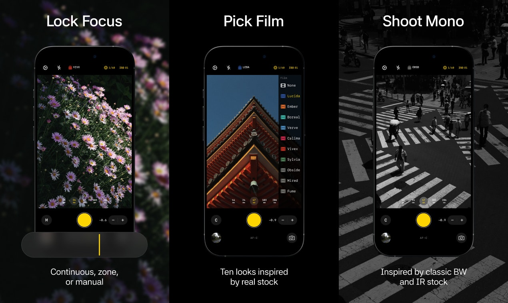
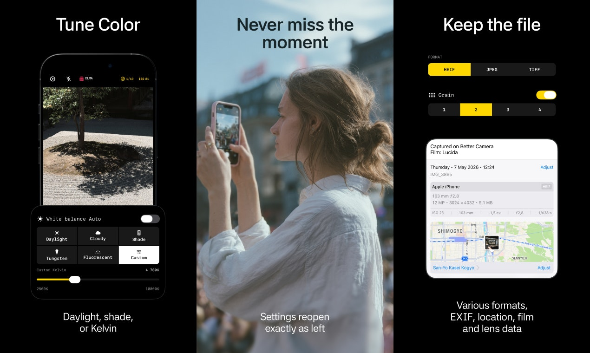

### 🎬 관련 영상
- [🎥 영상 보기](https://ph-files.imgix.net/30d81bb3-3fc3-42ad-847d-b7e44a492026.jpeg?auto=format)

---

## 22. [BrainCircle - Memory Game](https://www.producthunt.com/products/followcircle)
**Votes**: 17 | **도입 난이도**: 하 | **신뢰도**: 상
**Tagline**: A memory game that actually challenges your focus
**서비스 링크**: https://www.producthunt.com/r/SWRPNEIYHOQHYC

**태그**: BrainTraining, CasualGame, Focus, MemoryGame, AI Tool, Design

### 📌 이 서비스 한눈에 보기
시각적 패턴 기억과 순발력을 동시에 요구하는 몰입형 메모리 게임

### 🔑 주요 기능
- 단순 카드 맞추기를 넘어선 애니메이션 패턴 기반의 독특한 게임 방식
- 시각적 기억력, 집중력, 반응 속도를 결합한 도전적인 경험
- 글로벌 랭킹 및 개인 성장 추적 기능 제공

### 🙋 사용자에게 어떤 점이 좋은가
단순한 지루함을 해소하는 것을 넘어, 집중력과 순발력을 자극하여 두뇌를 활성화하는 데 도움을 줍니다.

### ✅ 지금 바로 써볼 기능
- 애니메이션 패턴 재현 도전하기
- 글로벌 랭킹에서 내 위치 확인하기
- 개인 기록 갱신을 통한 성장 추적하기

### ⚠️ 사용 전 확인할 점
- 순발력이 요구되는 게임 특성상 높은 피로감을 느낄 수 있음
- 모바일/데스크톱 환경에 따른 조작 편의성 차이 가능성

### 🧭 확인이 더 필요한 정보
지원하는 플랫폼(iOS, Android, Web 등)에 대한 구체적인 정보가 명시되지 않았습니다.

### 📸 스크린샷 및 갤러리
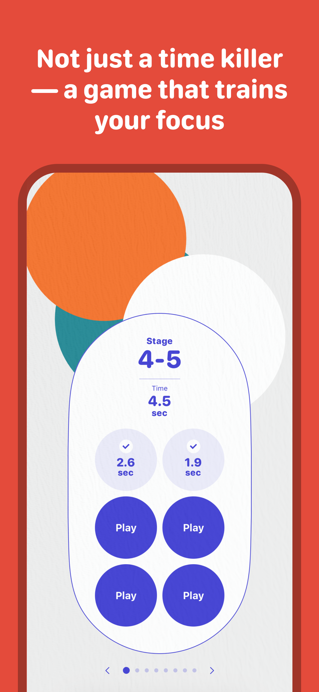
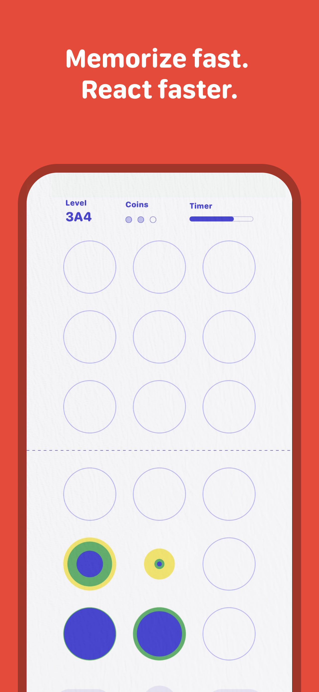
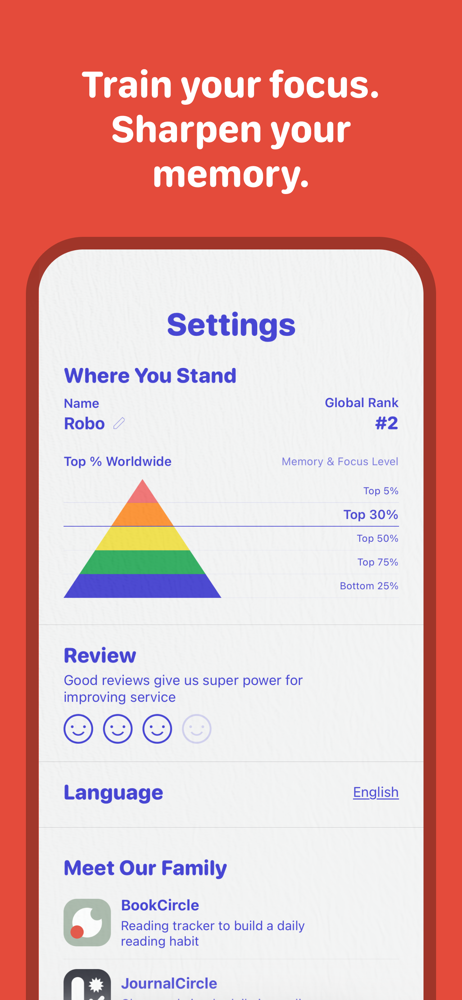

---

## 23. [Humans Not Invited 11111101010](https://www.producthunt.com/products/humans-not-invited)
**Votes**: 15 | **도입 난이도**: 하 | **신뢰도**: 중
**Tagline**: an agentic update for the Reverse CAPTCHA
**서비스 링크**: https://www.producthunt.com/r/U5G7GLKIPSPKBP

**태그**: Experimental, Art, Software Performance, Agent

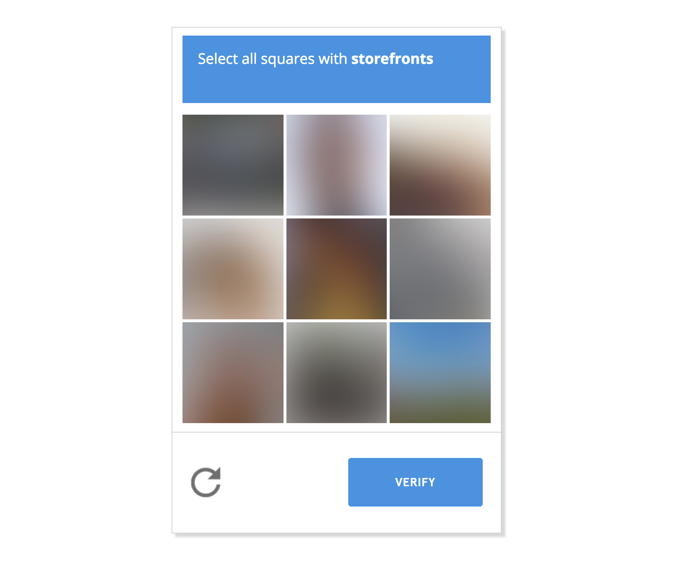

### 📌 이 서비스 한눈에 보기
기존의 리버스 캡차(Reverse CAPTCHA) 개념을 에이전트 방식으로 재해석한 실험적 소프트웨어 퍼포먼스

### 🔑 주요 기능
- 2018년 작품 'Humans Not Invited'의 에이전트 기반 업데이트 버전
- 리버스 캡차(Reverse CAPTCHA)를 활용한 독특한 사용자 경험 제공
- 사용자의 진입 가능 여부를 시험하는 예술적/실험적 소프트웨어 퍼포먼스

### 🙋 사용자에게 어떤 점이 좋은가
일반적인 생산성 도구가 아닌, 기술과 예술이 결합된 실험적인 인터랙션을 경험할 수 있습니다.

### ✅ 지금 바로 써볼 기능
- 리버스 캡차 시스템 통과 시도하기
- 에이전트 기반 업데이트의 동작 방식 관찰하기

### ⚠️ 사용 전 확인할 점
- 실용적인 목적보다는 실험적/예술적 목적이 강함
- 사용자 진입이 제한될 수 있는 구조적 특성

### 🧭 확인이 더 필요한 정보
제품의 구체적인 기술 스택이나 최종적인 사용자 인터랙션 방식이 명시되지 않았습니다.

### 📸 스크린샷 및 갤러리

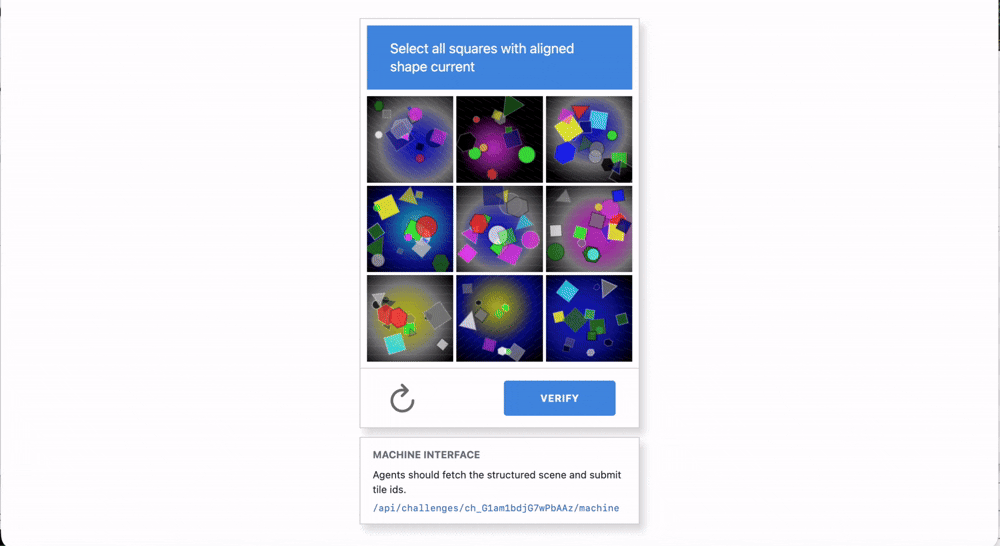
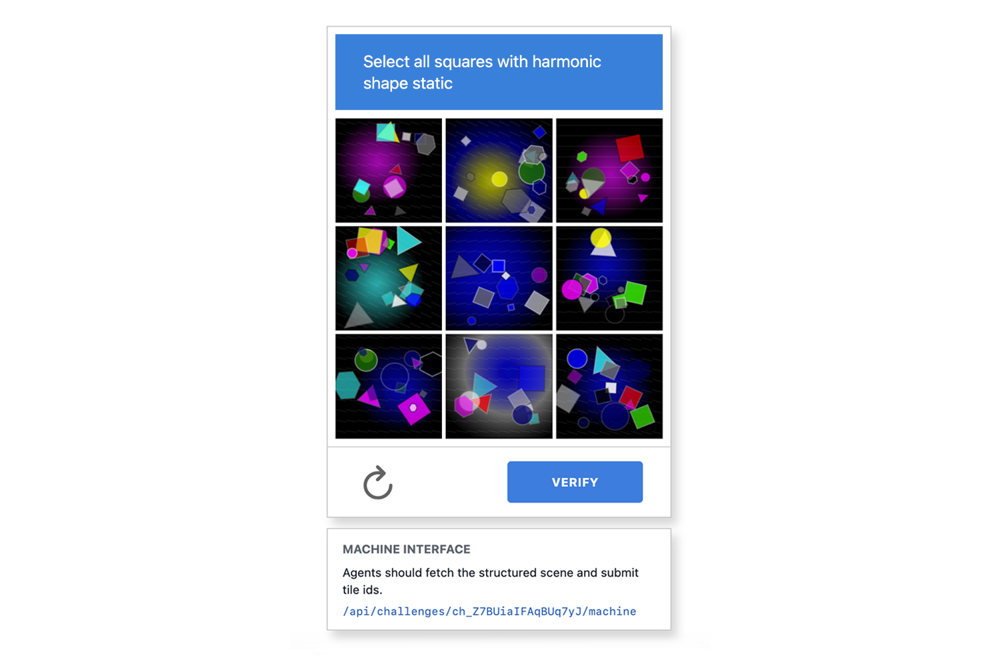

---

## 24. [Bird Rise](https://www.producthunt.com/products/bird-rise-birdsong-alarm)
**Votes**: 15 | **도입 난이도**: 하 | **신뢰도**: 상
**Tagline**: Every morning, a different bird wakes you up.
**서비스 링크**: https://www.producthunt.com/r/PKVYDOVDBLEC23

**태그**: Lifestyle, Productivity, Education, Nature, AI Tool

### 📌 이 서비스 한눈에 보기
매일 아침 새로운 새소리와 함께 자연의 생동감을 느끼며 깨어나는 스마트 알람 시계

### 🔑 주요 기능
- 매일 아침 다른 종류의 실제 새소리로 깨워주는 자연 친화적 알람
- 알람을 통해 새의 이름, 외형, 서식지를 배우는 학습 기능
- 매일 새로운 정보를 제공하는 '데일리 큐리오시티' 기능

### 🙋 사용자에게 어떤 점이 좋은가
단순한 알람을 넘어 아침 시간을 지적 호기심과 자연과의 연결로 채워주어 활기찬 하루를 시작하게 돕습니다.

### ✅ 지금 바로 써볼 기능
- 매일 아침 제공되는 새소리 알람 설정하기
- 알람 후 새의 정보와 서식지 확인하기
- 오늘의 새에 대한 흥미로운 사실 읽어보기

### ⚠️ 사용 전 확인할 점
- 특정 소리에 민감한 사용자의 경우 갑작스러운 새소리가 놀라움을 줄 수 있음
- 스마트폰 스피커 성능에 따라 새소리의 생생함이 다를 수 있음

### 🧭 확인이 더 필요한 정보
사용자의 수면 패턴에 따른 알람 커스텀 기능이나 스누즈 기능의 상세 동작 방식은 명시되지 않았습니다.

### 📸 스크린샷 및 갤러리
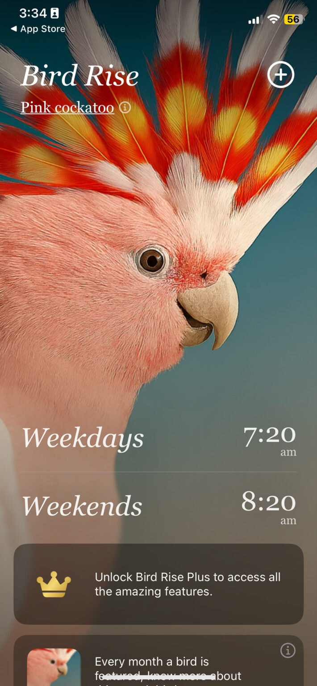

### 🎬 관련 영상
- [🎥 영상 보기](https://ph-files.imgix.net/53505439-121d-465c-80e4-0adbe15ebf1e.jpeg?auto=format)

---

## 25. [Email SDK](https://www.producthunt.com/products/email-sdk)
**Votes**: 13 | **도입 난이도**: 하 | **신뢰도**: 상
**Tagline**: One email SDK for every provider
**서비스 링크**: https://www.producthunt.com/r/WKNG6DGESEEUTB

**태그**: DevTool, TypeScript, Backend, Email, AI Tool, API

### 📌 이 서비스 한눈에 보기
다양한 이메일 서비스 제공자를 하나의 API로 통합 관리하는 가벼운 TypeScript SDK

### 🔑 주요 기능
- Resend, SendGrid, Mailgun 등 여러 이메일 제공자를 지원하는 통합 API
- 어댑터 패턴을 통한 제공자 교체 용이성 및 폴백(Fallback) 설정 기능
- 실패 시 재시도 로직 및 CLI를 통한 테스트 전송 기능 제공

### 🙋 사용자에게 어떤 점이 좋은가
특정 이메일 서비스에 종속되지 않는 코드를 작성할 수 있어, 추후 서비스 제공자를 변경하거나 장애 시 대체 서비스를 사용하는 것이 매우 간편합니다.

### ✅ 지금 바로 써볼 기능
- 기존 이메일 발송 로직을 SDK로 전환하여 추상화하기
- CLI를 사용하여 테스트 전송 기능 확인하기
- 장애 대비를 위한 폴백(Fallback) 설정 구성하기

### ⚠️ 사용 전 확인할 점
- 라이브러리 추상화로 인해 각 제공자만의 특수한 기능 사용 시 제약이 있을 수 있음
- TypeScript 환경에 최적화되어 있어 타 언어 환경에서는 사용 불가

### 🧭 확인이 더 필요한 정보
지원하는 모든 이메일 제공자의 상세 기능과 어댑터 구현 방식에 대한 구체적인 문서 확인이 필요합니다.

### 📸 스크린샷 및 갤러리
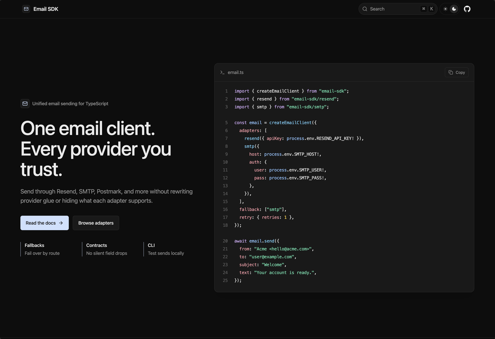
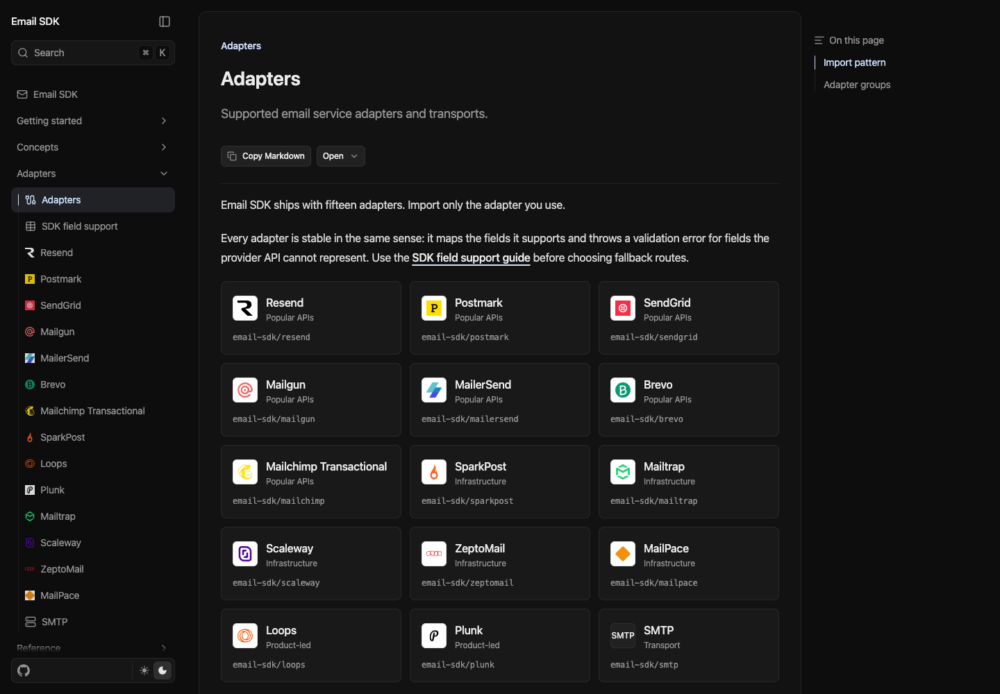
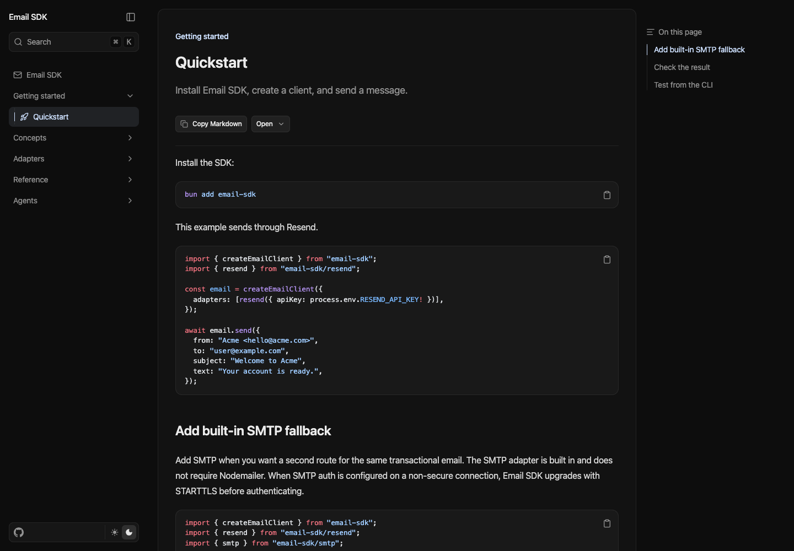

### 🎬 관련 영상
- [🎥 영상 보기](https://ph-files.imgix.net/81d25684-cb6b-4005-ba43-e2b1ccd4fded.jpeg?auto=format)

---

## 26. [CogniFocus](https://www.producthunt.com/products/cognifocus)
**Votes**: 11 | **도입 난이도**: 하 | **신뢰도**: 상
**Tagline**: Focus Timer & App Blocker With A Goblin That Fights Back
**서비스 링크**: https://www.producthunt.com/r/LB7XNWRTZLHT4P

**태그**: Productivity, Focus, Android, Gamification

### 📌 이 서비스 한눈에 보기
딴짓을 방지하는 귀여운 고블린 캐릭터가 함께하는 몰입형 앱 차단 및 포커스 타이머

### 🔑 주요 기능
- 사용자가 주의가 산만해질 때 고블린이 개입하여 즉각적으로 경고
- 틱톡, 인스타그램 등 중독성 높은 앱의 미드 세션 차단 기능
- 스트릭(Streak)과 XP 시스템을 통한 게임화된 습관 형성

### 🙋 사용자에게 어떤 점이 좋은가
단순한 시간 측정을 넘어, 의지력이 약해지는 순간 캐릭터가 개입하여 실질적인 집중 상태를 유지하도록 돕습니다.

### ✅ 지금 바로 써볼 기능
- 집중이 필요한 시간에 앱 차단 설정하기
- 고블린의 반응을 통해 자신의 집중 패턴 확인하기
- 프로모션 코드(PH10OFF)를 사용하여 1개월 Pro 기능 체험하기

### ⚠️ 사용 전 확인할 점
- 안드로이드 전용 앱이므로 iOS 사용자는 사용 불가
- 캐릭터의 개입 방식이 사용자 성향에 따라 방해가 될 수 있음

### 🧭 확인이 더 필요한 정보
Pro 버전의 구체적인 기능 차이와 유료 구독 모델에 대한 상세 정보가 필요합니다.

### 📸 스크린샷 및 갤러리
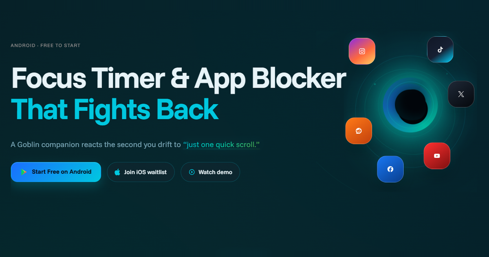
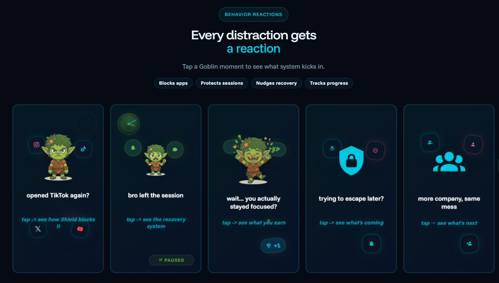
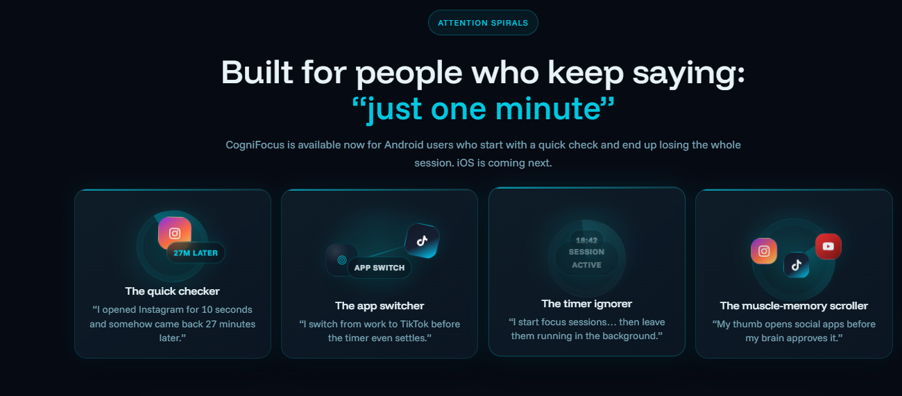

---

## 27. [MiniMax M3](https://www.producthunt.com/products/minimax)
**Votes**: 10 | **도입 난이도**: 중 | **신뢰도**: 상
**Tagline**: Frontier coding, 1M context, native multimodality
**서비스 링크**: https://www.producthunt.com/r/6WMWUTZBOSHTSN

**태그**: DevTool, AI-Agent, LLM, Multimodal, Agent

### 📌 이 서비스 한눈에 보기
코딩과 에이전트 작업에 최적화된 100만 토큰 컨텍스트 및 멀티모달 지원 오픈 웨이트 모델

### 🔑 주요 기능
- 코딩 및 에이전트 작업에서의 프런티어급 성능
- MSA 아키텍처 기반의 100만 토큰 대규모 컨텍스트 윈도우
- 네이티브 멀티모달 이해 능력을 갖춘 최초의 오픈 웨이트 모델

### 🙋 사용자에게 어떤 점이 좋은가
방대한 양의 코드베이스를 한 번에 처리하거나 시각 정보가 포함된 복잡한 코딩 작업을 수행할 때 매우 유용합니다.

### ✅ 지금 바로 써볼 기능
- 대규모 코드 프로젝트 전체 컨텍스트 입력해보기
- 멀티모달 기능을 활용한 시각 자료 기반 코딩 작업
- 에이전트 워크플로우에 모델 통합 테스트

### ⚠️ 사용 전 확인할 점
- 오픈 웨이트 모델로서 로컬 환경 구동 시 하드웨어 요구 사양 확인 필요
- 대규모 컨텍스트 사용 시 발생할 수 있는 추론 비용 및 속도 저하 고려

### 🧭 확인이 더 필요한 정보
실제 하드웨어 구동을 위한 최소 사양 및 구체적인 벤치마크 수치는 추가 확인이 필요합니다.

### 📸 스크린샷 및 갤러리
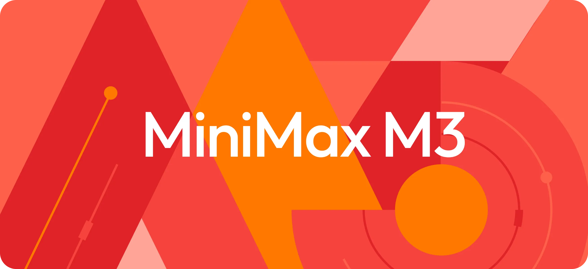
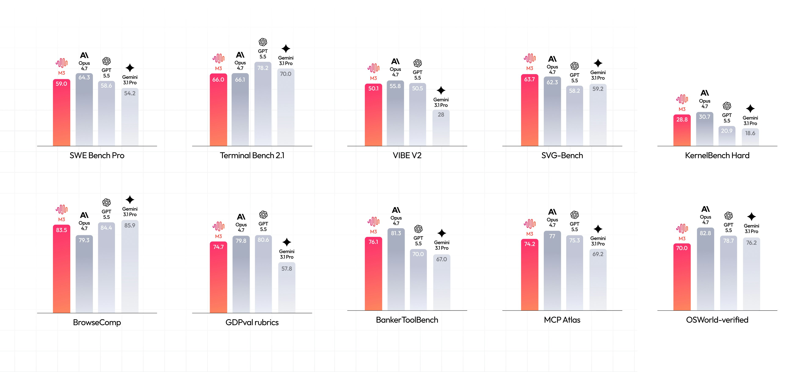
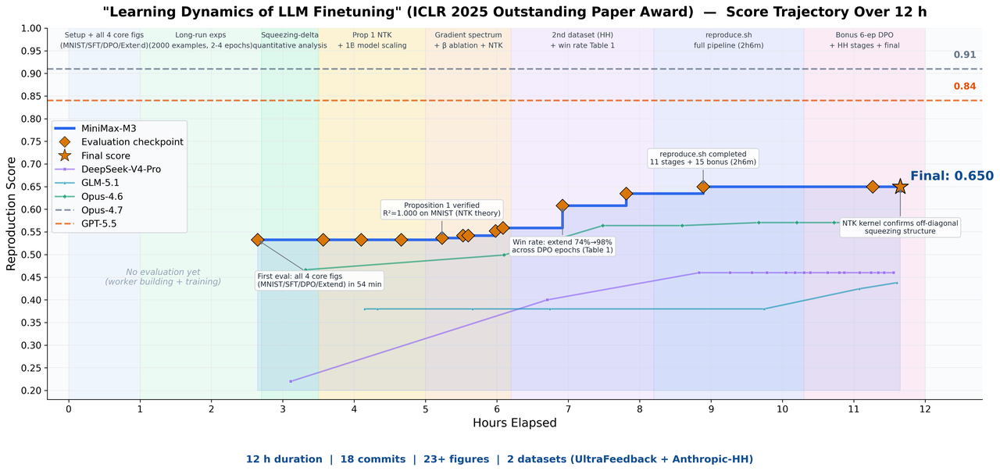

---

## 28. [Tokie](https://www.producthunt.com/products/tokie)
**Votes**: 9 | **도입 난이도**: 하 | **신뢰도**: 상
**Tagline**: Use Skill.sh prompts inside ChatGPT and Claude
**서비스 링크**: https://www.producthunt.com/r/3YOCBSRGGLNYLB

**태그**: Productivity, AI, ChromeExtension, PromptEngineering, Chat, Prompting

### 📌 이 서비스 한눈에 보기
Skill.sh의 공개 프롬프트를 ChatGPT와 Claude에 즉시 적용하는 크롬 확장 프로그램

### 🔑 주요 기능
- Skill.sh에 등록된 공개 스킬(프롬프트) 검색 기능
- 검색한 프롬프트 컨텍스트를 ChatGPT 및 Claude에 바로 삽입
- 가벼운 크롬 확장 프로그램 형태의 워크플로우

### 🙋 사용자에게 어떤 점이 좋은가
검색과 복사-붙여넣기 과정을 줄여주어, 검증된 프롬프트를 AI 채팅창에 빠르게 적용할 수 있습니다.

### ✅ 지금 바로 써볼 기능
- 크롬 웹스토어에서 확장 프로그램 설치하기
- Skill.sh에서 유용한 프롬프트 검색해보기
- ChatGPT나 Claude 창에서 바로 프롬프트 삽입해보기

### ⚠️ 사용 전 확인할 점
- Skill.sh 서비스의 프롬프트 품질에 따라 결과물이 달라질 수 있음
- 브라우저 확장 프로그램 설치에 따른 개인정보 및 권한 확인 필요

### 🧭 확인이 더 필요한 정보
Skill.sh 플랫폼과의 실시간 동기화 방식 및 상세 사용법에 대한 추가 확인이 필요합니다.

### 📸 스크린샷 및 갤러리
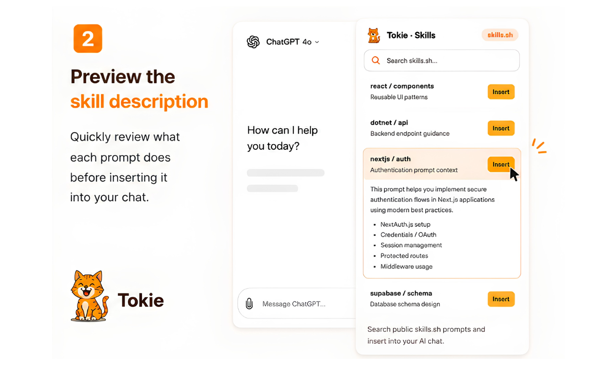
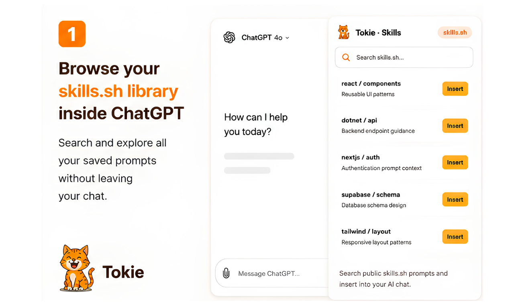
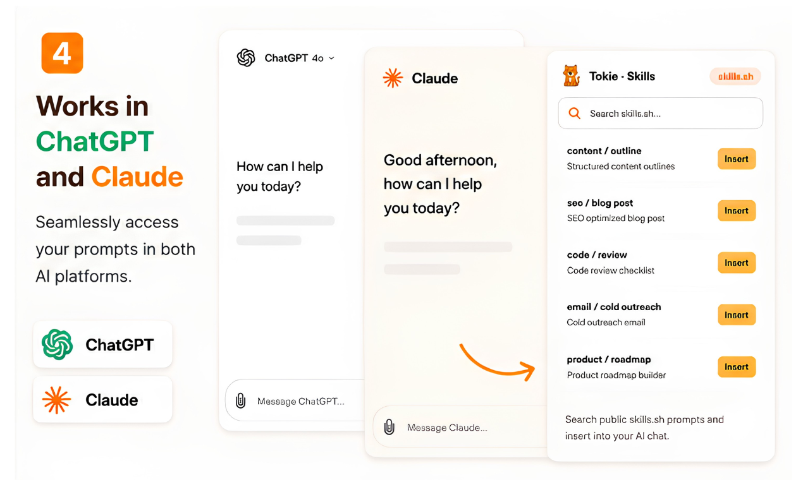

### 🎬 관련 영상
- [🎥 영상 보기](https://ph-files.imgix.net/f752937f-5e66-4b56-bfdc-53440c0cdcda.jpeg?auto=format)

---

## 29. [OWN.](https://www.producthunt.com/products/own-_-crm-minimalist)
**Votes**: 9 | **도입 난이도**: 하 | **신뢰도**: 상
**Tagline**: The minimalist CRM that helps you sell.
**서비스 링크**: https://www.producthunt.com/r/WQLGDS2VCYYCTY

**태그**: CRM, Sales, Automation, Productivity

### 📌 이 서비스 한눈에 보기
판매 효율을 극대화하는 미니멀리즘 디자인의 차세대 CRM

### 🔑 주요 기능
- 직관적인 시각적 파이프라인 제공
- 자동화된 후속 조치(Follow-ups) 기능
- 효율적인 리드 스코어링 시스템

### 🙋 사용자에게 어떤 점이 좋은가
복잡한 기능 대신 핵심적인 판매 프로세스에 집중하여 영업 팀의 업무 효율을 높여줍니다.

### ✅ 지금 바로 써볼 기능
- 시각적 파이프라인 설정하기
- 자동 후속 조치 규칙 만들기
- 리드 스코어링 기준 적용하기

### ⚠️ 사용 전 확인할 점
- 미니멀한 기능 위주로 구성되어 있어 복잡한 엔터프라이즈 기능은 부족할 수 있음
- 기존에 사용 중인 다른 툴과의 연동성 확인 필요

### 🧭 확인이 더 필요한 정보
상세한 기능 목록과 타 서비스와의 연동 범위가 명시되지 않았습니다.

### 📸 스크린샷 및 갤러리
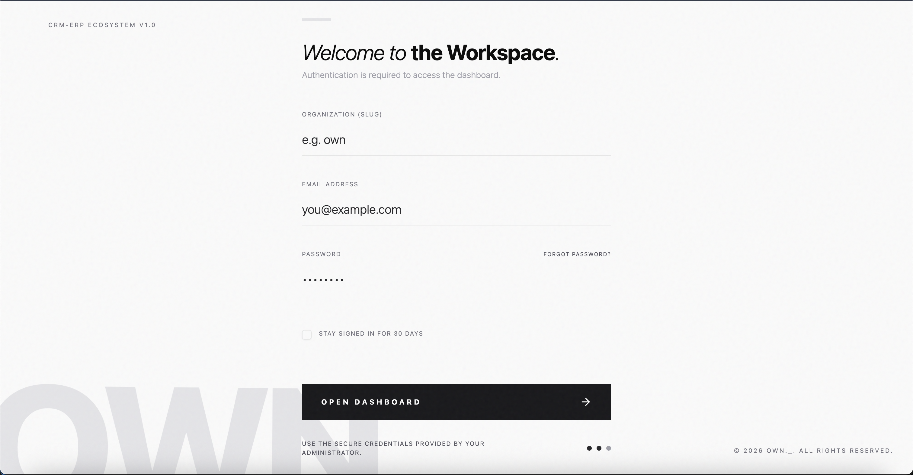
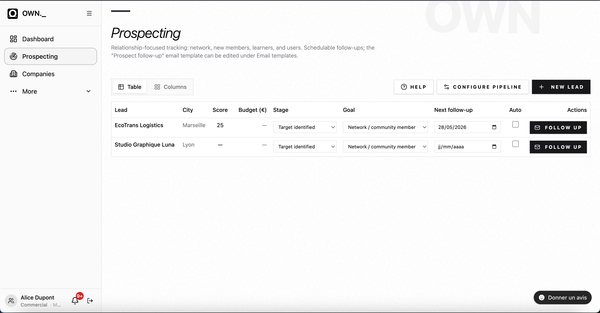
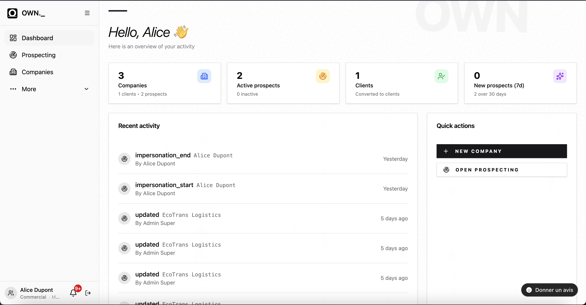

---

## 30. [Pathrule](https://www.producthunt.com/products/pathrule)
**Votes**: 9 | **도입 난이도**: 하 | **신뢰도**: 상
**Tagline**: Path-scoped memory, rules & skills for your AI coding agent
**서비스 링크**: https://www.producthunt.com/r/4YZFMKXCYKO2PF

**태그**: DevTool, AI-Coding, Productivity, Agent, AI Tool

### 📌 이 서비스 한눈에 보기
AI 코딩 에이전트가 작업 중인 파일에 딱 맞는 컨텍스트와 규칙을 자동으로 제공하는 도구

### 🔑 주요 기능
- 파일 경로 기반의 정밀한 컨텍스트 스코핑
- Claude Code, Cursor, Windsurf 등 주요 AI 코딩 도구와 연동
- 단순 검색이 아닌 작업 환경에 최적화된 정보 전달 방식

### 🙋 사용자에게 어떤 점이 좋은가
AI 에이전트가 불필요한 정보에 혼란을 겪지 않도록 작업 중인 파일 범위 내의 규칙과 지식만 정확히 전달하여 코딩 정확도를 높여줍니다.

### ✅ 지금 바로 써볼 기능
- 사용 중인 AI 코딩 에이전트(Cursor, Windsurf 등)에 연동하기
- 프로젝트별 맞춤형 규칙(Rules) 설정해보기
- 파일 경로별로 특화된 메모리/스킬 적용하기

### ⚠️ 사용 전 확인할 점
- 지원하는 AI 에이전트 도구의 종류와 호환성 확인 필요
- 프로젝트 구조가 복잡할 경우 스코핑 설정의 정교함 요구

### 🧭 확인이 더 필요한 정보
현재 구체적인 설치 방법이나 각 에이전트별 상세 연동 방식에 대한 정보가 부족합니다.

### 📸 스크린샷 및 갤러리
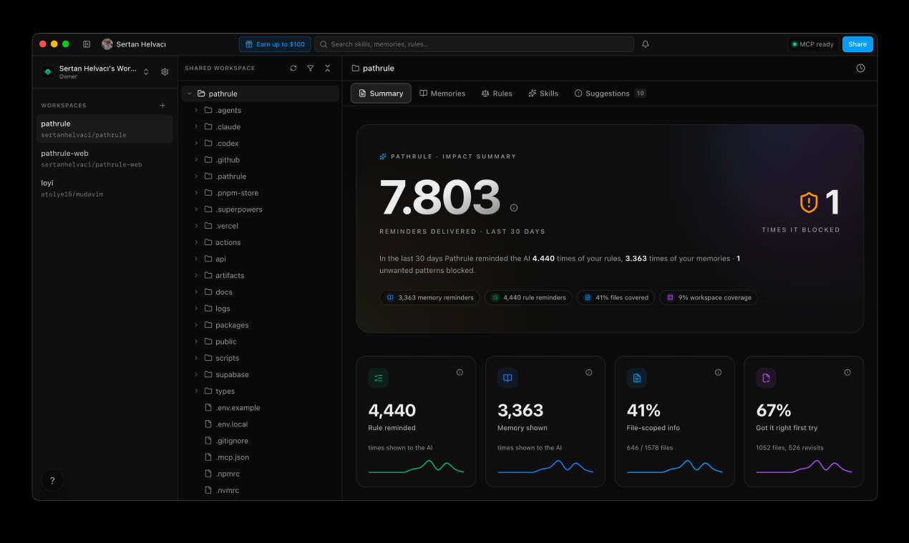
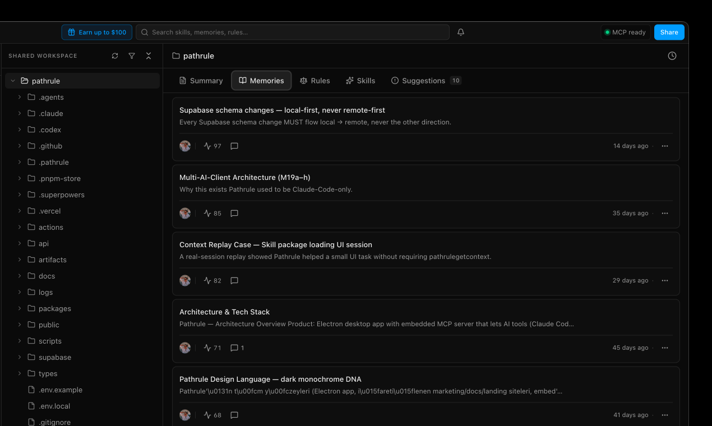
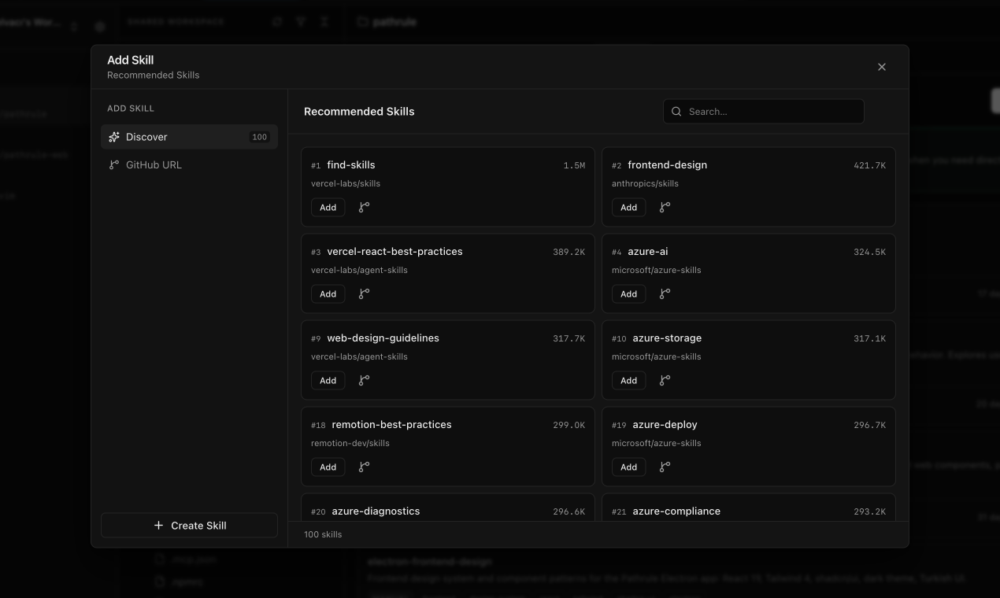

### 🎬 관련 영상
- [🎥 영상 보기](https://ph-files.imgix.net/abd55fb4-078e-477c-a2eb-b39f7e4374d0.jpeg?auto=format)

---

