# 🚀 Product Hunt Daily Top 30 (2026-06-03)

## 오늘의 요약
오늘의 Product Hunt는 AI 에이전트의 협업, 자동화, 그리고 맥락 공유를 중심으로 한 생산성 도구들이 주를 이루었습니다. 단순한 챗봇을 넘어 실질적인 업무 프로세스(투자 유치, 영업, 트레이딩)에 깊숙이 개입하여 워크플로우를 혁신하는 솔루션들이 주목받았습니다.

### 오늘의 핵심 포인트
- AI 에이전트가 팀원과 협업하거나 제품의 맥락을 이해하여 실질적인 업무를 수행하는 방향으로 진화하고 있습니다.
- 복잡한 데이터 분석부터 미팅 예약, 트레이딩 실행까지 인간의 개입을 최소화하는 자동화 에이전트 솔루션이 등장했습니다.
- AI 도구 사용 시 발생하는 맥락 파편화와 반복적인 작업 흐름을 해결하기 위한 관리 도구들이 핵심적인 가치를 제공합니다.

**오늘의 태그**: AI 에이전트, 업무 자동화, 생산성 도구, 협업 워크스페이스

## 1. [Fundraisly](https://www.producthunt.com/products/fundraisly)
**Votes**: 759 | **도입 난이도**: 하 | **신뢰도**: 상
**Tagline**: AI fundraising agent that finds investors and books meetings
**서비스 링크**: https://www.producthunt.com/r/SH5BHT7UOKB2F5

**태그**: AI Agent, Fundraising, Automation, SalesTech, Agent, AI Tool

### 📌 이 서비스 한눈에 보기
30만 명 이상의 투자자 데이터와 AI를 활용해 최적의 투자자를 발굴하고 미팅을 예약해주는 자동화 에이전트

### 🔑 주요 기능
- 30만 명 이상의 투자자 및 수백만 건의 딜 데이터 분석
- 사용자 네트워크를 통한 따뜻한 연결(Warm Path) 및 타겟팅된 콜드 아웃리치
- 검증된 창업자 팀이 설계한 고효율 투자 유치 프로세스

### 🙋 사용자에게 어떤 점이 좋은가
투자자 발굴부터 미팅 예약까지의 번거로운 과정을 AI가 자동화하여, 창업자가 핵심 비즈니스에 집중하면서도 다수의 투자 미팅을 확보할 수 있게 돕습니다.

### ✅ 지금 바로 써볼 기능
- AI의 투자자 매칭 정확도 테스트
- 자신의 네트워크와 연동된 Warm Path 확인
- 타겟 투자자 대상 자동 아웃리치 기능 실행

### ⚠️ 사용 전 확인할 점
- AI가 생성한 아웃리치 메시지의 톤앤매너 검토 필요
- 네트워크 데이터 연동 시 개인정보 및 보안 확인

### 🧭 확인이 더 필요한 정보
실제 미팅 성사율과 아웃리치 채널(이메일, LinkedIn 등)의 구체적인 범위는 확인이 필요합니다.

### 📸 스크린샷 및 갤러리
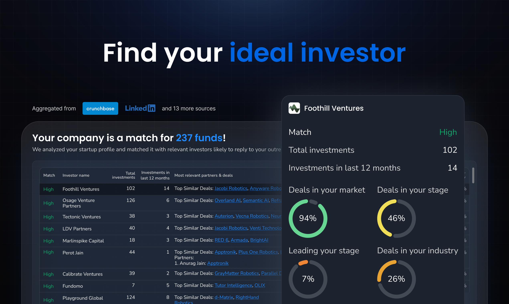
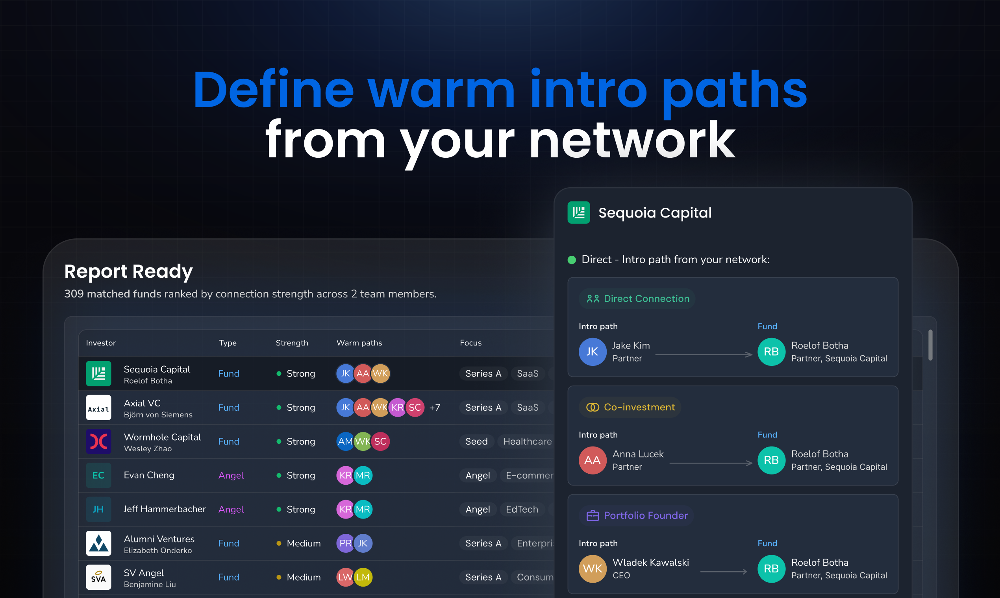
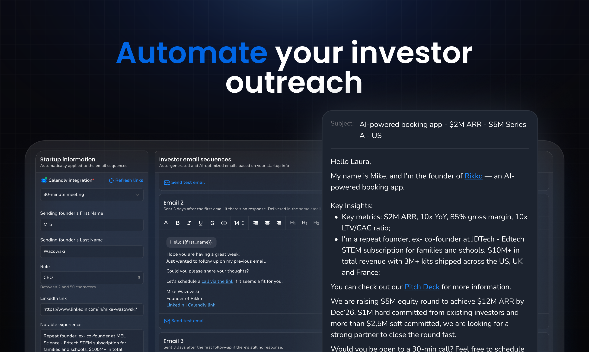

### 🎬 관련 영상
- [🎥 영상 보기](https://ph-files.imgix.net/763e838e-65e6-4bf7-94a1-33198ee504a6.jpeg?auto=format)

---

## 2. [Vokal](https://www.producthunt.com/products/vokal-2)
**Votes**: 346 | **도입 난이도**: 중 | **신뢰도**: 상
**Tagline**: A collaboration space for 10x teammates with their Al agents
**서비스 링크**: https://www.producthunt.com/r/M46FM3WQQTJPUQ

**태그**: AI-Collaboration, DevTools, Automation, Productivity, Agent, Prompting, DevTool

### 📌 이 서비스 한눈에 보기
개별 AI 에이전트들을 하나의 협업 공간으로 모아 팀원과 함께 실시간으로 작업하는 AI 협업 워크스페이스

### 🔑 주요 기능
- 로컬 및 클라우드 기반의 다양한 AI 에이전트(Claude Code, Hermes 등) 통합 지원
- 복사-붙여넣기 방식의 번거로운 작업 흐름을 제거한 공유 협업 공간 제공
- 에이전트별 역할, 접근 권한, 메모리 설정을 통한 체계적인 관리

### 🙋 사용자에게 어떤 점이 좋은가
팀원과 AI 에이전트가 마치 동료처럼 하나의 공간에서 작업할 수 있어, 프롬프트와 요약본을 주고받는 비효율적인 커뮤니케이션을 획기적으로 줄여줍니다.

### ✅ 지금 바로 써볼 기능
- 사용 중인 AI 에이전트(Claude Code 등)를 Vokal에 연결하기
- 에이전트에게 구체적인 역할과 권한 부여하기
- 공유 워크스페이스에서 팀원과 에이전트 간의 협업 흐름 테스트하기

### ⚠️ 사용 전 확인할 점
- 다양한 외부 에이전트 모델과의 연동 안정성 확인 필요
- 에이전트 간의 데이터 공유 및 권한 설정에 따른 보안 검토 필요

### 🧭 확인이 더 필요한 정보
사용자의 로컬 환경(Local Codex 등)과 클라우드 환경 간의 완벽한 동기화 방식에 대한 구체적인 기술 정보가 더 필요합니다.

### 📸 스크린샷 및 갤러리
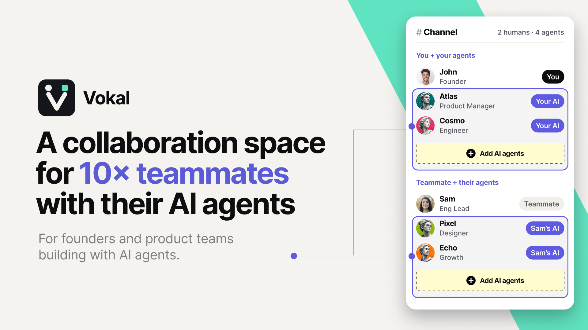
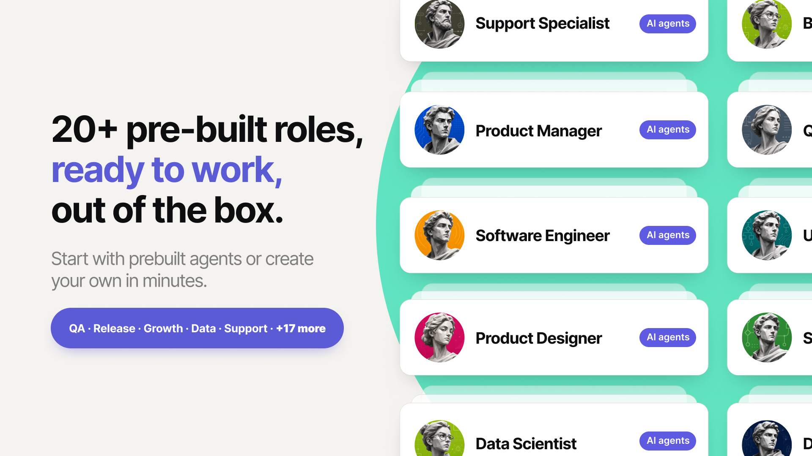
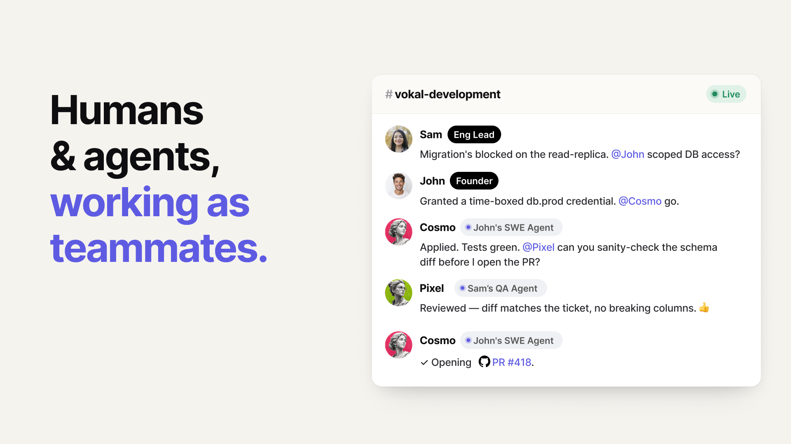

---

## 3. [Gigacatalyst](https://www.producthunt.com/products/gigacatalyst-ai-builder-for-b2b-saas)
**Votes**: 285 | **도입 난이도**: 중 | **신뢰도**: 상
**Tagline**: Give your Sales and CS teams engineering superpowers
**서비스 링크**: https://www.producthunt.com/r/KF5YKHOYKW7OL6

**태그**: AI Builder, SalesTech, CustomerSuccess, LowCode, SaaS, Automation, AI Tool, API, Sales

### 📌 이 서비스 한눈에 보기
영업 및 CS 팀이 엔지니어의 도움 없이 직접 고객 맞춤형 기능을 구축할 수 있는 AI 빌더

### 🔑 주요 기능
- API 학습을 통한 자동화된 기능 임베딩
- 영업/CS 팀을 위한 엔지니어링 역량 강화
- 고객별 맞춤형 워크플로우 제공을 통한 리텐션 및 확장성 증대

### 🙋 사용자에게 어떤 점이 좋은가
개발팀의 리소스를 소모하지 않고도 고객의 요구사항을 즉각적으로 제품에 반영하여 고객 만족도를 높일 수 있습니다.

### ✅ 지금 바로 써볼 기능
- 기존 제품의 API 연동 가능 여부 확인
- 고객이 가장 자주 요청하는 커스텀 기능 리스트업
- AI 빌더를 통한 프로토타입 생성 테스트

### ⚠️ 사용 전 확인할 점
- 기존 제품의 API 구조가 복잡할 경우 초기 학습 난이도 존재
- 생성된 기능이 기존 제품의 보안 및 아키텍처 가이드라인을 준수하는지 확인 필요

### 🧭 확인이 더 필요한 정보
제품의 보안 수준과 기존 소프트웨어 시스템과의 기술적 호환성 범위에 대한 구체적인 정보가 필요합니다.

### 📸 스크린샷 및 갤러리
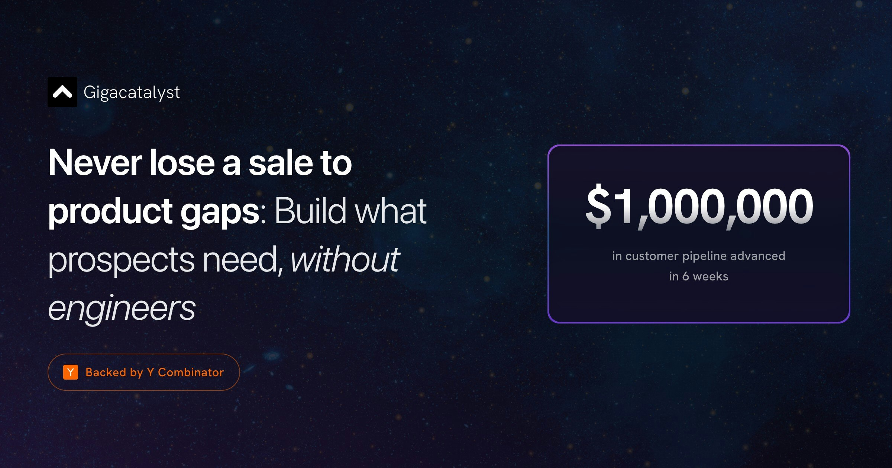
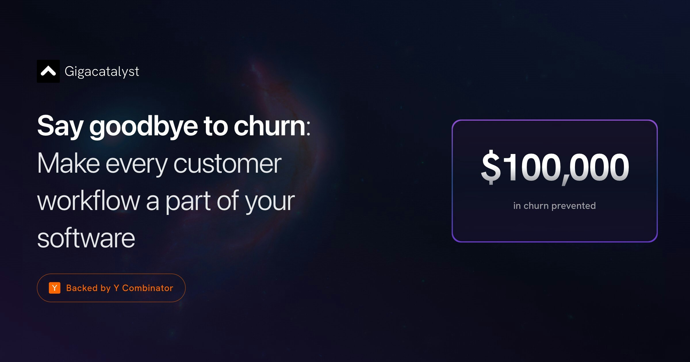
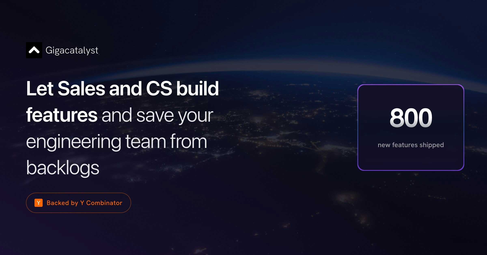

### 🎬 관련 영상
- [🎥 영상 보기](https://ph-files.imgix.net/eb4c7d3e-5d10-4e09-939e-1f55a7fde10f.jpeg?auto=format)

---

## 4. [Co-Invest](https://www.producthunt.com/products/liquid-5)
**Votes**: 213 | **도입 난이도**: 중 | **신뢰도**: 상
**Tagline**: Trade 500+ markets directly from ChatGPT & Claude
**서비스 링크**: https://www.producthunt.com/r/CSYK6KJGP743GJ

**태그**: AI-Trading, FinTech, Automation, Crypto, LLM-Integration, AI Tool, Chat

### 📌 이 서비스 한눈에 보기
ChatGPT와 Claude 내에서 대화만으로 500개 이상의 시장에 직접 투자하고 거래하는 AI 트레이딩 솔루션

### 🔑 주요 기능
- LLM(ChatGPT, Claude) 인터페이스 내에서 직접적인 시장 조사 및 실거래 실행
- 암호화폐, 주식, FX, 원자재, 예측 시장 등 500개 이상의 다양한 시장 접근
- 온체인 신호(지갑 활동, 포지션, 오더 플로우 등)를 활용한 데이터 기반 의사결정 지원

### 🙋 사용자에게 어떤 점이 좋은가
별도의 트레이딩 플랫폼을 오가지 않고 대화창 안에서 즉시 시장 분석과 주문을 처리할 수 있어 투자 흐름의 단절을 최소화합니다.

### ✅ 지금 바로 써볼 기능
- 자연어 명령을 통한 매수/매도 및 스탑로스 설정 테스트
- 온체인 데이터 기반의 AI 분석 리포트 확인
- 채팅창 내 자금 충전 및 시장 접근성 확인

### ⚠️ 사용 전 확인할 점
- AI의 분석과 명령 실행 과정에서 발생할 수 있는 오작동 및 주문 오류 주의
- 자산 운용 및 보안(지갑 연결 등)에 대한 사용자 책임 확인 필요

### 🧭 확인이 더 필요한 정보
LLM 인터페이스와 실제 거래소 간의 실행 속도(Latency) 및 보안 프로토콜에 대한 구체적인 정보가 필요합니다.

### 📸 스크린샷 및 갤러리
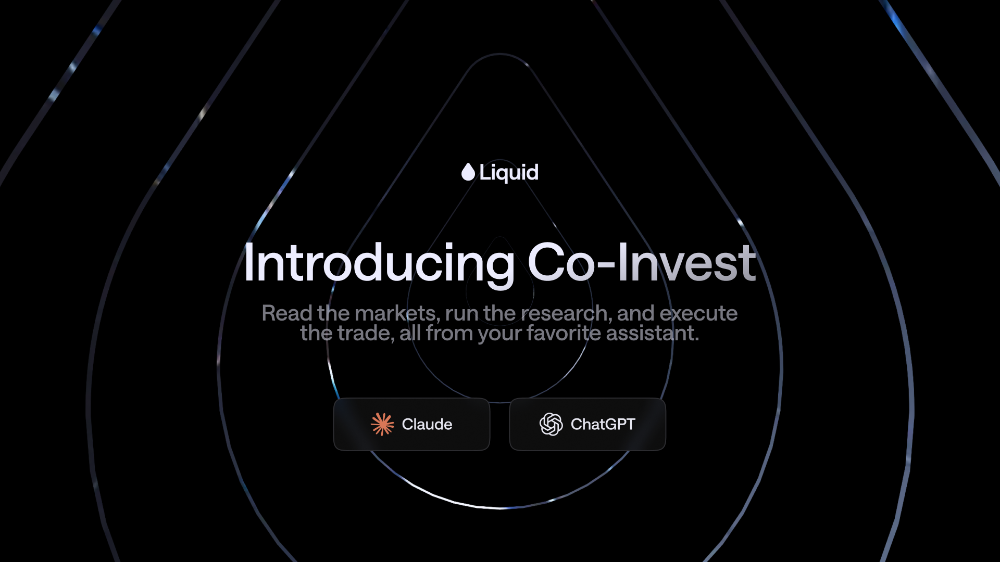

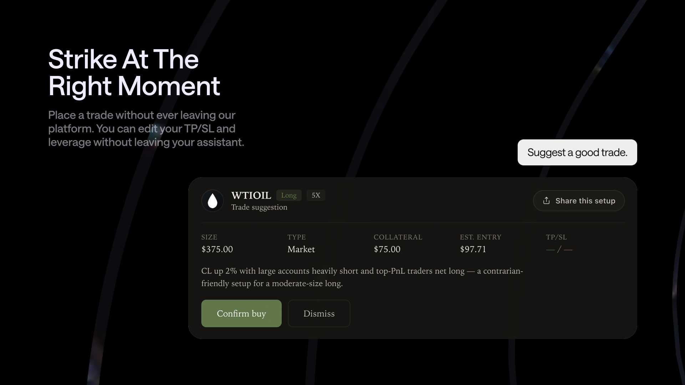

### 🎬 관련 영상
- [🎥 영상 보기](https://ph-files.imgix.net/80f2b379-099d-4d04-b9cb-fb5be69e4993.jpeg?auto=format)

---

## 5. [Brief](https://www.producthunt.com/products/brief-10)
**Votes**: 192 | **도입 난이도**: 중 | **신뢰도**: 상
**Tagline**: Navigate your agents to product-market fit
**서비스 링크**: https://www.producthunt.com/r/FIAII7GV3TFM4P

**태그**: ProductManagement, AI-Agents, DevTools, Workflow, Agent, AI Tool, Chat

### 📌 이 서비스 한눈에 보기
제품의 의도와 결정 사항을 기록하여 AI 에이전트와 팀원 모두에게 정확한 맥락을 제공하는 제품 관리 도구

### 🔑 주요 기능
- 제품의 전략, 결정 사항, 실행 과정을 연결하는 단일 진실 공급원(Single Source of Truth) 제공
- AI 에이전트가 제품 맥락을 이해하고 올바른 방향으로 작업할 수 있도록 지원
- Chat, Slack, CLI, MCP 등 다양한 채널을 통한 유연한 맥락 공유

### 🙋 사용자에게 어떤 점이 좋은가
제품 개발 과정에서 발생하는 의사결정 파편화를 방지하고, AI 에이전트가 맥락 없이 작업하여 발생하는 오류를 줄여줍니다.

### ✅ 지금 바로 써볼 기능
- 기존 제품 결정 사항을 Brief에 기록하여 맥락 구축하기
- Slack이나 CLI를 연동하여 팀 워크플로우에 통합하기
- AI 에이전트에게 Brief의 컨텍스트를 제공하여 작업 지시하기

### ⚠️ 사용 전 확인할 점
- 사용자가 직접 맥락을 입력하고 관리해야 하는 운영 리소스 발생 가능성
- 기존 문서 관리 도구(Notion, Jira 등)와의 데이터 동기화 방식 확인 필요

### 🧭 확인이 더 필요한 정보
현재 제공되는 다양한 인터페이스(CLI, MCP 등)가 기존 워크플로우와 얼마나 매끄럽게 통합되는지 확인이 필요합니다.

### 📸 스크린샷 및 갤러리
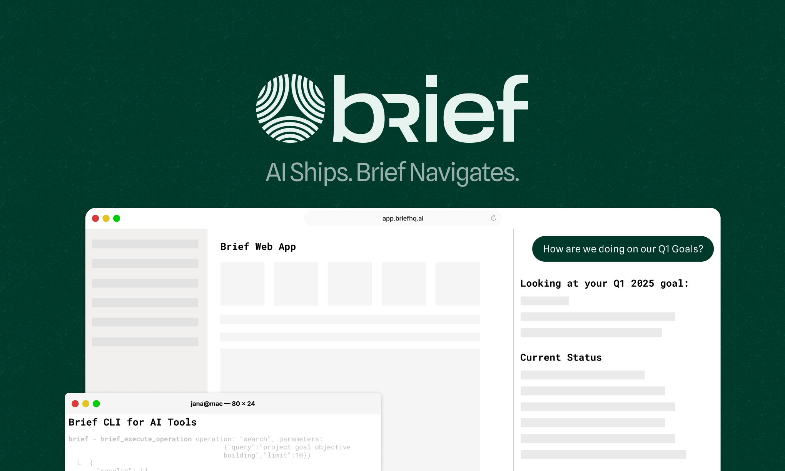

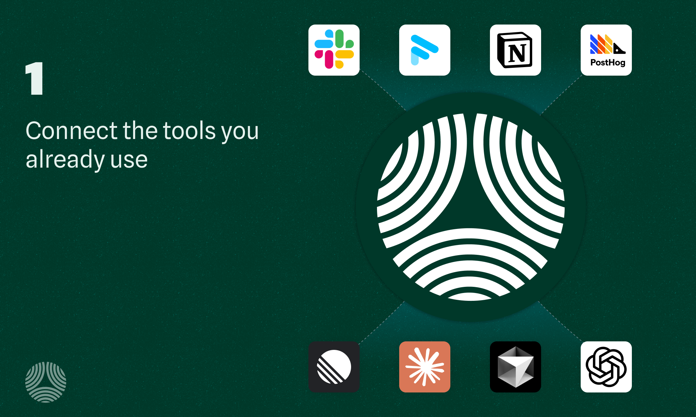

### 🎬 관련 영상
- [🎥 영상 보기](https://ph-files.imgix.net/c9367646-5cde-4997-aa84-800fae1e720e.jpeg?auto=format)

---

## 6. [Paste MCP & AI Tools](https://www.producthunt.com/products/paste)
**Votes**: 174 | **도입 난이도**: 하 | **신뢰도**: 상
**Tagline**: Infinite clipboard for Claude, Codex and other AI tools
**서비스 링크**: https://www.producthunt.com/r/Z3SLDWOM7BPP4W

**태그**: AI-Tool, Productivity, DeveloperTools, Automation, AI Tool, DevTool

### 📌 이 서비스 한눈에 보기
Claude 및 AI 도구 사용자를 위한 보안 중심의 무한 클립보드 및 스니펫 관리 도구

### 🔑 주요 기능
- Claude, Codex 등 AI 도구와 연동 가능한 무한 클립보드 제공
- 모든 기기에서 사용 가능한 보안 중심의 동기화 및 검색 기능
- 스마트 단축키와 즉각적인 붙여넣기 기록을 통한 생산성 향상

### 🙋 사용자에게 어떤 점이 좋은가
AI 도구와 작업 중 반복되는 코드나 텍스트를 빠르고 안전하게 관리하여 작업 흐름의 끊김을 방지할 수 있습니다.

### ✅ 지금 바로 써볼 기능
- 자주 사용하는 코드 스니펫 저장하기
- 스마트 단축키 설정하여 붙여넣기 속도 높이기
- 기기 간 동기화 기능 테스트하기

### ⚠️ 사용 전 확인할 점
- 클립보드 데이터의 보안 정책 및 암호화 방식 확인 필요
- 사용 중인 특정 AI 도구와의 호환성 체크

### 🧭 확인이 더 필요한 정보
구체적인 기기 간 동기화 방식과 데이터 보안 수준에 대한 상세 기술 문서 확인이 필요합니다.

### 📸 스크린샷 및 갤러리
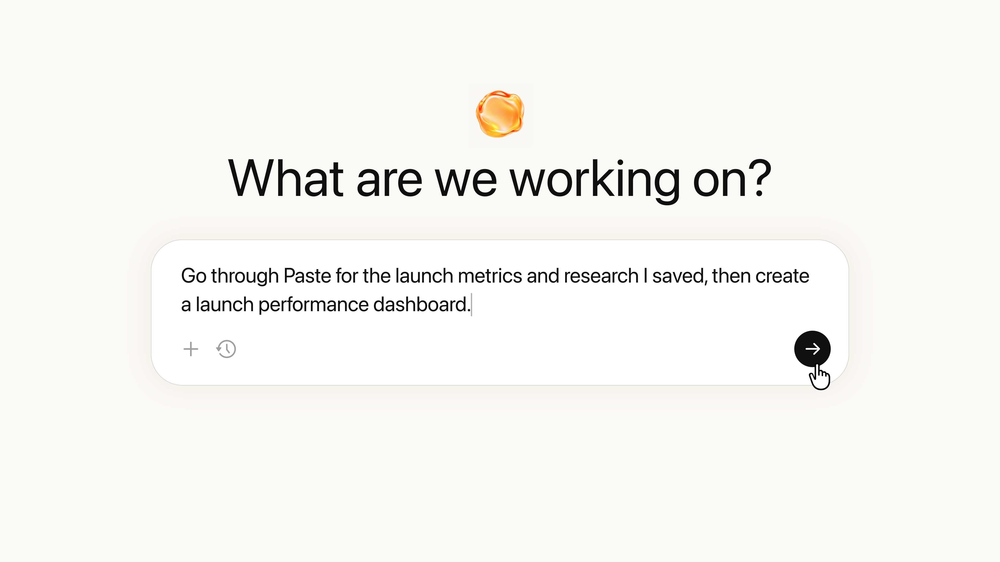
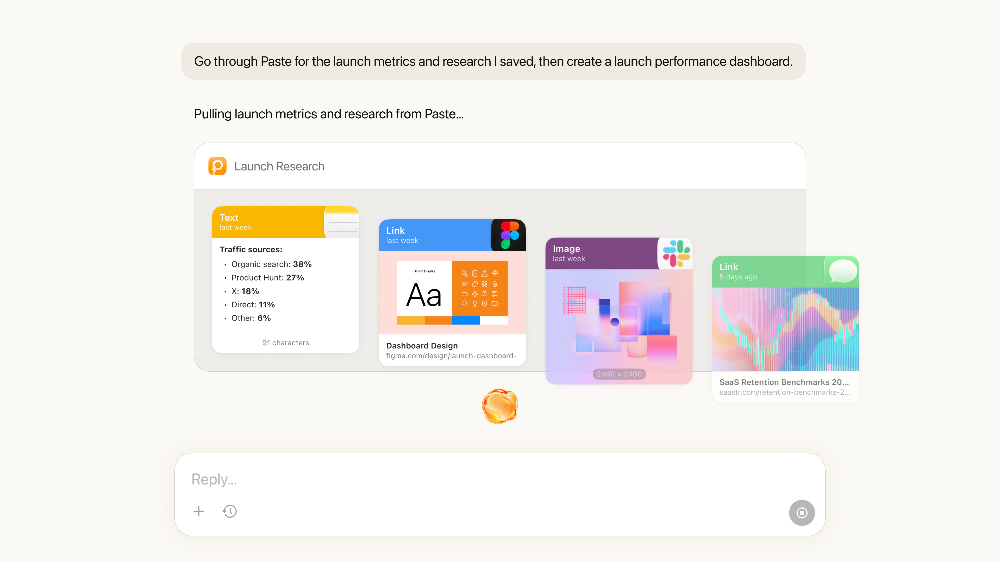
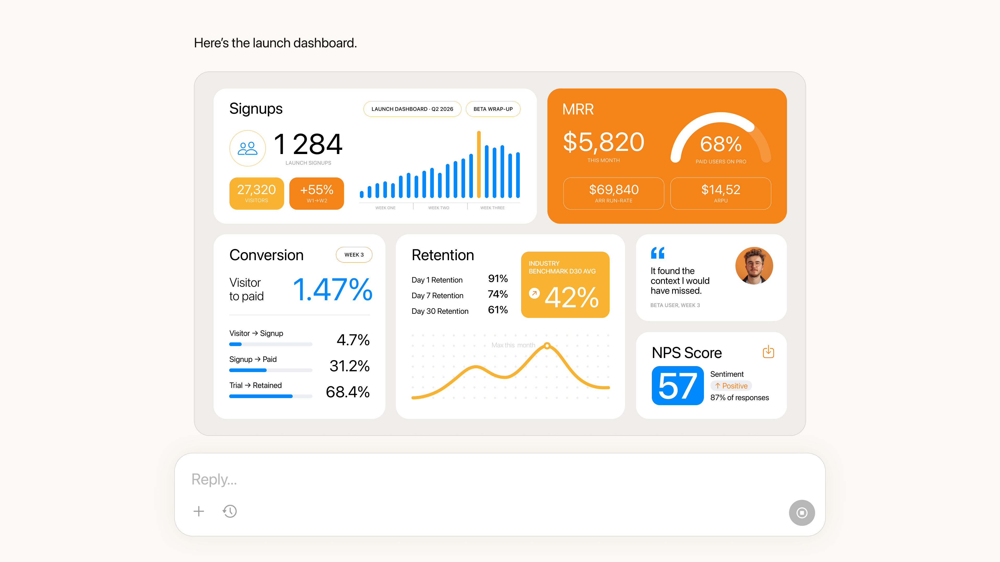

### 🎬 관련 영상
- [🎥 영상 보기](https://ph-files.imgix.net/0ffd56f7-6b11-4e7d-ae08-012dea4e281b.jpeg?auto=format)

---

## 7. [PawPause](https://www.producthunt.com/products/pawpause-cat-proof-your-mac)
**Votes**: 129 | **도입 난이도**: 하 | **신뢰도**: 상
**Tagline**: Lock your keyboard and prevent cats from causing chaos
**서비스 링크**: https://www.producthunt.com/r/K3ABT7ECQMNFDU

**태그**: macOS, Productivity, PetTech, OpenSource

### 📌 이 서비스 한눈에 보기
고양이가 키보드를 눌러 발생하는 타이핑 실수를 방지하는 macOS 전용 메뉴 바 앱

### 🔑 주요 기능
- 키보드 입력 감지를 통한 시스템 전체 입력 일시 중지 기능
- 개인정보 보호를 위한 100% 온디바이스 처리
- 오픈 소스 기반의 무료 소프트웨어

### 🙋 사용자에게 어떤 점이 좋은가
재택근무 중 고양이가 키보드 위를 지나가며 발생하는 의도치 않은 입력과 작업 중단을 효과적으로 막아줍니다.

### ✅ 지금 바로 써볼 기능
- macOS 메뉴 바에 앱 설치하기
- 고양이 감지 및 입력 차단 기능 테스트하기
- 오픈 소스 코드 확인하기

### ⚠️ 사용 전 확인할 점
- 고양이가 아닌 다른 물체가 키보드에 닿을 경우에도 입력이 차단될 수 있음
- macOS 시스템 권한 설정이 필요할 수 있음

### 🧭 확인이 더 필요한 정보
고양이를 감지하는 구체적인 알고리즘(카메라 활용 여부 등)에 대한 상세 정보는 명시되지 않았습니다.

### 📸 스크린샷 및 갤러리
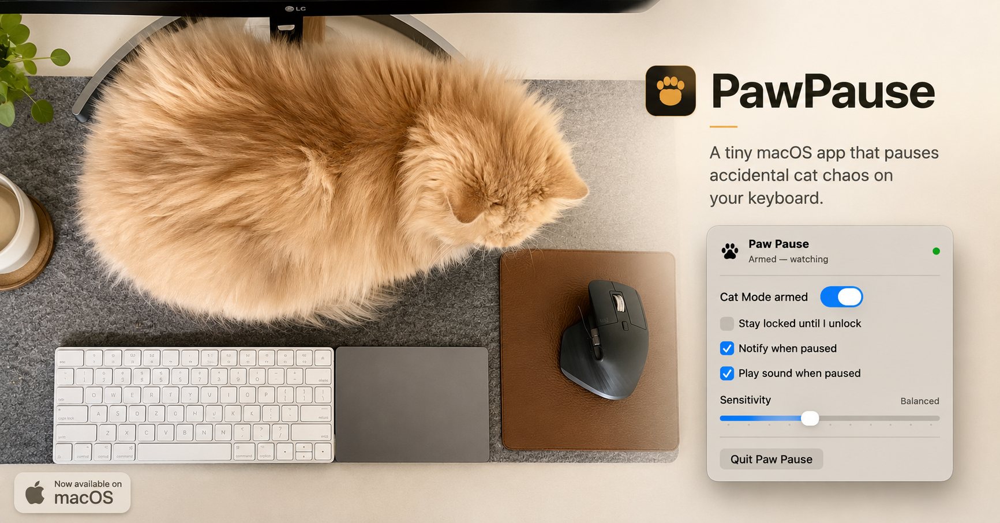

---

## 8. [Enshittifier](https://www.producthunt.com/products/enshittifier)
**Votes**: 123 | **도입 난이도**: 하 | **신뢰도**: 상
**Tagline**: Chrome extension that replaces "AI" with 💩
**서비스 링크**: https://www.producthunt.com/r/S3YSAXE6JWY37C

**태그**: Browser Extension, Humor, Lifestyle, AI Tool

### 📌 이 서비스 한눈에 보기
웹페이지 내 'AI'라는 단어를 💩 이모지로 바꿔주는 위트 있는 크롬 확장 프로그램

### 🔑 주요 기능
- 폰트 리가처(Ligatures) 기술을 활용한 시각적 변환
- 웹 환경에서도 안정적으로 작동하도록 설계된 크롬 확장 프로그램
- AI 열풍에 대한 풍자와 경각심을 주는 유머러스한 도구

### 🙋 사용자에게 어떤 점이 좋은가
웹 서핑 중 빈번하게 등장하는 'AI'라는 단어를 시각적으로 대체하여, 기술 만능주의에 대한 가벼운 유머와 성찰을 제공합니다.

### ✅ 지금 바로 써볼 기능
- 크롬 웹 스토어에서 확장 프로그램 설치하기
- 웹사이트 접속 시 'AI' 단어가 어떻게 변하는지 확인하기

### ⚠️ 사용 전 확인할 점
- 단순 시각적 변환 도구이므로 실질적인 기능적 변화는 없음
- 특정 웹사이트의 폰트 설정에 따라 변환이 완벽하지 않을 수 있음

### 🧭 확인이 더 필요한 정보
사용자의 브라우저 환경이나 특정 웹사이트의 CSS 설정에 따른 호환성 여부는 확인이 필요합니다.

### 📸 스크린샷 및 갤러리
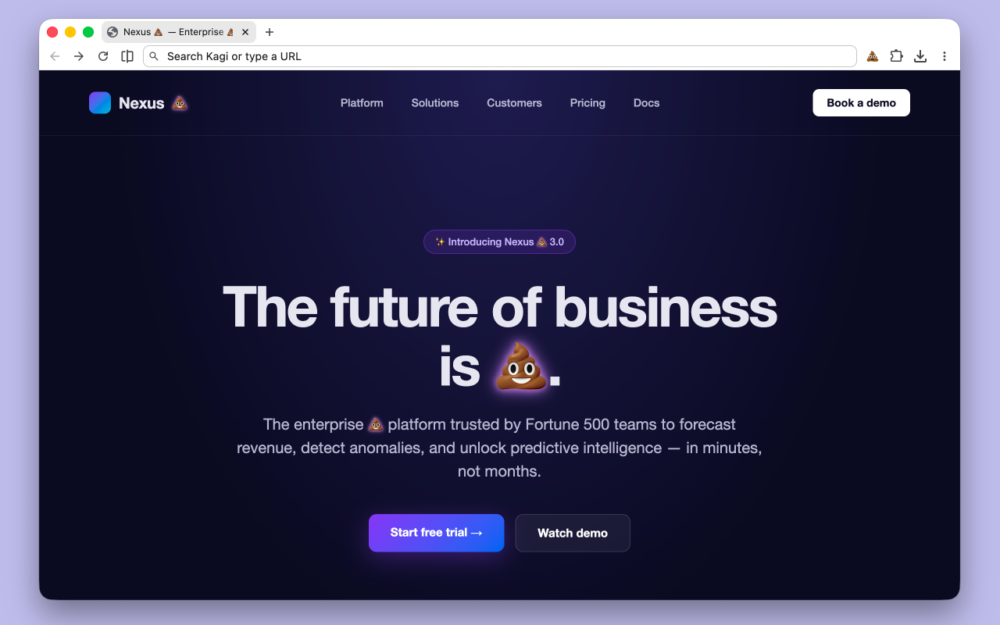
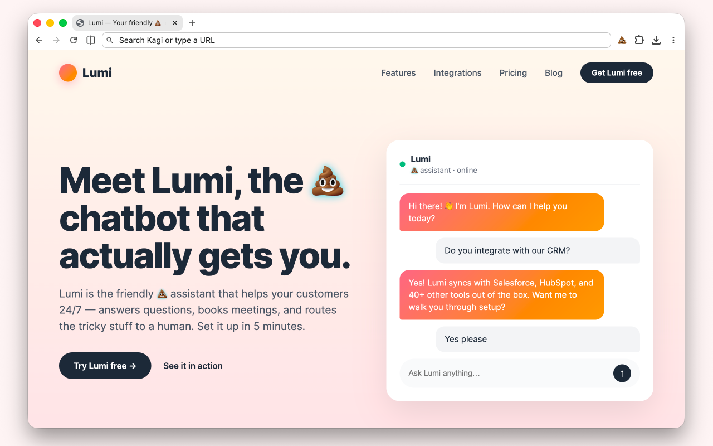
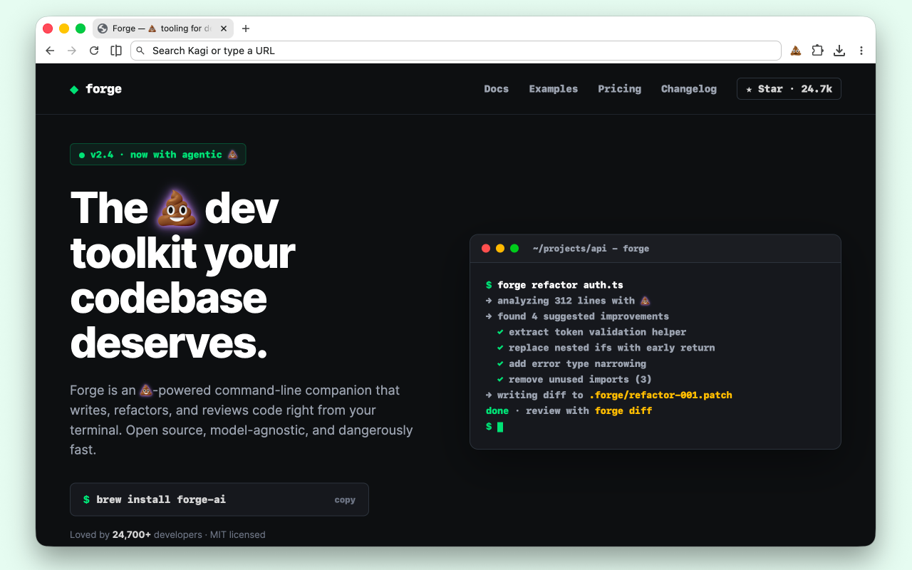

---

## 9. [Rodeo by TwelveLabs](https://www.producthunt.com/products/twelvelabs)
**Votes**: 113 | **도입 난이도**: 하 | **신뢰도**: 상
**Tagline**: Describe your shot. Rodeo builds your first cut.
**서비스 링크**: https://www.producthunt.com/r/DIKJVDXPFYHT6H

**태그**: VideoAI, ContentCreation, Automation, Multimodal, Agent, AI Tool, Video

### 📌 이 서비스 한눈에 보기
자연어 명령만으로 영상 편집 초안을 순식간에 만들어주는 AI 비디오 인텔리전스 플랫폼

### 🔑 주요 기능
- 텍스트 명령을 통한 빠른 초안(First Cut) 생성
- 시각, 오디오, 음성, 텍스트를 동시에 이해하는 멀티모달 AI 기술
- 방대한 영상 라이브러리를 즉시 검색 및 쿼리 가능한 상태로 변환

### 🙋 사용자에게 어떤 점이 좋은가
수동으로 영상을 돌려보며 편집점을 찾는 시간을 획기적으로 줄여주며, 영상 제작 워크플로우를 구조화된 방식으로 가속화합니다.

### ✅ 지금 바로 써볼 기능
- 보유 중인 원본 클립 업로드하기
- 자연어로 원하는 장면 묘사하여 초안 생성하기
- 멀티모달 검색 기능을 활용해 특정 장면 찾기

### ⚠️ 사용 전 확인할 점
- 초안 생성 후 세부적인 편집 작업은 여전히 수동 작업이 필요할 수 있음
- 영상 데이터 용량 및 업로드 속도에 따른 작업 시간 차이

### 🧭 확인이 더 필요한 정보
현재 제공되는 구체적인 편집 기능의 범위와 지원하는 영상 포맷에 대한 정보가 필요합니다.

### 📸 스크린샷 및 갤러리
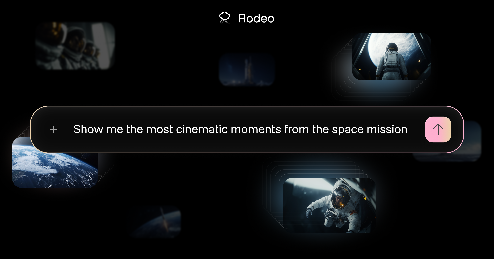

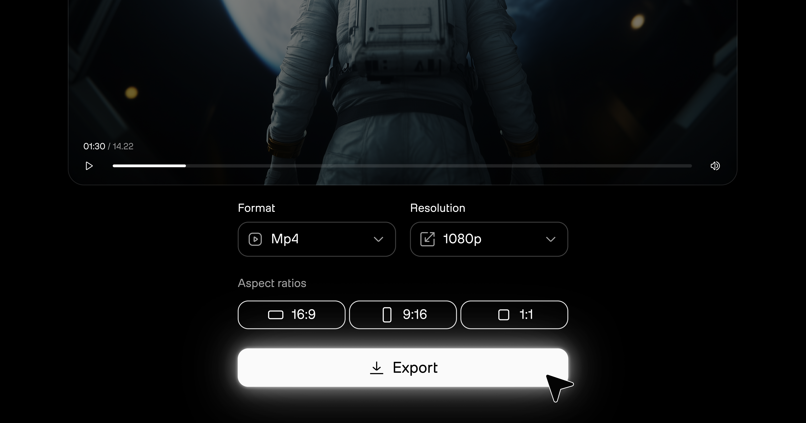

### 🎬 관련 영상
- [🎥 영상 보기](https://ph-files.imgix.net/64f6e623-bae3-4c4d-ba79-036e9b906b0f.jpeg?auto=format)

---

## 10. [choclift](https://www.producthunt.com/products/choclift-workflow-sweetener)
**Votes**: 110 | **도입 난이도**: 하 | **신뢰도**: 상
**Tagline**: Use iPhone to open apps, Apple Shortcuts and websites on Mac
**서비스 링크**: https://www.producthunt.com/r/KI46OMTZ5VN7JA

**태그**: Productivity, Automation, macOS, iOS, Design

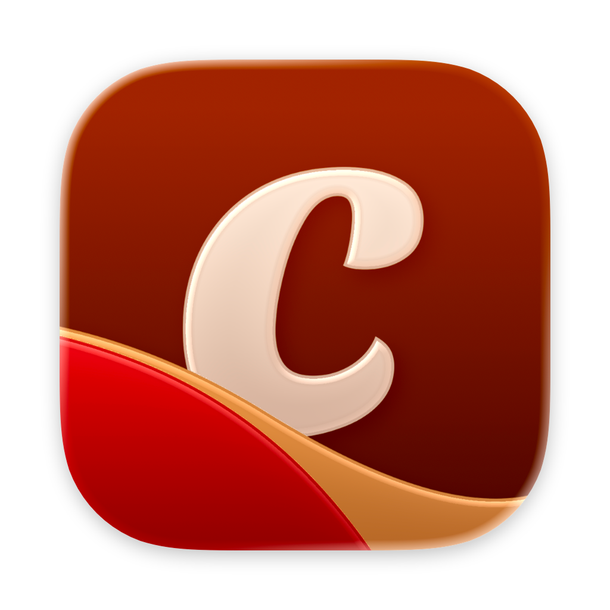

### 📌 이 서비스 한눈에 보기
아이폰을 맥(Mac)의 새로운 컨트롤러로 변신시켜 앱과 단축어를 즉시 실행하는 생산성 도구

### 🔑 주요 기능
- 아이폰을 활용한 맥 전용 커스텀 인터페이스 제공
- 즐겨찾는 앱 및 최근 사용 앱의 빠른 전환 기능
- 애플 단축어(Shortcuts) 및 웹사이트 북마크의 즉각적인 실행

### 🙋 사용자에게 어떤 점이 좋은가
키보드와 마우스 외에 아이폰을 보조 컨트롤러로 활용하여 맥 작업 흐름을 끊김 없이 빠르게 전환할 수 있습니다.

### ✅ 지금 바로 써볼 기능
- 자주 사용하는 맥 앱 등록하기
- 자주 방문하는 웹사이트 북마크 설정하기
- 자주 쓰는 애플 단축어 연결하기

### ⚠️ 사용 전 확인할 점
- 아이폰과 맥 사이의 연결 안정성 확인 필요
- 화면을 계속 확인해야 하는 작업 흐름의 변화 적응 필요

### 🧭 확인이 더 필요한 정보
아이폰과 맥 간의 구체적인 연결 방식(Wi-Fi/Bluetooth 등)과 배터리 소모량에 대한 정보가 명시되지 않았습니다.

### 📸 스크린샷 및 갤러리

### 🎬 관련 영상
- [🎥 영상 보기](https://ph-files.imgix.net/2466f8f7-557b-44a5-b7e5-41c396ec1b07.jpeg?auto=format)

---

## 11. [Branda](https://www.producthunt.com/products/branda)
**Votes**: 108 | **도입 난이도**: 하 | **신뢰도**: 상
**Tagline**: A fun new way to create & manage brands.
**서비스 링크**: https://www.producthunt.com/r/CN6ECHJIWDPHTY

**태그**: Branding, AI, DesignTool, Creative, AI Tool, Prompting

### 📌 이 서비스 한눈에 보기
아이디어 하나로 전략부터 로고, 브랜드 키트까지 완성하는 AI 기반 브랜드 구축 도구

### 🔑 주요 기능
- 전략, 로고, 컬러 팔레트, 타이포그래피를 포함한 통합 브랜드 아이덴티티 생성
- AI 가이드(Lucky)를 통한 자동 생성 또는 사용자의 직접적인 전략 및 스케치 제어 가능
- 벡터화(SVG), 업스케일링, 퍼블릭 쇼케이스 공유 등 실무적인 워크플로우 지원

### 🙋 사용자에게 어떤 점이 좋은가
브랜드 구축에 필요한 복잡한 과정을 단 몇 분 만에 해결하여, 아이디어를 시각적인 결과물로 빠르게 구체화할 수 있습니다.

### ✅ 지금 바로 써볼 기능
- 가입 후 제공되는 200 무료 크레딧으로 브랜드 생성 테스트하기
- AI 가이드 'Lucky'를 활용해 아이디어에서 브랜드 키트까지 자동 생성해보기
- 생성된 결과물을 벡터(SVG)로 변환하여 실무 활용 가능성 확인하기

### ⚠️ 사용 전 확인할 점
- AI 생성 결과물의 독창성 및 저작권 귀속 여부 확인 필요
- 무료 크레딧 소진 후의 유료 플랜 비용 체계 확인 필요

### 🧭 확인이 더 필요한 정보
무료 크레딧 소진 이후의 구체적인 과금 모델과 상업적 이용 권한에 대한 정보가 명시되지 않았습니다.

### 📸 스크린샷 및 갤러리
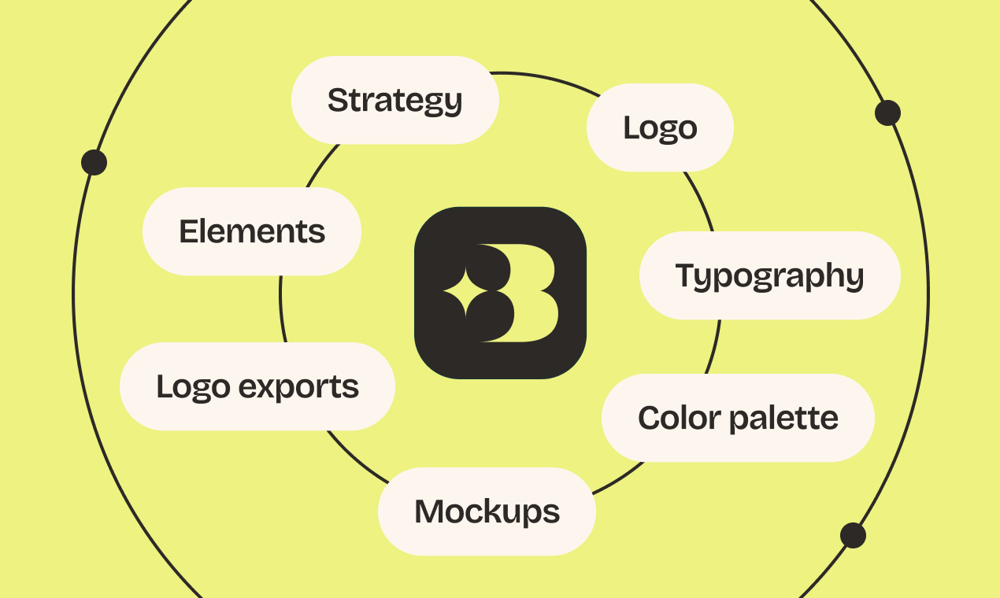
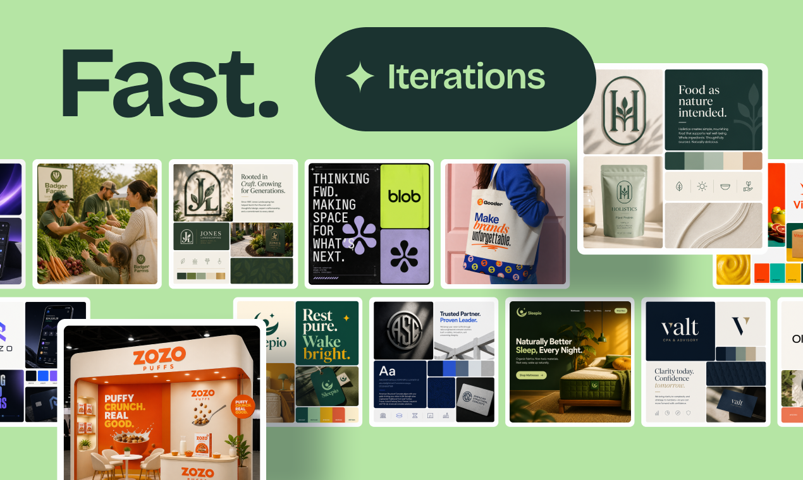
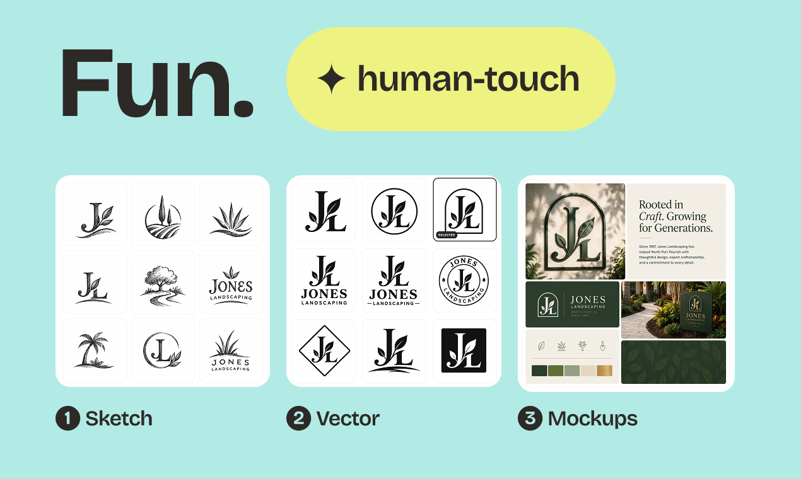

### 🎬 관련 영상
- [🎥 영상 보기](https://ph-files.imgix.net/2e8704b4-f395-44dc-af8d-26e385088fd3.jpeg?auto=format)

---

## 12. [Knock agent for Slack](https://www.producthunt.com/products/knock-6)
**Votes**: 98 | **도입 난이도**: 하 | **신뢰도**: 상
**Tagline**: Build, manage, and ship customer messaging from Slack
**서비스 링크**: https://www.producthunt.com/r/HLPDZ4CZXGT3XJ

**태그**: Automation, Slack, CustomerEngagement, AI-Agent, Agent, AI Tool

### 📌 이 서비스 한눈에 보기
Slack 내에서 대화만으로 고객 메시지 캠페인과 워크플로우를 구축하는 AI 에이전트

### 🔑 주요 기능
- Slack 내 @Knock 태그를 통한 간편한 명령 및 작업 수행
- 사용자 맥락을 파악하여 메시지 초안 작성 및 라이프사이클 워크플로우 자동 구축
- 작업 진행 상황 실시간 업데이트 및 결과물 검토 링크 제공

### 🙋 사용자에게 어떤 점이 좋은가
별도의 복잡한 대시보드 이동 없이 Slack 환경 내에서 고객 메시징 전략을 즉시 실행하고 관리할 수 있습니다.

### ✅ 지금 바로 써볼 기능
- Slack 채널에 Knock 에이전트 초대하기
- @Knock을 호출하여 특정 고객 캠페인 초안 작성 요청하기
- 에이전트가 생성한 워크플로우 결과물 검토 및 수정하기

### ⚠️ 사용 전 확인할 점
- 에이전트가 수집하는 계정 데이터의 보안 및 권한 범위 확인 필요
- 자동 생성된 메시지의 톤앤매너와 정확성에 대한 최종 검토 필수

### 🧭 확인이 더 필요한 정보
Slack 외의 다른 채널(이메일, SMS 등)로의 실제 발송 기능 및 연동 범위에 대한 상세 정보가 필요합니다.

### 📸 스크린샷 및 갤러리
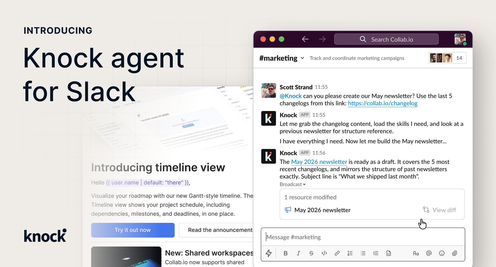
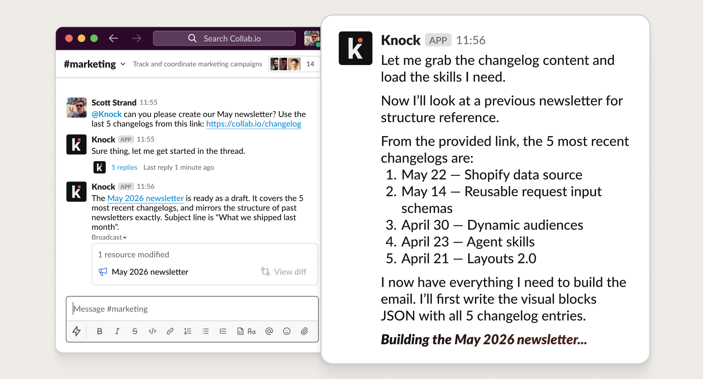
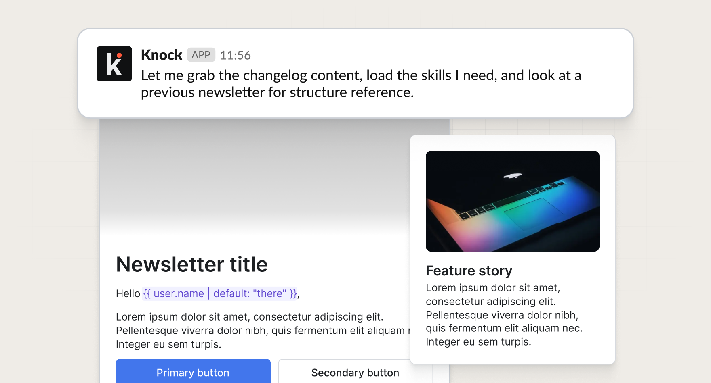

---

## 13. [Trovelo](https://www.producthunt.com/products/trovelo-private-trip-planner)
**Votes**: 93 | **도입 난이도**: 하 | **신뢰도**: 상
**Tagline**: Plan and track your trips privately
**서비스 링크**: https://www.producthunt.com/r/AOTE57LJ67MKRA

**태그**: Travel, Productivity, Privacy, iOS

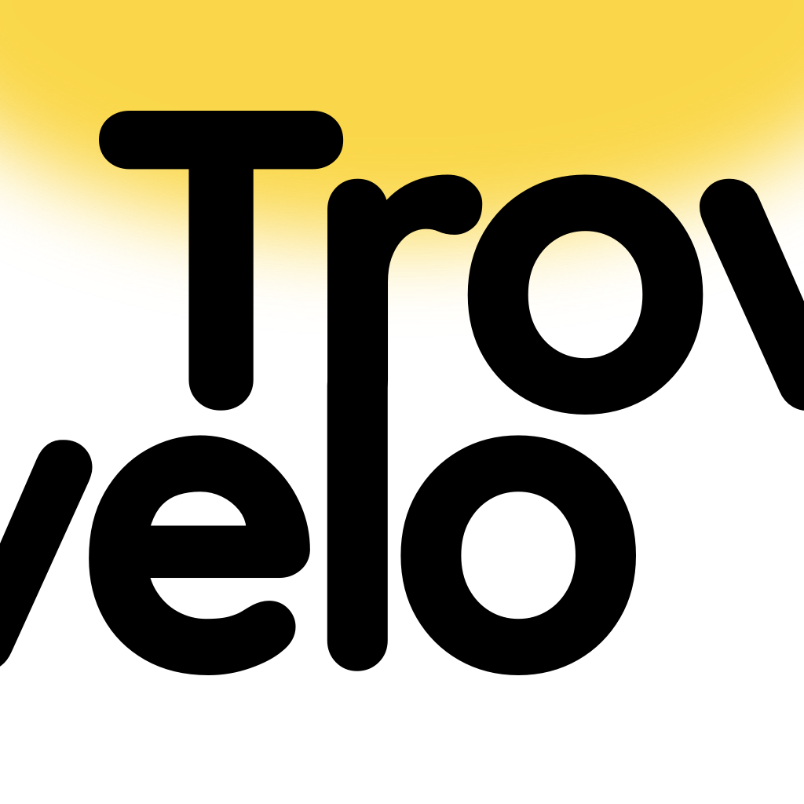

### 📌 이 서비스 한눈에 보기
계정 생성이나 구독 없이 개인정보를 완벽히 보호하며 사용하는 프라이빗 여행 플래너

### 🔑 주요 기능
- 계정, 서버, 구독이 필요 없는 로컬 기반의 프라이빗 설계
- 스마트 카드와 자연어 입력을 통한 직관적인 일정 계획
- 이중 통화 지원 경비 추적 및 경로 최적화 기능

### 🙋 사용자에게 어떤 점이 좋은가
개인정보 유출 걱정 없이 나만의 여행 계획을 세울 수 있으며, 한 번의 결제로 평생 소장 가능한 경제적인 도구입니다.

### ✅ 지금 바로 써볼 기능
- 자연어 입력으로 여행 일정 생성해보기
- 이중 통화를 활용한 여행 경비 기록하기
- iCloud 동기화 설정 확인하기

### ⚠️ 사용 전 확인할 점
- iPhone과 Mac 환경에 국한된 플랫폼 지원
- 서버가 없으므로 기기 분실 시 데이터 복구는 iCloud 백업에 의존함

### 🧭 확인이 더 필요한 정보
현재 iPhone과 Mac 외에 iPad 등 다른 Apple 기기에서의 최적화 여부는 명시되지 않았습니다.

### 📸 스크린샷 및 갤러리
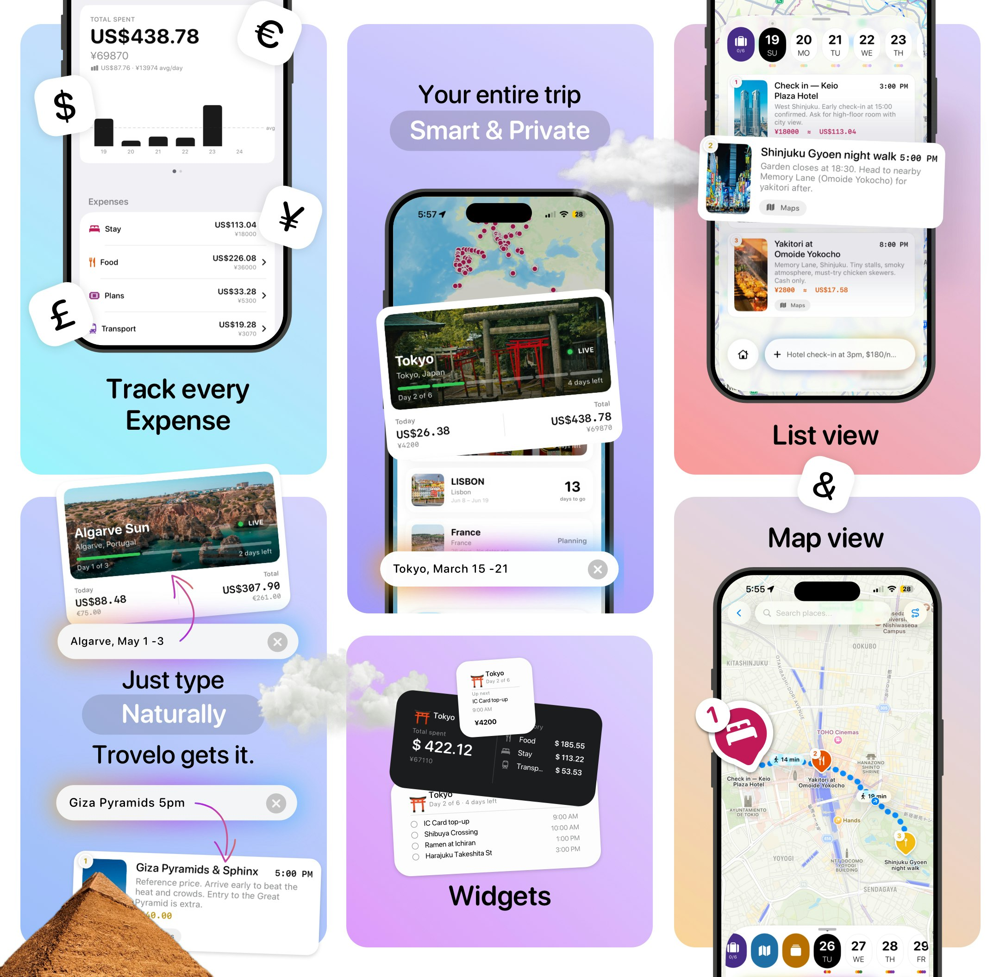
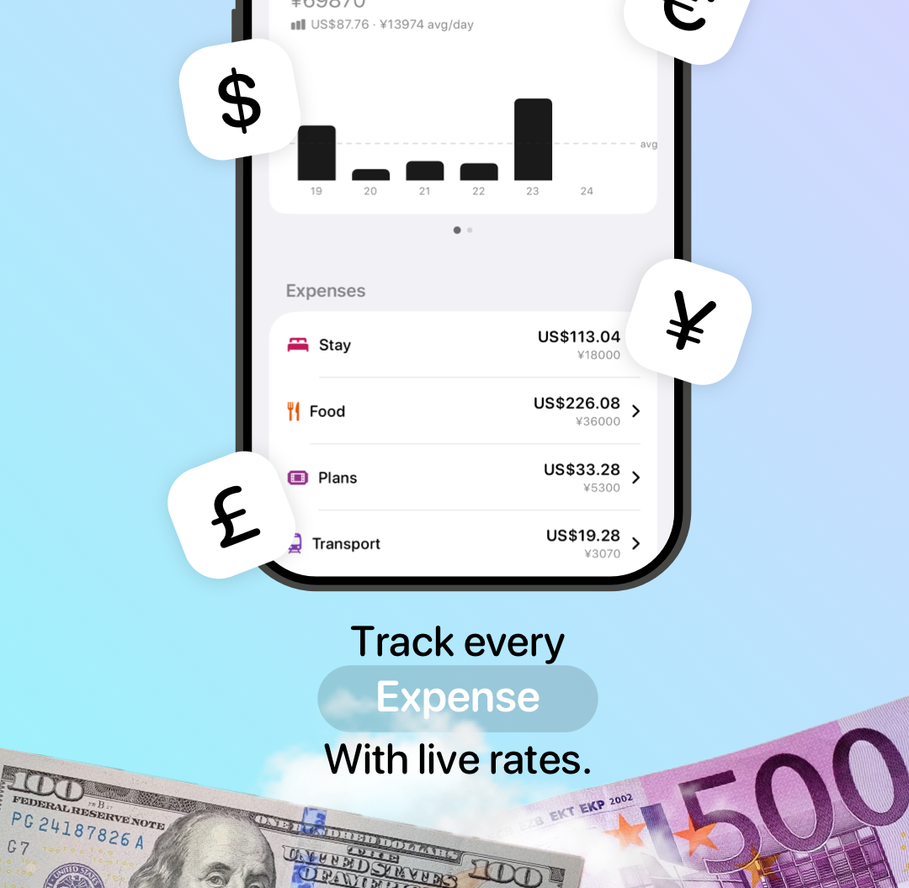
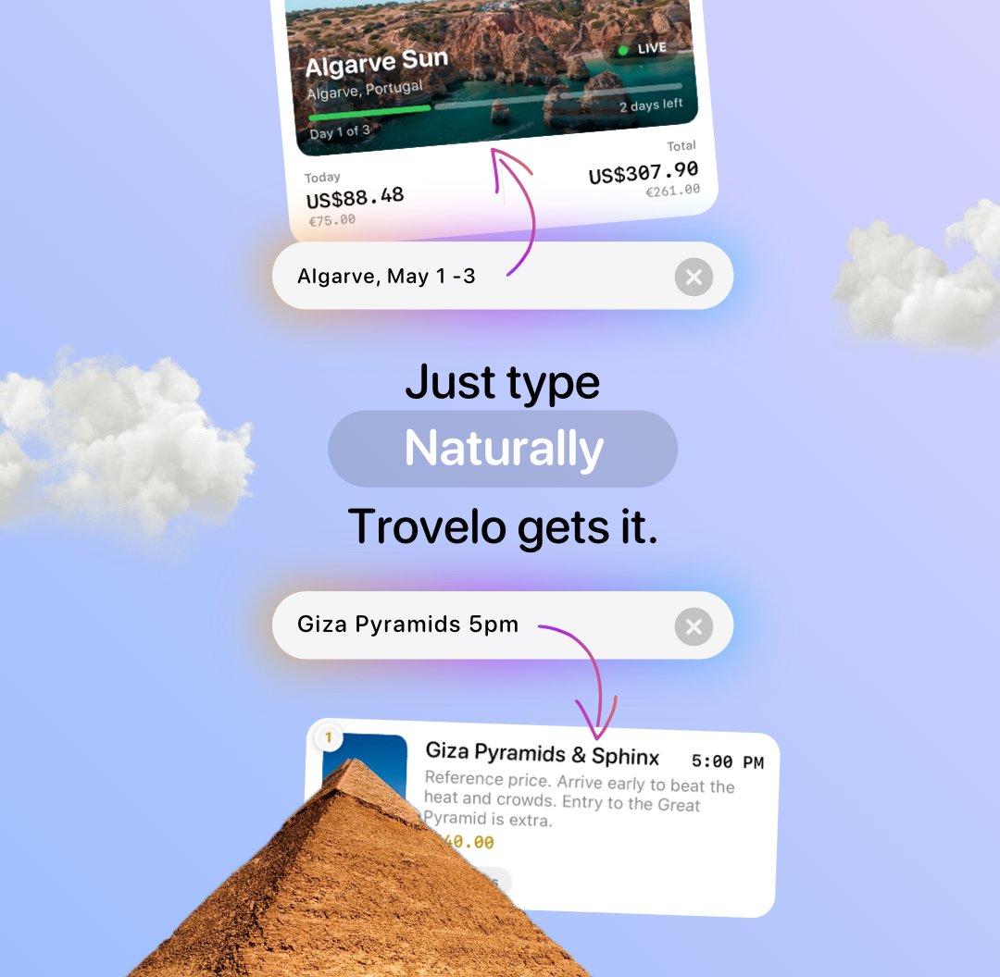

---

## 14. [Kompassify 2.0](https://www.producthunt.com/products/kompassify)
**Votes**: 93 | **도입 난이도**: 하 | **신뢰도**: 상
**Tagline**: User onboarding now with an AI copilot
**서비스 링크**: https://www.producthunt.com/r/IIZ6EBERTWMBC7

**태그**: SaaS, NoCode, ProductLedGrowth, AI, UserOnboarding, AI Tool, DevTool, Analytics

### 📌 이 서비스 한눈에 보기
코드 수정 없이 AI 코파일럿으로 사용자 온보딩과 제품 채택을 자동화하는 올인원 플랫폼

### 🔑 주요 기능
- 코드 작업이 필요 없는 노코드(No-Code) 방식의 온보딩 솔루션
- 제품 투어, 체크리스트, 설문조사 등 사용자 경험 최적화 기능 통합
- AI 코파일럿을 통한 효율적인 제품 채택(Adoption) 관리

### 🙋 사용자에게 어떤 점이 좋은가
개발자의 도움 없이도 기획자나 운영팀이 직접 제품 내 가이드를 설정하고 사용자 피드백을 관리할 수 있습니다.

### ✅ 지금 바로 써볼 기능
- AI 코파일럿을 활용한 온보딩 시나리오 생성
- 제품 투어 및 체크리스트 설정
- 인앱 설문조사를 통한 사용자 피드백 수집

### ⚠️ 사용 전 확인할 점
- 단일 스니펫 설치 방식이므로 기존 서비스의 UI/UX와 충돌 여부 확인 필요
- 무료 플랜의 기능 제한 범위 확인 필요

### 🧭 확인이 더 필요한 정보
제공되는 무료 플랜의 구체적인 기능 제한 및 사용량 제한에 대한 정보가 명시되지 않았습니다.

### 📸 스크린샷 및 갤러리

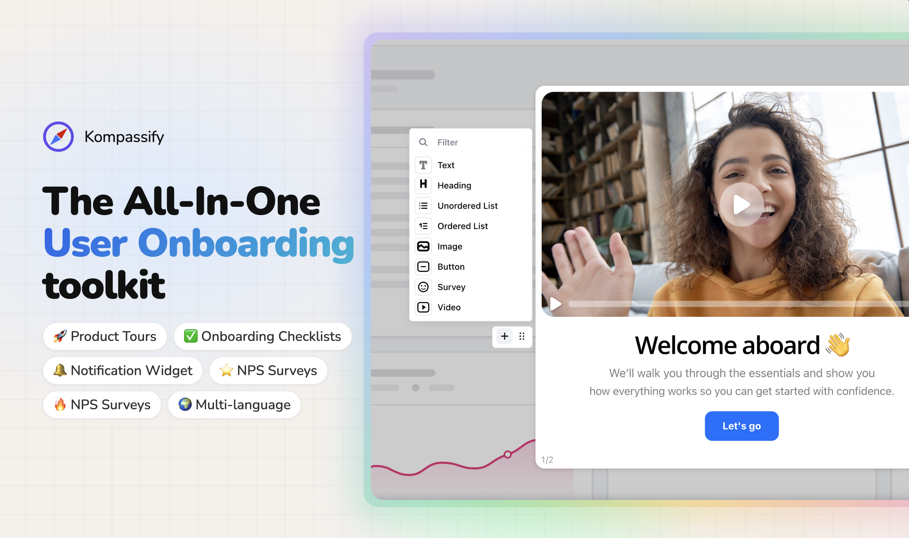
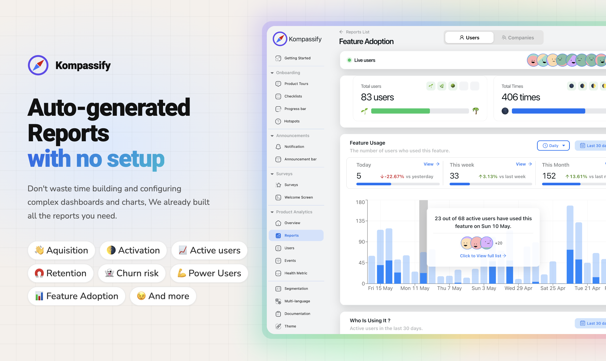

---

## 15. [GlowPulse](https://www.producthunt.com/products/glowpulse)
**Votes**: 93 | **도입 난이도**: 하 | **신뢰도**: 상
**Tagline**: Your Mac's camera is now a heart-rate sensor
**서비스 링크**: https://www.producthunt.com/r/5D2VDYFG6BCL5Y

**태그**: Health, macOS, Privacy, Productivity, DevTool

### 📌 이 서비스 한눈에 보기
별도의 웨어러블 없이 맥북 카메라만으로 실시간 심박수를 측정하는 프라이버시 중심의 헬스케어 앱

### 🔑 주요 기능
- rPPG 기술을 활용하여 카메라 프레임만으로 심박수 측정
- 클라우드 전송 없는 100% 온디바이스 처리로 강력한 개인정보 보호
- 메뉴 바 상주형 UI로 실시간 BPM 및 스트레스 체크 제공

### 🙋 사용자에게 어떤 점이 좋은가
스마트워치를 착용하지 않아도 업무 중 맥북을 통해 간편하게 심박수와 스트레스 상태를 모니터링할 수 있습니다.

### ✅ 지금 바로 써볼 기능
- 30초 스트레스 체크 기능 실행
- 포모도로 타이머와 연동한 심박수 변화 관찰
- 호흡 세션을 통한 실시간 HRV 확인

### ⚠️ 사용 전 확인할 점
- macOS 13 이상의 운영체제 필요
- 카메라를 통한 측정 방식이므로 조명 환경에 따라 정확도가 달라질 수 있음

### 🧭 확인이 더 필요한 정보
카메라 프레임이 메모리에서 즉시 삭제된다고 명시되어 있으나, 하드웨어 가속이나 백그라운드 실행 시 배터리 소모량은 확인이 필요합니다.

### 📸 스크린샷 및 갤러리
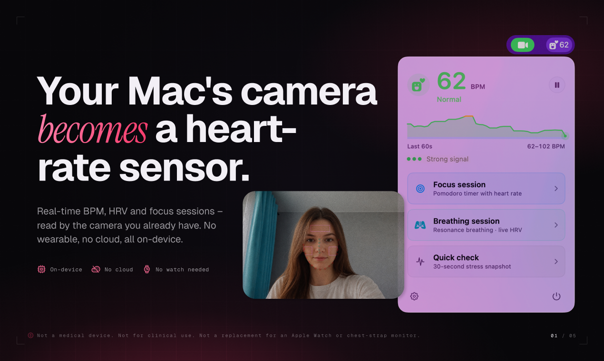
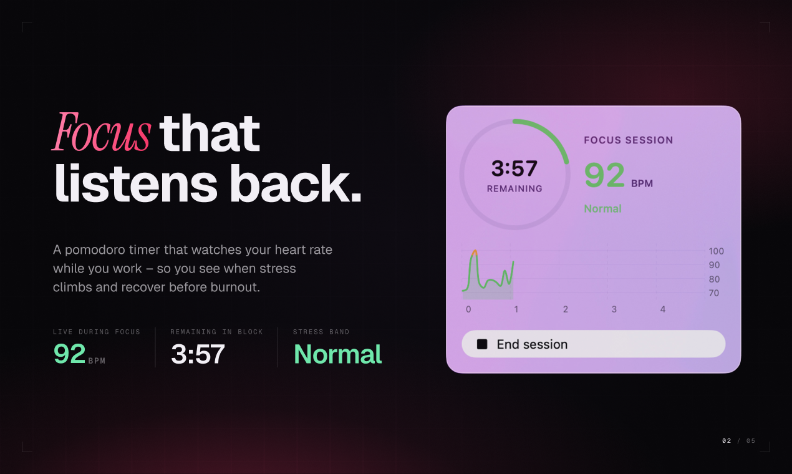

### 🎬 관련 영상
- [🎥 영상 보기](https://ph-files.imgix.net/efa642e8-3f21-4fa5-8839-511a4f45a75e.jpeg?auto=format)

---

## 16. [Moxie Docs](https://www.producthunt.com/products/moxie-docs)
**Votes**: 92 | **도입 난이도**: 하 | **신뢰도**: 상
**Tagline**: Living docs + MCP context for your GitHub repos 
**서비스 링크**: https://www.producthunt.com/r/OEKL7S6EROHZQA

**태그**: DevTool, AI, GitHub, Documentation, Automation, Agent, AI Tool

### 📌 이 서비스 한눈에 보기
GitHub 저장소의 맥락을 AI 에이전트와 문서로 자동 연결하는 지능형 문서 관리 도구

### 🔑 주요 기능
- GitHub 저장소 인덱싱을 통한 코드 맥락 자동 파악
- MCP(Model Context Protocol)를 통한 AI 에이전트 내 코드 컨텍스트 제공
- 검색 가능한 문서 워크스페이스 및 PR 기반 문서 정합성 체크

### 🙋 사용자에게 어떤 점이 좋은가
코드와 문서 사이의 간극을 줄여, 개발자가 별도의 문서 작업 없이도 최신 코드 맥락이 반영된 AI 도움과 문서를 활용할 수 있습니다.

### ✅ 지금 바로 써볼 기능
- GitHub 저장소 연결 및 인덱싱 시작하기
- MCP를 통해 AI 에이전트에 코드 컨텍스트 주입하기
- PR 체크 기능을 통한 문서 자동 검증 설정하기

### ⚠️ 사용 전 확인할 점
- 저장소 인덱싱 시 보안 및 권한 설정 확인 필요
- 코드 변경 사항이 문서에 반영되는 자동화 수준 확인

### 🧭 확인이 더 필요한 정보
MCP 지원 범위와 대규모 저장소에서의 인덱싱 성능에 대한 구체적인 정보가 필요합니다.

### 📸 스크린샷 및 갤러리
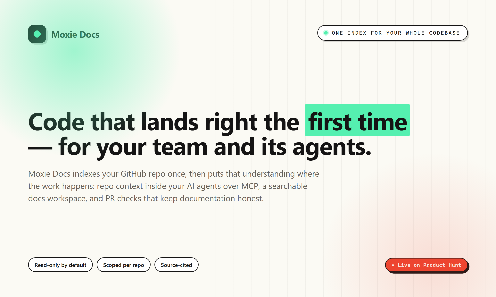
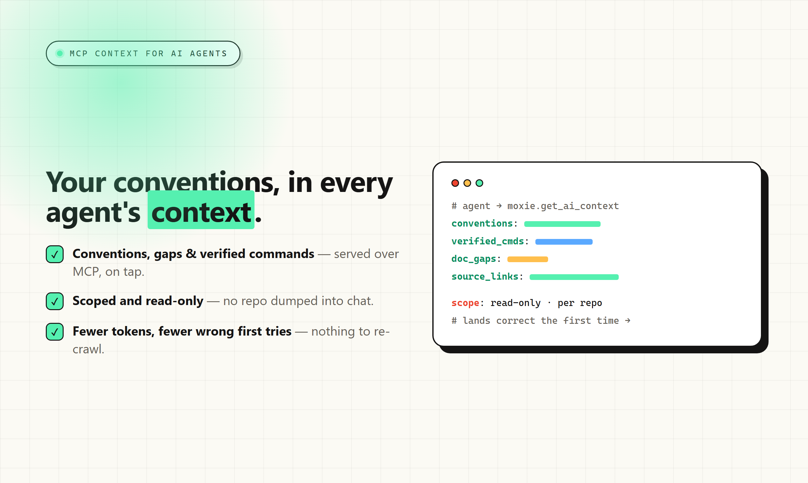
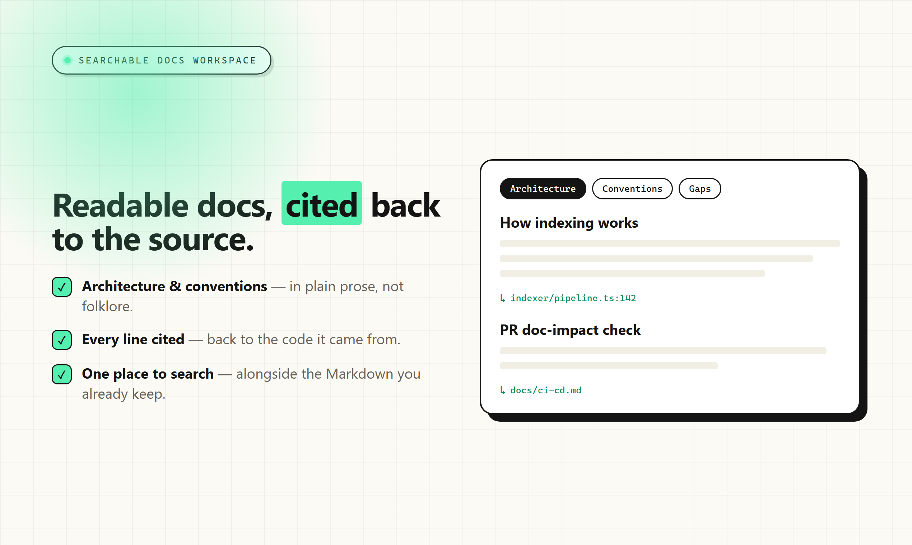

---

## 17. [ConnectWizard](https://www.producthunt.com/products/connectwizard)
**Votes**: 92 | **도입 난이도**: 중 | **신뢰도**: 상
**Tagline**: Unlock hidden App Store Connect analytics
**서비스 링크**: https://www.producthunt.com/r/L6JVQ3OTDIUPEN

**태그**: DevTool, Analytics, iOS, AppStore, AI Tool

### 📌 이 서비스 한눈에 보기
애플이 제공하는 기본 통계를 넘어 100여 가지 이상의 심층 앱 데이터를 분석할 수 있는 도구

### 🔑 주요 기능
- App Store Connect에서 제공하지 않는 100개 이상의 다양한 리포트 유형 제공
- 앱 스토어 데이터와 사용자 기기 내 데이터를 결합한 심층 분석
- Live Activities 사용 시간 및 Shortcuts 실행 상태 등 프레임워크 활용 데이터 제공

### 🙋 사용자에게 어떤 점이 좋은가
기존 앱 스토어 통계에서 놓쳤던 세부 데이터를 통해 앱 성능과 사용자 경험을 정밀하게 최적화할 수 있습니다.

### ✅ 지금 바로 써볼 기능
- 사전 정의된 통계 대시보드 확인하기
- 중요한 지표를 핀(Pin)으로 고정하여 모니터링하기
- 원하는 분석을 위한 커스텀 프리셋 구축하기

### ⚠️ 사용 전 확인할 점
- 기기 내 데이터 수집에 따른 사용자 개인정보 보호 정책 준수 여부 확인 필요
- 대규모 사용자 기반이 있는 경우에만 제공되는 고급 프레임워크 데이터 확인

### 🧭 확인이 더 필요한 정보
데이터 수집 방식이 사용자의 기기 권한을 어떻게 활용하는지에 대한 구체적인 정보가 필요합니다.

### 📸 스크린샷 및 갤러리
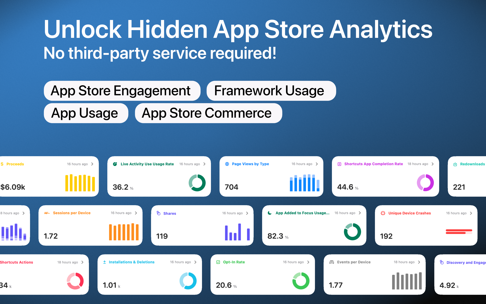
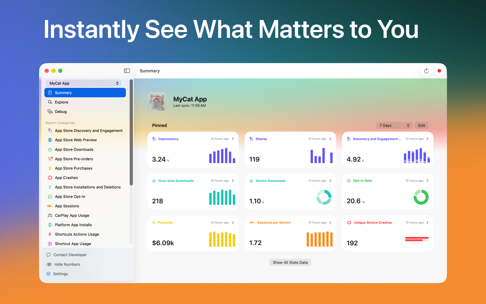
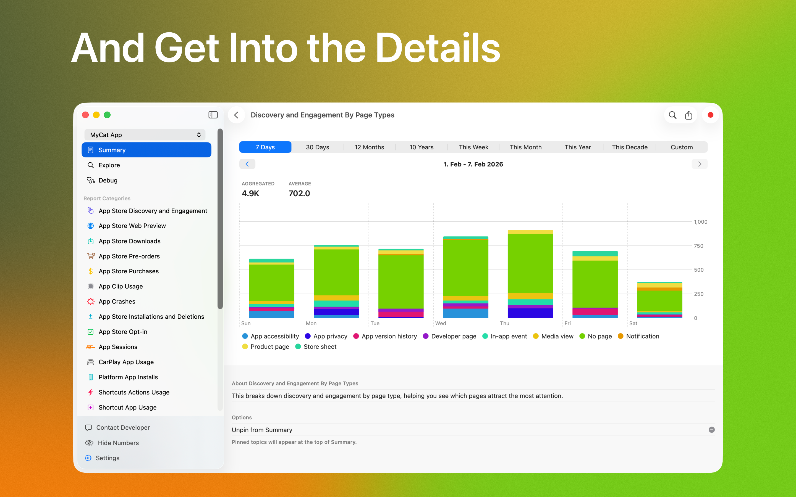

---

## 18. [Mirowl](https://www.producthunt.com/products/mirowl)
**Votes**: 86 | **도입 난이도**: 하 | **신뢰도**: 상
**Tagline**: Search all your screenshots via a local OCR-powered AI
**서비스 링크**: https://www.producthunt.com/r/CLAJKECMNOXO7O

**태그**: Productivity, macOS, OCR, Search, Utility, AI Tool, Vision

### 📌 이 서비스 한눈에 보기
로컬 OCR 기술을 활용해 내 맥에 저장된 모든 스크린샷을 즉시 검색할 수 있는 도구

### 🔑 주요 기능
- Rust/Tauri 기반의 가볍고 빠른 로컬 우선(Local-first) 설계
- macOS 네이티브 Vision 프레임워크를 활용한 높은 OCR 정확도
- 개인정보 보호를 중시하는 트래킹 없는 데이터 처리 방식

### 🙋 사용자에게 어떤 점이 좋은가
수많은 스크린샷 속에 묻혀 있는 텍스트 정보를 일일이 찾을 필요 없이, 키워드 검색만으로 필요한 이미지를 즉시 찾아낼 수 있습니다.

### ✅ 지금 바로 써볼 기능
- 기존 스크린샷 폴더를 인덱싱하여 검색 기능 테스트하기
- 이미지 내 텍스트 검색 정확도 확인하기
- 백그라운드 리소스 점유율 확인하기

### ⚠️ 사용 전 확인할 점
- macOS 전용 앱이므로 윈도우 등 타 OS에서는 사용 불가
- 대량의 이미지 인덱싱 시 초기 CPU/메모리 사용량 확인 필요

### 🧭 확인이 더 필요한 정보
클라우드 옵션 사용 시 데이터 동기화 범위와 비용 정책에 대한 정보가 추가로 필요합니다.

### 📸 스크린샷 및 갤러리
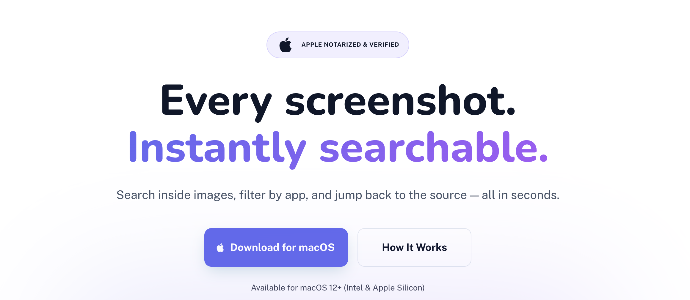
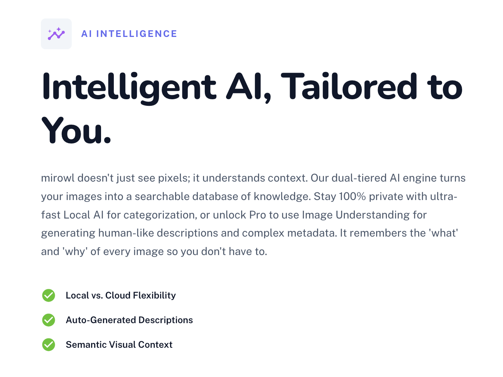
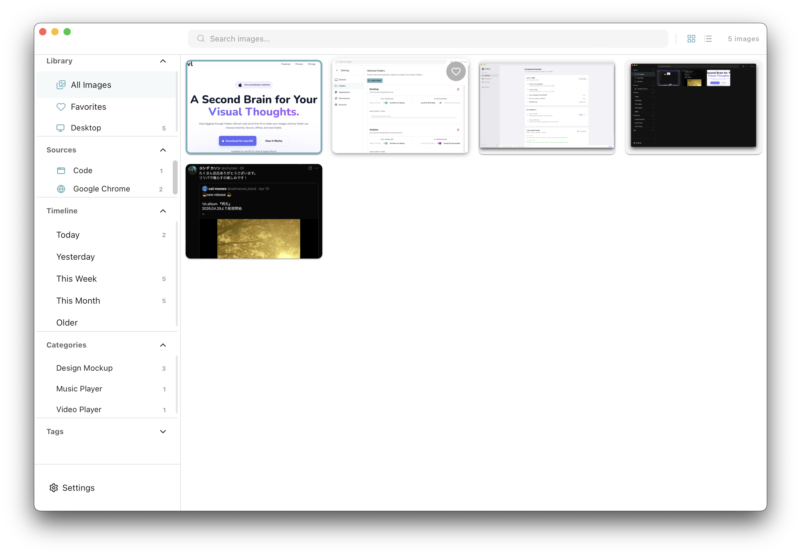

### 🎬 관련 영상
- [🎥 영상 보기](https://ph-files.imgix.net/0b9f12c3-7fea-4381-aecb-ab341576e077.jpeg?auto=format)

---

## 19. [Overline](https://www.producthunt.com/products/overline-2)
**Votes**: 81 | **도입 난이도**: 하 | **신뢰도**: 상
**Tagline**: Real-time AI captions and translation for any browser video
**서비스 링크**: https://www.producthunt.com/r/6ZFH4LYCJXVVHO

**태그**: Productivity, AI, Browser Extension, Translation, AI Tool, Video

### 📌 이 서비스 한눈에 보기
브라우저 내 모든 영상에 실시간 AI 자막과 번역을 입혀주는 크롬 확장 프로그램

### 🔑 주요 기능
- 유튜브, 넷플릭스, 줌 등 모든 브라우저 영상에 실시간 자막 및 번역 제공
- 탭 전환이나 별도의 자막 파일 없이 즉각적인 시각화 가능
- 1초 미만의 초저지연(Sub-second latency) 기술 적용

### 🙋 사용자에게 어떤 점이 좋은가
언어 장벽 없이 웹상의 모든 영상 콘텐츠를 실시간으로 시청하고 소통할 수 있습니다.

### ✅ 지금 바로 써볼 기능
- 유튜브나 트위치 영상에서 실시간 자막 기능 테스트하기
- 외국어 영상 시청 시 실시간 번역 기능 활용하기
- 줌(Zoom) 등 화상 회의 시 자막 기능 적용해보기

### ⚠️ 사용 전 확인할 점
- 실시간 오디오 스트리밍 방식이므로 마이크/스피커 설정에 따른 영향 가능성
- 브라우저 확장 프로그램 설치에 따른 리소스 사용량 확인 필요

### 🧭 확인이 더 필요한 정보
지원되는 언어의 종류와 정확도에 대한 구체적인 정보가 명시되지 않았습니다.

### 📸 스크린샷 및 갤러리

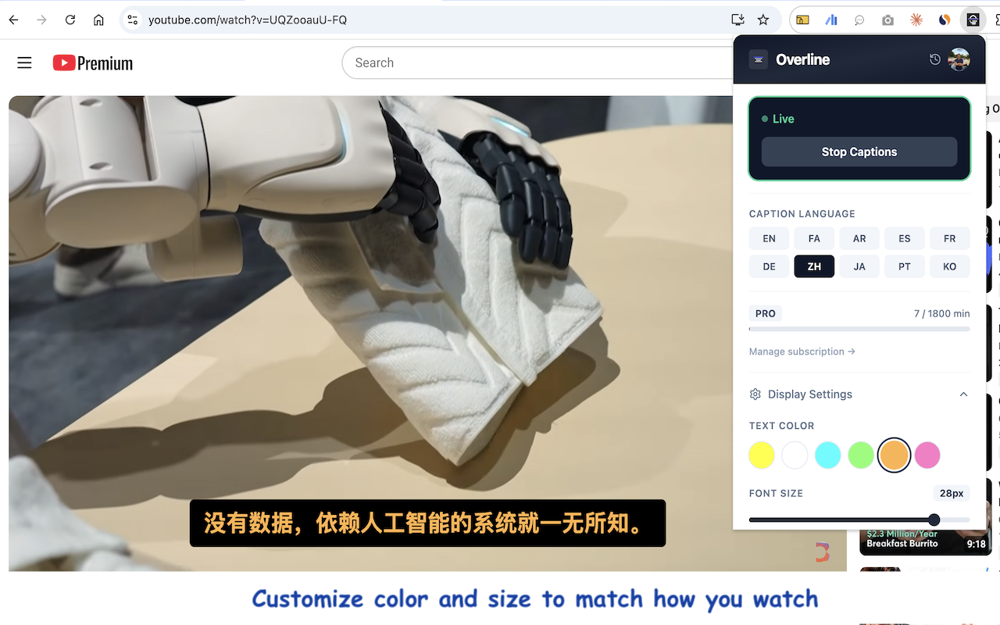

### 🎬 관련 영상
- [🎥 영상 보기](https://ph-files.imgix.net/a71baa77-7dd7-4948-80de-678f3d5baef4.jpeg?auto=format)

---

## 20. [Galleroo](https://www.producthunt.com/products/galleroo)
**Votes**: 80 | **도입 난이도**: 하 | **신뢰도**: 상
**Tagline**: Turn your Google Drive into a stunning client gallery
**서비스 링크**: https://www.producthunt.com/r/WFAZAYCABIG4K5

**태그**: Productivity, DesignTool, Automation, Workflow

### 📌 이 서비스 한눈에 보기
구글 드라이브 폴더를 60초 만에 아름다운 클라이언트 전용 갤러리로 변환해주는 도구

### 🔑 주요 기능
- 구글 드라이브 폴더를 즉시 세련된 갤러리 웹사이트로 변환
- 파일 재업로드 없이 기존 드라이브 자원 활용
- 비밀번호 보호 기능 및 클라이언트 계정 불필요

### 🙋 사용자에게 어떤 점이 좋은가
사진 작가나 디자이너가 파일을 별도로 업로드하는 번거로움 없이, 기존 워크플로우를 유지하며 고객에게 전문적인 결과물을 전달할 수 있습니다.

### ✅ 지금 바로 써볼 기능
- 구글 드라이브 폴더 연결하기
- 비밀번호 설정하여 보안 적용하기
- 생성된 갤러리 링크 클라이언트에게 공유하기

### ⚠️ 사용 전 확인할 점
- 구글 드라이브 권한 설정에 따른 접근 제어 확인 필요
- 갤러리 디자인 커스텀 범위 확인 필요

### 🧭 확인이 더 필요한 정보
구글 드라이브 용량 제한이나 동기화 속도에 대한 구체적인 정보는 명시되지 않았습니다.

### 📸 스크린샷 및 갤러리

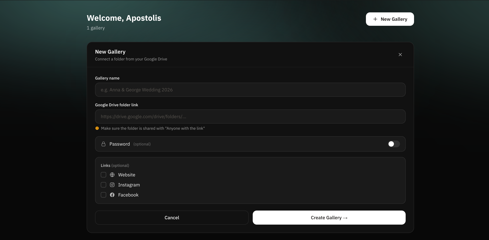

### 🎬 관련 영상
- [🎥 영상 보기](https://ph-files.imgix.net/df022a93-da2c-4932-873d-cda083b61e0f.jpeg?auto=format)

---

## 21. [findloc.ai ](https://www.producthunt.com/products/findloc-ai-business-location-research)
**Votes**: 79 | **도입 난이도**: 하 | **신뢰도**: 상
**Tagline**: Make your business citable by ChatGPT, Claude & Perplexity
**서비스 링크**: https://www.producthunt.com/r/3FU7B2QOWFSIS2

**태그**: Local SEO, AI Optimization, Marketing Tool, AI Tool, Chat

### 📌 이 서비스 한눈에 보기
AI 검색 엔진(ChatGPT, Claude 등)에 내 비즈니스가 노출되도록 최적화된 미니 페이지를 생성합니다.

### 🔑 주요 기능
- AI 답변에 인용될 수 있는 구조화된 데이터(Schema, FAQ) 제공
- 로컬 비즈니스를 위한 AI 가시성 확보
- 무료 AI 가시성 미니 페이지 생성

### 🙋 사용자에게 어떤 점이 좋은가
AI 기반 검색이 늘어남에 따라, 검색 결과에서 소외될 수 있는 지역 소상공인이 AI 답변에 자신의 사업장이 추천되도록 돕습니다.

### ✅ 지금 바로 써볼 기능
- 무료 미니 페이지 생성하기
- 제공되는 스키마 및 구조화 데이터 확인하기
- 생성된 페이지를 비즈니스 채널에 활용하기

### ⚠️ 사용 전 확인할 점
- 미니 페이지 생성만으로 모든 AI 검색 엔진에 즉각 반영되지 않을 수 있음
- 기존 웹사이트와의 연동 방식에 따른 SEO 영향 확인 필요

### 🧭 확인이 더 필요한 정보
무료 제공 범위와 향후 유료 기능 전환에 대한 구체적인 정책 확인이 필요합니다.

### 📸 스크린샷 및 갤러리
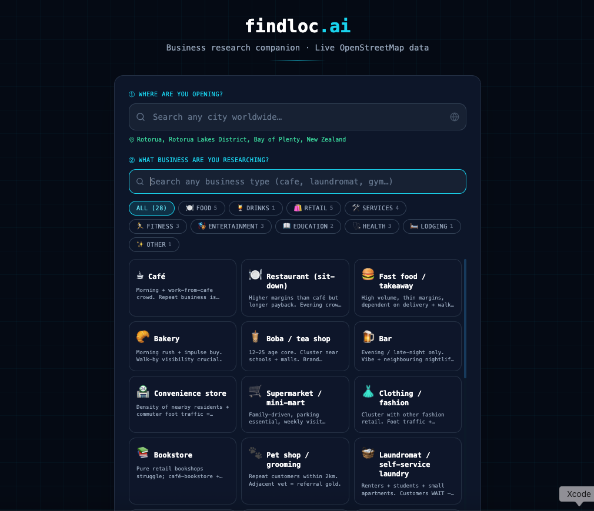
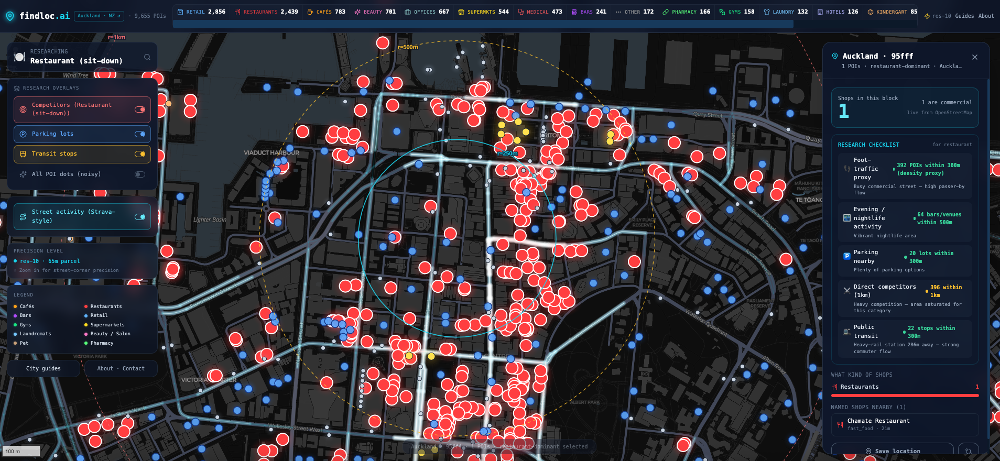
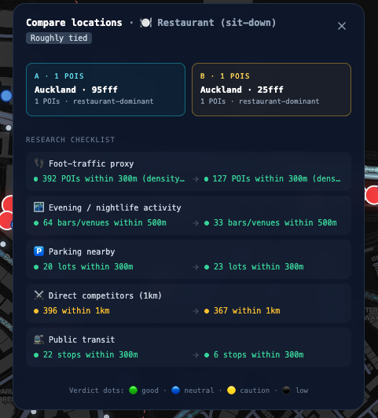

---

## 22. [Sortail](https://www.producthunt.com/products/sortail)
**Votes**: 77 | **도입 난이도**: 하 | **신뢰도**: 상
**Tagline**: Self-learning one-click inbox cleanup for Apple Mail
**서비스 링크**: https://www.producthunt.com/r/MVCOHK5BZ6UWG2

**태그**: Productivity, Automation, AppleMail, AI Tool, Email

### 📌 이 서비스 한눈에 보기
애플 메일 사용자를 위한 원클릭 자동 이메일 정리 도구

### 🔑 주요 기능
- 애플 메일 위에 떠 있는 플로팅 툴바 제공
- 단일 메시지, 스레드 또는 발신자 단위의 빠른 정리 기능
- 사용자의 패턴을 학습하여 적절한 폴더를 제안하는 지능형 기능

### 🙋 사용자에게 어떤 점이 좋은가
복잡한 받은 편지함을 클릭 한 번으로 정리할 수 있으며, 학습 기능을 통해 점차 자동화된 정리 환경을 구축할 수 있습니다.

### ✅ 지금 바로 써볼 기능
- 플로팅 툴바를 통한 원클릭 정리 기능 테스트
- 학습된 폴더 제안 기능 확인
- 스레드 단위 정리 기능 활용

### ⚠️ 사용 전 확인할 점
- 애플 메일 앱 전용이므로 타 이메일 클라이언트에서는 사용 불가
- 학습 데이터가 쌓이기 전까지는 수동 정리가 필요할 수 있음

### 🧭 확인이 더 필요한 정보
학습 알고리즘의 정확도와 개인정보 보호 방식에 대한 구체적인 정보가 필요합니다.

### 📸 스크린샷 및 갤러리
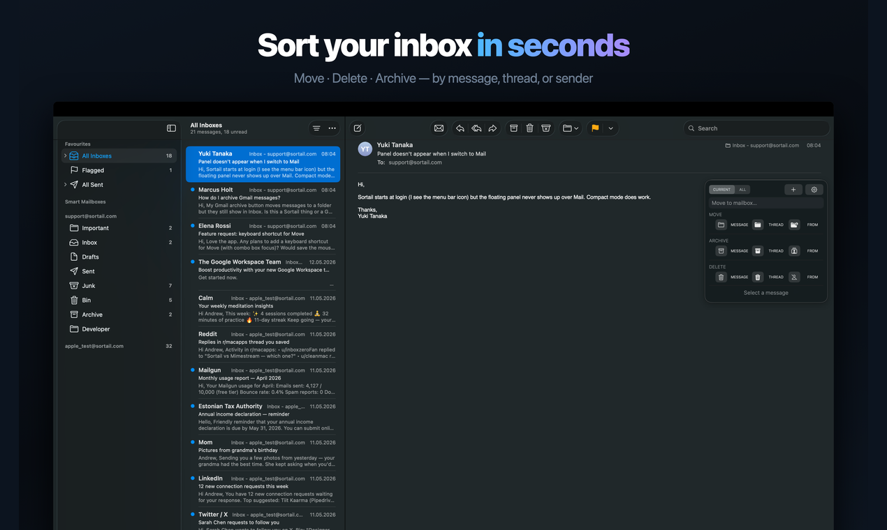
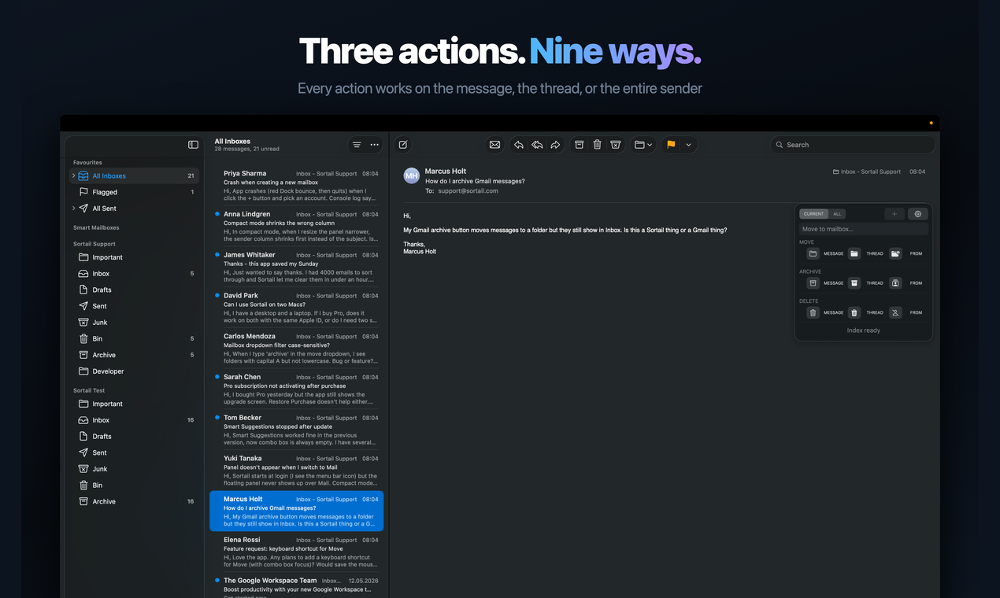
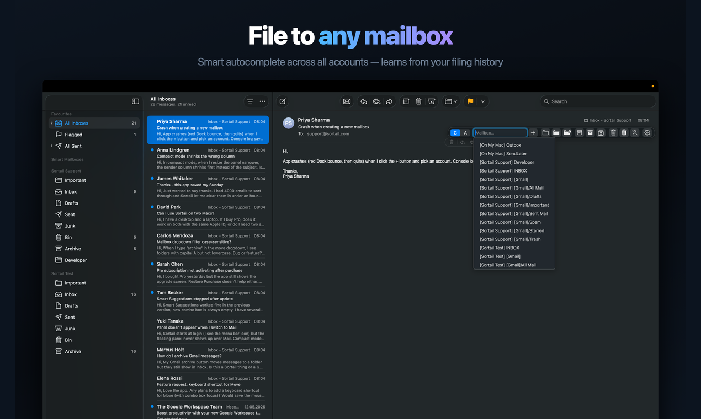

---

## 23. [MartinLoop](https://www.producthunt.com/products/martinloop)
**Votes**: 76 | **도입 난이도**: 중 | **신뢰도**: 상
**Tagline**: Control AI coding agents with limits, proof, + run receipts
**서비스 링크**: https://www.producthunt.com/r/A5UNDIKPP4SOH4

**태그**: DevTool, AI-Agent, Automation, Observability, Agent, AI Tool

### 📌 이 서비스 한눈에 보기
자율형 AI 코딩 에이전트의 비용과 안전성을 관리하는 통합 컨트롤 플레인

### 🔑 주요 기능
- Claude, Codex 등 다양한 AI 에이전트를 위한 통합 제어 환경 제공
- 지출 한도 설정, 안전 규칙, 롤백 기능을 통한 에이전트 오작동 방지
- 에이전트의 작업 기록(Run Receipts) 및 실행 근거를 통한 투명한 모니터링

### 🙋 사용자에게 어떤 점이 좋은가
AI 에이전트의 무분별한 비용 지출과 예측 불가능한 동작을 제어하여, 팀 단위의 안전하고 효율적인 AI 개발 환경을 구축할 수 있습니다.

### ✅ 지금 바로 써볼 기능
- 사용 중인 AI 에이전트와 MartinLoop 연동 테스트
- 에이전트별 지출 한도(Spend Limits) 및 안전 규칙 설정
- 실행 기록(Run Receipts)을 통한 작업 로그 검토

### ⚠️ 사용 전 확인할 점
- 에이전트 모델(Claude, Codex 등)과의 호환성 확인 필요
- 제어 규칙 설정 시 개발 워크플로우의 병목 현상 발생 가능성

### 🧭 확인이 더 필요한 정보
현재 제공되는 구체적인 연동 방식과 HeadlessOS 스타일의 실행 환경에 대한 상세 기술 사양 확인이 필요합니다.

### 📸 스크린샷 및 갤러리
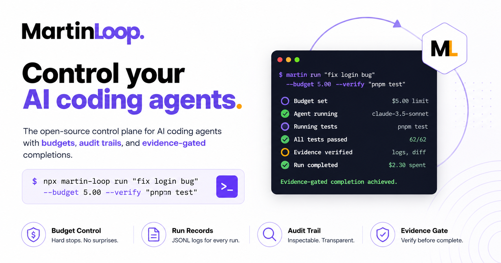
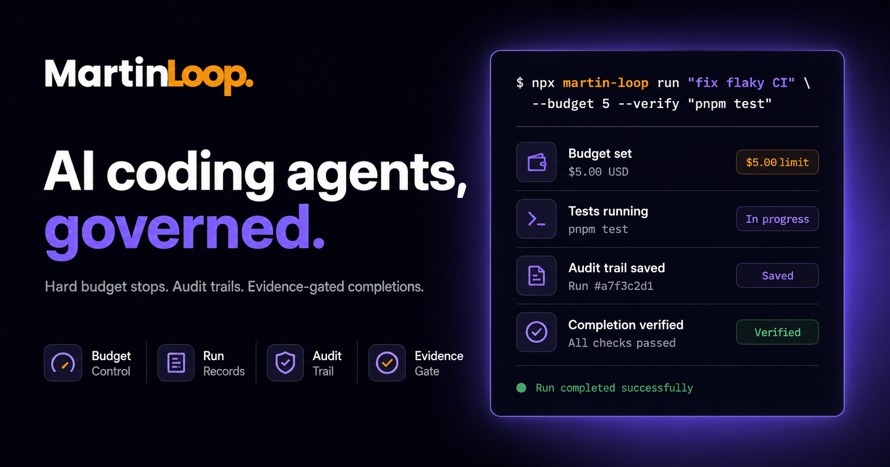
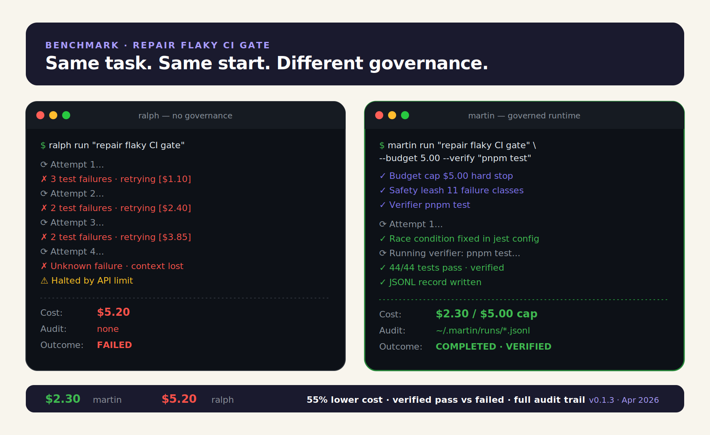

---

## 24. [RingDisk](https://www.producthunt.com/products/ringdisk)
**Votes**: 75 | **도입 난이도**: 하 | **신뢰도**: 상
**Tagline**: Brighten your video calls with different toned ring lights
**서비스 링크**: https://www.producthunt.com/r/GN5UWA4RWLYO2L

**태그**: Productivity, Video Conferencing, macOS, Creative Tool, AI Tool, Video, Design

### 📌 이 서비스 한눈에 보기
macOS 전용 소프트웨어로 화상 회의 시 스튜디오급 조명 효과를 제공하는 링 라이트 도구

### 🔑 주요 기능
- 화면 테두리에 빛을 생성하여 얼굴을 밝혀주는 가상 링 라이트 기능
- Zoom, Google Meet, Microsoft Teams 등 주요 화상 회의 플랫폼 호환
- macOS에 최적화된 가볍고 사용하기 쉬운 인터페이스

### 🙋 사용자에게 어떤 점이 좋은가
별도의 물리적 조명 장비 없이도 어두운 환경에서 전문적인 화상 회의 및 셀프 영상 촬영이 가능합니다.

### ✅ 지금 바로 써볼 기능
- 사용 중인 화상 회의 앱에서 조명 효과 적용하기
- 상황에 맞는 다양한 톤의 조명 설정 테스트하기

### ⚠️ 사용 전 확인할 점
- macOS 전용 제품이므로 Windows 사용자 사용 불가
- 화면 테두리 조명 방식이므로 모니터 밝기나 주변 환경에 따라 효과 차이 발생 가능

### 🧭 확인이 더 필요한 정보
하드웨어 조명 장비 없이 소프트웨어만으로 어느 정도의 광량을 확보할 수 있는지 확인이 필요합니다.

### 📸 스크린샷 및 갤러리

---

## 25. [HumToBeats](https://www.producthunt.com/products/humtobeats)
**Votes**: 74 | **도입 난이도**: 하 | **신뢰도**: 상
**Tagline**: Turn humming into AI-generated beats
**서비스 링크**: https://www.producthunt.com/r/CNA5F3CCQS35KC

**태그**: AI-Music, CreativeTool, EDM, Web-Based, Automation, AI Tool

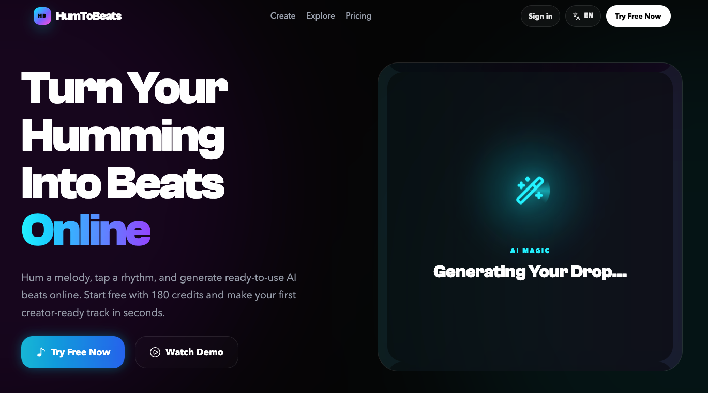

### 📌 이 서비스 한눈에 보기
허밍과 박자 태핑만으로 즉석에서 EDM 비트를 생성하는 AI 음악 제작 도구

### 🔑 주요 기능
- 허밍과 리듬 태핑을 통한 직관적인 멜로디 입력
- AI를 활용한 EDM 비트, 드롭, 데모 트랙 자동 생성
- 브라우저 내에서 한 번에 이루어지는 생성 및 리믹스 워크플로우

### 🙋 사용자에게 어떤 점이 좋은가
악기 연주나 복잡한 DAW 숙련도 없이도 아이디어를 즉시 음악 작업물로 변환할 수 있습니다.

### ✅ 지금 바로 써볼 기능
- 흥얼거리는 멜로디로 기본 트랙 생성하기
- 리듬 태핑을 통해 비트 질감 조절하기
- 생성된 트랙을 리믹스하여 완성도 높이기

### ⚠️ 사용 전 확인할 점
- 입력하는 음질이나 리듬 정확도에 따른 결과물 차이 가능성
- 생성된 음악의 저작권 및 상업적 이용 권한 확인 필요

### 🧭 확인이 더 필요한 정보
상세한 편집 기능의 범위와 생성된 음원의 저작권 정책에 대한 정보가 추가로 필요합니다.

### 📸 스크린샷 및 갤러리
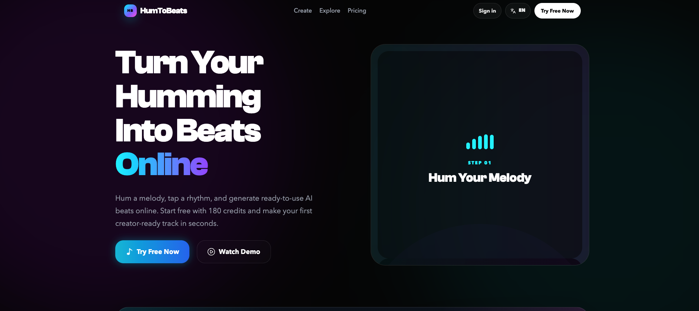
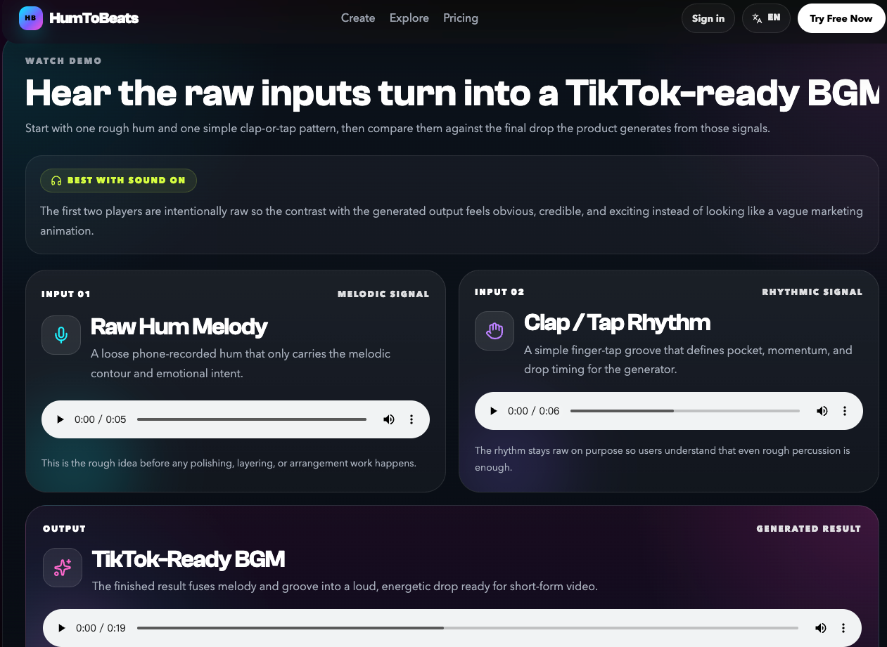
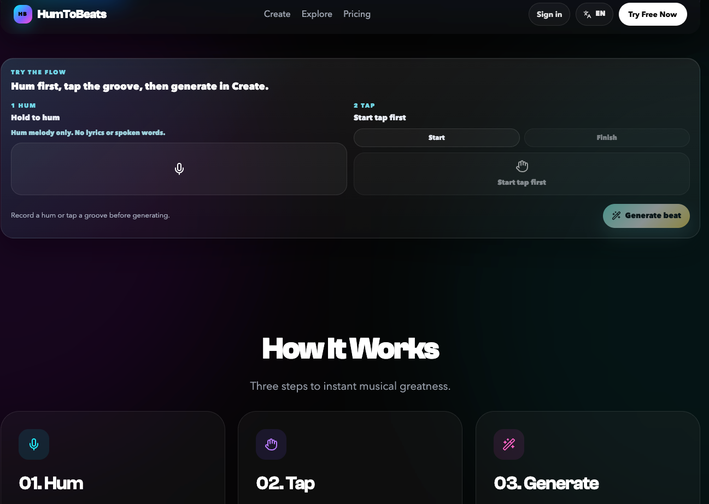

### 🎬 관련 영상
- [🎥 영상 보기](https://ph-files.imgix.net/f4d2f9a0-c3a8-4f9e-921d-d72618c2d221.jpeg?auto=format)

---

## 26. [PufferPages](https://www.producthunt.com/products/pufferpages)
**Votes**: 43 | **도입 난이도**: 하 | **신뢰도**: 상
**Tagline**: The visual journal that turns your days into comics
**서비스 링크**: https://www.producthunt.com/r/L7PYRN4AGU64J3

**태그**: AI-Art, Journaling, Creativity, Lifestyle, AI Tool

### 📌 이 서비스 한눈에 보기
일상의 순간을 한 편의 만화로 기록하는 비주얼 저널 서비스

### 🔑 주요 기능
- 짧은 텍스트나 음성 입력만으로 만화 페이지 자동 생성
- 애니메이션, 수채화 등 8가지 맞춤형 아트 스타일 제공
- 주간 단위 이슈 및 연간 단위 코믹북 출판 기능

### 🙋 사용자에게 어떤 점이 좋은가
일상의 소중한 순간들을 번거로운 드로잉 없이도 예술적인 만화로 간직할 수 있습니다.

### ✅ 지금 바로 써볼 기능
- 첫 번째 무료 코믹 생성해보기
- 8가지 스타일 중 선호하는 화풍 선택하기
- 일상의 순간을 1~3문장으로 입력해보기

### ⚠️ 사용 전 확인할 점
- 사용자, 지인, 반려동물의 외형 구현 정확도 확인 필요
- 무료 제공 이후의 유료 전환 정책 확인 필요

### 🧭 확인이 더 필요한 정보
무료 체험 이후의 구체적인 구독 모델 및 인쇄 서비스 비용에 대한 정보가 명시되지 않았습니다.

### 📸 스크린샷 및 갤러리

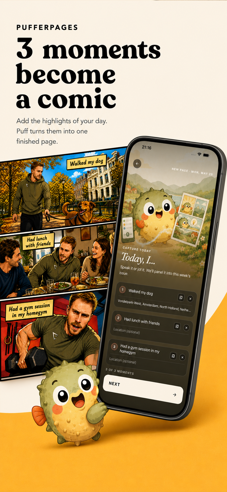

### 🎬 관련 영상
- [🎥 영상 보기](https://ph-files.imgix.net/25b07a20-76ff-4455-ae34-0220b6cbb719.jpeg?auto=format)

---

## 27. [Superlist MCP](https://www.producthunt.com/products/superlist)
**Votes**: 28 | **도입 난이도**: 중 | **신뢰도**: 상
**Tagline**: The task layer for your AI agents
**서비스 링크**: https://www.producthunt.com/r/KDXWV6WFIWODP4

**태그**: AI, Automation, Productivity, Workflow, Agent, AI Tool, Chat, Prompting

### 📌 이 서비스 한눈에 보기
AI 에이전트와 Superlist를 직접 연결하여 대화만으로 할 일을 관리하는 자동화 레이어

### 🔑 주요 기능
- Claude, ChatGPT, Cursor 등 MCP 호환 AI 에이전트와 직접 연동
- 자연어 프롬프트를 통한 작업 생성, 마감일 설정 및 리스트 관리
- 복사 및 붙여넣기 없는 워크플로우 자동화

### 🙋 사용자에게 어떤 점이 좋은가
AI와 대화하며 즉시 할 일을 생성하고 관리할 수 있어, 별도의 앱 전환 없이도 업무 흐름을 끊김 없이 유지할 수 있습니다.

### ✅ 지금 바로 써볼 기능
- MCP 호환 AI 에이전트 설정하기
- 자연어 프롬프트로 첫 번째 작업 생성해보기
- 반복되는 루틴 자동화 설정하기

### ⚠️ 사용 전 확인할 점
- MCP 프로토콜을 지원하는 환경 설정이 필요함
- AI 에이전트의 프롬프트 이해도에 따라 작업 정확도가 달라질 수 있음

### 🧭 확인이 더 필요한 정보
사용 중인 특정 AI 에이전트 모델과의 호환성 및 상세 설정 방법 확인이 필요합니다.

### 📸 스크린샷 및 갤러리
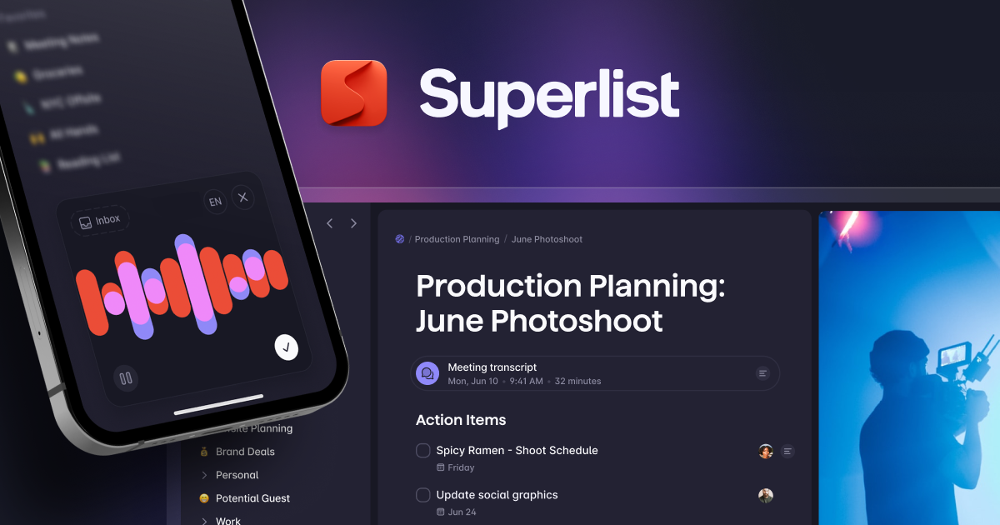
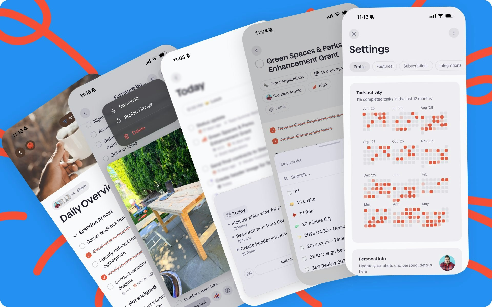

---

## 28. [Deckly](https://www.producthunt.com/products/retainsure)
**Votes**: 25 | **도입 난이도**: 하 | **신뢰도**: 상
**Tagline**: Turn raw product usage data into a revenue driving deck
**서비스 링크**: https://www.producthunt.com/r/XTAZSWXDBZDYSY

**태그**: SaaS, Automation, Customer Success, Productivity, AI Tool

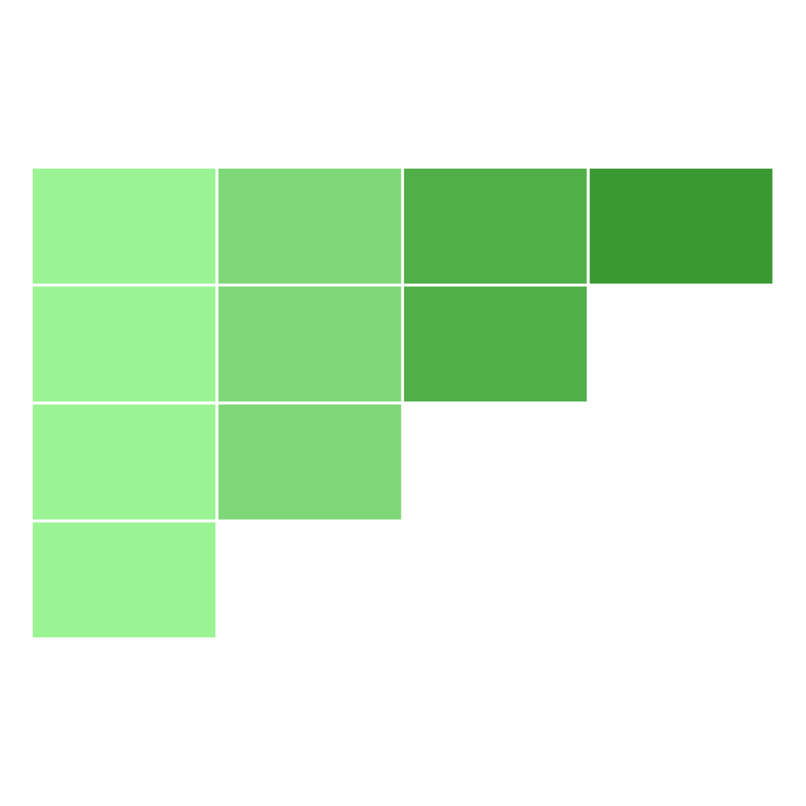

### 📌 이 서비스 한눈에 보기
고객 사용 데이터를 기반으로 단 4분 만에 맞춤형 QBR 발표 자료를 생성하는 자동화 도구

### 🔑 주요 기능
- 수 시간 걸리던 QBR(분기별 비즈니스 리뷰) 제작 시간을 4분으로 단축
- 고객 컨텍스트를 입력하면 즉시 개인화된 프레젠테이션 생성
- 수동 작업이나 템플릿 수정 없이 바로 사용 가능한 결과물 제공

### 🙋 사용자에게 어떤 점이 좋은가
CSM(고객 성공 매니저)이 반복적인 문서 작업에서 벗어나 고객 관계 관리와 전략 수립에 더 집중할 수 있게 해줍니다.

### ✅ 지금 바로 써볼 기능
- 보유 중인 고객 사용 데이터 준비하기
- 고객 컨텍스트 입력하여 데크 생성해보기
- 생성된 결과물의 개인화 수준 확인하기

### ⚠️ 사용 전 확인할 점
- 데이터 보안 및 고객 정보 입력 시 주의 필요
- 자동 생성된 내용의 정확성 및 비즈니스 맥락 검토 필요

### 🧭 확인이 더 필요한 정보
데이터 소스(Raw data)의 어떤 형식을 지원하는지, 외부 툴과의 연동 범위는 어디까지인지 확인이 필요합니다.

### 📸 스크린샷 및 갤러리
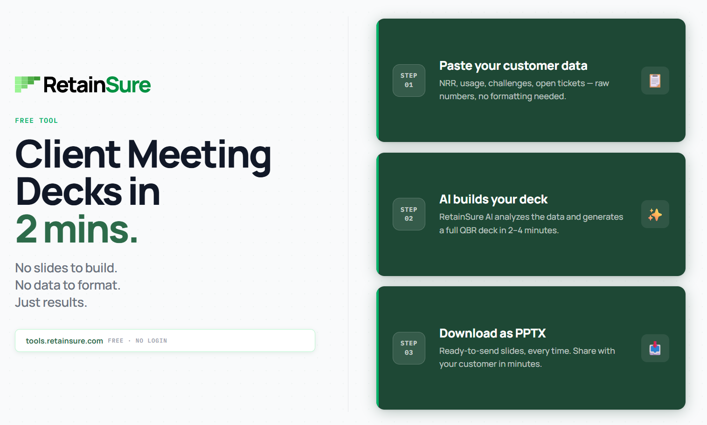
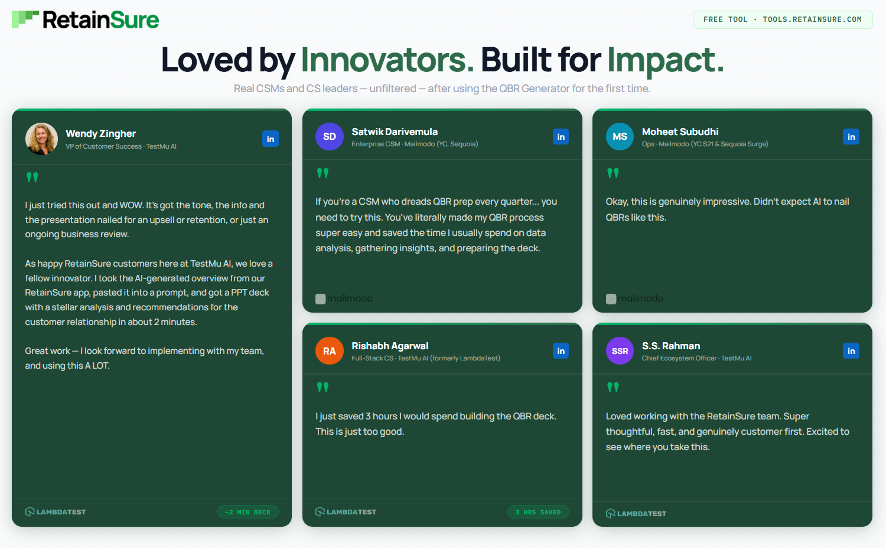

### 🎬 관련 영상
- [🎥 영상 보기](https://ph-files.imgix.net/e492ebd6-e868-49c6-b362-63f33cec58be.jpeg?auto=format)

---

## 29. [GhostPhone](https://www.producthunt.com/products/ghostphone)
**Votes**: 23 | **도입 난이도**: 하 | **신뢰도**: 상
**Tagline**: Number Generator for verification codes, onboarding and QA
**서비스 링크**: https://www.producthunt.com/r/WQVHZIVRFR5UHU

**태그**: DevTool, QA, Growth, Operations, Automation

### 📌 이 서비스 한눈에 보기
글로벌 가상 번호를 통해 인증 코드 수신 및 QA 테스트를 간편하게 수행하는 브라우저 기반 도구

### 🔑 주요 기능
- 전 세계 다양한 지역의 가상 번호 생성 기능
- 별도 기기 없이 브라우저 내 인박스에서 인증 코드 즉시 수신
- QA 테스트, 사용자 온보딩, 보안 운영을 위한 워크플로우 최적화

### 🙋 사용자에게 어떤 점이 좋은가
물리적인 SIM 카드나 추가 기기 없이도 글로벌 서비스의 계정 생성 및 기능 테스트를 효율적으로 수행할 수 있습니다.

### ✅ 지금 바로 써볼 기능
- 필요한 지역의 가상 번호 생성해보기
- 인증 코드 수신 테스트 진행하기
- 팀 내 QA 및 운영 워크플로우에 적용하기

### ⚠️ 사용 전 확인할 점
- 서비스 약관에 따른 정당한 비즈니스 용도 준수 필요
- 특정 서비스의 가상 번호 차단 여부 확인 필요

### 🧭 확인이 더 필요한 정보
구체적인 지원 국가 목록과 번호 유지 비용에 대한 정보가 명시되지 않았습니다.

### 📸 스크린샷 및 갤러리
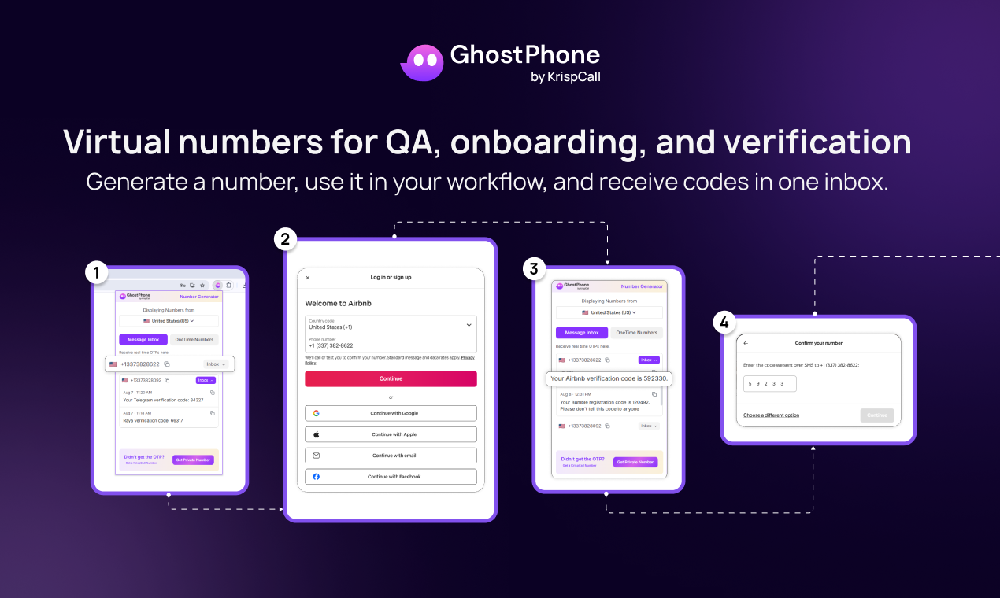
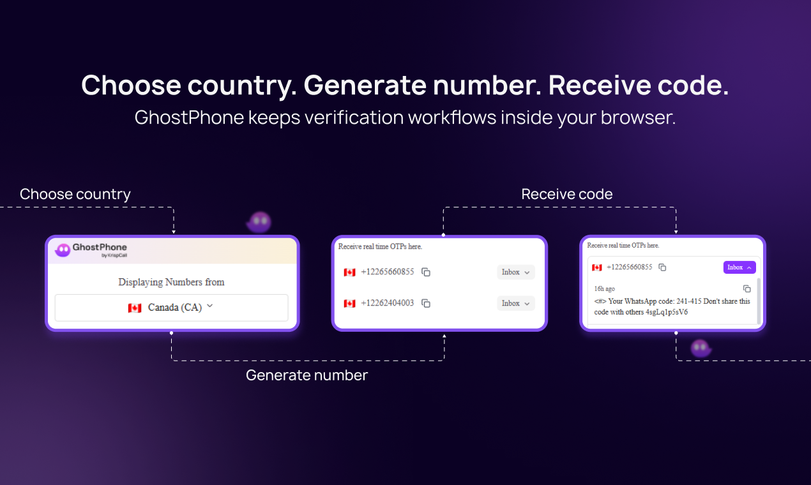
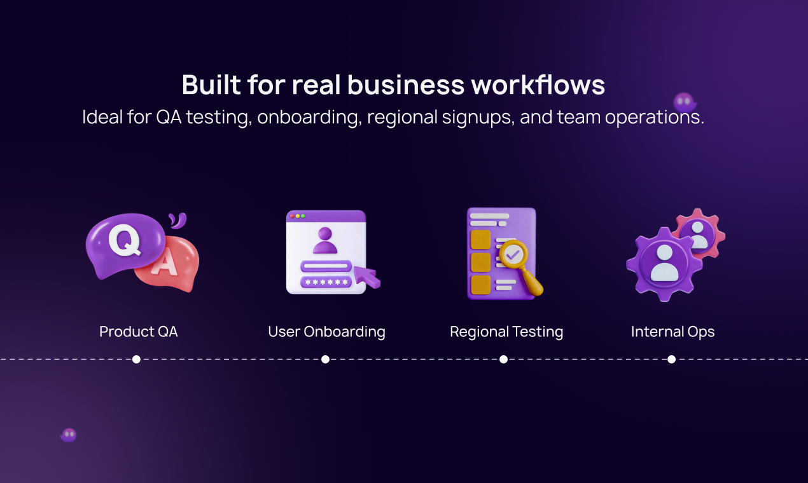

### 🎬 관련 영상
- [🎥 영상 보기](https://ph-files.imgix.net/9185b20b-a56a-4550-be8f-17a2bb81c6f4.jpeg?auto=format)

---

## 30. [Pluria](https://www.producthunt.com/products/pluria)
**Votes**: 23 | **도입 난이도**: 하 | **신뢰도**: 상
**Tagline**: Workspace booking for hybrid teams
**서비스 링크**: https://www.producthunt.com/r/U423UMSUDKVLSG

**태그**: HybridWork, WorkspaceManagement, TeamCollaboration, Operations

### 📌 이 서비스 한눈에 보기
하이브리드 팀을 위한 코워킹 스페이스 예약 및 업무 공간 관리 솔루션

### 🔑 주요 기능
- 분산된 팀을 위한 코워킹 스페이스 예약 기능
- 대면 업무일 조율 및 협업 최적화
- 라틴 아메리카 지역 내 하이브리드 업무 공간 사용량 추적

### 🙋 사용자에게 어떤 점이 좋은가
팀원들이 언제 어디서 모여 일할지 효율적으로 계획하고, 실제 사무실 공간 활용도를 데이터로 관리할 수 있습니다.

### ✅ 지금 바로 써볼 기능
- 코워킹 스페이스 예약 기능 테스트
- 팀 내 대면 업무일 일정 조율 기능 활용
- 공간 사용량 트래킹 대시보드 확인

### ⚠️ 사용 전 확인할 점
- 라틴 아메리카 지역에 특화된 서비스로, 타 지역에서의 서비스 범위 확인 필요
- 물리적 공간과의 연동 방식 확인 필요

### 🧭 확인이 더 필요한 정보
서비스의 글로벌 확장 가능성과 구체적인 공간 연동 방식에 대한 정보가 더 필요합니다.

### 📸 스크린샷 및 갤러리
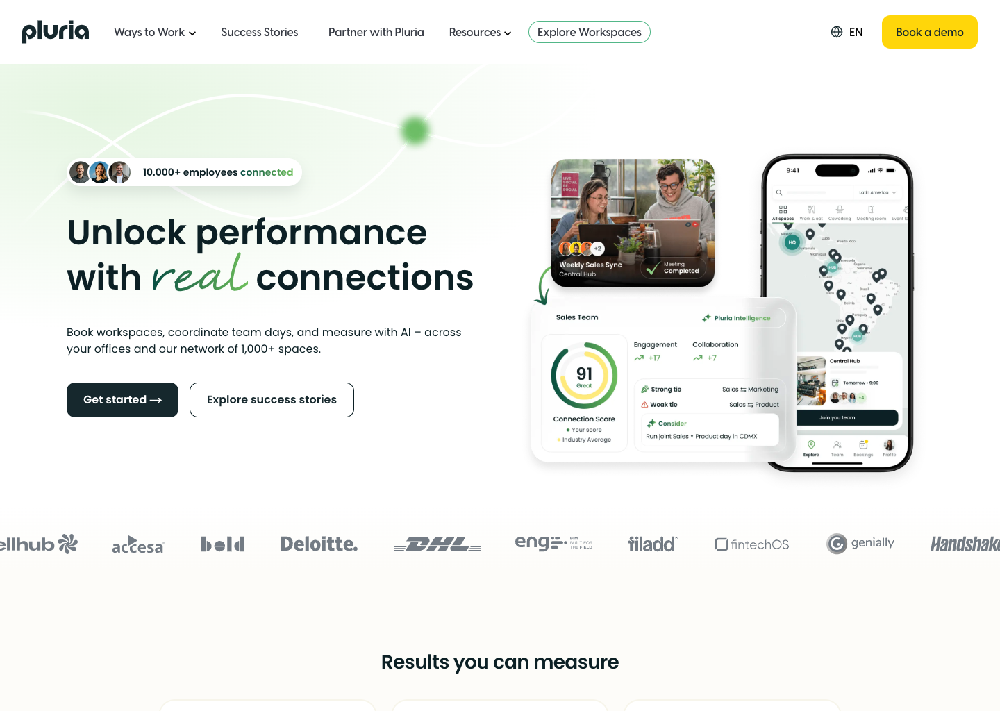

---

