# 🚀 Product Hunt Daily Top 30 (2026-06-05)

## 오늘의 요약
오늘의 트렌드는 AI 에이전트와 자동화 기술을 활용하여 개발, 보안, 마케팅 워크플로우를 혁신하는 솔루션들이 주를 이루었습니다. 특히 복잡한 인프라 설정이나 보안 취약점 대응을 AI가 자율적으로 해결하거나, 실무 데이터를 활용해 모델을 최적화하는 등 실질적인 생산성 향상에 초점이 맞춰졌습니다.

### 오늘의 핵심 포인트
- AI 에이전트가 취약점 탐지부터 코드 수정까지 수행하거나 앱 개발 및 호스팅을 자동화하는 등 자율형 개발/보안 도구가 주목받았습니다.
- 이메일 도달률 확보와 콜드 이메일 인프라 구축을 자동화하여 마케팅 효율을 극대화하는 솔루션들이 높은 관심을 끌었습니다.
- 로컬 환경에서의 멀티모달 모델 구동 및 실사용 데이터를 통한 맞춤형 파인튜닝 등 AI 모델의 효율적 운용과 데이터 자산화가 핵심 과제로 떠올랐습니다.

**오늘의 태그**: AI Automation, AI Agents, Developer Tools, Cybersecurity, Marketing Tech

## 1. [Mailwarm 2.0](https://www.producthunt.com/products/mailwarm)
**Votes**: 436 | **도입 난이도**: 하 | **신뢰도**: 상
**Tagline**: The email warmup tool, upgraded for deliverability.
**서비스 링크**: https://www.producthunt.com/r/SO3HRZHWMYKPDS

**태그**: Email Marketing, Automation, Deliverability, SaaS, AI Tool, Email

### 📌 이 서비스 한눈에 보기
이메일 도달률을 극대화하기 위한 프리미엄 이메일 워밍업 및 관리 시스템

### 🔑 주요 기능
- 자동화된 이메일 워밍업 및 실질적인 사용자 참여 유도
- 인프라 점검 및 지속적인 모니터링 기능 제공
- 모든 구독자를 대상으로 한 전문가 상담 지원

### 🙋 사용자에게 어떤 점이 좋은가
이메일이 스팸함으로 빠지는 문제를 방지하여, 비즈니스 성장에 필수적인 이메일 도달률을 안정적으로 확보할 수 있습니다.

### ✅ 지금 바로 써볼 기능
- 자동 워밍업 기능 설정하기
- 인프라 상태 점검 및 모니터링 시작하기
- 전문가 상담을 통한 도달률 최적화 문의하기

### ⚠️ 사용 전 확인할 점
- 자동화된 워밍업 방식이 사용 중인 이메일 계정 정책에 미치는 영향 확인 필요
- 전문가 상담의 구체적인 범위와 제공 방식 확인 필요

### 🧭 확인이 더 필요한 정보
구체적인 요금제 체계와 전문가 상담의 상세 조건에 대한 정보가 명시되지 않았습니다.

### 📸 스크린샷 및 갤러리

### 🎬 관련 영상
- [🎥 영상 보기](https://ph-files.imgix.net/1bbf6a44-7bc6-4916-87c8-cc1852e46db0.jpeg?auto=format)

---

## 2. [Astra Autonomous Pentest](https://www.producthunt.com/products/astra-security)
**Votes**: 272 | **도입 난이도**: 중 | **신뢰도**: 상
**Tagline**: AI agents that find, validate, and fix every vulnerability
**서비스 링크**: https://www.producthunt.com/r/O3VSUJJCCKGPCG

**태그**: Cybersecurity, AI-Agent, DevSecOps, Automation, Agent, AI Tool, Prompting, DevTool

### 📌 이 서비스 한눈에 보기
취약점 발견부터 검증, 자동 수정까지 수행하는 AI 기반 자율형 모의 해킹 솔루션

### 🔑 주요 기능
- 복합적인 연쇄 취약점을 찾아내는 AI 에이전트 군단 운영
- 독립적인 검증 레이어를 통한 오탐(False Positive) 최소화
- Cursor, Copilot, Claude Code와 연동되는 AI 기반 자동 수정 기능

### 🙋 사용자에게 어떤 점이 좋은가
보안 전문가의 개입을 최소화하면서 소프트웨어의 취약점을 실시간으로 탐지하고, 개발 워크플로우 내에서 즉각적인 수정 코드를 제공받을 수 있습니다.

### ✅ 지금 바로 써볼 기능
- AI 에이전트의 취약점 탐지 및 연쇄 공격 시나리오 확인
- 제공되는 수정 코드를 기존 IDE(Cursor, Copilot 등)에 적용해보기
- 검증 레이어를 통한 오탐율 테스트

### ⚠️ 사용 전 확인할 점
- AI가 생성한 수정 코드가 기존 코드베이스의 로직이나 성능에 미치는 영향 확인 필요
- 자율형 에이전트의 동작이 실제 운영 환경에 미칠 수 있는 보안 및 안정성 리스크 검토

### 🧭 확인이 더 필요한 정보
실제 운영 환경(Production)에 직접 적용 시 발생할 수 있는 안정성 및 권한 관리 정책에 대한 정보가 더 필요합니다.

### 📸 스크린샷 및 갤러리
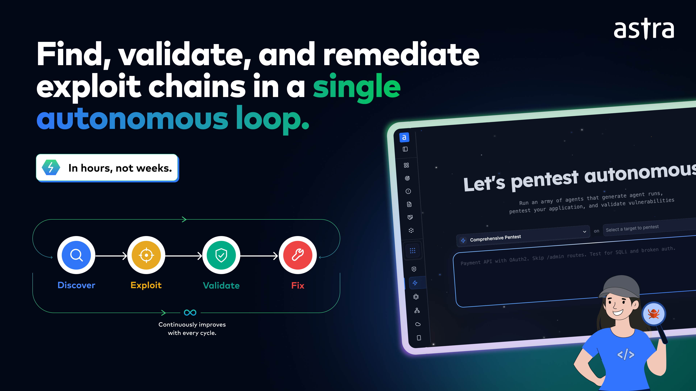
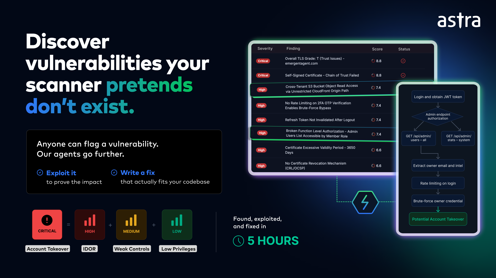
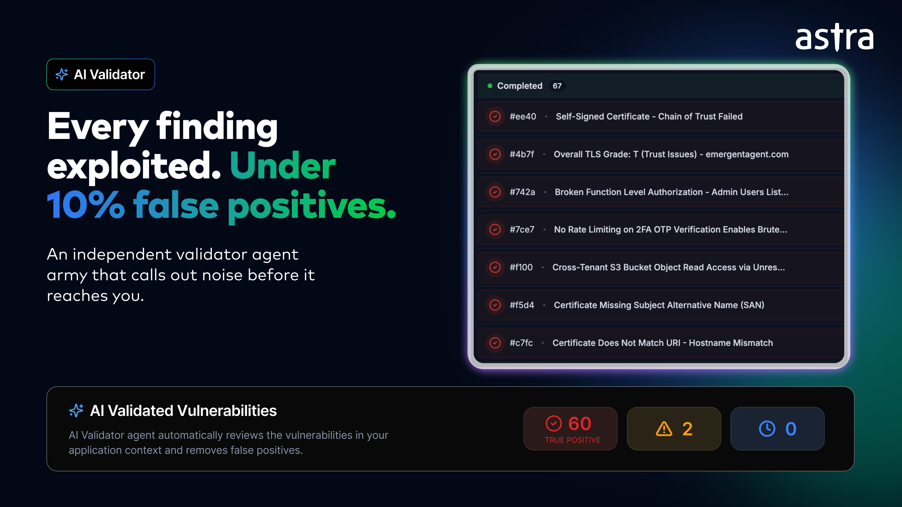

### 🎬 관련 영상
- [🎥 영상 보기](https://ph-files.imgix.net/a43e9b68-966c-49ee-bb20-1e2484391c02.jpeg?auto=format)

---

## 3. [Empromptu AI](https://www.producthunt.com/products/empromptu)
**Votes**: 234 | **도입 난이도**: 중 | **신뢰도**: 상
**Tagline**: Train Fine Tuned Models With AI Apps You're Already Building
**서비스 링크**: https://www.producthunt.com/r/XU4A6F5XDOW3N5

**태그**: AI, MLOps, DevTool, Automation, AI Tool, Prompting

### 📌 이 서비스 한눈에 보기
기존 AI 앱의 실사용 데이터를 활용해 독자적인 맞춤형 모델을 구축하는 자동 파인튜닝 솔루션

### 🔑 주요 기능
- 실시간 AI 워크플로우에서 발생하는 사용자 피드백과 엣지 케이스 자동 수집
- 수집된 데이터를 기반으로 소유 가능한 커스텀 모델 학습
- 모델 최적화를 통한 정확도 향상 및 추론 비용 절감

### 🙋 사용자에게 어떤 점이 좋은가
타사 모델에 대한 의존도를 낮추고, 서비스 운영 과정에서 자연스럽게 쌓이는 데이터를 자산화하여 독자적인 기술 경쟁력을 확보할 수 있습니다.

### ✅ 지금 바로 써볼 기능
- 현재 운영 중인 AI 기능의 데이터 수집 가능 여부 확인
- 실사용 데이터 기반의 파인튜닝 워크플로우 테스트
- 기존 모델 대비 비용 및 성능 개선 지표 설정

### ⚠️ 사용 전 확인할 점
- 학습 데이터의 품질이 모델 성능에 직접적인 영향을 미침
- 데이터 수집 과정에서의 개인정보 보호 및 보안 정책 검토 필요

### 🧭 확인이 더 필요한 정보
현재 지원하는 모델 종류와 기존 인프라와의 통합 방식에 대한 구체적인 정보가 필요합니다.

### 📸 스크린샷 및 갤러리
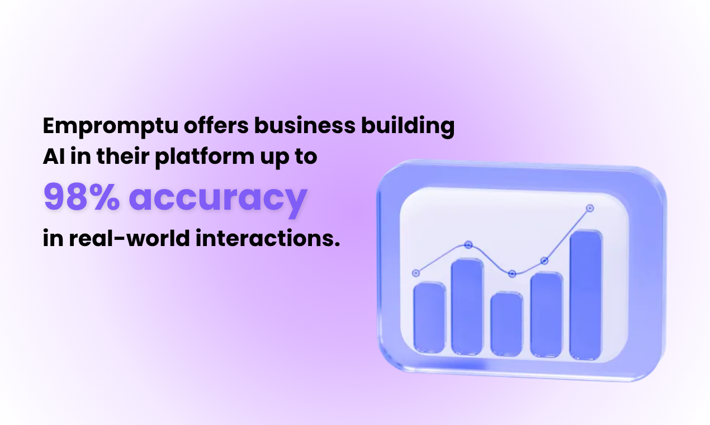
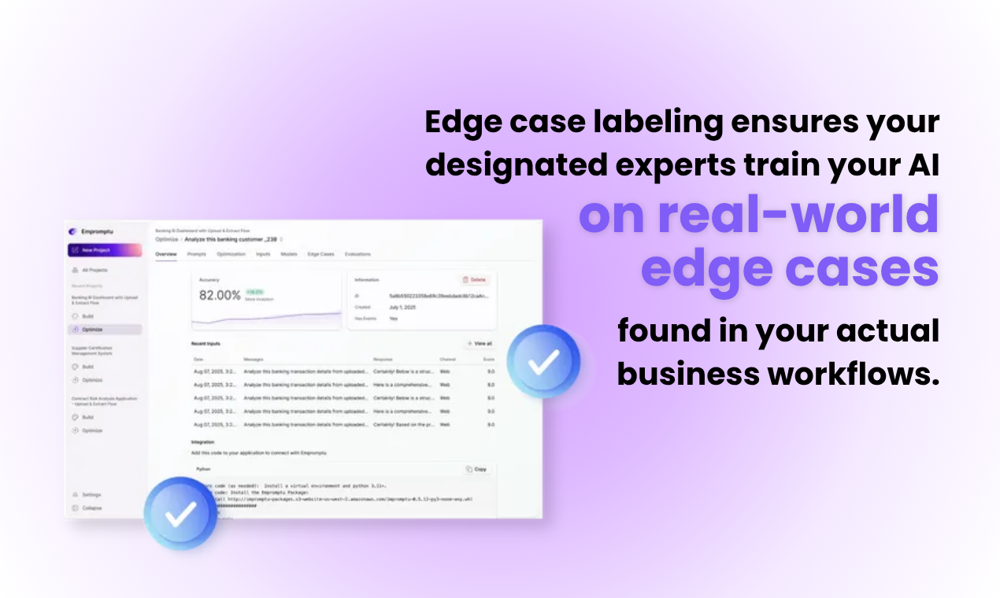
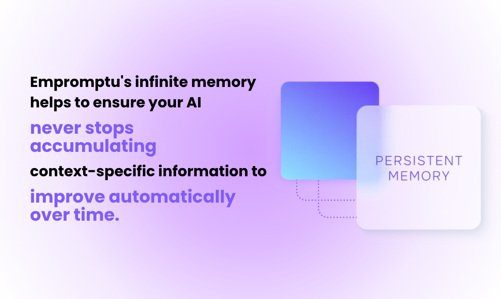

### 🎬 관련 영상
- [🎥 영상 보기](https://ph-files.imgix.net/f54982ba-c1fe-4cb6-a9a4-80496107bec8.jpeg?auto=format)

---

## 4. [Google Gemma 4 12B](https://www.producthunt.com/products/gemma-4-12b)
**Votes**: 193 | **도입 난이도**: 중 | **신뢰도**: 상
**Tagline**: Run multimodal AI locally with an encoder-free architecture
**서비스 링크**: https://www.producthunt.com/r/PUMUEYI4RLRRTW

**태그**: AI, ML, Local-First, Multimodal, DeveloperTool, Agent, AI Tool, DevTool

### 📌 이 서비스 한눈에 보기
별도의 인코더 없이 텍스트, 이미지, 오디오를 로컬에서 직접 처리하는 고성능 멀티모달 AI 모델

### 🔑 주요 기능
- 인코더가 없는 아키텍처로 텍스트, 비전, 오디오를 네이티브하게 처리
- 16GB VRAM 환경에서 구동 가능한 효율적인 모델 크기
- 클라우드 의존성 없는 로컬 기반의 멀티모달 작업 수행

### 🙋 사용자에게 어떤 점이 좋은가
클라우드 비용이나 데이터 보안 걱정 없이 개인 워크스테이션에서 강력한 멀티모달 에이전트를 구축할 수 있습니다.

### ✅ 지금 바로 써볼 기능
- 16GB 이상의 VRAM 환경 구축
- 로컬 에이전트 애플리케이션 프로토타이핑
- 멀티모달 데이터 처리 워크플로우 테스트

### ⚠️ 사용 전 확인할 점
- 최소 16GB VRAM 확보 필요
- 로컬 환경의 하드웨어 성능에 따른 추론 속도 차이

### 🧭 확인이 더 필요한 정보
특정 하드웨어 가속기(GPU)에 따른 최적화 수준과 구체적인 추론 속도 정보가 필요합니다.

### 📸 스크린샷 및 갤러리
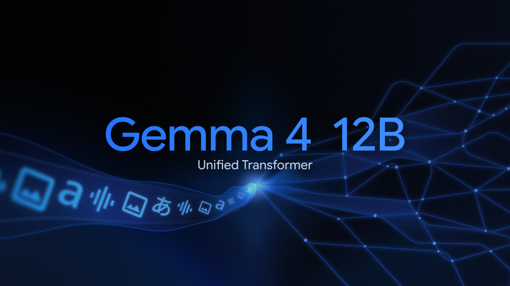
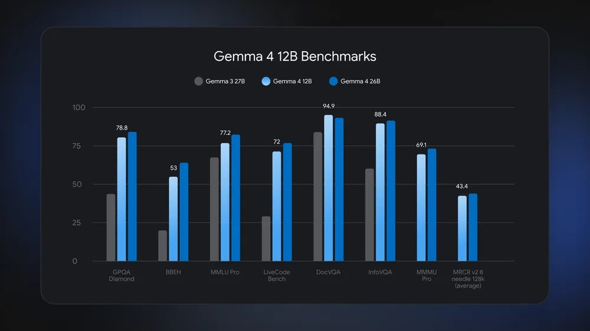
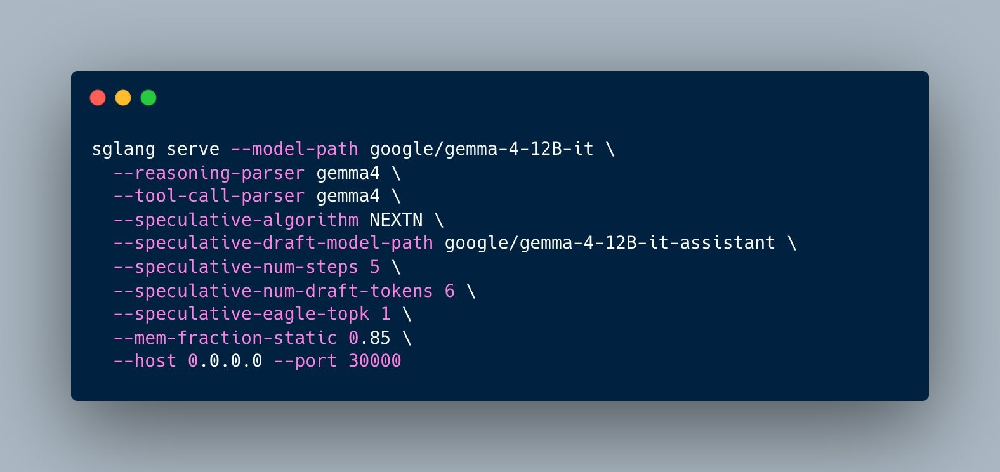

---

## 5. [Build Club Campus ](https://www.producthunt.com/products/build-club)
**Votes**: 161 | **도입 난이도**: 하 | **신뢰도**: 상
**Tagline**: Virtual AI School: Upskill in AI and Become Great at it Fast
**서비스 링크**: https://www.producthunt.com/r/N5IVYXL754L4A4

**태그**: Education, AI, Community, SkillUp, AI Tool

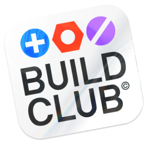

### 📌 이 서비스 한눈에 보기
실전 프로젝트와 커뮤니티를 통해 빠르게 AI 역량을 키우는 게임화된 가상 AI 학교

### 🔑 주요 기능
- 실제 구축 중심의 프로젝트 기반 학습 및 역할별 유스케이스 제공
- 변화하는 AI 트렌드에 맞춘 짧고 핵심적인 마이크로 러닝 코스
- OpenAI, Claude, Copilot 등 주요 도구 관련 인증 취득 가능

### 🙋 사용자에게 어떤 점이 좋은가
이론 위주의 강의에서 벗어나 실제 프로젝트를 수행하며 업무나 사이드 프로젝트에 즉시 적용 가능한 실전 AI 기술을 습득할 수 있습니다.

### ✅ 지금 바로 써볼 기능
- 제공되는 역할별 유스케이스 따라해보기
- 커뮤니티 템플릿 활용하여 프로젝트 시작하기
- 주요 AI 도구 인증 과정 수강하기

### ⚠️ 사용 전 확인할 점
- 실습 중심이므로 개인적인 프로젝트 수행을 위한 별도의 도구 사용 환경이 필요할 수 있음
- 커뮤니티 기반 학습이므로 개인의 참여도에 따라 학습 효과가 달라질 수 있음

### 🧭 확인이 더 필요한 정보
현재 100% 무료로 제공되고 있으나, 향후 유료 모델로의 전환 계획이 있는지 확인이 필요합니다.

### 📸 스크린샷 및 갤러리
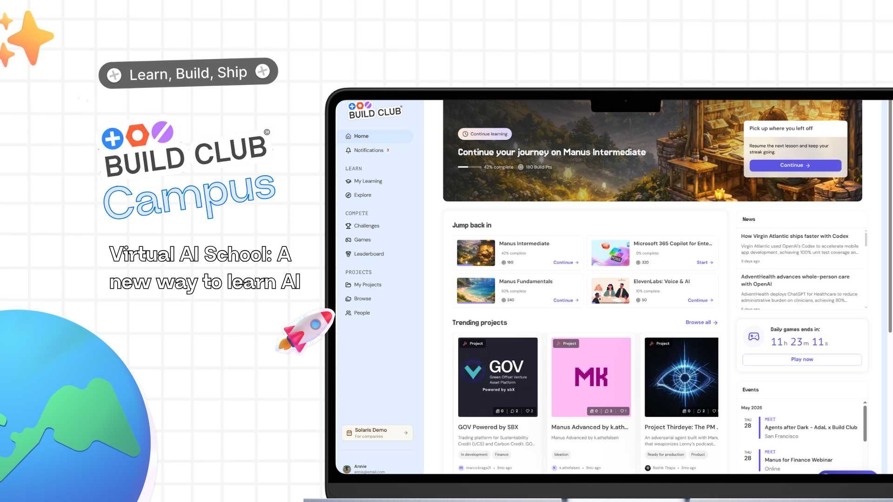
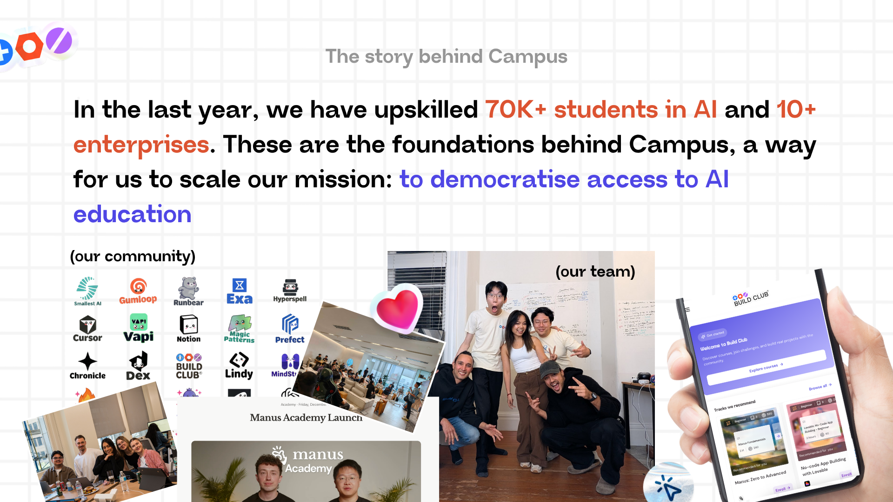

### 🎬 관련 영상
- [🎥 영상 보기](https://ph-files.imgix.net/ece941f9-f2d5-43e8-bd58-399f26d01686.jpeg?auto=format)

---

## 6. [AppWizzy](https://www.producthunt.com/products/appwizzy)
**Votes**: 161 | **도입 난이도**: 하 | **신뢰도**: 상
**Tagline**: Rent a private VM with Codex to build production apps
**서비스 링크**: https://www.producthunt.com/r/NECI5AIKGC3BCC

**태그**: DevTool, AI, CloudHosting, NoCode, AI Tool, Chat

### 📌 이 서비스 한눈에 보기
AI 채팅만으로 앱 개발부터 호스팅까지 한 번에 해결하는 프라이빗 VM 워크스페이스

### 🔑 주요 기능
- Codex가 설치된 전용 VM 환경 제공
- AI 채팅을 통한 코드 생성, 실행 및 웹 앱 호스팅 통합
- 개발 환경과 호스팅 환경이 일치하는 지속 가능한 워크스페이스

### 🙋 사용자에게 어떤 점이 좋은가
별도의 서버 설정이나 복잡한 배포 과정 없이, AI와 대화하는 것만으로 아이디어를 즉시 프로덕션 수준의 앱으로 구현할 수 있습니다.

### ✅ 지금 바로 써볼 기능
- AI 채팅을 통한 초기 프로토타입 생성
- 생성된 앱의 실시간 호스팅 상태 확인
- 제공되는 템플릿을 활용한 빠른 앱 구축

### ⚠️ 사용 전 확인할 점
- AI 사용량 및 호스팅 일수에 따른 비용 구조 확인 필요
- 복잡한 대규모 애플리케이션 관리 시 VM 리소스 제약 가능성

### 🧭 확인이 더 필요한 정보
사용량 기반 과금 체계의 구체적인 단가와 제공되는 템플릿의 종류를 확인해야 합니다.

### 📸 스크린샷 및 갤러리
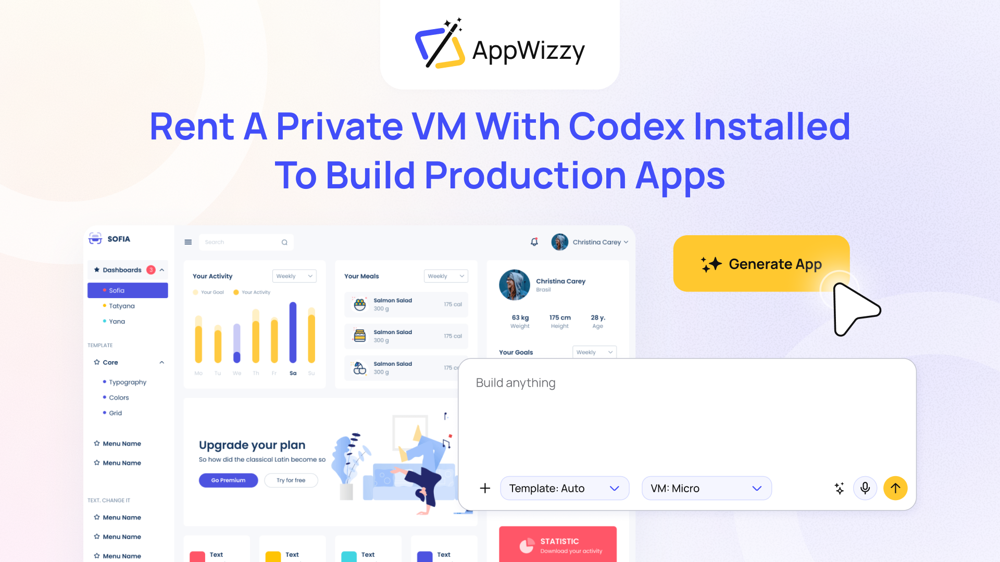
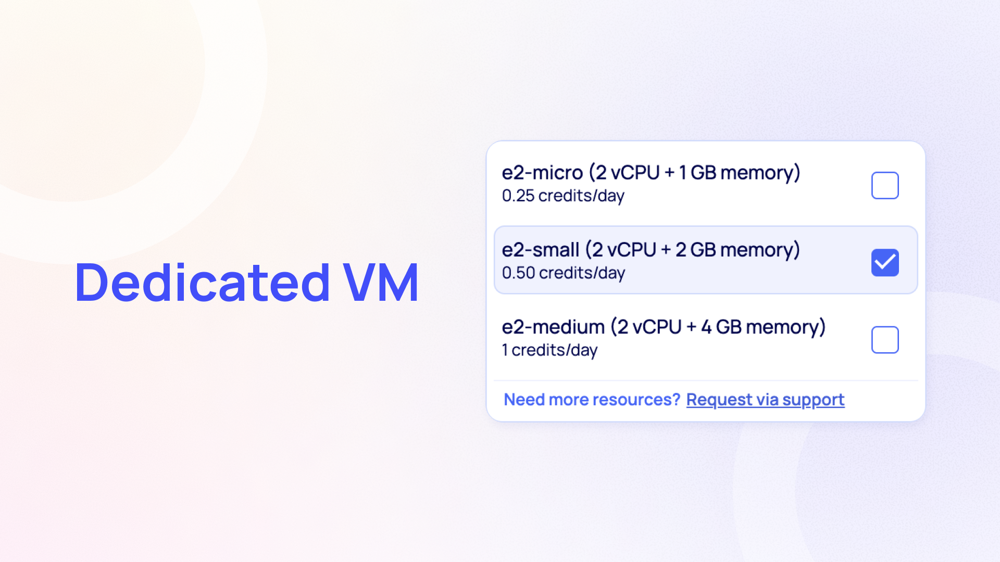
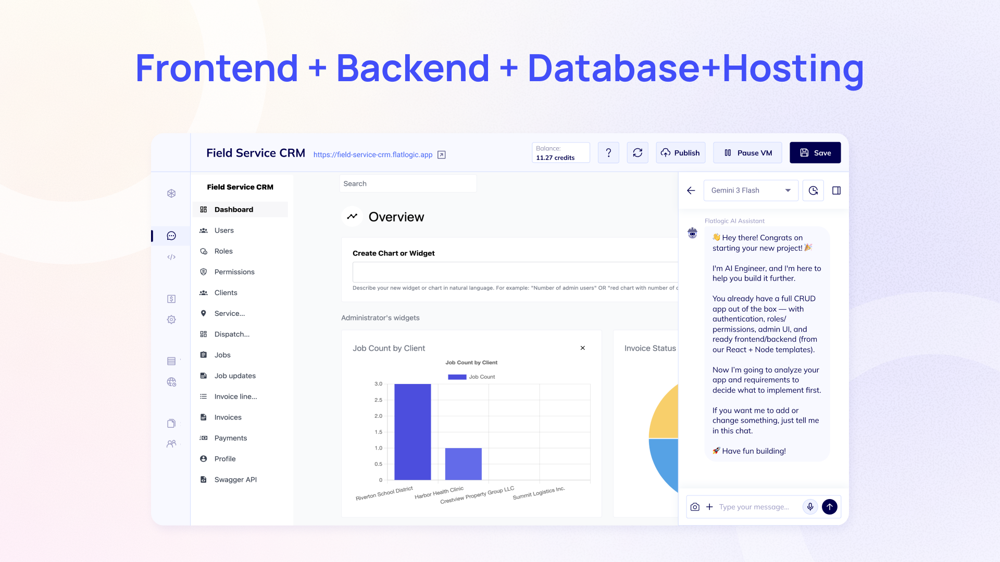

### 🎬 관련 영상
- [🎥 영상 보기](https://ph-files.imgix.net/c7f9cbb7-5dc3-4d7d-909a-afa2e5aec1e6.jpeg?auto=format)

---

## 7. [Deliveryman.ai](https://www.producthunt.com/products/deliveryman-ai)
**Votes**: 154 | **도입 난이도**: 하 | **신뢰도**: 상
**Tagline**: Cold email infrastructure on autopilot without Gsuite
**서비스 링크**: https://www.producthunt.com/r/BQSEJPO4RARJXI

**태그**: SalesTech, Automation, EmailMarketing, SaaS, AI Tool, Email

### 📌 이 서비스 한눈에 보기
G-suite 없이도 복잡한 콜드 이메일 인프라 구축부터 운영까지 자동화하는 올인원 솔루션

### 🔑 주요 기능
- 메일함 설정, DNS 레코드, 워밍업 등 복잡한 인프라 구축 자동화
- 이메일 검증, 블랙리스트 모니터링, 답장 관리 등 운영 전 과정 통합
- G-suite 없이도 확장 가능한 콜드 이메일 발송 시스템 제공

### 🙋 사용자에게 어떤 점이 좋은가
인프라 설정과 도메인 관리의 번거로움 없이 즉시 콜드 이메일 캠페인을 시작하고 스케일업할 수 있습니다.

### ✅ 지금 바로 써볼 기능
- 자동화된 메일함 및 DNS 설정 기능 테스트
- 이메일 워밍업 및 검증 프로세스 확인
- 블랙리스트 모니터링 및 라우팅 기능 점검

### ⚠️ 사용 전 확인할 점
- G-suite를 사용하지 않을 때의 도메인 신뢰도 및 스팸 필터링 대응력 확인 필요
- 대량 발송 시 계정 차단 리스크 관리 방식 확인

### 🧭 확인이 더 필요한 정보
G-suite를 대체하는 구체적인 메일 서버 연동 방식과 비용 구조에 대한 정보가 추가로 필요합니다.

### 📸 스크린샷 및 갤러리
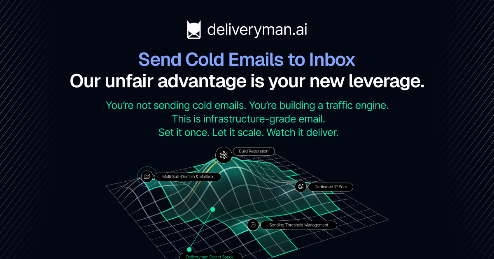
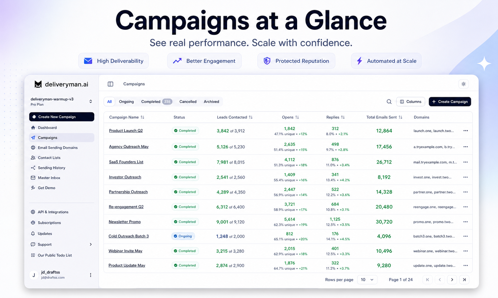
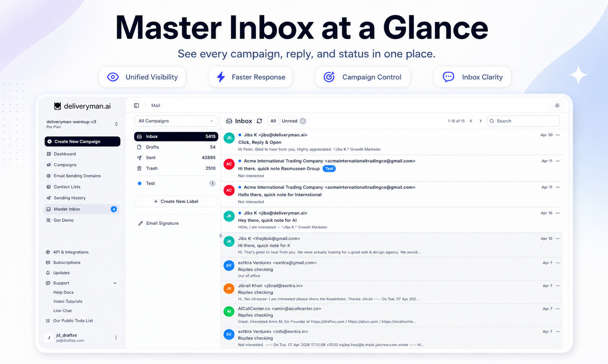

### 🎬 관련 영상
- [🎥 영상 보기](https://ph-files.imgix.net/c79f2ed0-68a6-40ae-b5b4-b39d7cf5799b.jpeg?auto=format)

---

## 8. [TimeTuna.com](https://www.producthunt.com/products/bookva-ai)
**Votes**: 111 | **도입 난이도**: 하 | **신뢰도**: 상
**Tagline**: If Calendly had gorgeous video backgrounds
**서비스 링크**: https://www.producthunt.com/r/HVRC2ACCPPZ2UU

**태그**: Design, Productivity, Scheduling, Branding, AI Tool, Video

### 📌 이 서비스 한눈에 보기
브랜드의 개성을 담은 아름다운 비디오 배경의 예약 페이지 제작 도구

### 🔑 주요 기능
- 디자인 중심의 세련된 예약 페이지 제공
- 사용자 맞춤형 비디오 배경 기능
- 개인 도메인 연결을 통한 전문성 강화

### 🙋 사용자에게 어떤 점이 좋은가
단순한 일정 예약 기능을 넘어, 첫인상이 중요한 프리랜서나 스튜디오가 브랜드 이미지를 시각적으로 전달할 수 있습니다.

### ✅ 지금 바로 써볼 기능
- 브랜드 아이덴티티를 담은 비디오 배경 업로드하기
- 개인 도메인 연결 설정하기
- 무료 플랜으로 예약 페이지 디자인 테스트하기

### ⚠️ 사용 전 확인할 점
- 비디오 배경 사용 시 페이지 로딩 속도 저하 가능성
- 고급 기능 사용 시 월 $10의 구독 비용 발생

### 🧭 확인이 더 필요한 정보
비디오 파일 형식 지원 범위 및 모바일 최적화 수준에 대한 구체적인 정보가 필요합니다.

### 📸 스크린샷 및 갤러리

### 🎬 관련 영상
- [🎥 영상 보기](https://ph-files.imgix.net/4b4554fb-9cff-4d82-a226-c8f61cf96c50.gif?auto=format)

---

## 9. [Keen Code](https://www.producthunt.com/products/keen-code-a-cli-coding-agent)
**Votes**: 109 | **도입 난이도**: 중 | **신뢰도**: 상
**Tagline**: A context-efficient CLI coding agent built by agents
**서비스 링크**: https://www.producthunt.com/r/GYFWAZSVERC2N2

**태그**: DevTool, CLI, OpenSource, AI-Agent, Go, Agent, AI Tool, Prompting, Design

### 📌 이 서비스 한눈에 보기
컨텍스트 효율을 극대화하여 비용과 속도를 잡은 오픈소스 CLI 코딩 에이전트

### 🔑 주요 기능
- 에이전트가 직접 설계하여 프롬프트와 디자인 과정이 투명하게 공개된 오픈소스 프로젝트
- 턴 메모리(Turn memory) 방식을 통해 멀티턴 세션의 컨텍스트 소모를 최소화
- MCP 서버를 지연 로딩(Lazy-loading) 방식의 스킬로 매핑하여 불필요한 스키마 중복 입력 방지

### 🙋 사용자에게 어떤 점이 좋은가
컨텍스트 사용량을 획기적으로 줄여 토큰 비용을 절감하고, 복잡한 멀티 MCP 환경에서도 빠르고 정확한 코딩 지원을 받을 수 있습니다.

### ✅ 지금 바로 써볼 기능
- GitHub 레포지토리에서 에이전트가 설계한 프롬프트/디자인 트레일 분석하기
- Go 환경에서 CLI 에이전트 설치 및 기본 코딩 작업 수행하기
- MCP 서버를 연결하여 지연 로딩 기반의 스킬 작동 방식 테스트하기

### ⚠️ 사용 전 확인할 점
- CLI 기반 도구이므로 GUI 환경에 익숙한 사용자에게는 학습 곡선이 존재할 수 있음
- 오픈소스 프로젝트로서 초기 안정성 및 커뮤니티 지원 수준 확인 필요

### 🧭 확인이 더 필요한 정보
현재 제공되는 구체적인 설치 방법과 지원하는 IDE와의 연동 수준에 대한 상세 정보가 필요합니다.

### 📸 스크린샷 및 갤러리
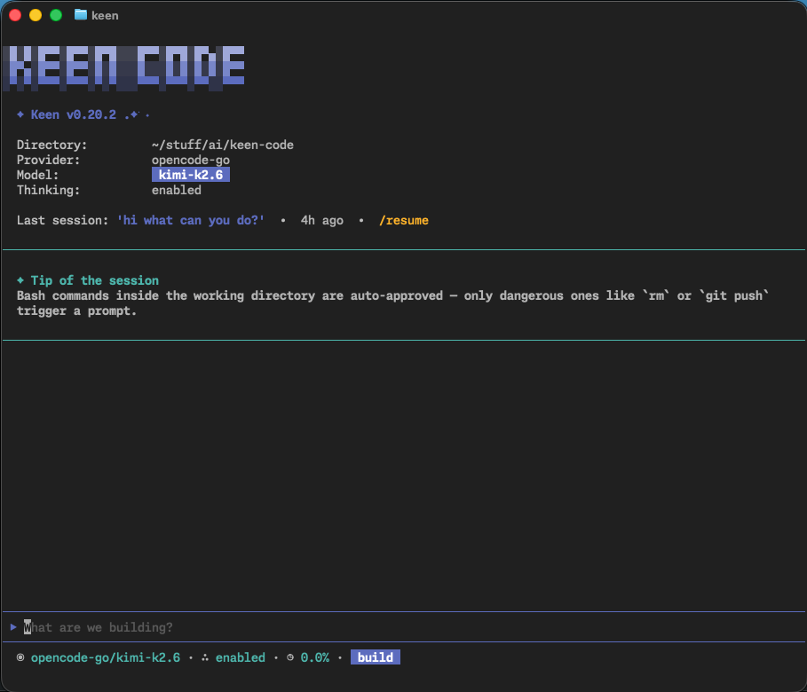
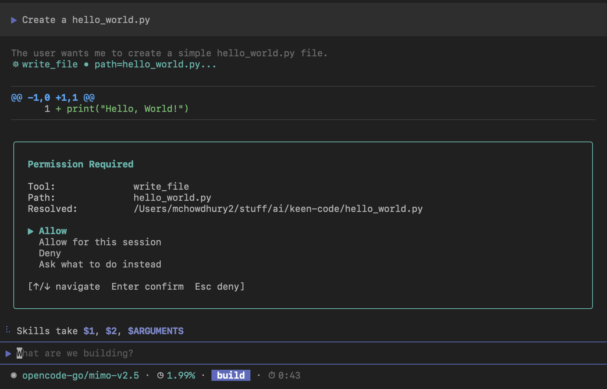
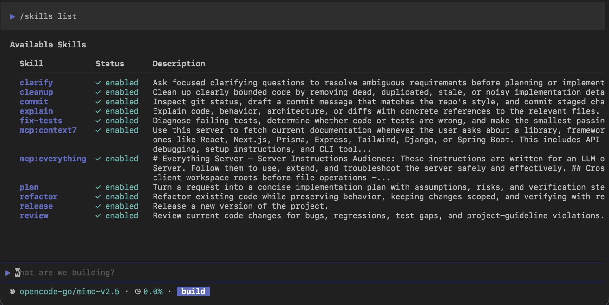

---

## 10. [Novus](https://www.producthunt.com/products/novus-4)
**Votes**: 103 | **도입 난이도**: 하 | **신뢰도**: 상
**Tagline**: Catch and fix usability issues automatically as you ship
**서비스 링크**: https://www.producthunt.com/r/37RC6NHLU3LB3U

**태그**: DevTool, Automation, ProductAnalytics, AI-Agent, Agent

### 📌 이 서비스 한눈에 보기
코드베이스 연결만으로 제품의 사용성 문제를 자동으로 감지하고 개선하는 AI 제품 에이전트

### 🔑 주요 기능
- 코드베이스 연동을 통한 자동 인스트루멘테이션 및 분석
- 수동 설정 없는 지속적인 제품 모니터링
- 엔지니어와 PM을 위한 선제적인 사용성 이슈 플래깅

### 🙋 사용자에게 어떤 점이 좋은가
제품 배포 시 발생할 수 있는 사용성 문제를 자동으로 잡아내어, 개발팀과 기획팀이 수동 모니터링에 들이는 시간을 획기적으로 줄여줍니다.

### ✅ 지금 바로 써볼 기능
- 코드베이스 연동 및 자동 분석 기능 테스트
- 실시간 사용성 이슈 알림 설정
- 엔지니어/PM 협업을 위한 대시보드 확인

### ⚠️ 사용 전 확인할 점
- 코드베이스 직접 연결에 따른 보안 및 권한 검토 필요
- 자동 분석 결과의 정확도 및 오탐 가능성 확인

### 🧭 확인이 더 필요한 정보
코드베이스 연동 방식(CI/CD 통합 방식 등)과 구체적인 보안 프로토콜에 대한 정보가 추가로 필요합니다.

### 📸 스크린샷 및 갤러리
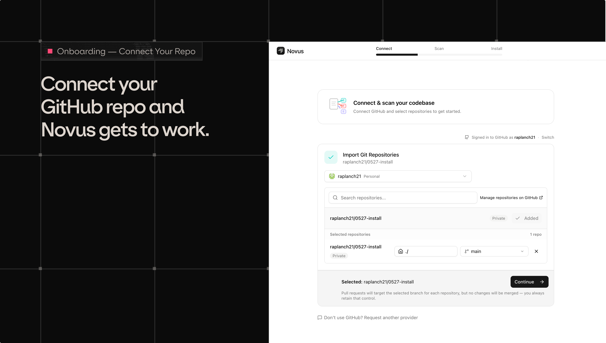
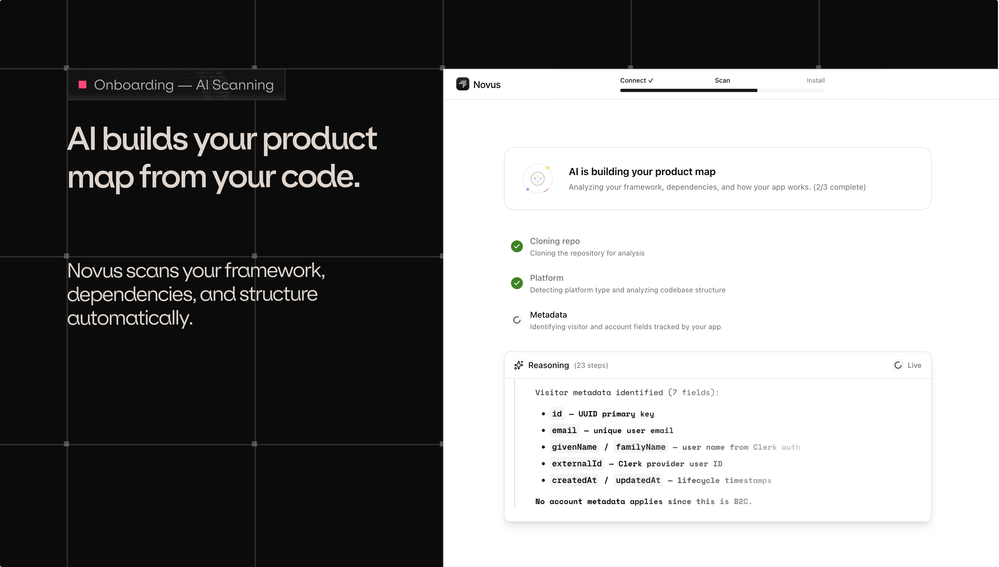
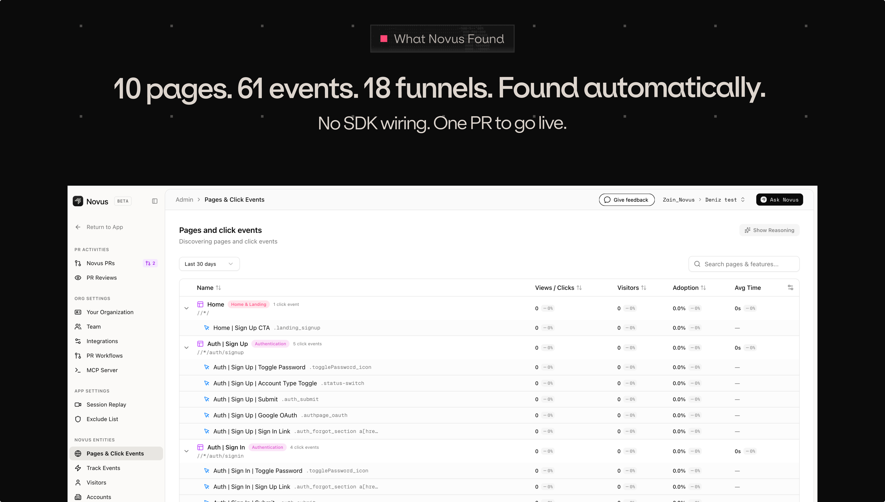

### 🎬 관련 영상
- [🎥 영상 보기](https://ph-files.imgix.net/f2109342-5b18-48e8-b0d3-144287970462.jpeg?auto=format)

---

## 11. [Perplexity Personal Computer for Windows](https://www.producthunt.com/products/perplexity-personal-computer-for-windows)
**Votes**: 102 | **도입 난이도**: 중 | **신뢰도**: 상
**Tagline**: Run AI agents across your local files and apps on Windows
**서비스 링크**: https://www.producthunt.com/r/VY2TBYVZOROXES

**태그**: AI Agent, Windows, Automation, Productivity, Agent, AI Tool

### 📌 이 서비스 한눈에 보기
윈도우 환경의 로컬 파일과 앱을 넘나들며 작업을 수행하는 Perplexity의 AI 에이전트 시스템

### 🔑 주요 기능
- 윈도우 OS 내 로컬 파일 및 네이티브 앱과의 상호작용 지원
- 웹과 로컬 환경을 통합하는 멀티 모델 에이전트 시스템
- Max 및 Enterprise Max 구독자를 대상으로 한 대기 명단 운영

### 🙋 사용자에게 어떤 점이 좋은가
사용자의 PC에 있는 파일과 설치된 앱을 AI가 직접 제어하여 업무 자동화 범위를 로컬 환경까지 확장할 수 있습니다.

### ✅ 지금 바로 써볼 기능
- 대기 명단(Waitlist) 등록 여부 확인
- 구독 플랜(Max/Enterprise Max) 적합성 검토
- 로컬 파일 접근 권한 및 보안 설정 숙지

### ⚠️ 사용 전 확인할 점
- 현재 특정 구독자(Max/Enterprise Max) 대상의 대기 명단 기반 서비스임
- 로컬 파일 및 앱에 대한 접근 권한 부여에 따른 보안 고려 필요

### 🧭 확인이 더 필요한 정보
현재 서비스가 대기 명단 기반이므로 실제 사용 가능 시점과 구체적인 기능 범위는 구독 플랜에 따라 다를 수 있습니다.

### 📸 스크린샷 및 갤러리
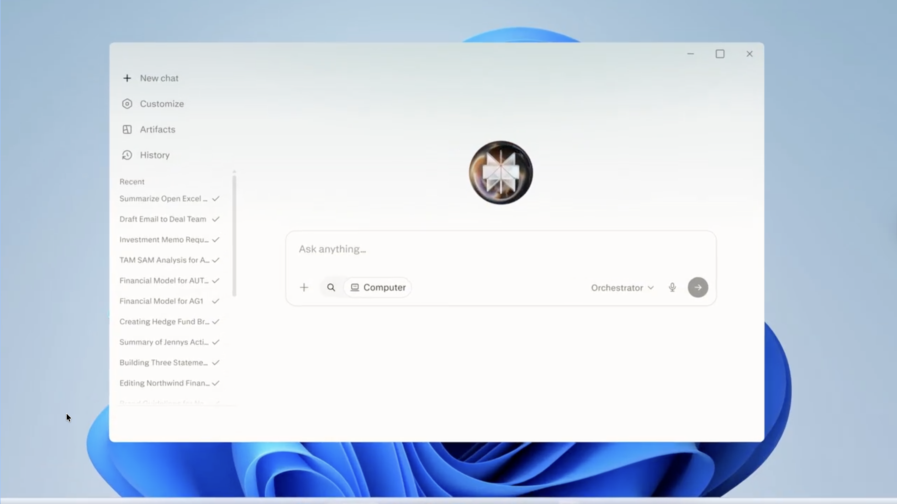
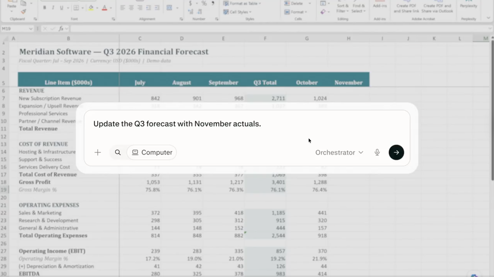
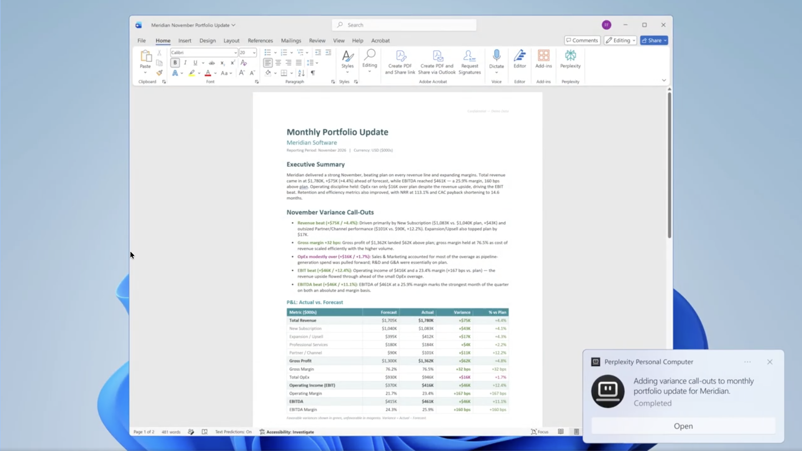

### 🎬 관련 영상
- [🎥 영상 보기](https://ph-files.imgix.net/64658bbd-4af5-442c-8f75-3b507037df20.jpeg?auto=format)

---

## 12. [Koji by Brilliant](https://www.producthunt.com/products/brilliant)
**Votes**: 102 | **도입 난이도**: 하 | **신뢰도**: 상
**Tagline**: A world-class personal tutor for every home
**서비스 링크**: https://www.producthunt.com/r/ZTYFWYL2DMNQDR

**태그**: EdTech, AI Tutor, Personalized Learning, Design

### 📌 이 서비스 한눈에 보기
개인별 학습 방식에 맞춰 질문하고 소통하는 초지능형 맞춤형 튜터

### 🔑 주요 기능
- 사용자의 학습 패턴에 적응하는 초지능형 튜터링 시스템
- 화면 스케치 및 질문을 통한 능동적인 학습 유도
- 단순 기능 추가를 넘어선 제품 경험의 전면적 진화

### 🙋 사용자에게 어떤 점이 좋은가
단순 지식 전달이 아닌, 실제 인간 튜터처럼 상호작용하며 학습자의 이해도를 높여줍니다.

### ✅ 지금 바로 써볼 기능
- 대화형 질문을 통한 학습 방식 경험하기
- 화면 스케치 기능을 활용한 시각적 학습 시도하기
- 자신의 학습 스타일이 어떻게 반영되는지 확인하기

### ⚠️ 사용 전 확인할 점
- 기존 Brilliant 서비스의 기능 변화에 따른 사용자 경험 변화
- 학습 방식 적응을 위한 초기 학습 시간 필요

### 🧭 확인이 더 필요한 정보
기존 Brilliant 사용자들에게 제공되는 구체적인 기능 범위와 유료 플랜 포함 여부가 명시되지 않았습니다.

### 📸 스크린샷 및 갤러리

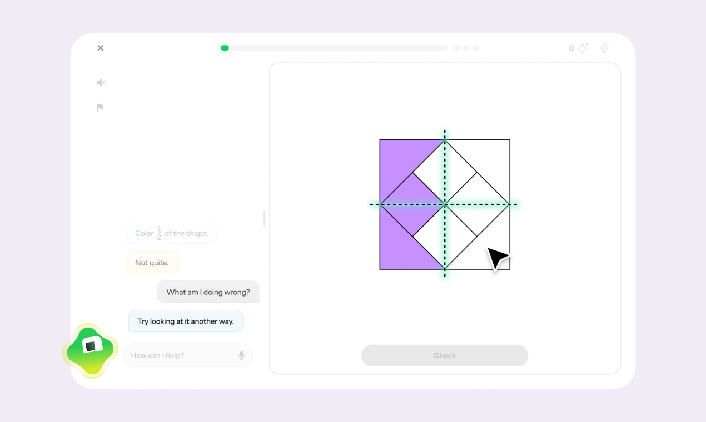
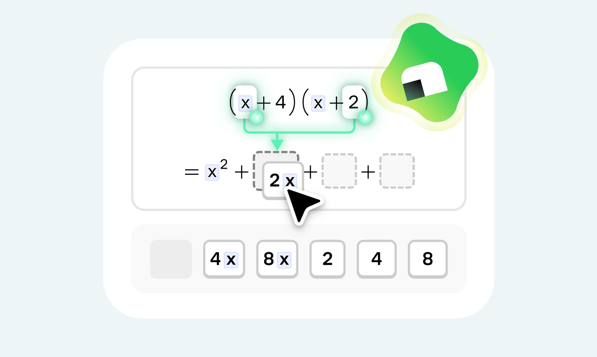

### 🎬 관련 영상
- [🎥 영상 보기](https://ph-files.imgix.net/3e5d3de6-f94c-4861-a8fc-39560c469f72.jpeg?auto=format)

---

## 13. [Boxes.dev](https://www.producthunt.com/products/boxes-dev)
**Votes**: 98 | **도입 난이도**: 중 | **신뢰도**: 상
**Tagline**: Run Claude Code and Codex in your own cloud environment
**서비스 링크**: https://www.producthunt.com/r/LVCS6HWCF73THB

**태그**: DevTool, CloudIDE, AI-Coding, RemoteDev, Agent, Chat

### 📌 이 서비스 한눈에 보기
에이전트 기반 코딩을 위한 독립적인 클라우드 개발 환경 제공

### 🔑 주요 기능
- Claude Code 및 Codex를 위한 전용 클라우드 환경 구축
- 각 채팅 세션별로 독립된 컴퓨터 환경 할당
- 데스크톱 및 모바일 어디서든 접속 가능한 개발 환경

### 🙋 사용자에게 어떤 점이 좋은가
AI 코딩 에이전트가 로컬 환경을 어지럽히지 않도록 격리된 환경을 제공하며, 장소에 구애받지 않고 개발을 이어갈 수 있습니다.

### ✅ 지금 바로 써볼 기능
- 클라우드 환경 내 Claude Code 실행 테스트
- 모바일 기기를 통한 원격 접속 환경 확인
- 세션별 독립 환경의 격리 수준 검증

### ⚠️ 사용 전 확인할 점
- 클라우드 환경 사용에 따른 데이터 보안 및 관리 정책 확인 필요
- 에이전트 실행 시 발생하는 클라우드 리소스 비용 고려

### 🧭 확인이 더 필요한 정보
구체적인 클라우드 인프라 사양 및 비용 구조에 대한 정보가 명시되지 않았습니다.

### 📸 스크린샷 및 갤러리

---

## 14. [Basedash Semantic Layer](https://www.producthunt.com/products/basedash)
**Votes**: 93 | **도입 난이도**: 중 | **신뢰도**: 상
**Tagline**: Define metrics once. Use them everywhere.
**서비스 링크**: https://www.producthunt.com/r/YIBOKJ5SAN7VTE
**재등장**: 최근 7일 내 재등장 (마지막 등장 5일 전)

**태그**: DataEngineering, AI, Analytics, Automation, DevTool, AI Tool, Chat

### 📌 이 서비스 한눈에 보기
한 번 정의한 데이터 지표를 AI와 모든 대시보드에서 즉시 활용할 수 있는 시맨틱 레이어

### 🔑 주요 기능
- 재사용 가능한 SQL 메트릭 및 모델 정의
- AI가 참조 가능한 표준화된 데이터 구조 제공
- 채팅, 차트, 대시보드, 자동화 등 다양한 채널로의 데이터 통합

### 🙋 사용자에게 어떤 점이 좋은가
데이터 지표를 매번 새로 작성할 필요 없이 한 곳에서 관리하여, 팀 전체가 동일한 기준의 데이터를 AI와 대시보드에서 즉각 사용할 수 있습니다.

### ✅ 지금 바로 써볼 기능
- 기존 SQL 쿼리를 재사용 가능한 메트릭으로 정의하기
- 정의된 메트릭을 AI 채팅 인터페이스에 연결하기
- 표준화된 모델을 기반으로 대시보드 및 자동화 구축하기

### ⚠️ 사용 전 확인할 점
- 기존 데이터 웨어하우스와의 연동 방식 및 성능 확인 필요
- 복잡한 비즈니스 로직을 SQL로 변환하는 초기 작업 필요

### 🧭 확인이 더 필요한 정보
지원하는 데이터 소스의 종류와 구체적인 AI 연동 방식에 대한 상세 정보가 필요합니다.

### 📸 스크린샷 및 갤러리
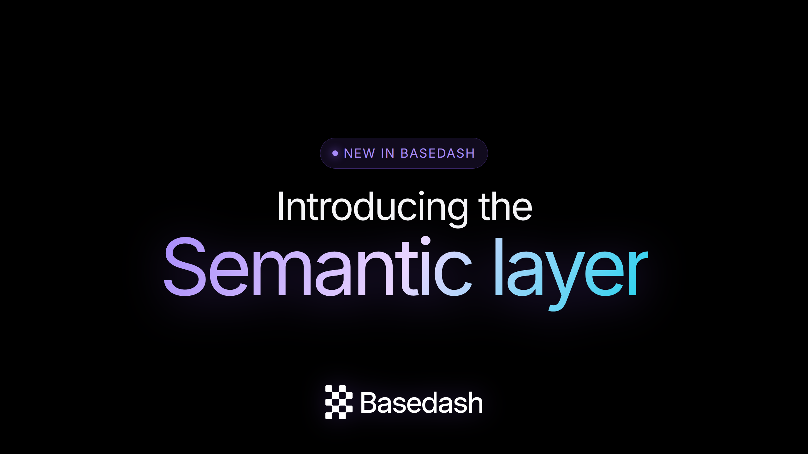
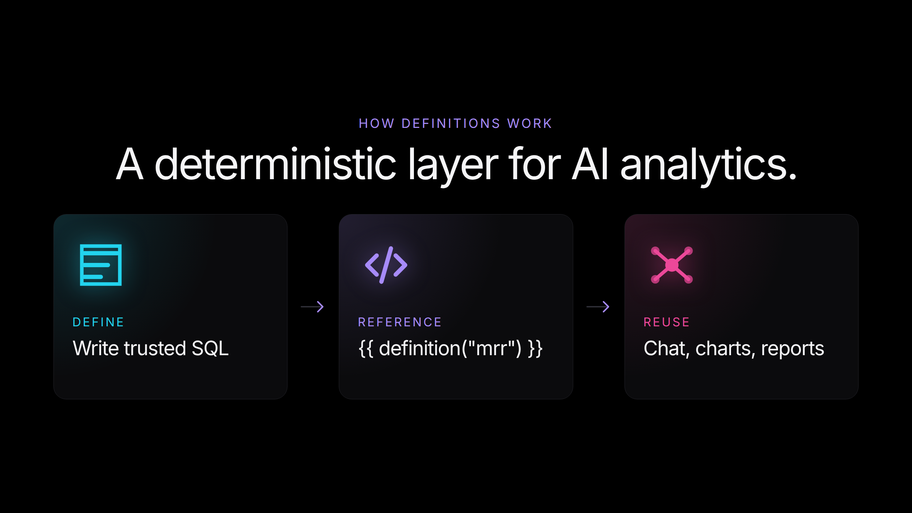
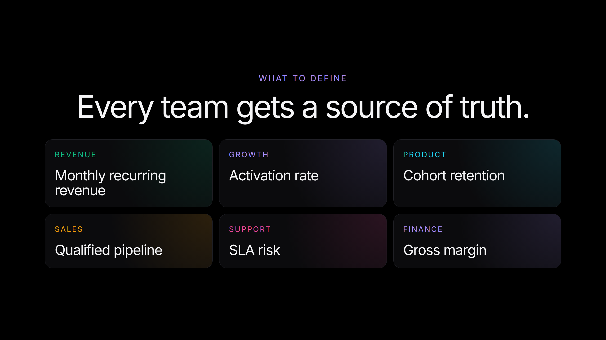

### 🎬 관련 영상
- [🎥 영상 보기](https://ph-files.imgix.net/18302680-28f0-4b83-a4a8-7df65f55a08a.jpeg?auto=format)

---

## 15. [Sun](https://www.producthunt.com/products/sun-4)
**Votes**: 91 | **도입 난이도**: 중 | **신뢰도**: 상
**Tagline**: Collaborative voice API for agents 
**서비스 링크**: https://www.producthunt.com/r/5RTNRZYJVVDMPZ

**태그**: AI, Voice-API, Collaboration, DevTool, Agent, AI Tool, Chat, API

### 📌 이 서비스 한눈에 보기
다자간 협업과 그룹 대화에 최적화된 실시간 음성 AI API

### 🔑 주요 기능
- 1:1 대화를 넘어선 다중 화자 인식 및 협업 중심 설계
- 회의, 그룹 통화, 수업 등 다자간 상호작용에 특화
- 기존 모델 대비 10배 넓은 컨텍스트 윈도우 제공

### 🙋 사용자에게 어떤 점이 좋은가
단순한 챗봇을 넘어 회의나 토론 같은 복잡한 그룹 환경을 자동화하는 음성 에이전트를 구축할 수 있습니다.

### ✅ 지금 바로 써볼 기능
- 다중 화자 인식 성능 테스트
- 그룹 대화 시나리오 적용 실험
- 대규모 컨텍스트 활용도 검증

### ⚠️ 사용 전 확인할 점
- 다자간 환경에서의 음성 분리 및 간섭 처리 품질 확인 필요
- API 호출 시 발생하는 지연 시간(Latency) 체크

### 🧭 확인이 더 필요한 정보
구체적인 API 문서와 기술적 구현 방식에 대한 상세 정보가 추가로 필요합니다.

### 📸 스크린샷 및 갤러리
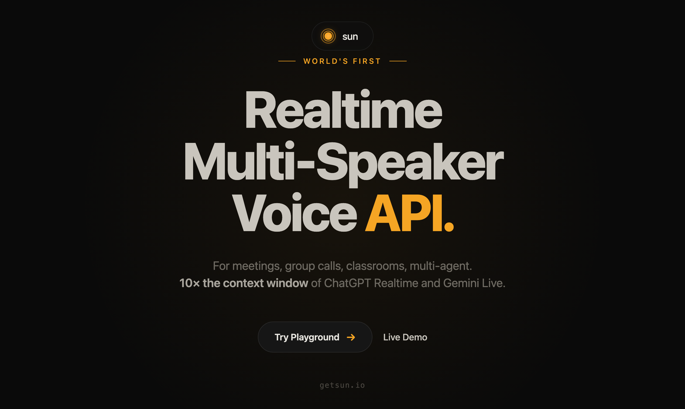
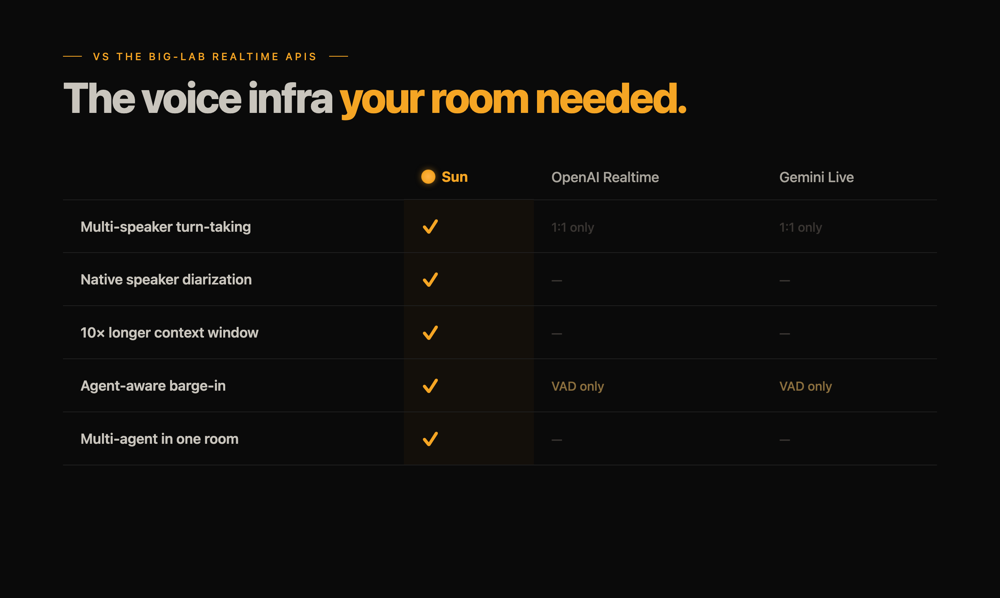
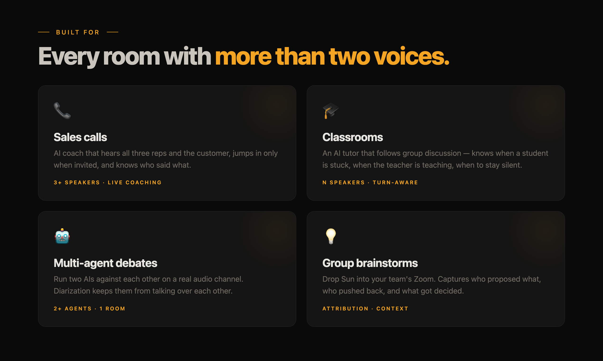

### 🎬 관련 영상
- [🎥 영상 보기](https://ph-files.imgix.net/39066971-e541-419c-969f-bda7f88735d5.jpeg?auto=format)

---

## 16. [Carbon Voice Speed Dial](https://www.producthunt.com/products/carbon-voice)
**Votes**: 90 | **도입 난이도**: 하 | **신뢰도**: 상
**Tagline**: Get your whole team (humans and agents!) on speed dial
**서비스 링크**: https://www.producthunt.com/r/734CGFBF7DENXQ

**태그**: Collaboration, AI Agents, Productivity, Communication, Agent, AI Tool, DevTool

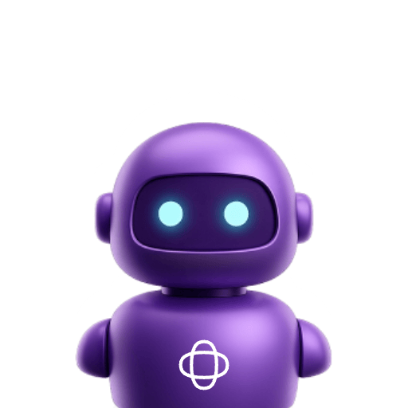

### 📌 이 서비스 한눈에 보기
팀원과 AI 에이전트를 한 번의 클릭으로 연결하는 초간편 스피드 다이얼 서비스

### 🔑 주요 기능
- 팀원 및 AI 에이전트(Claude Code, n8n 등)를 위한 통합 스피드 다이얼 제공
- 데스크톱 키스트로크 및 모바일 원탭을 통한 즉각적인 통신 환경 구축
- 회의 시간을 60% 단절하여 업무 효율성 증대

### 🙋 사용자에게 어떤 점이 좋은가
사람뿐만 아니라 AI 에이전트와도 즉시 대화할 수 있어, 팀 내 협업 및 자동화 워크플로우를 매우 빠르게 실행할 수 있습니다.

### ✅ 지금 바로 써볼 기능
- 자주 소통하는 팀원 및 그룹 설정하기
- 사용 중인 AI 에이전트(OpenClaw, Hermes 등) 연동하기
- 데스크톱 및 모바일 단축키 설정하여 사용해보기

### ⚠️ 사용 전 확인할 점
- AI 에이전트 연동 시 각 서비스별 API 권한 및 설정 필요 여부 확인
- 음성 기반 통신 시 네트워크 환경에 따른 지연 시간 확인

### 🧭 확인이 더 필요한 정보
제시된 60% 회의 시간 감소 수치가 어떤 환경에서 측정된 것인지 구체적인 기준 확인이 필요합니다.

### 📸 스크린샷 및 갤러리
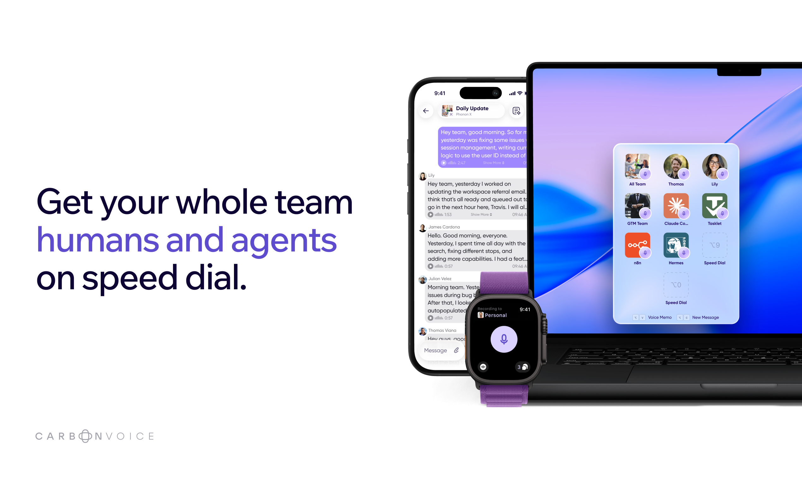
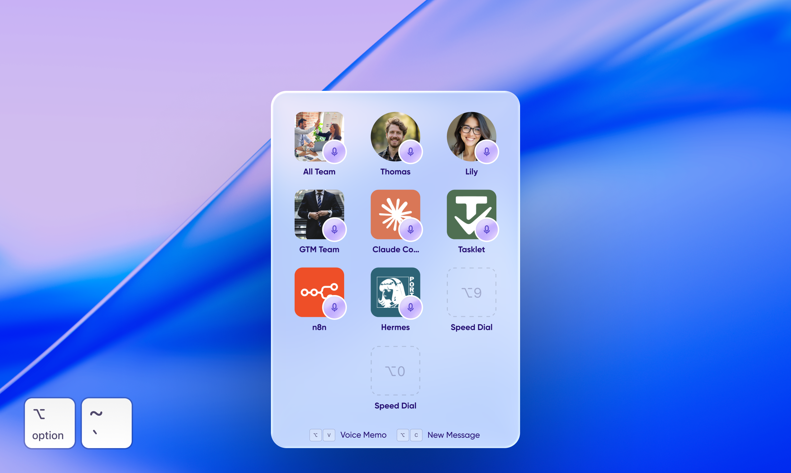
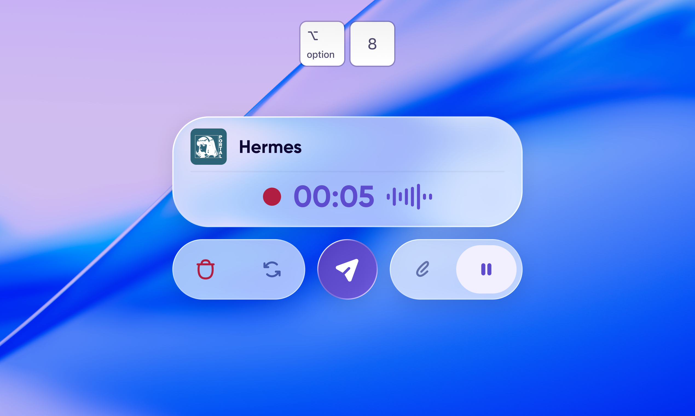

### 🎬 관련 영상
- [🎥 영상 보기](https://ph-files.imgix.net/39917b6d-a958-4378-8689-44c74f39aede.jpeg?auto=format)

---

## 17. [Gather](https://www.producthunt.com/products/gather-14)
**Votes**: 88 | **도입 난이도**: 하 | **신뢰도**: 상
**Tagline**: Save it once, never lose it again
**서비스 링크**: https://www.producthunt.com/r/OP5CZRBRFTHBMQ

**태그**: DesignTool, Productivity, VisualSearch, Inspiration, AI Tool, Design

### 📌 이 서비스 한눈에 보기
자연어 검색으로 영감을 놓치지 않고 관리하는 시각적 레퍼런스 저장소

### 🔑 주요 기능
- 스크린샷, 사진, 링크를 한곳에 모으는 시각적 보관함
- 친구에게 설명하듯 자연어로 검색 가능한 지능형 검색 기능
- 디자인 영감을 체계적으로 관리하는 '제2의 뇌' 역할

### 🙋 사용자에게 어떤 점이 좋은가
디자인 영감을 저장만 하고 다시 찾지 못하는 문제를 해결하며, 직관적인 검색으로 원하는 레퍼런스를 즉시 찾을 수 있습니다.

### ✅ 지금 바로 써볼 기능
- 영감을 주는 스크린샷 저장하기
- 자연어 검색 기능 테스트하기
- 수집된 자료를 폴더나 태그로 분류해보기

### ⚠️ 사용 전 확인할 점
- 이미지 내 텍스트나 세부 요소의 검색 정확도 확인 필요
- 저장 용량 및 동기화 방식에 대한 정책 확인 필요

### 🧭 확인이 더 필요한 정보
자연어 검색의 정확도와 지원하는 파일 형식 및 용량 제한에 대한 정보가 추가로 필요합니다.

### 📸 스크린샷 및 갤러리

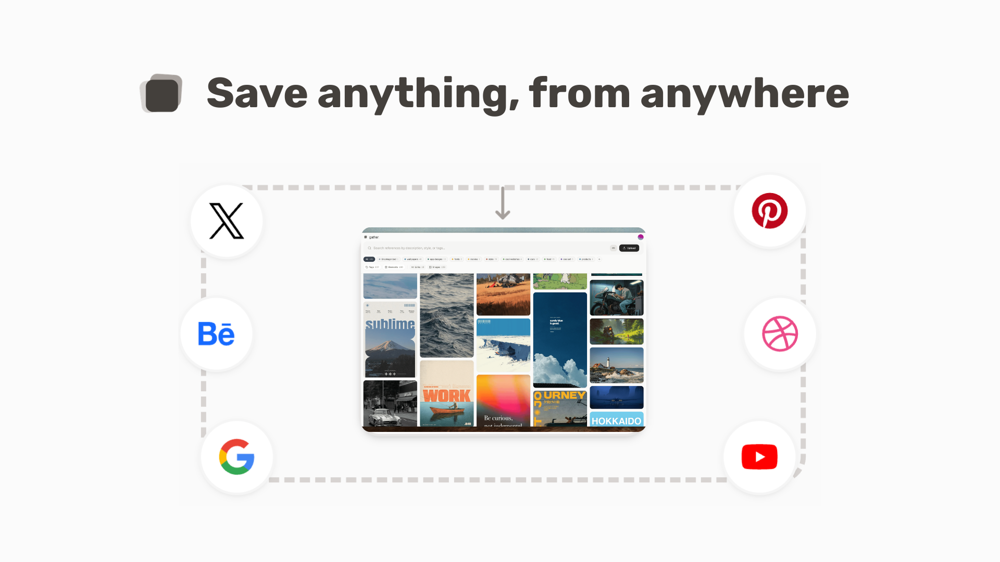
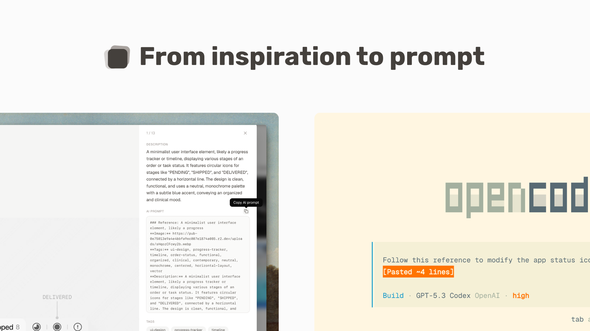

### 🎬 관련 영상
- [🎥 영상 보기](https://ph-files.imgix.net/5b424b3a-58e4-489a-bb46-006e5292dd1b.jpeg?auto=format)

---

## 18. [Extella.AI](https://www.producthunt.com/products/extella-ai)
**Votes**: 87 | **도입 난이도**: 중 | **신뢰도**: 상
**Tagline**: Agentic platform that evolves & builds reusable systems 
**서비스 링크**: https://www.producthunt.com/r/BJVNFF57UNWX47

**태그**: AI-Agent, Automation, Workflow, DevTool, Agent, AI Tool, LLM

### 📌 이 서비스 한눈에 보기
학습과 재사용을 통해 스스로 진화하며 업무 자동화 시스템을 구축하는 에이전틱 AI 플랫폼

### 🔑 주요 기능
- 경험을 기억하고 재사용하여 작업 속도와 비용을 최적화하는 자가 진화형 구조
- 규칙, 개념, 전문가, KV 스토어로 구성된 4계층 메모리 시스템
- 사용자 LLM 및 다양한 외부 툴(Slack, Notion, GitHub 등)과의 유연한 통합

### 🙋 사용자에게 어떤 점이 좋은가
반복되는 업무를 단순 자동화를 넘어 지식 기반의 시스템으로 구축하여, 시간이 지날수록 사용자에게 최적화된 독자적인 업무 환경을 제공합니다.

### ✅ 지금 바로 써볼 기능
- 기존 업무 워크플로우를 위한 규칙(Rules) 설정하기
- 자주 사용하는 툴(Slack, Notion 등) 연동하기
- 자신만의 지식 베이스(Concepts) 구축하기

### ⚠️ 사용 전 확인할 점
- 사용자 정의 LLM 및 라이브러리 활용 시 초기 설정 난이도가 있을 수 있음
- 시스템이 자가 진화하는 과정에서 의도치 않은 동작이 발생할 가능성

### 🧭 확인이 더 필요한 정보
사용자가 직접 가져오는 LLM이나 외부 라이브러리와의 호환성 수준 및 보안 정책에 대한 상세 확인이 필요합니다.

### 📸 스크린샷 및 갤러리
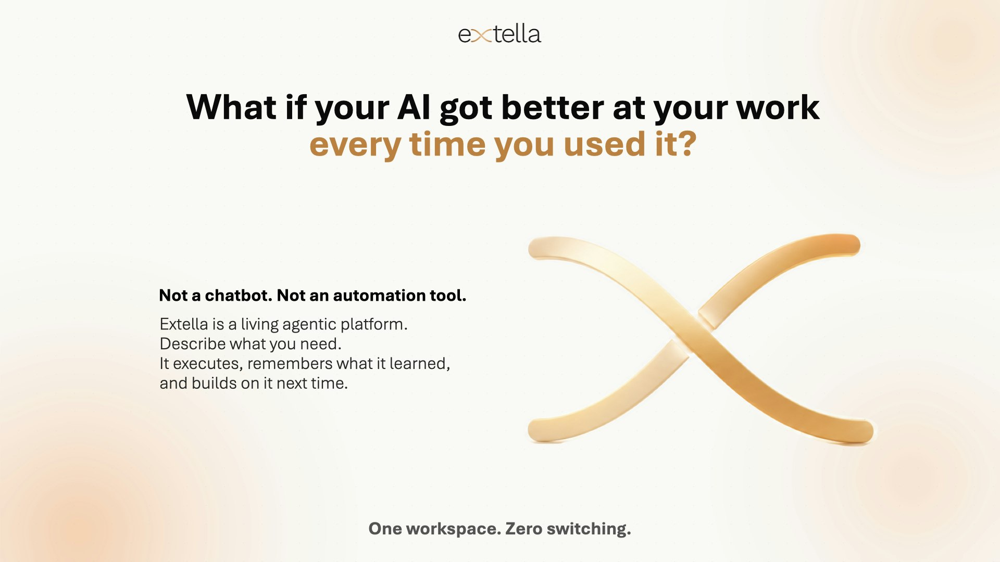
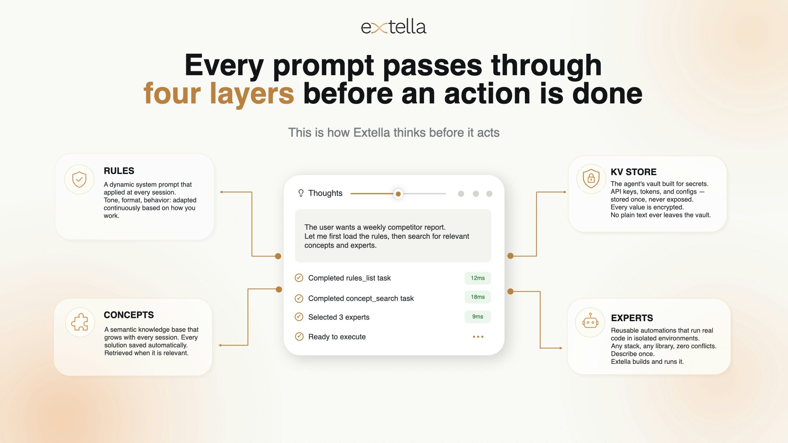
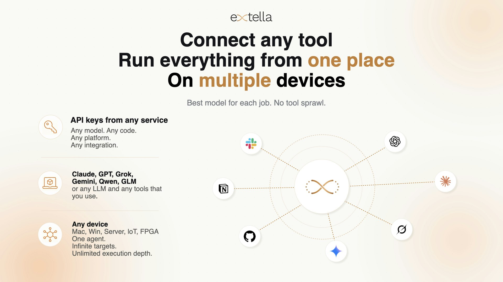

### 🎬 관련 영상
- [🎥 영상 보기](https://ph-files.imgix.net/31a510b7-bdfe-4857-949a-1e1a03a526a7.jpeg?auto=format)

---

## 19. [Intelligent Terminal](https://www.producthunt.com/products/microsoft-terminal)
**Votes**: 85 | **도입 난이도**: 중 | **신뢰도**: 상
**Tagline**: Windows Terminal with native agent integration
**서비스 링크**: https://www.producthunt.com/r/6D4EFBAX7KG6RU

**태그**: DevTool, AI-Agent, Terminal, Automation, Agent, Prompting

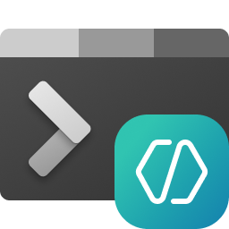

### 📌 이 서비스 한눈에 보기
AI 에이전트 기능을 터미널에 직접 통합하여 개발 워크플로우를 자동화하는 Windows Terminal 포크 버전

### 🔑 주요 기능
- AI 에이전트 상태 표시줄 및 컨텍스트 인식형 에이전트 창 제공
- 자동 오류 감지 및 세션 관리 기능 탑재
- ACP 호환 에이전트 CLI를 위한 커맨드 팔레트 프롬프트 지원

### 🙋 사용자에게 어떤 점이 좋은가
터미널 환경에서 AI 에이전트를 별도 창 전환 없이 즉각적으로 활용하고, 오류 수정 및 명령 실행을 자동화할 수 있습니다.

### ✅ 지금 바로 써볼 기능
- 에이전트 상태 표시줄을 통한 실시간 작업 모니터링
- 컨텍스트 인식형 에이전트 창을 활용한 코드 분석
- 자동 오류 감지 기능을 통한 디버깅 효율화

### ⚠️ 사용 전 확인할 점
- 실험적인 포크 버전이므로 기존 Windows Terminal 설정과의 호환성 확인 필요
- 에이전트 기능 활용을 위해 ACP 호환 CLI 설정이 선행되어야 함

### 🧭 확인이 더 필요한 정보
실험적 프로젝트이므로 안정성과 보안 정책에 대한 검토가 필요합니다.

### 📸 스크린샷 및 갤러리
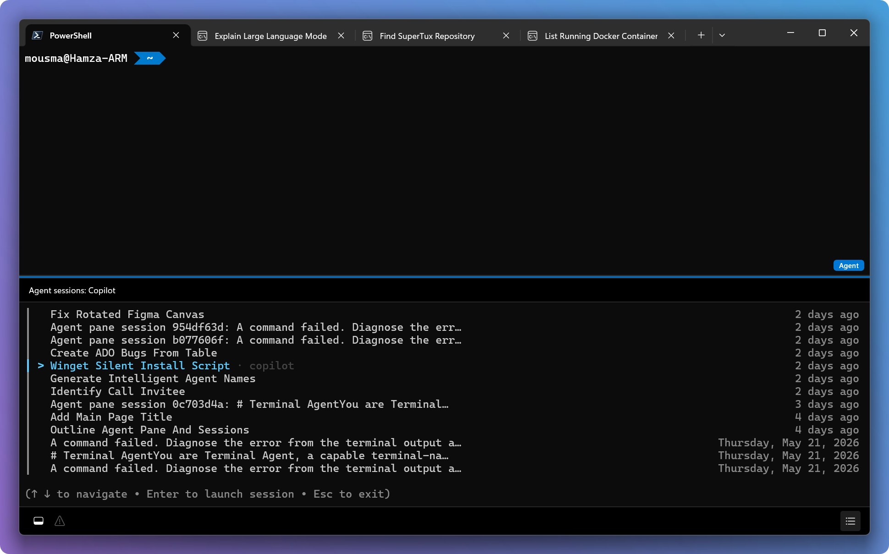
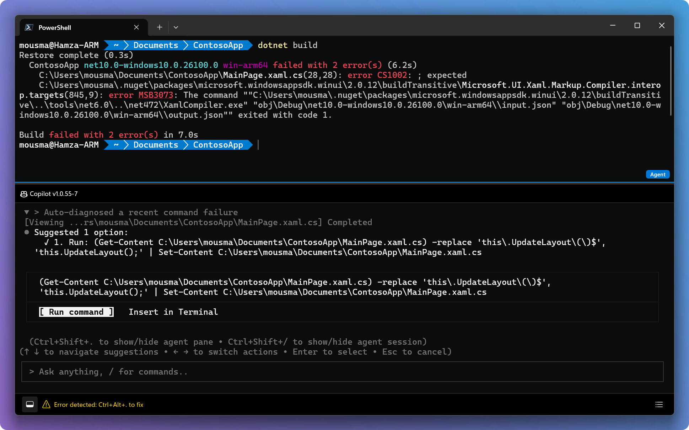
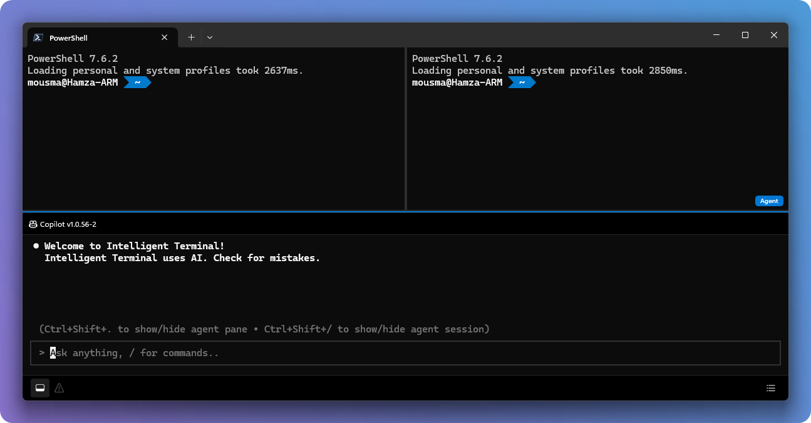

---

## 20. [Chloe by Close](https://www.producthunt.com/products/close)
**Votes**: 84 | **도입 난이도**: 하 | **신뢰도**: 상
**Tagline**: AI agent built into your CRM who works leads for you
**서비스 링크**: https://www.producthunt.com/r/MCX5MRSPKLY4GX

**태그**: SalesTech, AI Agent, CRM, Automation, Agent, AI Tool, Sales, Email

### 📌 이 서비스 한눈에 보기
CRM 내부에 직접 탑재되어 리드 관리부터 전화까지 수행하는 AI 영업 에이전트

### 🔑 주요 기능
- 별도 연동 없이 Close CRM에 내장된 네이티브 AI 에이전트
- 전화 통화, 이메일 답장, 연락처 정보 보강 및 자동 노트 작성 기능
- 24시간 쉬지 않고 영업 프로세스 전반을 지원하는 자동화

### 🙋 사용자에게 어떤 점이 좋은가
영업 담당자가 반복적인 리드 관리와 연락 업무에서 벗어나 핵심 영업 활동에만 집중할 수 있도록 돕습니다.

### ✅ 지금 바로 써볼 기능
- Chloe의 음성 통화 기능 테스트하기
- 이메일 자동 답장 및 리드 관리 워크플로우 설정
- CRM 데이터 자동 업데이트 기능 확인

### ⚠️ 사용 전 확인할 점
- Close CRM 사용자에게만 최적화된 솔루션임
- AI의 음성 통화 및 이메일 발송에 대한 품질 검토 필요

### 🧭 확인이 더 필요한 정보
현재 Close CRM 외의 다른 CRM과의 호환성 및 구체적인 요금 체계는 명시되지 않았습니다.

### 📸 스크린샷 및 갤러리
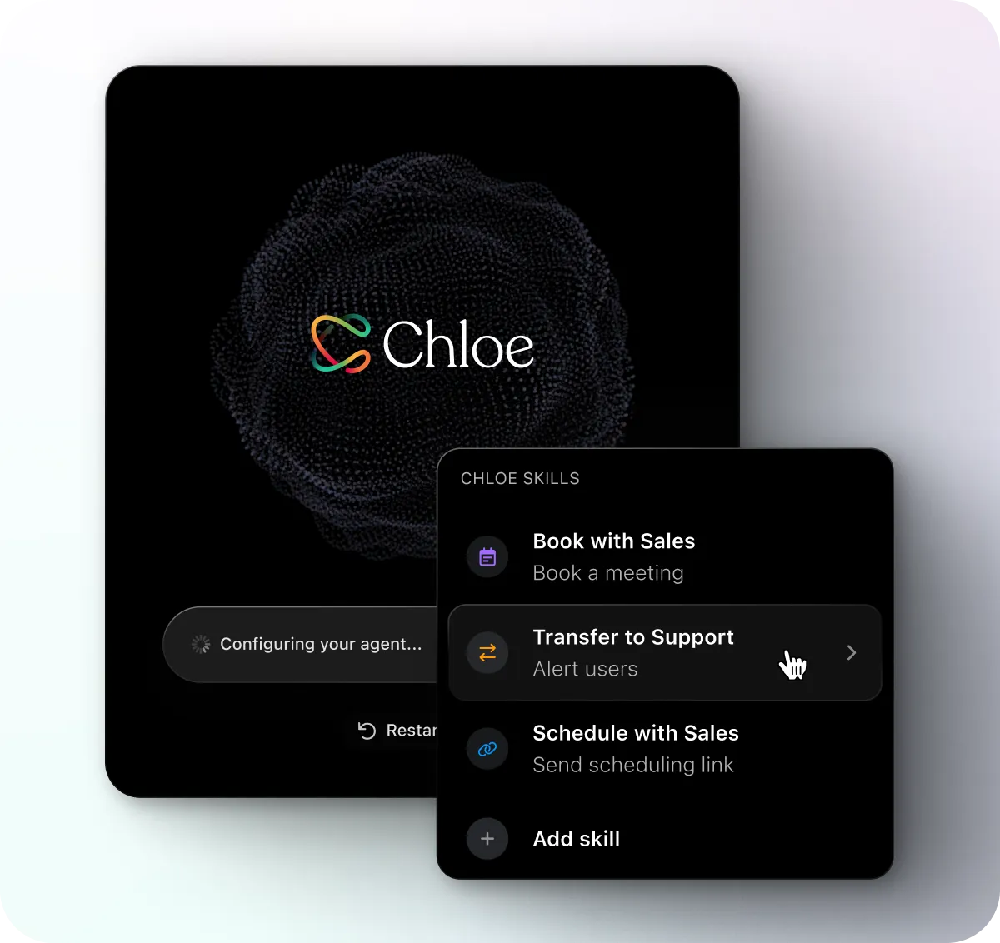
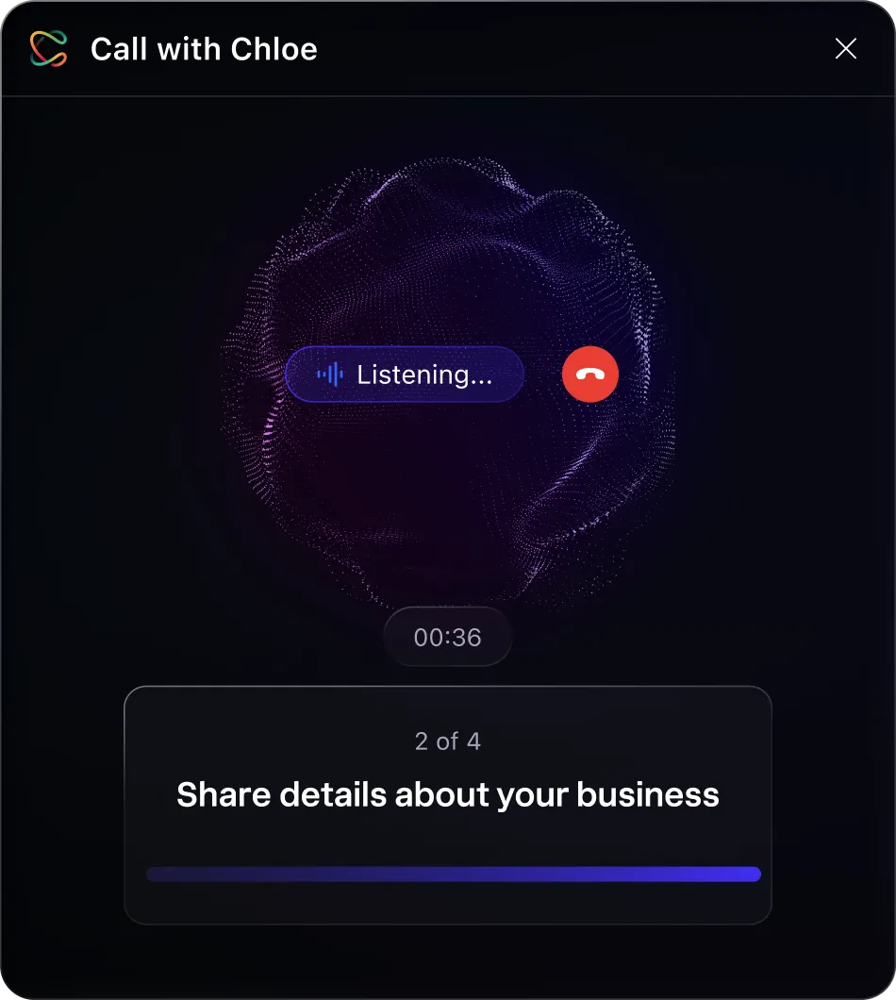
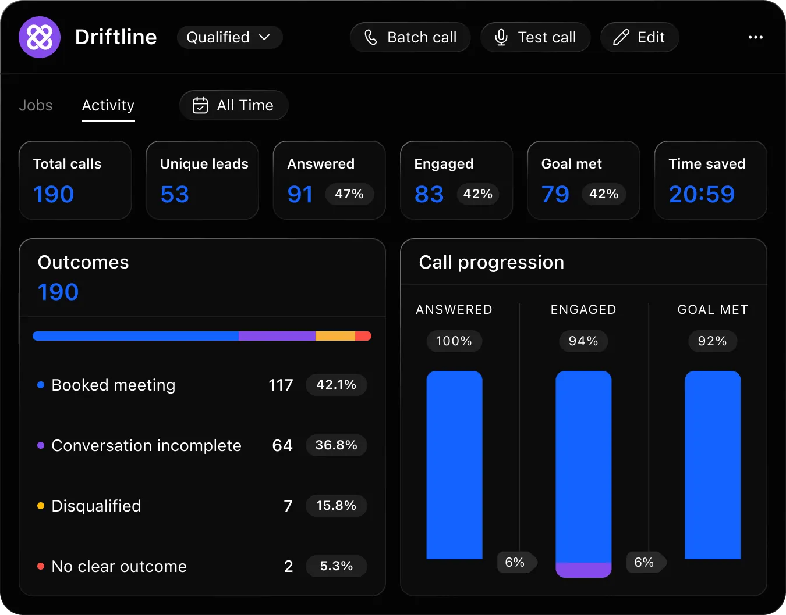

### 🎬 관련 영상
- [🎥 영상 보기](https://ph-files.imgix.net/5adf7c64-c82a-4b63-a6d6-0a88565deb8e.jpeg?auto=format)

---

## 21. [Kai for Chrome](https://www.producthunt.com/products/kai-for-chrome)
**Votes**: 83 | **도입 난이도**: 하 | **신뢰도**: 상
**Tagline**: Local meeting transcription with no account needed
**서비스 링크**: https://www.producthunt.com/r/UZQ6IYMI5CY3CE

**태그**: Productivity, AI, Privacy, ChromeExtension, AI Tool, API

### 📌 이 서비스 한눈에 보기
계정 생성이나 클라우드 업로드 없이 브라우저 내에서 즉시 실행되는 로컬 회의 기록 및 요약 도구

### 🔑 주요 기능
- WebGPU와 WASM을 활용한 100% 온디바이스(On-device) 음성 인식 및 요약
- 계정 생성, 데이터 업로드, 회의 참여 봇이 필요 없는 프라이버시 중심 설계
- Meet, Zoom, Teams 등 웹 기반 화상 회의에 즉시 적용 가능한 크롬 확장 프로그램

### 🙋 사용자에게 어떤 점이 좋은가
회의 내용이 외부 서버로 전송되지 않아 보안이 중요한 업무 환경에서 안심하고 사용할 수 있으며, 별도의 가입 절차 없이 즉각적인 요약 결과물을 얻을 수 있습니다.

### ✅ 지금 바로 써볼 기능
- 크롬 확장 프로그램 설치 후 ⌘⇧K 단축키 익히기
- 웹 기반 화상 회의(Meet, Zoom 등) 실행 및 테스트
- 회의 종료 직후 생성되는 요약 및 액션 아이템 확인

### ⚠️ 사용 전 확인할 점
- 로컬 리소스(WebGPU/WASM)를 사용하므로 사용 중 컴퓨터 성능(CPU/GPU)에 영향을 줄 수 있음
- 클라우드 방식이 아니므로 기기 사양에 따라 처리 속도가 달라질 수 있음

### 🧭 확인이 더 필요한 정보
로컬 환경에서의 처리 속도와 하드웨어 요구 사양에 대한 구체적인 가이드라인이 명시되지 않았습니다.

### 📸 스크린샷 및 갤러리
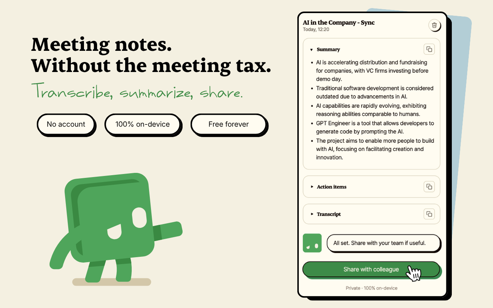
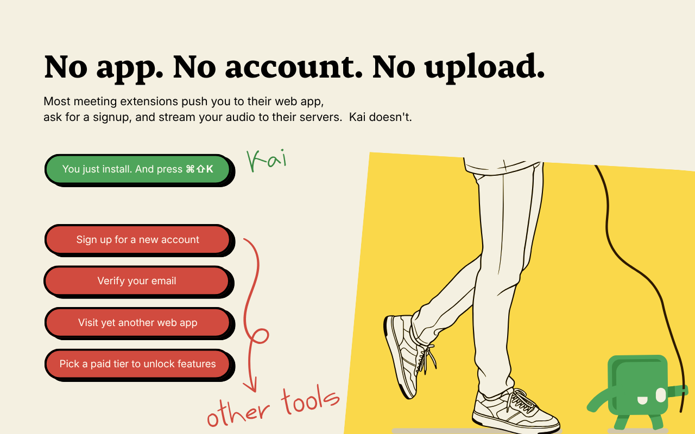
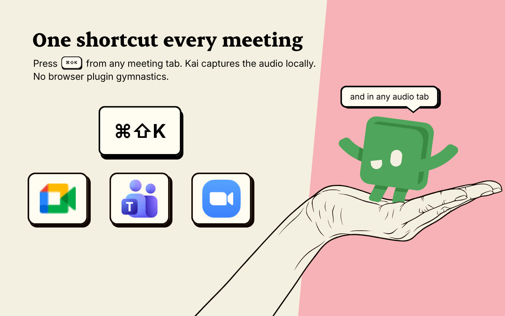

### 🎬 관련 영상
- [🎥 영상 보기](https://ph-files.imgix.net/343bfa29-fc38-48bc-a689-ac1c95cb0c4f.jpeg?auto=format)

---

## 22. [Cignara](https://www.producthunt.com/products/cignara)
**Votes**: 82 | **도입 난이도**: 상 | **신뢰도**: 상
**Tagline**: AI Agents for Fortune 500 grade customer support
**서비스 링크**: https://www.producthunt.com/r/QS3CM5UZVH5C3S

**태그**: AI Agents, Customer Support, Automation, Enterprise, Agent, AI Tool, Chat

### 📌 이 서비스 한눈에 보기
기업의 비즈니스 규칙을 준수하며 음성과 채팅을 통해 고객 응대를 완결하는 엔터프라이즈급 AI 에이전트

### 🔑 주요 기능
- 음성 및 채팅을 통한 엔드 투 엔드(End-to-End) 고객 대화 처리
- 엄격한 정책 거버넌스를 통한 비즈니스 규칙 준수 및 환각 현상(Hallucination) 방지
- LG와 같은 포춘 500대 기업이 신뢰하는 엔터프라이즈급 보안 및 안정성

### 🙋 사용자에게 어떤 점이 좋은가
복잡한 비즈니스 규칙이 필요한 고객 지원 업무를 AI가 정확하게 수행하여, 운영 효율성을 높이고 상담원의 개입을 최소화할 수 있습니다.

### ✅ 지금 바로 써볼 기능
- 기업 내부 비즈니스 규칙 적용 가능 여부 검토
- 음성 및 채팅 채널 연동 테스트
- 기존 고객 지원 워크플로우와의 정합성 확인

### ⚠️ 사용 전 확인할 점
- 엔터프라이즈급 솔루션으로서 초기 도입 및 설정 과정이 복잡할 수 있음
- 기업별 맞춤형 정책 설정 및 거버넌스 구축을 위한 전문 인력 필요 가능성

### 🧭 확인이 더 필요한 정보
구체적인 가격 정책과 기존 고객 지원 시스템(CRM 등)과의 연동 방식에 대한 정보가 필요합니다.

### 📸 스크린샷 및 갤러리
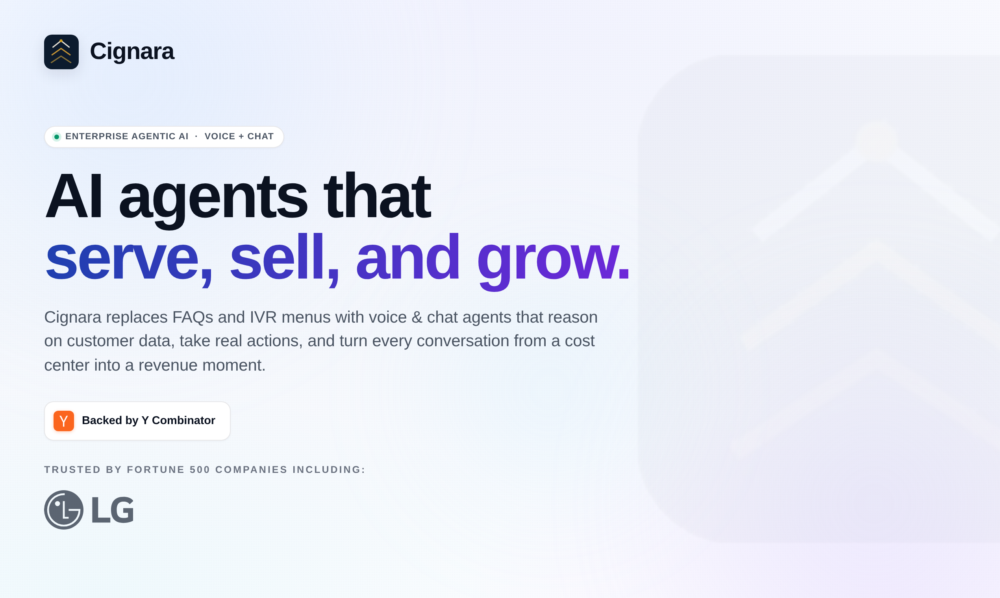
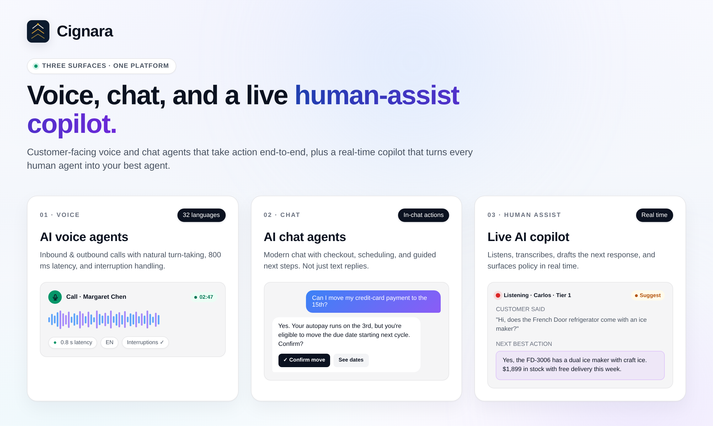
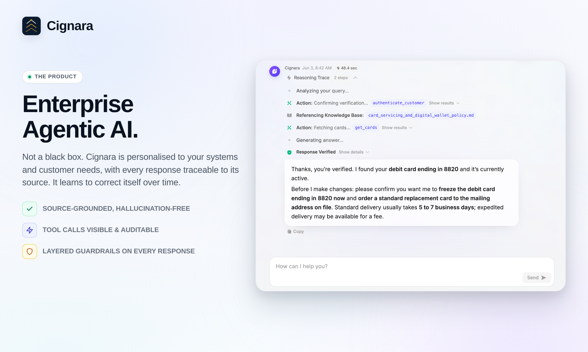

### 🎬 관련 영상
- [🎥 영상 보기](https://ph-files.imgix.net/4c481b50-644b-4c9f-81ec-59644ca8501e.jpeg?auto=format)

---

## 23. [Smart Runner](https://www.producthunt.com/products/smart-runner)
**Votes**: 82 | **도입 난이도**: 하 | **신뢰도**: 상
**Tagline**: Your training plan, rewritten after every run
**서비스 링크**: https://www.producthunt.com/r/KI6D3BXCXLQFER

**태그**: Fitness, Running, Personalized, Privacy, AI Tool

### 📌 이 서비스 한눈에 보기
매 러닝 결과에 따라 훈련 계획이 실시간으로 재구성되는 개인 맞춤형 러닝 플래너

### 🔑 주요 기능
- 단 한 번의 레이스 결과로 시작하여 매 러닝 후 자동 업데이트되는 적응형 훈련 플랜
- Pfitzinger, Daniels, Canova 등 전문적인 훈련 방법론과 VDOT 기반 페이스 적용
- 구독 없이 한 번만 구매하는 방식 및 데이터 보안을 위한 완전한 온디바이스(On-device) 운영

### 🙋 사용자에게 어떤 점이 좋은가
전문적인 훈련 이론을 바탕으로 매번 계획을 수정할 번거로움 없이 개인의 체력 변화에 맞춘 최적의 페이스를 제공합니다.

### ✅ 지금 바로 써볼 기능
- 14일 무료 체험을 통한 훈련 플랜 적합성 테스트
- 애플 워치 앱을 통한 실시간 페이스 및 심박수 존 확인
- 기존 러닝 데이터와 VDOT 기반 페이스 비교

### ⚠️ 사용 전 확인할 점
- 애플 워치 네이티브 앱 사용을 위한 iOS 환경 필요
- 온디바이스 방식이므로 기기 변경 시 데이터 이전 방식 확인 필요

### 🧭 확인이 더 필요한 정보
기기 변경 시 데이터 백업 및 동기화 방식에 대한 구체적인 설명이 부족합니다.

### 📸 스크린샷 및 갤러리
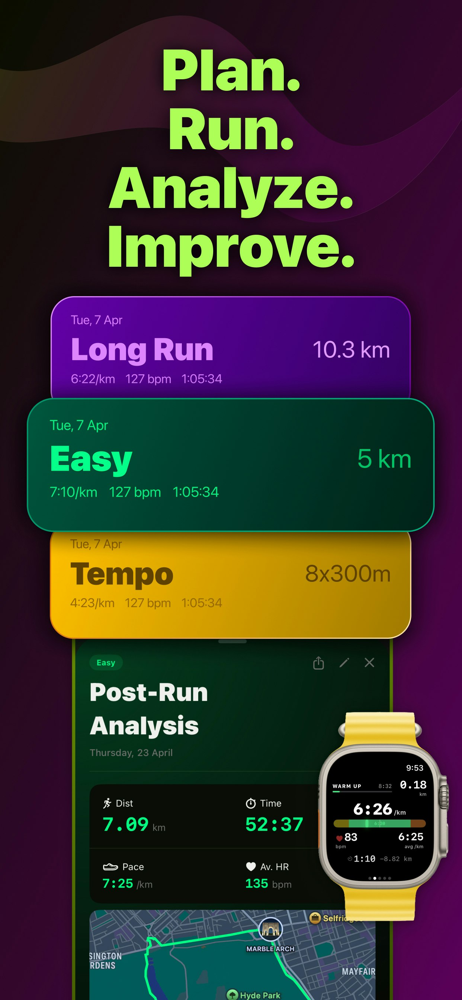
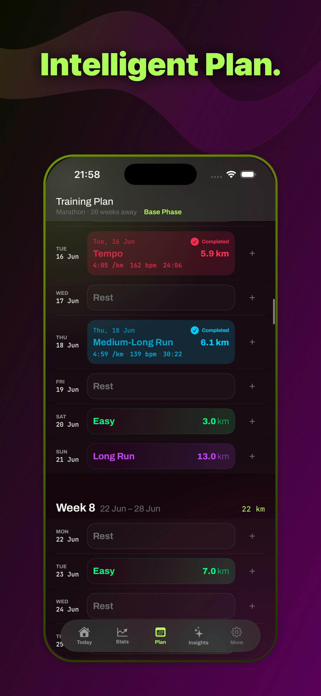
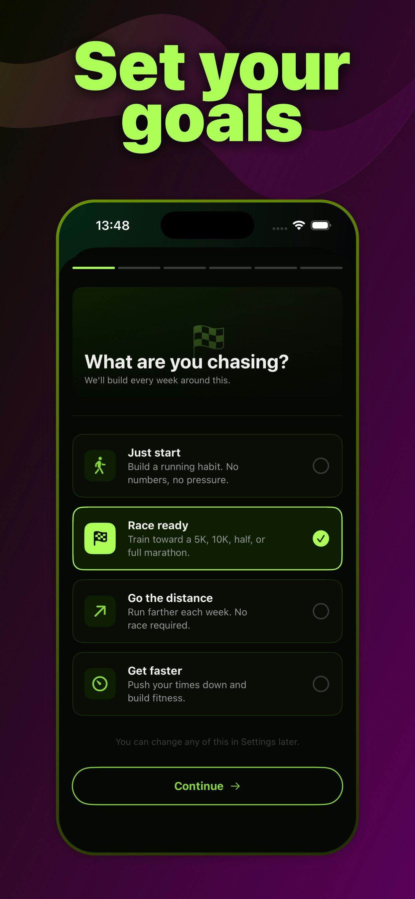

---

## 24. [Audex Trace](https://www.producthunt.com/products/audex-trace)
**Votes**: 81 | **도입 난이도**: 하 | **신뢰도**: 상
**Tagline**: Trace what Apple Music is actually playing
**서비스 링크**: https://www.producthunt.com/r/PUCFPBT2X53BUU

**태그**: Audio, Mac, Music, Monitoring, AI Tool, DevTool

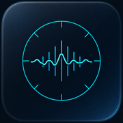

### 📌 이 서비스 한눈에 보기
애플 뮤직의 실시간 재생 품질과 큐 상태를 모니터링하는 Mac용 플레이어

### 🔑 주요 기능
- 코덱, 비트 심도, 샘플 레이트 등 실시간 오디오 출력 정보 제공
- 출력 장치와의 매칭 상태 확인 가능
- 다음 재생 곡 정보 및 향후 큐의 음질 예측 기능

### 🙋 사용자에게 어떤 점이 좋은가
애플 뮤직을 통해 고음질 음원을 감상할 때, 현재 설정이 최적의 상태인지 실시간으로 검증할 수 있습니다.

### ✅ 지금 바로 써볼 기능
- 현재 재생 중인 곡의 코덱 및 샘플 레이트 확인하기
- 출력 장치와 오디오 설정의 매칭 상태 체크하기
- 다음 곡의 음질 상태 미리 확인하기

### ⚠️ 사용 전 확인할 점
- Mac mini 환경에 특화된 플레이어로 명시되어 있어 타 플랫폼 호환성 확인 필요
- 실제 음질을 변경하는 도구가 아닌 모니터링 및 정보 제공 중심의 도구임

### 🧭 확인이 더 필요한 정보
Mac mini 외의 다른 Mac 모델이나 OS 버전에서의 완벽한 호환 여부는 확인이 필요합니다.

### 📸 스크린샷 및 갤러리
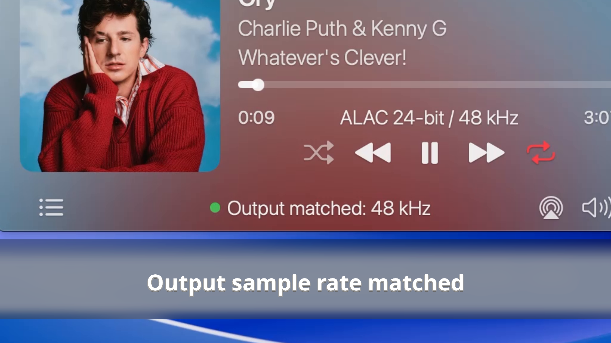
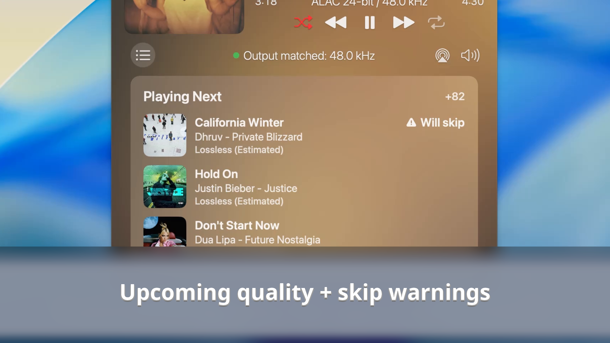

### 🎬 관련 영상
- [🎥 영상 보기](https://ph-files.imgix.net/8a8aa6f2-2d3f-4788-9602-4780b5fee97b.jpeg?auto=format)

---

## 25. [PlugTalk](https://www.producthunt.com/products/plugtalk)
**Votes**: 80 | **도입 난이도**: 하 | **신뢰도**: 상
**Tagline**: Your Mac talks back when you plug things in
**서비스 링크**: https://www.producthunt.com/r/J33NYIXDGZTYBW

**태그**: Mac, Utility, Hardware, Productivity

### 📌 이 서비스 한눈에 보기
USB 연결 상태를 소리와 메뉴 바를 통해 직관적으로 알려주는 Mac 전용 유틸리티

### 🔑 주요 기능
- USB 연결/해제 시 커스텀 사운드 및 메뉴 바 실시간 정보(속도, 전력, 용량) 제공
- 18종의 내장 사운드 팩 및 사용자 MP3 지원
- Apple Silicon 최적화로 CPU 점유율 0% 유지

### 🙋 사용자에게 어떤 점이 좋은가
장치 연결 상태를 시각적/청각적으로 즉시 확인하여 작업 흐름을 유지하고, 장치의 전력 및 데이터 상태를 간편하게 모니터링할 수 있습니다.

### ✅ 지금 바로 써볼 기능
- 7일 무료 체험을 통한 사운드 및 알림 피드백 확인
- 메뉴 바를 통한 실시간 USB 데이터 및 전력 소모량 모니터링
- 사용자 취향에 맞는 커스텀 MP3 사운드 설정

### ⚠️ 사용 전 확인할 점
- 일회성 구매 비용($6.99) 발생
- Mac 전용 소프트웨어로 타 OS 미지원

### 🧭 확인이 더 필요한 정보
특정 허브 환경에서의 그룹화 기능 작동 방식에 대한 상세 정보는 추가 확인이 필요합니다.

### 📸 스크린샷 및 갤러리
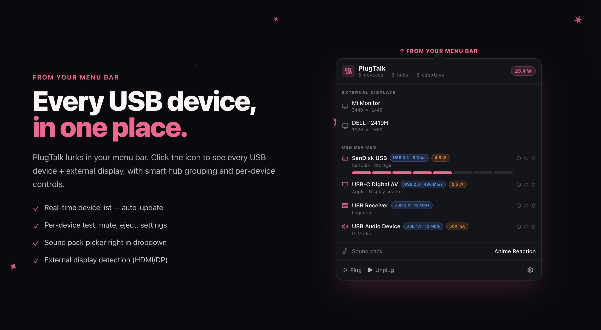
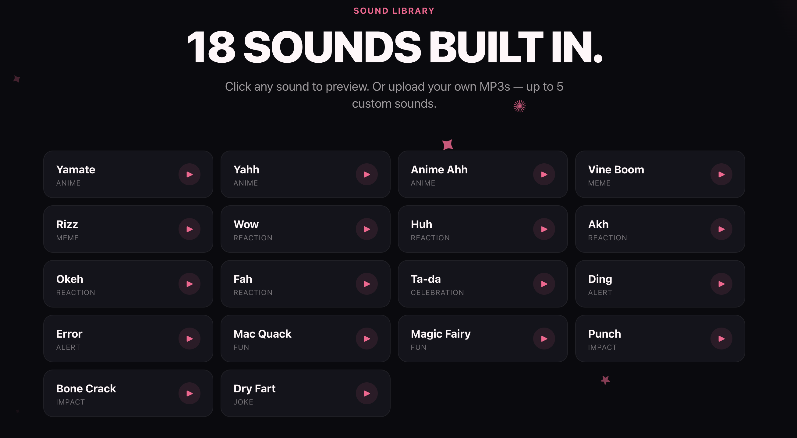
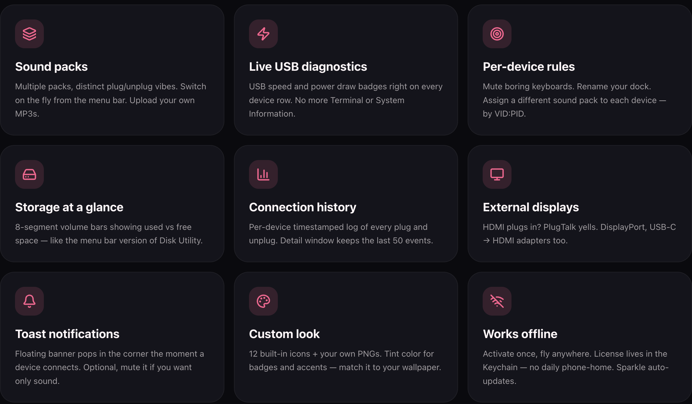

---

## 26. [Curata](https://www.producthunt.com/products/curata-3)
**Votes**: 79 | **도입 난이도**: 중 | **신뢰도**: 상
**Tagline**: A shared workspace for AI agents and humans.
**서비스 링크**: https://www.producthunt.com/r/7BQIRQ3TFQ5TYO

**태그**: AI-Native, KnowledgeBase, Automation, Collaboration, Workflow, Agent, AI Tool, CRM

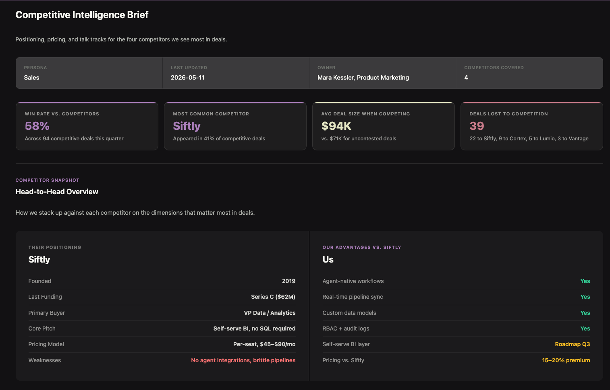

### 📌 이 서비스 한눈에 보기
AI 에이전트와 사람이 협업하여 실시간 데이터를 지식 베이스로 구축하는 워크스페이스

### 🔑 주요 기능
- CRM, Slack 등 실시간 데이터 기반의 자동 구조화 문서 생성
- MCP(Model Context Protocol)를 통한 에이전트 연결 및 읽기/쓰기 권한 관리
- 에이전트의 초안 작성과 인간의 검토/주석이 결합된 루프형 협업 구조

### 🙋 사용자에게 어떤 점이 좋은가
수동 업데이트 없이도 최신 데이터를 반영한 문서가 유지되며, AI가 작성한 내용을 사람이 검토하여 지식의 정확성을 높일 수 있습니다.

### ✅ 지금 바로 써볼 기능
- 기존 데이터 소스(CRM, Slack 등) 연동 테스트
- 에이전트가 생성한 페이지의 구조 및 컴포넌트 확인
- 주석 레이어를 활용한 인간-AI 피드백 루프 설정

### ⚠️ 사용 전 확인할 점
- 에이전트에게 쓰기 권한 부여 시 데이터 무결성 관리 필요
- 실시간 데이터 연동 시 발생할 수 있는 비용 및 API 호출 제한

### 🧭 확인이 더 필요한 정보
현재 제공되는 20여 개의 리치 컴포넌트가 구체적으로 어떤 데이터 시각화나 형식을 지원하는지 확인이 필요합니다.

### 📸 스크린샷 및 갤러리
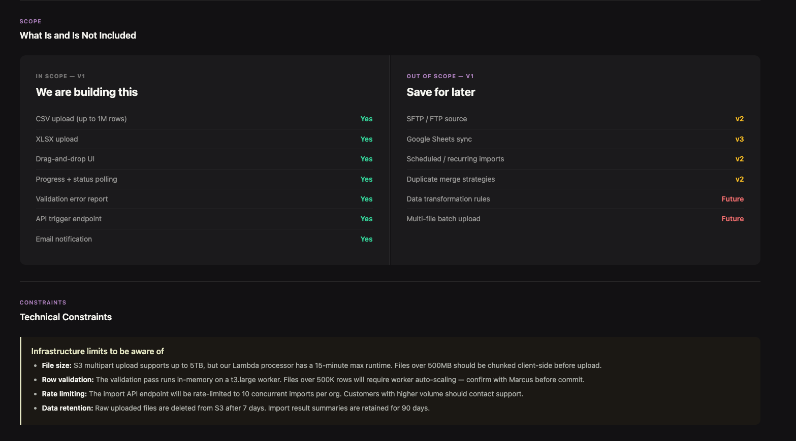
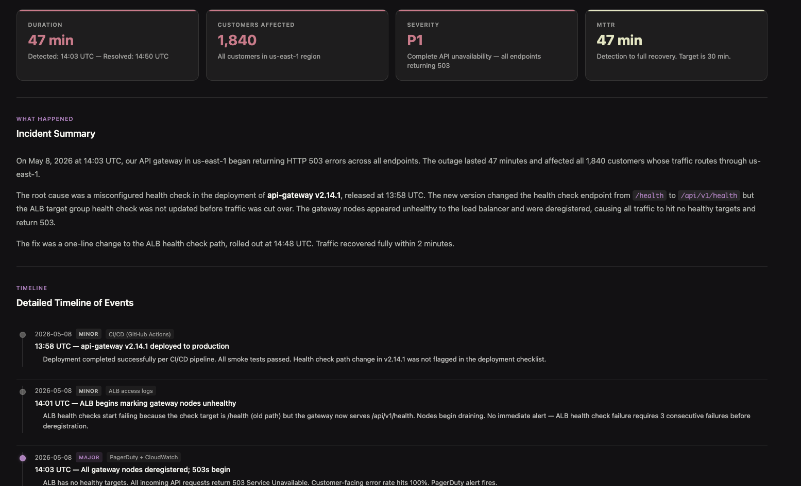

### 🎬 관련 영상
- [🎥 영상 보기](https://ph-files.imgix.net/41a90604-8a4e-411c-a454-96c724630646.jpeg?auto=format)

---

## 27. [Split Ninja](https://www.producthunt.com/products/split-ninja)
**Votes**: 79 | **도입 난이도**: 하 | **신뢰도**: 상
**Tagline**: Cut, extract, mute, and split videos locally
**서비스 링크**: https://www.producthunt.com/r/AISXOJAJPELE3M

**태그**: VideoEditing, Privacy, WebTool, Productivity, Video, DevTool

### 📌 이 서비스 한눈에 보기
개인정보 유출 걱정 없이 브라우저에서 즉시 실행되는 로컬 기반 영상 편집 도구

### 🔑 주요 기능
- 로컬 우선(Local-first) 방식으로 파일이 기기에 안전하게 유지됨
- 영상 커팅, 오디오 추출, 음소거, 장면 분할 기능 제공
- 브라우저 내에서 빠른 내보내기 및 정밀한 재인코딩 지원

### 🙋 사용자에게 어떤 점이 좋은가
파일을 서버에 업로드할 필요가 없어 보안이 뛰어나며, 별도의 소프트웨어 설치 없이 브라우저에서 빠르고 간편하게 영상 편집이 가능합니다.

### ✅ 지금 바로 써볼 기능
- 영상 구간 자르기 및 추출 기능 테스트
- 로컬 환경에서의 내보내기 속도 확인
- 정밀한 재인코딩 모드 활용

### ⚠️ 사용 전 확인할 점
- 브라우저 리소스 사용량에 따른 대용량 파일 처리 성능 제한 가능성
- 로컬 실행 방식이므로 기기 사양에 따라 작업 속도가 달라질 수 있음

### 🧭 확인이 더 필요한 정보
지원하는 최대 파일 크기 및 브라우저별 호환 범위에 대한 구체적인 정보가 필요합니다.

### 📸 스크린샷 및 갤러리
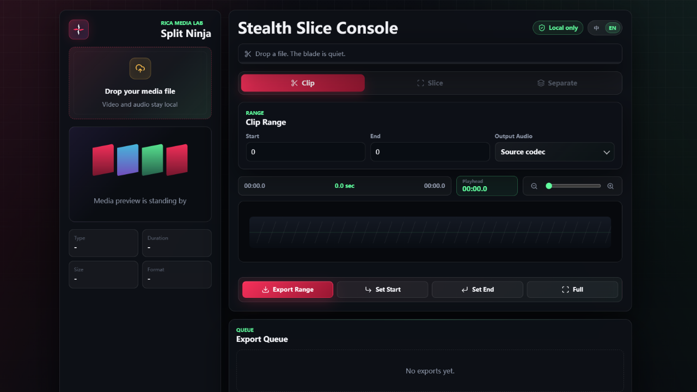
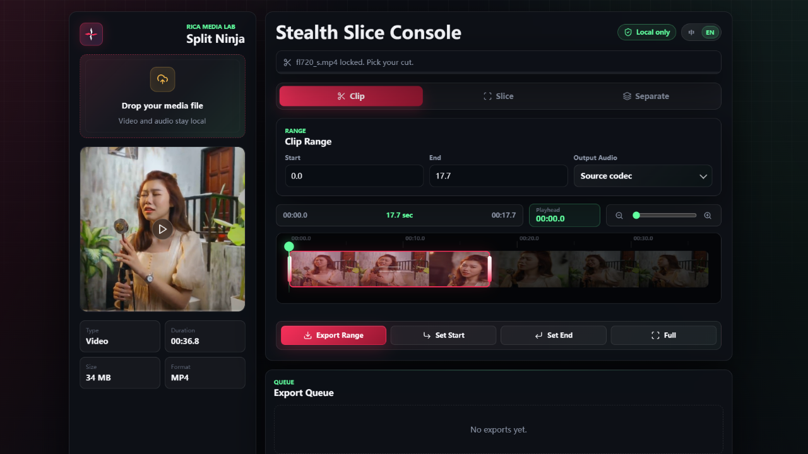
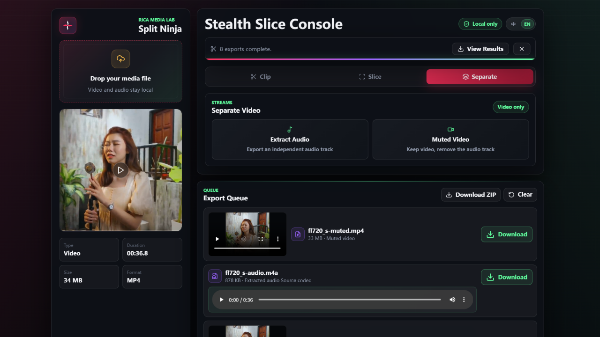

---

## 28. [Walrus Memory](https://www.producthunt.com/products/walrus-memory)
**Votes**: 79 | **도입 난이도**: 중 | **신뢰도**: 상
**Tagline**: Enable agents to keep context & work across apps + sessions
**서비스 링크**: https://www.producthunt.com/r/QQDFDXJIZ5RLZW

**태그**: AI, Automation, AgenticWorkflow, DataLayer, Agent, AI Tool

### 📌 이 서비스 한눈에 보기
AI 에이전트가 앱과 세션을 넘나들며 맥락을 유지할 수 있게 돕는 메모리 레이어

### 🔑 주요 기능
- 앱 및 세션 간 끊김 없는 컨텍스트 유지
- 사용자가 직접 제어 가능한 데이터 신뢰성 확보
- 복잡한 워크플로우 수행을 위한 휴대 가능한 메모리 계층

### 🙋 사용자에게 어떤 점이 좋은가
AI 에이전트가 이전 작업 내용을 기억하지 못해 발생하는 맥락 손실 문제를 해결하고, 더 복잡한 자동화 작업을 수행할 수 있게 합니다.

### ✅ 지금 바로 써볼 기능
- 에이전트 워크플로우에 메모리 레이어 통합 테스트
- 데이터 제어 및 검증 기능 확인
- 멀티 앱 환경에서의 컨텍스트 유지 성능 테스트

### ⚠️ 사용 전 확인할 점
- 에이전트가 다루는 데이터의 보안 및 프라이버시 설정 확인 필요
- 기존 워크플로우와의 통합 난이도 검토

### 🧭 확인이 더 필요한 정보
구체적인 기술 스택 및 기존 AI 프레임워크와의 호환성 범위에 대한 정보가 더 필요합니다.

### 📸 스크린샷 및 갤러리

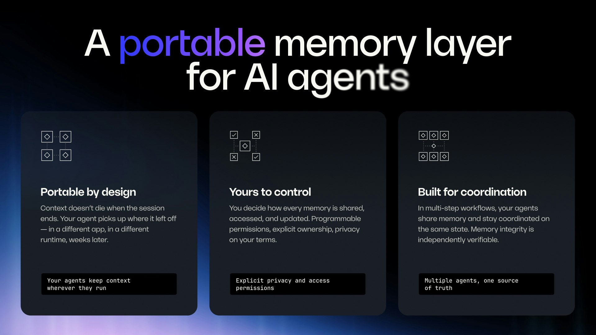
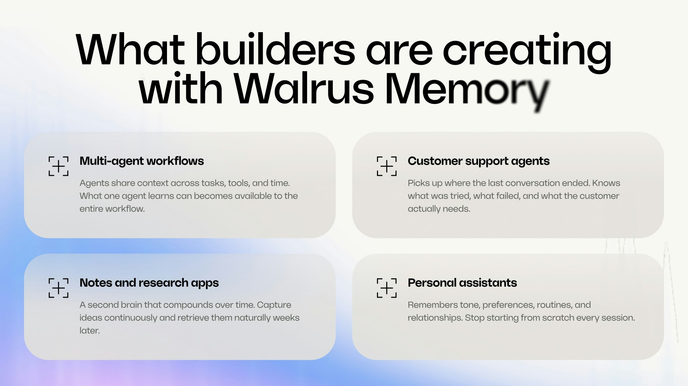

### 🎬 관련 영상
- [🎥 영상 보기](https://ph-files.imgix.net/bb92ee84-bc17-4b57-8e4d-9954d7a0cf44.jpeg?auto=format)

---

## 29. [ChatPilot](https://www.producthunt.com/products/chatpilot-2)
**Votes**: 74 | **도입 난이도**: 하 | **신뢰도**: 상
**Tagline**: Bulk delete, archive & timestamp your ChatGPT conversations
**서비스 링크**: https://www.producthunt.com/r/SXORC5KEI66GKN

**태그**: Productivity, ChromeExtension, ChatGPT, Automation, Chat

### 📌 이 서비스 한눈에 보기
ChatGPT 대화 내역을 한 번에 정리하고 시간별로 관리할 수 있는 크롬 확장 프로그램

### 🔑 주요 기능
- 여러 대화를 한 번에 삭제하거나 보관하는 벌크 관리 기능
- 대화 발생 시점을 확인할 수 있는 타임스탬프 기능 추가
- 복잡한 대화 목록을 빠르고 간편하게 정리하는 가벼운 도구

### 🙋 사용자에게 어떤 점이 좋은가
일일이 하나씩 삭제해야 했던 번거로움을 해결하여 ChatGPT 대화 목록을 깔끔하게 유지하고 관리할 수 있습니다.

### ✅ 지금 바로 써볼 기능
- 불필요한 대화 목록 일괄 삭제하기
- 중요한 대화 보관 처리하기
- 타임스탬프를 통한 대화 시점 확인하기

### ⚠️ 사용 전 확인할 점
- 크롬 확장 프로그램 설치 및 권한 허용 필요
- 대화 삭제 시 복구가 불가능할 수 있으므로 주의 필요

### 🧭 확인이 더 필요한 정보
대화 삭제 및 아카이브 기능이 ChatGPT의 공식 인터페이스와 충돌 없이 안정적으로 작동하는지 확인이 필요합니다.

### 📸 스크린샷 및 갤러리
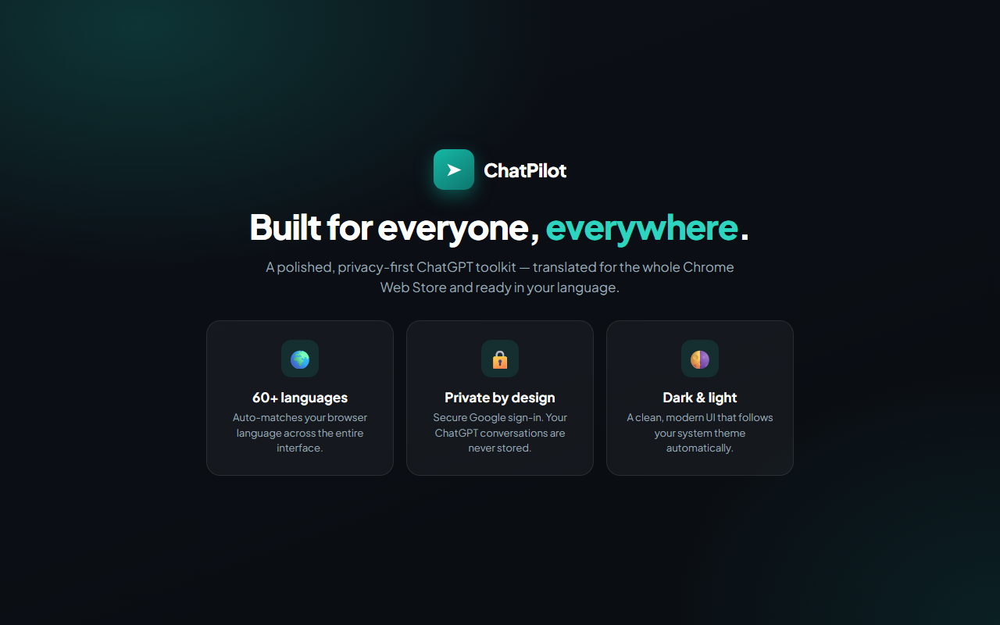
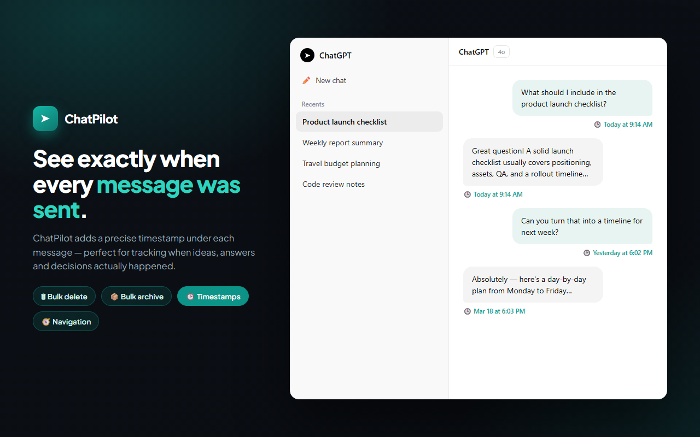
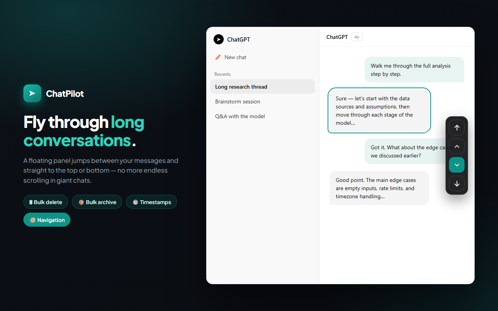

---

## 30. [DotBGE](https://www.producthunt.com/products/dotbge)
**Votes**: 73 | **도입 난이도**: 중 | **신뢰도**: 상
**Tagline**: Local-first file encryption for iOS, CLI, and agents
**서비스 링크**: https://www.producthunt.com/r/5WBCN3FUXCAS2G

**태그**: Security, DevTool, Automation, iOS, CLI, Agent, Chat

### 📌 이 서비스 한눈에 보기
계정이나 서버 없이 기기 내에서 안전하게 파일을 암호화하는 로컬 퍼스트 보안 솔루션

### 🔑 주요 기능
- 계정 및 서버가 없는 완전한 로컬 기반 암호화 방식
- iOS 앱, CLI, AI 에이전트(Claude Code 등)를 아우르는 멀티 플랫폼 지원
- identity-based RSA 및 비밀번호 모드를 지원하는 오픈 포맷 기반

### 🙋 사용자에게 어떤 점이 좋은가
개인정보 유출 걱정 없이 모바일과 터미널 환경에서 파일을 안전하게 관리하고, AI 에이전트와 연동하여 자동화된 워크플로우를 구축할 수 있습니다.

### ✅ 지금 바로 써볼 기능
- iOS 앱을 통한 모바일 파일 암호화 및 공유 테스트
- CLI를 활용한 터미널 기반 스크립트 워크플로우 구축
- AI 에이전트(Claude Code 등)에 bundled skill을 통한 파일 처리 연동

### ⚠️ 사용 전 확인할 점
- 로컬 기반이므로 비밀번호나 키 분실 시 데이터 복구가 어려울 수 있음
- CLI 및 에이전트 활용 시 숙련된 기술적 이해도 필요

### 🧭 확인이 더 필요한 정보
사용자 환경에 따른 구체적인 보안 프로토콜의 상세 구현 방식과 에이전트 연동 시의 보안 경계에 대한 확인이 필요합니다.

### 📸 스크린샷 및 갤러리
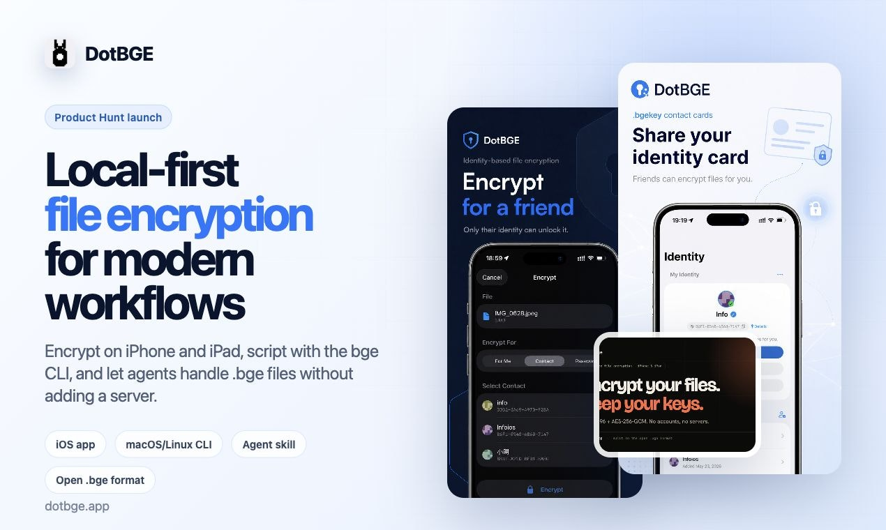
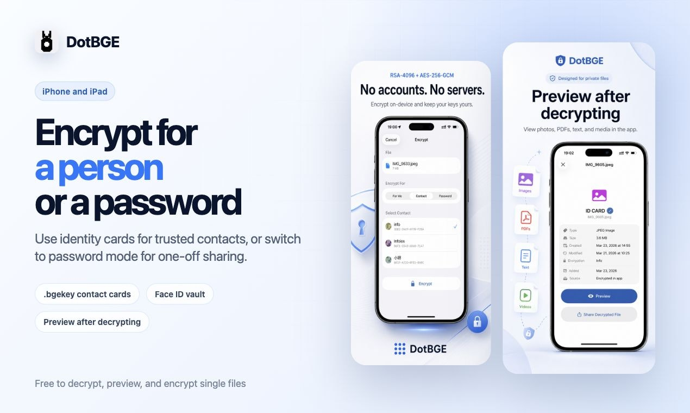
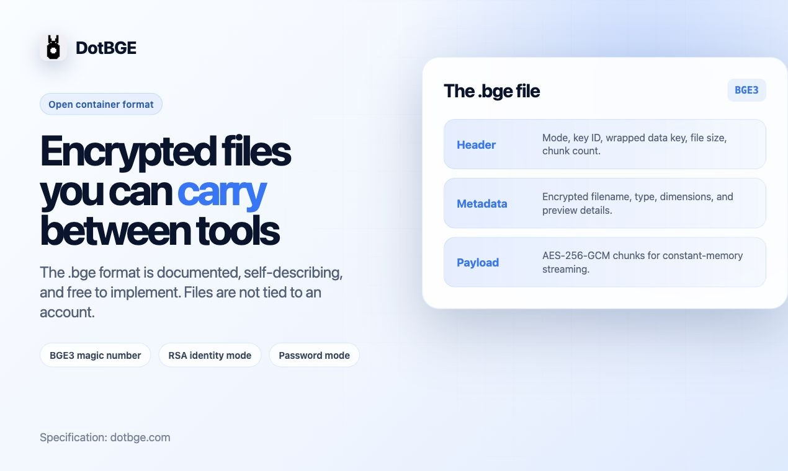

---

