# 🚀 Product Hunt Daily Top 30 (2026-06-06)

## 오늘의 요약
오늘의 트렌드는 단순한 챗봇을 넘어 실무를 자율적으로 수행하는 'AI 에이전트'와 복잡한 맥락을 이해하는 '컨텍스트 엔진'의 진화가 두드러졌습니다. 또한, 금융 및 이커머스 등 전문 영역에서의 정밀한 데이터 처리와 개인정보 보호를 위한 온디바이스(On-device) 및 로컬 실행 기술이 핵심적인 가치로 부각되었습니다.

### 오늘의 핵심 포인트
- 자율적 워크플로우를 수행하며 실무를 완결하는 AI 에이전트 기술이 구체적인 성능 검증 단계로 진입했습니다.
- 금융 분석 및 이커머스 운영 등 전문적인 의사결정을 지원하는 고정밀·고효율 AI 솔루션들이 주목받았습니다.
- 데이터 보안과 프라이버시를 위해 로컬 환경에서 동작하거나 기기 내부에서 맥락을 처리하는 기술이 강조되었습니다.

**오늘의 태그**: AI 에이전트, 금융 AI, 온디바이스 AI, 업무 자동화

## 1. [Leni](https://www.producthunt.com/products/leni)
**Votes**: 400 | **도입 난이도**: 중 | **신뢰도**: 상
**Tagline**: The world’s most accurate AI for investors
**서비스 링크**: https://www.producthunt.com/r/FFWCFWSDY3ELXY

**태그**: FinTech, AI, Investment, DataAnalytics, AI Tool

### 📌 이 서비스 한눈에 보기
검증 가능한 데이터와 감사 추적 기능을 갖춘 투자 전문가용 고정밀 AI

### 🔑 주요 기능
- 21,000개 이상의 의사결정 트레이스 및 일일 1억 행 이상의 데이터 처리 기반
- 출처 링크, 타임스탬프, 근거 데이터(comps)를 통한 완전한 감사 가능성 제공
- GPT, Claude 등 범용 AI 대비 정확도, 모델링, 가치 평가 분야에서 우수한 성능

### 🙋 사용자에게 어떤 점이 좋은가
수백만 달러 규모의 의사결정을 내리는 투자 전문가들에게 신뢰할 수 있는 금융급 분석 결과와 검증 가능한 근거를 제공합니다.

### ✅ 지금 바로 써볼 기능
- 독립 벤치마크 결과 확인
- 데이터 출처 및 감사 기능 테스트
- 금융 모델링 및 가치 평가 워크플로우 적용

### ⚠️ 사용 전 확인할 점
- 전문적인 투자 업무를 위한 도구이므로 사용자의 최종 검토가 필수적임
- 데이터 처리 규모와 복잡성으로 인해 숙련된 사용자에게 최적화되어 있을 가능성

### 🧭 확인이 더 필요한 정보
구체적인 사용자 인터페이스(UI) 및 기존 금융 소프트웨어와의 통합 방식에 대한 정보가 부족합니다.

### 📸 스크린샷 및 갤러리
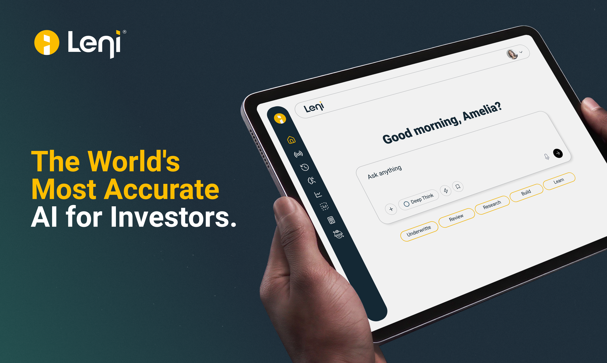
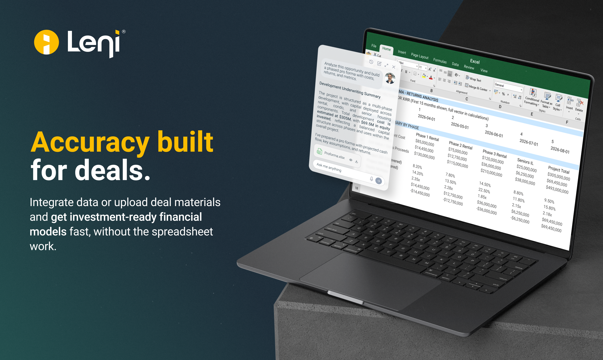
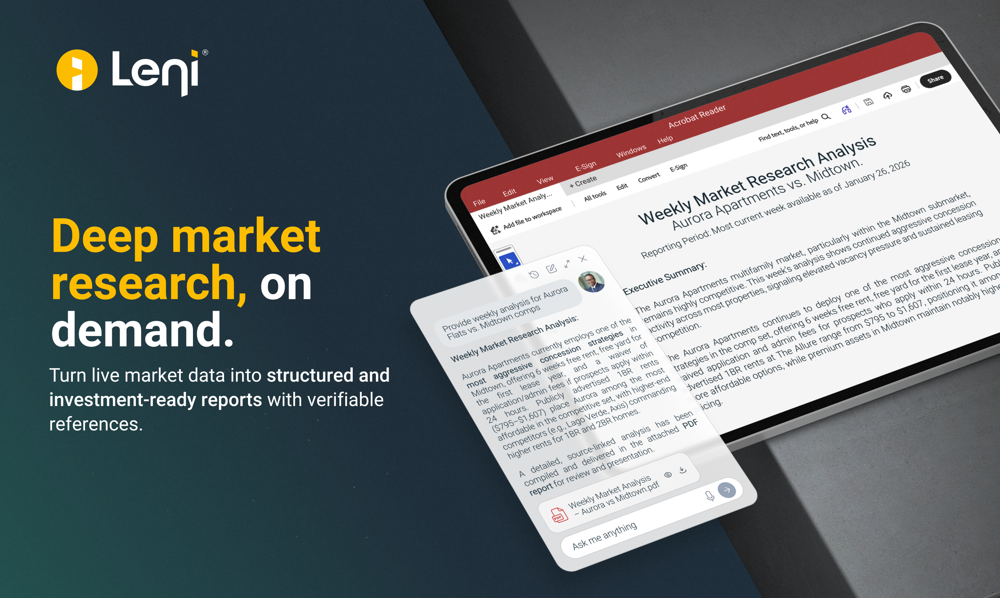

### 🎬 관련 영상
- [🎥 영상 보기](https://ph-files.imgix.net/320d65f5-c323-4658-8559-0a380593db03.jpeg?auto=format)

---

## 2. [SellerClaw](https://www.producthunt.com/products/sellerclaw)
**Votes**: 374 | **도입 난이도**: 중 | **신뢰도**: 상
**Tagline**: A team of AI agents that runs your stores across channels
**서비스 링크**: https://www.producthunt.com/r/7EVPIJ3T3Q6YW2

**태그**: E-commerce, AI Agents, Automation, SaaS, Agent, AI Tool, LLM

### 📌 이 서비스 한눈에 보기
AI 에이전트 팀이 상품 소싱부터 운영까지 이커머스 전 과정을 자동화해주는 솔루션

### 🔑 주요 기능
- 소싱, 관리, 광고 등 역할별로 특화된 AI 에이전트 팀 운영
- Shopify, eBay 등 다양한 채널을 아우르는 통합 관리
- 사용자의 승인 하에 동작하는 제어 가능한 자동화 시스템

### 🙋 사용자에게 어떤 점이 좋은가
여러 채널의 스토어를 운영하는 판매자가 반복적인 운영 업무에서 벗어나 전략적 의사결정에만 집중할 수 있게 해줍니다.

### ✅ 지금 바로 써볼 기능
- 판매할 상품 카테고리 설정하기
- AI 에이전트의 자동화 범위 설정하기
- 스토어 채널 연동 및 승인 프로세스 테스트하기

### ⚠️ 사용 전 확인할 점
- AI가 생성한 상품 리스팅 및 광고 문구의 정확성 검토 필요
- 물류(Fulfillment) 및 고객 지원 단계에서의 실질적 처리 역량 확인 필요

### 🧭 확인이 더 필요한 정보
각 채널별 구체적인 연동 범위와 물류/배송 대행 서비스와의 연계 방식에 대한 추가 확인이 필요합니다.

### 📸 스크린샷 및 갤러리
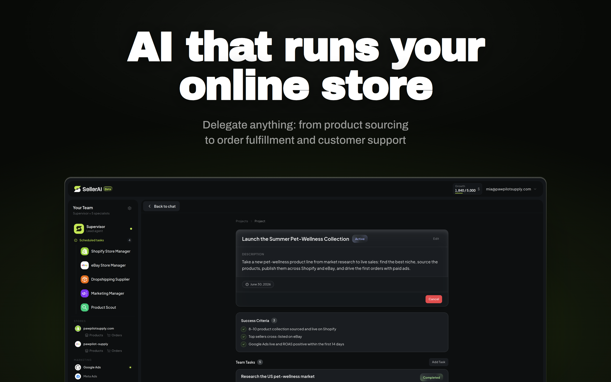
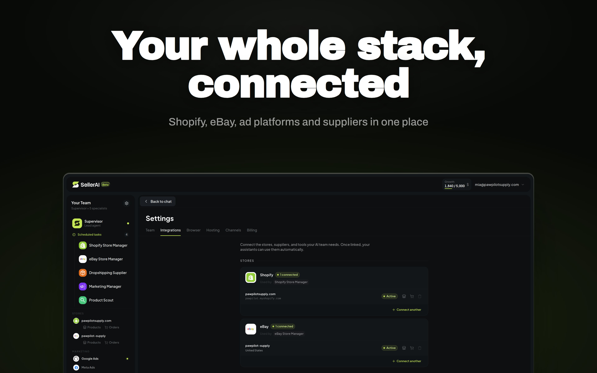
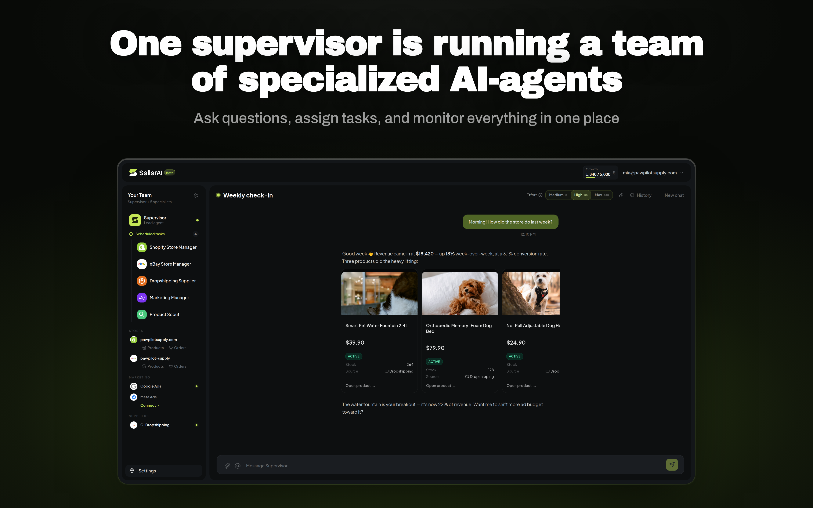

### 🎬 관련 영상
- [🎥 영상 보기](https://ph-files.imgix.net/05917104-3d1f-4c17-a6e9-7f3486f86e7b.jpeg?auto=format)

---

## 3. [Minimi](https://www.producthunt.com/products/shram)
**Votes**: 325 | **도입 난이도**: 하 | **신뢰도**: 상
**Tagline**: Your ambient memory for Claude
**서비스 링크**: https://www.producthunt.com/r/SIMPLUAHCBBLII

**태그**: AI, Productivity, Mac, Automation, Prompting

### 📌 이 서비스 한눈에 보기
맥(Mac) 환경의 모든 맥락을 실시간으로 수집하여 Claude에게 전달하는 프라이빗 컨텍스트 엔진

### 🔑 주요 기능
- 문서, 통화, 메시지, 브라우저 탭 등 Mac 전체의 맥락 자동 수집
- 별도의 프롬프트 입력 없이 Claude에게 완벽한 배경 정보 제공
- 모든 데이터 처리가 기기 내부(On-device)에서 이루어지는 강력한 개인정보 보호

### 🙋 사용자에게 어떤 점이 좋은가
사용자가 일일이 상황을 설명할 필요 없이, Claude가 사용자의 현재 작업 상황을 완벽히 이해한 상태에서 답변할 수 있게 돕습니다.

### ✅ 지금 바로 써볼 기능
- Mac 전체 맥락 공유 기능 활성화
- Claude와의 대화에서 자동 반영되는 컨텍스트 확인
- 온디바이스 처리 방식의 보안성 검토

### ⚠️ 사용 전 확인할 점
- Mac 전체를 모니터링하므로 개인정보 보호 설정 확인 필요
- 백그라운드 리소스 사용량에 따른 시스템 성능 영향 가능성

### 🧭 확인이 더 필요한 정보
데이터가 온디바이스로 처리된다고 명시되어 있으나, Claude(클라우드 AI)로 전송되는 데이터의 범위와 보안 정책에 대한 상세 확인이 필요합니다.

### 📸 스크린샷 및 갤러리
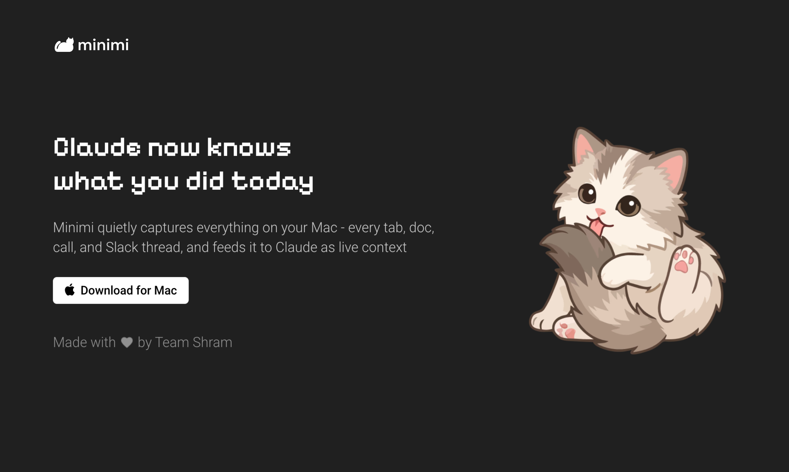
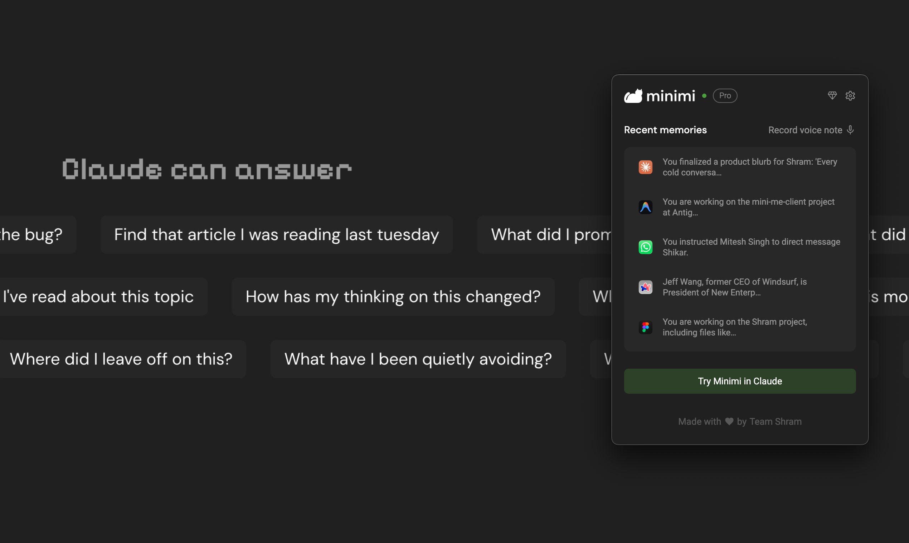
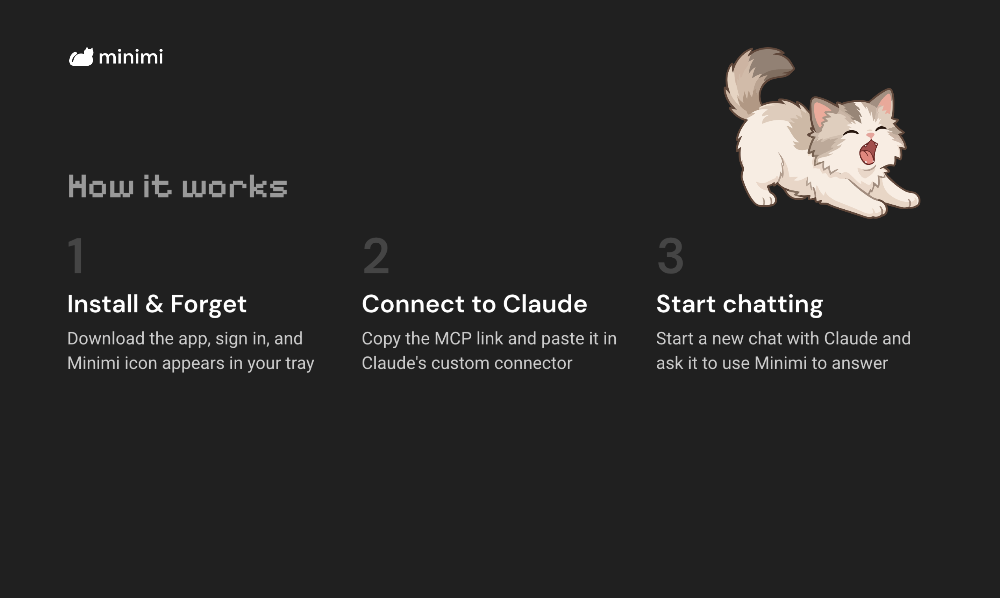

### 🎬 관련 영상
- [🎥 영상 보기](https://ph-files.imgix.net/26798396-6e55-4eaf-aade-6a9639bdf466.jpeg?auto=format)

---

## 4. [Veltrix AI](https://www.producthunt.com/products/veltrix-ai)
**Votes**: 242 | **도입 난이도**: 하 | **신뢰도**: 상
**Tagline**: AI finance copilot for cash flow, margins, and growth
**서비스 링크**: https://www.producthunt.com/r/E7KCWCLG4TE4Y5

**태그**: FinTech, AI, Business Intelligence, Automation, AI Tool

### 📌 이 서비스 한눈에 보기
복잡한 재무 데이터를 자연어로 질문하여 실시간 인사이트를 얻는 AI 금융 코파일럿

### 🔑 주요 기능
- QuickBooks, Xero, Shopify 등 주요 플랫폼과의 데이터 연동
- 자연어 질문을 통한 현금 흐름, 수익성, 번레이트(Burn rate) 즉시 확인
- 데이터 근거 기반의 답변 및 이상 징후 탐지, 향후 권장 조치 제공

### 🙋 사용자에게 어떤 점이 좋은가
수동 스프레드시트 작업과 정적인 대시보드 대신, 실시간 재무 지표를 대화형으로 확인하여 의사결정 속도를 높일 수 있습니다.

### ✅ 지금 바로 써볼 기능
- 기존 회계/판매 플랫폼(QuickBooks, Shopify 등) 연동하기
- 자연어로 재무 상태 질문 던져보기
- AI가 제안하는 비즈니스 권장 조치 검토하기

### ⚠️ 사용 전 확인할 점
- 외부 데이터 연동 시 보안 및 데이터 접근 권한 설정 확인 필요
- AI 답변의 근거가 되는 원천 데이터의 정확성 검증 필요

### 🧭 확인이 더 필요한 정보
현재 지원되는 구체적인 데이터 보안 표준 및 상세 연동 가능 플랫폼 목록 확인이 필요합니다.

### 📸 스크린샷 및 갤러리

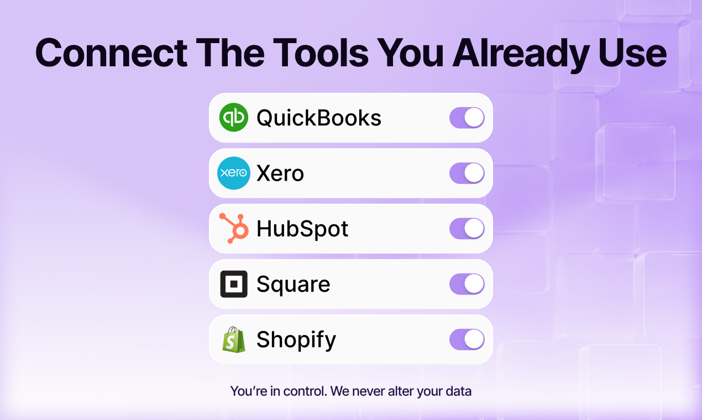
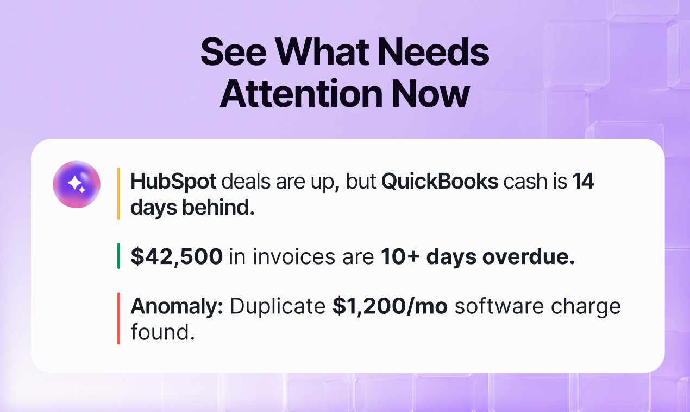

---

## 5. [Ideogram 4.0](https://www.producthunt.com/products/ideogram-4-0)
**Votes**: 182 | **도입 난이도**: 중 | **신뢰도**: 상
**Tagline**: Generate design-ready image with open weight, layout control
**서비스 링크**: https://www.producthunt.com/r/OJNQHSZUNTKVUF

**태그**: Generative AI, Design Tool, Open Weight, Image Generation, AI Tool, Vision, Design, DevTool

### 📌 이 서비스 한눈에 보기
정교한 레이아웃 제어와 고해상도 텍스트 렌더링을 지원하는 오픈 웨이트 이미지 생성 모델

### 🔑 주요 기능
- 바운딩 박스를 활용한 정밀한 레이아웃 제어 기능
- 다국어 텍스트 렌더링 및 네이티브 2K 고해상도 출력
- 개발자와 기업을 위한 오픈 웨이트 기반의 모델

### 🙋 사용자에게 어떤 점이 좋은가
디자인 작업에 즉시 활용 가능한 수준의 고품질 이미지와 텍스트를 생성할 수 있어, 시각적 콘텐츠 제작 효율이 극대화됩니다.

### ✅ 지금 바로 써볼 기능
- 바운딩 박스 기능을 활용한 레이아웃 설계
- 다국어 텍스트 포함 이미지 생성 테스트
- 2K 고해상도 출력 결과물 확인

### ⚠️ 사용 전 확인할 점
- 오픈 웨이트 모델로서의 하드웨어 요구 사양 확인 필요
- 복잡한 레이아웃 제어 시 숙련도 요구 가능성

### 🧭 확인이 더 필요한 정보
상세한 모델 배포 방식 및 API 제공 여부에 대한 구체적인 정보가 필요합니다.

### 📸 스크린샷 및 갤러리

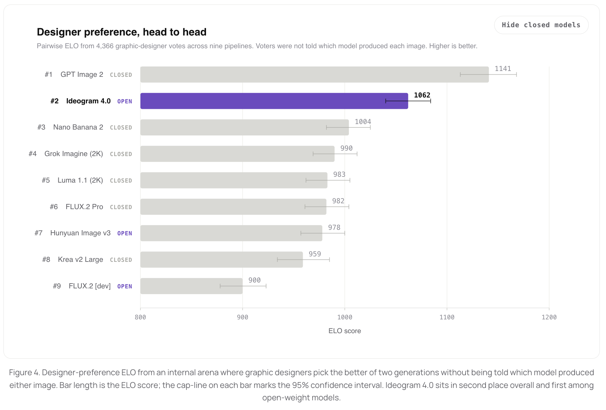

### 🎬 관련 영상
- [🎥 영상 보기](https://ph-files.imgix.net/6804dea9-8c36-4a7e-bafa-8380dce7631c.jpeg?auto=format)

---

## 6. [Agent Mode on Arena](https://www.producthunt.com/products/arena-5)
**Votes**: 143 | **도입 난이도**: 하 | **신뢰도**: 상
**Tagline**: Get real-world tasks done with autonomous AI agents
**서비스 링크**: https://www.producthunt.com/r/DMA3X24N4FESP7

**태그**: AI Agents, Automation, Benchmarking, Workflow, Agent, AI Tool, Prompting, DevTool

### 📌 이 서비스 한눈에 보기
복잡한 실무 작업을 스스로 수행하는 자율형 AI 에이전트 테스트 및 벤치마킹 플랫폼

### 🔑 주요 기능
- 단순 답변을 넘어 브라우징, 리서치, 코딩 등 다단계 워크플로우 수행
- 실제 환경에서의 에이전트 성능을 측정하는 'Agent Arena Leaderboard' 운영
- 단일 프롬프트로 실행되는 자율적 작업 과정의 단계별 모니터링

### 🙋 사용자에게 어떤 점이 좋은가
이론적인 모델 성능이 아닌, 실제 업무를 얼마나 완결성 있게 처리하는지 검증하고 활용할 수 있습니다.

### ✅ 지금 바로 써볼 기능
- 단일 프롬프트로 복잡한 워크플로우 실행해보기
- 에이전트의 단계별 작업 과정 관찰하기
- 리더보드를 통해 최적의 모델 성능 확인하기

### ⚠️ 사용 전 확인할 점
- 자율적 작업 수행 중 발생할 수 있는 예기치 못한 동작 확인 필요
- 실제 업무 적용 전 에이전트의 작업 정확도 검증 필수

### 🧭 확인이 더 필요한 정보
에이전트가 사용하는 구체적인 도구(Tool)의 범위와 비용 구조에 대한 정보가 명시되지 않았습니다.

### 📸 스크린샷 및 갤러리
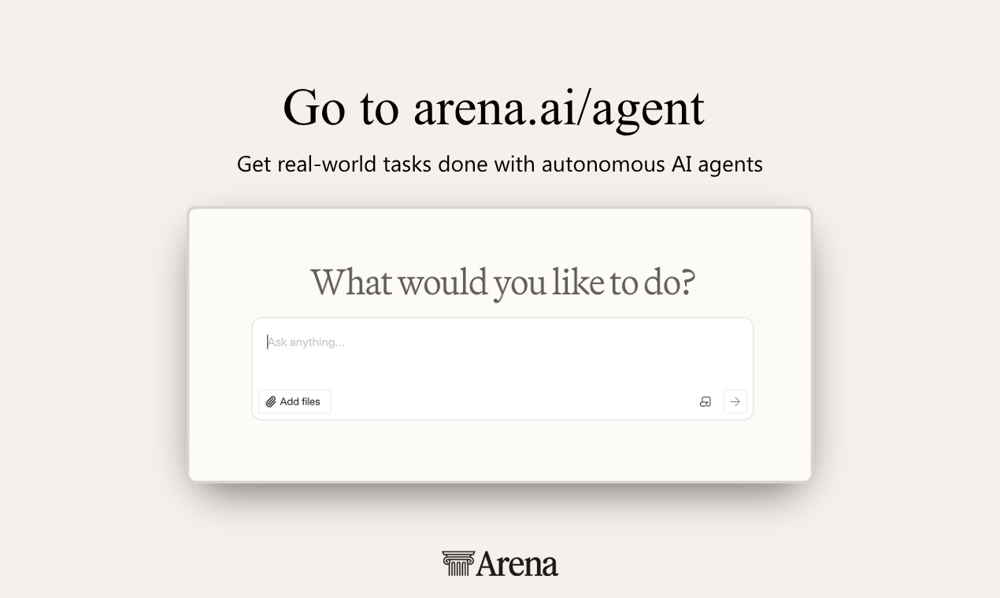
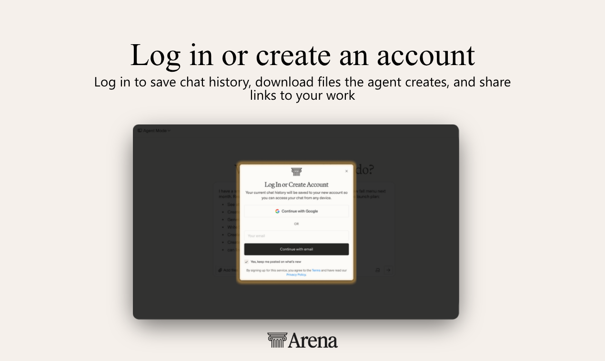
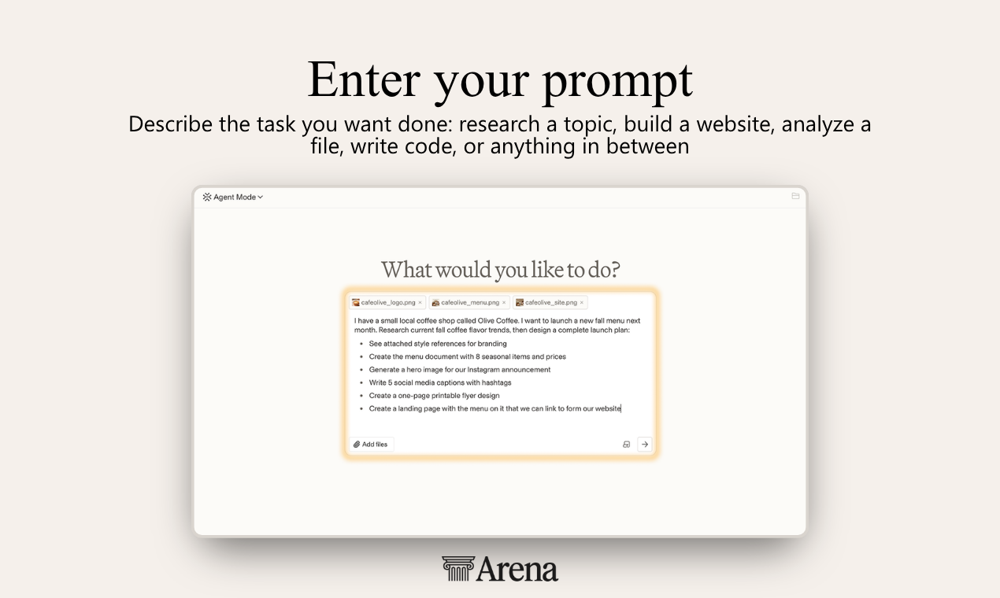

### 🎬 관련 영상
- [🎥 영상 보기](https://ph-files.imgix.net/af3f37f6-a8ce-4f8c-afd1-ed26a39a7c34.jpeg?auto=format)

---

## 7. [Nemotron 3 Ultra by NVIDIA](https://www.producthunt.com/products/nvidia)
**Votes**: 143 | **도입 난이도**: 상 | **신뢰도**: 상
**Tagline**: Powers faster, efficient reasoning for long-running agents
**서비스 링크**: https://www.producthunt.com/r/FRQKMP7ZDQB4RR

**태그**: AI, LLM, Agentic-AI, NVIDIA, Open-Source, Agent, AI Tool

### 📌 이 서비스 한눈에 보기
복잡한 에이전트 작업을 위해 설계된 고성능·고효율 550B MoE 오픈 모델

### 🔑 주요 기능
- 550B MoE(Mixture-of-Experts) 기반의 프론티어급 지능형 오픈 모델
- 기존 오픈 모델 대비 추론 속도 5배 향상 및 비용 최대 30% 절감
- 코딩, 심층 리서치 및 장기 실행 에이전트(Long-running agents) 작업에 최적화

### 🙋 사용자에게 어떤 점이 좋은가
복잡한 계획 수립과 도구 사용이 필요한 에이전트 구축 시, 비용 부담을 줄이면서도 빠른 응답 속도로 작업 효율을 극대화할 수 있습니다.

### ✅ 지금 바로 써볼 기능
- 복잡한 코딩 및 리서치 워크플로우에 적용해보기
- 장기 실행 에이전트의 계획 및 오류 복구 로직 테스트
- 기존 모델 대비 비용 및 속도 개선 효과 검증

### ⚠️ 사용 전 확인할 점
- 550B 규모의 대형 모델이므로 구동을 위한 높은 하드웨어 사양 필요
- 오픈 모델로서의 배포 및 운영 환경 구축 난이도 고려 필요

### 🧭 확인이 더 필요한 정보
실제 하드웨어 요구 사양 및 구체적인 배포 방식에 대한 정보가 추가로 필요합니다.

### 📸 스크린샷 및 갤러리
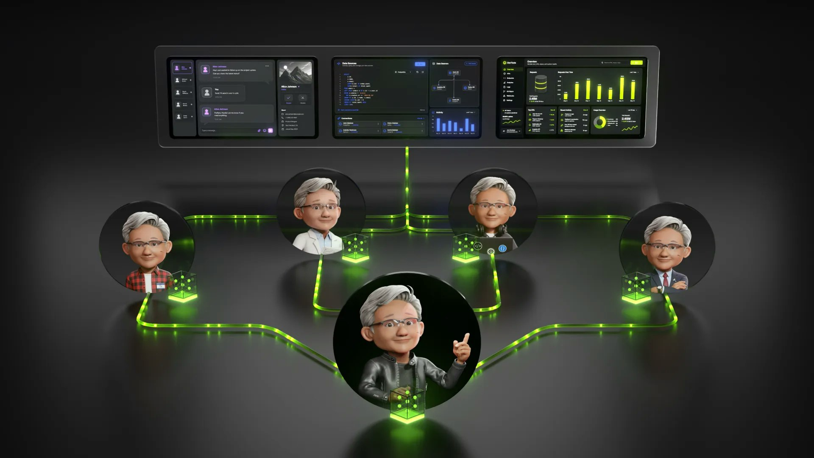
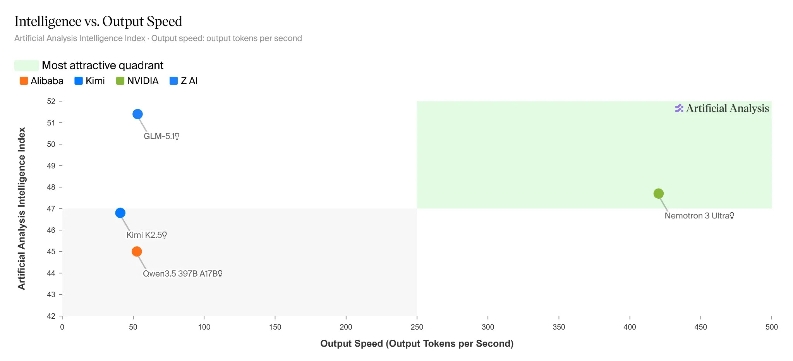
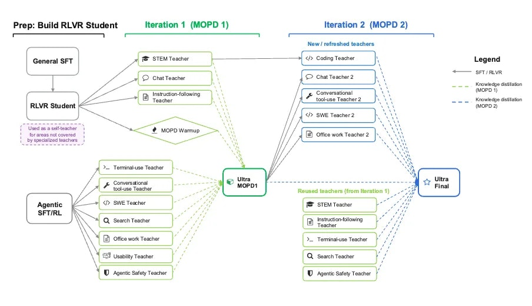

### 🎬 관련 영상
- [🎥 영상 보기](https://ph-files.imgix.net/696e4c85-94a7-4d65-9090-645ecab02570.jpeg?auto=format)

---

## 8. [LocalClicky](https://www.producthunt.com/products/localclicky)
**Votes**: 112 | **도입 난이도**: 중 | **신뢰도**: 상
**Tagline**: Control your Mac with your voice locally
**서비스 링크**: https://www.producthunt.com/r/UREOXFHYYUMZVN

**태그**: Productivity, Automation, Privacy, AI, macOS, AI Tool, LLM, API

### 📌 이 서비스 한눈에 보기
개인정보 유출 걱정 없이 맥(Mac)을 음성으로 제어하는 완전 오프라인 AI 비서

### 🔑 주요 기능
- 모든 프로세스(STT, LLM, VAD)가 로컬 환경에서 실행되는 완전 오프라인 방식
- API 키나 구독료가 필요 없는 MIT 라이선스 오픈소스 소프트웨어
- 대화형 세션 방식(시작/종료 명령어)을 통한 연속적인 명령 수행

### 🙋 사용자에게 어떤 점이 좋은가
데이터가 외부 서버로 전송되지 않아 보안이 중요한 작업 시에도 안심하고 음성 명령을 사용할 수 있습니다.

### ✅ 지금 바로 써볼 기능
- "Computer" 명령어로 음성 세션 시작하기
- 연속적인 명령 체이닝 기능 테스트하기
- 로컬 LLM 모델 설정 및 구동 확인하기

### ⚠️ 사용 전 확인할 점
- 모든 연산을 로컬에서 수행하므로 사용 중 Mac의 CPU/GPU 리소스 점유율이 높을 수 있음
- 하드웨어 사양에 따라 응답 속도나 성능 차이가 발생할 수 있음

### 🧭 확인이 더 필요한 정보
사용자의 Mac 사양에 따른 최적의 모델 설정 및 성능 최적화 수준에 대한 정보가 필요합니다.

### 📸 스크린샷 및 갤러리
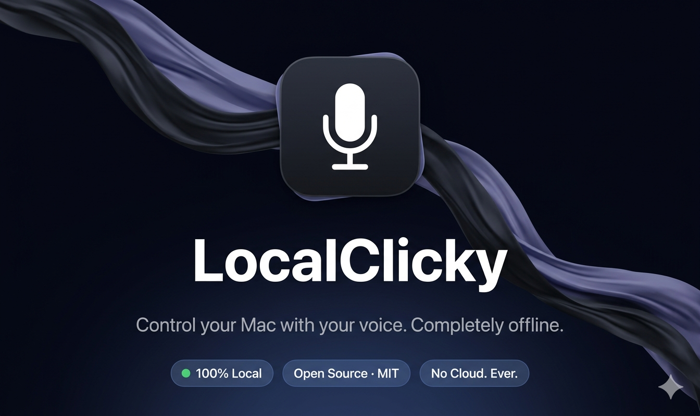
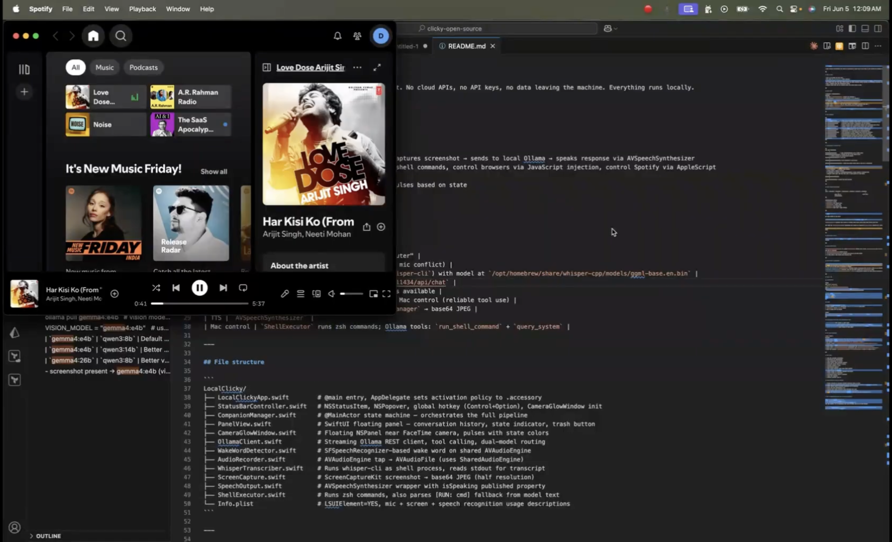
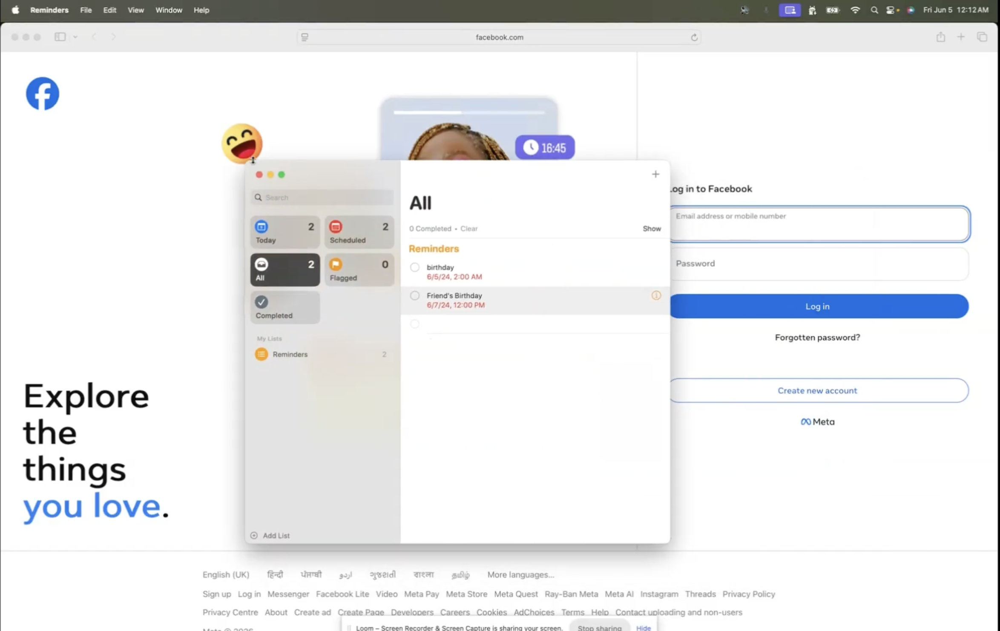

### 🎬 관련 영상
- [🎥 영상 보기](https://ph-files.imgix.net/d8699719-6125-418a-a85e-a4217ebbd998.jpeg?auto=format)

---

## 9. [Moodloom](https://www.producthunt.com/products/moodloom)
**Votes**: 111 | **도입 난이도**: 하 | **신뢰도**: 상
**Tagline**: Ad-free Pinterest Alternative with AI content filtering 
**서비스 링크**: https://www.producthunt.com/r/KABC3NRR6GO7HB

**태그**: Visual Discovery, Design Tools, Productivity, AI Tool, Vision

### 📌 이 서비스 한눈에 보기
광고와 노이즈 없이 시각적 영감을 탐색할 수 있는 AI 기반의 클린 핀터레스트 대안 플랫폼

### 🔑 주요 기능
- 광고 및 스폰서 게시물이 없는 깨끗한 피드 제공
- AI 생성 이미지를 선택적으로 숨기거나 보여주는 필터 기능
- 기존 핀터레스트 핀과 보드를 간편하게 가져올 수 있는 브라우저 확장 프로그램 지원

### 🙋 사용자에게 어떤 점이 좋은가
패션, 인테리어, 예술 분야 종사자들이 광고 방해 없이 순수하게 시각적 영감에만 집중할 수 있는 환경을 제공합니다.

### ✅ 지금 바로 써볼 기능
- Moodloom 확장 프로그램을 설치하여 기존 핀터레스트 데이터 가져오기
- AI 필터 설정을 통해 개인 취향에 맞는 피드 구성하기
- 관심 있는 패션 및 데코 아이디어 저장 및 탐색하기

### ⚠️ 사용 전 확인할 점
- 핀터레스트 대비 상대적으로 적은 콘텐츠 양 가능성
- 확장 프로그램을 통한 데이터 이전 시 레이아웃이나 품질 차이 확인 필요

### 🧭 확인이 더 필요한 정보
현재 서비스의 구체적인 유료 플랜이나 기능 제한 정책에 대한 정보가 명시되지 않았습니다.

### 📸 스크린샷 및 갤러리

### 🎬 관련 영상
- [🎥 영상 보기](https://ph-files.imgix.net/3da52c9d-32c6-4af0-a345-26a0c0a38cc2.jpeg?auto=format)

---

## 10. [FloatPic](https://www.producthunt.com/products/floatpic)
**Votes**: 105 | **도입 난이도**: 하 | **신뢰도**: 상
**Tagline**: Ultra-minimalist, borderless macOS native image viewer
**서비스 링크**: https://www.producthunt.com/r/ZQLUO2KBKHPFI4

**태그**: macOS, Productivity, Design, Image Viewer, Vision

### 📌 이 서비스 한눈에 보기
이미지에만 온전히 집중할 수 있는 초미니멀리즘 macOS 전용 이미지 뷰어

### 🔑 주요 기능
- 테두리가 없는 보더리스(Borderless) 플로팅 윈도우 디자인
- macOS 네이티브 환경을 활용한 빠른 로딩과 제스처 지원
- 30개 이상의 다양한 이미지 포맷 지원

### 🙋 사용자에게 어떤 점이 좋은가
불필요한 UI 요소를 제거하여 시각적 방해 없이 이미지를 감상하고 작업할 수 있습니다.

### ✅ 지금 바로 써볼 기능
- 보더리스 윈도우로 이미지 몰입감 테스트하기
- macOS 네이티브 제스처 활용해보기
- 사용 중인 다양한 이미지 포맷 호환성 확인하기

### ⚠️ 사용 전 확인할 점
- 미니멀한 디자인 특성상 부가적인 편집 기능은 제한적일 수 있음
- macOS 전용 소프트웨어이므로 타 OS 사용 불가

### 🧭 확인이 더 필요한 정보
상세한 기능 목록과 가격 정책에 대한 정보가 명시되지 않았습니다.

### 📸 스크린샷 및 갤러리

---

## 11. [Agent Browser Shield](https://www.producthunt.com/products/agent-browser-shield)
**Votes**: 97 | **도입 난이도**: 중 | **신뢰도**: 상
**Tagline**: Block prompt inject & cut token costs for AI browser agents
**서비스 링크**: https://www.producthunt.com/r/F6KGMHVJXZBD7X

**태그**: AI-Agent, Security, Automation, DevTool, Agent, AI Tool, Prompting

### 📌 이 서비스 한눈에 보기
AI 브라우저 에이전트의 보안 위협을 차단하고 토큰 비용을 절감하는 미들웨어 솔루션

### 🔑 주요 기능
- 프롬프트 인젝션 및 다크 패턴 등 웹상의 보안 위협 제거
- 불필요한 페이지 노이즈 제거를 통한 토큰 소모 최적화
- 개인정보(PII) 마스킹 및 소스 공개형(Source-available) 보안 제공

### 🙋 사용자에게 어떤 점이 좋은가
AI 에이전트가 웹을 탐색할 때 발생하는 보안 사고를 방지하고, 불필요한 데이터 읽기를 줄여 운영 비용을 효과적으로 절감할 수 있습니다.

### ✅ 지금 바로 써볼 기능
- browser-use 또는 Browserbase 환경에 연동 테스트
- 에이전트의 토큰 사용량 변화 및 비용 절감 수치 확인
- 프롬프트 인젝션 방어 성능 검증

### ⚠️ 사용 전 확인할 점
- 미들웨어 도입에 따른 웹 페이지 렌더링 지연 가능성
- 필터링 과정에서 실제 필요한 정보가 노이즈로 오인되어 삭제될 가능성

### 🧭 확인이 더 필요한 정보
구체적인 기술 스택 및 상세한 연동 가이드라인에 대한 추가 확인이 필요합니다.

### 📸 스크린샷 및 갤러리
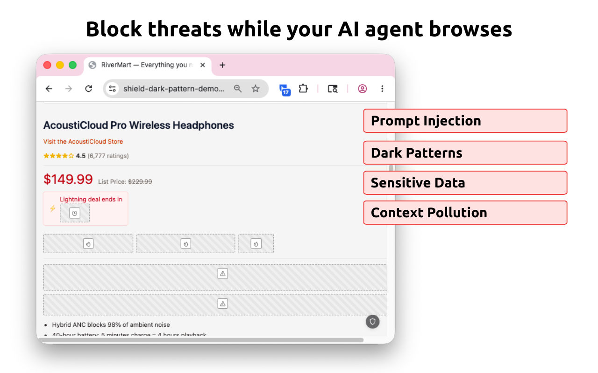
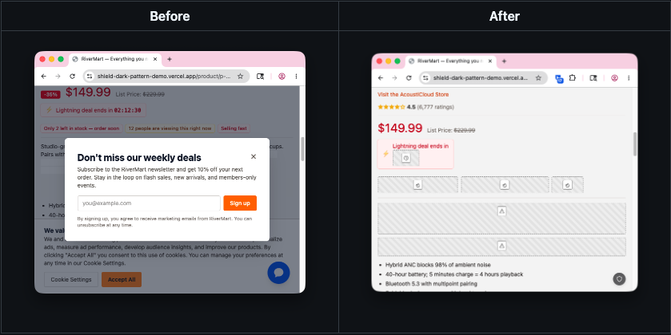

---

## 12. [VisionSync](https://www.producthunt.com/products/visionsync)
**Votes**: 93 | **도입 난이도**: 중 | **신뢰도**: 상
**Tagline**: Where strategy execution meets the people doing the work
**서비스 링크**: https://www.producthunt.com/r/GNDEMM56EBBGG2

**태그**: Strategy, ProjectManagement, Performance, Collaboration

### 📌 이 서비스 한눈에 보기
전략적 목표와 실무 실행을 실시간으로 연결하여 성과 지연을 사전에 방지하는 실행 관리 플랫폼

### 🔑 주요 기능
- 전략적 목표와 실무 담당자를 직접 연결하여 실행력 강화
- 이니셔티브별 실시간 상태 모니터링을 통한 선제적 리스크 관리
- 대학 및 지역 상공회의소 등 다양한 조직에서 검증된 신뢰성

### 🙋 사용자에게 어떤 점이 좋은가
계획과 실행 사이의 간극을 줄여주며, 분기 결과가 나오기 전에 문제 상황을 미리 파악하여 대응할 수 있게 합니다.

### ✅ 지금 바로 써볼 기능
- 조직의 전략적 목표 설정 및 담당자 매칭
- 이니셔티브별 실시간 진행 상태 대시보드 확인
- ValueSync 360을 통한 성과 연동 기능 검토

### ⚠️ 사용 전 확인할 점
- 실무자의 데이터 입력 및 업데이트가 활발해야 실시간 모니터링 효과를 볼 수 있음
- 조직 규모에 따른 초기 설정 및 프로세스 통합 난이도 확인 필요

### 🧭 확인이 더 필요한 정보
ValueSync 360 기능의 구체적인 작동 방식과 추가 비용 체계에 대한 정보가 필요합니다.

### 📸 스크린샷 및 갤러리
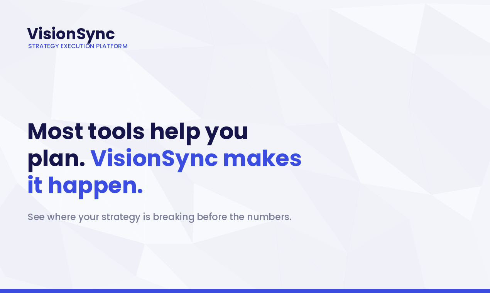
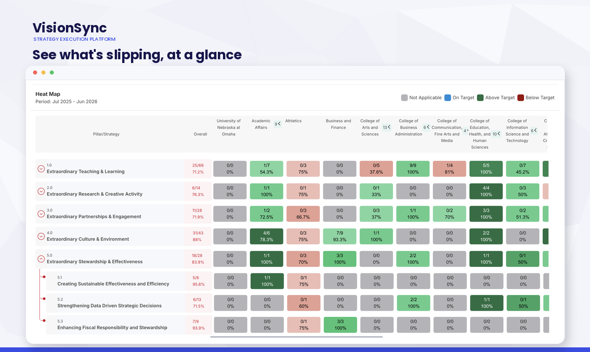
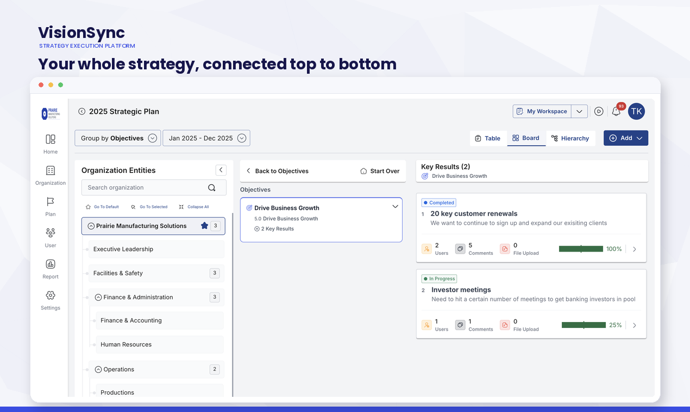

### 🎬 관련 영상
- [🎥 영상 보기](https://ph-files.imgix.net/c13f261f-ef70-4cd7-8973-15fe9facc962.jpeg?auto=format)

---

## 13. [Lumo Studios](https://www.producthunt.com/products/lumo-studios)
**Votes**: 93 | **도입 난이도**: 하 | **신뢰도**: 상
**Tagline**: Build Decks that Speak for Themselves
**서비스 링크**: https://www.producthunt.com/r/KC4UACPCSLYR3L

**태그**: AI, Productivity, Presentation, Design, AI Tool, Prompting

### 📌 이 서비스 한눈에 보기
아이디어를 입력하면 즉시 완성도 높은 프레젠테이션 슬라이드로 변환해주는 AI 도구

### 🔑 주요 기능
- 프롬프트 기반의 자동 슬라이드 생성 기능
- 캔버스 에디터를 통한 직관적인 디자인 수정
- 팀 협업을 위한 통합 워크플로우 제공

### 🙋 사용자에게 어떤 점이 좋은가
기획 단계의 아이디어를 시각적인 슬라이드로 만드는 시간을 획기적으로 단축하여 작업 효율을 높여줍니다.

### ✅ 지금 바로 써볼 기능
- 텍스트 프롬프트로 초안 슬라이드 생성하기
- 캔버스 에디터로 디자인 세부 사항 조정하기
- 팀원에게 결과물 공유 및 협업하기

### ⚠️ 사용 전 확인할 점
- AI 생성 결과물의 논리적 정확성 검토 필요
- 사용자 의도에 따른 세밀한 디자인 커스텀 한계 가능성

### 🧭 확인이 더 필요한 정보
현재 제공되는 템플릿의 다양성과 외부 도구(PPT, Google Slides)와의 내보내기 호환성을 확인할 필요가 있습니다.

### 📸 스크린샷 및 갤러리
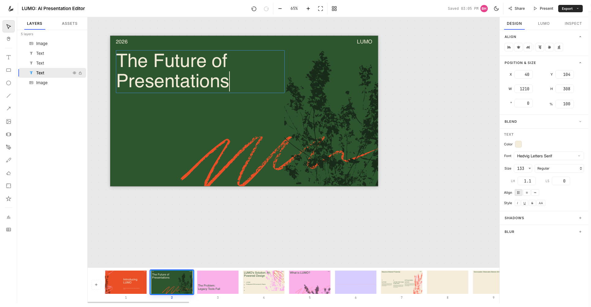

### 🎬 관련 영상
- [🎥 영상 보기](https://ph-files.imgix.net/ce6f39a4-faca-4e51-9694-9b3922966309.jpeg?auto=format)

---

## 14. [Treadmill Pro](https://www.producthunt.com/products/treadmill-pro)
**Votes**: 92 | **도입 난이도**: 하 | **신뢰도**: 상
**Tagline**: Control your treadmill from your iPhone, wirelessly
**서비스 링크**: https://www.producthunt.com/r/DOVHIDLYUFGZPZ

**태그**: Fitness, IoT, Health, iOS

### 📌 이 서비스 한눈에 보기
아이폰으로 러닝머신을 무선 제어하고 건강 데이터를 관리하는 앱

### 🔑 주요 기능
- 블루투스를 통한 러닝머신 속도 및 경사도 무선 제어
- 타이머 및 운동 통계 실시간 확인
- Apple Health(애플 건강) 앱과의 완벽한 데이터 연동

### 🙋 사용자에게 어떤 점이 좋은가
러닝머신 조작을 스마트폰으로 간편하게 수행하며, 운동 기록을 애플 건강 앱에 자동으로 저장하여 체계적인 건강 관리가 가능합니다.

### ✅ 지금 바로 써볼 기능
- 블루투스 페어링을 통한 기기 연결
- 속도 및 경사도 조절 기능 테스트
- Apple Health 데이터 동기화 확인

### ⚠️ 사용 전 확인할 점
- 사용 중인 러닝머신 모델의 블루투스 지원 여부 확인 필요
- 기기 간 연결 안정성 확인

### 🧭 확인이 더 필요한 정보
모든 브랜드의 러닝머신과 호환되는지 여부는 명시되어 있지 않습니다.

### 📸 스크린샷 및 갤러리
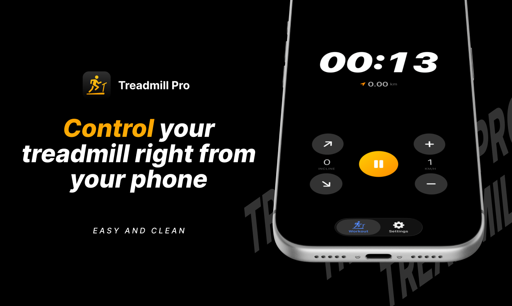
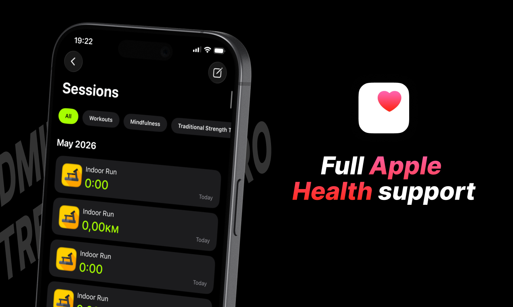
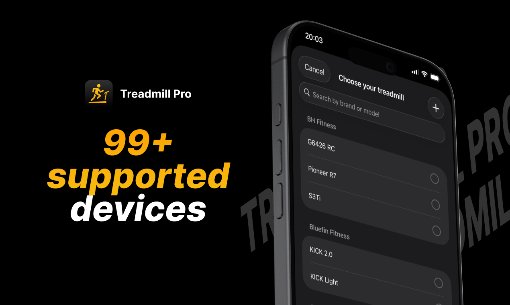

---

## 15. [Recursi](https://www.producthunt.com/products/recursi-self-improving-vibe-coding-env)
**Votes**: 91 | **도입 난이도**: 중 | **신뢰도**: 상
**Tagline**: Self improving vibe coding env with no API fees
**서비스 링크**: https://www.producthunt.com/r/I4WREISFO2BBDV

**태그**: DevTool, AI-Assisted, Productivity, AI Tool, Chat, API

### 📌 이 서비스 한눈에 보기
API 비용 없이 웹 기반 AI 챗봇을 활용해 효율적인 코딩이 가능한 셀프 개선형 개발 환경

### 🔑 주요 기능
- Claude, Gemini, ChatGPT 등 웹 기반 챗봇을 활용한 효율적인 '바이브 코딩' 환경 제공
- 별도의 API 비용 발생 없이 서비스 이용 약관을 준수하며 AI 활용 가능
- 다양한 샘플 앱(YouTube 플레이리스트, MIDI 피아노 게임 등) 제공

### 🙋 사용자에게 어떤 점이 좋은가
API 호출 비용 부담 없이 최신 AI 모델의 성능을 개발 환경에 직접 녹여내어 생산성을 높일 수 있습니다.

### ✅ 지금 바로 써볼 기능
- 웹 기반 AI 챗봇 연동 및 코딩 워크플로우 테스트
- 제공되는 샘플 앱 템플릿 실행 및 커스텀
- 자신만의 개발 환경 구축을 위한 기능 탐색

### ⚠️ 사용 전 확인할 점
- 웹 인터페이스를 통한 방식이므로 API 직접 호출 방식보다 자동화 수준에 제한이 있을 수 있음
- 사용 중인 AI 서비스의 웹 인터페이스 정책 변화에 영향을 받을 수 있음

### 🧭 확인이 더 필요한 정보
웹 기반 챗봇 연동 방식이 구체적으로 어떤 기술적 메커니즘을 사용하는지 확인이 필요합니다.

### 📸 스크린샷 및 갤러리
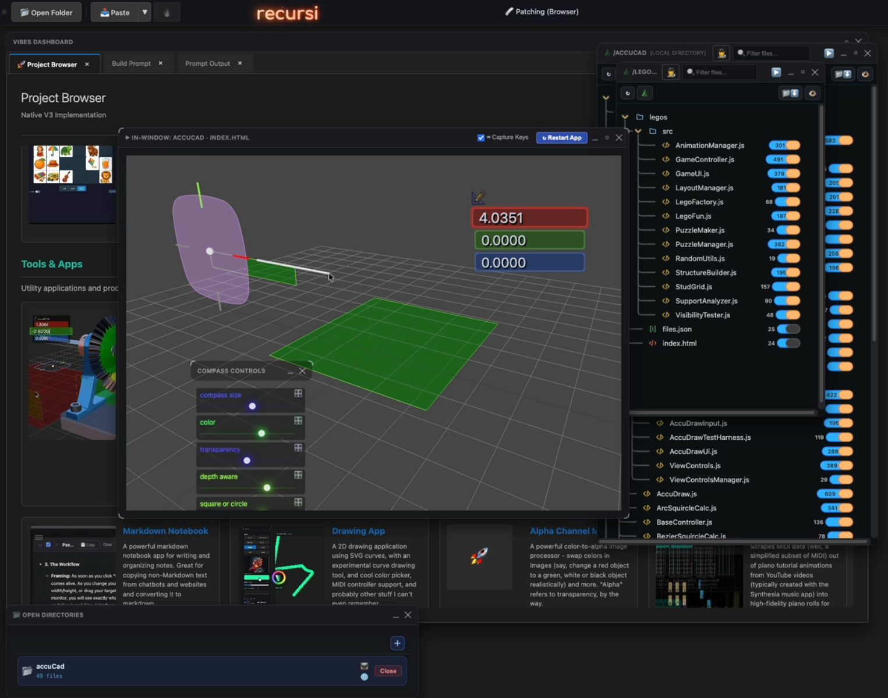
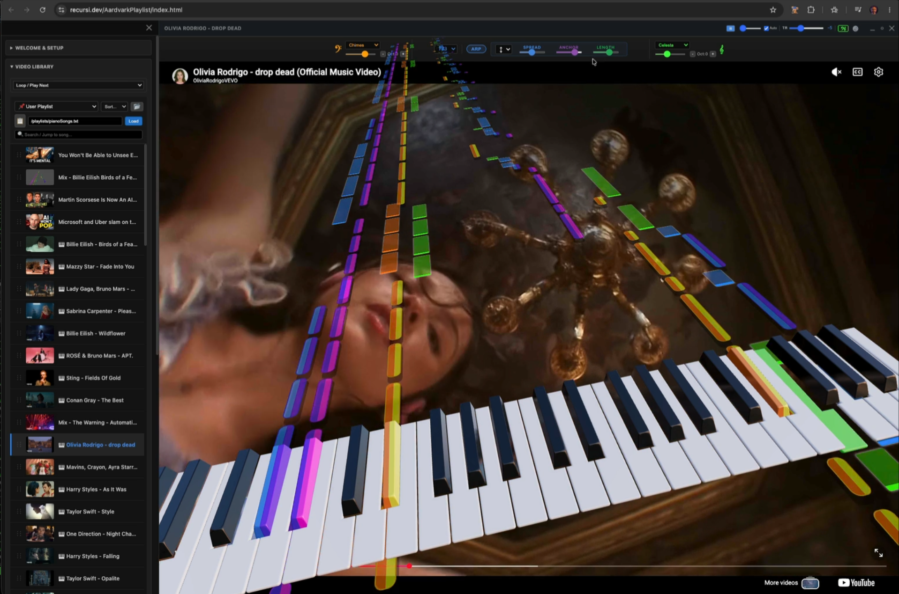
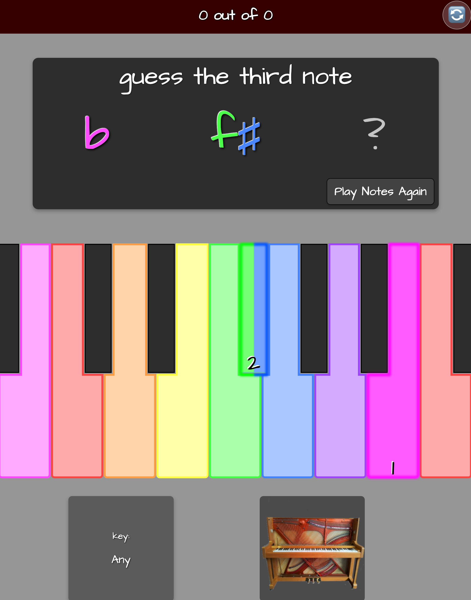

### 🎬 관련 영상
- [🎥 영상 보기](https://ph-files.imgix.net/18eef15d-bd98-4211-b493-b8ba4f675fe2.jpeg?auto=format)

---

## 16. [Clarafy](https://www.producthunt.com/products/clarafy)
**Votes**: 91 | **도입 난이도**: 하 | **신뢰도**: 상
**Tagline**: Type messy and have it instantly polished
**서비스 링크**: https://www.producthunt.com/r/C3AOI4BETVQ7D3

**태그**: Productivity, WritingTool, AI, Automation, AI Tool, Chat

### 📌 이 서비스 한눈에 보기
정리되지 않은 생각을 즉시 완벽한 문장으로 바꿔주는 제로-에디팅 텍스트 변환 도구

### 🔑 주요 기능
- 의식의 흐름대로 작성한 글을 즉시 정제된 텍스트로 변환
- Gmail, Slack, ChatGPT 등 사용 중인 앱에 맞춘 컨텍스트 기반 포맷팅
- 사용자의 고유한 말투를 학습하여 반영하는 톤 매칭 기능

### 🙋 사용자에게 어떤 점이 좋은가
글을 다듬는 번거로운 편집 과정 없이, 생각나는 대로 적거나 말하면 즉시 완성된 결과물을 얻을 수 있어 작업 흐름이 끊기지 않습니다.

### ✅ 지금 바로 써볼 기능
- 단축키를 활용한 즉각적인 텍스트 재작성 테스트
- 음성 받아쓰기(Hold-to-Dictate) 기능을 통한 구어체 정제 경험
- 사용자 말투 학습을 위한 다양한 톤의 텍스트 입력

### ⚠️ 사용 전 확인할 점
- 사용자의 의도와 다르게 문장이 과도하게 정형화될 가능성
- 개인적인 대화나 민감한 정보가 포함된 텍스트 처리 시 보안 고려 필요

### 🧭 확인이 더 필요한 정보
현재 제공되는 플랫폼(App-Aware) 외에 추가적인 서비스 연동 범위는 명시되지 않았습니다.

### 📸 스크린샷 및 갤러리
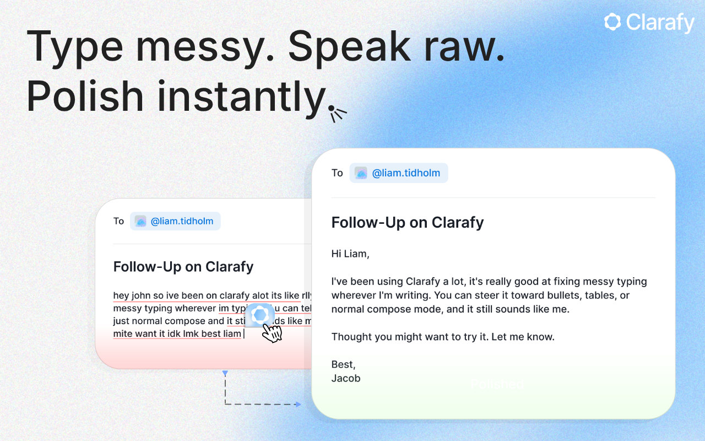
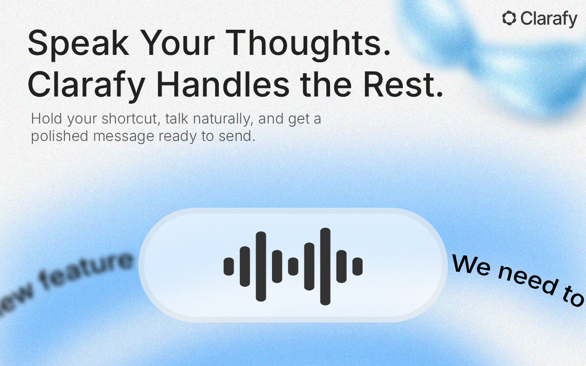
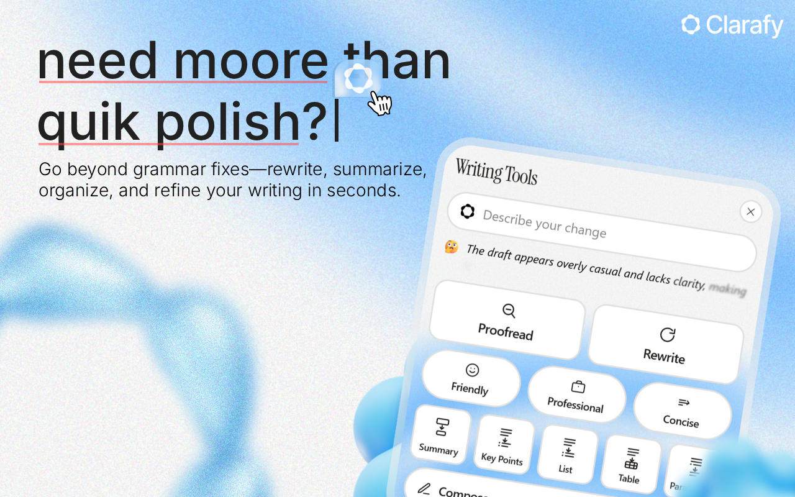

### 🎬 관련 영상
- [🎥 영상 보기](https://ph-files.imgix.net/26f4d0b7-8474-4b34-95d1-b991d9e01a8a.jpeg?auto=format)

---

## 17. [Microsoft MAI-Voice-2](https://www.producthunt.com/products/mai-image-2-3)
**Votes**: 89 | **도입 난이도**: 중 | **신뢰도**: 상
**Tagline**: Expressive TTS with voice cloning in 15 languages
**서비스 링크**: https://www.producthunt.com/r/TXV2R33T3EPL56

**태그**: AI, TTS, Voice-Cloning, Azure, DevTool, Agent, AI Tool, API

### 📌 이 서비스 한눈에 보기
15개 언어 지원 및 감정 조절이 가능한 마이크로소프트의 고성능 음성 복제 TTS 모델

### 🔑 주요 기능
- 짧은 샘플로 가능한 정교한 음성 복제(Voice Cloning) 기능
- 세밀한 감정 제어 및 15개 언어 간 일관된 목소리 정체성 유지
- Azure AI Foundry를 통한 합리적인 가격대의 프로덕션급 음성 생성

### 🙋 사용자에게 어떤 점이 좋은가
OpenAI Realtime API보다 경제적인 비용으로 자연스러운 음성 에이전트를 구축하려는 개발자에게 유용합니다.

### ✅ 지금 바로 써볼 기능
- Azure AI Foundry에서 모델 테스트하기
- VSCode 및 Teams 통합 환경 확인하기
- 다국어 환경에서의 음성 일관성 검증하기

### ⚠️ 사용 전 확인할 점
- 사용량에 따른 비용 관리 필요 (백만 자당 $22)
- 특정 서비스(VSCode, Teams 등)로의 통합 범위 확인 필요

### 🧭 확인이 더 필요한 정보
각 통합 도구별 상세 기능 및 실시간 연동 수준에 대한 구체적인 정보가 필요합니다.

### 📸 스크린샷 및 갤러리

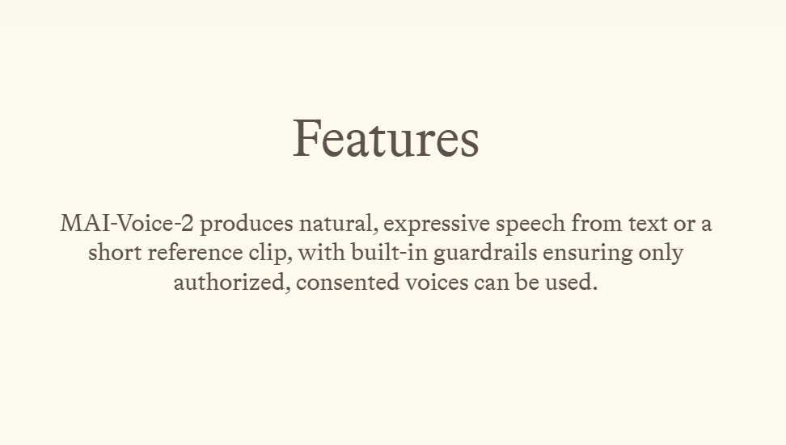
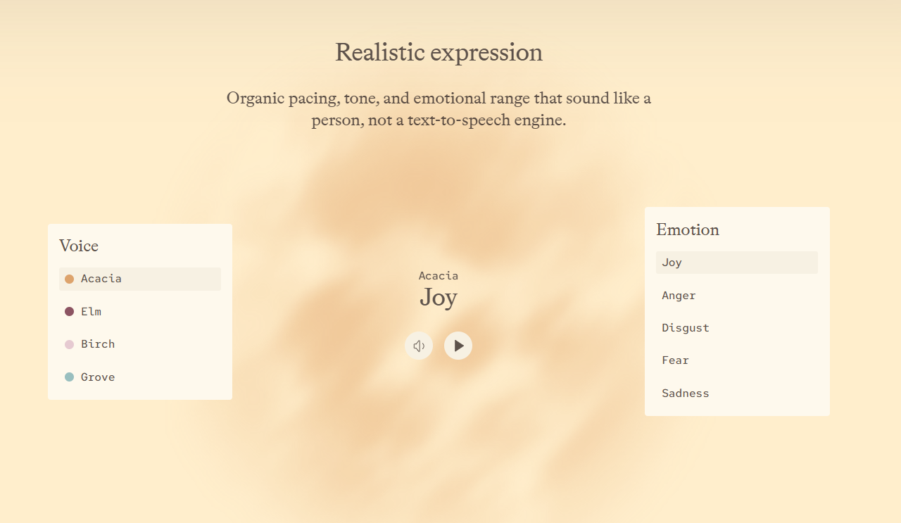

---

## 18. [English Jobs](https://www.producthunt.com/products/english-jobs)
**Votes**: 82 | **도입 난이도**: 하 | **신뢰도**: 상
**Tagline**: English jobs in Europe. No local language needed
**서비스 링크**: https://www.producthunt.com/r/FG4QRUM5PSACMS

**태그**: Job Search, Europe, Career, English-Speaking

### 📌 이 서비스 한눈에 보기
현지어 없이 유럽 내 영어로 일할 수 있는 채용 정보를 제공하는 플랫폼

### 🔑 주요 기능
- 유럽 10개국 이상의 15만 개 이상의 영어 기반 채용 공고 제공
- 현지어(독어 등) 실력 없이 영어만으로 지원 가능한 직무 중심
- 모든 공고가 실제 기업 페이지로 연결되어 원클릭 지원 가능

### 🙋 사용자에게 어떤 점이 좋은가
유럽 이주를 꿈꾸지만 현지어 장벽 때문에 어려움을 겪는 구직자에게 최적화된 채용 정보를 제공합니다.

### ✅ 지금 바로 써볼 기능
- 10개국 이상의 라이브 채용 공고 검색하기
- 관심 있는 직무의 기업 페이지로 바로 이동하여 지원하기

### ⚠️ 사용 전 확인할 점
- 현지어 요구 사항이 없는 직무 위주이므로 직무 범위가 제한적일 수 있음
- 실제 지원은 외부 기업 페이지에서 이루어지므로 기업별 지원 절차가 다를 수 있음

### 🧭 확인이 더 필요한 정보
제공되는 15만 개의 공고가 모든 산업 분야를 포괄하는지 확인이 필요합니다.

### 📸 스크린샷 및 갤러리
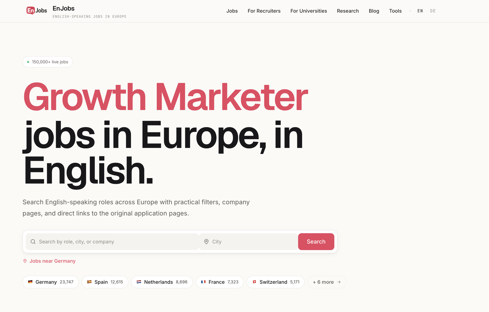
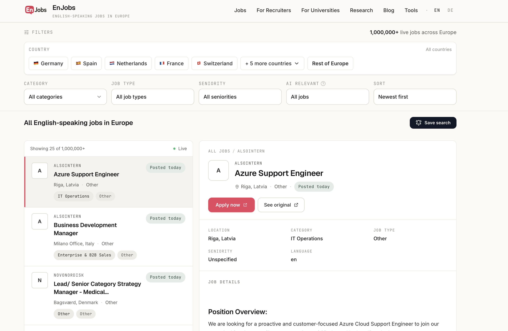
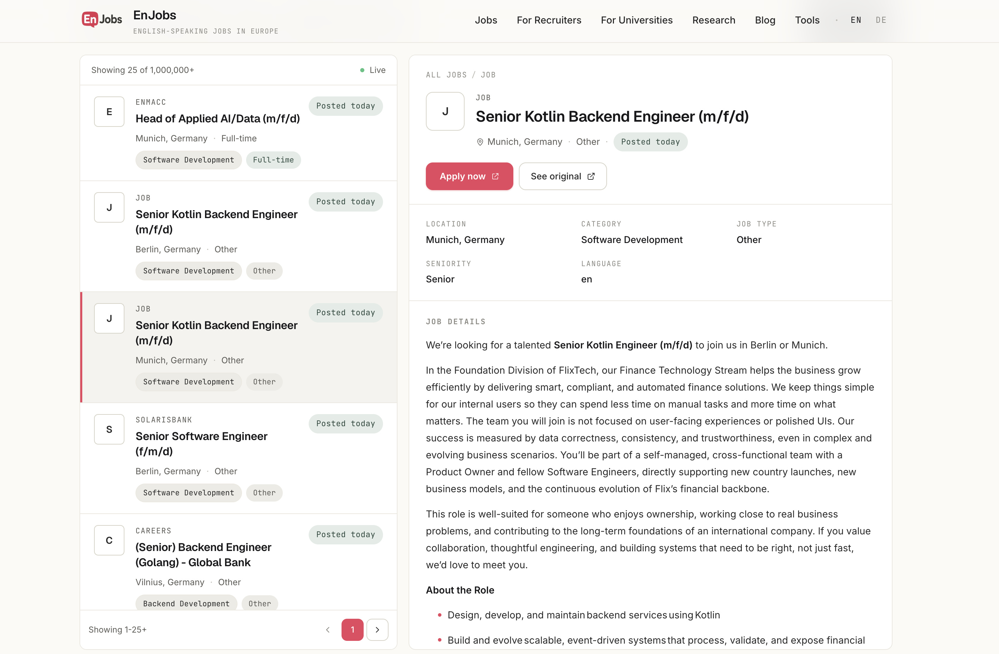

---

## 19. [Cleo Atlas Legal API](https://www.producthunt.com/products/cleo-labs)
**Votes**: 39 | **도입 난이도**: 중 | **신뢰도**: 상
**Tagline**: The world's regulations, machine-readable.
**서비스 링크**: https://www.producthunt.com/r/7PM6UXCWDBBIRR

**태그**: LegalTech, API, Compliance, Automation, Data, AI Tool

### 📌 이 서비스 한눈에 보기
전 세계 177개 지역의 방대한 규제를 기계 판독 가능한 API로 제공하는 법률 데이터 솔루션

### 🔑 주요 기능
- 177개 관할 구역, 256,000개 이상의 규제를 통합한 API 제공
- 제품(화장품, 전자제품 등) 및 글로벌(금융, AI, ESG 등) 특화 아틀라스 운영
- 복잡한 법률 데이터를 개발자가 즉시 활용 가능한 기계 판독 형식으로 변환

### 🙋 사용자에게 어떤 점이 좋은가
글로벌 시장 진출 시 각국의 복잡한 규제 검토 과정을 자동화하고 데이터 기반의 컴플라이언스 대응이 가능해집니다.

### ✅ 지금 바로 써볼 기능
- 관심 있는 산업 분야(Product 또는 Global)의 아틀라스 데이터 범위 확인
- API를 통한 규제 데이터 쿼리 테스트
- 자사 서비스의 컴플라이언스 자동화 워크플로우 설계

### ⚠️ 사용 전 확인할 점
- 법률 데이터의 최신성 및 해석의 정확성 검증 필요
- 특정 산업군에 특화된 데이터셋이므로 범용적 활용 시 범위 확인 필요

### 🧭 확인이 더 필요한 정보
API의 상세 호출 비용 구조와 실시간 업데이트 주기에 대한 정보가 명시되지 않았습니다.

### 📸 스크린샷 및 갤러리
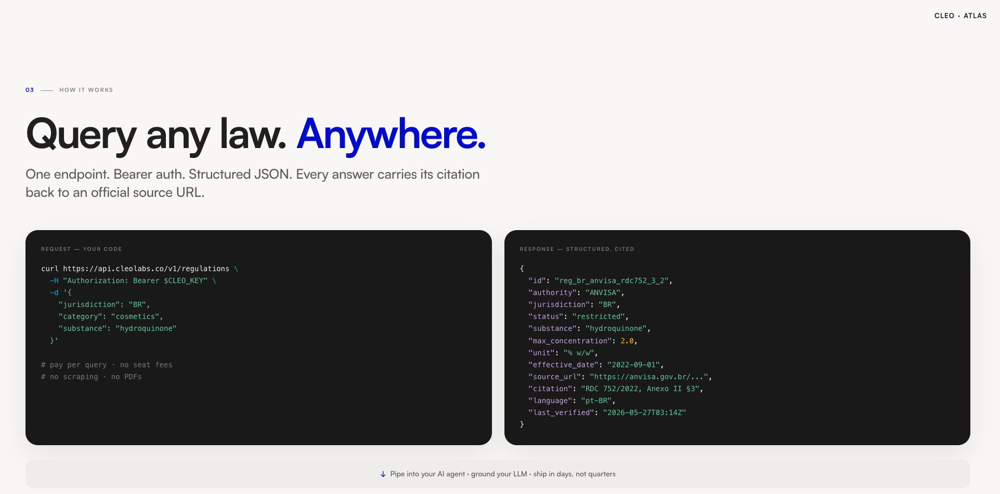
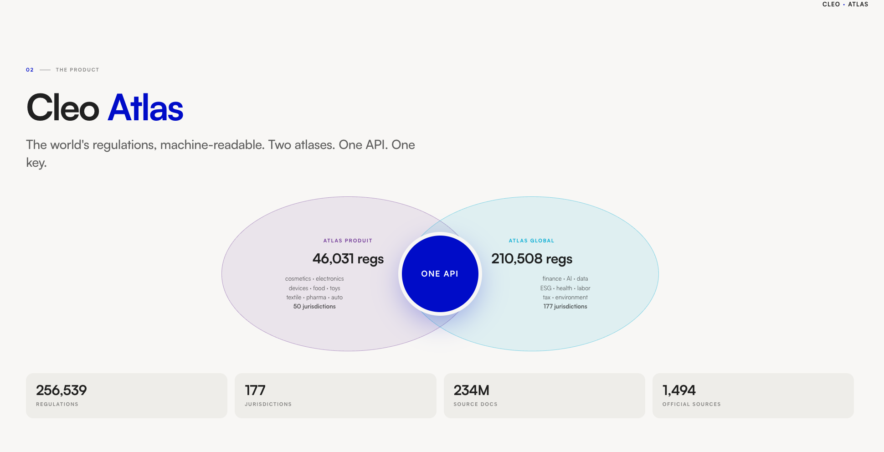
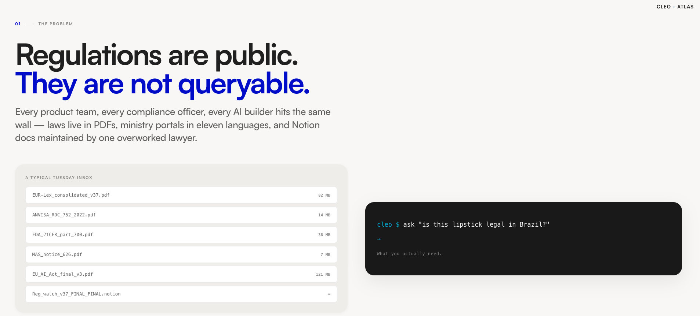

---

## 20. [Liance](https://www.producthunt.com/products/liance)
**Votes**: 16 | **도입 난이도**: 중 | **신뢰도**: 상
**Tagline**: Connect systems. Collect proof. Stay audit ready.
**서비스 링크**: https://www.producthunt.com/r/ISGIRVSDW3H3YZ

**태그**: Compliance, Automation, Audit-Ready, SaaS

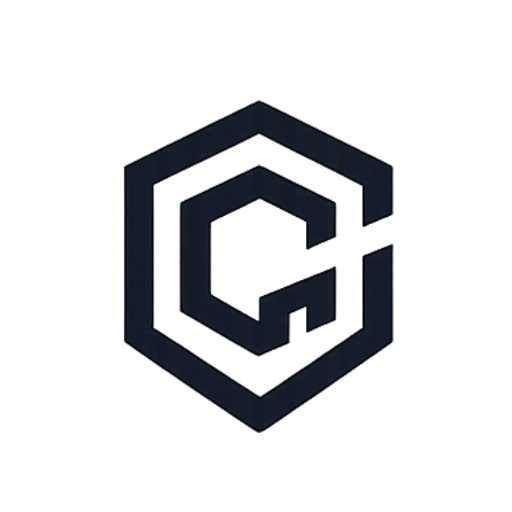

### 📌 이 서비스 한눈에 보기
시스템 연동과 증거 수집 자동화를 통해 스타트업의 상시 감사 준비 상태를 유지해 주는 컴플라이언스 관리 도구

### 🔑 주요 기능
- 시스템 간 데이터 연동을 통한 증거 자동 수집
- 컴플라이언스 컨트롤 추적 및 관리
- 감사(Audit)를 위한 상시 준비 상태 유지

### 🙋 사용자에게 어떤 점이 좋은가
수동으로 진행하던 복잡한 감사 증거 수집 과정을 자동화하여, 갑작스러운 감사 요청에도 즉각 대응할 수 있도록 돕습니다.

### ✅ 지금 바로 써볼 기능
- 기존 시스템과의 연동 가능 여부 확인
- 현재 운영 중인 컨트롤 항목 등록
- 증거 수집 자동화 워크플로우 설정

### ⚠️ 사용 전 확인할 점
- 연동되는 시스템의 종류와 범위 확인 필요
- 보안 및 데이터 프라이버시 정책 검토 필요

### 🧭 확인이 더 필요한 정보
지원하는 구체적인 컴플라이언스 프레임워크(SOC2, ISO 등)와 연동 가능한 외부 시스템 목록이 명시되지 않았습니다.

### 📸 스크린샷 및 갤러리
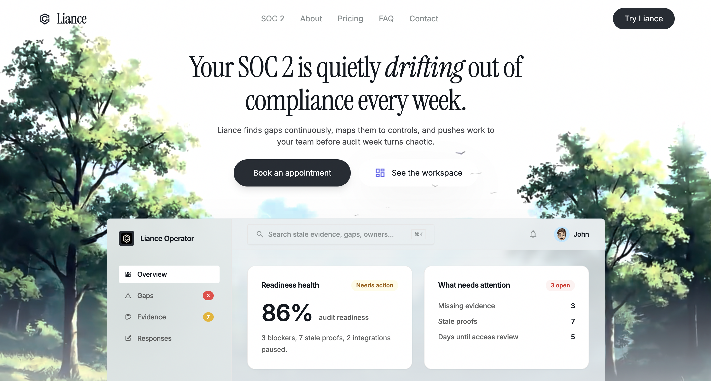
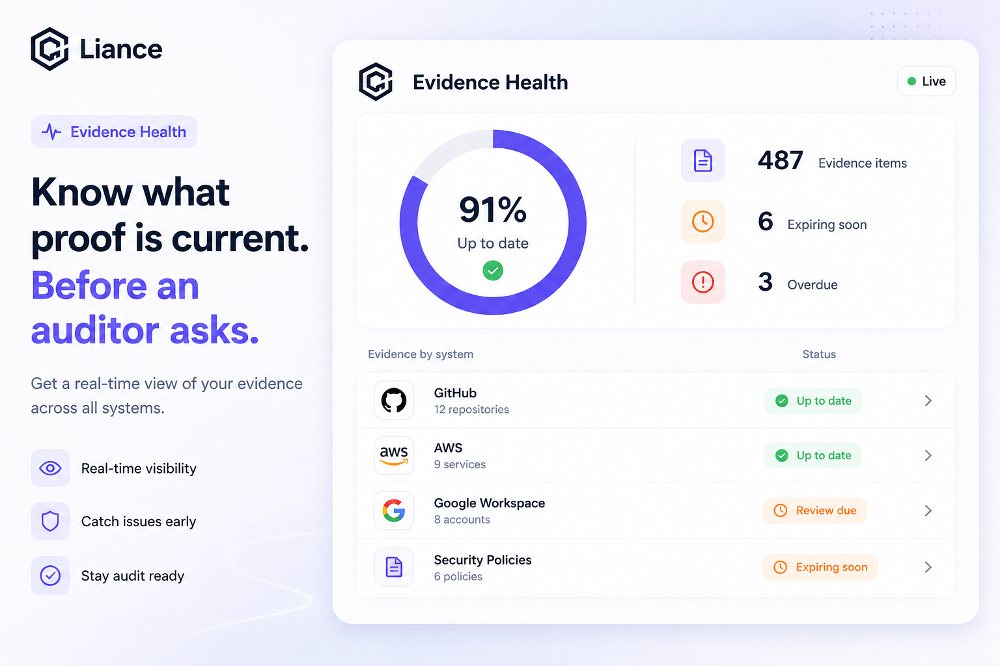
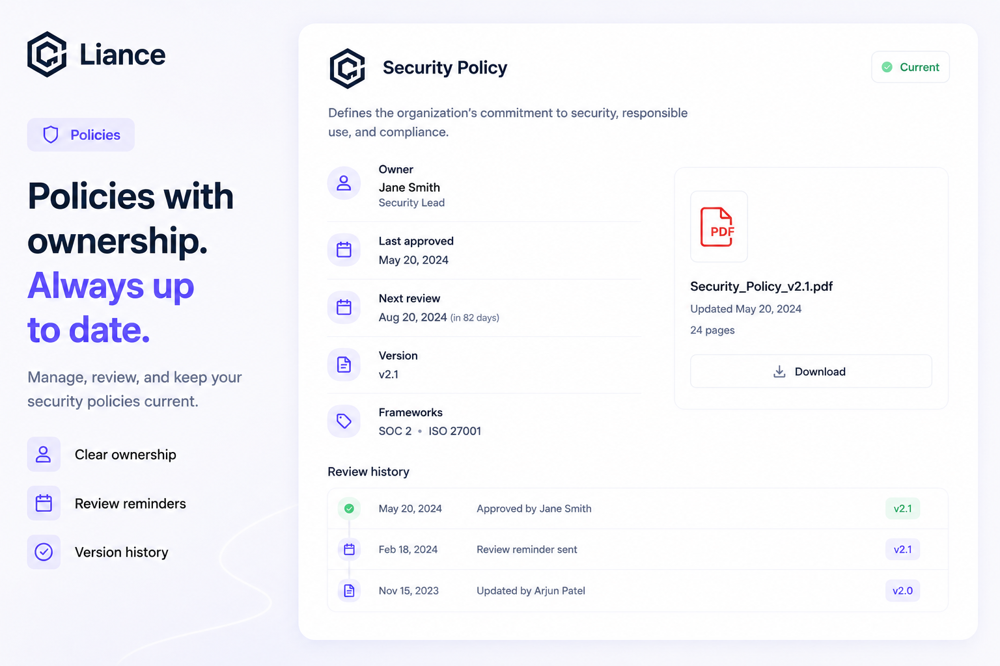

---

## 21. [Threadline PRO](https://www.producthunt.com/products/threadline-studio)
**Votes**: 14 | **도입 난이도**: 중 | **신뢰도**: 상
**Tagline**: The first AI video editor that listens to how you speak
**서비스 링크**: https://www.producthunt.com/r/65H4EV2LHDYCYH

**태그**: VideoEditing, AI, Workflow, ContentCreation, AI Tool, Chat, Video

### 📌 이 서비스 한눈에 보기
말투와 억양을 분석하여 최적의 편집 지점을 찾아주는 AI 영상 편집 보조 도구

### 🔑 주요 기능
- 단순 텍스트 변환을 넘어 목소리의 톤, 강조, 페이싱을 분석하는 지능형 편집
- AI를 활용한 자동 하이라이트 추출 및 편집점 선정 기능
- 채팅 인터페이스를 통한 직관적인 영상 구조 재구성 및 편집

### 🙋 사용자에게 어떤 점이 좋은가
방대한 원본 영상에서 핵심적인 순간을 찾는 시간을 획기적으로 단축하고, 전문 편집 소프트웨어로 바로 넘길 수 있는 워크플로우를 제공합니다.

### ✅ 지금 바로 써볼 기능
- 원본 영상 업로드 및 AI 톤 분석 기능 테스트
- 채팅을 통한 영상 구조 재구성 시도
- 편집된 시퀀스를 Premiere Pro, DaVinci Resolve, Final Cut Pro로 내보내기

### ⚠️ 사용 전 확인할 점
- 최종 편집은 전문 툴로 옮겨야 하므로 워크플로우 전환 과정이 필요함
- 음성 분석 기반이므로 배경 소음이 심한 환경에서는 정확도가 떨어질 수 있음

### 🧭 확인이 더 필요한 정보
사용자의 전문 편집 소프트웨어 숙련도에 따라 최종 결과물의 품질 차이가 발생할 수 있습니다.

### 📸 스크린샷 및 갤러리
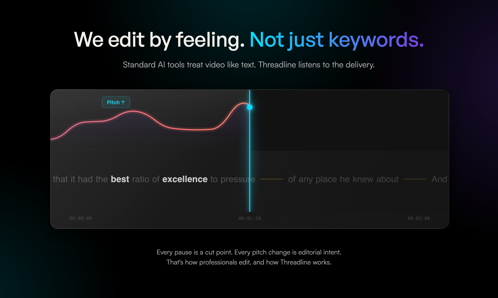
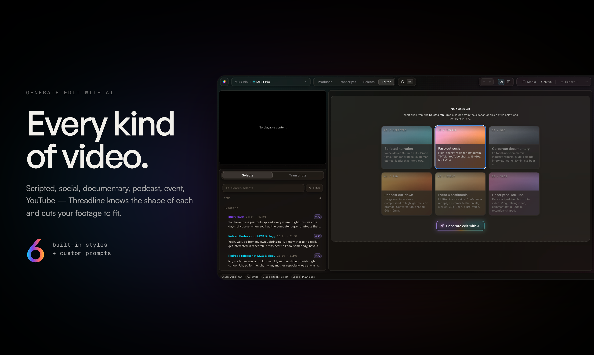
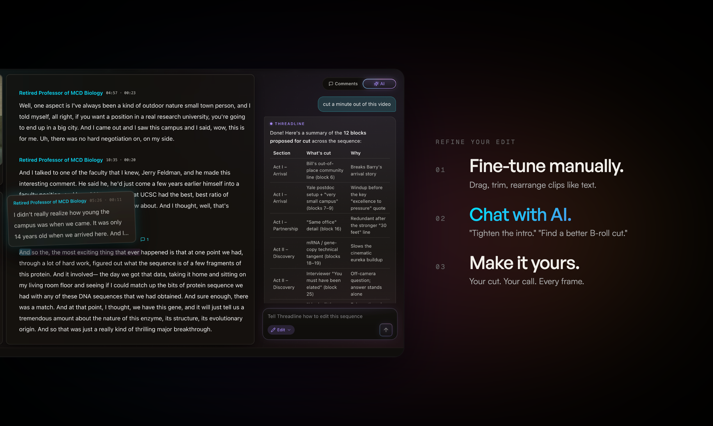

### 🎬 관련 영상
- [🎥 영상 보기](https://ph-files.imgix.net/dd3cff11-519e-4ed6-bb5d-dccbedbee19c.jpeg?auto=format)

---

## 22. [OpenAdapter - Search, Scrape & Vector DB](https://www.producthunt.com/products/openadapter-search-scrape-rag)
**Votes**: 13 | **도입 난이도**: 하 | **신뢰도**: 상
**Tagline**: One Key. Models, Tools & Vector DB Included. Start Free.
**서비스 링크**: https://www.producthunt.com/r/E6RLBXNGMGMJVT

**태그**: AI, DevTool, Automation, RAG, SaaS, AI Tool, Chat, Video, Vision, API

### 📌 이 서비스 한눈에 보기
AI 모델, 웹 검색, 스크래핑, 벡터 DB를 하나의 구독으로 해결하는 올인원 AI 개발 도구

### 🔑 주요 기능
- 웹 검색, 뉴스/이미지/비디오 검색, URL 스크래핑 기능 통합
- RAG(검색 증강 생성) 구현을 위한 벡터 DB 및 챗 기능 포함
- 40개 이상의 오픈소스 모델과 도구들을 단일 구독으로 이용 가능

### 🙋 사용자에게 어떤 점이 좋은가
여러 서비스에 흩어져 있던 AI 관련 도구들을 하나의 계정으로 통합하여 비용과 관리 복잡성을 획기적으로 줄여줍니다.

### ✅ 지금 바로 써볼 기능
- 기존 AI 워크플로우에 웹 검색 및 스크래핑 기능 결합해보기
- 단일 구독으로 40개 이상의 오픈소스 모델 테스트하기
- 무료 플랜으로 RAG 챗 기능 구현해보기

### ⚠️ 사용 전 확인할 점
- 모든 기능이 하나의 구독에 묶여 있어 특정 기능만 필요한 경우 비용 효율성을 따져봐야 함
- 통합 서비스 특성상 특정 기능의 장애가 전체 워크플로우에 영향을 줄 수 있음

### 🧭 확인이 더 필요한 정보
제공되는 40개 이상의 오픈소스 모델의 구체적인 목록과 각 기능별 상세 사용량 제한 확인이 필요합니다.

### 📸 스크린샷 및 갤러리
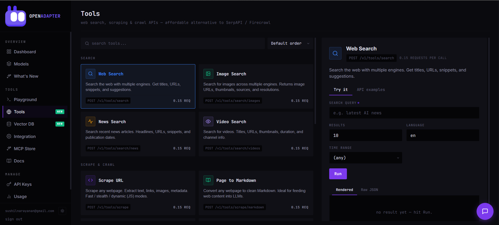
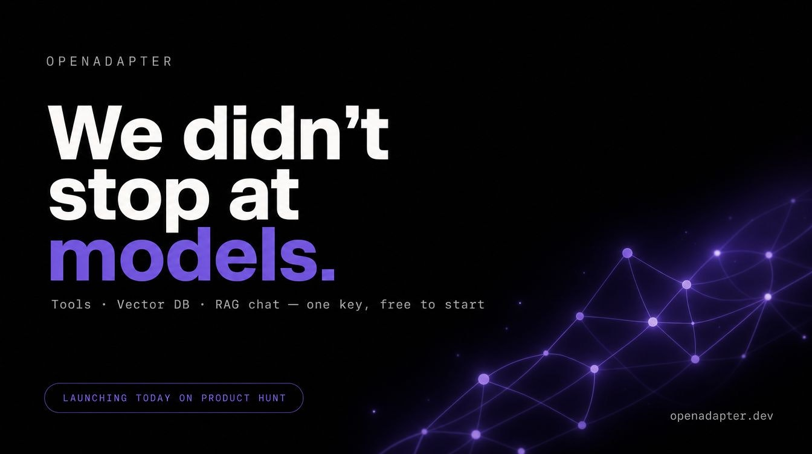
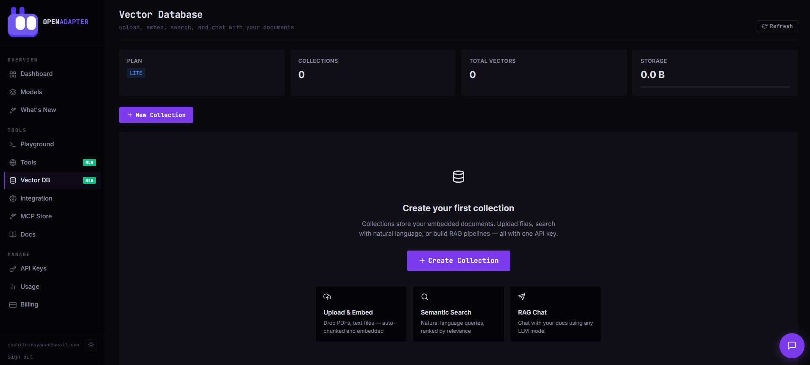

---

## 23. [Your AI wrapped](https://www.producthunt.com/products/standout)
**Votes**: 13 | **도입 난이도**: 하 | **신뢰도**: 상
**Tagline**: Spotify wrapped for AI builders and vibe coders
**서비스 링크**: https://www.producthunt.com/r/3HEUA77DLSLLKZ

**태그**: DevTool, Career, AI, Analytics, Agent, AI Tool

### 📌 이 서비스 한눈에 보기
터미널 작업 내역을 분석하여 개발 역량을 시각화하고 구직 기회까지 연결하는 AI 개발자용 'Wrapped' 서비스

### 🔑 주요 기능
- 터미널 명령어를 통한 간편한 데이터 분석 (npx standout)
- AI 활용 능력, 문제 해결, 디버깅 등 실질적 개발 역량 리포트 생성
- 개인 맞춤형 커리어 소개(Job Offer)를 위한 에이전트 기능 제공

### 🙋 사용자에게 어떤 점이 좋은가
자신의 실제 코딩 스타일과 AI 활용 능력을 데이터로 증명할 수 있어, 포트폴리오 대신 공유 가능한 결과물을 얻을 수 있습니다.

### ✅ 지금 바로 써볼 기능
- 터미널에서 'npx standout' 실행하기
- 생성된 개발 역량 리포트 확인 및 공유하기
- AI 에이전트를 통한 구직 기회 탐색하기

### ⚠️ 사용 전 확인할 점
- 터미널 데이터 접근에 따른 보안 및 개인정보 보호 정책 재확인 필요
- 에이전트가 생성하는 구직 제안의 신뢰성 검토 필요

### 🧭 확인이 더 필요한 정보
데이터를 저장하지 않는다고 명시되어 있으나, 분석 과정에서 수집되는 데이터의 범위와 처리 방식에 대한 상세 기술 문서 확인이 필요합니다.

### 📸 스크린샷 및 갤러리
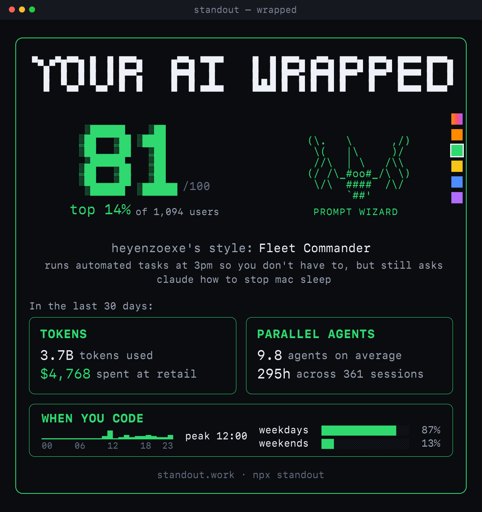
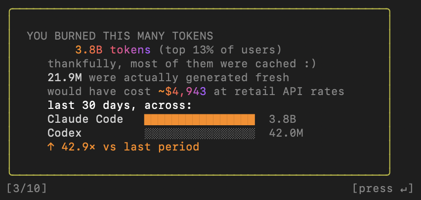
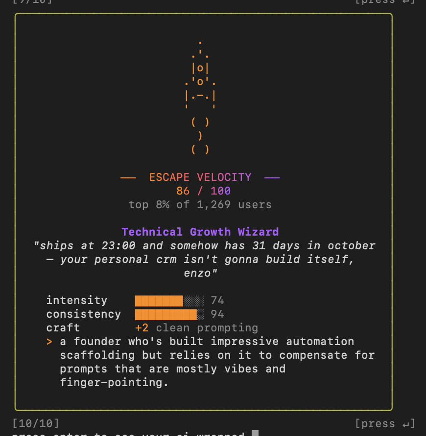

### 🎬 관련 영상
- [🎥 영상 보기](https://ph-files.imgix.net/c3009af2-689a-4cf5-a2b3-f96b82c4b143.jpeg?auto=format)

---

## 24. [PromptPin](https://www.producthunt.com/products/promptpin-2)
**Votes**: 13 | **도입 난이도**: 하 | **신뢰도**: 상
**Tagline**: Stop screenshotting AI prompts. Save and use them in a tap.
**서비스 링크**: https://www.producthunt.com/r/FXJVDLO5MLXPAQ

**태그**: Productivity, AI, Prompt Engineering, Content Curation, AI Tool, Prompting

### 📌 이 서비스 한눈에 보기
SNS에서 발견한 소중한 AI 프롬프트를 스크린샷 대신 간편하게 저장하고 즉시 사용하는 프롬프트 관리 도구

### 🔑 주요 기능
- SNS(Instagram, TikTok, X, LinkedIn)에서 발견한 프롬프트를 원클릭으로 저장
- 스크린샷 더미를 방지하고 필요할 때 즉시 검색 및 복사 가능
- 신뢰할 수 있는 크리에이터들의 고품질 프롬프트 제공 및 맞춤형 제작 지원

### 🙋 사용자에게 어떤 점이 좋은가
더 이상 스크린샷을 뒤지는 번거로움 없이, 검증된 프롬프트를 체계적으로 관리하고 작업 흐름에 즉시 적용할 수 있습니다.

### ✅ 지금 바로 써볼 기능
- SNS에서 발견한 프롬프트 저장해보기
- 저장된 프롬프트 검색 및 복사 기능 테스트
- 필요한 프롬프트 제작 요청하기

### ⚠️ 사용 전 확인할 점
- 플랫폼 간 연동 방식에 따른 저장 편의성 차이 확인 필요
- 제공되는 프롬프트의 품질이 사용자 기대치와 일치하는지 확인 필요

### 🧭 확인이 더 필요한 정보
플랫폼 간 자동 저장 기능의 구체적인 구현 방식과 크리에이터 콘텐츠의 업데이트 주기를 확인해야 합니다.

### 📸 스크린샷 및 갤러리
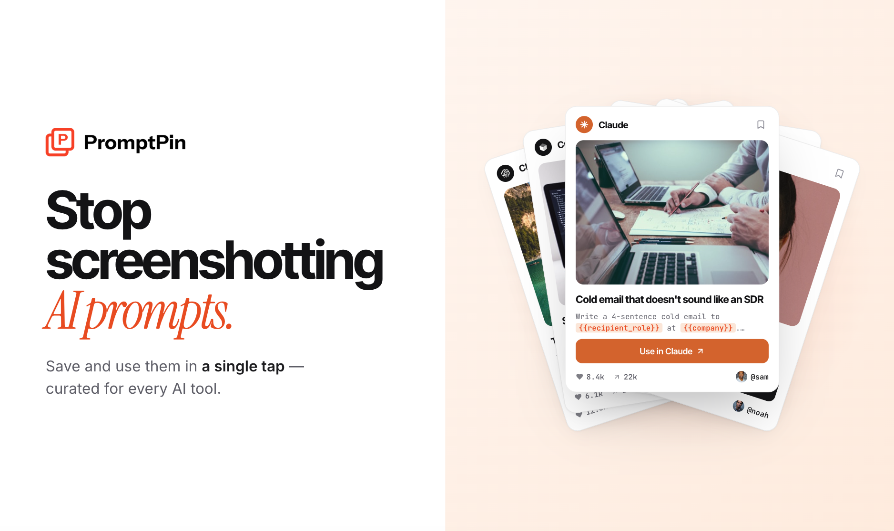
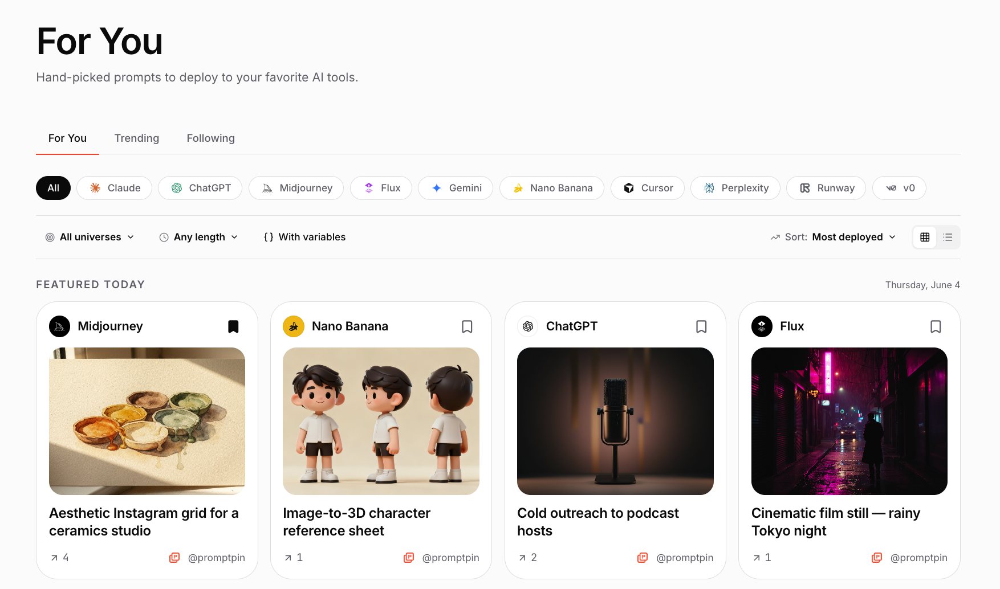
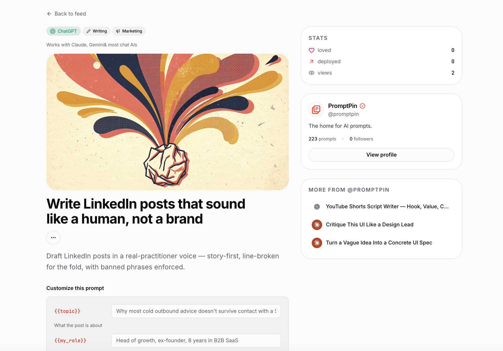

---

## 25. [Drip Scene](https://www.producthunt.com/products/drip-scene)
**Votes**: 12 | **도입 난이도**: 하 | **신뢰도**: 상
**Tagline**: From phone shot to storefront. No studio needed.
**서비스 링크**: https://www.producthunt.com/r/5ZJ54K7AFMHPWI

**태그**: AI, E-commerce, Photography, ContentCreation, AI Tool

### 📌 이 서비스 한눈에 보기
스마트폰 사진만으로 스튜디오급 제품 화보와 모델 착용샷을 만드는 AI 사진 솔루션

### 🔑 주요 기능
- 스마트폰 촬영 이미지를 고품질 스튜디오 배경으로 변환
- AI 모델을 활용한 패션 제품 가상 착용(Try-on) 기능
- 이커머스 판매를 위한 고효율 제품 사진 즉시 생성

### 🙋 사용자에게 어떤 점이 좋은가
별도의 스튜디오 대관이나 전문 모델 없이도 스마트폰만으로 전문적인 제품 화보를 제작하여 콘텐츠 제작 비용을 획기적으로 절감할 수 있습니다.

### ✅ 지금 바로 써볼 기능
- 스마트폰으로 찍은 제품 사진 업로드해보기
- AI 배경 생성 기능으로 브랜드 무드 맞추기
- AI 모델 피팅 기능 테스트하기

### ⚠️ 사용 전 확인할 점
- AI 생성 이미지 특성상 제품의 실제 질감이나 색상이 왜곡될 가능성
- 복잡한 포즈나 구도의 사진은 결과물 품질이 달라질 수 있음

### 🧭 확인이 더 필요한 정보
구체적인 요금제 체계와 생성 가능한 이미지의 해상도/수량 제한에 대한 정보가 필요합니다.

### 📸 스크린샷 및 갤러리
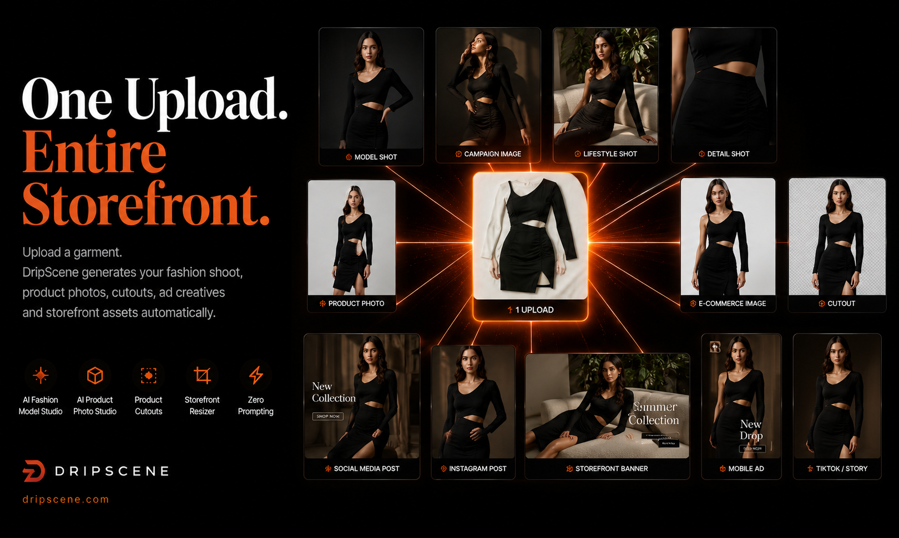
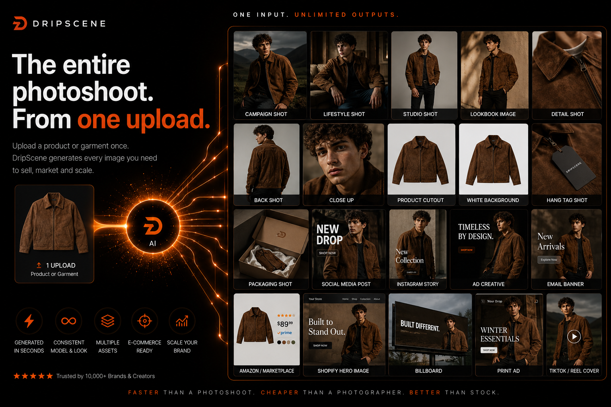
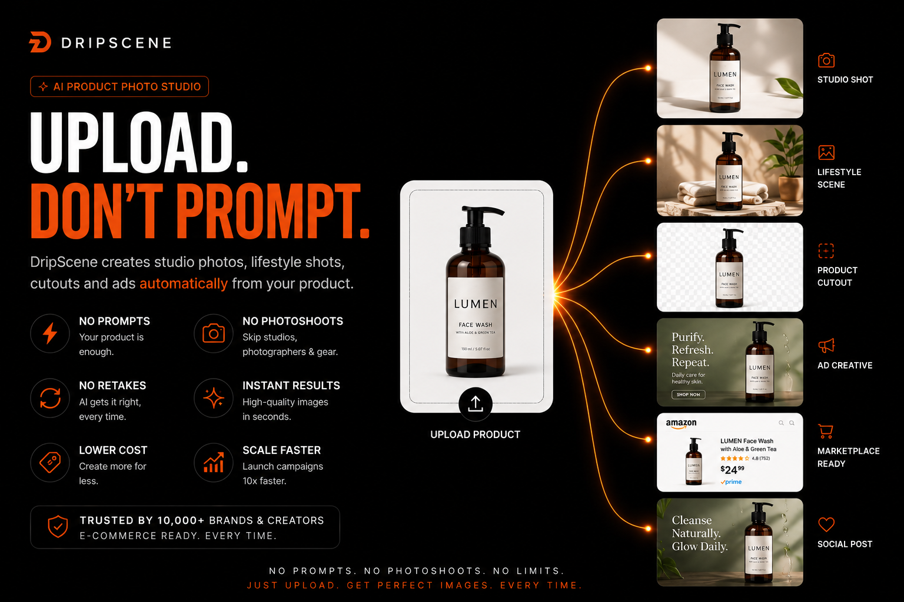

---

## 26. [REVERSO](https://www.producthunt.com/products/reverso)
**Votes**: 11 | **도입 난이도**: 중 | **신뢰도**: 상
**Tagline**: The Art Director's Thinking Engine.
**서비스 링크**: https://www.producthunt.com/r/KAQTJPCOL5ZUBR

**태그**: DesignTool, CreativeStrategy, QualityControl, AI Tool, Vision

### 📌 이 서비스 한눈에 보기
단순 생성을 넘어 아이디어의 독창성과 전략적 가치를 검증하는 아트 디렉터용 사고 엔진

### 🔑 주요 기능
- 독창성(I), 적합성(P), 클리셰(C)를 기반으로 한 독자적인 점수 산출 알고리즘 적용
- 클리셰가 감지될 경우 내보내기를 차단하여 아이디어의 질적 수준 유지
- AI 생성 이미지가 아닌 박물관 아카이브 및 전문 타이포그래피 기반의 실질적 레퍼런스 제공

### 🙋 사용자에게 어떤 점이 좋은가
단순히 결과물을 만들어내는 것이 아니라, 클라이언트에게 논리적으로 방어 가능한 수준 높은 전략적 디자인 가이드를 제공합니다.

### ✅ 지금 바로 써볼 기능
- 자신의 아이디어를 입력하여 클리셰 점수 확인하기
- 제공되는 전략적 근거(Rationale) 검토하기
- 아카이브 기반의 시각적 레퍼런스 활용하기

### ⚠️ 사용 전 확인할 점
- AI 생성 이미지를 사용하지 않으므로 완전 자동화된 결과물을 원하는 사용자에게는 부적합할 수 있음
- 창의적 사고를 유도하는 도구이므로 사용자의 전문적인 안목이 필요함

### 🧭 확인이 더 필요한 정보
구체적인 알고리즘 수식의 세부 사항과 지원하는 디자인 파일 형식에 대한 정보가 명시되지 않았습니다.

### 📸 스크린샷 및 갤러리
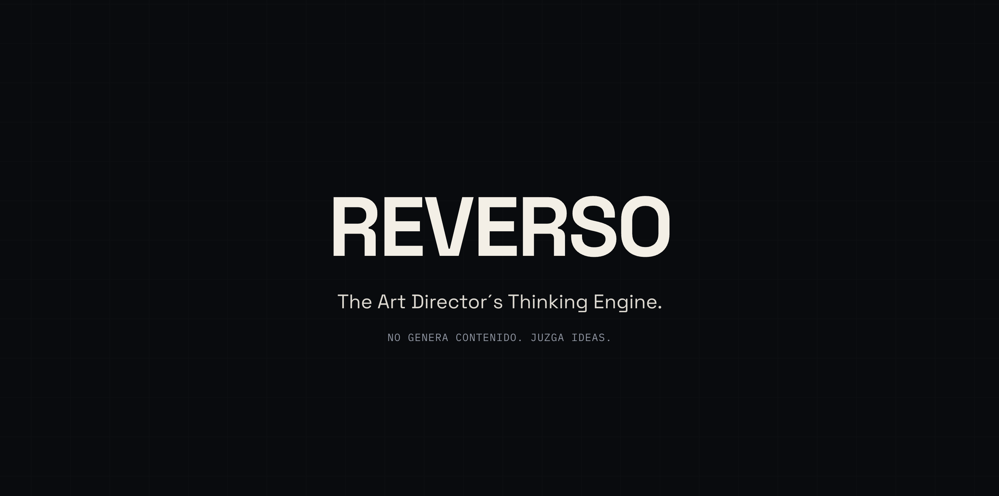
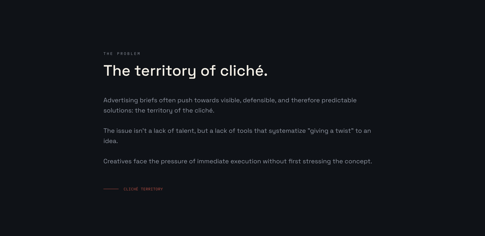
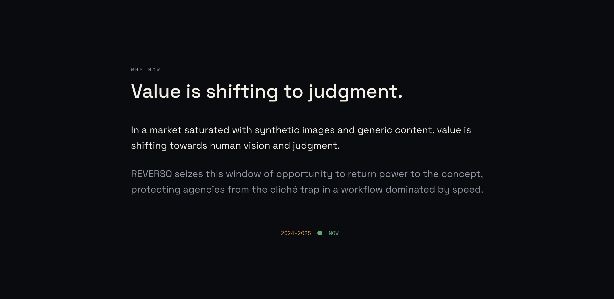

### 🎬 관련 영상
- [🎥 영상 보기](https://ph-files.imgix.net/2b786bfd-4382-45a0-af69-1f1857936345.jpeg?auto=format)

---

## 27. [Orbits](https://www.producthunt.com/products/orbits-6)
**Votes**: 11 | **도입 난이도**: 하 | **신뢰도**: 상
**Tagline**: AI-native workspace for marketing agencies
**서비스 링크**: https://www.producthunt.com/r/HUOHUNV3KGZUKZ

**태그**: Marketing, AI, Productivity, Reporting, Agency, AI Tool

### 📌 이 서비스 한눈에 보기
마케팅 대행사를 위한 AI 기반 워크스페이스: 흩어진 데이터를 정제된 리포트와 클라이언트 자산으로 변환

### 🔑 주요 기능
- 다양한 형식의 데이터(스크린샷, CSV, 시트, 메모 등) 통합 관리
- 복잡한 데이터를 세련된 리포트 및 공유 가능한 링크로 자동 변환
- 클라이언트별 데이터 축적을 통한 재사용 가능한 '클라이언트 메모리' 구축

### 🙋 사용자에게 어떤 점이 좋은가
파편화된 클라이언트 데이터를 정리하는 데 드는 시간을 줄이고, 전문적인 결과물을 빠르게 공유할 수 있습니다.

### ✅ 지금 바로 써볼 기능
- 기존 클라이언트 데이터(CSV, 시트 등) 임포트해보기
- 데이터를 활용한 자동 리포트 생성 테스트
- 공유용 클라이언트 링크 생성 및 확인

### ⚠️ 사용 전 확인할 점
- 데이터 보안 및 클라이언트 정보 보호 정책 확인 필요
- AI가 생성한 리포트의 정확성 검수 필요

### 🧭 확인이 더 필요한 정보
데이터 임포트 시 지원되는 구체적인 파일 형식과 보안 수준에 대한 정보가 더 필요합니다.

### 📸 스크린샷 및 갤러리
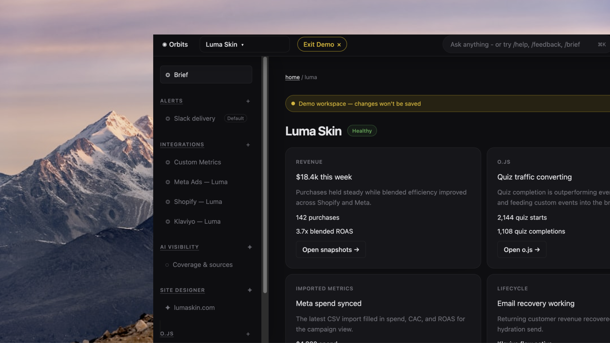
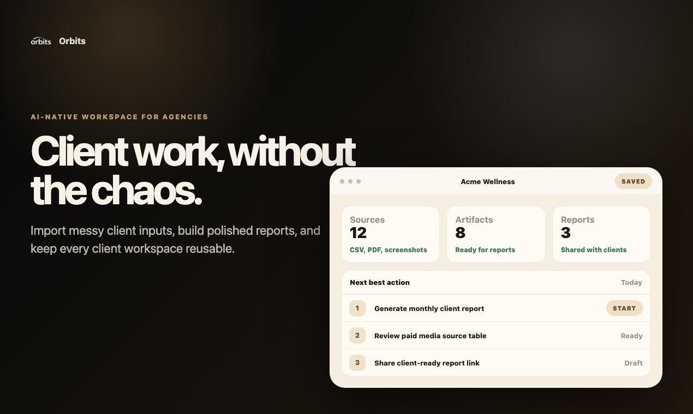
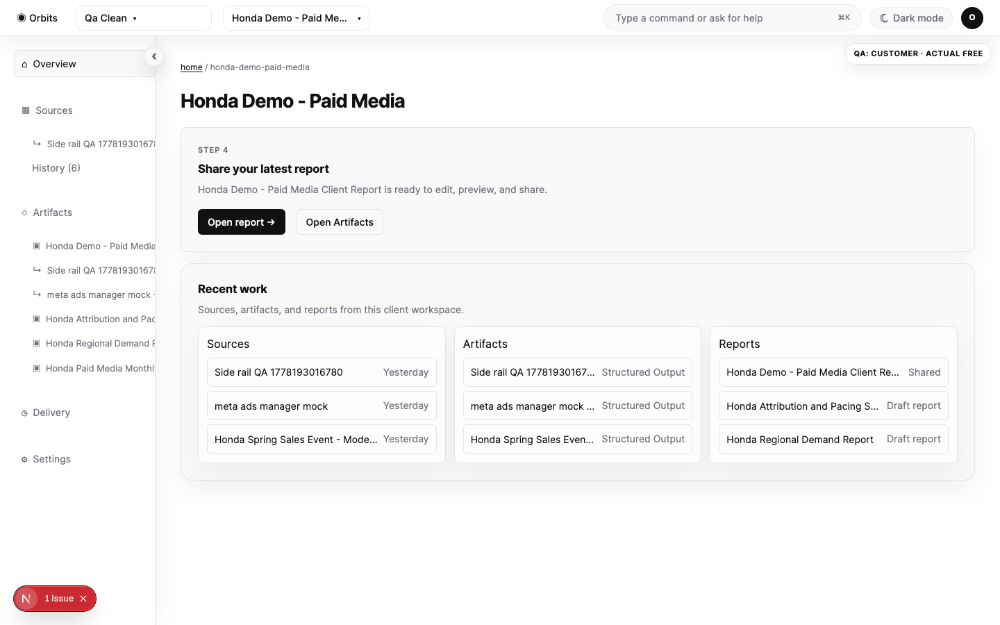

### 🎬 관련 영상
- [🎥 영상 보기](https://ph-files.imgix.net/1e2f2467-5450-4d45-8299-0a3a4ca57837.jpeg?auto=format)

---

## 28. [AethexAI ](https://www.producthunt.com/products/aethexai)
**Votes**: 10 | **도입 난이도**: 중 | **신뢰도**: 상
**Tagline**: End to end voice agents localized for your market.
**서비스 링크**: https://www.producthunt.com/r/BBOUFLTBULZOQQ

**태그**: Voice-AI, API, Automation, Localization, Agent, AI Tool

### 📌 이 서비스 한눈에 보기
열악한 네트워크 환경에서도 끊김 없이 작동하는 고성능 현지화 음성 AI API

### 🔑 주요 기능
- 불안정한 연결 및 소음 환경에 최적화된 회복력 있는 음성 API
- 언어 전환(Code-switching)이 빈번한 환경을 고려한 설계
- 이미 일일 15,000건 이상의 통화를 처리하며 검증된 안정성

### 🙋 사용자에게 어떤 점이 좋은가
통신 환경이 좋지 않거나 사용자가 여러 언어를 섞어 쓰는 시장에서도 끊김 없는 고객 응대 자동화가 가능합니다.

### ✅ 지금 바로 써볼 기능
- 현재 서비스의 음성 품질과 비교 테스트
- 열악한 네트워크 환경에서의 API 응답 속도 확인
- 다국어/혼합 언어 인식 정확도 검증

### ⚠️ 사용 전 확인할 점
- 특정 언어 및 방언에 대한 최적화 수준 확인 필요
- 기존 통신 인프라와의 연동 방식 확인

### 🧭 확인이 더 필요한 정보
구체적인 API 문서와 지원 가능한 언어 목록에 대한 정보가 필요합니다.

### 📸 스크린샷 및 갤러리
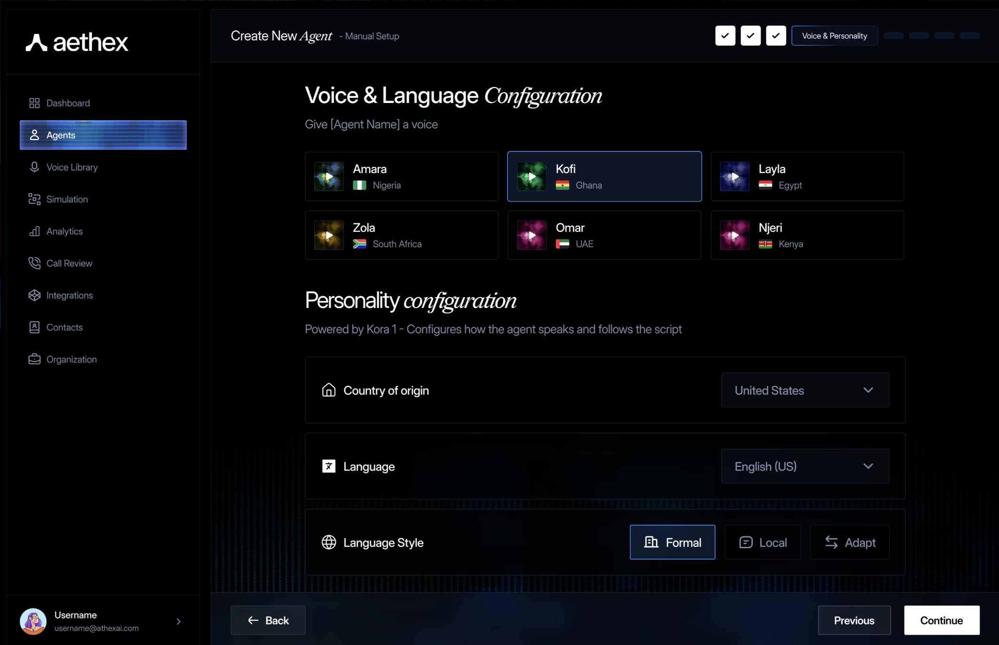

### 🎬 관련 영상
- [🎥 영상 보기](https://ph-files.imgix.net/da6b5c5c-7996-4afe-a4ba-8b2df8c28ff9.gif?auto=format)

---

## 29. [signalqub](https://www.producthunt.com/products/signalqub)
**Votes**: 10 | **도입 난이도**: 하 | **신뢰도**: 상
**Tagline**: Find local businesses with broken web infrastructure.
**서비스 링크**: https://www.producthunt.com/r/BVUA6D27FUJQIQ

**태그**: SalesTool, LeadGeneration, MarketingAutomation, AI Tool, Design, Marketing, Sales, Email

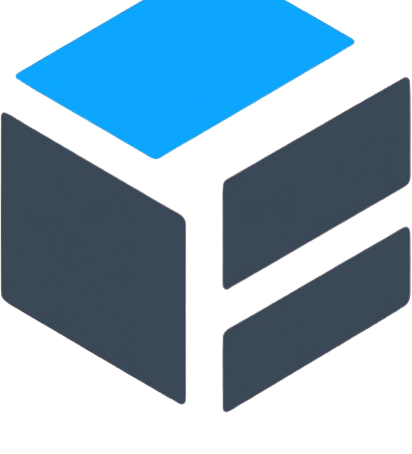

### 📌 이 서비스 한눈에 보기
웹 기술적 결함이 있는 지역 비즈니스를 발굴하여 맞춤형 영업 기회를 제공하는 인텐트 데이터 플랫폼

### 🔑 주요 기능
- 지역 시장 내 기술적 부채(Technical Debt)가 있는 기업 식별
- 소유자 이메일 및 전화번호가 포함된 정제된 CSV 데이터 제공
- 개인화된 콜드 이메일 작성을 위한 구체적인 기술적 문제점 리포트

### 🙋 사용자에게 어떤 점이 좋은가
웹 디자인 및 마케팅 대행사가 단순 리드 리스트 대신, 즉각적인 해결책을 제안할 수 있는 고효율 영업 타겟을 확보할 수 있습니다.

### ✅ 지금 바로 써볼 기능
- 타겟 지역 설정 및 스캔 실행
- 식별된 기술적 결함 데이터 확인
- CSV 내 연락처 정보를 활용한 맞춤형 제안서 작성

### ⚠️ 사용 전 확인할 점
- 데이터의 최신성 및 연락처 정확도 확인 필요
- 기술적 결함이 실제 영업 기회로 이어지는 전환율은 시장 상황에 따라 다를 수 있음

### 🧭 확인이 더 필요한 정보
스캔 범위(지역/산업군)의 구체적인 한계와 데이터 업데이트 주기에 대한 정보가 필요합니다.

### 📸 스크린샷 및 갤러리
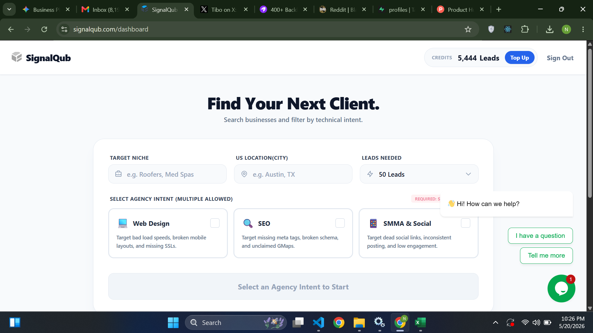

---

## 30. [Rune](https://www.producthunt.com/products/rune-markdown-writer-for-desktop)
**Votes**: 9 | **도입 난이도**: 하 | **신뢰도**: 상
**Tagline**: Markdown that renders as you type — code, diagrams, math
**서비스 링크**: https://www.producthunt.com/r/CTMJTFEEP3VB44

**태그**: Markdown, Editor, DeveloperTools, OpenSource, Productivity, AI Tool, DevTool

### 📌 이 서비스 한눈에 보기
작성과 동시에 실시간 렌더링되는 빠르고 가벼운 데스크톱 마크다운 에디터

### 🔑 주요 기능
- 입력 중인 라인만 소스 코드로 보여주는 직관적인 실시간 렌더링 방식
- Mermaid 다이어그램, KaTeX 수학식, 코드 블록 완벽 지원
- Rust 기반의 빠른 속도와 로컬 우선(plainmd) 방식의 데이터 보안

### 🙋 사용자에게 어떤 점이 좋은가
문서 작성과 결과물 확인을 번갈아 할 필요 없이, 작성 흐름을 깨지 않고 즉시 시각화된 문서를 만들 수 있습니다.

### ✅ 지금 바로 써볼 기능
- Mermaid 다이어그램을 활용한 시각적 문서 작성
- KaTeX를 이용한 수학 공식 입력 테스트
- 로컬 파일 기반의 워크플로우 적용

### ⚠️ 사용 전 확인할 점
- 데스크톱 전용 앱이므로 모바일 환경에서는 사용이 제한됨
- 로컬 파일 기반이므로 기기 간 동기화는 별도의 클라우드 서비스 필요

### 🧭 확인이 더 필요한 정보
플랫폼별(macOS, Windows, Linux) 상세 성능 차이 및 기능 완성도는 직접 설치 후 확인이 필요합니다.

### 📸 스크린샷 및 갤러리
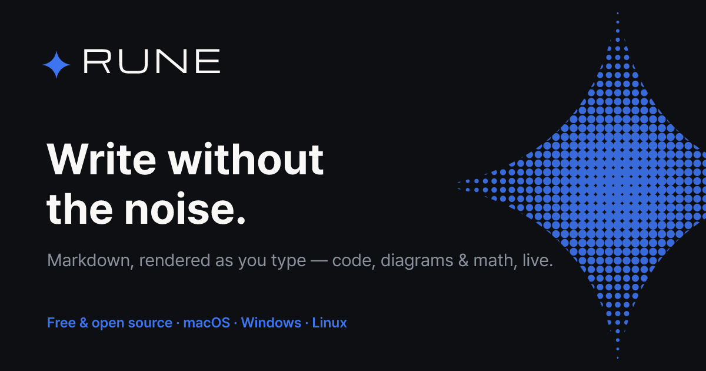
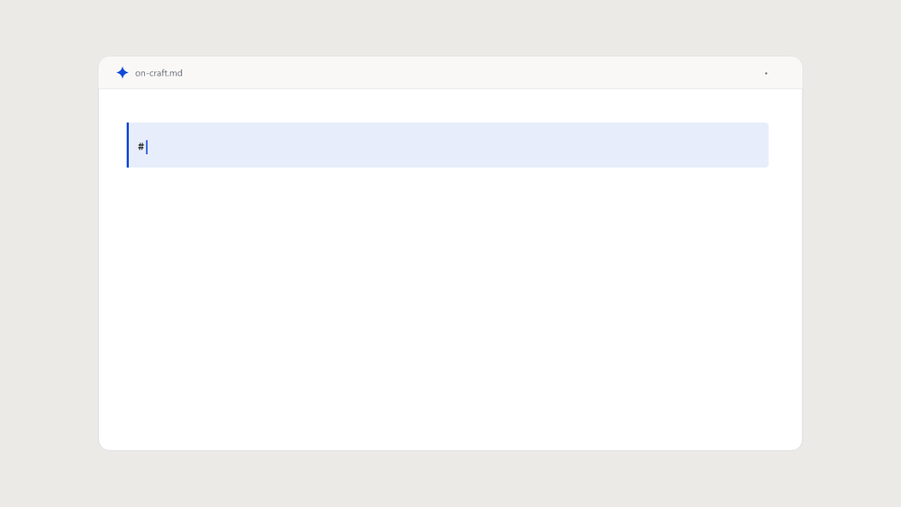

---

