# 🚀 Product Hunt Daily Top 30 (2026-06-07)

## 오늘의 요약
오늘의 트렌드는 AI를 활용한 업무 자동화와 전문적인 콘텐츠 제작 도구, 그리고 복잡한 데이터를 직관적으로 관리하는 서비스들이 주를 이루었습니다. 특히 쇼피파이 관리나 이미지 편집, 건강 데이터 분석 등 특정 워크플로우를 혁신하는 AI 솔루션들이 눈에 띄었습니다.

### 오늘의 핵심 포인트
- 채팅 인터페이스나 AI 자동화를 통해 복잡한 스토어 관리 및 이미지 편집 과정을 단순화하는 도구들이 주목받았습니다.
- 개인 크리에이터와 소규모 개발자를 위한 맞춤형 브랜딩 및 프로젝트 관리 솔루션이 다양하게 제안되었습니다.
- 게임 서비스 연동이나 웨어러블 데이터 분석처럼 일상과 취미 영역을 디지털 플랫폼과 연결하는 자동화 기술이 강조되었습니다.

**오늘의 태그**: AI자동화, 크리에이터이코노미, 노코드, 생산성도구, 게임연동

## 1. [Google Search Profiles](https://www.producthunt.com/products/google)
**Votes**: 261 | **도입 난이도**: 중 | **신뢰도**: 상
**Tagline**: Profile for publishers/creators to highlight work on Search
**서비스 링크**: https://www.producthunt.com/r/NRRQD6MLVCJ2A7

**태그**: CreatorTools, Branding, SearchEngine, AI Tool, Video

### 📌 이 서비스 한눈에 보기
크리에이터가 구글 검색 결과에서 자신을 브랜딩하고 팬층을 확보할 수 있는 전용 프로필 페이지

### 🔑 주요 기능
- 검색 엔진 내 크리에이터 전용 페이지 제공
- 소셜 미디어 및 영상 플랫폼 링크 통합
- 구글 디스커버(Discover)를 통한 팔로워 확보 기능

### 🙋 사용자에게 어떤 점이 좋은가
콘텐츠 제작자가 구글 검색을 통해 자신의 작업물을 효과적으로 홍보하고, 검색 사용자들을 자신의 팬으로 전환할 수 있습니다.

### ✅ 지금 바로 써볼 기능
- 기존 팔로워 규모 확인 및 자격 요건 검토
- 연결할 소셜 미디어 및 영상 플랫폼 계정 정리
- 미국 내 접속 환경 확인

### ⚠️ 사용 전 확인할 점
- 현재 미국 지역에서만 사용 가능
- 기존 팔로워가 있는 사용자만 이용 가능한 자격 제한

### 🧭 확인이 더 필요한 정보
자격 요건의 구체적인 기준과 향후 글로벌 출시 여부에 대한 정보가 필요합니다.

### 📸 스크린샷 및 갤러리
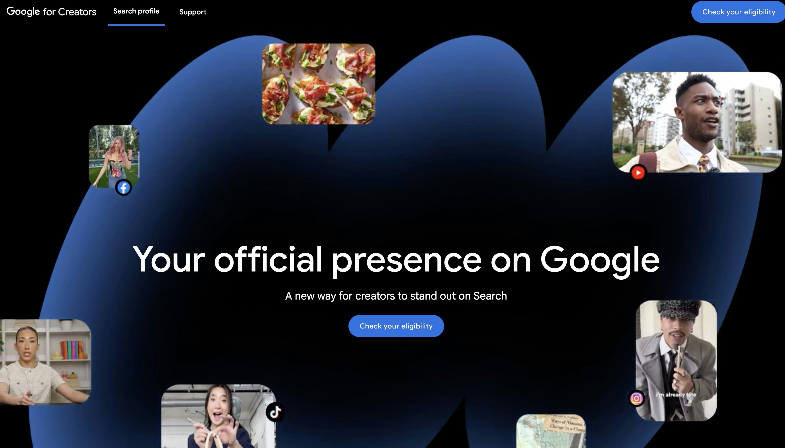
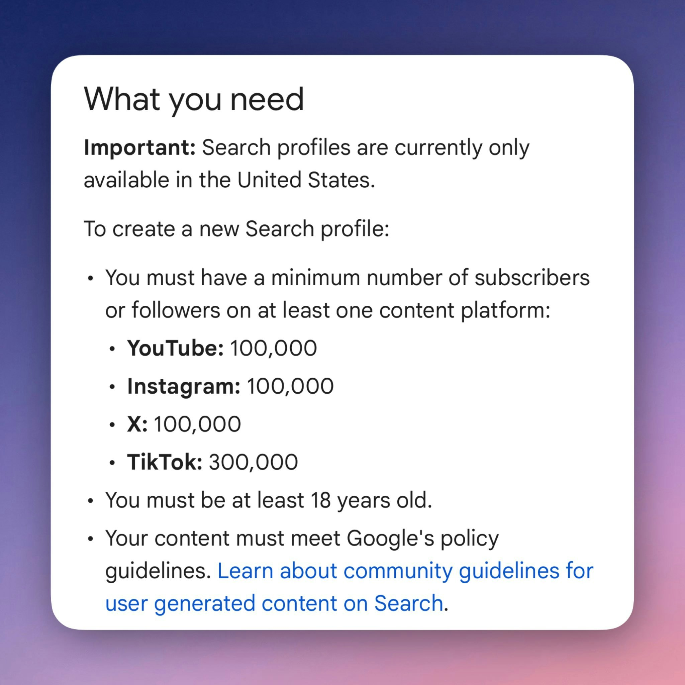

### 🎬 관련 영상
- [🎥 영상 보기](https://ph-files.imgix.net/7ceac64a-e9a4-44b0-b116-abde87fccfc2.jpeg?auto=format)

---

## 2. [Manus Shopify Connector](https://www.producthunt.com/products/manus-shopify-connector)
**Votes**: 180 | **도입 난이도**: 하 | **신뢰도**: 상
**Tagline**: Build and manage Shopify stores from one chat
**서비스 링크**: https://www.producthunt.com/r/AHXVXQWPR4IL7W

**태그**: E-commerce, Automation, AI, Shopify, AI Tool, Chat, Vision

### 📌 이 서비스 한눈에 보기
채팅 한 번으로 쇼피파이 스토어 구축부터 상품 관리, 캠페인 생성까지 해결하는 AI 자동화 도구

### 🔑 주요 기능
- 단일 채팅 인터페이스를 통한 쇼피파이 스토어 구축 및 관리
- 상품 카탈로그 관리 및 자동 컬렉션 생성 기능
- 카피라이팅, 이미지 생성, 캠페인 브리프 자동 생성

### 🙋 사용자에게 어떤 점이 좋은가
스토어 운영에 필요한 복잡한 작업들을 채팅만으로 자동화하여, 창업자와 운영자의 업무 시간을 획기적으로 단축할 수 있습니다.

### ✅ 지금 바로 써볼 기능
- 판매할 상품 정보 입력하여 스토어 구축 시도하기
- AI가 생성한 상품 카피 및 이미지 검토하기
- 자동 생성된 컬렉션 및 캠페인 브리프 확인하기

### ⚠️ 사용 전 확인할 점
- 유료 Manus 플랜 사용자만 이용 가능
- AI가 생성한 콘텐츠(카피, 이미지)의 품질 검수 필요

### 🧭 확인이 더 필요한 정보
유료 플랜의 구체적인 가격 정책과 기능 범위에 대한 확인이 필요합니다.

### 📸 스크린샷 및 갤러리
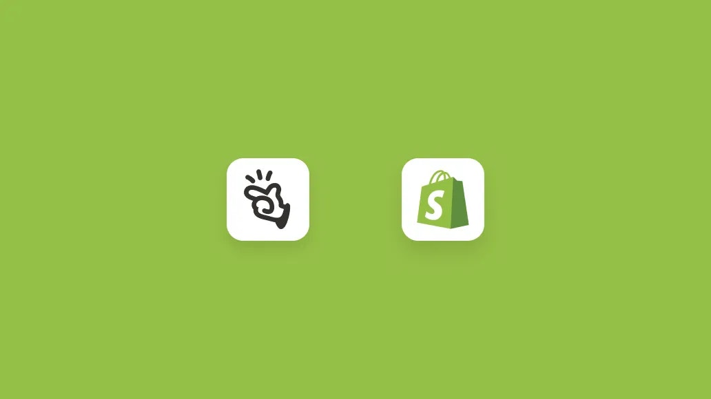
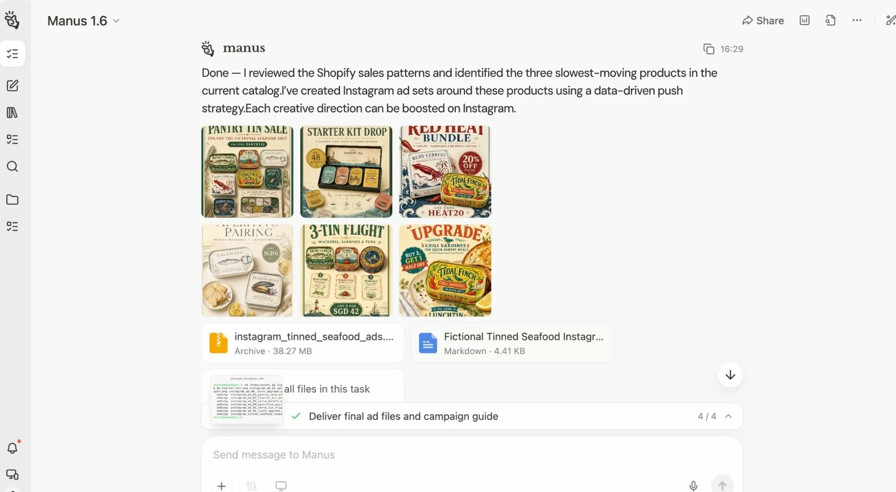
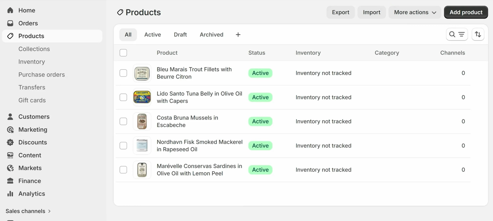

### 🎬 관련 영상
- [🎥 영상 보기](https://ph-files.imgix.net/c2e2f8fc-d8b0-4ffa-9e5f-3136978646e0.jpeg?auto=format)

---

## 3. [MAI-Image-2.5](https://www.producthunt.com/products/mai-image-2-5)
**Votes**: 158 | **도입 난이도**: 중 | **신뢰도**: 상
**Tagline**: Generate and edit images with precise scene control
**서비스 링크**: https://www.producthunt.com/r/MP6T77GJHYNOD4

**태그**: AI-Image, Generative-AI, Developer-Tool, Image-Editing, Automation, AI Tool, Vision, DevTool

### 📌 이 서비스 한눈에 보기
정교한 장면 제어와 편집이 가능한 고성능 텍스트-이미지 생성 모델

### 🔑 주요 기능
- 부분적 편집(Localized edits) 및 일관된 인물 유지(Identity preservation) 기능
- 정확한 텍스트 렌더링 기능 탑재
- Foundry 및 OpenRouter를 통한 개발자 친화적 API 제공

### 🙋 사용자에게 어떤 점이 좋은가
단순 생성을 넘어 특정 부분만 수정하거나 인물의 특징을 유지해야 하는 전문적인 이미지 워크플로우에 유용합니다.

### ✅ 지금 바로 써볼 기능
- 기존 이미지의 특정 영역 수정 테스트
- 인물 정체성 유지 기능 확인
- 이미지 내 텍스트 삽입 정확도 테스트

### ⚠️ 사용 전 확인할 점
- API 기반 서비스이므로 개발 환경 구축 필요
- 모델의 구체적인 학습 데이터 및 저작권 정책 확인 필요

### 🧭 확인이 더 필요한 정보
상세한 모델 성능 지표 및 API 호출 비용에 대한 정보가 명시되지 않았습니다.

### 📸 스크린샷 및 갤러리

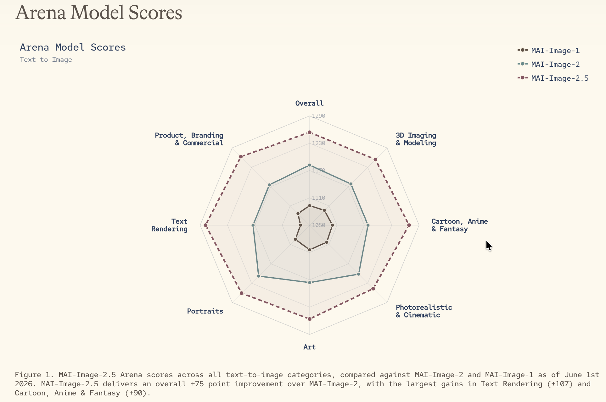
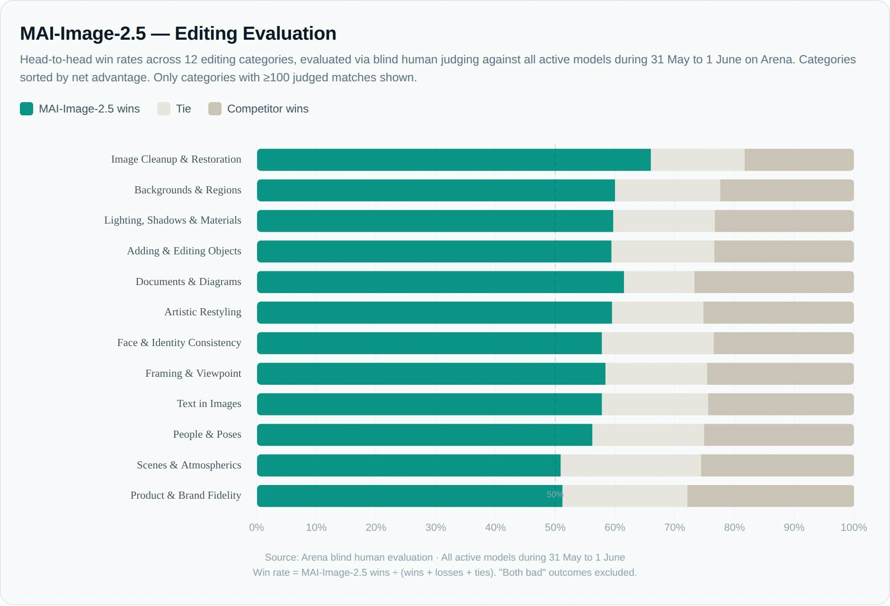

### 🎬 관련 영상
- [🎥 영상 보기](https://ph-files.imgix.net/7390a7bd-b64c-4373-9016-7f32d311863e.jpeg?auto=format)

---

## 4. [QWERTYS](https://www.producthunt.com/products/qwertys)
**Votes**: 123 | **도입 난이도**: 하 | **신뢰도**: 상
**Tagline**: My keyboard fell apart. Now it's your problem.
**서비스 링크**: https://www.producthunt.com/r/E5RZYBOY2WN22E

**태그**: Puzzle, Casual Game, Arcade, AI Tool

### 📌 이 서비스 한눈에 보기
테트리스 방식의 퍼즐 요소와 키보드 배열을 결합한 중독성 있는 퍼즐 게임

### 🔑 주요 기능
- 테트리스와 키보드 레이아웃이 결합된 독특한 퍼즐 메커니즘
- 각 키를 정확한 위치에 배치하여 키보드를 복구하는 게임 목표
- 잘못 배치할 경우 쓸모없는 '회색 벽돌'이 되어 방해 요소가 되는 시스템

### 🙋 사용자에게 어떤 점이 좋은가
간단한 조작으로 즐길 수 있는 캐주얼 퍼즐 게임으로, 짧은 시간 동안 몰입감 있는 플레이 경험을 제공합니다.

### ✅ 지금 바로 써볼 기능
- 키 배치 퍼즐 메커니즘 체험하기
- 정확한 위치에 키를 놓는 손맛 확인하기

### ⚠️ 사용 전 확인할 점
- 실수 시 쌓이는 '회색 벽돌'로 인해 난이도가 급격히 상승할 수 있음
- 게임의 진행 방식이 단순하여 금방 익숙해질 수 있음

### 🧭 확인이 더 필요한 정보
게임의 구체적인 플랫폼(PC, 모바일 등)과 플레이 타임에 대한 정보가 명시되지 않았습니다.

### 📸 스크린샷 및 갤러리

---

## 5. [Gaming services by IFTTT](https://www.producthunt.com/products/ifttt)
**Votes**: 120 | **도입 난이도**: 하 | **신뢰도**: 상
**Tagline**: Level up the way you play with Steam, Dota 2, and more
**서비스 링크**: https://www.producthunt.com/r/DXE77O5ZBKOFQG

**태그**: Automation, Gaming, Productivity

### 📌 이 서비스 한눈에 보기
Steam, Dota 2 등 주요 게임 서비스와 외부 앱을 연결하여 게임 관련 반복 작업을 자동화하는 서비스

### 🔑 주요 기능
- Steam, Destiny 2, Diablo III 등 다양한 인기 게임 서비스 지원
- 게임 내 업적 추적 및 이벤트 알림 자동화
- Discord, Slack, Google Sheets 등 외부 플랫폼과의 연동 기능

### 🙋 사용자에게 어떤 점이 좋은가
게임 플레이 중 발생하는 반복적인 정보 확인이나 기록 작업을 자동화하여 게임 몰입도를 높이고 중요한 게임 이벤트를 놓치지 않게 도와줍니다.

### ✅ 지금 바로 써볼 기능
- Steam 업적 달성 시 Discord 알림 설정하기
- 게임 내 주요 이벤트(예: Hearthstone 업데이트) 자동 알림 받기
- 게임 데이터(예: 캐릭터 사망 기록)를 Google Sheets에 자동 기록하기

### ⚠️ 사용 전 확인할 점
- 지원되는 게임 목록이 특정 타이틀에 국한될 수 있음
- 자동화 설정 과정에서 각 게임 서비스의 API 정책 준수 여부 확인 필요

### 🧭 확인이 더 필요한 정보
모든 게임 서비스가 실시간으로 완벽하게 동기화되는지, 그리고 각 서비스별 추가 비용 발생 여부는 명시되지 않았습니다.

### 📸 스크린샷 및 갤러리
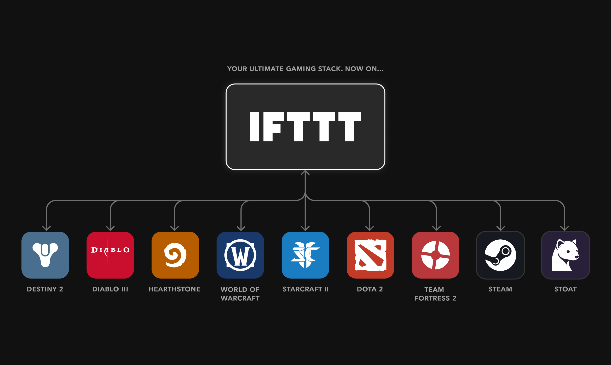
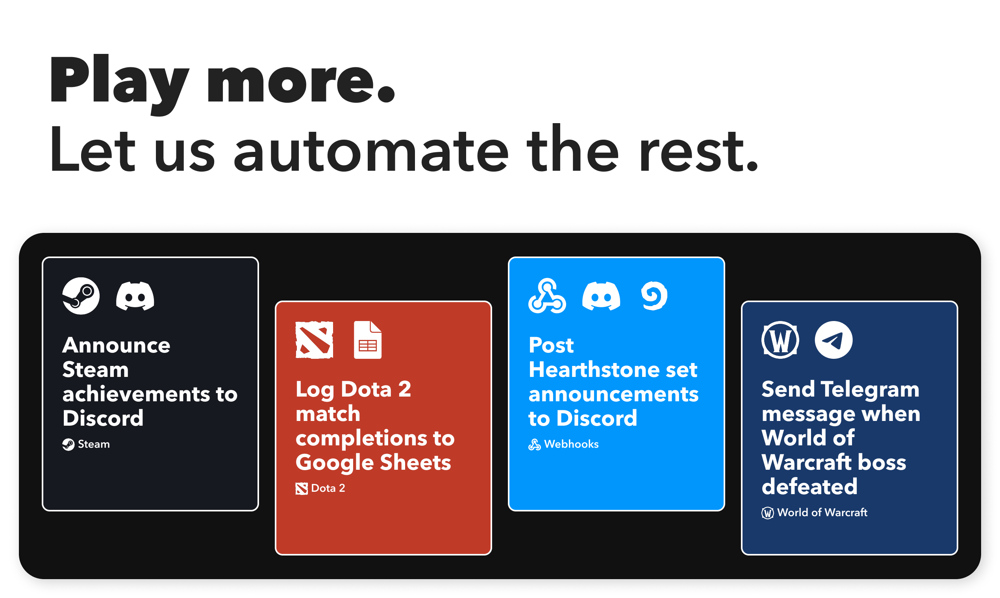
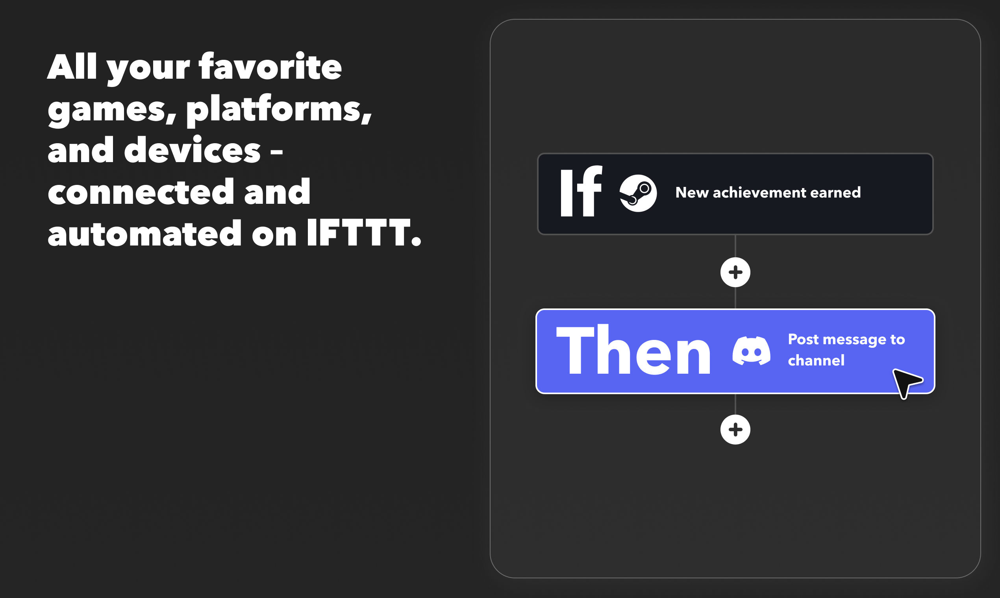

---

## 6. [Fox Issue Tracker 4](https://www.producthunt.com/products/fox-issue-tracker-4)
**Votes**: 101 | **도입 난이도**: 하 | **신뢰도**: 상
**Tagline**: Track, plan, and release.
**서비스 링크**: https://www.producthunt.com/r/2WJKBSSDQ3SWE7

**태그**: DevTool, ProjectManagement, Productivity

### 📌 이 서비스 한눈에 보기
버전 관리와 마일스톤 중심의 1인 개발자 및 소규모 팀용 이슈 트래커

### 🔑 주요 기능
- 단순 할 일 목록을 넘어선 버전/마일스톤 중심의 작업 관리
- 배포 중심의 워크플로우 설계로 명확한 제품 출시 경로 제공
- 1인 개발자 및 소규모 팀에 최적화된 구조

### 🙋 사용자에게 어떤 점이 좋은가
단순 메모나 할 일 앱에서 관리하기 힘든 복잡한 프로젝트를 배포 일정에 맞춰 체계적으로 관리할 수 있습니다.

### ✅ 지금 바로 써볼 기능
- 현재 진행 중인 프로젝트의 마일스톤 설정하기
- 배포 버전별 작업 목록 정리하기

### ⚠️ 사용 전 확인할 점
- 소규모 팀에 특화되어 있어 대규모 조직에는 기능이 부족할 수 있음
- 기존의 복잡한 엔터프라이즈급 프로젝트 관리 도구와 기능 차이 확인 필요

### 🧭 확인이 더 필요한 정보
구체적인 협업 기능 및 외부 도구와의 연동 범위에 대한 정보가 부족합니다.

### 📸 스크린샷 및 갤러리
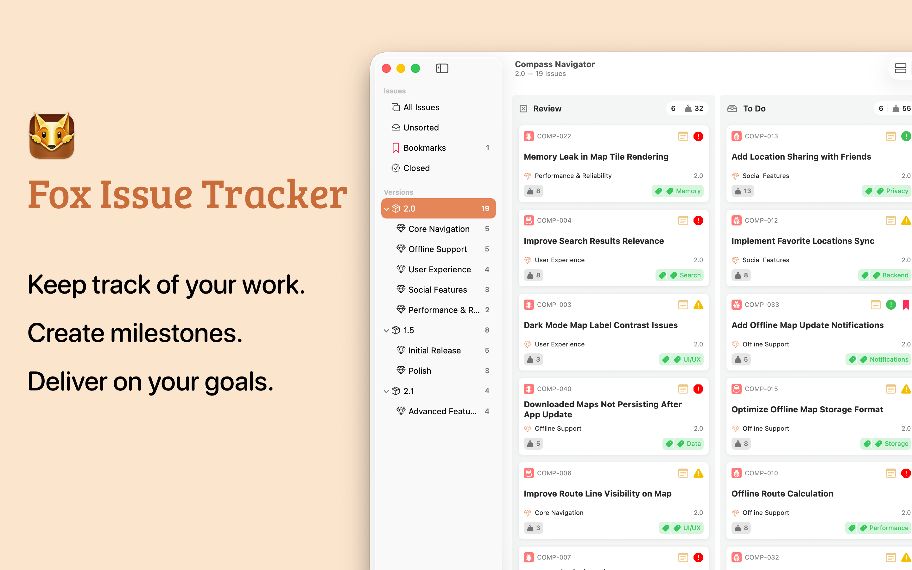
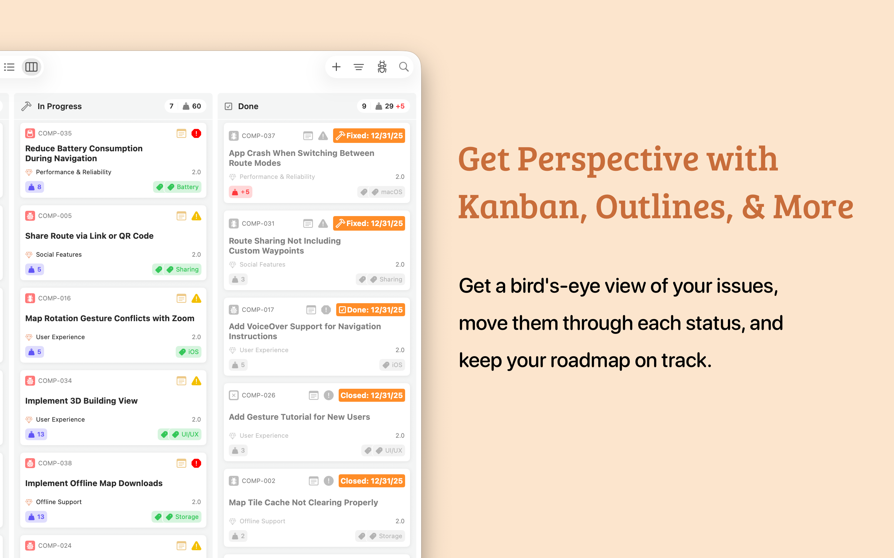
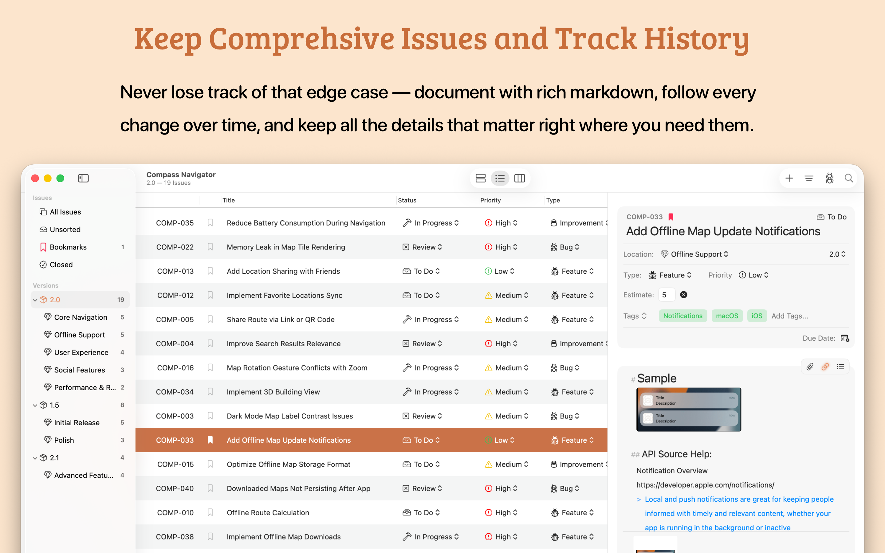

---

## 7. [Navi+ Menu Builder](https://www.producthunt.com/products/navi-menu-builder)
**Votes**: 92 | **도입 난이도**: 하 | **신뢰도**: 상
**Tagline**: Add Tab Bar, Mega Menu & more to any website — no code
**서비스 링크**: https://www.producthunt.com/r/PH447HDYKIMLHI

**태그**: NoCode, UX/UI, WebDesign, MobileOptimization, AI Tool, Design, DevTool

### 📌 이 서비스 한눈에 보기
코딩 없이 클릭 몇 번으로 웹사이트에 모바일 앱 스타일의 메뉴를 구축하는 노코드 네비게이션 빌더

### 🔑 주요 기능
- Shopify, WordPress, Wix 등 모든 플랫폼에 임베드 스니펫으로 간편 설치 가능
- 탭 바, 메가 메뉴, 슬라이드 메뉴 등 모바일 최적화 UI 제공
- AI 기반 메뉴 디자인 기능 및 제로 코드 방식의 쉬운 설정

### 🙋 사용자에게 어떤 점이 좋은가
복잡한 코딩 없이도 웹사이트를 모바일 앱처럼 직관적인 네비게이션으로 개선하여 사용자 이탈을 방지할 수 있습니다.

### ✅ 지금 바로 써볼 기능
- 플랫폼별 설치 방식(App Store vs Embed Snippet) 확인하기
- AI 메뉴 디자인 기능으로 레이아웃 생성해보기
- 모바일 환경에서의 UI 반응성 테스트하기

### ⚠️ 사용 전 확인할 점
- 기존 웹사이트 테마와의 디자인 일관성 확인 필요
- 임베드 방식 사용 시 기존 사이트 코드와의 충돌 여부 검토

### 🧭 확인이 더 필요한 정보
모든 웹사이트 플랫폼에서 '제로 충돌'이 완벽히 보장되는지에 대한 기술적 검증이 필요합니다.

### 📸 스크린샷 및 갤러리
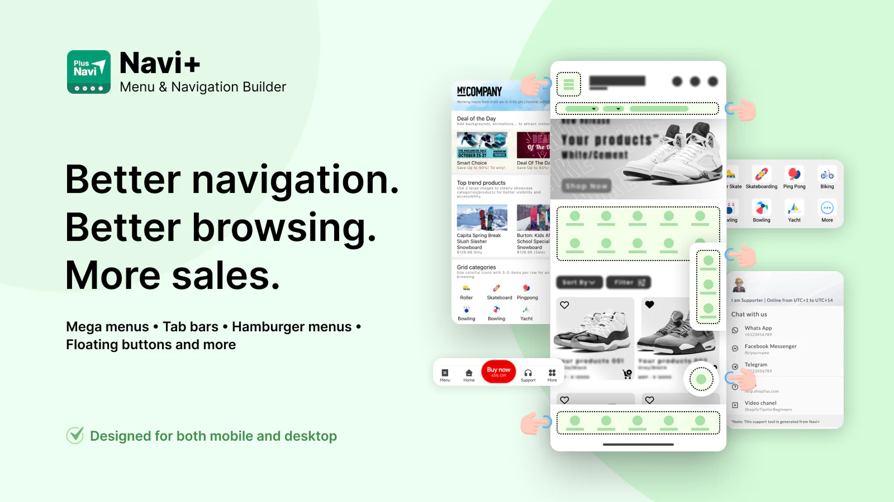
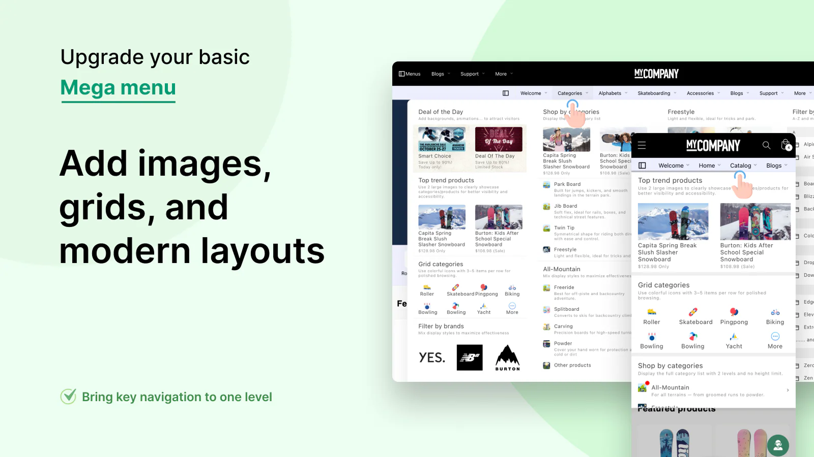
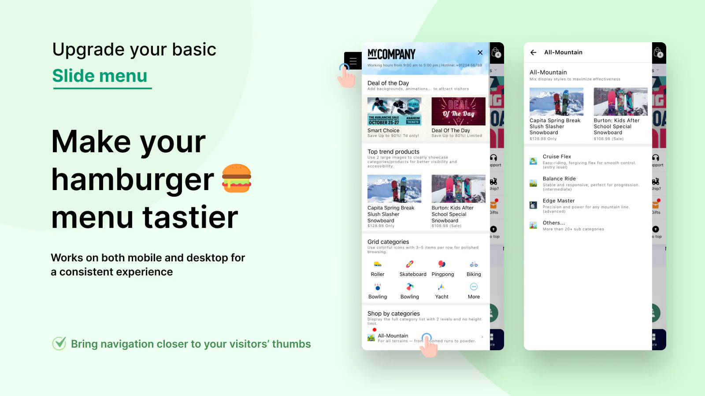

---

## 8. [freddy.](https://www.producthunt.com/products/freddy)
**Votes**: 22 | **도입 난이도**: 중 | **신뢰도**: 상
**Tagline**: Plug your wearables into Claude, OpenClaw, and any AI
**서비스 링크**: https://www.producthunt.com/r/PPCSXURYZ24GLA

**태그**: HealthTech, AI, DataIntegration, PersonalAnalytics, AI Tool, Chat, DevTool

### 📌 이 서비스 한눈에 보기
웨어러블 건강 데이터를 Claude 등 AI와 연결하여 자연어로 분석하는 도구

### 🔑 주요 기능
- 웨어러블 및 건강 데이터 소스를 AI와 직접 연결
- MCP(Model Context Protocol)를 통한 AI 모델과의 상호작용 지원
- 수면, 회복, HRV, 운동 데이터의 자연어 질의 가능

### 🙋 사용자에게 어떤 점이 좋은가
복잡한 건강 데이터 수치를 일일이 확인할 필요 없이, AI에게 질문하는 것만으로 개인화된 건강 인사이트를 얻을 수 있습니다.

### ✅ 지금 바로 써볼 기능
- 사용 중인 웨어러블 기기 데이터 연동하기
- Claude 또는 MCP 지원 AI에 데이터 연결하기
- 자연어 질문을 통해 건강 상태 분석 요청하기

### ⚠️ 사용 전 확인할 점
- 개인 건강 데이터가 외부 AI 모델로 전송되므로 보안 및 프라이버시 설정 확인 필요
- 사용 중인 웨어러블 기기의 데이터 호환성 확인 필요

### 🧭 확인이 더 필요한 정보
지원하는 구체적인 웨어러블 기기 목록과 데이터 보안 정책에 대한 상세 정보가 필요합니다.

### 📸 스크린샷 및 갤러리
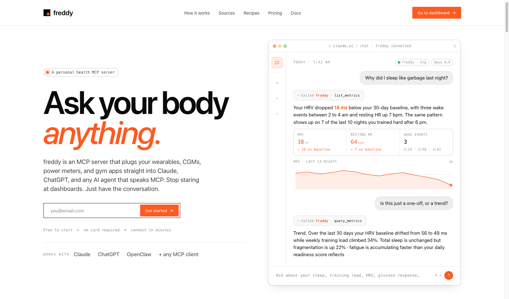
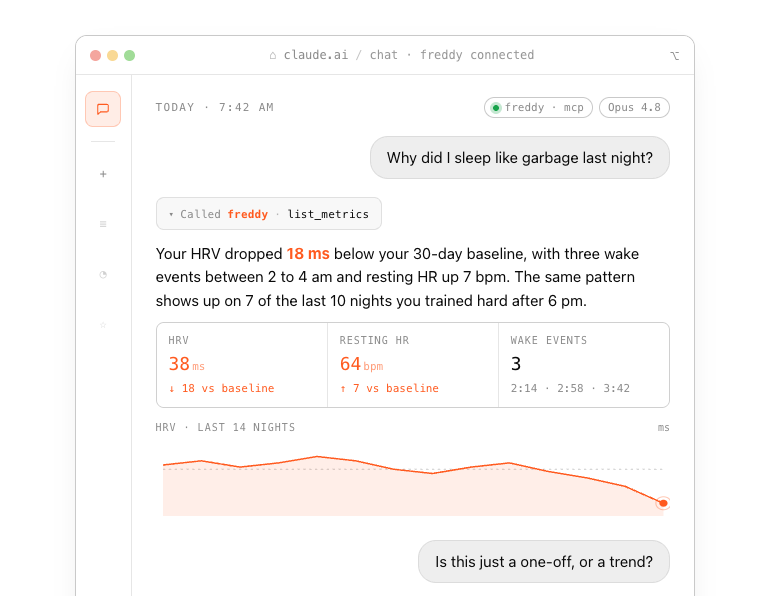
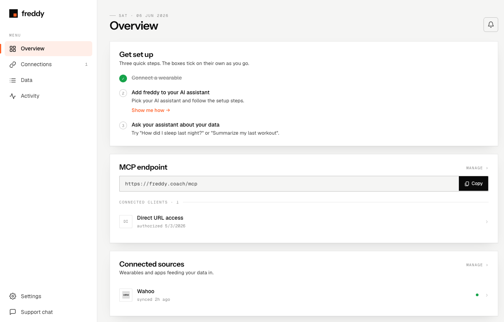

---

## 9. [Landing Page Roast](https://www.producthunt.com/products/landing-page-roast)
**Votes**: 14 | **도입 난이도**: 하 | **신뢰도**: 상
**Tagline**: Get actionable feedback, design critiques & conversion ideas
**서비스 링크**: https://www.producthunt.com/r/LAWZRQXL5BSHQZ

**태그**: DesignTool, Marketing, UX, Productivity, Design

### 📌 이 서비스 한눈에 보기
URL 입력만으로 랜딩 페이지의 UX와 전환율을 개선하는 전문가급 피드백 제공 서비스

### 🔑 주요 기능
- URL 입력 기반의 자동화된 랜딩 페이지 분석
- UX 인사이트 및 디자인 크리틱 제공
- 전환율 향상을 위한 카피라이팅 및 리디자인 컨셉 제안

### 🙋 사용자에게 어떤 점이 좋은가
자체 제작한 웹사이트의 문제점을 빠르게 파악하고, 전문 디자이너나 마케터의 시각에서 개선 아이디어를 얻을 수 있습니다.

### ✅ 지금 바로 써볼 기능
- 분석하고 싶은 웹사이트 URL 붙여넣기
- 제공된 UX 및 카피라이팅 피드백 검토하기
- 제안된 리디자인 컨셉을 실제 사이트에 적용해보기

### ⚠️ 사용 전 확인할 점
- 자동 생성된 피드백이므로 실제 비즈니스 맥락과 다를 수 있음
- 제공되는 디자인 컨셉의 실현 가능성 확인 필요

### 🧭 확인이 더 필요한 정보
서비스의 상세 기능 범위와 유료 플랜 여부에 대한 정보가 명시되지 않았습니다.

### 📸 스크린샷 및 갤러리

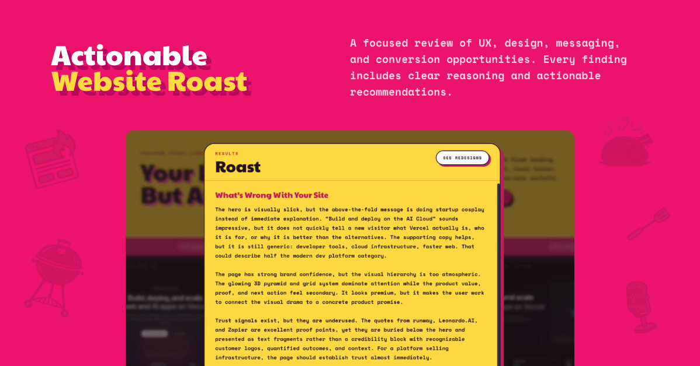

---

## 10. [Manifesto Page](https://www.producthunt.com/products/manifesto-page)
**Votes**: 11 | **도입 난이도**: 하 | **신뢰도**: 상
**Tagline**: Track political promises. Measure progress.
**서비스 링크**: https://www.producthunt.com/r/HDJAKJGWUBNOCD

**태그**: CivicTech, Politics, Tracking, WestBengal, LLM

### 📌 이 서비스 한눈에 보기
서벵골 지역 정치 공약의 이행 현황을 실시간으로 추적하는 시민 참여형 모니터링 플랫폼

### 🔑 주요 기능
- 정치적 공약의 실시간 업데이트 및 추적 기능
- 거버넌스, 고용, 인프라 등 카테고리별 이행 상태 모니터링
- 시민 주도의 정치적 책임성 강화

### 🙋 사용자에게 어떤 점이 좋은가
정치인의 공약이 실제로 지켜지고 있는지 데이터 기반으로 확인하여 유권자의 알 권리를 충족할 수 있습니다.

### ✅ 지금 바로 써볼 기능
- 관심 있는 정치 카테고리 설정하기
- 실시간 공약 이행 업데이트 확인하기
- 카테고리별 진행률 모니터링하기

### ⚠️ 사용 전 확인할 점
- 특정 지역(서벵골) 및 특정 정당(BJP)에 특화된 데이터 중심임
- 데이터의 객관성 및 업데이트 속도에 대한 검증 필요

### 🧭 확인이 더 필요한 정보
데이터 수집의 출처와 업데이트 주기가 얼마나 투명하게 관리되는지 확인이 필요합니다.

### 📸 스크린샷 및 갤러리

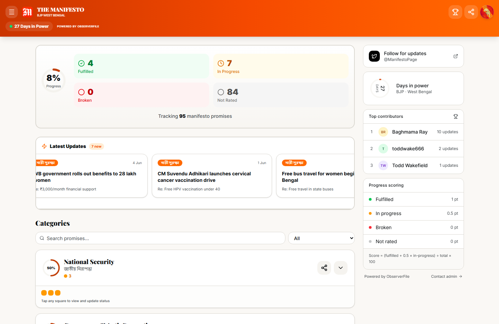
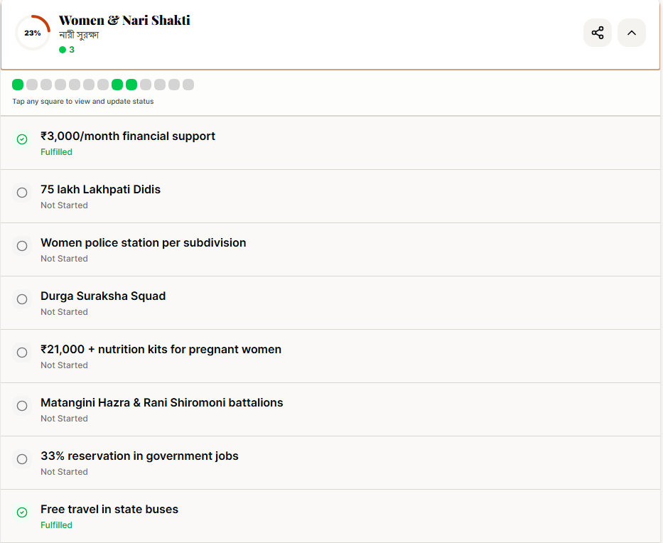

---

## 11. [HermesMarkdown](https://www.producthunt.com/products/hermesmd)
**Votes**: 10 | **도입 난이도**: 하 | **신뢰도**: 상
**Tagline**: Your Mind, Your Markdown, Your Machine.
**서비스 링크**: https://www.producthunt.com/r/GFG4RULNBM7UXV

**태그**: Productivity, Markdown, Privacy, Writing

### 📌 이 서비스 한눈에 보기
개인정보 보호와 몰입에 최적화된 미니멀리즘 마크다운 에디터

### 🔑 주요 기능
- 클라우드 없이 로컬에 저장되는 강력한 프라이버시 보호
- 트래킹과 광고가 없는 미니멀한 작업 환경
- 딥 워크(Deep Work)를 위한 방해 요소 제거

### 🙋 사용자에게 어떤 점이 좋은가
데이터 유출 걱정 없이 오직 글쓰기와 기록에만 집중할 수 있는 안전한 작업 공간을 제공합니다.

### ✅ 지금 바로 써볼 기능
- 로컬 파일 저장 방식 확인하기
- 미니멀한 UI 인터페이스 경험하기
- 기존 마크다운 파일 불러오기

### ⚠️ 사용 전 확인할 점
- 클라우드 동기화 기능 부재로 인한 기기 간 데이터 이동 불편 가능성
- 로컬 저장 방식이므로 사용자 직접 백업 필수

### 🧭 확인이 더 필요한 정보
지원하는 운영체제(OS) 및 상세한 편집 기능 범위가 명시되지 않았습니다.

### 📸 스크린샷 및 갤러리
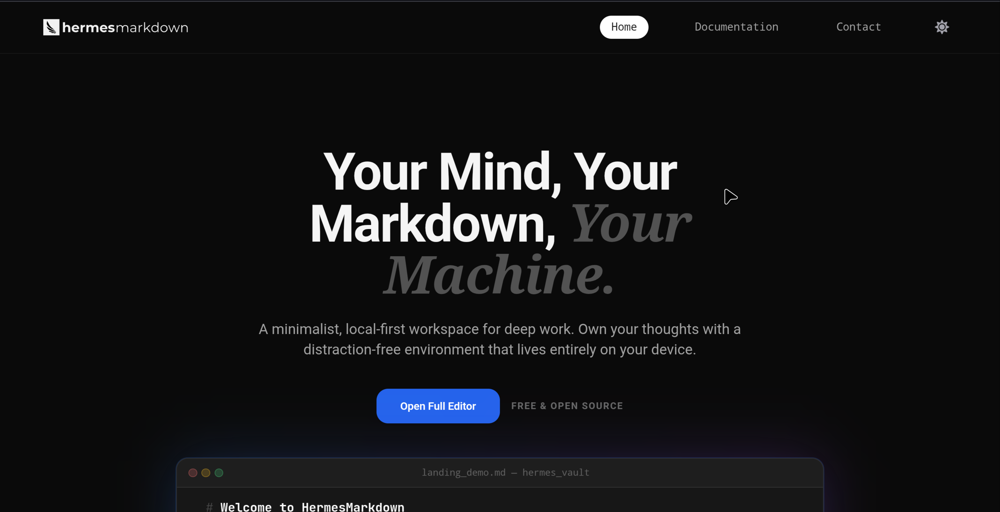
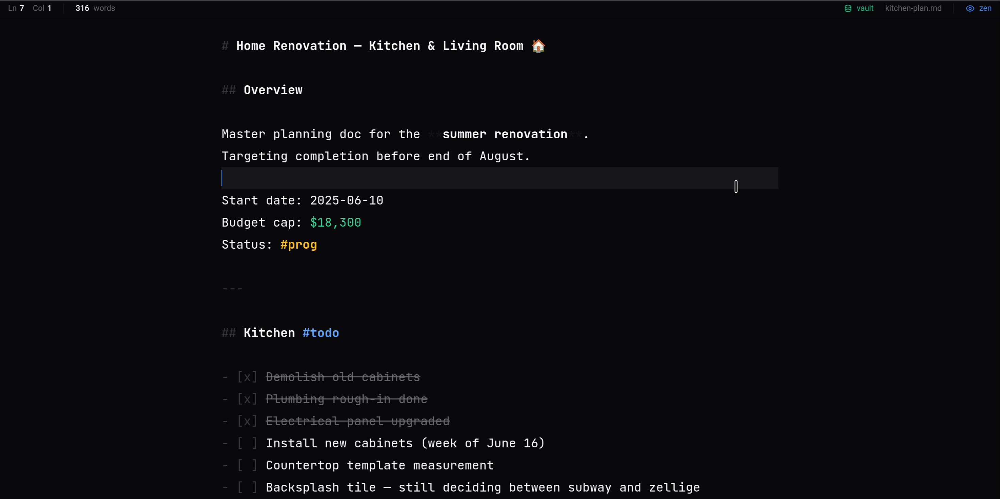
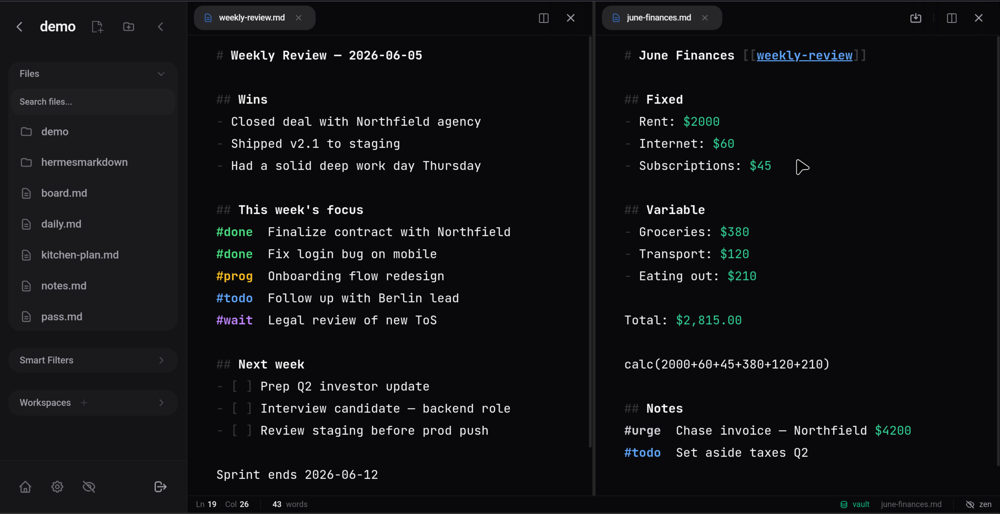

### 🎬 관련 영상
- [🎥 영상 보기](https://ph-files.imgix.net/04676b19-03da-4510-90f5-48f2742dc4ec.jpeg?auto=format)

---

## 12. [Pinguva](https://www.producthunt.com/products/pinguva)
**Votes**: 9 | **도입 난이도**: 하 | **신뢰도**: 상
**Tagline**: The cleanest, zero-config uptime & infrastructure monitor
**서비스 링크**: https://www.producthunt.com/r/Z55KHS5LJOWQPJ

**태그**: DevTool, Infrastructure, Monitoring, SaaS

### 📌 이 서비스 한눈에 보기
복잡한 설정 없이 웹사이트 상태와 인프라를 직관적으로 관리하는 제로 컨피그 모니터링 도구

### 🔑 주요 기능
- 웹사이트 가동 시간(Uptime) 실시간 추적
- TLS/SSL 인증서 만료 알림 제공
- DNS 레코드 상태 모니터링

### 🙋 사용자에게 어떤 점이 좋은가
복잡한 대시보드 설정 없이도 인프라의 핵심 상태를 즉각적으로 파악하고 장애에 대비할 수 있습니다.

### ✅ 지금 바로 써볼 기능
- 웹사이트 가동 시간 모니터링 설정
- SSL 인증서 만료 알림 등록
- DNS 레코드 상태 확인

### ⚠️ 사용 전 확인할 점
- 상세한 커스텀 모니터링 기능 제공 여부 확인 필요
- 알림 전달 방식(이메일, 슬랙 등)의 다양성 확인 필요

### 🧭 확인이 더 필요한 정보
제공되는 알림 채널의 종류와 상세한 모니터링 커스텀 옵션에 대한 정보가 부족합니다.

### 📸 스크린샷 및 갤러리
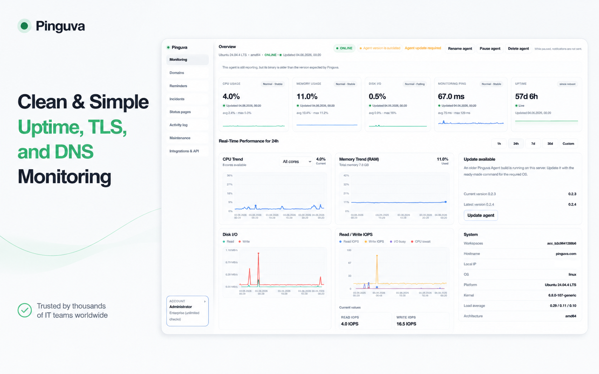
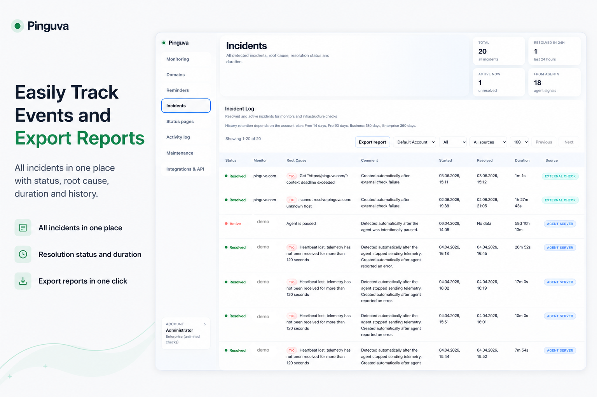
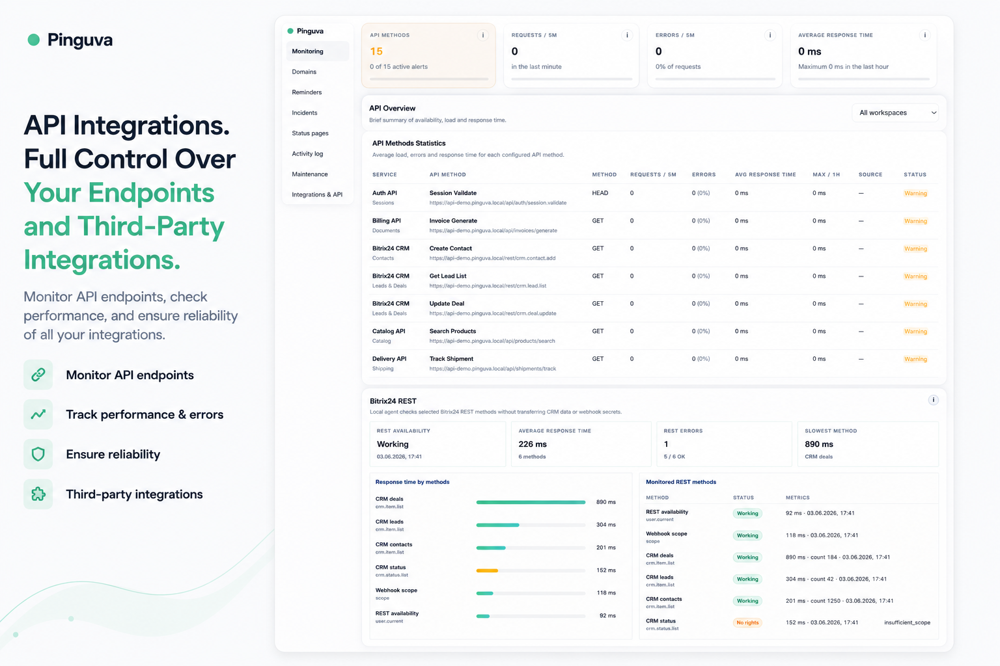

---

## 13. [Almanac Seed](https://www.producthunt.com/products/almanac-seed)
**Votes**: 9 | **도입 난이도**: 중 | **신뢰도**: 상
**Tagline**: Ship the spec, not the code. An AI builds the app.
**서비스 링크**: https://www.producthunt.com/r/54UCZW6UJRDI7D

**태그**: AI-Development, Automation, OpenSource, LowCode, Agent, AI Tool, Design, DevTool, API

### 📌 이 서비스 한눈에 보기
명세서(Spec)만 작성하면 AI가 앱 전체를 구축, 검증 및 배포까지 완료하는 자동화 도구

### 🔑 주요 기능
- 단일 마크다운 파일(SEED.md) 기반의 앱 생성 방식
- 단순 템플릿이 아닌 의도(Intent)를 구현하는 AI 빌드 프로세스
- 코드 작성 없이 기능 구현부터 배포까지 자동 수행

### 🙋 사용자에게 어떤 점이 좋은가
코딩 작업 시간을 획기적으로 줄이고, 개발자가 비즈니스 로직과 설계(Spec)에만 집중할 수 있게 해줍니다.

### ✅ 지금 바로 써볼 기능
- SEED.md 파일 작성 연습하기
- 코딩 에이전트와 연동하여 빌드 프로세스 테스트하기
- 자신의 계정에 직접 배포되는 과정 확인하기

### ⚠️ 사용 전 확인할 점
- 복잡한 비즈니스 로직 구현 시 명세서 작성의 난이도
- 사용자 계정 권한 및 배포 환경 설정 필요성

### 🧭 확인이 더 필요한 정보
구체적인 지원 프로그래밍 언어 및 프레임워크 범위에 대한 정보가 필요합니다.

### 📸 스크린샷 및 갤러리
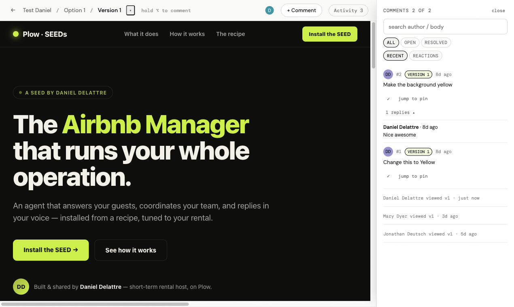
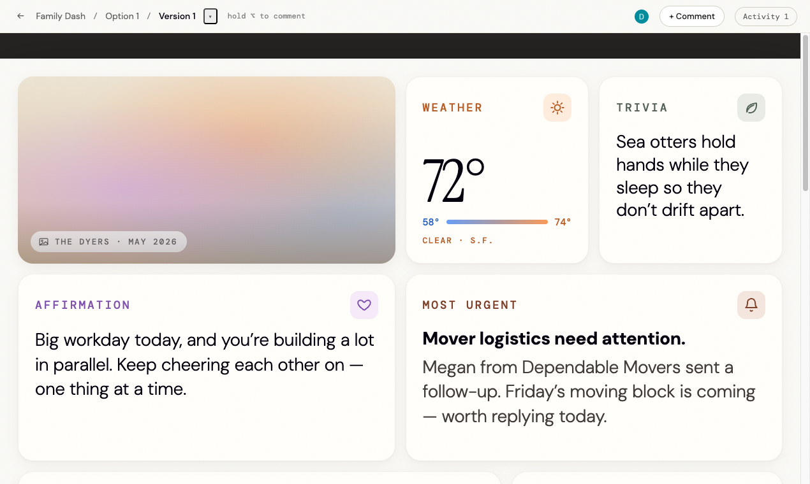
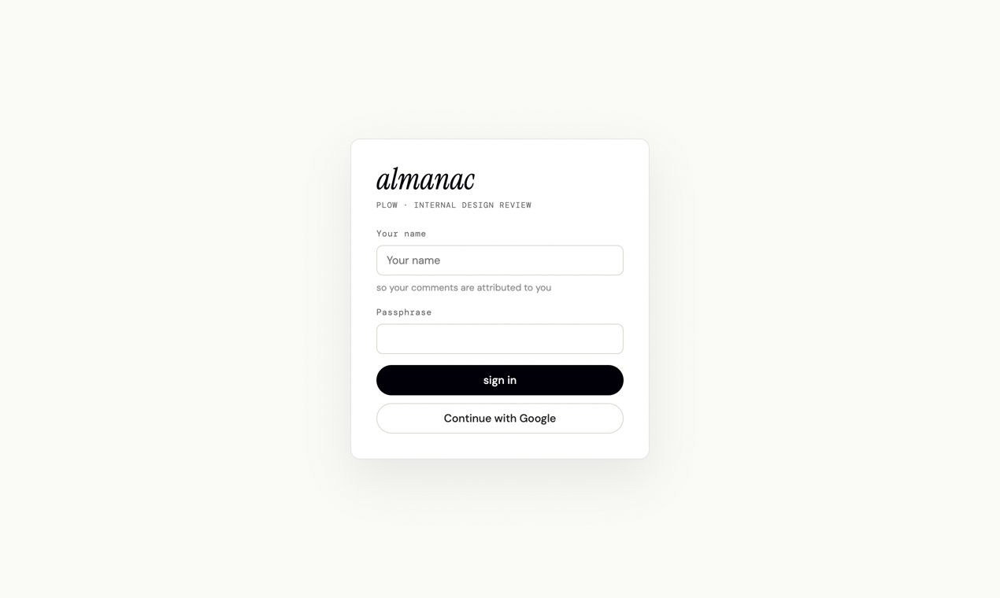

### 🎬 관련 영상
- [🎥 영상 보기](https://ph-files.imgix.net/06d0137c-7500-4212-9920-193cd6d59e58.jpeg?auto=format)

---

## 14. [Webstorio](https://www.producthunt.com/products/webstorio)
**Votes**: 9 | **도입 난이도**: 하 | **신뢰도**: 상
**Tagline**: AI Web Builder Platform with Everything Built-in
**서비스 링크**: https://www.producthunt.com/r/NHTLL6VOUR3H74

**태그**: AI, WebBuilder, NoCode, SaaS, CMS, AI Tool, Prompting, DevTool, Analytics

### 📌 이 서비스 한눈에 보기
단순 코드 생성을 넘어 CMS, 결제, 호스팅까지 통합된 지속 가능한 AI 웹 빌더 플랫폼

### 🔑 주요 기능
- 프롬프트 기반의 빠른 웹사이트 생성 및 시각적 커스터마이징
- CMS, 인증, 결제, SEO, 분석 등 운영에 필요한 모든 기능 내장
- 단순 코드 생성이 아닌 장기적인 웹사이트 관리와 성장에 최적화된 구조

### 🙋 사용자에게 어떤 점이 좋은가
웹사이트 구축부터 운영, 수익화까지 별도의 외부 도구 없이 하나의 플랫폼에서 해결할 수 있어 관리 효율성이 매우 높습니다.

### ✅ 지금 바로 써볼 기능
- 프롬프트를 통한 초기 웹사이트 레이아웃 생성
- 내장된 CMS를 활용한 콘텐츠 관리 테스트
- 결제 및 인증 기능 연동 확인

### ⚠️ 사용 전 확인할 점
- 플랫폼 종속성(Lock-in) 발생 가능성 확인 필요
- 복잡한 커스텀 기능 구현 시 시각적 편집기의 자유도 확인 필요

### 🧭 확인이 더 필요한 정보
코드 생성 방식이 아닌 관리형 플랫폼으로서의 구체적인 기술 스택과 확장성 범위에 대한 정보가 더 필요합니다.

### 📸 스크린샷 및 갤러리
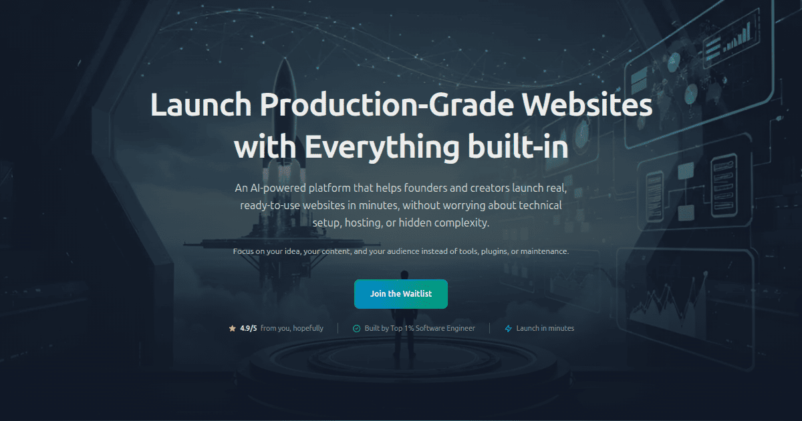
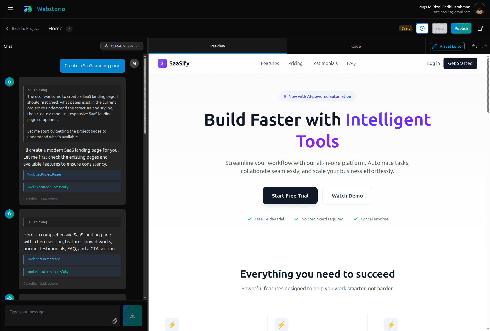
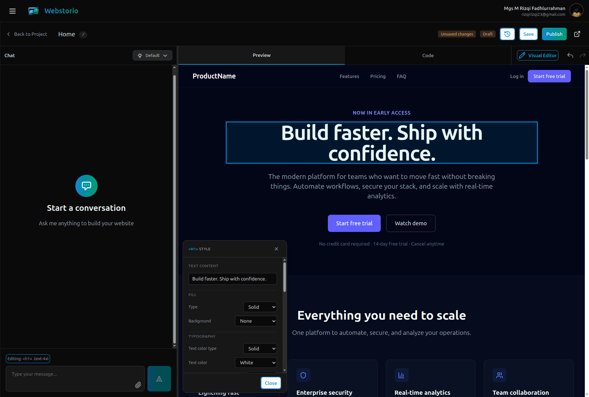

### 🎬 관련 영상
- [🎥 영상 보기](https://ph-files.imgix.net/59dc5fa5-b242-4b20-8d38-d06e93b2bc41.jpeg?auto=format)

---

## 15. [Ejentum - Reasoning Harness](https://www.producthunt.com/products/ejentum-reasoning-harness)
**Votes**: 9 | **도입 난이도**: 중 | **신뢰도**: 상
**Tagline**: Stop your AI agent drifting, flattering, and fabricating.
**서비스 링크**: https://www.producthunt.com/r/BQEZFPT4FAKX5U

**태그**: AI-Agent, DevTool, LLM-Ops, Automation, Agent, AI Tool, API

### 📌 이 서비스 한눈에 보기
AI 에이전트의 환각과 오류를 방지하기 위해 사고 과정을 정교하게 설계하는 추론 제어 프레임워크

### 🔑 주요 기능
- 4가지 특화 하네스(추론, 코드, 안티-디셉션, 메모리)를 통한 정밀한 인지 작업 제공
- 문제에 맞춰 추론 단계를 재작성하는 새로운 '어댑티브 모드(Adaptive Mode)' 탑재
- MCP 호스팅 및 13개의 통합 환경을 통한 손쉬운 연결성

### 🙋 사용자에게 어떤 점이 좋은가
AI 에이전트가 잘못된 정보를 생성하거나 논리적 오류를 범하는 것을 방지하여, 보다 신뢰할 수 있는 자동화 결과물을 얻을 수 있습니다.

### ✅ 지금 바로 써볼 기능
- 4가지 하네스 중 작업 성격에 맞는 모드 테스트
- 새로운 어댑티브 모드를 통한 작업별 최적화 확인
- 기존 워크플로우에 13개 통합 기능 적용해보기

### ⚠️ 사용 전 확인할 점
- 추론 단계가 복잡해짐에 따라 응답 지연(Latency)이 발생할 수 있음
- API 호출 방식이므로 사용량에 따른 비용 구조 확인 필요

### 🧭 확인이 더 필요한 정보
구체적인 API 호출 비용 및 각 통합 환경별 상세 기술 요구사항에 대한 정보가 필요합니다.

### 📸 스크린샷 및 갤러리
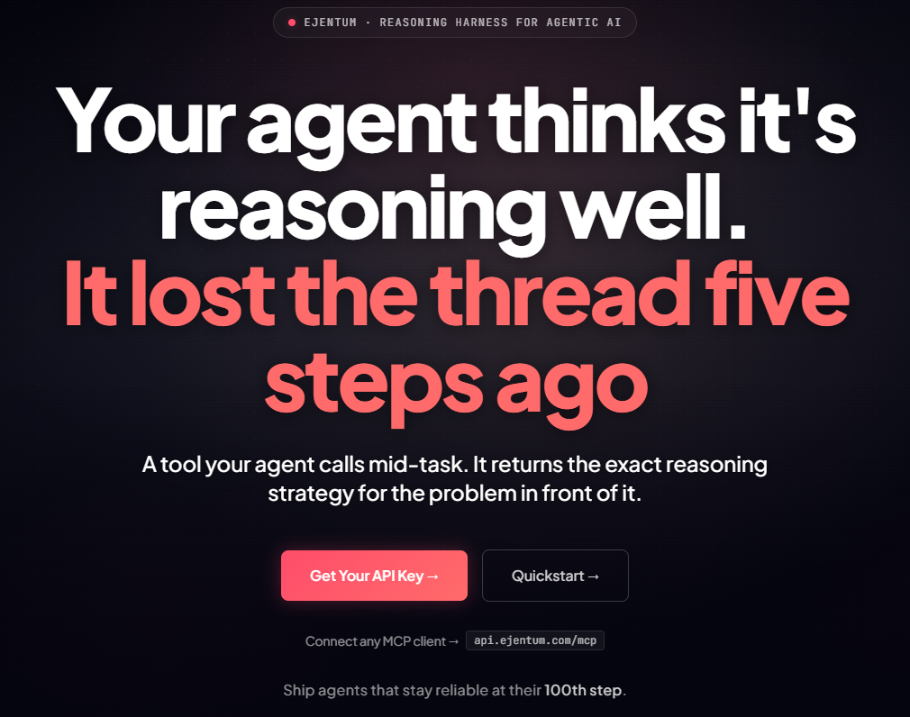
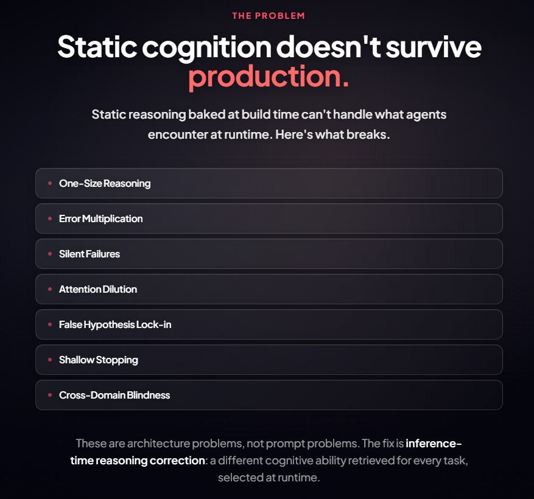
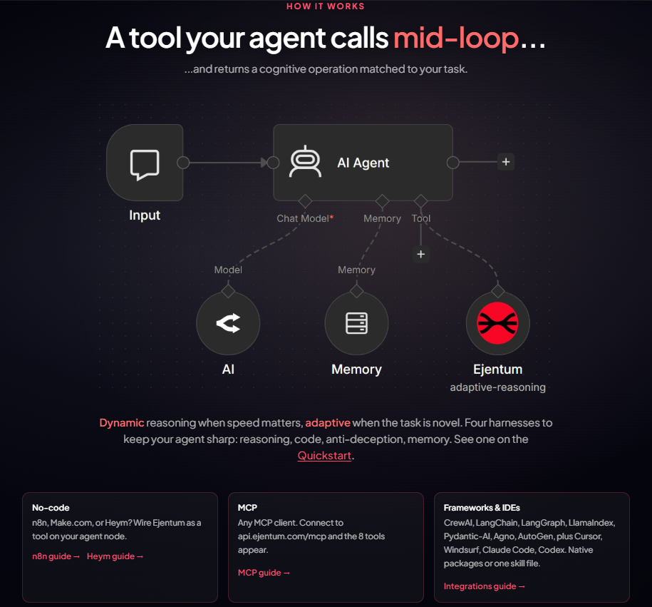

---

## 16. [Crossposter](https://www.producthunt.com/products/crossposter-2)
**Votes**: 9 | **도입 난이도**: 중 | **신뢰도**: 상
**Tagline**: Free, open-source social publishing from localhost
**서비스 링크**: https://www.producthunt.com/r/NCYOWHPCDNQBSL

**태그**: OpenSource, SocialMedia, Privacy, Productivity, DevTool

### 📌 이 서비스 한눈에 보기
개인 PC에서 안전하게 소셜 미디어 게시물을 작성하고 예약할 수 있는 오픈소스 로컬 대시보드

### 🔑 주요 기능
- 로컬 퍼스트 방식의 데이터 보안 (설정, 업로드, 자격 증명이 사용자 기기에 저장)
- 한 번의 작성으로 여러 소셜 계정에 동시 게시 가능
- 미디어 첨부 및 플랫폼별 제한 사항 확인 기능 제공

### 🙋 사용자에게 어떤 점이 좋은가
클라우드 서비스에 민감한 개인정보나 미디어 파일을 외부 서버에 올리지 않고도 편리하게 소셜 미디어 관리가 가능합니다.

### ✅ 지금 바로 써볼 기능
- 로컬 환경에 설치 및 초기 설정
- 소셜 미디어 계정 연동 및 자격 증명 등록
- 게시물 작성 및 예약 기능 테스트

### ⚠️ 사용 전 확인할 점
- 로컬 실행 방식이므로 PC가 꺼져 있으면 예약 게시가 작동하지 않을 수 있음
- 직접 설치 및 관리가 필요한 오픈소스 도구의 특성상 기술적 이해도 필요

### 🧭 확인이 더 필요한 정보
로컬 환경에서 스케줄링 기능이 작동하기 위한 백그라운드 실행 방식에 대한 구체적인 정보가 필요합니다.

### 📸 스크린샷 및 갤러리
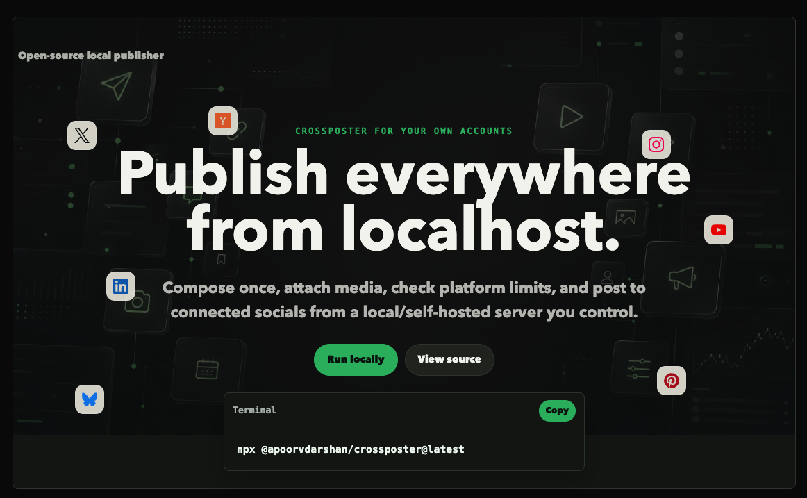
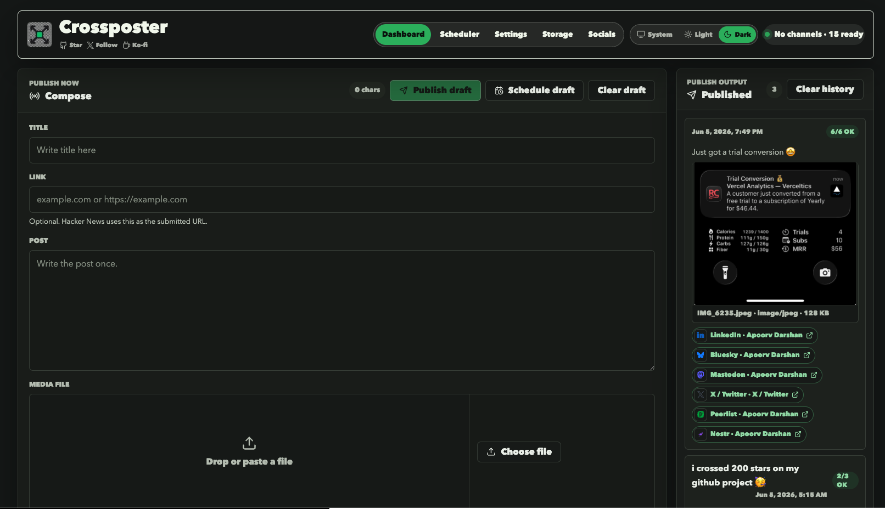
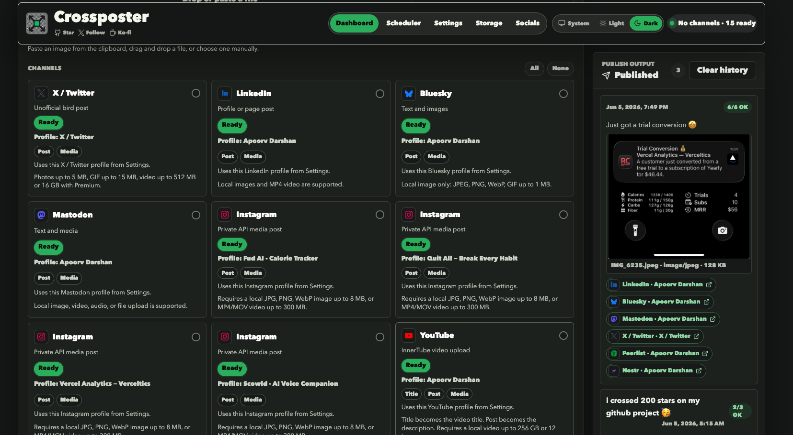

---

## 17. [WOPA](https://www.producthunt.com/products/wopa)
**Votes**: 8 | **도입 난이도**: 하 | **신뢰도**: 상
**Tagline**: Invoicing for tradespeople, right inside WhatsApp.
**서비스 링크**: https://www.producthunt.com/r/L5F22EET6GYBAG

**태그**: Automation, SaaS, Productivity, Fintech, AI Tool, Email

### 📌 이 서비스 한눈에 보기
WhatsApp 메시지만으로 간편하게 인보이스를 생성하고 관리하는 현장 기술직 전용 어시스턴트

### 🔑 주요 기능
- WhatsApp 채팅을 통한 자연어 기반 인보이스 초안 생성
- PDF 생성, 이메일 발송 및 미결제 대금 추적 자동화
- 사용자는 WhatsApp을 유지하고 고객에게는 전문적인 이메일 발송

### 🙋 사용자에게 어떤 점이 좋은가
복잡한 회계 소프트웨어 대신 익숙한 메신저로 업무를 처리할 수 있어 현장 업무 중에도 빠르게 청구서를 발행할 수 있습니다.

### ✅ 지금 바로 써볼 기능
- 자연어 명령어로 인보이스 초안 생성해보기
- 생성된 PDF 검토 및 이메일 발송 기능 테스트
- 고객 데이터 저장 및 미결제 내역 확인하기

### ⚠️ 사용 전 확인할 점
- 현재 영국(UK) 시장 및 현지 비즈니스 환경에 특화되어 있음
- 모든 업무가 WhatsApp을 통해 이루어지므로 데이터 보안 및 관리 방식 확인 필요

### 🧭 확인이 더 필요한 정보
영국 외 지역에서의 서비스 지원 여부와 구체적인 요금 체계에 대한 정보가 필요합니다.

### 📸 스크린샷 및 갤러리

---

## 18. [OmegaGPT](https://www.producthunt.com/products/omegagpt-offline-ai-chat)
**Votes**: 8 | **도입 난이도**: 하 | **신뢰도**: 상
**Tagline**: Fast, Free AI Chat - 100% Offline
**서비스 링크**: https://www.producthunt.com/r/M4KRE2U2NFT7PA

**태그**: AI, Privacy, Mobile, Offline, AI Tool, Chat

### 📌 이 서비스 한눈에 보기
인터넷 연결 없이도 언제 어디서나 안전하게 사용할 수 있는 오프라인 AI 채팅 앱

### 🔑 주요 기능
- 100% 오프라인 환경 지원으로 데이터 유출 걱정 없는 프라이버시 보장
- 클라우드나 인터넷 연결 없이 기기 자체에서 구동되는 빠른 속도
- iOS 및 Android 모바일 기기에서 무료로 사용 가능

### 🙋 사용자에게 어떤 점이 좋은가
개인정보 유출이 우려되는 민감한 질문을 하거나 인터넷 연결이 불안정한 환경에서도 제약 없이 AI를 활용할 수 있습니다.

### ✅ 지금 바로 써볼 기능
- 오프라인 상태에서 질문 던져보기
- 개인적인 데이터나 민감한 정보 입력해보기
- 모바일 기기에서의 구동 속도 테스트하기

### ⚠️ 사용 전 확인할 점
- 기기 자체 리소스를 사용하므로 배터리 소모나 발열이 발생할 수 있음
- 오프라인 구동 특성상 최신 실시간 정보 검색은 불가능함

### 🧭 확인이 더 필요한 정보
기기 사양에 따른 모델 구동 성능 및 구체적인 모델 종류에 대한 정보가 필요합니다.

### 📸 스크린샷 및 갤러리

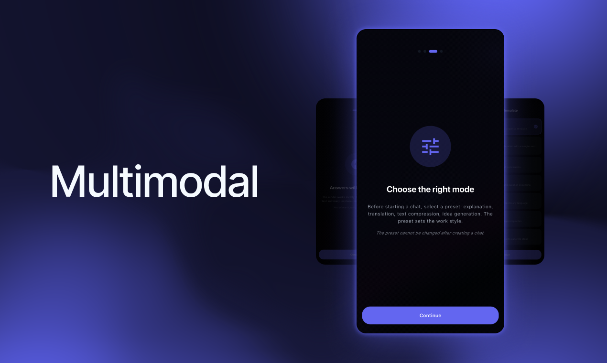

### 🎬 관련 영상
- [🎥 영상 보기](https://ph-files.imgix.net/36942cad-bed9-4e1a-b174-27919fdca81d.jpeg?auto=format)

---

## 19. [Jda Programming Language](https://www.producthunt.com/products/jda-programming-language)
**Votes**: 8 | **도입 난이도**: 상 | **신뢰도**: 중
**Tagline**: opensource compiler ai faster
**서비스 링크**: https://www.producthunt.com/r/4U5BAWE3QVNMWM

**태그**: ProgrammingLanguage, Systems, OpenSource, Compiler, AI Tool

### 📌 이 서비스 한눈에 보기
어셈블리로 부트스트랩된 초저수준 오픈소스 시스템 프로그래밍 언어

### 🔑 주요 기능
- C나 Rust 없이 어셈블리로부터 직접 구축된 독자적인 시스템 언어
- AI 기술을 활용한 컴파일 속도 최적화 지향
- 완전한 셀프 호스팅 방식의 오픈소스 프로젝트

### 🙋 사용자에게 어떤 점이 좋은가
기존 언어의 의존성 없이 하드웨어에 밀착된 고성능 시스템 프로그래밍 환경을 제공합니다.

### ✅ 지금 바로 써볼 기능
- 어셈블리 기반 부트스트랩 구조 분석하기
- AI 컴파일러 성능 테스트하기
- 오픈소스 코드베이스 검토하기

### ⚠️ 사용 전 확인할 점
- 기존 언어(C/Rust)를 사용하지 않으므로 생태계 및 라이브러리 부족 가능성
- 매우 낮은 수준의 프로그래밍 난이도

### 🧭 확인이 더 필요한 정보
AI가 구체적으로 컴파일 속도를 어떻게 개선하는지에 대한 기술적 상세 정보가 필요합니다.

### 📸 스크린샷 및 갤러리

---

## 20. [Paige](https://www.producthunt.com/products/paige-3)
**Votes**: 8 | **도입 난이도**: 하 | **신뢰도**: 상
**Tagline**: A private, encrypted newborn tracker with no accounts
**서비스 링크**: https://www.producthunt.com/r/LA4AQJ7LZ3JRCD

**태그**: Parenting, Privacy, Productivity, Security, AI Tool, Design

### 📌 이 서비스 한눈에 보기
계정 생성 없이 개인정보를 안전하게 보호하는 암호화 기반 신생아 기록 앱

### 🔑 주요 기능
- 계정 생성 없이 즉시 사용 가능한 프라이버시 중심 설계
- 종단간 암호화(E2EE)를 통한 철저한 데이터 보안
- 수유, 기저귀 등 육아 기록을 위한 직관적인 UI/UX

### 🙋 사용자에게 어떤 점이 좋은가
개인정보 유출 걱정 없이 아이의 일상 기록을 안전하고 간편하게 관리할 수 있습니다.

### ✅ 지금 바로 써볼 기능
- 수유 및 기저귀 기록 기능 테스트
- 데이터 암호화 방식 및 보안성 확인
- 사용자 인터페이스 편의성 경험

### ⚠️ 사용 전 확인할 점
- 계정이 없으므로 기기 변경 시 데이터 이전/백업 방식 확인 필요
- 데이터가 로컬에만 저장되는지 혹은 클라우드 동기화 방식인지 확인 필요

### 🧭 확인이 더 필요한 정보
계정 없이 데이터가 어떻게 동기화되거나 백업되는지에 대한 구체적인 메커니즘 확인이 필요합니다.

### 📸 스크린샷 및 갤러리
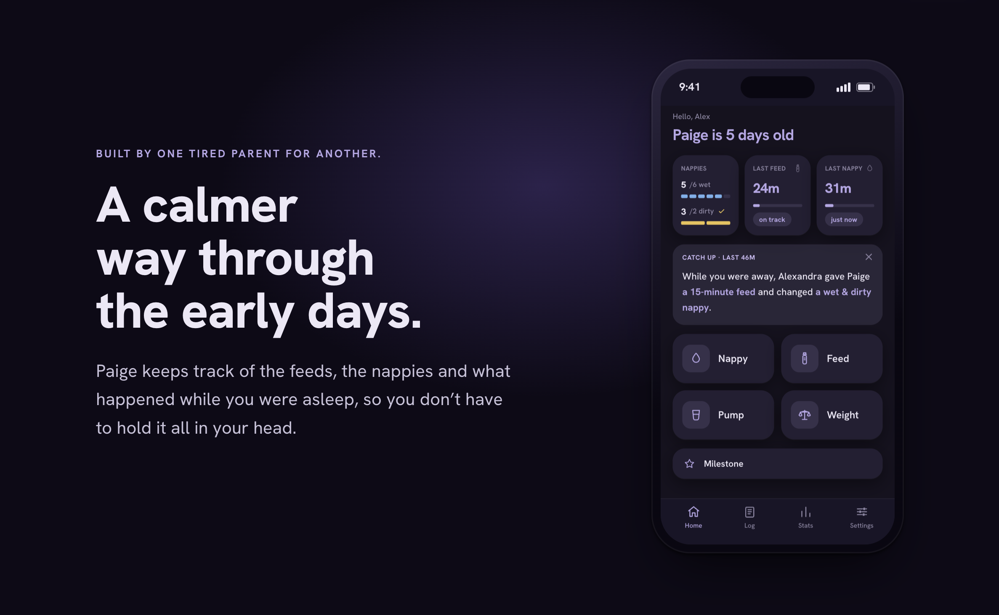
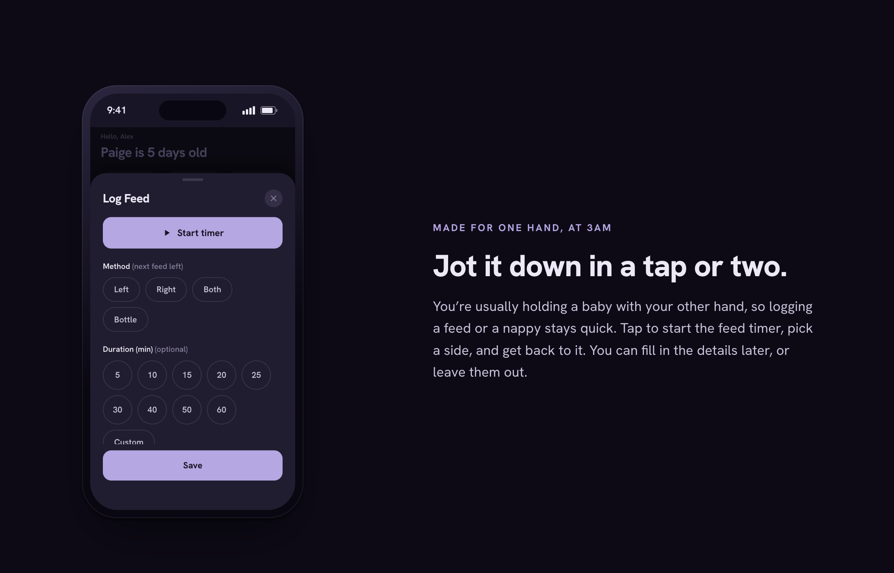
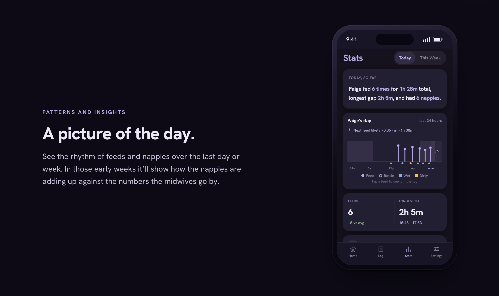

---

## 21. [Paige](https://www.producthunt.com/products/paige-3)
**Votes**: 8 | **도입 난이도**: 하 | **신뢰도**: 상
**Tagline**: A private, encrypted newborn tracker with no accounts
**서비스 링크**: https://www.producthunt.com/r/LA4AQJ7LZ3JRCD

**태그**: Parenting, Privacy, Productivity, Security, AI Tool, Design

### 📌 이 서비스 한눈에 보기
계정 생성 없이 개인정보를 안전하게 보호하는 암호화 기반 신생아 기록 앱

### 🔑 주요 기능
- 계정 생성 없이 즉시 사용 가능한 프라이버시 중심 설계
- 종단간 암호화(E2EE)를 통한 철저한 데이터 보안
- 수유, 기저귀 등 육아 기록을 위한 직관적인 UI/UX

### 🙋 사용자에게 어떤 점이 좋은가
개인정보 유출 걱정 없이 아이의 일상 기록을 안전하고 간편하게 관리할 수 있습니다.

### ✅ 지금 바로 써볼 기능
- 수유 및 기저귀 기록 기능 테스트
- 데이터 암호화 방식 및 보안성 확인
- 사용자 인터페이스 편의성 경험

### ⚠️ 사용 전 확인할 점
- 계정이 없으므로 기기 변경 시 데이터 이전/백업 방식 확인 필요
- 데이터가 로컬에만 저장되는지 혹은 클라우드 동기화 방식인지 확인 필요

### 🧭 확인이 더 필요한 정보
계정 없이 데이터가 어떻게 동기화되거나 백업되는지에 대한 구체적인 메커니즘 확인이 필요합니다.

### 📸 스크린샷 및 갤러리

---

## 22. [Snoozify](https://www.producthunt.com/products/snoozify)
**Votes**: 7 | **도입 난이도**: 하 | **신뢰도**: 상
**Tagline**: Mix ambient sounds with your own music to sleep & focus
**서비스 링크**: https://www.producthunt.com/r/JONEIEPQ5RCP4W

**태그**: Productivity, Wellness, iOS, Soundscape, AI Tool

### 📌 이 서비스 한눈에 보기
나만의 맞춤형 사운드스케이프를 만들어 숙면과 집중을 돕는 사운드 믹싱 앱

### 🔑 주요 기능
- 다양한 자연 소리와 화이트/브라운 노이즈 레이어링 기능
- 사용자의 개인 음악과 환경음을 혼합하여 독창적인 사운드 생성
- Zen Garden, Deep Focus 등 상황별 프리셋 및 슬립 타이머 제공

### 🙋 사용자에게 어떤 점이 좋은가
단조로운 반복 재생에서 벗어나 개인의 취향에 맞춘 소리 조합으로 더 깊은 휴식과 집중력을 얻을 수 있습니다.

### ✅ 지금 바로 써볼 기능
- 기본 제공되는 프리셋 사운드 들어보기
- 자연음과 개인 음악을 섞어 나만의 믹스 만들기
- 취침 전 슬립 타이머 설정하기

### ⚠️ 사용 전 확인할 점
- 일부 사운드 팩은 유료 결제가 필요할 수 있음
- 개인 음악을 활용할 경우 앱 내 플레이어 기능 확인 필요

### 🧭 확인이 더 필요한 정보
무료 버전에서 제공되는 사운드 팩의 범위와 유료 전환 시의 상세 기능 차이를 확인해야 합니다.

### 📸 스크린샷 및 갤러리

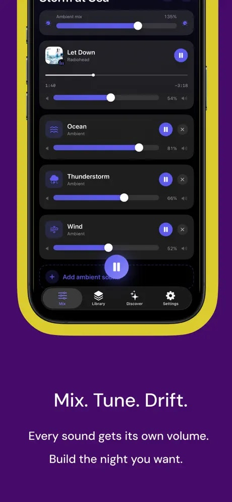

---

## 23. [MentorSpace](https://www.producthunt.com/products/mentorspace)
**Votes**: 7 | **도입 난이도**: 하 | **신뢰도**: 상
**Tagline**: Your AI mentor with a personalized 90-day roadmap
**서비스 링크**: https://www.producthunt.com/r/WEVZVUUQOPB5BA

**태그**: AI, Productivity, Mentoring, Planning, AI Tool, Chat

### 📌 이 서비스 한눈에 보기
개인 맞춤형 90일 로드맵과 AI 멘토링을 통해 목표 달성을 돕는 가이드 서비스

### 🔑 주요 기능
- 사용자의 배경과 목표를 반영한 주 단위 90일 맞춤형 로드맵 생성
- 단순 챗봇을 넘어선 지속적인 학습 및 성장 추적 멘토링
- 진행 상황에 따른 유연한 계획 수정 및 실시간 질의응답

### 🙋 사용자에게 어떤 점이 좋은가
막연한 목표를 구체적인 실행 계획으로 바꿔주며, 목표 달성 과정에서 길을 잃지 않도록 지속적인 가이드를 제공합니다.

### ✅ 지금 바로 써볼 기능
- 자신의 목표와 현재 상황 입력하기
- 생성된 90일 로드맵 검토하기
- AI 멘토에게 첫 번째 질문 던지기

### ⚠️ 사용 전 확인할 점
- AI가 생성한 계획이 사용자의 실제 환경이나 역량과 일치하는지 검증 필요
- 실행 단계에서의 물리적 노력은 사용자 본인의 몫임

### 🧭 확인이 더 필요한 정보
구체적인 과업 관리 기능이나 외부 도구와의 연동 여부는 명시되지 않았습니다.

### 📸 스크린샷 및 갤러리

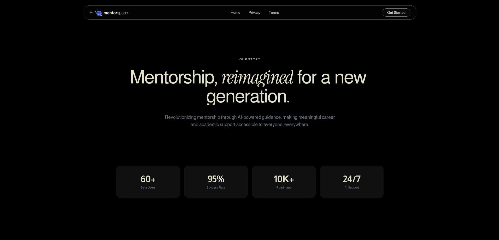
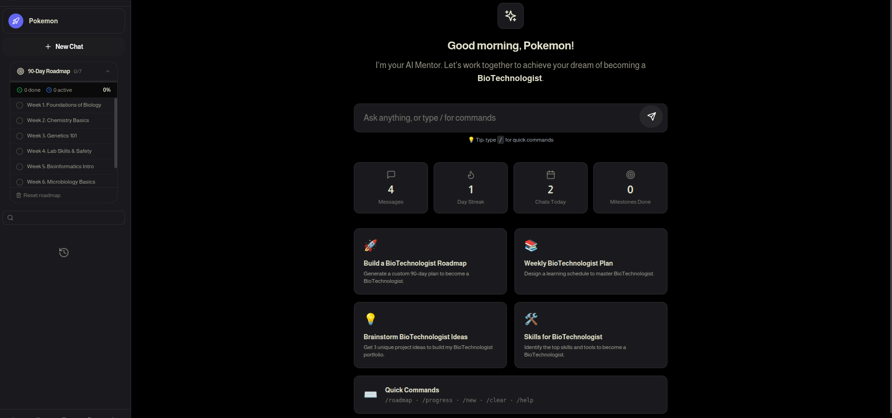

### 🎬 관련 영상
- [🎥 영상 보기](https://ph-files.imgix.net/2aa3305d-98b8-4109-a908-603e31ab98e2.jpeg?auto=format)

---

## 24. [Apperture Photography](https://www.producthunt.com/products/apperture-photography)
**Votes**: 7 | **도입 난이도**: 하 | **신뢰도**: 상
**Tagline**: See your mistakes before you shoot them
**서비스 링크**: https://www.producthunt.com/r/BERDXUNWFY3QPN

**태그**: Photography, MobileApp, FilmSimulation, Vision

### 📌 이 서비스 한눈에 보기
실제 필름 느낌의 시뮬레이션을 통해 촬영 전 결과물을 미리 예측하는 스마트폰 카메라 앱

### 🔑 주요 기능
- 30종 이상의 실제 필름 스톡을 기반으로 한 정교한 노출 및 모션 블러 시뮬레이션
- 과노출, 저노출 등 촬영 실수를 사전에 방지할 수 있는 직관적인 프리뷰 제공
- 카메라별 장착 필름 관리 및 프로토타입 이미지 기록 기능

### 🙋 사용자에게 어떤 점이 좋은가
고가의 필름 낭비를 줄이기 위해 촬영 전 결과물을 미리 확인하고, 필름별 설정을 체계적으로 관리할 수 있습니다.

### ✅ 지금 바로 써볼 기능
- 30여 가지 필름 스톡 프리뷰 기능 테스트
- 카메라별 필름 로딩 기록 기능 활용
- 노출 및 모션 블러 시뮬레이션 확인

### ⚠️ 사용 전 확인할 점
- 실제 필름 결과물과 시뮬레이션 간의 차이가 존재할 수 있음
- 프리미엄 기능 사용 시 결제 방식(필름 발송 등)에 대한 확인 필요

### 🧭 확인이 더 필요한 정보
프리미엄 기능의 구체적인 유료 구독 모델이나 기능 제한 범위가 명시되지 않았습니다.

### 📸 스크린샷 및 갤러리

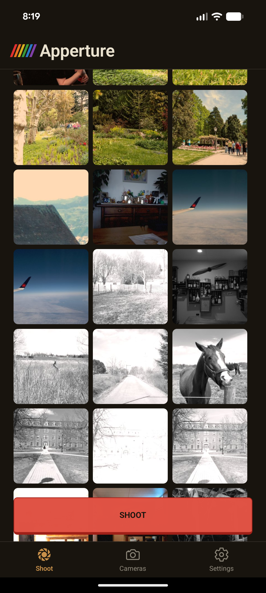
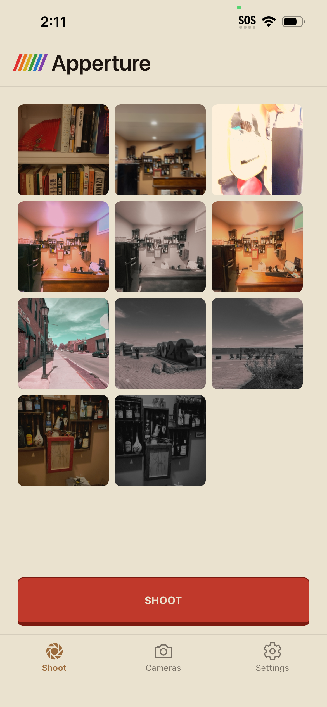

### 🎬 관련 영상
- [🎥 영상 보기](https://ph-files.imgix.net/d938a564-4e5d-40f1-a2eb-14ad621d3cc7.jpeg?auto=format)

---

## 25. [Bleenk](https://www.producthunt.com/products/bleenk)
**Votes**: 7 | **도입 난이도**: 하 | **신뢰도**: 상
**Tagline**: Idea in. Live, production-ready app out.
**서비스 링크**: https://www.producthunt.com/r/CMTAEADN6ZTKBS

**태그**: AI-App-Builder, NoCode, DevOps, Automation, SaaS, Agent, AI Tool, Prompting

### 📌 이 서비스 한눈에 보기
아이디어 입력만으로 백엔드와 배포까지 완료된 실제 운영 가능한 앱을 생성하는 AI 빌더

### 🔑 주요 기능
- 단순 프로토타입을 넘어 실제 배포 가능한 수준의 프로덕션 앱 생성
- 백엔드, 데이터베이스, 인증, 호스팅이 포함된 통합 환경 제공
- Google Cloud, Neon, E2B, DigitalOcean 기반의 강력한 인프라 활용

### 🙋 사용자에게 어떤 점이 좋은가
개발 팀이나 복잡한 설정 없이도 아이디어를 즉시 실행 가능한 서비스로 전환하여 시장 검증 속도를 극대화할 수 있습니다.

### ✅ 지금 바로 써볼 기능
- 프롬프트를 통한 앱 생성 테스트
- 생성된 앱의 백엔드 및 데이터베이스 구조 확인
- 실제 배포 환경(Hosting) 작동 여부 점검

### ⚠️ 사용 전 확인할 점
- 자동 생성된 코드의 커스텀 수정 및 확장성 제약 가능성
- 인프라 비용 및 서비스 운영 정책 확인 필요

### 🧭 확인이 더 필요한 정보
복잡한 비즈니스 로직 구현 시 사용자 개입이 어느 정도 필요한지 확인이 필요합니다.

### 📸 스크린샷 및 갤러리
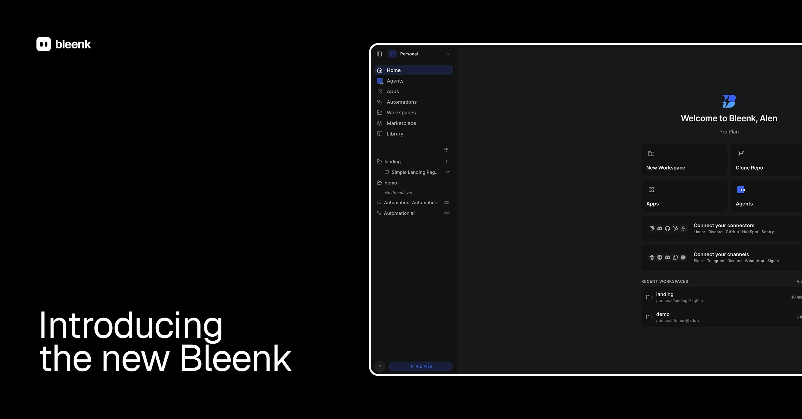
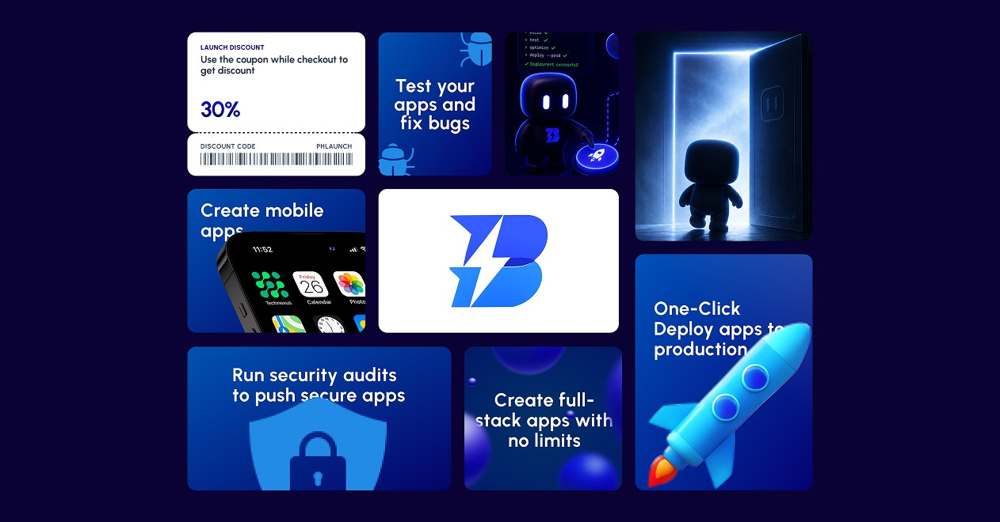

---

## 26. [TabDock](https://www.producthunt.com/products/tabdock)
**Votes**: 7 | **도입 난이도**: 하 | **신뢰도**: 상
**Tagline**: Smart tab sessions manager
**서비스 링크**: https://www.producthunt.com/r/K3OGAADMOMKDDH

**태그**: Productivity, Browser Extension, Workflow

### 📌 이 서비스 한눈에 보기
수많은 브라우저 탭을 세션 단위로 저장하고 관리하는 스마트 탭 매니저

### 🔑 주요 기능
- 브라우저 세션을 저장, 보관 및 복구하는 기능
- 수십 개의 열려 있는 탭을 정리하여 브라우저 과부하 방지
- 가볍고 강력한 크롬 확장 프로그램 형태

### 🙋 사용자에게 어떤 점이 좋은가
수많은 탭을 열어두어 브라우저가 무거워지는 문제를 해결하고, 작업 흐름을 세션별로 체계적으로 관리할 수 있습니다.

### ✅ 지금 바로 써볼 기능
- 현재 열려 있는 탭들을 세션으로 저장하기
- 필요 없는 탭들을 '주차(Park)' 기능으로 정리하기
- 저장된 세션을 필요할 때 즉시 복구하여 작업 재개하기

### ⚠️ 사용 전 확인할 점
- 크롬 브라우저 환경에 최적화되어 있어 타 브라우저 지원 여부 확인 필요
- 세션 저장 시 메모리 사용량 변화 확인 필요

### 🧭 확인이 더 필요한 정보
세션 동기화 기능(기기 간 공유) 및 상세 유료 플랜 여부에 대한 정보가 없습니다.

### 📸 스크린샷 및 갤러리
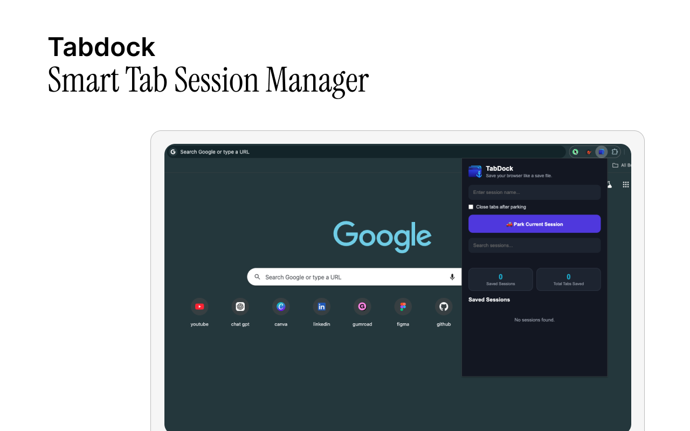
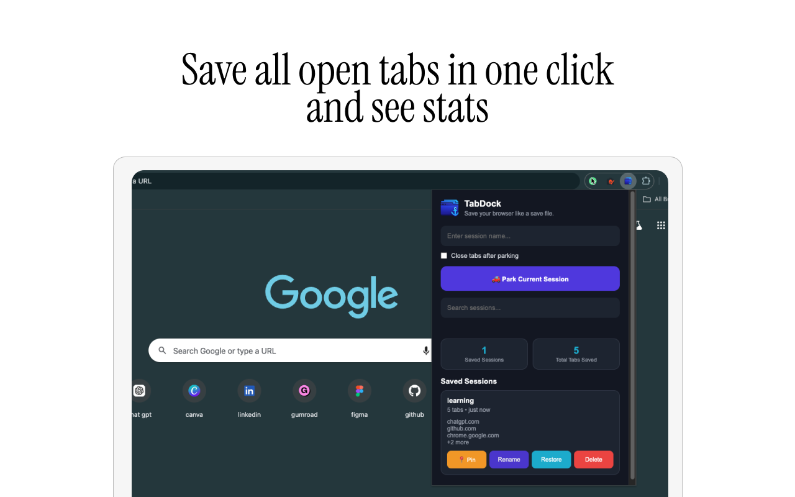

---

## 27. [Social & Utility Suite ](https://www.producthunt.com/products/social-utility-suite)
**Votes**: 7 | **도입 난이도**: 하 | **신뢰도**: 상
**Tagline**: A serverless 30-in-1 web suite replacing expensive hardware.
**서비스 링크**: https://www.producthunt.com/r/KFWSJQ5UKSBC64

**태그**: Productivity, Utility, SaaS, Mobile-First, DevTool

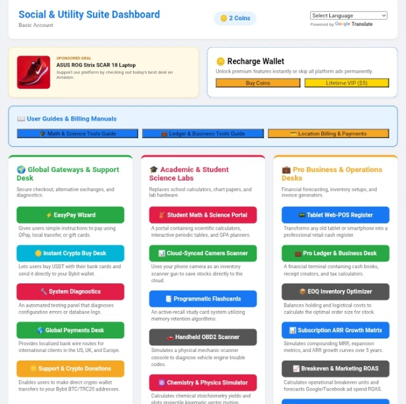

### 📌 이 서비스 한눈에 보기
고가의 물리적 장비를 대체하는 30가지 이상의 올인원 서버리스 웹 도구 모음

### 🔑 주요 기능
- 30가지 이상의 도구를 하나의 웹 스위트에 통합
- 과학용 계산기, 생체 인식 타임클락, 바코드 스캐너 등 물리적 하드웨어 대체
- 모바일 최적화 및 데이터 효율적인 브라우저 기반 환경 제공

### 🙋 사용자에게 어떤 점이 좋은가
별도의 장비 구매 비용을 절감하고, 기기 저장 공간과 데이터 사용량을 최소화하면서 다양한 업무 기능을 수행할 수 있습니다.

### ✅ 지금 바로 써볼 기능
- 모바일 브라우저를 통한 도구 접근성 테스트
- 필요한 특정 기능(계산기, 스캐너 등)의 정확도 확인
- 기존 하드웨어 대체 가능 여부 검토

### ⚠️ 사용 전 확인할 점
- 브라우저 환경에 따른 하드웨어 기능(스캐너 등)의 성능 제약 가능성
- 인터넷 연결 상태에 따른 서비스 안정성 확인 필요

### 🧭 확인이 더 필요한 정보
30가지 이상의 도구 중 사용자의 특정 워크플로우를 완벽히 대체할 수 있는지에 대한 상세 기능 목록 확인이 필요합니다.

### 📸 스크린샷 및 갤러리
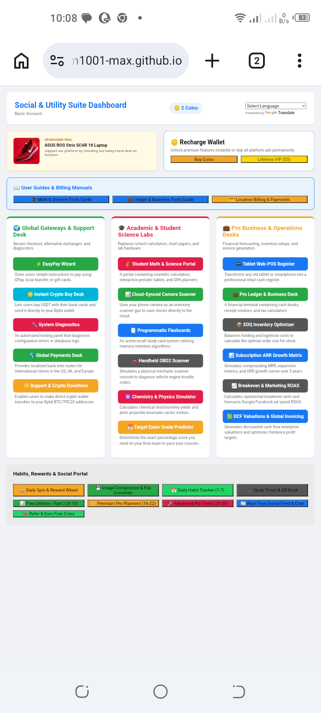

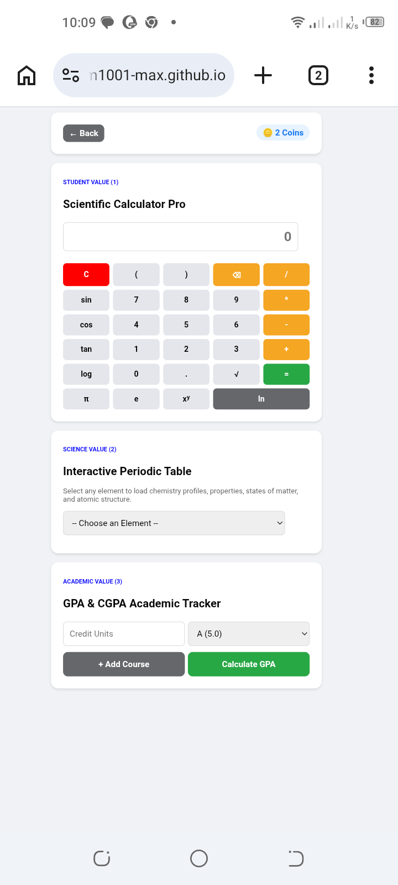

---

## 28. [QuietDash](https://www.producthunt.com/products/quietdash)
**Votes**: 7 | **도입 난이도**: 상 | **신뢰도**: 상
**Tagline**: Your day on a calm e-ink screen, not your phone
**서비스 링크**: https://www.producthunt.com/r/HVEMPNDR5EF2YZ

**태그**: OpenSource, Hardware, Productivity, DIY, Privacy, Vision

### 📌 이 서비스 한눈에 보기
스마트폰 중독에서 벗어나 개인용 e-ink 디스플레이로 일상을 관리하는 오픈소스 대시보드

### 🔑 주요 기능
- 기존 Raspberry Pi와 Waveshare e-ink 패널을 활용한 DIY 방식
- 할 일, 일정, 타이머, 피트니스 등 핵심 정보만 1비트 이미지로 출력
- 백라이트와 알림이 없는 저자극 환경 제공 및 로컬 네트워크 기반의 데이터 보안

### 🙋 사용자에게 어떤 점이 좋은가
스마트폰의 끊임없는 알림 대신 눈이 편안한 e-ink 화면을 통해 꼭 필요한 정보만 확인하며 집중력을 높일 수 있습니다.

### ✅ 지금 바로 써볼 기능
- 보유 중인 Raspberry Pi와 e-ink 패널 호환성 확인
- 필요한 대시보드 항목(일정, 타이머 등) 리스트업
- 로컬 네트워크 환경 구축 및 오픈소스 코드 검토

### ⚠️ 사용 전 확인할 점
- 하드웨어(라즈베리 파이, e-ink 패널)를 직접 준비하고 조립해야 함
- 스마트폰처럼 실시간 알림이나 화려한 인터랙션을 기대하기 어려움

### 🧭 확인이 더 필요한 정보
사용자가 보유한 특정 Waveshare 패널 모델과의 완벽한 호환성 여부를 확인해야 합니다.

### 📸 스크린샷 및 갤러리
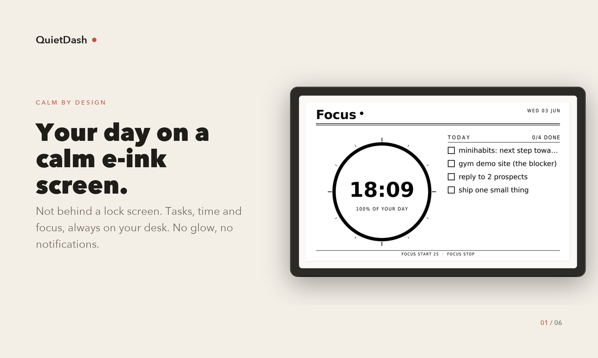
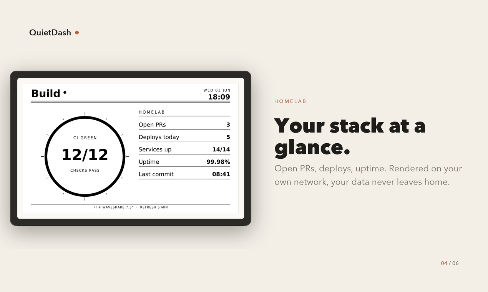
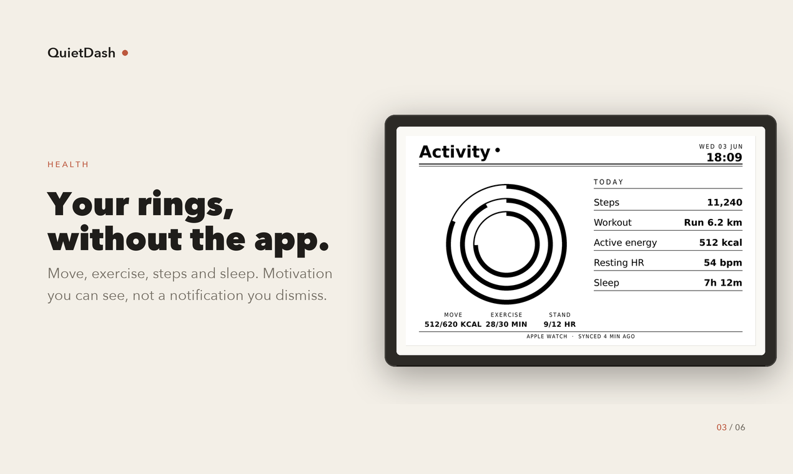

### 🎬 관련 영상
- [🎥 영상 보기](https://ph-files.imgix.net/c21a10f9-3f1c-4899-86c5-1fa3ef129010.jpeg?auto=format)

---

## 29. [Document.Bot - EU/ Offline AI workspace](https://www.producthunt.com/products/document-bot)
**Votes**: 7 | **도입 난이도**: 하 | **신뢰도**: 상
**Tagline**: ChatGPT for entire document folders, PDF, Doc, Excel
**서비스 링크**: https://www.producthunt.com/r/CJJQVLPDFEEIG7

**태그**: Productivity, AI, Data Privacy, Document Management, Automation, AI Tool, Chat

### 📌 이 서비스 한눈에 보기
로컬 폴더 내 다양한 문서를 통합 검색하고 오프라인으로 활용하는 보안 특화 AI 워크스페이스

### 🔑 주요 기능
- PDF, Word, Excel 등 폴더 내 모든 파일을 통합 인덱싱하여 질문 및 답변 가능
- 로컬 실행 및 EU AI 모델 옵션을 통한 강력한 데이터 보안 및 규제 준수
- 출처 확인(Citation) 기능을 통한 답변의 신뢰성 및 근거 검토 지원

### 🙋 사용자에게 어떤 점이 좋은가
파일을 하나씩 업로드할 필요 없이 폴더 전체를 대상으로 보고서 작성이나 정보 탐색이 가능하여 업무 효율이 극대화됩니다.

### ✅ 지금 바로 써볼 기능
- 자주 사용하는 문서 폴더를 인덱싱하여 통합 검색 테스트하기
- 문서 간 연관 관계를 찾는 질문 던져보기
- 생성된 답변의 인용 출처(Citation) 검증하기

### ⚠️ 사용 전 확인할 점
- 로컬 인덱싱 시 PC/Mac의 시스템 리소스 사용량 확인 필요
- 오프라인 모드와 온라인 모드 간의 기능 차이 확인 필요

### 🧭 확인이 더 필요한 정보
사용자의 하드웨어 사양에 따른 성능 차이와 구체적인 오프라인 모델의 성능 수준에 대한 정보가 더 필요합니다.

### 📸 스크린샷 및 갤러리
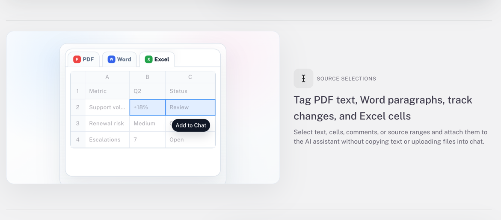
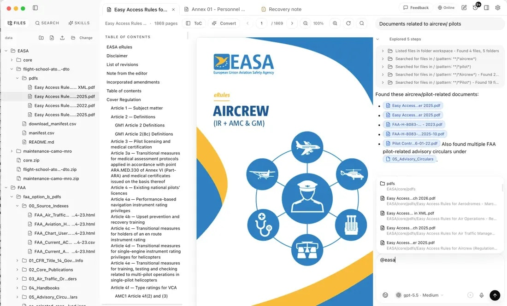
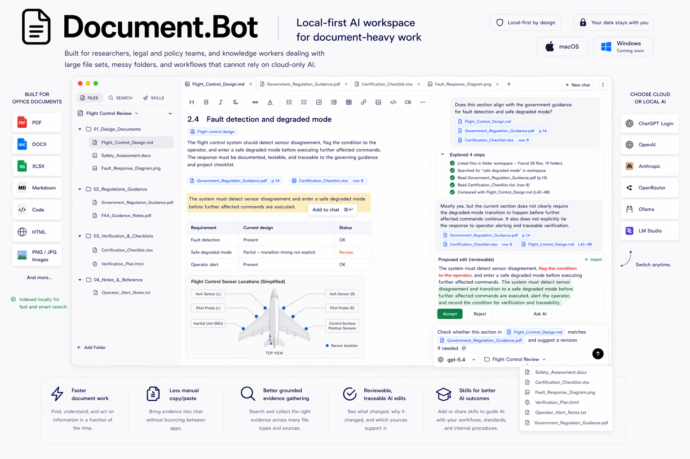

### 🎬 관련 영상
- [🎥 영상 보기](https://ph-files.imgix.net/c73f9b31-eeba-4e10-97d4-6ac570b2c615.jpeg?auto=format)

---

## 30. [Monologue: Speak & Reflect](https://www.producthunt.com/products/monologue-3)
**Votes**: 7 | **도입 난이도**: 하 | **신뢰도**: 상
**Tagline**: Thought-provoking prompts for daily self-reflection.
**서비스 링크**: https://www.producthunt.com/r/VKUZP76AUXBZG7

**태그**: Self-Reflection, Mindfulness, Voice-Based, Productivity, AI Tool, Prompting, Design

### 📌 이 서비스 한눈에 보기
음성 기반 가이드를 통해 일상의 생각을 정리하고 마음의 여유를 찾는 자기 성찰 앱

### 🔑 주요 기능
- 음성 기반의 직관적인 자기 성찰 경험 제공
- 생각 정리와 마음 챙김을 돕는 가이드형 모놀로그
- 단순하고 프라이빗한 사용자 경험 설계

### 🙋 사용자에게 어떤 점이 좋은가
바쁜 일상 속에서 짧은 시간을 활용해 복잡한 생각을 정리하고, 의도적인 휴식과 루틴을 만드는 데 유용합니다.

### ✅ 지금 바로 써볼 기능
- 가이드 모놀로그를 통한 데일리 리플렉션 시작하기
- 짧은 웜업 세션으로 마음 가다듬기
- 음성 기록을 통한 생각 정리하기

### ⚠️ 사용 전 확인할 점
- 음성 기반 서비스이므로 조용한 환경에서의 사용이 권장됨
- 데이터 저장 및 프라이버시 정책 확인 필요

### 🧭 확인이 더 필요한 정보
음성 데이터의 저장 방식 및 보안 수준에 대한 구체적인 정보가 필요합니다.

### 📸 스크린샷 및 갤러리

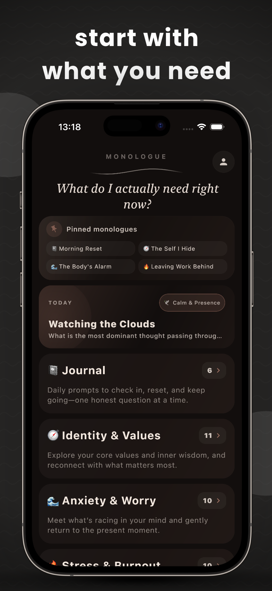

---

