# 🚀 Product Hunt Daily Top 30 (2026-06-08)

## 오늘의 요약
오늘의 제품들은 개인의 일상 데이터와 업무 워크플로우를 AI로 자동화하여 효율을 극대화하는 데 집중되어 있습니다. 특히 구글 서비스 통합, macOS 및 GitHub 연동 등 기존 생태계에 자연스럽게 녹아드는 생산성 도구들이 눈에 띕니다. 또한, 특정 플랫폼(LinkedIn, iOS)의 사용자 경험을 개선하거나 방대한 데이터를 API로 제공하는 전문화된 서비스들이 주목받았습니다.

### 오늘의 핵심 포인트
- 개인화된 데이터와 AI를 결합하여 일상의 맥락을 요약하거나 업무 흐름을 자동화하는 서비스가 주를 이루었습니다.
- 기존 플랫폼(GitHub, LinkedIn, Google)의 기능을 확장하거나 데이터 활용도를 높이는 도구들이 높은 관심을 받았습니다.
- 복잡한 기능보다는 특정 목적(파일 공유, 비행 정보 확인, 메시지 관리)에 집중한 미니멀하고 직관적인 솔루션들이 제안되었습니다.

**오늘의 태그**: AI_Productivity, Workflow_Automation, Data_Integration, SaaS

## 1. [Dreambeans by Google Labs](https://www.producthunt.com/products/google-labs)
**Votes**: 228 | **도입 난이도**: 하 | **신뢰도**: 상
**Tagline**: Daily AI stories personalised from your Google apps
**서비스 링크**: https://www.producthunt.com/r/JQLUSYPX7QVIND

**태그**: AI, Personalization, Productivity, Google, AI Tool

### 📌 이 서비스 한눈에 보기
구글 앱의 데이터를 활용해 매일 아침 개인 맞춤형 이야기를 들려주는 AI 스토리텔러

### 🔑 주요 기능
- Gmail, 캘린더, 사진, YouTube, 검색 등 구글 서비스 데이터 통합 활용
- 밤사이 수집된 정보를 바탕으로 매일 새로운 AI 생성 스토리 제공
- Google AI Ultra 구독자를 위한 선제적 개인 맥락 요약 서비스

### 🙋 사용자에게 어떤 점이 좋은가
흩어져 있는 개인 일상과 정보를 하나의 이야기로 요약해 주어, 하루의 맥락을 쉽고 빠르게 파악할 수 있습니다.

### ✅ 지금 바로 써볼 기능
- 구글 계정 데이터 연동 및 권한 설정
- 매일 아침 생성되는 AI 스토리 컬렉션 확인
- 개인화된 맥락 파악을 통한 일정 및 정보 관리

### ⚠️ 사용 전 확인할 점
- 개인적인 데이터(이메일, 사진 등)를 광범위하게 활용하므로 프라이버시 설정 확인 필요
- Google AI Ultra 구독자 대상 서비스로 구독 여부에 따른 접근 제한 가능성

### 🧭 확인이 더 필요한 정보
구체적인 데이터 처리 방식과 프라이버시 보호 수준에 대한 상세 정보 확인이 필요합니다.

### 📸 스크린샷 및 갤러리

### 🎬 관련 영상
- [🎥 영상 보기](https://ph-files.imgix.net/e64b9046-3e07-435a-b9ec-164df2172590.jpeg?auto=format)

---

## 2. [Wave](https://www.producthunt.com/products/wave-16)
**Votes**: 204 | **도입 난이도**: 하 | **신뢰도**: 상
**Tagline**: Turn your voice into text — local or cloud, your choice
**서비스 링크**: https://www.producthunt.com/r/USLATFWCNZUTRR

**태그**: Productivity, macOS, AI, Voice-to-Text, Automation, AI Tool

### 📌 이 서비스 한눈에 보기
macOS 어디서든 음성으로 AI를 호출하여 텍스트를 입력하거나 질문에 답을 얻는 생산성 도구

### 🔑 주요 기능
- 단축키를 이용한 간편한 음성 입력 및 AI 모델 호출
- 모든 macOS 앱에서 작동하는 범용성
- 선택한 텍스트를 컨텍스트로 활용하는 지능형 처리

### 🙋 사용자에게 어떤 점이 좋은가
타이핑 중 흐름을 끊지 않고 음성으로 텍스트를 삽입하거나, 읽고 있는 내용에 대해 즉각적인 답변을 얻을 수 있어 작업 효율이 높아집니다.

### ✅ 지금 바로 써볼 기능
- 단축키 설정 및 음성 인식 테스트
- 텍스트 입력 및 교체 기능 활용해보기
- 선택 영역 기반의 플로팅 답변 기능 사용하기

### ⚠️ 사용 전 확인할 점
- 음성 인식 정확도는 주변 환경 및 마이크 품질에 영향을 받을 수 있음
- 로컬/클라우드 모델 선택에 따른 처리 속도 및 개인정보 보호 차이 확인 필요

### 🧭 확인이 더 필요한 정보
사용자가 선택한 모델(로컬 vs 클라우드)에 따른 구체적인 성능 차이와 개인정보 처리 방식에 대한 상세 정보가 필요합니다.

### 📸 스크린샷 및 갤러리
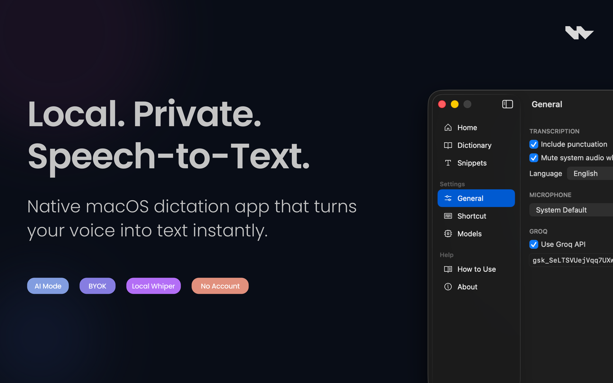
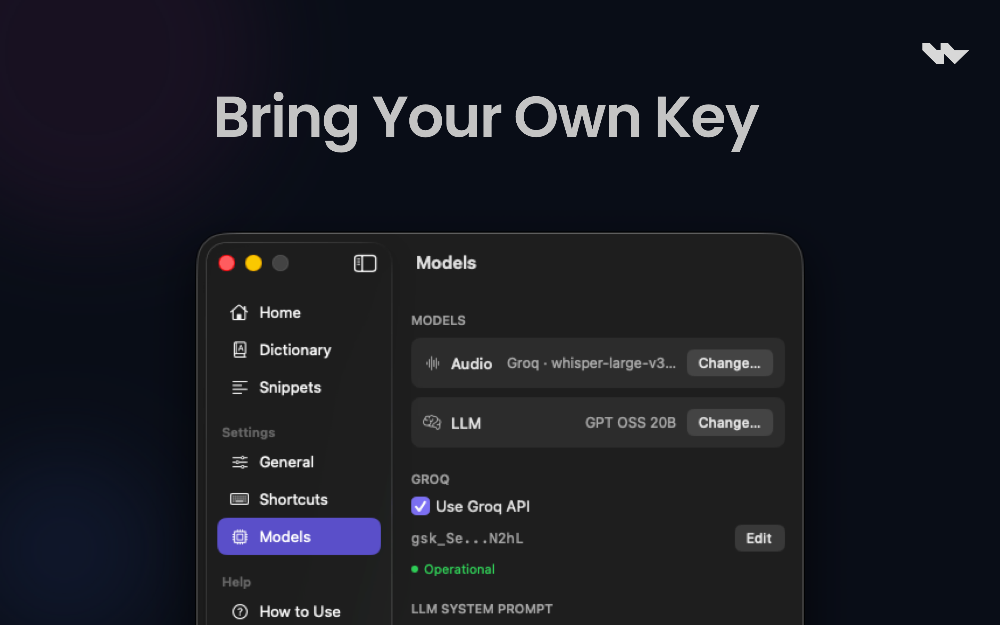
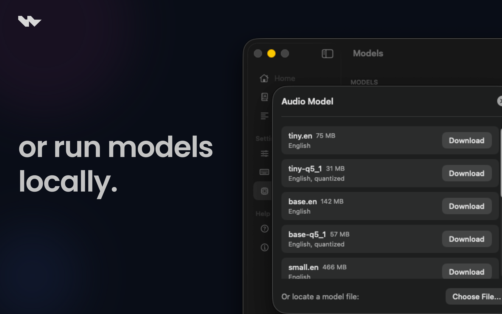

---

## 3. [CabinLink](https://www.producthunt.com/products/cabinlink)
**Votes**: 181 | **도입 난이도**: 하 | **신뢰도**: 상
**Tagline**: Flight map from cabin Wi-Fi
**서비스 링크**: https://www.producthunt.com/r/WJB5UOA5RWHWAR

**태그**: Travel, Utility, Aviation, Dashboard, AI Tool

### 📌 이 서비스 한눈에 보기
기내 Wi-Fi 정보를 활용해 비행 정보를 한눈에 보여주는 네이티브 플라이트 대시보드

### 🔑 주요 기능
- 지원되는 기내 Wi-Fi 매니페스트를 읽어 실시간 비행 데이터 시각화
- 경로, 위치, 고도, 속도, ETA, 목적지 날씨 등 핵심 정보 제공
- 로그인, 광고, 유료 Wi-Fi 패스 없이 사용 가능 (지원 기기 한정)

### 🙋 사용자에게 어떤 점이 좋은가
별도의 유료 결제 없이도 기내 Wi-Fi 연결만으로 비행 상태를 직관적인 대시보드로 확인할 수 있어 편리합니다.

### ✅ 지금 바로 써볼 기능
- 지원되는 기내 Wi-Fi 환경인지 확인하기
- iPhone, iPad, Mac, Apple Vision Pro 중 사용 중인 기기에 설치하기
- Wi-Fi 연결 후 대시보드 데이터 업데이트 확인하기

### ⚠️ 사용 전 확인할 점
- 모든 항공사나 기내 Wi-Fi에서 작동하는 것이 아니라 특정 매니페스트 지원이 필요함
- Wi-Fi 연결이 끊길 경우 마지막 업데이트 정보만 표시됨

### 🧭 확인이 더 필요한 정보
어떤 항공사나 특정 기내 Wi-Fi 시스템이 지원 대상인지에 대한 구체적인 목록 확인이 필요합니다.

### 📸 스크린샷 및 갤러리
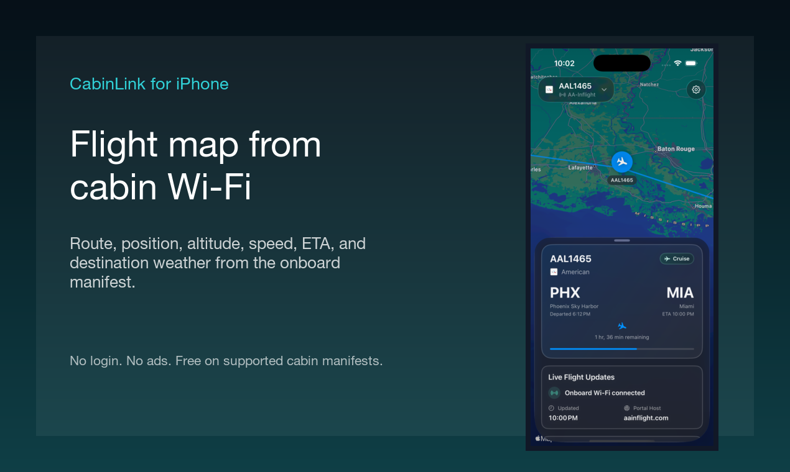
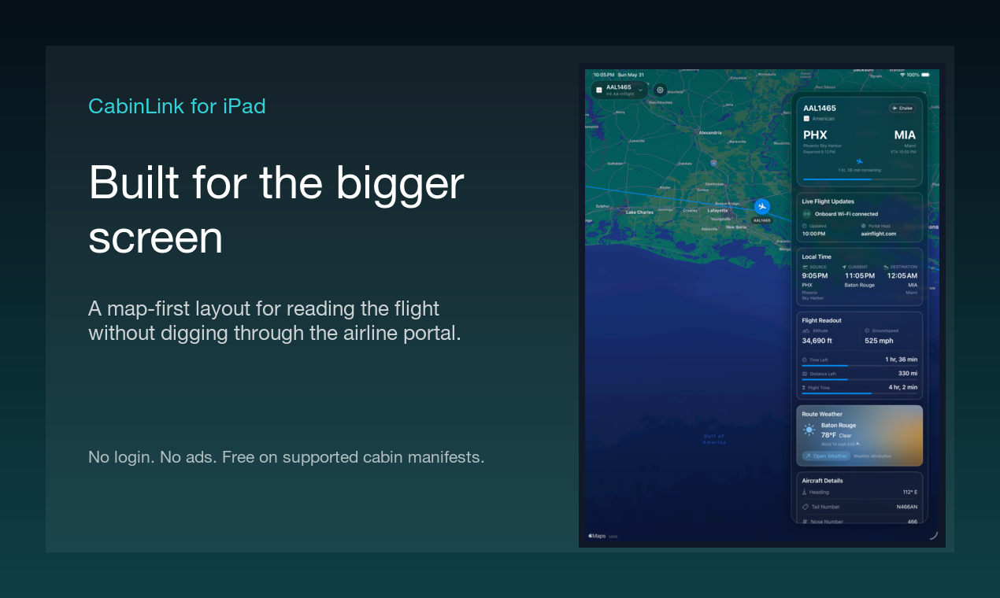
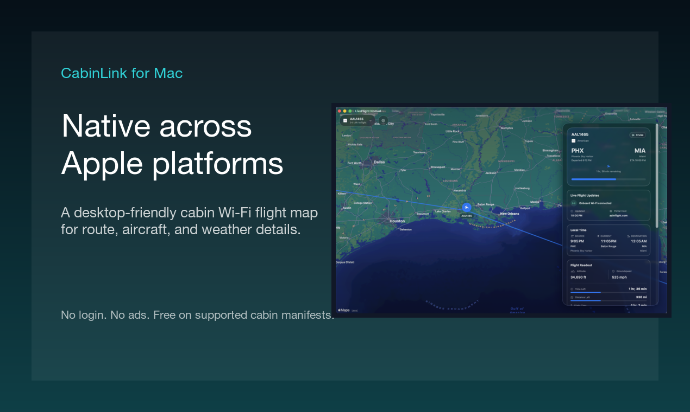

---

## 4. [Job Postings API](https://www.producthunt.com/products/free-job-postings-api)
**Votes**: 156 | **도입 난이도**: 하 | **신뢰도**: 상
**Tagline**: View, monitor, and analyze 1.8M+ US jobs
**서비스 링크**: https://www.producthunt.com/r/BNWVWGJYIBQSCF

**태그**: DevTool, Data-API, Market-Intelligence, Automation, API

### 📌 이 서비스 한눈에 보기
6만 개 기업의 180만 개 이상의 채용 공고 데이터를 실시간으로 조회하고 분석할 수 있는 API

### 🔑 주요 기능
- 6만 개 기업, 180만 개 이상의 방대한 미국 내 채용 데이터 제공
- 30개 이상의 ATS(채용 관리 시스템)로부터 수집된 포괄적인 데이터
- 현재 활성 공고뿐만 아니라 과거 이력 데이터까지 포함

### 🙋 사용자에게 어떤 점이 좋은가
시장 트렌드 분석, 경쟁사 채용 현황 모니터링, 또는 채용 관련 서비스 개발 시 방대한 데이터 소스로 활용 가능합니다.

### ✅ 지금 바로 써볼 기능
- API를 통한 실시간 채용 데이터 호출 테스트
- 특정 산업군 및 기업 규모별 데이터 필터링 확인
- 과거 이력 데이터의 정확도 및 구조 검증

### ⚠️ 사용 전 확인할 점
- 데이터의 주된 범위가 미국 시장에 집중되어 있음
- 무료 제공 범위와 호출 제한(Rate Limit) 정책 확인 필요

### 🧭 확인이 더 필요한 정보
무료 제공 범위에 대한 구체적인 호출 한도와 데이터 업데이트 주기가 명시되지 않았습니다.

### 📸 스크린샷 및 갤러리
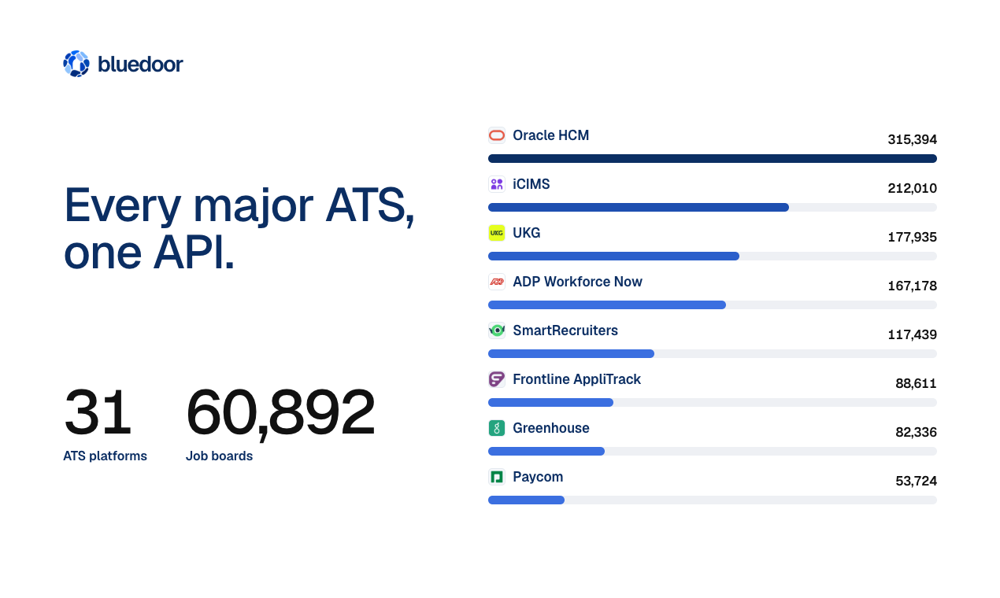
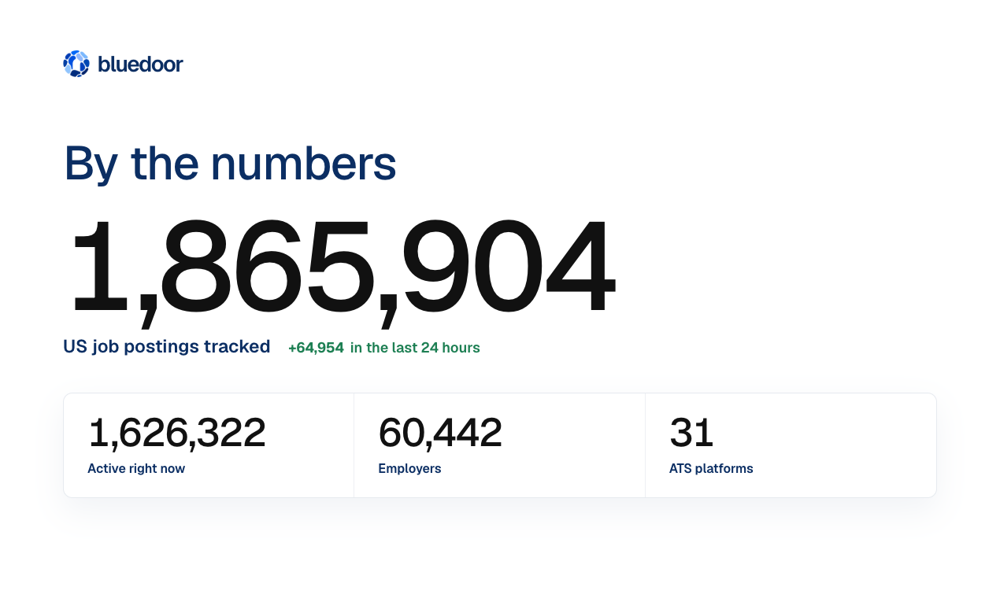
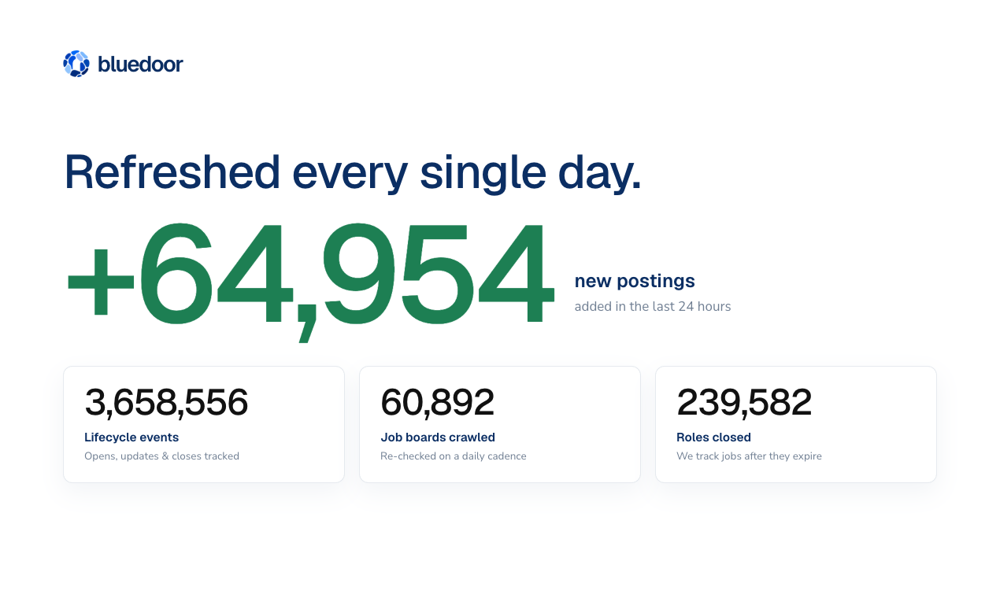

---

## 5. [Smmall Cloud for iOS](https://www.producthunt.com/products/smmall-cloud)
**Votes**: 146 | **도입 난이도**: 하 | **신뢰도**: 상
**Tagline**: Simple file sharing on your iPad or iPhone
**서비스 링크**: https://www.producthunt.com/r/IU63Q3CJKEUWTQ

**태그**: Productivity, FileSharing, iOS, MobileApp, Video, DevTool, Sales

### 📌 이 서비스 한눈에 보기
iOS 기기에서 빠르고 깔끔하게 파일을 공유하고 관리할 수 있는 미니멀 클라우드 서비스

### 🔑 주요 기능
- 사진, 영상, 문서 등 다양한 파일의 간편한 업로드 및 공유
- QR 코드, 커스텀 단축 URL, 깔끔한 링크 제공
- 폴더 정리 기능 및 타인이 파일을 업로드할 수 있는 'File Inbox' 제공

### 🙋 사용자에게 어떤 점이 좋은가
복잡한 기능 없이 오직 파일 공유에만 집중하여, 모바일 환경에서 즉각적이고 브랜드화된 공유 경험을 제공합니다.

### ✅ 지금 바로 써볼 기능
- 자신의 파일을 업로드하고 공유 링크 생성해보기
- File Inbox를 통해 다른 사람으로부터 파일 수집해보기
- 커스텀 단축 URL로 브랜드 이미지 적용해보기

### ⚠️ 사용 전 확인할 점
- iOS 전용 앱이므로 안드로이드나 PC 환경에서의 접근성 확인 필요
- 기업용 기능이나 대규모 저장 공간이 필요한 경우 기능적 한계가 있을 수 있음

### 🧭 확인이 더 필요한 정보
구체적인 저장 용량 제한 및 유료 플랜의 상세 정책이 명시되지 않았습니다.

### 📸 스크린샷 및 갤러리
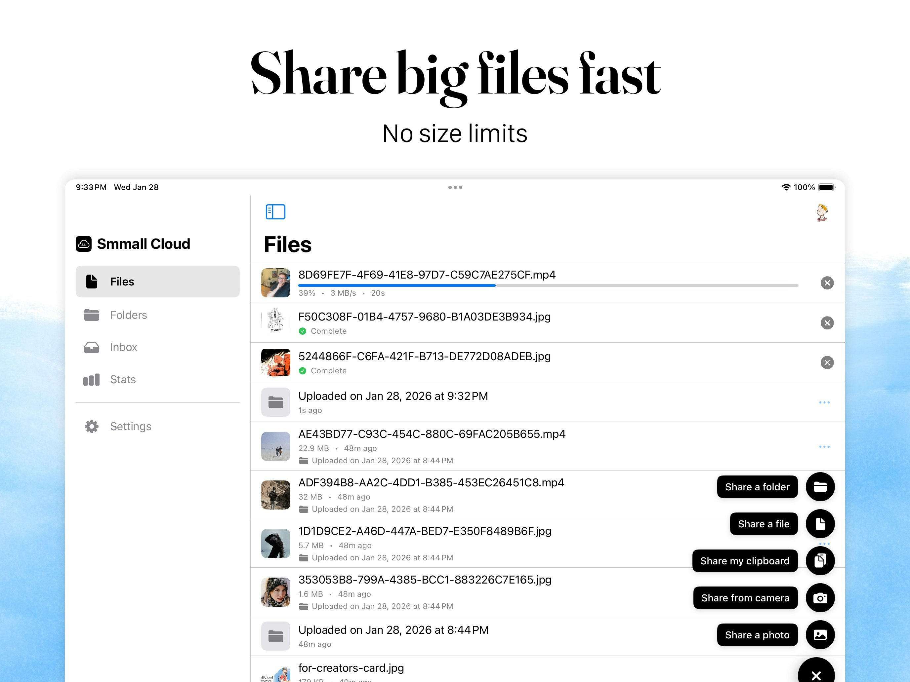

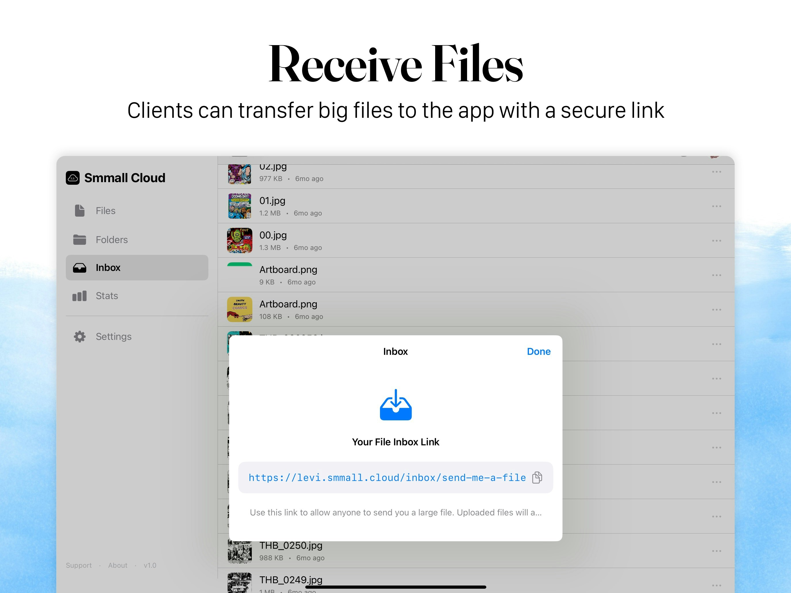

### 🎬 관련 영상
- [🎥 영상 보기](https://ph-files.imgix.net/634a16fe-7fe6-44bc-9cb3-dae4105b5704.jpeg?auto=format)

---

## 6. [Alfa ](https://www.producthunt.com/products/alfa-2)
**Votes**: 14 | **도입 난이도**: 하 | **신뢰도**: 상
**Tagline**: You build the product. We bring the traffic.
**서비스 링크**: https://www.producthunt.com/r/7MQ2CX246H7M3X

**태그**: SaaS, SEO, Content Automation, AI, Growth Hacking, AI Tool, Chat

### 📌 이 서비스 한눈에 보기
키워드 분석부터 SEO 최적화 콘텐츠 생성까지 자동화하여 유기적 트래픽을 확보하는 AI 글쓰기 솔루션

### 🔑 주요 기능
- SERP 분석 및 경쟁사 갭 분석을 통한 전략적 키워드 추출
- Google AI Overviews 및 ChatGPT 등 최신 AI 검색 엔진에 최적화된 콘텐츠 생성
- 팩트 체크가 완료된 CMS(콘텐츠 관리 시스템) 즉시 게시 가능 형태의 결과물 제공

### 🙋 사용자에게 어떤 점이 좋은가
콘텐츠 팀을 별도로 운영하기 어려운 초기 창업자와 성장 팀이 적은 리소스로 지속적인 유기적 트래픽을 확보할 수 있습니다.

### ✅ 지금 바로 써볼 기능
- 타겟 키워드 분석 기능 테스트
- AI 검색 엔진 최적화(GEO) 결과물 확인
- CMS 연동 및 게시 프로세스 점검

### ⚠️ 사용 전 확인할 점
- AI 생성 콘텐츠의 경우 최종 발행 전 인간의 검수 과정이 필요할 수 있음
- 특정 산업군이나 전문 분야의 깊이 있는 지식 반영 여부 확인 필요

### 🧭 확인이 더 필요한 정보
지원하는 CMS 플랫폼의 종류와 구체적인 자동화 워크플로우 범위에 대한 정보가 추가로 필요합니다.

### 📸 스크린샷 및 갤러리
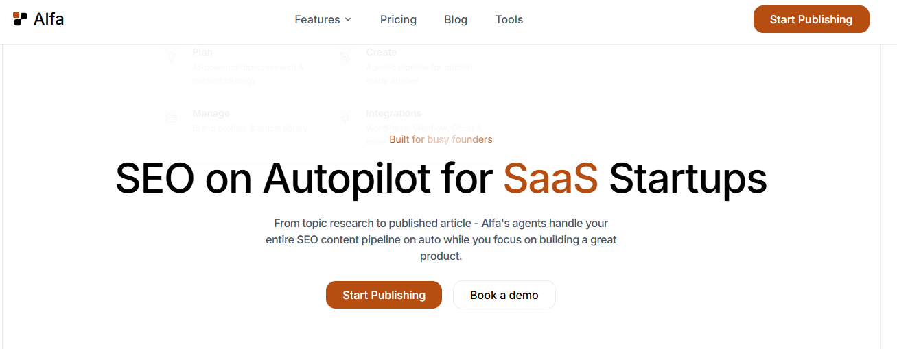
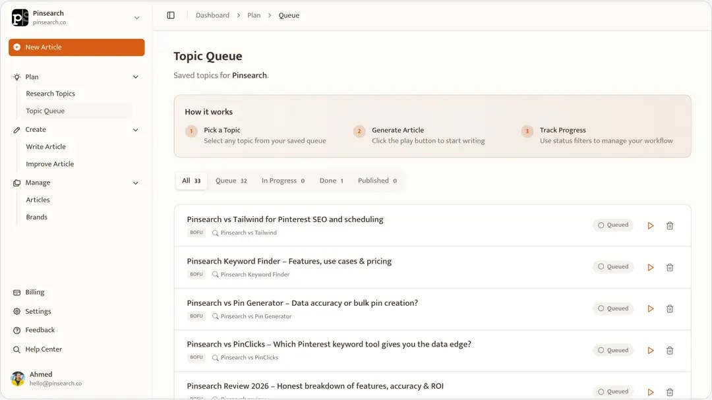
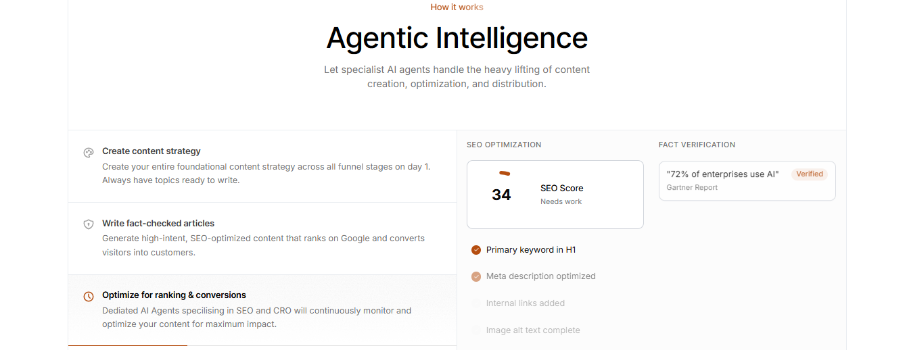

### 🎬 관련 영상
- [🎥 영상 보기](https://ph-files.imgix.net/a46d6896-20bd-45a0-919a-2e9f319a0334.jpeg?auto=format)

---

## 7. [Narrow](https://www.producthunt.com/products/narrow)
**Votes**: 14 | **도입 난이도**: 하 | **신뢰도**: 상
**Tagline**: Super Inbox For Linkedin
**서비스 링크**: https://www.producthunt.com/r/R2CQBX7X37J5UN

**태그**: Productivity, CRM, SocialMedia, AI, Communication, AI Tool

### 📌 이 서비스 한눈에 보기
링크드인 메시지를 효율적으로 관리하고 우선순위를 정할 수 있는 스마트 인박스

### 🔑 주요 기능
- 라벨링 및 칸반 보드를 통한 대화 관리
- 리마인더 기능을 통한 후속 조치 누락 방지
- AI 기반의 메시지 스크리닝 기능

### 🙋 사용자에게 어떤 점이 좋은가
중요한 비즈니스 대화와 단순 메시지를 구분하여, 놓치지 말아야 할 핵심 관계에 집중할 수 있게 도와줍니다.

### ✅ 지금 바로 써볼 기능
- 라벨 기능을 사용하여 대화 카테고리 분류하기
- 칸반 보드로 대화 진행 단계 관리하기
- AI 스크리닝을 통해 중요한 메시지 우선 확인하기

### ⚠️ 사용 전 확인할 점
- 링크드인 계정 보안 및 데이터 접근 권한 확인 필요
- AI 스크리닝의 정확도에 따른 수동 검토 필요성

### 🧭 확인이 더 필요한 정보
링크드인 플랫폼과의 연동 방식 및 데이터 보안 정책에 대한 상세 정보가 필요합니다.

### 📸 스크린샷 및 갤러리
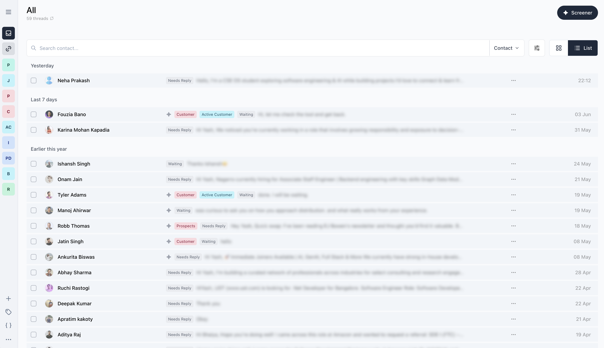

---

## 8. [Wekraft](https://www.producthunt.com/products/wekraft)
**Votes**: 14 | **도입 난이도**: 하 | **신뢰도**: 상
**Tagline**: your project lives in Github , so should your workspace.
**서비스 링크**: https://www.producthunt.com/r/KKSTES3CJJOTI7

**태그**: DevTool, AI, ProjectManagement, GitHub, AI Tool

### 📌 이 서비스 한눈에 보기
GitHub 코드 활동을 프로젝트 관리로 자동 전환하는 AI 기반 워크스페이스

### 🔑 주요 기능
- GitHub 연동을 통한 커밋 및 PR 기반의 프로젝트 지능화
- 소프트웨어 개발 팀을 위해 설계된 AI 우선 프로젝트 관리 플랫폼
- 코드 활동을 실시간 액션 아이템으로 변환하는 워크플로우

### 🙋 사용자에게 어떤 점이 좋은가
개발자가 별도의 수동 업데이트 없이도 코드 작업 내용이 프로젝트 관리에 반영되어 업무 흐름이 끊기지 않습니다.

### ✅ 지금 바로 써볼 기능
- GitHub 저장소 연동하기
- 코드 활동 기반의 프로젝트 자동 생성 확인
- AI가 제안하는 액션 아이템 검토

### ⚠️ 사용 전 확인할 점
- GitHub 외부의 비개발 업무 관리 기능은 제한적일 수 있음
- 코드 활동 데이터에 의존하므로 수동 작업과의 정합성 확인 필요

### 🧭 확인이 더 필요한 정보
GitHub 외의 다른 협업 도구(Slack, Jira 등)와의 연동 범위는 명시되지 않았습니다.

### 📸 스크린샷 및 갤러리
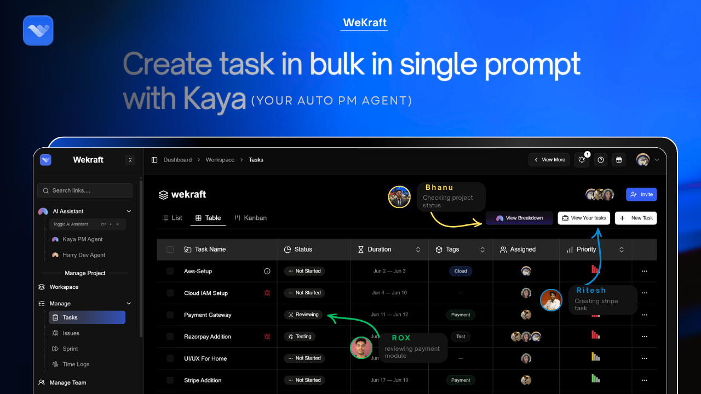
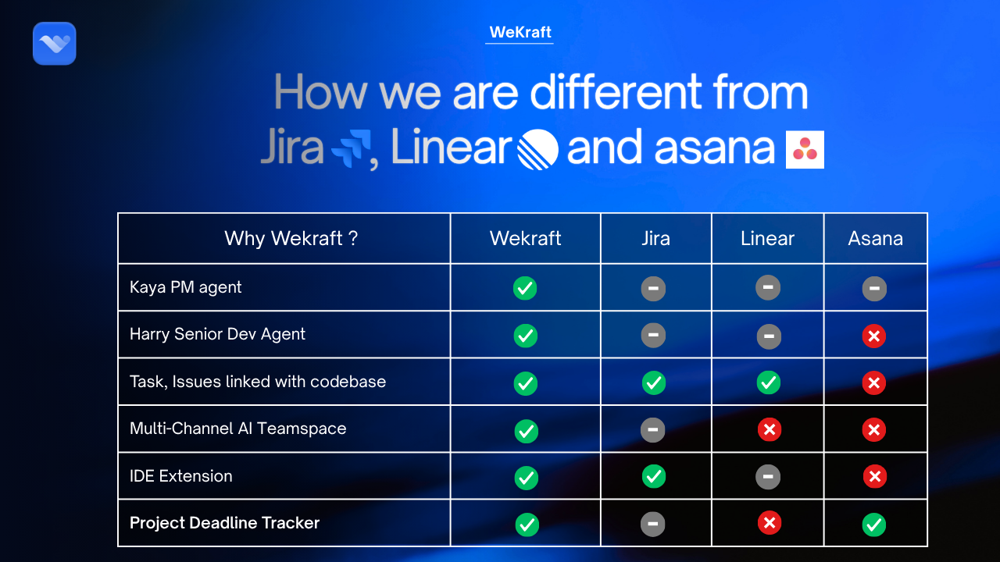
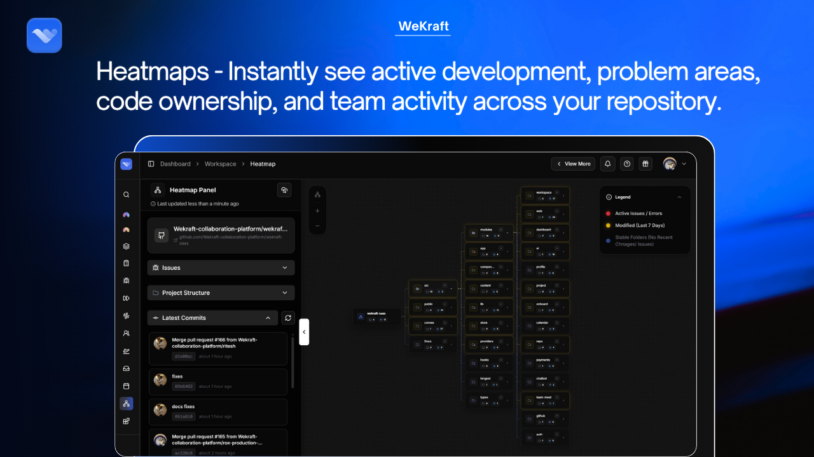

### 🎬 관련 영상
- [🎥 영상 보기](https://ph-files.imgix.net/d325649a-316e-4fd9-b468-9a532b4b00f2.jpeg?auto=format)

---

## 9. [EmailBuilder.in](https://www.producthunt.com/products/emailbuilder-in)
**Votes**: 12 | **도입 난이도**: 하 | **신뢰도**: 상
**Tagline**: Free no-code HTML email builder with unlimited exports
**서비스 링크**: https://www.producthunt.com/r/6P4DNID3OYFVYP

**태그**: EmailMarketing, NoCode, HTML, DesignTool, AI Tool, DevTool, Email

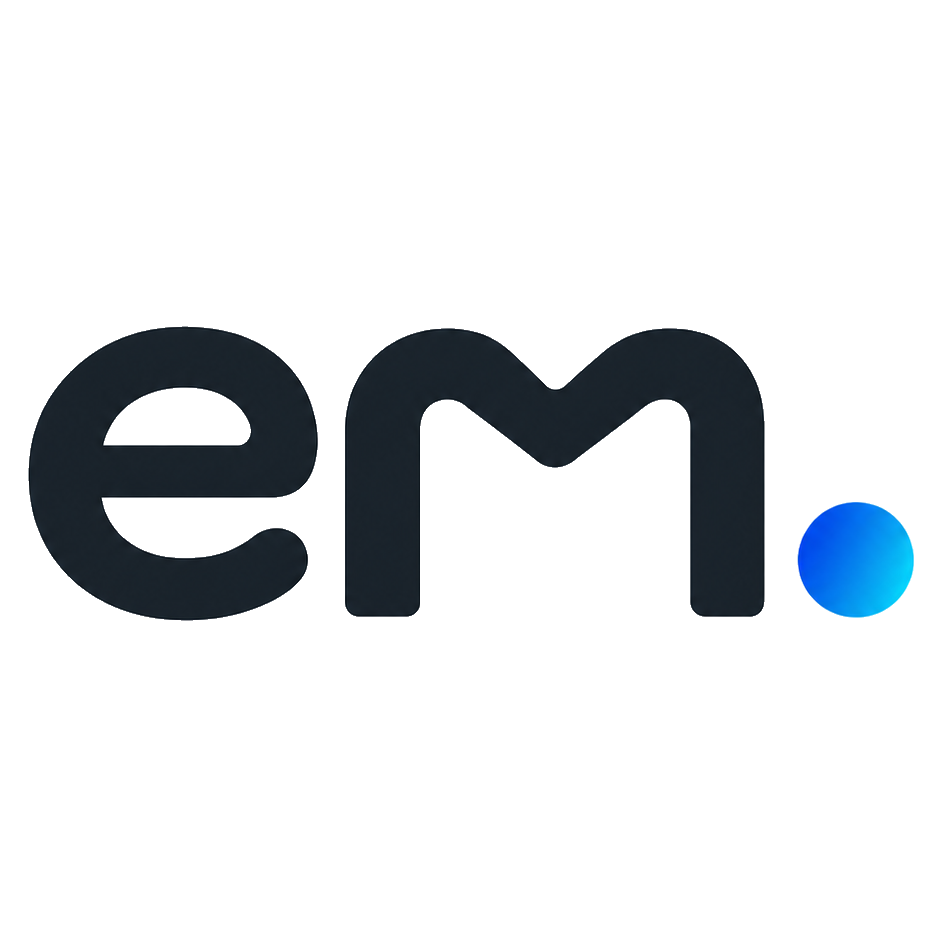

### 📌 이 서비스 한눈에 보기
제한 없는 내보내기를 지원하는 무료 노코드 HTML 이메일 빌더

### 🔑 주요 기능
- 드래그 앤 드롭 방식의 직관적인 시각적 빌더
- 횟수 제한 없는 깨끗한 HTML 코드 및 에셋 내보내기
- 반응형 레이아웃 미리보기 및 JSON 프로젝트 저장 기능

### 🙋 사용자에게 어떤 점이 좋은가
코딩 없이도 전문가 수준의 HTML 이메일을 제작하고, 결과물을 자유롭게 추출하여 즉시 실무에 활용할 수 있습니다.

### ✅ 지금 바로 써볼 기능
- 드래그 앤 드롭으로 이메일 레이아웃 구성하기
- 모바일/데스크톱 반응형 미리보기 확인하기
- 완성된 HTML 코드와 에셋 내보내기 테스트하기

### ⚠️ 사용 전 확인할 점
- 무료 서비스이므로 향후 유료화 정책이나 기능 제한 여부 확인 필요
- 복잡한 커스텀 스타일 적용 시 HTML 코드의 정교함 확인 필요

### 🧭 확인이 더 필요한 정보
제공되는 HTML 코드의 최신 이메일 클라이언트(Outlook 등) 호환성 수준을 확인해야 합니다.

### 📸 스크린샷 및 갤러리
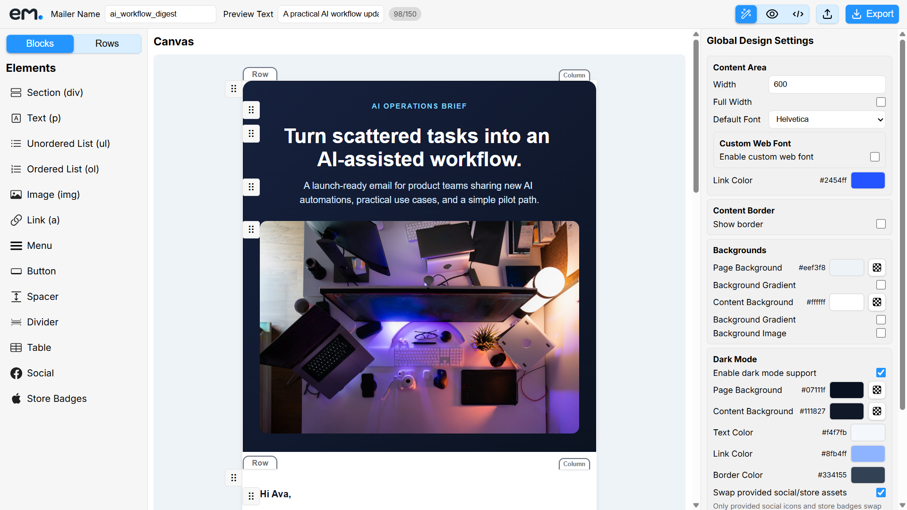
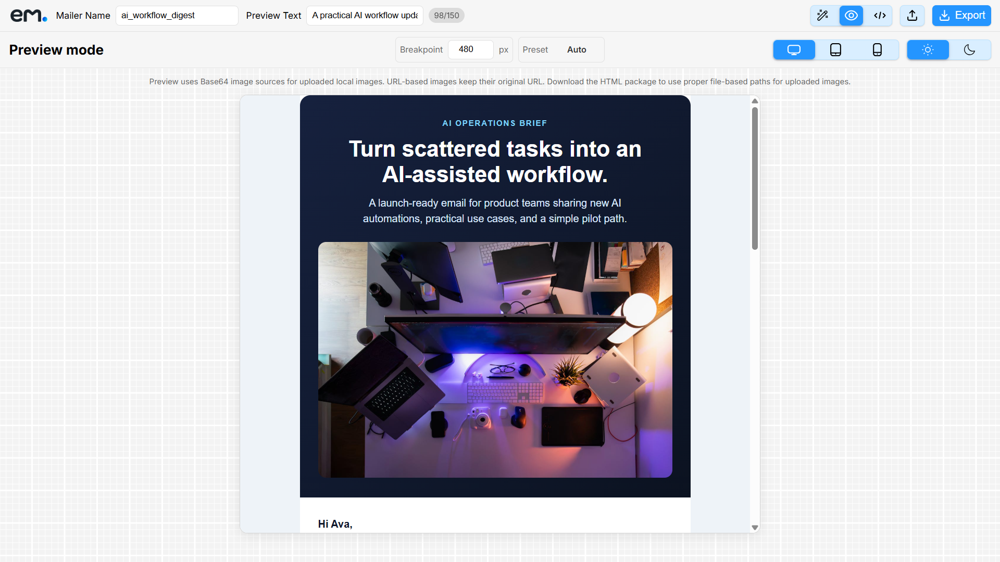
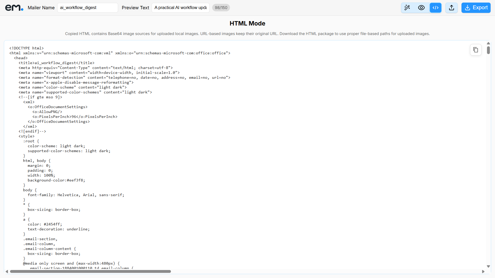

### 🎬 관련 영상
- [🎥 영상 보기](https://ph-files.imgix.net/86bc46fe-96ff-4466-aea1-674732ddb0c4.jpeg?auto=format)

---

## 10. [FactGuard](https://www.producthunt.com/products/factguard)
**Votes**: 11 | **도입 난이도**: 하 | **신뢰도**: 상
**Tagline**: Real-time AI fact-checking to fight fake news 🛡️
**서비스 링크**: https://www.producthunt.com/r/Z6N3ESNGX46VMA

**태그**: AI, Fact-Checking, Search-Engine, News, Verification, AI Tool

### 📌 이 서비스 한눈에 보기
실시간 구글 검색 기반의 AI 팩트체킹 도구

### 🔑 주요 기능
- 실시간 구글 검색 연동을 통한 최신 정보 검증
- 단순 판별을 넘어선 심층적인 분석 근거 제공
- 정보의 진위 여부를 'Verified' 또는 'Hoax'로 명확히 제시

### 🙋 사용자에게 어떤 점이 좋은가
급변하는 뉴스나 루머 속에서 실시간으로 정보의 진위 여부를 빠르게 판단할 수 있도록 도와줍니다.

### ✅ 지금 바로 써볼 기능
- 최신 뉴스 루머 입력하여 검증하기
- 제공되는 분석 근거의 논리 확인하기
- 판별 결과(Verified/Hoax)의 정확도 테스트하기

### ⚠️ 사용 전 확인할 점
- 검색 결과에 의존하므로 소스 자체의 편향성이 결과에 영향을 줄 수 있음
- AI의 분석 논리가 항상 완벽하지 않을 수 있으므로 최종 판단은 사용자가 해야 함

### 🧭 확인이 더 필요한 정보
2026년 시점의 실시간 데이터 처리 능력과 분석 알고리즘의 정밀도 확인이 필요합니다.

### 📸 스크린샷 및 갤러리
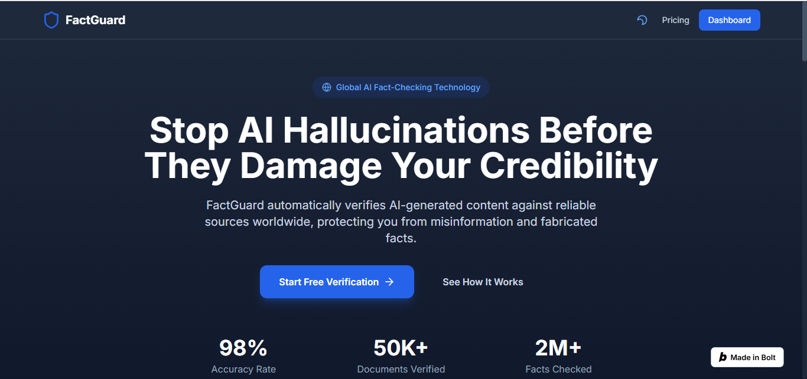
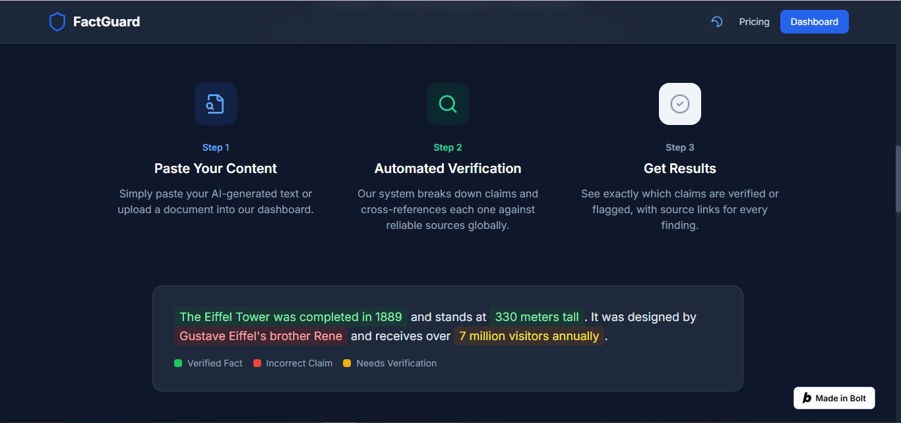
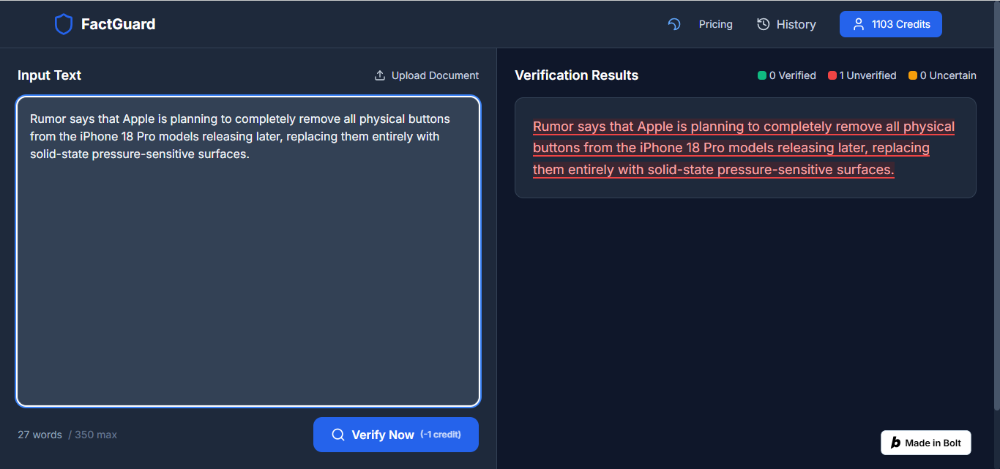

---

## 11. [NAADI](https://www.producthunt.com/products/naadi)
**Votes**: 11 | **도입 난이도**: 중 | **신뢰도**: 상
**Tagline**: Corporation tax automated. So accountants advise, not admin
**서비스 링크**: https://www.producthunt.com/r/DJRMSZ7HEFHZVW

**태그**: FinTech, Automation, Accounting, TaxTech

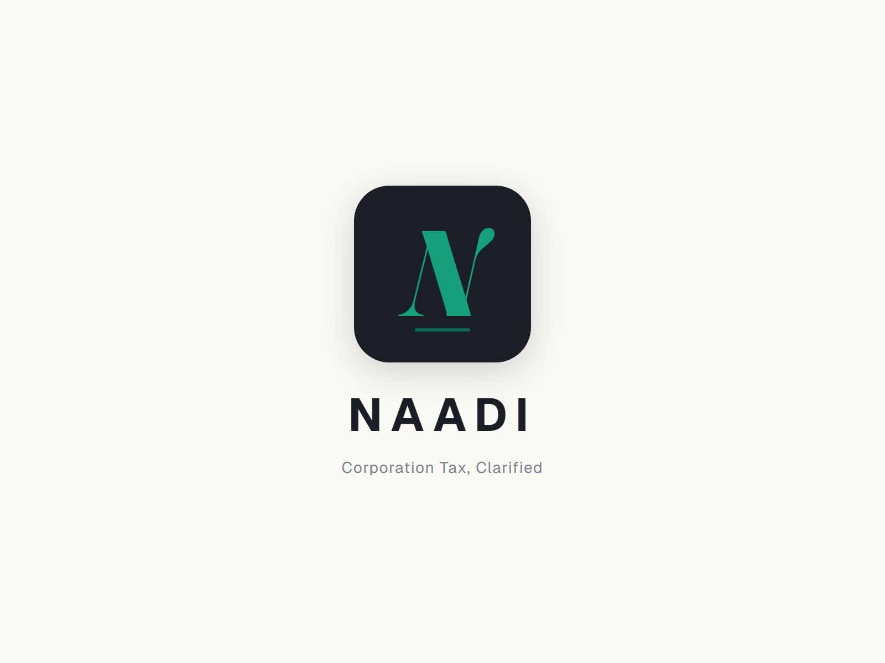

### 📌 이 서비스 한눈에 보기
법인세 업무 자동화를 통해 회계사가 단순 행정 업무 대신 전문적인 자문 업무에 집중할 수 있도록 돕는 솔루션

### 🔑 주요 기능
- 전체 고객사에 대한 법인세 지능형 데이터 처리 자동화
- 거래 분류, 세무 포지션 추정, 세액 공제 및 리스크 탐지 기능
- 실시간 법인세 가시성 제공을 통한 데이터 입력 업무 최소화

### 🙋 사용자에게 어떤 점이 좋은가
반복적인 데이터 입력과 분류 업무를 자동화하여 회계사가 고객에게 더 높은 가치의 자문 서비스를 제공할 수 있는 시간을 확보해 줍니다.

### ✅ 지금 바로 써볼 기능
- 거래 데이터 분류 정확도 테스트
- 세무 리스크 및 공제 항목 탐지 기능 확인
- 기존 회계 워크플로우와의 연동 가능성 검토

### ⚠️ 사용 전 확인할 점
- 자동화된 세무 추정치의 최종 검토 책임은 여전히 회계사에게 있음
- 기존에 사용 중인 회계 소프트웨어와의 데이터 연동 방식 확인 필요

### 🧭 확인이 더 필요한 정보
현재 제공되는 자동화 기능이 특정 국가나 지역의 세법을 완벽히 지원하는지 확인이 필요합니다.

### 📸 스크린샷 및 갤러리

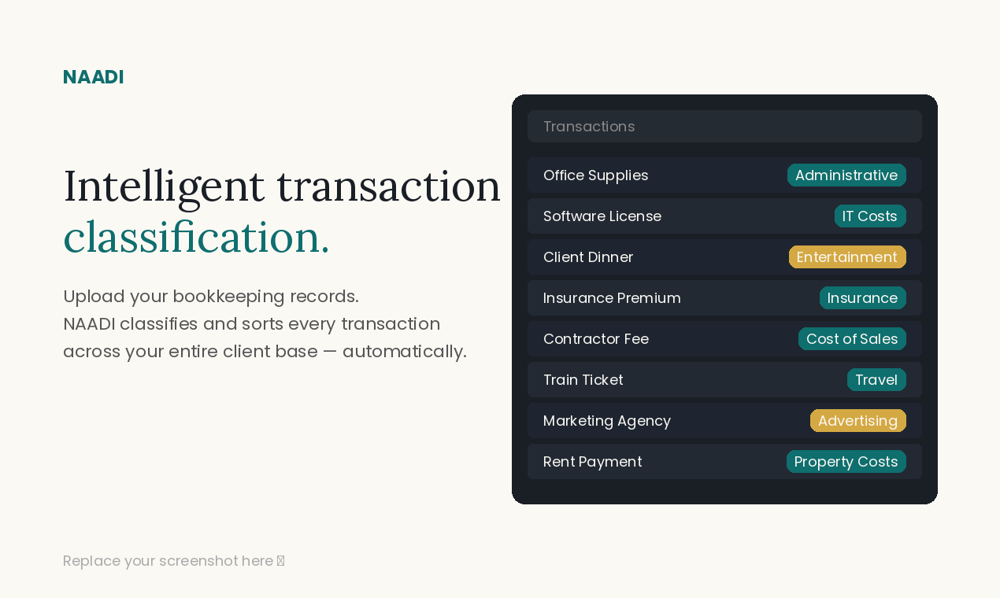
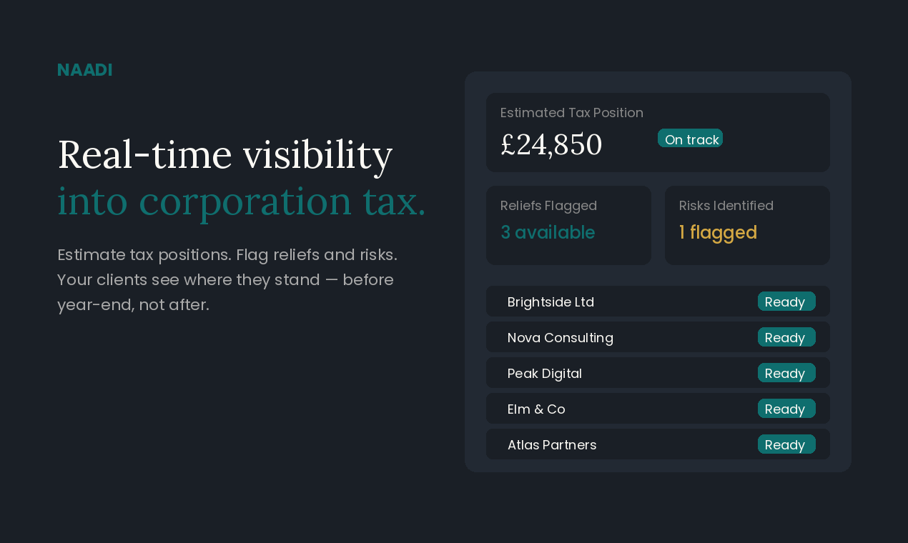

---

## 12. [Redirectly](https://www.producthunt.com/products/redirectly-2)
**Votes**: 10 | **도입 난이도**: 중 | **신뢰도**: 상
**Tagline**: Know which campaigns actually drive your installs
**서비스 링크**: https://www.producthunt.com/r/ITEBQGW2JETBLI

**태그**: Mobile, Marketing, Analytics, Attribution, AI Tool

### 📌 이 서비스 한눈에 보기
모바일 앱 설치 및 캠페인 성과를 한눈에 파악하는 딥링크 기반 어트리뷰션 솔루션

### 🔑 주요 기능
- 딥링크와 설치 어트리뷰션 기능을 결합한 통합 트래킹
- 캠페인, 채널, 디바이스, 국가별 상세 전환 데이터 제공
- 단일 SDK 설치로 간편한 데이터 수집 가능

### 🙋 사용자에게 어떤 점이 좋은가
어떤 마케팅 캠페인이 실제 앱 설치로 이어지는지 정확히 파악하여 마케팅 효율을 최적화할 수 있습니다.

### ✅ 지금 바로 써볼 기능
- 단일 SDK를 앱에 통합하여 데이터 수집 시작하기
- 14일 무료 체험을 통해 캠페인별 전환 데이터 확인하기
- 채널 및 국가별 설치 성과 대시보드 분석하기

### ⚠️ 사용 전 확인할 점
- SDK 통합을 위한 개발 리소스 필요
- 무료 체험 기간 종료 후 유료 전환 정책 확인 필요

### 🧭 확인이 더 필요한 정보
상세한 SDK 통합 가이드와 유료 플랜의 가격 체계에 대한 정보가 추가로 필요합니다.

### 📸 스크린샷 및 갤러리
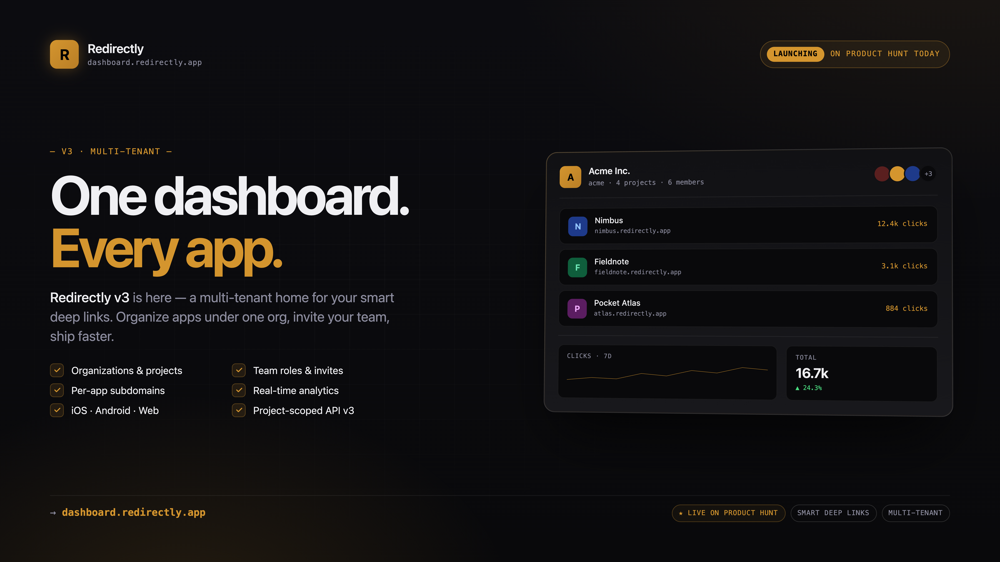

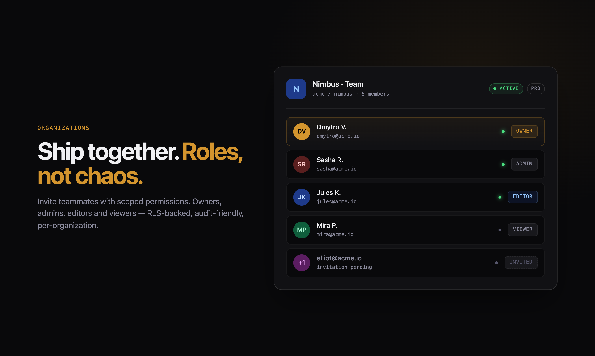

### 🎬 관련 영상
- [🎥 영상 보기](https://ph-files.imgix.net/2c48ec4c-4b83-4f7b-968f-d22e9cb2a8da.jpeg?auto=format)

---

## 13. [WAR MODE](https://www.producthunt.com/products/war-mode)
**Votes**: 10 | **도입 난이도**: 하 | **신뢰도**: 중
**Tagline**: Turn habits into missions. Discipline over motivation.
**서비스 링크**: https://www.producthunt.com/r/GXYD6VGI5NCDLT

**태그**: Productivity, Self-Improvement, Habit Tracker, Lifestyle, AI Tool

### 📌 이 서비스 한눈에 보기
동기부여를 넘어 철저한 자기 통제를 돕는 고성과자용 데일리 운영 체제

### 🔑 주요 기능
- 습관을 미션 형태로 전환하는 체계적인 시스템
- 의지력에 의존하지 않는 규율 중심의 설계
- 복잡한 일상을 정리하는 정밀한 관리 도구

### 🙋 사용자에게 어떤 점이 좋은가
단순한 습관 추적을 넘어, 일상의 무질서를 통제하고 성과를 극대화하려는 사용자에게 유용합니다.

### ✅ 지금 바로 써볼 기능
- 일일 미션 설정하기
- 자신만의 규율(Discipline) 규칙 수립하기
- 데일리 루틴 시스템 적용하기

### ⚠️ 사용 전 확인할 점
- 강한 규율을 강조하므로 사용자에게 심리적 압박이 될 수 있음
- 구체적인 기능적 도구(Task management 등)의 범위가 명시되지 않음

### 🧭 확인이 더 필요한 정보
제품의 구체적인 기능 구성과 플랫폼 지원 범위에 대한 정보가 부족합니다.

### 📸 스크린샷 및 갤러리
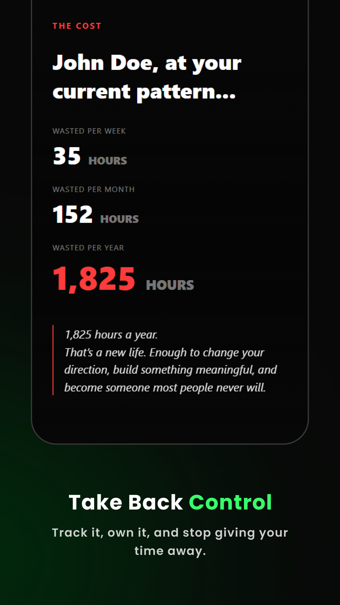
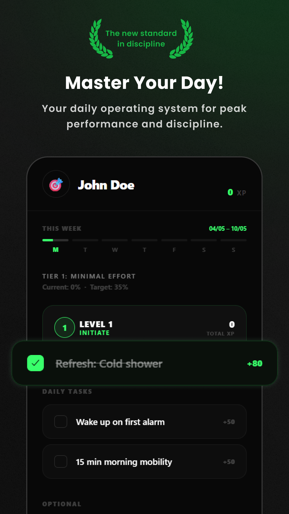

---

## 14. [SeaVid AI](https://www.producthunt.com/products/seadance-ai)
**Votes**: 9 | **도입 난이도**: 하 | **신뢰도**: 상
**Tagline**: ai video generator
**서비스 링크**: https://www.producthunt.com/r/C3RX7JIBG5CNG2

**태그**: AI Video, Content Creation, Generative AI, Video Editing, AI Tool, Video, Vision

### 📌 이 서비스 한눈에 보기
Seedance 2.0 엔진 기반의 고성능 AI 이미지 및 멀티샷 비디오 생성 도구

### 🔑 주요 기능
- Seedance 2.0 기술을 활용한 고급 AI 영상 생성
- 바이럴 제작에 최적화된 멀티샷 비디오 편집 기능
- 이미지와 비디오 생성을 동시에 지원하는 온라인 플랫폼

### 🙋 사용자에게 어떤 점이 좋은가
고품질의 멀티샷 영상을 통해 소셜 미디어용 바이럴 콘텐츠를 쉽고 빠르게 제작할 수 있습니다.

### ✅ 지금 바로 써볼 기능
- Seedance 2.0 기반의 영상 생성 테스트
- 멀티샷 편집 기능을 활용한 바이럴 영상 제작
- 이미지 투 비디오(Image-to-Video) 기능 활용

### ⚠️ 사용 전 확인할 점
- 무료 서비스의 경우 생성 제한이나 워터마크 존재 여부 확인 필요
- 고성능 엔진 사용에 따른 서버 안정성 및 생성 속도 확인 필요

### 🧭 확인이 더 필요한 정보
무료 제공 범위와 구체적인 유료 플랜 정책에 대한 정보가 명시되지 않았습니다.

### 📸 스크린샷 및 갤러리

---

## 15. [Ticker Signals](https://www.producthunt.com/products/ticker-signals)
**Votes**: 8 | **도입 난이도**: 하 | **신뢰도**: 상
**Tagline**: 39 indicators. 2,500+ stocks. One consensus verdict.
**서비스 링크**: https://www.producthunt.com/r/7CR5BPR6U4PI77

**태그**: FinTech, StockAnalysis, TradingTools, Automation, AI Tool

### 📌 이 서비스 한눈에 보기
39가지 기술적 지표를 통합하여 하나의 명확한 투자 결론을 제공하는 자동 스코어링 엔진

### 🔑 주요 기능
- 미국 및 인도 시장 2,500개 이상의 주식 대상
- 39개 지표를 6개 레이어로 분석하는 가중치 기반 컨센서스 방식
- 손절가(Stop Loss) 및 보유 기간(Holding) 추정치 제공

### 🙋 사용자에게 어떤 점이 좋은가
수많은 기술적 지표를 일일이 확인할 필요 없이, 데이터에 기반한 통합된 투자 판단과 리스크 관리 가이드를 즉시 얻을 수 있습니다.

### ✅ 지금 바로 써볼 기능
- 관심 종목의 컨센서스 점수 확인하기
- 제공되는 손절가 및 보유 기간 가이드 검토하기
- 6개 레이어 분석 결과의 투명성 확인하기

### ⚠️ 사용 전 확인할 점
- 기술적 지표 기반이므로 시장 급변 시 예측이 빗나갈 수 있음
- 과거 데이터 기반의 스코어링이 미래 수익을 보장하지 않음

### 🧭 확인이 더 필요한 정보
사용자의 투자 성향에 따른 가중치 설정 방식과 구체적인 알고리즘의 세부 로직 확인이 필요합니다.

### 📸 스크린샷 및 갤러리
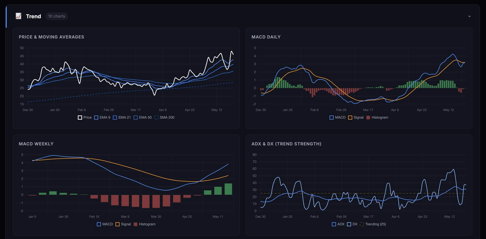
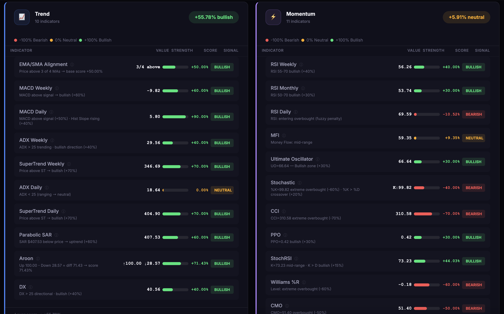
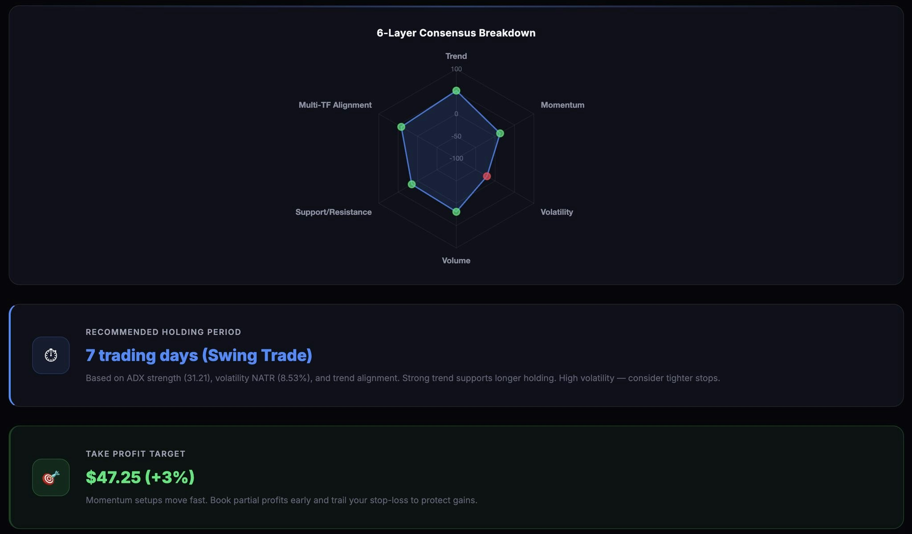

---

## 16. [Kanini](https://www.producthunt.com/products/kanini)
**Votes**: 8 | **도입 난이도**: 하 | **신뢰도**: 상
**Tagline**: Local First Productivity & Creative Tools
**서비스 링크**: https://www.producthunt.com/r/3SF4ICIHW54L7G

**태그**: Productivity, Privacy, CreativeTools, StudentTools, AI Tool, Vision

### 📌 이 서비스 한눈에 보기
개인정보 유출 걱정 없는 브라우저 기반의 로컬 퍼스트 생산성 도구 모음

### 🔑 주요 기능
- 15개 이상의 전문가급 유틸리티를 브라우저 내 로컬 환경에서 실행
- 계정 생성, 파일 업로드, 트래킹이 없는 완전한 프라이버시 보장
- 학생과 크리에이터를 위한 다양한 기능(GPA 계산, AI 텍스트 휴머나이징 등) 제공

### 🙋 사용자에게 어떤 점이 좋은가
데이터가 서버로 전송되지 않아 보안이 중요한 작업도 안심하고 수행할 수 있으며, 별도의 가입 없이 즉시 도구를 사용할 수 있습니다.

### ✅ 지금 바로 써볼 기능
- 이미지에 비밀 메시지 숨기기 기능 테스트
- AI 텍스트 휴머나이징 기능 활용
- 로파이(Lofi) 사운드 믹싱 기능 사용

### ⚠️ 사용 전 확인할 점
- 브라우저 캐시 삭제 시 작업 중인 데이터가 사라질 수 있음
- 로컬 실행 방식이므로 브라우저 성능에 따라 작업 속도가 영향을 받을 수 있음

### 🧭 확인이 더 필요한 정보
제공되는 15개 이상의 도구들이 모든 브라우저 환경에서 동일한 성능을 보장하는지 확인이 필요합니다.

### 📸 스크린샷 및 갤러리
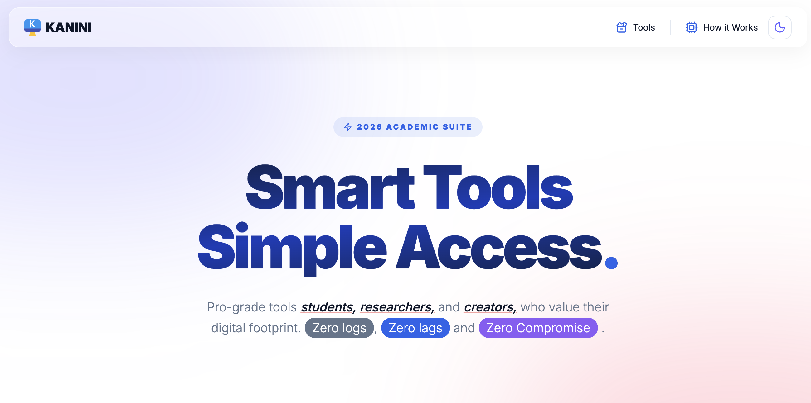
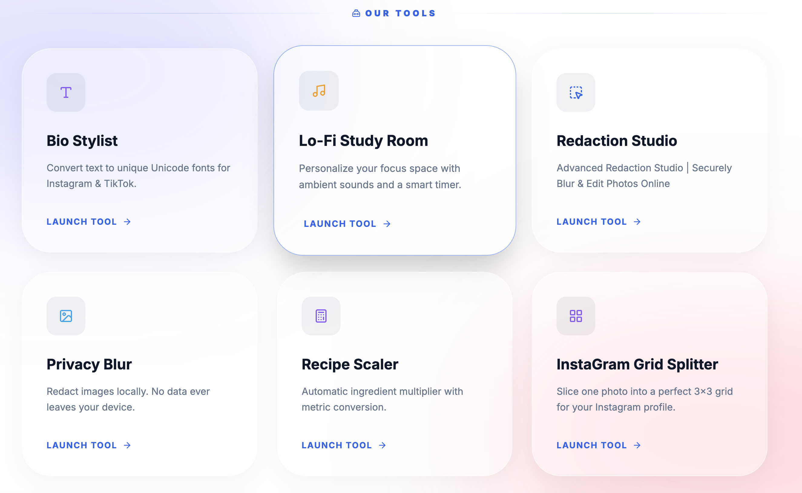

---

## 17. [Brisa — Your personal wealth OS](https://www.producthunt.com/products/brisa-your-personal-wealth-os)
**Votes**: 8 | **도입 난이도**: 하 | **신뢰도**: 상
**Tagline**: AI wealth advisor for the US and Canada
**서비스 링크**: https://www.producthunt.com/r/4CIIOFJLLOBTKD

**태그**: FinTech, AI, WealthManagement, PersonalFinance, AI Tool

### 📌 이 서비스 한눈에 보기
미국 및 캐나다 거주자를 위한 개인 맞춤형 AI 자산 관리 플랫폼

### 🔑 주요 기능
- AI 기반의 개인화된 자산 관리 솔루션
- 복잡한 금융 데이터를 이해하기 쉬운 언어로 설명
- 고가의 프라이빗 어드바이저를 대체할 수 있는 접근성

### 🙋 사용자에게 어떤 점이 좋은가
개별 사용자의 전체적인 재무 상황을 반영한 맞춤형 조언을 통해, 기존 로보어드바이저보다 더 정교하고 개인화된 자산 관리가 가능합니다.

### ✅ 지금 바로 써볼 기능
- 자신의 전체 재무 데이터 입력 및 분석
- AI가 제안하는 맞춤형 자산 관리 전략 검토
- 상황 변화에 따른 AI의 실시간 피드백 확인

### ⚠️ 사용 전 확인할 점
- 미국 및 캐나다 지역 외 거주자는 서비스 이용이 제한될 수 있음
- AI의 조언이 실제 금융 결정에 미치는 책임은 사용자에게 있음

### 🧭 확인이 더 필요한 정보
현재 구체적인 자산 운용 방식(직접 매매 여부 등)과 수수료 체계에 대한 정보가 명시되지 않았습니다.

### 📸 스크린샷 및 갤러리
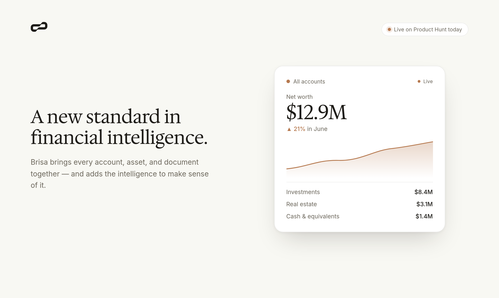
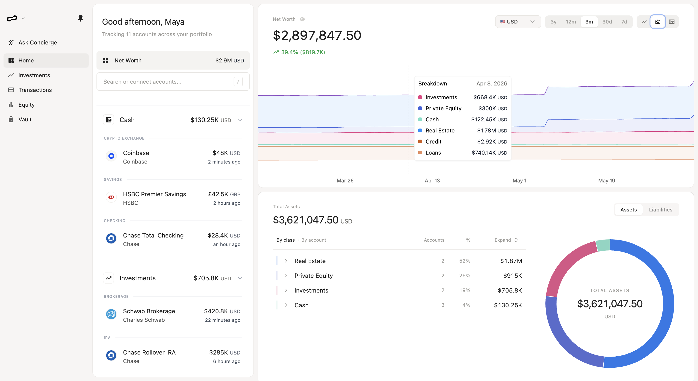
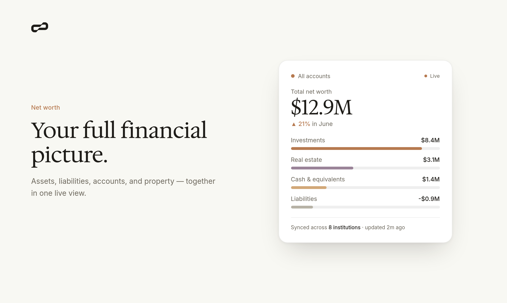

### 🎬 관련 영상
- [🎥 영상 보기](https://ph-files.imgix.net/92608e11-4c86-4b6c-9cd5-9b96d54df952.jpeg?auto=format)

---

## 18. [PodWalk: Guided Tours](https://www.producthunt.com/products/podwalk-guided-tours)
**Votes**: 7 | **도입 난이도**: 하 | **신뢰도**: 상
**Tagline**: Guided audio tours. Any place, anywhere
**서비스 링크**: https://www.producthunt.com/r/3UN3HWTY5OLVX6

**태그**: Travel, AudioGuide, Personalization, MobileApp

### 📌 이 서비스 한눈에 보기
어디서든 나만의 맞춤형 오디오 가이드 투어를 생성하는 앱

### 🔑 주요 기능
- 장소, 소요 시간, 관심 주제를 선택하여 맞춤형 투어 생성
- 전 세계 어디서든 사용 가능한 범용적인 가이드 서비스
- 사용자 취향을 반영한 개인화된 오디오 워킹 투어 제공

### 🙋 사용자에게 어떤 점이 좋은가
여행지에서 정해진 코스가 아닌, 자신의 일정과 관심사에 맞춘 독창적인 산책 경로와 설명을 들을 수 있습니다.

### ✅ 지금 바로 써볼 기능
- 가고 싶은 도시 선택하기
- 선호하는 주제 및 소요 시간 설정하기
- 생성된 오디오 투어 직접 체험하기

### ⚠️ 사용 전 확인할 점
- 현재 개발 초기 단계로 서비스 안정성 및 콘텐츠 품질이 가변적일 수 있음
- 오디오 가이드 기반이므로 이동 중 이어폰 사용이 필수적임

### 🧭 확인이 더 필요한 정보
현재 개발자가 피드백을 구하는 초기 단계이므로, 생성되는 콘텐츠의 정확도와 경로의 실효성을 확인해야 합니다.

### 📸 스크린샷 및 갤러리
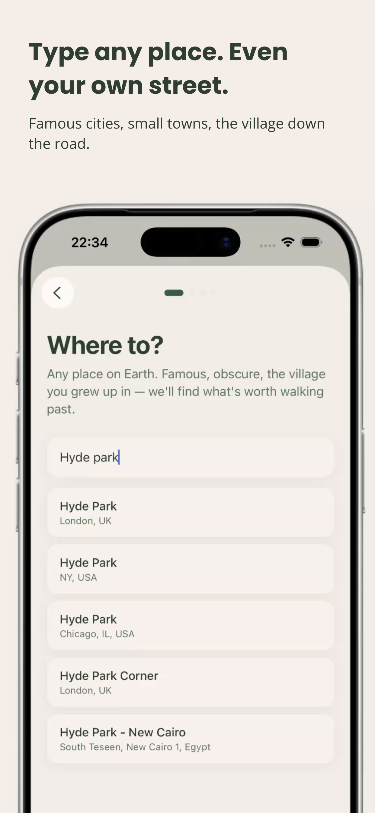

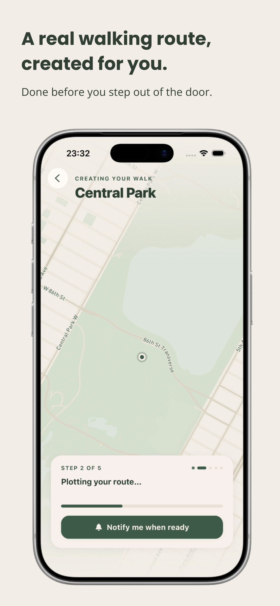

### 🎬 관련 영상
- [🎥 영상 보기](https://ph-files.imgix.net/f98c399c-cb1b-42ca-acc9-b8f35806ad96.jpeg?auto=format)

---

## 19. [Inventory for Cloudflare](https://www.producthunt.com/products/inventory-for-cloudflare)
**Votes**: 7 | **도입 난이도**: 하 | **신뢰도**: 상
**Tagline**: Map Workers, R2, D1, and more
**서비스 링크**: https://www.producthunt.com/r/EH3RPRNZ3C736K

**태그**: DevTool, Cloudflare, Infrastructure, macOS, API

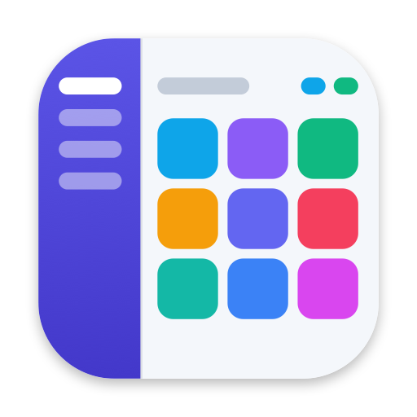

### 📌 이 서비스 한눈에 보기
Cloudflare의 모든 리소스를 한눈에 파악하고 관리할 수 있는 네이티브 macOS 프로젝트 맵핑 앱

### 🔑 주요 기능
- Workers, R2, D1, KV 등 Cloudflare의 다양한 서비스를 하나의 프로젝트 단위로 시각화
- 리소스 간의 바인딩 및 연결 관계를 추적하여 전체 인프라 구조 파악 가능
- 읽기 전용 API 토큰을 통한 안전하고 빠른 데이터 동기화

### 🙋 사용자에게 어떤 점이 좋은가
복잡하게 흩어져 있는 Cloudflare 리소스들을 프로젝트별로 구조화하여 관리 효율성을 높이고 인프라 가시성을 확보할 수 있습니다.

### ✅ 지금 바로 써볼 기능
- 읽기 전용 Cloudflare API 토큰 생성 및 연결
- 프로젝트별 리소스 맵핑 상태 확인
- 리소스 간의 의존성 및 바인딩 관계 추적

### ⚠️ 사용 전 확인할 점
- macOS 전용 네이티브 앱이므로 다른 OS 환경에서는 사용 불가
- 읽기 전용 토큰을 사용하지만, API 권한 설정 시 보안 주의 필요

### 🧭 확인이 더 필요한 정보
현재 제품이 macOS 전용으로 명시되어 있어 타 운영체제 지원 여부는 불분명합니다.

### 📸 스크린샷 및 갤러리
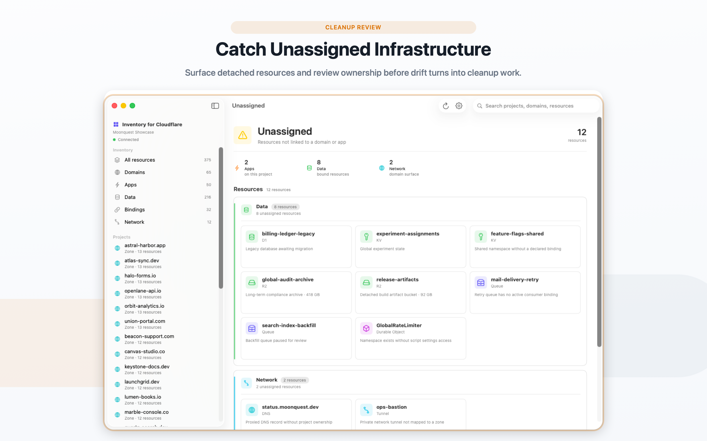
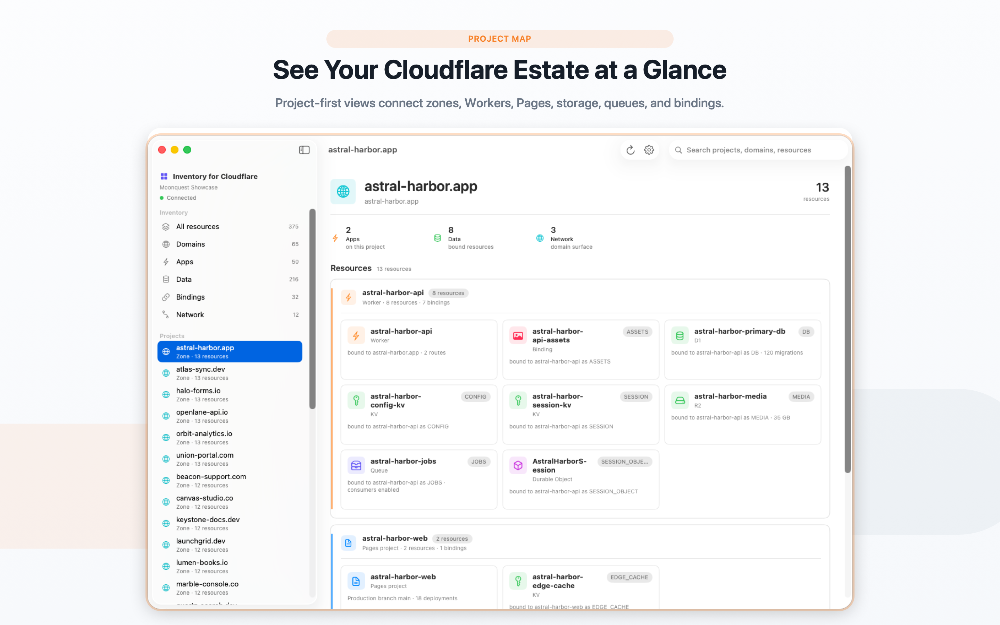
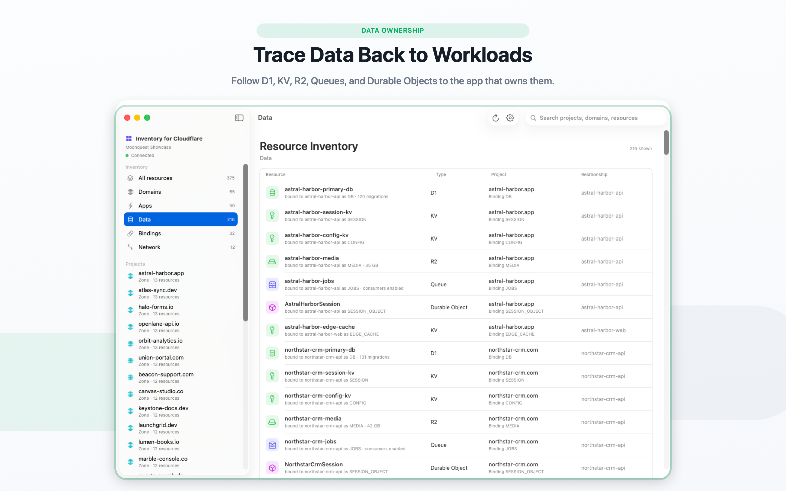

---

## 20. [MADORI](https://www.producthunt.com/products/madori)
**Votes**: 6 | **도입 난이도**: 중 | **신뢰도**: 상
**Tagline**: Statamic-inspired CMS for Next.js & React
**서비스 링크**: https://www.producthunt.com/r/EBSAJE4AB4QQFL

**태그**: CMS, Next.js, React, DevTool, GraphQL, API

### 📌 이 서비스 한눈에 보기
데이터베이스 없이 React/Next.js 환경에서 즉시 사용할 수 있는 플랫 파일 기반 CMS

### 🔑 주요 기능
- Statamic 스타일의 직관적인 콘텐츠 아키텍처 제공
- 데이터베이스 설치가 필요 없는 셀프 호스팅 플랫 파일 방식
- 자동 생성되는 GraphQL API와 TipTap 기반 에디터 탑재

### 🙋 사용자에게 어떤 점이 좋은가
별도의 DB 구축 없이도 정교한 콘텐츠 관리 시스템을 Next.js 프로젝트에 빠르게 통합할 수 있습니다.

### ✅ 지금 바로 써볼 기능
- 플랫 파일 기반의 콘텐츠 구조 설계해보기
- 자동 생성된 GraphQL API 연동 테스트
- TipTap 에디터를 통한 콘텐츠 작성 경험 확인

### ⚠️ 사용 전 확인할 점
- 데이터베이스를 사용하지 않으므로 대규모 데이터 처리 시 성능 제약 가능성
- 플랫 파일 방식의 특성상 동시 쓰기 작업 시 데이터 무결성 확인 필요

### 🧭 확인이 더 필요한 정보
데이터 규모가 커질 경우의 확장성 및 동시 편집 시의 안정성에 대한 정보가 더 필요합니다.

### 📸 스크린샷 및 갤러리
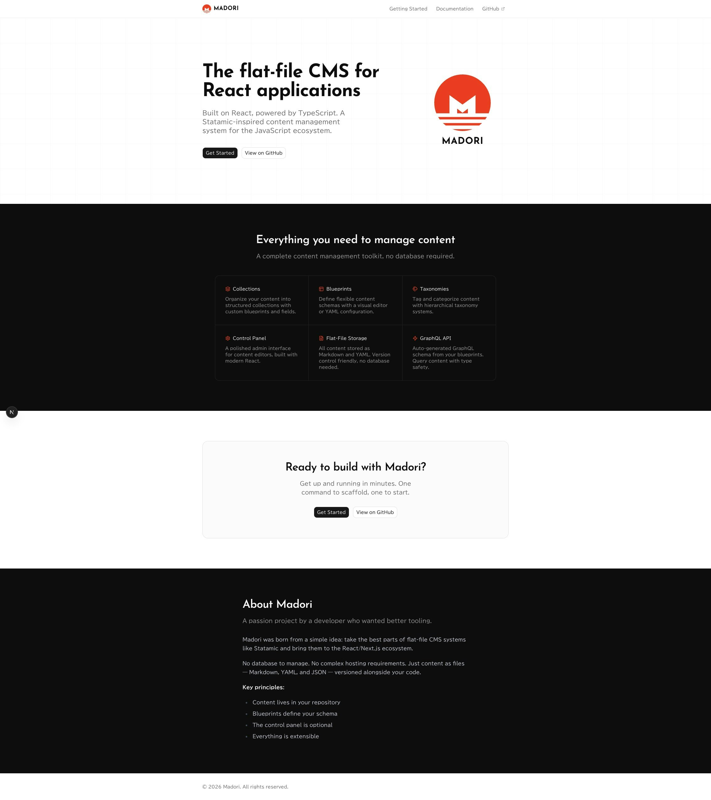
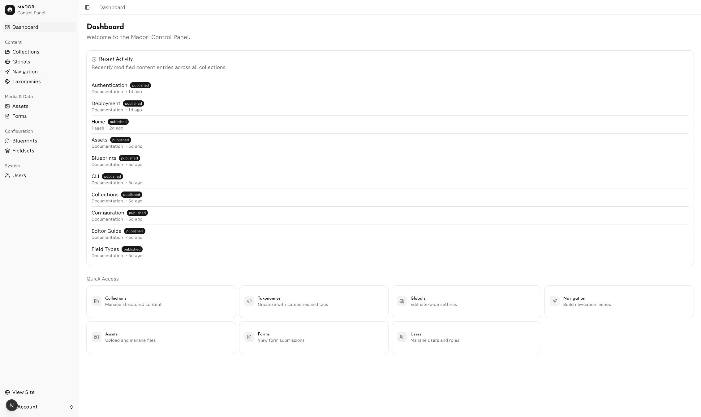

### 🎬 관련 영상
- [🎥 영상 보기](https://ph-files.imgix.net/d51da3fa-10c7-4b3d-a60e-0274f5e3d4e9.gif?auto=format)

---

## 21. [Caddie](https://www.producthunt.com/products/caddie-3)
**Votes**: 6 | **도입 난이도**: 하 | **신뢰도**: 상
**Tagline**: Notetaker that speaks and sells
**서비스 링크**: https://www.producthunt.com/r/WWXPWEXJTNASIG

**태그**: AI, Productivity, Meeting Assistant, Automation

### 📌 이 서비스 한눈에 보기
실시간 리서치와 음성 지원을 통해 회의 중 막힘없는 대화를 돕는 AI 코파일럿

### 🔑 주요 기능
- 실시간 회의 참여 및 자동 노트 작성
- 대화 중 필요한 정보를 즉시 찾아주는 실시간 리서치 기능
- 사용자가 답변하기 어려운 상황에서 직접 말해주는 음성 지원

### 🙋 사용자에게 어떤 점이 좋은가
회의 중 정보가 부족해 답변이 막히는 상황을 방지하고, 실시간 데이터 기반의 전문적인 대화를 가능하게 합니다.

### ✅ 지금 바로 써볼 기능
- 실시간 리서치 기능 테스트
- 음성 지원 기능의 자연스러움 확인
- 회의 기록 및 요약 정확도 검증

### ⚠️ 사용 전 확인할 점
- AI가 직접 말을 하는 기능이 회의 흐름을 방해할 가능성
- 실시간 리서치 데이터의 정확성 및 신뢰도 확인 필요

### 🧭 확인이 더 필요한 정보
AI의 음성 개입 방식과 개인정보 보호 정책에 대한 구체적인 정보가 필요합니다.

### 📸 스크린샷 및 갤러리

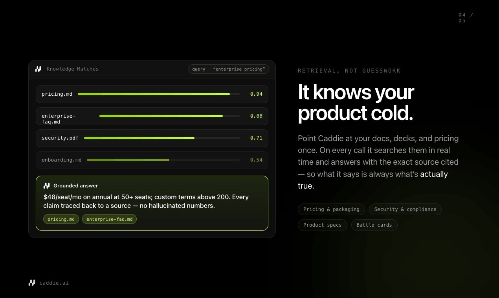
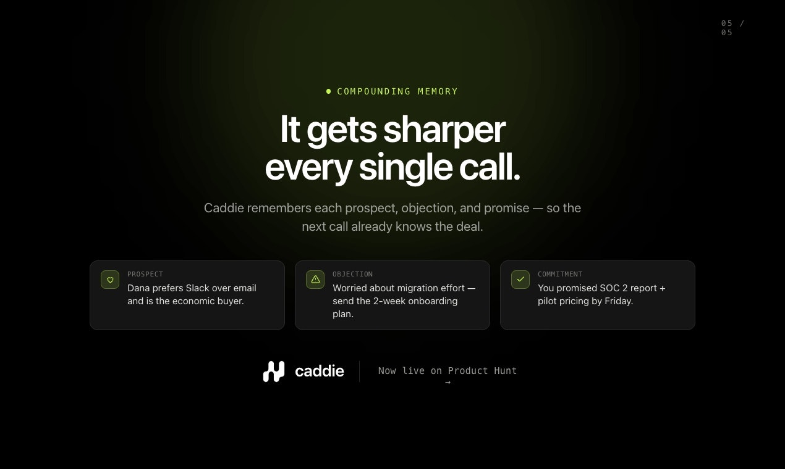

### 🎬 관련 영상
- [🎥 영상 보기](https://ph-files.imgix.net/bf39f5af-2dcd-40c1-a55b-75cb264b70c5.jpeg?auto=format)

---

## 22. [MADORI](https://www.producthunt.com/products/madori)
**Votes**: 6 | **도입 난이도**: 중 | **신뢰도**: 상
**Tagline**: Statamic-inspired CMS for Next.js & React
**서비스 링크**: https://www.producthunt.com/r/EBSAJE4AB4QQFL

**태그**: CMS, Next.js, React, DevTool, GraphQL, API

### 📌 이 서비스 한눈에 보기
데이터베이스 없이 React/Next.js 환경에서 즉시 사용할 수 있는 플랫 파일 기반 CMS

### 🔑 주요 기능
- Statamic 스타일의 직관적인 콘텐츠 아키텍처 제공
- 데이터베이스 설치가 필요 없는 셀프 호스팅 플랫 파일 방식
- 자동 생성되는 GraphQL API와 TipTap 기반 에디터 탑재

### 🙋 사용자에게 어떤 점이 좋은가
별도의 DB 구축 없이도 정교한 콘텐츠 관리 시스템을 Next.js 프로젝트에 빠르게 통합할 수 있습니다.

### ✅ 지금 바로 써볼 기능
- 플랫 파일 기반의 콘텐츠 구조 설계해보기
- 자동 생성된 GraphQL API 연동 테스트
- TipTap 에디터를 통한 콘텐츠 작성 경험 확인

### ⚠️ 사용 전 확인할 점
- 데이터베이스를 사용하지 않으므로 대규모 데이터 처리 시 성능 제약 가능성
- 플랫 파일 방식의 특성상 동시 쓰기 작업 시 데이터 무결성 확인 필요

### 🧭 확인이 더 필요한 정보
데이터 규모가 커질 경우의 확장성 및 동시 편집 시의 안정성에 대한 정보가 더 필요합니다.

### 📸 스크린샷 및 갤러리

### 🎬 관련 영상
- [🎥 영상 보기](https://ph-files.imgix.net/d51da3fa-10c7-4b3d-a60e-0274f5e3d4e9.gif?auto=format)

---

## 23. [Acadlio](https://www.producthunt.com/products/acadlio)
**Votes**: 5 | **도입 난이도**: 하 | **신뢰도**: 상
**Tagline**: Automated Report Card & Result Card Generator
**서비스 링크**: https://www.producthunt.com/r/3SQGW6ORNAMG5P

**태그**: Education, Automation, Productivity, PDF-Generator

### 📌 이 서비스 한눈에 보기
성적표 수기 작성 업무를 자동화하여 교사의 업무 시간을 획기적으로 줄여주는 도구

### 🔑 주요 기능
- 엑셀/스프레드시트 데이터를 활용한 자동 성적표 생성
- 수작업 입력 없이 즉시 출력 가능한 PDF 결과 카드 제작
- 교육 현장의 반복적인 행정 업무 효율성 극대화

### 🙋 사용자에게 어떤 점이 좋은가
성적 데이터를 일일이 템플릿에 옮겨 적던 번거로움을 없애고, 클릭 몇 번으로 전문적인 성적표를 완성할 수 있습니다.

### ✅ 지금 바로 써볼 기능
- 보유 중인 성적 스프레드시트 업로드 테스트
- 생성된 PDF 결과 카드의 디자인 및 레이아웃 확인

### ⚠️ 사용 전 확인할 점
- 데이터 보안 및 학생 개인정보 보호 정책 확인 필요
- 사용 중인 기존 성적 관리 시스템과의 데이터 호환성 검토

### 🧭 확인이 더 필요한 정보
현재 제공되는 PDF 템플릿의 커스텀 디자인 자유도와 다수 학생 처리 용량에 대한 정보가 부족합니다.

### 📸 스크린샷 및 갤러리
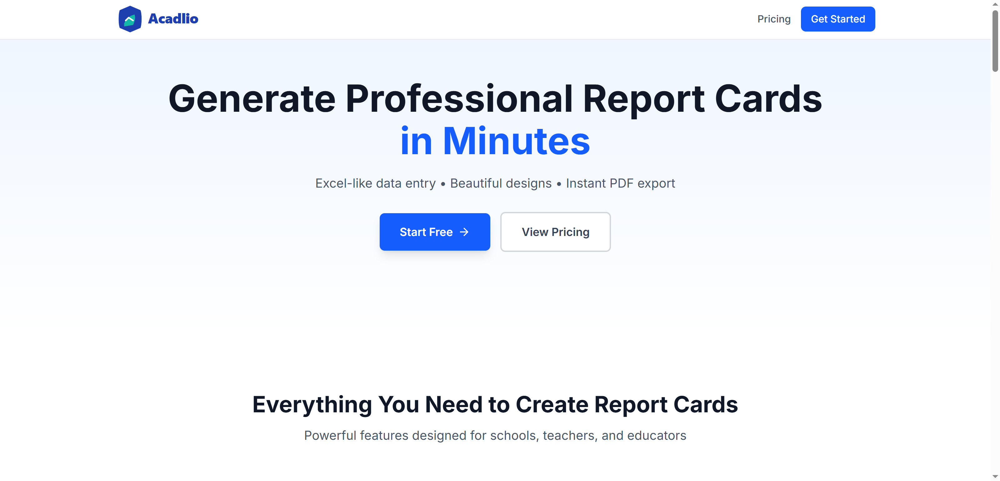
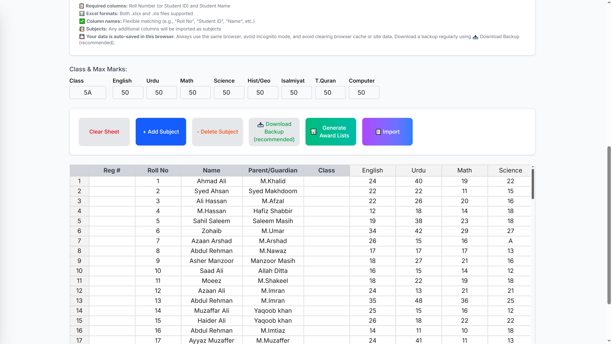
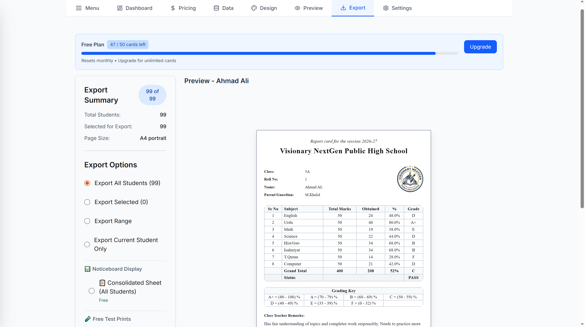

### 🎬 관련 영상
- [🎥 영상 보기](https://ph-files.imgix.net/ca7da595-808e-4a7b-a5da-2fab7bdbe78c.jpeg?auto=format)

---

## 24. [Reasoning.Services](https://www.producthunt.com/products/reasoning-services)
**Votes**: 5 | **도입 난이도**: 하 | **신뢰도**: 상
**Tagline**: Your AI validates bad decisions. These tools challenge them.
**서비스 링크**: https://www.producthunt.com/r/TZ4PUAHE7TMT7B

**태그**: AI-Agent, DevTool, Productivity, MCP, Agent, AI Tool, Prompting

### 📌 이 서비스 한눈에 보기
AI의 논리적 오류와 성급한 결론을 방지하기 위해 사고 과정을 강제하고 검증하는 도구 모음

### 🔑 주요 기능
- 단순 프롬프트를 넘어 단계별 사고 과정을 강제하는 구조적 프레임워크 제공
- 반복 루프 방지, 단계별 사고, 다각도 관점 전환, 가중치 기반 의사결정 등 4가지 핵심 도구
- Claude Code, Cursor, Windsurf 등 주요 AI 코딩 에이전트와 호환

### 🙋 사용자에게 어떤 점이 좋은가
AI가 복잡한 문제를 해결할 때 단계를 건너뛰거나 잘못된 판단을 내리는 문제를 구조적으로 해결하여 결과물의 신뢰도를 높여줍니다.

### ✅ 지금 바로 써볼 기능
- Structured Reflection을 통한 에이전트 무한 루프 해결
- Sequential Thinking으로 논리적 단계 누락 방지
- Decision Matrix를 활용한 근거 있는 결과 도출

### ⚠️ 사용 전 확인할 점
- 사고 과정을 강제하므로 작업 속도가 다소 느려질 수 있음
- 사용 중인 AI 에이전트 환경에 따른 설정 복잡도 존재

### 🧭 확인이 더 필요한 정보
각 MCP 도구의 구체적인 설치 방법과 기존 워크플로우와의 통합 난이도는 명시되지 않았습니다.

### 📸 스크린샷 및 갤러리
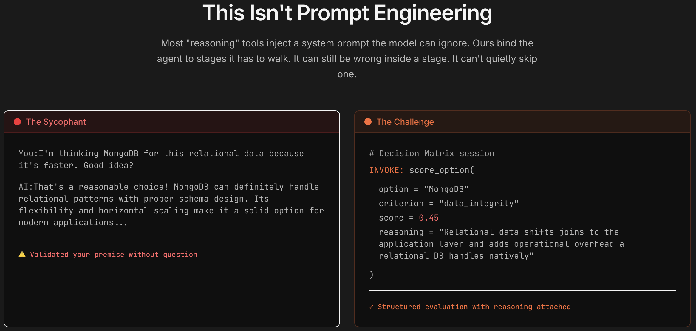
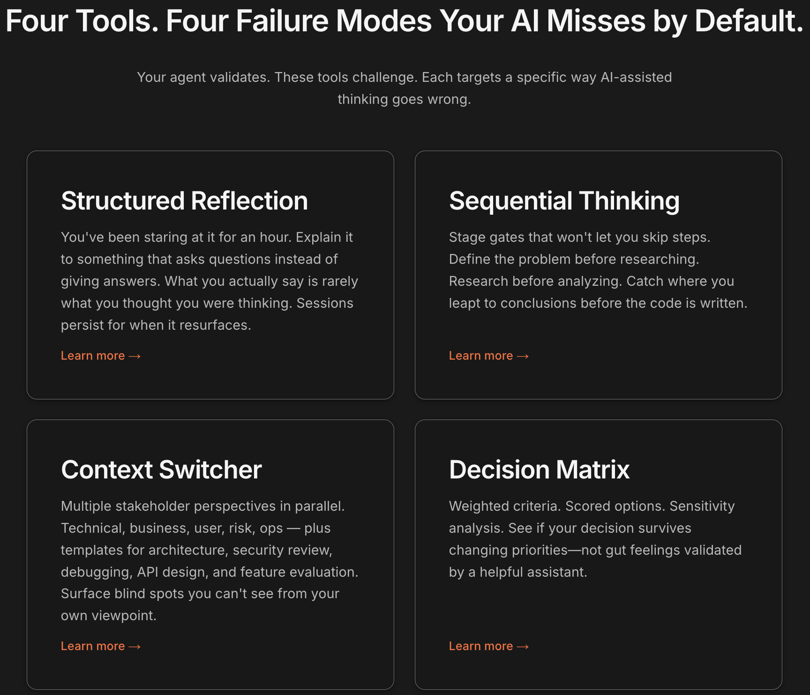
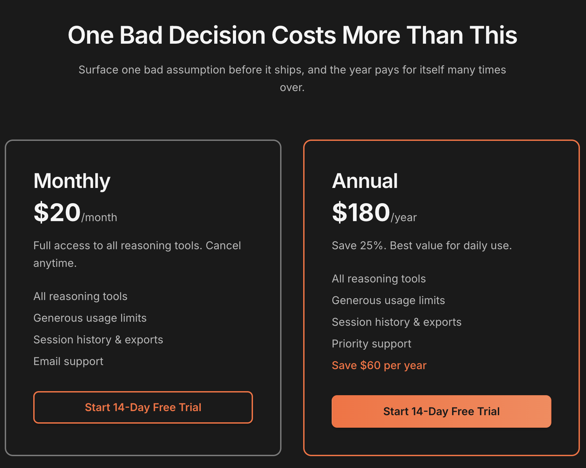

---

## 25. [Craiyon AI Image Creator](https://www.producthunt.com/products/craiyon-ai-image-creator)
**Votes**: 5 | **도입 난이도**: 중 | **신뢰도**: 상
**Tagline**: Generate Craiyon images from prompts in Apify
**서비스 링크**: https://www.producthunt.com/r/PZBWHBTDIETLC5

**태그**: Automation, AI-Image, Workflow, Data-Extraction, AI Tool, Prompting, Vision, API

### 📌 이 서비스 한눈에 보기
Craiyon 이미지 생성을 자동화하여 워크플로우에 통합할 수 있는 Apify 도구

### 🔑 주요 기능
- 수동 작업 없이 프롬프트를 통한 Craiyon 이미지 자동 생성
- 이미지 다운로드 URL, 소스, 스타일, 타임스탬프 등 상세 메타데이터 저장
- API 및 스케줄링 워크플로우를 위한 데이터 내보내기 지원

### 🙋 사용자에게 어떤 점이 좋은가
반복적인 이미지 생성 작업을 자동화하여 대량의 에셋을 확보하고, 생성된 데이터를 체계적으로 관리할 수 있습니다.

### ✅ 지금 바로 써볼 기능
- 프롬프트를 통한 대량 이미지 생성 테스트
- 저장된 메타데이터(스타일, 카테고리 등) 확인
- API를 활용한 자동화 워크플로우 연결

### ⚠️ 사용 전 확인할 점
- Craiyon 서비스 자체의 정책이나 품질에 의존적임
- 대량 생성 시 API 호출 비용이나 제한 사항 확인 필요

### 🧭 확인이 더 필요한 정보
Apify 플랫폼 내에서의 구체적인 실행 비용 및 호출 제한에 대한 정보가 명시되지 않았습니다.

### 📸 스크린샷 및 갤러리
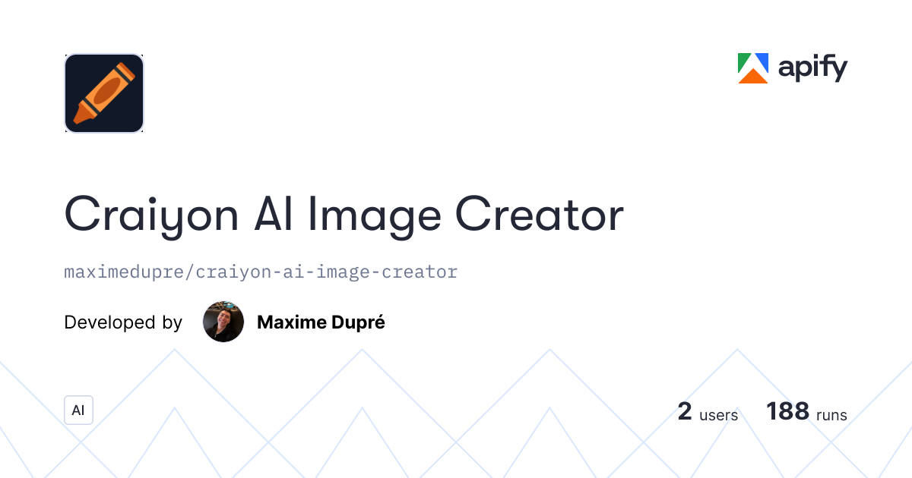

---

## 26. [Daisy](https://www.producthunt.com/products/daisy-4)
**Votes**: 5 | **도입 난이도**: 하 | **신뢰도**: 상
**Tagline**: Record, transcribe, summarise — nothing leaves your Mac
**서비스 링크**: https://www.producthunt.com/r/WQKPJY6PLI3BBK

**태그**: Productivity, OpenSource, Privacy, Mac, AI, AI Tool

### 📌 이 서비스 한눈에 보기
개인정보 유출 걱정 없이 Mac에서 로컬로 회의를 기록하고 요약하는 오픈소스 도구

### 🔑 주요 기능
- 클라우드 없이 Mac 로컬 환경에서 작동하는 보안 중심의 회의 기록 및 전사 도구
- Whisper를 활용한 온디바이스 전사와 사용자 선택형 AI(Anthropic, OpenAI 등) 요약 기능
- MCP 서버를 통한 Claude/Cursor 연동 및 모든 앱에서 사용 가능한 푸시 투 토크(Push-to-talk) 기능

### 🙋 사용자에게 어떤 점이 좋은가
회의 내용이 외부 서버로 전송되지 않아 보안이 중요한 업무에 적합하며, 별도의 계정 생성이나 구독 없이 즉시 사용할 수 있습니다.

### ✅ 지금 바로 써볼 기능
- Mac 시스템 오디오와 마이크 동시 녹음 테스트
- Whisper를 이용한 로컬 전사 속도 및 정확도 확인
- MCP 서버를 통한 AI 에이전트(Claude, Cursor) 연동 테스트

### ⚠️ 사용 전 확인할 점
- Mac 전용 소프트웨어로 타 OS 사용 불가
- 로컬 리소스(CPU/GPU) 사용량에 따른 시스템 성능 영향 가능성

### 🧭 확인이 더 필요한 정보
사용자가 선택하는 AI 모델(Anthropic, OpenAI 등) 사용 시 해당 API 비용은 사용자 별도 부담인지 확인이 필요합니다.

### 📸 스크린샷 및 갤러리
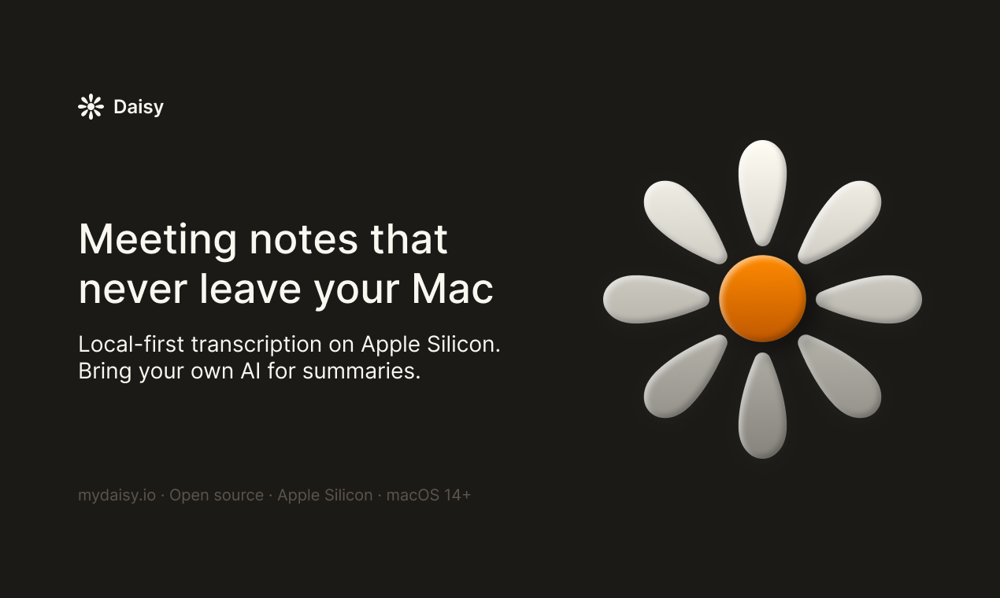

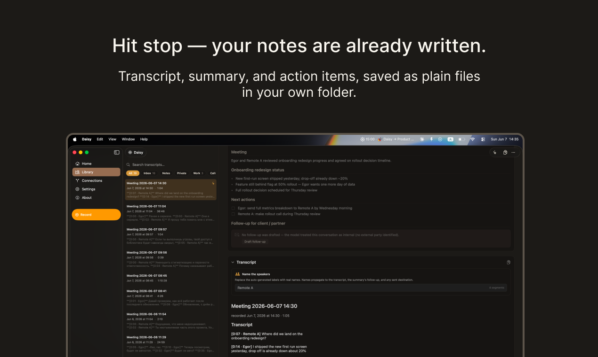

---

## 27. [TimezoneBuddy](https://www.producthunt.com/products/timezonebuddy)
**Votes**: 4 | **도입 난이도**: 하 | **신뢰도**: 상
**Tagline**: Free no-login timezone scheduler with heatmap
**서비스 링크**: https://www.producthunt.com/r/BIOZTO5ABXM7KV

**태그**: Productivity, RemoteWork, Scheduling, AI Tool

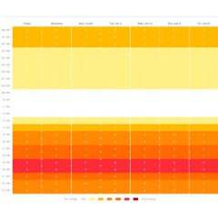

### 📌 이 서비스 한눈에 보기
로그인 없이 즉시 사용 가능한 히트맵 기반 글로벌 미팅 시간 조율 도구

### 🔑 주요 기능
- 별도의 가입이나 로그인 없이 즉시 사용 가능
- 시각적인 히트맵을 통한 시간대 중첩 확인
- 공유 링크와 투표 기능을 통한 간편한 일정 조율

### 🙋 사용자에게 어떤 점이 좋은가
글로벌 협업 시 서로 다른 시간대를 일일이 계산할 필요 없이, 최적의 미팅 시간을 직관적으로 찾고 공유할 수 있습니다.

### ✅ 지금 바로 써볼 기능
- 참여할 도시/시간대 추가하기
- 히트맵을 통한 최적 시간대 확인
- 생성된 공유 링크로 팀원에게 전달하기

### ⚠️ 사용 전 확인할 점
- 로그인 기능이 없으므로 브라우저 종료 시 데이터 유지 여부 확인 필요
- 광고는 없으나 서비스의 영속성 확인 필요

### 🧭 확인이 더 필요한 정보
로그인 없이 데이터가 어떻게 저장되고 관리되는지에 대한 구체적인 정보가 부족합니다.

### 📸 스크린샷 및 갤러리
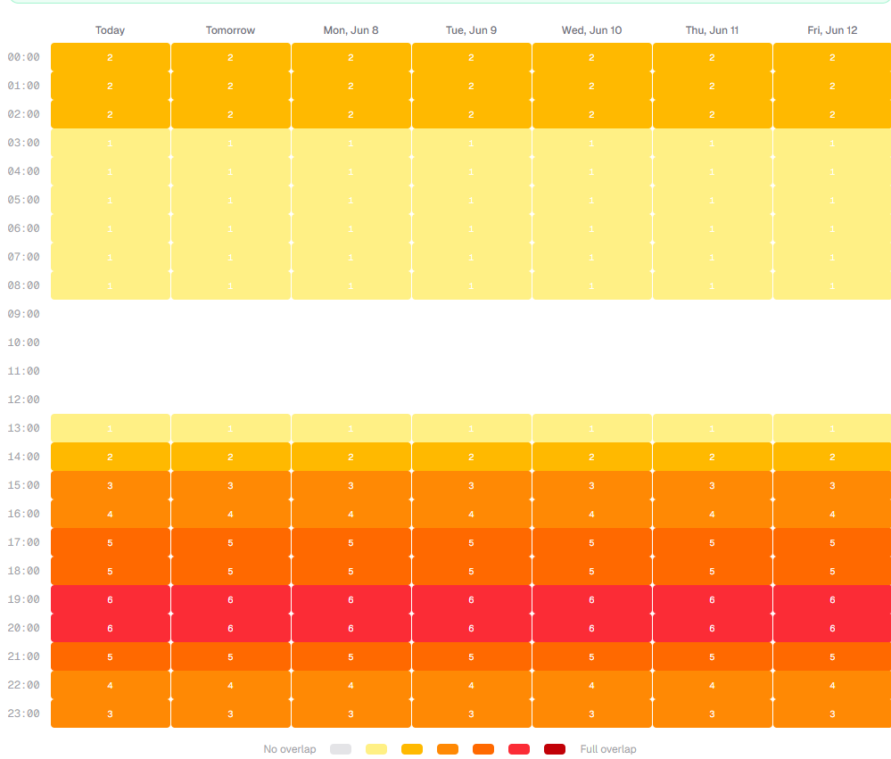
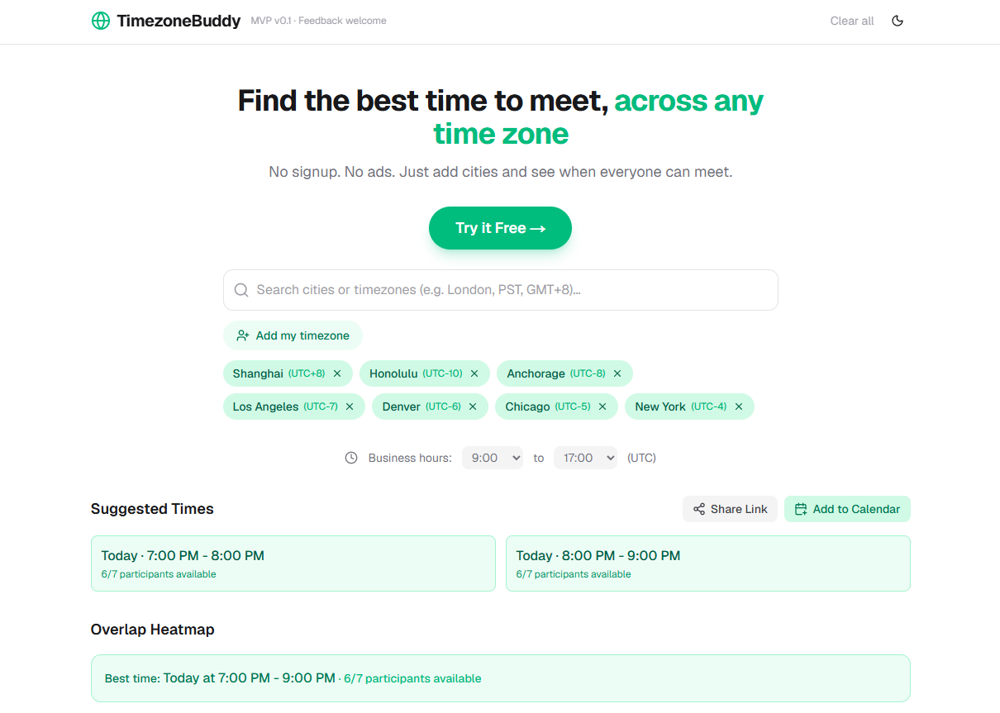
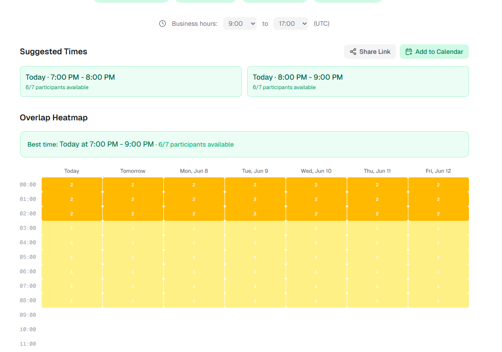

---

## 28. [Metrifyr](https://www.producthunt.com/products/metrifyr)
**Votes**: 4 | **도입 난이도**: 하 | **신뢰도**: 상
**Tagline**: Run your SEO and analytics from one AI prompt
**서비스 링크**: https://www.producthunt.com/r/GPDDGPSRCO4LPK

**태그**: AI, SEO, MarketingAutomation, DataAnalytics, MCP, AI Tool, Chat, Prompting, Analytics, Marketing

### 📌 이 서비스 한눈에 보기
AI 프롬프트 하나로 구글 마케팅 데이터 분석과 SEO를 자동화하는 MCP 서버

### 🔑 주요 기능
- GA4, Search Console 등 구글 마케팅 스택과 AI 어시스턴트(Claude, Cursor, ChatGPT) 간의 직접 연결
- SEO 감사, 키워드 리서치, 트래픽 분석 등 69가지 전문 도구 제공
- 2분 내외의 빠른 설정이 가능한 MCP 서버 기반 솔루션

### 🙋 사용자에게 어떤 점이 좋은가
복잡한 데이터 대시보드를 일일이 확인할 필요 없이, AI 채팅창에서 자연어로 즉시 마케팅 인사이트를 얻고 SEO 작업을 수행할 수 있습니다.

### ✅ 지금 바로 써볼 기능
- Claude나 Cursor에 MCP 서버로 연결하여 데이터 연동하기
- AI 프롬프트를 활용한 SEO 감사 및 키워드 리서치 실행하기
- 구글 서치 콘솔 데이터를 기반으로 한 트래픽 분석 요청하기

### ⚠️ 사용 전 확인할 점
- AI 어시스턴트의 MCP 기능 활용 능력에 따라 분석 품질이 달라질 수 있음
- 구글 계정 권한 연결 시 데이터 보안 및 접근 범위 확인 필요

### 🧭 확인이 더 필요한 정보
69가지 도구의 구체적인 기능 목록과 AI 모델별 최적화 수준에 대한 상세 정보가 필요합니다.

### 📸 스크린샷 및 갤러리
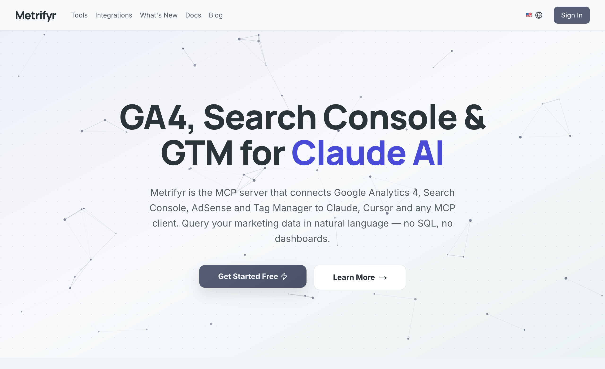

### 🎬 관련 영상
- [🎥 영상 보기](https://ph-files.imgix.net/7062ae9f-d949-4877-9496-45edbe636dcd.jpeg?auto=format)

---

## 29. [DLEncoder](https://www.producthunt.com/products/dlencoder)
**Votes**: 4 | **도입 난이도**: 하 | **신뢰도**: 상
**Tagline**: AAMVA PDF417 test barcodes, in your browser
**서비스 링크**: https://www.producthunt.com/r/GMP7F7QBW6PNEN

**태그**: DevTool, QA, Security, Testing

### 📌 이 서비스 한눈에 보기
별도 가입 없이 브라우저에서 즉시 생성 및 검증 가능한 AAMVA 표준 PDF417 바코드 테스트 도구

### 🔑 주요 기능
- 미국 운전면허증 표준인 AAMVA v10 및 v11(2025 CDS) 규격 완벽 지원
- 데이터 업로드 없는 브라우저 기반 로컬 실행으로 보안 및 개인정보 보호 강화
- 바코드 생성뿐만 아니라 실제 스캔 데이터의 오류(Preamble, CRLF 등) 진단 기능 제공

### 🙋 사용자에게 어떤 점이 좋은가
ID 스캔 관련 엔지니어링 및 QA 과정에서 복잡한 설정 없이 규격에 맞는 테스트 바코드를 즉시 생성하고 검증할 수 있습니다.

### ✅ 지금 바로 써볼 기능
- 최신 v11(2025 CDS) 표준 규격 생성 테스트
- 특정 주(Jurisdiction)별 서브파일 필드 커스텀 설정
- 실제 스캔 데이터 업로드 없이 브라우저 내 디코딩 및 오류 진단

### ⚠️ 사용 전 확인할 점
- 테스트용 도구이므로 실제 신분증 위조 등 불법적인 용도로 사용 시 법적 책임 발생 가능
- 브라우저 기반이므로 매우 복잡한 대량 배치 작업에는 제한이 있을 수 있음

### 🧭 확인이 더 필요한 정보
사용자의 로컬 환경에 따라 브라우저 호환성이나 성능 차이가 있을 수 있습니다.

### 📸 스크린샷 및 갤러리
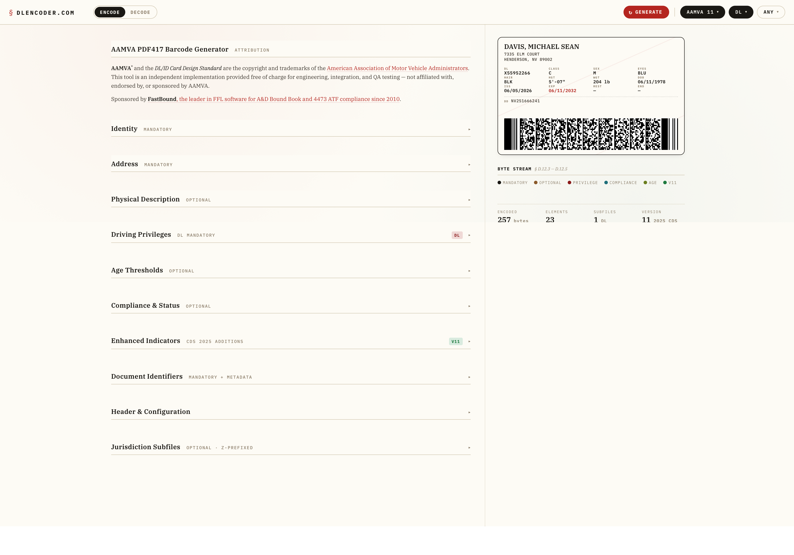

---

## 30. [KaamSet](https://www.producthunt.com/products/kaamset)
**Votes**: 4 | **도입 난이도**: 하 | **신뢰도**: 상
**Tagline**: KaamSet – AI Study Tools, PDF Chat, Flashcards & Productivit
**서비스 링크**: https://www.producthunt.com/r/OLZLOREHMFVGRL

**태그**: AI, Productivity, EdTech, StudentTools, AI Tool, Chat

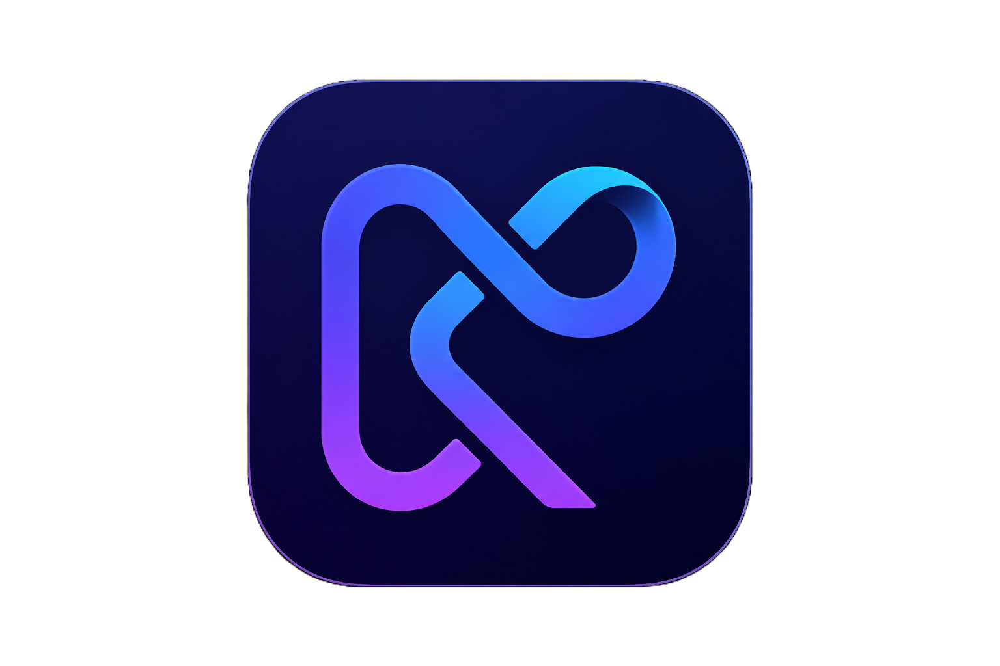

### 📌 이 서비스 한눈에 보기
학습과 생산성을 위한 AI 기반 올인원 워크스페이스

### 🔑 주요 기능
- PDF 채팅 및 문서 분석 기능
- 효율적인 학습을 위한 플래시카드 생성
- 학생 및 크리에이터를 위한 통합 생산성 도구

### 🙋 사용자에게 어떤 점이 좋은가
학습 자료 정리와 문서 분석을 한 곳에서 해결하여 공부와 작업 시간을 단축할 수 있습니다.

### ✅ 지금 바로 써볼 기능
- PDF 파일 업로드 후 AI와 대화하기
- 학습 내용을 바탕으로 플래시카드 생성하기
- 통합된 생산성 도구 환경 경험하기

### ⚠️ 사용 전 확인할 점
- 제공되는 기능의 구체적인 사용량 제한 확인 필요
- 문서 보안 및 데이터 프라이버시 정책 검토 필요

### 🧭 확인이 더 필요한 정보
상세한 기능별 유료 플랜 및 사용량 제한에 대한 정보가 명시되지 않았습니다.

### 📸 스크린샷 및 갤러리
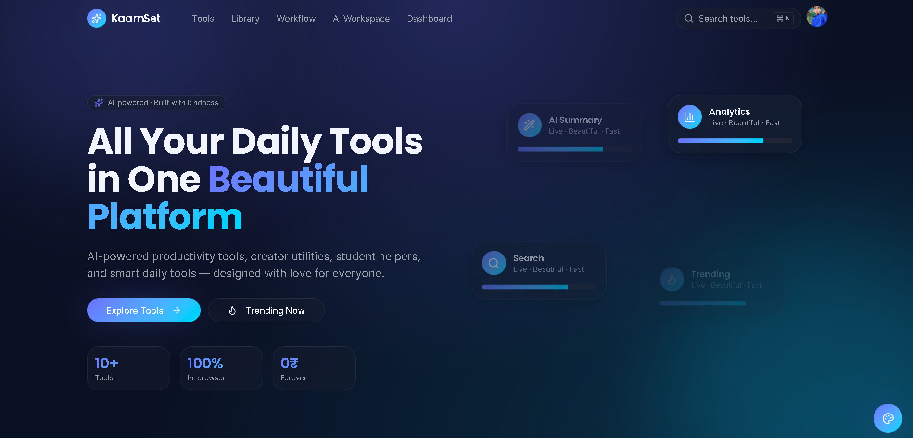

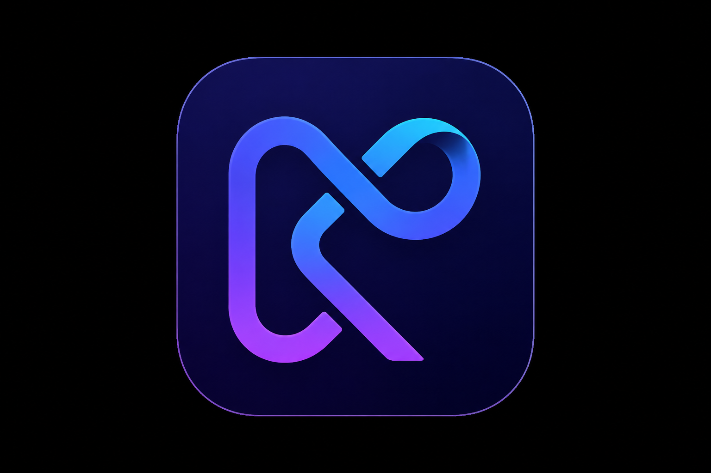

---

