# 🚀 Product Hunt Daily Top 30 (2026-06-09)

## 오늘의 요약
오늘의 제품들은 AI를 활용한 자동화와 콘텐츠 생성, 그리고 특정 환경에 최적화된 네이티브 도구들이 주를 이루었습니다. 특히 기업 교육, 웹 자동화, 영상 더빙 등 실무의 번거로움을 해결하는 실용적인 AI 솔루션들이 높은 관심을 받았습니다.

### 오늘의 핵심 포인트
- AI를 활용해 지식 교육, 웹 자동화, 다국어 더빙 등 복잡한 수동 작업을 자동화하는 솔루션이 주목받았습니다.
- 클라우드나 브라우저의 제약을 벗어나 로컬 환경에서 즉시 실행하거나 관리하는 네이티브 및 로컬 우선 도구들이 등장했습니다.
- 레트로 감성의 OS/영상 효과부터 반려동물 기록까지, 기술적 편의성과 감성적 가치를 동시에 제공하는 서비스들이 눈에 띄었습니다.

**오늘의 태그**: AI자동화, 생산성도구, 콘텐츠제작, 로컬네이티브, 디지털저널

## 1. [Honen](https://www.producthunt.com/products/honen)
**Votes**: 304 | **도입 난이도**: 하 | **신뢰도**: 상
**Tagline**: Automated teaching + learning infrastructure for any company
**서비스 링크**: https://www.producthunt.com/r/KGWER5KAKVLXHX

**태그**: AI, EdTech, Automation, L&D, SaaS, AI Tool

### 📌 이 서비스 한눈에 보기
기업 내 지식을 실시간 AI 교육 코스로 자동 변환하는 학습 인프라

### 🔑 주요 기능
- 팀의 지식을 몇 초 만에 대화형 AI 코스로 자동 생성
- 문서나 프로세스 변경 시 코스 내용이 자동으로 업데이트
- 적응형 레슨, 시뮬레이션 및 학습자 인사이트 제공

### 🙋 사용자에게 어떤 점이 좋은가
회사의 변화하는 업무 프로세스를 매번 수동으로 교육 자료를 만들 필요 없이, 최신 상태의 교육 콘텐츠를 유지할 수 있습니다.

### ✅ 지금 바로 써볼 기능
- 기존 업무 문서 업로드하여 코스 생성 테스트
- AI 기반 시뮬레이션 기능 체험
- 학습자 데이터 대시보드 확인

### ⚠️ 사용 전 확인할 점
- 자동 업데이트 시 기존 교육 내용의 맥락이 정확히 유지되는지 검토 필요
- 기업 내부 보안 정책에 따른 문서 업로드 적합성 확인

### 🧭 확인이 더 필요한 정보
현재 지원하는 문서 형식(PDF, Notion, Slack 등)과 외부 툴과의 연동 범위에 대한 구체적인 정보가 필요합니다.

### 📸 스크린샷 및 갤러리
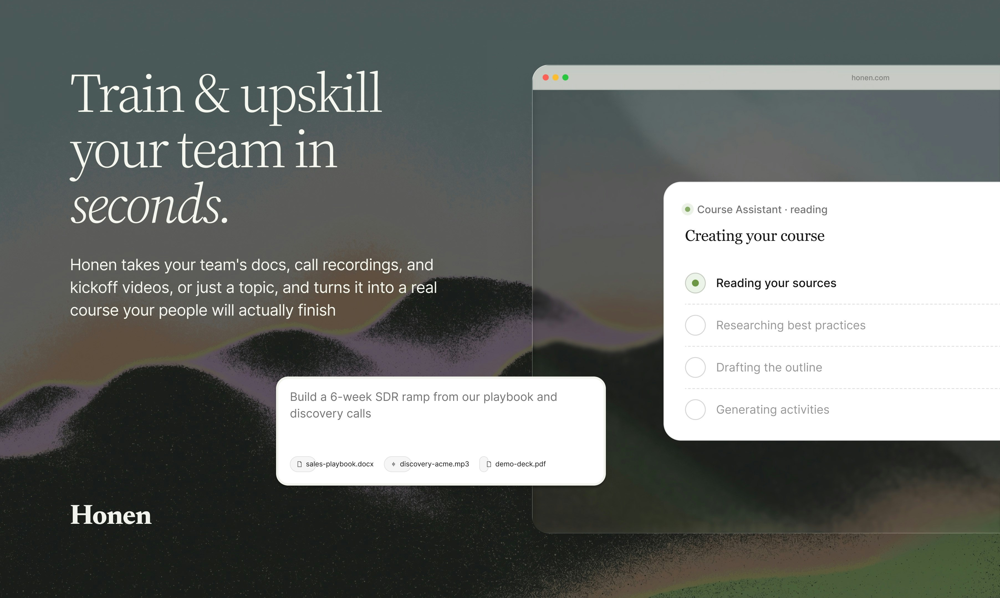
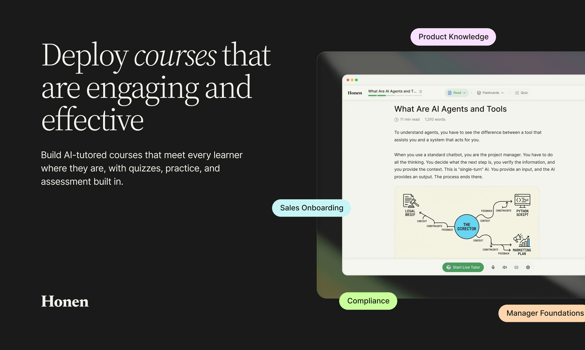
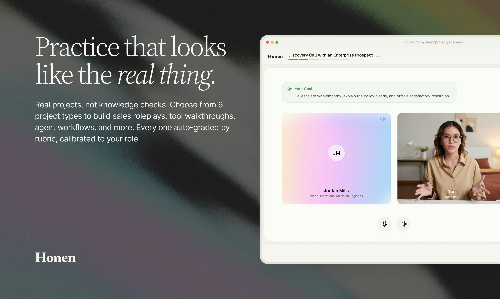

### 🎬 관련 영상
- [🎥 영상 보기](https://ph-files.imgix.net/5e2bceb0-5f65-40fd-a1eb-7d924e7e23d4.jpeg?auto=format)

---

## 2. [Browse.sh](https://www.producthunt.com/products/browserbase)
**Votes**: 290 | **도입 난이도**: 중 | **신뢰도**: 상
**Tagline**: Give your agents muscle memory for automating the web
**서비스 링크**: https://www.producthunt.com/r/INE5ILTLAZIF32

**태그**: Automation, AI-Agent, DevTool, Web-Automation, Agent, AI Tool

### 📌 이 서비스 한눈에 보기
AI 에이전트를 위한 웹 자동화 스킬 카탈로그 및 실행 도구

### 🔑 주요 기능
- 다양한 웹사이트를 위한 재사용 가능한 SKILL.md 레시피 제공
- AI 에이전트가 웹 작업을 수행할 수 있도록 학습시키는 자동화 스킬 저장소
- browse CLI를 통한 간편한 스킬 설치 및 실행

### 🙋 사용자에게 어떤 점이 좋은가
복잡한 웹 자동화 코드를 직접 짤 필요 없이, 이미 만들어진 스킬을 가져와 AI 에이전트의 업무 능력을 즉시 확장할 수 있습니다.

### ✅ 지금 바로 써볼 기능
- SKILL.md 레시피 카탈로그 탐색하기
- browse CLI 설치 및 환경 설정하기
- 필요한 자동화 스킬을 찾아 에이전트에 적용하기

### ⚠️ 사용 전 확인할 점
- CLI 환경 및 에이전트 연동을 위한 기본적인 기술 이해도 필요
- 제공되는 스킬의 품질이나 웹사이트 구조 변경에 따른 안정성 확인 필요

### 🧭 확인이 더 필요한 정보
지원하는 AI 에이전트 프레임워크의 종류와 구체적인 호환 범위에 대한 정보가 더 필요합니다.

### 📸 스크린샷 및 갤러리
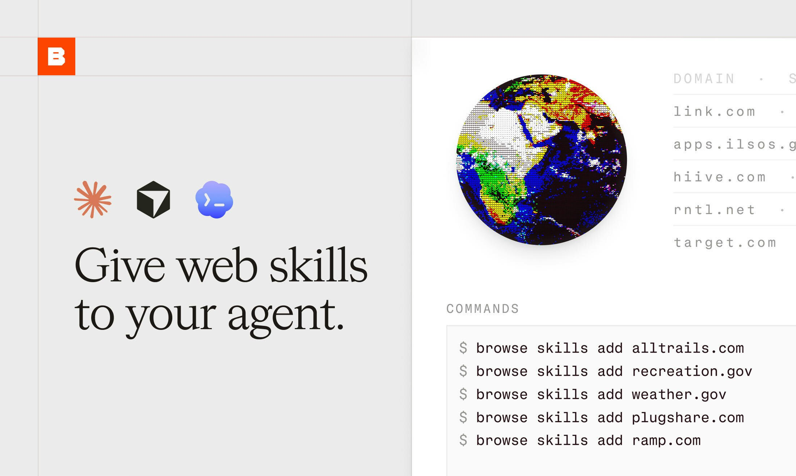
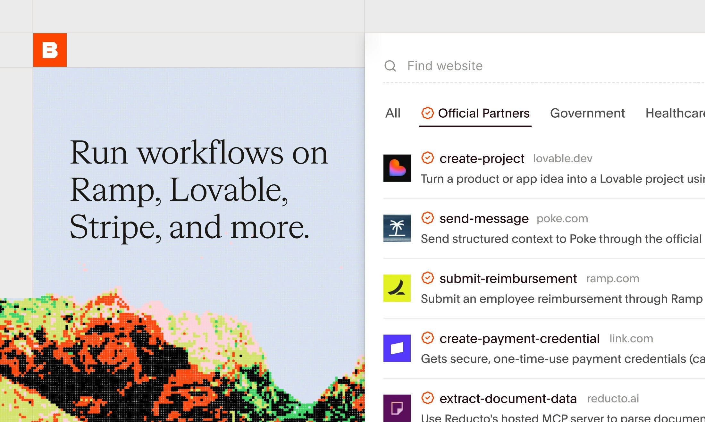
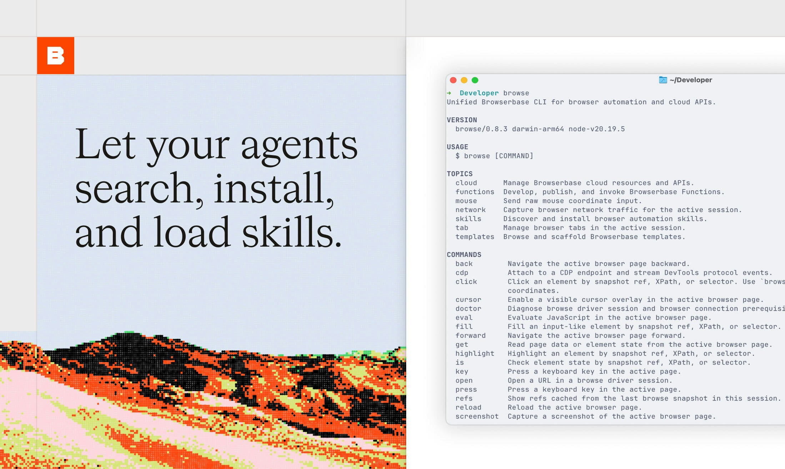

### 🎬 관련 영상
- [🎥 영상 보기](https://ph-files.imgix.net/edcdd1e0-ba49-4a33-a642-9c0cf03f1a7b.jpeg?auto=format)

---

## 3. [Vaani](https://www.producthunt.com/products/vaani-2)
**Votes**: 237 | **도입 난이도**: 하 | **신뢰도**: 상
**Tagline**: Lip-synced AI dubbing for creators, brands and studios
**서비스 링크**: https://www.producthunt.com/r/PYMO5672CRDMQX

**태그**: AI Video, Dubbing, Content Creation, Localization, AI Tool, Video

### 📌 이 서비스 한눈에 보기
원래 목소리를 유지하며 정교한 입모양 싱크를 제공하는 다국어 AI 더빙 솔루션

### 🔑 주요 기능
- 사용자의 목소리를 그대로 복제하는 보이스 클로닝 기술
- 40개 이상의 언어로 동시 더빙 및 의미 보존
- 프레임 단위의 정교한 립싱크와 배경 음악 유지 기능

### 🙋 사용자에게 어떤 점이 좋은가
기존 AI 더빙의 이질적인 목소리와 어색한 입모양 문제를 해결하여, 전문 스튜디오 수준의 다국어 콘텐츠를 저비용으로 빠르게 제작할 수 있습니다.

### ✅ 지금 바로 써볼 기능
- 자신의 목소리로 다국어 더빙 테스트하기
- 영상 내 배경 음악과 목소리 분리/유지 기능 확인하기
- 언어별 립싱크 정확도 검증하기

### ⚠️ 사용 전 확인할 점
- 복잡한 배경음이나 다중 화자가 포함된 영상에서의 품질 차이 확인 필요
- 언어별로 립싱크 정밀도가 다를 수 있음

### 🧭 확인이 더 필요한 정보
구체적인 영상 길이 제한이나 동시 처리 가능한 작업량에 대한 정보가 명시되지 않았습니다.

### 📸 스크린샷 및 갤러리

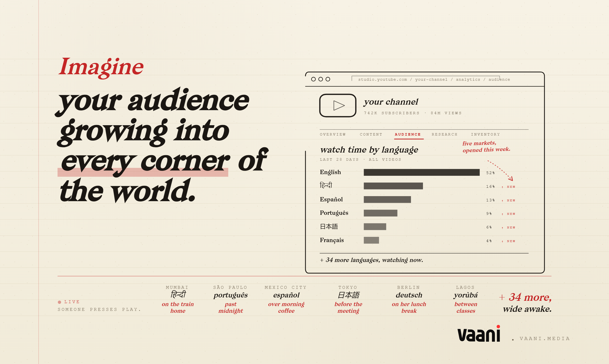
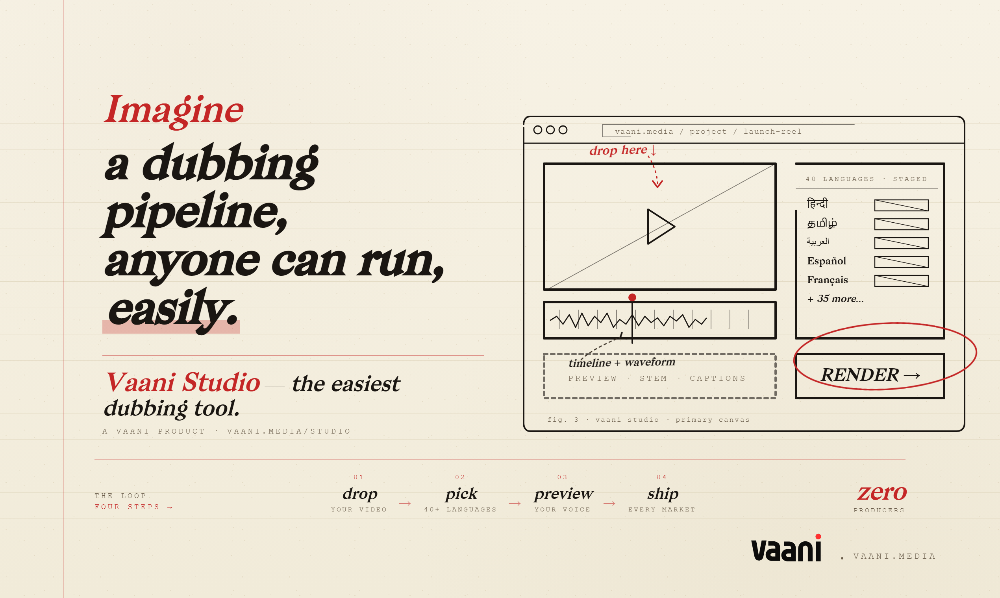

### 🎬 관련 영상
- [🎥 영상 보기](https://ph-files.imgix.net/1861a629-fa96-4002-88e4-67c434b951a1.jpeg?auto=format)

---

## 4. [Supaste](https://www.producthunt.com/products/supaste)
**Votes**: 220 | **도입 난이도**: 하 | **신뢰도**: 상
**Tagline**: Clipboard Manager for macOS
**서비스 링크**: https://www.producthunt.com/r/OUDBSD6IBWNFYL

**태그**: Productivity, macOS, Utility, DeveloperTool, Vision, DevTool

### 📌 이 서비스 한눈에 보기
복사한 모든 기록을 아름답게 관리하는 macOS 전용 로컬 우선 클립보드 매니저

### 🔑 주요 기능
- 텍스트, 링크, 이미지, 파일, 코드, 컬러 등 다양한 형식 지원
- 검색 가능한 타임라인 형태의 직관적인 히스토리 관리
- 데이터 보안을 고려한 로컬 우선(Local-first) 방식

### 🙋 사용자에게 어떤 점이 좋은가
자주 사용하는 코드 조각이나 스크린샷을 놓치지 않고 빠르게 찾아 쓸 수 있어 작업 흐름이 끊기지 않습니다.

### ✅ 지금 바로 써볼 기능
- 기존 클립보드 기록과 비교하며 타임라인 인터페이스 확인하기
- 코드 및 컬러 값 저장 기능 테스트하기
- 스크린샷 히스토리 관리 기능 사용해보기

### ⚠️ 사용 전 확인할 점
- 로컬 저장 방식이므로 기기 변경 시 데이터 이전 방식 확인 필요
- macOS 전용 앱이므로 타 OS 사용자는 사용 불가

### 🧭 확인이 더 필요한 정보
데이터 동기화 기능 및 유료 플랜 여부에 대한 정보가 명시되지 않았습니다.

### 📸 스크린샷 및 갤러리

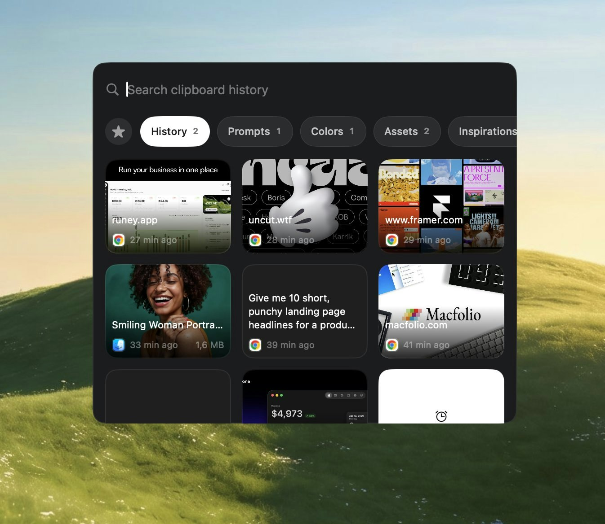

### 🎬 관련 영상
- [🎥 영상 보기](https://ph-files.imgix.net/16fda144-4285-4eb7-bc4c-3625d510f6b5.jpeg?auto=format)

---

## 5. [The Virtual OS Museum](https://www.producthunt.com/products/the-virtual-os-museum)
**Votes**: 164 | **도입 난이도**: 중 | **신뢰도**: 상
**Tagline**: Relive vintage operating systems right on your desktop
**서비스 링크**: https://www.producthunt.com/r/MIBXX2H7FRROOC

**태그**: RetroComputing, Virtualization, OS, Linux

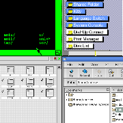

### 📌 이 서비스 한눈에 보기
1948년부터 현재까지 1,700개 이상의 빈티지 OS를 데스크톱에서 즉시 실행할 수 있는 가상 OS 박물관

### 🔑 주요 기능
- 1,700개 이상의 방대한 역사적 운영체제 사전 설치
- 단일 Linux VM 내에서 구동되는 통합 환경
- QEMU, VirtualBox, UTM 등 주요 가상화 도구 번들 제공

### 🙋 사용자에게 어떤 점이 좋은가
복잡한 가상화 설정 없이 클릭 한 번으로 과거의 운영체제들을 현대의 데스크톱에서 생생하게 경험할 수 있습니다.

### ✅ 지금 바로 써볼 기능
- 원클릭 런처를 통한 OS 실행 테스트
- 사용 중인 하드웨어에서의 가상화 성능 확인
- 시대별 OS 변화 과정 탐색

### ⚠️ 사용 전 확인할 점
- 방대한 OS 데이터로 인한 높은 디스크 용량 요구 가능성
- 가상화 소프트웨어 번들로 인한 시스템 리소스 점유

### 🧭 확인이 더 필요한 정보
사용자의 하드웨어 사양에 따른 가상 머신 구동 성능 및 설치 용량에 대한 구체적인 정보가 필요합니다.

### 📸 스크린샷 및 갤러리
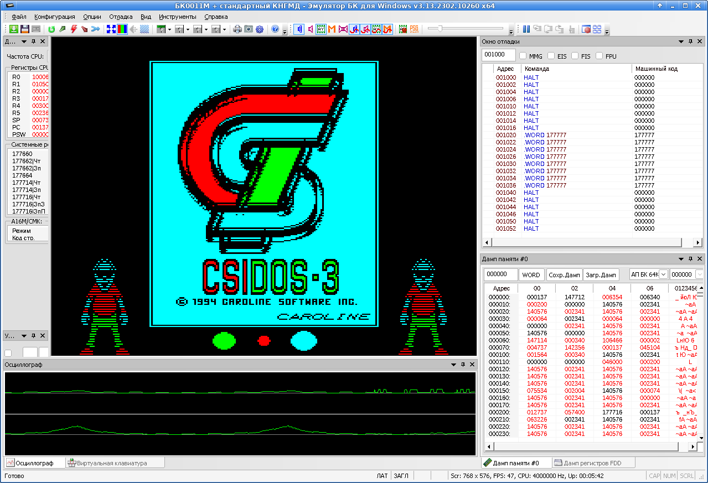
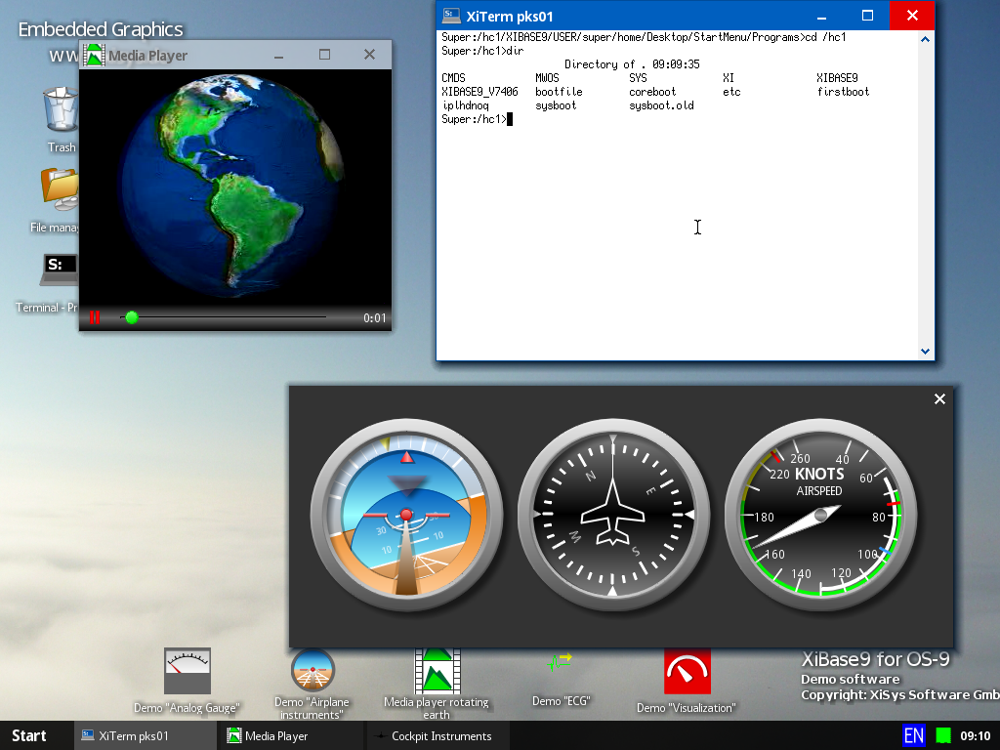
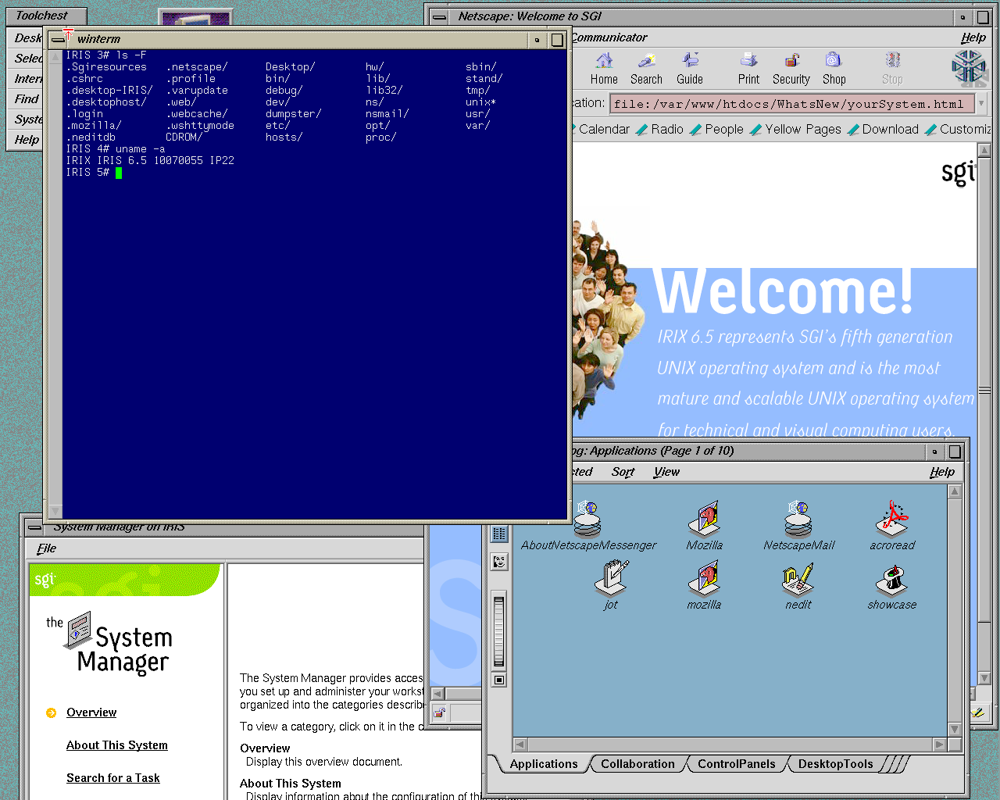

### 🎬 관련 영상
- [🎥 영상 보기](https://ph-files.imgix.net/28075076-dc1c-4c73-bec8-b25c581800d9.jpeg?auto=format)

---

## 6. [Tamadoggo](https://www.producthunt.com/products/tamadoggo)
**Votes**: 157 | **도입 난이도**: 하 | **신뢰도**: 상
**Tagline**: A living journal for your pet's life, with AI insights
**서비스 링크**: https://www.producthunt.com/r/B6X2J7ZBCZZCG7

**태그**: PetTech, AI, Journaling, Life-Logging, AI Tool

### 📌 이 서비스 한눈에 보기
반려동물의 소중한 순간을 기록하고 AI로 삶의 패턴을 발견하는 따뜻한 디지털 저널

### 🔑 주요 기능
- 단순 기록을 넘어 반려동물의 생애를 담는 일러스트 기반의 'Crib' 공간 제공
- 수의사 진단서(사진/PDF)를 자동으로 기록해주는 스마트 스캔 기능
- 강요하지 않는 부드러운 AI가 제공하는 맞춤형 패턴 분석 및 월간 레터

### 🙋 사용자에게 어떤 점이 좋은가
단순한 건강 관리를 넘어 반려동물의 성장 과정을 감성적으로 기록하고, AI를 통해 복잡한 서류 작업 없이 간편하게 기록을 관리할 수 있습니다.

### ✅ 지금 바로 써볼 기능
- 반려동물별 전용 공간인 'Crib' 설정하기
- 기존 수의사 진단서 스캔하여 자동 기록 기능 테스트하기
- AI가 생성하는 월간 레터 확인하기

### ⚠️ 사용 전 확인할 점
- AI의 제안은 의학적 진단이 아니므로 전문적인 수의사 상담을 대체할 수 없음
- AI 핵심 기능은 PRO 유료 플랜에서 제공됨

### 🧭 확인이 더 필요한 정보
AI 기능의 구체적인 분석 범위와 유료 플랜의 상세 기능 차이가 명시되지 않았습니다.

### 📸 스크린샷 및 갤러리

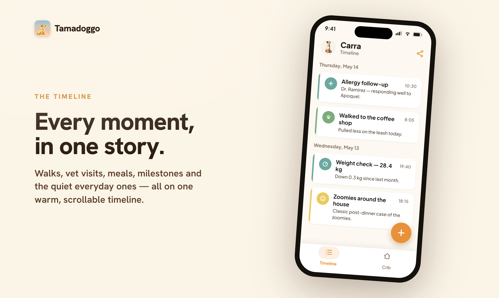

### 🎬 관련 영상
- [🎥 영상 보기](https://ph-files.imgix.net/b0afd50a-af7b-47e2-ae0a-a6e42d4e9201.jpeg?auto=format)

---

## 7. [Claude Artifact Player](https://www.producthunt.com/products/claude-artifact-player)
**Votes**: 138 | **도입 난이도**: 하 | **신뢰도**: 상
**Tagline**: Run your Claude AI artifacts natively, No browser. No cloud.
**서비스 링크**: https://www.producthunt.com/r/HDUUY4RDTVMFZ4

**태그**: DevTool, Productivity, Mac, Claude, AI Tool

### 📌 이 서비스 한눈에 보기
브라우저 없이 Mac에서 Claude Artifact를 즉시 실행하는 네이티브 플레이어

### 🔑 주요 기능
- Claude가 생성한 HTML, React, TypeScript 파일을 로컬에서 직접 실행
- 브라우저나 클라우드 업로드 없이 Mac 네이티브 환경에서 구동
- 오프라인 상태에서도 즉각적인 플레이백 지원

### 🙋 사용자에게 어떤 점이 좋은가
Claude로 만든 인터랙티브 결과물을 별도의 웹 브라우저를 열거나 파일을 다시 업로드하는 번거로움 없이 데스크톱 앱처럼 빠르게 확인할 수 있습니다.

### ✅ 지금 바로 써볼 기능
- Claude에서 생성한 React/TSX 파일 가져오기
- 로컬 환경에서의 즉각적인 UI/UX 확인
- 오프라인 상태에서 Artifact 결과물 검토

### ⚠️ 사용 전 확인할 점
- Mac 전용 환경이므로 다른 OS에서는 사용 불가
- 로컬 실행 시 외부 API 연동이 필요한 코드의 경우 작동이 제한될 수 있음

### 🧭 확인이 더 필요한 정보
Claude 웹 인터페이스와의 실시간 동기화 여부 및 상세 설치 방법은 명시되지 않았습니다.

### 📸 스크린샷 및 갤러리
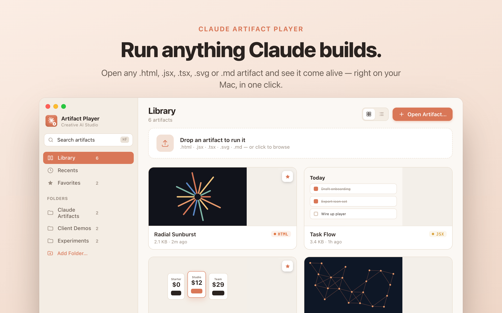
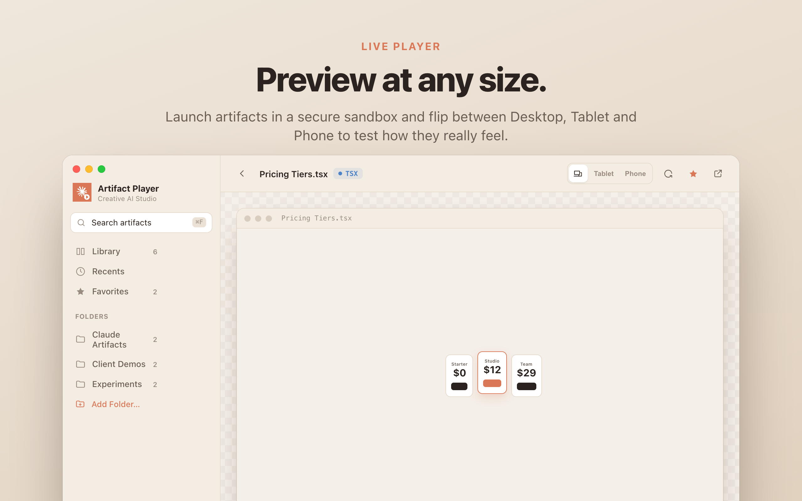
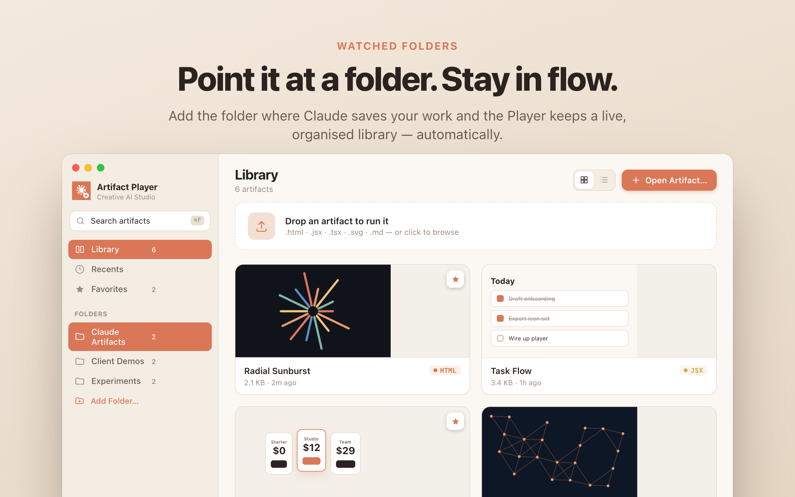

---

## 8. [NTSC-RS](https://www.producthunt.com/products/ntsc-rs)
**Votes**: 135 | **도입 난이도**: 하 | **신뢰도**: 상
**Tagline**: Open-source video emulation of analog TV and VHS artifacts
**서비스 링크**: https://www.producthunt.com/r/RQYYBDC3IALPXU

**태그**: VideoEditing, OpenSource, CreativeTools, RetroEffect, Video

### 📌 이 서비스 한눈에 보기
브라우저부터 전문 영상 편집 툴까지 지원하는 오픈소스 아날로그 TV 및 VHS 효과 도구

### 🔑 주요 기능
- 오픈소스 기반의 무료 VHS 및 아날로그 TV 비디오 효과 제공
- 웹 브라우저, 독립형 앱, 영상 편집 플러그인 등 다양한 환경 지원
- DaVinci Resolve, After Effects 등 전문 편집 소프트웨어와 호환

### 🙋 사용자에게 어떤 점이 좋은가
별도의 복잡한 설정 없이 전문적인 레트로 영상 효과를 웹이나 편집 워크플로우에 즉시 적용할 수 있습니다.

### ✅ 지금 바로 써볼 기능
- 브라우저에서 즉시 효과 테스트하기
- 독립형 애플리케이션 설치하여 사용하기
- DaVinci Resolve 또는 After Effects 플러그인으로 연동하기

### ⚠️ 사용 전 확인할 점
- 플러그인 사용 시 각 편집 소프트웨어 버전과의 호환성 확인 필요
- 오픈소스 프로젝트이므로 업데이트 및 기술 지원 주체 확인 필요

### 🧭 확인이 더 필요한 정보
각 플랫폼별(웹, 앱, 플러그인) 구체적인 설치 방법과 시스템 요구 사양에 대한 정보가 추가로 필요합니다.

### 📸 스크린샷 및 갤러리
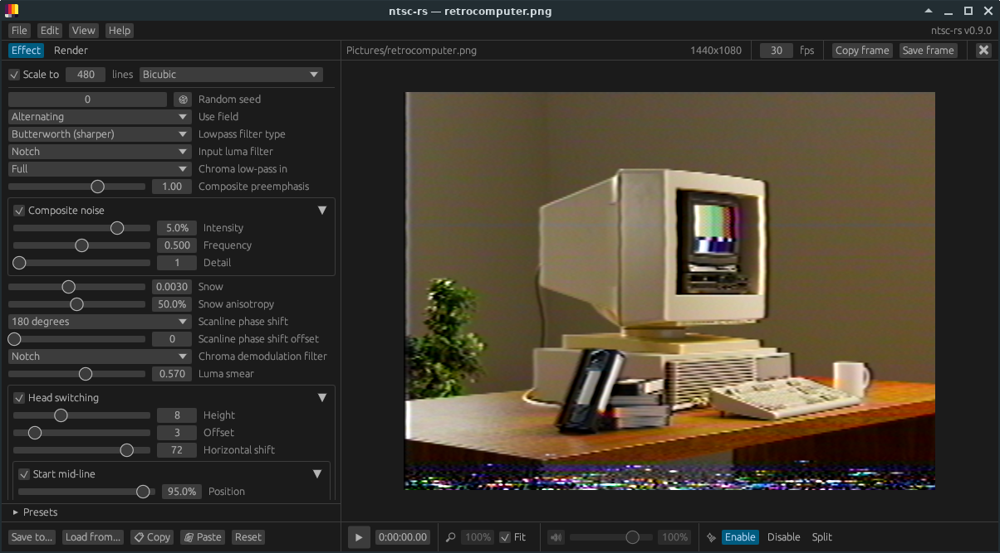
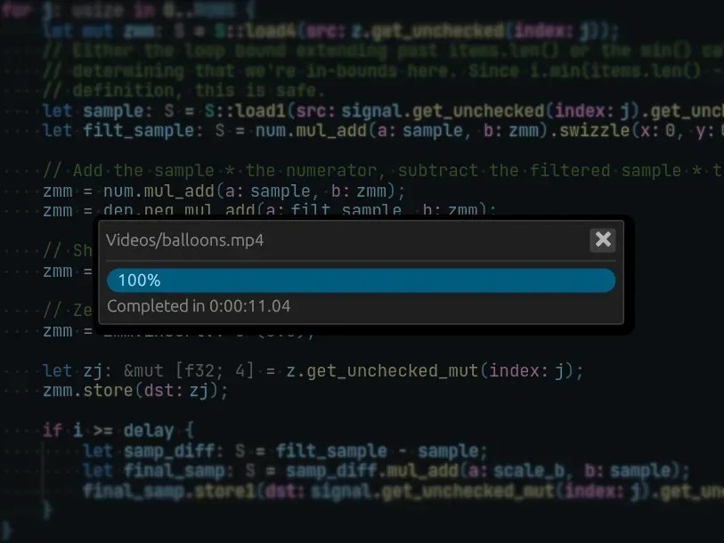

### 🎬 관련 영상
- [🎥 영상 보기](https://ph-files.imgix.net/01430291-5166-4dca-953b-c26a360703e8.jpeg?auto=format)

---

## 9. [Sigma File Manager](https://www.producthunt.com/products/sigma-file-manager)
**Votes**: 116 | **도입 난이도**: 하 | **신뢰도**: 상
**Tagline**: Free, open-source, cross-platform, modern file manager app
**서비스 링크**: https://www.producthunt.com/r/XFCSIE5NJAAMVU

**태그**: File Manager, Open Source, Windows, Linux, Productivity

### 📌 이 서비스 한눈에 보기
윈도우와 리눅스 환경을 위한 현대적이고 가벼운 오픈소스 파일 관리자

### 🔑 주요 기능
- 무료로 제공되는 오픈소스 파일 관리 애플리케이션
- 윈도우 및 리눅스 플랫폼 최적화 지원
- 빠르게 진화하는 현대적인 UI/UX 설계

### 🙋 사용자에게 어떤 점이 좋은가
기존 파일 탐색기의 무거움에서 벗어나 빠르고 현대적인 인터페이스로 파일을 관리할 수 있습니다.

### ✅ 지금 바로 써볼 기능
- 윈도우 또는 리눅스 환경에서 설치 및 실행
- 기존 파일 탐색기와의 인터페이스 차이점 확인
- 소스 코드를 통한 직접 빌드 시도 (Mac 사용자)

### ⚠️ 사용 전 확인할 점
- Mac 사용자의 경우 공식 빌드가 제공되지 않아 직접 빌드 과정이 필요함
- 현재 개발이 진행 중인 단계로 기능 변화가 잦을 수 있음

### 🧭 확인이 더 필요한 정보
Mac 환경에서의 안정성 및 설치 편의성은 사용자가 직접 빌드해야 하므로 확인이 필요합니다.

### 📸 스크린샷 및 갤러리
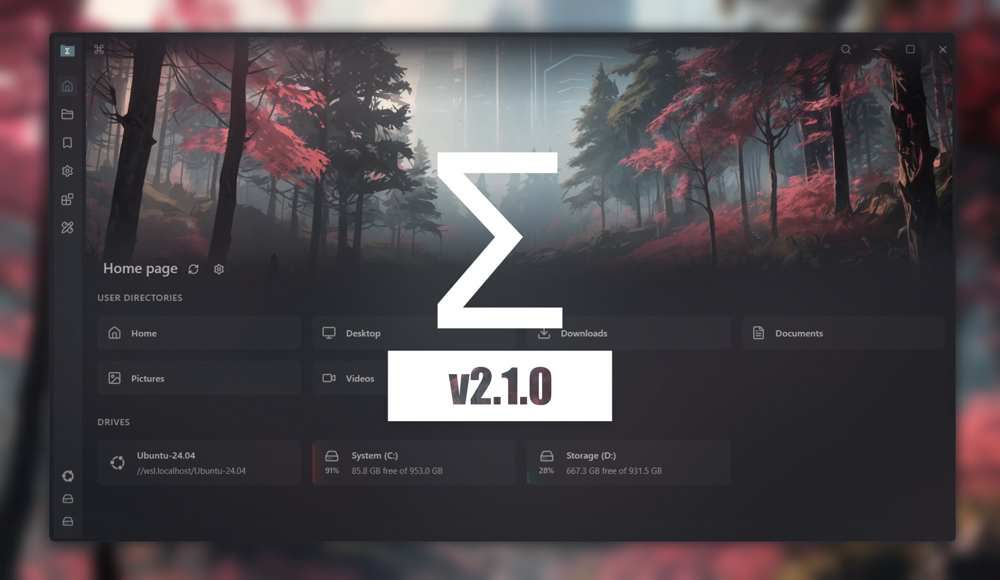
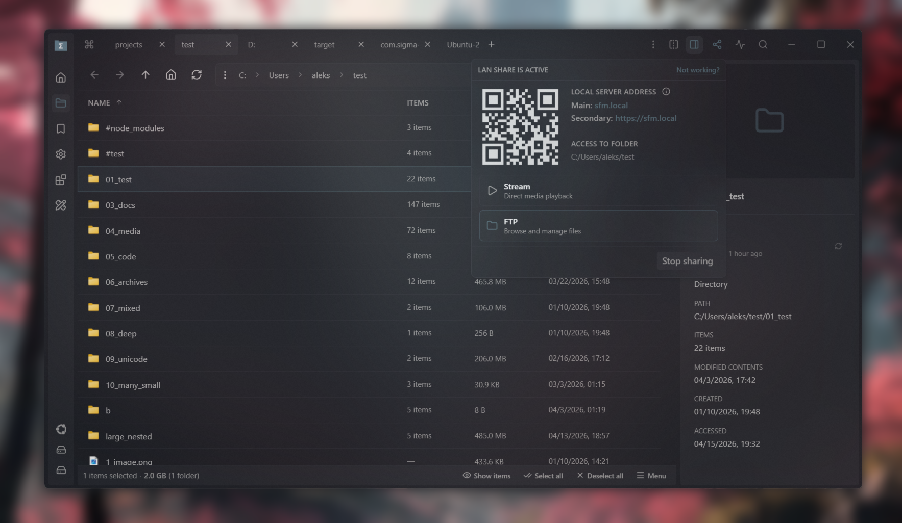
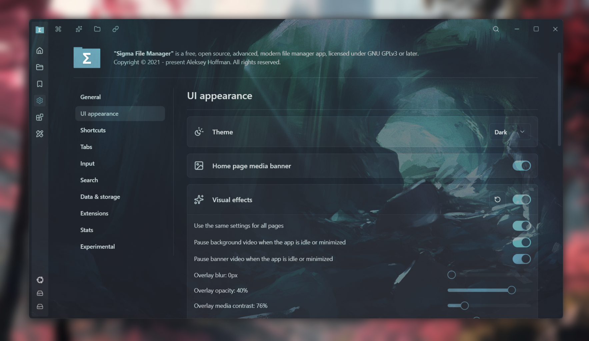

---

## 10. [Slashspace AI](https://www.producthunt.com/products/slashspace-ai)
**Votes**: 60 | **도입 난이도**: 중 | **신뢰도**: 상
**Tagline**: Canvas first AI agent harness. MCP native. Local first.
**서비스 링크**: https://www.producthunt.com/r/JNQC7JLKLXZB3X

**태그**: AI-Agent, Productivity, Canvas-UI, Local-First, MCP, Agent, AI Tool, Chat, Prompting

### 📌 이 서비스 한눈에 보기
여러 AI 에이전트가 하나의 캔버스 위에서 맥락을 공유하며 협업하는 로컬 우선형 AI 워크스페이스

### 🔑 주요 기능
- 채팅창을 넘어선 캔버스 기반의 시각적 AI 작업 환경 제공
- 노드 형태의 멀티 채팅을 통해 에이전트 간 맥락(Context) 공유 가능
- 로컬 파일 저장 방식 및 MCP(Model Context Protocol) 네이티브 지원

### 🙋 사용자에게 어떤 점이 좋은가
단순 복사-붙여넣기 식의 파편화된 작업에서 벗어나, 모든 AI 에이전트가 하나의 작업 맥락을 공유하며 유기적으로 협업할 수 있습니다.

### ✅ 지금 바로 써볼 기능
- 캔버스 내 노드 생성 및 멀티 에이전트 워크플로우 테스트
- 로컬 파일 저장 방식 및 데이터 보안성 확인
- MCP를 활용한 외부 도구 연동 시도

### ⚠️ 사용 전 확인할 점
- 캔버스 방식의 UI가 기존 채팅 방식에 익숙한 사용자에게는 학습 곡선이 될 수 있음
- 로컬 저장 방식에 따른 기기 리소스 사용량 확인 필요

### 🧭 확인이 더 필요한 정보
구체적인 하드웨어 권장 사양 및 지원하는 LLM 모델의 종류가 명시되지 않았습니다.

### 📸 스크린샷 및 갤러리
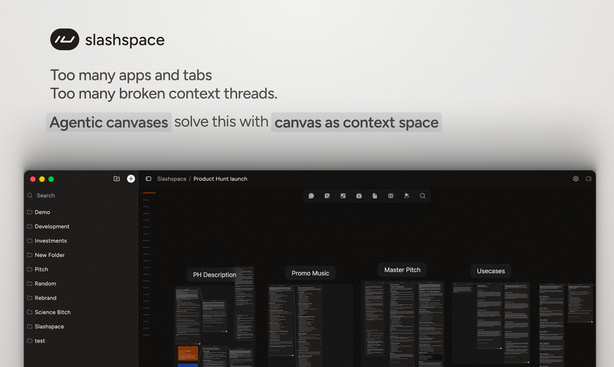
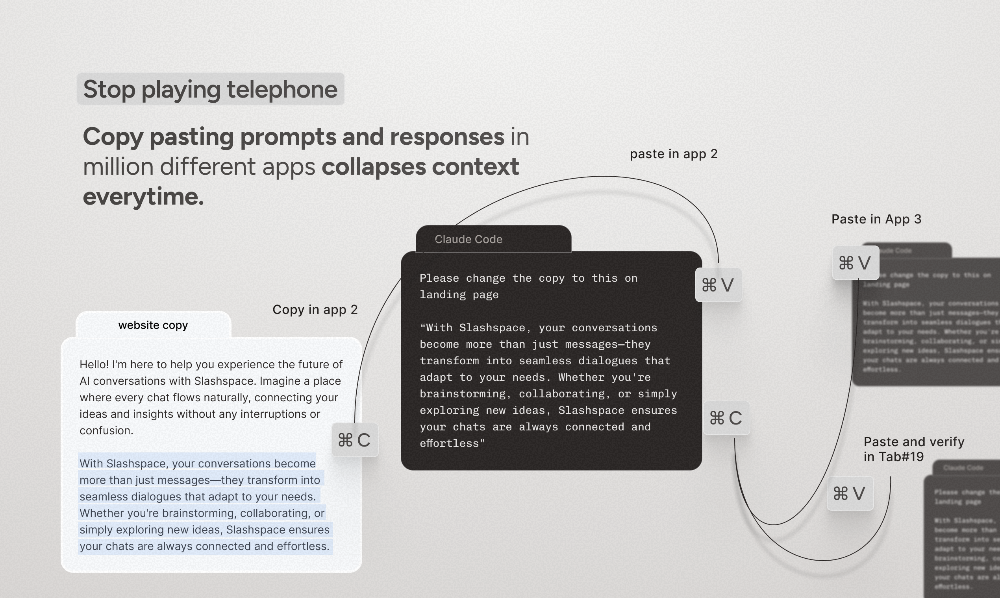
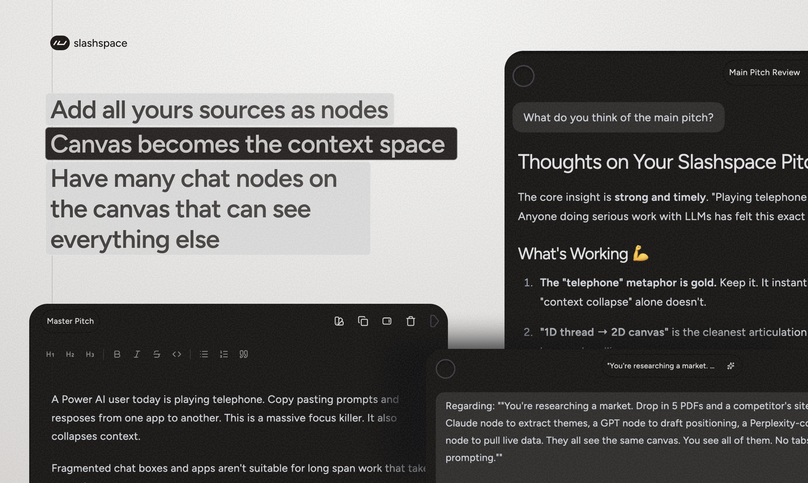

### 🎬 관련 영상
- [🎥 영상 보기](https://ph-files.imgix.net/17af500f-4fed-48f7-8056-2f8ddf9c8833.jpeg?auto=format)

---

## 11. [Olo](https://www.producthunt.com/products/olo-1st-ai-style-companion-for-guys)
**Votes**: 52 | **도입 난이도**: 하 | **신뢰도**: 상
**Tagline**: Style smarter with the world's first AI companion for guys
**서비스 링크**: https://www.producthunt.com/r/2H5UVESU3L7M63

**태그**: AI, Fashion, Lifestyle, Personalization, AI Tool

### 📌 이 서비스 한눈에 보기
남성을 위한 세계 최초의 AI 스타일 컴패니언, 상황별 맞춤 코디 제안 서비스

### 🔑 주요 기능
- 개인 맞춤형 스타일링 및 의상 추천
- 데이트, 업무, 결혼식 등 상황별 최적의 코디 가이드 제공
- 사용자 취향을 반영한 실시간 스타일 피드백

### 🙋 사용자에게 어떤 점이 좋은가
매일 아침 '무엇을 입을지' 고민하는 시간을 줄여주며, 어떤 상황에서도 자신감 있는 스타일을 연출할 수 있도록 도와줍니다.

### ✅ 지금 바로 써볼 기능
- 상황별(데이트, 출근 등) 맞춤 코디 추천 받아보기
- 개인 취향 기반의 스타일 가이드 설정하기
- 현재 보유한 의상에 대한 스타일 피드백 요청하기

### ⚠️ 사용 전 확인할 점
- 실제 의류의 질감이나 색감을 AI가 완벽히 구현하는지 확인 필요
- 사용자의 실제 체형 반영 여부 확인 필요

### 🧭 확인이 더 필요한 정보
사용자의 실제 옷장 데이터(사진 등)를 어떻게 연동하고 관리하는지에 대한 구체적인 방식이 명시되지 않았습니다.

### 📸 스크린샷 및 갤러리

---

## 12. [The Incident Challenge](https://www.producthunt.com/products/the-incident-challenge)
**Votes**: 27 | **도입 난이도**: 하 | **신뢰도**: 상
**Tagline**: The Engineering Challenge for the AI age
**서비스 링크**: https://www.producthunt.com/r/EE5VAUH62FBSUJ

**태그**: DevTools, Engineering, Gamification, Debugging, Agent, AI Tool, DevTool

### 📌 이 서비스 한눈에 보기
실제적인 시스템 장애 상황을 해결하며 실력을 겨루는 실시간 엔지니어링 디버깅 챌린지

### 🔑 주요 기능
- 로그, 코드, 런타임, 아키텍처를 아우르는 현실적인 장애 시나리오 제공
- 문제 해결 후 직접 코드를 수정하여 제출하는 실전형 워크플로우
- 리더보드를 통한 엔지니어 간의 경쟁 및 실력 검증

### 🙋 사용자에게 어떤 점이 좋은가
실제 운영 환경과 유사한 복합적인 디버깅 경험을 통해 엔지니어링 역량을 빠르게 키울 수 있습니다.

### ✅ 지금 바로 써볼 기능
- 24시간 한정으로 진행되는 라이브 챌린지 참여하기
- AI 에이전트를 활용하여 문제 해결 속도 테스트하기
- 리더보드 순위 확인 및 자신의 디버깅 능력 점검하기

### ⚠️ 사용 전 확인할 점
- 24시간 동안만 진행되는 단기 이벤트이므로 참여 타이밍이 중요함
- 문제 해결 방식이 개인의 역량이나 AI 도구 활용 능력에 따라 크게 달라질 수 있음

### 🧭 확인이 더 필요한 정보
새로운 챌린지가 2주마다 업데이트된다는 점 외에 구체적인 난이도 체계나 보상 체계는 명시되지 않았습니다.

### 📸 스크린샷 및 갤러리
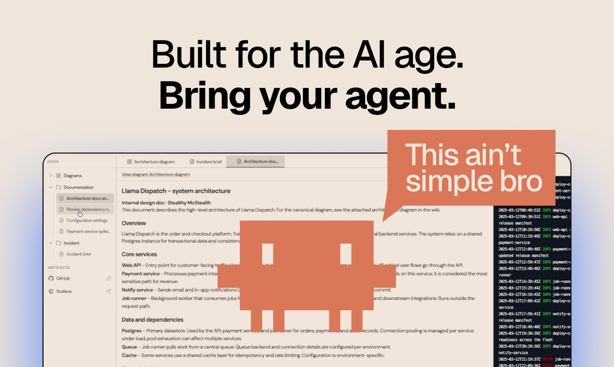
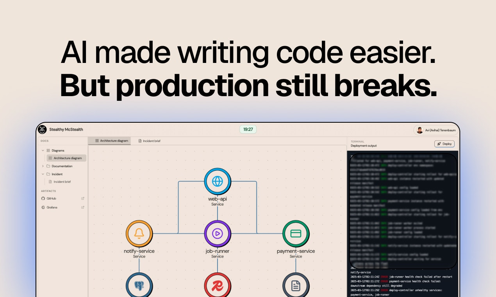
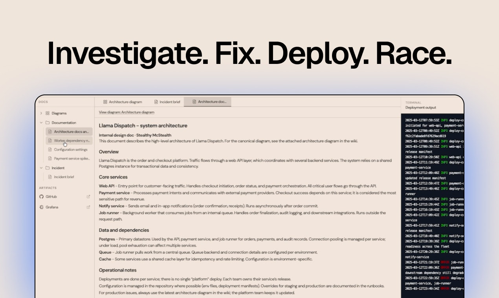

### 🎬 관련 영상
- [🎥 영상 보기](https://ph-files.imgix.net/0452529d-d256-4d17-83bb-fd2dcffbe5c6.jpeg?auto=format)

---

## 13. [Trekme.pro](https://www.producthunt.com/products/trekme-pro)
**Votes**: 20 | **도입 난이도**: 중 | **신뢰도**: 상
**Tagline**: Turn real developer work into skill proof beyond AI resumes
**서비스 링크**: https://www.producthunt.com/r/54YD2FC7UF6CXO

**태그**: DevTool, CareerTech, Portfolio, Analytics, AI Tool

### 📌 이 서비스 한눈에 보기
매주 수행하는 개발 업무를 실시간 대시보드로 시각화하여 증명 가능한 커리어 기록을 만드는 서비스

### 🔑 주요 기능
- 단순 텍스트 이력서를 넘어선 실무 데이터 기반의 인터랙티브 레주메 제공
- 매주 업데이트되는 자동화된 커리어 대시보드 구축
- 기술 스택 활용도와 숙련도 변화를 보여주는 살아있는 포트폴리오

### 🙋 사용자에게 어떤 점이 좋은가
AI로 생성된 뻔한 이력서 대신, 실제 작업 결과물과 기술 숙련도를 데이터로 증명하여 채용 시장에서의 신뢰도를 높일 수 있습니다.

### ✅ 지금 바로 써볼 기능
- 주간 개발 작업 데이터 연동하기
- 개인별 기술 숙련도 대시보드 확인하기
- 포트폴리오용 리포트 생성 및 공유하기

### ⚠️ 사용 전 확인할 점
- 실제 작업 데이터(Git, Jira 등)와의 연동 방식 및 보안 정책 확인 필요
- 데이터가 자동으로 수집되는 구체적인 기술적 메커니즘 확인 필요

### 🧭 확인이 더 필요한 정보
어떤 개발 도구(IDE, Git, Issue Tracker 등)와 직접 연동되어 데이터를 수집하는지에 대한 상세 정보가 필요합니다.

### 📸 스크린샷 및 갤러리
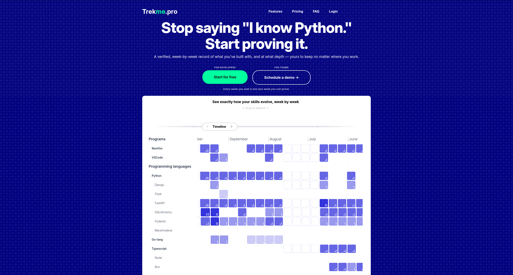
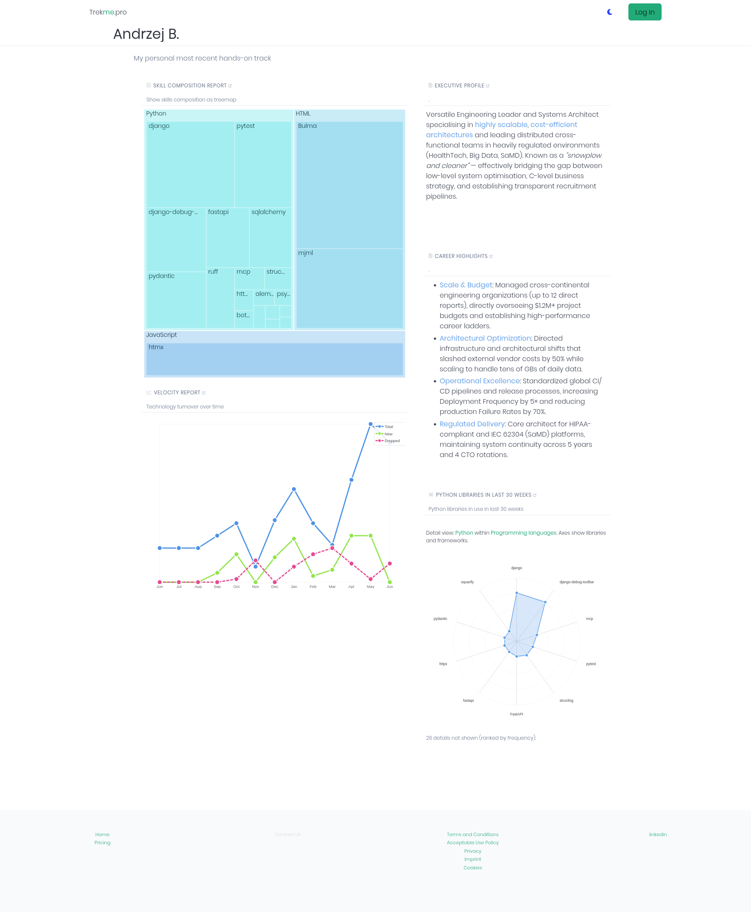
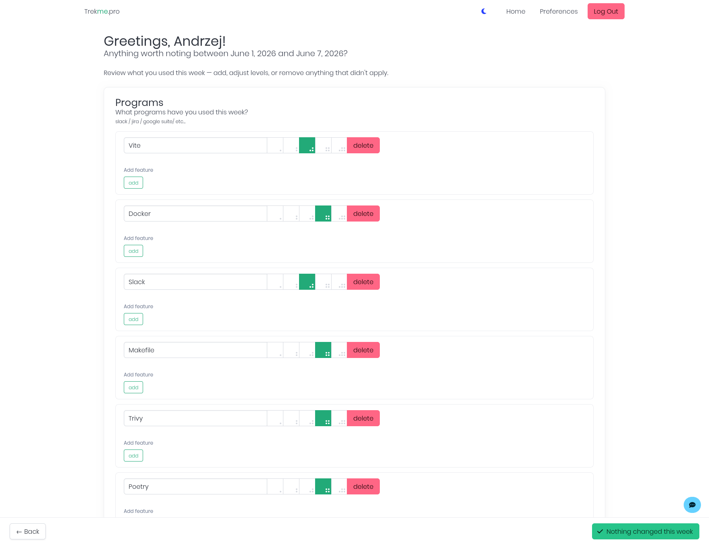

### 🎬 관련 영상
- [🎥 영상 보기](https://ph-files.imgix.net/8cd67348-b3a6-4fb2-bbce-794b3d15bcde.jpeg?auto=format)

---

## 14. [FixtureKit](https://www.producthunt.com/products/fixturekit)
**Votes**: 20 | **도입 난이도**: 하 | **신뢰도**: 상
**Tagline**: Turn TypeScript interfaces into realistic mock data
**서비스 링크**: https://www.producthunt.com/r/M6RZHATOYAXWFI

**태그**: DevTool, TypeScript, Testing, Mocking

### 📌 이 서비스 한눈에 보기
TypeScript 인터페이스를 실감 나는 테스트용 가짜 데이터로 즉시 변환해 주는 브라우저 기반 도구

### 🔑 주요 기능
- TypeScript 인터페이스 및 Zod 스키마를 기반으로 한 의미론적 데이터 생성
- JSON, MSW 핸들러, Playwright 라우트 등 다양한 형식으로 내보내기 지원
- UI의 견고함을 테스트하기 위한 'Adversarial Mode(적대적 모드)' 제공

### 🙋 사용자에게 어떤 점이 좋은가
복잡한 모킹(Mocking) 작업을 자동화하여 개발자가 프론트엔드 로직과 UI 테스트에만 집중할 수 있게 해줍니다.

### ✅ 지금 바로 써볼 기능
- 기존 TypeScript 인터페이스를 복사하여 데이터 생성 테스트하기
- 생성된 데이터를 MSW나 Playwright용 핸들러로 변환하여 프로젝트에 적용하기
- Adversarial Mode를 통해 예외 상황(Edge case) 테스트하기

### ⚠️ 사용 전 확인할 점
- 브라우저 기반 도구이므로 대규모 스키마 처리 시 성능 확인 필요
- 로컬 환경의 보안 정책에 따라 코드 복사 및 붙여넣기 시 주의 필요

### 🧭 확인이 더 필요한 정보
데이터 생성 알고리즘의 정교함과 대규모 프로젝트 적용 시의 안정성에 대한 정보가 추가로 필요합니다.

### 📸 스크린샷 및 갤러리
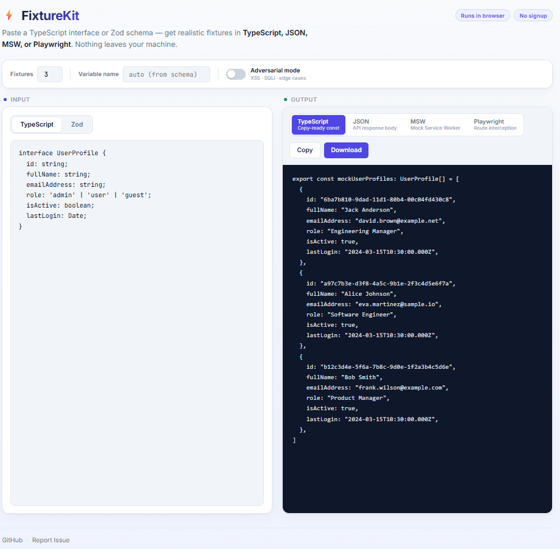
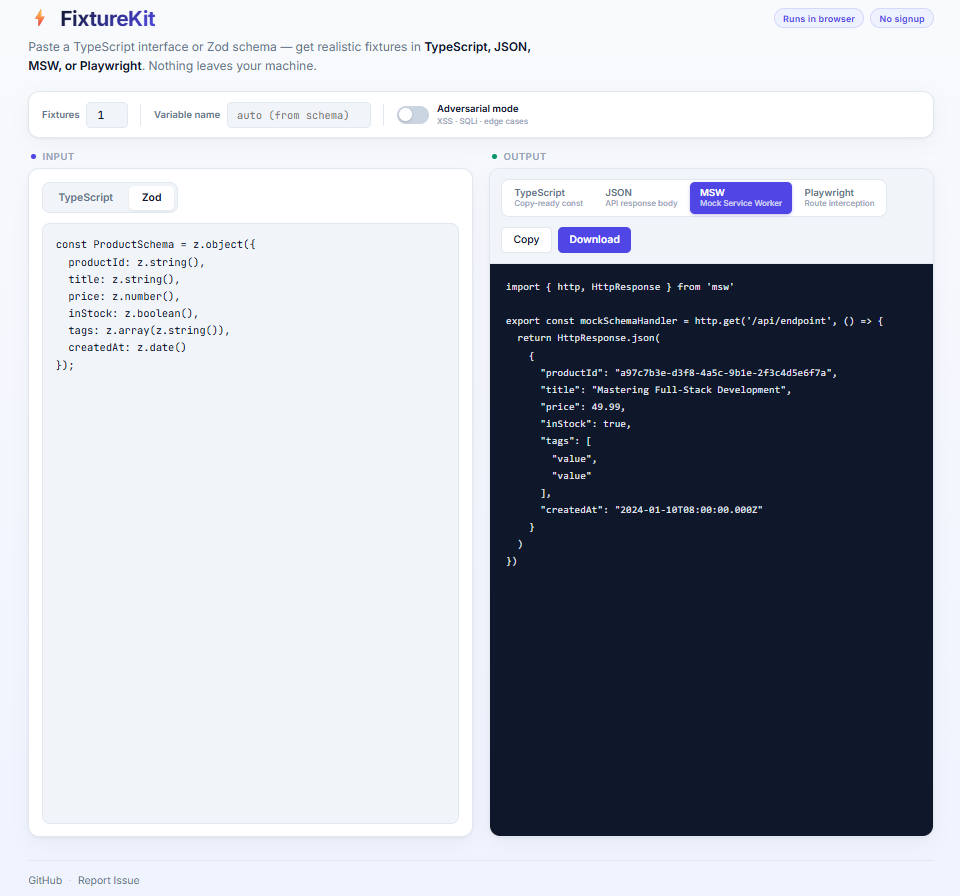
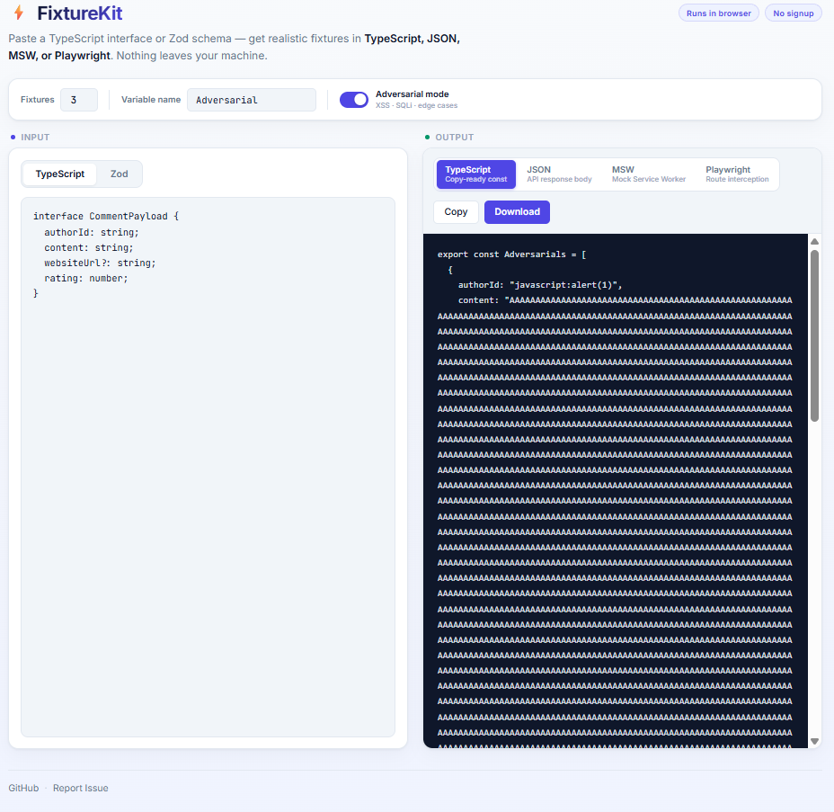

---

## 15. [Vox ](https://www.producthunt.com/products/vox-no-cloud-no-account-no-tracking)
**Votes**: 18 | **도입 난이도**: 하 | **신뢰도**: 상
**Tagline**: Superb free Voice-to-Text that never leaves your device
**서비스 링크**: https://www.producthunt.com/r/Q7SIH2MCCFRDO2

**태그**: Productivity, AI, Privacy, Voice-to-Text

### 📌 이 서비스 한눈에 보기
개인정보 유출 걱정 없이 로컬에서 즉시 실행되는 초고속 음성-텍스트 변환 도구

### 🔑 주요 기능
- Whisper 및 Parakeet 모델을 활용한 강력한 로컬 음성 인식
- Gemma 4 모델을 통한 자연스러운 텍스트 정제 기능
- 클라우드 전송 없는 100% 온디바이스(On-device) 처리로 보안 강화

### 🙋 사용자에게 어떤 점이 좋은가
인터넷 연결이 없는 환경에서도 보안 걱정 없이 음성을 텍스트로 빠르게 변환하여 작업 흐름을 유지할 수 있습니다.

### ✅ 지금 바로 써볼 기능
- 단축키를 설정하여 즉각적인 음성 입력 테스트하기
- 정제된 텍스트가 클립보드에 어떻게 반영되는지 확인하기
- 오프라인 환경에서 작동 여부 검증하기

### ⚠️ 사용 전 확인할 점
- 로컬 모델 구동을 위한 PC의 하드웨어 사양(CPU/GPU) 요구사항 확인 필요
- 개인용 무료 사용 범위에 대한 상세 정책 확인 필요

### 🧭 확인이 더 필요한 정보
사용자의 하드웨어 성능에 따른 처리 속도 및 배터리 소모 정도를 확인해야 합니다.

### 📸 스크린샷 및 갤러리

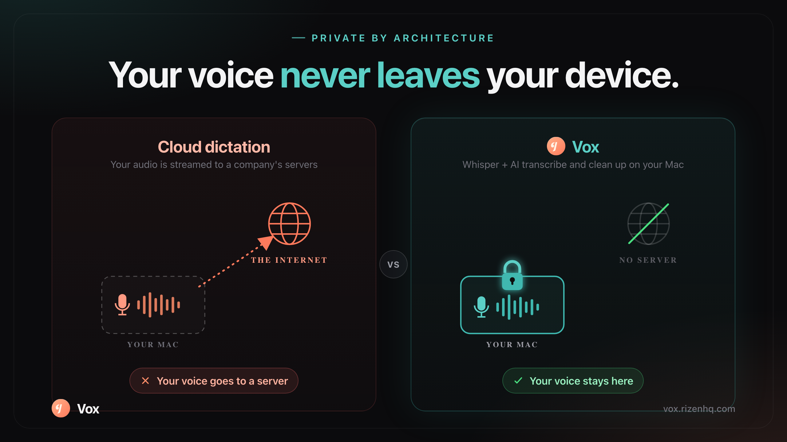
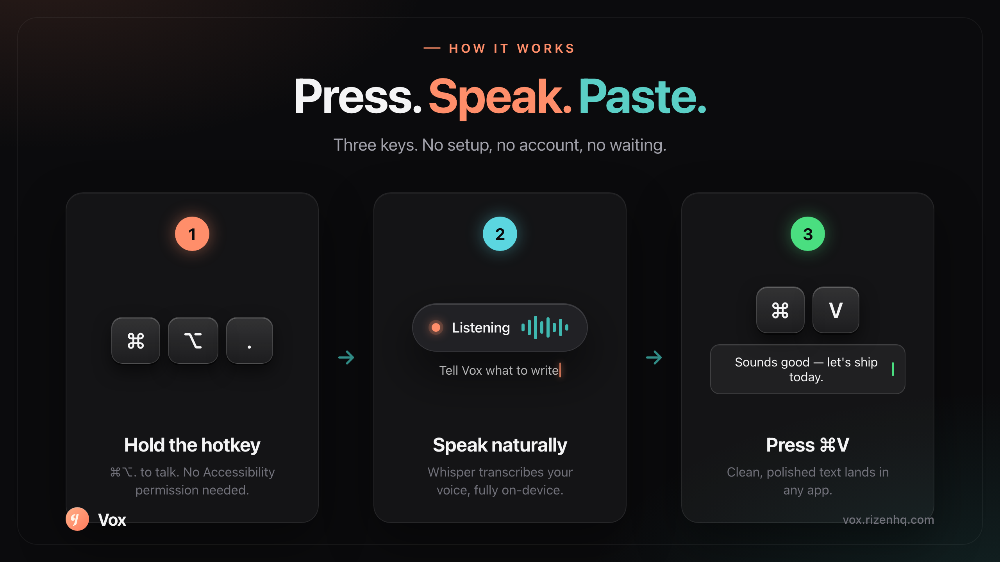

---

## 16. [Stepmello](https://www.producthunt.com/products/stepmello)
**Votes**: 15 | **도입 난이도**: 하 | **신뢰도**: 상
**Tagline**: A quiet space to pause, reflect, and just be
**서비스 링크**: https://www.producthunt.com/r/V7M2HKKY6OWKRK

**태그**: Mindfulness, Minimalism, Mental Health, Journaling

### 📌 이 서비스 한눈에 보기
압박감 없이 온전히 나 자신에게 집중할 수 있는 미니멀한 마음 챙김 공간

### 🔑 주요 기능
- 스트릭이나 설정 등 강제적인 구조가 없는 자유로운 환경
- 생각 기록, 사진 촬영, 혹은 단순한 휴식을 위한 미니멀한 인터페이스
- 일상 속 복잡한 마음을 비우고 리셋할 수 있는 정서적 공간 제공

### 🙋 사용자에게 어떤 점이 좋은가
생산성 앱의 압박에서 벗어나, 짧은 휴식 시간 동안 부담 없이 생각을 정리하거나 마음을 가라앉히고 싶을 때 유용합니다.

### ✅ 지금 바로 써볼 기능
- 지금 떠오르는 생각 한 줄 적어보기
- 현재의 순간을 담은 사진 한 장 남기기
- 아무것도 하지 않고 잠시 머물러 보기

### ⚠️ 사용 전 확인할 점
- 특정한 기록 체계나 목표를 원하는 사용자에게는 너무 막연하게 느껴질 수 있음
- 데이터 저장 방식이나 보안에 대한 구체적인 정보가 명시되지 않음

### 🧭 확인이 더 필요한 정보
사용자의 기록이 어떻게 관리되고 보안이 유지되는지에 대한 상세 정보가 필요합니다.

### 📸 스크린샷 및 갤러리
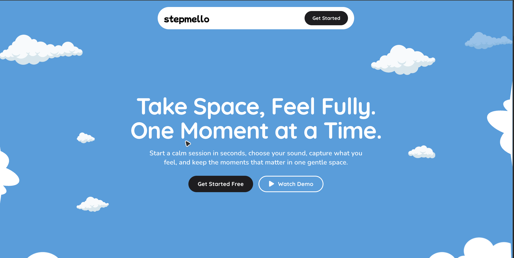
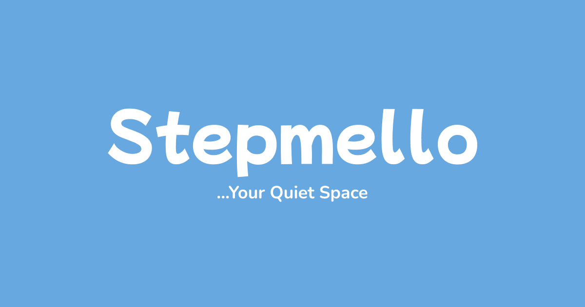

---

## 17. [Pitch Planner App](https://www.producthunt.com/products/pitch-planner-app)
**Votes**: 15 | **도입 난이도**: 하 | **신뢰도**: 상
**Tagline**: Free playing-time tracking for youth soccer coaches. 
**서비스 링크**: https://www.producthunt.com/r/SNFSI2EK4LSX2J

**태그**: SportsTech, CoachingTool, MobileApp

### 📌 이 서비스 한눈에 보기
유소년 축구 코치를 위한 간편한 교체 명단 및 출전 시간 관리 앱

### 🔑 주요 기능
- 선수별 출전 시간 및 로테이션 관리
- 라인업 구성 및 로스터 관리 기능
- 모바일 기기 하나로 가능한 경기 요약 리포트

### 🙋 사용자에게 어떤 점이 좋은가
복잡한 종이 기록 대신 스마트폰으로 선수들의 공평한 출전 시간을 실시간으로 관리할 수 있습니다.

### ✅ 지금 바로 써볼 기능
- 선수 로스터 등록하기
- 경기 중 실시간 교체 기록해보기
- 경기 후 출전 시간 리포트 확인하기

### ⚠️ 사용 전 확인할 점
- 모바일 환경에 최적화되어 있어 대규모 인원 관리 시 화면 제약이 있을 수 있음
- 데이터 백업 및 동기화 방식 확인 필요

### 🧭 확인이 더 필요한 정보
상세한 유료 기능 유무나 데이터 저장 방식에 대한 정보가 부족합니다.

### 📸 스크린샷 및 갤러리
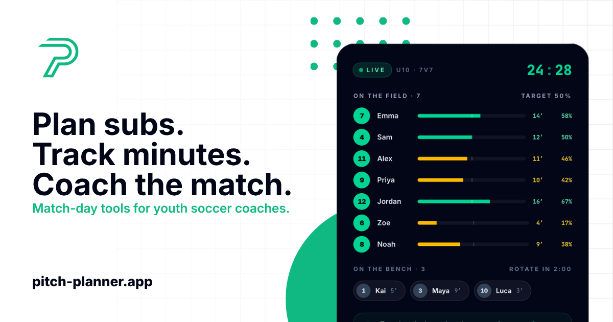

---

## 18. [Financial Data API](https://www.producthunt.com/products/financial-data-api)
**Votes**: 15 | **도입 난이도**: 하 | **신뢰도**: 상
**Tagline**: A free finance API with 25+ sources
**서비스 링크**: https://www.producthunt.com/r/EBNOSZRHI2IJAV

**태그**: DevTool, Finance, API, Data, AI

### 📌 이 서비스 한눈에 보기
26개 이상의 소스를 통합하여 10만 개 이상의 금융 데이터를 제공하는 무료 API 서비스

### 🔑 주요 기능
- Yahoo, Google, Nasdaq 등 26개 신뢰할 수 있는 소스의 데이터 통합
- 8개 자산 클래스에 걸친 10만 개 이상의 금융 상품 데이터 제공
- 실시간 및 과거 시장 데이터와 AI 기반 추론 엔드포인트 지원

### 🙋 사용자에게 어떤 점이 좋은가
다양한 금융 소스를 개별적으로 연동할 필요 없이 하나의 API로 통합 관리할 수 있어 개발 시간을 크게 단축할 수 있습니다.

### ✅ 지금 바로 써볼 기능
- 실시간 및 과거 데이터 호출 테스트
- 8개 자산 클래스별 데이터 정확도 확인
- AI 추론 엔드포인트를 활용한 금융 답변 생성 테스트

### ⚠️ 사용 전 확인할 점
- 무료 플랜의 경우 호출 횟수(Rate Limit) 제한 여부 확인 필요
- 데이터 소스별 업데이트 주기 및 지연 시간 확인 필요

### 🧭 확인이 더 필요한 정보
무료 제공 범위에 대한 구체적인 호출 제한(Rate Limit) 및 상업적 이용 허용 범위 확인이 필요합니다.

### 📸 스크린샷 및 갤러리
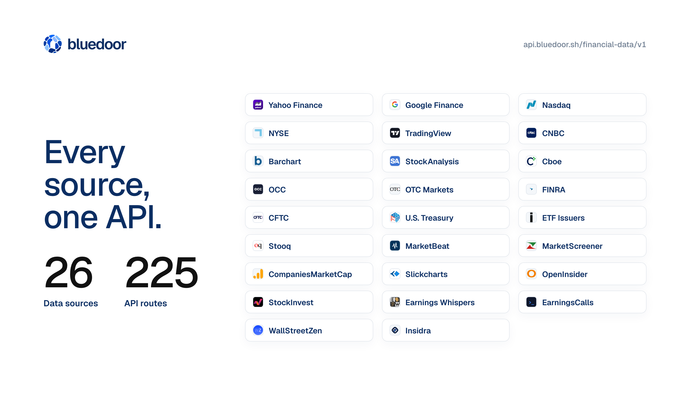
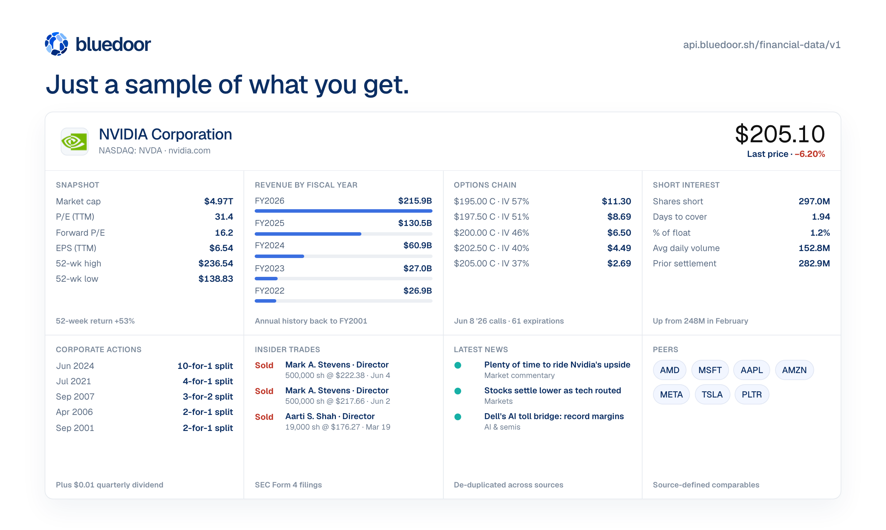
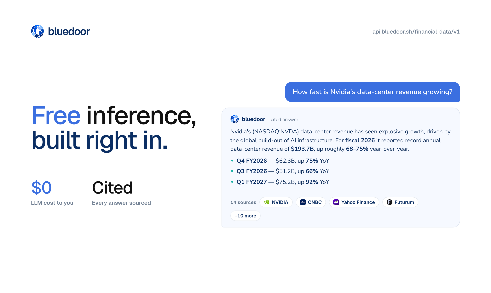

---

## 19. [thita.ai](https://www.producthunt.com/products/thita-ai)
**Votes**: 14 | **도입 난이도**: 하 | **신뢰도**: 상
**Tagline**: One AI platform for the entire engineering interview
**서비스 링크**: https://www.producthunt.com/r/UEWICIV7XZXT7U

**태그**: EdTech, AI, InterviewPrep, SoftwareEngineering, AI Tool, Design, DevTool

### 📌 이 서비스 한눈에 보기
코딩 테스트부터 시스템 디자인까지, 엔지니어링 면접 준비를 위한 올인원 AI 플랫폼

### 🔑 주요 기능
- 99가지 DSA(자료구조 및 알고리즘) 패턴 제공
- 음성 AI를 활용한 실전 모의 면접 및 AI 코칭
- 시스템 디자인 준비 및 이력서 관리 도구 통합

### 🙋 사용자에게 어떤 점이 좋은가
여러 사이트를 번거롭게 오갈 필요 없이, 면접 준비에 필요한 모든 과정을 하나의 플랫폼에서 해결할 수 있습니다.

### ✅ 지금 바로 써볼 기능
- 음성 AI 모의 면접 기능 체험하기
- 99가지 DSA 패턴 학습 시작하기
- AI 코칭을 통한 면접 피드백 받기

### ⚠️ 사용 전 확인할 점
- 특정 기업의 최신 면접 경향이 실시간으로 반영되는지 확인 필요
- 사용자 수준(신입~시니어)에 따른 콘텐츠 깊이 차이 확인 필요

### 🧭 확인이 더 필요한 정보
구체적인 유료 구독 모델 및 기능별 요금 체계에 대한 정보가 명시되지 않았습니다.

### 📸 스크린샷 및 갤러리
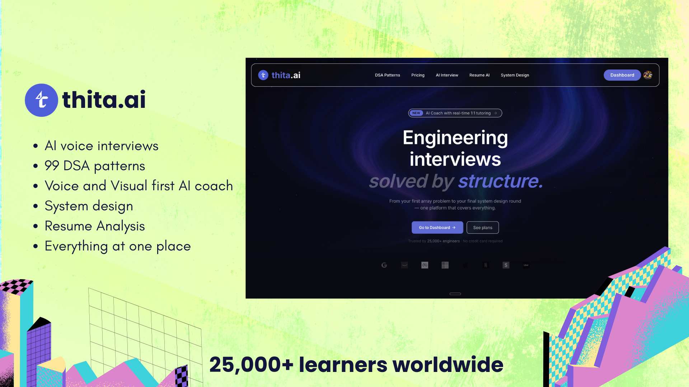
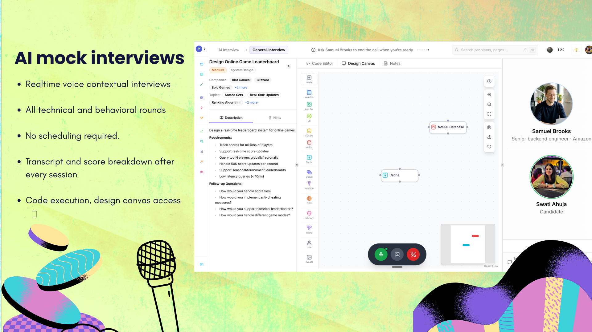
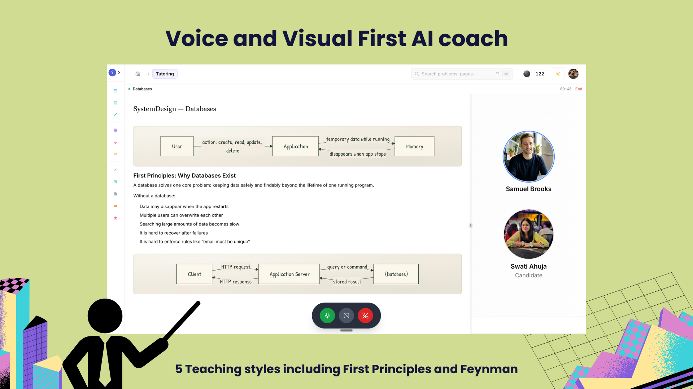

---

## 20. [Kyro](https://www.producthunt.com/products/kyro-3)
**Votes**: 13 | **도입 난이도**: 하 | **신뢰도**: 상
**Tagline**: An AI security bugs hunter for your web app
**서비스 링크**: https://www.producthunt.com/r/WKF3Q2MC4GVKEF

**태그**: Cybersecurity, AI, DevSecOps, Automation, AI Tool, Email, Security

### 📌 이 서비스 한눈에 보기
단순 스캔을 넘어 실제 공격 시나리오를 재현하여 검증된 보안 취약점을 찾아주는 AI 보안 전문가

### 🔑 주요 기능
- URL과 권한 설정만으로 웹 애플리케이션 매핑 및 자동 공격 체이닝 수행
- 단순한 '잠재적 이슈'가 아닌, 실제 재현 가능한 '확정된 취약점' 제공
- 공격 시나리오를 통한 실질적인 보안 위협 탐지 및 리포트 이메일 발송

### 🙋 사용자에게 어떤 점이 좋은가
보안 스캐너의 수많은 오탐(False Positive)에 지친 개발자에게 실제 공격 가능한 취약점만을 선별하여 업무 효율을 높여줍니다.

### ✅ 지금 바로 써볼 기능
- 테스트할 웹 애플리케이션 URL 입력
- 필요 시 인증 정보(Credentials) 및 스코프 설정
- 이메일로 전달되는 재현 단계(Reproduction steps) 확인

### ⚠️ 사용 전 확인할 점
- 실제 공격 시나리오를 수행하므로 테스트 환경이 아닌 운영 환경 적용 시 주의 필요
- 인증 정보 입력 시 보안 및 권한 관리 주의

### 🧭 확인이 더 필요한 정보
서비스의 구체적인 스캔 속도와 지원하는 보안 프로토콜의 범위는 명시되지 않았습니다.

### 📸 스크린샷 및 갤러리
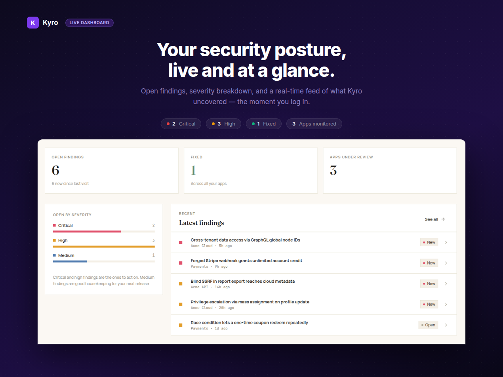
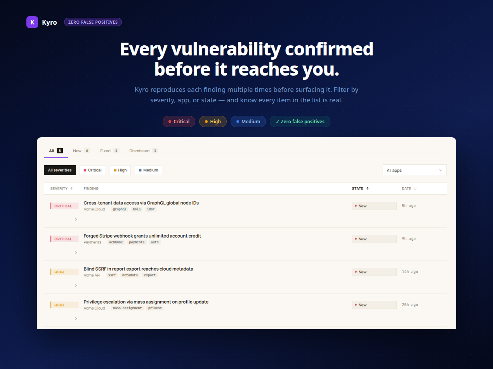
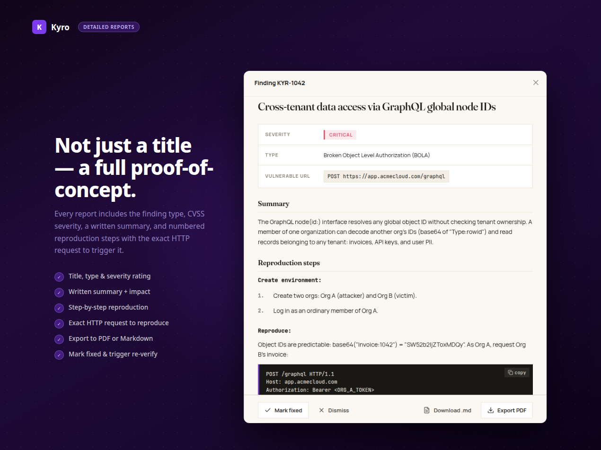

---

## 21. [PuchiDen](https://www.producthunt.com/products/puchiden)
**Votes**: 12 | **도입 난이도**: 하 | **신뢰도**: 상
**Tagline**: International calls from your browser. No app, no account.
**서비스 링크**: https://www.producthunt.com/r/7VIKOCK7NMWX4S

**태그**: Communication, Browser-based, Privacy-focused

### 📌 이 서비스 한눈에 보기
별도의 앱 설치나 계정 생성 없이 브라우저에서 즉시 이용 가능한 초간편 국제 전화 서비스

### 🔑 주요 기능
- 앱 설치 및 계정 생성 불필요 (No app, No account)
- 180개국 이상의 실제 전화번호로 연결 가능
- 통화가 연결된 경우에만 비용 지불

### 🙋 사용자에게 어떤 점이 좋은가
개인정보 추적이나 복잡한 가입 절차 없이, 급하게 해외 기관이나 고객에게 전화를 걸어야 할 때 매우 유용합니다.

### ✅ 지금 바로 써볼 기능
- 브라우저를 통해 즉시 번호 다이얼해보기
- 가입 시 제공되는 €1 무료 크레딧 활용하기

### ⚠️ 사용 전 확인할 점
- 계정이 없으므로 통화 기록 관리나 재충전 방식에 대한 확인 필요
- 브라우저 기반 서비스이므로 네트워크 환경에 따른 통화 품질 영향 가능성

### 🧭 확인이 더 필요한 정보
계정 없이 이용할 경우, 결제 수단 등록 방식이나 통화 기록 보관 여부가 불분명합니다.

### 📸 스크린샷 및 갤러리
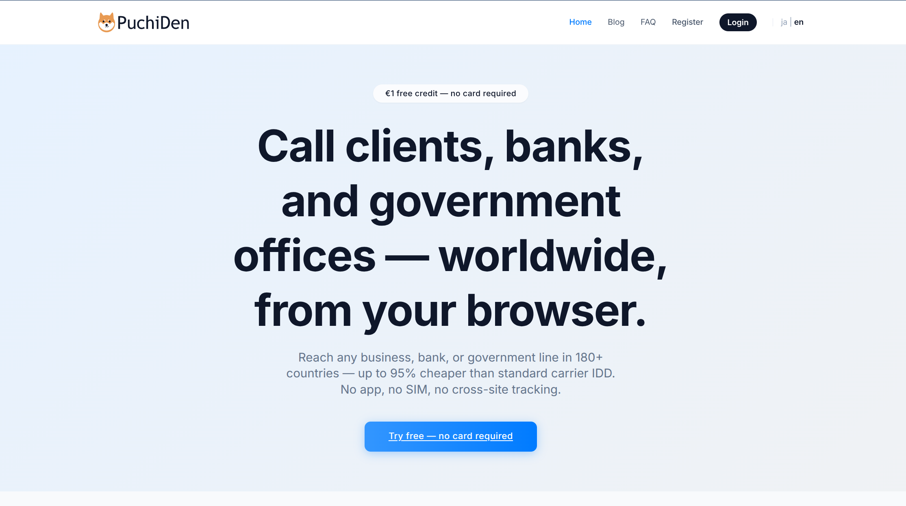
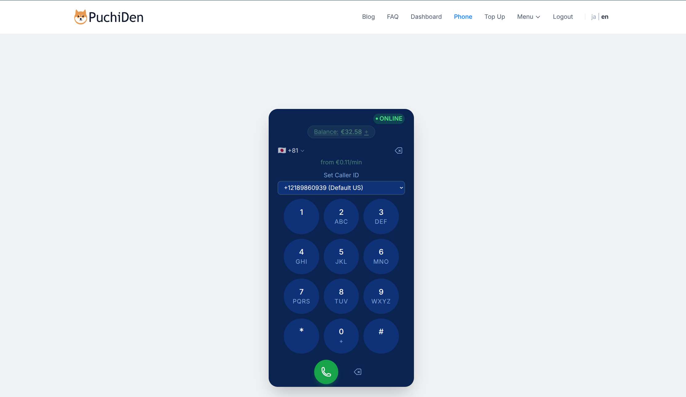
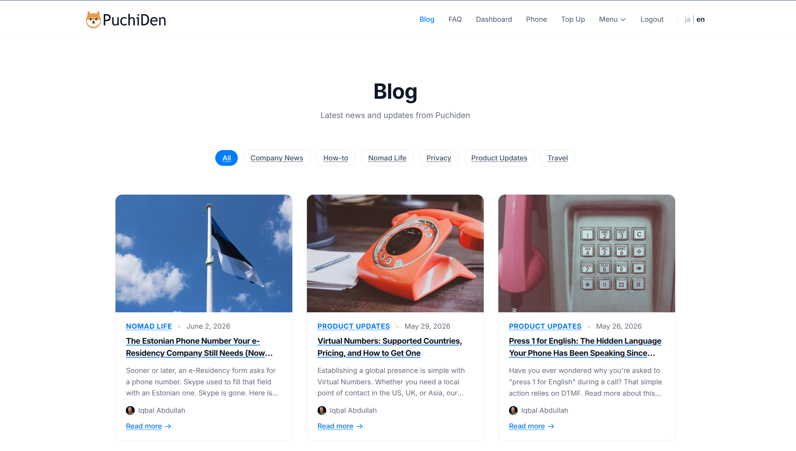

---

## 22. [Trajectory: Project Roadmap](https://www.producthunt.com/products/trajectory-project-roadmap)
**Votes**: 11 | **도입 난이도**: 하 | **신뢰도**: 상
**Tagline**: Mobile app turning your projects into a clear action plan
**서비스 링크**: https://www.producthunt.com/r/VCGXGTZC4UXHTK

**태그**: Productivity, AI, ProjectManagement, MobileApp, AI Tool

### 📌 이 서비스 한눈에 보기
AI가 프로젝트를 주 단위 실행 계획으로 자동 분해해 주는 모바일 액션 플래너

### 🔑 주요 기능
- 프로젝트 설명과 기간 설정 시 AI가 주차별 계획 자동 생성
- 단순 작업 관리를 넘어 '무엇을 해야 할지'를 결정해 주는 가이드 제공
- 시간 소모가 아닌 완료된 작업 중심의 보상 체계

### 🙋 사용자에게 어떤 점이 좋은가
막연한 목표를 구체적인 일일 과제로 변환하여 실행력을 높여줍니다. 무엇부터 시작해야 할지 고민하는 시간을 줄여줍니다.

### ✅ 지금 바로 써볼 기능
- 진행 중인 프로젝트 설명 입력하기
- 목표 기간 설정하여 주차별 로드맵 생성하기
- 생성된 일일 태스크 확인 및 실행하기

### ⚠️ 사용 전 확인할 점
- AI가 생성한 계획이 사용자의 실제 상황과 일치하는지 검토 필요
- 모바일 앱 환경에서의 작업 관리 편의성 확인 필요

### 🧭 확인이 더 필요한 정보
AI가 생성하는 계획의 구체성 수준과 사용자 수정 기능의 범위에 대한 정보가 부족합니다.

### 📸 스크린샷 및 갤러리
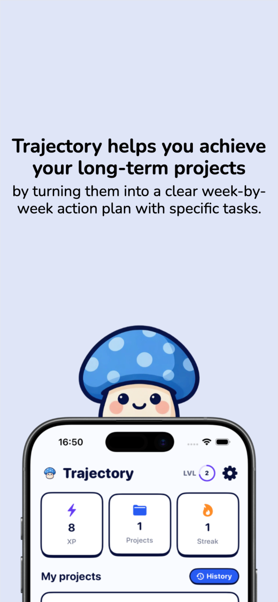
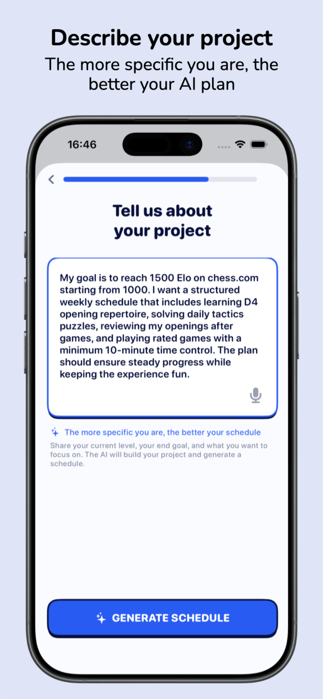
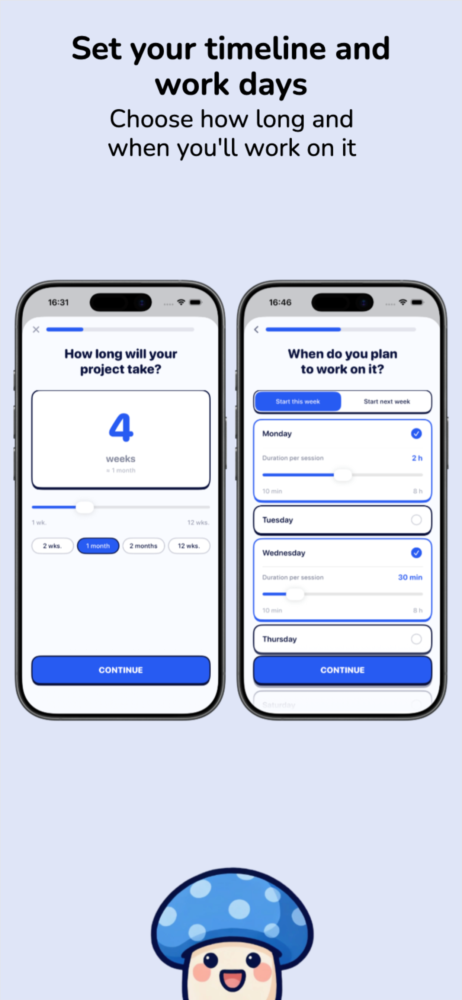

---

## 23. [BetScan](https://www.producthunt.com/products/betscan)
**Votes**: 11 | **도입 난이도**: 하 | **신뢰도**: 상
**Tagline**: Stop guessing if an online casino is legitimate or fake.
**서비스 링크**: https://www.producthunt.com/r/5Y6MKPZPOMGEVS

**태그**: Browser Extension, Security, Safety Check, AI Tool

### 📌 이 서비스 한눈에 보기
온라인 카지노의 신뢰도를 2초 만에 검증해 주는 무료 브라우저 확장 프로그램

### 🔑 주요 기능
- 라이선스 보유 여부 및 신뢰도 실시간 검증
- Trustpilot 및 AskGamblers 리뷰 데이터 통합 확인
- 계정 생성 및 개인정보 추적 없는 익명성 보장

### 🙋 사용자에게 어떤 점이 좋은가
입금 전 카지노의 안전성을 즉각적으로 판단할 수 있어 사기 피해를 예방할 수 있습니다.

### ✅ 지금 바로 써볼 기능
- 브라우저 확장 프로그램 설치하기
- 의심스러운 카지노 사이트 방문 시 즉시 스캔 실행
- 커뮤니티 여론 및 라이선스 정보 확인

### ⚠️ 사용 전 확인할 점
- 데이터 소스(Trustpilot, AskGamblers 등)의 정보 업데이트 지연 가능성
- 확장 프로그램이 모든 유형의 사기 수법을 완벽히 차단할 수는 없음

### 🧭 확인이 더 필요한 정보
제공되는 데이터의 실시간 업데이트 주기와 검증 알고리즘의 상세 로직에 대한 확인이 필요합니다.

### 📸 스크린샷 및 갤러리

---

## 24. [KeepJam](https://www.producthunt.com/products/keepjam)
**Votes**: 11 | **도입 난이도**: 하 | **신뢰도**: 상
**Tagline**: Track Time, Calculate Salaries, Plan Shifts. No AI.
**서비스 링크**: https://www.producthunt.com/r/RFBY5JBSWXMHPT

**태그**: Productivity, TeamManagement, TimeTracking, SaaS, AI Tool

### 📌 이 서비스 한눈에 보기
시간 기록부터 급여 계산, 교대 근무 관리까지 한 번에 해결하는 심플한 팀 관리 도구

### 🔑 주요 기능
- 원클릭 타이머 및 드래그 앤 드롭 캘린더를 통한 간편한 시간 기록
- 엑셀 및 PDF 내보장 기능을 통한 빠른 급여 및 타임시트 산출
- 태스크, 위치, 지침을 포함한 직관적인 교대 근무 스케줄링

### 🙋 사용자에게 어떤 점이 좋은가
복잡한 AI 기능 대신 핵심적인 관리 기능에 집중하여, 팀의 업무 시간 기록과 스케줄 관리를 직관적이고 효율적으로 처리할 수 있습니다.

### ✅ 지금 바로 써볼 기능
- 원클릭 타이머로 업무 시간 기록 시작하기
- 템플릿을 활용해 팀 스케줄 생성하기
- 작성된 타임시트를 엑셀로 내보내기

### ⚠️ 사용 전 확인할 점
- AI 기반의 자동화 기능이 없으므로 수동 관리가 필요함
- 사용자 수에 따라 비용이 정비례하여 증가함

### 🧭 확인이 더 필요한 정보
현재 명시된 정보 외에 타 소프트웨어와의 연동 기능이나 모바일 앱 지원 여부는 확인이 필요합니다.

### 📸 스크린샷 및 갤러리
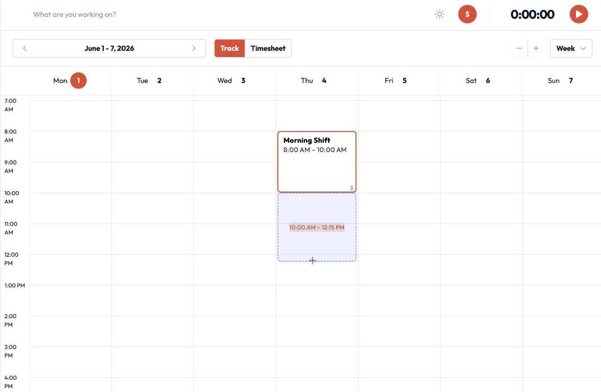
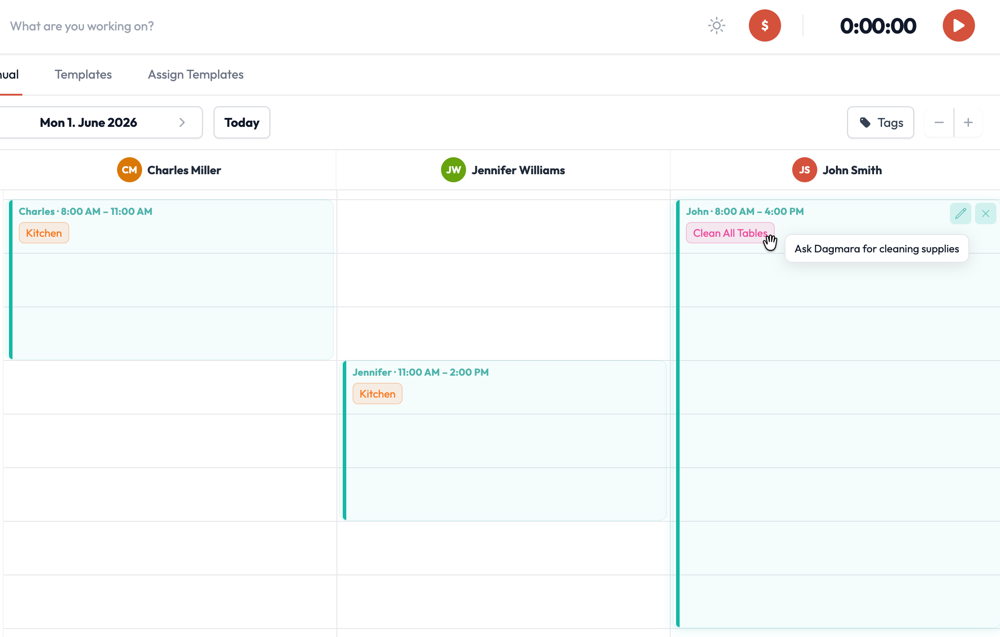
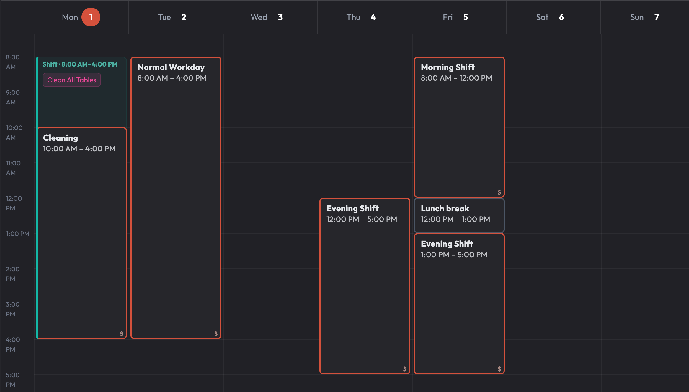

---

## 25. [Nen](https://www.producthunt.com/products/nen)
**Votes**: 11 | **도입 난이도**: 하 | **신뢰도**: 상
**Tagline**: End-to-end encrypted APIs for modern web.
**서비스 링크**: https://www.producthunt.com/r/JAYJOWFYOEAXKX

**태그**: DevTool, Security, API, Compliance

### 📌 이 서비스 한눈에 보기
데이터 전송 구간을 넘어 엔드포인트까지 데이터를 보호하는 개발자용 종단간 암호화(E2EE) API 툴킷

### 🔑 주요 기능
- TLS의 한계를 넘어 프록시 및 로그에서도 데이터가 노출되지 않도록 페이로드 자체를 암호화
- 몇 줄의 코드만으로 양자 내성 암호화 및 필드 단위 암호화 구현 가능
- SOC2, HIPAA 등 보안 규정 준수를 위한 암호화 증거 자동 생성 기능 제공

### 🙋 사용자에게 어떤 점이 좋은가
데이터가 중간 서버나 로그에 노출되는 보안 취약점을 근본적으로 해결하며, 복잡한 암호화 로직 구현 없이도 강력한 보안 표준을 적용할 수 있습니다.

### ✅ 지금 바로 써볼 기능
- SDK를 기존 API 워크플로우에 통합하여 페이로드 암호화 테스트
- 필드 단위 암호화(Field-level encryption) 적용 범위 설정
- 컴플라이언스 리포트 생성 기능 확인

### ⚠️ 사용 전 확인할 점
- 암호화된 데이터로 인해 프록시나 미들웨어에서의 데이터 가시성/조작이 제한될 수 있음
- 엔드포인트 간 키 관리 및 복호화 로직의 정확성 확보 필요

### 🧭 확인이 더 필요한 정보
지원하는 프로그래밍 언어의 종류와 구체적인 SDK 라이브러리 범위를 확인해야 합니다.

### 📸 스크린샷 및 갤러리
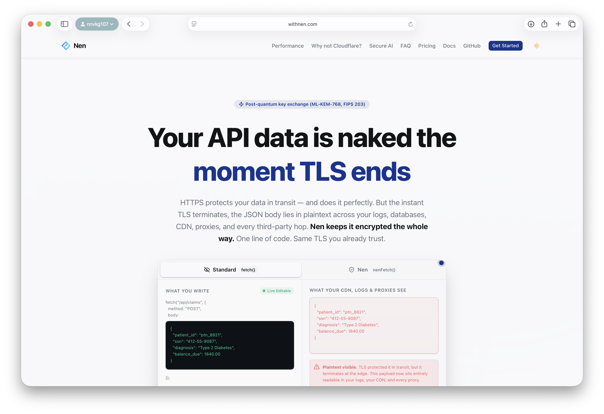
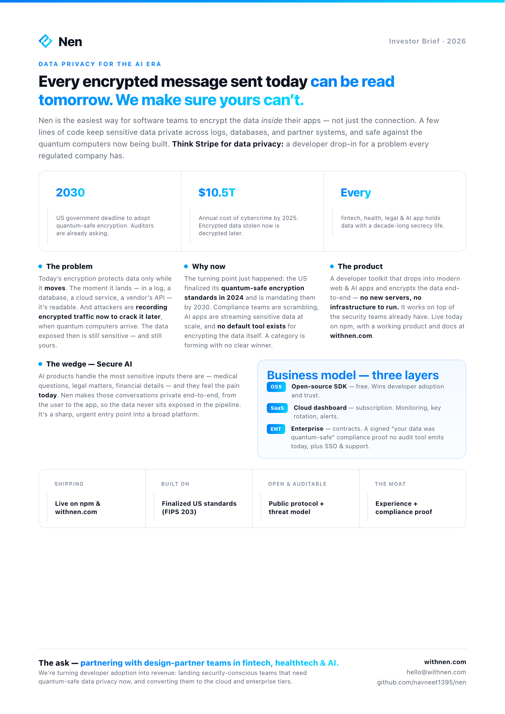
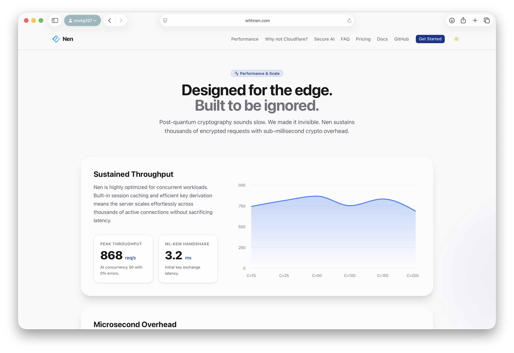

---

## 26. [työ. by vaivatta.](https://www.producthunt.com/products/tyo-by-vaivatta)
**Votes**: 11 | **도입 난이도**: 하 | **신뢰도**: 상
**Tagline**: work hassle-free but in control - beta launch
**서비스 링크**: https://www.producthunt.com/r/7LVRN77IHS4VYX

**태그**: Customer Support, AI Automation, Multilingual, SaaS, AI Tool

### 📌 이 서비스 한눈에 보기
AI의 초안 작성과 인간의 최종 승인이 결합된 안전하고 다국어 지원이 가능한 고객 메시징 솔루션

### 🔑 주요 기능
- 다국어 자동 번역 및 적절한 담당자 자동 배정
- 기업 지식 기반의 AI 초안 생성으로 응답 시간 단축
- 모든 답변에 대한 인간의 최종 검토 및 승인 프로세스

### 🙋 사용자에게 어떤 점이 좋은가
AI를 통해 업무 효율을 높이면서도, 사람이 직접 검토함으로써 브랜드 톤앤매너와 답변의 정확성을 완벽하게 통제할 수 있습니다.

### ✅ 지금 바로 써볼 기능
- 다국어 메시지 수신 및 자동 번역 기능 테스트
- AI가 생성한 초안의 정확도 및 톤앤매너 확인
- 팀 내 승인/편집 워크플로우 적용해보기

### ⚠️ 사용 전 확인할 점
- 베타 출시 단계이므로 기능의 안정성 확인 필요
- 모든 답변에 사람의 개입이 필수적이므로 업무량에 따른 운영 리소스 고려 필요

### 🧭 확인이 더 필요한 정보
현재 베타 단계로, 지원하는 구체적인 메시징 채널(Slack, WhatsApp 등)의 범위가 명시되지 않았습니다.

### 📸 스크린샷 및 갤러리
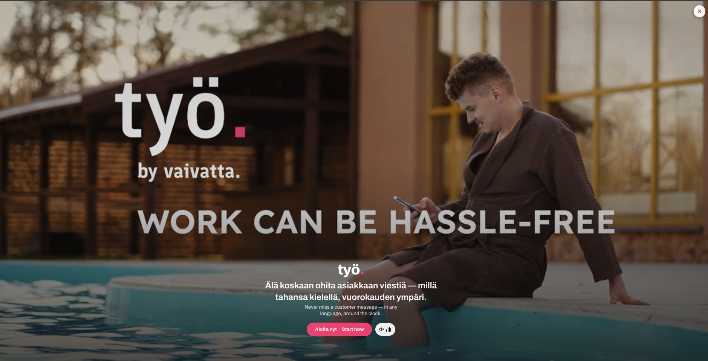
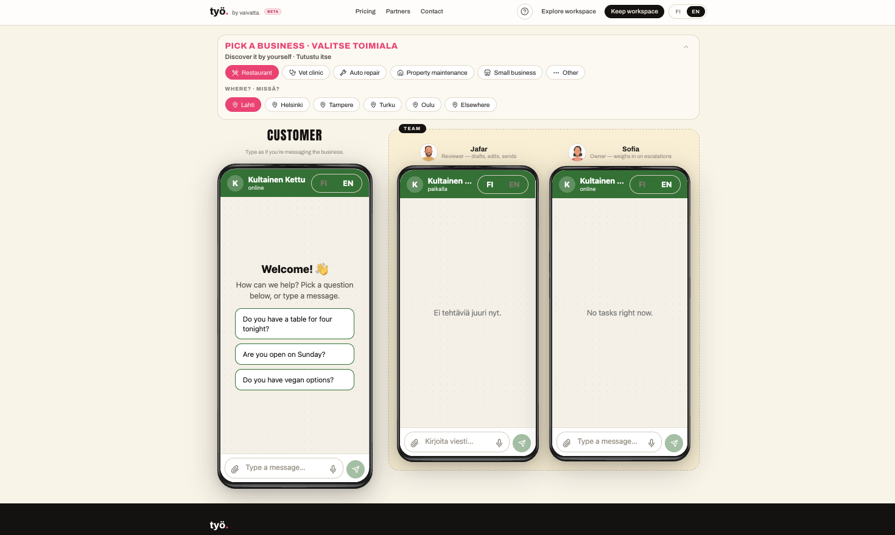

### 🎬 관련 영상
- [🎥 영상 보기](https://ph-files.imgix.net/9e20763d-842e-4295-987b-931690aced65.gif?auto=format)

---

## 27. [Things Tag Manager](https://www.producthunt.com/products/things-tag-manager)
**Votes**: 10 | **도입 난이도**: 하 | **신뢰도**: 상
**Tagline**: Better Tag Manager for Things 3
**서비스 링크**: https://www.producthunt.com/r/ICRLX4T63VLENY

**태그**: Productivity, Utility, Mac, DevTool

### 📌 이 서비스 한눈에 보기
Things 3 사용자를 위한 강력한 태그 관리 및 정리 도구

### 🔑 주요 기능
- Things 3 태그 데이터 가져오기 및 편집 기능
- 태그별 할 일 개수 확인을 통한 사용성 분석
- 알파벳순, 최근 업데이트순, 할 일 개수순 정렬 지원

### 🙋 사용자에게 어떤 점이 좋은가
Things 3의 기본 기능에서 부족했던 태그 검색, 삭제, 정렬 기능을 제공하여 태그 관리 효율을 극대화합니다.

### ✅ 지금 바로 써볼 기능
- 기존 Things 3 태그 데이터 가져오기
- 사용하지 않는 태그 검색 및 삭제
- 할 일 개수 기반 태그 정렬로 우선순위 파악

### ⚠️ 사용 전 확인할 점
- Mac 전용 앱임
- Things 3 앱이 반드시 설치되어 있어야 함

### 🧭 확인이 더 필요한 정보
Things 3와의 데이터 동기화 방식(실시간 vs 수동)에 대한 구체적인 설명이 없습니다.

### 📸 스크린샷 및 갤러리
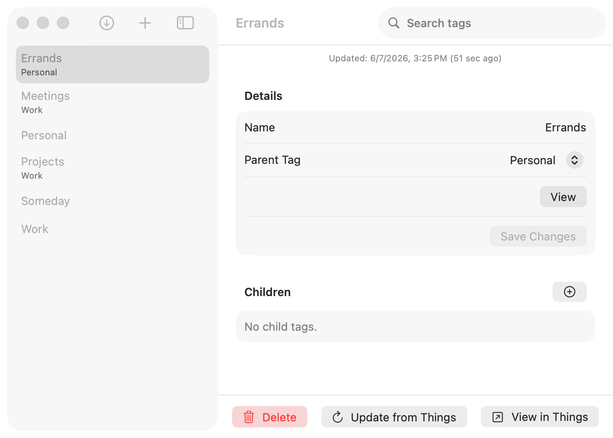
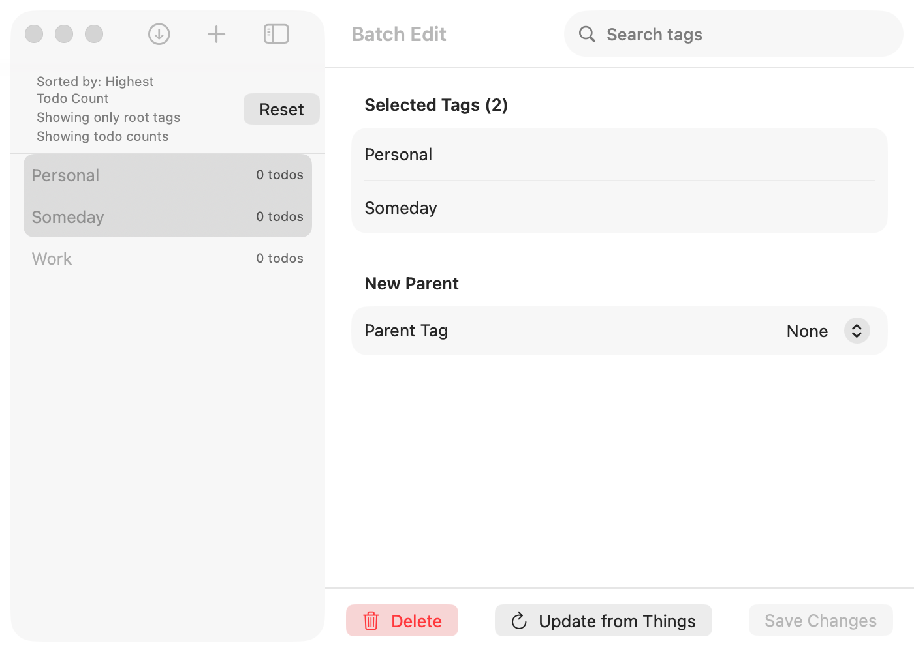
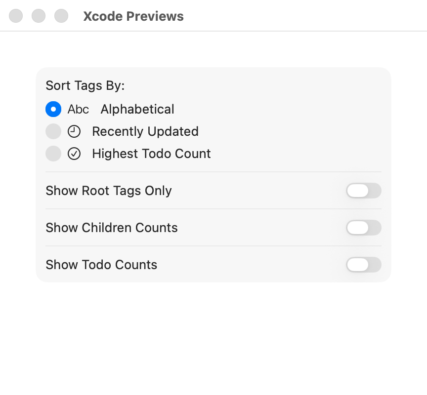

---

## 28. [SEO Scrubbox](https://www.producthunt.com/products/seo-scrubbox)
**Votes**: 9 | **도입 난이도**: 하 | **신뢰도**: 상
**Tagline**: Technical SEO checks for the AI search era
**서비스 링크**: https://www.producthunt.com/r/MIEVNLIWDO6HKG

**태그**: SEO, DevTool, WebCrawling, MarketingTech, AI Tool

### 📌 이 서비스 한눈에 보기
AI 검색 시대에 최적화된 기술적 SEO 진단 및 라이브 크롤링 도구

### 🔑 주요 기능
- AI 검색 환경을 고려한 기술적 SEO 체크리스트 제공
- 라이브 시각적 크롤링을 통한 렌더링 차이 및 리다이렉트 확인
- Sitemap, Hreflang, JSON-LD 등 구조적 데이터 검증

### 🙋 사용자에게 어떤 점이 좋은가
웹사이트의 기술적 오류를 실시간으로 탐지하여 AI 검색 엔진에 사이트가 올바르게 색인되도록 돕습니다.

### ✅ 지금 바로 써볼 기능
- 라이브 크롤링을 통한 렌더링 차이(Rendering diffs) 확인
- JSON-LD 및 구조적 데이터(Schema) 무결성 검사
- CrUX 데이터를 활용한 사용자 경험 지표 점검

### ⚠️ 사용 전 확인할 점
- 실시간 크롤링 시 서버 부하 발생 가능성 확인 필요
- AI 검색 최적화에 대한 구체적인 알고리즘 적용 방식 확인 필요

### 🧭 확인이 더 필요한 정보
AI 검색 시대에 특화된 'AI checks'의 구체적인 검사 항목과 방식에 대한 상세 정보가 필요합니다.

### 📸 스크린샷 및 갤러리
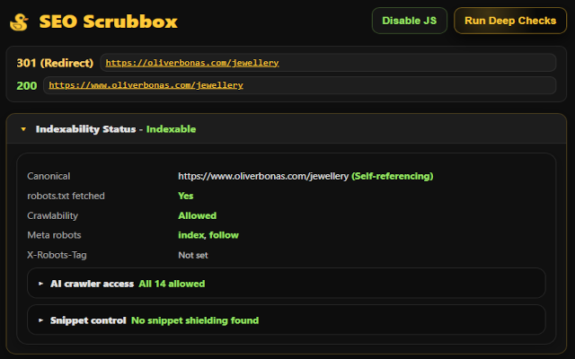
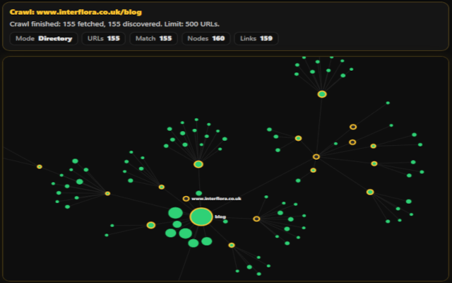
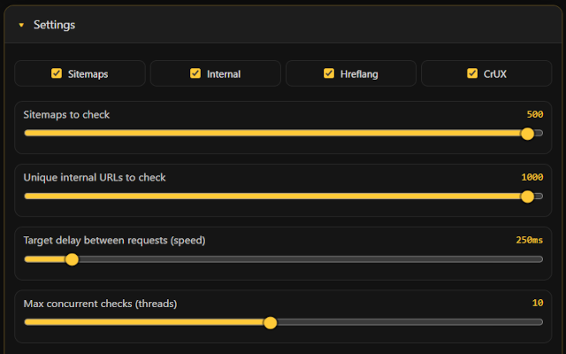

---

## 29. [Model Drop](https://www.producthunt.com/products/model-drop)
**Votes**: 8 | **도입 난이도**: 하 | **신뢰도**: 상
**Tagline**: Skip the photoshoot. Get the lifestyle shot.
**서비스 링크**: https://www.producthunt.com/r/YM5S3UGONKMQXP

**태그**: AI-Photography, E-commerce, Marketing-Automation, Product-Photography, Vision

### 📌 이 서비스 한눈에 보기
제품 사진 한 장으로 모델과 스튜디오가 있는 듯한 라이프스타일 이미지를 생성하는 AI 도구

### 🔑 주요 기능
- 모델, 스튜디오, 촬영 없이 30초 만에 완성되는 라이프스타일 샷
- 타겟 지역 설정을 통해 현지 시장에 적합한 모델 외형 구현
- 제품의 로고, 색상, 패키징을 원본 그대로 유지하는 정교한 합성

### 🙋 사용자에게 어떤 점이 좋은가
별도의 촬영 비용과 시간 없이도 전문적인 제품 연출 사진을 얻을 수 있어 이커머스 운영 효율을 극대화합니다.

### ✅ 지금 바로 써볼 기능
- 가입 시 제공되는 무료 크레딧 2개로 테스트 이미지 생성하기
- 타겟 시장(지역) 설정을 통해 모델 스타일 변경해보기
- 브랜드 분위기에 맞는 '바이브(Casual to Formal)' 설정해보기

### ⚠️ 사용 전 확인할 점
- 제품의 디테일이 원본과 얼마나 완벽하게 일치하는지 결과물 확인 필요
- 무료 크레딧 소진 후 유료 결제(SGD 4.99부터) 필요

### 🧭 확인이 더 필요한 정보
AI 생성 과정에서 제품의 질감이나 패키지 텍스트가 왜곡되지 않는지 실제 결과물 검증이 필요합니다.

### 📸 스크린샷 및 갤러리
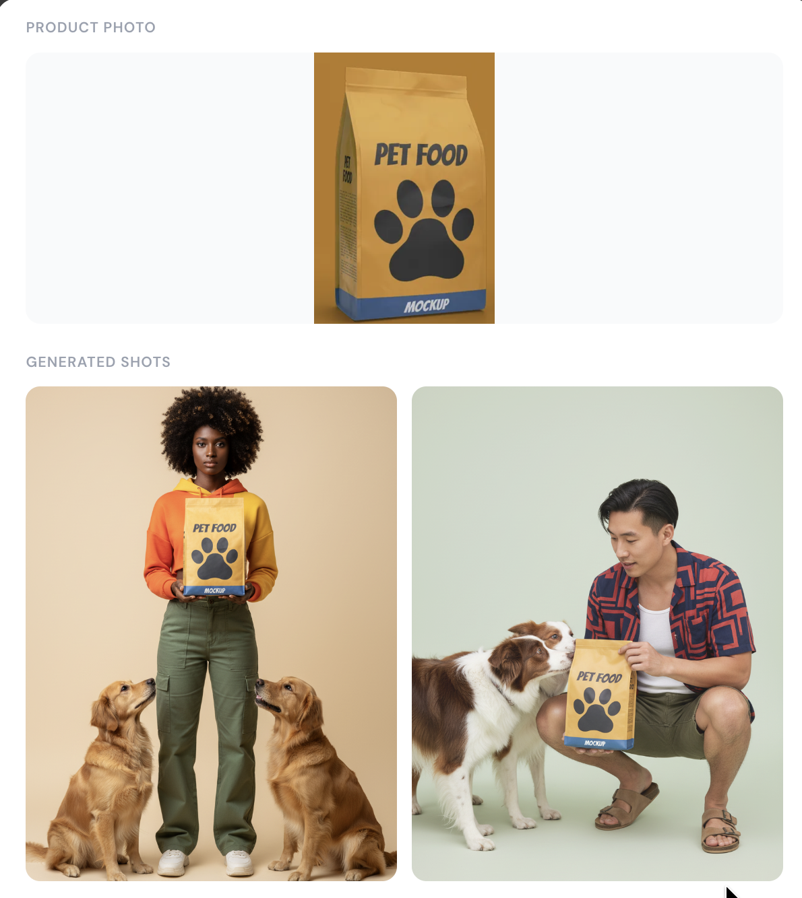
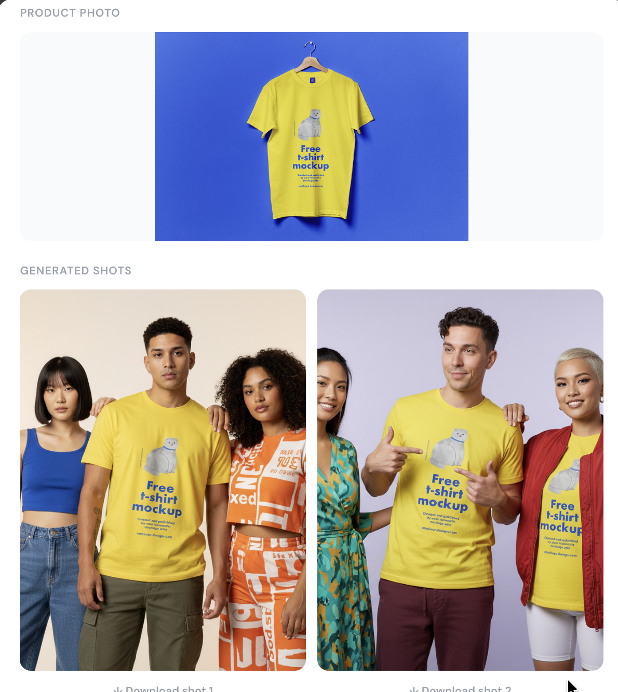

### 🎬 관련 영상
- [🎥 영상 보기](https://ph-files.imgix.net/fe2c71db-8137-40fd-b401-5fc5beeded7e.jpeg?auto=format)

---

## 30. [AI Video Subtitle Generator](https://www.producthunt.com/products/radaar)
**Votes**: 8 | **도입 난이도**: 하 | **신뢰도**: 상
**Tagline**: 100% free AI-powered video subtitle generator!
**서비스 링크**: https://www.producthunt.com/r/7UJDADXPJHW5CF

**태그**: AI, VideoEditing, Automation, FreeTool, AI Tool, Video

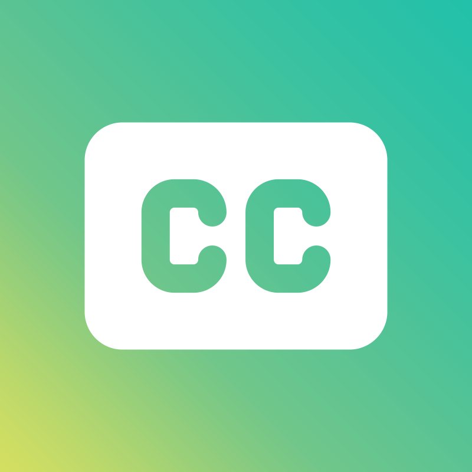

### 📌 이 서비스 한눈에 보기
복잡한 편집 없이 영상 업로드만으로 자막을 자동 생성하는 완전 무료 AI 도구

### 🔑 주요 기능
- AI 기반의 빠르고 정확한 자동 자막 생성 및 타임스탬프 매칭
- 워터마크 제거 및 회원가입 없는 완전 무료 서비스
- 영상 파일 또는 SRT 자막 파일 형태의 간편한 내보내기 지원

### 🙋 사용자에게 어떤 점이 좋은가
별도의 편집 프로그램 학습 없이도 영상의 접근성과 시청 몰입도를 즉각적으로 높일 수 있습니다.

### ✅ 지금 바로 써볼 기능
- 영상 파일 업로드하여 자동 자막 생성 테스트
- 생성된 자막의 정확도 확인
- 결과물을 SRT 파일로 내보내기 하여 다른 편집기에 활용

### ⚠️ 사용 전 확인할 점
- 무료 서비스이므로 향후 유료화 전환이나 기능 제한 가능성 확인 필요
- AI 자동 생성 특성상 고유 명사나 복잡한 문장의 오타 검수 필요

### 🧭 확인이 더 필요한 정보
현재 완전 무료라고 명시되어 있으나, 서버 비용 문제로 인한 일일 업로드 제한 등이 있는지 확인이 필요합니다.

### 📸 스크린샷 및 갤러리
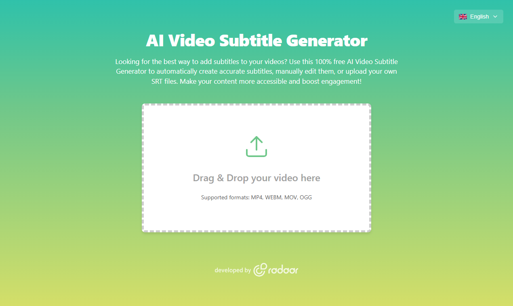
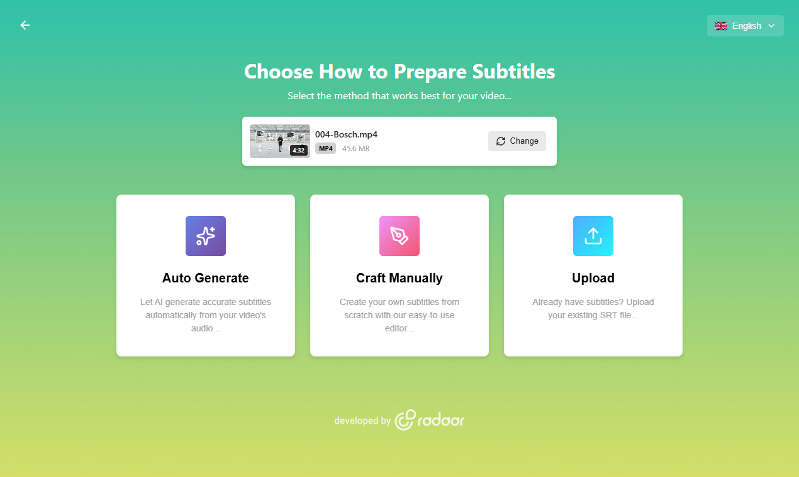
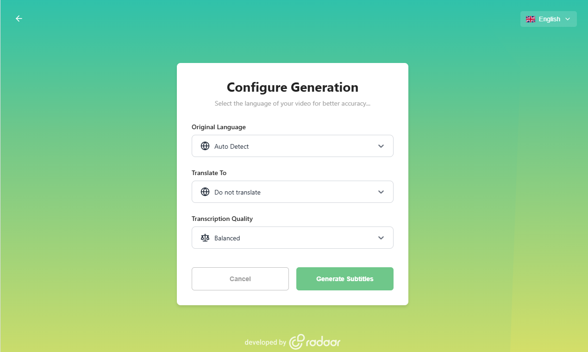

---

