# 🚀 Product Hunt Daily Top 30 (2026-06-10)

## 오늘의 요약
오늘의 트렌드는 단순한 챗봇을 넘어 로컬 파일과 브라우저를 제어하는 AI 에이전트와 개발 생산성을 높이는 도구들이 주를 이루었습니다. 또한, AI 생성 콘텐츠의 품질을 높이거나 인프라 비용을 절감하는 등 실질적인 운영 효율성을 극대화하는 솔루션들이 주목받았습니다.

### 오늘의 핵심 포인트
- 로컬 파일 관리와 브라우저 자동화를 결합하여 지식 노동의 워크플로우를 혁신하는 AI 데스크톱 에이전트가 등장했습니다.
- AI 코딩 에이전트 간의 데이터 공유 및 디자인 시스템 최적화를 통해 AI 활용 과정에서의 번거로움과 저품질 문제를 해결하려는 시도가 돋보였습니다.
- 실시간 음성 번역, 엣지 기반 추론 인프라 등 실제 사용 환경의 제약을 극복하고 비용 효율을 높이는 실용적인 AI 기술들이 제안되었습니다.

**오늘의 태그**: AI 에이전트, 생산성 도구, 개발자 도구, 자동화, 인프라

## 1. [VC Boom](https://www.producthunt.com/products/vcboom)
**Votes**: 348 | **도입 난이도**: 하 | **신뢰도**: 상
**Tagline**: Score your deck, meet investors who fit, raise more. Boom!
**서비스 링크**: https://www.producthunt.com/r/NEBXF32UWM4O4P

**태그**: Fundraising, PitchDeck, InvestorMatching, Automation, AI Tool, Email

### 📌 이 서비스 한눈에 보기
90초 만에 피치덱을 진단하고 최적의 투자자를 매칭하여 성공적인 펀드레이징을 돕는 도구

### 🔑 주요 기능
- 90초 이내의 빠른 피치덱 점수 산출 및 즉각적인 개선점 제안
- 47,000명 이상의 투자자 데이터베이스 기반 맞춤형 매칭 및 매칭 사유 제공
- 개인 이메일 계정을 활용한 맞춤형 콜드 이메일 초안 작성 기능

### 🙋 사용자에게 어떤 점이 좋은가
투자 유치 준비 시간을 획기적으로 단축하고, 데이터에 기반한 피치덱 개선과 정교한 투자자 컨택이 가능합니다.

### ✅ 지금 바로 써볼 기능
- 피치덱 업로드하여 즉각적인 개선점 확인하기
- 내 사업 모델에 맞는 투자자 리스트 추출하기
- 제안된 초안을 바탕으로 개인화된 콜드 이메일 발송하기

### ⚠️ 사용 전 확인할 점
- AI가 제안하는 피치덱 수정 사항이 실제 시장 상황과 일치하는지 검토 필요
- 개인 이메일 연동 시 보안 및 스팸 관리 주의

### 🧭 확인이 더 필요한 정보
무료로 시작 가능하다고 명시되어 있으나, 향후 유료화 모델이나 기능 제한 범위에 대한 확인이 필요합니다.

### 📸 스크린샷 및 갤러리
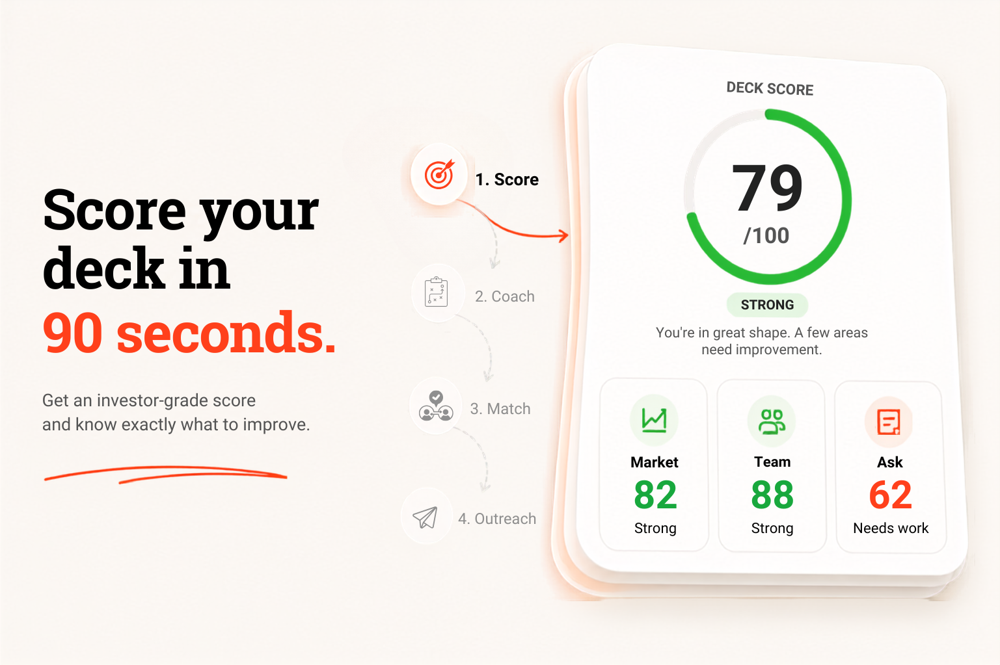
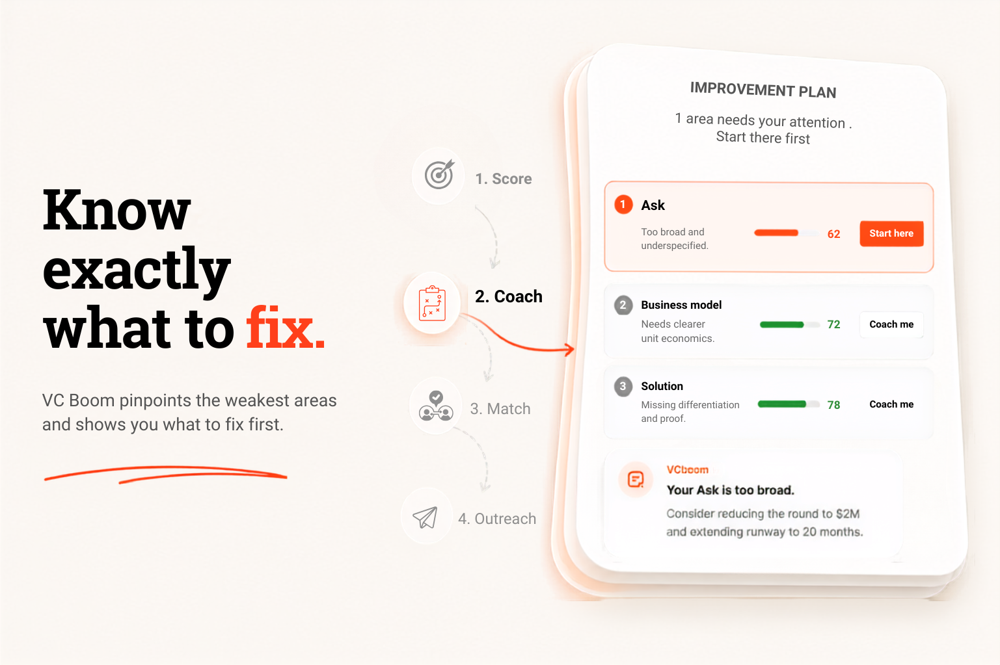

### 🎬 관련 영상
- [🎥 영상 보기](https://ph-files.imgix.net/d87c7466-c16f-4319-bc6c-cfae49d67199.octet-stream?auto=format)

---

## 2. [ZeroGPU](https://www.producthunt.com/products/zerogpu)
**Votes**: 264 | **도입 난이도**: 중 | **신뢰도**: 상
**Tagline**: The compute efficient layer for AI inference
**서비스 링크**: https://www.producthunt.com/r/PR7CMHWYTD6JXM

**태그**: AI Infrastructure, Edge Computing, Inference Optimization, DevTools, AI Tool

### 📌 이 서비스 한눈에 보기
기존 컴퓨팅 자원을 재활용하여 비용과 속도를 혁신하는 엣지 기반 AI 추론 인프라

### 🔑 주요 기능
- 하이브리드 엣지 네트워크를 활용한 효율적인 AI 인프라 제공
- 프론티어 모델 대신 최적화된 소형 언어 모델(SLM) 사용
- 기존 대비 10배 빠른 속도와 50% 저렴한 비용 지향

### 🙋 사용자에게 어떤 점이 좋은가
고비용의 거대 모델 대신 가벼운 모델로도 충분한 작업들을 저렴하고 빠르게 처리하여 운영 비용을 획기적으로 절감할 수 있습니다.

### ✅ 지금 바로 써볼 기능
- 현재 운영 중인 AI 워크로드 중 소형 모델로 대체 가능한 작업 분류하기
- 엣지 네트워크 환경에서의 추론 속도 및 정확도 테스트하기
- 기존 프론티어 모델 대비 비용 절감 효과 시뮬레이션하기

### ⚠️ 사용 전 확인할 점
- 복잡한 추론이 필요한 작업에서 프론티어 모델 대비 정확도 차이 발생 가능성
- 엣지 네트워크 환경에 따른 네트워크 안정성 및 지연 시간 변동성

### 🧭 확인이 더 필요한 정보
소형 모델이 프론티어 모델 수준의 정확도를 실제 모든 작업에서 유지할 수 있는지에 대한 검증이 필요합니다.

### 📸 스크린샷 및 갤러리
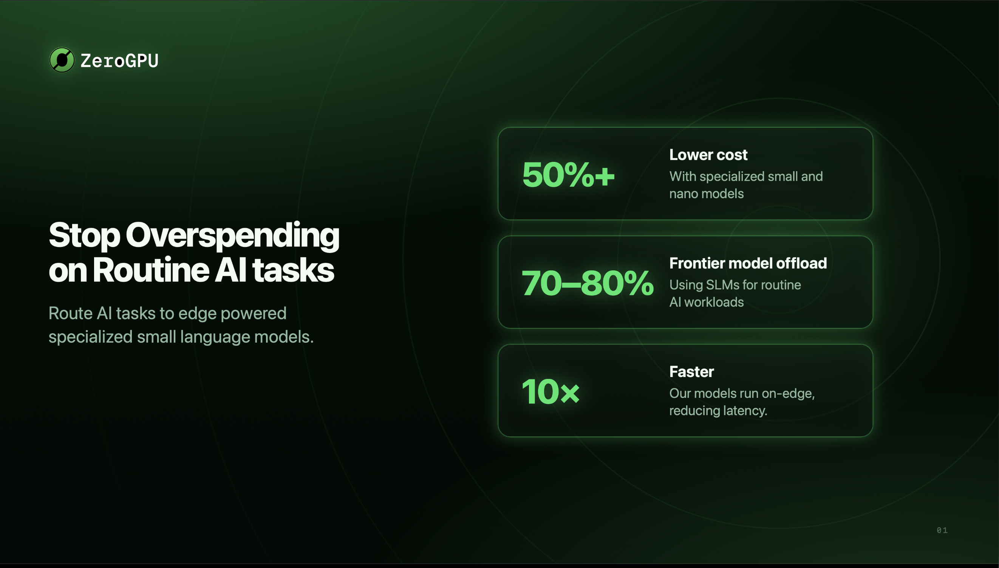
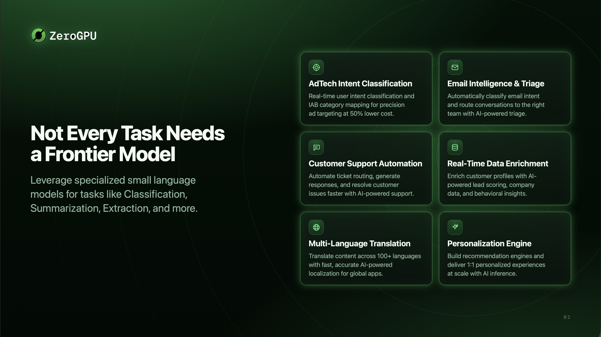
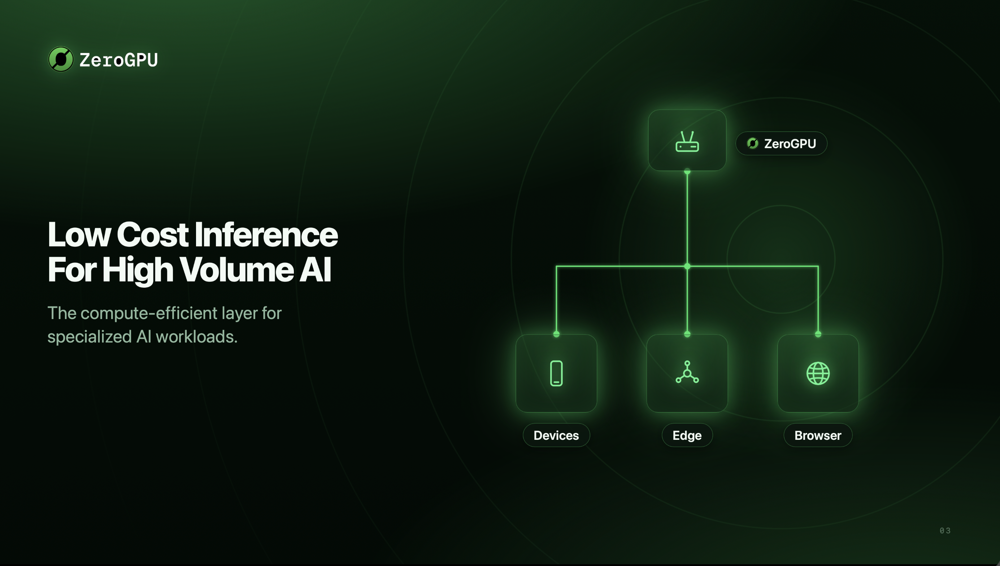

### 🎬 관련 영상
- [🎥 영상 보기](https://ph-files.imgix.net/d25d1a86-9e91-4b80-9074-f038f785e5e2.jpeg?auto=format)

---

## 3. [prostir zvuku](https://www.producthunt.com/products/prostir-zvuku)
**Votes**: 188 | **도입 난이도**: 하 | **신뢰도**: 상
**Tagline**: A spatial nature sound mixer for Mac
**서비스 링크**: https://www.producthunt.com/r/F4SMKPSTSJHNN4

**태그**: Productivity, Wellness, Audio, Mac, AI Tool

### 📌 이 서비스 한눈에 보기
나만의 몰입 공간을 만드는 Mac용 공간 음향 자연 소리 믹서

### 🔑 주요 기능
- 다양한 자연 소리(비, 불, 바다, 바람 등)를 믹싱하여 개인화된 환경 구축
- 캔버스 위에 소리를 배치하는 직관적인 공간 음향 인터페이스
- 집중, 휴식, 수면을 위한 맞춤형 사운드스케이프 제공

### 🙋 사용자에게 어떤 점이 좋은가
사용자가 원하는 소리 요소를 공간적으로 배치하여 마치 자연 속에 있는 듯한 몰입감을 통해 집중력 향상과 숙면을 돕습니다.

### ✅ 지금 바로 써볼 기능
- 다양한 자연 소리 조합해보기
- 캔버스 기능을 활용한 공간적 배치 시도
- 집중 및 수면 모드 설정하기

### ⚠️ 사용 전 확인할 점
- Mac 전용 소프트웨어이므로 타 OS 사용자는 사용 불가
- 공간 음향 효과를 제대로 느끼기 위해 헤드폰/스피커 환경 필요

### 🧭 확인이 더 필요한 정보
상세한 오디오 출력 품질 및 타 앱과의 연동 여부는 명시되지 않았습니다.

### 📸 스크린샷 및 갤러리
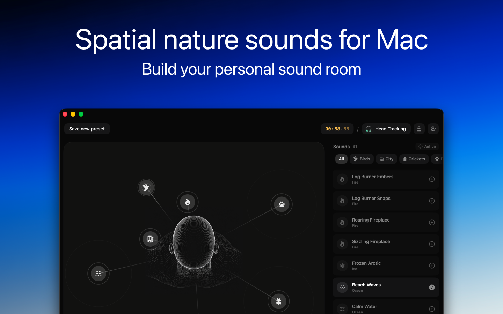
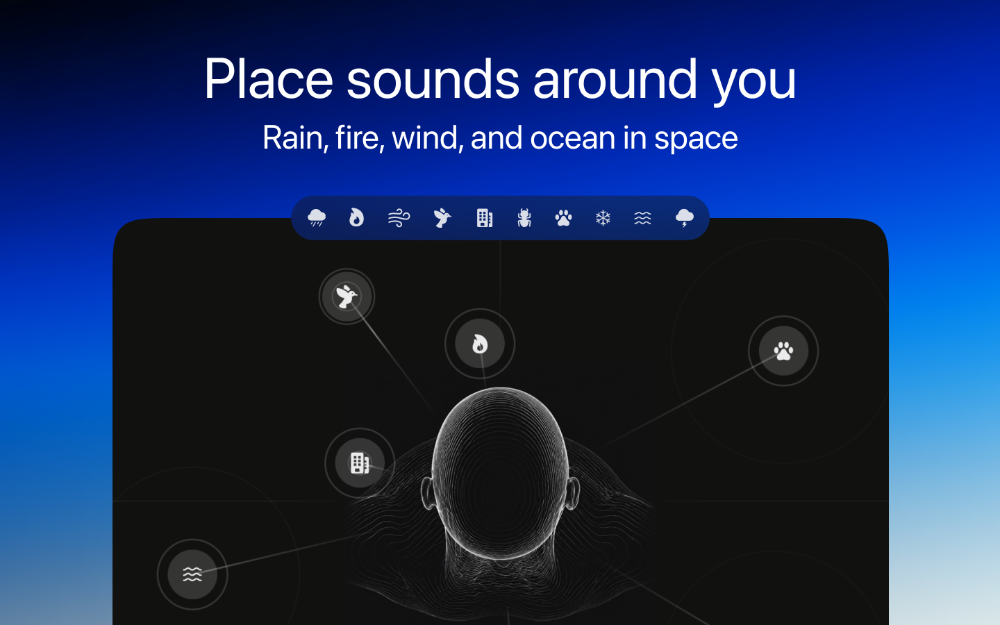
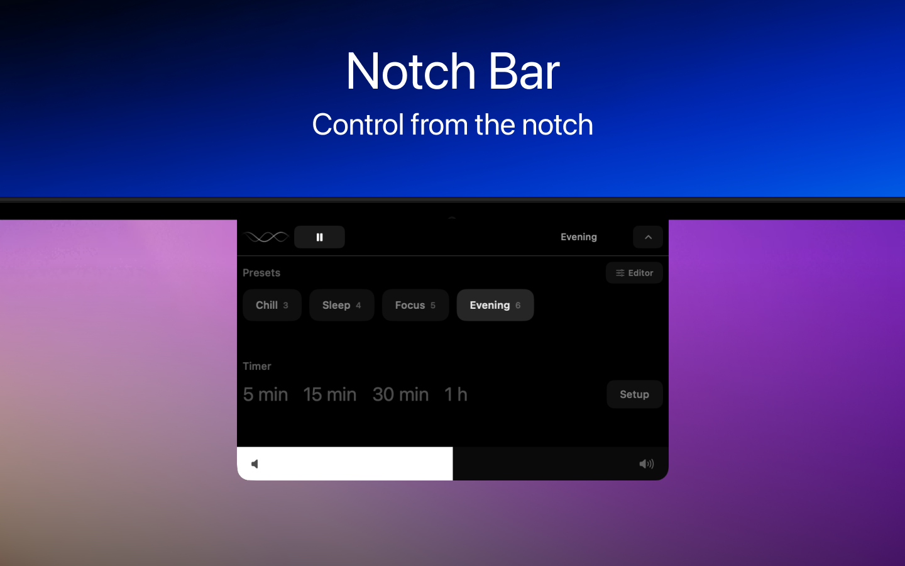

### 🎬 관련 영상
- [🎥 영상 보기](https://ph-files.imgix.net/91583d1e-bbf5-4ccc-9870-f26b6bc82572.jpeg?auto=format)

---

## 4. [Krisp Voice Translation API](https://www.producthunt.com/products/krisp)
**Votes**: 174 | **도입 난이도**: 중 | **신뢰도**: 상
**Tagline**: Real-time speech-to-speech translation API 
**서비스 링크**: https://www.producthunt.com/r/4VAYRZFB62SQFY

**태그**: API, Translation, Real-time, Voice-AI, AI Tool, DevTool

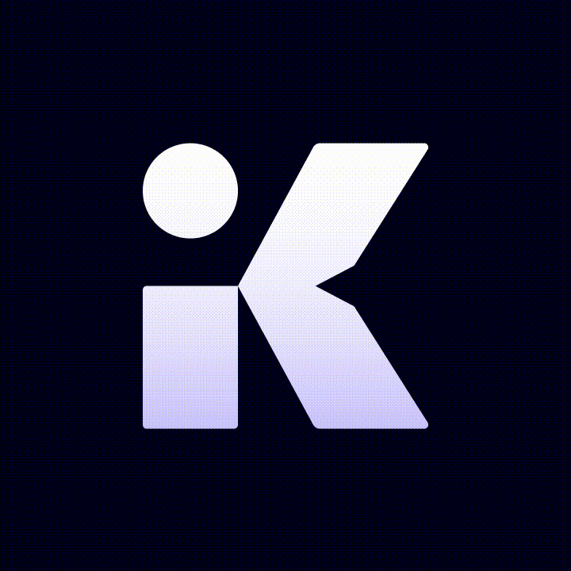

### 📌 이 서비스 한눈에 보기
소음과 악센트가 있는 실제 통화 환경에서도 96%의 정확도를 보장하는 실시간 음성 번역 API

### 🔑 주요 기능
- 실제 컨택센터 데이터를 기반으로 구축된 높은 번역 정확도 (96%)
- 배경 소음 및 다양한 악센트가 존재하는 실생활 환경에 최적화
- 61개 이상의 언어 지원 및 모든 언어 간 양방향 번역 가능

### 🙋 사용자에게 어떤 점이 좋은가
데모 환경이 아닌 소음이 있는 실제 통화 환경에서도 끊김 없고 정확한 실시간 번역 서비스를 구현할 수 있습니다.

### ✅ 지금 바로 써볼 기능
- 개발자 대시보드 가입하기
- 60분 무료 크레딧으로 API 성능 테스트하기

### ⚠️ 사용 전 확인할 점
- 실제 서비스 적용 전 사용자의 네트워크 환경에 따른 지연 시간 확인 필요
- 특정 도메인(예: 의료, 법률)에서의 전문 용어 처리 정확도 검증 필요

### 🧭 확인이 더 필요한 정보
제공되는 60분 무료 크레딧의 구체적인 사용 단위(초 단위 또는 호출 횟수)에 대한 확인이 필요합니다.

### 📸 스크린샷 및 갤러리
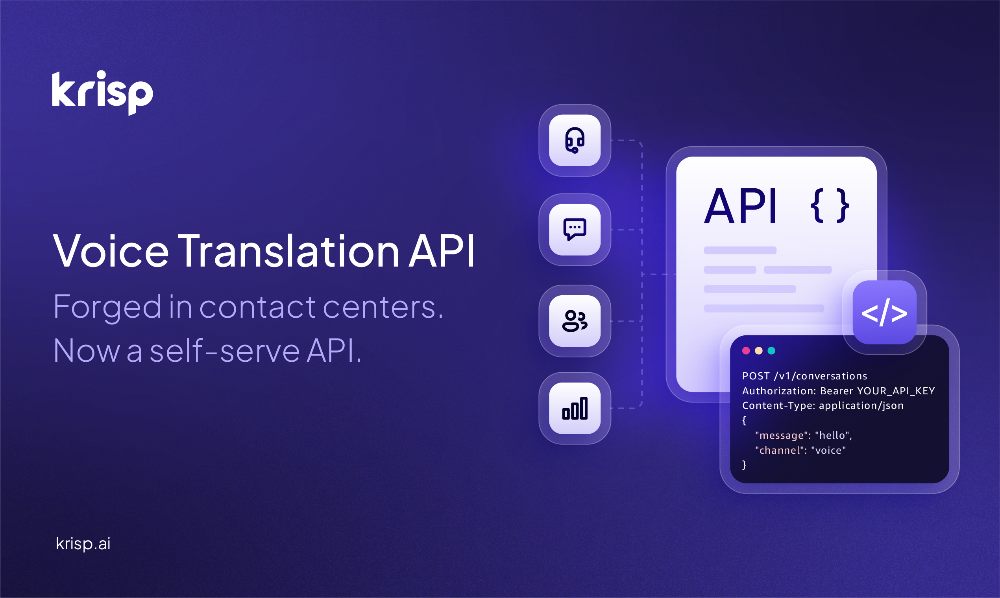
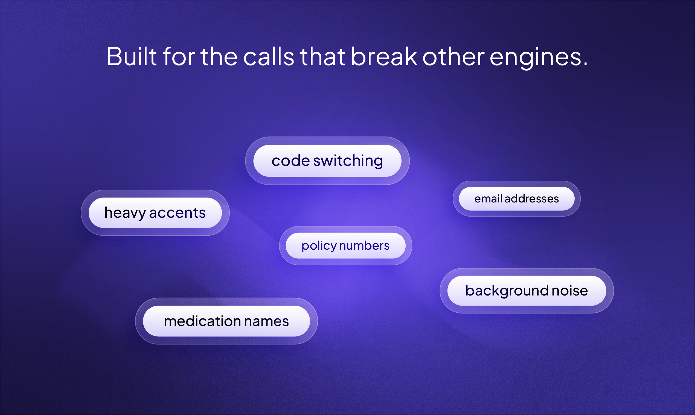

---

## 5. [ agmsg](https://www.producthunt.com/products/agmsg)
**Votes**: 162 | **도입 난이도**: 하 | **신뢰도**: 상
**Tagline**: Stop copy-pasting between your AI coding agents
**서비스 링크**: https://www.producthunt.com/r/B4AXPCZ72ACZGT

**태그**: DevTool, AI-Agent, Automation, CLI, Agent, AI Tool

### 📌 이 서비스 한눈에 보기
여러 AI 코딩 에이전트 간의 복사-붙여넣기 번거로움을 없애주는 공유 데이터베이스 기반 메시징 도구

### 🔑 주요 기능
- Claude Code, Gemini CLI, Copilot CLI 등 서로 다른 벤더의 에이전트 간 직접 메시징 지원
- SQLite를 활용하여 별도의 데몬이나 네트워크 설정 없이 bash와 sqlite3만으로 동작
- 단일 벤더의 서브에이전트나 MCP와 달리 벤더에 구애받지 않는 지속성 있는 협업 환경 제공

### 🙋 사용자에게 어떤 점이 좋은가
여러 종류의 AI 코딩 에이전트를 동시에 사용할 때 발생하는 수동 작업(복사-붙여넣기)을 자동화하여 개발 흐름을 끊김 없이 유지할 수 있습니다.

### ✅ 지금 바로 써볼 기능
- 사용 중인 CLI 에이전트에 Agent Skill로 설치하기
- 여러 개의 Claude Code 인스턴스를 하나의 작업 공간에 띄워 협업 테스트하기
- SQLite 기반의 메시지 공유 방식이 로컬 환경에서 어떻게 작동하는지 확인하기

### ⚠️ 사용 전 확인할 점
- 로컬 SQLite 파일을 공유하므로 파일 잠금(locking)이나 동시성 이슈가 발생할 수 있음
- 에이전트 간의 메시지 흐름을 사용자가 직접 관리해야 하는 복잡성이 생길 수 있음

### 🧭 확인이 더 필요한 정보
다양한 CLI 도구들과의 호환성 및 에이전트 간 메시지 충돌 방지 메커니즘에 대한 구체적인 정보가 필요합니다.

### 📸 스크린샷 및 갤러리
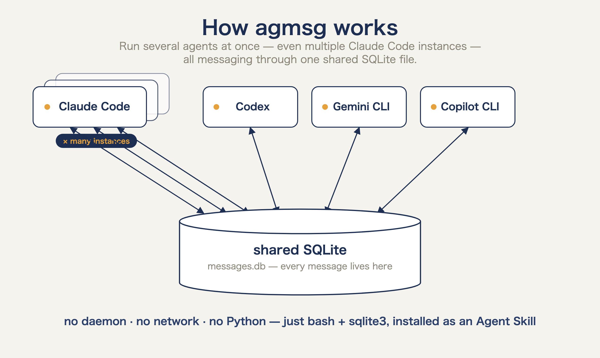
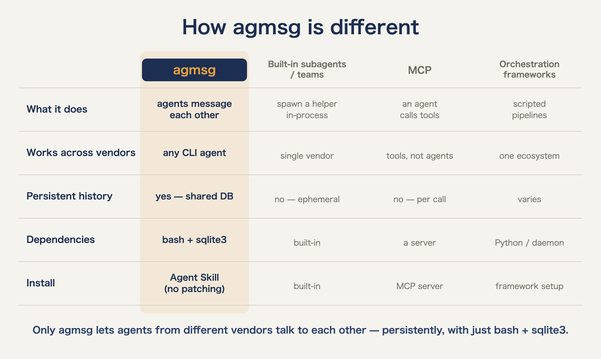
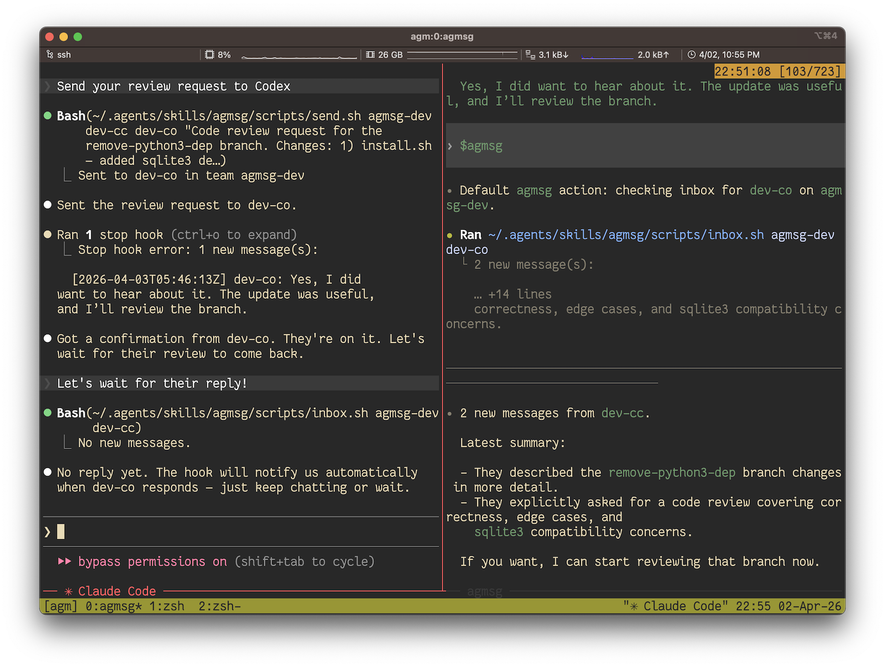

### 🎬 관련 영상
- [🎥 영상 보기](https://ph-files.imgix.net/64730faf-39ec-4bde-b247-df4b297836a2.jpeg?auto=format)

---

## 6. [Kimi Work](https://www.producthunt.com/products/kimi-ai-assistant)
**Votes**: 145 | **도입 난이도**: 중 | **신뢰도**: 상
**Tagline**: The AI desktop for knowledge work
**서비스 링크**: https://www.producthunt.com/r/FAJLZHX5Y5I6Q3

**태그**: AI Agent, Automation, Productivity, Desktop App, Agent, AI Tool

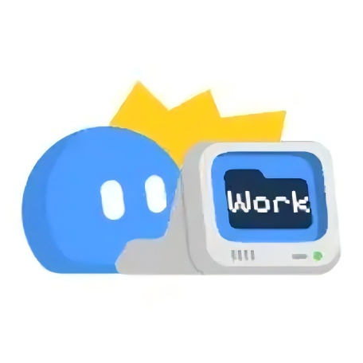

### 📌 이 서비스 한눈에 보기
로컬 파일과 브라우저를 넘나들며 업무를 자동화하는 지식 노동자용 AI 데스크톱 에이전트

### 🔑 주요 기능
- 로컬 파일 연동 및 브라우저 자동화(WebBridge) 지원
- 에이전트 스웜(Swarms) 협업 및 스케줄링 기능
- PPT, Excel, Word, PDF 등 문서 결과물 생성 및 금융 데이터 도구 탑재

### 🙋 사용자에게 어떤 점이 좋은가
단순 챗봇을 넘어 파일 관리와 브라우저 조작을 결합하여 반복적인 문서 작업과 데이터 수집 업무를 자동화할 수 있습니다.

### ✅ 지금 바로 써볼 기능
- 로컬 파일 기반의 데이터 분석 및 문서 생성 테스트
- WebBridge를 활용한 브라우저 자동화 워크플로우 설정
- 스케줄링 기능을 통한 반복 업무 자동화 실험

### ⚠️ 사용 전 확인할 점
- 로컬 파일 접근 권한에 따른 보안 및 개인정보 보호 주의 필요
- 에이전트 자동화 과정에서의 예기치 않은 브라우저 동작 확인 필요

### 🧭 확인이 더 필요한 정보
에이전트 스웜의 구체적인 협업 방식과 시스템 리소스 점유율에 대한 정보가 더 필요합니다.

### 📸 스크린샷 및 갤러리
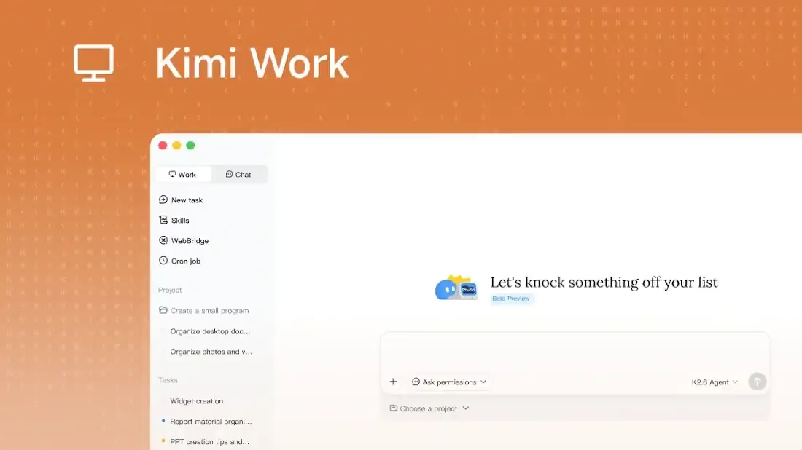
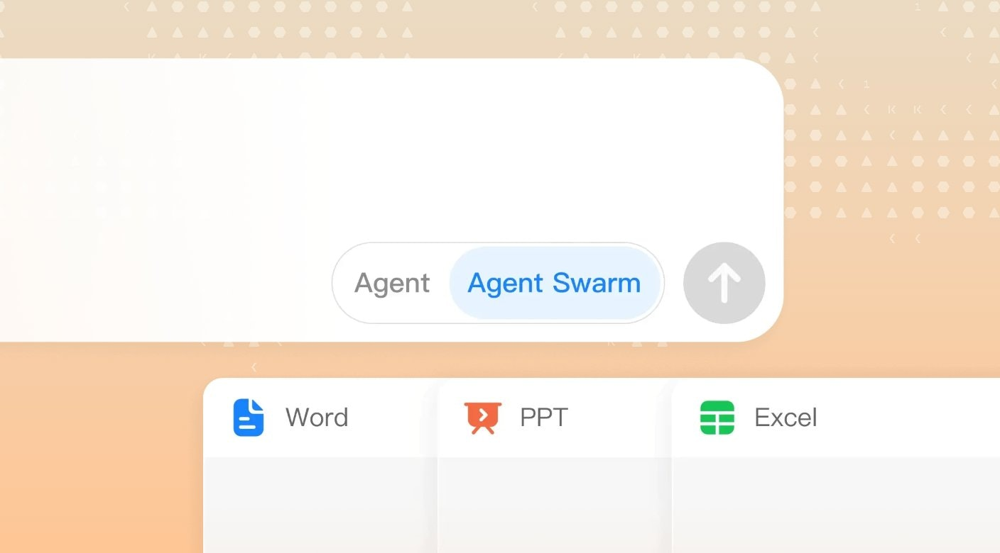
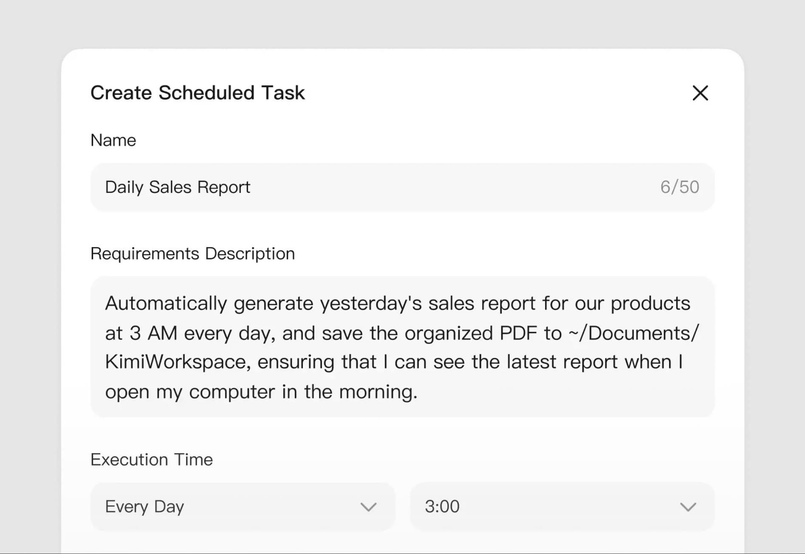

---

## 7. [Uiverse Design](https://www.producthunt.com/products/uiverse-io)
**Votes**: 140 | **도입 난이도**: 하 | **신뢰도**: 상
**Tagline**: De-slop your AI generated websites
**서비스 링크**: https://www.producthunt.com/r/EJZUZNOI66LAPN

**태그**: DesignSystem, AI-First, Frontend, DeveloperTools, Agent, AI Tool, Vision, Design, DevTool

### 📌 이 서비스 한눈에 보기
AI로 만든 듯한 뻔한 디자인을 탈피해주는 AI 친화적 디자인 시스템 라이브러리

### 🔑 주요 기능
- AI 생성 웹사이트 특유의 정형화된 디자인(generic look) 해결
- 타이포그래피, 간격, 색상, 컴포넌트 처리가 포함된 완성형 디자인 시스템 제공
- AI 에이전트가 디자인 가이드를 즉시 이해할 수 있는 DESIGN.md 파일 포함

### 🙋 사용자에게 어떤 점이 좋은가
AI 도구로 빠르게 웹사이트를 만들 때 발생하는 저품질 디자인 문제를 해결하여, 사용자에게 전문적인 브랜드 경험을 제공할 수 있습니다.

### ✅ 지금 바로 써볼 기능
- 제공되는 디자인 시스템 라이브러리 탐색
- 프로젝트에 DESIGN.md 가이드 적용해보기
- AI 에이전트를 활용한 자동 디자인 적용 테스트

### ⚠️ 사용 전 확인할 점
- 기존 프로젝트의 디자인 스타일과 충돌할 가능성
- 제공되는 디자인 시스템의 커스터마이징 자유도 확인 필요

### 🧭 확인이 더 필요한 정보
지원하는 프레임워크(React, Tailwind 등)의 종류와 구체적인 라이브러리 포맷이 명시되지 않았습니다.

### 📸 스크린샷 및 갤러리
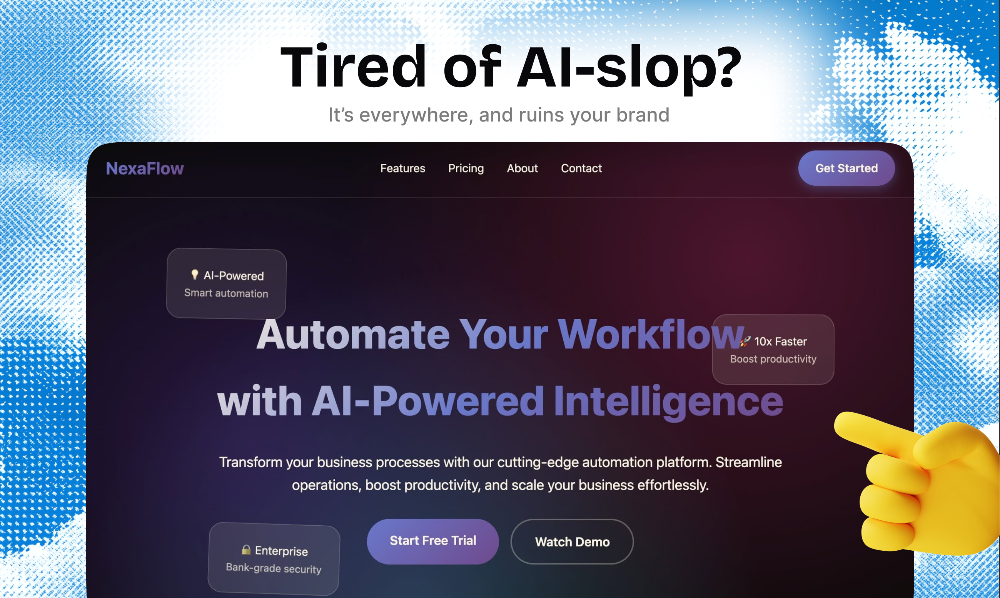

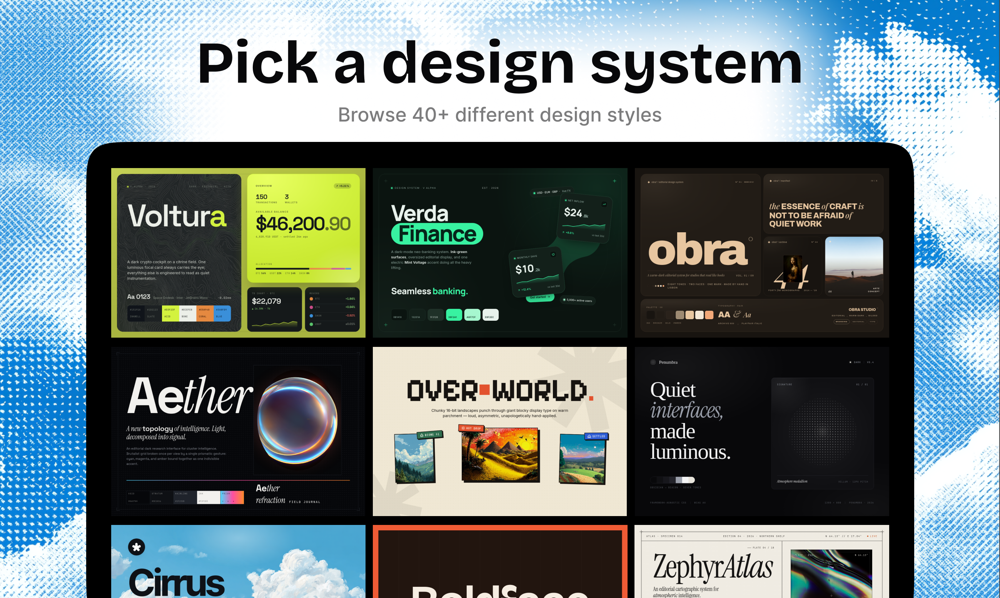

---

## 8. [BooBar](https://www.producthunt.com/products/boobar)
**Votes**: 120 | **도입 난이도**: 하 | **신뢰도**: 상
**Tagline**: AI Dynamic Island for your Mac
**서비스 링크**: https://www.producthunt.com/r/NI7IIRK45XBSHH

**태그**: Productivity, Mac, AI, Workflow, DevTool, AI Tool, Email

### 📌 이 서비스 한눈에 보기
Mac의 메뉴 바를 활용해 다양한 작업 흐름을 하나로 모은 AI 다이내믹 아일랜드

### 🔑 주요 기능
- 파일 정리, 다운로드 진행 상황, 이메일 코드 등 다양한 정보를 메뉴 바에서 확인
- 브라우저 컨텍스트 및 GitHub 패널 제공을 통한 작업 효율성 증대
- Claude/Codex 등 AI 작업과 로컬 우선(Local-first) 방식의 결합

### 🙋 사용자에게 어떤 점이 좋은가
여러 창을 오가지 않고도 메뉴 바 하나로 작업 흐름을 관리할 수 있어 데스크탑 환경이 깔끔해지고 생산성이 높아집니다.

### ✅ 지금 바로 써볼 기능
- 메뉴 바에 통합된 파일 및 다운로드 관리 기능 사용해보기
- GitHub 및 브라우저 컨텍스트 연동 기능 테스트하기
- AI(Codex/Claude) 작업 워크플로우 적용해보기

### ⚠️ 사용 전 확인할 점
- 다양한 기능을 한곳에 모으므로 메뉴 바가 복잡해질 수 있음
- 로컬 우선 방식이지만 AI 기능 사용 시 외부 API 연동 여부 확인 필요

### 🧭 확인이 더 필요한 정보
로컬 우선 방식이 모든 AI 기능(Codex/Claude)에 어떻게 적용되는지 구체적인 데이터 보안 정책 확인이 필요합니다.

### 📸 스크린샷 및 갤러리
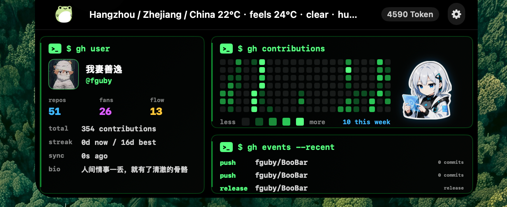
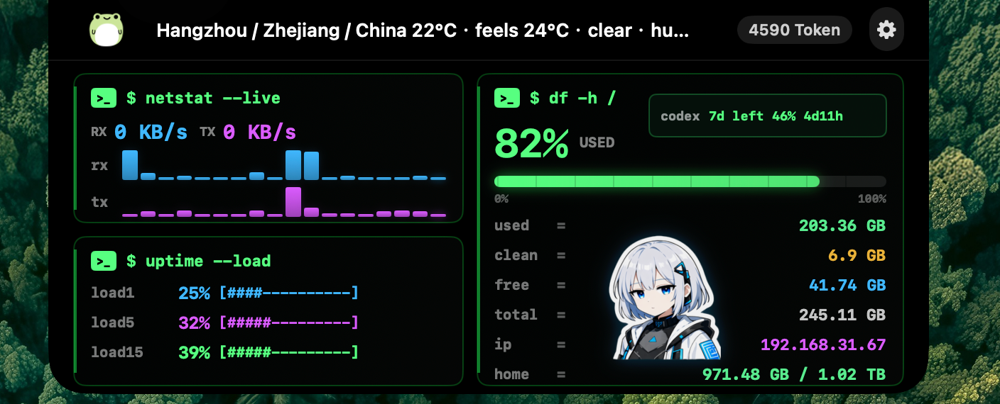

---

## 9. [Fluido](https://www.producthunt.com/products/fluido)
**Votes**: 111 | **도입 난이도**: 하 | **신뢰도**: 상
**Tagline**: Turn any Figma shape into liquid metal in one click
**서비스 링크**: https://www.producthunt.com/r/PTJPQWOSCHUMYY

**태그**: DesignTool, Figma, GenerativeDesign, UIUX, Design

### 📌 이 서비스 한눈에 보기
피그마의 모든 도형을 클릭 한 번으로 감각적인 리퀴드 메탈 스타일로 변환하는 생성형 디자인 도구

### 🔑 주요 기능
- 벡터, 텍스트, 프레임을 유기적인 액체 금속 질감으로 즉시 변환
- 피그마 캔버스 내에서 직접 작동하는 워크플로우
- 크롬 및 메탈릭 에스테틱을 활용한 고퀄리티 그래픽 생성

### 🙋 사용자에게 어떤 점이 좋은가
복잡한 그래픽 작업 없이도 클릭 한 번으로 트렌디한 메탈릭 디자인을 적용할 수 있어 디자인 작업 시간을 획기적으로 단축해 줍니다.

### ✅ 지금 바로 써볼 기능
- 기존 벡터 도형에 리퀴드 메탈 효과 적용해보기
- 텍스트 레이어를 입체적인 크롬 스타일로 변환하기
- 프레임 전체에 유기적인 질감 입혀보기

### ⚠️ 사용 전 확인할 점
- 생성된 효과가 벡터 데이터의 편집성을 저해할 수 있음
- 복잡한 레이어 구조에서 의도치 않은 결과가 나올 가능성

### 🧭 확인이 더 필요한 정보
생성된 결과물이 수정 가능한 벡터 형태인지 아니면 비트맵 이미지 형태인지 확인이 필요합니다.

### 📸 스크린샷 및 갤러리
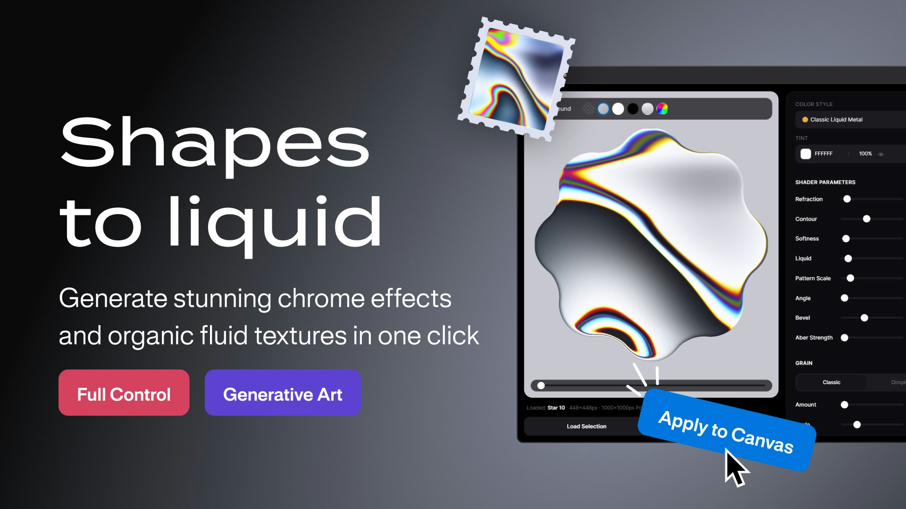
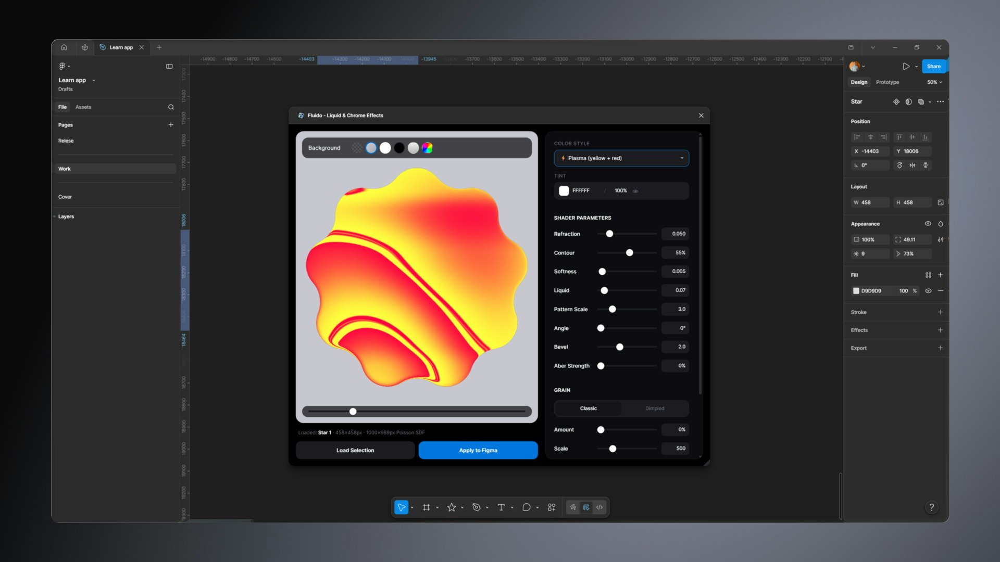
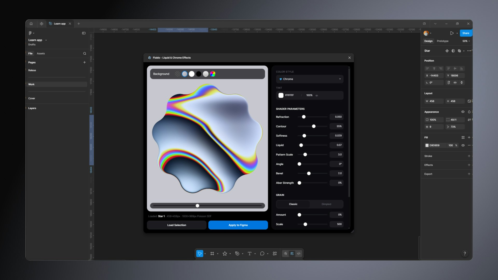

### 🎬 관련 영상
- [🎥 영상 보기](https://ph-files.imgix.net/77be595a-7af9-43fc-9b42-cc02072b26ab.jpeg?auto=format)

---

## 10. [hora Calendar](https://www.producthunt.com/products/hora-calendar)
**Votes**: 104 | **도입 난이도**: 하 | **신뢰도**: 상
**Tagline**: Google calendar built for the Mac
**서비스 링크**: https://www.producthunt.com/r/VZYEGPKBWDVKAI

**태그**: Productivity, MacApp, GoogleCalendar, Workflow

### 📌 이 서비스 한눈에 보기
구글 캘린더를 맥(Mac) 환경에 최적화하여 네이티브 앱으로 구현한 생산성 도구

### 🔑 주요 기능
- 메뉴 바에서 다음 일정 즉시 확인 가능
- Meet, Zoom, Teams 화상 회의 원클릭 참여
- 데이터 프록시 없이 구글 서버와 직접 동기화하여 보안성 강화

### 🙋 사용자에게 어떤 점이 좋은가
웹 브라우저를 열지 않고도 맥 메뉴 바에서 일정을 관리하고 화상 회의에 즉시 접속할 수 있어 작업 흐름이 끊기지 않습니다.

### ✅ 지금 바로 써볼 기능
- 메뉴 바에 고정하여 다음 일정 확인하기
- 원클릭 버튼으로 화상 회의 바로 접속하기
- 집중 시간(Focus Time) 설정으로 업무 몰입도 높이기

### ⚠️ 사용 전 확인할 점
- macOS 전용 앱이므로 윈도우 등 타 OS에서는 사용 불가
- 구글 계정 연동 및 권한 설정 필요

### 🧭 확인이 더 필요한 정보
상세한 가격 정책 및 유료 기능 포함 여부는 명시되지 않았습니다.

### 📸 스크린샷 및 갤러리
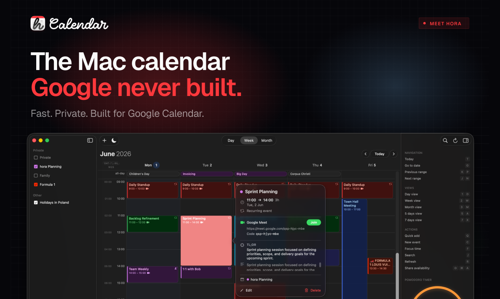
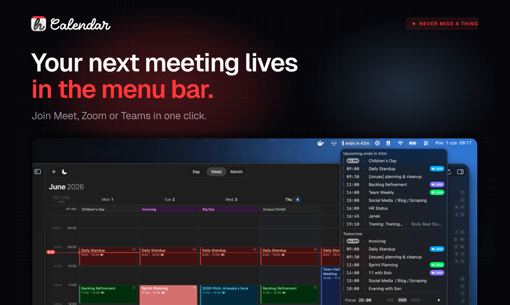
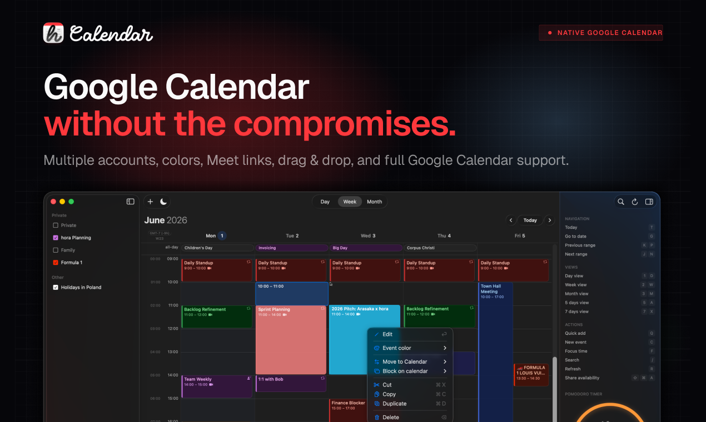

### 🎬 관련 영상
- [🎥 영상 보기](https://ph-files.imgix.net/6f864da3-c7b9-4f30-839d-e4a7792c047b.jpeg?auto=format)

---

## 11. [TravelMind ](https://www.producthunt.com/products/travelmind-city-discovery-reimagined)
**Votes**: 103 | **도입 난이도**: 하 | **신뢰도**: 상
**Tagline**: AI-powered city discovery built on taste, not reviews
**서비스 링크**: https://www.producthunt.com/r/PULBOJS3SSKEEN

**태그**: Travel, AI, Personalization, Mobile App, AI Tool

### 📌 이 서비스 한눈에 보기
리뷰 검색의 피로감 없이 개인의 취향만으로 최적의 장소를 찾아주는 AI 도시 탐험 가이드

### 🔑 주요 기능
- 리뷰 기반의 정보 과부하 해결
- 스와이프 방식의 직관적인 취향 학습
- 사용자의 개인적 취향에 맞춘 맞춤형 장소 추천

### 🙋 사용자에게 어떤 점이 좋은가
낯선 도시에서 무엇을 할지 고민하며 시간을 낭비하는 대신, 개인화된 추천을 통해 즉각적으로 만족스러운 장소를 발견할 수 있습니다.

### ✅ 지금 바로 써볼 기능
- 앱 설치 후 스와이프를 통한 취향 데이터 입력하기
- AI가 제안하는 맞춤형 장소 리스트 확인하기
- 현재 위치 기반의 도시 탐색 기능 활용하기

### ⚠️ 사용 전 확인할 점
- 초기 학습 단계에서 사용자의 취향이 충분히 반영될 때까지 추천 정확도가 낮을 수 있음
- 사용자의 주관적 취향에 의존하므로 대중적인 명소와는 거리가 있을 수 있음

### 🧭 확인이 더 필요한 정보
사용자의 취향 학습 알고리즘의 구체적인 작동 방식과 추천 데이터의 출처에 대한 정보가 더 필요합니다.

### 📸 스크린샷 및 갤러리

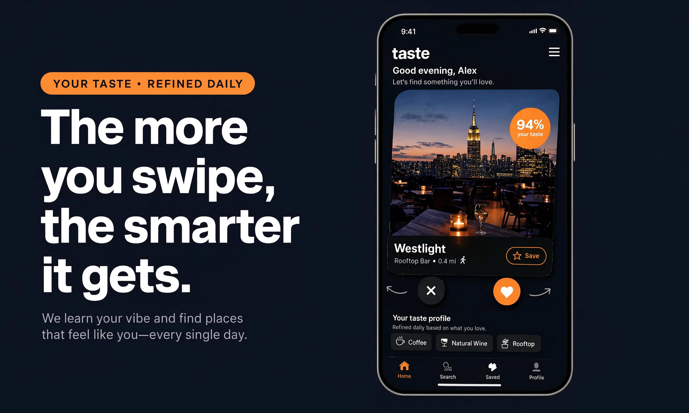

### 🎬 관련 영상
- [🎥 영상 보기](https://ph-files.imgix.net/bf0bab80-f725-4c76-ad0f-032f25d23618.jpeg?auto=format)

---

## 12. [Reve 2.0](https://www.producthunt.com/products/reve-2-0)
**Votes**: 102 | **도입 난이도**: 중 | **신뢰도**: 상
**Tagline**: Generate and edit 4K images through layout-based control
**서비스 링크**: https://www.producthunt.com/r/7EQR22JDON7KXA

**태그**: DesignTool, AI-Image, CreativeTech, HighRes, Vision, Design

### 📌 이 서비스 한눈에 보기
레이아웃 기반 제어로 정교한 4K 이미지 생성 및 편집이 가능한 AI 도구

### 🔑 주요 기능
- 레이아웃 우선 모델을 통한 정밀한 구도 제어
- 이미지를 개별 영역으로 분할하여 편집 가능한 구조 제공
- 고해상도 4K 이미지 생성 및 편집 지원

### 🙋 사용자에게 어떤 점이 좋은가
디자이너와 마케터가 원하는 구도와 배치를 정확하게 구현할 수 있어, 생성형 AI의 고질적인 문제인 배치 불일치 문제를 해결해 줍니다.

### ✅ 지금 바로 써볼 기능
- 레이아웃 기반의 이미지 생성 테스트
- 분할된 영역을 활용한 부분 편집 기능 확인
- 4K 고해상도 결과물 품질 검토

### ⚠️ 사용 전 확인할 점
- 레이아웃 제어 방식에 따른 학습 곡선 존재 가능성
- 고해상도 생성 시 소요되는 컴퓨팅 자원 및 시간

### 🧭 확인이 더 필요한 정보
구체적인 사용 요금제와 세부적인 편집 인터페이스의 편의성에 대한 정보가 필요합니다.

### 📸 스크린샷 및 갤러리

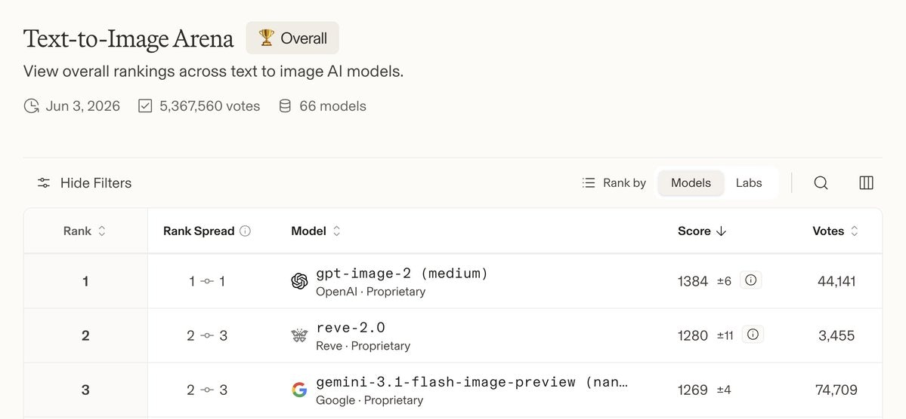
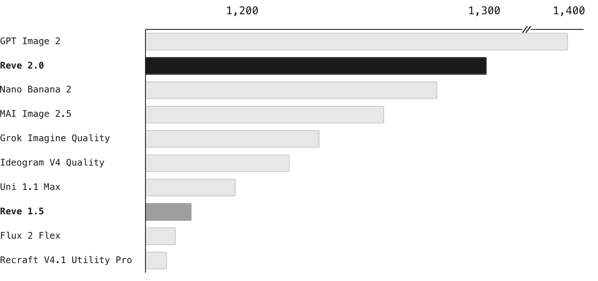

### 🎬 관련 영상
- [🎥 영상 보기](https://ph-files.imgix.net/d09de3a3-3496-44f9-8109-1364f86919a2.jpeg?auto=format)

---

## 13. [Whistle](https://www.producthunt.com/products/whistle-ai-workout-planner)
**Votes**: 101 | **도입 난이도**: 하 | **신뢰도**: 상
**Tagline**: A fitness coach with personalized plans
**서비스 링크**: https://www.producthunt.com/r/5LN77OJG5IYPGU

**태그**: Fitness, AI, HealthTech, AppleWatch, AI Tool

### 📌 이 서비스 한눈에 보기
애플 건강 데이터를 기반으로 개인의 컨디션과 목표에 맞춘 맞춤형 운동 플랜을 제공하는 AI 피트니스 코치

### 🔑 주요 기능
- 애플 건강(Apple Health) 데이터 연동을 통한 실시간 피드백
- 사용자의 체력 수준, 회복 상태, 목표를 반영한 스마트 트레이닝 플랜
- 아이폰 및 애플 워치 최적화로 어디서든 간편한 운동 관리

### 🙋 사용자에게 어떤 점이 좋은가
천편일률적인 운동 루틴에서 벗어나, 사용자의 실제 신체 데이터에 기반한 개인화된 운동 스케줄을 통해 효율적인 성장을 돕습니다.

### ✅ 지금 바로 써볼 기능
- 애플 건강 데이터 연동하기
- 개인별 맞춤형 운동 플랜 생성하기
- 애플 워치를 활용한 실시간 운동 트래킹

### ⚠️ 사용 전 확인할 점
- 애플 생태계(iPhone, Apple Watch) 기기 사용이 필수적임
- 정확한 플랜 생성을 위해 충분한 건강 데이터 축적이 필요할 수 있음

### 🧭 확인이 더 필요한 정보
AI 코칭 알고리즘의 구체적인 과학적 근거와 상세 운동 종목 범위는 명시되지 않았습니다.

### 📸 스크린샷 및 갤러리

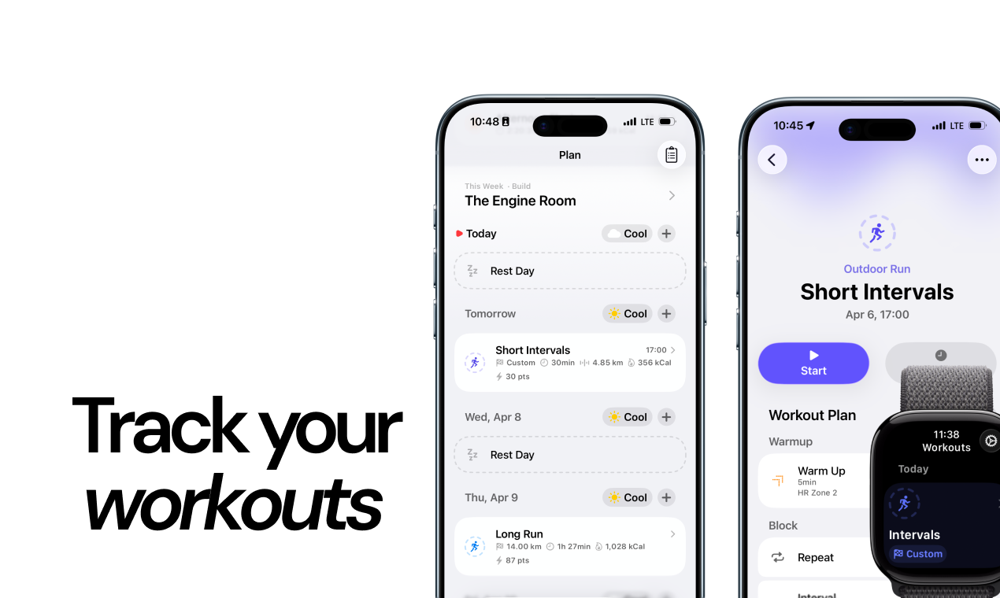
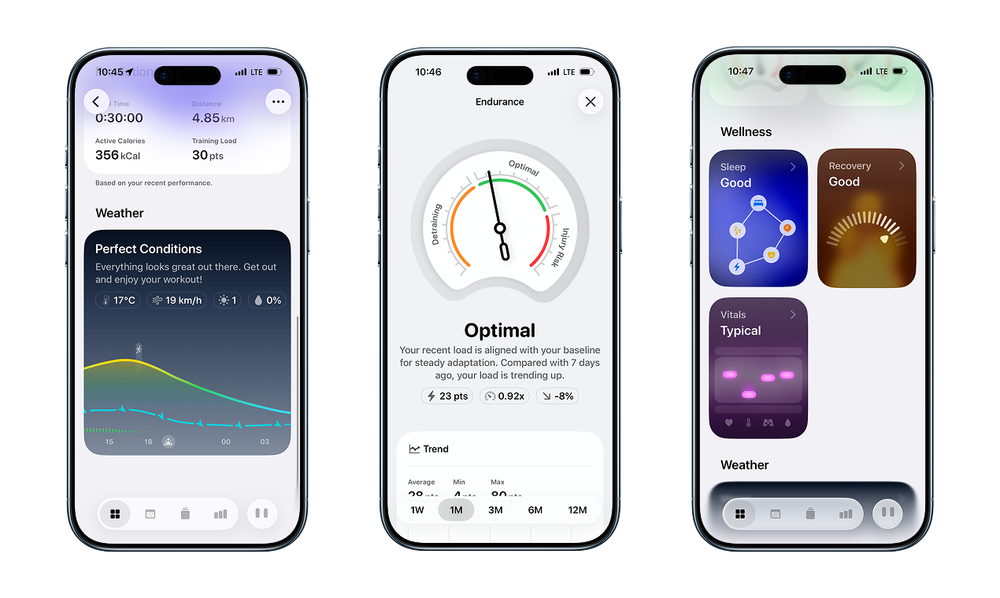

### 🎬 관련 영상
- [🎥 영상 보기](https://ph-files.imgix.net/b3b6c072-72c6-4999-a76b-825d4883d9bd.jpeg?auto=format)

---

## 14. [agentcad](https://www.producthunt.com/products/agentcad)
**Votes**: 97 | **도입 난이도**: 중 | **신뢰도**: 상
**Tagline**: A CAD design tool for coding agents (free + open source)
**서비스 링크**: https://www.producthunt.com/r/VG4XNFKDCM6SXN

**태그**: CAD, AI-Agent, OpenSource, 3DDesign, Automation, Agent, Prompting, Vision, Design, DevTool

### 📌 이 서비스 한눈에 보기
코딩 에이전트가 스스로 설계하고 검증하여 완성된 3D 모델을 생성하는 오픈소스 CAD 도구

### 🔑 주요 기능
- 프롬프트나 스케치를 기반으로 build123d/CadQuery 스크립트 자동 생성
- 에이전트가 스스로 코드를 실행하여 기하학적 오류 및 치수 정확도 자가 검증
- 검증된 결과물을 STEP, STL, GLB 등 즉시 출력 가능한 파일로 제공

### 🙋 사용자에게 어떤 점이 좋은가
사용자가 직접 설계할 필요 없이 에이전트에게 명령만 내리면, 오류가 수정된 완성도 높은 3D 설계 파일을 얻을 수 있습니다.

### ✅ 지금 바로 써볼 기능
- 이미지나 스케치를 업로드하여 에이전트의 설계 능력 테스트하기
- 생성된 스크립트와 3D 모델의 정밀도 확인하기
- 출력된 STEP/STL 파일을 3D 프린팅용으로 활용하기

### ⚠️ 사용 전 확인할 점
- 에이전트의 자가 검증만으로는 복잡한 공학적 요구사항을 완벽히 충족하지 못할 수 있음
- 스크립트 기반 생성 방식이므로 복잡한 형상 구현 시 코드 수정이 필요할 수 있음

### 🧭 확인이 더 필요한 정보
에이전트가 생성하는 스크립트의 복잡도에 따른 처리 속도와 하드웨어 요구 사양은 명시되지 않았습니다.

### 📸 스크린샷 및 갤러리
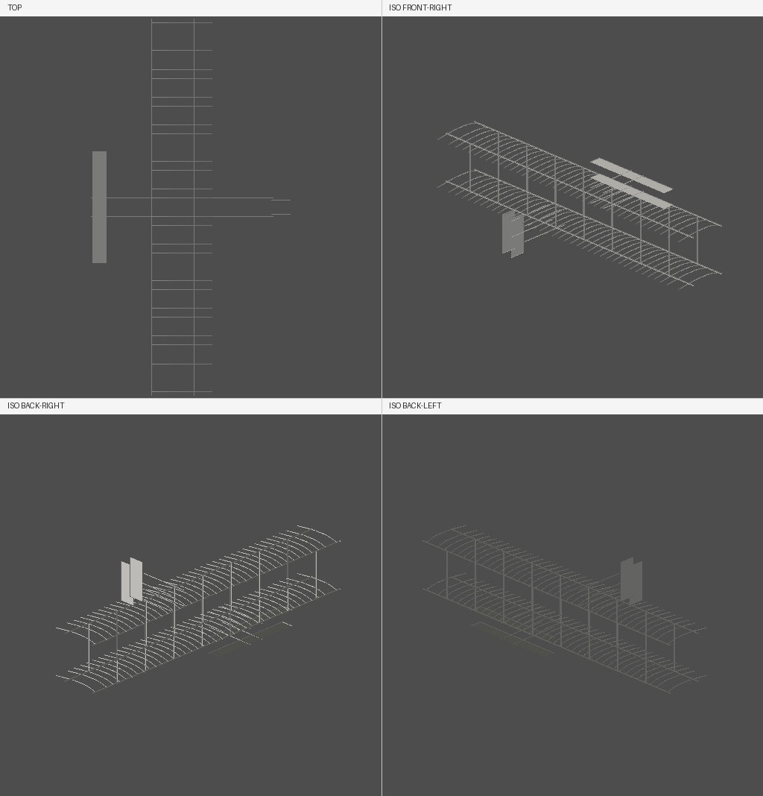
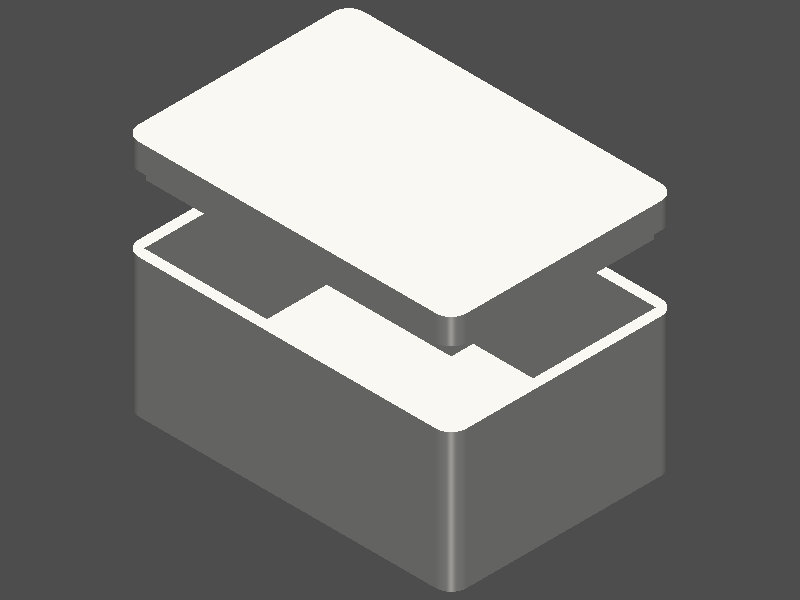
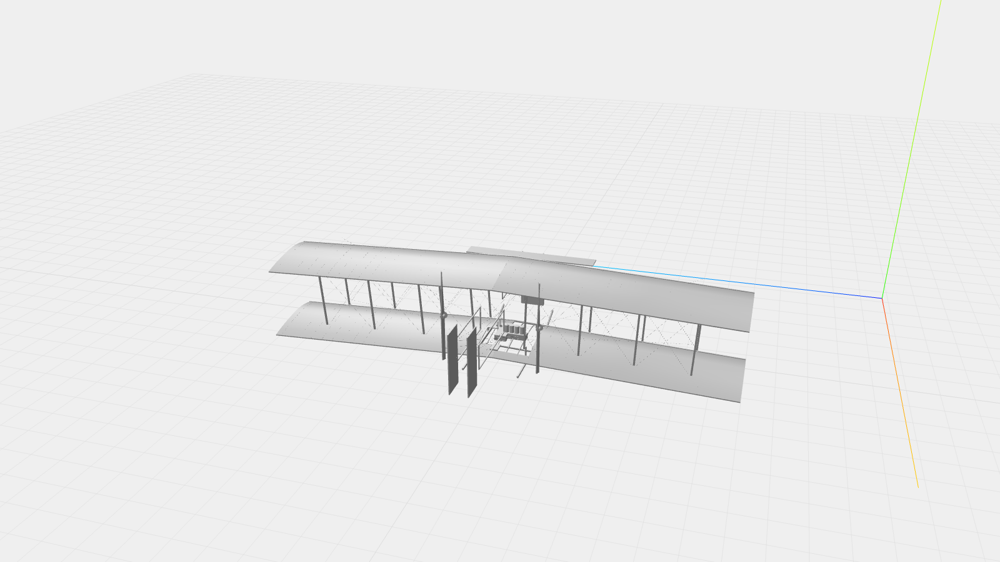

### 🎬 관련 영상
- [🎥 영상 보기](https://ph-files.imgix.net/bc2ff978-cba5-4f8e-ad50-9d80bb876074.jpeg?auto=format)

---

## 15. [Mic Drop 3.0](https://www.producthunt.com/products/mic-drop)
**Votes**: 92 | **도입 난이도**: 하 | **신뢰도**: 상
**Tagline**: Mute your mic in any app—with your AirPods
**서비스 링크**: https://www.producthunt.com/r/AA2VZA43G62USD

**태그**: Productivity, macOS, Automation, AirPods, AI Tool

### 📌 이 서비스 한눈에 보기
에어팟 제스처로 모든 앱의 마이크를 즉시 제어하는 macOS 전용 뮤트 매니저

### 🔑 주요 기능
- 에어팟 스퀴즈 제스처를 통한 간편한 마이크 토글
- Zoom, Meet, Slack 등 다양한 앱을 아우르는 글로벌 단축키 지원
- AppleScript 지원을 통한 강력한 자동화 기능

### 🙋 사용자에게 어떤 점이 좋은가
화상 회의 중 급하게 마이크를 꺼야 할 때, 별도의 클릭 없이 에어팟만으로 즉각적인 대응이 가능합니다.

### ✅ 지금 바로 써볼 기능
- 에어팟 제스처와 마이크 토글 연동 테스트
- 주요 화상 회의 앱(Zoom, Slack 등)에서의 작동 확인
- AppleScript를 활용한 개인 맞춤형 자동화 설정

### ⚠️ 사용 전 확인할 점
- macOS 환경에서만 작동하므로 타 OS 사용자는 사용 불가
- 에어팟 하드웨어 제스처와 앱 간의 호환성 확인 필요

### 🧭 확인이 더 필요한 정보
에어팟의 모든 모델과 macOS 버전에서 제스처 기능이 완벽하게 작동하는지 확인이 필요합니다.

### 📸 스크린샷 및 갤러리

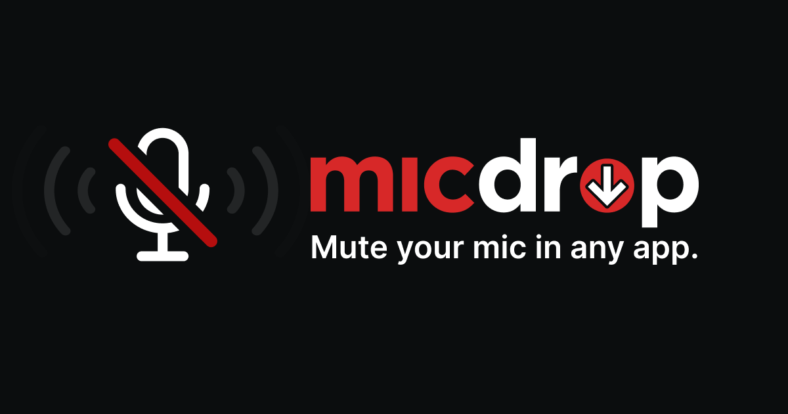
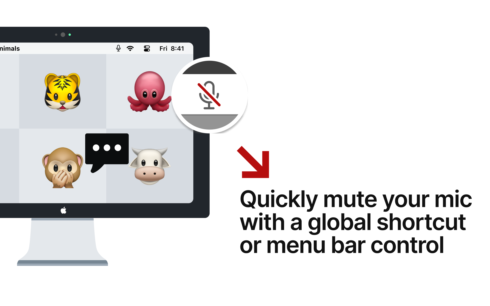

---

## 16. [Limelight](https://www.producthunt.com/products/limelight-4)
**Votes**: 91 | **도입 난이도**: 하 | **신뢰도**: 상
**Tagline**: Make your screen recordings easy to follow
**서비스 링크**: https://www.producthunt.com/r/UXYTSLW2JY2VR3

**태그**: Productivity, ScreenRecording, Presentation, Utility

### 📌 이 서비스 한눈에 보기
화면 녹화 및 발표 시 시선을 사로잡는 직관적인 시각 효과 도구

### 🔑 주요 기능
- 커서 강조, 키 입력 표시, 화면 드로잉 기능 제공
- Zoom, OBS, Google Slides 등 모든 화면 공유 환경과 호환
- 계정 생성이나 구독 없이 사용하는 네이티브 오프라인 앱

### 🙋 사용자에게 어떤 점이 좋은가
발표나 튜토리얼 제작 시 시청자가 작업 과정을 놓치지 않도록 시각적 가이드를 제공하여 전달력을 높여줍니다.

### ✅ 지금 바로 써볼 기능
- 7일 무료 체험을 통한 주요 기능 테스트
- 화면 공유 중 커서 스포트라이트 기능 사용해보기
- 키보드 입력 표시 기능으로 튜토리얼 제작해보기

### ⚠️ 사용 전 확인할 점
- 일회성 결제($9)가 필요하므로 무료 체험 기간 내 기능 확인 필수
- 네이티브 앱이므로 운영체제(OS) 호환성 확인 필요

### 🧭 확인이 더 필요한 정보
지원하는 운영체제(Windows, macOS 등)에 대한 구체적인 정보가 명시되지 않았습니다.

### 📸 스크린샷 및 갤러리
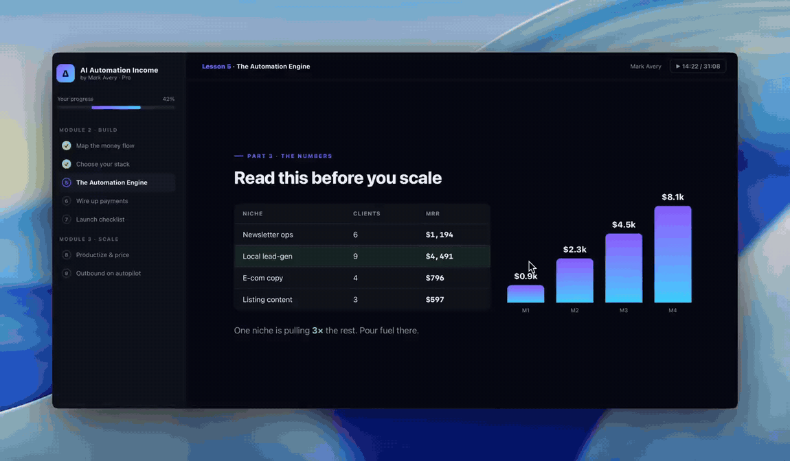
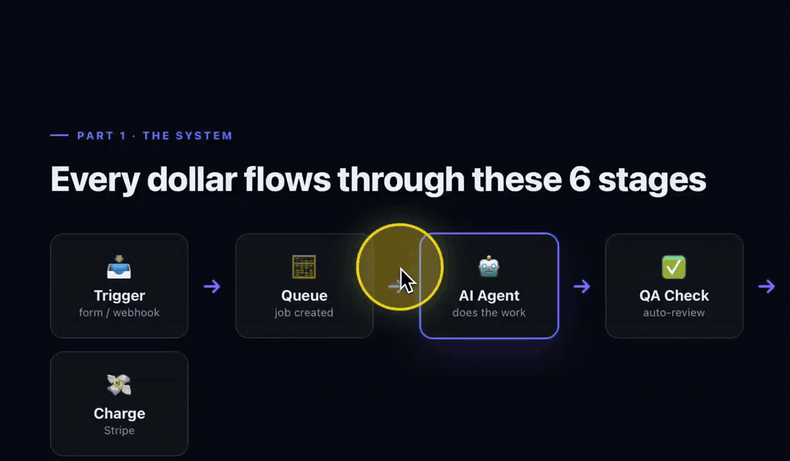

---

## 17. [Solarch](https://www.producthunt.com/products/solarch)
**Votes**: 89 | **도입 난이도**: 중 | **신뢰도**: 상
**Tagline**: Interactive diagrams with AI, and your code always in sync
**서비스 링크**: https://www.producthunt.com/r/5IV3JIRUE6DPAQ

**태그**: DevTool, Automation, Architecture, LowCode, AI Tool

### 📌 이 서비스 한눈에 보기
다이어그램을 코드로 즉시 변환하여 반복적인 아키텍처 작업을 자동화하는 도구

### 🔑 주요 기능
- 시각적 노드를 DTO 및 서비스와 같은 결정론적 보일러플레이트 코드로 변환
- 엄격한 규칙 엔진을 통한 다이어그램과 코드 간의 동기화 유지
- 아키텍처 구축에 드는 반복적인 작업 80%를 자동화하여 핵심 로직에 집중 가능

### 🙋 사용자에게 어떤 점이 좋은가
설계와 코드 사이의 간극을 줄여주며, 반복적인 구조 설계 작업을 자동화하여 개발 생산성을 높여줍니다.

### ✅ 지금 바로 써볼 기능
- 시각적 노드 생성 및 코드 변환 테스트
- 생성된 DTO 및 서비스 코드의 품질 확인
- 기존 프로젝트 아키텍처와의 호환성 검토

### ⚠️ 사용 전 확인할 점
- 생성된 코드가 특정 프레임워크나 언어에 종속적일 수 있음
- 복잡한 비즈니스 로직 구현 시 수동 수정이 필요할 가능성

### 🧭 확인이 더 필요한 정보
지원하는 프로그래밍 언어 및 프레임워크의 범위가 명시되지 않았습니다.

### 📸 스크린샷 및 갤러리
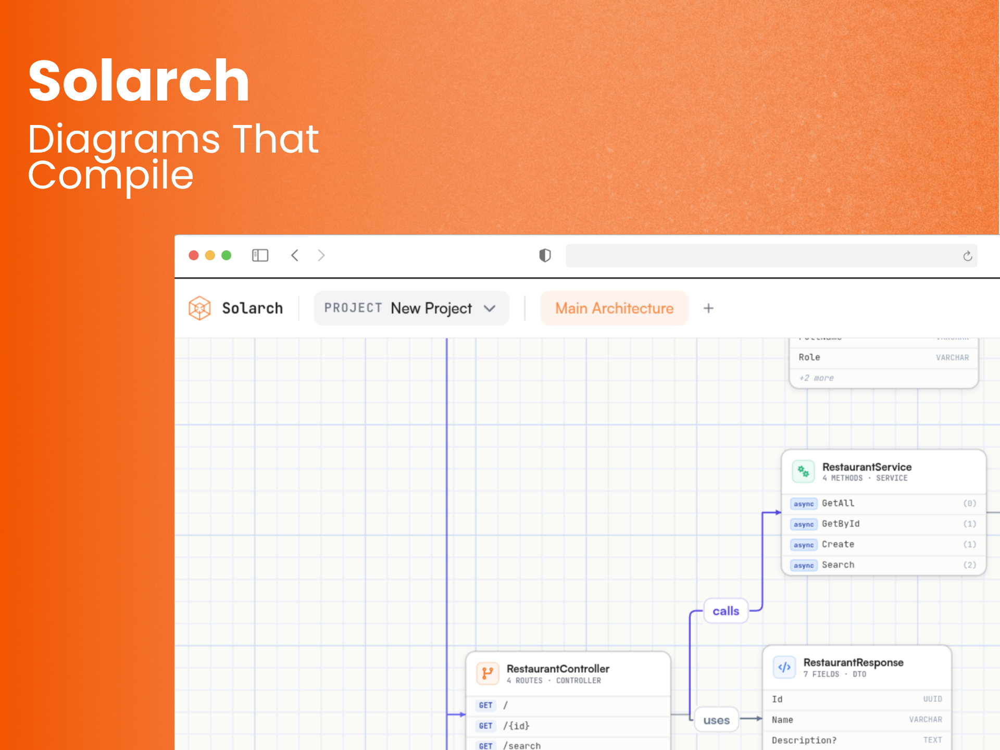
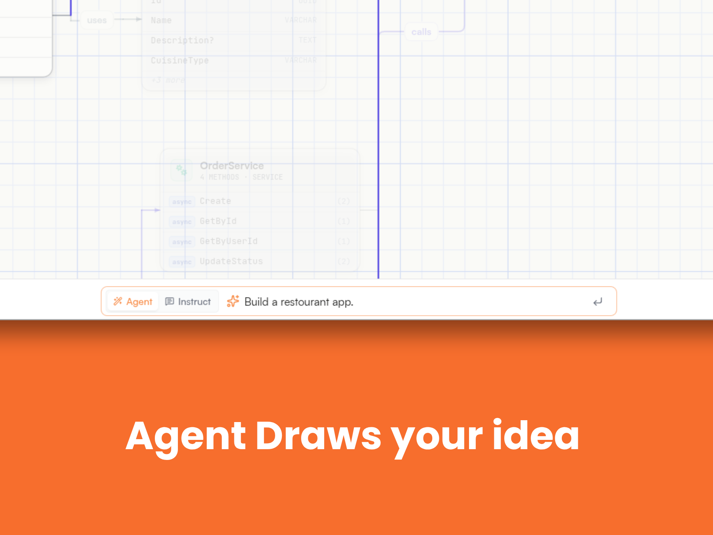
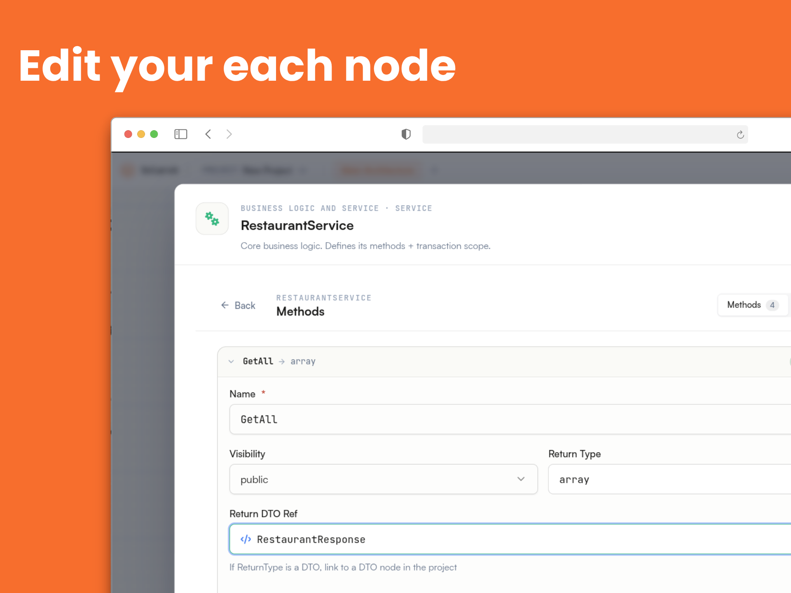

### 🎬 관련 영상
- [🎥 영상 보기](https://ph-files.imgix.net/4b896ac3-126e-4cf5-a69c-51fffc9b3fde.jpeg?auto=format)

---

## 18. [AgentOS](https://www.producthunt.com/products/agentos-run-agents-like-a-company)
**Votes**: 88 | **도입 난이도**: 중 | **신뢰도**: 상
**Tagline**: Manage AI agents, tasks, workspaces from one control layer
**서비스 링크**: https://www.producthunt.com/r/XHAVYWJP5L5RKV

**태그**: AI-Agent, Automation, Workflow, DevTool, Agent, AI Tool

### 📌 이 서비스 한눈에 보기
AI 에이전트와 워크스페이스를 하나의 통합 제어 레이어에서 관리하는 운영 시스템

### 🔑 주요 기능
- OpenClaw 기반의 로컬 퍼스트(Local-first) 제어 환경 제공
- 에이전트, 작업, 워크스페이스를 아우르는 통합 관리 기능
- 승인 프로세스 및 런타임 가시성 확보를 통한 에이전트 운영 최적화

### 🙋 사용자에게 어떤 점이 좋은가
여러 개의 AI 에이전트를 마치 하나의 회사처럼 체계적으로 운영하고, 작업 흐름과 승인 과정을 한곳에서 관리할 수 있습니다.

### ✅ 지금 바로 써볼 기능
- 워크스페이스 및 에이전트 설정 테스트
- 작업(Task) 및 승인(Approval) 워크플로우 구성
- 런타임 가시성 대시보드 확인

### ⚠️ 사용 전 확인할 점
- 로컬 퍼스트 환경에 따른 하드웨어 리소스 요구사항 확인 필요
- OpenClaw 프레임워크에 대한 기술적 이해도 필요

### 🧭 확인이 더 필요한 정보
OpenClaw 프레임워크와의 구체적인 연동 방식 및 로컬 환경 구축 난이도에 대한 정보가 더 필요합니다.

### 📸 스크린샷 및 갤러리
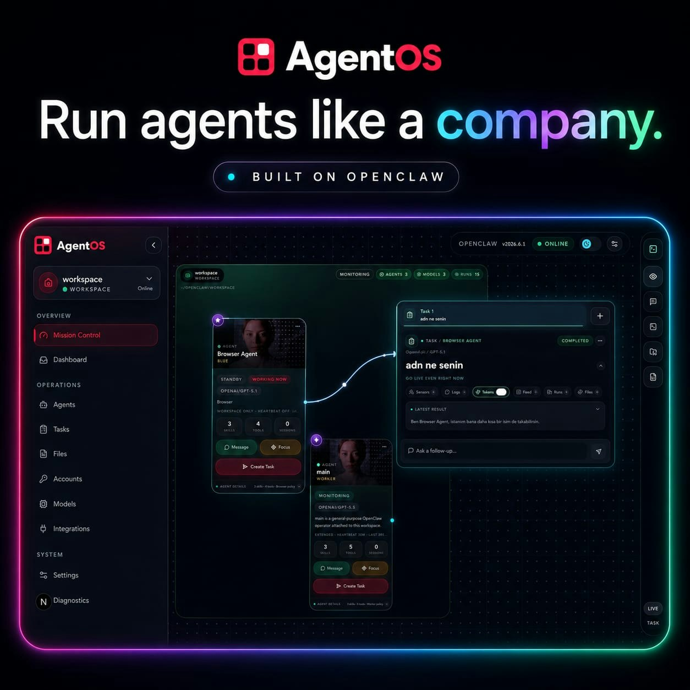
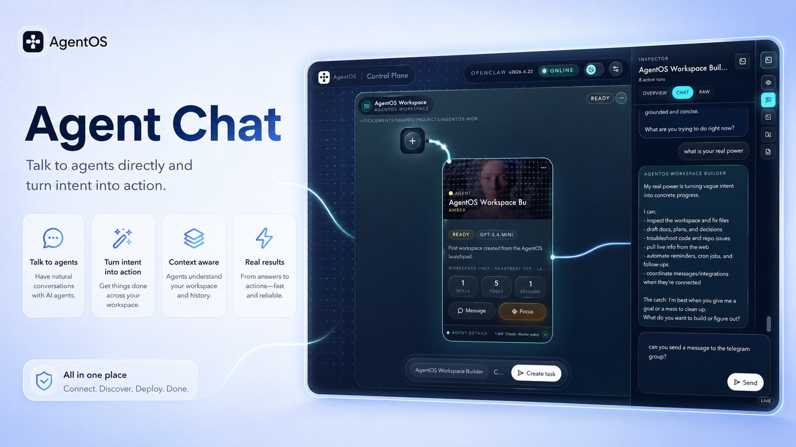
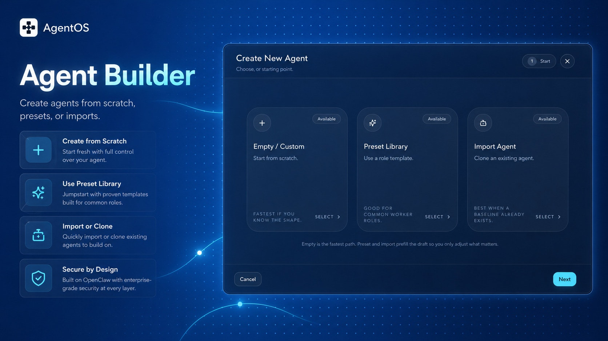

### 🎬 관련 영상
- [🎥 영상 보기](https://ph-files.imgix.net/85376f1f-ad5a-48e6-8203-d655e572a38c.jpeg?auto=format)

---

## 19. [Signal Recorder SR-7](https://www.producthunt.com/products/signal-recorder-sr-7)
**Votes**: 85 | **도입 난이도**: 하 | **신뢰도**: 상
**Tagline**: On-device voice recorder that transcribes + exports Markdown
**서비스 링크**: https://www.producthunt.com/r/4YBL4VGAF725K6

**태그**: Productivity, Privacy, Markdown, AI, Note-taking, AI Tool, Design, DevTool

### 📌 이 서비스 한눈에 보기
개인정보 유출 걱정 없이 로컬에서 음성을 기록하고 마크다운으로 관리하는 프라이버시 중심 녹음기

### 🔑 주요 기능
- Apple 기기(Mac, iPhone) 내 온디바이스 AI를 활용한 보안 중심 전사 및 요약
- 모든 기록이 YAML 프론트매터가 포함된 마크다운 파일로 로컬 저장
- 로컬 MCP 서버 지원으로 Claude Code 등 외부 AI 도구와의 연동 가능

### 🙋 사용자에게 어떤 점이 좋은가
데이터가 서버로 전송되지 않아 보안이 중요한 회의나 개인 기록에 최적이며, Obsidian 같은 노트 앱과 완벽하게 연동됩니다.

### ✅ 지금 바로 써볼 기능
- 음성 녹음 후 자동 생성된 마크다운 파일 확인하기
- Obsidian 또는 Git 저장소에 기록 파일 동기화하기
- 로컬 MCP 서버를 통해 AI 도구로 기록 쿼리해보기

### ⚠️ 사용 전 확인할 점
- 온디바이스 모델 사용으로 인해 기기 성능 및 배터리 소모에 영향을 줄 수 있음
- 클라우드 기반 서비스와 달리 기기 분실 시 데이터 백업 책임이 사용자에게 있음

### 🧭 확인이 더 필요한 정보
사용 중인 Mac 및 iPhone의 하드웨어 사양에 따른 AI 처리 속도 차이가 있을 수 있습니다.

### 📸 스크린샷 및 갤러리
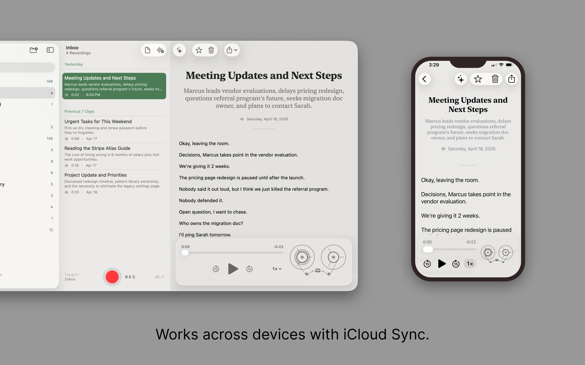
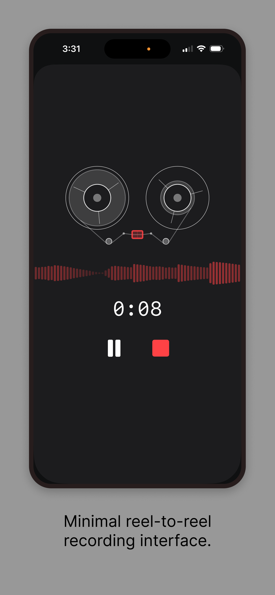
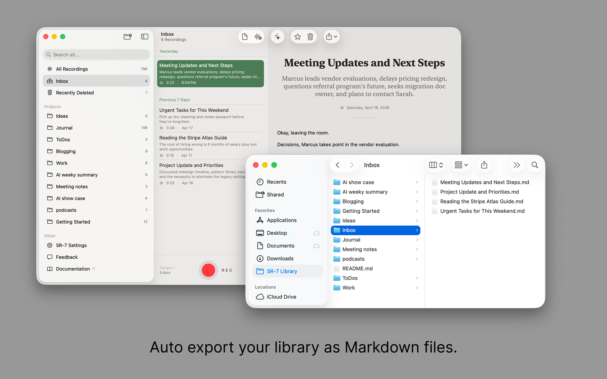

### 🎬 관련 영상
- [🎥 영상 보기](https://ph-files.imgix.net/6cf988d5-11fa-48a9-a386-3356360673c2.jpeg?auto=format)

---

## 20. [NudgeFile](https://www.producthunt.com/products/nudgefile)
**Votes**: 84 | **도입 난이도**: 하 | **신뢰도**: 상
**Tagline**: Automatically organize, rename, and manage files with AI
**서비스 링크**: https://www.producthunt.com/r/5CNHFATVGFR23I

**태그**: Automation, Productivity, AI, FileManagement, AI Tool

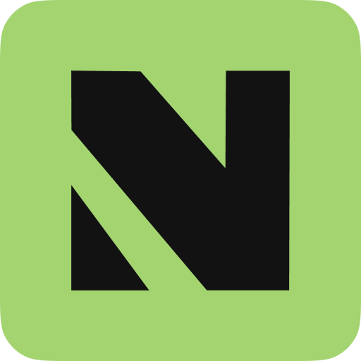

### 📌 이 서비스 한눈에 보기
로컬 AI를 활용해 파일 정리와 이름 변경을 자동화하는 스마트 워크스페이스 관리 도구

### 🔑 주요 기능
- 로컬 AI 기반의 자동 파일 정리 및 이름 변경 기능
- 폴더 모니터링을 통한 실시간 워크플로우 자동화
- 중복 파일 감지 및 데이터 보안을 위한 온디바이스 처리

### 🙋 사용자에게 어떤 점이 좋은가
수동으로 파일을 분류하고 이름을 바꾸는 번거로움을 줄여주며, 모든 데이터가 로컬에서 처리되어 보안 걱정 없이 깔끔한 작업 환경을 유지할 수 있습니다.

### ✅ 지금 바로 써볼 기능
- 정리가 필요한 폴더를 모니터링 대상으로 설정하기
- AI 자동 이름 변경 규칙 적용해보기
- 중복 파일 감지 기능을 통한 저장 공간 확보

### ⚠️ 사용 전 확인할 점
- 로컬 AI 구동을 위한 시스템 리소스(CPU/GPU) 사용량 확인 필요
- 자동 이름 변경 시 기존 파일과의 충돌 가능성 검토

### 🧭 확인이 더 필요한 정보
지원하는 운영체제(OS) 종류와 구체적인 AI 모델 사양에 대한 정보가 필요합니다.

### 📸 스크린샷 및 갤러리
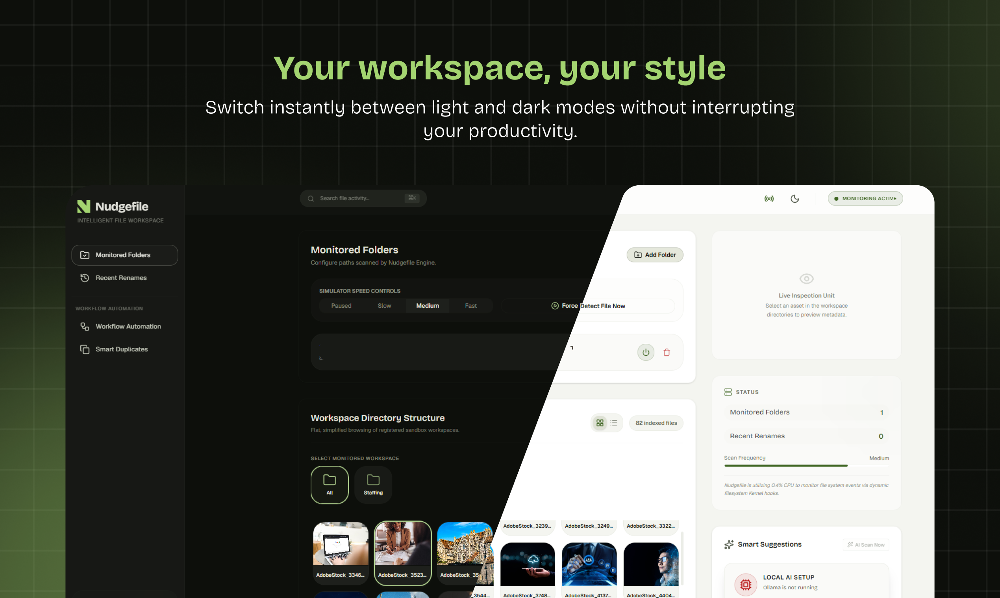
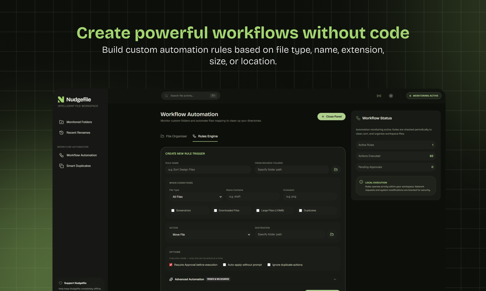
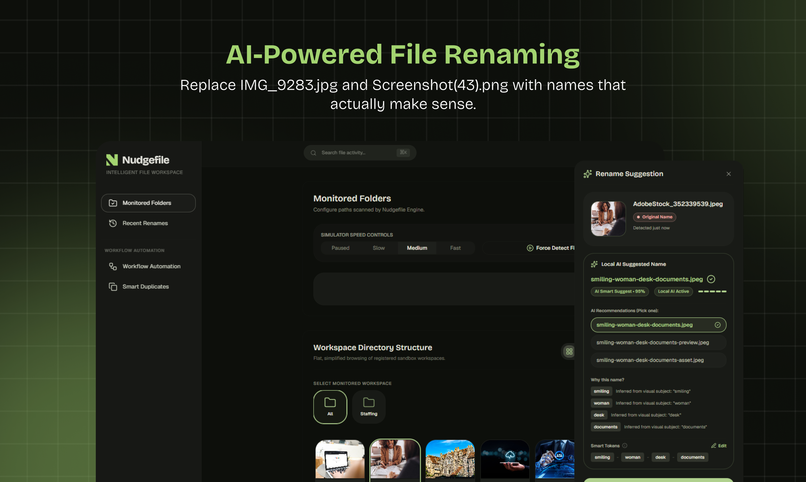

---

## 21. [TrakMac](https://www.producthunt.com/products/trakmac)
**Votes**: 81 | **도입 난이도**: 하 | **신뢰도**: 상
**Tagline**: Voice-first macro tracking for fitness enthusiasts
**서비스 링크**: https://www.producthunt.com/r/X65ZRHESPQLBWW

**태그**: Fitness, Voice-AI, Health, Productivity, AI Tool, DevTool

### 📌 이 서비스 한눈에 보기
음성 명령만으로 간편하게 식단 영양 성분을 기록하는 보이스 퍼스트 매크로 트래커

### 🔑 주요 기능
- 일상적인 언어로 말하면 칼로리, 단백질, 탄수화물, 지방을 즉시 계산
- 무게 측정이나 바코드 스캔 없이 빠른 기록 가능
- 사용자의 훈련 데이터 기반 맞춤형 계산 공식 적용

### 🙋 사용자에게 어떤 점이 좋은가
식단 기록의 번거로움을 최소화하여 운동과 식단 관리에 더 집중할 수 있게 해줍니다.

### ✅ 지금 바로 써볼 기능
- 음성으로 먹은 음식 말해보기
- 계산된 영양 성분 확인하기
- 개인화된 계산 공식 적용 여부 체크하기

### ⚠️ 사용 전 확인할 점
- 정밀한 계량(무게 측정)이 없으므로 실제 섭취량과 오차가 발생할 수 있음
- 데이터베이스 기반이 아닌 공식 기반이므로 복잡한 요리의 경우 정확도가 낮을 수 있음

### 🧭 확인이 더 필요한 정보
사용자 맞춤형 공식이 실제 영양학적 정확도를 어느 정도 보장하는지 확인이 필요합니다.

### 📸 스크린샷 및 갤러리

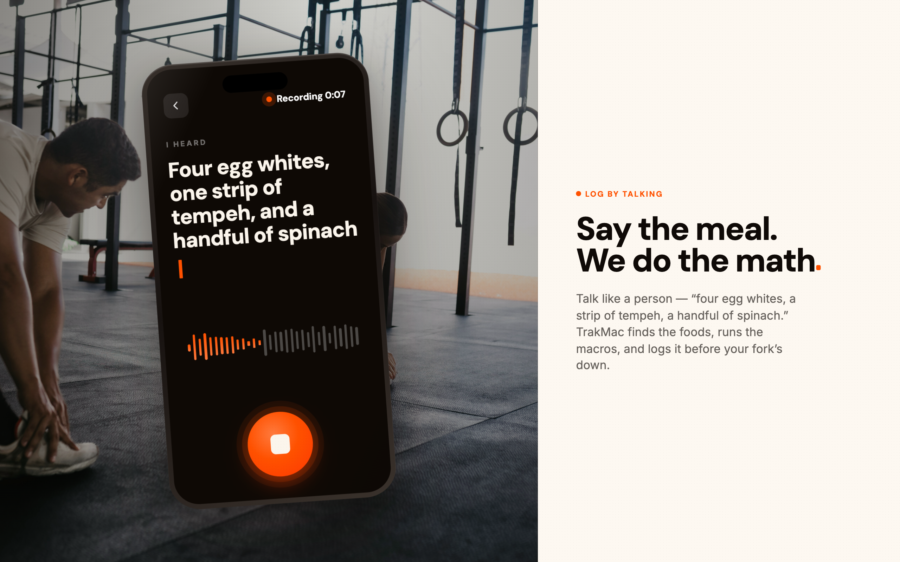
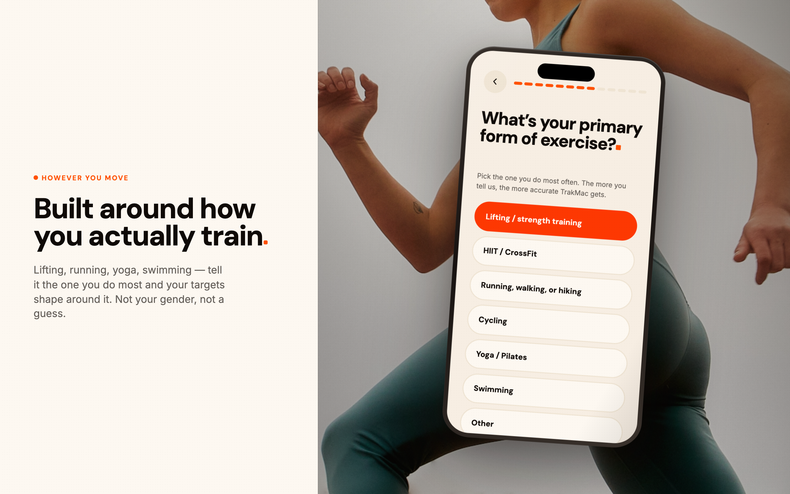

### 🎬 관련 영상
- [🎥 영상 보기](https://ph-files.imgix.net/d522f7c6-b88e-4247-ad1c-f8a0223844fb.jpeg?auto=format)

---

## 22. [Pixel Snapper](https://www.producthunt.com/products/pixel-snapper)
**Votes**: 81 | **도입 난이도**: 하 | **신뢰도**: 상
**Tagline**: Editor to clean up AI-generated pixel art 
**서비스 링크**: https://www.producthunt.com/r/2A5STMZNSLI3AA

**태그**: AI-Tool, PixelArt, GameDev, OpenSource, AI Tool

### 📌 이 서비스 한눈에 보기
AI로 생성된 불완전한 픽셀 아트를 깔끔하게 정돈해 주는 자동 보정 도구

### 🔑 주요 기능
- AI 생성 픽셀 아트의 흐릿함 및 불일치 자동 수정
- 게임 에셋 및 아이콘 제작에 최적화
- 무료 및 오픈 소스로 제공되는 도구

### 🙋 사용자에게 어떤 점이 좋은가
AI로 생성한 픽셀 아트의 디테일 오류를 수동 작업 없이 빠르게 해결하여 작업 시간을 단축할 수 있습니다.

### ✅ 지금 바로 써볼 기능
- AI로 생성한 픽셀 아트 업로드하기
- 자동 보정 기능으로 결과물 정밀도 확인하기
- 수정된 에셋을 게임이나 아이콘에 적용해 보기

### ⚠️ 사용 전 확인할 점
- 자동 보정 과정에서 의도한 디자인이 변형될 가능성
- 오픈 소스 도구이므로 사용 환경에 따른 설치 필요성 확인

### 🧭 확인이 더 필요한 정보
자동 보정의 정밀도와 지원하는 파일 형식에 대한 구체적인 정보가 필요합니다.

### 📸 스크린샷 및 갤러리
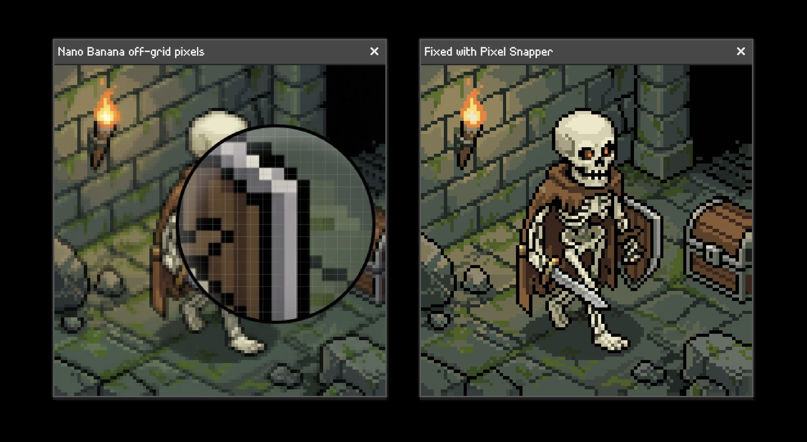

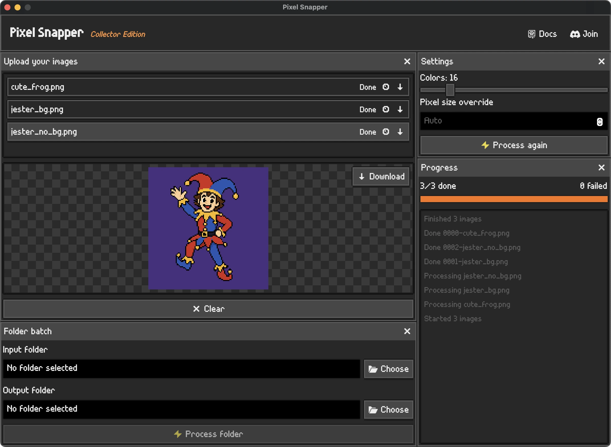

---

## 23. [Nodrix](https://www.producthunt.com/products/nodrix)
**Votes**: 75 | **도입 난이도**: 중 | **신뢰도**: 상
**Tagline**: Your own IoT cloud, deployed to your Cloudflare account
**서비스 링크**: https://www.producthunt.com/r/CW7IWP2LSPYYEI

**태그**: IoT, Cloudflare, OpenSource, Automation, EdgeComputing

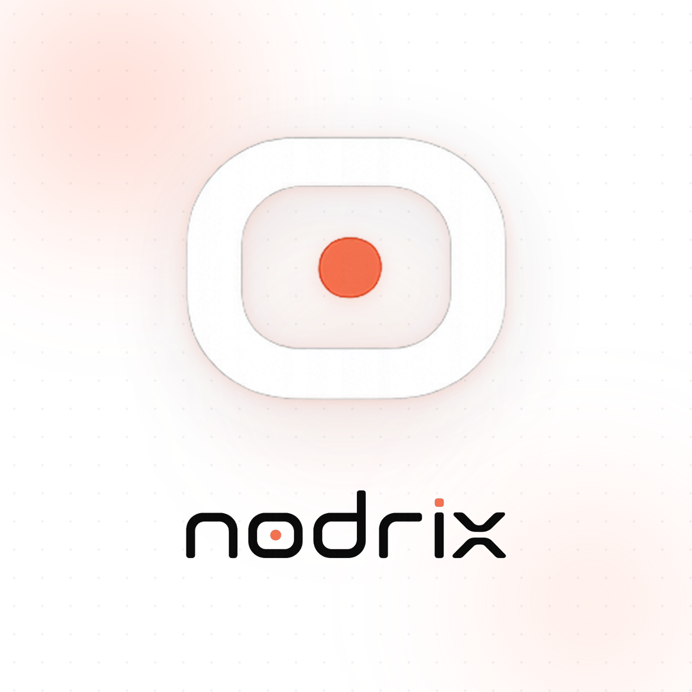

### 📌 이 서비스 한눈에 보기
클라우드플레어 계정에 원클릭으로 배포하여 사용하는 나만의 독립형 IoT 플랫폼

### 🔑 주요 기능
- 클라우드플레어 계정에 직접 배포되는 오픈소스 IoT 플랫폼
- 중간 서버나 브로커 없이 HTTPS와 WebSockets를 활용한 데이터 통신
- 엣지 환경에서 실행되는 자동화 및 실시간 대시보드 제공

### 🙋 사용자에게 어떤 점이 좋은가
별도의 서버 관리 부담 없이 개인용 또는 프로젝트용 IoT 인프라를 보안성이 높은 클라우드플레어 환경에 즉시 구축할 수 있습니다.

### ✅ 지금 바로 써볼 기능
- 클라우드플레어 계정 연동 및 원클릭 배포 테스트
- 하드웨어에서 JSON 데이터 전송 및 수신 확인
- 실시간 대시보드 및 엣지 자동화 설정

### ⚠️ 사용 전 확인할 점
- 클라우드플레어 서비스 환경에 대한 사전 이해 필요
- 하드웨어 장치가 HTTPS 및 WebSocket 통신을 지원해야 함

### 🧭 확인이 더 필요한 정보
클라우드플레어 사용량에 따른 비용 발생 여부와 하드웨어 호환 범위에 대한 확인이 필요합니다.

### 📸 스크린샷 및 갤러리
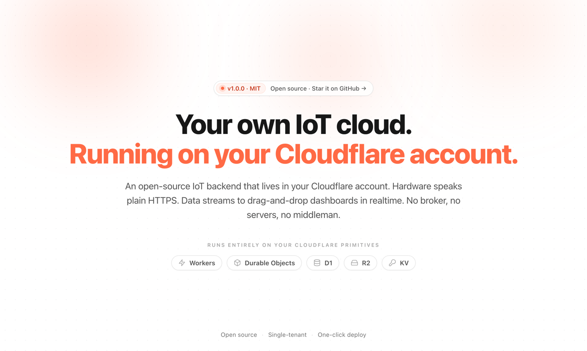
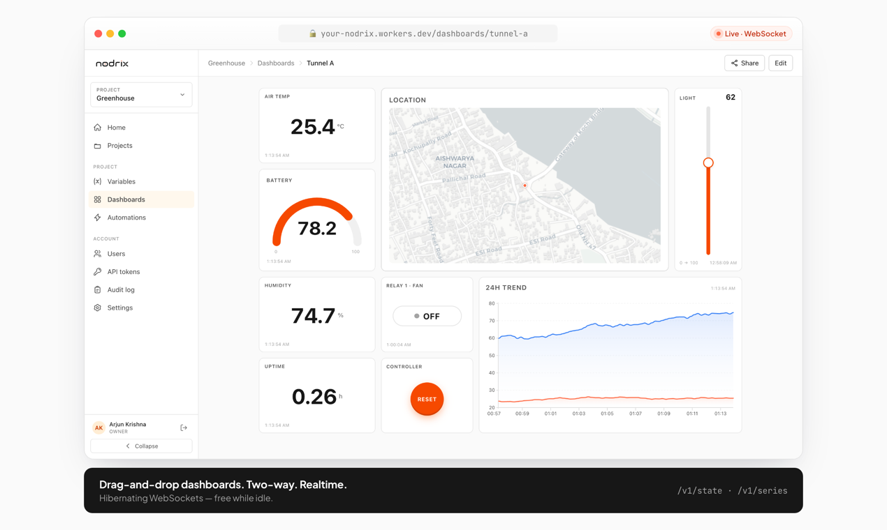
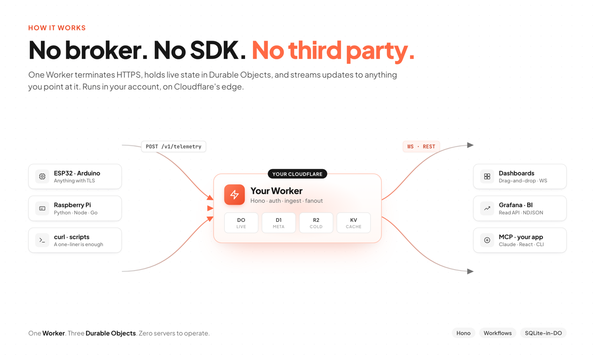

---

## 24. [Cove for Mac](https://www.producthunt.com/products/cove-for-mac)
**Votes**: 75 | **도입 난이도**: 하 | **신뢰도**: 상
**Tagline**: Like a save/load game for your work
**서비스 링크**: https://www.producthunt.com/r/PP4W2YELFZATWG

**태그**: Productivity, Mac, Workflow, Automation, DevTool

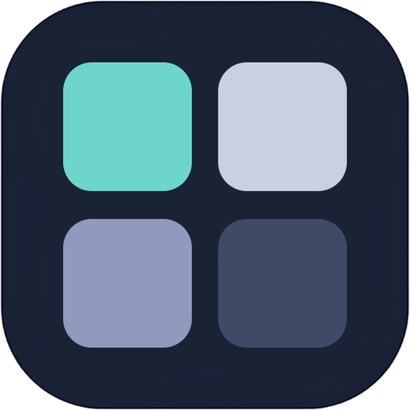

### 📌 이 서비스 한눈에 보기
클릭 한 번으로 작업 중인 모든 앱과 창 위치를 저장하고 복구하는 Mac 워크스페이스 세션 관리 도구

### 🔑 주요 기능
- 앱, 브라우저 탭, 터미널 경로, Finder 위치 등 작업 환경 전체를 '세션'으로 저장
- Safari, Chrome, VS Code, Slack 등 주요 앱을 지원하는 네이티브 어댑터 제공
- 100% 로컬 저장 방식으로 클라우드 없이 개인정보를 보호하며 구독 없는 일회성 구매 방식

### 🙋 사용자에게 어떤 점이 좋은가
여러 프로젝트를 오가며 복잡한 작업 환경을 매번 세팅해야 하는 사용자에게 작업 전환 시간을 획기적으로 줄여줍니다.

### ✅ 지금 바로 써볼 기능
- 현재 진행 중인 프로젝트별로 세션 이름 지정하여 저장하기
- 브라우저 및 개발 도구(VS Code, Terminal) 어댑터 연결 설정하기
- 자동 감지(Auto-detect) 기능을 통해 작업 흐름에 맞는 세션 추천받기

### ⚠️ 사용 전 확인할 점
- 로컬 저장 방식이므로 기기 변경 시 데이터 이전 방법 확인 필요
- 지원되지 않는 특정 앱의 경우 창 위치 복구가 완벽하지 않을 수 있음

### 🧭 확인이 더 필요한 정보
모든 앱이 완벽하게 지원되는지, 혹은 특정 앱에서 창 위치가 어긋날 가능성이 있는지 확인이 필요합니다.

### 📸 스크린샷 및 갤러리
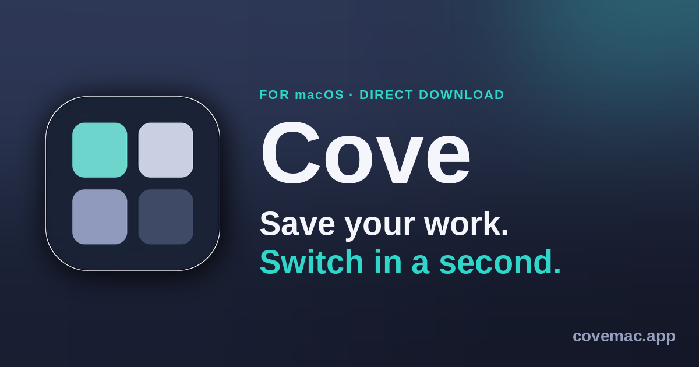
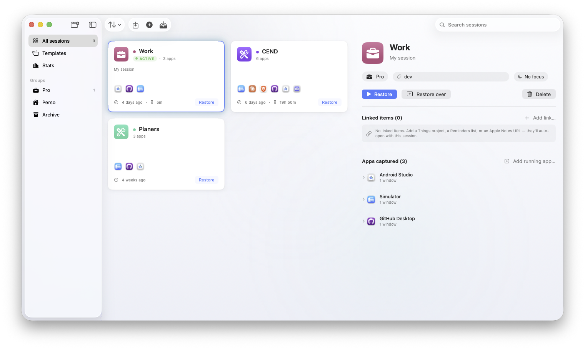
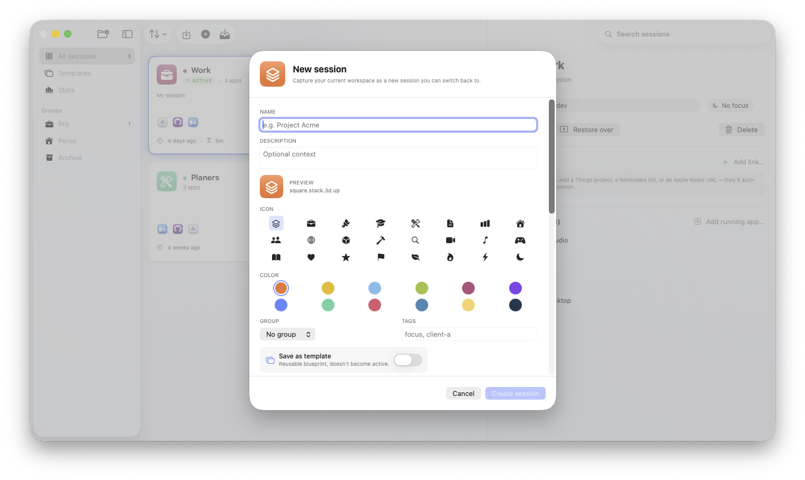

### 🎬 관련 영상
- [🎥 영상 보기](https://ph-files.imgix.net/f7195910-a9a5-4378-8310-d5cc443ff6c4.jpeg?auto=format)

---

## 25. [Overly ](https://www.producthunt.com/products/overly-smart-study-layer)
**Votes**: 74 | **도입 난이도**: 하 | **신뢰도**: 상
**Tagline**: Search and ask questions inside lecture videos
**서비스 링크**: https://www.producthunt.com/r/KXOBYAWQCI2PWK

**태그**: EdTech, AI, Productivity, StudentTools, AI Tool, Video

### 📌 이 서비스 한눈에 보기
긴 강의 영상 속 핵심 내용을 즉시 찾고 질문할 수 있는 AI 학습 보조 도구

### 🔑 주요 기능
- 강의 영상 내 특정 주제 및 키워드 검색 기능
- AI 기반 질의응답 및 자동 요약 생성
- 원하는 설명이 나오는 정확한 타임스탬프로 즉시 이동

### 🙋 사용자에게 어떤 점이 좋은가
긴 녹화 강의를 처음부터 끝까지 돌려볼 필요 없이, 필요한 정보만 빠르게 찾아 학습 시간을 획기적으로 단축할 수 있습니다.

### ✅ 지금 바로 써볼 기능
- 학습 중인 긴 강의 영상 업로드하기
- AI에게 영상 내용에 대해 질문해보기
- 생성된 요약본으로 핵심 내용 빠르게 훑기

### ⚠️ 사용 전 확인할 점
- MVP 단계이므로 영상 길이나 화질에 따라 정확도가 달라질 수 있음
- 음성 인식 기반이므로 배경 소음이 심한 영상은 검색 정확도가 낮을 수 있음

### 🧭 확인이 더 필요한 정보
지원 가능한 영상 파일 형식 및 최대 업로드 가능 길이에 대한 정보가 필요합니다.

### 📸 스크린샷 및 갤러리
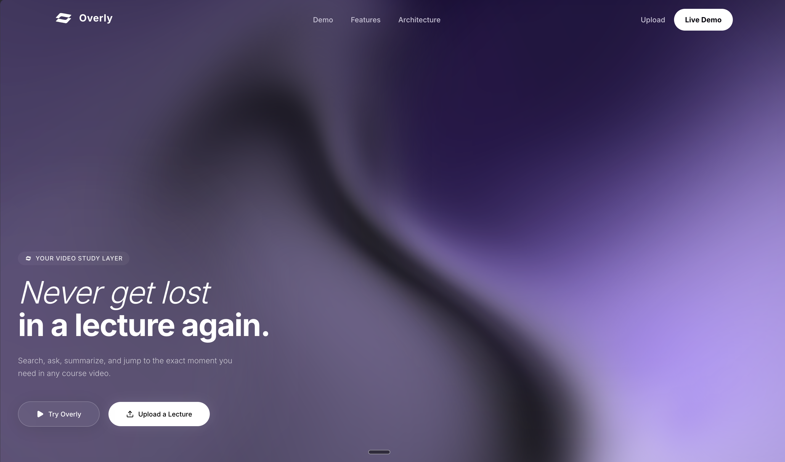
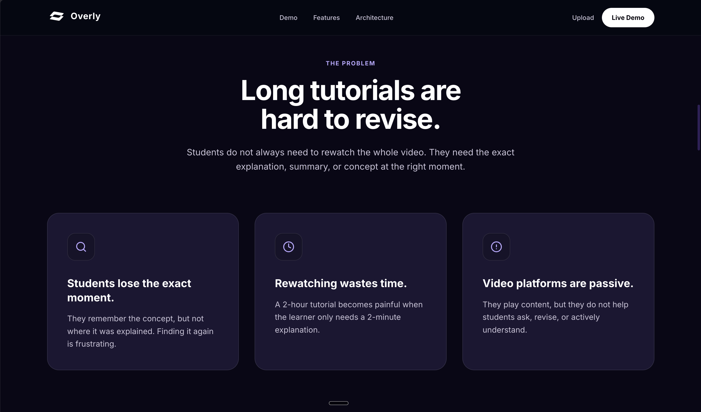
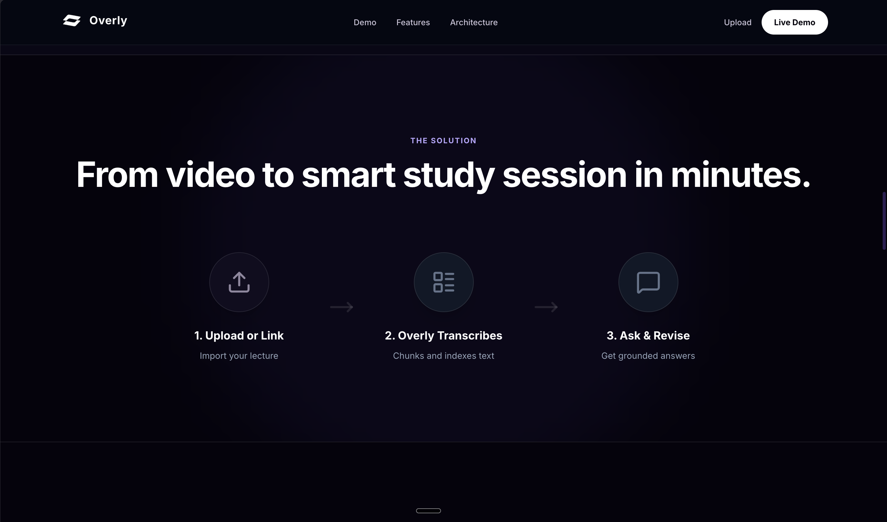

---

## 26. [OrchestraML](https://www.producthunt.com/products/orchestraml)
**Votes**: 74 | **도입 난이도**: 하 | **신뢰도**: 상
**Tagline**: From English prompt to deployed ML model with human approval
**서비스 링크**: https://www.producthunt.com/r/AUSJLZPTAQ2GRZ

**태그**: MLOps, Automation, AI-Agent, DevTool, Agent, AI Tool, Prompting, API

### 📌 이 서비스 한눈에 보기
자연어 명령만으로 데이터 처리부터 모델 배포까지 자동화하는 AI 에이전트 기반 ML 워크플로우

### 🔑 주요 기능
- 8개의 전문 에이전트가 데이터 정제, 피처 엔지니어링, 모델 학습(FLAML) 자동 수행
- 6단계의 체크포인트 게이트를 통한 사용자 수동 승인 및 제어 기능
- 로컬 다운로드용 패키지(pkl, predict.py) 또는 즉시 사용 가능한 REST API 제공

### 🙋 사용자에게 어떤 점이 좋은가
복잡한 ML 파이프라인 구축 과정을 영어 프롬프트로 단순화하여, 개발자가 모델 관리와 배포에 드는 시간을 획기적으로 줄여줍니다.

### ✅ 지금 바로 써볼 기능
- 자연어 프롬프트로 데이터셋 처리 및 모델 학습 테스트
- 중간 체크포인트 기능을 통한 모델 품질 검증
- 생성된 API 또는 스크립트를 활용한 즉각적인 서비스 연동

### ⚠️ 사용 전 확인할 점
- 일일 무료 파이프라인 2개 제한으로 인한 대규모 작업 제약
- 자동화된 에이전트가 생성한 모델의 성능 및 편향성 검증 필요

### 🧭 확인이 더 필요한 정보
데이터 보안 및 암호화 방식이 사용자의 특정 산업 규정(예: 금융, 의료)을 충족하는지 확인이 필요합니다.

### 📸 스크린샷 및 갤러리

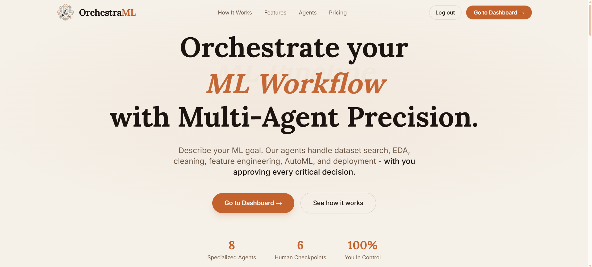
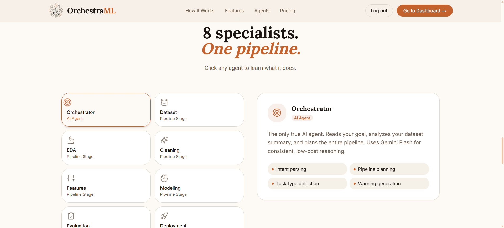

---

## 27. [Log Cam](https://www.producthunt.com/products/log-cam-open-gate-by-raw-cam)
**Votes**: 71 | **도입 난이도**: 중 | **신뢰도**: 상
**Tagline**: Record log and ProRes video from RAW frames on iPhone
**서비스 링크**: https://www.producthunt.com/r/AGQFYP5LNGWTVR

**태그**: Video, Filmmaking, iOS, ProRes

### 📌 이 서비스 한눈에 보기
아이폰 RAW 프레임을 활용해 전문가급 Log 및 ProRes 영상을 촬영할 수 있는 모바일 시네마토그래피 앱

### 🔑 주요 기능
- RAW 프레임 기반의 HEVC 및 ProRes 비디오 녹화 지원
- Log 감마 및 LUT 지원을 통한 전문적인 색보정 워크플로우 제공
- 외부 저장 장치 직접 녹화 기능 탑재

### 🙋 사용자에게 어떤 점이 좋은가
아이폰을 단순한 스마트폰을 넘어 전문 영상 제작 도구로 활용할 수 있게 해주며, 후반 작업(Color Grading)에 최적화된 고품질 소스를 확보할 수 있습니다.

### ✅ 지금 바로 써볼 기능
- ProRes 설정 및 외부 스토리지 연결 테스트
- 사용 중인 LUT 적용 및 모니터링 도구 확인
- Log 감마 촬영 후 후반 작업 워크플로우 검증

### ⚠️ 사용 전 확인할 점
- 고용량 ProRes 파일로 인한 저장 공간 및 데이터 관리 주의
- 외부 저장 장치 연결 시 하드웨어 호환성 확인 필요

### 🧭 확인이 더 필요한 정보
사용 중인 아이폰 모델의 하드웨어 사양에 따른 ProRes 녹화 가능 여부와 외부 스토리지 지원 범위를 확인해야 합니다.

### 📸 스크린샷 및 갤러리
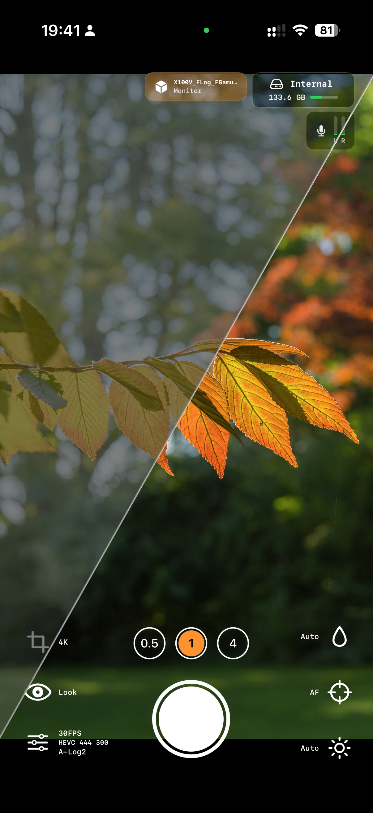
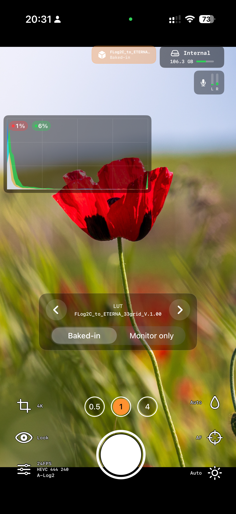
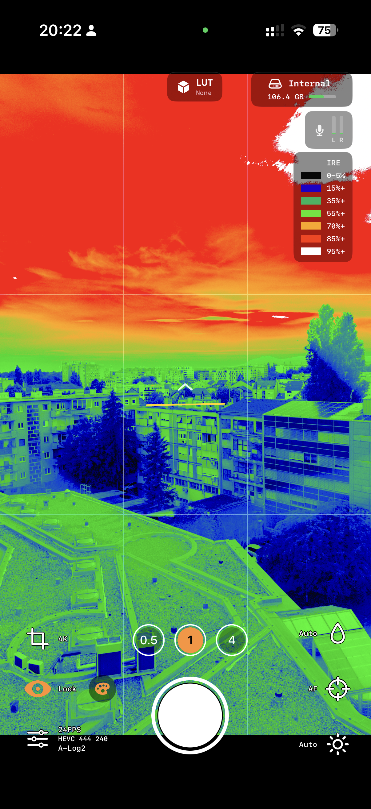

### 🎬 관련 영상
- [🎥 영상 보기](https://ph-files.imgix.net/0d1dcd1a-fa62-4b00-9cd3-85b557bbab53.jpeg?auto=format)

---

## 28. [ChocolateBar](https://www.producthunt.com/products/chocolatebar)
**Votes**: 71 | **도입 난이도**: 하 | **신뢰도**: 상
**Tagline**: Add a row under your menu bar for hidden icons
**서비스 링크**: https://www.producthunt.com/r/W27CGJMJ5QNCEH

**태그**: MacApp, Productivity, Utility

### 📌 이 서비스 한눈에 보기
맥북 노치로 인해 가려지는 메뉴바 아이콘들을 위한 별도의 전용 바를 제공하는 앱

### 🔑 주요 기능
- 노치로 인해 클릭할 수 없게 된 메뉴바 아이콘들을 위한 하단 행 추가
- 메뉴바 아이콘 과부하 문제를 해결하는 네이티브 맥 앱
- 아이콘을 숨기는 대신 별도의 바를 통해 가시성을 확보하는 방식

### 🙋 사용자에게 어떤 점이 좋은가
메뉴바 아이콘이 많아 노치 뒤로 숨겨져 클릭이 불가능해지는 불편함을 즉각적으로 해결해 줍니다.

### ✅ 지금 바로 써볼 기능
- 메뉴바 아이콘이 노치에 가려지는지 확인하기
- ChocolateBar 설치 후 아이콘 배치 테스트하기
- 주요 생산성 앱 아이콘을 ChocolateBar로 옮겨보기

### ⚠️ 사용 전 확인할 점
- 화면 하단 공간을 추가로 차지함
- macOS 시스템 설정과의 호환성 확인 필요

### 🧭 확인이 더 필요한 정보
사용자의 맥북 모델 및 macOS 버전에 따른 레이아웃 최적화 여부를 확인해야 합니다.

### 📸 스크린샷 및 갤러리
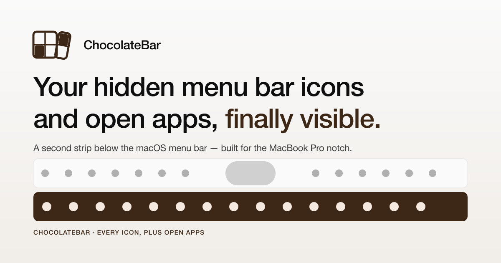
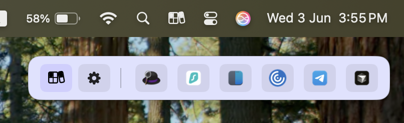

### 🎬 관련 영상
- [🎥 영상 보기](https://ph-files.imgix.net/34f109cb-e795-4def-aa80-b32f2fa5f46b.jpeg?auto=format)

---

## 29. [Soniqo Speech](https://www.producthunt.com/products/speech-swift)
**Votes**: 30 | **도입 난이도**: 상 | **신뢰도**: 상
**Tagline**: On-device speech AI for Mac, Windows, Linux & Android
**서비스 링크**: https://www.producthunt.com/r/RLNN4OD23TJP64

**태그**: DevTool, AI, Voice-AI, EdgeComputing, Agent, AI Tool, API

### 📌 이 서비스 한눈에 보기
모든 플랫폼에서 보안과 속도를 보장하는 온디바이스 기반의 통합 음성 AI 개발 스택

### 🔑 주요 기능
- ASR, TTS, 음성 복제, 화자 분리 등 완전한 온디바이스 음성 스택 제공
- NPU 최적화(CoreML, NNAPI)를 통한 데스크톱 및 모바일 환경의 고성능 추론
- 대화형 에이전트를 위한 턴테이킹, 중단 처리, 큐잉 기능 포함

### 🙋 사용자에게 어떤 점이 좋은가
데이터가 외부 서버로 전송되지 않아 보안이 중요한 앱 개발에 유리하며, 지연 시간이 낮은 실시간 음성 인터랙션을 구현할 수 있습니다.

### ✅ 지금 바로 써볼 기능
- Swift, Kotlin, C++ API를 활용한 프로젝트 통합 테스트
- Speech Studio를 통한 데스크톱 음성 복제 기능 체험
- NPU 최적화 성능 및 실시간 양방향 통신(Full-duplex) 확인

### ⚠️ 사용 전 확인할 점
- 온디바이스 구동 특성상 하드웨어 사양(NPU 성능 등)에 따른 성능 편차 존재
- 고성능 모델 구동 시 모바일 기기의 배터리 소모 및 발열 가능성

### 🧭 확인이 더 필요한 정보
특정 하드웨어 환경에서의 구체적인 모델 성능 지표와 최적화 수준에 대한 정보가 더 필요합니다.

### 📸 스크린샷 및 갤러리
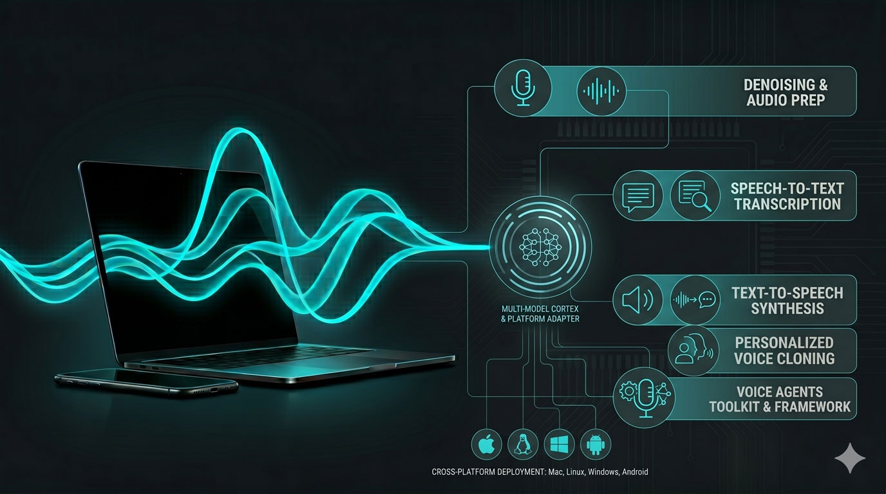

### 🎬 관련 영상
- [🎥 영상 보기](https://ph-files.imgix.net/44a13e13-d2d3-4253-a9f9-27e1efb79103.jpeg?auto=format)

---

## 30. [42min](https://www.producthunt.com/products/42min)
**Votes**: 24 | **도입 난이도**: 하 | **신뢰도**: 상
**Tagline**: Free online scheduling with forms, meeting polls & open API
**서비스 링크**: https://www.producthunt.com/r/GVZSVARBDE3X4L

**태그**: Productivity, Automation, SaaS, Scheduling, AI Tool, API

### 📌 이 서비스 한눈에 보기
결제 제한 없는 완전 무료 스케줄링 및 자동화 도구

### 🔑 주요 기능
- Calendly의 대안을 표방하는 완전 무료 스케줄링 서비스
- 예약 폼, 미팅 폴(Polls), API 및 웹훅을 통한 자동화 지원
- 사용자 피드백을 통해 로드맵을 구축하는 초기 단계 서비스

### 🙋 사용자에게 어떤 점이 좋은가
유료 결제나 인원 제한 없이 예약 링크 생성, 데이터 수집, 자동화 워크플로우를 즉시 구축할 수 있습니다.

### ✅ 지금 바로 써볼 기능
- 예약 링크 생성 및 공유
- 예약 양식(Forms) 설정
- API/웹훅을 활용한 자동화 테스트

### ⚠️ 사용 전 확인할 점
- 초기 단계 서비스로 기능 안정성 및 로드맵의 불확실성 존재
- 서비스 지속 가능성 및 향후 유료화 전환 여부 확인 필요

### 🧭 확인이 더 필요한 정보
현재 서비스가 초기 학습 단계이므로 향후 기능 업데이트 및 유료화 정책 변화 가능성이 있습니다.

### 📸 스크린샷 및 갤러리

---

