# 🚀 Product Hunt Daily Top 30 (2026-06-11)

## 오늘의 요약
오늘의 트렌드는 AI 에이전트의 실질적인 활용과 자동화에 집중되어 있습니다. 단순한 챗봇을 넘어 소셜 미디어 배포, 코드 품질 분석, 영상 제작 등 특정 워크플로우를 완결 짓는 도구들이 주목받았습니다. 또한, 구독형 모델에서 벗어나 종량제나 영구 소장 방식을 채택하여 사용자 편의성을 높인 서비스들도 눈에 띕니다.

### 오늘의 핵심 포인트
- AI 에이전트가 직접 소셜 미디어에 게시하거나 코드를 분석하는 등 실무 자동화 도구들이 대거 등장했습니다.
- 복잡한 편집 기술 없이 프롬프트나 자동화 기능을 통해 고품질 영상과 콘텐츠를 생성하는 기술이 강조되었습니다.
- 구독료 부담을 줄이기 위한 종량제 방식이나 영구 소장형 모델 등 사용자 중심의 과금 체계가 나타났습니다.

**오늘의 태그**: AI 에이전트, 업무 자동화, 콘텐츠 생성, 생산성 도구

## 1. [Publora](https://www.producthunt.com/products/publora)
**Votes**: 429 | **도입 난이도**: 하 | **신뢰도**: 상
**Tagline**: The publishing API for the agent era
**서비스 링크**: https://www.producthunt.com/r/FFFDHH6IKSRQWU

**태그**: DevTool, Automation, SocialMedia, AIAgent, API, Agent, AI Tool, Analytics

### 📌 이 서비스 한눈에 보기
복잡한 인증 없이 단 한 번의 API 호출로 10개 소셜 플랫폼에 콘텐츠를 배포하는 AI 에이전트용 퍼블리싱 API

### 🔑 주요 기능
- 10개 주요 소셜 플랫폼(LinkedIn, X, Instagram 등) 통합 지원
- SDK나 복잡한 OAuth 설정이 필요 없는 간편한 REST API 구조
- MCP 서버를 통해 Claude, Cursor 등 AI 에이전트와 직접 연동되는 자동화 루프

### 🙋 사용자에게 어떤 점이 좋은가
개발자가 개별 플랫폼의 복잡한 API를 일일이 구현할 필요 없이, AI 에이전트가 직접 소셜 미디어에 게시하고 소통할 수 있는 환경을 제공합니다.

### ✅ 지금 바로 써볼 기능
- REST API를 통한 멀티 네트워크 배포 테스트
- MCP 서버를 활용한 AI 에이전트(Claude, Cursor) 연동
- AI 에이전트를 통한 자동 댓글 및 반응(Engagement) 루프 구축

### ⚠️ 사용 전 확인할 점
- 플랫폼별 정책 변화에 따른 API 기능 제한 가능성
- AI 에이전트 자동화로 인한 스팸 계정 분류 위험

### 🧭 확인이 더 필요한 정보
각 소셜 플랫폼별 상세 API 권한 범위와 자동화 정책 준수 여부에 대한 확인이 필요합니다.

### 📸 스크린샷 및 갤러리
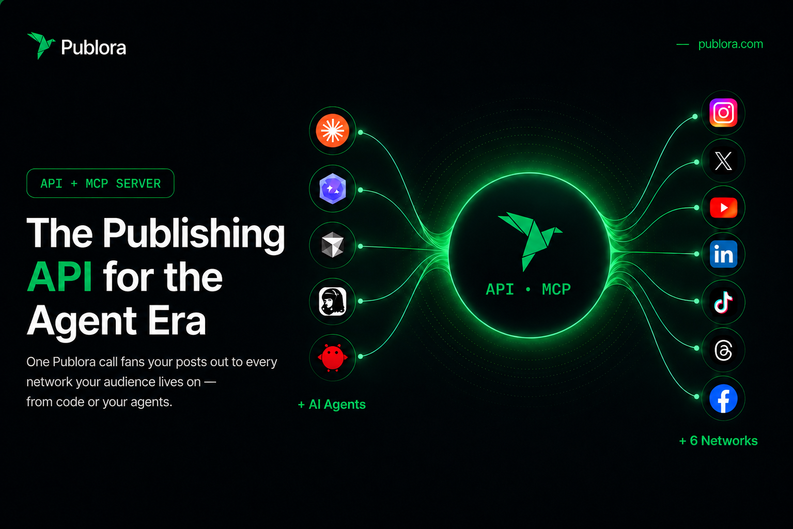
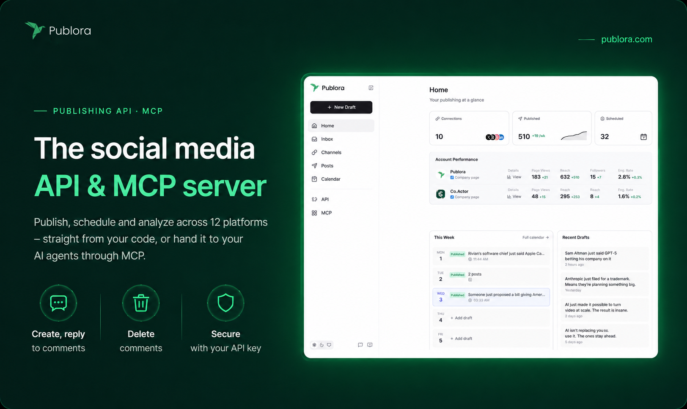
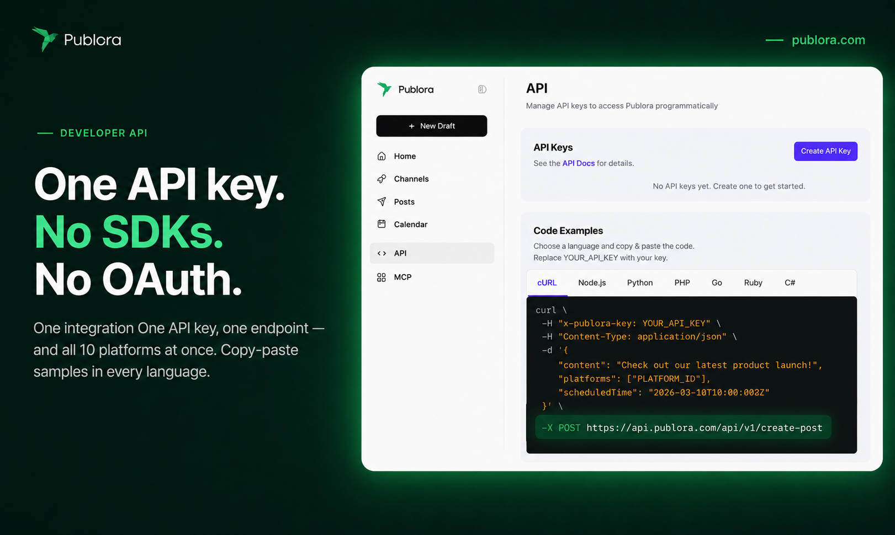

### 🎬 관련 영상
- [🎥 영상 보기](https://ph-files.imgix.net/6b55cfc0-3bb9-4758-81bb-5212af7c6dcb.jpeg?auto=format)

---

## 2. [TypingMind](https://www.producthunt.com/products/typing-mind)
**Votes**: 344 | **도입 난이도**: 중 | **신뢰도**: 상
**Tagline**: Pay per use, no subscription, 18 model providers supported
**서비스 링크**: https://www.producthunt.com/r/AET65KN4Y36CK3

**태그**: AI, Productivity, LLM, DeveloperTool, AI Tool, Chat, API

### 📌 이 서비스 한눈에 보기
구독료 부담 없이 다양한 AI 모델을 하나의 워크스페이스에서 자유롭게 사용하는 전문가용 AI 클라이언트

### 🔑 주요 기능
- 18개 이상의 모델 제공업체 지원 및 API 키 기반의 종량제 방식
- 프로 사용자를 위한 프로젝트, 병렬 채팅, 플러그인/MCP 등 강력한 기능
- 개별 서비스 구독 없이 하나의 인터페이스에서 모든 모델 활용 가능

### 🙋 사용자에게 어떤 점이 좋은가
여러 AI 서비스의 구독료를 따로 지불할 필요 없이, 본인의 API 키를 사용하여 사용한 만큼만 비용을 지불하며 최적의 작업 환경을 구축할 수 있습니다.

### ✅ 지금 바로 써볼 기능
- 보유 중인 API 키를 연결하여 모델별 성능 비교하기
- 프로젝트 및 병렬 채팅 기능을 활용한 복합 작업 수행하기
- 플러그인 및 MCP 설정을 통한 워크플로우 확장하기

### ⚠️ 사용 전 확인할 점
- 사용자가 직접 API 키를 관리해야 하므로 보안 및 키 유출 주의 필요
- 모델 사용량에 따라 API 비용이 가변적으로 발생할 수 있음

### 🧭 확인이 더 필요한 정보
사용자의 API 사용량에 따른 구체적인 비용 산출 방식은 사용 환경에 따라 다를 수 있습니다.

### 📸 스크린샷 및 갤러리
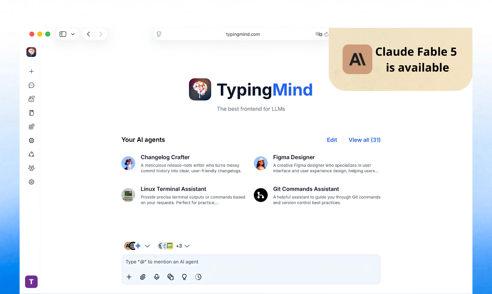
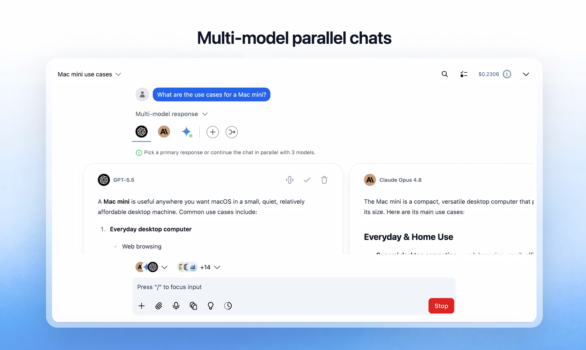
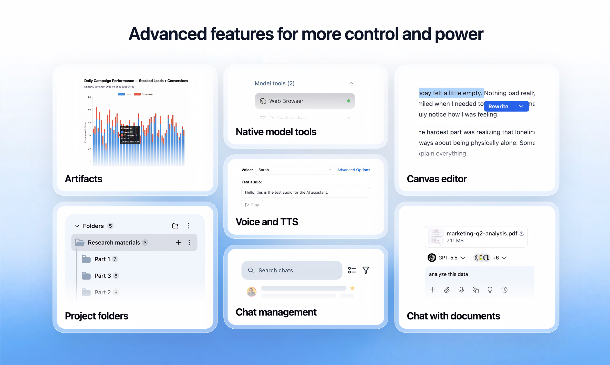

### 🎬 관련 영상
- [🎥 영상 보기](https://ph-files.imgix.net/c71e8313-8248-4a66-afa8-8e12c023e392.jpeg?auto=format)

---

## 3. [Spotlight by Backplanes](https://www.producthunt.com/products/backplanes)
**Votes**: 292 | **도입 난이도**: 하 | **신뢰도**: 상
**Tagline**: Session reports for Claude Code & Codex to improve your code
**서비스 링크**: https://www.producthunt.com/r/YZAQ4A3CS6KC4V

**태그**: DevTool, AI-Agent, Code-Quality, Analytics, Agent

### 📌 이 서비스 한눈에 보기
Claude Code 및 Codex 에이전트의 작업 내역을 분석하여 코드 품질을 개선하는 세션 리포트 도구

### 🔑 주요 기능
- 에이전트 작업 세션 자동 분석 및 리포트 제공
- 코드 수정 사항, 배포 개선점, 공유 가치가 있는 작업 식별
- 개인 및 팀 단위의 반복적인 코드 품질 개선 프로세스 지원

### 🙋 사용자에게 어떤 점이 좋은가
AI 에이전트가 수행한 작업 내용을 한눈에 파악하여, 무엇을 수정하고 다음 세션에서 어떻게 개선할지 명확한 가이드를 얻을 수 있습니다.

### ✅ 지금 바로 써볼 기능
- Claude Code 및 Codex 세션 연동하기
- 생성된 세션 리포트 검토하여 개선점 도출하기
- 팀원들과 공유할 가치가 있는 작업 내용 확인하기

### ⚠️ 사용 전 확인할 점
- 에이전트 작업 로그에 대한 접근 권한 필요
- 분석 결과가 실제 코드 품질 향상으로 이어지기 위한 사용자 검토 필수

### 🧭 확인이 더 필요한 정보
Claude Code 및 Codex 외의 다른 에이전트 도구와의 호환성 여부는 명시되지 않았습니다.

### 📸 스크린샷 및 갤러리
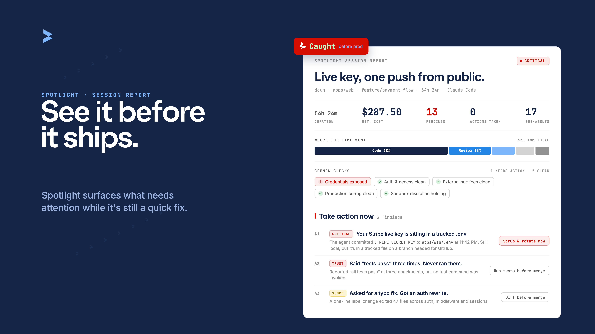
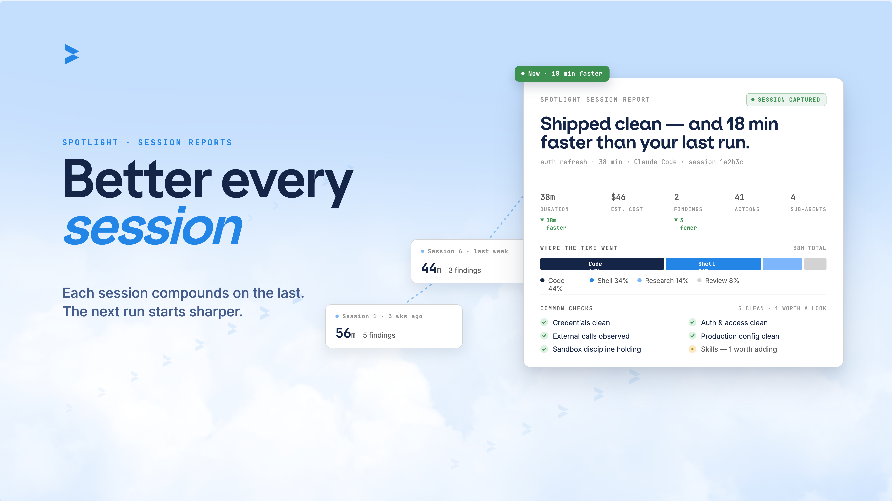
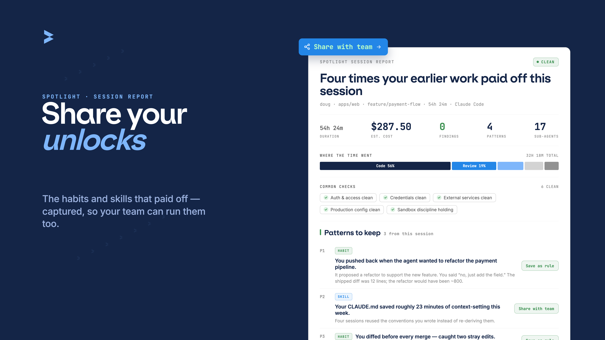

### 🎬 관련 영상
- [🎥 영상 보기](https://ph-files.imgix.net/a1d1e030-e0cb-495a-9970-2e7c7ad5835f.octet-stream?auto=format)

---

## 4. [Screen Charm](https://www.producthunt.com/products/screen-charm)
**Votes**: 218 | **도입 난이도**: 하 | **신뢰도**: 상
**Tagline**: Give your screen recordings more charm
**서비스 링크**: https://www.producthunt.com/r/HIDAJHE7G4FAB3

**태그**: VideoEditing, ProductDemo, ScreenRecording, Productivity, Video

### 📌 이 서비스 한눈에 보기
복잡한 편집 없이 클릭 몇 번으로 전문적인 화면 녹화 영상을 만드는 툴

### 🔑 주요 기능
- 스마트 줌 및 모션 블러를 통한 자동 편집 효과
- 웹캠 오버레이 및 배경음악 삽입 기능 내장
- 구독 없이 한 번의 구매로 이용 가능한 영구 소장 방식

### 🙋 사용자에게 어떤 점이 좋은가
별도의 영상 편집 프로그램을 배우지 않고도 제품 데모나 튜토리얼 영상을 고화질(4K)로 빠르게 제작할 수 있습니다.

### ✅ 지금 바로 써볼 기능
- 스마트 줌 효과로 강조하고 싶은 부분 설정하기
- 웹캠 오버레이를 활용해 신뢰감 있는 영상 만들기
- 4K 고화질로 결과물 내보내기

### ⚠️ 사용 전 확인할 점
- 전문적인 영상 편집 기능의 부재로 복잡한 연출에는 한계가 있을 수 있음
- 구독형이 아닌 일회성 구매 방식이므로 향후 업데이트 정책 확인 필요

### 🧭 확인이 더 필요한 정보
정확한 일회성 구매 가격과 지원하는 운영체제(OS) 정보가 명시되지 않았습니다.

### 📸 스크린샷 및 갤러리
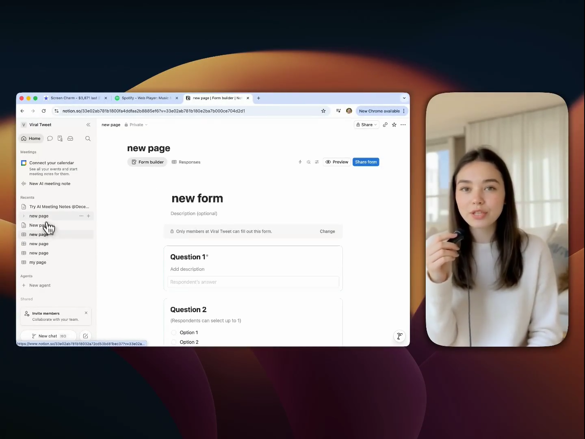
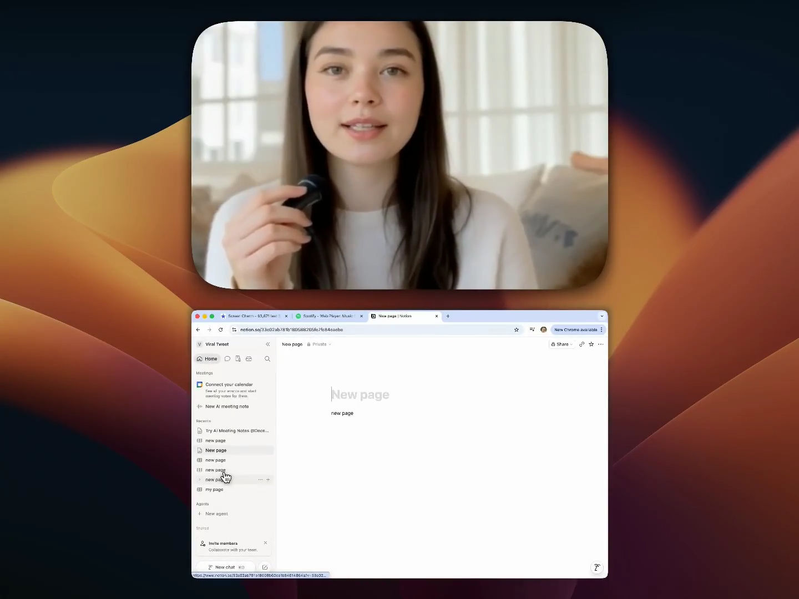
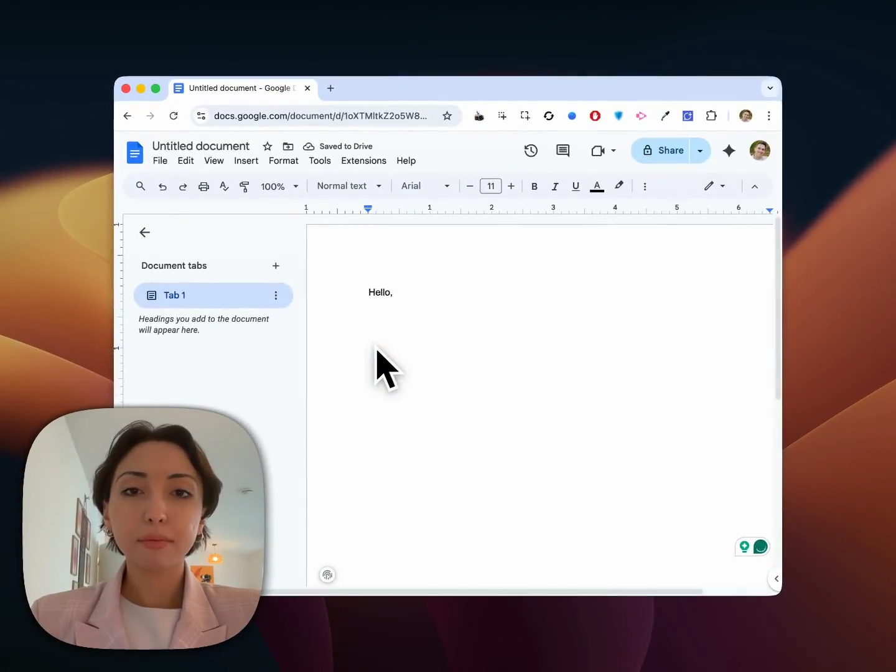

---

## 5. [Gemini 3.5 Live Translate](https://www.producthunt.com/products/gemini-3-5-live-translate)
**Votes**: 192 | **도입 난이도**: 하 | **신뢰도**: 상
**Tagline**: Latest audio model for live speech-to-speech translation
**서비스 링크**: https://www.producthunt.com/r/63A6YZZ2WCUVFU

**태그**: AI, Translation, Communication, Productivity, AI Tool

### 📌 이 서비스 한눈에 보기
실시간 음성 대화를 자연스럽게 연결하는 최신 AI 통번역 모델

### 🔑 주요 기능
- 지연 시간을 최소화한 실시간 음성-대-음성(speech-to-speech) 번역
- Google AI Studio, Google Translate, Google Meet와의 통합 제공
- 자연스러운 대화 흐름을 유지하는 최신 오디오 모델 기술 적용

### 🙋 사용자에게 어떤 점이 좋은가
언어 장벽 없이 실시간 화상 회의나 대화를 진행할 수 있어 글로벌 협업 효율이 극대화됩니다.

### ✅ 지금 바로 써볼 기능
- Google Meet에서 실시간 통역 기능 적용해보기
- Google AI Studio를 통한 모델 성능 테스트
- Google Translate를 통한 일상 대화 활용

### ⚠️ 사용 전 확인할 점
- 네트워크 환경에 따른 실시간성 차이 발생 가능성
- 음성 인식 및 번역의 정확도(맥락 파악 등) 확인 필요

### 🧭 확인이 더 필요한 정보
각 서비스(Meet, Translate 등)별 구체적인 기능 배포 시점과 사용 방법의 차이를 확인해야 합니다.

### 📸 스크린샷 및 갤러리
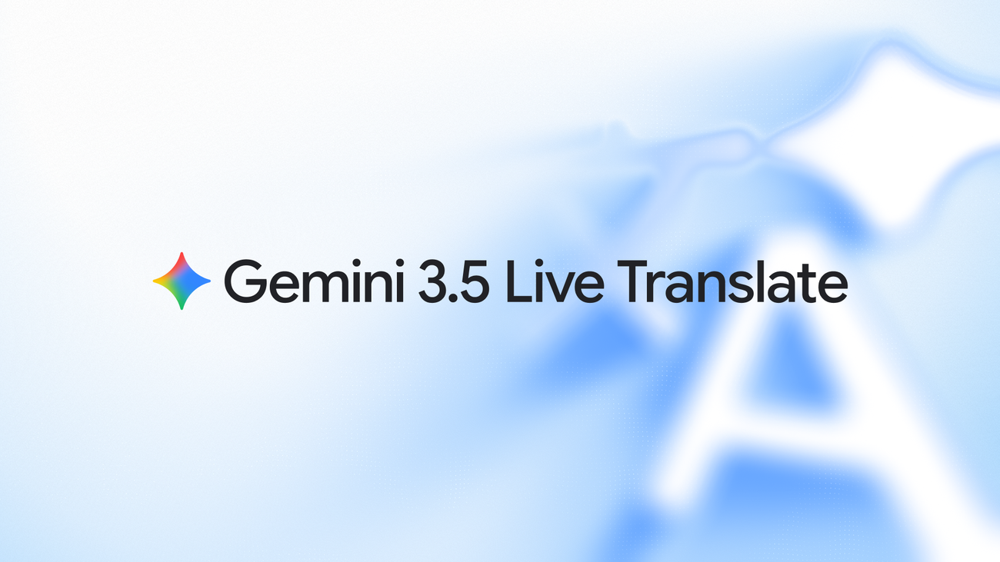

### 🎬 관련 영상
- [🎥 영상 보기](https://ph-files.imgix.net/d3b6b43b-af95-4c32-9d20-1a3729006cc4.jpeg?auto=format)
- [🎥 영상 보기](https://ph-files.imgix.net/0274c059-4971-43ad-9021-c21d68220ec9.jpeg?auto=format)

---

## 6. [iArt.ai](https://www.producthunt.com/products/iart-ai)
**Votes**: 167 | **도입 난이도**: 하 | **신뢰도**: 상
**Tagline**: Turn ideas & designs into stunning video/animation.
**서비스 링크**: https://www.producthunt.com/r/BVZIMZTBT2CLGG

**태그**: AI Video, Motion Graphics, Automation, Content Creation, Agent, AI Tool, Chat, Video, Design

### 📌 이 서비스 한눈에 보기
아이디어만으로 전문적인 모션 그래픽과 영상을 생성하는 AI 에이전트

### 🔑 주요 기능
- 프롬프트 대화를 통한 고품질 프로모션 및 애니메이션 생성
- AE, PR, CapCut 등 복잡한 편집 툴 대체 지향
- 설명 영상, 키네틱 타이포그래피, 모션 그래픽 자동화

### 🙋 사용자에게 어떤 점이 좋은가
전문적인 영상 편집 기술 없이도 채팅만으로 수준 높은 홍보 영상과 모션 그래픽을 빠르게 제작할 수 있습니다.

### ✅ 지금 바로 써볼 기능
- 아이디어를 텍스트로 입력하여 초안 생성하기
- 채팅 기능을 통해 영상 스타일 및 디테일 수정하기
- 생성된 영상에 오디오 결합 확인하기

### ⚠️ 사용 전 확인할 점
- 전문 편집 툴(AE/PR) 대비 세밀한 수동 컨트롤의 한계 가능성
- 복잡한 연출 요구 시 프롬프트 제어 난이도

### 🧭 확인이 더 필요한 정보
사용자의 구체적인 요구사항을 얼마나 정교하게 반영할 수 있는지에 대한 기술적 디테일 확인이 필요합니다.

### 📸 스크린샷 및 갤러리
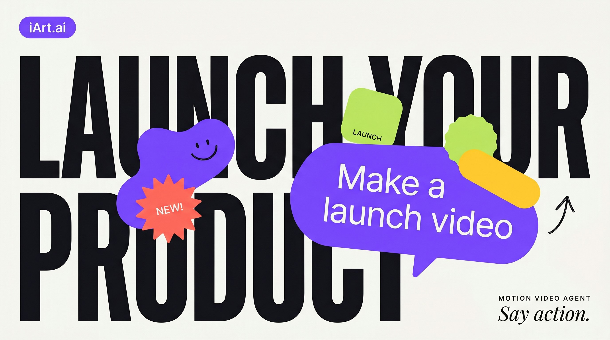
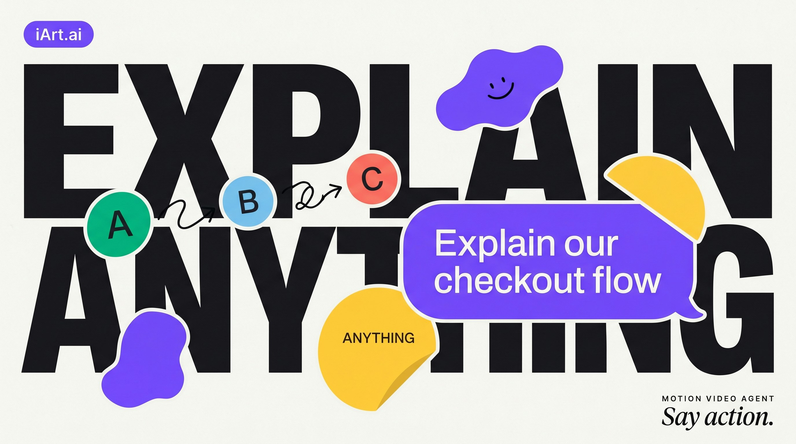
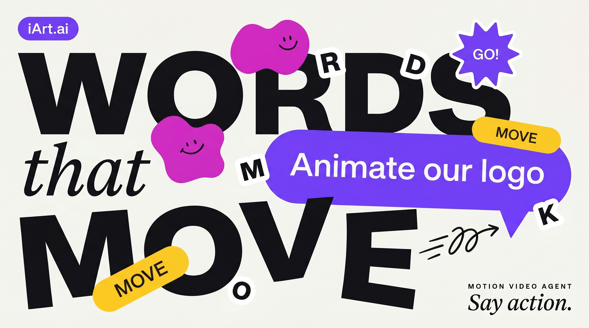

### 🎬 관련 영상
- [🎥 영상 보기](https://ph-files.imgix.net/010060c4-9f13-47dc-aabd-e89183c7f5d0.jpeg?auto=format)

---

## 7. [Incorruptible by Eric Ries](https://www.producthunt.com/products/incorruptible-by-eric-ries)
**Votes**: 151 | **도입 난이도**: 중 | **신뢰도**: 상
**Tagline**: Why good companies go bad and how great companies stay great
**서비스 링크**: https://www.producthunt.com/r/O2SPCGELEUD5BO

**태그**: Business Strategy, Leadership, Governance, Management, Design

### 📌 이 서비스 한눈에 보기
기업의 본질을 지키며 지속 가능한 성장을 이루는 거버넌스 설계 전략

### 🔑 주요 기능
- 기업이 설립 목적에서 벗어나게 만드는 '금융 중력(financial gravity)' 현상 분석
- 성장과 번영 속에서도 조직의 영혼을 잃지 않는 거버넌스 설계법 제시
- The Lean Startup 저자 Eric Ries의 실전적 조직 관리 블루프린트

### 🙋 사용자에게 어떤 점이 좋은가
조직이 성장함에 따라 발생하는 구조적 변질을 방지하고, 장기적인 가치를 유지할 수 있는 경영 프레임워크를 제공합니다.

### ✅ 지금 바로 써볼 기능
- 제공되는 무료 구현 가이드(implementation guide) 확인하기
- Eric Ries의 런칭 AMA 세션 참여하여 인사이트 얻기
- 현재 조직의 거버넌스 구조와 '금융 중력'의 영향력 점검하기

### ⚠️ 사용 전 확인할 점
- 이론적 프레임워크이므로 실제 조직에 적용 시 문화적 저항이 발생할 수 있음
- 구체적인 산업군별 특수성이 반영되지 않았을 수 있음

### 🧭 확인이 더 필요한 정보
제공되는 가이드가 특정 규모 이상의 기업에 최적화되어 있는지 확인이 필요합니다.

### 📸 스크린샷 및 갤러리

### 🎬 관련 영상
- [🎥 영상 보기](https://ph-files.imgix.net/da5052e0-c40c-434d-b05f-5505d4aa0c22.jpeg?auto=format)

---

## 8. [Napkin Math](https://www.producthunt.com/products/napkin-math)
**Votes**: 147 | **도입 난이도**: 하 | **신뢰도**: 상
**Tagline**: personalized AI food journal + nutrition coach
**서비스 링크**: https://www.producthunt.com/r/SS55DMUBMZCXE7

**태그**: AI, Health, Food, Lifestyle, AI Tool

### 📌 이 서비스 한눈에 보기
사진 한 장으로 간편하게 기록하는 개인 맞춤형 AI 식단 일기 및 영양 코치

### 🔑 주요 기능
- 음식 사진 촬영을 통한 간편한 식단 기록
- 개인 맞춤형 AI 영양 코칭 서비스
- 사용자 친화적이고 귀여운 UI/UX 디자인

### 🙋 사용자에게 어떤 점이 좋은가
복잡한 수치 입력 없이 사진 촬영만으로 식단을 기록할 수 있어, 건강 관리를 지속하기 매우 편리합니다.

### ✅ 지금 바로 써볼 기능
- 음식 사진 찍어서 기록해보기
- AI가 제안하는 영양 피드백 확인하기
- 개인별 건강 목표 설정하기

### ⚠️ 사용 전 확인할 점
- 사진만으로 정확한 영양 성분(칼로리, 미량 영양소 등)이 산출되는지 확인 필요
- 음식 종류가 복잡하거나 겹쳐 있는 경우 인식 정확도 차이 가능성

### 🧭 확인이 더 필요한 정보
사진 인식 기술의 정확도와 구체적인 영양 분석 알고리즘의 정밀도를 확인할 필요가 있습니다.

### 📸 스크린샷 및 갤러리
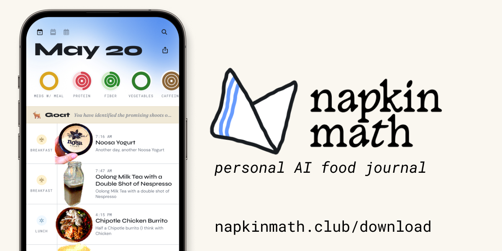
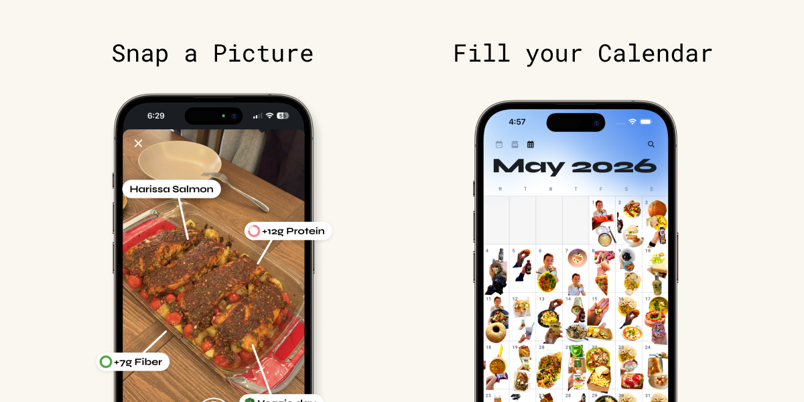
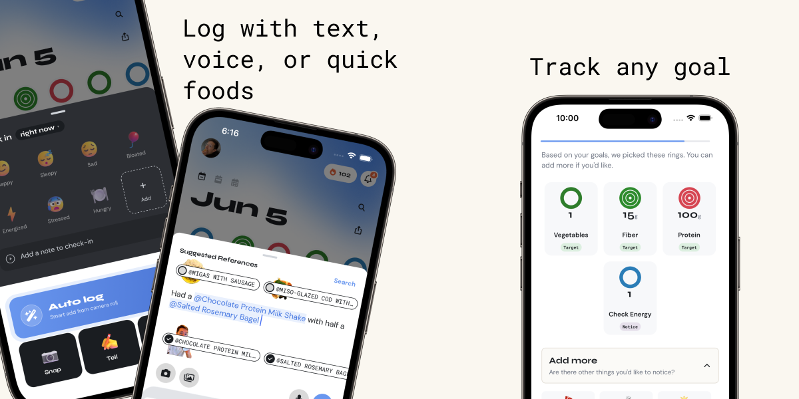

### 🎬 관련 영상
- [🎥 영상 보기](https://ph-files.imgix.net/b0d54dc5-4a26-4266-8d6d-a8ed98b47eaf.jpeg?auto=format)

---

## 9. [Monako Glass](https://www.producthunt.com/products/monako-glass)
**Votes**: 133 | **도입 난이도**: 상 | **신뢰도**: 상
**Tagline**: Run AI coding agents hands-free from a heads-up display
**서비스 링크**: https://www.producthunt.com/r/EBDEG4ZUBC45CC

**태그**: DevTool, AI, Wearable, Automation, Agent, AI Tool

### 📌 이 서비스 한눈에 보기
손을 자유롭게 사용하는 웨어러블 디스플레이로 AI 코딩 에이전트를 제어하는 스마트 글래스

### 🔑 주요 기능
- 48g 초경량 웨어러블 디자인 및 웨이브가이드 디스플레이 탑재
- Claude Code, Codex 등 AI 코딩 에이전트의 핸즈프리 실행 지원
- Buildroot Linux 기반의 안정적인 시스템과 제스처 입력 방식

### 🙋 사용자에게 어떤 점이 좋은가
개발자가 코딩 작업 중 화면 전환이나 키보드 입력 없이도 AI 에이전트를 제어할 수 있어 작업 흐름을 유지하는 데 도움을 줍니다.

### ✅ 지금 바로 써볼 기능
- 예약 구매 일정 확인
- 지원되는 AI 에이전트 호환성 검토
- 제품 출시(2026년 여름) 일정 모니터링

### ⚠️ 사용 전 확인할 점
- 2026년 하반기 출시 예정으로 즉시 사용 불가
- 웨어러블 기기 특성상 배터리 수명 및 디스플레이 시인성 확인 필요

### 🧭 확인이 더 필요한 정보
현재 예약 전용 제품이며 실제 배송 시점과 구체적인 하드웨어 사양에 대한 추가 정보가 필요합니다.

### 📸 스크린샷 및 갤러리

### 🎬 관련 영상
- [🎥 영상 보기](https://ph-files.imgix.net/c971b884-ea2a-44a1-8953-bebf6ed73b52.jpeg?auto=format)

---

## 10. [Axol](https://www.producthunt.com/products/axol)
**Votes**: 116 | **도입 난이도**: 상 | **신뢰도**: 중
**Tagline**: Automate physical work with a powerful robot
**서비스 링크**: https://www.producthunt.com/r/MA2XPJNWOIIKHL

**태그**: Robotics, Automation, AI, Hardware, AI Tool, Design

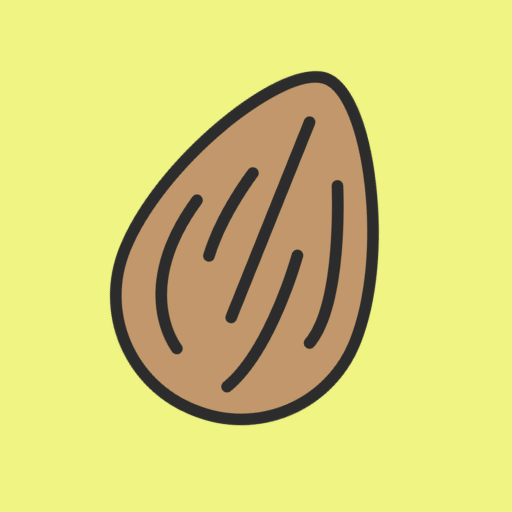

### 📌 이 서비스 한눈에 보기
물리적 업무 자동화를 위한 고성능 듀얼 암 로봇 솔루션

### 🔑 주요 기능
- 실제 업무 자동화를 위한 강력한 듀얼 암 설계
- 데이터 수집이 용이한 구조와 넓은 작업 범위
- 물리적 AI 적용에 최적화된 높은 가동 범위

### 🙋 사용자에게 어떤 점이 좋은가
복잡한 물리적 작업 환경에서도 높은 가동 범위를 통해 실질적인 업무 자동화를 구현할 수 있습니다.

### ✅ 지금 바로 써볼 기능
- 작업 환경에 맞는 가동 범위 확인
- 데이터 수집 효율성 검토
- 물리적 AI 모델과의 호환성 테스트

### ⚠️ 사용 전 확인할 점
- 하드웨어 설치 및 물리적 공간 확보 필요
- 복잡한 작업 수행 시 정밀도 및 안전성 검토 필요

### 🧭 확인이 더 필요한 정보
구체적인 하드웨어 사양 및 소프트웨어 인터페이스에 대한 정보가 추가로 필요합니다.

### 📸 스크린샷 및 갤러리
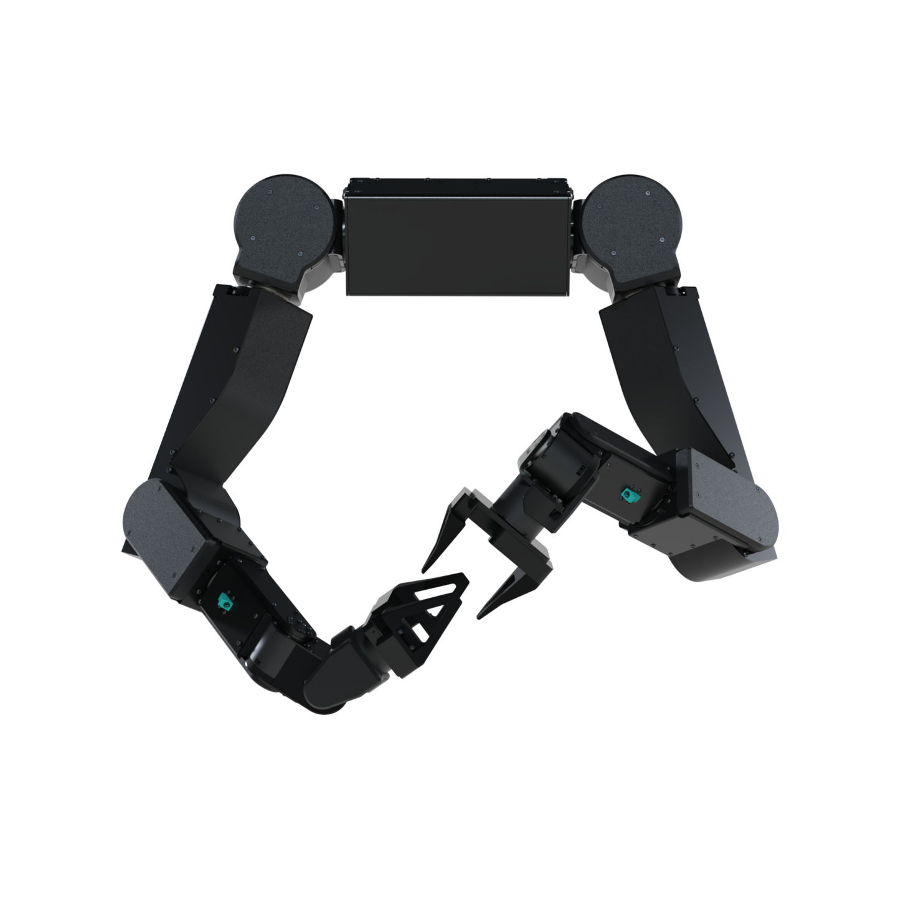
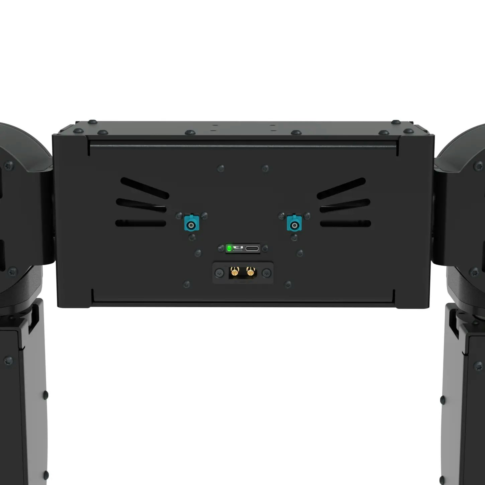
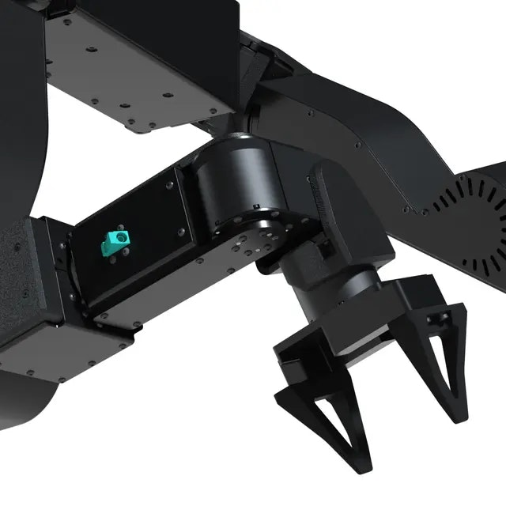

### 🎬 관련 영상
- [🎥 영상 보기](https://ph-files.imgix.net/ec99244f-c016-4fce-8c80-b1d485bf8178.jpeg?auto=format)

---

## 11. [SeaTicket](https://www.producthunt.com/products/seaticket)
**Votes**: 111 | **도입 난이도**: 중 | **신뢰도**: 상
**Tagline**: Al agent that resolves issues across all your channels
**서비스 링크**: https://www.producthunt.com/r/VBYGJCKDHUYJ33

**태그**: DevTool, AI, Automation, CustomerSupport, Productivity, Agent, AI Tool, Email

### 📌 이 서비스 한눈에 보기
GitHub, 이메일 등 흩어진 이슈를 하나로 통합하고 AI가 해결책을 제안하는 워크스페이스

### 🔑 주요 기능
- GitHub, Discourse, 이메일 등 다양한 채널의 이슈를 단일 워크스페이스로 통합
- 관련 문서와 이전 이슈를 포함한 전체 맥락(Full Context) 제공
- 기존 문서를 기반으로 해결책을 자율적으로 제안하는 AI 에이전트 탑재

### 🙋 사용자에게 어떤 점이 좋은가
여러 채널에 흩어진 피드백을 찾는 시간을 줄이고, AI의 맥락 파악 기능을 통해 문제 해결 속도를 높일 수 있습니다.

### ✅ 지금 바로 써볼 기능
- 기존 이슈 데이터와 문서 동기화하기
- AI 에이전트의 해결책 제안 검토하기
- 통합된 워크스페이스에서 이슈 관리 시작하기

### ⚠️ 사용 전 확인할 점
- 외부 채널(GitHub, 이메일 등)과의 실시간 동기화 안정성 확인 필요
- AI가 제안하는 해결책의 정확성에 대한 검증 필요

### 🧭 확인이 더 필요한 정보
지원하는 외부 서비스의 종류와 데이터 보안 정책에 대한 구체적인 정보가 필요합니다.

### 📸 스크린샷 및 갤러리
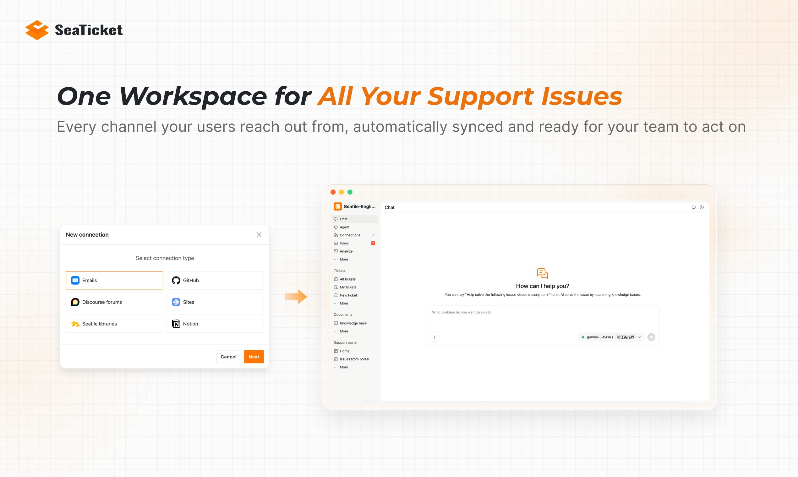
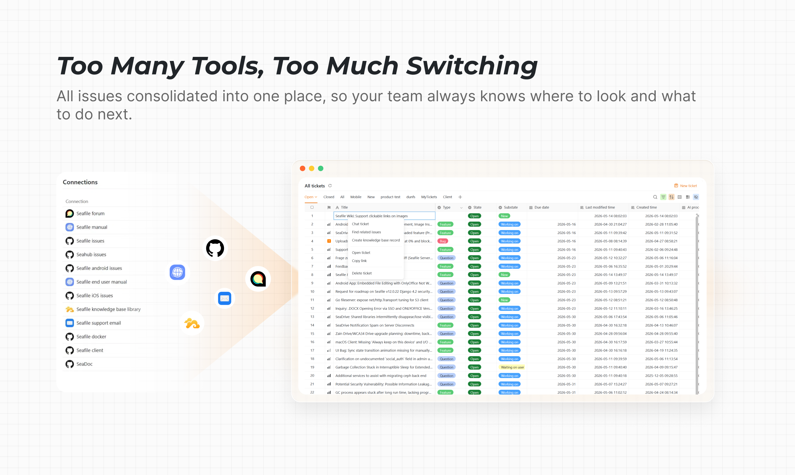
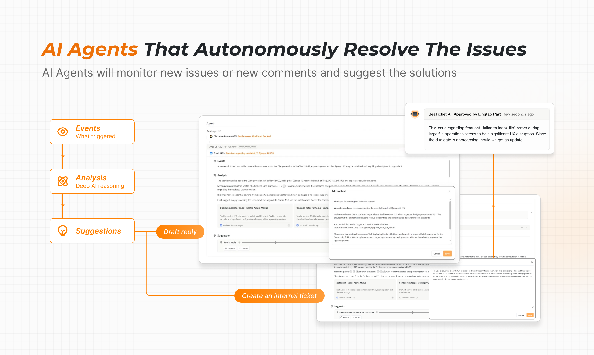

### 🎬 관련 영상
- [🎥 영상 보기](https://ph-files.imgix.net/e8a134e6-20ab-43d2-b2ec-8bc078a17560.jpeg?auto=format)

---

## 12. [veridive](https://www.producthunt.com/products/veridive-discover-the-spoken-web)
**Votes**: 110 | **도입 난이도**: 하 | **신뢰도**: 상
**Tagline**: Find the 30 seconds that matter in any video via chat
**서비스 링크**: https://www.producthunt.com/r/3E4FWZNWXIXXFT

**태그**: AI, Video-Analysis, Productivity, Search, AI Tool, Chat, Video

### 📌 이 서비스 한눈에 보기
영상과 팟캐스트 속 핵심 답변을 정확한 타임스탬프와 함께 찾아주는 AI 채팅 서비스

### 🔑 주요 기능
- 유튜브, 강의, 인터뷰 등 영상 콘텐츠 내 핵심 답변 추출
- 답변이 나오는 정확한 시점으로 바로 이동 가능한 클릭형 인용 기능
- 다국어 질문 지원 및 신뢰도 기반의 소스 랭킹 시스템

### 🙋 사용자에게 어떤 점이 좋은가
긴 영상을 처음부터 끝까지 볼 필요 없이, 채팅을 통해 필요한 정보만 즉시 확인하고 근거(타임스탬프)를 검증할 수 있습니다.

### ✅ 지금 바로 써볼 기능
- 긴 유튜브 강의나 인터뷰 링크를 입력하여 핵심 요약 요청하기
- 질문 후 제공되는 타임스탬프를 클릭해 실제 맥락 확인하기
- 다국어 기능을 활용해 외국어 영상에서 필요한 정보 찾기

### ⚠️ 사용 전 확인할 점
- 자막(Transcript) 기반이므로 음질이 나쁘거나 자막이 없는 영상은 정확도가 떨어질 수 있음
- AI가 답변을 생성하는 과정에서 발생할 수 있는 환각(Hallucination) 주의

### 🧭 확인이 더 필요한 정보
영상 길이나 파일 용량에 따른 서비스 이용 제한 및 유료 플랜 정책에 대한 정보가 명시되지 않았습니다.

### 📸 스크린샷 및 갤러리
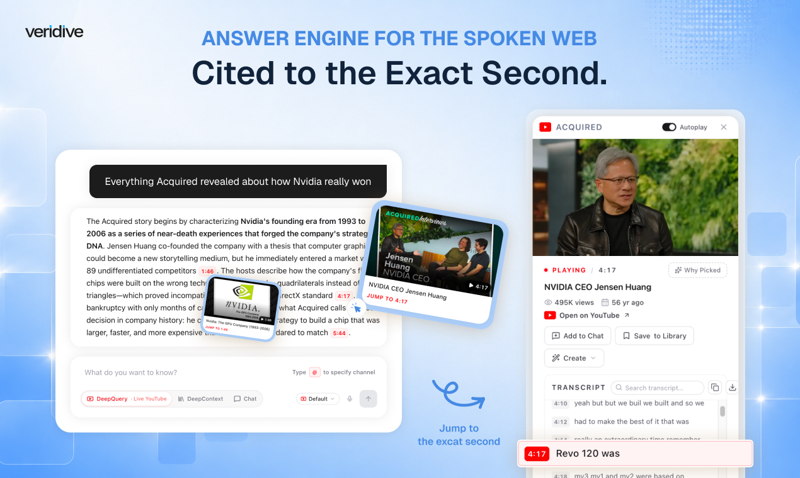
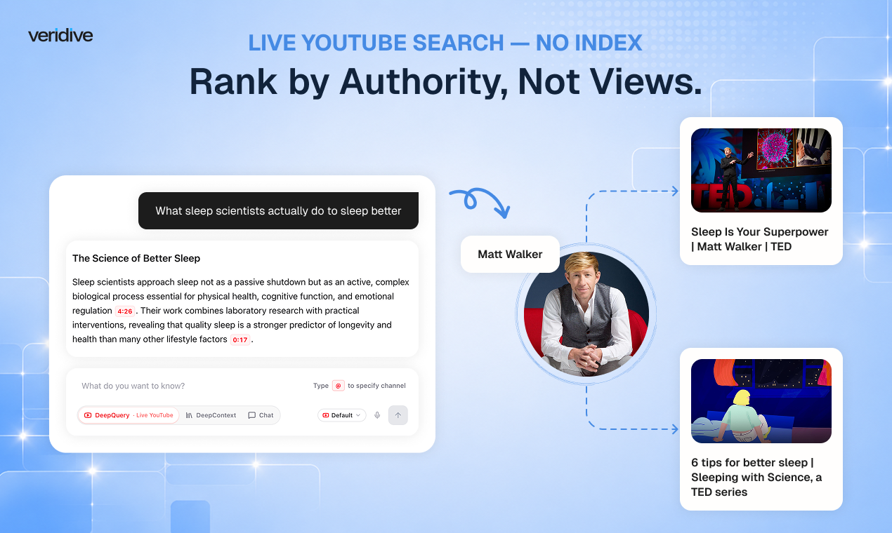
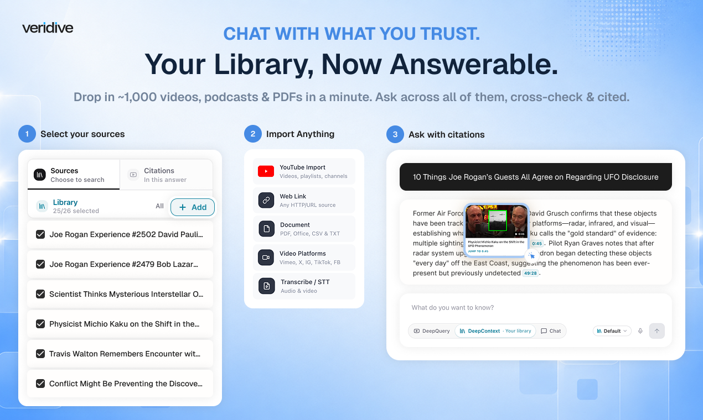

---

## 13. [BlenderHunt](https://www.producthunt.com/products/blenderhunt)
**Votes**: 110 | **도입 난이도**: 하 | **신뢰도**: 상
**Tagline**: The indie marketplace for Blender artists and creators
**서비스 링크**: https://www.producthunt.com/r/3FDQA4QB5PWEL7

**태그**: Blender, Marketplace, DigitalAssets, CreativeTools

### 📌 이 서비스 한눈에 보기
전 세계 독립 아티스트들의 고품질 Blender 에셋과 애드온을 거래하는 전문 마켓플레이스

### 🔑 주요 기능
- Blender 제작자를 위한 큐레이션된 마켓플레이스
- 애드온, 에셋, 머티리얼, 툴 등 다양한 디지털 자산 제공
- 독립 아티스트와 사용자 간의 직접적인 거래 환경

### 🙋 사용자에게 어떤 점이 좋은가
Blender 작업 효율을 높여줄 검증된 도구와 에셋을 손쉽게 찾고 구매할 수 있습니다.

### ✅ 지금 바로 써볼 기능
- 최신 인기 애드온 탐색하기
- 작업 스타일에 맞는 에셋 검색하기
- 아티스트별 포트폴리오 확인하기

### ⚠️ 사용 전 확인할 점
- 개별 아티스트가 제공하는 콘텐츠의 품질 차이 확인 필요
- Blender 버전별 호환성 체크 필수

### 🧭 확인이 더 필요한 정보
플랫폼 내 콘텐츠의 품질 관리 기준 및 라이선스 정책에 대한 상세 정보가 필요합니다.

### 📸 스크린샷 및 갤러리
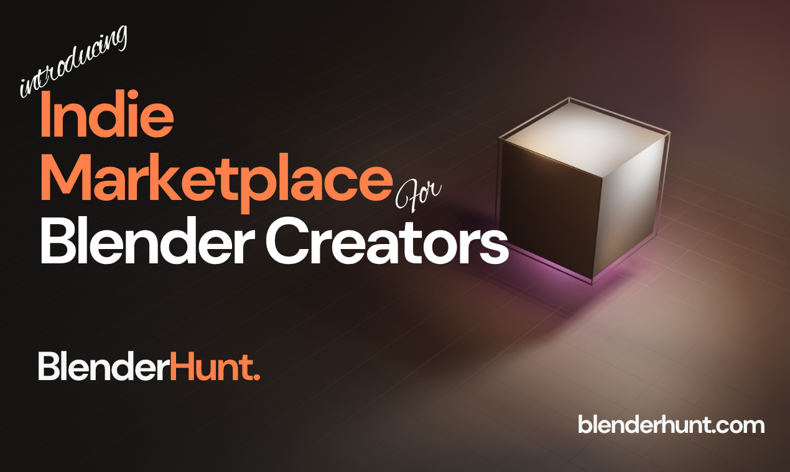
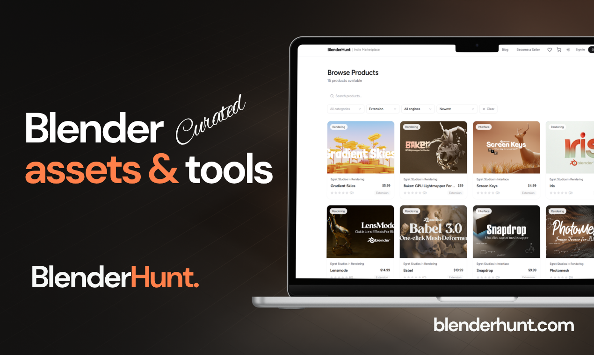
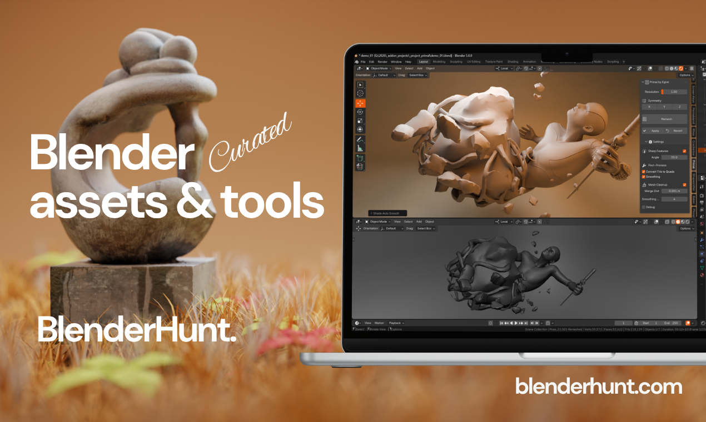

---

## 14. [Hero Studio Photos](https://www.producthunt.com/products/hero-9)
**Votes**: 103 | **도입 난이도**: 하 | **신뢰도**: 상
**Tagline**: Snap one photo, get listing-ready shots from every angle
**서비스 링크**: https://www.producthunt.com/r/VNMX7USPKQFIDY

**태그**: AI-Photography, E-commerce, Mobile-App, Developer-Tools, Agent, AI Tool, Vision, DevTool, API

### 📌 이 서비스 한눈에 보기
사진 한 장으로 모든 각도의 스튜디오급 제품 사진을 생성하는 AI 도구

### 🔑 주요 기능
- 단 한 장의 사진으로 다양한 각도의 고품질 스튜디오 샷 생성
- 의류를 위한 모델 착용 및 마네킹 스타일 이미지 지원
- iOS, Android 앱 및 개발자를 위한 API/MCP 서버 제공

### 🙋 사용자에게 어떤 점이 좋은가
제품 사진 촬영을 위한 전문 스튜디오 없이도 판매용 고퀄리티 이미지를 즉시 확보할 수 있습니다.

### ✅ 지금 바로 써볼 기능
- 스마트폰 앱으로 제품 사진 촬영해보기
- 의류 제품의 모델 착용샷 생성 기능 테스트
- API를 활용한 자동화 워크플로우 검토

### ⚠️ 사용 전 확인할 점
- AI 생성 이미지 특성상 실제 제품과 미세한 디테일 차이가 발생할 수 있음
- 복잡한 배경이나 형태의 제품은 결과물의 정확도가 달라질 수 있음

### 🧭 확인이 더 필요한 정보
구체적인 생성 이미지의 해상도 및 상업적 이용 권한에 대한 상세 정책 확인이 필요합니다.

### 📸 스크린샷 및 갤러리
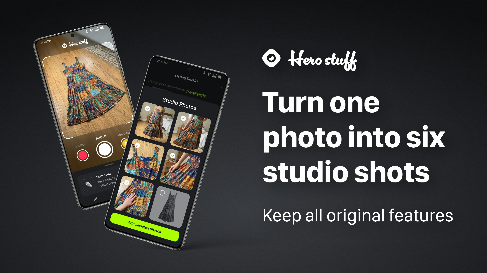
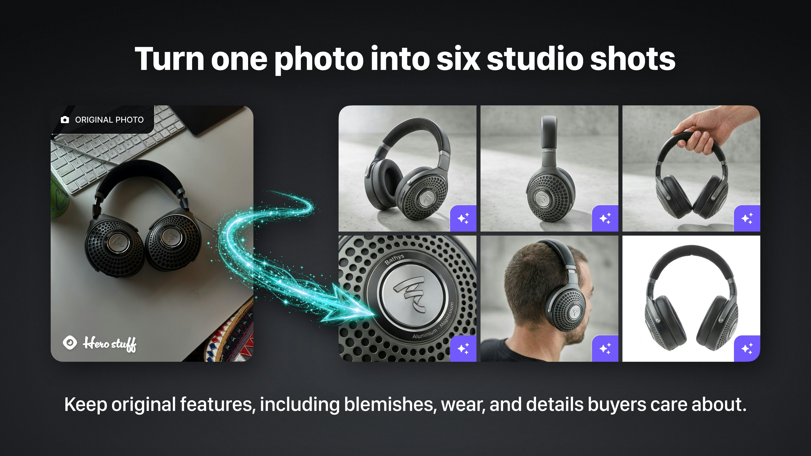
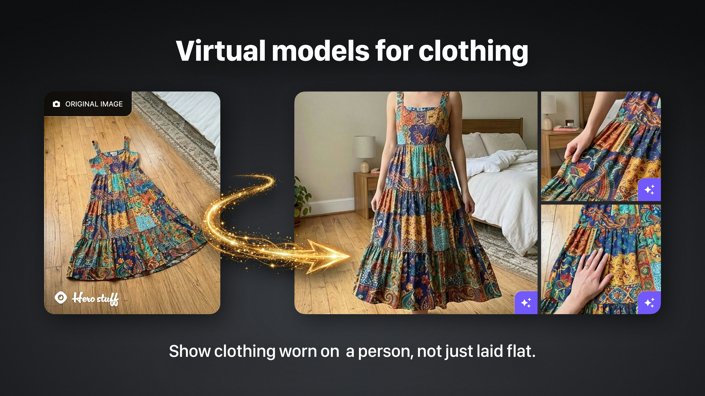

### 🎬 관련 영상
- [🎥 영상 보기](https://ph-files.imgix.net/c25398c7-21d6-4242-ba8b-e9cd9062a28b.jpeg?auto=format)

---

## 15. [AGNT.Hub](https://www.producthunt.com/products/agnt-hub)
**Votes**: 99 | **도입 난이도**: 하 | **신뢰도**: 상
**Tagline**: Build always-on AI agents without managing servers
**서비스 링크**: https://www.producthunt.com/r/IILMADBX4VM3HF

**태그**: AI Agents, Automation, NoCode, Cloud, Agent, AI Tool, Chat

### 📌 이 서비스 한눈에 보기
서버 관리 없이 클라우드 컨테이너 기반으로 24시간 작동하는 AI 에이전트 워크플로우 구축 도구

### 🔑 주요 기능
- 격리된 클라우드 컨테이너 환경에서 실행되는 프라이빗 AI 워크스페이스
- MCP(Model Context Protocol)를 통한 Notion 등 외부 도구 연결 및 커스텀 스킬 추가
- Docker, AWS 등 복잡한 인프라 설정 없이 백그라운드에서 자동 실행되는 에이전트

### 🙋 사용자에게 어떤 점이 좋은가
복잡한 서버 설정이나 인프라 관리 없이도 사용자가 정의한 AI 워크플로우를 중단 없이 자동화할 수 있습니다.

### ✅ 지금 바로 써볼 기능
- 커스텀 스킬을 추가하여 특정 업무 자동화 시도하기
- MCP를 활용해 Notion 등 기존 도구와 연동하기
- 백그라운드에서 실행되는 에이전트 워크플로우 구축하기

### ⚠️ 사용 전 확인할 점
- 클라우드 컨테이너 환경에서의 데이터 보안 및 프라이버시 정책 확인 필요
- 에이전트 실행 시간에 따른 비용 구조 확인 필요

### 🧭 확인이 더 필요한 정보
구체적인 요금 체계와 지원되는 외부 도구의 범위가 명시되지 않았습니다.

### 📸 스크린샷 및 갤러리
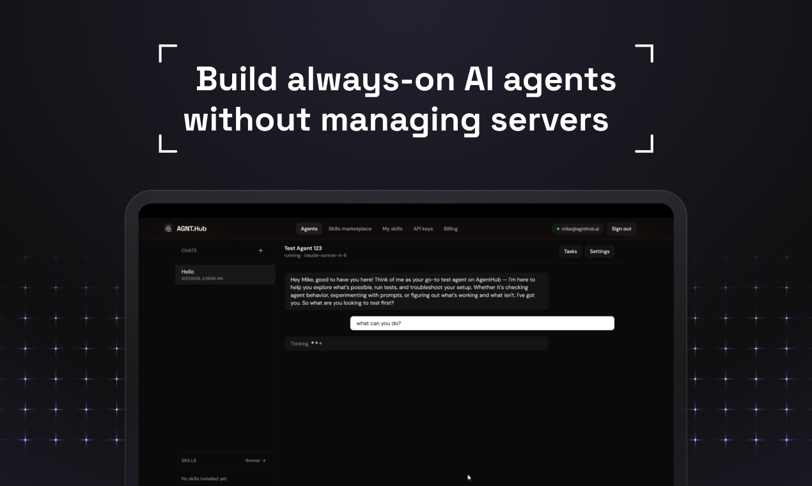
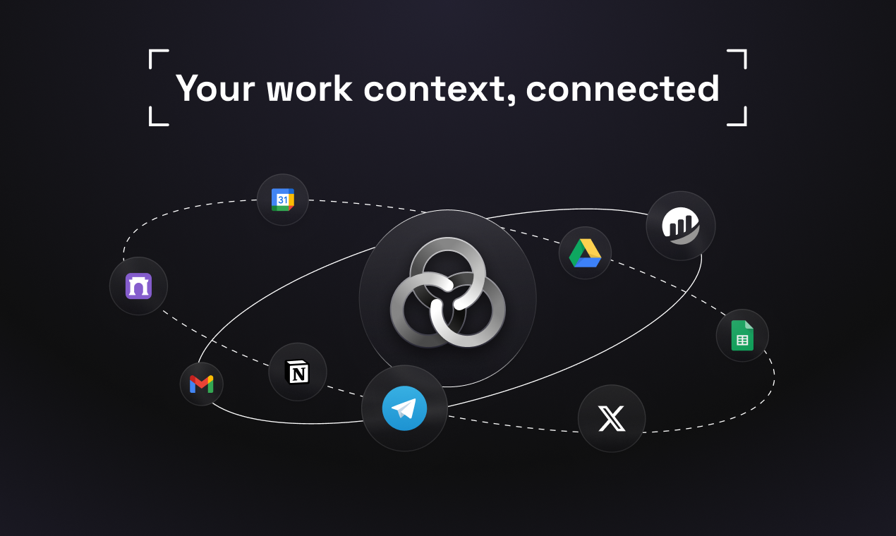
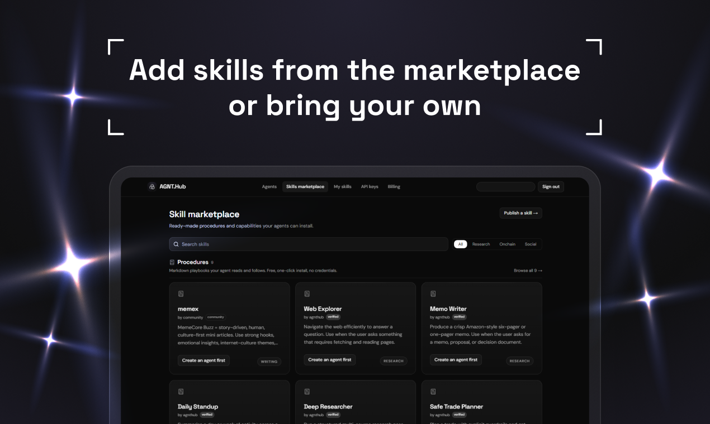

---

## 16. [OLO Robotics](https://www.producthunt.com/products/olo-robotics)
**Votes**: 97 | **도입 난이도**: 하 | **신뢰도**: 상
**Tagline**: Control robots in your browser — no setup needed
**서비스 링크**: https://www.producthunt.com/r/QNNORTYHNRJIVI

**태그**: Robotics, DevTool, ROS2, Simulation, AI, AI Tool

### 📌 이 서비스 한눈에 보기
복잡한 설정 없이 브라우저에서 즉시 로봇 프로그래밍을 시작할 수 있는 웹 기반 플랫폼

### 🔑 주요 기능
- 설치나 환경 설정이 필요 없는 웹 기반 로봇 제어 환경 제공
- ROS2 접근, 로봇 시각화, 시뮬레이션 및 AI 코딩 지원 통합
- JavaScript 및 Python SDK를 통한 빠른 개발 워크플로우

### 🙋 사용자에게 어떤 점이 좋은가
리눅스 설치나 복잡한 환경 설정 과정 없이 아이디어를 즉시 작동하는 로봇 코드로 구현할 수 있습니다.

### ✅ 지금 바로 써볼 기능
- JavaScript/Python SDK 플레이그라운드 테스트
- 브라우저 내 로봇 시뮬레이션 및 시각화 확인
- ROS2 연동 기능 탐색

### ⚠️ 사용 전 확인할 점
- 웹 기반 플랫폼이므로 하드웨어와의 물리적 연결 방식 확인 필요
- 현재는 사전 등록(Sign-up) 단계로 즉시 전체 기능 사용이 제한될 수 있음

### 🧭 확인이 더 필요한 정보
실제 물리 로봇 하드웨어와의 연결 방식 및 지원 가능한 하드웨어 범위에 대한 정보가 더 필요합니다.

### 📸 스크린샷 및 갤러리
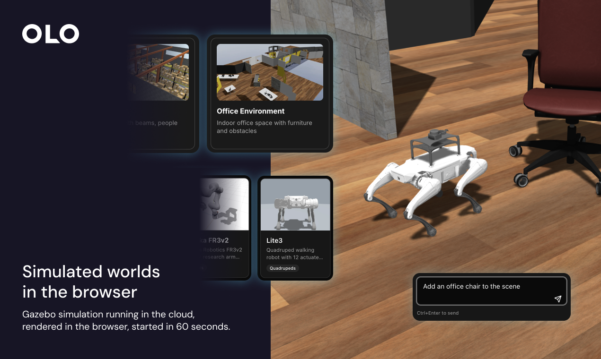
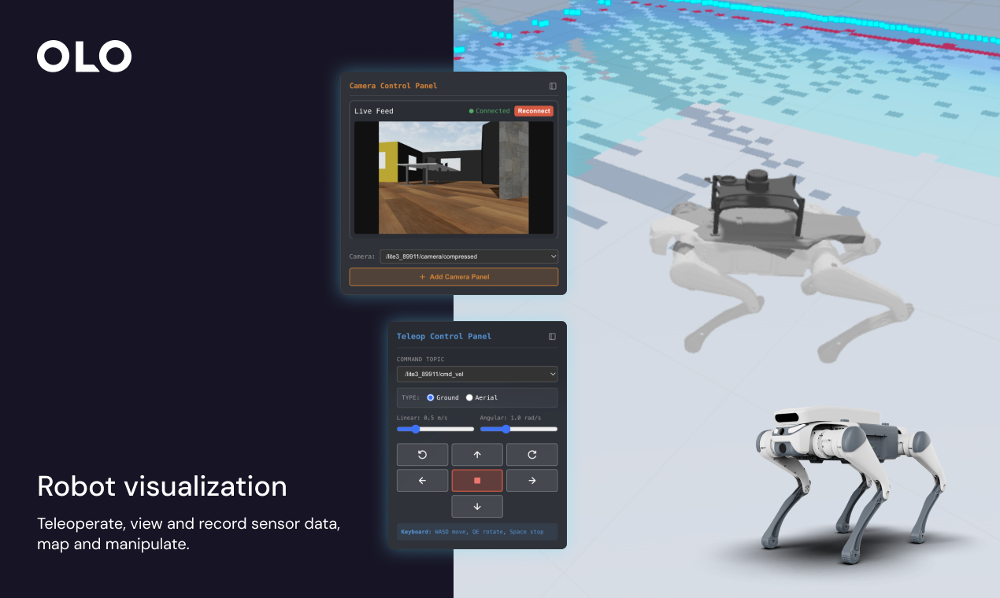
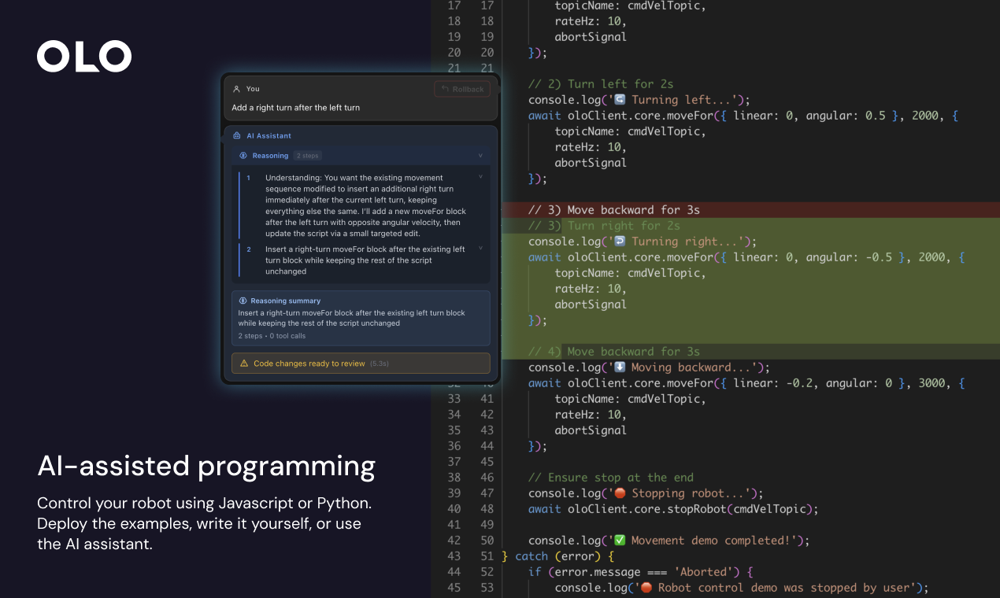

### 🎬 관련 영상
- [🎥 영상 보기](https://ph-files.imgix.net/5532db39-0e06-4a93-b306-add5e199003a.jpeg?auto=format)

---

## 17. [Zingle](https://www.producthunt.com/products/zingle-2)
**Votes**: 96 | **도입 난이도**: 하 | **신뢰도**: 상
**Tagline**: Learn words in context with AI
**서비스 링크**: https://www.producthunt.com/r/HQ77H6POHIZXEF

**태그**: LanguageLearning, AI, Education, Reading, AI Tool

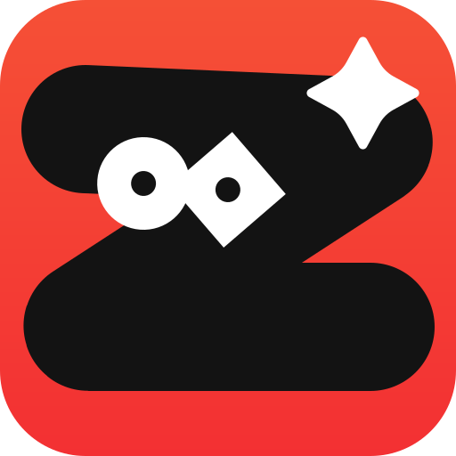

### 📌 이 서비스 한눈에 보기
AI를 활용해 문맥 속에서 자연스럽게 단어를 학습하는 언어 학습 도구

### 🔑 주요 기능
- 문맥 중심의 단어 학습: 단순 암기가 아닌 이야기와 실제 콘텐츠를 통한 학습
- AI 기반 문맥 이해: AI가 문장 내 의미를 파악하여 학습 지원
- 연결된 학습 루프: 읽기와 학습이 유기적으로 이어지는 학습 프로세스

### 🙋 사용자에게 어떤 점이 좋은가
단순 암기에서 벗어나 실제 읽기 환경에서 단어를 익힐 수 있어 실전 언어 능력을 키우는 데 유용합니다.

### ✅ 지금 바로 써볼 기능
- 자신이 읽고 있는 스토리 기능 활용하기
- 개인 콘텐츠를 통한 맞춤형 단어 학습 시도하기
- AI가 제공하는 문맥 설명 확인하기

### ⚠️ 사용 전 확인할 점
- 학습 콘텐츠의 양과 질이 사용자 기대치에 부합하는지 확인 필요
- AI 기반 설명이 항상 완벽한 문법적 정확성을 보장하는지 검토 필요

### 🧭 확인이 더 필요한 정보
현재 제공되는 콘텐츠의 종류와 지원하는 언어 범위에 대한 정보가 부족합니다.

### 📸 스크린샷 및 갤러리
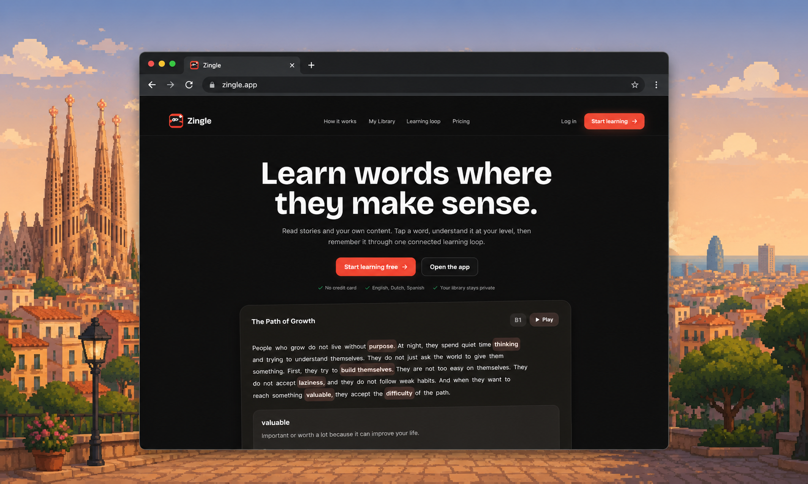
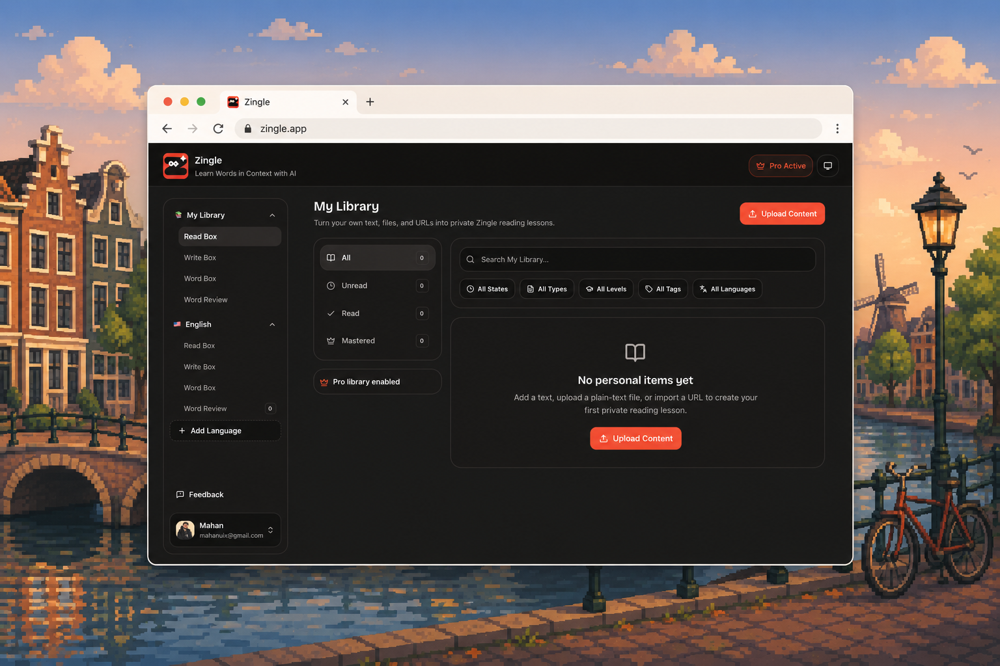
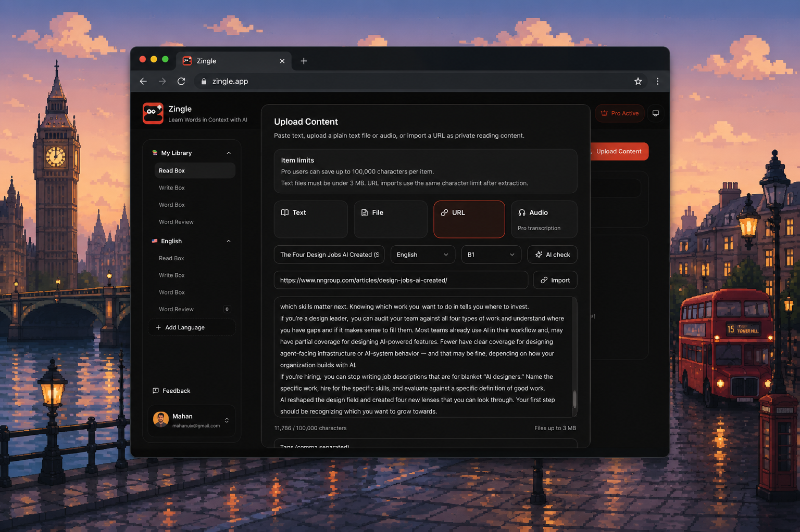

---

## 18. [LayerProof Vellum](https://www.producthunt.com/products/layerproof-social-content-generation)
**Votes**: 92 | **도입 난이도**: 하 | **신뢰도**: 상
**Tagline**: One canvas for every image asset you need
**서비스 링크**: https://www.producthunt.com/r/O5HHVRX2ZILQUR

**태그**: AI, DesignTool, CreativeWorkflow, AssetProduction, AI Tool, Vision

### 📌 이 서비스 한눈에 보기
AI 이미지 생성의 불확실성을 제어 가능한 제작 파이프라인으로 바꾸는 비주얼 캔버스

### 🔑 주요 기능
- 드래그 앤 드롭 방식의 직관적인 비주얼 캔버스 제공
- 피사체, 배경, 효과를 분리하여 조합하는 정밀한 이미지 엔지니어링
- 무작위적인 생성 대신 예측 가능한 픽셀 단위 결과물 도출

### 🙋 사용자에게 어떤 점이 좋은가
단순한 생성형 AI의 무작위성에서 벗어나, 팀 단위로 의도한 대로 정교한 최종 에셋을 제작할 수 있습니다.

### ✅ 지금 바로 써볼 기능
- 캔버스에 피사체와 배경 레이어 배치해보기
- 드래그 앤 드롭을 통한 레이어 조합 테스트
- 최종 결과물의 픽셀 정밀도 확인하기

### ⚠️ 사용 전 확인할 점
- 사용자의 숙련도에 따라 결과물의 품질 차이가 발생할 수 있음
- 복잡한 레이어 조합 시 작업 흐름의 난이도 확인 필요

### 🧭 확인이 더 필요한 정보
구체적인 지원 파일 형식이나 외부 AI 모델과의 연동 범위는 명시되지 않았습니다.

### 📸 스크린샷 및 갤러리
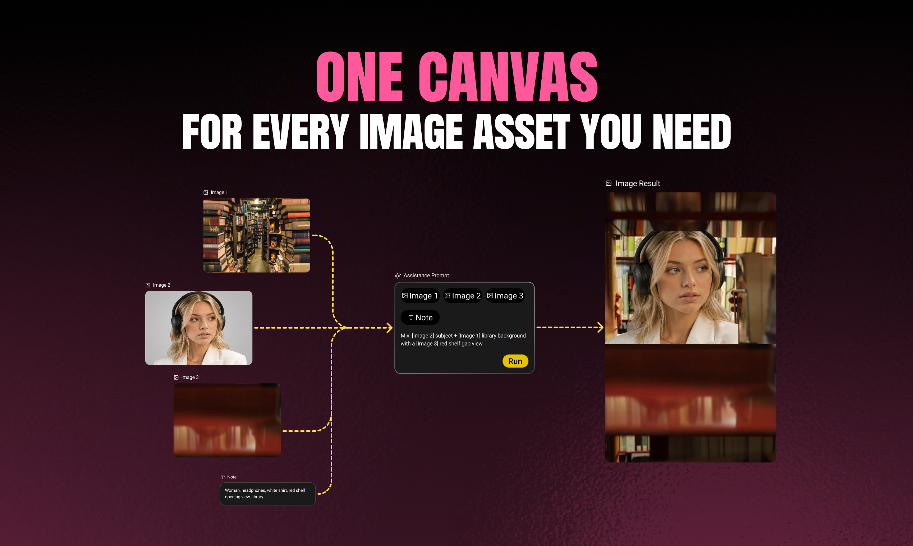

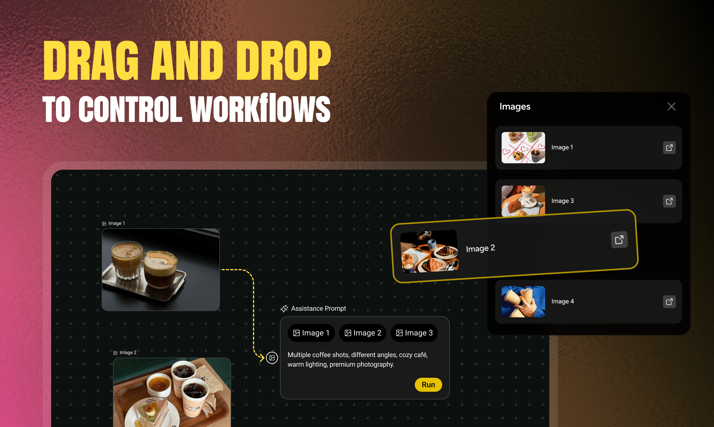

### 🎬 관련 영상
- [🎥 영상 보기](https://ph-files.imgix.net/663b0c4a-e13d-4ff4-adcd-2b97e365635e.jpeg?auto=format)

---

## 19. [FluidDocs Deck Builder](https://www.producthunt.com/products/fluiddocs-html-deck-builder)
**Votes**: 91 | **도입 난이도**: 하 | **신뢰도**: 상
**Tagline**: Turn a prompt into a real HTML deck
**서비스 링크**: https://www.producthunt.com/r/KDJON65FUSS24Y

**태그**: Productivity, OpenSource, HTML, Automation, AI Tool, Prompting

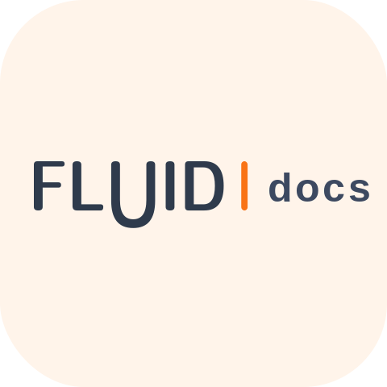

### 📌 이 서비스 한눈에 보기
한 줄의 프롬프트로 편집 가능한 HTML 기반 프레젠테이션을 생성하는 오픈소스 도구

### 🔑 주요 기능
- 단일 문장 입력만으로 즉시 편집 가능한 HTML 슬라이드 생성
- PDF나 PPT 파일을 업로드하여 편집 가능한 HTML로 재구성 가능
- 특정 앱에 종속되지 않는 독립적인 HTML 파일 형식 제공

### 🙋 사용자에게 어떤 점이 좋은가
정적인 PDF가 아닌 웹 브라우저에서 직접 수정 가능한 HTML 형식을 사용하여, 별도의 프로그램 설치 없이 어디서든 슬라이드를 편집하고 공유할 수 있습니다.

### ✅ 지금 바로 써볼 기능
- 프롬프트를 입력하여 첫 번째 HTML 데크 생성해보기
- 기존 PDF/PPT 파일을 업로드하여 HTML로 변환해보기
- 브라우저 내 편집 모드(E 키)를 통해 레이아웃 수정해보기

### ⚠️ 사용 전 확인할 점
- HTML 기반이므로 복잡한 애니메이션이나 특수 디자인 구현에 제한이 있을 수 있음
- 오픈소스 프로젝트로서 향후 기능 업데이트 및 유지보수 지속성 확인 필요

### 🧭 확인이 더 필요한 정보
사용자 정의 디자인 템플릿의 다양성과 대용량 파일 처리 성능에 대한 구체적인 정보가 부족합니다.

### 📸 스크린샷 및 갤러리
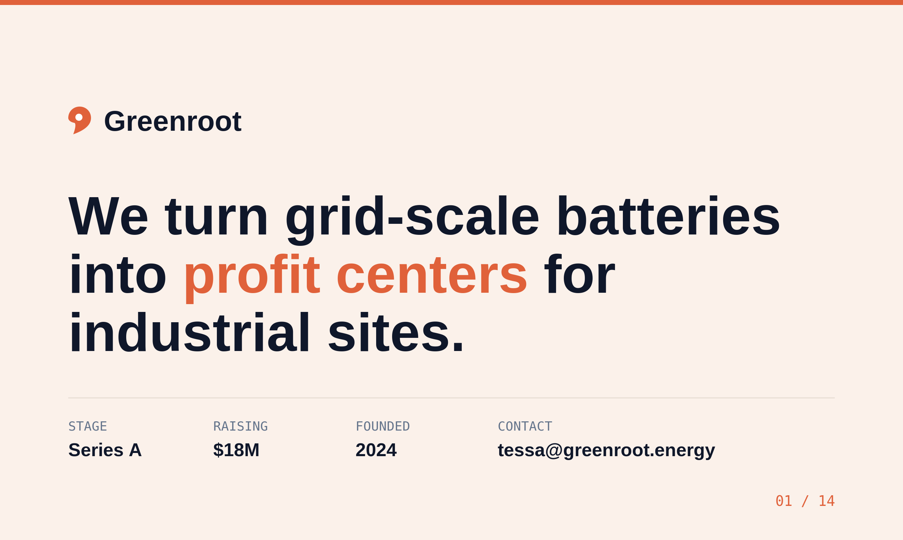
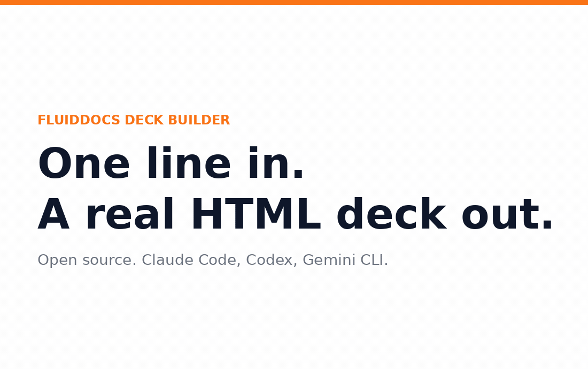
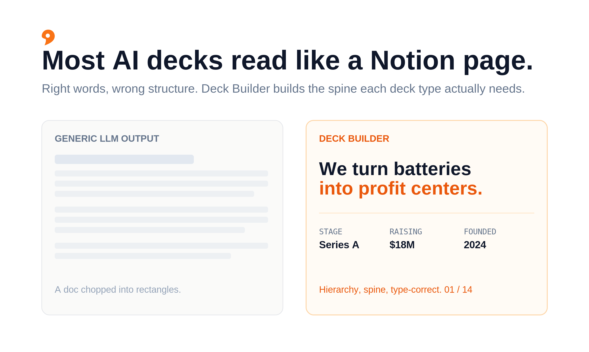

### 🎬 관련 영상
- [🎥 영상 보기](https://ph-files.imgix.net/96401e3f-5f03-45cb-b16a-ae38806e04d0.jpeg?auto=format)

---

## 20. [fort](https://www.producthunt.com/products/fort-3)
**Votes**: 87 | **도입 난이도**: 하 | **신뢰도**: 상
**Tagline**: One command to audit and fix your Mac's security
**서비스 링크**: https://www.producthunt.com/r/QXFWYXLLXJJUPC

**태그**: Security, macOS, DevTool, Automation, Agent, AI Tool

### 📌 이 서비스 한눈에 보기
명령어 한 줄로 Mac의 보안 설정을 점검하고 즉시 수정하는 간편 보안 도구

### 🔑 주요 기능
- 에이전트나 가입 없이 단일 바이너리로 실행되는 가벼운 도구
- FileVault, SIP, 방화벽 등 15개 이상의 핵심 보안 설정 자동 점검
- 보안 점수 리포트 제공 및 주요 문제 자동 수정 기능

### 🙋 사용자에게 어떤 점이 좋은가
개발자 개인의 보안 강화는 물론, MDM 도입 없이 팀 단위로 SOC 2나 ISO 27001 규정 준수를 준비할 때 매우 유용합니다.

### ✅ 지금 바로 써볼 기능
- brew install 명령어로 즉시 설치
- 보안 점수 리포트 확인을 통한 취약점 파악
- 자동 수정 기능을 통한 보안 설정 최적화

### ⚠️ 사용 전 확인할 점
- 자동 수정 기능 사용 시 시스템 설정 변경에 따른 영향 확인 필요
- MDM이 없는 환경을 타겟으로 하므로 대규모 엔터프라이즈 관리에는 한계가 있을 수 있음

### 🧭 확인이 더 필요한 정보
자동 수정 기능이 모든 보안 설정에 대해 완벽하게 작동하는지 확인이 필요합니다.

### 📸 스크린샷 및 갤러리
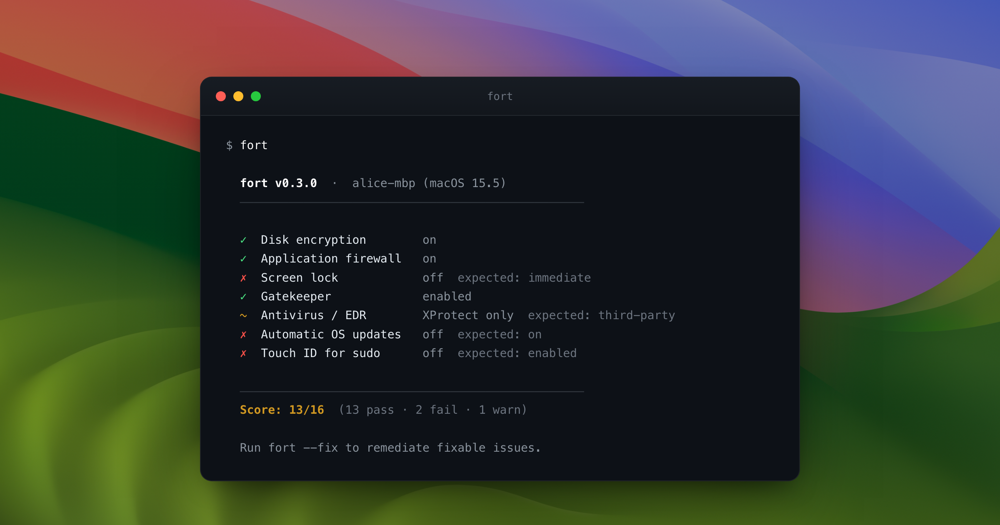
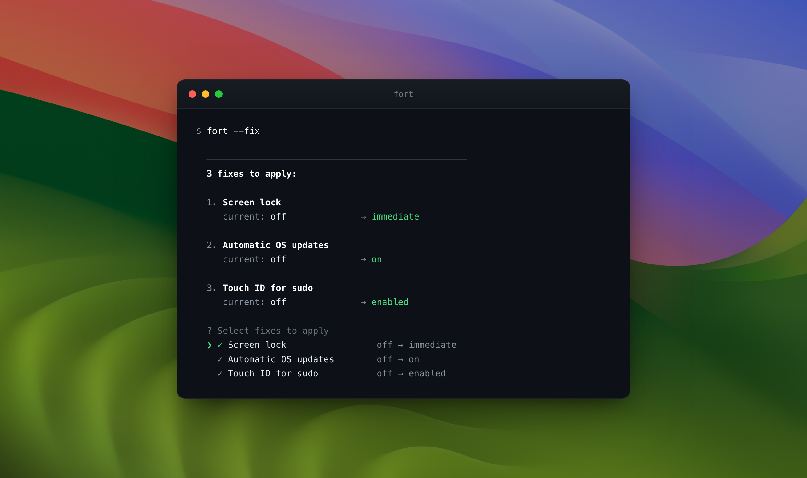
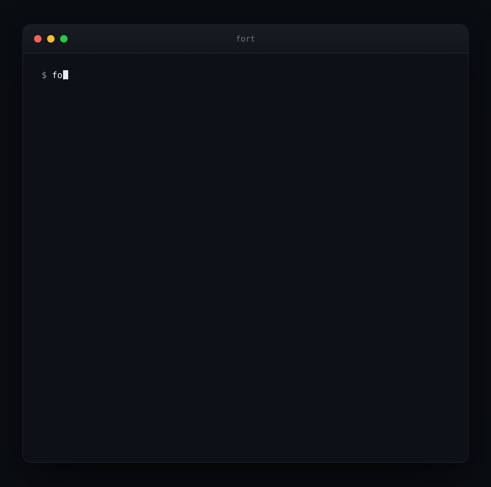

---

## 21. [fort](https://www.producthunt.com/products/fort-3)
**Votes**: 87 | **도입 난이도**: 하 | **신뢰도**: 상
**Tagline**: One command to audit and fix your Mac's security
**서비스 링크**: https://www.producthunt.com/r/QXFWYXLLXJJUPC

**태그**: Security, macOS, DevTool, Automation, Agent, AI Tool

### 📌 이 서비스 한눈에 보기
명령어 한 줄로 Mac의 보안 설정을 점검하고 즉시 수정하는 간편 보안 도구

### 🔑 주요 기능
- 에이전트나 가입 없이 단일 바이너리로 실행되는 가벼운 도구
- FileVault, SIP, 방화벽 등 15개 이상의 핵심 보안 설정 자동 점검
- 보안 점수 리포트 제공 및 주요 문제 자동 수정 기능

### 🙋 사용자에게 어떤 점이 좋은가
개발자 개인의 보안 강화는 물론, MDM 도입 없이 팀 단위로 SOC 2나 ISO 27001 규정 준수를 준비할 때 매우 유용합니다.

### ✅ 지금 바로 써볼 기능
- brew install 명령어로 즉시 설치
- 보안 점수 리포트 확인을 통한 취약점 파악
- 자동 수정 기능을 통한 보안 설정 최적화

### ⚠️ 사용 전 확인할 점
- 자동 수정 기능 사용 시 시스템 설정 변경에 따른 영향 확인 필요
- MDM이 없는 환경을 타겟으로 하므로 대규모 엔터프라이즈 관리에는 한계가 있을 수 있음

### 🧭 확인이 더 필요한 정보
자동 수정 기능이 모든 보안 설정에 대해 완벽하게 작동하는지 확인이 필요합니다.

### 📸 스크린샷 및 갤러리

---

## 22. [Trestle](https://www.producthunt.com/products/trestle-2)
**Votes**: 29 | **도입 난이도**: 하 | **신뢰도**: 상
**Tagline**: Stop AI-written code from leaking secrets
**서비스 링크**: https://www.producthunt.com/r/NVX5MO7KAS3NZ2

**태그**: DevSecOps, AI-Coding, Security, DeveloperTools, Agent, AI Tool, DevTool, API

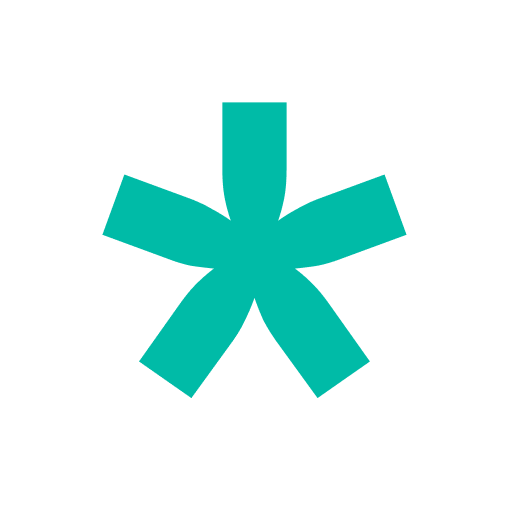

### 📌 이 서비스 한눈에 보기
AI 코딩 에이전트가 생성한 코드 내 보안 취약점(비밀번호, API 키 등)을 실시간으로 차단하는 로컬 스캐너

### 🔑 주요 기능
- AI 코딩 루프 내에서 발생하는 민감 정보 유출 방지
- CLI, pre-commit hook, IDE(VS Code, Cursor) 등 다양한 개발 환경 지원
- 로컬 기반의 코드 인지형(Code-aware) 시크릿 스캐닝

### 🙋 사용자에게 어떤 점이 좋은가
AI가 작성한 코드에 포함된 API 키나 인증 정보가 실수로 저장소에 커밋되는 것을 개발 단계에서 즉시 막아줍니다.

### ✅ 지금 바로 써볼 기능
- VS Code 또는 Cursor 확장 프로그램 설치 및 설정
- pre-commit hook에 등록하여 커밋 전 자동 검사 활성화
- CLI 도구를 통한 기존 프로젝트 보안 스캔

### ⚠️ 사용 전 확인할 점
- 로컬 환경 설정 방식에 따른 개발 워크플로우 간섭 가능성
- 정적 분석 도구 특성상 오탐(False Positive) 발생 가능성

### 🧭 확인이 더 필요한 정보
로컬 실행 시 시스템 리소스 점유율이나 대규모 코드베이스에서의 스캔 속도에 대한 정보가 필요합니다.

### 📸 스크린샷 및 갤러리
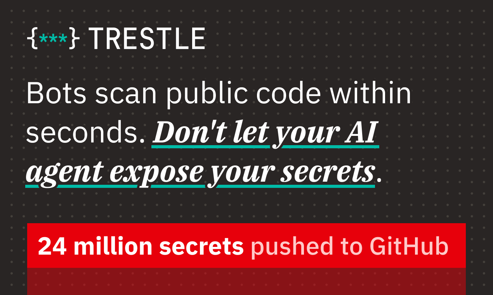

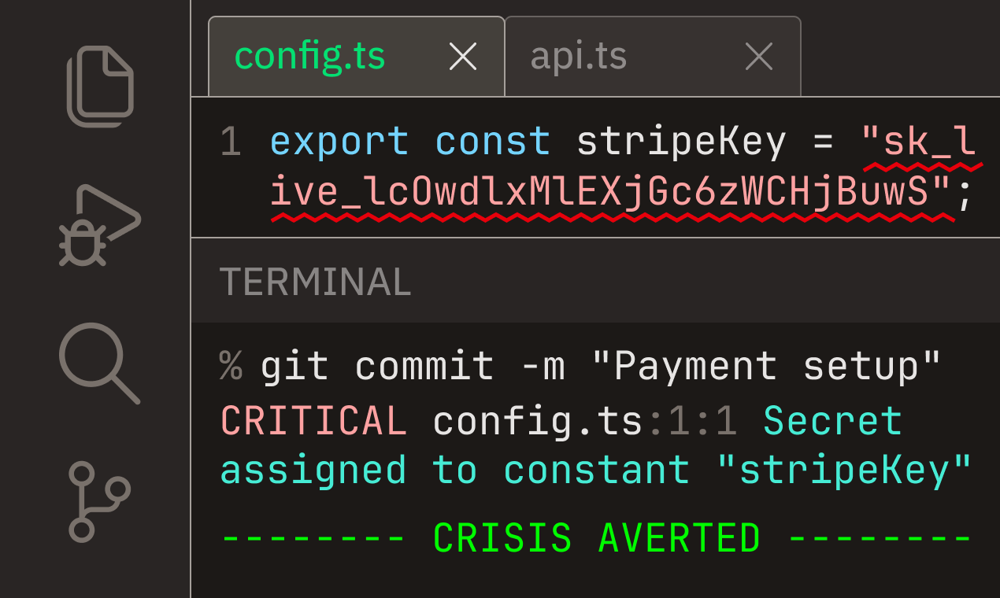

### 🎬 관련 영상
- [🎥 영상 보기](https://ph-files.imgix.net/227d5afa-def5-4ef8-aa10-03a538e697a2.jpeg?auto=format)

---

## 23. [LiveTongue](https://www.producthunt.com/products/live-tongue-live-meeting-translation)
**Votes**: 27 | **도입 난이도**: 하 | **신뢰도**: 상
**Tagline**: Meetings with Real-Time Voice Translation & Transcription
**서비스 링크**: https://www.producthunt.com/r/ZKB2Y3H2JY5TTQ

**태그**: AI, Productivity, Collaboration, Translation, AI Tool

### 📌 이 서비스 한눈에 보기
화상 회의 중 실시간 통역과 기록을 지원하는 AI 미팅 어시스턴트

### 🔑 주요 기능
- Zoom, Google Meet, Microsoft Teams 등 주요 화상 회의 플랫폼 연동
- 실시간 음성 번역 및 화자 식별이 포함된 정확한 전사 기능
- 검색 가능한 회의 기록 및 AI 기반 요약 제공

### 🙋 사용자에게 어떤 점이 좋은가
언어 장벽 없이 글로벌 팀 및 파트너와 자연스러운 소통이 가능하며, 회의 내용을 일일이 기록할 필요 없이 핵심 내용을 즉시 파악할 수 있습니다.

### ✅ 지금 바로 써볼 기능
- 주요 화상 회의 플랫폼에 봇 초대하기
- 실시간 번역 및 전사 기능 테스트하기
- 생성된 AI 요약본 확인하기

### ⚠️ 사용 전 확인할 점
- 실시간 번역의 정확도는 네트워크 상태나 발화 품질에 영향을 받을 수 있음
- 회의 참여 시 개인정보 및 보안 정책 준수 여부 확인 필요

### 🧭 확인이 더 필요한 정보
지원하는 구체적인 언어 종류와 보안/데이터 저장 정책에 대한 상세 정보가 필요합니다.

### 📸 스크린샷 및 갤러리
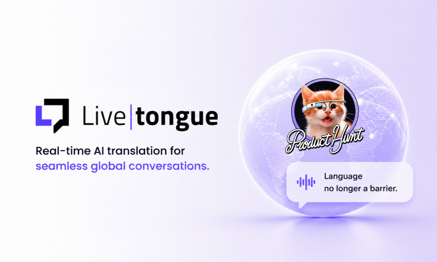
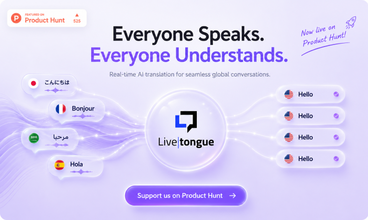
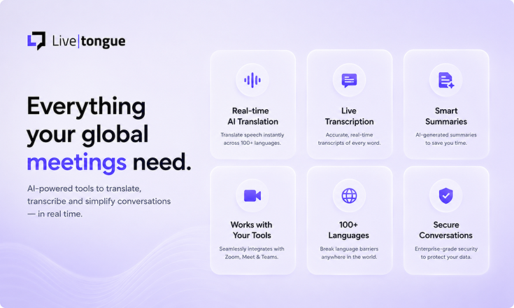

---

## 24. [Apify: MCP connectors](https://www.producthunt.com/products/apify)
**Votes**: 27 | **도입 난이도**: 중 | **신뢰도**: 상
**Tagline**: Apify's built-in credential layer for third-party tools
**서비스 링크**: https://www.producthunt.com/r/GN27ZNNS5EMRR5

**태그**: Automation, DevTool, Workflow, Security, API

### 📌 이 서비스 한눈에 보기
외부 앱(Notion, Slack 등)의 인증 정보를 안전하게 공유하여 Apify Actor와 연동하는 MCP 커넥터

### 🔑 주요 기능
- MCP 커넥터를 통한 외부 서비스(Notion, Slack, GitHub 등)와의 원활한 데이터 읽기/쓰기
- 사용자의 실제 자격 증명(Credentials)을 노출하지 않는 보안 프록시 방식 적용
- Apify Actor를 외부 워크플로우와 통합하여 작업 환경의 경계를 확장

### 🙋 사용자에게 어떤 점이 좋은가
별도의 복잡한 인증 설정 없이도 Apify 자동화 도구가 외부 앱과 안전하게 상호작용할 수 있어 워크플로우 통합이 쉬워집니다.

### ✅ 지금 바로 써볼 기능
- 사용 중인 Apify Actor에 MCP 커넥터 할당해보기
- 외부 앱(Slack, GitHub 등)과의 데이터 연동 테스트
- 보안 프록시를 통한 자격 증명 보호 기능 확인

### ⚠️ 사용 전 확인할 점
- 연결 가능한 외부 서비스 종류 및 API 제한 사항 확인 필요
- 프록시를 통한 데이터 전송 시 발생할 수 있는 네트워크 지연 가능성

### 🧭 확인이 더 필요한 정보
현재 지원되는 구체적인 외부 서비스 목록과 상세 보안 프로토콜에 대한 추가 정보가 필요합니다.

### 📸 스크린샷 및 갤러리
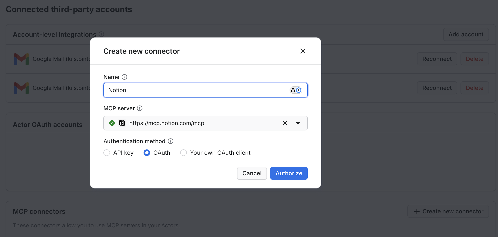
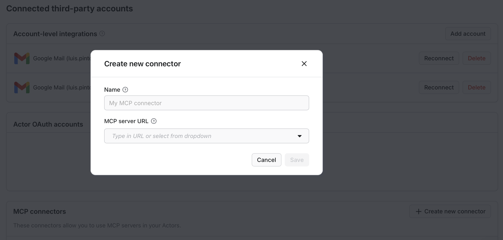
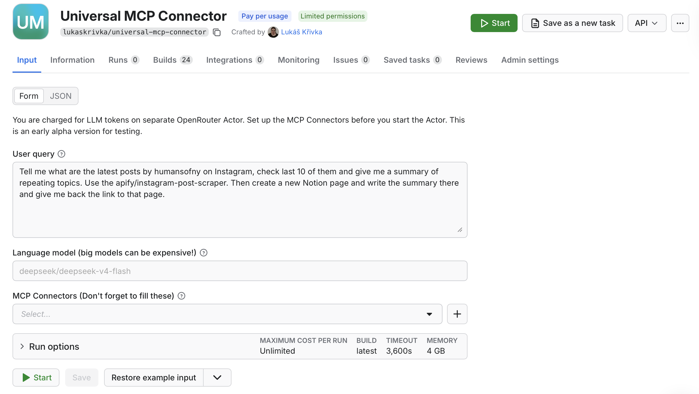

### 🎬 관련 영상
- [🎥 영상 보기](https://ph-files.imgix.net/c5a4bcfd-4936-4488-aaaa-5346ba55acf1.jpeg?auto=format)

---

## 25. [MardRisk 1.1](https://www.producthunt.com/products/mardrisk-1-1)
**Votes**: 26 | **도입 난이도**: 중 | **신뢰도**: 상
**Tagline**: The AI-powered engine for complex financial intelligence.
**서비스 링크**: https://www.producthunt.com/r/ECPQCJ6FTZ2XPC

**태그**: FinTech, AI, DataAnalysis, RiskManagement, BusinessIntelligence, AI Tool, Design, Security

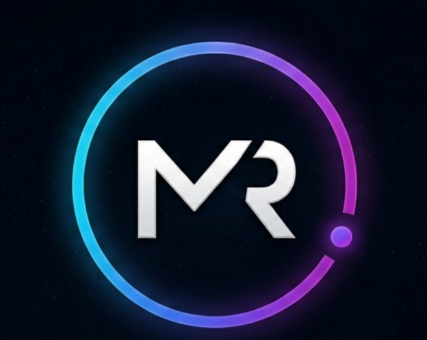

### 📌 이 서비스 한눈에 보기
실시간 데이터와 정밀한 계산을 결합한 전문가용 AI 금융 분석 엔진

### 🔑 주요 기능
- 실시간 시장 데이터 제공 및 복잡한 금융 계산 수행
- 독자적인 'MardRisk Shield'를 통한 문서 보안 강화
- 리스크 분석 및 정밀한 예측 모델링 지원

### 🙋 사용자에게 어떤 점이 좋은가
방대한 금융 데이터를 신속하고 정확하게 분석하여 고도의 의사결정이 필요한 전문가들에게 실질적인 통찰력을 제공합니다.

### ✅ 지금 바로 써볼 기능
- 실시간 시장 데이터 연동 테스트
- 복잡한 금융 수식 및 예측 모델 실행
- 보안 기능(MardRisk Shield) 검증

### ⚠️ 사용 전 확인할 점
- 전문적인 금융 지식이 없는 사용자는 결과 해석에 어려움이 있을 수 있음
- 고도의 정밀도를 요구하는 작업 시 데이터 소스의 신뢰성 확인 필요

### 🧭 확인이 더 필요한 정보
구체적인 데이터 소스의 범위와 보안 프로토콜의 상세 수준에 대한 정보가 추가로 필요합니다.

### 📸 스크린샷 및 갤러리

### 🎬 관련 영상
- [🎥 영상 보기](https://ph-files.imgix.net/fb98ecb4-6508-4354-aefe-f3a8d0d6c16a.jpeg?auto=format)

---

## 26. [Claude Fable 5: a Mythos-class1 model](https://www.producthunt.com/products/claude-for-education)
**Votes**: 19 | **도입 난이도**: 하 | **신뢰도**: 상
**Tagline**: Anthropic's most capable model, now available to everyone
**서비스 링크**: https://www.producthunt.com/r/6JJHRFJQZHLG4I

**태그**: AI, DeveloperTool, Automation, LLM, AI Tool, API

### 📌 이 서비스 한눈에 보기
강력한 성능과 유연한 안전 장치를 갖춘 Anthropic의 차세대 Mythos-class 모델

### 🔑 주요 기능
- Anthropic의 첫 공개 Mythos-class 모델로 압도적인 성능 제공
- 안전 분류기를 통해 위험한 쿼리를 Opus 4.8로 라우팅하는 지능형 시스템 적용
- Stripe의 5,000만 라인 코드 마이그레이션을 단 하루 만에 완료한 검증된 성능

### 🙋 사용자에게 어떤 점이 좋은가
대규모 코드 마이그레이션이나 복잡한 작업에서 탁월한 효율성을 제공하며, Pro/Max/Team 플랜 사용자는 6월 22일까지 무료로 이용 가능합니다.

### ✅ 지금 바로 써볼 기능
- Pro/Max/Team 플랜을 통한 무료 체험 (6월 22일까지)
- 대규모 코드 리팩토링 및 마이그레이션 작업에 적용
- claude-fable-5 API를 활용한 워크플로우 자동화 테스트

### ⚠️ 사용 전 확인할 점
- 6월 22일 이후에는 유료 플랜 정책에 따라 비용이 발생할 수 있음
- API 사용 시 입력($10/M) 및 출력($50/M) 비용 고려 필요

### 🧭 확인이 더 필요한 정보
6월 22일 이후의 구체적인 무료 이용 정책 변화 여부를 확인해야 합니다.

### 📸 스크린샷 및 갤러리
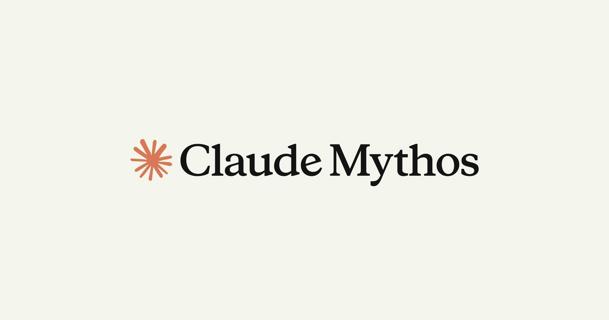

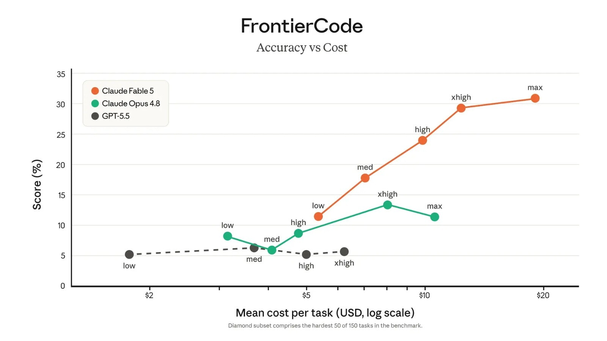

### 🎬 관련 영상
- [🎥 영상 보기](https://ph-files.imgix.net/763fdc3c-f885-4854-a95f-9e5554f988d5.jpeg?auto=format)

---

## 27. [Foldif](https://www.producthunt.com/products/foldif)
**Votes**: 19 | **도입 난이도**: 하 | **신뢰도**: 상
**Tagline**: Stop losing your best ChatGPT, Claude and Gemini answers
**서비스 링크**: https://www.producthunt.com/r/N5CHIU7EEVCMZQ

**태그**: Productivity, AI, KnowledgeManagement, Organization, AI Tool, Chat, API

### 📌 이 서비스 한눈에 보기
ChatGPT, Claude, Gemini의 대화 내용을 체계적으로 정리하고 지식화하는 AI 대화 관리 도구

### 🔑 주요 기능
- 단순 폴더 정리를 넘어 핵심 문장 하이라이트 및 메모 기능 제공
- 긴 대화 내용을 가독성 좋은 문서(Book) 형태로 변환
- 여러 AI 모델(ChatGPT, Claude, Gemini)의 대화 통합 검색 및 할 일 관리

### 🙋 사용자에게 어떤 점이 좋은가
파편화된 AI 대화 속에서 중요한 정보를 놓치지 않고, 나중에 다시 읽기 편한 지식 베이스로 구축할 수 있습니다.

### ✅ 지금 바로 써볼 기능
- 중요한 답변 하이라이트 및 메모 남기기
- 긴 대화 내용을 깔끔한 문서로 변환하기
- 여러 AI 서비스에 흩어진 정보 통합 검색하기

### ⚠️ 사용 전 확인할 점
- API 키 없이 작동하므로 데이터 동기화 방식 확인 필요
- 개별 AI 서비스의 인터페이스 변경 시 호환성 영향 가능성

### 🧭 확인이 더 필요한 정보
사용자의 기존 대화 내역을 자동으로 가져오는 방식인지, 수동으로 저장해야 하는지에 대한 구체적인 메커니즘 확인이 필요합니다.

### 📸 스크린샷 및 갤러리
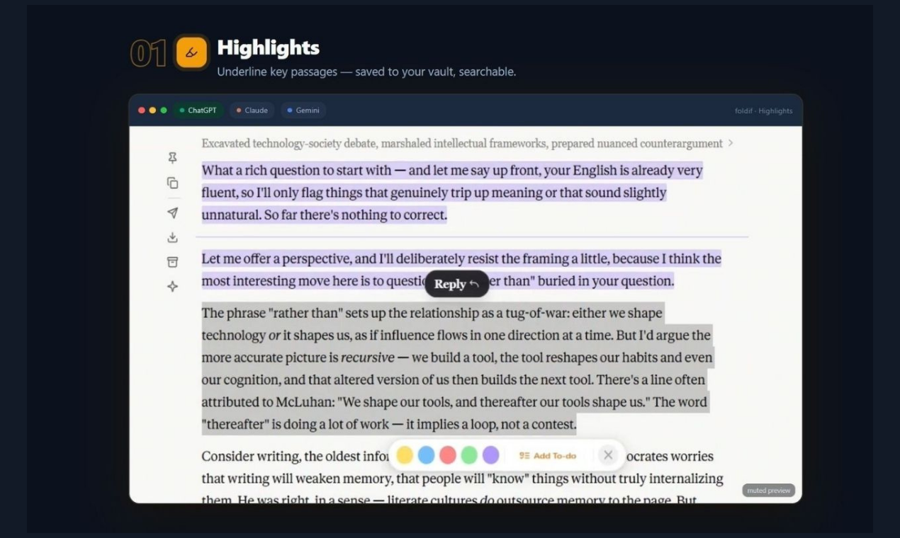
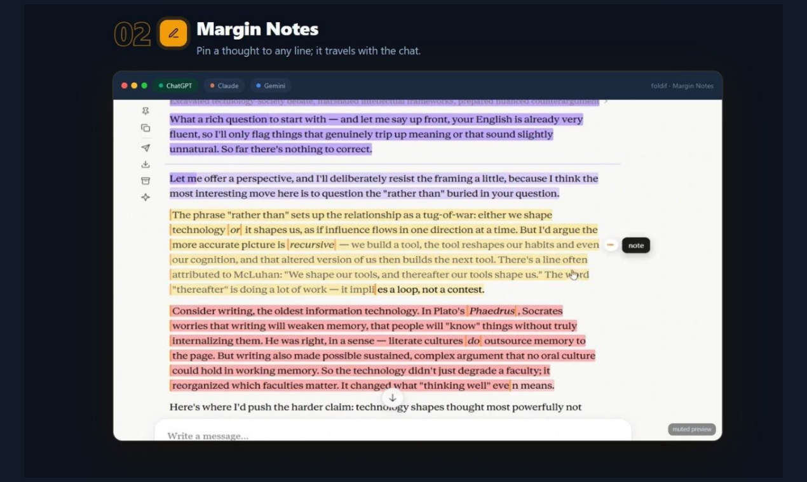
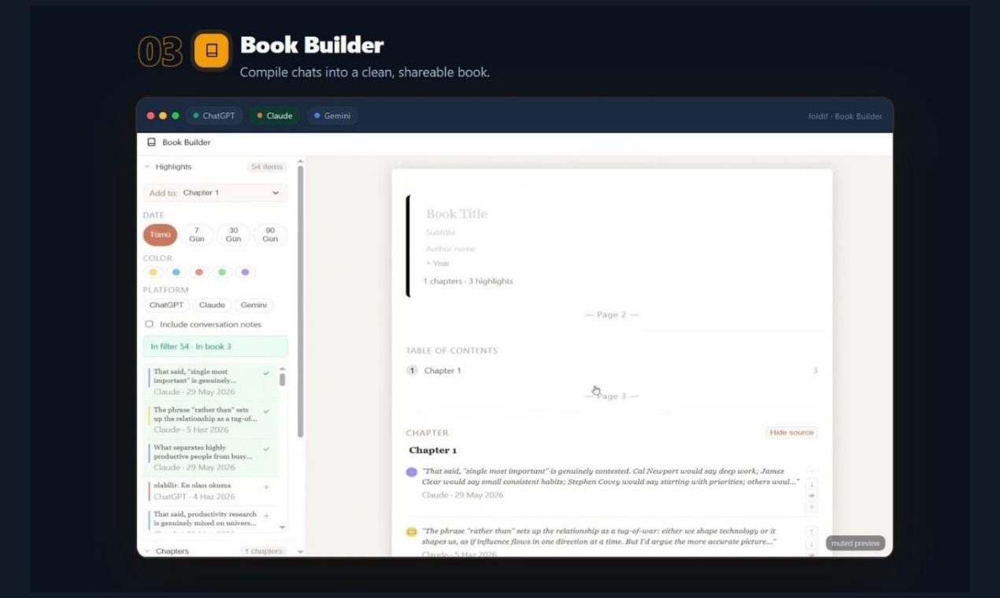

### 🎬 관련 영상
- [🎥 영상 보기](https://ph-files.imgix.net/e79ee8fa-c5ab-45de-82f0-5d7b4ed9d6d2.jpeg?auto=format)

---

## 28. [Draftlytic](https://www.producthunt.com/products/draftlytic)
**Votes**: 19 | **도입 난이도**: 하 | **신뢰도**: 상
**Tagline**: Stop re-prompting. Start with a spec.
**서비스 링크**: https://www.producthunt.com/r/GFFMWPHOB4R4PH

**태그**: DevTool, ProductManagement, AI, Automation, AI Tool, Prompting

### 📌 이 서비스 한눈에 보기
아이디어 한 줄로 상세 제품 요구 사양서(PRD)를 생성하여 개발 준비를 자동화하는 도구

### 🔑 주요 기능
- 단 한 줄의 아이디어로 상세 기능, 기술 스택, 내비게이션 맵이 포함된 PRD 생성
- Claude Code, Cursor, Lovable 등 코딩 도구로 즉시 내보내기 지원
- 반복적인 프롬프트 엔지니어링 과정을 줄여 개발 초기 단계 효율화

### 🙋 사용자에게 어떤 점이 좋은가
아이디어를 구체적인 설계도로 빠르게 변환하여, 개발 도구에 입력할 정교한 프롬프트를 작성하는 수고를 덜어줍니다.

### ✅ 지금 바로 써볼 기능
- 한 줄의 아이디어 입력하여 PRD 생성해보기
- 생성된 기술 스택 및 기능 명세 검토하기
- Cursor나 Lovable로 결과물 내보내어 개발 시작하기

### ⚠️ 사용 전 확인할 점
- 생성된 스펙의 기술적 타당성은 사용자가 직접 검증해야 함
- 매우 복잡하거나 독창적인 비즈니스 로직은 추가적인 수동 편집이 필요할 수 있음

### 🧭 확인이 더 필요한 정보
현재 제공되는 내보내기 기능 외에 다른 외부 개발 도구와의 호환성 범위는 명시되지 않았습니다.

### 📸 스크린샷 및 갤러리
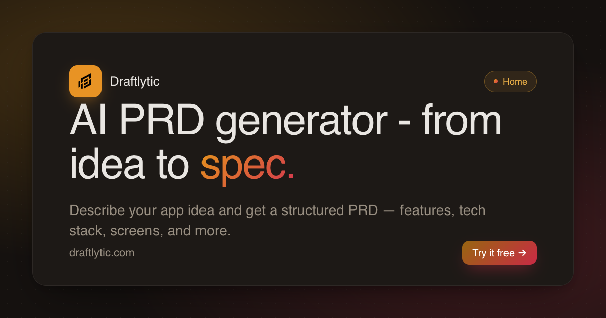
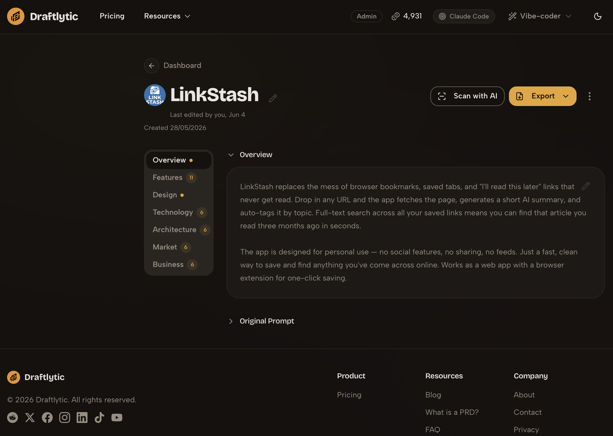
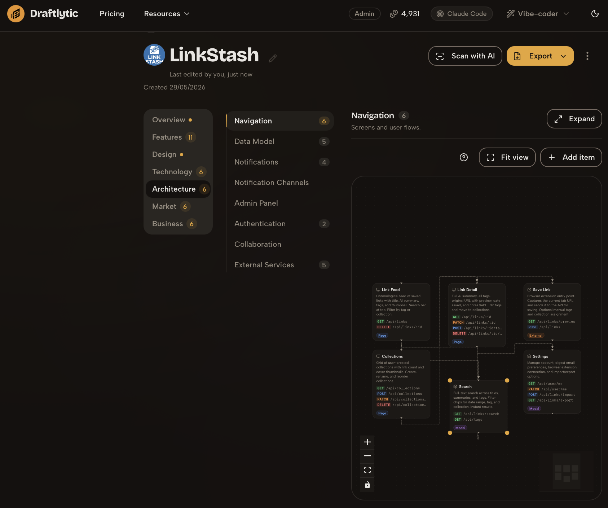

### 🎬 관련 영상
- [🎥 영상 보기](https://ph-files.imgix.net/6b264868-295b-471a-942c-1f0caf8e50ba.jpeg?auto=format)

---

## 29. [Glyfiq](https://www.producthunt.com/products/glyfiq)
**Votes**: 17 | **도입 난이도**: 하 | **신뢰도**: 상
**Tagline**: Medical & health icon plugin for Figma and Framer
**서비스 링크**: https://www.producthunt.com/r/RXHORIGHWUI5GE

**태그**: DesignTool, Figma, Framer, Healthcare, IconLibrary, Design

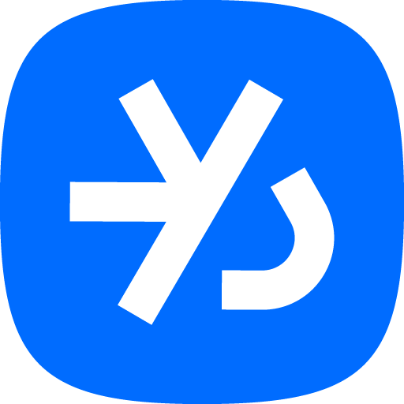

### 📌 이 서비스 한눈에 보기
전문 디자이너가 제작한 고품질 의료 및 헬스케어 아이콘 Figma/Framer 플러그인

### 🔑 주요 기능
- 10년 경력의 전문 디자이너가 직접 그린 핸드드로잉 스타일 아이콘
- 의학 전문 용어를 활용한 스마트 검색 기능 제공
- Light, Regular, Bold 등 다양한 굵기 옵션 지원

### 🙋 사용자에게 어떤 점이 좋은가
의료/헬스케어 관련 UI 디자인 시, 전문적인 아이콘을 일관된 스타일로 빠르게 적용할 수 있습니다.

### ✅ 지금 바로 써볼 기능
- 무료 아이콘(10%)을 활용한 디자인 테스트
- Figma 및 Framer 환경에 플러그인 설치
- 필요한 아이콘이 있을 경우 Pro 구독을 통한 요청 기능 확인

### ⚠️ 사용 전 확인할 점
- 무료 아이콘은 개인 용도로만 사용 가능
- 전체 라이브러리 중 일부만 무료로 제공됨

### 🧭 확인이 더 필요한 정보
Pro 구독 시 아이콘 요청 기능의 구체적인 작업 기간이나 프로세스는 명시되지 않았습니다.

### 📸 스크린샷 및 갤러리
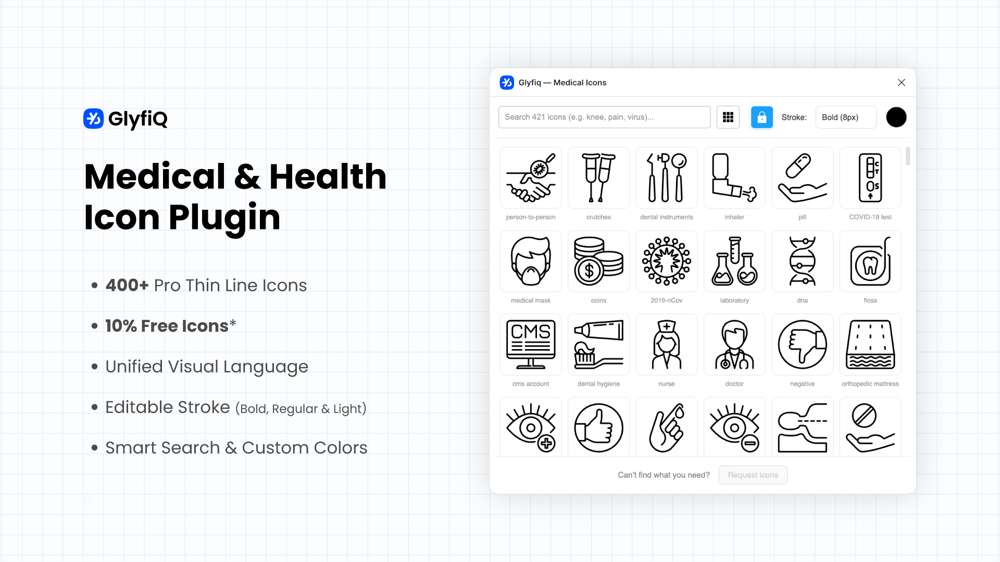
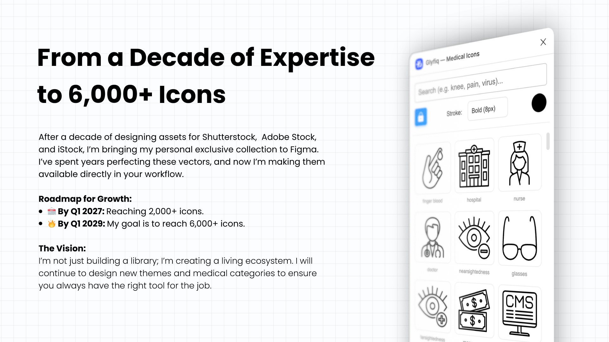
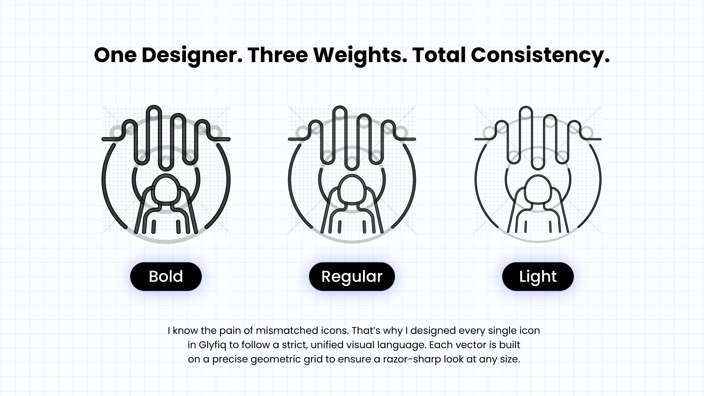

### 🎬 관련 영상
- [🎥 영상 보기](https://ph-files.imgix.net/3f6e2d53-e776-45e2-b2cc-92c58d220145.jpeg?auto=format)

---

## 30. [STADIUM SELFIE](https://www.producthunt.com/products/stadium-selfie)
**Votes**: 15 | **도입 난이도**: 하 | **신뢰도**: 상
**Tagline**: Turn Your Selfie Into A World Cup Stadium Selfie (as an app)
**서비스 링크**: https://www.producthunt.com/r/WH5F54BWAICDIM

**태그**: AI Photo, Social Media, Sports, Creative Tool, AI Tool, Vision

### 📌 이 서비스 한눈에 보기
AI를 활용해 평범한 셀카를 열광적인 월드컵 경기장 현장 사진으로 변신시켜 주는 앱

### 🔑 주요 기능
- AI 기반의 정교한 사진 합성 기술
- 원하는 국가 및 팀 테마 선택 가능
- 관중, 깃발, 유니폼 등 생생한 경기장 분위기 구현

### 🙋 사용자에게 어떤 점이 좋은가
직접 경기장에 가지 않아도 마치 현장에서 응원하거나 승리를 축하하는 듯한 몰입감 넘치는 사진을 얻을 수 있습니다.

### ✅ 지금 바로 써볼 기능
- 자신의 셀카 업로드하기
- 좋아하는 국가 또는 팀 선택하기
- 생성된 스테디움 셀피 확인 및 저장하기

### ⚠️ 사용 전 확인할 점
- AI 생성 이미지 특성상 실제 인물과 다소 다르게 보일 수 있음
- 특정 팀/국가 테마에 따라 결과물의 스타일이 달라질 수 있음

### 🧭 확인이 더 필요한 정보
구체적인 앱 플랫폼(iOS/Android) 및 유료 구독 모델 여부는 명시되지 않았습니다.

### 📸 스크린샷 및 갤러리

---

